This file is a merged representation of the entire codebase, combined into a single document by Repomix.

# File Summary

## Purpose
This file contains a packed representation of the entire repository's contents.
It is designed to be easily consumable by AI systems for analysis, code review,
or other automated processes.

## File Format
The content is organized as follows:
1. This summary section
2. Repository information
3. Directory structure
4. Repository files (if enabled)
5. Multiple file entries, each consisting of:
  a. A header with the file path (## File: path/to/file)
  b. The full contents of the file in a code block

## Usage Guidelines
- This file should be treated as read-only. Any changes should be made to the
  original repository files, not this packed version.
- When processing this file, use the file path to distinguish
  between different files in the repository.
- Be aware that this file may contain sensitive information. Handle it with
  the same level of security as you would the original repository.

## Notes
- Some files may have been excluded based on .gitignore rules and Repomix's configuration
- Binary files are not included in this packed representation. Please refer to the Repository Structure section for a complete list of file paths, including binary files
- Files matching patterns in .gitignore are excluded
- Files matching default ignore patterns are excluded
- Files are sorted by Git change count (files with more changes are at the bottom)

# Directory Structure
```
.github/
  ISSUE_TEMPLATE/
    05_bug_report.yml
    10_accepted_protocol_changes.yml
    config.yml
  workflows/
    ci.yml
    publish-schema.yml
    release-plz.yml
    sync-registry.yml
  CODEOWNERS
  dependabot.yml
docs/
  announcements/
    acp-agent-registry-stabilized.mdx
    implementation-information.mdx
    sergey-ignatov-lead-maintainer.mdx
    session-close-stabilized.mdx
    session-config-options-stabilized.mdx
    session-info-update-stabilized.mdx
    session-list-stabilized.mdx
    session-resume-stabilized.mdx
    transports-working-group.mdx
  community/
    code-of-conduct.mdx
    communication.mdx
    contributing.mdx
    governance.mdx
    working-interest-groups.mdx
  get-started/
    _registry_agents.mdx
    agents.mdx
    architecture.mdx
    clients.mdx
    introduction.mdx
    registry.mdx
  images/
    mcp-proxy.d2
    mcp-proxy.svg
    mcp.d2
    mcp.svg
    server-client.d2
    server-client.svg
  libraries/
    community.mdx
    java.mdx
    kotlin.mdx
    python.mdx
    rust.mdx
    typescript.mdx
  logo/
    dark.svg
    light.svg
  protocol/
    draft/
      cancellation.mdx
      file-system.mdx
      schema-v2.mdx
      schema.mdx
      session-list.mdx
      session-setup.mdx
    agent-plan.mdx
    content.mdx
    error.mdx
    extensibility.mdx
    file-system.mdx
    initialization.mdx
    overview.mdx
    prompt-turn.mdx
    schema.mdx
    session-config-options.mdx
    session-list.mdx
    session-modes.mdx
    session-setup.mdx
    slash-commands.mdx
    terminals.mdx
    tool-calls.mdx
    transports.mdx
  rfds/
    about.mdx
    acp-agent-registry.mdx
    additional-directories.mdx
    agent-telemetry-export.mdx
    auth-methods.mdx
    boolean-config-option.mdx
    custom-llm-endpoint.mdx
    diff-delete.mdx
    elicitation.mdx
    introduce-rfd-process.mdx
    logout-method.mdx
    mcp-over-acp.mdx
    message-id.mdx
    meta-propagation.mdx
    next-edit-suggestions.mdx
    proxy-chains.mdx
    request-cancellation.mdx
    rust-sdk-v1.mdx
    session-close.mdx
    session-config-options.mdx
    session-delete.mdx
    session-fork.mdx
    session-info-update.mdx
    session-list.mdx
    session-resume.mdx
    session-usage.mdx
    streamable-http-websocket-transport.mdx
    TEMPLATE
    updates.mdx
    v2-prompt.mdx
  snippets/
    author.jsx
  brand.mdx
  docs.json
  publications.mdx
  README.md
  updates.mdx
  v2-changes.md
schema/
  meta.json
  meta.unstable.json
  meta.v2.unstable.json
  schema.json
  schema.unstable.json
  schema.v2.unstable.json
scripts/
  generate_registry_docs.py
  spellcheck.sh
src/
  bin/
    generate.rs
  v1/
    agent.rs
    client.rs
    content.rs
    elicitation.rs
    error.rs
    ext.rs
    mod.rs
    nes.rs
    plan.rs
    protocol_level.rs
    tool_call.rs
  v2/
    agent.rs
    client.rs
    content.rs
    conversion.rs
    elicitation.rs
    error.rs
    ext.rs
    mod.rs
    nes.rs
    plan.rs
    protocol_level.rs
    tool_call.rs
  lib.rs
  rpc.rs
  serde_util.rs
  version.rs
.gitignore
.prettierignore
.prettierrc
.release-plz.toml
AGENTS.md
Cargo.toml
CHANGELOG.md
clippy.toml
CODE_OF_CONDUCT.md
CONTRIBUTING.md
GOVERNANCE.md
LICENSE
MAINTAINERS.md
package.json
README.md
typos.toml
```

# Files

## File: .github/ISSUE_TEMPLATE/05_bug_report.yml
````yaml
name: Bug Report
description: |
  Something is not working as expected in ACP
type: "Bug"
body:
  - type: textarea
    attributes:
      label: Summary
      description: Provide a one sentence summary and detailed reproduction steps
      value: |
        <!-- Begin your issue with a one sentence summary -->
        SUMMARY_SENTENCE_HERE

        ### Description
        <!--  Describe with sufficient detail the bug
          - Issues with insufficient detail may be summarily closed.
        -->

        DESCRIPTION_HERE

        **Expected Behavior**:
        **Actual Behavior**:

    validations:
      required: true

  - type: textarea
    id: environment
    attributes:
      label: ACP Version
    validations:
      required: true
````

## File: .github/ISSUE_TEMPLATE/10_accepted_protocol_changes.yml
````yaml
name: Accepted Protocol Changes [Staff Only]
description: Zed Staff Only
type: "Feature"
body:
  - type: textarea
    attributes:
      label: Summary
      value: |
        <!-- Please add a link to the Discussion related to the protocol changes that were accepted by the Zed staff -->
        DISCUSSION_LINK_HERE

        ### Description

        IF YOU DO NOT WORK FOR ZED INDUSTRIES DO NOT CREATE ISSUES WITH THIS TEMPLATE.
        THEY WILL BE AUTO-CLOSED AND MAY RESULT IN YOU BEING BANNED FROM THE ZED ISSUE TRACKER.

        PROPOSALS TO ADD ADDITIONAL CAPABILITIES / CHANGE EXISTING ONES SHOULD BE PROPOSED IN DISCUSSIONS FIRST:
          https://github.com/agentclientprotocol/agent-client-protocol/discussions/categories/protocol-suggestions
    validations:
      required: true
````

## File: .github/ISSUE_TEMPLATE/config.yml
````yaml
# yaml-language-server: $schema=https://json.schemastore.org/github-issue-config.json
blank_issues_enabled: false
contact_links:
  - name: Propose Protocol Changes
    url: https://github.com/agentclientprotocol/agent-client-protocol/discussions/categories/protocol-suggestions
    about: Propose additions or changes to the protocol
````

## File: .github/workflows/ci.yml
````yaml
name: CI

on:
  push:
    branches: [main]
  pull_request:
    branches: [main]
  workflow_dispatch:

permissions:
  contents: read
  pages: write
  id-token: write

concurrency:
  group: "ci-${{ github.ref }}"
  cancel-in-progress: ${{ github.event_name == 'pull_request' }}

jobs:
  build:
    name: Build
    runs-on: ubuntu-latest
    timeout-minutes: 5

    steps:
      - uses: actions/checkout@de0fac2e4500dabe0009e67214ff5f5447ce83dd

      - name: Use Node.js
        uses: actions/setup-node@48b55a011bda9f5d6aeb4c2d9c7362e8dae4041e
        with:
          node-version: latest
          cache: "npm"

      - name: Setup Rust
        uses: actions-rust-lang/setup-rust-toolchain@2b1f5e9b395427c92ee4e3331786ca3c37afe2d7
        with:
          toolchain: nightly,stable
          components: rustfmt,clippy

      - name: Install dependencies
        run: npm ci

      - name: Check formatting
        run: npm run format:check

      - name: Check for typos
        uses: crate-ci/typos@7c572958218557a3272c2d6719629443b5cc26fd
        with:
          config: ./typos.toml

      - name: Lint
        run: cargo clippy --all-features

      - name: Build
        run: cargo build --all-targets --all-features

      - name: Run tests
        run: cargo test --all-features

      - name: Check generated files are up to date
        run: |
          npm run generate
          git diff --exit-code || (echo "Generated files are out of date. Run 'npm run generate' and commit the changes." && exit 1)
````

## File: .github/workflows/publish-schema.yml
````yaml
name: Upload Schema
on:
  release:
    types: [published]

permissions: {}

concurrency:
  group: ${{ github.workflow }}-${{ github.ref }}
  cancel-in-progress: false

jobs:
  upload-schema:
    permissions:
      contents: write # to upload release assets
    if: github.repository_owner == 'agentclientprotocol' && startsWith(github.event.release.name, 'v')
    runs-on: ubuntu-latest
    steps:
      - name: Checkout repository
        uses: actions/checkout@de0fac2e4500dabe0009e67214ff5f5447ce83dd # v6.0.2
        with:
          persist-credentials: false
      - name: Upload schema files to release
        env:
          GH_TOKEN: ${{ secrets.GITHUB_TOKEN }}
        run: |
          gh release upload "${{ github.event.release.name }}" schema/schema.json schema/meta.json schema/schema.unstable.json schema/meta.unstable.json
````

## File: .github/workflows/release-plz.yml
````yaml
name: Release-plz

on:
  push:
    branches:
      - main

jobs:
  release-plz-release:
    name: Release-plz release
    environment: release # Optional: for enhanced security
    runs-on: ubuntu-latest
    if: ${{ github.repository_owner == 'agentclientprotocol' }}
    permissions:
      contents: write
      id-token: write
    steps:
      - &checkout
        name: Checkout repository
        uses: actions/checkout@de0fac2e4500dabe0009e67214ff5f5447ce83dd
        with:
          fetch-depth: 0
          persist-credentials: false
      - &install-rust
        name: Install Rust toolchain
        uses: dtolnay/rust-toolchain@3c5f7ea28cd621ae0bf5283f0e981fb97b8a7af9
        with:
          toolchain: stable
      - &generate-token
        # Generating a GitHub token, so that PRs and tags created by
        # the release-plz-action can trigger actions workflows.
        name: Generate GitHub token
        uses: actions/create-github-app-token@1b10c78c7865c340bc4f6099eb2f838309f1e8c3
        id: generate-token
        with:
          # GitHub App ID secret name
          app-id: ${{ secrets.RELEASE_PLZ_APP_ID }}
          # GitHub App private key secret name
          private-key: ${{ secrets.RELEASE_PLZ_APP_PRIVATE_KEY }}
      - name: Run release-plz
        uses: release-plz/action@1528104d2ca23787631a1c1f022abb64b34c1e11
        with:
          command: release
        env:
          GITHUB_TOKEN: ${{ steps.generate-token.outputs.token }}

  release-plz-pr:
    name: Release-plz PR
    runs-on: ubuntu-latest
    if: ${{ github.repository_owner == 'agentclientprotocol' }}
    permissions:
      pull-requests: write
      contents: write
    concurrency:
      group: release-plz-${{ github.ref }}
      cancel-in-progress: false
    steps:
      - *checkout
      - *install-rust
      - *generate-token
      - name: Run release-plz
        uses: release-plz/action@1528104d2ca23787631a1c1f022abb64b34c1e11
        with:
          command: release-pr
        env:
          GITHUB_TOKEN: ${{ steps.generate-token.outputs.token }}
````

## File: .github/workflows/sync-registry.yml
````yaml
name: Sync Registry Docs

on:
  # Allow manual trigger
  workflow_dispatch:

  # Run hourly to pick up registry changes
  schedule:
    - cron: "15 * * * *" # Every hour at :15

jobs:
  sync:
    name: Sync Registry Documentation
    runs-on: ubuntu-latest
    timeout-minutes: 5
    permissions:
      contents: write
      pull-requests: write
      id-token: write

    steps:
      - name: Checkout repository
        uses: actions/checkout@de0fac2e4500dabe0009e67214ff5f5447ce83dd
        with:
          persist-credentials: false

      - name: Set up Python
        uses: actions/setup-python@a309ff8b426b58ec0e2a45f0f869d46889d02405 # v5
        with:
          python-version: "3.14"

      - name: Set up Node.js
        uses: actions/setup-node@48b55a011bda9f5d6aeb4c2d9c7362e8dae4041e # v4
        with:
          node-version: latest
          cache: "npm"

      - name: Install dependencies
        run: npm ci

      - name: Generate registry docs
        run: python scripts/generate_registry_docs.py

      - name: Format generated files
        run: npx prettier --write docs/get-started/registry.mdx

      - name: Check for changes
        id: changes
        run: |
          if git diff --quiet docs/get-started/registry.mdx; then
            echo "changed=false" >> $GITHUB_OUTPUT
          else
            echo "changed=true" >> $GITHUB_OUTPUT
          fi

        # Generating a GitHub token, so that PRs and tags created by
        # the action can trigger actions workflows.
      - name: Generate GitHub token
        uses: actions/create-github-app-token@1b10c78c7865c340bc4f6099eb2f838309f1e8c3
        id: generate-token
        with:
          # GitHub App ID secret name
          app-id: ${{ secrets.RELEASE_PLZ_APP_ID }}
          # GitHub App private key secret name
          private-key: ${{ secrets.RELEASE_PLZ_APP_PRIVATE_KEY }}

      - name: Create Pull Request
        id: cpr
        if: steps.changes.outputs.changed == 'true'
        uses: peter-evans/create-pull-request@5f6978faf089d4d20b00c7766989d076bb2fc7f1 # v6
        with:
          token: ${{ steps.generate-token.outputs.token }}
          commit-message: "docs: update registry agents"
          title: "docs: update registry agents"
          body: |
            This PR updates the registry documentation with the latest agents from the ACP Registry CDN.

            Auto-generated by the sync-registry workflow.
          branch: auto/sync-registry
          delete-branch: true
          labels: documentation

      - name: Enable auto-merge
        if: steps.cpr.outputs.pull-request-number
        run: gh pr merge --squash --auto "${{ steps.cpr.outputs.pull-request-number }}"
        env:
          GH_TOKEN: ${{ steps.generate-token.outputs.token }}
````

## File: .github/CODEOWNERS
````
* @agentclientprotocol/core-maintainers
````

## File: .github/dependabot.yml
````yaml
version: 2
updates:
  - package-ecosystem: "cargo"
    directory: "/"
    schedule:
      interval: "weekly"
    allow:
      - dependency-type: "all"
    groups:
      minor:
        update-types:
          - "minor"
          - "patch"
  - package-ecosystem: "github-actions"
    directory: "/"
    schedule:
      # Check for updates to GitHub Actions every week
      interval: "weekly"
  - package-ecosystem: "npm"
    directory: "/"
    schedule:
      interval: "weekly"
    allow:
      - dependency-type: "all"
    groups:
      minor:
        update-types:
          - "minor"
          - "patch"
````

## File: docs/announcements/acp-agent-registry-stabilized.mdx
````markdown
---
title: ACP Registry is stabilized
sidebarTitle: ACP Registry stabilized
description: Announcement that the ACP Registry RFD has been completed and the registry is stabilized.
---

**Published:** March 9, 2026

The ACP Registry RFD has moved to Completed and the initial version of the registry is stabilized.

The registry gives ACP clients a standard way to discover, install, and configure compatible agents. It introduces a curated catalog and a shared manifest format so editors and other clients do not need to invent their own integration metadata.

If you want to explore the shipped experience, start with [ACP Registry](/get-started/registry). For the design history and rationale, see the [ACP Agent Registry RFD](/rfds/acp-agent-registry).
````

## File: docs/announcements/implementation-information.mdx
````markdown
---
title: Implementation information for agents and clients
sidebarTitle: Implementation information
description: Protocol update introducing optional implementation metadata during initialization.
---

**Published:** October 24, 2025

ACP now allows agents and clients to provide information about themselves to the other party during initialization.

The [InitializeRequest](/protocol/schema#initializerequest) message now includes an optional clientInfo field, and the [InitializeResponse](/protocol/schema#initializeresponse) message includes an optional agentInfo field.

This information can be used by clients to show users which agent is running and what version, by both sides to track usage metrics for which agents and clients are most popular among their users, and to help track down issues tied to particular implementation versions.

This follows the existing pattern laid out in the [Model Context Protocol](https://modelcontextprotocol.io/specification/2025-06-18/basic/lifecycle#initialization).

This is being introduced as an optional field for now for backwards compatibility. It is possible it will be made required in a future version of the protocol, like MCP, so that both sides can count on this information being available.

For the user-facing protocol guide, see [Implementation Information](/protocol/initialization#implementation-information).
````

## File: docs/announcements/sergey-ignatov-lead-maintainer.mdx
````markdown
---
title: Sergey Ignatov joins ACP as Lead Maintainer
sidebarTitle: Lead maintainer update
description: Governance announcement about Sergey Ignatov joining ACP as a Lead Maintainer.
---

import { Author } from "/snippets/author.jsx";

**Published:** February 18, 2026

It is with great pleasure that I announce that Sergey Ignatov, from JetBrains, will be joining me as a Lead Maintainer for ACP. Agus Zubiaga will remain a key part of the leadership group as a Core Maintainer.

This is in recognition of Sergey’s many contributions to the protocol. We would not be where we are today without his efforts. In the past few months, Zed and JetBrains have been able to collaborate closely on the protocol, and it is time to reflect that fact more formally in our governance structure.

I have enjoyed the chance to work with Sergey and the entire JetBrains team. There is still much work to be done, but with all of the agent and client teams working together, I am confident we can continue to make the ACP vision a reality: allowing you to collaborate with the agent or agents you love wherever you are already working.

<Author
  name="Ben Brandt"
  role="Zed Industries / ACP Lead Maintainer"
  github="https://github.com/benbrandt"
/>
````

## File: docs/announcements/session-close-stabilized.mdx
````markdown
---
title: Session Close is stabilized
sidebarTitle: Session Close stabilized
description: Announcement that the session/close method is now part of the stable ACP protocol.
---

**Published:** April 23, 2026

The [Session Close RFD](/rfds/session-close) has moved to Completed and the `session/close` method is stabilized.

When advertised via `sessionCapabilities.close`, Clients can now ask Agents to cancel any ongoing work for a session and free the resources associated with it, without having to terminate the whole ACP process. This lets long-running Clients keep memory, threads, and subprocesses under control as users accumulate sessions over time.

For the protocol documentation, see [Closing Active Sessions](/protocol/session-setup#closing-active-sessions).
````

## File: docs/announcements/session-config-options-stabilized.mdx
````markdown
---
title: Session Config Options are stabilized
sidebarTitle: Config options stabilized
description: Announcement that session-level configuration selectors are now part of the stable ACP protocol.
---

**Published:** February 4, 2026

The Session Config Options RFD has moved to Completed and is stabilized.

Session Config Options give agents a flexible way to expose session-level configuration such as models, modes, reasoning levels, and other selectors. Instead of hard-coding a small set of protocol-level controls, clients can render the options an agent provides and keep them in sync as they change.

The stable protocol documentation is available in [Session Config Options](/protocol/session-config-options), and the design history remains in the [Session Config Options RFD](/rfds/session-config-options).
````

## File: docs/announcements/session-info-update-stabilized.mdx
````markdown
---
title: Session Info Update is stabilized
sidebarTitle: Session Info Update stabilized
description: Announcement that the session_info_update notification is now part of the stable ACP protocol.
---

**Published:** March 9, 2026

The Session Info Update RFD has moved to Completed and the session_info_update notification is stabilized.

This lets agents push session metadata updates to clients in real time, including generated titles and related metadata, so session lists can stay current without polling.

The stable protocol behavior is documented in [Session List](/protocol/session-list#updating-session-metadata), and the design history remains in the [Session Info Update RFD](/rfds/session-info-update).
````

## File: docs/announcements/session-list-stabilized.mdx
````markdown
---
title: Session List is stabilized
sidebarTitle: Session List stabilized
description: Announcement that the session/list method is now part of the stable ACP protocol.
---

**Published:** March 9, 2026

The Session List RFD has moved to Completed and the session/list method is stabilized.

This gives clients a standard way to discover sessions known to an agent, making features like session history, session switching, and cleanup much easier to implement consistently across ACP clients.

For the shipped protocol, see [Session List](/protocol/session-list). For the design history, see the [Session List RFD](/rfds/session-list).
````

## File: docs/announcements/session-resume-stabilized.mdx
````markdown
---
title: Session Resume is stabilized
sidebarTitle: Session Resume stabilized
description: Announcement that the session/resume method is now part of the stable ACP protocol.
---

**Published:** April 22, 2026

The Session Resume RFD has moved to Completed and the `session/resume` method is stabilized.

Unlike `session/load`, `session/resume` reconnects clients to an existing session without replaying the conversation history. This is a simpler primitive for agents that can restore context but don't implement full history replay, and it gives proxies and adapters a foundation they can build `session/load` semantics on top of.

For the shipped protocol, see [Resuming Sessions](/protocol/session-setup#resuming-sessions). For the design history, see the [Session Resume RFD](/rfds/session-resume).
````

## File: docs/announcements/transports-working-group.mdx
````markdown
---
title: Transports Working Group
sidebarTitle: Transports Working Group
description: Announcing the new Transports Working Group, to stabilize new transport formats.
---

import { Author } from "/snippets/author.jsx";

**Published:** April 22, 2026

I'm excited to announce that we have a new Transports working group!

Remote Agent support is a key focus of ACP, and in order to make this more of a reality, we need to standardize all of the approaches to transports people have been trying.

We have started work on a Draft RFD for how this could work both via WebSockets and HTTP. Anna Zhdan will be representing from the Core Maintainers along with Alex Hancock from the Goose team who has been spearheading the RFD effort.

A big thanks to both of you for starting this and I look forward to seeing what is next!

<Author
  name="Ben Brandt"
  role="Zed Industries / ACP Lead Maintainer"
  github="https://github.com/benbrandt"
/>
````

## File: docs/community/code-of-conduct.mdx
````markdown
---
title: Code of Conduct
---

## Our Pledge

We as members, contributors, and leaders pledge to make participation in our
community a harassment-free experience for everyone, regardless of age, body
size, visible or invisible disability, ethnicity, sex characteristics, gender
identity and expression, level of experience, education, socio-economic status,
nationality, personal appearance, race, religion, or sexual identity
and orientation.

We pledge to act and interact in ways that contribute to an open, welcoming,
diverse, inclusive, and healthy community.

## Our Standards

Examples of behavior that contributes to a positive environment for our
community include:

- Demonstrating empathy and kindness toward other people
- Being respectful of differing opinions, viewpoints, and experiences
- Giving and gracefully accepting constructive feedback
- Accepting responsibility and apologizing to those affected by our mistakes,
  and learning from the experience
- Focusing on what is best not just for us as individuals, but for the
  overall community

Examples of unacceptable behavior include:

- The use of sexualized language or imagery, and sexual attention or
  advances of any kind
- Trolling, insulting or derogatory comments, and personal or political attacks
- Public or private harassment
- Publishing others' private information, such as a physical or email
  address, without their explicit permission
- Other conduct which could reasonably be considered inappropriate in a
  professional setting

## Enforcement Responsibilities

Community leaders are responsible for clarifying and enforcing our standards of
acceptable behavior and will take appropriate and fair corrective action in
response to any behavior that they deem inappropriate, threatening, offensive,
or harmful.

Community leaders have the right and responsibility to remove, edit, or reject
comments, commits, code, wiki edits, issues, and other contributions that are
not aligned to this Code of Conduct, and will communicate reasons for moderation
decisions when appropriate.

## Scope

This Code of Conduct applies within all community spaces, and also applies when
an individual is officially representing the community in public spaces.
Examples of representing our community include using an official e-mail address,
posting via an official social media account, or acting as an appointed
representative at an online or offline event.

## Enforcement

Instances of abusive, harassing, or otherwise unacceptable behavior may be
reported to the community leaders responsible for enforcement at
hi@zed.dev.
All complaints will be reviewed and investigated promptly and fairly.

All community leaders are obligated to respect the privacy and security of the
reporter of any incident.

## Enforcement Guidelines

Community leaders will follow these Community Impact Guidelines in determining
the consequences for any action they deem in violation of this Code of Conduct:

### 1. Correction

**Community Impact**: Use of inappropriate language or other behavior deemed
unprofessional or unwelcome in the community.

**Consequence**: A private, written warning from community leaders, providing
clarity around the nature of the violation and an explanation of why the
behavior was inappropriate. A public apology may be requested.

### 2. Warning

**Community Impact**: A violation through a single incident or series
of actions.

**Consequence**: A warning with consequences for continued behavior. No
interaction with the people involved, including unsolicited interaction with
those enforcing the Code of Conduct, for a specified period of time. This
includes avoiding interactions in community spaces as well as external channels
like social media. Violating these terms may lead to a temporary or
permanent ban.

### 3. Temporary Ban

**Community Impact**: A serious violation of community standards, including
sustained inappropriate behavior.

**Consequence**: A temporary ban from any sort of interaction or public
communication with the community for a specified period of time. No public or
private interaction with the people involved, including unsolicited interaction
with those enforcing the Code of Conduct, is allowed during this period.
Violating these terms may lead to a permanent ban.

### 4. Permanent Ban

**Community Impact**: Demonstrating a pattern of violation of community
standards, including sustained inappropriate behavior, harassment of an
individual, or aggression toward or disparagement of classes of individuals.

**Consequence**: A permanent ban from any sort of public interaction within
the community.

## Attribution

[homepage]: https://www.contributor-covenant.org

This Code of Conduct is adapted from the [Contributor Covenant][homepage],
version 2.0, available at
[https://www.contributor-covenant.org/version/2/0/code_of_conduct.html](https://www.contributor-covenant.org/version/2/0/code_of_conduct.html).

Community Impact Guidelines were inspired by [Mozilla's code of conduct
enforcement ladder](https://github.com/mozilla/diversity).

For answers to common questions about this code of conduct, see [the Contributor Covenant FAQ](https://www.contributor-covenant.org/faq).
For translations, see [Contributor Covenant Translations](https://www.contributor-covenant.org/translations).
````

## File: docs/community/communication.mdx
````markdown
---
title: "Contributor Communication"
description: "Communication methods for Agent Client Protocol contributors"
---

This document explains how to communicate and collaborate within the Agent Client Protocol (ACP) project.

## Communication Channels

In short:

- **[Zulip](https://agentclientprotocol.zulipchat.com/)**: For real-time or ad-hoc discussions.
- **[RFDs](https://agentclientprotocol.com/rfds/about)**: For proposed changes to the specification.
- **[GitHub Discussions](https://github.com/orgs/agentclientprotocol/discussions)**: For structured, longer-form discussions.
- **[GitHub Issues](https://github.com/agentclientprotocol/agent-client-protocol/issues)**: For actionable tasks, bug reports, and feature requests.

All communication is governed by our [Code of Conduct](https://agentclientprotocol.com/community/code-of-conduct). We expect all participants to maintain respectful, professional, and inclusive interactions across all channels.

### Zulip

For real-time contributor discussion and collaboration. The server is designed around **ACP contributors** and is not intended to be a place for general ACP support.

The Zulip server will have both public and private channels.

[Join the Zulip here](https://agentclientprotocol.zulipchat.com/).

#### Public Channels (Default)

- **Purpose**: Open community engagement, collaborative development, and transparent project coordination.
- Primary use cases:
  - **Public SDK and tooling development**
  - **Community onboarding** and contribution guidance.
  - **Community feedback** and collaborative brainstorming.
- Avoid:
  - ACP user support: participants are expected to read official documentation and start new GitHub Discussions for questions or support.
  - Service or product marketing: interactions on this Zulip are expected to be vendor-neutral and not used for brand-building or sales. Mentions of brands or products are discouraged outside of being used as examples or responses to conversations that start off focused on the specification.

#### Private channels (Exceptions)

- **Purpose**: Confidential coordination and sensitive matters that cannot be discussed publicly. Access will be restricted to designated maintainers.
- **Strict criteria for private use**:
  - **Security incidents** (CVEs, protocol vulnerabilities).
  - **People matters** (maintainer-related discussions, code of conduct policies).
  - Select channels will be configured to be **read-only**. This can be good for example for maintainer decision making.
  - Coordination requiring **immediate** or otherwise **focused response** with a limited audience.
- **Transparency**:
  - **All technical and governance decisions** affecting the community **must be documented** in RFDs, GitHub Discussions and/or Issues.
  - **Some matters related to individual contributors** may remain private when appropriate (e.g., personal circumstances, disciplinary actions, or other sensitive individual matters).
  - Private channels are to be used as **temporary "incident rooms,"** not for routine development.

Any significant discussion on Zulip leads to a potential decision or proposal must be moved to an RFD, GitHub Discussion, or GitHub Issue to create a persistent, searchable record. Proposals will then be promoted to full-fledged PRs with associated work items as needed.

### RFDs

Please refer to the [RFD process](https://agentclientprotocol.com/rfds/about) for how this is managed. This is the primary way to actually create changes to the protocol.

Conversation about a given RFD can take place within the relevant PRs created to move the RFD forward. Or, a discussion within Zulip can be created in the `rfds` channel to discuss in real-time with other contributors.

### GitHub Discussions

For structured, long-form discussion and debate on project direction, features, improvements, and community topics.

When to use:

- Announcements and release communications
- Community polls and consensus-building processes
- Feature requests with context and rationale
  - If a particular repository does not have GitHub Discussions enabled, feel free to open a GitHub Issue instead.

### GitHub Issues

For bug reports, feature tracking, and actionable development tasks.

When to use:

- Bug reports with reproducible steps
- Documentation improvements with specific scope
- CI/CD problems and infrastructure issues
- Release tasks and milestone tracking

### Security Issues

**Do not post security issues publicly.** Instead:

1. Contact lead and/or core maintainers, or hi@zed.dev directly.
2. Follow responsible disclosure guidelines.
````

## File: docs/community/contributing.mdx
````markdown
---
title: "Contributing"
description: "How to participate in the development of ACP"
---

We welcome contributions from the community!

All contributors must adhere to our [Code of Conduct](./code-of-conduct).

For questions and discussions, please use GitHub Discussions.
````

## File: docs/community/governance.mdx
````markdown
---
title: "Governance"
description: "How the ACP project is governed"
---

<Note>
  <p>
    The following is an interim governance model to provide clearer roles and
    responsibilities between the various parties collaborating on ACP.
  </p>
  <p>
    ACP is jointly governed by Zed and JetBrains, who collaborate to ensure the
    protocol serves the broader ecosystem. We aim to operate transparently and
    make decisions in the best interests of ACP and its community, while working
    toward transitioning to an independent foundation.
  </p>
</Note>

This document describes the governance model for the Agent Client Protocol (ACP). It defines the roles, responsibilities, and processes that guide how the project operates and makes decisions.

## Principles

We aim to operate transparently and make decisions in the best interests of ACP and its community.

## Technical Governance

The ACP project adopts a hierarchical structure, similar to MCP, Rust Foundation projects, and other open source projects:

- A community of **contributors** who file issues, make pull requests, and contribute to the project.
- A small set of **maintainers** drive components within the ACP project, such as SDKs, documentation, and others.
- Contributors and maintainers are overseen by **core maintainers**, who drive the overall project direction.
- The core maintainers have two **lead core maintainers** who are the catch-all decision makers.
- Maintainers, core maintainers, and lead core maintainers form the **ACP steering group**.

All maintainers are expected to have a strong bias towards ACP's design philosophy.

### Channels

Technical Governance is facilitated through shared [communication channels](/community/communication) of all **maintainers, core maintainers** and **lead maintainers**. Each maintainer group can choose additional communication channels, but all decisions and their supporting discussions must be recorded and made transparently available in one of the main communication channels.

### Contributors

Anyone who submits code, documentation or other improvements is counted as a contributor. Contributors do not have formal decision-making power, but are encouraged to participate in discussions about project direction and propose changes.

### Maintainers

Maintainers are responsible for [Working or Interest Groups](/community/working-interest-groups) within the ACP project. These generally are independent repositories such as language-specific SDKs, but can also extend to subdirectories of a repository, such as the ACP documentation. Maintainers may adopt their own rules and procedures for making decisions. Maintainers are expected to make decisions for their respective projects independently, but can defer or escalate to the core maintainers when needed.

Maintainers are responsible for the:

- Thoughtful and productive engagement with community contributors,
- Maintaining and improving their respective area of the ACP project,
- Supporting documentation, roadmaps and other adjacent parts of the ACP project,
- Present ideas from community to core.

New maintainers are added by a consensus or majority vote of the current core maintainers, based on sustained and high-quality contributions to the project, alignment with its goals, and a demonstrated commitment to community standards. Prospective maintainers should have a track record of participation in discussions, issue triage, and code or documentation improvements.

Maintainers have write and/or admin access to their respective repositories.

A maintainer may step down at any time by notifying the other maintainers. In rare cases, a maintainer may be removed by a consensus or a two-thirds supermajority vote of the other maintainers if they are inactive for an extended period, violate the Code of Conduct, or act against the project’s interests. Maintainers can be removed by core maintainers or lead core maintainers at any time and without reason.

### Core Maintainers

Core maintainers are contributors who have write access to ACP’s source code. They review and merge contributions, participate in project decision-making, and help to onboard and mentor new contributors. The core maintainers are expected to have a deep understanding of the Agent Client Protocol and its specification. Their responsibilities include:

- Designing, reviewing and steering the evolution of the ACP specification, as well as all other parts of the ACP project, such as documentation,
- Articulating a cohesive long-term vision for the project,
- Mediating and resolving contentious issues with fairness and transparency, seeking consensus where possible while making decisive choices when necessary,
- Appoint or remove maintainers,
- Stewardship of the ACP project in the best interest of ACP.

The core maintainers as a group have the power to veto any decisions made by maintainers by majority vote. The core maintainers have power to resolve disputes as they see fit. The core maintainers should publicly articulate their decision-making. The core group is responsible for adopting their own procedures for making decisions.

New core maintainers are added by a consensus or majority vote of the current core and lead maintainers, based on sustained and high-quality contributions to the project, alignment with its goals, and a demonstrated commitment to community standards. Prospective maintainers should have a track record of participation in discussions, issue triage, and code or documentation improvements.

Core maintainers generally have write and admin access to all ACP repositories, but should use the same contribution (usually pull-requests) mechanism as outside contributors. Exceptions can be made based on security considerations.

A core maintainer may step down at any time by notifying the other core maintainers. In rare cases, a core maintainer may be removed by a consensus or a two-thirds supermajority vote of the other core maintainers if they are inactive for an extended period, violate the Code of Conduct, or act against the project’s interests.

### Lead Maintainers (BDFL)

ACP has two lead maintainers: Ben Brandt (Zed Industries) and Sergey Ignatov (JetBrains). Lead Maintainers can veto any decision by core maintainers or maintainers. This model is also commonly known as Benevolent Dictator for Life (BDFL) in the open source community. The Lead Maintainers should publicly articulate their decision-making and give clear reasoning for their decisions. Lead maintainers are part of the core maintainer group.

Lead Maintainers are administrators on all infrastructure for the ACP project where possible. This includes but is not restricted to all communication channels, GitHub organizations and repositories.

The Lead Maintainers are the primary contacts, and responsible for:

- Representing ACP in official matters.
- Coordinating major decisions about project direction.
- Signing off project expenses.

A lead maintainer may step down by notifying the other lead maintainer(s). They may recommend a replacement, but it is the remaining lead maintainer(s) responsibility to select a replacement.

If all lead maintainers step down, the core maintainers will select new lead maintainers by consensus or majority vote.

### Decision Process

The core maintainer group meets every two weeks to discuss and vote on proposals, as well as discuss any topics needed. The [ACP RFD process](https://agentclientprotocol.com/rfds/about) and Zulip chat can be used to discuss and vote on smaller proposals as needed.

## Processes

Core and lead maintainers are responsible for all aspects of Agent Client Protocol, including documentation, issues, suggestions for content, and all other parts under the [ACP project](https://github.com/agentclientprotocol). Maintainers are responsible for documentation, issues, and suggestions of content for their area of the ACP project, but are encouraged to partake in general maintenance of the ACP projects. Maintainers, core maintainers, and lead maintainers should use the same contribution process as external contributors, rather than making direct changes to repos. This provides insight into intent and opportunity for discussion.

### Working and Interest Groups

ACP collaboration and contributions are organized around two structures: [Working Groups and Interest Groups](/community/working-interest-groups).

Interest Groups are responsible for identifying and articulating problems that ACP should address, primarily by facilitating open discussions within the community. In contrast, Working Groups focus on developing concrete solutions by collaboratively producing deliverables, such as RFDs or community-owned implementations of the specification. While input from Interest Groups can help justify the formation of a Working Group, it is not a strict requirement. Similarly, contributions from either Interest Groups or Working Groups are encouraged, but not mandatory, when submitting RFDs or other community proposals.

We strongly encourage all contributors interested in working on a specific RFD to first collaborate within an Interest Group. This collaborative process helps ensure that the proposed RFD aligns with protocol needs and is the right direction for its adopters.

### Governance Principles

All groups are self-governed while adhering to these core principles:

1. Clear contribution and decision-making processes
2. Open communication and transparent decisions

They must:

- Document their contribution process
- Maintain transparent communication
- Make decisions publicly (groups must publish meeting notes and proposals)

Projects and working groups without specified processes default to:

- GitHub pull requests and issues for contributions
- A public channel in the official [ACP Contributor Zulip](/community/communication#zulip)

### Maintenance Responsibilities

Components without dedicated maintainers (such as documentation) fall under core maintainer responsibility. These follow standard contribution guidelines through pull requests, with maintainers handling reviews and escalating to core maintainer review for any significant changes.

Core maintainers and maintainers are encouraged to improve any part of the ACP project, regardless of formal maintenance assignments.

## Communication

### Core Maintainer Meetings

The core maintainer group meets on a bi-weekly basis to discuss proposals and the project. Notes on proposals should be made public. The meetings themselves are invite-only. If you have a topic for the Core Maintainers and want to be added to the agenda, let the core maintainers know what you want to discuss in advance in Zulip, and you will be invited to join the next meeting.

### Public Chat

The ACP project maintains a [public Zulip Chat](/community/communication#zulip) with open chats for different groups. The ACP project may have private channels for certain communications.

## Nominating, Confirming and Removing Maintainers

### The Principles

- Membership in module maintainer groups is given to individuals on merit basis after they demonstrated strong expertise of their area of work through contributions, reviews, and discussions and are aligned with the overall ACP direction.
- For membership in the maintainer group the individual has to demonstrate strong and continued alignment with the overall ACP principles.
- No term limits for module maintainers or core maintainers
- Light criteria of moving sub-project maintenance to 'emeritus' status if they don't actively participate over long periods of time. Each maintainer group may define the inactive period that's appropriate for their area.

### Nomination and Removal

- Core Maintainers are responsible for adding and removing maintainers. They will take the consideration of existing maintainers into account.
- The lead maintainers are responsible for adding and removing core maintainers.

#### Nomination Process

If a Maintainer (or Core / Lead Maintainer) wishes to propose a nomination for the Core / Lead Maintainers’ consideration, they should follow the following process:

1. Collect evidence for the nomination. This will generally come in the form of a history of merged PRs on the repositories for which maintainership is being considered.
2. Discuss among maintainers of the relevant group(s) as to whether they would be supportive of approving the nomination.
3. DM a Core Maintainer to create a private channel in Zulip, in the format `nomination-{name}-{group}`. Add all core maintainers, lead maintainers, and co-maintainers on the relevant group.
4. Provide context for the individual under nomination. See below for suggestions on what to include here.
5. Create a Zulip topic and ask Core / Lead Maintainers to vote Yes / No on the nomination. Reaching consensus is encouraged though not required.
6. After Core / Lead Maintainers discuss and/or vote, if the nomination is favorable, relevant members with permissions to update GitHub and Zulip roles will add the nominee to the appropriate groups. The nominator should announce the new maintainership in the relevant Zulip channel.
7. The temporary Zulip channel will be deleted a week later.

Suggestions for the kind of information to share with core maintainers when nominating someone:

- GitHub profile link, LinkedIn profile link, Zulip username
- For what group(s) are you nominating the individual for maintainership
- Whether the group(s) agree that this person should be elevated to maintainership
- Description of their contributions to date (including links to most substantial contributions)
- Description of expected contributions moving forward (e.g. Are they eager to be a maintainer? Will they have capacity to do so?)
- Other context about the individual (e.g. current employer, motivations behind ACP involvement)
- Anything else you think may be relevant to consider for the nomination

## Current Maintainers

Refer to [the maintainer list](https://github.com/agentclientprotocol/agent-client-protocol/blob/main/MAINTAINERS.md).

## Security Policy and Vulnerability Disclosure

- Zed will triage all potential security and vulnerability issues between the Zed team and other maintainers
- Reports can be submitted to security@zed.dev

## Legal, Licensing, and Contributor Terms

- All repositories in the ACP organization should be licensed under the Apache 2.0 License.
- This project does not require a Contributor License Agreement (CLA). Instead, contributions are accepted under the following terms:

> By contributing to this project, you agree that your contributions will be licensed under the [Apache License, Version 2.0](https://www.apache.org/licenses/LICENSE-2.0). You affirm that you have the legal right to submit your work, that you are not including code you do not have rights to, and that you understand contributions are made without requiring a Contributor License Agreement (CLA).
````

## File: docs/community/working-interest-groups.mdx
````markdown
---
title: "Working and Interest Groups"
description: "Learn about the two forms of collaborative groups within the Agent Client Protocol's governance structure - Working Groups and Interest Groups."
---

Within the ACP contributor community we maintain two types of collaboration formats - **Interest** and **Working** groups.

**Interest Groups** are responsible for identifying and articulating problems that ACP should address, primarily by facilitating open discussions within the community. In contrast, **Working Groups** focus on developing concrete solutions by collaboratively producing deliverables, such as RFDs or community-owned implementations of the specification.

While input from Interest Groups can help justify the formation of a Working Group, it is not a strict requirement. Similarly, contributions from either Interest Groups or Working Groups are encouraged, but not mandatory, when submitting RFDs or other community proposals.

We strongly encourage all contributors interested in working on a specific RFD to first collaborate within an Interest Group. This collaborative process helps ensure that the proposed RFD aligns with community needs and is the right direction for the protocol.

Long-term projects in the ACP ecosystem, such as SDKs or other components are maintained by dedicated Working Groups.

## Purpose

These groups exist to:

- **Facilitate high-signal spaces for focused discussions** - contributors who opt into notifications, expertise sharing, and regular meetings can engage with topics that are highly relevant to them, enabling meaningful contributions and opportunities to learn from others.
- **Establish clear expectations and leadership roles** - guide collaborative efforts and ensure steady progress toward concrete deliverables that advance ACP evolution and adoption.

## Mechanisms

## Meeting Calendar

All Interest Group and Working Group meetings are published on the public ACP community calendar (work in progress).

Facilitators are responsible for posting their meeting schedules to this calendar in advance to ensure discoverability and enable broader community participation.

### Interest Groups (IGs)

**Goal:** Facilitate discussion and knowledge-sharing among ACP contributors who share interests in a specific ACP sub-topic or context. The primary focus is on identifying and gathering problems that may be worth addressing through RFDs or other community artifacts, while encouraging open exploration of protocol issues and opportunities.

**Expectations**:

- Regular conversations in the Interest Group Zulip channel
- **AND/OR** a recurring live meeting regularly attended by Interest Group members
- Meeting dates and times published in advance on the ACP community calendar when applicable, and tagged with their primary topic and interest group Zulip channel name
- Notes publicly shared after meetings, and submitted to the [meetings repository](https://github.com/agentclientprotocol/meetings)

**Lifecycle**:

- Creation begins by proposing a new Interest Group to the core/lead maintainers with the template below
- Majority positive vote by core maintainers over a 72h period approves creation of the group.
  - The creation of the group can be reversed at any time (e.g., after new information surfaces). Core and lead maintainers can veto.
- Facilitator(s) and Maintainer(s) responsible for organizing IG into meeting expectations
  - Facilitator is an informal role responsible for shepherding or speaking for a group
  - Maintainer is an official representative from the ACP steering group. A maintainer is not required for every group, but can help advocate for specific changes or initiatives.
- IG is retired only when Core or Lead Maintainers determine it's no longer active and/or needed
  - Successful IGs do not have a time limit or expiration date - as long as they are active and maintained, they will remain available

**Creation Template**:

- Facilitator(s)
- Maintainer(s) (optional)
- IGs with potentially similar goals/discussions
- How this IG differentiates itself from the related IGs
- First topic you to discuss within the IG

Participation in an Interest Group (IG) is not required to start a Working Group (WG) or to create a RFD. However, building consensus within IGs can be valuable when justifying the formation of a WG. Likewise, referencing support from IGs or WGs can strengthen a RFD and its chances of success.

### Working Groups (WG)

**Goal:** Facilitate collaboration within the ACP community on a RFD, a themed series of RFDs, or an otherwise officially endorsed project.

**Expectations**:

- Meaningful progress towards at least one RFD or spec-related implementation **OR** hold maintenance responsibilities for a project (e.g., SDKs)
- Facilitators are responsible for keeping track of progress and communicating status when appropriate
- Meeting dates and times published in advance on the ACP community calendar when applicable, and tagged with their primary topic and working group Zulip channel name
- Notes publicly shared after meetings, and submitted to the [meetings repository](https://github.com/agentclientprotocol/meetings)

**Lifecycle**:

- Creation begins by proposing a new Interest Group to the core/lead maintainers with the template below
- Majority positive vote by core maintainers over a 72h period approves creation of the group.
  - The creation of the group can be reversed at any time (e.g., after new information surfaces). Core and lead maintainers can veto.
- Facilitator(s) and Maintainer(s) responsible for organizing WG into meeting expectations
  - Facilitator is an informal role responsible for shepherding or speaking for a group
  - Maintainer is an official representative from the ACP steering group. A maintainer is not required for every group, but can help advocate for specific changes or initiatives
- WG is retired when either:
  - Community moderators or Core and Lead Maintainers decide it is no longer active and/or needed
  - The WG no longer has an active Issue/PR for a month or more, or has completed all Issues/PRs it intended to pursue.

**Creation Template**:

- Facilitator(s)
- Maintainer(s) (optional)
- Explanation of interest/use cases, ideally originating from an IG discussion; however that is not a requirement
- First Issue/PR/RFD that the WG will work on

## WG/IG Facilitators

A **Facilitator** role in a WG or IG does _not_ result in a [maintainership role](https://github.com/agentclientprotocol/agent-client-protocol/blob/main/MAINTAINERS.md) across the ACP organization. It is an informal role into which anyone can self-nominate.

A Facilitator is responsible for helping shepherd discussions and collaboration within an Interest or Working Group.

Lead and Core Maintainers reserve the right to modify the list of Facilitators and Maintainers for any WG/IG at any time.

## FAQ

### How do I get involved contributing to ACP?

These IG and WG abstractions help provide an elegant on-ramp:

1. [Join the Zulip](/community/communication#zulip) and follow conversations in IGs relevant to you. Attend live calls. Participate.
2. Offer to facilitate calls. Contribute your use cases in RFD proposals and other work.
3. When you're comfortable contributing to deliverables, jump in to contribute to WG work.
4. Active and valuable contributors will be nominated by WG maintainers as new maintainers.

### Where can I find a list of all current WGs and IGs?

On the [ACP Zulip Chat](/community/communication#zulip) there is a section of channels for each Working and Interest Group.
````

## File: docs/get-started/_registry_agents.mdx
````markdown
---
title: ACP Registry
description: The easiest way to find and install ACP-compatible agents.
---

<style>{`
.agent-icon {
  width: 20px;
  height: 20px;
  color: currentColor;
}
`}</style>

## Overview

The ACP Registry is an easy way for developers to distribute their ACP-compatible agents to any client that speaks the protocol.

This is a curated set of agents, including only the ones that [support authentication](/rfds/auth-methods).

Visit [the registry repository on GitHub](https://github.com/agentclientprotocol/registry) to learn more about it.

## Available Agents

$$AGENTS_CARDS$$

## Using the Registry

Clients can fetch the registry programmatically:

```bash
curl https://cdn.agentclientprotocol.com/registry/v1/latest/registry.json
```

The registry JSON contains all agent metadata including distribution information for automatic installation.

## Submit your Agent

To add your agent to the registry:

1. Fork the [registry repository on GitHub](https://github.com/agentclientprotocol/registry)
2. Create a folder with your agent's ID (lowercase, hyphens allowed)
3. Add an `agent.json` file following [the schema](https://github.com/agentclientprotocol/registry/blob/main/agent.schema.json)
4. Optionally add an `icon.svg` (16x16 recommended)
5. Submit a pull request

See the [contributing guide](https://github.com/agentclientprotocol/registry/blob/main/CONTRIBUTING.md) for details.
````

## File: docs/get-started/agents.mdx
````markdown
---
title: "Agents"
description: "Agents implementing the Agent Client Protocol."
---

The following agents can be used with an ACP Client:

- [AgentPool](https://phil65.github.io/agentpool/advanced/acp-integration/)
- [Augment Code](https://docs.augmentcode.com/cli/acp)
- [AutoDev](https://github.com/phodal/auto-dev)
- [Blackbox AI](https://docs.blackbox.ai/features/blackbox-cli/introduction)
- [Claude Agent](https://platform.claude.com/docs/en/agent-sdk/overview) (via [Zed's SDK adapter](https://github.com/zed-industries/claude-agent-acp))
- [Cline](https://cline.bot/)
- [Codex CLI](https://developers.openai.com/codex/cli) (via [Zed's adapter](https://github.com/zed-industries/codex-acp))
- [Code Assistant](https://github.com/stippi/code-assistant?tab=readme-ov-file#configuration)
- [crow-cli](https://crow-ai.dev)
- [Cursor](https://cursor.com/docs/cli/acp)
- [Docker's cagent](https://github.com/docker/cagent)
- [fast-agent](https://fast-agent.ai/acp)
- [Factory Droid](https://factory.ai/)
- [fount](https://github.com/steve02081504/fount)
- [Gemini CLI](https://github.com/google-gemini/gemini-cli)
- [GitHub Copilot](https://github.com/features/copilot) (in [public preview](https://github.blog/changelog/2026-01-28-acp-support-in-copilot-cli-is-now-in-public-preview/))
- [Goose](https://block.github.io/goose/docs/guides/acp-clients)
- [Hermes Agent](https://hermes-agent.nousresearch.com/docs/user-guide/features/acp)
- [Junie by JetBrains](https://junie.jetbrains.com/)
- [Kimi CLI](https://github.com/MoonshotAI/kimi-cli)
- [Kiro CLI](https://kiro.dev/docs/cli/acp/)
- [Minion Code](https://github.com/femto/minion-code)
- [Mistral Vibe](https://github.com/mistralai/mistral-vibe)
- [OpenClaw](https://docs.openclaw.ai/cli/acp)
- [OpenCode](https://github.com/sst/opencode)
- [OpenHands](https://docs.openhands.dev/openhands/usage/run-openhands/acp)
- [Pi](https://github.com/badlogic/pi-mono/tree/main/packages/coding-agent) (via [pi-acp adapter](https://github.com/svkozak/pi-acp))
- [Poolside](https://github.com/poolsideai/pool)
- [Qoder CLI](https://docs.qoder.com/cli/acp)
- [Qwen Code](https://github.com/QwenLM/qwen-code)
- [Stakpak](https://github.com/stakpak/agent?tab=readme-ov-file#agent-client-protocol-acp)
- [stdio Bus](https://github.com/stdiobus/stdiobus)
- [VT Code](https://github.com/vinhnx/vtcode/blob/main/README.md#zed-ide-integration-agent-client-protocol)
````

## File: docs/get-started/architecture.mdx
````markdown
---
title: "Architecture"
description: "Overview of the Agent Client Protocol architecture."
---

The Agent Client Protocol defines a standard interface for communication between AI agents and client applications. The architecture is designed to be flexible, extensible, and platform-agnostic.

## Design Philosophy

The protocol architecture follows several key principles:

1. **MCP-friendly**: The protocol is built on JSON-RPC, and re-uses MCP types where possible so that integrators don't need to build yet-another representation for common data types.
2. **UX-first**: It is designed to solve the UX challenges of interacting with AI agents; ensuring there's enough flexibility to render clearly the agents intent, but is no more abstract than it needs to be.
3. **Trusted**: ACP works when you're using a code editor to talk to a model you trust. You still have controls over the agent's tool calls, but the code editor gives the agent access to local files and MCP servers.

## Setup

When the user tries to connect to an agent, the editor boots the agent sub-process on demand, and all communication happens over stdin/stdout.

Each connection can support several concurrent sessions, so you can have multiple trains of thought going on at once.


ACP makes heavy use of JSON-RPC notifications to allow the agent to stream updates to the UI in real-time. It also uses JSON-RPC's bidirectional requests to allow the agent to make requests of the code editor: for example to request permissions for a tool call.

## MCP

Commonly the code editor will have user-configured MCP servers. When forwarding the prompt from the user, it passes configuration for these to the agent. This allows the agent to connect directly to the MCP server.


The code editor may itself also wish to export MCP based tools. Instead of trying to run MCP and ACP on the same socket, the code editor can provide its own MCP server as configuration. As agents may only support MCP over stdio, the code editor can provide a small proxy that tunnels requests back to itself:


````

## File: docs/get-started/clients.mdx
````markdown
---
title: "Clients"
description: "Clients, frameworks, connectors, and related tools around the Agent Client Protocol."
---

The following projects implement ACP directly, connect ACP agents to other environments, or support adjacent coding-agent workflows.

## Editors and IDEs

- [Chrome ACP](https://github.com/Areo-Joe/chrome-acp) (Chrome extension / PWA)
- Emacs via [agent-shell.el](https://github.com/xenodium/agent-shell)
- [JetBrains](https://www.jetbrains.com/help/ai-assistant/acp.html)
- [neovim](https://neovim.io)
  - through the [CodeCompanion](https://github.com/olimorris/codecompanion.nvim) plugin
  - through the [carlos-algms/agentic.nvim](https://github.com/carlos-algms/agentic.nvim) plugin
  - through the [yetone/avante.nvim](https://github.com/yetone/avante.nvim) plugin
- [Obsidian](https://obsidian.md) — through the [Agent Client](https://github.com/RAIT-09/obsidian-agent-client) plugin
- [Unity ACP Client](https://github.com/3DLabInstruments/UnityACPClient)(Unity plugin)
- [Unity Agent Client](https://github.com/nuskey8/UnityAgentClient) (Unity editor)
- Visual Studio Code — through the [ACP Client](https://github.com/formulahendry/vscode-acp) extension
- [Zed](https://zed.dev/docs/ai/external-agents)

## Clients and apps

- [ACP UI](https://github.com/formulahendry/acp-ui)
- [acpx (CLI)](https://github.com/openclaw/acpx)
- [gemini-cli-desktop](https://github.com/Piebald-AI/gemini-cli-desktop)
- [Agent Studio](https://github.com/sxhxliang/agent-studio)
- [AionUi](https://github.com/iOfficeAI/AionUi)
- [aizen](https://aizen.win)
- [DeepChat](https://github.com/ThinkInAIXYZ/deepchat)
- [fabriqa.ai](https://fabriqa.ai)
- [Harnss](https://github.com/OpenSource03/harnss)
- [iflow-cli](https://github.com/iflow-ai/iflow-cli)
- [Jockey](https://github.com/recailai/jockey) — open-source multi-agent orchestrator (Tauri + Rust + SolidJS) that coordinates Claude Code, Gemini CLI, and Codex CLI via ACP
- [Lody](https://lody.ai)
- [Minion Mind](https://minion-mind.nebulame.com/) — through the [Agent Client](https://github.com/RAIT-09/obsidian-agent-client) plugin
- [Mitto](https://github.com/inercia/mitto)
- [Nori CLI](https://github.com/tilework-tech/nori-cli)
- [Ngent](https://github.com/beyond5959/ngent)
- [pool](https://github.com/poolsideai/pool)
- [RayClaw](https://github.com/rayclaw/rayclaw?tab=readme-ov-file#acp-agent-client-protocol)
- [RLM Code](https://github.com/SuperagenticAI/rlm-code)
- [Sidequery _(coming soon)_](https://sidequery.dev)
- [Tidewave](https://tidewave.ai/)
- [Toad](https://www.batrachian.ai/)
- [Web Browser with AI SDK](https://github.com/mcpc-tech/ai-elements-remix-template) (powered by [@mcpc/acp-ai-provider](https://github.com/mcpc-tech/mcpc/tree/main/packages/acp-ai-provider))

## Notebook and data tools

- [agent-client-kernel](https://github.com/wiki3-ai/agent-client-kernel) (Jupyter notebooks)
- DuckDB — through the [sidequery/duckdb-acp](https://github.com/sidequery/duckdb-acp) extension
- [marimo notebook](https://github.com/marimo-team/marimo)

## Mobile clients

These mobile-first tools bring ACP and related coding-agent workflows to phones and tablets:

- [Agmente](https://agmente.halliharp.com) ([GitHub](https://github.com/rebornix/Agmente)) (iOS)
- [Ferngeist](https://github.com/arafatamim/Ferngeist) (Android)
- [Happy](https://happy.engineering/) ([GitHub](https://github.com/slopus/happy)) (iOS, Android, Web)
- [Mobvibe](https://github.com/Eric-Song-Nop/mobvibe) (iOS, Android, Web)

## Messaging

- [ACP Discord](https://github.com/broven/acp-discord) (Discord)
- [duckdb-claude-slack](https://github.com/sidequery/duckdb-claude-slack) (Slack)
- [Juan](https://github.com/DiscreteTom/juan) (Slack)
- [OpenACP](https://github.com/Open-ACP/OpenACP) (Telegram, Discord, Slack) — self-hosted bridge for ACP agents; streams tool calls and responses in real time
- [Telegram ACP Bot](https://github.com/mgaitan/telegram-acp-bot) (Telegram) — through the [`telegram-acp-bot`](https://github.com/mgaitan/telegram-acp-bot) connector
- [Telegram-ACP](https://github.com/SuperKenVery/Telegram-ACP/) (Telegram) — Supports multi-thread chat and message streaming
- [WeChat ACP](https://github.com/formulahendry/wechat-acp) (WeChat)

## Frameworks

These frameworks add ACP support through dedicated integrations or adapters:

- [AgentPool](https://phil65.github.io/agentpool/) — with built-in ACP integration for IDEs and external ACP agents
- [fast-agent](https://fast-agent.ai/acp/) — through [`fast-agent-acp`](https://fast-agent.ai/acp/)
- [Koog](https://docs.koog.ai/agent-client-protocol/) — through the [`agents-features-acp`](https://github.com/JetBrains/koog/tree/develop/examples/notebooks/acp) integration
- [LangChain / LangGraph](https://docs.langchain.com/oss/python/deepagents/acp) — through [Deep Agents ACP](https://docs.langchain.com/oss/python/deepagents/acp)
- [LlamaIndex](https://github.com/AstraBert/workflows-acp) — through the [`workflows-acp`](https://github.com/AstraBert/workflows-acp) adapter for Agent Workflows
- [LLMling-Agent](https://github.com/phil65/llmling-agent) — with built-in ACP support for running agents through ACP clients

## Connectors

These connectors bridge ACP into other environments and transport layers:

- [AgentRQ](https://github.com/agentrq/acp-gateway) — bridges stdio-based ACP agents to the AgentRQ - Human-in-the-loop task collaboration service using MCP server.
- [Aptove Bridge](https://github.com/aptove/bridge) — bridges stdio-based ACP agents to the Aptove mobile client over WebSocket
- [OpenClaw](https://docs.openclaw.ai/cli/acp) — through the [`openclaw acp`](https://docs.openclaw.ai/cli/acp) bridge to an OpenClaw Gateway
- [stdio Bus](https://stdiobus.com) – deterministic stdio-based kernel providing transport-level routing for ACP/MCP-style agent protocols.
````

## File: docs/get-started/introduction.mdx
````markdown
---
title: "Introduction"
description: "Get started with the Agent Client Protocol."
---

The Agent Client Protocol (ACP) standardizes communication between code editors/IDEs and coding agents and is suitable for both local and remote scenarios.

## Why ACP?

AI coding agents and editors are tightly coupled but interoperability isn't the default. Each editor must build custom integrations for every agent they want to support, and agents must implement editor-specific APIs to reach users.
This creates several problems:

- Integration overhead: Every new agent-editor combination requires custom work
- Limited compatibility: Agents work with only a subset of available editors
- Developer lock-in: Choosing an agent often means accepting their available interfaces

ACP solves this by providing a standardized protocol for agent-editor communication, similar to how the [Language Server Protocol (LSP)](https://microsoft.github.io/language-server-protocol/) standardized language server integration.

Agents that implement ACP work with any compatible editor. Editors that support ACP gain access to the entire ecosystem of ACP-compatible agents.
This decoupling allows both sides to innovate independently while giving developers the freedom to choose the best tools for their workflow.

## Overview

ACP assumes that the user is primarily in their editor, and wants to reach out and use agents to assist them with specific tasks.

ACP is suitable for both local and remote scenarios:

- **Local agents** run as sub-processes of the code editor, communicating via JSON-RPC over stdio.
- **Remote agents** can be hosted in the cloud or on separate infrastructure, communicating over HTTP or WebSocket

<Info>
  Full support for remote agents is a work in progress. We are actively
  collaborating with agentic platforms to ensure the protocol addresses the
  specific requirements of cloud-hosted and remote deployment scenarios.
</Info>

The protocol re-uses the JSON representations used in MCP where possible, but includes custom types for useful agentic coding UX elements, like displaying diffs.

The default format for user-readable text is Markdown, which allows enough flexibility to represent rich formatting without requiring that the code editor is capable of rendering HTML.
````

## File: docs/get-started/registry.mdx
````markdown
---
title: ACP Registry
description: The easiest way to find and install ACP-compatible agents.
---

<style>{`
.agent-icon {
  width: 20px;
  height: 20px;
  color: currentColor;
}
`}</style>

## Overview

The ACP Registry is an easy way for developers to distribute their ACP-compatible agents to any client that speaks the protocol.

This is a curated set of agents, including only the ones that [support authentication](/rfds/auth-methods).

Visit [the registry repository on GitHub](https://github.com/agentclientprotocol/registry) to learn more about it.

## Available Agents

<CardGroup cols={2}>
  <Card
    title="Agoragentic"
    href="https://agoragentic.com"
    icon={
      <svg width="20" height="20" className="agent-icon" aria-hidden="true" focusable="false" xmlns="http://www.w3.org/2000/svg" viewBox="0 0 16 16" fill="none">
        <circle cx="8" cy="8" r="7" stroke="currentColor" strokeWidth="1.5"/>
        <path d="M5.5 10.5L8 4L10.5 10.5" stroke="currentColor" strokeWidth="1.5" strokeLinecap="round" strokeLinejoin="round"/>
        <line x1="6.25" y1="8.75" x2="9.75" y2="8.75" stroke="currentColor" strokeWidth="1.2" strokeLinecap="round"/>
      </svg>
    }
  >
    Agent marketplace with 174+ AI capabilities. Browse, invoke, and pay for agent services settled in USDC on Base L2.

    **1.3.0**, <a href="https://github.com/rhein1/agoragentic-integrations"><Icon icon="github" /></a>

  </Card>
  <Card
    title="Amp"
    href="https://github.com/tao12345666333/amp-acp"
    icon={
      <svg width="20" height="20" className="agent-icon" aria-hidden="true" focusable="false" viewBox="0 0 28 28" fill="none" xmlns="http://www.w3.org/2000/svg">
      <path d="M13.9197 13.61L17.3816 26.566L14.242 27.4049L11.2645 16.2643L0.119926 13.2906L0.957817 10.15L13.9197 13.61Z" fill="currentColor"/>
      <path d="M13.7391 16.0892L4.88169 24.9056L2.58872 22.6019L11.4461 13.7865L13.7391 16.0892Z" fill="currentColor"/>
      <path d="M18.9386 8.58315L22.4005 21.5392L19.2609 22.3781L16.2833 11.2374L5.13879 8.26381L5.97668 5.12318L18.9386 8.58315Z" fill="currentColor"/>
      <path d="M23.9803 3.55632L27.4422 16.5124L24.3025 17.3512L21.325 6.21062L10.1805 3.23698L11.0183 0.0963593L23.9803 3.55632Z" fill="currentColor"/>
      </svg>
    }
  >
    ACP wrapper for Amp - the frontier coding agent

    **0.7.0**, <a href="https://github.com/tao12345666333/amp-acp"><Icon icon="github" /></a>

  </Card>
  <Card
    title="Auggie CLI"
    href="https://www.augmentcode.com/"
    icon={
      <svg width="20" height="20" className="agent-icon" aria-hidden="true" focusable="false" xmlns="http://www.w3.org/2000/svg" fill="none" viewBox="0 0 16 16">
        <path fill="currentColor" d="M9.972 13.193h2.577q.187 0 .277-.09t.091-.294V10.47q0-.324.133-.59.135-.27.36-.424a1 1 0 0 1 .099-.06 1 1 0 0 1-.1-.058 1.1 1.1 0 0 1-.359-.424 1.3 1.3 0 0 1-.133-.59v-2.33q0-.202-.091-.293t-.277-.089H9.972a.38.38 0 0 1-.294-.124.4.4 0 0 1-.108-.281q.002-.176.131-.293a.46.46 0 0 1 .313-.111h2.775c.36 0 .642.097.836.288q.293.29.294.832V8.24q0 .39.152.562.148.168.555.178a.4.4 0 0 1 .27.128.41.41 0 0 1 .104.287.44.44 0 0 1-.1.282.34.34 0 0 1-.277.132c-.266.006-.452.066-.55.177q-.151.174-.152.573v2.318c0 .235-.043.44-.128.607a.85.85 0 0 1-.389.387 1.3 1.3 0 0 1-.534.124V14h-2.854a.45.45 0 0 1-.315-.118.38.38 0 0 1-.129-.286q0-.164.109-.282a.38.38 0 0 1 .293-.123zM1.103 9.108a.4.4 0 0 1 .276-.128q.4-.008.55-.177.15-.173.151-.562V5.923q.002-.543.294-.832c.195-.191.477-.288.836-.288h2.775q.188 0 .313.111a.37.37 0 0 1 .131.293.4.4 0 0 1-.108.281.38.38 0 0 1-.293.123H3.45q-.186 0-.277.09t-.092.292v2.33c0 .213-.044.413-.133.59a1.1 1.1 0 0 1-.359.424 1 1 0 0 1-.1.059 1 1 0 0 1 .1.059q.225.156.359.423t.133.59v2.34q0 .203.092.293.088.09.277.089h2.577a.38.38 0 0 1 .294.123q.108.12.108.281a.38.38 0 0 1-.13.286.45.45 0 0 1-.314.118l-2.775-.003a1.4 1.4 0 0 1-.613-.126.87.87 0 0 1-.388-.387 1.34 1.34 0 0 1-.129-.608v-2.318q0-.4-.151-.572-.151-.168-.55-.177a.35.35 0 0 1-.278-.132.42.42 0 0 1-.102-.28q0-.173.103-.287"/>
        <path fill="currentColor" d="M5.437 10.36a.986.986 0 0 1-.994-.975c0-.538.446-.976.994-.976s.994.438.994.976a.986.986 0 0 1-.994.976M10.562 8.41c.548 0 .994.437.994.975a.986.986 0 0 1-.994.976.986.986 0 0 1-.994-.976c0-.538.446-.976.994-.976M8.74 2c.37 0 .446.15.446.275v.034q0 .034-.009.201-.01.162-.017.549-.018.378-.044 1.06c0 .106-.065.233-.375.233-.311 0-.376-.126-.376-.23l-.07-1.835v-.003c0-.13.078-.284.446-.284M7.256 2c.369 0 .446.15.446.275v.034q0 .034-.01.201-.007.162-.017.549-.017.378-.043 1.06c0 .106-.065.233-.376.233-.31 0-.375-.126-.375-.23l-.07-1.835v-.003C6.81 2.154 6.887 2 7.256 2"/>
      </svg>
    }
  >
    Augment Code&#39;s powerful software agent, backed by industry-leading context engine

    **0.24.0**, <a href="https://github.com/augmentcode/auggie"><Icon icon="github" /></a>

  </Card>
  <Card
    title="Autohand Code"
    href="https://www.autohand.ai/cli/"
    icon={
      <svg width="20" height="20" className="agent-icon" aria-hidden="true" focusable="false" viewBox="0 0 16 16" fill="none" xmlns="http://www.w3.org/2000/svg">
      <path d="M4.66949 9.56637C4.66949 8.92122 4.13288 8.39823 3.47094 8.39823C2.809 8.39823 2.2724 8.92122 2.2724 9.56637C2.2724 10.2115 2.809 10.7345 3.47094 10.7345V11C2.65856 11 2 10.3581 2 9.56637C2 8.7746 2.65856 8.13274 3.47094 8.13274C4.28332 8.13274 4.94189 8.7746 4.94189 9.56637C4.94189 10.3581 4.28332 11 3.47094 11V10.7345C4.13288 10.7345 4.66949 10.2115 4.66949 9.56637Z" fill="currentColor"/>
      <path d="M3.90678 9.59292C3.90678 9.81286 3.72385 9.99115 3.49818 9.99115C3.27252 9.99115 3.08959 9.81286 3.08959 9.59292C3.08959 9.37298 3.27252 9.19469 3.49818 9.19469C3.72385 9.19469 3.90678 9.37298 3.90678 9.59292Z" fill="currentColor"/>
      <path d="M3.8523 9.59292C3.8523 9.40231 3.69376 9.24779 3.49818 9.24779C3.30261 9.24779 3.14407 9.40231 3.14407 9.59292C3.14407 9.78353 3.30261 9.93805 3.49818 9.93805V9.99115C3.27252 9.99115 3.08959 9.81286 3.08959 9.59292C3.08959 9.37298 3.27252 9.19469 3.49818 9.19469C3.72385 9.19469 3.90678 9.37298 3.90678 9.59292C3.90678 9.81286 3.72385 9.99115 3.49818 9.99115V9.93805C3.69376 9.93805 3.8523 9.78353 3.8523 9.59292Z" fill="currentColor"/>
      <path d="M4.66949 6.43363C4.66949 5.78848 4.13288 5.26549 3.47094 5.26549C2.809 5.26549 2.2724 5.78848 2.2724 6.43363C2.2724 7.07878 2.809 7.60177 3.47094 7.60177V7.86726C2.65856 7.86726 2 7.2254 2 6.43363C2 5.64186 2.65856 5 3.47094 5C4.28332 5 4.94189 5.64186 4.94189 6.43363C4.94189 7.2254 4.28332 7.86726 3.47094 7.86726V7.60177C4.13288 7.60177 4.66949 7.07878 4.66949 6.43363Z" fill="currentColor"/>
      <path d="M3.90678 6.46018C3.90678 6.68011 3.72385 6.85841 3.49818 6.85841C3.27252 6.85841 3.08959 6.68011 3.08959 6.46018C3.08959 6.24024 3.27252 6.06195 3.49818 6.06195C3.72385 6.06195 3.90678 6.24024 3.90678 6.46018Z" fill="currentColor"/>
      <path d="M3.8523 6.46018C3.8523 6.26957 3.69376 6.11504 3.49818 6.11504C3.30261 6.11504 3.14407 6.26957 3.14407 6.46018C3.14407 6.65079 3.30261 6.80531 3.49818 6.80531V6.85841C3.27252 6.85841 3.08959 6.68011 3.08959 6.46018C3.08959 6.24024 3.27252 6.06195 3.49818 6.06195C3.72385 6.06195 3.90678 6.24024 3.90678 6.46018C3.90678 6.68011 3.72385 6.85841 3.49818 6.85841V6.80531C3.69376 6.80531 3.8523 6.65079 3.8523 6.46018Z" fill="currentColor"/>
      <path d="M8.04722 9.56637C8.04722 8.92122 7.51061 8.39823 6.84867 8.39823C6.18673 8.39823 5.65012 8.92122 5.65012 9.56637C5.65012 10.2115 6.18673 10.7345 6.84867 10.7345V11C6.03629 11 5.37772 10.3581 5.37772 9.56637C5.37772 8.7746 6.03629 8.13274 6.84867 8.13274C7.66105 8.13274 8.31961 8.7746 8.31961 9.56637C8.31961 10.3581 7.66105 11 6.84867 11V10.7345C7.51061 10.7345 8.04722 10.2115 8.04722 9.56637Z" fill="currentColor"/>
      <path d="M7.2845 9.59292C7.2845 9.81286 7.10157 9.99115 6.87591 9.99115C6.65025 9.99115 6.46731 9.81286 6.46731 9.59292C6.46731 9.37298 6.65025 9.19469 6.87591 9.19469C7.10157 9.19469 7.2845 9.37298 7.2845 9.59292Z" fill="currentColor"/>
      <path d="M7.23002 9.59292C7.23002 9.40231 7.07148 9.24779 6.87591 9.24779C6.68033 9.24779 6.52179 9.40231 6.52179 9.59292C6.52179 9.78353 6.68033 9.93805 6.87591 9.93805V9.99115C6.65025 9.99115 6.46731 9.81286 6.46731 9.59292C6.46731 9.37298 6.65025 9.19469 6.87591 9.19469C7.10157 9.19469 7.2845 9.37298 7.2845 9.59292C7.2845 9.81286 7.10157 9.99115 6.87591 9.99115V9.93805C7.07148 9.93805 7.23002 9.78353 7.23002 9.59292Z" fill="currentColor"/>
      <path d="M8.04722 6.43363C8.04722 5.78848 7.51061 5.26549 6.84867 5.26549C6.18673 5.26549 5.65012 5.78848 5.65012 6.43363C5.65012 7.07878 6.18673 7.60177 6.84867 7.60177V7.86726C6.03629 7.86726 5.37772 7.2254 5.37772 6.43363C5.37772 5.64186 6.03629 5 6.84867 5C7.66105 5 8.31961 5.64186 8.31961 6.43363C8.31961 7.2254 7.66105 7.86726 6.84867 7.86726V7.60177C7.51061 7.60177 8.04722 7.07878 8.04722 6.43363Z" fill="currentColor"/>
      <path d="M7.2845 6.46018C7.2845 6.68011 7.10157 6.85841 6.87591 6.85841C6.65025 6.85841 6.46731 6.68011 6.46731 6.46018C6.46731 6.24024 6.65025 6.06195 6.87591 6.06195C7.10157 6.06195 7.2845 6.24024 7.2845 6.46018Z" fill="currentColor"/>
      <path d="M7.23002 6.46018C7.23002 6.26957 7.07148 6.11504 6.87591 6.11504C6.68033 6.11504 6.52179 6.26957 6.52179 6.46018C6.52179 6.65079 6.68033 6.80531 6.87591 6.80531V6.85841C6.65025 6.85841 6.46731 6.68011 6.46731 6.46018C6.46731 6.24024 6.65025 6.06195 6.87591 6.06195C7.10157 6.06195 7.2845 6.24024 7.2845 6.46018C7.2845 6.68011 7.10157 6.85841 6.87591 6.85841V6.80531C7.07148 6.80531 7.23002 6.65079 7.23002 6.46018Z" fill="currentColor"/>
      <path d="M11.207 9.56637C11.207 8.92122 10.6704 8.39823 10.0085 8.39823C9.34653 8.39823 8.80993 8.92122 8.80993 9.56637C8.80993 10.2115 9.34653 10.7345 10.0085 10.7345V11C9.19609 11 8.53753 10.3581 8.53753 9.56637C8.53753 8.7746 9.19609 8.13274 10.0085 8.13274C10.8209 8.13274 11.4794 8.7746 11.4794 9.56637C11.4794 10.3581 10.8209 11 10.0085 11V10.7345C10.6704 10.7345 11.207 10.2115 11.207 9.56637Z" fill="currentColor"/>
      <path d="M10.4443 9.59292C10.4443 9.81286 10.2614 9.99115 10.0357 9.99115C9.81005 9.99115 9.62712 9.81286 9.62712 9.59292C9.62712 9.37298 9.81005 9.19469 10.0357 9.19469C10.2614 9.19469 10.4443 9.37298 10.4443 9.59292Z" fill="currentColor"/>
      <path d="M10.3898 9.59292C10.3898 9.40231 10.2313 9.24779 10.0357 9.24779C9.84014 9.24779 9.6816 9.40231 9.6816 9.59292C9.6816 9.78353 9.84014 9.93805 10.0357 9.93805V9.99115C9.81005 9.99115 9.62712 9.81286 9.62712 9.59292C9.62712 9.37298 9.81005 9.19469 10.0357 9.19469C10.2614 9.19469 10.4443 9.37298 10.4443 9.59292C10.4443 9.81286 10.2614 9.99115 10.0357 9.99115V9.93805C10.2313 9.93805 10.3898 9.78353 10.3898 9.59292Z" fill="currentColor"/>
      <path d="M11.207 6.43363C11.207 5.78848 10.6704 5.26549 10.0085 5.26549C9.34653 5.26549 8.80993 5.78848 8.80993 6.43363C8.80993 7.07878 9.34653 7.60177 10.0085 7.60177V7.86726C9.19609 7.86726 8.53753 7.2254 8.53753 6.43363C8.53753 5.64186 9.19609 5 10.0085 5C10.8209 5 11.4794 5.64186 11.4794 6.43363C11.4794 7.2254 10.8209 7.86726 10.0085 7.86726V7.60177C10.6704 7.60177 11.207 7.07878 11.207 6.43363Z" fill="currentColor"/>
      <path d="M10.4443 6.46018C10.4443 6.68011 10.2614 6.85841 10.0357 6.85841C9.81005 6.85841 9.62712 6.68011 9.62712 6.46018C9.62712 6.24024 9.81005 6.06195 10.0357 6.06195C10.2614 6.06195 10.4443 6.24024 10.4443 6.46018Z" fill="currentColor"/>
      <path d="M10.3898 6.46018C10.3898 6.26957 10.2313 6.11504 10.0357 6.11504C9.84014 6.11504 9.6816 6.26957 9.6816 6.46018C9.6816 6.65079 9.84014 6.80531 10.0357 6.80531V6.85841C9.81005 6.85841 9.62712 6.68011 9.62712 6.46018C9.62712 6.24024 9.81005 6.06195 10.0357 6.06195C10.2614 6.06195 10.4443 6.24024 10.4443 6.46018C10.4443 6.68011 10.2614 6.85841 10.0357 6.85841V6.80531C10.2313 6.80531 10.3898 6.65079 10.3898 6.46018Z" fill="currentColor"/>
      <path d="M14.5847 9.56637C14.5847 8.92122 14.0481 8.39823 13.3862 8.39823C12.7243 8.39823 12.1877 8.92122 12.1877 9.56637C12.1877 10.2115 12.7243 10.7345 13.3862 10.7345V11C12.5738 11 11.9153 10.3581 11.9153 9.56637C11.9153 8.7746 12.5738 8.13274 13.3862 8.13274C14.1986 8.13274 14.8571 8.7746 14.8571 9.56637C14.8571 10.3581 14.1986 11 13.3862 11V10.7345C14.0481 10.7345 14.5847 10.2115 14.5847 9.56637Z" fill="currentColor"/>
      <path d="M13.822 9.59292C13.822 9.81286 13.6391 9.99115 13.4134 9.99115C13.1878 9.99115 13.0048 9.81286 13.0048 9.59292C13.0048 9.37298 13.1878 9.19469 13.4134 9.19469C13.6391 9.19469 13.822 9.37298 13.822 9.59292Z" fill="currentColor"/>
      <path d="M13.7676 9.59292C13.7676 9.40231 13.609 9.24779 13.4134 9.24779C13.2179 9.24779 13.0593 9.40231 13.0593 9.59292C13.0593 9.78353 13.2179 9.93805 13.4134 9.93805V9.99115C13.1878 9.99115 13.0048 9.81286 13.0048 9.59292C13.0048 9.37298 13.1878 9.19469 13.4134 9.19469C13.6391 9.19469 13.822 9.37298 13.822 9.59292C13.822 9.81286 13.6391 9.99115 13.4134 9.99115V9.93805C13.609 9.93805 13.7676 9.78353 13.7676 9.59292Z" fill="currentColor"/>
      <path d="M14.5847 6.43363C14.5847 5.78848 14.0481 5.26549 13.3862 5.26549C12.7243 5.26549 12.1877 5.78848 12.1877 6.43363C12.1877 7.07878 12.7243 7.60177 13.3862 7.60177V7.86726C12.5738 7.86726 11.9153 7.2254 11.9153 6.43363C11.9153 5.64186 12.5738 5 13.3862 5C14.1986 5 14.8571 5.64186 14.8571 6.43363C14.8571 7.2254 14.1986 7.86726 13.3862 7.86726V7.60177C14.0481 7.60177 14.5847 7.07878 14.5847 6.43363Z" fill="currentColor"/>
      <path d="M13.822 6.46018C13.822 6.68011 13.6391 6.85841 13.4134 6.85841C13.1878 6.85841 13.0048 6.68011 13.0048 6.46018C13.0048 6.24024 13.1878 6.06195 13.4134 6.06195C13.6391 6.06195 13.822 6.24024 13.822 6.46018Z" fill="currentColor"/>
      <path d="M13.7676 6.46018C13.7676 6.26957 13.609 6.11504 13.4134 6.11504C13.2179 6.11504 13.0593 6.26957 13.0593 6.46018C13.0593 6.65079 13.2179 6.80531 13.4134 6.80531V6.85841C13.1878 6.85841 13.0048 6.68011 13.0048 6.46018C13.0048 6.24024 13.1878 6.06195 13.4134 6.06195C13.6391 6.06195 13.822 6.24024 13.822 6.46018C13.822 6.68011 13.6391 6.85841 13.4134 6.85841V6.80531C13.609 6.80531 13.7676 6.65079 13.7676 6.46018Z" fill="currentColor"/>
      </svg>
    }
  >
    Autohand Code - AI coding agent powered by Autohand AI

    **0.2.1**, <a href="https://github.com/autohandai/autohand-acp"><Icon icon="github" /></a>

  </Card>
  <Card
    title="Claude Agent"
    href="https://github.com/agentclientprotocol/claude-agent-acp"
    icon={
      <svg width="20" height="20" className="agent-icon" aria-hidden="true" focusable="false" xmlns="http://www.w3.org/2000/svg" viewBox="0 0 1200 1200">
        <path fill="currentColor" d="M 233.959793 800.214905 L 468.644287 668.536987 L 472.590637 657.100647 L 468.644287 650.738403 L 457.208069 650.738403 L 417.986633 648.322144 L 283.892639 644.69812 L 167.597321 639.865845 L 54.926208 633.825623 L 26.577238 627.785339 L 3.3e-05 592.751709 L 2.73832 575.27533 L 26.577238 559.248352 L 60.724873 562.228149 L 136.187973 567.382629 L 249.422867 575.194763 L 331.570496 580.026978 L 453.261841 592.671082 L 472.590637 592.671082 L 475.328857 584.859009 L 468.724915 580.026978 L 463.570557 575.194763 L 346.389313 495.785217 L 219.543671 411.865906 L 153.100723 363.543762 L 117.181267 339.060425 L 99.060455 316.107361 L 91.248367 266.01355 L 123.865784 230.093994 L 167.677887 233.073853 L 178.872513 236.053772 L 223.248367 270.201477 L 318.040283 343.570496 L 441.825592 434.738342 L 459.946411 449.798706 L 467.194672 444.64447 L 468.080597 441.020203 L 459.946411 427.409485 L 392.617493 305.718323 L 320.778564 181.932983 L 288.80542 130.630859 L 280.348999 99.865845 C 277.369171 87.221436 275.194641 76.590698 275.194641 63.624268 L 312.322174 13.20813 L 332.8591 6.604126 L 382.389313 13.20813 L 403.248352 31.328979 L 434.013519 101.71814 L 483.865753 212.537048 L 561.181274 363.221497 L 583.812134 407.919434 L 595.892639 449.315491 L 600.40271 461.959839 L 608.214783 461.959839 L 608.214783 454.711609 L 614.577271 369.825623 L 626.335632 265.61084 L 637.771851 131.516846 L 641.718201 93.745117 L 660.402832 48.483276 L 697.530334 24.000122 L 726.52356 37.852417 L 750.362549 72 L 747.060486 94.067139 L 732.886047 186.201416 L 705.100708 330.52356 L 686.979919 427.167847 L 697.530334 427.167847 L 709.61084 415.087341 L 758.496704 350.174561 L 840.644348 247.490051 L 876.885925 206.738342 L 919.167847 161.71814 L 946.308838 140.29541 L 997.61084 140.29541 L 1035.38269 196.429626 L 1018.469849 254.416199 L 965.637634 321.422852 L 921.825562 378.201538 L 859.006714 462.765259 L 819.785278 530.41626 L 823.409424 535.812073 L 832.75177 534.92627 L 974.657776 504.724915 L 1051.328979 490.872559 L 1142.818848 475.167786 L 1184.214844 494.496582 L 1188.724854 514.147644 L 1172.456421 554.335693 L 1074.604126 578.496765 L 959.838989 601.449829 L 788.939636 641.879272 L 786.845764 643.409485 L 789.261841 646.389343 L 866.255127 653.637634 L 899.194702 655.409424 L 979.812134 655.409424 L 1129.932861 666.604187 L 1169.154419 692.537109 L 1192.671265 724.268677 L 1188.724854 748.429688 L 1128.322144 779.194641 L 1046.818848 759.865845 L 856.590759 714.604126 L 791.355774 698.335754 L 782.335693 698.335754 L 782.335693 703.731567 L 836.69812 756.885986 L 936.322205 846.845581 L 1061.073975 962.81897 L 1067.436279 991.490112 L 1051.409424 1014.120911 L 1034.496704 1011.704712 L 924.885986 929.234924 L 882.604126 892.107544 L 786.845764 811.48999 L 780.483276 811.48999 L 780.483276 819.946289 L 802.550415 852.241699 L 919.087341 1027.409424 L 925.127625 1081.127686 L 916.671204 1098.604126 L 886.469849 1109.154419 L 853.288696 1103.114136 L 785.073914 1007.355835 L 714.684631 899.516785 L 657.906067 802.872498 L 650.979858 806.81897 L 617.476624 1167.704834 L 601.771851 1186.147705 L 565.530212 1200 L 535.328857 1177.046997 L 519.302124 1139.919556 L 535.328857 1066.550537 L 554.657776 970.792053 L 570.362488 894.68457 L 584.536926 800.134277 L 592.993347 768.724976 L 592.429626 766.630859 L 585.503479 767.516968 L 514.22821 865.369263 L 405.825531 1011.865906 L 320.053711 1103.677979 L 299.516815 1111.812256 L 263.919525 1093.369263 L 267.221497 1060.429688 L 287.114136 1031.114136 L 405.825531 880.107361 L 477.422913 786.52356 L 523.651062 732.483276 L 523.328918 724.671265 L 520.590698 724.671265 L 205.288605 929.395935 L 149.154434 936.644409 L 124.993355 914.01355 L 127.973183 876.885986 L 139.409409 864.80542 L 234.201385 799.570435 L 233.879227 799.8927 Z"/>
      </svg>
    }
  >
    ACP wrapper for Anthropic&#39;s Claude

    **0.31.4**, <a href="https://github.com/agentclientprotocol/claude-agent-acp"><Icon icon="github" /></a>

  </Card>
  <Card
    title="Cline"
    href="https://cline.bot/cli"
    icon={
      <svg width="20" height="20" className="agent-icon" aria-hidden="true" focusable="false" xmlns="http://www.w3.org/2000/svg" viewBox="0 0 92 96" fill="currentColor">
        <path d="M65.45 16.3c10.89 0 19.71 8.86 19.71 19.8v6.6l5.74 11.46a4.48 4.48 0 0 1-.01 3.6L85.16 69.1v6.6c0 10.94-8.83 19.8-19.71 19.8H26.02c-10.89 0-19.71-8.86-19.71-19.8v-6.6L.45 57.8a4.48 4.48 0 0 1-.01-3.67L6.31 42.7v-6.6c0-10.94 8.83-19.8 19.71-19.8h39.43zm-2.52 5.7H29.19c-9.32 0-16.87 7.56-16.87 16.88v5.62l-4.88 9.46a4.48 4.48 0 0 0 .01 3.68l4.87 9.36v5.62c0 9.32 7.55 16.88 16.87 16.88h33.74c9.32 0 16.87-7.55 16.87-16.88V67l4.77-9.39a4.48 4.48 0 0 0 0-3.61L79.8 44.5v-5.62C79.8 29.56 72.25 22 62.93 22z" fillRule="nonzero"/>
        <circle cx="45.73" cy="11" r="11"/>
        <rect stroke="currentColor" strokeWidth="8" x="31" y="44.5" rx="2.5"/>
        <rect stroke="currentColor" strokeWidth="8" x="55" y="44.5" rx="2.5"/>
      </svg>
    }
  >
    Autonomous coding agent CLI - capable of creating/editing files, running commands, using the browser, and more

    **2.17.0**, <a href="https://github.com/cline/cline"><Icon icon="github" /></a>

  </Card>
  <Card
    title="Codebuddy Code"
    href="https://www.codebuddy.cn/cli/"
    icon={
      <svg width="20" height="20" className="agent-icon" aria-hidden="true" focusable="false" xmlns="http://www.w3.org/2000/svg" viewBox="0 0 16 16">
        <path fill="currentColor" d="M12.13 1.25c.15-.14.16-.14.28-.15.18 0 .36.08.64.34.68.62 1.61 1.89 2.2 2.97l.22.42.32.16c.3.16.81.48 1.02.65.09.08.11.08.21.04.45-.18 1.09.05 1.65.6.51.49 1 1.33 1.18 2.03.03.11.06.36.07.54.04.64-.16 1.14-.55 1.37-.08.04-.08.06-.08.26.02.95-.23 1.89-.74 2.82-.58 1.04-1.6 2.11-2.98 3.12-.74.55-2.5 1.58-3.3 1.95-1.9.86-3.43 1.2-4.76 1.03-.79-.09-1.69-.41-2.22-.77-.14-.1-.16-.1-.27-.07-.57.16-1.31-.18-1.94-.88-.25-.28-.66-.98-.79-1.35-.3-.87-.25-1.65.16-2.12.11-.12.09-.33.09-.33-.04-.33-.05-.82-.04-1.14v-.3l-.43-.79c-.68-1.23-1.12-2.25-1.28-3.04-.09-.43-.09-.62.02-.77.07-.09.28-.18.54-.22.66-.12 2.09-.01 3.69.27l.16.03.36-.32c.61-.54 1.01-.84 1.75-1.31.77-.48 1.64-.89 2.62-1.2l.32-.1.17-.46c.62-1.65 1.25-2.86 1.71-3.27h0Zm-5.19 8.45c-.7.41-1.05.61-1.3.84-1.04.93-1.43 2.39-.99 3.71.11.33.31.68.71 1.39.41.71.61 1.06.83 1.32.92 1.05 2.37 1.45 3.68 1 .32-.11.68-.31 1.38-.72l4.02-2.34c.7-.41 1.05-.61 1.3-.84 1.04-.93 1.43-2.39.99-3.71-.11-.33-.31-.68-.71-1.39s-.61-1.06-.83-1.32c-.92-1.05-2.37-1.45-3.68-1-.32.11-.67.31-1.38.72l-4.02 2.34Z"/>
        <path fill="currentColor" fillOpacity="0.4" d="M8.02 12.13c.38-.22.87-.09 1.09.29l.86 1.5c.22.38.09.88-.29 1.09-.38.22-.86.09-1.09-.29l-.86-1.5c-.22-.38-.09-.87.29-1.09Z"/>
        <path fill="currentColor" fillOpacity="0.4" d="M12.31 9.64c.38-.22.87-.09 1.09.29l.86 1.5c.22.38.09.87-.29 1.09s-.87.09-1.09-.29l-.86-1.5c-.22-.38-.09-.88.29-1.09Z"/>
      </svg>
    }
  >
    Tencent Cloud&#39;s official intelligent coding tool

    **2.94.3**

  </Card>
  <Card
    title="Codex CLI"
    href="https://github.com/zed-industries/codex-acp"
    icon={
      <svg width="20" height="20" className="agent-icon" aria-hidden="true" focusable="false" xmlns="http://www.w3.org/2000/svg" viewBox="0 0 24 24">
        <path fill="currentColor" d="M22.282 9.821a5.985 5.985 0 0 0-.516-4.91 6.046 6.046 0 0 0-6.51-2.9A6.065 6.065 0 0 0 4.981 4.18a5.985 5.985 0 0 0-3.998 2.9 6.046 6.046 0 0 0 .743 7.097 5.98 5.98 0 0 0 .51 4.911 6.051 6.051 0 0 0 6.515 2.9A5.985 5.985 0 0 0 13.26 24a6.056 6.056 0 0 0 5.772-4.206 5.99 5.99 0 0 0 3.997-2.9 6.056 6.056 0 0 0-.747-7.073zM13.26 22.43a4.476 4.476 0 0 1-2.876-1.04l.141-.081 4.779-2.758a.795.795 0 0 0 .392-.681v-6.737l2.02 1.168a.071.071 0 0 1 .038.052v5.583a4.504 4.504 0 0 1-4.494 4.494zM3.6 18.304a4.47 4.47 0 0 1-.535-3.014l.142.085 4.783 2.759a.771.771 0 0 0 .78 0l5.843-3.369v2.332a.08.08 0 0 1-.033.062L9.74 19.95a4.5 4.5 0 0 1-6.14-1.646zM2.34 7.896a4.485 4.485 0 0 1 2.366-1.973V11.6a.766.766 0 0 0 .388.676l5.815 3.355-2.02 1.168a.076.076 0 0 1-.071 0l-4.83-2.786A4.504 4.504 0 0 1 2.34 7.872zm16.597 3.855l-5.833-3.387L15.119 7.2a.076.076 0 0 1 .071 0l4.83 2.791a4.494 4.494 0 0 1-.676 8.105v-5.678a.79.79 0 0 0-.407-.667zm2.01-3.023l-.141-.085-4.774-2.782a.776.776 0 0 0-.785 0L9.409 9.23V6.897a.066.066 0 0 1 .028-.061l4.83-2.787a4.5 4.5 0 0 1 6.68 4.66zm-12.64 4.135l-2.02-1.164a.08.08 0 0 1-.038-.057V6.075a4.5 4.5 0 0 1 7.375-3.453l-.142.08L8.704 5.46a.795.795 0 0 0-.393.681zm1.097-2.365l2.602-1.5 2.607 1.5v2.999l-2.597 1.5-2.607-1.5z"/>
      </svg>
    }
  >
    ACP adapter for OpenAI&#39;s coding assistant

    **0.12.0**, <a href="https://github.com/zed-industries/codex-acp"><Icon icon="github" /></a>

  </Card>
  <Card
    title="Corust Agent"
    href="https://corust.ai/"
    icon={
      <svg width="20" height="20" className="agent-icon" aria-hidden="true" focusable="false" xmlns="http://www.w3.org/2000/svg" viewBox="0 0 12 12">
        <g transform="matrix(0.00160555,0,0,-0.0014599,-0.26812129,11.08482)" fill="currentColor">
          <path d="m 297,6493 c -4,-3 -7,-1357 -7,-3008 0,-2390 3,-3005 12,-3012 13,-10 1199,-9 1224,1 11,4 13,61 10,295 -2,159 -7,294 -10,299 -4,7 -112,11 -312,11 -168,0 -309,3 -314,6 -12,7 -13,4775 -2,4792 6,10 85,13 317,15 l 310,3 v 600 l -611,3 c -336,1 -614,-1 -617,-5 z"/>
          <path d="m 6287,6493 c -4,-3 -7,-136 -7,-294 0,-219 3,-290 13,-296 6,-4 152,-10 322,-13 l 310,-5 3,-2394 c 1,-1545 -1,-2398 -8,-2405 -6,-6 -127,-9 -316,-7 -246,2 -309,0 -315,-11 -5,-7 -9,-145 -9,-305 V 470 l 23,-1 c 158,-4 1192,-2 1200,3 14,9 22,5964 7,6002 l -10,26 h -603 c -332,0 -607,-3 -610,-7 z"/>
          <g transform="matrix(1.0249,0,0,1.0566,-429.39,51.322)">
            <path d="m 2476.7,5111.6 c -64.95,-6.2305 -71.077,-28.66 -73.528,-325.23 -3.6765,-261.68 4.9018,-351.4 36.764,-371.34 7.3528,-4.9844 583.32,-12.461 1276.9,-16.199 l 1262.2,-6.2306 73.528,-34.891 c 191.17,-90.966 300.24,-292.84 284.31,-527.1 -15.931,-223.05 -134.8,-392.52 -314.95,-449.85 -61.274,-19.938 -133.58,-21.184 -727.93,-18.692 -607.83,3.7384 -661.75,2.4922 -682.59,-17.446 -22.058,-19.938 -23.284,-43.614 -23.284,-331.47 0,-190.65 4.9019,-320.25 12.255,-335.2 11.029,-21.184 26.96,-23.676 123.77,-23.676 h 110.29 l 66.176,-63.552 c 36.764,-34.891 125,-125.86 198.53,-201.87 72.303,-76.013 322.3,-333.96 555.14,-571.96 l 424.01,-434.89 519.6,3.7383 c 390.93,2.4922 520.83,7.4767 520.83,18.692 0,7.4766 -223.04,249.22 -496.32,534.58 -562.49,589.41 -666.66,701.56 -660.53,707.79 2.451,2.4922 52.695,8.7227 111.52,13.707 322.3,24.922 593.13,194.39 790.43,495.95 129.9,199.38 187.5,391.28 196.08,660.44 8.5783,245.48 -14.706,368.85 -116.42,600.63 -123.77,286.61 -328.43,492.21 -596.8,601.87 -232.84,95.95 -167.89,92.212 -1574.7,93.458 -691.17,1.2462 -1274.5,1.2462 -1295.3,-1.2461 z"/>
            <path d="m 2430.1,3942.7 c -24.509,-18.692 -24.509,-33.645 -24.509,-1254.8 0,-1163.9 1.2255,-1238.6 22.058,-1271 l 20.833,-33.645 h 337 c 289.21,0 338.23,2.4922 354.16,19.938 18.382,17.446 19.608,145.79 18.382,1267.3 -1.2255,1115.3 -2.4509,1251.1 -19.608,1271 -18.382,18.692 -50.244,21.184 -351.71,21.184 -276.96,-1.2461 -335.78,-3.7383 -356.61,-19.938 z"/>
          </g>
        </g>
      </svg>
    }
  >
    Co-building with a seasoned Rust partner.

    **0.5.1**, <a href="https://github.com/Corust-ai/corust-agent-release"><Icon icon="github" /></a>

  </Card>
  <Card
    title="crow-cli"
    href="https://crow-ai.dev"
    icon={
      <svg width="20" height="20" className="agent-icon" aria-hidden="true" focusable="false"
        
        
         viewBox="0 0 366 368"
         xmlns="http://www.w3.org/2000/svg">
        <path
           fill="currentColor"
           d="m 26,275.93574 c 0.65,-9.32 8.46,-15.43 15,-20.96 15.43,-13.04 35.67,-21.92 53,-32.71 20.67,-12.88 61.58,-40.31 80,-55.03 0,0 21,-18.39 21,-18.39 0,0 28,-23.91 28,-23.91 10,-8.33 14.1,-11.65 25,-18.92 7.42,-4.94 19.07,-12.550001 24.52,-19.330001 7.17,-8.93 4.16,-18.82 -4.53,-25.45 -5.67,-4.32 -23.5,-8.94 -30.99,-10.66 -3.1,-0.72 -11.45,-1.57 -13.38,-3.62 -3.22,-3.43 1.67,-6.99 4.38,-8.45 6.61,-3.54 17.51,-5.73 25,-5.82 0,0 4,0 4,0 16.51,-0.2 18.85,-12.47 40,-11.99 9.26,0.21 21.16,2.48 29,7.54 7.87,5.07 12.2,11.73 17.05,19.45 6.31,10.05 12.35,21.16 14.49,33 1.42,7.88 -0.45,13.62 -0.54,21.000001 -0.28,24.26 6.68,37.92 -2.44,63 -5.9,16.24 -14.87,35.36 -23.98,50 -9.34,15 -20.81,30.64 -35.58,40.64 0,0 -16,9.36 -16,9.36 -3.3,1.9 -6.18,2.94 -6.64,7.04 -0.68,2.83 -0.16,7.11 0,9.96 0,0 1.29,8 1.29,8 1.62,5.16 8.51,12.15 12.35,16 3.36,3.37 6.84,7.82 12,7.89 4.2,0.06 8.14,-2.87 12,-4.44 5.24,-2.13 11.35,-3.55 17,-3.94 6.33,-0.43 17.05,1.85 14,10.49 -2.84,-3.54 -6.09,-6.36 -11,-5.57 -2.47,0.4 -10.06,3.6 -8.09,7.08 1.19,2.08 7.67,3.01 10.09,3.88 6.26,2.25 10.83,5.76 14,11.61 0,0 -17,-6.33 -17,-6.33 -9.74,-2.08 -18.73,0.62 -28,3.33 5.49,3.71 8.06,5.51 12,11 -8.23,-1.96 -13.6,-7.46 -26,-6.96 -9.64,0.39 -11.89,4.13 -27,3.96 -9.42,-0.11 -17.78,-4.36 -27,-3.96 -9.45,0.41 -13.16,5.64 -21,8.96 3.16,-14.88 19.73,-16 32,-16 -7.31,-10.21 -20.46,-18.11 -23.28,-26 -0.7,-1.97 -0.69,-3.94 -0.71,-6 0,0 0,-14 0,-14 0.23,-2.35 1.13,-5.62 0,-7.73 -1.66,-2.77 -8.94,-4.64 -12.01,-5.55 -20.1,-5.96 -24.58,-0.84 -43,2.01 0,0 -14,2.11 -14,2.11 -9.78,1.06 -18.83,0.92 -28,5.02 0,0 -15,7.88 -15,7.88 -16.76,8.6 -42.02,22.27 -59,27.93 -9.14,3.04 -16.2,6.24 -26,6.33 0,0 5,-10 5,-10 -3.92,0.18 -15.76,3.08 -17.92,-0.51 -2.44,-4.07 5.28,-9.01 7.92,-10.91 0,0 36,-24.58 36,-24.58 0,0 -19,3.25 -19,3.25 z m 227,1.75 c -2.98,0.84 -11.45,3.61 -12.96,6.27 -0.95,1.89 -0.18,5.54 0,7.73 0.04,2.47 -0.13,4.56 0.61,7 1.52,5.07 11.84,17.33 16.35,19.88 3.38,1.91 15.93,0.11 20,-0.88 -4.12,-8.71 -16.66,-15.05 -21.99,-24 -3.43,-5.75 -0.8,-10.06 -2.01,-16 z" />
      </svg>
    }
  >
    Minimal ACP Native Coding Agent

    **0.1.20**, <a href="https://github.com/crow-cli/crow-cli"><Icon icon="github" /></a>

  </Card>
  <Card
    title="Cursor"
    href="https://cursor.com/docs/cli/acp"
    icon={
      <svg width="20" height="20" className="agent-icon" aria-hidden="true" focusable="false" xmlns="http://www.w3.org/2000/svg" viewBox="0 0 466.73 532.09">
        <path fill="currentColor" d="M457.43,125.94L244.42,2.96c-6.84-3.95-15.28-3.95-22.12,0L9.3,125.94c-5.75,3.32-9.3,9.46-9.3,16.11v247.99c0,6.65,3.55,12.79,9.3,16.11l213.01,122.98c6.84,3.95,15.28,3.95,22.12,0l213.01-122.98c5.75-3.32,9.3-9.46,9.3-16.11v-247.99c0-6.65-3.55-12.79-9.3-16.11h-.01ZM444.05,151.99l-205.63,356.16c-1.39,2.4-5.06,1.42-5.06-1.36v-233.21c0-4.66-2.49-8.97-6.53-11.31L24.87,145.67c-2.4-1.39-1.42-5.06,1.36-5.06h411.26c5.84,0,9.49,6.33,6.57,11.39h-.01Z"/>
      </svg>
    }
  >
    Cursor&#39;s coding agent

    **2026.03.30**

  </Card>
  <Card
    title="DeepAgents"
    href="https://docs.langchain.com/oss/javascript/deepagents/overview"
    icon={
      <svg width="20" height="20" className="agent-icon" aria-hidden="true" focusable="false" xmlns="http://www.w3.org/2000/svg" viewBox="0 0 128 128">
        <path fill="currentColor" d="M40.1024 85.0722C47.6207 77.5537 51.8469 67.3453 51.8469 56.7136C51.8469 46.0818 47.617 35.8734 40.1024 28.355L11.7446 0C4.22995 7.5185 0 17.7269 0 28.3586C0 38.9903 4.22995 49.1987 11.7446 56.7172L40.0987 85.0722H40.1024Z"/>
        <path fill="currentColor" d="M99.4385 87.698C91.9239 80.1832 81.7121 75.9531 71.0844 75.9531C60.4566 75.9531 50.2448 80.1832 42.7266 87.698L71.0844 116.057C78.599 123.571 88.8107 127.802 99.4421 127.802C110.074 127.802 120.282 123.571 127.8 116.057L99.4421 87.698H99.4385Z"/>
        <path fill="currentColor" d="M11.8146 115.987C19.3329 123.502 29.541 127.732 40.1724 127.732V87.6289H0.0664062C0.0700559 98.2606 4.29635 108.469 11.8146 115.987Z"/>
        <path fill="currentColor" d="M110.387 45.7684C102.869 38.2535 92.6608 34.0198 82.0258 34.0234C71.3943 34.0234 61.1863 38.2535 53.668 45.772L82.0258 74.1306L110.387 45.7684Z"/>
      </svg>
    }
  >
    Batteries-included AI coding and general purpose agent powered by LangChain.

    **0.1.7**, <a href="https://github.com/langchain-ai/deepagentsjs"><Icon icon="github" /></a>

  </Card>
  <Card
    title="DimCode"
    href="https://dimcode.dev/docs/acp.html"
    icon={
      <svg width="20" height="20" className="agent-icon" aria-hidden="true" focusable="false" viewBox="0 0 16 16" fill="none" xmlns="http://www.w3.org/2000/svg">
      <path d="M3.12109 11.0078H1.99902V5.49316H3.12109V11.0078ZM3.7041 5.49316C4.91979 5.49316 5.31142 5.57449 5.80762 5.7373C6.50208 5.97365 6.85299 6.40958 6.86133 7.04492V9.45605C6.86125 10.207 6.37767 10.6797 5.41016 10.874C4.95546 10.9633 4.69632 11.0078 3.7041 11.0078V10.6064C4.72131 10.6064 4.95994 10.5507 5.34863 10.4404C5.91072 10.2671 6.19576 9.93907 6.2041 9.45605V7.04492C6.20402 6.4883 5.83211 6.13886 5.08789 5.99707C4.74057 5.93405 4.58897 5.89978 3.7041 5.89453V5.49316ZM9.16797 5.49316V11.0078H8.0459V5.49316H9.16797ZM14 6.79297V11.0078H12.8779V8.0791L13.8877 6.79297H14ZM14 5.49316V5.7373L11.3594 8.97852H10.7852L9.74219 6.94531V6.07812H9.86719L11.0723 8.33203L13.4258 5.49316H14Z" fill="currentColor"/>
      </svg>
    }
  >
    A coding agent that puts leading models at your command.

    **0.0.51**

  </Card>
  <Card
    title="Dirac"
    href="https://dirac.run"
    icon={
      <svg width="20" height="20" className="agent-icon" aria-hidden="true" focusable="false" xmlns="http://www.w3.org/2000/svg" viewBox="0 0 16 16" fill="currentColor">
        <text x="8" y="10" text-anchor="middle" font-size="10.5" font-family="Georgia, serif" font-style="italic" fill="currentColor">δ</text>
        <line x1="1" y1="14" x2="15" y2="14" stroke="currentColor" strokeOpacity="0.4" strokeWidth="1" strokeLinecap="round"/>
        <line x1="8" y1="14" x2="8" y2="12" stroke="currentColor" strokeWidth="1" strokeLinecap="round"/>
        <circle cx="8" cy="11.5" r="0.7" fill="currentColor"/>
      </svg>
    }
  >
    Reduces API costs by more than 50%, produces better and faster work. Uses Hash anchored parallel edits, AST manipulation and a whole lot of neat optimizations. Fully Open Source.

    **0.3.4**, <a href="https://github.com/dirac-run/dirac"><Icon icon="github" /></a>

  </Card>
  <Card
    title="Factory Droid"
    href="https://factory.ai/product/cli"
    icon={
      <svg width="20" height="20" className="agent-icon" aria-hidden="true" focusable="false" xmlns="http://www.w3.org/2000/svg" viewBox="0 0 900 900" fill="none"><path fill="currentColor" d="M622.037 192.524a10.58 10.58 0 0 1-4.056-2.001 10.573 10.573 0 0 1-3.98-7.89 10.595 10.595 0 0 1 .804-4.452c20.214-49.194 29.134-88.555 14.74-105.033-38.123-43.716-191.004 43.219-239.75 72.663a10.596 10.596 0 0 1-10.841.041 10.576 10.576 0 0 1-4.396-5.07c-20.491-49.089-42.031-83.233-63.865-84.714-57.871-3.96-104.516 165.624-118.17 220.895a10.574 10.574 0 0 1-1.993 4.057 10.572 10.572 0 0 1-7.884 3.977 10.586 10.586 0 0 1-4.447-.802c-49.194-20.215-88.572-29.134-105.033-14.74-43.717 38.123 43.202 191.005 72.644 239.75a10.553 10.553 0 0 1 1.454 4.279 10.573 10.573 0 0 1-6.481 10.958c-49.072 20.491-83.216 42.031-84.715 63.864-3.944 57.871 165.624 104.516 220.913 118.171a10.566 10.566 0 0 1 5.658 3.601 10.57 10.57 0 0 1 2.355 6.281 10.58 10.58 0 0 1-.799 4.442c-20.214 49.194-29.134 88.572-14.739 105.033 38.121 43.717 191.021-43.202 239.767-72.644a10.566 10.566 0 0 1 15.238 5.027c20.489 49.072 42.013 83.216 63.862 84.715 57.871 3.944 104.516-165.624 118.153-220.913a10.603 10.603 0 0 1 9.895-8.021 10.566 10.566 0 0 1 4.449.808c49.193 20.214 88.553 29.116 105.032 14.738 43.718-38.121-43.219-191.022-72.663-239.767a10.602 10.602 0 0 1 1.326-12.655 10.604 10.604 0 0 1 3.703-2.582c49.089-20.49 83.233-42.031 84.714-63.863 3.96-57.871-165.624-104.516-220.895-118.153Zm-66.394-55.478c11.123 19.938-46.196 152.797-88.83 245.724a8.36 8.36 0 0 1-8.239 4.855 8.374 8.374 0 0 1-7.412-6.043c-17.219-60.42-36.899-131.411-57.957-191.675a10.557 10.557 0 0 1 4.924-12.759c52.586-28.721 142.568-66.86 157.514-40.102ZM303.635 153.49c21.953 6.233 75.365 140.709 110.92 236.564a8.364 8.364 0 0 1-2.394 9.249 8.364 8.364 0 0 1-9.504.978c-54.943-30.493-119.013-66.824-176.522-94.546a10.565 10.565 0 0 1-5.528-12.501c16.926-57.44 53.532-148.095 83.028-139.744ZM137.064 343.322c19.921-11.123 152.795 46.197 245.707 88.83a8.369 8.369 0 0 1-1.189 15.652c-60.401 17.219-131.411 36.899-191.675 57.957a10.552 10.552 0 0 1-12.742-4.925c-28.668-52.584-66.876-142.568-40.101-157.514Zm16.443 252.009c6.217-21.953 140.709-75.365 236.564-110.921a8.368 8.368 0 0 1 10.227 11.898c-30.511 54.945-66.842 119.014-94.563 176.507a10.548 10.548 0 0 1-5.229 5.075 10.544 10.544 0 0 1-7.271.468c-57.441-16.822-148.095-53.531-139.728-83.027ZM343.34 761.902c-11.14-19.922 46.197-152.796 88.829-245.707a8.383 8.383 0 0 1 5.713-4.66 8.38 8.38 0 0 1 7.182 1.664 8.371 8.371 0 0 1 2.758 4.184c17.217 60.403 36.898 131.412 57.957 191.675a10.558 10.558 0 0 1-4.942 12.743c-52.568 28.668-142.568 66.875-157.445 40.101h-.052Zm252.009-16.443c-21.971-6.216-75.383-140.709-110.939-236.564a8.37 8.37 0 0 1 11.916-10.228c54.926 30.494 119.014 66.842 176.506 94.563a10.538 10.538 0 0 1 5.527 12.502c-16.909 57.526-53.515 148.094-83.01 139.727Zm166.57-189.834c-19.938 11.141-152.796-46.197-245.724-88.83a8.367 8.367 0 0 1-2.993-12.892 8.378 8.378 0 0 1 4.182-2.759c60.419-17.218 131.41-36.899 191.675-57.958a10.577 10.577 0 0 1 12.758 4.943c28.652 52.568 66.86 142.569 40.102 157.496Zm-16.444-252.009c-6.232 21.971-140.709 75.383-236.562 110.94a8.371 8.371 0 0 1-10.229-11.917c30.495-54.926 66.825-119.012 94.547-176.505a10.555 10.555 0 0 1 12.5-5.528c57.441 16.909 148.096 53.516 139.744 83.01Z"/></svg>
    }
  >
    Factory Droid - AI coding agent powered by Factory AI

    **0.112.0**

  </Card>
  <Card
    title="fast-agent"
    href="https://fast-agent.ai"
    icon={
      <svg width="20" height="20" className="agent-icon" aria-hidden="true" focusable="false" xmlns="http://www.w3.org/2000/svg" viewBox="0 0 360 360">
        <g fill="currentColor">
          <circle cx="100.50" cy="40.50" r="4.50"/>
          <circle cx="112.50" cy="40.50" r="4.50"/>
          <circle cx="124.50" cy="40.50" r="4.50"/>
          <circle cx="136.50" cy="40.50" r="4.50"/>
          <circle cx="148.50" cy="40.50" r="4.50"/>
          <circle cx="76.50" cy="52.50" r="4.50"/>
          <circle cx="88.50" cy="52.50" r="4.50"/>
          <circle cx="100.50" cy="52.50" r="4.50"/>
          <circle cx="136.50" cy="52.50" r="4.50"/>
          <circle cx="148.50" cy="52.50" r="4.50"/>
          <circle cx="160.50" cy="52.50" r="4.50"/>
          <circle cx="64.50" cy="64.50" r="4.50"/>
          <circle cx="76.50" cy="64.50" r="4.50"/>
          <circle cx="88.50" cy="64.50" r="4.50"/>
          <circle cx="100.50" cy="64.50" r="4.50"/>
          <circle cx="136.50" cy="64.50" r="4.50"/>
          <circle cx="148.50" cy="64.50" r="4.50"/>
          <circle cx="160.50" cy="64.50" r="4.50"/>
          <circle cx="172.50" cy="64.50" r="4.50"/>
          <circle cx="52.50" cy="76.50" r="4.50"/>
          <circle cx="64.50" cy="76.50" r="4.50"/>
          <circle cx="76.50" cy="76.50" r="4.50"/>
          <circle cx="88.50" cy="76.50" r="4.50"/>
          <circle cx="100.50" cy="76.50" r="4.50"/>
          <circle cx="136.50" cy="76.50" r="4.50"/>
          <circle cx="148.50" cy="76.50" r="4.50"/>
          <circle cx="160.50" cy="76.50" r="4.50"/>
          <circle cx="52.50" cy="88.50" r="4.50"/>
          <circle cx="64.50" cy="88.50" r="4.50"/>
          <circle cx="76.50" cy="88.50" r="4.50"/>
          <circle cx="88.50" cy="88.50" r="4.50"/>
          <circle cx="100.50" cy="88.50" r="4.50"/>
          <circle cx="148.50" cy="88.50" r="4.50"/>
          <circle cx="52.50" cy="100.50" r="4.50"/>
          <circle cx="64.50" cy="100.50" r="4.50"/>
          <circle cx="76.50" cy="100.50" r="4.50"/>
          <circle cx="88.50" cy="100.50" r="4.50"/>
          <circle cx="100.50" cy="100.50" r="4.50"/>
          <circle cx="52.50" cy="112.50" r="4.50"/>
          <circle cx="64.50" cy="112.50" r="4.50"/>
          <circle cx="76.50" cy="112.50" r="4.50"/>
          <circle cx="88.50" cy="112.50" r="4.50"/>
          <circle cx="100.50" cy="112.50" r="4.50"/>
          <circle cx="52.50" cy="124.50" r="4.50"/>
          <circle cx="64.50" cy="124.50" r="4.50"/>
          <circle cx="76.50" cy="124.50" r="4.50"/>
          <circle cx="88.50" cy="124.50" r="4.50"/>
          <circle cx="100.50" cy="124.50" r="4.50"/>
          <circle cx="232.50" cy="124.50" r="4.50"/>
          <circle cx="244.50" cy="124.50" r="4.50"/>
          <circle cx="256.50" cy="124.50" r="4.50"/>
          <circle cx="28.50" cy="136.50" r="4.50"/>
          <circle cx="40.50" cy="136.50" r="4.50"/>
          <circle cx="52.50" cy="136.50" r="4.50"/>
          <circle cx="64.50" cy="136.50" r="4.50"/>
          <circle cx="76.50" cy="136.50" r="4.50"/>
          <circle cx="88.50" cy="136.50" r="4.50"/>
          <circle cx="100.50" cy="136.50" r="4.50"/>
          <circle cx="112.50" cy="136.50" r="4.50"/>
          <circle cx="124.50" cy="136.50" r="4.50"/>
          <circle cx="196.50" cy="136.50" r="4.50"/>
          <circle cx="208.50" cy="136.50" r="4.50"/>
          <circle cx="220.50" cy="136.50" r="4.50"/>
          <circle cx="232.50" cy="136.50" r="4.50"/>
          <circle cx="244.50" cy="136.50" r="4.50"/>
          <circle cx="256.50" cy="136.50" r="4.50"/>
          <circle cx="268.50" cy="136.50" r="4.50"/>
          <circle cx="280.50" cy="136.50" r="4.50"/>
          <circle cx="28.50" cy="148.50" r="4.50"/>
          <circle cx="40.50" cy="148.50" r="4.50"/>
          <circle cx="52.50" cy="148.50" r="4.50"/>
          <circle cx="64.50" cy="148.50" r="4.50"/>
          <circle cx="76.50" cy="148.50" r="4.50"/>
          <circle cx="88.50" cy="148.50" r="4.50"/>
          <circle cx="100.50" cy="148.50" r="4.50"/>
          <circle cx="112.50" cy="148.50" r="4.50"/>
          <circle cx="124.50" cy="148.50" r="4.50"/>
          <circle cx="172.50" cy="148.50" r="4.50"/>
          <circle cx="184.50" cy="148.50" r="4.50"/>
          <circle cx="196.50" cy="148.50" r="4.50"/>
          <circle cx="256.50" cy="148.50" r="4.50"/>
          <circle cx="268.50" cy="148.50" r="4.50"/>
          <circle cx="280.50" cy="148.50" r="4.50"/>
          <circle cx="292.50" cy="148.50" r="4.50"/>
          <circle cx="52.50" cy="160.50" r="4.50"/>
          <circle cx="64.50" cy="160.50" r="4.50"/>
          <circle cx="76.50" cy="160.50" r="4.50"/>
          <circle cx="88.50" cy="160.50" r="4.50"/>
          <circle cx="100.50" cy="160.50" r="4.50"/>
          <circle cx="160.50" cy="160.50" r="4.50"/>
          <circle cx="172.50" cy="160.50" r="4.50"/>
          <circle cx="184.50" cy="160.50" r="4.50"/>
          <circle cx="196.50" cy="160.50" r="4.50"/>
          <circle cx="256.50" cy="160.50" r="4.50"/>
          <circle cx="268.50" cy="160.50" r="4.50"/>
          <circle cx="280.50" cy="160.50" r="4.50"/>
          <circle cx="292.50" cy="160.50" r="4.50"/>
          <circle cx="304.50" cy="160.50" r="4.50"/>
          <circle cx="52.50" cy="172.50" r="4.50"/>
          <circle cx="64.50" cy="172.50" r="4.50"/>
          <circle cx="76.50" cy="172.50" r="4.50"/>
          <circle cx="88.50" cy="172.50" r="4.50"/>
          <circle cx="100.50" cy="172.50" r="4.50"/>
          <circle cx="160.50" cy="172.50" r="4.50"/>
          <circle cx="172.50" cy="172.50" r="4.50"/>
          <circle cx="184.50" cy="172.50" r="4.50"/>
          <circle cx="196.50" cy="172.50" r="4.50"/>
          <circle cx="208.50" cy="172.50" r="4.50"/>
          <circle cx="256.50" cy="172.50" r="4.50"/>
          <circle cx="268.50" cy="172.50" r="4.50"/>
          <circle cx="280.50" cy="172.50" r="4.50"/>
          <circle cx="292.50" cy="172.50" r="4.50"/>
          <circle cx="304.50" cy="172.50" r="4.50"/>
          <circle cx="52.50" cy="184.50" r="4.50"/>
          <circle cx="64.50" cy="184.50" r="4.50"/>
          <circle cx="76.50" cy="184.50" r="4.50"/>
          <circle cx="88.50" cy="184.50" r="4.50"/>
          <circle cx="100.50" cy="184.50" r="4.50"/>
          <circle cx="160.50" cy="184.50" r="4.50"/>
          <circle cx="172.50" cy="184.50" r="4.50"/>
          <circle cx="184.50" cy="184.50" r="4.50"/>
          <circle cx="196.50" cy="184.50" r="4.50"/>
          <circle cx="208.50" cy="184.50" r="4.50"/>
          <circle cx="256.50" cy="184.50" r="4.50"/>
          <circle cx="268.50" cy="184.50" r="4.50"/>
          <circle cx="280.50" cy="184.50" r="4.50"/>
          <circle cx="292.50" cy="184.50" r="4.50"/>
          <circle cx="304.50" cy="184.50" r="4.50"/>
          <circle cx="52.50" cy="196.50" r="4.50"/>
          <circle cx="64.50" cy="196.50" r="4.50"/>
          <circle cx="76.50" cy="196.50" r="4.50"/>
          <circle cx="88.50" cy="196.50" r="4.50"/>
          <circle cx="100.50" cy="196.50" r="4.50"/>
          <circle cx="172.50" cy="196.50" r="4.50"/>
          <circle cx="184.50" cy="196.50" r="4.50"/>
          <circle cx="196.50" cy="196.50" r="4.50"/>
          <circle cx="256.50" cy="196.50" r="4.50"/>
          <circle cx="268.50" cy="196.50" r="4.50"/>
          <circle cx="280.50" cy="196.50" r="4.50"/>
          <circle cx="292.50" cy="196.50" r="4.50"/>
          <circle cx="304.50" cy="196.50" r="4.50"/>
          <circle cx="52.50" cy="208.50" r="4.50"/>
          <circle cx="64.50" cy="208.50" r="4.50"/>
          <circle cx="76.50" cy="208.50" r="4.50"/>
          <circle cx="88.50" cy="208.50" r="4.50"/>
          <circle cx="100.50" cy="208.50" r="4.50"/>
          <circle cx="244.50" cy="208.50" r="4.50"/>
          <circle cx="256.50" cy="208.50" r="4.50"/>
          <circle cx="268.50" cy="208.50" r="4.50"/>
          <circle cx="280.50" cy="208.50" r="4.50"/>
          <circle cx="292.50" cy="208.50" r="4.50"/>
          <circle cx="304.50" cy="208.50" r="4.50"/>
          <circle cx="52.50" cy="220.50" r="4.50"/>
          <circle cx="64.50" cy="220.50" r="4.50"/>
          <circle cx="76.50" cy="220.50" r="4.50"/>
          <circle cx="88.50" cy="220.50" r="4.50"/>
          <circle cx="100.50" cy="220.50" r="4.50"/>
          <circle cx="220.50" cy="220.50" r="4.50"/>
          <circle cx="232.50" cy="220.50" r="4.50"/>
          <circle cx="256.50" cy="220.50" r="4.50"/>
          <circle cx="268.50" cy="220.50" r="4.50"/>
          <circle cx="280.50" cy="220.50" r="4.50"/>
          <circle cx="292.50" cy="220.50" r="4.50"/>
          <circle cx="304.50" cy="220.50" r="4.50"/>
          <circle cx="52.50" cy="232.50" r="4.50"/>
          <circle cx="64.50" cy="232.50" r="4.50"/>
          <circle cx="76.50" cy="232.50" r="4.50"/>
          <circle cx="88.50" cy="232.50" r="4.50"/>
          <circle cx="100.50" cy="232.50" r="4.50"/>
          <circle cx="196.50" cy="232.50" r="4.50"/>
          <circle cx="208.50" cy="232.50" r="4.50"/>
          <circle cx="220.50" cy="232.50" r="4.50"/>
          <circle cx="256.50" cy="232.50" r="4.50"/>
          <circle cx="268.50" cy="232.50" r="4.50"/>
          <circle cx="280.50" cy="232.50" r="4.50"/>
          <circle cx="292.50" cy="232.50" r="4.50"/>
          <circle cx="304.50" cy="232.50" r="4.50"/>
          <circle cx="52.50" cy="244.50" r="4.50"/>
          <circle cx="64.50" cy="244.50" r="4.50"/>
          <circle cx="76.50" cy="244.50" r="4.50"/>
          <circle cx="88.50" cy="244.50" r="4.50"/>
          <circle cx="100.50" cy="244.50" r="4.50"/>
          <circle cx="184.50" cy="244.50" r="4.50"/>
          <circle cx="196.50" cy="244.50" r="4.50"/>
          <circle cx="208.50" cy="244.50" r="4.50"/>
          <circle cx="256.50" cy="244.50" r="4.50"/>
          <circle cx="268.50" cy="244.50" r="4.50"/>
          <circle cx="280.50" cy="244.50" r="4.50"/>
          <circle cx="292.50" cy="244.50" r="4.50"/>
          <circle cx="304.50" cy="244.50" r="4.50"/>
          <circle cx="52.50" cy="256.50" r="4.50"/>
          <circle cx="64.50" cy="256.50" r="4.50"/>
          <circle cx="76.50" cy="256.50" r="4.50"/>
          <circle cx="88.50" cy="256.50" r="4.50"/>
          <circle cx="100.50" cy="256.50" r="4.50"/>
          <circle cx="172.50" cy="256.50" r="4.50"/>
          <circle cx="184.50" cy="256.50" r="4.50"/>
          <circle cx="196.50" cy="256.50" r="4.50"/>
          <circle cx="208.50" cy="256.50" r="4.50"/>
          <circle cx="256.50" cy="256.50" r="4.50"/>
          <circle cx="268.50" cy="256.50" r="4.50"/>
          <circle cx="280.50" cy="256.50" r="4.50"/>
          <circle cx="292.50" cy="256.50" r="4.50"/>
          <circle cx="304.50" cy="256.50" r="4.50"/>
          <circle cx="52.50" cy="268.50" r="4.50"/>
          <circle cx="64.50" cy="268.50" r="4.50"/>
          <circle cx="76.50" cy="268.50" r="4.50"/>
          <circle cx="88.50" cy="268.50" r="4.50"/>
          <circle cx="100.50" cy="268.50" r="4.50"/>
          <circle cx="160.50" cy="268.50" r="4.50"/>
          <circle cx="172.50" cy="268.50" r="4.50"/>
          <circle cx="184.50" cy="268.50" r="4.50"/>
          <circle cx="196.50" cy="268.50" r="4.50"/>
          <circle cx="256.50" cy="268.50" r="4.50"/>
          <circle cx="268.50" cy="268.50" r="4.50"/>
          <circle cx="280.50" cy="268.50" r="4.50"/>
          <circle cx="292.50" cy="268.50" r="4.50"/>
          <circle cx="304.50" cy="268.50" r="4.50"/>
          <circle cx="52.50" cy="280.50" r="4.50"/>
          <circle cx="64.50" cy="280.50" r="4.50"/>
          <circle cx="76.50" cy="280.50" r="4.50"/>
          <circle cx="88.50" cy="280.50" r="4.50"/>
          <circle cx="100.50" cy="280.50" r="4.50"/>
          <circle cx="160.50" cy="280.50" r="4.50"/>
          <circle cx="172.50" cy="280.50" r="4.50"/>
          <circle cx="184.50" cy="280.50" r="4.50"/>
          <circle cx="196.50" cy="280.50" r="4.50"/>
          <circle cx="208.50" cy="280.50" r="4.50"/>
          <circle cx="256.50" cy="280.50" r="4.50"/>
          <circle cx="268.50" cy="280.50" r="4.50"/>
          <circle cx="280.50" cy="280.50" r="4.50"/>
          <circle cx="292.50" cy="280.50" r="4.50"/>
          <circle cx="304.50" cy="280.50" r="4.50"/>
          <circle cx="52.50" cy="292.50" r="4.50"/>
          <circle cx="64.50" cy="292.50" r="4.50"/>
          <circle cx="76.50" cy="292.50" r="4.50"/>
          <circle cx="88.50" cy="292.50" r="4.50"/>
          <circle cx="100.50" cy="292.50" r="4.50"/>
          <circle cx="160.50" cy="292.50" r="4.50"/>
          <circle cx="172.50" cy="292.50" r="4.50"/>
          <circle cx="184.50" cy="292.50" r="4.50"/>
          <circle cx="196.50" cy="292.50" r="4.50"/>
          <circle cx="208.50" cy="292.50" r="4.50"/>
          <circle cx="220.50" cy="292.50" r="4.50"/>
          <circle cx="232.50" cy="292.50" r="4.50"/>
          <circle cx="244.50" cy="292.50" r="4.50"/>
          <circle cx="256.50" cy="292.50" r="4.50"/>
          <circle cx="268.50" cy="292.50" r="4.50"/>
          <circle cx="280.50" cy="292.50" r="4.50"/>
          <circle cx="292.50" cy="292.50" r="4.50"/>
          <circle cx="304.50" cy="292.50" r="4.50"/>
          <circle cx="52.50" cy="304.50" r="4.50"/>
          <circle cx="64.50" cy="304.50" r="4.50"/>
          <circle cx="76.50" cy="304.50" r="4.50"/>
          <circle cx="88.50" cy="304.50" r="4.50"/>
          <circle cx="100.50" cy="304.50" r="4.50"/>
          <circle cx="160.50" cy="304.50" r="4.50"/>
          <circle cx="172.50" cy="304.50" r="4.50"/>
          <circle cx="184.50" cy="304.50" r="4.50"/>
          <circle cx="196.50" cy="304.50" r="4.50"/>
          <circle cx="208.50" cy="304.50" r="4.50"/>
          <circle cx="220.50" cy="304.50" r="4.50"/>
          <circle cx="232.50" cy="304.50" r="4.50"/>
          <circle cx="256.50" cy="304.50" r="4.50"/>
          <circle cx="268.50" cy="304.50" r="4.50"/>
          <circle cx="280.50" cy="304.50" r="4.50"/>
          <circle cx="292.50" cy="304.50" r="4.50"/>
          <circle cx="304.50" cy="304.50" r="4.50"/>
          <circle cx="316.50" cy="304.50" r="4.50"/>
          <circle cx="328.50" cy="304.50" r="4.50"/>
          <circle cx="28.50" cy="316.50" r="4.50"/>
          <circle cx="40.50" cy="316.50" r="4.50"/>
          <circle cx="52.50" cy="316.50" r="4.50"/>
          <circle cx="64.50" cy="316.50" r="4.50"/>
          <circle cx="76.50" cy="316.50" r="4.50"/>
          <circle cx="88.50" cy="316.50" r="4.50"/>
          <circle cx="100.50" cy="316.50" r="4.50"/>
          <circle cx="112.50" cy="316.50" r="4.50"/>
          <circle cx="124.50" cy="316.50" r="4.50"/>
          <circle cx="172.50" cy="316.50" r="4.50"/>
          <circle cx="184.50" cy="316.50" r="4.50"/>
          <circle cx="196.50" cy="316.50" r="4.50"/>
          <circle cx="208.50" cy="316.50" r="4.50"/>
          <circle cx="220.50" cy="316.50" r="4.50"/>
          <circle cx="268.50" cy="316.50" r="4.50"/>
          <circle cx="280.50" cy="316.50" r="4.50"/>
          <circle cx="292.50" cy="316.50" r="4.50"/>
          <circle cx="304.50" cy="316.50" r="4.50"/>
          <circle cx="316.50" cy="316.50" r="4.50"/>
        </g>
      </svg>
    }
  >
    Code and build agents with comprehensive multi-provider support

    **0.6.25**, <a href="https://github.com/evalstate/fast-agent"><Icon icon="github" /></a>

  </Card>
  <Card
    title="Gemini CLI"
    href="https://geminicli.com"
    icon={
      <svg width="20" height="20" className="agent-icon" aria-hidden="true" focusable="false" xmlns="http://www.w3.org/2000/svg" viewBox="0 0 24 24">
        <path fill="currentColor" d="M11.04 19.32Q12 21.51 12 24q0-2.49.93-4.68.96-2.19 2.58-3.81t3.81-2.55Q21.51 12 24 12q-2.49 0-4.68-.93a12.3 12.3 0 0 1-3.81-2.58 12.3 12.3 0 0 1-2.58-3.81Q12 2.49 12 0q0 2.49-.96 4.68-.93 2.19-2.55 3.81a12.3 12.3 0 0 1-3.81 2.58Q2.49 12 0 12q2.49 0 4.68.96 2.19.93 3.81 2.55t2.55 3.81"/>
      </svg>
    }
  >
    Google&#39;s official CLI for Gemini

    **0.40.0**, <a href="https://github.com/google-gemini/gemini-cli"><Icon icon="github" /></a>

  </Card>
  <Card
    title="GitHub Copilot"
    href="https://github.com/features/copilot/cli/"
    icon={
      <svg width="20" height="20" className="agent-icon" aria-hidden="true" focusable="false" viewBox="0 0 16 16" fill="none" xmlns="http://www.w3.org/2000/svg">
      <path fillRule="evenodd" clipRule="evenodd" d="M7.99816 14.2779C12.0678 14.2779 14.9997 11.6274 14.9997 10.9574V9.3189C14.939 8.77306 14.4165 7.82349 13.6074 7.48636C13.5959 7.42498 13.5859 7.36153 13.5756 7.29542C13.5506 7.13548 13.5231 6.95977 13.4649 6.75954C13.6409 6.31508 13.6873 5.81187 13.6873 5.31135C13.6873 4.54947 13.5757 3.76321 13.0811 3.13712C12.5745 2.4959 11.7737 2.15372 10.6972 2.03411C9.64215 1.91688 8.71828 2.06409 8.12157 2.70342C8.07827 2.74981 8.0345 2.79812 7.99655 2.84746C7.95861 2.79812 7.91805 2.74981 7.87475 2.70342C7.27804 2.06409 6.35416 1.91688 5.29908 2.03411C4.22263 2.15372 3.42181 2.4959 2.91521 3.13712C2.42057 3.76321 2.30905 4.54947 2.30905 5.31135C2.30905 5.81187 2.35539 6.31508 2.53142 6.75954C2.47323 6.95977 2.44574 7.13542 2.42072 7.29536C2.41037 7.3615 2.40044 7.42496 2.38893 7.48636C1.57983 7.82349 1.05728 8.77306 0.996582 9.3189V10.9574C0.996582 11.6274 3.92849 14.2779 7.99816 14.2779ZM10.5523 3.33859C9.63863 3.23707 9.25001 3.41798 9.0811 3.59896C8.90273 3.79007 8.76738 4.19254 8.86971 5.0112C8.94909 5.64627 9.13423 6.08757 9.41018 6.36929C9.67188 6.63645 10.0966 6.8426 10.8435 6.8426C11.6506 6.8426 11.9631 6.66867 12.1051 6.51046C12.2619 6.33577 12.3748 6.00462 12.3748 5.31135C12.3748 4.64141 12.2675 4.22455 12.0513 3.95077C11.8469 3.69214 11.4446 3.43773 10.5523 3.33859ZM6.91639 3.59896C6.74748 3.41798 6.35886 3.23707 5.44518 3.33859C4.55289 3.43773 4.15058 3.69214 3.94624 3.95077C3.72994 4.22455 3.62271 4.64141 3.62271 5.31135C3.62271 6.00462 3.73563 6.33577 3.89239 6.51046C4.03436 6.66867 4.34693 6.8426 5.15396 6.8426C5.90092 6.8426 6.32561 6.63645 6.58731 6.36929C6.86326 6.08757 7.0484 5.64627 7.12778 5.0112C7.23011 4.19254 7.09476 3.79007 6.91639 3.59896ZM7.99818 12.9788C9.99307 12.9788 12.0088 12.0076 12.3748 11.7248V8.00133L12.3546 7.90026C11.9257 8.08369 11.4142 8.1551 10.8435 8.1551C9.84049 8.1551 9.04148 7.86851 8.47257 7.28773C8.28092 7.09208 8.12536 6.87308 7.99978 6.6378C7.8742 6.87308 7.71544 7.09208 7.52378 7.28773C6.95488 7.86851 6.15587 8.1551 5.15283 8.1551C4.58212 8.1551 4.07068 8.08369 3.6418 7.90026L3.62158 8.00133V11.7248C3.98755 12.0076 6.00329 12.9788 7.99818 12.9788Z" fill="currentColor"/>
      <path d="M6.46854 9.0301C6.83097 9.0301 7.12479 9.32391 7.12479 9.68635V10.9988C7.12479 11.3613 6.83097 11.6551 6.46854 11.6551C6.1061 11.6551 5.81229 11.3613 5.81229 10.9988V9.68635C5.81229 9.32391 6.1061 9.0301 6.46854 9.0301Z" fill="currentColor"/>
      <path d="M10.1873 9.68635C10.1873 9.32391 9.89347 9.0301 9.53104 9.0301C9.1686 9.0301 8.87479 9.32391 8.87479 9.68635V10.9988C8.87479 11.3613 9.1686 11.6551 9.53104 11.6551C9.89347 11.6551 10.1873 11.3613 10.1873 10.9988V9.68635Z" fill="currentColor"/>
      </svg>
    }
  >
    GitHub&#39;s AI pair programmer

    **1.0.39**, <a href="https://github.com/github/copilot-cli"><Icon icon="github" /></a>

  </Card>
  <Card
    title="GLM Agent"
    href="https://github.com/stefandevo/glm-acp-agent"
    icon={
      <svg width="20" height="20" className="agent-icon" aria-hidden="true" focusable="false" xmlns="http://www.w3.org/2000/svg" viewBox="0 0 16 16" fill="currentColor" fillRule="evenodd"><title>Z.ai</title><path d="M8.07 1.333L6.618 3.302H.435L1.887 1.333h6.184zM15.503 12.699L14.052 14.667h-6.161l1.449-1.968h6.163zM16 1.333L6.176 14.667H0L9.824 1.333H16z"/></svg>
    }
  >
    ACP agent powered by Zhipu AI&#39;s GLM Coding Plan models (glm-5.1, glm-5-turbo, glm-4.7, glm-4.5-air). Supports streaming, tool calls, mid-session model switching, image input via Z.AI Coding Plan Vision MCP, and session load/fork/resume with on-disk persistence.

    **1.0.0**, <a href="https://github.com/stefandevo/glm-acp-agent"><Icon icon="github" /></a>

  </Card>
  <Card
    title="goose"
    href="https://block.github.io/goose/"
    icon={
      <svg width="20" height="20" className="agent-icon" aria-hidden="true" focusable="false" xmlns="http://www.w3.org/2000/svg" viewBox="0 0 24 24">
        <path fill="currentColor" d="M20.9093 19.3861L19.5185 18.2413C18.7624 17.619 18.1189 16.8713 17.6157 16.0313C16.9205 14.8706 15.9599 13.8912 14.8133 13.1735L14.2533 12.8475C14.0614 12.7141 13.9276 12.5062 13.9086 12.2716C13.8963 12.1204 13.9326 11.9852 14.0171 11.8662C14.3087 11.4553 15.896 9.74698 16.1722 9.51845C16.528 9.22442 16.9243 8.97987 17.2921 8.69986C17.3443 8.66 17.3968 8.62035 17.4485 8.57989C17.4503 8.57808 17.4529 8.57668 17.4545 8.57508C17.5725 8.48195 17.6838 8.383 17.7724 8.26563C18.2036 7.76631 18.195 7.3443 18.195 7.3443C18.195 7.3443 18.1954 7.3439 18.1956 7.3437C18.1497 7.23133 17.9847 6.88163 17.6492 6.71759C17.9458 6.71178 18.2805 6.82294 18.4323 6.97156C18.6148 6.68534 18.7328 6.49967 18.9162 6.18762C18.9599 6.11352 18.9831 5.97652 18.8996 5.89981C18.8996 5.89981 18.8992 5.89981 18.8988 5.89981C18.8988 5.89981 18.8988 5.8994 18.8988 5.899C18.8972 5.8974 18.8952 5.8962 18.8936 5.8946C18.892 5.893 18.891 5.89119 18.8892 5.88939C18.8892 5.88939 18.8888 5.88939 18.8884 5.88939C18.8884 5.88939 18.8884 5.88899 18.8884 5.88859C18.885 5.88518 18.8812 5.88258 18.8776 5.87938C18.8754 5.87717 18.8736 5.87457 18.8716 5.87217C18.8692 5.87016 18.8665 5.86836 18.8643 5.86616C18.8609 5.86275 18.8587 5.85855 18.8551 5.85534C18.8551 5.85534 18.8545 5.85514 18.8543 5.85534C18.8543 5.85534 18.8543 5.85494 18.8543 5.85454C18.8527 5.85294 18.8507 5.85174 18.8491 5.85013C18.8475 5.84853 18.8463 5.84653 18.8447 5.84493C18.8447 5.84493 18.8441 5.84473 18.8439 5.84493C18.8439 5.84493 18.8439 5.84453 18.8439 5.84413C18.7672 5.7606 18.6302 5.78384 18.5561 5.8275C18.1503 6.06625 17.7555 6.32322 17.3996 6.54855C17.3996 6.54855 16.9778 6.53973 16.4783 6.97116C16.3607 7.05989 16.2618 7.17125 16.1688 7.28902C16.167 7.29082 16.1654 7.29322 16.164 7.29503C16.1234 7.3465 16.0837 7.39898 16.0441 7.45145C15.7639 7.81939 15.5195 8.21556 15.2255 8.57128C14.9971 8.84768 13.2887 10.4348 12.8777 10.7264C12.7587 10.8109 12.6237 10.8474 12.4723 10.835C12.2379 10.8161 12.0298 10.6821 11.8965 10.4903L11.5704 9.93024C10.8527 8.78318 9.87332 7.82299 8.71264 7.12778C7.87262 6.62466 7.12514 5.98092 6.50264 5.22503L5.35778 3.83421C5.3013 3.76571 5.19314 3.77693 5.15268 3.85585C5.02249 4.10941 4.77393 4.64479 4.58346 5.36483C4.57885 5.38186 4.58286 5.39988 4.59407 5.4135C4.83082 5.69952 5.37901 6.32983 6.03196 6.863C6.07742 6.90005 6.04017 6.97336 5.98369 6.95774C5.42047 6.80432 4.87288 6.55796 4.46308 6.34805C4.42964 6.33103 4.38918 6.35226 4.38437 6.38951C4.32068 6.89985 4.30425 7.46027 4.37155 8.05112C4.37355 8.07035 4.38577 8.08697 4.4036 8.09479C4.87088 8.29808 5.61816 8.59311 6.40269 8.78078C6.45958 8.7944 6.45777 8.87632 6.40029 8.88733C5.78941 9.0023 5.14968 9.02794 4.62973 9.02113C4.59327 9.02073 4.56643 9.05518 4.57625 9.09023C4.6806 9.45896 4.822 9.8339 5.00847 10.2115C5.08559 10.3811 5.16951 10.5475 5.25944 10.7104C5.27486 10.7382 5.3047 10.7548 5.33655 10.7534C5.76577 10.7324 6.28452 10.6871 6.80608 10.595C6.89501 10.5794 6.94268 10.6964 6.86757 10.7466C6.51345 10.9834 6.13571 11.1873 5.7844 11.3551C5.73733 11.3777 5.72211 11.4378 5.75315 11.4797C5.96186 11.7625 6.19139 12.0301 6.44075 12.2794C6.44075 12.2794 7.66853 13.5441 7.70198 13.6432C8.41841 12.9096 9.59612 12.0964 10.8966 11.3864C9.15488 12.8036 8.18387 13.8499 7.69517 14.4444L7.35447 14.9225C7.17742 15.1708 7.02379 15.4346 6.89541 15.7112C6.46579 16.6356 5.75756 18.5051 5.75756 18.5051C5.70328 18.6515 5.74754 18.7959 5.84168 18.89C5.84388 18.8922 5.84609 18.8944 5.84849 18.8964C5.85069 18.8986 5.8527 18.901 5.8549 18.9032C5.94924 18.9976 6.09345 19.0416 6.23986 18.9874C6.23986 18.9874 8.10897 18.2791 9.03371 17.8495C9.31031 17.7211 9.57429 17.5673 9.82245 17.3905L10.349 17.0153C10.6278 16.8166 11.0096 16.8483 11.2517 17.0904L12.4655 18.3042C12.7148 18.5535 12.9824 18.7831 13.2652 18.9918C13.3073 19.0226 13.3672 19.0076 13.3898 18.9605C13.5579 18.6094 13.7618 18.2313 13.9983 17.8774C14.0486 17.8022 14.1657 17.8501 14.1499 17.9388C14.0576 18.4606 14.0127 18.9794 13.9915 19.4084C13.9899 19.44 14.0067 19.4701 14.0345 19.4855C14.1972 19.5756 14.3636 19.6595 14.5335 19.7364C14.911 19.9229 15.2862 20.0645 15.6547 20.1687C15.6897 20.1785 15.7242 20.1516 15.7238 20.1152C15.7168 19.595 15.7424 18.9553 15.8576 18.3446C15.8684 18.2869 15.9503 18.2851 15.9641 18.3422C16.1516 19.127 16.4466 19.8742 16.6501 20.3413C16.6579 20.3591 16.6744 20.3712 16.6938 20.3734C17.2847 20.4407 17.8451 20.4242 18.3554 20.3606C18.3929 20.3559 18.4141 20.3155 18.3969 20.2818C18.187 19.872 17.9406 19.3241 17.7872 18.7612C17.7718 18.7046 17.8449 18.6675 17.8819 18.713C18.4151 19.3659 19.0454 19.9141 19.3314 20.1508C19.345 20.1621 19.3633 20.1659 19.3801 20.1615C20.1003 19.9712 20.6357 19.7226 20.8891 19.5922C20.968 19.5518 20.9792 19.4436 20.9107 19.3871L20.9093 19.3861Z"/>
      </svg>
    }
  >
    A local, extensible, open source AI agent that automates engineering tasks

    **1.33.1**, <a href="https://github.com/block/goose"><Icon icon="github" /></a>

  </Card>
  <Card
    title="Junie"
    href="https://junie.jetbrains.com"
    icon={
      <svg width="20" height="20" className="agent-icon" aria-hidden="true" focusable="false" xmlns="http://www.w3.org/2000/svg" viewBox="0 0 40 40" fill="none">
        <path d="M25 15H35V16.75C35 29 30.5001 35 16.5001 35H15V25H16.5001C22.6251 25 25 22.875 25 16.75V15Z" fill="currentColor"/>
        <rect x="5" y="15" fill="currentColor"/>
        <rect x="15" y="5" fill="currentColor"/>
      </svg>
    }
  >
    AI Coding Agent by JetBrains

    **1468.30.0**, <a href="https://github.com/JetBrains/junie"><Icon icon="github" /></a>

  </Card>
  <Card
    title="Kilo"
    href="https://kilo.ai/"
    icon={
      <svg width="20" height="20" className="agent-icon" aria-hidden="true" focusable="false" xmlns="http://www.w3.org/2000/svg" viewBox="0 0 40 40">
        <path fill="currentColor" d="M27.9998324,34.6666921h6.6666279v5.3333023h-8.3809037l-3.6190266-3.6190266v-8.3809037h5.3333023v6.6666279ZM39.9997627,26.2857884l-3.6190266-3.6190266h-8.3809037v5.3333023h6.6666279v6.6666279h5.3333023v-8.3809037ZM17.3332326,22.6667578h-5.3333023v5.3333023h5.3333023v-5.3333023ZM0,36.3809638l3.6190266,3.6190266h13.714206v-5.3333023H5.3333023v-11.9999302H0v13.714206ZM33.9600959,11.9999247V3.619021L30.3410693-.0000056h-7.6745392v5.3333023h5.9602634v6.6666279h-5.9602634v5.3333023h17.3332326v-5.3333023h-6.0396668ZM5.3333023,0H0v17.3332326h5.3333023v-5.9999651h6.6666279v5.9999651h5.3333023v-5.9999651l-5.3333023-5.3333023h-6.6666279V0ZM17.3332326,0h-5.3333023v5.9999651h5.3333023V0Z"/>
      </svg>
    }
  >
    The open source coding agent

    **7.2.25**, <a href="https://github.com/Kilo-Org/kilocode"><Icon icon="github" /></a>

  </Card>
  <Card
    title="Kimi CLI"
    href="https://moonshotai.github.io/kimi-cli/"
    icon={
      <svg width="20" height="20" className="agent-icon" aria-hidden="true" focusable="false" xmlns="http://www.w3.org/2000/svg" viewBox="0 0 24 24">
        <path fill="currentColor" d="M19.514 7.342C19.711 7.862 19.814 8.413 19.816 8.969C19.816 12.494 15.998 14.697 12.946 12.934C11.529 12.116 10.657 10.605 10.657 8.969C10.657 5.646 14.085 3.431 17.115 4.793C15.26 3.373 12.99 2.607 10.655 2.612C4.772 2.614 0.005 7.381 0 13.265C0.002 19.148 4.772 23.918 10.655 23.92C16.538 23.916 21.306 19.147 21.31 13.265C21.312 11.155 20.687 9.095 19.514 7.342ZM14.841 4.666C14.841 8.191 18.657 10.395 21.709 8.632C23.127 7.814 24 6.302 24 4.666C24 1.14 20.184-1.061 17.13 0.699C15.714 1.519 14.841 3.03 14.841 4.666"/>
      </svg>
    }
  >
    Moonshot AI&#39;s coding assistant

    **1.40.0**, <a href="https://github.com/MoonshotAI/kimi-cli"><Icon icon="github" /></a>

  </Card>
  <Card
    title="Minion Code"
    href="https://github.com/femto/minion-code"
    icon={
      <svg width="20" height="20" className="agent-icon" aria-hidden="true" focusable="false" xmlns="http://www.w3.org/2000/svg" viewBox="0 0 16 16">
        <rect fill="none" stroke="currentColor" strokeWidth="1.1" x="4.5" y="2.5" rx="3.5"/>
        <line stroke="currentColor" strokeWidth="1" x1="3" y1="5.5" x2="13" y2="5.5"/>
        <circle fill="none" stroke="currentColor" strokeWidth="1" cx="6.5" cy="5.5" r="1.6"/>
        <circle fill="none" stroke="currentColor" strokeWidth="1" cx="9.5" cy="5.5" r="1.6"/>
        <circle fill="currentColor" cx="6.8" cy="5.6" r="0.55"/>
        <circle fill="currentColor" cx="9.8" cy="5.6" r="0.55"/>
        <path fill="none" stroke="currentColor" strokeWidth="0.6" strokeLinecap="round" d="M7 8.3 Q8 9 9 8.3"/>
        <path fill="none" stroke="currentColor" strokeWidth="0.9" strokeLinecap="round" d="M4.5 8 L3 9.5"/>
        <path fill="none" stroke="currentColor" strokeWidth="0.9" strokeLinecap="round" d="M11.5 8 L13 9.5"/>
        <line stroke="currentColor" strokeWidth="0.7" x1="5" y1="9.5" x2="11" y2="9.5"/>
        <line stroke="currentColor" strokeWidth="0.9" x1="6.5" y1="12.5" x2="6.5" y2="14"/>
        <line stroke="currentColor" strokeWidth="0.9" x1="9.5" y1="12.5" x2="9.5" y2="14"/>
        <line stroke="currentColor" strokeWidth="0.9" strokeLinecap="round" x1="6.5" y1="14" x2="5.5" y2="14"/>
        <line stroke="currentColor" strokeWidth="0.9" strokeLinecap="round" x1="9.5" y1="14" x2="10.5" y2="14"/>
        <line stroke="currentColor" strokeWidth="0.7" strokeLinecap="round" x1="8" y1="2.5" x2="7.3" y2="0.8"/>
        <line stroke="currentColor" strokeWidth="0.7" strokeLinecap="round" x1="8" y1="2.5" x2="8" y2="0.5"/>
        <line stroke="currentColor" strokeWidth="0.7" strokeLinecap="round" x1="8" y1="2.5" x2="8.7" y2="0.8"/>
      </svg>
    }
  >
    An enhanced AI code assistant built on the Minion framework with rich development tools

    **0.1.44**, <a href="https://github.com/femto/minion-code"><Icon icon="github" /></a>

  </Card>
  <Card
    title="Mistral Vibe"
    href="https://mistral.ai/products/vibe"
    icon={
      <svg width="20" height="20" className="agent-icon" aria-hidden="true" focusable="false" viewBox="0 0 28 28" fill="none" xmlns="http://www.w3.org/2000/svg">
      <path d="M8.8147 5.35803H5.35791V8.46914H8.8147V5.35803Z" fill="currentColor"/>
      <path d="M22.6419 5.35803H19.1851V8.46914H22.6419V5.35803Z" fill="currentColor"/>
      <path d="M15.7283 15.7284H12.2715V18.8395H15.7283V15.7284Z" fill="currentColor"/>
      <path d="M8.8147 15.7284H5.35791V18.8395H8.8147V15.7284Z" fill="currentColor"/>
      <path d="M22.6419 15.7284H19.1851V18.8395H22.6419V15.7284Z" fill="currentColor"/>
      <path d="M12.2715 8.81482H5.35791V11.9259H12.2715V8.81482Z" fill="currentColor"/>
      <path d="M12.2718 19.1852H1.90137V22.2963H12.2718V19.1852Z" fill="currentColor"/>
      <path d="M26.0989 19.1852H15.7285V22.2963H26.0989V19.1852Z" fill="currentColor"/>
      <path d="M22.6419 12.2716H5.35791V15.3827H22.6419V12.2716Z" fill="currentColor"/>
      <path d="M22.6421 8.81482H15.7285V11.9259H22.6421V8.81482Z" fill="currentColor"/>
      </svg>
    }
  >
    Mistral&#39;s open-source coding assistant

    **2.9.0**, <a href="https://github.com/mistralai/mistral-vibe"><Icon icon="github" /></a>

  </Card>
  <Card
    title="Nova"
    href="https://www.compassap.ai/portfolio/nova.html"
    icon={
      <svg width="20" height="20" className="agent-icon" aria-hidden="true" focusable="false" xmlns="http://www.w3.org/2000/svg" viewBox="0 0 16 16">
        <circle cx="8" cy="8" r="6" fill="none" stroke="currentColor" strokeWidth="1"/>
        <circle cx="8" cy="8" r="4.5" fill="none" stroke="currentColor" strokeWidth="0.3" opacity="0.5"/>
        <line x1="8" y1="8" x2="13.5" y2="13.5" stroke="currentColor" strokeWidth="1.3" strokeLinecap="round"/>
        <polygon points="14.5,14.5 12.3,13.5 13.5,12.3" fill="currentColor"/>
        <line x1="8" y1="8" x2="2.5" y2="2.5" stroke="currentColor" strokeWidth="1.3" strokeLinecap="round"/>
        <polygon points="1.5,1.5 3.7,2.5 2.5,3.7" fill="currentColor"/>
        <circle cx="8" cy="8" r="1.3" fill="currentColor"/>
        <circle cx="8" cy="8" r="0.6" fill="none" stroke="currentColor" strokeWidth="0.5" opacity="0.7"/>
      </svg>
    }
  >
    Nova by Compass AI - a fully-fledged software engineer at your command

    **1.1.1**, <a href="https://github.com/Compass-Agentic-Platform/nova"><Icon icon="github" /></a>

  </Card>
  <Card
    title="OpenCode"
    href="https://opencode.ai"
    icon={
      <svg width="20" height="20" className="agent-icon" aria-hidden="true" focusable="false" viewBox="0 0 16 16" fill="none" xmlns="http://www.w3.org/2000/svg">
      <path fillRule="evenodd" clipRule="evenodd" d="M13 14H3V2H13V14ZM10.5 4.4H5.5V11.6H10.5V4.4Z" fill="currentColor"/>
      </svg>
    }
  >
    The open source coding agent

    **1.14.29**, <a href="https://github.com/anomalyco/opencode"><Icon icon="github" /></a>

  </Card>
  <Card
    title="pi ACP"
    href="https://github.com/svkozak/pi-acp"
    icon={
      <svg width="20" height="20" className="agent-icon" aria-hidden="true" focusable="false" viewBox="0 0 16 16" fill="none" xmlns="http://www.w3.org/2000/svg">
      <path d="M1 1H11.7692V7.9999H8.17942V11.4999H4.58982V15H1V1ZM4.58982 4.50005V7.9999H8.17942V4.50005H4.58982Z" fill="currentColor"/>
      <path d="M11.7692 7.46154H15V15H11.7692V7.46154Z" fill="currentColor"/>
      </svg>
    }
  >
    ACP adapter for pi coding agent

    **0.0.26**, <a href="https://github.com/svkozak/pi-acp"><Icon icon="github" /></a>

  </Card>
  <Card
    title="Poolside"
    href="https://poolside.ai"
    icon={
      <svg width="20" height="20" className="agent-icon" aria-hidden="true" focusable="false" viewBox="0 0 16 16" fill="none" xmlns="http://www.w3.org/2000/svg">
      <path d="M2.63653 5.50522L2.18735 5.28559C2.09852 5.46726 2.12787 5.68456 2.26172 5.83616C2.39558 5.98775 2.60757 6.04379 2.79884 5.97814L2.63653 5.50522ZM5.83578 6.94285L5.3732 7.13265L5.5645 7.59886L6.02919 7.40392L5.83578 6.94285ZM10.7441 9.44034L10.2614 9.57083L10.393 10.0573L10.8784 9.92198L10.7441 9.44034ZM2.5 8.24963C2.4998 7.97349 2.27577 7.74979 1.99963 7.75C1.72349 7.75021 1.4998 7.97423 1.5 8.25037L2.5 8.24963ZM13.4143 10.7751C12.0197 13.6273 8.57701 14.8089 5.72485 13.4143L5.28559 14.3126C8.63389 15.9498 12.6754 14.5627 14.3126 11.2144L13.4143 10.7751ZM3.08571 5.72485C4.48031 2.87269 7.92299 1.69111 10.7751 3.08571L11.2144 2.18735C7.86611 0.550151 3.82455 1.93728 2.18735 5.28559L3.08571 5.72485ZM10.7751 3.08571C13.6273 4.48031 14.8089 7.92299 13.4143 10.7751L14.3126 11.2144C15.9498 7.86611 14.5627 3.82455 11.2144 2.18735L10.7751 3.08571ZM2.79884 5.97814C3.02201 5.90155 3.54835 5.84926 4.09141 6.00587C4.61256 6.15616 5.10736 6.48476 5.3732 7.13265L6.29835 6.75304C5.89213 5.76303 5.11508 5.26032 4.3685 5.04503C3.64385 4.83605 2.9066 4.8839 2.47422 5.0323L2.79884 5.97814ZM6.02919 7.40392C6.25314 7.30998 6.55771 7.25841 6.85281 7.36034C7.13062 7.45631 7.49214 7.72014 7.78743 8.4398L8.71257 8.0602C8.3358 7.14195 7.79046 6.62626 7.17931 6.41515C6.58544 6.21001 6.01893 6.32381 5.64236 6.48177L6.02919 7.40392ZM6.26827 7.19375C6.80493 6.26869 8.18817 4.18684 11.1653 3.10654L10.8242 2.16652C7.53166 3.36127 5.99463 5.67263 5.40329 6.69195L6.26827 7.19375ZM14.3364 10.8325C14.1845 10.39 13.7564 9.79897 13.14 9.37995C12.504 8.94759 11.6302 8.67426 10.6099 8.9587L10.8784 9.92198C11.5634 9.73102 12.1368 9.90713 12.5779 10.207C13.0385 10.5201 13.3174 10.9441 13.3905 11.1571L14.3364 10.8325ZM11.2268 9.30984C11.1236 8.92833 10.8783 8.39265 10.3638 8.02453C9.82769 7.6409 9.08331 7.49864 8.11574 7.76836L8.38426 8.73164C9.1221 8.52595 9.53979 8.66454 9.78189 8.83777C10.0457 9.02651 10.1946 9.32371 10.2614 9.57083L11.2268 9.30984ZM11.216 9.60556C11.6225 8.44463 12.4244 5.47936 11.4712 2.48487L10.5183 2.78819C11.3726 5.47172 10.6545 8.18331 10.2722 9.27512L11.216 9.60556ZM7.80082 8.03037L5.05604 13.6438L5.9544 14.0831L8.69918 8.46963L7.80082 8.03037ZM5.72485 13.4143C3.68742 12.4181 2.50158 10.3763 2.5 8.24963L1.5 8.25037C1.50185 10.7441 2.89229 13.1424 5.28559 14.3126L5.72485 13.4143Z" fill="currentColor"/>
      </svg>
    }
  >
    Poolside&#39;s coding agent

    **1.0.0**

  </Card>
  <Card
    title="Qoder CLI"
    href="https://qoder.com"
    icon={
      <svg width="20" height="20" className="agent-icon" aria-hidden="true" focusable="false" xmlns="http://www.w3.org/2000/svg" viewBox="0 0 16 16">
        <path fill="currentColor" d="M8 1C4.134 1 1 4.134 1 8s3.134 7 7 7c1.5 0 2.9-.47 4.05-1.28l1.12 1.12a.75.75 0 1 0 1.06-1.06l-1.12-1.12A6.97 6.97 0 0 0 15 8c0-3.866-3.134-7-7-7Zm0 2c2.761 0 5 2.239 5 5s-2.239 5-5 5-5-2.239-5-5 2.239-5 5-5Z"/>
      </svg>
    }
  >
    AI coding assistant with agentic capabilities

    **0.2.4**

  </Card>
  <Card
    title="Qwen Code"
    href="https://qwenlm.github.io/qwen-code-docs/en/users/overview"
    icon={
      <svg width="20" height="20" className="agent-icon" aria-hidden="true" focusable="false" xmlns="http://www.w3.org/2000/svg" data-name="图层 2" viewBox="0 0 141.38 140"><path fill="currentColor" d="m140.93 85-16.35-28.33-1.93-3.34 8.66-15a3.323 3.323 0 0 0 0-3.34l-9.62-16.67c-.3-.51-.72-.93-1.22-1.22s-1.07-.45-1.67-.45H82.23l-8.66-15a3.33 3.33 0 0 0-2.89-1.67H51.43c-.59 0-1.17.16-1.66.45-.5.29-.92.71-1.22 1.22L32.19 29.98l-1.92 3.33H12.96c-.59 0-1.17.16-1.66.45-.5.29-.93.71-1.22 1.22L.45 51.66a3.323 3.323 0 0 0 0 3.34l18.28 31.67-8.66 15a3.32 3.32 0 0 0 0 3.34l9.62 16.67c.3.51.72.93 1.22 1.22s1.07.45 1.67.45h36.56l8.66 15a3.35 3.35 0 0 0 2.89 1.67h19.25a3.34 3.34 0 0 0 2.89-1.67l18.28-31.67h17.32c.6 0 1.17-.16 1.67-.45s.92-.71 1.22-1.22l9.62-16.67a3.323 3.323 0 0 0 0-3.34ZM51.44 3.33 61.07 20l-9.63 16.66h76.98l-9.62 16.66H45.67l-11.54-20zM57.21 120H22.58l9.63-16.67h19.25l-38.5-66.67h19.25l9.62 16.67L68.78 100l-11.55 20Zm61.59-33.34-9.62-16.67-38.49 66.67-9.63-16.67 9.63-16.66 26.94-46.67h23.1l17.32 30z" data-name="图层 1"/></svg>
    }
  >
    Alibaba&#39;s Qwen coding assistant

    **0.15.5**, <a href="https://github.com/QwenLM/qwen-code"><Icon icon="github" /></a>

  </Card>
  <Card
    title="Snowflake Cortex Code"
    href="https://docs.snowflake.com/en/user-guide/cortex-code/cortex-code"
    icon={
      <svg width="20" height="20" className="agent-icon" aria-hidden="true" focusable="false" xmlns="http://www.w3.org/2000/svg" viewBox="0 0 362 362" overflow="hidden">
        <path fill="currentColor" fillRule="evenodd" d="M1562.63,107.07h-4.18v5.15h4.18c1.94,0,3.21-.87,3.21-2.53,0-1.75-1.17-2.62-3.21-2.62ZM1553.3,102.31h9.42c5.15,0,8.55,2.82,8.55,7.19,0,2.72-1.36,4.76-3.4,6.02l3.69,5.34v1.07h-5.34l-3.59-5.15h-4.18v5.15h-5.15v-19.62ZM1579.63,112.51c0-10.49-6.99-18.46-17.68-18.46s-17.49,7.58-17.49,18.46,6.99,18.46,17.49,18.46,17.68-7.97,17.68-18.46ZM1584,112.51c0,12.34-8.26,22.63-22.05,22.63s-21.86-10.39-21.86-22.63,8.16-22.63,21.86-22.63,22.05,10.3,22.05,22.63ZM348.21,156.4l-42.55,24.61,42.55,24.54c10.75,6.22,14.42,19.9,8.21,30.67-6.2,10.7-19.92,14.37-30.63,8.18l-76.21-44c-5.08-2.96-8.61-7.59-10.18-12.8-.74-2.4-1.09-4.87-1-7.31.04-1.76.3-3.53.79-5.29,1.52-5.48,5.1-10.38,10.39-13.46l76.21-43.97c10.71-6.19,24.43-2.51,30.63,8.22,6.22,10.72,2.54,24.41-8.21,30.61ZM307.93,275.68l-76.19-43.94c-4.09-2.38-8.63-3.3-12.99-2.93-11.62.83-20.75,10.53-20.75,22.34v87.98c0,12.4,10,22.45,22.42,22.45s22.45-10.05,22.45-22.45v-49.21l42.66,24.63c10.72,6.23,24.43,2.54,30.61-8.17,6.17-10.74,2.53-24.5-8.21-30.7ZM220.01,189.61l-31.67,31.63c-.91.93-2.65,1.69-3.98,1.69h-9.31c-1.28,0-3.06-.76-3.98-1.69l-31.66-31.63c-.91-.89-1.64-2.68-1.64-3.94v-9.33c0-1.29.73-3.09,1.64-3.99l31.66-31.63c.92-.93,2.7-1.66,3.98-1.66h9.31c1.29,0,3.07.73,3.98,1.66l31.67,31.63c.9.9,1.63,2.7,1.63,3.99v9.33c0,1.26-.73,3.05-1.63,3.94ZM194.7,180.83c0-1.28-.77-3.06-1.68-4l-9.17-9.13c-.9-.9-2.68-1.65-3.96-1.65h-.36c-1.28,0-3.05.75-3.94,1.65l-9.17,9.13c-.92.95-1.62,2.73-1.62,4v.36c0,1.26.7,3.03,1.62,3.95l9.17,9.16c.9.9,2.67,1.65,3.94,1.65h.36c1.28,0,3.06-.75,3.96-1.65l9.17-9.16c.9-.92,1.68-2.68,1.68-3.95v-.36ZM51.48,86.28l76.21,43.99c4.09,2.35,8.64,3.29,13.01,2.93,11.6-.86,20.75-10.58,20.75-22.37V22.84c0-12.37-10.06-22.41-22.42-22.41s-22.45,10.05-22.45,22.41v49.23l-42.7-24.66c-10.71-6.2-24.4-2.53-30.61,8.2-6.19,10.76-2.53,24.47,8.2,30.67ZM218.75,133.19c4.36.36,8.9-.57,12.99-2.93l76.19-43.99c10.74-6.2,14.38-19.91,8.21-30.67-6.18-10.72-19.89-14.4-30.61-8.2l-42.66,24.66V22.84c0-12.37-10.03-22.41-22.45-22.41s-22.42,10.05-22.42,22.41v87.98c0,11.8,9.13,21.51,20.75,22.37ZM140.71,228.8c-4.38-.37-8.92.54-13.01,2.93l-76.21,43.94c-10.72,6.2-14.38,19.96-8.2,30.7,6.22,10.71,19.91,14.4,30.61,8.17l42.7-24.63v49.21c0,12.4,10.03,22.45,22.45,22.45s22.42-10.05,22.42-22.45v-87.98c0-11.81-9.16-21.51-20.75-22.34ZM120.04,187.6c.76-2.4,1.08-4.87,1.02-7.31-.09-1.76-.32-3.53-.82-5.29-1.51-5.48-5.08-10.38-10.44-13.46l-76.15-43.97c-10.75-6.19-24.45-2.51-30.63,8.22-6.23,10.72-2.55,24.41,8.2,30.61l42.55,24.61-42.55,24.54c-10.75,6.22-14.41,19.9-8.2,30.67,6.17,10.7,19.88,14.37,30.63,8.18l76.15-44c5.14-2.96,8.63-7.59,10.23-12.8Z"/>
      </svg>
    }
  >
    Snowflake&#39;s Cortex Code coding agent

    **1.0.58**, <a href="https://docs.snowflake.com/en/user-guide/cortex-code/cortex-code"><Icon icon="github" /></a>

  </Card>
  <Card
    title="Stakpak"
    href="https://stakpak.dev"
    icon={
      <svg width="20" height="20" className="agent-icon" aria-hidden="true" focusable="false" xmlns="http://www.w3.org/2000/svg" viewBox="0 0 16 16">
        <path fill="currentColor" d="M6.53 4.412h5.883v3.587H9.471v3.588H3.588V7.999H6.53Z"/>
      </svg>
    }
  >
    Open-source DevOps agent in Rust with enterprise-grade security

    **0.3.78**, <a href="https://github.com/stakpak/agent"><Icon icon="github" /></a>

  </Card>
  <Card
    title="VT Code"
    href="https://github.com/vinhnx/VTCode/blob/main/docs/guides/zed-acp.md"
    icon={
      <svg width="20" height="20" className="agent-icon" aria-hidden="true" focusable="false" viewBox="0 0 16 16" xmlns="http://www.w3.org/2000/svg">
        <path d="M0.5 5.5L2.5 8 0.5 10.5" fill="none" stroke="currentColor" strokeWidth="1.5" strokeLinecap="round" strokeLinejoin="round"/>
        <text x="3.2" y="11.5" font-family="'SF Mono', 'Fira Code', 'Consolas', monospace" font-size="10" font-weight="600" letter-spacing="-0.5" fill="currentColor">VT</text>
      </svg>
    }
  >
    An open-source coding agent with LLM-native code understanding and robust shell safety. Supports multiple LLM providers with automatic failover and efficient context management.

    **0.96.14**, <a href="https://github.com/vinhnx/VTCode"><Icon icon="github" /></a>

  </Card>
</CardGroup>

## Using the Registry

Clients can fetch the registry programmatically:

```bash
curl https://cdn.agentclientprotocol.com/registry/v1/latest/registry.json
```

The registry JSON contains all agent metadata including distribution information for automatic installation.

## Submit your Agent

To add your agent to the registry:

1. Fork the [registry repository on GitHub](https://github.com/agentclientprotocol/registry)
2. Create a folder with your agent's ID (lowercase, hyphens allowed)
3. Add an `agent.json` file following [the schema](https://github.com/agentclientprotocol/registry/blob/main/agent.schema.json)
4. Optionally add an `icon.svg` (16x16 recommended)
5. Submit a pull request

See the [contributing guide](https://github.com/agentclientprotocol/registry/blob/main/CONTRIBUTING.md) for details.
````

## File: docs/images/mcp-proxy.d2
````
'Code Editor': {near: top-center}

'MCP Proxy': {near: center-left}
# 'MCP Server ...': {
#   near: center-right
#   style: {
#     stroke-dash: 3
#   }
# }
" ---------------------------------------------- ": {
  style: {
    fill: transparent
    font-color: transparent
    stroke-width: 0
  }
}

# Bottom row: Agent
Agent: {near: bottom-center}

# Connections
'Code Editor' -> Agent: MCP Proxy Configuration {
  style: {
    stroke-dash: 3
  }
}

# The agent connects up to the MCP servers
Agent <-> 'MCP Proxy': MCP over stdio {direction: up}
'MCP Proxy' <-> 'Code Editor': MCP over socket {
  style: {
    stroke-dash: 3
  }
}
````

## File: docs/images/mcp-proxy.svg
````xml
<?xml version="1.0" encoding="utf-8"?><svg xmlns="http://www.w3.org/2000/svg" xmlns:xlink="http://www.w3.org/1999/xlink" data-d2-version="v0.7.0-HEAD" preserveAspectRatio="xMidYMid meet" viewBox="0 0 632 440"><svg class="d2-913301715 d2-svg" width="632" height="440" viewBox="-242 -187 632 440"><rect x="-242.000000" y="-187.000000" width="632.000000" height="440.000000" rx="0.000000" fill="#FFFFFF" class=" fill-N7" stroke-width="0" /><style type="text/css"><![CDATA[
.d2-913301715 .text-bold {
	font-family: "d2-913301715-font-bold";
}
@font-face {
	font-family: d2-913301715-font-bold;
	src: url("");
}
.d2-913301715 .text-italic {
	font-family: "d2-913301715-font-italic";
}
@font-face {
	font-family: d2-913301715-font-italic;
	src: url("");
}]]></style><style type="text/css"><![CDATA[.shape {
  shape-rendering: geometricPrecision;
  stroke-linejoin: round;
}
.connection {
  stroke-linecap: round;
  stroke-linejoin: round;
}
.blend {
  mix-blend-mode: multiply;
  opacity: 0.5;
}

		.d2-913301715 .fill-N1{fill:#170206;}
		.d2-913301715 .fill-N2{fill:#535152;}
		.d2-913301715 .fill-N3{fill:#787777;}
		.d2-913301715 .fill-N4{fill:#CCCACA;}
		.d2-913301715 .fill-N5{fill:#DFDCDC;}
		.d2-913301715 .fill-N6{fill:#ECEBEB;}
		.d2-913301715 .fill-N7{fill:#FFFFFF;}
		.d2-913301715 .fill-B1{fill:#1E1303;}
		.d2-913301715 .fill-B2{fill:#55452F;}
		.d2-913301715 .fill-B3{fill:#9A876C;}
		.d2-913301715 .fill-B4{fill:#C9B9A1;}
		.d2-913301715 .fill-B5{fill:#E9DBCA;}
		.d2-913301715 .fill-B6{fill:#FAF1E6;}
		.d2-913301715 .fill-AA2{fill:#D35F0A;}
		.d2-913301715 .fill-AA4{fill:#FABA8A;}
		.d2-913301715 .fill-AA5{fill:#FFE0C7;}
		.d2-913301715 .fill-AB4{fill:#FFE767;}
		.d2-913301715 .fill-AB5{fill:#FFF2AA;}
		.d2-913301715 .stroke-N1{stroke:#170206;}
		.d2-913301715 .stroke-N2{stroke:#535152;}
		.d2-913301715 .stroke-N3{stroke:#787777;}
		.d2-913301715 .stroke-N4{stroke:#CCCACA;}
		.d2-913301715 .stroke-N5{stroke:#DFDCDC;}
		.d2-913301715 .stroke-N6{stroke:#ECEBEB;}
		.d2-913301715 .stroke-N7{stroke:#FFFFFF;}
		.d2-913301715 .stroke-B1{stroke:#1E1303;}
		.d2-913301715 .stroke-B2{stroke:#55452F;}
		.d2-913301715 .stroke-B3{stroke:#9A876C;}
		.d2-913301715 .stroke-B4{stroke:#C9B9A1;}
		.d2-913301715 .stroke-B5{stroke:#E9DBCA;}
		.d2-913301715 .stroke-B6{stroke:#FAF1E6;}
		.d2-913301715 .stroke-AA2{stroke:#D35F0A;}
		.d2-913301715 .stroke-AA4{stroke:#FABA8A;}
		.d2-913301715 .stroke-AA5{stroke:#FFE0C7;}
		.d2-913301715 .stroke-AB4{stroke:#FFE767;}
		.d2-913301715 .stroke-AB5{stroke:#FFF2AA;}
		.d2-913301715 .background-color-N1{background-color:#170206;}
		.d2-913301715 .background-color-N2{background-color:#535152;}
		.d2-913301715 .background-color-N3{background-color:#787777;}
		.d2-913301715 .background-color-N4{background-color:#CCCACA;}
		.d2-913301715 .background-color-N5{background-color:#DFDCDC;}
		.d2-913301715 .background-color-N6{background-color:#ECEBEB;}
		.d2-913301715 .background-color-N7{background-color:#FFFFFF;}
		.d2-913301715 .background-color-B1{background-color:#1E1303;}
		.d2-913301715 .background-color-B2{background-color:#55452F;}
		.d2-913301715 .background-color-B3{background-color:#9A876C;}
		.d2-913301715 .background-color-B4{background-color:#C9B9A1;}
		.d2-913301715 .background-color-B5{background-color:#E9DBCA;}
		.d2-913301715 .background-color-B6{background-color:#FAF1E6;}
		.d2-913301715 .background-color-AA2{background-color:#D35F0A;}
		.d2-913301715 .background-color-AA4{background-color:#FABA8A;}
		.d2-913301715 .background-color-AA5{background-color:#FFE0C7;}
		.d2-913301715 .background-color-AB4{background-color:#FFE767;}
		.d2-913301715 .background-color-AB5{background-color:#FFF2AA;}
		.d2-913301715 .color-N1{color:#170206;}
		.d2-913301715 .color-N2{color:#535152;}
		.d2-913301715 .color-N3{color:#787777;}
		.d2-913301715 .color-N4{color:#CCCACA;}
		.d2-913301715 .color-N5{color:#DFDCDC;}
		.d2-913301715 .color-N6{color:#ECEBEB;}
		.d2-913301715 .color-N7{color:#FFFFFF;}
		.d2-913301715 .color-B1{color:#1E1303;}
		.d2-913301715 .color-B2{color:#55452F;}
		.d2-913301715 .color-B3{color:#9A876C;}
		.d2-913301715 .color-B4{color:#C9B9A1;}
		.d2-913301715 .color-B5{color:#E9DBCA;}
		.d2-913301715 .color-B6{color:#FAF1E6;}
		.d2-913301715 .color-AA2{color:#D35F0A;}
		.d2-913301715 .color-AA4{color:#FABA8A;}
		.d2-913301715 .color-AA5{color:#FFE0C7;}
		.d2-913301715 .color-AB4{color:#FFE767;}
		.d2-913301715 .color-AB5{color:#FFF2AA;}.appendix text.text{fill:#170206}.md{--color-fg-default:#170206;--color-fg-muted:#535152;--color-fg-subtle:#787777;--color-canvas-default:#FFFFFF;--color-canvas-subtle:#ECEBEB;--color-border-default:#1E1303;--color-border-muted:#55452F;--color-neutral-muted:#ECEBEB;--color-accent-fg:#55452F;--color-accent-emphasis:#55452F;--color-attention-subtle:#535152;--color-danger-fg:red;}.sketch-overlay-B1{fill:url(#streaks-darker-d2-913301715);mix-blend-mode:lighten}.sketch-overlay-B2{fill:url(#streaks-darker-d2-913301715);mix-blend-mode:lighten}.sketch-overlay-B3{fill:url(#streaks-dark-d2-913301715);mix-blend-mode:overlay}.sketch-overlay-B4{fill:url(#streaks-normal-d2-913301715);mix-blend-mode:color-burn}.sketch-overlay-B5{fill:url(#streaks-normal-d2-913301715);mix-blend-mode:color-burn}.sketch-overlay-B6{fill:url(#streaks-bright-d2-913301715);mix-blend-mode:darken}.sketch-overlay-AA2{fill:url(#streaks-dark-d2-913301715);mix-blend-mode:overlay}.sketch-overlay-AA4{fill:url(#streaks-normal-d2-913301715);mix-blend-mode:color-burn}.sketch-overlay-AA5{fill:url(#streaks-bright-d2-913301715);mix-blend-mode:darken}.sketch-overlay-AB4{fill:url(#streaks-normal-d2-913301715);mix-blend-mode:color-burn}.sketch-overlay-AB5{fill:url(#streaks-bright-d2-913301715);mix-blend-mode:darken}.sketch-overlay-N1{fill:url(#streaks-darker-d2-913301715);mix-blend-mode:lighten}.sketch-overlay-N2{fill:url(#streaks-dark-d2-913301715);mix-blend-mode:overlay}.sketch-overlay-N3{fill:url(#streaks-dark-d2-913301715);mix-blend-mode:overlay}.sketch-overlay-N4{fill:url(#streaks-normal-d2-913301715);mix-blend-mode:color-burn}.sketch-overlay-N5{fill:url(#streaks-normal-d2-913301715);mix-blend-mode:color-burn}.sketch-overlay-N6{fill:url(#streaks-bright-d2-913301715);mix-blend-mode:darken}.sketch-overlay-N7{fill:url(#streaks-bright-d2-913301715);mix-blend-mode:darken}.light-code{display: block}.dark-code{display: none}]]></style><g class="Q29kZSBFZGl0b3I="><g class="shape" ><rect x="80.000000" y="-86.000000" width="129.000000" height="66.000000" stroke="#1E1303" fill="#FAF1E6" class=" stroke-B1 fill-B6" style="stroke-width:2;" /></g><text x="144.500000" y="-47.500000" fill="#170206" class="text-bold fill-N1" style="text-anchor:middle;font-size:16px">Code Editor</text></g><g class="TUNQIFByb3h5"><g class="shape" ><rect x="-141.000000" y="0.000000" width="121.000000" height="66.000000" stroke="#1E1303" fill="#FAF1E6" class=" stroke-B1 fill-B6" style="stroke-width:2;" /></g><text x="-80.500000" y="38.500000" fill="#170206" class="text-bold fill-N1" style="text-anchor:middle;font-size:16px">MCP Proxy</text></g><g class="JiMzNDsgLS0tLS0tLS0tLS0tLS0tLS0tLS0tLS0tLS0tLS0tLS0tLS0tLS0tLS0tLS0tLSAmIzM0Ow=="><g class="shape" ><rect x="0.000000" y="0.000000" width="290.000000" height="66.000000" stroke="#1E1303" fill="transparent" class=" stroke-B1" style="stroke-width:0;" /></g><text x="145.000000" y="38.500000" fill="transparent" class="text-bold" style="text-anchor:middle;font-size:16px"> ---------------------------------------------- </text></g><g class="QWdlbnQ="><g class="shape" ><rect x="101.000000" y="86.000000" width="88.000000" height="66.000000" stroke="#1E1303" fill="#FAF1E6" class=" stroke-B1 fill-B6" style="stroke-width:2;" /></g><text x="145.000000" y="124.500000" fill="#170206" class="text-bold fill-N1" style="text-anchor:middle;font-size:16px">Agent</text></g><g class="KENvZGUgRWRpdG9yIC0mZ3Q7IEFnZW50KVswXQ=="><marker id="mk-d2-913301715-2177206569" markerWidth="10.000000" markerHeight="12.000000" refX="7.000000" refY="6.000000" viewBox="0.000000 0.000000 10.000000 12.000000" orient="auto" markerUnits="userSpaceOnUse"> <polygon points="0.000000,0.000000 10.000000,6.000000 0.000000,12.000000" fill="#55452F" class="connection fill-B2" stroke-width="2" /> </marker><path d="M 145.000000 -18.000000 L 145.000000 82.000000" stroke="#55452F" fill="none" class="connection stroke-B2" style="stroke-width:2;stroke-dasharray:6.000000,5.919384;" marker-end="url(#mk-d2-913301715-2177206569)" mask="url(#d2-913301715)" /><text x="145.000000" y="39.000000" fill="#535152" class="text-italic fill-N2" style="text-anchor:middle;font-size:16px">MCP Proxy Configuration</text></g><g class="KEFnZW50ICZsdDstJmd0OyBNQ1AgUHJveHkpWzBd"><marker id="mk-d2-913301715-2451250203" markerWidth="10.000000" markerHeight="12.000000" refX="3.000000" refY="6.000000" viewBox="0.000000 0.000000 10.000000 12.000000" orient="auto" markerUnits="userSpaceOnUse"> <polygon points="10.000000,0.000000 0.000000,6.000000 10.000000,12.000000" fill="#1E1303" class="connection fill-B1" stroke-width="2" /> </marker><marker id="mk-d2-913301715-3488378134" markerWidth="10.000000" markerHeight="12.000000" refX="7.000000" refY="6.000000" viewBox="0.000000 0.000000 10.000000 12.000000" orient="auto" markerUnits="userSpaceOnUse"> <polygon points="0.000000,0.000000 10.000000,6.000000 0.000000,12.000000" fill="#1E1303" class="connection fill-B1" stroke-width="2" /> </marker><path d="M 97.761071 100.578589 L -15.761071 57.421411" stroke="#1E1303" fill="none" class="connection stroke-B1" style="stroke-width:2;" marker-start="url(#mk-d2-913301715-2451250203)" marker-end="url(#mk-d2-913301715-3488378134)" mask="url(#d2-913301715)" /><text x="41.000000" y="85.000000" fill="#535152" class="text-italic fill-N2" style="text-anchor:middle;font-size:16px">MCP over stdio</text></g><g class="KE1DUCBQcm94eSAmbHQ7LSZndDsgQ29kZSBFZGl0b3IpWzBd"><marker id="mk-d2-913301715-2864536236" markerWidth="10.000000" markerHeight="12.000000" refX="3.000000" refY="6.000000" viewBox="0.000000 0.000000 10.000000 12.000000" orient="auto" markerUnits="userSpaceOnUse"> <polygon points="10.000000,0.000000 0.000000,6.000000 10.000000,12.000000" fill="#55452F" class="connection fill-B2" stroke-width="2" /> </marker><path d="M -16.256209 8.591445 L 77.256209 -26.591445" stroke="#55452F" fill="none" class="connection stroke-B2" style="stroke-width:2;stroke-dasharray:6.000000,5.919384;" marker-start="url(#mk-d2-913301715-2864536236)" marker-end="url(#mk-d2-913301715-2177206569)" mask="url(#d2-913301715)" /><text x="30.500000" y="-4.000000" fill="#535152" class="text-italic fill-N2" style="text-anchor:middle;font-size:16px">MCP over socket</text></g><mask id="d2-913301715" maskUnits="userSpaceOnUse" x="-242" y="-187" width="632" height="440">
<rect x="-242" y="-187" width="632" height="440" fill="white"></rect>
<rect x="62.000000" y="23.000000" width="166" height="21" fill="black"></rect>
<rect x="-9.000000" y="69.000000" width="100" height="21" fill="black"></rect>
<rect x="-25.000000" y="-20.000000" width="111" height="21" fill="black"></rect>
</mask></svg></svg>
````

## File: docs/images/mcp.d2
````
'Code Editor': {near: top-center}

'MCP Server 1': {near: center-left}
'MCP Server ...': {
  near: center-right
  style: {
    stroke-dash: 3
  }
}
" ----------------------- ": {
  style: {
    fill: transparent
    font-color: transparent
    stroke-width: 0
  }
}

# Bottom row: Agent
Agent: {near: bottom-center}

# Connections
'Code Editor' -> Agent: MCP Configuration {direction: down}

# The agent connects up to the MCP servers
Agent -> 'MCP Server 1': MCP {direction: up}
Agent -> 'MCP Server ...': MCP {
  style: {
    stroke-dash: 3
  }
}
````

## File: docs/images/mcp.svg
````xml
<?xml version="1.0" encoding="utf-8"?><svg xmlns="http://www.w3.org/2000/svg" xmlns:xlink="http://www.w3.org/1999/xlink" data-d2-version="v0.7.0-HEAD" preserveAspectRatio="xMidYMid meet" viewBox="0 0 689 440"><svg class="d2-3220722008 d2-svg" width="689" height="440" viewBox="-258 -187 689 440"><rect x="-258.000000" y="-187.000000" width="689.000000" height="440.000000" rx="0.000000" fill="#FFFFFF" class=" fill-N7" stroke-width="0" /><style type="text/css"><![CDATA[
.d2-3220722008 .text-bold {
	font-family: "d2-3220722008-font-bold";
}
@font-face {
	font-family: d2-3220722008-font-bold;
	src: url("");
}
.d2-3220722008 .text-italic {
	font-family: "d2-3220722008-font-italic";
}
@font-face {
	font-family: d2-3220722008-font-italic;
	src: url("");
}]]></style><style type="text/css"><![CDATA[.shape {
  shape-rendering: geometricPrecision;
  stroke-linejoin: round;
}
.connection {
  stroke-linecap: round;
  stroke-linejoin: round;
}
.blend {
  mix-blend-mode: multiply;
  opacity: 0.5;
}

		.d2-3220722008 .fill-N1{fill:#170206;}
		.d2-3220722008 .fill-N2{fill:#535152;}
		.d2-3220722008 .fill-N3{fill:#787777;}
		.d2-3220722008 .fill-N4{fill:#CCCACA;}
		.d2-3220722008 .fill-N5{fill:#DFDCDC;}
		.d2-3220722008 .fill-N6{fill:#ECEBEB;}
		.d2-3220722008 .fill-N7{fill:#FFFFFF;}
		.d2-3220722008 .fill-B1{fill:#1E1303;}
		.d2-3220722008 .fill-B2{fill:#55452F;}
		.d2-3220722008 .fill-B3{fill:#9A876C;}
		.d2-3220722008 .fill-B4{fill:#C9B9A1;}
		.d2-3220722008 .fill-B5{fill:#E9DBCA;}
		.d2-3220722008 .fill-B6{fill:#FAF1E6;}
		.d2-3220722008 .fill-AA2{fill:#D35F0A;}
		.d2-3220722008 .fill-AA4{fill:#FABA8A;}
		.d2-3220722008 .fill-AA5{fill:#FFE0C7;}
		.d2-3220722008 .fill-AB4{fill:#FFE767;}
		.d2-3220722008 .fill-AB5{fill:#FFF2AA;}
		.d2-3220722008 .stroke-N1{stroke:#170206;}
		.d2-3220722008 .stroke-N2{stroke:#535152;}
		.d2-3220722008 .stroke-N3{stroke:#787777;}
		.d2-3220722008 .stroke-N4{stroke:#CCCACA;}
		.d2-3220722008 .stroke-N5{stroke:#DFDCDC;}
		.d2-3220722008 .stroke-N6{stroke:#ECEBEB;}
		.d2-3220722008 .stroke-N7{stroke:#FFFFFF;}
		.d2-3220722008 .stroke-B1{stroke:#1E1303;}
		.d2-3220722008 .stroke-B2{stroke:#55452F;}
		.d2-3220722008 .stroke-B3{stroke:#9A876C;}
		.d2-3220722008 .stroke-B4{stroke:#C9B9A1;}
		.d2-3220722008 .stroke-B5{stroke:#E9DBCA;}
		.d2-3220722008 .stroke-B6{stroke:#FAF1E6;}
		.d2-3220722008 .stroke-AA2{stroke:#D35F0A;}
		.d2-3220722008 .stroke-AA4{stroke:#FABA8A;}
		.d2-3220722008 .stroke-AA5{stroke:#FFE0C7;}
		.d2-3220722008 .stroke-AB4{stroke:#FFE767;}
		.d2-3220722008 .stroke-AB5{stroke:#FFF2AA;}
		.d2-3220722008 .background-color-N1{background-color:#170206;}
		.d2-3220722008 .background-color-N2{background-color:#535152;}
		.d2-3220722008 .background-color-N3{background-color:#787777;}
		.d2-3220722008 .background-color-N4{background-color:#CCCACA;}
		.d2-3220722008 .background-color-N5{background-color:#DFDCDC;}
		.d2-3220722008 .background-color-N6{background-color:#ECEBEB;}
		.d2-3220722008 .background-color-N7{background-color:#FFFFFF;}
		.d2-3220722008 .background-color-B1{background-color:#1E1303;}
		.d2-3220722008 .background-color-B2{background-color:#55452F;}
		.d2-3220722008 .background-color-B3{background-color:#9A876C;}
		.d2-3220722008 .background-color-B4{background-color:#C9B9A1;}
		.d2-3220722008 .background-color-B5{background-color:#E9DBCA;}
		.d2-3220722008 .background-color-B6{background-color:#FAF1E6;}
		.d2-3220722008 .background-color-AA2{background-color:#D35F0A;}
		.d2-3220722008 .background-color-AA4{background-color:#FABA8A;}
		.d2-3220722008 .background-color-AA5{background-color:#FFE0C7;}
		.d2-3220722008 .background-color-AB4{background-color:#FFE767;}
		.d2-3220722008 .background-color-AB5{background-color:#FFF2AA;}
		.d2-3220722008 .color-N1{color:#170206;}
		.d2-3220722008 .color-N2{color:#535152;}
		.d2-3220722008 .color-N3{color:#787777;}
		.d2-3220722008 .color-N4{color:#CCCACA;}
		.d2-3220722008 .color-N5{color:#DFDCDC;}
		.d2-3220722008 .color-N6{color:#ECEBEB;}
		.d2-3220722008 .color-N7{color:#FFFFFF;}
		.d2-3220722008 .color-B1{color:#1E1303;}
		.d2-3220722008 .color-B2{color:#55452F;}
		.d2-3220722008 .color-B3{color:#9A876C;}
		.d2-3220722008 .color-B4{color:#C9B9A1;}
		.d2-3220722008 .color-B5{color:#E9DBCA;}
		.d2-3220722008 .color-B6{color:#FAF1E6;}
		.d2-3220722008 .color-AA2{color:#D35F0A;}
		.d2-3220722008 .color-AA4{color:#FABA8A;}
		.d2-3220722008 .color-AA5{color:#FFE0C7;}
		.d2-3220722008 .color-AB4{color:#FFE767;}
		.d2-3220722008 .color-AB5{color:#FFF2AA;}.appendix text.text{fill:#170206}.md{--color-fg-default:#170206;--color-fg-muted:#535152;--color-fg-subtle:#787777;--color-canvas-default:#FFFFFF;--color-canvas-subtle:#ECEBEB;--color-border-default:#1E1303;--color-border-muted:#55452F;--color-neutral-muted:#ECEBEB;--color-accent-fg:#55452F;--color-accent-emphasis:#55452F;--color-attention-subtle:#535152;--color-danger-fg:red;}.sketch-overlay-B1{fill:url(#streaks-darker-d2-3220722008);mix-blend-mode:lighten}.sketch-overlay-B2{fill:url(#streaks-darker-d2-3220722008);mix-blend-mode:lighten}.sketch-overlay-B3{fill:url(#streaks-dark-d2-3220722008);mix-blend-mode:overlay}.sketch-overlay-B4{fill:url(#streaks-normal-d2-3220722008);mix-blend-mode:color-burn}.sketch-overlay-B5{fill:url(#streaks-normal-d2-3220722008);mix-blend-mode:color-burn}.sketch-overlay-B6{fill:url(#streaks-bright-d2-3220722008);mix-blend-mode:darken}.sketch-overlay-AA2{fill:url(#streaks-dark-d2-3220722008);mix-blend-mode:overlay}.sketch-overlay-AA4{fill:url(#streaks-normal-d2-3220722008);mix-blend-mode:color-burn}.sketch-overlay-AA5{fill:url(#streaks-bright-d2-3220722008);mix-blend-mode:darken}.sketch-overlay-AB4{fill:url(#streaks-normal-d2-3220722008);mix-blend-mode:color-burn}.sketch-overlay-AB5{fill:url(#streaks-bright-d2-3220722008);mix-blend-mode:darken}.sketch-overlay-N1{fill:url(#streaks-darker-d2-3220722008);mix-blend-mode:lighten}.sketch-overlay-N2{fill:url(#streaks-dark-d2-3220722008);mix-blend-mode:overlay}.sketch-overlay-N3{fill:url(#streaks-dark-d2-3220722008);mix-blend-mode:overlay}.sketch-overlay-N4{fill:url(#streaks-normal-d2-3220722008);mix-blend-mode:color-burn}.sketch-overlay-N5{fill:url(#streaks-normal-d2-3220722008);mix-blend-mode:color-burn}.sketch-overlay-N6{fill:url(#streaks-bright-d2-3220722008);mix-blend-mode:darken}.sketch-overlay-N7{fill:url(#streaks-bright-d2-3220722008);mix-blend-mode:darken}.light-code{display: block}.dark-code{display: none}]]></style><g class="Q29kZSBFZGl0b3I="><g class="shape" ><rect x="19.000000" y="-86.000000" width="129.000000" height="66.000000" stroke="#1E1303" fill="#FAF1E6" class=" stroke-B1 fill-B6" style="stroke-width:2;" /></g><text x="83.500000" y="-47.500000" fill="#170206" class="text-bold fill-N1" style="text-anchor:middle;font-size:16px">Code Editor</text></g><g class="TUNQIFNlcnZlciAx"><g class="shape" ><rect x="-157.000000" y="0.000000" width="137.000000" height="66.000000" stroke="#1E1303" fill="#FAF1E6" class=" stroke-B1 fill-B6" style="stroke-width:2;" /></g><text x="-88.500000" y="38.500000" fill="#170206" class="text-bold fill-N1" style="text-anchor:middle;font-size:16px">MCP Server 1</text></g><g class="JiMzNDtNQ1AgU2VydmVyIC4uLiYjMzQ7"><g class="shape" ><rect x="188.000000" y="0.000000" width="142.000000" height="66.000000" stroke="#55452F" fill="#FAF1E6" class=" stroke-B2 fill-B6" style="stroke-width:2;stroke-dasharray:6.000000,5.919384;" /></g><text x="259.000000" y="38.500000" fill="#170206" class="text-bold fill-N1" style="text-anchor:middle;font-size:16px">MCP Server ...</text></g><g class="JiMzNDsgLS0tLS0tLS0tLS0tLS0tLS0tLS0tLS0gJiMzNDs="><g class="shape" ><rect x="0.000000" y="0.000000" width="168.000000" height="66.000000" stroke="#1E1303" fill="transparent" class=" stroke-B1" style="stroke-width:0;" /></g><text x="84.000000" y="38.500000" fill="transparent" class="text-bold" style="text-anchor:middle;font-size:16px"> ----------------------- </text></g><g class="QWdlbnQ="><g class="shape" ><rect x="40.000000" y="86.000000" width="88.000000" height="66.000000" stroke="#1E1303" fill="#FAF1E6" class=" stroke-B1 fill-B6" style="stroke-width:2;" /></g><text x="84.000000" y="124.500000" fill="#170206" class="text-bold fill-N1" style="text-anchor:middle;font-size:16px">Agent</text></g><g class="KENvZGUgRWRpdG9yIC0mZ3Q7IEFnZW50KVswXQ=="><marker id="mk-d2-3220722008-3488378134" markerWidth="10.000000" markerHeight="12.000000" refX="7.000000" refY="6.000000" viewBox="0.000000 0.000000 10.000000 12.000000" orient="auto" markerUnits="userSpaceOnUse"> <polygon points="0.000000,0.000000 10.000000,6.000000 0.000000,12.000000" fill="#1E1303" class="connection fill-B1" stroke-width="2" /> </marker><path d="M 84.000000 -18.000000 L 84.000000 82.000000" stroke="#1E1303" fill="none" class="connection stroke-B1" style="stroke-width:2;" marker-end="url(#mk-d2-3220722008-3488378134)" mask="url(#d2-3220722008)" /><text x="84.500000" y="39.000000" fill="#535152" class="text-italic fill-N2" style="text-anchor:middle;font-size:16px">MCP Configuration</text></g><g class="KEFnZW50IC0mZ3Q7IE1DUCBTZXJ2ZXIgMSlbMF0="><path d="M 38.711146 96.105573 L -17.922291 67.788854" stroke="#1E1303" fill="none" class="connection stroke-B1" style="stroke-width:2;" marker-end="url(#mk-d2-3220722008-3488378134)" mask="url(#d2-3220722008)" /><text x="9.000000" y="87.000000" fill="#535152" class="text-italic fill-N2" style="text-anchor:middle;font-size:16px">MCP</text></g><g class="KEFnZW50IC0mZ3Q7ICYjMzQ7TUNQIFNlcnZlciAuLi4mIzM0OylbMF0="><marker id="mk-d2-3220722008-2177206569" markerWidth="10.000000" markerHeight="12.000000" refX="7.000000" refY="6.000000" viewBox="0.000000 0.000000 10.000000 12.000000" orient="auto" markerUnits="userSpaceOnUse"> <polygon points="0.000000,0.000000 10.000000,6.000000 0.000000,12.000000" fill="#55452F" class="connection fill-B2" stroke-width="2" /> </marker><path d="M 129.794515 96.116985 L 187.410970 67.766031" stroke="#55452F" fill="none" class="connection stroke-B2" style="stroke-width:2;stroke-dasharray:6.000000,5.919384;" marker-end="url(#mk-d2-3220722008-2177206569)" mask="url(#d2-3220722008)" /><text x="160.000000" y="87.000000" fill="#535152" class="text-italic fill-N2" style="text-anchor:middle;font-size:16px">MCP</text></g><mask id="d2-3220722008" maskUnits="userSpaceOnUse" x="-258" y="-187" width="689" height="440">
<rect x="-258" y="-187" width="689" height="440" fill="white"></rect>
<rect x="21.000000" y="23.000000" width="127" height="21" fill="black"></rect>
<rect x="-8.000000" y="71.000000" width="34" height="21" fill="black"></rect>
<rect x="143.000000" y="71.000000" width="34" height="21" fill="black"></rect>
</mask></svg></svg>
````

## File: docs/images/server-client.d2
````
# file generated by putting this code into https://play.d2lang.com/
# and setting theme to Earth tones
Code Editor -> agent1: stdio
agent1: Agent 1
Code Editor -> agent2: stdio
agent2: Agent 2

Code Editor -> "...": {
  style: {
    stroke-dash: 3
  }
}
"...": {
  style: {
    stroke-dash: 3
  }
}
````

## File: docs/images/server-client.svg
````xml
<?xml version="1.0" encoding="utf-8"?><svg xmlns="http://www.w3.org/2000/svg" xmlns:xlink="http://www.w3.org/1999/xlink" data-d2-version="v0.7.0-HEAD" preserveAspectRatio="xMidYMid meet" viewBox="0 0 579 455"><svg class="d2-2665686081 d2-svg" width="579" height="455" viewBox="-101 -101 579 455"><rect x="-101.000000" y="-101.000000" width="579.000000" height="455.000000" rx="0.000000" fill="#FFFFFF" class=" fill-N7" stroke-width="0" /><style type="text/css"><![CDATA[
.d2-2665686081 .text-bold {
	font-family: "d2-2665686081-font-bold";
}
@font-face {
	font-family: d2-2665686081-font-bold;
	src: url("");
}
.d2-2665686081 .text-italic {
	font-family: "d2-2665686081-font-italic";
}
@font-face {
	font-family: d2-2665686081-font-italic;
	src: url("");
}]]></style><style type="text/css"><![CDATA[.shape {
  shape-rendering: geometricPrecision;
  stroke-linejoin: round;
}
.connection {
  stroke-linecap: round;
  stroke-linejoin: round;
}
.blend {
  mix-blend-mode: multiply;
  opacity: 0.5;
}

		.d2-2665686081 .fill-N1{fill:#170206;}
		.d2-2665686081 .fill-N2{fill:#535152;}
		.d2-2665686081 .fill-N3{fill:#787777;}
		.d2-2665686081 .fill-N4{fill:#CCCACA;}
		.d2-2665686081 .fill-N5{fill:#DFDCDC;}
		.d2-2665686081 .fill-N6{fill:#ECEBEB;}
		.d2-2665686081 .fill-N7{fill:#FFFFFF;}
		.d2-2665686081 .fill-B1{fill:#1E1303;}
		.d2-2665686081 .fill-B2{fill:#55452F;}
		.d2-2665686081 .fill-B3{fill:#9A876C;}
		.d2-2665686081 .fill-B4{fill:#C9B9A1;}
		.d2-2665686081 .fill-B5{fill:#E9DBCA;}
		.d2-2665686081 .fill-B6{fill:#FAF1E6;}
		.d2-2665686081 .fill-AA2{fill:#D35F0A;}
		.d2-2665686081 .fill-AA4{fill:#FABA8A;}
		.d2-2665686081 .fill-AA5{fill:#FFE0C7;}
		.d2-2665686081 .fill-AB4{fill:#FFE767;}
		.d2-2665686081 .fill-AB5{fill:#FFF2AA;}
		.d2-2665686081 .stroke-N1{stroke:#170206;}
		.d2-2665686081 .stroke-N2{stroke:#535152;}
		.d2-2665686081 .stroke-N3{stroke:#787777;}
		.d2-2665686081 .stroke-N4{stroke:#CCCACA;}
		.d2-2665686081 .stroke-N5{stroke:#DFDCDC;}
		.d2-2665686081 .stroke-N6{stroke:#ECEBEB;}
		.d2-2665686081 .stroke-N7{stroke:#FFFFFF;}
		.d2-2665686081 .stroke-B1{stroke:#1E1303;}
		.d2-2665686081 .stroke-B2{stroke:#55452F;}
		.d2-2665686081 .stroke-B3{stroke:#9A876C;}
		.d2-2665686081 .stroke-B4{stroke:#C9B9A1;}
		.d2-2665686081 .stroke-B5{stroke:#E9DBCA;}
		.d2-2665686081 .stroke-B6{stroke:#FAF1E6;}
		.d2-2665686081 .stroke-AA2{stroke:#D35F0A;}
		.d2-2665686081 .stroke-AA4{stroke:#FABA8A;}
		.d2-2665686081 .stroke-AA5{stroke:#FFE0C7;}
		.d2-2665686081 .stroke-AB4{stroke:#FFE767;}
		.d2-2665686081 .stroke-AB5{stroke:#FFF2AA;}
		.d2-2665686081 .background-color-N1{background-color:#170206;}
		.d2-2665686081 .background-color-N2{background-color:#535152;}
		.d2-2665686081 .background-color-N3{background-color:#787777;}
		.d2-2665686081 .background-color-N4{background-color:#CCCACA;}
		.d2-2665686081 .background-color-N5{background-color:#DFDCDC;}
		.d2-2665686081 .background-color-N6{background-color:#ECEBEB;}
		.d2-2665686081 .background-color-N7{background-color:#FFFFFF;}
		.d2-2665686081 .background-color-B1{background-color:#1E1303;}
		.d2-2665686081 .background-color-B2{background-color:#55452F;}
		.d2-2665686081 .background-color-B3{background-color:#9A876C;}
		.d2-2665686081 .background-color-B4{background-color:#C9B9A1;}
		.d2-2665686081 .background-color-B5{background-color:#E9DBCA;}
		.d2-2665686081 .background-color-B6{background-color:#FAF1E6;}
		.d2-2665686081 .background-color-AA2{background-color:#D35F0A;}
		.d2-2665686081 .background-color-AA4{background-color:#FABA8A;}
		.d2-2665686081 .background-color-AA5{background-color:#FFE0C7;}
		.d2-2665686081 .background-color-AB4{background-color:#FFE767;}
		.d2-2665686081 .background-color-AB5{background-color:#FFF2AA;}
		.d2-2665686081 .color-N1{color:#170206;}
		.d2-2665686081 .color-N2{color:#535152;}
		.d2-2665686081 .color-N3{color:#787777;}
		.d2-2665686081 .color-N4{color:#CCCACA;}
		.d2-2665686081 .color-N5{color:#DFDCDC;}
		.d2-2665686081 .color-N6{color:#ECEBEB;}
		.d2-2665686081 .color-N7{color:#FFFFFF;}
		.d2-2665686081 .color-B1{color:#1E1303;}
		.d2-2665686081 .color-B2{color:#55452F;}
		.d2-2665686081 .color-B3{color:#9A876C;}
		.d2-2665686081 .color-B4{color:#C9B9A1;}
		.d2-2665686081 .color-B5{color:#E9DBCA;}
		.d2-2665686081 .color-B6{color:#FAF1E6;}
		.d2-2665686081 .color-AA2{color:#D35F0A;}
		.d2-2665686081 .color-AA4{color:#FABA8A;}
		.d2-2665686081 .color-AA5{color:#FFE0C7;}
		.d2-2665686081 .color-AB4{color:#FFE767;}
		.d2-2665686081 .color-AB5{color:#FFF2AA;}.appendix text.text{fill:#170206}.md{--color-fg-default:#170206;--color-fg-muted:#535152;--color-fg-subtle:#787777;--color-canvas-default:#FFFFFF;--color-canvas-subtle:#ECEBEB;--color-border-default:#1E1303;--color-border-muted:#55452F;--color-neutral-muted:#ECEBEB;--color-accent-fg:#55452F;--color-accent-emphasis:#55452F;--color-attention-subtle:#535152;--color-danger-fg:red;}.sketch-overlay-B1{fill:url(#streaks-darker-d2-2665686081);mix-blend-mode:lighten}.sketch-overlay-B2{fill:url(#streaks-darker-d2-2665686081);mix-blend-mode:lighten}.sketch-overlay-B3{fill:url(#streaks-dark-d2-2665686081);mix-blend-mode:overlay}.sketch-overlay-B4{fill:url(#streaks-normal-d2-2665686081);mix-blend-mode:color-burn}.sketch-overlay-B5{fill:url(#streaks-normal-d2-2665686081);mix-blend-mode:color-burn}.sketch-overlay-B6{fill:url(#streaks-bright-d2-2665686081);mix-blend-mode:darken}.sketch-overlay-AA2{fill:url(#streaks-dark-d2-2665686081);mix-blend-mode:overlay}.sketch-overlay-AA4{fill:url(#streaks-normal-d2-2665686081);mix-blend-mode:color-burn}.sketch-overlay-AA5{fill:url(#streaks-bright-d2-2665686081);mix-blend-mode:darken}.sketch-overlay-AB4{fill:url(#streaks-normal-d2-2665686081);mix-blend-mode:color-burn}.sketch-overlay-AB5{fill:url(#streaks-bright-d2-2665686081);mix-blend-mode:darken}.sketch-overlay-N1{fill:url(#streaks-darker-d2-2665686081);mix-blend-mode:lighten}.sketch-overlay-N2{fill:url(#streaks-dark-d2-2665686081);mix-blend-mode:overlay}.sketch-overlay-N3{fill:url(#streaks-dark-d2-2665686081);mix-blend-mode:overlay}.sketch-overlay-N4{fill:url(#streaks-normal-d2-2665686081);mix-blend-mode:color-burn}.sketch-overlay-N5{fill:url(#streaks-normal-d2-2665686081);mix-blend-mode:color-burn}.sketch-overlay-N6{fill:url(#streaks-bright-d2-2665686081);mix-blend-mode:darken}.sketch-overlay-N7{fill:url(#streaks-bright-d2-2665686081);mix-blend-mode:darken}.light-code{display: block}.dark-code{display: none}]]></style><g class="Q29kZSBFZGl0b3I="><g class="shape" ><rect x="144.000000" y="0.000000" width="129.000000" height="66.000000" stroke="#1E1303" fill="#FAF1E6" class=" stroke-B1 fill-B6" style="stroke-width:2;" /></g><text x="208.500000" y="38.500000" fill="#170206" class="text-bold fill-N1" style="text-anchor:middle;font-size:16px">Code Editor</text></g><g class="YWdlbnQx"><g class="shape" ><rect x="0.000000" y="187.000000" width="99.000000" height="66.000000" stroke="#1E1303" fill="#FAF1E6" class=" stroke-B1 fill-B6" style="stroke-width:2;" /></g><text x="49.500000" y="225.500000" fill="#170206" class="text-bold fill-N1" style="text-anchor:middle;font-size:16px">Agent 1</text></g><g class="YWdlbnQy"><g class="shape" ><rect x="159.000000" y="187.000000" width="99.000000" height="66.000000" stroke="#1E1303" fill="#FAF1E6" class=" stroke-B1 fill-B6" style="stroke-width:2;" /></g><text x="208.500000" y="225.500000" fill="#170206" class="text-bold fill-N1" style="text-anchor:middle;font-size:16px">Agent 2</text></g><g class="JiMzNDsuLi4mIzM0Ow=="><g class="shape" ><rect x="318.000000" y="187.000000" width="59.000000" height="66.000000" stroke="#55452F" fill="#FAF1E6" class=" stroke-B2 fill-B6" style="stroke-width:2;stroke-dasharray:6.000000,5.919384;" /></g><text x="347.500000" y="225.500000" fill="#170206" class="text-bold fill-N1" style="text-anchor:middle;font-size:16px">...</text></g><g class="KENvZGUgRWRpdG9yIC0mZ3Q7IGFnZW50MSlbMF0="><marker id="mk-d2-2665686081-3488378134" markerWidth="10.000000" markerHeight="12.000000" refX="7.000000" refY="6.000000" viewBox="0.000000 0.000000 10.000000 12.000000" orient="auto" markerUnits="userSpaceOnUse"> <polygon points="0.000000,0.000000 10.000000,6.000000 0.000000,12.000000" fill="#1E1303" class="connection fill-B1" stroke-width="2" /> </marker><path d="M 150.779146 66.519147 C 70.099998 114.300003 49.500000 138.699997 49.500000 183.500000" stroke="#1E1303" fill="none" class="connection stroke-B1" style="stroke-width:2;" marker-end="url(#mk-d2-2665686081-3488378134)" mask="url(#d2-2665686081)" /><text x="76.500000" y="116.000000" fill="#535152" class="text-italic fill-N2" style="text-anchor:middle;font-size:16px">stdio</text></g><g class="KENvZGUgRWRpdG9yIC0mZ3Q7IGFnZW50MilbMF0="><path d="M 208.500000 67.500000 C 208.500000 114.300003 208.500000 138.699997 208.500000 183.500000" stroke="#1E1303" fill="none" class="connection stroke-B1" style="stroke-width:2;" marker-end="url(#mk-d2-2665686081-3488378134)" mask="url(#d2-2665686081)" /><text x="208.500000" y="132.000000" fill="#535152" class="text-italic fill-N2" style="text-anchor:middle;font-size:16px">stdio</text></g><g class="KENvZGUgRWRpdG9yIC0mZ3Q7ICYjMzQ7Li4uJiMzNDspWzBd"><marker id="mk-d2-2665686081-2177206569" markerWidth="10.000000" markerHeight="12.000000" refX="7.000000" refY="6.000000" viewBox="0.000000 0.000000 10.000000 12.000000" orient="auto" markerUnits="userSpaceOnUse"> <polygon points="0.000000,0.000000 10.000000,6.000000 0.000000,12.000000" fill="#55452F" class="connection fill-B2" stroke-width="2" /> </marker><path d="M 259.155562 66.622103 C 329.500000 114.300003 347.500000 138.699997 347.500000 183.500000" stroke="#55452F" fill="none" class="connection stroke-B2" style="stroke-width:2;stroke-dasharray:6.000000,5.919384;" marker-end="url(#mk-d2-2665686081-2177206569)" mask="url(#d2-2665686081)" /></g><mask id="d2-2665686081" maskUnits="userSpaceOnUse" x="-101" y="-101" width="579" height="455">
<rect x="-101" y="-101" width="579" height="455" fill="white"></rect>
<rect x="58.000000" y="100.000000" width="37" height="21" fill="black"></rect>
<rect x="190.000000" y="116.000000" width="37" height="21" fill="black"></rect>
</mask></svg></svg>
````

## File: docs/libraries/community.mdx
````markdown
---
title: "Community"
description: "Community managed libraries for the Agent Client Protocol"
---

## Dart

- [acp_dart](https://github.com/SkrOYC/acp-dart)

## .NET

- [acpdotnet](https://github.com/microsoft/acpdotnet)

## Emacs

- [acp.el](https://github.com/xenodium/acp.el)

## Go

- [acp-go-sdk](https://github.com/coder/acp-go-sdk)
- [acp-go](https://github.com/ironpark/acp-go)
- [acp](https://github.com/eino-contrib/acp)

## React

- [use-acp](https://github.com/marimo-team/use-acp)

## TypeScript

- [acp-ts-sdk](https://github.com/langwatch/acp-ts-sdk)

## Swift

- [swift-acp](https://github.com/wiedymi/swift-acp)
- [swift-sdk](https://github.com/aptove/swift-sdk)
- [acp-swift-sdk](https://github.com/rebornix/acp-swift-sdk)
````

## File: docs/libraries/java.mdx
````markdown
---
title: "Java"
description: "Java library for the Agent Client Protocol"
---

The [java-sdk](https://github.com/agentclientprotocol/java-sdk) provides Java models, JSON-RPC plumbing, and side-specific connection helpers for building ACP-compatible agents and clients.

The repository includes runnable examples for client and agent implementations, plus Spring AI integrations, under [`examples/`](https://github.com/agentclientprotocol/java-sdk/tree/main/examples).

For dependency setup and API details, see the repository README and published Javadocs from the project.
````

## File: docs/libraries/kotlin.mdx
````markdown
---
title: "Kotlin"
description: "Kotlin library for the Agent Client Protocol"
---

The [kotlin-sdk](https://github.com/agentclientprotocol/kotlin-sdk) provides implementations of both sides of the Agent Client Protocol that
you can use to build your own agent server or client.

**It currently supports JVM, other targets are in progress.**

To get started, add the repository to your build file:

```kotlin
repositories {
    mavenCentral()
}
```

Add the dependency:

```kotlin
dependencies {
    implementation("com.agentclientprotocol:acp:0.1.0-SNAPSHOT")
}
```

The [sample](https://github.com/agentclientprotocol/kotlin-sdk/tree/master/samples/kotlin-acp-client-sample) demonstrates how to implement both sides of the protocol.
````

## File: docs/libraries/python.mdx
````markdown
---
title: "Python"
description: "Python library for the Agent Client Protocol"
---

The [agentclientprotocol/python-sdk](https://github.com/agentclientprotocol/python-sdk)
repository packages Pydantic models, async base classes, and JSON-RPC plumbing
so you can build ACP-compatible agents and clients in Python. It mirrors the
official ACP schema and ships helper utilities for both sides of the protocol.

To get started, add the SDK to your project:

```bash
pip install agent-client-protocol
```

(Using [uv](https://github.com/astral-sh/uv)? Run `uv add agent-client-protocol`.)

The repository includes runnable examples for agents, clients, Gemini CLI
bridges, and dual-agent/client demos under
[`examples/`](https://github.com/agentclientprotocol/python-sdk/tree/main/examples).

Browse the full documentation—including the quickstart, contrib helpers, and API
reference—at
[agentclientprotocol.github.io/python-sdk](https://agentclientprotocol.github.io/python-sdk/).
````

## File: docs/libraries/rust.mdx
````markdown
---
title: "Rust"
description: "Rust library for the Agent Client Protocol"
---

The [agent-client-protocol](https://crates.io/crates/agent-client-protocol) Rust
crate provides implementations of both sides of the Agent Client Protocol that
you can use to build your own agent server or client.

To get started, add the crate as a dependency to your project's `Cargo.toml`:

```bash
cargo add agent-client-protocol
```

Depending on what kind of tool you're building, you'll need to implement either
the
[Agent](https://docs.rs/agent-client-protocol/latest/agent_client_protocol/trait.Agent.html)
trait or the
[Client](https://docs.rs/agent-client-protocol/latest/agent_client_protocol/trait.Client.html)
trait to define the interaction with the ACP counterpart.

The
[agent](https://github.com/agentclientprotocol/rust-sdk/blob/main/src/agent-client-protocol/examples/agent.rs)
and
[client](https://github.com/agentclientprotocol/rust-sdk/blob/main/src/agent-client-protocol/examples/client.rs)
example binaries provide runnable examples of how to do this, which you can use
as a starting point.

You can read the full documentation for the `agent-client-protocol` crate on
[docs.rs](https://docs.rs/agent-client-protocol/latest/agent_client_protocol/).

## Users

The `agent-client-protocol` crate powers the integration with external agents in
the [Zed](https://zed.dev) editor.
````

## File: docs/libraries/typescript.mdx
````markdown
---
title: "TypeScript"
description: "TypeScript library for the Agent Client Protocol"
---

The [@agentclientprotocol/sdk](https://www.npmjs.com/package/@agentclientprotocol/sdk) npm
package provides implementations of both sides of the Agent Client Protocol that
you can use to build your own agent server or client.

To get started, add the package as a dependency to your project:

```bash
npm install @agentclientprotocol/sdk
```

Depending on what kind of tool you're building, you'll need to use either the
[AgentSideConnection](https://agentclientprotocol.github.io/typescript-sdk/classes/AgentSideConnection.html)
class or the
[ClientSideConnection](https://agentclientprotocol.github.io/typescript-sdk/classes/ClientSideConnection.html)
class to establish communication with the ACP counterpart.

You can find example implementations of both sides in the [main repository](https://github.com/agentclientprotocol/typescript-sdk/tree/main/src/examples). These can be run from your terminal or from an ACP Client like [Zed](https://zed.dev), making them great starting points for your own integration!

Browse the [TypeScript library reference](https://agentclientprotocol.github.io/typescript-sdk) for detailed API documentation.

For a complete, production-ready implementation of an ACP agent, check out [Gemini CLI](https://github.com/google-gemini/gemini-cli/blob/main/packages/cli/src/zed-integration/zedIntegration.ts).
````

## File: docs/logo/dark.svg
````xml
<svg xmlns="http://www.w3.org/2000/svg" width="160" height="61" fill="none"><g clip-path="url(#a)"><path fill="#fff" d="M130.75 0c5.428 0 10.297 2.81 13.011 7.512l14.214 24.618-.013-.006c2.599 4.504 2.707 9.933.28 14.514-2.618 4.944-7.862 8.014-13.679 8.014h-31.811c-.452 0-.873-.242-1.103-.636a1.268 1.268 0 0 1 0-1.275l3.919-6.78c.223-.394.65-.636 1.102-.636h28.288a5.622 5.622 0 0 0 4.925-2.848 5.615 5.615 0 0 0 0-5.69L135.669 12.17a5.621 5.621 0 0 0-4.925-2.848 5.621 5.621 0 0 0-4.925 2.848l-14.214 24.618a6.269 6.269 0 0 0-.319.644c-.019.05-.044.096-.069.14l-9.493 16.445-.823 1.312-2.529 4.39a1.27 1.27 0 0 1-1.103.636h-7.83c-.452 0-.873-.241-1.102-.636-.23-.395-.23-.88 0-1.275l2.188-3.79H66.803c-3.32 0-6.454-1.122-8.818-3.168a17.141 17.141 0 0 1-3.394-3.96 1.261 1.261 0 0 1-.091-.136L34.2 12.189a5.622 5.622 0 0 0-4.925-2.85 5.621 5.621 0 0 0-4.924 2.85L10.137 36.806a5.615 5.615 0 0 0 0 5.69 5.63 5.63 0 0 0 4.925 2.84h29.862a1.276 1.276 0 0 1 1.102 1.912l-3.912 6.778a1.27 1.27 0 0 1-1.102.638H14.495c-3.32 0-6.454-1.128-8.817-3.173-5.906-5.103-7.36-12.883-3.62-19.362L16.267 7.505C18.872 3 23.517.198 28.697.007 28.88 0 29.052 0 29.23 0c5.378 0 10.45 3.007 13.246 7.85l12.986 22.373L68.58 7.506C71.186 3 75.83.198 81.01.006 81.196 0 81.369 0 81.547 0c4.453 0 8.71 2.04 11.672 5.588.337.408.388.981.127 1.446l-3.765 6.6a1.268 1.268 0 0 1-2.205.007l-.847-1.465a5.623 5.623 0 0 0-4.926-2.849 5.622 5.622 0 0 0-4.924 2.849L62.464 36.794a5.614 5.614 0 0 0 0 5.69 5.628 5.628 0 0 0 4.925 2.841H95.91L117.76 7.486C120.474 2.804 125.335 0 130.75 0Z"/></g><defs><clipPath id="a"><path fill="#fff" d="M0 0h160v60.361H0z"/></clipPath></defs></svg>
````

## File: docs/logo/light.svg
````xml
<svg xmlns="http://www.w3.org/2000/svg" width="160" height="61" fill="none"><g clip-path="url(#a)"><path fill="#000" d="M130.75.385c5.428 0 10.297 2.81 13.011 7.511l14.214 24.618-.013-.005c2.599 4.504 2.707 9.932.28 14.513-2.618 4.944-7.862 8.015-13.679 8.015h-31.811c-.452 0-.873-.242-1.103-.637a1.268 1.268 0 0 1 0-1.274l3.919-6.78c.223-.394.65-.636 1.102-.636h28.288a5.622 5.622 0 0 0 4.925-2.849 5.615 5.615 0 0 0 0-5.69l-14.214-24.617a5.621 5.621 0 0 0-4.925-2.848 5.621 5.621 0 0 0-4.925 2.848l-14.214 24.618a6.267 6.267 0 0 0-.319.643.998.998 0 0 1-.069.14L101.724 54.4l-.823 1.313-2.529 4.39a1.27 1.27 0 0 1-1.103.636h-7.83c-.452 0-.873-.242-1.102-.637-.23-.394-.23-.879 0-1.274l2.188-3.791H66.803c-3.32 0-6.454-1.122-8.818-3.167a17.141 17.141 0 0 1-3.394-3.96 1.261 1.261 0 0 1-.091-.137L34.2 12.573a5.622 5.622 0 0 0-4.925-2.849 5.621 5.621 0 0 0-4.924 2.85L10.137 37.19a5.615 5.615 0 0 0 0 5.69 5.63 5.63 0 0 0 4.925 2.841h29.862a1.276 1.276 0 0 1 1.102 1.912l-3.912 6.778a1.27 1.27 0 0 1-1.102.638H14.495c-3.32 0-6.454-1.128-8.817-3.173-5.906-5.104-7.36-12.883-3.62-19.363L16.267 7.89C18.872 3.385 23.517.583 28.697.39c.184-.006.356-.006.534-.006 5.378 0 10.45 3.007 13.246 7.85l12.986 22.372L68.58 7.891C71.186 3.385 75.83.582 81.01.39c.185-.006.358-.006.536-.006 4.453 0 8.71 2.039 11.672 5.588.337.407.388.98.127 1.446l-3.765 6.6a1.268 1.268 0 0 1-2.205.006l-.847-1.465a5.623 5.623 0 0 0-4.926-2.848 5.622 5.622 0 0 0-4.924 2.848L62.464 37.18a5.614 5.614 0 0 0 0 5.689 5.628 5.628 0 0 0 4.925 2.842H95.91L117.76 7.87c2.714-4.683 7.575-7.486 12.99-7.486Z"/></g><defs><clipPath id="a"><path fill="#fff" d="M0 .385h160v60.36H0z"/></clipPath></defs></svg>
````

## File: docs/protocol/draft/cancellation.mdx
````markdown
---
title: "Cancellation"
description: "Mechanisms for request cancellation"
---

ACP uses JSON-RPC 2.0 for making requests and getting responses.

The JSON-RPC specification doesn't define any standard mechanism for request cancellation and keeps it up to the implementation.

## `$/cancel_request` Notification

In order to provide a consistent approach to cancellation, ACP defines a `$/cancel_request` notification that can be sent to cancel requests.

Cancellation will remain optional as it might not be implementable in all clients or servers. For example if the implementation uses a single threaded synchronous programming language then there is little it can do to react to a `$/cancel_request` notification.

When a `$/cancel_request` notification is received by a supporting implementation, the implementation:

- **MUST** cancel the corresponding request activity and all nested activities related to that request
- **MAY** finish sending any pending notifications before responding
- **MUST** send one of these responses for the original request:
  - A valid response with appropriate data (such as partial results or cancellation marker)
  - An error response with code [`-32800` (Request Cancelled)](./schema#errorcode)

The calling side **MAY** implement graceful cancellation processing by waiting for the response from the remote side.

Cancellation **MAY** also be done explicitly on a per-feature basis within the protocol to cover specific scenarios (e.g., cancellation of a [prompt turn](./prompt-turn#cancellation))

## Internal Cancellation

Requests can also be cancelled internally by the executing party without receiving `$/cancel_request`:

- **Client-side examples**: User closes IDE, switches to different project, file becomes unavailable
- **Agent-side examples**: LLM context limit reached, internal timeout, resource constraints

When internal cancellation occurs, the executing party **MUST**:

- Send the same `-32800` (Cancelled) error response as if `$/cancel_request` was received
- Ensure consistent behavior regardless of cancellation source

## Example: Cascading Cancellation Flow

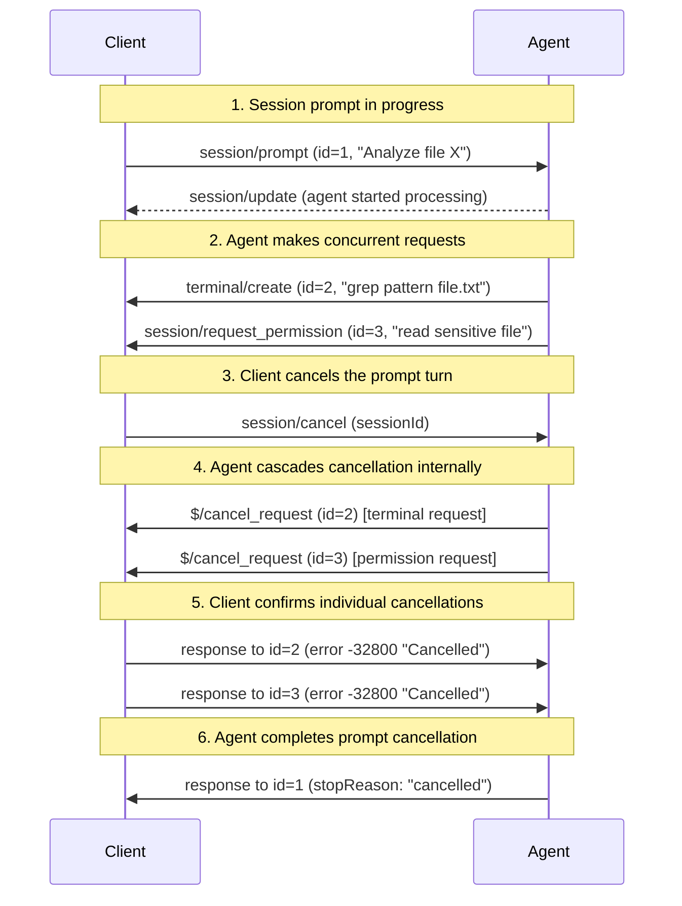
```mermaid
sequenceDiagram
    participant Client
    participant Agent

    Note over Client,Agent: 1. Session prompt in progress
    Client->>Agent: session/prompt (id=1, "Analyze file X")
    Agent-->>Client: session/update (agent started processing)

    Note over Client,Agent: 2. Agent makes concurrent requests
    Agent->>Client: terminal/create (id=2, "grep pattern file.txt")
    Agent->>Client: session/request_permission (id=3, "read sensitive file")

    Note over Client,Agent: 3. Client cancels the prompt turn
    Client->>Agent: session/cancel (sessionId)

    Note over Client,Agent: 4. Agent cascades cancellation internally
    Agent->>Client: $/cancel_request (id=2) [terminal request]
  Agent->>Client: $/cancel_request (id=3) [permission request]

    Note over Client,Agent: 5. Client confirms individual cancellations
    Client->>Agent: response to id=2 (error -32800 "Cancelled")
    Client->>Agent: response to id=3 (error -32800 "Cancelled")

    Note over Client,Agent: 6. Agent completes prompt cancellation
    Agent->>Client: response to id=1 (stopReason: "cancelled")
```
````

## File: docs/protocol/draft/file-system.mdx
````markdown
---
title: "File System"
description: "Client filesystem access methods"
---

The filesystem methods allow Agents to read and write text files within the Client's environment. These methods enable Agents to access unsaved editor state and allow Clients to track file modifications made during agent execution.

## Session Root Scope

Filesystem methods always operate on absolute paths, but the Client **MUST**
authorize those paths against the session's effective root set.

- by default, the effective root set is just `cwd`
- if the unstable `sessionCapabilities.additionalDirectories` capability is in use, the effective root set becomes `[cwd, ...additionalDirectories]`
- `cwd` remains the base for relative paths; additional roots only expand filesystem scope
- when a Client discovers a session through `session/list`, it SHOULD treat `cwd` plus `SessionInfo.additionalDirectories` as the authoritative current root set until a later lifecycle request changes it

Because ACP filesystem methods are client-mediated, the Client remains
responsible for enforcing those root boundaries.

## Checking Support

Before attempting to use filesystem methods, Agents **MUST** verify that the Client supports these capabilities by checking the [Client Capabilities](/protocol/initialization#client-capabilities) field in the `initialize` response:

```json highlight={8,9}
{
  "jsonrpc": "2.0",
  "id": 0,
  "result": {
    "protocolVersion": 1,
    "clientCapabilities": {
      "fs": {
        "readTextFile": true,
        "writeTextFile": true
      }
    }
  }
}
```

If `readTextFile` or `writeTextFile` is `false` or not present, the Agent **MUST NOT** attempt to call the corresponding filesystem method.

## Reading Files

The `fs/read_text_file` method allows Agents to read text file contents from the Client's filesystem, including unsaved changes in the editor.

```json
{
  "jsonrpc": "2.0",
  "id": 3,
  "method": "fs/read_text_file",
  "params": {
    "sessionId": "sess_abc123def456",
    "path": "/home/user/project/src/main.py",
    "line": 10,
    "limit": 50
  }
}
```

<ParamField path="sessionId" type="SessionId" required>
  The [Session ID](/protocol/session-setup#session-id) for this request. The
  session determines which filesystem roots are in scope for the path.
</ParamField>

<ParamField path="path" type="string" required>
  Absolute path to the file to read
</ParamField>

<ParamField path="line" type="number">
  Optional line number to start reading from (1-based)
</ParamField>

<ParamField path="limit" type="number">
  Optional maximum number of lines to read
</ParamField>

The Client responds with the file contents:

```json
{
  "jsonrpc": "2.0",
  "id": 3,
  "result": {
    "content": "def hello_world():\n    print('Hello, world!')\n"
  }
}
```

## Writing Files

The `fs/write_text_file` method allows Agents to write or update text files in the Client's filesystem.

```json
{
  "jsonrpc": "2.0",
  "id": 4,
  "method": "fs/write_text_file",
  "params": {
    "sessionId": "sess_abc123def456",
    "path": "/home/user/project/config.json",
    "content": "{\n  \"debug\": true,\n  \"version\": \"1.0.0\"\n}"
  }
}
```

<ParamField path="sessionId" type="SessionId" required>
  The [Session ID](/protocol/session-setup#session-id) for this request. The
  session determines which filesystem roots are in scope for the path.
</ParamField>

<ParamField path="path" type="string" required>
Absolute path to the file to write.

The Client **MUST** create the file if it doesn't exist.

</ParamField>

<ParamField path="content" type="string" required>
  The text content to write to the file
</ParamField>

The Client responds with an empty result on success:

```json
{
  "jsonrpc": "2.0",
  "id": 4,
  "result": null
}
```
````

## File: docs/protocol/draft/schema-v2.mdx
````markdown
---
title: "Schema"
description: "Schema definitions for the Agent Client Protocol"
---

## Agent

Defines the interface that all ACP-compliant agents must implement.

Agents are programs that use generative AI to autonomously modify code. They handle
requests from clients and execute tasks using language models and tools.

### <span class="font-mono">authenticate</span>

Authenticates the client using the specified authentication method.

Called when the agent requires authentication before allowing session creation.
The client provides the authentication method ID that was advertised during initialization.

After successful authentication, the client can proceed to create sessions with
`new_session` without receiving an `auth_required` error.

See protocol docs: [Initialization](https://agentclientprotocol.com/protocol/initialization)

#### <span class="font-mono">AuthenticateRequest</span>

Request parameters for the authenticate method.

Specifies which authentication method to use.

**Type:** Object

**Properties:**

<ResponseField name="_meta" type={"object | null"} >
  The _meta property is reserved by ACP to allow clients and agents to attach additional
metadata to their interactions. Implementations MUST NOT make assumptions about values at
these keys.

See protocol docs: [Extensibility](https://agentclientprotocol.com/protocol/extensibility)

</ResponseField>
<ResponseField name="methodId" type={"string"} required>
  The ID of the authentication method to use.
Must be one of the methods advertised in the initialize response.
</ResponseField>

#### <span class="font-mono">AuthenticateResponse</span>

Response to the `authenticate` method.

**Type:** Object

**Properties:**

<ResponseField name="_meta" type={"object | null"} >
  The _meta property is reserved by ACP to allow clients and agents to attach additional
metadata to their interactions. Implementations MUST NOT make assumptions about values at
these keys.

See protocol docs: [Extensibility](https://agentclientprotocol.com/protocol/extensibility)

</ResponseField>

<a id="document-didchange"></a>
### <span class="font-mono">document/didChange</span>

**UNSTABLE**

Notification sent when a file is edited.

#### <span class="font-mono">DidChangeDocumentNotification</span>

Notification sent when a file is edited.

**Type:** Object

**Properties:**

<ResponseField name="_meta" type={"object | null"} >
  The _meta property is reserved by ACP to allow clients and agents to attach additional
metadata to their interactions. Implementations MUST NOT make assumptions about values at
these keys.

See protocol docs: [Extensibility](https://agentclientprotocol.com/protocol/extensibility)

</ResponseField>
<ResponseField name="contentChanges" type={<a href="#textdocumentcontentchangeevent">TextDocumentContentChangeEvent[]</a>} required>
  The content changes.
</ResponseField>
<ResponseField name="sessionId" type={<a href="#sessionid">SessionId</a>} required>
  The session ID for this notification.
</ResponseField>
<ResponseField name="uri" type={"string"} required>
  The URI of the changed document.
</ResponseField>
<ResponseField name="version" type={"int64"} required>
  The new version number of the document.
</ResponseField>

<a id="document-didclose"></a>
### <span class="font-mono">document/didClose</span>

**UNSTABLE**

Notification sent when a file is closed.

#### <span class="font-mono">DidCloseDocumentNotification</span>

Notification sent when a file is closed.

**Type:** Object

**Properties:**

<ResponseField name="_meta" type={"object | null"} >
  The _meta property is reserved by ACP to allow clients and agents to attach additional
metadata to their interactions. Implementations MUST NOT make assumptions about values at
these keys.

See protocol docs: [Extensibility](https://agentclientprotocol.com/protocol/extensibility)

</ResponseField>
<ResponseField name="sessionId" type={<a href="#sessionid">SessionId</a>} required>
  The session ID for this notification.
</ResponseField>
<ResponseField name="uri" type={"string"} required>
  The URI of the closed document.
</ResponseField>

<a id="document-didfocus"></a>
### <span class="font-mono">document/didFocus</span>

**UNSTABLE**

Notification sent when a file becomes the active editor tab.

#### <span class="font-mono">DidFocusDocumentNotification</span>

Notification sent when a file becomes the active editor tab.

**Type:** Object

**Properties:**

<ResponseField name="_meta" type={"object | null"} >
  The _meta property is reserved by ACP to allow clients and agents to attach additional
metadata to their interactions. Implementations MUST NOT make assumptions about values at
these keys.

See protocol docs: [Extensibility](https://agentclientprotocol.com/protocol/extensibility)

</ResponseField>
<ResponseField name="position" type={<a href="#position">Position</a>} required>
  The current cursor position.
</ResponseField>
<ResponseField name="sessionId" type={<a href="#sessionid">SessionId</a>} required>
  The session ID for this notification.
</ResponseField>
<ResponseField name="uri" type={"string"} required>
  The URI of the focused document.
</ResponseField>
<ResponseField name="version" type={"int64"} required>
  The version number of the document.
</ResponseField>
<ResponseField name="visibleRange" type={<a href="#range">Range</a>} required>
  The portion of the file currently visible in the editor viewport.
</ResponseField>

<a id="document-didopen"></a>
### <span class="font-mono">document/didOpen</span>

**UNSTABLE**

Notification sent when a file is opened in the editor.

#### <span class="font-mono">DidOpenDocumentNotification</span>

Notification sent when a file is opened in the editor.

**Type:** Object

**Properties:**

<ResponseField name="_meta" type={"object | null"} >
  The _meta property is reserved by ACP to allow clients and agents to attach additional
metadata to their interactions. Implementations MUST NOT make assumptions about values at
these keys.

See protocol docs: [Extensibility](https://agentclientprotocol.com/protocol/extensibility)

</ResponseField>
<ResponseField name="languageId" type={"string"} required>
  The language identifier of the document (e.g., "rust", "python").
</ResponseField>
<ResponseField name="sessionId" type={<a href="#sessionid">SessionId</a>} required>
  The session ID for this notification.
</ResponseField>
<ResponseField name="text" type={"string"} required>
  The full text content of the document.
</ResponseField>
<ResponseField name="uri" type={"string"} required>
  The URI of the opened document.
</ResponseField>
<ResponseField name="version" type={"int64"} required>
  The version number of the document.
</ResponseField>

<a id="document-didsave"></a>
### <span class="font-mono">document/didSave</span>

**UNSTABLE**

Notification sent when a file is saved.

#### <span class="font-mono">DidSaveDocumentNotification</span>

Notification sent when a file is saved.

**Type:** Object

**Properties:**

<ResponseField name="_meta" type={"object | null"} >
  The _meta property is reserved by ACP to allow clients and agents to attach additional
metadata to their interactions. Implementations MUST NOT make assumptions about values at
these keys.

See protocol docs: [Extensibility](https://agentclientprotocol.com/protocol/extensibility)

</ResponseField>
<ResponseField name="sessionId" type={<a href="#sessionid">SessionId</a>} required>
  The session ID for this notification.
</ResponseField>
<ResponseField name="uri" type={"string"} required>
  The URI of the saved document.
</ResponseField>

### <span class="font-mono">initialize</span>

Establishes the connection with a client and negotiates protocol capabilities.

This method is called once at the beginning of the connection to:

- Negotiate the protocol version to use
- Exchange capability information between client and agent
- Determine available authentication methods

The agent should respond with its supported protocol version and capabilities.

See protocol docs: [Initialization](https://agentclientprotocol.com/protocol/initialization)

#### <span class="font-mono">InitializeRequest</span>

Request parameters for the initialize method.

Sent by the client to establish connection and negotiate capabilities.

See protocol docs: [Initialization](https://agentclientprotocol.com/protocol/initialization)

**Type:** Object

**Properties:**

<ResponseField name="_meta" type={"object | null"} >
  The _meta property is reserved by ACP to allow clients and agents to attach additional
metadata to their interactions. Implementations MUST NOT make assumptions about values at
these keys.

See protocol docs: [Extensibility](https://agentclientprotocol.com/protocol/extensibility)

</ResponseField>
<ResponseField name="clientCapabilities" type={<a href="#clientcapabilities">ClientCapabilities</a>} >
  Capabilities supported by the client.

    - Default: `{"auth":{"terminal":false},"fs":{"readTextFile":false,"writeTextFile":false},"terminal":false}`

</ResponseField>
<ResponseField name="clientInfo" type={<><span><a href="#implementation">Implementation</a></span><span> | null</span></>} >
  Information about the Client name and version sent to the Agent.

Note: in future versions of the protocol, this will be required.

</ResponseField>
<ResponseField name="protocolVersion" type={<a href="#protocolversion">ProtocolVersion</a>} required>
  The latest protocol version supported by the client.
</ResponseField>

#### <span class="font-mono">InitializeResponse</span>

Response to the `initialize` method.

Contains the negotiated protocol version and agent capabilities.

See protocol docs: [Initialization](https://agentclientprotocol.com/protocol/initialization)

**Type:** Object

**Properties:**

<ResponseField name="_meta" type={"object | null"} >
  The _meta property is reserved by ACP to allow clients and agents to attach additional
metadata to their interactions. Implementations MUST NOT make assumptions about values at
these keys.

See protocol docs: [Extensibility](https://agentclientprotocol.com/protocol/extensibility)

</ResponseField>
<ResponseField name="agentCapabilities" type={<a href="#agentcapabilities">AgentCapabilities</a>} >
  Capabilities supported by the agent.

    - Default: `{"auth":{},"loadSession":false,"mcpCapabilities":{"http":false,"sse":false},"promptCapabilities":{"audio":false,"embeddedContext":false,"image":false},"sessionCapabilities":{}}`

</ResponseField>
<ResponseField name="agentInfo" type={<><span><a href="#implementation">Implementation</a></span><span> | null</span></>} >
  Information about the Agent name and version sent to the Client.

Note: in future versions of the protocol, this will be required.

</ResponseField>
<ResponseField name="authMethods" type={<a href="#authmethod">AuthMethod[]</a>} >
  Authentication methods supported by the agent.

    - Default: `[]`

</ResponseField>
<ResponseField name="protocolVersion" type={<a href="#protocolversion">ProtocolVersion</a>} required>
  The protocol version the client specified if supported by the agent,
or the latest protocol version supported by the agent.

The client should disconnect, if it doesn't support this version.

</ResponseField>

### <span class="font-mono">logout</span>

**UNSTABLE**

This capability is not part of the spec yet, and may be removed or changed at any point.

Logs out of the current authenticated state.

After a successful logout, all new sessions will require authentication.
There is no guarantee about the behavior of already running sessions.

#### <span class="font-mono">LogoutRequest</span>

**UNSTABLE**

This capability is not part of the spec yet, and may be removed or changed at any point.

Request parameters for the logout method.

Terminates the current authenticated session.

**Type:** Object

**Properties:**

<ResponseField name="_meta" type={"object | null"} >
  The _meta property is reserved by ACP to allow clients and agents to attach additional
metadata to their interactions. Implementations MUST NOT make assumptions about values at
these keys.

See protocol docs: [Extensibility](https://agentclientprotocol.com/protocol/extensibility)

</ResponseField>

#### <span class="font-mono">LogoutResponse</span>

**UNSTABLE**

This capability is not part of the spec yet, and may be removed or changed at any point.

Response to the `logout` method.

**Type:** Object

**Properties:**

<ResponseField name="_meta" type={"object | null"} >
  The _meta property is reserved by ACP to allow clients and agents to attach additional
metadata to their interactions. Implementations MUST NOT make assumptions about values at
these keys.

See protocol docs: [Extensibility](https://agentclientprotocol.com/protocol/extensibility)

</ResponseField>

<a id="nes-accept"></a>
### <span class="font-mono">nes/accept</span>

**UNSTABLE**

Notification sent when a suggestion is accepted.

#### <span class="font-mono">AcceptNesNotification</span>

Notification sent when a suggestion is accepted.

**Type:** Object

**Properties:**

<ResponseField name="_meta" type={"object | null"} >
  The _meta property is reserved by ACP to allow clients and agents to attach additional
metadata to their interactions. Implementations MUST NOT make assumptions about values at
these keys.

See protocol docs: [Extensibility](https://agentclientprotocol.com/protocol/extensibility)

</ResponseField>
<ResponseField name="id" type={"string"} required>
  The ID of the accepted suggestion.
</ResponseField>
<ResponseField name="sessionId" type={<a href="#sessionid">SessionId</a>} required>
  The session ID for this notification.
</ResponseField>

<a id="nes-close"></a>
### <span class="font-mono">nes/close</span>

**UNSTABLE**

This capability is not part of the spec yet, and may be removed or changed at any point.

Closes an active NES session and frees up any resources associated with it.

The agent must cancel any ongoing work and then free up any resources
associated with the NES session.

#### <span class="font-mono">CloseNesRequest</span>

Request to close an NES session.

The agent **must** cancel any ongoing work related to the NES session
and then free up any resources associated with the session.

**Type:** Object

**Properties:**

<ResponseField name="_meta" type={"object | null"} >
  The _meta property is reserved by ACP to allow clients and agents to attach additional
metadata to their interactions. Implementations MUST NOT make assumptions about values at
these keys.

See protocol docs: [Extensibility](https://agentclientprotocol.com/protocol/extensibility)

</ResponseField>
<ResponseField name="sessionId" type={<a href="#sessionid">SessionId</a>} required>
  The ID of the NES session to close.
</ResponseField>

#### <span class="font-mono">CloseNesResponse</span>

Response from closing an NES session.

**Type:** Object

**Properties:**

<ResponseField name="_meta" type={"object | null"} >
  The _meta property is reserved by ACP to allow clients and agents to attach additional
metadata to their interactions. Implementations MUST NOT make assumptions about values at
these keys.

See protocol docs: [Extensibility](https://agentclientprotocol.com/protocol/extensibility)

</ResponseField>

<a id="nes-reject"></a>
### <span class="font-mono">nes/reject</span>

**UNSTABLE**

Notification sent when a suggestion is rejected.

#### <span class="font-mono">RejectNesNotification</span>

Notification sent when a suggestion is rejected.

**Type:** Object

**Properties:**

<ResponseField name="_meta" type={"object | null"} >
  The _meta property is reserved by ACP to allow clients and agents to attach additional
metadata to their interactions. Implementations MUST NOT make assumptions about values at
these keys.

See protocol docs: [Extensibility](https://agentclientprotocol.com/protocol/extensibility)

</ResponseField>
<ResponseField name="id" type={"string"} required>
  The ID of the rejected suggestion.
</ResponseField>
<ResponseField name="reason" type={<><span><a href="#nesrejectreason">NesRejectReason</a></span><span> | null</span></>} >
  The reason for rejection.
</ResponseField>
<ResponseField name="sessionId" type={<a href="#sessionid">SessionId</a>} required>
  The session ID for this notification.
</ResponseField>

<a id="nes-start"></a>
### <span class="font-mono">nes/start</span>

**UNSTABLE**

This capability is not part of the spec yet, and may be removed or changed at any point.

Starts an NES session.

#### <span class="font-mono">StartNesRequest</span>

Request to start an NES session.

**Type:** Object

**Properties:**

<ResponseField name="_meta" type={"object | null"} >
  The _meta property is reserved by ACP to allow clients and agents to attach additional
metadata to their interactions. Implementations MUST NOT make assumptions about values at
these keys.

See protocol docs: [Extensibility](https://agentclientprotocol.com/protocol/extensibility)

</ResponseField>
<ResponseField name="repository" type={<><span><a href="#nesrepository">NesRepository</a></span><span> | null</span></>} >
  Repository metadata, if the workspace is a git repository.
</ResponseField>
<ResponseField name="workspaceFolders" type={<><span><a href="#workspacefolder">WorkspaceFolder[]</a></span><span> | null</span></>} >
  The workspace folders.
</ResponseField>
<ResponseField name="workspaceUri" type={"string | null"} >
  The root URI of the workspace.
</ResponseField>

#### <span class="font-mono">StartNesResponse</span>

Response to `nes/start`.

**Type:** Object

**Properties:**

<ResponseField name="_meta" type={"object | null"} >
  The _meta property is reserved by ACP to allow clients and agents to attach additional
metadata to their interactions. Implementations MUST NOT make assumptions about values at
these keys.

See protocol docs: [Extensibility](https://agentclientprotocol.com/protocol/extensibility)

</ResponseField>
<ResponseField name="sessionId" type={<a href="#sessionid">SessionId</a>} required>
  The session ID for the newly started NES session.
</ResponseField>

<a id="nes-suggest"></a>
### <span class="font-mono">nes/suggest</span>

**UNSTABLE**

This capability is not part of the spec yet, and may be removed or changed at any point.

Requests a code suggestion.

#### <span class="font-mono">SuggestNesRequest</span>

Request for a code suggestion.

**Type:** Object

**Properties:**

<ResponseField name="_meta" type={"object | null"} >
  The _meta property is reserved by ACP to allow clients and agents to attach additional
metadata to their interactions. Implementations MUST NOT make assumptions about values at
these keys.

See protocol docs: [Extensibility](https://agentclientprotocol.com/protocol/extensibility)

</ResponseField>
<ResponseField name="context" type={<><span><a href="#nessuggestcontext">NesSuggestContext</a></span><span> | null</span></>} >
  Context for the suggestion, included based on agent capabilities.
</ResponseField>
<ResponseField name="position" type={<a href="#position">Position</a>} required>
  The current cursor position.
</ResponseField>
<ResponseField name="selection" type={<><span><a href="#range">Range</a></span><span> | null</span></>} >
  The current text selection range, if any.
</ResponseField>
<ResponseField name="sessionId" type={<a href="#sessionid">SessionId</a>} required>
  The session ID for this request.
</ResponseField>
<ResponseField name="triggerKind" type={<a href="#nestriggerkind">NesTriggerKind</a>} required>
  What triggered this suggestion request.
</ResponseField>
<ResponseField name="uri" type={"string"} required>
  The URI of the document to suggest for.
</ResponseField>
<ResponseField name="version" type={"int64"} required>
  The version number of the document.
</ResponseField>

#### <span class="font-mono">SuggestNesResponse</span>

Response to `nes/suggest`.

**Type:** Object

**Properties:**

<ResponseField name="_meta" type={"object | null"} >
  The _meta property is reserved by ACP to allow clients and agents to attach additional
metadata to their interactions. Implementations MUST NOT make assumptions about values at
these keys.

See protocol docs: [Extensibility](https://agentclientprotocol.com/protocol/extensibility)

</ResponseField>
<ResponseField name="suggestions" type={<a href="#nessuggestion">NesSuggestion[]</a>} required>
  The list of suggestions.
</ResponseField>

<a id="providers-disable"></a>
### <span class="font-mono">providers/disable</span>

**UNSTABLE**

This capability is not part of the spec yet, and may be removed or changed at any point.

Disables a provider.

#### <span class="font-mono">DisableProvidersRequest</span>

**UNSTABLE**

This capability is not part of the spec yet, and may be removed or changed at any point.

Request parameters for `providers/disable`.

**Type:** Object

**Properties:**

<ResponseField name="_meta" type={"object | null"} >
  The _meta property is reserved by ACP to allow clients and agents to attach additional
metadata to their interactions. Implementations MUST NOT make assumptions about values at
these keys.

See protocol docs: [Extensibility](https://agentclientprotocol.com/protocol/extensibility)

</ResponseField>
<ResponseField name="id" type={"string"} required>
  Provider id to disable.
</ResponseField>

#### <span class="font-mono">DisableProvidersResponse</span>

**UNSTABLE**

This capability is not part of the spec yet, and may be removed or changed at any point.

Response to `providers/disable`.

**Type:** Object

**Properties:**

<ResponseField name="_meta" type={"object | null"} >
  The _meta property is reserved by ACP to allow clients and agents to attach additional
metadata to their interactions. Implementations MUST NOT make assumptions about values at
these keys.

See protocol docs: [Extensibility](https://agentclientprotocol.com/protocol/extensibility)

</ResponseField>

<a id="providers-list"></a>
### <span class="font-mono">providers/list</span>

**UNSTABLE**

This capability is not part of the spec yet, and may be removed or changed at any point.

Lists providers that can be configured by the client.

#### <span class="font-mono">ListProvidersRequest</span>

**UNSTABLE**

This capability is not part of the spec yet, and may be removed or changed at any point.

Request parameters for `providers/list`.

**Type:** Object

**Properties:**

<ResponseField name="_meta" type={"object | null"} >
  The _meta property is reserved by ACP to allow clients and agents to attach additional
metadata to their interactions. Implementations MUST NOT make assumptions about values at
these keys.

See protocol docs: [Extensibility](https://agentclientprotocol.com/protocol/extensibility)

</ResponseField>

#### <span class="font-mono">ListProvidersResponse</span>

**UNSTABLE**

This capability is not part of the spec yet, and may be removed or changed at any point.

Response to `providers/list`.

**Type:** Object

**Properties:**

<ResponseField name="_meta" type={"object | null"} >
  The _meta property is reserved by ACP to allow clients and agents to attach additional
metadata to their interactions. Implementations MUST NOT make assumptions about values at
these keys.

See protocol docs: [Extensibility](https://agentclientprotocol.com/protocol/extensibility)

</ResponseField>
<ResponseField name="providers" type={<a href="#providerinfo">ProviderInfo[]</a>} required>
  Configurable providers with current routing info suitable for UI display.
</ResponseField>

<a id="providers-set"></a>
### <span class="font-mono">providers/set</span>

**UNSTABLE**

This capability is not part of the spec yet, and may be removed or changed at any point.

Replaces the configuration for a provider.

#### <span class="font-mono">SetProvidersRequest</span>

**UNSTABLE**

This capability is not part of the spec yet, and may be removed or changed at any point.

Request parameters for `providers/set`.

Replaces the full configuration for one provider id.

**Type:** Object

**Properties:**

<ResponseField name="_meta" type={"object | null"} >
  The _meta property is reserved by ACP to allow clients and agents to attach additional
metadata to their interactions. Implementations MUST NOT make assumptions about values at
these keys.

See protocol docs: [Extensibility](https://agentclientprotocol.com/protocol/extensibility)

</ResponseField>
<ResponseField name="apiType" type={<a href="#llmprotocol">LlmProtocol</a>} required>
  Protocol type for this provider.
</ResponseField>
<ResponseField name="baseUrl" type={"string"} required>
  Base URL for requests sent through this provider.
</ResponseField>
<ResponseField name="headers" type={"object"} >
  Full headers map for this provider.
May include authorization, routing, or other integration-specific headers.
</ResponseField>
<ResponseField name="id" type={"string"} required>
  Provider id to configure.
</ResponseField>

#### <span class="font-mono">SetProvidersResponse</span>

**UNSTABLE**

This capability is not part of the spec yet, and may be removed or changed at any point.

Response to `providers/set`.

**Type:** Object

**Properties:**

<ResponseField name="_meta" type={"object | null"} >
  The _meta property is reserved by ACP to allow clients and agents to attach additional
metadata to their interactions. Implementations MUST NOT make assumptions about values at
these keys.

See protocol docs: [Extensibility](https://agentclientprotocol.com/protocol/extensibility)

</ResponseField>

<a id="session-cancel"></a>
### <span class="font-mono">session/cancel</span>

Cancels ongoing operations for a session.

This is a notification sent by the client to cancel an ongoing prompt turn.

Upon receiving this notification, the Agent SHOULD:

- Stop all language model requests as soon as possible
- Abort all tool call invocations in progress
- Send any pending `session/update` notifications
- Respond to the original `session/prompt` request with `StopReason::Cancelled`

See protocol docs: [Cancellation](https://agentclientprotocol.com/protocol/prompt-turn#cancellation)

#### <span class="font-mono">CancelNotification</span>

Notification to cancel ongoing operations for a session.

See protocol docs: [Cancellation](https://agentclientprotocol.com/protocol/prompt-turn#cancellation)

**Type:** Object

**Properties:**

<ResponseField name="_meta" type={"object | null"} >
  The _meta property is reserved by ACP to allow clients and agents to attach additional
metadata to their interactions. Implementations MUST NOT make assumptions about values at
these keys.

See protocol docs: [Extensibility](https://agentclientprotocol.com/protocol/extensibility)

</ResponseField>
<ResponseField name="sessionId" type={<a href="#sessionid">SessionId</a>} required>
  The ID of the session to cancel operations for.
</ResponseField>

<a id="session-close"></a>
### <span class="font-mono">session/close</span>

Closes an active session and frees up any resources associated with it.

This method is only available if the agent advertises the `sessionCapabilities.close` capability.

The agent must cancel any ongoing work (as if `session/cancel` was called)
and then free up any resources associated with the session.

#### <span class="font-mono">CloseSessionRequest</span>

Request parameters for closing an active session.

If supported, the agent **must** cancel any ongoing work related to the session
(treat it as if `session/cancel` was called) and then free up any resources
associated with the session.

Only available if the Agent supports the `sessionCapabilities.close` capability.

**Type:** Object

**Properties:**

<ResponseField name="_meta" type={"object | null"} >
  The _meta property is reserved by ACP to allow clients and agents to attach additional
metadata to their interactions. Implementations MUST NOT make assumptions about values at
these keys.

See protocol docs: [Extensibility](https://agentclientprotocol.com/protocol/extensibility)

</ResponseField>
<ResponseField name="sessionId" type={<a href="#sessionid">SessionId</a>} required>
  The ID of the session to close.
</ResponseField>

#### <span class="font-mono">CloseSessionResponse</span>

Response from closing a session.

**Type:** Object

**Properties:**

<ResponseField name="_meta" type={"object | null"} >
  The _meta property is reserved by ACP to allow clients and agents to attach additional
metadata to their interactions. Implementations MUST NOT make assumptions about values at
these keys.

See protocol docs: [Extensibility](https://agentclientprotocol.com/protocol/extensibility)

</ResponseField>

<a id="session-fork"></a>
### <span class="font-mono">session/fork</span>

**UNSTABLE**

This capability is not part of the spec yet, and may be removed or changed at any point.

Forks an existing session to create a new independent session.

This method is only available if the agent advertises the `session.fork` capability.

The agent should create a new session with the same conversation context as the
original, allowing operations like generating summaries without affecting the
original session's history.

#### <span class="font-mono">ForkSessionRequest</span>

**UNSTABLE**

This capability is not part of the spec yet, and may be removed or changed at any point.

Request parameters for forking an existing session.

Creates a new session based on the context of an existing one, allowing
operations like generating summaries without affecting the original session's history.

Only available if the Agent supports the `session.fork` capability.

**Type:** Object

**Properties:**

<ResponseField name="_meta" type={"object | null"} >
  The _meta property is reserved by ACP to allow clients and agents to attach additional
metadata to their interactions. Implementations MUST NOT make assumptions about values at
these keys.

See protocol docs: [Extensibility](https://agentclientprotocol.com/protocol/extensibility)

</ResponseField>
<ResponseField name="additionalDirectories" type={<><span>"string"</span><span>[]</span></>} >
  **UNSTABLE**

This capability is not part of the spec yet, and may be removed or changed at any point.

Additional workspace roots to activate for this session. Each path must be absolute.

When omitted or empty, no additional roots are activated. When non-empty,
this is the complete resulting additional-root list for the forked
session.

</ResponseField>
<ResponseField name="cwd" type={"string"} required>
  The working directory for this session.
</ResponseField>
<ResponseField name="mcpServers" type={<a href="#mcpserver">McpServer[]</a>} >
  List of MCP servers to connect to for this session.
</ResponseField>
<ResponseField name="sessionId" type={<a href="#sessionid">SessionId</a>} required>
  The ID of the session to fork.
</ResponseField>

#### <span class="font-mono">ForkSessionResponse</span>

**UNSTABLE**

This capability is not part of the spec yet, and may be removed or changed at any point.

Response from forking an existing session.

**Type:** Object

**Properties:**

<ResponseField name="_meta" type={"object | null"} >
  The _meta property is reserved by ACP to allow clients and agents to attach additional
metadata to their interactions. Implementations MUST NOT make assumptions about values at
these keys.

See protocol docs: [Extensibility](https://agentclientprotocol.com/protocol/extensibility)

</ResponseField>
<ResponseField name="configOptions" type={<><span><a href="#sessionconfigoption">SessionConfigOption[]</a></span><span> | null</span></>} >
  Initial session configuration options if supported by the Agent.
</ResponseField>
<ResponseField name="models" type={<><span><a href="#sessionmodelstate">SessionModelState</a></span><span> | null</span></>} >
  **UNSTABLE**

This capability is not part of the spec yet, and may be removed or changed at any point.

Initial model state if supported by the Agent

</ResponseField>
<ResponseField name="modes" type={<><span><a href="#sessionmodestate">SessionModeState</a></span><span> | null</span></>} >
  Initial mode state if supported by the Agent

See protocol docs: [Session Modes](https://agentclientprotocol.com/protocol/session-modes)

</ResponseField>
<ResponseField name="sessionId" type={<a href="#sessionid">SessionId</a>} required>
  Unique identifier for the newly created forked session.
</ResponseField>

<a id="session-list"></a>
### <span class="font-mono">session/list</span>

Lists existing sessions known to the agent.

This method is only available if the agent advertises the `sessionCapabilities.list` capability.

The agent should return metadata about sessions with optional filtering and pagination support.

#### <span class="font-mono">ListSessionsRequest</span>

Request parameters for listing existing sessions.

Only available if the Agent supports the `sessionCapabilities.list` capability.

**Type:** Object

**Properties:**

<ResponseField name="_meta" type={"object | null"} >
  The _meta property is reserved by ACP to allow clients and agents to attach additional
metadata to their interactions. Implementations MUST NOT make assumptions about values at
these keys.

See protocol docs: [Extensibility](https://agentclientprotocol.com/protocol/extensibility)

</ResponseField>
<ResponseField name="additionalDirectories" type={<><span>"string"</span><span>[]</span></>} >
  **UNSTABLE**

This capability is not part of the spec yet, and may be removed or changed at any point.

Filter sessions by the exact ordered additional workspace roots. Each path must be absolute.

This filter applies only when the field is present and non-empty. When
omitted or empty, no additional-root filter is applied.

</ResponseField>
<ResponseField name="cursor" type={"string | null"} >
  Opaque cursor token from a previous response's nextCursor field for cursor-based pagination
</ResponseField>
<ResponseField name="cwd" type={"string | null"} >
  Filter sessions by working directory. Must be an absolute path.
</ResponseField>

#### <span class="font-mono">ListSessionsResponse</span>

Response from listing sessions.

**Type:** Object

**Properties:**

<ResponseField name="_meta" type={"object | null"} >
  The _meta property is reserved by ACP to allow clients and agents to attach additional
metadata to their interactions. Implementations MUST NOT make assumptions about values at
these keys.

See protocol docs: [Extensibility](https://agentclientprotocol.com/protocol/extensibility)

</ResponseField>
<ResponseField name="nextCursor" type={"string | null"} >
  Opaque cursor token. If present, pass this in the next request's cursor parameter
to fetch the next page. If absent, there are no more results.
</ResponseField>
<ResponseField name="sessions" type={<a href="#sessioninfo">SessionInfo[]</a>} required>
  Array of session information objects
</ResponseField>

<a id="session-load"></a>
### <span class="font-mono">session/load</span>

Loads an existing session to resume a previous conversation.

This method is only available if the agent advertises the `loadSession` capability.

The agent should:

- Restore the session context and conversation history
- Connect to the specified MCP servers
- Stream the entire conversation history back to the client via notifications

See protocol docs: [Loading Sessions](https://agentclientprotocol.com/protocol/session-setup#loading-sessions)

#### <span class="font-mono">LoadSessionRequest</span>

Request parameters for loading an existing session.

Only available if the Agent supports the `loadSession` capability.

See protocol docs: [Loading Sessions](https://agentclientprotocol.com/protocol/session-setup#loading-sessions)

**Type:** Object

**Properties:**

<ResponseField name="_meta" type={"object | null"} >
  The _meta property is reserved by ACP to allow clients and agents to attach additional
metadata to their interactions. Implementations MUST NOT make assumptions about values at
these keys.

See protocol docs: [Extensibility](https://agentclientprotocol.com/protocol/extensibility)

</ResponseField>
<ResponseField name="additionalDirectories" type={<><span>"string"</span><span>[]</span></>} >
  **UNSTABLE**

This capability is not part of the spec yet, and may be removed or changed at any point.

Additional workspace roots to activate for this session. Each path must be absolute.

When omitted or empty, no additional roots are activated. When non-empty,
this is the complete resulting additional-root list for the loaded
session.

</ResponseField>
<ResponseField name="cwd" type={"string"} required>
  The working directory for this session.
</ResponseField>
<ResponseField name="mcpServers" type={<a href="#mcpserver">McpServer[]</a>} required>
  List of MCP servers to connect to for this session.
</ResponseField>
<ResponseField name="sessionId" type={<a href="#sessionid">SessionId</a>} required>
  The ID of the session to load.
</ResponseField>

#### <span class="font-mono">LoadSessionResponse</span>

Response from loading an existing session.

**Type:** Object

**Properties:**

<ResponseField name="_meta" type={"object | null"} >
  The _meta property is reserved by ACP to allow clients and agents to attach additional
metadata to their interactions. Implementations MUST NOT make assumptions about values at
these keys.

See protocol docs: [Extensibility](https://agentclientprotocol.com/protocol/extensibility)

</ResponseField>
<ResponseField name="configOptions" type={<><span><a href="#sessionconfigoption">SessionConfigOption[]</a></span><span> | null</span></>} >
  Initial session configuration options if supported by the Agent.
</ResponseField>
<ResponseField name="models" type={<><span><a href="#sessionmodelstate">SessionModelState</a></span><span> | null</span></>} >
  **UNSTABLE**

This capability is not part of the spec yet, and may be removed or changed at any point.

Initial model state if supported by the Agent

</ResponseField>
<ResponseField name="modes" type={<><span><a href="#sessionmodestate">SessionModeState</a></span><span> | null</span></>} >
  Initial mode state if supported by the Agent

See protocol docs: [Session Modes](https://agentclientprotocol.com/protocol/session-modes)

</ResponseField>

<a id="session-new"></a>
### <span class="font-mono">session/new</span>

Creates a new conversation session with the agent.

Sessions represent independent conversation contexts with their own history and state.

The agent should:

- Create a new session context
- Connect to any specified MCP servers
- Return a unique session ID for future requests

May return an `auth_required` error if the agent requires authentication.

See protocol docs: [Session Setup](https://agentclientprotocol.com/protocol/session-setup)

#### <span class="font-mono">NewSessionRequest</span>

Request parameters for creating a new session.

See protocol docs: [Creating a Session](https://agentclientprotocol.com/protocol/session-setup#creating-a-session)

**Type:** Object

**Properties:**

<ResponseField name="_meta" type={"object | null"} >
  The _meta property is reserved by ACP to allow clients and agents to attach additional
metadata to their interactions. Implementations MUST NOT make assumptions about values at
these keys.

See protocol docs: [Extensibility](https://agentclientprotocol.com/protocol/extensibility)

</ResponseField>
<ResponseField name="additionalDirectories" type={<><span>"string"</span><span>[]</span></>} >
  **UNSTABLE**

This capability is not part of the spec yet, and may be removed or changed at any point.

Additional workspace roots for this session. Each path must be absolute.

These expand the session's filesystem scope without changing `cwd`, which
remains the base for relative paths. When omitted or empty, no
additional roots are activated for the new session.

</ResponseField>
<ResponseField name="cwd" type={"string"} required>
  The working directory for this session. Must be an absolute path.
</ResponseField>
<ResponseField name="mcpServers" type={<a href="#mcpserver">McpServer[]</a>} required>
  List of MCP (Model Context Protocol) servers the agent should connect to.
</ResponseField>

#### <span class="font-mono">NewSessionResponse</span>

Response from creating a new session.

See protocol docs: [Creating a Session](https://agentclientprotocol.com/protocol/session-setup#creating-a-session)

**Type:** Object

**Properties:**

<ResponseField name="_meta" type={"object | null"} >
  The _meta property is reserved by ACP to allow clients and agents to attach additional
metadata to their interactions. Implementations MUST NOT make assumptions about values at
these keys.

See protocol docs: [Extensibility](https://agentclientprotocol.com/protocol/extensibility)

</ResponseField>
<ResponseField name="configOptions" type={<><span><a href="#sessionconfigoption">SessionConfigOption[]</a></span><span> | null</span></>} >
  Initial session configuration options if supported by the Agent.
</ResponseField>
<ResponseField name="models" type={<><span><a href="#sessionmodelstate">SessionModelState</a></span><span> | null</span></>} >
  **UNSTABLE**

This capability is not part of the spec yet, and may be removed or changed at any point.

Initial model state if supported by the Agent

</ResponseField>
<ResponseField name="modes" type={<><span><a href="#sessionmodestate">SessionModeState</a></span><span> | null</span></>} >
  Initial mode state if supported by the Agent

See protocol docs: [Session Modes](https://agentclientprotocol.com/protocol/session-modes)

</ResponseField>
<ResponseField name="sessionId" type={<a href="#sessionid">SessionId</a>} required>
  Unique identifier for the created session.

Used in all subsequent requests for this conversation.

</ResponseField>

<a id="session-prompt"></a>
### <span class="font-mono">session/prompt</span>

Processes a user prompt within a session.

This method handles the whole lifecycle of a prompt:

- Receives user messages with optional context (files, images, etc.)
- Processes the prompt using language models
- Reports language model content and tool calls to the Clients
- Requests permission to run tools
- Executes any requested tool calls
- Returns when the turn is complete with a stop reason

See protocol docs: [Prompt Turn](https://agentclientprotocol.com/protocol/prompt-turn)

#### <span class="font-mono">PromptRequest</span>

Request parameters for sending a user prompt to the agent.

Contains the user's message and any additional context.

See protocol docs: [User Message](https://agentclientprotocol.com/protocol/prompt-turn#1-user-message)

**Type:** Object

**Properties:**

<ResponseField name="_meta" type={"object | null"} >
  The _meta property is reserved by ACP to allow clients and agents to attach additional
metadata to their interactions. Implementations MUST NOT make assumptions about values at
these keys.

See protocol docs: [Extensibility](https://agentclientprotocol.com/protocol/extensibility)

</ResponseField>
<ResponseField name="messageId" type={"string | null"} >
  **UNSTABLE**

This capability is not part of the spec yet, and may be removed or changed at any point.

A client-generated unique identifier for this user message.

If provided, the Agent SHOULD echo this value as `userMessageId` in the
`PromptResponse` to confirm it was recorded.
Both clients and agents MUST use UUID format for message IDs.

</ResponseField>
<ResponseField name="prompt" type={<a href="#contentblock">ContentBlock[]</a>} required>
  The blocks of content that compose the user's message.

As a baseline, the Agent MUST support `ContentBlock::Text` and `ContentBlock::ResourceLink`,
while other variants are optionally enabled via `PromptCapabilities`.

The Client MUST adapt its interface according to `PromptCapabilities`.

The client MAY include referenced pieces of context as either
`ContentBlock::Resource` or `ContentBlock::ResourceLink`.

When available, `ContentBlock::Resource` is preferred
as it avoids extra round-trips and allows the message to include
pieces of context from sources the agent may not have access to.

</ResponseField>
<ResponseField name="sessionId" type={<a href="#sessionid">SessionId</a>} required>
  The ID of the session to send this user message to
</ResponseField>

#### <span class="font-mono">PromptResponse</span>

Response from processing a user prompt.

See protocol docs: [Check for Completion](https://agentclientprotocol.com/protocol/prompt-turn#4-check-for-completion)

**Type:** Object

**Properties:**

<ResponseField name="_meta" type={"object | null"} >
  The _meta property is reserved by ACP to allow clients and agents to attach additional
metadata to their interactions. Implementations MUST NOT make assumptions about values at
these keys.

See protocol docs: [Extensibility](https://agentclientprotocol.com/protocol/extensibility)

</ResponseField>
<ResponseField name="stopReason" type={<a href="#stopreason">StopReason</a>} required>
  Indicates why the agent stopped processing the turn.
</ResponseField>
<ResponseField name="usage" type={<><span><a href="#usage">Usage</a></span><span> | null</span></>} >
  **UNSTABLE**

This capability is not part of the spec yet, and may be removed or changed at any point.

Token usage for this turn (optional).

</ResponseField>
<ResponseField name="userMessageId" type={"string | null"} >
  **UNSTABLE**

This capability is not part of the spec yet, and may be removed or changed at any point.

The acknowledged user message ID.

If the client provided a `messageId` in the `PromptRequest`, the agent echoes it here
to confirm it was recorded. If the client did not provide one, the agent MAY assign one
and return it here. Absence of this field indicates the agent did not record a message ID.

</ResponseField>

<a id="session-resume"></a>
### <span class="font-mono">session/resume</span>

Resumes an existing session without returning previous messages.

This method is only available if the agent advertises the `sessionCapabilities.resume` capability.

The agent should resume the session context, allowing the conversation to continue
without replaying the message history (unlike `session/load`).

#### <span class="font-mono">ResumeSessionRequest</span>

Request parameters for resuming an existing session.

Resumes an existing session without returning previous messages (unlike `session/load`).
This is useful for agents that can resume sessions but don't implement full session loading.

Only available if the Agent supports the `sessionCapabilities.resume` capability.

**Type:** Object

**Properties:**

<ResponseField name="_meta" type={"object | null"} >
  The _meta property is reserved by ACP to allow clients and agents to attach additional
metadata to their interactions. Implementations MUST NOT make assumptions about values at
these keys.

See protocol docs: [Extensibility](https://agentclientprotocol.com/protocol/extensibility)

</ResponseField>
<ResponseField name="additionalDirectories" type={<><span>"string"</span><span>[]</span></>} >
  **UNSTABLE**

This capability is not part of the spec yet, and may be removed or changed at any point.

Additional workspace roots to activate for this session. Each path must be absolute.

When omitted or empty, no additional roots are activated. When non-empty,
this is the complete resulting additional-root list for the resumed
session.

</ResponseField>
<ResponseField name="cwd" type={"string"} required>
  The working directory for this session.
</ResponseField>
<ResponseField name="mcpServers" type={<a href="#mcpserver">McpServer[]</a>} >
  List of MCP servers to connect to for this session.
</ResponseField>
<ResponseField name="sessionId" type={<a href="#sessionid">SessionId</a>} required>
  The ID of the session to resume.
</ResponseField>

#### <span class="font-mono">ResumeSessionResponse</span>

Response from resuming an existing session.

**Type:** Object

**Properties:**

<ResponseField name="_meta" type={"object | null"} >
  The _meta property is reserved by ACP to allow clients and agents to attach additional
metadata to their interactions. Implementations MUST NOT make assumptions about values at
these keys.

See protocol docs: [Extensibility](https://agentclientprotocol.com/protocol/extensibility)

</ResponseField>
<ResponseField name="configOptions" type={<><span><a href="#sessionconfigoption">SessionConfigOption[]</a></span><span> | null</span></>} >
  Initial session configuration options if supported by the Agent.
</ResponseField>
<ResponseField name="models" type={<><span><a href="#sessionmodelstate">SessionModelState</a></span><span> | null</span></>} >
  **UNSTABLE**

This capability is not part of the spec yet, and may be removed or changed at any point.

Initial model state if supported by the Agent

</ResponseField>
<ResponseField name="modes" type={<><span><a href="#sessionmodestate">SessionModeState</a></span><span> | null</span></>} >
  Initial mode state if supported by the Agent

See protocol docs: [Session Modes](https://agentclientprotocol.com/protocol/session-modes)

</ResponseField>

<a id="session-set_config_option"></a>
### <span class="font-mono">session/set_config_option</span>

Sets the current value for a session configuration option.

#### <span class="font-mono">SetSessionConfigOptionRequest</span>

Request parameters for setting a session configuration option.

**Type:** Union

**Shared properties:**

<ResponseField name="_meta" type={"object | null"} >
  The _meta property is reserved by ACP to allow clients and agents to attach additional
metadata to their interactions. Implementations MUST NOT make assumptions about values at
these keys.

See protocol docs: [Extensibility](https://agentclientprotocol.com/protocol/extensibility)

</ResponseField>
<ResponseField name="configId" type={<a href="#sessionconfigid">SessionConfigId</a>} required>
  The ID of the configuration option to set.
</ResponseField>
<ResponseField name="sessionId" type={<a href="#sessionid">SessionId</a>} required>
  The ID of the session to set the configuration option for.
</ResponseField>

**Variants:**

<ResponseField name="boolean" type="object">
A boolean value (`type: "boolean"`).

<Expandable title="Properties">

<ResponseField name="type" type={"string"} required>
  The discriminator value. Must be `"boolean"`.
</ResponseField>
<ResponseField name="value" type={"boolean"} required>
  The boolean value.
</ResponseField>

</Expandable>
</ResponseField>

<ResponseField name="value_id" type="object">
A `SessionConfigValueId` string value.

This is the default when `type` is absent on the wire. Unknown `type`
values with string payloads also gracefully deserialize into this
variant.

<Expandable title="Properties">

<ResponseField
  name="value"
  type={<a href="#sessionconfigvalueid">SessionConfigValueId</a>}
  required
>
  The value ID.
</ResponseField>

</Expandable>
</ResponseField>

#### <span class="font-mono">SetSessionConfigOptionResponse</span>

Response to `session/set_config_option` method.

**Type:** Object

**Properties:**

<ResponseField name="_meta" type={"object | null"} >
  The _meta property is reserved by ACP to allow clients and agents to attach additional
metadata to their interactions. Implementations MUST NOT make assumptions about values at
these keys.

See protocol docs: [Extensibility](https://agentclientprotocol.com/protocol/extensibility)

</ResponseField>
<ResponseField name="configOptions" type={<a href="#sessionconfigoption">SessionConfigOption[]</a>} required>
  The full set of configuration options and their current values.
</ResponseField>

<a id="session-set_mode"></a>
### <span class="font-mono">session/set_mode</span>

Sets the current mode for a session.

Allows switching between different agent modes (e.g., "ask", "architect", "code")
that affect system prompts, tool availability, and permission behaviors.

The mode must be one of the modes advertised in `availableModes` during session
creation or loading. Agents may also change modes autonomously and notify the
client via `current_mode_update` notifications.

This method can be called at any time during a session, whether the Agent is
idle or actively generating a response.

See protocol docs: [Session Modes](https://agentclientprotocol.com/protocol/session-modes)

#### <span class="font-mono">SetSessionModeRequest</span>

Request parameters for setting a session mode.

**Type:** Object

**Properties:**

<ResponseField name="_meta" type={"object | null"} >
  The _meta property is reserved by ACP to allow clients and agents to attach additional
metadata to their interactions. Implementations MUST NOT make assumptions about values at
these keys.

See protocol docs: [Extensibility](https://agentclientprotocol.com/protocol/extensibility)

</ResponseField>
<ResponseField name="modeId" type={<a href="#sessionmodeid">SessionModeId</a>} required>
  The ID of the mode to set.
</ResponseField>
<ResponseField name="sessionId" type={<a href="#sessionid">SessionId</a>} required>
  The ID of the session to set the mode for.
</ResponseField>

#### <span class="font-mono">SetSessionModeResponse</span>

Response to `session/set_mode` method.

**Type:** Object

**Properties:**

<ResponseField name="_meta" type={"object | null"} >
  The _meta property is reserved by ACP to allow clients and agents to attach additional
metadata to their interactions. Implementations MUST NOT make assumptions about values at
these keys.

See protocol docs: [Extensibility](https://agentclientprotocol.com/protocol/extensibility)

</ResponseField>

<a id="session-set_model"></a>
### <span class="font-mono">session/set_model</span>

**UNSTABLE**

This capability is not part of the spec yet, and may be removed or changed at any point.

Select a model for a given session.

#### <span class="font-mono">SetSessionModelRequest</span>

**UNSTABLE**

This capability is not part of the spec yet, and may be removed or changed at any point.

Request parameters for setting a session model.

**Type:** Object

**Properties:**

<ResponseField name="_meta" type={"object | null"} >
  The _meta property is reserved by ACP to allow clients and agents to attach additional
metadata to their interactions. Implementations MUST NOT make assumptions about values at
these keys.

See protocol docs: [Extensibility](https://agentclientprotocol.com/protocol/extensibility)

</ResponseField>
<ResponseField name="modelId" type={<a href="#modelid">ModelId</a>} required>
  The ID of the model to set.
</ResponseField>
<ResponseField name="sessionId" type={<a href="#sessionid">SessionId</a>} required>
  The ID of the session to set the model for.
</ResponseField>

#### <span class="font-mono">SetSessionModelResponse</span>

**UNSTABLE**

This capability is not part of the spec yet, and may be removed or changed at any point.

Response to `session/set_model` method.

**Type:** Object

**Properties:**

<ResponseField name="_meta" type={"object | null"} >
  The _meta property is reserved by ACP to allow clients and agents to attach additional
metadata to their interactions. Implementations MUST NOT make assumptions about values at
these keys.

See protocol docs: [Extensibility](https://agentclientprotocol.com/protocol/extensibility)

</ResponseField>

## Client

Defines the interface that ACP-compliant clients must implement.

Clients are typically code editors (IDEs, text editors) that provide the interface
between users and AI agents. They manage the environment, handle user interactions,
and control access to resources.

<a id="elicitation-complete"></a>
### <span class="font-mono">elicitation/complete</span>

**UNSTABLE**

This capability is not part of the spec yet, and may be removed or changed at any point.

Notification that a URL-based elicitation has completed.

#### <span class="font-mono">CompleteElicitationNotification</span>

**UNSTABLE**

This capability is not part of the spec yet, and may be removed or changed at any point.

Notification sent by the agent when a URL-based elicitation is complete.

**Type:** Object

**Properties:**

<ResponseField name="_meta" type={"object | null"} >
  The _meta property is reserved by ACP to allow clients and agents to attach additional
metadata to their interactions. Implementations MUST NOT make assumptions about values at
these keys.

See protocol docs: [Extensibility](https://agentclientprotocol.com/protocol/extensibility)

</ResponseField>
<ResponseField name="elicitationId" type={<a href="#elicitationid">ElicitationId</a>} required>
  The ID of the elicitation that completed.
</ResponseField>

<a id="elicitation-create"></a>
### <span class="font-mono">elicitation/create</span>

**UNSTABLE**

This capability is not part of the spec yet, and may be removed or changed at any point.

Requests structured user input via a form or URL.

#### <span class="font-mono">CreateElicitationRequest</span>

**UNSTABLE**

This capability is not part of the spec yet, and may be removed or changed at any point.

Request from the agent to elicit structured user input.

The agent sends this to the client to request information from the user,
either via a form or by directing them to a URL.
Elicitations are tied to a session (optionally a tool call) or a request.

**Type:** Union

**Shared properties:**

<ResponseField name="_meta" type={"object | null"} >
  The _meta property is reserved by ACP to allow clients and agents to attach additional
metadata to their interactions. Implementations MUST NOT make assumptions about values at
these keys.

See protocol docs: [Extensibility](https://agentclientprotocol.com/protocol/extensibility)

</ResponseField>
<ResponseField name="message" type={"string"} required>
  A human-readable message describing what input is needed.
</ResponseField>

**Variants:**

<ResponseField name="form" type="object">
Form-based elicitation where the client renders a form from the provided schema.

<Expandable title="Properties">

<ResponseField name="mode" type={"string"} required>
  The discriminator value. Must be `"form"`.
</ResponseField>
<ResponseField
  name="requestedSchema"
  type={<a href="#elicitationschema">ElicitationSchema</a>}
  required
>
  A JSON Schema describing the form fields to present to the user.
</ResponseField>

</Expandable>
</ResponseField>

<ResponseField name="url" type="object">
URL-based elicitation where the client directs the user to a URL.

<Expandable title="Properties">

<ResponseField
  name="elicitationId"
  type={<a href="#elicitationid">ElicitationId</a>}
  required
>
  The unique identifier for this elicitation.
</ResponseField>
<ResponseField name="mode" type={"string"} required>
  The discriminator value. Must be `"url"`.
</ResponseField>
<ResponseField name="url" type={"string"} required>
  The URL to direct the user to.
</ResponseField>

</Expandable>
</ResponseField>

#### <span class="font-mono">CreateElicitationResponse</span>

**UNSTABLE**

This capability is not part of the spec yet, and may be removed or changed at any point.

Response from the client to an elicitation request.

**Type:** Union

**Shared properties:**

<ResponseField name="_meta" type={"object | null"} >
  The _meta property is reserved by ACP to allow clients and agents to attach additional
metadata to their interactions. Implementations MUST NOT make assumptions about values at
these keys.

See protocol docs: [Extensibility](https://agentclientprotocol.com/protocol/extensibility)

</ResponseField>

**Variants:**

<ResponseField name="accept" type="object">
The user accepted and provided content.

<Expandable title="Properties">

<ResponseField name="action" type={"string"} required>
  The discriminator value. Must be `"accept"`.
</ResponseField>
<ResponseField name="content" type={"object | null"}>
  The user-provided content, if any, as an object matching the requested schema.
</ResponseField>

</Expandable>
</ResponseField>

<ResponseField name="decline" type="object">
The user declined the elicitation.

<Expandable title="Properties">

<ResponseField name="action" type={"string"} required>
  The discriminator value. Must be `"decline"`.
</ResponseField>

</Expandable>
</ResponseField>

<ResponseField name="cancel" type="object">
The elicitation was cancelled.

<Expandable title="Properties">

<ResponseField name="action" type={"string"} required>
  The discriminator value. Must be `"cancel"`.
</ResponseField>

</Expandable>
</ResponseField>

<a id="fs-read_text_file"></a>
### <span class="font-mono">fs/read_text_file</span>

Reads content from a text file in the client's file system.

Only available if the client advertises the `fs.readTextFile` capability.
Allows the agent to access file contents within the client's environment.

See protocol docs: [Client](https://agentclientprotocol.com/protocol/overview#client)

#### <span class="font-mono">ReadTextFileRequest</span>

Request to read content from a text file.

Only available if the client supports the `fs.readTextFile` capability.

**Type:** Object

**Properties:**

<ResponseField name="_meta" type={"object | null"} >
  The _meta property is reserved by ACP to allow clients and agents to attach additional
metadata to their interactions. Implementations MUST NOT make assumptions about values at
these keys.

See protocol docs: [Extensibility](https://agentclientprotocol.com/protocol/extensibility)

</ResponseField>
<ResponseField name="limit" type={"integer | null"} >
  Maximum number of lines to read.

    - Minimum: `0`

</ResponseField>
<ResponseField name="line" type={"integer | null"} >
  Line number to start reading from (1-based).

    - Minimum: `0`

</ResponseField>
<ResponseField name="path" type={"string"} required>
  Absolute path to the file to read.
</ResponseField>
<ResponseField name="sessionId" type={<a href="#sessionid">SessionId</a>} required>
  The session ID for this request.
</ResponseField>

#### <span class="font-mono">ReadTextFileResponse</span>

Response containing the contents of a text file.

**Type:** Object

**Properties:**

<ResponseField name="_meta" type={"object | null"} >
  The _meta property is reserved by ACP to allow clients and agents to attach additional
metadata to their interactions. Implementations MUST NOT make assumptions about values at
these keys.

See protocol docs: [Extensibility](https://agentclientprotocol.com/protocol/extensibility)

</ResponseField>
<ResponseField name="content" type={"string"} required>
</ResponseField>

<a id="fs-write_text_file"></a>
### <span class="font-mono">fs/write_text_file</span>

Writes content to a text file in the client's file system.

Only available if the client advertises the `fs.writeTextFile` capability.
Allows the agent to create or modify files within the client's environment.

See protocol docs: [Client](https://agentclientprotocol.com/protocol/overview#client)

#### <span class="font-mono">WriteTextFileRequest</span>

Request to write content to a text file.

Only available if the client supports the `fs.writeTextFile` capability.

**Type:** Object

**Properties:**

<ResponseField name="_meta" type={"object | null"} >
  The _meta property is reserved by ACP to allow clients and agents to attach additional
metadata to their interactions. Implementations MUST NOT make assumptions about values at
these keys.

See protocol docs: [Extensibility](https://agentclientprotocol.com/protocol/extensibility)

</ResponseField>
<ResponseField name="content" type={"string"} required>
  The text content to write to the file.
</ResponseField>
<ResponseField name="path" type={"string"} required>
  Absolute path to the file to write.
</ResponseField>
<ResponseField name="sessionId" type={<a href="#sessionid">SessionId</a>} required>
  The session ID for this request.
</ResponseField>

#### <span class="font-mono">WriteTextFileResponse</span>

Response to `fs/write_text_file`

**Type:** Object

**Properties:**

<ResponseField name="_meta" type={"object | null"} >
  The _meta property is reserved by ACP to allow clients and agents to attach additional
metadata to their interactions. Implementations MUST NOT make assumptions about values at
these keys.

See protocol docs: [Extensibility](https://agentclientprotocol.com/protocol/extensibility)

</ResponseField>

<a id="session-request_permission"></a>
### <span class="font-mono">session/request_permission</span>

Requests permission from the user for a tool call operation.

Called by the agent when it needs user authorization before executing
a potentially sensitive operation. The client should present the options
to the user and return their decision.

If the client cancels the prompt turn via `session/cancel`, it MUST
respond to this request with `RequestPermissionOutcome::Cancelled`.

See protocol docs: [Requesting Permission](https://agentclientprotocol.com/protocol/tool-calls#requesting-permission)

#### <span class="font-mono">RequestPermissionRequest</span>

Request for user permission to execute a tool call.

Sent when the agent needs authorization before performing a sensitive operation.

See protocol docs: [Requesting Permission](https://agentclientprotocol.com/protocol/tool-calls#requesting-permission)

**Type:** Object

**Properties:**

<ResponseField name="_meta" type={"object | null"} >
  The _meta property is reserved by ACP to allow clients and agents to attach additional
metadata to their interactions. Implementations MUST NOT make assumptions about values at
these keys.

See protocol docs: [Extensibility](https://agentclientprotocol.com/protocol/extensibility)

</ResponseField>
<ResponseField name="options" type={<a href="#permissionoption">PermissionOption[]</a>} required>
  Available permission options for the user to choose from.
</ResponseField>
<ResponseField name="sessionId" type={<a href="#sessionid">SessionId</a>} required>
  The session ID for this request.
</ResponseField>
<ResponseField name="toolCall" type={<a href="#toolcallupdate">ToolCallUpdate</a>} required>
  Details about the tool call requiring permission.
</ResponseField>

#### <span class="font-mono">RequestPermissionResponse</span>

Response to a permission request.

**Type:** Object

**Properties:**

<ResponseField name="_meta" type={"object | null"} >
  The _meta property is reserved by ACP to allow clients and agents to attach additional
metadata to their interactions. Implementations MUST NOT make assumptions about values at
these keys.

See protocol docs: [Extensibility](https://agentclientprotocol.com/protocol/extensibility)

</ResponseField>
<ResponseField name="outcome" type={<a href="#requestpermissionoutcome">RequestPermissionOutcome</a>} required>
  The user's decision on the permission request.
</ResponseField>

<a id="session-update"></a>
### <span class="font-mono">session/update</span>

Handles session update notifications from the agent.

This is a notification endpoint (no response expected) that receives
real-time updates about session progress, including message chunks,
tool calls, and execution plans.

Note: Clients SHOULD continue accepting tool call updates even after
sending a `session/cancel` notification, as the agent may send final
updates before responding with the cancelled stop reason.

See protocol docs: [Agent Reports Output](https://agentclientprotocol.com/protocol/prompt-turn#3-agent-reports-output)

#### <span class="font-mono">SessionNotification</span>

Notification containing a session update from the agent.

Used to stream real-time progress and results during prompt processing.

See protocol docs: [Agent Reports Output](https://agentclientprotocol.com/protocol/prompt-turn#3-agent-reports-output)

**Type:** Object

**Properties:**

<ResponseField name="_meta" type={"object | null"} >
  The _meta property is reserved by ACP to allow clients and agents to attach additional
metadata to their interactions. Implementations MUST NOT make assumptions about values at
these keys.

See protocol docs: [Extensibility](https://agentclientprotocol.com/protocol/extensibility)

</ResponseField>
<ResponseField name="sessionId" type={<a href="#sessionid">SessionId</a>} required>
  The ID of the session this update pertains to.
</ResponseField>
<ResponseField name="update" type={<a href="#sessionupdate">SessionUpdate</a>} required>
  The actual update content.
</ResponseField>

<a id="terminal-create"></a>
### <span class="font-mono">terminal/create</span>

Executes a command in a new terminal

Only available if the `terminal` Client capability is set to `true`.

Returns a `TerminalId` that can be used with other terminal methods
to get the current output, wait for exit, and kill the command.

The `TerminalId` can also be used to embed the terminal in a tool call
by using the `ToolCallContent::Terminal` variant.

The Agent is responsible for releasing the terminal by using the `terminal/release`
method.

See protocol docs: [Terminals](https://agentclientprotocol.com/protocol/terminals)

#### <span class="font-mono">CreateTerminalRequest</span>

Request to create a new terminal and execute a command.

**Type:** Object

**Properties:**

<ResponseField name="_meta" type={"object | null"} >
  The _meta property is reserved by ACP to allow clients and agents to attach additional
metadata to their interactions. Implementations MUST NOT make assumptions about values at
these keys.

See protocol docs: [Extensibility](https://agentclientprotocol.com/protocol/extensibility)

</ResponseField>
<ResponseField name="args" type={<><span>"string"</span><span>[]</span></>} >
  Array of command arguments.
</ResponseField>
<ResponseField name="command" type={"string"} required>
  The command to execute.
</ResponseField>
<ResponseField name="cwd" type={"string | null"} >
  Working directory for the command (absolute path).
</ResponseField>
<ResponseField name="env" type={<a href="#envvariable">EnvVariable[]</a>} >
  Environment variables for the command.
</ResponseField>
<ResponseField name="outputByteLimit" type={"integer | null"} >
  Maximum number of output bytes to retain.

When the limit is exceeded, the Client truncates from the beginning of the output
to stay within the limit.

The Client MUST ensure truncation happens at a character boundary to maintain valid
string output, even if this means the retained output is slightly less than the
specified limit.

    - Minimum: `0`

</ResponseField>
<ResponseField name="sessionId" type={<a href="#sessionid">SessionId</a>} required>
  The session ID for this request.
</ResponseField>

#### <span class="font-mono">CreateTerminalResponse</span>

Response containing the ID of the created terminal.

**Type:** Object

**Properties:**

<ResponseField name="_meta" type={"object | null"} >
  The _meta property is reserved by ACP to allow clients and agents to attach additional
metadata to their interactions. Implementations MUST NOT make assumptions about values at
these keys.

See protocol docs: [Extensibility](https://agentclientprotocol.com/protocol/extensibility)

</ResponseField>
<ResponseField name="terminalId" type={"string"} required>
  The unique identifier for the created terminal.
</ResponseField>

<a id="terminal-kill"></a>
### <span class="font-mono">terminal/kill</span>

Kills the terminal command without releasing the terminal

While `terminal/release` will also kill the command, this method will keep
the `TerminalId` valid so it can be used with other methods.

This method can be helpful when implementing command timeouts which terminate
the command as soon as elapsed, and then get the final output so it can be sent
to the model.

Note: Call `terminal/release` when `TerminalId` is no longer needed.

See protocol docs: [Terminals](https://agentclientprotocol.com/protocol/terminals)

#### <span class="font-mono">KillTerminalRequest</span>

Request to kill a terminal without releasing it.

**Type:** Object

**Properties:**

<ResponseField name="_meta" type={"object | null"} >
  The _meta property is reserved by ACP to allow clients and agents to attach additional
metadata to their interactions. Implementations MUST NOT make assumptions about values at
these keys.

See protocol docs: [Extensibility](https://agentclientprotocol.com/protocol/extensibility)

</ResponseField>
<ResponseField name="sessionId" type={<a href="#sessionid">SessionId</a>} required>
  The session ID for this request.
</ResponseField>
<ResponseField name="terminalId" type={"string"} required>
  The ID of the terminal to kill.
</ResponseField>

#### <span class="font-mono">KillTerminalResponse</span>

Response to `terminal/kill` method

**Type:** Object

**Properties:**

<ResponseField name="_meta" type={"object | null"} >
  The _meta property is reserved by ACP to allow clients and agents to attach additional
metadata to their interactions. Implementations MUST NOT make assumptions about values at
these keys.

See protocol docs: [Extensibility](https://agentclientprotocol.com/protocol/extensibility)

</ResponseField>

<a id="terminal-output"></a>
### <span class="font-mono">terminal/output</span>

Gets the terminal output and exit status

Returns the current content in the terminal without waiting for the command to exit.
If the command has already exited, the exit status is included.

See protocol docs: [Terminals](https://agentclientprotocol.com/protocol/terminals)

#### <span class="font-mono">TerminalOutputRequest</span>

Request to get the current output and status of a terminal.

**Type:** Object

**Properties:**

<ResponseField name="_meta" type={"object | null"} >
  The _meta property is reserved by ACP to allow clients and agents to attach additional
metadata to their interactions. Implementations MUST NOT make assumptions about values at
these keys.

See protocol docs: [Extensibility](https://agentclientprotocol.com/protocol/extensibility)

</ResponseField>
<ResponseField name="sessionId" type={<a href="#sessionid">SessionId</a>} required>
  The session ID for this request.
</ResponseField>
<ResponseField name="terminalId" type={"string"} required>
  The ID of the terminal to get output from.
</ResponseField>

#### <span class="font-mono">TerminalOutputResponse</span>

Response containing the terminal output and exit status.

**Type:** Object

**Properties:**

<ResponseField name="_meta" type={"object | null"} >
  The _meta property is reserved by ACP to allow clients and agents to attach additional
metadata to their interactions. Implementations MUST NOT make assumptions about values at
these keys.

See protocol docs: [Extensibility](https://agentclientprotocol.com/protocol/extensibility)

</ResponseField>
<ResponseField name="exitStatus" type={<><span><a href="#terminalexitstatus">TerminalExitStatus</a></span><span> | null</span></>} >
  Exit status if the command has completed.
</ResponseField>
<ResponseField name="output" type={"string"} required>
  The terminal output captured so far.
</ResponseField>
<ResponseField name="truncated" type={"boolean"} required>
  Whether the output was truncated due to byte limits.
</ResponseField>

<a id="terminal-release"></a>
### <span class="font-mono">terminal/release</span>

Releases a terminal

The command is killed if it hasn't exited yet. Use `terminal/wait_for_exit`
to wait for the command to exit before releasing the terminal.

After release, the `TerminalId` can no longer be used with other `terminal/*` methods,
but tool calls that already contain it, continue to display its output.

The `terminal/kill` method can be used to terminate the command without releasing
the terminal, allowing the Agent to call `terminal/output` and other methods.

See protocol docs: [Terminals](https://agentclientprotocol.com/protocol/terminals)

#### <span class="font-mono">ReleaseTerminalRequest</span>

Request to release a terminal and free its resources.

**Type:** Object

**Properties:**

<ResponseField name="_meta" type={"object | null"} >
  The _meta property is reserved by ACP to allow clients and agents to attach additional
metadata to their interactions. Implementations MUST NOT make assumptions about values at
these keys.

See protocol docs: [Extensibility](https://agentclientprotocol.com/protocol/extensibility)

</ResponseField>
<ResponseField name="sessionId" type={<a href="#sessionid">SessionId</a>} required>
  The session ID for this request.
</ResponseField>
<ResponseField name="terminalId" type={"string"} required>
  The ID of the terminal to release.
</ResponseField>

#### <span class="font-mono">ReleaseTerminalResponse</span>

Response to terminal/release method

**Type:** Object

**Properties:**

<ResponseField name="_meta" type={"object | null"} >
  The _meta property is reserved by ACP to allow clients and agents to attach additional
metadata to their interactions. Implementations MUST NOT make assumptions about values at
these keys.

See protocol docs: [Extensibility](https://agentclientprotocol.com/protocol/extensibility)

</ResponseField>

<a id="terminal-wait_for_exit"></a>
### <span class="font-mono">terminal/wait_for_exit</span>

Waits for the terminal command to exit and return its exit status

See protocol docs: [Terminals](https://agentclientprotocol.com/protocol/terminals)

#### <span class="font-mono">WaitForTerminalExitRequest</span>

Request to wait for a terminal command to exit.

**Type:** Object

**Properties:**

<ResponseField name="_meta" type={"object | null"} >
  The _meta property is reserved by ACP to allow clients and agents to attach additional
metadata to their interactions. Implementations MUST NOT make assumptions about values at
these keys.

See protocol docs: [Extensibility](https://agentclientprotocol.com/protocol/extensibility)

</ResponseField>
<ResponseField name="sessionId" type={<a href="#sessionid">SessionId</a>} required>
  The session ID for this request.
</ResponseField>
<ResponseField name="terminalId" type={"string"} required>
  The ID of the terminal to wait for.
</ResponseField>

#### <span class="font-mono">WaitForTerminalExitResponse</span>

Response containing the exit status of a terminal command.

**Type:** Object

**Properties:**

<ResponseField name="_meta" type={"object | null"} >
  The _meta property is reserved by ACP to allow clients and agents to attach additional
metadata to their interactions. Implementations MUST NOT make assumptions about values at
these keys.

See protocol docs: [Extensibility](https://agentclientprotocol.com/protocol/extensibility)

</ResponseField>
<ResponseField name="exitCode" type={"integer | null"} >
  The process exit code (may be null if terminated by signal).

    - Minimum: `0`

</ResponseField>
<ResponseField name="signal" type={"string | null"} >
  The signal that terminated the process (may be null if exited normally).
</ResponseField>

## Protocol Level

Defines the interface that ACP-compliant agents and clients must both implement.

Notifications whose methods start with '$/' are messages which are protocol
implementation dependent and might not be implementable in all clients or
agents. For example if the implementation uses a single threaded synchronous
programming language then there is little it can do to react to a
`$/cancel_request` notification. If an agent or client receives notifications
starting with '$/' it is free to ignore the notification.

<a id="$-cancel_request"></a>
### <span class="font-mono">$/cancel_request</span>

**UNSTABLE**

This capability is not part of the spec yet, and may be removed or
changed at any point.

Cancels an ongoing request.

This is a notification sent by the side that sent a request to cancel that request.

Upon receiving this notification, the receiver:

1. MUST cancel the corresponding request activity and all nested activities
2. MAY send any pending notifications.
3. MUST send one of these responses for the original request:

- Valid response with appropriate data (partial results or cancellation marker)
- Error response with code `-32800` (Cancelled)

See protocol docs: [Cancellation](https://agentclientprotocol.com/protocol/cancellation)

#### <span class="font-mono">CancelRequestNotification</span>

**UNSTABLE**

This capability is not part of the spec yet, and may be removed or changed at any point.

Notification to cancel an ongoing request.

See protocol docs: [Cancellation](https://agentclientprotocol.com/protocol/cancellation)

**Type:** Object

**Properties:**

<ResponseField name="_meta" type={"object | null"} >
  The _meta property is reserved by ACP to allow clients and agents to attach additional
metadata to their interactions. Implementations MUST NOT make assumptions about values at
these keys.

See protocol docs: [Extensibility](https://agentclientprotocol.com/protocol/extensibility)

</ResponseField>
<ResponseField name="requestId" type={<a href="#requestid">RequestId</a>} required>
  The ID of the request to cancel.
</ResponseField>

## <span class="font-mono">AgentAuthCapabilities</span>

**UNSTABLE**

This capability is not part of the spec yet, and may be removed or changed at any point.

Authentication-related capabilities supported by the agent.

**Type:** Object

**Properties:**

<ResponseField name="_meta" type={"object | null"} >
  The _meta property is reserved by ACP to allow clients and agents to attach additional
metadata to their interactions. Implementations MUST NOT make assumptions about values at
these keys.

See protocol docs: [Extensibility](https://agentclientprotocol.com/protocol/extensibility)

</ResponseField>
<ResponseField name="logout" type={<><span><a href="#logoutcapabilities">LogoutCapabilities</a></span><span> | null</span></>} >
  Whether the agent supports the logout method.

By supplying `\{\}` it means that the agent supports the logout method.

</ResponseField>

## <span class="font-mono">AgentCapabilities</span>

Capabilities supported by the agent.

Advertised during initialization to inform the client about
available features and content types.

See protocol docs: [Agent Capabilities](https://agentclientprotocol.com/protocol/initialization#agent-capabilities)

**Type:** Object

**Properties:**

<ResponseField name="_meta" type={"object | null"} >
  The _meta property is reserved by ACP to allow clients and agents to attach additional
metadata to their interactions. Implementations MUST NOT make assumptions about values at
these keys.

See protocol docs: [Extensibility](https://agentclientprotocol.com/protocol/extensibility)

</ResponseField>
<ResponseField name="auth" type={<a href="#agentauthcapabilities">AgentAuthCapabilities</a>} >
  **UNSTABLE**

This capability is not part of the spec yet, and may be removed or changed at any point.

Authentication-related capabilities supported by the agent.

    - Default: `{}`

</ResponseField>
<ResponseField name="loadSession" type={"boolean"} >
  Whether the agent supports `session/load`.

    - Default: `false`

</ResponseField>
<ResponseField name="mcpCapabilities" type={<a href="#mcpcapabilities">McpCapabilities</a>} >
  MCP capabilities supported by the agent.

    - Default: `{"http":false,"sse":false}`

</ResponseField>
<ResponseField name="nes" type={<><span><a href="#nescapabilities">NesCapabilities</a></span><span> | null</span></>} >
  **UNSTABLE**

This capability is not part of the spec yet, and may be removed or changed at any point.

NES (Next Edit Suggestions) capabilities supported by the agent.

</ResponseField>
<ResponseField name="positionEncoding" type={<><span><a href="#positionencodingkind">PositionEncodingKind</a></span><span> | null</span></>} >
  **UNSTABLE**

This capability is not part of the spec yet, and may be removed or changed at any point.

The position encoding selected by the agent from the client's supported encodings.

</ResponseField>
<ResponseField name="promptCapabilities" type={<a href="#promptcapabilities">PromptCapabilities</a>} >
  Prompt capabilities supported by the agent.

    - Default: `{"audio":false,"embeddedContext":false,"image":false}`

</ResponseField>
<ResponseField name="providers" type={<><span><a href="#providerscapabilities">ProvidersCapabilities</a></span><span> | null</span></>} >
  **UNSTABLE**

This capability is not part of the spec yet, and may be removed or changed at any point.

Provider configuration capabilities supported by the agent.

By supplying `\{\}` it means that the agent supports provider configuration methods.

</ResponseField>
<ResponseField name="sessionCapabilities" type={<a href="#sessioncapabilities">SessionCapabilities</a>} >

    - Default: `{}`

</ResponseField>

## <span class="font-mono">Annotations</span>

Optional annotations for the client. The client can use annotations to inform how objects are used or displayed

**Type:** Object

**Properties:**

<ResponseField name="_meta" type={"object | null"} >
  The _meta property is reserved by ACP to allow clients and agents to attach additional
metadata to their interactions. Implementations MUST NOT make assumptions about values at
these keys.

See protocol docs: [Extensibility](https://agentclientprotocol.com/protocol/extensibility)

</ResponseField>
<ResponseField name="audience" type={<><span><a href="#role">Role[]</a></span><span> | null</span></>} >
</ResponseField>
<ResponseField name="lastModified" type={"string | null"} >
</ResponseField>
<ResponseField name="priority" type={"number | null"} >
</ResponseField>

## <span class="font-mono">AudioContent</span>

Audio provided to or from an LLM.

**Type:** Object

**Properties:**

<ResponseField name="_meta" type={"object | null"} >
  The _meta property is reserved by ACP to allow clients and agents to attach additional
metadata to their interactions. Implementations MUST NOT make assumptions about values at
these keys.

See protocol docs: [Extensibility](https://agentclientprotocol.com/protocol/extensibility)

</ResponseField>
<ResponseField name="annotations" type={<><span><a href="#annotations">Annotations</a></span><span> | null</span></>} >
</ResponseField>
<ResponseField name="data" type={"string"} required>
</ResponseField>
<ResponseField name="mimeType" type={"string"} required>
</ResponseField>

## <span class="font-mono">AuthCapabilities</span>

**UNSTABLE**

This capability is not part of the spec yet, and may be removed or changed at any point.

Authentication capabilities supported by the client.

Advertised during initialization to inform the agent which authentication
method types the client can handle. This governs opt-in types that require
additional client-side support.

**Type:** Object

**Properties:**

<ResponseField name="_meta" type={"object | null"} >
  The _meta property is reserved by ACP to allow clients and agents to attach additional
metadata to their interactions. Implementations MUST NOT make assumptions about values at
these keys.

See protocol docs: [Extensibility](https://agentclientprotocol.com/protocol/extensibility)

</ResponseField>
<ResponseField name="terminal" type={"boolean"} >
  Whether the client supports `terminal` authentication methods.

When `true`, the agent may include `terminal` entries in its authentication methods.

    - Default: `false`

</ResponseField>

## <span class="font-mono">AuthEnvVar</span>

**UNSTABLE**

This capability is not part of the spec yet, and may be removed or changed at any point.

Describes a single environment variable for an `AuthMethodEnvVar` authentication method.

**Type:** Object

**Properties:**

<ResponseField name="_meta" type={"object | null"} >
  The _meta property is reserved by ACP to allow clients and agents to attach additional
metadata to their interactions. Implementations MUST NOT make assumptions about values at
these keys.

See protocol docs: [Extensibility](https://agentclientprotocol.com/protocol/extensibility)

</ResponseField>
<ResponseField name="label" type={"string | null"} >
  Human-readable label for this variable, displayed in client UI.
</ResponseField>
<ResponseField name="name" type={"string"} required>
  The environment variable name (e.g. `"OPENAI_API_KEY"`).
</ResponseField>
<ResponseField name="optional" type={"boolean"} >
  Whether this variable is optional.

Defaults to `false`.

    - Default: `false`

</ResponseField>
<ResponseField name="secret" type={"boolean"} >
  Whether this value is a secret (e.g. API key, token).
Clients should use a password-style input for secret vars.

Defaults to `true`.

    - Default: `true`

</ResponseField>

## <span class="font-mono">AuthMethod</span>

Describes an available authentication method.

The `type` field acts as the discriminator in the serialized JSON form.
When no `type` is present, the method is treated as `agent`.

**Type:** Union

<ResponseField name="env_var" type="object">
**UNSTABLE**

This capability is not part of the spec yet, and may be removed or changed at any point.

User provides a key that the client passes to the agent as an environment variable.

<Expandable title="Properties">

<ResponseField name="_meta" type={"object | null"} >
  The _meta property is reserved by ACP to allow clients and agents to attach additional
metadata to their interactions. Implementations MUST NOT make assumptions about values at
these keys.

See protocol docs: [Extensibility](https://agentclientprotocol.com/protocol/extensibility)

</ResponseField>
<ResponseField name="description" type={"string | null"} >
  Optional description providing more details about this authentication method.
</ResponseField>
<ResponseField name="id" type={"string"} required>
  Unique identifier for this authentication method.
</ResponseField>
<ResponseField name="link" type={"string | null"} >
  Optional link to a page where the user can obtain their credentials.
</ResponseField>
<ResponseField name="name" type={"string"} required>
  Human-readable name of the authentication method.
</ResponseField>
<ResponseField name="type" type={"string"} required>
  The discriminator value. Must be `"env_var"`.
</ResponseField>
<ResponseField name="vars" type={<a href="#authenvvar">AuthEnvVar[]</a>} required>
  The environment variables the client should set.
</ResponseField>

</Expandable>
</ResponseField>

<ResponseField name="terminal" type="object">
**UNSTABLE**

This capability is not part of the spec yet, and may be removed or changed at any point.

Client runs an interactive terminal for the user to authenticate via a TUI.

<Expandable title="Properties">

<ResponseField name="_meta" type={"object | null"} >
  The _meta property is reserved by ACP to allow clients and agents to attach additional
metadata to their interactions. Implementations MUST NOT make assumptions about values at
these keys.

See protocol docs: [Extensibility](https://agentclientprotocol.com/protocol/extensibility)

</ResponseField>
<ResponseField name="args" type={<><span>"string"</span><span>[]</span></>} >
  Additional arguments to pass when running the agent binary for terminal auth.
</ResponseField>
<ResponseField name="description" type={"string | null"} >
  Optional description providing more details about this authentication method.
</ResponseField>
<ResponseField name="env" type={"object"} >
  Additional environment variables to set when running the agent binary for terminal auth.
</ResponseField>
<ResponseField name="id" type={"string"} required>
  Unique identifier for this authentication method.
</ResponseField>
<ResponseField name="name" type={"string"} required>
  Human-readable name of the authentication method.
</ResponseField>
<ResponseField name="type" type={"string"} required>
  The discriminator value. Must be `"terminal"`.
</ResponseField>

</Expandable>
</ResponseField>

<ResponseField name="agent">
Agent handles authentication itself.

This is the default when no `type` is specified.

<Expandable title="Properties">

<ResponseField name="_meta" type={"object | null"} >
  The _meta property is reserved by ACP to allow clients and agents to attach additional
metadata to their interactions. Implementations MUST NOT make assumptions about values at
these keys.

See protocol docs: [Extensibility](https://agentclientprotocol.com/protocol/extensibility)

</ResponseField>
<ResponseField name="description" type={"string | null"} >
  Optional description providing more details about this authentication method.
</ResponseField>
<ResponseField name="id" type={"string"} required>
  Unique identifier for this authentication method.
</ResponseField>
<ResponseField name="name" type={"string"} required>
  Human-readable name of the authentication method.
</ResponseField>

</Expandable>
</ResponseField>

## <span class="font-mono">AuthMethodAgent</span>

Agent handles authentication itself.

This is the default authentication method type.

**Type:** Object

**Properties:**

<ResponseField name="_meta" type={"object | null"} >
  The _meta property is reserved by ACP to allow clients and agents to attach additional
metadata to their interactions. Implementations MUST NOT make assumptions about values at
these keys.

See protocol docs: [Extensibility](https://agentclientprotocol.com/protocol/extensibility)

</ResponseField>
<ResponseField name="description" type={"string | null"} >
  Optional description providing more details about this authentication method.
</ResponseField>
<ResponseField name="id" type={"string"} required>
  Unique identifier for this authentication method.
</ResponseField>
<ResponseField name="name" type={"string"} required>
  Human-readable name of the authentication method.
</ResponseField>

## <span class="font-mono">AuthMethodEnvVar</span>

**UNSTABLE**

This capability is not part of the spec yet, and may be removed or changed at any point.

Environment variable authentication method.

The user provides credentials that the client passes to the agent as environment variables.

**Type:** Object

**Properties:**

<ResponseField name="_meta" type={"object | null"} >
  The _meta property is reserved by ACP to allow clients and agents to attach additional
metadata to their interactions. Implementations MUST NOT make assumptions about values at
these keys.

See protocol docs: [Extensibility](https://agentclientprotocol.com/protocol/extensibility)

</ResponseField>
<ResponseField name="description" type={"string | null"} >
  Optional description providing more details about this authentication method.
</ResponseField>
<ResponseField name="id" type={"string"} required>
  Unique identifier for this authentication method.
</ResponseField>
<ResponseField name="link" type={"string | null"} >
  Optional link to a page where the user can obtain their credentials.
</ResponseField>
<ResponseField name="name" type={"string"} required>
  Human-readable name of the authentication method.
</ResponseField>
<ResponseField name="vars" type={<a href="#authenvvar">AuthEnvVar[]</a>} required>
  The environment variables the client should set.
</ResponseField>

## <span class="font-mono">AuthMethodTerminal</span>

**UNSTABLE**

This capability is not part of the spec yet, and may be removed or changed at any point.

Terminal-based authentication method.

The client runs an interactive terminal for the user to authenticate via a TUI.

**Type:** Object

**Properties:**

<ResponseField name="_meta" type={"object | null"} >
  The _meta property is reserved by ACP to allow clients and agents to attach additional
metadata to their interactions. Implementations MUST NOT make assumptions about values at
these keys.

See protocol docs: [Extensibility](https://agentclientprotocol.com/protocol/extensibility)

</ResponseField>
<ResponseField name="args" type={<><span>"string"</span><span>[]</span></>} >
  Additional arguments to pass when running the agent binary for terminal auth.
</ResponseField>
<ResponseField name="description" type={"string | null"} >
  Optional description providing more details about this authentication method.
</ResponseField>
<ResponseField name="env" type={"object"} >
  Additional environment variables to set when running the agent binary for terminal auth.
</ResponseField>
<ResponseField name="id" type={"string"} required>
  Unique identifier for this authentication method.
</ResponseField>
<ResponseField name="name" type={"string"} required>
  Human-readable name of the authentication method.
</ResponseField>

## <span class="font-mono">AvailableCommand</span>

Information about a command.

**Type:** Object

**Properties:**

<ResponseField name="_meta" type={"object | null"} >
  The _meta property is reserved by ACP to allow clients and agents to attach additional
metadata to their interactions. Implementations MUST NOT make assumptions about values at
these keys.

See protocol docs: [Extensibility](https://agentclientprotocol.com/protocol/extensibility)

</ResponseField>
<ResponseField name="description" type={"string"} required>
  Human-readable description of what the command does.
</ResponseField>
<ResponseField name="input" type={<><span><a href="#availablecommandinput">AvailableCommandInput</a></span><span> | null</span></>} >
  Input for the command if required
</ResponseField>
<ResponseField name="name" type={"string"} required>
  Command name (e.g., `create_plan`, `research_codebase`).
</ResponseField>

## <span class="font-mono">AvailableCommandInput</span>

The input specification for a command.

All text that was typed after the command name is provided as input.

**Type:** Object

**Properties:**

<ResponseField name="_meta" type={"object | null"} >
  The _meta property is reserved by ACP to allow clients and agents to attach additional
metadata to their interactions. Implementations MUST NOT make assumptions about values at
these keys.

See protocol docs: [Extensibility](https://agentclientprotocol.com/protocol/extensibility)

</ResponseField>
<ResponseField name="hint" type={"string"} required>
  A hint to display when the input hasn't been provided yet
</ResponseField>

## <span class="font-mono">AvailableCommandsUpdate</span>

Available commands are ready or have changed

**Type:** Object

**Properties:**

<ResponseField name="_meta" type={"object | null"} >
  The _meta property is reserved by ACP to allow clients and agents to attach additional
metadata to their interactions. Implementations MUST NOT make assumptions about values at
these keys.

See protocol docs: [Extensibility](https://agentclientprotocol.com/protocol/extensibility)

</ResponseField>
<ResponseField name="availableCommands" type={<a href="#availablecommand">AvailableCommand[]</a>} required>
  Commands the agent can execute
</ResponseField>

## <span class="font-mono">BlobResourceContents</span>

Binary resource contents.

**Type:** Object

**Properties:**

<ResponseField name="_meta" type={"object | null"} >
  The _meta property is reserved by ACP to allow clients and agents to attach additional
metadata to their interactions. Implementations MUST NOT make assumptions about values at
these keys.

See protocol docs: [Extensibility](https://agentclientprotocol.com/protocol/extensibility)

</ResponseField>
<ResponseField name="blob" type={"string"} required>
</ResponseField>
<ResponseField name="mimeType" type={"string | null"} >
</ResponseField>
<ResponseField name="uri" type={"string"} required>
</ResponseField>

## <span class="font-mono">BooleanPropertySchema</span>

Schema for boolean properties in an elicitation form.

**Type:** Object

**Properties:**

<ResponseField name="default" type={"boolean | null"}>
  Default value.
</ResponseField>
<ResponseField name="description" type={"string | null"}>
  Human-readable description.
</ResponseField>
<ResponseField name="title" type={"string | null"}>
  Optional title for the property.
</ResponseField>

## <span class="font-mono">ClientCapabilities</span>

Capabilities supported by the client.

Advertised during initialization to inform the agent about
available features and methods.

See protocol docs: [Client Capabilities](https://agentclientprotocol.com/protocol/initialization#client-capabilities)

**Type:** Object

**Properties:**

<ResponseField name="_meta" type={"object | null"} >
  The _meta property is reserved by ACP to allow clients and agents to attach additional
metadata to their interactions. Implementations MUST NOT make assumptions about values at
these keys.

See protocol docs: [Extensibility](https://agentclientprotocol.com/protocol/extensibility)

</ResponseField>
<ResponseField name="auth" type={<a href="#authcapabilities">AuthCapabilities</a>} >
  **UNSTABLE**

This capability is not part of the spec yet, and may be removed or changed at any point.

Authentication capabilities supported by the client.
Determines which authentication method types the agent may include
in its `InitializeResponse`.

    - Default: `{"terminal":false}`

</ResponseField>
<ResponseField name="elicitation" type={<><span><a href="#elicitationcapabilities">ElicitationCapabilities</a></span><span> | null</span></>} >
  **UNSTABLE**

This capability is not part of the spec yet, and may be removed or changed at any point.

Elicitation capabilities supported by the client.
Determines which elicitation modes the agent may use.

</ResponseField>
<ResponseField name="fs" type={<a href="#filesystemcapabilities">FileSystemCapabilities</a>} >
  File system capabilities supported by the client.
Determines which file operations the agent can request.

    - Default: `{"readTextFile":false,"writeTextFile":false}`

</ResponseField>
<ResponseField name="nes" type={<><span><a href="#clientnescapabilities">ClientNesCapabilities</a></span><span> | null</span></>} >
  **UNSTABLE**

This capability is not part of the spec yet, and may be removed or changed at any point.

NES (Next Edit Suggestions) capabilities supported by the client.

</ResponseField>
<ResponseField name="positionEncodings" type={<a href="#positionencodingkind">PositionEncodingKind[]</a>} >
  **UNSTABLE**

This capability is not part of the spec yet, and may be removed or changed at any point.

The position encodings supported by the client, in order of preference.

</ResponseField>
<ResponseField name="terminal" type={"boolean"} >
  Whether the Client support all `terminal/*` methods.

    - Default: `false`

</ResponseField>

## <span class="font-mono">ClientNesCapabilities</span>

NES capabilities advertised by the client during initialization.

**Type:** Object

**Properties:**

<ResponseField name="_meta" type={"object | null"} >
  The _meta property is reserved by ACP to allow clients and agents to attach additional
metadata to their interactions. Implementations MUST NOT make assumptions about values at
these keys.

See protocol docs: [Extensibility](https://agentclientprotocol.com/protocol/extensibility)

</ResponseField>
<ResponseField name="jump" type={<><span><a href="#nesjumpcapabilities">NesJumpCapabilities</a></span><span> | null</span></>} >
  Whether the client supports the `jump` suggestion kind.
</ResponseField>
<ResponseField name="rename" type={<><span><a href="#nesrenamecapabilities">NesRenameCapabilities</a></span><span> | null</span></>} >
  Whether the client supports the `rename` suggestion kind.
</ResponseField>
<ResponseField name="searchAndReplace" type={<><span><a href="#nessearchandreplacecapabilities">NesSearchAndReplaceCapabilities</a></span><span> | null</span></>} >
  Whether the client supports the `searchAndReplace` suggestion kind.
</ResponseField>

## <span class="font-mono">ConfigOptionUpdate</span>

Session configuration options have been updated.

**Type:** Object

**Properties:**

<ResponseField name="_meta" type={"object | null"} >
  The _meta property is reserved by ACP to allow clients and agents to attach additional
metadata to their interactions. Implementations MUST NOT make assumptions about values at
these keys.

See protocol docs: [Extensibility](https://agentclientprotocol.com/protocol/extensibility)

</ResponseField>
<ResponseField name="configOptions" type={<a href="#sessionconfigoption">SessionConfigOption[]</a>} required>
  The full set of configuration options and their current values.
</ResponseField>

## <span class="font-mono">Content</span>

Standard content block (text, images, resources).

**Type:** Object

**Properties:**

<ResponseField name="_meta" type={"object | null"} >
  The _meta property is reserved by ACP to allow clients and agents to attach additional
metadata to their interactions. Implementations MUST NOT make assumptions about values at
these keys.

See protocol docs: [Extensibility](https://agentclientprotocol.com/protocol/extensibility)

</ResponseField>
<ResponseField name="content" type={<a href="#contentblock">ContentBlock</a>} required>
  The actual content block.
</ResponseField>

## <span class="font-mono">ContentBlock</span>

Content blocks represent displayable information in the Agent Client Protocol.

They provide a structured way to handle various types of user-facing content—whether
it's text from language models, images for analysis, or embedded resources for context.

Content blocks appear in:

- User prompts sent via `session/prompt`
- Language model output streamed through `session/update` notifications
- Progress updates and results from tool calls

This structure is compatible with the Model Context Protocol (MCP), enabling
agents to seamlessly forward content from MCP tool outputs without transformation.

See protocol docs: [Content](https://agentclientprotocol.com/protocol/content)

**Type:** Union

<ResponseField name="text" type="object">
Text content. May be plain text or formatted with Markdown.

All agents MUST support text content blocks in prompts.
Clients SHOULD render this text as Markdown.

<Expandable title="Properties">

<ResponseField name="_meta" type={"object | null"} >
  The _meta property is reserved by ACP to allow clients and agents to attach additional
metadata to their interactions. Implementations MUST NOT make assumptions about values at
these keys.

See protocol docs: [Extensibility](https://agentclientprotocol.com/protocol/extensibility)

</ResponseField>
<ResponseField name="annotations" type={<><span><a href="#annotations">Annotations</a></span><span> | null</span></>} >
</ResponseField>
<ResponseField name="text" type={"string"} required>
</ResponseField>
<ResponseField name="type" type={"string"} required>
  The discriminator value. Must be `"text"`.
</ResponseField>

</Expandable>
</ResponseField>

<ResponseField name="image" type="object">
Images for visual context or analysis.

Requires the `image` prompt capability when included in prompts.

<Expandable title="Properties">

<ResponseField name="_meta" type={"object | null"} >
  The _meta property is reserved by ACP to allow clients and agents to attach additional
metadata to their interactions. Implementations MUST NOT make assumptions about values at
these keys.

See protocol docs: [Extensibility](https://agentclientprotocol.com/protocol/extensibility)

</ResponseField>
<ResponseField name="annotations" type={<><span><a href="#annotations">Annotations</a></span><span> | null</span></>} >
</ResponseField>
<ResponseField name="data" type={"string"} required>
</ResponseField>
<ResponseField name="mimeType" type={"string"} required>
</ResponseField>
<ResponseField name="type" type={"string"} required>
  The discriminator value. Must be `"image"`.
</ResponseField>
<ResponseField name="uri" type={"string | null"} >
</ResponseField>

</Expandable>
</ResponseField>

<ResponseField name="audio" type="object">
Audio data for transcription or analysis.

Requires the `audio` prompt capability when included in prompts.

<Expandable title="Properties">

<ResponseField name="_meta" type={"object | null"} >
  The _meta property is reserved by ACP to allow clients and agents to attach additional
metadata to their interactions. Implementations MUST NOT make assumptions about values at
these keys.

See protocol docs: [Extensibility](https://agentclientprotocol.com/protocol/extensibility)

</ResponseField>
<ResponseField name="annotations" type={<><span><a href="#annotations">Annotations</a></span><span> | null</span></>} >
</ResponseField>
<ResponseField name="data" type={"string"} required>
</ResponseField>
<ResponseField name="mimeType" type={"string"} required>
</ResponseField>
<ResponseField name="type" type={"string"} required>
  The discriminator value. Must be `"audio"`.
</ResponseField>

</Expandable>
</ResponseField>

<ResponseField name="resource_link" type="object">
References to resources that the agent can access.

All agents MUST support resource links in prompts.

<Expandable title="Properties">

<ResponseField name="_meta" type={"object | null"} >
  The _meta property is reserved by ACP to allow clients and agents to attach additional
metadata to their interactions. Implementations MUST NOT make assumptions about values at
these keys.

See protocol docs: [Extensibility](https://agentclientprotocol.com/protocol/extensibility)

</ResponseField>
<ResponseField name="annotations" type={<><span><a href="#annotations">Annotations</a></span><span> | null</span></>} >
</ResponseField>
<ResponseField name="description" type={"string | null"} >
</ResponseField>
<ResponseField name="mimeType" type={"string | null"} >
</ResponseField>
<ResponseField name="name" type={"string"} required>
</ResponseField>
<ResponseField name="size" type={"integer | null"} >
</ResponseField>
<ResponseField name="title" type={"string | null"} >
</ResponseField>
<ResponseField name="type" type={"string"} required>
  The discriminator value. Must be `"resource_link"`.
</ResponseField>
<ResponseField name="uri" type={"string"} required>
</ResponseField>

</Expandable>
</ResponseField>

<ResponseField name="resource" type="object">
Complete resource contents embedded directly in the message.

Preferred for including context as it avoids extra round-trips.

Requires the `embeddedContext` prompt capability when included in prompts.

<Expandable title="Properties">

<ResponseField name="_meta" type={"object | null"} >
  The _meta property is reserved by ACP to allow clients and agents to attach additional
metadata to their interactions. Implementations MUST NOT make assumptions about values at
these keys.

See protocol docs: [Extensibility](https://agentclientprotocol.com/protocol/extensibility)

</ResponseField>
<ResponseField name="annotations" type={<><span><a href="#annotations">Annotations</a></span><span> | null</span></>} >
</ResponseField>
<ResponseField name="resource" type={<a href="#embeddedresourceresource">EmbeddedResourceResource</a>} required>
</ResponseField>
<ResponseField name="type" type={"string"} required>
  The discriminator value. Must be `"resource"`.
</ResponseField>

</Expandable>
</ResponseField>

## <span class="font-mono">ContentChunk</span>

A streamed item of content

**Type:** Object

**Properties:**

<ResponseField name="_meta" type={"object | null"} >
  The _meta property is reserved by ACP to allow clients and agents to attach additional
metadata to their interactions. Implementations MUST NOT make assumptions about values at
these keys.

See protocol docs: [Extensibility](https://agentclientprotocol.com/protocol/extensibility)

</ResponseField>
<ResponseField name="content" type={<a href="#contentblock">ContentBlock</a>} required>
  A single item of content
</ResponseField>
<ResponseField name="messageId" type={"string | null"} >
  **UNSTABLE**

This capability is not part of the spec yet, and may be removed or changed at any point.

A unique identifier for the message this chunk belongs to.

All chunks belonging to the same message share the same `messageId`.
A change in `messageId` indicates a new message has started.
Both clients and agents MUST use UUID format for message IDs.

</ResponseField>

## <span class="font-mono">Cost</span>

**UNSTABLE**

This capability is not part of the spec yet, and may be removed or changed at any point.

Cost information for a session.

**Type:** Object

**Properties:**

<ResponseField name="amount" type={"number"} required>
  Total cumulative cost for session.
</ResponseField>
<ResponseField name="currency" type={"string"} required>
  ISO 4217 currency code (e.g., "USD", "EUR").
</ResponseField>

## <span class="font-mono">CurrentModeUpdate</span>

The current mode of the session has changed

See protocol docs: [Session Modes](https://agentclientprotocol.com/protocol/session-modes)

**Type:** Object

**Properties:**

<ResponseField name="_meta" type={"object | null"} >
  The _meta property is reserved by ACP to allow clients and agents to attach additional
metadata to their interactions. Implementations MUST NOT make assumptions about values at
these keys.

See protocol docs: [Extensibility](https://agentclientprotocol.com/protocol/extensibility)

</ResponseField>
<ResponseField name="currentModeId" type={<a href="#sessionmodeid">SessionModeId</a>} required>
  The ID of the current mode
</ResponseField>

## <span class="font-mono">Diff</span>

A diff representing file modifications.

Shows changes to files in a format suitable for display in the client UI.

See protocol docs: [Content](https://agentclientprotocol.com/protocol/tool-calls#content)

**Type:** Object

**Properties:**

<ResponseField name="_meta" type={"object | null"} >
  The _meta property is reserved by ACP to allow clients and agents to attach additional
metadata to their interactions. Implementations MUST NOT make assumptions about values at
these keys.

See protocol docs: [Extensibility](https://agentclientprotocol.com/protocol/extensibility)

</ResponseField>
<ResponseField name="newText" type={"string"} required>
  The new content after modification.
</ResponseField>
<ResponseField name="oldText" type={"string | null"} >
  The original content (None for new files).
</ResponseField>
<ResponseField name="path" type={"string"} required>
  The file path being modified.
</ResponseField>

## <span class="font-mono">ElicitationAcceptAction</span>

**UNSTABLE**

This capability is not part of the spec yet, and may be removed or changed at any point.

The user accepted the elicitation and provided content.

**Type:** Object

**Properties:**

<ResponseField name="content" type={"object | null"}>
  The user-provided content, if any, as an object matching the requested schema.
</ResponseField>

## <span class="font-mono">ElicitationCapabilities</span>

**UNSTABLE**

This capability is not part of the spec yet, and may be removed or changed at any point.

Elicitation capabilities supported by the client.

**Type:** Object

**Properties:**

<ResponseField name="_meta" type={"object | null"} >
  The _meta property is reserved by ACP to allow clients and agents to attach additional
metadata to their interactions. Implementations MUST NOT make assumptions about values at
these keys.

See protocol docs: [Extensibility](https://agentclientprotocol.com/protocol/extensibility)

</ResponseField>
<ResponseField name="form" type={<><span><a href="#elicitationformcapabilities">ElicitationFormCapabilities</a></span><span> | null</span></>} >
  Whether the client supports form-based elicitation.
</ResponseField>
<ResponseField name="url" type={<><span><a href="#elicitationurlcapabilities">ElicitationUrlCapabilities</a></span><span> | null</span></>} >
  Whether the client supports URL-based elicitation.
</ResponseField>

## <span class="font-mono">ElicitationContentValue</span>

**Type:** Union

<ResponseField name="String" type="string">
  {""}
</ResponseField>

<ResponseField name="Integer" type="int64">
  {""}
</ResponseField>

<ResponseField name="Number" type="double">
  {""}
</ResponseField>

<ResponseField name="Boolean" type="boolean">
  {""}
</ResponseField>

<ResponseField name="StringArray" type="array">
  {""}
</ResponseField>

## <span class="font-mono">ElicitationFormCapabilities</span>

**UNSTABLE**

This capability is not part of the spec yet, and may be removed or changed at any point.

Form-based elicitation capabilities.

**Type:** Object

**Properties:**

<ResponseField name="_meta" type={"object | null"} >
  The _meta property is reserved by ACP to allow clients and agents to attach additional
metadata to their interactions. Implementations MUST NOT make assumptions about values at
these keys.

See protocol docs: [Extensibility](https://agentclientprotocol.com/protocol/extensibility)

</ResponseField>

## <span class="font-mono">ElicitationFormMode</span>

**UNSTABLE**

This capability is not part of the spec yet, and may be removed or changed at any point.

Form-based elicitation mode where the client renders a form from the provided schema.

**Type:** Union

**Shared properties:**

<ResponseField
  name="requestedSchema"
  type={<a href="#elicitationschema">ElicitationSchema</a>}
  required
>
  A JSON Schema describing the form fields to present to the user.
</ResponseField>

**Variants:**

<ResponseField name="Session">
Tied to a session, optionally to a specific tool call within that session.

<Expandable title="Properties">

<ResponseField
  name="sessionId"
  type={<a href="#sessionid">SessionId</a>}
  required
>
  The session this elicitation is tied to.
</ResponseField>
<ResponseField
  name="toolCallId"
  type={
    <>
      <span>
        <a href="#toolcallid">ToolCallId</a>
      </span>
      <span> | null</span>
    </>
  }
>
  Optional tool call within the session.
</ResponseField>

</Expandable>
</ResponseField>

<ResponseField name="Request">
Tied to a specific JSON-RPC request outside of a session
(e.g., during auth/configuration phases before any session is started).

<Expandable title="Properties">

<ResponseField
  name="requestId"
  type={<a href="#requestid">RequestId</a>}
  required
>
  The request this elicitation is tied to.
</ResponseField>

</Expandable>
</ResponseField>

## <span class="font-mono">ElicitationId</span>

**UNSTABLE**

This capability is not part of the spec yet, and may be removed or changed at any point.

Unique identifier for an elicitation.

**Type:** `string`

## <span class="font-mono">ElicitationPropertySchema</span>

Property schema for elicitation form fields.

Each variant corresponds to a JSON Schema `"type"` value.
Single-select enums use the `String` variant with `enum` or `oneOf` set.
Multi-select enums use the `Array` variant.

**Type:** Union

<ResponseField name="string" type="object">
String property (or single-select enum when `enum`/`oneOf` is set).

<Expandable title="Properties">

<ResponseField name="default" type={"string | null"} >
  Default value.
</ResponseField>
<ResponseField name="description" type={"string | null"} >
  Human-readable description.
</ResponseField>
<ResponseField name="enum" type={<><span><><span>"string"</span><span>[]</span></></span><span> | null</span></>} >
  Enum values for untitled single-select enums.
</ResponseField>
<ResponseField name="format" type={<><span><a href="#stringformat">StringFormat</a></span><span> | null</span></>} >
  String format.
</ResponseField>
<ResponseField name="maxLength" type={"integer | null"} >
  Maximum string length.

    - Minimum: `0`

</ResponseField>
<ResponseField name="minLength" type={"integer | null"} >
  Minimum string length.

    - Minimum: `0`

</ResponseField>
<ResponseField name="oneOf" type={<><span><a href="#enumoption">EnumOption[]</a></span><span> | null</span></>} >
  Titled enum options for titled single-select enums.
</ResponseField>
<ResponseField name="pattern" type={"string | null"} >
  Pattern the string must match.
</ResponseField>
<ResponseField name="title" type={"string | null"} >
  Optional title for the property.
</ResponseField>
<ResponseField name="type" type={"string"} required>
  The discriminator value. Must be `"string"`.
</ResponseField>

</Expandable>
</ResponseField>

<ResponseField name="number" type="object">
Number (floating-point) property.

<Expandable title="Properties">

<ResponseField name="default" type={"number | null"}>
  Default value.
</ResponseField>
<ResponseField name="description" type={"string | null"}>
  Human-readable description.
</ResponseField>
<ResponseField name="maximum" type={"number | null"}>
  Maximum value (inclusive).
</ResponseField>
<ResponseField name="minimum" type={"number | null"}>
  Minimum value (inclusive).
</ResponseField>
<ResponseField name="title" type={"string | null"}>
  Optional title for the property.
</ResponseField>
<ResponseField name="type" type={"string"} required>
  The discriminator value. Must be `"number"`.
</ResponseField>

</Expandable>
</ResponseField>

<ResponseField name="integer" type="object">
Integer property.

<Expandable title="Properties">

<ResponseField name="default" type={"integer | null"}>
  Default value.
</ResponseField>
<ResponseField name="description" type={"string | null"}>
  Human-readable description.
</ResponseField>
<ResponseField name="maximum" type={"integer | null"}>
  Maximum value (inclusive).
</ResponseField>
<ResponseField name="minimum" type={"integer | null"}>
  Minimum value (inclusive).
</ResponseField>
<ResponseField name="title" type={"string | null"}>
  Optional title for the property.
</ResponseField>
<ResponseField name="type" type={"string"} required>
  The discriminator value. Must be `"integer"`.
</ResponseField>

</Expandable>
</ResponseField>

<ResponseField name="boolean" type="object">
Boolean property.

<Expandable title="Properties">

<ResponseField name="default" type={"boolean | null"}>
  Default value.
</ResponseField>
<ResponseField name="description" type={"string | null"}>
  Human-readable description.
</ResponseField>
<ResponseField name="title" type={"string | null"}>
  Optional title for the property.
</ResponseField>
<ResponseField name="type" type={"string"} required>
  The discriminator value. Must be `"boolean"`.
</ResponseField>

</Expandable>
</ResponseField>

<ResponseField name="array" type="object">
Multi-select array property.

<Expandable title="Properties">

<ResponseField name="default" type={<><span><><span>"string"</span><span>[]</span></></span><span> | null</span></>} >
  Default selected values.
</ResponseField>
<ResponseField name="description" type={"string | null"} >
  Human-readable description.
</ResponseField>
<ResponseField name="items" type={<a href="#multiselectitems">MultiSelectItems</a>} required>
  The items definition describing allowed values.
</ResponseField>
<ResponseField name="maxItems" type={"integer | null"} >
  Maximum number of items to select.

    - Minimum: `0`

</ResponseField>
<ResponseField name="minItems" type={"integer | null"} >
  Minimum number of items to select.

    - Minimum: `0`

</ResponseField>
<ResponseField name="title" type={"string | null"} >
  Optional title for the property.
</ResponseField>
<ResponseField name="type" type={"string"} required>
  The discriminator value. Must be `"array"`.
</ResponseField>

</Expandable>
</ResponseField>

## <span class="font-mono">ElicitationRequestScope</span>

**UNSTABLE**

This capability is not part of the spec yet, and may be removed or changed at any point.

Request-scoped elicitation, tied to a specific JSON-RPC request outside of a session
(e.g., during auth/configuration phases before any session is started).

**Type:** Object

**Properties:**

<ResponseField
  name="requestId"
  type={<a href="#requestid">RequestId</a>}
  required
>
  The request this elicitation is tied to.
</ResponseField>

## <span class="font-mono">ElicitationSchema</span>

Type-safe elicitation schema for requesting structured user input.

This represents a JSON Schema object with primitive-typed properties,
as required by the elicitation specification.

**Type:** Object

**Properties:**

<ResponseField name="description" type={"string | null"} >
  Optional description of what this schema represents.
</ResponseField>
<ResponseField name="properties" type={"object"} >
  Property definitions (must be primitive types).

    - Default: `{}`

</ResponseField>
<ResponseField name="required" type={<><span><><span>"string"</span><span>[]</span></></span><span> | null</span></>} >
  List of required property names.
</ResponseField>
<ResponseField name="title" type={"string | null"} >
  Optional title for the schema.
</ResponseField>
<ResponseField name="type" type={<a href="#elicitationschematype">ElicitationSchemaType</a>} >
  Type discriminator. Always `"object"`.

    - Default: `"object"`

</ResponseField>

## <span class="font-mono">ElicitationSchemaType</span>

Type discriminator for elicitation schemas.

**Type:** Union

<ResponseField name="object" type="string">
  Object schema type.
</ResponseField>

## <span class="font-mono">ElicitationSessionScope</span>

**UNSTABLE**

This capability is not part of the spec yet, and may be removed or changed at any point.

Session-scoped elicitation, optionally tied to a specific tool call.

When `tool_call_id` is set, the elicitation is tied to a specific tool call.
This is useful when an agent receives an elicitation from an MCP server
during a tool call and needs to redirect it to the user.

**Type:** Object

**Properties:**

<ResponseField
  name="sessionId"
  type={<a href="#sessionid">SessionId</a>}
  required
>
  The session this elicitation is tied to.
</ResponseField>
<ResponseField
  name="toolCallId"
  type={
    <>
      <span>
        <a href="#toolcallid">ToolCallId</a>
      </span>
      <span> | null</span>
    </>
  }
>
  Optional tool call within the session.
</ResponseField>

## <span class="font-mono">ElicitationStringType</span>

Items definition for untitled multi-select enum properties.

**Type:** Union

<ResponseField name="string" type="string">
  String schema type.
</ResponseField>

## <span class="font-mono">ElicitationUrlCapabilities</span>

**UNSTABLE**

This capability is not part of the spec yet, and may be removed or changed at any point.

URL-based elicitation capabilities.

**Type:** Object

**Properties:**

<ResponseField name="_meta" type={"object | null"} >
  The _meta property is reserved by ACP to allow clients and agents to attach additional
metadata to their interactions. Implementations MUST NOT make assumptions about values at
these keys.

See protocol docs: [Extensibility](https://agentclientprotocol.com/protocol/extensibility)

</ResponseField>

## <span class="font-mono">ElicitationUrlMode</span>

**UNSTABLE**

This capability is not part of the spec yet, and may be removed or changed at any point.

URL-based elicitation mode where the client directs the user to a URL.

**Type:** Union

**Shared properties:**

<ResponseField
  name="elicitationId"
  type={<a href="#elicitationid">ElicitationId</a>}
  required
>
  The unique identifier for this elicitation.
</ResponseField>
<ResponseField name="url" type={"string"} required>
  The URL to direct the user to.
</ResponseField>

**Variants:**

<ResponseField name="Session">
Tied to a session, optionally to a specific tool call within that session.

<Expandable title="Properties">

<ResponseField
  name="sessionId"
  type={<a href="#sessionid">SessionId</a>}
  required
>
  The session this elicitation is tied to.
</ResponseField>
<ResponseField
  name="toolCallId"
  type={
    <>
      <span>
        <a href="#toolcallid">ToolCallId</a>
      </span>
      <span> | null</span>
    </>
  }
>
  Optional tool call within the session.
</ResponseField>

</Expandable>
</ResponseField>

<ResponseField name="Request">
Tied to a specific JSON-RPC request outside of a session
(e.g., during auth/configuration phases before any session is started).

<Expandable title="Properties">

<ResponseField
  name="requestId"
  type={<a href="#requestid">RequestId</a>}
  required
>
  The request this elicitation is tied to.
</ResponseField>

</Expandable>
</ResponseField>

## <span class="font-mono">EmbeddedResource</span>

The contents of a resource, embedded into a prompt or tool call result.

**Type:** Object

**Properties:**

<ResponseField name="_meta" type={"object | null"} >
  The _meta property is reserved by ACP to allow clients and agents to attach additional
metadata to their interactions. Implementations MUST NOT make assumptions about values at
these keys.

See protocol docs: [Extensibility](https://agentclientprotocol.com/protocol/extensibility)

</ResponseField>
<ResponseField name="annotations" type={<><span><a href="#annotations">Annotations</a></span><span> | null</span></>} >
</ResponseField>
<ResponseField name="resource" type={<a href="#embeddedresourceresource">EmbeddedResourceResource</a>} required>
</ResponseField>

## <span class="font-mono">EmbeddedResourceResource</span>

Resource content that can be embedded in a message.

**Type:** Union

<ResponseField name="TextResourceContents">
{""}

<Expandable title="Properties">

<ResponseField name="_meta" type={"object | null"} >
  The _meta property is reserved by ACP to allow clients and agents to attach additional
metadata to their interactions. Implementations MUST NOT make assumptions about values at
these keys.

See protocol docs: [Extensibility](https://agentclientprotocol.com/protocol/extensibility)

</ResponseField>
<ResponseField name="mimeType" type={"string | null"} >
</ResponseField>
<ResponseField name="text" type={"string"} required>
</ResponseField>
<ResponseField name="uri" type={"string"} required>
</ResponseField>

</Expandable>
</ResponseField>

<ResponseField name="BlobResourceContents">
{""}

<Expandable title="Properties">

<ResponseField name="_meta" type={"object | null"} >
  The _meta property is reserved by ACP to allow clients and agents to attach additional
metadata to their interactions. Implementations MUST NOT make assumptions about values at
these keys.

See protocol docs: [Extensibility](https://agentclientprotocol.com/protocol/extensibility)

</ResponseField>
<ResponseField name="blob" type={"string"} required>
</ResponseField>
<ResponseField name="mimeType" type={"string | null"} >
</ResponseField>
<ResponseField name="uri" type={"string"} required>
</ResponseField>

</Expandable>
</ResponseField>

## <span class="font-mono">EnumOption</span>

A titled enum option with a const value and human-readable title.

**Type:** Object

**Properties:**

<ResponseField name="const" type={"string"} required>
  The constant value for this option.
</ResponseField>
<ResponseField name="title" type={"string"} required>
  Human-readable title for this option.
</ResponseField>

## <span class="font-mono">EnvVariable</span>

An environment variable to set when launching an MCP server.

**Type:** Object

**Properties:**

<ResponseField name="_meta" type={"object | null"} >
  The _meta property is reserved by ACP to allow clients and agents to attach additional
metadata to their interactions. Implementations MUST NOT make assumptions about values at
these keys.

See protocol docs: [Extensibility](https://agentclientprotocol.com/protocol/extensibility)

</ResponseField>
<ResponseField name="name" type={"string"} required>
  The name of the environment variable.
</ResponseField>
<ResponseField name="value" type={"string"} required>
  The value to set for the environment variable.
</ResponseField>

## <span class="font-mono">Error</span>

JSON-RPC error object.

Represents an error that occurred during method execution, following the
JSON-RPC 2.0 error object specification with optional additional data.

See protocol docs: [JSON-RPC Error Object](https://www.jsonrpc.org/specification#error_object)

**Type:** Object

**Properties:**

<ResponseField name="code" type={<a href="#errorcode">ErrorCode</a>} required>
  A number indicating the error type that occurred. This must be an integer as
  defined in the JSON-RPC specification.
</ResponseField>
<ResponseField name="data" type={"object"}>
  Optional primitive or structured value that contains additional information
  about the error. This may include debugging information or context-specific
  details.
</ResponseField>
<ResponseField name="message" type={"string"} required>
  A string providing a short description of the error. The message should be
  limited to a concise single sentence.
</ResponseField>

## <span class="font-mono">ErrorCode</span>

Predefined error codes for common JSON-RPC and ACP-specific errors.

These codes follow the JSON-RPC 2.0 specification for standard errors
and use the reserved range (-32000 to -32099) for protocol-specific errors.

**Type:** Union

<ResponseField name="-32700" type="int32">
  **Parse error**: Invalid JSON was received by the server. An error occurred on
  the server while parsing the JSON text.
</ResponseField>

<ResponseField name="-32600" type="int32">
  **Invalid request**: The JSON sent is not a valid Request object.
</ResponseField>

<ResponseField name="-32601" type="int32">
  **Method not found**: The method does not exist or is not available.
</ResponseField>

<ResponseField name="-32602" type="int32">
  **Invalid params**: Invalid method parameter(s).
</ResponseField>

<ResponseField name="-32603" type="int32">
  **Internal error**: Internal JSON-RPC error. Reserved for
  implementation-defined server errors.
</ResponseField>

<ResponseField name="-32800" type="int32">
**Request cancelled**: **UNSTABLE**

This capability is not part of the spec yet, and may be removed or changed at any point.

Execution of the method was aborted either due to a cancellation request from the caller or
because of resource constraints or shutdown.

</ResponseField>

<ResponseField name="-32000" type="int32">
  **Authentication required**: Authentication is required before this operation
  can be performed.
</ResponseField>

<ResponseField name="-32002" type="int32">
  **Resource not found**: A given resource, such as a file, was not found.
</ResponseField>

<ResponseField name="-32042" type="int32">
**URL elicitation required**: **UNSTABLE**

This capability is not part of the spec yet, and may be removed or changed at any point.

The agent requires user input via a URL-based elicitation before it can proceed.

</ResponseField>

<ResponseField name="Other" type="int32">
  Other undefined error code.
</ResponseField>

## <span class="font-mono">ExtNotification</span>

Allows the Agent to send an arbitrary notification that is not part of the ACP spec.
Extension notifications provide a way to send one-way messages for custom functionality
while maintaining protocol compatibility.

See protocol docs: [Extensibility](https://agentclientprotocol.com/protocol/extensibility)

## <span class="font-mono">ExtRequest</span>

Allows for sending an arbitrary request that is not part of the ACP spec.
Extension methods provide a way to add custom functionality while maintaining
protocol compatibility.

See protocol docs: [Extensibility](https://agentclientprotocol.com/protocol/extensibility)

## <span class="font-mono">ExtResponse</span>

Allows for sending an arbitrary response to an `ExtRequest` that is not part of the ACP spec.
Extension methods provide a way to add custom functionality while maintaining
protocol compatibility.

See protocol docs: [Extensibility](https://agentclientprotocol.com/protocol/extensibility)

## <span class="font-mono">FileSystemCapabilities</span>

File system capabilities that a client may support.

See protocol docs: [FileSystem](https://agentclientprotocol.com/protocol/initialization#filesystem)

**Type:** Object

**Properties:**

<ResponseField name="_meta" type={"object | null"} >
  The _meta property is reserved by ACP to allow clients and agents to attach additional
metadata to their interactions. Implementations MUST NOT make assumptions about values at
these keys.

See protocol docs: [Extensibility](https://agentclientprotocol.com/protocol/extensibility)

</ResponseField>
<ResponseField name="readTextFile" type={"boolean"} >
  Whether the Client supports `fs/read_text_file` requests.

    - Default: `false`

</ResponseField>
<ResponseField name="writeTextFile" type={"boolean"} >
  Whether the Client supports `fs/write_text_file` requests.

    - Default: `false`

</ResponseField>

## <span class="font-mono">HttpHeader</span>

An HTTP header to set when making requests to the MCP server.

**Type:** Object

**Properties:**

<ResponseField name="_meta" type={"object | null"} >
  The _meta property is reserved by ACP to allow clients and agents to attach additional
metadata to their interactions. Implementations MUST NOT make assumptions about values at
these keys.

See protocol docs: [Extensibility](https://agentclientprotocol.com/protocol/extensibility)

</ResponseField>
<ResponseField name="name" type={"string"} required>
  The name of the HTTP header.
</ResponseField>
<ResponseField name="value" type={"string"} required>
  The value to set for the HTTP header.
</ResponseField>

## <span class="font-mono">ImageContent</span>

An image provided to or from an LLM.

**Type:** Object

**Properties:**

<ResponseField name="_meta" type={"object | null"} >
  The _meta property is reserved by ACP to allow clients and agents to attach additional
metadata to their interactions. Implementations MUST NOT make assumptions about values at
these keys.

See protocol docs: [Extensibility](https://agentclientprotocol.com/protocol/extensibility)

</ResponseField>
<ResponseField name="annotations" type={<><span><a href="#annotations">Annotations</a></span><span> | null</span></>} >
</ResponseField>
<ResponseField name="data" type={"string"} required>
</ResponseField>
<ResponseField name="mimeType" type={"string"} required>
</ResponseField>
<ResponseField name="uri" type={"string | null"} >
</ResponseField>

## <span class="font-mono">Implementation</span>

Metadata about the implementation of the client or agent.
Describes the name and version of an MCP implementation, with an optional
title for UI representation.

**Type:** Object

**Properties:**

<ResponseField name="_meta" type={"object | null"} >
  The _meta property is reserved by ACP to allow clients and agents to attach additional
metadata to their interactions. Implementations MUST NOT make assumptions about values at
these keys.

See protocol docs: [Extensibility](https://agentclientprotocol.com/protocol/extensibility)

</ResponseField>
<ResponseField name="name" type={"string"} required>
  Intended for programmatic or logical use, but can be used as a display
name fallback if title isn’t present.
</ResponseField>
<ResponseField name="title" type={"string | null"} >
  Intended for UI and end-user contexts — optimized to be human-readable
and easily understood.

If not provided, the name should be used for display.

</ResponseField>
<ResponseField name="version" type={"string"} required>
  Version of the implementation. Can be displayed to the user or used
for debugging or metrics purposes. (e.g. "1.0.0").
</ResponseField>

## <span class="font-mono">IntegerPropertySchema</span>

Schema for integer properties in an elicitation form.

**Type:** Object

**Properties:**

<ResponseField name="default" type={"integer | null"}>
  Default value.
</ResponseField>
<ResponseField name="description" type={"string | null"}>
  Human-readable description.
</ResponseField>
<ResponseField name="maximum" type={"integer | null"}>
  Maximum value (inclusive).
</ResponseField>
<ResponseField name="minimum" type={"integer | null"}>
  Minimum value (inclusive).
</ResponseField>
<ResponseField name="title" type={"string | null"}>
  Optional title for the property.
</ResponseField>

## <span class="font-mono">LlmProtocol</span>

**UNSTABLE**

This capability is not part of the spec yet, and may be removed or changed at any point.

Well-known API protocol identifiers for LLM providers.

Agents and clients MUST handle unknown protocol identifiers gracefully.

Protocol names beginning with `_` are free for custom use, like other ACP extension methods.
Protocol names that do not begin with `_` are reserved for the ACP spec.

**Type:** Union

<ResponseField name="anthropic" type="string">
  Anthropic API protocol.
</ResponseField>

<ResponseField name="openai" type="string">
  OpenAI API protocol.
</ResponseField>

<ResponseField name="azure" type="string">
  Azure OpenAI API protocol.
</ResponseField>

<ResponseField name="vertex" type="string">
  Google Vertex AI API protocol.
</ResponseField>

<ResponseField name="bedrock" type="string">
  AWS Bedrock API protocol.
</ResponseField>

<ResponseField name="other" type="string">
  Unknown or custom protocol.
</ResponseField>

## <span class="font-mono">LogoutCapabilities</span>

**UNSTABLE**

This capability is not part of the spec yet, and may be removed or changed at any point.

Logout capabilities supported by the agent.

By supplying `\{\}` it means that the agent supports the logout method.

**Type:** Object

**Properties:**

<ResponseField name="_meta" type={"object | null"} >
  The _meta property is reserved by ACP to allow clients and agents to attach additional
metadata to their interactions. Implementations MUST NOT make assumptions about values at
these keys.

See protocol docs: [Extensibility](https://agentclientprotocol.com/protocol/extensibility)

</ResponseField>

## <span class="font-mono">McpCapabilities</span>

MCP capabilities supported by the agent

**Type:** Object

**Properties:**

<ResponseField name="_meta" type={"object | null"} >
  The _meta property is reserved by ACP to allow clients and agents to attach additional
metadata to their interactions. Implementations MUST NOT make assumptions about values at
these keys.

See protocol docs: [Extensibility](https://agentclientprotocol.com/protocol/extensibility)

</ResponseField>
<ResponseField name="http" type={"boolean"} >
  Agent supports `McpServer::Http`.

    - Default: `false`

</ResponseField>
<ResponseField name="sse" type={"boolean"} >
  Agent supports `McpServer::Sse`.

    - Default: `false`

</ResponseField>

## <span class="font-mono">McpServer</span>

Configuration for connecting to an MCP (Model Context Protocol) server.

MCP servers provide tools and context that the agent can use when
processing prompts.

See protocol docs: [MCP Servers](https://agentclientprotocol.com/protocol/session-setup#mcp-servers)

**Type:** Union

<ResponseField name="http" type="object">
HTTP transport configuration

Only available when the Agent capabilities indicate `mcp_capabilities.http` is `true`.

<Expandable title="Properties">

<ResponseField name="_meta" type={"object | null"} >
  The _meta property is reserved by ACP to allow clients and agents to attach additional
metadata to their interactions. Implementations MUST NOT make assumptions about values at
these keys.

See protocol docs: [Extensibility](https://agentclientprotocol.com/protocol/extensibility)

</ResponseField>
<ResponseField name="headers" type={<a href="#httpheader">HttpHeader[]</a>} required>
  HTTP headers to set when making requests to the MCP server.
</ResponseField>
<ResponseField name="name" type={"string"} required>
  Human-readable name identifying this MCP server.
</ResponseField>
<ResponseField name="type" type={"string"} required>
  The discriminator value. Must be `"http"`.
</ResponseField>
<ResponseField name="url" type={"string"} required>
  URL to the MCP server.
</ResponseField>

</Expandable>
</ResponseField>

<ResponseField name="sse" type="object">
SSE transport configuration

Only available when the Agent capabilities indicate `mcp_capabilities.sse` is `true`.

<Expandable title="Properties">

<ResponseField name="_meta" type={"object | null"} >
  The _meta property is reserved by ACP to allow clients and agents to attach additional
metadata to their interactions. Implementations MUST NOT make assumptions about values at
these keys.

See protocol docs: [Extensibility](https://agentclientprotocol.com/protocol/extensibility)

</ResponseField>
<ResponseField name="headers" type={<a href="#httpheader">HttpHeader[]</a>} required>
  HTTP headers to set when making requests to the MCP server.
</ResponseField>
<ResponseField name="name" type={"string"} required>
  Human-readable name identifying this MCP server.
</ResponseField>
<ResponseField name="type" type={"string"} required>
  The discriminator value. Must be `"sse"`.
</ResponseField>
<ResponseField name="url" type={"string"} required>
  URL to the MCP server.
</ResponseField>

</Expandable>
</ResponseField>

<ResponseField name="stdio">
Stdio transport configuration

All Agents MUST support this transport.

<Expandable title="Properties">

<ResponseField name="_meta" type={"object | null"} >
  The _meta property is reserved by ACP to allow clients and agents to attach additional
metadata to their interactions. Implementations MUST NOT make assumptions about values at
these keys.

See protocol docs: [Extensibility](https://agentclientprotocol.com/protocol/extensibility)

</ResponseField>
<ResponseField name="args" type={<><span>"string"</span><span>[]</span></>} required>
  Command-line arguments to pass to the MCP server.
</ResponseField>
<ResponseField name="command" type={"string"} required>
  Path to the MCP server executable.
</ResponseField>
<ResponseField name="env" type={<a href="#envvariable">EnvVariable[]</a>} required>
  Environment variables to set when launching the MCP server.
</ResponseField>
<ResponseField name="name" type={"string"} required>
  Human-readable name identifying this MCP server.
</ResponseField>

</Expandable>
</ResponseField>

## <span class="font-mono">McpServerHttp</span>

HTTP transport configuration for MCP.

**Type:** Object

**Properties:**

<ResponseField name="_meta" type={"object | null"} >
  The _meta property is reserved by ACP to allow clients and agents to attach additional
metadata to their interactions. Implementations MUST NOT make assumptions about values at
these keys.

See protocol docs: [Extensibility](https://agentclientprotocol.com/protocol/extensibility)

</ResponseField>
<ResponseField name="headers" type={<a href="#httpheader">HttpHeader[]</a>} required>
  HTTP headers to set when making requests to the MCP server.
</ResponseField>
<ResponseField name="name" type={"string"} required>
  Human-readable name identifying this MCP server.
</ResponseField>
<ResponseField name="url" type={"string"} required>
  URL to the MCP server.
</ResponseField>

## <span class="font-mono">McpServerSse</span>

SSE transport configuration for MCP.

**Type:** Object

**Properties:**

<ResponseField name="_meta" type={"object | null"} >
  The _meta property is reserved by ACP to allow clients and agents to attach additional
metadata to their interactions. Implementations MUST NOT make assumptions about values at
these keys.

See protocol docs: [Extensibility](https://agentclientprotocol.com/protocol/extensibility)

</ResponseField>
<ResponseField name="headers" type={<a href="#httpheader">HttpHeader[]</a>} required>
  HTTP headers to set when making requests to the MCP server.
</ResponseField>
<ResponseField name="name" type={"string"} required>
  Human-readable name identifying this MCP server.
</ResponseField>
<ResponseField name="url" type={"string"} required>
  URL to the MCP server.
</ResponseField>

## <span class="font-mono">McpServerStdio</span>

Stdio transport configuration for MCP.

**Type:** Object

**Properties:**

<ResponseField name="_meta" type={"object | null"} >
  The _meta property is reserved by ACP to allow clients and agents to attach additional
metadata to their interactions. Implementations MUST NOT make assumptions about values at
these keys.

See protocol docs: [Extensibility](https://agentclientprotocol.com/protocol/extensibility)

</ResponseField>
<ResponseField name="args" type={<><span>"string"</span><span>[]</span></>} required>
  Command-line arguments to pass to the MCP server.
</ResponseField>
<ResponseField name="command" type={"string"} required>
  Path to the MCP server executable.
</ResponseField>
<ResponseField name="env" type={<a href="#envvariable">EnvVariable[]</a>} required>
  Environment variables to set when launching the MCP server.
</ResponseField>
<ResponseField name="name" type={"string"} required>
  Human-readable name identifying this MCP server.
</ResponseField>

## <span class="font-mono">ModelId</span>

**UNSTABLE**

This capability is not part of the spec yet, and may be removed or changed at any point.

A unique identifier for a model.

**Type:** `string`

## <span class="font-mono">ModelInfo</span>

**UNSTABLE**

This capability is not part of the spec yet, and may be removed or changed at any point.

Information about a selectable model.

**Type:** Object

**Properties:**

<ResponseField name="_meta" type={"object | null"} >
  The _meta property is reserved by ACP to allow clients and agents to attach additional
metadata to their interactions. Implementations MUST NOT make assumptions about values at
these keys.

See protocol docs: [Extensibility](https://agentclientprotocol.com/protocol/extensibility)

</ResponseField>
<ResponseField name="description" type={"string | null"} >
  Optional description of the model.
</ResponseField>
<ResponseField name="modelId" type={<a href="#modelid">ModelId</a>} required>
  Unique identifier for the model.
</ResponseField>
<ResponseField name="name" type={"string"} required>
  Human-readable name of the model.
</ResponseField>

## <span class="font-mono">MultiSelectItems</span>

Items for a multi-select (array) property schema.

**Type:** Union

<ResponseField name="Untitled">
Untitled multi-select items with plain string values.

<Expandable title="Properties">

<ResponseField
  name="enum"
  type={
    <>
      <span>"string"</span>
      <span>[]</span>
    </>
  }
  required
>
  Allowed enum values.
</ResponseField>
<ResponseField
  name="type"
  type={<a href="#elicitationstringtype">ElicitationStringType</a>}
  required
>
  Item type discriminator. Must be `"string"`.
</ResponseField>

</Expandable>
</ResponseField>

<ResponseField name="Titled">
Titled multi-select items with human-readable labels.

<Expandable title="Properties">

<ResponseField
  name="anyOf"
  type={<a href="#enumoption">EnumOption[]</a>}
  required
>
  Titled enum options.
</ResponseField>

</Expandable>
</ResponseField>

## <span class="font-mono">MultiSelectPropertySchema</span>

Schema for multi-select (array) properties in an elicitation form.

**Type:** Object

**Properties:**

<ResponseField name="default" type={<><span><><span>"string"</span><span>[]</span></></span><span> | null</span></>} >
  Default selected values.
</ResponseField>
<ResponseField name="description" type={"string | null"} >
  Human-readable description.
</ResponseField>
<ResponseField name="items" type={<a href="#multiselectitems">MultiSelectItems</a>} required>
  The items definition describing allowed values.
</ResponseField>
<ResponseField name="maxItems" type={"integer | null"} >
  Maximum number of items to select.

    - Minimum: `0`

</ResponseField>
<ResponseField name="minItems" type={"integer | null"} >
  Minimum number of items to select.

    - Minimum: `0`

</ResponseField>
<ResponseField name="title" type={"string | null"} >
  Optional title for the property.
</ResponseField>

## <span class="font-mono">NesCapabilities</span>

NES capabilities advertised by the agent during initialization.

**Type:** Object

**Properties:**

<ResponseField name="_meta" type={"object | null"} >
  The _meta property is reserved by ACP to allow clients and agents to attach additional
metadata to their interactions. Implementations MUST NOT make assumptions about values at
these keys.

See protocol docs: [Extensibility](https://agentclientprotocol.com/protocol/extensibility)

</ResponseField>
<ResponseField name="context" type={<><span><a href="#nescontextcapabilities">NesContextCapabilities</a></span><span> | null</span></>} >
  Context the agent wants attached to each suggestion request.
</ResponseField>
<ResponseField name="events" type={<><span><a href="#neseventcapabilities">NesEventCapabilities</a></span><span> | null</span></>} >
  Events the agent wants to receive.
</ResponseField>

## <span class="font-mono">NesContextCapabilities</span>

Context capabilities the agent wants attached to each suggestion request.

**Type:** Object

**Properties:**

<ResponseField name="_meta" type={"object | null"} >
  The _meta property is reserved by ACP to allow clients and agents to attach additional
metadata to their interactions. Implementations MUST NOT make assumptions about values at
these keys.

See protocol docs: [Extensibility](https://agentclientprotocol.com/protocol/extensibility)

</ResponseField>
<ResponseField name="diagnostics" type={<><span><a href="#nesdiagnosticscapabilities">NesDiagnosticsCapabilities</a></span><span> | null</span></>} >
  Whether the agent wants diagnostics context.
</ResponseField>
<ResponseField name="editHistory" type={<><span><a href="#nesedithistorycapabilities">NesEditHistoryCapabilities</a></span><span> | null</span></>} >
  Whether the agent wants edit history context.
</ResponseField>
<ResponseField name="openFiles" type={<><span><a href="#nesopenfilescapabilities">NesOpenFilesCapabilities</a></span><span> | null</span></>} >
  Whether the agent wants open files context.
</ResponseField>
<ResponseField name="recentFiles" type={<><span><a href="#nesrecentfilescapabilities">NesRecentFilesCapabilities</a></span><span> | null</span></>} >
  Whether the agent wants recent files context.
</ResponseField>
<ResponseField name="relatedSnippets" type={<><span><a href="#nesrelatedsnippetscapabilities">NesRelatedSnippetsCapabilities</a></span><span> | null</span></>} >
  Whether the agent wants related snippets context.
</ResponseField>
<ResponseField name="userActions" type={<><span><a href="#nesuseractionscapabilities">NesUserActionsCapabilities</a></span><span> | null</span></>} >
  Whether the agent wants user actions context.
</ResponseField>

## <span class="font-mono">NesDiagnostic</span>

A diagnostic (error, warning, etc.).

**Type:** Object

**Properties:**

<ResponseField name="message" type={"string"} required>
  The diagnostic message.
</ResponseField>
<ResponseField name="range" type={<a href="#range">Range</a>} required>
  The range of the diagnostic.
</ResponseField>
<ResponseField
  name="severity"
  type={<a href="#nesdiagnosticseverity">NesDiagnosticSeverity</a>}
  required
>
  The severity of the diagnostic.
</ResponseField>
<ResponseField name="uri" type={"string"} required>
  The URI of the file containing the diagnostic.
</ResponseField>

## <span class="font-mono">NesDiagnosticSeverity</span>

Severity of a diagnostic.

**Type:** Union

<ResponseField name="error" type="string">
  An error.
</ResponseField>

<ResponseField name="warning" type="string">
  A warning.
</ResponseField>

<ResponseField name="information" type="string">
  An informational message.
</ResponseField>

<ResponseField name="hint" type="string">
  A hint.
</ResponseField>

## <span class="font-mono">NesDiagnosticsCapabilities</span>

Capabilities for diagnostics context.

**Type:** Object

**Properties:**

<ResponseField name="_meta" type={"object | null"} >
  The _meta property is reserved by ACP to allow clients and agents to attach additional
metadata to their interactions. Implementations MUST NOT make assumptions about values at
these keys.

See protocol docs: [Extensibility](https://agentclientprotocol.com/protocol/extensibility)

</ResponseField>

## <span class="font-mono">NesDocumentDidChangeCapabilities</span>

Capabilities for `document/didChange` events.

**Type:** Object

**Properties:**

<ResponseField name="_meta" type={"object | null"} >
  The _meta property is reserved by ACP to allow clients and agents to attach additional
metadata to their interactions. Implementations MUST NOT make assumptions about values at
these keys.

See protocol docs: [Extensibility](https://agentclientprotocol.com/protocol/extensibility)

</ResponseField>
<ResponseField name="syncKind" type={<a href="#textdocumentsynckind">TextDocumentSyncKind</a>} required>
  The sync kind the agent wants: `"full"` or `"incremental"`.
</ResponseField>

## <span class="font-mono">NesDocumentDidCloseCapabilities</span>

Marker for `document/didClose` capability support.

**Type:** Object

**Properties:**

<ResponseField name="_meta" type={"object | null"} >
  The _meta property is reserved by ACP to allow clients and agents to attach additional
metadata to their interactions. Implementations MUST NOT make assumptions about values at
these keys.

See protocol docs: [Extensibility](https://agentclientprotocol.com/protocol/extensibility)

</ResponseField>

## <span class="font-mono">NesDocumentDidFocusCapabilities</span>

Marker for `document/didFocus` capability support.

**Type:** Object

**Properties:**

<ResponseField name="_meta" type={"object | null"} >
  The _meta property is reserved by ACP to allow clients and agents to attach additional
metadata to their interactions. Implementations MUST NOT make assumptions about values at
these keys.

See protocol docs: [Extensibility](https://agentclientprotocol.com/protocol/extensibility)

</ResponseField>

## <span class="font-mono">NesDocumentDidOpenCapabilities</span>

Marker for `document/didOpen` capability support.

**Type:** Object

**Properties:**

<ResponseField name="_meta" type={"object | null"} >
  The _meta property is reserved by ACP to allow clients and agents to attach additional
metadata to their interactions. Implementations MUST NOT make assumptions about values at
these keys.

See protocol docs: [Extensibility](https://agentclientprotocol.com/protocol/extensibility)

</ResponseField>

## <span class="font-mono">NesDocumentDidSaveCapabilities</span>

Marker for `document/didSave` capability support.

**Type:** Object

**Properties:**

<ResponseField name="_meta" type={"object | null"} >
  The _meta property is reserved by ACP to allow clients and agents to attach additional
metadata to their interactions. Implementations MUST NOT make assumptions about values at
these keys.

See protocol docs: [Extensibility](https://agentclientprotocol.com/protocol/extensibility)

</ResponseField>

## <span class="font-mono">NesDocumentEventCapabilities</span>

Document event capabilities the agent wants to receive.

**Type:** Object

**Properties:**

<ResponseField name="_meta" type={"object | null"} >
  The _meta property is reserved by ACP to allow clients and agents to attach additional
metadata to their interactions. Implementations MUST NOT make assumptions about values at
these keys.

See protocol docs: [Extensibility](https://agentclientprotocol.com/protocol/extensibility)

</ResponseField>
<ResponseField name="didChange" type={<><span><a href="#nesdocumentdidchangecapabilities">NesDocumentDidChangeCapabilities</a></span><span> | null</span></>} >
  Whether the agent wants `document/didChange` events, and the sync kind.
</ResponseField>
<ResponseField name="didClose" type={<><span><a href="#nesdocumentdidclosecapabilities">NesDocumentDidCloseCapabilities</a></span><span> | null</span></>} >
  Whether the agent wants `document/didClose` events.
</ResponseField>
<ResponseField name="didFocus" type={<><span><a href="#nesdocumentdidfocuscapabilities">NesDocumentDidFocusCapabilities</a></span><span> | null</span></>} >
  Whether the agent wants `document/didFocus` events.
</ResponseField>
<ResponseField name="didOpen" type={<><span><a href="#nesdocumentdidopencapabilities">NesDocumentDidOpenCapabilities</a></span><span> | null</span></>} >
  Whether the agent wants `document/didOpen` events.
</ResponseField>
<ResponseField name="didSave" type={<><span><a href="#nesdocumentdidsavecapabilities">NesDocumentDidSaveCapabilities</a></span><span> | null</span></>} >
  Whether the agent wants `document/didSave` events.
</ResponseField>

## <span class="font-mono">NesEditHistoryCapabilities</span>

Capabilities for edit history context.

**Type:** Object

**Properties:**

<ResponseField name="_meta" type={"object | null"} >
  The _meta property is reserved by ACP to allow clients and agents to attach additional
metadata to their interactions. Implementations MUST NOT make assumptions about values at
these keys.

See protocol docs: [Extensibility](https://agentclientprotocol.com/protocol/extensibility)

</ResponseField>
<ResponseField name="maxCount" type={"integer | null"} >
  Maximum number of edit history entries the agent can use.

    - Minimum: `0`

</ResponseField>

## <span class="font-mono">NesEditHistoryEntry</span>

An entry in the edit history.

**Type:** Object

**Properties:**

<ResponseField name="diff" type={"string"} required>
  A diff representing the edit.
</ResponseField>
<ResponseField name="uri" type={"string"} required>
  The URI of the edited file.
</ResponseField>

## <span class="font-mono">NesEditSuggestion</span>

A text edit suggestion.

**Type:** Object

**Properties:**

<ResponseField
  name="cursorPosition"
  type={
    <>
      <span>
        <a href="#position">Position</a>
      </span>
      <span> | null</span>
    </>
  }
>
  Optional suggested cursor position after applying edits.
</ResponseField>
<ResponseField
  name="edits"
  type={<a href="#nestextedit">NesTextEdit[]</a>}
  required
>
  The text edits to apply.
</ResponseField>
<ResponseField name="id" type={"string"} required>
  Unique identifier for accept/reject tracking.
</ResponseField>
<ResponseField name="uri" type={"string"} required>
  The URI of the file to edit.
</ResponseField>

## <span class="font-mono">NesEventCapabilities</span>

Event capabilities the agent can consume.

**Type:** Object

**Properties:**

<ResponseField name="_meta" type={"object | null"} >
  The _meta property is reserved by ACP to allow clients and agents to attach additional
metadata to their interactions. Implementations MUST NOT make assumptions about values at
these keys.

See protocol docs: [Extensibility](https://agentclientprotocol.com/protocol/extensibility)

</ResponseField>
<ResponseField name="document" type={<><span><a href="#nesdocumenteventcapabilities">NesDocumentEventCapabilities</a></span><span> | null</span></>} >
  Document event capabilities.
</ResponseField>

## <span class="font-mono">NesExcerpt</span>

A code excerpt from a file.

**Type:** Object

**Properties:**

<ResponseField name="endLine" type={"uint32"} required>
  The end line of the excerpt (zero-based).

    - Minimum: `0`

</ResponseField>
<ResponseField name="startLine" type={"uint32"} required>
  The start line of the excerpt (zero-based).

    - Minimum: `0`

</ResponseField>
<ResponseField name="text" type={"string"} required>
  The text content of the excerpt.
</ResponseField>

## <span class="font-mono">NesJumpCapabilities</span>

Marker for jump suggestion support.

**Type:** Object

**Properties:**

<ResponseField name="_meta" type={"object | null"} >
  The _meta property is reserved by ACP to allow clients and agents to attach additional
metadata to their interactions. Implementations MUST NOT make assumptions about values at
these keys.

See protocol docs: [Extensibility](https://agentclientprotocol.com/protocol/extensibility)

</ResponseField>

## <span class="font-mono">NesJumpSuggestion</span>

A jump-to-location suggestion.

**Type:** Object

**Properties:**

<ResponseField name="id" type={"string"} required>
  Unique identifier for accept/reject tracking.
</ResponseField>
<ResponseField name="position" type={<a href="#position">Position</a>} required>
  The target position within the file.
</ResponseField>
<ResponseField name="uri" type={"string"} required>
  The file to navigate to.
</ResponseField>

## <span class="font-mono">NesOpenFile</span>

An open file in the editor.

**Type:** Object

**Properties:**

<ResponseField name="languageId" type={"string"} required>
  The language identifier.
</ResponseField>
<ResponseField name="lastFocusedMs" type={"integer | null"} >
  Timestamp in milliseconds since epoch of when the file was last focused.

    - Minimum: `0`

</ResponseField>
<ResponseField name="uri" type={"string"} required>
  The URI of the file.
</ResponseField>
<ResponseField name="visibleRange" type={<><span><a href="#range">Range</a></span><span> | null</span></>} >
  The visible range in the editor, if any.
</ResponseField>

## <span class="font-mono">NesOpenFilesCapabilities</span>

Capabilities for open files context.

**Type:** Object

**Properties:**

<ResponseField name="_meta" type={"object | null"} >
  The _meta property is reserved by ACP to allow clients and agents to attach additional
metadata to their interactions. Implementations MUST NOT make assumptions about values at
these keys.

See protocol docs: [Extensibility](https://agentclientprotocol.com/protocol/extensibility)

</ResponseField>

## <span class="font-mono">NesRecentFile</span>

A recently accessed file.

**Type:** Object

**Properties:**

<ResponseField name="languageId" type={"string"} required>
  The language identifier.
</ResponseField>
<ResponseField name="text" type={"string"} required>
  The full text content of the file.
</ResponseField>
<ResponseField name="uri" type={"string"} required>
  The URI of the file.
</ResponseField>

## <span class="font-mono">NesRecentFilesCapabilities</span>

Capabilities for recent files context.

**Type:** Object

**Properties:**

<ResponseField name="_meta" type={"object | null"} >
  The _meta property is reserved by ACP to allow clients and agents to attach additional
metadata to their interactions. Implementations MUST NOT make assumptions about values at
these keys.

See protocol docs: [Extensibility](https://agentclientprotocol.com/protocol/extensibility)

</ResponseField>
<ResponseField name="maxCount" type={"integer | null"} >
  Maximum number of recent files the agent can use.

    - Minimum: `0`

</ResponseField>

## <span class="font-mono">NesRejectReason</span>

The reason a suggestion was rejected.

**Type:** Union

<ResponseField name="rejected" type="string">
  The user explicitly dismissed the suggestion.
</ResponseField>

<ResponseField name="ignored" type="string">
  The suggestion was shown but the user continued editing without interacting.
</ResponseField>

<ResponseField name="replaced" type="string">
  The suggestion was superseded by a newer suggestion.
</ResponseField>

<ResponseField name="cancelled" type="string">
  The request was cancelled before the agent returned a response.
</ResponseField>

## <span class="font-mono">NesRelatedSnippet</span>

A related code snippet from a file.

**Type:** Object

**Properties:**

<ResponseField
  name="excerpts"
  type={<a href="#nesexcerpt">NesExcerpt[]</a>}
  required
>
  The code excerpts.
</ResponseField>
<ResponseField name="uri" type={"string"} required>
  The URI of the file containing the snippets.
</ResponseField>

## <span class="font-mono">NesRelatedSnippetsCapabilities</span>

Capabilities for related snippets context.

**Type:** Object

**Properties:**

<ResponseField name="_meta" type={"object | null"} >
  The _meta property is reserved by ACP to allow clients and agents to attach additional
metadata to their interactions. Implementations MUST NOT make assumptions about values at
these keys.

See protocol docs: [Extensibility](https://agentclientprotocol.com/protocol/extensibility)

</ResponseField>

## <span class="font-mono">NesRenameCapabilities</span>

Marker for rename suggestion support.

**Type:** Object

**Properties:**

<ResponseField name="_meta" type={"object | null"} >
  The _meta property is reserved by ACP to allow clients and agents to attach additional
metadata to their interactions. Implementations MUST NOT make assumptions about values at
these keys.

See protocol docs: [Extensibility](https://agentclientprotocol.com/protocol/extensibility)

</ResponseField>

## <span class="font-mono">NesRenameSuggestion</span>

A rename symbol suggestion.

**Type:** Object

**Properties:**

<ResponseField name="id" type={"string"} required>
  Unique identifier for accept/reject tracking.
</ResponseField>
<ResponseField name="newName" type={"string"} required>
  The new name for the symbol.
</ResponseField>
<ResponseField name="position" type={<a href="#position">Position</a>} required>
  The position of the symbol to rename.
</ResponseField>
<ResponseField name="uri" type={"string"} required>
  The file URI containing the symbol.
</ResponseField>

## <span class="font-mono">NesRepository</span>

Repository metadata for an NES session.

**Type:** Object

**Properties:**

<ResponseField name="name" type={"string"} required>
  The repository name.
</ResponseField>
<ResponseField name="owner" type={"string"} required>
  The repository owner.
</ResponseField>
<ResponseField name="remoteUrl" type={"string"} required>
  The remote URL of the repository.
</ResponseField>

## <span class="font-mono">NesSearchAndReplaceCapabilities</span>

Marker for search and replace suggestion support.

**Type:** Object

**Properties:**

<ResponseField name="_meta" type={"object | null"} >
  The _meta property is reserved by ACP to allow clients and agents to attach additional
metadata to their interactions. Implementations MUST NOT make assumptions about values at
these keys.

See protocol docs: [Extensibility](https://agentclientprotocol.com/protocol/extensibility)

</ResponseField>

## <span class="font-mono">NesSearchAndReplaceSuggestion</span>

A search-and-replace suggestion.

**Type:** Object

**Properties:**

<ResponseField name="id" type={"string"} required>
  Unique identifier for accept/reject tracking.
</ResponseField>
<ResponseField name="isRegex" type={"boolean | null"}>
  Whether `search` is a regular expression. Defaults to `false`.
</ResponseField>
<ResponseField name="replace" type={"string"} required>
  The replacement text.
</ResponseField>
<ResponseField name="search" type={"string"} required>
  The text or pattern to find.
</ResponseField>
<ResponseField name="uri" type={"string"} required>
  The file URI to search within.
</ResponseField>

## <span class="font-mono">NesSuggestContext</span>

Context attached to a suggestion request.

**Type:** Object

**Properties:**

<ResponseField name="_meta" type={"object | null"} >
  The _meta property is reserved by ACP to allow clients and agents to attach additional
metadata to their interactions. Implementations MUST NOT make assumptions about values at
these keys.

See protocol docs: [Extensibility](https://agentclientprotocol.com/protocol/extensibility)

</ResponseField>
<ResponseField name="diagnostics" type={<><span><a href="#nesdiagnostic">NesDiagnostic[]</a></span><span> | null</span></>} >
  Current diagnostics (errors, warnings).
</ResponseField>
<ResponseField name="editHistory" type={<><span><a href="#nesedithistoryentry">NesEditHistoryEntry[]</a></span><span> | null</span></>} >
  Recent edit history.
</ResponseField>
<ResponseField name="openFiles" type={<><span><a href="#nesopenfile">NesOpenFile[]</a></span><span> | null</span></>} >
  Currently open files in the editor.
</ResponseField>
<ResponseField name="recentFiles" type={<><span><a href="#nesrecentfile">NesRecentFile[]</a></span><span> | null</span></>} >
  Recently accessed files.
</ResponseField>
<ResponseField name="relatedSnippets" type={<><span><a href="#nesrelatedsnippet">NesRelatedSnippet[]</a></span><span> | null</span></>} >
  Related code snippets.
</ResponseField>
<ResponseField name="userActions" type={<><span><a href="#nesuseraction">NesUserAction[]</a></span><span> | null</span></>} >
  Recent user actions (typing, navigation, etc.).
</ResponseField>

## <span class="font-mono">NesSuggestion</span>

A suggestion returned by the agent.

**Type:** Union

<ResponseField name="edit" type="object">
A text edit suggestion.

<Expandable title="Properties">

<ResponseField
  name="cursorPosition"
  type={
    <>
      <span>
        <a href="#position">Position</a>
      </span>
      <span> | null</span>
    </>
  }
>
  Optional suggested cursor position after applying edits.
</ResponseField>
<ResponseField
  name="edits"
  type={<a href="#nestextedit">NesTextEdit[]</a>}
  required
>
  The text edits to apply.
</ResponseField>
<ResponseField name="id" type={"string"} required>
  Unique identifier for accept/reject tracking.
</ResponseField>
<ResponseField name="kind" type={"string"} required>
  The discriminator value. Must be `"edit"`.
</ResponseField>
<ResponseField name="uri" type={"string"} required>
  The URI of the file to edit.
</ResponseField>

</Expandable>
</ResponseField>

<ResponseField name="jump" type="object">
A jump-to-location suggestion.

<Expandable title="Properties">

<ResponseField name="id" type={"string"} required>
  Unique identifier for accept/reject tracking.
</ResponseField>
<ResponseField name="kind" type={"string"} required>
  The discriminator value. Must be `"jump"`.
</ResponseField>
<ResponseField name="position" type={<a href="#position">Position</a>} required>
  The target position within the file.
</ResponseField>
<ResponseField name="uri" type={"string"} required>
  The file to navigate to.
</ResponseField>

</Expandable>
</ResponseField>

<ResponseField name="rename" type="object">
A rename symbol suggestion.

<Expandable title="Properties">

<ResponseField name="id" type={"string"} required>
  Unique identifier for accept/reject tracking.
</ResponseField>
<ResponseField name="kind" type={"string"} required>
  The discriminator value. Must be `"rename"`.
</ResponseField>
<ResponseField name="newName" type={"string"} required>
  The new name for the symbol.
</ResponseField>
<ResponseField name="position" type={<a href="#position">Position</a>} required>
  The position of the symbol to rename.
</ResponseField>
<ResponseField name="uri" type={"string"} required>
  The file URI containing the symbol.
</ResponseField>

</Expandable>
</ResponseField>

<ResponseField name="searchAndReplace" type="object">
A search-and-replace suggestion.

<Expandable title="Properties">

<ResponseField name="id" type={"string"} required>
  Unique identifier for accept/reject tracking.
</ResponseField>
<ResponseField name="isRegex" type={"boolean | null"}>
  Whether `search` is a regular expression. Defaults to `false`.
</ResponseField>
<ResponseField name="kind" type={"string"} required>
  The discriminator value. Must be `"searchAndReplace"`.
</ResponseField>
<ResponseField name="replace" type={"string"} required>
  The replacement text.
</ResponseField>
<ResponseField name="search" type={"string"} required>
  The text or pattern to find.
</ResponseField>
<ResponseField name="uri" type={"string"} required>
  The file URI to search within.
</ResponseField>

</Expandable>
</ResponseField>

## <span class="font-mono">NesTextEdit</span>

A text edit within a suggestion.

**Type:** Object

**Properties:**

<ResponseField name="newText" type={"string"} required>
  The replacement text.
</ResponseField>
<ResponseField name="range" type={<a href="#range">Range</a>} required>
  The range to replace.
</ResponseField>

## <span class="font-mono">NesTriggerKind</span>

What triggered the suggestion request.

**Type:** Union

<ResponseField name="automatic" type="string">
  Triggered by user typing or cursor movement.
</ResponseField>

<ResponseField name="diagnostic" type="string">
  Triggered by a diagnostic appearing at or near the cursor.
</ResponseField>

<ResponseField name="manual" type="string">
  Triggered by an explicit user action (keyboard shortcut).
</ResponseField>

## <span class="font-mono">NesUserAction</span>

A user action (typing, cursor movement, etc.).

**Type:** Object

**Properties:**

<ResponseField name="action" type={"string"} required>
  The kind of action (e.g., "insertChar", "cursorMovement").
</ResponseField>
<ResponseField name="position" type={<a href="#position">Position</a>} required>
  The position where the action occurred.
</ResponseField>
<ResponseField name="timestampMs" type={"uint64"} required>
  Timestamp in milliseconds since epoch.

    - Minimum: `0`

</ResponseField>
<ResponseField name="uri" type={"string"} required>
  The URI of the file where the action occurred.
</ResponseField>

## <span class="font-mono">NesUserActionsCapabilities</span>

Capabilities for user actions context.

**Type:** Object

**Properties:**

<ResponseField name="_meta" type={"object | null"} >
  The _meta property is reserved by ACP to allow clients and agents to attach additional
metadata to their interactions. Implementations MUST NOT make assumptions about values at
these keys.

See protocol docs: [Extensibility](https://agentclientprotocol.com/protocol/extensibility)

</ResponseField>
<ResponseField name="maxCount" type={"integer | null"} >
  Maximum number of user actions the agent can use.

    - Minimum: `0`

</ResponseField>

## <span class="font-mono">NumberPropertySchema</span>

Schema for number (floating-point) properties in an elicitation form.

**Type:** Object

**Properties:**

<ResponseField name="default" type={"number | null"}>
  Default value.
</ResponseField>
<ResponseField name="description" type={"string | null"}>
  Human-readable description.
</ResponseField>
<ResponseField name="maximum" type={"number | null"}>
  Maximum value (inclusive).
</ResponseField>
<ResponseField name="minimum" type={"number | null"}>
  Minimum value (inclusive).
</ResponseField>
<ResponseField name="title" type={"string | null"}>
  Optional title for the property.
</ResponseField>

## <span class="font-mono">PermissionOption</span>

An option presented to the user when requesting permission.

**Type:** Object

**Properties:**

<ResponseField name="_meta" type={"object | null"} >
  The _meta property is reserved by ACP to allow clients and agents to attach additional
metadata to their interactions. Implementations MUST NOT make assumptions about values at
these keys.

See protocol docs: [Extensibility](https://agentclientprotocol.com/protocol/extensibility)

</ResponseField>
<ResponseField name="kind" type={<a href="#permissionoptionkind">PermissionOptionKind</a>} required>
  Hint about the nature of this permission option.
</ResponseField>
<ResponseField name="name" type={"string"} required>
  Human-readable label to display to the user.
</ResponseField>
<ResponseField name="optionId" type={<a href="#permissionoptionid">PermissionOptionId</a>} required>
  Unique identifier for this permission option.
</ResponseField>

## <span class="font-mono">PermissionOptionId</span>

Unique identifier for a permission option.

**Type:** `string`

## <span class="font-mono">PermissionOptionKind</span>

The type of permission option being presented to the user.

Helps clients choose appropriate icons and UI treatment.

**Type:** Union

<ResponseField name="allow_once" type="string">
  Allow this operation only this time.
</ResponseField>

<ResponseField name="allow_always" type="string">
  Allow this operation and remember the choice.
</ResponseField>

<ResponseField name="reject_once" type="string">
  Reject this operation only this time.
</ResponseField>

<ResponseField name="reject_always" type="string">
  Reject this operation and remember the choice.
</ResponseField>

## <span class="font-mono">Plan</span>

An execution plan for accomplishing complex tasks.

Plans consist of multiple entries representing individual tasks or goals.
Agents report plans to clients to provide visibility into their execution strategy.
Plans can evolve during execution as the agent discovers new requirements or completes tasks.

See protocol docs: [Agent Plan](https://agentclientprotocol.com/protocol/agent-plan)

**Type:** Object

**Properties:**

<ResponseField name="_meta" type={"object | null"} >
  The _meta property is reserved by ACP to allow clients and agents to attach additional
metadata to their interactions. Implementations MUST NOT make assumptions about values at
these keys.

See protocol docs: [Extensibility](https://agentclientprotocol.com/protocol/extensibility)

</ResponseField>
<ResponseField name="entries" type={<a href="#planentry">PlanEntry[]</a>} required>
  The list of tasks to be accomplished.

When updating a plan, the agent must send a complete list of all entries
with their current status. The client replaces the entire plan with each update.

</ResponseField>

## <span class="font-mono">PlanEntry</span>

A single entry in the execution plan.

Represents a task or goal that the assistant intends to accomplish
as part of fulfilling the user's request.
See protocol docs: [Plan Entries](https://agentclientprotocol.com/protocol/agent-plan#plan-entries)

**Type:** Object

**Properties:**

<ResponseField name="_meta" type={"object | null"} >
  The _meta property is reserved by ACP to allow clients and agents to attach additional
metadata to their interactions. Implementations MUST NOT make assumptions about values at
these keys.

See protocol docs: [Extensibility](https://agentclientprotocol.com/protocol/extensibility)

</ResponseField>
<ResponseField name="content" type={"string"} required>
  Human-readable description of what this task aims to accomplish.
</ResponseField>
<ResponseField name="priority" type={<a href="#planentrypriority">PlanEntryPriority</a>} required>
  The relative importance of this task.
Used to indicate which tasks are most critical to the overall goal.
</ResponseField>
<ResponseField name="status" type={<a href="#planentrystatus">PlanEntryStatus</a>} required>
  Current execution status of this task.
</ResponseField>

## <span class="font-mono">PlanEntryPriority</span>

Priority levels for plan entries.

Used to indicate the relative importance or urgency of different
tasks in the execution plan.
See protocol docs: [Plan Entries](https://agentclientprotocol.com/protocol/agent-plan#plan-entries)

**Type:** Union

<ResponseField name="high" type="string">
  High priority task - critical to the overall goal.
</ResponseField>

<ResponseField name="medium" type="string">
  Medium priority task - important but not critical.
</ResponseField>

<ResponseField name="low" type="string">
  Low priority task - nice to have but not essential.
</ResponseField>

## <span class="font-mono">PlanEntryStatus</span>

Status of a plan entry in the execution flow.

Tracks the lifecycle of each task from planning through completion.
See protocol docs: [Plan Entries](https://agentclientprotocol.com/protocol/agent-plan#plan-entries)

**Type:** Union

<ResponseField name="pending" type="string">
  The task has not started yet.
</ResponseField>

<ResponseField name="in_progress" type="string">
  The task is currently being worked on.
</ResponseField>

<ResponseField name="completed" type="string">
  The task has been successfully completed.
</ResponseField>

## <span class="font-mono">Position</span>

A zero-based position in a text document.

The meaning of `character` depends on the negotiated position encoding.

**Type:** Object

**Properties:**

<ResponseField name="character" type={"uint32"} required>
  Zero-based character offset (encoding-dependent).

    - Minimum: `0`

</ResponseField>
<ResponseField name="line" type={"uint32"} required>
  Zero-based line number.

    - Minimum: `0`

</ResponseField>

## <span class="font-mono">PositionEncodingKind</span>

The encoding used for character offsets in positions.

Follows the same conventions as LSP 3.17. The default is UTF-16.

**Type:** Union

<ResponseField name="utf-16" type="string">
  Character offsets count UTF-16 code units. This is the default.
</ResponseField>

<ResponseField name="utf-32" type="string">
  Character offsets count Unicode code points.
</ResponseField>

<ResponseField name="utf-8" type="string">
  Character offsets count UTF-8 code units (bytes).
</ResponseField>

## <span class="font-mono">PromptCapabilities</span>

Prompt capabilities supported by the agent in `session/prompt` requests.

Baseline agent functionality requires support for `ContentBlock::Text`
and `ContentBlock::ResourceLink` in prompt requests.

Other variants must be explicitly opted in to.
Capabilities for different types of content in prompt requests.

Indicates which content types beyond the baseline (text and resource links)
the agent can process.

See protocol docs: [Prompt Capabilities](https://agentclientprotocol.com/protocol/initialization#prompt-capabilities)

**Type:** Object

**Properties:**

<ResponseField name="_meta" type={"object | null"} >
  The _meta property is reserved by ACP to allow clients and agents to attach additional
metadata to their interactions. Implementations MUST NOT make assumptions about values at
these keys.

See protocol docs: [Extensibility](https://agentclientprotocol.com/protocol/extensibility)

</ResponseField>
<ResponseField name="audio" type={"boolean"} >
  Agent supports `ContentBlock::Audio`.

    - Default: `false`

</ResponseField>
<ResponseField name="embeddedContext" type={"boolean"} >
  Agent supports embedded context in `session/prompt` requests.

When enabled, the Client is allowed to include `ContentBlock::Resource`
in prompt requests for pieces of context that are referenced in the message.

    - Default: `false`

</ResponseField>
<ResponseField name="image" type={"boolean"} >
  Agent supports `ContentBlock::Image`.

    - Default: `false`

</ResponseField>

## <span class="font-mono">ProtocolVersion</span>

Protocol version identifier.

This version is only bumped for breaking changes.
Non-breaking changes should be introduced via capabilities.

**Type:** `integer (uint16)`

| Constraint | Value   |
| ---------- | ------- |
| Minimum    | `0`     |
| Maximum    | `65535` |

## <span class="font-mono">ProviderCurrentConfig</span>

**UNSTABLE**

This capability is not part of the spec yet, and may be removed or changed at any point.

Current effective non-secret routing configuration for a provider.

**Type:** Object

**Properties:**

<ResponseField
  name="apiType"
  type={<a href="#llmprotocol">LlmProtocol</a>}
  required
>
  Protocol currently used by this provider.
</ResponseField>
<ResponseField name="baseUrl" type={"string"} required>
  Base URL currently used by this provider.
</ResponseField>

## <span class="font-mono">ProviderInfo</span>

**UNSTABLE**

This capability is not part of the spec yet, and may be removed or changed at any point.

Information about a configurable LLM provider.

**Type:** Object

**Properties:**

<ResponseField name="_meta" type={"object | null"} >
  The _meta property is reserved by ACP to allow clients and agents to attach additional
metadata to their interactions. Implementations MUST NOT make assumptions about values at
these keys.

See protocol docs: [Extensibility](https://agentclientprotocol.com/protocol/extensibility)

</ResponseField>
<ResponseField name="current" type={<><span><a href="#providercurrentconfig">ProviderCurrentConfig</a></span><span> | null</span></>} >
  Current effective non-secret routing config.
Null or omitted means provider is disabled.
</ResponseField>
<ResponseField name="id" type={"string"} required>
  Provider identifier, for example "main" or "openai".
</ResponseField>
<ResponseField name="required" type={"boolean"} required>
  Whether this provider is mandatory and cannot be disabled via `providers/disable`.
If true, clients must not call `providers/disable` for this id.
</ResponseField>
<ResponseField name="supported" type={<a href="#llmprotocol">LlmProtocol[]</a>} required>
  Supported protocol types for this provider.
</ResponseField>

## <span class="font-mono">ProvidersCapabilities</span>

**UNSTABLE**

This capability is not part of the spec yet, and may be removed or changed at any point.

Provider configuration capabilities supported by the agent.

By supplying `\{\}` it means that the agent supports provider configuration methods.

**Type:** Object

**Properties:**

<ResponseField name="_meta" type={"object | null"} >
  The _meta property is reserved by ACP to allow clients and agents to attach additional
metadata to their interactions. Implementations MUST NOT make assumptions about values at
these keys.

See protocol docs: [Extensibility](https://agentclientprotocol.com/protocol/extensibility)

</ResponseField>

## <span class="font-mono">Range</span>

A range in a text document, expressed as start and end positions.

**Type:** Object

**Properties:**

<ResponseField name="end" type={<a href="#position">Position</a>} required>
  The end position (exclusive).
</ResponseField>
<ResponseField name="start" type={<a href="#position">Position</a>} required>
  The start position (inclusive).
</ResponseField>

## <span class="font-mono">RequestId</span>

JSON RPC Request Id

An identifier established by the Client that MUST contain a String, Number, or NULL value if included. If it is not included it is assumed to be a notification. The value SHOULD normally not be Null \[1\] and Numbers SHOULD NOT contain fractional parts \[2\]

The Server MUST reply with the same value in the Response object if included. This member is used to correlate the context between the two objects.

\[1\] The use of Null as a value for the id member in a Request object is discouraged, because this specification uses a value of Null for Responses with an unknown id. Also, because JSON-RPC 1.0 uses an id value of Null for Notifications this could cause confusion in handling.

\[2\] Fractional parts may be problematic, since many decimal fractions cannot be represented exactly as binary fractions.

**Type:** Union

<ResponseField name="null" type="null">
  {""}
</ResponseField>

<ResponseField name="Number" type="int64">
  {""}
</ResponseField>

<ResponseField name="Str" type="string">
  {""}
</ResponseField>

## <span class="font-mono">RequestPermissionOutcome</span>

The outcome of a permission request.

**Type:** Union

<ResponseField name="cancelled" type="object">
The prompt turn was cancelled before the user responded.

When a client sends a `session/cancel` notification to cancel an ongoing
prompt turn, it MUST respond to all pending `session/request_permission`
requests with this `Cancelled` outcome.

See protocol docs: [Cancellation](https://agentclientprotocol.com/protocol/prompt-turn#cancellation)

<Expandable title="Properties">

<ResponseField name="outcome" type={"string"} required>
  The discriminator value. Must be `"cancelled"`.
</ResponseField>

</Expandable>
</ResponseField>

<ResponseField name="selected" type="object">
The user selected one of the provided options.

<Expandable title="Properties">

<ResponseField name="_meta" type={"object | null"} >
  The _meta property is reserved by ACP to allow clients and agents to attach additional
metadata to their interactions. Implementations MUST NOT make assumptions about values at
these keys.

See protocol docs: [Extensibility](https://agentclientprotocol.com/protocol/extensibility)

</ResponseField>
<ResponseField name="optionId" type={<a href="#permissionoptionid">PermissionOptionId</a>} required>
  The ID of the option the user selected.
</ResponseField>
<ResponseField name="outcome" type={"string"} required>
  The discriminator value. Must be `"selected"`.
</ResponseField>

</Expandable>
</ResponseField>

## <span class="font-mono">ResourceLink</span>

A resource that the server is capable of reading, included in a prompt or tool call result.

**Type:** Object

**Properties:**

<ResponseField name="_meta" type={"object | null"} >
  The _meta property is reserved by ACP to allow clients and agents to attach additional
metadata to their interactions. Implementations MUST NOT make assumptions about values at
these keys.

See protocol docs: [Extensibility](https://agentclientprotocol.com/protocol/extensibility)

</ResponseField>
<ResponseField name="annotations" type={<><span><a href="#annotations">Annotations</a></span><span> | null</span></>} >
</ResponseField>
<ResponseField name="description" type={"string | null"} >
</ResponseField>
<ResponseField name="mimeType" type={"string | null"} >
</ResponseField>
<ResponseField name="name" type={"string"} required>
</ResponseField>
<ResponseField name="size" type={"integer | null"} >
</ResponseField>
<ResponseField name="title" type={"string | null"} >
</ResponseField>
<ResponseField name="uri" type={"string"} required>
</ResponseField>

## <span class="font-mono">Role</span>

The sender or recipient of messages and data in a conversation.

**Type:** Enumeration

| Value         |
| ------------- |
| `"assistant"` |
| `"user"`      |

## <span class="font-mono">SelectedPermissionOutcome</span>

The user selected one of the provided options.

**Type:** Object

**Properties:**

<ResponseField name="_meta" type={"object | null"} >
  The _meta property is reserved by ACP to allow clients and agents to attach additional
metadata to their interactions. Implementations MUST NOT make assumptions about values at
these keys.

See protocol docs: [Extensibility](https://agentclientprotocol.com/protocol/extensibility)

</ResponseField>
<ResponseField name="optionId" type={<a href="#permissionoptionid">PermissionOptionId</a>} required>
  The ID of the option the user selected.
</ResponseField>

## <span class="font-mono">SessionAdditionalDirectoriesCapabilities</span>

**UNSTABLE**

This capability is not part of the spec yet, and may be removed or changed at any point.

Capabilities for additional session directories support.

By supplying `\{\}` it means that the agent supports the `additionalDirectories` field on
supported session lifecycle requests and `session/list`.

**Type:** Object

**Properties:**

<ResponseField name="_meta" type={"object | null"} >
  The _meta property is reserved by ACP to allow clients and agents to attach additional
metadata to their interactions. Implementations MUST NOT make assumptions about values at
these keys.

See protocol docs: [Extensibility](https://agentclientprotocol.com/protocol/extensibility)

</ResponseField>

## <span class="font-mono">SessionCapabilities</span>

Session capabilities supported by the agent.

As a baseline, all Agents **MUST** support `session/new`, `session/prompt`, `session/cancel`, and `session/update`.

Optionally, they **MAY** support other session methods and notifications by specifying additional capabilities.

Note: `session/load` is still handled by the top-level `load_session` capability. This will be unified in future versions of the protocol.

See protocol docs: [Session Capabilities](https://agentclientprotocol.com/protocol/initialization#session-capabilities)

**Type:** Object

**Properties:**

<ResponseField name="_meta" type={"object | null"} >
  The _meta property is reserved by ACP to allow clients and agents to attach additional
metadata to their interactions. Implementations MUST NOT make assumptions about values at
these keys.

See protocol docs: [Extensibility](https://agentclientprotocol.com/protocol/extensibility)

</ResponseField>
<ResponseField name="additionalDirectories" type={<><span><a href="#sessionadditionaldirectoriescapabilities">SessionAdditionalDirectoriesCapabilities</a></span><span> | null</span></>} >
  **UNSTABLE**

This capability is not part of the spec yet, and may be removed or changed at any point.

Whether the agent supports `additionalDirectories` on supported session lifecycle requests and `session/list`.

</ResponseField>
<ResponseField name="close" type={<><span><a href="#sessionclosecapabilities">SessionCloseCapabilities</a></span><span> | null</span></>} >
  Whether the agent supports `session/close`.
</ResponseField>
<ResponseField name="fork" type={<><span><a href="#sessionforkcapabilities">SessionForkCapabilities</a></span><span> | null</span></>} >
  **UNSTABLE**

This capability is not part of the spec yet, and may be removed or changed at any point.

Whether the agent supports `session/fork`.

</ResponseField>
<ResponseField name="list" type={<><span><a href="#sessionlistcapabilities">SessionListCapabilities</a></span><span> | null</span></>} >
  Whether the agent supports `session/list`.
</ResponseField>
<ResponseField name="resume" type={<><span><a href="#sessionresumecapabilities">SessionResumeCapabilities</a></span><span> | null</span></>} >
  Whether the agent supports `session/resume`.
</ResponseField>

## <span class="font-mono">SessionCloseCapabilities</span>

Capabilities for the `session/close` method.

By supplying `\{\}` it means that the agent supports closing of sessions.

**Type:** Object

**Properties:**

<ResponseField name="_meta" type={"object | null"} >
  The _meta property is reserved by ACP to allow clients and agents to attach additional
metadata to their interactions. Implementations MUST NOT make assumptions about values at
these keys.

See protocol docs: [Extensibility](https://agentclientprotocol.com/protocol/extensibility)

</ResponseField>

## <span class="font-mono">SessionConfigBoolean</span>

**UNSTABLE**

This capability is not part of the spec yet, and may be removed or changed at any point.

A boolean on/off toggle session configuration option payload.

**Type:** Object

**Properties:**

<ResponseField name="currentValue" type={"boolean"} required>
  The current value of the boolean option.
</ResponseField>

## <span class="font-mono">SessionConfigGroupId</span>

Unique identifier for a session configuration option value group.

**Type:** `string`

## <span class="font-mono">SessionConfigId</span>

Unique identifier for a session configuration option.

**Type:** `string`

## <span class="font-mono">SessionConfigOption</span>

A session configuration option selector and its current state.

**Type:** Union

**Shared properties:**

<ResponseField name="_meta" type={"object | null"} >
  The _meta property is reserved by ACP to allow clients and agents to attach additional
metadata to their interactions. Implementations MUST NOT make assumptions about values at
these keys.

See protocol docs: [Extensibility](https://agentclientprotocol.com/protocol/extensibility)

</ResponseField>
<ResponseField name="category" type={<><span><a href="#sessionconfigoptioncategory">SessionConfigOptionCategory</a></span><span> | null</span></>} >
  Optional semantic category for this option (UX only).
</ResponseField>
<ResponseField name="description" type={"string | null"} >
  Optional description for the Client to display to the user.
</ResponseField>
<ResponseField name="id" type={<a href="#sessionconfigid">SessionConfigId</a>} required>
  Unique identifier for the configuration option.
</ResponseField>
<ResponseField name="name" type={"string"} required>
  Human-readable label for the option.
</ResponseField>

**Variants:**

<ResponseField name="select" type="object">
Single-value selector (dropdown).

<Expandable title="Properties">

<ResponseField
  name="currentValue"
  type={<a href="#sessionconfigvalueid">SessionConfigValueId</a>}
  required
>
  The currently selected value.
</ResponseField>
<ResponseField
  name="options"
  type={<a href="#sessionconfigselectoptions">SessionConfigSelectOptions</a>}
  required
>
  The set of selectable options.
</ResponseField>
<ResponseField name="type" type={"string"} required>
  The discriminator value. Must be `"select"`.
</ResponseField>

</Expandable>
</ResponseField>

<ResponseField name="boolean" type="object">
**UNSTABLE**

This capability is not part of the spec yet, and may be removed or changed at any point.

Boolean on/off toggle.

<Expandable title="Properties">

<ResponseField name="currentValue" type={"boolean"} required>
  The current value of the boolean option.
</ResponseField>
<ResponseField name="type" type={"string"} required>
  The discriminator value. Must be `"boolean"`.
</ResponseField>

</Expandable>
</ResponseField>

## <span class="font-mono">SessionConfigOptionCategory</span>

Semantic category for a session configuration option.

This is intended to help Clients distinguish broadly common selectors (e.g. model selector vs
session mode selector vs thought/reasoning level) for UX purposes (keyboard shortcuts, icons,
placement). It MUST NOT be required for correctness. Clients MUST handle missing or unknown
categories gracefully.

Category names beginning with `_` are free for custom use, like other ACP extension methods.
Category names that do not begin with `_` are reserved for the ACP spec.

**Type:** Union

<ResponseField name="mode" type="string">
  Session mode selector.
</ResponseField>

<ResponseField name="model" type="string">
  Model selector.
</ResponseField>

<ResponseField name="thought_level" type="string">
  Thought/reasoning level selector.
</ResponseField>

<ResponseField name="other" type="string">
  Unknown / uncategorized selector.
</ResponseField>

## <span class="font-mono">SessionConfigSelect</span>

A single-value selector (dropdown) session configuration option payload.

**Type:** Object

**Properties:**

<ResponseField
  name="currentValue"
  type={<a href="#sessionconfigvalueid">SessionConfigValueId</a>}
  required
>
  The currently selected value.
</ResponseField>
<ResponseField
  name="options"
  type={<a href="#sessionconfigselectoptions">SessionConfigSelectOptions</a>}
  required
>
  The set of selectable options.
</ResponseField>

## <span class="font-mono">SessionConfigSelectGroup</span>

A group of possible values for a session configuration option.

**Type:** Object

**Properties:**

<ResponseField name="_meta" type={"object | null"} >
  The _meta property is reserved by ACP to allow clients and agents to attach additional
metadata to their interactions. Implementations MUST NOT make assumptions about values at
these keys.

See protocol docs: [Extensibility](https://agentclientprotocol.com/protocol/extensibility)

</ResponseField>
<ResponseField name="group" type={<a href="#sessionconfiggroupid">SessionConfigGroupId</a>} required>
  Unique identifier for this group.
</ResponseField>
<ResponseField name="name" type={"string"} required>
  Human-readable label for this group.
</ResponseField>
<ResponseField name="options" type={<a href="#sessionconfigselectoption">SessionConfigSelectOption[]</a>} required>
  The set of option values in this group.
</ResponseField>

## <span class="font-mono">SessionConfigSelectOption</span>

A possible value for a session configuration option.

**Type:** Object

**Properties:**

<ResponseField name="_meta" type={"object | null"} >
  The _meta property is reserved by ACP to allow clients and agents to attach additional
metadata to their interactions. Implementations MUST NOT make assumptions about values at
these keys.

See protocol docs: [Extensibility](https://agentclientprotocol.com/protocol/extensibility)

</ResponseField>
<ResponseField name="description" type={"string | null"} >
  Optional description for this option value.
</ResponseField>
<ResponseField name="name" type={"string"} required>
  Human-readable label for this option value.
</ResponseField>
<ResponseField name="value" type={<a href="#sessionconfigvalueid">SessionConfigValueId</a>} required>
  Unique identifier for this option value.
</ResponseField>

## <span class="font-mono">SessionConfigSelectOptions</span>

Possible values for a session configuration option.

**Type:** Union

<ResponseField name="Ungrouped" type="array">
  A flat list of options with no grouping.
</ResponseField>

<ResponseField name="Grouped" type="array">
  A list of options grouped under headers.
</ResponseField>

## <span class="font-mono">SessionConfigValueId</span>

Unique identifier for a session configuration option value.

**Type:** `string`

## <span class="font-mono">SessionForkCapabilities</span>

**UNSTABLE**

This capability is not part of the spec yet, and may be removed or changed at any point.

Capabilities for the `session/fork` method.

By supplying `\{\}` it means that the agent supports forking of sessions.

**Type:** Object

**Properties:**

<ResponseField name="_meta" type={"object | null"} >
  The _meta property is reserved by ACP to allow clients and agents to attach additional
metadata to their interactions. Implementations MUST NOT make assumptions about values at
these keys.

See protocol docs: [Extensibility](https://agentclientprotocol.com/protocol/extensibility)

</ResponseField>

## <span class="font-mono">SessionId</span>

A unique identifier for a conversation session between a client and agent.

Sessions maintain their own context, conversation history, and state,
allowing multiple independent interactions with the same agent.

See protocol docs: [Session ID](https://agentclientprotocol.com/protocol/session-setup#session-id)

**Type:** `string`

## <span class="font-mono">SessionInfo</span>

Information about a session returned by session/list

**Type:** Object

**Properties:**

<ResponseField name="_meta" type={"object | null"} >
  The _meta property is reserved by ACP to allow clients and agents to attach additional
metadata to their interactions. Implementations MUST NOT make assumptions about values at
these keys.

See protocol docs: [Extensibility](https://agentclientprotocol.com/protocol/extensibility)

</ResponseField>
<ResponseField name="additionalDirectories" type={<><span>"string"</span><span>[]</span></>} >
  **UNSTABLE**

This capability is not part of the spec yet, and may be removed or changed at any point.

Authoritative ordered additional workspace roots for this session. Each path must be absolute.

When omitted or empty, there are no additional roots for the session.

</ResponseField>
<ResponseField name="cwd" type={"string"} required>
  The working directory for this session. Must be an absolute path.
</ResponseField>
<ResponseField name="sessionId" type={<a href="#sessionid">SessionId</a>} required>
  Unique identifier for the session
</ResponseField>
<ResponseField name="title" type={"string | null"} >
  Human-readable title for the session
</ResponseField>
<ResponseField name="updatedAt" type={"string | null"} >
  ISO 8601 timestamp of last activity
</ResponseField>

## <span class="font-mono">SessionInfoUpdate</span>

Update to session metadata. All fields are optional to support partial updates.

Agents send this notification to update session information like title or custom metadata.
This allows clients to display dynamic session names and track session state changes.

**Type:** Object

**Properties:**

<ResponseField name="_meta" type={"object | null"} >
  The _meta property is reserved by ACP to allow clients and agents to attach additional
metadata to their interactions. Implementations MUST NOT make assumptions about values at
these keys.

See protocol docs: [Extensibility](https://agentclientprotocol.com/protocol/extensibility)

</ResponseField>
<ResponseField name="title" type={"string | null"} >
  Human-readable title for the session. Set to null to clear.
</ResponseField>
<ResponseField name="updatedAt" type={"string | null"} >
  ISO 8601 timestamp of last activity. Set to null to clear.
</ResponseField>

## <span class="font-mono">SessionListCapabilities</span>

Capabilities for the `session/list` method.

By supplying `\{\}` it means that the agent supports listing of sessions.

**Type:** Object

**Properties:**

<ResponseField name="_meta" type={"object | null"} >
  The _meta property is reserved by ACP to allow clients and agents to attach additional
metadata to their interactions. Implementations MUST NOT make assumptions about values at
these keys.

See protocol docs: [Extensibility](https://agentclientprotocol.com/protocol/extensibility)

</ResponseField>

## <span class="font-mono">SessionMode</span>

A mode the agent can operate in.

See protocol docs: [Session Modes](https://agentclientprotocol.com/protocol/session-modes)

**Type:** Object

**Properties:**

<ResponseField name="_meta" type={"object | null"} >
  The _meta property is reserved by ACP to allow clients and agents to attach additional
metadata to their interactions. Implementations MUST NOT make assumptions about values at
these keys.

See protocol docs: [Extensibility](https://agentclientprotocol.com/protocol/extensibility)

</ResponseField>
<ResponseField name="description" type={"string | null"} >
</ResponseField>
<ResponseField name="id" type={<a href="#sessionmodeid">SessionModeId</a>} required>
</ResponseField>
<ResponseField name="name" type={"string"} required>
</ResponseField>

## <span class="font-mono">SessionModeId</span>

Unique identifier for a Session Mode.

**Type:** `string`

## <span class="font-mono">SessionModeState</span>

The set of modes and the one currently active.

**Type:** Object

**Properties:**

<ResponseField name="_meta" type={"object | null"} >
  The _meta property is reserved by ACP to allow clients and agents to attach additional
metadata to their interactions. Implementations MUST NOT make assumptions about values at
these keys.

See protocol docs: [Extensibility](https://agentclientprotocol.com/protocol/extensibility)

</ResponseField>
<ResponseField name="availableModes" type={<a href="#sessionmode">SessionMode[]</a>} required>
  The set of modes that the Agent can operate in
</ResponseField>
<ResponseField name="currentModeId" type={<a href="#sessionmodeid">SessionModeId</a>} required>
  The current mode the Agent is in.
</ResponseField>

## <span class="font-mono">SessionModelState</span>

**UNSTABLE**

This capability is not part of the spec yet, and may be removed or changed at any point.

The set of models and the one currently active.

**Type:** Object

**Properties:**

<ResponseField name="_meta" type={"object | null"} >
  The _meta property is reserved by ACP to allow clients and agents to attach additional
metadata to their interactions. Implementations MUST NOT make assumptions about values at
these keys.

See protocol docs: [Extensibility](https://agentclientprotocol.com/protocol/extensibility)

</ResponseField>
<ResponseField name="availableModels" type={<a href="#modelinfo">ModelInfo[]</a>} required>
  The set of models that the Agent can use
</ResponseField>
<ResponseField name="currentModelId" type={<a href="#modelid">ModelId</a>} required>
  The current model the Agent is in.
</ResponseField>

## <span class="font-mono">SessionResumeCapabilities</span>

Capabilities for the `session/resume` method.

By supplying `\{\}` it means that the agent supports resuming of sessions.

**Type:** Object

**Properties:**

<ResponseField name="_meta" type={"object | null"} >
  The _meta property is reserved by ACP to allow clients and agents to attach additional
metadata to their interactions. Implementations MUST NOT make assumptions about values at
these keys.

See protocol docs: [Extensibility](https://agentclientprotocol.com/protocol/extensibility)

</ResponseField>

## <span class="font-mono">SessionUpdate</span>

Different types of updates that can be sent during session processing.

These updates provide real-time feedback about the agent's progress.

See protocol docs: [Agent Reports Output](https://agentclientprotocol.com/protocol/prompt-turn#3-agent-reports-output)

**Type:** Union

<ResponseField name="user_message_chunk" type="object">
A chunk of the user's message being streamed.

<Expandable title="Properties">

<ResponseField name="_meta" type={"object | null"} >
  The _meta property is reserved by ACP to allow clients and agents to attach additional
metadata to their interactions. Implementations MUST NOT make assumptions about values at
these keys.

See protocol docs: [Extensibility](https://agentclientprotocol.com/protocol/extensibility)

</ResponseField>
<ResponseField name="content" type={<a href="#contentblock">ContentBlock</a>} required>
  A single item of content
</ResponseField>
<ResponseField name="messageId" type={"string | null"} >
  **UNSTABLE**

This capability is not part of the spec yet, and may be removed or changed at any point.

A unique identifier for the message this chunk belongs to.

All chunks belonging to the same message share the same `messageId`.
A change in `messageId` indicates a new message has started.
Both clients and agents MUST use UUID format for message IDs.

</ResponseField>
<ResponseField name="sessionUpdate" type={"string"} required>
  The discriminator value. Must be `"user_message_chunk"`.
</ResponseField>

</Expandable>
</ResponseField>

<ResponseField name="agent_message_chunk" type="object">
A chunk of the agent's response being streamed.

<Expandable title="Properties">

<ResponseField name="_meta" type={"object | null"} >
  The _meta property is reserved by ACP to allow clients and agents to attach additional
metadata to their interactions. Implementations MUST NOT make assumptions about values at
these keys.

See protocol docs: [Extensibility](https://agentclientprotocol.com/protocol/extensibility)

</ResponseField>
<ResponseField name="content" type={<a href="#contentblock">ContentBlock</a>} required>
  A single item of content
</ResponseField>
<ResponseField name="messageId" type={"string | null"} >
  **UNSTABLE**

This capability is not part of the spec yet, and may be removed or changed at any point.

A unique identifier for the message this chunk belongs to.

All chunks belonging to the same message share the same `messageId`.
A change in `messageId` indicates a new message has started.
Both clients and agents MUST use UUID format for message IDs.

</ResponseField>
<ResponseField name="sessionUpdate" type={"string"} required>
  The discriminator value. Must be `"agent_message_chunk"`.
</ResponseField>

</Expandable>
</ResponseField>

<ResponseField name="agent_thought_chunk" type="object">
A chunk of the agent's internal reasoning being streamed.

<Expandable title="Properties">

<ResponseField name="_meta" type={"object | null"} >
  The _meta property is reserved by ACP to allow clients and agents to attach additional
metadata to their interactions. Implementations MUST NOT make assumptions about values at
these keys.

See protocol docs: [Extensibility](https://agentclientprotocol.com/protocol/extensibility)

</ResponseField>
<ResponseField name="content" type={<a href="#contentblock">ContentBlock</a>} required>
  A single item of content
</ResponseField>
<ResponseField name="messageId" type={"string | null"} >
  **UNSTABLE**

This capability is not part of the spec yet, and may be removed or changed at any point.

A unique identifier for the message this chunk belongs to.

All chunks belonging to the same message share the same `messageId`.
A change in `messageId` indicates a new message has started.
Both clients and agents MUST use UUID format for message IDs.

</ResponseField>
<ResponseField name="sessionUpdate" type={"string"} required>
  The discriminator value. Must be `"agent_thought_chunk"`.
</ResponseField>

</Expandable>
</ResponseField>

<ResponseField name="tool_call" type="object">
Notification that a new tool call has been initiated.

<Expandable title="Properties">

<ResponseField name="_meta" type={"object | null"} >
  The _meta property is reserved by ACP to allow clients and agents to attach additional
metadata to their interactions. Implementations MUST NOT make assumptions about values at
these keys.

See protocol docs: [Extensibility](https://agentclientprotocol.com/protocol/extensibility)

</ResponseField>
<ResponseField name="content" type={<a href="#toolcallcontent">ToolCallContent[]</a>} >
  Content produced by the tool call.
</ResponseField>
<ResponseField name="kind" type={<a href="#toolkind">ToolKind</a>} >
  The category of tool being invoked.
Helps clients choose appropriate icons and UI treatment.
</ResponseField>
<ResponseField name="locations" type={<a href="#toolcalllocation">ToolCallLocation[]</a>} >
  File locations affected by this tool call.
Enables "follow-along" features in clients.
</ResponseField>
<ResponseField name="rawInput" type={"object"} >
  Raw input parameters sent to the tool.
</ResponseField>
<ResponseField name="rawOutput" type={"object"} >
  Raw output returned by the tool.
</ResponseField>
<ResponseField name="sessionUpdate" type={"string"} required>
  The discriminator value. Must be `"tool_call"`.
</ResponseField>
<ResponseField name="status" type={<a href="#toolcallstatus">ToolCallStatus</a>} >
  Current execution status of the tool call.
</ResponseField>
<ResponseField name="title" type={"string"} required>
  Human-readable title describing what the tool is doing.
</ResponseField>
<ResponseField name="toolCallId" type={<a href="#toolcallid">ToolCallId</a>} required>
  Unique identifier for this tool call within the session.
</ResponseField>

</Expandable>
</ResponseField>

<ResponseField name="tool_call_update" type="object">
Update on the status or results of a tool call.

<Expandable title="Properties">

<ResponseField name="_meta" type={"object | null"} >
  The _meta property is reserved by ACP to allow clients and agents to attach additional
metadata to their interactions. Implementations MUST NOT make assumptions about values at
these keys.

See protocol docs: [Extensibility](https://agentclientprotocol.com/protocol/extensibility)

</ResponseField>
<ResponseField name="content" type={<><span><a href="#toolcallcontent">ToolCallContent[]</a></span><span> | null</span></>} >
  Replace the content collection.
</ResponseField>
<ResponseField name="kind" type={<><span><a href="#toolkind">ToolKind</a></span><span> | null</span></>} >
  Update the tool kind.
</ResponseField>
<ResponseField name="locations" type={<><span><a href="#toolcalllocation">ToolCallLocation[]</a></span><span> | null</span></>} >
  Replace the locations collection.
</ResponseField>
<ResponseField name="rawInput" type={"object"} >
  Update the raw input.
</ResponseField>
<ResponseField name="rawOutput" type={"object"} >
  Update the raw output.
</ResponseField>
<ResponseField name="sessionUpdate" type={"string"} required>
  The discriminator value. Must be `"tool_call_update"`.
</ResponseField>
<ResponseField name="status" type={<><span><a href="#toolcallstatus">ToolCallStatus</a></span><span> | null</span></>} >
  Update the execution status.
</ResponseField>
<ResponseField name="title" type={"string | null"} >
  Update the human-readable title.
</ResponseField>
<ResponseField name="toolCallId" type={<a href="#toolcallid">ToolCallId</a>} required>
  The ID of the tool call being updated.
</ResponseField>

</Expandable>
</ResponseField>

<ResponseField name="plan" type="object">
The agent's execution plan for complex tasks.
See protocol docs: [Agent Plan](https://agentclientprotocol.com/protocol/agent-plan)

<Expandable title="Properties">

<ResponseField name="_meta" type={"object | null"} >
  The _meta property is reserved by ACP to allow clients and agents to attach additional
metadata to their interactions. Implementations MUST NOT make assumptions about values at
these keys.

See protocol docs: [Extensibility](https://agentclientprotocol.com/protocol/extensibility)

</ResponseField>
<ResponseField name="entries" type={<a href="#planentry">PlanEntry[]</a>} required>
  The list of tasks to be accomplished.

When updating a plan, the agent must send a complete list of all entries
with their current status. The client replaces the entire plan with each update.

</ResponseField>
<ResponseField name="sessionUpdate" type={"string"} required>
  The discriminator value. Must be `"plan"`.
</ResponseField>

</Expandable>
</ResponseField>

<ResponseField name="available_commands_update" type="object">
Available commands are ready or have changed

<Expandable title="Properties">

<ResponseField name="_meta" type={"object | null"} >
  The _meta property is reserved by ACP to allow clients and agents to attach additional
metadata to their interactions. Implementations MUST NOT make assumptions about values at
these keys.

See protocol docs: [Extensibility](https://agentclientprotocol.com/protocol/extensibility)

</ResponseField>
<ResponseField name="availableCommands" type={<a href="#availablecommand">AvailableCommand[]</a>} required>
  Commands the agent can execute
</ResponseField>
<ResponseField name="sessionUpdate" type={"string"} required>
  The discriminator value. Must be `"available_commands_update"`.
</ResponseField>

</Expandable>
</ResponseField>

<ResponseField name="current_mode_update" type="object">
The current mode of the session has changed

See protocol docs: [Session Modes](https://agentclientprotocol.com/protocol/session-modes)

<Expandable title="Properties">

<ResponseField name="_meta" type={"object | null"} >
  The _meta property is reserved by ACP to allow clients and agents to attach additional
metadata to their interactions. Implementations MUST NOT make assumptions about values at
these keys.

See protocol docs: [Extensibility](https://agentclientprotocol.com/protocol/extensibility)

</ResponseField>
<ResponseField name="currentModeId" type={<a href="#sessionmodeid">SessionModeId</a>} required>
  The ID of the current mode
</ResponseField>
<ResponseField name="sessionUpdate" type={"string"} required>
  The discriminator value. Must be `"current_mode_update"`.
</ResponseField>

</Expandable>
</ResponseField>

<ResponseField name="config_option_update" type="object">
Session configuration options have been updated.

<Expandable title="Properties">

<ResponseField name="_meta" type={"object | null"} >
  The _meta property is reserved by ACP to allow clients and agents to attach additional
metadata to their interactions. Implementations MUST NOT make assumptions about values at
these keys.

See protocol docs: [Extensibility](https://agentclientprotocol.com/protocol/extensibility)

</ResponseField>
<ResponseField name="configOptions" type={<a href="#sessionconfigoption">SessionConfigOption[]</a>} required>
  The full set of configuration options and their current values.
</ResponseField>
<ResponseField name="sessionUpdate" type={"string"} required>
  The discriminator value. Must be `"config_option_update"`.
</ResponseField>

</Expandable>
</ResponseField>

<ResponseField name="session_info_update" type="object">
Session metadata has been updated (title, timestamps, custom metadata)

<Expandable title="Properties">

<ResponseField name="_meta" type={"object | null"} >
  The _meta property is reserved by ACP to allow clients and agents to attach additional
metadata to their interactions. Implementations MUST NOT make assumptions about values at
these keys.

See protocol docs: [Extensibility](https://agentclientprotocol.com/protocol/extensibility)

</ResponseField>
<ResponseField name="sessionUpdate" type={"string"} required>
  The discriminator value. Must be `"session_info_update"`.
</ResponseField>
<ResponseField name="title" type={"string | null"} >
  Human-readable title for the session. Set to null to clear.
</ResponseField>
<ResponseField name="updatedAt" type={"string | null"} >
  ISO 8601 timestamp of last activity. Set to null to clear.
</ResponseField>

</Expandable>
</ResponseField>

<ResponseField name="usage_update" type="object">
**UNSTABLE**

This capability is not part of the spec yet, and may be removed or changed at any point.

Context window and cost update for the session.

<Expandable title="Properties">

<ResponseField name="_meta" type={"object | null"} >
  The _meta property is reserved by ACP to allow clients and agents to attach additional
metadata to their interactions. Implementations MUST NOT make assumptions about values at
these keys.

See protocol docs: [Extensibility](https://agentclientprotocol.com/protocol/extensibility)

</ResponseField>
<ResponseField name="cost" type={<><span><a href="#cost">Cost</a></span><span> | null</span></>} >
  Cumulative session cost (optional).
</ResponseField>
<ResponseField name="sessionUpdate" type={"string"} required>
  The discriminator value. Must be `"usage_update"`.
</ResponseField>
<ResponseField name="size" type={"uint64"} required>
  Total context window size in tokens.

    - Minimum: `0`

</ResponseField>
<ResponseField name="used" type={"uint64"} required>
  Tokens currently in context.

    - Minimum: `0`

</ResponseField>

</Expandable>
</ResponseField>

## <span class="font-mono">StopReason</span>

Reasons why an agent stops processing a prompt turn.

See protocol docs: [Stop Reasons](https://agentclientprotocol.com/protocol/prompt-turn#stop-reasons)

**Type:** Union

<ResponseField name="end_turn" type="string">
  The turn ended successfully.
</ResponseField>

<ResponseField name="max_tokens" type="string">
  The turn ended because the agent reached the maximum number of tokens.
</ResponseField>

<ResponseField name="max_turn_requests" type="string">
  The turn ended because the agent reached the maximum number of allowed agent
  requests between user turns.
</ResponseField>

<ResponseField name="refusal" type="string">
  The turn ended because the agent refused to continue. The user prompt and
  everything that comes after it won't be included in the next prompt, so this
  should be reflected in the UI.
</ResponseField>

<ResponseField name="cancelled" type="string">
The turn was cancelled by the client via `session/cancel`.

This stop reason MUST be returned when the client sends a `session/cancel`
notification, even if the cancellation causes exceptions in underlying operations.
Agents should catch these exceptions and return this semantically meaningful
response to confirm successful cancellation.

</ResponseField>

## <span class="font-mono">StringFormat</span>

String format types for string properties in elicitation schemas.

**Type:** Union

<ResponseField name="email" type="string">
  Email address format.
</ResponseField>

<ResponseField name="uri" type="string">
  URI format.
</ResponseField>

<ResponseField name="date" type="string">
  Date format (YYYY-MM-DD).
</ResponseField>

<ResponseField name="date-time" type="string">
  Date-time format (ISO 8601).
</ResponseField>

## <span class="font-mono">StringPropertySchema</span>

Schema for string properties in an elicitation form.

When `enum` or `oneOf` is set, this represents a single-select enum
with `"type": "string"`.

**Type:** Object

**Properties:**

<ResponseField name="default" type={"string | null"} >
  Default value.
</ResponseField>
<ResponseField name="description" type={"string | null"} >
  Human-readable description.
</ResponseField>
<ResponseField name="enum" type={<><span><><span>"string"</span><span>[]</span></></span><span> | null</span></>} >
  Enum values for untitled single-select enums.
</ResponseField>
<ResponseField name="format" type={<><span><a href="#stringformat">StringFormat</a></span><span> | null</span></>} >
  String format.
</ResponseField>
<ResponseField name="maxLength" type={"integer | null"} >
  Maximum string length.

    - Minimum: `0`

</ResponseField>
<ResponseField name="minLength" type={"integer | null"} >
  Minimum string length.

    - Minimum: `0`

</ResponseField>
<ResponseField name="oneOf" type={<><span><a href="#enumoption">EnumOption[]</a></span><span> | null</span></>} >
  Titled enum options for titled single-select enums.
</ResponseField>
<ResponseField name="pattern" type={"string | null"} >
  Pattern the string must match.
</ResponseField>
<ResponseField name="title" type={"string | null"} >
  Optional title for the property.
</ResponseField>

## <span class="font-mono">Terminal</span>

Embed a terminal created with `terminal/create` by its id.

The terminal must be added before calling `terminal/release`.

See protocol docs: [Terminal](https://agentclientprotocol.com/protocol/terminals)

**Type:** Object

**Properties:**

<ResponseField name="_meta" type={"object | null"} >
  The _meta property is reserved by ACP to allow clients and agents to attach additional
metadata to their interactions. Implementations MUST NOT make assumptions about values at
these keys.

See protocol docs: [Extensibility](https://agentclientprotocol.com/protocol/extensibility)

</ResponseField>
<ResponseField name="terminalId" type={"string"} required>
</ResponseField>

## <span class="font-mono">TerminalExitStatus</span>

Exit status of a terminal command.

**Type:** Object

**Properties:**

<ResponseField name="_meta" type={"object | null"} >
  The _meta property is reserved by ACP to allow clients and agents to attach additional
metadata to their interactions. Implementations MUST NOT make assumptions about values at
these keys.

See protocol docs: [Extensibility](https://agentclientprotocol.com/protocol/extensibility)

</ResponseField>
<ResponseField name="exitCode" type={"integer | null"} >
  The process exit code (may be null if terminated by signal).

    - Minimum: `0`

</ResponseField>
<ResponseField name="signal" type={"string | null"} >
  The signal that terminated the process (may be null if exited normally).
</ResponseField>

## <span class="font-mono">TextContent</span>

Text provided to or from an LLM.

**Type:** Object

**Properties:**

<ResponseField name="_meta" type={"object | null"} >
  The _meta property is reserved by ACP to allow clients and agents to attach additional
metadata to their interactions. Implementations MUST NOT make assumptions about values at
these keys.

See protocol docs: [Extensibility](https://agentclientprotocol.com/protocol/extensibility)

</ResponseField>
<ResponseField name="annotations" type={<><span><a href="#annotations">Annotations</a></span><span> | null</span></>} >
</ResponseField>
<ResponseField name="text" type={"string"} required>
</ResponseField>

## <span class="font-mono">TextDocumentContentChangeEvent</span>

A content change event for a document.

When `range` is `None`, `text` is the full content of the document.
When `range` is `Some`, `text` replaces the given range.

**Type:** Object

**Properties:**

<ResponseField
  name="range"
  type={
    <>
      <span>
        <a href="#range">Range</a>
      </span>
      <span> | null</span>
    </>
  }
>
  The range of the document that changed. If `None`, the entire content is
  replaced.
</ResponseField>
<ResponseField name="text" type={"string"} required>
  The new text for the range, or the full document content if `range` is `None`.
</ResponseField>

## <span class="font-mono">TextDocumentSyncKind</span>

How the agent wants document changes delivered.

**Type:** Union

<ResponseField name="full" type="string">
  Client sends the entire file content on each change.
</ResponseField>

<ResponseField name="incremental" type="string">
  Client sends only the changed ranges.
</ResponseField>

## <span class="font-mono">TextResourceContents</span>

Text-based resource contents.

**Type:** Object

**Properties:**

<ResponseField name="_meta" type={"object | null"} >
  The _meta property is reserved by ACP to allow clients and agents to attach additional
metadata to their interactions. Implementations MUST NOT make assumptions about values at
these keys.

See protocol docs: [Extensibility](https://agentclientprotocol.com/protocol/extensibility)

</ResponseField>
<ResponseField name="mimeType" type={"string | null"} >
</ResponseField>
<ResponseField name="text" type={"string"} required>
</ResponseField>
<ResponseField name="uri" type={"string"} required>
</ResponseField>

## <span class="font-mono">TitledMultiSelectItems</span>

Items definition for titled multi-select enum properties.

**Type:** Object

**Properties:**

<ResponseField
  name="anyOf"
  type={<a href="#enumoption">EnumOption[]</a>}
  required
>
  Titled enum options.
</ResponseField>

## <span class="font-mono">ToolCall</span>

Represents a tool call that the language model has requested.

Tool calls are actions that the agent executes on behalf of the language model,
such as reading files, executing code, or fetching data from external sources.

See protocol docs: [Tool Calls](https://agentclientprotocol.com/protocol/tool-calls)

**Type:** Object

**Properties:**

<ResponseField name="_meta" type={"object | null"} >
  The _meta property is reserved by ACP to allow clients and agents to attach additional
metadata to their interactions. Implementations MUST NOT make assumptions about values at
these keys.

See protocol docs: [Extensibility](https://agentclientprotocol.com/protocol/extensibility)

</ResponseField>
<ResponseField name="content" type={<a href="#toolcallcontent">ToolCallContent[]</a>} >
  Content produced by the tool call.
</ResponseField>
<ResponseField name="kind" type={<a href="#toolkind">ToolKind</a>} >
  The category of tool being invoked.
Helps clients choose appropriate icons and UI treatment.
</ResponseField>
<ResponseField name="locations" type={<a href="#toolcalllocation">ToolCallLocation[]</a>} >
  File locations affected by this tool call.
Enables "follow-along" features in clients.
</ResponseField>
<ResponseField name="rawInput" type={"object"} >
  Raw input parameters sent to the tool.
</ResponseField>
<ResponseField name="rawOutput" type={"object"} >
  Raw output returned by the tool.
</ResponseField>
<ResponseField name="status" type={<a href="#toolcallstatus">ToolCallStatus</a>} >
  Current execution status of the tool call.
</ResponseField>
<ResponseField name="title" type={"string"} required>
  Human-readable title describing what the tool is doing.
</ResponseField>
<ResponseField name="toolCallId" type={<a href="#toolcallid">ToolCallId</a>} required>
  Unique identifier for this tool call within the session.
</ResponseField>

## <span class="font-mono">ToolCallContent</span>

Content produced by a tool call.

Tool calls can produce different types of content including
standard content blocks (text, images) or file diffs.

See protocol docs: [Content](https://agentclientprotocol.com/protocol/tool-calls#content)

**Type:** Union

<ResponseField name="content" type="object">
Standard content block (text, images, resources).

<Expandable title="Properties">

<ResponseField name="_meta" type={"object | null"} >
  The _meta property is reserved by ACP to allow clients and agents to attach additional
metadata to their interactions. Implementations MUST NOT make assumptions about values at
these keys.

See protocol docs: [Extensibility](https://agentclientprotocol.com/protocol/extensibility)

</ResponseField>
<ResponseField name="content" type={<a href="#contentblock">ContentBlock</a>} required>
  The actual content block.
</ResponseField>
<ResponseField name="type" type={"string"} required>
  The discriminator value. Must be `"content"`.
</ResponseField>

</Expandable>
</ResponseField>

<ResponseField name="diff" type="object">
File modification shown as a diff.

<Expandable title="Properties">

<ResponseField name="_meta" type={"object | null"} >
  The _meta property is reserved by ACP to allow clients and agents to attach additional
metadata to their interactions. Implementations MUST NOT make assumptions about values at
these keys.

See protocol docs: [Extensibility](https://agentclientprotocol.com/protocol/extensibility)

</ResponseField>
<ResponseField name="newText" type={"string"} required>
  The new content after modification.
</ResponseField>
<ResponseField name="oldText" type={"string | null"} >
  The original content (None for new files).
</ResponseField>
<ResponseField name="path" type={"string"} required>
  The file path being modified.
</ResponseField>
<ResponseField name="type" type={"string"} required>
  The discriminator value. Must be `"diff"`.
</ResponseField>

</Expandable>
</ResponseField>

<ResponseField name="terminal" type="object">
Embed a terminal created with `terminal/create` by its id.

The terminal must be added before calling `terminal/release`.

See protocol docs: [Terminal](https://agentclientprotocol.com/protocol/terminals)

<Expandable title="Properties">

<ResponseField name="_meta" type={"object | null"} >
  The _meta property is reserved by ACP to allow clients and agents to attach additional
metadata to their interactions. Implementations MUST NOT make assumptions about values at
these keys.

See protocol docs: [Extensibility](https://agentclientprotocol.com/protocol/extensibility)

</ResponseField>
<ResponseField name="terminalId" type={"string"} required>
</ResponseField>
<ResponseField name="type" type={"string"} required>
  The discriminator value. Must be `"terminal"`.
</ResponseField>

</Expandable>
</ResponseField>

## <span class="font-mono">ToolCallId</span>

Unique identifier for a tool call within a session.

**Type:** `string`

## <span class="font-mono">ToolCallLocation</span>

A file location being accessed or modified by a tool.

Enables clients to implement "follow-along" features that track
which files the agent is working with in real-time.

See protocol docs: [Following the Agent](https://agentclientprotocol.com/protocol/tool-calls#following-the-agent)

**Type:** Object

**Properties:**

<ResponseField name="_meta" type={"object | null"} >
  The _meta property is reserved by ACP to allow clients and agents to attach additional
metadata to their interactions. Implementations MUST NOT make assumptions about values at
these keys.

See protocol docs: [Extensibility](https://agentclientprotocol.com/protocol/extensibility)

</ResponseField>
<ResponseField name="line" type={"integer | null"} >
  Optional line number within the file.

    - Minimum: `0`

</ResponseField>
<ResponseField name="path" type={"string"} required>
  The file path being accessed or modified.
</ResponseField>

## <span class="font-mono">ToolCallStatus</span>

Execution status of a tool call.

Tool calls progress through different statuses during their lifecycle.

See protocol docs: [Status](https://agentclientprotocol.com/protocol/tool-calls#status)

**Type:** Union

<ResponseField name="pending" type="string">
  The tool call hasn't started running yet because the input is either streaming
  or we're awaiting approval.
</ResponseField>

<ResponseField name="in_progress" type="string">
  The tool call is currently running.
</ResponseField>

<ResponseField name="completed" type="string">
  The tool call completed successfully.
</ResponseField>

<ResponseField name="failed" type="string">
  The tool call failed with an error.
</ResponseField>

## <span class="font-mono">ToolCallUpdate</span>

An update to an existing tool call.

Used to report progress and results as tools execute. All fields except
the tool call ID are optional - only changed fields need to be included.

See protocol docs: [Updating](https://agentclientprotocol.com/protocol/tool-calls#updating)

**Type:** Object

**Properties:**

<ResponseField name="_meta" type={"object | null"} >
  The _meta property is reserved by ACP to allow clients and agents to attach additional
metadata to their interactions. Implementations MUST NOT make assumptions about values at
these keys.

See protocol docs: [Extensibility](https://agentclientprotocol.com/protocol/extensibility)

</ResponseField>
<ResponseField name="content" type={<><span><a href="#toolcallcontent">ToolCallContent[]</a></span><span> | null</span></>} >
  Replace the content collection.
</ResponseField>
<ResponseField name="kind" type={<><span><a href="#toolkind">ToolKind</a></span><span> | null</span></>} >
  Update the tool kind.
</ResponseField>
<ResponseField name="locations" type={<><span><a href="#toolcalllocation">ToolCallLocation[]</a></span><span> | null</span></>} >
  Replace the locations collection.
</ResponseField>
<ResponseField name="rawInput" type={"object"} >
  Update the raw input.
</ResponseField>
<ResponseField name="rawOutput" type={"object"} >
  Update the raw output.
</ResponseField>
<ResponseField name="status" type={<><span><a href="#toolcallstatus">ToolCallStatus</a></span><span> | null</span></>} >
  Update the execution status.
</ResponseField>
<ResponseField name="title" type={"string | null"} >
  Update the human-readable title.
</ResponseField>
<ResponseField name="toolCallId" type={<a href="#toolcallid">ToolCallId</a>} required>
  The ID of the tool call being updated.
</ResponseField>

## <span class="font-mono">ToolKind</span>

Categories of tools that can be invoked.

Tool kinds help clients choose appropriate icons and optimize how they
display tool execution progress.

See protocol docs: [Creating](https://agentclientprotocol.com/protocol/tool-calls#creating)

**Type:** Union

<ResponseField name="read" type="string">
  Reading files or data.
</ResponseField>

<ResponseField name="edit" type="string">
  Modifying files or content.
</ResponseField>

<ResponseField name="delete" type="string">
  Removing files or data.
</ResponseField>

<ResponseField name="move" type="string">
  Moving or renaming files.
</ResponseField>

<ResponseField name="search" type="string">
  Searching for information.
</ResponseField>

<ResponseField name="execute" type="string">
  Running commands or code.
</ResponseField>

<ResponseField name="think" type="string">
  Internal reasoning or planning.
</ResponseField>

<ResponseField name="fetch" type="string">
  Retrieving external data.
</ResponseField>

<ResponseField name="switch_mode" type="string">
  Switching the current session mode.
</ResponseField>

<ResponseField name="other" type="string">
  Other tool types (default).
</ResponseField>

## <span class="font-mono">UnstructuredCommandInput</span>

All text that was typed after the command name is provided as input.

**Type:** Object

**Properties:**

<ResponseField name="_meta" type={"object | null"} >
  The _meta property is reserved by ACP to allow clients and agents to attach additional
metadata to their interactions. Implementations MUST NOT make assumptions about values at
these keys.

See protocol docs: [Extensibility](https://agentclientprotocol.com/protocol/extensibility)

</ResponseField>
<ResponseField name="hint" type={"string"} required>
  A hint to display when the input hasn't been provided yet
</ResponseField>

## <span class="font-mono">UntitledMultiSelectItems</span>

Items definition for untitled multi-select enum properties.

**Type:** Object

**Properties:**

<ResponseField
  name="enum"
  type={
    <>
      <span>"string"</span>
      <span>[]</span>
    </>
  }
  required
>
  Allowed enum values.
</ResponseField>
<ResponseField
  name="type"
  type={<a href="#elicitationstringtype">ElicitationStringType</a>}
  required
>
  Item type discriminator. Must be `"string"`.
</ResponseField>

## <span class="font-mono">Usage</span>

**UNSTABLE**

This capability is not part of the spec yet, and may be removed or changed at any point.

Token usage information for a prompt turn.

**Type:** Object

**Properties:**

<ResponseField name="cachedReadTokens" type={"integer | null"} >
  Total cache read tokens.

    - Minimum: `0`

</ResponseField>
<ResponseField name="cachedWriteTokens" type={"integer | null"} >
  Total cache write tokens.

    - Minimum: `0`

</ResponseField>
<ResponseField name="inputTokens" type={"uint64"} required>
  Total input tokens across all turns.

    - Minimum: `0`

</ResponseField>
<ResponseField name="outputTokens" type={"uint64"} required>
  Total output tokens across all turns.

    - Minimum: `0`

</ResponseField>
<ResponseField name="thoughtTokens" type={"integer | null"} >
  Total thought/reasoning tokens

    - Minimum: `0`

</ResponseField>
<ResponseField name="totalTokens" type={"uint64"} required>
  Sum of all token types across session.

    - Minimum: `0`

</ResponseField>

## <span class="font-mono">UsageUpdate</span>

**UNSTABLE**

This capability is not part of the spec yet, and may be removed or changed at any point.

Context window and cost update for a session.

**Type:** Object

**Properties:**

<ResponseField name="_meta" type={"object | null"} >
  The _meta property is reserved by ACP to allow clients and agents to attach additional
metadata to their interactions. Implementations MUST NOT make assumptions about values at
these keys.

See protocol docs: [Extensibility](https://agentclientprotocol.com/protocol/extensibility)

</ResponseField>
<ResponseField name="cost" type={<><span><a href="#cost">Cost</a></span><span> | null</span></>} >
  Cumulative session cost (optional).
</ResponseField>
<ResponseField name="size" type={"uint64"} required>
  Total context window size in tokens.

    - Minimum: `0`

</ResponseField>
<ResponseField name="used" type={"uint64"} required>
  Tokens currently in context.

    - Minimum: `0`

</ResponseField>

## <span class="font-mono">WorkspaceFolder</span>

A workspace folder.

**Type:** Object

**Properties:**

<ResponseField name="name" type={"string"} required>
  The display name of the folder.
</ResponseField>
<ResponseField name="uri" type={"string"} required>
  The URI of the folder.
</ResponseField>
````

## File: docs/protocol/draft/schema.mdx
````markdown
---
title: "Schema"
description: "Schema definitions for the Agent Client Protocol"
---

## Agent

Defines the interface that all ACP-compliant agents must implement.

Agents are programs that use generative AI to autonomously modify code. They handle
requests from clients and execute tasks using language models and tools.

### <span class="font-mono">authenticate</span>

Authenticates the client using the specified authentication method.

Called when the agent requires authentication before allowing session creation.
The client provides the authentication method ID that was advertised during initialization.

After successful authentication, the client can proceed to create sessions with
`new_session` without receiving an `auth_required` error.

See protocol docs: [Initialization](https://agentclientprotocol.com/protocol/initialization)

#### <span class="font-mono">AuthenticateRequest</span>

Request parameters for the authenticate method.

Specifies which authentication method to use.

**Type:** Object

**Properties:**

<ResponseField name="_meta" type={"object | null"} >
  The _meta property is reserved by ACP to allow clients and agents to attach additional
metadata to their interactions. Implementations MUST NOT make assumptions about values at
these keys.

See protocol docs: [Extensibility](https://agentclientprotocol.com/protocol/extensibility)

</ResponseField>
<ResponseField name="methodId" type={"string"} required>
  The ID of the authentication method to use.
Must be one of the methods advertised in the initialize response.
</ResponseField>

#### <span class="font-mono">AuthenticateResponse</span>

Response to the `authenticate` method.

**Type:** Object

**Properties:**

<ResponseField name="_meta" type={"object | null"} >
  The _meta property is reserved by ACP to allow clients and agents to attach additional
metadata to their interactions. Implementations MUST NOT make assumptions about values at
these keys.

See protocol docs: [Extensibility](https://agentclientprotocol.com/protocol/extensibility)

</ResponseField>

<a id="document-didchange"></a>
### <span class="font-mono">document/didChange</span>

**UNSTABLE**

Notification sent when a file is edited.

#### <span class="font-mono">DidChangeDocumentNotification</span>

Notification sent when a file is edited.

**Type:** Object

**Properties:**

<ResponseField name="_meta" type={"object | null"} >
  The _meta property is reserved by ACP to allow clients and agents to attach additional
metadata to their interactions. Implementations MUST NOT make assumptions about values at
these keys.

See protocol docs: [Extensibility](https://agentclientprotocol.com/protocol/extensibility)

</ResponseField>
<ResponseField name="contentChanges" type={<a href="#textdocumentcontentchangeevent">TextDocumentContentChangeEvent[]</a>} required>
  The content changes.
</ResponseField>
<ResponseField name="sessionId" type={<a href="#sessionid">SessionId</a>} required>
  The session ID for this notification.
</ResponseField>
<ResponseField name="uri" type={"string"} required>
  The URI of the changed document.
</ResponseField>
<ResponseField name="version" type={"int64"} required>
  The new version number of the document.
</ResponseField>

<a id="document-didclose"></a>
### <span class="font-mono">document/didClose</span>

**UNSTABLE**

Notification sent when a file is closed.

#### <span class="font-mono">DidCloseDocumentNotification</span>

Notification sent when a file is closed.

**Type:** Object

**Properties:**

<ResponseField name="_meta" type={"object | null"} >
  The _meta property is reserved by ACP to allow clients and agents to attach additional
metadata to their interactions. Implementations MUST NOT make assumptions about values at
these keys.

See protocol docs: [Extensibility](https://agentclientprotocol.com/protocol/extensibility)

</ResponseField>
<ResponseField name="sessionId" type={<a href="#sessionid">SessionId</a>} required>
  The session ID for this notification.
</ResponseField>
<ResponseField name="uri" type={"string"} required>
  The URI of the closed document.
</ResponseField>

<a id="document-didfocus"></a>
### <span class="font-mono">document/didFocus</span>

**UNSTABLE**

Notification sent when a file becomes the active editor tab.

#### <span class="font-mono">DidFocusDocumentNotification</span>

Notification sent when a file becomes the active editor tab.

**Type:** Object

**Properties:**

<ResponseField name="_meta" type={"object | null"} >
  The _meta property is reserved by ACP to allow clients and agents to attach additional
metadata to their interactions. Implementations MUST NOT make assumptions about values at
these keys.

See protocol docs: [Extensibility](https://agentclientprotocol.com/protocol/extensibility)

</ResponseField>
<ResponseField name="position" type={<a href="#position">Position</a>} required>
  The current cursor position.
</ResponseField>
<ResponseField name="sessionId" type={<a href="#sessionid">SessionId</a>} required>
  The session ID for this notification.
</ResponseField>
<ResponseField name="uri" type={"string"} required>
  The URI of the focused document.
</ResponseField>
<ResponseField name="version" type={"int64"} required>
  The version number of the document.
</ResponseField>
<ResponseField name="visibleRange" type={<a href="#range">Range</a>} required>
  The portion of the file currently visible in the editor viewport.
</ResponseField>

<a id="document-didopen"></a>
### <span class="font-mono">document/didOpen</span>

**UNSTABLE**

Notification sent when a file is opened in the editor.

#### <span class="font-mono">DidOpenDocumentNotification</span>

Notification sent when a file is opened in the editor.

**Type:** Object

**Properties:**

<ResponseField name="_meta" type={"object | null"} >
  The _meta property is reserved by ACP to allow clients and agents to attach additional
metadata to their interactions. Implementations MUST NOT make assumptions about values at
these keys.

See protocol docs: [Extensibility](https://agentclientprotocol.com/protocol/extensibility)

</ResponseField>
<ResponseField name="languageId" type={"string"} required>
  The language identifier of the document (e.g., "rust", "python").
</ResponseField>
<ResponseField name="sessionId" type={<a href="#sessionid">SessionId</a>} required>
  The session ID for this notification.
</ResponseField>
<ResponseField name="text" type={"string"} required>
  The full text content of the document.
</ResponseField>
<ResponseField name="uri" type={"string"} required>
  The URI of the opened document.
</ResponseField>
<ResponseField name="version" type={"int64"} required>
  The version number of the document.
</ResponseField>

<a id="document-didsave"></a>
### <span class="font-mono">document/didSave</span>

**UNSTABLE**

Notification sent when a file is saved.

#### <span class="font-mono">DidSaveDocumentNotification</span>

Notification sent when a file is saved.

**Type:** Object

**Properties:**

<ResponseField name="_meta" type={"object | null"} >
  The _meta property is reserved by ACP to allow clients and agents to attach additional
metadata to their interactions. Implementations MUST NOT make assumptions about values at
these keys.

See protocol docs: [Extensibility](https://agentclientprotocol.com/protocol/extensibility)

</ResponseField>
<ResponseField name="sessionId" type={<a href="#sessionid">SessionId</a>} required>
  The session ID for this notification.
</ResponseField>
<ResponseField name="uri" type={"string"} required>
  The URI of the saved document.
</ResponseField>

### <span class="font-mono">initialize</span>

Establishes the connection with a client and negotiates protocol capabilities.

This method is called once at the beginning of the connection to:

- Negotiate the protocol version to use
- Exchange capability information between client and agent
- Determine available authentication methods

The agent should respond with its supported protocol version and capabilities.

See protocol docs: [Initialization](https://agentclientprotocol.com/protocol/initialization)

#### <span class="font-mono">InitializeRequest</span>

Request parameters for the initialize method.

Sent by the client to establish connection and negotiate capabilities.

See protocol docs: [Initialization](https://agentclientprotocol.com/protocol/initialization)

**Type:** Object

**Properties:**

<ResponseField name="_meta" type={"object | null"} >
  The _meta property is reserved by ACP to allow clients and agents to attach additional
metadata to their interactions. Implementations MUST NOT make assumptions about values at
these keys.

See protocol docs: [Extensibility](https://agentclientprotocol.com/protocol/extensibility)

</ResponseField>
<ResponseField name="clientCapabilities" type={<a href="#clientcapabilities">ClientCapabilities</a>} >
  Capabilities supported by the client.

    - Default: `{"auth":{"terminal":false},"fs":{"readTextFile":false,"writeTextFile":false},"terminal":false}`

</ResponseField>
<ResponseField name="clientInfo" type={<><span><a href="#implementation">Implementation</a></span><span> | null</span></>} >
  Information about the Client name and version sent to the Agent.

Note: in future versions of the protocol, this will be required.

</ResponseField>
<ResponseField name="protocolVersion" type={<a href="#protocolversion">ProtocolVersion</a>} required>
  The latest protocol version supported by the client.
</ResponseField>

#### <span class="font-mono">InitializeResponse</span>

Response to the `initialize` method.

Contains the negotiated protocol version and agent capabilities.

See protocol docs: [Initialization](https://agentclientprotocol.com/protocol/initialization)

**Type:** Object

**Properties:**

<ResponseField name="_meta" type={"object | null"} >
  The _meta property is reserved by ACP to allow clients and agents to attach additional
metadata to their interactions. Implementations MUST NOT make assumptions about values at
these keys.

See protocol docs: [Extensibility](https://agentclientprotocol.com/protocol/extensibility)

</ResponseField>
<ResponseField name="agentCapabilities" type={<a href="#agentcapabilities">AgentCapabilities</a>} >
  Capabilities supported by the agent.

    - Default: `{"auth":{},"loadSession":false,"mcpCapabilities":{"http":false,"sse":false},"promptCapabilities":{"audio":false,"embeddedContext":false,"image":false},"sessionCapabilities":{}}`

</ResponseField>
<ResponseField name="agentInfo" type={<><span><a href="#implementation">Implementation</a></span><span> | null</span></>} >
  Information about the Agent name and version sent to the Client.

Note: in future versions of the protocol, this will be required.

</ResponseField>
<ResponseField name="authMethods" type={<a href="#authmethod">AuthMethod[]</a>} >
  Authentication methods supported by the agent.

    - Default: `[]`

</ResponseField>
<ResponseField name="protocolVersion" type={<a href="#protocolversion">ProtocolVersion</a>} required>
  The protocol version the client specified if supported by the agent,
or the latest protocol version supported by the agent.

The client should disconnect, if it doesn't support this version.

</ResponseField>

### <span class="font-mono">logout</span>

**UNSTABLE**

This capability is not part of the spec yet, and may be removed or changed at any point.

Logs out of the current authenticated state.

After a successful logout, all new sessions will require authentication.
There is no guarantee about the behavior of already running sessions.

#### <span class="font-mono">LogoutRequest</span>

**UNSTABLE**

This capability is not part of the spec yet, and may be removed or changed at any point.

Request parameters for the logout method.

Terminates the current authenticated session.

**Type:** Object

**Properties:**

<ResponseField name="_meta" type={"object | null"} >
  The _meta property is reserved by ACP to allow clients and agents to attach additional
metadata to their interactions. Implementations MUST NOT make assumptions about values at
these keys.

See protocol docs: [Extensibility](https://agentclientprotocol.com/protocol/extensibility)

</ResponseField>

#### <span class="font-mono">LogoutResponse</span>

**UNSTABLE**

This capability is not part of the spec yet, and may be removed or changed at any point.

Response to the `logout` method.

**Type:** Object

**Properties:**

<ResponseField name="_meta" type={"object | null"} >
  The _meta property is reserved by ACP to allow clients and agents to attach additional
metadata to their interactions. Implementations MUST NOT make assumptions about values at
these keys.

See protocol docs: [Extensibility](https://agentclientprotocol.com/protocol/extensibility)

</ResponseField>

<a id="nes-accept"></a>
### <span class="font-mono">nes/accept</span>

**UNSTABLE**

Notification sent when a suggestion is accepted.

#### <span class="font-mono">AcceptNesNotification</span>

Notification sent when a suggestion is accepted.

**Type:** Object

**Properties:**

<ResponseField name="_meta" type={"object | null"} >
  The _meta property is reserved by ACP to allow clients and agents to attach additional
metadata to their interactions. Implementations MUST NOT make assumptions about values at
these keys.

See protocol docs: [Extensibility](https://agentclientprotocol.com/protocol/extensibility)

</ResponseField>
<ResponseField name="id" type={"string"} required>
  The ID of the accepted suggestion.
</ResponseField>
<ResponseField name="sessionId" type={<a href="#sessionid">SessionId</a>} required>
  The session ID for this notification.
</ResponseField>

<a id="nes-close"></a>
### <span class="font-mono">nes/close</span>

**UNSTABLE**

This capability is not part of the spec yet, and may be removed or changed at any point.

Closes an active NES session and frees up any resources associated with it.

The agent must cancel any ongoing work and then free up any resources
associated with the NES session.

#### <span class="font-mono">CloseNesRequest</span>

Request to close an NES session.

The agent **must** cancel any ongoing work related to the NES session
and then free up any resources associated with the session.

**Type:** Object

**Properties:**

<ResponseField name="_meta" type={"object | null"} >
  The _meta property is reserved by ACP to allow clients and agents to attach additional
metadata to their interactions. Implementations MUST NOT make assumptions about values at
these keys.

See protocol docs: [Extensibility](https://agentclientprotocol.com/protocol/extensibility)

</ResponseField>
<ResponseField name="sessionId" type={<a href="#sessionid">SessionId</a>} required>
  The ID of the NES session to close.
</ResponseField>

#### <span class="font-mono">CloseNesResponse</span>

Response from closing an NES session.

**Type:** Object

**Properties:**

<ResponseField name="_meta" type={"object | null"} >
  The _meta property is reserved by ACP to allow clients and agents to attach additional
metadata to their interactions. Implementations MUST NOT make assumptions about values at
these keys.

See protocol docs: [Extensibility](https://agentclientprotocol.com/protocol/extensibility)

</ResponseField>

<a id="nes-reject"></a>
### <span class="font-mono">nes/reject</span>

**UNSTABLE**

Notification sent when a suggestion is rejected.

#### <span class="font-mono">RejectNesNotification</span>

Notification sent when a suggestion is rejected.

**Type:** Object

**Properties:**

<ResponseField name="_meta" type={"object | null"} >
  The _meta property is reserved by ACP to allow clients and agents to attach additional
metadata to their interactions. Implementations MUST NOT make assumptions about values at
these keys.

See protocol docs: [Extensibility](https://agentclientprotocol.com/protocol/extensibility)

</ResponseField>
<ResponseField name="id" type={"string"} required>
  The ID of the rejected suggestion.
</ResponseField>
<ResponseField name="reason" type={<><span><a href="#nesrejectreason">NesRejectReason</a></span><span> | null</span></>} >
  The reason for rejection.
</ResponseField>
<ResponseField name="sessionId" type={<a href="#sessionid">SessionId</a>} required>
  The session ID for this notification.
</ResponseField>

<a id="nes-start"></a>
### <span class="font-mono">nes/start</span>

**UNSTABLE**

This capability is not part of the spec yet, and may be removed or changed at any point.

Starts an NES session.

#### <span class="font-mono">StartNesRequest</span>

Request to start an NES session.

**Type:** Object

**Properties:**

<ResponseField name="_meta" type={"object | null"} >
  The _meta property is reserved by ACP to allow clients and agents to attach additional
metadata to their interactions. Implementations MUST NOT make assumptions about values at
these keys.

See protocol docs: [Extensibility](https://agentclientprotocol.com/protocol/extensibility)

</ResponseField>
<ResponseField name="repository" type={<><span><a href="#nesrepository">NesRepository</a></span><span> | null</span></>} >
  Repository metadata, if the workspace is a git repository.
</ResponseField>
<ResponseField name="workspaceFolders" type={<><span><a href="#workspacefolder">WorkspaceFolder[]</a></span><span> | null</span></>} >
  The workspace folders.
</ResponseField>
<ResponseField name="workspaceUri" type={"string | null"} >
  The root URI of the workspace.
</ResponseField>

#### <span class="font-mono">StartNesResponse</span>

Response to `nes/start`.

**Type:** Object

**Properties:**

<ResponseField name="_meta" type={"object | null"} >
  The _meta property is reserved by ACP to allow clients and agents to attach additional
metadata to their interactions. Implementations MUST NOT make assumptions about values at
these keys.

See protocol docs: [Extensibility](https://agentclientprotocol.com/protocol/extensibility)

</ResponseField>
<ResponseField name="sessionId" type={<a href="#sessionid">SessionId</a>} required>
  The session ID for the newly started NES session.
</ResponseField>

<a id="nes-suggest"></a>
### <span class="font-mono">nes/suggest</span>

**UNSTABLE**

This capability is not part of the spec yet, and may be removed or changed at any point.

Requests a code suggestion.

#### <span class="font-mono">SuggestNesRequest</span>

Request for a code suggestion.

**Type:** Object

**Properties:**

<ResponseField name="_meta" type={"object | null"} >
  The _meta property is reserved by ACP to allow clients and agents to attach additional
metadata to their interactions. Implementations MUST NOT make assumptions about values at
these keys.

See protocol docs: [Extensibility](https://agentclientprotocol.com/protocol/extensibility)

</ResponseField>
<ResponseField name="context" type={<><span><a href="#nessuggestcontext">NesSuggestContext</a></span><span> | null</span></>} >
  Context for the suggestion, included based on agent capabilities.
</ResponseField>
<ResponseField name="position" type={<a href="#position">Position</a>} required>
  The current cursor position.
</ResponseField>
<ResponseField name="selection" type={<><span><a href="#range">Range</a></span><span> | null</span></>} >
  The current text selection range, if any.
</ResponseField>
<ResponseField name="sessionId" type={<a href="#sessionid">SessionId</a>} required>
  The session ID for this request.
</ResponseField>
<ResponseField name="triggerKind" type={<a href="#nestriggerkind">NesTriggerKind</a>} required>
  What triggered this suggestion request.
</ResponseField>
<ResponseField name="uri" type={"string"} required>
  The URI of the document to suggest for.
</ResponseField>
<ResponseField name="version" type={"int64"} required>
  The version number of the document.
</ResponseField>

#### <span class="font-mono">SuggestNesResponse</span>

Response to `nes/suggest`.

**Type:** Object

**Properties:**

<ResponseField name="_meta" type={"object | null"} >
  The _meta property is reserved by ACP to allow clients and agents to attach additional
metadata to their interactions. Implementations MUST NOT make assumptions about values at
these keys.

See protocol docs: [Extensibility](https://agentclientprotocol.com/protocol/extensibility)

</ResponseField>
<ResponseField name="suggestions" type={<a href="#nessuggestion">NesSuggestion[]</a>} required>
  The list of suggestions.
</ResponseField>

<a id="providers-disable"></a>
### <span class="font-mono">providers/disable</span>

**UNSTABLE**

This capability is not part of the spec yet, and may be removed or changed at any point.

Disables a provider.

#### <span class="font-mono">DisableProvidersRequest</span>

**UNSTABLE**

This capability is not part of the spec yet, and may be removed or changed at any point.

Request parameters for `providers/disable`.

**Type:** Object

**Properties:**

<ResponseField name="_meta" type={"object | null"} >
  The _meta property is reserved by ACP to allow clients and agents to attach additional
metadata to their interactions. Implementations MUST NOT make assumptions about values at
these keys.

See protocol docs: [Extensibility](https://agentclientprotocol.com/protocol/extensibility)

</ResponseField>
<ResponseField name="id" type={"string"} required>
  Provider id to disable.
</ResponseField>

#### <span class="font-mono">DisableProvidersResponse</span>

**UNSTABLE**

This capability is not part of the spec yet, and may be removed or changed at any point.

Response to `providers/disable`.

**Type:** Object

**Properties:**

<ResponseField name="_meta" type={"object | null"} >
  The _meta property is reserved by ACP to allow clients and agents to attach additional
metadata to their interactions. Implementations MUST NOT make assumptions about values at
these keys.

See protocol docs: [Extensibility](https://agentclientprotocol.com/protocol/extensibility)

</ResponseField>

<a id="providers-list"></a>
### <span class="font-mono">providers/list</span>

**UNSTABLE**

This capability is not part of the spec yet, and may be removed or changed at any point.

Lists providers that can be configured by the client.

#### <span class="font-mono">ListProvidersRequest</span>

**UNSTABLE**

This capability is not part of the spec yet, and may be removed or changed at any point.

Request parameters for `providers/list`.

**Type:** Object

**Properties:**

<ResponseField name="_meta" type={"object | null"} >
  The _meta property is reserved by ACP to allow clients and agents to attach additional
metadata to their interactions. Implementations MUST NOT make assumptions about values at
these keys.

See protocol docs: [Extensibility](https://agentclientprotocol.com/protocol/extensibility)

</ResponseField>

#### <span class="font-mono">ListProvidersResponse</span>

**UNSTABLE**

This capability is not part of the spec yet, and may be removed or changed at any point.

Response to `providers/list`.

**Type:** Object

**Properties:**

<ResponseField name="_meta" type={"object | null"} >
  The _meta property is reserved by ACP to allow clients and agents to attach additional
metadata to their interactions. Implementations MUST NOT make assumptions about values at
these keys.

See protocol docs: [Extensibility](https://agentclientprotocol.com/protocol/extensibility)

</ResponseField>
<ResponseField name="providers" type={<a href="#providerinfo">ProviderInfo[]</a>} required>
  Configurable providers with current routing info suitable for UI display.
</ResponseField>

<a id="providers-set"></a>
### <span class="font-mono">providers/set</span>

**UNSTABLE**

This capability is not part of the spec yet, and may be removed or changed at any point.

Replaces the configuration for a provider.

#### <span class="font-mono">SetProvidersRequest</span>

**UNSTABLE**

This capability is not part of the spec yet, and may be removed or changed at any point.

Request parameters for `providers/set`.

Replaces the full configuration for one provider id.

**Type:** Object

**Properties:**

<ResponseField name="_meta" type={"object | null"} >
  The _meta property is reserved by ACP to allow clients and agents to attach additional
metadata to their interactions. Implementations MUST NOT make assumptions about values at
these keys.

See protocol docs: [Extensibility](https://agentclientprotocol.com/protocol/extensibility)

</ResponseField>
<ResponseField name="apiType" type={<a href="#llmprotocol">LlmProtocol</a>} required>
  Protocol type for this provider.
</ResponseField>
<ResponseField name="baseUrl" type={"string"} required>
  Base URL for requests sent through this provider.
</ResponseField>
<ResponseField name="headers" type={"object"} >
  Full headers map for this provider.
May include authorization, routing, or other integration-specific headers.
</ResponseField>
<ResponseField name="id" type={"string"} required>
  Provider id to configure.
</ResponseField>

#### <span class="font-mono">SetProvidersResponse</span>

**UNSTABLE**

This capability is not part of the spec yet, and may be removed or changed at any point.

Response to `providers/set`.

**Type:** Object

**Properties:**

<ResponseField name="_meta" type={"object | null"} >
  The _meta property is reserved by ACP to allow clients and agents to attach additional
metadata to their interactions. Implementations MUST NOT make assumptions about values at
these keys.

See protocol docs: [Extensibility](https://agentclientprotocol.com/protocol/extensibility)

</ResponseField>

<a id="session-cancel"></a>
### <span class="font-mono">session/cancel</span>

Cancels ongoing operations for a session.

This is a notification sent by the client to cancel an ongoing prompt turn.

Upon receiving this notification, the Agent SHOULD:

- Stop all language model requests as soon as possible
- Abort all tool call invocations in progress
- Send any pending `session/update` notifications
- Respond to the original `session/prompt` request with `StopReason::Cancelled`

See protocol docs: [Cancellation](https://agentclientprotocol.com/protocol/prompt-turn#cancellation)

#### <span class="font-mono">CancelNotification</span>

Notification to cancel ongoing operations for a session.

See protocol docs: [Cancellation](https://agentclientprotocol.com/protocol/prompt-turn#cancellation)

**Type:** Object

**Properties:**

<ResponseField name="_meta" type={"object | null"} >
  The _meta property is reserved by ACP to allow clients and agents to attach additional
metadata to their interactions. Implementations MUST NOT make assumptions about values at
these keys.

See protocol docs: [Extensibility](https://agentclientprotocol.com/protocol/extensibility)

</ResponseField>
<ResponseField name="sessionId" type={<a href="#sessionid">SessionId</a>} required>
  The ID of the session to cancel operations for.
</ResponseField>

<a id="session-close"></a>
### <span class="font-mono">session/close</span>

Closes an active session and frees up any resources associated with it.

This method is only available if the agent advertises the `sessionCapabilities.close` capability.

The agent must cancel any ongoing work (as if `session/cancel` was called)
and then free up any resources associated with the session.

#### <span class="font-mono">CloseSessionRequest</span>

Request parameters for closing an active session.

If supported, the agent **must** cancel any ongoing work related to the session
(treat it as if `session/cancel` was called) and then free up any resources
associated with the session.

Only available if the Agent supports the `sessionCapabilities.close` capability.

**Type:** Object

**Properties:**

<ResponseField name="_meta" type={"object | null"} >
  The _meta property is reserved by ACP to allow clients and agents to attach additional
metadata to their interactions. Implementations MUST NOT make assumptions about values at
these keys.

See protocol docs: [Extensibility](https://agentclientprotocol.com/protocol/extensibility)

</ResponseField>
<ResponseField name="sessionId" type={<a href="#sessionid">SessionId</a>} required>
  The ID of the session to close.
</ResponseField>

#### <span class="font-mono">CloseSessionResponse</span>

Response from closing a session.

**Type:** Object

**Properties:**

<ResponseField name="_meta" type={"object | null"} >
  The _meta property is reserved by ACP to allow clients and agents to attach additional
metadata to their interactions. Implementations MUST NOT make assumptions about values at
these keys.

See protocol docs: [Extensibility](https://agentclientprotocol.com/protocol/extensibility)

</ResponseField>

<a id="session-fork"></a>
### <span class="font-mono">session/fork</span>

**UNSTABLE**

This capability is not part of the spec yet, and may be removed or changed at any point.

Forks an existing session to create a new independent session.

This method is only available if the agent advertises the `session.fork` capability.

The agent should create a new session with the same conversation context as the
original, allowing operations like generating summaries without affecting the
original session's history.

#### <span class="font-mono">ForkSessionRequest</span>

**UNSTABLE**

This capability is not part of the spec yet, and may be removed or changed at any point.

Request parameters for forking an existing session.

Creates a new session based on the context of an existing one, allowing
operations like generating summaries without affecting the original session's history.

Only available if the Agent supports the `session.fork` capability.

**Type:** Object

**Properties:**

<ResponseField name="_meta" type={"object | null"} >
  The _meta property is reserved by ACP to allow clients and agents to attach additional
metadata to their interactions. Implementations MUST NOT make assumptions about values at
these keys.

See protocol docs: [Extensibility](https://agentclientprotocol.com/protocol/extensibility)

</ResponseField>
<ResponseField name="additionalDirectories" type={<><span>"string"</span><span>[]</span></>} >
  **UNSTABLE**

This capability is not part of the spec yet, and may be removed or changed at any point.

Additional workspace roots to activate for this session. Each path must be absolute.

When omitted or empty, no additional roots are activated. When non-empty,
this is the complete resulting additional-root list for the forked
session.

</ResponseField>
<ResponseField name="cwd" type={"string"} required>
  The working directory for this session.
</ResponseField>
<ResponseField name="mcpServers" type={<a href="#mcpserver">McpServer[]</a>} >
  List of MCP servers to connect to for this session.
</ResponseField>
<ResponseField name="sessionId" type={<a href="#sessionid">SessionId</a>} required>
  The ID of the session to fork.
</ResponseField>

#### <span class="font-mono">ForkSessionResponse</span>

**UNSTABLE**

This capability is not part of the spec yet, and may be removed or changed at any point.

Response from forking an existing session.

**Type:** Object

**Properties:**

<ResponseField name="_meta" type={"object | null"} >
  The _meta property is reserved by ACP to allow clients and agents to attach additional
metadata to their interactions. Implementations MUST NOT make assumptions about values at
these keys.

See protocol docs: [Extensibility](https://agentclientprotocol.com/protocol/extensibility)

</ResponseField>
<ResponseField name="configOptions" type={<><span><a href="#sessionconfigoption">SessionConfigOption[]</a></span><span> | null</span></>} >
  Initial session configuration options if supported by the Agent.
</ResponseField>
<ResponseField name="models" type={<><span><a href="#sessionmodelstate">SessionModelState</a></span><span> | null</span></>} >
  **UNSTABLE**

This capability is not part of the spec yet, and may be removed or changed at any point.

Initial model state if supported by the Agent

</ResponseField>
<ResponseField name="modes" type={<><span><a href="#sessionmodestate">SessionModeState</a></span><span> | null</span></>} >
  Initial mode state if supported by the Agent

See protocol docs: [Session Modes](https://agentclientprotocol.com/protocol/session-modes)

</ResponseField>
<ResponseField name="sessionId" type={<a href="#sessionid">SessionId</a>} required>
  Unique identifier for the newly created forked session.
</ResponseField>

<a id="session-list"></a>
### <span class="font-mono">session/list</span>

Lists existing sessions known to the agent.

This method is only available if the agent advertises the `sessionCapabilities.list` capability.

The agent should return metadata about sessions with optional filtering and pagination support.

#### <span class="font-mono">ListSessionsRequest</span>

Request parameters for listing existing sessions.

Only available if the Agent supports the `sessionCapabilities.list` capability.

**Type:** Object

**Properties:**

<ResponseField name="_meta" type={"object | null"} >
  The _meta property is reserved by ACP to allow clients and agents to attach additional
metadata to their interactions. Implementations MUST NOT make assumptions about values at
these keys.

See protocol docs: [Extensibility](https://agentclientprotocol.com/protocol/extensibility)

</ResponseField>
<ResponseField name="additionalDirectories" type={<><span>"string"</span><span>[]</span></>} >
  **UNSTABLE**

This capability is not part of the spec yet, and may be removed or changed at any point.

Filter sessions by the exact ordered additional workspace roots. Each path must be absolute.

This filter applies only when the field is present and non-empty. When
omitted or empty, no additional-root filter is applied.

</ResponseField>
<ResponseField name="cursor" type={"string | null"} >
  Opaque cursor token from a previous response's nextCursor field for cursor-based pagination
</ResponseField>
<ResponseField name="cwd" type={"string | null"} >
  Filter sessions by working directory. Must be an absolute path.
</ResponseField>

#### <span class="font-mono">ListSessionsResponse</span>

Response from listing sessions.

**Type:** Object

**Properties:**

<ResponseField name="_meta" type={"object | null"} >
  The _meta property is reserved by ACP to allow clients and agents to attach additional
metadata to their interactions. Implementations MUST NOT make assumptions about values at
these keys.

See protocol docs: [Extensibility](https://agentclientprotocol.com/protocol/extensibility)

</ResponseField>
<ResponseField name="nextCursor" type={"string | null"} >
  Opaque cursor token. If present, pass this in the next request's cursor parameter
to fetch the next page. If absent, there are no more results.
</ResponseField>
<ResponseField name="sessions" type={<a href="#sessioninfo">SessionInfo[]</a>} required>
  Array of session information objects
</ResponseField>

<a id="session-load"></a>
### <span class="font-mono">session/load</span>

Loads an existing session to resume a previous conversation.

This method is only available if the agent advertises the `loadSession` capability.

The agent should:

- Restore the session context and conversation history
- Connect to the specified MCP servers
- Stream the entire conversation history back to the client via notifications

See protocol docs: [Loading Sessions](https://agentclientprotocol.com/protocol/session-setup#loading-sessions)

#### <span class="font-mono">LoadSessionRequest</span>

Request parameters for loading an existing session.

Only available if the Agent supports the `loadSession` capability.

See protocol docs: [Loading Sessions](https://agentclientprotocol.com/protocol/session-setup#loading-sessions)

**Type:** Object

**Properties:**

<ResponseField name="_meta" type={"object | null"} >
  The _meta property is reserved by ACP to allow clients and agents to attach additional
metadata to their interactions. Implementations MUST NOT make assumptions about values at
these keys.

See protocol docs: [Extensibility](https://agentclientprotocol.com/protocol/extensibility)

</ResponseField>
<ResponseField name="additionalDirectories" type={<><span>"string"</span><span>[]</span></>} >
  **UNSTABLE**

This capability is not part of the spec yet, and may be removed or changed at any point.

Additional workspace roots to activate for this session. Each path must be absolute.

When omitted or empty, no additional roots are activated. When non-empty,
this is the complete resulting additional-root list for the loaded
session.

</ResponseField>
<ResponseField name="cwd" type={"string"} required>
  The working directory for this session.
</ResponseField>
<ResponseField name="mcpServers" type={<a href="#mcpserver">McpServer[]</a>} required>
  List of MCP servers to connect to for this session.
</ResponseField>
<ResponseField name="sessionId" type={<a href="#sessionid">SessionId</a>} required>
  The ID of the session to load.
</ResponseField>

#### <span class="font-mono">LoadSessionResponse</span>

Response from loading an existing session.

**Type:** Object

**Properties:**

<ResponseField name="_meta" type={"object | null"} >
  The _meta property is reserved by ACP to allow clients and agents to attach additional
metadata to their interactions. Implementations MUST NOT make assumptions about values at
these keys.

See protocol docs: [Extensibility](https://agentclientprotocol.com/protocol/extensibility)

</ResponseField>
<ResponseField name="configOptions" type={<><span><a href="#sessionconfigoption">SessionConfigOption[]</a></span><span> | null</span></>} >
  Initial session configuration options if supported by the Agent.
</ResponseField>
<ResponseField name="models" type={<><span><a href="#sessionmodelstate">SessionModelState</a></span><span> | null</span></>} >
  **UNSTABLE**

This capability is not part of the spec yet, and may be removed or changed at any point.

Initial model state if supported by the Agent

</ResponseField>
<ResponseField name="modes" type={<><span><a href="#sessionmodestate">SessionModeState</a></span><span> | null</span></>} >
  Initial mode state if supported by the Agent

See protocol docs: [Session Modes](https://agentclientprotocol.com/protocol/session-modes)

</ResponseField>

<a id="session-new"></a>
### <span class="font-mono">session/new</span>

Creates a new conversation session with the agent.

Sessions represent independent conversation contexts with their own history and state.

The agent should:

- Create a new session context
- Connect to any specified MCP servers
- Return a unique session ID for future requests

May return an `auth_required` error if the agent requires authentication.

See protocol docs: [Session Setup](https://agentclientprotocol.com/protocol/session-setup)

#### <span class="font-mono">NewSessionRequest</span>

Request parameters for creating a new session.

See protocol docs: [Creating a Session](https://agentclientprotocol.com/protocol/session-setup#creating-a-session)

**Type:** Object

**Properties:**

<ResponseField name="_meta" type={"object | null"} >
  The _meta property is reserved by ACP to allow clients and agents to attach additional
metadata to their interactions. Implementations MUST NOT make assumptions about values at
these keys.

See protocol docs: [Extensibility](https://agentclientprotocol.com/protocol/extensibility)

</ResponseField>
<ResponseField name="additionalDirectories" type={<><span>"string"</span><span>[]</span></>} >
  **UNSTABLE**

This capability is not part of the spec yet, and may be removed or changed at any point.

Additional workspace roots for this session. Each path must be absolute.

These expand the session's filesystem scope without changing `cwd`, which
remains the base for relative paths. When omitted or empty, no
additional roots are activated for the new session.

</ResponseField>
<ResponseField name="cwd" type={"string"} required>
  The working directory for this session. Must be an absolute path.
</ResponseField>
<ResponseField name="mcpServers" type={<a href="#mcpserver">McpServer[]</a>} required>
  List of MCP (Model Context Protocol) servers the agent should connect to.
</ResponseField>

#### <span class="font-mono">NewSessionResponse</span>

Response from creating a new session.

See protocol docs: [Creating a Session](https://agentclientprotocol.com/protocol/session-setup#creating-a-session)

**Type:** Object

**Properties:**

<ResponseField name="_meta" type={"object | null"} >
  The _meta property is reserved by ACP to allow clients and agents to attach additional
metadata to their interactions. Implementations MUST NOT make assumptions about values at
these keys.

See protocol docs: [Extensibility](https://agentclientprotocol.com/protocol/extensibility)

</ResponseField>
<ResponseField name="configOptions" type={<><span><a href="#sessionconfigoption">SessionConfigOption[]</a></span><span> | null</span></>} >
  Initial session configuration options if supported by the Agent.
</ResponseField>
<ResponseField name="models" type={<><span><a href="#sessionmodelstate">SessionModelState</a></span><span> | null</span></>} >
  **UNSTABLE**

This capability is not part of the spec yet, and may be removed or changed at any point.

Initial model state if supported by the Agent

</ResponseField>
<ResponseField name="modes" type={<><span><a href="#sessionmodestate">SessionModeState</a></span><span> | null</span></>} >
  Initial mode state if supported by the Agent

See protocol docs: [Session Modes](https://agentclientprotocol.com/protocol/session-modes)

</ResponseField>
<ResponseField name="sessionId" type={<a href="#sessionid">SessionId</a>} required>
  Unique identifier for the created session.

Used in all subsequent requests for this conversation.

</ResponseField>

<a id="session-prompt"></a>
### <span class="font-mono">session/prompt</span>

Processes a user prompt within a session.

This method handles the whole lifecycle of a prompt:

- Receives user messages with optional context (files, images, etc.)
- Processes the prompt using language models
- Reports language model content and tool calls to the Clients
- Requests permission to run tools
- Executes any requested tool calls
- Returns when the turn is complete with a stop reason

See protocol docs: [Prompt Turn](https://agentclientprotocol.com/protocol/prompt-turn)

#### <span class="font-mono">PromptRequest</span>

Request parameters for sending a user prompt to the agent.

Contains the user's message and any additional context.

See protocol docs: [User Message](https://agentclientprotocol.com/protocol/prompt-turn#1-user-message)

**Type:** Object

**Properties:**

<ResponseField name="_meta" type={"object | null"} >
  The _meta property is reserved by ACP to allow clients and agents to attach additional
metadata to their interactions. Implementations MUST NOT make assumptions about values at
these keys.

See protocol docs: [Extensibility](https://agentclientprotocol.com/protocol/extensibility)

</ResponseField>
<ResponseField name="messageId" type={"string | null"} >
  **UNSTABLE**

This capability is not part of the spec yet, and may be removed or changed at any point.

A client-generated unique identifier for this user message.

If provided, the Agent SHOULD echo this value as `userMessageId` in the
`PromptResponse` to confirm it was recorded.
Both clients and agents MUST use UUID format for message IDs.

</ResponseField>
<ResponseField name="prompt" type={<a href="#contentblock">ContentBlock[]</a>} required>
  The blocks of content that compose the user's message.

As a baseline, the Agent MUST support `ContentBlock::Text` and `ContentBlock::ResourceLink`,
while other variants are optionally enabled via `PromptCapabilities`.

The Client MUST adapt its interface according to `PromptCapabilities`.

The client MAY include referenced pieces of context as either
`ContentBlock::Resource` or `ContentBlock::ResourceLink`.

When available, `ContentBlock::Resource` is preferred
as it avoids extra round-trips and allows the message to include
pieces of context from sources the agent may not have access to.

</ResponseField>
<ResponseField name="sessionId" type={<a href="#sessionid">SessionId</a>} required>
  The ID of the session to send this user message to
</ResponseField>

#### <span class="font-mono">PromptResponse</span>

Response from processing a user prompt.

See protocol docs: [Check for Completion](https://agentclientprotocol.com/protocol/prompt-turn#4-check-for-completion)

**Type:** Object

**Properties:**

<ResponseField name="_meta" type={"object | null"} >
  The _meta property is reserved by ACP to allow clients and agents to attach additional
metadata to their interactions. Implementations MUST NOT make assumptions about values at
these keys.

See protocol docs: [Extensibility](https://agentclientprotocol.com/protocol/extensibility)

</ResponseField>
<ResponseField name="stopReason" type={<a href="#stopreason">StopReason</a>} required>
  Indicates why the agent stopped processing the turn.
</ResponseField>
<ResponseField name="usage" type={<><span><a href="#usage">Usage</a></span><span> | null</span></>} >
  **UNSTABLE**

This capability is not part of the spec yet, and may be removed or changed at any point.

Token usage for this turn (optional).

</ResponseField>
<ResponseField name="userMessageId" type={"string | null"} >
  **UNSTABLE**

This capability is not part of the spec yet, and may be removed or changed at any point.

The acknowledged user message ID.

If the client provided a `messageId` in the `PromptRequest`, the agent echoes it here
to confirm it was recorded. If the client did not provide one, the agent MAY assign one
and return it here. Absence of this field indicates the agent did not record a message ID.

</ResponseField>

<a id="session-resume"></a>
### <span class="font-mono">session/resume</span>

Resumes an existing session without returning previous messages.

This method is only available if the agent advertises the `sessionCapabilities.resume` capability.

The agent should resume the session context, allowing the conversation to continue
without replaying the message history (unlike `session/load`).

#### <span class="font-mono">ResumeSessionRequest</span>

Request parameters for resuming an existing session.

Resumes an existing session without returning previous messages (unlike `session/load`).
This is useful for agents that can resume sessions but don't implement full session loading.

Only available if the Agent supports the `sessionCapabilities.resume` capability.

**Type:** Object

**Properties:**

<ResponseField name="_meta" type={"object | null"} >
  The _meta property is reserved by ACP to allow clients and agents to attach additional
metadata to their interactions. Implementations MUST NOT make assumptions about values at
these keys.

See protocol docs: [Extensibility](https://agentclientprotocol.com/protocol/extensibility)

</ResponseField>
<ResponseField name="additionalDirectories" type={<><span>"string"</span><span>[]</span></>} >
  **UNSTABLE**

This capability is not part of the spec yet, and may be removed or changed at any point.

Additional workspace roots to activate for this session. Each path must be absolute.

When omitted or empty, no additional roots are activated. When non-empty,
this is the complete resulting additional-root list for the resumed
session.

</ResponseField>
<ResponseField name="cwd" type={"string"} required>
  The working directory for this session.
</ResponseField>
<ResponseField name="mcpServers" type={<a href="#mcpserver">McpServer[]</a>} >
  List of MCP servers to connect to for this session.
</ResponseField>
<ResponseField name="sessionId" type={<a href="#sessionid">SessionId</a>} required>
  The ID of the session to resume.
</ResponseField>

#### <span class="font-mono">ResumeSessionResponse</span>

Response from resuming an existing session.

**Type:** Object

**Properties:**

<ResponseField name="_meta" type={"object | null"} >
  The _meta property is reserved by ACP to allow clients and agents to attach additional
metadata to their interactions. Implementations MUST NOT make assumptions about values at
these keys.

See protocol docs: [Extensibility](https://agentclientprotocol.com/protocol/extensibility)

</ResponseField>
<ResponseField name="configOptions" type={<><span><a href="#sessionconfigoption">SessionConfigOption[]</a></span><span> | null</span></>} >
  Initial session configuration options if supported by the Agent.
</ResponseField>
<ResponseField name="models" type={<><span><a href="#sessionmodelstate">SessionModelState</a></span><span> | null</span></>} >
  **UNSTABLE**

This capability is not part of the spec yet, and may be removed or changed at any point.

Initial model state if supported by the Agent

</ResponseField>
<ResponseField name="modes" type={<><span><a href="#sessionmodestate">SessionModeState</a></span><span> | null</span></>} >
  Initial mode state if supported by the Agent

See protocol docs: [Session Modes](https://agentclientprotocol.com/protocol/session-modes)

</ResponseField>

<a id="session-set_config_option"></a>
### <span class="font-mono">session/set_config_option</span>

Sets the current value for a session configuration option.

#### <span class="font-mono">SetSessionConfigOptionRequest</span>

Request parameters for setting a session configuration option.

**Type:** Union

**Shared properties:**

<ResponseField name="_meta" type={"object | null"} >
  The _meta property is reserved by ACP to allow clients and agents to attach additional
metadata to their interactions. Implementations MUST NOT make assumptions about values at
these keys.

See protocol docs: [Extensibility](https://agentclientprotocol.com/protocol/extensibility)

</ResponseField>
<ResponseField name="configId" type={<a href="#sessionconfigid">SessionConfigId</a>} required>
  The ID of the configuration option to set.
</ResponseField>
<ResponseField name="sessionId" type={<a href="#sessionid">SessionId</a>} required>
  The ID of the session to set the configuration option for.
</ResponseField>

**Variants:**

<ResponseField name="boolean" type="object">
A boolean value (`type: "boolean"`).

<Expandable title="Properties">

<ResponseField name="type" type={"string"} required>
  The discriminator value. Must be `"boolean"`.
</ResponseField>
<ResponseField name="value" type={"boolean"} required>
  The boolean value.
</ResponseField>

</Expandable>
</ResponseField>

<ResponseField name="value_id" type="object">
A `SessionConfigValueId` string value.

This is the default when `type` is absent on the wire. Unknown `type`
values with string payloads also gracefully deserialize into this
variant.

<Expandable title="Properties">

<ResponseField
  name="value"
  type={<a href="#sessionconfigvalueid">SessionConfigValueId</a>}
  required
>
  The value ID.
</ResponseField>

</Expandable>
</ResponseField>

#### <span class="font-mono">SetSessionConfigOptionResponse</span>

Response to `session/set_config_option` method.

**Type:** Object

**Properties:**

<ResponseField name="_meta" type={"object | null"} >
  The _meta property is reserved by ACP to allow clients and agents to attach additional
metadata to their interactions. Implementations MUST NOT make assumptions about values at
these keys.

See protocol docs: [Extensibility](https://agentclientprotocol.com/protocol/extensibility)

</ResponseField>
<ResponseField name="configOptions" type={<a href="#sessionconfigoption">SessionConfigOption[]</a>} required>
  The full set of configuration options and their current values.
</ResponseField>

<a id="session-set_mode"></a>
### <span class="font-mono">session/set_mode</span>

Sets the current mode for a session.

Allows switching between different agent modes (e.g., "ask", "architect", "code")
that affect system prompts, tool availability, and permission behaviors.

The mode must be one of the modes advertised in `availableModes` during session
creation or loading. Agents may also change modes autonomously and notify the
client via `current_mode_update` notifications.

This method can be called at any time during a session, whether the Agent is
idle or actively generating a response.

See protocol docs: [Session Modes](https://agentclientprotocol.com/protocol/session-modes)

#### <span class="font-mono">SetSessionModeRequest</span>

Request parameters for setting a session mode.

**Type:** Object

**Properties:**

<ResponseField name="_meta" type={"object | null"} >
  The _meta property is reserved by ACP to allow clients and agents to attach additional
metadata to their interactions. Implementations MUST NOT make assumptions about values at
these keys.

See protocol docs: [Extensibility](https://agentclientprotocol.com/protocol/extensibility)

</ResponseField>
<ResponseField name="modeId" type={<a href="#sessionmodeid">SessionModeId</a>} required>
  The ID of the mode to set.
</ResponseField>
<ResponseField name="sessionId" type={<a href="#sessionid">SessionId</a>} required>
  The ID of the session to set the mode for.
</ResponseField>

#### <span class="font-mono">SetSessionModeResponse</span>

Response to `session/set_mode` method.

**Type:** Object

**Properties:**

<ResponseField name="_meta" type={"object | null"} >
  The _meta property is reserved by ACP to allow clients and agents to attach additional
metadata to their interactions. Implementations MUST NOT make assumptions about values at
these keys.

See protocol docs: [Extensibility](https://agentclientprotocol.com/protocol/extensibility)

</ResponseField>

<a id="session-set_model"></a>
### <span class="font-mono">session/set_model</span>

**UNSTABLE**

This capability is not part of the spec yet, and may be removed or changed at any point.

Select a model for a given session.

#### <span class="font-mono">SetSessionModelRequest</span>

**UNSTABLE**

This capability is not part of the spec yet, and may be removed or changed at any point.

Request parameters for setting a session model.

**Type:** Object

**Properties:**

<ResponseField name="_meta" type={"object | null"} >
  The _meta property is reserved by ACP to allow clients and agents to attach additional
metadata to their interactions. Implementations MUST NOT make assumptions about values at
these keys.

See protocol docs: [Extensibility](https://agentclientprotocol.com/protocol/extensibility)

</ResponseField>
<ResponseField name="modelId" type={<a href="#modelid">ModelId</a>} required>
  The ID of the model to set.
</ResponseField>
<ResponseField name="sessionId" type={<a href="#sessionid">SessionId</a>} required>
  The ID of the session to set the model for.
</ResponseField>

#### <span class="font-mono">SetSessionModelResponse</span>

**UNSTABLE**

This capability is not part of the spec yet, and may be removed or changed at any point.

Response to `session/set_model` method.

**Type:** Object

**Properties:**

<ResponseField name="_meta" type={"object | null"} >
  The _meta property is reserved by ACP to allow clients and agents to attach additional
metadata to their interactions. Implementations MUST NOT make assumptions about values at
these keys.

See protocol docs: [Extensibility](https://agentclientprotocol.com/protocol/extensibility)

</ResponseField>

## Client

Defines the interface that ACP-compliant clients must implement.

Clients are typically code editors (IDEs, text editors) that provide the interface
between users and AI agents. They manage the environment, handle user interactions,
and control access to resources.

<a id="elicitation-complete"></a>
### <span class="font-mono">elicitation/complete</span>

**UNSTABLE**

This capability is not part of the spec yet, and may be removed or changed at any point.

Notification that a URL-based elicitation has completed.

#### <span class="font-mono">CompleteElicitationNotification</span>

**UNSTABLE**

This capability is not part of the spec yet, and may be removed or changed at any point.

Notification sent by the agent when a URL-based elicitation is complete.

**Type:** Object

**Properties:**

<ResponseField name="_meta" type={"object | null"} >
  The _meta property is reserved by ACP to allow clients and agents to attach additional
metadata to their interactions. Implementations MUST NOT make assumptions about values at
these keys.

See protocol docs: [Extensibility](https://agentclientprotocol.com/protocol/extensibility)

</ResponseField>
<ResponseField name="elicitationId" type={<a href="#elicitationid">ElicitationId</a>} required>
  The ID of the elicitation that completed.
</ResponseField>

<a id="elicitation-create"></a>
### <span class="font-mono">elicitation/create</span>

**UNSTABLE**

This capability is not part of the spec yet, and may be removed or changed at any point.

Requests structured user input via a form or URL.

#### <span class="font-mono">CreateElicitationRequest</span>

**UNSTABLE**

This capability is not part of the spec yet, and may be removed or changed at any point.

Request from the agent to elicit structured user input.

The agent sends this to the client to request information from the user,
either via a form or by directing them to a URL.
Elicitations are tied to a session (optionally a tool call) or a request.

**Type:** Union

**Shared properties:**

<ResponseField name="_meta" type={"object | null"} >
  The _meta property is reserved by ACP to allow clients and agents to attach additional
metadata to their interactions. Implementations MUST NOT make assumptions about values at
these keys.

See protocol docs: [Extensibility](https://agentclientprotocol.com/protocol/extensibility)

</ResponseField>
<ResponseField name="message" type={"string"} required>
  A human-readable message describing what input is needed.
</ResponseField>

**Variants:**

<ResponseField name="form" type="object">
Form-based elicitation where the client renders a form from the provided schema.

<Expandable title="Properties">

<ResponseField name="mode" type={"string"} required>
  The discriminator value. Must be `"form"`.
</ResponseField>
<ResponseField
  name="requestedSchema"
  type={<a href="#elicitationschema">ElicitationSchema</a>}
  required
>
  A JSON Schema describing the form fields to present to the user.
</ResponseField>

</Expandable>
</ResponseField>

<ResponseField name="url" type="object">
URL-based elicitation where the client directs the user to a URL.

<Expandable title="Properties">

<ResponseField
  name="elicitationId"
  type={<a href="#elicitationid">ElicitationId</a>}
  required
>
  The unique identifier for this elicitation.
</ResponseField>
<ResponseField name="mode" type={"string"} required>
  The discriminator value. Must be `"url"`.
</ResponseField>
<ResponseField name="url" type={"string"} required>
  The URL to direct the user to.
</ResponseField>

</Expandable>
</ResponseField>

#### <span class="font-mono">CreateElicitationResponse</span>

**UNSTABLE**

This capability is not part of the spec yet, and may be removed or changed at any point.

Response from the client to an elicitation request.

**Type:** Union

**Shared properties:**

<ResponseField name="_meta" type={"object | null"} >
  The _meta property is reserved by ACP to allow clients and agents to attach additional
metadata to their interactions. Implementations MUST NOT make assumptions about values at
these keys.

See protocol docs: [Extensibility](https://agentclientprotocol.com/protocol/extensibility)

</ResponseField>

**Variants:**

<ResponseField name="accept" type="object">
The user accepted and provided content.

<Expandable title="Properties">

<ResponseField name="action" type={"string"} required>
  The discriminator value. Must be `"accept"`.
</ResponseField>
<ResponseField name="content" type={"object | null"}>
  The user-provided content, if any, as an object matching the requested schema.
</ResponseField>

</Expandable>
</ResponseField>

<ResponseField name="decline" type="object">
The user declined the elicitation.

<Expandable title="Properties">

<ResponseField name="action" type={"string"} required>
  The discriminator value. Must be `"decline"`.
</ResponseField>

</Expandable>
</ResponseField>

<ResponseField name="cancel" type="object">
The elicitation was cancelled.

<Expandable title="Properties">

<ResponseField name="action" type={"string"} required>
  The discriminator value. Must be `"cancel"`.
</ResponseField>

</Expandable>
</ResponseField>

<a id="fs-read_text_file"></a>
### <span class="font-mono">fs/read_text_file</span>

Reads content from a text file in the client's file system.

Only available if the client advertises the `fs.readTextFile` capability.
Allows the agent to access file contents within the client's environment.

See protocol docs: [Client](https://agentclientprotocol.com/protocol/overview#client)

#### <span class="font-mono">ReadTextFileRequest</span>

Request to read content from a text file.

Only available if the client supports the `fs.readTextFile` capability.

**Type:** Object

**Properties:**

<ResponseField name="_meta" type={"object | null"} >
  The _meta property is reserved by ACP to allow clients and agents to attach additional
metadata to their interactions. Implementations MUST NOT make assumptions about values at
these keys.

See protocol docs: [Extensibility](https://agentclientprotocol.com/protocol/extensibility)

</ResponseField>
<ResponseField name="limit" type={"integer | null"} >
  Maximum number of lines to read.

    - Minimum: `0`

</ResponseField>
<ResponseField name="line" type={"integer | null"} >
  Line number to start reading from (1-based).

    - Minimum: `0`

</ResponseField>
<ResponseField name="path" type={"string"} required>
  Absolute path to the file to read.
</ResponseField>
<ResponseField name="sessionId" type={<a href="#sessionid">SessionId</a>} required>
  The session ID for this request.
</ResponseField>

#### <span class="font-mono">ReadTextFileResponse</span>

Response containing the contents of a text file.

**Type:** Object

**Properties:**

<ResponseField name="_meta" type={"object | null"} >
  The _meta property is reserved by ACP to allow clients and agents to attach additional
metadata to their interactions. Implementations MUST NOT make assumptions about values at
these keys.

See protocol docs: [Extensibility](https://agentclientprotocol.com/protocol/extensibility)

</ResponseField>
<ResponseField name="content" type={"string"} required>
</ResponseField>

<a id="fs-write_text_file"></a>
### <span class="font-mono">fs/write_text_file</span>

Writes content to a text file in the client's file system.

Only available if the client advertises the `fs.writeTextFile` capability.
Allows the agent to create or modify files within the client's environment.

See protocol docs: [Client](https://agentclientprotocol.com/protocol/overview#client)

#### <span class="font-mono">WriteTextFileRequest</span>

Request to write content to a text file.

Only available if the client supports the `fs.writeTextFile` capability.

**Type:** Object

**Properties:**

<ResponseField name="_meta" type={"object | null"} >
  The _meta property is reserved by ACP to allow clients and agents to attach additional
metadata to their interactions. Implementations MUST NOT make assumptions about values at
these keys.

See protocol docs: [Extensibility](https://agentclientprotocol.com/protocol/extensibility)

</ResponseField>
<ResponseField name="content" type={"string"} required>
  The text content to write to the file.
</ResponseField>
<ResponseField name="path" type={"string"} required>
  Absolute path to the file to write.
</ResponseField>
<ResponseField name="sessionId" type={<a href="#sessionid">SessionId</a>} required>
  The session ID for this request.
</ResponseField>

#### <span class="font-mono">WriteTextFileResponse</span>

Response to `fs/write_text_file`

**Type:** Object

**Properties:**

<ResponseField name="_meta" type={"object | null"} >
  The _meta property is reserved by ACP to allow clients and agents to attach additional
metadata to their interactions. Implementations MUST NOT make assumptions about values at
these keys.

See protocol docs: [Extensibility](https://agentclientprotocol.com/protocol/extensibility)

</ResponseField>

<a id="session-request_permission"></a>
### <span class="font-mono">session/request_permission</span>

Requests permission from the user for a tool call operation.

Called by the agent when it needs user authorization before executing
a potentially sensitive operation. The client should present the options
to the user and return their decision.

If the client cancels the prompt turn via `session/cancel`, it MUST
respond to this request with `RequestPermissionOutcome::Cancelled`.

See protocol docs: [Requesting Permission](https://agentclientprotocol.com/protocol/tool-calls#requesting-permission)

#### <span class="font-mono">RequestPermissionRequest</span>

Request for user permission to execute a tool call.

Sent when the agent needs authorization before performing a sensitive operation.

See protocol docs: [Requesting Permission](https://agentclientprotocol.com/protocol/tool-calls#requesting-permission)

**Type:** Object

**Properties:**

<ResponseField name="_meta" type={"object | null"} >
  The _meta property is reserved by ACP to allow clients and agents to attach additional
metadata to their interactions. Implementations MUST NOT make assumptions about values at
these keys.

See protocol docs: [Extensibility](https://agentclientprotocol.com/protocol/extensibility)

</ResponseField>
<ResponseField name="options" type={<a href="#permissionoption">PermissionOption[]</a>} required>
  Available permission options for the user to choose from.
</ResponseField>
<ResponseField name="sessionId" type={<a href="#sessionid">SessionId</a>} required>
  The session ID for this request.
</ResponseField>
<ResponseField name="toolCall" type={<a href="#toolcallupdate">ToolCallUpdate</a>} required>
  Details about the tool call requiring permission.
</ResponseField>

#### <span class="font-mono">RequestPermissionResponse</span>

Response to a permission request.

**Type:** Object

**Properties:**

<ResponseField name="_meta" type={"object | null"} >
  The _meta property is reserved by ACP to allow clients and agents to attach additional
metadata to their interactions. Implementations MUST NOT make assumptions about values at
these keys.

See protocol docs: [Extensibility](https://agentclientprotocol.com/protocol/extensibility)

</ResponseField>
<ResponseField name="outcome" type={<a href="#requestpermissionoutcome">RequestPermissionOutcome</a>} required>
  The user's decision on the permission request.
</ResponseField>

<a id="session-update"></a>
### <span class="font-mono">session/update</span>

Handles session update notifications from the agent.

This is a notification endpoint (no response expected) that receives
real-time updates about session progress, including message chunks,
tool calls, and execution plans.

Note: Clients SHOULD continue accepting tool call updates even after
sending a `session/cancel` notification, as the agent may send final
updates before responding with the cancelled stop reason.

See protocol docs: [Agent Reports Output](https://agentclientprotocol.com/protocol/prompt-turn#3-agent-reports-output)

#### <span class="font-mono">SessionNotification</span>

Notification containing a session update from the agent.

Used to stream real-time progress and results during prompt processing.

See protocol docs: [Agent Reports Output](https://agentclientprotocol.com/protocol/prompt-turn#3-agent-reports-output)

**Type:** Object

**Properties:**

<ResponseField name="_meta" type={"object | null"} >
  The _meta property is reserved by ACP to allow clients and agents to attach additional
metadata to their interactions. Implementations MUST NOT make assumptions about values at
these keys.

See protocol docs: [Extensibility](https://agentclientprotocol.com/protocol/extensibility)

</ResponseField>
<ResponseField name="sessionId" type={<a href="#sessionid">SessionId</a>} required>
  The ID of the session this update pertains to.
</ResponseField>
<ResponseField name="update" type={<a href="#sessionupdate">SessionUpdate</a>} required>
  The actual update content.
</ResponseField>

<a id="terminal-create"></a>
### <span class="font-mono">terminal/create</span>

Executes a command in a new terminal

Only available if the `terminal` Client capability is set to `true`.

Returns a `TerminalId` that can be used with other terminal methods
to get the current output, wait for exit, and kill the command.

The `TerminalId` can also be used to embed the terminal in a tool call
by using the `ToolCallContent::Terminal` variant.

The Agent is responsible for releasing the terminal by using the `terminal/release`
method.

See protocol docs: [Terminals](https://agentclientprotocol.com/protocol/terminals)

#### <span class="font-mono">CreateTerminalRequest</span>

Request to create a new terminal and execute a command.

**Type:** Object

**Properties:**

<ResponseField name="_meta" type={"object | null"} >
  The _meta property is reserved by ACP to allow clients and agents to attach additional
metadata to their interactions. Implementations MUST NOT make assumptions about values at
these keys.

See protocol docs: [Extensibility](https://agentclientprotocol.com/protocol/extensibility)

</ResponseField>
<ResponseField name="args" type={<><span>"string"</span><span>[]</span></>} >
  Array of command arguments.
</ResponseField>
<ResponseField name="command" type={"string"} required>
  The command to execute.
</ResponseField>
<ResponseField name="cwd" type={"string | null"} >
  Working directory for the command (absolute path).
</ResponseField>
<ResponseField name="env" type={<a href="#envvariable">EnvVariable[]</a>} >
  Environment variables for the command.
</ResponseField>
<ResponseField name="outputByteLimit" type={"integer | null"} >
  Maximum number of output bytes to retain.

When the limit is exceeded, the Client truncates from the beginning of the output
to stay within the limit.

The Client MUST ensure truncation happens at a character boundary to maintain valid
string output, even if this means the retained output is slightly less than the
specified limit.

    - Minimum: `0`

</ResponseField>
<ResponseField name="sessionId" type={<a href="#sessionid">SessionId</a>} required>
  The session ID for this request.
</ResponseField>

#### <span class="font-mono">CreateTerminalResponse</span>

Response containing the ID of the created terminal.

**Type:** Object

**Properties:**

<ResponseField name="_meta" type={"object | null"} >
  The _meta property is reserved by ACP to allow clients and agents to attach additional
metadata to their interactions. Implementations MUST NOT make assumptions about values at
these keys.

See protocol docs: [Extensibility](https://agentclientprotocol.com/protocol/extensibility)

</ResponseField>
<ResponseField name="terminalId" type={"string"} required>
  The unique identifier for the created terminal.
</ResponseField>

<a id="terminal-kill"></a>
### <span class="font-mono">terminal/kill</span>

Kills the terminal command without releasing the terminal

While `terminal/release` will also kill the command, this method will keep
the `TerminalId` valid so it can be used with other methods.

This method can be helpful when implementing command timeouts which terminate
the command as soon as elapsed, and then get the final output so it can be sent
to the model.

Note: Call `terminal/release` when `TerminalId` is no longer needed.

See protocol docs: [Terminals](https://agentclientprotocol.com/protocol/terminals)

#### <span class="font-mono">KillTerminalRequest</span>

Request to kill a terminal without releasing it.

**Type:** Object

**Properties:**

<ResponseField name="_meta" type={"object | null"} >
  The _meta property is reserved by ACP to allow clients and agents to attach additional
metadata to their interactions. Implementations MUST NOT make assumptions about values at
these keys.

See protocol docs: [Extensibility](https://agentclientprotocol.com/protocol/extensibility)

</ResponseField>
<ResponseField name="sessionId" type={<a href="#sessionid">SessionId</a>} required>
  The session ID for this request.
</ResponseField>
<ResponseField name="terminalId" type={"string"} required>
  The ID of the terminal to kill.
</ResponseField>

#### <span class="font-mono">KillTerminalResponse</span>

Response to `terminal/kill` method

**Type:** Object

**Properties:**

<ResponseField name="_meta" type={"object | null"} >
  The _meta property is reserved by ACP to allow clients and agents to attach additional
metadata to their interactions. Implementations MUST NOT make assumptions about values at
these keys.

See protocol docs: [Extensibility](https://agentclientprotocol.com/protocol/extensibility)

</ResponseField>

<a id="terminal-output"></a>
### <span class="font-mono">terminal/output</span>

Gets the terminal output and exit status

Returns the current content in the terminal without waiting for the command to exit.
If the command has already exited, the exit status is included.

See protocol docs: [Terminals](https://agentclientprotocol.com/protocol/terminals)

#### <span class="font-mono">TerminalOutputRequest</span>

Request to get the current output and status of a terminal.

**Type:** Object

**Properties:**

<ResponseField name="_meta" type={"object | null"} >
  The _meta property is reserved by ACP to allow clients and agents to attach additional
metadata to their interactions. Implementations MUST NOT make assumptions about values at
these keys.

See protocol docs: [Extensibility](https://agentclientprotocol.com/protocol/extensibility)

</ResponseField>
<ResponseField name="sessionId" type={<a href="#sessionid">SessionId</a>} required>
  The session ID for this request.
</ResponseField>
<ResponseField name="terminalId" type={"string"} required>
  The ID of the terminal to get output from.
</ResponseField>

#### <span class="font-mono">TerminalOutputResponse</span>

Response containing the terminal output and exit status.

**Type:** Object

**Properties:**

<ResponseField name="_meta" type={"object | null"} >
  The _meta property is reserved by ACP to allow clients and agents to attach additional
metadata to their interactions. Implementations MUST NOT make assumptions about values at
these keys.

See protocol docs: [Extensibility](https://agentclientprotocol.com/protocol/extensibility)

</ResponseField>
<ResponseField name="exitStatus" type={<><span><a href="#terminalexitstatus">TerminalExitStatus</a></span><span> | null</span></>} >
  Exit status if the command has completed.
</ResponseField>
<ResponseField name="output" type={"string"} required>
  The terminal output captured so far.
</ResponseField>
<ResponseField name="truncated" type={"boolean"} required>
  Whether the output was truncated due to byte limits.
</ResponseField>

<a id="terminal-release"></a>
### <span class="font-mono">terminal/release</span>

Releases a terminal

The command is killed if it hasn't exited yet. Use `terminal/wait_for_exit`
to wait for the command to exit before releasing the terminal.

After release, the `TerminalId` can no longer be used with other `terminal/*` methods,
but tool calls that already contain it, continue to display its output.

The `terminal/kill` method can be used to terminate the command without releasing
the terminal, allowing the Agent to call `terminal/output` and other methods.

See protocol docs: [Terminals](https://agentclientprotocol.com/protocol/terminals)

#### <span class="font-mono">ReleaseTerminalRequest</span>

Request to release a terminal and free its resources.

**Type:** Object

**Properties:**

<ResponseField name="_meta" type={"object | null"} >
  The _meta property is reserved by ACP to allow clients and agents to attach additional
metadata to their interactions. Implementations MUST NOT make assumptions about values at
these keys.

See protocol docs: [Extensibility](https://agentclientprotocol.com/protocol/extensibility)

</ResponseField>
<ResponseField name="sessionId" type={<a href="#sessionid">SessionId</a>} required>
  The session ID for this request.
</ResponseField>
<ResponseField name="terminalId" type={"string"} required>
  The ID of the terminal to release.
</ResponseField>

#### <span class="font-mono">ReleaseTerminalResponse</span>

Response to terminal/release method

**Type:** Object

**Properties:**

<ResponseField name="_meta" type={"object | null"} >
  The _meta property is reserved by ACP to allow clients and agents to attach additional
metadata to their interactions. Implementations MUST NOT make assumptions about values at
these keys.

See protocol docs: [Extensibility](https://agentclientprotocol.com/protocol/extensibility)

</ResponseField>

<a id="terminal-wait_for_exit"></a>
### <span class="font-mono">terminal/wait_for_exit</span>

Waits for the terminal command to exit and return its exit status

See protocol docs: [Terminals](https://agentclientprotocol.com/protocol/terminals)

#### <span class="font-mono">WaitForTerminalExitRequest</span>

Request to wait for a terminal command to exit.

**Type:** Object

**Properties:**

<ResponseField name="_meta" type={"object | null"} >
  The _meta property is reserved by ACP to allow clients and agents to attach additional
metadata to their interactions. Implementations MUST NOT make assumptions about values at
these keys.

See protocol docs: [Extensibility](https://agentclientprotocol.com/protocol/extensibility)

</ResponseField>
<ResponseField name="sessionId" type={<a href="#sessionid">SessionId</a>} required>
  The session ID for this request.
</ResponseField>
<ResponseField name="terminalId" type={"string"} required>
  The ID of the terminal to wait for.
</ResponseField>

#### <span class="font-mono">WaitForTerminalExitResponse</span>

Response containing the exit status of a terminal command.

**Type:** Object

**Properties:**

<ResponseField name="_meta" type={"object | null"} >
  The _meta property is reserved by ACP to allow clients and agents to attach additional
metadata to their interactions. Implementations MUST NOT make assumptions about values at
these keys.

See protocol docs: [Extensibility](https://agentclientprotocol.com/protocol/extensibility)

</ResponseField>
<ResponseField name="exitCode" type={"integer | null"} >
  The process exit code (may be null if terminated by signal).

    - Minimum: `0`

</ResponseField>
<ResponseField name="signal" type={"string | null"} >
  The signal that terminated the process (may be null if exited normally).
</ResponseField>

## Protocol Level

Defines the interface that ACP-compliant agents and clients must both implement.

Notifications whose methods start with '$/' are messages which are protocol
implementation dependent and might not be implementable in all clients or
agents. For example if the implementation uses a single threaded synchronous
programming language then there is little it can do to react to a
`$/cancel_request` notification. If an agent or client receives notifications
starting with '$/' it is free to ignore the notification.

<a id="$-cancel_request"></a>
### <span class="font-mono">$/cancel_request</span>

**UNSTABLE**

This capability is not part of the spec yet, and may be removed or
changed at any point.

Cancels an ongoing request.

This is a notification sent by the side that sent a request to cancel that request.

Upon receiving this notification, the receiver:

1. MUST cancel the corresponding request activity and all nested activities
2. MAY send any pending notifications.
3. MUST send one of these responses for the original request:

- Valid response with appropriate data (partial results or cancellation marker)
- Error response with code `-32800` (Cancelled)

See protocol docs: [Cancellation](https://agentclientprotocol.com/protocol/cancellation)

#### <span class="font-mono">CancelRequestNotification</span>

**UNSTABLE**

This capability is not part of the spec yet, and may be removed or changed at any point.

Notification to cancel an ongoing request.

See protocol docs: [Cancellation](https://agentclientprotocol.com/protocol/cancellation)

**Type:** Object

**Properties:**

<ResponseField name="_meta" type={"object | null"} >
  The _meta property is reserved by ACP to allow clients and agents to attach additional
metadata to their interactions. Implementations MUST NOT make assumptions about values at
these keys.

See protocol docs: [Extensibility](https://agentclientprotocol.com/protocol/extensibility)

</ResponseField>
<ResponseField name="requestId" type={<a href="#requestid">RequestId</a>} required>
  The ID of the request to cancel.
</ResponseField>

## <span class="font-mono">AgentAuthCapabilities</span>

**UNSTABLE**

This capability is not part of the spec yet, and may be removed or changed at any point.

Authentication-related capabilities supported by the agent.

**Type:** Object

**Properties:**

<ResponseField name="_meta" type={"object | null"} >
  The _meta property is reserved by ACP to allow clients and agents to attach additional
metadata to their interactions. Implementations MUST NOT make assumptions about values at
these keys.

See protocol docs: [Extensibility](https://agentclientprotocol.com/protocol/extensibility)

</ResponseField>
<ResponseField name="logout" type={<><span><a href="#logoutcapabilities">LogoutCapabilities</a></span><span> | null</span></>} >
  Whether the agent supports the logout method.

By supplying `\{\}` it means that the agent supports the logout method.

</ResponseField>

## <span class="font-mono">AgentCapabilities</span>

Capabilities supported by the agent.

Advertised during initialization to inform the client about
available features and content types.

See protocol docs: [Agent Capabilities](https://agentclientprotocol.com/protocol/initialization#agent-capabilities)

**Type:** Object

**Properties:**

<ResponseField name="_meta" type={"object | null"} >
  The _meta property is reserved by ACP to allow clients and agents to attach additional
metadata to their interactions. Implementations MUST NOT make assumptions about values at
these keys.

See protocol docs: [Extensibility](https://agentclientprotocol.com/protocol/extensibility)

</ResponseField>
<ResponseField name="auth" type={<a href="#agentauthcapabilities">AgentAuthCapabilities</a>} >
  **UNSTABLE**

This capability is not part of the spec yet, and may be removed or changed at any point.

Authentication-related capabilities supported by the agent.

    - Default: `{}`

</ResponseField>
<ResponseField name="loadSession" type={"boolean"} >
  Whether the agent supports `session/load`.

    - Default: `false`

</ResponseField>
<ResponseField name="mcpCapabilities" type={<a href="#mcpcapabilities">McpCapabilities</a>} >
  MCP capabilities supported by the agent.

    - Default: `{"http":false,"sse":false}`

</ResponseField>
<ResponseField name="nes" type={<><span><a href="#nescapabilities">NesCapabilities</a></span><span> | null</span></>} >
  **UNSTABLE**

This capability is not part of the spec yet, and may be removed or changed at any point.

NES (Next Edit Suggestions) capabilities supported by the agent.

</ResponseField>
<ResponseField name="positionEncoding" type={<><span><a href="#positionencodingkind">PositionEncodingKind</a></span><span> | null</span></>} >
  **UNSTABLE**

This capability is not part of the spec yet, and may be removed or changed at any point.

The position encoding selected by the agent from the client's supported encodings.

</ResponseField>
<ResponseField name="promptCapabilities" type={<a href="#promptcapabilities">PromptCapabilities</a>} >
  Prompt capabilities supported by the agent.

    - Default: `{"audio":false,"embeddedContext":false,"image":false}`

</ResponseField>
<ResponseField name="providers" type={<><span><a href="#providerscapabilities">ProvidersCapabilities</a></span><span> | null</span></>} >
  **UNSTABLE**

This capability is not part of the spec yet, and may be removed or changed at any point.

Provider configuration capabilities supported by the agent.

By supplying `\{\}` it means that the agent supports provider configuration methods.

</ResponseField>
<ResponseField name="sessionCapabilities" type={<a href="#sessioncapabilities">SessionCapabilities</a>} >

    - Default: `{}`

</ResponseField>

## <span class="font-mono">Annotations</span>

Optional annotations for the client. The client can use annotations to inform how objects are used or displayed

**Type:** Object

**Properties:**

<ResponseField name="_meta" type={"object | null"} >
  The _meta property is reserved by ACP to allow clients and agents to attach additional
metadata to their interactions. Implementations MUST NOT make assumptions about values at
these keys.

See protocol docs: [Extensibility](https://agentclientprotocol.com/protocol/extensibility)

</ResponseField>
<ResponseField name="audience" type={<><span><a href="#role">Role[]</a></span><span> | null</span></>} >
</ResponseField>
<ResponseField name="lastModified" type={"string | null"} >
</ResponseField>
<ResponseField name="priority" type={"number | null"} >
</ResponseField>

## <span class="font-mono">AudioContent</span>

Audio provided to or from an LLM.

**Type:** Object

**Properties:**

<ResponseField name="_meta" type={"object | null"} >
  The _meta property is reserved by ACP to allow clients and agents to attach additional
metadata to their interactions. Implementations MUST NOT make assumptions about values at
these keys.

See protocol docs: [Extensibility](https://agentclientprotocol.com/protocol/extensibility)

</ResponseField>
<ResponseField name="annotations" type={<><span><a href="#annotations">Annotations</a></span><span> | null</span></>} >
</ResponseField>
<ResponseField name="data" type={"string"} required>
</ResponseField>
<ResponseField name="mimeType" type={"string"} required>
</ResponseField>

## <span class="font-mono">AuthCapabilities</span>

**UNSTABLE**

This capability is not part of the spec yet, and may be removed or changed at any point.

Authentication capabilities supported by the client.

Advertised during initialization to inform the agent which authentication
method types the client can handle. This governs opt-in types that require
additional client-side support.

**Type:** Object

**Properties:**

<ResponseField name="_meta" type={"object | null"} >
  The _meta property is reserved by ACP to allow clients and agents to attach additional
metadata to their interactions. Implementations MUST NOT make assumptions about values at
these keys.

See protocol docs: [Extensibility](https://agentclientprotocol.com/protocol/extensibility)

</ResponseField>
<ResponseField name="terminal" type={"boolean"} >
  Whether the client supports `terminal` authentication methods.

When `true`, the agent may include `terminal` entries in its authentication methods.

    - Default: `false`

</ResponseField>

## <span class="font-mono">AuthEnvVar</span>

**UNSTABLE**

This capability is not part of the spec yet, and may be removed or changed at any point.

Describes a single environment variable for an `AuthMethodEnvVar` authentication method.

**Type:** Object

**Properties:**

<ResponseField name="_meta" type={"object | null"} >
  The _meta property is reserved by ACP to allow clients and agents to attach additional
metadata to their interactions. Implementations MUST NOT make assumptions about values at
these keys.

See protocol docs: [Extensibility](https://agentclientprotocol.com/protocol/extensibility)

</ResponseField>
<ResponseField name="label" type={"string | null"} >
  Human-readable label for this variable, displayed in client UI.
</ResponseField>
<ResponseField name="name" type={"string"} required>
  The environment variable name (e.g. `"OPENAI_API_KEY"`).
</ResponseField>
<ResponseField name="optional" type={"boolean"} >
  Whether this variable is optional.

Defaults to `false`.

    - Default: `false`

</ResponseField>
<ResponseField name="secret" type={"boolean"} >
  Whether this value is a secret (e.g. API key, token).
Clients should use a password-style input for secret vars.

Defaults to `true`.

    - Default: `true`

</ResponseField>

## <span class="font-mono">AuthMethod</span>

Describes an available authentication method.

The `type` field acts as the discriminator in the serialized JSON form.
When no `type` is present, the method is treated as `agent`.

**Type:** Union

<ResponseField name="env_var" type="object">
**UNSTABLE**

This capability is not part of the spec yet, and may be removed or changed at any point.

User provides a key that the client passes to the agent as an environment variable.

<Expandable title="Properties">

<ResponseField name="_meta" type={"object | null"} >
  The _meta property is reserved by ACP to allow clients and agents to attach additional
metadata to their interactions. Implementations MUST NOT make assumptions about values at
these keys.

See protocol docs: [Extensibility](https://agentclientprotocol.com/protocol/extensibility)

</ResponseField>
<ResponseField name="description" type={"string | null"} >
  Optional description providing more details about this authentication method.
</ResponseField>
<ResponseField name="id" type={"string"} required>
  Unique identifier for this authentication method.
</ResponseField>
<ResponseField name="link" type={"string | null"} >
  Optional link to a page where the user can obtain their credentials.
</ResponseField>
<ResponseField name="name" type={"string"} required>
  Human-readable name of the authentication method.
</ResponseField>
<ResponseField name="type" type={"string"} required>
  The discriminator value. Must be `"env_var"`.
</ResponseField>
<ResponseField name="vars" type={<a href="#authenvvar">AuthEnvVar[]</a>} required>
  The environment variables the client should set.
</ResponseField>

</Expandable>
</ResponseField>

<ResponseField name="terminal" type="object">
**UNSTABLE**

This capability is not part of the spec yet, and may be removed or changed at any point.

Client runs an interactive terminal for the user to authenticate via a TUI.

<Expandable title="Properties">

<ResponseField name="_meta" type={"object | null"} >
  The _meta property is reserved by ACP to allow clients and agents to attach additional
metadata to their interactions. Implementations MUST NOT make assumptions about values at
these keys.

See protocol docs: [Extensibility](https://agentclientprotocol.com/protocol/extensibility)

</ResponseField>
<ResponseField name="args" type={<><span>"string"</span><span>[]</span></>} >
  Additional arguments to pass when running the agent binary for terminal auth.
</ResponseField>
<ResponseField name="description" type={"string | null"} >
  Optional description providing more details about this authentication method.
</ResponseField>
<ResponseField name="env" type={"object"} >
  Additional environment variables to set when running the agent binary for terminal auth.
</ResponseField>
<ResponseField name="id" type={"string"} required>
  Unique identifier for this authentication method.
</ResponseField>
<ResponseField name="name" type={"string"} required>
  Human-readable name of the authentication method.
</ResponseField>
<ResponseField name="type" type={"string"} required>
  The discriminator value. Must be `"terminal"`.
</ResponseField>

</Expandable>
</ResponseField>

<ResponseField name="agent">
Agent handles authentication itself.

This is the default when no `type` is specified.

<Expandable title="Properties">

<ResponseField name="_meta" type={"object | null"} >
  The _meta property is reserved by ACP to allow clients and agents to attach additional
metadata to their interactions. Implementations MUST NOT make assumptions about values at
these keys.

See protocol docs: [Extensibility](https://agentclientprotocol.com/protocol/extensibility)

</ResponseField>
<ResponseField name="description" type={"string | null"} >
  Optional description providing more details about this authentication method.
</ResponseField>
<ResponseField name="id" type={"string"} required>
  Unique identifier for this authentication method.
</ResponseField>
<ResponseField name="name" type={"string"} required>
  Human-readable name of the authentication method.
</ResponseField>

</Expandable>
</ResponseField>

## <span class="font-mono">AuthMethodAgent</span>

Agent handles authentication itself.

This is the default authentication method type.

**Type:** Object

**Properties:**

<ResponseField name="_meta" type={"object | null"} >
  The _meta property is reserved by ACP to allow clients and agents to attach additional
metadata to their interactions. Implementations MUST NOT make assumptions about values at
these keys.

See protocol docs: [Extensibility](https://agentclientprotocol.com/protocol/extensibility)

</ResponseField>
<ResponseField name="description" type={"string | null"} >
  Optional description providing more details about this authentication method.
</ResponseField>
<ResponseField name="id" type={"string"} required>
  Unique identifier for this authentication method.
</ResponseField>
<ResponseField name="name" type={"string"} required>
  Human-readable name of the authentication method.
</ResponseField>

## <span class="font-mono">AuthMethodEnvVar</span>

**UNSTABLE**

This capability is not part of the spec yet, and may be removed or changed at any point.

Environment variable authentication method.

The user provides credentials that the client passes to the agent as environment variables.

**Type:** Object

**Properties:**

<ResponseField name="_meta" type={"object | null"} >
  The _meta property is reserved by ACP to allow clients and agents to attach additional
metadata to their interactions. Implementations MUST NOT make assumptions about values at
these keys.

See protocol docs: [Extensibility](https://agentclientprotocol.com/protocol/extensibility)

</ResponseField>
<ResponseField name="description" type={"string | null"} >
  Optional description providing more details about this authentication method.
</ResponseField>
<ResponseField name="id" type={"string"} required>
  Unique identifier for this authentication method.
</ResponseField>
<ResponseField name="link" type={"string | null"} >
  Optional link to a page where the user can obtain their credentials.
</ResponseField>
<ResponseField name="name" type={"string"} required>
  Human-readable name of the authentication method.
</ResponseField>
<ResponseField name="vars" type={<a href="#authenvvar">AuthEnvVar[]</a>} required>
  The environment variables the client should set.
</ResponseField>

## <span class="font-mono">AuthMethodTerminal</span>

**UNSTABLE**

This capability is not part of the spec yet, and may be removed or changed at any point.

Terminal-based authentication method.

The client runs an interactive terminal for the user to authenticate via a TUI.

**Type:** Object

**Properties:**

<ResponseField name="_meta" type={"object | null"} >
  The _meta property is reserved by ACP to allow clients and agents to attach additional
metadata to their interactions. Implementations MUST NOT make assumptions about values at
these keys.

See protocol docs: [Extensibility](https://agentclientprotocol.com/protocol/extensibility)

</ResponseField>
<ResponseField name="args" type={<><span>"string"</span><span>[]</span></>} >
  Additional arguments to pass when running the agent binary for terminal auth.
</ResponseField>
<ResponseField name="description" type={"string | null"} >
  Optional description providing more details about this authentication method.
</ResponseField>
<ResponseField name="env" type={"object"} >
  Additional environment variables to set when running the agent binary for terminal auth.
</ResponseField>
<ResponseField name="id" type={"string"} required>
  Unique identifier for this authentication method.
</ResponseField>
<ResponseField name="name" type={"string"} required>
  Human-readable name of the authentication method.
</ResponseField>

## <span class="font-mono">AvailableCommand</span>

Information about a command.

**Type:** Object

**Properties:**

<ResponseField name="_meta" type={"object | null"} >
  The _meta property is reserved by ACP to allow clients and agents to attach additional
metadata to their interactions. Implementations MUST NOT make assumptions about values at
these keys.

See protocol docs: [Extensibility](https://agentclientprotocol.com/protocol/extensibility)

</ResponseField>
<ResponseField name="description" type={"string"} required>
  Human-readable description of what the command does.
</ResponseField>
<ResponseField name="input" type={<><span><a href="#availablecommandinput">AvailableCommandInput</a></span><span> | null</span></>} >
  Input for the command if required
</ResponseField>
<ResponseField name="name" type={"string"} required>
  Command name (e.g., `create_plan`, `research_codebase`).
</ResponseField>

## <span class="font-mono">AvailableCommandInput</span>

The input specification for a command.

All text that was typed after the command name is provided as input.

**Type:** Object

**Properties:**

<ResponseField name="_meta" type={"object | null"} >
  The _meta property is reserved by ACP to allow clients and agents to attach additional
metadata to their interactions. Implementations MUST NOT make assumptions about values at
these keys.

See protocol docs: [Extensibility](https://agentclientprotocol.com/protocol/extensibility)

</ResponseField>
<ResponseField name="hint" type={"string"} required>
  A hint to display when the input hasn't been provided yet
</ResponseField>

## <span class="font-mono">AvailableCommandsUpdate</span>

Available commands are ready or have changed

**Type:** Object

**Properties:**

<ResponseField name="_meta" type={"object | null"} >
  The _meta property is reserved by ACP to allow clients and agents to attach additional
metadata to their interactions. Implementations MUST NOT make assumptions about values at
these keys.

See protocol docs: [Extensibility](https://agentclientprotocol.com/protocol/extensibility)

</ResponseField>
<ResponseField name="availableCommands" type={<a href="#availablecommand">AvailableCommand[]</a>} required>
  Commands the agent can execute
</ResponseField>

## <span class="font-mono">BlobResourceContents</span>

Binary resource contents.

**Type:** Object

**Properties:**

<ResponseField name="_meta" type={"object | null"} >
  The _meta property is reserved by ACP to allow clients and agents to attach additional
metadata to their interactions. Implementations MUST NOT make assumptions about values at
these keys.

See protocol docs: [Extensibility](https://agentclientprotocol.com/protocol/extensibility)

</ResponseField>
<ResponseField name="blob" type={"string"} required>
</ResponseField>
<ResponseField name="mimeType" type={"string | null"} >
</ResponseField>
<ResponseField name="uri" type={"string"} required>
</ResponseField>

## <span class="font-mono">BooleanPropertySchema</span>

Schema for boolean properties in an elicitation form.

**Type:** Object

**Properties:**

<ResponseField name="default" type={"boolean | null"}>
  Default value.
</ResponseField>
<ResponseField name="description" type={"string | null"}>
  Human-readable description.
</ResponseField>
<ResponseField name="title" type={"string | null"}>
  Optional title for the property.
</ResponseField>

## <span class="font-mono">ClientCapabilities</span>

Capabilities supported by the client.

Advertised during initialization to inform the agent about
available features and methods.

See protocol docs: [Client Capabilities](https://agentclientprotocol.com/protocol/initialization#client-capabilities)

**Type:** Object

**Properties:**

<ResponseField name="_meta" type={"object | null"} >
  The _meta property is reserved by ACP to allow clients and agents to attach additional
metadata to their interactions. Implementations MUST NOT make assumptions about values at
these keys.

See protocol docs: [Extensibility](https://agentclientprotocol.com/protocol/extensibility)

</ResponseField>
<ResponseField name="auth" type={<a href="#authcapabilities">AuthCapabilities</a>} >
  **UNSTABLE**

This capability is not part of the spec yet, and may be removed or changed at any point.

Authentication capabilities supported by the client.
Determines which authentication method types the agent may include
in its `InitializeResponse`.

    - Default: `{"terminal":false}`

</ResponseField>
<ResponseField name="elicitation" type={<><span><a href="#elicitationcapabilities">ElicitationCapabilities</a></span><span> | null</span></>} >
  **UNSTABLE**

This capability is not part of the spec yet, and may be removed or changed at any point.

Elicitation capabilities supported by the client.
Determines which elicitation modes the agent may use.

</ResponseField>
<ResponseField name="fs" type={<a href="#filesystemcapabilities">FileSystemCapabilities</a>} >
  File system capabilities supported by the client.
Determines which file operations the agent can request.

    - Default: `{"readTextFile":false,"writeTextFile":false}`

</ResponseField>
<ResponseField name="nes" type={<><span><a href="#clientnescapabilities">ClientNesCapabilities</a></span><span> | null</span></>} >
  **UNSTABLE**

This capability is not part of the spec yet, and may be removed or changed at any point.

NES (Next Edit Suggestions) capabilities supported by the client.

</ResponseField>
<ResponseField name="positionEncodings" type={<a href="#positionencodingkind">PositionEncodingKind[]</a>} >
  **UNSTABLE**

This capability is not part of the spec yet, and may be removed or changed at any point.

The position encodings supported by the client, in order of preference.

</ResponseField>
<ResponseField name="terminal" type={"boolean"} >
  Whether the Client support all `terminal/*` methods.

    - Default: `false`

</ResponseField>

## <span class="font-mono">ClientNesCapabilities</span>

NES capabilities advertised by the client during initialization.

**Type:** Object

**Properties:**

<ResponseField name="_meta" type={"object | null"} >
  The _meta property is reserved by ACP to allow clients and agents to attach additional
metadata to their interactions. Implementations MUST NOT make assumptions about values at
these keys.

See protocol docs: [Extensibility](https://agentclientprotocol.com/protocol/extensibility)

</ResponseField>
<ResponseField name="jump" type={<><span><a href="#nesjumpcapabilities">NesJumpCapabilities</a></span><span> | null</span></>} >
  Whether the client supports the `jump` suggestion kind.
</ResponseField>
<ResponseField name="rename" type={<><span><a href="#nesrenamecapabilities">NesRenameCapabilities</a></span><span> | null</span></>} >
  Whether the client supports the `rename` suggestion kind.
</ResponseField>
<ResponseField name="searchAndReplace" type={<><span><a href="#nessearchandreplacecapabilities">NesSearchAndReplaceCapabilities</a></span><span> | null</span></>} >
  Whether the client supports the `searchAndReplace` suggestion kind.
</ResponseField>

## <span class="font-mono">ConfigOptionUpdate</span>

Session configuration options have been updated.

**Type:** Object

**Properties:**

<ResponseField name="_meta" type={"object | null"} >
  The _meta property is reserved by ACP to allow clients and agents to attach additional
metadata to their interactions. Implementations MUST NOT make assumptions about values at
these keys.

See protocol docs: [Extensibility](https://agentclientprotocol.com/protocol/extensibility)

</ResponseField>
<ResponseField name="configOptions" type={<a href="#sessionconfigoption">SessionConfigOption[]</a>} required>
  The full set of configuration options and their current values.
</ResponseField>

## <span class="font-mono">Content</span>

Standard content block (text, images, resources).

**Type:** Object

**Properties:**

<ResponseField name="_meta" type={"object | null"} >
  The _meta property is reserved by ACP to allow clients and agents to attach additional
metadata to their interactions. Implementations MUST NOT make assumptions about values at
these keys.

See protocol docs: [Extensibility](https://agentclientprotocol.com/protocol/extensibility)

</ResponseField>
<ResponseField name="content" type={<a href="#contentblock">ContentBlock</a>} required>
  The actual content block.
</ResponseField>

## <span class="font-mono">ContentBlock</span>

Content blocks represent displayable information in the Agent Client Protocol.

They provide a structured way to handle various types of user-facing content—whether
it's text from language models, images for analysis, or embedded resources for context.

Content blocks appear in:

- User prompts sent via `session/prompt`
- Language model output streamed through `session/update` notifications
- Progress updates and results from tool calls

This structure is compatible with the Model Context Protocol (MCP), enabling
agents to seamlessly forward content from MCP tool outputs without transformation.

See protocol docs: [Content](https://agentclientprotocol.com/protocol/content)

**Type:** Union

<ResponseField name="text" type="object">
Text content. May be plain text or formatted with Markdown.

All agents MUST support text content blocks in prompts.
Clients SHOULD render this text as Markdown.

<Expandable title="Properties">

<ResponseField name="_meta" type={"object | null"} >
  The _meta property is reserved by ACP to allow clients and agents to attach additional
metadata to their interactions. Implementations MUST NOT make assumptions about values at
these keys.

See protocol docs: [Extensibility](https://agentclientprotocol.com/protocol/extensibility)

</ResponseField>
<ResponseField name="annotations" type={<><span><a href="#annotations">Annotations</a></span><span> | null</span></>} >
</ResponseField>
<ResponseField name="text" type={"string"} required>
</ResponseField>
<ResponseField name="type" type={"string"} required>
  The discriminator value. Must be `"text"`.
</ResponseField>

</Expandable>
</ResponseField>

<ResponseField name="image" type="object">
Images for visual context or analysis.

Requires the `image` prompt capability when included in prompts.

<Expandable title="Properties">

<ResponseField name="_meta" type={"object | null"} >
  The _meta property is reserved by ACP to allow clients and agents to attach additional
metadata to their interactions. Implementations MUST NOT make assumptions about values at
these keys.

See protocol docs: [Extensibility](https://agentclientprotocol.com/protocol/extensibility)

</ResponseField>
<ResponseField name="annotations" type={<><span><a href="#annotations">Annotations</a></span><span> | null</span></>} >
</ResponseField>
<ResponseField name="data" type={"string"} required>
</ResponseField>
<ResponseField name="mimeType" type={"string"} required>
</ResponseField>
<ResponseField name="type" type={"string"} required>
  The discriminator value. Must be `"image"`.
</ResponseField>
<ResponseField name="uri" type={"string | null"} >
</ResponseField>

</Expandable>
</ResponseField>

<ResponseField name="audio" type="object">
Audio data for transcription or analysis.

Requires the `audio` prompt capability when included in prompts.

<Expandable title="Properties">

<ResponseField name="_meta" type={"object | null"} >
  The _meta property is reserved by ACP to allow clients and agents to attach additional
metadata to their interactions. Implementations MUST NOT make assumptions about values at
these keys.

See protocol docs: [Extensibility](https://agentclientprotocol.com/protocol/extensibility)

</ResponseField>
<ResponseField name="annotations" type={<><span><a href="#annotations">Annotations</a></span><span> | null</span></>} >
</ResponseField>
<ResponseField name="data" type={"string"} required>
</ResponseField>
<ResponseField name="mimeType" type={"string"} required>
</ResponseField>
<ResponseField name="type" type={"string"} required>
  The discriminator value. Must be `"audio"`.
</ResponseField>

</Expandable>
</ResponseField>

<ResponseField name="resource_link" type="object">
References to resources that the agent can access.

All agents MUST support resource links in prompts.

<Expandable title="Properties">

<ResponseField name="_meta" type={"object | null"} >
  The _meta property is reserved by ACP to allow clients and agents to attach additional
metadata to their interactions. Implementations MUST NOT make assumptions about values at
these keys.

See protocol docs: [Extensibility](https://agentclientprotocol.com/protocol/extensibility)

</ResponseField>
<ResponseField name="annotations" type={<><span><a href="#annotations">Annotations</a></span><span> | null</span></>} >
</ResponseField>
<ResponseField name="description" type={"string | null"} >
</ResponseField>
<ResponseField name="mimeType" type={"string | null"} >
</ResponseField>
<ResponseField name="name" type={"string"} required>
</ResponseField>
<ResponseField name="size" type={"integer | null"} >
</ResponseField>
<ResponseField name="title" type={"string | null"} >
</ResponseField>
<ResponseField name="type" type={"string"} required>
  The discriminator value. Must be `"resource_link"`.
</ResponseField>
<ResponseField name="uri" type={"string"} required>
</ResponseField>

</Expandable>
</ResponseField>

<ResponseField name="resource" type="object">
Complete resource contents embedded directly in the message.

Preferred for including context as it avoids extra round-trips.

Requires the `embeddedContext` prompt capability when included in prompts.

<Expandable title="Properties">

<ResponseField name="_meta" type={"object | null"} >
  The _meta property is reserved by ACP to allow clients and agents to attach additional
metadata to their interactions. Implementations MUST NOT make assumptions about values at
these keys.

See protocol docs: [Extensibility](https://agentclientprotocol.com/protocol/extensibility)

</ResponseField>
<ResponseField name="annotations" type={<><span><a href="#annotations">Annotations</a></span><span> | null</span></>} >
</ResponseField>
<ResponseField name="resource" type={<a href="#embeddedresourceresource">EmbeddedResourceResource</a>} required>
</ResponseField>
<ResponseField name="type" type={"string"} required>
  The discriminator value. Must be `"resource"`.
</ResponseField>

</Expandable>
</ResponseField>

## <span class="font-mono">ContentChunk</span>

A streamed item of content

**Type:** Object

**Properties:**

<ResponseField name="_meta" type={"object | null"} >
  The _meta property is reserved by ACP to allow clients and agents to attach additional
metadata to their interactions. Implementations MUST NOT make assumptions about values at
these keys.

See protocol docs: [Extensibility](https://agentclientprotocol.com/protocol/extensibility)

</ResponseField>
<ResponseField name="content" type={<a href="#contentblock">ContentBlock</a>} required>
  A single item of content
</ResponseField>
<ResponseField name="messageId" type={"string | null"} >
  **UNSTABLE**

This capability is not part of the spec yet, and may be removed or changed at any point.

A unique identifier for the message this chunk belongs to.

All chunks belonging to the same message share the same `messageId`.
A change in `messageId` indicates a new message has started.
Both clients and agents MUST use UUID format for message IDs.

</ResponseField>

## <span class="font-mono">Cost</span>

**UNSTABLE**

This capability is not part of the spec yet, and may be removed or changed at any point.

Cost information for a session.

**Type:** Object

**Properties:**

<ResponseField name="amount" type={"number"} required>
  Total cumulative cost for session.
</ResponseField>
<ResponseField name="currency" type={"string"} required>
  ISO 4217 currency code (e.g., "USD", "EUR").
</ResponseField>

## <span class="font-mono">CurrentModeUpdate</span>

The current mode of the session has changed

See protocol docs: [Session Modes](https://agentclientprotocol.com/protocol/session-modes)

**Type:** Object

**Properties:**

<ResponseField name="_meta" type={"object | null"} >
  The _meta property is reserved by ACP to allow clients and agents to attach additional
metadata to their interactions. Implementations MUST NOT make assumptions about values at
these keys.

See protocol docs: [Extensibility](https://agentclientprotocol.com/protocol/extensibility)

</ResponseField>
<ResponseField name="currentModeId" type={<a href="#sessionmodeid">SessionModeId</a>} required>
  The ID of the current mode
</ResponseField>

## <span class="font-mono">Diff</span>

A diff representing file modifications.

Shows changes to files in a format suitable for display in the client UI.

See protocol docs: [Content](https://agentclientprotocol.com/protocol/tool-calls#content)

**Type:** Object

**Properties:**

<ResponseField name="_meta" type={"object | null"} >
  The _meta property is reserved by ACP to allow clients and agents to attach additional
metadata to their interactions. Implementations MUST NOT make assumptions about values at
these keys.

See protocol docs: [Extensibility](https://agentclientprotocol.com/protocol/extensibility)

</ResponseField>
<ResponseField name="newText" type={"string"} required>
  The new content after modification.
</ResponseField>
<ResponseField name="oldText" type={"string | null"} >
  The original content (None for new files).
</ResponseField>
<ResponseField name="path" type={"string"} required>
  The file path being modified.
</ResponseField>

## <span class="font-mono">ElicitationAcceptAction</span>

**UNSTABLE**

This capability is not part of the spec yet, and may be removed or changed at any point.

The user accepted the elicitation and provided content.

**Type:** Object

**Properties:**

<ResponseField name="content" type={"object | null"}>
  The user-provided content, if any, as an object matching the requested schema.
</ResponseField>

## <span class="font-mono">ElicitationCapabilities</span>

**UNSTABLE**

This capability is not part of the spec yet, and may be removed or changed at any point.

Elicitation capabilities supported by the client.

**Type:** Object

**Properties:**

<ResponseField name="_meta" type={"object | null"} >
  The _meta property is reserved by ACP to allow clients and agents to attach additional
metadata to their interactions. Implementations MUST NOT make assumptions about values at
these keys.

See protocol docs: [Extensibility](https://agentclientprotocol.com/protocol/extensibility)

</ResponseField>
<ResponseField name="form" type={<><span><a href="#elicitationformcapabilities">ElicitationFormCapabilities</a></span><span> | null</span></>} >
  Whether the client supports form-based elicitation.
</ResponseField>
<ResponseField name="url" type={<><span><a href="#elicitationurlcapabilities">ElicitationUrlCapabilities</a></span><span> | null</span></>} >
  Whether the client supports URL-based elicitation.
</ResponseField>

## <span class="font-mono">ElicitationContentValue</span>

**Type:** Union

<ResponseField name="String" type="string">
  {""}
</ResponseField>

<ResponseField name="Integer" type="int64">
  {""}
</ResponseField>

<ResponseField name="Number" type="double">
  {""}
</ResponseField>

<ResponseField name="Boolean" type="boolean">
  {""}
</ResponseField>

<ResponseField name="StringArray" type="array">
  {""}
</ResponseField>

## <span class="font-mono">ElicitationFormCapabilities</span>

**UNSTABLE**

This capability is not part of the spec yet, and may be removed or changed at any point.

Form-based elicitation capabilities.

**Type:** Object

**Properties:**

<ResponseField name="_meta" type={"object | null"} >
  The _meta property is reserved by ACP to allow clients and agents to attach additional
metadata to their interactions. Implementations MUST NOT make assumptions about values at
these keys.

See protocol docs: [Extensibility](https://agentclientprotocol.com/protocol/extensibility)

</ResponseField>

## <span class="font-mono">ElicitationFormMode</span>

**UNSTABLE**

This capability is not part of the spec yet, and may be removed or changed at any point.

Form-based elicitation mode where the client renders a form from the provided schema.

**Type:** Union

**Shared properties:**

<ResponseField
  name="requestedSchema"
  type={<a href="#elicitationschema">ElicitationSchema</a>}
  required
>
  A JSON Schema describing the form fields to present to the user.
</ResponseField>

**Variants:**

<ResponseField name="Session">
Tied to a session, optionally to a specific tool call within that session.

<Expandable title="Properties">

<ResponseField
  name="sessionId"
  type={<a href="#sessionid">SessionId</a>}
  required
>
  The session this elicitation is tied to.
</ResponseField>
<ResponseField
  name="toolCallId"
  type={
    <>
      <span>
        <a href="#toolcallid">ToolCallId</a>
      </span>
      <span> | null</span>
    </>
  }
>
  Optional tool call within the session.
</ResponseField>

</Expandable>
</ResponseField>

<ResponseField name="Request">
Tied to a specific JSON-RPC request outside of a session
(e.g., during auth/configuration phases before any session is started).

<Expandable title="Properties">

<ResponseField
  name="requestId"
  type={<a href="#requestid">RequestId</a>}
  required
>
  The request this elicitation is tied to.
</ResponseField>

</Expandable>
</ResponseField>

## <span class="font-mono">ElicitationId</span>

**UNSTABLE**

This capability is not part of the spec yet, and may be removed or changed at any point.

Unique identifier for an elicitation.

**Type:** `string`

## <span class="font-mono">ElicitationPropertySchema</span>

Property schema for elicitation form fields.

Each variant corresponds to a JSON Schema `"type"` value.
Single-select enums use the `String` variant with `enum` or `oneOf` set.
Multi-select enums use the `Array` variant.

**Type:** Union

<ResponseField name="string" type="object">
String property (or single-select enum when `enum`/`oneOf` is set).

<Expandable title="Properties">

<ResponseField name="default" type={"string | null"} >
  Default value.
</ResponseField>
<ResponseField name="description" type={"string | null"} >
  Human-readable description.
</ResponseField>
<ResponseField name="enum" type={<><span><><span>"string"</span><span>[]</span></></span><span> | null</span></>} >
  Enum values for untitled single-select enums.
</ResponseField>
<ResponseField name="format" type={<><span><a href="#stringformat">StringFormat</a></span><span> | null</span></>} >
  String format.
</ResponseField>
<ResponseField name="maxLength" type={"integer | null"} >
  Maximum string length.

    - Minimum: `0`

</ResponseField>
<ResponseField name="minLength" type={"integer | null"} >
  Minimum string length.

    - Minimum: `0`

</ResponseField>
<ResponseField name="oneOf" type={<><span><a href="#enumoption">EnumOption[]</a></span><span> | null</span></>} >
  Titled enum options for titled single-select enums.
</ResponseField>
<ResponseField name="pattern" type={"string | null"} >
  Pattern the string must match.
</ResponseField>
<ResponseField name="title" type={"string | null"} >
  Optional title for the property.
</ResponseField>
<ResponseField name="type" type={"string"} required>
  The discriminator value. Must be `"string"`.
</ResponseField>

</Expandable>
</ResponseField>

<ResponseField name="number" type="object">
Number (floating-point) property.

<Expandable title="Properties">

<ResponseField name="default" type={"number | null"}>
  Default value.
</ResponseField>
<ResponseField name="description" type={"string | null"}>
  Human-readable description.
</ResponseField>
<ResponseField name="maximum" type={"number | null"}>
  Maximum value (inclusive).
</ResponseField>
<ResponseField name="minimum" type={"number | null"}>
  Minimum value (inclusive).
</ResponseField>
<ResponseField name="title" type={"string | null"}>
  Optional title for the property.
</ResponseField>
<ResponseField name="type" type={"string"} required>
  The discriminator value. Must be `"number"`.
</ResponseField>

</Expandable>
</ResponseField>

<ResponseField name="integer" type="object">
Integer property.

<Expandable title="Properties">

<ResponseField name="default" type={"integer | null"}>
  Default value.
</ResponseField>
<ResponseField name="description" type={"string | null"}>
  Human-readable description.
</ResponseField>
<ResponseField name="maximum" type={"integer | null"}>
  Maximum value (inclusive).
</ResponseField>
<ResponseField name="minimum" type={"integer | null"}>
  Minimum value (inclusive).
</ResponseField>
<ResponseField name="title" type={"string | null"}>
  Optional title for the property.
</ResponseField>
<ResponseField name="type" type={"string"} required>
  The discriminator value. Must be `"integer"`.
</ResponseField>

</Expandable>
</ResponseField>

<ResponseField name="boolean" type="object">
Boolean property.

<Expandable title="Properties">

<ResponseField name="default" type={"boolean | null"}>
  Default value.
</ResponseField>
<ResponseField name="description" type={"string | null"}>
  Human-readable description.
</ResponseField>
<ResponseField name="title" type={"string | null"}>
  Optional title for the property.
</ResponseField>
<ResponseField name="type" type={"string"} required>
  The discriminator value. Must be `"boolean"`.
</ResponseField>

</Expandable>
</ResponseField>

<ResponseField name="array" type="object">
Multi-select array property.

<Expandable title="Properties">

<ResponseField name="default" type={<><span><><span>"string"</span><span>[]</span></></span><span> | null</span></>} >
  Default selected values.
</ResponseField>
<ResponseField name="description" type={"string | null"} >
  Human-readable description.
</ResponseField>
<ResponseField name="items" type={<a href="#multiselectitems">MultiSelectItems</a>} required>
  The items definition describing allowed values.
</ResponseField>
<ResponseField name="maxItems" type={"integer | null"} >
  Maximum number of items to select.

    - Minimum: `0`

</ResponseField>
<ResponseField name="minItems" type={"integer | null"} >
  Minimum number of items to select.

    - Minimum: `0`

</ResponseField>
<ResponseField name="title" type={"string | null"} >
  Optional title for the property.
</ResponseField>
<ResponseField name="type" type={"string"} required>
  The discriminator value. Must be `"array"`.
</ResponseField>

</Expandable>
</ResponseField>

## <span class="font-mono">ElicitationRequestScope</span>

**UNSTABLE**

This capability is not part of the spec yet, and may be removed or changed at any point.

Request-scoped elicitation, tied to a specific JSON-RPC request outside of a session
(e.g., during auth/configuration phases before any session is started).

**Type:** Object

**Properties:**

<ResponseField
  name="requestId"
  type={<a href="#requestid">RequestId</a>}
  required
>
  The request this elicitation is tied to.
</ResponseField>

## <span class="font-mono">ElicitationSchema</span>

Type-safe elicitation schema for requesting structured user input.

This represents a JSON Schema object with primitive-typed properties,
as required by the elicitation specification.

**Type:** Object

**Properties:**

<ResponseField name="description" type={"string | null"} >
  Optional description of what this schema represents.
</ResponseField>
<ResponseField name="properties" type={"object"} >
  Property definitions (must be primitive types).

    - Default: `{}`

</ResponseField>
<ResponseField name="required" type={<><span><><span>"string"</span><span>[]</span></></span><span> | null</span></>} >
  List of required property names.
</ResponseField>
<ResponseField name="title" type={"string | null"} >
  Optional title for the schema.
</ResponseField>
<ResponseField name="type" type={<a href="#elicitationschematype">ElicitationSchemaType</a>} >
  Type discriminator. Always `"object"`.

    - Default: `"object"`

</ResponseField>

## <span class="font-mono">ElicitationSchemaType</span>

Type discriminator for elicitation schemas.

**Type:** Union

<ResponseField name="object" type="string">
  Object schema type.
</ResponseField>

## <span class="font-mono">ElicitationSessionScope</span>

**UNSTABLE**

This capability is not part of the spec yet, and may be removed or changed at any point.

Session-scoped elicitation, optionally tied to a specific tool call.

When `tool_call_id` is set, the elicitation is tied to a specific tool call.
This is useful when an agent receives an elicitation from an MCP server
during a tool call and needs to redirect it to the user.

**Type:** Object

**Properties:**

<ResponseField
  name="sessionId"
  type={<a href="#sessionid">SessionId</a>}
  required
>
  The session this elicitation is tied to.
</ResponseField>
<ResponseField
  name="toolCallId"
  type={
    <>
      <span>
        <a href="#toolcallid">ToolCallId</a>
      </span>
      <span> | null</span>
    </>
  }
>
  Optional tool call within the session.
</ResponseField>

## <span class="font-mono">ElicitationStringType</span>

Items definition for untitled multi-select enum properties.

**Type:** Union

<ResponseField name="string" type="string">
  String schema type.
</ResponseField>

## <span class="font-mono">ElicitationUrlCapabilities</span>

**UNSTABLE**

This capability is not part of the spec yet, and may be removed or changed at any point.

URL-based elicitation capabilities.

**Type:** Object

**Properties:**

<ResponseField name="_meta" type={"object | null"} >
  The _meta property is reserved by ACP to allow clients and agents to attach additional
metadata to their interactions. Implementations MUST NOT make assumptions about values at
these keys.

See protocol docs: [Extensibility](https://agentclientprotocol.com/protocol/extensibility)

</ResponseField>

## <span class="font-mono">ElicitationUrlMode</span>

**UNSTABLE**

This capability is not part of the spec yet, and may be removed or changed at any point.

URL-based elicitation mode where the client directs the user to a URL.

**Type:** Union

**Shared properties:**

<ResponseField
  name="elicitationId"
  type={<a href="#elicitationid">ElicitationId</a>}
  required
>
  The unique identifier for this elicitation.
</ResponseField>
<ResponseField name="url" type={"string"} required>
  The URL to direct the user to.
</ResponseField>

**Variants:**

<ResponseField name="Session">
Tied to a session, optionally to a specific tool call within that session.

<Expandable title="Properties">

<ResponseField
  name="sessionId"
  type={<a href="#sessionid">SessionId</a>}
  required
>
  The session this elicitation is tied to.
</ResponseField>
<ResponseField
  name="toolCallId"
  type={
    <>
      <span>
        <a href="#toolcallid">ToolCallId</a>
      </span>
      <span> | null</span>
    </>
  }
>
  Optional tool call within the session.
</ResponseField>

</Expandable>
</ResponseField>

<ResponseField name="Request">
Tied to a specific JSON-RPC request outside of a session
(e.g., during auth/configuration phases before any session is started).

<Expandable title="Properties">

<ResponseField
  name="requestId"
  type={<a href="#requestid">RequestId</a>}
  required
>
  The request this elicitation is tied to.
</ResponseField>

</Expandable>
</ResponseField>

## <span class="font-mono">EmbeddedResource</span>

The contents of a resource, embedded into a prompt or tool call result.

**Type:** Object

**Properties:**

<ResponseField name="_meta" type={"object | null"} >
  The _meta property is reserved by ACP to allow clients and agents to attach additional
metadata to their interactions. Implementations MUST NOT make assumptions about values at
these keys.

See protocol docs: [Extensibility](https://agentclientprotocol.com/protocol/extensibility)

</ResponseField>
<ResponseField name="annotations" type={<><span><a href="#annotations">Annotations</a></span><span> | null</span></>} >
</ResponseField>
<ResponseField name="resource" type={<a href="#embeddedresourceresource">EmbeddedResourceResource</a>} required>
</ResponseField>

## <span class="font-mono">EmbeddedResourceResource</span>

Resource content that can be embedded in a message.

**Type:** Union

<ResponseField name="TextResourceContents">
{""}

<Expandable title="Properties">

<ResponseField name="_meta" type={"object | null"} >
  The _meta property is reserved by ACP to allow clients and agents to attach additional
metadata to their interactions. Implementations MUST NOT make assumptions about values at
these keys.

See protocol docs: [Extensibility](https://agentclientprotocol.com/protocol/extensibility)

</ResponseField>
<ResponseField name="mimeType" type={"string | null"} >
</ResponseField>
<ResponseField name="text" type={"string"} required>
</ResponseField>
<ResponseField name="uri" type={"string"} required>
</ResponseField>

</Expandable>
</ResponseField>

<ResponseField name="BlobResourceContents">
{""}

<Expandable title="Properties">

<ResponseField name="_meta" type={"object | null"} >
  The _meta property is reserved by ACP to allow clients and agents to attach additional
metadata to their interactions. Implementations MUST NOT make assumptions about values at
these keys.

See protocol docs: [Extensibility](https://agentclientprotocol.com/protocol/extensibility)

</ResponseField>
<ResponseField name="blob" type={"string"} required>
</ResponseField>
<ResponseField name="mimeType" type={"string | null"} >
</ResponseField>
<ResponseField name="uri" type={"string"} required>
</ResponseField>

</Expandable>
</ResponseField>

## <span class="font-mono">EnumOption</span>

A titled enum option with a const value and human-readable title.

**Type:** Object

**Properties:**

<ResponseField name="const" type={"string"} required>
  The constant value for this option.
</ResponseField>
<ResponseField name="title" type={"string"} required>
  Human-readable title for this option.
</ResponseField>

## <span class="font-mono">EnvVariable</span>

An environment variable to set when launching an MCP server.

**Type:** Object

**Properties:**

<ResponseField name="_meta" type={"object | null"} >
  The _meta property is reserved by ACP to allow clients and agents to attach additional
metadata to their interactions. Implementations MUST NOT make assumptions about values at
these keys.

See protocol docs: [Extensibility](https://agentclientprotocol.com/protocol/extensibility)

</ResponseField>
<ResponseField name="name" type={"string"} required>
  The name of the environment variable.
</ResponseField>
<ResponseField name="value" type={"string"} required>
  The value to set for the environment variable.
</ResponseField>

## <span class="font-mono">Error</span>

JSON-RPC error object.

Represents an error that occurred during method execution, following the
JSON-RPC 2.0 error object specification with optional additional data.

See protocol docs: [JSON-RPC Error Object](https://www.jsonrpc.org/specification#error_object)

**Type:** Object

**Properties:**

<ResponseField name="code" type={<a href="#errorcode">ErrorCode</a>} required>
  A number indicating the error type that occurred. This must be an integer as
  defined in the JSON-RPC specification.
</ResponseField>
<ResponseField name="data" type={"object"}>
  Optional primitive or structured value that contains additional information
  about the error. This may include debugging information or context-specific
  details.
</ResponseField>
<ResponseField name="message" type={"string"} required>
  A string providing a short description of the error. The message should be
  limited to a concise single sentence.
</ResponseField>

## <span class="font-mono">ErrorCode</span>

Predefined error codes for common JSON-RPC and ACP-specific errors.

These codes follow the JSON-RPC 2.0 specification for standard errors
and use the reserved range (-32000 to -32099) for protocol-specific errors.

**Type:** Union

<ResponseField name="-32700" type="int32">
  **Parse error**: Invalid JSON was received by the server. An error occurred on
  the server while parsing the JSON text.
</ResponseField>

<ResponseField name="-32600" type="int32">
  **Invalid request**: The JSON sent is not a valid Request object.
</ResponseField>

<ResponseField name="-32601" type="int32">
  **Method not found**: The method does not exist or is not available.
</ResponseField>

<ResponseField name="-32602" type="int32">
  **Invalid params**: Invalid method parameter(s).
</ResponseField>

<ResponseField name="-32603" type="int32">
  **Internal error**: Internal JSON-RPC error. Reserved for
  implementation-defined server errors.
</ResponseField>

<ResponseField name="-32800" type="int32">
**Request cancelled**: **UNSTABLE**

This capability is not part of the spec yet, and may be removed or changed at any point.

Execution of the method was aborted either due to a cancellation request from the caller or
because of resource constraints or shutdown.

</ResponseField>

<ResponseField name="-32000" type="int32">
  **Authentication required**: Authentication is required before this operation
  can be performed.
</ResponseField>

<ResponseField name="-32002" type="int32">
  **Resource not found**: A given resource, such as a file, was not found.
</ResponseField>

<ResponseField name="-32042" type="int32">
**URL elicitation required**: **UNSTABLE**

This capability is not part of the spec yet, and may be removed or changed at any point.

The agent requires user input via a URL-based elicitation before it can proceed.

</ResponseField>

<ResponseField name="Other" type="int32">
  Other undefined error code.
</ResponseField>

## <span class="font-mono">ExtNotification</span>

Allows the Agent to send an arbitrary notification that is not part of the ACP spec.
Extension notifications provide a way to send one-way messages for custom functionality
while maintaining protocol compatibility.

See protocol docs: [Extensibility](https://agentclientprotocol.com/protocol/extensibility)

## <span class="font-mono">ExtRequest</span>

Allows for sending an arbitrary request that is not part of the ACP spec.
Extension methods provide a way to add custom functionality while maintaining
protocol compatibility.

See protocol docs: [Extensibility](https://agentclientprotocol.com/protocol/extensibility)

## <span class="font-mono">ExtResponse</span>

Allows for sending an arbitrary response to an `ExtRequest` that is not part of the ACP spec.
Extension methods provide a way to add custom functionality while maintaining
protocol compatibility.

See protocol docs: [Extensibility](https://agentclientprotocol.com/protocol/extensibility)

## <span class="font-mono">FileSystemCapabilities</span>

File system capabilities that a client may support.

See protocol docs: [FileSystem](https://agentclientprotocol.com/protocol/initialization#filesystem)

**Type:** Object

**Properties:**

<ResponseField name="_meta" type={"object | null"} >
  The _meta property is reserved by ACP to allow clients and agents to attach additional
metadata to their interactions. Implementations MUST NOT make assumptions about values at
these keys.

See protocol docs: [Extensibility](https://agentclientprotocol.com/protocol/extensibility)

</ResponseField>
<ResponseField name="readTextFile" type={"boolean"} >
  Whether the Client supports `fs/read_text_file` requests.

    - Default: `false`

</ResponseField>
<ResponseField name="writeTextFile" type={"boolean"} >
  Whether the Client supports `fs/write_text_file` requests.

    - Default: `false`

</ResponseField>

## <span class="font-mono">HttpHeader</span>

An HTTP header to set when making requests to the MCP server.

**Type:** Object

**Properties:**

<ResponseField name="_meta" type={"object | null"} >
  The _meta property is reserved by ACP to allow clients and agents to attach additional
metadata to their interactions. Implementations MUST NOT make assumptions about values at
these keys.

See protocol docs: [Extensibility](https://agentclientprotocol.com/protocol/extensibility)

</ResponseField>
<ResponseField name="name" type={"string"} required>
  The name of the HTTP header.
</ResponseField>
<ResponseField name="value" type={"string"} required>
  The value to set for the HTTP header.
</ResponseField>

## <span class="font-mono">ImageContent</span>

An image provided to or from an LLM.

**Type:** Object

**Properties:**

<ResponseField name="_meta" type={"object | null"} >
  The _meta property is reserved by ACP to allow clients and agents to attach additional
metadata to their interactions. Implementations MUST NOT make assumptions about values at
these keys.

See protocol docs: [Extensibility](https://agentclientprotocol.com/protocol/extensibility)

</ResponseField>
<ResponseField name="annotations" type={<><span><a href="#annotations">Annotations</a></span><span> | null</span></>} >
</ResponseField>
<ResponseField name="data" type={"string"} required>
</ResponseField>
<ResponseField name="mimeType" type={"string"} required>
</ResponseField>
<ResponseField name="uri" type={"string | null"} >
</ResponseField>

## <span class="font-mono">Implementation</span>

Metadata about the implementation of the client or agent.
Describes the name and version of an MCP implementation, with an optional
title for UI representation.

**Type:** Object

**Properties:**

<ResponseField name="_meta" type={"object | null"} >
  The _meta property is reserved by ACP to allow clients and agents to attach additional
metadata to their interactions. Implementations MUST NOT make assumptions about values at
these keys.

See protocol docs: [Extensibility](https://agentclientprotocol.com/protocol/extensibility)

</ResponseField>
<ResponseField name="name" type={"string"} required>
  Intended for programmatic or logical use, but can be used as a display
name fallback if title isn’t present.
</ResponseField>
<ResponseField name="title" type={"string | null"} >
  Intended for UI and end-user contexts — optimized to be human-readable
and easily understood.

If not provided, the name should be used for display.

</ResponseField>
<ResponseField name="version" type={"string"} required>
  Version of the implementation. Can be displayed to the user or used
for debugging or metrics purposes. (e.g. "1.0.0").
</ResponseField>

## <span class="font-mono">IntegerPropertySchema</span>

Schema for integer properties in an elicitation form.

**Type:** Object

**Properties:**

<ResponseField name="default" type={"integer | null"}>
  Default value.
</ResponseField>
<ResponseField name="description" type={"string | null"}>
  Human-readable description.
</ResponseField>
<ResponseField name="maximum" type={"integer | null"}>
  Maximum value (inclusive).
</ResponseField>
<ResponseField name="minimum" type={"integer | null"}>
  Minimum value (inclusive).
</ResponseField>
<ResponseField name="title" type={"string | null"}>
  Optional title for the property.
</ResponseField>

## <span class="font-mono">LlmProtocol</span>

**UNSTABLE**

This capability is not part of the spec yet, and may be removed or changed at any point.

Well-known API protocol identifiers for LLM providers.

Agents and clients MUST handle unknown protocol identifiers gracefully.

Protocol names beginning with `_` are free for custom use, like other ACP extension methods.
Protocol names that do not begin with `_` are reserved for the ACP spec.

**Type:** Union

<ResponseField name="anthropic" type="string">
  Anthropic API protocol.
</ResponseField>

<ResponseField name="openai" type="string">
  OpenAI API protocol.
</ResponseField>

<ResponseField name="azure" type="string">
  Azure OpenAI API protocol.
</ResponseField>

<ResponseField name="vertex" type="string">
  Google Vertex AI API protocol.
</ResponseField>

<ResponseField name="bedrock" type="string">
  AWS Bedrock API protocol.
</ResponseField>

<ResponseField name="other" type="string">
  Unknown or custom protocol.
</ResponseField>

## <span class="font-mono">LogoutCapabilities</span>

**UNSTABLE**

This capability is not part of the spec yet, and may be removed or changed at any point.

Logout capabilities supported by the agent.

By supplying `\{\}` it means that the agent supports the logout method.

**Type:** Object

**Properties:**

<ResponseField name="_meta" type={"object | null"} >
  The _meta property is reserved by ACP to allow clients and agents to attach additional
metadata to their interactions. Implementations MUST NOT make assumptions about values at
these keys.

See protocol docs: [Extensibility](https://agentclientprotocol.com/protocol/extensibility)

</ResponseField>

## <span class="font-mono">McpCapabilities</span>

MCP capabilities supported by the agent

**Type:** Object

**Properties:**

<ResponseField name="_meta" type={"object | null"} >
  The _meta property is reserved by ACP to allow clients and agents to attach additional
metadata to their interactions. Implementations MUST NOT make assumptions about values at
these keys.

See protocol docs: [Extensibility](https://agentclientprotocol.com/protocol/extensibility)

</ResponseField>
<ResponseField name="http" type={"boolean"} >
  Agent supports `McpServer::Http`.

    - Default: `false`

</ResponseField>
<ResponseField name="sse" type={"boolean"} >
  Agent supports `McpServer::Sse`.

    - Default: `false`

</ResponseField>

## <span class="font-mono">McpServer</span>

Configuration for connecting to an MCP (Model Context Protocol) server.

MCP servers provide tools and context that the agent can use when
processing prompts.

See protocol docs: [MCP Servers](https://agentclientprotocol.com/protocol/session-setup#mcp-servers)

**Type:** Union

<ResponseField name="http" type="object">
HTTP transport configuration

Only available when the Agent capabilities indicate `mcp_capabilities.http` is `true`.

<Expandable title="Properties">

<ResponseField name="_meta" type={"object | null"} >
  The _meta property is reserved by ACP to allow clients and agents to attach additional
metadata to their interactions. Implementations MUST NOT make assumptions about values at
these keys.

See protocol docs: [Extensibility](https://agentclientprotocol.com/protocol/extensibility)

</ResponseField>
<ResponseField name="headers" type={<a href="#httpheader">HttpHeader[]</a>} required>
  HTTP headers to set when making requests to the MCP server.
</ResponseField>
<ResponseField name="name" type={"string"} required>
  Human-readable name identifying this MCP server.
</ResponseField>
<ResponseField name="type" type={"string"} required>
  The discriminator value. Must be `"http"`.
</ResponseField>
<ResponseField name="url" type={"string"} required>
  URL to the MCP server.
</ResponseField>

</Expandable>
</ResponseField>

<ResponseField name="sse" type="object">
SSE transport configuration

Only available when the Agent capabilities indicate `mcp_capabilities.sse` is `true`.

<Expandable title="Properties">

<ResponseField name="_meta" type={"object | null"} >
  The _meta property is reserved by ACP to allow clients and agents to attach additional
metadata to their interactions. Implementations MUST NOT make assumptions about values at
these keys.

See protocol docs: [Extensibility](https://agentclientprotocol.com/protocol/extensibility)

</ResponseField>
<ResponseField name="headers" type={<a href="#httpheader">HttpHeader[]</a>} required>
  HTTP headers to set when making requests to the MCP server.
</ResponseField>
<ResponseField name="name" type={"string"} required>
  Human-readable name identifying this MCP server.
</ResponseField>
<ResponseField name="type" type={"string"} required>
  The discriminator value. Must be `"sse"`.
</ResponseField>
<ResponseField name="url" type={"string"} required>
  URL to the MCP server.
</ResponseField>

</Expandable>
</ResponseField>

<ResponseField name="stdio">
Stdio transport configuration

All Agents MUST support this transport.

<Expandable title="Properties">

<ResponseField name="_meta" type={"object | null"} >
  The _meta property is reserved by ACP to allow clients and agents to attach additional
metadata to their interactions. Implementations MUST NOT make assumptions about values at
these keys.

See protocol docs: [Extensibility](https://agentclientprotocol.com/protocol/extensibility)

</ResponseField>
<ResponseField name="args" type={<><span>"string"</span><span>[]</span></>} required>
  Command-line arguments to pass to the MCP server.
</ResponseField>
<ResponseField name="command" type={"string"} required>
  Path to the MCP server executable.
</ResponseField>
<ResponseField name="env" type={<a href="#envvariable">EnvVariable[]</a>} required>
  Environment variables to set when launching the MCP server.
</ResponseField>
<ResponseField name="name" type={"string"} required>
  Human-readable name identifying this MCP server.
</ResponseField>

</Expandable>
</ResponseField>

## <span class="font-mono">McpServerHttp</span>

HTTP transport configuration for MCP.

**Type:** Object

**Properties:**

<ResponseField name="_meta" type={"object | null"} >
  The _meta property is reserved by ACP to allow clients and agents to attach additional
metadata to their interactions. Implementations MUST NOT make assumptions about values at
these keys.

See protocol docs: [Extensibility](https://agentclientprotocol.com/protocol/extensibility)

</ResponseField>
<ResponseField name="headers" type={<a href="#httpheader">HttpHeader[]</a>} required>
  HTTP headers to set when making requests to the MCP server.
</ResponseField>
<ResponseField name="name" type={"string"} required>
  Human-readable name identifying this MCP server.
</ResponseField>
<ResponseField name="url" type={"string"} required>
  URL to the MCP server.
</ResponseField>

## <span class="font-mono">McpServerSse</span>

SSE transport configuration for MCP.

**Type:** Object

**Properties:**

<ResponseField name="_meta" type={"object | null"} >
  The _meta property is reserved by ACP to allow clients and agents to attach additional
metadata to their interactions. Implementations MUST NOT make assumptions about values at
these keys.

See protocol docs: [Extensibility](https://agentclientprotocol.com/protocol/extensibility)

</ResponseField>
<ResponseField name="headers" type={<a href="#httpheader">HttpHeader[]</a>} required>
  HTTP headers to set when making requests to the MCP server.
</ResponseField>
<ResponseField name="name" type={"string"} required>
  Human-readable name identifying this MCP server.
</ResponseField>
<ResponseField name="url" type={"string"} required>
  URL to the MCP server.
</ResponseField>

## <span class="font-mono">McpServerStdio</span>

Stdio transport configuration for MCP.

**Type:** Object

**Properties:**

<ResponseField name="_meta" type={"object | null"} >
  The _meta property is reserved by ACP to allow clients and agents to attach additional
metadata to their interactions. Implementations MUST NOT make assumptions about values at
these keys.

See protocol docs: [Extensibility](https://agentclientprotocol.com/protocol/extensibility)

</ResponseField>
<ResponseField name="args" type={<><span>"string"</span><span>[]</span></>} required>
  Command-line arguments to pass to the MCP server.
</ResponseField>
<ResponseField name="command" type={"string"} required>
  Path to the MCP server executable.
</ResponseField>
<ResponseField name="env" type={<a href="#envvariable">EnvVariable[]</a>} required>
  Environment variables to set when launching the MCP server.
</ResponseField>
<ResponseField name="name" type={"string"} required>
  Human-readable name identifying this MCP server.
</ResponseField>

## <span class="font-mono">ModelId</span>

**UNSTABLE**

This capability is not part of the spec yet, and may be removed or changed at any point.

A unique identifier for a model.

**Type:** `string`

## <span class="font-mono">ModelInfo</span>

**UNSTABLE**

This capability is not part of the spec yet, and may be removed or changed at any point.

Information about a selectable model.

**Type:** Object

**Properties:**

<ResponseField name="_meta" type={"object | null"} >
  The _meta property is reserved by ACP to allow clients and agents to attach additional
metadata to their interactions. Implementations MUST NOT make assumptions about values at
these keys.

See protocol docs: [Extensibility](https://agentclientprotocol.com/protocol/extensibility)

</ResponseField>
<ResponseField name="description" type={"string | null"} >
  Optional description of the model.
</ResponseField>
<ResponseField name="modelId" type={<a href="#modelid">ModelId</a>} required>
  Unique identifier for the model.
</ResponseField>
<ResponseField name="name" type={"string"} required>
  Human-readable name of the model.
</ResponseField>

## <span class="font-mono">MultiSelectItems</span>

Items for a multi-select (array) property schema.

**Type:** Union

<ResponseField name="Untitled">
Untitled multi-select items with plain string values.

<Expandable title="Properties">

<ResponseField
  name="enum"
  type={
    <>
      <span>"string"</span>
      <span>[]</span>
    </>
  }
  required
>
  Allowed enum values.
</ResponseField>
<ResponseField
  name="type"
  type={<a href="#elicitationstringtype">ElicitationStringType</a>}
  required
>
  Item type discriminator. Must be `"string"`.
</ResponseField>

</Expandable>
</ResponseField>

<ResponseField name="Titled">
Titled multi-select items with human-readable labels.

<Expandable title="Properties">

<ResponseField
  name="anyOf"
  type={<a href="#enumoption">EnumOption[]</a>}
  required
>
  Titled enum options.
</ResponseField>

</Expandable>
</ResponseField>

## <span class="font-mono">MultiSelectPropertySchema</span>

Schema for multi-select (array) properties in an elicitation form.

**Type:** Object

**Properties:**

<ResponseField name="default" type={<><span><><span>"string"</span><span>[]</span></></span><span> | null</span></>} >
  Default selected values.
</ResponseField>
<ResponseField name="description" type={"string | null"} >
  Human-readable description.
</ResponseField>
<ResponseField name="items" type={<a href="#multiselectitems">MultiSelectItems</a>} required>
  The items definition describing allowed values.
</ResponseField>
<ResponseField name="maxItems" type={"integer | null"} >
  Maximum number of items to select.

    - Minimum: `0`

</ResponseField>
<ResponseField name="minItems" type={"integer | null"} >
  Minimum number of items to select.

    - Minimum: `0`

</ResponseField>
<ResponseField name="title" type={"string | null"} >
  Optional title for the property.
</ResponseField>

## <span class="font-mono">NesCapabilities</span>

NES capabilities advertised by the agent during initialization.

**Type:** Object

**Properties:**

<ResponseField name="_meta" type={"object | null"} >
  The _meta property is reserved by ACP to allow clients and agents to attach additional
metadata to their interactions. Implementations MUST NOT make assumptions about values at
these keys.

See protocol docs: [Extensibility](https://agentclientprotocol.com/protocol/extensibility)

</ResponseField>
<ResponseField name="context" type={<><span><a href="#nescontextcapabilities">NesContextCapabilities</a></span><span> | null</span></>} >
  Context the agent wants attached to each suggestion request.
</ResponseField>
<ResponseField name="events" type={<><span><a href="#neseventcapabilities">NesEventCapabilities</a></span><span> | null</span></>} >
  Events the agent wants to receive.
</ResponseField>

## <span class="font-mono">NesContextCapabilities</span>

Context capabilities the agent wants attached to each suggestion request.

**Type:** Object

**Properties:**

<ResponseField name="_meta" type={"object | null"} >
  The _meta property is reserved by ACP to allow clients and agents to attach additional
metadata to their interactions. Implementations MUST NOT make assumptions about values at
these keys.

See protocol docs: [Extensibility](https://agentclientprotocol.com/protocol/extensibility)

</ResponseField>
<ResponseField name="diagnostics" type={<><span><a href="#nesdiagnosticscapabilities">NesDiagnosticsCapabilities</a></span><span> | null</span></>} >
  Whether the agent wants diagnostics context.
</ResponseField>
<ResponseField name="editHistory" type={<><span><a href="#nesedithistorycapabilities">NesEditHistoryCapabilities</a></span><span> | null</span></>} >
  Whether the agent wants edit history context.
</ResponseField>
<ResponseField name="openFiles" type={<><span><a href="#nesopenfilescapabilities">NesOpenFilesCapabilities</a></span><span> | null</span></>} >
  Whether the agent wants open files context.
</ResponseField>
<ResponseField name="recentFiles" type={<><span><a href="#nesrecentfilescapabilities">NesRecentFilesCapabilities</a></span><span> | null</span></>} >
  Whether the agent wants recent files context.
</ResponseField>
<ResponseField name="relatedSnippets" type={<><span><a href="#nesrelatedsnippetscapabilities">NesRelatedSnippetsCapabilities</a></span><span> | null</span></>} >
  Whether the agent wants related snippets context.
</ResponseField>
<ResponseField name="userActions" type={<><span><a href="#nesuseractionscapabilities">NesUserActionsCapabilities</a></span><span> | null</span></>} >
  Whether the agent wants user actions context.
</ResponseField>

## <span class="font-mono">NesDiagnostic</span>

A diagnostic (error, warning, etc.).

**Type:** Object

**Properties:**

<ResponseField name="message" type={"string"} required>
  The diagnostic message.
</ResponseField>
<ResponseField name="range" type={<a href="#range">Range</a>} required>
  The range of the diagnostic.
</ResponseField>
<ResponseField
  name="severity"
  type={<a href="#nesdiagnosticseverity">NesDiagnosticSeverity</a>}
  required
>
  The severity of the diagnostic.
</ResponseField>
<ResponseField name="uri" type={"string"} required>
  The URI of the file containing the diagnostic.
</ResponseField>

## <span class="font-mono">NesDiagnosticSeverity</span>

Severity of a diagnostic.

**Type:** Union

<ResponseField name="error" type="string">
  An error.
</ResponseField>

<ResponseField name="warning" type="string">
  A warning.
</ResponseField>

<ResponseField name="information" type="string">
  An informational message.
</ResponseField>

<ResponseField name="hint" type="string">
  A hint.
</ResponseField>

## <span class="font-mono">NesDiagnosticsCapabilities</span>

Capabilities for diagnostics context.

**Type:** Object

**Properties:**

<ResponseField name="_meta" type={"object | null"} >
  The _meta property is reserved by ACP to allow clients and agents to attach additional
metadata to their interactions. Implementations MUST NOT make assumptions about values at
these keys.

See protocol docs: [Extensibility](https://agentclientprotocol.com/protocol/extensibility)

</ResponseField>

## <span class="font-mono">NesDocumentDidChangeCapabilities</span>

Capabilities for `document/didChange` events.

**Type:** Object

**Properties:**

<ResponseField name="_meta" type={"object | null"} >
  The _meta property is reserved by ACP to allow clients and agents to attach additional
metadata to their interactions. Implementations MUST NOT make assumptions about values at
these keys.

See protocol docs: [Extensibility](https://agentclientprotocol.com/protocol/extensibility)

</ResponseField>
<ResponseField name="syncKind" type={<a href="#textdocumentsynckind">TextDocumentSyncKind</a>} required>
  The sync kind the agent wants: `"full"` or `"incremental"`.
</ResponseField>

## <span class="font-mono">NesDocumentDidCloseCapabilities</span>

Marker for `document/didClose` capability support.

**Type:** Object

**Properties:**

<ResponseField name="_meta" type={"object | null"} >
  The _meta property is reserved by ACP to allow clients and agents to attach additional
metadata to their interactions. Implementations MUST NOT make assumptions about values at
these keys.

See protocol docs: [Extensibility](https://agentclientprotocol.com/protocol/extensibility)

</ResponseField>

## <span class="font-mono">NesDocumentDidFocusCapabilities</span>

Marker for `document/didFocus` capability support.

**Type:** Object

**Properties:**

<ResponseField name="_meta" type={"object | null"} >
  The _meta property is reserved by ACP to allow clients and agents to attach additional
metadata to their interactions. Implementations MUST NOT make assumptions about values at
these keys.

See protocol docs: [Extensibility](https://agentclientprotocol.com/protocol/extensibility)

</ResponseField>

## <span class="font-mono">NesDocumentDidOpenCapabilities</span>

Marker for `document/didOpen` capability support.

**Type:** Object

**Properties:**

<ResponseField name="_meta" type={"object | null"} >
  The _meta property is reserved by ACP to allow clients and agents to attach additional
metadata to their interactions. Implementations MUST NOT make assumptions about values at
these keys.

See protocol docs: [Extensibility](https://agentclientprotocol.com/protocol/extensibility)

</ResponseField>

## <span class="font-mono">NesDocumentDidSaveCapabilities</span>

Marker for `document/didSave` capability support.

**Type:** Object

**Properties:**

<ResponseField name="_meta" type={"object | null"} >
  The _meta property is reserved by ACP to allow clients and agents to attach additional
metadata to their interactions. Implementations MUST NOT make assumptions about values at
these keys.

See protocol docs: [Extensibility](https://agentclientprotocol.com/protocol/extensibility)

</ResponseField>

## <span class="font-mono">NesDocumentEventCapabilities</span>

Document event capabilities the agent wants to receive.

**Type:** Object

**Properties:**

<ResponseField name="_meta" type={"object | null"} >
  The _meta property is reserved by ACP to allow clients and agents to attach additional
metadata to their interactions. Implementations MUST NOT make assumptions about values at
these keys.

See protocol docs: [Extensibility](https://agentclientprotocol.com/protocol/extensibility)

</ResponseField>
<ResponseField name="didChange" type={<><span><a href="#nesdocumentdidchangecapabilities">NesDocumentDidChangeCapabilities</a></span><span> | null</span></>} >
  Whether the agent wants `document/didChange` events, and the sync kind.
</ResponseField>
<ResponseField name="didClose" type={<><span><a href="#nesdocumentdidclosecapabilities">NesDocumentDidCloseCapabilities</a></span><span> | null</span></>} >
  Whether the agent wants `document/didClose` events.
</ResponseField>
<ResponseField name="didFocus" type={<><span><a href="#nesdocumentdidfocuscapabilities">NesDocumentDidFocusCapabilities</a></span><span> | null</span></>} >
  Whether the agent wants `document/didFocus` events.
</ResponseField>
<ResponseField name="didOpen" type={<><span><a href="#nesdocumentdidopencapabilities">NesDocumentDidOpenCapabilities</a></span><span> | null</span></>} >
  Whether the agent wants `document/didOpen` events.
</ResponseField>
<ResponseField name="didSave" type={<><span><a href="#nesdocumentdidsavecapabilities">NesDocumentDidSaveCapabilities</a></span><span> | null</span></>} >
  Whether the agent wants `document/didSave` events.
</ResponseField>

## <span class="font-mono">NesEditHistoryCapabilities</span>

Capabilities for edit history context.

**Type:** Object

**Properties:**

<ResponseField name="_meta" type={"object | null"} >
  The _meta property is reserved by ACP to allow clients and agents to attach additional
metadata to their interactions. Implementations MUST NOT make assumptions about values at
these keys.

See protocol docs: [Extensibility](https://agentclientprotocol.com/protocol/extensibility)

</ResponseField>
<ResponseField name="maxCount" type={"integer | null"} >
  Maximum number of edit history entries the agent can use.

    - Minimum: `0`

</ResponseField>

## <span class="font-mono">NesEditHistoryEntry</span>

An entry in the edit history.

**Type:** Object

**Properties:**

<ResponseField name="diff" type={"string"} required>
  A diff representing the edit.
</ResponseField>
<ResponseField name="uri" type={"string"} required>
  The URI of the edited file.
</ResponseField>

## <span class="font-mono">NesEditSuggestion</span>

A text edit suggestion.

**Type:** Object

**Properties:**

<ResponseField
  name="cursorPosition"
  type={
    <>
      <span>
        <a href="#position">Position</a>
      </span>
      <span> | null</span>
    </>
  }
>
  Optional suggested cursor position after applying edits.
</ResponseField>
<ResponseField
  name="edits"
  type={<a href="#nestextedit">NesTextEdit[]</a>}
  required
>
  The text edits to apply.
</ResponseField>
<ResponseField name="id" type={"string"} required>
  Unique identifier for accept/reject tracking.
</ResponseField>
<ResponseField name="uri" type={"string"} required>
  The URI of the file to edit.
</ResponseField>

## <span class="font-mono">NesEventCapabilities</span>

Event capabilities the agent can consume.

**Type:** Object

**Properties:**

<ResponseField name="_meta" type={"object | null"} >
  The _meta property is reserved by ACP to allow clients and agents to attach additional
metadata to their interactions. Implementations MUST NOT make assumptions about values at
these keys.

See protocol docs: [Extensibility](https://agentclientprotocol.com/protocol/extensibility)

</ResponseField>
<ResponseField name="document" type={<><span><a href="#nesdocumenteventcapabilities">NesDocumentEventCapabilities</a></span><span> | null</span></>} >
  Document event capabilities.
</ResponseField>

## <span class="font-mono">NesExcerpt</span>

A code excerpt from a file.

**Type:** Object

**Properties:**

<ResponseField name="endLine" type={"uint32"} required>
  The end line of the excerpt (zero-based).

    - Minimum: `0`

</ResponseField>
<ResponseField name="startLine" type={"uint32"} required>
  The start line of the excerpt (zero-based).

    - Minimum: `0`

</ResponseField>
<ResponseField name="text" type={"string"} required>
  The text content of the excerpt.
</ResponseField>

## <span class="font-mono">NesJumpCapabilities</span>

Marker for jump suggestion support.

**Type:** Object

**Properties:**

<ResponseField name="_meta" type={"object | null"} >
  The _meta property is reserved by ACP to allow clients and agents to attach additional
metadata to their interactions. Implementations MUST NOT make assumptions about values at
these keys.

See protocol docs: [Extensibility](https://agentclientprotocol.com/protocol/extensibility)

</ResponseField>

## <span class="font-mono">NesJumpSuggestion</span>

A jump-to-location suggestion.

**Type:** Object

**Properties:**

<ResponseField name="id" type={"string"} required>
  Unique identifier for accept/reject tracking.
</ResponseField>
<ResponseField name="position" type={<a href="#position">Position</a>} required>
  The target position within the file.
</ResponseField>
<ResponseField name="uri" type={"string"} required>
  The file to navigate to.
</ResponseField>

## <span class="font-mono">NesOpenFile</span>

An open file in the editor.

**Type:** Object

**Properties:**

<ResponseField name="languageId" type={"string"} required>
  The language identifier.
</ResponseField>
<ResponseField name="lastFocusedMs" type={"integer | null"} >
  Timestamp in milliseconds since epoch of when the file was last focused.

    - Minimum: `0`

</ResponseField>
<ResponseField name="uri" type={"string"} required>
  The URI of the file.
</ResponseField>
<ResponseField name="visibleRange" type={<><span><a href="#range">Range</a></span><span> | null</span></>} >
  The visible range in the editor, if any.
</ResponseField>

## <span class="font-mono">NesOpenFilesCapabilities</span>

Capabilities for open files context.

**Type:** Object

**Properties:**

<ResponseField name="_meta" type={"object | null"} >
  The _meta property is reserved by ACP to allow clients and agents to attach additional
metadata to their interactions. Implementations MUST NOT make assumptions about values at
these keys.

See protocol docs: [Extensibility](https://agentclientprotocol.com/protocol/extensibility)

</ResponseField>

## <span class="font-mono">NesRecentFile</span>

A recently accessed file.

**Type:** Object

**Properties:**

<ResponseField name="languageId" type={"string"} required>
  The language identifier.
</ResponseField>
<ResponseField name="text" type={"string"} required>
  The full text content of the file.
</ResponseField>
<ResponseField name="uri" type={"string"} required>
  The URI of the file.
</ResponseField>

## <span class="font-mono">NesRecentFilesCapabilities</span>

Capabilities for recent files context.

**Type:** Object

**Properties:**

<ResponseField name="_meta" type={"object | null"} >
  The _meta property is reserved by ACP to allow clients and agents to attach additional
metadata to their interactions. Implementations MUST NOT make assumptions about values at
these keys.

See protocol docs: [Extensibility](https://agentclientprotocol.com/protocol/extensibility)

</ResponseField>
<ResponseField name="maxCount" type={"integer | null"} >
  Maximum number of recent files the agent can use.

    - Minimum: `0`

</ResponseField>

## <span class="font-mono">NesRejectReason</span>

The reason a suggestion was rejected.

**Type:** Union

<ResponseField name="rejected" type="string">
  The user explicitly dismissed the suggestion.
</ResponseField>

<ResponseField name="ignored" type="string">
  The suggestion was shown but the user continued editing without interacting.
</ResponseField>

<ResponseField name="replaced" type="string">
  The suggestion was superseded by a newer suggestion.
</ResponseField>

<ResponseField name="cancelled" type="string">
  The request was cancelled before the agent returned a response.
</ResponseField>

## <span class="font-mono">NesRelatedSnippet</span>

A related code snippet from a file.

**Type:** Object

**Properties:**

<ResponseField
  name="excerpts"
  type={<a href="#nesexcerpt">NesExcerpt[]</a>}
  required
>
  The code excerpts.
</ResponseField>
<ResponseField name="uri" type={"string"} required>
  The URI of the file containing the snippets.
</ResponseField>

## <span class="font-mono">NesRelatedSnippetsCapabilities</span>

Capabilities for related snippets context.

**Type:** Object

**Properties:**

<ResponseField name="_meta" type={"object | null"} >
  The _meta property is reserved by ACP to allow clients and agents to attach additional
metadata to their interactions. Implementations MUST NOT make assumptions about values at
these keys.

See protocol docs: [Extensibility](https://agentclientprotocol.com/protocol/extensibility)

</ResponseField>

## <span class="font-mono">NesRenameCapabilities</span>

Marker for rename suggestion support.

**Type:** Object

**Properties:**

<ResponseField name="_meta" type={"object | null"} >
  The _meta property is reserved by ACP to allow clients and agents to attach additional
metadata to their interactions. Implementations MUST NOT make assumptions about values at
these keys.

See protocol docs: [Extensibility](https://agentclientprotocol.com/protocol/extensibility)

</ResponseField>

## <span class="font-mono">NesRenameSuggestion</span>

A rename symbol suggestion.

**Type:** Object

**Properties:**

<ResponseField name="id" type={"string"} required>
  Unique identifier for accept/reject tracking.
</ResponseField>
<ResponseField name="newName" type={"string"} required>
  The new name for the symbol.
</ResponseField>
<ResponseField name="position" type={<a href="#position">Position</a>} required>
  The position of the symbol to rename.
</ResponseField>
<ResponseField name="uri" type={"string"} required>
  The file URI containing the symbol.
</ResponseField>

## <span class="font-mono">NesRepository</span>

Repository metadata for an NES session.

**Type:** Object

**Properties:**

<ResponseField name="name" type={"string"} required>
  The repository name.
</ResponseField>
<ResponseField name="owner" type={"string"} required>
  The repository owner.
</ResponseField>
<ResponseField name="remoteUrl" type={"string"} required>
  The remote URL of the repository.
</ResponseField>

## <span class="font-mono">NesSearchAndReplaceCapabilities</span>

Marker for search and replace suggestion support.

**Type:** Object

**Properties:**

<ResponseField name="_meta" type={"object | null"} >
  The _meta property is reserved by ACP to allow clients and agents to attach additional
metadata to their interactions. Implementations MUST NOT make assumptions about values at
these keys.

See protocol docs: [Extensibility](https://agentclientprotocol.com/protocol/extensibility)

</ResponseField>

## <span class="font-mono">NesSearchAndReplaceSuggestion</span>

A search-and-replace suggestion.

**Type:** Object

**Properties:**

<ResponseField name="id" type={"string"} required>
  Unique identifier for accept/reject tracking.
</ResponseField>
<ResponseField name="isRegex" type={"boolean | null"}>
  Whether `search` is a regular expression. Defaults to `false`.
</ResponseField>
<ResponseField name="replace" type={"string"} required>
  The replacement text.
</ResponseField>
<ResponseField name="search" type={"string"} required>
  The text or pattern to find.
</ResponseField>
<ResponseField name="uri" type={"string"} required>
  The file URI to search within.
</ResponseField>

## <span class="font-mono">NesSuggestContext</span>

Context attached to a suggestion request.

**Type:** Object

**Properties:**

<ResponseField name="_meta" type={"object | null"} >
  The _meta property is reserved by ACP to allow clients and agents to attach additional
metadata to their interactions. Implementations MUST NOT make assumptions about values at
these keys.

See protocol docs: [Extensibility](https://agentclientprotocol.com/protocol/extensibility)

</ResponseField>
<ResponseField name="diagnostics" type={<><span><a href="#nesdiagnostic">NesDiagnostic[]</a></span><span> | null</span></>} >
  Current diagnostics (errors, warnings).
</ResponseField>
<ResponseField name="editHistory" type={<><span><a href="#nesedithistoryentry">NesEditHistoryEntry[]</a></span><span> | null</span></>} >
  Recent edit history.
</ResponseField>
<ResponseField name="openFiles" type={<><span><a href="#nesopenfile">NesOpenFile[]</a></span><span> | null</span></>} >
  Currently open files in the editor.
</ResponseField>
<ResponseField name="recentFiles" type={<><span><a href="#nesrecentfile">NesRecentFile[]</a></span><span> | null</span></>} >
  Recently accessed files.
</ResponseField>
<ResponseField name="relatedSnippets" type={<><span><a href="#nesrelatedsnippet">NesRelatedSnippet[]</a></span><span> | null</span></>} >
  Related code snippets.
</ResponseField>
<ResponseField name="userActions" type={<><span><a href="#nesuseraction">NesUserAction[]</a></span><span> | null</span></>} >
  Recent user actions (typing, navigation, etc.).
</ResponseField>

## <span class="font-mono">NesSuggestion</span>

A suggestion returned by the agent.

**Type:** Union

<ResponseField name="edit" type="object">
A text edit suggestion.

<Expandable title="Properties">

<ResponseField
  name="cursorPosition"
  type={
    <>
      <span>
        <a href="#position">Position</a>
      </span>
      <span> | null</span>
    </>
  }
>
  Optional suggested cursor position after applying edits.
</ResponseField>
<ResponseField
  name="edits"
  type={<a href="#nestextedit">NesTextEdit[]</a>}
  required
>
  The text edits to apply.
</ResponseField>
<ResponseField name="id" type={"string"} required>
  Unique identifier for accept/reject tracking.
</ResponseField>
<ResponseField name="kind" type={"string"} required>
  The discriminator value. Must be `"edit"`.
</ResponseField>
<ResponseField name="uri" type={"string"} required>
  The URI of the file to edit.
</ResponseField>

</Expandable>
</ResponseField>

<ResponseField name="jump" type="object">
A jump-to-location suggestion.

<Expandable title="Properties">

<ResponseField name="id" type={"string"} required>
  Unique identifier for accept/reject tracking.
</ResponseField>
<ResponseField name="kind" type={"string"} required>
  The discriminator value. Must be `"jump"`.
</ResponseField>
<ResponseField name="position" type={<a href="#position">Position</a>} required>
  The target position within the file.
</ResponseField>
<ResponseField name="uri" type={"string"} required>
  The file to navigate to.
</ResponseField>

</Expandable>
</ResponseField>

<ResponseField name="rename" type="object">
A rename symbol suggestion.

<Expandable title="Properties">

<ResponseField name="id" type={"string"} required>
  Unique identifier for accept/reject tracking.
</ResponseField>
<ResponseField name="kind" type={"string"} required>
  The discriminator value. Must be `"rename"`.
</ResponseField>
<ResponseField name="newName" type={"string"} required>
  The new name for the symbol.
</ResponseField>
<ResponseField name="position" type={<a href="#position">Position</a>} required>
  The position of the symbol to rename.
</ResponseField>
<ResponseField name="uri" type={"string"} required>
  The file URI containing the symbol.
</ResponseField>

</Expandable>
</ResponseField>

<ResponseField name="searchAndReplace" type="object">
A search-and-replace suggestion.

<Expandable title="Properties">

<ResponseField name="id" type={"string"} required>
  Unique identifier for accept/reject tracking.
</ResponseField>
<ResponseField name="isRegex" type={"boolean | null"}>
  Whether `search` is a regular expression. Defaults to `false`.
</ResponseField>
<ResponseField name="kind" type={"string"} required>
  The discriminator value. Must be `"searchAndReplace"`.
</ResponseField>
<ResponseField name="replace" type={"string"} required>
  The replacement text.
</ResponseField>
<ResponseField name="search" type={"string"} required>
  The text or pattern to find.
</ResponseField>
<ResponseField name="uri" type={"string"} required>
  The file URI to search within.
</ResponseField>

</Expandable>
</ResponseField>

## <span class="font-mono">NesTextEdit</span>

A text edit within a suggestion.

**Type:** Object

**Properties:**

<ResponseField name="newText" type={"string"} required>
  The replacement text.
</ResponseField>
<ResponseField name="range" type={<a href="#range">Range</a>} required>
  The range to replace.
</ResponseField>

## <span class="font-mono">NesTriggerKind</span>

What triggered the suggestion request.

**Type:** Union

<ResponseField name="automatic" type="string">
  Triggered by user typing or cursor movement.
</ResponseField>

<ResponseField name="diagnostic" type="string">
  Triggered by a diagnostic appearing at or near the cursor.
</ResponseField>

<ResponseField name="manual" type="string">
  Triggered by an explicit user action (keyboard shortcut).
</ResponseField>

## <span class="font-mono">NesUserAction</span>

A user action (typing, cursor movement, etc.).

**Type:** Object

**Properties:**

<ResponseField name="action" type={"string"} required>
  The kind of action (e.g., "insertChar", "cursorMovement").
</ResponseField>
<ResponseField name="position" type={<a href="#position">Position</a>} required>
  The position where the action occurred.
</ResponseField>
<ResponseField name="timestampMs" type={"uint64"} required>
  Timestamp in milliseconds since epoch.

    - Minimum: `0`

</ResponseField>
<ResponseField name="uri" type={"string"} required>
  The URI of the file where the action occurred.
</ResponseField>

## <span class="font-mono">NesUserActionsCapabilities</span>

Capabilities for user actions context.

**Type:** Object

**Properties:**

<ResponseField name="_meta" type={"object | null"} >
  The _meta property is reserved by ACP to allow clients and agents to attach additional
metadata to their interactions. Implementations MUST NOT make assumptions about values at
these keys.

See protocol docs: [Extensibility](https://agentclientprotocol.com/protocol/extensibility)

</ResponseField>
<ResponseField name="maxCount" type={"integer | null"} >
  Maximum number of user actions the agent can use.

    - Minimum: `0`

</ResponseField>

## <span class="font-mono">NumberPropertySchema</span>

Schema for number (floating-point) properties in an elicitation form.

**Type:** Object

**Properties:**

<ResponseField name="default" type={"number | null"}>
  Default value.
</ResponseField>
<ResponseField name="description" type={"string | null"}>
  Human-readable description.
</ResponseField>
<ResponseField name="maximum" type={"number | null"}>
  Maximum value (inclusive).
</ResponseField>
<ResponseField name="minimum" type={"number | null"}>
  Minimum value (inclusive).
</ResponseField>
<ResponseField name="title" type={"string | null"}>
  Optional title for the property.
</ResponseField>

## <span class="font-mono">PermissionOption</span>

An option presented to the user when requesting permission.

**Type:** Object

**Properties:**

<ResponseField name="_meta" type={"object | null"} >
  The _meta property is reserved by ACP to allow clients and agents to attach additional
metadata to their interactions. Implementations MUST NOT make assumptions about values at
these keys.

See protocol docs: [Extensibility](https://agentclientprotocol.com/protocol/extensibility)

</ResponseField>
<ResponseField name="kind" type={<a href="#permissionoptionkind">PermissionOptionKind</a>} required>
  Hint about the nature of this permission option.
</ResponseField>
<ResponseField name="name" type={"string"} required>
  Human-readable label to display to the user.
</ResponseField>
<ResponseField name="optionId" type={<a href="#permissionoptionid">PermissionOptionId</a>} required>
  Unique identifier for this permission option.
</ResponseField>

## <span class="font-mono">PermissionOptionId</span>

Unique identifier for a permission option.

**Type:** `string`

## <span class="font-mono">PermissionOptionKind</span>

The type of permission option being presented to the user.

Helps clients choose appropriate icons and UI treatment.

**Type:** Union

<ResponseField name="allow_once" type="string">
  Allow this operation only this time.
</ResponseField>

<ResponseField name="allow_always" type="string">
  Allow this operation and remember the choice.
</ResponseField>

<ResponseField name="reject_once" type="string">
  Reject this operation only this time.
</ResponseField>

<ResponseField name="reject_always" type="string">
  Reject this operation and remember the choice.
</ResponseField>

## <span class="font-mono">Plan</span>

An execution plan for accomplishing complex tasks.

Plans consist of multiple entries representing individual tasks or goals.
Agents report plans to clients to provide visibility into their execution strategy.
Plans can evolve during execution as the agent discovers new requirements or completes tasks.

See protocol docs: [Agent Plan](https://agentclientprotocol.com/protocol/agent-plan)

**Type:** Object

**Properties:**

<ResponseField name="_meta" type={"object | null"} >
  The _meta property is reserved by ACP to allow clients and agents to attach additional
metadata to their interactions. Implementations MUST NOT make assumptions about values at
these keys.

See protocol docs: [Extensibility](https://agentclientprotocol.com/protocol/extensibility)

</ResponseField>
<ResponseField name="entries" type={<a href="#planentry">PlanEntry[]</a>} required>
  The list of tasks to be accomplished.

When updating a plan, the agent must send a complete list of all entries
with their current status. The client replaces the entire plan with each update.

</ResponseField>

## <span class="font-mono">PlanEntry</span>

A single entry in the execution plan.

Represents a task or goal that the assistant intends to accomplish
as part of fulfilling the user's request.
See protocol docs: [Plan Entries](https://agentclientprotocol.com/protocol/agent-plan#plan-entries)

**Type:** Object

**Properties:**

<ResponseField name="_meta" type={"object | null"} >
  The _meta property is reserved by ACP to allow clients and agents to attach additional
metadata to their interactions. Implementations MUST NOT make assumptions about values at
these keys.

See protocol docs: [Extensibility](https://agentclientprotocol.com/protocol/extensibility)

</ResponseField>
<ResponseField name="content" type={"string"} required>
  Human-readable description of what this task aims to accomplish.
</ResponseField>
<ResponseField name="priority" type={<a href="#planentrypriority">PlanEntryPriority</a>} required>
  The relative importance of this task.
Used to indicate which tasks are most critical to the overall goal.
</ResponseField>
<ResponseField name="status" type={<a href="#planentrystatus">PlanEntryStatus</a>} required>
  Current execution status of this task.
</ResponseField>

## <span class="font-mono">PlanEntryPriority</span>

Priority levels for plan entries.

Used to indicate the relative importance or urgency of different
tasks in the execution plan.
See protocol docs: [Plan Entries](https://agentclientprotocol.com/protocol/agent-plan#plan-entries)

**Type:** Union

<ResponseField name="high" type="string">
  High priority task - critical to the overall goal.
</ResponseField>

<ResponseField name="medium" type="string">
  Medium priority task - important but not critical.
</ResponseField>

<ResponseField name="low" type="string">
  Low priority task - nice to have but not essential.
</ResponseField>

## <span class="font-mono">PlanEntryStatus</span>

Status of a plan entry in the execution flow.

Tracks the lifecycle of each task from planning through completion.
See protocol docs: [Plan Entries](https://agentclientprotocol.com/protocol/agent-plan#plan-entries)

**Type:** Union

<ResponseField name="pending" type="string">
  The task has not started yet.
</ResponseField>

<ResponseField name="in_progress" type="string">
  The task is currently being worked on.
</ResponseField>

<ResponseField name="completed" type="string">
  The task has been successfully completed.
</ResponseField>

## <span class="font-mono">Position</span>

A zero-based position in a text document.

The meaning of `character` depends on the negotiated position encoding.

**Type:** Object

**Properties:**

<ResponseField name="character" type={"uint32"} required>
  Zero-based character offset (encoding-dependent).

    - Minimum: `0`

</ResponseField>
<ResponseField name="line" type={"uint32"} required>
  Zero-based line number.

    - Minimum: `0`

</ResponseField>

## <span class="font-mono">PositionEncodingKind</span>

The encoding used for character offsets in positions.

Follows the same conventions as LSP 3.17. The default is UTF-16.

**Type:** Union

<ResponseField name="utf-16" type="string">
  Character offsets count UTF-16 code units. This is the default.
</ResponseField>

<ResponseField name="utf-32" type="string">
  Character offsets count Unicode code points.
</ResponseField>

<ResponseField name="utf-8" type="string">
  Character offsets count UTF-8 code units (bytes).
</ResponseField>

## <span class="font-mono">PromptCapabilities</span>

Prompt capabilities supported by the agent in `session/prompt` requests.

Baseline agent functionality requires support for `ContentBlock::Text`
and `ContentBlock::ResourceLink` in prompt requests.

Other variants must be explicitly opted in to.
Capabilities for different types of content in prompt requests.

Indicates which content types beyond the baseline (text and resource links)
the agent can process.

See protocol docs: [Prompt Capabilities](https://agentclientprotocol.com/protocol/initialization#prompt-capabilities)

**Type:** Object

**Properties:**

<ResponseField name="_meta" type={"object | null"} >
  The _meta property is reserved by ACP to allow clients and agents to attach additional
metadata to their interactions. Implementations MUST NOT make assumptions about values at
these keys.

See protocol docs: [Extensibility](https://agentclientprotocol.com/protocol/extensibility)

</ResponseField>
<ResponseField name="audio" type={"boolean"} >
  Agent supports `ContentBlock::Audio`.

    - Default: `false`

</ResponseField>
<ResponseField name="embeddedContext" type={"boolean"} >
  Agent supports embedded context in `session/prompt` requests.

When enabled, the Client is allowed to include `ContentBlock::Resource`
in prompt requests for pieces of context that are referenced in the message.

    - Default: `false`

</ResponseField>
<ResponseField name="image" type={"boolean"} >
  Agent supports `ContentBlock::Image`.

    - Default: `false`

</ResponseField>

## <span class="font-mono">ProtocolVersion</span>

Protocol version identifier.

This version is only bumped for breaking changes.
Non-breaking changes should be introduced via capabilities.

**Type:** `integer (uint16)`

| Constraint | Value   |
| ---------- | ------- |
| Minimum    | `0`     |
| Maximum    | `65535` |

## <span class="font-mono">ProviderCurrentConfig</span>

**UNSTABLE**

This capability is not part of the spec yet, and may be removed or changed at any point.

Current effective non-secret routing configuration for a provider.

**Type:** Object

**Properties:**

<ResponseField
  name="apiType"
  type={<a href="#llmprotocol">LlmProtocol</a>}
  required
>
  Protocol currently used by this provider.
</ResponseField>
<ResponseField name="baseUrl" type={"string"} required>
  Base URL currently used by this provider.
</ResponseField>

## <span class="font-mono">ProviderInfo</span>

**UNSTABLE**

This capability is not part of the spec yet, and may be removed or changed at any point.

Information about a configurable LLM provider.

**Type:** Object

**Properties:**

<ResponseField name="_meta" type={"object | null"} >
  The _meta property is reserved by ACP to allow clients and agents to attach additional
metadata to their interactions. Implementations MUST NOT make assumptions about values at
these keys.

See protocol docs: [Extensibility](https://agentclientprotocol.com/protocol/extensibility)

</ResponseField>
<ResponseField name="current" type={<><span><a href="#providercurrentconfig">ProviderCurrentConfig</a></span><span> | null</span></>} >
  Current effective non-secret routing config.
Null or omitted means provider is disabled.
</ResponseField>
<ResponseField name="id" type={"string"} required>
  Provider identifier, for example "main" or "openai".
</ResponseField>
<ResponseField name="required" type={"boolean"} required>
  Whether this provider is mandatory and cannot be disabled via `providers/disable`.
If true, clients must not call `providers/disable` for this id.
</ResponseField>
<ResponseField name="supported" type={<a href="#llmprotocol">LlmProtocol[]</a>} required>
  Supported protocol types for this provider.
</ResponseField>

## <span class="font-mono">ProvidersCapabilities</span>

**UNSTABLE**

This capability is not part of the spec yet, and may be removed or changed at any point.

Provider configuration capabilities supported by the agent.

By supplying `\{\}` it means that the agent supports provider configuration methods.

**Type:** Object

**Properties:**

<ResponseField name="_meta" type={"object | null"} >
  The _meta property is reserved by ACP to allow clients and agents to attach additional
metadata to their interactions. Implementations MUST NOT make assumptions about values at
these keys.

See protocol docs: [Extensibility](https://agentclientprotocol.com/protocol/extensibility)

</ResponseField>

## <span class="font-mono">Range</span>

A range in a text document, expressed as start and end positions.

**Type:** Object

**Properties:**

<ResponseField name="end" type={<a href="#position">Position</a>} required>
  The end position (exclusive).
</ResponseField>
<ResponseField name="start" type={<a href="#position">Position</a>} required>
  The start position (inclusive).
</ResponseField>

## <span class="font-mono">RequestId</span>

JSON RPC Request Id

An identifier established by the Client that MUST contain a String, Number, or NULL value if included. If it is not included it is assumed to be a notification. The value SHOULD normally not be Null \[1\] and Numbers SHOULD NOT contain fractional parts \[2\]

The Server MUST reply with the same value in the Response object if included. This member is used to correlate the context between the two objects.

\[1\] The use of Null as a value for the id member in a Request object is discouraged, because this specification uses a value of Null for Responses with an unknown id. Also, because JSON-RPC 1.0 uses an id value of Null for Notifications this could cause confusion in handling.

\[2\] Fractional parts may be problematic, since many decimal fractions cannot be represented exactly as binary fractions.

**Type:** Union

<ResponseField name="null" type="null">
  {""}
</ResponseField>

<ResponseField name="Number" type="int64">
  {""}
</ResponseField>

<ResponseField name="Str" type="string">
  {""}
</ResponseField>

## <span class="font-mono">RequestPermissionOutcome</span>

The outcome of a permission request.

**Type:** Union

<ResponseField name="cancelled" type="object">
The prompt turn was cancelled before the user responded.

When a client sends a `session/cancel` notification to cancel an ongoing
prompt turn, it MUST respond to all pending `session/request_permission`
requests with this `Cancelled` outcome.

See protocol docs: [Cancellation](https://agentclientprotocol.com/protocol/prompt-turn#cancellation)

<Expandable title="Properties">

<ResponseField name="outcome" type={"string"} required>
  The discriminator value. Must be `"cancelled"`.
</ResponseField>

</Expandable>
</ResponseField>

<ResponseField name="selected" type="object">
The user selected one of the provided options.

<Expandable title="Properties">

<ResponseField name="_meta" type={"object | null"} >
  The _meta property is reserved by ACP to allow clients and agents to attach additional
metadata to their interactions. Implementations MUST NOT make assumptions about values at
these keys.

See protocol docs: [Extensibility](https://agentclientprotocol.com/protocol/extensibility)

</ResponseField>
<ResponseField name="optionId" type={<a href="#permissionoptionid">PermissionOptionId</a>} required>
  The ID of the option the user selected.
</ResponseField>
<ResponseField name="outcome" type={"string"} required>
  The discriminator value. Must be `"selected"`.
</ResponseField>

</Expandable>
</ResponseField>

## <span class="font-mono">ResourceLink</span>

A resource that the server is capable of reading, included in a prompt or tool call result.

**Type:** Object

**Properties:**

<ResponseField name="_meta" type={"object | null"} >
  The _meta property is reserved by ACP to allow clients and agents to attach additional
metadata to their interactions. Implementations MUST NOT make assumptions about values at
these keys.

See protocol docs: [Extensibility](https://agentclientprotocol.com/protocol/extensibility)

</ResponseField>
<ResponseField name="annotations" type={<><span><a href="#annotations">Annotations</a></span><span> | null</span></>} >
</ResponseField>
<ResponseField name="description" type={"string | null"} >
</ResponseField>
<ResponseField name="mimeType" type={"string | null"} >
</ResponseField>
<ResponseField name="name" type={"string"} required>
</ResponseField>
<ResponseField name="size" type={"integer | null"} >
</ResponseField>
<ResponseField name="title" type={"string | null"} >
</ResponseField>
<ResponseField name="uri" type={"string"} required>
</ResponseField>

## <span class="font-mono">Role</span>

The sender or recipient of messages and data in a conversation.

**Type:** Enumeration

| Value         |
| ------------- |
| `"assistant"` |
| `"user"`      |

## <span class="font-mono">SelectedPermissionOutcome</span>

The user selected one of the provided options.

**Type:** Object

**Properties:**

<ResponseField name="_meta" type={"object | null"} >
  The _meta property is reserved by ACP to allow clients and agents to attach additional
metadata to their interactions. Implementations MUST NOT make assumptions about values at
these keys.

See protocol docs: [Extensibility](https://agentclientprotocol.com/protocol/extensibility)

</ResponseField>
<ResponseField name="optionId" type={<a href="#permissionoptionid">PermissionOptionId</a>} required>
  The ID of the option the user selected.
</ResponseField>

## <span class="font-mono">SessionAdditionalDirectoriesCapabilities</span>

**UNSTABLE**

This capability is not part of the spec yet, and may be removed or changed at any point.

Capabilities for additional session directories support.

By supplying `\{\}` it means that the agent supports the `additionalDirectories` field on
supported session lifecycle requests and `session/list`.

**Type:** Object

**Properties:**

<ResponseField name="_meta" type={"object | null"} >
  The _meta property is reserved by ACP to allow clients and agents to attach additional
metadata to their interactions. Implementations MUST NOT make assumptions about values at
these keys.

See protocol docs: [Extensibility](https://agentclientprotocol.com/protocol/extensibility)

</ResponseField>

## <span class="font-mono">SessionCapabilities</span>

Session capabilities supported by the agent.

As a baseline, all Agents **MUST** support `session/new`, `session/prompt`, `session/cancel`, and `session/update`.

Optionally, they **MAY** support other session methods and notifications by specifying additional capabilities.

Note: `session/load` is still handled by the top-level `load_session` capability. This will be unified in future versions of the protocol.

See protocol docs: [Session Capabilities](https://agentclientprotocol.com/protocol/initialization#session-capabilities)

**Type:** Object

**Properties:**

<ResponseField name="_meta" type={"object | null"} >
  The _meta property is reserved by ACP to allow clients and agents to attach additional
metadata to their interactions. Implementations MUST NOT make assumptions about values at
these keys.

See protocol docs: [Extensibility](https://agentclientprotocol.com/protocol/extensibility)

</ResponseField>
<ResponseField name="additionalDirectories" type={<><span><a href="#sessionadditionaldirectoriescapabilities">SessionAdditionalDirectoriesCapabilities</a></span><span> | null</span></>} >
  **UNSTABLE**

This capability is not part of the spec yet, and may be removed or changed at any point.

Whether the agent supports `additionalDirectories` on supported session lifecycle requests and `session/list`.

</ResponseField>
<ResponseField name="close" type={<><span><a href="#sessionclosecapabilities">SessionCloseCapabilities</a></span><span> | null</span></>} >
  Whether the agent supports `session/close`.
</ResponseField>
<ResponseField name="fork" type={<><span><a href="#sessionforkcapabilities">SessionForkCapabilities</a></span><span> | null</span></>} >
  **UNSTABLE**

This capability is not part of the spec yet, and may be removed or changed at any point.

Whether the agent supports `session/fork`.

</ResponseField>
<ResponseField name="list" type={<><span><a href="#sessionlistcapabilities">SessionListCapabilities</a></span><span> | null</span></>} >
  Whether the agent supports `session/list`.
</ResponseField>
<ResponseField name="resume" type={<><span><a href="#sessionresumecapabilities">SessionResumeCapabilities</a></span><span> | null</span></>} >
  Whether the agent supports `session/resume`.
</ResponseField>

## <span class="font-mono">SessionCloseCapabilities</span>

Capabilities for the `session/close` method.

By supplying `\{\}` it means that the agent supports closing of sessions.

**Type:** Object

**Properties:**

<ResponseField name="_meta" type={"object | null"} >
  The _meta property is reserved by ACP to allow clients and agents to attach additional
metadata to their interactions. Implementations MUST NOT make assumptions about values at
these keys.

See protocol docs: [Extensibility](https://agentclientprotocol.com/protocol/extensibility)

</ResponseField>

## <span class="font-mono">SessionConfigBoolean</span>

**UNSTABLE**

This capability is not part of the spec yet, and may be removed or changed at any point.

A boolean on/off toggle session configuration option payload.

**Type:** Object

**Properties:**

<ResponseField name="currentValue" type={"boolean"} required>
  The current value of the boolean option.
</ResponseField>

## <span class="font-mono">SessionConfigGroupId</span>

Unique identifier for a session configuration option value group.

**Type:** `string`

## <span class="font-mono">SessionConfigId</span>

Unique identifier for a session configuration option.

**Type:** `string`

## <span class="font-mono">SessionConfigOption</span>

A session configuration option selector and its current state.

**Type:** Union

**Shared properties:**

<ResponseField name="_meta" type={"object | null"} >
  The _meta property is reserved by ACP to allow clients and agents to attach additional
metadata to their interactions. Implementations MUST NOT make assumptions about values at
these keys.

See protocol docs: [Extensibility](https://agentclientprotocol.com/protocol/extensibility)

</ResponseField>
<ResponseField name="category" type={<><span><a href="#sessionconfigoptioncategory">SessionConfigOptionCategory</a></span><span> | null</span></>} >
  Optional semantic category for this option (UX only).
</ResponseField>
<ResponseField name="description" type={"string | null"} >
  Optional description for the Client to display to the user.
</ResponseField>
<ResponseField name="id" type={<a href="#sessionconfigid">SessionConfigId</a>} required>
  Unique identifier for the configuration option.
</ResponseField>
<ResponseField name="name" type={"string"} required>
  Human-readable label for the option.
</ResponseField>

**Variants:**

<ResponseField name="select" type="object">
Single-value selector (dropdown).

<Expandable title="Properties">

<ResponseField
  name="currentValue"
  type={<a href="#sessionconfigvalueid">SessionConfigValueId</a>}
  required
>
  The currently selected value.
</ResponseField>
<ResponseField
  name="options"
  type={<a href="#sessionconfigselectoptions">SessionConfigSelectOptions</a>}
  required
>
  The set of selectable options.
</ResponseField>
<ResponseField name="type" type={"string"} required>
  The discriminator value. Must be `"select"`.
</ResponseField>

</Expandable>
</ResponseField>

<ResponseField name="boolean" type="object">
**UNSTABLE**

This capability is not part of the spec yet, and may be removed or changed at any point.

Boolean on/off toggle.

<Expandable title="Properties">

<ResponseField name="currentValue" type={"boolean"} required>
  The current value of the boolean option.
</ResponseField>
<ResponseField name="type" type={"string"} required>
  The discriminator value. Must be `"boolean"`.
</ResponseField>

</Expandable>
</ResponseField>

## <span class="font-mono">SessionConfigOptionCategory</span>

Semantic category for a session configuration option.

This is intended to help Clients distinguish broadly common selectors (e.g. model selector vs
session mode selector vs thought/reasoning level) for UX purposes (keyboard shortcuts, icons,
placement). It MUST NOT be required for correctness. Clients MUST handle missing or unknown
categories gracefully.

Category names beginning with `_` are free for custom use, like other ACP extension methods.
Category names that do not begin with `_` are reserved for the ACP spec.

**Type:** Union

<ResponseField name="mode" type="string">
  Session mode selector.
</ResponseField>

<ResponseField name="model" type="string">
  Model selector.
</ResponseField>

<ResponseField name="thought_level" type="string">
  Thought/reasoning level selector.
</ResponseField>

<ResponseField name="other" type="string">
  Unknown / uncategorized selector.
</ResponseField>

## <span class="font-mono">SessionConfigSelect</span>

A single-value selector (dropdown) session configuration option payload.

**Type:** Object

**Properties:**

<ResponseField
  name="currentValue"
  type={<a href="#sessionconfigvalueid">SessionConfigValueId</a>}
  required
>
  The currently selected value.
</ResponseField>
<ResponseField
  name="options"
  type={<a href="#sessionconfigselectoptions">SessionConfigSelectOptions</a>}
  required
>
  The set of selectable options.
</ResponseField>

## <span class="font-mono">SessionConfigSelectGroup</span>

A group of possible values for a session configuration option.

**Type:** Object

**Properties:**

<ResponseField name="_meta" type={"object | null"} >
  The _meta property is reserved by ACP to allow clients and agents to attach additional
metadata to their interactions. Implementations MUST NOT make assumptions about values at
these keys.

See protocol docs: [Extensibility](https://agentclientprotocol.com/protocol/extensibility)

</ResponseField>
<ResponseField name="group" type={<a href="#sessionconfiggroupid">SessionConfigGroupId</a>} required>
  Unique identifier for this group.
</ResponseField>
<ResponseField name="name" type={"string"} required>
  Human-readable label for this group.
</ResponseField>
<ResponseField name="options" type={<a href="#sessionconfigselectoption">SessionConfigSelectOption[]</a>} required>
  The set of option values in this group.
</ResponseField>

## <span class="font-mono">SessionConfigSelectOption</span>

A possible value for a session configuration option.

**Type:** Object

**Properties:**

<ResponseField name="_meta" type={"object | null"} >
  The _meta property is reserved by ACP to allow clients and agents to attach additional
metadata to their interactions. Implementations MUST NOT make assumptions about values at
these keys.

See protocol docs: [Extensibility](https://agentclientprotocol.com/protocol/extensibility)

</ResponseField>
<ResponseField name="description" type={"string | null"} >
  Optional description for this option value.
</ResponseField>
<ResponseField name="name" type={"string"} required>
  Human-readable label for this option value.
</ResponseField>
<ResponseField name="value" type={<a href="#sessionconfigvalueid">SessionConfigValueId</a>} required>
  Unique identifier for this option value.
</ResponseField>

## <span class="font-mono">SessionConfigSelectOptions</span>

Possible values for a session configuration option.

**Type:** Union

<ResponseField name="Ungrouped" type="array">
  A flat list of options with no grouping.
</ResponseField>

<ResponseField name="Grouped" type="array">
  A list of options grouped under headers.
</ResponseField>

## <span class="font-mono">SessionConfigValueId</span>

Unique identifier for a session configuration option value.

**Type:** `string`

## <span class="font-mono">SessionForkCapabilities</span>

**UNSTABLE**

This capability is not part of the spec yet, and may be removed or changed at any point.

Capabilities for the `session/fork` method.

By supplying `\{\}` it means that the agent supports forking of sessions.

**Type:** Object

**Properties:**

<ResponseField name="_meta" type={"object | null"} >
  The _meta property is reserved by ACP to allow clients and agents to attach additional
metadata to their interactions. Implementations MUST NOT make assumptions about values at
these keys.

See protocol docs: [Extensibility](https://agentclientprotocol.com/protocol/extensibility)

</ResponseField>

## <span class="font-mono">SessionId</span>

A unique identifier for a conversation session between a client and agent.

Sessions maintain their own context, conversation history, and state,
allowing multiple independent interactions with the same agent.

See protocol docs: [Session ID](https://agentclientprotocol.com/protocol/session-setup#session-id)

**Type:** `string`

## <span class="font-mono">SessionInfo</span>

Information about a session returned by session/list

**Type:** Object

**Properties:**

<ResponseField name="_meta" type={"object | null"} >
  The _meta property is reserved by ACP to allow clients and agents to attach additional
metadata to their interactions. Implementations MUST NOT make assumptions about values at
these keys.

See protocol docs: [Extensibility](https://agentclientprotocol.com/protocol/extensibility)

</ResponseField>
<ResponseField name="additionalDirectories" type={<><span>"string"</span><span>[]</span></>} >
  **UNSTABLE**

This capability is not part of the spec yet, and may be removed or changed at any point.

Authoritative ordered additional workspace roots for this session. Each path must be absolute.

When omitted or empty, there are no additional roots for the session.

</ResponseField>
<ResponseField name="cwd" type={"string"} required>
  The working directory for this session. Must be an absolute path.
</ResponseField>
<ResponseField name="sessionId" type={<a href="#sessionid">SessionId</a>} required>
  Unique identifier for the session
</ResponseField>
<ResponseField name="title" type={"string | null"} >
  Human-readable title for the session
</ResponseField>
<ResponseField name="updatedAt" type={"string | null"} >
  ISO 8601 timestamp of last activity
</ResponseField>

## <span class="font-mono">SessionInfoUpdate</span>

Update to session metadata. All fields are optional to support partial updates.

Agents send this notification to update session information like title or custom metadata.
This allows clients to display dynamic session names and track session state changes.

**Type:** Object

**Properties:**

<ResponseField name="_meta" type={"object | null"} >
  The _meta property is reserved by ACP to allow clients and agents to attach additional
metadata to their interactions. Implementations MUST NOT make assumptions about values at
these keys.

See protocol docs: [Extensibility](https://agentclientprotocol.com/protocol/extensibility)

</ResponseField>
<ResponseField name="title" type={"string | null"} >
  Human-readable title for the session. Set to null to clear.
</ResponseField>
<ResponseField name="updatedAt" type={"string | null"} >
  ISO 8601 timestamp of last activity. Set to null to clear.
</ResponseField>

## <span class="font-mono">SessionListCapabilities</span>

Capabilities for the `session/list` method.

By supplying `\{\}` it means that the agent supports listing of sessions.

**Type:** Object

**Properties:**

<ResponseField name="_meta" type={"object | null"} >
  The _meta property is reserved by ACP to allow clients and agents to attach additional
metadata to their interactions. Implementations MUST NOT make assumptions about values at
these keys.

See protocol docs: [Extensibility](https://agentclientprotocol.com/protocol/extensibility)

</ResponseField>

## <span class="font-mono">SessionMode</span>

A mode the agent can operate in.

See protocol docs: [Session Modes](https://agentclientprotocol.com/protocol/session-modes)

**Type:** Object

**Properties:**

<ResponseField name="_meta" type={"object | null"} >
  The _meta property is reserved by ACP to allow clients and agents to attach additional
metadata to their interactions. Implementations MUST NOT make assumptions about values at
these keys.

See protocol docs: [Extensibility](https://agentclientprotocol.com/protocol/extensibility)

</ResponseField>
<ResponseField name="description" type={"string | null"} >
</ResponseField>
<ResponseField name="id" type={<a href="#sessionmodeid">SessionModeId</a>} required>
</ResponseField>
<ResponseField name="name" type={"string"} required>
</ResponseField>

## <span class="font-mono">SessionModeId</span>

Unique identifier for a Session Mode.

**Type:** `string`

## <span class="font-mono">SessionModeState</span>

The set of modes and the one currently active.

**Type:** Object

**Properties:**

<ResponseField name="_meta" type={"object | null"} >
  The _meta property is reserved by ACP to allow clients and agents to attach additional
metadata to their interactions. Implementations MUST NOT make assumptions about values at
these keys.

See protocol docs: [Extensibility](https://agentclientprotocol.com/protocol/extensibility)

</ResponseField>
<ResponseField name="availableModes" type={<a href="#sessionmode">SessionMode[]</a>} required>
  The set of modes that the Agent can operate in
</ResponseField>
<ResponseField name="currentModeId" type={<a href="#sessionmodeid">SessionModeId</a>} required>
  The current mode the Agent is in.
</ResponseField>

## <span class="font-mono">SessionModelState</span>

**UNSTABLE**

This capability is not part of the spec yet, and may be removed or changed at any point.

The set of models and the one currently active.

**Type:** Object

**Properties:**

<ResponseField name="_meta" type={"object | null"} >
  The _meta property is reserved by ACP to allow clients and agents to attach additional
metadata to their interactions. Implementations MUST NOT make assumptions about values at
these keys.

See protocol docs: [Extensibility](https://agentclientprotocol.com/protocol/extensibility)

</ResponseField>
<ResponseField name="availableModels" type={<a href="#modelinfo">ModelInfo[]</a>} required>
  The set of models that the Agent can use
</ResponseField>
<ResponseField name="currentModelId" type={<a href="#modelid">ModelId</a>} required>
  The current model the Agent is in.
</ResponseField>

## <span class="font-mono">SessionResumeCapabilities</span>

Capabilities for the `session/resume` method.

By supplying `\{\}` it means that the agent supports resuming of sessions.

**Type:** Object

**Properties:**

<ResponseField name="_meta" type={"object | null"} >
  The _meta property is reserved by ACP to allow clients and agents to attach additional
metadata to their interactions. Implementations MUST NOT make assumptions about values at
these keys.

See protocol docs: [Extensibility](https://agentclientprotocol.com/protocol/extensibility)

</ResponseField>

## <span class="font-mono">SessionUpdate</span>

Different types of updates that can be sent during session processing.

These updates provide real-time feedback about the agent's progress.

See protocol docs: [Agent Reports Output](https://agentclientprotocol.com/protocol/prompt-turn#3-agent-reports-output)

**Type:** Union

<ResponseField name="user_message_chunk" type="object">
A chunk of the user's message being streamed.

<Expandable title="Properties">

<ResponseField name="_meta" type={"object | null"} >
  The _meta property is reserved by ACP to allow clients and agents to attach additional
metadata to their interactions. Implementations MUST NOT make assumptions about values at
these keys.

See protocol docs: [Extensibility](https://agentclientprotocol.com/protocol/extensibility)

</ResponseField>
<ResponseField name="content" type={<a href="#contentblock">ContentBlock</a>} required>
  A single item of content
</ResponseField>
<ResponseField name="messageId" type={"string | null"} >
  **UNSTABLE**

This capability is not part of the spec yet, and may be removed or changed at any point.

A unique identifier for the message this chunk belongs to.

All chunks belonging to the same message share the same `messageId`.
A change in `messageId` indicates a new message has started.
Both clients and agents MUST use UUID format for message IDs.

</ResponseField>
<ResponseField name="sessionUpdate" type={"string"} required>
  The discriminator value. Must be `"user_message_chunk"`.
</ResponseField>

</Expandable>
</ResponseField>

<ResponseField name="agent_message_chunk" type="object">
A chunk of the agent's response being streamed.

<Expandable title="Properties">

<ResponseField name="_meta" type={"object | null"} >
  The _meta property is reserved by ACP to allow clients and agents to attach additional
metadata to their interactions. Implementations MUST NOT make assumptions about values at
these keys.

See protocol docs: [Extensibility](https://agentclientprotocol.com/protocol/extensibility)

</ResponseField>
<ResponseField name="content" type={<a href="#contentblock">ContentBlock</a>} required>
  A single item of content
</ResponseField>
<ResponseField name="messageId" type={"string | null"} >
  **UNSTABLE**

This capability is not part of the spec yet, and may be removed or changed at any point.

A unique identifier for the message this chunk belongs to.

All chunks belonging to the same message share the same `messageId`.
A change in `messageId` indicates a new message has started.
Both clients and agents MUST use UUID format for message IDs.

</ResponseField>
<ResponseField name="sessionUpdate" type={"string"} required>
  The discriminator value. Must be `"agent_message_chunk"`.
</ResponseField>

</Expandable>
</ResponseField>

<ResponseField name="agent_thought_chunk" type="object">
A chunk of the agent's internal reasoning being streamed.

<Expandable title="Properties">

<ResponseField name="_meta" type={"object | null"} >
  The _meta property is reserved by ACP to allow clients and agents to attach additional
metadata to their interactions. Implementations MUST NOT make assumptions about values at
these keys.

See protocol docs: [Extensibility](https://agentclientprotocol.com/protocol/extensibility)

</ResponseField>
<ResponseField name="content" type={<a href="#contentblock">ContentBlock</a>} required>
  A single item of content
</ResponseField>
<ResponseField name="messageId" type={"string | null"} >
  **UNSTABLE**

This capability is not part of the spec yet, and may be removed or changed at any point.

A unique identifier for the message this chunk belongs to.

All chunks belonging to the same message share the same `messageId`.
A change in `messageId` indicates a new message has started.
Both clients and agents MUST use UUID format for message IDs.

</ResponseField>
<ResponseField name="sessionUpdate" type={"string"} required>
  The discriminator value. Must be `"agent_thought_chunk"`.
</ResponseField>

</Expandable>
</ResponseField>

<ResponseField name="tool_call" type="object">
Notification that a new tool call has been initiated.

<Expandable title="Properties">

<ResponseField name="_meta" type={"object | null"} >
  The _meta property is reserved by ACP to allow clients and agents to attach additional
metadata to their interactions. Implementations MUST NOT make assumptions about values at
these keys.

See protocol docs: [Extensibility](https://agentclientprotocol.com/protocol/extensibility)

</ResponseField>
<ResponseField name="content" type={<a href="#toolcallcontent">ToolCallContent[]</a>} >
  Content produced by the tool call.
</ResponseField>
<ResponseField name="kind" type={<a href="#toolkind">ToolKind</a>} >
  The category of tool being invoked.
Helps clients choose appropriate icons and UI treatment.
</ResponseField>
<ResponseField name="locations" type={<a href="#toolcalllocation">ToolCallLocation[]</a>} >
  File locations affected by this tool call.
Enables "follow-along" features in clients.
</ResponseField>
<ResponseField name="rawInput" type={"object"} >
  Raw input parameters sent to the tool.
</ResponseField>
<ResponseField name="rawOutput" type={"object"} >
  Raw output returned by the tool.
</ResponseField>
<ResponseField name="sessionUpdate" type={"string"} required>
  The discriminator value. Must be `"tool_call"`.
</ResponseField>
<ResponseField name="status" type={<a href="#toolcallstatus">ToolCallStatus</a>} >
  Current execution status of the tool call.
</ResponseField>
<ResponseField name="title" type={"string"} required>
  Human-readable title describing what the tool is doing.
</ResponseField>
<ResponseField name="toolCallId" type={<a href="#toolcallid">ToolCallId</a>} required>
  Unique identifier for this tool call within the session.
</ResponseField>

</Expandable>
</ResponseField>

<ResponseField name="tool_call_update" type="object">
Update on the status or results of a tool call.

<Expandable title="Properties">

<ResponseField name="_meta" type={"object | null"} >
  The _meta property is reserved by ACP to allow clients and agents to attach additional
metadata to their interactions. Implementations MUST NOT make assumptions about values at
these keys.

See protocol docs: [Extensibility](https://agentclientprotocol.com/protocol/extensibility)

</ResponseField>
<ResponseField name="content" type={<><span><a href="#toolcallcontent">ToolCallContent[]</a></span><span> | null</span></>} >
  Replace the content collection.
</ResponseField>
<ResponseField name="kind" type={<><span><a href="#toolkind">ToolKind</a></span><span> | null</span></>} >
  Update the tool kind.
</ResponseField>
<ResponseField name="locations" type={<><span><a href="#toolcalllocation">ToolCallLocation[]</a></span><span> | null</span></>} >
  Replace the locations collection.
</ResponseField>
<ResponseField name="rawInput" type={"object"} >
  Update the raw input.
</ResponseField>
<ResponseField name="rawOutput" type={"object"} >
  Update the raw output.
</ResponseField>
<ResponseField name="sessionUpdate" type={"string"} required>
  The discriminator value. Must be `"tool_call_update"`.
</ResponseField>
<ResponseField name="status" type={<><span><a href="#toolcallstatus">ToolCallStatus</a></span><span> | null</span></>} >
  Update the execution status.
</ResponseField>
<ResponseField name="title" type={"string | null"} >
  Update the human-readable title.
</ResponseField>
<ResponseField name="toolCallId" type={<a href="#toolcallid">ToolCallId</a>} required>
  The ID of the tool call being updated.
</ResponseField>

</Expandable>
</ResponseField>

<ResponseField name="plan" type="object">
The agent's execution plan for complex tasks.
See protocol docs: [Agent Plan](https://agentclientprotocol.com/protocol/agent-plan)

<Expandable title="Properties">

<ResponseField name="_meta" type={"object | null"} >
  The _meta property is reserved by ACP to allow clients and agents to attach additional
metadata to their interactions. Implementations MUST NOT make assumptions about values at
these keys.

See protocol docs: [Extensibility](https://agentclientprotocol.com/protocol/extensibility)

</ResponseField>
<ResponseField name="entries" type={<a href="#planentry">PlanEntry[]</a>} required>
  The list of tasks to be accomplished.

When updating a plan, the agent must send a complete list of all entries
with their current status. The client replaces the entire plan with each update.

</ResponseField>
<ResponseField name="sessionUpdate" type={"string"} required>
  The discriminator value. Must be `"plan"`.
</ResponseField>

</Expandable>
</ResponseField>

<ResponseField name="available_commands_update" type="object">
Available commands are ready or have changed

<Expandable title="Properties">

<ResponseField name="_meta" type={"object | null"} >
  The _meta property is reserved by ACP to allow clients and agents to attach additional
metadata to their interactions. Implementations MUST NOT make assumptions about values at
these keys.

See protocol docs: [Extensibility](https://agentclientprotocol.com/protocol/extensibility)

</ResponseField>
<ResponseField name="availableCommands" type={<a href="#availablecommand">AvailableCommand[]</a>} required>
  Commands the agent can execute
</ResponseField>
<ResponseField name="sessionUpdate" type={"string"} required>
  The discriminator value. Must be `"available_commands_update"`.
</ResponseField>

</Expandable>
</ResponseField>

<ResponseField name="current_mode_update" type="object">
The current mode of the session has changed

See protocol docs: [Session Modes](https://agentclientprotocol.com/protocol/session-modes)

<Expandable title="Properties">

<ResponseField name="_meta" type={"object | null"} >
  The _meta property is reserved by ACP to allow clients and agents to attach additional
metadata to their interactions. Implementations MUST NOT make assumptions about values at
these keys.

See protocol docs: [Extensibility](https://agentclientprotocol.com/protocol/extensibility)

</ResponseField>
<ResponseField name="currentModeId" type={<a href="#sessionmodeid">SessionModeId</a>} required>
  The ID of the current mode
</ResponseField>
<ResponseField name="sessionUpdate" type={"string"} required>
  The discriminator value. Must be `"current_mode_update"`.
</ResponseField>

</Expandable>
</ResponseField>

<ResponseField name="config_option_update" type="object">
Session configuration options have been updated.

<Expandable title="Properties">

<ResponseField name="_meta" type={"object | null"} >
  The _meta property is reserved by ACP to allow clients and agents to attach additional
metadata to their interactions. Implementations MUST NOT make assumptions about values at
these keys.

See protocol docs: [Extensibility](https://agentclientprotocol.com/protocol/extensibility)

</ResponseField>
<ResponseField name="configOptions" type={<a href="#sessionconfigoption">SessionConfigOption[]</a>} required>
  The full set of configuration options and their current values.
</ResponseField>
<ResponseField name="sessionUpdate" type={"string"} required>
  The discriminator value. Must be `"config_option_update"`.
</ResponseField>

</Expandable>
</ResponseField>

<ResponseField name="session_info_update" type="object">
Session metadata has been updated (title, timestamps, custom metadata)

<Expandable title="Properties">

<ResponseField name="_meta" type={"object | null"} >
  The _meta property is reserved by ACP to allow clients and agents to attach additional
metadata to their interactions. Implementations MUST NOT make assumptions about values at
these keys.

See protocol docs: [Extensibility](https://agentclientprotocol.com/protocol/extensibility)

</ResponseField>
<ResponseField name="sessionUpdate" type={"string"} required>
  The discriminator value. Must be `"session_info_update"`.
</ResponseField>
<ResponseField name="title" type={"string | null"} >
  Human-readable title for the session. Set to null to clear.
</ResponseField>
<ResponseField name="updatedAt" type={"string | null"} >
  ISO 8601 timestamp of last activity. Set to null to clear.
</ResponseField>

</Expandable>
</ResponseField>

<ResponseField name="usage_update" type="object">
**UNSTABLE**

This capability is not part of the spec yet, and may be removed or changed at any point.

Context window and cost update for the session.

<Expandable title="Properties">

<ResponseField name="_meta" type={"object | null"} >
  The _meta property is reserved by ACP to allow clients and agents to attach additional
metadata to their interactions. Implementations MUST NOT make assumptions about values at
these keys.

See protocol docs: [Extensibility](https://agentclientprotocol.com/protocol/extensibility)

</ResponseField>
<ResponseField name="cost" type={<><span><a href="#cost">Cost</a></span><span> | null</span></>} >
  Cumulative session cost (optional).
</ResponseField>
<ResponseField name="sessionUpdate" type={"string"} required>
  The discriminator value. Must be `"usage_update"`.
</ResponseField>
<ResponseField name="size" type={"uint64"} required>
  Total context window size in tokens.

    - Minimum: `0`

</ResponseField>
<ResponseField name="used" type={"uint64"} required>
  Tokens currently in context.

    - Minimum: `0`

</ResponseField>

</Expandable>
</ResponseField>

## <span class="font-mono">StopReason</span>

Reasons why an agent stops processing a prompt turn.

See protocol docs: [Stop Reasons](https://agentclientprotocol.com/protocol/prompt-turn#stop-reasons)

**Type:** Union

<ResponseField name="end_turn" type="string">
  The turn ended successfully.
</ResponseField>

<ResponseField name="max_tokens" type="string">
  The turn ended because the agent reached the maximum number of tokens.
</ResponseField>

<ResponseField name="max_turn_requests" type="string">
  The turn ended because the agent reached the maximum number of allowed agent
  requests between user turns.
</ResponseField>

<ResponseField name="refusal" type="string">
  The turn ended because the agent refused to continue. The user prompt and
  everything that comes after it won't be included in the next prompt, so this
  should be reflected in the UI.
</ResponseField>

<ResponseField name="cancelled" type="string">
The turn was cancelled by the client via `session/cancel`.

This stop reason MUST be returned when the client sends a `session/cancel`
notification, even if the cancellation causes exceptions in underlying operations.
Agents should catch these exceptions and return this semantically meaningful
response to confirm successful cancellation.

</ResponseField>

## <span class="font-mono">StringFormat</span>

String format types for string properties in elicitation schemas.

**Type:** Union

<ResponseField name="email" type="string">
  Email address format.
</ResponseField>

<ResponseField name="uri" type="string">
  URI format.
</ResponseField>

<ResponseField name="date" type="string">
  Date format (YYYY-MM-DD).
</ResponseField>

<ResponseField name="date-time" type="string">
  Date-time format (ISO 8601).
</ResponseField>

## <span class="font-mono">StringPropertySchema</span>

Schema for string properties in an elicitation form.

When `enum` or `oneOf` is set, this represents a single-select enum
with `"type": "string"`.

**Type:** Object

**Properties:**

<ResponseField name="default" type={"string | null"} >
  Default value.
</ResponseField>
<ResponseField name="description" type={"string | null"} >
  Human-readable description.
</ResponseField>
<ResponseField name="enum" type={<><span><><span>"string"</span><span>[]</span></></span><span> | null</span></>} >
  Enum values for untitled single-select enums.
</ResponseField>
<ResponseField name="format" type={<><span><a href="#stringformat">StringFormat</a></span><span> | null</span></>} >
  String format.
</ResponseField>
<ResponseField name="maxLength" type={"integer | null"} >
  Maximum string length.

    - Minimum: `0`

</ResponseField>
<ResponseField name="minLength" type={"integer | null"} >
  Minimum string length.

    - Minimum: `0`

</ResponseField>
<ResponseField name="oneOf" type={<><span><a href="#enumoption">EnumOption[]</a></span><span> | null</span></>} >
  Titled enum options for titled single-select enums.
</ResponseField>
<ResponseField name="pattern" type={"string | null"} >
  Pattern the string must match.
</ResponseField>
<ResponseField name="title" type={"string | null"} >
  Optional title for the property.
</ResponseField>

## <span class="font-mono">Terminal</span>

Embed a terminal created with `terminal/create` by its id.

The terminal must be added before calling `terminal/release`.

See protocol docs: [Terminal](https://agentclientprotocol.com/protocol/terminals)

**Type:** Object

**Properties:**

<ResponseField name="_meta" type={"object | null"} >
  The _meta property is reserved by ACP to allow clients and agents to attach additional
metadata to their interactions. Implementations MUST NOT make assumptions about values at
these keys.

See protocol docs: [Extensibility](https://agentclientprotocol.com/protocol/extensibility)

</ResponseField>
<ResponseField name="terminalId" type={"string"} required>
</ResponseField>

## <span class="font-mono">TerminalExitStatus</span>

Exit status of a terminal command.

**Type:** Object

**Properties:**

<ResponseField name="_meta" type={"object | null"} >
  The _meta property is reserved by ACP to allow clients and agents to attach additional
metadata to their interactions. Implementations MUST NOT make assumptions about values at
these keys.

See protocol docs: [Extensibility](https://agentclientprotocol.com/protocol/extensibility)

</ResponseField>
<ResponseField name="exitCode" type={"integer | null"} >
  The process exit code (may be null if terminated by signal).

    - Minimum: `0`

</ResponseField>
<ResponseField name="signal" type={"string | null"} >
  The signal that terminated the process (may be null if exited normally).
</ResponseField>

## <span class="font-mono">TextContent</span>

Text provided to or from an LLM.

**Type:** Object

**Properties:**

<ResponseField name="_meta" type={"object | null"} >
  The _meta property is reserved by ACP to allow clients and agents to attach additional
metadata to their interactions. Implementations MUST NOT make assumptions about values at
these keys.

See protocol docs: [Extensibility](https://agentclientprotocol.com/protocol/extensibility)

</ResponseField>
<ResponseField name="annotations" type={<><span><a href="#annotations">Annotations</a></span><span> | null</span></>} >
</ResponseField>
<ResponseField name="text" type={"string"} required>
</ResponseField>

## <span class="font-mono">TextDocumentContentChangeEvent</span>

A content change event for a document.

When `range` is `None`, `text` is the full content of the document.
When `range` is `Some`, `text` replaces the given range.

**Type:** Object

**Properties:**

<ResponseField
  name="range"
  type={
    <>
      <span>
        <a href="#range">Range</a>
      </span>
      <span> | null</span>
    </>
  }
>
  The range of the document that changed. If `None`, the entire content is
  replaced.
</ResponseField>
<ResponseField name="text" type={"string"} required>
  The new text for the range, or the full document content if `range` is `None`.
</ResponseField>

## <span class="font-mono">TextDocumentSyncKind</span>

How the agent wants document changes delivered.

**Type:** Union

<ResponseField name="full" type="string">
  Client sends the entire file content on each change.
</ResponseField>

<ResponseField name="incremental" type="string">
  Client sends only the changed ranges.
</ResponseField>

## <span class="font-mono">TextResourceContents</span>

Text-based resource contents.

**Type:** Object

**Properties:**

<ResponseField name="_meta" type={"object | null"} >
  The _meta property is reserved by ACP to allow clients and agents to attach additional
metadata to their interactions. Implementations MUST NOT make assumptions about values at
these keys.

See protocol docs: [Extensibility](https://agentclientprotocol.com/protocol/extensibility)

</ResponseField>
<ResponseField name="mimeType" type={"string | null"} >
</ResponseField>
<ResponseField name="text" type={"string"} required>
</ResponseField>
<ResponseField name="uri" type={"string"} required>
</ResponseField>

## <span class="font-mono">TitledMultiSelectItems</span>

Items definition for titled multi-select enum properties.

**Type:** Object

**Properties:**

<ResponseField
  name="anyOf"
  type={<a href="#enumoption">EnumOption[]</a>}
  required
>
  Titled enum options.
</ResponseField>

## <span class="font-mono">ToolCall</span>

Represents a tool call that the language model has requested.

Tool calls are actions that the agent executes on behalf of the language model,
such as reading files, executing code, or fetching data from external sources.

See protocol docs: [Tool Calls](https://agentclientprotocol.com/protocol/tool-calls)

**Type:** Object

**Properties:**

<ResponseField name="_meta" type={"object | null"} >
  The _meta property is reserved by ACP to allow clients and agents to attach additional
metadata to their interactions. Implementations MUST NOT make assumptions about values at
these keys.

See protocol docs: [Extensibility](https://agentclientprotocol.com/protocol/extensibility)

</ResponseField>
<ResponseField name="content" type={<a href="#toolcallcontent">ToolCallContent[]</a>} >
  Content produced by the tool call.
</ResponseField>
<ResponseField name="kind" type={<a href="#toolkind">ToolKind</a>} >
  The category of tool being invoked.
Helps clients choose appropriate icons and UI treatment.
</ResponseField>
<ResponseField name="locations" type={<a href="#toolcalllocation">ToolCallLocation[]</a>} >
  File locations affected by this tool call.
Enables "follow-along" features in clients.
</ResponseField>
<ResponseField name="rawInput" type={"object"} >
  Raw input parameters sent to the tool.
</ResponseField>
<ResponseField name="rawOutput" type={"object"} >
  Raw output returned by the tool.
</ResponseField>
<ResponseField name="status" type={<a href="#toolcallstatus">ToolCallStatus</a>} >
  Current execution status of the tool call.
</ResponseField>
<ResponseField name="title" type={"string"} required>
  Human-readable title describing what the tool is doing.
</ResponseField>
<ResponseField name="toolCallId" type={<a href="#toolcallid">ToolCallId</a>} required>
  Unique identifier for this tool call within the session.
</ResponseField>

## <span class="font-mono">ToolCallContent</span>

Content produced by a tool call.

Tool calls can produce different types of content including
standard content blocks (text, images) or file diffs.

See protocol docs: [Content](https://agentclientprotocol.com/protocol/tool-calls#content)

**Type:** Union

<ResponseField name="content" type="object">
Standard content block (text, images, resources).

<Expandable title="Properties">

<ResponseField name="_meta" type={"object | null"} >
  The _meta property is reserved by ACP to allow clients and agents to attach additional
metadata to their interactions. Implementations MUST NOT make assumptions about values at
these keys.

See protocol docs: [Extensibility](https://agentclientprotocol.com/protocol/extensibility)

</ResponseField>
<ResponseField name="content" type={<a href="#contentblock">ContentBlock</a>} required>
  The actual content block.
</ResponseField>
<ResponseField name="type" type={"string"} required>
  The discriminator value. Must be `"content"`.
</ResponseField>

</Expandable>
</ResponseField>

<ResponseField name="diff" type="object">
File modification shown as a diff.

<Expandable title="Properties">

<ResponseField name="_meta" type={"object | null"} >
  The _meta property is reserved by ACP to allow clients and agents to attach additional
metadata to their interactions. Implementations MUST NOT make assumptions about values at
these keys.

See protocol docs: [Extensibility](https://agentclientprotocol.com/protocol/extensibility)

</ResponseField>
<ResponseField name="newText" type={"string"} required>
  The new content after modification.
</ResponseField>
<ResponseField name="oldText" type={"string | null"} >
  The original content (None for new files).
</ResponseField>
<ResponseField name="path" type={"string"} required>
  The file path being modified.
</ResponseField>
<ResponseField name="type" type={"string"} required>
  The discriminator value. Must be `"diff"`.
</ResponseField>

</Expandable>
</ResponseField>

<ResponseField name="terminal" type="object">
Embed a terminal created with `terminal/create` by its id.

The terminal must be added before calling `terminal/release`.

See protocol docs: [Terminal](https://agentclientprotocol.com/protocol/terminals)

<Expandable title="Properties">

<ResponseField name="_meta" type={"object | null"} >
  The _meta property is reserved by ACP to allow clients and agents to attach additional
metadata to their interactions. Implementations MUST NOT make assumptions about values at
these keys.

See protocol docs: [Extensibility](https://agentclientprotocol.com/protocol/extensibility)

</ResponseField>
<ResponseField name="terminalId" type={"string"} required>
</ResponseField>
<ResponseField name="type" type={"string"} required>
  The discriminator value. Must be `"terminal"`.
</ResponseField>

</Expandable>
</ResponseField>

## <span class="font-mono">ToolCallId</span>

Unique identifier for a tool call within a session.

**Type:** `string`

## <span class="font-mono">ToolCallLocation</span>

A file location being accessed or modified by a tool.

Enables clients to implement "follow-along" features that track
which files the agent is working with in real-time.

See protocol docs: [Following the Agent](https://agentclientprotocol.com/protocol/tool-calls#following-the-agent)

**Type:** Object

**Properties:**

<ResponseField name="_meta" type={"object | null"} >
  The _meta property is reserved by ACP to allow clients and agents to attach additional
metadata to their interactions. Implementations MUST NOT make assumptions about values at
these keys.

See protocol docs: [Extensibility](https://agentclientprotocol.com/protocol/extensibility)

</ResponseField>
<ResponseField name="line" type={"integer | null"} >
  Optional line number within the file.

    - Minimum: `0`

</ResponseField>
<ResponseField name="path" type={"string"} required>
  The file path being accessed or modified.
</ResponseField>

## <span class="font-mono">ToolCallStatus</span>

Execution status of a tool call.

Tool calls progress through different statuses during their lifecycle.

See protocol docs: [Status](https://agentclientprotocol.com/protocol/tool-calls#status)

**Type:** Union

<ResponseField name="pending" type="string">
  The tool call hasn't started running yet because the input is either streaming
  or we're awaiting approval.
</ResponseField>

<ResponseField name="in_progress" type="string">
  The tool call is currently running.
</ResponseField>

<ResponseField name="completed" type="string">
  The tool call completed successfully.
</ResponseField>

<ResponseField name="failed" type="string">
  The tool call failed with an error.
</ResponseField>

## <span class="font-mono">ToolCallUpdate</span>

An update to an existing tool call.

Used to report progress and results as tools execute. All fields except
the tool call ID are optional - only changed fields need to be included.

See protocol docs: [Updating](https://agentclientprotocol.com/protocol/tool-calls#updating)

**Type:** Object

**Properties:**

<ResponseField name="_meta" type={"object | null"} >
  The _meta property is reserved by ACP to allow clients and agents to attach additional
metadata to their interactions. Implementations MUST NOT make assumptions about values at
these keys.

See protocol docs: [Extensibility](https://agentclientprotocol.com/protocol/extensibility)

</ResponseField>
<ResponseField name="content" type={<><span><a href="#toolcallcontent">ToolCallContent[]</a></span><span> | null</span></>} >
  Replace the content collection.
</ResponseField>
<ResponseField name="kind" type={<><span><a href="#toolkind">ToolKind</a></span><span> | null</span></>} >
  Update the tool kind.
</ResponseField>
<ResponseField name="locations" type={<><span><a href="#toolcalllocation">ToolCallLocation[]</a></span><span> | null</span></>} >
  Replace the locations collection.
</ResponseField>
<ResponseField name="rawInput" type={"object"} >
  Update the raw input.
</ResponseField>
<ResponseField name="rawOutput" type={"object"} >
  Update the raw output.
</ResponseField>
<ResponseField name="status" type={<><span><a href="#toolcallstatus">ToolCallStatus</a></span><span> | null</span></>} >
  Update the execution status.
</ResponseField>
<ResponseField name="title" type={"string | null"} >
  Update the human-readable title.
</ResponseField>
<ResponseField name="toolCallId" type={<a href="#toolcallid">ToolCallId</a>} required>
  The ID of the tool call being updated.
</ResponseField>

## <span class="font-mono">ToolKind</span>

Categories of tools that can be invoked.

Tool kinds help clients choose appropriate icons and optimize how they
display tool execution progress.

See protocol docs: [Creating](https://agentclientprotocol.com/protocol/tool-calls#creating)

**Type:** Union

<ResponseField name="read" type="string">
  Reading files or data.
</ResponseField>

<ResponseField name="edit" type="string">
  Modifying files or content.
</ResponseField>

<ResponseField name="delete" type="string">
  Removing files or data.
</ResponseField>

<ResponseField name="move" type="string">
  Moving or renaming files.
</ResponseField>

<ResponseField name="search" type="string">
  Searching for information.
</ResponseField>

<ResponseField name="execute" type="string">
  Running commands or code.
</ResponseField>

<ResponseField name="think" type="string">
  Internal reasoning or planning.
</ResponseField>

<ResponseField name="fetch" type="string">
  Retrieving external data.
</ResponseField>

<ResponseField name="switch_mode" type="string">
  Switching the current session mode.
</ResponseField>

<ResponseField name="other" type="string">
  Other tool types (default).
</ResponseField>

## <span class="font-mono">UnstructuredCommandInput</span>

All text that was typed after the command name is provided as input.

**Type:** Object

**Properties:**

<ResponseField name="_meta" type={"object | null"} >
  The _meta property is reserved by ACP to allow clients and agents to attach additional
metadata to their interactions. Implementations MUST NOT make assumptions about values at
these keys.

See protocol docs: [Extensibility](https://agentclientprotocol.com/protocol/extensibility)

</ResponseField>
<ResponseField name="hint" type={"string"} required>
  A hint to display when the input hasn't been provided yet
</ResponseField>

## <span class="font-mono">UntitledMultiSelectItems</span>

Items definition for untitled multi-select enum properties.

**Type:** Object

**Properties:**

<ResponseField
  name="enum"
  type={
    <>
      <span>"string"</span>
      <span>[]</span>
    </>
  }
  required
>
  Allowed enum values.
</ResponseField>
<ResponseField
  name="type"
  type={<a href="#elicitationstringtype">ElicitationStringType</a>}
  required
>
  Item type discriminator. Must be `"string"`.
</ResponseField>

## <span class="font-mono">Usage</span>

**UNSTABLE**

This capability is not part of the spec yet, and may be removed or changed at any point.

Token usage information for a prompt turn.

**Type:** Object

**Properties:**

<ResponseField name="cachedReadTokens" type={"integer | null"} >
  Total cache read tokens.

    - Minimum: `0`

</ResponseField>
<ResponseField name="cachedWriteTokens" type={"integer | null"} >
  Total cache write tokens.

    - Minimum: `0`

</ResponseField>
<ResponseField name="inputTokens" type={"uint64"} required>
  Total input tokens across all turns.

    - Minimum: `0`

</ResponseField>
<ResponseField name="outputTokens" type={"uint64"} required>
  Total output tokens across all turns.

    - Minimum: `0`

</ResponseField>
<ResponseField name="thoughtTokens" type={"integer | null"} >
  Total thought/reasoning tokens

    - Minimum: `0`

</ResponseField>
<ResponseField name="totalTokens" type={"uint64"} required>
  Sum of all token types across session.

    - Minimum: `0`

</ResponseField>

## <span class="font-mono">UsageUpdate</span>

**UNSTABLE**

This capability is not part of the spec yet, and may be removed or changed at any point.

Context window and cost update for a session.

**Type:** Object

**Properties:**

<ResponseField name="_meta" type={"object | null"} >
  The _meta property is reserved by ACP to allow clients and agents to attach additional
metadata to their interactions. Implementations MUST NOT make assumptions about values at
these keys.

See protocol docs: [Extensibility](https://agentclientprotocol.com/protocol/extensibility)

</ResponseField>
<ResponseField name="cost" type={<><span><a href="#cost">Cost</a></span><span> | null</span></>} >
  Cumulative session cost (optional).
</ResponseField>
<ResponseField name="size" type={"uint64"} required>
  Total context window size in tokens.

    - Minimum: `0`

</ResponseField>
<ResponseField name="used" type={"uint64"} required>
  Tokens currently in context.

    - Minimum: `0`

</ResponseField>

## <span class="font-mono">WorkspaceFolder</span>

A workspace folder.

**Type:** Object

**Properties:**

<ResponseField name="name" type={"string"} required>
  The display name of the folder.
</ResponseField>
<ResponseField name="uri" type={"string"} required>
  The URI of the folder.
</ResponseField>
````

## File: docs/protocol/draft/session-list.mdx
````markdown
---
title: "Session List"
description: "Discovering existing sessions"
---

The `session/list` method allows Clients to discover sessions known to an Agent. Clients can use this to display session history and switch between sessions.

Agents can also push session metadata updates to Clients in real-time via the `session_info_update` notification, keeping session titles and metadata in sync without polling.

Before listing sessions, Clients **MUST** first complete the [initialization](/protocol/initialization) phase to verify the Agent supports this capability.

<br />

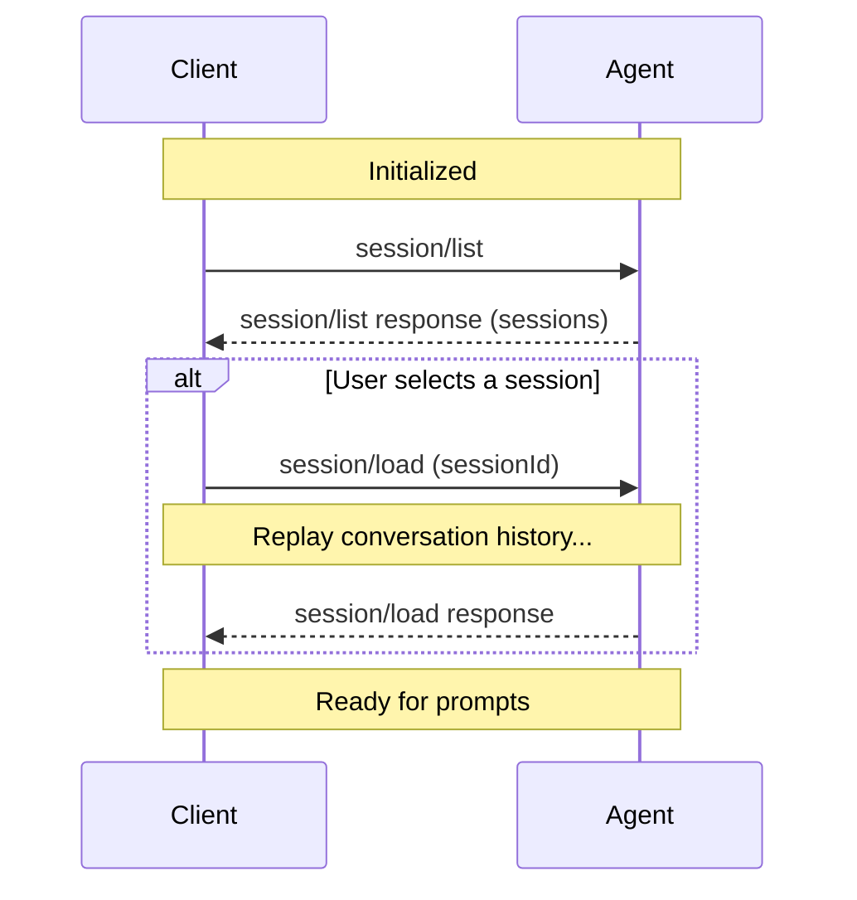
```mermaid
sequenceDiagram
    participant Client
    participant Agent

    Note over Agent,Client: Initialized

    Client->>Agent: session/list
    Agent-->>Client: session/list response (sessions)

    alt User selects a session
        Client->>Agent: session/load (sessionId)
        Note over Agent,Client: Replay conversation history...
        Agent-->>Client: session/load response
    end

    Note over Client,Agent: Ready for prompts
```

<br />

## Checking Support

Before attempting to list sessions, Clients **MUST** verify that the Agent supports this capability by checking the `sessionCapabilities.list` field in the `initialize` response:

```json highlight={7-9}
{
  "jsonrpc": "2.0",
  "id": 0,
  "result": {
    "protocolVersion": 1,
    "agentCapabilities": {
      "sessionCapabilities": {
        "list": {}
      }
    }
  }
}
```

If `sessionCapabilities.list` is not present, the Agent does not support listing sessions and Clients **MUST NOT** attempt to call `session/list`.

<Note>
  If the Agent also advertises the unstable
  `sessionCapabilities.additionalDirectories` capability, `session/list`
  supports filtering by `additionalDirectories`, and any returned
  `SessionInfo.additionalDirectories` value is the authoritative additional-root
  list for that session.
</Note>

## Listing Sessions

Clients discover existing sessions by calling the `session/list` method with optional filtering and pagination parameters:

```json
{
  "jsonrpc": "2.0",
  "id": 2,
  "method": "session/list",
  "params": {
    "cwd": "/home/user/project",
    "cursor": "eyJwYWdlIjogMn0="
  }
}
```

All parameters are optional. A request with an empty `params` object returns the first page of sessions.

<ParamField path="cwd" type="string">
  Filter sessions by working directory. Must be an absolute path. Only sessions
  with a matching `cwd` are returned.
</ParamField>

<ParamField path="additionalDirectories" type="string[]">
  If the Agent advertises `sessionCapabilities.additionalDirectories`, filter
  sessions by the exact ordered additional-root list when this field is present
  and non-empty. Omitting the field or providing an empty array means no
  additional-root filter is applied.
</ParamField>

<ParamField path="cursor" type="string">
  Opaque cursor token from a previous response's `nextCursor` field for
  cursor-based pagination. See [Pagination](#pagination).
</ParamField>

The Agent **MUST** respond with a list of sessions and optional pagination metadata:

```json
{
  "jsonrpc": "2.0",
  "id": 2,
  "result": {
    "sessions": [
      {
        "sessionId": "sess_abc123def456",
        "cwd": "/home/user/project",
        "title": "Implement session list API",
        "updatedAt": "2025-10-29T14:22:15Z",
        "_meta": {
          "messageCount": 12,
          "hasErrors": false
        }
      },
      {
        "sessionId": "sess_xyz789ghi012",
        "cwd": "/home/user/another-project",
        "title": "Debug authentication flow",
        "updatedAt": "2025-10-28T16:45:30Z"
      },
      {
        "sessionId": "sess_uvw345rst678",
        "cwd": "/home/user/project",
        "updatedAt": "2025-10-27T15:30:00Z"
      }
    ],
    "nextCursor": "eyJwYWdlIjogM30="
  }
}
```

<ResponseField name="sessions" type="SessionInfo[]" required>
  Array of session information objects.

  <Expandable title="SessionInfo">
    <ResponseField name="sessionId" type="string" required>
      Unique identifier for the session.
    </ResponseField>
    <ResponseField name="cwd" type="string" required>
      Working directory for the session. Always an absolute path.
    </ResponseField>
    <ResponseField name="additionalDirectories" type="string[]">
      If the Agent advertises `sessionCapabilities.additionalDirectories`, this
      is the authoritative ordered additional-root list for the session when
      present. Omitting the field or returning an empty array means there are no
      additional roots.
    </ResponseField>

    <ResponseField name="title" type="string">
      Human-readable title for the session. May be auto-generated from the first prompt.
    </ResponseField>
    <ResponseField name="updatedAt" type="string">
      ISO 8601 timestamp of the last activity in the session.
    </ResponseField>
    <ResponseField name="_meta" type="object">
      Agent-specific metadata. See [Extensibility](/protocol/extensibility).
    </ResponseField>

  </Expandable>
</ResponseField>

<ResponseField name="nextCursor" type="string">
  Opaque cursor token. If present, pass this in the next request's `cursor`
  parameter to fetch the next page. If absent, there are no more results.
</ResponseField>

When no sessions match the criteria, the Agent **MUST** return an empty `sessions` array.

## Pagination

`session/list` uses cursor-based pagination. The request includes an optional `cursor`, and the response includes `nextCursor` when more results are available.

- Clients **MUST** treat a missing `nextCursor` as the end of results
- Clients **MUST** treat cursors as opaque tokens — do not parse, modify, or persist them
- Agents **SHOULD** return an error if the cursor is invalid
- Agents **SHOULD** enforce reasonable page sizes internally

## Updating Session Metadata

Agents can update session metadata in real-time by sending a `session_info_update` notification via `session/update`. This follows the same pattern as other session notifications like [`available_commands_update`](/protocol/slash-commands) and [`current_mode_update`](/protocol/session-modes).

```json
{
  "jsonrpc": "2.0",
  "method": "session/update",
  "params": {
    "sessionId": "sess_abc123def456",
    "update": {
      "sessionUpdate": "session_info_update",
      "title": "Implement user authentication",
      "_meta": {
        "tags": ["feature", "auth"],
        "priority": "high"
      }
    }
  }
}
```

All fields are optional. Only include fields that have changed — omitted fields are left unchanged.

<ResponseField name="title" type="string | null">
  Human-readable title for the session. Set to `null` to clear.
</ResponseField>

<ResponseField name="updatedAt" type="string | null">
  ISO 8601 timestamp of last activity. Set to `null` to clear.
</ResponseField>

<ResponseField name="_meta" type="object">
  Agent-specific metadata. See [Extensibility](/protocol/extensibility).
</ResponseField>

The `sessionId`, `cwd`, and `additionalDirectories` fields are **not** included
in the update. `sessionId` is already in the notification's `params`, `cwd` is
immutable after session setup, and ACP does not currently define mid-session
mutation for `additionalDirectories`. Agents typically send this notification
after the first meaningful exchange to auto-generate a title.

## Interaction with Other Session Methods

`session/list` is a discovery mechanism only — it does **not** restore or modify sessions:

1. Client calls `session/list` to discover available sessions
2. User selects a session from the list
3. Client calls [`session/load`](/protocol/session-setup#loading-sessions) with the chosen `sessionId` to resume the conversation
````

## File: docs/protocol/draft/session-setup.mdx
````markdown
---
title: "Session Setup"
description: "Creating and loading sessions"
---

Sessions represent a specific conversation or thread between the [Client](/protocol/overview#client) and [Agent](/protocol/overview#agent). Each session maintains its own context, conversation history, and state, allowing multiple independent interactions with the same Agent.

Before creating a session, Clients **MUST** first complete the [initialization](/protocol/initialization) phase to establish protocol compatibility and capabilities.

<br />

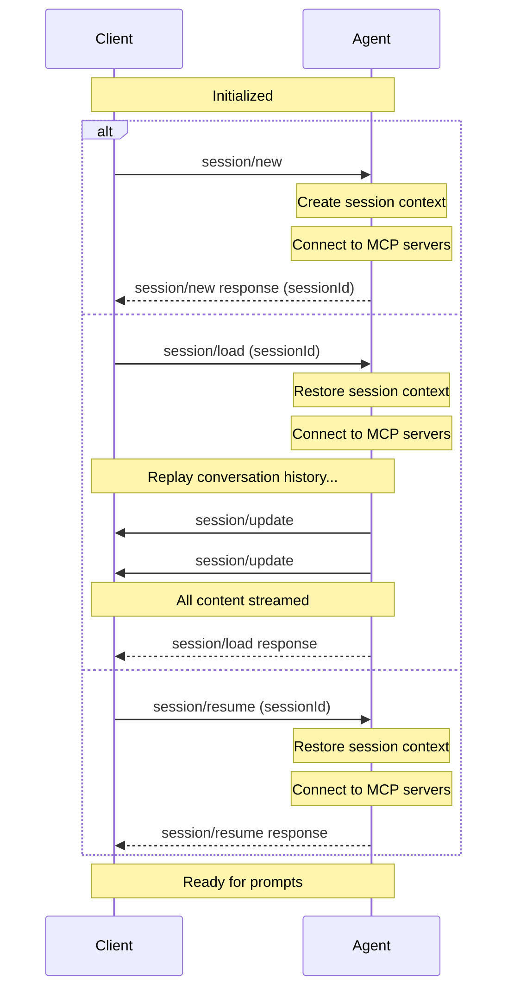
```mermaid
sequenceDiagram
    participant Client
    participant Agent

    Note over Agent,Client: Initialized

    alt
        Client->>Agent: session/new
        Note over Agent: Create session context
        Note over Agent: Connect to MCP servers
        Agent-->>Client: session/new response (sessionId)
    else
        Client->>Agent: session/load (sessionId)
        Note over Agent: Restore session context
        Note over Agent: Connect to MCP servers
        Note over Agent,Client: Replay conversation history...
        Agent->>Client: session/update
        Agent->>Client: session/update
        Note over Agent,Client: All content streamed
        Agent-->>Client: session/load response
    else
        Client->>Agent: session/resume (sessionId)
        Note over Agent: Restore session context
        Note over Agent: Connect to MCP servers
        Agent-->>Client: session/resume response
    end

    Note over Client,Agent: Ready for prompts
```

<br />

## Creating a Session

Clients create a new session by calling the `session/new` method with:

- The [working directory](#working-directory) for the session
- A list of [MCP servers](#mcp-servers) the Agent should connect to

```json
{
  "jsonrpc": "2.0",
  "id": 1,
  "method": "session/new",
  "params": {
    "cwd": "/home/user/project",
    "mcpServers": [
      {
        "name": "filesystem",
        "command": "/path/to/mcp-server",
        "args": ["--stdio"],
        "env": []
      }
    ]
  }
}
```

The Agent **MUST** respond with a unique [Session ID](#session-id) that identifies this conversation:

```json
{
  "jsonrpc": "2.0",
  "id": 1,
  "result": {
    "sessionId": "sess_abc123def456"
  }
}
```

## Loading Sessions

Agents that support the `loadSession` capability allow Clients to resume previous conversations with history replay. This feature enables persistence across restarts and sharing sessions between different Client instances.

### Checking Support

Before attempting to load a session, Clients **MUST** verify that the Agent supports this capability by checking the `loadSession` field in the `initialize` response:

```json highlight={7}
{
  "jsonrpc": "2.0",
  "id": 0,
  "result": {
    "protocolVersion": 1,
    "agentCapabilities": {
      "loadSession": true
    }
  }
}
```

If `loadSession` is `false` or not present, the Agent does not support loading sessions and Clients **MUST NOT** attempt to call `session/load`.

### Loading a Session

To load an existing session, Clients **MUST** call the `session/load` method with:

- The [Session ID](#session-id) to resume
- [MCP servers](#mcp-servers) to connect to
- The [working directory](#working-directory)

```json
{
  "jsonrpc": "2.0",
  "id": 1,
  "method": "session/load",
  "params": {
    "sessionId": "sess_789xyz",
    "cwd": "/home/user/project",
    "mcpServers": [
      {
        "name": "filesystem",
        "command": "/path/to/mcp-server",
        "args": ["--mode", "filesystem"],
        "env": []
      }
    ]
  }
}
```

The Agent **MUST** replay the entire conversation to the Client in the form of `session/update` notifications (like `session/prompt`).

For example, a user message from the conversation history:

```json
{
  "jsonrpc": "2.0",
  "method": "session/update",
  "params": {
    "sessionId": "sess_789xyz",
    "update": {
      "sessionUpdate": "user_message_chunk",
      "content": {
        "type": "text",
        "text": "What's the capital of France?"
      }
    }
  }
}
```

Followed by the agent's response:

```json
{
  "jsonrpc": "2.0",
  "method": "session/update",
  "params": {
    "sessionId": "sess_789xyz",
    "update": {
      "sessionUpdate": "agent_message_chunk",
      "content": {
        "type": "text",
        "text": "The capital of France is Paris."
      }
    }
  }
}
```

When **all** the conversation entries have been streamed to the Client, the
Agent **MUST** respond to the original `session/load` request.

```json
{
  "jsonrpc": "2.0",
  "id": 1,
  "result": {}
}
```

The response **MAY** also include initial mode, model, or session configuration
state when those features are supported by the Agent.

The Client can then continue sending prompts as if the session was never
interrupted.

## Resuming Sessions

Agents that advertise `sessionCapabilities.resume` allow Clients to reconnect to
an existing session without replaying the conversation history.

### Checking Support

Before attempting to resume a session, Clients **MUST** verify that the Agent
supports this capability by checking for the `sessionCapabilities.resume` field
in the `initialize` response:

```json highlight={7-9}
{
  "jsonrpc": "2.0",
  "id": 0,
  "result": {
    "protocolVersion": 1,
    "agentCapabilities": {
      "sessionCapabilities": {
        "resume": {}
      }
    }
  }
}
```

If `sessionCapabilities.resume` is not present, the Agent does not support
resuming sessions and Clients **MUST NOT** attempt to call `session/resume`.

### Resuming a Session

To resume an existing session without replaying prior messages, Clients
**MUST** call the `session/resume` method with:

- The [Session ID](#session-id) to resume
- [MCP servers](#mcp-servers) to connect to
- The [working directory](#working-directory)

```json
{
  "jsonrpc": "2.0",
  "id": 2,
  "method": "session/resume",
  "params": {
    "sessionId": "sess_789xyz",
    "cwd": "/home/user/project",
    "mcpServers": [
      {
        "name": "filesystem",
        "command": "/path/to/mcp-server",
        "args": ["--mode", "filesystem"],
        "env": []
      }
    ]
  }
}
```

Unlike `session/load`, the Agent **MUST NOT** replay the conversation history
via `session/update` notifications before responding. Instead, it restores the
session context, reconnects to the requested MCP servers, and returns once the
session is ready to continue.

```json
{
  "jsonrpc": "2.0",
  "id": 2,
  "result": {}
}
```

The response **MAY** also include initial mode, model, or session configuration
state when those features are supported by the Agent.

## Closing Active Sessions

Agents that advertise `sessionCapabilities.close` allow Clients to tell the
Agent to cancel any ongoing work for a session and free any resources
associated with that active session.

### Checking Support

Before attempting to close a session, Clients **MUST** verify that the Agent
supports this capability by checking the `sessionCapabilities.close` field in
the `initialize` response:

```json highlight={7-9}
{
  "jsonrpc": "2.0",
  "id": 0,
  "result": {
    "protocolVersion": 1,
    "agentCapabilities": {
      "sessionCapabilities": {
        "close": {}
      }
    }
  }
}
```

If `sessionCapabilities.close` is not present, the Agent does not support
closing sessions and Clients **MUST NOT** attempt to call `session/close`.

### Closing a Session

To close an active session, Clients **MUST** call the `session/close` method
with the session ID:

```json
{
  "jsonrpc": "2.0",
  "id": 2,
  "method": "session/close",
  "params": {
    "sessionId": "sess_789xyz"
  }
}
```

<ParamField path="sessionId" type="SessionId" required>
  The ID of the active session to close.
</ParamField>

The Agent **MUST** cancel any ongoing work for that session as if
[`session/cancel`](../prompt-turn#cancellation) had been called, then free the
resources associated with the session.

On success, the Agent responds with an empty result object:

```json
{
  "jsonrpc": "2.0",
  "id": 2,
  "result": {}
}
```

Agents MAY return an error if the session does not exist or is not currently
active.

## Additional Workspace Roots

<Note>
  This section describes the unstable
  `sessionCapabilities.additionalDirectories` capability. Clients MUST gate
  usage on that capability being present during initialization.
</Note>

When advertised, Clients MAY include `additionalDirectories` on supported
session lifecycle requests to expand the session's effective filesystem root
set. In the stable lifecycle pages, that means `session/new`, `session/load`,
and `session/resume`. The same unstable field is also available on
`session/fork` when that method is supported.

```json
{
  "jsonrpc": "2.0",
  "id": 2,
  "method": "session/load",
  "params": {
    "sessionId": "sess_789xyz",
    "cwd": "/home/user/project",
    "additionalDirectories": [
      "/home/user/shared-lib",
      "/home/user/product-docs"
    ],
    "mcpServers": []
  }
}
```

When present, `additionalDirectories` has the following behavior:

- `cwd` remains the primary working directory and the base for relative paths
- each `additionalDirectories` entry **MUST** be an absolute path
- omitting the field or providing an empty array activates no additional roots for the resulting session
- on `session/load` and `session/resume`, Clients must send the full intended additional-root list again because omitting the field or providing an empty array does not restore stored roots implicitly

## Session ID

The session ID returned by `session/new` is a unique identifier for the conversation context.

Clients use this ID to:

- Send prompt requests via `session/prompt`
- Cancel ongoing operations via `session/cancel`
- Load previous sessions via `session/load` (if the Agent supports the `loadSession` capability)
- Resume previous sessions via `session/resume` (if the Agent supports the `sessionCapabilities.resume` capability)
- Close active sessions via `session/close` (if the Agent supports the `sessionCapabilities.close` capability)

## Working Directory

The `cwd` (current working directory) parameter establishes the primary file
system context for the session. This directory:

- **MUST** be an absolute path
- **MUST** be used for the session regardless of where the Agent subprocess was spawned
- **MUST** remain the base for relative-path resolution
- **MUST** be part of the session's effective root set

When the unstable `sessionCapabilities.additionalDirectories` capability is in
use, the session's effective root set is `[cwd, ...additionalDirectories]`.
Otherwise, the effective root set is just `cwd`.

## MCP Servers

The [Model Context Protocol (MCP)](https://modelcontextprotocol.io) allows Agents to access external tools and data sources. When creating a session, Clients **MAY** include connection details for MCP servers that the Agent should connect to.

MCP servers can be connected to using different transports. All Agents **MUST** support the stdio transport, while HTTP and SSE transports are optional capabilities that can be checked during initialization.

While they are not required to by the spec, new Agents **SHOULD** support the HTTP transport to ensure compatibility with modern MCP servers.

### Transport Types

#### Stdio Transport

All Agents **MUST** support connecting to MCP servers via stdio (standard input/output). This is the default transport mechanism.

<ParamField path="name" type="string" required>
  A human-readable identifier for the server
</ParamField>

<ParamField path="command" type="string" required>
  The absolute path to the MCP server executable
</ParamField>

<ParamField path="args" type="array" required>
  Command-line arguments to pass to the server
</ParamField>

<ParamField path="env" type="EnvVariable[]">
  Environment variables to set when launching the server

  <Expandable title="EnvVariable">
      <ParamField path="name" type="string">
        The name of the environment variable.
      </ParamField>
      <ParamField path="value" type="string">
        The value of the environment variable.
      </ParamField>
  </Expandable>
</ParamField>

Example stdio transport configuration:

```json
{
  "name": "filesystem",
  "command": "/path/to/mcp-server",
  "args": ["--stdio"],
  "env": [
    {
      "name": "API_KEY",
      "value": "secret123"
    }
  ]
}
```

#### HTTP Transport

When the Agent supports `mcpCapabilities.http`, Clients can specify MCP servers configurations using the HTTP transport.

<ParamField path="type" type="string" required>
  Must be `"http"` to indicate HTTP transport
</ParamField>

<ParamField path="name" type="string" required>
  A human-readable identifier for the server
</ParamField>

<ParamField path="url" type="string" required>
  The URL of the MCP server
</ParamField>

<ParamField path="headers" type="HttpHeader[]" required>
  HTTP headers to include in requests to the server

  <Expandable title="HttpHeader">
      <ParamField path="name" type="string">
        The name of the HTTP header.
      </ParamField>
      <ParamField path="value" type="string">
        The value to set for the HTTP header.
      </ParamField>
  </Expandable>
</ParamField>

Example HTTP transport configuration:

```json
{
  "type": "http",
  "name": "api-server",
  "url": "https://api.example.com/mcp",
  "headers": [
    {
      "name": "Authorization",
      "value": "Bearer token123"
    },
    {
      "name": "Content-Type",
      "value": "application/json"
    }
  ]
}
```

#### SSE Transport

When the Agent supports `mcpCapabilities.sse`, Clients can specify MCP servers configurations using the SSE transport.

<Warning>This transport was deprecated by the MCP spec.</Warning>

<ParamField path="type" type="string" required>
  Must be `"sse"` to indicate SSE transport
</ParamField>

<ParamField path="name" type="string" required>
  A human-readable identifier for the server
</ParamField>

<ParamField path="url" type="string" required>
  The URL of the SSE endpoint
</ParamField>

<ParamField path="headers" type="HttpHeader[]" required>
  HTTP headers to include when establishing the SSE connection

  <Expandable title="HttpHeader">
      <ParamField path="name" type="string">
        The name of the HTTP header.
      </ParamField>
      <ParamField path="value" type="string">
        The value to set for the HTTP header.
      </ParamField>
  </Expandable>
</ParamField>

Example SSE transport configuration:

```json
{
  "type": "sse",
  "name": "event-stream",
  "url": "https://events.example.com/mcp",
  "headers": [
    {
      "name": "X-API-Key",
      "value": "apikey456"
    }
  ]
}
```

### Checking Transport Support

Before using HTTP or SSE transports, Clients **MUST** verify the Agent's capabilities during initialization:

```json highlight={7-10}
{
  "jsonrpc": "2.0",
  "id": 0,
  "result": {
    "protocolVersion": 1,
    "agentCapabilities": {
      "mcpCapabilities": {
        "http": true,
        "sse": true
      }
    }
  }
}
```

If `mcpCapabilities.http` is `false` or not present, the Agent does not support HTTP transport.
If `mcpCapabilities.sse` is `false` or not present, the Agent does not support SSE transport.

Agents **SHOULD** connect to all MCP servers specified by the Client.

Clients **MAY** use this ability to provide tools directly to the underlying language model by including their own MCP server.
````

## File: docs/protocol/agent-plan.mdx
````markdown
---
title: "Agent Plan"
description: "How Agents communicate their execution plans"
---

Plans are execution strategies for complex tasks that require multiple steps.

Agents may share plans with Clients through [`session/update`](./prompt-turn#3-agent-reports-output) notifications, providing real-time visibility into their thinking and progress.

## Creating Plans

When the language model creates an execution plan, the Agent **SHOULD** report it to the Client:

```json
{
  "jsonrpc": "2.0",
  "method": "session/update",
  "params": {
    "sessionId": "sess_abc123def456",
    "update": {
      "sessionUpdate": "plan",
      "entries": [
        {
          "content": "Analyze the existing codebase structure",
          "priority": "high",
          "status": "pending"
        },
        {
          "content": "Identify components that need refactoring",
          "priority": "high",
          "status": "pending"
        },
        {
          "content": "Create unit tests for critical functions",
          "priority": "medium",
          "status": "pending"
        }
      ]
    }
  }
}
```

<ParamField path="entries" type="PlanEntry[]" required>
  An array of [plan entries](#plan-entries) representing the tasks to be
  accomplished
</ParamField>

## Plan Entries

Each plan entry represents a specific task or goal within the overall execution strategy:

<ParamField path="content" type="string" required>
  A human-readable description of what this task aims to accomplish
</ParamField>

<ParamField path="priority" type="PlanEntryPriority" required>
  The relative importance of this task.

- `high`
- `medium`
- `low`

</ParamField>

<ParamField path="status" type="PlanEntryStatus" required>
  The current [execution status](#status) of this task

- `pending`
- `in_progress`
- `completed`

</ParamField>

## Updating Plans

As the Agent progresses through the plan, it **SHOULD** report updates by sending more `session/update` notifications with the same structure.

The Agent **MUST** send a complete list of all plan entries in each update and their current status. The Client **MUST** replace the current plan completely.

### Dynamic Planning

Plans can evolve during execution. The Agent **MAY** add, remove, or modify plan entries as it discovers new requirements or completes tasks, allowing it to adapt based on what it learns.
````

## File: docs/protocol/content.mdx
````markdown
---
title: "Content"
description: "Understanding content blocks in the Agent Client Protocol"
---

Content blocks represent displayable information that flows through the Agent Client Protocol. They provide a structured way to handle various types of user-facing content—whether it's text from language models, images for analysis, or embedded resources for context.

Content blocks appear in:

- User prompts sent via [`session/prompt`](./prompt-turn#1-user-message)
- Language model output streamed through [`session/update`](./prompt-turn#3-agent-reports-output) notifications
- Progress updates and results from [tool calls](./tool-calls)

## Content Types

The Agent Client Protocol uses the same `ContentBlock` structure as the [Model Context Protocol (MCP)](https://modelcontextprotocol.io/specification/2025-06-18/schema#contentblock).

This design choice enables Agents to seamlessly forward content from MCP tool outputs without transformation.

### Text Content

Plain text messages form the foundation of most interactions.

```json
{
  "type": "text",
  "text": "What's the weather like today?"
}
```

All Agents **MUST** support text content blocks when included in prompts.

<ParamField path="text" type="string" required>
  The text content to display
</ParamField>

<ParamField path="annotations" type="Annotations">
  Optional metadata about how the content should be used or displayed. [Learn
  more](https://modelcontextprotocol.io/specification/2025-06-18/server/resources#annotations).
</ParamField>

### Image Content <Icon icon="asterisk" size="14" />

Images can be included for visual context or analysis.

```json
{
  "type": "image",
  "mimeType": "image/png",
  "data": "iVBORw0KGgoAAAANSUhEUgAAAAEAAAAB..."
}
```

<Icon icon="asterisk" size="14" /> Requires the `image` [prompt
capability](./initialization#prompt-capabilities) when included in prompts.

<ParamField path="data" type="string" required>
  Base64-encoded image data
</ParamField>

<ParamField path="mimeType" type="string" required>
  The MIME type of the image (e.g., "image/png", "image/jpeg")
</ParamField>

<ParamField path="uri" type="string">
  Optional URI reference for the image source
</ParamField>

<ParamField path="annotations" type="Annotations">
  Optional metadata about how the content should be used or displayed. [Learn
  more](https://modelcontextprotocol.io/specification/2025-06-18/server/resources#annotations).
</ParamField>

### Audio Content <Icon icon="asterisk" size="14" />

Audio data for transcription or analysis.

```json
{
  "type": "audio",
  "mimeType": "audio/wav",
  "data": "UklGRiQAAABXQVZFZm10IBAAAAABAAEAQB8AAAB..."
}
```

<Icon icon="asterisk" size="14" /> Requires the `audio` [prompt
capability](./initialization#prompt-capabilities) when included in prompts.

<ParamField path="data" type="string" required>
  Base64-encoded audio data
</ParamField>

<ParamField path="mimeType" type="string" required>
  The MIME type of the audio (e.g., "audio/wav", "audio/mp3")
</ParamField>

<ParamField path="annotations" type="Annotations">
  Optional metadata about how the content should be used or displayed. [Learn
  more](https://modelcontextprotocol.io/specification/2025-06-18/server/resources#annotations).
</ParamField>

### Embedded Resource <Icon icon="asterisk" size="14" />

Complete resource contents embedded directly in the message.

```json
{
  "type": "resource",
  "resource": {
    "uri": "file:///home/user/script.py",
    "mimeType": "text/x-python",
    "text": "def hello():\n    print('Hello, world!')"
  }
}
```

This is the preferred way to include context in prompts, such as when using @-mentions to reference files or other resources.

By embedding the content directly in the request, Clients can include context from sources that the Agent may not have direct access to.

<Icon icon="asterisk" size="14" /> Requires the `embeddedContext` [prompt
capability](./initialization#prompt-capabilities) when included in prompts.

<ParamField path="resource" type="EmbeddedResourceResource" required>
  The embedded resource contents, which can be either:

  <Expandable title="Text Resource">
    <ParamField path="uri" type="string" required>
      The URI identifying the resource
    </ParamField>

    <ParamField path="text" type="string" required>
      The text content of the resource
    </ParamField>

    <ParamField path="mimeType" type="string">
      Optional MIME type of the text content
    </ParamField>

  </Expandable>

  <Expandable title="Blob Resource">
    <ParamField path="uri" type="string" required>
      The URI identifying the resource
    </ParamField>

    <ParamField path="blob" type="string" required>
      Base64-encoded binary data
    </ParamField>

    <ParamField path="mimeType" type="string">
      Optional MIME type of the blob
    </ParamField>

  </Expandable>
</ParamField>

<ParamField path="annotations" type="Annotations">
  Optional metadata about how the content should be used or displayed. [Learn
  more](https://modelcontextprotocol.io/specification/2025-06-18/server/resources#annotations).
</ParamField>

### Resource Link

References to resources that the Agent can access.

```json
{
  "type": "resource_link",
  "uri": "file:///home/user/document.pdf",
  "name": "document.pdf",
  "mimeType": "application/pdf",
  "size": 1024000
}
```

<ParamField path="uri" type="string" required>
  The URI of the resource
</ParamField>

<ParamField path="name" type="string" required>
  A human-readable name for the resource
</ParamField>

<ParamField path="mimeType" type="string">
  The MIME type of the resource
</ParamField>

<ParamField path="title" type="string">
  Optional display title for the resource
</ParamField>

<ParamField path="description" type="string">
  Optional description of the resource contents
</ParamField>

<ParamField path="size" type="integer">
  Optional size of the resource in bytes
</ParamField>

<ParamField path="annotations" type="Annotations">
  Optional metadata about how the content should be used or displayed. [Learn
  more](https://modelcontextprotocol.io/specification/2025-06-18/server/resources#annotations).
</ParamField>
````

## File: docs/protocol/error.mdx
````markdown
---
title: "Error"
description: "Error handling in the Agent Client Protocol"
---

_Documentation coming soon_
````

## File: docs/protocol/extensibility.mdx
````markdown
---
title: "Extensibility"
description: "Adding custom data and capabilities"
---

The Agent Client Protocol provides built-in extension mechanisms that allow implementations to add custom functionality while maintaining compatibility with the core protocol. These mechanisms ensure that Agents and Clients can innovate without breaking interoperability.

## The `_meta` Field

All types in the protocol include a `_meta` field with type `{ [key: string]: unknown }` that implementations can use to attach custom information. This includes requests, responses, notifications, and even nested types like content blocks, tool calls, plan entries, and capability objects.

```json
{
  "jsonrpc": "2.0",
  "id": 1,
  "method": "session/prompt",
  "params": {
    "sessionId": "sess_abc123def456",
    "prompt": [
      {
        "type": "text",
        "text": "Hello, world!"
      }
    ],
    "_meta": {
      "traceparent": "00-80e1afed08e019fc1110464cfa66635c-7a085853722dc6d2-01",
      "zed.dev/debugMode": true
    }
  }
}
```

Clients may propagate fields to the agent for correlation purposes, such as `requestId`. The following root-level keys in `_meta` **SHOULD** be reserved for [W3C trace context](https://www.w3.org/TR/trace-context/) to guarantee interop with existing MCP implementations and OpenTelemetry tooling:

- `traceparent`
- `tracestate`
- `baggage`

Implementations **MUST NOT** add any custom fields at the root of a type that's part of the specification. All possible names are reserved for future protocol versions.

## Extension Methods

The protocol reserves any method name starting with an underscore (`_`) for custom extensions. This allows implementations to add new functionality without the risk of conflicting with future protocol versions.

Extension methods follow standard [JSON-RPC 2.0](https://www.jsonrpc.org/specification) semantics:

- **[Requests](https://www.jsonrpc.org/specification#request_object)** - Include an `id` field and expect a response
- **[Notifications](https://www.jsonrpc.org/specification#notification)** - Omit the `id` field and are one-way

### Custom Requests

In addition to the requests specified by the protocol, implementations **MAY** expose and call custom JSON-RPC requests as long as their name starts with an underscore (`_`).

```json
{
  "jsonrpc": "2.0",
  "id": 1,
  "method": "_zed.dev/workspace/buffers",
  "params": {
    "language": "rust"
  }
}
```

Upon receiving a custom request, implementations **MUST** respond accordingly with the provided `id`:

```json
{
  "jsonrpc": "2.0",
  "id": 1,
  "result": {
    "buffers": [
      { "id": 0, "path": "/home/user/project/src/main.rs" },
      { "id": 1, "path": "/home/user/project/src/editor.rs" }
    ]
  }
}
```

If the receiving end doesn't recognize the custom method name, it should respond with the standard "Method not found" error:

```json
{
  "jsonrpc": "2.0",
  "id": 1,
  "error": {
    "code": -32601,
    "message": "Method not found"
  }
}
```

To avoid such cases, extensions **SHOULD** advertise their [custom capabilities](#advertising-custom-capabilities) so that callers can check their availability first and adapt their behavior or interface accordingly.

### Custom Notifications

Custom notifications are regular JSON-RPC notifications that start with an underscore (`_`). Like all notifications, they omit the `id` field:

```json
{
  "jsonrpc": "2.0",
  "method": "_zed.dev/file_opened",
  "params": {
    "path": "/home/user/project/src/editor.rs"
  }
}
```

Unlike with custom requests, implementations **SHOULD** ignore unrecognized notifications.

## Advertising Custom Capabilities

Implementations **SHOULD** use the `_meta` field in capability objects to advertise support for extensions and their methods:

```json
{
  "jsonrpc": "2.0",
  "id": 0,
  "result": {
    "protocolVersion": 1,
    "agentCapabilities": {
      "loadSession": true,
      "_meta": {
        "zed.dev": {
          "workspace": true,
          "fileNotifications": true
        }
      }
    }
  }
}
```

This allows implementations to negotiate custom features during initialization without breaking compatibility with standard Clients and Agents.
````

## File: docs/protocol/file-system.mdx
````markdown
---
title: "File System"
description: "Client filesystem access methods"
---

The filesystem methods allow Agents to read and write text files within the Client's environment. These methods enable Agents to access unsaved editor state and allow Clients to track file modifications made during agent execution.

## Checking Support

Before attempting to use filesystem methods, Agents **MUST** verify that the Client supports these capabilities by checking the [Client Capabilities](./initialization#client-capabilities) field in the `initialize` response:

```json highlight={8,9}
{
  "jsonrpc": "2.0",
  "id": 0,
  "result": {
    "protocolVersion": 1,
    "clientCapabilities": {
      "fs": {
        "readTextFile": true,
        "writeTextFile": true
      }
    }
  }
}
```

If `readTextFile` or `writeTextFile` is `false` or not present, the Agent **MUST NOT** attempt to call the corresponding filesystem method.

## Reading Files

The `fs/read_text_file` method allows Agents to read text file contents from the Client's filesystem, including unsaved changes in the editor.

```json
{
  "jsonrpc": "2.0",
  "id": 3,
  "method": "fs/read_text_file",
  "params": {
    "sessionId": "sess_abc123def456",
    "path": "/home/user/project/src/main.py",
    "line": 10,
    "limit": 50
  }
}
```

<ParamField path="sessionId" type="SessionId" required>
  The [Session ID](./session-setup#session-id) for this request
</ParamField>

<ParamField path="path" type="string" required>
  Absolute path to the file to read
</ParamField>

<ParamField path="line" type="number">
  Optional line number to start reading from (1-based)
</ParamField>

<ParamField path="limit" type="number">
  Optional maximum number of lines to read
</ParamField>

The Client responds with the file contents:

```json
{
  "jsonrpc": "2.0",
  "id": 3,
  "result": {
    "content": "def hello_world():\n    print('Hello, world!')\n"
  }
}
```

## Writing Files

The `fs/write_text_file` method allows Agents to write or update text files in the Client's filesystem.

```json
{
  "jsonrpc": "2.0",
  "id": 4,
  "method": "fs/write_text_file",
  "params": {
    "sessionId": "sess_abc123def456",
    "path": "/home/user/project/config.json",
    "content": "{\n  \"debug\": true,\n  \"version\": \"1.0.0\"\n}"
  }
}
```

<ParamField path="sessionId" type="SessionId" required>
  The [Session ID](./session-setup#session-id) for this request
</ParamField>

<ParamField path="path" type="string" required>
Absolute path to the file to write.

The Client **MUST** create the file if it doesn't exist.

</ParamField>

<ParamField path="content" type="string" required>
  The text content to write to the file
</ParamField>

The Client responds with an empty result on success:

```json
{
  "jsonrpc": "2.0",
  "id": 4,
  "result": null
}
```
````

## File: docs/protocol/initialization.mdx
````markdown
---
title: "Initialization"
description: "How all Agent Client Protocol connections begin"
---

{/* todo! link to all concepts */}

The Initialization phase allows [Clients](./overview#client) and [Agents](./overview#agent) to negotiate protocol versions, capabilities, and authentication methods.

<br />

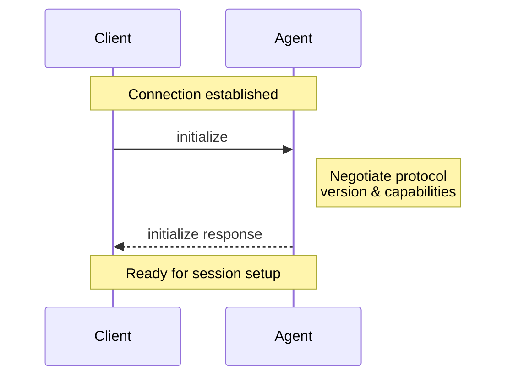
```mermaid
sequenceDiagram
    participant Client
    participant Agent

    Note over Client, Agent: Connection established
    Client->>Agent: initialize
    Note right of Agent: Negotiate protocol<br/>version & capabilities
    Agent-->>Client: initialize response
    Note over Client,Agent: Ready for session setup
```

<br />

Before a Session can be created, Clients **MUST** initialize the connection by calling the `initialize` method with:

- The latest [protocol version](#protocol-version) supported
- The [capabilities](#client-capabilities) supported

They **SHOULD** also provide a name and version to the Agent.

```json
{
  "jsonrpc": "2.0",
  "id": 0,
  "method": "initialize",
  "params": {
    "protocolVersion": 1,
    "clientCapabilities": {
      "fs": {
        "readTextFile": true,
        "writeTextFile": true
      },
      "terminal": true
    },
    "clientInfo": {
      "name": "my-client",
      "title": "My Client",
      "version": "1.0.0"
    }
  }
}
```

The Agent **MUST** respond with the chosen [protocol version](#protocol-version) and the [capabilities](#agent-capabilities) it supports. It **SHOULD** also provide a name and version to the Client as well:

```json
{
  "jsonrpc": "2.0",
  "id": 0,
  "result": {
    "protocolVersion": 1,
    "agentCapabilities": {
      "loadSession": true,
      "promptCapabilities": {
        "image": true,
        "audio": true,
        "embeddedContext": true
      },
      "mcpCapabilities": {
        "http": true,
        "sse": true
      }
    },
    "agentInfo": {
      "name": "my-agent",
      "title": "My Agent",
      "version": "1.0.0"
    },
    "authMethods": []
  }
}
```

## Protocol version

The protocol versions that appear in the `initialize` requests and responses are a single integer that identifies a **MAJOR** protocol version. This version is only incremented when breaking changes are introduced.

Clients and Agents **MUST** agree on a protocol version and act according to its specification.

See [Capabilities](#capabilities) to learn how non-breaking features are introduced.

### Version Negotiation

The `initialize` request **MUST** include the latest protocol version the Client supports.

If the Agent supports the requested version, it **MUST** respond with the same version. Otherwise, the Agent **MUST** respond with the latest version it supports.

If the Client does not support the version specified by the Agent in the `initialize` response, the Client **SHOULD** close the connection and inform the user about it.

## Capabilities

Capabilities describe features supported by the Client and the Agent.

All capabilities included in the `initialize` request are **OPTIONAL**. Clients and Agents **SHOULD** support all possible combinations of their peer's capabilities.

The introduction of new capabilities is not considered a breaking change. Therefore, Clients and Agents **MUST** treat all capabilities omitted in the `initialize` request as **UNSUPPORTED**.

Capabilities are high-level and are not attached to a specific base protocol concept.

Capabilities may specify the availability of protocol methods, notifications, or a subset of their parameters. They may also signal behaviors of the Agent or Client implementation.

Implementations can also [advertise custom capabilities](./extensibility#advertising-custom-capabilities) using the `_meta` field to indicate support for protocol extensions.

### Client Capabilities

The Client **SHOULD** specify whether it supports the following capabilities:

#### File System

<ParamField path="readTextFile" type="boolean">
  The `fs/read_text_file` method is available.
</ParamField>

<ParamField path="writeTextFile" type="boolean">
  The `fs/write_text_file` method is available.
</ParamField>

<Card icon="file" horizontal href="./file-system">
  Learn more about File System methods
</Card>

#### Terminal

<ParamField path="terminal" type="boolean">
  All `terminal/*` methods are available, allowing the Agent to execute and
  manage shell commands.
</ParamField>

<Card icon="terminal" horizontal href="./terminals">
  Learn more about Terminals
</Card>

### Agent Capabilities

The Agent **SHOULD** specify whether it supports the following capabilities:

<ResponseField name="loadSession" type="boolean" post={["default: false"]}>
  The [`session/load`](./session-setup#loading-sessions) method is available.
</ResponseField>

<ResponseField name="promptCapabilities" type="PromptCapabilities Object">
  Object indicating the different types of [content](./content) that may be
  included in `session/prompt` requests.
</ResponseField>

#### Prompt capabilities

As a baseline, all Agents **MUST** support `ContentBlock::Text` and `ContentBlock::ResourceLink` in `session/prompt` requests.

Optionally, they **MAY** support richer types of [content](./content) by specifying the following capabilities:

<ResponseField name="image" type="boolean" post={["default: false"]}>
  The prompt may include `ContentBlock::Image`
</ResponseField>

<ResponseField name="audio" type="boolean" post={["default: false"]}>
  The prompt may include `ContentBlock::Audio`
</ResponseField>

<ResponseField name="embeddedContext" type="boolean" post={["default: false"]}>
  The prompt may include `ContentBlock::Resource`
</ResponseField>

#### MCP capabilities

<ResponseField name="http" type="boolean" post={["default: false"]}>
  The Agent supports connecting to MCP servers over HTTP.
</ResponseField>

<ResponseField name="sse" type="boolean" post={["default: false"]}>
  The Agent supports connecting to MCP servers over SSE.

Note: This transport has been deprecated by the MCP spec.

</ResponseField>

#### Session Capabilities

As a baseline, all Agents **MUST** support `session/new`, `session/prompt`, `session/cancel`, and `session/update`.

Optionally, they **MAY** support other session methods and notifications by specifying additional capabilities.

<Note>
  `session/load` is still handled by the top-level `load_session` capability.
  This will be unified in future versions of the protocol.
</Note>

## Implementation Information

Both Clients and Agents **SHOULD** provide information about their implementation in the `clientInfo` and `agentInfo` fields respectively. Both take the following three fields:

<ParamField path="name" type="string">
  Intended for programmatic or logical use, but can be used as a display name
  fallback if title isn’t present.
</ParamField>

<ParamField path="title" type="string">
  Intended for UI and end-user contexts — optimized to be human-readable and
  easily understood. If not provided, the name should be used for display.
</ParamField>

<ParamField path="version" type="string">
  Version of the implementation. Can be displayed to the user or used for
  debugging or metrics purposes.
</ParamField>

<Info>
  Note: in future versions of the protocol, this information will be required.
</Info>

---

Once the connection is initialized, you're ready to [create a session](./session-setup) and begin the conversation with the Agent.
````

## File: docs/protocol/overview.mdx
````markdown
---
title: "Overview"
description: "How the Agent Client Protocol works"
---

The Agent Client Protocol allows [Agents](#agent) and [Clients](#client) to communicate by exposing methods that each side can call and sending notifications to inform each other of events.

## Communication Model

The protocol follows the [JSON-RPC 2.0](https://www.jsonrpc.org/specification) specification with two types of messages:

- **Methods**: Request-response pairs that expect a result or error
- **Notifications**: One-way messages that don't expect a response

## Message Flow

A typical flow follows this pattern:

<Steps>
<Step title="Initialization Phase">

- Client → Agent: `initialize` to establish connection
- Client → Agent: `authenticate` if required by the Agent

</Step>

<Step title="Session Setup - either:">

- Client → Agent: `session/new` to create a new session
- Client → Agent: `session/load` to resume an existing session if supported

</Step>

<Step title="Prompt Turn">
   - Client → Agent: `session/prompt` to send user message
   - Agent → Client: `session/update` notifications for progress updates
   - Agent → Client: File operations or permission requests as needed
   - Client → Agent: `session/cancel` to interrupt processing if needed
   - Turn ends and the Agent sends the `session/prompt` response with a stop reason
</Step>
</Steps>

## Agent

Agents are programs that use generative AI to autonomously modify code. They typically run as subprocesses of the Client.

### Baseline Methods

<ResponseField
  name="initialize"
  post={[<a href="./schema#initialize">Schema</a>]}
>
  [Negotiate versions and exchange capabilities.](./initialization).
</ResponseField>

<ResponseField
  name="authenticate"
  post={[<a href="./schema#authenticate">Schema</a>]}
>
  Authenticate with the Agent (if required).
</ResponseField>

<ResponseField
  name="session/new"
  post={[<a href="./schema#session%2Fnew">Schema</a>]}
>
  [Create a new conversation session](./session-setup#creating-a-session).
</ResponseField>

<ResponseField
  name="session/prompt"
  post={[<a href="./schema#session%2Fprompt">Schema</a>]}
>
  [Send user prompts](./prompt-turn#1-user-message) to the Agent.
</ResponseField>

### Optional Methods

<ResponseField
  name="session/load"
  post={[<a href="./schema#session%2Fload">Schema</a>]}
>
  [Load an existing session](./session-setup#loading-sessions) (requires
  `loadSession` capability).
</ResponseField>

<ResponseField
  name="session/set_mode"
  post={[<a href="./schema#session%2Fset-mode">Schema</a>]}
>
  [Switch between agent operating
  modes](./session-modes#setting-the-current-mode).
</ResponseField>

### Notifications

<ResponseField
  name="session/cancel"
  post={[<a href="./schema#session%2Fcancel">Schema</a>]}
>
  [Cancel ongoing operations](./prompt-turn#cancellation) (no response
  expected).
</ResponseField>

## Client

Clients provide the interface between users and agents. They are typically code editors (IDEs, text editors) but can also be other UIs for interacting with agents. Clients manage the environment, handle user interactions, and control access to resources.

### Baseline Methods

<ResponseField
  name="session/request_permission"
  post={[<a href="./schema#session%2Frequest_permission">Schema</a>]}
>
  [Request user authorization](./tool-calls#requesting-permission) for tool
  calls.
</ResponseField>

### Optional Methods

<ResponseField
  name="fs/read_text_file"
  post={[<a href="./schema#fs%2Fread_text_file">Schema</a>]}
>
  [Read file contents](./file-system#reading-files) (requires `fs.readTextFile`
  capability).
</ResponseField>

<ResponseField
  name="fs/write_text_file"
  post={[<a href="./schema#fs%2Fwrite_text_file">Schema</a>]}
>
  [Write file contents](./file-system#writing-files) (requires
  `fs.writeTextFile` capability).
</ResponseField>

<ResponseField
  name="terminal/create"
  post={[<a href="./schema#terminal%2Fcreate">Schema</a>]}
>
  [Create a new terminal](./terminals) (requires `terminal` capability).
</ResponseField>

<ResponseField
  name="terminal/output"
  post={[<a href="./schema#terminal%2Foutput">Schema</a>]}
>
  Get terminal output and exit status (requires `terminal` capability).
</ResponseField>

<ResponseField
  name="terminal/release"
  post={[<a href="./schema#terminal%2Frelease">Schema</a>]}
>
  Release a terminal (requires `terminal` capability).
</ResponseField>

<ResponseField
  name="terminal/wait_for_exit"
  post={[<a href="./schema#terminal%2Fwait_for_exit">Schema</a>]}
>
  Wait for terminal command to exit (requires `terminal` capability).
</ResponseField>

<ResponseField
  name="terminal/kill"
  post={[<a href="./schema#terminal%2Fkill">Schema</a>]}
>
  Kill terminal command without releasing (requires `terminal` capability).
</ResponseField>

### Notifications

<ResponseField
  name="session/update"
  post={[<a href="./schema#session%2Fupdate">Schema</a>]}
>
  [Send session updates](./prompt-turn#3-agent-reports-output) to inform the
  Client of changes (no response expected). This includes: - [Message
  chunks](./content) (agent, user, thought) - [Tool calls and
  updates](./tool-calls) - [Plans](./agent-plan) - [Available commands
  updates](./slash-commands#advertising-commands) - [Mode
  changes](./session-modes#from-the-agent)
</ResponseField>

## Argument requirements

- All file paths in the protocol **MUST** be absolute.
- Line numbers are 1-based

## Error Handling

All methods follow standard JSON-RPC 2.0 [error handling](https://www.jsonrpc.org/specification#error_object):

- Successful responses include a `result` field
- Errors include an `error` object with `code` and `message`
- Notifications never receive responses (success or error)

## Extensibility

The protocol provides built-in mechanisms for adding custom functionality while maintaining compatibility:

- Add custom data using `_meta` fields
- Create custom methods by prefixing their name with underscore (`_`)
- Advertise custom capabilities during initialization

Learn about [protocol extensibility](./extensibility) to understand how to use these mechanisms.

## Next Steps

- Learn about [Initialization](./initialization) to understand version and capability negotiation
- Understand [Session Setup](./session-setup) for creating and loading sessions
- Review the [Prompt Turn](./prompt-turn) lifecycle
- Explore [Extensibility](./extensibility) to add custom features
````

## File: docs/protocol/prompt-turn.mdx
````markdown
---
title: "Prompt Turn"
description: "Understanding the core conversation flow"
---

A prompt turn represents a complete interaction cycle between the [Client](./overview#client) and [Agent](./overview#agent), starting with a user message and continuing until the Agent completes its response. This may involve multiple exchanges with the language model and tool invocations.

Before sending prompts, Clients **MUST** first complete the [initialization](./initialization) phase and [session setup](./session-setup).

## The Prompt Turn Lifecycle

A prompt turn follows a structured flow that enables rich interactions between the user, Agent, and any connected tools.

<br />

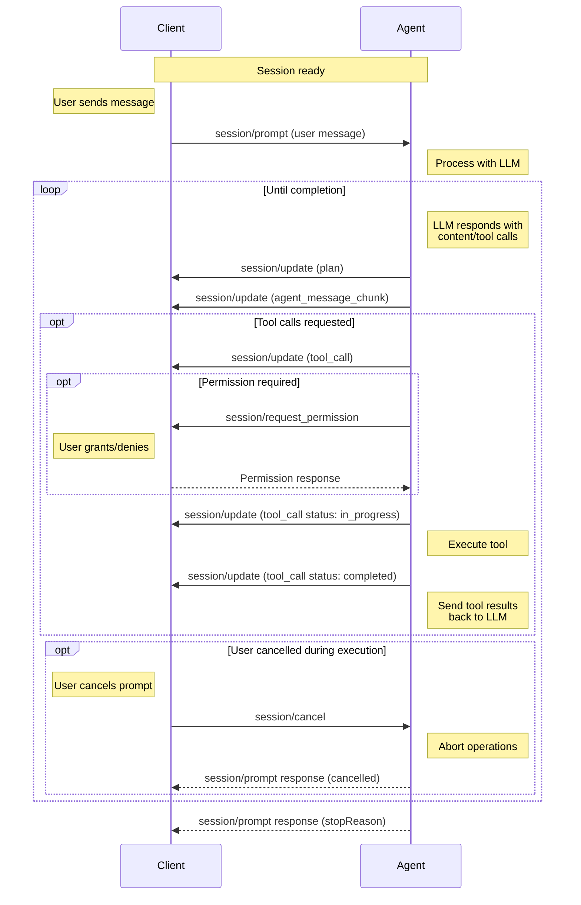
```mermaid
sequenceDiagram
    participant Client
    participant Agent

    Note over Agent,Client: Session ready

    Note left of Client: User sends message
    Client->>Agent: session/prompt (user message)
    Note right of Agent: Process with LLM

    loop Until completion
        Note right of Agent: LLM responds with<br/>content/tool calls
        Agent->>Client: session/update (plan)
        Agent->>Client: session/update (agent_message_chunk)

        opt Tool calls requested
            Agent->>Client: session/update (tool_call)
            opt Permission required
                Agent->>Client: session/request_permission
                Note left of Client: User grants/denies
                Client-->>Agent: Permission response
            end
            Agent->>Client: session/update (tool_call status: in_progress)
            Note right of Agent: Execute tool
            Agent->>Client: session/update (tool_call status: completed)
            Note right of Agent: Send tool results<br/>back to LLM
        end

      opt User cancelled during execution
          Note left of Client: User cancels prompt
          Client->>Agent: session/cancel
          Note right of Agent: Abort operations
          Agent-->>Client: session/prompt response (cancelled)
      end
    end

    Agent-->>Client: session/prompt response (stopReason)

```

### 1. User Message

The turn begins when the Client sends a `session/prompt`:

```json
{
  "jsonrpc": "2.0",
  "id": 2,
  "method": "session/prompt",
  "params": {
    "sessionId": "sess_abc123def456",
    "prompt": [
      {
        "type": "text",
        "text": "Can you analyze this code for potential issues?"
      },
      {
        "type": "resource",
        "resource": {
          "uri": "file:///home/user/project/main.py",
          "mimeType": "text/x-python",
          "text": "def process_data(items):\n    for item in items:\n        print(item)"
        }
      }
    ]
  }
}
```

<ParamField path="sessionId" type="SessionId">
    The [ID](./session-setup#session-id) of the session to send this message to.
</ParamField>
<ParamField path="prompt" type="ContentBlock[]">
    The contents of the user message, e.g. text, images, files, etc.

    Clients **MUST** restrict types of content according to the [Prompt Capabilities](./initialization#prompt-capabilities) established during [initialization](./initialization).

    <Card icon="comments" horizontal href="./content">
      Learn more about Content
    </Card>

</ParamField>

### 2. Agent Processing

Upon receiving the prompt request, the Agent processes the user's message and sends it to the language model, which **MAY** respond with text content, tool calls, or both.

### 3. Agent Reports Output

The Agent reports the model's output to the Client via `session/update` notifications. This may include the Agent's plan for accomplishing the task:

```json expandable
{
  "jsonrpc": "2.0",
  "method": "session/update",
  "params": {
    "sessionId": "sess_abc123def456",
    "update": {
      "sessionUpdate": "plan",
      "entries": [
        {
          "content": "Check for syntax errors",
          "priority": "high",
          "status": "pending"
        },
        {
          "content": "Identify potential type issues",
          "priority": "medium",
          "status": "pending"
        },
        {
          "content": "Review error handling patterns",
          "priority": "medium",
          "status": "pending"
        },
        {
          "content": "Suggest improvements",
          "priority": "low",
          "status": "pending"
        }
      ]
    }
  }
}
```

<Card icon="lightbulb" horizontal href="./agent-plan">
  Learn more about Agent Plans
</Card>

The Agent then reports text responses from the model:

```json
{
  "jsonrpc": "2.0",
  "method": "session/update",
  "params": {
    "sessionId": "sess_abc123def456",
    "update": {
      "sessionUpdate": "agent_message_chunk",
      "content": {
        "type": "text",
        "text": "I'll analyze your code for potential issues. Let me examine it..."
      }
    }
  }
}
```

If the model requested tool calls, these are also reported immediately:

```json
{
  "jsonrpc": "2.0",
  "method": "session/update",
  "params": {
    "sessionId": "sess_abc123def456",
    "update": {
      "sessionUpdate": "tool_call",
      "toolCallId": "call_001",
      "title": "Analyzing Python code",
      "kind": "other",
      "status": "pending"
    }
  }
}
```

### 4. Check for Completion

If there are no pending tool calls, the turn ends and the Agent **MUST** respond to the original `session/prompt` request with a `StopReason`:

```json
{
  "jsonrpc": "2.0",
  "id": 2,
  "result": {
    "stopReason": "end_turn"
  }
}
```

Agents **MAY** stop the turn at any point by returning the corresponding [`StopReason`](#stop-reasons).

### 5. Tool Invocation and Status Reporting

Before proceeding with execution, the Agent **MAY** request permission from the Client via the `session/request_permission` method.

Once permission is granted (if required), the Agent **SHOULD** invoke the tool and report a status update marking the tool as `in_progress`:

```json
{
  "jsonrpc": "2.0",
  "method": "session/update",
  "params": {
    "sessionId": "sess_abc123def456",
    "update": {
      "sessionUpdate": "tool_call_update",
      "toolCallId": "call_001",
      "status": "in_progress"
    }
  }
}
```

As the tool runs, the Agent **MAY** send additional updates, providing real-time feedback about tool execution progress.

While tools execute on the Agent, they **MAY** leverage Client capabilities such as the file system (`fs`) methods to access resources within the Client's environment.

When the tool completes, the Agent sends another update with the final status and any content:

```json
{
  "jsonrpc": "2.0",
  "method": "session/update",
  "params": {
    "sessionId": "sess_abc123def456",
    "update": {
      "sessionUpdate": "tool_call_update",
      "toolCallId": "call_001",
      "status": "completed",
      "content": [
        {
          "type": "content",
          "content": {
            "type": "text",
            "text": "Analysis complete:\n- No syntax errors found\n- Consider adding type hints for better clarity\n- The function could benefit from error handling for empty lists"
          }
        }
      ]
    }
  }
}
```

<Card icon="hammer" horizontal href="./tool-calls">
  Learn more about Tool Calls
</Card>

### 6. Continue Conversation

The Agent sends the tool results back to the language model as another request.

The cycle returns to [step 2](#2-agent-processing), continuing until the language model completes its response without requesting additional tool calls or the turn gets stopped by the Agent or cancelled by the Client.

## Stop Reasons

When an Agent stops a turn, it must specify the corresponding `StopReason`:

<ResponseField name="end_turn">
  The language model finishes responding without requesting more tools
</ResponseField>

<ResponseField name="max_tokens">
  The maximum token limit is reached
</ResponseField>

<ResponseField name="max_turn_requests">
  The maximum number of model requests in a single turn is exceeded
</ResponseField>

<ResponseField name="refusal">The Agent refuses to continue</ResponseField>

<ResponseField name="cancelled">The Client cancels the turn</ResponseField>

## Cancellation

Clients **MAY** cancel an ongoing prompt turn at any time by sending a `session/cancel` notification:

```json
{
  "jsonrpc": "2.0",
  "method": "session/cancel",
  "params": {
    "sessionId": "sess_abc123def456"
  }
}
```

The Client **SHOULD** preemptively mark all non-finished tool calls pertaining to the current turn as `cancelled` as soon as it sends the `session/cancel` notification.

The Client **MUST** respond to all pending `session/request_permission` requests with the `cancelled` outcome.

When the Agent receives this notification, it **SHOULD** stop all language model requests and all tool call invocations as soon as possible.

After all ongoing operations have been successfully aborted and pending updates have been sent, the Agent **MUST** respond to the original `session/prompt` request with the `cancelled` [stop reason](#stop-reasons).

<Warning>
  API client libraries and tools often throw an exception when their operation is aborted, which may propagate as an error response to `session/prompt`.

Clients often display unrecognized errors from the Agent to the user, which would be undesirable for cancellations as they aren't considered errors.

Agents **MUST** catch these errors and return the semantically meaningful `cancelled` stop reason, so that Clients can reliably confirm the cancellation.

</Warning>

The Agent **MAY** send `session/update` notifications with content or tool call updates after receiving the `session/cancel` notification, but it **MUST** ensure that it does so before responding to the `session/prompt` request.

The Client **SHOULD** still accept tool call updates received after sending `session/cancel`.

---

Once a prompt turn completes, the Client may send another `session/prompt` to continue the conversation, building on the context established in previous turns.
````

## File: docs/protocol/schema.mdx
````markdown
---
title: "Schema"
description: "Schema definitions for the Agent Client Protocol"
---

## Agent

Defines the interface that all ACP-compliant agents must implement.

Agents are programs that use generative AI to autonomously modify code. They handle
requests from clients and execute tasks using language models and tools.

### <span class="font-mono">authenticate</span>

Authenticates the client using the specified authentication method.

Called when the agent requires authentication before allowing session creation.
The client provides the authentication method ID that was advertised during initialization.

After successful authentication, the client can proceed to create sessions with
`new_session` without receiving an `auth_required` error.

See protocol docs: [Initialization](https://agentclientprotocol.com/protocol/initialization)

#### <span class="font-mono">AuthenticateRequest</span>

Request parameters for the authenticate method.

Specifies which authentication method to use.

**Type:** Object

**Properties:**

<ResponseField name="_meta" type={"object | null"} >
  The _meta property is reserved by ACP to allow clients and agents to attach additional
metadata to their interactions. Implementations MUST NOT make assumptions about values at
these keys.

See protocol docs: [Extensibility](https://agentclientprotocol.com/protocol/extensibility)

</ResponseField>
<ResponseField name="methodId" type={"string"} required>
  The ID of the authentication method to use.
Must be one of the methods advertised in the initialize response.
</ResponseField>

#### <span class="font-mono">AuthenticateResponse</span>

Response to the `authenticate` method.

**Type:** Object

**Properties:**

<ResponseField name="_meta" type={"object | null"} >
  The _meta property is reserved by ACP to allow clients and agents to attach additional
metadata to their interactions. Implementations MUST NOT make assumptions about values at
these keys.

See protocol docs: [Extensibility](https://agentclientprotocol.com/protocol/extensibility)

</ResponseField>

### <span class="font-mono">initialize</span>

Establishes the connection with a client and negotiates protocol capabilities.

This method is called once at the beginning of the connection to:

- Negotiate the protocol version to use
- Exchange capability information between client and agent
- Determine available authentication methods

The agent should respond with its supported protocol version and capabilities.

See protocol docs: [Initialization](https://agentclientprotocol.com/protocol/initialization)

#### <span class="font-mono">InitializeRequest</span>

Request parameters for the initialize method.

Sent by the client to establish connection and negotiate capabilities.

See protocol docs: [Initialization](https://agentclientprotocol.com/protocol/initialization)

**Type:** Object

**Properties:**

<ResponseField name="_meta" type={"object | null"} >
  The _meta property is reserved by ACP to allow clients and agents to attach additional
metadata to their interactions. Implementations MUST NOT make assumptions about values at
these keys.

See protocol docs: [Extensibility](https://agentclientprotocol.com/protocol/extensibility)

</ResponseField>
<ResponseField name="clientCapabilities" type={<a href="#clientcapabilities">ClientCapabilities</a>} >
  Capabilities supported by the client.

    - Default: `{"fs":{"readTextFile":false,"writeTextFile":false},"terminal":false}`

</ResponseField>
<ResponseField name="clientInfo" type={<><span><a href="#implementation">Implementation</a></span><span> | null</span></>} >
  Information about the Client name and version sent to the Agent.

Note: in future versions of the protocol, this will be required.

</ResponseField>
<ResponseField name="protocolVersion" type={<a href="#protocolversion">ProtocolVersion</a>} required>
  The latest protocol version supported by the client.
</ResponseField>

#### <span class="font-mono">InitializeResponse</span>

Response to the `initialize` method.

Contains the negotiated protocol version and agent capabilities.

See protocol docs: [Initialization](https://agentclientprotocol.com/protocol/initialization)

**Type:** Object

**Properties:**

<ResponseField name="_meta" type={"object | null"} >
  The _meta property is reserved by ACP to allow clients and agents to attach additional
metadata to their interactions. Implementations MUST NOT make assumptions about values at
these keys.

See protocol docs: [Extensibility](https://agentclientprotocol.com/protocol/extensibility)

</ResponseField>
<ResponseField name="agentCapabilities" type={<a href="#agentcapabilities">AgentCapabilities</a>} >
  Capabilities supported by the agent.

    - Default: `{"loadSession":false,"mcpCapabilities":{"http":false,"sse":false},"promptCapabilities":{"audio":false,"embeddedContext":false,"image":false},"sessionCapabilities":{}}`

</ResponseField>
<ResponseField name="agentInfo" type={<><span><a href="#implementation">Implementation</a></span><span> | null</span></>} >
  Information about the Agent name and version sent to the Client.

Note: in future versions of the protocol, this will be required.

</ResponseField>
<ResponseField name="authMethods" type={<a href="#authmethod">AuthMethod[]</a>} >
  Authentication methods supported by the agent.

    - Default: `[]`

</ResponseField>
<ResponseField name="protocolVersion" type={<a href="#protocolversion">ProtocolVersion</a>} required>
  The protocol version the client specified if supported by the agent,
or the latest protocol version supported by the agent.

The client should disconnect, if it doesn't support this version.

</ResponseField>

<a id="session-cancel"></a>
### <span class="font-mono">session/cancel</span>

Cancels ongoing operations for a session.

This is a notification sent by the client to cancel an ongoing prompt turn.

Upon receiving this notification, the Agent SHOULD:

- Stop all language model requests as soon as possible
- Abort all tool call invocations in progress
- Send any pending `session/update` notifications
- Respond to the original `session/prompt` request with `StopReason::Cancelled`

See protocol docs: [Cancellation](https://agentclientprotocol.com/protocol/prompt-turn#cancellation)

#### <span class="font-mono">CancelNotification</span>

Notification to cancel ongoing operations for a session.

See protocol docs: [Cancellation](https://agentclientprotocol.com/protocol/prompt-turn#cancellation)

**Type:** Object

**Properties:**

<ResponseField name="_meta" type={"object | null"} >
  The _meta property is reserved by ACP to allow clients and agents to attach additional
metadata to their interactions. Implementations MUST NOT make assumptions about values at
these keys.

See protocol docs: [Extensibility](https://agentclientprotocol.com/protocol/extensibility)

</ResponseField>
<ResponseField name="sessionId" type={<a href="#sessionid">SessionId</a>} required>
  The ID of the session to cancel operations for.
</ResponseField>

<a id="session-close"></a>
### <span class="font-mono">session/close</span>

Closes an active session and frees up any resources associated with it.

This method is only available if the agent advertises the `sessionCapabilities.close` capability.

The agent must cancel any ongoing work (as if `session/cancel` was called)
and then free up any resources associated with the session.

#### <span class="font-mono">CloseSessionRequest</span>

Request parameters for closing an active session.

If supported, the agent **must** cancel any ongoing work related to the session
(treat it as if `session/cancel` was called) and then free up any resources
associated with the session.

Only available if the Agent supports the `sessionCapabilities.close` capability.

**Type:** Object

**Properties:**

<ResponseField name="_meta" type={"object | null"} >
  The _meta property is reserved by ACP to allow clients and agents to attach additional
metadata to their interactions. Implementations MUST NOT make assumptions about values at
these keys.

See protocol docs: [Extensibility](https://agentclientprotocol.com/protocol/extensibility)

</ResponseField>
<ResponseField name="sessionId" type={<a href="#sessionid">SessionId</a>} required>
  The ID of the session to close.
</ResponseField>

#### <span class="font-mono">CloseSessionResponse</span>

Response from closing a session.

**Type:** Object

**Properties:**

<ResponseField name="_meta" type={"object | null"} >
  The _meta property is reserved by ACP to allow clients and agents to attach additional
metadata to their interactions. Implementations MUST NOT make assumptions about values at
these keys.

See protocol docs: [Extensibility](https://agentclientprotocol.com/protocol/extensibility)

</ResponseField>

<a id="session-list"></a>
### <span class="font-mono">session/list</span>

Lists existing sessions known to the agent.

This method is only available if the agent advertises the `sessionCapabilities.list` capability.

The agent should return metadata about sessions with optional filtering and pagination support.

#### <span class="font-mono">ListSessionsRequest</span>

Request parameters for listing existing sessions.

Only available if the Agent supports the `sessionCapabilities.list` capability.

**Type:** Object

**Properties:**

<ResponseField name="_meta" type={"object | null"} >
  The _meta property is reserved by ACP to allow clients and agents to attach additional
metadata to their interactions. Implementations MUST NOT make assumptions about values at
these keys.

See protocol docs: [Extensibility](https://agentclientprotocol.com/protocol/extensibility)

</ResponseField>
<ResponseField name="cursor" type={"string | null"} >
  Opaque cursor token from a previous response's nextCursor field for cursor-based pagination
</ResponseField>
<ResponseField name="cwd" type={"string | null"} >
  Filter sessions by working directory. Must be an absolute path.
</ResponseField>

#### <span class="font-mono">ListSessionsResponse</span>

Response from listing sessions.

**Type:** Object

**Properties:**

<ResponseField name="_meta" type={"object | null"} >
  The _meta property is reserved by ACP to allow clients and agents to attach additional
metadata to their interactions. Implementations MUST NOT make assumptions about values at
these keys.

See protocol docs: [Extensibility](https://agentclientprotocol.com/protocol/extensibility)

</ResponseField>
<ResponseField name="nextCursor" type={"string | null"} >
  Opaque cursor token. If present, pass this in the next request's cursor parameter
to fetch the next page. If absent, there are no more results.
</ResponseField>
<ResponseField name="sessions" type={<a href="#sessioninfo">SessionInfo[]</a>} required>
  Array of session information objects
</ResponseField>

<a id="session-load"></a>
### <span class="font-mono">session/load</span>

Loads an existing session to resume a previous conversation.

This method is only available if the agent advertises the `loadSession` capability.

The agent should:

- Restore the session context and conversation history
- Connect to the specified MCP servers
- Stream the entire conversation history back to the client via notifications

See protocol docs: [Loading Sessions](https://agentclientprotocol.com/protocol/session-setup#loading-sessions)

#### <span class="font-mono">LoadSessionRequest</span>

Request parameters for loading an existing session.

Only available if the Agent supports the `loadSession` capability.

See protocol docs: [Loading Sessions](https://agentclientprotocol.com/protocol/session-setup#loading-sessions)

**Type:** Object

**Properties:**

<ResponseField name="_meta" type={"object | null"} >
  The _meta property is reserved by ACP to allow clients and agents to attach additional
metadata to their interactions. Implementations MUST NOT make assumptions about values at
these keys.

See protocol docs: [Extensibility](https://agentclientprotocol.com/protocol/extensibility)

</ResponseField>
<ResponseField name="cwd" type={"string"} required>
  The working directory for this session.
</ResponseField>
<ResponseField name="mcpServers" type={<a href="#mcpserver">McpServer[]</a>} required>
  List of MCP servers to connect to for this session.
</ResponseField>
<ResponseField name="sessionId" type={<a href="#sessionid">SessionId</a>} required>
  The ID of the session to load.
</ResponseField>

#### <span class="font-mono">LoadSessionResponse</span>

Response from loading an existing session.

**Type:** Object

**Properties:**

<ResponseField name="_meta" type={"object | null"} >
  The _meta property is reserved by ACP to allow clients and agents to attach additional
metadata to their interactions. Implementations MUST NOT make assumptions about values at
these keys.

See protocol docs: [Extensibility](https://agentclientprotocol.com/protocol/extensibility)

</ResponseField>
<ResponseField name="configOptions" type={<><span><a href="#sessionconfigoption">SessionConfigOption[]</a></span><span> | null</span></>} >
  Initial session configuration options if supported by the Agent.
</ResponseField>
<ResponseField name="modes" type={<><span><a href="#sessionmodestate">SessionModeState</a></span><span> | null</span></>} >
  Initial mode state if supported by the Agent

See protocol docs: [Session Modes](https://agentclientprotocol.com/protocol/session-modes)

</ResponseField>

<a id="session-new"></a>
### <span class="font-mono">session/new</span>

Creates a new conversation session with the agent.

Sessions represent independent conversation contexts with their own history and state.

The agent should:

- Create a new session context
- Connect to any specified MCP servers
- Return a unique session ID for future requests

May return an `auth_required` error if the agent requires authentication.

See protocol docs: [Session Setup](https://agentclientprotocol.com/protocol/session-setup)

#### <span class="font-mono">NewSessionRequest</span>

Request parameters for creating a new session.

See protocol docs: [Creating a Session](https://agentclientprotocol.com/protocol/session-setup#creating-a-session)

**Type:** Object

**Properties:**

<ResponseField name="_meta" type={"object | null"} >
  The _meta property is reserved by ACP to allow clients and agents to attach additional
metadata to their interactions. Implementations MUST NOT make assumptions about values at
these keys.

See protocol docs: [Extensibility](https://agentclientprotocol.com/protocol/extensibility)

</ResponseField>
<ResponseField name="cwd" type={"string"} required>
  The working directory for this session. Must be an absolute path.
</ResponseField>
<ResponseField name="mcpServers" type={<a href="#mcpserver">McpServer[]</a>} required>
  List of MCP (Model Context Protocol) servers the agent should connect to.
</ResponseField>

#### <span class="font-mono">NewSessionResponse</span>

Response from creating a new session.

See protocol docs: [Creating a Session](https://agentclientprotocol.com/protocol/session-setup#creating-a-session)

**Type:** Object

**Properties:**

<ResponseField name="_meta" type={"object | null"} >
  The _meta property is reserved by ACP to allow clients and agents to attach additional
metadata to their interactions. Implementations MUST NOT make assumptions about values at
these keys.

See protocol docs: [Extensibility](https://agentclientprotocol.com/protocol/extensibility)

</ResponseField>
<ResponseField name="configOptions" type={<><span><a href="#sessionconfigoption">SessionConfigOption[]</a></span><span> | null</span></>} >
  Initial session configuration options if supported by the Agent.
</ResponseField>
<ResponseField name="modes" type={<><span><a href="#sessionmodestate">SessionModeState</a></span><span> | null</span></>} >
  Initial mode state if supported by the Agent

See protocol docs: [Session Modes](https://agentclientprotocol.com/protocol/session-modes)

</ResponseField>
<ResponseField name="sessionId" type={<a href="#sessionid">SessionId</a>} required>
  Unique identifier for the created session.

Used in all subsequent requests for this conversation.

</ResponseField>

<a id="session-prompt"></a>
### <span class="font-mono">session/prompt</span>

Processes a user prompt within a session.

This method handles the whole lifecycle of a prompt:

- Receives user messages with optional context (files, images, etc.)
- Processes the prompt using language models
- Reports language model content and tool calls to the Clients
- Requests permission to run tools
- Executes any requested tool calls
- Returns when the turn is complete with a stop reason

See protocol docs: [Prompt Turn](https://agentclientprotocol.com/protocol/prompt-turn)

#### <span class="font-mono">PromptRequest</span>

Request parameters for sending a user prompt to the agent.

Contains the user's message and any additional context.

See protocol docs: [User Message](https://agentclientprotocol.com/protocol/prompt-turn#1-user-message)

**Type:** Object

**Properties:**

<ResponseField name="_meta" type={"object | null"} >
  The _meta property is reserved by ACP to allow clients and agents to attach additional
metadata to their interactions. Implementations MUST NOT make assumptions about values at
these keys.

See protocol docs: [Extensibility](https://agentclientprotocol.com/protocol/extensibility)

</ResponseField>
<ResponseField name="prompt" type={<a href="#contentblock">ContentBlock[]</a>} required>
  The blocks of content that compose the user's message.

As a baseline, the Agent MUST support `ContentBlock::Text` and `ContentBlock::ResourceLink`,
while other variants are optionally enabled via `PromptCapabilities`.

The Client MUST adapt its interface according to `PromptCapabilities`.

The client MAY include referenced pieces of context as either
`ContentBlock::Resource` or `ContentBlock::ResourceLink`.

When available, `ContentBlock::Resource` is preferred
as it avoids extra round-trips and allows the message to include
pieces of context from sources the agent may not have access to.

</ResponseField>
<ResponseField name="sessionId" type={<a href="#sessionid">SessionId</a>} required>
  The ID of the session to send this user message to
</ResponseField>

#### <span class="font-mono">PromptResponse</span>

Response from processing a user prompt.

See protocol docs: [Check for Completion](https://agentclientprotocol.com/protocol/prompt-turn#4-check-for-completion)

**Type:** Object

**Properties:**

<ResponseField name="_meta" type={"object | null"} >
  The _meta property is reserved by ACP to allow clients and agents to attach additional
metadata to their interactions. Implementations MUST NOT make assumptions about values at
these keys.

See protocol docs: [Extensibility](https://agentclientprotocol.com/protocol/extensibility)

</ResponseField>
<ResponseField name="stopReason" type={<a href="#stopreason">StopReason</a>} required>
  Indicates why the agent stopped processing the turn.
</ResponseField>

<a id="session-resume"></a>
### <span class="font-mono">session/resume</span>

Resumes an existing session without returning previous messages.

This method is only available if the agent advertises the `sessionCapabilities.resume` capability.

The agent should resume the session context, allowing the conversation to continue
without replaying the message history (unlike `session/load`).

#### <span class="font-mono">ResumeSessionRequest</span>

Request parameters for resuming an existing session.

Resumes an existing session without returning previous messages (unlike `session/load`).
This is useful for agents that can resume sessions but don't implement full session loading.

Only available if the Agent supports the `sessionCapabilities.resume` capability.

**Type:** Object

**Properties:**

<ResponseField name="_meta" type={"object | null"} >
  The _meta property is reserved by ACP to allow clients and agents to attach additional
metadata to their interactions. Implementations MUST NOT make assumptions about values at
these keys.

See protocol docs: [Extensibility](https://agentclientprotocol.com/protocol/extensibility)

</ResponseField>
<ResponseField name="cwd" type={"string"} required>
  The working directory for this session.
</ResponseField>
<ResponseField name="mcpServers" type={<a href="#mcpserver">McpServer[]</a>} >
  List of MCP servers to connect to for this session.
</ResponseField>
<ResponseField name="sessionId" type={<a href="#sessionid">SessionId</a>} required>
  The ID of the session to resume.
</ResponseField>

#### <span class="font-mono">ResumeSessionResponse</span>

Response from resuming an existing session.

**Type:** Object

**Properties:**

<ResponseField name="_meta" type={"object | null"} >
  The _meta property is reserved by ACP to allow clients and agents to attach additional
metadata to their interactions. Implementations MUST NOT make assumptions about values at
these keys.

See protocol docs: [Extensibility](https://agentclientprotocol.com/protocol/extensibility)

</ResponseField>
<ResponseField name="configOptions" type={<><span><a href="#sessionconfigoption">SessionConfigOption[]</a></span><span> | null</span></>} >
  Initial session configuration options if supported by the Agent.
</ResponseField>
<ResponseField name="modes" type={<><span><a href="#sessionmodestate">SessionModeState</a></span><span> | null</span></>} >
  Initial mode state if supported by the Agent

See protocol docs: [Session Modes](https://agentclientprotocol.com/protocol/session-modes)

</ResponseField>

<a id="session-set_config_option"></a>
### <span class="font-mono">session/set_config_option</span>

Sets the current value for a session configuration option.

#### <span class="font-mono">SetSessionConfigOptionRequest</span>

Request parameters for setting a session configuration option.

**Type:** Object

**Properties:**

<ResponseField name="_meta" type={"object | null"} >
  The _meta property is reserved by ACP to allow clients and agents to attach additional
metadata to their interactions. Implementations MUST NOT make assumptions about values at
these keys.

See protocol docs: [Extensibility](https://agentclientprotocol.com/protocol/extensibility)

</ResponseField>
<ResponseField name="configId" type={<a href="#sessionconfigid">SessionConfigId</a>} required>
  The ID of the configuration option to set.
</ResponseField>
<ResponseField name="sessionId" type={<a href="#sessionid">SessionId</a>} required>
  The ID of the session to set the configuration option for.
</ResponseField>
<ResponseField name="value" type={<a href="#sessionconfigvalueid">SessionConfigValueId</a>} required>
  The ID of the configuration option value to set.
</ResponseField>

#### <span class="font-mono">SetSessionConfigOptionResponse</span>

Response to `session/set_config_option` method.

**Type:** Object

**Properties:**

<ResponseField name="_meta" type={"object | null"} >
  The _meta property is reserved by ACP to allow clients and agents to attach additional
metadata to their interactions. Implementations MUST NOT make assumptions about values at
these keys.

See protocol docs: [Extensibility](https://agentclientprotocol.com/protocol/extensibility)

</ResponseField>
<ResponseField name="configOptions" type={<a href="#sessionconfigoption">SessionConfigOption[]</a>} required>
  The full set of configuration options and their current values.
</ResponseField>

<a id="session-set_mode"></a>
### <span class="font-mono">session/set_mode</span>

Sets the current mode for a session.

Allows switching between different agent modes (e.g., "ask", "architect", "code")
that affect system prompts, tool availability, and permission behaviors.

The mode must be one of the modes advertised in `availableModes` during session
creation or loading. Agents may also change modes autonomously and notify the
client via `current_mode_update` notifications.

This method can be called at any time during a session, whether the Agent is
idle or actively generating a response.

See protocol docs: [Session Modes](https://agentclientprotocol.com/protocol/session-modes)

#### <span class="font-mono">SetSessionModeRequest</span>

Request parameters for setting a session mode.

**Type:** Object

**Properties:**

<ResponseField name="_meta" type={"object | null"} >
  The _meta property is reserved by ACP to allow clients and agents to attach additional
metadata to their interactions. Implementations MUST NOT make assumptions about values at
these keys.

See protocol docs: [Extensibility](https://agentclientprotocol.com/protocol/extensibility)

</ResponseField>
<ResponseField name="modeId" type={<a href="#sessionmodeid">SessionModeId</a>} required>
  The ID of the mode to set.
</ResponseField>
<ResponseField name="sessionId" type={<a href="#sessionid">SessionId</a>} required>
  The ID of the session to set the mode for.
</ResponseField>

#### <span class="font-mono">SetSessionModeResponse</span>

Response to `session/set_mode` method.

**Type:** Object

**Properties:**

<ResponseField name="_meta" type={"object | null"} >
  The _meta property is reserved by ACP to allow clients and agents to attach additional
metadata to their interactions. Implementations MUST NOT make assumptions about values at
these keys.

See protocol docs: [Extensibility](https://agentclientprotocol.com/protocol/extensibility)

</ResponseField>

## Client

Defines the interface that ACP-compliant clients must implement.

Clients are typically code editors (IDEs, text editors) that provide the interface
between users and AI agents. They manage the environment, handle user interactions,
and control access to resources.

<a id="fs-read_text_file"></a>
### <span class="font-mono">fs/read_text_file</span>

Reads content from a text file in the client's file system.

Only available if the client advertises the `fs.readTextFile` capability.
Allows the agent to access file contents within the client's environment.

See protocol docs: [Client](https://agentclientprotocol.com/protocol/overview#client)

#### <span class="font-mono">ReadTextFileRequest</span>

Request to read content from a text file.

Only available if the client supports the `fs.readTextFile` capability.

**Type:** Object

**Properties:**

<ResponseField name="_meta" type={"object | null"} >
  The _meta property is reserved by ACP to allow clients and agents to attach additional
metadata to their interactions. Implementations MUST NOT make assumptions about values at
these keys.

See protocol docs: [Extensibility](https://agentclientprotocol.com/protocol/extensibility)

</ResponseField>
<ResponseField name="limit" type={"integer | null"} >
  Maximum number of lines to read.

    - Minimum: `0`

</ResponseField>
<ResponseField name="line" type={"integer | null"} >
  Line number to start reading from (1-based).

    - Minimum: `0`

</ResponseField>
<ResponseField name="path" type={"string"} required>
  Absolute path to the file to read.
</ResponseField>
<ResponseField name="sessionId" type={<a href="#sessionid">SessionId</a>} required>
  The session ID for this request.
</ResponseField>

#### <span class="font-mono">ReadTextFileResponse</span>

Response containing the contents of a text file.

**Type:** Object

**Properties:**

<ResponseField name="_meta" type={"object | null"} >
  The _meta property is reserved by ACP to allow clients and agents to attach additional
metadata to their interactions. Implementations MUST NOT make assumptions about values at
these keys.

See protocol docs: [Extensibility](https://agentclientprotocol.com/protocol/extensibility)

</ResponseField>
<ResponseField name="content" type={"string"} required>
</ResponseField>

<a id="fs-write_text_file"></a>
### <span class="font-mono">fs/write_text_file</span>

Writes content to a text file in the client's file system.

Only available if the client advertises the `fs.writeTextFile` capability.
Allows the agent to create or modify files within the client's environment.

See protocol docs: [Client](https://agentclientprotocol.com/protocol/overview#client)

#### <span class="font-mono">WriteTextFileRequest</span>

Request to write content to a text file.

Only available if the client supports the `fs.writeTextFile` capability.

**Type:** Object

**Properties:**

<ResponseField name="_meta" type={"object | null"} >
  The _meta property is reserved by ACP to allow clients and agents to attach additional
metadata to their interactions. Implementations MUST NOT make assumptions about values at
these keys.

See protocol docs: [Extensibility](https://agentclientprotocol.com/protocol/extensibility)

</ResponseField>
<ResponseField name="content" type={"string"} required>
  The text content to write to the file.
</ResponseField>
<ResponseField name="path" type={"string"} required>
  Absolute path to the file to write.
</ResponseField>
<ResponseField name="sessionId" type={<a href="#sessionid">SessionId</a>} required>
  The session ID for this request.
</ResponseField>

#### <span class="font-mono">WriteTextFileResponse</span>

Response to `fs/write_text_file`

**Type:** Object

**Properties:**

<ResponseField name="_meta" type={"object | null"} >
  The _meta property is reserved by ACP to allow clients and agents to attach additional
metadata to their interactions. Implementations MUST NOT make assumptions about values at
these keys.

See protocol docs: [Extensibility](https://agentclientprotocol.com/protocol/extensibility)

</ResponseField>

<a id="session-request_permission"></a>
### <span class="font-mono">session/request_permission</span>

Requests permission from the user for a tool call operation.

Called by the agent when it needs user authorization before executing
a potentially sensitive operation. The client should present the options
to the user and return their decision.

If the client cancels the prompt turn via `session/cancel`, it MUST
respond to this request with `RequestPermissionOutcome::Cancelled`.

See protocol docs: [Requesting Permission](https://agentclientprotocol.com/protocol/tool-calls#requesting-permission)

#### <span class="font-mono">RequestPermissionRequest</span>

Request for user permission to execute a tool call.

Sent when the agent needs authorization before performing a sensitive operation.

See protocol docs: [Requesting Permission](https://agentclientprotocol.com/protocol/tool-calls#requesting-permission)

**Type:** Object

**Properties:**

<ResponseField name="_meta" type={"object | null"} >
  The _meta property is reserved by ACP to allow clients and agents to attach additional
metadata to their interactions. Implementations MUST NOT make assumptions about values at
these keys.

See protocol docs: [Extensibility](https://agentclientprotocol.com/protocol/extensibility)

</ResponseField>
<ResponseField name="options" type={<a href="#permissionoption">PermissionOption[]</a>} required>
  Available permission options for the user to choose from.
</ResponseField>
<ResponseField name="sessionId" type={<a href="#sessionid">SessionId</a>} required>
  The session ID for this request.
</ResponseField>
<ResponseField name="toolCall" type={<a href="#toolcallupdate">ToolCallUpdate</a>} required>
  Details about the tool call requiring permission.
</ResponseField>

#### <span class="font-mono">RequestPermissionResponse</span>

Response to a permission request.

**Type:** Object

**Properties:**

<ResponseField name="_meta" type={"object | null"} >
  The _meta property is reserved by ACP to allow clients and agents to attach additional
metadata to their interactions. Implementations MUST NOT make assumptions about values at
these keys.

See protocol docs: [Extensibility](https://agentclientprotocol.com/protocol/extensibility)

</ResponseField>
<ResponseField name="outcome" type={<a href="#requestpermissionoutcome">RequestPermissionOutcome</a>} required>
  The user's decision on the permission request.
</ResponseField>

<a id="session-update"></a>
### <span class="font-mono">session/update</span>

Handles session update notifications from the agent.

This is a notification endpoint (no response expected) that receives
real-time updates about session progress, including message chunks,
tool calls, and execution plans.

Note: Clients SHOULD continue accepting tool call updates even after
sending a `session/cancel` notification, as the agent may send final
updates before responding with the cancelled stop reason.

See protocol docs: [Agent Reports Output](https://agentclientprotocol.com/protocol/prompt-turn#3-agent-reports-output)

#### <span class="font-mono">SessionNotification</span>

Notification containing a session update from the agent.

Used to stream real-time progress and results during prompt processing.

See protocol docs: [Agent Reports Output](https://agentclientprotocol.com/protocol/prompt-turn#3-agent-reports-output)

**Type:** Object

**Properties:**

<ResponseField name="_meta" type={"object | null"} >
  The _meta property is reserved by ACP to allow clients and agents to attach additional
metadata to their interactions. Implementations MUST NOT make assumptions about values at
these keys.

See protocol docs: [Extensibility](https://agentclientprotocol.com/protocol/extensibility)

</ResponseField>
<ResponseField name="sessionId" type={<a href="#sessionid">SessionId</a>} required>
  The ID of the session this update pertains to.
</ResponseField>
<ResponseField name="update" type={<a href="#sessionupdate">SessionUpdate</a>} required>
  The actual update content.
</ResponseField>

<a id="terminal-create"></a>
### <span class="font-mono">terminal/create</span>

Executes a command in a new terminal

Only available if the `terminal` Client capability is set to `true`.

Returns a `TerminalId` that can be used with other terminal methods
to get the current output, wait for exit, and kill the command.

The `TerminalId` can also be used to embed the terminal in a tool call
by using the `ToolCallContent::Terminal` variant.

The Agent is responsible for releasing the terminal by using the `terminal/release`
method.

See protocol docs: [Terminals](https://agentclientprotocol.com/protocol/terminals)

#### <span class="font-mono">CreateTerminalRequest</span>

Request to create a new terminal and execute a command.

**Type:** Object

**Properties:**

<ResponseField name="_meta" type={"object | null"} >
  The _meta property is reserved by ACP to allow clients and agents to attach additional
metadata to their interactions. Implementations MUST NOT make assumptions about values at
these keys.

See protocol docs: [Extensibility](https://agentclientprotocol.com/protocol/extensibility)

</ResponseField>
<ResponseField name="args" type={<><span>"string"</span><span>[]</span></>} >
  Array of command arguments.
</ResponseField>
<ResponseField name="command" type={"string"} required>
  The command to execute.
</ResponseField>
<ResponseField name="cwd" type={"string | null"} >
  Working directory for the command (absolute path).
</ResponseField>
<ResponseField name="env" type={<a href="#envvariable">EnvVariable[]</a>} >
  Environment variables for the command.
</ResponseField>
<ResponseField name="outputByteLimit" type={"integer | null"} >
  Maximum number of output bytes to retain.

When the limit is exceeded, the Client truncates from the beginning of the output
to stay within the limit.

The Client MUST ensure truncation happens at a character boundary to maintain valid
string output, even if this means the retained output is slightly less than the
specified limit.

    - Minimum: `0`

</ResponseField>
<ResponseField name="sessionId" type={<a href="#sessionid">SessionId</a>} required>
  The session ID for this request.
</ResponseField>

#### <span class="font-mono">CreateTerminalResponse</span>

Response containing the ID of the created terminal.

**Type:** Object

**Properties:**

<ResponseField name="_meta" type={"object | null"} >
  The _meta property is reserved by ACP to allow clients and agents to attach additional
metadata to their interactions. Implementations MUST NOT make assumptions about values at
these keys.

See protocol docs: [Extensibility](https://agentclientprotocol.com/protocol/extensibility)

</ResponseField>
<ResponseField name="terminalId" type={"string"} required>
  The unique identifier for the created terminal.
</ResponseField>

<a id="terminal-kill"></a>
### <span class="font-mono">terminal/kill</span>

Kills the terminal command without releasing the terminal

While `terminal/release` will also kill the command, this method will keep
the `TerminalId` valid so it can be used with other methods.

This method can be helpful when implementing command timeouts which terminate
the command as soon as elapsed, and then get the final output so it can be sent
to the model.

Note: Call `terminal/release` when `TerminalId` is no longer needed.

See protocol docs: [Terminals](https://agentclientprotocol.com/protocol/terminals)

#### <span class="font-mono">KillTerminalRequest</span>

Request to kill a terminal without releasing it.

**Type:** Object

**Properties:**

<ResponseField name="_meta" type={"object | null"} >
  The _meta property is reserved by ACP to allow clients and agents to attach additional
metadata to their interactions. Implementations MUST NOT make assumptions about values at
these keys.

See protocol docs: [Extensibility](https://agentclientprotocol.com/protocol/extensibility)

</ResponseField>
<ResponseField name="sessionId" type={<a href="#sessionid">SessionId</a>} required>
  The session ID for this request.
</ResponseField>
<ResponseField name="terminalId" type={"string"} required>
  The ID of the terminal to kill.
</ResponseField>

#### <span class="font-mono">KillTerminalResponse</span>

Response to `terminal/kill` method

**Type:** Object

**Properties:**

<ResponseField name="_meta" type={"object | null"} >
  The _meta property is reserved by ACP to allow clients and agents to attach additional
metadata to their interactions. Implementations MUST NOT make assumptions about values at
these keys.

See protocol docs: [Extensibility](https://agentclientprotocol.com/protocol/extensibility)

</ResponseField>

<a id="terminal-output"></a>
### <span class="font-mono">terminal/output</span>

Gets the terminal output and exit status

Returns the current content in the terminal without waiting for the command to exit.
If the command has already exited, the exit status is included.

See protocol docs: [Terminals](https://agentclientprotocol.com/protocol/terminals)

#### <span class="font-mono">TerminalOutputRequest</span>

Request to get the current output and status of a terminal.

**Type:** Object

**Properties:**

<ResponseField name="_meta" type={"object | null"} >
  The _meta property is reserved by ACP to allow clients and agents to attach additional
metadata to their interactions. Implementations MUST NOT make assumptions about values at
these keys.

See protocol docs: [Extensibility](https://agentclientprotocol.com/protocol/extensibility)

</ResponseField>
<ResponseField name="sessionId" type={<a href="#sessionid">SessionId</a>} required>
  The session ID for this request.
</ResponseField>
<ResponseField name="terminalId" type={"string"} required>
  The ID of the terminal to get output from.
</ResponseField>

#### <span class="font-mono">TerminalOutputResponse</span>

Response containing the terminal output and exit status.

**Type:** Object

**Properties:**

<ResponseField name="_meta" type={"object | null"} >
  The _meta property is reserved by ACP to allow clients and agents to attach additional
metadata to their interactions. Implementations MUST NOT make assumptions about values at
these keys.

See protocol docs: [Extensibility](https://agentclientprotocol.com/protocol/extensibility)

</ResponseField>
<ResponseField name="exitStatus" type={<><span><a href="#terminalexitstatus">TerminalExitStatus</a></span><span> | null</span></>} >
  Exit status if the command has completed.
</ResponseField>
<ResponseField name="output" type={"string"} required>
  The terminal output captured so far.
</ResponseField>
<ResponseField name="truncated" type={"boolean"} required>
  Whether the output was truncated due to byte limits.
</ResponseField>

<a id="terminal-release"></a>
### <span class="font-mono">terminal/release</span>

Releases a terminal

The command is killed if it hasn't exited yet. Use `terminal/wait_for_exit`
to wait for the command to exit before releasing the terminal.

After release, the `TerminalId` can no longer be used with other `terminal/*` methods,
but tool calls that already contain it, continue to display its output.

The `terminal/kill` method can be used to terminate the command without releasing
the terminal, allowing the Agent to call `terminal/output` and other methods.

See protocol docs: [Terminals](https://agentclientprotocol.com/protocol/terminals)

#### <span class="font-mono">ReleaseTerminalRequest</span>

Request to release a terminal and free its resources.

**Type:** Object

**Properties:**

<ResponseField name="_meta" type={"object | null"} >
  The _meta property is reserved by ACP to allow clients and agents to attach additional
metadata to their interactions. Implementations MUST NOT make assumptions about values at
these keys.

See protocol docs: [Extensibility](https://agentclientprotocol.com/protocol/extensibility)

</ResponseField>
<ResponseField name="sessionId" type={<a href="#sessionid">SessionId</a>} required>
  The session ID for this request.
</ResponseField>
<ResponseField name="terminalId" type={"string"} required>
  The ID of the terminal to release.
</ResponseField>

#### <span class="font-mono">ReleaseTerminalResponse</span>

Response to terminal/release method

**Type:** Object

**Properties:**

<ResponseField name="_meta" type={"object | null"} >
  The _meta property is reserved by ACP to allow clients and agents to attach additional
metadata to their interactions. Implementations MUST NOT make assumptions about values at
these keys.

See protocol docs: [Extensibility](https://agentclientprotocol.com/protocol/extensibility)

</ResponseField>

<a id="terminal-wait_for_exit"></a>
### <span class="font-mono">terminal/wait_for_exit</span>

Waits for the terminal command to exit and return its exit status

See protocol docs: [Terminals](https://agentclientprotocol.com/protocol/terminals)

#### <span class="font-mono">WaitForTerminalExitRequest</span>

Request to wait for a terminal command to exit.

**Type:** Object

**Properties:**

<ResponseField name="_meta" type={"object | null"} >
  The _meta property is reserved by ACP to allow clients and agents to attach additional
metadata to their interactions. Implementations MUST NOT make assumptions about values at
these keys.

See protocol docs: [Extensibility](https://agentclientprotocol.com/protocol/extensibility)

</ResponseField>
<ResponseField name="sessionId" type={<a href="#sessionid">SessionId</a>} required>
  The session ID for this request.
</ResponseField>
<ResponseField name="terminalId" type={"string"} required>
  The ID of the terminal to wait for.
</ResponseField>

#### <span class="font-mono">WaitForTerminalExitResponse</span>

Response containing the exit status of a terminal command.

**Type:** Object

**Properties:**

<ResponseField name="_meta" type={"object | null"} >
  The _meta property is reserved by ACP to allow clients and agents to attach additional
metadata to their interactions. Implementations MUST NOT make assumptions about values at
these keys.

See protocol docs: [Extensibility](https://agentclientprotocol.com/protocol/extensibility)

</ResponseField>
<ResponseField name="exitCode" type={"integer | null"} >
  The process exit code (may be null if terminated by signal).

    - Minimum: `0`

</ResponseField>
<ResponseField name="signal" type={"string | null"} >
  The signal that terminated the process (may be null if exited normally).
</ResponseField>

## <span class="font-mono">AgentCapabilities</span>

Capabilities supported by the agent.

Advertised during initialization to inform the client about
available features and content types.

See protocol docs: [Agent Capabilities](https://agentclientprotocol.com/protocol/initialization#agent-capabilities)

**Type:** Object

**Properties:**

<ResponseField name="_meta" type={"object | null"} >
  The _meta property is reserved by ACP to allow clients and agents to attach additional
metadata to their interactions. Implementations MUST NOT make assumptions about values at
these keys.

See protocol docs: [Extensibility](https://agentclientprotocol.com/protocol/extensibility)

</ResponseField>
<ResponseField name="loadSession" type={"boolean"} >
  Whether the agent supports `session/load`.

    - Default: `false`

</ResponseField>
<ResponseField name="mcpCapabilities" type={<a href="#mcpcapabilities">McpCapabilities</a>} >
  MCP capabilities supported by the agent.

    - Default: `{"http":false,"sse":false}`

</ResponseField>
<ResponseField name="promptCapabilities" type={<a href="#promptcapabilities">PromptCapabilities</a>} >
  Prompt capabilities supported by the agent.

    - Default: `{"audio":false,"embeddedContext":false,"image":false}`

</ResponseField>
<ResponseField name="sessionCapabilities" type={<a href="#sessioncapabilities">SessionCapabilities</a>} >

    - Default: `{}`

</ResponseField>

## <span class="font-mono">Annotations</span>

Optional annotations for the client. The client can use annotations to inform how objects are used or displayed

**Type:** Object

**Properties:**

<ResponseField name="_meta" type={"object | null"} >
  The _meta property is reserved by ACP to allow clients and agents to attach additional
metadata to their interactions. Implementations MUST NOT make assumptions about values at
these keys.

See protocol docs: [Extensibility](https://agentclientprotocol.com/protocol/extensibility)

</ResponseField>
<ResponseField name="audience" type={<><span><a href="#role">Role[]</a></span><span> | null</span></>} >
</ResponseField>
<ResponseField name="lastModified" type={"string | null"} >
</ResponseField>
<ResponseField name="priority" type={"number | null"} >
</ResponseField>

## <span class="font-mono">AudioContent</span>

Audio provided to or from an LLM.

**Type:** Object

**Properties:**

<ResponseField name="_meta" type={"object | null"} >
  The _meta property is reserved by ACP to allow clients and agents to attach additional
metadata to their interactions. Implementations MUST NOT make assumptions about values at
these keys.

See protocol docs: [Extensibility](https://agentclientprotocol.com/protocol/extensibility)

</ResponseField>
<ResponseField name="annotations" type={<><span><a href="#annotations">Annotations</a></span><span> | null</span></>} >
</ResponseField>
<ResponseField name="data" type={"string"} required>
</ResponseField>
<ResponseField name="mimeType" type={"string"} required>
</ResponseField>

## <span class="font-mono">AuthMethod</span>

Describes an available authentication method.

The `type` field acts as the discriminator in the serialized JSON form.
When no `type` is present, the method is treated as `agent`.

Agent handles authentication itself.

This is the default when no `type` is specified.

**Type:** Object

**Properties:**

<ResponseField name="_meta" type={"object | null"} >
  The _meta property is reserved by ACP to allow clients and agents to attach additional
metadata to their interactions. Implementations MUST NOT make assumptions about values at
these keys.

See protocol docs: [Extensibility](https://agentclientprotocol.com/protocol/extensibility)

</ResponseField>
<ResponseField name="description" type={"string | null"} >
  Optional description providing more details about this authentication method.
</ResponseField>
<ResponseField name="id" type={"string"} required>
  Unique identifier for this authentication method.
</ResponseField>
<ResponseField name="name" type={"string"} required>
  Human-readable name of the authentication method.
</ResponseField>

## <span class="font-mono">AuthMethodAgent</span>

Agent handles authentication itself.

This is the default authentication method type.

**Type:** Object

**Properties:**

<ResponseField name="_meta" type={"object | null"} >
  The _meta property is reserved by ACP to allow clients and agents to attach additional
metadata to their interactions. Implementations MUST NOT make assumptions about values at
these keys.

See protocol docs: [Extensibility](https://agentclientprotocol.com/protocol/extensibility)

</ResponseField>
<ResponseField name="description" type={"string | null"} >
  Optional description providing more details about this authentication method.
</ResponseField>
<ResponseField name="id" type={"string"} required>
  Unique identifier for this authentication method.
</ResponseField>
<ResponseField name="name" type={"string"} required>
  Human-readable name of the authentication method.
</ResponseField>

## <span class="font-mono">AvailableCommand</span>

Information about a command.

**Type:** Object

**Properties:**

<ResponseField name="_meta" type={"object | null"} >
  The _meta property is reserved by ACP to allow clients and agents to attach additional
metadata to their interactions. Implementations MUST NOT make assumptions about values at
these keys.

See protocol docs: [Extensibility](https://agentclientprotocol.com/protocol/extensibility)

</ResponseField>
<ResponseField name="description" type={"string"} required>
  Human-readable description of what the command does.
</ResponseField>
<ResponseField name="input" type={<><span><a href="#availablecommandinput">AvailableCommandInput</a></span><span> | null</span></>} >
  Input for the command if required
</ResponseField>
<ResponseField name="name" type={"string"} required>
  Command name (e.g., `create_plan`, `research_codebase`).
</ResponseField>

## <span class="font-mono">AvailableCommandInput</span>

The input specification for a command.

All text that was typed after the command name is provided as input.

**Type:** Object

**Properties:**

<ResponseField name="_meta" type={"object | null"} >
  The _meta property is reserved by ACP to allow clients and agents to attach additional
metadata to their interactions. Implementations MUST NOT make assumptions about values at
these keys.

See protocol docs: [Extensibility](https://agentclientprotocol.com/protocol/extensibility)

</ResponseField>
<ResponseField name="hint" type={"string"} required>
  A hint to display when the input hasn't been provided yet
</ResponseField>

## <span class="font-mono">AvailableCommandsUpdate</span>

Available commands are ready or have changed

**Type:** Object

**Properties:**

<ResponseField name="_meta" type={"object | null"} >
  The _meta property is reserved by ACP to allow clients and agents to attach additional
metadata to their interactions. Implementations MUST NOT make assumptions about values at
these keys.

See protocol docs: [Extensibility](https://agentclientprotocol.com/protocol/extensibility)

</ResponseField>
<ResponseField name="availableCommands" type={<a href="#availablecommand">AvailableCommand[]</a>} required>
  Commands the agent can execute
</ResponseField>

## <span class="font-mono">BlobResourceContents</span>

Binary resource contents.

**Type:** Object

**Properties:**

<ResponseField name="_meta" type={"object | null"} >
  The _meta property is reserved by ACP to allow clients and agents to attach additional
metadata to their interactions. Implementations MUST NOT make assumptions about values at
these keys.

See protocol docs: [Extensibility](https://agentclientprotocol.com/protocol/extensibility)

</ResponseField>
<ResponseField name="blob" type={"string"} required>
</ResponseField>
<ResponseField name="mimeType" type={"string | null"} >
</ResponseField>
<ResponseField name="uri" type={"string"} required>
</ResponseField>

## <span class="font-mono">ClientCapabilities</span>

Capabilities supported by the client.

Advertised during initialization to inform the agent about
available features and methods.

See protocol docs: [Client Capabilities](https://agentclientprotocol.com/protocol/initialization#client-capabilities)

**Type:** Object

**Properties:**

<ResponseField name="_meta" type={"object | null"} >
  The _meta property is reserved by ACP to allow clients and agents to attach additional
metadata to their interactions. Implementations MUST NOT make assumptions about values at
these keys.

See protocol docs: [Extensibility](https://agentclientprotocol.com/protocol/extensibility)

</ResponseField>
<ResponseField name="fs" type={<a href="#filesystemcapabilities">FileSystemCapabilities</a>} >
  File system capabilities supported by the client.
Determines which file operations the agent can request.

    - Default: `{"readTextFile":false,"writeTextFile":false}`

</ResponseField>
<ResponseField name="terminal" type={"boolean"} >
  Whether the Client support all `terminal/*` methods.

    - Default: `false`

</ResponseField>

## <span class="font-mono">ConfigOptionUpdate</span>

Session configuration options have been updated.

**Type:** Object

**Properties:**

<ResponseField name="_meta" type={"object | null"} >
  The _meta property is reserved by ACP to allow clients and agents to attach additional
metadata to their interactions. Implementations MUST NOT make assumptions about values at
these keys.

See protocol docs: [Extensibility](https://agentclientprotocol.com/protocol/extensibility)

</ResponseField>
<ResponseField name="configOptions" type={<a href="#sessionconfigoption">SessionConfigOption[]</a>} required>
  The full set of configuration options and their current values.
</ResponseField>

## <span class="font-mono">Content</span>

Standard content block (text, images, resources).

**Type:** Object

**Properties:**

<ResponseField name="_meta" type={"object | null"} >
  The _meta property is reserved by ACP to allow clients and agents to attach additional
metadata to their interactions. Implementations MUST NOT make assumptions about values at
these keys.

See protocol docs: [Extensibility](https://agentclientprotocol.com/protocol/extensibility)

</ResponseField>
<ResponseField name="content" type={<a href="#contentblock">ContentBlock</a>} required>
  The actual content block.
</ResponseField>

## <span class="font-mono">ContentBlock</span>

Content blocks represent displayable information in the Agent Client Protocol.

They provide a structured way to handle various types of user-facing content—whether
it's text from language models, images for analysis, or embedded resources for context.

Content blocks appear in:

- User prompts sent via `session/prompt`
- Language model output streamed through `session/update` notifications
- Progress updates and results from tool calls

This structure is compatible with the Model Context Protocol (MCP), enabling
agents to seamlessly forward content from MCP tool outputs without transformation.

See protocol docs: [Content](https://agentclientprotocol.com/protocol/content)

**Type:** Union

<ResponseField name="text" type="object">
Text content. May be plain text or formatted with Markdown.

All agents MUST support text content blocks in prompts.
Clients SHOULD render this text as Markdown.

<Expandable title="Properties">

<ResponseField name="_meta" type={"object | null"} >
  The _meta property is reserved by ACP to allow clients and agents to attach additional
metadata to their interactions. Implementations MUST NOT make assumptions about values at
these keys.

See protocol docs: [Extensibility](https://agentclientprotocol.com/protocol/extensibility)

</ResponseField>
<ResponseField name="annotations" type={<><span><a href="#annotations">Annotations</a></span><span> | null</span></>} >
</ResponseField>
<ResponseField name="text" type={"string"} required>
</ResponseField>
<ResponseField name="type" type={"string"} required>
  The discriminator value. Must be `"text"`.
</ResponseField>

</Expandable>
</ResponseField>

<ResponseField name="image" type="object">
Images for visual context or analysis.

Requires the `image` prompt capability when included in prompts.

<Expandable title="Properties">

<ResponseField name="_meta" type={"object | null"} >
  The _meta property is reserved by ACP to allow clients and agents to attach additional
metadata to their interactions. Implementations MUST NOT make assumptions about values at
these keys.

See protocol docs: [Extensibility](https://agentclientprotocol.com/protocol/extensibility)

</ResponseField>
<ResponseField name="annotations" type={<><span><a href="#annotations">Annotations</a></span><span> | null</span></>} >
</ResponseField>
<ResponseField name="data" type={"string"} required>
</ResponseField>
<ResponseField name="mimeType" type={"string"} required>
</ResponseField>
<ResponseField name="type" type={"string"} required>
  The discriminator value. Must be `"image"`.
</ResponseField>
<ResponseField name="uri" type={"string | null"} >
</ResponseField>

</Expandable>
</ResponseField>

<ResponseField name="audio" type="object">
Audio data for transcription or analysis.

Requires the `audio` prompt capability when included in prompts.

<Expandable title="Properties">

<ResponseField name="_meta" type={"object | null"} >
  The _meta property is reserved by ACP to allow clients and agents to attach additional
metadata to their interactions. Implementations MUST NOT make assumptions about values at
these keys.

See protocol docs: [Extensibility](https://agentclientprotocol.com/protocol/extensibility)

</ResponseField>
<ResponseField name="annotations" type={<><span><a href="#annotations">Annotations</a></span><span> | null</span></>} >
</ResponseField>
<ResponseField name="data" type={"string"} required>
</ResponseField>
<ResponseField name="mimeType" type={"string"} required>
</ResponseField>
<ResponseField name="type" type={"string"} required>
  The discriminator value. Must be `"audio"`.
</ResponseField>

</Expandable>
</ResponseField>

<ResponseField name="resource_link" type="object">
References to resources that the agent can access.

All agents MUST support resource links in prompts.

<Expandable title="Properties">

<ResponseField name="_meta" type={"object | null"} >
  The _meta property is reserved by ACP to allow clients and agents to attach additional
metadata to their interactions. Implementations MUST NOT make assumptions about values at
these keys.

See protocol docs: [Extensibility](https://agentclientprotocol.com/protocol/extensibility)

</ResponseField>
<ResponseField name="annotations" type={<><span><a href="#annotations">Annotations</a></span><span> | null</span></>} >
</ResponseField>
<ResponseField name="description" type={"string | null"} >
</ResponseField>
<ResponseField name="mimeType" type={"string | null"} >
</ResponseField>
<ResponseField name="name" type={"string"} required>
</ResponseField>
<ResponseField name="size" type={"integer | null"} >
</ResponseField>
<ResponseField name="title" type={"string | null"} >
</ResponseField>
<ResponseField name="type" type={"string"} required>
  The discriminator value. Must be `"resource_link"`.
</ResponseField>
<ResponseField name="uri" type={"string"} required>
</ResponseField>

</Expandable>
</ResponseField>

<ResponseField name="resource" type="object">
Complete resource contents embedded directly in the message.

Preferred for including context as it avoids extra round-trips.

Requires the `embeddedContext` prompt capability when included in prompts.

<Expandable title="Properties">

<ResponseField name="_meta" type={"object | null"} >
  The _meta property is reserved by ACP to allow clients and agents to attach additional
metadata to their interactions. Implementations MUST NOT make assumptions about values at
these keys.

See protocol docs: [Extensibility](https://agentclientprotocol.com/protocol/extensibility)

</ResponseField>
<ResponseField name="annotations" type={<><span><a href="#annotations">Annotations</a></span><span> | null</span></>} >
</ResponseField>
<ResponseField name="resource" type={<a href="#embeddedresourceresource">EmbeddedResourceResource</a>} required>
</ResponseField>
<ResponseField name="type" type={"string"} required>
  The discriminator value. Must be `"resource"`.
</ResponseField>

</Expandable>
</ResponseField>

## <span class="font-mono">ContentChunk</span>

A streamed item of content

**Type:** Object

**Properties:**

<ResponseField name="_meta" type={"object | null"} >
  The _meta property is reserved by ACP to allow clients and agents to attach additional
metadata to their interactions. Implementations MUST NOT make assumptions about values at
these keys.

See protocol docs: [Extensibility](https://agentclientprotocol.com/protocol/extensibility)

</ResponseField>
<ResponseField name="content" type={<a href="#contentblock">ContentBlock</a>} required>
  A single item of content
</ResponseField>

## <span class="font-mono">CurrentModeUpdate</span>

The current mode of the session has changed

See protocol docs: [Session Modes](https://agentclientprotocol.com/protocol/session-modes)

**Type:** Object

**Properties:**

<ResponseField name="_meta" type={"object | null"} >
  The _meta property is reserved by ACP to allow clients and agents to attach additional
metadata to their interactions. Implementations MUST NOT make assumptions about values at
these keys.

See protocol docs: [Extensibility](https://agentclientprotocol.com/protocol/extensibility)

</ResponseField>
<ResponseField name="currentModeId" type={<a href="#sessionmodeid">SessionModeId</a>} required>
  The ID of the current mode
</ResponseField>

## <span class="font-mono">Diff</span>

A diff representing file modifications.

Shows changes to files in a format suitable for display in the client UI.

See protocol docs: [Content](https://agentclientprotocol.com/protocol/tool-calls#content)

**Type:** Object

**Properties:**

<ResponseField name="_meta" type={"object | null"} >
  The _meta property is reserved by ACP to allow clients and agents to attach additional
metadata to their interactions. Implementations MUST NOT make assumptions about values at
these keys.

See protocol docs: [Extensibility](https://agentclientprotocol.com/protocol/extensibility)

</ResponseField>
<ResponseField name="newText" type={"string"} required>
  The new content after modification.
</ResponseField>
<ResponseField name="oldText" type={"string | null"} >
  The original content (None for new files).
</ResponseField>
<ResponseField name="path" type={"string"} required>
  The file path being modified.
</ResponseField>

## <span class="font-mono">EmbeddedResource</span>

The contents of a resource, embedded into a prompt or tool call result.

**Type:** Object

**Properties:**

<ResponseField name="_meta" type={"object | null"} >
  The _meta property is reserved by ACP to allow clients and agents to attach additional
metadata to their interactions. Implementations MUST NOT make assumptions about values at
these keys.

See protocol docs: [Extensibility](https://agentclientprotocol.com/protocol/extensibility)

</ResponseField>
<ResponseField name="annotations" type={<><span><a href="#annotations">Annotations</a></span><span> | null</span></>} >
</ResponseField>
<ResponseField name="resource" type={<a href="#embeddedresourceresource">EmbeddedResourceResource</a>} required>
</ResponseField>

## <span class="font-mono">EmbeddedResourceResource</span>

Resource content that can be embedded in a message.

**Type:** Union

<ResponseField name="TextResourceContents">
{""}

<Expandable title="Properties">

<ResponseField name="_meta" type={"object | null"} >
  The _meta property is reserved by ACP to allow clients and agents to attach additional
metadata to their interactions. Implementations MUST NOT make assumptions about values at
these keys.

See protocol docs: [Extensibility](https://agentclientprotocol.com/protocol/extensibility)

</ResponseField>
<ResponseField name="mimeType" type={"string | null"} >
</ResponseField>
<ResponseField name="text" type={"string"} required>
</ResponseField>
<ResponseField name="uri" type={"string"} required>
</ResponseField>

</Expandable>
</ResponseField>

<ResponseField name="BlobResourceContents">
{""}

<Expandable title="Properties">

<ResponseField name="_meta" type={"object | null"} >
  The _meta property is reserved by ACP to allow clients and agents to attach additional
metadata to their interactions. Implementations MUST NOT make assumptions about values at
these keys.

See protocol docs: [Extensibility](https://agentclientprotocol.com/protocol/extensibility)

</ResponseField>
<ResponseField name="blob" type={"string"} required>
</ResponseField>
<ResponseField name="mimeType" type={"string | null"} >
</ResponseField>
<ResponseField name="uri" type={"string"} required>
</ResponseField>

</Expandable>
</ResponseField>

## <span class="font-mono">EnvVariable</span>

An environment variable to set when launching an MCP server.

**Type:** Object

**Properties:**

<ResponseField name="_meta" type={"object | null"} >
  The _meta property is reserved by ACP to allow clients and agents to attach additional
metadata to their interactions. Implementations MUST NOT make assumptions about values at
these keys.

See protocol docs: [Extensibility](https://agentclientprotocol.com/protocol/extensibility)

</ResponseField>
<ResponseField name="name" type={"string"} required>
  The name of the environment variable.
</ResponseField>
<ResponseField name="value" type={"string"} required>
  The value to set for the environment variable.
</ResponseField>

## <span class="font-mono">Error</span>

JSON-RPC error object.

Represents an error that occurred during method execution, following the
JSON-RPC 2.0 error object specification with optional additional data.

See protocol docs: [JSON-RPC Error Object](https://www.jsonrpc.org/specification#error_object)

**Type:** Object

**Properties:**

<ResponseField name="code" type={<a href="#errorcode">ErrorCode</a>} required>
  A number indicating the error type that occurred. This must be an integer as
  defined in the JSON-RPC specification.
</ResponseField>
<ResponseField name="data" type={"object"}>
  Optional primitive or structured value that contains additional information
  about the error. This may include debugging information or context-specific
  details.
</ResponseField>
<ResponseField name="message" type={"string"} required>
  A string providing a short description of the error. The message should be
  limited to a concise single sentence.
</ResponseField>

## <span class="font-mono">ErrorCode</span>

Predefined error codes for common JSON-RPC and ACP-specific errors.

These codes follow the JSON-RPC 2.0 specification for standard errors
and use the reserved range (-32000 to -32099) for protocol-specific errors.

**Type:** Union

<ResponseField name="-32700" type="int32">
  **Parse error**: Invalid JSON was received by the server. An error occurred on
  the server while parsing the JSON text.
</ResponseField>

<ResponseField name="-32600" type="int32">
  **Invalid request**: The JSON sent is not a valid Request object.
</ResponseField>

<ResponseField name="-32601" type="int32">
  **Method not found**: The method does not exist or is not available.
</ResponseField>

<ResponseField name="-32602" type="int32">
  **Invalid params**: Invalid method parameter(s).
</ResponseField>

<ResponseField name="-32603" type="int32">
  **Internal error**: Internal JSON-RPC error. Reserved for
  implementation-defined server errors.
</ResponseField>

<ResponseField name="-32000" type="int32">
  **Authentication required**: Authentication is required before this operation
  can be performed.
</ResponseField>

<ResponseField name="-32002" type="int32">
  **Resource not found**: A given resource, such as a file, was not found.
</ResponseField>

<ResponseField name="Other" type="int32">
  Other undefined error code.
</ResponseField>

## <span class="font-mono">ExtNotification</span>

Allows the Agent to send an arbitrary notification that is not part of the ACP spec.
Extension notifications provide a way to send one-way messages for custom functionality
while maintaining protocol compatibility.

See protocol docs: [Extensibility](https://agentclientprotocol.com/protocol/extensibility)

## <span class="font-mono">ExtRequest</span>

Allows for sending an arbitrary request that is not part of the ACP spec.
Extension methods provide a way to add custom functionality while maintaining
protocol compatibility.

See protocol docs: [Extensibility](https://agentclientprotocol.com/protocol/extensibility)

## <span class="font-mono">ExtResponse</span>

Allows for sending an arbitrary response to an `ExtRequest` that is not part of the ACP spec.
Extension methods provide a way to add custom functionality while maintaining
protocol compatibility.

See protocol docs: [Extensibility](https://agentclientprotocol.com/protocol/extensibility)

## <span class="font-mono">FileSystemCapabilities</span>

File system capabilities that a client may support.

See protocol docs: [FileSystem](https://agentclientprotocol.com/protocol/initialization#filesystem)

**Type:** Object

**Properties:**

<ResponseField name="_meta" type={"object | null"} >
  The _meta property is reserved by ACP to allow clients and agents to attach additional
metadata to their interactions. Implementations MUST NOT make assumptions about values at
these keys.

See protocol docs: [Extensibility](https://agentclientprotocol.com/protocol/extensibility)

</ResponseField>
<ResponseField name="readTextFile" type={"boolean"} >
  Whether the Client supports `fs/read_text_file` requests.

    - Default: `false`

</ResponseField>
<ResponseField name="writeTextFile" type={"boolean"} >
  Whether the Client supports `fs/write_text_file` requests.

    - Default: `false`

</ResponseField>

## <span class="font-mono">HttpHeader</span>

An HTTP header to set when making requests to the MCP server.

**Type:** Object

**Properties:**

<ResponseField name="_meta" type={"object | null"} >
  The _meta property is reserved by ACP to allow clients and agents to attach additional
metadata to their interactions. Implementations MUST NOT make assumptions about values at
these keys.

See protocol docs: [Extensibility](https://agentclientprotocol.com/protocol/extensibility)

</ResponseField>
<ResponseField name="name" type={"string"} required>
  The name of the HTTP header.
</ResponseField>
<ResponseField name="value" type={"string"} required>
  The value to set for the HTTP header.
</ResponseField>

## <span class="font-mono">ImageContent</span>

An image provided to or from an LLM.

**Type:** Object

**Properties:**

<ResponseField name="_meta" type={"object | null"} >
  The _meta property is reserved by ACP to allow clients and agents to attach additional
metadata to their interactions. Implementations MUST NOT make assumptions about values at
these keys.

See protocol docs: [Extensibility](https://agentclientprotocol.com/protocol/extensibility)

</ResponseField>
<ResponseField name="annotations" type={<><span><a href="#annotations">Annotations</a></span><span> | null</span></>} >
</ResponseField>
<ResponseField name="data" type={"string"} required>
</ResponseField>
<ResponseField name="mimeType" type={"string"} required>
</ResponseField>
<ResponseField name="uri" type={"string | null"} >
</ResponseField>

## <span class="font-mono">Implementation</span>

Metadata about the implementation of the client or agent.
Describes the name and version of an MCP implementation, with an optional
title for UI representation.

**Type:** Object

**Properties:**

<ResponseField name="_meta" type={"object | null"} >
  The _meta property is reserved by ACP to allow clients and agents to attach additional
metadata to their interactions. Implementations MUST NOT make assumptions about values at
these keys.

See protocol docs: [Extensibility](https://agentclientprotocol.com/protocol/extensibility)

</ResponseField>
<ResponseField name="name" type={"string"} required>
  Intended for programmatic or logical use, but can be used as a display
name fallback if title isn’t present.
</ResponseField>
<ResponseField name="title" type={"string | null"} >
  Intended for UI and end-user contexts — optimized to be human-readable
and easily understood.

If not provided, the name should be used for display.

</ResponseField>
<ResponseField name="version" type={"string"} required>
  Version of the implementation. Can be displayed to the user or used
for debugging or metrics purposes. (e.g. "1.0.0").
</ResponseField>

## <span class="font-mono">McpCapabilities</span>

MCP capabilities supported by the agent

**Type:** Object

**Properties:**

<ResponseField name="_meta" type={"object | null"} >
  The _meta property is reserved by ACP to allow clients and agents to attach additional
metadata to their interactions. Implementations MUST NOT make assumptions about values at
these keys.

See protocol docs: [Extensibility](https://agentclientprotocol.com/protocol/extensibility)

</ResponseField>
<ResponseField name="http" type={"boolean"} >
  Agent supports `McpServer::Http`.

    - Default: `false`

</ResponseField>
<ResponseField name="sse" type={"boolean"} >
  Agent supports `McpServer::Sse`.

    - Default: `false`

</ResponseField>

## <span class="font-mono">McpServer</span>

Configuration for connecting to an MCP (Model Context Protocol) server.

MCP servers provide tools and context that the agent can use when
processing prompts.

See protocol docs: [MCP Servers](https://agentclientprotocol.com/protocol/session-setup#mcp-servers)

**Type:** Union

<ResponseField name="http" type="object">
HTTP transport configuration

Only available when the Agent capabilities indicate `mcp_capabilities.http` is `true`.

<Expandable title="Properties">

<ResponseField name="_meta" type={"object | null"} >
  The _meta property is reserved by ACP to allow clients and agents to attach additional
metadata to their interactions. Implementations MUST NOT make assumptions about values at
these keys.

See protocol docs: [Extensibility](https://agentclientprotocol.com/protocol/extensibility)

</ResponseField>
<ResponseField name="headers" type={<a href="#httpheader">HttpHeader[]</a>} required>
  HTTP headers to set when making requests to the MCP server.
</ResponseField>
<ResponseField name="name" type={"string"} required>
  Human-readable name identifying this MCP server.
</ResponseField>
<ResponseField name="type" type={"string"} required>
  The discriminator value. Must be `"http"`.
</ResponseField>
<ResponseField name="url" type={"string"} required>
  URL to the MCP server.
</ResponseField>

</Expandable>
</ResponseField>

<ResponseField name="sse" type="object">
SSE transport configuration

Only available when the Agent capabilities indicate `mcp_capabilities.sse` is `true`.

<Expandable title="Properties">

<ResponseField name="_meta" type={"object | null"} >
  The _meta property is reserved by ACP to allow clients and agents to attach additional
metadata to their interactions. Implementations MUST NOT make assumptions about values at
these keys.

See protocol docs: [Extensibility](https://agentclientprotocol.com/protocol/extensibility)

</ResponseField>
<ResponseField name="headers" type={<a href="#httpheader">HttpHeader[]</a>} required>
  HTTP headers to set when making requests to the MCP server.
</ResponseField>
<ResponseField name="name" type={"string"} required>
  Human-readable name identifying this MCP server.
</ResponseField>
<ResponseField name="type" type={"string"} required>
  The discriminator value. Must be `"sse"`.
</ResponseField>
<ResponseField name="url" type={"string"} required>
  URL to the MCP server.
</ResponseField>

</Expandable>
</ResponseField>

<ResponseField name="stdio">
Stdio transport configuration

All Agents MUST support this transport.

<Expandable title="Properties">

<ResponseField name="_meta" type={"object | null"} >
  The _meta property is reserved by ACP to allow clients and agents to attach additional
metadata to their interactions. Implementations MUST NOT make assumptions about values at
these keys.

See protocol docs: [Extensibility](https://agentclientprotocol.com/protocol/extensibility)

</ResponseField>
<ResponseField name="args" type={<><span>"string"</span><span>[]</span></>} required>
  Command-line arguments to pass to the MCP server.
</ResponseField>
<ResponseField name="command" type={"string"} required>
  Path to the MCP server executable.
</ResponseField>
<ResponseField name="env" type={<a href="#envvariable">EnvVariable[]</a>} required>
  Environment variables to set when launching the MCP server.
</ResponseField>
<ResponseField name="name" type={"string"} required>
  Human-readable name identifying this MCP server.
</ResponseField>

</Expandable>
</ResponseField>

## <span class="font-mono">McpServerHttp</span>

HTTP transport configuration for MCP.

**Type:** Object

**Properties:**

<ResponseField name="_meta" type={"object | null"} >
  The _meta property is reserved by ACP to allow clients and agents to attach additional
metadata to their interactions. Implementations MUST NOT make assumptions about values at
these keys.

See protocol docs: [Extensibility](https://agentclientprotocol.com/protocol/extensibility)

</ResponseField>
<ResponseField name="headers" type={<a href="#httpheader">HttpHeader[]</a>} required>
  HTTP headers to set when making requests to the MCP server.
</ResponseField>
<ResponseField name="name" type={"string"} required>
  Human-readable name identifying this MCP server.
</ResponseField>
<ResponseField name="url" type={"string"} required>
  URL to the MCP server.
</ResponseField>

## <span class="font-mono">McpServerSse</span>

SSE transport configuration for MCP.

**Type:** Object

**Properties:**

<ResponseField name="_meta" type={"object | null"} >
  The _meta property is reserved by ACP to allow clients and agents to attach additional
metadata to their interactions. Implementations MUST NOT make assumptions about values at
these keys.

See protocol docs: [Extensibility](https://agentclientprotocol.com/protocol/extensibility)

</ResponseField>
<ResponseField name="headers" type={<a href="#httpheader">HttpHeader[]</a>} required>
  HTTP headers to set when making requests to the MCP server.
</ResponseField>
<ResponseField name="name" type={"string"} required>
  Human-readable name identifying this MCP server.
</ResponseField>
<ResponseField name="url" type={"string"} required>
  URL to the MCP server.
</ResponseField>

## <span class="font-mono">McpServerStdio</span>

Stdio transport configuration for MCP.

**Type:** Object

**Properties:**

<ResponseField name="_meta" type={"object | null"} >
  The _meta property is reserved by ACP to allow clients and agents to attach additional
metadata to their interactions. Implementations MUST NOT make assumptions about values at
these keys.

See protocol docs: [Extensibility](https://agentclientprotocol.com/protocol/extensibility)

</ResponseField>
<ResponseField name="args" type={<><span>"string"</span><span>[]</span></>} required>
  Command-line arguments to pass to the MCP server.
</ResponseField>
<ResponseField name="command" type={"string"} required>
  Path to the MCP server executable.
</ResponseField>
<ResponseField name="env" type={<a href="#envvariable">EnvVariable[]</a>} required>
  Environment variables to set when launching the MCP server.
</ResponseField>
<ResponseField name="name" type={"string"} required>
  Human-readable name identifying this MCP server.
</ResponseField>

## <span class="font-mono">PermissionOption</span>

An option presented to the user when requesting permission.

**Type:** Object

**Properties:**

<ResponseField name="_meta" type={"object | null"} >
  The _meta property is reserved by ACP to allow clients and agents to attach additional
metadata to their interactions. Implementations MUST NOT make assumptions about values at
these keys.

See protocol docs: [Extensibility](https://agentclientprotocol.com/protocol/extensibility)

</ResponseField>
<ResponseField name="kind" type={<a href="#permissionoptionkind">PermissionOptionKind</a>} required>
  Hint about the nature of this permission option.
</ResponseField>
<ResponseField name="name" type={"string"} required>
  Human-readable label to display to the user.
</ResponseField>
<ResponseField name="optionId" type={<a href="#permissionoptionid">PermissionOptionId</a>} required>
  Unique identifier for this permission option.
</ResponseField>

## <span class="font-mono">PermissionOptionId</span>

Unique identifier for a permission option.

**Type:** `string`

## <span class="font-mono">PermissionOptionKind</span>

The type of permission option being presented to the user.

Helps clients choose appropriate icons and UI treatment.

**Type:** Union

<ResponseField name="allow_once" type="string">
  Allow this operation only this time.
</ResponseField>

<ResponseField name="allow_always" type="string">
  Allow this operation and remember the choice.
</ResponseField>

<ResponseField name="reject_once" type="string">
  Reject this operation only this time.
</ResponseField>

<ResponseField name="reject_always" type="string">
  Reject this operation and remember the choice.
</ResponseField>

## <span class="font-mono">Plan</span>

An execution plan for accomplishing complex tasks.

Plans consist of multiple entries representing individual tasks or goals.
Agents report plans to clients to provide visibility into their execution strategy.
Plans can evolve during execution as the agent discovers new requirements or completes tasks.

See protocol docs: [Agent Plan](https://agentclientprotocol.com/protocol/agent-plan)

**Type:** Object

**Properties:**

<ResponseField name="_meta" type={"object | null"} >
  The _meta property is reserved by ACP to allow clients and agents to attach additional
metadata to their interactions. Implementations MUST NOT make assumptions about values at
these keys.

See protocol docs: [Extensibility](https://agentclientprotocol.com/protocol/extensibility)

</ResponseField>
<ResponseField name="entries" type={<a href="#planentry">PlanEntry[]</a>} required>
  The list of tasks to be accomplished.

When updating a plan, the agent must send a complete list of all entries
with their current status. The client replaces the entire plan with each update.

</ResponseField>

## <span class="font-mono">PlanEntry</span>

A single entry in the execution plan.

Represents a task or goal that the assistant intends to accomplish
as part of fulfilling the user's request.
See protocol docs: [Plan Entries](https://agentclientprotocol.com/protocol/agent-plan#plan-entries)

**Type:** Object

**Properties:**

<ResponseField name="_meta" type={"object | null"} >
  The _meta property is reserved by ACP to allow clients and agents to attach additional
metadata to their interactions. Implementations MUST NOT make assumptions about values at
these keys.

See protocol docs: [Extensibility](https://agentclientprotocol.com/protocol/extensibility)

</ResponseField>
<ResponseField name="content" type={"string"} required>
  Human-readable description of what this task aims to accomplish.
</ResponseField>
<ResponseField name="priority" type={<a href="#planentrypriority">PlanEntryPriority</a>} required>
  The relative importance of this task.
Used to indicate which tasks are most critical to the overall goal.
</ResponseField>
<ResponseField name="status" type={<a href="#planentrystatus">PlanEntryStatus</a>} required>
  Current execution status of this task.
</ResponseField>

## <span class="font-mono">PlanEntryPriority</span>

Priority levels for plan entries.

Used to indicate the relative importance or urgency of different
tasks in the execution plan.
See protocol docs: [Plan Entries](https://agentclientprotocol.com/protocol/agent-plan#plan-entries)

**Type:** Union

<ResponseField name="high" type="string">
  High priority task - critical to the overall goal.
</ResponseField>

<ResponseField name="medium" type="string">
  Medium priority task - important but not critical.
</ResponseField>

<ResponseField name="low" type="string">
  Low priority task - nice to have but not essential.
</ResponseField>

## <span class="font-mono">PlanEntryStatus</span>

Status of a plan entry in the execution flow.

Tracks the lifecycle of each task from planning through completion.
See protocol docs: [Plan Entries](https://agentclientprotocol.com/protocol/agent-plan#plan-entries)

**Type:** Union

<ResponseField name="pending" type="string">
  The task has not started yet.
</ResponseField>

<ResponseField name="in_progress" type="string">
  The task is currently being worked on.
</ResponseField>

<ResponseField name="completed" type="string">
  The task has been successfully completed.
</ResponseField>

## <span class="font-mono">PromptCapabilities</span>

Prompt capabilities supported by the agent in `session/prompt` requests.

Baseline agent functionality requires support for `ContentBlock::Text`
and `ContentBlock::ResourceLink` in prompt requests.

Other variants must be explicitly opted in to.
Capabilities for different types of content in prompt requests.

Indicates which content types beyond the baseline (text and resource links)
the agent can process.

See protocol docs: [Prompt Capabilities](https://agentclientprotocol.com/protocol/initialization#prompt-capabilities)

**Type:** Object

**Properties:**

<ResponseField name="_meta" type={"object | null"} >
  The _meta property is reserved by ACP to allow clients and agents to attach additional
metadata to their interactions. Implementations MUST NOT make assumptions about values at
these keys.

See protocol docs: [Extensibility](https://agentclientprotocol.com/protocol/extensibility)

</ResponseField>
<ResponseField name="audio" type={"boolean"} >
  Agent supports `ContentBlock::Audio`.

    - Default: `false`

</ResponseField>
<ResponseField name="embeddedContext" type={"boolean"} >
  Agent supports embedded context in `session/prompt` requests.

When enabled, the Client is allowed to include `ContentBlock::Resource`
in prompt requests for pieces of context that are referenced in the message.

    - Default: `false`

</ResponseField>
<ResponseField name="image" type={"boolean"} >
  Agent supports `ContentBlock::Image`.

    - Default: `false`

</ResponseField>

## <span class="font-mono">ProtocolVersion</span>

Protocol version identifier.

This version is only bumped for breaking changes.
Non-breaking changes should be introduced via capabilities.

**Type:** `integer (uint16)`

| Constraint | Value   |
| ---------- | ------- |
| Minimum    | `0`     |
| Maximum    | `65535` |

## <span class="font-mono">RequestId</span>

JSON RPC Request Id

An identifier established by the Client that MUST contain a String, Number, or NULL value if included. If it is not included it is assumed to be a notification. The value SHOULD normally not be Null \[1\] and Numbers SHOULD NOT contain fractional parts \[2\]

The Server MUST reply with the same value in the Response object if included. This member is used to correlate the context between the two objects.

\[1\] The use of Null as a value for the id member in a Request object is discouraged, because this specification uses a value of Null for Responses with an unknown id. Also, because JSON-RPC 1.0 uses an id value of Null for Notifications this could cause confusion in handling.

\[2\] Fractional parts may be problematic, since many decimal fractions cannot be represented exactly as binary fractions.

**Type:** Union

<ResponseField name="null" type="null">
  {""}
</ResponseField>

<ResponseField name="Number" type="int64">
  {""}
</ResponseField>

<ResponseField name="Str" type="string">
  {""}
</ResponseField>

## <span class="font-mono">RequestPermissionOutcome</span>

The outcome of a permission request.

**Type:** Union

<ResponseField name="cancelled" type="object">
The prompt turn was cancelled before the user responded.

When a client sends a `session/cancel` notification to cancel an ongoing
prompt turn, it MUST respond to all pending `session/request_permission`
requests with this `Cancelled` outcome.

See protocol docs: [Cancellation](https://agentclientprotocol.com/protocol/prompt-turn#cancellation)

<Expandable title="Properties">

<ResponseField name="outcome" type={"string"} required>
  The discriminator value. Must be `"cancelled"`.
</ResponseField>

</Expandable>
</ResponseField>

<ResponseField name="selected" type="object">
The user selected one of the provided options.

<Expandable title="Properties">

<ResponseField name="_meta" type={"object | null"} >
  The _meta property is reserved by ACP to allow clients and agents to attach additional
metadata to their interactions. Implementations MUST NOT make assumptions about values at
these keys.

See protocol docs: [Extensibility](https://agentclientprotocol.com/protocol/extensibility)

</ResponseField>
<ResponseField name="optionId" type={<a href="#permissionoptionid">PermissionOptionId</a>} required>
  The ID of the option the user selected.
</ResponseField>
<ResponseField name="outcome" type={"string"} required>
  The discriminator value. Must be `"selected"`.
</ResponseField>

</Expandable>
</ResponseField>

## <span class="font-mono">ResourceLink</span>

A resource that the server is capable of reading, included in a prompt or tool call result.

**Type:** Object

**Properties:**

<ResponseField name="_meta" type={"object | null"} >
  The _meta property is reserved by ACP to allow clients and agents to attach additional
metadata to their interactions. Implementations MUST NOT make assumptions about values at
these keys.

See protocol docs: [Extensibility](https://agentclientprotocol.com/protocol/extensibility)

</ResponseField>
<ResponseField name="annotations" type={<><span><a href="#annotations">Annotations</a></span><span> | null</span></>} >
</ResponseField>
<ResponseField name="description" type={"string | null"} >
</ResponseField>
<ResponseField name="mimeType" type={"string | null"} >
</ResponseField>
<ResponseField name="name" type={"string"} required>
</ResponseField>
<ResponseField name="size" type={"integer | null"} >
</ResponseField>
<ResponseField name="title" type={"string | null"} >
</ResponseField>
<ResponseField name="uri" type={"string"} required>
</ResponseField>

## <span class="font-mono">Role</span>

The sender or recipient of messages and data in a conversation.

**Type:** Enumeration

| Value         |
| ------------- |
| `"assistant"` |
| `"user"`      |

## <span class="font-mono">SelectedPermissionOutcome</span>

The user selected one of the provided options.

**Type:** Object

**Properties:**

<ResponseField name="_meta" type={"object | null"} >
  The _meta property is reserved by ACP to allow clients and agents to attach additional
metadata to their interactions. Implementations MUST NOT make assumptions about values at
these keys.

See protocol docs: [Extensibility](https://agentclientprotocol.com/protocol/extensibility)

</ResponseField>
<ResponseField name="optionId" type={<a href="#permissionoptionid">PermissionOptionId</a>} required>
  The ID of the option the user selected.
</ResponseField>

## <span class="font-mono">SessionCapabilities</span>

Session capabilities supported by the agent.

As a baseline, all Agents **MUST** support `session/new`, `session/prompt`, `session/cancel`, and `session/update`.

Optionally, they **MAY** support other session methods and notifications by specifying additional capabilities.

Note: `session/load` is still handled by the top-level `load_session` capability. This will be unified in future versions of the protocol.

See protocol docs: [Session Capabilities](https://agentclientprotocol.com/protocol/initialization#session-capabilities)

**Type:** Object

**Properties:**

<ResponseField name="_meta" type={"object | null"} >
  The _meta property is reserved by ACP to allow clients and agents to attach additional
metadata to their interactions. Implementations MUST NOT make assumptions about values at
these keys.

See protocol docs: [Extensibility](https://agentclientprotocol.com/protocol/extensibility)

</ResponseField>
<ResponseField name="close" type={<><span><a href="#sessionclosecapabilities">SessionCloseCapabilities</a></span><span> | null</span></>} >
  Whether the agent supports `session/close`.
</ResponseField>
<ResponseField name="list" type={<><span><a href="#sessionlistcapabilities">SessionListCapabilities</a></span><span> | null</span></>} >
  Whether the agent supports `session/list`.
</ResponseField>
<ResponseField name="resume" type={<><span><a href="#sessionresumecapabilities">SessionResumeCapabilities</a></span><span> | null</span></>} >
  Whether the agent supports `session/resume`.
</ResponseField>

## <span class="font-mono">SessionCloseCapabilities</span>

Capabilities for the `session/close` method.

By supplying `\{\}` it means that the agent supports closing of sessions.

**Type:** Object

**Properties:**

<ResponseField name="_meta" type={"object | null"} >
  The _meta property is reserved by ACP to allow clients and agents to attach additional
metadata to their interactions. Implementations MUST NOT make assumptions about values at
these keys.

See protocol docs: [Extensibility](https://agentclientprotocol.com/protocol/extensibility)

</ResponseField>

## <span class="font-mono">SessionConfigGroupId</span>

Unique identifier for a session configuration option value group.

**Type:** `string`

## <span class="font-mono">SessionConfigId</span>

Unique identifier for a session configuration option.

**Type:** `string`

## <span class="font-mono">SessionConfigOption</span>

A session configuration option selector and its current state.

Single-value selector (dropdown).

**Type:** Object

**Properties:**

<ResponseField
  name="currentValue"
  type={<a href="#sessionconfigvalueid">SessionConfigValueId</a>}
  required
>
  The currently selected value.
</ResponseField>
<ResponseField
  name="options"
  type={<a href="#sessionconfigselectoptions">SessionConfigSelectOptions</a>}
  required
>
  The set of selectable options.
</ResponseField>
<ResponseField name="type" type={"string"} required>
  The discriminator value. Must be `"select"`.
</ResponseField>

## <span class="font-mono">SessionConfigOptionCategory</span>

Semantic category for a session configuration option.

This is intended to help Clients distinguish broadly common selectors (e.g. model selector vs
session mode selector vs thought/reasoning level) for UX purposes (keyboard shortcuts, icons,
placement). It MUST NOT be required for correctness. Clients MUST handle missing or unknown
categories gracefully.

Category names beginning with `_` are free for custom use, like other ACP extension methods.
Category names that do not begin with `_` are reserved for the ACP spec.

**Type:** Union

<ResponseField name="mode" type="string">
  Session mode selector.
</ResponseField>

<ResponseField name="model" type="string">
  Model selector.
</ResponseField>

<ResponseField name="thought_level" type="string">
  Thought/reasoning level selector.
</ResponseField>

<ResponseField name="other" type="string">
  Unknown / uncategorized selector.
</ResponseField>

## <span class="font-mono">SessionConfigSelect</span>

A single-value selector (dropdown) session configuration option payload.

**Type:** Object

**Properties:**

<ResponseField
  name="currentValue"
  type={<a href="#sessionconfigvalueid">SessionConfigValueId</a>}
  required
>
  The currently selected value.
</ResponseField>
<ResponseField
  name="options"
  type={<a href="#sessionconfigselectoptions">SessionConfigSelectOptions</a>}
  required
>
  The set of selectable options.
</ResponseField>

## <span class="font-mono">SessionConfigSelectGroup</span>

A group of possible values for a session configuration option.

**Type:** Object

**Properties:**

<ResponseField name="_meta" type={"object | null"} >
  The _meta property is reserved by ACP to allow clients and agents to attach additional
metadata to their interactions. Implementations MUST NOT make assumptions about values at
these keys.

See protocol docs: [Extensibility](https://agentclientprotocol.com/protocol/extensibility)

</ResponseField>
<ResponseField name="group" type={<a href="#sessionconfiggroupid">SessionConfigGroupId</a>} required>
  Unique identifier for this group.
</ResponseField>
<ResponseField name="name" type={"string"} required>
  Human-readable label for this group.
</ResponseField>
<ResponseField name="options" type={<a href="#sessionconfigselectoption">SessionConfigSelectOption[]</a>} required>
  The set of option values in this group.
</ResponseField>

## <span class="font-mono">SessionConfigSelectOption</span>

A possible value for a session configuration option.

**Type:** Object

**Properties:**

<ResponseField name="_meta" type={"object | null"} >
  The _meta property is reserved by ACP to allow clients and agents to attach additional
metadata to their interactions. Implementations MUST NOT make assumptions about values at
these keys.

See protocol docs: [Extensibility](https://agentclientprotocol.com/protocol/extensibility)

</ResponseField>
<ResponseField name="description" type={"string | null"} >
  Optional description for this option value.
</ResponseField>
<ResponseField name="name" type={"string"} required>
  Human-readable label for this option value.
</ResponseField>
<ResponseField name="value" type={<a href="#sessionconfigvalueid">SessionConfigValueId</a>} required>
  Unique identifier for this option value.
</ResponseField>

## <span class="font-mono">SessionConfigSelectOptions</span>

Possible values for a session configuration option.

**Type:** Union

<ResponseField name="Ungrouped" type="array">
  A flat list of options with no grouping.
</ResponseField>

<ResponseField name="Grouped" type="array">
  A list of options grouped under headers.
</ResponseField>

## <span class="font-mono">SessionConfigValueId</span>

Unique identifier for a session configuration option value.

**Type:** `string`

## <span class="font-mono">SessionId</span>

A unique identifier for a conversation session between a client and agent.

Sessions maintain their own context, conversation history, and state,
allowing multiple independent interactions with the same agent.

See protocol docs: [Session ID](https://agentclientprotocol.com/protocol/session-setup#session-id)

**Type:** `string`

## <span class="font-mono">SessionInfo</span>

Information about a session returned by session/list

**Type:** Object

**Properties:**

<ResponseField name="_meta" type={"object | null"} >
  The _meta property is reserved by ACP to allow clients and agents to attach additional
metadata to their interactions. Implementations MUST NOT make assumptions about values at
these keys.

See protocol docs: [Extensibility](https://agentclientprotocol.com/protocol/extensibility)

</ResponseField>
<ResponseField name="cwd" type={"string"} required>
  The working directory for this session. Must be an absolute path.
</ResponseField>
<ResponseField name="sessionId" type={<a href="#sessionid">SessionId</a>} required>
  Unique identifier for the session
</ResponseField>
<ResponseField name="title" type={"string | null"} >
  Human-readable title for the session
</ResponseField>
<ResponseField name="updatedAt" type={"string | null"} >
  ISO 8601 timestamp of last activity
</ResponseField>

## <span class="font-mono">SessionInfoUpdate</span>

Update to session metadata. All fields are optional to support partial updates.

Agents send this notification to update session information like title or custom metadata.
This allows clients to display dynamic session names and track session state changes.

**Type:** Object

**Properties:**

<ResponseField name="_meta" type={"object | null"} >
  The _meta property is reserved by ACP to allow clients and agents to attach additional
metadata to their interactions. Implementations MUST NOT make assumptions about values at
these keys.

See protocol docs: [Extensibility](https://agentclientprotocol.com/protocol/extensibility)

</ResponseField>
<ResponseField name="title" type={"string | null"} >
  Human-readable title for the session. Set to null to clear.
</ResponseField>
<ResponseField name="updatedAt" type={"string | null"} >
  ISO 8601 timestamp of last activity. Set to null to clear.
</ResponseField>

## <span class="font-mono">SessionListCapabilities</span>

Capabilities for the `session/list` method.

By supplying `\{\}` it means that the agent supports listing of sessions.

**Type:** Object

**Properties:**

<ResponseField name="_meta" type={"object | null"} >
  The _meta property is reserved by ACP to allow clients and agents to attach additional
metadata to their interactions. Implementations MUST NOT make assumptions about values at
these keys.

See protocol docs: [Extensibility](https://agentclientprotocol.com/protocol/extensibility)

</ResponseField>

## <span class="font-mono">SessionMode</span>

A mode the agent can operate in.

See protocol docs: [Session Modes](https://agentclientprotocol.com/protocol/session-modes)

**Type:** Object

**Properties:**

<ResponseField name="_meta" type={"object | null"} >
  The _meta property is reserved by ACP to allow clients and agents to attach additional
metadata to their interactions. Implementations MUST NOT make assumptions about values at
these keys.

See protocol docs: [Extensibility](https://agentclientprotocol.com/protocol/extensibility)

</ResponseField>
<ResponseField name="description" type={"string | null"} >
</ResponseField>
<ResponseField name="id" type={<a href="#sessionmodeid">SessionModeId</a>} required>
</ResponseField>
<ResponseField name="name" type={"string"} required>
</ResponseField>

## <span class="font-mono">SessionModeId</span>

Unique identifier for a Session Mode.

**Type:** `string`

## <span class="font-mono">SessionModeState</span>

The set of modes and the one currently active.

**Type:** Object

**Properties:**

<ResponseField name="_meta" type={"object | null"} >
  The _meta property is reserved by ACP to allow clients and agents to attach additional
metadata to their interactions. Implementations MUST NOT make assumptions about values at
these keys.

See protocol docs: [Extensibility](https://agentclientprotocol.com/protocol/extensibility)

</ResponseField>
<ResponseField name="availableModes" type={<a href="#sessionmode">SessionMode[]</a>} required>
  The set of modes that the Agent can operate in
</ResponseField>
<ResponseField name="currentModeId" type={<a href="#sessionmodeid">SessionModeId</a>} required>
  The current mode the Agent is in.
</ResponseField>

## <span class="font-mono">SessionResumeCapabilities</span>

Capabilities for the `session/resume` method.

By supplying `\{\}` it means that the agent supports resuming of sessions.

**Type:** Object

**Properties:**

<ResponseField name="_meta" type={"object | null"} >
  The _meta property is reserved by ACP to allow clients and agents to attach additional
metadata to their interactions. Implementations MUST NOT make assumptions about values at
these keys.

See protocol docs: [Extensibility](https://agentclientprotocol.com/protocol/extensibility)

</ResponseField>

## <span class="font-mono">SessionUpdate</span>

Different types of updates that can be sent during session processing.

These updates provide real-time feedback about the agent's progress.

See protocol docs: [Agent Reports Output](https://agentclientprotocol.com/protocol/prompt-turn#3-agent-reports-output)

**Type:** Union

<ResponseField name="user_message_chunk" type="object">
A chunk of the user's message being streamed.

<Expandable title="Properties">

<ResponseField name="_meta" type={"object | null"} >
  The _meta property is reserved by ACP to allow clients and agents to attach additional
metadata to their interactions. Implementations MUST NOT make assumptions about values at
these keys.

See protocol docs: [Extensibility](https://agentclientprotocol.com/protocol/extensibility)

</ResponseField>
<ResponseField name="content" type={<a href="#contentblock">ContentBlock</a>} required>
  A single item of content
</ResponseField>
<ResponseField name="sessionUpdate" type={"string"} required>
  The discriminator value. Must be `"user_message_chunk"`.
</ResponseField>

</Expandable>
</ResponseField>

<ResponseField name="agent_message_chunk" type="object">
A chunk of the agent's response being streamed.

<Expandable title="Properties">

<ResponseField name="_meta" type={"object | null"} >
  The _meta property is reserved by ACP to allow clients and agents to attach additional
metadata to their interactions. Implementations MUST NOT make assumptions about values at
these keys.

See protocol docs: [Extensibility](https://agentclientprotocol.com/protocol/extensibility)

</ResponseField>
<ResponseField name="content" type={<a href="#contentblock">ContentBlock</a>} required>
  A single item of content
</ResponseField>
<ResponseField name="sessionUpdate" type={"string"} required>
  The discriminator value. Must be `"agent_message_chunk"`.
</ResponseField>

</Expandable>
</ResponseField>

<ResponseField name="agent_thought_chunk" type="object">
A chunk of the agent's internal reasoning being streamed.

<Expandable title="Properties">

<ResponseField name="_meta" type={"object | null"} >
  The _meta property is reserved by ACP to allow clients and agents to attach additional
metadata to their interactions. Implementations MUST NOT make assumptions about values at
these keys.

See protocol docs: [Extensibility](https://agentclientprotocol.com/protocol/extensibility)

</ResponseField>
<ResponseField name="content" type={<a href="#contentblock">ContentBlock</a>} required>
  A single item of content
</ResponseField>
<ResponseField name="sessionUpdate" type={"string"} required>
  The discriminator value. Must be `"agent_thought_chunk"`.
</ResponseField>

</Expandable>
</ResponseField>

<ResponseField name="tool_call" type="object">
Notification that a new tool call has been initiated.

<Expandable title="Properties">

<ResponseField name="_meta" type={"object | null"} >
  The _meta property is reserved by ACP to allow clients and agents to attach additional
metadata to their interactions. Implementations MUST NOT make assumptions about values at
these keys.

See protocol docs: [Extensibility](https://agentclientprotocol.com/protocol/extensibility)

</ResponseField>
<ResponseField name="content" type={<a href="#toolcallcontent">ToolCallContent[]</a>} >
  Content produced by the tool call.
</ResponseField>
<ResponseField name="kind" type={<a href="#toolkind">ToolKind</a>} >
  The category of tool being invoked.
Helps clients choose appropriate icons and UI treatment.
</ResponseField>
<ResponseField name="locations" type={<a href="#toolcalllocation">ToolCallLocation[]</a>} >
  File locations affected by this tool call.
Enables "follow-along" features in clients.
</ResponseField>
<ResponseField name="rawInput" type={"object"} >
  Raw input parameters sent to the tool.
</ResponseField>
<ResponseField name="rawOutput" type={"object"} >
  Raw output returned by the tool.
</ResponseField>
<ResponseField name="sessionUpdate" type={"string"} required>
  The discriminator value. Must be `"tool_call"`.
</ResponseField>
<ResponseField name="status" type={<a href="#toolcallstatus">ToolCallStatus</a>} >
  Current execution status of the tool call.
</ResponseField>
<ResponseField name="title" type={"string"} required>
  Human-readable title describing what the tool is doing.
</ResponseField>
<ResponseField name="toolCallId" type={<a href="#toolcallid">ToolCallId</a>} required>
  Unique identifier for this tool call within the session.
</ResponseField>

</Expandable>
</ResponseField>

<ResponseField name="tool_call_update" type="object">
Update on the status or results of a tool call.

<Expandable title="Properties">

<ResponseField name="_meta" type={"object | null"} >
  The _meta property is reserved by ACP to allow clients and agents to attach additional
metadata to their interactions. Implementations MUST NOT make assumptions about values at
these keys.

See protocol docs: [Extensibility](https://agentclientprotocol.com/protocol/extensibility)

</ResponseField>
<ResponseField name="content" type={<><span><a href="#toolcallcontent">ToolCallContent[]</a></span><span> | null</span></>} >
  Replace the content collection.
</ResponseField>
<ResponseField name="kind" type={<><span><a href="#toolkind">ToolKind</a></span><span> | null</span></>} >
  Update the tool kind.
</ResponseField>
<ResponseField name="locations" type={<><span><a href="#toolcalllocation">ToolCallLocation[]</a></span><span> | null</span></>} >
  Replace the locations collection.
</ResponseField>
<ResponseField name="rawInput" type={"object"} >
  Update the raw input.
</ResponseField>
<ResponseField name="rawOutput" type={"object"} >
  Update the raw output.
</ResponseField>
<ResponseField name="sessionUpdate" type={"string"} required>
  The discriminator value. Must be `"tool_call_update"`.
</ResponseField>
<ResponseField name="status" type={<><span><a href="#toolcallstatus">ToolCallStatus</a></span><span> | null</span></>} >
  Update the execution status.
</ResponseField>
<ResponseField name="title" type={"string | null"} >
  Update the human-readable title.
</ResponseField>
<ResponseField name="toolCallId" type={<a href="#toolcallid">ToolCallId</a>} required>
  The ID of the tool call being updated.
</ResponseField>

</Expandable>
</ResponseField>

<ResponseField name="plan" type="object">
The agent's execution plan for complex tasks.
See protocol docs: [Agent Plan](https://agentclientprotocol.com/protocol/agent-plan)

<Expandable title="Properties">

<ResponseField name="_meta" type={"object | null"} >
  The _meta property is reserved by ACP to allow clients and agents to attach additional
metadata to their interactions. Implementations MUST NOT make assumptions about values at
these keys.

See protocol docs: [Extensibility](https://agentclientprotocol.com/protocol/extensibility)

</ResponseField>
<ResponseField name="entries" type={<a href="#planentry">PlanEntry[]</a>} required>
  The list of tasks to be accomplished.

When updating a plan, the agent must send a complete list of all entries
with their current status. The client replaces the entire plan with each update.

</ResponseField>
<ResponseField name="sessionUpdate" type={"string"} required>
  The discriminator value. Must be `"plan"`.
</ResponseField>

</Expandable>
</ResponseField>

<ResponseField name="available_commands_update" type="object">
Available commands are ready or have changed

<Expandable title="Properties">

<ResponseField name="_meta" type={"object | null"} >
  The _meta property is reserved by ACP to allow clients and agents to attach additional
metadata to their interactions. Implementations MUST NOT make assumptions about values at
these keys.

See protocol docs: [Extensibility](https://agentclientprotocol.com/protocol/extensibility)

</ResponseField>
<ResponseField name="availableCommands" type={<a href="#availablecommand">AvailableCommand[]</a>} required>
  Commands the agent can execute
</ResponseField>
<ResponseField name="sessionUpdate" type={"string"} required>
  The discriminator value. Must be `"available_commands_update"`.
</ResponseField>

</Expandable>
</ResponseField>

<ResponseField name="current_mode_update" type="object">
The current mode of the session has changed

See protocol docs: [Session Modes](https://agentclientprotocol.com/protocol/session-modes)

<Expandable title="Properties">

<ResponseField name="_meta" type={"object | null"} >
  The _meta property is reserved by ACP to allow clients and agents to attach additional
metadata to their interactions. Implementations MUST NOT make assumptions about values at
these keys.

See protocol docs: [Extensibility](https://agentclientprotocol.com/protocol/extensibility)

</ResponseField>
<ResponseField name="currentModeId" type={<a href="#sessionmodeid">SessionModeId</a>} required>
  The ID of the current mode
</ResponseField>
<ResponseField name="sessionUpdate" type={"string"} required>
  The discriminator value. Must be `"current_mode_update"`.
</ResponseField>

</Expandable>
</ResponseField>

<ResponseField name="config_option_update" type="object">
Session configuration options have been updated.

<Expandable title="Properties">

<ResponseField name="_meta" type={"object | null"} >
  The _meta property is reserved by ACP to allow clients and agents to attach additional
metadata to their interactions. Implementations MUST NOT make assumptions about values at
these keys.

See protocol docs: [Extensibility](https://agentclientprotocol.com/protocol/extensibility)

</ResponseField>
<ResponseField name="configOptions" type={<a href="#sessionconfigoption">SessionConfigOption[]</a>} required>
  The full set of configuration options and their current values.
</ResponseField>
<ResponseField name="sessionUpdate" type={"string"} required>
  The discriminator value. Must be `"config_option_update"`.
</ResponseField>

</Expandable>
</ResponseField>

<ResponseField name="session_info_update" type="object">
Session metadata has been updated (title, timestamps, custom metadata)

<Expandable title="Properties">

<ResponseField name="_meta" type={"object | null"} >
  The _meta property is reserved by ACP to allow clients and agents to attach additional
metadata to their interactions. Implementations MUST NOT make assumptions about values at
these keys.

See protocol docs: [Extensibility](https://agentclientprotocol.com/protocol/extensibility)

</ResponseField>
<ResponseField name="sessionUpdate" type={"string"} required>
  The discriminator value. Must be `"session_info_update"`.
</ResponseField>
<ResponseField name="title" type={"string | null"} >
  Human-readable title for the session. Set to null to clear.
</ResponseField>
<ResponseField name="updatedAt" type={"string | null"} >
  ISO 8601 timestamp of last activity. Set to null to clear.
</ResponseField>

</Expandable>
</ResponseField>

## <span class="font-mono">StopReason</span>

Reasons why an agent stops processing a prompt turn.

See protocol docs: [Stop Reasons](https://agentclientprotocol.com/protocol/prompt-turn#stop-reasons)

**Type:** Union

<ResponseField name="end_turn" type="string">
  The turn ended successfully.
</ResponseField>

<ResponseField name="max_tokens" type="string">
  The turn ended because the agent reached the maximum number of tokens.
</ResponseField>

<ResponseField name="max_turn_requests" type="string">
  The turn ended because the agent reached the maximum number of allowed agent
  requests between user turns.
</ResponseField>

<ResponseField name="refusal" type="string">
  The turn ended because the agent refused to continue. The user prompt and
  everything that comes after it won't be included in the next prompt, so this
  should be reflected in the UI.
</ResponseField>

<ResponseField name="cancelled" type="string">
The turn was cancelled by the client via `session/cancel`.

This stop reason MUST be returned when the client sends a `session/cancel`
notification, even if the cancellation causes exceptions in underlying operations.
Agents should catch these exceptions and return this semantically meaningful
response to confirm successful cancellation.

</ResponseField>

## <span class="font-mono">Terminal</span>

Embed a terminal created with `terminal/create` by its id.

The terminal must be added before calling `terminal/release`.

See protocol docs: [Terminal](https://agentclientprotocol.com/protocol/terminals)

**Type:** Object

**Properties:**

<ResponseField name="_meta" type={"object | null"} >
  The _meta property is reserved by ACP to allow clients and agents to attach additional
metadata to their interactions. Implementations MUST NOT make assumptions about values at
these keys.

See protocol docs: [Extensibility](https://agentclientprotocol.com/protocol/extensibility)

</ResponseField>
<ResponseField name="terminalId" type={"string"} required>
</ResponseField>

## <span class="font-mono">TerminalExitStatus</span>

Exit status of a terminal command.

**Type:** Object

**Properties:**

<ResponseField name="_meta" type={"object | null"} >
  The _meta property is reserved by ACP to allow clients and agents to attach additional
metadata to their interactions. Implementations MUST NOT make assumptions about values at
these keys.

See protocol docs: [Extensibility](https://agentclientprotocol.com/protocol/extensibility)

</ResponseField>
<ResponseField name="exitCode" type={"integer | null"} >
  The process exit code (may be null if terminated by signal).

    - Minimum: `0`

</ResponseField>
<ResponseField name="signal" type={"string | null"} >
  The signal that terminated the process (may be null if exited normally).
</ResponseField>

## <span class="font-mono">TextContent</span>

Text provided to or from an LLM.

**Type:** Object

**Properties:**

<ResponseField name="_meta" type={"object | null"} >
  The _meta property is reserved by ACP to allow clients and agents to attach additional
metadata to their interactions. Implementations MUST NOT make assumptions about values at
these keys.

See protocol docs: [Extensibility](https://agentclientprotocol.com/protocol/extensibility)

</ResponseField>
<ResponseField name="annotations" type={<><span><a href="#annotations">Annotations</a></span><span> | null</span></>} >
</ResponseField>
<ResponseField name="text" type={"string"} required>
</ResponseField>

## <span class="font-mono">TextResourceContents</span>

Text-based resource contents.

**Type:** Object

**Properties:**

<ResponseField name="_meta" type={"object | null"} >
  The _meta property is reserved by ACP to allow clients and agents to attach additional
metadata to their interactions. Implementations MUST NOT make assumptions about values at
these keys.

See protocol docs: [Extensibility](https://agentclientprotocol.com/protocol/extensibility)

</ResponseField>
<ResponseField name="mimeType" type={"string | null"} >
</ResponseField>
<ResponseField name="text" type={"string"} required>
</ResponseField>
<ResponseField name="uri" type={"string"} required>
</ResponseField>

## <span class="font-mono">ToolCall</span>

Represents a tool call that the language model has requested.

Tool calls are actions that the agent executes on behalf of the language model,
such as reading files, executing code, or fetching data from external sources.

See protocol docs: [Tool Calls](https://agentclientprotocol.com/protocol/tool-calls)

**Type:** Object

**Properties:**

<ResponseField name="_meta" type={"object | null"} >
  The _meta property is reserved by ACP to allow clients and agents to attach additional
metadata to their interactions. Implementations MUST NOT make assumptions about values at
these keys.

See protocol docs: [Extensibility](https://agentclientprotocol.com/protocol/extensibility)

</ResponseField>
<ResponseField name="content" type={<a href="#toolcallcontent">ToolCallContent[]</a>} >
  Content produced by the tool call.
</ResponseField>
<ResponseField name="kind" type={<a href="#toolkind">ToolKind</a>} >
  The category of tool being invoked.
Helps clients choose appropriate icons and UI treatment.
</ResponseField>
<ResponseField name="locations" type={<a href="#toolcalllocation">ToolCallLocation[]</a>} >
  File locations affected by this tool call.
Enables "follow-along" features in clients.
</ResponseField>
<ResponseField name="rawInput" type={"object"} >
  Raw input parameters sent to the tool.
</ResponseField>
<ResponseField name="rawOutput" type={"object"} >
  Raw output returned by the tool.
</ResponseField>
<ResponseField name="status" type={<a href="#toolcallstatus">ToolCallStatus</a>} >
  Current execution status of the tool call.
</ResponseField>
<ResponseField name="title" type={"string"} required>
  Human-readable title describing what the tool is doing.
</ResponseField>
<ResponseField name="toolCallId" type={<a href="#toolcallid">ToolCallId</a>} required>
  Unique identifier for this tool call within the session.
</ResponseField>

## <span class="font-mono">ToolCallContent</span>

Content produced by a tool call.

Tool calls can produce different types of content including
standard content blocks (text, images) or file diffs.

See protocol docs: [Content](https://agentclientprotocol.com/protocol/tool-calls#content)

**Type:** Union

<ResponseField name="content" type="object">
Standard content block (text, images, resources).

<Expandable title="Properties">

<ResponseField name="_meta" type={"object | null"} >
  The _meta property is reserved by ACP to allow clients and agents to attach additional
metadata to their interactions. Implementations MUST NOT make assumptions about values at
these keys.

See protocol docs: [Extensibility](https://agentclientprotocol.com/protocol/extensibility)

</ResponseField>
<ResponseField name="content" type={<a href="#contentblock">ContentBlock</a>} required>
  The actual content block.
</ResponseField>
<ResponseField name="type" type={"string"} required>
  The discriminator value. Must be `"content"`.
</ResponseField>

</Expandable>
</ResponseField>

<ResponseField name="diff" type="object">
File modification shown as a diff.

<Expandable title="Properties">

<ResponseField name="_meta" type={"object | null"} >
  The _meta property is reserved by ACP to allow clients and agents to attach additional
metadata to their interactions. Implementations MUST NOT make assumptions about values at
these keys.

See protocol docs: [Extensibility](https://agentclientprotocol.com/protocol/extensibility)

</ResponseField>
<ResponseField name="newText" type={"string"} required>
  The new content after modification.
</ResponseField>
<ResponseField name="oldText" type={"string | null"} >
  The original content (None for new files).
</ResponseField>
<ResponseField name="path" type={"string"} required>
  The file path being modified.
</ResponseField>
<ResponseField name="type" type={"string"} required>
  The discriminator value. Must be `"diff"`.
</ResponseField>

</Expandable>
</ResponseField>

<ResponseField name="terminal" type="object">
Embed a terminal created with `terminal/create` by its id.

The terminal must be added before calling `terminal/release`.

See protocol docs: [Terminal](https://agentclientprotocol.com/protocol/terminals)

<Expandable title="Properties">

<ResponseField name="_meta" type={"object | null"} >
  The _meta property is reserved by ACP to allow clients and agents to attach additional
metadata to their interactions. Implementations MUST NOT make assumptions about values at
these keys.

See protocol docs: [Extensibility](https://agentclientprotocol.com/protocol/extensibility)

</ResponseField>
<ResponseField name="terminalId" type={"string"} required>
</ResponseField>
<ResponseField name="type" type={"string"} required>
  The discriminator value. Must be `"terminal"`.
</ResponseField>

</Expandable>
</ResponseField>

## <span class="font-mono">ToolCallId</span>

Unique identifier for a tool call within a session.

**Type:** `string`

## <span class="font-mono">ToolCallLocation</span>

A file location being accessed or modified by a tool.

Enables clients to implement "follow-along" features that track
which files the agent is working with in real-time.

See protocol docs: [Following the Agent](https://agentclientprotocol.com/protocol/tool-calls#following-the-agent)

**Type:** Object

**Properties:**

<ResponseField name="_meta" type={"object | null"} >
  The _meta property is reserved by ACP to allow clients and agents to attach additional
metadata to their interactions. Implementations MUST NOT make assumptions about values at
these keys.

See protocol docs: [Extensibility](https://agentclientprotocol.com/protocol/extensibility)

</ResponseField>
<ResponseField name="line" type={"integer | null"} >
  Optional line number within the file.

    - Minimum: `0`

</ResponseField>
<ResponseField name="path" type={"string"} required>
  The file path being accessed or modified.
</ResponseField>

## <span class="font-mono">ToolCallStatus</span>

Execution status of a tool call.

Tool calls progress through different statuses during their lifecycle.

See protocol docs: [Status](https://agentclientprotocol.com/protocol/tool-calls#status)

**Type:** Union

<ResponseField name="pending" type="string">
  The tool call hasn't started running yet because the input is either streaming
  or we're awaiting approval.
</ResponseField>

<ResponseField name="in_progress" type="string">
  The tool call is currently running.
</ResponseField>

<ResponseField name="completed" type="string">
  The tool call completed successfully.
</ResponseField>

<ResponseField name="failed" type="string">
  The tool call failed with an error.
</ResponseField>

## <span class="font-mono">ToolCallUpdate</span>

An update to an existing tool call.

Used to report progress and results as tools execute. All fields except
the tool call ID are optional - only changed fields need to be included.

See protocol docs: [Updating](https://agentclientprotocol.com/protocol/tool-calls#updating)

**Type:** Object

**Properties:**

<ResponseField name="_meta" type={"object | null"} >
  The _meta property is reserved by ACP to allow clients and agents to attach additional
metadata to their interactions. Implementations MUST NOT make assumptions about values at
these keys.

See protocol docs: [Extensibility](https://agentclientprotocol.com/protocol/extensibility)

</ResponseField>
<ResponseField name="content" type={<><span><a href="#toolcallcontent">ToolCallContent[]</a></span><span> | null</span></>} >
  Replace the content collection.
</ResponseField>
<ResponseField name="kind" type={<><span><a href="#toolkind">ToolKind</a></span><span> | null</span></>} >
  Update the tool kind.
</ResponseField>
<ResponseField name="locations" type={<><span><a href="#toolcalllocation">ToolCallLocation[]</a></span><span> | null</span></>} >
  Replace the locations collection.
</ResponseField>
<ResponseField name="rawInput" type={"object"} >
  Update the raw input.
</ResponseField>
<ResponseField name="rawOutput" type={"object"} >
  Update the raw output.
</ResponseField>
<ResponseField name="status" type={<><span><a href="#toolcallstatus">ToolCallStatus</a></span><span> | null</span></>} >
  Update the execution status.
</ResponseField>
<ResponseField name="title" type={"string | null"} >
  Update the human-readable title.
</ResponseField>
<ResponseField name="toolCallId" type={<a href="#toolcallid">ToolCallId</a>} required>
  The ID of the tool call being updated.
</ResponseField>

## <span class="font-mono">ToolKind</span>

Categories of tools that can be invoked.

Tool kinds help clients choose appropriate icons and optimize how they
display tool execution progress.

See protocol docs: [Creating](https://agentclientprotocol.com/protocol/tool-calls#creating)

**Type:** Union

<ResponseField name="read" type="string">
  Reading files or data.
</ResponseField>

<ResponseField name="edit" type="string">
  Modifying files or content.
</ResponseField>

<ResponseField name="delete" type="string">
  Removing files or data.
</ResponseField>

<ResponseField name="move" type="string">
  Moving or renaming files.
</ResponseField>

<ResponseField name="search" type="string">
  Searching for information.
</ResponseField>

<ResponseField name="execute" type="string">
  Running commands or code.
</ResponseField>

<ResponseField name="think" type="string">
  Internal reasoning or planning.
</ResponseField>

<ResponseField name="fetch" type="string">
  Retrieving external data.
</ResponseField>

<ResponseField name="switch_mode" type="string">
  Switching the current session mode.
</ResponseField>

<ResponseField name="other" type="string">
  Other tool types (default).
</ResponseField>

## <span class="font-mono">UnstructuredCommandInput</span>

All text that was typed after the command name is provided as input.

**Type:** Object

**Properties:**

<ResponseField name="_meta" type={"object | null"} >
  The _meta property is reserved by ACP to allow clients and agents to attach additional
metadata to their interactions. Implementations MUST NOT make assumptions about values at
these keys.

See protocol docs: [Extensibility](https://agentclientprotocol.com/protocol/extensibility)

</ResponseField>
<ResponseField name="hint" type={"string"} required>
  A hint to display when the input hasn't been provided yet
</ResponseField>
````

## File: docs/protocol/session-config-options.mdx
````markdown
---
title: "Session Config Options"
description: "Flexible configuration selectors for agent sessions"
---

Agents can provide an arbitrary list of configuration options for a session, allowing Clients to offer users customizable selectors for things like models, modes, reasoning levels, and more.

<Info>
  Session Config Options are the preferred way to expose session-level
  configuration. If an Agent provides `configOptions`, Clients **SHOULD** use
  them instead of the [`modes`](./session-modes) field. Modes will be removed in
  a future version of the protocol.
</Info>

## Initial State

During [Session Setup](./session-setup) the Agent **MAY** return a list of configuration options and their current values:

```json
{
  "jsonrpc": "2.0",
  "id": 1,
  "result": {
    "sessionId": "sess_abc123def456",
    "configOptions": [
      {
        "id": "mode",
        "name": "Session Mode",
        "description": "Controls how the agent requests permission",
        "category": "mode",
        "type": "select",
        "currentValue": "ask",
        "options": [
          {
            "value": "ask",
            "name": "Ask",
            "description": "Request permission before making any changes"
          },
          {
            "value": "code",
            "name": "Code",
            "description": "Write and modify code with full tool access"
          }
        ]
      },
      {
        "id": "model",
        "name": "Model",
        "category": "model",
        "type": "select",
        "currentValue": "model-1",
        "options": [
          {
            "value": "model-1",
            "name": "Model 1",
            "description": "The fastest model"
          },
          {
            "value": "model-2",
            "name": "Model 2",
            "description": "The most powerful model"
          }
        ]
      }
    ]
  }
}
```

<ResponseField name="configOptions" type="ConfigOption[]">
  The list of configuration options available for this session. The order of
  this array represents the Agent's preferred priority. Clients **SHOULD**
  respect this ordering when displaying options.
</ResponseField>

### ConfigOption

<ResponseField name="id" type="string" required>
  Unique identifier for this configuration option. Used when setting values.
</ResponseField>

<ResponseField name="name" type="string" required>
  Human-readable label for the option
</ResponseField>

<ResponseField name="description" type="string">
  Optional description providing more details about what this option controls
</ResponseField>

<ResponseField name="category" type="ConfigOptionCategory">
  Optional [semantic category](#option-categories) to help Clients provide
  consistent UX.
</ResponseField>

<ResponseField name="type" type="ConfigOptionType" required>
  The type of input control. Currently only `select` is supported.
</ResponseField>

<ResponseField name="currentValue" type="string" required>
  The currently selected value for this option
</ResponseField>

<ResponseField name="options" type="ConfigOptionValue[]" required>
  The available values for this option
</ResponseField>

### ConfigOptionValue

<ResponseField name="value" type="string" required>
  The value identifier used when setting this option
</ResponseField>

<ResponseField name="name" type="string" required>
  Human-readable name to display
</ResponseField>

<ResponseField name="description" type="string">
  Optional description of what this value does
</ResponseField>

## Option Categories

Each config option **MAY** include a `category` field. Categories are semantic metadata intended to help Clients provide consistent UX, such as attaching keyboard shortcuts, choosing icons, or deciding placement.

<Warning>
  Categories are for UX purposes only and **MUST NOT** be required for
  correctness. Clients **MUST** handle missing or unknown categories gracefully.
</Warning>

Category names beginning with `_` are free for custom use (e.g., `_my_custom_category`). Category names that do not begin with `_` are reserved for the ACP spec.

| Category        | Description                      |
| --------------- | -------------------------------- |
| `mode`          | Session mode selector            |
| `model`         | Model selector                   |
| `thought_level` | Thought/reasoning level selector |

When multiple options share the same category, Clients **SHOULD** use the array ordering to resolve ties, preferring earlier options in the list for prominent placement or keyboard shortcuts.

## Option Ordering

The order of the `configOptions` array is significant. Agents **SHOULD** place higher-priority options first in the list.

Clients **SHOULD**:

- Display options in the order provided by the Agent
- Use ordering to resolve ties when multiple options share the same category
- If displaying a limited number of options, prefer those at the beginning of the list

## Default Values and Graceful Degradation

Agents **MUST** always provide a default value for every configuration option. This ensures the Agent can operate correctly even if:

- The Client doesn't support configuration options
- The Client chooses not to display certain options
- The Client receives an option type it doesn't recognize

If a Client receives an option with an unrecognized `type`, it **SHOULD** ignore that option. The Agent will continue using its default value.

## Setting a Config Option

The current value of a config option can be changed at any point during a session, whether the Agent is idle or generating a response.

### From the Client

Clients can change a config option value by calling the `session/set_config_option` method:

```json
{
  "jsonrpc": "2.0",
  "id": 2,
  "method": "session/set_config_option",
  "params": {
    "sessionId": "sess_abc123def456",
    "configId": "mode",
    "value": "code"
  }
}
```

<ParamField path="sessionId" type="SessionId" required>
  The ID of the session
</ParamField>

<ParamField path="configId" type="string" required>
  The `id` of the configuration option to change
</ParamField>

<ParamField path="value" type="string" required>
  The new value to set. Must be one of the values listed in the option's
  `options` array.
</ParamField>

The Agent **MUST** respond with the complete list of all configuration options and their current values:

```json
{
  "jsonrpc": "2.0",
  "id": 2,
  "result": {
    "configOptions": [
      {
        "id": "mode",
        "name": "Session Mode",
        "type": "select",
        "currentValue": "code",
        "options": [...]
      },
      {
        "id": "model",
        "name": "Model",
        "type": "select",
        "currentValue": "model-1",
        "options": [...]
      }
    ]
  }
}
```

<Note>
  The response always contains the **complete** configuration state. This allows
  Agents to reflect dependent changes. For example, if changing the model
  affects available reasoning options, or if an option's available values change
  based on another selection.
</Note>

### From the Agent

The Agent can also change configuration options and notify the Client by sending a `config_option_update` session notification:

```json
{
  "jsonrpc": "2.0",
  "method": "session/update",
  "params": {
    "sessionId": "sess_abc123def456",
    "update": {
      "sessionUpdate": "config_option_update",
      "configOptions": [
        {
          "id": "mode",
          "name": "Session Mode",
          "type": "select",
          "currentValue": "code",
          "options": [...]
        },
        {
          "id": "model",
          "name": "Model",
          "type": "select",
          "currentValue": "model-2",
          "options": [...]
        }
      ]
    }
  }
}
```

This notification also contains the complete configuration state. Common reasons an Agent might update configuration options include:

- Switching modes after completing a planning phase
- Falling back to a different model due to rate limits or errors
- Adjusting available options based on context discovered during execution

## Relationship to Session Modes

Session Config Options supersede the older [Session Modes](./session-modes) API. However, during the transition period, Agents that provide mode-like configuration **SHOULD** send both:

- `configOptions` with a `category: "mode"` option for Clients that support config options
- `modes` for Clients that only support the older API

If an Agent provides both `configOptions` and `modes` in the session response:

- Clients that support config options **SHOULD** use `configOptions` exclusively and ignore `modes`
- Clients that don't support config options **SHOULD** fall back to `modes`
- Agents **SHOULD** keep both in sync to ensure consistent behavior regardless of which field the Client uses

<Card icon="gears" horizontal href="../session-modes">
  Learn about the Session Modes API
</Card>
````

## File: docs/protocol/session-list.mdx
````markdown
---
title: "Session List"
description: "Discovering existing sessions"
---

The `session/list` method allows Clients to discover sessions known to an Agent. Clients can use this to display session history and switch between sessions.

Agents can also push session metadata updates to Clients in real-time via the `session_info_update` notification, keeping session titles and metadata in sync without polling.

Before listing sessions, Clients **MUST** first complete the [initialization](./initialization) phase to verify the Agent supports this capability.

<br />


```mermaid
sequenceDiagram
    participant Client
    participant Agent

    Note over Agent,Client: Initialized

    Client->>Agent: session/list
    Agent-->>Client: session/list response (sessions)

    alt User selects a session
        Client->>Agent: session/load (sessionId)
        Note over Agent,Client: Replay conversation history...
        Agent-->>Client: session/load response
    end

    Note over Client,Agent: Ready for prompts
```

<br />

## Checking Support

Before attempting to list sessions, Clients **MUST** verify that the Agent supports this capability by checking the `sessionCapabilities.list` field in the `initialize` response:

```json highlight={7-9}
{
  "jsonrpc": "2.0",
  "id": 0,
  "result": {
    "protocolVersion": 1,
    "agentCapabilities": {
      "sessionCapabilities": {
        "list": {}
      }
    }
  }
}
```

If `sessionCapabilities.list` is not present, the Agent does not support listing sessions and Clients **MUST NOT** attempt to call `session/list`.

## Listing Sessions

Clients discover existing sessions by calling the `session/list` method with optional filtering and pagination parameters:

```json
{
  "jsonrpc": "2.0",
  "id": 2,
  "method": "session/list",
  "params": {
    "cwd": "/home/user/project",
    "cursor": "eyJwYWdlIjogMn0="
  }
}
```

All parameters are optional. A request with an empty `params` object returns the first page of sessions.

<ParamField path="cwd" type="string">
  Filter sessions by working directory. Must be an absolute path. Only sessions
  with a matching `cwd` are returned.
</ParamField>

<ParamField path="cursor" type="string">
  Opaque cursor token from a previous response's `nextCursor` field for
  cursor-based pagination. See [Pagination](#pagination).
</ParamField>

The Agent **MUST** respond with a list of sessions and optional pagination metadata:

```json
{
  "jsonrpc": "2.0",
  "id": 2,
  "result": {
    "sessions": [
      {
        "sessionId": "sess_abc123def456",
        "cwd": "/home/user/project",
        "title": "Implement session list API",
        "updatedAt": "2025-10-29T14:22:15Z",
        "_meta": {
          "messageCount": 12,
          "hasErrors": false
        }
      },
      {
        "sessionId": "sess_xyz789ghi012",
        "cwd": "/home/user/another-project",
        "title": "Debug authentication flow",
        "updatedAt": "2025-10-28T16:45:30Z"
      },
      {
        "sessionId": "sess_uvw345rst678",
        "cwd": "/home/user/project",
        "updatedAt": "2025-10-27T15:30:00Z"
      }
    ],
    "nextCursor": "eyJwYWdlIjogM30="
  }
}
```

<ResponseField name="sessions" type="SessionInfo[]" required>
  Array of session information objects.

  <Expandable title="SessionInfo">
    <ResponseField name="sessionId" type="string" required>
      Unique identifier for the session.
    </ResponseField>
    <ResponseField name="cwd" type="string" required>
      Working directory for the session. Always an absolute path.
    </ResponseField>
    <ResponseField name="title" type="string">
      Human-readable title for the session. May be auto-generated from the first prompt.
    </ResponseField>
    <ResponseField name="updatedAt" type="string">
      ISO 8601 timestamp of the last activity in the session.
    </ResponseField>
    <ResponseField name="_meta" type="object">
      Agent-specific metadata. See [Extensibility](./extensibility).
    </ResponseField>
  </Expandable>
</ResponseField>

<ResponseField name="nextCursor" type="string">
  Opaque cursor token. If present, pass this in the next request's `cursor`
  parameter to fetch the next page. If absent, there are no more results.
</ResponseField>

When no sessions match the criteria, the Agent **MUST** return an empty `sessions` array.

## Pagination

`session/list` uses cursor-based pagination. The request includes an optional `cursor`, and the response includes `nextCursor` when more results are available.

- Clients **MUST** treat a missing `nextCursor` as the end of results
- Clients **MUST** treat cursors as opaque tokens — do not parse, modify, or persist them
- Agents **SHOULD** return an error if the cursor is invalid
- Agents **SHOULD** enforce reasonable page sizes internally

## Updating Session Metadata

Agents can update session metadata in real-time by sending a `session_info_update` notification via `session/update`. This follows the same pattern as other session notifications like [`available_commands_update`](./slash-commands) and [`current_mode_update`](./session-modes).

```json
{
  "jsonrpc": "2.0",
  "method": "session/update",
  "params": {
    "sessionId": "sess_abc123def456",
    "update": {
      "sessionUpdate": "session_info_update",
      "title": "Implement user authentication",
      "_meta": {
        "tags": ["feature", "auth"],
        "priority": "high"
      }
    }
  }
}
```

All fields are optional. Only include fields that have changed — omitted fields are left unchanged.

<ResponseField name="title" type="string | null">
  Human-readable title for the session. Set to `null` to clear.
</ResponseField>

<ResponseField name="updatedAt" type="string | null">
  ISO 8601 timestamp of last activity. Set to `null` to clear.
</ResponseField>

<ResponseField name="_meta" type="object">
  Agent-specific metadata. See [Extensibility](./extensibility).
</ResponseField>

The `sessionId` and `cwd` fields are **not** included in the update — `sessionId` is already in the notification's `params`, and `cwd` is immutable (set during [`session/new`](./session-setup#creating-a-session)). Agents typically send this notification after the first meaningful exchange to auto-generate a title.

## Interaction with Other Session Methods

`session/list` is a discovery mechanism only — it does **not** restore or modify sessions:

1. Client calls `session/list` to discover available sessions
2. User selects a session from the list
3. Client calls [`session/load`](./session-setup#loading-sessions) with the chosen `sessionId` to resume the conversation
````

## File: docs/protocol/session-modes.mdx
````markdown
---
title: "Session Modes"
description: "Switch between different agent operating modes"
---

<Note>
  You can now use [Session Config Options](./session-config-options). Dedicated
  session mode methods will be removed in a future version of the protocol.
  Until then, you can offer both to clients for backwards compatibility.
</Note>

Agents can provide a set of modes they can operate in. Modes often affect the system prompts used, the availability of tools, and whether they request permission before running.

## Initial state

During [Session Setup](./session-setup) the Agent **MAY** return a list of modes it can operate in and the currently active mode:

```json
{
  "jsonrpc": "2.0",
  "id": 1,
  "result": {
    "sessionId": "sess_abc123def456",
    "modes": {
      "currentModeId": "ask",
      "availableModes": [
        {
          "id": "ask",
          "name": "Ask",
          "description": "Request permission before making any changes"
        },
        {
          "id": "architect",
          "name": "Architect",
          "description": "Design and plan software systems without implementation"
        },
        {
          "id": "code",
          "name": "Code",
          "description": "Write and modify code with full tool access"
        }
      ]
    }
  }
}
```

<ResponseField name="modes" type="SessionModeState">
  The current mode state for the session
</ResponseField>

### SessionModeState

<ResponseField name="currentModeId" type="SessionModeId" required>
  The ID of the mode that is currently active
</ResponseField>

<ResponseField name="availableModes" type="SessionMode[]" required>
  The set of modes that the Agent can operate in
</ResponseField>

### SessionMode

<ResponseField name="id" type="SessionModeId" required>
  Unique identifier for this mode
</ResponseField>

<ResponseField name="name" type="string" required>
  Human-readable name of the mode
</ResponseField>

<ResponseField name="description" type="string">
  Optional description providing more details about what this mode does
</ResponseField>

## Setting the current mode

The current mode can be changed at any point during a session, whether the Agent is idle or generating a response.

### From the Client

Typically, Clients display the available modes to the user and allow them to change the current one, which they can do by calling the [`session/set_mode`](./schema#session%2Fset-mode) method.

```json
{
  "jsonrpc": "2.0",
  "id": 2,
  "method": "session/set_mode",
  "params": {
    "sessionId": "sess_abc123def456",
    "modeId": "code"
  }
}
```

<ParamField path="sessionId" type="SessionId" required>
  The ID of the session to set the mode for
</ParamField>

<ParamField path="modeId" type="SessionModeId" required>
  The ID of the mode to switch to. Must be one of the modes listed in
  `availableModes`
</ParamField>

### From the Agent

The Agent can also change its own mode and let the Client know by sending the `current_mode_update` session notification:

```json
{
  "jsonrpc": "2.0",
  "method": "session/update",
  "params": {
    "sessionId": "sess_abc123def456",
    "update": {
      "sessionUpdate": "current_mode_update",
      "modeId": "code"
    }
  }
}
```

#### Exiting plan modes

A common case where an Agent might switch modes is from within a special "exit mode" tool that can be provided to the language model during plan/architect modes. The language model can call this tool when it determines it's ready to start implementing a solution.

This "switch mode" tool will usually request permission before running, which it can do just like any other tool:

```json
{
  "jsonrpc": "2.0",
  "id": 3,
  "method": "session/request_permission",
  "params": {
    "sessionId": "sess_abc123def456",
    "toolCall": {
      "toolCallId": "call_switch_mode_001",
      "title": "Ready for implementation",
      "kind": "switch_mode",
      "status": "pending",
      "content": [
        {
          "type": "text",
          "text": "## Implementation Plan..."
        }
      ]
    },
    "options": [
      {
        "optionId": "code",
        "name": "Yes, and auto-accept all actions",
        "kind": "allow_always"
      },
      {
        "optionId": "ask",
        "name": "Yes, and manually accept actions",
        "kind": "allow_once"
      },
      {
        "optionId": "reject",
        "name": "No, stay in architect mode",
        "kind": "reject_once"
      }
    ]
  }
}
```

When an option is chosen, the tool runs, setting the mode and sending the `current_mode_update` notification mentioned above.

<Card icon="shield-check" horizontal href="./tool-calls#requesting-permission">
  Learn more about permission requests
</Card>
````

## File: docs/protocol/session-setup.mdx
````markdown
---
title: "Session Setup"
description: "Creating and loading sessions"
---

Sessions represent a specific conversation or thread between the [Client](./overview#client) and [Agent](./overview#agent). Each session maintains its own context, conversation history, and state, allowing multiple independent interactions with the same Agent.

Before creating a session, Clients **MUST** first complete the [initialization](./initialization) phase to establish protocol compatibility and capabilities.

<br />


```mermaid
sequenceDiagram
    participant Client
    participant Agent

    Note over Agent,Client: Initialized

    alt
        Client->>Agent: session/new
        Note over Agent: Create session context
        Note over Agent: Connect to MCP servers
        Agent-->>Client: session/new response (sessionId)
    else
        Client->>Agent: session/load (sessionId)
        Note over Agent: Restore session context
        Note over Agent: Connect to MCP servers
        Note over Agent,Client: Replay conversation history...
        Agent->>Client: session/update
        Agent->>Client: session/update
        Note over Agent,Client: All content streamed
        Agent-->>Client: session/load response
    else
        Client->>Agent: session/resume (sessionId)
        Note over Agent: Restore session context
        Note over Agent: Connect to MCP servers
        Agent-->>Client: session/resume response
    end

    Note over Client,Agent: Ready for prompts
```

<br />

## Creating a Session

Clients create a new session by calling the `session/new` method with:

- The [working directory](#working-directory) for the session
- A list of [MCP servers](#mcp-servers) the Agent should connect to

```json
{
  "jsonrpc": "2.0",
  "id": 1,
  "method": "session/new",
  "params": {
    "cwd": "/home/user/project",
    "mcpServers": [
      {
        "name": "filesystem",
        "command": "/path/to/mcp-server",
        "args": ["--stdio"],
        "env": []
      }
    ]
  }
}
```

The Agent **MUST** respond with a unique [Session ID](#session-id) that identifies this conversation:

```json
{
  "jsonrpc": "2.0",
  "id": 1,
  "result": {
    "sessionId": "sess_abc123def456"
  }
}
```

## Loading Sessions

Agents that support the `loadSession` capability allow Clients to resume previous conversations. This feature enables persistence across restarts and sharing sessions between different Client instances.

### Checking Support

Before attempting to load a session, Clients **MUST** verify that the Agent supports this capability by checking the `loadSession` field in the `initialize` response:

```json highlight={7}
{
  "jsonrpc": "2.0",
  "id": 0,
  "result": {
    "protocolVersion": 1,
    "agentCapabilities": {
      "loadSession": true
    }
  }
}
```

If `loadSession` is `false` or not present, the Agent does not support loading sessions and Clients **MUST NOT** attempt to call `session/load`.

### Loading a Session

To load an existing session, Clients **MUST** call the `session/load` method with:

- The [Session ID](#session-id) to resume
- [MCP servers](#mcp-servers) to connect to
- The [working directory](#working-directory)

```json
{
  "jsonrpc": "2.0",
  "id": 1,
  "method": "session/load",
  "params": {
    "sessionId": "sess_789xyz",
    "cwd": "/home/user/project",
    "mcpServers": [
      {
        "name": "filesystem",
        "command": "/path/to/mcp-server",
        "args": ["--mode", "filesystem"],
        "env": []
      }
    ]
  }
}
```

The Agent **MUST** replay the entire conversation to the Client in the form of `session/update` notifications (like `session/prompt`).

For example, a user message from the conversation history:

```json
{
  "jsonrpc": "2.0",
  "method": "session/update",
  "params": {
    "sessionId": "sess_789xyz",
    "update": {
      "sessionUpdate": "user_message_chunk",
      "content": {
        "type": "text",
        "text": "What's the capital of France?"
      }
    }
  }
}
```

Followed by the agent's response:

```json
{
  "jsonrpc": "2.0",
  "method": "session/update",
  "params": {
    "sessionId": "sess_789xyz",
    "update": {
      "sessionUpdate": "agent_message_chunk",
      "content": {
        "type": "text",
        "text": "The capital of France is Paris."
      }
    }
  }
}
```

When **all** the conversation entries have been streamed to the Client, the Agent **MUST** respond to the original `session/load` request.

```json
{
  "jsonrpc": "2.0",
  "id": 1,
  "result": null
}
```

The Client can then continue sending prompts as if the session was never interrupted.

## Resuming Sessions

Agents that advertise `sessionCapabilities.resume` allow Clients to reconnect to an existing session without replaying the conversation history.

### Checking Support

Before attempting to resume a session, Clients **MUST** verify that the Agent supports this capability by checking for the `sessionCapabilities.resume` field in the `initialize` response:

```json highlight={7-9}
{
  "jsonrpc": "2.0",
  "id": 0,
  "result": {
    "protocolVersion": 1,
    "agentCapabilities": {
      "sessionCapabilities": {
        "resume": {}
      }
    }
  }
}
```

If `sessionCapabilities.resume` is not present, the Agent does not support resuming sessions and Clients **MUST NOT** attempt to call `session/resume`.

### Resuming a Session

To resume an existing session without replaying prior messages, Clients **MUST** call the `session/resume` method with:

- The [Session ID](#session-id) to resume
- [MCP servers](#mcp-servers) to connect to
- The [working directory](#working-directory)

```json
{
  "jsonrpc": "2.0",
  "id": 2,
  "method": "session/resume",
  "params": {
    "sessionId": "sess_789xyz",
    "cwd": "/home/user/project",
    "mcpServers": [
      {
        "name": "filesystem",
        "command": "/path/to/mcp-server",
        "args": ["--mode", "filesystem"],
        "env": []
      }
    ]
  }
}
```

Unlike `session/load`, the Agent **MUST NOT** replay the conversation history via `session/update` notifications before responding. Instead, it restores the session context, reconnects to the requested MCP servers, and returns once the session is ready to continue.

```json
{
  "jsonrpc": "2.0",
  "id": 2,
  "result": {}
}
```

The response **MAY** also include initial mode, model, or session configuration state when those features are supported by the Agent.

## Closing Active Sessions

Agents that advertise `sessionCapabilities.close` allow Clients to tell the Agent to cancel any ongoing work for a session and free any resources associated with that active session.

### Checking Support

Before attempting to close a session, Clients **MUST** verify that the Agent supports this capability by checking the `sessionCapabilities.close` field in the `initialize` response:

```json highlight={7-9}
{
  "jsonrpc": "2.0",
  "id": 0,
  "result": {
    "protocolVersion": 1,
    "agentCapabilities": {
      "sessionCapabilities": {
        "close": {}
      }
    }
  }
}
```

If `sessionCapabilities.close` is not present, the Agent does not support closing sessions and Clients **MUST NOT** attempt to call `session/close`.

### Closing a Session

To close an active session, Clients **MUST** call the `session/close` method with the session ID:

```json
{
  "jsonrpc": "2.0",
  "id": 2,
  "method": "session/close",
  "params": {
    "sessionId": "sess_789xyz"
  }
}
```

<ParamField path="sessionId" type="SessionId" required>
  The ID of the active session to close.
</ParamField>

The Agent **MUST** cancel any ongoing work for that session as if [`session/cancel`](./prompt-turn#cancellation) had been called, then free the resources associated with the session.

On success, the Agent responds with an empty result object:

```json
{
  "jsonrpc": "2.0",
  "id": 2,
  "result": {}
}
```

Agents MAY return an error if the session does not exist or is not currently active.

## Session ID

The session ID returned by `session/new` is a unique identifier for the conversation context.

Clients use this ID to:

- Send prompt requests via `session/prompt`
- Cancel ongoing operations via `session/cancel`
- Load previous sessions via `session/load` (if the Agent supports the `loadSession` capability)
- Resume previous sessions via `session/resume` (if the Agent supports the `sessionCapabilities.resume` capability)
- Close active sessions via `session/close` (if the Agent supports the `sessionCapabilities.close` capability)

## Working Directory

The `cwd` (current working directory) parameter establishes the file system context for the session. This directory:

- **MUST** be an absolute path
- **MUST** be used for the session regardless of where the Agent subprocess was spawned
- **SHOULD** serve as a boundary for tool operations on the file system

## MCP Servers

The [Model Context Protocol (MCP)](https://modelcontextprotocol.io) allows Agents to access external tools and data sources. When creating a session, Clients **MAY** include connection details for MCP servers that the Agent should connect to.

MCP servers can be connected to using different transports. All Agents **MUST** support the stdio transport, while HTTP and SSE transports are optional capabilities that can be checked during initialization.

While they are not required to by the spec, new Agents **SHOULD** support the HTTP transport to ensure compatibility with modern MCP servers.

### Transport Types

#### Stdio Transport

All Agents **MUST** support connecting to MCP servers via stdio (standard input/output). This is the default transport mechanism.

<ParamField path="name" type="string" required>
  A human-readable identifier for the server
</ParamField>

<ParamField path="command" type="string" required>
  The absolute path to the MCP server executable
</ParamField>

<ParamField path="args" type="array" required>
  Command-line arguments to pass to the server
</ParamField>

<ParamField path="env" type="EnvVariable[]">
  Environment variables to set when launching the server

  <Expandable title="EnvVariable">
      <ParamField path="name" type="string">
        The name of the environment variable.
      </ParamField>
      <ParamField path="value" type="string">
        The value of the environment variable.
      </ParamField>
  </Expandable>
</ParamField>

Example stdio transport configuration:

```json
{
  "name": "filesystem",
  "command": "/path/to/mcp-server",
  "args": ["--stdio"],
  "env": [
    {
      "name": "API_KEY",
      "value": "secret123"
    }
  ]
}
```

#### HTTP Transport

When the Agent supports `mcpCapabilities.http`, Clients can specify MCP servers configurations using the HTTP transport.

<ParamField path="type" type="string" required>
  Must be `"http"` to indicate HTTP transport
</ParamField>

<ParamField path="name" type="string" required>
  A human-readable identifier for the server
</ParamField>

<ParamField path="url" type="string" required>
  The URL of the MCP server
</ParamField>

<ParamField path="headers" type="HttpHeader[]" required>
  HTTP headers to include in requests to the server

  <Expandable title="HttpHeader">
      <ParamField path="name" type="string">
        The name of the HTTP header.
      </ParamField>
      <ParamField path="value" type="string">
        The value to set for the HTTP header.
      </ParamField>
  </Expandable>
</ParamField>

Example HTTP transport configuration:

```json
{
  "type": "http",
  "name": "api-server",
  "url": "https://api.example.com/mcp",
  "headers": [
    {
      "name": "Authorization",
      "value": "Bearer token123"
    },
    {
      "name": "Content-Type",
      "value": "application/json"
    }
  ]
}
```

#### SSE Transport

When the Agent supports `mcpCapabilities.sse`, Clients can specify MCP servers configurations using the SSE transport.

<Warning>This transport was deprecated by the MCP spec.</Warning>

<ParamField path="type" type="string" required>
  Must be `"sse"` to indicate SSE transport
</ParamField>

<ParamField path="name" type="string" required>
  A human-readable identifier for the server
</ParamField>

<ParamField path="url" type="string" required>
  The URL of the SSE endpoint
</ParamField>

<ParamField path="headers" type="HttpHeader[]" required>
  HTTP headers to include when establishing the SSE connection

  <Expandable title="HttpHeader">
      <ParamField path="name" type="string">
        The name of the HTTP header.
      </ParamField>
      <ParamField path="value" type="string">
        The value to set for the HTTP header.
      </ParamField>
  </Expandable>
</ParamField>

Example SSE transport configuration:

```json
{
  "type": "sse",
  "name": "event-stream",
  "url": "https://events.example.com/mcp",
  "headers": [
    {
      "name": "X-API-Key",
      "value": "apikey456"
    }
  ]
}
```

### Checking Transport Support

Before using HTTP or SSE transports, Clients **MUST** verify the Agent's capabilities during initialization:

```json highlight={7-10}
{
  "jsonrpc": "2.0",
  "id": 0,
  "result": {
    "protocolVersion": 1,
    "agentCapabilities": {
      "mcpCapabilities": {
        "http": true,
        "sse": true
      }
    }
  }
}
```

If `mcpCapabilities.http` is `false` or not present, the Agent does not support HTTP transport.
If `mcpCapabilities.sse` is `false` or not present, the Agent does not support SSE transport.

Agents **SHOULD** connect to all MCP servers specified by the Client.

Clients **MAY** use this ability to provide tools directly to the underlying language model by including their own MCP server.
````

## File: docs/protocol/slash-commands.mdx
````markdown
---
title: "Slash Commands"
description: "Advertise available slash commands to clients"
---

Agents can advertise a set of slash commands that users can invoke. These commands provide quick access to specific agent capabilities and workflows. Commands are run as part of regular [prompt](./prompt-turn) requests where the Client includes the command text in the prompt.

## Advertising commands

After creating a session, the Agent **MAY** send a list of available commands via the `available_commands_update` session notification:

```json
{
  "jsonrpc": "2.0",
  "method": "session/update",
  "params": {
    "sessionId": "sess_abc123def456",
    "update": {
      "sessionUpdate": "available_commands_update",
      "availableCommands": [
        {
          "name": "web",
          "description": "Search the web for information",
          "input": {
            "hint": "query to search for"
          }
        },
        {
          "name": "test",
          "description": "Run tests for the current project"
        },
        {
          "name": "plan",
          "description": "Create a detailed implementation plan",
          "input": {
            "hint": "description of what to plan"
          }
        }
      ]
    }
  }
}
```

<ResponseField name="availableCommands" type="AvailableCommand[]">
  The list of commands available in this session
</ResponseField>

### AvailableCommand

<ResponseField name="name" type="string" required>
  The command name (e.g., "web", "test", "plan")
</ResponseField>

<ResponseField name="description" type="string" required>
  Human-readable description of what the command does
</ResponseField>

<ResponseField name="input" type="AvailableCommandInput">
  Optional input specification for the command
</ResponseField>

### AvailableCommandInput

Currently supports unstructured text input:

<ResponseField name="hint" type="string" required>
  A hint to display when the input hasn't been provided yet
</ResponseField>

## Dynamic updates

The Agent can update the list of available commands at any time during a session by sending another `available_commands_update` notification. This allows commands to be added based on context, removed when no longer relevant, or modified with updated descriptions.

## Running commands

Commands are included as regular user messages in prompt requests:

```json
{
  "jsonrpc": "2.0",
  "id": 3,
  "method": "session/prompt",
  "params": {
    "sessionId": "sess_abc123def456",
    "prompt": [
      {
        "type": "text",
        "text": "/web agent client protocol"
      }
    ]
  }
}
```

The Agent recognizes the command prefix and processes it accordingly. Commands may be accompanied by any other user message content types (images, audio, etc.) in the same prompt array.
````

## File: docs/protocol/terminals.mdx
````markdown
---
title: "Terminals"
description: "Executing and managing terminal commands"
---

The terminal methods allow Agents to execute shell commands within the Client's environment. These methods enable Agents to run build processes, execute scripts, and interact with command-line tools while providing real-time output streaming and process control.

## Checking Support

Before attempting to use terminal methods, Agents **MUST** verify that the Client supports this capability by checking the [Client Capabilities](./initialization#client-capabilities) field in the `initialize` response:

```json highlight={7}
{
  "jsonrpc": "2.0",
  "id": 0,
  "result": {
    "protocolVersion": 1,
    "clientCapabilities": {
      "terminal": true
    }
  }
}
```

If `terminal` is `false` or not present, the Agent **MUST NOT** attempt to call any terminal methods.

## Executing Commands

The `terminal/create` method starts a command in a new terminal:

```json
{
  "jsonrpc": "2.0",
  "id": 5,
  "method": "terminal/create",
  "params": {
    "sessionId": "sess_abc123def456",
    "command": "npm",
    "args": ["test", "--coverage"],
    "env": [
      {
        "name": "NODE_ENV",
        "value": "test"
      }
    ],
    "cwd": "/home/user/project",
    "outputByteLimit": 1048576
  }
}
```

<ParamField path="sessionId" type="SessionId" required>
  The [Session ID](./session-setup#session-id) for this request
</ParamField>

<ParamField path="command" type="string" required>
  The command to execute
</ParamField>

<ParamField path="args" type="string[]">
  Array of command arguments
</ParamField>

<ParamField path="env" type="EnvVariable[]">
  Environment variables for the command.

Each variable has:

- `name`: The environment variable name
- `value`: The environment variable value

</ParamField>

<ParamField path="cwd" type="string">
  Working directory for the command (absolute path)
</ParamField>

<ParamField path="outputByteLimit" type="number">
  Maximum number of output bytes to retain. Once exceeded, earlier output is
  truncated to stay within this limit.

When the limit is exceeded, the Client truncates from the beginning of the output
to stay within the limit.

The Client **MUST** ensure truncation happens at a character boundary to maintain valid
string output, even if this means the retained output is slightly less than the
specified limit.

</ParamField>

The Client returns a Terminal ID immediately without waiting for completion:

```json
{
  "jsonrpc": "2.0",
  "id": 5,
  "result": {
    "terminalId": "term_xyz789"
  }
}
```

This allows the command to run in the background while the Agent performs other operations.

After creating the terminal, the Agent can use the `terminal/wait_for_exit` method to wait for the command to complete.

<Note>
  The Agent **MUST** release the terminal using `terminal/release` when it's no
  longer needed.
</Note>

## Embedding in Tool Calls

Terminals can be embedded directly in [tool calls](./tool-calls) to provide real-time output to users:

```json
{
  "jsonrpc": "2.0",
  "method": "session/update",
  "params": {
    "sessionId": "sess_abc123def456",
    "update": {
      "sessionUpdate": "tool_call",
      "toolCallId": "call_002",
      "title": "Running tests",
      "kind": "execute",
      "status": "in_progress",
      "content": [
        {
          "type": "terminal",
          "terminalId": "term_xyz789"
        }
      ]
    }
  }
}
```

When a terminal is embedded in a tool call, the Client displays live output as it's generated and continues to display it even after the terminal is released.

## Getting Output

The `terminal/output` method retrieves the current terminal output without waiting for the command to complete:

```json
{
  "jsonrpc": "2.0",
  "id": 6,
  "method": "terminal/output",
  "params": {
    "sessionId": "sess_abc123def456",
    "terminalId": "term_xyz789"
  }
}
```

The Client responds with the current output and exit status (if the command has finished):

```json
{
  "jsonrpc": "2.0",
  "id": 6,
  "result": {
    "output": "Running tests...\n✓ All tests passed (42 total)\n",
    "truncated": false,
    "exitStatus": {
      "exitCode": 0,
      "signal": null
    }
  }
}
```

<ResponseField name="output" type="string" required>
  The terminal output captured so far
</ResponseField>

<ResponseField name="truncated" type="boolean" required>
  Whether the output was truncated due to byte limits
</ResponseField>

<ResponseField name="exitStatus" type="TerminalExitStatus">
  Present only if the command has exited. Contains:

- `exitCode`: The process exit code (may be null)
- `signal`: The signal that terminated the process (may be null)

</ResponseField>

## Waiting for Exit

The `terminal/wait_for_exit` method returns once the command completes:

```json
{
  "jsonrpc": "2.0",
  "id": 7,
  "method": "terminal/wait_for_exit",
  "params": {
    "sessionId": "sess_abc123def456",
    "terminalId": "term_xyz789"
  }
}
```

The Client responds once the command exits:

```json
{
  "jsonrpc": "2.0",
  "id": 7,
  "result": {
    "exitCode": 0,
    "signal": null
  }
}
```

<ResponseField name="exitCode" type="number">
  The process exit code (may be null if terminated by signal)
</ResponseField>

<ResponseField name="signal" type="string">
  The signal that terminated the process (may be null if exited normally)
</ResponseField>

## Killing Commands

The `terminal/kill` method terminates a command without releasing the terminal:

```json
{
  "jsonrpc": "2.0",
  "id": 8,
  "method": "terminal/kill",
  "params": {
    "sessionId": "sess_abc123def456",
    "terminalId": "term_xyz789"
  }
}
```

After killing a command, the terminal remains valid and can be used with:

- `terminal/output` to get the final output
- `terminal/wait_for_exit` to get the exit status

The Agent **MUST** still call `terminal/release` when it's done using it.

### Building a Timeout

Agents can implement command timeouts by combining terminal methods:

1. Create a terminal with `terminal/create`
2. Start a timer for the desired timeout duration
3. Concurrently wait for either the timer to expire or `terminal/wait_for_exit` to return
4. If the timer expires first:
   - Call `terminal/kill` to terminate the command
   - Call `terminal/output` to retrieve any final output
   - Include the output in the response to the model
5. Call `terminal/release` when done

## Releasing Terminals

The `terminal/release` kills the command if still running and releases all resources:

```json
{
  "jsonrpc": "2.0",
  "id": 9,
  "method": "terminal/release",
  "params": {
    "sessionId": "sess_abc123def456",
    "terminalId": "term_xyz789"
  }
}
```

After release the terminal ID becomes invalid for all other `terminal/*` methods.

If the terminal was added to a tool call, the client **SHOULD** continue to display its output after release.
````

## File: docs/protocol/tool-calls.mdx
````markdown
---
title: "Tool Calls"
description: "How Agents report tool call execution"
---

Tool calls represent actions that language models request Agents to perform during a [prompt turn](./prompt-turn). When an LLM determines it needs to interact with external systems—like reading files, running code, or fetching data—it generates tool calls that the Agent executes on its behalf.

Agents report tool calls through [`session/update`](./prompt-turn#3-agent-reports-output) notifications, allowing Clients to display real-time progress and results to users.

While Agents handle the actual execution, they may leverage Client capabilities like [permission requests](#requesting-permission) or [file system access](./file-system) to provide a richer, more integrated experience.

## Creating

When the language model requests a tool invocation, the Agent **SHOULD** report it to the Client:

```json
{
  "jsonrpc": "2.0",
  "method": "session/update",
  "params": {
    "sessionId": "sess_abc123def456",
    "update": {
      "sessionUpdate": "tool_call",
      "toolCallId": "call_001",
      "title": "Reading configuration file",
      "kind": "read",
      "status": "pending"
    }
  }
}
```

<ParamField path="toolCallId" type="ToolCallId" required>
  A unique identifier for this tool call within the session
</ParamField>

<ParamField path="title" type="string" required>
  A human-readable title describing what the tool is doing
</ParamField>

<ParamField path="kind" type="ToolKind">
  The category of tool being invoked.

<Expandable title="kinds">
  - `read` - Reading files or data - `edit` - Modifying files or content -
  `delete` - Removing files or data - `move` - Moving or renaming files -
  `search` - Searching for information - `execute` - Running commands or code -
  `think` - Internal reasoning or planning - `fetch` - Retrieving external data
  - `other` - Other tool types (default)
</Expandable>

Tool kinds help Clients choose appropriate icons and optimize how they display tool execution progress.

</ParamField>

<ParamField path="status" type="ToolCallStatus">
  The current [execution status](#status) (defaults to `pending`)
</ParamField>

<ParamField path="content" type="ToolCallContent[]">
  [Content produced](#content) by the tool call
</ParamField>

<ParamField path="locations" type="ToolCallLocation[]">
  [File locations](#following-the-agent) affected by this tool call
</ParamField>

<ParamField path="rawInput" type="object">
  The raw input parameters sent to the tool
</ParamField>

<ParamField path="rawOutput" type="object">
  The raw output returned by the tool
</ParamField>

## Updating

As tools execute, Agents send updates to report progress and results.

Updates use the `session/update` notification with `tool_call_update`:

```json
{
  "jsonrpc": "2.0",
  "method": "session/update",
  "params": {
    "sessionId": "sess_abc123def456",
    "update": {
      "sessionUpdate": "tool_call_update",
      "toolCallId": "call_001",
      "status": "in_progress",
      "content": [
        {
          "type": "content",
          "content": {
            "type": "text",
            "text": "Found 3 configuration files..."
          }
        }
      ]
    }
  }
}
```

All fields except `toolCallId` are optional in updates. Only the fields being changed need to be included.

## Requesting Permission

The Agent **MAY** request permission from the user before executing a tool call by calling the `session/request_permission` method:

```json
{
  "jsonrpc": "2.0",
  "id": 5,
  "method": "session/request_permission",
  "params": {
    "sessionId": "sess_abc123def456",
    "toolCall": {
      "toolCallId": "call_001"
    },
    "options": [
      {
        "optionId": "allow-once",
        "name": "Allow once",
        "kind": "allow_once"
      },
      {
        "optionId": "reject-once",
        "name": "Reject",
        "kind": "reject_once"
      }
    ]
  }
}
```

<ParamField path="sessionId" type="SessionId" required>
  The session ID for this request
</ParamField>

<ParamField path="toolCall" type="ToolCallUpdate" required>
  The tool call update containing details about the operation
</ParamField>

<ParamField path="options" type="PermissionOption[]" required>
  Available [permission options](#permission-options) for the user to choose
  from
</ParamField>

The Client responds with the user's decision:

```json
{
  "jsonrpc": "2.0",
  "id": 5,
  "result": {
    "outcome": {
      "outcome": "selected",
      "optionId": "allow-once"
    }
  }
}
```

Clients **MAY** automatically allow or reject permission requests according to the user settings.

If the current prompt turn gets [cancelled](./prompt-turn#cancellation), the Client **MUST** respond with the `"cancelled"` outcome:

```json
{
  "jsonrpc": "2.0",
  "id": 5,
  "result": {
    "outcome": {
      "outcome": "cancelled"
    }
  }
}
```

<ResponseField name="outcome" type="RequestPermissionOutcome" required>
  The user's decision, either: - `cancelled` - The [prompt turn was
  cancelled](./prompt-turn#cancellation) - `selected` with an `optionId` - The
  ID of the selected permission option
</ResponseField>

### Permission Options

Each permission option provided to the Client contains:

<ParamField path="optionId" type="string" required>
  Unique identifier for this option
</ParamField>

<ParamField path="name" type="string" required>
  Human-readable label to display to the user
</ParamField>

<ParamField path="kind" type="PermissionOptionKind" required>
  A hint to help Clients choose appropriate icons and UI treatment for each option.

- `allow_once` - Allow this operation only this time
- `allow_always` - Allow this operation and remember the choice
- `reject_once` - Reject this operation only this time
- `reject_always` - Reject this operation and remember the choice

</ParamField>

## Status

Tool calls progress through different statuses during their lifecycle:

<ResponseField name="pending">
  The tool call hasn't started running yet because the input is either streaming
  or awaiting approval
</ResponseField>

<ResponseField name="in_progress">
  The tool call is currently running
</ResponseField>

<ResponseField name="completed">
  The tool call completed successfully
</ResponseField>

<ResponseField name="failed">The tool call failed with an error</ResponseField>

## Content

Tool calls can produce different types of content:

### Regular Content

Standard [content blocks](./content) like text, images, or resources:

```json
{
  "type": "content",
  "content": {
    "type": "text",
    "text": "Analysis complete. Found 3 issues."
  }
}
```

### Diffs

File modifications shown as diffs:

```json
{
  "type": "diff",
  "path": "/home/user/project/src/config.json",
  "oldText": "{\n  \"debug\": false\n}",
  "newText": "{\n  \"debug\": true\n}"
}
```

<ParamField path="path" type="string" required>
  The absolute file path being modified
</ParamField>

<ParamField path="oldText" type="string">
  The original content (null for new files)
</ParamField>

<ParamField path="newText" type="string" required>
  The new content after modification
</ParamField>

### Terminals

Live terminal output from command execution:

```json
{
  "type": "terminal",
  "terminalId": "term_xyz789"
}
```

<ParamField path="terminalId" type="string" required>
  The ID of a terminal created with `terminal/create`
</ParamField>

When a terminal is embedded in a tool call, the Client displays live output as it's generated and continues to display it even after the terminal is released.

<Card icon="terminal" horizontal href="./terminals">
  Learn more about Terminals
</Card>

## Following the Agent

Tool calls can report file locations they're working with, enabling Clients to implement "follow-along" features that track which files the Agent is accessing or modifying in real-time.

```json
{
  "path": "/home/user/project/src/main.py",
  "line": 42
}
```

<ParamField path="path" type="string" required>
  The absolute file path being accessed or modified
</ParamField>

<ParamField path="line" type="number">
  Optional line number within the file
</ParamField>
````

## File: docs/protocol/transports.mdx
````markdown
---
title: "Transports"
description: "Mechanisms for agents and clients to communicate with each other"
---

ACP uses JSON-RPC to encode messages. JSON-RPC messages **MUST** be UTF-8 encoded.

The protocol currently defines the following transport mechanisms for agent-client communication:

1. [stdio](#stdio), communication over standard in and standard out
2. _[Streamable HTTP](#streamable-http) (draft proposal in progress)_

Agents and clients **SHOULD** support stdio whenever possible.

It is also possible for agents and clients to implement [custom transports](#custom-transports).

## stdio

In the **stdio** transport:

- The client launches the agent as a subprocess.
- The agent reads JSON-RPC messages from its standard input (`stdin`) and sends messages to its standard output (`stdout`).
- Messages are individual JSON-RPC requests, notifications, or responses.
- Messages are delimited by newlines (`\n`), and **MUST NOT** contain embedded newlines.
- The agent **MAY** write UTF-8 strings to its standard error (`stderr`) for logging purposes. Clients **MAY** capture, forward, or ignore this logging.
- The agent **MUST NOT** write anything to its `stdout` that is not a valid ACP message.
- The client **MUST NOT** write anything to the agent's `stdin` that is not a valid ACP message.

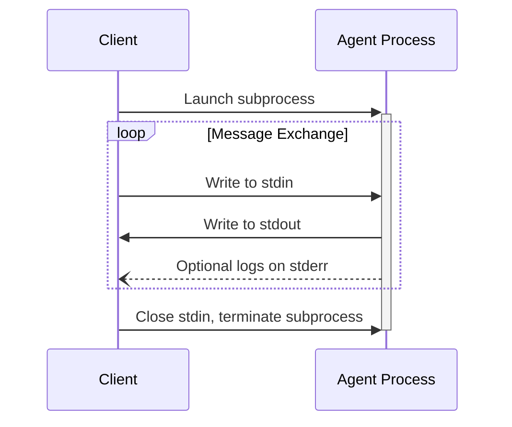
```mermaid
sequenceDiagram
    participant Client
    participant Agent Process

    Client->>+Agent Process: Launch subprocess
    loop Message Exchange
        Client->>Agent Process: Write to stdin
        Agent Process->>Client: Write to stdout
        Agent Process--)Client: Optional logs on stderr
    end
    Client->>Agent Process: Close stdin, terminate subprocess
    deactivate Agent Process
```

## _Streamable HTTP_

_In discussion, draft proposal in progress._

## Custom Transports

Agents and clients **MAY** implement additional custom transport mechanisms to suit their specific needs. The protocol is transport-agnostic and can be implemented over any communication channel that supports bidirectional message exchange.

Implementers who choose to support custom transports **MUST** ensure they preserve the JSON-RPC message format and lifecycle requirements defined by ACP. Custom transports **SHOULD** document their specific connection establishment and message exchange patterns to aid interoperability.
````

## File: docs/rfds/about.mdx
````markdown
---
title: "Requests for Dialog (RFDs)"
description: "Our process for introducing changes to the protocol"
---

A "Request for Dialog" (RFD) is ACP's version of the RFC process. RFDs are the primary mechanism for proposing new features, collecting community input on an issue, and documenting design decisions.

## When to write an RFD

You should consider writing an RFD if you intend to make a "substantial" change to ACP or its documentation. What constitutes a "substantial" change is evolving based on community norms and varies depending on what part of the ecosystem you are proposing to change.

Some changes do not require an RFD:

- Rephrasing, reorganizing or refactoring
- Addition or removal of warnings
- Additions that strictly improve objective, numerical quality criteria (speedup, better browser support)
- Fixing objectively incorrect behavior

## The RFD Process

### 1. Propose by opening a PR

[Fork the repo](https://github.com/agentclientprotocol/agent-client-protocol) and copy `docs/rfds/TEMPLATE.md` to `docs/rfds/my-feature.md` (using kebab-case naming). The RFD can start minimal - just an elevator pitch and status quo are enough to begin dialog. Pull requests become the discussion forum where ideas get refined through collaborative iteration.

### 2. Merge to "Draft" when championed

RFD proposals are merged into the "Draft" section if a core team member decides to champion them. The champion becomes the point-of-contact and will work with authors to make it reality. Once in draft, implementation may begin (properly feature-gated with the RFD name). Implementation can also begin at a particular SDK or agent/client level to prove out the design for better review and feedback before broader adoption.

RFDs are living documents that track implementation progress. PRs working towards an RFD will typically update it to reflect changes in design or direction.

### 2b. Move to "To be removed"

RFDs that have never landed may be closed at the discretion of a core team member. RFDs that have landed in draft form are moved to "To be removed" instead until there has been time to remove them fully from the codebase, then they are removed entirely.

### 3. Move to "Preview" when fully implemented

When the champion feels the RFD is ready for broader review, they open a PR to move it to "Preview." This signals the community to provide feedback. The PR stays open for a few days before the champion decides whether to land it.

### 4. Completed

Once in preview, the RFD can be moved to "completed" with a final PR. The core team should comment and express concerns, but **final decision is always made by the core team lead**. Depending on what the RFD is about, "completed" is the only state that can represent a 1-way door (if there is a stability commitment involved), as changes might require a breaking change to the protocol after this point.

Preview RFDs don't have to be completed. They may also go back to draft to await further changes or even be moved to "To be removed".

### 5. Implementation and completion

#### RFD Lifecycle

- **Early drafts**: Initial ideas, brainstorming, early exploration
- **Mature drafts**: Well-formed proposals ready for broader review
- **Accepted**: Approved for implementation, may reference implementation work
- **To be removed (yet?)**: Decided against for now, but preserved for future consideration
- **Completed**: Implementation finished and merged

## Governance

The project currently has a design team with the [Zed team as the lead (BDFL)](../community/governance). Champions from the core team guide RFDs through the process, but final decisions rest with the team lead. This structure maintains velocity while anticipating future governance expansion.

## Discussion and Moderation

Detailed discussions often happen on [Zulip](https://agentclientprotocol.zulipchat.com/), with PR comments for process decisions. The results of detailed discussions should be incorporated into the relevant RFD. RFD champions actively curate discussions by collecting questions in the FAQ section. If PR discussions become too long, they should be closed, feedback summarized, and reopened with links to the original.

## Licensing

All RFDs are licensed under Apache 2.0. The project remains open source.

##
````

## File: docs/rfds/acp-agent-registry.mdx
````markdown
---
title: "ACP Agent Registry"
---

**Author:** [@ignatov](https://github.com/ignatov)
**Champion:** [@benbrandt](https://github.com/benbrandt)

## Elevator pitch

ACP needs a single, trusted registry of agents so clients can discover integrations, understand their capabilities, and configure them automatically. This RFD proposes (1) a canonical manifest format that every agent must publish, (2) a dedicated `agentclientprotocol/registry` repo where maintainers contribute those manifests, and (3) tooling that aggregates and publishes a searchable catalog for editors and other clients.

## Status quo

There is no canonical listing of ACP-compatible agents. Information lives in scattered READMEs or proprietary feeds, which makes it hard to:

- Let users discover agents directly inside ACP-aware clients.
- Ensure protocol-version compatibility or capability coverage.
- Keep metadata consistent (hosting model, license, etc.).

Every editor builds bespoke manifests or scrapes GitHub, leading to duplication and stale data.

## Agent manifest format (core proposal)

Each agent advertises itself via a manifest stored as `<id>/agent.json` in the registry repo.

Fields marked with **\*** are required:

| Field                 | Description                                                                                                                                                                                                                                                                      |
| --------------------- | -------------------------------------------------------------------------------------------------------------------------------------------------------------------------------------------------------------------------------------------------------------------------------- |
| `id` **\***           | Unique agent identifier. Lowercase letters, digits, and hyphens; must start with a letter (pattern: `^[a-z][a-z0-9-]*$`). Also the folder name in the registry repo.                                                                                                             |
| `name` **\***         | Human-readable display name.                                                                                                                                                                                                                                                     |
| `version` **\***      | Semantic version of the agent release (e.g. `1.0.0`).                                                                                                                                                                                                                            |
| `description` **\***  | Brief description of the agent's functionality and purpose.                                                                                                                                                                                                                      |
| `distribution` **\*** | Object describing how to obtain and run the agent. Supports three distribution types: `binary` (platform-specific archives), `npx` (Node packages), and `uvx` (Python packages). At least one distribution type must be provided. See [Distribution](#distribution) for details. |
| `repository`          | Source code repository URL.                                                                                                                                                                                                                                                      |
| `authors`             | Array of author/organization names.                                                                                                                                                                                                                                              |
| `license`             | SPDX license identifier or `"proprietary"`.                                                                                                                                                                                                                                      |
| `icon`                | Path to icon file (relative path or absolute URL). Must be SVG format, 16×16, monochrome using `currentColor` (enables light/dark theme adaptation). See [Icon requirements](#icon-requirements).                                                                                |

### Distribution

The `distribution` object supports three mutually independent strategies. An agent may provide one or more:

#### `binary`

Platform-specific archive downloads. Keyed by `<os>-<arch>` targets:

| Target            | OS      | Architecture |
| ----------------- | ------- | ------------ |
| `darwin-aarch64`  | macOS   | ARM64        |
| `darwin-x86_64`   | macOS   | x86-64       |
| `linux-aarch64`   | Linux   | ARM64        |
| `linux-x86_64`    | Linux   | x86-64       |
| `windows-aarch64` | Windows | ARM64        |
| `windows-x86_64`  | Windows | x86-64       |

When using `binary` distribution, builds **must be provided for all three operating systems** (darwin, linux, windows). CI will reject entries that only cover a subset.

Each target is an object with:

| Field     | Required | Description                         |
| --------- | -------- | ----------------------------------- |
| `archive` | Yes      | URL to download archive             |
| `cmd`     | Yes      | Command to execute after extraction |
| `args`    | No       | Array of command-line arguments     |
| `env`     | No       | Object of environment variables     |

#### `npx` / `uvx`

Package-manager-based distribution (Node via `npx`, Python via `uvx`). Each is an object with:

| Field     | Required | Description                               |
| --------- | -------- | ----------------------------------------- |
| `package` | Yes      | Package name (with optional version spec) |
| `args`    | No       | Array of command-line arguments           |
| `env`     | No       | Object of environment variables           |

### Icon requirements

Icons must meet the following requirements to pass CI validation:

- **SVG format** — only `.svg` files are accepted.
- **16×16 dimensions** — via `width`/`height` attributes or `viewBox`.
- **Monochrome using `currentColor`** — all `fill` and `stroke` values must use `currentColor` or `none`. Hardcoded colors (e.g. `fill="#FF5500"`, `fill="red"`) are rejected.

Using `currentColor` lets icons adapt automatically to the client's light or dark theme.

### Example: binary distribution

```jsonc
{
  "id": "someagent",
  "name": "SomeAgent",
  "version": "1.0.0",
  "description": "Agent for code editing",
  "repository": "https://github.com/example/someagent",
  "authors": ["Example Team"],
  "license": "MIT",
  "icon": "icon.svg",
  "distribution": {
    "binary": {
      "darwin-aarch64": {
        "archive": "https://github.com/example/someagent/releases/latest/download/someagent-darwin-arm64.zip",
        "cmd": "./someagent",
        "args": ["acp"],
      },
      "darwin-x86_64": {
        "archive": "https://github.com/example/someagent/releases/latest/download/someagent-darwin-x64.zip",
        "cmd": "./someagent",
        "args": ["acp"],
      },
      "linux-aarch64": {
        "archive": "https://github.com/example/someagent/releases/latest/download/someagent-linux-arm64.zip",
        "cmd": "./someagent",
        "args": ["acp"],
      },
      "linux-x86_64": {
        "archive": "https://github.com/example/someagent/releases/latest/download/someagent-linux-x64.zip",
        "cmd": "./someagent",
        "args": ["acp"],
      },
      "windows-x86_64": {
        "archive": "https://github.com/example/someagent/releases/latest/download/someagent-windows-x64.zip",
        "cmd": "./someagent.exe",
        "args": ["acp"],
        "env": {
          "SOMEAGENT_MODE_KEY": "",
        },
      },
    },
  },
}
```

### Example: package distribution

```jsonc
{
  "id": "pyagent",
  "name": "PyAgent",
  "version": "2.1.0",
  "description": "A Python-based ACP agent",
  "repository": "https://github.com/example/pyagent",
  "license": "Apache-2.0",
  "distribution": {
    "uvx": {
      "package": "pyagent@latest",
      "args": ["--mode", "acp"],
    },
  },
}
```

## Registry schema

The aggregated `registry.json` file conforms to the registry schema and contains:

| Field     | Description                                                                                               |
| --------- | --------------------------------------------------------------------------------------------------------- |
| `version` | Registry schema version (semver, e.g. `1.0.0`).                                                           |
| `agents`  | Array of agent entries (each following the agent manifest schema above, sourced from `agent.json` files). |

## Authentication requirements

To be listed in the registry, an agent **must support at least one** of the following authentication methods:

- **Agent Auth** — the agent handles the OAuth flow independently (opens the user's browser, runs a local callback server, exchanges the authorization code for tokens).
- **Terminal Auth** — the agent provides an interactive terminal-based setup experience (launched with additional args/env specified in the auth method).

CI verifies this by checking that the agent returns an `authMethods` array in its `initialize` response, with at least one method. See the [ACP auth methods RFD](./auth-methods) for the full specification.

## What we propose to do about it

1. **Manifest spec** (above) becomes normative; we publish the JSON Schema and validator script so maintainers can lint locally.
2. **Registry repository** `github.com/agentclientprotocol/registry`:
   - Structure: `<id>/agent.json`, optional `icon.svg`, optional `README.md`.
   - CI validates manifests on every PR: schema compliance, slug uniqueness, icon format (16×16 SVG, monochrome `currentColor`), URL accessibility for all distribution URLs, authentication support via ACP handshake, and binary OS coverage.
   - Push to `main` triggers a build that aggregates all entries into `registry.json` and publishes versioned + `latest` GitHub releases.
3. **Aggregated outputs**:
   - `registry.json`: deterministic list of all agents with icons copied to `dist/<id>.svg`.
4. **Distribution & search**:
   - Clients fetch `registry.json` from `https://cdn.agentclientprotocol.com/registry/v1/latest/registry.json`.
   - Static site offers filters for deployment model, license, and distribution type.

## Shiny future

- Agent maintainers make PRs to update their manifests; CI keeps data clean.
- Automated version updates run hourly, checking npm, PyPI, and GitHub releases for new versions of registered agents and opening PRs automatically.
- Editors/clients can bootstrap ACP support by fetching one JSON file and filtering locally.
- The ACP website displays the same data for humans, ensuring consistency.
- Package-based distribution (`npx`, `uvx`) lowers the barrier for agents that don't need platform-specific binaries.

## Implementation details and plan

**Phase 1 – Spec & repo bootstrap**

- Finalize JSON Schema and documentation.
- Create registry repo with CI (GitHub Actions) that validates on PRs and publishes on merge.
- Seed with reference agents.
- Implement automated version update workflow (hourly cron via GitHub Actions).
- Enforce authentication requirements via CI handshake verification.

## Revision history

- 2025-11-28: Initial draft.
- 2025-12-16: Minors.
- 2026-02-04: Updated to match latest schema — removed `schema_version`, `homepage`, `capabilities`, and `auth` fields; added `icon` field; restructured `distribution` into `binary`, `npx`, and `uvx` types.
````

## File: docs/rfds/additional-directories.mdx
````markdown
---
title: "Additional Workspace Roots for Session Lifecycle Requests"
---

- Author(s): [egor-baranov](https://github.com/egor-baranov)
- Champion: [benbrandt](https://github.com/benbrandt)

## Elevator pitch

> What are you proposing to change?

ACP currently standardizes `cwd` on session lifecycle requests, but does not define a standard way to declare additional filesystem roots for a session.

This RFD proposes an optional field:

```ts
additionalDirectories?: string[]
```

on:

- `NewSessionRequest`
- `ResumeSessionRequest`
- `ForkSessionRequest`
- `LoadSessionRequest`

and an optional capability:

```ts
sessionCapabilities.additionalDirectories?: {}
```

`cwd` remains the primary working directory. `additionalDirectories` expands filesystem scope only. It does not replace `cwd`, define directory contents, or introduce new RPC methods.

## Status quo

> How do things work today and what problems does this cause? Why would we change things?

ACP currently allows a client to identify one primary workspace root through `cwd`. That is sufficient for single-root projects, but it does not provide a standard way to expose additional roots in multi-root repositories or environments where project code, shared instructions, skills, or mounted workspaces live at separate absolute paths.

Without a standardized field, clients and agents must rely on implementation-specific conventions. `_meta` is not appropriate for interoperable workspace-root semantics. This leaves multi-root behavior fragmented and less predictable across implementations.

## What we propose to do about it

> What are you proposing to improve the situation?

Add `additionalDirectories?: string[]` to the session lifecycle request schemas listed above and to `session/list`, and define protocol-level validation and semantics for it.

The proposal is scoped to session lifecycle requests, session discovery requests, and session discovery metadata only:

- no new RPC methods are added;
- `cwd` remains unchanged as the primary root; and
- ACP remains agnostic to directory naming and directory contents.

Agents advertise support with `sessionCapabilities.additionalDirectories`. Clients MUST gate usage on that capability.

This proposal also extends `SessionInfo` returned by `session/list` with authoritative `additionalDirectories` state, and allows `session/list` to filter on `cwd` plus `additionalDirectories`, so clients that support session discovery can recover and query the active root set for listed sessions. `session/load` and `session/resume` nevertheless remain explicit-list only: omitting `additionalDirectories` or supplying an empty array means no additional roots are activated for the resulting session, while a non-empty array-valued `additionalDirectories` becomes the complete resulting additional-root list for that request.

## Shiny future

> How will things will play out once this feature exists?

Clients can declare multi-root workspace scope in a standard way while preserving existing `cwd` behavior.

Agents can treat a session as an ordered root set starting with `cwd` and followed by any array-valued `additionalDirectories` entries, and apply the same discovery and resource-handling behavior they already apply under `cwd` to the other declared roots.

Security boundaries remain explicit: declared roots communicate intended scope, while sandboxing, approvals, and OS permissions continue to govern actual access.

## Implementation details and plan

> Tell me more about your implementation. What is your detailed implementation plan?

### Goals / Non-goals

#### Goals

- Standardize additional workspace roots on session lifecycle entry points.
- Preserve `cwd` as the primary working directory for the session.
- Define clear validation and error-handling rules.
- Enable generic multi-root discovery and resource handling by agents across all declared roots.
- Expand the filesystem scope without changing the existing RPC method structure.

#### Non-goals

- Defining any required directory names or layouts, such as `.agents/`, `skills/`, or `.<agent>/`.
- Defining a standard instruction, skill, or configuration file format.
- Replacing `cwd` with a list-valued field.
- Changing relative-path semantics.
- Adding new RPC methods.
- Defining per-root read/write permissions in the protocol.

### Schema changes

The following optional property is added to each request type named above:

```ts
additionalDirectories?: string[]
```

The following optional property is also added to `ListSessionsRequest`:

```ts
additionalDirectories?: string[]
```

The following optional property is also added to `SessionInfo`:

```ts
additionalDirectories?: string[]
```

The following capability is added to `SessionCapabilities`:

```ts
additionalDirectories?: {}
```

Clients MUST send `additionalDirectories` only when `sessionCapabilities.additionalDirectories` is present.

If an agent advertises `sessionCapabilities.additionalDirectories` and also supports `session/list`, any `SessionInfo.additionalDirectories` value it returns is the authoritative ordered additional-root list for that session. Agents MAY omit the field when there are no additional roots, and clients MUST treat an omitted field the same as `[]`.

If an agent advertises `sessionCapabilities.additionalDirectories` and also supports `session/list`, `ListSessionsRequest.additionalDirectories` filters sessions by exact match on the authoritative ordered additional-root list when the field is present and non-empty. When both `cwd` and a non-empty `additionalDirectories` are present on `session/list`, both filters apply. Omitting the field or supplying an empty array means no additional-root filter is applied.

If adopted, the session-setup, session-list, and filesystem documentation will need corresponding updates so they describe the effective root set rather than `cwd` alone as the session filesystem context or boundary.

### Capability advertisement example

```json
{
  "jsonrpc": "2.0",
  "id": 0,
  "result": {
    "protocolVersion": 1,
    "agentCapabilities": {
      "sessionCapabilities": {
        "additionalDirectories": {}
      }
    }
  }
}
```

### `session/list` example

When an agent supports both `sessionCapabilities.additionalDirectories` and `session/list`, clients may filter by `cwd`, `additionalDirectories`, or both. Each returned `SessionInfo` includes the authoritative additional-root list for that session:

```json
{
  "jsonrpc": "2.0",
  "id": 5,
  "method": "session/list",
  "params": {
    "cwd": "/home/user/project",
    "additionalDirectories": [
      "/home/user/shared-lib",
      "/home/user/product-docs"
    ]
  }
}
```

```json
{
  "jsonrpc": "2.0",
  "id": 5,
  "result": {
    "sessions": [
      {
        "sessionId": "sess_abc123",
        "cwd": "/home/user/project",
        "additionalDirectories": [
          "/home/user/shared-lib",
          "/home/user/product-docs"
        ],
        "updatedAt": "2026-03-24T12:00:00Z"
      }
    ]
  }
}
```

### Field definition

`additionalDirectories` has the following properties:

- The field MUST be an array of strings when present.
- Each entry MUST be an absolute path under the same platform path rules used for `cwd`.
- Empty strings MUST be rejected.
- `null` is not a valid value for the field or for any entry.

ACP does not define a wire-level lexical normalization algorithm for `cwd` or `additionalDirectories`.

Clients SHOULD remove exact duplicate path strings before sending the request. Clients SHOULD also avoid entries whose path string exactly matches `cwd`. Overlapping or nested roots are not semantically redundant for ACP purposes: because discovery across the effective ordered root list is ordered and implementation-defined, such entries MAY affect behavior even when they do not change the union of accessible paths. Agents MAY remove exact duplicate path strings, including entries identical to `cwd`, provided doing so preserves the first occurrence order of the remaining entries and does not expand scope.

For `session/list` filtering, matching is against the session's authoritative ordered additional-root list as surfaced in `SessionInfo.additionalDirectories`. Implementations that normalize or canonicalize path strings for comparison SHOULD apply the same platform-appropriate rule consistently to stored session state, `SessionInfo.additionalDirectories`, and `ListSessionsRequest.additionalDirectories`.

### Semantics

`cwd` remains the primary working directory for the session. It continues to define:

- the default base for relative-path resolution;
- the primary working directory semantics already defined by ACP; and
- the primary workspace root for clients or agents that distinguish one root as primary.

`additionalDirectories` defines zero or more extra filesystem roots that are part of the same session workspace scope.

The effective ordered root list for a session is:

- `[cwd]` when `additionalDirectories` is omitted or is an empty array
- `[cwd, ...additionalDirectories]` when `additionalDirectories` is a non-empty array

This ordered root list has the following semantics:

- The session workspace is a multi-root workspace.
- The roots form a logical union of accessible roots.
- The roots are not a virtual overlay filesystem.
- ACP does not define shadowing, mount, or merge semantics between roots.
- Relative paths MUST continue to resolve only against `cwd`.

A file path is in scope for the session if, after platform-appropriate path resolution for access control, it is contained within at least one declared root. This proposal expands workspace scope only. It does not imply that all in-scope paths are writable, nor does it bypass client capability checks, user approvals, sandbox rules, or operating-system permissions.

### Request-specific behavior

For `NewSessionRequest`, the resulting additional root list is:

- `additionalDirectories` when present with a non-empty array value;
- otherwise `[]`.

For `LoadSessionRequest` and `ResumeSessionRequest`:

- when `additionalDirectories` is present with a non-empty array value, it is the complete resulting list of additional roots for the active session, even if that list differs from the session's previously stored additional roots;
- when omitted or present as an empty array, the resulting additional root list is `[]`.

Agents MUST NOT implicitly reactivate stored additional roots that were not supplied on the `session/load` or `session/resume` request. Supplying `additionalDirectories` on `session/load` or `session/resume` is always allowed when the capability is advertised, and doing so may preserve, replace, reduce, or expand the session's previously stored additional-root list for the resulting active session, subject to validation and policy checks. Clients that need to preserve a session's additional roots across restarts or across client instances MUST obtain, persist, or reconstruct the full list and resend it on load or resume. When `session/list` is available, `SessionInfo.additionalDirectories` provides the authoritative current additional-root list for that purpose.

For `ForkSessionRequest`:

- when `additionalDirectories` is present with a non-empty array value, it is a full replacement list for the forked session;
- when omitted or present as an empty array, the resulting additional root list is `[]`.

Agents MUST NOT implicitly inherit additional roots from the source session unless the implementation can prove that the active root list is already authoritative to the requesting client on the current connection. Otherwise, the agent MUST fail the request or require the client to provide the full list explicitly.

For all lifecycle methods, an agent MAY reject the request if the resulting roots are incompatible with stored session state, fork semantics, sandbox policy, or other implementation constraints. An agent MUST NOT silently drop unsupported or unauthorized roots.

This RFD defines lifecycle-time workspace scope only. It does not define mid-session mutation of `additionalDirectories`.

### Agent behavior expectations

Agents MUST treat paths under `additionalDirectories` as part of the session's accessible workspace scope in the same sense as paths under `cwd`, subject to capabilities and permissions actually available for that session.

For any discovery, indexing, or resource-loading behavior an agent applies under `cwd` such as instructions, skills, configuration, or other agent-specific artifacts, the agent SHOULD apply the same behavior to each declared root in `additionalDirectories`, subject to the same capabilities and permissions.

If an implementation resolves conflicts across multiple roots, earlier roots in the effective ordered root list SHOULD take precedence over later roots. Conflict resolution within a single root remains implementation-defined.

ACP does not define:

- required directory names or layouts;
- the contents or file formats of discovered artifacts;
- whether an agent MUST perform any discovery at all; or
- how discovered artifacts affect prompting or execution.

Implementations MAY define such behavior independently, but ACP remains agnostic to directory contents.

### Validation and error handling

An agent receiving a session lifecycle request with `additionalDirectories` MUST validate the field before creating, loading, resuming, or forking the session.

The agent MUST reject the request if:

- `additionalDirectories` is not an array;
- any entry is not a string;
- any entry is empty;
- any entry is not absolute.

`invalid_params` is the RECOMMENDED error class for malformed values.

If an entry is syntactically valid but cannot be granted under the implementation's policy, sandbox, or user-consent model, the agent MUST fail the request with an appropriate error. The agent MUST NOT silently ignore invalid, unauthorized, or unsupported entries and proceed with a reduced root set.

ACP does not require a specific lexical normalization algorithm for validating `cwd` or `additionalDirectories`. Implementations that normalize or canonicalize path strings for comparison, deduplication, or storage SHOULD apply the same platform-appropriate rule consistently to both fields, but authorization and containment checks MUST NOT rely solely on lexical normalization.

When enforcing root boundaries for subsequent file access, implementations SHOULD use canonical or real paths where available and MUST prevent escapes through symlinks, junctions, mount points, or equivalent mechanisms. If the implementation cannot safely determine whether a path is within an allowed root, it MUST fail closed.

### Client responsibilities

A client that sends `additionalDirectories`:

- MUST send only paths it intends to expose to the session;
- MUST ensure those paths are absolute;
- MUST send the full intended active additional root list on `session/load` and `session/resume`;
- SHOULD obtain user consent or otherwise act consistently with the client's trust and permission model;
- SHOULD remove exact duplicate path strings and entries identical to `cwd` before sending; and
- MUST NOT assume an agent will infer extra roots from project metadata, directory conventions, or prior session state.

If a client mediates filesystem access through ACP client capabilities such as `fs/read_text_file` and `fs/write_text_file`, it MUST enforce the effective root set for that session when authorizing path-based access. ACP's filesystem methods are client-mediated and operate on absolute paths, so the client remains responsible for boundary enforcement in those flows. When the client learns about an existing session through `session/list`, it SHOULD use `SessionInfo.additionalDirectories` together with `cwd` as the authoritative current root set for those checks until a subsequent lifecycle request establishes a different one.

If a client launches an agent with direct filesystem access, `additionalDirectories` is not, by itself, a sandbox. Clients that need root boundaries to be enforced in that deployment model SHOULD apply operating-system or runtime sandboxing consistent with the declared root set.

### Examples

#### `session/new`

```json
{
  "jsonrpc": "2.0",
  "id": 1,
  "method": "session/new",
  "params": {
    "cwd": "/home/user/project",
    "additionalDirectories": [
      "/home/user/shared-lib",
      "/home/user/product-docs"
    ],
    "mcpServers": []
  }
}
```

#### `session/load`

```json
{
  "jsonrpc": "2.0",
  "id": 2,
  "method": "session/load",
  "params": {
    "sessionId": "sess_abc123",
    "cwd": "/home/user/project",
    "additionalDirectories": [
      "/home/user/shared-lib",
      "/home/user/product-docs"
    ],
    "mcpServers": []
  }
}
```

#### `session/resume`

```json
{
  "jsonrpc": "2.0",
  "id": 3,
  "method": "session/resume",
  "params": {
    "sessionId": "sess_abc123",
    "cwd": "/home/user/project",
    "additionalDirectories": [
      "/home/user/shared-lib",
      "/home/user/product-docs"
    ],
    "mcpServers": []
  }
}
```

#### `session/fork`

```json
{
  "jsonrpc": "2.0",
  "id": 4,
  "method": "session/fork",
  "params": {
    "sessionId": "sess_abc123",
    "cwd": "/home/user/project",
    "additionalDirectories": [
      "/home/user/shared-lib",
      "/home/user/product-docs"
    ],
    "mcpServers": []
  }
}
```

### Security considerations

`additionalDirectories` increases the set of filesystem paths the agent may be able to inspect or modify. This increases the potential impact of user error, client misconfiguration, or insufficient sandboxing.

Clients MUST NOT send directories that the user has not granted to the session under the client's trust model. Clients SHOULD default to explicit selection or other clear workspace-grant semantics for roots outside the primary project directory.

Agents and clients MUST treat root enforcement as a security boundary when they claim to enforce it. Boundary checks MUST account for symlink and path-resolution attacks. Ambiguous cases MUST fail closed.

This field does not create a new privilege model. All existing permission prompts, approval flows, filesystem capabilities, sandbox controls, and operating-system access rules continue to apply.

Because ACP does not define directory contents, agents SHOULD avoid assuming that any discovered file under an additional root is safe, authoritative, or intended for automatic execution. Discovery is not equivalent to trust.

### Backward compatibility

This proposal is additive at the schema level. Requests that omit `additionalDirectories` behave exactly as they do today. Existing clients that do not need multi-root support require no changes.

Updated agents MUST continue to accept requests that do not include the field.

Older implementations may validate request objects strictly against older schemas and MAY reject unknown fields. Clients therefore MUST gate usage on `sessionCapabilities.additionalDirectories`.

This proposal intentionally does not extend the responses to `session/new`, `session/load`, `session/resume`, or `session/fork` to surface authoritative additional-root state directly. That remains consistent with existing ACP response shapes, which also do not return `cwd`. Instead, when `session/list` is supported, `SessionInfo.additionalDirectories` exposes the authoritative ordered additional-root list for listed sessions. `SessionInfoUpdate` remains unchanged because this RFD does not define mid-session mutation of `additionalDirectories`. Clients that need multi-root continuity across `session/load` or `session/resume` MUST still send the full intended list explicitly.

`session/list` filtering no longer remains `cwd`-only: sessions may be filtered by `cwd`, by `additionalDirectories`, or by both together. Sessions that differ by `additionalDirectories` are therefore both distinguishable and filterable through `SessionInfo.additionalDirectories` and `ListSessionsRequest.additionalDirectories`.

This RFD does not add a new RPC method. It also does not change the meaning of `cwd`, `sessionId`, or `mcpServers`.

### Drawbacks

- It expands the workspace surface area and therefore the risk of accidental data exposure.
- It introduces another dimension of interoperability for clients and agents to test.
- It does not standardize discovery behavior, so implementations may still differ in how they use additional roots.
- Older strict validators may reject the new field until they adopt the updated schema.

## Frequently asked questions

> What questions have arisen over the course of authoring this document or during subsequent discussions?

### Why not use `_meta`?

`_meta` is intended for implementation-specific custom data. A standardized workspace-root concept should be protocol-level, typed, and interoperable across implementations.

### Why not replace `cwd` with `workspaceRoots`?

`cwd` already has established semantics as the primary working directory. Replacing it with an array would blur relative-path behavior, reduce clarity for existing implementations, and create a larger migration surface.

### Does ACP define `.agents`, `skills`, or instruction directory conventions?

No. ACP does not define `.agents`, `skills`, or other instruction directory conventions. This proposal only defines additional accessible roots.

Agents SHOULD handle resources under `additionalDirectories` the same way they handle analogous resources under `cwd`, but the names, layouts, and file formats of those resources remain implementation-defined.

### How should clients handle older agents that may not support this field?

Clients MUST gate `additionalDirectories` on `sessionCapabilities.additionalDirectories`. If support is absent, clients SHOULD omit the field and preserve existing behavior.

### Why not restore stored roots on `session/load` or `session/resume` when the field is omitted?

Even with `SessionInfo.additionalDirectories` available through `session/list`, implicit restoration would still let an agent reactivate filesystem scope that the current request did not state explicitly. That is undesirable for clients that do not use `session/list`, for clients resuming a session by ID without first listing it, and for clients that want request-time control over the active root set. This proposal therefore keeps load and resume explicit-list only for additional roots: omitting the field or supplying an empty array activates none, while supplying a non-empty array is explicitly allowed and sets the complete resulting additional-root list for that request.

### What alternative approaches did you consider, and why did you settle on this one?

Alternatives considered:

- putting extra roots in `_meta`;
- adding a new workspace-configuration RPC method; and
- requiring clients to copy or mount everything under `cwd`.

This proposal is preferred because it is additive, keeps `cwd` semantics stable, avoids new methods, and standardizes multi-root scope at session lifecycle boundaries.

## Revision history

- 2026-03-24: Initial draft.
````

## File: docs/rfds/agent-telemetry-export.mdx
````markdown
---
title: "Agent Telemetry Export"
---

- Author(s): [@codefromthecrypt](https://github.com/codefromthecrypt)
- Champion: [@benbrandt](https://github.com/benbrandt)

## Elevator pitch

> What are you proposing to change?

Define how agents export telemetry (logs, metrics, traces) to clients without tunneling it over the ACP transport. Clients run a local telemetry receiver and pass standard OpenTelemetry environment variables when launching agents. This keeps telemetry out-of-band and enables editors to display agent activity, debug issues, and integrate with observability backends.

## Status quo

> How do things work today and what problems does this cause? Why would we change things?

ACP defines how clients launch agents as subprocesses and communicate over stdio. The [meta-propagation RFD](./meta-propagation) addresses trace context propagation via `params._meta`, enabling trace correlation. However, there is no convention for how agents should export the actual telemetry data (spans, metrics, logs).

Without a standard approach:

1. **No visibility into agent behavior** - Editors cannot display what agents are doing (token usage, tool calls, timing)
2. **Difficult debugging** - When agents fail, there's no structured way to capture diagnostics
3. **Fragmented solutions** - Each agent/client pair invents their own telemetry mechanism
4. **Credential exposure risk** - If agents need to send telemetry directly to backends, they need credentials

Tunneling telemetry over the ACP stdio transport is problematic:

- **Head-of-line blocking** - Telemetry traffic could delay agent messages
- **Implementation burden** - ACP would need to define telemetry message formats
- **Coupling** - Agents would need ACP-specific telemetry code instead of standard SDKs

## What we propose to do about it

> What are you proposing to improve the situation?

Clients that want to receive agent telemetry run a local OTLP (OpenTelemetry Protocol) receiver and inject environment variables when launching agent subprocesses:

```
OTEL_EXPORTER_OTLP_ENDPOINT=http://localhost:4318
OTEL_EXPORTER_OTLP_PROTOCOL=http/protobuf
OTEL_SERVICE_NAME=agent-name
```

Agents using OpenTelemetry SDKs auto-configure from these variables. The client's receiver can:

- Display telemetry in the editor UI (e.g., token counts, timing, errors)
- Forward telemetry to the client's configured observability backend
- Add client-side context before forwarding

This follows the [OpenTelemetry collector deployment pattern](https://opentelemetry.io/docs/collector/deployment/agent/) where a local receiver proxies telemetry to backends.

### Architecture

```
┌────────────────────────────────────────────────────────────┐
│ Client/Editor                                              │
│  ┌──────────────┐    ┌──────────────┐    ┌──────────────┐  │
│  │ ACP Handler  │    │OTLP Receiver │───▶│   Exporter   │  │
│  └──────────────┘    └──────────────┘    └──────────────┘  │
└────────┬─────────────────────▲──────────────────┬──────────┘
         │ stdio               │ HTTP             │
         ▼                     │                  ▼
┌─────────────────────┐        │         ┌───────────────────┐
│ Agent Process       │        │         │ Observability     │
│  ┌──────────────┐   │        │         │ Backend           │
│  │ ACP Agent    │   │        │         └───────────────────┘
│  ├──────────────┤   │        │
│  │ OTEL SDK     │────────────┘
│  └──────────────┘   │
└─────────────────────┘
```

### Discovery

Environment variables must be set before launching the subprocess, but ACP capability exchange happens after connection. Options for discovery:

1. **Optimistic injection** - Clients inject OTEL environment variables unconditionally. Agents without OpenTelemetry support simply ignore them. This is pragmatic since environment variables are low-cost and OTEL SDKs handle misconfiguration gracefully.

2. **Registry metadata** - Agent registries (like the one proposed in PR #289) could include telemetry support in agent manifests, letting clients know ahead of time.

3. **Manual configuration** - Users configure their client to enable telemetry collection for specific agents.

## Shiny future

> How will things will play out once this feature exists?

1. **Editor integration** - Editors can show agent activity: token usage, tool call timing, model switches, errors
2. **Unified debugging** - When agents fail, structured telemetry is available for diagnosis
3. **End-to-end traces** - Combined with `params._meta` trace propagation, traces flow from client through agent to any downstream services
4. **No credential sharing** - Agents never see backend credentials; the client handles authentication
5. **Standard SDKs** - Agent authors use normal OpenTelemetry SDKs that work in any context, not ACP-specific code

## Implementation details

> Tell me more about your implementation. What is your detailed implementation plan?

### 1. Create `docs/protocol/observability.mdx`

Add a new protocol documentation page covering observability practices for ACP. This page will describe:

**For Clients/Editors:**

- Running an OTLP receiver to collect agent telemetry
- Injecting `OTEL_EXPORTER_*` environment variables when launching agent subprocesses
- Respecting user-configured `OTEL_*` variables (do not override if already set)
- Forwarding telemetry to configured backends with client credentials

**For Agent Authors:**

- Using OpenTelemetry SDKs with standard auto-configuration
- Recommended spans, metrics, and log patterns for agent operations
- How telemetry flows when `OTEL_*` variables are present vs absent

### 2. Update `docs/protocol/extensibility.mdx`

Add a section linking to the new observability doc, similar to how extensibility concepts relate to other protocol features. Add a brief mention that observability practices (telemetry export) are documented separately.

### 3. Update `docs/docs.json`

Add `protocol/observability` to the Protocol navigation group.

## Frequently asked questions

> What questions have arisen over the course of authoring this document or during subsequent discussions?

### How does this relate to trace propagation in `params._meta`?

They are complementary:

- **Trace propagation** (`params._meta` with `traceparent`, etc.) passes trace context so spans can be correlated
- **Telemetry export** (this RFD) defines where agents send the actual span/metric/log data

Both are needed for end-to-end observability.

### What if an agent doesn't use OpenTelemetry?

Agents without OTEL SDKs simply ignore the environment variables. No harm is done. Over time, as more agents adopt OpenTelemetry, the ecosystem benefits.

### What if the user already configured `OTEL_*` environment variables?

If `OTEL_*` variables are already set in the environment, clients should not override them. User-configured telemetry settings take precedence, allowing users to direct agent telemetry to their own backends when desired.

### Why not define ACP-specific telemetry messages?

This would duplicate OTLP functionality, add implementation burden to ACP, and force agent authors to use non-standard APIs. Using OTLP means agents work with standard tooling and documentation.

### What about agents that aren't launched as subprocesses?

This RFD focuses on the stdio transport where clients launch agents. For other transports (HTTP, etc.), agents would need alternative configuration mechanisms, which could be addressed in future RFDs.

### What alternative approaches did you consider, and why did you settle on this one?

1. **Tunneling telemetry over ACP** - Rejected due to head-of-line blocking concerns and implementation complexity
2. **Agents export directly to backends** - Rejected because it requires sharing credentials with agents
3. **File-based telemetry** - Rejected because it doesn't support real-time display and adds complexity

The environment variable approach:

- Uses existing standards (OTLP, OpenTelemetry SDK conventions)
- Keeps telemetry out-of-band from ACP messages
- Lets clients control where telemetry goes without exposing credentials
- Requires no changes to ACP message formats

## Revision history

- 2025-12-04: Initial draft
````

## File: docs/rfds/auth-methods.mdx
````markdown
---
title: "Authentication Methods"
---

Author(s): [anna239](https://github.com/anna239)

## Elevator pitch

> What are you proposing to change?

I suggest adding more information about auth methods that agent supports, which will allow clients to draw more appropriate UI.

## Status quo

> How do things work today and what problems does this cause? Why would we change things?

Agents have different ways of authenticating users: env vars with api keys, running a command like `<agent_name> login`, some just open a browser and use oauth.
[AuthMethod](https://agentclientprotocol.com/protocol/schema#authmethod) does not really tell the client what should be done to authenticate. This means we can't show the user a control for entering key if an agent supports auth through env var.

Very few agents can authenticate fully on their own without user input, so agents with ACP auth support are limited in the methods they can offer, or require manual setup before being run as an ACP agent.

## What we propose to do about it

> What are you proposing to improve the situation?

We can add addition types of AuthMethods, to provide clients with additional information so they can assist in the login process.

## Shiny future

> How will things will play out once this feature exists?

It will be easier for end-users to start using an agent from inside the IDE as auth process will be more straightforward

## Implementation details and plan

> Tell me more about your implementation. What is your detailed implementation plan?

I suggest adding following auth types:

### Auth method types

1. Agent auth

Same as what there is now – agent handles the auth itself. This is the default type when no `type` is provided, preserving backward compatibility.

```json
{
  "id": "123",
  "name": "Agent",
  "description": "Authenticate through agent"
}
```

An explicit `"type": "agent"` is also accepted but not required.

2. Env variable

The user provides credentials that the client passes to the agent as environment variables. Requires `"type": "env_var"`.

The `vars` field is an array of `AuthEnvVar` objects, each describing a single environment variable. This supports services that require multiple credentials (e.g. Azure OpenAI needs both an API key and an endpoint URL).

Simple single-key example:

```json
{
  "id": "openai",
  "name": "OpenAI API Key",
  "type": "env_var",
  "vars": [{ "name": "OPENAI_API_KEY" }],
  "link": "https://platform.openai.com/api-keys"
}
```

Multiple variables with metadata:

```json
{
  "id": "azure-openai",
  "name": "Azure OpenAI",
  "type": "env_var",
  "vars": [
    { "name": "AZURE_OPENAI_API_KEY", "label": "API Key" },
    {
      "name": "AZURE_OPENAI_ENDPOINT",
      "label": "Endpoint URL",
      "secret": false
    },
    {
      "name": "AZURE_OPENAI_API_VERSION",
      "label": "API Version",
      "secret": false,
      "optional": true
    }
  ],
  "link": "https://portal.azure.com"
}
```

Fields on `AuthMethodEnvVar`:

- `vars` (required): Array of `AuthEnvVar` objects.
- `link` (optional): URL where the user can obtain their credentials.

Fields on `AuthEnvVar`:

- `name` (required): The environment variable name (e.g. `"OPENAI_API_KEY"`).
- `label` (optional): Human-readable label for this variable, displayed in client UI.
- `secret` (optional, default `true`): Whether this value is a secret. Clients should use a password-style input for secret vars and a plain text input otherwise.
- `optional` (optional, default `false`): Whether this variable is optional.

Since environment variables need to be supplied when the agent process starts, the client can check if it already passed such variables to the process, in which case the user can click on the button and the agent will read the already available values.

Otherwise, when the user clicks the button, the client could restart the agent process with the desired environment variables, and then automatically send the authenticate message with the correct id to sign in for the user.

3. Terminal Auth

This requires the client to be able to run an interactive terminal for the user to login via a TUI. Requires `"type": "terminal"`.

```json
{
  "id": "123",
  "name": "Run in terminal",
  "description": "Setup Label",
  "type": "terminal",
  "args": ["--setup"],
  "env": { "VAR1": "value1", "VAR2": "value2" }
}
```

- `args` (optional, default `[]`): Additional arguments to pass when running the agent binary.
- `env` (optional, default `{}`): Additional environment variables to set.

The `command` cannot be specified, the client will invoke the exact same binary with the exact same setup. The agent can supply additional arguments and environment variables as necessary. These will be supplied in **addition** to any args/env supplied by default when the server is started. So agents will need to have a way to kickoff their interactive login flow even if normal acp commands/arguments are supplied as well.

This is so that the agent doesn't need to know about the environment it is running in. It can't know the absolute path necessarily, and shouldn't be able to supply other commands or programs to minimize security issues.

### Client capabilities

Because `terminal` auth methods require specific client-side support, clients must opt in via `AuthCapabilities` on `ClientCapabilities` during initialization:

```json
{
  "clientCapabilities": {
    "auth": {
      "terminal": true
    }
  }
}
```

- `auth.terminal` (default `false`): When `true`, the agent may include `terminal` entries in its authentication methods.

The `env_var` type does not require a capability opt-in since any client can set environment variables when starting a process, we are just providing additional context for the environment variable.

## Frequently asked questions

> What questions have arisen over the course of authoring this document or during subsequent discussions?

### What alternative approaches did you consider, and why did you settle on this one?

An alternative approach would be to include this information to an agent's declaration making it more static, see [Registry RFD](https://github.com/agentclientprotocol/agent-client-protocol/pull/289)

There is also an alternative to adding a separate `elicitation` capability, which is to create a separate auth type for this. Then the client can decide themselves if they support it or not.

## Revision history

There was a part about elicitations https://github.com/agentclientprotocol/agent-client-protocol/blob/939ef116a1b14016e4e3808b8764237250afa253/docs/rfds/auth.mdx removed it for now, will move to a separate rfd

- 2026-03-09: Remove auth_methods from Error type
- 2026-03-03: Changed `env_var` from single `varName` to structured `vars` array of `AuthEnvVar` objects; simplified field name from `varName` to `name`
- 2026-02-27: Updated to reflect current implementation
- 2026-01-14: Updates based on Core Maintainer discussion
````

## File: docs/rfds/boolean-config-option.mdx
````markdown
---
title: "Boolean Config Option Type"
---

- Author(s): [fscarponi](https://github.com/fscarponi)
- Champion: [benbrandt](https://github.com/benbrandt)

## Elevator pitch

Add a new `boolean` type to session configuration options, enabling agents to expose simple ON/OFF toggles (e.g., "Brave Mode", "Read Only", "Produce Report") as first-class config options alongside the existing `select` type.

## Status quo

Currently, `SessionConfigKind` only supports the `select` type, which allows agents to expose dropdown-style selectors with a list of named values. This works well for choosing models, modes, or reasoning levels.

However, there is no native way to represent a simple boolean on/off toggle. To expose a boolean option today, agents must use a `select` with two artificial options (e.g., "on"/"off"), and clients need custom, non-agnostic logic to detect that a particular select is actually a boolean toggle. This defeats the purpose of a standardized protocol.

## What we propose to do about it

- Add a `SessionConfigBoolean` struct with a `current_value: bool` field
- Add a `Boolean(SessionConfigBoolean)` variant to the `SessionConfigKind` enum, discriminated by `"type": "boolean"`
- Add a `SessionConfigOptionValue` internally-tagged enum so that `SetSessionConfigOptionRequest` can carry both string values (for `select`) and boolean values (for `boolean`) with an explicit `type` discriminator
- Provide convenience constructors and `From` impls for ergonomic usage
- Update documentation and regenerate schema files

## Shiny future

Clients can natively render boolean config options as toggle switches or checkboxes, without any custom logic. Agents can expose options like "Brave Mode", "Produce Report", or "Read Only" in a standardized way that any ACP-compliant client understands out of the box.

## Implementation details and plan

### Wire format: declaring a boolean option

In a `session/new` response (or any response containing `configOptions`):

```json
{
  "jsonrpc": "2.0",
  "id": 1,
  "result": {
    "sessionId": "sess_abc123",
    "configOptions": [
      {
        "id": "brave_mode",
        "name": "Brave Mode",
        "description": "Skip confirmation prompts and act autonomously",
        "type": "boolean",
        "currentValue": true
      },
      {
        "id": "mode",
        "name": "Session Mode",
        "category": "mode",
        "type": "select",
        "currentValue": "code",
        "options": [
          { "value": "ask", "name": "Ask" },
          { "value": "code", "name": "Code" }
        ]
      }
    ]
  }
}
```

### Wire format: setting a boolean option

The `session/set_config_option` request carries a `type` discriminator alongside the `value`. The `type` field describes the _shape_ of the value, not the option kind.

When `type` is absent the value is treated as a `SessionConfigValueId` string, preserving backwards compatibility with existing clients:

```json
{
  "jsonrpc": "2.0",
  "id": 2,
  "method": "session/set_config_option",
  "params": {
    "sessionId": "sess_abc123",
    "configId": "brave_mode",
    "type": "boolean",
    "value": true
  }
}
```

For select options the `type` field can be omitted (defaults to `value_id`):

```json
{
  "jsonrpc": "2.0",
  "id": 3,
  "method": "session/set_config_option",
  "params": {
    "sessionId": "sess_abc123",
    "configId": "mode",
    "value": "code"
  }
}
```

The response returns the full set of config options with current values, as with `select`:

```json
{
  "jsonrpc": "2.0",
  "id": 2,
  "result": {
    "configOptions": [
      {
        "id": "brave_mode",
        "name": "Brave Mode",
        "description": "Skip confirmation prompts and act autonomously",
        "type": "boolean",
        "currentValue": true
      },
      {
        "id": "mode",
        "name": "Session Mode",
        "category": "mode",
        "type": "select",
        "currentValue": "code",
        "options": [..]
      }
    ]
  }
}
```

Key changes:

1. `SessionConfigBoolean` struct with `current_value: bool`
2. `Boolean(SessionConfigBoolean)` variant in `SessionConfigKind` (tagged via `"type": "boolean"`)
3. `SessionConfigOptionValue` enum using `#[serde(tag = "type")]` with a `#[serde(untagged)]` fallback variant — the same pattern as `AuthMethod`:
   - `Boolean { value: bool }` — matched when `type` is `"boolean"`
   - `ValueId { value: SessionConfigValueId }` — untagged fallback when `type` is absent or unrecognised
4. `SessionConfigOptionValue` is flattened (`#[serde(flatten)]`) onto `SetSessionConfigOptionRequest`, producing top-level `type` and `value` fields on the wire
5. The `value` field type change in `SetSessionConfigOptionRequest` is gated behind `#[cfg(feature = "unstable_boolean_config")]` — without the feature the field remains `SessionConfigValueId`
6. `From` impls (`&str`, `SessionConfigValueId`, `bool`) ensure ergonomic construction
7. Wire-level backward compatible: existing JSON payloads without a `type` field remain valid via the untagged fallback

### Client capabilities

Per the existing protocol design, clients that receive a config option with an unrecognized `type` should ignore it. Since the agent is required to have a default value for every option, the agent can function correctly even if the client doesn't render or interact with the boolean option. No new client capability negotiation is needed.

## Frequently asked questions

### What alternative approaches did you consider, and why did you settle on this one?

We considered reusing the existing `select` type with a convention (e.g., options named "on"/"off"), but this would require clients to implement non-agnostic detection logic, which contradicts the goal of a standardized protocol. A dedicated `boolean` type is cleaner and lets clients render the appropriate UI control without guessing.

### Is this a breaking change?

On the wire/JSON level: no. When `type` is absent the value is treated as a `SessionConfigValueId`, so existing payloads deserialize correctly. On the Rust API level: the type of `SetSessionConfigOptionRequest.value` changes, but this is gated behind `unstable_boolean_config`. Without the feature flag the stable API is unchanged. With the feature flag, `From` impls ensure source compatibility for users of the `new()` constructor.

## Revision history

- 2026-02-24: Initial proposal
- 2026-03-05: Updated to reflect final implementation — `flag` renamed to `boolean`, value type changed from untagged `String | Bool` enum to internally-tagged enum with `type` discriminator and untagged `ValueId` fallback, feature-gated behind `unstable_boolean_config`
````

## File: docs/rfds/custom-llm-endpoint.mdx
````markdown
---
title: "Configurable LLM Providers"
---

- Author(s): [@anna239](https://github.com/anna239), [@xtmq](https://github.com/xtmq)

## Elevator pitch

> What are you proposing to change?

Add the ability for clients to discover and configure agent LLM providers (identified by `id`) via dedicated provider methods:

- `providers/list`
- `providers/set`
- `providers/disable`

This allows clients to route LLM requests through their own infrastructure (proxies, gateways, or self-hosted models) without agents needing to know about this configuration in advance.

## Status quo

> How do things work today and what problems does this cause? Why would we change things?

ACP does not currently define a standard method for configuring LLM providers.

In practice, provider configuration is usually done via environment variables or agent-specific config files. That creates several problems:

- No standard way for clients to discover what providers an agent exposes
- No standard way to update one specific provider by id
- No standard way to disable a specific provider at runtime while preserving provider discoverability
- Secret-bearing values in headers are difficult to handle safely when configuration must be round-tripped

This particularly affects:

- **Client proxies**: clients want to route agent traffic through their own proxies, for example to add headers or logging
- **Enterprise deployments**: organizations want to route LLM traffic through internal gateways for compliance, logging, and cost controls
- **Self-hosted models**: users running local servers (vLLM, Ollama, etc.) need to redirect agent traffic to local infrastructure
- **API gateways**: organizations using multi-provider routing, rate limiting, and caching need standardized endpoint configuration

## Shiny future

> How will things play out once this feature exists?

Clients will be able to:

1. Understand whether an agent supports client-managed LLM routing
2. See where the agent is currently sending LLM requests (for example in settings UI)
3. Route agent LLM traffic through their own infrastructure (enterprise proxy, gateway, self-hosted stack)
4. Update routing settings from the client instead of relying on agent-specific env vars
5. Disable a provider when needed and later re-enable it explicitly
6. Apply these settings before starting new work in sessions

## Implementation details and plan

> Tell me more about your implementation. What is your detailed implementation plan?

### Intended flow

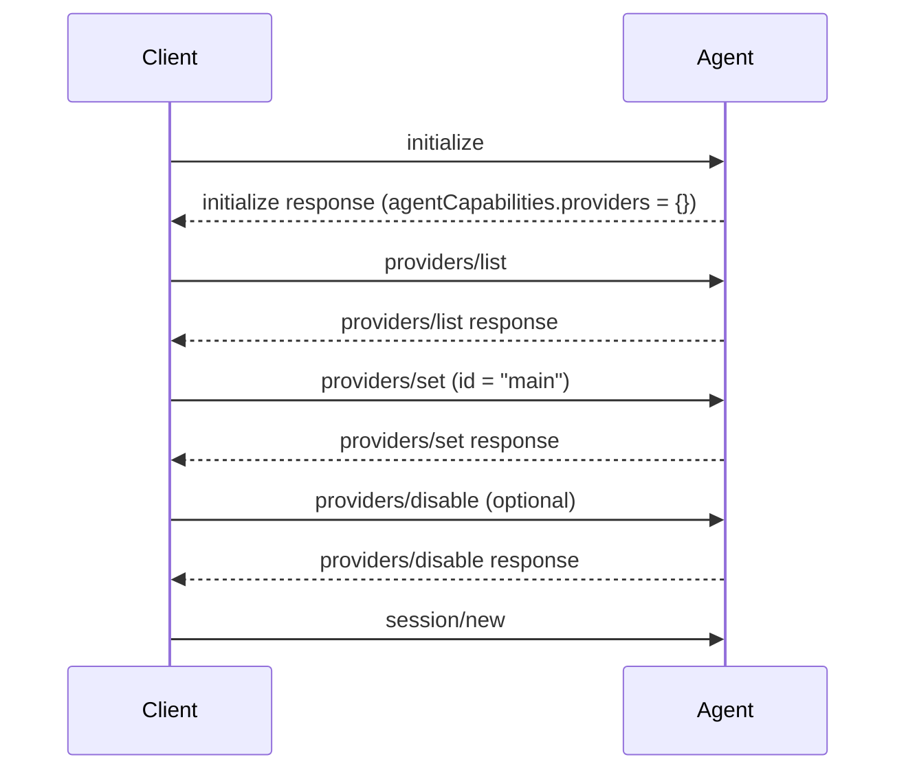
```mermaid
sequenceDiagram
    participant Client
    participant Agent

    Client->>Agent: initialize
    Agent-->>Client: initialize response (agentCapabilities.providers = {})

    Client->>Agent: providers/list
    Agent-->>Client: providers/list response

    Client->>Agent: providers/set (id = "main")
    Agent-->>Client: providers/set response

    Client->>Agent: providers/disable (optional)
    Agent-->>Client: providers/disable response

    Client->>Agent: session/new
```

1. Client initializes and checks `agentCapabilities.providers`.
2. Client calls `providers/list` to discover available providers, their current routing targets (or disabled state), supported protocol types, and whether they are required.
3. Client calls `providers/set` to apply new (required) configuration for a specific provider id.
4. Client may call `providers/disable` when a non-required provider should be disabled.
5. Client creates or loads sessions.

### Capability advertisement

The agent advertises support with an empty object capability:

```typescript
interface AgentCapabilities {
  // ... existing fields ...

  /**
   * Provider configuration support.
   * If present, the agent supports providers/list, providers/set, and providers/disable.
   */
  providers?: {};
}
```

If `providers` is absent, clients must treat provider methods as unsupported.

### Types

```typescript
/**
 * Well-known API protocol identifiers for LLM providers.
 *
 * This is an open string type: agents and clients MUST handle unknown
 * protocol identifiers gracefully.
 *
 * Protocol names beginning with `_` are free for custom use, like other
 * ACP extension methods. Protocol names that do not begin with `_` are
 * reserved for the ACP spec.
 */
type LlmProtocol =
  | "anthropic"
  | "openai"
  | "azure"
  | "vertex"
  | "bedrock"
  | string;

interface ProviderCurrentConfig {
  /** Protocol currently used by this provider. */
  apiType: LlmProtocol;

  /** Base URL currently used by this provider. */
  baseUrl: string;
}

interface ProviderInfo {
  /** Provider identifier, for example "main" or "openai". */
  id: string;

  /** Supported protocol types for this provider. */
  supported: LlmProtocol[];

  /**
   * Whether this provider is mandatory and cannot be disabled via providers/disable.
   * If true, clients must not call providers/disable for this id.
   */
  required: boolean;

  /**
   * Current effective non-secret routing config.
   * Null or omitted means provider is disabled.
   */
  current?: ProviderCurrentConfig | null;

  /** Extension metadata */
  _meta?: Record<string, unknown>;
}
```

### `providers/list`

```typescript
interface ProvidersListRequest {
  /** Extension metadata */
  _meta?: Record<string, unknown>;
}

interface ProvidersListResponse {
  /** Configurable providers with current routing info suitable for UI display. */
  providers: ProviderInfo[];

  /** Extension metadata */
  _meta?: Record<string, unknown>;
}
```

### `providers/set`

`providers/set` updates the full configuration for one provider id.

```typescript
interface ProvidersSetRequest {
  /** Provider id to configure. */
  id: string;

  /** Protocol type for this provider. */
  apiType: LlmProtocol;

  /** Base URL for requests sent through this provider. */
  baseUrl: string;

  /**
   * Full headers map for this provider.
   * May include authorization, routing, or other integration-specific headers.
   * Omitting this field is equivalent to an empty map (no headers).
   */
  headers?: Record<string, string>;

  /** Extension metadata */
  _meta?: Record<string, unknown>;
}

interface ProvidersSetResponse {
  /** Extension metadata */
  _meta?: Record<string, unknown>;
}
```

### `providers/disable`

```typescript
interface ProvidersDisableRequest {
  /** Provider id to disable. */
  id: string;

  /** Extension metadata */
  _meta?: Record<string, unknown>;
}

interface ProvidersDisableResponse {
  /** Extension metadata */
  _meta?: Record<string, unknown>;
}
```

### Example exchange

**initialize Response:**

```json
{
  "jsonrpc": "2.0",
  "id": 0,
  "result": {
    "protocolVersion": 1,
    "agentInfo": {
      "name": "MyAgent",
      "version": "2.0.0"
    },
    "agentCapabilities": {
      "providers": {},
      "sessionCapabilities": {}
    }
  }
}
```

**providers/list Request:**

```json
{
  "jsonrpc": "2.0",
  "id": 1,
  "method": "providers/list",
  "params": {}
}
```

**providers/list Response:**

```json
{
  "jsonrpc": "2.0",
  "id": 1,
  "result": {
    "providers": [
      {
        "id": "main",
        "supported": ["bedrock", "vertex", "azure", "anthropic"],
        "required": true,
        "current": {
          "apiType": "anthropic",
          "baseUrl": "http://localhost/anthropic"
        }
      },
      {
        "id": "openai",
        "supported": ["openai"],
        "required": false,
        "current": null
      }
    ]
  }
}
```

**providers/set Request:**

```json
{
  "jsonrpc": "2.0",
  "id": 2,
  "method": "providers/set",
  "params": {
    "id": "main",
    "apiType": "anthropic",
    "baseUrl": "https://llm-gateway.corp.example.com/anthropic/v1",
    "headers": {
      "X-Request-Source": "my-ide"
    }
  }
}
```

**providers/set Response:**

```json
{
  "jsonrpc": "2.0",
  "id": 2,
  "result": {}
}
```

**providers/disable Request:**

```json
{
  "jsonrpc": "2.0",
  "id": 3,
  "method": "providers/disable",
  "params": {
    "id": "openai"
  }
}
```

**providers/disable Response:**

```json
{
  "jsonrpc": "2.0",
  "id": 3,
  "result": {}
}
```

### Behavior

1. **Capability discovery**: agents that support provider methods MUST advertise `agentCapabilities.providers: {}` in `initialize`. Clients SHOULD only call `providers/*` when this capability is present.
2. **Timing and session impact**: provider methods MUST be called after `initialize`. Clients SHOULD configure providers before creating or loading sessions. Agents MAY choose not to apply changes to already running sessions, but SHOULD apply them to sessions created or loaded after the change.
3. **List semantics**: `providers/list` returns configurable providers, their supported protocol types, current effective routing, and `required` flag. Providers SHOULD remain discoverable in list after `providers/disable`.
4. **Client behavior for required providers**: clients SHOULD NOT call `providers/disable` for providers where `required: true`.
5. **Disabled state encoding**: in `providers/list`, `current` omitted or `current: null` means the provider is disabled and MUST NOT be used by the agent for LLM calls.
6. **Set semantics and validation**: `providers/set` replaces the full configuration for the target `id` (`apiType`, `baseUrl`, `headers`); an omitted `headers` field is treated as an empty map. If `id` is unknown, `apiType` is unsupported for that provider, or params are malformed, agents SHOULD return `invalid_params`.
7. **Disable semantics**: `providers/disable` disables the target provider at runtime. A disabled provider MUST appear in `providers/list` with `current` omitted or `current: null`. If target provider has `required: true`, agents MUST return `invalid_params`. Disabling an unknown `id` SHOULD be treated as success (idempotent behavior).
8. **Scope and persistence**: provider configuration is process-scoped and SHOULD NOT be persisted to disk.

## Frequently asked questions

> What questions have arisen over the course of authoring this document?

### What does `null` mean in `providers/list`?

`current` omitted or `current: null` means the provider is disabled.

When disabled, the agent MUST NOT route LLM calls through that provider until the client enables it again with `providers/set`.

### Why is there a `required` flag?

Some providers are mandatory for agent operation and must not be disabled.

`required` lets clients hide or disable the provider-disable action in UI and avoid calling `providers/disable` for those ids.

### Why not a single `providers/update` method for full list replacement?

A full-list update means the client must send complete configuration (including `headers`) for all providers every time.

If the client wants to change only one provider, it may not know headers for the others. In that case it cannot safely build a correct full-list payload.

Also, `providers/list` does not return headers, so the client cannot simply "take what the agent returned" and send it back with one edit.

Per-provider methods (`set` and `disable`) avoid this problem and keep updates explicit.

### Why doesn't `providers/list` return headers?

Header values may contain secrets and should not be echoed by the agent. `providers/list` is intentionally limited to non-secret routing information (`current.apiType`, `current.baseUrl`).

### Why are `providers/list` and `providers/set` payloads different?

`providers/set` accepts `headers`, including secrets, and is write-oriented.

`providers/list` is read-oriented and returns only non-secret routing summary (`current`) for UI and capability discovery.

### Why is this separate from `initialize` params?

Clients need capability discovery first, then provider discovery, then configuration. A dedicated method family keeps initialization focused on negotiation and leaves provider mutation to explicit steps.

### Why not use `session-config` with a `provider` category instead?

`session-config` is a possible alternative, and we may revisit it as the spec evolves.

We did not choose it as the primary approach in this proposal because provider routing here needs dedicated semantics that are difficult to express with today's session config model:

- Multiple providers identified by `id`, each with its own lifecycle
- Structured payloads (`apiType`, `baseUrl`, full `headers` map) rather than simple scalar values
- Explicit discoverable (`providers/list`) and disable (`providers/disable`) semantics

Today, `session-config` values are effectively string-oriented and do not define a standard multi-value/structured model for this use case.

## Revision history

- 2026-04-19: Made `ProviderInfo.current` optional in `providers/list`; disabled state may be encoded as omitted `current` or `current: null`
- 2026-03-22: Finalized provider disable semantics - `providers/remove` renamed to `providers/disable`, required providers are non-disableable, and disabled state is represented as `current: null`
- 2026-03-21: Initial draft of provider configuration API (`providers/list`, `providers/set`, `providers/remove`)
- 2026-03-07: Rename "provider" to "protocol" to reflect API compatibility level; make `LlmProtocol` an open string type with well-known values; resolve open questions on identifier standardization and model availability
- 2026-03-04: Revised to use dedicated `setLlmEndpoints` method with capability advertisement
- 2026-02-02: Initial draft - preliminary proposal to start discussion
````

## File: docs/rfds/diff-delete.mdx
````markdown
---
title: "Represent deleted files in diff"
---

Author(s): [anna239](https://github.com/benbrandt)

## Elevator pitch

> What are you proposing to change?

Add flag `deleted` to [Diff](https://agentclientprotocol.com/protocol/tool-calls#diffs) entity type for the case of a deleted file.

## Status quo

> How do things work today and what problems does this cause? Why would we change things?

Currently, in Diff entity type `newText` is not nullable, so it's not possible to distinguish between a deleted file and empty file.

## What we propose to do about it

> What are you proposing to improve the situation?

Add flag `deleted` to [Diff](https://agentclientprotocol.com/protocol/tool-calls#diffs) entity type for the case of a deleted file.

**Current structure (cannot distinguish deleted file from empty file):**

```json
{
  "type": "diff",
  "path": "/home/user/project/src/config.json",
  "oldText": "{\n  \"debug\": false\n}",
  "newText": ""
}
```

**Proposed structure with `deleted` flag:**

```json
{
  "type": "diff",
  "path": "/home/user/project/src/config.json",
  "oldText": "{\n  \"debug\": false\n}",
  "newText": "",
  "deleted": true
}
```

Note: we would ideally make newText nullable, but that would break existing clients.

## Shiny future

> How will things will play out once this feature exists?

It is possible for the agent to distinguish between a deleted file and an empty file.

## Implementation details and plan

> Tell me more about your implementation. What is your detailed implementation plan?

Adding the new field will be a non-breaking change, and clients that update can better distinguish between deleted and empty files.

## Frequently asked questions

> What questions have arisen over the course of authoring this document or during subsequent discussions?

**Do we need to represent moved files?**

An agent could represent that with a deleted file at the old path and a new file at the new path.

We need to rework the entire diff structure to handle more cases, and binary files, but in the meantime this provides a stop-gap until we can implement a more comprehensive solution.

### What alternative approaches did you consider, and why did you settle on this one?

We considered making newText nullable, but that would break existing clients.

## Revision history

2026-02-20: Initial draft
````

## File: docs/rfds/elicitation.mdx
````markdown
---
title: "Elicitation: Structured User Input"
---

- Author(s): [@yordis](https://github.com/yordis)
- Champion: [@benbrandt](https://github.com/benbrandt)

## Elevator pitch

Add support for agents to request structured information from users through a standardized elicitation mechanism, aligned with [MCP's elicitation feature](https://modelcontextprotocol.io/specification/draft/client/elicitation). This allows agents to ask follow-up questions, collect authentication credentials, gather preferences, and request required information without side-channel communication or ad-hoc client UI implementations.

## Status quo

Currently, agents have two limited mechanisms for gathering user input:

1. **Session Config Options** (PR #210): Pre-declared, persistent configuration (model, mode, etc.) with default values required. These are available at session initialization and changes are broadcast to the client.

2. **Unstructured text in turn responses**: Agents can include prompts in their responses, but clients have no standardized way to recognize auth requests, form inputs, or structured selections, leading to inconsistent UX across agents.

However, there is no mechanism for agents to:

- Request ad-hoc information during a turn (e.g., "Which of these approaches should I proceed with?" from PR #340)
- Ask for authentication credentials in a recognized, secure way (pain point from PR #330)
- Collect open-ended text input with validation constraints
- Handle decision points that weren't anticipated at session initialization
- Request sensitive information via out-of-band mechanisms (browser-based OAuth)

The community has already identified the need for this: PR #340 explored a `session/select` mechanism but concluded that leveraging an MCP-like elicitation pattern would be more aligned with how clients will already support MCP servers. PR #330 recognized that authentication requests specifically need special handling separate from regular session data.

This gap limits the richness of agent-client interaction and forces both agents and clients to implement ad-hoc solutions for structured user input.

## What we propose to do about it

We propose introducing an elicitation mechanism for agents to request structured information from users, aligned with [MCP's draft elicitation specification](https://modelcontextprotocol.io/specification/draft/client/elicitation). This addresses discussions from PR #340 about standardizing user selection flows and PR #330 about secure authentication handling.

The mechanism would:

1. **Use restricted JSON Schema** (as discussed in PR #210): Like MCP, constrain JSON Schema to a useful subset—flat objects with primitive properties (`string`, `number`, `integer`, `boolean`) plus supported formats and enum values. Clients decide how to render UI based on the schema.

2. **Support two elicitation modes** (following [MCP SEP-1036](https://modelcontextprotocol.io/community/seps/1036-url-mode-elicitation-for-secure-out-of-band-intera)):
   - **Form mode** (in-band): Structured data collection via JSON Schema forms
   - **URL mode** (out-of-band): Browser-based flows for sensitive operations like OAuth (addressing PR #330 authentication pain points)

3. **Request/response pattern**: Agents send elicitation requests via an `elicitation/create` method and receive responses. The agent controls when to send requests and whether to wait for responses before proceeding. Unlike Session Config Options (which are persistent), elicitation requests are transient.

4. **Support client capability negotiation**: Clients declare elicitation support via a structured capability object that distinguishes between `form`-based and `url`-based elicitation (following MCP's capability model). This allows clients to support one or both modalities, enables agents to pass capabilities along to MCP servers, and handles graceful degradation when clients have limited elicitation support.

5. **Provide rich context**: Agents can include title, description, detailed constraints, and examples—helping clients render consistent, helpful UI without custom implementations.

6. **Enable out-of-band flows**: Support URL-mode elicitation (like MCP) for sensitive operations like authentication, where credentials bypass the agent entirely (addressing the core pain point in PR #330).

## Shiny future

Once implemented, agents can:

- Ask users "Which approach would you prefer: A or B?" and receive a structured response
- Request text input: "What's the name for this function?"
- Collect multiple related pieces of information in a single request
- Guide users through decision trees with follow-up questions
- Provide rich context (descriptions, examples, constraints) for what they're asking for

Clients can:

- Present a consistent, standardized UI for elicitation across all agents
- Validate user input against constraints before sending to the agent
- Cache elicitation history and offer suggestions based on previous responses
- Provide keyboard shortcuts and accessibility features for common elicitation types

## Implementation details and plan

### Alignment with MCP

This proposal follows MCP's draft elicitation specification. See [MCP Elicitation Specification](https://modelcontextprotocol.io/specification/draft/client/elicitation) for detailed guidance. ACP uses the same JSON Schema constraint approach and capability model, adapted for ACP interactions.

Key differences from MCP:

- MCP elicitation is tool-call-scoped; ACP elicitation may be tool-call-scoped, session-scoped, or request-scoped
- ACP uses `elicitation/create` method (same as MCP)
- ACP includes an optional `toolCallId` field to support tool-call-scoped elicitations (e.g., when an agent receives an MCP elicitation during a tool call and needs to redirect it to the user)
- ACP must integrate with existing Session Config Options (which also use schema constraints)

### Elicitation Request Structure

Agents send elicitation requests when they need information from the user. This is a request/response pattern—the agent sends the request and waits for the client's response.

**Example 1: Form Mode - User Selection (from PR #340)**

```json
{
  "mode": "form",
  "message": "How would you like me to approach this refactoring?",
  "requestedSchema": {
    "type": "object",
    "properties": {
      "strategy": {
        "type": "string",
        "title": "Refactoring Strategy",
        "description": "Choose how aggressively to refactor",
        "oneOf": [
          {
            "const": "conservative",
            "title": "Conservative - Minimal changes"
          },
          { "const": "balanced", "title": "Balanced (Recommended)" },
          {
            "const": "aggressive",
            "title": "Aggressive - Maximum optimization"
          }
        ],
        "default": "balanced"
      }
    },
    "required": ["strategy"]
  }
}
```

**Example 2: URL Mode - Authentication (from PR #330, out-of-band OAuth)**

```json
{
  "mode": "url",
  "elicitationId": "github-oauth-123",
  "url": "https://agent.example.com/connect?elicitationId=github-oauth-123",
  "message": "Please authorize access to your GitHub repositories to continue."
}
```

**Example 3: Form Mode - Text Input with Constraints**

```json
{
  "mode": "form",
  "message": "What should this function be named?",
  "requestedSchema": {
    "type": "object",
    "properties": {
      "name": {
        "type": "string",
        "title": "Function Name",
        "description": "Must be a valid identifier",
        "minLength": 1,
        "maxLength": 64,
        "pattern": "^[a-zA-Z_][a-zA-Z0-9_]*$",
        "default": "processData"
      }
    },
    "required": ["name"]
  }
}
```

**Example 4: Form Mode - Multiple Fields**

```json
{
  "mode": "form",
  "message": "Please provide configuration details",
  "requestedSchema": {
    "type": "object",
    "properties": {
      "name": {
        "type": "string",
        "title": "Project Name"
      },
      "port": {
        "type": "integer",
        "title": "Port Number",
        "minimum": 1024,
        "maximum": 65535,
        "default": 3000
      },
      "enableLogging": {
        "type": "boolean",
        "title": "Enable Logging",
        "default": true
      }
    },
    "required": ["name"]
  }
}
```

### Elicitation Modes

Following MCP's approach (specifically [SEP-1036](https://modelcontextprotocol.io/community/seps/1036-url-mode-elicitation-for-secure-out-of-band-intera)), elicitation supports two modes:

**Form mode** (in-band): Servers request structured data from users using restricted JSON Schema. The client decides how to render the form UI based on the schema.

**URL mode** (out-of-band): Servers direct users to external URLs for sensitive interactions that must not pass through the agent or client (OAuth flows, payments, credential collection, etc.).

This distinction is reflected in the client capabilities model, allowing clients to declare support for one or both modalities.

**Normative requirements:**

- Clients declaring the `elicitation` capability MUST support at least one mode (`form` or `url`).
- Agents MUST NOT send elicitation requests with modes that are not supported by the client.
- For URL mode, the `url` parameter MUST contain a valid URL.
- Agents MUST NOT return the `URLElicitationRequiredError` (code `-32042`) except when URL mode elicitation is required.

### Restricted JSON Schema

Aligning with [MCP's draft elicitation specification](https://modelcontextprotocol.io/specification/draft/client/elicitation), form mode elicitation uses a restricted subset of JSON Schema. Schemas are limited to flat objects with primitive properties only—the client decides how to render appropriate input UI based on the schema.

**Supported primitive types:**

1. **String Schema**

```json
{
  "type": "string",
  "title": "Display Name",
  "description": "Description text",
  "minLength": 3,
  "maxLength": 50,
  "pattern": "^[A-Za-z]+$",
  "format": "email",
  "default": "user@example.com"
}
```

Supported formats: `email`, `uri`, `date`, `date-time`

2. **Number Schema**

```json
{
  "type": "number",
  "title": "Display Name",
  "description": "Description text",
  "minimum": 0,
  "maximum": 100,
  "default": 50
}
```

Also supports `"type": "integer"` for whole numbers.

3. **Boolean Schema**

```json
{
  "type": "boolean",
  "title": "Display Name",
  "description": "Description text",
  "default": false
}
```

4. **Enum Schema** (for selections)

Single-select enum (without titles):

```json
{
  "type": "string",
  "title": "Color Selection",
  "description": "Choose your favorite color",
  "enum": ["Red", "Green", "Blue"],
  "default": "Red"
}
```

Single-select enum (with titles):

```json
{
  "type": "string",
  "title": "Color Selection",
  "description": "Choose your favorite color",
  "oneOf": [
    { "const": "#FF0000", "title": "Red" },
    { "const": "#00FF00", "title": "Green" },
    { "const": "#0000FF", "title": "Blue" }
  ],
  "default": "#FF0000"
}
```

Multi-select enum (without titles):

```json
{
  "type": "array",
  "title": "Color Selection",
  "description": "Choose your favorite colors",
  "minItems": 1,
  "maxItems": 2,
  "items": {
    "type": "string",
    "enum": ["Red", "Green", "Blue"]
  },
  "default": ["Red", "Green"]
}
```

Multi-select enum (with titles):

```json
{
  "type": "array",
  "title": "Color Selection",
  "description": "Choose your favorite colors",
  "minItems": 1,
  "maxItems": 2,
  "items": {
    "anyOf": [
      { "const": "#FF0000", "title": "Red" },
      { "const": "#00FF00", "title": "Green" },
      { "const": "#0000FF", "title": "Blue" }
    ]
  },
  "default": ["#FF0000", "#00FF00"]
}
```

**Request schema structure:**

```json
"requestedSchema": {
  "type": "object",
  "properties": {
    "propertyName": {
      "type": "string",
      "title": "Display Name",
      "description": "Description of the property"
    },
    "anotherProperty": {
      "type": "number",
      "minimum": 0,
      "maximum": 100
    }
  },
  "required": ["propertyName"]
}
```

**Not supported** (to simplify client implementation):

- Complex nested objects/arrays (beyond enum arrays)
- Conditional validation
- Custom formats beyond the supported list

Clients use this schema to generate appropriate input forms, validate user input before sending, and provide better guidance to users. All primitive types support optional default values; clients SHOULD pre-populate form fields with these values.

**Security note:** Following MCP, servers MUST NOT use form mode elicitation to request sensitive information (passwords, API keys, credentials). Sensitive data collection MUST use URL mode elicitation, which bypasses the agent and client entirely.

### Elicitation Request

The agent sends an `elicitation/create` request when it needs information from the user:

**Form mode example:**

```json
{
  "jsonrpc": "2.0",
  "id": 43,
  "method": "elicitation/create",
  "params": {
    "sessionId": "...",
    "toolCallId": "tc_123",
    "mode": "form",
    "message": "How would you like me to approach this refactoring?",
    "requestedSchema": {
      "type": "object",
      "properties": {
        "strategy": {
          "type": "string",
          "title": "Refactoring Strategy",
          "oneOf": [
            { "const": "conservative", "title": "Conservative" },
            { "const": "balanced", "title": "Balanced (Recommended)" },
            { "const": "aggressive", "title": "Aggressive" }
          ],
          "default": "balanced"
        }
      },
      "required": ["strategy"]
    }
  }
}
```

**URL mode example:**

```json
{
  "jsonrpc": "2.0",
  "id": 44,
  "method": "elicitation/create",
  "params": {
    "requestId": 12,
    "mode": "url",
    "elicitationId": "github-oauth-001",
    "url": "https://agent.example.com/connect?elicitationId=github-oauth-001",
    "message": "Please authorize access to your GitHub repositories."
  }
}
```

The scope fields are flattened at the top level of the request. Elicitation supports two scoping variants:

- **Session scope**: `sessionId` is set — tied to a specific session. Optionally includes `toolCallId` when tied to a specific tool call within that session (e.g., when an agent receives an elicitation from an MCP server during a tool call and needs to redirect it to the user).
- **Request scope**: `requestId` is set — tied to a specific JSON-RPC request outside of a session (e.g., auth/configuration phases before any session is started).

**Request-scoped example:**

```json
{
  "jsonrpc": "2.0",
  "id": 45,
  "method": "elicitation/create",
  "params": {
    "requestId": 12,
    "mode": "form",
    "message": "Please provide your workspace name to continue setup.",
    "requestedSchema": {
      "type": "object",
      "properties": {
        "workspaceName": {
          "type": "string",
          "title": "Workspace Name",
          "description": "The name of your workspace"
        }
      },
      "required": ["workspaceName"]
    }
  }
}
```

The client presents the elicitation UI to the user. For form mode, the client generates appropriate input UI based on the JSON Schema. For URL mode, the client opens the URL in a secure browser context.

### User Response

Elicitation responses use a three-action model (following MCP) to clearly distinguish between different user actions:

**Accept** - User explicitly approved and submitted with data:

```json
{
  "jsonrpc": "2.0",
  "id": 43,
  "result": {
    "action": "accept",
    "content": {
      "strategy": "balanced"
    }
  }
}
```

**Decline** - User explicitly declined the request:

```json
{
  "jsonrpc": "2.0",
  "id": 43,
  "result": {
    "action": "decline"
  }
}
```

**Cancel** - User dismissed without making an explicit choice (closed dialog, pressed Escape, etc.):

```json
{
  "jsonrpc": "2.0",
  "id": 43,
  "result": {
    "action": "cancel"
  }
}
```

For URL mode elicitation, the response with `action: "accept"` indicates that the user consented to the interaction. It does not mean the interaction is complete—the interaction occurs out-of-band and the client is not aware of the outcome until the agent sends a completion notification.

Agents should handle each state appropriately:

- **Accept**: Process the submitted data
- **Decline**: Handle explicit decline (e.g., use default, offer alternatives)
- **Cancel**: Handle dismissal (e.g., use default, prompt again later)

### Message Flow

#### Form Mode Flow

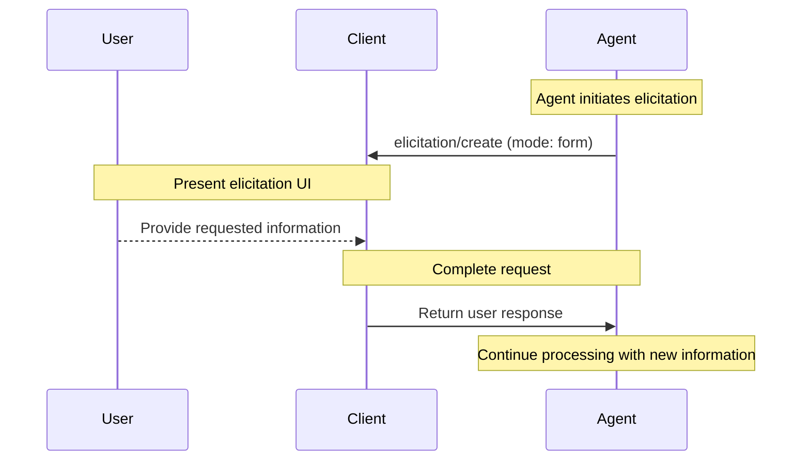
```mermaid
sequenceDiagram
    participant User
    participant Client
    participant Agent

    Note over Agent: Agent initiates elicitation
    Agent->>Client: elicitation/create (mode: form)

    Note over User,Client: Present elicitation UI
    User-->>Client: Provide requested information

    Note over Agent,Client: Complete request
    Client->>Agent: Return user response

    Note over Agent: Continue processing with new information
```

#### URL Mode Flow

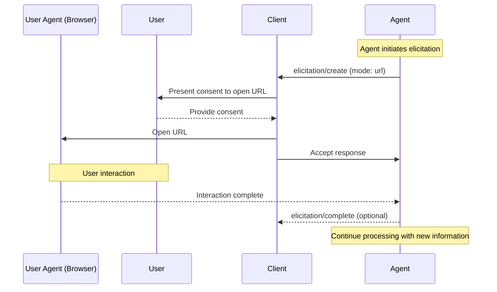
```mermaid
sequenceDiagram
    participant UserAgent as User Agent (Browser)
    participant User
    participant Client
    participant Agent

    Note over Agent: Agent initiates elicitation
    Agent->>Client: elicitation/create (mode: url)

    Client->>User: Present consent to open URL
    User-->>Client: Provide consent

    Client->>UserAgent: Open URL
    Client->>Agent: Accept response

    Note over User,UserAgent: User interaction
    UserAgent-->>Agent: Interaction complete
    Agent-->>Client: elicitation/complete (optional)

    Note over Agent: Continue processing with new information
```

#### URL Mode With Elicitation Required Error Flow

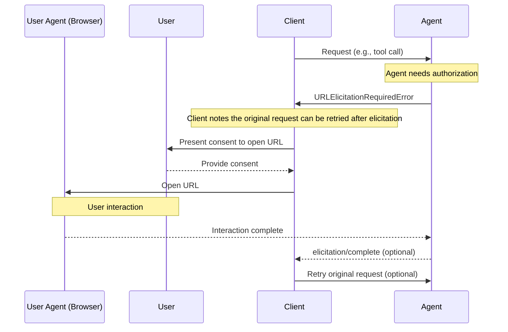
```mermaid
sequenceDiagram
    participant UserAgent as User Agent (Browser)
    participant User
    participant Client
    participant Agent

    Client->>Agent: Request (e.g., tool call)

    Note over Agent: Agent needs authorization
    Agent->>Client: URLElicitationRequiredError
    Note over Client: Client notes the original request can be retried after elicitation

    Client->>User: Present consent to open URL
    User-->>Client: Provide consent

    Client->>UserAgent: Open URL

    Note over User,UserAgent: User interaction

    UserAgent-->>Agent: Interaction complete
    Agent-->>Client: elicitation/complete (optional)

    Client->>Agent: Retry original request (optional)
```

### Completion Notifications for URL Mode

Following MCP, agents MAY send an `elicitation/complete` notification when an out-of-band interaction started by URL mode elicitation is completed:

```json
{
  "jsonrpc": "2.0",
  "method": "elicitation/complete",
  "params": {
    "elicitationId": "github-oauth-001"
  }
}
```

Agents sending notifications:

- MUST only send the notification to the client that initiated the elicitation request
- MUST include the `elicitationId` established in the original request

Clients:

- MUST ignore notifications referencing unknown or already-completed IDs
- MAY use this notification to automatically retry requests, update UI, or continue an interaction
- SHOULD provide manual controls for the user to retry or cancel if the notification never arrives

### URL Elicitation Required Error

When a request cannot be processed until a URL mode elicitation is completed, the agent MAY return a `URLElicitationRequiredError` (code `-32042`). This allows clients to understand that a specific elicitation is required before retrying the original request.

```json
{
  "jsonrpc": "2.0",
  "id": 2,
  "error": {
    "code": -32042,
    "message": "This request requires authorization.",
    "data": {
      "elicitations": [
        {
          "mode": "url",
          "elicitationId": "github-oauth-001",
          "url": "https://agent.example.com/connect?elicitationId=github-oauth-001",
          "message": "Authorization is required to access your GitHub repositories."
        }
      ]
    }
  }
}
```

Any elicitations returned in the error MUST be URL mode elicitations with an `elicitationId`. Clients may automatically retry the failed request after receiving a completion notification.

### Error Handling

Agents MUST return standard JSON-RPC errors for common failure cases:

- When a request cannot be processed until a URL mode elicitation is completed: `-32042` (`URLElicitationRequiredError`)

Clients MUST return standard JSON-RPC errors for common failure cases:

- When the agent sends an `elicitation/create` request with a mode not declared in client capabilities: `-32602` (Invalid params)

### Client Capabilities

Clients declare elicitation support during the `initialize` phase via `ClientCapabilities`, following MCP's capability model pattern. The capability distinguishes between `form`-based and `url`-based elicitation:

```json
{
  "jsonrpc": "2.0",
  "method": "initialize",
  "params": {
    "protocolVersion": "2025-11-25",
    "clientCapabilities": {
      "fs": {
        "readTextFile": true,
        "writeTextFile": true
      },
      "terminal": true,
      "elicitation": {
        "form": {},
        "url": {}
      }
    },
    "clientInfo": {
      "name": "my-client",
      "version": "1.0.0"
    }
  }
}
```

**Capability structure:**

- `elicitation.form` - Present if the client can render form UI from restricted JSON Schema (strings, numbers, integers, booleans, enums)
- `elicitation.url` - Present if the client can open URLs for out-of-band flows (OAuth, payments, credential collection)

**Example: Headless client (no browser access):**

```json
"elicitation": {
  "form": {}
}
```

**Example: Simple terminal with URL support only:**

```json
"elicitation": {
  "url": {}
}
```

**Example: Full-featured client:**

```json
"elicitation": {
  "form": {},
  "url": {}
}
```

This structure:

1. Allows clients to declare partial support based on their environment
2. Enables agents to pass capabilities along to MCP servers they connect to
3. Maps cleanly to MCP's elicitation capability model
4. Provides clear semantics for graceful degradation

Agents must gracefully handle clients that don't include this field (assumed to have no elicitation support) or that only include one of `form` or `url`.

### Backward Compatibility

- If a client doesn't declare `elicitation` capabilities, agents must provide a default value and continue
- If a client only declares `elicitation.form`, agents must not send URL-mode elicitation requests (or provide defaults and continue)
- If a client only declares `elicitation.url`, agents must not send form-mode elicitation requests (or provide defaults and continue)
- Agents should not require elicitation responses to continue operating
- Following MCP: an empty capability object (`"elicitation": {}`) is equivalent to declaring support for form mode only

### Statefulness

Most practical uses of elicitation require that the agent maintain state about users:

- Whether required information has been collected (e.g., the user's display name via form mode elicitation)
- Status of resource access (e.g., API keys or a payment flow via URL mode elicitation)

Agents implementing elicitation MUST securely associate this state with individual users. Specifically:

- State MUST NOT be associated with session IDs alone
- State storage MUST be protected against unauthorized access
- For remote agents, user identification MUST be derived from credentials acquired during authorization when possible (e.g., `sub` claim)

Agents MUST NOT rely on client-provided user identification without agent-side verification, as this can be forged.

## Frequently asked questions

### Can an agent request multiple pieces of information at once?

Yes—a single form mode elicitation request can include multiple fields in its `requestedSchema`. The schema is an object with multiple properties, and the client renders a form with all requested fields.

For sequential information gathering, agents can send multiple elicitation requests and wait for each response before proceeding. This allows agents to adapt follow-up questions based on previous answers.

The request/response model gives agents flexibility: they control when to send elicitation requests and whether to wait for responses or continue with other work.

### How does this differ from session config options?

Excellent question from PR #210 discussions. Both use restricted JSON Schema, but serve different purposes:

| Aspect               | Session Config Options                             | Elicitation                                                      |
| -------------------- | -------------------------------------------------- | ---------------------------------------------------------------- |
| **Lifecycle**        | Persistent, pre-declared at session init           | Transient, request/response                                      |
| **Scope**            | Session-wide configuration                         | Single decision point or data collection                         |
| **Defaults**         | Required (agents must have defaults)               | Optional (schema's `required` array determines mandatory fields) |
| **State management** | Client maintains full state, broadcast on changes  | Agent receives response and decides how to proceed               |
| **Use cases**        | Model selection, session mode, persistent settings | Authentication, clarifying questions, one-time data collection   |

Session Config Options are great for "how should you run this session?" Elicitation is for "what should I do next?"

### Why align with MCP's elicitation instead of creating something different?

As identified in PR #340, clients will already implement MCP elicitation support for MCP servers. Aligning ACP's elicitation with MCP:

- Reduces client implementation burden
- Creates consistent UX across MCP and ACP agents
- Lets code be shared or reused
- Follows the protocol design principle of only constraining when necessary

PR #340 specifically concluded: "I think we'd rather have an MCP elicitation story in general, and maybe offer the same interface outside of tool calls."

### How does authentication flow work with URL-mode elicitation?

From PR #330: URL-mode elicitation allows agents to request authentication without exposing credentials to the protocol. Following [MCP's draft elicitation specification](https://modelcontextprotocol.io/specification/draft/client/elicitation):

1. Agent sends elicitation request with `mode: "url"`, an `elicitationId`, and a URL to the agent's own connect endpoint (not directly to the OAuth provider)
2. Client displays the URL to the user and requests consent to open it
3. Client responds with `action: "accept"` to indicate the user consented
4. User opens URL in their browser (out-of-band process)
5. Agent's connect page verifies the user identity matches the elicitation request
6. Agent redirects user to the OAuth provider's authorization endpoint
7. User authenticates and grants permission
8. OAuth provider redirects back to the agent's redirect_uri
9. Agent exchanges the authorization code for tokens and stores them bound to the user's identity
10. Agent sends an `elicitation/complete` notification to inform the client

**Key guarantees**:

- Credentials never flow through the agent LLM or client
- The agent is responsible for securely storing third-party tokens
- The agent MUST verify user identity to prevent phishing attacks

**Security requirements** (from MCP draft spec):

Agents requesting URL mode elicitation:

- MUST NOT include sensitive information about the end-user (credentials, PII, etc.) in the URL
- MUST NOT provide a URL which is pre-authenticated to access a protected resource
- SHOULD NOT include URLs intended to be clickable in any field of a form mode elicitation request
- SHOULD use HTTPS URLs for non-development environments

Clients implementing URL mode elicitation:

- MUST NOT automatically pre-fetch the URL or any of its metadata
- MUST NOT open the URL without explicit consent from the user
- MUST show the full URL to the user for examination before consent
- MUST open the URL in a secure manner that does not enable the client or LLM to inspect the content or user inputs (e.g., SFSafariViewController on iOS, not WKWebView)
- SHOULD highlight the domain of the URL to mitigate subdomain spoofing
- SHOULD have warnings for ambiguous/suspicious URIs (e.g., containing Punycode)
- SHOULD NOT render URLs as clickable in any field of an elicitation request, except for the `url` field in a URL mode elicitation request (with the restrictions detailed above)

**Phishing prevention**: The agent MUST verify that the user who started the elicitation request is the same user who completes the OAuth flow. This is typically done by checking session cookies against the user identity from the MCP authorization.

### Can agents use elicitation for information required before responding?

Yes. By modeling elicitation as a request/response pattern (like MCP's `elicitation/create`), the agent controls its own flow. The agent can:

- Send an elicitation request and wait for the response before proceeding
- Continue with other work while waiting for user input
- Chain multiple elicitations as needed for multi-step workflows

This flexibility is why elicitation is modeled as a separate request/response rather than being tightly coupled to turns.

### What if a user doesn't respond to an elicitation request?

Elicitation requests require a response. If the user dismisses the elicitation without making an explicit choice (closes the dialog, presses Escape, etc.), the client responds with `action: "cancel"`. The agent then decides how to proceed—it may use a default value, prompt again later, or fail the turn.

This ties into the broader request cancellation work: elicitation requests can be cancelled like any other request, and the `cancel` action provides a clear signal that the user chose not to engage rather than explicitly declining.

### Should elicitation support complex nested data structures?

We follow MCP's design here. MCP intentionally restricts elicitation schemas to flat objects with primitive properties to simplify client implementation and user experience. Complex nested structures, arrays of objects (beyond enum arrays), and advanced JSON Schema features are explicitly not supported. If MCP expands this in the future, ACP would follow suit.

### How should agents handle clients that don't support elicitation?

Agents should always design to gracefully degrade:

- Check `elicitation.form` and `elicitation.url` capabilities before sending requests
- If the required mode is not supported, provide sensible default values
- Describe what they're requesting in turn content (text) as fallback
- Proceed with the defaults
- For agents connecting to MCP servers: pass the client's elicitation capabilities to the MCP server so it can also make informed decisions

### Can we extend this to replace the existing Permission-Request mechanism?

We recommend keeping them separate. Permission requests are fundamentally security decisions—allowing a tool call to proceed is distinct from the model asking for clarification or collecting user preferences. Keeping these separate allows clients to:

- Offer a consistent, recognizable UX for security-sensitive decisions (permissions)
- Clearly distinguish "the agent needs approval to do something" from "the agent needs information to continue"
- Apply different policies (e.g., "always allow file reads" vs. per-request elicitation responses)

This is the same reasoning behind keeping authentication flows (URL mode) distinct from data collection (form mode). While we may reuse some types between these mechanisms, conflating the features would blur important security boundaries.

### What about validating user input on the client side?

Clients SHOULD validate user input against the provided JSON Schema **before** sending the response to the agent. This prevents invalid data from reaching the agent and provides immediate feedback to the user. Agents SHOULD also validate received data matches the requested schema, as defense-in-depth against malformed or malicious responses.

If the agent requires additional validation beyond what's expressible in JSON Schema:

1. Agent validates the received value in the next turn
2. If validation fails, agent can fail the turn with an error
3. Client can then re-prompt the user (or fall back to the original default)

For v1, we recommend starting with JSON Schema validation only. If more complex validation patterns emerge from real-world usage, a future RFD can specify additional validation mechanisms.

## Revision history

- 2026-02-06: Spec alignment review. Fixed OAuth URL examples to use agent connect endpoints (not direct OAuth provider URLs) per MCP phishing prevention guidance. Added normative requirements section (MUST support at least one mode, MUST NOT send unsupported modes, url MUST be valid). Added Error Handling section with `-32042` and `-32602` error codes. Added message flow diagrams (form mode, URL mode, URL mode with error). Expanded safe URL handling requirements (pre-fetch prohibition, Punycode warnings, non-clickable URLs in form fields). Added server-side schema validation SHOULD requirement. Added Statefulness subsection with normative requirements for state association and user identification.
- 2026-02-05: Major revision to align with MCP draft elicitation specification. Updated enum schema to use `oneOf`/`anyOf` with `const`/`title` instead of `enumNames`. Added multi-select array support. Added `pattern` field for strings. Added URLElicitationRequiredError (-32042) section. Added completion notifications section. Expanded security considerations including phishing prevention. Updated all examples to match MCP draft spec format.
- 2026-02-05: Initial MCP alignment. Removed explicit "input types" in favor of restricted JSON Schema (client decides rendering). Added `mode` field (`form`/`url`). Updated capability model to use `form`/`url` sub-objects per MCP SEP-1036. Added three-action response model (`accept`/`decline`/`cancel`). Removed `password` type (MCP prohibits sensitive data in form mode).
- 2026-01-12: Initial draft based on community discussions in PR #340 (user selection), PR #210 (session config alignment), and PR #330 (authentication use cases). Aligned with MCP elicitation patterns.
````

## File: docs/rfds/introduce-rfd-process.mdx
````markdown
---
title: "Introduce RFD Process"
---

Author(s): [@benbrandt](https://github.com/benbrandt)

## Elevator pitch

> What are you proposing to change? Bullet points welcome.

Introduce a "Request for Dialog" (RFD) process to replace ad-hoc design discussions with structured, community-friendly design documents that track features from conception to completion.

## Status quo

> How do things work today and what problems does this cause? Why would we change things?

Currently all development is being done primarily by the Zed team tracking requests and proposals from multiple teams. The goal is to create a process that helps to keep files organized and which can scale to participation by an emerging community.

## Shiny future

> How will things will play out once this feature exists?

### Project licensing

All code and RFDs are licensed under an Apache 2.0 license. The project is intended to remain open source and freely available in perpetuity.

### Decision making

For the initial phase, the project shall have a "design team" that consists of the Zed team acting in "BDFL" capacity. The expectation is that the project will setup a more structure governance structure as it grows. The design team makes all decisions regarding RFDs and sets overall project direction.

### RFD lifecycle

#### RFDs are proposed by opening a PR

An RFD begins as a PR adding a new file into the "Draft" section. The RFD can start minimal - just an elevator pitch and status quo are enough to begin dialog. Pull requests become the discussion forum where ideas get refined through collaborative iteration.

As discussion proceeds, the FAQ of the RFD should be extended. If discussion has been going long enough, the PR should be closed, feedback summarized, and then re-opened with a link to the original PR.

#### The PR is merged into "draft" once a core team member decides to champion it

RFD proposals are merged into the "draft" section if a core team member decides to champion them. The champion is then the point-of-contact for that proposal going forward and they will work with the proposal authors and others to make it reality. Core team members do not need to seek consensus to merge a proposal into the draft, but they should listen carefully to concerns from other core team members, as it will be difficult to move the RFD forward if those concerns are not ultimately addressed.

Once a proposal is moved to draft, code and implementation may begin to land into the PR. This work needs to be properly feature gated and marked with the name of the RFD.

Further discussion on the RFD can take place on [Zulip](https://agentclientprotocol.zulipchat.com/) if needed.

#### Moving to the "preview" section

Once the champion feels the RFD is ready for others to check it out, they can open a PR to move the file to the preview section. This is a signal to the community (and particularly other core team members) to check out the proposal and see what they think. The PR should stay open for "a few days" to give people an opportunity to leave feedback. The champion is empowered to decide whether to land the PR. As ever, all new feedback should be recorded in the FAQ section.

#### Deciding to accept an RFD

When they feel the RFD is ready to be completed, the champion requests review by the team. The team can raise concerns and notes during discussion. Final decision on an RFD is made by the core team lead.

#### Implementation of an RFD

Once accepted, RFDs become living documents that track implementation progress. Status badges in design documentation link back to the relevant RFD, creating a clear connection between "why we're building this" and "how it works." When building code with an agent, agents should read RFDs during implementation to understand design rationale and update them with implementation progress.

### Moderating and managing RFD discussions

Moving RFDs between points in the cycle involve opening PRs. Those PRs will be places to hold dialog and discussion -- but not the only place, we expect more detailed discussions to take place on [Zulip](https://agentclientprotocol.zulipchat.com/) or other communication channels. RFD owners and champions should actively "curate" discussions by collecting questions that come up and ensuring they are covered in the FAQ. Duplicate questions can be directed to the FAQ.

If the discussion on the PR gets to the point where Github begins to hide comments, the PR should typically be closed, feedback collected, and then re-opened.

## Implementation plan

> What is your implementation plan?

- ✅ Create RFD infrastructure (about, TEMPLATE, navigation setup)
- ✅ Establish lifecycle: Draft → Preview → Accepted → Completed
- ⏳ Write RFDs for major in-progress features

## Frequently asked questions

### Why "Request for Dialog" and not "Request for Comment"?

Well, partly because "dialog" emphasizes conversation and exploration rather than just collecting feedback on a predetermined design. We also shamelessly stole this process from [Niko Matsakis and the Symposium project](https://symposium-dev.github.io/symposium/rfds/index.html) (with permission) so that we could benefit from their experience.

## Revision history

- 2025-10-28: Initial version, created alongside RFD infrastructure
````

## File: docs/rfds/logout-method.mdx
````markdown
---
title: "Logout Method"
---

- Author(s): [@anna239](https://github.com/anna239)

## Elevator pitch

> What are you proposing to change?

Add a `logout` method that allows clients to terminate an authenticated session with an agent. This is the counterpart to the existing `authenticate` method and enables proper session cleanup and credential invalidation.

## Status quo

> How do things work today and what problems does this cause? Why would we change things?

Currently, ACP provides an `authenticate` method for establishing authenticated sessions, but there is no standardized way to:

- Log out of an authenticated session
- Invalidate credentials or tokens
- Signal to the agent that the user wants to end their authenticated state

Users who want to switch accounts, revoke access, or simply log out must rely on:

- Manually clearing credentials outside of ACP
- Agent-specific workarounds

This creates inconsistent user experiences and potential security concerns when credentials should be invalidated but aren't.

## Shiny future

> How will things play out once this feature exists?

Clients will be able to offer a proper "Log out" button that:

1. Cleanly terminates the authenticated session
2. Allows the agent to invalidate tokens/credentials as needed
3. Returns the connection to an unauthenticated state
4. Enables the user to re-authenticate with different credentials

## Implementation details and plan

> Tell me more about your implementation. What is your detailed implementation plan?

### New Method: `logout`

A new method that terminates the current authenticated session.

#### LogoutRequest

```typescript
interface LogoutRequest {
  /** Extension metadata */
  _meta?: Record<string, unknown>;
}
```

#### LogoutResponse

```typescript
interface LogoutResponse {
  /** Extension metadata */
  _meta?: Record<string, unknown>;
}
```

### Capability Advertisement

The `logout` capability should be advertised within a new `auth` object in `AgentCapabilities`:

```typescript
interface AgentCapabilities {
  // ... existing fields ...

  /** Authentication-related capabilities */
  auth?: AgentAuthCapabilities;
}

interface AgentAuthCapabilities {
  /** Extension metadata */
  _meta?: Record<string, unknown>;

  /** Agent supports the logout method. Supply `{}` to indicate support. */
  logout?: LogoutCapabilities;
}

interface LogoutCapabilities {
  /** Extension metadata */
  _meta?: Record<string, unknown>;
}
```

### JSON Schema Additions

```json
{
  "$defs": {
    "AgentAuthCapabilities": {
      "description": "Authentication-related capabilities supported by the agent.",
      "properties": {
        "_meta": {
          "additionalProperties": true,
          "type": ["object", "null"]
        },
        "logout": {
          "allOf": [
            {
              "$ref": "#/$defs/LogoutCapabilities"
            }
          ],
          "description": "Whether the agent supports the logout method. Supply `{}` to indicate support."
        }
      },
      "type": "object"
    },
    "LogoutCapabilities": {
      "description": "Logout capabilities supported by the agent. Supply `{}` to indicate support.",
      "properties": {
        "_meta": {
          "additionalProperties": true,
          "type": ["object", "null"]
        }
      },
      "type": "object"
    },
    "LogoutRequest": {
      "description": "Request to terminate the current authenticated session.",
      "properties": {
        "_meta": {
          "additionalProperties": true,
          "type": ["object", "null"]
        }
      },
      "type": "object",
      "x-method": "logout",
      "x-side": "agent"
    },
    "LogoutResponse": {
      "description": "Response to the logout method.",
      "properties": {
        "_meta": {
          "additionalProperties": true,
          "type": ["object", "null"]
        }
      },
      "type": "object",
      "x-method": "logout",
      "x-side": "agent"
    }
  }
}
```

### Example Exchange

**Request:**

```json
{
  "jsonrpc": "2.0",
  "id": 1,
  "method": "logout",
  "params": {}
}
```

**Response:**

```json
{
  "jsonrpc": "2.0",
  "id": 1,
  "result": {}
}
```

### Behavior

1. **Pre-condition**: The client should only call `logout` if:
   - The agent advertises `auth.logout: {}`

2. **Agent responsibilities**:
   - Invalidate any stored tokens or credentials as appropriate
   - Clean up any session state associated with the authenticated user
   - Return the connection to an unauthenticated state

3. **Post-condition**: After a successful `logout`:
   - Subsequent requests that require authentication should return `auth_required` error
   - The client can call `authenticate` again to establish a new authenticated session

4. **Active sessions**: If there are active sessions when `logout` is called, the agent should either:
   - Terminate them gracefully
   - Throw an `auth_required` error

## Frequently asked questions

> What questions have arisen over the course of authoring this document?

### Should logout affect active sessions?

This is left as implementation-defined. Some agents may want to:

- Automatically terminate all sessions (strict security)
- Keep sessions running

The RFD intentionally does not mandate a specific behavior to allow flexibility.

## Revision history

- 2026-02-02: Initial draft
````

## File: docs/rfds/mcp-over-acp.mdx
````markdown
---
title: "MCP-over-ACP: MCP Transport via ACP Channels"
---

Author(s): [nikomatsakis](https://github.com/nikomatsakis)

## Elevator pitch

> What are you proposing to change?

Add support for MCP servers that communicate over ACP channels instead of stdio or HTTP. This enables any ACP component to provide MCP tools and handle callbacks through the existing ACP connection, without spawning separate processes or managing additional transports.

## Status quo

> How do things work today and what problems does this cause? Why would we change things?

ACP and MCP each solve different halves of the problem of interacting with an agent. ACP stands in "front" of the agent, managing sessions, sending prompts, and receiving responses. MCP stands "behind" the agent, providing tools that the agent can use to do its work.

Many applications would benefit from being able to be both "in front" of the agent and "behind" it. This would allow a client, for example, to create custom MCP tools that are tailored to a specific request and which live in the client's address space.

The only way to combine ACP and MCP today is to use some sort of "backdoor", such as opening an HTTP port for the agent to connect to or providing a binary that communicates with IPC. This is inconvenient to implement but also means that clients cannot be properly abstracted and sandboxed, as some of the communication with the agent is going through side channels. Imagine trying to host an ACP component (client, agent, or [agent extension](./proxy-chains.mdx)) that runs in a WASM sandbox or even on another machine: for that to work, the ACP protocol has to encompass all of the relevant interactions so that messages can be transmitted properly.

## What we propose to do about it

> What are you proposing to improve the situation?

We propose adding `"acp"` as a new MCP transport type. When an ACP component (client or proxy) adds an MCP server with ACP transport to a session, tool invocations for that server are routed back through the ACP channel to the component that provided it.

This enables patterns like:

- A **client** that injects project-aware tools into every session and handles callbacks directly
- An **[agent extension](./proxy-chains.mdx)** that adds context-aware tools based on the conversation state
- A **bridge** that translates ACP-transport MCP servers to stdio for agents that don't support native ACP transport

### How it works

When the client connects, the agent advertises MCP-over-ACP support via `mcpCapabilities.acp` in its `InitializeResponse`. If supported, the client can add MCP servers to a `session/new` request with `"transport": "acp"` and an `id` that identifies the server:

```json
{
  "tools": {
    "mcpServers": {
      "project-tools": {
        "transport": "acp",
        "id": "550e8400-e29b-41d4-a716-446655440000"
      }
    }
  }
}
```

The `id` is generated by the component providing the MCP server.

When the agent connects to the MCP server, an `mcp/connect` message is sent with the MCP server's `id`. This returns a fresh `connectionId`. MCP messages are then sent back and forth using `mcp/message` requests. Finally, `mcp/disconnect` signals that the connection is closing.

### Bridging and compatibility

Existing agents don't support ACP transport for MCP servers. To bridge this gap, a wrapper component can translate between ACP-transport MCP servers and the stdio/HTTP transports that agents already support. The wrapper spawns shim processes or HTTP servers that the agent connects to normally, then relays messages to/from the ACP channel.

We've implemented this bridging as part of the conductor described in the [Proxy Chains RFD](./proxy-chains). The conductor always advertises `mcpCapabilities.acp: true` to its clients, handling the translation transparently regardless of whether the downstream agent supports native ACP transport.

### Message flow example

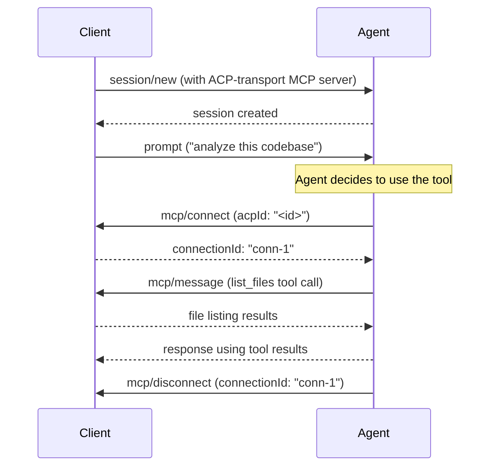
```mermaid
sequenceDiagram
    participant Client
    participant Agent

    Client->>Agent: session/new (with ACP-transport MCP server)
    Agent-->>Client: session created

    Client->>Agent: prompt ("analyze this codebase")

    Note over Agent: Agent decides to use the tool
    Agent->>Client: mcp/connect (acpId: "<id>")
    Client-->>Agent: connectionId: "conn-1"

    Agent->>Client: mcp/message (list_files tool call)
    Client-->>Agent: file listing results

    Agent-->>Client: response using tool results

    Agent->>Client: mcp/disconnect (connectionId: "conn-1")
```

## Shiny future

> How will things play out once this feature exists?

### Seamless tool injection

Components can provide tools without any process management. A Rust development environment could inject cargo-aware tools, a cloud IDE could inject deployment tools, and a security scanner could inject vulnerability checking - all through the same ACP connection they're already using.

### WebAssembly-based tooling

Components running in sandboxed environments (like WASM) can provide MCP tools without needing filesystem or process spawning capabilities. The ACP channel is their only interface, and that's sufficient.

### Transparent bridging

For agents that don't natively support ACP transport, intermediaries can transparently bridge: accepting MCP-over-ACP from clients and spawning stdio- or HTTP-based MCP servers that the agent can use normally. This provides backwards compatibility while allowing the ecosystem to adopt ACP transport incrementally.

## Implementation details and plan

> Tell me more about your implementation. What is your detailed implementation plan?

### Capability advertising

Agents advertise MCP-over-ACP support via the [`mcpCapabilities`](/protocol/schema#mcpcapabilities) field in their `InitializeResponse`. We propose adding an `acp` field to this existing structure:

```json
{
  "capabilities": {
    "mcpCapabilities": {
      "http": false,
      "sse": false,
      "acp": true
    }
  }
}
```

When `mcpCapabilities.acp` is `true`, the agent can handle MCP servers declared with `"transport": "acp"` natively - it will send `mcp/connect`, `mcp/message`, and `mcp/disconnect` messages through the ACP channel.

Clients don't need to advertise anything - they simply check the agent's capabilities to determine whether bridging is needed.

**Bridging intermediaries**: An intermediary that provides bridging can present `mcpCapabilities.acp: true` to its clients regardless of whether the downstream agent supports it, handling bridging transparently (see [Bridging](#bridging-for-agents-without-native-support) below).

### MCP transport schema extension

We extend the MCP JSON schema to include ACP as a transport option:

```json
{
  "type": "object",
  "properties": {
    "transport": {
      "type": "string",
      "enum": ["stdio", "http", "acp"]
    }
  },
  "allOf": [
    {
      "if": { "properties": { "transport": { "const": "acp" } } },
      "then": {
        "properties": {
          "id": {
            "type": "string"
          }
        },
        "required": ["id"]
      }
    }
  ]
}
```

### Message reference

**Connection lifecycle:**

```json
// Establish MCP connection
{
  "method": "mcp/connect",
  "params": {
    "acpId": "550e8400-e29b-41d4-a716-446655440000",
    "meta": { ... }
  }
}
// Response:
{
  "connectionId": "conn-123",
  "meta": { ... }
}

// Close MCP connection
{
  "method": "mcp/disconnect",
  "params": {
    "connectionId": "conn-123",
    "meta": { ... }
  }
}
```

**MCP message exchange:**

```json
// Send MCP message (bidirectional - works agent→client or client→agent)
{
  "method": "mcp/message",
  "params": {
    "connectionId": "conn-123",
    "method": "<MCP_METHOD>",
    "params": { ... },
    "meta": { ... }
  }
}
```

The inner MCP message fields (`method`, `params`) are flattened into the params object. Whether the wrapped message is a request or notification is determined by the presence of an `id` field in the outer JSON-RPC envelope, following JSON-RPC conventions.

### Routing by ID

The `acpId` in `mcp/connect` matches the `id` that was provided by the component when it declared the MCP server in `session/new`. The receiving side uses this `id` to route messages to the correct handler.

When a component provides multiple MCP servers in a single session, each gets a unique `id`, enabling proper message routing.

### Connection multiplexing

Multiple connections to the same MCP server are supported - each `mcp/connect` returns a unique `connectionId`. This allows scenarios where an agent opens multiple concurrent connections to the same tool server.

### Bridging for agents without native support

Not all agents will support MCP-over-ACP natively. To maintain compatibility, it is possible to write a bridge that translates ACP-transport MCP servers to transports the agent does support.

**Bridging approaches:**

- **Stdio shim**: Spawn a small shim process that the agent connects to via stdio. The shim relays MCP messages to/from the ACP channel. This is the most compatible approach since all MCP-capable agents support stdio.

- **HTTP bridge**: Run a local HTTP server that the agent connects to. MCP messages are relayed to/from the ACP channel. This works for agents that prefer HTTP transport.

**How bridging works:**

When a client provides an MCP server with `"transport": "acp"`, and the agent doesn't advertise `mcpCapabilities.acp: true`, a bridge can:

1. Rewrite the MCP server declaration in `session/new` to use stdio or HTTP transport
2. Spawn the appropriate shim process or HTTP server
3. Relay messages between the shim and the ACP channel

From the agent's perspective, it's talking to a normal stdio/HTTP MCP server. From the client's perspective, it's handling MCP-over-ACP messages. The bridge handles the translation transparently.

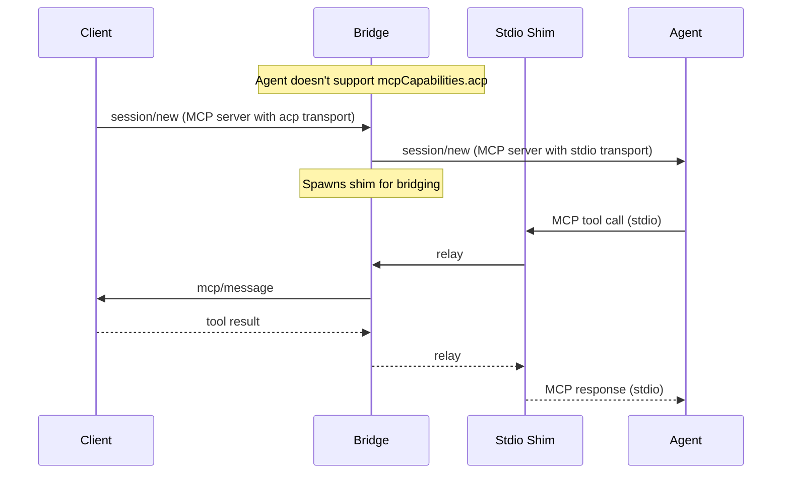
```mermaid
sequenceDiagram
    participant Client
    participant Bridge
    participant Shim as Stdio Shim
    participant Agent

    Note over Bridge: Agent doesn't support mcpCapabilities.acp
    Client->>Bridge: session/new (MCP server with acp transport)
    Bridge->>Agent: session/new (MCP server with stdio transport)
    Note over Bridge: Spawns shim for bridging

    Agent->>Shim: MCP tool call (stdio)
    Shim->>Bridge: relay
    Bridge->>Client: mcp/message
    Client-->>Bridge: tool result
    Bridge-->>Shim: relay
    Shim-->>Agent: MCP response (stdio)
```

A first implementation of this bridging exists in the `sacp-conductor` crate, part of the proposed new version of the [ACP Rust SDK](https://github.com/anthropics/rust-sdk).

## Frequently asked questions

> What questions have arisen over the course of authoring this document or during subsequent discussions?

### Why use a separate `id` instead of server names?

Server names in `mcpServers` are chosen by whoever adds them to the session, and could potentially collide if multiple components add servers. A component-generated `id` provides guaranteed uniqueness and allows the providing component to correlate incoming messages back to the correct session context.

This also avoids a potential deadlock: some agents don't return the session ID until after MCP servers have been initialized. Using a component-generated `id` avoids any dependency on agent-provided identifiers.

### How does this relate to proxy chains?

MCP-over-ACP is a transport mechanism that works independently of proxy chains. However, proxy chains are a natural use case: a proxy can inject MCP servers into sessions it forwards, handle the tool callbacks, and use the results to enhance its transformations.

See the [Proxy Chains RFD](./proxy-chains) for details on how MCP-over-ACP enables context-aware tooling.

### What if the agent doesn't support ACP transport?

See the [Bridging for agents without native support](#bridging-for-agents-without-native-support) section above. A bridge can transparently translate ACP-transport MCP servers to stdio or HTTP for agents that don't advertise `mcpCapabilities.acp` support.

### What about security?

MCP-over-ACP has the same trust model as regular MCP: you're allowing a component to handle tool invocations. The difference is transport, not trust. Components should only add MCP servers from sources they trust, same as with stdio or HTTP transport.

## Revision history

Split from proxy-chains RFD to enable independent use of MCP-over-ACP transport by any ACP component, not just proxies.
````

## File: docs/rfds/message-id.mdx
````markdown
---
title: "Message ID"
---

- Author(s): [@michelTho](https://github.com/michelTho), [@nemtecl](https://github.com/nemtecl)
- Champion: [@benbrandt](https://github.com/benbrandt)

## Elevator pitch

Add a `messageId` field to `agent_message_chunk`, `user_message_chunk`, `agent_thought_chunk` session updates and `session/prompt` requests, and a `userMessageId` field to `session/prompt` responses, to uniquely identify individual messages within a conversation. Both clients and agents can generate message IDs using UUID format. This enables clients to distinguish between different messages beyond changes in update type and lays the groundwork for future capabilities like message editing and session deduplication.

## Status quo

Currently, when an Agent sends message chunks via `session/update` notifications, there is no explicit identifier for the message being streamed:

```json
{
  "jsonrpc": "2.0",
  "method": "session/update",
  "params": {
    "sessionId": "sess_abc123def456",
    "update": {
      "sessionUpdate": "agent_message_chunk",
      "content": {
        "type": "text",
        "text": "Let me analyze your code..."
      }
    }
  }
}
```

This creates several limitations:

1. **Ambiguous message boundaries** - When the Agent sends multiple messages in sequence (e.g., alternating between agent and user messages, or multiple agent messages), Clients can only infer message boundaries by detecting a change in the `sessionUpdate` type. If an Agent sends consecutive messages of the same type, Clients cannot distinguish where one message ends and another begins.

2. **Non-standard workarounds** - Currently, implementations rely on the `_meta` field to work around this limitation. While functional, this approach is not standardized and each implementation may use different conventions.

3. **Limited future capabilities** - Without stable message identifiers, it's difficult to build features like:
   - Message editing or updates
   - Message-specific metadata or annotations
   - Message threading or references
   - Undo/redo functionality

As an example, consider this sequence where a Client cannot reliably determine message boundaries:

```json
// First agent message chunk
{ "sessionUpdate": "agent_message_chunk", "content": { "type": "text", "text": "Analyzing..." } }

// More chunks... but is this still the same message or a new one?
{ "sessionUpdate": "agent_message_chunk", "content": { "type": "text", "text": "Found issues." } }

// Tool call happens
{ "sessionUpdate": "tool_call", ... }

// Another agent message - definitely a new message
{ "sessionUpdate": "agent_message_chunk", "content": { "type": "text", "text": "Fixed the issues." } }
```

## What we propose to do about it

Add a `messageId` field to `AgentMessageChunk`, `UserMessageChunk`, `AgentThoughtChunk` session updates and `PromptRequest`, and a `userMessageId` field to `PromptResponse`. These fields would:

1. **Provide stable message identification** - Each message gets a unique identifier that remains constant across all chunks of that message.

2. **Enable reliable message boundary detection** - Clients can definitively determine when a new message starts by observing a change in `messageId`.

3. **Create an extension point for future features** - Message IDs can be referenced in future protocol enhancements.

### Proposed Structure

When the Client sends a user message via `session/prompt`, it can optionally include a `messageId`:

```json
{
  "jsonrpc": "2.0",
  "id": 2,
  "method": "session/prompt",
  "params": {
    "sessionId": "sess_abc123def456",
    "messageId": "4c12d49b-729c-4086-bfed-5b82e9a53400",
    "prompt": [
      {
        "type": "text",
        "text": "Can you analyze this code?"
      }
    ]
  }
}
```

The Agent echoes this as `userMessageId` in the response (or assigns one if the client didn't provide it):

```json
{
  "jsonrpc": "2.0",
  "id": 2,
  "result": {
    "userMessageId": "4c12d49b-729c-4086-bfed-5b82e9a53400",
    "stopReason": "end_turn"
  }
}
```

For agent message chunks, the Agent generates and includes a `messageId`:

```json
{
  "jsonrpc": "2.0",
  "method": "session/update",
  "params": {
    "sessionId": "sess_abc123def456",
    "update": {
      "sessionUpdate": "agent_message_chunk",
      "messageId": "ea87d0e7-beb8-484a-a404-94a30b78a5a8",
      "content": {
        "type": "text",
        "text": "Let me analyze your code..."
      }
    }
  }
}
```

If the Agent sends `user_message_chunk` updates (e.g., during `session/load`), it uses the user message ID:

```json
{
  "jsonrpc": "2.0",
  "method": "session/update",
  "params": {
    "sessionId": "sess_abc123def456",
    "update": {
      "sessionUpdate": "user_message_chunk",
      "messageId": "4c12d49b-729c-4086-bfed-5b82e9a53400",
      "content": {
        "type": "text",
        "text": "Can you..."
      }
    }
  }
}
```

The `messageId` field would be:

- **Optional** on `agent_message_chunk`, `user_message_chunk`, `agent_thought_chunk` updates and `session/prompt` requests (as `messageId`)
- **Optional** in `session/prompt` responses (as `userMessageId`)
- **UUID format** - Both clients and agents MUST use UUID format to ensure collision avoidance
- **Unique per message** within a session
- **Stable across chunks** - all chunks belonging to the same message share the same `messageId`
- **Opaque** - Implementations treat it as an identifier without parsing its structure
- **Dual-origin** - Clients generate IDs for user messages, agents generate IDs for agent messages

### Message ID Acknowledgment

When a Client includes `messageId` in a `session/prompt` request, the Agent's response behavior indicates whether message IDs are supported:

- **If the Agent supports message IDs** and records the client-provided ID, it MUST include `userMessageId` in the response with the same value.
- **If the Agent assigns its own ID** (when the client didn't provide one), it SHOULD include `userMessageId` in the response so the client knows the assigned ID.
- **If the Agent does not support message IDs** or chooses not to record it, it MUST omit `userMessageId` from the response.

Clients MUST interpret the absence of `userMessageId` in the response as confirmation that the message ID was **not recorded**. Clients SHOULD NOT rely on that ID for subsequent operations (e.g., message editing, truncation, or forking) when `userMessageId` is absent.

This creates predictable behavior: the presence of `userMessageId` in the response is an explicit acknowledgment that the Agent recorded the ID and will recognize it in future operations.

## Shiny future

Once this feature exists:

1. **Clear message boundaries** - Clients can reliably render distinct message bubbles in the UI, even when multiple messages of the same type are sent consecutively.

2. **Better streaming UX** - Clients know exactly which message element to append chunks to, enabling smoother visual updates.

3. **Foundation for editing** - With stable message identifiers, future protocol versions could add:
   - `message/edit` - Agent updates the content of a previously sent message
   - `message/delete` - Agent removes a message from the conversation
   - `message/replace` - Agent replaces an entire message with new content

4. **Message metadata** - Future capabilities could reference messages by ID:
   - Annotations or reactions to specific messages
   - Citation or cross-reference between messages
   - Tool calls that reference which message triggered them

5. **Enhanced debugging** - Implementations can trace message flow more easily with explicit IDs in logs and debugging tools.

Example future editing capability:

```json
{
  "jsonrpc": "2.0",
  "method": "session/update",
  "params": {
    "sessionId": "sess_abc123def456",
    "update": {
      "sessionUpdate": "message_update",
      "messageId": "ea87d0e7-beb8-484a-a404-94a30b78a5a8",
      "updateType": "replace",
      "content": {
        "type": "text",
        "text": "Actually, let me correct that analysis..."
      }
    }
  }
}
```

## Implementation details and plan

### Phase 1: Core Protocol Changes

1. **Update schema** (`schema/schema.json`):
   - Add optional `messageId` field (type: `string`) to `ContentChunk` (used by `AgentMessageChunk`, `UserMessageChunk`, `AgentThoughtChunk`)
   - Add optional `messageId` field (type: `string`) to `PromptRequest` (client-provided)
   - Add optional `userMessageId` field (type: `string`) to `PromptResponse` (echoed or agent-assigned)

2. **Update Rust SDK** (`rust/client.rs` and `rust/agent.rs`):
   - Add `message_id: Option<String>` field to `ContentChunk` struct
   - Add `message_id: Option<String>` field to `PromptRequest` struct
   - Add `user_message_id: Option<String>` field to `PromptResponse` struct
   - Update serialization to include `messageId`/`userMessageId` in JSON output when present

3. **Update TypeScript SDK** (if applicable):
   - Add `messageId` field to corresponding types

4. **Update documentation** (`docs/protocol/prompt-turn.mdx`):
   - Document the `messageId` and `userMessageId` fields and their semantics
   - Clarify that clients can provide `messageId` for user messages in prompt requests
   - Clarify that agents echo the ID as `userMessageId` in prompt responses
   - Clarify that agents generate `messageId` for agent messages in chunks
   - Add examples showing message boundaries
   - Explain that `messageId` changes indicate new messages

### Phase 2: Reference Implementation

5. **Update example agents**:
   - Modify example agents to generate and include `messageId` in chunks
   - Use simple ID generation (e.g., incrementing counter, UUID)
   - Demonstrate consistent IDs across chunks of the same message

6. **Update example clients**:
   - Update clients to consume `messageId` field
   - Use IDs to properly group chunks into messages
   - Demonstrate clear message boundary rendering

### Backward Compatibility

The `messageId` field is **optional** to ensure this is a non-breaking change. Agents SHOULD include the `messageId` field, but it is not required for v1 compatibility. Features that rely on `messageId` (such as future message editing capabilities) will implicitly require the field to be present - Agents that don't provide it simply won't support those features.

Making this field required will be considered for a future v2 version of the protocol after wide adoption.

## Frequently asked questions

### What alternative approaches did you consider, and why did you settle on this one?

1. **Continue using `_meta` field** - This is the current workaround but:
   - Not standardized across implementations
   - Doesn't signal semantic importance
   - Easy to overlook or implement inconsistently

2. **Detect message boundaries heuristically** - Clients could infer boundaries from timing, content types, or session state:
   - Unreliable and fragile
   - Doesn't work for all scenarios (e.g., consecutive same-type messages)
   - Creates inconsistent behavior across implementations

3. **Use explicit "message start/end" markers** - Wrap messages with begin/end notifications:
   - More complex protocol interaction
   - Requires additional notifications
   - More state to track on both sides

4. **Agent-only message IDs** - Have the Agent generate all IDs (including for user messages):
   - Consistent with protocol patterns (`sessionId`, `terminalId`, `toolCallId`)
   - But creates complexity for returning user message IDs (response comes after streaming)
   - Not all agents support passing user message IDs through
   - Clients may need IDs immediately for deduplication or multi-client scenarios

The proposed approach with `messageId` is:

- **Simple** - Just one new field with clear semantics
- **Flexible** - Enables future capabilities without further protocol changes
- **Practical** - Clients generate IDs for their messages, agents for theirs
- **Collision-safe** - UUID format ensures uniqueness across both sides

### Who generates message IDs?

**Both clients and agents can generate message IDs**, each for their own messages:

- **For user messages**: The Client generates a UUID and includes it as `messageId` in the `session/prompt` request. The Agent echoes this ID as `userMessageId` in the response to confirm it was recorded. If the client doesn't provide one, the Agent MAY assign one and return it in the response so the client knows the assigned ID.
- **For agent messages**: The Agent generates the UUID when creating its response and includes it in session update chunks.

This differs from other protocol identifiers (`sessionId`, `terminalId`, `toolCallId`) which are agent-generated, but provides practical benefits:

- **Immediate availability** - Clients have the ID as soon as they send the message, without waiting for a response
- **Deduplication** - Clients can use IDs to deduplicate messages on `session/load` or when echoing to multiple clients
- **Collision-safe** - UUID format ensures uniqueness without coordination
- **Adapter-friendly** - Adapters for agents that don't support message IDs can simply not pass them through

### Should this field be required or optional?

The field is **optional** for v1 to ensure backward compatibility. Agents SHOULD include `messageId`, but it is not required. Features that depend on `messageId` (such as message editing) will implicitly require it - if an Agent doesn't provide `messageId`, those features simply won't be available.

Making this field required will be considered for a future v2 version of the protocol.

### What format should message IDs use?

Both clients and agents **MUST** use UUID format for message IDs. This is required because both sides can generate IDs, and UUID format ensures:

- **No collisions** - UUIDs are globally unique without coordination between client and agent
- **Interoperability** - Both sides use the same format, so either side can rely on uniqueness guarantees
- **Simplicity** - Standard libraries available in all languages

While `messageId` values are UUIDs, implementations **SHOULD** treat them as opaque strings when reading/comparing them, and not parse or interpret their internal structure.

### What about message IDs across session loads?

When a session is loaded via `session/load`, the Agent may:

- Preserve original message IDs if replaying the conversation history
- Generate new message IDs if only exposing current state

The protocol doesn't require message IDs to be stable across session loads, though Agents MAY choose to make them stable if their implementation supports it.

### Does this apply to other session updates like tool calls or plan updates?

This RFD addresses `agent_message_chunk`, `user_message_chunk`, and `agent_thought_chunk` updates.
Other session update types (like `tool_call`, `plan`) already have their own identification mechanisms:

- Tool calls use `toolCallId`
- Plan entries can be tracked by their position in the `entries` array

Future RFDs may propose extending `messageId` to other update types if use cases emerge.

## Revision history

- **2026-02-17**: Added "Message ID Acknowledgment" section to clarify that presence/absence of `userMessageId` in response indicates whether the Agent recorded the ID; clarified that UUID format is MUST (not SHOULD) since both sides generate IDs; renamed response field to `userMessageId` for clarity (request keeps `messageId`)
- **2026-01-29**: Updated to allow both clients and agents to generate message IDs using UUID format
- **2025-11-09**: Initial draft
````

## File: docs/rfds/meta-propagation.mdx
````markdown
---
title: "Meta Field Propagation Conventions"
---

- Author(s): [Adrian Cole](https://github.com/codefromthecrypt)
- Champion: [@benbrandt](https://github.com/benbrandt)

## Elevator pitch

Document `params._meta` as the convention for propagating metadata from clients to agents, such as trace identifiers or correlation IDs. This aligns with [MCP](https://modelcontextprotocol.io/), enabling shared instrumentation since both protocols use stdio JSON-RPC transports.

## Status quo

ACP clients already propagate context to agents via `_meta`. For example, `requestId` is used for request correlation in [AionUi](https://github.com/iOfficeAI/AionUi/blob/main/src/common/codex/types/eventData.ts#L12-L16).

However, the [extensibility](../protocol/extensibility) documentation does not specify the `_meta` type or document its use for propagation. Without documentation, parties must coordinate ad hoc, which can lead to portability accidents (such as one side using `_meta.traceparent` and the other `_meta.otel.traceparent`). Documenting that propagated fields are root keys in `_meta` prevents this.

## What we propose to do about it

Update the [extensibility](../protocol/extensibility#the-_meta-field) documentation with two changes:

1. Add the type `{ [key: string]: unknown }` to the existing summary sentence. This type is compatible with MCP SDKs.
2. Add a new paragraph after the JSON example about propagation conventions.

## Shiny future

- Same instrumentation (OpenInference, etc.) works for both ACP and MCP.
- Observability tools can correlate traces across protocols.

## Implementation details

**Change 1**: Update the existing summary sentence in [extensibility](../protocol/extensibility#the-_meta-field):

```diff
-All types in the protocol include a `_meta` field that implementations can use to attach custom information.
+All types in the protocol include a `_meta` field with type `{ [key: string]: unknown }` that implementations can use to attach custom information.
```

**Change 2**: After the JSON example, before "Implementations **MUST NOT**", add:

> Clients may propagate fields to the agent for correlation purposes, such as `requestId`. The following root-level keys in `_meta` **SHOULD** be reserved for [W3C trace context](https://www.w3.org/TR/trace-context/) to guarantee interop with existing MCP implementations and OpenTelemetry tooling:
>
> - `traceparent`
> - `tracestate`
> - `baggage`

## FAQ

### Why document this now?

Clients already propagate context via `_meta`. Documenting prevents incompatible drift and enables shared tooling with MCP.

### Why reference MCP?

ACP and MCP are the two core agentic protocols, both using stdio JSON-RPC. Where `_meta` types are compatible, instrumentation code can be abstracted and reused for both:

Here are several MCP SDKs that propagate W3C trace-context in `_meta`:

- [MCP C# SDK](https://github.com/modelcontextprotocol/csharp-sdk) - native W3C trace-context propagation
- [OpenInference](https://github.com/Arize-ai/openinference) - Python and TypeScript MCP instrumentation (collaboration between Arize and Elastic)
- [curioswitch/mcp-go-sdk-otel](https://github.com/curioswitch/mcp-go-sdk-otel) - Go MCP instrumentation

## Revision history

- 2025-12-04: Implementation in extensibility docs
- 2025-11-28: Initial draft
````

## File: docs/rfds/next-edit-suggestions.mdx
````markdown
---
title: "Next Edit Suggestions"
---

Author(s): [@anna239](https://github.com/anna239)

## Elevator pitch

> What are you proposing to change?

Add a **Next Edit Suggestion (NES)** capability to ACP, allowing agents to provide predictive code edits. The protocol is designed around **capability negotiation**: agents declare what events and context they can consume, and clients provide only what was requested.

## Status quo

> How do things work today and what problems does this cause? Why would we change things?

ACP currently has no mechanism for agents to provide inline edit predictions. Each client–agent pair implements NES through proprietary protocols.

## What we propose to do about it

> What are you proposing to improve the situation?

Introduce a `nes` capability that agents advertise during initialization. The capability declares:

- **Events** the agent wants to receive (file lifecycle notifications).
- **Context** the agent wants attached to each suggestion request.

The client inspects these declarations and provides only what was requested, minimizing overhead for simple agents while allowing rich context for advanced ones.

### Capability advertisement

During `initialize`, the agent includes a `nes` field in `agentCapabilities`:

```json
{
  "agentCapabilities": {
    "nes": {
      "events": {
        "document": {
          "didOpen": {},
          "didChange": {
            "syncKind": "incremental"
          },
          "didClose": {},
          "didSave": {},
          "didFocus": {}
        }
      },
      "context": {
        "recentFiles": {
          "maxCount": 10
        },
        "relatedSnippets": {},
        "editHistory": {
          "maxCount": 6
        },
        "userActions": {
          "maxCount": 16
        },
        "openFiles": {},
        "diagnostics": {}
      }
    }
  }
}
```

All fields under `events` and `context` are optional — an agent advertises only what it can use.

#### Client capabilities

The **client** advertises its own NES-related capabilities in the `initialize` request. The client declares which suggestion kinds it supports beyond the basic `edit` kind. Agents should only suggest kinds that the client has advertised.

```json
{
  "clientCapabilities": {
    "nes": {
      "jump": {},
      "rename": {},
      "searchAndReplace": {}
    }
  }
}
```

Each entry corresponds to a suggestion kind (see [Suggestion kinds](#suggestion-kinds) below). If a kind is absent, the agent must not produce suggestions of that kind.

### Session lifecycle

If the `nes` capability is present, the client may call `nes/start` to begin an NES session. An NES session is **separate from and independent of** the ACP chat session — it has its own session ID, its own lifecycle, and its own stream of events and requests. A single ACP connection may have any number of active NES sessions alongside any number of chat sessions. The NES session is started via `nes/start` and closed via `nes/close`; it does not inherit state from, or share context with, chat sessions.

The agent can also use the existing `configOptions` mechanism to expose NES-related settings (model selection, debounce preferences, enabled/disabled state, etc.).

## Implementation details and plan

> Tell me more about your implementation. What is your detailed implementation plan?

### Position encoding

All `Position` objects in NES use zero-based line and zero-based character offsets, following the same conventions as [LSP 3.17](https://microsoft.github.io/language-server-protocol/specifications/lsp/3.17/specification/#position). The meaning of the `character` offset depends on the negotiated **position encoding**.

Three encoding kinds are supported:

- `"utf-16"` — character offsets count UTF-16 code units. This is the **default** and must be supported by all clients and agents.
- `"utf-32"` — character offsets count Unicode code points.
- `"utf-8"` — character offsets count UTF-8 code units (bytes).

**Negotiation:** The client may declare the position encodings it supports in the `initialize` request via `clientCapabilities.positionEncodings`, listed in order of preference. The agent selects one from the client's list and declares it in its `initialize` response as `agentCapabilities.positionEncoding`. If the client omits `positionEncodings`, or the agent omits `positionEncoding` in its response, both sides default to `"utf-16"`.

Client `initialize` request (excerpt):

```json
{
  "clientCapabilities": {
    "positionEncodings": ["utf-32", "utf-16"]
  }
}
```

Agent `initialize` response (excerpt):

```json
{
  "agentCapabilities": {
    "nes": { ... },
    "positionEncoding": "utf-32"
  }
}
```

The negotiated encoding applies to all `Position` and `Range` values exchanged within NES — events, suggestion requests, and suggestion responses.

### Events

Events are fire-and-forget notifications from client to agent. Every event is scoped to the NES session identified by the `sessionId` returned from `nes/start`. The client sends them only if the corresponding key is present in the agent's advertised `events` capability (e.g. `nes.events.document` for NES).

#### `document/didOpen`

Sent when a file is opened in the editor.

```json
{
  "jsonrpc": "2.0",
  "method": "document/didOpen",
  "params": {
    "sessionId": "session_abc123",
    "uri": "file:///path/to/file.rs",
    "languageId": "rust",
    "version": 1,
    "text": "fn main() {\n    println!(\"hello\");\n}\n"
  }
}
```

#### `document/didChange`

Sent when a file is edited. Supports two sync modes declared by the agent:

- `"full"` — client sends entire file content each time.
- `"incremental"` — client sends only the changed ranges.

**Incremental:**

```json
{
  "jsonrpc": "2.0",
  "method": "document/didChange",
  "params": {
    "sessionId": "session_abc123",
    "uri": "file:///path/to/file.rs",
    "version": 2,
    "contentChanges": [
      {
        "range": {
          "start": { "line": 1, "character": 4 },
          "end": { "line": 1, "character": 4 }
        },
        "text": "let x = 42;\n    "
      }
    ]
  }
}
```

**Full:**

```json
{
  "jsonrpc": "2.0",
  "method": "document/didChange",
  "params": {
    "sessionId": "session_abc123",
    "uri": "file:///path/to/file.rs",
    "version": 2,
    "contentChanges": [
      {
        "text": "fn main() {\n    let x = 42;\n    println!(\"hello\");\n}\n"
      }
    ]
  }
}
```

#### `document/didClose`

Sent when a file is closed.

```json
{
  "jsonrpc": "2.0",
  "method": "document/didClose",
  "params": {
    "sessionId": "session_abc123",
    "uri": "file:///path/to/file.rs"
  }
}
```

#### `document/didSave`

Sent when a file is saved.

```json
{
  "jsonrpc": "2.0",
  "method": "document/didSave",
  "params": {
    "sessionId": "session_abc123",
    "uri": "file:///path/to/file.rs"
  }
}
```

#### `document/didFocus`

Sent when a file becomes the active editor tab. Unlike `document/didOpen` (which fires once when a file is first opened), `document/didFocus` fires every time the user switches to a file, including files that are already open. This is the primary trigger for agents that need to refresh context on tab switch (e.g. re-indexing relevant code snippets).

```json
{
  "jsonrpc": "2.0",
  "method": "document/didFocus",
  "params": {
    "sessionId": "session_abc123",
    "uri": "file:///path/to/file.rs",
    "version": 2,
    "position": { "line": 5, "character": 12 },
    "visibleRange": {
      "start": { "line": 0, "character": 0 },
      "end": { "line": 45, "character": 0 }
    }
  }
}
```

The `position` is the current cursor position. The `visibleRange` is the portion of the file currently visible in the editor viewport.

### Suggestion request

The client requests a suggestion by calling `nes/suggest`. Context fields are included only if the agent declared interest in the corresponding `nes.context` key.

```json
{
  "jsonrpc": "2.0",
  "id": 42,
  "method": "nes/suggest",
  "params": {
    "sessionId": "session_abc123",
    "uri": "file:///path/to/file.rs",
    "version": 2,
    "position": { "line": 5, "character": 12 },
    "selection": {
      "start": { "line": 5, "character": 4 },
      "end": { "line": 5, "character": 12 }
    },
    "triggerKind": "automatic",
    "context": {
      "recentFiles": [
        {
          "uri": "file:///path/to/utils.rs",
          "languageId": "rust",
          "text": "pub fn helper() -> i32 { 42 }\n"
        }
      ],
      "relatedSnippets": [
        {
          "uri": "file:///path/to/types.rs",
          "excerpts": [
            {
              "startLine": 10,
              "endLine": 25,
              "text": "pub struct Config {\n    pub name: String,\n    ...\n}"
            }
          ]
        }
      ],
      "editHistory": [
        {
          "uri": "file:///path/to/file.rs",
          "diff": "--- a/file.rs\n+++ b/file.rs\n@@ -3,0 +3,1 @@\n+    let x = 42;"
        }
      ],
      "userActions": [
        {
          "action": "insertChar",
          "uri": "file:///path/to/file.rs",
          "position": { "line": 5, "character": 12 },
          "timestampMs": 1719400000000
        },
        {
          "action": "cursorMovement",
          "uri": "file:///path/to/file.rs",
          "position": { "line": 10, "character": 0 },
          "timestampMs": 1719400001200
        }
      ],
      "openFiles": [
        {
          "uri": "file:///path/to/utils.rs",
          "languageId": "rust",
          "visibleRange": {
            "start": { "line": 0, "character": 0 },
            "end": { "line": 30, "character": 0 }
          },
          "lastFocusedMs": 1719399998000
        },
        {
          "uri": "file:///path/to/types.rs",
          "languageId": "rust",
          "visibleRange": null,
          "lastFocusedMs": 1719399990000
        }
      ],
      "diagnostics": [
        {
          "uri": "file:///path/to/file.rs",
          "range": {
            "start": { "line": 5, "character": 0 },
            "end": { "line": 5, "character": 10 }
          },
          "severity": "error",
          "message": "cannot find value `foo` in this scope"
        }
      ]
    }
  }
}
```

`selection` is the current text selection range, if any. When the selection is empty (cursor is a point), this field may be omitted or have `start` equal to `end`. Agents can use selection state to predict replacements or transformations of the selected text.

`triggerKind` is one of:

- `"automatic"` — triggered by user typing or cursor movement
- `"diagnostic"` — triggered by a diagnostic (error/warning) appearing at or near the cursor position. The client includes the relevant diagnostics in the `diagnostics` context field so the agent can target a fix.
- `"manual"` — triggered by explicit user action (keyboard shortcut)

### Suggestion response

A suggestion is one of several kinds, each identified by the `kind` field. The `edit` kind is always supported; other kinds (`jump`, `rename`, `searchAndReplace`) require the client to advertise support in its capabilities.

**Edit suggestion:**

```json
{
  "jsonrpc": "2.0",
  "id": 42,
  "result": {
    "suggestions": [
      {
        "id": "sugg_001",
        "kind": "edit",
        "uri": "file:///path/to/other_file.rs",
        "edits": [
          {
            "range": {
              "start": { "line": 5, "character": 0 },
              "end": { "line": 5, "character": 10 }
            },
            "newText": "let result = helper();"
          }
        ],
        "cursorPosition": { "line": 5, "character": 22 }
      }
    ]
  }
}
```

**Jump suggestion:**

```json
{
  "jsonrpc": "2.0",
  "id": 42,
  "result": {
    "suggestions": [
      {
        "id": "sugg_002",
        "kind": "jump",
        "uri": "file:///path/to/other_file.rs",
        "position": { "line": 15, "character": 4 }
      }
    ]
  }
}
```

**Rename suggestion:**

```json
{
  "jsonrpc": "2.0",
  "id": 42,
  "result": {
    "suggestions": [
      {
        "id": "sugg_003",
        "kind": "rename",
        "uri": "file:///path/to/file.rs",
        "position": { "line": 5, "character": 10 },
        "newName": "calculateTotal"
      }
    ]
  }
}
```

**Search-and-replace suggestion:**

```json
{
  "jsonrpc": "2.0",
  "id": 42,
  "result": {
    "suggestions": [
      {
        "id": "sugg_004",
        "kind": "searchAndReplace",
        "uri": "file:///path/to/file.rs",
        "search": "oldFunction",
        "replace": "newFunction",
        "isRegex": false
      }
    ]
  }
}
```

A response may contain a mix of suggestion kinds. The client decides how to present them (e.g. inline ghost text for edits, a navigation hint for jumps). Agents must only include suggestion kinds that the client has advertised in its capabilities (except `edit`, which is always supported).

Each suggestion contains:

- `id` — unique identifier for accept/reject tracking.
- `kind` — the suggestion kind (see [Suggestion kinds](#suggestion-kinds) below).

Edit suggestions additionally contain:

- `uri` — the file to edit.
- `edits` — one or more text edits to apply.
- `cursorPosition` — optional suggested cursor position after applying edits.

Jump suggestions additionally contain:

- `uri` — the file to navigate to.
- `position` — the target position within that file.

Rename suggestions additionally contain:

- `uri` — the file URI containing the symbol.
- `position` — the position of the symbol to rename.
- `newName` — the new name for the symbol.

Search-and-replace suggestions additionally contain:

- `uri` — the file URI to search within. Can be a folder, then operation is performed in all the files in this folder.
- `search` — the text or pattern to find.
- `replace` — the replacement text.
- `isRegex` (`boolean`, optional) — whether `search` is a regular expression. Defaults to `false`.

### Accept / Reject

```json
{
  "jsonrpc": "2.0",
  "method": "nes/accept",
  "params": {
    "sessionId": "session_abc123",
    "id": "sugg_001"
  }
}
```

```json
{
  "jsonrpc": "2.0",
  "method": "nes/reject",
  "params": {
    "sessionId": "session_abc123",
    "id": "sugg_001",
    "reason": "rejected"
  }
}
```

`reason` is one of:

- `"rejected"` — the user explicitly dismissed the suggestion (e.g. pressed Escape or typed something incompatible).
- `"ignored"` — the suggestion was shown but the user continued editing without interacting with it, and the context changed enough to invalidate it.
- `"replaced"` — the suggestion was superseded by a newer suggestion before the user could act on it.
- `"cancelled"` — the request was cancelled before the agent returned a response (e.g. the user typed quickly and the previous request became stale).

The `reason` field is optional. Providing granular reasons allows agents to improve their models — for example, a `"replaced"` suggestion carries different training signal than an explicit `"rejected"`.

### NES session start

The client provides workspace metadata when starting a session. This information is static for the lifetime of the session.

```json
{
  "jsonrpc": "2.0",
  "id": 1,
  "method": "nes/start",
  "params": {
    "workspaceUri": "file:///Users/alice/projects/my-app",
    "workspaceFolders": [
      {
        "uri": "file:///Users/alice/projects/my-app",
        "name": "my-app"
      }
    ],
    "repository": {
      "name": "my-app",
      "owner": "alice",
      "remoteUrl": "https://github.com/alice/my-app.git"
    }
  }
}
```

All fields in `params` are optional. The `repository` field is omitted if the workspace is not a git repository or the info is unavailable.

Response:

```json
{
  "jsonrpc": "2.0",
  "id": 1,
  "result": {
    "sessionId": "session_abc123"
  }
}
```

The returned `sessionId` scopes all subsequent NES events, requests, and notifications for that session.

#### Error handling

The agent may reject `nes/start` with an error. In particular, agents that require authentication may return an `auth_required` error:

```json
{
  "jsonrpc": "2.0",
  "id": 1,
  "error": {
    "code": -32000,
    "message": "Authentication required",
    "data": {
      "reason": "auth_required"
    }
  }
}
```

Clients **must** be prepared to handle `auth_required` errors on `nes/start`. The recommended behavior is to prompt the user to authenticate (e.g. sign in or provide credentials) and retry the `nes/start` call after authentication succeeds. Clients should not silently ignore this error or assume NES is unavailable — the agent may be fully functional once the user authenticates.

### NES session close

The client closes an NES session by calling `nes/close`. The agent **must** cancel any ongoing work related to the NES session and free up any resources associated with it.

```json
{
  "jsonrpc": "2.0",
  "id": 2,
  "method": "nes/close",
  "params": {
    "sessionId": "session_abc123"
  }
}
```

Response:

```json
{
  "jsonrpc": "2.0",
  "id": 2,
  "result": {}
}
```

### Suggestion kinds

The `kind` field in each suggestion identifies its type. The following kinds are defined:

- **`edit`** — A text edit suggestion. Always supported; does not require a client capability.
- **`jump`** — Navigate to a different file/position. Requires `jump` in client capabilities.
- **`rename`** — Rename a symbol across the workspace. Requires `rename` in client capabilities.
- **`searchAndReplace`** — Search and replace text within a file/folder. Requires `searchAndReplace` in client capabilities.

Additional suggestion kinds may be added to the protocol in the future. Agents must only produce suggestions whose `kind` the client has advertised (except `edit`, which is always supported).

### Config options

The agent can use the existing `configOptions` mechanism from ACP to expose NES-related settings. For example, an agent might return config options like:

```json
{
  "configOptions": [
    {
      "id": "nes_model",
      "name": "Prediction Model",
      "category": "model",
      "type": "enum",
      "currentValue": "fast",
      "options": [
        { "value": "fast", "label": "Fast" },
        { "value": "accurate", "label": "Accurate" }
      ]
    }
  ]
}
```

## Frequently asked questions

> What questions have arisen over the course of authoring this document or during subsequent discussions?

### Why separate events from context?

Events and context serve different purposes and have different delivery models:

- **Events** are pushed as they happen — they allow the agent to maintain internal state (like an LSP server tracking open documents). This is the model Copilot uses.
- **Context** is attached to each request — it allows stateless agents to receive everything they need in one call. This is the model Zed Predict and Supermaven use.

A note about Cursor: Cursor has a separate context-collection phase (`RefreshTabContext`) that involves vector DB lookup and is triggered on file open, tab switch, and significant edits. The event-based approach supports this flow: an NES agent can listen for `document/didOpen`, `document/didFocus`, and accumulated `document/didChange` events to self-trigger its own context refresh. The `document/didFocus` event (with cursor position and visible range) and workspace metadata from `nes/start` provide all the inputs Cursor's `RefreshTabContext` needs.

An agent may want both (events for incremental file tracking + context for edit history), or just one. The capability split lets each agent pick the model that fits its architecture.

### Why not reuse LSP's `textDocument/didOpen` etc. directly?

LSP's document sync notifications carry the same information, but:

1. ACP is not LSP — reusing method names could cause confusion in implementations that bridge both.
2. We may want to evolve the event payloads independently (e.g. adding metadata fields).
3. Using `document/` as a generic namespace keeps these methods reusable across different ACP capabilities (NES, and potentially others in the future) without tying them to a single feature.

### How does this relate to PR #325?

This RFD covers the session lifecycle and also suggests a protocol that would cover a variety of different nes providers

### Why provide workspace info in `nes/start`?

Agents that perform server-side indexing (embedding-based retrieval, semantic search) need to know which repository they're working with. This metadata — workspace root, repo name/owner, remote URL — is static for the session lifetime, so it belongs in the session start rather than being repeated on every request or requiring a separate query.

### What alternative approaches did you consider?

1. **Context-only** — Pass all file content, edit history, and metadata as context fields on each `nes/suggest` request, with no event notifications. This is simpler for stateless agents but forces the client to assemble and transmit potentially large payloads on every request, even when nothing changed. It also prevents agents from maintaining their own incremental state (e.g. an internal file mirror or semantic index).
2. **Events-only** — Rely entirely on event notifications (`didOpen`, `didChange`, etc.) and have the agent maintain all state internally, with `nes/suggest` sending only the cursor position. This is efficient on the wire but requires every agent to implement stateful document tracking, which is a high barrier for simple agents that just want the code around the cursor.
3. **Events + context (chosen)** — Allow agents to declare both. An agent that wants to track files incrementally can request events; an agent that prefers stateless request-response can request context fields; a sophisticated agent can use both (events for file sync, context for edit history and definition excerpts). This gives each agent the flexibility to pick the model that fits its architecture without imposing unnecessary complexity.

## Revision history

- 2026-02-22: Initial draft
````

## File: docs/rfds/proxy-chains.mdx
````markdown
---
title: "Agent Extensions via ACP Proxies"
---

Author(s): [nikomatsakis](https://github.com/nikomatsakis)

## Elevator pitch

> What are you proposing to change?

Enable a universal agent extension mechanism via ACP proxies, components that sit between a client and an agent. Proxies can intercept and transform messages, enabling composable architectures where techniques like context injection, tool coordination, and response filtering can be extracted into reusable components.

## Status quo

> How do things work today and what problems does this cause? Why would we change things?

The AI agent ecosystem has developed many extension mechanisms: AGENTS.md files, Claude Code plugins, rules files, hooks, MCP servers, etc. Of these, only MCP servers have achieved real standardization across the ecosystem.

However, MCP servers are fundamentally limited because they sit "behind" the agent. They can provide tools and respond to function calls, but they cannot:

- **Inject or modify prompts** before they reach the agent
- **Add global context** that persists across conversations
- **Transform responses** before they reach the user
- **Coordinate between multiple agents** or manage conversation flow

As a result, valuable techniques like context management and response processing remain locked within individual agent implementations, with no way to extract and reuse them across different agents.

## What we propose to do about it

> What are you proposing to improve the situation?

We propose implementing _agent extensions_ via ACP _proxies_, a new kind of component that sits between the client and the agent, forwarding (and potentially altering or introducing) messages. Because proxies can do anything a client could do, they serve as a universal extension mechanism that can subsume AGENTS.md, hooks, MCP servers, etc.

Proxies are limited to the customizations exposed by ACP itself, so they would benefit from future ACP extensions like mechanisms to customize system prompts. However, they can already handle the majority of common extension use cases through message interception and transformation.

### Proxying in theory

Conceptually, proxies work like a chain where messages flow through each component:

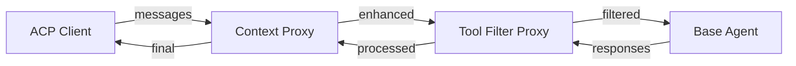
```mermaid
flowchart LR
    Client[ACP Client] -->|messages| P1[Context Proxy]
    P1 -->|enhanced| P2[Tool Filter Proxy]
    P2 -->|filtered| A[Base Agent]
    A -->|responses| P2
    P2 -->|processed| P1
    P1 -->|final| Client
```

### Proxying in practice: the role of the conductor

To allow for proxy isolation, our design does not have proxies communicate directly with their successor in the chain. Instead, there is a central _conductor_ component that orchestrates messages moving between components.

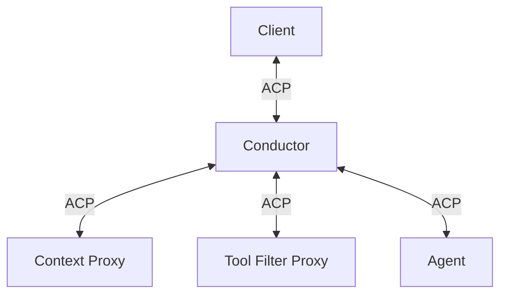
```mermaid
flowchart TB
    Client[Client]
    C[Conductor]
    P1[Context Proxy]
    P2[Tool Filter Proxy]
    A[Agent]

    Client <-->|ACP| C
    C <-->|ACP| P1
    C <-->|ACP| P2
    C <-->|ACP| A
```

We add one ACP method for proxy communication:

- **`proxy/successor`**: Used bidirectionally - proxies send it to forward messages to their successor, and the conductor sends it to deliver messages from the successor back to the proxy

Here's how a single message flows through the system:

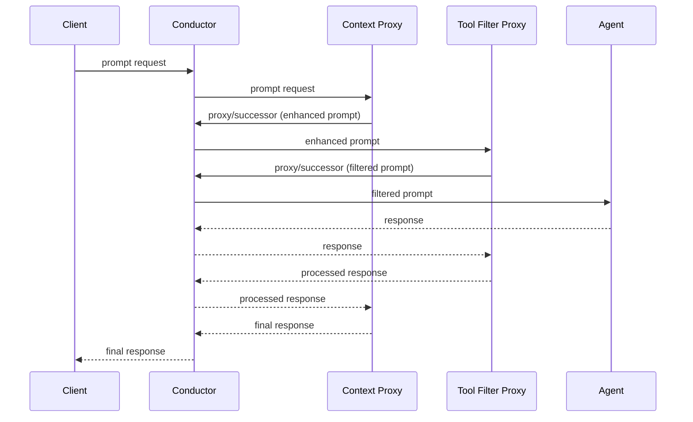
```mermaid
sequenceDiagram
    participant Client
    participant Conductor
    participant P1 as Context Proxy
    participant P2 as Tool Filter Proxy
    participant Agent

    Client->>Conductor: prompt request
    Conductor->>P1: prompt request
    P1->>Conductor: proxy/successor (enhanced prompt)
    Conductor->>P2: enhanced prompt
    P2->>Conductor: proxy/successor (filtered prompt)
    Conductor->>Agent: filtered prompt
    Agent-->>Conductor: response
    Conductor-->>P2: response
    P2-->>Conductor: processed response
    Conductor-->>P1: processed response
    P1-->>Conductor: final response
    Conductor-->>Client: final response
```

## Shiny future

> How will things play out once this feature exists?

### User experience and editor integration

We expect editors to expose the ability to install proxies in the same way they currently support adding MCP servers - in fact, the distinction probably doesn't matter to users. Both are "extensions" that add capabilities to their AI workflow.

When proxies are installed, editors would not start the agent directly, but instead invoke the conductor with the configured proxy chain. From the user's perspective, they're just getting enhanced agent capabilities - the proxy chain architecture remains transparent.

### Language-specific proxy ecosystems

The monolithic nature of agent development has meant that most of the "action" happens within agents. We wish to invert this, with agents trending towards simple agentic loops, and the creativity being pushed outwards into the broader ecosystem.

The Symposium project is one example exploring this concept, with a focus on Rust. The idea is to give Rust users an automatic set of extensions based on the dependencies they are using. These extensions would be packaged up as SACP proxies using WebAssembly for portability and sandboxing.

Symposium aims to become the standard "Rust ACP experience" by providing both core Rust tooling and a framework for Rust libraries to contribute their own proxy components.

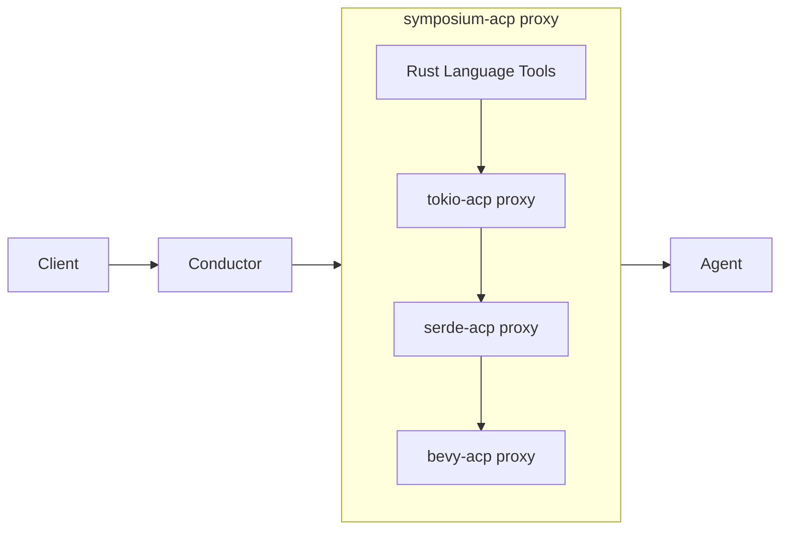
```mermaid
flowchart LR
    Client[Client]
    Conductor[Conductor]
    Agent[Agent]

    subgraph Symposium["symposium-acp proxy"]
        RustTools[Rust Language Tools]
        CrateA[tokio-acp proxy]
        CrateB[serde-acp proxy]
        CrateC[bevy-acp proxy]

        RustTools --> CrateA
        CrateA --> CrateB
        CrateB --> CrateC
    end

    Client --> Conductor
    Conductor --> Symposium
    Symposium --> Agent
```

### Standardized IDE capabilities

Proxy infrastructure could also enable editors to expose standardized IDE capabilities (diagnostics, file system access, terminal APIs) to agents via MCP servers provided by proxies. This keeps the core ACP protocol focused on agent communication while allowing rich IDE integration through the proxy layer.

## Implementation details and plan

> Tell me more about your implementation. What is your detailed implementation plan?

### Component roles

Each ACP proxy chain forms a sequence of components:

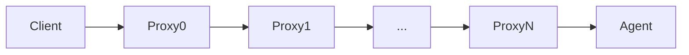
```mermaid
flowchart LR
    Client --> Proxy0 --> Proxy1 --> ... --> ProxyN --> Agent
```

The **client** and **agent** are _terminal_ roles - the client has only a successor (no predecessor), and the agent has only a predecessor (no successor). Proxies are _non-terminal_ - they have both a predecessor and a successor, forwarding messages between them.

The **conductor** is a special component that orchestrates proxy chains. It spawns and manages proxy components, routes messages between them, and handles initialization. From the client's perspective, the conductor appears to be an ordinary agent:

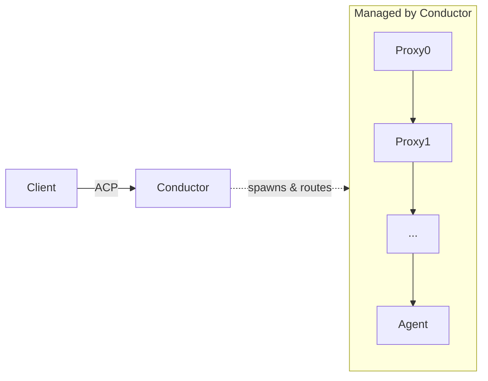
```mermaid
flowchart LR
    Client -->|ACP| Conductor

    subgraph Managed["Managed by Conductor"]
        Proxy0 --> Proxy1 --> ... --> Agent
    end

    Conductor -.->|spawns & routes| Managed
```

We provide a canonical conductor implementation in Rust (`sacp-conductor`). Most editors would use this conductor directly to host proxies and agents, though they could also reimplement conductor functionality if needed.

ACP defines client and agent as superroles, each with two specializations:

```mermaid
classDiagram
    class Client {
        <<abstract>>
        +sends prompts
    }

    class Agent {
        <<abstract>>
        +responds to prompts
    }

    class TerminalClient {
        +receives direction from user
        +connects to terminal agent
    }

    class Conductor {
        +manages proxy chain
        +sends successor messages
    }

    class TerminalAgent {
        +embodies the LLM
        +final destination
        +no successor
    }

    class Proxy {
        +forwards to successor
        +sends successor messages
    }

    Client <|-- TerminalClient
    Client <|-- Conductor
    Agent <|-- TerminalAgent
    Agent <|-- Proxy
```

**Example Architecture:**

```mermaid
flowchart TB
    TC[Terminal Client]
    C[Conductor]
    P1[Context Proxy]
    P2[Tool Filter Proxy]
    TA[Terminal Agent]

    TC -->|terminal client| C
    C -->|terminal agent| TC
    C -->|conductor| P1
    P1 -->|proxy| C
    C -->|conductor| P2
    P2 -->|proxy| C
    C -->|terminal client| TA
    TA -->|terminal agent| C
```

### Proxy initialization protocol

Components discover their role from the initialization method they receive:

- **Proxies** receive `proxy/initialize` - they have a successor and should forward messages
- **Agents** receive `initialize` - they are terminal (no successor) and process messages directly

The `proxy/initialize` request has the same parameters as `initialize` and expects a standard `InitializeResponse`. The only difference is the method name, which signals to the component that it should operate as a proxy.

**Conductor behavior:**

- The conductor MUST send `proxy/initialize` to all proxy components
- The conductor MUST send `initialize` to the final agent component (if any)
- When a proxy forwards an `initialize` via `proxy/successor`, the conductor determines whether the successor is another proxy or the agent, and sends `proxy/initialize` or `initialize` respectively.

**Proxy behavior:**

- A proxy that receives `proxy/initialize` knows it has a successor
- The proxy SHOULD forward requests it does not understand
- The proxy SHOULD preserve metadata fields when forwarding messages

Note: A conductor can be configured to run in either terminal mode (expecting `initialize`) or proxy mode (expecting `proxy/initialize`), enabling nested proxy chains.

### MCP-over-ACP support

Proxies that provide MCP servers use the [MCP-over-ACP transport](./mcp-over-acp) mechanism. The conductor always advertises `mcpCapabilities.acp: true` to proxies and handles bridging for agents that don't support native ACP transport.

All proxies MUST respond to `proxy/initialize` with the MCP-over-ACP capability enabled. When the conductor sends `proxy/initialize`, proxies should be prepared to handle `mcp/connect`, `mcp/message`, and `mcp/disconnect` messages for any MCP servers they provide.

### Message reference

**Initialization:**

```json
// Conductor initializes a proxy (proxy knows it has a successor)
{"method": "proxy/initialize", "params": <INITIALIZE_REQUEST_PARAMS>}

// Conductor initializes the agent (standard ACP)
{"method": "initialize", "params": <INITIALIZE_REQUEST_PARAMS>}
```

Both methods use the same parameters as the standard ACP `InitializeRequest` and expect a standard `InitializeResponse`.

**Proxy messages:**

```json
// Proxy sends message to successor, or conductor delivers message from successor
// (same method, direction determined by sender)
{
  "method": "proxy/successor",
  "params": {
    "method": "<INNER_METHOD>",
    "params": <INNER_PARAMS>,
    "meta": { ... }            // optional metadata
  }
}
```

The inner message fields (`method`, `params`) are flattened into the params object. Whether the wrapped message is a request or notification is determined by the presence of an `id` field in the outer JSON-RPC envelope, following JSON-RPC conventions.

### Examples (non-normative)

The following sequence diagrams illustrate common proxy chain scenarios for implementers.

#### Initialization of a 4-component proxy chain

This shows the initialization flow for: Terminal Client → Conductor → Context Proxy → Tool Filter Proxy → Terminal Agent

```mermaid
sequenceDiagram
    participant TC as Terminal Client
    participant C as Conductor
    participant P1 as Context Proxy
    participant P2 as Tool Filter Proxy
    participant TA as Terminal Agent

    Note over TC,TA: === Initialization Phase ===

    TC->>C: initialize

    Note over C: Conductor spawns proxy components
    C->>P1: proxy/initialize

    Note over P1: Proxy forwards to successor
    P1->>C: proxy/successor (initialize)

    Note over C: Conductor sends proxy/initialize to next proxy
    C->>P2: proxy/initialize

    Note over P2: Proxy forwards to successor
    P2->>C: proxy/successor (initialize)

    Note over C: Conductor sends initialize to final agent
    C->>TA: initialize

    TA-->>C: InitializeResponse (mcpCapabilities.acp: true/false)
    C-->>P2: proxy/successor (InitializeResponse)

    P2-->>C: InitializeResponse
    C-->>P1: proxy/successor (InitializeResponse)

    P1-->>C: InitializeResponse

    Note over C: Conductor acts as terminal agent to client
    C-->>TC: InitializeResponse

    Note over TC,TA: Proxy chain initialized and ready
```

#### Context-providing proxy with session notifications

This example shows how a proxy can handle initialization and forward session notifications. Sparkle (a collaborative AI framework) runs an embodiment sequence during session creation.

```mermaid
sequenceDiagram
    participant Client
    participant Sparkle as Sparkle Proxy
    participant Agent

    Note over Client: Client creates new session
    Client->>Sparkle: session/new

    Note over Sparkle: Adds Sparkle MCP server
    Sparkle->>Agent: session/new + sparkle tools
    Agent-->>Sparkle: session created (sessionId: S1)
    Sparkle-->>Client: session/new response (sessionId: S1)

    Note over Client: Client sends first prompt (during embodiment)
    Client->>Sparkle: prompt ('Hello, can you help me?')
    activate Sparkle

    Note over Sparkle: Delays client prompt, runs embodiment first
    Sparkle->>Agent: prompt ('you are sparkle...')

    Note over Agent: Processes embodiment, sends notifications
    Agent->>Sparkle: session/update (S1: thinking...)
    Sparkle->>Client: session/update (S1: thinking...)

    Agent->>Sparkle: session/update (S1: embodiment complete)
    Sparkle->>Client: session/update (S1: embodiment complete)

    Agent-->>Sparkle: embodiment response
    Note over Sparkle: Discards embodiment response, now processes delayed prompt

    Sparkle->>Agent: prompt ('Hello, can you help me?')
    deactivate Sparkle
    Agent-->>Sparkle: response to client
    Sparkle-->>Client: response to client

    Note over Client,Agent: Session ready with Sparkle patterns active
```

This demonstrates how proxies can run initialization sequences during session creation while transparently forwarding all session notifications back to the client.

## Frequently asked questions

> What questions have arisen over the course of authoring this document or during subsequent discussions?

### Why use a separate `proxy/initialize` method instead of a capability?

Earlier designs used a `"proxy": true` capability in the `InitializeRequest` and required proxies to echo it back in the response. This felt awkward because it wasn't really a capability negotiation - it was more of a "you must operate as a proxy" directive.

Using a distinct method makes the contract clearer: if you receive `proxy/initialize`, you're a proxy with a successor; if you receive `initialize`, you're the terminal agent. There's no capability dance, no risk of misconfiguration, and components know their role immediately from the method name.

### How do proxies subsume existing agent extension mechanisms?

Because proxies sit between the client and agent, they can replicate the functionality of existing extension mechanisms:

- **AGENTS.md files**: Proxies can inject context and instructions into prompts before they reach the agent
- **Claude Code plugins/skills**: Proxies can add contextual data for available skills and provide MCP resources with detailed skill instructions that are provided on-demand when requested by the agent
- **MCP servers**: Proxies can provide tools via [MCP-over-ACP](./mcp-over-acp) and handle tool callbacks
- **Subagents**: Proxies can create "subagents" by initiating new sessions and coordinating between multiple agent instances
- **Hooks and steering files**: Proxies can modify conversation flow by intercepting requests and responses
- **System prompt customization**: Proxies can switch between predefined session modes or prepend system messages to prompts

The key advantage is that proxy-based extensions work with any ACP-compatible agent without requiring agent-specific integration or modification.

### How do proxies work with MCP servers?

Proxies can provide MCP servers via [MCP-over-ACP transport](./mcp-over-acp), enabling a single proxy to add context, provide tools, and handle callbacks with full awareness of the conversation state.

The conductor always advertises `mcpCapabilities.acp: true` to proxies, regardless of whether the downstream agent supports it natively. When the agent doesn't support ACP transport, the conductor handles bridging transparently - spawning stdio shims or HTTP servers that the agent connects to normally, then relaying messages to/from the proxy's ACP channel.

This means proxy authors don't need to worry about agent compatibility - they implement MCP-over-ACP, and the conductor handles the rest.

```mermaid
sequenceDiagram
    participant Client
    participant P1 as Context Proxy
    participant P2 as Filter Proxy
    participant Agent

    Note over Client: User asks about project structure
    Client->>P1: prompt request

    Note over P1: Analyzes project, adds context + filesystem MCP server
    P1->>P2: enhanced prompt + filesystem MCP server

    Note over P2: Forwards enhanced prompt
    P2->>Agent: prompt with context + tools available

    Note over Agent: Decides to explore project structure
    Agent->>P2: mcp/message (list files)

    Note over P2: Forwards tool call back to Context Proxy
    P2->>P1: mcp/message (list files)

    Note over P1: Handles tool call with full project context
    P1-->>P2: file listing with relevant details
    P2-->>Agent: file listing with relevant details

    Agent-->>P2: response using both context and tool results
    P2-->>P1: response (potentially filtered)
    P1-->>Client: final response
```

### Are there any limitations to what proxies can do?

Yes, proxies are limited to what is available through the ACP protocol itself. They can intercept and transform any ACP message, but they cannot access capabilities that ACP doesn't expose.

For example, proxies cannot directly modify an agent's system prompt or context window - they can only switch between predefined session modes (which may affect system prompts) or prepend additional messages to prompts. Similarly, proxies cannot access internal agent state, model parameters, or other implementation details that aren't exposed through ACP messages.

This is actually a feature - it ensures that proxy-based extensions remain portable across different agent implementations and don't rely on agent-specific internals.

### Why not just cascade ACP commands without protocol changes?

One alternative is to make proxies be ordinary agents that internally create and manage their successors. This works (HTTP proxies operate this way) but requires each proxy to understand the full chain and know how to start its successors.

This couples proxies to transport mechanisms, process management, and chain configuration. Changing transports, reordering the chain, or inserting a new proxy requires modifying predecessor configurations.

The conductor design decouples proxies from their successors. Proxies send messages "to successor" and receive messages "from successor" without knowing who that successor is, how it's started, or what transport it uses. This enables:

- Changing transport protocols or process management without recompiling proxies
- Shipping proxies as low-capability WASM containers that need only a single communication channel
- Reordering, adding, or removing proxies through configuration rather than code changes

The tradeoff is protocol complexity, but this complexity lives in the conductor (implemented once) rather than being duplicated across proxy implementations.

### Why do all messages go through the conductor instead of direct proxy-to-proxy communication?

Even with a conductor, proxies could communicate directly with their successors after the conductor sets up connections. Routing all messages through the conductor further minimizes proxy responsibilities to a single communication channel.

This supports running proxies as isolated WebAssembly components with minimal capabilities. It also removes redundant logic: without the conductor routing messages, each proxy would need to manage connections to its successor.

The conductor handles process management, capability negotiation, and message routing, allowing proxies to focus on transformation logic.

### How does the standard conductor implementation work?

The `sacp-conductor` reference implementation can form trees of proxy chains. It can be configured to run in proxy mode (expecting `proxy/initialize`) or terminal mode (expecting `initialize`). When the last proxy in its managed chain sends a message to its successor, the conductor forwards that message to its own parent conductor (if in proxy mode) or to the final agent (if in terminal mode).

This enables hierarchical structures like:

```
client → conductor1 → final-agent
             ↓ manages
         proxy-a → conductor2 → proxy-d
                      ↓ manages
                  proxy-b → proxy-c
```

The conductor handles process management, capability negotiation, and message routing, but these are implementation details - the protocol only specifies the message formats and capability requirements.

### What about security concerns with proxy chains?

Proxy components can intercept and modify all communication, so trust is essential - similar to installing any software. Users are responsible for the components they choose to run.

We plan to explore WebAssembly-based proxies which will offer some measure of sandboxing but such components could still modify prompts in unknown or malicious ways.

### What about performance implications of the proxy chain?

Our architecture does introduce additional message passing - each proxy in the chain adds extra hops as messages flow through the conductor. However, these messages are typically small and inexpensive, particularly when compared to the latency of actual LLM inference.

For messages that contain significant quantities of data (large file contents, extensive context), we may wish to have the conductor store that data centrally and introduce a "reference" mechanism so that most proxies don't have to inspect or copy large payloads unless they specifically need to transform them.

The benefits of composability typically outweigh the minimal latency costs for human-paced development interactions.

### What happens when proxy components crash or misbehave?

The conductor manages component lifecycles:

- Failed components are restarted automatically where possible
- Component crashes don't affect the rest of the chain
- Graceful degradation by bypassing failed components
- Clear error reporting to help users debug configuration issues

### Can proxy chains be nested or form trees?

Yes! The conductor can itself run in proxy mode, enabling hierarchical structures:

```
client → proxy1 → conductor (proxy mode) → final-agent
                      ↓ manages
                  p1 → p2 → p3
```

This enables complex compositions while maintaining clean interfaces.

### How could proxy chains support multi-agent scenarios in the future?

The current design assumes a linear chain where each proxy has a single successor. To support M:N topologies where a proxy communicates with multiple peers (e.g., a research coordinator dispatching to multiple specialized agents), we could extend `proxy/successor` with an optional `peer` field:

```json
{
  "method": "proxy/successor",
  "params": {
    "method": "prompt",
    "params": { ... },
    "peer": "research-agent"
  }
}
```

When `peer` is omitted, the message goes to the default successor (backwards compatible with the current linear chain model). When present, it specifies which peer the message is intended for. The `proxy/initialize` response could be extended to enumerate available peers, enabling proxies to discover and coordinate between multiple downstream components.

### What's the current implementation status?

A prototype version of this proposal has been implemented and is available on crates.io as the crates:

- `sacp` -- base ACP protocol SDK
  - `sacp-tokio` -- adds specific utilities for use with the `tokio` runtime
- `sacp-proxy` -- extensions for implementing a proxy
  - `sacp-rmcp` -- adds specific proxy extension traits for bridging to the rmcp crate
- `sacp-conductor` -- reference conductor implementation

The canonical sources for those crates is currently the [symposium-dev/symposium-acp] repository. However, copies have been upstreamed to the [agentclientprotocol/rust-sdk](https://github.com/agentclientprotocol/rust-sdk/tree/main/src/sacp-conductor) repository and, if and when this RFD is accepted, that will become the canonical home.

## Revision history

- Initial draft based on working implementation in symposium-acp repository.
- Split MCP-over-ACP transport into [separate RFD](./mcp-over-acp) to enable independent use by any ACP component.
````

## File: docs/rfds/request-cancellation.mdx
````markdown
---
title: "Request Cancellation Mechanism"
---

- Author(s): [Artem Bukhonov](https://github.com/nerzhulart)
- Champion: [@benbrandt](https://github.com/benbrandt)

## Elevator pitch

Introduce a standardized per-request cancellation mechanism for the Agent Client Protocol, inspired by the [Language Server Protocol (LSP)](https://microsoft.github.io/language-server-protocol/specifications/lsp/3.17/specification/#cancelRequest), to enable a more granular cancellation of requests where individual JSON-RPC requests can be cancelled one by one.

## Status quo

The JSON-RPC specification doesn't define any standard mechanism for request cancellation and leaves it up to the implementation. Currently, ACP has some ad-hoc cancellation mechanisms for specific features (like prompt turn cancellation via `session/cancel`), but lacks a general-purpose, per-request cancellation mechanism.

This creates the following inconveniences:

- cancellation should be handled for each feature separately
- some languages that support handy cancellation mechanisms (C#, Kotlin, etc.) can't implement general-purpose request cancellation using ACP low-level machinery, and rather developers should manually call per-feature cancellation methods

## What we propose to do about it

Implement an **optional** `$/cancel_request` notification method (inspired by the Language Server Protocol) to both Agent and Client that uses JSON-RPC 2.0 notification format, allowing either party (client or agent) to cancel any outstanding request by its ID.

The mechanism will be:

- **Optional**: Not all implementations may support this feature, but it is recommended for those that do.
- **Flexible**: Provides two response options when cancellation is received:
  1. An error response with the standard cancellation error code (-32800)
  2. A valid response with partial or cancelled data (when meaningful partial results exist)

This approach balances flexibility with standardization, allowing implementations to opt-in to cancellation support while providing predictable behavior when enabled.

## Shiny future

Once implemented, this enables:

- **SDK integration layer**: Default mechanism that ACP SDKs can automatically wire to native language cancellation (C# CancellationToken, Kotlin Job, Go context.Context, JavaScript AbortController, etc.)
- Individual JSON-RPC request cancellation without affecting other concurrent requests
- Universal fallback for any request when feature-specific cancellation methods don't exist
- Consistent cancellation behavior from both external `$/cancel_request` and internal cancellation triggers
- Standard error response (`-32800`) or partial results when requests are cancelled regardless of cancellation source

In a future version, we could potentially deprecate the `session/cancel` notification in favor of the more general approach, as it would still provide the same functionality but with more flexibility and consistency.

## Implementation details and plan

### Protocol Changes

#### Cancellation Method

Add the `$/cancel_request` notification method to the JSON-RPC protocol:

```typescript
interface CancelNotification {
  method: "$/cancel_request";
  params: {
    requestId: string | number; // ID of request to cancel
  };
}
```

### Cancellation Behavior

Either party can send `$/cancel_request` to cancel requests. Notifications whose methods start with '$/' are messages which are protocol implementation dependent and might not be implementable in all clients or agents. For example if the implementation uses a single threaded synchronous programming language then there is little it can do to react to a `$/cancel_request` notification. If an agent or client receives notifications starting with '$/' it is free to ignore the notification.

The **receiving party** is **NOT** required to:

- Perform special handling for unsupported cancellation requests
- Return custom errors for unsupported `$/cancel_request` notifications

#### Cancellation Processing

When a `$/cancel_request` notification is received by a supporting implementation, it:

- **MUST** cancel the corresponding request activity and all nested activities related to that request
- **MAY** finish sending any pending notifications before responding
- **MUST** send one of these responses for the original request:
  - A valid response with appropriate data (such as partial results or cancellation marker)
  - An error response with code [`-32800` (Request Cancelled)](./schema#errorcode)

#### Internal Cancellation

Requests can also be cancelled internally by the executing party without receiving `$/cancel_request`:

- **Client-side examples**: User closes IDE, switches to different project, file becomes unavailable
- **Agent-side examples**: LLM context limit reached, internal timeout, resource constraints

When internal cancellation occurs, the executing party **SHOULD**:

1. Send the same `-32800` (Cancelled) error response as if `$/cancel_request` was received
2. Ensure consistent behavior regardless of cancellation source

### Error Code

Add standard JSON-RPC error code `-32800` for cancelled requests:

- Code: `-32800`
- Message: "Request cancelled"
- Meaning: Execution of the method was aborted either due to a cancellation request from the caller or because of resource constraints or shutdown.

## Frequently asked questions

### What alternative approaches did you consider, and why did you settle on this one?

The core need is to add **granular cancellation** as a general mechanism for individual JSON-RPC requests, while **feature-specific cancellation methods** (like `session/cancel`) remain useful for cases requiring additional domain semantics.

We selected the **LSP-style `$/cancel_request`** approach because:

- Serves as a **default cancellation layer** that SDK implementations can easily map to native language cancellation mechanisms
- Proven pattern familiar to developers from LSP ecosystem
- Works across all JSON-RPC transports (HTTP, WebSocket, stdio, pipes)
- Provides universal fallback when feature-specific cancellation doesn't exist
- Complements existing feature-specific methods rather than replacing them

### How does this relate to existing cancellation mechanisms like `session/cancel`?

The `$/cancel_request` mechanism is complementary to feature-specific cancellation:

- `$/cancel_request`: Generic cancellation for any JSON-RPC request by ID
- `session/cancel`: Feature-specific cancellation with additional semantics (e.g., cancels entire prompt turn context, triggers specific cleanup logic)

Both mechanisms serve different purposes:

**Feature-specific methods** like `session/cancel` provide:

- Domain-specific semantics and behavior
- Structured cleanup for complex operations
- Context-aware cancellation logic

**Generic `$/cancel_request`** provides:

- Default cancellation layer that bridges programming language cancellation mechanisms (C# CancellationToken, Kotlin Job, Go context.Context, etc.) with ACP
- Universal fallback for any request when no feature-specific method exists
- Simple ID-based targeting for SDK convenience
- Standardized error responses

Implementations can use both: feature-specific methods for rich semantics, and `$/cancel_request` for simple per-request cancellation.

Note: it is possible that `session/cancel` could be replaced by the more generic `$/cancel_request` in future versions of the protocol.

#### Example: Cascading Cancellation Flow

```mermaid
sequenceDiagram
    participant Client
    participant Agent

    Note over Client,Agent: 1. Session prompt in progress
    Client->>Agent: session/prompt (id=1, "Analyze file X")
    Agent-->>Client: session/update (agent started processing)

    Note over Client,Agent: 2. Agent makes concurrent requests
    Agent->>Client: terminal/create (id=2, "grep pattern file.txt")
    Agent->>Client: session/request_permission (id=3, "read sensitive file")

    Note over Client,Agent: 3. Client cancels the prompt turn
    Client->>Agent: session/cancel (sessionId)

    Note over Client,Agent: 4. Agent cascades cancellation internally
    Agent->>Client: $/cancel_request (id=2) [terminal request]
  Agent->>Client: $/cancel_request (id=3) [permission request]

    Note over Client,Agent: 5. Client confirms individual cancellations
    Client->>Agent: response to id=2 (error -32800 "Cancelled")
    Client->>Agent: response to id=3 (error -32800 "Cancelled")

    Note over Client,Agent: 6. Agent completes prompt cancellation
    Agent->>Client: response to id=1 (stopReason: "cancelled")
```

### What happens if a request completes before the cancellation is processed?

If a request completes normally before the cancellation notification is processed, the implementation should:

1. Send the normal response (not a cancellation error)
2. Ignore the subsequent cancellation notification for that request ID

This ensures clients always receive meaningful responses and prevents race conditions.

### How should implementations handle cascading cancellation?

When a request is cancelled, implementations should:

1. Cancel the primary request activity
2. Propagate cancellation to any nested/child requests
3. Clean up resources associated with the entire request tree
4. Send cancellation responses for all affected requests

This ensures complete cleanup and prevents resource leaks.

## Revision history

- 2025-11-13: Initial version converted from PR #183
- 2025-12-05: Updated with current implementation.
- 2025-12-09: Mirror LSP behavior.
````

## File: docs/rfds/rust-sdk-v1.mdx
````markdown
---
title: "Rust SDK based on SACP"
---

Author(s): [nikomatsakis](https://github.com/nikomatsakis)

## Elevator pitch

> What are you proposing to change?

Replace the current ACP Rust SDK with a new implementation based on SACP (Symposium ACP). The new SDK provides a component-based architecture with builder patterns, explicit message ordering guarantees, and first-class support for [Proxy Chains](./proxy-chains) and [MCP-over-ACP](./mcp-over-acp).

## Status quo

> How do things work today and what problems does this cause? Why would we change things?

The current `agent-client-protocol` crate has a straightforward design with trait-based callbacks for common ACP methods and well-typed requests and responses. It's convenient for simple purposes but quickly becomes awkward when attempting more complex designs.

Two examples that we found pushed the limits of the design are the _conductor_ (from the [proxy chains](./proxy-chains) RFD) and the [patchwork-rs](https://patchwork-lang.github.io/patchwork-rs/) project:

The Conductor is an orchestrator that routes messages between proxies, agents, and MCP servers. It must adapt messages as they flow through the system and maintain the correct ordering.

Patchwork is a programmatic interface for working with agents. It allows Rust programs to run prompts that provide custom tools (implemented using [MCP-over-ACP](./mcp-over-acp)) and messages:

```rust
let mut results = Vec::new();

let _: () = patchwork.think()
    .text("Process each item and record it using the `record` tool")
    .tool(
        "record",
        "Record a processed item",
        async |input: RecordInput, _cx| {
            results.push(input.item);
            Ok(RecordOutput { success: true })
        },
        acp::tool_fn_mut!(),
    )
    .await?;

// After the think block, `results` contains all recorded items
println!("Recorded: {:?}", results);
```

### Limitation: Handlers can't send messages

The current SDK uses traits like `Agent` where handler methods receive only the request and return only the response:

```rust
#[async_trait]
pub trait Agent {
    async fn prompt(&self, args: PromptRequest) -> Result<PromptResponse>;
    // ...
}
```

There's no (easy) way to send messages back to the client from within a handler. If you want to send a `SessionNotification` while processing a prompt, you need to obtain an `AgentSideConnection` through some other means and coordinate access yourself.

This is awkward for agents (which want to stream progress during prompt processing) and prohibitive for proxies (which need to forward messages to their successor while handling a request from their predecessor).

**Goal:** Handlers should receive a context parameter that provides methods to send requests and notifications back through the connection.

### Limitation: Fixed set of handlers

ACP is an extensible protocol where users can add their own method names beginning with `_`. The current SDK uses a trait which means that it cannot offer "first-class" support for user-defined requests/notifications. Instead, these are handled using extension methods (`ext_method`, `ext_notification`). These methods have no static typing and require the user to work with raw JSON.

**Goal:** Allow SDK users to define their own request/notification types that are handled in the same fashion as built-in types.

### Limitation: Message handlers must be the same across all session

The current API always executes the same handler code for a particular method (e.g., a session/update). If different handling is required for a particular session, that handler must maintain some kind of map from session-id to identify what handling is required, which is non-trivial bookkeeping that can become awkward. As an example of how complex this can get, consider the [elaborate message forwarding scheme](https://nikomatsakis.github.io/threadbare/agent.html#full-trace-nested-think) used by older versions of patchwork.

**Goal:** Allow SDK users to add/remove "dynamic" handlers that are specific to a particular session or other part of the protocol. These handlers should be closures so they can capture state.

### Limitation: No ordering guarantees

In the current SDK, every incoming request or notification results is handled in a freshly spawned task. This means that it is not possible to guarantee that requests or notifications are handled in the order they arrive. It is also not possible to be sure that a notification is fully handled before the response to another request; this makes it difficult to, for example, be sure that a `session/update` notification is handled before the turn is ended (which is sent as the response to the `prompt` request). This is essential for an application like patchwork, which wishes to fully capture the updates before returning.

**Goal:** Handlers should block message processing to allow them to ensure that they fully process a message before other messages are processed.

### Limitation: Confusing naming and 1:1 assumption

`AgentSideConnection` is ambiguous - does this represent the agent, or the connection _to_ an agent? What's more, the SDK currently assumes that each connection has a single peer, but [proxies](./proxy-chains) may wish to send/receive messages from multiple peers (client or agent). This was a constant source of confusion in early versions of the conductor and frequently required the author to get out a pencil and paper and work things out very carefully.

**Goal:** Use directional naming like `ClientToAgent` that makes relationships explicit: "I am the client, the remote peer is an agent." Enable multiple peers.

### Limitation: Awkward to connect components

When building tests and other applications, it's convenient to be able to create a client and connect it directly to an agent, leaving the plumbing to the framework. The current SDK only accepts channels and byte-streams which creates unnecessary boilerplate.

**Goal:** Provide a `Component` trait that abstracts over anything that can connect to an ACP transport, enabling uniform handling in orchestration scenarios.

### Challenge: Executor independence and starvation freedom

This isn't a limitation of the current SDK per se, but a common pitfall in async Rust designs that we want to address.

We want the SDK to be independent from specific executors (not tied to tokio) while still supporting richer patterns like spawning background tasks. One specific common issue with Rust async APIs is _starvation_, which can occur with stream-like APIs where it is important to keep awaiting the stream so that items make progress. For example, in a setup like this one, the "connection" is not being "awaited" while each message is handled:

```rust
// PROBLEMATIC: message handling starves while processing
while let Some(message) = connection.next().await {
    process(message).await; // connection is quiescent during this await!
}
```

With careful design, it is possible to avoid these hazards. The most common way is either to spawn tasks (which then ties one to a specific executor) or to use "interior iteration" style APIs like `for_each` or `run_until`:

```rust
// CORRECT: message handling continues concurrently
connection.run_until(async |cx| {
    // The connection processes messages while this code runs
    let response = cx.send_request(request).block_task().await?;
    process(response).await
}).await
```

**Goal:** Provide APIs that are starvation-free by design, making it difficult to accidentally block message processing.

## What we propose to do about it

> What are you proposing to improve the situation?

We propose to adopt the design and implementation from [`sacp`](https://github.com/symposium-dev/symposium-acp/) (developed as part of the [Symposium project](https://symposium.dev)) as the foundation for `agent-client-protocol` v1.0. The `sacp` crates will be imported into this repository and renamed:

| Current             | New name                             |
| ------------------- | ------------------------------------ |
| `sacp`              | `agent-client-protocol` (v1.0)       |
| `sacp-derive`       | `agent-client-protocol-derive`       |
| `sacp-tokio`        | `agent-client-protocol-tokio`        |
| `sacp-rmcp`         | `agent-client-protocol-rmcp`         |
| `sacp-conductor`    | `agent-client-protocol-conductor`    |
| `sacp-test`         | `agent-client-protocol-test`         |
| `sacp-tee`          | `agent-client-protocol-tee`          |
| `sacp-trace-viewer` | `agent-client-protocol-trace-viewer` |

The `sacp` crates will then be deprecated in favor of the `agent-client-protocol` family. The new SDK addresses the limitations above through a builder-based API with explicit connection semantics.

The following table summarizes the key API concepts and which goals they address:

| API Concept                                                                         | Goals Addressed                           |
| ----------------------------------------------------------------------------------- | ----------------------------------------- |
| [Link types](#link-types-and-directional-naming) (`ClientToAgent`, `AgentToClient`) | Confusing naming, 1:1 assumption          |
| [`Component` trait + `connect_to`](#the-component-trait-and-connect_to)             | Awkward to connect components             |
| [Connection context (`cx`)](#sending-messages)                                      | Handlers can't send messages              |
| [`on_receive_*` handlers](#handling-messages) with closure types                    | Fixed set of handlers                     |
| [`serve` / `run_until`](#running-connections-serve-and-run_until)                   | Executor independence, starvation freedom |
| [Session builders + dynamic handlers](#session-builders-and-mcp-servers)            | Handlers must be same across sessions     |
| [Ordering guarantees + `spawn`](#controlling-ordering)                              | No ordering guarantees                    |

We have validated the design by implementing a number of use cases:

- **sacp-conductor** (to be renamed **agent-client-protocol-conductor**) - implementation of the conductor from the [proxy chains](./proxy-chains) RFD
- [Patchwork](https://patchwork-lang.github.io/patchwork-rs/) - programmatic agent orchestration
- **elizacp** - agent implementing the classic ELIZA program
- **agent-client-protocol-tee** - proxy that logs messages before forwarding
- **yopo** ("You Only Prompt Once") - CLI tool for single prompts

The [Deep dive](#deep-dive) section below walks through each concept in detail.

## Deep dive

This section walks through the SDK concepts in detail, organized by what you're trying to do.

### Getting up and going

#### Link types and directional naming

The SDK is organized around _link types_ that describe who you are and who you're talking to. The two most common examples are:

- `ClientToAgent` - "I am a client, connecting to an agent"
- `AgentToClient` - "I am an agent, serving a client"

To build a connection, start with the link type and invoke the `builder` method. Builders use the typical "fluent" style:

```rust
// As a client connecting to an agent
ClientToAgent::builder()
    .name("my-client") // optional, useful for tracing
```

```rust
// As an agent serving clients
AgentToClient::builder()
    .name("my-agent") // optional, useful for tracing
```

Most types in the SDK are parameterized by the link type. This helps document the intent of the connection and also determines default method handling when no event handler is registered. (Both `ClientToAgent` and `AgentToClient` generally error on unhandled messages, but proxies default to forwarding.)

#### The `Component` trait and `connect_to`

The `connect_to` method connects your builder to the other side. The argument can be anything that implements the `Component<Link>` trait, which abstracts over anything that can communicate via JSON-RPC:

```rust
// Connect to an agent over stdio
ClientToAgent::builder()
    .connect_to(acp::stdio())
```

The `AcpAgent` type allows connecting to an external ACP agent or agent extension:

```rust
// Connect to a specific agent by command
ClientToAgent::builder()
    .connect_to(AcpAgent::from_str("some-command --acp"))

// Connect to Zed's Claude Code integration
ClientToAgent::builder()
    .connect_to(AcpAgent::zed_claude_code())
```

For testing, you can connect builders directly to each other - no transport setup required:

```rust
ClientToAgent::builder()
    .connect_to(AgentToClient::builder())
```

Or connect to a struct that implements `Component`:

```rust
impl Component<AgentToClient> for MyAgent {
    async fn serve(self, client: impl Component<ClientToAgent>) -> Result<(), acp::Error> {
        AgentToClient::builder()
            .on_receive_request(/* ... */)
            .serve(client)
            .await
    }
}

// Connect client directly to agent - useful for testing
ClientToAgent::builder()
    .connect_to(MyAgent::new())
```

#### Running connections: `serve` and `run_until`

The `connect_to` method returns a `JrConnection`, but that connection is inert until executed. There are two ways to run it.

**`serve()`** runs until the connection is closed. This is for "reactive" components that respond to incoming messages:

```rust
AgentToClient::builder()
    .name("my-agent")
    .on_receive_request(/* ... */)
    .connect_to(transport)?
    .serve()
    .await
```

**`run_until()`** takes an async closure and runs your code concurrently with message handling. The closure receives a _connection context_ (conventionally called `cx`) - this is how you interact with the connection, sending messages, spawning tasks, and adding dynamic handlers. When the closure returns, the connection closes:

```rust
ClientToAgent::builder()
    .name("my-client")
    .connect_to(transport)?
    .run_until(async |cx| {
        // Your code runs here while messages are handled in the background.
        // Use `cx` to send requests and notifications.
        let response = cx.send_request(InitializeRequest::new(ProtocolVersion::LATEST))
            .block_task().await?;
        Ok(response)
    })
    .await
```

The `run_until` pattern directly addresses starvation. Instead of exposing an async stream that users might accidentally block, `run_until` runs your code _concurrently_ with message handling.

The `cx` type (`JrConnectionCx`) follows the "handle" pattern: cloned values refer to the same connection. It's `'static` so it can be sent across threads or stored in structs. Handlers registered with `on_receive_*` also receive a `cx` parameter.

### Sending messages

#### Sending notifications

Use `cx.send_notification()` to send a notification. It returns a `Result` that is `Err` if the connection is broken:

```rust
cx.send_notification(StatusNotification::new("processing"))?;
```

#### Sending requests

Use `cx.send_request()` to send a request. This returns a handle for managing the response:

```rust
let response_handle = cx.send_request(PromptRequest::new(session_id, messages));
```

The handle is not the response itself - that may not have arrived yet. You have two options for getting it:

**`on_response` / `on_ok_response`** registers a handler that runs when the response arrives:

```rust
cx.send_request(PromptRequest::new(session_id, messages))
    .on_ok_response(
        async move |response: PromptResponse, cx| {
            println!("Agent finished: {:?}", response.stop_reason);
            Ok(())
        },
        acp::on_response!()
    )?;
```

**`block_task`** returns a future you can await:

```rust
let response: PromptResponse = cx.send_request(PromptRequest::new(session_id, messages))
    .block_task()
    .await?;
```

The `block_task` approach is convenient but dangerous in handlers (methods that begin with `on_`). See [Controlling ordering](#controlling-ordering) for details.

### Controlling ordering

#### Atomic handlers

Handler methods (methods whose names begin with `on_`) execute in the order messages arrive. Each handler must complete before the next message is processed:

```rust
.on_receive_request(async |req: PromptRequest, request_cx, cx| {
    // No other messages will be processed while this runs
    cx.send_notification(StatusNotification::new("processing"))?;
    // The notification is guaranteed to be sent before the response
    request_cx.respond(PromptResponse::new(StopReason::EndTurn))
}, acp::on_receive_request!())
```

#### `block_task` and deadlock

Using `block_task` inside a handler creates a deadlock: the handler waits for a response, but responses can't be processed until the handler completes.

```rust
// WRONG - will deadlock
.on_receive_request(async |req: PromptRequest, request_cx, cx| {
    let response = cx.send_request(SomeOtherRequest::new())
        .block_task()  // Deadlock! Handler blocks waiting for response
        .await?;       // but responses can't be processed until handler returns
    request_cx.respond(/* ... */)
}, acp::on_receive_request!())
```

Use `on_response` instead, or spawn a task.

#### Spawning tasks

Use `cx.spawn` to run work concurrently with message handling:

```rust
.on_receive_request(async |request: PromptRequest, request_cx, cx| {
    cx.spawn(async move {
        // Safe to use block_task here - we're in a spawned task
        let response = cx.send_request(InitializeRequest::new(ProtocolVersion::LATEST))
            .block_task()
            .await?;
        /* ... */
        Ok(())
    })?;

    // Handler returns immediately, spawned work continues
    request_cx.respond(/* ... */)
}, acp::on_receive_request!())
```

Spawned tasks are tracked in the `JrConnectionCx` and don't require runtime-specific spawning.

### Client sessions

When a client sends a `NewSessionRequest`, agents typically need to set up session-specific state: handlers that only apply to this session, MCP servers with tools tailored to the workspace, or initialization logic that runs once the session is confirmed.

#### Session builders

The session builder API provides a fluent interface for configuring sessions. Start with `cx.build_session()` or `cx.build_session_from()` and chain configuration methods:

```rust
cx.build_session("/path/to/workspace")
    .with_mcp_server(my_mcp_server)?    // Attach MCP servers (see below)
    // ... additional configuration
```

MCP servers provide tools that the agent can invoke. We'll show how to define them in the examples below.

#### Running sessions with `run_until`

The primary way to run a session is with `block_task().run_until()`. This pattern allows your closure to capture borrowed state from the surrounding scope - no `'static` requirement:

```rust
// Inside a run_until closure (not a handler)
let workspace_path = Path::new("/my/workspace");

cx.build_session(workspace_path)
    .with_mcp_server(
        McpServer::builder("tools")
            .tool_fn("get_path", "Returns the path", async move |_: (), _| {
                // Can capture `workspace_path` by reference!
                Ok(workspace_path.display().to_string())
            }, acp::tool_fn!())
            .build()
    )?
    .block_task()
    .run_until(async |mut session| {
        session.send_prompt("What is the workspace path?")?;
        let response = session.read_to_string().await?;
        println!("{response}");
        Ok(())
    })
    .await?;
```

The `run_until` closure receives an `ActiveSession` with methods for interacting with the agent:

- **`send_prompt(text)`** - Send a prompt to the agent
- **`read_to_string()`** - Read all updates until the turn ends, returning text content
- **`read_update()`** - Read individual updates for fine-grained control

For more complex MCP servers, you can use the standard rmcp API via the `agent-client-protocol-rmcp` crate:

```rust
use agent_client_protocol_rmcp::RmcpServer;

cx.build_session(workspace_path)
    .with_mcp_server(RmcpServer::new(my_rmcp_service))?
    // ...
```

#### Non-blocking sessions with `on_session_start`

When you need to start a session from inside an `on_receive_*` handler but can't block, use `on_session_start`. This spawns the session work and returns immediately:

```rust
.on_receive_request(async |req: NewSessionRequest, request_cx, cx| {
    cx.build_session_from(req)
        .with_mcp_server(my_mcp_server)?
        .on_session_start(async |mut session| {
            session.send_prompt("Hello")?;
            let response = session.read_to_string().await?;
            Ok(())
        })?;

    // Handler returns immediately, session runs in background
    Ok(())
}, acp::on_receive_request!())
```

Note that `on_session_start` requires `'static` - closures and MCP servers cannot borrow from the surrounding scope. Use owned data or `Arc` for shared state.

#### `start_session` and proxy sessions

For cases where you want to avoid the rightward drift of `run_until` but still need blocking behavior, `start_session` returns an `ActiveSession` handle directly:

```rust
let mut session = cx.build_session(workspace_path)
    .with_mcp_server(my_mcp_server)?
    .block_task()
    .start_session()
    .await?;

session.send_prompt("Hello")?;
let response = session.read_to_string().await?;
```

Like `on_session_start`, this requires `'static` for closures and MCP servers.

For proxies that want to inject MCP servers but otherwise forward all messages, use `start_session_proxy`:

```rust
.on_receive_request(async |req: NewSessionRequest, request_cx, cx| {
    let session_id = cx.build_session_from(req)
        .with_mcp_server(injected_tools)?
        .block_task()
        .start_session_proxy(request_cx)
        .await?;

    // Session messages are automatically proxied between client and agent
    Ok(())
}, acp::on_receive_request!())
```

### Handling messages

#### Notification handlers

Register handlers using `on_receive_notification`. The closure's first argument type determines which notification type it handles:

```rust
AgentToClient::builder()
    .on_receive_notification(
        async |notif: SessionNotification, cx| {
            //        -------------------
            //        Expected notification type
            println!("Session update: {:?}", notif.update);
            Ok(())
        },
        acp::on_receive_notification!(), // <-- Hacky macro argument required
    )
```

Note the 'hacky macro argument'. This is required due to current limitations in async closures. It can be removed once [Return Type Notation](https://github.com/rust-lang/rfcs/pull/3654) is stabilized and [issue #149407](https://github.com/rust-lang/rust/issues/149407) is fixed.

#### Request handlers

Request handlers receive an additional `request_cx` parameter for sending the response:

```rust
.on_receive_request(
    async |req: PromptRequest, request_cx, cx| {
        // Process the request...
        cx.send_notification(StatusNotification::new("processing"))?;

        // Send the response
        request_cx.respond(PromptResponse::new(StopReason::EndTurn))
    },
    acp::on_receive_request!(),
)
```

The `request_cx` is `#[must_use]` - the compiler warns if you forget to send a response. It provides three methods:

- **`respond(response)`** - Send a successful response
- **`respond_with_error(error)`** - Send an error response
- **`respond_with_result(result)`** - Send either, based on a `Result`

The `request_cx` is `Send`, so you can move it to another task or thread if you need to respond asynchronously:

```rust
.on_receive_request(
    async |req: LongRunningRequest, request_cx, cx| {
        cx.spawn(async move {
            let result = do_expensive_work(&req).await;
            request_cx.respond_with_result(result)
        });
        Ok(())
    },
    acp::on_receive_request!(),
)
```

### Custom message types

Define custom notifications and requests using derive macros:

```rust
#[derive(Debug, Serialize, Deserialize, JsonSchema, JrNotification)]
#[notification(method = "_myapp/progress")]
struct ProgressNotification {
    percent: u32,
    message: String,
}

#[derive(Debug, Serialize, Deserialize, JsonSchema, JrRequest)]
#[request(method = "_myapp/compute", response = ComputeResponse)]
struct ComputeRequest {
    input: String,
}

#[derive(Debug, Serialize, Deserialize, JsonSchema)]
struct ComputeResponse {
    result: String,
}
```

Custom types work exactly like built-in types - no special `ext_notification` path required:

```rust
ClientToAgent::builder()
    .on_receive_notification(
        async |notif: ProgressNotification, cx| {
            println!("Progress: {}% - {}", notif.percent, notif.message);
            Ok(())
        },
        acp::on_receive_notification!()
    )
```

#### Generic message handlers

Use `on_receive_message` with `MessageCx` to intercept any incoming message (request or notification) before typed handlers:

```rust
.on_receive_message(
    async |message: MessageCx, cx| {
        // Forward all messages to another thread for processing
        message_sender.send(message)?;
        Ok(())
    },
    acp::on_receive_message!(),
)
```

`MessageCx` is useful for forwarding, logging, or other scenarios where you need to intercept messages before typed dispatch.

### Message handling in depth

#### Handler chains

A _message handler_ takes ownership of a message and either handles it or returns a (possibly modified) copy to be tried by the next handler. Handlers are chained together - each gets a chance to claim the message before it passes to the next.

```mermaid
flowchart TD
    MSG[Incoming Message] --> STATIC

    subgraph STATIC[Static Handlers]
        S1[Handler 1] --> S2[Handler 2] --> S3[Handler n...]
    end

    STATIC -->|not claimed| DYNAMIC

    subgraph DYNAMIC[Dynamic Handlers]
        D1[Session handlers, etc.]
    end

    DYNAMIC -->|not claimed| DEFAULT[Link Default Handler]
    DEFAULT -->|not claimed| UNHANDLED{Unhandled}

    UNHANDLED -->|retry: false| ERROR[Send error response]
    UNHANDLED -->|retry: true| QUEUE[Queue for retry]
    QUEUE -->|new handler added| DYNAMIC
```

**Static handlers** are registered at build time via `.on_receive_request()`, etc. They're tried in registration order.

**Dynamic handlers** are added at runtime via `cx.add_dynamic_handler()`. They're useful for sub-protocols where groups of related messages are identified by some kind of ID. For example, session messages all share a `session_id` - a dynamic handler can be registered for each session to handle its messages.

**Link default handler** provides fallback behavior based on the link type (e.g., proxies forward unhandled messages).

#### Message handlers

The `JrMessageHandler` trait defines how handlers work:

```rust
pub trait JrMessageHandler: Send {
    type Link: JrLink;

    async fn handle_message(
        &mut self,
        message: MessageCx,
        cx: JrConnectionCx<Self::Link>,
    ) -> Result<Handled<MessageCx>, Error>;
}
```

The handler takes ownership of the message. If it handles the message, it returns `Handled::Yes`. If not, it returns ownership via `Handled::No { message, retry }` so the next handler can try:

```rust
pub enum Handled<T> {
    Yes,
    No { message: T, retry: bool },
}
```

**The `retry` flag**: If any of the static or dynamic handlers returns `retry: true`, and no handler ultimately claims the message, it gets queued and offered to each new dynamic handler as it's added. This solves a race condition with sessions: messages for a session may arrive before the session's dynamic handler is registered.

The default handlers for `ClientToAgent` and `AgentToClient` already set `retry: true` for session messages with unrecognized session IDs, so you typically don't need to handle this yourself.

For convenience, handlers can return `Ok(())` which is equivalent to `Handled::Yes`.

Handlers can also modify the message before passing it along:

```rust
.on_receive_request(async |mut req: EchoRequest, request_cx, cx| {
    req.text.push("modified".to_string());
    Ok(Handled::No {
        message: (req, request_cx),
        retry: false,
    })
}, acp::on_receive_request!())
```

#### Registering dynamic handlers

Register dynamic handlers at runtime for session-specific or protocol-specific message handling:

```rust
let registration = cx.add_dynamic_handler(MySessionHandler::new(session_id))?;
```

When `registration` is dropped, the dynamic handler is removed. To keep it alive indefinitely, call `run_indefinitely()`:

```rust
registration.run_indefinitely();
```

#### Default handling from link type

Each link type defines default handling for unhandled messages. For example:

- **`ClientToAgent`** - Errors on unhandled requests, ignores unhandled notifications
- **`ProxyToConductor`** - Forwards unhandled messages to the next component

You only need to register handlers for messages you want to intercept.

#### MatchMessage for implementing handlers

When implementing `JrMessageHandler` directly, `MatchMessage` provides ergonomic dispatch:

```rust
impl JrMessageHandler for MyHandler {
    type Link = AgentToClient;

    async fn handle_message(
        &mut self,
        message: MessageCx,
        cx: JrConnectionCx<Self::Link>,
    ) -> Result<Handled<MessageCx>, Error> {
        MatchMessage::new(message)
            .if_request(async |req: InitializeRequest, request_cx| {
                request_cx.respond(InitializeResponse::new(req.protocol_version))
            })
            .if_request(async |req: PromptRequest, request_cx| {
                request_cx.respond(PromptResponse::new(StopReason::EndTurn))
            })
            .if_notification(async |notif: SessionNotification| {
                log::info!("Session update: {:?}", notif);
                Ok(())
            })
            .await
            .done()
    }
}
```

For proxies with multiple peers, `MatchMessageFrom` dispatches based on message source:

```rust
MatchMessageFrom::new(message, &cx)
    .if_request_from(Client, async |req: PromptRequest, request_cx| {
        // Handle requests from the client
    })
    .if_notification_from(Agent, async |notif: SessionNotification| {
        // Handle notifications from the agent
    })
    .await
    .done()
```

### Error handling

Errors in handlers tear down the connection. If a handler returns an `Err`, the connection closes and all pending operations fail.

For request handlers, you can propagate error responses instead of tearing down the connection:

```rust
.on_receive_request(async |req: ComputeRequest, request_cx, cx| {
    match process(&req) {
        Ok(result) => request_cx.respond(ComputeResponse { result }),
        Err(e) => request_cx.respond_err(JsonRpcError::new(
            ErrorCode::InvalidParams,
            format!("Failed to process: {}", e),
        )),
    }
}, acp::on_receive_request!())
```

### Writing proxies

#### Multiple peers

Simple link types like `ClientToAgent` have one remote peer. Proxy link types like `ProxyToConductor` have two: `Client` (predecessor) and `Agent` (successor).

With multiple peers, you must explicitly name which peer you're communicating with:

```rust
ProxyToConductor::builder()
    .on_receive_notification_from(
        acp::Agent, // <-- Receive from the agent
        async |notif: SessionNotification, cx| {
            cx.send_notification_to(acp::Client, notif)?;
            //                      -----------
            //                   Send to the client
            Ok(())
        },
        acp::on_receive_notification!(),
    )
```

#### Default forwarding

For proxies, the default handling is typically `Forward` - unhandled messages pass through to the next component. You only need to register handlers for messages you want to intercept or modify.

#### Session builders for proxies

Proxies can add session-scoped handlers:

```rust
cx.build_session_from(req)
    .on_receive_notification(async |notif: SessionNotification, cx| {
        // This handler only runs for this session
        log_notification(&notif);
        Ok(())
    }, acp::on_receive_notification!())
    .on_proxy_session_start(request_cx, async |_| Ok(()))
```

### Advanced: Defining custom link types

Link types define the relationship between peers. The SDK provides built-in types, but you can define your own:

```rust
use acp::link::{JrLink, LinkDirection};

pub struct MyCustomLink;

impl JrLink for MyCustomLink {
    type ConnectsTo = OtherSideLink;

    fn direction() -> LinkDirection {
        LinkDirection::Outbound // We initiate the connection
    }

    fn default_request_handling() -> DefaultHandling {
        DefaultHandling::Error // Unknown requests return an error
    }

    fn default_notification_handling() -> DefaultHandling {
        DefaultHandling::Ignore // Unknown notifications are silently dropped
    }
}
```

## Shiny future

> How will things play out once this feature exists?

### Unified Rust ACP experience

The Rust ecosystem will have a single SDK for ACP development. Whether you're building a simple client, a proxy chain, or a programmatic orchestration framework like patchwork-rs, the same SDK handles all cases.

### Smooth transition from the current SDK

The new SDK is more ergonomic than the current trait-based approach, so migration should be straightforward for most users. The builder pattern with context parameters (`cx`) replaces the `AgentSideConnection` pattern, and the directional naming (`ClientToAgent` vs `AgentSideConnection`) makes code clearer.

We can provide migration guidance and potentially a thin compatibility layer for common patterns, but most users will find the new code simpler than the old.

### Potential crate reorganization

Currently, `agent-client-protocol` contains both generic JSON-RPC machinery (builder patterns, message handling, connection management) and ACP-specific types (link types, schema integration). In the future, it might be valuable to split the generic JSON-RPC layer into its own crate.

However, this is complicated by the trait implementations: the generic traits need to be implemented for ACP types currently defined in the schema crate. We'd need to carefully consider where type definitions live to avoid orphan rule issues. This reorganization isn't blocking for the initial adoption.

### Cross-language SDK alignment

The design principles here - builder patterns, context parameters, directional naming, component abstractions - aren't Rust-specific. They represent good SDK design that could inform TypeScript and other language SDKs.

This doesn't mean other SDKs should be ports of the Rust SDK. Each language has its own idioms. But the core ideas (explicit message ordering, composable components, context in callbacks) translate across languages.

### Foundation for protocol evolution

The builder pattern and component model make it easier to evolve the ACP protocol. New methods can be added without breaking existing code. New component types (beyond client/agent/proxy) can be introduced by implementing the Component trait.

## Implementation details and plan

> Tell me more about your implementation. What is your detailed implementation plan?

### Crate structure

The new SDK is organized into several crates with clear responsibilities:

- **`agent-client-protocol`** - Core SDK with builder patterns, link types, and component abstractions
- **`agent-client-protocol-tokio`** - Tokio runtime integration (spawn, timers, I/O)
- **`agent-client-protocol-rmcp`** - Bridge to the rmcp crate for MCP integration
- **`agent-client-protocol-conductor`** - Reference conductor implementation
- **`agent-client-protocol-derive`** - Derive macros for JSON-RPC traits
- **`agent-client-protocol-test`** - Test utilities and mock implementations
- **`agent-client-protocol-tee`** - Debugging proxy that logs all traffic
- **`agent-client-protocol-trace-viewer`** - Interactive sequence diagram viewer for trace files

### Current status

A working implementation exists in the [symposium-dev/symposium-acp](https://github.com/symposium-dev/symposium-acp) repository and is published on crates.io. It powers:

- The conductor (proxy chain orchestration)
- patchwork-rs (programmatic agent orchestration)
- Symposium (Rust development environment)

### Migration path

The transition involves importing the `sacp` implementation into this repository:

1. **Import `sacp` crates** into this repository with the new `agent-client-protocol-*` naming
2. **Release `agent-client-protocol` v1.0** with the new builder-based API
3. **Deprecate `sacp` crates** on crates.io, pointing users to the `agent-client-protocol` family
4. **Provide migration guidance** for users of the current v0.x SDK

Most users will find the migration straightforward - the builder pattern is more ergonomic than the trait-based approach, so the new code is often simpler than the old.

## Frequently asked questions

> What questions have arisen over the course of authoring this document or during subsequent discussions?

### What alternative approaches did you consider?

We first attempted to build on the existing SDK but due to the limitations decided to try an alternative approach.

### What about other language SDKs?

We would like to try and adapt these ideas to other languages. It would be good if the SDKs for all languages took the same general approach. Most of the concerns in this document are not Rust-specific, though as often happens, the limitations become more annoying in Rust because of the limits imposed by the ownership system.

### How does this relate to the Proxy Chains and MCP-over-ACP RFDs?

This expanded SDK design is motivated by working through the use cases enabled by [proxy chains](./proxy-chains) and [MCP-over-ACP](./mcp-over-acp).

### How well-tested is this design?

The design has been used for a wide range of projects but the majority were written by the SDK author, though Amazon's kiro-cli team and the Goose client adopted sacp for their use case with minimal difficulty. Before we finalize the design, it would be good to have more adopters to help ensure that it meets all common needs.

### Can I derive `JrRequest`/`JrNotification` on enums?

Not currently. The derive macros only support structs with a single method name. For enums that group related messages (e.g., all session-related requests), you would need to implement the traits manually.

This is a potential future enhancement - enum derives could dispatch to different methods per variant, which would be useful for `MessageCx<Req, Notif>` typed handlers. For now, use the untyped `MessageCx` with `MatchMessage` for this pattern.

### What changes are needed before stabilizing?

We are in the process of changing how response messages work to simplify the implementation of the conductor. Before stabilizing we should do a thorough review of the methods and look for candidates that can be removed or simplified.

The conductor is feature complete but the support for MCP-over-ACP needs a few minor improvements (in particular, it should detect when the agent only supports stdio bridging and not attempt to use HTTP, which it currently does not).

## Revision history

- Initial draft based on working implementation in symposium-acp repository.
````

## File: docs/rfds/session-close.mdx
````markdown
---
title: "Closing active sessions"
---

Author(s): [@SteffenDE](https://github.com/SteffenDE)

## Elevator pitch

> What are you proposing to change?

We propose adding the ability to close active sessions. This allows the agent to free up any memory
and threads/subprocesses associated with that session.

## Status quo

> How do things work today and what problems does this cause? Why would we change things?

Today, if you start a session, it will remain active until the ACP process is terminated.
This means that if the agent implements sessions as separate processes, active users with
many sessions can end up with a lot of processes unnecessarily using up system memory.
Even if the agent does not spawn separate processes, memory used by large tool results or
similar could still accumulate over time.

The only way to free up that memory is to terminate the whole ACP process, which will stop
all sessions and - if the agent does not support resuming sessions (load / resume / fork) -
lead to a bad user experience.

## What we propose to do about it

> What are you proposing to improve the situation?

Add a new `session/close` method. If supported, the agent **must** cancel any ongoing work
related to the session (treat it as if `session/cancel` was called) and then free up any resources
associated with the session.

## Shiny future

> How will things will play out once this feature exists?

Clients can track what sessions are actively used by a user and automatically close old sessions.

## Implementation details and plan

> Tell me more about your implementation. What is your detailed implementation plan?

We propose to add a new `"session/close"` method. Agents must declare this option is
available by returning `sessionCapabilities: { close: {} }` in their capabilities. The object is
reserved to declare future capabilities.

Then the client would be able to close a specific session with:

```json
{
  "jsonrpc": "2.0",
  "id": 1,
  "method": "session/close",
  "params": {
    "sessionId": "sess_789xyz"
  }
}
```

Agents might reply with an error if the session is not active or does not exist.

## Frequently asked questions

> What questions have arisen over the course of authoring this document or during subsequent discussions?

None so far.

### What alternative approaches did you consider, and why did you settle on this one?

It could be an agent specific custom method, since we mainly ran into problems with Claude Code, but
even for agents that don't spawn full subprocesses for sessions, cleaning up unneeded sessions still
seems like a good idea.

## Revision history

- 2026-04-23: RFD marked as Completed; `session/close` is stabilized
- 2026-04-14: Move to preview and update capability docs to `sessionCapabilities.close`
- 2026-03-09: Rename from session/stop to session/close
- 2026-02-24: Initial draft
````

## File: docs/rfds/session-config-options.mdx
````markdown
---
title: "Session Config Options"
---

Author(s): [@benbrandt](https://github.com/benbrandt)

## Elevator pitch

> What are you proposing to change?

Allow Agents to provide an arbitrary list of configuration selectors for a given session. Rather than only supporting modes or models, we can allow each Agent to more flexibly specify which configurations to allow the Client to offer the user.

## Status quo

> How do things work today and what problems does this cause? Why would we change things?

Currently, we allow Agents to [specify a list of modes](https://agentclientprotocol.com/protocol/session-modes) they can run in. The state of the currently selected item is allowed to be modified by both the [Client](https://agentclientprotocol.com/protocol/session-modes#from-the-client) and the [Agent](https://agentclientprotocol.com/protocol/session-modes#from-the-agent).

The obvious next selector was a [model selector](https://github.com/agentclientprotocol/agent-client-protocol/pull/182). However, when implementing this, it became clear that even for our current agents, it is not just as simple as "which model do you want?", but also which variant of a given model in terms of thinking parameters that might be better to express as yet another selector.

Adding more hard-coded selector options would potentially lead the protocol to need to support many optional ones, or implementors would need to try to find the best existing selector to hack an option into if there wasn't an obvious fit. And if, a few months from now, no agents support something like a mode or reasoning selector, the protocol is left with leftover methods no one really uses, cluttering the interface.

Since this space is moving fast, we ideally would find a more flexible option with enough constraints to allow Clients and Agents to both reason about the options provided.

## What we propose to do about it

> What are you proposing to improve the situation?

Instead, we can allow Agents to provide configuration options in the `session/new` response that not only provide a list of options, but also a `key` of some kind that is a unique identifier for that selector.

Additionally, we can optionally allow an Agent to mark each option with a semantic category so that Clients can reliably distinguish broadly common option types (e.g. model selector vs session mode selector vs thought/reasoning level), without needing to infer meaning from the option `id` or `name`. This is intended for UX only (e.g. keyboard shortcuts, icons, preferred placement), and MUST NOT be required for correctness.

When the Client receives or sends an update to this selector, it would require both the selector key and the key for the new value.

To start, we could continue offering single-value selectors (dropdowns), but allow for the Agent to decide what those are for.

## Shiny future

> How will things will play out once this feature exists?

The Agent provides a list of available configuration options. The Agent cannot rely on the Client to set or even display these options, as it may not support it. So an Agent MUST always have a default configuration value for every option it provides, and MUST be able to run a turn without these configuration options being set.

The Client can render the options provided, send updated values to the Agent, and also display any changes the Agent made during the course of it's execution (for example, if it changes modes or models because of fallbacks or a change in strategy, so that the user can always see the current state).

Since we are moving to a world in which there are multiple configuration options, some of which may depend on each other, the Agent MUST provide the complete set of configuration options and their current values whenever a change is made. We would tradeoff some extra data being sent to the Client in order to help minimize the amount of state required to be managed by the Client. The Client would submit a new value, and receive back the full state of all configuration options that it can then replace it's current state with and render. So if changing a model means there are no thinking options, or a new option becomes available, or another value needs to change because the values of an option are different, the Agent will reflect this in its response by providing the entire new state (or an error if it is somehow an invalid selection).

## Implementation details and plan

> Tell me more about your implementation. What is your detailed implementation plan?

To start, we can implement this based on the [Session Modes](https://agentclientprotocol.com/protocol/session-modes) api.

Something like an `InitializeResponse` that looks like:

```json
{
  "jsonrpc": "2.0",
  "id": 1,
  "result": {
    "sessionId": "sess_abc123def456",
    "configOptions": [
      {
        "id": "mode", // this is the unique `key` for communication about which option is being used
        "name": "Session Mode", // Human-readable label for the option
        "description": "Optional description for the Client to display to the user."
        "category": "mode",
        "type": "select",
        "currentValue": "ask",
        "options": [
          {
            "value": "ask",
            "name": "Ask",
            "description": "Request permission before making any changes"
          },
          {
            "value": "code",
            "name": "Code",
            "description": "Write and modify code with full tool access"
          }
        ]
      },
      {
        "id": "models",
        "name": "Model",
        "category": "model",
        "type": "select",
        "currentValue": "ask",
        "options": [
          {
            "value": "model-1",
            "name": "Model 1",
            "description": "The fastest model"
          },
          {
            "value": "model-2",
            "name": "Model 2",
            "description": "The most powerful model"
          }
        ]
      }
    ]
  }
}
```

### Option category (optional)

Each top-level config option MAY include an optional `category` field. This is intended to help Clients distinguish broadly common selectors and provide a consistent UX (for example, attaching keyboard shortcuts to the first option of a given category).

In addition to `category`, Clients SHOULD use the ordering of the `configOptions` array as provided by the Agent as the primary way to establish priority and resolve ties. For example, if multiple options share the same `category`, a Client can prefer the first matching option in the list when assigning keyboard shortcuts or deciding which options to surface most prominently.

`category` is semantic metadata and MUST NOT be required for correctness. Clients MUST handle missing or unknown categories gracefully.

Category names beginning with `_` are free for custom use. Category names that do not begin with `_` are reserved for the ACP spec.

Proposed enum:

- `mode` - Session mode selector
- `model` - Model selector
- `thought_level` - Thought/reasoning level selector
- Any string beginning with `_` - Custom category (e.g., `_my_custom_category`)

When we introduce this, we could also allow for grouped options, in case there are logical sub-headers and groupings for the options in an individual selector.

```json
{
  "id": "models",
  "name": "Model",
  "currentValue": "ask",
  "type": "select",
  "options": [
    {
      "group": "Provider A",
      "options": [
        {
          "value": "model-1",
          "name": "Model 1",
          "description": "The fastest model"
        }
      ]
    },
    {
      "group": "Provider B",
      "options": [
        {
          "value": "model-2",
          "name": "Model 2",
          "description": "The most powerful model"
        }
      ]
    }
  ]
}
```

We use a list of objects for all of these, to ensure consistent ordering of both the config options and the possible values across languages that may or may not preserve ordering.

For grouping options, it needs to be explored whether or not grouped and ungrouped options can be interspersed, or if we need to restrict to one mode or the other (likely the latter).

For updating the value from the client and agent, it would follow the same pattern as [session modes](https://agentclientprotocol.com/protocol/session-modes#from-the-client) but have an additional key.

```json
{
  "jsonrpc": "2.0",
  "id": 2,
  "method": "session/set_config_option",
  "params": {
    "sessionId": "sess_abc123def456",
    "configId": "mode",
    "value": "code"
  }
}
```

And the response to this request would return the full list of config options with current values.

```json
{
  "jsonrpc": "2.0",
  "id": 2,
  "result": {
    "configOptions": [
      {
        "id": "mode",
        "name": "Session Mode",
        "type": "select",
        "currentValue": "ask",
        "options": [..]
      },
      {
        "id": "models",
        "name": "Model",
        "type": "select",
        "currentValue": "ask",
        "options": [..]
      }
    ]
  }
}
```

The notification would return the full list of config options with current values as well.

```json
{
  "jsonrpc": "2.0",
  "method": "session/update",
  "params": {
    "sessionId": "sess_abc123def456",
    "update": {
      "sessionUpdate": "config_option_update",
      "configOptions": [
        {
          "id": "mode",
          "name": "Session Mode",
          "type": "select",
          "currentValue": "ask",
          "options": [..]
        },
        {
          "id": "models",
          "name": "Model",
          "type": "select",
          "currentValue": "ask",
          "options": [..]
        }
      ]
    }
  }
}
```

We would also likely move session modes to be `@deprecated` in favor of this approach. Until it is removed, we may want Agents to support both fields, and then the Client, if it uses the new config options, should only use the config options supplied and not the `modes` field to avoid duplication.

The config options would also take a `type` field to specify different forms of input for the Client to display. If a client receives an option it doesn't recognize, it should ignore it. Since the Agent is required to have a default value, it can gracefully degrade and ignore the option and the Agent should handle it regardless. The Client should also treat the list of options as prioritized by the Agent. So, if for some reason the Agent provides more options than the Client can reasonably display, the Client should show as many as possible, starting at the beginning of the list.

We will start with just supporting `select` for now, and expand to other types as needed.

## Frequently asked questions

> What questions have arisen over the course of authoring this document or during subsequent discussions?

### What alternative approaches did you consider, and why did you settle on this one?

As noted, the Zed team already looked into and implemented experimental support for a model selector.

However, this has already diverged from how the Codex CLI is modeling their model selector as of last week, so it seems reasonable to, as per a core design principle of the protocol, only limit the Agent implementations where necessary for the Client to render a faithful UX. Maximizing flexibility for the Agent as they iterate on the best way to model new paradigms seems key here, and it is unclear whether the Client benefits from knowing which type of selector this is.

We originally discussed internally having a design closer to this proposal, however walked it back thinking it would be helpful for the Client to know what was being selected. However, as we've now dealt with multiple Agent implementations, it is unclear if this has actually helped the Client, and allowing for more flexibility seems desirable.

### What about connection-level configuration options?

This RFD is only concerned with session-level configuration, for which it seems reasonable to require that the Agent can select a default value at all times and not require input from the client before continuing.

There seems to be another type of configuration option that is needed when first setting up an Agent (i.e. provider options, plugins, etc.) that are more persistent and may be required by an Agent prior to being able to create a session. These would need to be tackled somewhere closer to the initialization phase, or elsewhere and are out of scope for this RFD.

### What about multi-value selectors? or checkboxes? Or _insert favorite input option here_?

This is a question we should discuss of how much complexity we want to introduce for the first version, and how we want to express this to via Client capabilities to allow for more option types in the future.

## Revision history

- 2025-10-29: Initial draft
- 2026-01-09: Add option categories
- 2026-01-15: Allow for category extensions
````

## File: docs/rfds/session-delete.mdx
````markdown
---
title: "Session Delete"
---

Author(s): [@chazcb](https://github.com/chazcb)
Champion: [@benbrandt](https://github.com/benbrandt)

## Elevator pitch

> What are you proposing to change?

Add a capability-gated `session/delete` method so clients can remove sessions from `session/list`. This complements `session/list` by giving users control over which sessions appear in their session history.

## Status quo

> How do things work today and what problems does this cause? Why would we change things?

The [`session/list` RFD](/rfds/session-list) introduced the ability for clients to enumerate sessions. However, there's no standard way to remove sessions from this list. Without `session/delete`, users have no control over their session history—old sessions accumulate, and clients must implement non-standard deletion mechanisms or rely on agent-specific cleanup policies.

## What we propose to do about it

> What are you proposing to improve the situation?

Add a `session/delete` JSON-RPC method that is capability-gated. Agents advertise support via `sessionCapabilities.delete` in their initialization response.

```json
{
  "jsonrpc": "2.0",
  "id": 0,
  "result": {
    "protocolVersion": 1,
    "agentCapabilities": {
      "sessionCapabilities": {
        "delete": {}
      }
    }
  }
}
```

### Method

```json
{
  "jsonrpc": "2.0",
  "id": 3,
  "method": "session/delete",
  "params": {
    "sessionId": "sess_abc123def456"
  }
}
```

### Request Parameters

| Field       | Type        | Required | Description           |
| ----------- | ----------- | -------- | --------------------- |
| `sessionId` | `SessionId` | Yes      | The session to delete |

### Response

On success, returns an empty result:

```json
{
  "jsonrpc": "2.0",
  "id": 3,
  "result": {}
}
```

### Semantics

- **Capability-gated**: Agents MUST NOT accept `session/delete` calls unless they advertised `sessionCapabilities.delete` at initialization.
- **Removes from list**: The primary effect is that deleted sessions no longer appear in `session/list` results.
- **Implementation-defined storage behavior**: Agents may implement soft delete (mark as hidden) or hard delete (remove data). The protocol does not prescribe which.
- **Implementation-defined load behavior**: Agents may choose what happens when a client calls `session/load` on a deleted session—return the session anyway, return an error, or any other behavior. The protocol does not prescribe which.
- **Idempotent**: Deleting an already-deleted session (or a session that never existed) SHOULD succeed silently rather than error.

## Alternatives considered

### Automatic lifecycle policies only

Rely on agents to implement their own session retention policies (e.g., delete sessions older than 30 days) without exposing user control.

**Tradeoffs**: Users have no control over which sessions are kept. A session the user wants to keep might be deleted, or a session the user wants gone might persist.

### Add a `hidden` flag to sessions

Instead of delete, allow users to mark sessions as hidden. They'd still exist but not appear in `session/list` by default.

**Tradeoffs**: More complex—requires filter parameters on `session/list` to show/hide hidden sessions. For most use cases, delete is simpler and matches user expectations.

### Batch deletion

Support deleting multiple sessions in one call via a `sessionIds` array.

**Tradeoffs**: Could be added later as an extension. Single-session delete covers the common case and keeps the initial implementation simple.

## Shiny future

> How will things play out once this feature exists?

Users can manage their session history, and all ACP clients can offer this using the same protocol method rather than implementing their own mechanisms.

## Implementation details and plan

> Tell me more about your implementation. What is your detailed implementation plan?

1. **Schema**: Add `session/delete` method definition, `DeleteSessionRequest` and `DeleteSessionResponse` types.
2. **Capabilities**: Add `sessionCapabilities.delete` capability flag.
3. **Protocol**: Add `session/delete` to method tables.
4. **Docs**: Update session management docs to include deletion.

## Frequently asked questions

> What questions have arisen over the course of authoring this document or during subsequent discussions?

### Why not prescribe soft vs hard delete?

Different agents have different storage architectures and compliance requirements. Some may need to retain data for auditing; others may want to free storage immediately. The protocol focuses on the user-facing behavior (removed from list) and leaves storage decisions to implementers.

### Why not prescribe behavior for loading deleted sessions?

Similar reasoning—some agents may want to allow "undelete" by loading a soft-deleted session, others may want a clean error. The protocol provides the deletion mechanism; agents decide the semantics that fit their use case.

### Should delete require confirmation?

No. Confirmation UX is a client concern. The protocol provides the delete operation; clients can add confirmation dialogs, undo functionality, or other UX patterns as they see fit.

### What if the session is currently active?

Agents may reject deletion of active sessions or handle it however they choose. This is implementation-defined. A reasonable approach is to allow deletion—the session simply won't appear in future `session/list` calls.

### Why is this a separate RFD from session/list?

The [`session/list` RFD](/rfds/session-list#what-about-session-deletion) explicitly deferred deletion to keep scope focused. Now that `session/list` is established, `session/delete` is a natural complement.

## Revision history

- **2025-02-03**: Fixed capability example to use agent capability (initialize response)
- **2025-01-24**: Initial draft
````

## File: docs/rfds/session-fork.mdx
````markdown
---
title: "Forking of existing sessions"
---

- Author(s): [@josevalim](https://github.com/josevalim)
- Champion: [@benbrandt](https://github.com/benbrandt)

## Elevator pitch

> What are you proposing to change?

We propose adding the ability to "fork" a new session based on an existing one.
This will allow us to use the current conversation as context to generate pull
request descriptions, summaries, etc. without polluting the user history.

## Status quo

> How do things work today and what problems does this cause? Why would we change things?

Imagine we want to summarize the current conversation to use it in a future chat. If we send a message
asking for the summary, it will become part of its context, affecting future user interactions.
Therefore we want to be able to fork a session, issue additional messages, and then close the fork.

## What we propose to do about it

> What are you proposing to improve the situation?

To add a "session/fork" method.

## Shiny future

> How will things will play out once this feature exists?

We will be able to implement functionality that requires using the current chat
without polluting its history, ranging from summaries to potentially subagents.

I can also see this feature being extended in the future to support an optional
message ID, so the fork happens at a specific message, allowing clients to implement
functionality like editing previous messages and similar.

## Implementation details and plan

> Tell me more about your implementation. What is your detailed implementation plan?

We propose to add a new "session/fork" method. Agents must declare this option is
available by returning `session: { fork : {} }` in its capabilities. The object is reserved
to declare future capabilities, such as forking from a specific message, a tool call, or similar.

Then the client would be able to request a fork of the given session:

```json
{
  "jsonrpc": "2.0",
  "id": 1,
  "method": "session/fork",
  "params": {
    "sessionId": "sess_789xyz",
    "cwd": "...",
    "mcpServers": [...]
  }
}
```

The request expects the same options as `session/load`, such as `cwd` and `mcpServers`.

Similarly, the agent would respond with optional data such as config options, the same as `session/load`.

Agents may reply with an error if forking of that specific session or with the given options is not supported,
for example if the agent does not support forking with a different working directory than the initial session.

## Frequently asked questions

> What questions have arisen over the course of authoring this document or during subsequent discussions?

**Q: Should a new method be introduced or should "session/new" be expanded?**

They must be different because they will effectively require different options.
For example, "session/new" has options such as capabilities and MCP which are not
recommended to be set when forking, as the context being forked was built with other
tools, and forking may accept a messageId for checkpoints.

**Q: Should fork only accept the `sessionId` or also other options, similar to `session/load`?**

Initially, we proposed to only accept the `sessionId`, but this would make it more difficult to
allow forking of inactive sessions in agents like `claude-agent-acp`, as Claude does not retain the
configured MCP servers of a session. Limiting fork to only already active sessions would limit its usefulness.

Moreover, allowing to pass different options also allows features like dynamically adding MCP servers
to existing sessions to work by forking them with the new options, if the agent supports it. If it
does not, the client can still show an appropriate error message.

### What alternative approaches did you consider, and why did you settle on this one?

None. This proposal is inspired by the abilities exposed in Claude Agent SDK. It must be validated against other agents too.

## Revision history

- 2025-11-17: Mentioned capabilities format, updated FAQ.
- 2025-11-20: Added request format and updated capabilities format.
- 2025-12-10: Adjust fork options to align with `session/load`.
````

## File: docs/rfds/session-info-update.mdx
````markdown
---
title: "Session Info Update"
---

- Author(s): [@ignatov](https://github.com/ignatov)

## Elevator pitch

Add a `session_info_update` variant to the existing `SessionUpdate` notification type that allows agents to update session metadata (particularly title/name), enabling dynamic session identification in client UIs without requiring a new endpoint.

## Status quo

Currently, the ACP protocol provides session management through `session/new`, `session/load`, and `session/list` (unstable). The `session/list` endpoint returns `SessionInfo` objects that include an optional `title` field for displaying session names in client UIs.

However, there are several problems:

1. **No way to communicate title updates** - The `title` field in `SessionInfo` is static in the list response. Agents cannot dynamically update it as the session evolves.

2. **No mechanism for real-time metadata updates** - Unlike commands (`available_commands_update`) or modes (`current_mode_update`), there's no way for agents to:
   - Auto-generate titles after the first meaningful exchange
   - Update titles as conversation context shifts
   - Provide custom metadata that reflects session state

3. **Inconsistent with protocol patterns** - Other dynamic session properties use `session/update` notifications (commands, modes, plans), but metadata has no equivalent mechanism.

The current workaround is for clients to:

- Maintain their own title mapping (doesn't persist or sync)
- Only show static metadata from `session/list`
- Have no way to receive agent-generated titles in real-time

## What we propose to do about it

Add a new `session_info_update` variant to the existing `SessionUpdate` discriminated union that allows agents to notify clients about metadata changes. This update would:

1. **Follow the existing `SessionUpdate` pattern**:
   - Uses the same notification mechanism as `available_commands_update`, `current_mode_update`, etc.
   - Sent via `session/update` method
   - Agent-initiated, no request/response needed

2. **Align with `SessionInfo` structure**:
   - Contains the same fields as `SessionInfo` from `session/list`
   - All fields are optional (partial updates)
   - Enables incremental metadata updates
   - **Important**: `SessionInfoUpdate` must stay aligned with `SessionInfo` - when new fields are added to `SessionInfo`, they should also be added to `SessionInfoUpdate` as optional fields

3. **Support common use cases**:
   - Agent auto-generates title after first prompt
   - Agent updates title as conversation context shifts
   - Agent provides custom metadata for client features (tags, status, etc.)
   - User explicitly requests title change (agent responds with update notification)

4. **Integrate seamlessly**:
   - No new capability required (uses existing `session/update` mechanism)
   - Compatible with `session/list` - metadata should persist and be reflected in list responses
   - Works during active sessions

### Notification Structure

The agent sends a `session/update` notification with `sessionUpdate: "session_info_update"`:

```json
{
  "jsonrpc": "2.0",
  "method": "session/update",
  "params": {
    "sessionId": "sess_abc123def456",
    "update": {
      "sessionUpdate": "session_info_update",
      "title": "Implement user authentication",
      "_meta": {
        "tags": ["feature", "auth"],
        "priority": "high"
      }
    }
  }
}
```

### SessionInfoUpdate Type

The update type mirrors `SessionInfo` but with all fields optional:

```typescript
{
  sessionUpdate: "session_info_update",
  title?: string | null,           // Update or clear the title
  updatedAt?: string | null,        // ISO 8601 timestamp (usually agent sets this)
  _meta?: object | null             // Custom metadata (merged with existing)
}
```

**Note:** `sessionId` and `cwd` are NOT included since:

- `sessionId` is already in the notification's `params`
- `cwd` is immutable and set during `session/new`

### Examples

#### Update title and working directory metadata

After the user sends their first meaningful prompt, the agent can generate and send a title along with metadata about the working directory:

```json
{
  "jsonrpc": "2.0",
  "method": "session/update",
  "params": {
    "sessionId": "sess_abc123def456",
    "update": {
      "sessionUpdate": "session_info_update",
      "title": "Debug authentication timeout",
      "_meta": {
        "projectName": "api-server",
        "branch": "main"
      }
    }
  }
}
```

#### Update title as conversation evolves

As the conversation shifts focus:

```json
{
  "jsonrpc": "2.0",
  "method": "session/update",
  "params": {
    "sessionId": "sess_abc123def456",
    "update": {
      "sessionUpdate": "session_info_update",
      "title": "Debug authentication timeout → Add retry logic"
    }
  }
}
```

## Shiny future

Once this feature exists:

1. **Dynamic session identification** - Agents can:
   - Auto-generate meaningful titles from conversation content
   - Update titles as conversations evolve
   - Provide rich metadata for better organization

2. **Improved client UIs** - Clients can:
   - Show real-time title updates in session lists
   - Display session status, tags, or other metadata
   - Update UI immediately without polling `session/list`

3. **Consistent protocol patterns** - Session metadata updates work like other dynamic session properties (commands, modes), creating a unified model

4. **Bidirectional workflows** - Combined with a potential future request method:
   - User renames session → client sends request → agent acknowledges with `session_info_update` notification
   - Agent auto-generates title → sends `session_info_update` notification → client displays it

5. **Enhanced use cases**:
   - Session templates that auto-set titles and tags
   - Progress indicators via `_meta`
   - Integration with external tools via metadata
   - Rich session browsing and filtering

## Implementation details and plan

### Phase 1: Schema Changes

1. **Update `schema.unstable.json`**:
   - Add `SessionInfoUpdate` type definition
   - Add new variant to `SessionUpdate` oneOf array
   - Align fields with `SessionInfo` but make all optional

```json
{
  "SessionInfoUpdate": {
    "description": "**UNSTABLE**\n\nThis capability is not part of the spec yet, and may be removed or changed at any point.\n\nUpdate to session metadata. All fields are optional to support partial updates.",
    "properties": {
      "_meta": {
        "description": "Extension point for implementations"
      },
      "title": {
        "description": "Human-readable title for the session",
        "type": ["string", "null"]
      },
      "updatedAt": {
        "description": "ISO 8601 timestamp of last activity",
        "type": ["string", "null"]
      }
    },
    "type": "object"
  }
}
```

Add to `SessionUpdate` oneOf:

```json
{
  "allOf": [
    {
      "$ref": "#/$defs/SessionInfoUpdate"
    }
  ],
  "description": "**UNSTABLE**\n\nThis capability is not part of the spec yet, and may be removed or changed at any point.\n\nUpdate to session metadata",
  "properties": {
    "sessionUpdate": {
      "const": "session_info_update",
      "type": "string"
    }
  },
  "required": ["sessionUpdate"],
  "type": "object"
}
```

### Phase 2: Protocol Documentation

2. **Create documentation** in `/docs/protocol/session-metadata.mdx`:
   - Explain the notification mechanism
   - Provide examples of common patterns
   - Document merge semantics for `_meta`
   - Clarify relationship with `session/list`

3. **Update existing docs**:
   - Reference in `/docs/protocol/session-setup.mdx`
   - Add to `/docs/protocol/prompt-turn.mdx` session update section

### Phase 3: SDK Implementation

4. **Implement in Rust SDK**:
   - Add `SessionInfoUpdate` struct
   - Add variant to `SessionUpdate` enum
   - Update notification handling in agent and client traits
   - Add helper methods for common patterns

5. **Implement in TypeScript SDK** (if applicable):
   - Add TypeScript types
   - Update notification handlers
   - Add helper methods

### Phase 4: Example Implementation

6. **Update example agents**:
   - Demonstrate auto-generating title from first prompt
   - Show updating metadata during session
   - Example of using `_meta` for custom fields

### Compatibility Considerations

- **Fully backward compatible**: This adds a new notification variant to an existing mechanism
- **No breaking changes**: Existing agents and clients continue working
- **Graceful degradation**: Clients that don't handle this notification simply ignore it
- **No new capability needed**: Uses existing `session/update` infrastructure

### Design Decisions

**Why notification instead of request/response?**

- Consistent with existing `SessionUpdate` patterns (`available_commands_update`, `current_mode_update`)
- Agents initiate updates based on conversation state
- Simpler than bidirectional request/response
- Enables real-time updates without polling

**Why make all fields optional?**

- Allows partial updates (only update what changed)
- More efficient - don't resend unchanged data
- Flexible for different use cases
- Mirrors partial update patterns in other protocols

**Why not include `sessionId` and `cwd` in the update?**

- `sessionId` is already in the notification params
- `cwd` is immutable (set in `session/new`, never changes)
- Keeps update focused on mutable metadata

**How do `_meta` updates work?**

- **Merge semantics**: New `_meta` fields are merged with existing ones
- To clear a specific field: `"_meta": { "fieldName": null }`
- To clear all custom metadata: `"_meta": null`

### Security Considerations

- **No additional security concerns**: Uses existing session authentication
- **Input validation**:
  - Agents should validate title length (recommend 500 chars max)
  - Sanitize metadata to prevent injection
  - Validate `_meta` structure based on agent requirements
- **Resource limits**: Agents should limit update frequency and metadata size

## Frequently asked questions

### Why not create a new endpoint like `session/update-metadata`?

The notification pattern is more appropriate because:

1. **Consistency**: Other dynamic session properties (commands, modes) use notifications
2. **Agent-initiated**: Agents typically generate titles from conversation context
3. **Real-time**: No request/response overhead, updates flow naturally
4. **Simpler**: Reuses existing `session/update` infrastructure

### How does this work with `session/list`?

The updated metadata should persist and be reflected in subsequent `session/list` calls. The notification provides real-time updates to connected clients, while `session/list` provides the current state for discovery.

### Can clients trigger title updates?

This RFD covers agent-initiated updates. Client-initiated updates could work by:

1. Client sends a prompt asking to rename session
2. Agent updates its internal state
3. Agent sends `session_info_update` notification
4. Client receives and displays the update

A future RFD could add explicit request/response for this if needed.

### What if multiple updates are sent in quick succession?

Clients should apply updates incrementally in order. Each notification represents a delta, not a full replacement (except for fields explicitly set to `null`).

### Should `updatedAt` be automatically set by the agent?

Yes, typically the agent should update this timestamp when any session activity occurs, not just when metadata changes. However, including it in `session_info_update` allows agents to explicitly control it if needed.

### Do agents need a new capability for this?

No. All agents that support `session/update` notifications can send this variant. Clients that don't recognize it will ignore it (standard JSON-RPC behavior).

### How does this interact with `session/fork`?

When forking, the parent session's metadata could be copied (implementation choice). The forked session would have its own `sessionId` and could receive separate `session_info_update` notifications.

### What happens if title is too long?

This is an implementation choice. Agents MAY:

- Truncate long titles
- Reject updates (though this is a notification, so no error response)
- Set a reasonable limit (e.g., 500 characters)

Clients SHOULD handle long titles gracefully (truncate in UI, show tooltip, etc.).

### Can `_meta` have nested objects?

Yes, `_meta` is an arbitrary object. Agents define its structure. The merge semantics apply recursively - nested objects are merged, not replaced entirely.

### What alternative approaches did you consider, and why did you settle on this one?

Several alternatives were considered:

1. **Add a new request/response endpoint (`session/update-metadata`)** - This would be inconsistent with how other dynamic session properties (commands, modes) are handled. The notification pattern is more appropriate for agent-initiated updates.

2. **Add title parameter to `session/new`** - Only allows setting title at creation time, doesn't support dynamic updates as the conversation evolves.

3. **Client-side only metadata tracking** - Doesn't work across devices, can get out of sync, and duplicates storage. This is the current workaround and has significant limitations.

4. **Generic `session/update` request for all properties** - Could conflict with immutable properties (sessionId, cwd) and has unclear semantics about what can be updated.

The proposed notification-based approach:

- **Consistent** with existing protocol patterns
- **Flexible** for both agent-initiated and user-initiated updates
- **Simple** to implement and understand
- **Extensible** via `_meta` field

## Revision history

- **2025-11-28**: Initial draft proposal
````

## File: docs/rfds/session-list.mdx
````markdown
---
title: "Session List"
---

- Author(s): [@ahmedhesham6](https://github.com/ahmedhesham6)
- Champion: [@benbrandt](https://github.com/benbrandt)

## Elevator pitch

Add a `session/list` endpoint to the ACP protocol that allows clients to query and enumerate existing sessions from an agent, enabling session management features like session history, session switching, and session cleanup.

## Status quo

Currently, the ACP protocol provides session management through `session/new` and `session/load` endpoints. However, there is no way for clients to:

1. **Discover existing sessions** - Clients cannot query what sessions exist on an agent
2. **Display session history** - Users cannot see a list of their past conversations
3. **Manage multiple sessions** - Switching between sessions requires clients to track session IDs themselves
4. **Clean up old sessions** - No way to discover stale or abandoned sessions for cleanup

This creates several problems:

- **Poor user experience** - Users cannot browse their conversation history or resume previous sessions easily
- **Client-side complexity** - Each client must implement its own session tracking and persistence
- **Inconsistent behavior** - Different clients handle session management differently, leading to fragmented experiences

The current workaround is for clients to maintain their own session registry, but this:

- Requires persistent storage on the client side
- Can get out of sync if sessions are created/destroyed outside the client
- Doesn't work across different client instances or devices
- Cannot leverage agent-side session metadata or state

## What we propose to do about it

Add a new `session/list` JSON-RPC method to the protocol that returns metadata about sessions known to the agent. This endpoint would:

1. **Return a list of sessions** with essential metadata:
   - `sessionId` - Unique identifier
   - `cwd` - Working directory for the session
   - `title` - Optional human-readable title (could be auto-generated from first prompt)
   - `updatedAt` - Timestamp of last update to the session
   - `_meta` - Optional agent-specific metadata
2. **Support filtering and pagination**:
   - Filter by working directory
   - Agent provides an optional cursor for retrieving the next page of results
3. **Be an optional capability**:
   - Agents advertise `sessionCapabilities: { list: {} }` in initialization if they support this feature
   - Clients check for this capability before attempting to call `session/list`
   - Agents without persistent session storage don't need to implement this

### JSON-RPC Request

The client calls `session/list` with optional filtering and pagination parameters:

```json
{
  "jsonrpc": "2.0",
  "id": 2,
  "method": "session/list",
  "params": {
    "cwd": "/home/user/project",
    "cursor": "eyJwYWdlIjogMn0="
  }
}
```

#### Request Parameters

All parameters are optional:

- `cwd` (string) - Filter sessions by working directory
- `cursor` (string) - Opaque cursor token from a previous response's `nextCursor` field for cursor-based pagination

#### Minimal Request Example

A request with no filters returns all sessions with default sorting:

```json
{
  "jsonrpc": "2.0",
  "id": 2,
  "method": "session/list",
  "params": {}
}
```

### JSON-RPC Response

The agent responds with a list of sessions and cursor pagination metadata:

```json
{
  "jsonrpc": "2.0",
  "id": 2,
  "result": {
    "sessions": [
      {
        "sessionId": "sess_abc123def456",
        "updatedAt": "2025-10-29T14:22:15Z",
        "cwd": "/home/user/project",
        "title": "Implement session list API",
        "_meta": {
          "messageCount": 12,
          "hasErrors": false
        }
      },
      {
        "sessionId": "sess_xyz789ghi012",
        "updatedAt": "2025-10-28T16:45:30Z",
        "cwd": "/home/user/another-project",
        "title": "Debug authentication flow"
      },
      {
        "sessionId": "sess_uvw345rst678",
        "updatedAt": "2025-10-27T15:30:00Z",
        "cwd": "/home/user/project"
      }
    ],
    "nextCursor": "eyJwYWdlIjogM30="
  }
}
```

#### Response Fields

**Response object:**

- `sessions` (array) - Array of session information objects
- `nextCursor` (string, optional) - Opaque cursor token. If present, pass this in the next request's `cursor` parameter to fetch the next page. If absent, there are no more results.

**SessionInfo object:**

- `sessionId` (string, required) - Unique identifier for the session
- `cwd` (string, required) - Working directory for the session
- `title` (string, optional) - Human-readable title (may be auto-generated from first prompt)
- `updatedAt` (string, optional) - ISO 8601 timestamp of last activity
- `_meta` (object, optional) - Agent-specific metadata (e.g., message count, error status, tags)

#### Empty Result Example

When no sessions match the criteria:

```json
{
  "jsonrpc": "2.0",
  "id": 2,
  "result": {
    "sessions": []
  }
}
```

## Shiny future

Once this feature exists:

1. **Clients can build session browsers** - Users can view a list of all their conversations, sorted by recency or relevance
2. **Session switching becomes seamless** - Users can easily switch between ongoing conversations
3. **Better resource management** - Clients can identify and clean up old or inactive sessions
4. **Cross-device continuity** - Users could potentially access their sessions from different devices (if agent supports it)
5. **Improved UX patterns**:
   - "Recent conversations" sidebar
   - Search through past sessions
   - Archive/delete old sessions
   - Resume interrupted work easily

Agents that implement this feature gain:

- Better visibility into active sessions
- Opportunity to implement session lifecycle policies
- Foundation for future features like session sharing or collaboration

## Implementation details and plan

### Phase 1: Core Protocol Changes

1. **Update schema.json** to add:
   - `session/list` method definition
   - `ListSessionsRequest` and `ListSessionsResponse` types
   - `SessionInfo` type
   - `sessionCapabilities/list` capability flag

2. **Update protocol documentation** in `/docs/protocol/session-setup.mdx`:
   - Document the new endpoint
   - Explain when to use it vs. maintaining client-side session tracking
   - Provide examples of common use cases

### Phase 2: Reference Implementation

3. **Implement in Rust SDK** (`src/agent.rs` and `src/client.rs`):
   - Add `list_sessions` method to agent trait
   - Provide default implementation (empty list) for agents without persistence
   - Add client method to call `session/list`

4. **Add to TypeScript SDKs** (if applicable):
   - Update TypeScript types
   - Add client methods

### Phase 3: Example Implementation

5. **Create example agent** that demonstrates:
   - In-memory session registry
   - Automatic title generation from first prompt
   - Session lifecycle management (cleanup after N days)
   - Pagination and filtering

### Compatibility Considerations

- **Backward compatible**: Existing agents continue working without implementing this
- **Capability-based**: Clients check for `sessionCapabilities.list` capability before using
- **No breaking changes**: No modifications to existing endpoints

### Security Considerations

- **Session isolation**: Agents must ensure sessions are only listed for the authenticated client
- **Resource limits**: Agents should enforce reasonable page sizes internally to prevent abuse

## Frequently asked questions

### What alternative approaches did you consider, and why did you settle on this one?

Several alternatives were considered:

1. **Client-side session tracking only** - This is the current approach, but it has limitations:
   - Doesn't work across devices
   - Can get out of sync
   - Adds complexity to every client implementation

2. **Session events/notifications** - Push notifications when sessions are created/destroyed:
   - More complex to implement
   - Requires long-lived connections
   - Still requires client-side state management
   - Better suited as a future enhancement, not a replacement

3. **File-based session manifest** - Agent writes session list to a file that clients read:
   - Couples agent and client file system access
   - Doesn't work for remote agents
   - No standard format

The proposed RPC approach is:

- **Consistent with existing protocol design** - Uses same RPC patterns as other endpoints
- **Flexible** - Supports filtering, pagination, and agent-specific metadata
- **Optional** - Agents can opt-in based on their architecture
- **Simple** - Single request/response pattern, easy to implement and use

### Why not make this mandatory for all agents?

Many agents may not have persistent storage or multi-session capabilities. Making this optional:

- Allows simple, stateless agents to remain compliant
- Reduces implementation burden
- Lets agents evolve session management over time

### How does this interact with `session/load`?

`session/load` remains the mechanism to actually restore a session. `session/list` is for discovery only:

1. Client calls `session/list` to get available sessions
2. User selects a session
3. Client calls `session/load` with the chosen `sessionId`

Agents may support `session/list` without supporting `session/load` (e.g., for read-only session browsing).

### Should we include session content in the list response?

No, for several reasons:

- **Performance** - Full conversation history could be large
- **Privacy** - Listing sessions might be less sensitive than exposing full content
- **Separation of concerns** - Use `session/load` to get full session content

### What about session deletion?

Session deletion is intentionally left out of this RFD to keep scope focused. A future `session/delete` endpoint could be proposed separately. For now, agents can implement their own lifecycle policies.

### How should pagination work for large session lists?

We use cursor-based pagination:

- Request includes an optional `cursor`
- Response includes `nextCursor` when more results are available
- Clients should treat a missing `nextCursor` as the end of results
- Clients MUST treat cursors as opaque tokens: don't parse, modify, or persist them across sessions
- The cursor MUST be a string; never send a raw JSON object as the cursor
- Servers SHOULD provide stable cursors and handle invalid cursors gracefully

Good request example:

```json
{
  "jsonrpc": "2.0",
  "id": 2,
  "method": "session/list",
  "params": {
    "cwd": "/home/user/project",
    "createdAfter": "2025-10-20T00:00:00Z",
    "cursor": "eyJwYWdlIjogMn0=",
    "search": "auth"
  }
}
```

Corresponding response example:

```json
{
  "jsonrpc": "2.0",
  "id": 2,
  "result": {
    "sessions": [
      /* ... */
    ],
    "nextCursor": "eyJwYWdlIjogM30="
  }
}
```

## Revision history

- **2025-10-29**: Initial draft proposal
- **2025-10-30**: Update to use `_meta` field for agent-specific metadata
- **2025-10-30**: Switch from offset-based to cursor-based pagination using continuation tokens
- **2025-10-30**: Rename `lastAccessedAt` to `updatedAt` for consistency
- **2025-10-30**: Remove `preview` field from SessionInfo (out of scope)
- **2025-10-30**: Remove session orphaning from problem statement
- **2025-10-30**: Replace `sortBy`/`sortOrder` with `search` parameter; remove `total` count from response
- **2025-10-31**: Update pagination: `continuationToken` → `cursor`, `nextContinuationToken` → `nextCursor`, remove `hasMore`
- **2025-11-11**: Remove `createdAt`, `updatedAt`, and `search` filters from the request parameters
- **2025-11-23**: Remove `limit` parameter from request; make `createdAt` and `updatedAt` optional in SessionInfo
- **2025-11-24**: Update capabilities schema, consolidate to single `updatedAt` timestamp
````

## File: docs/rfds/session-resume.mdx
````markdown
---
title: "Resuming of existing sessions"
---

- Author(s): [@josevalim](https://github.com/josevalim)
- Champion: [@benbrandt](https://github.com/benbrandt)

## Elevator pitch

> What are you proposing to change?

We propose adding the ability to resume existing sessions. This is similar to "session/load",
except it does not return previous messages.

## Status quo

> How do things work today and what problems does this cause? Why would we change things?

While the spec provides a "session/load" command, not all coding agents implement it.
This means that, once you close your editor, browser, etc, you can't resume the conversation.

This is particularly a problem for agents that do not directly implement ACP and the
functionality is implemented via a wrapper. In such cases, they may provide the ability
to resume (without history), which we would like to hook into. Not only that, resuming
could be used as a mechanism for proxies and adapter libraries to emulate "session/load".

## What we propose to do about it

> What are you proposing to improve the situation?

Add a "session/resume" command and a capability
`{ sessionCapabilities: { resume: {} } }`.

## Shiny future

> How will things will play out once this feature exists?

We will be able to resume existing conversations, providing a better user experience.

Not only that, if an agent does not implement "session/load" but it does implement
"session/resume", it is now possible to implement a proxy/adapter that intercepts
the agents messages and writes them to disk. Now when the client issues a
"session/load", the proxy/adapter converts it to a "session/resume", and then returns
the stored messages.

## Implementation details and plan

> Tell me more about your implementation. What is your detailed implementation plan?

## Frequently asked questions

> What questions have arisen over the course of authoring this document or during subsequent discussions?

### Should we introduce a new operation (session/resume) or add an option to (session/load)?

A separate method provides a few benefits:

- for clients that for whatever reason don't want the history, they can just resume

- for agents that can only supply resume, a proxy on top could provide load on top of it,
  but the agent is still clear on what it supports

- for agents who support both, it should be trivial to use the same resume functionality,
  they just either replay events or do not

### What alternative approaches did you consider, and why did you settle on this one?

The biggest question is if it makes sense to support both "session/load" and
"session/resume".

When we start a new session over ACP, we introduce custom MCP tools and configuration.
This means that, while we could use "session/load" to load our own chats, loading
third-party chats would likely lead to a flawed user experience, as our tools would
not be available. And depending on the ACP implementation, not even the capabilities
would be respected (as loading a third-party session would not include our capabilities
in its history, misleading the agent).

Therefore, if we assume "session/load" is for loading conversations started by the client
itself, "session/resume" is effectively a subset of "session/load", decoupled from storage
mechanics. If an agent implements "session/load", then it can be used directly, but if it
doesn't, a proxy or adapter can provide a reasonable fallback on top of "session/resume".
This argues "session/resume" is the basic primitive which "session/load" builds on top of.

## Revision history

- 2026-04-22: RFD marked as Completed; `session/resume` is stabilized
- 2026-04-14: Update capability shape to `sessionCapabilities.resume`
- 2025-11-24: Update FAQ to mention session/resume vs session/load
````

## File: docs/rfds/session-usage.mdx
````markdown
---
title: "Session Usage and Context Status"
---

- Author(s): [@ahmedhesham6](https://github.com/ahmedhesham6)
- Champion: [@benbrandt](https://github.com/benbrandt)

## Elevator pitch

> What are you proposing to change?

Add standardized usage and context window tracking to the Agent Client Protocol, enabling agents to report token consumption, cost estimates, and context window utilization in a consistent way across implementations.

## Status quo

> How do things work today and what problems does this cause? Why would we change things?

Currently, the ACP protocol has no standardized way for agents to communicate:

1. **Token usage** - How many tokens were consumed in a turn or cumulatively
2. **Context window status** - How much of the model's context window is being used
3. **Cost information** - Estimated costs for API usage
4. **Prompt caching metrics** - Cache hits/misses for models that support caching

This creates several problems:

- **No visibility into resource consumption** - Clients can't show users how much of their context budget is being used
- **No cost transparency** - Users can't track spending or estimate costs before operations
- **No context management** - Clients can't warn users when approaching context limits or suggest compaction
- **Inconsistent implementations** - Each agent implements usage tracking differently (if at all)

Industry research shows common patterns across AI coding tools:

- LLM providers return cumulative token counts in API responses
- IDE extensions display context percentage prominently (e.g., radial progress showing "19%")
- Clients show absolute numbers on hover/detail (e.g., "31.4K of 200K tokens")
- Tools warn users at threshold percentages (75%, 90%, 95%)
- Auto-compaction features trigger when approaching context limits
- Cost tracking focuses on cumulative session totals rather than per-turn breakdowns

## What we propose to do about it

> What are you proposing to improve the situation?

We propose separating usage tracking into two distinct concerns:

1. **Token usage** - Reported in `PromptResponse` after each turn (per-turn data)
2. **Context window and cost** - Reported via `session/update` notifications with `sessionUpdate: "usage_update"` (session state)

This separation reflects how users consume this information:

- Token counts are tied to specific turns and useful immediately after a prompt
- Context window and cost are cumulative session state that agents push proactively when available

Agents send context updates at appropriate times:

- On `session/new` response (if agent can query usage immediately)
- On `session/load` / `session/resume` (for resumed/forked sessions)
- After each `session/prompt` response (when usage data becomes available)
- Anytime context window state changes significantly

This approach provides flexibility for different agent implementations:

- Agents that support getting current usage without a prompt can immediately send updates when creating, resuming, or forking chats
- Agents that only provide usage when actively prompting can send updates after sending a new prompt

### Token Usage in `PromptResponse`

Add a `usage` field to `PromptResponse` for token consumption tracking:

```json
{
  "jsonrpc": "2.0",
  "id": 1,
  "result": {
    "sessionId": "sess_abc123",
    "stopReason": "end_turn",
    "usage": {
      "total_tokens": 53000,
      "input_tokens": 35000,
      "output_tokens": 12000,
      "thought_tokens": 5000,
      "cached_read_tokens": 5000,
      "cached_write_tokens": 1000
    }
  }
}
```

#### Usage Fields

- `total_tokens` (number, required) - Sum of all token types across session
- `input_tokens` (number, required) - Total input tokens across all turns
- `output_tokens` (number, required) - Total output tokens across all turns
- `thought_tokens` (number, optional) - Total thought/reasoning tokens
- `cached_read_tokens` (number, optional) - Total cache read tokens
- `cached_write_tokens` (number, optional) - Total cache write tokens

### Context Window and Cost via `session/update`

Agents send context window and cost information via `session/update` notifications with `sessionUpdate: "usage_update"`:

```json
{
  "jsonrpc": "2.0",
  "method": "session/update",
  "params": {
    "sessionId": "sess_abc123",
    "update": {
      "sessionUpdate": "usage_update",
      "used": 53000,
      "size": 200000
    }
  }
}
```

#### Context Window Fields (required)

- `used` (number, required) - Tokens currently in context
- `size` (number, required) - Total context window size in tokens

Note: Clients can compute `remaining` as `size - used` and `percentage` as `used / size * 100` if needed.

#### Cost Fields (optional)

- `cost` (object, optional) - Cumulative session cost
  - `amount` (number, required) - Total cumulative cost for session
  - `currency` (string, required) - ISO 4217 currency code (e.g., "USD", "EUR")

Example with optional cost:

```json
{
  "jsonrpc": "2.0",
  "method": "session/update",
  "params": {
    "sessionId": "sess_abc123",
    "update": {
      "sessionUpdate": "usage_update",
      "used": 53000,
      "size": 200000,
      "cost": {
        "amount": 0.045,
        "currency": "USD"
      }
    }
  }
}
```

### Design Principles

1. **Separation of concerns** - Token usage is per-turn data, context window and cost are session state
2. **Agent-pushed notifications** - Agents proactively send context updates when data becomes available, following the same pattern as other dynamic session properties (`available_commands_update`, `current_mode_update`, `session_info_update`)
3. **Agent calculates, client can verify** - Agent knows its model best and provides calculations, but includes raw data for client verification
4. **Flexible cost reporting** - Cost is optional since not all agents track it. Support any currency, don't assume USD
5. **Prompt caching support** - Include cache read/write tokens for models that support it
6. **Optional but recommended** - Usage tracking is optional to maintain backward compatibility
7. **Flexible timing** - Agents send updates when they can: immediately for agents with on-demand APIs, or after prompts for agents that only provide usage during active prompting

## Shiny future

> How will things will play out once this feature exists?

**For Users:**

- **Visibility**: Users see real-time context window usage with percentage indicators
- **Cost awareness**: Users can track spending and check cumulative cost at any time
- **Better planning**: Users know when to start new sessions or compact context
- **Transparency**: Clear understanding of resource consumption

**For Client Implementations:**

- **Consistent UI**: All clients can show usage in a standard way (progress bars, percentages, warnings)
- **Smart warnings**: Clients can warn users at 75%, 90% context usage
- **Cost controls**: Clients can implement budget limits and alerts
- **Analytics**: Clients can track usage patterns and optimize
- **Reactive updates**: Clients receive context updates reactively via notifications, updating UI immediately when agents push new data
- **No polling needed**: Updates arrive automatically when agents have new information, eliminating the need for clients to poll

**For Agent Implementations:**

- **Standard reporting**: Clear contract for what to report and when
- **Flexibility**: Optional fields allow agents to report what they can calculate
- **Model diversity**: Works with any model (GPT, Claude, Llama, etc.)
- **Caching support**: First-class support for prompt caching

## Implementation details and plan

> Tell me more about your implementation. What is your detailed implementation plan?

1. **Update schema.json** to add:
   - `Usage` type with token fields
   - `Cost` type with `amount` and `currency` fields
   - `ContextUpdate` type with `used`, `size` (required) and optional `cost` field
   - Add optional `usage` field to `PromptResponse`
   - Add `UsageUpdate` variant to `SessionUpdate` oneOf array (with `sessionUpdate: "usage_update"`)

2. **Update protocol documentation**:
   - Document `usage` field in `/docs/protocol/prompt-turn.mdx`
   - Document `session/update` notification with `sessionUpdate: "usage_update"` variant
   - Add examples showing typical usage patterns and when agents send context updates

## Frequently asked questions

> What questions have arisen over the course of authoring this document or during subsequent discussions?

### Why separate token usage from context window and cost?

Different users care about different things at different times:

- **Token counts**: Relevant immediately after a turn completes to understand the breakdown
- **Context window remaining**: Relevant at any time, especially before issuing a large prompt. "Do I need to handoff or compact?"
- **Cumulative cost**: Session-level state that agents push when available

Separating them allows:

- Cleaner data model where per-turn data stays in turn responses
- Agents to push context updates proactively when data becomes available
- Clients to receive updates reactively without needing to poll

### Why is cost in session/update instead of PromptResponse?

Cost is cumulative session state, similar to context window:

- Users want to track total spending, not just per-turn costs
- Keeps `PromptResponse` focused on per-turn token breakdown
- Both cost and context window are session-level metrics that belong together
- Cost is optional since not all agents track it

### How do users know when to handoff or compact the context?

The context update notification provides everything needed:

- `used` and `size` give absolute numbers for precise tracking
- Clients can compute `remaining` as `size - used` and `percentage` as `used / size * 100`
- `size` lets clients understand the total budget

**Recommended client behavior:**

| Percentage | Action                                                           |
| ---------- | ---------------------------------------------------------------- |
| < 75%      | Normal operation                                                 |
| 75-90%     | Yellow indicator, suggest "Context filling up"                   |
| 90-95%     | Orange indicator, recommend "Start new session or summarize"     |
| > 95%      | Red indicator, warn "Next prompt may fail - handoff recommended" |

Clients can also:

- Offer "Compact context" or "Summarize conversation" actions
- Auto-suggest starting a new session
- Implement automatic handoff when approaching limits

### Why not assume USD for cost?

Agents may bill in different currencies:

- European agents might bill in EUR
- Asian agents might bill in JPY or CNY
- Some agents might use credits or points
- Currency conversion rates change

Better to report actual billing currency and let clients convert if needed.

### What if the agent can't calculate some fields?

All fields except the basic token counts are optional. Agents report what they can calculate. Clients handle missing fields gracefully.

### How does this work with streaming responses?

- During streaming: Agents may send progressive context updates via `session/update` notifications as usage changes
- Final response: Include complete token usage in `PromptResponse`
- Context window and cost: Agents send `session/update` notifications with `sessionUpdate: "usage_update"` when data becomes available (after prompt completion, on session creation/resume, or when context state changes significantly)

### What about models without fixed context windows?

- Report effective context window size
- For models with dynamic windows, report current limit
- Update size if it changes
- Set to `null` if truly unlimited (rare)

### What about rate limits and quotas?

This RFD focuses on token usage and context windows. Rate limits and quotas are a separate concern that could be addressed in a future RFD. However, the cost tracking here helps users understand their usage against quota limits.

### Should cached tokens count toward context window?

Yes, cached tokens still occupy context window space. They're just cheaper to process. The context window usage should include all tokens (regular + cached).

### Why notification instead of request?

Using `session/update` notifications instead of a `session/status` request provides several benefits:

1. **Consistency**: Follows the same pattern as other dynamic session properties (`available_commands_update`, `current_mode_update`, `session_info_update`)
2. **Agent flexibility**: Agents can send updates when they have data available, whether that's immediately (for agents with on-demand APIs) or after prompts (for agents that only provide usage during active prompting)
3. **No polling**: Clients receive updates reactively without needing to poll
4. **Real-time updates**: Updates flow naturally as part of the session lifecycle

### What if the client connects mid-session?

When a client connects to an existing session (via `session/load` or `session/resume`), agents **SHOULD** send a context update notification if they have current usage data available. This ensures the client UI can immediately display accurate context window and cost information.

For agents that only provide usage during active prompting, the client UI may not show usage until after the first prompt is sent, which is acceptable given the agent's capabilities.

### What alternative approaches did you consider, and why did you settle on this one?

**Alternatives considered:**

1. **Everything in PromptResponse** - Simpler, but context window and cost are session state that users may want to track independently of turns.

2. **Request/response (`session/status`)** - Requires clients to poll, and some agents don't have APIs to query current status without a prompt. The notification approach is more flexible and consistent with other dynamic session properties.

3. **Client calculates everything** - Rejected because client doesn't know model's tokenizer, exact context window size, or pricing.

4. **Only percentage, no raw tokens** - Rejected because users want absolute numbers, clients can't verify calculations, and it's less transparent.

## Revision history

- 2025-12-07: Initial draft
- 2025-12-13: Changed from `session/status` request method to `session/update` notification with `sessionUpdate: "context_update"`. Made `cost` optional and removed `remaining` field (clients can compute as `size - used`). This approach provides more flexibility for agents and follows the same pattern as other dynamic session properties.
- 2025-12-17: Renamed `reasoning_tokens` to `thought_tokens` for consistency with ACP terminology. Removed `percentage` field (clients can compute as `used / size * 100`).
- 2025-12-19: Renamed `sessionUpdate: "context_update"` to `sessionUpdate: "usage_update"` to better reflect the payload semantics (includes both context window info and cumulative cost).
````

## File: docs/rfds/streamable-http-websocket-transport.mdx
````markdown
---
title: "Streamable HTTP & WebSocket Transport"
---

- Author(s): [alexhancock](https://github.com/alexhancock), [jh-block](https://github.com/jh-block)
- Champion: [anna239](https://github.com/anna239)

## Elevator pitch

> What are you proposing to change?

ACP needs a standard remote transport. We propose a **single long-lived GET stream** for all server→client messages, with **POST** for client→server messages, and **WebSocket upgrade** as an alternative on the same endpoint. A single `/acp` endpoint supports two connectivity profiles:

- **Streamable HTTP (POST/GET/DELETE)** — Single long-lived SSE stream per connection for all server→client messages (responses and notifications). POST requests return immediately (202 Accepted, except `initialize`). Requires HTTP/2.
- **WebSocket upgrade (GET with `Upgrade: websocket`)** — persistent, full-duplex, low-latency bidirectional messaging.

Clients that support remote ACP over HTTP MUST support both Streamable HTTP and WebSocket. This allows servers to support only WebSocket if they choose, simplifying deployment.

Both profiles share the same JSON-RPC message format and ACP lifecycle as the existing **stdio** local subprocess transport.

## Status quo

> How do things work today and what problems does this cause? Why would we change things?

ACP only has stdio. There is no standard remote transport, which causes fragmentation as implementers invent their own HTTP layers, leading to incompatible SDKs and deployments.

## What we propose to do about it

> What are you proposing to improve the situation?

### 1. Adds an HTTP Transport

ACP adopts a streamable HTTP transport with three key characteristics:

1. **Single long-lived GET stream per connection** — All server→client messages (responses to requests and unsolicited notifications) are delivered via a single SSE stream opened with GET. This includes responses to client requests (correlated by JSON-RPC `id`), server-initiated notifications (no `id`), and server-to-client requests like `request_permission` (with `id`, client responds via POST). The GET stream is scoped to `Acp-Connection-Id` and delivers messages for all sessions within that connection. Session identity is carried in the JSON-RPC message body (`sessionId` field).

2. **POST requests return immediately (except initialize)** — Client→server messages are sent via POST. Most POST requests return `202 Accepted` immediately with an empty body. The actual response comes later on the GET stream, correlated by JSON-RPC `id`. The `initialize` request is special: it returns `200 OK` with a JSON response body containing capabilities and the `Acp-Connection-Id`. The `Acp-Connection-Id` is also included in the response header.

3. **Requires HTTP/2** — Streamable HTTP transport MUST use HTTP/2. This provides multiplexing for concurrent POST requests while maintaining a single long-lived GET stream, and improves efficiency for high-frequency message exchanges.

### 4. Adds WebSocket as a first-class upgrade on the same endpoint

A GET with `Upgrade: websocket` upgrades to a persistent bidirectional channel — same endpoint, same lifecycle model.

This is important for ACP, as it is more bidirectional in its nature as a protocol.

### 5. Requires cookie support on HTTP transports

Clients MUST accept, store, and return cookies set by the server on all HTTP-based transports (Streamable HTTP and WebSocket). Cookies MUST be sent on subsequent requests to the server for the duration of the connection. Clients MAY discard all cookies when a connection is terminated. This allows servers to rely on cookies for session affinity (e.g., sticky sessions behind a load balancer) and other small amounts of per-connection state.

### 6. Defines a unified routing model

| Method   | Upgrade Header?      | Behavior                                                                                                    |
| -------- | -------------------- | ----------------------------------------------------------------------------------------------------------- |
| `POST`   | —                    | Send JSON-RPC message. `initialize` returns 200 with JSON body. All others return 202 Accepted immediately. |
| `GET`    | No                   | Open connection-scoped SSE stream for all server→client messages. Requires `Acp-Connection-Id`.             |
| `GET`    | `Upgrade: websocket` | Upgrade to WebSocket for full-duplex messaging                                                              |
| `DELETE` | —                    | Terminate the connection                                                                                    |

### 7. Preserves the full ACP lifecycle

The `initialize` → `initialized` → messages → close lifecycle is identical regardless of transport. The `Acp-Connection-Id` binds requests to the initialized connection and its negotiated capabilities. Session identity is carried in JSON-RPC message bodies via the `sessionId` field.

## Shiny future

> How will things play out once this feature exists?

- **SDK implementers** get a clear, testable transport spec — Rust, TypeScript, and Python SDKs can all interoperate.
- **Desktop clients** use WebSocket for low-latency streaming; all clients support it as a baseline.
- **Cloud deployments** expose agents behind standard HTTP load balancers using the stateless-friendly HTTP mode, with cookie-based sticky sessions guaranteed by client support.
- **Proxy chains** can route ACP traffic over HTTP for multi-hop agent topologies.

## Implementation details and plan

> Tell me more about your implementation. What is your detailed implementation plan?

### Transport Architecture

```
                         ┌─────────────────────────────────┐
                         │         /acp endpoint           │
                         └──────┬──────────┬───────────────┘
                                │          │
                    ┌───────────▼──┐  ┌────▼──────────────┐
                    │  HTTP State  │  │  WebSocket State   │
                    │(connections) │  │  (connections)     │
                    └───────┬──────┘  └────┬──────────────┘
                            │              │
                    ┌───────▼──────────────▼───────────────┐
                    │     ACP Agent (JSON-RPC handler)     │
                    │     serve(agent, read, write)        │
                    └─────────────────────────────────────┘
```

### Identity Model

ACP over Streamable HTTP uses two HTTP headers for connection and session identity, plus JSON-RPC message fields:

- **`Acp-Connection-Id`** (HTTP header) — Transport-level identifier returned by the server in the `initialize` response. Required on all HTTP requests after `initialize` and on the GET stream. Binds requests to an initialized connection and its negotiated capabilities.
- **`Acp-Session-Id`** (HTTP header) — Session-level identifier returned in the `session/new` response body. Required on all session-scoped POST requests (`session/prompt`, `session/cancel`, permission responses, etc.). Enables routing and debugging.
- **`sessionId`** (JSON-RPC field) — Session-level identifier also included in JSON-RPC `params` for session-scoped methods and in responses on the GET stream. A single connection may host multiple sessions, each with its own `sessionId`.

### Streamable HTTP Message Flow

```
Client                             Server
  │                                    │
  │  ═══ Connection Initialization ═══ │
  │                                    │
  │─── POST /acp ─────────────────────>│  { method: "initialize", id: 1 }
  │    Content-Type: application/json  │  (no Acp-Connection-Id header)
  │                                    │
  │<────── 200 OK ─────────────────────│  { id: 1, result: { capabilities, connectionId } }
  │    Acp-Connection-Id: <conn_id>    │  Response includes Acp-Connection-Id header
  │    Content-Type: application/json  │
  │                                    │
  │  ═══ Open GET Stream ═══           │
  │                                    │
  │─── GET /acp ──────────────────────>│  Open long-lived SSE stream
  │    Acp-Connection-Id: <conn_id>    │  for all server→client messages
  │    Accept: text/event-stream       │
  │              ┌─────────────────────│  (SSE stream open)
  │              │                     │
  │              │                     │
  │  ═══ Session Creation ═══          │
  │                                    │
  │─── POST /acp ─────────────────────>│  { method: "session/new", id: 2,
  │    Acp-Connection-Id: <conn_id>    │    params: { cwd, mcpServers } }
  │                                    │
  │<────── 202 Accepted ───────────────│  (returns immediately)
  │              │                     │
  │<─────────────│─ SSE event ─────────│  { id: 2, result: { sessionId: "sess_abc123" } }
  │              │                     │  (response comes on GET stream)
  │              │                     │
  │  ═══ Prompt Flow ═══               │
  │                                    │
  │─── POST /acp ─────────────────────>│  { method: "session/prompt", id: 3,
  │    Acp-Connection-Id: <conn_id>    │    params: { sessionId: "sess_abc123", prompt } }
  │    Acp-Session-Id: sess_abc123     │
  │                                    │
  │<────── 202 Accepted ───────────────│  (returns immediately)
  │              │                     │
  │<─────────────│─ SSE event ─────────│  notification: AgentMessageChunk (sessionId: "sess_abc123")
  │<─────────────│─ SSE event ─────────│  notification: AgentThoughtChunk (sessionId: "sess_abc123")
  │<─────────────│─ SSE event ─────────│  notification: ToolCall (sessionId: "sess_abc123")
  │<─────────────│─ SSE event ─────────│  notification: ToolCallUpdate (sessionId: "sess_abc123")
  │<─────────────│─ SSE event ─────────│  notification: AgentMessageChunk (sessionId: "sess_abc123")
  │<─────────────│─ SSE event ─────────│  { id: 3, result: { sessionId: "sess_abc123", ... } }
  │              │                     │  (response comes on GET stream)
  │              │                     │
  │  ═══ Permission Flow ═══           │
  │  (when tool requires confirmation) │
  │                                    │
  │─── POST /acp ─────────────────────>│  { method: "session/prompt", id: 4, ... }
  │    Acp-Connection-Id: <conn_id>    │
  │    Acp-Session-Id: sess_abc123     │
  │                                    │
  │<────── 202 Accepted ───────────────│
  │              │                     │
  │<─────────────│─ SSE event ─────────│  notification: ToolCall (sessionId: "sess_abc123")
  │<─────────────│─ SSE event ─────────│  { method: "request_permission", id: 99,
  │              │                     │    params: { sessionId: "sess_abc123", ... } }
  │              │                     │  (server-to-client request)
  │─── POST /acp ────────────────────>│  { id: 99, result: { outcome: "allow_once" } }
  │    Acp-Connection-Id: <conn_id>    │  (client response)
  │    Acp-Session-Id: sess_abc123     │
  │                                    │
  │<────── 202 Accepted ───────────────│
  │              │                     │
  │<─────────────│─ SSE event ─────────│  notification: ToolCallUpdate (sessionId: "sess_abc123")
  │<─────────────│─ SSE event ─────────│  { id: 4, result: { sessionId: "sess_abc123", ... } }
  │              │                     │  (response comes on GET stream)
  │              │                     │
  │  ═══ Cancel Flow ═══               │
  │                                    │
  │─── POST /acp ─────────────────────>│  { method: "session/prompt", id: 5, ... }
  │    Acp-Connection-Id: <conn_id>    │
  │    Acp-Session-Id: sess_abc123     │
  │                                    │
  │<────── 202 Accepted ───────────────│
  │              │                     │
  │<─────────────│─ SSE event ─────────│  notification: AgentMessageChunk (sessionId: "sess_abc123")
  │              │                     │
  │─── POST /acp ─────────────────────>│  { method: "session/cancel",
  │    Acp-Connection-Id: <conn_id>    │    params: { sessionId: "sess_abc123" } }
  │    Acp-Session-Id: sess_abc123     │
  │                                    │
  │<────── 202 Accepted ───────────────│  (notification, no id)
  │              │                     │
  │<─────────────│─ SSE event ─────────│  { id: 5, result: { sessionId: "sess_abc123", ... } }
  │              │                     │  (response comes on GET stream)
  │              │                     │
  │  ═══ Resume Session Flow ═══       │
  │  (new connection, existing session)│
  │                                    │
  │─── POST /acp ─────────────────────>│  { method: "initialize", id: 1 }
  │    (no Acp-Connection-Id)          │  New connection
  │<────── 200 OK ─────────────────────│  { id: 1, result: { capabilities, connectionId } }
  │    Acp-Connection-Id: <new_conn>   │
  │                                    │
  │─── GET /acp ──────────────────────>│  Open new GET stream
  │    Acp-Connection-Id: <new_conn>   │
  │              ┌─────────────────────│  (SSE stream open)
  │              │                     │
  │─── POST /acp ─────────────────────>│  { method: "session/load", id: 2,
  │    Acp-Connection-Id: <new_conn>   │    params: { sessionId: "sess_abc123", cwd } }
  │    Acp-Session-Id: sess_abc123     │
  │                                    │
  │<────── 202 Accepted ───────────────│
  │              │                     │
  │<─────────────│─ SSE event ─────────│  notification: UserMessageChunk (sessionId: "sess_abc123")
  │<─────────────│─ SSE event ─────────│  notification: AgentMessageChunk (sessionId: "sess_abc123")
  │<─────────────│─ SSE event ─────────│  notification: ToolCall (sessionId: "sess_abc123")
  │<─────────────│─ SSE event ─────────│  notification: ToolCallUpdate (sessionId: "sess_abc123")
  │<─────────────│─ SSE event ─────────│  { id: 2, result: { sessionId: "sess_abc123" } }
  │              │                     │  (response comes on GET stream)
  │              │                     │
  │  ═══ Connection Termination ═══    │
  │                                    │
  │─── DELETE /acp ───────────────────>│  Terminate connection
  │    Acp-Connection-Id: <conn_id>    │
  │<────────── 202 Accepted ───────────│
  │              ▼                     │  (GET stream closes)
```

#### Content Negotiation and Validation

- POST `Content-Type` **MUST** be `application/json` (415 otherwise).
- GET `Accept` **MUST** include `text/event-stream` (406 otherwise).
- POST requests for session-scoped operations **MUST** include both `Acp-Connection-Id` and `Acp-Session-Id` headers.
- Batch JSON-RPC requests return 501.
- HTTP/2 is **REQUIRED** for Streamable HTTP transport.

### WebSocket Request Flow

#### Connection Establishment (GET with Upgrade)

```
Client                                    Server
  │  GET /acp                               │
  │  Upgrade: websocket                     │
  │────────────────────────────────────────►│
  │  HTTP 101 Switching Protocols           │
  │  Acp-Connection-Id: <uuid>              │
  │◄────────────────────────────────────────│
  │  ══════ WebSocket Channel ══════════════│
```

A new connection is created on upgrade. The `Acp-Connection-Id` is returned in the upgrade response headers. The client must still send `initialize` as the first JSON-RPC message over the WebSocket to negotiate capabilities before creating sessions.

#### Bidirectional Messaging

All messages are WebSocket text frames containing JSON-RPC. Binary frames are ignored. On disconnect, the server cleans up the connection and any associated sessions.

### Unified Endpoint Routing

```
GET /acp
  ├── Has Upgrade: websocket? → WebSocket handler
  └── No → SSE stream handler
        ├── Missing Acp-Connection-Id? → 400 Bad Request
        ├── Unknown Acp-Connection-Id? → 404 Not Found
        └── Valid Acp-Connection-Id → Open connection-scoped SSE stream

POST /acp
  ├── Initialize request (no Acp-Connection-Id)? → Create connection, return 200 with JSON
  ├── No Acp-Connection-Id? → 400 Bad Request
  ├── Unknown Acp-Connection-Id? → 404 Not Found
  ├── Session-scoped request missing Acp-Session-Id? → 400 Bad Request
  └── Has valid Acp-Connection-Id (and Acp-Session-Id if required) → Forward to agent, return 202 Accepted

DELETE /acp
  ├── Has Acp-Connection-Id? → Terminate connection and all associated sessions, return 202
  └── No Acp-Connection-Id? → 400 Bad Request
```

### Connection and Session Model

```
Connection {
    connection_id:  String,                          // Acp-Connection-Id
    capabilities:   NegotiatedCapabilities,
    sessions:       HashMap<String, Session>,        // keyed by sessionId (JSON-RPC field)
    get_stream:     Option<SseStream>,               // Single GET stream for this connection
    to_agent_tx:    mpsc::Sender<String>,
    from_agent_rx:  Arc<Mutex<Receiver<String>>>,
    handle:         JoinHandle<()>,
}

Session {
    session_id:     String,                          // sessionId (JSON-RPC field)
    // session-specific state
}
```

The agent task is spawned once per connection. A single GET SSE stream delivers all server→client messages for that connection, regardless of which session they belong to. Sessions are identified by the `sessionId` field in JSON-RPC messages. The transport layer adapts channels to the wire format (SSE events for HTTP, text frames for WebSocket).

### Comparing to MCP Streamable HTTP

| MCP Requirement                            | ACP Implementation                          | Status               |
| ------------------------------------------ | ------------------------------------------- | -------------------- |
| POST for all client→server messages        | ✅                                          | Compliant            |
| Accept header validation (406)             | ✅                                          | Compliant            |
| Notifications/responses return 202         | ✅ (except `initialize` returns 200)        | Mostly compliant     |
| Requests return SSE stream                 | ❌ (single long-lived GET stream instead)   | Documented deviation |
| Session ID on initialize response          | ✅ (`Acp-Connection-Id`)                    | Compliant (renamed)  |
| Session ID required on subsequent requests | ✅ (`Acp-Connection-Id` + `Acp-Session-Id`) | Compliant (extended) |
| GET opens SSE stream                       | ✅ (single connection-scoped stream)        | Compliant            |
| DELETE terminates session                  | ✅ (terminates connection)                  | Compliant            |
| 404 for unknown sessions                   | ✅ (unknown connection IDs)                 | Compliant            |
| Batch requests                             | ❌ (returns 501)                            | Documented deviation |
| Resumability (Last-Event-ID)               | ❌                                          | Future work          |
| Protocol version header                    | ❌                                          | Future work          |

### Deviations from MCP Streamable HTTP

1. **Single long-lived GET stream**: MCP opens a new SSE stream for each request response. ACP uses a single long-lived GET stream per connection for all server→client messages. POST requests (except `initialize`) return 202 Accepted immediately, and responses arrive on the GET stream correlated by JSON-RPC `id`.
2. **Initialize returns JSON directly**: MCP's `initialize` returns an SSE stream. ACP's `initialize` returns `200 OK` with a JSON response body containing capabilities and `connectionId`. The `Acp-Connection-Id` is also included in the response header.
3. **HTTP/2 required**: ACP requires HTTP/2 for multiplexing concurrent POST requests alongside the long-lived GET stream.
4. **Two-header model**: ACP uses both `Acp-Connection-Id` (for connection identity) and `Acp-Session-Id` (for session identity on POST requests). MCP only uses `Mcp-Session-Id`. This allows ACP to distinguish connection-level state from session-level operations while supporting multiple concurrent sessions on one connection.
5. **WebSocket extension**: MCP doesn't define WebSocket. ACP adds it as a required client capability. Clients MUST support WebSocket, and servers MAY choose to only support WebSocket connections.
6. **Cookie support required**: Clients MUST handle cookies on HTTP transports for the duration of the connection, enabling sticky sessions and per-connection server state.
7. **No batch requests**: Returns 501. May be added later.
8. **No resumability yet in reference implementation**: SSE event IDs and `Last-Event-ID` resumption planned as follow-up.

### Implementation Plan

1. **Phase 1 — Specification** (this RFD): Define the transport spec and align terminology.
2. **Phase 2 — Reference Implementation** (in progress): Working implementation in Goose (`block/goose`).
3. **Phase 3 — SDK Support**: Add Streamable HTTP and WebSocket client support to Rust SDK (`sacp`), then TypeScript SDK.
4. **Phase 4 — Hardening**: Origin validation, `Acp-Protocol-Version`, SSE resumability, batch requests, security audit.

## Frequently asked questions

> What questions have arisen over the course of authoring this document or during subsequent discussions?

### Why not just use MCP Streamable HTTP as-is?

MCP opens a new SSE stream for each request response, which creates many long-lived connections and complicates load balancing. ACP uses a single long-lived GET stream per connection for all server→client messages, dramatically reducing connection count and simplifying sticky session routing. This is better suited for ACP's bidirectional, multi-session nature.

### How are sessions identified?

ACP uses `Acp-Connection-Id` in HTTP headers to identify the connection, and `sessionId` in JSON-RPC message bodies to identify sessions. A single connection may host multiple sessions. The single GET stream delivers messages for all sessions, and clients demux by the `sessionId` field in each message.

### Why add WebSocket support?

ACP is highly bidirectional with frequent streaming updates. WebSocket provides true bidirectional messaging with lower per-message overhead than HTTP. Clients MUST support WebSocket so that servers can choose to only support WebSocket connections, simplifying deployment. Streamable HTTP remains available as an additional option for environments where WebSocket is not viable on the server side (e.g., serverless).

### How does the server distinguish WebSocket from SSE on GET?

By inspecting the `Upgrade: websocket` header. This is standard HTTP behavior.

### Can a client have multiple sessions on one connection?

Yes. A client may call `session/new` multiple times within a single `Acp-Connection-Id`. Each returns a distinct `sessionId` in the response body. All messages for all sessions are delivered on the single GET stream. The client demuxes messages by the `sessionId` field in each JSON-RPC message.

### What alternative approaches did you consider, and why did you settle on this one?

- **Per-request SSE streams (like MCP)**: Rejected — creates too many long-lived connections, complicates load balancing, and wastes resources.
- **Separate endpoints** (`/acp/http`, `/acp/ws`): Rejected — single endpoint is simpler; WebSocket upgrade is natural HTTP.
- **WebSocket only**: Rejected — doesn't work through all proxies.
- **Session-scoped GET streams**: Rejected — still creates multiple long-lived connections per client. Connection-scoped stream with JSON-RPC demuxing is simpler.

### How does this interact with authentication?

Authentication (see auth-methods RFD) is orthogonal and layered on top via HTTP headers, query parameters, or WebSocket subprotocols. `Acp-Connection-Id` and `Acp-Session-Id` are transport-level identifiers, not auth tokens.

### What about the `Acp-Protocol-Version` header?

Clients SHOULD include it on all requests after initialization. Not yet implemented; part of Phase 4 hardening.

### Why require HTTP/2?

HTTP/2 provides multiplexing, allowing many concurrent POST requests alongside the long-lived GET stream on a single TCP connection. This is essential for efficient operation with the single-stream model. HTTP/1.1 would require separate TCP connections for each concurrent POST, defeating the efficiency gains.

## Revision history

- **2025-03-10**: Initial draft based on the RFC template and goose reference implementation.
- **2026-04-01**: Introduced a two-header identity model: `Acp-Connection-Id` (returned at `initialize`, binds to the connection) and `Acp-Session-Id` (returned at `session/new`, scopes to a session). This addresses feedback that the original single `Acp-Session-Id` conflated transport binding with ACP session identity, and enables session-scoped GET listener streams for targeted server-to-client event delivery. Removed connection-scoped GET streams — all GET SSE listeners now require both `Acp-Connection-Id` and `Acp-Session-Id`.
- **2026-04-15**: Minor edits
- **2026-04-23**: Major revision to single long-lived GET stream model. Changed from per-request SSE streams to a single connection-scoped GET stream for all server→client messages. POST requests (except `initialize`) now return 202 Accepted immediately. `initialize` returns 200 OK with JSON response body. Required HTTP/2 for multiplexing. This change makes the HTTP usage more similar to WebSocket and supports better the bidirectional nature of ACP.
````

## File: docs/rfds/TEMPLATE
````
---
title: "INSERT RFD TITLE HERE"
---

<!--

Instructions:

* Copy this file and give it a name like my-feature-slug.mdx
* Do not remove the `>` sections -- they are part of the template!
* Replace the HTML comments that give general guidance with your answers and content. Do not begin your answers with `>`, your text should be unquoted.
* For optional sections, you can leave the HTML comment as is if you do not wish to provide an answer.
* In the FAQ, begin each question with a markdown `##` section so that it gets a linkable anchor.

-->

Author(s): [githubhandle](url)

## Elevator pitch

> What are you proposing to change?

<!--
    Give a brief, high-level overview of what you plan to do and what problem you are solving. Feel free to use bullet points to help clarify the structure.
-->

## Status quo

> How do things work today and what problems does this cause? Why would we change things?

## What we propose to do about it

> What are you proposing to improve the situation?

<!--
    Use this section to describe what you propose to do at a high-level.
    Don't give every detail, this should be the high-level summary.

    Note: This section is OPTIONAL when RFDs are first opened.
    You can also include multiple variants if you have different ideas of how to approach the problem, though these should be narrowed down as the RFD progresses.
-->

## Shiny future

> How will things will play out once this feature exists?

<!--
    Use this section to describe the "status quo" as it will play out once
    we have made these changes.

    Note: This section is OPTIONAL when RFDs are first opened.
-->

## Implementation details and plan

> Tell me more about your implementation. What is your detailed implementation plan?

<!--
    Use this section to add details that were not covered in the "What we propose to do about it" section and also include an implementation plan with phases.

    Note: This section is OPTIONAL and NOT RECOMMENDED when RFDs are first opened. It can distract from the discussion of the problem.
-->

## Frequently asked questions

> What questions have arisen over the course of authoring this document or during subsequent discussions?

<!--
    Keep this section up-to-date as discussion proceeds. The goal is to capture major points that came up on a PR or in a discussion forum -- and if they reoccur, to point people to the FAQ so that we can start the dialog from a more informed place.
-->

### What alternative approaches did you consider, and why did you settle on this one?

None. The idea came to me fully formed, like Athena springing from Zeus's head.

<!-- You...may want to adjust this. -->

## Revision history

<!-- If there have been major updates to this RFD, you can include the git revisions and a summary of the changes. -->
````

## File: docs/rfds/updates.mdx
````markdown
---
title: RFD Updates
description: Lifecycle updates for ACP Requests for Dialog
rss: true
---

This page tracks lifecycle changes for ACP Requests for Dialog. For broader ACP announcements, see [Updates](/updates).

<Update label="April 23, 2026" tags={["Completed"]}>
## session/close RFD moves to Completed

The RFD for the `session/close` method has been stabilized and is now a part of the protocol. Please review the [documentation](/protocol/session-setup#closing-active-sessions) for more information.

</Update>

<Update label="April 22, 2026" tags={["Completed"]}>
## session/resume RFD moves to Completed

The RFD for the `session/resume` method has been stabilized and is now a part of the protocol. Please review the [documentation](/protocol/session-setup#resuming-sessions) for more information.

</Update>

<Update label="April 22, 2026" tags={["Draft"]}>
## Streamable HTTP & WebSocket Transport RFD moves to Draft stage

The RFD for standardizing a remote ACP transport based on MCP Streamable HTTP with a WebSocket upgrade has been moved to Draft stage. Please review the [RFD](/rfds/streamable-http-websocket-transport) for more information on the current proposal and provide feedback as work on the implementation begins.

</Update>

<Update label="April 14, 2026" tags={["Preview"]}>
## session/resume RFD moves to Preview stage

The RFD for adding a `session/resume` method to the protocol has been moved to Preview stage. Please review the [RFD](/rfds/session-resume) for more information on the current proposal and provide feedback before the feature is stabilized.

</Update>

<Update label="April 14, 2026" tags={["Preview"]}>
## session/close RFD moves to Preview stage

The RFD for allowing agents to close a given session has been moved to Preview stage. Please review the [RFD](/rfds/session-close) for more information on the current proposal and provide feedback before the feature is stabilized.

</Update>

<Update label="March 27, 2026" tags={["Draft"]}>
## Custom LLM Endpoint RFD moves to Draft stage

The RFD for allowing clients to specify custom provider configuration has been moved to Draft stage. Please review the [RFD](/rfds/custom-llm-endpoint) for more information on the current proposal and provide feedback as work on the implementation begins.

</Update>

<Update label="March 24, 2026" tags={["Draft"]}>
## Additional Directories RFD moves to Draft stage

The RFD for allowing clients to specify additional directories for the agent to access has been moved to Draft stage. Please review the [RFD](/rfds/additional-directories) for more information on the current proposal and provide feedback as work on the implementation begins.

</Update>

<Update label="March 9, 2026" tags={["Completed"]}>
## ACP Registry RFD moves to Completed

The RFD for the initial version of the ACP Registry has been completed. Please review the [documentation](/get-started/registry) for more information.

## session_info_update Notification RFD moves to Completed

The RFD for the session_info_update notification has been stabilized and is now a part of the protocol. Please review the [documentation](/protocol/session-list#updating-session-metadata) for more information.

## session/list RFD moves to Completed

The RFD for the session/list method has been stabilized and is now a part of the protocol. Please review the [documentation](/protocol/session-list) for more information.

</Update>

<Update label="February 24, 2026" tags={["Draft"]}>
## Next Edit Suggestions RFD moves to Draft stage

The RFD for allowing agents to provide next edit suggestions has been moved to Draft stage. Please review the [RFD](/rfds/next-edit-suggestions) for more information on the current proposal and provide feedback as work on the implementation begins.

## session/close RFD moves to Draft stage

The RFD for allowing agents to close a given session has been moved to Draft stage. Please review the [RFD](/rfds/session-close) for more information on the current proposal and provide feedback as work on the implementation begins.

## Elicitation RFD moves to Draft stage

The RFD for allowing agents to elicit user input has been moved to Draft stage. Please review the [RFD](/rfds/elicitation) for more information on the current proposal and provide feedback as work on the implementation begins.

## Boolean Config Option RFD moves to Draft stage

The RFD for adding boolean config options to the protocol has been moved to Draft stage. Please review the [RFD](/rfds/boolean-config-option) for more information on the current proposal and provide feedback as work on the implementation begins.

</Update>

<Update label="February 20, 2026" tags={["Draft"]}>
## Delete in Diff RFD moves to Draft stage

The RFD for indicating whether a diff resulted in a file deletion has been moved to Draft stage. Please review the [RFD](/rfds/diff-delete) for more information on the current proposal and provide feedback as work on the implementation begins.

</Update>

<Update label="February 18, 2026" tags={["Draft"]}>
## Message ID RFD moves to Draft stage

The RFD for adding message ids to the protocol has been moved to Draft stage. Please review the [RFD](/rfds/message-id) for more information on the current proposal and provide feedback as work on the implementation begins.

</Update>

<Update label="February 18, 2026" tags={["Preview"]}>
## session/list RFD moves to Preview stage

The RFD for the session/list method has been moved to Preview stage. Please review the [RFD](/rfds/session-list) for more information on the current proposal and provide feedback before the feature is stabilized.

## session_info_update RFD moves to Preview stage

The RFD for the session_info_update notification has been moved to Preview stage. Please review the [RFD](/rfds/session-info-update) for more information on the current proposal and provide feedback before the feature is stabilized.

</Update>

<Update label="February 10, 2026" tags={["Preview"]}>
## ACP Registry RFD moves to Preview stage

The RFD for the ACP Registry has been moved to Preview stage. Please review the [RFD](/rfds/acp-agent-registry) for more information on the current proposal and provide feedback before the feature is stabilized.

</Update>

<Update label="February 4, 2026" tags={["Completed"]}>
## Session Config Options RFD moves to Completed

The RFD for adding more generic Session Config Options to the protocol has been stabilized and is now a part of the protocol. Please review the [documentation](/protocol/session-config-options) for more information.

</Update>

<Update label="February 4, 2026" tags={["Draft"]}>
## session/delete moves to Draft stage

The RFD for allowing clients to delete a given session has been moved to Draft stage. Please review the [RFD](/rfds/session-delete) for more information on the current proposal and provide feedback as work on the implementation begins.

## Logout method moves to Draft stage

The RFD for allowing clients to logout from an agent connection has been moved to Draft stage. Please review the [RFD](/rfds/logout-method) for more information on the current proposal and provide feedback as work on the implementation begins.

</Update>

<Update label="January 15, 2026" tags={["Draft"]}>
## Rust SDK based on SACP RFD moves to Draft stage

The RFD for basing the Rust SDK on SACP has been moved to Draft stage. Please review the [RFD](/rfds/rust-sdk-v1) for more information on the current proposal and provide feedback as work on the implementation begins.

</Update>

<Update label="January 15, 2026" tags={["Preview"]}>
## Session Config Options RFD moves to Preview stage

The RFD for adding more generic Session Config Options to the protocol has been moved to Preview stage. Please review the [RFD](/rfds/session-config-options) for more information on the current proposal and provide feedback before the feature is stabilized.

</Update>

<Update label="January 14, 2026" tags={["Draft"]}>
## Authentication Methods RFD moves to Draft stage

The RFD for creating additional types of authentication methods has been moved to Draft stage. Please review the [RFD](/rfds/auth-methods) for more information on the current proposal and provide feedback as work on the implementation begins.

</Update>

<Update label="January 1, 2026" tags={["Draft"]}>
## Agent Registry RFD moves to Draft stage

The RFD for creating an Agent Registry has been moved to Draft stage. Please review the [RFD](/rfds/acp-agent-registry) for more information on the current proposal and provide feedback as work on the implementation begins.

## Session Usage RFD moves to Draft stage

The RFD for adding a new usage_update variant on the session/update notification and usage field on prompt responses in the protocol has been moved to Draft stage. Please review the [RFD](/rfds/session-usage) for more information on the current proposal and provide feedback as work on the implementation begins.

</Update>

<Update label="December 31, 2025" tags={["Draft"]}>
## Proxy Chains RFD moves to Draft stage

The RFD for adding proxy chain functionality in the protocol has been moved to Draft stage. Please review the [RFD](/rfds/proxy-chains) for more information on the current proposal and provide feedback as work on the implementation begins.

</Update>

<Update label="December 11, 2025" tags={["Draft"]}>
## Agent Telemetry Export RFD moves to Draft stage

The RFD for providing more guidance on how agents should export telemetry has been moved to Draft stage. Please review the [RFD](/rfds/agent-telemetry-export) for more information on the current proposal and provide feedback as work on the implementation begins.

</Update>

<Update label="December 3, 2025" tags={["Draft"]}>
## session_info_update notification RFD moves to Draft stage

The RFD for adding a new session_info_update variant on the session/update notification in the protocol has been moved to Draft stage. Please review the [RFD](/rfds/session-info-update) for more information on the current proposal and provide feedback as work on the implementation begins.

## \_meta Propagation RFD moves to Draft stage

The RFD for providing more guidance on how the \_meta parameter should be used within the protocol has been moved to Draft stage. Please review the [RFD](/rfds/meta-propagation) for more information on the current proposal and provide feedback as work on the implementation begins.

</Update>

<Update label="November 26, 2025" tags={["Draft"]}>
## session/resume RFD moves to Draft stage

The RFD for adding a session/resume method to the protocol has been moved to Draft stage. Please review the [RFD](/rfds/session-resume) for more information on the current proposal and provide feedback as work on the implementation begins.

</Update>

<Update label="November 20, 2025" tags={["Draft"]}>
## $/cancelRequest RFD moves to Draft stage

The RFD for adding a $/cancelRequest method to the protocol has been moved to Draft stage. Please review the [RFD](/rfds/request-cancellation) for more information on the current proposal and provide feedback as work on the implementation begins.

## session/fork RFD moves to Draft stage

The RFD for adding a session/fork method to the protocol has been moved to Draft stage. Please review the [RFD](/rfds/session-fork) for more information on the current proposal and provide feedback as work on the implementation begins.

</Update>

<Update label="November 3, 2025" tags={["Draft"]}>
## Session Config Options RFD moves to Draft stage

The RFD for adding more generic Session Config Options to the protocol has been moved to Draft stage. Please review the [RFD](/rfds/session-config-options) for more information on the current proposal and provide feedback as work on the implementation begins.

</Update>

<Update label="October 31, 2025" tags={["Draft"]}>
## session/list RFD moves to Draft stage

The RFD for adding a session/list method to the protocol has been moved to Draft stage. Please review the [RFD](/rfds/session-list) for more information on the current proposal and provide feedback as work on the implementation begins.

</Update>
````

## File: docs/rfds/v2-prompt.mdx
````markdown
---
title: "v2 Prompt Lifecycle"
---

Author(s): [@benbrandt](https://github.com/benbrandt)

## Elevator pitch

> What are you proposing to change?

For v2 of the protocol wire format, I am proposing a change in the lifecycle of the prompt request, allowing for more dynamic session updates from the agent, and unlocking new capabilities in the process.

Once a session is created, the agent will be able to send session updates at any point in time, and prompt requests will last until the prompt is accepted, not until the end of the turn. As I'll go into later, this not only removes some current awkwardness around the prompt request lifecycle, but also provides a more flexible foundation to add features like queued messages and multi-client replay. This can even allow the agent to initiate an interaction in a session rather than requiring it to wait for a user prompt, which is becoming increasingly important for background tasks and agents which may send updates before or after a "turn" is over since its runtime might be different than the main conversation.

## Status quo

> How do things work today and what problems does this cause? Why would we change things?

Currently, the protocol kind of assumes that all turns will be initiated by a client and ended by an agent, with a series of session update notifications in-between. While in many cases this is enough, it is becoming clear that this model is not flexible enough.

It is not clear how to model queued messages for instance: would these create a new turn request lifecycle? Or fit into the existing one?

What if the agent wants to submit some text at the start of a session _before_ the user prompts? Or a status update? Also, if an agent finishes it's turn, wants to wait for the next user action, but had a background subagent or task running, can it only submit updates about that status after the user prompts again? When replaying a session, the prompt request can be turned into a user message notification, but what about the end of turn response? If you call load during a currently running session, how do you know that the turn is done?

Some clients handle these out-of-turn updates more gracefully than others. But it is a constant point of confusion in discussions and issues.

In the spirit of allowing as much flexibility in the protocol for new paradigms and designs to emerge in the prompt lifecycle, I think imposing fewer restrictions in the protocol, whether explicitly described or just implicitly inferred because of vague wording, on when participants can make session updates will allow for more dynamic sessions, as well as make it easier to extend to new use cases in the future.

## What we propose to do about it

> What are you proposing to improve the situation?

### Change the `session/prompt` response

`session/prompt` is still a request, but both its response lifecycle and payload will change.

The agent will respond once the prompt has been _accepted_, not when the turn is over. And the agent would be able to respond with the given id for that prompt, a current problem we have in the [message id RFD][./message-id] in terms of how to get the message id back soon enough.

```json
{
  "jsonrpc": "2.0",
  "id": "req_12345",
  "result": {
    "messageId": "msg_789xyz"
  }
}
```

Given there will need to be some more exploration for Message IDs in general, I won't tie that RFD to this one unnecessarily, but it becomes a much more natural point to provide the information if we decide to do so.

Queueing messages (still an ongoing discussion) would also fit much nicer in this pattern. Either by adding additional parameters or a separate method, we can allow a client to submit queued messages and either cancel or edit them before they get accepted without having to mess with the turn semantics of the previous prompt request approach. Again, queueing is decidedly not part of this RFD, but it seems to fall more naturally into this semantic change in the prompt request.

### Additional Agent `session/update` notification types

Because `session/update`s can more freely flow from the agent, and we lost the ability to pass end_turn and other information from the prompt response, we need to provide the agent with the affordance for a few more notification types.

#### User message accepted/acknowledged

In order to have a consistent understanding between agent and client on where the user message appears within the session history in relation to other messages, it is important to see when and where the agent has accepted the user message into the feed.

This will also be important for queueing messages, depending on how we implement that, so that the client can know if it is still allowed to edit the queued message, or where in the turn order it got inserted.

Even without a new queue, which may allow for editing the queued message, it means that the client doesn't necessarily have to send a `session/cancel` before prompting. This would need some exploration, but potentially the agent could decide whether it cancels the current turn and inserts it immediately, or inserts it at the next convenient break point. This should probably still be defined as "as soon as possible" and queueing would enable some later points, but it could still be more graceful than needing to cancel all current tool calls for example, as is required at the moment.

The question then turns to what makes up this notification. Which brings us to:

**Who owns the user message id?**

This is an open question at the moment for the [message id RFD](./message-id). If we allow the client to define the message id, this allows the client to eagerly create it and rely on it. However, if there isn't an agreement on "uniqueness", or if a given agent requires all message ids to be UUIDs or something similar, this could cause issues if both sides are allowed to treat ids as an opaque string, since there would need to be some agreement on how they are actually derived to ensure constraints.

By allowing the agent to replay the message, we have a natural place for the agent to both provide the content as well as the id once it is inserted in the session. The client will be able to associate that a given user message was from their prompt request by seeing the same message id in the prompt response as this notification. Overall with message ids, I propose to let the agent continue to generate their own ids, and it is the sole source of truth. Ultimately the agent is responsible for the session persistence, and otherwise we may need to align on UUIDs or something similar for message ids, which may or may not fit well with the current agent implementations. If there is only one source for ids, we can continue to treat them as opaque strings that fit well into the agent's individual implementations.

My current proposal is that this would look like the client sending the following message:

```json
{
  "jsonrpc": "2.0",
  "id": "req_12345",
  "method": "session/prompt",
  "params": {
    "sessionId": "sess_789xyz",
    "prompt": [
      {
        "type": "text",
        "text": "What's the capital of France?"
      }
    ]
  }
}
```

And the Agent responds with:

```json
{
  "jsonrpc": "2.0",
  "id": "req_12345",
  "result": {
    "messageId": "mess_456def"
  }
}
```

And also send the notification:

```json
{
  "jsonrpc": "2.0",
  "method": "session/update",
  "params": {
    "sessionId": "sess_789xyz",
    "update": {
      "sessionUpdate": "user_message",
      "messageId": "mess_456def",
      "content": [
        {
          "type": "text",
          "text": "What's the capital of France?"
        }
      ]
    }
  }
}
```

The client can then make sure the prompt sits nicely in the feed at the right place, and also allows for multiple clients to be attached to the same session because they would receive a user message that they didn't prompt.

This is a new message type as well. Not a `user_message_chunk` but just a `user_message` that allows for sending the entire message at once. For v2 we will make sure to allow for the agent to do the same on their messages as well, providing both full and partial streaming update patterns for a given message.

#### `state_change` notification

This would be a notification from the agent to indicate that it's current status has changed, such as the "turn" has ended, carrying information like `stopReason` and `usage` data for that turn.

**Running**, to indicate that a turn has begun. Important now that turns aren't tied necessarily to prompts:

```json
{
  "jsonrpc": "2.0",
  "method": "session/update",
  "params": {
    "sessionId": "sess_789xyz",
    "update": {
      "sessionUpdate": "state_change",
      "state": "running"
    }
  }
}
```

**Idle**, whenever the agent is done, with optional data on why:

```json
{
  "jsonrpc": "2.0",
  "method": "session/update",
  "params": {
    "sessionId": "sess_789xyz",
    "update": {
      "sessionUpdate": "state_change",
      "state": "idle",
      "stop_reason": "end_turn",
      "usage": {...},
    }
  }
}
```

**Requires Action**, for when the agent is trying to run, but needs to wait on user input to continue, it isn't just idle:

```json
{
  "jsonrpc": "2.0",
  "method": "session/update",
  "params": {
    "sessionId": "sess_789xyz",
    "update": {
      "sessionUpdate": "state_change",
      "state": "requires_action"
    }
  }
}
```

We could explore adding which permission or elicitation it is waiting on if we wanted to make it clearer if we wanted.

## Shiny future

> How will things will play out once this feature exists?

This isn't a huge schema change, but it is a fundamental behavior change in the protocol that I believe:

- Provides agents with much more flexibility in how they want to update a client about a given session
- Solves some concrete pain points we have the the current model (i.e. how to integrate prompts into session/load and multi-client replays, message ids, etc)

Ultimately, after months of using the current model, I am quite excited for what these small tweaks can unlock, and also how we can build on top of this in the future!

## Implementation details and plan

> Tell me more about your implementation. What is your detailed implementation plan?

Overall, this isn't a huge lift on schema definition, but it is a large, **breaking** change in behavior which means we can only stabilize in protocol version 2.

Depending on how the rest of v2 testing goes, we can either:

1. Make this an opt-in "future-flag" capability on v1 so people can experiment, but it would be an unstable feature regardless.
2. We establish a preview/beta flow for v2

We definitely need 2 regardless, and can likely handle this in a similar "unstable" manner as we do for current unstabilized features. It's likely timing will work out that we can just do it that way. If for some reason the timing doesn't work out, we can start experimenting with an unstable capability or some `_meta` flag.

## Frequently asked questions

> What questions have arisen over the course of authoring this document or during subsequent discussions?

I've hopefully addressed all of the questions and concerns for what motivated this above, but happy to engage with others on this.

### What alternative approaches did you consider, and why did you settle on this one?

#### Prompt as a notification

Early discussions revolved around having this be a bidirectional stream of notifications on the session. While this felt very symmetrical and appealing, it ran into several problems in practice:

1. Clients only really had one type of notification that made sense to emit on the session: user messages
2. The Agent would still need to replay that message to show where it got accepted within the message history
3. We would then need a notification-based way of emitting errors for invalid prompts that would need to be tied to fire-and-forget notifications.

Given that the agent is ultimately the owner of the session history, it makes sense that it is the sole notifier of the session, because it is the source of truth. By having all client interactions on the session remain requests, albeit much shorter-lived ones in theory, we still have a semantically meaningful way to communicate errors and when and how a given request was incorporated into the session.

## Revision history

2026-04-13: Initial draft
2026-04-22: Move from bidirectional notification approach to a change in the prompt request lifecycle
````

## File: docs/snippets/author.jsx
````javascript
/**
 * Author byline for announcement and update posts.
 *
 * Renders a top border followed by a bold name (optionally linked to the
 * author's GitHub profile) and an optional role line beneath it.
 *
 * Usage:
 *
 *   import { Author } from "/snippets/author.jsx";
 *
 *   <Author
 *     name="Ben Brandt"
 *     role="Zed Industries / ACP Lead Maintainer"
 *     github="https://github.com/benbrandt"
 *   />
 */
export const Author = ({ name, role, github }) => (
  <div className="mt-8 border-t border-gray-200 pt-4 dark:border-gray-800">
    <div className="font-semibold">
      {github ? <a href={github}>{name}</a> : name}
    </div>
    {role ? <div className="mt-1 text-sm opacity-80">{role}</div> : null}
  </div>
);
````

## File: docs/brand.mdx
````markdown
---
title: "Brand"
description: "Assets for the Agent Client Protocol brand."
---

Following these guidelines helps maintain brand integrity while supporting ACP's mission to standardize communication between code editors and coding agents.

[Download all of the assets here](https://cdn.agentclientprotocol.com/acp-brand.zip)

## Logo

The ACP logo can be used with the "ACP" logomark with or without a gradient.
We provide a vertical and horizontal variant for display flexibility.

<Frame>
  
</Frame>

## Logomark

The logomark has a variation that includes a slight gradient on the bottom right part of it.
We don't enforce the use of one version over the other, meaning you can choose to use either of them as you wish, as long as you respect using it in pure white or pure black.

<Frame>
  
</Frame>
````

## File: docs/docs.json
````json
{
  "$schema": "https://mintlify.com/docs.json",
  "theme": "maple",
  "name": "Agent Client Protocol",
  "description": "The Agent Client Protocol (ACP) is a protocol that standardizes communication between code editors.",
  "colors": {
    "primary": "#0084d1",
    "light": "#00bcff",
    "dark": "#0084d1"
  },
  "background": {
    "color": {
      "light": "#f8f8f6",
      "dark": "#12141A"
    }
  },
  "fonts": {
    "heading": {
      "family": "Lora",
      "format": "woff2"
    },
    "body": {
      "family": "Public Sans",
      "format": "woff2"
    }
  },
  "favicon": {
    "light": "/logo/fav-light.png",
    "dark": "/logo/fav-dark.png"
  },
  "navbar": {
    "links": [
      {
        "label": "GitHub",
        "href": "https://github.com/agentclientprotocol/agent-client-protocol"
      },
      {
        "label": "Zed Industries",
        "href": "https://zed.dev"
      },
      {
        "label": "JetBrains",
        "href": "https://jetbrains.com"
      }
    ]
  },
  "navigation": {
    "tabs": [
      {
        "tab": "Protocol",
        "pages": [
          {
            "group": "Get Started",
            "pages": [
              "get-started/introduction",
              "get-started/architecture",
              "get-started/agents",
              "get-started/clients",
              "get-started/registry"
            ]
          },
          {
            "group": "Protocol",
            "pages": [
              "protocol/overview",
              "protocol/initialization",
              "protocol/session-setup",
              "protocol/session-list",
              "protocol/prompt-turn",
              "protocol/content",
              "protocol/tool-calls",
              "protocol/file-system",
              "protocol/terminals",
              "protocol/agent-plan",
              "protocol/session-modes",
              "protocol/session-config-options",
              "protocol/slash-commands",
              "protocol/extensibility",
              "protocol/transports",
              "protocol/schema",
              {
                "group": "Draft: In Progress and May Change",
                "hidden": true,
                "pages": [
                  "protocol/draft/session-setup",
                  "protocol/draft/session-list",
                  "protocol/draft/file-system",
                  "protocol/draft/cancellation",
                  "protocol/draft/schema"
                ]
              }
            ]
          },
          {
            "group": "Libraries",
            "pages": [
              "libraries/kotlin",
              "libraries/java",
              "libraries/python",
              "libraries/rust",
              "libraries/typescript",
              "libraries/community"
            ]
          }
        ]
      },
      {
        "tab": "RFDs",
        "pages": [
          "rfds/about",
          "rfds/updates",
          {
            "group": "Draft",
            "pages": [
              "rfds/session-fork",
              "rfds/request-cancellation",
              "rfds/meta-propagation",
              "rfds/agent-telemetry-export",
              "rfds/proxy-chains",
              "rfds/mcp-over-acp",
              "rfds/session-usage",
              "rfds/auth-methods",
              "rfds/rust-sdk-v1",
              "rfds/logout-method",
              "rfds/session-delete",
              "rfds/message-id",
              "rfds/diff-delete",
              "rfds/boolean-config-option",
              "rfds/elicitation",
              "rfds/next-edit-suggestions",
              "rfds/additional-directories",
              "rfds/custom-llm-endpoint",
              "rfds/streamable-http-websocket-transport"
            ]
          },
          {
            "group": "Preview",
            "pages": []
          },
          {
            "group": "Completed",
            "pages": [
              "rfds/introduce-rfd-process",
              "rfds/session-config-options",
              "rfds/session-list",
              "rfds/session-info-update",
              "rfds/acp-agent-registry",
              "rfds/session-resume",
              "rfds/session-close"
            ]
          }
        ]
      },
      {
        "tab": "Community",
        "pages": [
          "community/communication",
          "community/code-of-conduct",
          "community/governance",
          "community/working-interest-groups",
          "community/contributing"
        ]
      },
      {
        "tab": "Publications",
        "pages": ["publications"]
      },
      {
        "tab": "Updates",
        "pages": [
          "updates",
          {
            "group": "Announcements",
            "pages": [
              "announcements/session-close-stabilized",
              "announcements/session-resume-stabilized",
              "announcements/transports-working-group",
              "announcements/acp-agent-registry-stabilized",
              "announcements/session-info-update-stabilized",
              "announcements/session-list-stabilized",
              "announcements/sergey-ignatov-lead-maintainer",
              "announcements/session-config-options-stabilized",
              "announcements/implementation-information"
            ]
          }
        ]
      },
      {
        "tab": "Brand",
        "pages": ["brand"]
      }
    ]
  },
  "logo": {
    "light": "/logo/light.svg",
    "dark": "/logo/dark.svg"
  },
  "seo": {
    "metatags": {
      "og:image": "https://zed.dev/img/acp/og-dark.webp"
    },
    "indexing": "navigable"
  },
  "footer": {
    "socials": {
      "github": "https://github.com/agentclientprotocol/agent-client-protocol"
    }
  },
  "contextual": {
    "options": ["copy", "view"]
  },
  "redirects": [
    {
      "source": "/overview/introduction",
      "destination": "/get-started/introduction",
      "permanent": true
    },
    {
      "source": "/overview/architecture",
      "destination": "/get-started/architecture",
      "permanent": true
    },
    {
      "source": "/overview/agents",
      "destination": "/get-started/agents",
      "permanent": true
    },
    {
      "source": "/overview/clients",
      "destination": "/get-started/clients",
      "permanent": true
    },
    {
      "source": "/registry",
      "destination": "/get-started/registry",
      "permanent": false
    },
    {
      "source": "/rfds/session-stop",
      "destination": "/rfds/session-close",
      "permanent": true
    }
  ]
}
````

## File: docs/publications.mdx
````markdown
---
title: Publications
description: ACP publications, talks, presentations, and videos
---

## Talks

{/* Mintlify files note for future updates: https://www.mintlify.com/docs/create/files#files — Supported file types for Enterprise plans: Documents: .pdf, .txt; Data: .xml, .csv; Archives: .zip. */}

<CardGroup cols={1}>
  <Card
    title="AI Builders Berlin: Agents in the IDE"
    href="https://raw.githubusercontent.com/agentclientprotocol/agent-client-protocol/main/docs/assets/publications/ACP%20Talk%20Berlin%2C%202025.11.26.pdf"
    horizontal
  >
    November 26, 2025 · Ben Brandt
  </Card>

<Card
  title="OpenAI | Codex Meetup Berlin: Integrating Codex Into IntelliJ"
  href="https://raw.githubusercontent.com/agentclientprotocol/agent-client-protocol/main/docs/assets/publications/ACP%20AppServer%2C%20Berlin%2C%2028.01.26.pdf"
  horizontal
>
  January 28, 2026 · Anna Zhdan
</Card>

<Card
  title="AI Builders Amsterdam: AI Agents and IDEs"
  href="https://raw.githubusercontent.com/agentclientprotocol/agent-client-protocol/main/docs/assets/publications/ACP%20talk%20Amsterdam%2C%2029.01.26.pdf"
  horizontal
>
  January 29, 2026 · Sergey Ignatov
</Card>

<Card
  title="JUG Bern: Your AI Agent In Any Editor"
  href="https://raw.githubusercontent.com/agentclientprotocol/agent-client-protocol/main/docs/assets/publications/ACP%20Schweiz%2C%2017.02.26.pdf"
  horizontal
>
  February 11, 2026 · Anna Zhdan
</Card>

<Card
  title="Munich AI Tech Meetup @ JetBrains: Your AI Agent In Any Editor"
  href="https://raw.githubusercontent.com/agentclientprotocol/agent-client-protocol/main/docs/assets/publications/ACP%20M%C3%BCnchen%2C%2025.02.26.pdf"
  horizontal
>
  February 25, 2026 · Anna Zhdan
</Card>

<Card
  title="London Agentic AI Meetup"
  href="https://raw.githubusercontent.com/agentclientprotocol/agent-client-protocol/main/docs/assets/publications/ACP%20talk%20London%2C%2011.03.26.pdf"
  horizontal
>
  March 11, 2026 · Ben Brandt, Sergey Ignatov
</Card>

<Card
  title="Copilot Developer Camp Shanghai: GitHub Copilot in JetBrains AI Assistant via ACP"
  href="https://raw.githubusercontent.com/agentclientprotocol/agent-client-protocol/main/docs/assets/publications/ACP%20talk%20Shanghai%2C%2021.03.26.pdf"
  horizontal
>
  March 21, 2026 · Jun Han
</Card>

  <Card
    title="GitHub Copilot Dev Days Shanghai: Agent Client Protocol in GitHub Copilot"
    href="https://raw.githubusercontent.com/agentclientprotocol/agent-client-protocol/main/docs/assets/publications/ACP%20talk%20Shanghai%2C%2011.04.26.pdf"
    horizontal
  >
    April 11, 2026 · Jun Han
  </Card>
</CardGroup>

## Videos

<CardGroup cols={1}>
  <Card
    title="What Is the Agent Client Protocol — and Why JetBrains and Zed Are Building It Together"
    href="https://www.youtube.com/watch?v=n11pDnBXPgk"
    horizontal
  >
    Conversation with Ben Brandt, Sergey Ignatov, and Jan-Niklas Wortmann
  </Card>

  <Card
    title="Agent Client Protocol in GitHub Copilot"
    href="https://www.bilibili.com/video/BV1bDQ4B9Eri/"
    horizontal
  >
    Jun Han
  </Card>
</CardGroup>
````

## File: docs/README.md
````markdown
# ACP Documentation

The ACP documentation uses [Mintlify](https://mintlify.com/).
All files are MDX and can host custom components if there's a need to.

## Running

Run the following command to have the documentation live locally:

```bash
npm run docs
```

## Preview changes locally

To preview the changes locally, run the following command:

```bash
mint dev
```

### Install the CLI

Before running the site locally you need to install Mint's CLI:

```bash
npm i -g mint
```

## Deployment

The documentation site is updated every time changes get to `main`.
````

## File: docs/updates.mdx
````markdown
---
title: Updates
description: Updates and announcements about the Agent Client Protocol
rss: true
---

This page is for larger ACP announcements and project updates. For lifecycle changes to Requests for Dialog, see [RFD Updates](/rfds/updates).

<Update label="April 23, 2026" tags={["Protocol"]}>
## Session Close is Stabilized

The Session Close RFD has moved to Completed and the `session/close` method is stabilized.

This gives clients a way to tell agents to cancel in-flight work for a session and free the resources tied to it without tearing down the whole ACP process.

[Read the full announcement](/announcements/session-close-stabilized).

</Update>

<Update label="April 22, 2026" tags={["Protocol"]}>
## Session Resume is Stabilized

The Session Resume RFD has moved to Completed and the `session/resume` method is stabilized.

This gives clients a way to reconnect to an existing session without replaying conversation history, and lets proxies and adapters build `session/load` semantics on top of the simpler primitive.

[Read the full announcement](/announcements/session-resume-stabilized).

</Update>

<Update label="April 22, 2026" tags={["Working Groups"]}>
## Transports Working Group

A new Transports Working Group has been formed to standardize remote agent transports like WebSockets and HTTP.

Anna Zhdan (JetBrains / Core Maintainer) and Alex Hancock (Block / Goose) are leading the effort, with a Draft RFD already underway.

[Read the full announcement](/announcements/transports-working-group).

</Update>

<Update label="March 9, 2026" tags={["Protocol"]}>
## ACP Registry is Released

The ACP Registry RFD has moved to Completed and the initial version of the registry is released.

The registry gives ACP clients a standard way to discover, install, and configure compatible agents without inventing custom integration metadata.

[Read the full announcement](/announcements/acp-agent-registry-stabilized).

</Update>

<Update label="March 9, 2026" tags={["Protocol"]}>
## Session Info Update is Stabilized

The Session Info Update RFD has moved to Completed and the session_info_update notification is stabilized.

This lets agents push session metadata updates to clients in real time so titles and related metadata stay current without polling.

[Read the full announcement](/announcements/session-info-update-stabilized).

</Update>

<Update label="March 9, 2026" tags={["Protocol"]}>
## Session List is Stabilized

The Session List RFD has moved to Completed and the session/list method is stabilized.

This gives clients a standard way to discover existing sessions from an agent for features like history, switching, and cleanup.

[Read the full announcement](/announcements/session-list-stabilized).

</Update>

<Update label="February 18, 2026" tags={["Governance"]}>
## Sergey Ignatov joins ACP as Lead Maintainer

Sergey Ignatov from JetBrains is now a Lead Maintainer for ACP.

This reflects the growing collaboration between Zed and JetBrains around ACP and recognizes Sergey’s significant contributions to the protocol.

[Read the full announcement](/announcements/sergey-ignatov-lead-maintainer).

</Update>

<Update label="February 4, 2026" tags={["Protocol"]}>
## Session Config Options are now Stabilized

The Session Config Options RFD has moved to Completed and is stabilized.

This gives agents a flexible way to expose session-level configuration such as models, modes, reasoning levels, and other selectors.

[Read the full announcement](/announcements/session-config-options-stabilized).

</Update>

<Update label="October 24, 2025" tags={["Protocol"]}>
## Implementation information for agents and clients

ACP now allows agents and clients to share implementation details during initialization using the optional clientInfo and agentInfo fields.

This makes it easier to identify which implementation is running, improve compatibility diagnostics, and understand adoption across the ecosystem.

[Read the full announcement](/announcements/implementation-information).

</Update>
````

## File: docs/v2-changes.md
````markdown
# Proposal for changes in an ACP v2

A WIP document to keep track of ideas and proposals for breaking changes that would require a version bump in the protocol.

## Proposed Changes

- Make `clientInfo` and `agentInfo` required in the `initialize` request.

## Agreed on Changes
````

## File: schema/meta.json
````json
{
  "agentMethods": {
    "authenticate": "authenticate",
    "initialize": "initialize",
    "session_cancel": "session/cancel",
    "session_close": "session/close",
    "session_list": "session/list",
    "session_load": "session/load",
    "session_new": "session/new",
    "session_prompt": "session/prompt",
    "session_resume": "session/resume",
    "session_set_config_option": "session/set_config_option",
    "session_set_mode": "session/set_mode"
  },
  "clientMethods": {
    "fs_read_text_file": "fs/read_text_file",
    "fs_write_text_file": "fs/write_text_file",
    "session_request_permission": "session/request_permission",
    "session_update": "session/update",
    "terminal_create": "terminal/create",
    "terminal_kill": "terminal/kill",
    "terminal_output": "terminal/output",
    "terminal_release": "terminal/release",
    "terminal_wait_for_exit": "terminal/wait_for_exit"
  },
  "version": 1
}
````

## File: schema/meta.unstable.json
````json
{
  "agentMethods": {
    "authenticate": "authenticate",
    "document_did_change": "document/didChange",
    "document_did_close": "document/didClose",
    "document_did_focus": "document/didFocus",
    "document_did_open": "document/didOpen",
    "document_did_save": "document/didSave",
    "initialize": "initialize",
    "logout": "logout",
    "nes_accept": "nes/accept",
    "nes_close": "nes/close",
    "nes_reject": "nes/reject",
    "nes_start": "nes/start",
    "nes_suggest": "nes/suggest",
    "providers_disable": "providers/disable",
    "providers_list": "providers/list",
    "providers_set": "providers/set",
    "session_cancel": "session/cancel",
    "session_close": "session/close",
    "session_fork": "session/fork",
    "session_list": "session/list",
    "session_load": "session/load",
    "session_new": "session/new",
    "session_prompt": "session/prompt",
    "session_resume": "session/resume",
    "session_set_config_option": "session/set_config_option",
    "session_set_mode": "session/set_mode",
    "session_set_model": "session/set_model"
  },
  "clientMethods": {
    "elicitation_complete": "elicitation/complete",
    "elicitation_create": "elicitation/create",
    "fs_read_text_file": "fs/read_text_file",
    "fs_write_text_file": "fs/write_text_file",
    "session_request_permission": "session/request_permission",
    "session_update": "session/update",
    "terminal_create": "terminal/create",
    "terminal_kill": "terminal/kill",
    "terminal_output": "terminal/output",
    "terminal_release": "terminal/release",
    "terminal_wait_for_exit": "terminal/wait_for_exit"
  },
  "protocolMethods": {
    "cancel_request": "$/cancel_request"
  },
  "version": 1
}
````

## File: schema/meta.v2.unstable.json
````json
{
  "agentMethods": {
    "authenticate": "authenticate",
    "document_did_change": "document/didChange",
    "document_did_close": "document/didClose",
    "document_did_focus": "document/didFocus",
    "document_did_open": "document/didOpen",
    "document_did_save": "document/didSave",
    "initialize": "initialize",
    "logout": "logout",
    "nes_accept": "nes/accept",
    "nes_close": "nes/close",
    "nes_reject": "nes/reject",
    "nes_start": "nes/start",
    "nes_suggest": "nes/suggest",
    "providers_disable": "providers/disable",
    "providers_list": "providers/list",
    "providers_set": "providers/set",
    "session_cancel": "session/cancel",
    "session_close": "session/close",
    "session_fork": "session/fork",
    "session_list": "session/list",
    "session_load": "session/load",
    "session_new": "session/new",
    "session_prompt": "session/prompt",
    "session_resume": "session/resume",
    "session_set_config_option": "session/set_config_option",
    "session_set_mode": "session/set_mode",
    "session_set_model": "session/set_model"
  },
  "clientMethods": {
    "elicitation_complete": "elicitation/complete",
    "elicitation_create": "elicitation/create",
    "fs_read_text_file": "fs/read_text_file",
    "fs_write_text_file": "fs/write_text_file",
    "session_request_permission": "session/request_permission",
    "session_update": "session/update",
    "terminal_create": "terminal/create",
    "terminal_kill": "terminal/kill",
    "terminal_output": "terminal/output",
    "terminal_release": "terminal/release",
    "terminal_wait_for_exit": "terminal/wait_for_exit"
  },
  "protocolMethods": {
    "cancel_request": "$/cancel_request"
  },
  "version": 2
}
````

## File: schema/schema.json
````json
{
  "$defs": {
    "AgentCapabilities": {
      "description": "Capabilities supported by the agent.\n\nAdvertised during initialization to inform the client about\navailable features and content types.\n\nSee protocol docs: [Agent Capabilities](https://agentclientprotocol.com/protocol/initialization#agent-capabilities)",
      "properties": {
        "_meta": {
          "additionalProperties": true,
          "description": "The _meta property is reserved by ACP to allow clients and agents to attach additional\nmetadata to their interactions. Implementations MUST NOT make assumptions about values at\nthese keys.\n\nSee protocol docs: [Extensibility](https://agentclientprotocol.com/protocol/extensibility)",
          "type": ["object", "null"]
        },
        "loadSession": {
          "default": false,
          "description": "Whether the agent supports `session/load`.",
          "type": "boolean"
        },
        "mcpCapabilities": {
          "allOf": [
            {
              "$ref": "#/$defs/McpCapabilities"
            }
          ],
          "default": {
            "http": false,
            "sse": false
          },
          "description": "MCP capabilities supported by the agent."
        },
        "promptCapabilities": {
          "allOf": [
            {
              "$ref": "#/$defs/PromptCapabilities"
            }
          ],
          "default": {
            "audio": false,
            "embeddedContext": false,
            "image": false
          },
          "description": "Prompt capabilities supported by the agent."
        },
        "sessionCapabilities": {
          "allOf": [
            {
              "$ref": "#/$defs/SessionCapabilities"
            }
          ],
          "default": {}
        }
      },
      "type": "object"
    },
    "AgentNotification": {
      "properties": {
        "method": {
          "type": "string"
        },
        "params": {
          "anyOf": [
            {
              "anyOf": [
                {
                  "allOf": [
                    {
                      "$ref": "#/$defs/SessionNotification"
                    }
                  ],
                  "description": "Handles session update notifications from the agent.\n\nThis is a notification endpoint (no response expected) that receives\nreal-time updates about session progress, including message chunks,\ntool calls, and execution plans.\n\nNote: Clients SHOULD continue accepting tool call updates even after\nsending a `session/cancel` notification, as the agent may send final\nupdates before responding with the cancelled stop reason.\n\nSee protocol docs: [Agent Reports Output](https://agentclientprotocol.com/protocol/prompt-turn#3-agent-reports-output)",
                  "title": "SessionNotification"
                },
                {
                  "allOf": [
                    {
                      "$ref": "#/$defs/ExtNotification"
                    }
                  ],
                  "description": "Handles extension notifications from the agent.\n\nAllows the Agent to send an arbitrary notification that is not part of the ACP spec.\nExtension notifications provide a way to send one-way messages for custom functionality\nwhile maintaining protocol compatibility.\n\nSee protocol docs: [Extensibility](https://agentclientprotocol.com/protocol/extensibility)",
                  "title": "ExtNotification"
                }
              ],
              "description": "All possible notifications that an agent can send to a client.\n\nThis enum is used internally for routing RPC notifications. You typically won't need\nto use this directly.\n\nNotifications do not expect a response."
            },
            {
              "type": "null"
            }
          ]
        }
      },
      "required": ["method"],
      "type": "object",
      "x-docs-ignore": true
    },
    "AgentRequest": {
      "properties": {
        "id": {
          "$ref": "#/$defs/RequestId"
        },
        "method": {
          "type": "string"
        },
        "params": {
          "anyOf": [
            {
              "anyOf": [
                {
                  "allOf": [
                    {
                      "$ref": "#/$defs/WriteTextFileRequest"
                    }
                  ],
                  "description": "Writes content to a text file in the client's file system.\n\nOnly available if the client advertises the `fs.writeTextFile` capability.\nAllows the agent to create or modify files within the client's environment.\n\nSee protocol docs: [Client](https://agentclientprotocol.com/protocol/overview#client)",
                  "title": "WriteTextFileRequest"
                },
                {
                  "allOf": [
                    {
                      "$ref": "#/$defs/ReadTextFileRequest"
                    }
                  ],
                  "description": "Reads content from a text file in the client's file system.\n\nOnly available if the client advertises the `fs.readTextFile` capability.\nAllows the agent to access file contents within the client's environment.\n\nSee protocol docs: [Client](https://agentclientprotocol.com/protocol/overview#client)",
                  "title": "ReadTextFileRequest"
                },
                {
                  "allOf": [
                    {
                      "$ref": "#/$defs/RequestPermissionRequest"
                    }
                  ],
                  "description": "Requests permission from the user for a tool call operation.\n\nCalled by the agent when it needs user authorization before executing\na potentially sensitive operation. The client should present the options\nto the user and return their decision.\n\nIf the client cancels the prompt turn via `session/cancel`, it MUST\nrespond to this request with `RequestPermissionOutcome::Cancelled`.\n\nSee protocol docs: [Requesting Permission](https://agentclientprotocol.com/protocol/tool-calls#requesting-permission)",
                  "title": "RequestPermissionRequest"
                },
                {
                  "allOf": [
                    {
                      "$ref": "#/$defs/CreateTerminalRequest"
                    }
                  ],
                  "description": "Executes a command in a new terminal\n\nOnly available if the `terminal` Client capability is set to `true`.\n\nReturns a `TerminalId` that can be used with other terminal methods\nto get the current output, wait for exit, and kill the command.\n\nThe `TerminalId` can also be used to embed the terminal in a tool call\nby using the `ToolCallContent::Terminal` variant.\n\nThe Agent is responsible for releasing the terminal by using the `terminal/release`\nmethod.\n\nSee protocol docs: [Terminals](https://agentclientprotocol.com/protocol/terminals)",
                  "title": "CreateTerminalRequest"
                },
                {
                  "allOf": [
                    {
                      "$ref": "#/$defs/TerminalOutputRequest"
                    }
                  ],
                  "description": "Gets the terminal output and exit status\n\nReturns the current content in the terminal without waiting for the command to exit.\nIf the command has already exited, the exit status is included.\n\nSee protocol docs: [Terminals](https://agentclientprotocol.com/protocol/terminals)",
                  "title": "TerminalOutputRequest"
                },
                {
                  "allOf": [
                    {
                      "$ref": "#/$defs/ReleaseTerminalRequest"
                    }
                  ],
                  "description": "Releases a terminal\n\nThe command is killed if it hasn't exited yet. Use `terminal/wait_for_exit`\nto wait for the command to exit before releasing the terminal.\n\nAfter release, the `TerminalId` can no longer be used with other `terminal/*` methods,\nbut tool calls that already contain it, continue to display its output.\n\nThe `terminal/kill` method can be used to terminate the command without releasing\nthe terminal, allowing the Agent to call `terminal/output` and other methods.\n\nSee protocol docs: [Terminals](https://agentclientprotocol.com/protocol/terminals)",
                  "title": "ReleaseTerminalRequest"
                },
                {
                  "allOf": [
                    {
                      "$ref": "#/$defs/WaitForTerminalExitRequest"
                    }
                  ],
                  "description": "Waits for the terminal command to exit and return its exit status\n\nSee protocol docs: [Terminals](https://agentclientprotocol.com/protocol/terminals)",
                  "title": "WaitForTerminalExitRequest"
                },
                {
                  "allOf": [
                    {
                      "$ref": "#/$defs/KillTerminalRequest"
                    }
                  ],
                  "description": "Kills the terminal command without releasing the terminal\n\nWhile `terminal/release` will also kill the command, this method will keep\nthe `TerminalId` valid so it can be used with other methods.\n\nThis method can be helpful when implementing command timeouts which terminate\nthe command as soon as elapsed, and then get the final output so it can be sent\nto the model.\n\nNote: Call `terminal/release` when `TerminalId` is no longer needed.\n\nSee protocol docs: [Terminals](https://agentclientprotocol.com/protocol/terminals)",
                  "title": "KillTerminalRequest"
                },
                {
                  "allOf": [
                    {
                      "$ref": "#/$defs/ExtRequest"
                    }
                  ],
                  "description": "Handles extension method requests from the agent.\n\nAllows the Agent to send an arbitrary request that is not part of the ACP spec.\nExtension methods provide a way to add custom functionality while maintaining\nprotocol compatibility.\n\nSee protocol docs: [Extensibility](https://agentclientprotocol.com/protocol/extensibility)",
                  "title": "ExtMethodRequest"
                }
              ],
              "description": "All possible requests that an agent can send to a client.\n\nThis enum is used internally for routing RPC requests. You typically won't need\nto use this directly.\n\nThis enum encompasses all method calls from agent to client."
            },
            {
              "type": "null"
            }
          ]
        }
      },
      "required": ["id", "method"],
      "type": "object",
      "x-docs-ignore": true
    },
    "AgentResponse": {
      "anyOf": [
        {
          "properties": {
            "id": {
              "$ref": "#/$defs/RequestId"
            },
            "result": {
              "anyOf": [
                {
                  "allOf": [
                    {
                      "$ref": "#/$defs/InitializeResponse"
                    }
                  ],
                  "title": "InitializeResponse"
                },
                {
                  "allOf": [
                    {
                      "$ref": "#/$defs/AuthenticateResponse"
                    }
                  ],
                  "title": "AuthenticateResponse"
                },
                {
                  "allOf": [
                    {
                      "$ref": "#/$defs/NewSessionResponse"
                    }
                  ],
                  "title": "NewSessionResponse"
                },
                {
                  "allOf": [
                    {
                      "$ref": "#/$defs/LoadSessionResponse"
                    }
                  ],
                  "title": "LoadSessionResponse"
                },
                {
                  "allOf": [
                    {
                      "$ref": "#/$defs/ListSessionsResponse"
                    }
                  ],
                  "title": "ListSessionsResponse"
                },
                {
                  "allOf": [
                    {
                      "$ref": "#/$defs/ResumeSessionResponse"
                    }
                  ],
                  "title": "ResumeSessionResponse"
                },
                {
                  "allOf": [
                    {
                      "$ref": "#/$defs/CloseSessionResponse"
                    }
                  ],
                  "title": "CloseSessionResponse"
                },
                {
                  "allOf": [
                    {
                      "$ref": "#/$defs/SetSessionModeResponse"
                    }
                  ],
                  "title": "SetSessionModeResponse"
                },
                {
                  "allOf": [
                    {
                      "$ref": "#/$defs/SetSessionConfigOptionResponse"
                    }
                  ],
                  "title": "SetSessionConfigOptionResponse"
                },
                {
                  "allOf": [
                    {
                      "$ref": "#/$defs/PromptResponse"
                    }
                  ],
                  "title": "PromptResponse"
                },
                {
                  "allOf": [
                    {
                      "$ref": "#/$defs/ExtResponse"
                    }
                  ],
                  "title": "ExtMethodResponse"
                }
              ],
              "description": "All possible responses that an agent can send to a client.\n\nThis enum is used internally for routing RPC responses. You typically won't need\nto use this directly - the responses are handled automatically by the connection.\n\nThese are responses to the corresponding `ClientRequest` variants."
            }
          },
          "required": ["id", "result"],
          "title": "Result",
          "type": "object"
        },
        {
          "properties": {
            "error": {
              "$ref": "#/$defs/Error"
            },
            "id": {
              "$ref": "#/$defs/RequestId"
            }
          },
          "required": ["id", "error"],
          "title": "Error",
          "type": "object"
        }
      ],
      "x-docs-ignore": true
    },
    "Annotations": {
      "description": "Optional annotations for the client. The client can use annotations to inform how objects are used or displayed",
      "properties": {
        "_meta": {
          "additionalProperties": true,
          "description": "The _meta property is reserved by ACP to allow clients and agents to attach additional\nmetadata to their interactions. Implementations MUST NOT make assumptions about values at\nthese keys.\n\nSee protocol docs: [Extensibility](https://agentclientprotocol.com/protocol/extensibility)",
          "type": ["object", "null"]
        },
        "audience": {
          "items": {
            "$ref": "#/$defs/Role"
          },
          "type": ["array", "null"]
        },
        "lastModified": {
          "type": ["string", "null"]
        },
        "priority": {
          "format": "double",
          "type": ["number", "null"]
        }
      },
      "type": "object"
    },
    "AudioContent": {
      "description": "Audio provided to or from an LLM.",
      "properties": {
        "_meta": {
          "additionalProperties": true,
          "description": "The _meta property is reserved by ACP to allow clients and agents to attach additional\nmetadata to their interactions. Implementations MUST NOT make assumptions about values at\nthese keys.\n\nSee protocol docs: [Extensibility](https://agentclientprotocol.com/protocol/extensibility)",
          "type": ["object", "null"]
        },
        "annotations": {
          "anyOf": [
            {
              "$ref": "#/$defs/Annotations"
            },
            {
              "type": "null"
            }
          ]
        },
        "data": {
          "type": "string"
        },
        "mimeType": {
          "type": "string"
        }
      },
      "required": ["data", "mimeType"],
      "type": "object"
    },
    "AuthMethod": {
      "anyOf": [
        {
          "allOf": [
            {
              "$ref": "#/$defs/AuthMethodAgent"
            }
          ],
          "description": "Agent handles authentication itself.\n\nThis is the default when no `type` is specified.",
          "title": "agent"
        }
      ],
      "description": "Describes an available authentication method.\n\nThe `type` field acts as the discriminator in the serialized JSON form.\nWhen no `type` is present, the method is treated as `agent`."
    },
    "AuthMethodAgent": {
      "description": "Agent handles authentication itself.\n\nThis is the default authentication method type.",
      "properties": {
        "_meta": {
          "additionalProperties": true,
          "description": "The _meta property is reserved by ACP to allow clients and agents to attach additional\nmetadata to their interactions. Implementations MUST NOT make assumptions about values at\nthese keys.\n\nSee protocol docs: [Extensibility](https://agentclientprotocol.com/protocol/extensibility)",
          "type": ["object", "null"]
        },
        "description": {
          "description": "Optional description providing more details about this authentication method.",
          "type": ["string", "null"]
        },
        "id": {
          "description": "Unique identifier for this authentication method.",
          "type": "string"
        },
        "name": {
          "description": "Human-readable name of the authentication method.",
          "type": "string"
        }
      },
      "required": ["id", "name"],
      "type": "object"
    },
    "AuthenticateRequest": {
      "description": "Request parameters for the authenticate method.\n\nSpecifies which authentication method to use.",
      "properties": {
        "_meta": {
          "additionalProperties": true,
          "description": "The _meta property is reserved by ACP to allow clients and agents to attach additional\nmetadata to their interactions. Implementations MUST NOT make assumptions about values at\nthese keys.\n\nSee protocol docs: [Extensibility](https://agentclientprotocol.com/protocol/extensibility)",
          "type": ["object", "null"]
        },
        "methodId": {
          "description": "The ID of the authentication method to use.\nMust be one of the methods advertised in the initialize response.",
          "type": "string"
        }
      },
      "required": ["methodId"],
      "type": "object",
      "x-method": "authenticate",
      "x-side": "agent"
    },
    "AuthenticateResponse": {
      "description": "Response to the `authenticate` method.",
      "properties": {
        "_meta": {
          "additionalProperties": true,
          "description": "The _meta property is reserved by ACP to allow clients and agents to attach additional\nmetadata to their interactions. Implementations MUST NOT make assumptions about values at\nthese keys.\n\nSee protocol docs: [Extensibility](https://agentclientprotocol.com/protocol/extensibility)",
          "type": ["object", "null"]
        }
      },
      "type": "object",
      "x-method": "authenticate",
      "x-side": "agent"
    },
    "AvailableCommand": {
      "description": "Information about a command.",
      "properties": {
        "_meta": {
          "additionalProperties": true,
          "description": "The _meta property is reserved by ACP to allow clients and agents to attach additional\nmetadata to their interactions. Implementations MUST NOT make assumptions about values at\nthese keys.\n\nSee protocol docs: [Extensibility](https://agentclientprotocol.com/protocol/extensibility)",
          "type": ["object", "null"]
        },
        "description": {
          "description": "Human-readable description of what the command does.",
          "type": "string"
        },
        "input": {
          "anyOf": [
            {
              "$ref": "#/$defs/AvailableCommandInput"
            },
            {
              "type": "null"
            }
          ],
          "description": "Input for the command if required"
        },
        "name": {
          "description": "Command name (e.g., `create_plan`, `research_codebase`).",
          "type": "string"
        }
      },
      "required": ["name", "description"],
      "type": "object"
    },
    "AvailableCommandInput": {
      "anyOf": [
        {
          "allOf": [
            {
              "$ref": "#/$defs/UnstructuredCommandInput"
            }
          ],
          "description": "All text that was typed after the command name is provided as input.",
          "title": "unstructured"
        }
      ],
      "description": "The input specification for a command."
    },
    "AvailableCommandsUpdate": {
      "description": "Available commands are ready or have changed",
      "properties": {
        "_meta": {
          "additionalProperties": true,
          "description": "The _meta property is reserved by ACP to allow clients and agents to attach additional\nmetadata to their interactions. Implementations MUST NOT make assumptions about values at\nthese keys.\n\nSee protocol docs: [Extensibility](https://agentclientprotocol.com/protocol/extensibility)",
          "type": ["object", "null"]
        },
        "availableCommands": {
          "description": "Commands the agent can execute",
          "items": {
            "$ref": "#/$defs/AvailableCommand"
          },
          "type": "array"
        }
      },
      "required": ["availableCommands"],
      "type": "object"
    },
    "BlobResourceContents": {
      "description": "Binary resource contents.",
      "properties": {
        "_meta": {
          "additionalProperties": true,
          "description": "The _meta property is reserved by ACP to allow clients and agents to attach additional\nmetadata to their interactions. Implementations MUST NOT make assumptions about values at\nthese keys.\n\nSee protocol docs: [Extensibility](https://agentclientprotocol.com/protocol/extensibility)",
          "type": ["object", "null"]
        },
        "blob": {
          "type": "string"
        },
        "mimeType": {
          "type": ["string", "null"]
        },
        "uri": {
          "type": "string"
        }
      },
      "required": ["blob", "uri"],
      "type": "object"
    },
    "CancelNotification": {
      "description": "Notification to cancel ongoing operations for a session.\n\nSee protocol docs: [Cancellation](https://agentclientprotocol.com/protocol/prompt-turn#cancellation)",
      "properties": {
        "_meta": {
          "additionalProperties": true,
          "description": "The _meta property is reserved by ACP to allow clients and agents to attach additional\nmetadata to their interactions. Implementations MUST NOT make assumptions about values at\nthese keys.\n\nSee protocol docs: [Extensibility](https://agentclientprotocol.com/protocol/extensibility)",
          "type": ["object", "null"]
        },
        "sessionId": {
          "allOf": [
            {
              "$ref": "#/$defs/SessionId"
            }
          ],
          "description": "The ID of the session to cancel operations for."
        }
      },
      "required": ["sessionId"],
      "type": "object",
      "x-method": "session/cancel",
      "x-side": "agent"
    },
    "ClientCapabilities": {
      "description": "Capabilities supported by the client.\n\nAdvertised during initialization to inform the agent about\navailable features and methods.\n\nSee protocol docs: [Client Capabilities](https://agentclientprotocol.com/protocol/initialization#client-capabilities)",
      "properties": {
        "_meta": {
          "additionalProperties": true,
          "description": "The _meta property is reserved by ACP to allow clients and agents to attach additional\nmetadata to their interactions. Implementations MUST NOT make assumptions about values at\nthese keys.\n\nSee protocol docs: [Extensibility](https://agentclientprotocol.com/protocol/extensibility)",
          "type": ["object", "null"]
        },
        "fs": {
          "allOf": [
            {
              "$ref": "#/$defs/FileSystemCapabilities"
            }
          ],
          "default": {
            "readTextFile": false,
            "writeTextFile": false
          },
          "description": "File system capabilities supported by the client.\nDetermines which file operations the agent can request."
        },
        "terminal": {
          "default": false,
          "description": "Whether the Client support all `terminal/*` methods.",
          "type": "boolean"
        }
      },
      "type": "object"
    },
    "ClientNotification": {
      "properties": {
        "method": {
          "type": "string"
        },
        "params": {
          "anyOf": [
            {
              "anyOf": [
                {
                  "allOf": [
                    {
                      "$ref": "#/$defs/CancelNotification"
                    }
                  ],
                  "description": "Cancels ongoing operations for a session.\n\nThis is a notification sent by the client to cancel an ongoing prompt turn.\n\nUpon receiving this notification, the Agent SHOULD:\n- Stop all language model requests as soon as possible\n- Abort all tool call invocations in progress\n- Send any pending `session/update` notifications\n- Respond to the original `session/prompt` request with `StopReason::Cancelled`\n\nSee protocol docs: [Cancellation](https://agentclientprotocol.com/protocol/prompt-turn#cancellation)",
                  "title": "CancelNotification"
                },
                {
                  "allOf": [
                    {
                      "$ref": "#/$defs/ExtNotification"
                    }
                  ],
                  "description": "Handles extension notifications from the client.\n\nExtension notifications provide a way to send one-way messages for custom functionality\nwhile maintaining protocol compatibility.\n\nSee protocol docs: [Extensibility](https://agentclientprotocol.com/protocol/extensibility)",
                  "title": "ExtNotification"
                }
              ],
              "description": "All possible notifications that a client can send to an agent.\n\nThis enum is used internally for routing RPC notifications. You typically won't need\nto use this directly.\n\nNotifications do not expect a response."
            },
            {
              "type": "null"
            }
          ]
        }
      },
      "required": ["method"],
      "type": "object",
      "x-docs-ignore": true
    },
    "ClientRequest": {
      "properties": {
        "id": {
          "$ref": "#/$defs/RequestId"
        },
        "method": {
          "type": "string"
        },
        "params": {
          "anyOf": [
            {
              "anyOf": [
                {
                  "allOf": [
                    {
                      "$ref": "#/$defs/InitializeRequest"
                    }
                  ],
                  "description": "Establishes the connection with a client and negotiates protocol capabilities.\n\nThis method is called once at the beginning of the connection to:\n- Negotiate the protocol version to use\n- Exchange capability information between client and agent\n- Determine available authentication methods\n\nThe agent should respond with its supported protocol version and capabilities.\n\nSee protocol docs: [Initialization](https://agentclientprotocol.com/protocol/initialization)",
                  "title": "InitializeRequest"
                },
                {
                  "allOf": [
                    {
                      "$ref": "#/$defs/AuthenticateRequest"
                    }
                  ],
                  "description": "Authenticates the client using the specified authentication method.\n\nCalled when the agent requires authentication before allowing session creation.\nThe client provides the authentication method ID that was advertised during initialization.\n\nAfter successful authentication, the client can proceed to create sessions with\n`new_session` without receiving an `auth_required` error.\n\nSee protocol docs: [Initialization](https://agentclientprotocol.com/protocol/initialization)",
                  "title": "AuthenticateRequest"
                },
                {
                  "allOf": [
                    {
                      "$ref": "#/$defs/NewSessionRequest"
                    }
                  ],
                  "description": "Creates a new conversation session with the agent.\n\nSessions represent independent conversation contexts with their own history and state.\n\nThe agent should:\n- Create a new session context\n- Connect to any specified MCP servers\n- Return a unique session ID for future requests\n\nMay return an `auth_required` error if the agent requires authentication.\n\nSee protocol docs: [Session Setup](https://agentclientprotocol.com/protocol/session-setup)",
                  "title": "NewSessionRequest"
                },
                {
                  "allOf": [
                    {
                      "$ref": "#/$defs/LoadSessionRequest"
                    }
                  ],
                  "description": "Loads an existing session to resume a previous conversation.\n\nThis method is only available if the agent advertises the `loadSession` capability.\n\nThe agent should:\n- Restore the session context and conversation history\n- Connect to the specified MCP servers\n- Stream the entire conversation history back to the client via notifications\n\nSee protocol docs: [Loading Sessions](https://agentclientprotocol.com/protocol/session-setup#loading-sessions)",
                  "title": "LoadSessionRequest"
                },
                {
                  "allOf": [
                    {
                      "$ref": "#/$defs/ListSessionsRequest"
                    }
                  ],
                  "description": "Lists existing sessions known to the agent.\n\nThis method is only available if the agent advertises the `sessionCapabilities.list` capability.\n\nThe agent should return metadata about sessions with optional filtering and pagination support.",
                  "title": "ListSessionsRequest"
                },
                {
                  "allOf": [
                    {
                      "$ref": "#/$defs/ResumeSessionRequest"
                    }
                  ],
                  "description": "Resumes an existing session without returning previous messages.\n\nThis method is only available if the agent advertises the `sessionCapabilities.resume` capability.\n\nThe agent should resume the session context, allowing the conversation to continue\nwithout replaying the message history (unlike `session/load`).",
                  "title": "ResumeSessionRequest"
                },
                {
                  "allOf": [
                    {
                      "$ref": "#/$defs/CloseSessionRequest"
                    }
                  ],
                  "description": "Closes an active session and frees up any resources associated with it.\n\nThis method is only available if the agent advertises the `sessionCapabilities.close` capability.\n\nThe agent must cancel any ongoing work (as if `session/cancel` was called)\nand then free up any resources associated with the session.",
                  "title": "CloseSessionRequest"
                },
                {
                  "allOf": [
                    {
                      "$ref": "#/$defs/SetSessionModeRequest"
                    }
                  ],
                  "description": "Sets the current mode for a session.\n\nAllows switching between different agent modes (e.g., \"ask\", \"architect\", \"code\")\nthat affect system prompts, tool availability, and permission behaviors.\n\nThe mode must be one of the modes advertised in `availableModes` during session\ncreation or loading. Agents may also change modes autonomously and notify the\nclient via `current_mode_update` notifications.\n\nThis method can be called at any time during a session, whether the Agent is\nidle or actively generating a response.\n\nSee protocol docs: [Session Modes](https://agentclientprotocol.com/protocol/session-modes)",
                  "title": "SetSessionModeRequest"
                },
                {
                  "allOf": [
                    {
                      "$ref": "#/$defs/SetSessionConfigOptionRequest"
                    }
                  ],
                  "description": "Sets the current value for a session configuration option.",
                  "title": "SetSessionConfigOptionRequest"
                },
                {
                  "allOf": [
                    {
                      "$ref": "#/$defs/PromptRequest"
                    }
                  ],
                  "description": "Processes a user prompt within a session.\n\nThis method handles the whole lifecycle of a prompt:\n- Receives user messages with optional context (files, images, etc.)\n- Processes the prompt using language models\n- Reports language model content and tool calls to the Clients\n- Requests permission to run tools\n- Executes any requested tool calls\n- Returns when the turn is complete with a stop reason\n\nSee protocol docs: [Prompt Turn](https://agentclientprotocol.com/protocol/prompt-turn)",
                  "title": "PromptRequest"
                },
                {
                  "allOf": [
                    {
                      "$ref": "#/$defs/ExtRequest"
                    }
                  ],
                  "description": "Handles extension method requests from the client.\n\nExtension methods provide a way to add custom functionality while maintaining\nprotocol compatibility.\n\nSee protocol docs: [Extensibility](https://agentclientprotocol.com/protocol/extensibility)",
                  "title": "ExtMethodRequest"
                }
              ],
              "description": "All possible requests that a client can send to an agent.\n\nThis enum is used internally for routing RPC requests. You typically won't need\nto use this directly.\n\nThis enum encompasses all method calls from client to agent."
            },
            {
              "type": "null"
            }
          ]
        }
      },
      "required": ["id", "method"],
      "type": "object",
      "x-docs-ignore": true
    },
    "ClientResponse": {
      "anyOf": [
        {
          "properties": {
            "id": {
              "$ref": "#/$defs/RequestId"
            },
            "result": {
              "anyOf": [
                {
                  "allOf": [
                    {
                      "$ref": "#/$defs/WriteTextFileResponse"
                    }
                  ],
                  "title": "WriteTextFileResponse"
                },
                {
                  "allOf": [
                    {
                      "$ref": "#/$defs/ReadTextFileResponse"
                    }
                  ],
                  "title": "ReadTextFileResponse"
                },
                {
                  "allOf": [
                    {
                      "$ref": "#/$defs/RequestPermissionResponse"
                    }
                  ],
                  "title": "RequestPermissionResponse"
                },
                {
                  "allOf": [
                    {
                      "$ref": "#/$defs/CreateTerminalResponse"
                    }
                  ],
                  "title": "CreateTerminalResponse"
                },
                {
                  "allOf": [
                    {
                      "$ref": "#/$defs/TerminalOutputResponse"
                    }
                  ],
                  "title": "TerminalOutputResponse"
                },
                {
                  "allOf": [
                    {
                      "$ref": "#/$defs/ReleaseTerminalResponse"
                    }
                  ],
                  "title": "ReleaseTerminalResponse"
                },
                {
                  "allOf": [
                    {
                      "$ref": "#/$defs/WaitForTerminalExitResponse"
                    }
                  ],
                  "title": "WaitForTerminalExitResponse"
                },
                {
                  "allOf": [
                    {
                      "$ref": "#/$defs/KillTerminalResponse"
                    }
                  ],
                  "title": "KillTerminalResponse"
                },
                {
                  "allOf": [
                    {
                      "$ref": "#/$defs/ExtResponse"
                    }
                  ],
                  "title": "ExtMethodResponse"
                }
              ],
              "description": "All possible responses that a client can send to an agent.\n\nThis enum is used internally for routing RPC responses. You typically won't need\nto use this directly - the responses are handled automatically by the connection.\n\nThese are responses to the corresponding `AgentRequest` variants."
            }
          },
          "required": ["id", "result"],
          "title": "Result",
          "type": "object"
        },
        {
          "properties": {
            "error": {
              "$ref": "#/$defs/Error"
            },
            "id": {
              "$ref": "#/$defs/RequestId"
            }
          },
          "required": ["id", "error"],
          "title": "Error",
          "type": "object"
        }
      ],
      "x-docs-ignore": true
    },
    "CloseSessionRequest": {
      "description": "Request parameters for closing an active session.\n\nIf supported, the agent **must** cancel any ongoing work related to the session\n(treat it as if `session/cancel` was called) and then free up any resources\nassociated with the session.\n\nOnly available if the Agent supports the `sessionCapabilities.close` capability.",
      "properties": {
        "_meta": {
          "additionalProperties": true,
          "description": "The _meta property is reserved by ACP to allow clients and agents to attach additional\nmetadata to their interactions. Implementations MUST NOT make assumptions about values at\nthese keys.\n\nSee protocol docs: [Extensibility](https://agentclientprotocol.com/protocol/extensibility)",
          "type": ["object", "null"]
        },
        "sessionId": {
          "allOf": [
            {
              "$ref": "#/$defs/SessionId"
            }
          ],
          "description": "The ID of the session to close."
        }
      },
      "required": ["sessionId"],
      "type": "object",
      "x-method": "session/close",
      "x-side": "agent"
    },
    "CloseSessionResponse": {
      "description": "Response from closing a session.",
      "properties": {
        "_meta": {
          "additionalProperties": true,
          "description": "The _meta property is reserved by ACP to allow clients and agents to attach additional\nmetadata to their interactions. Implementations MUST NOT make assumptions about values at\nthese keys.\n\nSee protocol docs: [Extensibility](https://agentclientprotocol.com/protocol/extensibility)",
          "type": ["object", "null"]
        }
      },
      "type": "object",
      "x-method": "session/close",
      "x-side": "agent"
    },
    "ConfigOptionUpdate": {
      "description": "Session configuration options have been updated.",
      "properties": {
        "_meta": {
          "additionalProperties": true,
          "description": "The _meta property is reserved by ACP to allow clients and agents to attach additional\nmetadata to their interactions. Implementations MUST NOT make assumptions about values at\nthese keys.\n\nSee protocol docs: [Extensibility](https://agentclientprotocol.com/protocol/extensibility)",
          "type": ["object", "null"]
        },
        "configOptions": {
          "description": "The full set of configuration options and their current values.",
          "items": {
            "$ref": "#/$defs/SessionConfigOption"
          },
          "type": "array"
        }
      },
      "required": ["configOptions"],
      "type": "object"
    },
    "Content": {
      "description": "Standard content block (text, images, resources).",
      "properties": {
        "_meta": {
          "additionalProperties": true,
          "description": "The _meta property is reserved by ACP to allow clients and agents to attach additional\nmetadata to their interactions. Implementations MUST NOT make assumptions about values at\nthese keys.\n\nSee protocol docs: [Extensibility](https://agentclientprotocol.com/protocol/extensibility)",
          "type": ["object", "null"]
        },
        "content": {
          "allOf": [
            {
              "$ref": "#/$defs/ContentBlock"
            }
          ],
          "description": "The actual content block."
        }
      },
      "required": ["content"],
      "type": "object"
    },
    "ContentBlock": {
      "description": "Content blocks represent displayable information in the Agent Client Protocol.\n\nThey provide a structured way to handle various types of user-facing content—whether\nit's text from language models, images for analysis, or embedded resources for context.\n\nContent blocks appear in:\n- User prompts sent via `session/prompt`\n- Language model output streamed through `session/update` notifications\n- Progress updates and results from tool calls\n\nThis structure is compatible with the Model Context Protocol (MCP), enabling\nagents to seamlessly forward content from MCP tool outputs without transformation.\n\nSee protocol docs: [Content](https://agentclientprotocol.com/protocol/content)",
      "discriminator": {
        "propertyName": "type"
      },
      "oneOf": [
        {
          "allOf": [
            {
              "$ref": "#/$defs/TextContent"
            }
          ],
          "description": "Text content. May be plain text or formatted with Markdown.\n\nAll agents MUST support text content blocks in prompts.\nClients SHOULD render this text as Markdown.",
          "properties": {
            "type": {
              "const": "text",
              "type": "string"
            }
          },
          "required": ["type"],
          "type": "object"
        },
        {
          "allOf": [
            {
              "$ref": "#/$defs/ImageContent"
            }
          ],
          "description": "Images for visual context or analysis.\n\nRequires the `image` prompt capability when included in prompts.",
          "properties": {
            "type": {
              "const": "image",
              "type": "string"
            }
          },
          "required": ["type"],
          "type": "object"
        },
        {
          "allOf": [
            {
              "$ref": "#/$defs/AudioContent"
            }
          ],
          "description": "Audio data for transcription or analysis.\n\nRequires the `audio` prompt capability when included in prompts.",
          "properties": {
            "type": {
              "const": "audio",
              "type": "string"
            }
          },
          "required": ["type"],
          "type": "object"
        },
        {
          "allOf": [
            {
              "$ref": "#/$defs/ResourceLink"
            }
          ],
          "description": "References to resources that the agent can access.\n\nAll agents MUST support resource links in prompts.",
          "properties": {
            "type": {
              "const": "resource_link",
              "type": "string"
            }
          },
          "required": ["type"],
          "type": "object"
        },
        {
          "allOf": [
            {
              "$ref": "#/$defs/EmbeddedResource"
            }
          ],
          "description": "Complete resource contents embedded directly in the message.\n\nPreferred for including context as it avoids extra round-trips.\n\nRequires the `embeddedContext` prompt capability when included in prompts.",
          "properties": {
            "type": {
              "const": "resource",
              "type": "string"
            }
          },
          "required": ["type"],
          "type": "object"
        }
      ]
    },
    "ContentChunk": {
      "description": "A streamed item of content",
      "properties": {
        "_meta": {
          "additionalProperties": true,
          "description": "The _meta property is reserved by ACP to allow clients and agents to attach additional\nmetadata to their interactions. Implementations MUST NOT make assumptions about values at\nthese keys.\n\nSee protocol docs: [Extensibility](https://agentclientprotocol.com/protocol/extensibility)",
          "type": ["object", "null"]
        },
        "content": {
          "allOf": [
            {
              "$ref": "#/$defs/ContentBlock"
            }
          ],
          "description": "A single item of content"
        }
      },
      "required": ["content"],
      "type": "object"
    },
    "CreateTerminalRequest": {
      "description": "Request to create a new terminal and execute a command.",
      "properties": {
        "_meta": {
          "additionalProperties": true,
          "description": "The _meta property is reserved by ACP to allow clients and agents to attach additional\nmetadata to their interactions. Implementations MUST NOT make assumptions about values at\nthese keys.\n\nSee protocol docs: [Extensibility](https://agentclientprotocol.com/protocol/extensibility)",
          "type": ["object", "null"]
        },
        "args": {
          "description": "Array of command arguments.",
          "items": {
            "type": "string"
          },
          "type": "array"
        },
        "command": {
          "description": "The command to execute.",
          "type": "string"
        },
        "cwd": {
          "description": "Working directory for the command (absolute path).",
          "type": ["string", "null"]
        },
        "env": {
          "description": "Environment variables for the command.",
          "items": {
            "$ref": "#/$defs/EnvVariable"
          },
          "type": "array"
        },
        "outputByteLimit": {
          "description": "Maximum number of output bytes to retain.\n\nWhen the limit is exceeded, the Client truncates from the beginning of the output\nto stay within the limit.\n\nThe Client MUST ensure truncation happens at a character boundary to maintain valid\nstring output, even if this means the retained output is slightly less than the\nspecified limit.",
          "format": "uint64",
          "minimum": 0,
          "type": ["integer", "null"]
        },
        "sessionId": {
          "allOf": [
            {
              "$ref": "#/$defs/SessionId"
            }
          ],
          "description": "The session ID for this request."
        }
      },
      "required": ["sessionId", "command"],
      "type": "object",
      "x-method": "terminal/create",
      "x-side": "client"
    },
    "CreateTerminalResponse": {
      "description": "Response containing the ID of the created terminal.",
      "properties": {
        "_meta": {
          "additionalProperties": true,
          "description": "The _meta property is reserved by ACP to allow clients and agents to attach additional\nmetadata to their interactions. Implementations MUST NOT make assumptions about values at\nthese keys.\n\nSee protocol docs: [Extensibility](https://agentclientprotocol.com/protocol/extensibility)",
          "type": ["object", "null"]
        },
        "terminalId": {
          "description": "The unique identifier for the created terminal.",
          "type": "string"
        }
      },
      "required": ["terminalId"],
      "type": "object",
      "x-method": "terminal/create",
      "x-side": "client"
    },
    "CurrentModeUpdate": {
      "description": "The current mode of the session has changed\n\nSee protocol docs: [Session Modes](https://agentclientprotocol.com/protocol/session-modes)",
      "properties": {
        "_meta": {
          "additionalProperties": true,
          "description": "The _meta property is reserved by ACP to allow clients and agents to attach additional\nmetadata to their interactions. Implementations MUST NOT make assumptions about values at\nthese keys.\n\nSee protocol docs: [Extensibility](https://agentclientprotocol.com/protocol/extensibility)",
          "type": ["object", "null"]
        },
        "currentModeId": {
          "allOf": [
            {
              "$ref": "#/$defs/SessionModeId"
            }
          ],
          "description": "The ID of the current mode"
        }
      },
      "required": ["currentModeId"],
      "type": "object"
    },
    "Diff": {
      "description": "A diff representing file modifications.\n\nShows changes to files in a format suitable for display in the client UI.\n\nSee protocol docs: [Content](https://agentclientprotocol.com/protocol/tool-calls#content)",
      "properties": {
        "_meta": {
          "additionalProperties": true,
          "description": "The _meta property is reserved by ACP to allow clients and agents to attach additional\nmetadata to their interactions. Implementations MUST NOT make assumptions about values at\nthese keys.\n\nSee protocol docs: [Extensibility](https://agentclientprotocol.com/protocol/extensibility)",
          "type": ["object", "null"]
        },
        "newText": {
          "description": "The new content after modification.",
          "type": "string"
        },
        "oldText": {
          "description": "The original content (None for new files).",
          "type": ["string", "null"]
        },
        "path": {
          "description": "The file path being modified.",
          "type": "string"
        }
      },
      "required": ["path", "newText"],
      "type": "object"
    },
    "EmbeddedResource": {
      "description": "The contents of a resource, embedded into a prompt or tool call result.",
      "properties": {
        "_meta": {
          "additionalProperties": true,
          "description": "The _meta property is reserved by ACP to allow clients and agents to attach additional\nmetadata to their interactions. Implementations MUST NOT make assumptions about values at\nthese keys.\n\nSee protocol docs: [Extensibility](https://agentclientprotocol.com/protocol/extensibility)",
          "type": ["object", "null"]
        },
        "annotations": {
          "anyOf": [
            {
              "$ref": "#/$defs/Annotations"
            },
            {
              "type": "null"
            }
          ]
        },
        "resource": {
          "$ref": "#/$defs/EmbeddedResourceResource"
        }
      },
      "required": ["resource"],
      "type": "object"
    },
    "EmbeddedResourceResource": {
      "anyOf": [
        {
          "allOf": [
            {
              "$ref": "#/$defs/TextResourceContents"
            }
          ],
          "title": "TextResourceContents"
        },
        {
          "allOf": [
            {
              "$ref": "#/$defs/BlobResourceContents"
            }
          ],
          "title": "BlobResourceContents"
        }
      ],
      "description": "Resource content that can be embedded in a message."
    },
    "EnvVariable": {
      "description": "An environment variable to set when launching an MCP server.",
      "properties": {
        "_meta": {
          "additionalProperties": true,
          "description": "The _meta property is reserved by ACP to allow clients and agents to attach additional\nmetadata to their interactions. Implementations MUST NOT make assumptions about values at\nthese keys.\n\nSee protocol docs: [Extensibility](https://agentclientprotocol.com/protocol/extensibility)",
          "type": ["object", "null"]
        },
        "name": {
          "description": "The name of the environment variable.",
          "type": "string"
        },
        "value": {
          "description": "The value to set for the environment variable.",
          "type": "string"
        }
      },
      "required": ["name", "value"],
      "type": "object"
    },
    "Error": {
      "description": "JSON-RPC error object.\n\nRepresents an error that occurred during method execution, following the\nJSON-RPC 2.0 error object specification with optional additional data.\n\nSee protocol docs: [JSON-RPC Error Object](https://www.jsonrpc.org/specification#error_object)",
      "properties": {
        "code": {
          "allOf": [
            {
              "$ref": "#/$defs/ErrorCode"
            }
          ],
          "description": "A number indicating the error type that occurred.\nThis must be an integer as defined in the JSON-RPC specification."
        },
        "data": {
          "description": "Optional primitive or structured value that contains additional information about the error.\nThis may include debugging information or context-specific details."
        },
        "message": {
          "description": "A string providing a short description of the error.\nThe message should be limited to a concise single sentence.",
          "type": "string"
        }
      },
      "required": ["code", "message"],
      "type": "object"
    },
    "ErrorCode": {
      "anyOf": [
        {
          "const": -32700,
          "description": "**Parse error**: Invalid JSON was received by the server.\nAn error occurred on the server while parsing the JSON text.",
          "format": "int32",
          "title": "Parse error",
          "type": "integer"
        },
        {
          "const": -32600,
          "description": "**Invalid request**: The JSON sent is not a valid Request object.",
          "format": "int32",
          "title": "Invalid request",
          "type": "integer"
        },
        {
          "const": -32601,
          "description": "**Method not found**: The method does not exist or is not available.",
          "format": "int32",
          "title": "Method not found",
          "type": "integer"
        },
        {
          "const": -32602,
          "description": "**Invalid params**: Invalid method parameter(s).",
          "format": "int32",
          "title": "Invalid params",
          "type": "integer"
        },
        {
          "const": -32603,
          "description": "**Internal error**: Internal JSON-RPC error.\nReserved for implementation-defined server errors.",
          "format": "int32",
          "title": "Internal error",
          "type": "integer"
        },
        {
          "const": -32000,
          "description": "**Authentication required**: Authentication is required before this operation can be performed.",
          "format": "int32",
          "title": "Authentication required",
          "type": "integer"
        },
        {
          "const": -32002,
          "description": "**Resource not found**: A given resource, such as a file, was not found.",
          "format": "int32",
          "title": "Resource not found",
          "type": "integer"
        },
        {
          "description": "Other undefined error code.",
          "format": "int32",
          "title": "Other",
          "type": "integer"
        }
      ],
      "description": "Predefined error codes for common JSON-RPC and ACP-specific errors.\n\nThese codes follow the JSON-RPC 2.0 specification for standard errors\nand use the reserved range (-32000 to -32099) for protocol-specific errors."
    },
    "ExtNotification": {
      "description": "Allows the Agent to send an arbitrary notification that is not part of the ACP spec.\nExtension notifications provide a way to send one-way messages for custom functionality\nwhile maintaining protocol compatibility.\n\nSee protocol docs: [Extensibility](https://agentclientprotocol.com/protocol/extensibility)"
    },
    "ExtRequest": {
      "description": "Allows for sending an arbitrary request that is not part of the ACP spec.\nExtension methods provide a way to add custom functionality while maintaining\nprotocol compatibility.\n\nSee protocol docs: [Extensibility](https://agentclientprotocol.com/protocol/extensibility)"
    },
    "ExtResponse": {
      "description": "Allows for sending an arbitrary response to an [`ExtRequest`] that is not part of the ACP spec.\nExtension methods provide a way to add custom functionality while maintaining\nprotocol compatibility.\n\nSee protocol docs: [Extensibility](https://agentclientprotocol.com/protocol/extensibility)"
    },
    "FileSystemCapabilities": {
      "description": "File system capabilities that a client may support.\n\nSee protocol docs: [FileSystem](https://agentclientprotocol.com/protocol/initialization#filesystem)",
      "properties": {
        "_meta": {
          "additionalProperties": true,
          "description": "The _meta property is reserved by ACP to allow clients and agents to attach additional\nmetadata to their interactions. Implementations MUST NOT make assumptions about values at\nthese keys.\n\nSee protocol docs: [Extensibility](https://agentclientprotocol.com/protocol/extensibility)",
          "type": ["object", "null"]
        },
        "readTextFile": {
          "default": false,
          "description": "Whether the Client supports `fs/read_text_file` requests.",
          "type": "boolean"
        },
        "writeTextFile": {
          "default": false,
          "description": "Whether the Client supports `fs/write_text_file` requests.",
          "type": "boolean"
        }
      },
      "type": "object"
    },
    "HttpHeader": {
      "description": "An HTTP header to set when making requests to the MCP server.",
      "properties": {
        "_meta": {
          "additionalProperties": true,
          "description": "The _meta property is reserved by ACP to allow clients and agents to attach additional\nmetadata to their interactions. Implementations MUST NOT make assumptions about values at\nthese keys.\n\nSee protocol docs: [Extensibility](https://agentclientprotocol.com/protocol/extensibility)",
          "type": ["object", "null"]
        },
        "name": {
          "description": "The name of the HTTP header.",
          "type": "string"
        },
        "value": {
          "description": "The value to set for the HTTP header.",
          "type": "string"
        }
      },
      "required": ["name", "value"],
      "type": "object"
    },
    "ImageContent": {
      "description": "An image provided to or from an LLM.",
      "properties": {
        "_meta": {
          "additionalProperties": true,
          "description": "The _meta property is reserved by ACP to allow clients and agents to attach additional\nmetadata to their interactions. Implementations MUST NOT make assumptions about values at\nthese keys.\n\nSee protocol docs: [Extensibility](https://agentclientprotocol.com/protocol/extensibility)",
          "type": ["object", "null"]
        },
        "annotations": {
          "anyOf": [
            {
              "$ref": "#/$defs/Annotations"
            },
            {
              "type": "null"
            }
          ]
        },
        "data": {
          "type": "string"
        },
        "mimeType": {
          "type": "string"
        },
        "uri": {
          "type": ["string", "null"]
        }
      },
      "required": ["data", "mimeType"],
      "type": "object"
    },
    "Implementation": {
      "description": "Metadata about the implementation of the client or agent.\nDescribes the name and version of an MCP implementation, with an optional\ntitle for UI representation.",
      "properties": {
        "_meta": {
          "additionalProperties": true,
          "description": "The _meta property is reserved by ACP to allow clients and agents to attach additional\nmetadata to their interactions. Implementations MUST NOT make assumptions about values at\nthese keys.\n\nSee protocol docs: [Extensibility](https://agentclientprotocol.com/protocol/extensibility)",
          "type": ["object", "null"]
        },
        "name": {
          "description": "Intended for programmatic or logical use, but can be used as a display\nname fallback if title isn’t present.",
          "type": "string"
        },
        "title": {
          "description": "Intended for UI and end-user contexts — optimized to be human-readable\nand easily understood.\n\nIf not provided, the name should be used for display.",
          "type": ["string", "null"]
        },
        "version": {
          "description": "Version of the implementation. Can be displayed to the user or used\nfor debugging or metrics purposes. (e.g. \"1.0.0\").",
          "type": "string"
        }
      },
      "required": ["name", "version"],
      "type": "object"
    },
    "InitializeRequest": {
      "description": "Request parameters for the initialize method.\n\nSent by the client to establish connection and negotiate capabilities.\n\nSee protocol docs: [Initialization](https://agentclientprotocol.com/protocol/initialization)",
      "properties": {
        "_meta": {
          "additionalProperties": true,
          "description": "The _meta property is reserved by ACP to allow clients and agents to attach additional\nmetadata to their interactions. Implementations MUST NOT make assumptions about values at\nthese keys.\n\nSee protocol docs: [Extensibility](https://agentclientprotocol.com/protocol/extensibility)",
          "type": ["object", "null"]
        },
        "clientCapabilities": {
          "allOf": [
            {
              "$ref": "#/$defs/ClientCapabilities"
            }
          ],
          "default": {
            "fs": {
              "readTextFile": false,
              "writeTextFile": false
            },
            "terminal": false
          },
          "description": "Capabilities supported by the client."
        },
        "clientInfo": {
          "anyOf": [
            {
              "$ref": "#/$defs/Implementation"
            },
            {
              "type": "null"
            }
          ],
          "description": "Information about the Client name and version sent to the Agent.\n\nNote: in future versions of the protocol, this will be required."
        },
        "protocolVersion": {
          "allOf": [
            {
              "$ref": "#/$defs/ProtocolVersion"
            }
          ],
          "description": "The latest protocol version supported by the client."
        }
      },
      "required": ["protocolVersion"],
      "type": "object",
      "x-method": "initialize",
      "x-side": "agent"
    },
    "InitializeResponse": {
      "description": "Response to the `initialize` method.\n\nContains the negotiated protocol version and agent capabilities.\n\nSee protocol docs: [Initialization](https://agentclientprotocol.com/protocol/initialization)",
      "properties": {
        "_meta": {
          "additionalProperties": true,
          "description": "The _meta property is reserved by ACP to allow clients and agents to attach additional\nmetadata to their interactions. Implementations MUST NOT make assumptions about values at\nthese keys.\n\nSee protocol docs: [Extensibility](https://agentclientprotocol.com/protocol/extensibility)",
          "type": ["object", "null"]
        },
        "agentCapabilities": {
          "allOf": [
            {
              "$ref": "#/$defs/AgentCapabilities"
            }
          ],
          "default": {
            "loadSession": false,
            "mcpCapabilities": {
              "http": false,
              "sse": false
            },
            "promptCapabilities": {
              "audio": false,
              "embeddedContext": false,
              "image": false
            },
            "sessionCapabilities": {}
          },
          "description": "Capabilities supported by the agent."
        },
        "agentInfo": {
          "anyOf": [
            {
              "$ref": "#/$defs/Implementation"
            },
            {
              "type": "null"
            }
          ],
          "description": "Information about the Agent name and version sent to the Client.\n\nNote: in future versions of the protocol, this will be required."
        },
        "authMethods": {
          "default": [],
          "description": "Authentication methods supported by the agent.",
          "items": {
            "$ref": "#/$defs/AuthMethod"
          },
          "type": "array"
        },
        "protocolVersion": {
          "allOf": [
            {
              "$ref": "#/$defs/ProtocolVersion"
            }
          ],
          "description": "The protocol version the client specified if supported by the agent,\nor the latest protocol version supported by the agent.\n\nThe client should disconnect, if it doesn't support this version."
        }
      },
      "required": ["protocolVersion"],
      "type": "object",
      "x-method": "initialize",
      "x-side": "agent"
    },
    "KillTerminalRequest": {
      "description": "Request to kill a terminal without releasing it.",
      "properties": {
        "_meta": {
          "additionalProperties": true,
          "description": "The _meta property is reserved by ACP to allow clients and agents to attach additional\nmetadata to their interactions. Implementations MUST NOT make assumptions about values at\nthese keys.\n\nSee protocol docs: [Extensibility](https://agentclientprotocol.com/protocol/extensibility)",
          "type": ["object", "null"]
        },
        "sessionId": {
          "allOf": [
            {
              "$ref": "#/$defs/SessionId"
            }
          ],
          "description": "The session ID for this request."
        },
        "terminalId": {
          "description": "The ID of the terminal to kill.",
          "type": "string"
        }
      },
      "required": ["sessionId", "terminalId"],
      "type": "object",
      "x-method": "terminal/kill",
      "x-side": "client"
    },
    "KillTerminalResponse": {
      "description": "Response to `terminal/kill` method",
      "properties": {
        "_meta": {
          "additionalProperties": true,
          "description": "The _meta property is reserved by ACP to allow clients and agents to attach additional\nmetadata to their interactions. Implementations MUST NOT make assumptions about values at\nthese keys.\n\nSee protocol docs: [Extensibility](https://agentclientprotocol.com/protocol/extensibility)",
          "type": ["object", "null"]
        }
      },
      "type": "object",
      "x-method": "terminal/kill",
      "x-side": "client"
    },
    "ListSessionsRequest": {
      "description": "Request parameters for listing existing sessions.\n\nOnly available if the Agent supports the `sessionCapabilities.list` capability.",
      "properties": {
        "_meta": {
          "additionalProperties": true,
          "description": "The _meta property is reserved by ACP to allow clients and agents to attach additional\nmetadata to their interactions. Implementations MUST NOT make assumptions about values at\nthese keys.\n\nSee protocol docs: [Extensibility](https://agentclientprotocol.com/protocol/extensibility)",
          "type": ["object", "null"]
        },
        "cursor": {
          "description": "Opaque cursor token from a previous response's nextCursor field for cursor-based pagination",
          "type": ["string", "null"]
        },
        "cwd": {
          "description": "Filter sessions by working directory. Must be an absolute path.",
          "type": ["string", "null"]
        }
      },
      "type": "object",
      "x-method": "session/list",
      "x-side": "agent"
    },
    "ListSessionsResponse": {
      "description": "Response from listing sessions.",
      "properties": {
        "_meta": {
          "additionalProperties": true,
          "description": "The _meta property is reserved by ACP to allow clients and agents to attach additional\nmetadata to their interactions. Implementations MUST NOT make assumptions about values at\nthese keys.\n\nSee protocol docs: [Extensibility](https://agentclientprotocol.com/protocol/extensibility)",
          "type": ["object", "null"]
        },
        "nextCursor": {
          "description": "Opaque cursor token. If present, pass this in the next request's cursor parameter\nto fetch the next page. If absent, there are no more results.",
          "type": ["string", "null"]
        },
        "sessions": {
          "description": "Array of session information objects",
          "items": {
            "$ref": "#/$defs/SessionInfo"
          },
          "type": "array"
        }
      },
      "required": ["sessions"],
      "type": "object",
      "x-method": "session/list",
      "x-side": "agent"
    },
    "LoadSessionRequest": {
      "description": "Request parameters for loading an existing session.\n\nOnly available if the Agent supports the `loadSession` capability.\n\nSee protocol docs: [Loading Sessions](https://agentclientprotocol.com/protocol/session-setup#loading-sessions)",
      "properties": {
        "_meta": {
          "additionalProperties": true,
          "description": "The _meta property is reserved by ACP to allow clients and agents to attach additional\nmetadata to their interactions. Implementations MUST NOT make assumptions about values at\nthese keys.\n\nSee protocol docs: [Extensibility](https://agentclientprotocol.com/protocol/extensibility)",
          "type": ["object", "null"]
        },
        "cwd": {
          "description": "The working directory for this session.",
          "type": "string"
        },
        "mcpServers": {
          "description": "List of MCP servers to connect to for this session.",
          "items": {
            "$ref": "#/$defs/McpServer"
          },
          "type": "array"
        },
        "sessionId": {
          "allOf": [
            {
              "$ref": "#/$defs/SessionId"
            }
          ],
          "description": "The ID of the session to load."
        }
      },
      "required": ["mcpServers", "cwd", "sessionId"],
      "type": "object",
      "x-method": "session/load",
      "x-side": "agent"
    },
    "LoadSessionResponse": {
      "description": "Response from loading an existing session.",
      "properties": {
        "_meta": {
          "additionalProperties": true,
          "description": "The _meta property is reserved by ACP to allow clients and agents to attach additional\nmetadata to their interactions. Implementations MUST NOT make assumptions about values at\nthese keys.\n\nSee protocol docs: [Extensibility](https://agentclientprotocol.com/protocol/extensibility)",
          "type": ["object", "null"]
        },
        "configOptions": {
          "description": "Initial session configuration options if supported by the Agent.",
          "items": {
            "$ref": "#/$defs/SessionConfigOption"
          },
          "type": ["array", "null"]
        },
        "modes": {
          "anyOf": [
            {
              "$ref": "#/$defs/SessionModeState"
            },
            {
              "type": "null"
            }
          ],
          "description": "Initial mode state if supported by the Agent\n\nSee protocol docs: [Session Modes](https://agentclientprotocol.com/protocol/session-modes)"
        }
      },
      "type": "object",
      "x-method": "session/load",
      "x-side": "agent"
    },
    "McpCapabilities": {
      "description": "MCP capabilities supported by the agent",
      "properties": {
        "_meta": {
          "additionalProperties": true,
          "description": "The _meta property is reserved by ACP to allow clients and agents to attach additional\nmetadata to their interactions. Implementations MUST NOT make assumptions about values at\nthese keys.\n\nSee protocol docs: [Extensibility](https://agentclientprotocol.com/protocol/extensibility)",
          "type": ["object", "null"]
        },
        "http": {
          "default": false,
          "description": "Agent supports [`McpServer::Http`].",
          "type": "boolean"
        },
        "sse": {
          "default": false,
          "description": "Agent supports [`McpServer::Sse`].",
          "type": "boolean"
        }
      },
      "type": "object"
    },
    "McpServer": {
      "anyOf": [
        {
          "allOf": [
            {
              "$ref": "#/$defs/McpServerHttp"
            }
          ],
          "description": "HTTP transport configuration\n\nOnly available when the Agent capabilities indicate `mcp_capabilities.http` is `true`.",
          "properties": {
            "type": {
              "const": "http",
              "type": "string"
            }
          },
          "required": ["type"],
          "type": "object"
        },
        {
          "allOf": [
            {
              "$ref": "#/$defs/McpServerSse"
            }
          ],
          "description": "SSE transport configuration\n\nOnly available when the Agent capabilities indicate `mcp_capabilities.sse` is `true`.",
          "properties": {
            "type": {
              "const": "sse",
              "type": "string"
            }
          },
          "required": ["type"],
          "type": "object"
        },
        {
          "allOf": [
            {
              "$ref": "#/$defs/McpServerStdio"
            }
          ],
          "description": "Stdio transport configuration\n\nAll Agents MUST support this transport.",
          "title": "stdio"
        }
      ],
      "description": "Configuration for connecting to an MCP (Model Context Protocol) server.\n\nMCP servers provide tools and context that the agent can use when\nprocessing prompts.\n\nSee protocol docs: [MCP Servers](https://agentclientprotocol.com/protocol/session-setup#mcp-servers)"
    },
    "McpServerHttp": {
      "description": "HTTP transport configuration for MCP.",
      "properties": {
        "_meta": {
          "additionalProperties": true,
          "description": "The _meta property is reserved by ACP to allow clients and agents to attach additional\nmetadata to their interactions. Implementations MUST NOT make assumptions about values at\nthese keys.\n\nSee protocol docs: [Extensibility](https://agentclientprotocol.com/protocol/extensibility)",
          "type": ["object", "null"]
        },
        "headers": {
          "description": "HTTP headers to set when making requests to the MCP server.",
          "items": {
            "$ref": "#/$defs/HttpHeader"
          },
          "type": "array"
        },
        "name": {
          "description": "Human-readable name identifying this MCP server.",
          "type": "string"
        },
        "url": {
          "description": "URL to the MCP server.",
          "type": "string"
        }
      },
      "required": ["name", "url", "headers"],
      "type": "object"
    },
    "McpServerSse": {
      "description": "SSE transport configuration for MCP.",
      "properties": {
        "_meta": {
          "additionalProperties": true,
          "description": "The _meta property is reserved by ACP to allow clients and agents to attach additional\nmetadata to their interactions. Implementations MUST NOT make assumptions about values at\nthese keys.\n\nSee protocol docs: [Extensibility](https://agentclientprotocol.com/protocol/extensibility)",
          "type": ["object", "null"]
        },
        "headers": {
          "description": "HTTP headers to set when making requests to the MCP server.",
          "items": {
            "$ref": "#/$defs/HttpHeader"
          },
          "type": "array"
        },
        "name": {
          "description": "Human-readable name identifying this MCP server.",
          "type": "string"
        },
        "url": {
          "description": "URL to the MCP server.",
          "type": "string"
        }
      },
      "required": ["name", "url", "headers"],
      "type": "object"
    },
    "McpServerStdio": {
      "description": "Stdio transport configuration for MCP.",
      "properties": {
        "_meta": {
          "additionalProperties": true,
          "description": "The _meta property is reserved by ACP to allow clients and agents to attach additional\nmetadata to their interactions. Implementations MUST NOT make assumptions about values at\nthese keys.\n\nSee protocol docs: [Extensibility](https://agentclientprotocol.com/protocol/extensibility)",
          "type": ["object", "null"]
        },
        "args": {
          "description": "Command-line arguments to pass to the MCP server.",
          "items": {
            "type": "string"
          },
          "type": "array"
        },
        "command": {
          "description": "Path to the MCP server executable.",
          "type": "string"
        },
        "env": {
          "description": "Environment variables to set when launching the MCP server.",
          "items": {
            "$ref": "#/$defs/EnvVariable"
          },
          "type": "array"
        },
        "name": {
          "description": "Human-readable name identifying this MCP server.",
          "type": "string"
        }
      },
      "required": ["name", "command", "args", "env"],
      "type": "object"
    },
    "NewSessionRequest": {
      "description": "Request parameters for creating a new session.\n\nSee protocol docs: [Creating a Session](https://agentclientprotocol.com/protocol/session-setup#creating-a-session)",
      "properties": {
        "_meta": {
          "additionalProperties": true,
          "description": "The _meta property is reserved by ACP to allow clients and agents to attach additional\nmetadata to their interactions. Implementations MUST NOT make assumptions about values at\nthese keys.\n\nSee protocol docs: [Extensibility](https://agentclientprotocol.com/protocol/extensibility)",
          "type": ["object", "null"]
        },
        "cwd": {
          "description": "The working directory for this session. Must be an absolute path.",
          "type": "string"
        },
        "mcpServers": {
          "description": "List of MCP (Model Context Protocol) servers the agent should connect to.",
          "items": {
            "$ref": "#/$defs/McpServer"
          },
          "type": "array"
        }
      },
      "required": ["cwd", "mcpServers"],
      "type": "object",
      "x-method": "session/new",
      "x-side": "agent"
    },
    "NewSessionResponse": {
      "description": "Response from creating a new session.\n\nSee protocol docs: [Creating a Session](https://agentclientprotocol.com/protocol/session-setup#creating-a-session)",
      "properties": {
        "_meta": {
          "additionalProperties": true,
          "description": "The _meta property is reserved by ACP to allow clients and agents to attach additional\nmetadata to their interactions. Implementations MUST NOT make assumptions about values at\nthese keys.\n\nSee protocol docs: [Extensibility](https://agentclientprotocol.com/protocol/extensibility)",
          "type": ["object", "null"]
        },
        "configOptions": {
          "description": "Initial session configuration options if supported by the Agent.",
          "items": {
            "$ref": "#/$defs/SessionConfigOption"
          },
          "type": ["array", "null"]
        },
        "modes": {
          "anyOf": [
            {
              "$ref": "#/$defs/SessionModeState"
            },
            {
              "type": "null"
            }
          ],
          "description": "Initial mode state if supported by the Agent\n\nSee protocol docs: [Session Modes](https://agentclientprotocol.com/protocol/session-modes)"
        },
        "sessionId": {
          "allOf": [
            {
              "$ref": "#/$defs/SessionId"
            }
          ],
          "description": "Unique identifier for the created session.\n\nUsed in all subsequent requests for this conversation."
        }
      },
      "required": ["sessionId"],
      "type": "object",
      "x-method": "session/new",
      "x-side": "agent"
    },
    "PermissionOption": {
      "description": "An option presented to the user when requesting permission.",
      "properties": {
        "_meta": {
          "additionalProperties": true,
          "description": "The _meta property is reserved by ACP to allow clients and agents to attach additional\nmetadata to their interactions. Implementations MUST NOT make assumptions about values at\nthese keys.\n\nSee protocol docs: [Extensibility](https://agentclientprotocol.com/protocol/extensibility)",
          "type": ["object", "null"]
        },
        "kind": {
          "allOf": [
            {
              "$ref": "#/$defs/PermissionOptionKind"
            }
          ],
          "description": "Hint about the nature of this permission option."
        },
        "name": {
          "description": "Human-readable label to display to the user.",
          "type": "string"
        },
        "optionId": {
          "allOf": [
            {
              "$ref": "#/$defs/PermissionOptionId"
            }
          ],
          "description": "Unique identifier for this permission option."
        }
      },
      "required": ["optionId", "name", "kind"],
      "type": "object"
    },
    "PermissionOptionId": {
      "description": "Unique identifier for a permission option.",
      "type": "string"
    },
    "PermissionOptionKind": {
      "description": "The type of permission option being presented to the user.\n\nHelps clients choose appropriate icons and UI treatment.",
      "oneOf": [
        {
          "const": "allow_once",
          "description": "Allow this operation only this time.",
          "type": "string"
        },
        {
          "const": "allow_always",
          "description": "Allow this operation and remember the choice.",
          "type": "string"
        },
        {
          "const": "reject_once",
          "description": "Reject this operation only this time.",
          "type": "string"
        },
        {
          "const": "reject_always",
          "description": "Reject this operation and remember the choice.",
          "type": "string"
        }
      ]
    },
    "Plan": {
      "description": "An execution plan for accomplishing complex tasks.\n\nPlans consist of multiple entries representing individual tasks or goals.\nAgents report plans to clients to provide visibility into their execution strategy.\nPlans can evolve during execution as the agent discovers new requirements or completes tasks.\n\nSee protocol docs: [Agent Plan](https://agentclientprotocol.com/protocol/agent-plan)",
      "properties": {
        "_meta": {
          "additionalProperties": true,
          "description": "The _meta property is reserved by ACP to allow clients and agents to attach additional\nmetadata to their interactions. Implementations MUST NOT make assumptions about values at\nthese keys.\n\nSee protocol docs: [Extensibility](https://agentclientprotocol.com/protocol/extensibility)",
          "type": ["object", "null"]
        },
        "entries": {
          "description": "The list of tasks to be accomplished.\n\nWhen updating a plan, the agent must send a complete list of all entries\nwith their current status. The client replaces the entire plan with each update.",
          "items": {
            "$ref": "#/$defs/PlanEntry"
          },
          "type": "array"
        }
      },
      "required": ["entries"],
      "type": "object"
    },
    "PlanEntry": {
      "description": "A single entry in the execution plan.\n\nRepresents a task or goal that the assistant intends to accomplish\nas part of fulfilling the user's request.\nSee protocol docs: [Plan Entries](https://agentclientprotocol.com/protocol/agent-plan#plan-entries)",
      "properties": {
        "_meta": {
          "additionalProperties": true,
          "description": "The _meta property is reserved by ACP to allow clients and agents to attach additional\nmetadata to their interactions. Implementations MUST NOT make assumptions about values at\nthese keys.\n\nSee protocol docs: [Extensibility](https://agentclientprotocol.com/protocol/extensibility)",
          "type": ["object", "null"]
        },
        "content": {
          "description": "Human-readable description of what this task aims to accomplish.",
          "type": "string"
        },
        "priority": {
          "allOf": [
            {
              "$ref": "#/$defs/PlanEntryPriority"
            }
          ],
          "description": "The relative importance of this task.\nUsed to indicate which tasks are most critical to the overall goal."
        },
        "status": {
          "allOf": [
            {
              "$ref": "#/$defs/PlanEntryStatus"
            }
          ],
          "description": "Current execution status of this task."
        }
      },
      "required": ["content", "priority", "status"],
      "type": "object"
    },
    "PlanEntryPriority": {
      "description": "Priority levels for plan entries.\n\nUsed to indicate the relative importance or urgency of different\ntasks in the execution plan.\nSee protocol docs: [Plan Entries](https://agentclientprotocol.com/protocol/agent-plan#plan-entries)",
      "oneOf": [
        {
          "const": "high",
          "description": "High priority task - critical to the overall goal.",
          "type": "string"
        },
        {
          "const": "medium",
          "description": "Medium priority task - important but not critical.",
          "type": "string"
        },
        {
          "const": "low",
          "description": "Low priority task - nice to have but not essential.",
          "type": "string"
        }
      ]
    },
    "PlanEntryStatus": {
      "description": "Status of a plan entry in the execution flow.\n\nTracks the lifecycle of each task from planning through completion.\nSee protocol docs: [Plan Entries](https://agentclientprotocol.com/protocol/agent-plan#plan-entries)",
      "oneOf": [
        {
          "const": "pending",
          "description": "The task has not started yet.",
          "type": "string"
        },
        {
          "const": "in_progress",
          "description": "The task is currently being worked on.",
          "type": "string"
        },
        {
          "const": "completed",
          "description": "The task has been successfully completed.",
          "type": "string"
        }
      ]
    },
    "PromptCapabilities": {
      "description": "Prompt capabilities supported by the agent in `session/prompt` requests.\n\nBaseline agent functionality requires support for [`ContentBlock::Text`]\nand [`ContentBlock::ResourceLink`] in prompt requests.\n\nOther variants must be explicitly opted in to.\nCapabilities for different types of content in prompt requests.\n\nIndicates which content types beyond the baseline (text and resource links)\nthe agent can process.\n\nSee protocol docs: [Prompt Capabilities](https://agentclientprotocol.com/protocol/initialization#prompt-capabilities)",
      "properties": {
        "_meta": {
          "additionalProperties": true,
          "description": "The _meta property is reserved by ACP to allow clients and agents to attach additional\nmetadata to their interactions. Implementations MUST NOT make assumptions about values at\nthese keys.\n\nSee protocol docs: [Extensibility](https://agentclientprotocol.com/protocol/extensibility)",
          "type": ["object", "null"]
        },
        "audio": {
          "default": false,
          "description": "Agent supports [`ContentBlock::Audio`].",
          "type": "boolean"
        },
        "embeddedContext": {
          "default": false,
          "description": "Agent supports embedded context in `session/prompt` requests.\n\nWhen enabled, the Client is allowed to include [`ContentBlock::Resource`]\nin prompt requests for pieces of context that are referenced in the message.",
          "type": "boolean"
        },
        "image": {
          "default": false,
          "description": "Agent supports [`ContentBlock::Image`].",
          "type": "boolean"
        }
      },
      "type": "object"
    },
    "PromptRequest": {
      "description": "Request parameters for sending a user prompt to the agent.\n\nContains the user's message and any additional context.\n\nSee protocol docs: [User Message](https://agentclientprotocol.com/protocol/prompt-turn#1-user-message)",
      "properties": {
        "_meta": {
          "additionalProperties": true,
          "description": "The _meta property is reserved by ACP to allow clients and agents to attach additional\nmetadata to their interactions. Implementations MUST NOT make assumptions about values at\nthese keys.\n\nSee protocol docs: [Extensibility](https://agentclientprotocol.com/protocol/extensibility)",
          "type": ["object", "null"]
        },
        "prompt": {
          "description": "The blocks of content that compose the user's message.\n\nAs a baseline, the Agent MUST support [`ContentBlock::Text`] and [`ContentBlock::ResourceLink`],\nwhile other variants are optionally enabled via [`PromptCapabilities`].\n\nThe Client MUST adapt its interface according to [`PromptCapabilities`].\n\nThe client MAY include referenced pieces of context as either\n[`ContentBlock::Resource`] or [`ContentBlock::ResourceLink`].\n\nWhen available, [`ContentBlock::Resource`] is preferred\nas it avoids extra round-trips and allows the message to include\npieces of context from sources the agent may not have access to.",
          "items": {
            "$ref": "#/$defs/ContentBlock"
          },
          "type": "array"
        },
        "sessionId": {
          "allOf": [
            {
              "$ref": "#/$defs/SessionId"
            }
          ],
          "description": "The ID of the session to send this user message to"
        }
      },
      "required": ["sessionId", "prompt"],
      "type": "object",
      "x-method": "session/prompt",
      "x-side": "agent"
    },
    "PromptResponse": {
      "description": "Response from processing a user prompt.\n\nSee protocol docs: [Check for Completion](https://agentclientprotocol.com/protocol/prompt-turn#4-check-for-completion)",
      "properties": {
        "_meta": {
          "additionalProperties": true,
          "description": "The _meta property is reserved by ACP to allow clients and agents to attach additional\nmetadata to their interactions. Implementations MUST NOT make assumptions about values at\nthese keys.\n\nSee protocol docs: [Extensibility](https://agentclientprotocol.com/protocol/extensibility)",
          "type": ["object", "null"]
        },
        "stopReason": {
          "allOf": [
            {
              "$ref": "#/$defs/StopReason"
            }
          ],
          "description": "Indicates why the agent stopped processing the turn."
        }
      },
      "required": ["stopReason"],
      "type": "object",
      "x-method": "session/prompt",
      "x-side": "agent"
    },
    "ProtocolVersion": {
      "description": "Protocol version identifier.\n\nThis version is only bumped for breaking changes.\nNon-breaking changes should be introduced via capabilities.",
      "format": "uint16",
      "maximum": 65535,
      "minimum": 0,
      "type": "integer"
    },
    "ReadTextFileRequest": {
      "description": "Request to read content from a text file.\n\nOnly available if the client supports the `fs.readTextFile` capability.",
      "properties": {
        "_meta": {
          "additionalProperties": true,
          "description": "The _meta property is reserved by ACP to allow clients and agents to attach additional\nmetadata to their interactions. Implementations MUST NOT make assumptions about values at\nthese keys.\n\nSee protocol docs: [Extensibility](https://agentclientprotocol.com/protocol/extensibility)",
          "type": ["object", "null"]
        },
        "limit": {
          "description": "Maximum number of lines to read.",
          "format": "uint32",
          "minimum": 0,
          "type": ["integer", "null"]
        },
        "line": {
          "description": "Line number to start reading from (1-based).",
          "format": "uint32",
          "minimum": 0,
          "type": ["integer", "null"]
        },
        "path": {
          "description": "Absolute path to the file to read.",
          "type": "string"
        },
        "sessionId": {
          "allOf": [
            {
              "$ref": "#/$defs/SessionId"
            }
          ],
          "description": "The session ID for this request."
        }
      },
      "required": ["sessionId", "path"],
      "type": "object",
      "x-method": "fs/read_text_file",
      "x-side": "client"
    },
    "ReadTextFileResponse": {
      "description": "Response containing the contents of a text file.",
      "properties": {
        "_meta": {
          "additionalProperties": true,
          "description": "The _meta property is reserved by ACP to allow clients and agents to attach additional\nmetadata to their interactions. Implementations MUST NOT make assumptions about values at\nthese keys.\n\nSee protocol docs: [Extensibility](https://agentclientprotocol.com/protocol/extensibility)",
          "type": ["object", "null"]
        },
        "content": {
          "type": "string"
        }
      },
      "required": ["content"],
      "type": "object",
      "x-method": "fs/read_text_file",
      "x-side": "client"
    },
    "ReleaseTerminalRequest": {
      "description": "Request to release a terminal and free its resources.",
      "properties": {
        "_meta": {
          "additionalProperties": true,
          "description": "The _meta property is reserved by ACP to allow clients and agents to attach additional\nmetadata to their interactions. Implementations MUST NOT make assumptions about values at\nthese keys.\n\nSee protocol docs: [Extensibility](https://agentclientprotocol.com/protocol/extensibility)",
          "type": ["object", "null"]
        },
        "sessionId": {
          "allOf": [
            {
              "$ref": "#/$defs/SessionId"
            }
          ],
          "description": "The session ID for this request."
        },
        "terminalId": {
          "description": "The ID of the terminal to release.",
          "type": "string"
        }
      },
      "required": ["sessionId", "terminalId"],
      "type": "object",
      "x-method": "terminal/release",
      "x-side": "client"
    },
    "ReleaseTerminalResponse": {
      "description": "Response to terminal/release method",
      "properties": {
        "_meta": {
          "additionalProperties": true,
          "description": "The _meta property is reserved by ACP to allow clients and agents to attach additional\nmetadata to their interactions. Implementations MUST NOT make assumptions about values at\nthese keys.\n\nSee protocol docs: [Extensibility](https://agentclientprotocol.com/protocol/extensibility)",
          "type": ["object", "null"]
        }
      },
      "type": "object",
      "x-method": "terminal/release",
      "x-side": "client"
    },
    "RequestId": {
      "anyOf": [
        {
          "title": "Null",
          "type": "null"
        },
        {
          "format": "int64",
          "title": "Number",
          "type": "integer"
        },
        {
          "title": "Str",
          "type": "string"
        }
      ],
      "description": "JSON RPC Request Id\n\nAn identifier established by the Client that MUST contain a String, Number, or NULL value if included. If it is not included it is assumed to be a notification. The value SHOULD normally not be Null \\[1\\] and Numbers SHOULD NOT contain fractional parts \\[2\\]\n\nThe Server MUST reply with the same value in the Response object if included. This member is used to correlate the context between the two objects.\n\n\\[1\\] The use of Null as a value for the id member in a Request object is discouraged, because this specification uses a value of Null for Responses with an unknown id. Also, because JSON-RPC 1.0 uses an id value of Null for Notifications this could cause confusion in handling.\n\n\\[2\\] Fractional parts may be problematic, since many decimal fractions cannot be represented exactly as binary fractions."
    },
    "RequestPermissionOutcome": {
      "description": "The outcome of a permission request.",
      "discriminator": {
        "propertyName": "outcome"
      },
      "oneOf": [
        {
          "description": "The prompt turn was cancelled before the user responded.\n\nWhen a client sends a `session/cancel` notification to cancel an ongoing\nprompt turn, it MUST respond to all pending `session/request_permission`\nrequests with this `Cancelled` outcome.\n\nSee protocol docs: [Cancellation](https://agentclientprotocol.com/protocol/prompt-turn#cancellation)",
          "properties": {
            "outcome": {
              "const": "cancelled",
              "type": "string"
            }
          },
          "required": ["outcome"],
          "type": "object"
        },
        {
          "allOf": [
            {
              "$ref": "#/$defs/SelectedPermissionOutcome"
            }
          ],
          "description": "The user selected one of the provided options.",
          "properties": {
            "outcome": {
              "const": "selected",
              "type": "string"
            }
          },
          "required": ["outcome"],
          "type": "object"
        }
      ]
    },
    "RequestPermissionRequest": {
      "description": "Request for user permission to execute a tool call.\n\nSent when the agent needs authorization before performing a sensitive operation.\n\nSee protocol docs: [Requesting Permission](https://agentclientprotocol.com/protocol/tool-calls#requesting-permission)",
      "properties": {
        "_meta": {
          "additionalProperties": true,
          "description": "The _meta property is reserved by ACP to allow clients and agents to attach additional\nmetadata to their interactions. Implementations MUST NOT make assumptions about values at\nthese keys.\n\nSee protocol docs: [Extensibility](https://agentclientprotocol.com/protocol/extensibility)",
          "type": ["object", "null"]
        },
        "options": {
          "description": "Available permission options for the user to choose from.",
          "items": {
            "$ref": "#/$defs/PermissionOption"
          },
          "type": "array"
        },
        "sessionId": {
          "allOf": [
            {
              "$ref": "#/$defs/SessionId"
            }
          ],
          "description": "The session ID for this request."
        },
        "toolCall": {
          "allOf": [
            {
              "$ref": "#/$defs/ToolCallUpdate"
            }
          ],
          "description": "Details about the tool call requiring permission."
        }
      },
      "required": ["sessionId", "toolCall", "options"],
      "type": "object",
      "x-method": "session/request_permission",
      "x-side": "client"
    },
    "RequestPermissionResponse": {
      "description": "Response to a permission request.",
      "properties": {
        "_meta": {
          "additionalProperties": true,
          "description": "The _meta property is reserved by ACP to allow clients and agents to attach additional\nmetadata to their interactions. Implementations MUST NOT make assumptions about values at\nthese keys.\n\nSee protocol docs: [Extensibility](https://agentclientprotocol.com/protocol/extensibility)",
          "type": ["object", "null"]
        },
        "outcome": {
          "allOf": [
            {
              "$ref": "#/$defs/RequestPermissionOutcome"
            }
          ],
          "description": "The user's decision on the permission request."
        }
      },
      "required": ["outcome"],
      "type": "object",
      "x-method": "session/request_permission",
      "x-side": "client"
    },
    "ResourceLink": {
      "description": "A resource that the server is capable of reading, included in a prompt or tool call result.",
      "properties": {
        "_meta": {
          "additionalProperties": true,
          "description": "The _meta property is reserved by ACP to allow clients and agents to attach additional\nmetadata to their interactions. Implementations MUST NOT make assumptions about values at\nthese keys.\n\nSee protocol docs: [Extensibility](https://agentclientprotocol.com/protocol/extensibility)",
          "type": ["object", "null"]
        },
        "annotations": {
          "anyOf": [
            {
              "$ref": "#/$defs/Annotations"
            },
            {
              "type": "null"
            }
          ]
        },
        "description": {
          "type": ["string", "null"]
        },
        "mimeType": {
          "type": ["string", "null"]
        },
        "name": {
          "type": "string"
        },
        "size": {
          "format": "int64",
          "type": ["integer", "null"]
        },
        "title": {
          "type": ["string", "null"]
        },
        "uri": {
          "type": "string"
        }
      },
      "required": ["name", "uri"],
      "type": "object"
    },
    "ResumeSessionRequest": {
      "description": "Request parameters for resuming an existing session.\n\nResumes an existing session without returning previous messages (unlike `session/load`).\nThis is useful for agents that can resume sessions but don't implement full session loading.\n\nOnly available if the Agent supports the `sessionCapabilities.resume` capability.",
      "properties": {
        "_meta": {
          "additionalProperties": true,
          "description": "The _meta property is reserved by ACP to allow clients and agents to attach additional\nmetadata to their interactions. Implementations MUST NOT make assumptions about values at\nthese keys.\n\nSee protocol docs: [Extensibility](https://agentclientprotocol.com/protocol/extensibility)",
          "type": ["object", "null"]
        },
        "cwd": {
          "description": "The working directory for this session.",
          "type": "string"
        },
        "mcpServers": {
          "description": "List of MCP servers to connect to for this session.",
          "items": {
            "$ref": "#/$defs/McpServer"
          },
          "type": "array"
        },
        "sessionId": {
          "allOf": [
            {
              "$ref": "#/$defs/SessionId"
            }
          ],
          "description": "The ID of the session to resume."
        }
      },
      "required": ["sessionId", "cwd"],
      "type": "object",
      "x-method": "session/resume",
      "x-side": "agent"
    },
    "ResumeSessionResponse": {
      "description": "Response from resuming an existing session.",
      "properties": {
        "_meta": {
          "additionalProperties": true,
          "description": "The _meta property is reserved by ACP to allow clients and agents to attach additional\nmetadata to their interactions. Implementations MUST NOT make assumptions about values at\nthese keys.\n\nSee protocol docs: [Extensibility](https://agentclientprotocol.com/protocol/extensibility)",
          "type": ["object", "null"]
        },
        "configOptions": {
          "description": "Initial session configuration options if supported by the Agent.",
          "items": {
            "$ref": "#/$defs/SessionConfigOption"
          },
          "type": ["array", "null"]
        },
        "modes": {
          "anyOf": [
            {
              "$ref": "#/$defs/SessionModeState"
            },
            {
              "type": "null"
            }
          ],
          "description": "Initial mode state if supported by the Agent\n\nSee protocol docs: [Session Modes](https://agentclientprotocol.com/protocol/session-modes)"
        }
      },
      "type": "object",
      "x-method": "session/resume",
      "x-side": "agent"
    },
    "Role": {
      "description": "The sender or recipient of messages and data in a conversation.",
      "enum": ["assistant", "user"],
      "type": "string"
    },
    "SelectedPermissionOutcome": {
      "description": "The user selected one of the provided options.",
      "properties": {
        "_meta": {
          "additionalProperties": true,
          "description": "The _meta property is reserved by ACP to allow clients and agents to attach additional\nmetadata to their interactions. Implementations MUST NOT make assumptions about values at\nthese keys.\n\nSee protocol docs: [Extensibility](https://agentclientprotocol.com/protocol/extensibility)",
          "type": ["object", "null"]
        },
        "optionId": {
          "allOf": [
            {
              "$ref": "#/$defs/PermissionOptionId"
            }
          ],
          "description": "The ID of the option the user selected."
        }
      },
      "required": ["optionId"],
      "type": "object"
    },
    "SessionCapabilities": {
      "description": "Session capabilities supported by the agent.\n\nAs a baseline, all Agents **MUST** support `session/new`, `session/prompt`, `session/cancel`, and `session/update`.\n\nOptionally, they **MAY** support other session methods and notifications by specifying additional capabilities.\n\nNote: `session/load` is still handled by the top-level `load_session` capability. This will be unified in future versions of the protocol.\n\nSee protocol docs: [Session Capabilities](https://agentclientprotocol.com/protocol/initialization#session-capabilities)",
      "properties": {
        "_meta": {
          "additionalProperties": true,
          "description": "The _meta property is reserved by ACP to allow clients and agents to attach additional\nmetadata to their interactions. Implementations MUST NOT make assumptions about values at\nthese keys.\n\nSee protocol docs: [Extensibility](https://agentclientprotocol.com/protocol/extensibility)",
          "type": ["object", "null"]
        },
        "close": {
          "anyOf": [
            {
              "$ref": "#/$defs/SessionCloseCapabilities"
            },
            {
              "type": "null"
            }
          ],
          "description": "Whether the agent supports `session/close`."
        },
        "list": {
          "anyOf": [
            {
              "$ref": "#/$defs/SessionListCapabilities"
            },
            {
              "type": "null"
            }
          ],
          "description": "Whether the agent supports `session/list`."
        },
        "resume": {
          "anyOf": [
            {
              "$ref": "#/$defs/SessionResumeCapabilities"
            },
            {
              "type": "null"
            }
          ],
          "description": "Whether the agent supports `session/resume`."
        }
      },
      "type": "object"
    },
    "SessionCloseCapabilities": {
      "description": "Capabilities for the `session/close` method.\n\nBy supplying `{}` it means that the agent supports closing of sessions.",
      "properties": {
        "_meta": {
          "additionalProperties": true,
          "description": "The _meta property is reserved by ACP to allow clients and agents to attach additional\nmetadata to their interactions. Implementations MUST NOT make assumptions about values at\nthese keys.\n\nSee protocol docs: [Extensibility](https://agentclientprotocol.com/protocol/extensibility)",
          "type": ["object", "null"]
        }
      },
      "type": "object"
    },
    "SessionConfigGroupId": {
      "description": "Unique identifier for a session configuration option value group.",
      "type": "string"
    },
    "SessionConfigId": {
      "description": "Unique identifier for a session configuration option.",
      "type": "string"
    },
    "SessionConfigOption": {
      "description": "A session configuration option selector and its current state.",
      "discriminator": {
        "propertyName": "type"
      },
      "oneOf": [
        {
          "allOf": [
            {
              "$ref": "#/$defs/SessionConfigSelect"
            }
          ],
          "description": "Single-value selector (dropdown).",
          "properties": {
            "type": {
              "const": "select",
              "type": "string"
            }
          },
          "required": ["type"],
          "type": "object"
        }
      ],
      "properties": {
        "_meta": {
          "additionalProperties": true,
          "description": "The _meta property is reserved by ACP to allow clients and agents to attach additional\nmetadata to their interactions. Implementations MUST NOT make assumptions about values at\nthese keys.\n\nSee protocol docs: [Extensibility](https://agentclientprotocol.com/protocol/extensibility)",
          "type": ["object", "null"]
        },
        "category": {
          "anyOf": [
            {
              "$ref": "#/$defs/SessionConfigOptionCategory"
            },
            {
              "type": "null"
            }
          ],
          "description": "Optional semantic category for this option (UX only)."
        },
        "description": {
          "description": "Optional description for the Client to display to the user.",
          "type": ["string", "null"]
        },
        "id": {
          "allOf": [
            {
              "$ref": "#/$defs/SessionConfigId"
            }
          ],
          "description": "Unique identifier for the configuration option."
        },
        "name": {
          "description": "Human-readable label for the option.",
          "type": "string"
        }
      },
      "required": ["id", "name"],
      "type": "object"
    },
    "SessionConfigOptionCategory": {
      "anyOf": [
        {
          "const": "mode",
          "description": "Session mode selector.",
          "type": "string"
        },
        {
          "const": "model",
          "description": "Model selector.",
          "type": "string"
        },
        {
          "const": "thought_level",
          "description": "Thought/reasoning level selector.",
          "type": "string"
        },
        {
          "description": "Unknown / uncategorized selector.",
          "title": "other",
          "type": "string"
        }
      ],
      "description": "Semantic category for a session configuration option.\n\nThis is intended to help Clients distinguish broadly common selectors (e.g. model selector vs\nsession mode selector vs thought/reasoning level) for UX purposes (keyboard shortcuts, icons,\nplacement). It MUST NOT be required for correctness. Clients MUST handle missing or unknown\ncategories gracefully.\n\nCategory names beginning with `_` are free for custom use, like other ACP extension methods.\nCategory names that do not begin with `_` are reserved for the ACP spec."
    },
    "SessionConfigSelect": {
      "description": "A single-value selector (dropdown) session configuration option payload.",
      "properties": {
        "currentValue": {
          "allOf": [
            {
              "$ref": "#/$defs/SessionConfigValueId"
            }
          ],
          "description": "The currently selected value."
        },
        "options": {
          "allOf": [
            {
              "$ref": "#/$defs/SessionConfigSelectOptions"
            }
          ],
          "description": "The set of selectable options."
        }
      },
      "required": ["currentValue", "options"],
      "type": "object"
    },
    "SessionConfigSelectGroup": {
      "description": "A group of possible values for a session configuration option.",
      "properties": {
        "_meta": {
          "additionalProperties": true,
          "description": "The _meta property is reserved by ACP to allow clients and agents to attach additional\nmetadata to their interactions. Implementations MUST NOT make assumptions about values at\nthese keys.\n\nSee protocol docs: [Extensibility](https://agentclientprotocol.com/protocol/extensibility)",
          "type": ["object", "null"]
        },
        "group": {
          "allOf": [
            {
              "$ref": "#/$defs/SessionConfigGroupId"
            }
          ],
          "description": "Unique identifier for this group."
        },
        "name": {
          "description": "Human-readable label for this group.",
          "type": "string"
        },
        "options": {
          "description": "The set of option values in this group.",
          "items": {
            "$ref": "#/$defs/SessionConfigSelectOption"
          },
          "type": "array"
        }
      },
      "required": ["group", "name", "options"],
      "type": "object"
    },
    "SessionConfigSelectOption": {
      "description": "A possible value for a session configuration option.",
      "properties": {
        "_meta": {
          "additionalProperties": true,
          "description": "The _meta property is reserved by ACP to allow clients and agents to attach additional\nmetadata to their interactions. Implementations MUST NOT make assumptions about values at\nthese keys.\n\nSee protocol docs: [Extensibility](https://agentclientprotocol.com/protocol/extensibility)",
          "type": ["object", "null"]
        },
        "description": {
          "description": "Optional description for this option value.",
          "type": ["string", "null"]
        },
        "name": {
          "description": "Human-readable label for this option value.",
          "type": "string"
        },
        "value": {
          "allOf": [
            {
              "$ref": "#/$defs/SessionConfigValueId"
            }
          ],
          "description": "Unique identifier for this option value."
        }
      },
      "required": ["value", "name"],
      "type": "object"
    },
    "SessionConfigSelectOptions": {
      "anyOf": [
        {
          "description": "A flat list of options with no grouping.",
          "items": {
            "$ref": "#/$defs/SessionConfigSelectOption"
          },
          "title": "Ungrouped",
          "type": "array"
        },
        {
          "description": "A list of options grouped under headers.",
          "items": {
            "$ref": "#/$defs/SessionConfigSelectGroup"
          },
          "title": "Grouped",
          "type": "array"
        }
      ],
      "description": "Possible values for a session configuration option."
    },
    "SessionConfigValueId": {
      "description": "Unique identifier for a session configuration option value.",
      "type": "string"
    },
    "SessionId": {
      "description": "A unique identifier for a conversation session between a client and agent.\n\nSessions maintain their own context, conversation history, and state,\nallowing multiple independent interactions with the same agent.\n\nSee protocol docs: [Session ID](https://agentclientprotocol.com/protocol/session-setup#session-id)",
      "type": "string"
    },
    "SessionInfo": {
      "description": "Information about a session returned by session/list",
      "properties": {
        "_meta": {
          "additionalProperties": true,
          "description": "The _meta property is reserved by ACP to allow clients and agents to attach additional\nmetadata to their interactions. Implementations MUST NOT make assumptions about values at\nthese keys.\n\nSee protocol docs: [Extensibility](https://agentclientprotocol.com/protocol/extensibility)",
          "type": ["object", "null"]
        },
        "cwd": {
          "description": "The working directory for this session. Must be an absolute path.",
          "type": "string"
        },
        "sessionId": {
          "allOf": [
            {
              "$ref": "#/$defs/SessionId"
            }
          ],
          "description": "Unique identifier for the session"
        },
        "title": {
          "description": "Human-readable title for the session",
          "type": ["string", "null"]
        },
        "updatedAt": {
          "description": "ISO 8601 timestamp of last activity",
          "type": ["string", "null"]
        }
      },
      "required": ["sessionId", "cwd"],
      "type": "object"
    },
    "SessionInfoUpdate": {
      "description": "Update to session metadata. All fields are optional to support partial updates.\n\nAgents send this notification to update session information like title or custom metadata.\nThis allows clients to display dynamic session names and track session state changes.",
      "properties": {
        "_meta": {
          "additionalProperties": true,
          "description": "The _meta property is reserved by ACP to allow clients and agents to attach additional\nmetadata to their interactions. Implementations MUST NOT make assumptions about values at\nthese keys.\n\nSee protocol docs: [Extensibility](https://agentclientprotocol.com/protocol/extensibility)",
          "type": ["object", "null"]
        },
        "title": {
          "description": "Human-readable title for the session. Set to null to clear.",
          "type": ["string", "null"]
        },
        "updatedAt": {
          "description": "ISO 8601 timestamp of last activity. Set to null to clear.",
          "type": ["string", "null"]
        }
      },
      "type": "object"
    },
    "SessionListCapabilities": {
      "description": "Capabilities for the `session/list` method.\n\nBy supplying `{}` it means that the agent supports listing of sessions.",
      "properties": {
        "_meta": {
          "additionalProperties": true,
          "description": "The _meta property is reserved by ACP to allow clients and agents to attach additional\nmetadata to their interactions. Implementations MUST NOT make assumptions about values at\nthese keys.\n\nSee protocol docs: [Extensibility](https://agentclientprotocol.com/protocol/extensibility)",
          "type": ["object", "null"]
        }
      },
      "type": "object"
    },
    "SessionMode": {
      "description": "A mode the agent can operate in.\n\nSee protocol docs: [Session Modes](https://agentclientprotocol.com/protocol/session-modes)",
      "properties": {
        "_meta": {
          "additionalProperties": true,
          "description": "The _meta property is reserved by ACP to allow clients and agents to attach additional\nmetadata to their interactions. Implementations MUST NOT make assumptions about values at\nthese keys.\n\nSee protocol docs: [Extensibility](https://agentclientprotocol.com/protocol/extensibility)",
          "type": ["object", "null"]
        },
        "description": {
          "type": ["string", "null"]
        },
        "id": {
          "$ref": "#/$defs/SessionModeId"
        },
        "name": {
          "type": "string"
        }
      },
      "required": ["id", "name"],
      "type": "object"
    },
    "SessionModeId": {
      "description": "Unique identifier for a Session Mode.",
      "type": "string"
    },
    "SessionModeState": {
      "description": "The set of modes and the one currently active.",
      "properties": {
        "_meta": {
          "additionalProperties": true,
          "description": "The _meta property is reserved by ACP to allow clients and agents to attach additional\nmetadata to their interactions. Implementations MUST NOT make assumptions about values at\nthese keys.\n\nSee protocol docs: [Extensibility](https://agentclientprotocol.com/protocol/extensibility)",
          "type": ["object", "null"]
        },
        "availableModes": {
          "description": "The set of modes that the Agent can operate in",
          "items": {
            "$ref": "#/$defs/SessionMode"
          },
          "type": "array"
        },
        "currentModeId": {
          "allOf": [
            {
              "$ref": "#/$defs/SessionModeId"
            }
          ],
          "description": "The current mode the Agent is in."
        }
      },
      "required": ["currentModeId", "availableModes"],
      "type": "object"
    },
    "SessionNotification": {
      "description": "Notification containing a session update from the agent.\n\nUsed to stream real-time progress and results during prompt processing.\n\nSee protocol docs: [Agent Reports Output](https://agentclientprotocol.com/protocol/prompt-turn#3-agent-reports-output)",
      "properties": {
        "_meta": {
          "additionalProperties": true,
          "description": "The _meta property is reserved by ACP to allow clients and agents to attach additional\nmetadata to their interactions. Implementations MUST NOT make assumptions about values at\nthese keys.\n\nSee protocol docs: [Extensibility](https://agentclientprotocol.com/protocol/extensibility)",
          "type": ["object", "null"]
        },
        "sessionId": {
          "allOf": [
            {
              "$ref": "#/$defs/SessionId"
            }
          ],
          "description": "The ID of the session this update pertains to."
        },
        "update": {
          "allOf": [
            {
              "$ref": "#/$defs/SessionUpdate"
            }
          ],
          "description": "The actual update content."
        }
      },
      "required": ["sessionId", "update"],
      "type": "object",
      "x-method": "session/update",
      "x-side": "client"
    },
    "SessionResumeCapabilities": {
      "description": "Capabilities for the `session/resume` method.\n\nBy supplying `{}` it means that the agent supports resuming of sessions.",
      "properties": {
        "_meta": {
          "additionalProperties": true,
          "description": "The _meta property is reserved by ACP to allow clients and agents to attach additional\nmetadata to their interactions. Implementations MUST NOT make assumptions about values at\nthese keys.\n\nSee protocol docs: [Extensibility](https://agentclientprotocol.com/protocol/extensibility)",
          "type": ["object", "null"]
        }
      },
      "type": "object"
    },
    "SessionUpdate": {
      "description": "Different types of updates that can be sent during session processing.\n\nThese updates provide real-time feedback about the agent's progress.\n\nSee protocol docs: [Agent Reports Output](https://agentclientprotocol.com/protocol/prompt-turn#3-agent-reports-output)",
      "discriminator": {
        "propertyName": "sessionUpdate"
      },
      "oneOf": [
        {
          "allOf": [
            {
              "$ref": "#/$defs/ContentChunk"
            }
          ],
          "description": "A chunk of the user's message being streamed.",
          "properties": {
            "sessionUpdate": {
              "const": "user_message_chunk",
              "type": "string"
            }
          },
          "required": ["sessionUpdate"],
          "type": "object"
        },
        {
          "allOf": [
            {
              "$ref": "#/$defs/ContentChunk"
            }
          ],
          "description": "A chunk of the agent's response being streamed.",
          "properties": {
            "sessionUpdate": {
              "const": "agent_message_chunk",
              "type": "string"
            }
          },
          "required": ["sessionUpdate"],
          "type": "object"
        },
        {
          "allOf": [
            {
              "$ref": "#/$defs/ContentChunk"
            }
          ],
          "description": "A chunk of the agent's internal reasoning being streamed.",
          "properties": {
            "sessionUpdate": {
              "const": "agent_thought_chunk",
              "type": "string"
            }
          },
          "required": ["sessionUpdate"],
          "type": "object"
        },
        {
          "allOf": [
            {
              "$ref": "#/$defs/ToolCall"
            }
          ],
          "description": "Notification that a new tool call has been initiated.",
          "properties": {
            "sessionUpdate": {
              "const": "tool_call",
              "type": "string"
            }
          },
          "required": ["sessionUpdate"],
          "type": "object"
        },
        {
          "allOf": [
            {
              "$ref": "#/$defs/ToolCallUpdate"
            }
          ],
          "description": "Update on the status or results of a tool call.",
          "properties": {
            "sessionUpdate": {
              "const": "tool_call_update",
              "type": "string"
            }
          },
          "required": ["sessionUpdate"],
          "type": "object"
        },
        {
          "allOf": [
            {
              "$ref": "#/$defs/Plan"
            }
          ],
          "description": "The agent's execution plan for complex tasks.\nSee protocol docs: [Agent Plan](https://agentclientprotocol.com/protocol/agent-plan)",
          "properties": {
            "sessionUpdate": {
              "const": "plan",
              "type": "string"
            }
          },
          "required": ["sessionUpdate"],
          "type": "object"
        },
        {
          "allOf": [
            {
              "$ref": "#/$defs/AvailableCommandsUpdate"
            }
          ],
          "description": "Available commands are ready or have changed",
          "properties": {
            "sessionUpdate": {
              "const": "available_commands_update",
              "type": "string"
            }
          },
          "required": ["sessionUpdate"],
          "type": "object"
        },
        {
          "allOf": [
            {
              "$ref": "#/$defs/CurrentModeUpdate"
            }
          ],
          "description": "The current mode of the session has changed\n\nSee protocol docs: [Session Modes](https://agentclientprotocol.com/protocol/session-modes)",
          "properties": {
            "sessionUpdate": {
              "const": "current_mode_update",
              "type": "string"
            }
          },
          "required": ["sessionUpdate"],
          "type": "object"
        },
        {
          "allOf": [
            {
              "$ref": "#/$defs/ConfigOptionUpdate"
            }
          ],
          "description": "Session configuration options have been updated.",
          "properties": {
            "sessionUpdate": {
              "const": "config_option_update",
              "type": "string"
            }
          },
          "required": ["sessionUpdate"],
          "type": "object"
        },
        {
          "allOf": [
            {
              "$ref": "#/$defs/SessionInfoUpdate"
            }
          ],
          "description": "Session metadata has been updated (title, timestamps, custom metadata)",
          "properties": {
            "sessionUpdate": {
              "const": "session_info_update",
              "type": "string"
            }
          },
          "required": ["sessionUpdate"],
          "type": "object"
        }
      ]
    },
    "SetSessionConfigOptionRequest": {
      "description": "Request parameters for setting a session configuration option.",
      "properties": {
        "_meta": {
          "additionalProperties": true,
          "description": "The _meta property is reserved by ACP to allow clients and agents to attach additional\nmetadata to their interactions. Implementations MUST NOT make assumptions about values at\nthese keys.\n\nSee protocol docs: [Extensibility](https://agentclientprotocol.com/protocol/extensibility)",
          "type": ["object", "null"]
        },
        "configId": {
          "allOf": [
            {
              "$ref": "#/$defs/SessionConfigId"
            }
          ],
          "description": "The ID of the configuration option to set."
        },
        "sessionId": {
          "allOf": [
            {
              "$ref": "#/$defs/SessionId"
            }
          ],
          "description": "The ID of the session to set the configuration option for."
        },
        "value": {
          "allOf": [
            {
              "$ref": "#/$defs/SessionConfigValueId"
            }
          ],
          "description": "The ID of the configuration option value to set."
        }
      },
      "required": ["sessionId", "configId", "value"],
      "type": "object",
      "x-method": "session/set_config_option",
      "x-side": "agent"
    },
    "SetSessionConfigOptionResponse": {
      "description": "Response to `session/set_config_option` method.",
      "properties": {
        "_meta": {
          "additionalProperties": true,
          "description": "The _meta property is reserved by ACP to allow clients and agents to attach additional\nmetadata to their interactions. Implementations MUST NOT make assumptions about values at\nthese keys.\n\nSee protocol docs: [Extensibility](https://agentclientprotocol.com/protocol/extensibility)",
          "type": ["object", "null"]
        },
        "configOptions": {
          "description": "The full set of configuration options and their current values.",
          "items": {
            "$ref": "#/$defs/SessionConfigOption"
          },
          "type": "array"
        }
      },
      "required": ["configOptions"],
      "type": "object",
      "x-method": "session/set_config_option",
      "x-side": "agent"
    },
    "SetSessionModeRequest": {
      "description": "Request parameters for setting a session mode.",
      "properties": {
        "_meta": {
          "additionalProperties": true,
          "description": "The _meta property is reserved by ACP to allow clients and agents to attach additional\nmetadata to their interactions. Implementations MUST NOT make assumptions about values at\nthese keys.\n\nSee protocol docs: [Extensibility](https://agentclientprotocol.com/protocol/extensibility)",
          "type": ["object", "null"]
        },
        "modeId": {
          "allOf": [
            {
              "$ref": "#/$defs/SessionModeId"
            }
          ],
          "description": "The ID of the mode to set."
        },
        "sessionId": {
          "allOf": [
            {
              "$ref": "#/$defs/SessionId"
            }
          ],
          "description": "The ID of the session to set the mode for."
        }
      },
      "required": ["sessionId", "modeId"],
      "type": "object",
      "x-method": "session/set_mode",
      "x-side": "agent"
    },
    "SetSessionModeResponse": {
      "description": "Response to `session/set_mode` method.",
      "properties": {
        "_meta": {
          "additionalProperties": true,
          "description": "The _meta property is reserved by ACP to allow clients and agents to attach additional\nmetadata to their interactions. Implementations MUST NOT make assumptions about values at\nthese keys.\n\nSee protocol docs: [Extensibility](https://agentclientprotocol.com/protocol/extensibility)",
          "type": ["object", "null"]
        }
      },
      "type": "object",
      "x-method": "session/set_mode",
      "x-side": "agent"
    },
    "StopReason": {
      "description": "Reasons why an agent stops processing a prompt turn.\n\nSee protocol docs: [Stop Reasons](https://agentclientprotocol.com/protocol/prompt-turn#stop-reasons)",
      "oneOf": [
        {
          "const": "end_turn",
          "description": "The turn ended successfully.",
          "type": "string"
        },
        {
          "const": "max_tokens",
          "description": "The turn ended because the agent reached the maximum number of tokens.",
          "type": "string"
        },
        {
          "const": "max_turn_requests",
          "description": "The turn ended because the agent reached the maximum number of allowed\nagent requests between user turns.",
          "type": "string"
        },
        {
          "const": "refusal",
          "description": "The turn ended because the agent refused to continue. The user prompt\nand everything that comes after it won't be included in the next\nprompt, so this should be reflected in the UI.",
          "type": "string"
        },
        {
          "const": "cancelled",
          "description": "The turn was cancelled by the client via `session/cancel`.\n\nThis stop reason MUST be returned when the client sends a `session/cancel`\nnotification, even if the cancellation causes exceptions in underlying operations.\nAgents should catch these exceptions and return this semantically meaningful\nresponse to confirm successful cancellation.",
          "type": "string"
        }
      ]
    },
    "Terminal": {
      "description": "Embed a terminal created with `terminal/create` by its id.\n\nThe terminal must be added before calling `terminal/release`.\n\nSee protocol docs: [Terminal](https://agentclientprotocol.com/protocol/terminals)",
      "properties": {
        "_meta": {
          "additionalProperties": true,
          "description": "The _meta property is reserved by ACP to allow clients and agents to attach additional\nmetadata to their interactions. Implementations MUST NOT make assumptions about values at\nthese keys.\n\nSee protocol docs: [Extensibility](https://agentclientprotocol.com/protocol/extensibility)",
          "type": ["object", "null"]
        },
        "terminalId": {
          "type": "string"
        }
      },
      "required": ["terminalId"],
      "type": "object"
    },
    "TerminalExitStatus": {
      "description": "Exit status of a terminal command.",
      "properties": {
        "_meta": {
          "additionalProperties": true,
          "description": "The _meta property is reserved by ACP to allow clients and agents to attach additional\nmetadata to their interactions. Implementations MUST NOT make assumptions about values at\nthese keys.\n\nSee protocol docs: [Extensibility](https://agentclientprotocol.com/protocol/extensibility)",
          "type": ["object", "null"]
        },
        "exitCode": {
          "description": "The process exit code (may be null if terminated by signal).",
          "format": "uint32",
          "minimum": 0,
          "type": ["integer", "null"]
        },
        "signal": {
          "description": "The signal that terminated the process (may be null if exited normally).",
          "type": ["string", "null"]
        }
      },
      "type": "object"
    },
    "TerminalOutputRequest": {
      "description": "Request to get the current output and status of a terminal.",
      "properties": {
        "_meta": {
          "additionalProperties": true,
          "description": "The _meta property is reserved by ACP to allow clients and agents to attach additional\nmetadata to their interactions. Implementations MUST NOT make assumptions about values at\nthese keys.\n\nSee protocol docs: [Extensibility](https://agentclientprotocol.com/protocol/extensibility)",
          "type": ["object", "null"]
        },
        "sessionId": {
          "allOf": [
            {
              "$ref": "#/$defs/SessionId"
            }
          ],
          "description": "The session ID for this request."
        },
        "terminalId": {
          "description": "The ID of the terminal to get output from.",
          "type": "string"
        }
      },
      "required": ["sessionId", "terminalId"],
      "type": "object",
      "x-method": "terminal/output",
      "x-side": "client"
    },
    "TerminalOutputResponse": {
      "description": "Response containing the terminal output and exit status.",
      "properties": {
        "_meta": {
          "additionalProperties": true,
          "description": "The _meta property is reserved by ACP to allow clients and agents to attach additional\nmetadata to their interactions. Implementations MUST NOT make assumptions about values at\nthese keys.\n\nSee protocol docs: [Extensibility](https://agentclientprotocol.com/protocol/extensibility)",
          "type": ["object", "null"]
        },
        "exitStatus": {
          "anyOf": [
            {
              "$ref": "#/$defs/TerminalExitStatus"
            },
            {
              "type": "null"
            }
          ],
          "description": "Exit status if the command has completed."
        },
        "output": {
          "description": "The terminal output captured so far.",
          "type": "string"
        },
        "truncated": {
          "description": "Whether the output was truncated due to byte limits.",
          "type": "boolean"
        }
      },
      "required": ["output", "truncated"],
      "type": "object",
      "x-method": "terminal/output",
      "x-side": "client"
    },
    "TextContent": {
      "description": "Text provided to or from an LLM.",
      "properties": {
        "_meta": {
          "additionalProperties": true,
          "description": "The _meta property is reserved by ACP to allow clients and agents to attach additional\nmetadata to their interactions. Implementations MUST NOT make assumptions about values at\nthese keys.\n\nSee protocol docs: [Extensibility](https://agentclientprotocol.com/protocol/extensibility)",
          "type": ["object", "null"]
        },
        "annotations": {
          "anyOf": [
            {
              "$ref": "#/$defs/Annotations"
            },
            {
              "type": "null"
            }
          ]
        },
        "text": {
          "type": "string"
        }
      },
      "required": ["text"],
      "type": "object"
    },
    "TextResourceContents": {
      "description": "Text-based resource contents.",
      "properties": {
        "_meta": {
          "additionalProperties": true,
          "description": "The _meta property is reserved by ACP to allow clients and agents to attach additional\nmetadata to their interactions. Implementations MUST NOT make assumptions about values at\nthese keys.\n\nSee protocol docs: [Extensibility](https://agentclientprotocol.com/protocol/extensibility)",
          "type": ["object", "null"]
        },
        "mimeType": {
          "type": ["string", "null"]
        },
        "text": {
          "type": "string"
        },
        "uri": {
          "type": "string"
        }
      },
      "required": ["text", "uri"],
      "type": "object"
    },
    "ToolCall": {
      "description": "Represents a tool call that the language model has requested.\n\nTool calls are actions that the agent executes on behalf of the language model,\nsuch as reading files, executing code, or fetching data from external sources.\n\nSee protocol docs: [Tool Calls](https://agentclientprotocol.com/protocol/tool-calls)",
      "properties": {
        "_meta": {
          "additionalProperties": true,
          "description": "The _meta property is reserved by ACP to allow clients and agents to attach additional\nmetadata to their interactions. Implementations MUST NOT make assumptions about values at\nthese keys.\n\nSee protocol docs: [Extensibility](https://agentclientprotocol.com/protocol/extensibility)",
          "type": ["object", "null"]
        },
        "content": {
          "description": "Content produced by the tool call.",
          "items": {
            "$ref": "#/$defs/ToolCallContent"
          },
          "type": "array"
        },
        "kind": {
          "allOf": [
            {
              "$ref": "#/$defs/ToolKind"
            }
          ],
          "description": "The category of tool being invoked.\nHelps clients choose appropriate icons and UI treatment."
        },
        "locations": {
          "description": "File locations affected by this tool call.\nEnables \"follow-along\" features in clients.",
          "items": {
            "$ref": "#/$defs/ToolCallLocation"
          },
          "type": "array"
        },
        "rawInput": {
          "description": "Raw input parameters sent to the tool."
        },
        "rawOutput": {
          "description": "Raw output returned by the tool."
        },
        "status": {
          "allOf": [
            {
              "$ref": "#/$defs/ToolCallStatus"
            }
          ],
          "description": "Current execution status of the tool call."
        },
        "title": {
          "description": "Human-readable title describing what the tool is doing.",
          "type": "string"
        },
        "toolCallId": {
          "allOf": [
            {
              "$ref": "#/$defs/ToolCallId"
            }
          ],
          "description": "Unique identifier for this tool call within the session."
        }
      },
      "required": ["toolCallId", "title"],
      "type": "object"
    },
    "ToolCallContent": {
      "description": "Content produced by a tool call.\n\nTool calls can produce different types of content including\nstandard content blocks (text, images) or file diffs.\n\nSee protocol docs: [Content](https://agentclientprotocol.com/protocol/tool-calls#content)",
      "discriminator": {
        "propertyName": "type"
      },
      "oneOf": [
        {
          "allOf": [
            {
              "$ref": "#/$defs/Content"
            }
          ],
          "description": "Standard content block (text, images, resources).",
          "properties": {
            "type": {
              "const": "content",
              "type": "string"
            }
          },
          "required": ["type"],
          "type": "object"
        },
        {
          "allOf": [
            {
              "$ref": "#/$defs/Diff"
            }
          ],
          "description": "File modification shown as a diff.",
          "properties": {
            "type": {
              "const": "diff",
              "type": "string"
            }
          },
          "required": ["type"],
          "type": "object"
        },
        {
          "allOf": [
            {
              "$ref": "#/$defs/Terminal"
            }
          ],
          "description": "Embed a terminal created with `terminal/create` by its id.\n\nThe terminal must be added before calling `terminal/release`.\n\nSee protocol docs: [Terminal](https://agentclientprotocol.com/protocol/terminals)",
          "properties": {
            "type": {
              "const": "terminal",
              "type": "string"
            }
          },
          "required": ["type"],
          "type": "object"
        }
      ]
    },
    "ToolCallId": {
      "description": "Unique identifier for a tool call within a session.",
      "type": "string"
    },
    "ToolCallLocation": {
      "description": "A file location being accessed or modified by a tool.\n\nEnables clients to implement \"follow-along\" features that track\nwhich files the agent is working with in real-time.\n\nSee protocol docs: [Following the Agent](https://agentclientprotocol.com/protocol/tool-calls#following-the-agent)",
      "properties": {
        "_meta": {
          "additionalProperties": true,
          "description": "The _meta property is reserved by ACP to allow clients and agents to attach additional\nmetadata to their interactions. Implementations MUST NOT make assumptions about values at\nthese keys.\n\nSee protocol docs: [Extensibility](https://agentclientprotocol.com/protocol/extensibility)",
          "type": ["object", "null"]
        },
        "line": {
          "description": "Optional line number within the file.",
          "format": "uint32",
          "minimum": 0,
          "type": ["integer", "null"]
        },
        "path": {
          "description": "The file path being accessed or modified.",
          "type": "string"
        }
      },
      "required": ["path"],
      "type": "object"
    },
    "ToolCallStatus": {
      "description": "Execution status of a tool call.\n\nTool calls progress through different statuses during their lifecycle.\n\nSee protocol docs: [Status](https://agentclientprotocol.com/protocol/tool-calls#status)",
      "oneOf": [
        {
          "const": "pending",
          "description": "The tool call hasn't started running yet because the input is either\nstreaming or we're awaiting approval.",
          "type": "string"
        },
        {
          "const": "in_progress",
          "description": "The tool call is currently running.",
          "type": "string"
        },
        {
          "const": "completed",
          "description": "The tool call completed successfully.",
          "type": "string"
        },
        {
          "const": "failed",
          "description": "The tool call failed with an error.",
          "type": "string"
        }
      ]
    },
    "ToolCallUpdate": {
      "description": "An update to an existing tool call.\n\nUsed to report progress and results as tools execute. All fields except\nthe tool call ID are optional - only changed fields need to be included.\n\nSee protocol docs: [Updating](https://agentclientprotocol.com/protocol/tool-calls#updating)",
      "properties": {
        "_meta": {
          "additionalProperties": true,
          "description": "The _meta property is reserved by ACP to allow clients and agents to attach additional\nmetadata to their interactions. Implementations MUST NOT make assumptions about values at\nthese keys.\n\nSee protocol docs: [Extensibility](https://agentclientprotocol.com/protocol/extensibility)",
          "type": ["object", "null"]
        },
        "content": {
          "description": "Replace the content collection.",
          "items": {
            "$ref": "#/$defs/ToolCallContent"
          },
          "type": ["array", "null"]
        },
        "kind": {
          "anyOf": [
            {
              "$ref": "#/$defs/ToolKind"
            },
            {
              "type": "null"
            }
          ],
          "description": "Update the tool kind."
        },
        "locations": {
          "description": "Replace the locations collection.",
          "items": {
            "$ref": "#/$defs/ToolCallLocation"
          },
          "type": ["array", "null"]
        },
        "rawInput": {
          "description": "Update the raw input."
        },
        "rawOutput": {
          "description": "Update the raw output."
        },
        "status": {
          "anyOf": [
            {
              "$ref": "#/$defs/ToolCallStatus"
            },
            {
              "type": "null"
            }
          ],
          "description": "Update the execution status."
        },
        "title": {
          "description": "Update the human-readable title.",
          "type": ["string", "null"]
        },
        "toolCallId": {
          "allOf": [
            {
              "$ref": "#/$defs/ToolCallId"
            }
          ],
          "description": "The ID of the tool call being updated."
        }
      },
      "required": ["toolCallId"],
      "type": "object"
    },
    "ToolKind": {
      "description": "Categories of tools that can be invoked.\n\nTool kinds help clients choose appropriate icons and optimize how they\ndisplay tool execution progress.\n\nSee protocol docs: [Creating](https://agentclientprotocol.com/protocol/tool-calls#creating)",
      "oneOf": [
        {
          "const": "read",
          "description": "Reading files or data.",
          "type": "string"
        },
        {
          "const": "edit",
          "description": "Modifying files or content.",
          "type": "string"
        },
        {
          "const": "delete",
          "description": "Removing files or data.",
          "type": "string"
        },
        {
          "const": "move",
          "description": "Moving or renaming files.",
          "type": "string"
        },
        {
          "const": "search",
          "description": "Searching for information.",
          "type": "string"
        },
        {
          "const": "execute",
          "description": "Running commands or code.",
          "type": "string"
        },
        {
          "const": "think",
          "description": "Internal reasoning or planning.",
          "type": "string"
        },
        {
          "const": "fetch",
          "description": "Retrieving external data.",
          "type": "string"
        },
        {
          "const": "switch_mode",
          "description": "Switching the current session mode.",
          "type": "string"
        },
        {
          "const": "other",
          "description": "Other tool types (default).",
          "type": "string"
        }
      ]
    },
    "UnstructuredCommandInput": {
      "description": "All text that was typed after the command name is provided as input.",
      "properties": {
        "_meta": {
          "additionalProperties": true,
          "description": "The _meta property is reserved by ACP to allow clients and agents to attach additional\nmetadata to their interactions. Implementations MUST NOT make assumptions about values at\nthese keys.\n\nSee protocol docs: [Extensibility](https://agentclientprotocol.com/protocol/extensibility)",
          "type": ["object", "null"]
        },
        "hint": {
          "description": "A hint to display when the input hasn't been provided yet",
          "type": "string"
        }
      },
      "required": ["hint"],
      "type": "object"
    },
    "WaitForTerminalExitRequest": {
      "description": "Request to wait for a terminal command to exit.",
      "properties": {
        "_meta": {
          "additionalProperties": true,
          "description": "The _meta property is reserved by ACP to allow clients and agents to attach additional\nmetadata to their interactions. Implementations MUST NOT make assumptions about values at\nthese keys.\n\nSee protocol docs: [Extensibility](https://agentclientprotocol.com/protocol/extensibility)",
          "type": ["object", "null"]
        },
        "sessionId": {
          "allOf": [
            {
              "$ref": "#/$defs/SessionId"
            }
          ],
          "description": "The session ID for this request."
        },
        "terminalId": {
          "description": "The ID of the terminal to wait for.",
          "type": "string"
        }
      },
      "required": ["sessionId", "terminalId"],
      "type": "object",
      "x-method": "terminal/wait_for_exit",
      "x-side": "client"
    },
    "WaitForTerminalExitResponse": {
      "description": "Response containing the exit status of a terminal command.",
      "properties": {
        "_meta": {
          "additionalProperties": true,
          "description": "The _meta property is reserved by ACP to allow clients and agents to attach additional\nmetadata to their interactions. Implementations MUST NOT make assumptions about values at\nthese keys.\n\nSee protocol docs: [Extensibility](https://agentclientprotocol.com/protocol/extensibility)",
          "type": ["object", "null"]
        },
        "exitCode": {
          "description": "The process exit code (may be null if terminated by signal).",
          "format": "uint32",
          "minimum": 0,
          "type": ["integer", "null"]
        },
        "signal": {
          "description": "The signal that terminated the process (may be null if exited normally).",
          "type": ["string", "null"]
        }
      },
      "type": "object",
      "x-method": "terminal/wait_for_exit",
      "x-side": "client"
    },
    "WriteTextFileRequest": {
      "description": "Request to write content to a text file.\n\nOnly available if the client supports the `fs.writeTextFile` capability.",
      "properties": {
        "_meta": {
          "additionalProperties": true,
          "description": "The _meta property is reserved by ACP to allow clients and agents to attach additional\nmetadata to their interactions. Implementations MUST NOT make assumptions about values at\nthese keys.\n\nSee protocol docs: [Extensibility](https://agentclientprotocol.com/protocol/extensibility)",
          "type": ["object", "null"]
        },
        "content": {
          "description": "The text content to write to the file.",
          "type": "string"
        },
        "path": {
          "description": "Absolute path to the file to write.",
          "type": "string"
        },
        "sessionId": {
          "allOf": [
            {
              "$ref": "#/$defs/SessionId"
            }
          ],
          "description": "The session ID for this request."
        }
      },
      "required": ["sessionId", "path", "content"],
      "type": "object",
      "x-method": "fs/write_text_file",
      "x-side": "client"
    },
    "WriteTextFileResponse": {
      "description": "Response to `fs/write_text_file`",
      "properties": {
        "_meta": {
          "additionalProperties": true,
          "description": "The _meta property is reserved by ACP to allow clients and agents to attach additional\nmetadata to their interactions. Implementations MUST NOT make assumptions about values at\nthese keys.\n\nSee protocol docs: [Extensibility](https://agentclientprotocol.com/protocol/extensibility)",
          "type": ["object", "null"]
        }
      },
      "type": "object",
      "x-method": "fs/write_text_file",
      "x-side": "client"
    }
  },
  "$schema": "https://json-schema.org/draft/2020-12/schema",
  "anyOf": [
    {
      "anyOf": [
        {
          "allOf": [
            {
              "$ref": "#/$defs/AgentRequest"
            }
          ],
          "title": "Request"
        },
        {
          "allOf": [
            {
              "$ref": "#/$defs/AgentResponse"
            }
          ],
          "title": "Response"
        },
        {
          "allOf": [
            {
              "$ref": "#/$defs/AgentNotification"
            }
          ],
          "title": "Notification"
        }
      ],
      "description": "A message (request, response, or notification) with `\"jsonrpc\": \"2.0\"` specified as\n[required by JSON-RPC 2.0 Specification][1].\n\n[1]: https://www.jsonrpc.org/specification#compatibility",
      "properties": {
        "jsonrpc": {
          "enum": ["2.0"],
          "type": "string"
        }
      },
      "required": ["jsonrpc"],
      "title": "Agent",
      "type": "object"
    },
    {
      "anyOf": [
        {
          "allOf": [
            {
              "$ref": "#/$defs/ClientRequest"
            }
          ],
          "title": "Request"
        },
        {
          "allOf": [
            {
              "$ref": "#/$defs/ClientResponse"
            }
          ],
          "title": "Response"
        },
        {
          "allOf": [
            {
              "$ref": "#/$defs/ClientNotification"
            }
          ],
          "title": "Notification"
        }
      ],
      "description": "A message (request, response, or notification) with `\"jsonrpc\": \"2.0\"` specified as\n[required by JSON-RPC 2.0 Specification][1].\n\n[1]: https://www.jsonrpc.org/specification#compatibility",
      "properties": {
        "jsonrpc": {
          "enum": ["2.0"],
          "type": "string"
        }
      },
      "required": ["jsonrpc"],
      "title": "Client",
      "type": "object"
    }
  ],
  "title": "Agent Client Protocol"
}
````

## File: schema/schema.unstable.json
````json
{
  "$defs": {
    "AcceptNesNotification": {
      "description": "Notification sent when a suggestion is accepted.",
      "properties": {
        "_meta": {
          "additionalProperties": true,
          "description": "The _meta property is reserved by ACP to allow clients and agents to attach additional\nmetadata to their interactions. Implementations MUST NOT make assumptions about values at\nthese keys.\n\nSee protocol docs: [Extensibility](https://agentclientprotocol.com/protocol/extensibility)",
          "type": ["object", "null"]
        },
        "id": {
          "description": "The ID of the accepted suggestion.",
          "type": "string"
        },
        "sessionId": {
          "allOf": [
            {
              "$ref": "#/$defs/SessionId"
            }
          ],
          "description": "The session ID for this notification."
        }
      },
      "required": ["sessionId", "id"],
      "type": "object",
      "x-method": "nes/accept",
      "x-side": "agent"
    },
    "AgentAuthCapabilities": {
      "description": "**UNSTABLE**\n\nThis capability is not part of the spec yet, and may be removed or changed at any point.\n\nAuthentication-related capabilities supported by the agent.",
      "properties": {
        "_meta": {
          "additionalProperties": true,
          "description": "The _meta property is reserved by ACP to allow clients and agents to attach additional\nmetadata to their interactions. Implementations MUST NOT make assumptions about values at\nthese keys.\n\nSee protocol docs: [Extensibility](https://agentclientprotocol.com/protocol/extensibility)",
          "type": ["object", "null"]
        },
        "logout": {
          "anyOf": [
            {
              "$ref": "#/$defs/LogoutCapabilities"
            },
            {
              "type": "null"
            }
          ],
          "description": "Whether the agent supports the logout method.\n\nBy supplying `{}` it means that the agent supports the logout method."
        }
      },
      "type": "object"
    },
    "AgentCapabilities": {
      "description": "Capabilities supported by the agent.\n\nAdvertised during initialization to inform the client about\navailable features and content types.\n\nSee protocol docs: [Agent Capabilities](https://agentclientprotocol.com/protocol/initialization#agent-capabilities)",
      "properties": {
        "_meta": {
          "additionalProperties": true,
          "description": "The _meta property is reserved by ACP to allow clients and agents to attach additional\nmetadata to their interactions. Implementations MUST NOT make assumptions about values at\nthese keys.\n\nSee protocol docs: [Extensibility](https://agentclientprotocol.com/protocol/extensibility)",
          "type": ["object", "null"]
        },
        "auth": {
          "allOf": [
            {
              "$ref": "#/$defs/AgentAuthCapabilities"
            }
          ],
          "default": {},
          "description": "**UNSTABLE**\n\nThis capability is not part of the spec yet, and may be removed or changed at any point.\n\nAuthentication-related capabilities supported by the agent."
        },
        "loadSession": {
          "default": false,
          "description": "Whether the agent supports `session/load`.",
          "type": "boolean"
        },
        "mcpCapabilities": {
          "allOf": [
            {
              "$ref": "#/$defs/McpCapabilities"
            }
          ],
          "default": {
            "http": false,
            "sse": false
          },
          "description": "MCP capabilities supported by the agent."
        },
        "nes": {
          "anyOf": [
            {
              "$ref": "#/$defs/NesCapabilities"
            },
            {
              "type": "null"
            }
          ],
          "description": "**UNSTABLE**\n\nThis capability is not part of the spec yet, and may be removed or changed at any point.\n\nNES (Next Edit Suggestions) capabilities supported by the agent."
        },
        "positionEncoding": {
          "anyOf": [
            {
              "$ref": "#/$defs/PositionEncodingKind"
            },
            {
              "type": "null"
            }
          ],
          "description": "**UNSTABLE**\n\nThis capability is not part of the spec yet, and may be removed or changed at any point.\n\nThe position encoding selected by the agent from the client's supported encodings."
        },
        "promptCapabilities": {
          "allOf": [
            {
              "$ref": "#/$defs/PromptCapabilities"
            }
          ],
          "default": {
            "audio": false,
            "embeddedContext": false,
            "image": false
          },
          "description": "Prompt capabilities supported by the agent."
        },
        "providers": {
          "anyOf": [
            {
              "$ref": "#/$defs/ProvidersCapabilities"
            },
            {
              "type": "null"
            }
          ],
          "description": "**UNSTABLE**\n\nThis capability is not part of the spec yet, and may be removed or changed at any point.\n\nProvider configuration capabilities supported by the agent.\n\nBy supplying `{}` it means that the agent supports provider configuration methods."
        },
        "sessionCapabilities": {
          "allOf": [
            {
              "$ref": "#/$defs/SessionCapabilities"
            }
          ],
          "default": {}
        }
      },
      "type": "object"
    },
    "AgentNotification": {
      "properties": {
        "method": {
          "type": "string"
        },
        "params": {
          "anyOf": [
            {
              "anyOf": [
                {
                  "allOf": [
                    {
                      "$ref": "#/$defs/SessionNotification"
                    }
                  ],
                  "description": "Handles session update notifications from the agent.\n\nThis is a notification endpoint (no response expected) that receives\nreal-time updates about session progress, including message chunks,\ntool calls, and execution plans.\n\nNote: Clients SHOULD continue accepting tool call updates even after\nsending a `session/cancel` notification, as the agent may send final\nupdates before responding with the cancelled stop reason.\n\nSee protocol docs: [Agent Reports Output](https://agentclientprotocol.com/protocol/prompt-turn#3-agent-reports-output)",
                  "title": "SessionNotification"
                },
                {
                  "allOf": [
                    {
                      "$ref": "#/$defs/CompleteElicitationNotification"
                    }
                  ],
                  "description": "**UNSTABLE**\n\nThis capability is not part of the spec yet, and may be removed or changed at any point.\n\nNotification that a URL-based elicitation has completed.",
                  "title": "CompleteElicitationNotification"
                },
                {
                  "allOf": [
                    {
                      "$ref": "#/$defs/ExtNotification"
                    }
                  ],
                  "description": "Handles extension notifications from the agent.\n\nAllows the Agent to send an arbitrary notification that is not part of the ACP spec.\nExtension notifications provide a way to send one-way messages for custom functionality\nwhile maintaining protocol compatibility.\n\nSee protocol docs: [Extensibility](https://agentclientprotocol.com/protocol/extensibility)",
                  "title": "ExtNotification"
                }
              ],
              "description": "All possible notifications that an agent can send to a client.\n\nThis enum is used internally for routing RPC notifications. You typically won't need\nto use this directly.\n\nNotifications do not expect a response."
            },
            {
              "type": "null"
            }
          ]
        }
      },
      "required": ["method"],
      "type": "object",
      "x-docs-ignore": true
    },
    "AgentRequest": {
      "properties": {
        "id": {
          "$ref": "#/$defs/RequestId"
        },
        "method": {
          "type": "string"
        },
        "params": {
          "anyOf": [
            {
              "anyOf": [
                {
                  "allOf": [
                    {
                      "$ref": "#/$defs/WriteTextFileRequest"
                    }
                  ],
                  "description": "Writes content to a text file in the client's file system.\n\nOnly available if the client advertises the `fs.writeTextFile` capability.\nAllows the agent to create or modify files within the client's environment.\n\nSee protocol docs: [Client](https://agentclientprotocol.com/protocol/overview#client)",
                  "title": "WriteTextFileRequest"
                },
                {
                  "allOf": [
                    {
                      "$ref": "#/$defs/ReadTextFileRequest"
                    }
                  ],
                  "description": "Reads content from a text file in the client's file system.\n\nOnly available if the client advertises the `fs.readTextFile` capability.\nAllows the agent to access file contents within the client's environment.\n\nSee protocol docs: [Client](https://agentclientprotocol.com/protocol/overview#client)",
                  "title": "ReadTextFileRequest"
                },
                {
                  "allOf": [
                    {
                      "$ref": "#/$defs/RequestPermissionRequest"
                    }
                  ],
                  "description": "Requests permission from the user for a tool call operation.\n\nCalled by the agent when it needs user authorization before executing\na potentially sensitive operation. The client should present the options\nto the user and return their decision.\n\nIf the client cancels the prompt turn via `session/cancel`, it MUST\nrespond to this request with `RequestPermissionOutcome::Cancelled`.\n\nSee protocol docs: [Requesting Permission](https://agentclientprotocol.com/protocol/tool-calls#requesting-permission)",
                  "title": "RequestPermissionRequest"
                },
                {
                  "allOf": [
                    {
                      "$ref": "#/$defs/CreateTerminalRequest"
                    }
                  ],
                  "description": "Executes a command in a new terminal\n\nOnly available if the `terminal` Client capability is set to `true`.\n\nReturns a `TerminalId` that can be used with other terminal methods\nto get the current output, wait for exit, and kill the command.\n\nThe `TerminalId` can also be used to embed the terminal in a tool call\nby using the `ToolCallContent::Terminal` variant.\n\nThe Agent is responsible for releasing the terminal by using the `terminal/release`\nmethod.\n\nSee protocol docs: [Terminals](https://agentclientprotocol.com/protocol/terminals)",
                  "title": "CreateTerminalRequest"
                },
                {
                  "allOf": [
                    {
                      "$ref": "#/$defs/TerminalOutputRequest"
                    }
                  ],
                  "description": "Gets the terminal output and exit status\n\nReturns the current content in the terminal without waiting for the command to exit.\nIf the command has already exited, the exit status is included.\n\nSee protocol docs: [Terminals](https://agentclientprotocol.com/protocol/terminals)",
                  "title": "TerminalOutputRequest"
                },
                {
                  "allOf": [
                    {
                      "$ref": "#/$defs/ReleaseTerminalRequest"
                    }
                  ],
                  "description": "Releases a terminal\n\nThe command is killed if it hasn't exited yet. Use `terminal/wait_for_exit`\nto wait for the command to exit before releasing the terminal.\n\nAfter release, the `TerminalId` can no longer be used with other `terminal/*` methods,\nbut tool calls that already contain it, continue to display its output.\n\nThe `terminal/kill` method can be used to terminate the command without releasing\nthe terminal, allowing the Agent to call `terminal/output` and other methods.\n\nSee protocol docs: [Terminals](https://agentclientprotocol.com/protocol/terminals)",
                  "title": "ReleaseTerminalRequest"
                },
                {
                  "allOf": [
                    {
                      "$ref": "#/$defs/WaitForTerminalExitRequest"
                    }
                  ],
                  "description": "Waits for the terminal command to exit and return its exit status\n\nSee protocol docs: [Terminals](https://agentclientprotocol.com/protocol/terminals)",
                  "title": "WaitForTerminalExitRequest"
                },
                {
                  "allOf": [
                    {
                      "$ref": "#/$defs/KillTerminalRequest"
                    }
                  ],
                  "description": "Kills the terminal command without releasing the terminal\n\nWhile `terminal/release` will also kill the command, this method will keep\nthe `TerminalId` valid so it can be used with other methods.\n\nThis method can be helpful when implementing command timeouts which terminate\nthe command as soon as elapsed, and then get the final output so it can be sent\nto the model.\n\nNote: Call `terminal/release` when `TerminalId` is no longer needed.\n\nSee protocol docs: [Terminals](https://agentclientprotocol.com/protocol/terminals)",
                  "title": "KillTerminalRequest"
                },
                {
                  "allOf": [
                    {
                      "$ref": "#/$defs/CreateElicitationRequest"
                    }
                  ],
                  "description": "**UNSTABLE**\n\nThis capability is not part of the spec yet, and may be removed or changed at any point.\n\nRequests structured user input via a form or URL.",
                  "title": "CreateElicitationRequest"
                },
                {
                  "allOf": [
                    {
                      "$ref": "#/$defs/ExtRequest"
                    }
                  ],
                  "description": "Handles extension method requests from the agent.\n\nAllows the Agent to send an arbitrary request that is not part of the ACP spec.\nExtension methods provide a way to add custom functionality while maintaining\nprotocol compatibility.\n\nSee protocol docs: [Extensibility](https://agentclientprotocol.com/protocol/extensibility)",
                  "title": "ExtMethodRequest"
                }
              ],
              "description": "All possible requests that an agent can send to a client.\n\nThis enum is used internally for routing RPC requests. You typically won't need\nto use this directly.\n\nThis enum encompasses all method calls from agent to client."
            },
            {
              "type": "null"
            }
          ]
        }
      },
      "required": ["id", "method"],
      "type": "object",
      "x-docs-ignore": true
    },
    "AgentResponse": {
      "anyOf": [
        {
          "properties": {
            "id": {
              "$ref": "#/$defs/RequestId"
            },
            "result": {
              "anyOf": [
                {
                  "allOf": [
                    {
                      "$ref": "#/$defs/InitializeResponse"
                    }
                  ],
                  "title": "InitializeResponse"
                },
                {
                  "allOf": [
                    {
                      "$ref": "#/$defs/AuthenticateResponse"
                    }
                  ],
                  "title": "AuthenticateResponse"
                },
                {
                  "allOf": [
                    {
                      "$ref": "#/$defs/ListProvidersResponse"
                    }
                  ],
                  "title": "ListProvidersResponse"
                },
                {
                  "allOf": [
                    {
                      "$ref": "#/$defs/SetProvidersResponse"
                    }
                  ],
                  "title": "SetProvidersResponse"
                },
                {
                  "allOf": [
                    {
                      "$ref": "#/$defs/DisableProvidersResponse"
                    }
                  ],
                  "title": "DisableProvidersResponse"
                },
                {
                  "allOf": [
                    {
                      "$ref": "#/$defs/LogoutResponse"
                    }
                  ],
                  "title": "LogoutResponse"
                },
                {
                  "allOf": [
                    {
                      "$ref": "#/$defs/NewSessionResponse"
                    }
                  ],
                  "title": "NewSessionResponse"
                },
                {
                  "allOf": [
                    {
                      "$ref": "#/$defs/LoadSessionResponse"
                    }
                  ],
                  "title": "LoadSessionResponse"
                },
                {
                  "allOf": [
                    {
                      "$ref": "#/$defs/ListSessionsResponse"
                    }
                  ],
                  "title": "ListSessionsResponse"
                },
                {
                  "allOf": [
                    {
                      "$ref": "#/$defs/ForkSessionResponse"
                    }
                  ],
                  "title": "ForkSessionResponse"
                },
                {
                  "allOf": [
                    {
                      "$ref": "#/$defs/ResumeSessionResponse"
                    }
                  ],
                  "title": "ResumeSessionResponse"
                },
                {
                  "allOf": [
                    {
                      "$ref": "#/$defs/CloseSessionResponse"
                    }
                  ],
                  "title": "CloseSessionResponse"
                },
                {
                  "allOf": [
                    {
                      "$ref": "#/$defs/SetSessionModeResponse"
                    }
                  ],
                  "title": "SetSessionModeResponse"
                },
                {
                  "allOf": [
                    {
                      "$ref": "#/$defs/SetSessionConfigOptionResponse"
                    }
                  ],
                  "title": "SetSessionConfigOptionResponse"
                },
                {
                  "allOf": [
                    {
                      "$ref": "#/$defs/PromptResponse"
                    }
                  ],
                  "title": "PromptResponse"
                },
                {
                  "allOf": [
                    {
                      "$ref": "#/$defs/SetSessionModelResponse"
                    }
                  ],
                  "title": "SetSessionModelResponse"
                },
                {
                  "allOf": [
                    {
                      "$ref": "#/$defs/StartNesResponse"
                    }
                  ],
                  "title": "StartNesResponse"
                },
                {
                  "allOf": [
                    {
                      "$ref": "#/$defs/SuggestNesResponse"
                    }
                  ],
                  "title": "SuggestNesResponse"
                },
                {
                  "allOf": [
                    {
                      "$ref": "#/$defs/CloseNesResponse"
                    }
                  ],
                  "title": "CloseNesResponse"
                },
                {
                  "allOf": [
                    {
                      "$ref": "#/$defs/ExtResponse"
                    }
                  ],
                  "title": "ExtMethodResponse"
                }
              ],
              "description": "All possible responses that an agent can send to a client.\n\nThis enum is used internally for routing RPC responses. You typically won't need\nto use this directly - the responses are handled automatically by the connection.\n\nThese are responses to the corresponding `ClientRequest` variants."
            }
          },
          "required": ["id", "result"],
          "title": "Result",
          "type": "object"
        },
        {
          "properties": {
            "error": {
              "$ref": "#/$defs/Error"
            },
            "id": {
              "$ref": "#/$defs/RequestId"
            }
          },
          "required": ["id", "error"],
          "title": "Error",
          "type": "object"
        }
      ],
      "x-docs-ignore": true
    },
    "Annotations": {
      "description": "Optional annotations for the client. The client can use annotations to inform how objects are used or displayed",
      "properties": {
        "_meta": {
          "additionalProperties": true,
          "description": "The _meta property is reserved by ACP to allow clients and agents to attach additional\nmetadata to their interactions. Implementations MUST NOT make assumptions about values at\nthese keys.\n\nSee protocol docs: [Extensibility](https://agentclientprotocol.com/protocol/extensibility)",
          "type": ["object", "null"]
        },
        "audience": {
          "items": {
            "$ref": "#/$defs/Role"
          },
          "type": ["array", "null"]
        },
        "lastModified": {
          "type": ["string", "null"]
        },
        "priority": {
          "format": "double",
          "type": ["number", "null"]
        }
      },
      "type": "object"
    },
    "AudioContent": {
      "description": "Audio provided to or from an LLM.",
      "properties": {
        "_meta": {
          "additionalProperties": true,
          "description": "The _meta property is reserved by ACP to allow clients and agents to attach additional\nmetadata to their interactions. Implementations MUST NOT make assumptions about values at\nthese keys.\n\nSee protocol docs: [Extensibility](https://agentclientprotocol.com/protocol/extensibility)",
          "type": ["object", "null"]
        },
        "annotations": {
          "anyOf": [
            {
              "$ref": "#/$defs/Annotations"
            },
            {
              "type": "null"
            }
          ]
        },
        "data": {
          "type": "string"
        },
        "mimeType": {
          "type": "string"
        }
      },
      "required": ["data", "mimeType"],
      "type": "object"
    },
    "AuthCapabilities": {
      "description": "**UNSTABLE**\n\nThis capability is not part of the spec yet, and may be removed or changed at any point.\n\nAuthentication capabilities supported by the client.\n\nAdvertised during initialization to inform the agent which authentication\nmethod types the client can handle. This governs opt-in types that require\nadditional client-side support.",
      "properties": {
        "_meta": {
          "additionalProperties": true,
          "description": "The _meta property is reserved by ACP to allow clients and agents to attach additional\nmetadata to their interactions. Implementations MUST NOT make assumptions about values at\nthese keys.\n\nSee protocol docs: [Extensibility](https://agentclientprotocol.com/protocol/extensibility)",
          "type": ["object", "null"]
        },
        "terminal": {
          "default": false,
          "description": "Whether the client supports `terminal` authentication methods.\n\nWhen `true`, the agent may include `terminal` entries in its authentication methods.",
          "type": "boolean"
        }
      },
      "type": "object"
    },
    "AuthEnvVar": {
      "description": "**UNSTABLE**\n\nThis capability is not part of the spec yet, and may be removed or changed at any point.\n\nDescribes a single environment variable for an [`AuthMethodEnvVar`] authentication method.",
      "properties": {
        "_meta": {
          "additionalProperties": true,
          "description": "The _meta property is reserved by ACP to allow clients and agents to attach additional\nmetadata to their interactions. Implementations MUST NOT make assumptions about values at\nthese keys.\n\nSee protocol docs: [Extensibility](https://agentclientprotocol.com/protocol/extensibility)",
          "type": ["object", "null"]
        },
        "label": {
          "description": "Human-readable label for this variable, displayed in client UI.",
          "type": ["string", "null"]
        },
        "name": {
          "description": "The environment variable name (e.g. `\"OPENAI_API_KEY\"`).",
          "type": "string"
        },
        "optional": {
          "default": false,
          "description": "Whether this variable is optional.\n\nDefaults to `false`.",
          "type": "boolean"
        },
        "secret": {
          "default": true,
          "description": "Whether this value is a secret (e.g. API key, token).\nClients should use a password-style input for secret vars.\n\nDefaults to `true`.",
          "type": "boolean"
        }
      },
      "required": ["name"],
      "type": "object"
    },
    "AuthMethod": {
      "anyOf": [
        {
          "allOf": [
            {
              "$ref": "#/$defs/AuthMethodEnvVar"
            }
          ],
          "description": "**UNSTABLE**\n\nThis capability is not part of the spec yet, and may be removed or changed at any point.\n\nUser provides a key that the client passes to the agent as an environment variable.",
          "properties": {
            "type": {
              "const": "env_var",
              "type": "string"
            }
          },
          "required": ["type"],
          "type": "object"
        },
        {
          "allOf": [
            {
              "$ref": "#/$defs/AuthMethodTerminal"
            }
          ],
          "description": "**UNSTABLE**\n\nThis capability is not part of the spec yet, and may be removed or changed at any point.\n\nClient runs an interactive terminal for the user to authenticate via a TUI.",
          "properties": {
            "type": {
              "const": "terminal",
              "type": "string"
            }
          },
          "required": ["type"],
          "type": "object"
        },
        {
          "allOf": [
            {
              "$ref": "#/$defs/AuthMethodAgent"
            }
          ],
          "description": "Agent handles authentication itself.\n\nThis is the default when no `type` is specified.",
          "title": "agent"
        }
      ],
      "description": "Describes an available authentication method.\n\nThe `type` field acts as the discriminator in the serialized JSON form.\nWhen no `type` is present, the method is treated as `agent`."
    },
    "AuthMethodAgent": {
      "description": "Agent handles authentication itself.\n\nThis is the default authentication method type.",
      "properties": {
        "_meta": {
          "additionalProperties": true,
          "description": "The _meta property is reserved by ACP to allow clients and agents to attach additional\nmetadata to their interactions. Implementations MUST NOT make assumptions about values at\nthese keys.\n\nSee protocol docs: [Extensibility](https://agentclientprotocol.com/protocol/extensibility)",
          "type": ["object", "null"]
        },
        "description": {
          "description": "Optional description providing more details about this authentication method.",
          "type": ["string", "null"]
        },
        "id": {
          "description": "Unique identifier for this authentication method.",
          "type": "string"
        },
        "name": {
          "description": "Human-readable name of the authentication method.",
          "type": "string"
        }
      },
      "required": ["id", "name"],
      "type": "object"
    },
    "AuthMethodEnvVar": {
      "description": "**UNSTABLE**\n\nThis capability is not part of the spec yet, and may be removed or changed at any point.\n\nEnvironment variable authentication method.\n\nThe user provides credentials that the client passes to the agent as environment variables.",
      "properties": {
        "_meta": {
          "additionalProperties": true,
          "description": "The _meta property is reserved by ACP to allow clients and agents to attach additional\nmetadata to their interactions. Implementations MUST NOT make assumptions about values at\nthese keys.\n\nSee protocol docs: [Extensibility](https://agentclientprotocol.com/protocol/extensibility)",
          "type": ["object", "null"]
        },
        "description": {
          "description": "Optional description providing more details about this authentication method.",
          "type": ["string", "null"]
        },
        "id": {
          "description": "Unique identifier for this authentication method.",
          "type": "string"
        },
        "link": {
          "description": "Optional link to a page where the user can obtain their credentials.",
          "type": ["string", "null"]
        },
        "name": {
          "description": "Human-readable name of the authentication method.",
          "type": "string"
        },
        "vars": {
          "description": "The environment variables the client should set.",
          "items": {
            "$ref": "#/$defs/AuthEnvVar"
          },
          "type": "array"
        }
      },
      "required": ["id", "name", "vars"],
      "type": "object"
    },
    "AuthMethodTerminal": {
      "description": "**UNSTABLE**\n\nThis capability is not part of the spec yet, and may be removed or changed at any point.\n\nTerminal-based authentication method.\n\nThe client runs an interactive terminal for the user to authenticate via a TUI.",
      "properties": {
        "_meta": {
          "additionalProperties": true,
          "description": "The _meta property is reserved by ACP to allow clients and agents to attach additional\nmetadata to their interactions. Implementations MUST NOT make assumptions about values at\nthese keys.\n\nSee protocol docs: [Extensibility](https://agentclientprotocol.com/protocol/extensibility)",
          "type": ["object", "null"]
        },
        "args": {
          "description": "Additional arguments to pass when running the agent binary for terminal auth.",
          "items": {
            "type": "string"
          },
          "type": "array"
        },
        "description": {
          "description": "Optional description providing more details about this authentication method.",
          "type": ["string", "null"]
        },
        "env": {
          "additionalProperties": {
            "type": "string"
          },
          "description": "Additional environment variables to set when running the agent binary for terminal auth.",
          "type": "object"
        },
        "id": {
          "description": "Unique identifier for this authentication method.",
          "type": "string"
        },
        "name": {
          "description": "Human-readable name of the authentication method.",
          "type": "string"
        }
      },
      "required": ["id", "name"],
      "type": "object"
    },
    "AuthenticateRequest": {
      "description": "Request parameters for the authenticate method.\n\nSpecifies which authentication method to use.",
      "properties": {
        "_meta": {
          "additionalProperties": true,
          "description": "The _meta property is reserved by ACP to allow clients and agents to attach additional\nmetadata to their interactions. Implementations MUST NOT make assumptions about values at\nthese keys.\n\nSee protocol docs: [Extensibility](https://agentclientprotocol.com/protocol/extensibility)",
          "type": ["object", "null"]
        },
        "methodId": {
          "description": "The ID of the authentication method to use.\nMust be one of the methods advertised in the initialize response.",
          "type": "string"
        }
      },
      "required": ["methodId"],
      "type": "object",
      "x-method": "authenticate",
      "x-side": "agent"
    },
    "AuthenticateResponse": {
      "description": "Response to the `authenticate` method.",
      "properties": {
        "_meta": {
          "additionalProperties": true,
          "description": "The _meta property is reserved by ACP to allow clients and agents to attach additional\nmetadata to their interactions. Implementations MUST NOT make assumptions about values at\nthese keys.\n\nSee protocol docs: [Extensibility](https://agentclientprotocol.com/protocol/extensibility)",
          "type": ["object", "null"]
        }
      },
      "type": "object",
      "x-method": "authenticate",
      "x-side": "agent"
    },
    "AvailableCommand": {
      "description": "Information about a command.",
      "properties": {
        "_meta": {
          "additionalProperties": true,
          "description": "The _meta property is reserved by ACP to allow clients and agents to attach additional\nmetadata to their interactions. Implementations MUST NOT make assumptions about values at\nthese keys.\n\nSee protocol docs: [Extensibility](https://agentclientprotocol.com/protocol/extensibility)",
          "type": ["object", "null"]
        },
        "description": {
          "description": "Human-readable description of what the command does.",
          "type": "string"
        },
        "input": {
          "anyOf": [
            {
              "$ref": "#/$defs/AvailableCommandInput"
            },
            {
              "type": "null"
            }
          ],
          "description": "Input for the command if required"
        },
        "name": {
          "description": "Command name (e.g., `create_plan`, `research_codebase`).",
          "type": "string"
        }
      },
      "required": ["name", "description"],
      "type": "object"
    },
    "AvailableCommandInput": {
      "anyOf": [
        {
          "allOf": [
            {
              "$ref": "#/$defs/UnstructuredCommandInput"
            }
          ],
          "description": "All text that was typed after the command name is provided as input.",
          "title": "unstructured"
        }
      ],
      "description": "The input specification for a command."
    },
    "AvailableCommandsUpdate": {
      "description": "Available commands are ready or have changed",
      "properties": {
        "_meta": {
          "additionalProperties": true,
          "description": "The _meta property is reserved by ACP to allow clients and agents to attach additional\nmetadata to their interactions. Implementations MUST NOT make assumptions about values at\nthese keys.\n\nSee protocol docs: [Extensibility](https://agentclientprotocol.com/protocol/extensibility)",
          "type": ["object", "null"]
        },
        "availableCommands": {
          "description": "Commands the agent can execute",
          "items": {
            "$ref": "#/$defs/AvailableCommand"
          },
          "type": "array"
        }
      },
      "required": ["availableCommands"],
      "type": "object"
    },
    "BlobResourceContents": {
      "description": "Binary resource contents.",
      "properties": {
        "_meta": {
          "additionalProperties": true,
          "description": "The _meta property is reserved by ACP to allow clients and agents to attach additional\nmetadata to their interactions. Implementations MUST NOT make assumptions about values at\nthese keys.\n\nSee protocol docs: [Extensibility](https://agentclientprotocol.com/protocol/extensibility)",
          "type": ["object", "null"]
        },
        "blob": {
          "type": "string"
        },
        "mimeType": {
          "type": ["string", "null"]
        },
        "uri": {
          "type": "string"
        }
      },
      "required": ["blob", "uri"],
      "type": "object"
    },
    "BooleanPropertySchema": {
      "description": "Schema for boolean properties in an elicitation form.",
      "properties": {
        "default": {
          "description": "Default value.",
          "type": ["boolean", "null"]
        },
        "description": {
          "description": "Human-readable description.",
          "type": ["string", "null"]
        },
        "title": {
          "description": "Optional title for the property.",
          "type": ["string", "null"]
        }
      },
      "type": "object"
    },
    "CancelNotification": {
      "description": "Notification to cancel ongoing operations for a session.\n\nSee protocol docs: [Cancellation](https://agentclientprotocol.com/protocol/prompt-turn#cancellation)",
      "properties": {
        "_meta": {
          "additionalProperties": true,
          "description": "The _meta property is reserved by ACP to allow clients and agents to attach additional\nmetadata to their interactions. Implementations MUST NOT make assumptions about values at\nthese keys.\n\nSee protocol docs: [Extensibility](https://agentclientprotocol.com/protocol/extensibility)",
          "type": ["object", "null"]
        },
        "sessionId": {
          "allOf": [
            {
              "$ref": "#/$defs/SessionId"
            }
          ],
          "description": "The ID of the session to cancel operations for."
        }
      },
      "required": ["sessionId"],
      "type": "object",
      "x-method": "session/cancel",
      "x-side": "agent"
    },
    "CancelRequestNotification": {
      "description": "**UNSTABLE**\n\nThis capability is not part of the spec yet, and may be removed or changed at any point.\n\nNotification to cancel an ongoing request.\n\nSee protocol docs: [Cancellation](https://agentclientprotocol.com/protocol/cancellation)",
      "properties": {
        "_meta": {
          "additionalProperties": true,
          "description": "The _meta property is reserved by ACP to allow clients and agents to attach additional\nmetadata to their interactions. Implementations MUST NOT make assumptions about values at\nthese keys.\n\nSee protocol docs: [Extensibility](https://agentclientprotocol.com/protocol/extensibility)",
          "type": ["object", "null"]
        },
        "requestId": {
          "allOf": [
            {
              "$ref": "#/$defs/RequestId"
            }
          ],
          "description": "The ID of the request to cancel."
        }
      },
      "required": ["requestId"],
      "type": "object",
      "x-method": "$/cancel_request",
      "x-side": "protocol"
    },
    "ClientCapabilities": {
      "description": "Capabilities supported by the client.\n\nAdvertised during initialization to inform the agent about\navailable features and methods.\n\nSee protocol docs: [Client Capabilities](https://agentclientprotocol.com/protocol/initialization#client-capabilities)",
      "properties": {
        "_meta": {
          "additionalProperties": true,
          "description": "The _meta property is reserved by ACP to allow clients and agents to attach additional\nmetadata to their interactions. Implementations MUST NOT make assumptions about values at\nthese keys.\n\nSee protocol docs: [Extensibility](https://agentclientprotocol.com/protocol/extensibility)",
          "type": ["object", "null"]
        },
        "auth": {
          "allOf": [
            {
              "$ref": "#/$defs/AuthCapabilities"
            }
          ],
          "default": {
            "terminal": false
          },
          "description": "**UNSTABLE**\n\nThis capability is not part of the spec yet, and may be removed or changed at any point.\n\nAuthentication capabilities supported by the client.\nDetermines which authentication method types the agent may include\nin its `InitializeResponse`."
        },
        "elicitation": {
          "anyOf": [
            {
              "$ref": "#/$defs/ElicitationCapabilities"
            },
            {
              "type": "null"
            }
          ],
          "description": "**UNSTABLE**\n\nThis capability is not part of the spec yet, and may be removed or changed at any point.\n\nElicitation capabilities supported by the client.\nDetermines which elicitation modes the agent may use."
        },
        "fs": {
          "allOf": [
            {
              "$ref": "#/$defs/FileSystemCapabilities"
            }
          ],
          "default": {
            "readTextFile": false,
            "writeTextFile": false
          },
          "description": "File system capabilities supported by the client.\nDetermines which file operations the agent can request."
        },
        "nes": {
          "anyOf": [
            {
              "$ref": "#/$defs/ClientNesCapabilities"
            },
            {
              "type": "null"
            }
          ],
          "description": "**UNSTABLE**\n\nThis capability is not part of the spec yet, and may be removed or changed at any point.\n\nNES (Next Edit Suggestions) capabilities supported by the client."
        },
        "positionEncodings": {
          "description": "**UNSTABLE**\n\nThis capability is not part of the spec yet, and may be removed or changed at any point.\n\nThe position encodings supported by the client, in order of preference.",
          "items": {
            "$ref": "#/$defs/PositionEncodingKind"
          },
          "type": "array"
        },
        "terminal": {
          "default": false,
          "description": "Whether the Client support all `terminal/*` methods.",
          "type": "boolean"
        }
      },
      "type": "object"
    },
    "ClientNesCapabilities": {
      "description": "NES capabilities advertised by the client during initialization.",
      "properties": {
        "_meta": {
          "additionalProperties": true,
          "description": "The _meta property is reserved by ACP to allow clients and agents to attach additional\nmetadata to their interactions. Implementations MUST NOT make assumptions about values at\nthese keys.\n\nSee protocol docs: [Extensibility](https://agentclientprotocol.com/protocol/extensibility)",
          "type": ["object", "null"]
        },
        "jump": {
          "anyOf": [
            {
              "$ref": "#/$defs/NesJumpCapabilities"
            },
            {
              "type": "null"
            }
          ],
          "description": "Whether the client supports the `jump` suggestion kind."
        },
        "rename": {
          "anyOf": [
            {
              "$ref": "#/$defs/NesRenameCapabilities"
            },
            {
              "type": "null"
            }
          ],
          "description": "Whether the client supports the `rename` suggestion kind."
        },
        "searchAndReplace": {
          "anyOf": [
            {
              "$ref": "#/$defs/NesSearchAndReplaceCapabilities"
            },
            {
              "type": "null"
            }
          ],
          "description": "Whether the client supports the `searchAndReplace` suggestion kind."
        }
      },
      "type": "object"
    },
    "ClientNotification": {
      "properties": {
        "method": {
          "type": "string"
        },
        "params": {
          "anyOf": [
            {
              "anyOf": [
                {
                  "allOf": [
                    {
                      "$ref": "#/$defs/CancelNotification"
                    }
                  ],
                  "description": "Cancels ongoing operations for a session.\n\nThis is a notification sent by the client to cancel an ongoing prompt turn.\n\nUpon receiving this notification, the Agent SHOULD:\n- Stop all language model requests as soon as possible\n- Abort all tool call invocations in progress\n- Send any pending `session/update` notifications\n- Respond to the original `session/prompt` request with `StopReason::Cancelled`\n\nSee protocol docs: [Cancellation](https://agentclientprotocol.com/protocol/prompt-turn#cancellation)",
                  "title": "CancelNotification"
                },
                {
                  "allOf": [
                    {
                      "$ref": "#/$defs/DidOpenDocumentNotification"
                    }
                  ],
                  "description": "**UNSTABLE**\n\nNotification sent when a file is opened in the editor.",
                  "title": "DidOpenDocumentNotification"
                },
                {
                  "allOf": [
                    {
                      "$ref": "#/$defs/DidChangeDocumentNotification"
                    }
                  ],
                  "description": "**UNSTABLE**\n\nNotification sent when a file is edited.",
                  "title": "DidChangeDocumentNotification"
                },
                {
                  "allOf": [
                    {
                      "$ref": "#/$defs/DidCloseDocumentNotification"
                    }
                  ],
                  "description": "**UNSTABLE**\n\nNotification sent when a file is closed.",
                  "title": "DidCloseDocumentNotification"
                },
                {
                  "allOf": [
                    {
                      "$ref": "#/$defs/DidSaveDocumentNotification"
                    }
                  ],
                  "description": "**UNSTABLE**\n\nNotification sent when a file is saved.",
                  "title": "DidSaveDocumentNotification"
                },
                {
                  "allOf": [
                    {
                      "$ref": "#/$defs/DidFocusDocumentNotification"
                    }
                  ],
                  "description": "**UNSTABLE**\n\nNotification sent when a file becomes the active editor tab.",
                  "title": "DidFocusDocumentNotification"
                },
                {
                  "allOf": [
                    {
                      "$ref": "#/$defs/AcceptNesNotification"
                    }
                  ],
                  "description": "**UNSTABLE**\n\nNotification sent when a suggestion is accepted.",
                  "title": "AcceptNesNotification"
                },
                {
                  "allOf": [
                    {
                      "$ref": "#/$defs/RejectNesNotification"
                    }
                  ],
                  "description": "**UNSTABLE**\n\nNotification sent when a suggestion is rejected.",
                  "title": "RejectNesNotification"
                },
                {
                  "allOf": [
                    {
                      "$ref": "#/$defs/ExtNotification"
                    }
                  ],
                  "description": "Handles extension notifications from the client.\n\nExtension notifications provide a way to send one-way messages for custom functionality\nwhile maintaining protocol compatibility.\n\nSee protocol docs: [Extensibility](https://agentclientprotocol.com/protocol/extensibility)",
                  "title": "ExtNotification"
                }
              ],
              "description": "All possible notifications that a client can send to an agent.\n\nThis enum is used internally for routing RPC notifications. You typically won't need\nto use this directly.\n\nNotifications do not expect a response."
            },
            {
              "type": "null"
            }
          ]
        }
      },
      "required": ["method"],
      "type": "object",
      "x-docs-ignore": true
    },
    "ClientRequest": {
      "properties": {
        "id": {
          "$ref": "#/$defs/RequestId"
        },
        "method": {
          "type": "string"
        },
        "params": {
          "anyOf": [
            {
              "anyOf": [
                {
                  "allOf": [
                    {
                      "$ref": "#/$defs/InitializeRequest"
                    }
                  ],
                  "description": "Establishes the connection with a client and negotiates protocol capabilities.\n\nThis method is called once at the beginning of the connection to:\n- Negotiate the protocol version to use\n- Exchange capability information between client and agent\n- Determine available authentication methods\n\nThe agent should respond with its supported protocol version and capabilities.\n\nSee protocol docs: [Initialization](https://agentclientprotocol.com/protocol/initialization)",
                  "title": "InitializeRequest"
                },
                {
                  "allOf": [
                    {
                      "$ref": "#/$defs/AuthenticateRequest"
                    }
                  ],
                  "description": "Authenticates the client using the specified authentication method.\n\nCalled when the agent requires authentication before allowing session creation.\nThe client provides the authentication method ID that was advertised during initialization.\n\nAfter successful authentication, the client can proceed to create sessions with\n`new_session` without receiving an `auth_required` error.\n\nSee protocol docs: [Initialization](https://agentclientprotocol.com/protocol/initialization)",
                  "title": "AuthenticateRequest"
                },
                {
                  "allOf": [
                    {
                      "$ref": "#/$defs/ListProvidersRequest"
                    }
                  ],
                  "description": "**UNSTABLE**\n\nThis capability is not part of the spec yet, and may be removed or changed at any point.\n\nLists providers that can be configured by the client.",
                  "title": "ListProvidersRequest"
                },
                {
                  "allOf": [
                    {
                      "$ref": "#/$defs/SetProvidersRequest"
                    }
                  ],
                  "description": "**UNSTABLE**\n\nThis capability is not part of the spec yet, and may be removed or changed at any point.\n\nReplaces the configuration for a provider.",
                  "title": "SetProvidersRequest"
                },
                {
                  "allOf": [
                    {
                      "$ref": "#/$defs/DisableProvidersRequest"
                    }
                  ],
                  "description": "**UNSTABLE**\n\nThis capability is not part of the spec yet, and may be removed or changed at any point.\n\nDisables a provider.",
                  "title": "DisableProvidersRequest"
                },
                {
                  "allOf": [
                    {
                      "$ref": "#/$defs/LogoutRequest"
                    }
                  ],
                  "description": "**UNSTABLE**\n\nThis capability is not part of the spec yet, and may be removed or changed at any point.\n\nLogs out of the current authenticated state.\n\nAfter a successful logout, all new sessions will require authentication.\nThere is no guarantee about the behavior of already running sessions.",
                  "title": "LogoutRequest"
                },
                {
                  "allOf": [
                    {
                      "$ref": "#/$defs/NewSessionRequest"
                    }
                  ],
                  "description": "Creates a new conversation session with the agent.\n\nSessions represent independent conversation contexts with their own history and state.\n\nThe agent should:\n- Create a new session context\n- Connect to any specified MCP servers\n- Return a unique session ID for future requests\n\nMay return an `auth_required` error if the agent requires authentication.\n\nSee protocol docs: [Session Setup](https://agentclientprotocol.com/protocol/session-setup)",
                  "title": "NewSessionRequest"
                },
                {
                  "allOf": [
                    {
                      "$ref": "#/$defs/LoadSessionRequest"
                    }
                  ],
                  "description": "Loads an existing session to resume a previous conversation.\n\nThis method is only available if the agent advertises the `loadSession` capability.\n\nThe agent should:\n- Restore the session context and conversation history\n- Connect to the specified MCP servers\n- Stream the entire conversation history back to the client via notifications\n\nSee protocol docs: [Loading Sessions](https://agentclientprotocol.com/protocol/session-setup#loading-sessions)",
                  "title": "LoadSessionRequest"
                },
                {
                  "allOf": [
                    {
                      "$ref": "#/$defs/ListSessionsRequest"
                    }
                  ],
                  "description": "Lists existing sessions known to the agent.\n\nThis method is only available if the agent advertises the `sessionCapabilities.list` capability.\n\nThe agent should return metadata about sessions with optional filtering and pagination support.",
                  "title": "ListSessionsRequest"
                },
                {
                  "allOf": [
                    {
                      "$ref": "#/$defs/ForkSessionRequest"
                    }
                  ],
                  "description": "**UNSTABLE**\n\nThis capability is not part of the spec yet, and may be removed or changed at any point.\n\nForks an existing session to create a new independent session.\n\nThis method is only available if the agent advertises the `session.fork` capability.\n\nThe agent should create a new session with the same conversation context as the\noriginal, allowing operations like generating summaries without affecting the\noriginal session's history.",
                  "title": "ForkSessionRequest"
                },
                {
                  "allOf": [
                    {
                      "$ref": "#/$defs/ResumeSessionRequest"
                    }
                  ],
                  "description": "Resumes an existing session without returning previous messages.\n\nThis method is only available if the agent advertises the `sessionCapabilities.resume` capability.\n\nThe agent should resume the session context, allowing the conversation to continue\nwithout replaying the message history (unlike `session/load`).",
                  "title": "ResumeSessionRequest"
                },
                {
                  "allOf": [
                    {
                      "$ref": "#/$defs/CloseSessionRequest"
                    }
                  ],
                  "description": "Closes an active session and frees up any resources associated with it.\n\nThis method is only available if the agent advertises the `sessionCapabilities.close` capability.\n\nThe agent must cancel any ongoing work (as if `session/cancel` was called)\nand then free up any resources associated with the session.",
                  "title": "CloseSessionRequest"
                },
                {
                  "allOf": [
                    {
                      "$ref": "#/$defs/SetSessionModeRequest"
                    }
                  ],
                  "description": "Sets the current mode for a session.\n\nAllows switching between different agent modes (e.g., \"ask\", \"architect\", \"code\")\nthat affect system prompts, tool availability, and permission behaviors.\n\nThe mode must be one of the modes advertised in `availableModes` during session\ncreation or loading. Agents may also change modes autonomously and notify the\nclient via `current_mode_update` notifications.\n\nThis method can be called at any time during a session, whether the Agent is\nidle or actively generating a response.\n\nSee protocol docs: [Session Modes](https://agentclientprotocol.com/protocol/session-modes)",
                  "title": "SetSessionModeRequest"
                },
                {
                  "allOf": [
                    {
                      "$ref": "#/$defs/SetSessionConfigOptionRequest"
                    }
                  ],
                  "description": "Sets the current value for a session configuration option.",
                  "title": "SetSessionConfigOptionRequest"
                },
                {
                  "allOf": [
                    {
                      "$ref": "#/$defs/PromptRequest"
                    }
                  ],
                  "description": "Processes a user prompt within a session.\n\nThis method handles the whole lifecycle of a prompt:\n- Receives user messages with optional context (files, images, etc.)\n- Processes the prompt using language models\n- Reports language model content and tool calls to the Clients\n- Requests permission to run tools\n- Executes any requested tool calls\n- Returns when the turn is complete with a stop reason\n\nSee protocol docs: [Prompt Turn](https://agentclientprotocol.com/protocol/prompt-turn)",
                  "title": "PromptRequest"
                },
                {
                  "allOf": [
                    {
                      "$ref": "#/$defs/SetSessionModelRequest"
                    }
                  ],
                  "description": "**UNSTABLE**\n\nThis capability is not part of the spec yet, and may be removed or changed at any point.\n\nSelect a model for a given session.",
                  "title": "SetSessionModelRequest"
                },
                {
                  "allOf": [
                    {
                      "$ref": "#/$defs/StartNesRequest"
                    }
                  ],
                  "description": "**UNSTABLE**\n\nThis capability is not part of the spec yet, and may be removed or changed at any point.\n\nStarts an NES session.",
                  "title": "StartNesRequest"
                },
                {
                  "allOf": [
                    {
                      "$ref": "#/$defs/SuggestNesRequest"
                    }
                  ],
                  "description": "**UNSTABLE**\n\nThis capability is not part of the spec yet, and may be removed or changed at any point.\n\nRequests a code suggestion.",
                  "title": "SuggestNesRequest"
                },
                {
                  "allOf": [
                    {
                      "$ref": "#/$defs/CloseNesRequest"
                    }
                  ],
                  "description": "**UNSTABLE**\n\nThis capability is not part of the spec yet, and may be removed or changed at any point.\n\nCloses an active NES session and frees up any resources associated with it.\n\nThe agent must cancel any ongoing work and then free up any resources\nassociated with the NES session.",
                  "title": "CloseNesRequest"
                },
                {
                  "allOf": [
                    {
                      "$ref": "#/$defs/ExtRequest"
                    }
                  ],
                  "description": "Handles extension method requests from the client.\n\nExtension methods provide a way to add custom functionality while maintaining\nprotocol compatibility.\n\nSee protocol docs: [Extensibility](https://agentclientprotocol.com/protocol/extensibility)",
                  "title": "ExtMethodRequest"
                }
              ],
              "description": "All possible requests that a client can send to an agent.\n\nThis enum is used internally for routing RPC requests. You typically won't need\nto use this directly.\n\nThis enum encompasses all method calls from client to agent."
            },
            {
              "type": "null"
            }
          ]
        }
      },
      "required": ["id", "method"],
      "type": "object",
      "x-docs-ignore": true
    },
    "ClientResponse": {
      "anyOf": [
        {
          "properties": {
            "id": {
              "$ref": "#/$defs/RequestId"
            },
            "result": {
              "anyOf": [
                {
                  "allOf": [
                    {
                      "$ref": "#/$defs/WriteTextFileResponse"
                    }
                  ],
                  "title": "WriteTextFileResponse"
                },
                {
                  "allOf": [
                    {
                      "$ref": "#/$defs/ReadTextFileResponse"
                    }
                  ],
                  "title": "ReadTextFileResponse"
                },
                {
                  "allOf": [
                    {
                      "$ref": "#/$defs/RequestPermissionResponse"
                    }
                  ],
                  "title": "RequestPermissionResponse"
                },
                {
                  "allOf": [
                    {
                      "$ref": "#/$defs/CreateTerminalResponse"
                    }
                  ],
                  "title": "CreateTerminalResponse"
                },
                {
                  "allOf": [
                    {
                      "$ref": "#/$defs/TerminalOutputResponse"
                    }
                  ],
                  "title": "TerminalOutputResponse"
                },
                {
                  "allOf": [
                    {
                      "$ref": "#/$defs/ReleaseTerminalResponse"
                    }
                  ],
                  "title": "ReleaseTerminalResponse"
                },
                {
                  "allOf": [
                    {
                      "$ref": "#/$defs/WaitForTerminalExitResponse"
                    }
                  ],
                  "title": "WaitForTerminalExitResponse"
                },
                {
                  "allOf": [
                    {
                      "$ref": "#/$defs/KillTerminalResponse"
                    }
                  ],
                  "title": "KillTerminalResponse"
                },
                {
                  "allOf": [
                    {
                      "$ref": "#/$defs/CreateElicitationResponse"
                    }
                  ],
                  "title": "CreateElicitationResponse"
                },
                {
                  "allOf": [
                    {
                      "$ref": "#/$defs/ExtResponse"
                    }
                  ],
                  "title": "ExtMethodResponse"
                }
              ],
              "description": "All possible responses that a client can send to an agent.\n\nThis enum is used internally for routing RPC responses. You typically won't need\nto use this directly - the responses are handled automatically by the connection.\n\nThese are responses to the corresponding `AgentRequest` variants."
            }
          },
          "required": ["id", "result"],
          "title": "Result",
          "type": "object"
        },
        {
          "properties": {
            "error": {
              "$ref": "#/$defs/Error"
            },
            "id": {
              "$ref": "#/$defs/RequestId"
            }
          },
          "required": ["id", "error"],
          "title": "Error",
          "type": "object"
        }
      ],
      "x-docs-ignore": true
    },
    "CloseNesRequest": {
      "description": "Request to close an NES session.\n\nThe agent **must** cancel any ongoing work related to the NES session\nand then free up any resources associated with the session.",
      "properties": {
        "_meta": {
          "additionalProperties": true,
          "description": "The _meta property is reserved by ACP to allow clients and agents to attach additional\nmetadata to their interactions. Implementations MUST NOT make assumptions about values at\nthese keys.\n\nSee protocol docs: [Extensibility](https://agentclientprotocol.com/protocol/extensibility)",
          "type": ["object", "null"]
        },
        "sessionId": {
          "allOf": [
            {
              "$ref": "#/$defs/SessionId"
            }
          ],
          "description": "The ID of the NES session to close."
        }
      },
      "required": ["sessionId"],
      "type": "object",
      "x-method": "nes/close",
      "x-side": "agent"
    },
    "CloseNesResponse": {
      "description": "Response from closing an NES session.",
      "properties": {
        "_meta": {
          "additionalProperties": true,
          "description": "The _meta property is reserved by ACP to allow clients and agents to attach additional\nmetadata to their interactions. Implementations MUST NOT make assumptions about values at\nthese keys.\n\nSee protocol docs: [Extensibility](https://agentclientprotocol.com/protocol/extensibility)",
          "type": ["object", "null"]
        }
      },
      "type": "object",
      "x-method": "nes/close",
      "x-side": "agent"
    },
    "CloseSessionRequest": {
      "description": "Request parameters for closing an active session.\n\nIf supported, the agent **must** cancel any ongoing work related to the session\n(treat it as if `session/cancel` was called) and then free up any resources\nassociated with the session.\n\nOnly available if the Agent supports the `sessionCapabilities.close` capability.",
      "properties": {
        "_meta": {
          "additionalProperties": true,
          "description": "The _meta property is reserved by ACP to allow clients and agents to attach additional\nmetadata to their interactions. Implementations MUST NOT make assumptions about values at\nthese keys.\n\nSee protocol docs: [Extensibility](https://agentclientprotocol.com/protocol/extensibility)",
          "type": ["object", "null"]
        },
        "sessionId": {
          "allOf": [
            {
              "$ref": "#/$defs/SessionId"
            }
          ],
          "description": "The ID of the session to close."
        }
      },
      "required": ["sessionId"],
      "type": "object",
      "x-method": "session/close",
      "x-side": "agent"
    },
    "CloseSessionResponse": {
      "description": "Response from closing a session.",
      "properties": {
        "_meta": {
          "additionalProperties": true,
          "description": "The _meta property is reserved by ACP to allow clients and agents to attach additional\nmetadata to their interactions. Implementations MUST NOT make assumptions about values at\nthese keys.\n\nSee protocol docs: [Extensibility](https://agentclientprotocol.com/protocol/extensibility)",
          "type": ["object", "null"]
        }
      },
      "type": "object",
      "x-method": "session/close",
      "x-side": "agent"
    },
    "CompleteElicitationNotification": {
      "description": "**UNSTABLE**\n\nThis capability is not part of the spec yet, and may be removed or changed at any point.\n\nNotification sent by the agent when a URL-based elicitation is complete.",
      "properties": {
        "_meta": {
          "additionalProperties": true,
          "description": "The _meta property is reserved by ACP to allow clients and agents to attach additional\nmetadata to their interactions. Implementations MUST NOT make assumptions about values at\nthese keys.\n\nSee protocol docs: [Extensibility](https://agentclientprotocol.com/protocol/extensibility)",
          "type": ["object", "null"]
        },
        "elicitationId": {
          "allOf": [
            {
              "$ref": "#/$defs/ElicitationId"
            }
          ],
          "description": "The ID of the elicitation that completed."
        }
      },
      "required": ["elicitationId"],
      "type": "object",
      "x-method": "elicitation/complete",
      "x-side": "client"
    },
    "ConfigOptionUpdate": {
      "description": "Session configuration options have been updated.",
      "properties": {
        "_meta": {
          "additionalProperties": true,
          "description": "The _meta property is reserved by ACP to allow clients and agents to attach additional\nmetadata to their interactions. Implementations MUST NOT make assumptions about values at\nthese keys.\n\nSee protocol docs: [Extensibility](https://agentclientprotocol.com/protocol/extensibility)",
          "type": ["object", "null"]
        },
        "configOptions": {
          "description": "The full set of configuration options and their current values.",
          "items": {
            "$ref": "#/$defs/SessionConfigOption"
          },
          "type": "array"
        }
      },
      "required": ["configOptions"],
      "type": "object"
    },
    "Content": {
      "description": "Standard content block (text, images, resources).",
      "properties": {
        "_meta": {
          "additionalProperties": true,
          "description": "The _meta property is reserved by ACP to allow clients and agents to attach additional\nmetadata to their interactions. Implementations MUST NOT make assumptions about values at\nthese keys.\n\nSee protocol docs: [Extensibility](https://agentclientprotocol.com/protocol/extensibility)",
          "type": ["object", "null"]
        },
        "content": {
          "allOf": [
            {
              "$ref": "#/$defs/ContentBlock"
            }
          ],
          "description": "The actual content block."
        }
      },
      "required": ["content"],
      "type": "object"
    },
    "ContentBlock": {
      "description": "Content blocks represent displayable information in the Agent Client Protocol.\n\nThey provide a structured way to handle various types of user-facing content—whether\nit's text from language models, images for analysis, or embedded resources for context.\n\nContent blocks appear in:\n- User prompts sent via `session/prompt`\n- Language model output streamed through `session/update` notifications\n- Progress updates and results from tool calls\n\nThis structure is compatible with the Model Context Protocol (MCP), enabling\nagents to seamlessly forward content from MCP tool outputs without transformation.\n\nSee protocol docs: [Content](https://agentclientprotocol.com/protocol/content)",
      "discriminator": {
        "propertyName": "type"
      },
      "oneOf": [
        {
          "allOf": [
            {
              "$ref": "#/$defs/TextContent"
            }
          ],
          "description": "Text content. May be plain text or formatted with Markdown.\n\nAll agents MUST support text content blocks in prompts.\nClients SHOULD render this text as Markdown.",
          "properties": {
            "type": {
              "const": "text",
              "type": "string"
            }
          },
          "required": ["type"],
          "type": "object"
        },
        {
          "allOf": [
            {
              "$ref": "#/$defs/ImageContent"
            }
          ],
          "description": "Images for visual context or analysis.\n\nRequires the `image` prompt capability when included in prompts.",
          "properties": {
            "type": {
              "const": "image",
              "type": "string"
            }
          },
          "required": ["type"],
          "type": "object"
        },
        {
          "allOf": [
            {
              "$ref": "#/$defs/AudioContent"
            }
          ],
          "description": "Audio data for transcription or analysis.\n\nRequires the `audio` prompt capability when included in prompts.",
          "properties": {
            "type": {
              "const": "audio",
              "type": "string"
            }
          },
          "required": ["type"],
          "type": "object"
        },
        {
          "allOf": [
            {
              "$ref": "#/$defs/ResourceLink"
            }
          ],
          "description": "References to resources that the agent can access.\n\nAll agents MUST support resource links in prompts.",
          "properties": {
            "type": {
              "const": "resource_link",
              "type": "string"
            }
          },
          "required": ["type"],
          "type": "object"
        },
        {
          "allOf": [
            {
              "$ref": "#/$defs/EmbeddedResource"
            }
          ],
          "description": "Complete resource contents embedded directly in the message.\n\nPreferred for including context as it avoids extra round-trips.\n\nRequires the `embeddedContext` prompt capability when included in prompts.",
          "properties": {
            "type": {
              "const": "resource",
              "type": "string"
            }
          },
          "required": ["type"],
          "type": "object"
        }
      ]
    },
    "ContentChunk": {
      "description": "A streamed item of content",
      "properties": {
        "_meta": {
          "additionalProperties": true,
          "description": "The _meta property is reserved by ACP to allow clients and agents to attach additional\nmetadata to their interactions. Implementations MUST NOT make assumptions about values at\nthese keys.\n\nSee protocol docs: [Extensibility](https://agentclientprotocol.com/protocol/extensibility)",
          "type": ["object", "null"]
        },
        "content": {
          "allOf": [
            {
              "$ref": "#/$defs/ContentBlock"
            }
          ],
          "description": "A single item of content"
        },
        "messageId": {
          "description": "**UNSTABLE**\n\nThis capability is not part of the spec yet, and may be removed or changed at any point.\n\nA unique identifier for the message this chunk belongs to.\n\nAll chunks belonging to the same message share the same `messageId`.\nA change in `messageId` indicates a new message has started.\nBoth clients and agents MUST use UUID format for message IDs.",
          "type": ["string", "null"]
        }
      },
      "required": ["content"],
      "type": "object"
    },
    "Cost": {
      "description": "**UNSTABLE**\n\nThis capability is not part of the spec yet, and may be removed or changed at any point.\n\nCost information for a session.",
      "properties": {
        "amount": {
          "description": "Total cumulative cost for session.",
          "format": "double",
          "type": "number"
        },
        "currency": {
          "description": "ISO 4217 currency code (e.g., \"USD\", \"EUR\").",
          "type": "string"
        }
      },
      "required": ["amount", "currency"],
      "type": "object"
    },
    "CreateElicitationRequest": {
      "description": "**UNSTABLE**\n\nThis capability is not part of the spec yet, and may be removed or changed at any point.\n\nRequest from the agent to elicit structured user input.\n\nThe agent sends this to the client to request information from the user,\neither via a form or by directing them to a URL.\nElicitations are tied to a session (optionally a tool call) or a request.",
      "discriminator": {
        "propertyName": "mode"
      },
      "oneOf": [
        {
          "allOf": [
            {
              "$ref": "#/$defs/ElicitationFormMode"
            }
          ],
          "description": "Form-based elicitation where the client renders a form from the provided schema.",
          "properties": {
            "mode": {
              "const": "form",
              "type": "string"
            }
          },
          "required": ["mode"],
          "type": "object"
        },
        {
          "allOf": [
            {
              "$ref": "#/$defs/ElicitationUrlMode"
            }
          ],
          "description": "URL-based elicitation where the client directs the user to a URL.",
          "properties": {
            "mode": {
              "const": "url",
              "type": "string"
            }
          },
          "required": ["mode"],
          "type": "object"
        }
      ],
      "properties": {
        "_meta": {
          "additionalProperties": true,
          "description": "The _meta property is reserved by ACP to allow clients and agents to attach additional\nmetadata to their interactions. Implementations MUST NOT make assumptions about values at\nthese keys.\n\nSee protocol docs: [Extensibility](https://agentclientprotocol.com/protocol/extensibility)",
          "type": ["object", "null"]
        },
        "message": {
          "description": "A human-readable message describing what input is needed.",
          "type": "string"
        }
      },
      "required": ["message"],
      "type": "object",
      "x-method": "elicitation/create",
      "x-side": "client"
    },
    "CreateElicitationResponse": {
      "description": "**UNSTABLE**\n\nThis capability is not part of the spec yet, and may be removed or changed at any point.\n\nResponse from the client to an elicitation request.",
      "discriminator": {
        "propertyName": "action"
      },
      "oneOf": [
        {
          "allOf": [
            {
              "$ref": "#/$defs/ElicitationAcceptAction"
            }
          ],
          "description": "The user accepted and provided content.",
          "properties": {
            "action": {
              "const": "accept",
              "type": "string"
            }
          },
          "required": ["action"],
          "type": "object"
        },
        {
          "description": "The user declined the elicitation.",
          "properties": {
            "action": {
              "const": "decline",
              "type": "string"
            }
          },
          "required": ["action"],
          "type": "object"
        },
        {
          "description": "The elicitation was cancelled.",
          "properties": {
            "action": {
              "const": "cancel",
              "type": "string"
            }
          },
          "required": ["action"],
          "type": "object"
        }
      ],
      "properties": {
        "_meta": {
          "additionalProperties": true,
          "description": "The _meta property is reserved by ACP to allow clients and agents to attach additional\nmetadata to their interactions. Implementations MUST NOT make assumptions about values at\nthese keys.\n\nSee protocol docs: [Extensibility](https://agentclientprotocol.com/protocol/extensibility)",
          "type": ["object", "null"]
        }
      },
      "type": "object",
      "x-method": "elicitation/create",
      "x-side": "client"
    },
    "CreateTerminalRequest": {
      "description": "Request to create a new terminal and execute a command.",
      "properties": {
        "_meta": {
          "additionalProperties": true,
          "description": "The _meta property is reserved by ACP to allow clients and agents to attach additional\nmetadata to their interactions. Implementations MUST NOT make assumptions about values at\nthese keys.\n\nSee protocol docs: [Extensibility](https://agentclientprotocol.com/protocol/extensibility)",
          "type": ["object", "null"]
        },
        "args": {
          "description": "Array of command arguments.",
          "items": {
            "type": "string"
          },
          "type": "array"
        },
        "command": {
          "description": "The command to execute.",
          "type": "string"
        },
        "cwd": {
          "description": "Working directory for the command (absolute path).",
          "type": ["string", "null"]
        },
        "env": {
          "description": "Environment variables for the command.",
          "items": {
            "$ref": "#/$defs/EnvVariable"
          },
          "type": "array"
        },
        "outputByteLimit": {
          "description": "Maximum number of output bytes to retain.\n\nWhen the limit is exceeded, the Client truncates from the beginning of the output\nto stay within the limit.\n\nThe Client MUST ensure truncation happens at a character boundary to maintain valid\nstring output, even if this means the retained output is slightly less than the\nspecified limit.",
          "format": "uint64",
          "minimum": 0,
          "type": ["integer", "null"]
        },
        "sessionId": {
          "allOf": [
            {
              "$ref": "#/$defs/SessionId"
            }
          ],
          "description": "The session ID for this request."
        }
      },
      "required": ["sessionId", "command"],
      "type": "object",
      "x-method": "terminal/create",
      "x-side": "client"
    },
    "CreateTerminalResponse": {
      "description": "Response containing the ID of the created terminal.",
      "properties": {
        "_meta": {
          "additionalProperties": true,
          "description": "The _meta property is reserved by ACP to allow clients and agents to attach additional\nmetadata to their interactions. Implementations MUST NOT make assumptions about values at\nthese keys.\n\nSee protocol docs: [Extensibility](https://agentclientprotocol.com/protocol/extensibility)",
          "type": ["object", "null"]
        },
        "terminalId": {
          "description": "The unique identifier for the created terminal.",
          "type": "string"
        }
      },
      "required": ["terminalId"],
      "type": "object",
      "x-method": "terminal/create",
      "x-side": "client"
    },
    "CurrentModeUpdate": {
      "description": "The current mode of the session has changed\n\nSee protocol docs: [Session Modes](https://agentclientprotocol.com/protocol/session-modes)",
      "properties": {
        "_meta": {
          "additionalProperties": true,
          "description": "The _meta property is reserved by ACP to allow clients and agents to attach additional\nmetadata to their interactions. Implementations MUST NOT make assumptions about values at\nthese keys.\n\nSee protocol docs: [Extensibility](https://agentclientprotocol.com/protocol/extensibility)",
          "type": ["object", "null"]
        },
        "currentModeId": {
          "allOf": [
            {
              "$ref": "#/$defs/SessionModeId"
            }
          ],
          "description": "The ID of the current mode"
        }
      },
      "required": ["currentModeId"],
      "type": "object"
    },
    "DidChangeDocumentNotification": {
      "description": "Notification sent when a file is edited.",
      "properties": {
        "_meta": {
          "additionalProperties": true,
          "description": "The _meta property is reserved by ACP to allow clients and agents to attach additional\nmetadata to their interactions. Implementations MUST NOT make assumptions about values at\nthese keys.\n\nSee protocol docs: [Extensibility](https://agentclientprotocol.com/protocol/extensibility)",
          "type": ["object", "null"]
        },
        "contentChanges": {
          "description": "The content changes.",
          "items": {
            "$ref": "#/$defs/TextDocumentContentChangeEvent"
          },
          "type": "array"
        },
        "sessionId": {
          "allOf": [
            {
              "$ref": "#/$defs/SessionId"
            }
          ],
          "description": "The session ID for this notification."
        },
        "uri": {
          "description": "The URI of the changed document.",
          "type": "string"
        },
        "version": {
          "description": "The new version number of the document.",
          "format": "int64",
          "type": "integer"
        }
      },
      "required": ["sessionId", "uri", "version", "contentChanges"],
      "type": "object",
      "x-method": "document/didChange",
      "x-side": "agent"
    },
    "DidCloseDocumentNotification": {
      "description": "Notification sent when a file is closed.",
      "properties": {
        "_meta": {
          "additionalProperties": true,
          "description": "The _meta property is reserved by ACP to allow clients and agents to attach additional\nmetadata to their interactions. Implementations MUST NOT make assumptions about values at\nthese keys.\n\nSee protocol docs: [Extensibility](https://agentclientprotocol.com/protocol/extensibility)",
          "type": ["object", "null"]
        },
        "sessionId": {
          "allOf": [
            {
              "$ref": "#/$defs/SessionId"
            }
          ],
          "description": "The session ID for this notification."
        },
        "uri": {
          "description": "The URI of the closed document.",
          "type": "string"
        }
      },
      "required": ["sessionId", "uri"],
      "type": "object",
      "x-method": "document/didClose",
      "x-side": "agent"
    },
    "DidFocusDocumentNotification": {
      "description": "Notification sent when a file becomes the active editor tab.",
      "properties": {
        "_meta": {
          "additionalProperties": true,
          "description": "The _meta property is reserved by ACP to allow clients and agents to attach additional\nmetadata to their interactions. Implementations MUST NOT make assumptions about values at\nthese keys.\n\nSee protocol docs: [Extensibility](https://agentclientprotocol.com/protocol/extensibility)",
          "type": ["object", "null"]
        },
        "position": {
          "allOf": [
            {
              "$ref": "#/$defs/Position"
            }
          ],
          "description": "The current cursor position."
        },
        "sessionId": {
          "allOf": [
            {
              "$ref": "#/$defs/SessionId"
            }
          ],
          "description": "The session ID for this notification."
        },
        "uri": {
          "description": "The URI of the focused document.",
          "type": "string"
        },
        "version": {
          "description": "The version number of the document.",
          "format": "int64",
          "type": "integer"
        },
        "visibleRange": {
          "allOf": [
            {
              "$ref": "#/$defs/Range"
            }
          ],
          "description": "The portion of the file currently visible in the editor viewport."
        }
      },
      "required": ["sessionId", "uri", "version", "position", "visibleRange"],
      "type": "object",
      "x-method": "document/didFocus",
      "x-side": "agent"
    },
    "DidOpenDocumentNotification": {
      "description": "Notification sent when a file is opened in the editor.",
      "properties": {
        "_meta": {
          "additionalProperties": true,
          "description": "The _meta property is reserved by ACP to allow clients and agents to attach additional\nmetadata to their interactions. Implementations MUST NOT make assumptions about values at\nthese keys.\n\nSee protocol docs: [Extensibility](https://agentclientprotocol.com/protocol/extensibility)",
          "type": ["object", "null"]
        },
        "languageId": {
          "description": "The language identifier of the document (e.g., \"rust\", \"python\").",
          "type": "string"
        },
        "sessionId": {
          "allOf": [
            {
              "$ref": "#/$defs/SessionId"
            }
          ],
          "description": "The session ID for this notification."
        },
        "text": {
          "description": "The full text content of the document.",
          "type": "string"
        },
        "uri": {
          "description": "The URI of the opened document.",
          "type": "string"
        },
        "version": {
          "description": "The version number of the document.",
          "format": "int64",
          "type": "integer"
        }
      },
      "required": ["sessionId", "uri", "languageId", "version", "text"],
      "type": "object",
      "x-method": "document/didOpen",
      "x-side": "agent"
    },
    "DidSaveDocumentNotification": {
      "description": "Notification sent when a file is saved.",
      "properties": {
        "_meta": {
          "additionalProperties": true,
          "description": "The _meta property is reserved by ACP to allow clients and agents to attach additional\nmetadata to their interactions. Implementations MUST NOT make assumptions about values at\nthese keys.\n\nSee protocol docs: [Extensibility](https://agentclientprotocol.com/protocol/extensibility)",
          "type": ["object", "null"]
        },
        "sessionId": {
          "allOf": [
            {
              "$ref": "#/$defs/SessionId"
            }
          ],
          "description": "The session ID for this notification."
        },
        "uri": {
          "description": "The URI of the saved document.",
          "type": "string"
        }
      },
      "required": ["sessionId", "uri"],
      "type": "object",
      "x-method": "document/didSave",
      "x-side": "agent"
    },
    "Diff": {
      "description": "A diff representing file modifications.\n\nShows changes to files in a format suitable for display in the client UI.\n\nSee protocol docs: [Content](https://agentclientprotocol.com/protocol/tool-calls#content)",
      "properties": {
        "_meta": {
          "additionalProperties": true,
          "description": "The _meta property is reserved by ACP to allow clients and agents to attach additional\nmetadata to their interactions. Implementations MUST NOT make assumptions about values at\nthese keys.\n\nSee protocol docs: [Extensibility](https://agentclientprotocol.com/protocol/extensibility)",
          "type": ["object", "null"]
        },
        "newText": {
          "description": "The new content after modification.",
          "type": "string"
        },
        "oldText": {
          "description": "The original content (None for new files).",
          "type": ["string", "null"]
        },
        "path": {
          "description": "The file path being modified.",
          "type": "string"
        }
      },
      "required": ["path", "newText"],
      "type": "object"
    },
    "DisableProvidersRequest": {
      "description": "**UNSTABLE**\n\nThis capability is not part of the spec yet, and may be removed or changed at any point.\n\nRequest parameters for `providers/disable`.",
      "properties": {
        "_meta": {
          "additionalProperties": true,
          "description": "The _meta property is reserved by ACP to allow clients and agents to attach additional\nmetadata to their interactions. Implementations MUST NOT make assumptions about values at\nthese keys.\n\nSee protocol docs: [Extensibility](https://agentclientprotocol.com/protocol/extensibility)",
          "type": ["object", "null"]
        },
        "id": {
          "description": "Provider id to disable.",
          "type": "string"
        }
      },
      "required": ["id"],
      "type": "object",
      "x-method": "providers/disable",
      "x-side": "agent"
    },
    "DisableProvidersResponse": {
      "description": "**UNSTABLE**\n\nThis capability is not part of the spec yet, and may be removed or changed at any point.\n\nResponse to `providers/disable`.",
      "properties": {
        "_meta": {
          "additionalProperties": true,
          "description": "The _meta property is reserved by ACP to allow clients and agents to attach additional\nmetadata to their interactions. Implementations MUST NOT make assumptions about values at\nthese keys.\n\nSee protocol docs: [Extensibility](https://agentclientprotocol.com/protocol/extensibility)",
          "type": ["object", "null"]
        }
      },
      "type": "object",
      "x-method": "providers/disable",
      "x-side": "agent"
    },
    "ElicitationAcceptAction": {
      "description": "**UNSTABLE**\n\nThis capability is not part of the spec yet, and may be removed or changed at any point.\n\nThe user accepted the elicitation and provided content.",
      "properties": {
        "content": {
          "additionalProperties": {
            "$ref": "#/$defs/ElicitationContentValue"
          },
          "description": "The user-provided content, if any, as an object matching the requested schema.",
          "type": ["object", "null"]
        }
      },
      "type": "object"
    },
    "ElicitationCapabilities": {
      "description": "**UNSTABLE**\n\nThis capability is not part of the spec yet, and may be removed or changed at any point.\n\nElicitation capabilities supported by the client.",
      "properties": {
        "_meta": {
          "additionalProperties": true,
          "description": "The _meta property is reserved by ACP to allow clients and agents to attach additional\nmetadata to their interactions. Implementations MUST NOT make assumptions about values at\nthese keys.\n\nSee protocol docs: [Extensibility](https://agentclientprotocol.com/protocol/extensibility)",
          "type": ["object", "null"]
        },
        "form": {
          "anyOf": [
            {
              "$ref": "#/$defs/ElicitationFormCapabilities"
            },
            {
              "type": "null"
            }
          ],
          "description": "Whether the client supports form-based elicitation."
        },
        "url": {
          "anyOf": [
            {
              "$ref": "#/$defs/ElicitationUrlCapabilities"
            },
            {
              "type": "null"
            }
          ],
          "description": "Whether the client supports URL-based elicitation."
        }
      },
      "type": "object"
    },
    "ElicitationContentValue": {
      "anyOf": [
        {
          "title": "String",
          "type": "string"
        },
        {
          "format": "int64",
          "title": "Integer",
          "type": "integer"
        },
        {
          "format": "double",
          "title": "Number",
          "type": "number"
        },
        {
          "title": "Boolean",
          "type": "boolean"
        },
        {
          "items": {
            "type": "string"
          },
          "title": "StringArray",
          "type": "array"
        }
      ]
    },
    "ElicitationFormCapabilities": {
      "description": "**UNSTABLE**\n\nThis capability is not part of the spec yet, and may be removed or changed at any point.\n\nForm-based elicitation capabilities.",
      "properties": {
        "_meta": {
          "additionalProperties": true,
          "description": "The _meta property is reserved by ACP to allow clients and agents to attach additional\nmetadata to their interactions. Implementations MUST NOT make assumptions about values at\nthese keys.\n\nSee protocol docs: [Extensibility](https://agentclientprotocol.com/protocol/extensibility)",
          "type": ["object", "null"]
        }
      },
      "type": "object"
    },
    "ElicitationFormMode": {
      "anyOf": [
        {
          "allOf": [
            {
              "$ref": "#/$defs/ElicitationSessionScope"
            }
          ],
          "description": "Tied to a session, optionally to a specific tool call within that session.",
          "title": "Session"
        },
        {
          "allOf": [
            {
              "$ref": "#/$defs/ElicitationRequestScope"
            }
          ],
          "description": "Tied to a specific JSON-RPC request outside of a session\n(e.g., during auth/configuration phases before any session is started).",
          "title": "Request"
        }
      ],
      "description": "**UNSTABLE**\n\nThis capability is not part of the spec yet, and may be removed or changed at any point.\n\nForm-based elicitation mode where the client renders a form from the provided schema.",
      "properties": {
        "requestedSchema": {
          "allOf": [
            {
              "$ref": "#/$defs/ElicitationSchema"
            }
          ],
          "description": "A JSON Schema describing the form fields to present to the user."
        }
      },
      "required": ["requestedSchema"],
      "type": "object"
    },
    "ElicitationId": {
      "description": "**UNSTABLE**\n\nThis capability is not part of the spec yet, and may be removed or changed at any point.\n\nUnique identifier for an elicitation.",
      "type": "string"
    },
    "ElicitationPropertySchema": {
      "description": "Property schema for elicitation form fields.\n\nEach variant corresponds to a JSON Schema `\"type\"` value.\nSingle-select enums use the `String` variant with `enum` or `oneOf` set.\nMulti-select enums use the `Array` variant.",
      "discriminator": {
        "propertyName": "type"
      },
      "oneOf": [
        {
          "allOf": [
            {
              "$ref": "#/$defs/StringPropertySchema"
            }
          ],
          "description": "String property (or single-select enum when `enum`/`oneOf` is set).",
          "properties": {
            "type": {
              "const": "string",
              "type": "string"
            }
          },
          "required": ["type"],
          "type": "object"
        },
        {
          "allOf": [
            {
              "$ref": "#/$defs/NumberPropertySchema"
            }
          ],
          "description": "Number (floating-point) property.",
          "properties": {
            "type": {
              "const": "number",
              "type": "string"
            }
          },
          "required": ["type"],
          "type": "object"
        },
        {
          "allOf": [
            {
              "$ref": "#/$defs/IntegerPropertySchema"
            }
          ],
          "description": "Integer property.",
          "properties": {
            "type": {
              "const": "integer",
              "type": "string"
            }
          },
          "required": ["type"],
          "type": "object"
        },
        {
          "allOf": [
            {
              "$ref": "#/$defs/BooleanPropertySchema"
            }
          ],
          "description": "Boolean property.",
          "properties": {
            "type": {
              "const": "boolean",
              "type": "string"
            }
          },
          "required": ["type"],
          "type": "object"
        },
        {
          "allOf": [
            {
              "$ref": "#/$defs/MultiSelectPropertySchema"
            }
          ],
          "description": "Multi-select array property.",
          "properties": {
            "type": {
              "const": "array",
              "type": "string"
            }
          },
          "required": ["type"],
          "type": "object"
        }
      ]
    },
    "ElicitationRequestScope": {
      "description": "**UNSTABLE**\n\nThis capability is not part of the spec yet, and may be removed or changed at any point.\n\nRequest-scoped elicitation, tied to a specific JSON-RPC request outside of a session\n(e.g., during auth/configuration phases before any session is started).",
      "properties": {
        "requestId": {
          "allOf": [
            {
              "$ref": "#/$defs/RequestId"
            }
          ],
          "description": "The request this elicitation is tied to."
        }
      },
      "required": ["requestId"],
      "type": "object"
    },
    "ElicitationSchema": {
      "description": "Type-safe elicitation schema for requesting structured user input.\n\nThis represents a JSON Schema object with primitive-typed properties,\nas required by the elicitation specification.",
      "properties": {
        "description": {
          "description": "Optional description of what this schema represents.",
          "type": ["string", "null"]
        },
        "properties": {
          "additionalProperties": {
            "$ref": "#/$defs/ElicitationPropertySchema"
          },
          "default": {},
          "description": "Property definitions (must be primitive types).",
          "type": "object"
        },
        "required": {
          "description": "List of required property names.",
          "items": {
            "type": "string"
          },
          "type": ["array", "null"]
        },
        "title": {
          "description": "Optional title for the schema.",
          "type": ["string", "null"]
        },
        "type": {
          "allOf": [
            {
              "$ref": "#/$defs/ElicitationSchemaType"
            }
          ],
          "default": "object",
          "description": "Type discriminator. Always `\"object\"`."
        }
      },
      "type": "object"
    },
    "ElicitationSchemaType": {
      "description": "Type discriminator for elicitation schemas.",
      "oneOf": [
        {
          "const": "object",
          "description": "Object schema type.",
          "type": "string"
        }
      ]
    },
    "ElicitationSessionScope": {
      "description": "**UNSTABLE**\n\nThis capability is not part of the spec yet, and may be removed or changed at any point.\n\nSession-scoped elicitation, optionally tied to a specific tool call.\n\nWhen `tool_call_id` is set, the elicitation is tied to a specific tool call.\nThis is useful when an agent receives an elicitation from an MCP server\nduring a tool call and needs to redirect it to the user.",
      "properties": {
        "sessionId": {
          "allOf": [
            {
              "$ref": "#/$defs/SessionId"
            }
          ],
          "description": "The session this elicitation is tied to."
        },
        "toolCallId": {
          "anyOf": [
            {
              "$ref": "#/$defs/ToolCallId"
            },
            {
              "type": "null"
            }
          ],
          "description": "Optional tool call within the session."
        }
      },
      "required": ["sessionId"],
      "type": "object"
    },
    "ElicitationStringType": {
      "description": "Items definition for untitled multi-select enum properties.",
      "oneOf": [
        {
          "const": "string",
          "description": "String schema type.",
          "type": "string"
        }
      ]
    },
    "ElicitationUrlCapabilities": {
      "description": "**UNSTABLE**\n\nThis capability is not part of the spec yet, and may be removed or changed at any point.\n\nURL-based elicitation capabilities.",
      "properties": {
        "_meta": {
          "additionalProperties": true,
          "description": "The _meta property is reserved by ACP to allow clients and agents to attach additional\nmetadata to their interactions. Implementations MUST NOT make assumptions about values at\nthese keys.\n\nSee protocol docs: [Extensibility](https://agentclientprotocol.com/protocol/extensibility)",
          "type": ["object", "null"]
        }
      },
      "type": "object"
    },
    "ElicitationUrlMode": {
      "anyOf": [
        {
          "allOf": [
            {
              "$ref": "#/$defs/ElicitationSessionScope"
            }
          ],
          "description": "Tied to a session, optionally to a specific tool call within that session.",
          "title": "Session"
        },
        {
          "allOf": [
            {
              "$ref": "#/$defs/ElicitationRequestScope"
            }
          ],
          "description": "Tied to a specific JSON-RPC request outside of a session\n(e.g., during auth/configuration phases before any session is started).",
          "title": "Request"
        }
      ],
      "description": "**UNSTABLE**\n\nThis capability is not part of the spec yet, and may be removed or changed at any point.\n\nURL-based elicitation mode where the client directs the user to a URL.",
      "properties": {
        "elicitationId": {
          "allOf": [
            {
              "$ref": "#/$defs/ElicitationId"
            }
          ],
          "description": "The unique identifier for this elicitation."
        },
        "url": {
          "description": "The URL to direct the user to.",
          "format": "uri",
          "type": "string"
        }
      },
      "required": ["elicitationId", "url"],
      "type": "object"
    },
    "EmbeddedResource": {
      "description": "The contents of a resource, embedded into a prompt or tool call result.",
      "properties": {
        "_meta": {
          "additionalProperties": true,
          "description": "The _meta property is reserved by ACP to allow clients and agents to attach additional\nmetadata to their interactions. Implementations MUST NOT make assumptions about values at\nthese keys.\n\nSee protocol docs: [Extensibility](https://agentclientprotocol.com/protocol/extensibility)",
          "type": ["object", "null"]
        },
        "annotations": {
          "anyOf": [
            {
              "$ref": "#/$defs/Annotations"
            },
            {
              "type": "null"
            }
          ]
        },
        "resource": {
          "$ref": "#/$defs/EmbeddedResourceResource"
        }
      },
      "required": ["resource"],
      "type": "object"
    },
    "EmbeddedResourceResource": {
      "anyOf": [
        {
          "allOf": [
            {
              "$ref": "#/$defs/TextResourceContents"
            }
          ],
          "title": "TextResourceContents"
        },
        {
          "allOf": [
            {
              "$ref": "#/$defs/BlobResourceContents"
            }
          ],
          "title": "BlobResourceContents"
        }
      ],
      "description": "Resource content that can be embedded in a message."
    },
    "EnumOption": {
      "description": "A titled enum option with a const value and human-readable title.",
      "properties": {
        "const": {
          "description": "The constant value for this option.",
          "type": "string"
        },
        "title": {
          "description": "Human-readable title for this option.",
          "type": "string"
        }
      },
      "required": ["const", "title"],
      "type": "object"
    },
    "EnvVariable": {
      "description": "An environment variable to set when launching an MCP server.",
      "properties": {
        "_meta": {
          "additionalProperties": true,
          "description": "The _meta property is reserved by ACP to allow clients and agents to attach additional\nmetadata to their interactions. Implementations MUST NOT make assumptions about values at\nthese keys.\n\nSee protocol docs: [Extensibility](https://agentclientprotocol.com/protocol/extensibility)",
          "type": ["object", "null"]
        },
        "name": {
          "description": "The name of the environment variable.",
          "type": "string"
        },
        "value": {
          "description": "The value to set for the environment variable.",
          "type": "string"
        }
      },
      "required": ["name", "value"],
      "type": "object"
    },
    "Error": {
      "description": "JSON-RPC error object.\n\nRepresents an error that occurred during method execution, following the\nJSON-RPC 2.0 error object specification with optional additional data.\n\nSee protocol docs: [JSON-RPC Error Object](https://www.jsonrpc.org/specification#error_object)",
      "properties": {
        "code": {
          "allOf": [
            {
              "$ref": "#/$defs/ErrorCode"
            }
          ],
          "description": "A number indicating the error type that occurred.\nThis must be an integer as defined in the JSON-RPC specification."
        },
        "data": {
          "description": "Optional primitive or structured value that contains additional information about the error.\nThis may include debugging information or context-specific details."
        },
        "message": {
          "description": "A string providing a short description of the error.\nThe message should be limited to a concise single sentence.",
          "type": "string"
        }
      },
      "required": ["code", "message"],
      "type": "object"
    },
    "ErrorCode": {
      "anyOf": [
        {
          "const": -32700,
          "description": "**Parse error**: Invalid JSON was received by the server.\nAn error occurred on the server while parsing the JSON text.",
          "format": "int32",
          "title": "Parse error",
          "type": "integer"
        },
        {
          "const": -32600,
          "description": "**Invalid request**: The JSON sent is not a valid Request object.",
          "format": "int32",
          "title": "Invalid request",
          "type": "integer"
        },
        {
          "const": -32601,
          "description": "**Method not found**: The method does not exist or is not available.",
          "format": "int32",
          "title": "Method not found",
          "type": "integer"
        },
        {
          "const": -32602,
          "description": "**Invalid params**: Invalid method parameter(s).",
          "format": "int32",
          "title": "Invalid params",
          "type": "integer"
        },
        {
          "const": -32603,
          "description": "**Internal error**: Internal JSON-RPC error.\nReserved for implementation-defined server errors.",
          "format": "int32",
          "title": "Internal error",
          "type": "integer"
        },
        {
          "const": -32800,
          "description": "**Request cancelled**: **UNSTABLE**\n\nThis capability is not part of the spec yet, and may be removed or changed at any point.\n\nExecution of the method was aborted either due to a cancellation request from the caller or\nbecause of resource constraints or shutdown.",
          "format": "int32",
          "title": "Request cancelled",
          "type": "integer"
        },
        {
          "const": -32000,
          "description": "**Authentication required**: Authentication is required before this operation can be performed.",
          "format": "int32",
          "title": "Authentication required",
          "type": "integer"
        },
        {
          "const": -32002,
          "description": "**Resource not found**: A given resource, such as a file, was not found.",
          "format": "int32",
          "title": "Resource not found",
          "type": "integer"
        },
        {
          "const": -32042,
          "description": "**URL elicitation required**: **UNSTABLE**\n\nThis capability is not part of the spec yet, and may be removed or changed at any point.\n\nThe agent requires user input via a URL-based elicitation before it can proceed.",
          "format": "int32",
          "title": "URL elicitation required",
          "type": "integer"
        },
        {
          "description": "Other undefined error code.",
          "format": "int32",
          "title": "Other",
          "type": "integer"
        }
      ],
      "description": "Predefined error codes for common JSON-RPC and ACP-specific errors.\n\nThese codes follow the JSON-RPC 2.0 specification for standard errors\nand use the reserved range (-32000 to -32099) for protocol-specific errors."
    },
    "ExtNotification": {
      "description": "Allows the Agent to send an arbitrary notification that is not part of the ACP spec.\nExtension notifications provide a way to send one-way messages for custom functionality\nwhile maintaining protocol compatibility.\n\nSee protocol docs: [Extensibility](https://agentclientprotocol.com/protocol/extensibility)"
    },
    "ExtRequest": {
      "description": "Allows for sending an arbitrary request that is not part of the ACP spec.\nExtension methods provide a way to add custom functionality while maintaining\nprotocol compatibility.\n\nSee protocol docs: [Extensibility](https://agentclientprotocol.com/protocol/extensibility)"
    },
    "ExtResponse": {
      "description": "Allows for sending an arbitrary response to an [`ExtRequest`] that is not part of the ACP spec.\nExtension methods provide a way to add custom functionality while maintaining\nprotocol compatibility.\n\nSee protocol docs: [Extensibility](https://agentclientprotocol.com/protocol/extensibility)"
    },
    "FileSystemCapabilities": {
      "description": "File system capabilities that a client may support.\n\nSee protocol docs: [FileSystem](https://agentclientprotocol.com/protocol/initialization#filesystem)",
      "properties": {
        "_meta": {
          "additionalProperties": true,
          "description": "The _meta property is reserved by ACP to allow clients and agents to attach additional\nmetadata to their interactions. Implementations MUST NOT make assumptions about values at\nthese keys.\n\nSee protocol docs: [Extensibility](https://agentclientprotocol.com/protocol/extensibility)",
          "type": ["object", "null"]
        },
        "readTextFile": {
          "default": false,
          "description": "Whether the Client supports `fs/read_text_file` requests.",
          "type": "boolean"
        },
        "writeTextFile": {
          "default": false,
          "description": "Whether the Client supports `fs/write_text_file` requests.",
          "type": "boolean"
        }
      },
      "type": "object"
    },
    "ForkSessionRequest": {
      "description": "**UNSTABLE**\n\nThis capability is not part of the spec yet, and may be removed or changed at any point.\n\nRequest parameters for forking an existing session.\n\nCreates a new session based on the context of an existing one, allowing\noperations like generating summaries without affecting the original session's history.\n\nOnly available if the Agent supports the `session.fork` capability.",
      "properties": {
        "_meta": {
          "additionalProperties": true,
          "description": "The _meta property is reserved by ACP to allow clients and agents to attach additional\nmetadata to their interactions. Implementations MUST NOT make assumptions about values at\nthese keys.\n\nSee protocol docs: [Extensibility](https://agentclientprotocol.com/protocol/extensibility)",
          "type": ["object", "null"]
        },
        "additionalDirectories": {
          "description": "**UNSTABLE**\n\nThis capability is not part of the spec yet, and may be removed or changed at any point.\n\nAdditional workspace roots to activate for this session. Each path must be absolute.\n\nWhen omitted or empty, no additional roots are activated. When non-empty,\nthis is the complete resulting additional-root list for the forked\nsession.",
          "items": {
            "type": "string"
          },
          "type": "array"
        },
        "cwd": {
          "description": "The working directory for this session.",
          "type": "string"
        },
        "mcpServers": {
          "description": "List of MCP servers to connect to for this session.",
          "items": {
            "$ref": "#/$defs/McpServer"
          },
          "type": "array"
        },
        "sessionId": {
          "allOf": [
            {
              "$ref": "#/$defs/SessionId"
            }
          ],
          "description": "The ID of the session to fork."
        }
      },
      "required": ["sessionId", "cwd"],
      "type": "object",
      "x-method": "session/fork",
      "x-side": "agent"
    },
    "ForkSessionResponse": {
      "description": "**UNSTABLE**\n\nThis capability is not part of the spec yet, and may be removed or changed at any point.\n\nResponse from forking an existing session.",
      "properties": {
        "_meta": {
          "additionalProperties": true,
          "description": "The _meta property is reserved by ACP to allow clients and agents to attach additional\nmetadata to their interactions. Implementations MUST NOT make assumptions about values at\nthese keys.\n\nSee protocol docs: [Extensibility](https://agentclientprotocol.com/protocol/extensibility)",
          "type": ["object", "null"]
        },
        "configOptions": {
          "description": "Initial session configuration options if supported by the Agent.",
          "items": {
            "$ref": "#/$defs/SessionConfigOption"
          },
          "type": ["array", "null"]
        },
        "models": {
          "anyOf": [
            {
              "$ref": "#/$defs/SessionModelState"
            },
            {
              "type": "null"
            }
          ],
          "description": "**UNSTABLE**\n\nThis capability is not part of the spec yet, and may be removed or changed at any point.\n\nInitial model state if supported by the Agent"
        },
        "modes": {
          "anyOf": [
            {
              "$ref": "#/$defs/SessionModeState"
            },
            {
              "type": "null"
            }
          ],
          "description": "Initial mode state if supported by the Agent\n\nSee protocol docs: [Session Modes](https://agentclientprotocol.com/protocol/session-modes)"
        },
        "sessionId": {
          "allOf": [
            {
              "$ref": "#/$defs/SessionId"
            }
          ],
          "description": "Unique identifier for the newly created forked session."
        }
      },
      "required": ["sessionId"],
      "type": "object",
      "x-method": "session/fork",
      "x-side": "agent"
    },
    "HttpHeader": {
      "description": "An HTTP header to set when making requests to the MCP server.",
      "properties": {
        "_meta": {
          "additionalProperties": true,
          "description": "The _meta property is reserved by ACP to allow clients and agents to attach additional\nmetadata to their interactions. Implementations MUST NOT make assumptions about values at\nthese keys.\n\nSee protocol docs: [Extensibility](https://agentclientprotocol.com/protocol/extensibility)",
          "type": ["object", "null"]
        },
        "name": {
          "description": "The name of the HTTP header.",
          "type": "string"
        },
        "value": {
          "description": "The value to set for the HTTP header.",
          "type": "string"
        }
      },
      "required": ["name", "value"],
      "type": "object"
    },
    "ImageContent": {
      "description": "An image provided to or from an LLM.",
      "properties": {
        "_meta": {
          "additionalProperties": true,
          "description": "The _meta property is reserved by ACP to allow clients and agents to attach additional\nmetadata to their interactions. Implementations MUST NOT make assumptions about values at\nthese keys.\n\nSee protocol docs: [Extensibility](https://agentclientprotocol.com/protocol/extensibility)",
          "type": ["object", "null"]
        },
        "annotations": {
          "anyOf": [
            {
              "$ref": "#/$defs/Annotations"
            },
            {
              "type": "null"
            }
          ]
        },
        "data": {
          "type": "string"
        },
        "mimeType": {
          "type": "string"
        },
        "uri": {
          "type": ["string", "null"]
        }
      },
      "required": ["data", "mimeType"],
      "type": "object"
    },
    "Implementation": {
      "description": "Metadata about the implementation of the client or agent.\nDescribes the name and version of an MCP implementation, with an optional\ntitle for UI representation.",
      "properties": {
        "_meta": {
          "additionalProperties": true,
          "description": "The _meta property is reserved by ACP to allow clients and agents to attach additional\nmetadata to their interactions. Implementations MUST NOT make assumptions about values at\nthese keys.\n\nSee protocol docs: [Extensibility](https://agentclientprotocol.com/protocol/extensibility)",
          "type": ["object", "null"]
        },
        "name": {
          "description": "Intended for programmatic or logical use, but can be used as a display\nname fallback if title isn’t present.",
          "type": "string"
        },
        "title": {
          "description": "Intended for UI and end-user contexts — optimized to be human-readable\nand easily understood.\n\nIf not provided, the name should be used for display.",
          "type": ["string", "null"]
        },
        "version": {
          "description": "Version of the implementation. Can be displayed to the user or used\nfor debugging or metrics purposes. (e.g. \"1.0.0\").",
          "type": "string"
        }
      },
      "required": ["name", "version"],
      "type": "object"
    },
    "InitializeRequest": {
      "description": "Request parameters for the initialize method.\n\nSent by the client to establish connection and negotiate capabilities.\n\nSee protocol docs: [Initialization](https://agentclientprotocol.com/protocol/initialization)",
      "properties": {
        "_meta": {
          "additionalProperties": true,
          "description": "The _meta property is reserved by ACP to allow clients and agents to attach additional\nmetadata to their interactions. Implementations MUST NOT make assumptions about values at\nthese keys.\n\nSee protocol docs: [Extensibility](https://agentclientprotocol.com/protocol/extensibility)",
          "type": ["object", "null"]
        },
        "clientCapabilities": {
          "allOf": [
            {
              "$ref": "#/$defs/ClientCapabilities"
            }
          ],
          "default": {
            "auth": {
              "terminal": false
            },
            "fs": {
              "readTextFile": false,
              "writeTextFile": false
            },
            "terminal": false
          },
          "description": "Capabilities supported by the client."
        },
        "clientInfo": {
          "anyOf": [
            {
              "$ref": "#/$defs/Implementation"
            },
            {
              "type": "null"
            }
          ],
          "description": "Information about the Client name and version sent to the Agent.\n\nNote: in future versions of the protocol, this will be required."
        },
        "protocolVersion": {
          "allOf": [
            {
              "$ref": "#/$defs/ProtocolVersion"
            }
          ],
          "description": "The latest protocol version supported by the client."
        }
      },
      "required": ["protocolVersion"],
      "type": "object",
      "x-method": "initialize",
      "x-side": "agent"
    },
    "InitializeResponse": {
      "description": "Response to the `initialize` method.\n\nContains the negotiated protocol version and agent capabilities.\n\nSee protocol docs: [Initialization](https://agentclientprotocol.com/protocol/initialization)",
      "properties": {
        "_meta": {
          "additionalProperties": true,
          "description": "The _meta property is reserved by ACP to allow clients and agents to attach additional\nmetadata to their interactions. Implementations MUST NOT make assumptions about values at\nthese keys.\n\nSee protocol docs: [Extensibility](https://agentclientprotocol.com/protocol/extensibility)",
          "type": ["object", "null"]
        },
        "agentCapabilities": {
          "allOf": [
            {
              "$ref": "#/$defs/AgentCapabilities"
            }
          ],
          "default": {
            "auth": {},
            "loadSession": false,
            "mcpCapabilities": {
              "http": false,
              "sse": false
            },
            "promptCapabilities": {
              "audio": false,
              "embeddedContext": false,
              "image": false
            },
            "sessionCapabilities": {}
          },
          "description": "Capabilities supported by the agent."
        },
        "agentInfo": {
          "anyOf": [
            {
              "$ref": "#/$defs/Implementation"
            },
            {
              "type": "null"
            }
          ],
          "description": "Information about the Agent name and version sent to the Client.\n\nNote: in future versions of the protocol, this will be required."
        },
        "authMethods": {
          "default": [],
          "description": "Authentication methods supported by the agent.",
          "items": {
            "$ref": "#/$defs/AuthMethod"
          },
          "type": "array"
        },
        "protocolVersion": {
          "allOf": [
            {
              "$ref": "#/$defs/ProtocolVersion"
            }
          ],
          "description": "The protocol version the client specified if supported by the agent,\nor the latest protocol version supported by the agent.\n\nThe client should disconnect, if it doesn't support this version."
        }
      },
      "required": ["protocolVersion"],
      "type": "object",
      "x-method": "initialize",
      "x-side": "agent"
    },
    "IntegerPropertySchema": {
      "description": "Schema for integer properties in an elicitation form.",
      "properties": {
        "default": {
          "description": "Default value.",
          "format": "int64",
          "type": ["integer", "null"]
        },
        "description": {
          "description": "Human-readable description.",
          "type": ["string", "null"]
        },
        "maximum": {
          "description": "Maximum value (inclusive).",
          "format": "int64",
          "type": ["integer", "null"]
        },
        "minimum": {
          "description": "Minimum value (inclusive).",
          "format": "int64",
          "type": ["integer", "null"]
        },
        "title": {
          "description": "Optional title for the property.",
          "type": ["string", "null"]
        }
      },
      "type": "object"
    },
    "KillTerminalRequest": {
      "description": "Request to kill a terminal without releasing it.",
      "properties": {
        "_meta": {
          "additionalProperties": true,
          "description": "The _meta property is reserved by ACP to allow clients and agents to attach additional\nmetadata to their interactions. Implementations MUST NOT make assumptions about values at\nthese keys.\n\nSee protocol docs: [Extensibility](https://agentclientprotocol.com/protocol/extensibility)",
          "type": ["object", "null"]
        },
        "sessionId": {
          "allOf": [
            {
              "$ref": "#/$defs/SessionId"
            }
          ],
          "description": "The session ID for this request."
        },
        "terminalId": {
          "description": "The ID of the terminal to kill.",
          "type": "string"
        }
      },
      "required": ["sessionId", "terminalId"],
      "type": "object",
      "x-method": "terminal/kill",
      "x-side": "client"
    },
    "KillTerminalResponse": {
      "description": "Response to `terminal/kill` method",
      "properties": {
        "_meta": {
          "additionalProperties": true,
          "description": "The _meta property is reserved by ACP to allow clients and agents to attach additional\nmetadata to their interactions. Implementations MUST NOT make assumptions about values at\nthese keys.\n\nSee protocol docs: [Extensibility](https://agentclientprotocol.com/protocol/extensibility)",
          "type": ["object", "null"]
        }
      },
      "type": "object",
      "x-method": "terminal/kill",
      "x-side": "client"
    },
    "ListProvidersRequest": {
      "description": "**UNSTABLE**\n\nThis capability is not part of the spec yet, and may be removed or changed at any point.\n\nRequest parameters for `providers/list`.",
      "properties": {
        "_meta": {
          "additionalProperties": true,
          "description": "The _meta property is reserved by ACP to allow clients and agents to attach additional\nmetadata to their interactions. Implementations MUST NOT make assumptions about values at\nthese keys.\n\nSee protocol docs: [Extensibility](https://agentclientprotocol.com/protocol/extensibility)",
          "type": ["object", "null"]
        }
      },
      "type": "object",
      "x-method": "providers/list",
      "x-side": "agent"
    },
    "ListProvidersResponse": {
      "description": "**UNSTABLE**\n\nThis capability is not part of the spec yet, and may be removed or changed at any point.\n\nResponse to `providers/list`.",
      "properties": {
        "_meta": {
          "additionalProperties": true,
          "description": "The _meta property is reserved by ACP to allow clients and agents to attach additional\nmetadata to their interactions. Implementations MUST NOT make assumptions about values at\nthese keys.\n\nSee protocol docs: [Extensibility](https://agentclientprotocol.com/protocol/extensibility)",
          "type": ["object", "null"]
        },
        "providers": {
          "description": "Configurable providers with current routing info suitable for UI display.",
          "items": {
            "$ref": "#/$defs/ProviderInfo"
          },
          "type": "array"
        }
      },
      "required": ["providers"],
      "type": "object",
      "x-method": "providers/list",
      "x-side": "agent"
    },
    "ListSessionsRequest": {
      "description": "Request parameters for listing existing sessions.\n\nOnly available if the Agent supports the `sessionCapabilities.list` capability.",
      "properties": {
        "_meta": {
          "additionalProperties": true,
          "description": "The _meta property is reserved by ACP to allow clients and agents to attach additional\nmetadata to their interactions. Implementations MUST NOT make assumptions about values at\nthese keys.\n\nSee protocol docs: [Extensibility](https://agentclientprotocol.com/protocol/extensibility)",
          "type": ["object", "null"]
        },
        "additionalDirectories": {
          "description": "**UNSTABLE**\n\nThis capability is not part of the spec yet, and may be removed or changed at any point.\n\nFilter sessions by the exact ordered additional workspace roots. Each path must be absolute.\n\nThis filter applies only when the field is present and non-empty. When\nomitted or empty, no additional-root filter is applied.",
          "items": {
            "type": "string"
          },
          "type": "array"
        },
        "cursor": {
          "description": "Opaque cursor token from a previous response's nextCursor field for cursor-based pagination",
          "type": ["string", "null"]
        },
        "cwd": {
          "description": "Filter sessions by working directory. Must be an absolute path.",
          "type": ["string", "null"]
        }
      },
      "type": "object",
      "x-method": "session/list",
      "x-side": "agent"
    },
    "ListSessionsResponse": {
      "description": "Response from listing sessions.",
      "properties": {
        "_meta": {
          "additionalProperties": true,
          "description": "The _meta property is reserved by ACP to allow clients and agents to attach additional\nmetadata to their interactions. Implementations MUST NOT make assumptions about values at\nthese keys.\n\nSee protocol docs: [Extensibility](https://agentclientprotocol.com/protocol/extensibility)",
          "type": ["object", "null"]
        },
        "nextCursor": {
          "description": "Opaque cursor token. If present, pass this in the next request's cursor parameter\nto fetch the next page. If absent, there are no more results.",
          "type": ["string", "null"]
        },
        "sessions": {
          "description": "Array of session information objects",
          "items": {
            "$ref": "#/$defs/SessionInfo"
          },
          "type": "array"
        }
      },
      "required": ["sessions"],
      "type": "object",
      "x-method": "session/list",
      "x-side": "agent"
    },
    "LlmProtocol": {
      "anyOf": [
        {
          "const": "anthropic",
          "description": "Anthropic API protocol.",
          "type": "string"
        },
        {
          "const": "openai",
          "description": "OpenAI API protocol.",
          "type": "string"
        },
        {
          "const": "azure",
          "description": "Azure OpenAI API protocol.",
          "type": "string"
        },
        {
          "const": "vertex",
          "description": "Google Vertex AI API protocol.",
          "type": "string"
        },
        {
          "const": "bedrock",
          "description": "AWS Bedrock API protocol.",
          "type": "string"
        },
        {
          "description": "Unknown or custom protocol.",
          "title": "other",
          "type": "string"
        }
      ],
      "description": "**UNSTABLE**\n\nThis capability is not part of the spec yet, and may be removed or changed at any point.\n\nWell-known API protocol identifiers for LLM providers.\n\nAgents and clients MUST handle unknown protocol identifiers gracefully.\n\nProtocol names beginning with `_` are free for custom use, like other ACP extension methods.\nProtocol names that do not begin with `_` are reserved for the ACP spec."
    },
    "LoadSessionRequest": {
      "description": "Request parameters for loading an existing session.\n\nOnly available if the Agent supports the `loadSession` capability.\n\nSee protocol docs: [Loading Sessions](https://agentclientprotocol.com/protocol/session-setup#loading-sessions)",
      "properties": {
        "_meta": {
          "additionalProperties": true,
          "description": "The _meta property is reserved by ACP to allow clients and agents to attach additional\nmetadata to their interactions. Implementations MUST NOT make assumptions about values at\nthese keys.\n\nSee protocol docs: [Extensibility](https://agentclientprotocol.com/protocol/extensibility)",
          "type": ["object", "null"]
        },
        "additionalDirectories": {
          "description": "**UNSTABLE**\n\nThis capability is not part of the spec yet, and may be removed or changed at any point.\n\nAdditional workspace roots to activate for this session. Each path must be absolute.\n\nWhen omitted or empty, no additional roots are activated. When non-empty,\nthis is the complete resulting additional-root list for the loaded\nsession.",
          "items": {
            "type": "string"
          },
          "type": "array"
        },
        "cwd": {
          "description": "The working directory for this session.",
          "type": "string"
        },
        "mcpServers": {
          "description": "List of MCP servers to connect to for this session.",
          "items": {
            "$ref": "#/$defs/McpServer"
          },
          "type": "array"
        },
        "sessionId": {
          "allOf": [
            {
              "$ref": "#/$defs/SessionId"
            }
          ],
          "description": "The ID of the session to load."
        }
      },
      "required": ["mcpServers", "cwd", "sessionId"],
      "type": "object",
      "x-method": "session/load",
      "x-side": "agent"
    },
    "LoadSessionResponse": {
      "description": "Response from loading an existing session.",
      "properties": {
        "_meta": {
          "additionalProperties": true,
          "description": "The _meta property is reserved by ACP to allow clients and agents to attach additional\nmetadata to their interactions. Implementations MUST NOT make assumptions about values at\nthese keys.\n\nSee protocol docs: [Extensibility](https://agentclientprotocol.com/protocol/extensibility)",
          "type": ["object", "null"]
        },
        "configOptions": {
          "description": "Initial session configuration options if supported by the Agent.",
          "items": {
            "$ref": "#/$defs/SessionConfigOption"
          },
          "type": ["array", "null"]
        },
        "models": {
          "anyOf": [
            {
              "$ref": "#/$defs/SessionModelState"
            },
            {
              "type": "null"
            }
          ],
          "description": "**UNSTABLE**\n\nThis capability is not part of the spec yet, and may be removed or changed at any point.\n\nInitial model state if supported by the Agent"
        },
        "modes": {
          "anyOf": [
            {
              "$ref": "#/$defs/SessionModeState"
            },
            {
              "type": "null"
            }
          ],
          "description": "Initial mode state if supported by the Agent\n\nSee protocol docs: [Session Modes](https://agentclientprotocol.com/protocol/session-modes)"
        }
      },
      "type": "object",
      "x-method": "session/load",
      "x-side": "agent"
    },
    "LogoutCapabilities": {
      "description": "**UNSTABLE**\n\nThis capability is not part of the spec yet, and may be removed or changed at any point.\n\nLogout capabilities supported by the agent.\n\nBy supplying `{}` it means that the agent supports the logout method.",
      "properties": {
        "_meta": {
          "additionalProperties": true,
          "description": "The _meta property is reserved by ACP to allow clients and agents to attach additional\nmetadata to their interactions. Implementations MUST NOT make assumptions about values at\nthese keys.\n\nSee protocol docs: [Extensibility](https://agentclientprotocol.com/protocol/extensibility)",
          "type": ["object", "null"]
        }
      },
      "type": "object"
    },
    "LogoutRequest": {
      "description": "**UNSTABLE**\n\nThis capability is not part of the spec yet, and may be removed or changed at any point.\n\nRequest parameters for the logout method.\n\nTerminates the current authenticated session.",
      "properties": {
        "_meta": {
          "additionalProperties": true,
          "description": "The _meta property is reserved by ACP to allow clients and agents to attach additional\nmetadata to their interactions. Implementations MUST NOT make assumptions about values at\nthese keys.\n\nSee protocol docs: [Extensibility](https://agentclientprotocol.com/protocol/extensibility)",
          "type": ["object", "null"]
        }
      },
      "type": "object",
      "x-method": "logout",
      "x-side": "agent"
    },
    "LogoutResponse": {
      "description": "**UNSTABLE**\n\nThis capability is not part of the spec yet, and may be removed or changed at any point.\n\nResponse to the `logout` method.",
      "properties": {
        "_meta": {
          "additionalProperties": true,
          "description": "The _meta property is reserved by ACP to allow clients and agents to attach additional\nmetadata to their interactions. Implementations MUST NOT make assumptions about values at\nthese keys.\n\nSee protocol docs: [Extensibility](https://agentclientprotocol.com/protocol/extensibility)",
          "type": ["object", "null"]
        }
      },
      "type": "object",
      "x-method": "logout",
      "x-side": "agent"
    },
    "McpCapabilities": {
      "description": "MCP capabilities supported by the agent",
      "properties": {
        "_meta": {
          "additionalProperties": true,
          "description": "The _meta property is reserved by ACP to allow clients and agents to attach additional\nmetadata to their interactions. Implementations MUST NOT make assumptions about values at\nthese keys.\n\nSee protocol docs: [Extensibility](https://agentclientprotocol.com/protocol/extensibility)",
          "type": ["object", "null"]
        },
        "http": {
          "default": false,
          "description": "Agent supports [`McpServer::Http`].",
          "type": "boolean"
        },
        "sse": {
          "default": false,
          "description": "Agent supports [`McpServer::Sse`].",
          "type": "boolean"
        }
      },
      "type": "object"
    },
    "McpServer": {
      "anyOf": [
        {
          "allOf": [
            {
              "$ref": "#/$defs/McpServerHttp"
            }
          ],
          "description": "HTTP transport configuration\n\nOnly available when the Agent capabilities indicate `mcp_capabilities.http` is `true`.",
          "properties": {
            "type": {
              "const": "http",
              "type": "string"
            }
          },
          "required": ["type"],
          "type": "object"
        },
        {
          "allOf": [
            {
              "$ref": "#/$defs/McpServerSse"
            }
          ],
          "description": "SSE transport configuration\n\nOnly available when the Agent capabilities indicate `mcp_capabilities.sse` is `true`.",
          "properties": {
            "type": {
              "const": "sse",
              "type": "string"
            }
          },
          "required": ["type"],
          "type": "object"
        },
        {
          "allOf": [
            {
              "$ref": "#/$defs/McpServerStdio"
            }
          ],
          "description": "Stdio transport configuration\n\nAll Agents MUST support this transport.",
          "title": "stdio"
        }
      ],
      "description": "Configuration for connecting to an MCP (Model Context Protocol) server.\n\nMCP servers provide tools and context that the agent can use when\nprocessing prompts.\n\nSee protocol docs: [MCP Servers](https://agentclientprotocol.com/protocol/session-setup#mcp-servers)"
    },
    "McpServerHttp": {
      "description": "HTTP transport configuration for MCP.",
      "properties": {
        "_meta": {
          "additionalProperties": true,
          "description": "The _meta property is reserved by ACP to allow clients and agents to attach additional\nmetadata to their interactions. Implementations MUST NOT make assumptions about values at\nthese keys.\n\nSee protocol docs: [Extensibility](https://agentclientprotocol.com/protocol/extensibility)",
          "type": ["object", "null"]
        },
        "headers": {
          "description": "HTTP headers to set when making requests to the MCP server.",
          "items": {
            "$ref": "#/$defs/HttpHeader"
          },
          "type": "array"
        },
        "name": {
          "description": "Human-readable name identifying this MCP server.",
          "type": "string"
        },
        "url": {
          "description": "URL to the MCP server.",
          "type": "string"
        }
      },
      "required": ["name", "url", "headers"],
      "type": "object"
    },
    "McpServerSse": {
      "description": "SSE transport configuration for MCP.",
      "properties": {
        "_meta": {
          "additionalProperties": true,
          "description": "The _meta property is reserved by ACP to allow clients and agents to attach additional\nmetadata to their interactions. Implementations MUST NOT make assumptions about values at\nthese keys.\n\nSee protocol docs: [Extensibility](https://agentclientprotocol.com/protocol/extensibility)",
          "type": ["object", "null"]
        },
        "headers": {
          "description": "HTTP headers to set when making requests to the MCP server.",
          "items": {
            "$ref": "#/$defs/HttpHeader"
          },
          "type": "array"
        },
        "name": {
          "description": "Human-readable name identifying this MCP server.",
          "type": "string"
        },
        "url": {
          "description": "URL to the MCP server.",
          "type": "string"
        }
      },
      "required": ["name", "url", "headers"],
      "type": "object"
    },
    "McpServerStdio": {
      "description": "Stdio transport configuration for MCP.",
      "properties": {
        "_meta": {
          "additionalProperties": true,
          "description": "The _meta property is reserved by ACP to allow clients and agents to attach additional\nmetadata to their interactions. Implementations MUST NOT make assumptions about values at\nthese keys.\n\nSee protocol docs: [Extensibility](https://agentclientprotocol.com/protocol/extensibility)",
          "type": ["object", "null"]
        },
        "args": {
          "description": "Command-line arguments to pass to the MCP server.",
          "items": {
            "type": "string"
          },
          "type": "array"
        },
        "command": {
          "description": "Path to the MCP server executable.",
          "type": "string"
        },
        "env": {
          "description": "Environment variables to set when launching the MCP server.",
          "items": {
            "$ref": "#/$defs/EnvVariable"
          },
          "type": "array"
        },
        "name": {
          "description": "Human-readable name identifying this MCP server.",
          "type": "string"
        }
      },
      "required": ["name", "command", "args", "env"],
      "type": "object"
    },
    "ModelId": {
      "description": "**UNSTABLE**\n\nThis capability is not part of the spec yet, and may be removed or changed at any point.\n\nA unique identifier for a model.",
      "type": "string"
    },
    "ModelInfo": {
      "description": "**UNSTABLE**\n\nThis capability is not part of the spec yet, and may be removed or changed at any point.\n\nInformation about a selectable model.",
      "properties": {
        "_meta": {
          "additionalProperties": true,
          "description": "The _meta property is reserved by ACP to allow clients and agents to attach additional\nmetadata to their interactions. Implementations MUST NOT make assumptions about values at\nthese keys.\n\nSee protocol docs: [Extensibility](https://agentclientprotocol.com/protocol/extensibility)",
          "type": ["object", "null"]
        },
        "description": {
          "description": "Optional description of the model.",
          "type": ["string", "null"]
        },
        "modelId": {
          "allOf": [
            {
              "$ref": "#/$defs/ModelId"
            }
          ],
          "description": "Unique identifier for the model."
        },
        "name": {
          "description": "Human-readable name of the model.",
          "type": "string"
        }
      },
      "required": ["modelId", "name"],
      "type": "object"
    },
    "MultiSelectItems": {
      "anyOf": [
        {
          "allOf": [
            {
              "$ref": "#/$defs/UntitledMultiSelectItems"
            }
          ],
          "description": "Untitled multi-select items with plain string values.",
          "title": "Untitled"
        },
        {
          "allOf": [
            {
              "$ref": "#/$defs/TitledMultiSelectItems"
            }
          ],
          "description": "Titled multi-select items with human-readable labels.",
          "title": "Titled"
        }
      ],
      "description": "Items for a multi-select (array) property schema."
    },
    "MultiSelectPropertySchema": {
      "description": "Schema for multi-select (array) properties in an elicitation form.",
      "properties": {
        "default": {
          "description": "Default selected values.",
          "items": {
            "type": "string"
          },
          "type": ["array", "null"]
        },
        "description": {
          "description": "Human-readable description.",
          "type": ["string", "null"]
        },
        "items": {
          "allOf": [
            {
              "$ref": "#/$defs/MultiSelectItems"
            }
          ],
          "description": "The items definition describing allowed values."
        },
        "maxItems": {
          "description": "Maximum number of items to select.",
          "format": "uint64",
          "minimum": 0,
          "type": ["integer", "null"]
        },
        "minItems": {
          "description": "Minimum number of items to select.",
          "format": "uint64",
          "minimum": 0,
          "type": ["integer", "null"]
        },
        "title": {
          "description": "Optional title for the property.",
          "type": ["string", "null"]
        }
      },
      "required": ["items"],
      "type": "object"
    },
    "NesCapabilities": {
      "description": "NES capabilities advertised by the agent during initialization.",
      "properties": {
        "_meta": {
          "additionalProperties": true,
          "description": "The _meta property is reserved by ACP to allow clients and agents to attach additional\nmetadata to their interactions. Implementations MUST NOT make assumptions about values at\nthese keys.\n\nSee protocol docs: [Extensibility](https://agentclientprotocol.com/protocol/extensibility)",
          "type": ["object", "null"]
        },
        "context": {
          "anyOf": [
            {
              "$ref": "#/$defs/NesContextCapabilities"
            },
            {
              "type": "null"
            }
          ],
          "description": "Context the agent wants attached to each suggestion request."
        },
        "events": {
          "anyOf": [
            {
              "$ref": "#/$defs/NesEventCapabilities"
            },
            {
              "type": "null"
            }
          ],
          "description": "Events the agent wants to receive."
        }
      },
      "type": "object"
    },
    "NesContextCapabilities": {
      "description": "Context capabilities the agent wants attached to each suggestion request.",
      "properties": {
        "_meta": {
          "additionalProperties": true,
          "description": "The _meta property is reserved by ACP to allow clients and agents to attach additional\nmetadata to their interactions. Implementations MUST NOT make assumptions about values at\nthese keys.\n\nSee protocol docs: [Extensibility](https://agentclientprotocol.com/protocol/extensibility)",
          "type": ["object", "null"]
        },
        "diagnostics": {
          "anyOf": [
            {
              "$ref": "#/$defs/NesDiagnosticsCapabilities"
            },
            {
              "type": "null"
            }
          ],
          "description": "Whether the agent wants diagnostics context."
        },
        "editHistory": {
          "anyOf": [
            {
              "$ref": "#/$defs/NesEditHistoryCapabilities"
            },
            {
              "type": "null"
            }
          ],
          "description": "Whether the agent wants edit history context."
        },
        "openFiles": {
          "anyOf": [
            {
              "$ref": "#/$defs/NesOpenFilesCapabilities"
            },
            {
              "type": "null"
            }
          ],
          "description": "Whether the agent wants open files context."
        },
        "recentFiles": {
          "anyOf": [
            {
              "$ref": "#/$defs/NesRecentFilesCapabilities"
            },
            {
              "type": "null"
            }
          ],
          "description": "Whether the agent wants recent files context."
        },
        "relatedSnippets": {
          "anyOf": [
            {
              "$ref": "#/$defs/NesRelatedSnippetsCapabilities"
            },
            {
              "type": "null"
            }
          ],
          "description": "Whether the agent wants related snippets context."
        },
        "userActions": {
          "anyOf": [
            {
              "$ref": "#/$defs/NesUserActionsCapabilities"
            },
            {
              "type": "null"
            }
          ],
          "description": "Whether the agent wants user actions context."
        }
      },
      "type": "object"
    },
    "NesDiagnostic": {
      "description": "A diagnostic (error, warning, etc.).",
      "properties": {
        "message": {
          "description": "The diagnostic message.",
          "type": "string"
        },
        "range": {
          "allOf": [
            {
              "$ref": "#/$defs/Range"
            }
          ],
          "description": "The range of the diagnostic."
        },
        "severity": {
          "allOf": [
            {
              "$ref": "#/$defs/NesDiagnosticSeverity"
            }
          ],
          "description": "The severity of the diagnostic."
        },
        "uri": {
          "description": "The URI of the file containing the diagnostic.",
          "type": "string"
        }
      },
      "required": ["uri", "range", "severity", "message"],
      "type": "object"
    },
    "NesDiagnosticSeverity": {
      "description": "Severity of a diagnostic.",
      "oneOf": [
        {
          "const": "error",
          "description": "An error.",
          "type": "string"
        },
        {
          "const": "warning",
          "description": "A warning.",
          "type": "string"
        },
        {
          "const": "information",
          "description": "An informational message.",
          "type": "string"
        },
        {
          "const": "hint",
          "description": "A hint.",
          "type": "string"
        }
      ]
    },
    "NesDiagnosticsCapabilities": {
      "description": "Capabilities for diagnostics context.",
      "properties": {
        "_meta": {
          "additionalProperties": true,
          "description": "The _meta property is reserved by ACP to allow clients and agents to attach additional\nmetadata to their interactions. Implementations MUST NOT make assumptions about values at\nthese keys.\n\nSee protocol docs: [Extensibility](https://agentclientprotocol.com/protocol/extensibility)",
          "type": ["object", "null"]
        }
      },
      "type": "object"
    },
    "NesDocumentDidChangeCapabilities": {
      "description": "Capabilities for `document/didChange` events.",
      "properties": {
        "_meta": {
          "additionalProperties": true,
          "description": "The _meta property is reserved by ACP to allow clients and agents to attach additional\nmetadata to their interactions. Implementations MUST NOT make assumptions about values at\nthese keys.\n\nSee protocol docs: [Extensibility](https://agentclientprotocol.com/protocol/extensibility)",
          "type": ["object", "null"]
        },
        "syncKind": {
          "allOf": [
            {
              "$ref": "#/$defs/TextDocumentSyncKind"
            }
          ],
          "description": "The sync kind the agent wants: `\"full\"` or `\"incremental\"`."
        }
      },
      "required": ["syncKind"],
      "type": "object"
    },
    "NesDocumentDidCloseCapabilities": {
      "description": "Marker for `document/didClose` capability support.",
      "properties": {
        "_meta": {
          "additionalProperties": true,
          "description": "The _meta property is reserved by ACP to allow clients and agents to attach additional\nmetadata to their interactions. Implementations MUST NOT make assumptions about values at\nthese keys.\n\nSee protocol docs: [Extensibility](https://agentclientprotocol.com/protocol/extensibility)",
          "type": ["object", "null"]
        }
      },
      "type": "object"
    },
    "NesDocumentDidFocusCapabilities": {
      "description": "Marker for `document/didFocus` capability support.",
      "properties": {
        "_meta": {
          "additionalProperties": true,
          "description": "The _meta property is reserved by ACP to allow clients and agents to attach additional\nmetadata to their interactions. Implementations MUST NOT make assumptions about values at\nthese keys.\n\nSee protocol docs: [Extensibility](https://agentclientprotocol.com/protocol/extensibility)",
          "type": ["object", "null"]
        }
      },
      "type": "object"
    },
    "NesDocumentDidOpenCapabilities": {
      "description": "Marker for `document/didOpen` capability support.",
      "properties": {
        "_meta": {
          "additionalProperties": true,
          "description": "The _meta property is reserved by ACP to allow clients and agents to attach additional\nmetadata to their interactions. Implementations MUST NOT make assumptions about values at\nthese keys.\n\nSee protocol docs: [Extensibility](https://agentclientprotocol.com/protocol/extensibility)",
          "type": ["object", "null"]
        }
      },
      "type": "object"
    },
    "NesDocumentDidSaveCapabilities": {
      "description": "Marker for `document/didSave` capability support.",
      "properties": {
        "_meta": {
          "additionalProperties": true,
          "description": "The _meta property is reserved by ACP to allow clients and agents to attach additional\nmetadata to their interactions. Implementations MUST NOT make assumptions about values at\nthese keys.\n\nSee protocol docs: [Extensibility](https://agentclientprotocol.com/protocol/extensibility)",
          "type": ["object", "null"]
        }
      },
      "type": "object"
    },
    "NesDocumentEventCapabilities": {
      "description": "Document event capabilities the agent wants to receive.",
      "properties": {
        "_meta": {
          "additionalProperties": true,
          "description": "The _meta property is reserved by ACP to allow clients and agents to attach additional\nmetadata to their interactions. Implementations MUST NOT make assumptions about values at\nthese keys.\n\nSee protocol docs: [Extensibility](https://agentclientprotocol.com/protocol/extensibility)",
          "type": ["object", "null"]
        },
        "didChange": {
          "anyOf": [
            {
              "$ref": "#/$defs/NesDocumentDidChangeCapabilities"
            },
            {
              "type": "null"
            }
          ],
          "description": "Whether the agent wants `document/didChange` events, and the sync kind."
        },
        "didClose": {
          "anyOf": [
            {
              "$ref": "#/$defs/NesDocumentDidCloseCapabilities"
            },
            {
              "type": "null"
            }
          ],
          "description": "Whether the agent wants `document/didClose` events."
        },
        "didFocus": {
          "anyOf": [
            {
              "$ref": "#/$defs/NesDocumentDidFocusCapabilities"
            },
            {
              "type": "null"
            }
          ],
          "description": "Whether the agent wants `document/didFocus` events."
        },
        "didOpen": {
          "anyOf": [
            {
              "$ref": "#/$defs/NesDocumentDidOpenCapabilities"
            },
            {
              "type": "null"
            }
          ],
          "description": "Whether the agent wants `document/didOpen` events."
        },
        "didSave": {
          "anyOf": [
            {
              "$ref": "#/$defs/NesDocumentDidSaveCapabilities"
            },
            {
              "type": "null"
            }
          ],
          "description": "Whether the agent wants `document/didSave` events."
        }
      },
      "type": "object"
    },
    "NesEditHistoryCapabilities": {
      "description": "Capabilities for edit history context.",
      "properties": {
        "_meta": {
          "additionalProperties": true,
          "description": "The _meta property is reserved by ACP to allow clients and agents to attach additional\nmetadata to their interactions. Implementations MUST NOT make assumptions about values at\nthese keys.\n\nSee protocol docs: [Extensibility](https://agentclientprotocol.com/protocol/extensibility)",
          "type": ["object", "null"]
        },
        "maxCount": {
          "description": "Maximum number of edit history entries the agent can use.",
          "format": "uint32",
          "minimum": 0,
          "type": ["integer", "null"]
        }
      },
      "type": "object"
    },
    "NesEditHistoryEntry": {
      "description": "An entry in the edit history.",
      "properties": {
        "diff": {
          "description": "A diff representing the edit.",
          "type": "string"
        },
        "uri": {
          "description": "The URI of the edited file.",
          "type": "string"
        }
      },
      "required": ["uri", "diff"],
      "type": "object"
    },
    "NesEditSuggestion": {
      "description": "A text edit suggestion.",
      "properties": {
        "cursorPosition": {
          "anyOf": [
            {
              "$ref": "#/$defs/Position"
            },
            {
              "type": "null"
            }
          ],
          "description": "Optional suggested cursor position after applying edits."
        },
        "edits": {
          "description": "The text edits to apply.",
          "items": {
            "$ref": "#/$defs/NesTextEdit"
          },
          "type": "array"
        },
        "id": {
          "description": "Unique identifier for accept/reject tracking.",
          "type": "string"
        },
        "uri": {
          "description": "The URI of the file to edit.",
          "type": "string"
        }
      },
      "required": ["id", "uri", "edits"],
      "type": "object"
    },
    "NesEventCapabilities": {
      "description": "Event capabilities the agent can consume.",
      "properties": {
        "_meta": {
          "additionalProperties": true,
          "description": "The _meta property is reserved by ACP to allow clients and agents to attach additional\nmetadata to their interactions. Implementations MUST NOT make assumptions about values at\nthese keys.\n\nSee protocol docs: [Extensibility](https://agentclientprotocol.com/protocol/extensibility)",
          "type": ["object", "null"]
        },
        "document": {
          "anyOf": [
            {
              "$ref": "#/$defs/NesDocumentEventCapabilities"
            },
            {
              "type": "null"
            }
          ],
          "description": "Document event capabilities."
        }
      },
      "type": "object"
    },
    "NesExcerpt": {
      "description": "A code excerpt from a file.",
      "properties": {
        "endLine": {
          "description": "The end line of the excerpt (zero-based).",
          "format": "uint32",
          "minimum": 0,
          "type": "integer"
        },
        "startLine": {
          "description": "The start line of the excerpt (zero-based).",
          "format": "uint32",
          "minimum": 0,
          "type": "integer"
        },
        "text": {
          "description": "The text content of the excerpt.",
          "type": "string"
        }
      },
      "required": ["startLine", "endLine", "text"],
      "type": "object"
    },
    "NesJumpCapabilities": {
      "description": "Marker for jump suggestion support.",
      "properties": {
        "_meta": {
          "additionalProperties": true,
          "description": "The _meta property is reserved by ACP to allow clients and agents to attach additional\nmetadata to their interactions. Implementations MUST NOT make assumptions about values at\nthese keys.\n\nSee protocol docs: [Extensibility](https://agentclientprotocol.com/protocol/extensibility)",
          "type": ["object", "null"]
        }
      },
      "type": "object"
    },
    "NesJumpSuggestion": {
      "description": "A jump-to-location suggestion.",
      "properties": {
        "id": {
          "description": "Unique identifier for accept/reject tracking.",
          "type": "string"
        },
        "position": {
          "allOf": [
            {
              "$ref": "#/$defs/Position"
            }
          ],
          "description": "The target position within the file."
        },
        "uri": {
          "description": "The file to navigate to.",
          "type": "string"
        }
      },
      "required": ["id", "uri", "position"],
      "type": "object"
    },
    "NesOpenFile": {
      "description": "An open file in the editor.",
      "properties": {
        "languageId": {
          "description": "The language identifier.",
          "type": "string"
        },
        "lastFocusedMs": {
          "description": "Timestamp in milliseconds since epoch of when the file was last focused.",
          "format": "uint64",
          "minimum": 0,
          "type": ["integer", "null"]
        },
        "uri": {
          "description": "The URI of the file.",
          "type": "string"
        },
        "visibleRange": {
          "anyOf": [
            {
              "$ref": "#/$defs/Range"
            },
            {
              "type": "null"
            }
          ],
          "description": "The visible range in the editor, if any."
        }
      },
      "required": ["uri", "languageId"],
      "type": "object"
    },
    "NesOpenFilesCapabilities": {
      "description": "Capabilities for open files context.",
      "properties": {
        "_meta": {
          "additionalProperties": true,
          "description": "The _meta property is reserved by ACP to allow clients and agents to attach additional\nmetadata to their interactions. Implementations MUST NOT make assumptions about values at\nthese keys.\n\nSee protocol docs: [Extensibility](https://agentclientprotocol.com/protocol/extensibility)",
          "type": ["object", "null"]
        }
      },
      "type": "object"
    },
    "NesRecentFile": {
      "description": "A recently accessed file.",
      "properties": {
        "languageId": {
          "description": "The language identifier.",
          "type": "string"
        },
        "text": {
          "description": "The full text content of the file.",
          "type": "string"
        },
        "uri": {
          "description": "The URI of the file.",
          "type": "string"
        }
      },
      "required": ["uri", "languageId", "text"],
      "type": "object"
    },
    "NesRecentFilesCapabilities": {
      "description": "Capabilities for recent files context.",
      "properties": {
        "_meta": {
          "additionalProperties": true,
          "description": "The _meta property is reserved by ACP to allow clients and agents to attach additional\nmetadata to their interactions. Implementations MUST NOT make assumptions about values at\nthese keys.\n\nSee protocol docs: [Extensibility](https://agentclientprotocol.com/protocol/extensibility)",
          "type": ["object", "null"]
        },
        "maxCount": {
          "description": "Maximum number of recent files the agent can use.",
          "format": "uint32",
          "minimum": 0,
          "type": ["integer", "null"]
        }
      },
      "type": "object"
    },
    "NesRejectReason": {
      "description": "The reason a suggestion was rejected.",
      "oneOf": [
        {
          "const": "rejected",
          "description": "The user explicitly dismissed the suggestion.",
          "type": "string"
        },
        {
          "const": "ignored",
          "description": "The suggestion was shown but the user continued editing without interacting.",
          "type": "string"
        },
        {
          "const": "replaced",
          "description": "The suggestion was superseded by a newer suggestion.",
          "type": "string"
        },
        {
          "const": "cancelled",
          "description": "The request was cancelled before the agent returned a response.",
          "type": "string"
        }
      ]
    },
    "NesRelatedSnippet": {
      "description": "A related code snippet from a file.",
      "properties": {
        "excerpts": {
          "description": "The code excerpts.",
          "items": {
            "$ref": "#/$defs/NesExcerpt"
          },
          "type": "array"
        },
        "uri": {
          "description": "The URI of the file containing the snippets.",
          "type": "string"
        }
      },
      "required": ["uri", "excerpts"],
      "type": "object"
    },
    "NesRelatedSnippetsCapabilities": {
      "description": "Capabilities for related snippets context.",
      "properties": {
        "_meta": {
          "additionalProperties": true,
          "description": "The _meta property is reserved by ACP to allow clients and agents to attach additional\nmetadata to their interactions. Implementations MUST NOT make assumptions about values at\nthese keys.\n\nSee protocol docs: [Extensibility](https://agentclientprotocol.com/protocol/extensibility)",
          "type": ["object", "null"]
        }
      },
      "type": "object"
    },
    "NesRenameCapabilities": {
      "description": "Marker for rename suggestion support.",
      "properties": {
        "_meta": {
          "additionalProperties": true,
          "description": "The _meta property is reserved by ACP to allow clients and agents to attach additional\nmetadata to their interactions. Implementations MUST NOT make assumptions about values at\nthese keys.\n\nSee protocol docs: [Extensibility](https://agentclientprotocol.com/protocol/extensibility)",
          "type": ["object", "null"]
        }
      },
      "type": "object"
    },
    "NesRenameSuggestion": {
      "description": "A rename symbol suggestion.",
      "properties": {
        "id": {
          "description": "Unique identifier for accept/reject tracking.",
          "type": "string"
        },
        "newName": {
          "description": "The new name for the symbol.",
          "type": "string"
        },
        "position": {
          "allOf": [
            {
              "$ref": "#/$defs/Position"
            }
          ],
          "description": "The position of the symbol to rename."
        },
        "uri": {
          "description": "The file URI containing the symbol.",
          "type": "string"
        }
      },
      "required": ["id", "uri", "position", "newName"],
      "type": "object"
    },
    "NesRepository": {
      "description": "Repository metadata for an NES session.",
      "properties": {
        "name": {
          "description": "The repository name.",
          "type": "string"
        },
        "owner": {
          "description": "The repository owner.",
          "type": "string"
        },
        "remoteUrl": {
          "description": "The remote URL of the repository.",
          "type": "string"
        }
      },
      "required": ["name", "owner", "remoteUrl"],
      "type": "object"
    },
    "NesSearchAndReplaceCapabilities": {
      "description": "Marker for search and replace suggestion support.",
      "properties": {
        "_meta": {
          "additionalProperties": true,
          "description": "The _meta property is reserved by ACP to allow clients and agents to attach additional\nmetadata to their interactions. Implementations MUST NOT make assumptions about values at\nthese keys.\n\nSee protocol docs: [Extensibility](https://agentclientprotocol.com/protocol/extensibility)",
          "type": ["object", "null"]
        }
      },
      "type": "object"
    },
    "NesSearchAndReplaceSuggestion": {
      "description": "A search-and-replace suggestion.",
      "properties": {
        "id": {
          "description": "Unique identifier for accept/reject tracking.",
          "type": "string"
        },
        "isRegex": {
          "description": "Whether `search` is a regular expression. Defaults to `false`.",
          "type": ["boolean", "null"]
        },
        "replace": {
          "description": "The replacement text.",
          "type": "string"
        },
        "search": {
          "description": "The text or pattern to find.",
          "type": "string"
        },
        "uri": {
          "description": "The file URI to search within.",
          "type": "string"
        }
      },
      "required": ["id", "uri", "search", "replace"],
      "type": "object"
    },
    "NesSuggestContext": {
      "description": "Context attached to a suggestion request.",
      "properties": {
        "_meta": {
          "additionalProperties": true,
          "description": "The _meta property is reserved by ACP to allow clients and agents to attach additional\nmetadata to their interactions. Implementations MUST NOT make assumptions about values at\nthese keys.\n\nSee protocol docs: [Extensibility](https://agentclientprotocol.com/protocol/extensibility)",
          "type": ["object", "null"]
        },
        "diagnostics": {
          "description": "Current diagnostics (errors, warnings).",
          "items": {
            "$ref": "#/$defs/NesDiagnostic"
          },
          "type": ["array", "null"]
        },
        "editHistory": {
          "description": "Recent edit history.",
          "items": {
            "$ref": "#/$defs/NesEditHistoryEntry"
          },
          "type": ["array", "null"]
        },
        "openFiles": {
          "description": "Currently open files in the editor.",
          "items": {
            "$ref": "#/$defs/NesOpenFile"
          },
          "type": ["array", "null"]
        },
        "recentFiles": {
          "description": "Recently accessed files.",
          "items": {
            "$ref": "#/$defs/NesRecentFile"
          },
          "type": ["array", "null"]
        },
        "relatedSnippets": {
          "description": "Related code snippets.",
          "items": {
            "$ref": "#/$defs/NesRelatedSnippet"
          },
          "type": ["array", "null"]
        },
        "userActions": {
          "description": "Recent user actions (typing, navigation, etc.).",
          "items": {
            "$ref": "#/$defs/NesUserAction"
          },
          "type": ["array", "null"]
        }
      },
      "type": "object"
    },
    "NesSuggestion": {
      "description": "A suggestion returned by the agent.",
      "discriminator": {
        "propertyName": "kind"
      },
      "oneOf": [
        {
          "allOf": [
            {
              "$ref": "#/$defs/NesEditSuggestion"
            }
          ],
          "description": "A text edit suggestion.",
          "properties": {
            "kind": {
              "const": "edit",
              "type": "string"
            }
          },
          "required": ["kind"],
          "type": "object"
        },
        {
          "allOf": [
            {
              "$ref": "#/$defs/NesJumpSuggestion"
            }
          ],
          "description": "A jump-to-location suggestion.",
          "properties": {
            "kind": {
              "const": "jump",
              "type": "string"
            }
          },
          "required": ["kind"],
          "type": "object"
        },
        {
          "allOf": [
            {
              "$ref": "#/$defs/NesRenameSuggestion"
            }
          ],
          "description": "A rename symbol suggestion.",
          "properties": {
            "kind": {
              "const": "rename",
              "type": "string"
            }
          },
          "required": ["kind"],
          "type": "object"
        },
        {
          "allOf": [
            {
              "$ref": "#/$defs/NesSearchAndReplaceSuggestion"
            }
          ],
          "description": "A search-and-replace suggestion.",
          "properties": {
            "kind": {
              "const": "searchAndReplace",
              "type": "string"
            }
          },
          "required": ["kind"],
          "type": "object"
        }
      ]
    },
    "NesTextEdit": {
      "description": "A text edit within a suggestion.",
      "properties": {
        "newText": {
          "description": "The replacement text.",
          "type": "string"
        },
        "range": {
          "allOf": [
            {
              "$ref": "#/$defs/Range"
            }
          ],
          "description": "The range to replace."
        }
      },
      "required": ["range", "newText"],
      "type": "object"
    },
    "NesTriggerKind": {
      "description": "What triggered the suggestion request.",
      "oneOf": [
        {
          "const": "automatic",
          "description": "Triggered by user typing or cursor movement.",
          "type": "string"
        },
        {
          "const": "diagnostic",
          "description": "Triggered by a diagnostic appearing at or near the cursor.",
          "type": "string"
        },
        {
          "const": "manual",
          "description": "Triggered by an explicit user action (keyboard shortcut).",
          "type": "string"
        }
      ]
    },
    "NesUserAction": {
      "description": "A user action (typing, cursor movement, etc.).",
      "properties": {
        "action": {
          "description": "The kind of action (e.g., \"insertChar\", \"cursorMovement\").",
          "type": "string"
        },
        "position": {
          "allOf": [
            {
              "$ref": "#/$defs/Position"
            }
          ],
          "description": "The position where the action occurred."
        },
        "timestampMs": {
          "description": "Timestamp in milliseconds since epoch.",
          "format": "uint64",
          "minimum": 0,
          "type": "integer"
        },
        "uri": {
          "description": "The URI of the file where the action occurred.",
          "type": "string"
        }
      },
      "required": ["action", "uri", "position", "timestampMs"],
      "type": "object"
    },
    "NesUserActionsCapabilities": {
      "description": "Capabilities for user actions context.",
      "properties": {
        "_meta": {
          "additionalProperties": true,
          "description": "The _meta property is reserved by ACP to allow clients and agents to attach additional\nmetadata to their interactions. Implementations MUST NOT make assumptions about values at\nthese keys.\n\nSee protocol docs: [Extensibility](https://agentclientprotocol.com/protocol/extensibility)",
          "type": ["object", "null"]
        },
        "maxCount": {
          "description": "Maximum number of user actions the agent can use.",
          "format": "uint32",
          "minimum": 0,
          "type": ["integer", "null"]
        }
      },
      "type": "object"
    },
    "NewSessionRequest": {
      "description": "Request parameters for creating a new session.\n\nSee protocol docs: [Creating a Session](https://agentclientprotocol.com/protocol/session-setup#creating-a-session)",
      "properties": {
        "_meta": {
          "additionalProperties": true,
          "description": "The _meta property is reserved by ACP to allow clients and agents to attach additional\nmetadata to their interactions. Implementations MUST NOT make assumptions about values at\nthese keys.\n\nSee protocol docs: [Extensibility](https://agentclientprotocol.com/protocol/extensibility)",
          "type": ["object", "null"]
        },
        "additionalDirectories": {
          "description": "**UNSTABLE**\n\nThis capability is not part of the spec yet, and may be removed or changed at any point.\n\nAdditional workspace roots for this session. Each path must be absolute.\n\nThese expand the session's filesystem scope without changing `cwd`, which\nremains the base for relative paths. When omitted or empty, no\nadditional roots are activated for the new session.",
          "items": {
            "type": "string"
          },
          "type": "array"
        },
        "cwd": {
          "description": "The working directory for this session. Must be an absolute path.",
          "type": "string"
        },
        "mcpServers": {
          "description": "List of MCP (Model Context Protocol) servers the agent should connect to.",
          "items": {
            "$ref": "#/$defs/McpServer"
          },
          "type": "array"
        }
      },
      "required": ["cwd", "mcpServers"],
      "type": "object",
      "x-method": "session/new",
      "x-side": "agent"
    },
    "NewSessionResponse": {
      "description": "Response from creating a new session.\n\nSee protocol docs: [Creating a Session](https://agentclientprotocol.com/protocol/session-setup#creating-a-session)",
      "properties": {
        "_meta": {
          "additionalProperties": true,
          "description": "The _meta property is reserved by ACP to allow clients and agents to attach additional\nmetadata to their interactions. Implementations MUST NOT make assumptions about values at\nthese keys.\n\nSee protocol docs: [Extensibility](https://agentclientprotocol.com/protocol/extensibility)",
          "type": ["object", "null"]
        },
        "configOptions": {
          "description": "Initial session configuration options if supported by the Agent.",
          "items": {
            "$ref": "#/$defs/SessionConfigOption"
          },
          "type": ["array", "null"]
        },
        "models": {
          "anyOf": [
            {
              "$ref": "#/$defs/SessionModelState"
            },
            {
              "type": "null"
            }
          ],
          "description": "**UNSTABLE**\n\nThis capability is not part of the spec yet, and may be removed or changed at any point.\n\nInitial model state if supported by the Agent"
        },
        "modes": {
          "anyOf": [
            {
              "$ref": "#/$defs/SessionModeState"
            },
            {
              "type": "null"
            }
          ],
          "description": "Initial mode state if supported by the Agent\n\nSee protocol docs: [Session Modes](https://agentclientprotocol.com/protocol/session-modes)"
        },
        "sessionId": {
          "allOf": [
            {
              "$ref": "#/$defs/SessionId"
            }
          ],
          "description": "Unique identifier for the created session.\n\nUsed in all subsequent requests for this conversation."
        }
      },
      "required": ["sessionId"],
      "type": "object",
      "x-method": "session/new",
      "x-side": "agent"
    },
    "NumberPropertySchema": {
      "description": "Schema for number (floating-point) properties in an elicitation form.",
      "properties": {
        "default": {
          "description": "Default value.",
          "format": "double",
          "type": ["number", "null"]
        },
        "description": {
          "description": "Human-readable description.",
          "type": ["string", "null"]
        },
        "maximum": {
          "description": "Maximum value (inclusive).",
          "format": "double",
          "type": ["number", "null"]
        },
        "minimum": {
          "description": "Minimum value (inclusive).",
          "format": "double",
          "type": ["number", "null"]
        },
        "title": {
          "description": "Optional title for the property.",
          "type": ["string", "null"]
        }
      },
      "type": "object"
    },
    "PermissionOption": {
      "description": "An option presented to the user when requesting permission.",
      "properties": {
        "_meta": {
          "additionalProperties": true,
          "description": "The _meta property is reserved by ACP to allow clients and agents to attach additional\nmetadata to their interactions. Implementations MUST NOT make assumptions about values at\nthese keys.\n\nSee protocol docs: [Extensibility](https://agentclientprotocol.com/protocol/extensibility)",
          "type": ["object", "null"]
        },
        "kind": {
          "allOf": [
            {
              "$ref": "#/$defs/PermissionOptionKind"
            }
          ],
          "description": "Hint about the nature of this permission option."
        },
        "name": {
          "description": "Human-readable label to display to the user.",
          "type": "string"
        },
        "optionId": {
          "allOf": [
            {
              "$ref": "#/$defs/PermissionOptionId"
            }
          ],
          "description": "Unique identifier for this permission option."
        }
      },
      "required": ["optionId", "name", "kind"],
      "type": "object"
    },
    "PermissionOptionId": {
      "description": "Unique identifier for a permission option.",
      "type": "string"
    },
    "PermissionOptionKind": {
      "description": "The type of permission option being presented to the user.\n\nHelps clients choose appropriate icons and UI treatment.",
      "oneOf": [
        {
          "const": "allow_once",
          "description": "Allow this operation only this time.",
          "type": "string"
        },
        {
          "const": "allow_always",
          "description": "Allow this operation and remember the choice.",
          "type": "string"
        },
        {
          "const": "reject_once",
          "description": "Reject this operation only this time.",
          "type": "string"
        },
        {
          "const": "reject_always",
          "description": "Reject this operation and remember the choice.",
          "type": "string"
        }
      ]
    },
    "Plan": {
      "description": "An execution plan for accomplishing complex tasks.\n\nPlans consist of multiple entries representing individual tasks or goals.\nAgents report plans to clients to provide visibility into their execution strategy.\nPlans can evolve during execution as the agent discovers new requirements or completes tasks.\n\nSee protocol docs: [Agent Plan](https://agentclientprotocol.com/protocol/agent-plan)",
      "properties": {
        "_meta": {
          "additionalProperties": true,
          "description": "The _meta property is reserved by ACP to allow clients and agents to attach additional\nmetadata to their interactions. Implementations MUST NOT make assumptions about values at\nthese keys.\n\nSee protocol docs: [Extensibility](https://agentclientprotocol.com/protocol/extensibility)",
          "type": ["object", "null"]
        },
        "entries": {
          "description": "The list of tasks to be accomplished.\n\nWhen updating a plan, the agent must send a complete list of all entries\nwith their current status. The client replaces the entire plan with each update.",
          "items": {
            "$ref": "#/$defs/PlanEntry"
          },
          "type": "array"
        }
      },
      "required": ["entries"],
      "type": "object"
    },
    "PlanEntry": {
      "description": "A single entry in the execution plan.\n\nRepresents a task or goal that the assistant intends to accomplish\nas part of fulfilling the user's request.\nSee protocol docs: [Plan Entries](https://agentclientprotocol.com/protocol/agent-plan#plan-entries)",
      "properties": {
        "_meta": {
          "additionalProperties": true,
          "description": "The _meta property is reserved by ACP to allow clients and agents to attach additional\nmetadata to their interactions. Implementations MUST NOT make assumptions about values at\nthese keys.\n\nSee protocol docs: [Extensibility](https://agentclientprotocol.com/protocol/extensibility)",
          "type": ["object", "null"]
        },
        "content": {
          "description": "Human-readable description of what this task aims to accomplish.",
          "type": "string"
        },
        "priority": {
          "allOf": [
            {
              "$ref": "#/$defs/PlanEntryPriority"
            }
          ],
          "description": "The relative importance of this task.\nUsed to indicate which tasks are most critical to the overall goal."
        },
        "status": {
          "allOf": [
            {
              "$ref": "#/$defs/PlanEntryStatus"
            }
          ],
          "description": "Current execution status of this task."
        }
      },
      "required": ["content", "priority", "status"],
      "type": "object"
    },
    "PlanEntryPriority": {
      "description": "Priority levels for plan entries.\n\nUsed to indicate the relative importance or urgency of different\ntasks in the execution plan.\nSee protocol docs: [Plan Entries](https://agentclientprotocol.com/protocol/agent-plan#plan-entries)",
      "oneOf": [
        {
          "const": "high",
          "description": "High priority task - critical to the overall goal.",
          "type": "string"
        },
        {
          "const": "medium",
          "description": "Medium priority task - important but not critical.",
          "type": "string"
        },
        {
          "const": "low",
          "description": "Low priority task - nice to have but not essential.",
          "type": "string"
        }
      ]
    },
    "PlanEntryStatus": {
      "description": "Status of a plan entry in the execution flow.\n\nTracks the lifecycle of each task from planning through completion.\nSee protocol docs: [Plan Entries](https://agentclientprotocol.com/protocol/agent-plan#plan-entries)",
      "oneOf": [
        {
          "const": "pending",
          "description": "The task has not started yet.",
          "type": "string"
        },
        {
          "const": "in_progress",
          "description": "The task is currently being worked on.",
          "type": "string"
        },
        {
          "const": "completed",
          "description": "The task has been successfully completed.",
          "type": "string"
        }
      ]
    },
    "Position": {
      "description": "A zero-based position in a text document.\n\nThe meaning of `character` depends on the negotiated position encoding.",
      "properties": {
        "character": {
          "description": "Zero-based character offset (encoding-dependent).",
          "format": "uint32",
          "minimum": 0,
          "type": "integer"
        },
        "line": {
          "description": "Zero-based line number.",
          "format": "uint32",
          "minimum": 0,
          "type": "integer"
        }
      },
      "required": ["line", "character"],
      "type": "object"
    },
    "PositionEncodingKind": {
      "description": "The encoding used for character offsets in positions.\n\nFollows the same conventions as LSP 3.17. The default is UTF-16.",
      "oneOf": [
        {
          "const": "utf-16",
          "description": "Character offsets count UTF-16 code units. This is the default.",
          "type": "string"
        },
        {
          "const": "utf-32",
          "description": "Character offsets count Unicode code points.",
          "type": "string"
        },
        {
          "const": "utf-8",
          "description": "Character offsets count UTF-8 code units (bytes).",
          "type": "string"
        }
      ]
    },
    "PromptCapabilities": {
      "description": "Prompt capabilities supported by the agent in `session/prompt` requests.\n\nBaseline agent functionality requires support for [`ContentBlock::Text`]\nand [`ContentBlock::ResourceLink`] in prompt requests.\n\nOther variants must be explicitly opted in to.\nCapabilities for different types of content in prompt requests.\n\nIndicates which content types beyond the baseline (text and resource links)\nthe agent can process.\n\nSee protocol docs: [Prompt Capabilities](https://agentclientprotocol.com/protocol/initialization#prompt-capabilities)",
      "properties": {
        "_meta": {
          "additionalProperties": true,
          "description": "The _meta property is reserved by ACP to allow clients and agents to attach additional\nmetadata to their interactions. Implementations MUST NOT make assumptions about values at\nthese keys.\n\nSee protocol docs: [Extensibility](https://agentclientprotocol.com/protocol/extensibility)",
          "type": ["object", "null"]
        },
        "audio": {
          "default": false,
          "description": "Agent supports [`ContentBlock::Audio`].",
          "type": "boolean"
        },
        "embeddedContext": {
          "default": false,
          "description": "Agent supports embedded context in `session/prompt` requests.\n\nWhen enabled, the Client is allowed to include [`ContentBlock::Resource`]\nin prompt requests for pieces of context that are referenced in the message.",
          "type": "boolean"
        },
        "image": {
          "default": false,
          "description": "Agent supports [`ContentBlock::Image`].",
          "type": "boolean"
        }
      },
      "type": "object"
    },
    "PromptRequest": {
      "description": "Request parameters for sending a user prompt to the agent.\n\nContains the user's message and any additional context.\n\nSee protocol docs: [User Message](https://agentclientprotocol.com/protocol/prompt-turn#1-user-message)",
      "properties": {
        "_meta": {
          "additionalProperties": true,
          "description": "The _meta property is reserved by ACP to allow clients and agents to attach additional\nmetadata to their interactions. Implementations MUST NOT make assumptions about values at\nthese keys.\n\nSee protocol docs: [Extensibility](https://agentclientprotocol.com/protocol/extensibility)",
          "type": ["object", "null"]
        },
        "messageId": {
          "description": "**UNSTABLE**\n\nThis capability is not part of the spec yet, and may be removed or changed at any point.\n\nA client-generated unique identifier for this user message.\n\nIf provided, the Agent SHOULD echo this value as `userMessageId` in the\n[`PromptResponse`] to confirm it was recorded.\nBoth clients and agents MUST use UUID format for message IDs.",
          "type": ["string", "null"]
        },
        "prompt": {
          "description": "The blocks of content that compose the user's message.\n\nAs a baseline, the Agent MUST support [`ContentBlock::Text`] and [`ContentBlock::ResourceLink`],\nwhile other variants are optionally enabled via [`PromptCapabilities`].\n\nThe Client MUST adapt its interface according to [`PromptCapabilities`].\n\nThe client MAY include referenced pieces of context as either\n[`ContentBlock::Resource`] or [`ContentBlock::ResourceLink`].\n\nWhen available, [`ContentBlock::Resource`] is preferred\nas it avoids extra round-trips and allows the message to include\npieces of context from sources the agent may not have access to.",
          "items": {
            "$ref": "#/$defs/ContentBlock"
          },
          "type": "array"
        },
        "sessionId": {
          "allOf": [
            {
              "$ref": "#/$defs/SessionId"
            }
          ],
          "description": "The ID of the session to send this user message to"
        }
      },
      "required": ["sessionId", "prompt"],
      "type": "object",
      "x-method": "session/prompt",
      "x-side": "agent"
    },
    "PromptResponse": {
      "description": "Response from processing a user prompt.\n\nSee protocol docs: [Check for Completion](https://agentclientprotocol.com/protocol/prompt-turn#4-check-for-completion)",
      "properties": {
        "_meta": {
          "additionalProperties": true,
          "description": "The _meta property is reserved by ACP to allow clients and agents to attach additional\nmetadata to their interactions. Implementations MUST NOT make assumptions about values at\nthese keys.\n\nSee protocol docs: [Extensibility](https://agentclientprotocol.com/protocol/extensibility)",
          "type": ["object", "null"]
        },
        "stopReason": {
          "allOf": [
            {
              "$ref": "#/$defs/StopReason"
            }
          ],
          "description": "Indicates why the agent stopped processing the turn."
        },
        "usage": {
          "anyOf": [
            {
              "$ref": "#/$defs/Usage"
            },
            {
              "type": "null"
            }
          ],
          "description": "**UNSTABLE**\n\nThis capability is not part of the spec yet, and may be removed or changed at any point.\n\nToken usage for this turn (optional)."
        },
        "userMessageId": {
          "description": "**UNSTABLE**\n\nThis capability is not part of the spec yet, and may be removed or changed at any point.\n\nThe acknowledged user message ID.\n\nIf the client provided a `messageId` in the [`PromptRequest`], the agent echoes it here\nto confirm it was recorded. If the client did not provide one, the agent MAY assign one\nand return it here. Absence of this field indicates the agent did not record a message ID.",
          "type": ["string", "null"]
        }
      },
      "required": ["stopReason"],
      "type": "object",
      "x-method": "session/prompt",
      "x-side": "agent"
    },
    "ProtocolVersion": {
      "description": "Protocol version identifier.\n\nThis version is only bumped for breaking changes.\nNon-breaking changes should be introduced via capabilities.",
      "format": "uint16",
      "maximum": 65535,
      "minimum": 0,
      "type": "integer"
    },
    "ProviderCurrentConfig": {
      "description": "**UNSTABLE**\n\nThis capability is not part of the spec yet, and may be removed or changed at any point.\n\nCurrent effective non-secret routing configuration for a provider.",
      "properties": {
        "apiType": {
          "allOf": [
            {
              "$ref": "#/$defs/LlmProtocol"
            }
          ],
          "description": "Protocol currently used by this provider."
        },
        "baseUrl": {
          "description": "Base URL currently used by this provider.",
          "type": "string"
        }
      },
      "required": ["apiType", "baseUrl"],
      "type": "object"
    },
    "ProviderInfo": {
      "description": "**UNSTABLE**\n\nThis capability is not part of the spec yet, and may be removed or changed at any point.\n\nInformation about a configurable LLM provider.",
      "properties": {
        "_meta": {
          "additionalProperties": true,
          "description": "The _meta property is reserved by ACP to allow clients and agents to attach additional\nmetadata to their interactions. Implementations MUST NOT make assumptions about values at\nthese keys.\n\nSee protocol docs: [Extensibility](https://agentclientprotocol.com/protocol/extensibility)",
          "type": ["object", "null"]
        },
        "current": {
          "anyOf": [
            {
              "$ref": "#/$defs/ProviderCurrentConfig"
            },
            {
              "type": "null"
            }
          ],
          "description": "Current effective non-secret routing config.\nNull or omitted means provider is disabled."
        },
        "id": {
          "description": "Provider identifier, for example \"main\" or \"openai\".",
          "type": "string"
        },
        "required": {
          "description": "Whether this provider is mandatory and cannot be disabled via `providers/disable`.\nIf true, clients must not call `providers/disable` for this id.",
          "type": "boolean"
        },
        "supported": {
          "description": "Supported protocol types for this provider.",
          "items": {
            "$ref": "#/$defs/LlmProtocol"
          },
          "type": "array"
        }
      },
      "required": ["id", "supported", "required"],
      "type": "object"
    },
    "ProvidersCapabilities": {
      "description": "**UNSTABLE**\n\nThis capability is not part of the spec yet, and may be removed or changed at any point.\n\nProvider configuration capabilities supported by the agent.\n\nBy supplying `{}` it means that the agent supports provider configuration methods.",
      "properties": {
        "_meta": {
          "additionalProperties": true,
          "description": "The _meta property is reserved by ACP to allow clients and agents to attach additional\nmetadata to their interactions. Implementations MUST NOT make assumptions about values at\nthese keys.\n\nSee protocol docs: [Extensibility](https://agentclientprotocol.com/protocol/extensibility)",
          "type": ["object", "null"]
        }
      },
      "type": "object"
    },
    "Range": {
      "description": "A range in a text document, expressed as start and end positions.",
      "properties": {
        "end": {
          "allOf": [
            {
              "$ref": "#/$defs/Position"
            }
          ],
          "description": "The end position (exclusive)."
        },
        "start": {
          "allOf": [
            {
              "$ref": "#/$defs/Position"
            }
          ],
          "description": "The start position (inclusive)."
        }
      },
      "required": ["start", "end"],
      "type": "object"
    },
    "ReadTextFileRequest": {
      "description": "Request to read content from a text file.\n\nOnly available if the client supports the `fs.readTextFile` capability.",
      "properties": {
        "_meta": {
          "additionalProperties": true,
          "description": "The _meta property is reserved by ACP to allow clients and agents to attach additional\nmetadata to their interactions. Implementations MUST NOT make assumptions about values at\nthese keys.\n\nSee protocol docs: [Extensibility](https://agentclientprotocol.com/protocol/extensibility)",
          "type": ["object", "null"]
        },
        "limit": {
          "description": "Maximum number of lines to read.",
          "format": "uint32",
          "minimum": 0,
          "type": ["integer", "null"]
        },
        "line": {
          "description": "Line number to start reading from (1-based).",
          "format": "uint32",
          "minimum": 0,
          "type": ["integer", "null"]
        },
        "path": {
          "description": "Absolute path to the file to read.",
          "type": "string"
        },
        "sessionId": {
          "allOf": [
            {
              "$ref": "#/$defs/SessionId"
            }
          ],
          "description": "The session ID for this request."
        }
      },
      "required": ["sessionId", "path"],
      "type": "object",
      "x-method": "fs/read_text_file",
      "x-side": "client"
    },
    "ReadTextFileResponse": {
      "description": "Response containing the contents of a text file.",
      "properties": {
        "_meta": {
          "additionalProperties": true,
          "description": "The _meta property is reserved by ACP to allow clients and agents to attach additional\nmetadata to their interactions. Implementations MUST NOT make assumptions about values at\nthese keys.\n\nSee protocol docs: [Extensibility](https://agentclientprotocol.com/protocol/extensibility)",
          "type": ["object", "null"]
        },
        "content": {
          "type": "string"
        }
      },
      "required": ["content"],
      "type": "object",
      "x-method": "fs/read_text_file",
      "x-side": "client"
    },
    "RejectNesNotification": {
      "description": "Notification sent when a suggestion is rejected.",
      "properties": {
        "_meta": {
          "additionalProperties": true,
          "description": "The _meta property is reserved by ACP to allow clients and agents to attach additional\nmetadata to their interactions. Implementations MUST NOT make assumptions about values at\nthese keys.\n\nSee protocol docs: [Extensibility](https://agentclientprotocol.com/protocol/extensibility)",
          "type": ["object", "null"]
        },
        "id": {
          "description": "The ID of the rejected suggestion.",
          "type": "string"
        },
        "reason": {
          "anyOf": [
            {
              "$ref": "#/$defs/NesRejectReason"
            },
            {
              "type": "null"
            }
          ],
          "description": "The reason for rejection."
        },
        "sessionId": {
          "allOf": [
            {
              "$ref": "#/$defs/SessionId"
            }
          ],
          "description": "The session ID for this notification."
        }
      },
      "required": ["sessionId", "id"],
      "type": "object",
      "x-method": "nes/reject",
      "x-side": "agent"
    },
    "ReleaseTerminalRequest": {
      "description": "Request to release a terminal and free its resources.",
      "properties": {
        "_meta": {
          "additionalProperties": true,
          "description": "The _meta property is reserved by ACP to allow clients and agents to attach additional\nmetadata to their interactions. Implementations MUST NOT make assumptions about values at\nthese keys.\n\nSee protocol docs: [Extensibility](https://agentclientprotocol.com/protocol/extensibility)",
          "type": ["object", "null"]
        },
        "sessionId": {
          "allOf": [
            {
              "$ref": "#/$defs/SessionId"
            }
          ],
          "description": "The session ID for this request."
        },
        "terminalId": {
          "description": "The ID of the terminal to release.",
          "type": "string"
        }
      },
      "required": ["sessionId", "terminalId"],
      "type": "object",
      "x-method": "terminal/release",
      "x-side": "client"
    },
    "ReleaseTerminalResponse": {
      "description": "Response to terminal/release method",
      "properties": {
        "_meta": {
          "additionalProperties": true,
          "description": "The _meta property is reserved by ACP to allow clients and agents to attach additional\nmetadata to their interactions. Implementations MUST NOT make assumptions about values at\nthese keys.\n\nSee protocol docs: [Extensibility](https://agentclientprotocol.com/protocol/extensibility)",
          "type": ["object", "null"]
        }
      },
      "type": "object",
      "x-method": "terminal/release",
      "x-side": "client"
    },
    "RequestId": {
      "anyOf": [
        {
          "title": "Null",
          "type": "null"
        },
        {
          "format": "int64",
          "title": "Number",
          "type": "integer"
        },
        {
          "title": "Str",
          "type": "string"
        }
      ],
      "description": "JSON RPC Request Id\n\nAn identifier established by the Client that MUST contain a String, Number, or NULL value if included. If it is not included it is assumed to be a notification. The value SHOULD normally not be Null \\[1\\] and Numbers SHOULD NOT contain fractional parts \\[2\\]\n\nThe Server MUST reply with the same value in the Response object if included. This member is used to correlate the context between the two objects.\n\n\\[1\\] The use of Null as a value for the id member in a Request object is discouraged, because this specification uses a value of Null for Responses with an unknown id. Also, because JSON-RPC 1.0 uses an id value of Null for Notifications this could cause confusion in handling.\n\n\\[2\\] Fractional parts may be problematic, since many decimal fractions cannot be represented exactly as binary fractions."
    },
    "RequestPermissionOutcome": {
      "description": "The outcome of a permission request.",
      "discriminator": {
        "propertyName": "outcome"
      },
      "oneOf": [
        {
          "description": "The prompt turn was cancelled before the user responded.\n\nWhen a client sends a `session/cancel` notification to cancel an ongoing\nprompt turn, it MUST respond to all pending `session/request_permission`\nrequests with this `Cancelled` outcome.\n\nSee protocol docs: [Cancellation](https://agentclientprotocol.com/protocol/prompt-turn#cancellation)",
          "properties": {
            "outcome": {
              "const": "cancelled",
              "type": "string"
            }
          },
          "required": ["outcome"],
          "type": "object"
        },
        {
          "allOf": [
            {
              "$ref": "#/$defs/SelectedPermissionOutcome"
            }
          ],
          "description": "The user selected one of the provided options.",
          "properties": {
            "outcome": {
              "const": "selected",
              "type": "string"
            }
          },
          "required": ["outcome"],
          "type": "object"
        }
      ]
    },
    "RequestPermissionRequest": {
      "description": "Request for user permission to execute a tool call.\n\nSent when the agent needs authorization before performing a sensitive operation.\n\nSee protocol docs: [Requesting Permission](https://agentclientprotocol.com/protocol/tool-calls#requesting-permission)",
      "properties": {
        "_meta": {
          "additionalProperties": true,
          "description": "The _meta property is reserved by ACP to allow clients and agents to attach additional\nmetadata to their interactions. Implementations MUST NOT make assumptions about values at\nthese keys.\n\nSee protocol docs: [Extensibility](https://agentclientprotocol.com/protocol/extensibility)",
          "type": ["object", "null"]
        },
        "options": {
          "description": "Available permission options for the user to choose from.",
          "items": {
            "$ref": "#/$defs/PermissionOption"
          },
          "type": "array"
        },
        "sessionId": {
          "allOf": [
            {
              "$ref": "#/$defs/SessionId"
            }
          ],
          "description": "The session ID for this request."
        },
        "toolCall": {
          "allOf": [
            {
              "$ref": "#/$defs/ToolCallUpdate"
            }
          ],
          "description": "Details about the tool call requiring permission."
        }
      },
      "required": ["sessionId", "toolCall", "options"],
      "type": "object",
      "x-method": "session/request_permission",
      "x-side": "client"
    },
    "RequestPermissionResponse": {
      "description": "Response to a permission request.",
      "properties": {
        "_meta": {
          "additionalProperties": true,
          "description": "The _meta property is reserved by ACP to allow clients and agents to attach additional\nmetadata to their interactions. Implementations MUST NOT make assumptions about values at\nthese keys.\n\nSee protocol docs: [Extensibility](https://agentclientprotocol.com/protocol/extensibility)",
          "type": ["object", "null"]
        },
        "outcome": {
          "allOf": [
            {
              "$ref": "#/$defs/RequestPermissionOutcome"
            }
          ],
          "description": "The user's decision on the permission request."
        }
      },
      "required": ["outcome"],
      "type": "object",
      "x-method": "session/request_permission",
      "x-side": "client"
    },
    "ResourceLink": {
      "description": "A resource that the server is capable of reading, included in a prompt or tool call result.",
      "properties": {
        "_meta": {
          "additionalProperties": true,
          "description": "The _meta property is reserved by ACP to allow clients and agents to attach additional\nmetadata to their interactions. Implementations MUST NOT make assumptions about values at\nthese keys.\n\nSee protocol docs: [Extensibility](https://agentclientprotocol.com/protocol/extensibility)",
          "type": ["object", "null"]
        },
        "annotations": {
          "anyOf": [
            {
              "$ref": "#/$defs/Annotations"
            },
            {
              "type": "null"
            }
          ]
        },
        "description": {
          "type": ["string", "null"]
        },
        "mimeType": {
          "type": ["string", "null"]
        },
        "name": {
          "type": "string"
        },
        "size": {
          "format": "int64",
          "type": ["integer", "null"]
        },
        "title": {
          "type": ["string", "null"]
        },
        "uri": {
          "type": "string"
        }
      },
      "required": ["name", "uri"],
      "type": "object"
    },
    "ResumeSessionRequest": {
      "description": "Request parameters for resuming an existing session.\n\nResumes an existing session without returning previous messages (unlike `session/load`).\nThis is useful for agents that can resume sessions but don't implement full session loading.\n\nOnly available if the Agent supports the `sessionCapabilities.resume` capability.",
      "properties": {
        "_meta": {
          "additionalProperties": true,
          "description": "The _meta property is reserved by ACP to allow clients and agents to attach additional\nmetadata to their interactions. Implementations MUST NOT make assumptions about values at\nthese keys.\n\nSee protocol docs: [Extensibility](https://agentclientprotocol.com/protocol/extensibility)",
          "type": ["object", "null"]
        },
        "additionalDirectories": {
          "description": "**UNSTABLE**\n\nThis capability is not part of the spec yet, and may be removed or changed at any point.\n\nAdditional workspace roots to activate for this session. Each path must be absolute.\n\nWhen omitted or empty, no additional roots are activated. When non-empty,\nthis is the complete resulting additional-root list for the resumed\nsession.",
          "items": {
            "type": "string"
          },
          "type": "array"
        },
        "cwd": {
          "description": "The working directory for this session.",
          "type": "string"
        },
        "mcpServers": {
          "description": "List of MCP servers to connect to for this session.",
          "items": {
            "$ref": "#/$defs/McpServer"
          },
          "type": "array"
        },
        "sessionId": {
          "allOf": [
            {
              "$ref": "#/$defs/SessionId"
            }
          ],
          "description": "The ID of the session to resume."
        }
      },
      "required": ["sessionId", "cwd"],
      "type": "object",
      "x-method": "session/resume",
      "x-side": "agent"
    },
    "ResumeSessionResponse": {
      "description": "Response from resuming an existing session.",
      "properties": {
        "_meta": {
          "additionalProperties": true,
          "description": "The _meta property is reserved by ACP to allow clients and agents to attach additional\nmetadata to their interactions. Implementations MUST NOT make assumptions about values at\nthese keys.\n\nSee protocol docs: [Extensibility](https://agentclientprotocol.com/protocol/extensibility)",
          "type": ["object", "null"]
        },
        "configOptions": {
          "description": "Initial session configuration options if supported by the Agent.",
          "items": {
            "$ref": "#/$defs/SessionConfigOption"
          },
          "type": ["array", "null"]
        },
        "models": {
          "anyOf": [
            {
              "$ref": "#/$defs/SessionModelState"
            },
            {
              "type": "null"
            }
          ],
          "description": "**UNSTABLE**\n\nThis capability is not part of the spec yet, and may be removed or changed at any point.\n\nInitial model state if supported by the Agent"
        },
        "modes": {
          "anyOf": [
            {
              "$ref": "#/$defs/SessionModeState"
            },
            {
              "type": "null"
            }
          ],
          "description": "Initial mode state if supported by the Agent\n\nSee protocol docs: [Session Modes](https://agentclientprotocol.com/protocol/session-modes)"
        }
      },
      "type": "object",
      "x-method": "session/resume",
      "x-side": "agent"
    },
    "Role": {
      "description": "The sender or recipient of messages and data in a conversation.",
      "enum": ["assistant", "user"],
      "type": "string"
    },
    "SelectedPermissionOutcome": {
      "description": "The user selected one of the provided options.",
      "properties": {
        "_meta": {
          "additionalProperties": true,
          "description": "The _meta property is reserved by ACP to allow clients and agents to attach additional\nmetadata to their interactions. Implementations MUST NOT make assumptions about values at\nthese keys.\n\nSee protocol docs: [Extensibility](https://agentclientprotocol.com/protocol/extensibility)",
          "type": ["object", "null"]
        },
        "optionId": {
          "allOf": [
            {
              "$ref": "#/$defs/PermissionOptionId"
            }
          ],
          "description": "The ID of the option the user selected."
        }
      },
      "required": ["optionId"],
      "type": "object"
    },
    "SessionAdditionalDirectoriesCapabilities": {
      "description": "**UNSTABLE**\n\nThis capability is not part of the spec yet, and may be removed or changed at any point.\n\nCapabilities for additional session directories support.\n\nBy supplying `{}` it means that the agent supports the `additionalDirectories` field on\nsupported session lifecycle requests and `session/list`.",
      "properties": {
        "_meta": {
          "additionalProperties": true,
          "description": "The _meta property is reserved by ACP to allow clients and agents to attach additional\nmetadata to their interactions. Implementations MUST NOT make assumptions about values at\nthese keys.\n\nSee protocol docs: [Extensibility](https://agentclientprotocol.com/protocol/extensibility)",
          "type": ["object", "null"]
        }
      },
      "type": "object"
    },
    "SessionCapabilities": {
      "description": "Session capabilities supported by the agent.\n\nAs a baseline, all Agents **MUST** support `session/new`, `session/prompt`, `session/cancel`, and `session/update`.\n\nOptionally, they **MAY** support other session methods and notifications by specifying additional capabilities.\n\nNote: `session/load` is still handled by the top-level `load_session` capability. This will be unified in future versions of the protocol.\n\nSee protocol docs: [Session Capabilities](https://agentclientprotocol.com/protocol/initialization#session-capabilities)",
      "properties": {
        "_meta": {
          "additionalProperties": true,
          "description": "The _meta property is reserved by ACP to allow clients and agents to attach additional\nmetadata to their interactions. Implementations MUST NOT make assumptions about values at\nthese keys.\n\nSee protocol docs: [Extensibility](https://agentclientprotocol.com/protocol/extensibility)",
          "type": ["object", "null"]
        },
        "additionalDirectories": {
          "anyOf": [
            {
              "$ref": "#/$defs/SessionAdditionalDirectoriesCapabilities"
            },
            {
              "type": "null"
            }
          ],
          "description": "**UNSTABLE**\n\nThis capability is not part of the spec yet, and may be removed or changed at any point.\n\nWhether the agent supports `additionalDirectories` on supported session lifecycle requests and `session/list`."
        },
        "close": {
          "anyOf": [
            {
              "$ref": "#/$defs/SessionCloseCapabilities"
            },
            {
              "type": "null"
            }
          ],
          "description": "Whether the agent supports `session/close`."
        },
        "fork": {
          "anyOf": [
            {
              "$ref": "#/$defs/SessionForkCapabilities"
            },
            {
              "type": "null"
            }
          ],
          "description": "**UNSTABLE**\n\nThis capability is not part of the spec yet, and may be removed or changed at any point.\n\nWhether the agent supports `session/fork`."
        },
        "list": {
          "anyOf": [
            {
              "$ref": "#/$defs/SessionListCapabilities"
            },
            {
              "type": "null"
            }
          ],
          "description": "Whether the agent supports `session/list`."
        },
        "resume": {
          "anyOf": [
            {
              "$ref": "#/$defs/SessionResumeCapabilities"
            },
            {
              "type": "null"
            }
          ],
          "description": "Whether the agent supports `session/resume`."
        }
      },
      "type": "object"
    },
    "SessionCloseCapabilities": {
      "description": "Capabilities for the `session/close` method.\n\nBy supplying `{}` it means that the agent supports closing of sessions.",
      "properties": {
        "_meta": {
          "additionalProperties": true,
          "description": "The _meta property is reserved by ACP to allow clients and agents to attach additional\nmetadata to their interactions. Implementations MUST NOT make assumptions about values at\nthese keys.\n\nSee protocol docs: [Extensibility](https://agentclientprotocol.com/protocol/extensibility)",
          "type": ["object", "null"]
        }
      },
      "type": "object"
    },
    "SessionConfigBoolean": {
      "description": "**UNSTABLE**\n\nThis capability is not part of the spec yet, and may be removed or changed at any point.\n\nA boolean on/off toggle session configuration option payload.",
      "properties": {
        "currentValue": {
          "description": "The current value of the boolean option.",
          "type": "boolean"
        }
      },
      "required": ["currentValue"],
      "type": "object"
    },
    "SessionConfigGroupId": {
      "description": "Unique identifier for a session configuration option value group.",
      "type": "string"
    },
    "SessionConfigId": {
      "description": "Unique identifier for a session configuration option.",
      "type": "string"
    },
    "SessionConfigOption": {
      "description": "A session configuration option selector and its current state.",
      "discriminator": {
        "propertyName": "type"
      },
      "oneOf": [
        {
          "allOf": [
            {
              "$ref": "#/$defs/SessionConfigSelect"
            }
          ],
          "description": "Single-value selector (dropdown).",
          "properties": {
            "type": {
              "const": "select",
              "type": "string"
            }
          },
          "required": ["type"],
          "type": "object"
        },
        {
          "allOf": [
            {
              "$ref": "#/$defs/SessionConfigBoolean"
            }
          ],
          "description": "**UNSTABLE**\n\nThis capability is not part of the spec yet, and may be removed or changed at any point.\n\nBoolean on/off toggle.",
          "properties": {
            "type": {
              "const": "boolean",
              "type": "string"
            }
          },
          "required": ["type"],
          "type": "object"
        }
      ],
      "properties": {
        "_meta": {
          "additionalProperties": true,
          "description": "The _meta property is reserved by ACP to allow clients and agents to attach additional\nmetadata to their interactions. Implementations MUST NOT make assumptions about values at\nthese keys.\n\nSee protocol docs: [Extensibility](https://agentclientprotocol.com/protocol/extensibility)",
          "type": ["object", "null"]
        },
        "category": {
          "anyOf": [
            {
              "$ref": "#/$defs/SessionConfigOptionCategory"
            },
            {
              "type": "null"
            }
          ],
          "description": "Optional semantic category for this option (UX only)."
        },
        "description": {
          "description": "Optional description for the Client to display to the user.",
          "type": ["string", "null"]
        },
        "id": {
          "allOf": [
            {
              "$ref": "#/$defs/SessionConfigId"
            }
          ],
          "description": "Unique identifier for the configuration option."
        },
        "name": {
          "description": "Human-readable label for the option.",
          "type": "string"
        }
      },
      "required": ["id", "name"],
      "type": "object"
    },
    "SessionConfigOptionCategory": {
      "anyOf": [
        {
          "const": "mode",
          "description": "Session mode selector.",
          "type": "string"
        },
        {
          "const": "model",
          "description": "Model selector.",
          "type": "string"
        },
        {
          "const": "thought_level",
          "description": "Thought/reasoning level selector.",
          "type": "string"
        },
        {
          "description": "Unknown / uncategorized selector.",
          "title": "other",
          "type": "string"
        }
      ],
      "description": "Semantic category for a session configuration option.\n\nThis is intended to help Clients distinguish broadly common selectors (e.g. model selector vs\nsession mode selector vs thought/reasoning level) for UX purposes (keyboard shortcuts, icons,\nplacement). It MUST NOT be required for correctness. Clients MUST handle missing or unknown\ncategories gracefully.\n\nCategory names beginning with `_` are free for custom use, like other ACP extension methods.\nCategory names that do not begin with `_` are reserved for the ACP spec."
    },
    "SessionConfigSelect": {
      "description": "A single-value selector (dropdown) session configuration option payload.",
      "properties": {
        "currentValue": {
          "allOf": [
            {
              "$ref": "#/$defs/SessionConfigValueId"
            }
          ],
          "description": "The currently selected value."
        },
        "options": {
          "allOf": [
            {
              "$ref": "#/$defs/SessionConfigSelectOptions"
            }
          ],
          "description": "The set of selectable options."
        }
      },
      "required": ["currentValue", "options"],
      "type": "object"
    },
    "SessionConfigSelectGroup": {
      "description": "A group of possible values for a session configuration option.",
      "properties": {
        "_meta": {
          "additionalProperties": true,
          "description": "The _meta property is reserved by ACP to allow clients and agents to attach additional\nmetadata to their interactions. Implementations MUST NOT make assumptions about values at\nthese keys.\n\nSee protocol docs: [Extensibility](https://agentclientprotocol.com/protocol/extensibility)",
          "type": ["object", "null"]
        },
        "group": {
          "allOf": [
            {
              "$ref": "#/$defs/SessionConfigGroupId"
            }
          ],
          "description": "Unique identifier for this group."
        },
        "name": {
          "description": "Human-readable label for this group.",
          "type": "string"
        },
        "options": {
          "description": "The set of option values in this group.",
          "items": {
            "$ref": "#/$defs/SessionConfigSelectOption"
          },
          "type": "array"
        }
      },
      "required": ["group", "name", "options"],
      "type": "object"
    },
    "SessionConfigSelectOption": {
      "description": "A possible value for a session configuration option.",
      "properties": {
        "_meta": {
          "additionalProperties": true,
          "description": "The _meta property is reserved by ACP to allow clients and agents to attach additional\nmetadata to their interactions. Implementations MUST NOT make assumptions about values at\nthese keys.\n\nSee protocol docs: [Extensibility](https://agentclientprotocol.com/protocol/extensibility)",
          "type": ["object", "null"]
        },
        "description": {
          "description": "Optional description for this option value.",
          "type": ["string", "null"]
        },
        "name": {
          "description": "Human-readable label for this option value.",
          "type": "string"
        },
        "value": {
          "allOf": [
            {
              "$ref": "#/$defs/SessionConfigValueId"
            }
          ],
          "description": "Unique identifier for this option value."
        }
      },
      "required": ["value", "name"],
      "type": "object"
    },
    "SessionConfigSelectOptions": {
      "anyOf": [
        {
          "description": "A flat list of options with no grouping.",
          "items": {
            "$ref": "#/$defs/SessionConfigSelectOption"
          },
          "title": "Ungrouped",
          "type": "array"
        },
        {
          "description": "A list of options grouped under headers.",
          "items": {
            "$ref": "#/$defs/SessionConfigSelectGroup"
          },
          "title": "Grouped",
          "type": "array"
        }
      ],
      "description": "Possible values for a session configuration option."
    },
    "SessionConfigValueId": {
      "description": "Unique identifier for a session configuration option value.",
      "type": "string"
    },
    "SessionForkCapabilities": {
      "description": "**UNSTABLE**\n\nThis capability is not part of the spec yet, and may be removed or changed at any point.\n\nCapabilities for the `session/fork` method.\n\nBy supplying `{}` it means that the agent supports forking of sessions.",
      "properties": {
        "_meta": {
          "additionalProperties": true,
          "description": "The _meta property is reserved by ACP to allow clients and agents to attach additional\nmetadata to their interactions. Implementations MUST NOT make assumptions about values at\nthese keys.\n\nSee protocol docs: [Extensibility](https://agentclientprotocol.com/protocol/extensibility)",
          "type": ["object", "null"]
        }
      },
      "type": "object"
    },
    "SessionId": {
      "description": "A unique identifier for a conversation session between a client and agent.\n\nSessions maintain their own context, conversation history, and state,\nallowing multiple independent interactions with the same agent.\n\nSee protocol docs: [Session ID](https://agentclientprotocol.com/protocol/session-setup#session-id)",
      "type": "string"
    },
    "SessionInfo": {
      "description": "Information about a session returned by session/list",
      "properties": {
        "_meta": {
          "additionalProperties": true,
          "description": "The _meta property is reserved by ACP to allow clients and agents to attach additional\nmetadata to their interactions. Implementations MUST NOT make assumptions about values at\nthese keys.\n\nSee protocol docs: [Extensibility](https://agentclientprotocol.com/protocol/extensibility)",
          "type": ["object", "null"]
        },
        "additionalDirectories": {
          "description": "**UNSTABLE**\n\nThis capability is not part of the spec yet, and may be removed or changed at any point.\n\nAuthoritative ordered additional workspace roots for this session. Each path must be absolute.\n\nWhen omitted or empty, there are no additional roots for the session.",
          "items": {
            "type": "string"
          },
          "type": "array"
        },
        "cwd": {
          "description": "The working directory for this session. Must be an absolute path.",
          "type": "string"
        },
        "sessionId": {
          "allOf": [
            {
              "$ref": "#/$defs/SessionId"
            }
          ],
          "description": "Unique identifier for the session"
        },
        "title": {
          "description": "Human-readable title for the session",
          "type": ["string", "null"]
        },
        "updatedAt": {
          "description": "ISO 8601 timestamp of last activity",
          "type": ["string", "null"]
        }
      },
      "required": ["sessionId", "cwd"],
      "type": "object"
    },
    "SessionInfoUpdate": {
      "description": "Update to session metadata. All fields are optional to support partial updates.\n\nAgents send this notification to update session information like title or custom metadata.\nThis allows clients to display dynamic session names and track session state changes.",
      "properties": {
        "_meta": {
          "additionalProperties": true,
          "description": "The _meta property is reserved by ACP to allow clients and agents to attach additional\nmetadata to their interactions. Implementations MUST NOT make assumptions about values at\nthese keys.\n\nSee protocol docs: [Extensibility](https://agentclientprotocol.com/protocol/extensibility)",
          "type": ["object", "null"]
        },
        "title": {
          "description": "Human-readable title for the session. Set to null to clear.",
          "type": ["string", "null"]
        },
        "updatedAt": {
          "description": "ISO 8601 timestamp of last activity. Set to null to clear.",
          "type": ["string", "null"]
        }
      },
      "type": "object"
    },
    "SessionListCapabilities": {
      "description": "Capabilities for the `session/list` method.\n\nBy supplying `{}` it means that the agent supports listing of sessions.",
      "properties": {
        "_meta": {
          "additionalProperties": true,
          "description": "The _meta property is reserved by ACP to allow clients and agents to attach additional\nmetadata to their interactions. Implementations MUST NOT make assumptions about values at\nthese keys.\n\nSee protocol docs: [Extensibility](https://agentclientprotocol.com/protocol/extensibility)",
          "type": ["object", "null"]
        }
      },
      "type": "object"
    },
    "SessionMode": {
      "description": "A mode the agent can operate in.\n\nSee protocol docs: [Session Modes](https://agentclientprotocol.com/protocol/session-modes)",
      "properties": {
        "_meta": {
          "additionalProperties": true,
          "description": "The _meta property is reserved by ACP to allow clients and agents to attach additional\nmetadata to their interactions. Implementations MUST NOT make assumptions about values at\nthese keys.\n\nSee protocol docs: [Extensibility](https://agentclientprotocol.com/protocol/extensibility)",
          "type": ["object", "null"]
        },
        "description": {
          "type": ["string", "null"]
        },
        "id": {
          "$ref": "#/$defs/SessionModeId"
        },
        "name": {
          "type": "string"
        }
      },
      "required": ["id", "name"],
      "type": "object"
    },
    "SessionModeId": {
      "description": "Unique identifier for a Session Mode.",
      "type": "string"
    },
    "SessionModeState": {
      "description": "The set of modes and the one currently active.",
      "properties": {
        "_meta": {
          "additionalProperties": true,
          "description": "The _meta property is reserved by ACP to allow clients and agents to attach additional\nmetadata to their interactions. Implementations MUST NOT make assumptions about values at\nthese keys.\n\nSee protocol docs: [Extensibility](https://agentclientprotocol.com/protocol/extensibility)",
          "type": ["object", "null"]
        },
        "availableModes": {
          "description": "The set of modes that the Agent can operate in",
          "items": {
            "$ref": "#/$defs/SessionMode"
          },
          "type": "array"
        },
        "currentModeId": {
          "allOf": [
            {
              "$ref": "#/$defs/SessionModeId"
            }
          ],
          "description": "The current mode the Agent is in."
        }
      },
      "required": ["currentModeId", "availableModes"],
      "type": "object"
    },
    "SessionModelState": {
      "description": "**UNSTABLE**\n\nThis capability is not part of the spec yet, and may be removed or changed at any point.\n\nThe set of models and the one currently active.",
      "properties": {
        "_meta": {
          "additionalProperties": true,
          "description": "The _meta property is reserved by ACP to allow clients and agents to attach additional\nmetadata to their interactions. Implementations MUST NOT make assumptions about values at\nthese keys.\n\nSee protocol docs: [Extensibility](https://agentclientprotocol.com/protocol/extensibility)",
          "type": ["object", "null"]
        },
        "availableModels": {
          "description": "The set of models that the Agent can use",
          "items": {
            "$ref": "#/$defs/ModelInfo"
          },
          "type": "array"
        },
        "currentModelId": {
          "allOf": [
            {
              "$ref": "#/$defs/ModelId"
            }
          ],
          "description": "The current model the Agent is in."
        }
      },
      "required": ["currentModelId", "availableModels"],
      "type": "object"
    },
    "SessionNotification": {
      "description": "Notification containing a session update from the agent.\n\nUsed to stream real-time progress and results during prompt processing.\n\nSee protocol docs: [Agent Reports Output](https://agentclientprotocol.com/protocol/prompt-turn#3-agent-reports-output)",
      "properties": {
        "_meta": {
          "additionalProperties": true,
          "description": "The _meta property is reserved by ACP to allow clients and agents to attach additional\nmetadata to their interactions. Implementations MUST NOT make assumptions about values at\nthese keys.\n\nSee protocol docs: [Extensibility](https://agentclientprotocol.com/protocol/extensibility)",
          "type": ["object", "null"]
        },
        "sessionId": {
          "allOf": [
            {
              "$ref": "#/$defs/SessionId"
            }
          ],
          "description": "The ID of the session this update pertains to."
        },
        "update": {
          "allOf": [
            {
              "$ref": "#/$defs/SessionUpdate"
            }
          ],
          "description": "The actual update content."
        }
      },
      "required": ["sessionId", "update"],
      "type": "object",
      "x-method": "session/update",
      "x-side": "client"
    },
    "SessionResumeCapabilities": {
      "description": "Capabilities for the `session/resume` method.\n\nBy supplying `{}` it means that the agent supports resuming of sessions.",
      "properties": {
        "_meta": {
          "additionalProperties": true,
          "description": "The _meta property is reserved by ACP to allow clients and agents to attach additional\nmetadata to their interactions. Implementations MUST NOT make assumptions about values at\nthese keys.\n\nSee protocol docs: [Extensibility](https://agentclientprotocol.com/protocol/extensibility)",
          "type": ["object", "null"]
        }
      },
      "type": "object"
    },
    "SessionUpdate": {
      "description": "Different types of updates that can be sent during session processing.\n\nThese updates provide real-time feedback about the agent's progress.\n\nSee protocol docs: [Agent Reports Output](https://agentclientprotocol.com/protocol/prompt-turn#3-agent-reports-output)",
      "discriminator": {
        "propertyName": "sessionUpdate"
      },
      "oneOf": [
        {
          "allOf": [
            {
              "$ref": "#/$defs/ContentChunk"
            }
          ],
          "description": "A chunk of the user's message being streamed.",
          "properties": {
            "sessionUpdate": {
              "const": "user_message_chunk",
              "type": "string"
            }
          },
          "required": ["sessionUpdate"],
          "type": "object"
        },
        {
          "allOf": [
            {
              "$ref": "#/$defs/ContentChunk"
            }
          ],
          "description": "A chunk of the agent's response being streamed.",
          "properties": {
            "sessionUpdate": {
              "const": "agent_message_chunk",
              "type": "string"
            }
          },
          "required": ["sessionUpdate"],
          "type": "object"
        },
        {
          "allOf": [
            {
              "$ref": "#/$defs/ContentChunk"
            }
          ],
          "description": "A chunk of the agent's internal reasoning being streamed.",
          "properties": {
            "sessionUpdate": {
              "const": "agent_thought_chunk",
              "type": "string"
            }
          },
          "required": ["sessionUpdate"],
          "type": "object"
        },
        {
          "allOf": [
            {
              "$ref": "#/$defs/ToolCall"
            }
          ],
          "description": "Notification that a new tool call has been initiated.",
          "properties": {
            "sessionUpdate": {
              "const": "tool_call",
              "type": "string"
            }
          },
          "required": ["sessionUpdate"],
          "type": "object"
        },
        {
          "allOf": [
            {
              "$ref": "#/$defs/ToolCallUpdate"
            }
          ],
          "description": "Update on the status or results of a tool call.",
          "properties": {
            "sessionUpdate": {
              "const": "tool_call_update",
              "type": "string"
            }
          },
          "required": ["sessionUpdate"],
          "type": "object"
        },
        {
          "allOf": [
            {
              "$ref": "#/$defs/Plan"
            }
          ],
          "description": "The agent's execution plan for complex tasks.\nSee protocol docs: [Agent Plan](https://agentclientprotocol.com/protocol/agent-plan)",
          "properties": {
            "sessionUpdate": {
              "const": "plan",
              "type": "string"
            }
          },
          "required": ["sessionUpdate"],
          "type": "object"
        },
        {
          "allOf": [
            {
              "$ref": "#/$defs/AvailableCommandsUpdate"
            }
          ],
          "description": "Available commands are ready or have changed",
          "properties": {
            "sessionUpdate": {
              "const": "available_commands_update",
              "type": "string"
            }
          },
          "required": ["sessionUpdate"],
          "type": "object"
        },
        {
          "allOf": [
            {
              "$ref": "#/$defs/CurrentModeUpdate"
            }
          ],
          "description": "The current mode of the session has changed\n\nSee protocol docs: [Session Modes](https://agentclientprotocol.com/protocol/session-modes)",
          "properties": {
            "sessionUpdate": {
              "const": "current_mode_update",
              "type": "string"
            }
          },
          "required": ["sessionUpdate"],
          "type": "object"
        },
        {
          "allOf": [
            {
              "$ref": "#/$defs/ConfigOptionUpdate"
            }
          ],
          "description": "Session configuration options have been updated.",
          "properties": {
            "sessionUpdate": {
              "const": "config_option_update",
              "type": "string"
            }
          },
          "required": ["sessionUpdate"],
          "type": "object"
        },
        {
          "allOf": [
            {
              "$ref": "#/$defs/SessionInfoUpdate"
            }
          ],
          "description": "Session metadata has been updated (title, timestamps, custom metadata)",
          "properties": {
            "sessionUpdate": {
              "const": "session_info_update",
              "type": "string"
            }
          },
          "required": ["sessionUpdate"],
          "type": "object"
        },
        {
          "allOf": [
            {
              "$ref": "#/$defs/UsageUpdate"
            }
          ],
          "description": "**UNSTABLE**\n\nThis capability is not part of the spec yet, and may be removed or changed at any point.\n\nContext window and cost update for the session.",
          "properties": {
            "sessionUpdate": {
              "const": "usage_update",
              "type": "string"
            }
          },
          "required": ["sessionUpdate"],
          "type": "object"
        }
      ]
    },
    "SetProvidersRequest": {
      "description": "**UNSTABLE**\n\nThis capability is not part of the spec yet, and may be removed or changed at any point.\n\nRequest parameters for `providers/set`.\n\nReplaces the full configuration for one provider id.",
      "properties": {
        "_meta": {
          "additionalProperties": true,
          "description": "The _meta property is reserved by ACP to allow clients and agents to attach additional\nmetadata to their interactions. Implementations MUST NOT make assumptions about values at\nthese keys.\n\nSee protocol docs: [Extensibility](https://agentclientprotocol.com/protocol/extensibility)",
          "type": ["object", "null"]
        },
        "apiType": {
          "allOf": [
            {
              "$ref": "#/$defs/LlmProtocol"
            }
          ],
          "description": "Protocol type for this provider."
        },
        "baseUrl": {
          "description": "Base URL for requests sent through this provider.",
          "type": "string"
        },
        "headers": {
          "additionalProperties": {
            "type": "string"
          },
          "description": "Full headers map for this provider.\nMay include authorization, routing, or other integration-specific headers.",
          "type": "object"
        },
        "id": {
          "description": "Provider id to configure.",
          "type": "string"
        }
      },
      "required": ["id", "apiType", "baseUrl"],
      "type": "object",
      "x-method": "providers/set",
      "x-side": "agent"
    },
    "SetProvidersResponse": {
      "description": "**UNSTABLE**\n\nThis capability is not part of the spec yet, and may be removed or changed at any point.\n\nResponse to `providers/set`.",
      "properties": {
        "_meta": {
          "additionalProperties": true,
          "description": "The _meta property is reserved by ACP to allow clients and agents to attach additional\nmetadata to their interactions. Implementations MUST NOT make assumptions about values at\nthese keys.\n\nSee protocol docs: [Extensibility](https://agentclientprotocol.com/protocol/extensibility)",
          "type": ["object", "null"]
        }
      },
      "type": "object",
      "x-method": "providers/set",
      "x-side": "agent"
    },
    "SetSessionConfigOptionRequest": {
      "anyOf": [
        {
          "description": "A boolean value (`type: \"boolean\"`).",
          "properties": {
            "type": {
              "const": "boolean",
              "type": "string"
            },
            "value": {
              "description": "The boolean value.",
              "type": "boolean"
            }
          },
          "required": ["type", "value"],
          "type": "object"
        },
        {
          "description": "A [`SessionConfigValueId`] string value.\n\nThis is the default when `type` is absent on the wire. Unknown `type`\nvalues with string payloads also gracefully deserialize into this\nvariant.",
          "properties": {
            "value": {
              "allOf": [
                {
                  "$ref": "#/$defs/SessionConfigValueId"
                }
              ],
              "description": "The value ID."
            }
          },
          "required": ["value"],
          "title": "value_id",
          "type": "object"
        }
      ],
      "description": "Request parameters for setting a session configuration option.",
      "properties": {
        "_meta": {
          "additionalProperties": true,
          "description": "The _meta property is reserved by ACP to allow clients and agents to attach additional\nmetadata to their interactions. Implementations MUST NOT make assumptions about values at\nthese keys.\n\nSee protocol docs: [Extensibility](https://agentclientprotocol.com/protocol/extensibility)",
          "type": ["object", "null"]
        },
        "configId": {
          "allOf": [
            {
              "$ref": "#/$defs/SessionConfigId"
            }
          ],
          "description": "The ID of the configuration option to set."
        },
        "sessionId": {
          "allOf": [
            {
              "$ref": "#/$defs/SessionId"
            }
          ],
          "description": "The ID of the session to set the configuration option for."
        }
      },
      "required": ["sessionId", "configId"],
      "type": "object",
      "x-method": "session/set_config_option",
      "x-side": "agent"
    },
    "SetSessionConfigOptionResponse": {
      "description": "Response to `session/set_config_option` method.",
      "properties": {
        "_meta": {
          "additionalProperties": true,
          "description": "The _meta property is reserved by ACP to allow clients and agents to attach additional\nmetadata to their interactions. Implementations MUST NOT make assumptions about values at\nthese keys.\n\nSee protocol docs: [Extensibility](https://agentclientprotocol.com/protocol/extensibility)",
          "type": ["object", "null"]
        },
        "configOptions": {
          "description": "The full set of configuration options and their current values.",
          "items": {
            "$ref": "#/$defs/SessionConfigOption"
          },
          "type": "array"
        }
      },
      "required": ["configOptions"],
      "type": "object",
      "x-method": "session/set_config_option",
      "x-side": "agent"
    },
    "SetSessionModeRequest": {
      "description": "Request parameters for setting a session mode.",
      "properties": {
        "_meta": {
          "additionalProperties": true,
          "description": "The _meta property is reserved by ACP to allow clients and agents to attach additional\nmetadata to their interactions. Implementations MUST NOT make assumptions about values at\nthese keys.\n\nSee protocol docs: [Extensibility](https://agentclientprotocol.com/protocol/extensibility)",
          "type": ["object", "null"]
        },
        "modeId": {
          "allOf": [
            {
              "$ref": "#/$defs/SessionModeId"
            }
          ],
          "description": "The ID of the mode to set."
        },
        "sessionId": {
          "allOf": [
            {
              "$ref": "#/$defs/SessionId"
            }
          ],
          "description": "The ID of the session to set the mode for."
        }
      },
      "required": ["sessionId", "modeId"],
      "type": "object",
      "x-method": "session/set_mode",
      "x-side": "agent"
    },
    "SetSessionModeResponse": {
      "description": "Response to `session/set_mode` method.",
      "properties": {
        "_meta": {
          "additionalProperties": true,
          "description": "The _meta property is reserved by ACP to allow clients and agents to attach additional\nmetadata to their interactions. Implementations MUST NOT make assumptions about values at\nthese keys.\n\nSee protocol docs: [Extensibility](https://agentclientprotocol.com/protocol/extensibility)",
          "type": ["object", "null"]
        }
      },
      "type": "object",
      "x-method": "session/set_mode",
      "x-side": "agent"
    },
    "SetSessionModelRequest": {
      "description": "**UNSTABLE**\n\nThis capability is not part of the spec yet, and may be removed or changed at any point.\n\nRequest parameters for setting a session model.",
      "properties": {
        "_meta": {
          "additionalProperties": true,
          "description": "The _meta property is reserved by ACP to allow clients and agents to attach additional\nmetadata to their interactions. Implementations MUST NOT make assumptions about values at\nthese keys.\n\nSee protocol docs: [Extensibility](https://agentclientprotocol.com/protocol/extensibility)",
          "type": ["object", "null"]
        },
        "modelId": {
          "allOf": [
            {
              "$ref": "#/$defs/ModelId"
            }
          ],
          "description": "The ID of the model to set."
        },
        "sessionId": {
          "allOf": [
            {
              "$ref": "#/$defs/SessionId"
            }
          ],
          "description": "The ID of the session to set the model for."
        }
      },
      "required": ["sessionId", "modelId"],
      "type": "object",
      "x-method": "session/set_model",
      "x-side": "agent"
    },
    "SetSessionModelResponse": {
      "description": "**UNSTABLE**\n\nThis capability is not part of the spec yet, and may be removed or changed at any point.\n\nResponse to `session/set_model` method.",
      "properties": {
        "_meta": {
          "additionalProperties": true,
          "description": "The _meta property is reserved by ACP to allow clients and agents to attach additional\nmetadata to their interactions. Implementations MUST NOT make assumptions about values at\nthese keys.\n\nSee protocol docs: [Extensibility](https://agentclientprotocol.com/protocol/extensibility)",
          "type": ["object", "null"]
        }
      },
      "type": "object",
      "x-method": "session/set_model",
      "x-side": "agent"
    },
    "StartNesRequest": {
      "description": "Request to start an NES session.",
      "properties": {
        "_meta": {
          "additionalProperties": true,
          "description": "The _meta property is reserved by ACP to allow clients and agents to attach additional\nmetadata to their interactions. Implementations MUST NOT make assumptions about values at\nthese keys.\n\nSee protocol docs: [Extensibility](https://agentclientprotocol.com/protocol/extensibility)",
          "type": ["object", "null"]
        },
        "repository": {
          "anyOf": [
            {
              "$ref": "#/$defs/NesRepository"
            },
            {
              "type": "null"
            }
          ],
          "description": "Repository metadata, if the workspace is a git repository."
        },
        "workspaceFolders": {
          "description": "The workspace folders.",
          "items": {
            "$ref": "#/$defs/WorkspaceFolder"
          },
          "type": ["array", "null"]
        },
        "workspaceUri": {
          "description": "The root URI of the workspace.",
          "type": ["string", "null"]
        }
      },
      "type": "object",
      "x-method": "nes/start",
      "x-side": "agent"
    },
    "StartNesResponse": {
      "description": "Response to `nes/start`.",
      "properties": {
        "_meta": {
          "additionalProperties": true,
          "description": "The _meta property is reserved by ACP to allow clients and agents to attach additional\nmetadata to their interactions. Implementations MUST NOT make assumptions about values at\nthese keys.\n\nSee protocol docs: [Extensibility](https://agentclientprotocol.com/protocol/extensibility)",
          "type": ["object", "null"]
        },
        "sessionId": {
          "allOf": [
            {
              "$ref": "#/$defs/SessionId"
            }
          ],
          "description": "The session ID for the newly started NES session."
        }
      },
      "required": ["sessionId"],
      "type": "object",
      "x-method": "nes/start",
      "x-side": "agent"
    },
    "StopReason": {
      "description": "Reasons why an agent stops processing a prompt turn.\n\nSee protocol docs: [Stop Reasons](https://agentclientprotocol.com/protocol/prompt-turn#stop-reasons)",
      "oneOf": [
        {
          "const": "end_turn",
          "description": "The turn ended successfully.",
          "type": "string"
        },
        {
          "const": "max_tokens",
          "description": "The turn ended because the agent reached the maximum number of tokens.",
          "type": "string"
        },
        {
          "const": "max_turn_requests",
          "description": "The turn ended because the agent reached the maximum number of allowed\nagent requests between user turns.",
          "type": "string"
        },
        {
          "const": "refusal",
          "description": "The turn ended because the agent refused to continue. The user prompt\nand everything that comes after it won't be included in the next\nprompt, so this should be reflected in the UI.",
          "type": "string"
        },
        {
          "const": "cancelled",
          "description": "The turn was cancelled by the client via `session/cancel`.\n\nThis stop reason MUST be returned when the client sends a `session/cancel`\nnotification, even if the cancellation causes exceptions in underlying operations.\nAgents should catch these exceptions and return this semantically meaningful\nresponse to confirm successful cancellation.",
          "type": "string"
        }
      ]
    },
    "StringFormat": {
      "description": "String format types for string properties in elicitation schemas.",
      "oneOf": [
        {
          "const": "email",
          "description": "Email address format.",
          "type": "string"
        },
        {
          "const": "uri",
          "description": "URI format.",
          "type": "string"
        },
        {
          "const": "date",
          "description": "Date format (YYYY-MM-DD).",
          "type": "string"
        },
        {
          "const": "date-time",
          "description": "Date-time format (ISO 8601).",
          "type": "string"
        }
      ]
    },
    "StringPropertySchema": {
      "description": "Schema for string properties in an elicitation form.\n\nWhen `enum` or `oneOf` is set, this represents a single-select enum\nwith `\"type\": \"string\"`.",
      "properties": {
        "default": {
          "description": "Default value.",
          "type": ["string", "null"]
        },
        "description": {
          "description": "Human-readable description.",
          "type": ["string", "null"]
        },
        "enum": {
          "description": "Enum values for untitled single-select enums.",
          "items": {
            "type": "string"
          },
          "type": ["array", "null"]
        },
        "format": {
          "anyOf": [
            {
              "$ref": "#/$defs/StringFormat"
            },
            {
              "type": "null"
            }
          ],
          "description": "String format."
        },
        "maxLength": {
          "description": "Maximum string length.",
          "format": "uint32",
          "minimum": 0,
          "type": ["integer", "null"]
        },
        "minLength": {
          "description": "Minimum string length.",
          "format": "uint32",
          "minimum": 0,
          "type": ["integer", "null"]
        },
        "oneOf": {
          "description": "Titled enum options for titled single-select enums.",
          "items": {
            "$ref": "#/$defs/EnumOption"
          },
          "type": ["array", "null"]
        },
        "pattern": {
          "description": "Pattern the string must match.",
          "type": ["string", "null"]
        },
        "title": {
          "description": "Optional title for the property.",
          "type": ["string", "null"]
        }
      },
      "type": "object"
    },
    "SuggestNesRequest": {
      "description": "Request for a code suggestion.",
      "properties": {
        "_meta": {
          "additionalProperties": true,
          "description": "The _meta property is reserved by ACP to allow clients and agents to attach additional\nmetadata to their interactions. Implementations MUST NOT make assumptions about values at\nthese keys.\n\nSee protocol docs: [Extensibility](https://agentclientprotocol.com/protocol/extensibility)",
          "type": ["object", "null"]
        },
        "context": {
          "anyOf": [
            {
              "$ref": "#/$defs/NesSuggestContext"
            },
            {
              "type": "null"
            }
          ],
          "description": "Context for the suggestion, included based on agent capabilities."
        },
        "position": {
          "allOf": [
            {
              "$ref": "#/$defs/Position"
            }
          ],
          "description": "The current cursor position."
        },
        "selection": {
          "anyOf": [
            {
              "$ref": "#/$defs/Range"
            },
            {
              "type": "null"
            }
          ],
          "description": "The current text selection range, if any."
        },
        "sessionId": {
          "allOf": [
            {
              "$ref": "#/$defs/SessionId"
            }
          ],
          "description": "The session ID for this request."
        },
        "triggerKind": {
          "allOf": [
            {
              "$ref": "#/$defs/NesTriggerKind"
            }
          ],
          "description": "What triggered this suggestion request."
        },
        "uri": {
          "description": "The URI of the document to suggest for.",
          "type": "string"
        },
        "version": {
          "description": "The version number of the document.",
          "format": "int64",
          "type": "integer"
        }
      },
      "required": ["sessionId", "uri", "version", "position", "triggerKind"],
      "type": "object",
      "x-method": "nes/suggest",
      "x-side": "agent"
    },
    "SuggestNesResponse": {
      "description": "Response to `nes/suggest`.",
      "properties": {
        "_meta": {
          "additionalProperties": true,
          "description": "The _meta property is reserved by ACP to allow clients and agents to attach additional\nmetadata to their interactions. Implementations MUST NOT make assumptions about values at\nthese keys.\n\nSee protocol docs: [Extensibility](https://agentclientprotocol.com/protocol/extensibility)",
          "type": ["object", "null"]
        },
        "suggestions": {
          "description": "The list of suggestions.",
          "items": {
            "$ref": "#/$defs/NesSuggestion"
          },
          "type": "array"
        }
      },
      "required": ["suggestions"],
      "type": "object",
      "x-method": "nes/suggest",
      "x-side": "agent"
    },
    "Terminal": {
      "description": "Embed a terminal created with `terminal/create` by its id.\n\nThe terminal must be added before calling `terminal/release`.\n\nSee protocol docs: [Terminal](https://agentclientprotocol.com/protocol/terminals)",
      "properties": {
        "_meta": {
          "additionalProperties": true,
          "description": "The _meta property is reserved by ACP to allow clients and agents to attach additional\nmetadata to their interactions. Implementations MUST NOT make assumptions about values at\nthese keys.\n\nSee protocol docs: [Extensibility](https://agentclientprotocol.com/protocol/extensibility)",
          "type": ["object", "null"]
        },
        "terminalId": {
          "type": "string"
        }
      },
      "required": ["terminalId"],
      "type": "object"
    },
    "TerminalExitStatus": {
      "description": "Exit status of a terminal command.",
      "properties": {
        "_meta": {
          "additionalProperties": true,
          "description": "The _meta property is reserved by ACP to allow clients and agents to attach additional\nmetadata to their interactions. Implementations MUST NOT make assumptions about values at\nthese keys.\n\nSee protocol docs: [Extensibility](https://agentclientprotocol.com/protocol/extensibility)",
          "type": ["object", "null"]
        },
        "exitCode": {
          "description": "The process exit code (may be null if terminated by signal).",
          "format": "uint32",
          "minimum": 0,
          "type": ["integer", "null"]
        },
        "signal": {
          "description": "The signal that terminated the process (may be null if exited normally).",
          "type": ["string", "null"]
        }
      },
      "type": "object"
    },
    "TerminalOutputRequest": {
      "description": "Request to get the current output and status of a terminal.",
      "properties": {
        "_meta": {
          "additionalProperties": true,
          "description": "The _meta property is reserved by ACP to allow clients and agents to attach additional\nmetadata to their interactions. Implementations MUST NOT make assumptions about values at\nthese keys.\n\nSee protocol docs: [Extensibility](https://agentclientprotocol.com/protocol/extensibility)",
          "type": ["object", "null"]
        },
        "sessionId": {
          "allOf": [
            {
              "$ref": "#/$defs/SessionId"
            }
          ],
          "description": "The session ID for this request."
        },
        "terminalId": {
          "description": "The ID of the terminal to get output from.",
          "type": "string"
        }
      },
      "required": ["sessionId", "terminalId"],
      "type": "object",
      "x-method": "terminal/output",
      "x-side": "client"
    },
    "TerminalOutputResponse": {
      "description": "Response containing the terminal output and exit status.",
      "properties": {
        "_meta": {
          "additionalProperties": true,
          "description": "The _meta property is reserved by ACP to allow clients and agents to attach additional\nmetadata to their interactions. Implementations MUST NOT make assumptions about values at\nthese keys.\n\nSee protocol docs: [Extensibility](https://agentclientprotocol.com/protocol/extensibility)",
          "type": ["object", "null"]
        },
        "exitStatus": {
          "anyOf": [
            {
              "$ref": "#/$defs/TerminalExitStatus"
            },
            {
              "type": "null"
            }
          ],
          "description": "Exit status if the command has completed."
        },
        "output": {
          "description": "The terminal output captured so far.",
          "type": "string"
        },
        "truncated": {
          "description": "Whether the output was truncated due to byte limits.",
          "type": "boolean"
        }
      },
      "required": ["output", "truncated"],
      "type": "object",
      "x-method": "terminal/output",
      "x-side": "client"
    },
    "TextContent": {
      "description": "Text provided to or from an LLM.",
      "properties": {
        "_meta": {
          "additionalProperties": true,
          "description": "The _meta property is reserved by ACP to allow clients and agents to attach additional\nmetadata to their interactions. Implementations MUST NOT make assumptions about values at\nthese keys.\n\nSee protocol docs: [Extensibility](https://agentclientprotocol.com/protocol/extensibility)",
          "type": ["object", "null"]
        },
        "annotations": {
          "anyOf": [
            {
              "$ref": "#/$defs/Annotations"
            },
            {
              "type": "null"
            }
          ]
        },
        "text": {
          "type": "string"
        }
      },
      "required": ["text"],
      "type": "object"
    },
    "TextDocumentContentChangeEvent": {
      "description": "A content change event for a document.\n\nWhen `range` is `None`, `text` is the full content of the document.\nWhen `range` is `Some`, `text` replaces the given range.",
      "properties": {
        "range": {
          "anyOf": [
            {
              "$ref": "#/$defs/Range"
            },
            {
              "type": "null"
            }
          ],
          "description": "The range of the document that changed. If `None`, the entire content is replaced."
        },
        "text": {
          "description": "The new text for the range, or the full document content if `range` is `None`.",
          "type": "string"
        }
      },
      "required": ["text"],
      "type": "object"
    },
    "TextDocumentSyncKind": {
      "description": "How the agent wants document changes delivered.",
      "oneOf": [
        {
          "const": "full",
          "description": "Client sends the entire file content on each change.",
          "type": "string"
        },
        {
          "const": "incremental",
          "description": "Client sends only the changed ranges.",
          "type": "string"
        }
      ]
    },
    "TextResourceContents": {
      "description": "Text-based resource contents.",
      "properties": {
        "_meta": {
          "additionalProperties": true,
          "description": "The _meta property is reserved by ACP to allow clients and agents to attach additional\nmetadata to their interactions. Implementations MUST NOT make assumptions about values at\nthese keys.\n\nSee protocol docs: [Extensibility](https://agentclientprotocol.com/protocol/extensibility)",
          "type": ["object", "null"]
        },
        "mimeType": {
          "type": ["string", "null"]
        },
        "text": {
          "type": "string"
        },
        "uri": {
          "type": "string"
        }
      },
      "required": ["text", "uri"],
      "type": "object"
    },
    "TitledMultiSelectItems": {
      "description": "Items definition for titled multi-select enum properties.",
      "properties": {
        "anyOf": {
          "description": "Titled enum options.",
          "items": {
            "$ref": "#/$defs/EnumOption"
          },
          "type": "array"
        }
      },
      "required": ["anyOf"],
      "type": "object"
    },
    "ToolCall": {
      "description": "Represents a tool call that the language model has requested.\n\nTool calls are actions that the agent executes on behalf of the language model,\nsuch as reading files, executing code, or fetching data from external sources.\n\nSee protocol docs: [Tool Calls](https://agentclientprotocol.com/protocol/tool-calls)",
      "properties": {
        "_meta": {
          "additionalProperties": true,
          "description": "The _meta property is reserved by ACP to allow clients and agents to attach additional\nmetadata to their interactions. Implementations MUST NOT make assumptions about values at\nthese keys.\n\nSee protocol docs: [Extensibility](https://agentclientprotocol.com/protocol/extensibility)",
          "type": ["object", "null"]
        },
        "content": {
          "description": "Content produced by the tool call.",
          "items": {
            "$ref": "#/$defs/ToolCallContent"
          },
          "type": "array"
        },
        "kind": {
          "allOf": [
            {
              "$ref": "#/$defs/ToolKind"
            }
          ],
          "description": "The category of tool being invoked.\nHelps clients choose appropriate icons and UI treatment."
        },
        "locations": {
          "description": "File locations affected by this tool call.\nEnables \"follow-along\" features in clients.",
          "items": {
            "$ref": "#/$defs/ToolCallLocation"
          },
          "type": "array"
        },
        "rawInput": {
          "description": "Raw input parameters sent to the tool."
        },
        "rawOutput": {
          "description": "Raw output returned by the tool."
        },
        "status": {
          "allOf": [
            {
              "$ref": "#/$defs/ToolCallStatus"
            }
          ],
          "description": "Current execution status of the tool call."
        },
        "title": {
          "description": "Human-readable title describing what the tool is doing.",
          "type": "string"
        },
        "toolCallId": {
          "allOf": [
            {
              "$ref": "#/$defs/ToolCallId"
            }
          ],
          "description": "Unique identifier for this tool call within the session."
        }
      },
      "required": ["toolCallId", "title"],
      "type": "object"
    },
    "ToolCallContent": {
      "description": "Content produced by a tool call.\n\nTool calls can produce different types of content including\nstandard content blocks (text, images) or file diffs.\n\nSee protocol docs: [Content](https://agentclientprotocol.com/protocol/tool-calls#content)",
      "discriminator": {
        "propertyName": "type"
      },
      "oneOf": [
        {
          "allOf": [
            {
              "$ref": "#/$defs/Content"
            }
          ],
          "description": "Standard content block (text, images, resources).",
          "properties": {
            "type": {
              "const": "content",
              "type": "string"
            }
          },
          "required": ["type"],
          "type": "object"
        },
        {
          "allOf": [
            {
              "$ref": "#/$defs/Diff"
            }
          ],
          "description": "File modification shown as a diff.",
          "properties": {
            "type": {
              "const": "diff",
              "type": "string"
            }
          },
          "required": ["type"],
          "type": "object"
        },
        {
          "allOf": [
            {
              "$ref": "#/$defs/Terminal"
            }
          ],
          "description": "Embed a terminal created with `terminal/create` by its id.\n\nThe terminal must be added before calling `terminal/release`.\n\nSee protocol docs: [Terminal](https://agentclientprotocol.com/protocol/terminals)",
          "properties": {
            "type": {
              "const": "terminal",
              "type": "string"
            }
          },
          "required": ["type"],
          "type": "object"
        }
      ]
    },
    "ToolCallId": {
      "description": "Unique identifier for a tool call within a session.",
      "type": "string"
    },
    "ToolCallLocation": {
      "description": "A file location being accessed or modified by a tool.\n\nEnables clients to implement \"follow-along\" features that track\nwhich files the agent is working with in real-time.\n\nSee protocol docs: [Following the Agent](https://agentclientprotocol.com/protocol/tool-calls#following-the-agent)",
      "properties": {
        "_meta": {
          "additionalProperties": true,
          "description": "The _meta property is reserved by ACP to allow clients and agents to attach additional\nmetadata to their interactions. Implementations MUST NOT make assumptions about values at\nthese keys.\n\nSee protocol docs: [Extensibility](https://agentclientprotocol.com/protocol/extensibility)",
          "type": ["object", "null"]
        },
        "line": {
          "description": "Optional line number within the file.",
          "format": "uint32",
          "minimum": 0,
          "type": ["integer", "null"]
        },
        "path": {
          "description": "The file path being accessed or modified.",
          "type": "string"
        }
      },
      "required": ["path"],
      "type": "object"
    },
    "ToolCallStatus": {
      "description": "Execution status of a tool call.\n\nTool calls progress through different statuses during their lifecycle.\n\nSee protocol docs: [Status](https://agentclientprotocol.com/protocol/tool-calls#status)",
      "oneOf": [
        {
          "const": "pending",
          "description": "The tool call hasn't started running yet because the input is either\nstreaming or we're awaiting approval.",
          "type": "string"
        },
        {
          "const": "in_progress",
          "description": "The tool call is currently running.",
          "type": "string"
        },
        {
          "const": "completed",
          "description": "The tool call completed successfully.",
          "type": "string"
        },
        {
          "const": "failed",
          "description": "The tool call failed with an error.",
          "type": "string"
        }
      ]
    },
    "ToolCallUpdate": {
      "description": "An update to an existing tool call.\n\nUsed to report progress and results as tools execute. All fields except\nthe tool call ID are optional - only changed fields need to be included.\n\nSee protocol docs: [Updating](https://agentclientprotocol.com/protocol/tool-calls#updating)",
      "properties": {
        "_meta": {
          "additionalProperties": true,
          "description": "The _meta property is reserved by ACP to allow clients and agents to attach additional\nmetadata to their interactions. Implementations MUST NOT make assumptions about values at\nthese keys.\n\nSee protocol docs: [Extensibility](https://agentclientprotocol.com/protocol/extensibility)",
          "type": ["object", "null"]
        },
        "content": {
          "description": "Replace the content collection.",
          "items": {
            "$ref": "#/$defs/ToolCallContent"
          },
          "type": ["array", "null"]
        },
        "kind": {
          "anyOf": [
            {
              "$ref": "#/$defs/ToolKind"
            },
            {
              "type": "null"
            }
          ],
          "description": "Update the tool kind."
        },
        "locations": {
          "description": "Replace the locations collection.",
          "items": {
            "$ref": "#/$defs/ToolCallLocation"
          },
          "type": ["array", "null"]
        },
        "rawInput": {
          "description": "Update the raw input."
        },
        "rawOutput": {
          "description": "Update the raw output."
        },
        "status": {
          "anyOf": [
            {
              "$ref": "#/$defs/ToolCallStatus"
            },
            {
              "type": "null"
            }
          ],
          "description": "Update the execution status."
        },
        "title": {
          "description": "Update the human-readable title.",
          "type": ["string", "null"]
        },
        "toolCallId": {
          "allOf": [
            {
              "$ref": "#/$defs/ToolCallId"
            }
          ],
          "description": "The ID of the tool call being updated."
        }
      },
      "required": ["toolCallId"],
      "type": "object"
    },
    "ToolKind": {
      "description": "Categories of tools that can be invoked.\n\nTool kinds help clients choose appropriate icons and optimize how they\ndisplay tool execution progress.\n\nSee protocol docs: [Creating](https://agentclientprotocol.com/protocol/tool-calls#creating)",
      "oneOf": [
        {
          "const": "read",
          "description": "Reading files or data.",
          "type": "string"
        },
        {
          "const": "edit",
          "description": "Modifying files or content.",
          "type": "string"
        },
        {
          "const": "delete",
          "description": "Removing files or data.",
          "type": "string"
        },
        {
          "const": "move",
          "description": "Moving or renaming files.",
          "type": "string"
        },
        {
          "const": "search",
          "description": "Searching for information.",
          "type": "string"
        },
        {
          "const": "execute",
          "description": "Running commands or code.",
          "type": "string"
        },
        {
          "const": "think",
          "description": "Internal reasoning or planning.",
          "type": "string"
        },
        {
          "const": "fetch",
          "description": "Retrieving external data.",
          "type": "string"
        },
        {
          "const": "switch_mode",
          "description": "Switching the current session mode.",
          "type": "string"
        },
        {
          "const": "other",
          "description": "Other tool types (default).",
          "type": "string"
        }
      ]
    },
    "UnstructuredCommandInput": {
      "description": "All text that was typed after the command name is provided as input.",
      "properties": {
        "_meta": {
          "additionalProperties": true,
          "description": "The _meta property is reserved by ACP to allow clients and agents to attach additional\nmetadata to their interactions. Implementations MUST NOT make assumptions about values at\nthese keys.\n\nSee protocol docs: [Extensibility](https://agentclientprotocol.com/protocol/extensibility)",
          "type": ["object", "null"]
        },
        "hint": {
          "description": "A hint to display when the input hasn't been provided yet",
          "type": "string"
        }
      },
      "required": ["hint"],
      "type": "object"
    },
    "UntitledMultiSelectItems": {
      "description": "Items definition for untitled multi-select enum properties.",
      "properties": {
        "enum": {
          "description": "Allowed enum values.",
          "items": {
            "type": "string"
          },
          "type": "array"
        },
        "type": {
          "allOf": [
            {
              "$ref": "#/$defs/ElicitationStringType"
            }
          ],
          "description": "Item type discriminator. Must be `\"string\"`."
        }
      },
      "required": ["type", "enum"],
      "type": "object"
    },
    "Usage": {
      "description": "**UNSTABLE**\n\nThis capability is not part of the spec yet, and may be removed or changed at any point.\n\nToken usage information for a prompt turn.",
      "properties": {
        "cachedReadTokens": {
          "description": "Total cache read tokens.",
          "format": "uint64",
          "minimum": 0,
          "type": ["integer", "null"]
        },
        "cachedWriteTokens": {
          "description": "Total cache write tokens.",
          "format": "uint64",
          "minimum": 0,
          "type": ["integer", "null"]
        },
        "inputTokens": {
          "description": "Total input tokens across all turns.",
          "format": "uint64",
          "minimum": 0,
          "type": "integer"
        },
        "outputTokens": {
          "description": "Total output tokens across all turns.",
          "format": "uint64",
          "minimum": 0,
          "type": "integer"
        },
        "thoughtTokens": {
          "description": "Total thought/reasoning tokens",
          "format": "uint64",
          "minimum": 0,
          "type": ["integer", "null"]
        },
        "totalTokens": {
          "description": "Sum of all token types across session.",
          "format": "uint64",
          "minimum": 0,
          "type": "integer"
        }
      },
      "required": ["totalTokens", "inputTokens", "outputTokens"],
      "type": "object"
    },
    "UsageUpdate": {
      "description": "**UNSTABLE**\n\nThis capability is not part of the spec yet, and may be removed or changed at any point.\n\nContext window and cost update for a session.",
      "properties": {
        "_meta": {
          "additionalProperties": true,
          "description": "The _meta property is reserved by ACP to allow clients and agents to attach additional\nmetadata to their interactions. Implementations MUST NOT make assumptions about values at\nthese keys.\n\nSee protocol docs: [Extensibility](https://agentclientprotocol.com/protocol/extensibility)",
          "type": ["object", "null"]
        },
        "cost": {
          "anyOf": [
            {
              "$ref": "#/$defs/Cost"
            },
            {
              "type": "null"
            }
          ],
          "description": "Cumulative session cost (optional)."
        },
        "size": {
          "description": "Total context window size in tokens.",
          "format": "uint64",
          "minimum": 0,
          "type": "integer"
        },
        "used": {
          "description": "Tokens currently in context.",
          "format": "uint64",
          "minimum": 0,
          "type": "integer"
        }
      },
      "required": ["used", "size"],
      "type": "object"
    },
    "WaitForTerminalExitRequest": {
      "description": "Request to wait for a terminal command to exit.",
      "properties": {
        "_meta": {
          "additionalProperties": true,
          "description": "The _meta property is reserved by ACP to allow clients and agents to attach additional\nmetadata to their interactions. Implementations MUST NOT make assumptions about values at\nthese keys.\n\nSee protocol docs: [Extensibility](https://agentclientprotocol.com/protocol/extensibility)",
          "type": ["object", "null"]
        },
        "sessionId": {
          "allOf": [
            {
              "$ref": "#/$defs/SessionId"
            }
          ],
          "description": "The session ID for this request."
        },
        "terminalId": {
          "description": "The ID of the terminal to wait for.",
          "type": "string"
        }
      },
      "required": ["sessionId", "terminalId"],
      "type": "object",
      "x-method": "terminal/wait_for_exit",
      "x-side": "client"
    },
    "WaitForTerminalExitResponse": {
      "description": "Response containing the exit status of a terminal command.",
      "properties": {
        "_meta": {
          "additionalProperties": true,
          "description": "The _meta property is reserved by ACP to allow clients and agents to attach additional\nmetadata to their interactions. Implementations MUST NOT make assumptions about values at\nthese keys.\n\nSee protocol docs: [Extensibility](https://agentclientprotocol.com/protocol/extensibility)",
          "type": ["object", "null"]
        },
        "exitCode": {
          "description": "The process exit code (may be null if terminated by signal).",
          "format": "uint32",
          "minimum": 0,
          "type": ["integer", "null"]
        },
        "signal": {
          "description": "The signal that terminated the process (may be null if exited normally).",
          "type": ["string", "null"]
        }
      },
      "type": "object",
      "x-method": "terminal/wait_for_exit",
      "x-side": "client"
    },
    "WorkspaceFolder": {
      "description": "A workspace folder.",
      "properties": {
        "name": {
          "description": "The display name of the folder.",
          "type": "string"
        },
        "uri": {
          "description": "The URI of the folder.",
          "type": "string"
        }
      },
      "required": ["uri", "name"],
      "type": "object"
    },
    "WriteTextFileRequest": {
      "description": "Request to write content to a text file.\n\nOnly available if the client supports the `fs.writeTextFile` capability.",
      "properties": {
        "_meta": {
          "additionalProperties": true,
          "description": "The _meta property is reserved by ACP to allow clients and agents to attach additional\nmetadata to their interactions. Implementations MUST NOT make assumptions about values at\nthese keys.\n\nSee protocol docs: [Extensibility](https://agentclientprotocol.com/protocol/extensibility)",
          "type": ["object", "null"]
        },
        "content": {
          "description": "The text content to write to the file.",
          "type": "string"
        },
        "path": {
          "description": "Absolute path to the file to write.",
          "type": "string"
        },
        "sessionId": {
          "allOf": [
            {
              "$ref": "#/$defs/SessionId"
            }
          ],
          "description": "The session ID for this request."
        }
      },
      "required": ["sessionId", "path", "content"],
      "type": "object",
      "x-method": "fs/write_text_file",
      "x-side": "client"
    },
    "WriteTextFileResponse": {
      "description": "Response to `fs/write_text_file`",
      "properties": {
        "_meta": {
          "additionalProperties": true,
          "description": "The _meta property is reserved by ACP to allow clients and agents to attach additional\nmetadata to their interactions. Implementations MUST NOT make assumptions about values at\nthese keys.\n\nSee protocol docs: [Extensibility](https://agentclientprotocol.com/protocol/extensibility)",
          "type": ["object", "null"]
        }
      },
      "type": "object",
      "x-method": "fs/write_text_file",
      "x-side": "client"
    }
  },
  "$schema": "https://json-schema.org/draft/2020-12/schema",
  "anyOf": [
    {
      "anyOf": [
        {
          "allOf": [
            {
              "$ref": "#/$defs/AgentRequest"
            }
          ],
          "title": "Request"
        },
        {
          "allOf": [
            {
              "$ref": "#/$defs/AgentResponse"
            }
          ],
          "title": "Response"
        },
        {
          "allOf": [
            {
              "$ref": "#/$defs/AgentNotification"
            }
          ],
          "title": "Notification"
        }
      ],
      "description": "A message (request, response, or notification) with `\"jsonrpc\": \"2.0\"` specified as\n[required by JSON-RPC 2.0 Specification][1].\n\n[1]: https://www.jsonrpc.org/specification#compatibility",
      "properties": {
        "jsonrpc": {
          "enum": ["2.0"],
          "type": "string"
        }
      },
      "required": ["jsonrpc"],
      "title": "Agent",
      "type": "object"
    },
    {
      "anyOf": [
        {
          "allOf": [
            {
              "$ref": "#/$defs/ClientRequest"
            }
          ],
          "title": "Request"
        },
        {
          "allOf": [
            {
              "$ref": "#/$defs/ClientResponse"
            }
          ],
          "title": "Response"
        },
        {
          "allOf": [
            {
              "$ref": "#/$defs/ClientNotification"
            }
          ],
          "title": "Notification"
        }
      ],
      "description": "A message (request, response, or notification) with `\"jsonrpc\": \"2.0\"` specified as\n[required by JSON-RPC 2.0 Specification][1].\n\n[1]: https://www.jsonrpc.org/specification#compatibility",
      "properties": {
        "jsonrpc": {
          "enum": ["2.0"],
          "type": "string"
        }
      },
      "required": ["jsonrpc"],
      "title": "Client",
      "type": "object"
    },
    {
      "anyOf": [
        {
          "allOf": [
            {
              "$ref": "#/$defs/CancelRequestNotification"
            }
          ],
          "description": "**UNSTABLE**\n\nThis capability is not part of the spec yet, and may be removed or\nchanged at any point.\n\nCancels an ongoing request.\n\nThis is a notification sent by the side that sent a request to cancel that request.\n\nUpon receiving this notification, the receiver:\n\n1. MUST cancel the corresponding request activity and all nested activities\n2. MAY send any pending notifications.\n3. MUST send one of these responses for the original request:\n  - Valid response with appropriate data (partial results or cancellation marker)\n  - Error response with code `-32800` (Cancelled)\n\nSee protocol docs: [Cancellation](https://agentclientprotocol.com/protocol/cancellation)",
          "title": "CancelRequestNotification"
        }
      ],
      "description": "General protocol-level notifications that all sides are expected to\nimplement.\n\nNotifications whose methods start with '$/' are messages which\nare protocol implementation dependent and might not be implementable in all\nclients or agents. For example if the implementation uses a single threaded\nsynchronous programming language then there is little it can do to react to\na `$/cancel_request` notification. If an agent or client receives\nnotifications starting with '$/' it is free to ignore the notification.\n\nNotifications do not expect a response.",
      "title": "ProtocolLevel"
    }
  ],
  "title": "Agent Client Protocol"
}
````

## File: schema/schema.v2.unstable.json
````json
{
  "$defs": {
    "AcceptNesNotification": {
      "description": "Notification sent when a suggestion is accepted.",
      "properties": {
        "_meta": {
          "additionalProperties": true,
          "description": "The _meta property is reserved by ACP to allow clients and agents to attach additional\nmetadata to their interactions. Implementations MUST NOT make assumptions about values at\nthese keys.\n\nSee protocol docs: [Extensibility](https://agentclientprotocol.com/protocol/extensibility)",
          "type": ["object", "null"]
        },
        "id": {
          "description": "The ID of the accepted suggestion.",
          "type": "string"
        },
        "sessionId": {
          "allOf": [
            {
              "$ref": "#/$defs/SessionId"
            }
          ],
          "description": "The session ID for this notification."
        }
      },
      "required": ["sessionId", "id"],
      "type": "object",
      "x-method": "nes/accept",
      "x-side": "agent"
    },
    "AgentAuthCapabilities": {
      "description": "**UNSTABLE**\n\nThis capability is not part of the spec yet, and may be removed or changed at any point.\n\nAuthentication-related capabilities supported by the agent.",
      "properties": {
        "_meta": {
          "additionalProperties": true,
          "description": "The _meta property is reserved by ACP to allow clients and agents to attach additional\nmetadata to their interactions. Implementations MUST NOT make assumptions about values at\nthese keys.\n\nSee protocol docs: [Extensibility](https://agentclientprotocol.com/protocol/extensibility)",
          "type": ["object", "null"]
        },
        "logout": {
          "anyOf": [
            {
              "$ref": "#/$defs/LogoutCapabilities"
            },
            {
              "type": "null"
            }
          ],
          "description": "Whether the agent supports the logout method.\n\nBy supplying `{}` it means that the agent supports the logout method."
        }
      },
      "type": "object"
    },
    "AgentCapabilities": {
      "description": "Capabilities supported by the agent.\n\nAdvertised during initialization to inform the client about\navailable features and content types.\n\nSee protocol docs: [Agent Capabilities](https://agentclientprotocol.com/protocol/initialization#agent-capabilities)",
      "properties": {
        "_meta": {
          "additionalProperties": true,
          "description": "The _meta property is reserved by ACP to allow clients and agents to attach additional\nmetadata to their interactions. Implementations MUST NOT make assumptions about values at\nthese keys.\n\nSee protocol docs: [Extensibility](https://agentclientprotocol.com/protocol/extensibility)",
          "type": ["object", "null"]
        },
        "auth": {
          "allOf": [
            {
              "$ref": "#/$defs/AgentAuthCapabilities"
            }
          ],
          "default": {},
          "description": "**UNSTABLE**\n\nThis capability is not part of the spec yet, and may be removed or changed at any point.\n\nAuthentication-related capabilities supported by the agent."
        },
        "loadSession": {
          "default": false,
          "description": "Whether the agent supports `session/load`.",
          "type": "boolean"
        },
        "mcpCapabilities": {
          "allOf": [
            {
              "$ref": "#/$defs/McpCapabilities"
            }
          ],
          "default": {
            "http": false,
            "sse": false
          },
          "description": "MCP capabilities supported by the agent."
        },
        "nes": {
          "anyOf": [
            {
              "$ref": "#/$defs/NesCapabilities"
            },
            {
              "type": "null"
            }
          ],
          "description": "**UNSTABLE**\n\nThis capability is not part of the spec yet, and may be removed or changed at any point.\n\nNES (Next Edit Suggestions) capabilities supported by the agent."
        },
        "positionEncoding": {
          "anyOf": [
            {
              "$ref": "#/$defs/PositionEncodingKind"
            },
            {
              "type": "null"
            }
          ],
          "description": "**UNSTABLE**\n\nThis capability is not part of the spec yet, and may be removed or changed at any point.\n\nThe position encoding selected by the agent from the client's supported encodings."
        },
        "promptCapabilities": {
          "allOf": [
            {
              "$ref": "#/$defs/PromptCapabilities"
            }
          ],
          "default": {
            "audio": false,
            "embeddedContext": false,
            "image": false
          },
          "description": "Prompt capabilities supported by the agent."
        },
        "providers": {
          "anyOf": [
            {
              "$ref": "#/$defs/ProvidersCapabilities"
            },
            {
              "type": "null"
            }
          ],
          "description": "**UNSTABLE**\n\nThis capability is not part of the spec yet, and may be removed or changed at any point.\n\nProvider configuration capabilities supported by the agent.\n\nBy supplying `{}` it means that the agent supports provider configuration methods."
        },
        "sessionCapabilities": {
          "allOf": [
            {
              "$ref": "#/$defs/SessionCapabilities"
            }
          ],
          "default": {}
        }
      },
      "type": "object"
    },
    "AgentNotification": {
      "properties": {
        "method": {
          "type": "string"
        },
        "params": {
          "anyOf": [
            {
              "anyOf": [
                {
                  "allOf": [
                    {
                      "$ref": "#/$defs/SessionNotification"
                    }
                  ],
                  "description": "Handles session update notifications from the agent.\n\nThis is a notification endpoint (no response expected) that receives\nreal-time updates about session progress, including message chunks,\ntool calls, and execution plans.\n\nNote: Clients SHOULD continue accepting tool call updates even after\nsending a `session/cancel` notification, as the agent may send final\nupdates before responding with the cancelled stop reason.\n\nSee protocol docs: [Agent Reports Output](https://agentclientprotocol.com/protocol/prompt-turn#3-agent-reports-output)",
                  "title": "SessionNotification"
                },
                {
                  "allOf": [
                    {
                      "$ref": "#/$defs/CompleteElicitationNotification"
                    }
                  ],
                  "description": "**UNSTABLE**\n\nThis capability is not part of the spec yet, and may be removed or changed at any point.\n\nNotification that a URL-based elicitation has completed.",
                  "title": "CompleteElicitationNotification"
                },
                {
                  "allOf": [
                    {
                      "$ref": "#/$defs/ExtNotification"
                    }
                  ],
                  "description": "Handles extension notifications from the agent.\n\nAllows the Agent to send an arbitrary notification that is not part of the ACP spec.\nExtension notifications provide a way to send one-way messages for custom functionality\nwhile maintaining protocol compatibility.\n\nSee protocol docs: [Extensibility](https://agentclientprotocol.com/protocol/extensibility)",
                  "title": "ExtNotification"
                }
              ],
              "description": "All possible notifications that an agent can send to a client.\n\nThis enum is used internally for routing RPC notifications. You typically won't need\nto use this directly.\n\nNotifications do not expect a response."
            },
            {
              "type": "null"
            }
          ]
        }
      },
      "required": ["method"],
      "type": "object",
      "x-docs-ignore": true
    },
    "AgentRequest": {
      "properties": {
        "id": {
          "$ref": "#/$defs/RequestId"
        },
        "method": {
          "type": "string"
        },
        "params": {
          "anyOf": [
            {
              "anyOf": [
                {
                  "allOf": [
                    {
                      "$ref": "#/$defs/WriteTextFileRequest"
                    }
                  ],
                  "description": "Writes content to a text file in the client's file system.\n\nOnly available if the client advertises the `fs.writeTextFile` capability.\nAllows the agent to create or modify files within the client's environment.\n\nSee protocol docs: [Client](https://agentclientprotocol.com/protocol/overview#client)",
                  "title": "WriteTextFileRequest"
                },
                {
                  "allOf": [
                    {
                      "$ref": "#/$defs/ReadTextFileRequest"
                    }
                  ],
                  "description": "Reads content from a text file in the client's file system.\n\nOnly available if the client advertises the `fs.readTextFile` capability.\nAllows the agent to access file contents within the client's environment.\n\nSee protocol docs: [Client](https://agentclientprotocol.com/protocol/overview#client)",
                  "title": "ReadTextFileRequest"
                },
                {
                  "allOf": [
                    {
                      "$ref": "#/$defs/RequestPermissionRequest"
                    }
                  ],
                  "description": "Requests permission from the user for a tool call operation.\n\nCalled by the agent when it needs user authorization before executing\na potentially sensitive operation. The client should present the options\nto the user and return their decision.\n\nIf the client cancels the prompt turn via `session/cancel`, it MUST\nrespond to this request with `RequestPermissionOutcome::Cancelled`.\n\nSee protocol docs: [Requesting Permission](https://agentclientprotocol.com/protocol/tool-calls#requesting-permission)",
                  "title": "RequestPermissionRequest"
                },
                {
                  "allOf": [
                    {
                      "$ref": "#/$defs/CreateTerminalRequest"
                    }
                  ],
                  "description": "Executes a command in a new terminal\n\nOnly available if the `terminal` Client capability is set to `true`.\n\nReturns a `TerminalId` that can be used with other terminal methods\nto get the current output, wait for exit, and kill the command.\n\nThe `TerminalId` can also be used to embed the terminal in a tool call\nby using the `ToolCallContent::Terminal` variant.\n\nThe Agent is responsible for releasing the terminal by using the `terminal/release`\nmethod.\n\nSee protocol docs: [Terminals](https://agentclientprotocol.com/protocol/terminals)",
                  "title": "CreateTerminalRequest"
                },
                {
                  "allOf": [
                    {
                      "$ref": "#/$defs/TerminalOutputRequest"
                    }
                  ],
                  "description": "Gets the terminal output and exit status\n\nReturns the current content in the terminal without waiting for the command to exit.\nIf the command has already exited, the exit status is included.\n\nSee protocol docs: [Terminals](https://agentclientprotocol.com/protocol/terminals)",
                  "title": "TerminalOutputRequest"
                },
                {
                  "allOf": [
                    {
                      "$ref": "#/$defs/ReleaseTerminalRequest"
                    }
                  ],
                  "description": "Releases a terminal\n\nThe command is killed if it hasn't exited yet. Use `terminal/wait_for_exit`\nto wait for the command to exit before releasing the terminal.\n\nAfter release, the `TerminalId` can no longer be used with other `terminal/*` methods,\nbut tool calls that already contain it, continue to display its output.\n\nThe `terminal/kill` method can be used to terminate the command without releasing\nthe terminal, allowing the Agent to call `terminal/output` and other methods.\n\nSee protocol docs: [Terminals](https://agentclientprotocol.com/protocol/terminals)",
                  "title": "ReleaseTerminalRequest"
                },
                {
                  "allOf": [
                    {
                      "$ref": "#/$defs/WaitForTerminalExitRequest"
                    }
                  ],
                  "description": "Waits for the terminal command to exit and return its exit status\n\nSee protocol docs: [Terminals](https://agentclientprotocol.com/protocol/terminals)",
                  "title": "WaitForTerminalExitRequest"
                },
                {
                  "allOf": [
                    {
                      "$ref": "#/$defs/KillTerminalRequest"
                    }
                  ],
                  "description": "Kills the terminal command without releasing the terminal\n\nWhile `terminal/release` will also kill the command, this method will keep\nthe `TerminalId` valid so it can be used with other methods.\n\nThis method can be helpful when implementing command timeouts which terminate\nthe command as soon as elapsed, and then get the final output so it can be sent\nto the model.\n\nNote: Call `terminal/release` when `TerminalId` is no longer needed.\n\nSee protocol docs: [Terminals](https://agentclientprotocol.com/protocol/terminals)",
                  "title": "KillTerminalRequest"
                },
                {
                  "allOf": [
                    {
                      "$ref": "#/$defs/CreateElicitationRequest"
                    }
                  ],
                  "description": "**UNSTABLE**\n\nThis capability is not part of the spec yet, and may be removed or changed at any point.\n\nRequests structured user input via a form or URL.",
                  "title": "CreateElicitationRequest"
                },
                {
                  "allOf": [
                    {
                      "$ref": "#/$defs/ExtRequest"
                    }
                  ],
                  "description": "Handles extension method requests from the agent.\n\nAllows the Agent to send an arbitrary request that is not part of the ACP spec.\nExtension methods provide a way to add custom functionality while maintaining\nprotocol compatibility.\n\nSee protocol docs: [Extensibility](https://agentclientprotocol.com/protocol/extensibility)",
                  "title": "ExtMethodRequest"
                }
              ],
              "description": "All possible requests that an agent can send to a client.\n\nThis enum is used internally for routing RPC requests. You typically won't need\nto use this directly.\n\nThis enum encompasses all method calls from agent to client."
            },
            {
              "type": "null"
            }
          ]
        }
      },
      "required": ["id", "method"],
      "type": "object",
      "x-docs-ignore": true
    },
    "AgentResponse": {
      "anyOf": [
        {
          "properties": {
            "id": {
              "$ref": "#/$defs/RequestId"
            },
            "result": {
              "anyOf": [
                {
                  "allOf": [
                    {
                      "$ref": "#/$defs/InitializeResponse"
                    }
                  ],
                  "title": "InitializeResponse"
                },
                {
                  "allOf": [
                    {
                      "$ref": "#/$defs/AuthenticateResponse"
                    }
                  ],
                  "title": "AuthenticateResponse"
                },
                {
                  "allOf": [
                    {
                      "$ref": "#/$defs/ListProvidersResponse"
                    }
                  ],
                  "title": "ListProvidersResponse"
                },
                {
                  "allOf": [
                    {
                      "$ref": "#/$defs/SetProvidersResponse"
                    }
                  ],
                  "title": "SetProvidersResponse"
                },
                {
                  "allOf": [
                    {
                      "$ref": "#/$defs/DisableProvidersResponse"
                    }
                  ],
                  "title": "DisableProvidersResponse"
                },
                {
                  "allOf": [
                    {
                      "$ref": "#/$defs/LogoutResponse"
                    }
                  ],
                  "title": "LogoutResponse"
                },
                {
                  "allOf": [
                    {
                      "$ref": "#/$defs/NewSessionResponse"
                    }
                  ],
                  "title": "NewSessionResponse"
                },
                {
                  "allOf": [
                    {
                      "$ref": "#/$defs/LoadSessionResponse"
                    }
                  ],
                  "title": "LoadSessionResponse"
                },
                {
                  "allOf": [
                    {
                      "$ref": "#/$defs/ListSessionsResponse"
                    }
                  ],
                  "title": "ListSessionsResponse"
                },
                {
                  "allOf": [
                    {
                      "$ref": "#/$defs/ForkSessionResponse"
                    }
                  ],
                  "title": "ForkSessionResponse"
                },
                {
                  "allOf": [
                    {
                      "$ref": "#/$defs/ResumeSessionResponse"
                    }
                  ],
                  "title": "ResumeSessionResponse"
                },
                {
                  "allOf": [
                    {
                      "$ref": "#/$defs/CloseSessionResponse"
                    }
                  ],
                  "title": "CloseSessionResponse"
                },
                {
                  "allOf": [
                    {
                      "$ref": "#/$defs/SetSessionModeResponse"
                    }
                  ],
                  "title": "SetSessionModeResponse"
                },
                {
                  "allOf": [
                    {
                      "$ref": "#/$defs/SetSessionConfigOptionResponse"
                    }
                  ],
                  "title": "SetSessionConfigOptionResponse"
                },
                {
                  "allOf": [
                    {
                      "$ref": "#/$defs/PromptResponse"
                    }
                  ],
                  "title": "PromptResponse"
                },
                {
                  "allOf": [
                    {
                      "$ref": "#/$defs/SetSessionModelResponse"
                    }
                  ],
                  "title": "SetSessionModelResponse"
                },
                {
                  "allOf": [
                    {
                      "$ref": "#/$defs/StartNesResponse"
                    }
                  ],
                  "title": "StartNesResponse"
                },
                {
                  "allOf": [
                    {
                      "$ref": "#/$defs/SuggestNesResponse"
                    }
                  ],
                  "title": "SuggestNesResponse"
                },
                {
                  "allOf": [
                    {
                      "$ref": "#/$defs/CloseNesResponse"
                    }
                  ],
                  "title": "CloseNesResponse"
                },
                {
                  "allOf": [
                    {
                      "$ref": "#/$defs/ExtResponse"
                    }
                  ],
                  "title": "ExtMethodResponse"
                }
              ],
              "description": "All possible responses that an agent can send to a client.\n\nThis enum is used internally for routing RPC responses. You typically won't need\nto use this directly - the responses are handled automatically by the connection.\n\nThese are responses to the corresponding `ClientRequest` variants."
            }
          },
          "required": ["id", "result"],
          "title": "Result",
          "type": "object"
        },
        {
          "properties": {
            "error": {
              "$ref": "#/$defs/Error"
            },
            "id": {
              "$ref": "#/$defs/RequestId"
            }
          },
          "required": ["id", "error"],
          "title": "Error",
          "type": "object"
        }
      ],
      "x-docs-ignore": true
    },
    "Annotations": {
      "description": "Optional annotations for the client. The client can use annotations to inform how objects are used or displayed",
      "properties": {
        "_meta": {
          "additionalProperties": true,
          "description": "The _meta property is reserved by ACP to allow clients and agents to attach additional\nmetadata to their interactions. Implementations MUST NOT make assumptions about values at\nthese keys.\n\nSee protocol docs: [Extensibility](https://agentclientprotocol.com/protocol/extensibility)",
          "type": ["object", "null"]
        },
        "audience": {
          "items": {
            "$ref": "#/$defs/Role"
          },
          "type": ["array", "null"]
        },
        "lastModified": {
          "type": ["string", "null"]
        },
        "priority": {
          "format": "double",
          "type": ["number", "null"]
        }
      },
      "type": "object"
    },
    "AudioContent": {
      "description": "Audio provided to or from an LLM.",
      "properties": {
        "_meta": {
          "additionalProperties": true,
          "description": "The _meta property is reserved by ACP to allow clients and agents to attach additional\nmetadata to their interactions. Implementations MUST NOT make assumptions about values at\nthese keys.\n\nSee protocol docs: [Extensibility](https://agentclientprotocol.com/protocol/extensibility)",
          "type": ["object", "null"]
        },
        "annotations": {
          "anyOf": [
            {
              "$ref": "#/$defs/Annotations"
            },
            {
              "type": "null"
            }
          ]
        },
        "data": {
          "type": "string"
        },
        "mimeType": {
          "type": "string"
        }
      },
      "required": ["data", "mimeType"],
      "type": "object"
    },
    "AuthCapabilities": {
      "description": "**UNSTABLE**\n\nThis capability is not part of the spec yet, and may be removed or changed at any point.\n\nAuthentication capabilities supported by the client.\n\nAdvertised during initialization to inform the agent which authentication\nmethod types the client can handle. This governs opt-in types that require\nadditional client-side support.",
      "properties": {
        "_meta": {
          "additionalProperties": true,
          "description": "The _meta property is reserved by ACP to allow clients and agents to attach additional\nmetadata to their interactions. Implementations MUST NOT make assumptions about values at\nthese keys.\n\nSee protocol docs: [Extensibility](https://agentclientprotocol.com/protocol/extensibility)",
          "type": ["object", "null"]
        },
        "terminal": {
          "default": false,
          "description": "Whether the client supports `terminal` authentication methods.\n\nWhen `true`, the agent may include `terminal` entries in its authentication methods.",
          "type": "boolean"
        }
      },
      "type": "object"
    },
    "AuthEnvVar": {
      "description": "**UNSTABLE**\n\nThis capability is not part of the spec yet, and may be removed or changed at any point.\n\nDescribes a single environment variable for an [`AuthMethodEnvVar`] authentication method.",
      "properties": {
        "_meta": {
          "additionalProperties": true,
          "description": "The _meta property is reserved by ACP to allow clients and agents to attach additional\nmetadata to their interactions. Implementations MUST NOT make assumptions about values at\nthese keys.\n\nSee protocol docs: [Extensibility](https://agentclientprotocol.com/protocol/extensibility)",
          "type": ["object", "null"]
        },
        "label": {
          "description": "Human-readable label for this variable, displayed in client UI.",
          "type": ["string", "null"]
        },
        "name": {
          "description": "The environment variable name (e.g. `\"OPENAI_API_KEY\"`).",
          "type": "string"
        },
        "optional": {
          "default": false,
          "description": "Whether this variable is optional.\n\nDefaults to `false`.",
          "type": "boolean"
        },
        "secret": {
          "default": true,
          "description": "Whether this value is a secret (e.g. API key, token).\nClients should use a password-style input for secret vars.\n\nDefaults to `true`.",
          "type": "boolean"
        }
      },
      "required": ["name"],
      "type": "object"
    },
    "AuthMethod": {
      "anyOf": [
        {
          "allOf": [
            {
              "$ref": "#/$defs/AuthMethodEnvVar"
            }
          ],
          "description": "**UNSTABLE**\n\nThis capability is not part of the spec yet, and may be removed or changed at any point.\n\nUser provides a key that the client passes to the agent as an environment variable.",
          "properties": {
            "type": {
              "const": "env_var",
              "type": "string"
            }
          },
          "required": ["type"],
          "type": "object"
        },
        {
          "allOf": [
            {
              "$ref": "#/$defs/AuthMethodTerminal"
            }
          ],
          "description": "**UNSTABLE**\n\nThis capability is not part of the spec yet, and may be removed or changed at any point.\n\nClient runs an interactive terminal for the user to authenticate via a TUI.",
          "properties": {
            "type": {
              "const": "terminal",
              "type": "string"
            }
          },
          "required": ["type"],
          "type": "object"
        },
        {
          "allOf": [
            {
              "$ref": "#/$defs/AuthMethodAgent"
            }
          ],
          "description": "Agent handles authentication itself.\n\nThis is the default when no `type` is specified.",
          "title": "agent"
        }
      ],
      "description": "Describes an available authentication method.\n\nThe `type` field acts as the discriminator in the serialized JSON form.\nWhen no `type` is present, the method is treated as `agent`."
    },
    "AuthMethodAgent": {
      "description": "Agent handles authentication itself.\n\nThis is the default authentication method type.",
      "properties": {
        "_meta": {
          "additionalProperties": true,
          "description": "The _meta property is reserved by ACP to allow clients and agents to attach additional\nmetadata to their interactions. Implementations MUST NOT make assumptions about values at\nthese keys.\n\nSee protocol docs: [Extensibility](https://agentclientprotocol.com/protocol/extensibility)",
          "type": ["object", "null"]
        },
        "description": {
          "description": "Optional description providing more details about this authentication method.",
          "type": ["string", "null"]
        },
        "id": {
          "description": "Unique identifier for this authentication method.",
          "type": "string"
        },
        "name": {
          "description": "Human-readable name of the authentication method.",
          "type": "string"
        }
      },
      "required": ["id", "name"],
      "type": "object"
    },
    "AuthMethodEnvVar": {
      "description": "**UNSTABLE**\n\nThis capability is not part of the spec yet, and may be removed or changed at any point.\n\nEnvironment variable authentication method.\n\nThe user provides credentials that the client passes to the agent as environment variables.",
      "properties": {
        "_meta": {
          "additionalProperties": true,
          "description": "The _meta property is reserved by ACP to allow clients and agents to attach additional\nmetadata to their interactions. Implementations MUST NOT make assumptions about values at\nthese keys.\n\nSee protocol docs: [Extensibility](https://agentclientprotocol.com/protocol/extensibility)",
          "type": ["object", "null"]
        },
        "description": {
          "description": "Optional description providing more details about this authentication method.",
          "type": ["string", "null"]
        },
        "id": {
          "description": "Unique identifier for this authentication method.",
          "type": "string"
        },
        "link": {
          "description": "Optional link to a page where the user can obtain their credentials.",
          "type": ["string", "null"]
        },
        "name": {
          "description": "Human-readable name of the authentication method.",
          "type": "string"
        },
        "vars": {
          "description": "The environment variables the client should set.",
          "items": {
            "$ref": "#/$defs/AuthEnvVar"
          },
          "type": "array"
        }
      },
      "required": ["id", "name", "vars"],
      "type": "object"
    },
    "AuthMethodTerminal": {
      "description": "**UNSTABLE**\n\nThis capability is not part of the spec yet, and may be removed or changed at any point.\n\nTerminal-based authentication method.\n\nThe client runs an interactive terminal for the user to authenticate via a TUI.",
      "properties": {
        "_meta": {
          "additionalProperties": true,
          "description": "The _meta property is reserved by ACP to allow clients and agents to attach additional\nmetadata to their interactions. Implementations MUST NOT make assumptions about values at\nthese keys.\n\nSee protocol docs: [Extensibility](https://agentclientprotocol.com/protocol/extensibility)",
          "type": ["object", "null"]
        },
        "args": {
          "description": "Additional arguments to pass when running the agent binary for terminal auth.",
          "items": {
            "type": "string"
          },
          "type": "array"
        },
        "description": {
          "description": "Optional description providing more details about this authentication method.",
          "type": ["string", "null"]
        },
        "env": {
          "additionalProperties": {
            "type": "string"
          },
          "description": "Additional environment variables to set when running the agent binary for terminal auth.",
          "type": "object"
        },
        "id": {
          "description": "Unique identifier for this authentication method.",
          "type": "string"
        },
        "name": {
          "description": "Human-readable name of the authentication method.",
          "type": "string"
        }
      },
      "required": ["id", "name"],
      "type": "object"
    },
    "AuthenticateRequest": {
      "description": "Request parameters for the authenticate method.\n\nSpecifies which authentication method to use.",
      "properties": {
        "_meta": {
          "additionalProperties": true,
          "description": "The _meta property is reserved by ACP to allow clients and agents to attach additional\nmetadata to their interactions. Implementations MUST NOT make assumptions about values at\nthese keys.\n\nSee protocol docs: [Extensibility](https://agentclientprotocol.com/protocol/extensibility)",
          "type": ["object", "null"]
        },
        "methodId": {
          "description": "The ID of the authentication method to use.\nMust be one of the methods advertised in the initialize response.",
          "type": "string"
        }
      },
      "required": ["methodId"],
      "type": "object",
      "x-method": "authenticate",
      "x-side": "agent"
    },
    "AuthenticateResponse": {
      "description": "Response to the `authenticate` method.",
      "properties": {
        "_meta": {
          "additionalProperties": true,
          "description": "The _meta property is reserved by ACP to allow clients and agents to attach additional\nmetadata to their interactions. Implementations MUST NOT make assumptions about values at\nthese keys.\n\nSee protocol docs: [Extensibility](https://agentclientprotocol.com/protocol/extensibility)",
          "type": ["object", "null"]
        }
      },
      "type": "object",
      "x-method": "authenticate",
      "x-side": "agent"
    },
    "AvailableCommand": {
      "description": "Information about a command.",
      "properties": {
        "_meta": {
          "additionalProperties": true,
          "description": "The _meta property is reserved by ACP to allow clients and agents to attach additional\nmetadata to their interactions. Implementations MUST NOT make assumptions about values at\nthese keys.\n\nSee protocol docs: [Extensibility](https://agentclientprotocol.com/protocol/extensibility)",
          "type": ["object", "null"]
        },
        "description": {
          "description": "Human-readable description of what the command does.",
          "type": "string"
        },
        "input": {
          "anyOf": [
            {
              "$ref": "#/$defs/AvailableCommandInput"
            },
            {
              "type": "null"
            }
          ],
          "description": "Input for the command if required"
        },
        "name": {
          "description": "Command name (e.g., `create_plan`, `research_codebase`).",
          "type": "string"
        }
      },
      "required": ["name", "description"],
      "type": "object"
    },
    "AvailableCommandInput": {
      "anyOf": [
        {
          "allOf": [
            {
              "$ref": "#/$defs/UnstructuredCommandInput"
            }
          ],
          "description": "All text that was typed after the command name is provided as input.",
          "title": "unstructured"
        }
      ],
      "description": "The input specification for a command."
    },
    "AvailableCommandsUpdate": {
      "description": "Available commands are ready or have changed",
      "properties": {
        "_meta": {
          "additionalProperties": true,
          "description": "The _meta property is reserved by ACP to allow clients and agents to attach additional\nmetadata to their interactions. Implementations MUST NOT make assumptions about values at\nthese keys.\n\nSee protocol docs: [Extensibility](https://agentclientprotocol.com/protocol/extensibility)",
          "type": ["object", "null"]
        },
        "availableCommands": {
          "description": "Commands the agent can execute",
          "items": {
            "$ref": "#/$defs/AvailableCommand"
          },
          "type": "array"
        }
      },
      "required": ["availableCommands"],
      "type": "object"
    },
    "BlobResourceContents": {
      "description": "Binary resource contents.",
      "properties": {
        "_meta": {
          "additionalProperties": true,
          "description": "The _meta property is reserved by ACP to allow clients and agents to attach additional\nmetadata to their interactions. Implementations MUST NOT make assumptions about values at\nthese keys.\n\nSee protocol docs: [Extensibility](https://agentclientprotocol.com/protocol/extensibility)",
          "type": ["object", "null"]
        },
        "blob": {
          "type": "string"
        },
        "mimeType": {
          "type": ["string", "null"]
        },
        "uri": {
          "type": "string"
        }
      },
      "required": ["blob", "uri"],
      "type": "object"
    },
    "BooleanPropertySchema": {
      "description": "Schema for boolean properties in an elicitation form.",
      "properties": {
        "default": {
          "description": "Default value.",
          "type": ["boolean", "null"]
        },
        "description": {
          "description": "Human-readable description.",
          "type": ["string", "null"]
        },
        "title": {
          "description": "Optional title for the property.",
          "type": ["string", "null"]
        }
      },
      "type": "object"
    },
    "CancelNotification": {
      "description": "Notification to cancel ongoing operations for a session.\n\nSee protocol docs: [Cancellation](https://agentclientprotocol.com/protocol/prompt-turn#cancellation)",
      "properties": {
        "_meta": {
          "additionalProperties": true,
          "description": "The _meta property is reserved by ACP to allow clients and agents to attach additional\nmetadata to their interactions. Implementations MUST NOT make assumptions about values at\nthese keys.\n\nSee protocol docs: [Extensibility](https://agentclientprotocol.com/protocol/extensibility)",
          "type": ["object", "null"]
        },
        "sessionId": {
          "allOf": [
            {
              "$ref": "#/$defs/SessionId"
            }
          ],
          "description": "The ID of the session to cancel operations for."
        }
      },
      "required": ["sessionId"],
      "type": "object",
      "x-method": "session/cancel",
      "x-side": "agent"
    },
    "CancelRequestNotification": {
      "description": "**UNSTABLE**\n\nThis capability is not part of the spec yet, and may be removed or changed at any point.\n\nNotification to cancel an ongoing request.\n\nSee protocol docs: [Cancellation](https://agentclientprotocol.com/protocol/cancellation)",
      "properties": {
        "_meta": {
          "additionalProperties": true,
          "description": "The _meta property is reserved by ACP to allow clients and agents to attach additional\nmetadata to their interactions. Implementations MUST NOT make assumptions about values at\nthese keys.\n\nSee protocol docs: [Extensibility](https://agentclientprotocol.com/protocol/extensibility)",
          "type": ["object", "null"]
        },
        "requestId": {
          "allOf": [
            {
              "$ref": "#/$defs/RequestId"
            }
          ],
          "description": "The ID of the request to cancel."
        }
      },
      "required": ["requestId"],
      "type": "object",
      "x-method": "$/cancel_request",
      "x-side": "protocol"
    },
    "ClientCapabilities": {
      "description": "Capabilities supported by the client.\n\nAdvertised during initialization to inform the agent about\navailable features and methods.\n\nSee protocol docs: [Client Capabilities](https://agentclientprotocol.com/protocol/initialization#client-capabilities)",
      "properties": {
        "_meta": {
          "additionalProperties": true,
          "description": "The _meta property is reserved by ACP to allow clients and agents to attach additional\nmetadata to their interactions. Implementations MUST NOT make assumptions about values at\nthese keys.\n\nSee protocol docs: [Extensibility](https://agentclientprotocol.com/protocol/extensibility)",
          "type": ["object", "null"]
        },
        "auth": {
          "allOf": [
            {
              "$ref": "#/$defs/AuthCapabilities"
            }
          ],
          "default": {
            "terminal": false
          },
          "description": "**UNSTABLE**\n\nThis capability is not part of the spec yet, and may be removed or changed at any point.\n\nAuthentication capabilities supported by the client.\nDetermines which authentication method types the agent may include\nin its `InitializeResponse`."
        },
        "elicitation": {
          "anyOf": [
            {
              "$ref": "#/$defs/ElicitationCapabilities"
            },
            {
              "type": "null"
            }
          ],
          "description": "**UNSTABLE**\n\nThis capability is not part of the spec yet, and may be removed or changed at any point.\n\nElicitation capabilities supported by the client.\nDetermines which elicitation modes the agent may use."
        },
        "fs": {
          "allOf": [
            {
              "$ref": "#/$defs/FileSystemCapabilities"
            }
          ],
          "default": {
            "readTextFile": false,
            "writeTextFile": false
          },
          "description": "File system capabilities supported by the client.\nDetermines which file operations the agent can request."
        },
        "nes": {
          "anyOf": [
            {
              "$ref": "#/$defs/ClientNesCapabilities"
            },
            {
              "type": "null"
            }
          ],
          "description": "**UNSTABLE**\n\nThis capability is not part of the spec yet, and may be removed or changed at any point.\n\nNES (Next Edit Suggestions) capabilities supported by the client."
        },
        "positionEncodings": {
          "description": "**UNSTABLE**\n\nThis capability is not part of the spec yet, and may be removed or changed at any point.\n\nThe position encodings supported by the client, in order of preference.",
          "items": {
            "$ref": "#/$defs/PositionEncodingKind"
          },
          "type": "array"
        },
        "terminal": {
          "default": false,
          "description": "Whether the Client support all `terminal/*` methods.",
          "type": "boolean"
        }
      },
      "type": "object"
    },
    "ClientNesCapabilities": {
      "description": "NES capabilities advertised by the client during initialization.",
      "properties": {
        "_meta": {
          "additionalProperties": true,
          "description": "The _meta property is reserved by ACP to allow clients and agents to attach additional\nmetadata to their interactions. Implementations MUST NOT make assumptions about values at\nthese keys.\n\nSee protocol docs: [Extensibility](https://agentclientprotocol.com/protocol/extensibility)",
          "type": ["object", "null"]
        },
        "jump": {
          "anyOf": [
            {
              "$ref": "#/$defs/NesJumpCapabilities"
            },
            {
              "type": "null"
            }
          ],
          "description": "Whether the client supports the `jump` suggestion kind."
        },
        "rename": {
          "anyOf": [
            {
              "$ref": "#/$defs/NesRenameCapabilities"
            },
            {
              "type": "null"
            }
          ],
          "description": "Whether the client supports the `rename` suggestion kind."
        },
        "searchAndReplace": {
          "anyOf": [
            {
              "$ref": "#/$defs/NesSearchAndReplaceCapabilities"
            },
            {
              "type": "null"
            }
          ],
          "description": "Whether the client supports the `searchAndReplace` suggestion kind."
        }
      },
      "type": "object"
    },
    "ClientNotification": {
      "properties": {
        "method": {
          "type": "string"
        },
        "params": {
          "anyOf": [
            {
              "anyOf": [
                {
                  "allOf": [
                    {
                      "$ref": "#/$defs/CancelNotification"
                    }
                  ],
                  "description": "Cancels ongoing operations for a session.\n\nThis is a notification sent by the client to cancel an ongoing prompt turn.\n\nUpon receiving this notification, the Agent SHOULD:\n- Stop all language model requests as soon as possible\n- Abort all tool call invocations in progress\n- Send any pending `session/update` notifications\n- Respond to the original `session/prompt` request with `StopReason::Cancelled`\n\nSee protocol docs: [Cancellation](https://agentclientprotocol.com/protocol/prompt-turn#cancellation)",
                  "title": "CancelNotification"
                },
                {
                  "allOf": [
                    {
                      "$ref": "#/$defs/DidOpenDocumentNotification"
                    }
                  ],
                  "description": "**UNSTABLE**\n\nNotification sent when a file is opened in the editor.",
                  "title": "DidOpenDocumentNotification"
                },
                {
                  "allOf": [
                    {
                      "$ref": "#/$defs/DidChangeDocumentNotification"
                    }
                  ],
                  "description": "**UNSTABLE**\n\nNotification sent when a file is edited.",
                  "title": "DidChangeDocumentNotification"
                },
                {
                  "allOf": [
                    {
                      "$ref": "#/$defs/DidCloseDocumentNotification"
                    }
                  ],
                  "description": "**UNSTABLE**\n\nNotification sent when a file is closed.",
                  "title": "DidCloseDocumentNotification"
                },
                {
                  "allOf": [
                    {
                      "$ref": "#/$defs/DidSaveDocumentNotification"
                    }
                  ],
                  "description": "**UNSTABLE**\n\nNotification sent when a file is saved.",
                  "title": "DidSaveDocumentNotification"
                },
                {
                  "allOf": [
                    {
                      "$ref": "#/$defs/DidFocusDocumentNotification"
                    }
                  ],
                  "description": "**UNSTABLE**\n\nNotification sent when a file becomes the active editor tab.",
                  "title": "DidFocusDocumentNotification"
                },
                {
                  "allOf": [
                    {
                      "$ref": "#/$defs/AcceptNesNotification"
                    }
                  ],
                  "description": "**UNSTABLE**\n\nNotification sent when a suggestion is accepted.",
                  "title": "AcceptNesNotification"
                },
                {
                  "allOf": [
                    {
                      "$ref": "#/$defs/RejectNesNotification"
                    }
                  ],
                  "description": "**UNSTABLE**\n\nNotification sent when a suggestion is rejected.",
                  "title": "RejectNesNotification"
                },
                {
                  "allOf": [
                    {
                      "$ref": "#/$defs/ExtNotification"
                    }
                  ],
                  "description": "Handles extension notifications from the client.\n\nExtension notifications provide a way to send one-way messages for custom functionality\nwhile maintaining protocol compatibility.\n\nSee protocol docs: [Extensibility](https://agentclientprotocol.com/protocol/extensibility)",
                  "title": "ExtNotification"
                }
              ],
              "description": "All possible notifications that a client can send to an agent.\n\nThis enum is used internally for routing RPC notifications. You typically won't need\nto use this directly.\n\nNotifications do not expect a response."
            },
            {
              "type": "null"
            }
          ]
        }
      },
      "required": ["method"],
      "type": "object",
      "x-docs-ignore": true
    },
    "ClientRequest": {
      "properties": {
        "id": {
          "$ref": "#/$defs/RequestId"
        },
        "method": {
          "type": "string"
        },
        "params": {
          "anyOf": [
            {
              "anyOf": [
                {
                  "allOf": [
                    {
                      "$ref": "#/$defs/InitializeRequest"
                    }
                  ],
                  "description": "Establishes the connection with a client and negotiates protocol capabilities.\n\nThis method is called once at the beginning of the connection to:\n- Negotiate the protocol version to use\n- Exchange capability information between client and agent\n- Determine available authentication methods\n\nThe agent should respond with its supported protocol version and capabilities.\n\nSee protocol docs: [Initialization](https://agentclientprotocol.com/protocol/initialization)",
                  "title": "InitializeRequest"
                },
                {
                  "allOf": [
                    {
                      "$ref": "#/$defs/AuthenticateRequest"
                    }
                  ],
                  "description": "Authenticates the client using the specified authentication method.\n\nCalled when the agent requires authentication before allowing session creation.\nThe client provides the authentication method ID that was advertised during initialization.\n\nAfter successful authentication, the client can proceed to create sessions with\n`new_session` without receiving an `auth_required` error.\n\nSee protocol docs: [Initialization](https://agentclientprotocol.com/protocol/initialization)",
                  "title": "AuthenticateRequest"
                },
                {
                  "allOf": [
                    {
                      "$ref": "#/$defs/ListProvidersRequest"
                    }
                  ],
                  "description": "**UNSTABLE**\n\nThis capability is not part of the spec yet, and may be removed or changed at any point.\n\nLists providers that can be configured by the client.",
                  "title": "ListProvidersRequest"
                },
                {
                  "allOf": [
                    {
                      "$ref": "#/$defs/SetProvidersRequest"
                    }
                  ],
                  "description": "**UNSTABLE**\n\nThis capability is not part of the spec yet, and may be removed or changed at any point.\n\nReplaces the configuration for a provider.",
                  "title": "SetProvidersRequest"
                },
                {
                  "allOf": [
                    {
                      "$ref": "#/$defs/DisableProvidersRequest"
                    }
                  ],
                  "description": "**UNSTABLE**\n\nThis capability is not part of the spec yet, and may be removed or changed at any point.\n\nDisables a provider.",
                  "title": "DisableProvidersRequest"
                },
                {
                  "allOf": [
                    {
                      "$ref": "#/$defs/LogoutRequest"
                    }
                  ],
                  "description": "**UNSTABLE**\n\nThis capability is not part of the spec yet, and may be removed or changed at any point.\n\nLogs out of the current authenticated state.\n\nAfter a successful logout, all new sessions will require authentication.\nThere is no guarantee about the behavior of already running sessions.",
                  "title": "LogoutRequest"
                },
                {
                  "allOf": [
                    {
                      "$ref": "#/$defs/NewSessionRequest"
                    }
                  ],
                  "description": "Creates a new conversation session with the agent.\n\nSessions represent independent conversation contexts with their own history and state.\n\nThe agent should:\n- Create a new session context\n- Connect to any specified MCP servers\n- Return a unique session ID for future requests\n\nMay return an `auth_required` error if the agent requires authentication.\n\nSee protocol docs: [Session Setup](https://agentclientprotocol.com/protocol/session-setup)",
                  "title": "NewSessionRequest"
                },
                {
                  "allOf": [
                    {
                      "$ref": "#/$defs/LoadSessionRequest"
                    }
                  ],
                  "description": "Loads an existing session to resume a previous conversation.\n\nThis method is only available if the agent advertises the `loadSession` capability.\n\nThe agent should:\n- Restore the session context and conversation history\n- Connect to the specified MCP servers\n- Stream the entire conversation history back to the client via notifications\n\nSee protocol docs: [Loading Sessions](https://agentclientprotocol.com/protocol/session-setup#loading-sessions)",
                  "title": "LoadSessionRequest"
                },
                {
                  "allOf": [
                    {
                      "$ref": "#/$defs/ListSessionsRequest"
                    }
                  ],
                  "description": "Lists existing sessions known to the agent.\n\nThis method is only available if the agent advertises the `sessionCapabilities.list` capability.\n\nThe agent should return metadata about sessions with optional filtering and pagination support.",
                  "title": "ListSessionsRequest"
                },
                {
                  "allOf": [
                    {
                      "$ref": "#/$defs/ForkSessionRequest"
                    }
                  ],
                  "description": "**UNSTABLE**\n\nThis capability is not part of the spec yet, and may be removed or changed at any point.\n\nForks an existing session to create a new independent session.\n\nThis method is only available if the agent advertises the `session.fork` capability.\n\nThe agent should create a new session with the same conversation context as the\noriginal, allowing operations like generating summaries without affecting the\noriginal session's history.",
                  "title": "ForkSessionRequest"
                },
                {
                  "allOf": [
                    {
                      "$ref": "#/$defs/ResumeSessionRequest"
                    }
                  ],
                  "description": "Resumes an existing session without returning previous messages.\n\nThis method is only available if the agent advertises the `sessionCapabilities.resume` capability.\n\nThe agent should resume the session context, allowing the conversation to continue\nwithout replaying the message history (unlike `session/load`).",
                  "title": "ResumeSessionRequest"
                },
                {
                  "allOf": [
                    {
                      "$ref": "#/$defs/CloseSessionRequest"
                    }
                  ],
                  "description": "Closes an active session and frees up any resources associated with it.\n\nThis method is only available if the agent advertises the `sessionCapabilities.close` capability.\n\nThe agent must cancel any ongoing work (as if `session/cancel` was called)\nand then free up any resources associated with the session.",
                  "title": "CloseSessionRequest"
                },
                {
                  "allOf": [
                    {
                      "$ref": "#/$defs/SetSessionModeRequest"
                    }
                  ],
                  "description": "Sets the current mode for a session.\n\nAllows switching between different agent modes (e.g., \"ask\", \"architect\", \"code\")\nthat affect system prompts, tool availability, and permission behaviors.\n\nThe mode must be one of the modes advertised in `availableModes` during session\ncreation or loading. Agents may also change modes autonomously and notify the\nclient via `current_mode_update` notifications.\n\nThis method can be called at any time during a session, whether the Agent is\nidle or actively generating a response.\n\nSee protocol docs: [Session Modes](https://agentclientprotocol.com/protocol/session-modes)",
                  "title": "SetSessionModeRequest"
                },
                {
                  "allOf": [
                    {
                      "$ref": "#/$defs/SetSessionConfigOptionRequest"
                    }
                  ],
                  "description": "Sets the current value for a session configuration option.",
                  "title": "SetSessionConfigOptionRequest"
                },
                {
                  "allOf": [
                    {
                      "$ref": "#/$defs/PromptRequest"
                    }
                  ],
                  "description": "Processes a user prompt within a session.\n\nThis method handles the whole lifecycle of a prompt:\n- Receives user messages with optional context (files, images, etc.)\n- Processes the prompt using language models\n- Reports language model content and tool calls to the Clients\n- Requests permission to run tools\n- Executes any requested tool calls\n- Returns when the turn is complete with a stop reason\n\nSee protocol docs: [Prompt Turn](https://agentclientprotocol.com/protocol/prompt-turn)",
                  "title": "PromptRequest"
                },
                {
                  "allOf": [
                    {
                      "$ref": "#/$defs/SetSessionModelRequest"
                    }
                  ],
                  "description": "**UNSTABLE**\n\nThis capability is not part of the spec yet, and may be removed or changed at any point.\n\nSelect a model for a given session.",
                  "title": "SetSessionModelRequest"
                },
                {
                  "allOf": [
                    {
                      "$ref": "#/$defs/StartNesRequest"
                    }
                  ],
                  "description": "**UNSTABLE**\n\nThis capability is not part of the spec yet, and may be removed or changed at any point.\n\nStarts an NES session.",
                  "title": "StartNesRequest"
                },
                {
                  "allOf": [
                    {
                      "$ref": "#/$defs/SuggestNesRequest"
                    }
                  ],
                  "description": "**UNSTABLE**\n\nThis capability is not part of the spec yet, and may be removed or changed at any point.\n\nRequests a code suggestion.",
                  "title": "SuggestNesRequest"
                },
                {
                  "allOf": [
                    {
                      "$ref": "#/$defs/CloseNesRequest"
                    }
                  ],
                  "description": "**UNSTABLE**\n\nThis capability is not part of the spec yet, and may be removed or changed at any point.\n\nCloses an active NES session and frees up any resources associated with it.\n\nThe agent must cancel any ongoing work and then free up any resources\nassociated with the NES session.",
                  "title": "CloseNesRequest"
                },
                {
                  "allOf": [
                    {
                      "$ref": "#/$defs/ExtRequest"
                    }
                  ],
                  "description": "Handles extension method requests from the client.\n\nExtension methods provide a way to add custom functionality while maintaining\nprotocol compatibility.\n\nSee protocol docs: [Extensibility](https://agentclientprotocol.com/protocol/extensibility)",
                  "title": "ExtMethodRequest"
                }
              ],
              "description": "All possible requests that a client can send to an agent.\n\nThis enum is used internally for routing RPC requests. You typically won't need\nto use this directly.\n\nThis enum encompasses all method calls from client to agent."
            },
            {
              "type": "null"
            }
          ]
        }
      },
      "required": ["id", "method"],
      "type": "object",
      "x-docs-ignore": true
    },
    "ClientResponse": {
      "anyOf": [
        {
          "properties": {
            "id": {
              "$ref": "#/$defs/RequestId"
            },
            "result": {
              "anyOf": [
                {
                  "allOf": [
                    {
                      "$ref": "#/$defs/WriteTextFileResponse"
                    }
                  ],
                  "title": "WriteTextFileResponse"
                },
                {
                  "allOf": [
                    {
                      "$ref": "#/$defs/ReadTextFileResponse"
                    }
                  ],
                  "title": "ReadTextFileResponse"
                },
                {
                  "allOf": [
                    {
                      "$ref": "#/$defs/RequestPermissionResponse"
                    }
                  ],
                  "title": "RequestPermissionResponse"
                },
                {
                  "allOf": [
                    {
                      "$ref": "#/$defs/CreateTerminalResponse"
                    }
                  ],
                  "title": "CreateTerminalResponse"
                },
                {
                  "allOf": [
                    {
                      "$ref": "#/$defs/TerminalOutputResponse"
                    }
                  ],
                  "title": "TerminalOutputResponse"
                },
                {
                  "allOf": [
                    {
                      "$ref": "#/$defs/ReleaseTerminalResponse"
                    }
                  ],
                  "title": "ReleaseTerminalResponse"
                },
                {
                  "allOf": [
                    {
                      "$ref": "#/$defs/WaitForTerminalExitResponse"
                    }
                  ],
                  "title": "WaitForTerminalExitResponse"
                },
                {
                  "allOf": [
                    {
                      "$ref": "#/$defs/KillTerminalResponse"
                    }
                  ],
                  "title": "KillTerminalResponse"
                },
                {
                  "allOf": [
                    {
                      "$ref": "#/$defs/CreateElicitationResponse"
                    }
                  ],
                  "title": "CreateElicitationResponse"
                },
                {
                  "allOf": [
                    {
                      "$ref": "#/$defs/ExtResponse"
                    }
                  ],
                  "title": "ExtMethodResponse"
                }
              ],
              "description": "All possible responses that a client can send to an agent.\n\nThis enum is used internally for routing RPC responses. You typically won't need\nto use this directly - the responses are handled automatically by the connection.\n\nThese are responses to the corresponding `AgentRequest` variants."
            }
          },
          "required": ["id", "result"],
          "title": "Result",
          "type": "object"
        },
        {
          "properties": {
            "error": {
              "$ref": "#/$defs/Error"
            },
            "id": {
              "$ref": "#/$defs/RequestId"
            }
          },
          "required": ["id", "error"],
          "title": "Error",
          "type": "object"
        }
      ],
      "x-docs-ignore": true
    },
    "CloseNesRequest": {
      "description": "Request to close an NES session.\n\nThe agent **must** cancel any ongoing work related to the NES session\nand then free up any resources associated with the session.",
      "properties": {
        "_meta": {
          "additionalProperties": true,
          "description": "The _meta property is reserved by ACP to allow clients and agents to attach additional\nmetadata to their interactions. Implementations MUST NOT make assumptions about values at\nthese keys.\n\nSee protocol docs: [Extensibility](https://agentclientprotocol.com/protocol/extensibility)",
          "type": ["object", "null"]
        },
        "sessionId": {
          "allOf": [
            {
              "$ref": "#/$defs/SessionId"
            }
          ],
          "description": "The ID of the NES session to close."
        }
      },
      "required": ["sessionId"],
      "type": "object",
      "x-method": "nes/close",
      "x-side": "agent"
    },
    "CloseNesResponse": {
      "description": "Response from closing an NES session.",
      "properties": {
        "_meta": {
          "additionalProperties": true,
          "description": "The _meta property is reserved by ACP to allow clients and agents to attach additional\nmetadata to their interactions. Implementations MUST NOT make assumptions about values at\nthese keys.\n\nSee protocol docs: [Extensibility](https://agentclientprotocol.com/protocol/extensibility)",
          "type": ["object", "null"]
        }
      },
      "type": "object",
      "x-method": "nes/close",
      "x-side": "agent"
    },
    "CloseSessionRequest": {
      "description": "Request parameters for closing an active session.\n\nIf supported, the agent **must** cancel any ongoing work related to the session\n(treat it as if `session/cancel` was called) and then free up any resources\nassociated with the session.\n\nOnly available if the Agent supports the `sessionCapabilities.close` capability.",
      "properties": {
        "_meta": {
          "additionalProperties": true,
          "description": "The _meta property is reserved by ACP to allow clients and agents to attach additional\nmetadata to their interactions. Implementations MUST NOT make assumptions about values at\nthese keys.\n\nSee protocol docs: [Extensibility](https://agentclientprotocol.com/protocol/extensibility)",
          "type": ["object", "null"]
        },
        "sessionId": {
          "allOf": [
            {
              "$ref": "#/$defs/SessionId"
            }
          ],
          "description": "The ID of the session to close."
        }
      },
      "required": ["sessionId"],
      "type": "object",
      "x-method": "session/close",
      "x-side": "agent"
    },
    "CloseSessionResponse": {
      "description": "Response from closing a session.",
      "properties": {
        "_meta": {
          "additionalProperties": true,
          "description": "The _meta property is reserved by ACP to allow clients and agents to attach additional\nmetadata to their interactions. Implementations MUST NOT make assumptions about values at\nthese keys.\n\nSee protocol docs: [Extensibility](https://agentclientprotocol.com/protocol/extensibility)",
          "type": ["object", "null"]
        }
      },
      "type": "object",
      "x-method": "session/close",
      "x-side": "agent"
    },
    "CompleteElicitationNotification": {
      "description": "**UNSTABLE**\n\nThis capability is not part of the spec yet, and may be removed or changed at any point.\n\nNotification sent by the agent when a URL-based elicitation is complete.",
      "properties": {
        "_meta": {
          "additionalProperties": true,
          "description": "The _meta property is reserved by ACP to allow clients and agents to attach additional\nmetadata to their interactions. Implementations MUST NOT make assumptions about values at\nthese keys.\n\nSee protocol docs: [Extensibility](https://agentclientprotocol.com/protocol/extensibility)",
          "type": ["object", "null"]
        },
        "elicitationId": {
          "allOf": [
            {
              "$ref": "#/$defs/ElicitationId"
            }
          ],
          "description": "The ID of the elicitation that completed."
        }
      },
      "required": ["elicitationId"],
      "type": "object",
      "x-method": "elicitation/complete",
      "x-side": "client"
    },
    "ConfigOptionUpdate": {
      "description": "Session configuration options have been updated.",
      "properties": {
        "_meta": {
          "additionalProperties": true,
          "description": "The _meta property is reserved by ACP to allow clients and agents to attach additional\nmetadata to their interactions. Implementations MUST NOT make assumptions about values at\nthese keys.\n\nSee protocol docs: [Extensibility](https://agentclientprotocol.com/protocol/extensibility)",
          "type": ["object", "null"]
        },
        "configOptions": {
          "description": "The full set of configuration options and their current values.",
          "items": {
            "$ref": "#/$defs/SessionConfigOption"
          },
          "type": "array"
        }
      },
      "required": ["configOptions"],
      "type": "object"
    },
    "Content": {
      "description": "Standard content block (text, images, resources).",
      "properties": {
        "_meta": {
          "additionalProperties": true,
          "description": "The _meta property is reserved by ACP to allow clients and agents to attach additional\nmetadata to their interactions. Implementations MUST NOT make assumptions about values at\nthese keys.\n\nSee protocol docs: [Extensibility](https://agentclientprotocol.com/protocol/extensibility)",
          "type": ["object", "null"]
        },
        "content": {
          "allOf": [
            {
              "$ref": "#/$defs/ContentBlock"
            }
          ],
          "description": "The actual content block."
        }
      },
      "required": ["content"],
      "type": "object"
    },
    "ContentBlock": {
      "description": "Content blocks represent displayable information in the Agent Client Protocol.\n\nThey provide a structured way to handle various types of user-facing content—whether\nit's text from language models, images for analysis, or embedded resources for context.\n\nContent blocks appear in:\n- User prompts sent via `session/prompt`\n- Language model output streamed through `session/update` notifications\n- Progress updates and results from tool calls\n\nThis structure is compatible with the Model Context Protocol (MCP), enabling\nagents to seamlessly forward content from MCP tool outputs without transformation.\n\nSee protocol docs: [Content](https://agentclientprotocol.com/protocol/content)",
      "discriminator": {
        "propertyName": "type"
      },
      "oneOf": [
        {
          "allOf": [
            {
              "$ref": "#/$defs/TextContent"
            }
          ],
          "description": "Text content. May be plain text or formatted with Markdown.\n\nAll agents MUST support text content blocks in prompts.\nClients SHOULD render this text as Markdown.",
          "properties": {
            "type": {
              "const": "text",
              "type": "string"
            }
          },
          "required": ["type"],
          "type": "object"
        },
        {
          "allOf": [
            {
              "$ref": "#/$defs/ImageContent"
            }
          ],
          "description": "Images for visual context or analysis.\n\nRequires the `image` prompt capability when included in prompts.",
          "properties": {
            "type": {
              "const": "image",
              "type": "string"
            }
          },
          "required": ["type"],
          "type": "object"
        },
        {
          "allOf": [
            {
              "$ref": "#/$defs/AudioContent"
            }
          ],
          "description": "Audio data for transcription or analysis.\n\nRequires the `audio` prompt capability when included in prompts.",
          "properties": {
            "type": {
              "const": "audio",
              "type": "string"
            }
          },
          "required": ["type"],
          "type": "object"
        },
        {
          "allOf": [
            {
              "$ref": "#/$defs/ResourceLink"
            }
          ],
          "description": "References to resources that the agent can access.\n\nAll agents MUST support resource links in prompts.",
          "properties": {
            "type": {
              "const": "resource_link",
              "type": "string"
            }
          },
          "required": ["type"],
          "type": "object"
        },
        {
          "allOf": [
            {
              "$ref": "#/$defs/EmbeddedResource"
            }
          ],
          "description": "Complete resource contents embedded directly in the message.\n\nPreferred for including context as it avoids extra round-trips.\n\nRequires the `embeddedContext` prompt capability when included in prompts.",
          "properties": {
            "type": {
              "const": "resource",
              "type": "string"
            }
          },
          "required": ["type"],
          "type": "object"
        }
      ]
    },
    "ContentChunk": {
      "description": "A streamed item of content",
      "properties": {
        "_meta": {
          "additionalProperties": true,
          "description": "The _meta property is reserved by ACP to allow clients and agents to attach additional\nmetadata to their interactions. Implementations MUST NOT make assumptions about values at\nthese keys.\n\nSee protocol docs: [Extensibility](https://agentclientprotocol.com/protocol/extensibility)",
          "type": ["object", "null"]
        },
        "content": {
          "allOf": [
            {
              "$ref": "#/$defs/ContentBlock"
            }
          ],
          "description": "A single item of content"
        },
        "messageId": {
          "description": "**UNSTABLE**\n\nThis capability is not part of the spec yet, and may be removed or changed at any point.\n\nA unique identifier for the message this chunk belongs to.\n\nAll chunks belonging to the same message share the same `messageId`.\nA change in `messageId` indicates a new message has started.\nBoth clients and agents MUST use UUID format for message IDs.",
          "type": ["string", "null"]
        }
      },
      "required": ["content"],
      "type": "object"
    },
    "Cost": {
      "description": "**UNSTABLE**\n\nThis capability is not part of the spec yet, and may be removed or changed at any point.\n\nCost information for a session.",
      "properties": {
        "amount": {
          "description": "Total cumulative cost for session.",
          "format": "double",
          "type": "number"
        },
        "currency": {
          "description": "ISO 4217 currency code (e.g., \"USD\", \"EUR\").",
          "type": "string"
        }
      },
      "required": ["amount", "currency"],
      "type": "object"
    },
    "CreateElicitationRequest": {
      "description": "**UNSTABLE**\n\nThis capability is not part of the spec yet, and may be removed or changed at any point.\n\nRequest from the agent to elicit structured user input.\n\nThe agent sends this to the client to request information from the user,\neither via a form or by directing them to a URL.\nElicitations are tied to a session (optionally a tool call) or a request.",
      "discriminator": {
        "propertyName": "mode"
      },
      "oneOf": [
        {
          "allOf": [
            {
              "$ref": "#/$defs/ElicitationFormMode"
            }
          ],
          "description": "Form-based elicitation where the client renders a form from the provided schema.",
          "properties": {
            "mode": {
              "const": "form",
              "type": "string"
            }
          },
          "required": ["mode"],
          "type": "object"
        },
        {
          "allOf": [
            {
              "$ref": "#/$defs/ElicitationUrlMode"
            }
          ],
          "description": "URL-based elicitation where the client directs the user to a URL.",
          "properties": {
            "mode": {
              "const": "url",
              "type": "string"
            }
          },
          "required": ["mode"],
          "type": "object"
        }
      ],
      "properties": {
        "_meta": {
          "additionalProperties": true,
          "description": "The _meta property is reserved by ACP to allow clients and agents to attach additional\nmetadata to their interactions. Implementations MUST NOT make assumptions about values at\nthese keys.\n\nSee protocol docs: [Extensibility](https://agentclientprotocol.com/protocol/extensibility)",
          "type": ["object", "null"]
        },
        "message": {
          "description": "A human-readable message describing what input is needed.",
          "type": "string"
        }
      },
      "required": ["message"],
      "type": "object",
      "x-method": "elicitation/create",
      "x-side": "client"
    },
    "CreateElicitationResponse": {
      "description": "**UNSTABLE**\n\nThis capability is not part of the spec yet, and may be removed or changed at any point.\n\nResponse from the client to an elicitation request.",
      "discriminator": {
        "propertyName": "action"
      },
      "oneOf": [
        {
          "allOf": [
            {
              "$ref": "#/$defs/ElicitationAcceptAction"
            }
          ],
          "description": "The user accepted and provided content.",
          "properties": {
            "action": {
              "const": "accept",
              "type": "string"
            }
          },
          "required": ["action"],
          "type": "object"
        },
        {
          "description": "The user declined the elicitation.",
          "properties": {
            "action": {
              "const": "decline",
              "type": "string"
            }
          },
          "required": ["action"],
          "type": "object"
        },
        {
          "description": "The elicitation was cancelled.",
          "properties": {
            "action": {
              "const": "cancel",
              "type": "string"
            }
          },
          "required": ["action"],
          "type": "object"
        }
      ],
      "properties": {
        "_meta": {
          "additionalProperties": true,
          "description": "The _meta property is reserved by ACP to allow clients and agents to attach additional\nmetadata to their interactions. Implementations MUST NOT make assumptions about values at\nthese keys.\n\nSee protocol docs: [Extensibility](https://agentclientprotocol.com/protocol/extensibility)",
          "type": ["object", "null"]
        }
      },
      "type": "object",
      "x-method": "elicitation/create",
      "x-side": "client"
    },
    "CreateTerminalRequest": {
      "description": "Request to create a new terminal and execute a command.",
      "properties": {
        "_meta": {
          "additionalProperties": true,
          "description": "The _meta property is reserved by ACP to allow clients and agents to attach additional\nmetadata to their interactions. Implementations MUST NOT make assumptions about values at\nthese keys.\n\nSee protocol docs: [Extensibility](https://agentclientprotocol.com/protocol/extensibility)",
          "type": ["object", "null"]
        },
        "args": {
          "description": "Array of command arguments.",
          "items": {
            "type": "string"
          },
          "type": "array"
        },
        "command": {
          "description": "The command to execute.",
          "type": "string"
        },
        "cwd": {
          "description": "Working directory for the command (absolute path).",
          "type": ["string", "null"]
        },
        "env": {
          "description": "Environment variables for the command.",
          "items": {
            "$ref": "#/$defs/EnvVariable"
          },
          "type": "array"
        },
        "outputByteLimit": {
          "description": "Maximum number of output bytes to retain.\n\nWhen the limit is exceeded, the Client truncates from the beginning of the output\nto stay within the limit.\n\nThe Client MUST ensure truncation happens at a character boundary to maintain valid\nstring output, even if this means the retained output is slightly less than the\nspecified limit.",
          "format": "uint64",
          "minimum": 0,
          "type": ["integer", "null"]
        },
        "sessionId": {
          "allOf": [
            {
              "$ref": "#/$defs/SessionId"
            }
          ],
          "description": "The session ID for this request."
        }
      },
      "required": ["sessionId", "command"],
      "type": "object",
      "x-method": "terminal/create",
      "x-side": "client"
    },
    "CreateTerminalResponse": {
      "description": "Response containing the ID of the created terminal.",
      "properties": {
        "_meta": {
          "additionalProperties": true,
          "description": "The _meta property is reserved by ACP to allow clients and agents to attach additional\nmetadata to their interactions. Implementations MUST NOT make assumptions about values at\nthese keys.\n\nSee protocol docs: [Extensibility](https://agentclientprotocol.com/protocol/extensibility)",
          "type": ["object", "null"]
        },
        "terminalId": {
          "description": "The unique identifier for the created terminal.",
          "type": "string"
        }
      },
      "required": ["terminalId"],
      "type": "object",
      "x-method": "terminal/create",
      "x-side": "client"
    },
    "CurrentModeUpdate": {
      "description": "The current mode of the session has changed\n\nSee protocol docs: [Session Modes](https://agentclientprotocol.com/protocol/session-modes)",
      "properties": {
        "_meta": {
          "additionalProperties": true,
          "description": "The _meta property is reserved by ACP to allow clients and agents to attach additional\nmetadata to their interactions. Implementations MUST NOT make assumptions about values at\nthese keys.\n\nSee protocol docs: [Extensibility](https://agentclientprotocol.com/protocol/extensibility)",
          "type": ["object", "null"]
        },
        "currentModeId": {
          "allOf": [
            {
              "$ref": "#/$defs/SessionModeId"
            }
          ],
          "description": "The ID of the current mode"
        }
      },
      "required": ["currentModeId"],
      "type": "object"
    },
    "DidChangeDocumentNotification": {
      "description": "Notification sent when a file is edited.",
      "properties": {
        "_meta": {
          "additionalProperties": true,
          "description": "The _meta property is reserved by ACP to allow clients and agents to attach additional\nmetadata to their interactions. Implementations MUST NOT make assumptions about values at\nthese keys.\n\nSee protocol docs: [Extensibility](https://agentclientprotocol.com/protocol/extensibility)",
          "type": ["object", "null"]
        },
        "contentChanges": {
          "description": "The content changes.",
          "items": {
            "$ref": "#/$defs/TextDocumentContentChangeEvent"
          },
          "type": "array"
        },
        "sessionId": {
          "allOf": [
            {
              "$ref": "#/$defs/SessionId"
            }
          ],
          "description": "The session ID for this notification."
        },
        "uri": {
          "description": "The URI of the changed document.",
          "type": "string"
        },
        "version": {
          "description": "The new version number of the document.",
          "format": "int64",
          "type": "integer"
        }
      },
      "required": ["sessionId", "uri", "version", "contentChanges"],
      "type": "object",
      "x-method": "document/didChange",
      "x-side": "agent"
    },
    "DidCloseDocumentNotification": {
      "description": "Notification sent when a file is closed.",
      "properties": {
        "_meta": {
          "additionalProperties": true,
          "description": "The _meta property is reserved by ACP to allow clients and agents to attach additional\nmetadata to their interactions. Implementations MUST NOT make assumptions about values at\nthese keys.\n\nSee protocol docs: [Extensibility](https://agentclientprotocol.com/protocol/extensibility)",
          "type": ["object", "null"]
        },
        "sessionId": {
          "allOf": [
            {
              "$ref": "#/$defs/SessionId"
            }
          ],
          "description": "The session ID for this notification."
        },
        "uri": {
          "description": "The URI of the closed document.",
          "type": "string"
        }
      },
      "required": ["sessionId", "uri"],
      "type": "object",
      "x-method": "document/didClose",
      "x-side": "agent"
    },
    "DidFocusDocumentNotification": {
      "description": "Notification sent when a file becomes the active editor tab.",
      "properties": {
        "_meta": {
          "additionalProperties": true,
          "description": "The _meta property is reserved by ACP to allow clients and agents to attach additional\nmetadata to their interactions. Implementations MUST NOT make assumptions about values at\nthese keys.\n\nSee protocol docs: [Extensibility](https://agentclientprotocol.com/protocol/extensibility)",
          "type": ["object", "null"]
        },
        "position": {
          "allOf": [
            {
              "$ref": "#/$defs/Position"
            }
          ],
          "description": "The current cursor position."
        },
        "sessionId": {
          "allOf": [
            {
              "$ref": "#/$defs/SessionId"
            }
          ],
          "description": "The session ID for this notification."
        },
        "uri": {
          "description": "The URI of the focused document.",
          "type": "string"
        },
        "version": {
          "description": "The version number of the document.",
          "format": "int64",
          "type": "integer"
        },
        "visibleRange": {
          "allOf": [
            {
              "$ref": "#/$defs/Range"
            }
          ],
          "description": "The portion of the file currently visible in the editor viewport."
        }
      },
      "required": ["sessionId", "uri", "version", "position", "visibleRange"],
      "type": "object",
      "x-method": "document/didFocus",
      "x-side": "agent"
    },
    "DidOpenDocumentNotification": {
      "description": "Notification sent when a file is opened in the editor.",
      "properties": {
        "_meta": {
          "additionalProperties": true,
          "description": "The _meta property is reserved by ACP to allow clients and agents to attach additional\nmetadata to their interactions. Implementations MUST NOT make assumptions about values at\nthese keys.\n\nSee protocol docs: [Extensibility](https://agentclientprotocol.com/protocol/extensibility)",
          "type": ["object", "null"]
        },
        "languageId": {
          "description": "The language identifier of the document (e.g., \"rust\", \"python\").",
          "type": "string"
        },
        "sessionId": {
          "allOf": [
            {
              "$ref": "#/$defs/SessionId"
            }
          ],
          "description": "The session ID for this notification."
        },
        "text": {
          "description": "The full text content of the document.",
          "type": "string"
        },
        "uri": {
          "description": "The URI of the opened document.",
          "type": "string"
        },
        "version": {
          "description": "The version number of the document.",
          "format": "int64",
          "type": "integer"
        }
      },
      "required": ["sessionId", "uri", "languageId", "version", "text"],
      "type": "object",
      "x-method": "document/didOpen",
      "x-side": "agent"
    },
    "DidSaveDocumentNotification": {
      "description": "Notification sent when a file is saved.",
      "properties": {
        "_meta": {
          "additionalProperties": true,
          "description": "The _meta property is reserved by ACP to allow clients and agents to attach additional\nmetadata to their interactions. Implementations MUST NOT make assumptions about values at\nthese keys.\n\nSee protocol docs: [Extensibility](https://agentclientprotocol.com/protocol/extensibility)",
          "type": ["object", "null"]
        },
        "sessionId": {
          "allOf": [
            {
              "$ref": "#/$defs/SessionId"
            }
          ],
          "description": "The session ID for this notification."
        },
        "uri": {
          "description": "The URI of the saved document.",
          "type": "string"
        }
      },
      "required": ["sessionId", "uri"],
      "type": "object",
      "x-method": "document/didSave",
      "x-side": "agent"
    },
    "Diff": {
      "description": "A diff representing file modifications.\n\nShows changes to files in a format suitable for display in the client UI.\n\nSee protocol docs: [Content](https://agentclientprotocol.com/protocol/tool-calls#content)",
      "properties": {
        "_meta": {
          "additionalProperties": true,
          "description": "The _meta property is reserved by ACP to allow clients and agents to attach additional\nmetadata to their interactions. Implementations MUST NOT make assumptions about values at\nthese keys.\n\nSee protocol docs: [Extensibility](https://agentclientprotocol.com/protocol/extensibility)",
          "type": ["object", "null"]
        },
        "newText": {
          "description": "The new content after modification.",
          "type": "string"
        },
        "oldText": {
          "description": "The original content (None for new files).",
          "type": ["string", "null"]
        },
        "path": {
          "description": "The file path being modified.",
          "type": "string"
        }
      },
      "required": ["path", "newText"],
      "type": "object"
    },
    "DisableProvidersRequest": {
      "description": "**UNSTABLE**\n\nThis capability is not part of the spec yet, and may be removed or changed at any point.\n\nRequest parameters for `providers/disable`.",
      "properties": {
        "_meta": {
          "additionalProperties": true,
          "description": "The _meta property is reserved by ACP to allow clients and agents to attach additional\nmetadata to their interactions. Implementations MUST NOT make assumptions about values at\nthese keys.\n\nSee protocol docs: [Extensibility](https://agentclientprotocol.com/protocol/extensibility)",
          "type": ["object", "null"]
        },
        "id": {
          "description": "Provider id to disable.",
          "type": "string"
        }
      },
      "required": ["id"],
      "type": "object",
      "x-method": "providers/disable",
      "x-side": "agent"
    },
    "DisableProvidersResponse": {
      "description": "**UNSTABLE**\n\nThis capability is not part of the spec yet, and may be removed or changed at any point.\n\nResponse to `providers/disable`.",
      "properties": {
        "_meta": {
          "additionalProperties": true,
          "description": "The _meta property is reserved by ACP to allow clients and agents to attach additional\nmetadata to their interactions. Implementations MUST NOT make assumptions about values at\nthese keys.\n\nSee protocol docs: [Extensibility](https://agentclientprotocol.com/protocol/extensibility)",
          "type": ["object", "null"]
        }
      },
      "type": "object",
      "x-method": "providers/disable",
      "x-side": "agent"
    },
    "ElicitationAcceptAction": {
      "description": "**UNSTABLE**\n\nThis capability is not part of the spec yet, and may be removed or changed at any point.\n\nThe user accepted the elicitation and provided content.",
      "properties": {
        "content": {
          "additionalProperties": {
            "$ref": "#/$defs/ElicitationContentValue"
          },
          "description": "The user-provided content, if any, as an object matching the requested schema.",
          "type": ["object", "null"]
        }
      },
      "type": "object"
    },
    "ElicitationCapabilities": {
      "description": "**UNSTABLE**\n\nThis capability is not part of the spec yet, and may be removed or changed at any point.\n\nElicitation capabilities supported by the client.",
      "properties": {
        "_meta": {
          "additionalProperties": true,
          "description": "The _meta property is reserved by ACP to allow clients and agents to attach additional\nmetadata to their interactions. Implementations MUST NOT make assumptions about values at\nthese keys.\n\nSee protocol docs: [Extensibility](https://agentclientprotocol.com/protocol/extensibility)",
          "type": ["object", "null"]
        },
        "form": {
          "anyOf": [
            {
              "$ref": "#/$defs/ElicitationFormCapabilities"
            },
            {
              "type": "null"
            }
          ],
          "description": "Whether the client supports form-based elicitation."
        },
        "url": {
          "anyOf": [
            {
              "$ref": "#/$defs/ElicitationUrlCapabilities"
            },
            {
              "type": "null"
            }
          ],
          "description": "Whether the client supports URL-based elicitation."
        }
      },
      "type": "object"
    },
    "ElicitationContentValue": {
      "anyOf": [
        {
          "title": "String",
          "type": "string"
        },
        {
          "format": "int64",
          "title": "Integer",
          "type": "integer"
        },
        {
          "format": "double",
          "title": "Number",
          "type": "number"
        },
        {
          "title": "Boolean",
          "type": "boolean"
        },
        {
          "items": {
            "type": "string"
          },
          "title": "StringArray",
          "type": "array"
        }
      ]
    },
    "ElicitationFormCapabilities": {
      "description": "**UNSTABLE**\n\nThis capability is not part of the spec yet, and may be removed or changed at any point.\n\nForm-based elicitation capabilities.",
      "properties": {
        "_meta": {
          "additionalProperties": true,
          "description": "The _meta property is reserved by ACP to allow clients and agents to attach additional\nmetadata to their interactions. Implementations MUST NOT make assumptions about values at\nthese keys.\n\nSee protocol docs: [Extensibility](https://agentclientprotocol.com/protocol/extensibility)",
          "type": ["object", "null"]
        }
      },
      "type": "object"
    },
    "ElicitationFormMode": {
      "anyOf": [
        {
          "allOf": [
            {
              "$ref": "#/$defs/ElicitationSessionScope"
            }
          ],
          "description": "Tied to a session, optionally to a specific tool call within that session.",
          "title": "Session"
        },
        {
          "allOf": [
            {
              "$ref": "#/$defs/ElicitationRequestScope"
            }
          ],
          "description": "Tied to a specific JSON-RPC request outside of a session\n(e.g., during auth/configuration phases before any session is started).",
          "title": "Request"
        }
      ],
      "description": "**UNSTABLE**\n\nThis capability is not part of the spec yet, and may be removed or changed at any point.\n\nForm-based elicitation mode where the client renders a form from the provided schema.",
      "properties": {
        "requestedSchema": {
          "allOf": [
            {
              "$ref": "#/$defs/ElicitationSchema"
            }
          ],
          "description": "A JSON Schema describing the form fields to present to the user."
        }
      },
      "required": ["requestedSchema"],
      "type": "object"
    },
    "ElicitationId": {
      "description": "**UNSTABLE**\n\nThis capability is not part of the spec yet, and may be removed or changed at any point.\n\nUnique identifier for an elicitation.",
      "type": "string"
    },
    "ElicitationPropertySchema": {
      "description": "Property schema for elicitation form fields.\n\nEach variant corresponds to a JSON Schema `\"type\"` value.\nSingle-select enums use the `String` variant with `enum` or `oneOf` set.\nMulti-select enums use the `Array` variant.",
      "discriminator": {
        "propertyName": "type"
      },
      "oneOf": [
        {
          "allOf": [
            {
              "$ref": "#/$defs/StringPropertySchema"
            }
          ],
          "description": "String property (or single-select enum when `enum`/`oneOf` is set).",
          "properties": {
            "type": {
              "const": "string",
              "type": "string"
            }
          },
          "required": ["type"],
          "type": "object"
        },
        {
          "allOf": [
            {
              "$ref": "#/$defs/NumberPropertySchema"
            }
          ],
          "description": "Number (floating-point) property.",
          "properties": {
            "type": {
              "const": "number",
              "type": "string"
            }
          },
          "required": ["type"],
          "type": "object"
        },
        {
          "allOf": [
            {
              "$ref": "#/$defs/IntegerPropertySchema"
            }
          ],
          "description": "Integer property.",
          "properties": {
            "type": {
              "const": "integer",
              "type": "string"
            }
          },
          "required": ["type"],
          "type": "object"
        },
        {
          "allOf": [
            {
              "$ref": "#/$defs/BooleanPropertySchema"
            }
          ],
          "description": "Boolean property.",
          "properties": {
            "type": {
              "const": "boolean",
              "type": "string"
            }
          },
          "required": ["type"],
          "type": "object"
        },
        {
          "allOf": [
            {
              "$ref": "#/$defs/MultiSelectPropertySchema"
            }
          ],
          "description": "Multi-select array property.",
          "properties": {
            "type": {
              "const": "array",
              "type": "string"
            }
          },
          "required": ["type"],
          "type": "object"
        }
      ]
    },
    "ElicitationRequestScope": {
      "description": "**UNSTABLE**\n\nThis capability is not part of the spec yet, and may be removed or changed at any point.\n\nRequest-scoped elicitation, tied to a specific JSON-RPC request outside of a session\n(e.g., during auth/configuration phases before any session is started).",
      "properties": {
        "requestId": {
          "allOf": [
            {
              "$ref": "#/$defs/RequestId"
            }
          ],
          "description": "The request this elicitation is tied to."
        }
      },
      "required": ["requestId"],
      "type": "object"
    },
    "ElicitationSchema": {
      "description": "Type-safe elicitation schema for requesting structured user input.\n\nThis represents a JSON Schema object with primitive-typed properties,\nas required by the elicitation specification.",
      "properties": {
        "description": {
          "description": "Optional description of what this schema represents.",
          "type": ["string", "null"]
        },
        "properties": {
          "additionalProperties": {
            "$ref": "#/$defs/ElicitationPropertySchema"
          },
          "default": {},
          "description": "Property definitions (must be primitive types).",
          "type": "object"
        },
        "required": {
          "description": "List of required property names.",
          "items": {
            "type": "string"
          },
          "type": ["array", "null"]
        },
        "title": {
          "description": "Optional title for the schema.",
          "type": ["string", "null"]
        },
        "type": {
          "allOf": [
            {
              "$ref": "#/$defs/ElicitationSchemaType"
            }
          ],
          "default": "object",
          "description": "Type discriminator. Always `\"object\"`."
        }
      },
      "type": "object"
    },
    "ElicitationSchemaType": {
      "description": "Type discriminator for elicitation schemas.",
      "oneOf": [
        {
          "const": "object",
          "description": "Object schema type.",
          "type": "string"
        }
      ]
    },
    "ElicitationSessionScope": {
      "description": "**UNSTABLE**\n\nThis capability is not part of the spec yet, and may be removed or changed at any point.\n\nSession-scoped elicitation, optionally tied to a specific tool call.\n\nWhen `tool_call_id` is set, the elicitation is tied to a specific tool call.\nThis is useful when an agent receives an elicitation from an MCP server\nduring a tool call and needs to redirect it to the user.",
      "properties": {
        "sessionId": {
          "allOf": [
            {
              "$ref": "#/$defs/SessionId"
            }
          ],
          "description": "The session this elicitation is tied to."
        },
        "toolCallId": {
          "anyOf": [
            {
              "$ref": "#/$defs/ToolCallId"
            },
            {
              "type": "null"
            }
          ],
          "description": "Optional tool call within the session."
        }
      },
      "required": ["sessionId"],
      "type": "object"
    },
    "ElicitationStringType": {
      "description": "Items definition for untitled multi-select enum properties.",
      "oneOf": [
        {
          "const": "string",
          "description": "String schema type.",
          "type": "string"
        }
      ]
    },
    "ElicitationUrlCapabilities": {
      "description": "**UNSTABLE**\n\nThis capability is not part of the spec yet, and may be removed or changed at any point.\n\nURL-based elicitation capabilities.",
      "properties": {
        "_meta": {
          "additionalProperties": true,
          "description": "The _meta property is reserved by ACP to allow clients and agents to attach additional\nmetadata to their interactions. Implementations MUST NOT make assumptions about values at\nthese keys.\n\nSee protocol docs: [Extensibility](https://agentclientprotocol.com/protocol/extensibility)",
          "type": ["object", "null"]
        }
      },
      "type": "object"
    },
    "ElicitationUrlMode": {
      "anyOf": [
        {
          "allOf": [
            {
              "$ref": "#/$defs/ElicitationSessionScope"
            }
          ],
          "description": "Tied to a session, optionally to a specific tool call within that session.",
          "title": "Session"
        },
        {
          "allOf": [
            {
              "$ref": "#/$defs/ElicitationRequestScope"
            }
          ],
          "description": "Tied to a specific JSON-RPC request outside of a session\n(e.g., during auth/configuration phases before any session is started).",
          "title": "Request"
        }
      ],
      "description": "**UNSTABLE**\n\nThis capability is not part of the spec yet, and may be removed or changed at any point.\n\nURL-based elicitation mode where the client directs the user to a URL.",
      "properties": {
        "elicitationId": {
          "allOf": [
            {
              "$ref": "#/$defs/ElicitationId"
            }
          ],
          "description": "The unique identifier for this elicitation."
        },
        "url": {
          "description": "The URL to direct the user to.",
          "format": "uri",
          "type": "string"
        }
      },
      "required": ["elicitationId", "url"],
      "type": "object"
    },
    "EmbeddedResource": {
      "description": "The contents of a resource, embedded into a prompt or tool call result.",
      "properties": {
        "_meta": {
          "additionalProperties": true,
          "description": "The _meta property is reserved by ACP to allow clients and agents to attach additional\nmetadata to their interactions. Implementations MUST NOT make assumptions about values at\nthese keys.\n\nSee protocol docs: [Extensibility](https://agentclientprotocol.com/protocol/extensibility)",
          "type": ["object", "null"]
        },
        "annotations": {
          "anyOf": [
            {
              "$ref": "#/$defs/Annotations"
            },
            {
              "type": "null"
            }
          ]
        },
        "resource": {
          "$ref": "#/$defs/EmbeddedResourceResource"
        }
      },
      "required": ["resource"],
      "type": "object"
    },
    "EmbeddedResourceResource": {
      "anyOf": [
        {
          "allOf": [
            {
              "$ref": "#/$defs/TextResourceContents"
            }
          ],
          "title": "TextResourceContents"
        },
        {
          "allOf": [
            {
              "$ref": "#/$defs/BlobResourceContents"
            }
          ],
          "title": "BlobResourceContents"
        }
      ],
      "description": "Resource content that can be embedded in a message."
    },
    "EnumOption": {
      "description": "A titled enum option with a const value and human-readable title.",
      "properties": {
        "const": {
          "description": "The constant value for this option.",
          "type": "string"
        },
        "title": {
          "description": "Human-readable title for this option.",
          "type": "string"
        }
      },
      "required": ["const", "title"],
      "type": "object"
    },
    "EnvVariable": {
      "description": "An environment variable to set when launching an MCP server.",
      "properties": {
        "_meta": {
          "additionalProperties": true,
          "description": "The _meta property is reserved by ACP to allow clients and agents to attach additional\nmetadata to their interactions. Implementations MUST NOT make assumptions about values at\nthese keys.\n\nSee protocol docs: [Extensibility](https://agentclientprotocol.com/protocol/extensibility)",
          "type": ["object", "null"]
        },
        "name": {
          "description": "The name of the environment variable.",
          "type": "string"
        },
        "value": {
          "description": "The value to set for the environment variable.",
          "type": "string"
        }
      },
      "required": ["name", "value"],
      "type": "object"
    },
    "Error": {
      "description": "JSON-RPC error object.\n\nRepresents an error that occurred during method execution, following the\nJSON-RPC 2.0 error object specification with optional additional data.\n\nSee protocol docs: [JSON-RPC Error Object](https://www.jsonrpc.org/specification#error_object)",
      "properties": {
        "code": {
          "allOf": [
            {
              "$ref": "#/$defs/ErrorCode"
            }
          ],
          "description": "A number indicating the error type that occurred.\nThis must be an integer as defined in the JSON-RPC specification."
        },
        "data": {
          "description": "Optional primitive or structured value that contains additional information about the error.\nThis may include debugging information or context-specific details."
        },
        "message": {
          "description": "A string providing a short description of the error.\nThe message should be limited to a concise single sentence.",
          "type": "string"
        }
      },
      "required": ["code", "message"],
      "type": "object"
    },
    "ErrorCode": {
      "anyOf": [
        {
          "const": -32700,
          "description": "**Parse error**: Invalid JSON was received by the server.\nAn error occurred on the server while parsing the JSON text.",
          "format": "int32",
          "title": "Parse error",
          "type": "integer"
        },
        {
          "const": -32600,
          "description": "**Invalid request**: The JSON sent is not a valid Request object.",
          "format": "int32",
          "title": "Invalid request",
          "type": "integer"
        },
        {
          "const": -32601,
          "description": "**Method not found**: The method does not exist or is not available.",
          "format": "int32",
          "title": "Method not found",
          "type": "integer"
        },
        {
          "const": -32602,
          "description": "**Invalid params**: Invalid method parameter(s).",
          "format": "int32",
          "title": "Invalid params",
          "type": "integer"
        },
        {
          "const": -32603,
          "description": "**Internal error**: Internal JSON-RPC error.\nReserved for implementation-defined server errors.",
          "format": "int32",
          "title": "Internal error",
          "type": "integer"
        },
        {
          "const": -32800,
          "description": "**Request cancelled**: **UNSTABLE**\n\nThis capability is not part of the spec yet, and may be removed or changed at any point.\n\nExecution of the method was aborted either due to a cancellation request from the caller or\nbecause of resource constraints or shutdown.",
          "format": "int32",
          "title": "Request cancelled",
          "type": "integer"
        },
        {
          "const": -32000,
          "description": "**Authentication required**: Authentication is required before this operation can be performed.",
          "format": "int32",
          "title": "Authentication required",
          "type": "integer"
        },
        {
          "const": -32002,
          "description": "**Resource not found**: A given resource, such as a file, was not found.",
          "format": "int32",
          "title": "Resource not found",
          "type": "integer"
        },
        {
          "const": -32042,
          "description": "**URL elicitation required**: **UNSTABLE**\n\nThis capability is not part of the spec yet, and may be removed or changed at any point.\n\nThe agent requires user input via a URL-based elicitation before it can proceed.",
          "format": "int32",
          "title": "URL elicitation required",
          "type": "integer"
        },
        {
          "description": "Other undefined error code.",
          "format": "int32",
          "title": "Other",
          "type": "integer"
        }
      ],
      "description": "Predefined error codes for common JSON-RPC and ACP-specific errors.\n\nThese codes follow the JSON-RPC 2.0 specification for standard errors\nand use the reserved range (-32000 to -32099) for protocol-specific errors."
    },
    "ExtNotification": {
      "description": "Allows the Agent to send an arbitrary notification that is not part of the ACP spec.\nExtension notifications provide a way to send one-way messages for custom functionality\nwhile maintaining protocol compatibility.\n\nSee protocol docs: [Extensibility](https://agentclientprotocol.com/protocol/extensibility)"
    },
    "ExtRequest": {
      "description": "Allows for sending an arbitrary request that is not part of the ACP spec.\nExtension methods provide a way to add custom functionality while maintaining\nprotocol compatibility.\n\nSee protocol docs: [Extensibility](https://agentclientprotocol.com/protocol/extensibility)"
    },
    "ExtResponse": {
      "description": "Allows for sending an arbitrary response to an [`ExtRequest`] that is not part of the ACP spec.\nExtension methods provide a way to add custom functionality while maintaining\nprotocol compatibility.\n\nSee protocol docs: [Extensibility](https://agentclientprotocol.com/protocol/extensibility)"
    },
    "FileSystemCapabilities": {
      "description": "File system capabilities that a client may support.\n\nSee protocol docs: [FileSystem](https://agentclientprotocol.com/protocol/initialization#filesystem)",
      "properties": {
        "_meta": {
          "additionalProperties": true,
          "description": "The _meta property is reserved by ACP to allow clients and agents to attach additional\nmetadata to their interactions. Implementations MUST NOT make assumptions about values at\nthese keys.\n\nSee protocol docs: [Extensibility](https://agentclientprotocol.com/protocol/extensibility)",
          "type": ["object", "null"]
        },
        "readTextFile": {
          "default": false,
          "description": "Whether the Client supports `fs/read_text_file` requests.",
          "type": "boolean"
        },
        "writeTextFile": {
          "default": false,
          "description": "Whether the Client supports `fs/write_text_file` requests.",
          "type": "boolean"
        }
      },
      "type": "object"
    },
    "ForkSessionRequest": {
      "description": "**UNSTABLE**\n\nThis capability is not part of the spec yet, and may be removed or changed at any point.\n\nRequest parameters for forking an existing session.\n\nCreates a new session based on the context of an existing one, allowing\noperations like generating summaries without affecting the original session's history.\n\nOnly available if the Agent supports the `session.fork` capability.",
      "properties": {
        "_meta": {
          "additionalProperties": true,
          "description": "The _meta property is reserved by ACP to allow clients and agents to attach additional\nmetadata to their interactions. Implementations MUST NOT make assumptions about values at\nthese keys.\n\nSee protocol docs: [Extensibility](https://agentclientprotocol.com/protocol/extensibility)",
          "type": ["object", "null"]
        },
        "additionalDirectories": {
          "description": "**UNSTABLE**\n\nThis capability is not part of the spec yet, and may be removed or changed at any point.\n\nAdditional workspace roots to activate for this session. Each path must be absolute.\n\nWhen omitted or empty, no additional roots are activated. When non-empty,\nthis is the complete resulting additional-root list for the forked\nsession.",
          "items": {
            "type": "string"
          },
          "type": "array"
        },
        "cwd": {
          "description": "The working directory for this session.",
          "type": "string"
        },
        "mcpServers": {
          "description": "List of MCP servers to connect to for this session.",
          "items": {
            "$ref": "#/$defs/McpServer"
          },
          "type": "array"
        },
        "sessionId": {
          "allOf": [
            {
              "$ref": "#/$defs/SessionId"
            }
          ],
          "description": "The ID of the session to fork."
        }
      },
      "required": ["sessionId", "cwd"],
      "type": "object",
      "x-method": "session/fork",
      "x-side": "agent"
    },
    "ForkSessionResponse": {
      "description": "**UNSTABLE**\n\nThis capability is not part of the spec yet, and may be removed or changed at any point.\n\nResponse from forking an existing session.",
      "properties": {
        "_meta": {
          "additionalProperties": true,
          "description": "The _meta property is reserved by ACP to allow clients and agents to attach additional\nmetadata to their interactions. Implementations MUST NOT make assumptions about values at\nthese keys.\n\nSee protocol docs: [Extensibility](https://agentclientprotocol.com/protocol/extensibility)",
          "type": ["object", "null"]
        },
        "configOptions": {
          "description": "Initial session configuration options if supported by the Agent.",
          "items": {
            "$ref": "#/$defs/SessionConfigOption"
          },
          "type": ["array", "null"]
        },
        "models": {
          "anyOf": [
            {
              "$ref": "#/$defs/SessionModelState"
            },
            {
              "type": "null"
            }
          ],
          "description": "**UNSTABLE**\n\nThis capability is not part of the spec yet, and may be removed or changed at any point.\n\nInitial model state if supported by the Agent"
        },
        "modes": {
          "anyOf": [
            {
              "$ref": "#/$defs/SessionModeState"
            },
            {
              "type": "null"
            }
          ],
          "description": "Initial mode state if supported by the Agent\n\nSee protocol docs: [Session Modes](https://agentclientprotocol.com/protocol/session-modes)"
        },
        "sessionId": {
          "allOf": [
            {
              "$ref": "#/$defs/SessionId"
            }
          ],
          "description": "Unique identifier for the newly created forked session."
        }
      },
      "required": ["sessionId"],
      "type": "object",
      "x-method": "session/fork",
      "x-side": "agent"
    },
    "HttpHeader": {
      "description": "An HTTP header to set when making requests to the MCP server.",
      "properties": {
        "_meta": {
          "additionalProperties": true,
          "description": "The _meta property is reserved by ACP to allow clients and agents to attach additional\nmetadata to their interactions. Implementations MUST NOT make assumptions about values at\nthese keys.\n\nSee protocol docs: [Extensibility](https://agentclientprotocol.com/protocol/extensibility)",
          "type": ["object", "null"]
        },
        "name": {
          "description": "The name of the HTTP header.",
          "type": "string"
        },
        "value": {
          "description": "The value to set for the HTTP header.",
          "type": "string"
        }
      },
      "required": ["name", "value"],
      "type": "object"
    },
    "ImageContent": {
      "description": "An image provided to or from an LLM.",
      "properties": {
        "_meta": {
          "additionalProperties": true,
          "description": "The _meta property is reserved by ACP to allow clients and agents to attach additional\nmetadata to their interactions. Implementations MUST NOT make assumptions about values at\nthese keys.\n\nSee protocol docs: [Extensibility](https://agentclientprotocol.com/protocol/extensibility)",
          "type": ["object", "null"]
        },
        "annotations": {
          "anyOf": [
            {
              "$ref": "#/$defs/Annotations"
            },
            {
              "type": "null"
            }
          ]
        },
        "data": {
          "type": "string"
        },
        "mimeType": {
          "type": "string"
        },
        "uri": {
          "type": ["string", "null"]
        }
      },
      "required": ["data", "mimeType"],
      "type": "object"
    },
    "Implementation": {
      "description": "Metadata about the implementation of the client or agent.\nDescribes the name and version of an MCP implementation, with an optional\ntitle for UI representation.",
      "properties": {
        "_meta": {
          "additionalProperties": true,
          "description": "The _meta property is reserved by ACP to allow clients and agents to attach additional\nmetadata to their interactions. Implementations MUST NOT make assumptions about values at\nthese keys.\n\nSee protocol docs: [Extensibility](https://agentclientprotocol.com/protocol/extensibility)",
          "type": ["object", "null"]
        },
        "name": {
          "description": "Intended for programmatic or logical use, but can be used as a display\nname fallback if title isn’t present.",
          "type": "string"
        },
        "title": {
          "description": "Intended for UI and end-user contexts — optimized to be human-readable\nand easily understood.\n\nIf not provided, the name should be used for display.",
          "type": ["string", "null"]
        },
        "version": {
          "description": "Version of the implementation. Can be displayed to the user or used\nfor debugging or metrics purposes. (e.g. \"1.0.0\").",
          "type": "string"
        }
      },
      "required": ["name", "version"],
      "type": "object"
    },
    "InitializeRequest": {
      "description": "Request parameters for the initialize method.\n\nSent by the client to establish connection and negotiate capabilities.\n\nSee protocol docs: [Initialization](https://agentclientprotocol.com/protocol/initialization)",
      "properties": {
        "_meta": {
          "additionalProperties": true,
          "description": "The _meta property is reserved by ACP to allow clients and agents to attach additional\nmetadata to their interactions. Implementations MUST NOT make assumptions about values at\nthese keys.\n\nSee protocol docs: [Extensibility](https://agentclientprotocol.com/protocol/extensibility)",
          "type": ["object", "null"]
        },
        "clientCapabilities": {
          "allOf": [
            {
              "$ref": "#/$defs/ClientCapabilities"
            }
          ],
          "default": {
            "auth": {
              "terminal": false
            },
            "fs": {
              "readTextFile": false,
              "writeTextFile": false
            },
            "terminal": false
          },
          "description": "Capabilities supported by the client."
        },
        "clientInfo": {
          "anyOf": [
            {
              "$ref": "#/$defs/Implementation"
            },
            {
              "type": "null"
            }
          ],
          "description": "Information about the Client name and version sent to the Agent.\n\nNote: in future versions of the protocol, this will be required."
        },
        "protocolVersion": {
          "allOf": [
            {
              "$ref": "#/$defs/ProtocolVersion"
            }
          ],
          "description": "The latest protocol version supported by the client."
        }
      },
      "required": ["protocolVersion"],
      "type": "object",
      "x-method": "initialize",
      "x-side": "agent"
    },
    "InitializeResponse": {
      "description": "Response to the `initialize` method.\n\nContains the negotiated protocol version and agent capabilities.\n\nSee protocol docs: [Initialization](https://agentclientprotocol.com/protocol/initialization)",
      "properties": {
        "_meta": {
          "additionalProperties": true,
          "description": "The _meta property is reserved by ACP to allow clients and agents to attach additional\nmetadata to their interactions. Implementations MUST NOT make assumptions about values at\nthese keys.\n\nSee protocol docs: [Extensibility](https://agentclientprotocol.com/protocol/extensibility)",
          "type": ["object", "null"]
        },
        "agentCapabilities": {
          "allOf": [
            {
              "$ref": "#/$defs/AgentCapabilities"
            }
          ],
          "default": {
            "auth": {},
            "loadSession": false,
            "mcpCapabilities": {
              "http": false,
              "sse": false
            },
            "promptCapabilities": {
              "audio": false,
              "embeddedContext": false,
              "image": false
            },
            "sessionCapabilities": {}
          },
          "description": "Capabilities supported by the agent."
        },
        "agentInfo": {
          "anyOf": [
            {
              "$ref": "#/$defs/Implementation"
            },
            {
              "type": "null"
            }
          ],
          "description": "Information about the Agent name and version sent to the Client.\n\nNote: in future versions of the protocol, this will be required."
        },
        "authMethods": {
          "default": [],
          "description": "Authentication methods supported by the agent.",
          "items": {
            "$ref": "#/$defs/AuthMethod"
          },
          "type": "array"
        },
        "protocolVersion": {
          "allOf": [
            {
              "$ref": "#/$defs/ProtocolVersion"
            }
          ],
          "description": "The protocol version the client specified if supported by the agent,\nor the latest protocol version supported by the agent.\n\nThe client should disconnect, if it doesn't support this version."
        }
      },
      "required": ["protocolVersion"],
      "type": "object",
      "x-method": "initialize",
      "x-side": "agent"
    },
    "IntegerPropertySchema": {
      "description": "Schema for integer properties in an elicitation form.",
      "properties": {
        "default": {
          "description": "Default value.",
          "format": "int64",
          "type": ["integer", "null"]
        },
        "description": {
          "description": "Human-readable description.",
          "type": ["string", "null"]
        },
        "maximum": {
          "description": "Maximum value (inclusive).",
          "format": "int64",
          "type": ["integer", "null"]
        },
        "minimum": {
          "description": "Minimum value (inclusive).",
          "format": "int64",
          "type": ["integer", "null"]
        },
        "title": {
          "description": "Optional title for the property.",
          "type": ["string", "null"]
        }
      },
      "type": "object"
    },
    "KillTerminalRequest": {
      "description": "Request to kill a terminal without releasing it.",
      "properties": {
        "_meta": {
          "additionalProperties": true,
          "description": "The _meta property is reserved by ACP to allow clients and agents to attach additional\nmetadata to their interactions. Implementations MUST NOT make assumptions about values at\nthese keys.\n\nSee protocol docs: [Extensibility](https://agentclientprotocol.com/protocol/extensibility)",
          "type": ["object", "null"]
        },
        "sessionId": {
          "allOf": [
            {
              "$ref": "#/$defs/SessionId"
            }
          ],
          "description": "The session ID for this request."
        },
        "terminalId": {
          "description": "The ID of the terminal to kill.",
          "type": "string"
        }
      },
      "required": ["sessionId", "terminalId"],
      "type": "object",
      "x-method": "terminal/kill",
      "x-side": "client"
    },
    "KillTerminalResponse": {
      "description": "Response to `terminal/kill` method",
      "properties": {
        "_meta": {
          "additionalProperties": true,
          "description": "The _meta property is reserved by ACP to allow clients and agents to attach additional\nmetadata to their interactions. Implementations MUST NOT make assumptions about values at\nthese keys.\n\nSee protocol docs: [Extensibility](https://agentclientprotocol.com/protocol/extensibility)",
          "type": ["object", "null"]
        }
      },
      "type": "object",
      "x-method": "terminal/kill",
      "x-side": "client"
    },
    "ListProvidersRequest": {
      "description": "**UNSTABLE**\n\nThis capability is not part of the spec yet, and may be removed or changed at any point.\n\nRequest parameters for `providers/list`.",
      "properties": {
        "_meta": {
          "additionalProperties": true,
          "description": "The _meta property is reserved by ACP to allow clients and agents to attach additional\nmetadata to their interactions. Implementations MUST NOT make assumptions about values at\nthese keys.\n\nSee protocol docs: [Extensibility](https://agentclientprotocol.com/protocol/extensibility)",
          "type": ["object", "null"]
        }
      },
      "type": "object",
      "x-method": "providers/list",
      "x-side": "agent"
    },
    "ListProvidersResponse": {
      "description": "**UNSTABLE**\n\nThis capability is not part of the spec yet, and may be removed or changed at any point.\n\nResponse to `providers/list`.",
      "properties": {
        "_meta": {
          "additionalProperties": true,
          "description": "The _meta property is reserved by ACP to allow clients and agents to attach additional\nmetadata to their interactions. Implementations MUST NOT make assumptions about values at\nthese keys.\n\nSee protocol docs: [Extensibility](https://agentclientprotocol.com/protocol/extensibility)",
          "type": ["object", "null"]
        },
        "providers": {
          "description": "Configurable providers with current routing info suitable for UI display.",
          "items": {
            "$ref": "#/$defs/ProviderInfo"
          },
          "type": "array"
        }
      },
      "required": ["providers"],
      "type": "object",
      "x-method": "providers/list",
      "x-side": "agent"
    },
    "ListSessionsRequest": {
      "description": "Request parameters for listing existing sessions.\n\nOnly available if the Agent supports the `sessionCapabilities.list` capability.",
      "properties": {
        "_meta": {
          "additionalProperties": true,
          "description": "The _meta property is reserved by ACP to allow clients and agents to attach additional\nmetadata to their interactions. Implementations MUST NOT make assumptions about values at\nthese keys.\n\nSee protocol docs: [Extensibility](https://agentclientprotocol.com/protocol/extensibility)",
          "type": ["object", "null"]
        },
        "additionalDirectories": {
          "description": "**UNSTABLE**\n\nThis capability is not part of the spec yet, and may be removed or changed at any point.\n\nFilter sessions by the exact ordered additional workspace roots. Each path must be absolute.\n\nThis filter applies only when the field is present and non-empty. When\nomitted or empty, no additional-root filter is applied.",
          "items": {
            "type": "string"
          },
          "type": "array"
        },
        "cursor": {
          "description": "Opaque cursor token from a previous response's nextCursor field for cursor-based pagination",
          "type": ["string", "null"]
        },
        "cwd": {
          "description": "Filter sessions by working directory. Must be an absolute path.",
          "type": ["string", "null"]
        }
      },
      "type": "object",
      "x-method": "session/list",
      "x-side": "agent"
    },
    "ListSessionsResponse": {
      "description": "Response from listing sessions.",
      "properties": {
        "_meta": {
          "additionalProperties": true,
          "description": "The _meta property is reserved by ACP to allow clients and agents to attach additional\nmetadata to their interactions. Implementations MUST NOT make assumptions about values at\nthese keys.\n\nSee protocol docs: [Extensibility](https://agentclientprotocol.com/protocol/extensibility)",
          "type": ["object", "null"]
        },
        "nextCursor": {
          "description": "Opaque cursor token. If present, pass this in the next request's cursor parameter\nto fetch the next page. If absent, there are no more results.",
          "type": ["string", "null"]
        },
        "sessions": {
          "description": "Array of session information objects",
          "items": {
            "$ref": "#/$defs/SessionInfo"
          },
          "type": "array"
        }
      },
      "required": ["sessions"],
      "type": "object",
      "x-method": "session/list",
      "x-side": "agent"
    },
    "LlmProtocol": {
      "anyOf": [
        {
          "const": "anthropic",
          "description": "Anthropic API protocol.",
          "type": "string"
        },
        {
          "const": "openai",
          "description": "OpenAI API protocol.",
          "type": "string"
        },
        {
          "const": "azure",
          "description": "Azure OpenAI API protocol.",
          "type": "string"
        },
        {
          "const": "vertex",
          "description": "Google Vertex AI API protocol.",
          "type": "string"
        },
        {
          "const": "bedrock",
          "description": "AWS Bedrock API protocol.",
          "type": "string"
        },
        {
          "description": "Unknown or custom protocol.",
          "title": "other",
          "type": "string"
        }
      ],
      "description": "**UNSTABLE**\n\nThis capability is not part of the spec yet, and may be removed or changed at any point.\n\nWell-known API protocol identifiers for LLM providers.\n\nAgents and clients MUST handle unknown protocol identifiers gracefully.\n\nProtocol names beginning with `_` are free for custom use, like other ACP extension methods.\nProtocol names that do not begin with `_` are reserved for the ACP spec."
    },
    "LoadSessionRequest": {
      "description": "Request parameters for loading an existing session.\n\nOnly available if the Agent supports the `loadSession` capability.\n\nSee protocol docs: [Loading Sessions](https://agentclientprotocol.com/protocol/session-setup#loading-sessions)",
      "properties": {
        "_meta": {
          "additionalProperties": true,
          "description": "The _meta property is reserved by ACP to allow clients and agents to attach additional\nmetadata to their interactions. Implementations MUST NOT make assumptions about values at\nthese keys.\n\nSee protocol docs: [Extensibility](https://agentclientprotocol.com/protocol/extensibility)",
          "type": ["object", "null"]
        },
        "additionalDirectories": {
          "description": "**UNSTABLE**\n\nThis capability is not part of the spec yet, and may be removed or changed at any point.\n\nAdditional workspace roots to activate for this session. Each path must be absolute.\n\nWhen omitted or empty, no additional roots are activated. When non-empty,\nthis is the complete resulting additional-root list for the loaded\nsession.",
          "items": {
            "type": "string"
          },
          "type": "array"
        },
        "cwd": {
          "description": "The working directory for this session.",
          "type": "string"
        },
        "mcpServers": {
          "description": "List of MCP servers to connect to for this session.",
          "items": {
            "$ref": "#/$defs/McpServer"
          },
          "type": "array"
        },
        "sessionId": {
          "allOf": [
            {
              "$ref": "#/$defs/SessionId"
            }
          ],
          "description": "The ID of the session to load."
        }
      },
      "required": ["mcpServers", "cwd", "sessionId"],
      "type": "object",
      "x-method": "session/load",
      "x-side": "agent"
    },
    "LoadSessionResponse": {
      "description": "Response from loading an existing session.",
      "properties": {
        "_meta": {
          "additionalProperties": true,
          "description": "The _meta property is reserved by ACP to allow clients and agents to attach additional\nmetadata to their interactions. Implementations MUST NOT make assumptions about values at\nthese keys.\n\nSee protocol docs: [Extensibility](https://agentclientprotocol.com/protocol/extensibility)",
          "type": ["object", "null"]
        },
        "configOptions": {
          "description": "Initial session configuration options if supported by the Agent.",
          "items": {
            "$ref": "#/$defs/SessionConfigOption"
          },
          "type": ["array", "null"]
        },
        "models": {
          "anyOf": [
            {
              "$ref": "#/$defs/SessionModelState"
            },
            {
              "type": "null"
            }
          ],
          "description": "**UNSTABLE**\n\nThis capability is not part of the spec yet, and may be removed or changed at any point.\n\nInitial model state if supported by the Agent"
        },
        "modes": {
          "anyOf": [
            {
              "$ref": "#/$defs/SessionModeState"
            },
            {
              "type": "null"
            }
          ],
          "description": "Initial mode state if supported by the Agent\n\nSee protocol docs: [Session Modes](https://agentclientprotocol.com/protocol/session-modes)"
        }
      },
      "type": "object",
      "x-method": "session/load",
      "x-side": "agent"
    },
    "LogoutCapabilities": {
      "description": "**UNSTABLE**\n\nThis capability is not part of the spec yet, and may be removed or changed at any point.\n\nLogout capabilities supported by the agent.\n\nBy supplying `{}` it means that the agent supports the logout method.",
      "properties": {
        "_meta": {
          "additionalProperties": true,
          "description": "The _meta property is reserved by ACP to allow clients and agents to attach additional\nmetadata to their interactions. Implementations MUST NOT make assumptions about values at\nthese keys.\n\nSee protocol docs: [Extensibility](https://agentclientprotocol.com/protocol/extensibility)",
          "type": ["object", "null"]
        }
      },
      "type": "object"
    },
    "LogoutRequest": {
      "description": "**UNSTABLE**\n\nThis capability is not part of the spec yet, and may be removed or changed at any point.\n\nRequest parameters for the logout method.\n\nTerminates the current authenticated session.",
      "properties": {
        "_meta": {
          "additionalProperties": true,
          "description": "The _meta property is reserved by ACP to allow clients and agents to attach additional\nmetadata to their interactions. Implementations MUST NOT make assumptions about values at\nthese keys.\n\nSee protocol docs: [Extensibility](https://agentclientprotocol.com/protocol/extensibility)",
          "type": ["object", "null"]
        }
      },
      "type": "object",
      "x-method": "logout",
      "x-side": "agent"
    },
    "LogoutResponse": {
      "description": "**UNSTABLE**\n\nThis capability is not part of the spec yet, and may be removed or changed at any point.\n\nResponse to the `logout` method.",
      "properties": {
        "_meta": {
          "additionalProperties": true,
          "description": "The _meta property is reserved by ACP to allow clients and agents to attach additional\nmetadata to their interactions. Implementations MUST NOT make assumptions about values at\nthese keys.\n\nSee protocol docs: [Extensibility](https://agentclientprotocol.com/protocol/extensibility)",
          "type": ["object", "null"]
        }
      },
      "type": "object",
      "x-method": "logout",
      "x-side": "agent"
    },
    "McpCapabilities": {
      "description": "MCP capabilities supported by the agent",
      "properties": {
        "_meta": {
          "additionalProperties": true,
          "description": "The _meta property is reserved by ACP to allow clients and agents to attach additional\nmetadata to their interactions. Implementations MUST NOT make assumptions about values at\nthese keys.\n\nSee protocol docs: [Extensibility](https://agentclientprotocol.com/protocol/extensibility)",
          "type": ["object", "null"]
        },
        "http": {
          "default": false,
          "description": "Agent supports [`McpServer::Http`].",
          "type": "boolean"
        },
        "sse": {
          "default": false,
          "description": "Agent supports [`McpServer::Sse`].",
          "type": "boolean"
        }
      },
      "type": "object"
    },
    "McpServer": {
      "anyOf": [
        {
          "allOf": [
            {
              "$ref": "#/$defs/McpServerHttp"
            }
          ],
          "description": "HTTP transport configuration\n\nOnly available when the Agent capabilities indicate `mcp_capabilities.http` is `true`.",
          "properties": {
            "type": {
              "const": "http",
              "type": "string"
            }
          },
          "required": ["type"],
          "type": "object"
        },
        {
          "allOf": [
            {
              "$ref": "#/$defs/McpServerSse"
            }
          ],
          "description": "SSE transport configuration\n\nOnly available when the Agent capabilities indicate `mcp_capabilities.sse` is `true`.",
          "properties": {
            "type": {
              "const": "sse",
              "type": "string"
            }
          },
          "required": ["type"],
          "type": "object"
        },
        {
          "allOf": [
            {
              "$ref": "#/$defs/McpServerStdio"
            }
          ],
          "description": "Stdio transport configuration\n\nAll Agents MUST support this transport.",
          "title": "stdio"
        }
      ],
      "description": "Configuration for connecting to an MCP (Model Context Protocol) server.\n\nMCP servers provide tools and context that the agent can use when\nprocessing prompts.\n\nSee protocol docs: [MCP Servers](https://agentclientprotocol.com/protocol/session-setup#mcp-servers)"
    },
    "McpServerHttp": {
      "description": "HTTP transport configuration for MCP.",
      "properties": {
        "_meta": {
          "additionalProperties": true,
          "description": "The _meta property is reserved by ACP to allow clients and agents to attach additional\nmetadata to their interactions. Implementations MUST NOT make assumptions about values at\nthese keys.\n\nSee protocol docs: [Extensibility](https://agentclientprotocol.com/protocol/extensibility)",
          "type": ["object", "null"]
        },
        "headers": {
          "description": "HTTP headers to set when making requests to the MCP server.",
          "items": {
            "$ref": "#/$defs/HttpHeader"
          },
          "type": "array"
        },
        "name": {
          "description": "Human-readable name identifying this MCP server.",
          "type": "string"
        },
        "url": {
          "description": "URL to the MCP server.",
          "type": "string"
        }
      },
      "required": ["name", "url", "headers"],
      "type": "object"
    },
    "McpServerSse": {
      "description": "SSE transport configuration for MCP.",
      "properties": {
        "_meta": {
          "additionalProperties": true,
          "description": "The _meta property is reserved by ACP to allow clients and agents to attach additional\nmetadata to their interactions. Implementations MUST NOT make assumptions about values at\nthese keys.\n\nSee protocol docs: [Extensibility](https://agentclientprotocol.com/protocol/extensibility)",
          "type": ["object", "null"]
        },
        "headers": {
          "description": "HTTP headers to set when making requests to the MCP server.",
          "items": {
            "$ref": "#/$defs/HttpHeader"
          },
          "type": "array"
        },
        "name": {
          "description": "Human-readable name identifying this MCP server.",
          "type": "string"
        },
        "url": {
          "description": "URL to the MCP server.",
          "type": "string"
        }
      },
      "required": ["name", "url", "headers"],
      "type": "object"
    },
    "McpServerStdio": {
      "description": "Stdio transport configuration for MCP.",
      "properties": {
        "_meta": {
          "additionalProperties": true,
          "description": "The _meta property is reserved by ACP to allow clients and agents to attach additional\nmetadata to their interactions. Implementations MUST NOT make assumptions about values at\nthese keys.\n\nSee protocol docs: [Extensibility](https://agentclientprotocol.com/protocol/extensibility)",
          "type": ["object", "null"]
        },
        "args": {
          "description": "Command-line arguments to pass to the MCP server.",
          "items": {
            "type": "string"
          },
          "type": "array"
        },
        "command": {
          "description": "Path to the MCP server executable.",
          "type": "string"
        },
        "env": {
          "description": "Environment variables to set when launching the MCP server.",
          "items": {
            "$ref": "#/$defs/EnvVariable"
          },
          "type": "array"
        },
        "name": {
          "description": "Human-readable name identifying this MCP server.",
          "type": "string"
        }
      },
      "required": ["name", "command", "args", "env"],
      "type": "object"
    },
    "ModelId": {
      "description": "**UNSTABLE**\n\nThis capability is not part of the spec yet, and may be removed or changed at any point.\n\nA unique identifier for a model.",
      "type": "string"
    },
    "ModelInfo": {
      "description": "**UNSTABLE**\n\nThis capability is not part of the spec yet, and may be removed or changed at any point.\n\nInformation about a selectable model.",
      "properties": {
        "_meta": {
          "additionalProperties": true,
          "description": "The _meta property is reserved by ACP to allow clients and agents to attach additional\nmetadata to their interactions. Implementations MUST NOT make assumptions about values at\nthese keys.\n\nSee protocol docs: [Extensibility](https://agentclientprotocol.com/protocol/extensibility)",
          "type": ["object", "null"]
        },
        "description": {
          "description": "Optional description of the model.",
          "type": ["string", "null"]
        },
        "modelId": {
          "allOf": [
            {
              "$ref": "#/$defs/ModelId"
            }
          ],
          "description": "Unique identifier for the model."
        },
        "name": {
          "description": "Human-readable name of the model.",
          "type": "string"
        }
      },
      "required": ["modelId", "name"],
      "type": "object"
    },
    "MultiSelectItems": {
      "anyOf": [
        {
          "allOf": [
            {
              "$ref": "#/$defs/UntitledMultiSelectItems"
            }
          ],
          "description": "Untitled multi-select items with plain string values.",
          "title": "Untitled"
        },
        {
          "allOf": [
            {
              "$ref": "#/$defs/TitledMultiSelectItems"
            }
          ],
          "description": "Titled multi-select items with human-readable labels.",
          "title": "Titled"
        }
      ],
      "description": "Items for a multi-select (array) property schema."
    },
    "MultiSelectPropertySchema": {
      "description": "Schema for multi-select (array) properties in an elicitation form.",
      "properties": {
        "default": {
          "description": "Default selected values.",
          "items": {
            "type": "string"
          },
          "type": ["array", "null"]
        },
        "description": {
          "description": "Human-readable description.",
          "type": ["string", "null"]
        },
        "items": {
          "allOf": [
            {
              "$ref": "#/$defs/MultiSelectItems"
            }
          ],
          "description": "The items definition describing allowed values."
        },
        "maxItems": {
          "description": "Maximum number of items to select.",
          "format": "uint64",
          "minimum": 0,
          "type": ["integer", "null"]
        },
        "minItems": {
          "description": "Minimum number of items to select.",
          "format": "uint64",
          "minimum": 0,
          "type": ["integer", "null"]
        },
        "title": {
          "description": "Optional title for the property.",
          "type": ["string", "null"]
        }
      },
      "required": ["items"],
      "type": "object"
    },
    "NesCapabilities": {
      "description": "NES capabilities advertised by the agent during initialization.",
      "properties": {
        "_meta": {
          "additionalProperties": true,
          "description": "The _meta property is reserved by ACP to allow clients and agents to attach additional\nmetadata to their interactions. Implementations MUST NOT make assumptions about values at\nthese keys.\n\nSee protocol docs: [Extensibility](https://agentclientprotocol.com/protocol/extensibility)",
          "type": ["object", "null"]
        },
        "context": {
          "anyOf": [
            {
              "$ref": "#/$defs/NesContextCapabilities"
            },
            {
              "type": "null"
            }
          ],
          "description": "Context the agent wants attached to each suggestion request."
        },
        "events": {
          "anyOf": [
            {
              "$ref": "#/$defs/NesEventCapabilities"
            },
            {
              "type": "null"
            }
          ],
          "description": "Events the agent wants to receive."
        }
      },
      "type": "object"
    },
    "NesContextCapabilities": {
      "description": "Context capabilities the agent wants attached to each suggestion request.",
      "properties": {
        "_meta": {
          "additionalProperties": true,
          "description": "The _meta property is reserved by ACP to allow clients and agents to attach additional\nmetadata to their interactions. Implementations MUST NOT make assumptions about values at\nthese keys.\n\nSee protocol docs: [Extensibility](https://agentclientprotocol.com/protocol/extensibility)",
          "type": ["object", "null"]
        },
        "diagnostics": {
          "anyOf": [
            {
              "$ref": "#/$defs/NesDiagnosticsCapabilities"
            },
            {
              "type": "null"
            }
          ],
          "description": "Whether the agent wants diagnostics context."
        },
        "editHistory": {
          "anyOf": [
            {
              "$ref": "#/$defs/NesEditHistoryCapabilities"
            },
            {
              "type": "null"
            }
          ],
          "description": "Whether the agent wants edit history context."
        },
        "openFiles": {
          "anyOf": [
            {
              "$ref": "#/$defs/NesOpenFilesCapabilities"
            },
            {
              "type": "null"
            }
          ],
          "description": "Whether the agent wants open files context."
        },
        "recentFiles": {
          "anyOf": [
            {
              "$ref": "#/$defs/NesRecentFilesCapabilities"
            },
            {
              "type": "null"
            }
          ],
          "description": "Whether the agent wants recent files context."
        },
        "relatedSnippets": {
          "anyOf": [
            {
              "$ref": "#/$defs/NesRelatedSnippetsCapabilities"
            },
            {
              "type": "null"
            }
          ],
          "description": "Whether the agent wants related snippets context."
        },
        "userActions": {
          "anyOf": [
            {
              "$ref": "#/$defs/NesUserActionsCapabilities"
            },
            {
              "type": "null"
            }
          ],
          "description": "Whether the agent wants user actions context."
        }
      },
      "type": "object"
    },
    "NesDiagnostic": {
      "description": "A diagnostic (error, warning, etc.).",
      "properties": {
        "message": {
          "description": "The diagnostic message.",
          "type": "string"
        },
        "range": {
          "allOf": [
            {
              "$ref": "#/$defs/Range"
            }
          ],
          "description": "The range of the diagnostic."
        },
        "severity": {
          "allOf": [
            {
              "$ref": "#/$defs/NesDiagnosticSeverity"
            }
          ],
          "description": "The severity of the diagnostic."
        },
        "uri": {
          "description": "The URI of the file containing the diagnostic.",
          "type": "string"
        }
      },
      "required": ["uri", "range", "severity", "message"],
      "type": "object"
    },
    "NesDiagnosticSeverity": {
      "description": "Severity of a diagnostic.",
      "oneOf": [
        {
          "const": "error",
          "description": "An error.",
          "type": "string"
        },
        {
          "const": "warning",
          "description": "A warning.",
          "type": "string"
        },
        {
          "const": "information",
          "description": "An informational message.",
          "type": "string"
        },
        {
          "const": "hint",
          "description": "A hint.",
          "type": "string"
        }
      ]
    },
    "NesDiagnosticsCapabilities": {
      "description": "Capabilities for diagnostics context.",
      "properties": {
        "_meta": {
          "additionalProperties": true,
          "description": "The _meta property is reserved by ACP to allow clients and agents to attach additional\nmetadata to their interactions. Implementations MUST NOT make assumptions about values at\nthese keys.\n\nSee protocol docs: [Extensibility](https://agentclientprotocol.com/protocol/extensibility)",
          "type": ["object", "null"]
        }
      },
      "type": "object"
    },
    "NesDocumentDidChangeCapabilities": {
      "description": "Capabilities for `document/didChange` events.",
      "properties": {
        "_meta": {
          "additionalProperties": true,
          "description": "The _meta property is reserved by ACP to allow clients and agents to attach additional\nmetadata to their interactions. Implementations MUST NOT make assumptions about values at\nthese keys.\n\nSee protocol docs: [Extensibility](https://agentclientprotocol.com/protocol/extensibility)",
          "type": ["object", "null"]
        },
        "syncKind": {
          "allOf": [
            {
              "$ref": "#/$defs/TextDocumentSyncKind"
            }
          ],
          "description": "The sync kind the agent wants: `\"full\"` or `\"incremental\"`."
        }
      },
      "required": ["syncKind"],
      "type": "object"
    },
    "NesDocumentDidCloseCapabilities": {
      "description": "Marker for `document/didClose` capability support.",
      "properties": {
        "_meta": {
          "additionalProperties": true,
          "description": "The _meta property is reserved by ACP to allow clients and agents to attach additional\nmetadata to their interactions. Implementations MUST NOT make assumptions about values at\nthese keys.\n\nSee protocol docs: [Extensibility](https://agentclientprotocol.com/protocol/extensibility)",
          "type": ["object", "null"]
        }
      },
      "type": "object"
    },
    "NesDocumentDidFocusCapabilities": {
      "description": "Marker for `document/didFocus` capability support.",
      "properties": {
        "_meta": {
          "additionalProperties": true,
          "description": "The _meta property is reserved by ACP to allow clients and agents to attach additional\nmetadata to their interactions. Implementations MUST NOT make assumptions about values at\nthese keys.\n\nSee protocol docs: [Extensibility](https://agentclientprotocol.com/protocol/extensibility)",
          "type": ["object", "null"]
        }
      },
      "type": "object"
    },
    "NesDocumentDidOpenCapabilities": {
      "description": "Marker for `document/didOpen` capability support.",
      "properties": {
        "_meta": {
          "additionalProperties": true,
          "description": "The _meta property is reserved by ACP to allow clients and agents to attach additional\nmetadata to their interactions. Implementations MUST NOT make assumptions about values at\nthese keys.\n\nSee protocol docs: [Extensibility](https://agentclientprotocol.com/protocol/extensibility)",
          "type": ["object", "null"]
        }
      },
      "type": "object"
    },
    "NesDocumentDidSaveCapabilities": {
      "description": "Marker for `document/didSave` capability support.",
      "properties": {
        "_meta": {
          "additionalProperties": true,
          "description": "The _meta property is reserved by ACP to allow clients and agents to attach additional\nmetadata to their interactions. Implementations MUST NOT make assumptions about values at\nthese keys.\n\nSee protocol docs: [Extensibility](https://agentclientprotocol.com/protocol/extensibility)",
          "type": ["object", "null"]
        }
      },
      "type": "object"
    },
    "NesDocumentEventCapabilities": {
      "description": "Document event capabilities the agent wants to receive.",
      "properties": {
        "_meta": {
          "additionalProperties": true,
          "description": "The _meta property is reserved by ACP to allow clients and agents to attach additional\nmetadata to their interactions. Implementations MUST NOT make assumptions about values at\nthese keys.\n\nSee protocol docs: [Extensibility](https://agentclientprotocol.com/protocol/extensibility)",
          "type": ["object", "null"]
        },
        "didChange": {
          "anyOf": [
            {
              "$ref": "#/$defs/NesDocumentDidChangeCapabilities"
            },
            {
              "type": "null"
            }
          ],
          "description": "Whether the agent wants `document/didChange` events, and the sync kind."
        },
        "didClose": {
          "anyOf": [
            {
              "$ref": "#/$defs/NesDocumentDidCloseCapabilities"
            },
            {
              "type": "null"
            }
          ],
          "description": "Whether the agent wants `document/didClose` events."
        },
        "didFocus": {
          "anyOf": [
            {
              "$ref": "#/$defs/NesDocumentDidFocusCapabilities"
            },
            {
              "type": "null"
            }
          ],
          "description": "Whether the agent wants `document/didFocus` events."
        },
        "didOpen": {
          "anyOf": [
            {
              "$ref": "#/$defs/NesDocumentDidOpenCapabilities"
            },
            {
              "type": "null"
            }
          ],
          "description": "Whether the agent wants `document/didOpen` events."
        },
        "didSave": {
          "anyOf": [
            {
              "$ref": "#/$defs/NesDocumentDidSaveCapabilities"
            },
            {
              "type": "null"
            }
          ],
          "description": "Whether the agent wants `document/didSave` events."
        }
      },
      "type": "object"
    },
    "NesEditHistoryCapabilities": {
      "description": "Capabilities for edit history context.",
      "properties": {
        "_meta": {
          "additionalProperties": true,
          "description": "The _meta property is reserved by ACP to allow clients and agents to attach additional\nmetadata to their interactions. Implementations MUST NOT make assumptions about values at\nthese keys.\n\nSee protocol docs: [Extensibility](https://agentclientprotocol.com/protocol/extensibility)",
          "type": ["object", "null"]
        },
        "maxCount": {
          "description": "Maximum number of edit history entries the agent can use.",
          "format": "uint32",
          "minimum": 0,
          "type": ["integer", "null"]
        }
      },
      "type": "object"
    },
    "NesEditHistoryEntry": {
      "description": "An entry in the edit history.",
      "properties": {
        "diff": {
          "description": "A diff representing the edit.",
          "type": "string"
        },
        "uri": {
          "description": "The URI of the edited file.",
          "type": "string"
        }
      },
      "required": ["uri", "diff"],
      "type": "object"
    },
    "NesEditSuggestion": {
      "description": "A text edit suggestion.",
      "properties": {
        "cursorPosition": {
          "anyOf": [
            {
              "$ref": "#/$defs/Position"
            },
            {
              "type": "null"
            }
          ],
          "description": "Optional suggested cursor position after applying edits."
        },
        "edits": {
          "description": "The text edits to apply.",
          "items": {
            "$ref": "#/$defs/NesTextEdit"
          },
          "type": "array"
        },
        "id": {
          "description": "Unique identifier for accept/reject tracking.",
          "type": "string"
        },
        "uri": {
          "description": "The URI of the file to edit.",
          "type": "string"
        }
      },
      "required": ["id", "uri", "edits"],
      "type": "object"
    },
    "NesEventCapabilities": {
      "description": "Event capabilities the agent can consume.",
      "properties": {
        "_meta": {
          "additionalProperties": true,
          "description": "The _meta property is reserved by ACP to allow clients and agents to attach additional\nmetadata to their interactions. Implementations MUST NOT make assumptions about values at\nthese keys.\n\nSee protocol docs: [Extensibility](https://agentclientprotocol.com/protocol/extensibility)",
          "type": ["object", "null"]
        },
        "document": {
          "anyOf": [
            {
              "$ref": "#/$defs/NesDocumentEventCapabilities"
            },
            {
              "type": "null"
            }
          ],
          "description": "Document event capabilities."
        }
      },
      "type": "object"
    },
    "NesExcerpt": {
      "description": "A code excerpt from a file.",
      "properties": {
        "endLine": {
          "description": "The end line of the excerpt (zero-based).",
          "format": "uint32",
          "minimum": 0,
          "type": "integer"
        },
        "startLine": {
          "description": "The start line of the excerpt (zero-based).",
          "format": "uint32",
          "minimum": 0,
          "type": "integer"
        },
        "text": {
          "description": "The text content of the excerpt.",
          "type": "string"
        }
      },
      "required": ["startLine", "endLine", "text"],
      "type": "object"
    },
    "NesJumpCapabilities": {
      "description": "Marker for jump suggestion support.",
      "properties": {
        "_meta": {
          "additionalProperties": true,
          "description": "The _meta property is reserved by ACP to allow clients and agents to attach additional\nmetadata to their interactions. Implementations MUST NOT make assumptions about values at\nthese keys.\n\nSee protocol docs: [Extensibility](https://agentclientprotocol.com/protocol/extensibility)",
          "type": ["object", "null"]
        }
      },
      "type": "object"
    },
    "NesJumpSuggestion": {
      "description": "A jump-to-location suggestion.",
      "properties": {
        "id": {
          "description": "Unique identifier for accept/reject tracking.",
          "type": "string"
        },
        "position": {
          "allOf": [
            {
              "$ref": "#/$defs/Position"
            }
          ],
          "description": "The target position within the file."
        },
        "uri": {
          "description": "The file to navigate to.",
          "type": "string"
        }
      },
      "required": ["id", "uri", "position"],
      "type": "object"
    },
    "NesOpenFile": {
      "description": "An open file in the editor.",
      "properties": {
        "languageId": {
          "description": "The language identifier.",
          "type": "string"
        },
        "lastFocusedMs": {
          "description": "Timestamp in milliseconds since epoch of when the file was last focused.",
          "format": "uint64",
          "minimum": 0,
          "type": ["integer", "null"]
        },
        "uri": {
          "description": "The URI of the file.",
          "type": "string"
        },
        "visibleRange": {
          "anyOf": [
            {
              "$ref": "#/$defs/Range"
            },
            {
              "type": "null"
            }
          ],
          "description": "The visible range in the editor, if any."
        }
      },
      "required": ["uri", "languageId"],
      "type": "object"
    },
    "NesOpenFilesCapabilities": {
      "description": "Capabilities for open files context.",
      "properties": {
        "_meta": {
          "additionalProperties": true,
          "description": "The _meta property is reserved by ACP to allow clients and agents to attach additional\nmetadata to their interactions. Implementations MUST NOT make assumptions about values at\nthese keys.\n\nSee protocol docs: [Extensibility](https://agentclientprotocol.com/protocol/extensibility)",
          "type": ["object", "null"]
        }
      },
      "type": "object"
    },
    "NesRecentFile": {
      "description": "A recently accessed file.",
      "properties": {
        "languageId": {
          "description": "The language identifier.",
          "type": "string"
        },
        "text": {
          "description": "The full text content of the file.",
          "type": "string"
        },
        "uri": {
          "description": "The URI of the file.",
          "type": "string"
        }
      },
      "required": ["uri", "languageId", "text"],
      "type": "object"
    },
    "NesRecentFilesCapabilities": {
      "description": "Capabilities for recent files context.",
      "properties": {
        "_meta": {
          "additionalProperties": true,
          "description": "The _meta property is reserved by ACP to allow clients and agents to attach additional\nmetadata to their interactions. Implementations MUST NOT make assumptions about values at\nthese keys.\n\nSee protocol docs: [Extensibility](https://agentclientprotocol.com/protocol/extensibility)",
          "type": ["object", "null"]
        },
        "maxCount": {
          "description": "Maximum number of recent files the agent can use.",
          "format": "uint32",
          "minimum": 0,
          "type": ["integer", "null"]
        }
      },
      "type": "object"
    },
    "NesRejectReason": {
      "description": "The reason a suggestion was rejected.",
      "oneOf": [
        {
          "const": "rejected",
          "description": "The user explicitly dismissed the suggestion.",
          "type": "string"
        },
        {
          "const": "ignored",
          "description": "The suggestion was shown but the user continued editing without interacting.",
          "type": "string"
        },
        {
          "const": "replaced",
          "description": "The suggestion was superseded by a newer suggestion.",
          "type": "string"
        },
        {
          "const": "cancelled",
          "description": "The request was cancelled before the agent returned a response.",
          "type": "string"
        }
      ]
    },
    "NesRelatedSnippet": {
      "description": "A related code snippet from a file.",
      "properties": {
        "excerpts": {
          "description": "The code excerpts.",
          "items": {
            "$ref": "#/$defs/NesExcerpt"
          },
          "type": "array"
        },
        "uri": {
          "description": "The URI of the file containing the snippets.",
          "type": "string"
        }
      },
      "required": ["uri", "excerpts"],
      "type": "object"
    },
    "NesRelatedSnippetsCapabilities": {
      "description": "Capabilities for related snippets context.",
      "properties": {
        "_meta": {
          "additionalProperties": true,
          "description": "The _meta property is reserved by ACP to allow clients and agents to attach additional\nmetadata to their interactions. Implementations MUST NOT make assumptions about values at\nthese keys.\n\nSee protocol docs: [Extensibility](https://agentclientprotocol.com/protocol/extensibility)",
          "type": ["object", "null"]
        }
      },
      "type": "object"
    },
    "NesRenameCapabilities": {
      "description": "Marker for rename suggestion support.",
      "properties": {
        "_meta": {
          "additionalProperties": true,
          "description": "The _meta property is reserved by ACP to allow clients and agents to attach additional\nmetadata to their interactions. Implementations MUST NOT make assumptions about values at\nthese keys.\n\nSee protocol docs: [Extensibility](https://agentclientprotocol.com/protocol/extensibility)",
          "type": ["object", "null"]
        }
      },
      "type": "object"
    },
    "NesRenameSuggestion": {
      "description": "A rename symbol suggestion.",
      "properties": {
        "id": {
          "description": "Unique identifier for accept/reject tracking.",
          "type": "string"
        },
        "newName": {
          "description": "The new name for the symbol.",
          "type": "string"
        },
        "position": {
          "allOf": [
            {
              "$ref": "#/$defs/Position"
            }
          ],
          "description": "The position of the symbol to rename."
        },
        "uri": {
          "description": "The file URI containing the symbol.",
          "type": "string"
        }
      },
      "required": ["id", "uri", "position", "newName"],
      "type": "object"
    },
    "NesRepository": {
      "description": "Repository metadata for an NES session.",
      "properties": {
        "name": {
          "description": "The repository name.",
          "type": "string"
        },
        "owner": {
          "description": "The repository owner.",
          "type": "string"
        },
        "remoteUrl": {
          "description": "The remote URL of the repository.",
          "type": "string"
        }
      },
      "required": ["name", "owner", "remoteUrl"],
      "type": "object"
    },
    "NesSearchAndReplaceCapabilities": {
      "description": "Marker for search and replace suggestion support.",
      "properties": {
        "_meta": {
          "additionalProperties": true,
          "description": "The _meta property is reserved by ACP to allow clients and agents to attach additional\nmetadata to their interactions. Implementations MUST NOT make assumptions about values at\nthese keys.\n\nSee protocol docs: [Extensibility](https://agentclientprotocol.com/protocol/extensibility)",
          "type": ["object", "null"]
        }
      },
      "type": "object"
    },
    "NesSearchAndReplaceSuggestion": {
      "description": "A search-and-replace suggestion.",
      "properties": {
        "id": {
          "description": "Unique identifier for accept/reject tracking.",
          "type": "string"
        },
        "isRegex": {
          "description": "Whether `search` is a regular expression. Defaults to `false`.",
          "type": ["boolean", "null"]
        },
        "replace": {
          "description": "The replacement text.",
          "type": "string"
        },
        "search": {
          "description": "The text or pattern to find.",
          "type": "string"
        },
        "uri": {
          "description": "The file URI to search within.",
          "type": "string"
        }
      },
      "required": ["id", "uri", "search", "replace"],
      "type": "object"
    },
    "NesSuggestContext": {
      "description": "Context attached to a suggestion request.",
      "properties": {
        "_meta": {
          "additionalProperties": true,
          "description": "The _meta property is reserved by ACP to allow clients and agents to attach additional\nmetadata to their interactions. Implementations MUST NOT make assumptions about values at\nthese keys.\n\nSee protocol docs: [Extensibility](https://agentclientprotocol.com/protocol/extensibility)",
          "type": ["object", "null"]
        },
        "diagnostics": {
          "description": "Current diagnostics (errors, warnings).",
          "items": {
            "$ref": "#/$defs/NesDiagnostic"
          },
          "type": ["array", "null"]
        },
        "editHistory": {
          "description": "Recent edit history.",
          "items": {
            "$ref": "#/$defs/NesEditHistoryEntry"
          },
          "type": ["array", "null"]
        },
        "openFiles": {
          "description": "Currently open files in the editor.",
          "items": {
            "$ref": "#/$defs/NesOpenFile"
          },
          "type": ["array", "null"]
        },
        "recentFiles": {
          "description": "Recently accessed files.",
          "items": {
            "$ref": "#/$defs/NesRecentFile"
          },
          "type": ["array", "null"]
        },
        "relatedSnippets": {
          "description": "Related code snippets.",
          "items": {
            "$ref": "#/$defs/NesRelatedSnippet"
          },
          "type": ["array", "null"]
        },
        "userActions": {
          "description": "Recent user actions (typing, navigation, etc.).",
          "items": {
            "$ref": "#/$defs/NesUserAction"
          },
          "type": ["array", "null"]
        }
      },
      "type": "object"
    },
    "NesSuggestion": {
      "description": "A suggestion returned by the agent.",
      "discriminator": {
        "propertyName": "kind"
      },
      "oneOf": [
        {
          "allOf": [
            {
              "$ref": "#/$defs/NesEditSuggestion"
            }
          ],
          "description": "A text edit suggestion.",
          "properties": {
            "kind": {
              "const": "edit",
              "type": "string"
            }
          },
          "required": ["kind"],
          "type": "object"
        },
        {
          "allOf": [
            {
              "$ref": "#/$defs/NesJumpSuggestion"
            }
          ],
          "description": "A jump-to-location suggestion.",
          "properties": {
            "kind": {
              "const": "jump",
              "type": "string"
            }
          },
          "required": ["kind"],
          "type": "object"
        },
        {
          "allOf": [
            {
              "$ref": "#/$defs/NesRenameSuggestion"
            }
          ],
          "description": "A rename symbol suggestion.",
          "properties": {
            "kind": {
              "const": "rename",
              "type": "string"
            }
          },
          "required": ["kind"],
          "type": "object"
        },
        {
          "allOf": [
            {
              "$ref": "#/$defs/NesSearchAndReplaceSuggestion"
            }
          ],
          "description": "A search-and-replace suggestion.",
          "properties": {
            "kind": {
              "const": "searchAndReplace",
              "type": "string"
            }
          },
          "required": ["kind"],
          "type": "object"
        }
      ]
    },
    "NesTextEdit": {
      "description": "A text edit within a suggestion.",
      "properties": {
        "newText": {
          "description": "The replacement text.",
          "type": "string"
        },
        "range": {
          "allOf": [
            {
              "$ref": "#/$defs/Range"
            }
          ],
          "description": "The range to replace."
        }
      },
      "required": ["range", "newText"],
      "type": "object"
    },
    "NesTriggerKind": {
      "description": "What triggered the suggestion request.",
      "oneOf": [
        {
          "const": "automatic",
          "description": "Triggered by user typing or cursor movement.",
          "type": "string"
        },
        {
          "const": "diagnostic",
          "description": "Triggered by a diagnostic appearing at or near the cursor.",
          "type": "string"
        },
        {
          "const": "manual",
          "description": "Triggered by an explicit user action (keyboard shortcut).",
          "type": "string"
        }
      ]
    },
    "NesUserAction": {
      "description": "A user action (typing, cursor movement, etc.).",
      "properties": {
        "action": {
          "description": "The kind of action (e.g., \"insertChar\", \"cursorMovement\").",
          "type": "string"
        },
        "position": {
          "allOf": [
            {
              "$ref": "#/$defs/Position"
            }
          ],
          "description": "The position where the action occurred."
        },
        "timestampMs": {
          "description": "Timestamp in milliseconds since epoch.",
          "format": "uint64",
          "minimum": 0,
          "type": "integer"
        },
        "uri": {
          "description": "The URI of the file where the action occurred.",
          "type": "string"
        }
      },
      "required": ["action", "uri", "position", "timestampMs"],
      "type": "object"
    },
    "NesUserActionsCapabilities": {
      "description": "Capabilities for user actions context.",
      "properties": {
        "_meta": {
          "additionalProperties": true,
          "description": "The _meta property is reserved by ACP to allow clients and agents to attach additional\nmetadata to their interactions. Implementations MUST NOT make assumptions about values at\nthese keys.\n\nSee protocol docs: [Extensibility](https://agentclientprotocol.com/protocol/extensibility)",
          "type": ["object", "null"]
        },
        "maxCount": {
          "description": "Maximum number of user actions the agent can use.",
          "format": "uint32",
          "minimum": 0,
          "type": ["integer", "null"]
        }
      },
      "type": "object"
    },
    "NewSessionRequest": {
      "description": "Request parameters for creating a new session.\n\nSee protocol docs: [Creating a Session](https://agentclientprotocol.com/protocol/session-setup#creating-a-session)",
      "properties": {
        "_meta": {
          "additionalProperties": true,
          "description": "The _meta property is reserved by ACP to allow clients and agents to attach additional\nmetadata to their interactions. Implementations MUST NOT make assumptions about values at\nthese keys.\n\nSee protocol docs: [Extensibility](https://agentclientprotocol.com/protocol/extensibility)",
          "type": ["object", "null"]
        },
        "additionalDirectories": {
          "description": "**UNSTABLE**\n\nThis capability is not part of the spec yet, and may be removed or changed at any point.\n\nAdditional workspace roots for this session. Each path must be absolute.\n\nThese expand the session's filesystem scope without changing `cwd`, which\nremains the base for relative paths. When omitted or empty, no\nadditional roots are activated for the new session.",
          "items": {
            "type": "string"
          },
          "type": "array"
        },
        "cwd": {
          "description": "The working directory for this session. Must be an absolute path.",
          "type": "string"
        },
        "mcpServers": {
          "description": "List of MCP (Model Context Protocol) servers the agent should connect to.",
          "items": {
            "$ref": "#/$defs/McpServer"
          },
          "type": "array"
        }
      },
      "required": ["cwd", "mcpServers"],
      "type": "object",
      "x-method": "session/new",
      "x-side": "agent"
    },
    "NewSessionResponse": {
      "description": "Response from creating a new session.\n\nSee protocol docs: [Creating a Session](https://agentclientprotocol.com/protocol/session-setup#creating-a-session)",
      "properties": {
        "_meta": {
          "additionalProperties": true,
          "description": "The _meta property is reserved by ACP to allow clients and agents to attach additional\nmetadata to their interactions. Implementations MUST NOT make assumptions about values at\nthese keys.\n\nSee protocol docs: [Extensibility](https://agentclientprotocol.com/protocol/extensibility)",
          "type": ["object", "null"]
        },
        "configOptions": {
          "description": "Initial session configuration options if supported by the Agent.",
          "items": {
            "$ref": "#/$defs/SessionConfigOption"
          },
          "type": ["array", "null"]
        },
        "models": {
          "anyOf": [
            {
              "$ref": "#/$defs/SessionModelState"
            },
            {
              "type": "null"
            }
          ],
          "description": "**UNSTABLE**\n\nThis capability is not part of the spec yet, and may be removed or changed at any point.\n\nInitial model state if supported by the Agent"
        },
        "modes": {
          "anyOf": [
            {
              "$ref": "#/$defs/SessionModeState"
            },
            {
              "type": "null"
            }
          ],
          "description": "Initial mode state if supported by the Agent\n\nSee protocol docs: [Session Modes](https://agentclientprotocol.com/protocol/session-modes)"
        },
        "sessionId": {
          "allOf": [
            {
              "$ref": "#/$defs/SessionId"
            }
          ],
          "description": "Unique identifier for the created session.\n\nUsed in all subsequent requests for this conversation."
        }
      },
      "required": ["sessionId"],
      "type": "object",
      "x-method": "session/new",
      "x-side": "agent"
    },
    "NumberPropertySchema": {
      "description": "Schema for number (floating-point) properties in an elicitation form.",
      "properties": {
        "default": {
          "description": "Default value.",
          "format": "double",
          "type": ["number", "null"]
        },
        "description": {
          "description": "Human-readable description.",
          "type": ["string", "null"]
        },
        "maximum": {
          "description": "Maximum value (inclusive).",
          "format": "double",
          "type": ["number", "null"]
        },
        "minimum": {
          "description": "Minimum value (inclusive).",
          "format": "double",
          "type": ["number", "null"]
        },
        "title": {
          "description": "Optional title for the property.",
          "type": ["string", "null"]
        }
      },
      "type": "object"
    },
    "PermissionOption": {
      "description": "An option presented to the user when requesting permission.",
      "properties": {
        "_meta": {
          "additionalProperties": true,
          "description": "The _meta property is reserved by ACP to allow clients and agents to attach additional\nmetadata to their interactions. Implementations MUST NOT make assumptions about values at\nthese keys.\n\nSee protocol docs: [Extensibility](https://agentclientprotocol.com/protocol/extensibility)",
          "type": ["object", "null"]
        },
        "kind": {
          "allOf": [
            {
              "$ref": "#/$defs/PermissionOptionKind"
            }
          ],
          "description": "Hint about the nature of this permission option."
        },
        "name": {
          "description": "Human-readable label to display to the user.",
          "type": "string"
        },
        "optionId": {
          "allOf": [
            {
              "$ref": "#/$defs/PermissionOptionId"
            }
          ],
          "description": "Unique identifier for this permission option."
        }
      },
      "required": ["optionId", "name", "kind"],
      "type": "object"
    },
    "PermissionOptionId": {
      "description": "Unique identifier for a permission option.",
      "type": "string"
    },
    "PermissionOptionKind": {
      "description": "The type of permission option being presented to the user.\n\nHelps clients choose appropriate icons and UI treatment.",
      "oneOf": [
        {
          "const": "allow_once",
          "description": "Allow this operation only this time.",
          "type": "string"
        },
        {
          "const": "allow_always",
          "description": "Allow this operation and remember the choice.",
          "type": "string"
        },
        {
          "const": "reject_once",
          "description": "Reject this operation only this time.",
          "type": "string"
        },
        {
          "const": "reject_always",
          "description": "Reject this operation and remember the choice.",
          "type": "string"
        }
      ]
    },
    "Plan": {
      "description": "An execution plan for accomplishing complex tasks.\n\nPlans consist of multiple entries representing individual tasks or goals.\nAgents report plans to clients to provide visibility into their execution strategy.\nPlans can evolve during execution as the agent discovers new requirements or completes tasks.\n\nSee protocol docs: [Agent Plan](https://agentclientprotocol.com/protocol/agent-plan)",
      "properties": {
        "_meta": {
          "additionalProperties": true,
          "description": "The _meta property is reserved by ACP to allow clients and agents to attach additional\nmetadata to their interactions. Implementations MUST NOT make assumptions about values at\nthese keys.\n\nSee protocol docs: [Extensibility](https://agentclientprotocol.com/protocol/extensibility)",
          "type": ["object", "null"]
        },
        "entries": {
          "description": "The list of tasks to be accomplished.\n\nWhen updating a plan, the agent must send a complete list of all entries\nwith their current status. The client replaces the entire plan with each update.",
          "items": {
            "$ref": "#/$defs/PlanEntry"
          },
          "type": "array"
        }
      },
      "required": ["entries"],
      "type": "object"
    },
    "PlanEntry": {
      "description": "A single entry in the execution plan.\n\nRepresents a task or goal that the assistant intends to accomplish\nas part of fulfilling the user's request.\nSee protocol docs: [Plan Entries](https://agentclientprotocol.com/protocol/agent-plan#plan-entries)",
      "properties": {
        "_meta": {
          "additionalProperties": true,
          "description": "The _meta property is reserved by ACP to allow clients and agents to attach additional\nmetadata to their interactions. Implementations MUST NOT make assumptions about values at\nthese keys.\n\nSee protocol docs: [Extensibility](https://agentclientprotocol.com/protocol/extensibility)",
          "type": ["object", "null"]
        },
        "content": {
          "description": "Human-readable description of what this task aims to accomplish.",
          "type": "string"
        },
        "priority": {
          "allOf": [
            {
              "$ref": "#/$defs/PlanEntryPriority"
            }
          ],
          "description": "The relative importance of this task.\nUsed to indicate which tasks are most critical to the overall goal."
        },
        "status": {
          "allOf": [
            {
              "$ref": "#/$defs/PlanEntryStatus"
            }
          ],
          "description": "Current execution status of this task."
        }
      },
      "required": ["content", "priority", "status"],
      "type": "object"
    },
    "PlanEntryPriority": {
      "description": "Priority levels for plan entries.\n\nUsed to indicate the relative importance or urgency of different\ntasks in the execution plan.\nSee protocol docs: [Plan Entries](https://agentclientprotocol.com/protocol/agent-plan#plan-entries)",
      "oneOf": [
        {
          "const": "high",
          "description": "High priority task - critical to the overall goal.",
          "type": "string"
        },
        {
          "const": "medium",
          "description": "Medium priority task - important but not critical.",
          "type": "string"
        },
        {
          "const": "low",
          "description": "Low priority task - nice to have but not essential.",
          "type": "string"
        }
      ]
    },
    "PlanEntryStatus": {
      "description": "Status of a plan entry in the execution flow.\n\nTracks the lifecycle of each task from planning through completion.\nSee protocol docs: [Plan Entries](https://agentclientprotocol.com/protocol/agent-plan#plan-entries)",
      "oneOf": [
        {
          "const": "pending",
          "description": "The task has not started yet.",
          "type": "string"
        },
        {
          "const": "in_progress",
          "description": "The task is currently being worked on.",
          "type": "string"
        },
        {
          "const": "completed",
          "description": "The task has been successfully completed.",
          "type": "string"
        }
      ]
    },
    "Position": {
      "description": "A zero-based position in a text document.\n\nThe meaning of `character` depends on the negotiated position encoding.",
      "properties": {
        "character": {
          "description": "Zero-based character offset (encoding-dependent).",
          "format": "uint32",
          "minimum": 0,
          "type": "integer"
        },
        "line": {
          "description": "Zero-based line number.",
          "format": "uint32",
          "minimum": 0,
          "type": "integer"
        }
      },
      "required": ["line", "character"],
      "type": "object"
    },
    "PositionEncodingKind": {
      "description": "The encoding used for character offsets in positions.\n\nFollows the same conventions as LSP 3.17. The default is UTF-16.",
      "oneOf": [
        {
          "const": "utf-16",
          "description": "Character offsets count UTF-16 code units. This is the default.",
          "type": "string"
        },
        {
          "const": "utf-32",
          "description": "Character offsets count Unicode code points.",
          "type": "string"
        },
        {
          "const": "utf-8",
          "description": "Character offsets count UTF-8 code units (bytes).",
          "type": "string"
        }
      ]
    },
    "PromptCapabilities": {
      "description": "Prompt capabilities supported by the agent in `session/prompt` requests.\n\nBaseline agent functionality requires support for [`ContentBlock::Text`]\nand [`ContentBlock::ResourceLink`] in prompt requests.\n\nOther variants must be explicitly opted in to.\nCapabilities for different types of content in prompt requests.\n\nIndicates which content types beyond the baseline (text and resource links)\nthe agent can process.\n\nSee protocol docs: [Prompt Capabilities](https://agentclientprotocol.com/protocol/initialization#prompt-capabilities)",
      "properties": {
        "_meta": {
          "additionalProperties": true,
          "description": "The _meta property is reserved by ACP to allow clients and agents to attach additional\nmetadata to their interactions. Implementations MUST NOT make assumptions about values at\nthese keys.\n\nSee protocol docs: [Extensibility](https://agentclientprotocol.com/protocol/extensibility)",
          "type": ["object", "null"]
        },
        "audio": {
          "default": false,
          "description": "Agent supports [`ContentBlock::Audio`].",
          "type": "boolean"
        },
        "embeddedContext": {
          "default": false,
          "description": "Agent supports embedded context in `session/prompt` requests.\n\nWhen enabled, the Client is allowed to include [`ContentBlock::Resource`]\nin prompt requests for pieces of context that are referenced in the message.",
          "type": "boolean"
        },
        "image": {
          "default": false,
          "description": "Agent supports [`ContentBlock::Image`].",
          "type": "boolean"
        }
      },
      "type": "object"
    },
    "PromptRequest": {
      "description": "Request parameters for sending a user prompt to the agent.\n\nContains the user's message and any additional context.\n\nSee protocol docs: [User Message](https://agentclientprotocol.com/protocol/prompt-turn#1-user-message)",
      "properties": {
        "_meta": {
          "additionalProperties": true,
          "description": "The _meta property is reserved by ACP to allow clients and agents to attach additional\nmetadata to their interactions. Implementations MUST NOT make assumptions about values at\nthese keys.\n\nSee protocol docs: [Extensibility](https://agentclientprotocol.com/protocol/extensibility)",
          "type": ["object", "null"]
        },
        "messageId": {
          "description": "**UNSTABLE**\n\nThis capability is not part of the spec yet, and may be removed or changed at any point.\n\nA client-generated unique identifier for this user message.\n\nIf provided, the Agent SHOULD echo this value as `userMessageId` in the\n[`PromptResponse`] to confirm it was recorded.\nBoth clients and agents MUST use UUID format for message IDs.",
          "type": ["string", "null"]
        },
        "prompt": {
          "description": "The blocks of content that compose the user's message.\n\nAs a baseline, the Agent MUST support [`ContentBlock::Text`] and [`ContentBlock::ResourceLink`],\nwhile other variants are optionally enabled via [`PromptCapabilities`].\n\nThe Client MUST adapt its interface according to [`PromptCapabilities`].\n\nThe client MAY include referenced pieces of context as either\n[`ContentBlock::Resource`] or [`ContentBlock::ResourceLink`].\n\nWhen available, [`ContentBlock::Resource`] is preferred\nas it avoids extra round-trips and allows the message to include\npieces of context from sources the agent may not have access to.",
          "items": {
            "$ref": "#/$defs/ContentBlock"
          },
          "type": "array"
        },
        "sessionId": {
          "allOf": [
            {
              "$ref": "#/$defs/SessionId"
            }
          ],
          "description": "The ID of the session to send this user message to"
        }
      },
      "required": ["sessionId", "prompt"],
      "type": "object",
      "x-method": "session/prompt",
      "x-side": "agent"
    },
    "PromptResponse": {
      "description": "Response from processing a user prompt.\n\nSee protocol docs: [Check for Completion](https://agentclientprotocol.com/protocol/prompt-turn#4-check-for-completion)",
      "properties": {
        "_meta": {
          "additionalProperties": true,
          "description": "The _meta property is reserved by ACP to allow clients and agents to attach additional\nmetadata to their interactions. Implementations MUST NOT make assumptions about values at\nthese keys.\n\nSee protocol docs: [Extensibility](https://agentclientprotocol.com/protocol/extensibility)",
          "type": ["object", "null"]
        },
        "stopReason": {
          "allOf": [
            {
              "$ref": "#/$defs/StopReason"
            }
          ],
          "description": "Indicates why the agent stopped processing the turn."
        },
        "usage": {
          "anyOf": [
            {
              "$ref": "#/$defs/Usage"
            },
            {
              "type": "null"
            }
          ],
          "description": "**UNSTABLE**\n\nThis capability is not part of the spec yet, and may be removed or changed at any point.\n\nToken usage for this turn (optional)."
        },
        "userMessageId": {
          "description": "**UNSTABLE**\n\nThis capability is not part of the spec yet, and may be removed or changed at any point.\n\nThe acknowledged user message ID.\n\nIf the client provided a `messageId` in the [`PromptRequest`], the agent echoes it here\nto confirm it was recorded. If the client did not provide one, the agent MAY assign one\nand return it here. Absence of this field indicates the agent did not record a message ID.",
          "type": ["string", "null"]
        }
      },
      "required": ["stopReason"],
      "type": "object",
      "x-method": "session/prompt",
      "x-side": "agent"
    },
    "ProtocolVersion": {
      "description": "Protocol version identifier.\n\nThis version is only bumped for breaking changes.\nNon-breaking changes should be introduced via capabilities.",
      "format": "uint16",
      "maximum": 65535,
      "minimum": 0,
      "type": "integer"
    },
    "ProviderCurrentConfig": {
      "description": "**UNSTABLE**\n\nThis capability is not part of the spec yet, and may be removed or changed at any point.\n\nCurrent effective non-secret routing configuration for a provider.",
      "properties": {
        "apiType": {
          "allOf": [
            {
              "$ref": "#/$defs/LlmProtocol"
            }
          ],
          "description": "Protocol currently used by this provider."
        },
        "baseUrl": {
          "description": "Base URL currently used by this provider.",
          "type": "string"
        }
      },
      "required": ["apiType", "baseUrl"],
      "type": "object"
    },
    "ProviderInfo": {
      "description": "**UNSTABLE**\n\nThis capability is not part of the spec yet, and may be removed or changed at any point.\n\nInformation about a configurable LLM provider.",
      "properties": {
        "_meta": {
          "additionalProperties": true,
          "description": "The _meta property is reserved by ACP to allow clients and agents to attach additional\nmetadata to their interactions. Implementations MUST NOT make assumptions about values at\nthese keys.\n\nSee protocol docs: [Extensibility](https://agentclientprotocol.com/protocol/extensibility)",
          "type": ["object", "null"]
        },
        "current": {
          "anyOf": [
            {
              "$ref": "#/$defs/ProviderCurrentConfig"
            },
            {
              "type": "null"
            }
          ],
          "description": "Current effective non-secret routing config.\nNull or omitted means provider is disabled."
        },
        "id": {
          "description": "Provider identifier, for example \"main\" or \"openai\".",
          "type": "string"
        },
        "required": {
          "description": "Whether this provider is mandatory and cannot be disabled via `providers/disable`.\nIf true, clients must not call `providers/disable` for this id.",
          "type": "boolean"
        },
        "supported": {
          "description": "Supported protocol types for this provider.",
          "items": {
            "$ref": "#/$defs/LlmProtocol"
          },
          "type": "array"
        }
      },
      "required": ["id", "supported", "required"],
      "type": "object"
    },
    "ProvidersCapabilities": {
      "description": "**UNSTABLE**\n\nThis capability is not part of the spec yet, and may be removed or changed at any point.\n\nProvider configuration capabilities supported by the agent.\n\nBy supplying `{}` it means that the agent supports provider configuration methods.",
      "properties": {
        "_meta": {
          "additionalProperties": true,
          "description": "The _meta property is reserved by ACP to allow clients and agents to attach additional\nmetadata to their interactions. Implementations MUST NOT make assumptions about values at\nthese keys.\n\nSee protocol docs: [Extensibility](https://agentclientprotocol.com/protocol/extensibility)",
          "type": ["object", "null"]
        }
      },
      "type": "object"
    },
    "Range": {
      "description": "A range in a text document, expressed as start and end positions.",
      "properties": {
        "end": {
          "allOf": [
            {
              "$ref": "#/$defs/Position"
            }
          ],
          "description": "The end position (exclusive)."
        },
        "start": {
          "allOf": [
            {
              "$ref": "#/$defs/Position"
            }
          ],
          "description": "The start position (inclusive)."
        }
      },
      "required": ["start", "end"],
      "type": "object"
    },
    "ReadTextFileRequest": {
      "description": "Request to read content from a text file.\n\nOnly available if the client supports the `fs.readTextFile` capability.",
      "properties": {
        "_meta": {
          "additionalProperties": true,
          "description": "The _meta property is reserved by ACP to allow clients and agents to attach additional\nmetadata to their interactions. Implementations MUST NOT make assumptions about values at\nthese keys.\n\nSee protocol docs: [Extensibility](https://agentclientprotocol.com/protocol/extensibility)",
          "type": ["object", "null"]
        },
        "limit": {
          "description": "Maximum number of lines to read.",
          "format": "uint32",
          "minimum": 0,
          "type": ["integer", "null"]
        },
        "line": {
          "description": "Line number to start reading from (1-based).",
          "format": "uint32",
          "minimum": 0,
          "type": ["integer", "null"]
        },
        "path": {
          "description": "Absolute path to the file to read.",
          "type": "string"
        },
        "sessionId": {
          "allOf": [
            {
              "$ref": "#/$defs/SessionId"
            }
          ],
          "description": "The session ID for this request."
        }
      },
      "required": ["sessionId", "path"],
      "type": "object",
      "x-method": "fs/read_text_file",
      "x-side": "client"
    },
    "ReadTextFileResponse": {
      "description": "Response containing the contents of a text file.",
      "properties": {
        "_meta": {
          "additionalProperties": true,
          "description": "The _meta property is reserved by ACP to allow clients and agents to attach additional\nmetadata to their interactions. Implementations MUST NOT make assumptions about values at\nthese keys.\n\nSee protocol docs: [Extensibility](https://agentclientprotocol.com/protocol/extensibility)",
          "type": ["object", "null"]
        },
        "content": {
          "type": "string"
        }
      },
      "required": ["content"],
      "type": "object",
      "x-method": "fs/read_text_file",
      "x-side": "client"
    },
    "RejectNesNotification": {
      "description": "Notification sent when a suggestion is rejected.",
      "properties": {
        "_meta": {
          "additionalProperties": true,
          "description": "The _meta property is reserved by ACP to allow clients and agents to attach additional\nmetadata to their interactions. Implementations MUST NOT make assumptions about values at\nthese keys.\n\nSee protocol docs: [Extensibility](https://agentclientprotocol.com/protocol/extensibility)",
          "type": ["object", "null"]
        },
        "id": {
          "description": "The ID of the rejected suggestion.",
          "type": "string"
        },
        "reason": {
          "anyOf": [
            {
              "$ref": "#/$defs/NesRejectReason"
            },
            {
              "type": "null"
            }
          ],
          "description": "The reason for rejection."
        },
        "sessionId": {
          "allOf": [
            {
              "$ref": "#/$defs/SessionId"
            }
          ],
          "description": "The session ID for this notification."
        }
      },
      "required": ["sessionId", "id"],
      "type": "object",
      "x-method": "nes/reject",
      "x-side": "agent"
    },
    "ReleaseTerminalRequest": {
      "description": "Request to release a terminal and free its resources.",
      "properties": {
        "_meta": {
          "additionalProperties": true,
          "description": "The _meta property is reserved by ACP to allow clients and agents to attach additional\nmetadata to their interactions. Implementations MUST NOT make assumptions about values at\nthese keys.\n\nSee protocol docs: [Extensibility](https://agentclientprotocol.com/protocol/extensibility)",
          "type": ["object", "null"]
        },
        "sessionId": {
          "allOf": [
            {
              "$ref": "#/$defs/SessionId"
            }
          ],
          "description": "The session ID for this request."
        },
        "terminalId": {
          "description": "The ID of the terminal to release.",
          "type": "string"
        }
      },
      "required": ["sessionId", "terminalId"],
      "type": "object",
      "x-method": "terminal/release",
      "x-side": "client"
    },
    "ReleaseTerminalResponse": {
      "description": "Response to terminal/release method",
      "properties": {
        "_meta": {
          "additionalProperties": true,
          "description": "The _meta property is reserved by ACP to allow clients and agents to attach additional\nmetadata to their interactions. Implementations MUST NOT make assumptions about values at\nthese keys.\n\nSee protocol docs: [Extensibility](https://agentclientprotocol.com/protocol/extensibility)",
          "type": ["object", "null"]
        }
      },
      "type": "object",
      "x-method": "terminal/release",
      "x-side": "client"
    },
    "RequestId": {
      "anyOf": [
        {
          "title": "Null",
          "type": "null"
        },
        {
          "format": "int64",
          "title": "Number",
          "type": "integer"
        },
        {
          "title": "Str",
          "type": "string"
        }
      ],
      "description": "JSON RPC Request Id\n\nAn identifier established by the Client that MUST contain a String, Number, or NULL value if included. If it is not included it is assumed to be a notification. The value SHOULD normally not be Null \\[1\\] and Numbers SHOULD NOT contain fractional parts \\[2\\]\n\nThe Server MUST reply with the same value in the Response object if included. This member is used to correlate the context between the two objects.\n\n\\[1\\] The use of Null as a value for the id member in a Request object is discouraged, because this specification uses a value of Null for Responses with an unknown id. Also, because JSON-RPC 1.0 uses an id value of Null for Notifications this could cause confusion in handling.\n\n\\[2\\] Fractional parts may be problematic, since many decimal fractions cannot be represented exactly as binary fractions."
    },
    "RequestPermissionOutcome": {
      "description": "The outcome of a permission request.",
      "discriminator": {
        "propertyName": "outcome"
      },
      "oneOf": [
        {
          "description": "The prompt turn was cancelled before the user responded.\n\nWhen a client sends a `session/cancel` notification to cancel an ongoing\nprompt turn, it MUST respond to all pending `session/request_permission`\nrequests with this `Cancelled` outcome.\n\nSee protocol docs: [Cancellation](https://agentclientprotocol.com/protocol/prompt-turn#cancellation)",
          "properties": {
            "outcome": {
              "const": "cancelled",
              "type": "string"
            }
          },
          "required": ["outcome"],
          "type": "object"
        },
        {
          "allOf": [
            {
              "$ref": "#/$defs/SelectedPermissionOutcome"
            }
          ],
          "description": "The user selected one of the provided options.",
          "properties": {
            "outcome": {
              "const": "selected",
              "type": "string"
            }
          },
          "required": ["outcome"],
          "type": "object"
        }
      ]
    },
    "RequestPermissionRequest": {
      "description": "Request for user permission to execute a tool call.\n\nSent when the agent needs authorization before performing a sensitive operation.\n\nSee protocol docs: [Requesting Permission](https://agentclientprotocol.com/protocol/tool-calls#requesting-permission)",
      "properties": {
        "_meta": {
          "additionalProperties": true,
          "description": "The _meta property is reserved by ACP to allow clients and agents to attach additional\nmetadata to their interactions. Implementations MUST NOT make assumptions about values at\nthese keys.\n\nSee protocol docs: [Extensibility](https://agentclientprotocol.com/protocol/extensibility)",
          "type": ["object", "null"]
        },
        "options": {
          "description": "Available permission options for the user to choose from.",
          "items": {
            "$ref": "#/$defs/PermissionOption"
          },
          "type": "array"
        },
        "sessionId": {
          "allOf": [
            {
              "$ref": "#/$defs/SessionId"
            }
          ],
          "description": "The session ID for this request."
        },
        "toolCall": {
          "allOf": [
            {
              "$ref": "#/$defs/ToolCallUpdate"
            }
          ],
          "description": "Details about the tool call requiring permission."
        }
      },
      "required": ["sessionId", "toolCall", "options"],
      "type": "object",
      "x-method": "session/request_permission",
      "x-side": "client"
    },
    "RequestPermissionResponse": {
      "description": "Response to a permission request.",
      "properties": {
        "_meta": {
          "additionalProperties": true,
          "description": "The _meta property is reserved by ACP to allow clients and agents to attach additional\nmetadata to their interactions. Implementations MUST NOT make assumptions about values at\nthese keys.\n\nSee protocol docs: [Extensibility](https://agentclientprotocol.com/protocol/extensibility)",
          "type": ["object", "null"]
        },
        "outcome": {
          "allOf": [
            {
              "$ref": "#/$defs/RequestPermissionOutcome"
            }
          ],
          "description": "The user's decision on the permission request."
        }
      },
      "required": ["outcome"],
      "type": "object",
      "x-method": "session/request_permission",
      "x-side": "client"
    },
    "ResourceLink": {
      "description": "A resource that the server is capable of reading, included in a prompt or tool call result.",
      "properties": {
        "_meta": {
          "additionalProperties": true,
          "description": "The _meta property is reserved by ACP to allow clients and agents to attach additional\nmetadata to their interactions. Implementations MUST NOT make assumptions about values at\nthese keys.\n\nSee protocol docs: [Extensibility](https://agentclientprotocol.com/protocol/extensibility)",
          "type": ["object", "null"]
        },
        "annotations": {
          "anyOf": [
            {
              "$ref": "#/$defs/Annotations"
            },
            {
              "type": "null"
            }
          ]
        },
        "description": {
          "type": ["string", "null"]
        },
        "mimeType": {
          "type": ["string", "null"]
        },
        "name": {
          "type": "string"
        },
        "size": {
          "format": "int64",
          "type": ["integer", "null"]
        },
        "title": {
          "type": ["string", "null"]
        },
        "uri": {
          "type": "string"
        }
      },
      "required": ["name", "uri"],
      "type": "object"
    },
    "ResumeSessionRequest": {
      "description": "Request parameters for resuming an existing session.\n\nResumes an existing session without returning previous messages (unlike `session/load`).\nThis is useful for agents that can resume sessions but don't implement full session loading.\n\nOnly available if the Agent supports the `sessionCapabilities.resume` capability.",
      "properties": {
        "_meta": {
          "additionalProperties": true,
          "description": "The _meta property is reserved by ACP to allow clients and agents to attach additional\nmetadata to their interactions. Implementations MUST NOT make assumptions about values at\nthese keys.\n\nSee protocol docs: [Extensibility](https://agentclientprotocol.com/protocol/extensibility)",
          "type": ["object", "null"]
        },
        "additionalDirectories": {
          "description": "**UNSTABLE**\n\nThis capability is not part of the spec yet, and may be removed or changed at any point.\n\nAdditional workspace roots to activate for this session. Each path must be absolute.\n\nWhen omitted or empty, no additional roots are activated. When non-empty,\nthis is the complete resulting additional-root list for the resumed\nsession.",
          "items": {
            "type": "string"
          },
          "type": "array"
        },
        "cwd": {
          "description": "The working directory for this session.",
          "type": "string"
        },
        "mcpServers": {
          "description": "List of MCP servers to connect to for this session.",
          "items": {
            "$ref": "#/$defs/McpServer"
          },
          "type": "array"
        },
        "sessionId": {
          "allOf": [
            {
              "$ref": "#/$defs/SessionId"
            }
          ],
          "description": "The ID of the session to resume."
        }
      },
      "required": ["sessionId", "cwd"],
      "type": "object",
      "x-method": "session/resume",
      "x-side": "agent"
    },
    "ResumeSessionResponse": {
      "description": "Response from resuming an existing session.",
      "properties": {
        "_meta": {
          "additionalProperties": true,
          "description": "The _meta property is reserved by ACP to allow clients and agents to attach additional\nmetadata to their interactions. Implementations MUST NOT make assumptions about values at\nthese keys.\n\nSee protocol docs: [Extensibility](https://agentclientprotocol.com/protocol/extensibility)",
          "type": ["object", "null"]
        },
        "configOptions": {
          "description": "Initial session configuration options if supported by the Agent.",
          "items": {
            "$ref": "#/$defs/SessionConfigOption"
          },
          "type": ["array", "null"]
        },
        "models": {
          "anyOf": [
            {
              "$ref": "#/$defs/SessionModelState"
            },
            {
              "type": "null"
            }
          ],
          "description": "**UNSTABLE**\n\nThis capability is not part of the spec yet, and may be removed or changed at any point.\n\nInitial model state if supported by the Agent"
        },
        "modes": {
          "anyOf": [
            {
              "$ref": "#/$defs/SessionModeState"
            },
            {
              "type": "null"
            }
          ],
          "description": "Initial mode state if supported by the Agent\n\nSee protocol docs: [Session Modes](https://agentclientprotocol.com/protocol/session-modes)"
        }
      },
      "type": "object",
      "x-method": "session/resume",
      "x-side": "agent"
    },
    "Role": {
      "description": "The sender or recipient of messages and data in a conversation.",
      "enum": ["assistant", "user"],
      "type": "string"
    },
    "SelectedPermissionOutcome": {
      "description": "The user selected one of the provided options.",
      "properties": {
        "_meta": {
          "additionalProperties": true,
          "description": "The _meta property is reserved by ACP to allow clients and agents to attach additional\nmetadata to their interactions. Implementations MUST NOT make assumptions about values at\nthese keys.\n\nSee protocol docs: [Extensibility](https://agentclientprotocol.com/protocol/extensibility)",
          "type": ["object", "null"]
        },
        "optionId": {
          "allOf": [
            {
              "$ref": "#/$defs/PermissionOptionId"
            }
          ],
          "description": "The ID of the option the user selected."
        }
      },
      "required": ["optionId"],
      "type": "object"
    },
    "SessionAdditionalDirectoriesCapabilities": {
      "description": "**UNSTABLE**\n\nThis capability is not part of the spec yet, and may be removed or changed at any point.\n\nCapabilities for additional session directories support.\n\nBy supplying `{}` it means that the agent supports the `additionalDirectories` field on\nsupported session lifecycle requests and `session/list`.",
      "properties": {
        "_meta": {
          "additionalProperties": true,
          "description": "The _meta property is reserved by ACP to allow clients and agents to attach additional\nmetadata to their interactions. Implementations MUST NOT make assumptions about values at\nthese keys.\n\nSee protocol docs: [Extensibility](https://agentclientprotocol.com/protocol/extensibility)",
          "type": ["object", "null"]
        }
      },
      "type": "object"
    },
    "SessionCapabilities": {
      "description": "Session capabilities supported by the agent.\n\nAs a baseline, all Agents **MUST** support `session/new`, `session/prompt`, `session/cancel`, and `session/update`.\n\nOptionally, they **MAY** support other session methods and notifications by specifying additional capabilities.\n\nNote: `session/load` is still handled by the top-level `load_session` capability. This will be unified in future versions of the protocol.\n\nSee protocol docs: [Session Capabilities](https://agentclientprotocol.com/protocol/initialization#session-capabilities)",
      "properties": {
        "_meta": {
          "additionalProperties": true,
          "description": "The _meta property is reserved by ACP to allow clients and agents to attach additional\nmetadata to their interactions. Implementations MUST NOT make assumptions about values at\nthese keys.\n\nSee protocol docs: [Extensibility](https://agentclientprotocol.com/protocol/extensibility)",
          "type": ["object", "null"]
        },
        "additionalDirectories": {
          "anyOf": [
            {
              "$ref": "#/$defs/SessionAdditionalDirectoriesCapabilities"
            },
            {
              "type": "null"
            }
          ],
          "description": "**UNSTABLE**\n\nThis capability is not part of the spec yet, and may be removed or changed at any point.\n\nWhether the agent supports `additionalDirectories` on supported session lifecycle requests and `session/list`."
        },
        "close": {
          "anyOf": [
            {
              "$ref": "#/$defs/SessionCloseCapabilities"
            },
            {
              "type": "null"
            }
          ],
          "description": "Whether the agent supports `session/close`."
        },
        "fork": {
          "anyOf": [
            {
              "$ref": "#/$defs/SessionForkCapabilities"
            },
            {
              "type": "null"
            }
          ],
          "description": "**UNSTABLE**\n\nThis capability is not part of the spec yet, and may be removed or changed at any point.\n\nWhether the agent supports `session/fork`."
        },
        "list": {
          "anyOf": [
            {
              "$ref": "#/$defs/SessionListCapabilities"
            },
            {
              "type": "null"
            }
          ],
          "description": "Whether the agent supports `session/list`."
        },
        "resume": {
          "anyOf": [
            {
              "$ref": "#/$defs/SessionResumeCapabilities"
            },
            {
              "type": "null"
            }
          ],
          "description": "Whether the agent supports `session/resume`."
        }
      },
      "type": "object"
    },
    "SessionCloseCapabilities": {
      "description": "Capabilities for the `session/close` method.\n\nBy supplying `{}` it means that the agent supports closing of sessions.",
      "properties": {
        "_meta": {
          "additionalProperties": true,
          "description": "The _meta property is reserved by ACP to allow clients and agents to attach additional\nmetadata to their interactions. Implementations MUST NOT make assumptions about values at\nthese keys.\n\nSee protocol docs: [Extensibility](https://agentclientprotocol.com/protocol/extensibility)",
          "type": ["object", "null"]
        }
      },
      "type": "object"
    },
    "SessionConfigBoolean": {
      "description": "**UNSTABLE**\n\nThis capability is not part of the spec yet, and may be removed or changed at any point.\n\nA boolean on/off toggle session configuration option payload.",
      "properties": {
        "currentValue": {
          "description": "The current value of the boolean option.",
          "type": "boolean"
        }
      },
      "required": ["currentValue"],
      "type": "object"
    },
    "SessionConfigGroupId": {
      "description": "Unique identifier for a session configuration option value group.",
      "type": "string"
    },
    "SessionConfigId": {
      "description": "Unique identifier for a session configuration option.",
      "type": "string"
    },
    "SessionConfigOption": {
      "description": "A session configuration option selector and its current state.",
      "discriminator": {
        "propertyName": "type"
      },
      "oneOf": [
        {
          "allOf": [
            {
              "$ref": "#/$defs/SessionConfigSelect"
            }
          ],
          "description": "Single-value selector (dropdown).",
          "properties": {
            "type": {
              "const": "select",
              "type": "string"
            }
          },
          "required": ["type"],
          "type": "object"
        },
        {
          "allOf": [
            {
              "$ref": "#/$defs/SessionConfigBoolean"
            }
          ],
          "description": "**UNSTABLE**\n\nThis capability is not part of the spec yet, and may be removed or changed at any point.\n\nBoolean on/off toggle.",
          "properties": {
            "type": {
              "const": "boolean",
              "type": "string"
            }
          },
          "required": ["type"],
          "type": "object"
        }
      ],
      "properties": {
        "_meta": {
          "additionalProperties": true,
          "description": "The _meta property is reserved by ACP to allow clients and agents to attach additional\nmetadata to their interactions. Implementations MUST NOT make assumptions about values at\nthese keys.\n\nSee protocol docs: [Extensibility](https://agentclientprotocol.com/protocol/extensibility)",
          "type": ["object", "null"]
        },
        "category": {
          "anyOf": [
            {
              "$ref": "#/$defs/SessionConfigOptionCategory"
            },
            {
              "type": "null"
            }
          ],
          "description": "Optional semantic category for this option (UX only)."
        },
        "description": {
          "description": "Optional description for the Client to display to the user.",
          "type": ["string", "null"]
        },
        "id": {
          "allOf": [
            {
              "$ref": "#/$defs/SessionConfigId"
            }
          ],
          "description": "Unique identifier for the configuration option."
        },
        "name": {
          "description": "Human-readable label for the option.",
          "type": "string"
        }
      },
      "required": ["id", "name"],
      "type": "object"
    },
    "SessionConfigOptionCategory": {
      "anyOf": [
        {
          "const": "mode",
          "description": "Session mode selector.",
          "type": "string"
        },
        {
          "const": "model",
          "description": "Model selector.",
          "type": "string"
        },
        {
          "const": "thought_level",
          "description": "Thought/reasoning level selector.",
          "type": "string"
        },
        {
          "description": "Unknown / uncategorized selector.",
          "title": "other",
          "type": "string"
        }
      ],
      "description": "Semantic category for a session configuration option.\n\nThis is intended to help Clients distinguish broadly common selectors (e.g. model selector vs\nsession mode selector vs thought/reasoning level) for UX purposes (keyboard shortcuts, icons,\nplacement). It MUST NOT be required for correctness. Clients MUST handle missing or unknown\ncategories gracefully.\n\nCategory names beginning with `_` are free for custom use, like other ACP extension methods.\nCategory names that do not begin with `_` are reserved for the ACP spec."
    },
    "SessionConfigSelect": {
      "description": "A single-value selector (dropdown) session configuration option payload.",
      "properties": {
        "currentValue": {
          "allOf": [
            {
              "$ref": "#/$defs/SessionConfigValueId"
            }
          ],
          "description": "The currently selected value."
        },
        "options": {
          "allOf": [
            {
              "$ref": "#/$defs/SessionConfigSelectOptions"
            }
          ],
          "description": "The set of selectable options."
        }
      },
      "required": ["currentValue", "options"],
      "type": "object"
    },
    "SessionConfigSelectGroup": {
      "description": "A group of possible values for a session configuration option.",
      "properties": {
        "_meta": {
          "additionalProperties": true,
          "description": "The _meta property is reserved by ACP to allow clients and agents to attach additional\nmetadata to their interactions. Implementations MUST NOT make assumptions about values at\nthese keys.\n\nSee protocol docs: [Extensibility](https://agentclientprotocol.com/protocol/extensibility)",
          "type": ["object", "null"]
        },
        "group": {
          "allOf": [
            {
              "$ref": "#/$defs/SessionConfigGroupId"
            }
          ],
          "description": "Unique identifier for this group."
        },
        "name": {
          "description": "Human-readable label for this group.",
          "type": "string"
        },
        "options": {
          "description": "The set of option values in this group.",
          "items": {
            "$ref": "#/$defs/SessionConfigSelectOption"
          },
          "type": "array"
        }
      },
      "required": ["group", "name", "options"],
      "type": "object"
    },
    "SessionConfigSelectOption": {
      "description": "A possible value for a session configuration option.",
      "properties": {
        "_meta": {
          "additionalProperties": true,
          "description": "The _meta property is reserved by ACP to allow clients and agents to attach additional\nmetadata to their interactions. Implementations MUST NOT make assumptions about values at\nthese keys.\n\nSee protocol docs: [Extensibility](https://agentclientprotocol.com/protocol/extensibility)",
          "type": ["object", "null"]
        },
        "description": {
          "description": "Optional description for this option value.",
          "type": ["string", "null"]
        },
        "name": {
          "description": "Human-readable label for this option value.",
          "type": "string"
        },
        "value": {
          "allOf": [
            {
              "$ref": "#/$defs/SessionConfigValueId"
            }
          ],
          "description": "Unique identifier for this option value."
        }
      },
      "required": ["value", "name"],
      "type": "object"
    },
    "SessionConfigSelectOptions": {
      "anyOf": [
        {
          "description": "A flat list of options with no grouping.",
          "items": {
            "$ref": "#/$defs/SessionConfigSelectOption"
          },
          "title": "Ungrouped",
          "type": "array"
        },
        {
          "description": "A list of options grouped under headers.",
          "items": {
            "$ref": "#/$defs/SessionConfigSelectGroup"
          },
          "title": "Grouped",
          "type": "array"
        }
      ],
      "description": "Possible values for a session configuration option."
    },
    "SessionConfigValueId": {
      "description": "Unique identifier for a session configuration option value.",
      "type": "string"
    },
    "SessionForkCapabilities": {
      "description": "**UNSTABLE**\n\nThis capability is not part of the spec yet, and may be removed or changed at any point.\n\nCapabilities for the `session/fork` method.\n\nBy supplying `{}` it means that the agent supports forking of sessions.",
      "properties": {
        "_meta": {
          "additionalProperties": true,
          "description": "The _meta property is reserved by ACP to allow clients and agents to attach additional\nmetadata to their interactions. Implementations MUST NOT make assumptions about values at\nthese keys.\n\nSee protocol docs: [Extensibility](https://agentclientprotocol.com/protocol/extensibility)",
          "type": ["object", "null"]
        }
      },
      "type": "object"
    },
    "SessionId": {
      "description": "A unique identifier for a conversation session between a client and agent.\n\nSessions maintain their own context, conversation history, and state,\nallowing multiple independent interactions with the same agent.\n\nSee protocol docs: [Session ID](https://agentclientprotocol.com/protocol/session-setup#session-id)",
      "type": "string"
    },
    "SessionInfo": {
      "description": "Information about a session returned by session/list",
      "properties": {
        "_meta": {
          "additionalProperties": true,
          "description": "The _meta property is reserved by ACP to allow clients and agents to attach additional\nmetadata to their interactions. Implementations MUST NOT make assumptions about values at\nthese keys.\n\nSee protocol docs: [Extensibility](https://agentclientprotocol.com/protocol/extensibility)",
          "type": ["object", "null"]
        },
        "additionalDirectories": {
          "description": "**UNSTABLE**\n\nThis capability is not part of the spec yet, and may be removed or changed at any point.\n\nAuthoritative ordered additional workspace roots for this session. Each path must be absolute.\n\nWhen omitted or empty, there are no additional roots for the session.",
          "items": {
            "type": "string"
          },
          "type": "array"
        },
        "cwd": {
          "description": "The working directory for this session. Must be an absolute path.",
          "type": "string"
        },
        "sessionId": {
          "allOf": [
            {
              "$ref": "#/$defs/SessionId"
            }
          ],
          "description": "Unique identifier for the session"
        },
        "title": {
          "description": "Human-readable title for the session",
          "type": ["string", "null"]
        },
        "updatedAt": {
          "description": "ISO 8601 timestamp of last activity",
          "type": ["string", "null"]
        }
      },
      "required": ["sessionId", "cwd"],
      "type": "object"
    },
    "SessionInfoUpdate": {
      "description": "Update to session metadata. All fields are optional to support partial updates.\n\nAgents send this notification to update session information like title or custom metadata.\nThis allows clients to display dynamic session names and track session state changes.",
      "properties": {
        "_meta": {
          "additionalProperties": true,
          "description": "The _meta property is reserved by ACP to allow clients and agents to attach additional\nmetadata to their interactions. Implementations MUST NOT make assumptions about values at\nthese keys.\n\nSee protocol docs: [Extensibility](https://agentclientprotocol.com/protocol/extensibility)",
          "type": ["object", "null"]
        },
        "title": {
          "description": "Human-readable title for the session. Set to null to clear.",
          "type": ["string", "null"]
        },
        "updatedAt": {
          "description": "ISO 8601 timestamp of last activity. Set to null to clear.",
          "type": ["string", "null"]
        }
      },
      "type": "object"
    },
    "SessionListCapabilities": {
      "description": "Capabilities for the `session/list` method.\n\nBy supplying `{}` it means that the agent supports listing of sessions.",
      "properties": {
        "_meta": {
          "additionalProperties": true,
          "description": "The _meta property is reserved by ACP to allow clients and agents to attach additional\nmetadata to their interactions. Implementations MUST NOT make assumptions about values at\nthese keys.\n\nSee protocol docs: [Extensibility](https://agentclientprotocol.com/protocol/extensibility)",
          "type": ["object", "null"]
        }
      },
      "type": "object"
    },
    "SessionMode": {
      "description": "A mode the agent can operate in.\n\nSee protocol docs: [Session Modes](https://agentclientprotocol.com/protocol/session-modes)",
      "properties": {
        "_meta": {
          "additionalProperties": true,
          "description": "The _meta property is reserved by ACP to allow clients and agents to attach additional\nmetadata to their interactions. Implementations MUST NOT make assumptions about values at\nthese keys.\n\nSee protocol docs: [Extensibility](https://agentclientprotocol.com/protocol/extensibility)",
          "type": ["object", "null"]
        },
        "description": {
          "type": ["string", "null"]
        },
        "id": {
          "$ref": "#/$defs/SessionModeId"
        },
        "name": {
          "type": "string"
        }
      },
      "required": ["id", "name"],
      "type": "object"
    },
    "SessionModeId": {
      "description": "Unique identifier for a Session Mode.",
      "type": "string"
    },
    "SessionModeState": {
      "description": "The set of modes and the one currently active.",
      "properties": {
        "_meta": {
          "additionalProperties": true,
          "description": "The _meta property is reserved by ACP to allow clients and agents to attach additional\nmetadata to their interactions. Implementations MUST NOT make assumptions about values at\nthese keys.\n\nSee protocol docs: [Extensibility](https://agentclientprotocol.com/protocol/extensibility)",
          "type": ["object", "null"]
        },
        "availableModes": {
          "description": "The set of modes that the Agent can operate in",
          "items": {
            "$ref": "#/$defs/SessionMode"
          },
          "type": "array"
        },
        "currentModeId": {
          "allOf": [
            {
              "$ref": "#/$defs/SessionModeId"
            }
          ],
          "description": "The current mode the Agent is in."
        }
      },
      "required": ["currentModeId", "availableModes"],
      "type": "object"
    },
    "SessionModelState": {
      "description": "**UNSTABLE**\n\nThis capability is not part of the spec yet, and may be removed or changed at any point.\n\nThe set of models and the one currently active.",
      "properties": {
        "_meta": {
          "additionalProperties": true,
          "description": "The _meta property is reserved by ACP to allow clients and agents to attach additional\nmetadata to their interactions. Implementations MUST NOT make assumptions about values at\nthese keys.\n\nSee protocol docs: [Extensibility](https://agentclientprotocol.com/protocol/extensibility)",
          "type": ["object", "null"]
        },
        "availableModels": {
          "description": "The set of models that the Agent can use",
          "items": {
            "$ref": "#/$defs/ModelInfo"
          },
          "type": "array"
        },
        "currentModelId": {
          "allOf": [
            {
              "$ref": "#/$defs/ModelId"
            }
          ],
          "description": "The current model the Agent is in."
        }
      },
      "required": ["currentModelId", "availableModels"],
      "type": "object"
    },
    "SessionNotification": {
      "description": "Notification containing a session update from the agent.\n\nUsed to stream real-time progress and results during prompt processing.\n\nSee protocol docs: [Agent Reports Output](https://agentclientprotocol.com/protocol/prompt-turn#3-agent-reports-output)",
      "properties": {
        "_meta": {
          "additionalProperties": true,
          "description": "The _meta property is reserved by ACP to allow clients and agents to attach additional\nmetadata to their interactions. Implementations MUST NOT make assumptions about values at\nthese keys.\n\nSee protocol docs: [Extensibility](https://agentclientprotocol.com/protocol/extensibility)",
          "type": ["object", "null"]
        },
        "sessionId": {
          "allOf": [
            {
              "$ref": "#/$defs/SessionId"
            }
          ],
          "description": "The ID of the session this update pertains to."
        },
        "update": {
          "allOf": [
            {
              "$ref": "#/$defs/SessionUpdate"
            }
          ],
          "description": "The actual update content."
        }
      },
      "required": ["sessionId", "update"],
      "type": "object",
      "x-method": "session/update",
      "x-side": "client"
    },
    "SessionResumeCapabilities": {
      "description": "Capabilities for the `session/resume` method.\n\nBy supplying `{}` it means that the agent supports resuming of sessions.",
      "properties": {
        "_meta": {
          "additionalProperties": true,
          "description": "The _meta property is reserved by ACP to allow clients and agents to attach additional\nmetadata to their interactions. Implementations MUST NOT make assumptions about values at\nthese keys.\n\nSee protocol docs: [Extensibility](https://agentclientprotocol.com/protocol/extensibility)",
          "type": ["object", "null"]
        }
      },
      "type": "object"
    },
    "SessionUpdate": {
      "description": "Different types of updates that can be sent during session processing.\n\nThese updates provide real-time feedback about the agent's progress.\n\nSee protocol docs: [Agent Reports Output](https://agentclientprotocol.com/protocol/prompt-turn#3-agent-reports-output)",
      "discriminator": {
        "propertyName": "sessionUpdate"
      },
      "oneOf": [
        {
          "allOf": [
            {
              "$ref": "#/$defs/ContentChunk"
            }
          ],
          "description": "A chunk of the user's message being streamed.",
          "properties": {
            "sessionUpdate": {
              "const": "user_message_chunk",
              "type": "string"
            }
          },
          "required": ["sessionUpdate"],
          "type": "object"
        },
        {
          "allOf": [
            {
              "$ref": "#/$defs/ContentChunk"
            }
          ],
          "description": "A chunk of the agent's response being streamed.",
          "properties": {
            "sessionUpdate": {
              "const": "agent_message_chunk",
              "type": "string"
            }
          },
          "required": ["sessionUpdate"],
          "type": "object"
        },
        {
          "allOf": [
            {
              "$ref": "#/$defs/ContentChunk"
            }
          ],
          "description": "A chunk of the agent's internal reasoning being streamed.",
          "properties": {
            "sessionUpdate": {
              "const": "agent_thought_chunk",
              "type": "string"
            }
          },
          "required": ["sessionUpdate"],
          "type": "object"
        },
        {
          "allOf": [
            {
              "$ref": "#/$defs/ToolCall"
            }
          ],
          "description": "Notification that a new tool call has been initiated.",
          "properties": {
            "sessionUpdate": {
              "const": "tool_call",
              "type": "string"
            }
          },
          "required": ["sessionUpdate"],
          "type": "object"
        },
        {
          "allOf": [
            {
              "$ref": "#/$defs/ToolCallUpdate"
            }
          ],
          "description": "Update on the status or results of a tool call.",
          "properties": {
            "sessionUpdate": {
              "const": "tool_call_update",
              "type": "string"
            }
          },
          "required": ["sessionUpdate"],
          "type": "object"
        },
        {
          "allOf": [
            {
              "$ref": "#/$defs/Plan"
            }
          ],
          "description": "The agent's execution plan for complex tasks.\nSee protocol docs: [Agent Plan](https://agentclientprotocol.com/protocol/agent-plan)",
          "properties": {
            "sessionUpdate": {
              "const": "plan",
              "type": "string"
            }
          },
          "required": ["sessionUpdate"],
          "type": "object"
        },
        {
          "allOf": [
            {
              "$ref": "#/$defs/AvailableCommandsUpdate"
            }
          ],
          "description": "Available commands are ready or have changed",
          "properties": {
            "sessionUpdate": {
              "const": "available_commands_update",
              "type": "string"
            }
          },
          "required": ["sessionUpdate"],
          "type": "object"
        },
        {
          "allOf": [
            {
              "$ref": "#/$defs/CurrentModeUpdate"
            }
          ],
          "description": "The current mode of the session has changed\n\nSee protocol docs: [Session Modes](https://agentclientprotocol.com/protocol/session-modes)",
          "properties": {
            "sessionUpdate": {
              "const": "current_mode_update",
              "type": "string"
            }
          },
          "required": ["sessionUpdate"],
          "type": "object"
        },
        {
          "allOf": [
            {
              "$ref": "#/$defs/ConfigOptionUpdate"
            }
          ],
          "description": "Session configuration options have been updated.",
          "properties": {
            "sessionUpdate": {
              "const": "config_option_update",
              "type": "string"
            }
          },
          "required": ["sessionUpdate"],
          "type": "object"
        },
        {
          "allOf": [
            {
              "$ref": "#/$defs/SessionInfoUpdate"
            }
          ],
          "description": "Session metadata has been updated (title, timestamps, custom metadata)",
          "properties": {
            "sessionUpdate": {
              "const": "session_info_update",
              "type": "string"
            }
          },
          "required": ["sessionUpdate"],
          "type": "object"
        },
        {
          "allOf": [
            {
              "$ref": "#/$defs/UsageUpdate"
            }
          ],
          "description": "**UNSTABLE**\n\nThis capability is not part of the spec yet, and may be removed or changed at any point.\n\nContext window and cost update for the session.",
          "properties": {
            "sessionUpdate": {
              "const": "usage_update",
              "type": "string"
            }
          },
          "required": ["sessionUpdate"],
          "type": "object"
        }
      ]
    },
    "SetProvidersRequest": {
      "description": "**UNSTABLE**\n\nThis capability is not part of the spec yet, and may be removed or changed at any point.\n\nRequest parameters for `providers/set`.\n\nReplaces the full configuration for one provider id.",
      "properties": {
        "_meta": {
          "additionalProperties": true,
          "description": "The _meta property is reserved by ACP to allow clients and agents to attach additional\nmetadata to their interactions. Implementations MUST NOT make assumptions about values at\nthese keys.\n\nSee protocol docs: [Extensibility](https://agentclientprotocol.com/protocol/extensibility)",
          "type": ["object", "null"]
        },
        "apiType": {
          "allOf": [
            {
              "$ref": "#/$defs/LlmProtocol"
            }
          ],
          "description": "Protocol type for this provider."
        },
        "baseUrl": {
          "description": "Base URL for requests sent through this provider.",
          "type": "string"
        },
        "headers": {
          "additionalProperties": {
            "type": "string"
          },
          "description": "Full headers map for this provider.\nMay include authorization, routing, or other integration-specific headers.",
          "type": "object"
        },
        "id": {
          "description": "Provider id to configure.",
          "type": "string"
        }
      },
      "required": ["id", "apiType", "baseUrl"],
      "type": "object",
      "x-method": "providers/set",
      "x-side": "agent"
    },
    "SetProvidersResponse": {
      "description": "**UNSTABLE**\n\nThis capability is not part of the spec yet, and may be removed or changed at any point.\n\nResponse to `providers/set`.",
      "properties": {
        "_meta": {
          "additionalProperties": true,
          "description": "The _meta property is reserved by ACP to allow clients and agents to attach additional\nmetadata to their interactions. Implementations MUST NOT make assumptions about values at\nthese keys.\n\nSee protocol docs: [Extensibility](https://agentclientprotocol.com/protocol/extensibility)",
          "type": ["object", "null"]
        }
      },
      "type": "object",
      "x-method": "providers/set",
      "x-side": "agent"
    },
    "SetSessionConfigOptionRequest": {
      "anyOf": [
        {
          "description": "A boolean value (`type: \"boolean\"`).",
          "properties": {
            "type": {
              "const": "boolean",
              "type": "string"
            },
            "value": {
              "description": "The boolean value.",
              "type": "boolean"
            }
          },
          "required": ["type", "value"],
          "type": "object"
        },
        {
          "description": "A [`SessionConfigValueId`] string value.\n\nThis is the default when `type` is absent on the wire. Unknown `type`\nvalues with string payloads also gracefully deserialize into this\nvariant.",
          "properties": {
            "value": {
              "allOf": [
                {
                  "$ref": "#/$defs/SessionConfigValueId"
                }
              ],
              "description": "The value ID."
            }
          },
          "required": ["value"],
          "title": "value_id",
          "type": "object"
        }
      ],
      "description": "Request parameters for setting a session configuration option.",
      "properties": {
        "_meta": {
          "additionalProperties": true,
          "description": "The _meta property is reserved by ACP to allow clients and agents to attach additional\nmetadata to their interactions. Implementations MUST NOT make assumptions about values at\nthese keys.\n\nSee protocol docs: [Extensibility](https://agentclientprotocol.com/protocol/extensibility)",
          "type": ["object", "null"]
        },
        "configId": {
          "allOf": [
            {
              "$ref": "#/$defs/SessionConfigId"
            }
          ],
          "description": "The ID of the configuration option to set."
        },
        "sessionId": {
          "allOf": [
            {
              "$ref": "#/$defs/SessionId"
            }
          ],
          "description": "The ID of the session to set the configuration option for."
        }
      },
      "required": ["sessionId", "configId"],
      "type": "object",
      "x-method": "session/set_config_option",
      "x-side": "agent"
    },
    "SetSessionConfigOptionResponse": {
      "description": "Response to `session/set_config_option` method.",
      "properties": {
        "_meta": {
          "additionalProperties": true,
          "description": "The _meta property is reserved by ACP to allow clients and agents to attach additional\nmetadata to their interactions. Implementations MUST NOT make assumptions about values at\nthese keys.\n\nSee protocol docs: [Extensibility](https://agentclientprotocol.com/protocol/extensibility)",
          "type": ["object", "null"]
        },
        "configOptions": {
          "description": "The full set of configuration options and their current values.",
          "items": {
            "$ref": "#/$defs/SessionConfigOption"
          },
          "type": "array"
        }
      },
      "required": ["configOptions"],
      "type": "object",
      "x-method": "session/set_config_option",
      "x-side": "agent"
    },
    "SetSessionModeRequest": {
      "description": "Request parameters for setting a session mode.",
      "properties": {
        "_meta": {
          "additionalProperties": true,
          "description": "The _meta property is reserved by ACP to allow clients and agents to attach additional\nmetadata to their interactions. Implementations MUST NOT make assumptions about values at\nthese keys.\n\nSee protocol docs: [Extensibility](https://agentclientprotocol.com/protocol/extensibility)",
          "type": ["object", "null"]
        },
        "modeId": {
          "allOf": [
            {
              "$ref": "#/$defs/SessionModeId"
            }
          ],
          "description": "The ID of the mode to set."
        },
        "sessionId": {
          "allOf": [
            {
              "$ref": "#/$defs/SessionId"
            }
          ],
          "description": "The ID of the session to set the mode for."
        }
      },
      "required": ["sessionId", "modeId"],
      "type": "object",
      "x-method": "session/set_mode",
      "x-side": "agent"
    },
    "SetSessionModeResponse": {
      "description": "Response to `session/set_mode` method.",
      "properties": {
        "_meta": {
          "additionalProperties": true,
          "description": "The _meta property is reserved by ACP to allow clients and agents to attach additional\nmetadata to their interactions. Implementations MUST NOT make assumptions about values at\nthese keys.\n\nSee protocol docs: [Extensibility](https://agentclientprotocol.com/protocol/extensibility)",
          "type": ["object", "null"]
        }
      },
      "type": "object",
      "x-method": "session/set_mode",
      "x-side": "agent"
    },
    "SetSessionModelRequest": {
      "description": "**UNSTABLE**\n\nThis capability is not part of the spec yet, and may be removed or changed at any point.\n\nRequest parameters for setting a session model.",
      "properties": {
        "_meta": {
          "additionalProperties": true,
          "description": "The _meta property is reserved by ACP to allow clients and agents to attach additional\nmetadata to their interactions. Implementations MUST NOT make assumptions about values at\nthese keys.\n\nSee protocol docs: [Extensibility](https://agentclientprotocol.com/protocol/extensibility)",
          "type": ["object", "null"]
        },
        "modelId": {
          "allOf": [
            {
              "$ref": "#/$defs/ModelId"
            }
          ],
          "description": "The ID of the model to set."
        },
        "sessionId": {
          "allOf": [
            {
              "$ref": "#/$defs/SessionId"
            }
          ],
          "description": "The ID of the session to set the model for."
        }
      },
      "required": ["sessionId", "modelId"],
      "type": "object",
      "x-method": "session/set_model",
      "x-side": "agent"
    },
    "SetSessionModelResponse": {
      "description": "**UNSTABLE**\n\nThis capability is not part of the spec yet, and may be removed or changed at any point.\n\nResponse to `session/set_model` method.",
      "properties": {
        "_meta": {
          "additionalProperties": true,
          "description": "The _meta property is reserved by ACP to allow clients and agents to attach additional\nmetadata to their interactions. Implementations MUST NOT make assumptions about values at\nthese keys.\n\nSee protocol docs: [Extensibility](https://agentclientprotocol.com/protocol/extensibility)",
          "type": ["object", "null"]
        }
      },
      "type": "object",
      "x-method": "session/set_model",
      "x-side": "agent"
    },
    "StartNesRequest": {
      "description": "Request to start an NES session.",
      "properties": {
        "_meta": {
          "additionalProperties": true,
          "description": "The _meta property is reserved by ACP to allow clients and agents to attach additional\nmetadata to their interactions. Implementations MUST NOT make assumptions about values at\nthese keys.\n\nSee protocol docs: [Extensibility](https://agentclientprotocol.com/protocol/extensibility)",
          "type": ["object", "null"]
        },
        "repository": {
          "anyOf": [
            {
              "$ref": "#/$defs/NesRepository"
            },
            {
              "type": "null"
            }
          ],
          "description": "Repository metadata, if the workspace is a git repository."
        },
        "workspaceFolders": {
          "description": "The workspace folders.",
          "items": {
            "$ref": "#/$defs/WorkspaceFolder"
          },
          "type": ["array", "null"]
        },
        "workspaceUri": {
          "description": "The root URI of the workspace.",
          "type": ["string", "null"]
        }
      },
      "type": "object",
      "x-method": "nes/start",
      "x-side": "agent"
    },
    "StartNesResponse": {
      "description": "Response to `nes/start`.",
      "properties": {
        "_meta": {
          "additionalProperties": true,
          "description": "The _meta property is reserved by ACP to allow clients and agents to attach additional\nmetadata to their interactions. Implementations MUST NOT make assumptions about values at\nthese keys.\n\nSee protocol docs: [Extensibility](https://agentclientprotocol.com/protocol/extensibility)",
          "type": ["object", "null"]
        },
        "sessionId": {
          "allOf": [
            {
              "$ref": "#/$defs/SessionId"
            }
          ],
          "description": "The session ID for the newly started NES session."
        }
      },
      "required": ["sessionId"],
      "type": "object",
      "x-method": "nes/start",
      "x-side": "agent"
    },
    "StopReason": {
      "description": "Reasons why an agent stops processing a prompt turn.\n\nSee protocol docs: [Stop Reasons](https://agentclientprotocol.com/protocol/prompt-turn#stop-reasons)",
      "oneOf": [
        {
          "const": "end_turn",
          "description": "The turn ended successfully.",
          "type": "string"
        },
        {
          "const": "max_tokens",
          "description": "The turn ended because the agent reached the maximum number of tokens.",
          "type": "string"
        },
        {
          "const": "max_turn_requests",
          "description": "The turn ended because the agent reached the maximum number of allowed\nagent requests between user turns.",
          "type": "string"
        },
        {
          "const": "refusal",
          "description": "The turn ended because the agent refused to continue. The user prompt\nand everything that comes after it won't be included in the next\nprompt, so this should be reflected in the UI.",
          "type": "string"
        },
        {
          "const": "cancelled",
          "description": "The turn was cancelled by the client via `session/cancel`.\n\nThis stop reason MUST be returned when the client sends a `session/cancel`\nnotification, even if the cancellation causes exceptions in underlying operations.\nAgents should catch these exceptions and return this semantically meaningful\nresponse to confirm successful cancellation.",
          "type": "string"
        }
      ]
    },
    "StringFormat": {
      "description": "String format types for string properties in elicitation schemas.",
      "oneOf": [
        {
          "const": "email",
          "description": "Email address format.",
          "type": "string"
        },
        {
          "const": "uri",
          "description": "URI format.",
          "type": "string"
        },
        {
          "const": "date",
          "description": "Date format (YYYY-MM-DD).",
          "type": "string"
        },
        {
          "const": "date-time",
          "description": "Date-time format (ISO 8601).",
          "type": "string"
        }
      ]
    },
    "StringPropertySchema": {
      "description": "Schema for string properties in an elicitation form.\n\nWhen `enum` or `oneOf` is set, this represents a single-select enum\nwith `\"type\": \"string\"`.",
      "properties": {
        "default": {
          "description": "Default value.",
          "type": ["string", "null"]
        },
        "description": {
          "description": "Human-readable description.",
          "type": ["string", "null"]
        },
        "enum": {
          "description": "Enum values for untitled single-select enums.",
          "items": {
            "type": "string"
          },
          "type": ["array", "null"]
        },
        "format": {
          "anyOf": [
            {
              "$ref": "#/$defs/StringFormat"
            },
            {
              "type": "null"
            }
          ],
          "description": "String format."
        },
        "maxLength": {
          "description": "Maximum string length.",
          "format": "uint32",
          "minimum": 0,
          "type": ["integer", "null"]
        },
        "minLength": {
          "description": "Minimum string length.",
          "format": "uint32",
          "minimum": 0,
          "type": ["integer", "null"]
        },
        "oneOf": {
          "description": "Titled enum options for titled single-select enums.",
          "items": {
            "$ref": "#/$defs/EnumOption"
          },
          "type": ["array", "null"]
        },
        "pattern": {
          "description": "Pattern the string must match.",
          "type": ["string", "null"]
        },
        "title": {
          "description": "Optional title for the property.",
          "type": ["string", "null"]
        }
      },
      "type": "object"
    },
    "SuggestNesRequest": {
      "description": "Request for a code suggestion.",
      "properties": {
        "_meta": {
          "additionalProperties": true,
          "description": "The _meta property is reserved by ACP to allow clients and agents to attach additional\nmetadata to their interactions. Implementations MUST NOT make assumptions about values at\nthese keys.\n\nSee protocol docs: [Extensibility](https://agentclientprotocol.com/protocol/extensibility)",
          "type": ["object", "null"]
        },
        "context": {
          "anyOf": [
            {
              "$ref": "#/$defs/NesSuggestContext"
            },
            {
              "type": "null"
            }
          ],
          "description": "Context for the suggestion, included based on agent capabilities."
        },
        "position": {
          "allOf": [
            {
              "$ref": "#/$defs/Position"
            }
          ],
          "description": "The current cursor position."
        },
        "selection": {
          "anyOf": [
            {
              "$ref": "#/$defs/Range"
            },
            {
              "type": "null"
            }
          ],
          "description": "The current text selection range, if any."
        },
        "sessionId": {
          "allOf": [
            {
              "$ref": "#/$defs/SessionId"
            }
          ],
          "description": "The session ID for this request."
        },
        "triggerKind": {
          "allOf": [
            {
              "$ref": "#/$defs/NesTriggerKind"
            }
          ],
          "description": "What triggered this suggestion request."
        },
        "uri": {
          "description": "The URI of the document to suggest for.",
          "type": "string"
        },
        "version": {
          "description": "The version number of the document.",
          "format": "int64",
          "type": "integer"
        }
      },
      "required": ["sessionId", "uri", "version", "position", "triggerKind"],
      "type": "object",
      "x-method": "nes/suggest",
      "x-side": "agent"
    },
    "SuggestNesResponse": {
      "description": "Response to `nes/suggest`.",
      "properties": {
        "_meta": {
          "additionalProperties": true,
          "description": "The _meta property is reserved by ACP to allow clients and agents to attach additional\nmetadata to their interactions. Implementations MUST NOT make assumptions about values at\nthese keys.\n\nSee protocol docs: [Extensibility](https://agentclientprotocol.com/protocol/extensibility)",
          "type": ["object", "null"]
        },
        "suggestions": {
          "description": "The list of suggestions.",
          "items": {
            "$ref": "#/$defs/NesSuggestion"
          },
          "type": "array"
        }
      },
      "required": ["suggestions"],
      "type": "object",
      "x-method": "nes/suggest",
      "x-side": "agent"
    },
    "Terminal": {
      "description": "Embed a terminal created with `terminal/create` by its id.\n\nThe terminal must be added before calling `terminal/release`.\n\nSee protocol docs: [Terminal](https://agentclientprotocol.com/protocol/terminals)",
      "properties": {
        "_meta": {
          "additionalProperties": true,
          "description": "The _meta property is reserved by ACP to allow clients and agents to attach additional\nmetadata to their interactions. Implementations MUST NOT make assumptions about values at\nthese keys.\n\nSee protocol docs: [Extensibility](https://agentclientprotocol.com/protocol/extensibility)",
          "type": ["object", "null"]
        },
        "terminalId": {
          "type": "string"
        }
      },
      "required": ["terminalId"],
      "type": "object"
    },
    "TerminalExitStatus": {
      "description": "Exit status of a terminal command.",
      "properties": {
        "_meta": {
          "additionalProperties": true,
          "description": "The _meta property is reserved by ACP to allow clients and agents to attach additional\nmetadata to their interactions. Implementations MUST NOT make assumptions about values at\nthese keys.\n\nSee protocol docs: [Extensibility](https://agentclientprotocol.com/protocol/extensibility)",
          "type": ["object", "null"]
        },
        "exitCode": {
          "description": "The process exit code (may be null if terminated by signal).",
          "format": "uint32",
          "minimum": 0,
          "type": ["integer", "null"]
        },
        "signal": {
          "description": "The signal that terminated the process (may be null if exited normally).",
          "type": ["string", "null"]
        }
      },
      "type": "object"
    },
    "TerminalOutputRequest": {
      "description": "Request to get the current output and status of a terminal.",
      "properties": {
        "_meta": {
          "additionalProperties": true,
          "description": "The _meta property is reserved by ACP to allow clients and agents to attach additional\nmetadata to their interactions. Implementations MUST NOT make assumptions about values at\nthese keys.\n\nSee protocol docs: [Extensibility](https://agentclientprotocol.com/protocol/extensibility)",
          "type": ["object", "null"]
        },
        "sessionId": {
          "allOf": [
            {
              "$ref": "#/$defs/SessionId"
            }
          ],
          "description": "The session ID for this request."
        },
        "terminalId": {
          "description": "The ID of the terminal to get output from.",
          "type": "string"
        }
      },
      "required": ["sessionId", "terminalId"],
      "type": "object",
      "x-method": "terminal/output",
      "x-side": "client"
    },
    "TerminalOutputResponse": {
      "description": "Response containing the terminal output and exit status.",
      "properties": {
        "_meta": {
          "additionalProperties": true,
          "description": "The _meta property is reserved by ACP to allow clients and agents to attach additional\nmetadata to their interactions. Implementations MUST NOT make assumptions about values at\nthese keys.\n\nSee protocol docs: [Extensibility](https://agentclientprotocol.com/protocol/extensibility)",
          "type": ["object", "null"]
        },
        "exitStatus": {
          "anyOf": [
            {
              "$ref": "#/$defs/TerminalExitStatus"
            },
            {
              "type": "null"
            }
          ],
          "description": "Exit status if the command has completed."
        },
        "output": {
          "description": "The terminal output captured so far.",
          "type": "string"
        },
        "truncated": {
          "description": "Whether the output was truncated due to byte limits.",
          "type": "boolean"
        }
      },
      "required": ["output", "truncated"],
      "type": "object",
      "x-method": "terminal/output",
      "x-side": "client"
    },
    "TextContent": {
      "description": "Text provided to or from an LLM.",
      "properties": {
        "_meta": {
          "additionalProperties": true,
          "description": "The _meta property is reserved by ACP to allow clients and agents to attach additional\nmetadata to their interactions. Implementations MUST NOT make assumptions about values at\nthese keys.\n\nSee protocol docs: [Extensibility](https://agentclientprotocol.com/protocol/extensibility)",
          "type": ["object", "null"]
        },
        "annotations": {
          "anyOf": [
            {
              "$ref": "#/$defs/Annotations"
            },
            {
              "type": "null"
            }
          ]
        },
        "text": {
          "type": "string"
        }
      },
      "required": ["text"],
      "type": "object"
    },
    "TextDocumentContentChangeEvent": {
      "description": "A content change event for a document.\n\nWhen `range` is `None`, `text` is the full content of the document.\nWhen `range` is `Some`, `text` replaces the given range.",
      "properties": {
        "range": {
          "anyOf": [
            {
              "$ref": "#/$defs/Range"
            },
            {
              "type": "null"
            }
          ],
          "description": "The range of the document that changed. If `None`, the entire content is replaced."
        },
        "text": {
          "description": "The new text for the range, or the full document content if `range` is `None`.",
          "type": "string"
        }
      },
      "required": ["text"],
      "type": "object"
    },
    "TextDocumentSyncKind": {
      "description": "How the agent wants document changes delivered.",
      "oneOf": [
        {
          "const": "full",
          "description": "Client sends the entire file content on each change.",
          "type": "string"
        },
        {
          "const": "incremental",
          "description": "Client sends only the changed ranges.",
          "type": "string"
        }
      ]
    },
    "TextResourceContents": {
      "description": "Text-based resource contents.",
      "properties": {
        "_meta": {
          "additionalProperties": true,
          "description": "The _meta property is reserved by ACP to allow clients and agents to attach additional\nmetadata to their interactions. Implementations MUST NOT make assumptions about values at\nthese keys.\n\nSee protocol docs: [Extensibility](https://agentclientprotocol.com/protocol/extensibility)",
          "type": ["object", "null"]
        },
        "mimeType": {
          "type": ["string", "null"]
        },
        "text": {
          "type": "string"
        },
        "uri": {
          "type": "string"
        }
      },
      "required": ["text", "uri"],
      "type": "object"
    },
    "TitledMultiSelectItems": {
      "description": "Items definition for titled multi-select enum properties.",
      "properties": {
        "anyOf": {
          "description": "Titled enum options.",
          "items": {
            "$ref": "#/$defs/EnumOption"
          },
          "type": "array"
        }
      },
      "required": ["anyOf"],
      "type": "object"
    },
    "ToolCall": {
      "description": "Represents a tool call that the language model has requested.\n\nTool calls are actions that the agent executes on behalf of the language model,\nsuch as reading files, executing code, or fetching data from external sources.\n\nSee protocol docs: [Tool Calls](https://agentclientprotocol.com/protocol/tool-calls)",
      "properties": {
        "_meta": {
          "additionalProperties": true,
          "description": "The _meta property is reserved by ACP to allow clients and agents to attach additional\nmetadata to their interactions. Implementations MUST NOT make assumptions about values at\nthese keys.\n\nSee protocol docs: [Extensibility](https://agentclientprotocol.com/protocol/extensibility)",
          "type": ["object", "null"]
        },
        "content": {
          "description": "Content produced by the tool call.",
          "items": {
            "$ref": "#/$defs/ToolCallContent"
          },
          "type": "array"
        },
        "kind": {
          "allOf": [
            {
              "$ref": "#/$defs/ToolKind"
            }
          ],
          "description": "The category of tool being invoked.\nHelps clients choose appropriate icons and UI treatment."
        },
        "locations": {
          "description": "File locations affected by this tool call.\nEnables \"follow-along\" features in clients.",
          "items": {
            "$ref": "#/$defs/ToolCallLocation"
          },
          "type": "array"
        },
        "rawInput": {
          "description": "Raw input parameters sent to the tool."
        },
        "rawOutput": {
          "description": "Raw output returned by the tool."
        },
        "status": {
          "allOf": [
            {
              "$ref": "#/$defs/ToolCallStatus"
            }
          ],
          "description": "Current execution status of the tool call."
        },
        "title": {
          "description": "Human-readable title describing what the tool is doing.",
          "type": "string"
        },
        "toolCallId": {
          "allOf": [
            {
              "$ref": "#/$defs/ToolCallId"
            }
          ],
          "description": "Unique identifier for this tool call within the session."
        }
      },
      "required": ["toolCallId", "title"],
      "type": "object"
    },
    "ToolCallContent": {
      "description": "Content produced by a tool call.\n\nTool calls can produce different types of content including\nstandard content blocks (text, images) or file diffs.\n\nSee protocol docs: [Content](https://agentclientprotocol.com/protocol/tool-calls#content)",
      "discriminator": {
        "propertyName": "type"
      },
      "oneOf": [
        {
          "allOf": [
            {
              "$ref": "#/$defs/Content"
            }
          ],
          "description": "Standard content block (text, images, resources).",
          "properties": {
            "type": {
              "const": "content",
              "type": "string"
            }
          },
          "required": ["type"],
          "type": "object"
        },
        {
          "allOf": [
            {
              "$ref": "#/$defs/Diff"
            }
          ],
          "description": "File modification shown as a diff.",
          "properties": {
            "type": {
              "const": "diff",
              "type": "string"
            }
          },
          "required": ["type"],
          "type": "object"
        },
        {
          "allOf": [
            {
              "$ref": "#/$defs/Terminal"
            }
          ],
          "description": "Embed a terminal created with `terminal/create` by its id.\n\nThe terminal must be added before calling `terminal/release`.\n\nSee protocol docs: [Terminal](https://agentclientprotocol.com/protocol/terminals)",
          "properties": {
            "type": {
              "const": "terminal",
              "type": "string"
            }
          },
          "required": ["type"],
          "type": "object"
        }
      ]
    },
    "ToolCallId": {
      "description": "Unique identifier for a tool call within a session.",
      "type": "string"
    },
    "ToolCallLocation": {
      "description": "A file location being accessed or modified by a tool.\n\nEnables clients to implement \"follow-along\" features that track\nwhich files the agent is working with in real-time.\n\nSee protocol docs: [Following the Agent](https://agentclientprotocol.com/protocol/tool-calls#following-the-agent)",
      "properties": {
        "_meta": {
          "additionalProperties": true,
          "description": "The _meta property is reserved by ACP to allow clients and agents to attach additional\nmetadata to their interactions. Implementations MUST NOT make assumptions about values at\nthese keys.\n\nSee protocol docs: [Extensibility](https://agentclientprotocol.com/protocol/extensibility)",
          "type": ["object", "null"]
        },
        "line": {
          "description": "Optional line number within the file.",
          "format": "uint32",
          "minimum": 0,
          "type": ["integer", "null"]
        },
        "path": {
          "description": "The file path being accessed or modified.",
          "type": "string"
        }
      },
      "required": ["path"],
      "type": "object"
    },
    "ToolCallStatus": {
      "description": "Execution status of a tool call.\n\nTool calls progress through different statuses during their lifecycle.\n\nSee protocol docs: [Status](https://agentclientprotocol.com/protocol/tool-calls#status)",
      "oneOf": [
        {
          "const": "pending",
          "description": "The tool call hasn't started running yet because the input is either\nstreaming or we're awaiting approval.",
          "type": "string"
        },
        {
          "const": "in_progress",
          "description": "The tool call is currently running.",
          "type": "string"
        },
        {
          "const": "completed",
          "description": "The tool call completed successfully.",
          "type": "string"
        },
        {
          "const": "failed",
          "description": "The tool call failed with an error.",
          "type": "string"
        }
      ]
    },
    "ToolCallUpdate": {
      "description": "An update to an existing tool call.\n\nUsed to report progress and results as tools execute. All fields except\nthe tool call ID are optional - only changed fields need to be included.\n\nSee protocol docs: [Updating](https://agentclientprotocol.com/protocol/tool-calls#updating)",
      "properties": {
        "_meta": {
          "additionalProperties": true,
          "description": "The _meta property is reserved by ACP to allow clients and agents to attach additional\nmetadata to their interactions. Implementations MUST NOT make assumptions about values at\nthese keys.\n\nSee protocol docs: [Extensibility](https://agentclientprotocol.com/protocol/extensibility)",
          "type": ["object", "null"]
        },
        "content": {
          "description": "Replace the content collection.",
          "items": {
            "$ref": "#/$defs/ToolCallContent"
          },
          "type": ["array", "null"]
        },
        "kind": {
          "anyOf": [
            {
              "$ref": "#/$defs/ToolKind"
            },
            {
              "type": "null"
            }
          ],
          "description": "Update the tool kind."
        },
        "locations": {
          "description": "Replace the locations collection.",
          "items": {
            "$ref": "#/$defs/ToolCallLocation"
          },
          "type": ["array", "null"]
        },
        "rawInput": {
          "description": "Update the raw input."
        },
        "rawOutput": {
          "description": "Update the raw output."
        },
        "status": {
          "anyOf": [
            {
              "$ref": "#/$defs/ToolCallStatus"
            },
            {
              "type": "null"
            }
          ],
          "description": "Update the execution status."
        },
        "title": {
          "description": "Update the human-readable title.",
          "type": ["string", "null"]
        },
        "toolCallId": {
          "allOf": [
            {
              "$ref": "#/$defs/ToolCallId"
            }
          ],
          "description": "The ID of the tool call being updated."
        }
      },
      "required": ["toolCallId"],
      "type": "object"
    },
    "ToolKind": {
      "description": "Categories of tools that can be invoked.\n\nTool kinds help clients choose appropriate icons and optimize how they\ndisplay tool execution progress.\n\nSee protocol docs: [Creating](https://agentclientprotocol.com/protocol/tool-calls#creating)",
      "oneOf": [
        {
          "const": "read",
          "description": "Reading files or data.",
          "type": "string"
        },
        {
          "const": "edit",
          "description": "Modifying files or content.",
          "type": "string"
        },
        {
          "const": "delete",
          "description": "Removing files or data.",
          "type": "string"
        },
        {
          "const": "move",
          "description": "Moving or renaming files.",
          "type": "string"
        },
        {
          "const": "search",
          "description": "Searching for information.",
          "type": "string"
        },
        {
          "const": "execute",
          "description": "Running commands or code.",
          "type": "string"
        },
        {
          "const": "think",
          "description": "Internal reasoning or planning.",
          "type": "string"
        },
        {
          "const": "fetch",
          "description": "Retrieving external data.",
          "type": "string"
        },
        {
          "const": "switch_mode",
          "description": "Switching the current session mode.",
          "type": "string"
        },
        {
          "const": "other",
          "description": "Other tool types (default).",
          "type": "string"
        }
      ]
    },
    "UnstructuredCommandInput": {
      "description": "All text that was typed after the command name is provided as input.",
      "properties": {
        "_meta": {
          "additionalProperties": true,
          "description": "The _meta property is reserved by ACP to allow clients and agents to attach additional\nmetadata to their interactions. Implementations MUST NOT make assumptions about values at\nthese keys.\n\nSee protocol docs: [Extensibility](https://agentclientprotocol.com/protocol/extensibility)",
          "type": ["object", "null"]
        },
        "hint": {
          "description": "A hint to display when the input hasn't been provided yet",
          "type": "string"
        }
      },
      "required": ["hint"],
      "type": "object"
    },
    "UntitledMultiSelectItems": {
      "description": "Items definition for untitled multi-select enum properties.",
      "properties": {
        "enum": {
          "description": "Allowed enum values.",
          "items": {
            "type": "string"
          },
          "type": "array"
        },
        "type": {
          "allOf": [
            {
              "$ref": "#/$defs/ElicitationStringType"
            }
          ],
          "description": "Item type discriminator. Must be `\"string\"`."
        }
      },
      "required": ["type", "enum"],
      "type": "object"
    },
    "Usage": {
      "description": "**UNSTABLE**\n\nThis capability is not part of the spec yet, and may be removed or changed at any point.\n\nToken usage information for a prompt turn.",
      "properties": {
        "cachedReadTokens": {
          "description": "Total cache read tokens.",
          "format": "uint64",
          "minimum": 0,
          "type": ["integer", "null"]
        },
        "cachedWriteTokens": {
          "description": "Total cache write tokens.",
          "format": "uint64",
          "minimum": 0,
          "type": ["integer", "null"]
        },
        "inputTokens": {
          "description": "Total input tokens across all turns.",
          "format": "uint64",
          "minimum": 0,
          "type": "integer"
        },
        "outputTokens": {
          "description": "Total output tokens across all turns.",
          "format": "uint64",
          "minimum": 0,
          "type": "integer"
        },
        "thoughtTokens": {
          "description": "Total thought/reasoning tokens",
          "format": "uint64",
          "minimum": 0,
          "type": ["integer", "null"]
        },
        "totalTokens": {
          "description": "Sum of all token types across session.",
          "format": "uint64",
          "minimum": 0,
          "type": "integer"
        }
      },
      "required": ["totalTokens", "inputTokens", "outputTokens"],
      "type": "object"
    },
    "UsageUpdate": {
      "description": "**UNSTABLE**\n\nThis capability is not part of the spec yet, and may be removed or changed at any point.\n\nContext window and cost update for a session.",
      "properties": {
        "_meta": {
          "additionalProperties": true,
          "description": "The _meta property is reserved by ACP to allow clients and agents to attach additional\nmetadata to their interactions. Implementations MUST NOT make assumptions about values at\nthese keys.\n\nSee protocol docs: [Extensibility](https://agentclientprotocol.com/protocol/extensibility)",
          "type": ["object", "null"]
        },
        "cost": {
          "anyOf": [
            {
              "$ref": "#/$defs/Cost"
            },
            {
              "type": "null"
            }
          ],
          "description": "Cumulative session cost (optional)."
        },
        "size": {
          "description": "Total context window size in tokens.",
          "format": "uint64",
          "minimum": 0,
          "type": "integer"
        },
        "used": {
          "description": "Tokens currently in context.",
          "format": "uint64",
          "minimum": 0,
          "type": "integer"
        }
      },
      "required": ["used", "size"],
      "type": "object"
    },
    "WaitForTerminalExitRequest": {
      "description": "Request to wait for a terminal command to exit.",
      "properties": {
        "_meta": {
          "additionalProperties": true,
          "description": "The _meta property is reserved by ACP to allow clients and agents to attach additional\nmetadata to their interactions. Implementations MUST NOT make assumptions about values at\nthese keys.\n\nSee protocol docs: [Extensibility](https://agentclientprotocol.com/protocol/extensibility)",
          "type": ["object", "null"]
        },
        "sessionId": {
          "allOf": [
            {
              "$ref": "#/$defs/SessionId"
            }
          ],
          "description": "The session ID for this request."
        },
        "terminalId": {
          "description": "The ID of the terminal to wait for.",
          "type": "string"
        }
      },
      "required": ["sessionId", "terminalId"],
      "type": "object",
      "x-method": "terminal/wait_for_exit",
      "x-side": "client"
    },
    "WaitForTerminalExitResponse": {
      "description": "Response containing the exit status of a terminal command.",
      "properties": {
        "_meta": {
          "additionalProperties": true,
          "description": "The _meta property is reserved by ACP to allow clients and agents to attach additional\nmetadata to their interactions. Implementations MUST NOT make assumptions about values at\nthese keys.\n\nSee protocol docs: [Extensibility](https://agentclientprotocol.com/protocol/extensibility)",
          "type": ["object", "null"]
        },
        "exitCode": {
          "description": "The process exit code (may be null if terminated by signal).",
          "format": "uint32",
          "minimum": 0,
          "type": ["integer", "null"]
        },
        "signal": {
          "description": "The signal that terminated the process (may be null if exited normally).",
          "type": ["string", "null"]
        }
      },
      "type": "object",
      "x-method": "terminal/wait_for_exit",
      "x-side": "client"
    },
    "WorkspaceFolder": {
      "description": "A workspace folder.",
      "properties": {
        "name": {
          "description": "The display name of the folder.",
          "type": "string"
        },
        "uri": {
          "description": "The URI of the folder.",
          "type": "string"
        }
      },
      "required": ["uri", "name"],
      "type": "object"
    },
    "WriteTextFileRequest": {
      "description": "Request to write content to a text file.\n\nOnly available if the client supports the `fs.writeTextFile` capability.",
      "properties": {
        "_meta": {
          "additionalProperties": true,
          "description": "The _meta property is reserved by ACP to allow clients and agents to attach additional\nmetadata to their interactions. Implementations MUST NOT make assumptions about values at\nthese keys.\n\nSee protocol docs: [Extensibility](https://agentclientprotocol.com/protocol/extensibility)",
          "type": ["object", "null"]
        },
        "content": {
          "description": "The text content to write to the file.",
          "type": "string"
        },
        "path": {
          "description": "Absolute path to the file to write.",
          "type": "string"
        },
        "sessionId": {
          "allOf": [
            {
              "$ref": "#/$defs/SessionId"
            }
          ],
          "description": "The session ID for this request."
        }
      },
      "required": ["sessionId", "path", "content"],
      "type": "object",
      "x-method": "fs/write_text_file",
      "x-side": "client"
    },
    "WriteTextFileResponse": {
      "description": "Response to `fs/write_text_file`",
      "properties": {
        "_meta": {
          "additionalProperties": true,
          "description": "The _meta property is reserved by ACP to allow clients and agents to attach additional\nmetadata to their interactions. Implementations MUST NOT make assumptions about values at\nthese keys.\n\nSee protocol docs: [Extensibility](https://agentclientprotocol.com/protocol/extensibility)",
          "type": ["object", "null"]
        }
      },
      "type": "object",
      "x-method": "fs/write_text_file",
      "x-side": "client"
    }
  },
  "$schema": "https://json-schema.org/draft/2020-12/schema",
  "anyOf": [
    {
      "anyOf": [
        {
          "allOf": [
            {
              "$ref": "#/$defs/AgentRequest"
            }
          ],
          "title": "Request"
        },
        {
          "allOf": [
            {
              "$ref": "#/$defs/AgentResponse"
            }
          ],
          "title": "Response"
        },
        {
          "allOf": [
            {
              "$ref": "#/$defs/AgentNotification"
            }
          ],
          "title": "Notification"
        }
      ],
      "description": "A message (request, response, or notification) with `\"jsonrpc\": \"2.0\"` specified as\n[required by JSON-RPC 2.0 Specification][1].\n\n[1]: https://www.jsonrpc.org/specification#compatibility",
      "properties": {
        "jsonrpc": {
          "enum": ["2.0"],
          "type": "string"
        }
      },
      "required": ["jsonrpc"],
      "title": "Agent",
      "type": "object"
    },
    {
      "anyOf": [
        {
          "allOf": [
            {
              "$ref": "#/$defs/ClientRequest"
            }
          ],
          "title": "Request"
        },
        {
          "allOf": [
            {
              "$ref": "#/$defs/ClientResponse"
            }
          ],
          "title": "Response"
        },
        {
          "allOf": [
            {
              "$ref": "#/$defs/ClientNotification"
            }
          ],
          "title": "Notification"
        }
      ],
      "description": "A message (request, response, or notification) with `\"jsonrpc\": \"2.0\"` specified as\n[required by JSON-RPC 2.0 Specification][1].\n\n[1]: https://www.jsonrpc.org/specification#compatibility",
      "properties": {
        "jsonrpc": {
          "enum": ["2.0"],
          "type": "string"
        }
      },
      "required": ["jsonrpc"],
      "title": "Client",
      "type": "object"
    },
    {
      "anyOf": [
        {
          "allOf": [
            {
              "$ref": "#/$defs/CancelRequestNotification"
            }
          ],
          "description": "**UNSTABLE**\n\nThis capability is not part of the spec yet, and may be removed or\nchanged at any point.\n\nCancels an ongoing request.\n\nThis is a notification sent by the side that sent a request to cancel that request.\n\nUpon receiving this notification, the receiver:\n\n1. MUST cancel the corresponding request activity and all nested activities\n2. MAY send any pending notifications.\n3. MUST send one of these responses for the original request:\n  - Valid response with appropriate data (partial results or cancellation marker)\n  - Error response with code `-32800` (Cancelled)\n\nSee protocol docs: [Cancellation](https://agentclientprotocol.com/protocol/cancellation)",
          "title": "CancelRequestNotification"
        }
      ],
      "description": "General protocol-level notifications that all sides are expected to\nimplement.\n\nNotifications whose methods start with '$/' are messages which\nare protocol implementation dependent and might not be implementable in all\nclients or agents. For example if the implementation uses a single threaded\nsynchronous programming language then there is little it can do to react to\na `$/cancel_request` notification. If an agent or client receives\nnotifications starting with '$/' it is free to ignore the notification.\n\nNotifications do not expect a response.",
      "title": "ProtocolLevel"
    }
  ],
  "title": "Agent Client Protocol"
}
````

## File: scripts/generate_registry_docs.py
````python
#!/usr/bin/env python3
"""
Generates registry documentation from the ACP Agent Registry CDN.

This script fetches the registry.json from the CDN and generates
an MDX page with agent cards for the documentation site.

Usage:
    python scripts/generate_registry_docs.py

Environment variables:
    REGISTRY_URL: Override the default CDN URL (optional)
"""

from __future__ import annotations

import json
import os
import re
import sys
import time
import urllib.request
from pathlib import Path

REGISTRY_URL = os.environ.get(
    "REGISTRY_URL",
    "https://cdn.agentclientprotocol.com/registry/v1/latest/registry.json",
)
ICON_BASE_URL = "https://cdn.agentclientprotocol.com/registry/v1/latest"

ROOT = Path(__file__).resolve().parents[1]
DOCS_DIR = ROOT / "docs"
TEMPLATE_PATH = DOCS_DIR / "get-started" / "_registry_agents.mdx"
OUTPUT_PATH = DOCS_DIR / "get-started" / "registry.mdx"
PLACEHOLDER = "$$AGENTS_CARDS$$"

# SVG attribute mappings for JSX compatibility
SVG_ATTR_REPLACEMENTS = {
    "fill-rule": "fillRule",
    "clip-rule": "clipRule",
    "clip-path": "clipPath",
    "stroke-width": "strokeWidth",
    "stroke-linecap": "strokeLinecap",
    "stroke-linejoin": "strokeLinejoin",
    "stroke-miterlimit": "strokeMiterlimit",
    "stroke-dasharray": "strokeDasharray",
    "stroke-dashoffset": "strokeDashoffset",
    "stroke-opacity": "strokeOpacity",
    "fill-opacity": "fillOpacity",
    "stop-color": "stopColor",
    "stop-opacity": "stopOpacity",
    "vector-effect": "vectorEffect",
}


def _escape_html(text: str) -> str:
    return (
        text.replace("&", "&amp;")
        .replace("<", "&lt;")
        .replace(">", "&gt;")
        .replace('"', "&quot;")
        .replace("'", "&#39;")
    )


def _escape_text(text: str) -> str:
    return _escape_html(text).replace("\n", " ")


def _sanitize_svg(svg: str) -> str:
    """Sanitize SVG for JSX embedding with currentColor support."""
    svg = svg.strip()
    # Remove XML declaration
    svg = re.sub(r"<\?xml[^?]*\?>\s*", "", svg)
    # Remove non-SVG elements (e.g. Inkscape metadata)
    svg = re.sub(r"<(defs|sodipodi:\w+|inkscape:\w+)\b[^>]*/>", "", svg)
    svg = re.sub(r"<(defs|sodipodi:\w+|inkscape:\w+)\b[^>]*>.*?</\1>", "", svg, flags=re.DOTALL)
    # Remove namespace and Inkscape/sodipodi attributes
    svg = re.sub(r'\s+xmlns:\w+="[^"]*"', "", svg)
    svg = re.sub(r'\s+(sodipodi|inkscape):\w+="[^"]*"', "", svg)
    # Remove existing width/height/class attributes
    svg = re.sub(r'\s(width|height)="[^"]*"', "", svg)
    svg = re.sub(r'\sclass="[^"]*"', "", svg)
    # Add JSX-compatible attributes
    svg = re.sub(
        r"<svg\b",
        (
            '<svg width="20" height="20" '
            'className="agent-icon" '
            'aria-hidden="true" focusable="false"'
        ),
        svg,
        count=1,
    )
    # Remove HTML/XML comments (they break MDX/JSX parsing)
    svg = re.sub(r"<!--.*?-->", "", svg, flags=re.DOTALL)
    # Convert hyphenated attributes to camelCase for JSX
    for old, new in SVG_ATTR_REPLACEMENTS.items():
        svg = svg.replace(f"{old}=", f"{new}=")
    return svg


def _make_request(url: str, timeout: int = 30) -> bytes:
    """Make HTTP request with proper headers."""
    req = urllib.request.Request(url, headers={"User-Agent": "ACP-Registry-Docs/1.0"})
    with urllib.request.urlopen(req, timeout=timeout) as response:
        return response.read()


def _fetch_registry() -> dict:
    """Fetch registry.json from CDN."""
    print(f"Fetching registry from {REGISTRY_URL}...")
    data = json.loads(_make_request(REGISTRY_URL).decode("utf-8"))
    print(f"Fetched {len(data.get('agents', []))} agents")
    return data


def _fetch_icon_svg(agent_id: str, retries: int = 3) -> str | None:
    """Fetch and sanitize SVG icon from CDN.

    Returns the sanitized SVG string, or None if all retries fail.
    """
    url = f"{ICON_BASE_URL}/{agent_id}.svg"
    for attempt in range(1, retries + 1):
        try:
            svg = _make_request(url, timeout=10).decode("utf-8")
            return _sanitize_svg(svg)
        except Exception as e:
            print(f"Warning: Could not fetch icon for {agent_id} (attempt {attempt}/{retries}): {e}")
            if attempt < retries:
                time.sleep(2)
    return None


def _fetch_all_icons(agents: list[dict]) -> dict[str, str]:
    """Fetch icons for all agents from the CDN.

    Returns a dict mapping agent_id -> sanitized SVG string.
    Raises SystemExit if any icon fails to fetch after retries.
    """
    icons: dict[str, str] = {}
    failed: list[str] = []

    for agent in agents:
        agent_id = agent.get("id", "-")
        svg = _fetch_icon_svg(agent_id)
        if svg is None:
            failed.append(agent_id)
        else:
            icons[agent_id] = svg

    if failed:
        print(f"Error: Failed to fetch icons for {len(failed)} agent(s): {', '.join(failed)}")
        print("Aborting to prevent publishing docs with missing icons.")
        sys.exit(1)

    return icons


def _render_agent_cards(agents: list[dict], icons: dict[str, str]) -> str:
    """Render agent cards as MDX components."""
    # Sort agents by name
    agents = sorted(agents, key=lambda a: a.get("name", "").lower())

    lines: list[str] = ["<CardGroup cols={2}>"]

    for agent in agents:
        agent_id = agent.get("id", "-")
        name = agent.get("name", agent_id)
        description = _escape_text(agent.get("description", ""))
        version = _escape_text(agent.get("version", "-"))
        website = agent.get("website", "")
        repository = agent.get("repository", "")
        href = website or repository
        icon_svg = icons.get(agent_id)

        lines.append("  <Card")
        lines.append(f'    title="{_escape_html(name)}"')
        if href:
            lines.append(f'    href="{_escape_html(href)}"')
        if icon_svg:
            lines.append("    icon={")
            for line in icon_svg.splitlines():
                lines.append(f"      {line}")
            lines.append("    }")
        lines.append("  >")
        if description:
            lines.append(f"    {description}")
        version_text = version if version not in ("", "-") else "version unknown"
        lines.append("")
        if repository:
            lines.append(
                f'    **{_escape_text(version_text)}**,'
                f' <a href="{_escape_html(repository)}"><Icon icon="github" /></a>'
            )
        else:
            lines.append(f"    **{_escape_text(version_text)}**")
        lines.append("  </Card>")

    lines.append("</CardGroup>")
    return "\n".join(lines)


def main() -> None:
    # Ensure output directory exists
    OUTPUT_PATH.parent.mkdir(parents=True, exist_ok=True)

    # Check if template exists
    if not TEMPLATE_PATH.exists():
        print(f"Error: Template file not found at {TEMPLATE_PATH}")
        print("Please create the template file first.")
        raise SystemExit(1)

    # Phase 1: Fetch all data (registry + icons) — abort on any failure
    registry = _fetch_registry()
    agents = registry.get("agents", [])

    if not agents:
        print("Warning: No agents found in registry")

    icons = _fetch_all_icons(agents)

    # Phase 2: Render and write — only reached if all fetches succeeded
    template = TEMPLATE_PATH.read_text()
    cards = _render_agent_cards(agents, icons)
    output = template.replace(PLACEHOLDER, cards)

    # Write output
    OUTPUT_PATH.write_text(output)
    print(f"Generated {OUTPUT_PATH}")


if __name__ == "__main__":
    main()
````

## File: scripts/spellcheck.sh
````bash
#!/bin/bash

# Check if typos is installed
if ! command -v typos &> /dev/null; then
    echo "Error: typos is not installed."
    echo "Please install it using one of the following methods:"
    echo ""
    echo "  Using Cargo:"
    echo "    cargo install typos-cli"
    echo ""
    echo ""
    echo "For more installation options, see: https://github.com/crate-ci/typos"
    exit 1
fi

# Run typos with the provided arguments, defaulting to current directory
if [ $# -eq 0 ]; then
    typos --config ./typos.toml
else
    typos --config ./typos.toml "$@"
fi
````

## File: src/bin/generate.rs
````rust
use agent_client_protocol_schema::ProtocolVersion;
#[cfg(feature = "unstable_protocol_v2")]
use agent_client_protocol_schema::v2::{
    AGENT_METHOD_NAMES, AgentNotification, AgentRequest, AgentResponse, CLIENT_METHOD_NAMES,
    ClientNotification, ClientRequest, ClientResponse, JsonRpcMessage, Notification, Request,
    Response,
};
#[cfg(all(feature = "unstable_cancel_request", feature = "unstable_protocol_v2"))]
use agent_client_protocol_schema::v2::{PROTOCOL_LEVEL_METHOD_NAMES, ProtocolLevelNotification};
#[cfg(not(feature = "unstable_protocol_v2"))]
use agent_client_protocol_schema::{
    AGENT_METHOD_NAMES, AgentNotification, AgentRequest, AgentResponse, CLIENT_METHOD_NAMES,
    ClientNotification, ClientRequest, ClientResponse, JsonRpcMessage, Notification, Request,
    Response,
};
#[cfg(all(
    feature = "unstable_cancel_request",
    not(feature = "unstable_protocol_v2")
))]
use agent_client_protocol_schema::{PROTOCOL_LEVEL_METHOD_NAMES, ProtocolLevelNotification};
use schemars::{
    JsonSchema,
    generate::SchemaSettings,
    transform::{RemoveRefSiblings, ReplaceBoolSchemas},
};
use serde::{Deserialize, Serialize};
use std::{env, fs, path::Path};

use markdown_generator::MarkdownGenerator;

/// All messages that an agent can send to a client.
#[derive(Serialize, Deserialize, JsonSchema)]
#[serde(untagged)]
#[schemars(inline)]
#[allow(clippy::large_enum_variant)]
enum AgentOutgoingMessage {
    Request(Request<AgentRequest>),
    Response(Response<AgentResponse>),
    Notification(Notification<AgentNotification>),
}

/// All messages that a client can send to an agent.
#[derive(Serialize, Deserialize, JsonSchema)]
#[serde(untagged)]
#[schemars(inline)]
#[allow(clippy::large_enum_variant)]
enum ClientOutgoingMessage {
    Request(Request<ClientRequest>),
    Response(Response<ClientResponse>),
    Notification(Notification<ClientNotification>),
}

#[expect(dead_code)]
#[derive(JsonSchema)]
#[serde(untagged)]
#[schemars(title = "Agent Client Protocol")]
#[allow(clippy::large_enum_variant)]
enum AcpTypes {
    Agent(JsonRpcMessage<AgentOutgoingMessage>),
    Client(JsonRpcMessage<ClientOutgoingMessage>),
    #[cfg(feature = "unstable_cancel_request")]
    ProtocolLevel(ProtocolLevelNotification),
}

fn main() {
    let mut settings = SchemaSettings::draft2020_12();
    settings.untagged_enum_variant_titles = true;
    let mut bool_schemas = ReplaceBoolSchemas::default();
    bool_schemas.skip_additional_properties = true;
    settings = settings
        .with_transform(RemoveRefSiblings::default())
        .with_transform(bool_schemas);

    let generator = settings.into_generator();
    let schema = generator.into_root_schema_for::<AcpTypes>();

    // Convert to serde_json::Value for post-processing
    let schema_value = serde_json::to_value(&schema).unwrap();

    let root = env!("CARGO_MANIFEST_DIR");
    let schema_dir = Path::new(root).join("schema");
    let docs_protocol_dir = Path::new(root).join("docs").join("protocol");

    fs::create_dir_all(schema_dir.clone()).unwrap();
    fs::create_dir_all(docs_protocol_dir.clone()).unwrap();

    // Each cfg combination owns exactly one filename, with disjoint write
    // sets so the three generation runs that produce the published schemas
    // can run in any order without clobbering each other:
    //
    // - `schema.json`              — stable v1 (no features)
    // - `schema.unstable.json`     — v1 + unstable feature flags
    // - `schema.v2.unstable.json`  — v2 (with optional unstable flags)
    //
    // There is no v2 stable schema yet; it will be added when v2 stabilizes.
    let schema_file: &str = match (
        cfg!(feature = "unstable_protocol_v2"),
        cfg!(feature = "unstable"),
    ) {
        (true, _) => "schema.v2.unstable.json",
        (false, true) => "schema.unstable.json",
        (false, false) => "schema.json",
    };
    let schema_json = serde_json::to_string_pretty(&schema_value).unwrap();
    fs::write(schema_dir.join(schema_file), &schema_json)
        .unwrap_or_else(|e| panic!("Failed to write {schema_file}: {e}"));

    // The version embedded in `meta*.json` reflects the protocol version the
    // *schema itself describes*, not `ProtocolVersion::LATEST` (which always
    // tracks the latest **stable** version). Generating with the
    // `unstable_protocol_v2` feature emits v2-shaped types, so the metadata
    // file must advertise version 2 to stay consistent with its contents.
    #[cfg(feature = "unstable_protocol_v2")]
    let schema_protocol_version = ProtocolVersion::V2;
    #[cfg(not(feature = "unstable_protocol_v2"))]
    let schema_protocol_version = ProtocolVersion::V1;

    // Create a combined metadata object
    #[cfg(not(feature = "unstable_cancel_request"))]
    let metadata = serde_json::json!({
        "version": schema_protocol_version,
        "agentMethods": AGENT_METHOD_NAMES,
        "clientMethods": CLIENT_METHOD_NAMES,
    });
    #[cfg(feature = "unstable_cancel_request")]
    let metadata = serde_json::json!({
        "version": schema_protocol_version,
        "agentMethods": AGENT_METHOD_NAMES,
        "clientMethods": CLIENT_METHOD_NAMES,
        "protocolMethods": PROTOCOL_LEVEL_METHOD_NAMES,
    });

    let meta_file: &str = match (
        cfg!(feature = "unstable_protocol_v2"),
        cfg!(feature = "unstable"),
    ) {
        (true, _) => "meta.v2.unstable.json",
        (false, true) => "meta.unstable.json",
        (false, false) => "meta.json",
    };
    let metadata_json = serde_json::to_string_pretty(&metadata).unwrap();
    fs::write(schema_dir.join(meta_file), &metadata_json)
        .unwrap_or_else(|e| panic!("Failed to write {meta_file}: {e}"));

    // Generate markdown documentation. Each cfg combination owns its own
    // doc file just like the JSON schema files above, so the three
    // `npm run generate` runs don't clobber each other:
    //
    // - `schema.mdx`              — stable v1 (no features)
    // - `draft/schema.mdx`        — v1 + unstable feature flags
    // - `draft/schema-v2.mdx`     — v2 (with optional unstable flags)
    let mut markdown_gen = MarkdownGenerator::new();
    let markdown_doc = markdown_gen.generate(&schema_value);

    let doc_file: &str = match (
        cfg!(feature = "unstable_protocol_v2"),
        cfg!(feature = "unstable"),
    ) {
        (true, _) => "draft/schema-v2.mdx",
        (false, true) => "draft/schema.mdx",
        (false, false) => "schema.mdx",
    };

    fs::write(docs_protocol_dir.join(doc_file), markdown_doc)
        .unwrap_or_else(|e| panic!("Failed to write {doc_file}: {e}"));

    println!("✓ Generated {schema_file}");
    println!("✓ Generated {meta_file}");
    println!("✓ Generated {doc_file}");
}

mod markdown_generator {
    use serde_json::Value;
    use std::collections::{BTreeMap, HashMap};
    use std::fmt::Write;
    use std::fs;
    use std::process::Command;

    pub struct MarkdownGenerator {
        definitions: BTreeMap<String, Value>,
        output: String,
    }

    impl MarkdownGenerator {
        pub fn new() -> Self {
            Self {
                definitions: BTreeMap::new(),
                output: String::new(),
            }
        }

        pub fn generate(&mut self, schema: &Value) -> String {
            // Extract definitions
            if let Some(defs) = schema.get("$defs").and_then(|v| v.as_object()) {
                self.definitions = defs.iter().map(|(k, v)| (k.clone(), v.clone())).collect();
            }

            // Start with title and frontmatter
            writeln!(&mut self.output, "---").unwrap();
            writeln!(&mut self.output, "title: \"Schema\"").unwrap();
            writeln!(
                &mut self.output,
                r#"description: "Schema definitions for the Agent Client Protocol""#
            )
            .unwrap();
            writeln!(&mut self.output, "---").unwrap();
            writeln!(&mut self.output).unwrap();

            let mut agent_types: BTreeMap<String, Vec<(String, Value)>> = BTreeMap::new();
            let mut client_types: BTreeMap<String, Vec<(String, Value)>> = BTreeMap::new();
            let mut protocol_types: BTreeMap<String, Vec<(String, Value)>> = BTreeMap::new();
            let mut referenced_types: Vec<(String, Value)> = Vec::new();

            for (name, def) in &self.definitions {
                if def
                    .get("x-docs-ignore")
                    .and_then(serde_json::Value::as_bool)
                    .unwrap_or(false)
                {
                    continue;
                }

                if let Some(side) = def.get("x-side").and_then(|v| v.as_str()) {
                    let method = def.get("x-method").unwrap().as_str().unwrap();

                    let types = match side {
                        "agent" => &mut agent_types,
                        "client" => &mut client_types,
                        "protocol" => &mut protocol_types,
                        _ => unimplemented!("Unexpected side {side}"),
                    };

                    types
                        .entry(method.to_string())
                        .or_default()
                        .push((name.clone(), def.clone()));
                } else {
                    referenced_types.push((name.clone(), def.clone()));
                }
            }

            let side_docs = extract_side_docs();

            writeln!(&mut self.output, "## Agent").unwrap();
            writeln!(&mut self.output).unwrap();
            writeln!(
                &mut self.output,
                "Defines the interface that all ACP-compliant agents must implement.

Agents are programs that use generative AI to autonomously modify code. They handle
requests from clients and execute tasks using language models and tools."
            )
            .unwrap();
            writeln!(&mut self.output).unwrap();

            for (method, types) in agent_types {
                self.generate_method(&method, side_docs.agent_method_doc(&method), types);
            }

            writeln!(&mut self.output, "## Client").unwrap();
            writeln!(&mut self.output).unwrap();
            writeln!(
                &mut self.output,
                "Defines the interface that ACP-compliant clients must implement.

Clients are typically code editors (IDEs, text editors) that provide the interface
between users and AI agents. They manage the environment, handle user interactions,
and control access to resources."
            )
            .unwrap();

            for (method, types) in client_types {
                self.generate_method(&method, side_docs.client_method_doc(&method), types);
            }
            #[cfg(feature = "unstable_cancel_request")]
            {
                writeln!(&mut self.output, "## Protocol Level").unwrap();
                writeln!(&mut self.output).unwrap();
                writeln!(
            &mut self.output,
            "Defines the interface that ACP-compliant agents and clients must both implement.

Notifications whose methods start with '$/' are messages which are protocol
implementation dependent and might not be implementable in all clients or
agents. For example if the implementation uses a single threaded synchronous
programming language then there is little it can do to react to a
`$/cancel_request` notification. If an agent or client receives notifications
starting with '$/' it is free to ignore the notification."
        )
                .unwrap();

                for (method, types) in protocol_types {
                    self.generate_method(&method, side_docs.protocol_method_doc(&method), types);
                }
            }

            referenced_types.sort_by_key(|(name, _)| name.clone());
            for (name, def) in referenced_types {
                self.document_type(2, &name, &def);
            }

            self.output.clone()
        }

        fn generate_method(
            &mut self,
            method: &str,
            docs: &str,
            mut method_types: Vec<(String, Value)>,
        ) {
            if method.contains('/') {
                writeln!(
                    &mut self.output,
                    "<a id=\"{}\"></a>",
                    Self::anchor_text(method).replace('/', "-")
                )
                .unwrap();
            }
            writeln!(
                &mut self.output,
                "### <span class=\"font-mono\">{method}</span>",
            )
            .unwrap();
            writeln!(&mut self.output).unwrap();
            writeln!(&mut self.output, "{docs}").unwrap();
            writeln!(&mut self.output).unwrap();

            method_types.sort_by_key(|(name, _)| name.clone());

            for (name, def) in method_types {
                self.document_type(4, &name, &def);
            }
        }

        fn document_type(&mut self, headline_level: usize, name: &str, definition: &Value) {
            writeln!(
                &mut self.output,
                "{} <span class=\"font-mono\">{}</span>",
                "#".repeat(headline_level),
                name,
            )
            .unwrap();
            writeln!(&mut self.output).unwrap();

            // Add main description if available
            if let Some(desc) = Self::get_def_description(definition) {
                // Escape # at the beginning of lines to prevent them from being treated as headers
                let escaped_desc = Self::escape_description(&desc);
                writeln!(&mut self.output, "{escaped_desc}").unwrap();
                writeln!(&mut self.output).unwrap();
            }
            // Determine type kind and document accordingly
            if let Some(variants) = definition
                .get("oneOf")
                .or_else(|| definition.get("anyOf"))
                .and_then(|v| v.as_array())
            {
                if variants.len() == 1 {
                    // Single-variant union: resolve the $ref and render as its
                    // underlying type instead of a "Union" wrapper.
                    let variant = &variants[0];
                    if let Some(merged_def) = self.merge_variant_definition(variant) {
                        // Preserve variant-level description if present
                        if let Some(desc) = Self::get_def_description(variant) {
                            let escaped_desc = Self::escape_description(&desc);
                            writeln!(&mut self.output, "{escaped_desc}").unwrap();
                            writeln!(&mut self.output).unwrap();
                        }
                        if merged_def.get("properties").is_some() {
                            self.document_object(&merged_def);
                        } else if let Some(type_val) =
                            merged_def.get("type").and_then(|v| v.as_str())
                        {
                            self.document_simple_type(type_val, &merged_def);
                        } else {
                            self.document_union(definition);
                        }
                    } else {
                        self.document_union(definition);
                    }
                } else {
                    self.document_union(definition);
                }
            } else if definition.get("enum").is_some() {
                self.document_enum_simple(definition);
            } else if definition.get("properties").is_some() {
                self.document_object(definition);
            } else if let Some(type_val) = definition.get("type").and_then(|v| v.as_str()) {
                self.document_simple_type(type_val, definition);
            }

            writeln!(&mut self.output).unwrap();
        }

        fn document_union(&mut self, definition: &Value) {
            writeln!(&mut self.output, "**Type:** Union").unwrap();
            writeln!(&mut self.output).unwrap();

            let discriminator_prop = definition
                .get("discriminator")
                .and_then(|d| d.get("propertyName"))
                .and_then(|p| p.as_str());

            let any_of = definition.get("anyOf").and_then(|v| v.as_array());
            let one_of = definition.get("oneOf").and_then(|v| v.as_array());

            // Union types with top-level "properties" alongside "oneOf"/"anyOf" use them
            // as shared properties that apply to all variants (e.g., _meta, message).
            // The discriminator property (if any) is excluded since it's per-variant.
            let has_shared_props = if let Some(shared_props) =
                definition.get("properties").and_then(|v| v.as_object())
            {
                let filtered_props: serde_json::Map<String, Value> = shared_props
                    .iter()
                    .filter(|(key, _)| Some(key.as_str()) != discriminator_prop)
                    .map(|(k, v)| (k.clone(), v.clone()))
                    .collect();

                if filtered_props.is_empty() {
                    false
                } else {
                    writeln!(&mut self.output, "**Shared properties:**").unwrap();
                    writeln!(&mut self.output).unwrap();
                    self.document_properties_as_fields(&filtered_props, definition, 0);
                    writeln!(&mut self.output).unwrap();
                    true
                }
            } else {
                false
            };

            // Print a single "Variants:" label before all variant groups when
            // there is surrounding context that benefits from a separator
            // (shared properties above, or multiple variant groups).
            if has_shared_props || (any_of.is_some() && one_of.is_some()) {
                writeln!(&mut self.output, "**Variants:**").unwrap();
                writeln!(&mut self.output).unwrap();
            }

            if let Some(variants) = any_of {
                for variant in variants {
                    self.document_variant_table_row(variant);
                }
                writeln!(&mut self.output).unwrap();
            }

            if let Some(variants) = one_of {
                for variant in variants {
                    self.document_variant_table_row(variant);
                }
                writeln!(&mut self.output).unwrap();
            }
        }

        #[expect(clippy::too_many_lines)]
        fn document_variant_table_row(&mut self, variant: &Value) {
            write!(&mut self.output, "<ResponseField name=\"").unwrap();

            // Get variant name
            if let Some(ref_val) = variant.get("$ref").and_then(|v| v.as_str()) {
                let type_name = ref_val.strip_prefix("#/$defs/").unwrap_or(ref_val);
                write!(&mut self.output, "{type_name}").unwrap();
            } else if let Some(const_val) = variant.get("const") {
                if let Some(s) = const_val.as_str() {
                    write!(&mut self.output, "{s}").unwrap();
                } else {
                    write!(&mut self.output, "{const_val}").unwrap();
                }
            } else if variant.get("type").and_then(|v| v.as_str()) == Some("null") {
                write!(&mut self.output, "null").unwrap();
            } else if let Some(props) = variant.get("properties").and_then(|v| v.as_object()) {
                // Look for discriminator
                let discriminator = props
                    .iter()
                    .find(|(_, v)| v.get("const").is_some())
                    .and_then(|(_, v)| v.get("const").and_then(|c| c.as_str()));

                if let Some(const_val) = discriminator {
                    write!(&mut self.output, "{const_val}").unwrap();
                } else if let Some(title) = variant.get("title").and_then(|t| t.as_str()) {
                    write!(&mut self.output, "{title}").unwrap();
                } else {
                    write!(&mut self.output, "Object").unwrap();
                }
            } else if let Some(title) = variant.get("title") {
                if let Some(s) = title.as_str() {
                    write!(&mut self.output, "{s}").unwrap();
                } else {
                    write!(&mut self.output, "{title}").unwrap();
                }
            } else if let Some(ty) = variant.get("type") {
                if let Some(s) = ty.as_str() {
                    write!(&mut self.output, "{s}").unwrap();
                } else {
                    write!(&mut self.output, "{ty}").unwrap();
                }
            } else {
                write!(&mut self.output, "Variant").unwrap();
            }

            if let Some(format) = variant.get("format") {
                if let Some(s) = format.as_str() {
                    write!(&mut self.output, "\" type=\"{s}").unwrap();
                } else {
                    write!(&mut self.output, "\" type=\"{format}").unwrap();
                }
            } else if let Some(ty) = variant.get("type") {
                if let Some(s) = ty.as_str() {
                    write!(&mut self.output, "\" type=\"{s}").unwrap();
                } else {
                    write!(&mut self.output, "\" type=\"{ty}").unwrap();
                }
            }

            writeln!(&mut self.output, "\">").unwrap();

            // Get description
            if let Some(desc) = Self::get_def_description(variant) {
                writeln!(&mut self.output, "{desc}").unwrap();
            } else {
                writeln!(&mut self.output, "{{\"\"}}").unwrap();
            }

            // Collect all properties and required fields
            let mut merged_props = serde_json::Map::new();
            let mut merged_required = Vec::new();

            // Helper to merge from a definition
            let mut merge_from = |def: &Value| {
                if let Some(props) = def.get("properties").and_then(|v| v.as_object()) {
                    for (k, v) in props {
                        merged_props.insert(k.clone(), v.clone());
                    }
                }
                if let Some(req) = def.get("required").and_then(|v| v.as_array()) {
                    for r in req {
                        if !merged_required.contains(r) {
                            merged_required.push(r.clone());
                        }
                    }
                }
            };

            // 1. Check for $ref (direct)
            if let Some(merged_variant) = self.merge_variant_definition(variant) {
                merge_from(&merged_variant);
            } else {
                // 1. Check for $ref (direct)
                if let Some(ref_val) = variant.get("$ref").and_then(|v| v.as_str()) {
                    let type_name = ref_val.strip_prefix("#/$defs/").unwrap_or(ref_val);
                    if let Some(ref_def) = self.definitions.get(type_name) {
                        merge_from(ref_def);
                    }
                }

                // 2. Check for allOf (often used for inheritance/composition)
                if let Some(all_of) = variant.get("allOf").and_then(|v| v.as_array()) {
                    for item in all_of {
                        if let Some(ref_val) = item.get("$ref").and_then(|v| v.as_str()) {
                            let type_name = ref_val.strip_prefix("#/$defs/").unwrap_or(ref_val);
                            if let Some(ref_def) = self.definitions.get(type_name) {
                                merge_from(ref_def);
                            }
                        } else {
                            merge_from(item);
                        }
                    }
                }

                // 3. Local properties
                merge_from(variant);
            }

            if !merged_props.is_empty() {
                writeln!(&mut self.output).unwrap();
                writeln!(&mut self.output, "<Expandable title=\"Properties\">").unwrap();
                writeln!(&mut self.output).unwrap();

                let mut synthetic_def = serde_json::Map::new();
                synthetic_def.insert("required".to_string(), Value::Array(merged_required));

                self.document_properties_as_fields(&merged_props, &Value::Object(synthetic_def), 0);
                writeln!(&mut self.output).unwrap();
                writeln!(&mut self.output, "</Expandable>").unwrap();
            }

            writeln!(&mut self.output, "</ResponseField>").unwrap();
            writeln!(&mut self.output).unwrap();
        }

        fn document_enum_simple(&mut self, definition: &Value) {
            if let Some(enum_vals) = definition.get("enum").and_then(|v| v.as_array()) {
                writeln!(&mut self.output, "**Type:** Enumeration").unwrap();
                writeln!(&mut self.output).unwrap();

                writeln!(&mut self.output, "| Value |").unwrap();
                writeln!(&mut self.output, "| ----- |").unwrap();

                for val in enum_vals {
                    write!(&mut self.output, "| ").unwrap();
                    if let Some(s) = val.as_str() {
                        write!(&mut self.output, "`\"{s}\"`").unwrap();
                    } else {
                        write!(&mut self.output, "`{val}`").unwrap();
                    }
                    writeln!(&mut self.output, " |").unwrap();
                }
                writeln!(&mut self.output).unwrap();
            }
        }

        fn document_object(&mut self, definition: &Value) {
            writeln!(&mut self.output, "**Type:** Object").unwrap();

            if let Some(props) = definition.get("properties").and_then(|v| v.as_object()) {
                if props.is_empty() {
                    writeln!(&mut self.output).unwrap();
                    writeln!(&mut self.output, "*No properties defined*").unwrap();
                    return;
                }

                writeln!(&mut self.output).unwrap();
                writeln!(&mut self.output, "**Properties:**").unwrap();
                writeln!(&mut self.output).unwrap();
                self.document_properties_as_fields(props, definition, 0);
            }
        }

        fn document_properties_as_fields(
            &mut self,
            props: &serde_json::Map<String, Value>,
            definition: &Value,
            indent: usize,
        ) {
            let indent_str = " ".repeat(indent);

            // Get required fields
            let required = definition
                .get("required")
                .and_then(|v| v.as_array())
                .map(|arr| arr.iter().filter_map(|v| v.as_str()).collect::<Vec<_>>())
                .unwrap_or_default();

            // Sort properties for consistent output
            let mut sorted_props: Vec<(&String, &Value)> = props.iter().collect();
            sorted_props.sort_by_key(|(name, _)| name.as_str());

            for (prop_name, prop_schema) in sorted_props {
                let is_required = required.contains(&prop_name.as_str());
                let type_str = Self::get_type_string(prop_schema);

                // Simple field without nesting
                writeln!(
                    &mut self.output,
                    "{}<ResponseField name=\"{}\" type={{{}}} {}>",
                    indent_str,
                    prop_name,
                    type_str,
                    if is_required { "required" } else { "" }
                )
                .unwrap();

                // Add description if available
                if let Some(desc) = Self::get_def_description(prop_schema) {
                    writeln!(&mut self.output, "{indent_str}  {desc}").unwrap();
                } else if let Some(const_val) = prop_schema.get("const") {
                    let val_str = if let Some(s) = const_val.as_str() {
                        format!("\"{s}\"")
                    } else {
                        const_val.to_string()
                    };
                    writeln!(
                        &mut self.output,
                        "{indent_str}  The discriminator value. Must be `{val_str}`."
                    )
                    .unwrap();
                }

                // Add constraints if any
                self.document_field_constraints(prop_schema, indent + 2);

                writeln!(&mut self.output, "{indent_str}</ResponseField>").unwrap();
            }
        }

        fn document_field_constraints(&mut self, schema: &Value, indent: usize) {
            let indent_str = " ".repeat(indent);
            let mut constraints = Vec::new();

            if let Some(v) = schema.get("default") {
                constraints.push((
                    "Default",
                    format!("`{}`", serde_json::to_string(v).unwrap_or_default()),
                ));
            }
            if let Some(v) = schema.get("minimum") {
                constraints.push(("Minimum", format!("`{v}`")));
            }
            if let Some(v) = schema.get("maximum") {
                constraints.push(("Maximum", format!("`{v}`")));
            }
            if let Some(v) = schema.get("minLength") {
                constraints.push(("Min length", format!("`{v}`")));
            }
            if let Some(v) = schema.get("maxLength") {
                constraints.push(("Max length", format!("`{v}`")));
            }
            if let Some(v) = schema.get("pattern") {
                constraints.push(("Pattern", format!("`{v}`")));
            }

            if !constraints.is_empty() {
                writeln!(&mut self.output).unwrap();
                if constraints.len() == 1 {
                    // Single constraint as text
                    let (name, value) = &constraints[0];
                    writeln!(&mut self.output, "{indent_str}  - {name}: {value}").unwrap();
                } else {
                    // Multiple constraints as table
                    writeln!(&mut self.output, "{indent_str}  | Constraint | Value |").unwrap();
                    writeln!(&mut self.output, "{indent_str}  | ---------- | ----- |").unwrap();
                    for (name, value) in constraints {
                        writeln!(&mut self.output, "{indent_str}  | {name} | {value} |").unwrap();
                    }
                }
            }

            // Document enum values if present
            if let Some(enum_vals) = schema.get("enum").and_then(|v| v.as_array()) {
                writeln!(&mut self.output).unwrap();
                writeln!(&mut self.output, "{indent_str}  **Allowed values:**").unwrap();
                for val in enum_vals {
                    if let Some(s) = val.as_str() {
                        writeln!(&mut self.output, "{indent_str}  - `\"{s}\"`").unwrap();
                    } else {
                        writeln!(&mut self.output, "{indent_str}  - `{val}`").unwrap();
                    }
                }
            }
        }

        fn document_simple_type(&mut self, type_name: &str, definition: &Value) {
            let formatted_type = match type_name {
                "integer" => {
                    if let Some(format) = definition.get("format").and_then(|v| v.as_str()) {
                        format!("integer ({format})")
                    } else {
                        "integer".to_string()
                    }
                }
                "number" => {
                    if let Some(format) = definition.get("format").and_then(|v| v.as_str()) {
                        format!("number ({format})")
                    } else {
                        "number".to_string()
                    }
                }
                "string" => {
                    if let Some(format) = definition.get("format").and_then(|v| v.as_str()) {
                        format!("string ({format})")
                    } else {
                        "string".to_string()
                    }
                }
                _ => type_name.to_string(),
            };

            writeln!(&mut self.output, "**Type:** `{formatted_type}`").unwrap();

            // Document constraints if any
            self.document_constraints(definition);
        }

        fn document_constraints(&mut self, schema: &Value) {
            let mut constraints = Vec::new();

            if let Some(v) = schema.get("default") {
                constraints.push((
                    "Default",
                    format!("`{}`", serde_json::to_string(v).unwrap_or_default()),
                ));
            }
            if let Some(v) = schema.get("minimum") {
                constraints.push(("Minimum", format!("`{v}`")));
            }
            if let Some(v) = schema.get("maximum") {
                constraints.push(("Maximum", format!("`{v}`")));
            }
            if let Some(v) = schema.get("minLength") {
                constraints.push(("Min length", format!("`{v}`")));
            }
            if let Some(v) = schema.get("maxLength") {
                constraints.push(("Max length", format!("`{v}`")));
            }
            if let Some(v) = schema.get("pattern") {
                constraints.push(("Pattern", format!("`{v}`")));
            }
            if let Some(v) = schema.get("format").and_then(|v| v.as_str())
                && !["int32", "int64", "uint16", "uint32", "uint64", "double"].contains(&v)
            {
                constraints.push(("Format", format!("`{v}`")));
            }

            if !constraints.is_empty() {
                writeln!(&mut self.output).unwrap();
                if constraints.len() == 1 {
                    // Single constraint as text
                    let (name, value) = &constraints[0];
                    writeln!(&mut self.output, "**{name}:** {value}").unwrap();
                } else {
                    // Multiple constraints as table
                    writeln!(&mut self.output, "| Constraint | Value |").unwrap();
                    writeln!(&mut self.output, "| ---------- | ----- |").unwrap();
                    for (name, value) in constraints {
                        writeln!(&mut self.output, "| {name} | {value} |").unwrap();
                    }
                }
            }

            // Document enum values if present
            if let Some(enum_vals) = schema.get("enum").and_then(|v| v.as_array()) {
                writeln!(&mut self.output).unwrap();
                writeln!(&mut self.output, "| Allowed Values |").unwrap();
                writeln!(&mut self.output, "| -------------- |").unwrap();
                for val in enum_vals {
                    write!(&mut self.output, "| ").unwrap();
                    if let Some(s) = val.as_str() {
                        write!(&mut self.output, "`\"{s}\"`").unwrap();
                    } else {
                        write!(&mut self.output, "`{val}`").unwrap();
                    }
                    writeln!(&mut self.output, " |").unwrap();
                }
            }
        }

        fn get_ref_type_name(schema: &Value) -> Option<&str> {
            if let Some(ref_val) = schema.get("$ref").and_then(|v| v.as_str()) {
                return Some(ref_val.strip_prefix("#/$defs/").unwrap_or(ref_val));
            }

            // Check for single-item allOf/anyOf/oneOf wrappers (often used for $ref with sibling properties)
            for key in ["allOf", "anyOf", "oneOf"] {
                if let Some(arr) = schema.get(key).and_then(|v| v.as_array())
                    && arr.len() == 1
                    && let Some(type_name) = Self::get_ref_type_name(&arr[0])
                {
                    return Some(type_name);
                }
            }

            None
        }

        fn get_array_type_string(schema: &Value) -> String {
            if let Some(items) = schema.get("items") {
                if let Some(type_name) = Self::get_ref_type_name(items) {
                    return format!(
                        "<a href=\"#{}\">{}[]</a>",
                        MarkdownGenerator::anchor_text(type_name),
                        type_name
                    );
                }

                let item_type = MarkdownGenerator::get_type_string(items);
                format!("<><span>{item_type}</span><span>[]</span></>")
            } else {
                "\"array\"".to_string()
            }
        }

        fn get_type_string(schema: &Value) -> String {
            // Check for $ref
            if let Some(ref_val) = schema.get("$ref").and_then(|v| v.as_str()) {
                let type_name = ref_val.strip_prefix("#/$defs/").unwrap_or(ref_val);
                return format!(
                    "<a href=\"#{}\">{}</a>",
                    Self::anchor_text(type_name),
                    type_name
                );
            }

            // Check for single-item allOf/anyOf/oneOf wrappers (often used for $ref with sibling properties)
            for key in ["allOf", "anyOf", "oneOf"] {
                if let Some(arr) = schema.get(key).and_then(|v| v.as_array())
                    && arr.len() == 1
                {
                    return Self::get_type_string(&arr[0]);
                }
            }

            // Check for type
            if let Some(type_val) = schema.get("type") {
                if let Some(type_str) = type_val.as_str() {
                    return match type_str {
                        "array" => Self::get_array_type_string(schema),
                        "integer" => {
                            let type_str = if let Some(format) =
                                schema.get("format").and_then(|v| v.as_str())
                            {
                                format
                            } else {
                                type_str
                            };
                            format!("\"{type_str}\"")
                        }
                        _ => format!("\"{type_str}\""),
                    };
                }

                // Handle multiple types (nullable)
                if let Some(arr) = type_val.as_array() {
                    let types: Vec<&str> = arr.iter().filter_map(|v| v.as_str()).collect();
                    if types.is_empty() {
                        return "\"object\"".to_string();
                    }

                    // Special-case nullable arrays so we can still show the item type (and link to it).
                    if types.contains(&"array") && schema.get("items").is_some() {
                        let array_type = Self::get_array_type_string(schema);
                        let rest: Vec<&str> =
                            types.iter().copied().filter(|t| *t != "array").collect();
                        if rest.is_empty() {
                            return array_type;
                        }
                        let rest_text = rest.join(" | ");
                        return format!(
                            "<><span>{array_type}</span><span> | {rest_text}</span></>"
                        );
                    }

                    return format!("\"{}\"", types.join(" | "));
                }
            }

            // Check for oneOf/anyOf
            if schema.get("oneOf").is_some() || schema.get("anyOf").is_some() {
                // Try to get more specific union type info
                if let Some(variants) = schema.get("oneOf").or_else(|| schema.get("anyOf"))
                    && let Some(arr) = variants.as_array()
                    && arr.len() == 2
                {
                    // Check for nullable pattern (type | null)
                    let mut has_null = false;
                    let mut other_type = None;
                    for variant in arr {
                        if variant.get("type").and_then(|v| v.as_str()) == Some("null") {
                            has_null = true;
                        } else if let Some(t) = Self::get_inline_variant_type(variant) {
                            other_type = Some(t);
                        }
                    }
                    if has_null && let Some(other_type) = other_type {
                        return format!("<><span>{other_type}</span><span> | null</span></>");
                    }
                }
                return "union".to_string();
            }

            // Check for enum
            if schema.get("enum").is_some() {
                return "\"enum\"".to_string();
            }

            "\"object\"".to_string()
        }

        fn get_inline_variant_type(variant: &Value) -> Option<String> {
            if variant.get("oneOf").is_some() || variant.get("anyOf").is_some() {
                return None;
            }

            // Check for simple type
            if variant.get("type").and_then(|v| v.as_str()).is_some() {
                return Some(Self::get_type_string(variant));
            }
            // Check for $ref
            if let Some(ref_val) = variant.get("$ref").and_then(|v| v.as_str()) {
                let type_name = ref_val.strip_prefix("#/$defs/").unwrap_or(ref_val);
                return Some(format!(
                    "<a href=\"#{}\">{}</a>",
                    Self::anchor_text(type_name),
                    type_name
                ));
            }
            None
        }

        fn escape_mdx(text: &str) -> String {
            text.replace('|', "\\|")
                .replace('<', "&lt;")
                .replace('>', "&gt;")
                .replace('{', "\\{")
                .replace('}', "\\}")
        }

        fn escape_description(text: &str) -> String {
            // Escape # at the beginning of lines to prevent them from being treated as headers
            let lines: Vec<String> = text
                .lines()
                .map(|line| {
                    if line.trim_start().starts_with('#') {
                        // Escape the # by replacing it with \#
                        let trimmed_start = line.len() - line.trim_start().len();
                        format!("{}\\{}", &line[..trimmed_start], &line[trimmed_start..])
                    } else {
                        line.to_string()
                    }
                })
                .collect();
            lines.join("\n")
        }

        fn get_def_description(def: &Value) -> Option<String> {
            let desc = def
                .get("description")?
                .as_str()?
                .replace("[`", "`")
                .replace("`]", "`");
            let desc = Self::escape_mdx(&desc);
            Some(desc)
        }

        fn merge_variant_definition(&self, variant: &Value) -> Option<Value> {
            let mut merged = if let Some(ref_val) = variant.get("$ref").and_then(|v| v.as_str()) {
                let type_name = ref_val.strip_prefix("#/$defs/").unwrap_or(ref_val);
                self.definitions.get(type_name).cloned()?
            } else if let Some(all_of) = variant.get("allOf").and_then(|v| v.as_array()) {
                let mut base = None;

                for item in all_of {
                    if let Some(ref_val) = item.get("$ref").and_then(|v| v.as_str()) {
                        let type_name = ref_val.strip_prefix("#/$defs/").unwrap_or(ref_val);
                        if let Some(def) = self.definitions.get(type_name) {
                            base = Some(def.clone());
                            break;
                        }
                    }
                }

                base.unwrap_or_else(|| Value::Object(serde_json::Map::new()))
            } else {
                return None;
            };

            let Some(merged_obj) = merged.as_object_mut() else {
                return Some(merged);
            };

            let mut wrapper_props = serde_json::Map::new();
            let mut wrapper_required = Vec::new();

            let mut collect_fields = |schema: &Value| {
                if let Some(props) = schema.get("properties").and_then(|v| v.as_object()) {
                    for (key, value) in props {
                        wrapper_props
                            .entry(key.clone())
                            .or_insert_with(|| value.clone());
                    }
                }
                if let Some(required) = schema.get("required").and_then(|v| v.as_array()) {
                    for req in required {
                        if !wrapper_required.contains(req) {
                            wrapper_required.push(req.clone());
                        }
                    }
                }
            };

            if let Some(all_of) = variant.get("allOf").and_then(|v| v.as_array()) {
                for item in all_of {
                    if item.get("$ref").is_none() {
                        collect_fields(item);
                    }
                }
            }

            collect_fields(variant);

            if !wrapper_props.is_empty() {
                let target_props = merged_obj
                    .entry("properties".to_string())
                    .or_insert_with(|| Value::Object(serde_json::Map::new()));
                if let Some(target_props_obj) = target_props.as_object_mut() {
                    for (key, value) in wrapper_props {
                        target_props_obj.entry(key).or_insert(value);
                    }
                }
            }

            if !wrapper_required.is_empty() {
                let target_required = merged_obj
                    .entry("required".to_string())
                    .or_insert_with(|| Value::Array(Vec::new()));
                if let Some(target_required_arr) = target_required.as_array_mut() {
                    for req in wrapper_required {
                        if !target_required_arr.contains(&req) {
                            target_required_arr.push(req);
                        }
                    }
                }
            }

            Some(merged)
        }

        fn anchor_text(title: &str) -> String {
            title.to_lowercase()
        }
    }

    #[derive(Default)]
    struct SideDocs {
        agent: HashMap<String, String>,
        client: HashMap<String, String>,
        protocol: HashMap<String, String>,
    }

    impl SideDocs {
        fn agent_method_doc(&self, method_name: &str) -> &String {
            match method_name {
                "initialize" => self.agent.get("InitializeRequest").unwrap(),
                "authenticate" => self.agent.get("AuthenticateRequest").unwrap(),
                "providers/list" => self.agent.get("ListProvidersRequest").unwrap(),
                "providers/set" => self.agent.get("SetProvidersRequest").unwrap(),
                "providers/disable" => self.agent.get("DisableProvidersRequest").unwrap(),
                "session/new" => self.agent.get("NewSessionRequest").unwrap(),
                "session/load" => self.agent.get("LoadSessionRequest").unwrap(),
                "session/list" => self.agent.get("ListSessionsRequest").unwrap(),
                "session/fork" => self.agent.get("ForkSessionRequest").unwrap(),
                "session/resume" => self.agent.get("ResumeSessionRequest").unwrap(),
                "session/set_mode" => self.agent.get("SetSessionModeRequest").unwrap(),
                "session/set_config_option" => {
                    self.agent.get("SetSessionConfigOptionRequest").unwrap()
                }
                "session/prompt" => self.agent.get("PromptRequest").unwrap(),
                "session/cancel" => self.agent.get("CancelNotification").unwrap(),
                "session/set_model" => self.agent.get("SetSessionModelRequest").unwrap(),
                "session/close" => self.agent.get("CloseSessionRequest").unwrap(),
                "logout" => self.agent.get("LogoutRequest").unwrap(),
                "nes/start" => self.agent.get("StartNesRequest").unwrap(),
                "nes/suggest" => self.agent.get("SuggestNesRequest").unwrap(),
                "nes/close" => self.agent.get("CloseNesRequest").unwrap(),
                "nes/accept" => self.agent.get("AcceptNesNotification").unwrap(),
                "nes/reject" => self.agent.get("RejectNesNotification").unwrap(),
                "document/didOpen" => self.agent.get("DidOpenDocumentNotification").unwrap(),
                "document/didChange" => self.agent.get("DidChangeDocumentNotification").unwrap(),
                "document/didClose" => self.agent.get("DidCloseDocumentNotification").unwrap(),
                "document/didSave" => self.agent.get("DidSaveDocumentNotification").unwrap(),
                "document/didFocus" => self.agent.get("DidFocusDocumentNotification").unwrap(),
                _ => panic!("Introduced a method? Add it here :)"),
            }
        }

        fn client_method_doc(&self, method_name: &str) -> &String {
            match method_name {
                "session/request_permission" => {
                    self.client.get("RequestPermissionRequest").unwrap()
                }
                "fs/write_text_file" => self.client.get("WriteTextFileRequest").unwrap(),
                "fs/read_text_file" => self.client.get("ReadTextFileRequest").unwrap(),
                "session/update" => self.client.get("SessionNotification").unwrap(),
                "terminal/create" => self.client.get("CreateTerminalRequest").unwrap(),
                "terminal/output" => self.client.get("TerminalOutputRequest").unwrap(),
                "terminal/release" => self.client.get("ReleaseTerminalRequest").unwrap(),
                "terminal/wait_for_exit" => self.client.get("WaitForTerminalExitRequest").unwrap(),
                "terminal/kill" => self.client.get("KillTerminalRequest").unwrap(),
                "elicitation/create" => self.client.get("CreateElicitationRequest").unwrap(),
                "elicitation/complete" => {
                    self.client.get("CompleteElicitationNotification").unwrap()
                }
                _ => panic!("Introduced a method? Add it here :)"),
            }
        }

        #[cfg(feature = "unstable_cancel_request")]
        fn protocol_method_doc(&self, method_name: &str) -> &String {
            match method_name {
                "$/cancel_request" => self.protocol.get("CancelRequestNotification").unwrap(),
                _ => panic!("Introduced a method? Add it here :)"),
            }
        }
    }

    fn extract_side_docs() -> SideDocs {
        let output = Command::new("cargo")
            .args([
                "+nightly",
                "rustdoc",
                "--lib",
                "--all-features",
                "--",
                "-Z",
                "unstable-options",
                "--output-format",
                "json",
            ])
            .output()
            .unwrap();

        assert!(
            output.status.success(),
            "Failed to generate rustdoc JSON: {}",
            String::from_utf8_lossy(&output.stderr)
        );

        // Parse the JSON output
        let json_path = std::path::PathBuf::from(env!("CARGO_MANIFEST_DIR"))
            .join("target/doc/agent_client_protocol_schema.json");
        let json_content = fs::read_to_string(json_path).unwrap();
        let doc: Value = serde_json::from_str(&json_content).unwrap();

        let mut side_docs = SideDocs::default();

        if let Some(index) = doc["index"].as_object() {
            for (_, item) in index {
                if item["name"].as_str() == Some("ClientRequest")
                    && let Some(variants) = item["inner"]["enum"]["variants"].as_array()
                {
                    for variant_id in variants {
                        if let Some(variant) = doc["index"][variant_id.to_string()].as_object()
                            && let Some(name) = variant["name"].as_str()
                        {
                            side_docs.agent.insert(
                                name.to_string(),
                                variant["docs"].as_str().unwrap_or_default().to_string(),
                            );
                        }
                    }
                }

                if item["name"].as_str() == Some("ClientNotification")
                    && let Some(variants) = item["inner"]["enum"]["variants"].as_array()
                {
                    for variant_id in variants {
                        if let Some(variant) = doc["index"][variant_id.to_string()].as_object()
                            && let Some(name) = variant["name"].as_str()
                        {
                            side_docs.agent.insert(
                                name.to_string(),
                                variant["docs"].as_str().unwrap_or_default().to_string(),
                            );
                        }
                    }
                }

                if item["name"].as_str() == Some("AgentRequest")
                    && let Some(variants) = item["inner"]["enum"]["variants"].as_array()
                {
                    for variant_id in variants {
                        if let Some(variant) = doc["index"][variant_id.to_string()].as_object()
                            && let Some(name) = variant["name"].as_str()
                        {
                            side_docs.client.insert(
                                name.to_string(),
                                variant["docs"].as_str().unwrap_or_default().to_string(),
                            );
                        }
                    }
                }

                if item["name"].as_str() == Some("AgentNotification")
                    && let Some(variants) = item["inner"]["enum"]["variants"].as_array()
                {
                    for variant_id in variants {
                        if let Some(variant) = doc["index"][variant_id.to_string()].as_object()
                            && let Some(name) = variant["name"].as_str()
                        {
                            side_docs.client.insert(
                                name.to_string(),
                                variant["docs"].as_str().unwrap_or_default().to_string(),
                            );
                        }
                    }
                }

                if item["name"].as_str() == Some("ProtocolLevelNotification")
                    && let Some(variants) = item["inner"]["enum"]["variants"].as_array()
                {
                    for variant_id in variants {
                        if let Some(variant) = doc["index"][variant_id.to_string()].as_object()
                            && let Some(name) = variant["name"].as_str()
                        {
                            side_docs.protocol.insert(
                                name.to_string(),
                                variant["docs"].as_str().unwrap_or_default().to_string(),
                            );
                        }
                    }
                }
            }
        }

        side_docs
    }

    #[cfg(test)]
    mod tests {
        use super::MarkdownGenerator;
        use serde_json::json;

        #[test]
        fn document_union_includes_shared_properties() {
            let mut generator = MarkdownGenerator::new();
            let definition = json!({
                "description": "Example union.",
                "discriminator": {
                    "propertyName": "mode"
                },
                "properties": {
                    "message": {
                        "type": "string",
                        "description": "Shared message."
                    },
                    "mode": {
                        "type": "string",
                        "description": "The discriminator."
                    }
                },
                "required": ["message", "mode"],
                "oneOf": [
                    {
                        "description": "First variant.",
                        "properties": {
                            "mode": {
                                "const": "form",
                                "type": "string"
                            }
                        },
                        "required": ["mode"],
                        "type": "object"
                    },
                    {
                        "description": "Second variant.",
                        "properties": {
                            "mode": {
                                "const": "url",
                                "type": "string"
                            }
                        },
                        "required": ["mode"],
                        "type": "object"
                    }
                ]
            });

            generator.document_type(4, "ExampleUnion", &definition);

            assert!(generator.output.contains("**Shared properties:**"));
            assert!(
                generator
                    .output
                    .contains("<ResponseField name=\"message\" type={\"string\"} required>")
            );
            assert!(generator.output.contains("Shared message."));
            assert!(generator.output.contains("**Variants:**"));
            assert!(
                generator
                    .output
                    .contains("<ResponseField name=\"form\" type=\"object\">")
            );
            assert!(
                generator
                    .output
                    .contains("<ResponseField name=\"url\" type=\"object\">"),
            );
            let shared_section = generator.output.split("**Variants:**").next().unwrap_or("");
            assert!(
                !shared_section.contains("<ResponseField name=\"mode\""),
                "discriminator property 'mode' should not appear in shared properties"
            );
        }

        #[test]
        fn document_union_renders_both_any_of_and_one_of() {
            let mut generator = MarkdownGenerator::new();
            let definition = json!({
                "description": "Request with scope and mode.",
                "anyOf": [
                    {
                        "description": "Session scope.",
                        "properties": {
                            "sessionId": { "type": "string" }
                        },
                        "required": ["sessionId"],
                        "title": "Session",
                        "type": "object"
                    },
                    {
                        "description": "Request scope.",
                        "properties": {
                            "requestId": { "type": "integer" }
                        },
                        "required": ["requestId"],
                        "title": "Request",
                        "type": "object"
                    }
                ],
                "discriminator": { "propertyName": "mode" },
                "oneOf": [
                    {
                        "description": "Form variant.",
                        "properties": {
                            "mode": { "const": "form", "type": "string" }
                        },
                        "required": ["mode"],
                        "type": "object"
                    },
                    {
                        "description": "URL variant.",
                        "properties": {
                            "mode": { "const": "url", "type": "string" }
                        },
                        "required": ["mode"],
                        "type": "object"
                    }
                ],
                "properties": {
                    "message": { "type": "string", "description": "A message." }
                },
                "required": ["message"],
                "type": "object"
            });

            generator.document_type(4, "TestRequest", &definition);

            // Shared properties rendered
            assert!(generator.output.contains("**Shared properties:**"));
            assert!(generator.output.contains("<ResponseField name=\"message\""));

            // anyOf scope variants use title, not "Object"
            assert!(
                generator
                    .output
                    .contains("<ResponseField name=\"Session\" type=\"object\">"),
                "should use title 'Session' not 'Object'"
            );
            assert!(
                generator
                    .output
                    .contains("<ResponseField name=\"Request\" type=\"object\">"),
                "should use title 'Request' not 'Object'"
            );

            // oneOf mode variants rendered under Variants
            assert!(generator.output.contains("**Variants:**"));
            assert!(generator.output.contains("<ResponseField name=\"form\""));
            assert!(generator.output.contains("<ResponseField name=\"url\""));

            // Verify ordering: Variants → Session/Request → form/url
            let variants_pos = generator.output.find("**Variants:**").unwrap();
            let session_pos = generator.output.find("\"Session\"").unwrap();
            let form_pos = generator.output.find("\"form\"").unwrap();
            assert!(variants_pos < session_pos);
            assert!(session_pos < form_pos);
        }
    }
}
````

## File: src/v1/agent.rs
````rust
//! Methods and notifications the agent handles/receives.
//!
//! This module defines the Agent trait and all associated types for implementing
//! an AI coding agent that follows the Agent Client Protocol (ACP).

use std::{path::PathBuf, sync::Arc};

#[cfg(any(feature = "unstable_auth_methods", feature = "unstable_llm_providers"))]
use std::collections::HashMap;

use derive_more::{Display, From};
use schemars::JsonSchema;
use serde::{Deserialize, Serialize};
use serde_with::{DefaultOnError, VecSkipError, serde_as, skip_serializing_none};

use crate::{
    ClientCapabilities, ContentBlock, ExtNotification, ExtRequest, ExtResponse, IntoOption, Meta,
    ProtocolVersion, SessionId, SkipListener,
};

#[cfg(feature = "unstable_nes")]
use crate::{
    AcceptNesNotification, CloseNesRequest, CloseNesResponse, DidChangeDocumentNotification,
    DidCloseDocumentNotification, DidFocusDocumentNotification, DidOpenDocumentNotification,
    DidSaveDocumentNotification, NesCapabilities, PositionEncodingKind, RejectNesNotification,
    StartNesRequest, StartNesResponse, SuggestNesRequest, SuggestNesResponse,
};

#[cfg(feature = "unstable_nes")]
use crate::{
    DOCUMENT_DID_CHANGE_METHOD_NAME, DOCUMENT_DID_CLOSE_METHOD_NAME,
    DOCUMENT_DID_FOCUS_METHOD_NAME, DOCUMENT_DID_OPEN_METHOD_NAME, DOCUMENT_DID_SAVE_METHOD_NAME,
    NES_ACCEPT_METHOD_NAME, NES_CLOSE_METHOD_NAME, NES_REJECT_METHOD_NAME, NES_START_METHOD_NAME,
    NES_SUGGEST_METHOD_NAME,
};

// Initialize

/// Request parameters for the initialize method.
///
/// Sent by the client to establish connection and negotiate capabilities.
///
/// See protocol docs: [Initialization](https://agentclientprotocol.com/protocol/initialization)
#[serde_as]
#[skip_serializing_none]
#[derive(Debug, Clone, Serialize, Deserialize, JsonSchema, PartialEq, Eq)]
#[schemars(extend("x-side" = "agent", "x-method" = INITIALIZE_METHOD_NAME))]
#[serde(rename_all = "camelCase")]
#[non_exhaustive]
pub struct InitializeRequest {
    /// The latest protocol version supported by the client.
    pub protocol_version: ProtocolVersion,
    /// Capabilities supported by the client.
    #[serde(default)]
    pub client_capabilities: ClientCapabilities,
    /// Information about the Client name and version sent to the Agent.
    ///
    /// Note: in future versions of the protocol, this will be required.
    #[serde_as(deserialize_as = "DefaultOnError")]
    #[serde(default)]
    pub client_info: Option<Implementation>,
    /// The _meta property is reserved by ACP to allow clients and agents to attach additional
    /// metadata to their interactions. Implementations MUST NOT make assumptions about values at
    /// these keys.
    ///
    /// See protocol docs: [Extensibility](https://agentclientprotocol.com/protocol/extensibility)
    #[serde(rename = "_meta")]
    pub meta: Option<Meta>,
}

impl InitializeRequest {
    #[must_use]
    pub fn new(protocol_version: ProtocolVersion) -> Self {
        Self {
            protocol_version,
            client_capabilities: ClientCapabilities::default(),
            client_info: None,
            meta: None,
        }
    }

    /// Capabilities supported by the client.
    #[must_use]
    pub fn client_capabilities(mut self, client_capabilities: ClientCapabilities) -> Self {
        self.client_capabilities = client_capabilities;
        self
    }

    /// Information about the Client name and version sent to the Agent.
    #[must_use]
    pub fn client_info(mut self, client_info: impl IntoOption<Implementation>) -> Self {
        self.client_info = client_info.into_option();
        self
    }

    /// The _meta property is reserved by ACP to allow clients and agents to attach additional
    /// metadata to their interactions. Implementations MUST NOT make assumptions about values at
    /// these keys.
    ///
    /// See protocol docs: [Extensibility](https://agentclientprotocol.com/protocol/extensibility)
    #[must_use]
    pub fn meta(mut self, meta: impl IntoOption<Meta>) -> Self {
        self.meta = meta.into_option();
        self
    }
}

/// Response to the `initialize` method.
///
/// Contains the negotiated protocol version and agent capabilities.
///
/// See protocol docs: [Initialization](https://agentclientprotocol.com/protocol/initialization)
#[serde_as]
#[skip_serializing_none]
#[derive(Debug, Clone, Serialize, Deserialize, JsonSchema, PartialEq, Eq)]
#[schemars(extend("x-side" = "agent", "x-method" = INITIALIZE_METHOD_NAME))]
#[serde(rename_all = "camelCase")]
#[non_exhaustive]
pub struct InitializeResponse {
    /// The protocol version the client specified if supported by the agent,
    /// or the latest protocol version supported by the agent.
    ///
    /// The client should disconnect, if it doesn't support this version.
    pub protocol_version: ProtocolVersion,
    /// Capabilities supported by the agent.
    #[serde(default)]
    pub agent_capabilities: AgentCapabilities,
    /// Authentication methods supported by the agent.
    #[serde_as(deserialize_as = "DefaultOnError<VecSkipError<_, SkipListener>>")]
    #[serde(default)]
    pub auth_methods: Vec<AuthMethod>,
    /// Information about the Agent name and version sent to the Client.
    ///
    /// Note: in future versions of the protocol, this will be required.
    #[serde_as(deserialize_as = "DefaultOnError")]
    #[serde(default)]
    pub agent_info: Option<Implementation>,
    /// The _meta property is reserved by ACP to allow clients and agents to attach additional
    /// metadata to their interactions. Implementations MUST NOT make assumptions about values at
    /// these keys.
    ///
    /// See protocol docs: [Extensibility](https://agentclientprotocol.com/protocol/extensibility)
    #[serde(rename = "_meta")]
    pub meta: Option<Meta>,
}

impl InitializeResponse {
    #[must_use]
    pub fn new(protocol_version: ProtocolVersion) -> Self {
        Self {
            protocol_version,
            agent_capabilities: AgentCapabilities::default(),
            auth_methods: vec![],
            agent_info: None,
            meta: None,
        }
    }

    /// Capabilities supported by the agent.
    #[must_use]
    pub fn agent_capabilities(mut self, agent_capabilities: AgentCapabilities) -> Self {
        self.agent_capabilities = agent_capabilities;
        self
    }

    /// Authentication methods supported by the agent.
    #[must_use]
    pub fn auth_methods(mut self, auth_methods: Vec<AuthMethod>) -> Self {
        self.auth_methods = auth_methods;
        self
    }

    /// Information about the Agent name and version sent to the Client.
    #[must_use]
    pub fn agent_info(mut self, agent_info: impl IntoOption<Implementation>) -> Self {
        self.agent_info = agent_info.into_option();
        self
    }

    /// The _meta property is reserved by ACP to allow clients and agents to attach additional
    /// metadata to their interactions. Implementations MUST NOT make assumptions about values at
    /// these keys.
    ///
    /// See protocol docs: [Extensibility](https://agentclientprotocol.com/protocol/extensibility)
    #[must_use]
    pub fn meta(mut self, meta: impl IntoOption<Meta>) -> Self {
        self.meta = meta.into_option();
        self
    }
}

/// Metadata about the implementation of the client or agent.
/// Describes the name and version of an MCP implementation, with an optional
/// title for UI representation.
#[skip_serializing_none]
#[derive(Debug, Clone, Serialize, Deserialize, JsonSchema, PartialEq, Eq)]
#[serde(rename_all = "camelCase")]
#[non_exhaustive]
pub struct Implementation {
    /// Intended for programmatic or logical use, but can be used as a display
    /// name fallback if title isn’t present.
    pub name: String,
    /// Intended for UI and end-user contexts — optimized to be human-readable
    /// and easily understood.
    ///
    /// If not provided, the name should be used for display.
    pub title: Option<String>,
    /// Version of the implementation. Can be displayed to the user or used
    /// for debugging or metrics purposes. (e.g. "1.0.0").
    pub version: String,
    /// The _meta property is reserved by ACP to allow clients and agents to attach additional
    /// metadata to their interactions. Implementations MUST NOT make assumptions about values at
    /// these keys.
    ///
    /// See protocol docs: [Extensibility](https://agentclientprotocol.com/protocol/extensibility)
    #[serde(rename = "_meta")]
    pub meta: Option<Meta>,
}

impl Implementation {
    #[must_use]
    pub fn new(name: impl Into<String>, version: impl Into<String>) -> Self {
        Self {
            name: name.into(),
            title: None,
            version: version.into(),
            meta: None,
        }
    }

    /// Intended for UI and end-user contexts — optimized to be human-readable
    /// and easily understood.
    ///
    /// If not provided, the name should be used for display.
    #[must_use]
    pub fn title(mut self, title: impl IntoOption<String>) -> Self {
        self.title = title.into_option();
        self
    }

    /// The _meta property is reserved by ACP to allow clients and agents to attach additional
    /// metadata to their interactions. Implementations MUST NOT make assumptions about values at
    /// these keys.
    ///
    /// See protocol docs: [Extensibility](https://agentclientprotocol.com/protocol/extensibility)
    #[must_use]
    pub fn meta(mut self, meta: impl IntoOption<Meta>) -> Self {
        self.meta = meta.into_option();
        self
    }
}

// Authentication

/// Request parameters for the authenticate method.
///
/// Specifies which authentication method to use.
#[skip_serializing_none]
#[derive(Debug, Clone, Serialize, Deserialize, JsonSchema, PartialEq, Eq)]
#[schemars(extend("x-side" = "agent", "x-method" = AUTHENTICATE_METHOD_NAME))]
#[serde(rename_all = "camelCase")]
#[non_exhaustive]
pub struct AuthenticateRequest {
    /// The ID of the authentication method to use.
    /// Must be one of the methods advertised in the initialize response.
    pub method_id: AuthMethodId,
    /// The _meta property is reserved by ACP to allow clients and agents to attach additional
    /// metadata to their interactions. Implementations MUST NOT make assumptions about values at
    /// these keys.
    ///
    /// See protocol docs: [Extensibility](https://agentclientprotocol.com/protocol/extensibility)
    #[serde(rename = "_meta")]
    pub meta: Option<Meta>,
}

impl AuthenticateRequest {
    #[must_use]
    pub fn new(method_id: impl Into<AuthMethodId>) -> Self {
        Self {
            method_id: method_id.into(),
            meta: None,
        }
    }

    /// The _meta property is reserved by ACP to allow clients and agents to attach additional
    /// metadata to their interactions. Implementations MUST NOT make assumptions about values at
    /// these keys.
    ///
    /// See protocol docs: [Extensibility](https://agentclientprotocol.com/protocol/extensibility)
    #[must_use]
    pub fn meta(mut self, meta: impl IntoOption<Meta>) -> Self {
        self.meta = meta.into_option();
        self
    }
}

/// Response to the `authenticate` method.
#[skip_serializing_none]
#[derive(Default, Debug, Clone, Serialize, Deserialize, JsonSchema, PartialEq, Eq)]
#[schemars(extend("x-side" = "agent", "x-method" = AUTHENTICATE_METHOD_NAME))]
#[serde(rename_all = "camelCase")]
#[non_exhaustive]
pub struct AuthenticateResponse {
    /// The _meta property is reserved by ACP to allow clients and agents to attach additional
    /// metadata to their interactions. Implementations MUST NOT make assumptions about values at
    /// these keys.
    ///
    /// See protocol docs: [Extensibility](https://agentclientprotocol.com/protocol/extensibility)
    #[serde(rename = "_meta")]
    pub meta: Option<Meta>,
}

impl AuthenticateResponse {
    #[must_use]
    pub fn new() -> Self {
        Self::default()
    }

    /// The _meta property is reserved by ACP to allow clients and agents to attach additional
    /// metadata to their interactions. Implementations MUST NOT make assumptions about values at
    /// these keys.
    ///
    /// See protocol docs: [Extensibility](https://agentclientprotocol.com/protocol/extensibility)
    #[must_use]
    pub fn meta(mut self, meta: impl IntoOption<Meta>) -> Self {
        self.meta = meta.into_option();
        self
    }
}

// Logout

/// **UNSTABLE**
///
/// This capability is not part of the spec yet, and may be removed or changed at any point.
///
/// Request parameters for the logout method.
///
/// Terminates the current authenticated session.
#[cfg(feature = "unstable_logout")]
#[skip_serializing_none]
#[derive(Default, Debug, Clone, Serialize, Deserialize, JsonSchema, PartialEq, Eq)]
#[schemars(extend("x-side" = "agent", "x-method" = LOGOUT_METHOD_NAME))]
#[serde(rename_all = "camelCase")]
#[non_exhaustive]
pub struct LogoutRequest {
    /// The _meta property is reserved by ACP to allow clients and agents to attach additional
    /// metadata to their interactions. Implementations MUST NOT make assumptions about values at
    /// these keys.
    ///
    /// See protocol docs: [Extensibility](https://agentclientprotocol.com/protocol/extensibility)
    #[serde(rename = "_meta")]
    pub meta: Option<Meta>,
}

#[cfg(feature = "unstable_logout")]
impl LogoutRequest {
    #[must_use]
    pub fn new() -> Self {
        Self::default()
    }

    /// The _meta property is reserved by ACP to allow clients and agents to attach additional
    /// metadata to their interactions. Implementations MUST NOT make assumptions about values at
    /// these keys.
    ///
    /// See protocol docs: [Extensibility](https://agentclientprotocol.com/protocol/extensibility)
    #[must_use]
    pub fn meta(mut self, meta: impl IntoOption<Meta>) -> Self {
        self.meta = meta.into_option();
        self
    }
}

/// **UNSTABLE**
///
/// This capability is not part of the spec yet, and may be removed or changed at any point.
///
/// Response to the `logout` method.
#[cfg(feature = "unstable_logout")]
#[skip_serializing_none]
#[derive(Default, Debug, Clone, Serialize, Deserialize, JsonSchema, PartialEq, Eq)]
#[schemars(extend("x-side" = "agent", "x-method" = LOGOUT_METHOD_NAME))]
#[serde(rename_all = "camelCase")]
#[non_exhaustive]
pub struct LogoutResponse {
    /// The _meta property is reserved by ACP to allow clients and agents to attach additional
    /// metadata to their interactions. Implementations MUST NOT make assumptions about values at
    /// these keys.
    ///
    /// See protocol docs: [Extensibility](https://agentclientprotocol.com/protocol/extensibility)
    #[serde(rename = "_meta")]
    pub meta: Option<Meta>,
}

#[cfg(feature = "unstable_logout")]
impl LogoutResponse {
    #[must_use]
    pub fn new() -> Self {
        Self::default()
    }

    /// The _meta property is reserved by ACP to allow clients and agents to attach additional
    /// metadata to their interactions. Implementations MUST NOT make assumptions about values at
    /// these keys.
    ///
    /// See protocol docs: [Extensibility](https://agentclientprotocol.com/protocol/extensibility)
    #[must_use]
    pub fn meta(mut self, meta: impl IntoOption<Meta>) -> Self {
        self.meta = meta.into_option();
        self
    }
}

/// **UNSTABLE**
///
/// This capability is not part of the spec yet, and may be removed or changed at any point.
///
/// Authentication-related capabilities supported by the agent.
#[cfg(feature = "unstable_logout")]
#[serde_as]
#[skip_serializing_none]
#[derive(Default, Debug, Clone, Serialize, Deserialize, JsonSchema, PartialEq, Eq)]
#[serde(rename_all = "camelCase")]
#[non_exhaustive]
pub struct AgentAuthCapabilities {
    /// Whether the agent supports the logout method.
    ///
    /// By supplying `{}` it means that the agent supports the logout method.
    #[serde_as(deserialize_as = "DefaultOnError")]
    #[serde(default)]
    pub logout: Option<LogoutCapabilities>,
    /// The _meta property is reserved by ACP to allow clients and agents to attach additional
    /// metadata to their interactions. Implementations MUST NOT make assumptions about values at
    /// these keys.
    ///
    /// See protocol docs: [Extensibility](https://agentclientprotocol.com/protocol/extensibility)
    #[serde(rename = "_meta")]
    pub meta: Option<Meta>,
}

#[cfg(feature = "unstable_logout")]
impl AgentAuthCapabilities {
    #[must_use]
    pub fn new() -> Self {
        Self::default()
    }

    /// Whether the agent supports the logout method.
    #[must_use]
    pub fn logout(mut self, logout: impl IntoOption<LogoutCapabilities>) -> Self {
        self.logout = logout.into_option();
        self
    }

    /// The _meta property is reserved by ACP to allow clients and agents to attach additional
    /// metadata to their interactions. Implementations MUST NOT make assumptions about values at
    /// these keys.
    ///
    /// See protocol docs: [Extensibility](https://agentclientprotocol.com/protocol/extensibility)
    #[must_use]
    pub fn meta(mut self, meta: impl IntoOption<Meta>) -> Self {
        self.meta = meta.into_option();
        self
    }
}

/// **UNSTABLE**
///
/// This capability is not part of the spec yet, and may be removed or changed at any point.
///
/// Logout capabilities supported by the agent.
///
/// By supplying `{}` it means that the agent supports the logout method.
#[cfg(feature = "unstable_logout")]
#[skip_serializing_none]
#[derive(Default, Debug, Clone, Serialize, Deserialize, JsonSchema, PartialEq, Eq)]
#[non_exhaustive]
pub struct LogoutCapabilities {
    /// The _meta property is reserved by ACP to allow clients and agents to attach additional
    /// metadata to their interactions. Implementations MUST NOT make assumptions about values at
    /// these keys.
    ///
    /// See protocol docs: [Extensibility](https://agentclientprotocol.com/protocol/extensibility)
    #[serde(rename = "_meta")]
    pub meta: Option<Meta>,
}

#[cfg(feature = "unstable_logout")]
impl LogoutCapabilities {
    #[must_use]
    pub fn new() -> Self {
        Self::default()
    }

    /// The _meta property is reserved by ACP to allow clients and agents to attach additional
    /// metadata to their interactions. Implementations MUST NOT make assumptions about values at
    /// these keys.
    ///
    /// See protocol docs: [Extensibility](https://agentclientprotocol.com/protocol/extensibility)
    #[must_use]
    pub fn meta(mut self, meta: impl IntoOption<Meta>) -> Self {
        self.meta = meta.into_option();
        self
    }
}

#[derive(Debug, Clone, Serialize, Deserialize, JsonSchema, PartialEq, Eq, Hash, Display, From)]
#[serde(transparent)]
#[from(Arc<str>, String, &'static str)]
#[non_exhaustive]
pub struct AuthMethodId(pub Arc<str>);

impl AuthMethodId {
    #[must_use]
    pub fn new(id: impl Into<Arc<str>>) -> Self {
        Self(id.into())
    }
}

/// Describes an available authentication method.
///
/// The `type` field acts as the discriminator in the serialized JSON form.
/// When no `type` is present, the method is treated as `agent`.
#[derive(Debug, Clone, Serialize, Deserialize, JsonSchema, PartialEq, Eq)]
#[serde(tag = "type", rename_all = "snake_case")]
#[non_exhaustive]
pub enum AuthMethod {
    /// **UNSTABLE**
    ///
    /// This capability is not part of the spec yet, and may be removed or changed at any point.
    ///
    /// User provides a key that the client passes to the agent as an environment variable.
    #[cfg(feature = "unstable_auth_methods")]
    EnvVar(AuthMethodEnvVar),
    /// **UNSTABLE**
    ///
    /// This capability is not part of the spec yet, and may be removed or changed at any point.
    ///
    /// Client runs an interactive terminal for the user to authenticate via a TUI.
    #[cfg(feature = "unstable_auth_methods")]
    Terminal(AuthMethodTerminal),
    /// Agent handles authentication itself.
    ///
    /// This is the default when no `type` is specified.
    #[serde(untagged)]
    Agent(AuthMethodAgent),
}

impl AuthMethod {
    /// The unique identifier for this authentication method.
    #[must_use]
    pub fn id(&self) -> &AuthMethodId {
        match self {
            Self::Agent(a) => &a.id,
            #[cfg(feature = "unstable_auth_methods")]
            Self::EnvVar(e) => &e.id,
            #[cfg(feature = "unstable_auth_methods")]
            Self::Terminal(t) => &t.id,
        }
    }

    /// The human-readable name of this authentication method.
    #[must_use]
    pub fn name(&self) -> &str {
        match self {
            Self::Agent(a) => &a.name,
            #[cfg(feature = "unstable_auth_methods")]
            Self::EnvVar(e) => &e.name,
            #[cfg(feature = "unstable_auth_methods")]
            Self::Terminal(t) => &t.name,
        }
    }

    /// Optional description providing more details about this authentication method.
    #[must_use]
    pub fn description(&self) -> Option<&str> {
        match self {
            Self::Agent(a) => a.description.as_deref(),
            #[cfg(feature = "unstable_auth_methods")]
            Self::EnvVar(e) => e.description.as_deref(),
            #[cfg(feature = "unstable_auth_methods")]
            Self::Terminal(t) => t.description.as_deref(),
        }
    }

    /// The _meta property is reserved by ACP to allow clients and agents to attach additional
    /// metadata to their interactions. Implementations MUST NOT make assumptions about values at
    /// these keys.
    ///
    /// See protocol docs: [Extensibility](https://agentclientprotocol.com/protocol/extensibility)
    #[must_use]
    pub fn meta(&self) -> Option<&Meta> {
        match self {
            Self::Agent(a) => a.meta.as_ref(),
            #[cfg(feature = "unstable_auth_methods")]
            Self::EnvVar(e) => e.meta.as_ref(),
            #[cfg(feature = "unstable_auth_methods")]
            Self::Terminal(t) => t.meta.as_ref(),
        }
    }
}

/// Agent handles authentication itself.
///
/// This is the default authentication method type.
#[skip_serializing_none]
#[derive(Debug, Clone, Serialize, Deserialize, JsonSchema, PartialEq, Eq)]
#[serde(rename_all = "camelCase")]
#[non_exhaustive]
pub struct AuthMethodAgent {
    /// Unique identifier for this authentication method.
    pub id: AuthMethodId,
    /// Human-readable name of the authentication method.
    pub name: String,
    /// Optional description providing more details about this authentication method.
    pub description: Option<String>,
    /// The _meta property is reserved by ACP to allow clients and agents to attach additional
    /// metadata to their interactions. Implementations MUST NOT make assumptions about values at
    /// these keys.
    ///
    /// See protocol docs: [Extensibility](https://agentclientprotocol.com/protocol/extensibility)
    #[serde(rename = "_meta")]
    pub meta: Option<Meta>,
}

impl AuthMethodAgent {
    #[must_use]
    pub fn new(id: impl Into<AuthMethodId>, name: impl Into<String>) -> Self {
        Self {
            id: id.into(),
            name: name.into(),
            description: None,
            meta: None,
        }
    }

    /// Optional description providing more details about this authentication method.
    #[must_use]
    pub fn description(mut self, description: impl IntoOption<String>) -> Self {
        self.description = description.into_option();
        self
    }

    /// The _meta property is reserved by ACP to allow clients and agents to attach additional
    /// metadata to their interactions. Implementations MUST NOT make assumptions about values at
    /// these keys.
    ///
    /// See protocol docs: [Extensibility](https://agentclientprotocol.com/protocol/extensibility)
    #[must_use]
    pub fn meta(mut self, meta: impl IntoOption<Meta>) -> Self {
        self.meta = meta.into_option();
        self
    }
}

/// **UNSTABLE**
///
/// This capability is not part of the spec yet, and may be removed or changed at any point.
///
/// Environment variable authentication method.
///
/// The user provides credentials that the client passes to the agent as environment variables.
#[cfg(feature = "unstable_auth_methods")]
#[skip_serializing_none]
#[derive(Debug, Clone, Serialize, Deserialize, JsonSchema, PartialEq, Eq)]
#[serde(rename_all = "camelCase")]
#[non_exhaustive]
pub struct AuthMethodEnvVar {
    /// Unique identifier for this authentication method.
    pub id: AuthMethodId,
    /// Human-readable name of the authentication method.
    pub name: String,
    /// Optional description providing more details about this authentication method.
    pub description: Option<String>,
    /// The environment variables the client should set.
    pub vars: Vec<AuthEnvVar>,
    /// Optional link to a page where the user can obtain their credentials.
    pub link: Option<String>,
    /// The _meta property is reserved by ACP to allow clients and agents to attach additional
    /// metadata to their interactions. Implementations MUST NOT make assumptions about values at
    /// these keys.
    ///
    /// See protocol docs: [Extensibility](https://agentclientprotocol.com/protocol/extensibility)
    #[serde(rename = "_meta")]
    pub meta: Option<Meta>,
}

#[cfg(feature = "unstable_auth_methods")]
impl AuthMethodEnvVar {
    #[must_use]
    pub fn new(
        id: impl Into<AuthMethodId>,
        name: impl Into<String>,
        vars: Vec<AuthEnvVar>,
    ) -> Self {
        Self {
            id: id.into(),
            name: name.into(),
            description: None,
            vars,
            link: None,
            meta: None,
        }
    }

    /// Optional link to a page where the user can obtain their credentials.
    #[must_use]
    pub fn link(mut self, link: impl IntoOption<String>) -> Self {
        self.link = link.into_option();
        self
    }

    /// Optional description providing more details about this authentication method.
    #[must_use]
    pub fn description(mut self, description: impl IntoOption<String>) -> Self {
        self.description = description.into_option();
        self
    }

    /// The _meta property is reserved by ACP to allow clients and agents to attach additional
    /// metadata to their interactions. Implementations MUST NOT make assumptions about values at
    /// these keys.
    ///
    /// See protocol docs: [Extensibility](https://agentclientprotocol.com/protocol/extensibility)
    #[must_use]
    pub fn meta(mut self, meta: impl IntoOption<Meta>) -> Self {
        self.meta = meta.into_option();
        self
    }
}

/// **UNSTABLE**
///
/// This capability is not part of the spec yet, and may be removed or changed at any point.
///
/// Describes a single environment variable for an [`AuthMethodEnvVar`] authentication method.
#[cfg(feature = "unstable_auth_methods")]
#[skip_serializing_none]
#[derive(Debug, Clone, Serialize, Deserialize, JsonSchema, PartialEq, Eq)]
#[serde(rename_all = "camelCase")]
#[non_exhaustive]
pub struct AuthEnvVar {
    /// The environment variable name (e.g. `"OPENAI_API_KEY"`).
    pub name: String,
    /// Human-readable label for this variable, displayed in client UI.
    pub label: Option<String>,
    /// Whether this value is a secret (e.g. API key, token).
    /// Clients should use a password-style input for secret vars.
    ///
    /// Defaults to `true`.
    #[serde(default = "default_true", skip_serializing_if = "is_true")]
    #[schemars(extend("default" = true))]
    pub secret: bool,
    /// Whether this variable is optional.
    ///
    /// Defaults to `false`.
    #[serde(default, skip_serializing_if = "is_false")]
    #[schemars(extend("default" = false))]
    pub optional: bool,
    /// The _meta property is reserved by ACP to allow clients and agents to attach additional
    /// metadata to their interactions. Implementations MUST NOT make assumptions about values at
    /// these keys.
    ///
    /// See protocol docs: [Extensibility](https://agentclientprotocol.com/protocol/extensibility)
    #[serde(rename = "_meta")]
    pub meta: Option<Meta>,
}

#[cfg(feature = "unstable_auth_methods")]
fn default_true() -> bool {
    true
}

#[cfg(feature = "unstable_auth_methods")]
#[expect(clippy::trivially_copy_pass_by_ref)]
fn is_true(v: &bool) -> bool {
    *v
}

#[cfg(feature = "unstable_auth_methods")]
#[expect(clippy::trivially_copy_pass_by_ref)]
fn is_false(v: &bool) -> bool {
    !*v
}

#[cfg(feature = "unstable_auth_methods")]
impl AuthEnvVar {
    /// Creates a new auth env var.
    #[must_use]
    pub fn new(name: impl Into<String>) -> Self {
        Self {
            name: name.into(),
            label: None,
            secret: true,
            optional: false,
            meta: None,
        }
    }

    /// Human-readable label for this variable, displayed in client UI.
    #[must_use]
    pub fn label(mut self, label: impl IntoOption<String>) -> Self {
        self.label = label.into_option();
        self
    }

    /// Whether this value is a secret (e.g. API key, token).
    /// Clients should use a password-style input for secret vars.
    #[must_use]
    pub fn secret(mut self, secret: bool) -> Self {
        self.secret = secret;
        self
    }

    /// Whether this variable is optional.
    #[must_use]
    pub fn optional(mut self, optional: bool) -> Self {
        self.optional = optional;
        self
    }

    /// The _meta property is reserved by ACP to allow clients and agents to attach additional
    /// metadata to their interactions. Implementations MUST NOT make assumptions about values at
    /// these keys.
    ///
    /// See protocol docs: [Extensibility](https://agentclientprotocol.com/protocol/extensibility)
    #[must_use]
    pub fn meta(mut self, meta: impl IntoOption<Meta>) -> Self {
        self.meta = meta.into_option();
        self
    }
}

/// **UNSTABLE**
///
/// This capability is not part of the spec yet, and may be removed or changed at any point.
///
/// Terminal-based authentication method.
///
/// The client runs an interactive terminal for the user to authenticate via a TUI.
#[cfg(feature = "unstable_auth_methods")]
#[skip_serializing_none]
#[derive(Debug, Clone, Serialize, Deserialize, JsonSchema, PartialEq, Eq)]
#[serde(rename_all = "camelCase")]
#[non_exhaustive]
pub struct AuthMethodTerminal {
    /// Unique identifier for this authentication method.
    pub id: AuthMethodId,
    /// Human-readable name of the authentication method.
    pub name: String,
    /// Optional description providing more details about this authentication method.
    pub description: Option<String>,
    /// Additional arguments to pass when running the agent binary for terminal auth.
    #[serde(default, skip_serializing_if = "Vec::is_empty")]
    pub args: Vec<String>,
    /// Additional environment variables to set when running the agent binary for terminal auth.
    #[serde(default, skip_serializing_if = "HashMap::is_empty")]
    pub env: HashMap<String, String>,
    /// The _meta property is reserved by ACP to allow clients and agents to attach additional
    /// metadata to their interactions. Implementations MUST NOT make assumptions about values at
    /// these keys.
    ///
    /// See protocol docs: [Extensibility](https://agentclientprotocol.com/protocol/extensibility)
    #[serde(rename = "_meta")]
    pub meta: Option<Meta>,
}

#[cfg(feature = "unstable_auth_methods")]
impl AuthMethodTerminal {
    #[must_use]
    pub fn new(id: impl Into<AuthMethodId>, name: impl Into<String>) -> Self {
        Self {
            id: id.into(),
            name: name.into(),
            description: None,
            args: Vec::new(),
            env: HashMap::new(),
            meta: None,
        }
    }

    /// Additional arguments to pass when running the agent binary for terminal auth.
    #[must_use]
    pub fn args(mut self, args: Vec<String>) -> Self {
        self.args = args;
        self
    }

    /// Additional environment variables to set when running the agent binary for terminal auth.
    #[must_use]
    pub fn env(mut self, env: HashMap<String, String>) -> Self {
        self.env = env;
        self
    }

    /// Optional description providing more details about this authentication method.
    #[must_use]
    pub fn description(mut self, description: impl IntoOption<String>) -> Self {
        self.description = description.into_option();
        self
    }

    /// The _meta property is reserved by ACP to allow clients and agents to attach additional
    /// metadata to their interactions. Implementations MUST NOT make assumptions about values at
    /// these keys.
    ///
    /// See protocol docs: [Extensibility](https://agentclientprotocol.com/protocol/extensibility)
    #[must_use]
    pub fn meta(mut self, meta: impl IntoOption<Meta>) -> Self {
        self.meta = meta.into_option();
        self
    }
}

// New session

/// Request parameters for creating a new session.
///
/// See protocol docs: [Creating a Session](https://agentclientprotocol.com/protocol/session-setup#creating-a-session)
#[skip_serializing_none]
#[derive(Debug, Clone, Serialize, Deserialize, JsonSchema, PartialEq, Eq)]
#[schemars(extend("x-side" = "agent", "x-method" = SESSION_NEW_METHOD_NAME))]
#[serde(rename_all = "camelCase")]
#[non_exhaustive]
pub struct NewSessionRequest {
    /// The working directory for this session. Must be an absolute path.
    pub cwd: PathBuf,
    /// **UNSTABLE**
    ///
    /// This capability is not part of the spec yet, and may be removed or changed at any point.
    ///
    /// Additional workspace roots for this session. Each path must be absolute.
    ///
    /// These expand the session's filesystem scope without changing `cwd`, which
    /// remains the base for relative paths. When omitted or empty, no
    /// additional roots are activated for the new session.
    #[cfg(feature = "unstable_session_additional_directories")]
    #[serde(default, skip_serializing_if = "Vec::is_empty")]
    pub additional_directories: Vec<PathBuf>,
    /// List of MCP (Model Context Protocol) servers the agent should connect to.
    pub mcp_servers: Vec<McpServer>,
    /// The _meta property is reserved by ACP to allow clients and agents to attach additional
    /// metadata to their interactions. Implementations MUST NOT make assumptions about values at
    /// these keys.
    ///
    /// See protocol docs: [Extensibility](https://agentclientprotocol.com/protocol/extensibility)
    #[serde(rename = "_meta")]
    pub meta: Option<Meta>,
}

impl NewSessionRequest {
    #[must_use]
    pub fn new(cwd: impl Into<PathBuf>) -> Self {
        Self {
            cwd: cwd.into(),
            #[cfg(feature = "unstable_session_additional_directories")]
            additional_directories: vec![],
            mcp_servers: vec![],
            meta: None,
        }
    }

    /// **UNSTABLE**
    ///
    /// This capability is not part of the spec yet, and may be removed or changed at any point.
    ///
    /// Additional workspace roots for this session. Each path must be absolute.
    #[cfg(feature = "unstable_session_additional_directories")]
    #[must_use]
    pub fn additional_directories(mut self, additional_directories: Vec<PathBuf>) -> Self {
        self.additional_directories = additional_directories;
        self
    }

    /// List of MCP (Model Context Protocol) servers the agent should connect to.
    #[must_use]
    pub fn mcp_servers(mut self, mcp_servers: Vec<McpServer>) -> Self {
        self.mcp_servers = mcp_servers;
        self
    }

    /// The _meta property is reserved by ACP to allow clients and agents to attach additional
    /// metadata to their interactions. Implementations MUST NOT make assumptions about values at
    /// these keys.
    ///
    /// See protocol docs: [Extensibility](https://agentclientprotocol.com/protocol/extensibility)
    #[must_use]
    pub fn meta(mut self, meta: impl IntoOption<Meta>) -> Self {
        self.meta = meta.into_option();
        self
    }
}

/// Response from creating a new session.
///
/// See protocol docs: [Creating a Session](https://agentclientprotocol.com/protocol/session-setup#creating-a-session)
#[serde_as]
#[skip_serializing_none]
#[derive(Debug, Clone, Serialize, Deserialize, JsonSchema, PartialEq, Eq)]
#[schemars(extend("x-side" = "agent", "x-method" = SESSION_NEW_METHOD_NAME))]
#[serde(rename_all = "camelCase")]
#[non_exhaustive]
pub struct NewSessionResponse {
    /// Unique identifier for the created session.
    ///
    /// Used in all subsequent requests for this conversation.
    pub session_id: SessionId,
    /// Initial mode state if supported by the Agent
    ///
    /// See protocol docs: [Session Modes](https://agentclientprotocol.com/protocol/session-modes)
    #[serde_as(deserialize_as = "DefaultOnError")]
    #[serde(default)]
    pub modes: Option<SessionModeState>,
    /// **UNSTABLE**
    ///
    /// This capability is not part of the spec yet, and may be removed or changed at any point.
    ///
    /// Initial model state if supported by the Agent
    #[cfg(feature = "unstable_session_model")]
    #[serde_as(deserialize_as = "DefaultOnError")]
    #[serde(default)]
    pub models: Option<SessionModelState>,
    /// Initial session configuration options if supported by the Agent.
    #[serde_as(deserialize_as = "DefaultOnError<Option<VecSkipError<_, SkipListener>>>")]
    #[serde(default)]
    pub config_options: Option<Vec<SessionConfigOption>>,
    /// The _meta property is reserved by ACP to allow clients and agents to attach additional
    /// metadata to their interactions. Implementations MUST NOT make assumptions about values at
    /// these keys.
    ///
    /// See protocol docs: [Extensibility](https://agentclientprotocol.com/protocol/extensibility)
    #[serde(rename = "_meta")]
    pub meta: Option<Meta>,
}

impl NewSessionResponse {
    #[must_use]
    pub fn new(session_id: impl Into<SessionId>) -> Self {
        Self {
            session_id: session_id.into(),
            modes: None,
            #[cfg(feature = "unstable_session_model")]
            models: None,
            config_options: None,
            meta: None,
        }
    }

    /// Initial mode state if supported by the Agent
    ///
    /// See protocol docs: [Session Modes](https://agentclientprotocol.com/protocol/session-modes)
    #[must_use]
    pub fn modes(mut self, modes: impl IntoOption<SessionModeState>) -> Self {
        self.modes = modes.into_option();
        self
    }

    /// **UNSTABLE**
    ///
    /// This capability is not part of the spec yet, and may be removed or changed at any point.
    ///
    /// Initial model state if supported by the Agent
    #[cfg(feature = "unstable_session_model")]
    #[must_use]
    pub fn models(mut self, models: impl IntoOption<SessionModelState>) -> Self {
        self.models = models.into_option();
        self
    }

    /// Initial session configuration options if supported by the Agent.
    #[must_use]
    pub fn config_options(
        mut self,
        config_options: impl IntoOption<Vec<SessionConfigOption>>,
    ) -> Self {
        self.config_options = config_options.into_option();
        self
    }

    /// The _meta property is reserved by ACP to allow clients and agents to attach additional
    /// metadata to their interactions. Implementations MUST NOT make assumptions about values at
    /// these keys.
    ///
    /// See protocol docs: [Extensibility](https://agentclientprotocol.com/protocol/extensibility)
    #[must_use]
    pub fn meta(mut self, meta: impl IntoOption<Meta>) -> Self {
        self.meta = meta.into_option();
        self
    }
}

// Load session

/// Request parameters for loading an existing session.
///
/// Only available if the Agent supports the `loadSession` capability.
///
/// See protocol docs: [Loading Sessions](https://agentclientprotocol.com/protocol/session-setup#loading-sessions)
#[skip_serializing_none]
#[derive(Debug, Clone, Serialize, Deserialize, JsonSchema, PartialEq, Eq)]
#[schemars(extend("x-side" = "agent", "x-method" = SESSION_LOAD_METHOD_NAME))]
#[serde(rename_all = "camelCase")]
#[non_exhaustive]
pub struct LoadSessionRequest {
    /// List of MCP servers to connect to for this session.
    pub mcp_servers: Vec<McpServer>,
    /// The working directory for this session.
    pub cwd: PathBuf,
    /// **UNSTABLE**
    ///
    /// This capability is not part of the spec yet, and may be removed or changed at any point.
    ///
    /// Additional workspace roots to activate for this session. Each path must be absolute.
    ///
    /// When omitted or empty, no additional roots are activated. When non-empty,
    /// this is the complete resulting additional-root list for the loaded
    /// session.
    #[cfg(feature = "unstable_session_additional_directories")]
    #[serde(default, skip_serializing_if = "Vec::is_empty")]
    pub additional_directories: Vec<PathBuf>,
    /// The ID of the session to load.
    pub session_id: SessionId,
    /// The _meta property is reserved by ACP to allow clients and agents to attach additional
    /// metadata to their interactions. Implementations MUST NOT make assumptions about values at
    /// these keys.
    ///
    /// See protocol docs: [Extensibility](https://agentclientprotocol.com/protocol/extensibility)
    #[serde(rename = "_meta")]
    pub meta: Option<Meta>,
}

impl LoadSessionRequest {
    #[must_use]
    pub fn new(session_id: impl Into<SessionId>, cwd: impl Into<PathBuf>) -> Self {
        Self {
            mcp_servers: vec![],
            cwd: cwd.into(),
            #[cfg(feature = "unstable_session_additional_directories")]
            additional_directories: vec![],
            session_id: session_id.into(),
            meta: None,
        }
    }

    /// **UNSTABLE**
    ///
    /// This capability is not part of the spec yet, and may be removed or changed at any point.
    ///
    /// Additional workspace roots to activate for this session. Each path must be absolute.
    #[cfg(feature = "unstable_session_additional_directories")]
    #[must_use]
    pub fn additional_directories(mut self, additional_directories: Vec<PathBuf>) -> Self {
        self.additional_directories = additional_directories;
        self
    }

    /// List of MCP servers to connect to for this session.
    #[must_use]
    pub fn mcp_servers(mut self, mcp_servers: Vec<McpServer>) -> Self {
        self.mcp_servers = mcp_servers;
        self
    }

    /// The _meta property is reserved by ACP to allow clients and agents to attach additional
    /// metadata to their interactions. Implementations MUST NOT make assumptions about values at
    /// these keys.
    ///
    /// See protocol docs: [Extensibility](https://agentclientprotocol.com/protocol/extensibility)
    #[must_use]
    pub fn meta(mut self, meta: impl IntoOption<Meta>) -> Self {
        self.meta = meta.into_option();
        self
    }
}

/// Response from loading an existing session.
#[serde_as]
#[skip_serializing_none]
#[derive(Default, Debug, Clone, Serialize, Deserialize, JsonSchema, PartialEq, Eq)]
#[schemars(extend("x-side" = "agent", "x-method" = SESSION_LOAD_METHOD_NAME))]
#[serde(rename_all = "camelCase")]
#[non_exhaustive]
pub struct LoadSessionResponse {
    /// Initial mode state if supported by the Agent
    ///
    /// See protocol docs: [Session Modes](https://agentclientprotocol.com/protocol/session-modes)
    #[serde_as(deserialize_as = "DefaultOnError")]
    #[serde(default)]
    pub modes: Option<SessionModeState>,
    /// **UNSTABLE**
    ///
    /// This capability is not part of the spec yet, and may be removed or changed at any point.
    ///
    /// Initial model state if supported by the Agent
    #[cfg(feature = "unstable_session_model")]
    #[serde_as(deserialize_as = "DefaultOnError")]
    #[serde(default)]
    pub models: Option<SessionModelState>,
    /// Initial session configuration options if supported by the Agent.
    #[serde_as(deserialize_as = "DefaultOnError<Option<VecSkipError<_, SkipListener>>>")]
    #[serde(default)]
    pub config_options: Option<Vec<SessionConfigOption>>,
    /// The _meta property is reserved by ACP to allow clients and agents to attach additional
    /// metadata to their interactions. Implementations MUST NOT make assumptions about values at
    /// these keys.
    ///
    /// See protocol docs: [Extensibility](https://agentclientprotocol.com/protocol/extensibility)
    #[serde(rename = "_meta")]
    pub meta: Option<Meta>,
}

impl LoadSessionResponse {
    #[must_use]
    pub fn new() -> Self {
        Self::default()
    }

    /// Initial mode state if supported by the Agent
    ///
    /// See protocol docs: [Session Modes](https://agentclientprotocol.com/protocol/session-modes)
    #[must_use]
    pub fn modes(mut self, modes: impl IntoOption<SessionModeState>) -> Self {
        self.modes = modes.into_option();
        self
    }

    /// **UNSTABLE**
    ///
    /// This capability is not part of the spec yet, and may be removed or changed at any point.
    ///
    /// Initial model state if supported by the Agent
    #[cfg(feature = "unstable_session_model")]
    #[must_use]
    pub fn models(mut self, models: impl IntoOption<SessionModelState>) -> Self {
        self.models = models.into_option();
        self
    }

    /// Initial session configuration options if supported by the Agent.
    #[must_use]
    pub fn config_options(
        mut self,
        config_options: impl IntoOption<Vec<SessionConfigOption>>,
    ) -> Self {
        self.config_options = config_options.into_option();
        self
    }

    /// The _meta property is reserved by ACP to allow clients and agents to attach additional
    /// metadata to their interactions. Implementations MUST NOT make assumptions about values at
    /// these keys.
    ///
    /// See protocol docs: [Extensibility](https://agentclientprotocol.com/protocol/extensibility)
    #[must_use]
    pub fn meta(mut self, meta: impl IntoOption<Meta>) -> Self {
        self.meta = meta.into_option();
        self
    }
}

// Fork session

/// **UNSTABLE**
///
/// This capability is not part of the spec yet, and may be removed or changed at any point.
///
/// Request parameters for forking an existing session.
///
/// Creates a new session based on the context of an existing one, allowing
/// operations like generating summaries without affecting the original session's history.
///
/// Only available if the Agent supports the `session.fork` capability.
#[cfg(feature = "unstable_session_fork")]
#[skip_serializing_none]
#[derive(Debug, Clone, Serialize, Deserialize, JsonSchema, PartialEq, Eq)]
#[schemars(extend("x-side" = "agent", "x-method" = SESSION_FORK_METHOD_NAME))]
#[serde(rename_all = "camelCase")]
#[non_exhaustive]
pub struct ForkSessionRequest {
    /// The ID of the session to fork.
    pub session_id: SessionId,
    /// The working directory for this session.
    pub cwd: PathBuf,
    /// **UNSTABLE**
    ///
    /// This capability is not part of the spec yet, and may be removed or changed at any point.
    ///
    /// Additional workspace roots to activate for this session. Each path must be absolute.
    ///
    /// When omitted or empty, no additional roots are activated. When non-empty,
    /// this is the complete resulting additional-root list for the forked
    /// session.
    #[cfg(feature = "unstable_session_additional_directories")]
    #[serde(default, skip_serializing_if = "Vec::is_empty")]
    pub additional_directories: Vec<PathBuf>,
    /// List of MCP servers to connect to for this session.
    #[serde(default, skip_serializing_if = "Vec::is_empty")]
    pub mcp_servers: Vec<McpServer>,
    /// The _meta property is reserved by ACP to allow clients and agents to attach additional
    /// metadata to their interactions. Implementations MUST NOT make assumptions about values at
    /// these keys.
    ///
    /// See protocol docs: [Extensibility](https://agentclientprotocol.com/protocol/extensibility)
    #[serde(rename = "_meta")]
    pub meta: Option<Meta>,
}

#[cfg(feature = "unstable_session_fork")]
impl ForkSessionRequest {
    #[must_use]
    pub fn new(session_id: impl Into<SessionId>, cwd: impl Into<PathBuf>) -> Self {
        Self {
            session_id: session_id.into(),
            cwd: cwd.into(),
            #[cfg(feature = "unstable_session_additional_directories")]
            additional_directories: vec![],
            mcp_servers: vec![],
            meta: None,
        }
    }

    /// **UNSTABLE**
    ///
    /// This capability is not part of the spec yet, and may be removed or changed at any point.
    ///
    /// Additional workspace roots to activate for this session. Each path must be absolute.
    #[cfg(feature = "unstable_session_additional_directories")]
    #[must_use]
    pub fn additional_directories(mut self, additional_directories: Vec<PathBuf>) -> Self {
        self.additional_directories = additional_directories;
        self
    }

    /// List of MCP servers to connect to for this session.
    #[must_use]
    pub fn mcp_servers(mut self, mcp_servers: Vec<McpServer>) -> Self {
        self.mcp_servers = mcp_servers;
        self
    }

    /// The _meta property is reserved by ACP to allow clients and agents to attach additional
    /// metadata to their interactions. Implementations MUST NOT make assumptions about values at
    /// these keys.
    ///
    /// See protocol docs: [Extensibility](https://agentclientprotocol.com/protocol/extensibility)
    #[must_use]
    pub fn meta(mut self, meta: impl IntoOption<Meta>) -> Self {
        self.meta = meta.into_option();
        self
    }
}

/// **UNSTABLE**
///
/// This capability is not part of the spec yet, and may be removed or changed at any point.
///
/// Response from forking an existing session.
#[cfg(feature = "unstable_session_fork")]
#[serde_as]
#[skip_serializing_none]
#[derive(Debug, Clone, Serialize, Deserialize, JsonSchema, PartialEq, Eq)]
#[schemars(extend("x-side" = "agent", "x-method" = SESSION_FORK_METHOD_NAME))]
#[serde(rename_all = "camelCase")]
#[non_exhaustive]
pub struct ForkSessionResponse {
    /// Unique identifier for the newly created forked session.
    pub session_id: SessionId,
    /// Initial mode state if supported by the Agent
    ///
    /// See protocol docs: [Session Modes](https://agentclientprotocol.com/protocol/session-modes)
    #[serde_as(deserialize_as = "DefaultOnError")]
    #[serde(default)]
    pub modes: Option<SessionModeState>,
    /// **UNSTABLE**
    ///
    /// This capability is not part of the spec yet, and may be removed or changed at any point.
    ///
    /// Initial model state if supported by the Agent
    #[cfg(feature = "unstable_session_model")]
    #[serde_as(deserialize_as = "DefaultOnError")]
    #[serde(default)]
    pub models: Option<SessionModelState>,
    /// Initial session configuration options if supported by the Agent.
    #[serde_as(deserialize_as = "DefaultOnError<Option<VecSkipError<_, SkipListener>>>")]
    #[serde(default)]
    pub config_options: Option<Vec<SessionConfigOption>>,
    /// The _meta property is reserved by ACP to allow clients and agents to attach additional
    /// metadata to their interactions. Implementations MUST NOT make assumptions about values at
    /// these keys.
    ///
    /// See protocol docs: [Extensibility](https://agentclientprotocol.com/protocol/extensibility)
    #[serde(rename = "_meta")]
    pub meta: Option<Meta>,
}

#[cfg(feature = "unstable_session_fork")]
impl ForkSessionResponse {
    #[must_use]
    pub fn new(session_id: impl Into<SessionId>) -> Self {
        Self {
            session_id: session_id.into(),
            modes: None,
            #[cfg(feature = "unstable_session_model")]
            models: None,
            config_options: None,
            meta: None,
        }
    }

    /// Initial mode state if supported by the Agent
    ///
    /// See protocol docs: [Session Modes](https://agentclientprotocol.com/protocol/session-modes)
    #[must_use]
    pub fn modes(mut self, modes: impl IntoOption<SessionModeState>) -> Self {
        self.modes = modes.into_option();
        self
    }

    /// **UNSTABLE**
    ///
    /// This capability is not part of the spec yet, and may be removed or changed at any point.
    ///
    /// Initial model state if supported by the Agent
    #[cfg(feature = "unstable_session_model")]
    #[must_use]
    pub fn models(mut self, models: impl IntoOption<SessionModelState>) -> Self {
        self.models = models.into_option();
        self
    }

    /// Initial session configuration options if supported by the Agent.
    #[must_use]
    pub fn config_options(
        mut self,
        config_options: impl IntoOption<Vec<SessionConfigOption>>,
    ) -> Self {
        self.config_options = config_options.into_option();
        self
    }

    /// The _meta property is reserved by ACP to allow clients and agents to attach additional
    /// metadata to their interactions. Implementations MUST NOT make assumptions about values at
    /// these keys.
    ///
    /// See protocol docs: [Extensibility](https://agentclientprotocol.com/protocol/extensibility)
    #[must_use]
    pub fn meta(mut self, meta: impl IntoOption<Meta>) -> Self {
        self.meta = meta.into_option();
        self
    }
}

// Resume session

/// Request parameters for resuming an existing session.
///
/// Resumes an existing session without returning previous messages (unlike `session/load`).
/// This is useful for agents that can resume sessions but don't implement full session loading.
///
/// Only available if the Agent supports the `sessionCapabilities.resume` capability.
#[skip_serializing_none]
#[derive(Debug, Clone, Serialize, Deserialize, JsonSchema, PartialEq, Eq)]
#[schemars(extend("x-side" = "agent", "x-method" = SESSION_RESUME_METHOD_NAME))]
#[serde(rename_all = "camelCase")]
#[non_exhaustive]
pub struct ResumeSessionRequest {
    /// The ID of the session to resume.
    pub session_id: SessionId,
    /// The working directory for this session.
    pub cwd: PathBuf,
    /// **UNSTABLE**
    ///
    /// This capability is not part of the spec yet, and may be removed or changed at any point.
    ///
    /// Additional workspace roots to activate for this session. Each path must be absolute.
    ///
    /// When omitted or empty, no additional roots are activated. When non-empty,
    /// this is the complete resulting additional-root list for the resumed
    /// session.
    #[cfg(feature = "unstable_session_additional_directories")]
    #[serde(default, skip_serializing_if = "Vec::is_empty")]
    pub additional_directories: Vec<PathBuf>,
    /// List of MCP servers to connect to for this session.
    #[serde(default, skip_serializing_if = "Vec::is_empty")]
    pub mcp_servers: Vec<McpServer>,
    /// The _meta property is reserved by ACP to allow clients and agents to attach additional
    /// metadata to their interactions. Implementations MUST NOT make assumptions about values at
    /// these keys.
    ///
    /// See protocol docs: [Extensibility](https://agentclientprotocol.com/protocol/extensibility)
    #[serde(rename = "_meta")]
    pub meta: Option<Meta>,
}

impl ResumeSessionRequest {
    #[must_use]
    pub fn new(session_id: impl Into<SessionId>, cwd: impl Into<PathBuf>) -> Self {
        Self {
            session_id: session_id.into(),
            cwd: cwd.into(),
            #[cfg(feature = "unstable_session_additional_directories")]
            additional_directories: vec![],
            mcp_servers: vec![],
            meta: None,
        }
    }

    /// **UNSTABLE**
    ///
    /// This capability is not part of the spec yet, and may be removed or changed at any point.
    ///
    /// Additional workspace roots to activate for this session. Each path must be absolute.
    #[cfg(feature = "unstable_session_additional_directories")]
    #[must_use]
    pub fn additional_directories(mut self, additional_directories: Vec<PathBuf>) -> Self {
        self.additional_directories = additional_directories;
        self
    }

    /// List of MCP servers to connect to for this session.
    #[must_use]
    pub fn mcp_servers(mut self, mcp_servers: Vec<McpServer>) -> Self {
        self.mcp_servers = mcp_servers;
        self
    }

    /// The _meta property is reserved by ACP to allow clients and agents to attach additional
    /// metadata to their interactions. Implementations MUST NOT make assumptions about values at
    /// these keys.
    ///
    /// See protocol docs: [Extensibility](https://agentclientprotocol.com/protocol/extensibility)
    #[must_use]
    pub fn meta(mut self, meta: impl IntoOption<Meta>) -> Self {
        self.meta = meta.into_option();
        self
    }
}

/// Response from resuming an existing session.
#[serde_as]
#[skip_serializing_none]
#[derive(Default, Debug, Clone, Serialize, Deserialize, JsonSchema, PartialEq, Eq)]
#[schemars(extend("x-side" = "agent", "x-method" = SESSION_RESUME_METHOD_NAME))]
#[serde(rename_all = "camelCase")]
#[non_exhaustive]
pub struct ResumeSessionResponse {
    /// Initial mode state if supported by the Agent
    ///
    /// See protocol docs: [Session Modes](https://agentclientprotocol.com/protocol/session-modes)
    #[serde_as(deserialize_as = "DefaultOnError")]
    #[serde(default)]
    pub modes: Option<SessionModeState>,
    /// **UNSTABLE**
    ///
    /// This capability is not part of the spec yet, and may be removed or changed at any point.
    ///
    /// Initial model state if supported by the Agent
    #[cfg(feature = "unstable_session_model")]
    #[serde_as(deserialize_as = "DefaultOnError")]
    #[serde(default)]
    pub models: Option<SessionModelState>,
    /// Initial session configuration options if supported by the Agent.
    #[serde_as(deserialize_as = "DefaultOnError<Option<VecSkipError<_, SkipListener>>>")]
    #[serde(default)]
    pub config_options: Option<Vec<SessionConfigOption>>,
    /// The _meta property is reserved by ACP to allow clients and agents to attach additional
    /// metadata to their interactions. Implementations MUST NOT make assumptions about values at
    /// these keys.
    ///
    /// See protocol docs: [Extensibility](https://agentclientprotocol.com/protocol/extensibility)
    #[serde(rename = "_meta")]
    pub meta: Option<Meta>,
}

impl ResumeSessionResponse {
    #[must_use]
    pub fn new() -> Self {
        Self::default()
    }

    /// Initial mode state if supported by the Agent
    ///
    /// See protocol docs: [Session Modes](https://agentclientprotocol.com/protocol/session-modes)
    #[must_use]
    pub fn modes(mut self, modes: impl IntoOption<SessionModeState>) -> Self {
        self.modes = modes.into_option();
        self
    }

    /// **UNSTABLE**
    ///
    /// This capability is not part of the spec yet, and may be removed or changed at any point.
    ///
    /// Initial model state if supported by the Agent
    #[cfg(feature = "unstable_session_model")]
    #[must_use]
    pub fn models(mut self, models: impl IntoOption<SessionModelState>) -> Self {
        self.models = models.into_option();
        self
    }

    /// Initial session configuration options if supported by the Agent.
    #[must_use]
    pub fn config_options(
        mut self,
        config_options: impl IntoOption<Vec<SessionConfigOption>>,
    ) -> Self {
        self.config_options = config_options.into_option();
        self
    }

    /// The _meta property is reserved by ACP to allow clients and agents to attach additional
    /// metadata to their interactions. Implementations MUST NOT make assumptions about values at
    /// these keys.
    ///
    /// See protocol docs: [Extensibility](https://agentclientprotocol.com/protocol/extensibility)
    #[must_use]
    pub fn meta(mut self, meta: impl IntoOption<Meta>) -> Self {
        self.meta = meta.into_option();
        self
    }
}

// Close session

/// Request parameters for closing an active session.
///
/// If supported, the agent **must** cancel any ongoing work related to the session
/// (treat it as if `session/cancel` was called) and then free up any resources
/// associated with the session.
///
/// Only available if the Agent supports the `sessionCapabilities.close` capability.
#[skip_serializing_none]
#[derive(Debug, Clone, Serialize, Deserialize, JsonSchema, PartialEq, Eq)]
#[schemars(extend("x-side" = "agent", "x-method" = SESSION_CLOSE_METHOD_NAME))]
#[serde(rename_all = "camelCase")]
#[non_exhaustive]
pub struct CloseSessionRequest {
    /// The ID of the session to close.
    pub session_id: SessionId,
    /// The _meta property is reserved by ACP to allow clients and agents to attach additional
    /// metadata to their interactions. Implementations MUST NOT make assumptions about values at
    /// these keys.
    ///
    /// See protocol docs: [Extensibility](https://agentclientprotocol.com/protocol/extensibility)
    #[serde(rename = "_meta")]
    pub meta: Option<Meta>,
}

impl CloseSessionRequest {
    #[must_use]
    pub fn new(session_id: impl Into<SessionId>) -> Self {
        Self {
            session_id: session_id.into(),
            meta: None,
        }
    }

    /// The _meta property is reserved by ACP to allow clients and agents to attach additional
    /// metadata to their interactions. Implementations MUST NOT make assumptions about values at
    /// these keys.
    ///
    /// See protocol docs: [Extensibility](https://agentclientprotocol.com/protocol/extensibility)
    #[must_use]
    pub fn meta(mut self, meta: impl IntoOption<Meta>) -> Self {
        self.meta = meta.into_option();
        self
    }
}

/// Response from closing a session.
#[skip_serializing_none]
#[derive(Default, Debug, Clone, Serialize, Deserialize, JsonSchema, PartialEq, Eq)]
#[schemars(extend("x-side" = "agent", "x-method" = SESSION_CLOSE_METHOD_NAME))]
#[serde(rename_all = "camelCase")]
#[non_exhaustive]
pub struct CloseSessionResponse {
    /// The _meta property is reserved by ACP to allow clients and agents to attach additional
    /// metadata to their interactions. Implementations MUST NOT make assumptions about values at
    /// these keys.
    ///
    /// See protocol docs: [Extensibility](https://agentclientprotocol.com/protocol/extensibility)
    #[serde(rename = "_meta")]
    pub meta: Option<Meta>,
}

impl CloseSessionResponse {
    #[must_use]
    pub fn new() -> Self {
        Self::default()
    }

    /// The _meta property is reserved by ACP to allow clients and agents to attach additional
    /// metadata to their interactions. Implementations MUST NOT make assumptions about values at
    /// these keys.
    ///
    /// See protocol docs: [Extensibility](https://agentclientprotocol.com/protocol/extensibility)
    #[must_use]
    pub fn meta(mut self, meta: impl IntoOption<Meta>) -> Self {
        self.meta = meta.into_option();
        self
    }
}

// List sessions

/// Request parameters for listing existing sessions.
///
/// Only available if the Agent supports the `sessionCapabilities.list` capability.
#[skip_serializing_none]
#[derive(Default, Debug, Clone, Serialize, Deserialize, JsonSchema, PartialEq, Eq)]
#[schemars(extend("x-side" = "agent", "x-method" = SESSION_LIST_METHOD_NAME))]
#[serde(rename_all = "camelCase")]
#[non_exhaustive]
pub struct ListSessionsRequest {
    /// Filter sessions by working directory. Must be an absolute path.
    pub cwd: Option<PathBuf>,
    /// **UNSTABLE**
    ///
    /// This capability is not part of the spec yet, and may be removed or changed at any point.
    ///
    /// Filter sessions by the exact ordered additional workspace roots. Each path must be absolute.
    ///
    /// This filter applies only when the field is present and non-empty. When
    /// omitted or empty, no additional-root filter is applied.
    #[cfg(feature = "unstable_session_additional_directories")]
    #[serde(default, skip_serializing_if = "Vec::is_empty")]
    pub additional_directories: Vec<PathBuf>,
    /// Opaque cursor token from a previous response's nextCursor field for cursor-based pagination
    pub cursor: Option<String>,
    /// The _meta property is reserved by ACP to allow clients and agents to attach additional
    /// metadata to their interactions. Implementations MUST NOT make assumptions about values at
    /// these keys.
    ///
    /// See protocol docs: [Extensibility](https://agentclientprotocol.com/protocol/extensibility)
    #[serde(rename = "_meta")]
    pub meta: Option<Meta>,
}

impl ListSessionsRequest {
    #[must_use]
    pub fn new() -> Self {
        Self::default()
    }

    /// Filter sessions by working directory. Must be an absolute path.
    #[must_use]
    pub fn cwd(mut self, cwd: impl IntoOption<PathBuf>) -> Self {
        self.cwd = cwd.into_option();
        self
    }

    /// **UNSTABLE**
    ///
    /// This capability is not part of the spec yet, and may be removed or changed at any point.
    ///
    /// Filter sessions by the exact ordered additional workspace roots. Each path must be absolute.
    #[cfg(feature = "unstable_session_additional_directories")]
    #[must_use]
    pub fn additional_directories(mut self, additional_directories: Vec<PathBuf>) -> Self {
        self.additional_directories = additional_directories;
        self
    }

    /// Opaque cursor token from a previous response's nextCursor field for cursor-based pagination
    #[must_use]
    pub fn cursor(mut self, cursor: impl IntoOption<String>) -> Self {
        self.cursor = cursor.into_option();
        self
    }

    /// The _meta property is reserved by ACP to allow clients and agents to attach additional
    /// metadata to their interactions. Implementations MUST NOT make assumptions about values at
    /// these keys.
    ///
    /// See protocol docs: [Extensibility](https://agentclientprotocol.com/protocol/extensibility)
    #[must_use]
    pub fn meta(mut self, meta: impl IntoOption<Meta>) -> Self {
        self.meta = meta.into_option();
        self
    }
}

/// Response from listing sessions.
#[serde_as]
#[skip_serializing_none]
#[derive(Debug, Clone, Serialize, Deserialize, JsonSchema, PartialEq, Eq)]
#[schemars(extend("x-side" = "agent", "x-method" = SESSION_LIST_METHOD_NAME))]
#[serde(rename_all = "camelCase")]
#[non_exhaustive]
pub struct ListSessionsResponse {
    /// Array of session information objects
    #[serde_as(deserialize_as = "DefaultOnError<VecSkipError<_, SkipListener>>")]
    pub sessions: Vec<SessionInfo>,
    /// Opaque cursor token. If present, pass this in the next request's cursor parameter
    /// to fetch the next page. If absent, there are no more results.
    pub next_cursor: Option<String>,
    /// The _meta property is reserved by ACP to allow clients and agents to attach additional
    /// metadata to their interactions. Implementations MUST NOT make assumptions about values at
    /// these keys.
    ///
    /// See protocol docs: [Extensibility](https://agentclientprotocol.com/protocol/extensibility)
    #[serde(rename = "_meta")]
    pub meta: Option<Meta>,
}

impl ListSessionsResponse {
    #[must_use]
    pub fn new(sessions: Vec<SessionInfo>) -> Self {
        Self {
            sessions,
            next_cursor: None,
            meta: None,
        }
    }

    #[must_use]
    pub fn next_cursor(mut self, next_cursor: impl IntoOption<String>) -> Self {
        self.next_cursor = next_cursor.into_option();
        self
    }

    /// The _meta property is reserved by ACP to allow clients and agents to attach additional
    /// metadata to their interactions. Implementations MUST NOT make assumptions about values at
    /// these keys.
    ///
    /// See protocol docs: [Extensibility](https://agentclientprotocol.com/protocol/extensibility)
    #[must_use]
    pub fn meta(mut self, meta: impl IntoOption<Meta>) -> Self {
        self.meta = meta.into_option();
        self
    }
}

/// Information about a session returned by session/list
#[serde_as]
#[skip_serializing_none]
#[derive(Debug, Clone, Serialize, Deserialize, JsonSchema, PartialEq, Eq)]
#[serde(rename_all = "camelCase")]
#[non_exhaustive]
pub struct SessionInfo {
    /// Unique identifier for the session
    pub session_id: SessionId,
    /// The working directory for this session. Must be an absolute path.
    pub cwd: PathBuf,
    /// **UNSTABLE**
    ///
    /// This capability is not part of the spec yet, and may be removed or changed at any point.
    ///
    /// Authoritative ordered additional workspace roots for this session. Each path must be absolute.
    ///
    /// When omitted or empty, there are no additional roots for the session.
    #[cfg(feature = "unstable_session_additional_directories")]
    #[serde(default, skip_serializing_if = "Vec::is_empty")]
    pub additional_directories: Vec<PathBuf>,

    /// Human-readable title for the session
    #[serde_as(deserialize_as = "DefaultOnError")]
    #[serde(default)]
    pub title: Option<String>,
    /// ISO 8601 timestamp of last activity
    #[serde_as(deserialize_as = "DefaultOnError")]
    #[serde(default)]
    pub updated_at: Option<String>,
    /// The _meta property is reserved by ACP to allow clients and agents to attach additional
    /// metadata to their interactions. Implementations MUST NOT make assumptions about values at
    /// these keys.
    ///
    /// See protocol docs: [Extensibility](https://agentclientprotocol.com/protocol/extensibility)
    #[serde(rename = "_meta")]
    pub meta: Option<Meta>,
}

impl SessionInfo {
    #[must_use]
    pub fn new(session_id: impl Into<SessionId>, cwd: impl Into<PathBuf>) -> Self {
        Self {
            session_id: session_id.into(),
            cwd: cwd.into(),
            #[cfg(feature = "unstable_session_additional_directories")]
            additional_directories: vec![],
            title: None,
            updated_at: None,
            meta: None,
        }
    }

    /// **UNSTABLE**
    ///
    /// This capability is not part of the spec yet, and may be removed or changed at any point.
    ///
    /// Authoritative ordered additional workspace roots for this session. Each path must be absolute.
    #[cfg(feature = "unstable_session_additional_directories")]
    #[must_use]
    pub fn additional_directories(mut self, additional_directories: Vec<PathBuf>) -> Self {
        self.additional_directories = additional_directories;
        self
    }

    /// Human-readable title for the session
    #[must_use]
    pub fn title(mut self, title: impl IntoOption<String>) -> Self {
        self.title = title.into_option();
        self
    }

    /// ISO 8601 timestamp of last activity
    #[must_use]
    pub fn updated_at(mut self, updated_at: impl IntoOption<String>) -> Self {
        self.updated_at = updated_at.into_option();
        self
    }

    /// The _meta property is reserved by ACP to allow clients and agents to attach additional
    /// metadata to their interactions. Implementations MUST NOT make assumptions about values at
    /// these keys.
    ///
    /// See protocol docs: [Extensibility](https://agentclientprotocol.com/protocol/extensibility)
    #[must_use]
    pub fn meta(mut self, meta: impl IntoOption<Meta>) -> Self {
        self.meta = meta.into_option();
        self
    }
}

// Session modes

/// The set of modes and the one currently active.
#[serde_as]
#[skip_serializing_none]
#[derive(Debug, Clone, Serialize, Deserialize, JsonSchema, PartialEq, Eq)]
#[serde(rename_all = "camelCase")]
#[non_exhaustive]
pub struct SessionModeState {
    /// The current mode the Agent is in.
    pub current_mode_id: SessionModeId,
    /// The set of modes that the Agent can operate in
    #[serde_as(deserialize_as = "DefaultOnError<VecSkipError<_, SkipListener>>")]
    pub available_modes: Vec<SessionMode>,
    /// The _meta property is reserved by ACP to allow clients and agents to attach additional
    /// metadata to their interactions. Implementations MUST NOT make assumptions about values at
    /// these keys.
    ///
    /// See protocol docs: [Extensibility](https://agentclientprotocol.com/protocol/extensibility)
    #[serde(rename = "_meta")]
    pub meta: Option<Meta>,
}

impl SessionModeState {
    #[must_use]
    pub fn new(
        current_mode_id: impl Into<SessionModeId>,
        available_modes: Vec<SessionMode>,
    ) -> Self {
        Self {
            current_mode_id: current_mode_id.into(),
            available_modes,
            meta: None,
        }
    }

    /// The _meta property is reserved by ACP to allow clients and agents to attach additional
    /// metadata to their interactions. Implementations MUST NOT make assumptions about values at
    /// these keys.
    ///
    /// See protocol docs: [Extensibility](https://agentclientprotocol.com/protocol/extensibility)
    #[must_use]
    pub fn meta(mut self, meta: impl IntoOption<Meta>) -> Self {
        self.meta = meta.into_option();
        self
    }
}

/// A mode the agent can operate in.
///
/// See protocol docs: [Session Modes](https://agentclientprotocol.com/protocol/session-modes)
#[skip_serializing_none]
#[derive(Debug, Clone, Serialize, Deserialize, JsonSchema, PartialEq, Eq)]
#[serde(rename_all = "camelCase")]
#[non_exhaustive]
pub struct SessionMode {
    pub id: SessionModeId,
    pub name: String,
    #[serde(default)]
    pub description: Option<String>,
    /// The _meta property is reserved by ACP to allow clients and agents to attach additional
    /// metadata to their interactions. Implementations MUST NOT make assumptions about values at
    /// these keys.
    ///
    /// See protocol docs: [Extensibility](https://agentclientprotocol.com/protocol/extensibility)
    #[serde(rename = "_meta")]
    pub meta: Option<Meta>,
}

impl SessionMode {
    #[must_use]
    pub fn new(id: impl Into<SessionModeId>, name: impl Into<String>) -> Self {
        Self {
            id: id.into(),
            name: name.into(),
            description: None,
            meta: None,
        }
    }

    #[must_use]
    pub fn description(mut self, description: impl IntoOption<String>) -> Self {
        self.description = description.into_option();
        self
    }

    /// The _meta property is reserved by ACP to allow clients and agents to attach additional
    /// metadata to their interactions. Implementations MUST NOT make assumptions about values at
    /// these keys.
    ///
    /// See protocol docs: [Extensibility](https://agentclientprotocol.com/protocol/extensibility)
    #[must_use]
    pub fn meta(mut self, meta: impl IntoOption<Meta>) -> Self {
        self.meta = meta.into_option();
        self
    }
}

/// Unique identifier for a Session Mode.
#[derive(Debug, Clone, Serialize, Deserialize, JsonSchema, PartialEq, Eq, Hash, From, Display)]
#[serde(transparent)]
#[from(Arc<str>, String, &'static str)]
#[non_exhaustive]
pub struct SessionModeId(pub Arc<str>);

impl SessionModeId {
    #[must_use]
    pub fn new(id: impl Into<Arc<str>>) -> Self {
        Self(id.into())
    }
}

/// Request parameters for setting a session mode.
#[skip_serializing_none]
#[derive(Debug, Clone, Serialize, Deserialize, JsonSchema, PartialEq, Eq)]
#[schemars(extend("x-side" = "agent", "x-method" = SESSION_SET_MODE_METHOD_NAME))]
#[serde(rename_all = "camelCase")]
#[non_exhaustive]
pub struct SetSessionModeRequest {
    /// The ID of the session to set the mode for.
    pub session_id: SessionId,
    /// The ID of the mode to set.
    pub mode_id: SessionModeId,
    /// The _meta property is reserved by ACP to allow clients and agents to attach additional
    /// metadata to their interactions. Implementations MUST NOT make assumptions about values at
    /// these keys.
    ///
    /// See protocol docs: [Extensibility](https://agentclientprotocol.com/protocol/extensibility)
    #[serde(rename = "_meta")]
    pub meta: Option<Meta>,
}

impl SetSessionModeRequest {
    #[must_use]
    pub fn new(session_id: impl Into<SessionId>, mode_id: impl Into<SessionModeId>) -> Self {
        Self {
            session_id: session_id.into(),
            mode_id: mode_id.into(),
            meta: None,
        }
    }

    #[must_use]
    pub fn meta(mut self, meta: impl IntoOption<Meta>) -> Self {
        self.meta = meta.into_option();
        self
    }
}

/// Response to `session/set_mode` method.
#[skip_serializing_none]
#[derive(Default, Debug, Clone, Serialize, Deserialize, JsonSchema, PartialEq, Eq)]
#[schemars(extend("x-side" = "agent", "x-method" = SESSION_SET_MODE_METHOD_NAME))]
#[serde(rename_all = "camelCase")]
#[non_exhaustive]
pub struct SetSessionModeResponse {
    /// The _meta property is reserved by ACP to allow clients and agents to attach additional
    /// metadata to their interactions. Implementations MUST NOT make assumptions about values at
    /// these keys.
    ///
    /// See protocol docs: [Extensibility](https://agentclientprotocol.com/protocol/extensibility)
    #[serde(rename = "_meta")]
    pub meta: Option<Meta>,
}

impl SetSessionModeResponse {
    #[must_use]
    pub fn new() -> Self {
        Self::default()
    }

    /// The _meta property is reserved by ACP to allow clients and agents to attach additional
    /// metadata to their interactions. Implementations MUST NOT make assumptions about values at
    /// these keys.
    ///
    /// See protocol docs: [Extensibility](https://agentclientprotocol.com/protocol/extensibility)
    #[must_use]
    pub fn meta(mut self, meta: impl IntoOption<Meta>) -> Self {
        self.meta = meta.into_option();
        self
    }
}

// Session config options

/// Unique identifier for a session configuration option.
#[derive(Debug, Clone, Serialize, Deserialize, JsonSchema, PartialEq, Eq, Hash, From, Display)]
#[serde(transparent)]
#[from(Arc<str>, String, &'static str)]
#[non_exhaustive]
pub struct SessionConfigId(pub Arc<str>);

impl SessionConfigId {
    #[must_use]
    pub fn new(id: impl Into<Arc<str>>) -> Self {
        Self(id.into())
    }
}

/// Unique identifier for a session configuration option value.
#[derive(Debug, Clone, Serialize, Deserialize, JsonSchema, PartialEq, Eq, Hash, From, Display)]
#[serde(transparent)]
#[from(Arc<str>, String, &'static str)]
#[non_exhaustive]
pub struct SessionConfigValueId(pub Arc<str>);

impl SessionConfigValueId {
    #[must_use]
    pub fn new(id: impl Into<Arc<str>>) -> Self {
        Self(id.into())
    }
}

/// Unique identifier for a session configuration option value group.
#[derive(Debug, Clone, Serialize, Deserialize, JsonSchema, PartialEq, Eq, Hash, From, Display)]
#[serde(transparent)]
#[from(Arc<str>, String, &'static str)]
#[non_exhaustive]
pub struct SessionConfigGroupId(pub Arc<str>);

impl SessionConfigGroupId {
    #[must_use]
    pub fn new(id: impl Into<Arc<str>>) -> Self {
        Self(id.into())
    }
}

/// A possible value for a session configuration option.
#[skip_serializing_none]
#[derive(Debug, Clone, Serialize, Deserialize, JsonSchema, PartialEq, Eq)]
#[serde(rename_all = "camelCase")]
#[non_exhaustive]
pub struct SessionConfigSelectOption {
    /// Unique identifier for this option value.
    pub value: SessionConfigValueId,
    /// Human-readable label for this option value.
    pub name: String,
    /// Optional description for this option value.
    #[serde(default)]
    pub description: Option<String>,
    /// The _meta property is reserved by ACP to allow clients and agents to attach additional
    /// metadata to their interactions. Implementations MUST NOT make assumptions about values at
    /// these keys.
    ///
    /// See protocol docs: [Extensibility](https://agentclientprotocol.com/protocol/extensibility)
    #[serde(rename = "_meta")]
    pub meta: Option<Meta>,
}

impl SessionConfigSelectOption {
    #[must_use]
    pub fn new(value: impl Into<SessionConfigValueId>, name: impl Into<String>) -> Self {
        Self {
            value: value.into(),
            name: name.into(),
            description: None,
            meta: None,
        }
    }

    #[must_use]
    pub fn description(mut self, description: impl IntoOption<String>) -> Self {
        self.description = description.into_option();
        self
    }

    /// The _meta property is reserved by ACP to allow clients and agents to attach additional
    /// metadata to their interactions. Implementations MUST NOT make assumptions about values at
    /// these keys.
    ///
    /// See protocol docs: [Extensibility](https://agentclientprotocol.com/protocol/extensibility)
    #[must_use]
    pub fn meta(mut self, meta: impl IntoOption<Meta>) -> Self {
        self.meta = meta.into_option();
        self
    }
}

/// A group of possible values for a session configuration option.
#[skip_serializing_none]
#[derive(Debug, Clone, Serialize, Deserialize, JsonSchema, PartialEq, Eq)]
#[serde(rename_all = "camelCase")]
#[non_exhaustive]
pub struct SessionConfigSelectGroup {
    /// Unique identifier for this group.
    pub group: SessionConfigGroupId,
    /// Human-readable label for this group.
    pub name: String,
    /// The set of option values in this group.
    pub options: Vec<SessionConfigSelectOption>,
    /// The _meta property is reserved by ACP to allow clients and agents to attach additional
    /// metadata to their interactions. Implementations MUST NOT make assumptions about values at
    /// these keys.
    ///
    /// See protocol docs: [Extensibility](https://agentclientprotocol.com/protocol/extensibility)
    #[serde(rename = "_meta")]
    pub meta: Option<Meta>,
}

impl SessionConfigSelectGroup {
    #[must_use]
    pub fn new(
        group: impl Into<SessionConfigGroupId>,
        name: impl Into<String>,
        options: Vec<SessionConfigSelectOption>,
    ) -> Self {
        Self {
            group: group.into(),
            name: name.into(),
            options,
            meta: None,
        }
    }

    /// The _meta property is reserved by ACP to allow clients and agents to attach additional
    /// metadata to their interactions. Implementations MUST NOT make assumptions about values at
    /// these keys.
    ///
    /// See protocol docs: [Extensibility](https://agentclientprotocol.com/protocol/extensibility)
    #[must_use]
    pub fn meta(mut self, meta: impl IntoOption<Meta>) -> Self {
        self.meta = meta.into_option();
        self
    }
}

/// Possible values for a session configuration option.
#[derive(Debug, Clone, Serialize, Deserialize, JsonSchema, PartialEq, Eq)]
#[serde(untagged)]
#[non_exhaustive]
pub enum SessionConfigSelectOptions {
    /// A flat list of options with no grouping.
    Ungrouped(Vec<SessionConfigSelectOption>),
    /// A list of options grouped under headers.
    Grouped(Vec<SessionConfigSelectGroup>),
}

impl From<Vec<SessionConfigSelectOption>> for SessionConfigSelectOptions {
    fn from(options: Vec<SessionConfigSelectOption>) -> Self {
        SessionConfigSelectOptions::Ungrouped(options)
    }
}

impl From<Vec<SessionConfigSelectGroup>> for SessionConfigSelectOptions {
    fn from(groups: Vec<SessionConfigSelectGroup>) -> Self {
        SessionConfigSelectOptions::Grouped(groups)
    }
}

/// A single-value selector (dropdown) session configuration option payload.
#[derive(Debug, Clone, Serialize, Deserialize, JsonSchema, PartialEq, Eq)]
#[serde(rename_all = "camelCase")]
#[non_exhaustive]
pub struct SessionConfigSelect {
    /// The currently selected value.
    pub current_value: SessionConfigValueId,
    /// The set of selectable options.
    pub options: SessionConfigSelectOptions,
}

impl SessionConfigSelect {
    #[must_use]
    pub fn new(
        current_value: impl Into<SessionConfigValueId>,
        options: impl Into<SessionConfigSelectOptions>,
    ) -> Self {
        Self {
            current_value: current_value.into(),
            options: options.into(),
        }
    }
}

/// **UNSTABLE**
///
/// This capability is not part of the spec yet, and may be removed or changed at any point.
///
/// A boolean on/off toggle session configuration option payload.
#[cfg(feature = "unstable_boolean_config")]
#[derive(Debug, Clone, Serialize, Deserialize, JsonSchema, PartialEq, Eq)]
#[serde(rename_all = "camelCase")]
#[non_exhaustive]
pub struct SessionConfigBoolean {
    /// The current value of the boolean option.
    pub current_value: bool,
}

#[cfg(feature = "unstable_boolean_config")]
impl SessionConfigBoolean {
    #[must_use]
    pub fn new(current_value: bool) -> Self {
        Self { current_value }
    }
}

/// Semantic category for a session configuration option.
///
/// This is intended to help Clients distinguish broadly common selectors (e.g. model selector vs
/// session mode selector vs thought/reasoning level) for UX purposes (keyboard shortcuts, icons,
/// placement). It MUST NOT be required for correctness. Clients MUST handle missing or unknown
/// categories gracefully.
///
/// Category names beginning with `_` are free for custom use, like other ACP extension methods.
/// Category names that do not begin with `_` are reserved for the ACP spec.
#[derive(Debug, Clone, Serialize, Deserialize, JsonSchema, PartialEq, Eq)]
#[serde(rename_all = "snake_case")]
#[non_exhaustive]
pub enum SessionConfigOptionCategory {
    /// Session mode selector.
    Mode,
    /// Model selector.
    Model,
    /// Thought/reasoning level selector.
    ThoughtLevel,
    /// Unknown / uncategorized selector.
    #[serde(untagged)]
    Other(String),
}

/// Type-specific session configuration option payload.
#[derive(Debug, Clone, Serialize, Deserialize, JsonSchema, PartialEq, Eq)]
#[serde(tag = "type", rename_all = "snake_case")]
#[schemars(extend("discriminator" = {"propertyName": "type"}))]
#[non_exhaustive]
pub enum SessionConfigKind {
    /// Single-value selector (dropdown).
    Select(SessionConfigSelect),
    /// **UNSTABLE**
    ///
    /// This capability is not part of the spec yet, and may be removed or changed at any point.
    ///
    /// Boolean on/off toggle.
    #[cfg(feature = "unstable_boolean_config")]
    Boolean(SessionConfigBoolean),
}

/// A session configuration option selector and its current state.
#[serde_as]
#[skip_serializing_none]
#[derive(Debug, Clone, Serialize, Deserialize, JsonSchema, PartialEq, Eq)]
#[serde(rename_all = "camelCase")]
#[non_exhaustive]
pub struct SessionConfigOption {
    /// Unique identifier for the configuration option.
    pub id: SessionConfigId,
    /// Human-readable label for the option.
    pub name: String,
    /// Optional description for the Client to display to the user.
    #[serde(default)]
    pub description: Option<String>,
    /// Optional semantic category for this option (UX only).
    #[serde_as(deserialize_as = "DefaultOnError")]
    #[serde(default)]
    pub category: Option<SessionConfigOptionCategory>,
    /// Type-specific fields for this configuration option.
    #[serde(flatten)]
    pub kind: SessionConfigKind,
    /// The _meta property is reserved by ACP to allow clients and agents to attach additional
    /// metadata to their interactions. Implementations MUST NOT make assumptions about values at
    /// these keys.
    ///
    /// See protocol docs: [Extensibility](https://agentclientprotocol.com/protocol/extensibility)
    #[serde(rename = "_meta")]
    pub meta: Option<Meta>,
}

impl SessionConfigOption {
    #[must_use]
    pub fn new(
        id: impl Into<SessionConfigId>,
        name: impl Into<String>,
        kind: SessionConfigKind,
    ) -> Self {
        Self {
            id: id.into(),
            name: name.into(),
            description: None,
            category: None,
            kind,
            meta: None,
        }
    }

    #[must_use]
    pub fn select(
        id: impl Into<SessionConfigId>,
        name: impl Into<String>,
        current_value: impl Into<SessionConfigValueId>,
        options: impl Into<SessionConfigSelectOptions>,
    ) -> Self {
        Self::new(
            id,
            name,
            SessionConfigKind::Select(SessionConfigSelect::new(current_value, options)),
        )
    }

    /// **UNSTABLE**
    ///
    /// This capability is not part of the spec yet, and may be removed or changed at any point.
    #[cfg(feature = "unstable_boolean_config")]
    #[must_use]
    pub fn boolean(
        id: impl Into<SessionConfigId>,
        name: impl Into<String>,
        current_value: bool,
    ) -> Self {
        Self::new(
            id,
            name,
            SessionConfigKind::Boolean(SessionConfigBoolean::new(current_value)),
        )
    }

    #[must_use]
    pub fn description(mut self, description: impl IntoOption<String>) -> Self {
        self.description = description.into_option();
        self
    }

    #[must_use]
    pub fn category(mut self, category: impl IntoOption<SessionConfigOptionCategory>) -> Self {
        self.category = category.into_option();
        self
    }

    /// The _meta property is reserved by ACP to allow clients and agents to attach additional
    /// metadata to their interactions. Implementations MUST NOT make assumptions about values at
    /// these keys.
    ///
    /// See protocol docs: [Extensibility](https://agentclientprotocol.com/protocol/extensibility)
    #[must_use]
    pub fn meta(mut self, meta: impl IntoOption<Meta>) -> Self {
        self.meta = meta.into_option();
        self
    }
}

/// **UNSTABLE**
///
/// This capability is not part of the spec yet, and may be removed or changed at any point.
///
/// The value to set for a session configuration option.
///
/// The `type` field acts as the discriminator in the serialized JSON form.
/// When no `type` is present, the value is treated as a [`SessionConfigValueId`]
/// via the [`ValueId`](Self::ValueId) fallback variant.
///
/// The `type` discriminator describes the *shape* of the value, not the option
/// kind. For example every option kind that picks from a list of ids
/// (`select`, `radio`, …) would use [`ValueId`](Self::ValueId), while a
/// future freeform text option would get its own variant.
#[cfg(feature = "unstable_boolean_config")]
#[derive(Debug, Clone, Serialize, Deserialize, JsonSchema, PartialEq, Eq)]
#[serde(tag = "type", rename_all = "snake_case")]
#[non_exhaustive]
pub enum SessionConfigOptionValue {
    /// A boolean value (`type: "boolean"`).
    Boolean {
        /// The boolean value.
        value: bool,
    },
    /// A [`SessionConfigValueId`] string value.
    ///
    /// This is the default when `type` is absent on the wire. Unknown `type`
    /// values with string payloads also gracefully deserialize into this
    /// variant.
    #[serde(untagged)]
    ValueId {
        /// The value ID.
        value: SessionConfigValueId,
    },
}

#[cfg(feature = "unstable_boolean_config")]
impl SessionConfigOptionValue {
    /// Create a value-id option value (used by `select` and other id-based option types).
    #[must_use]
    pub fn value_id(id: impl Into<SessionConfigValueId>) -> Self {
        Self::ValueId { value: id.into() }
    }

    /// Create a boolean option value.
    #[must_use]
    pub fn boolean(val: bool) -> Self {
        Self::Boolean { value: val }
    }

    /// Return the inner [`SessionConfigValueId`] if this is a
    /// [`ValueId`](Self::ValueId) value.
    #[must_use]
    pub fn as_value_id(&self) -> Option<&SessionConfigValueId> {
        match self {
            Self::ValueId { value } => Some(value),
            _ => None,
        }
    }

    /// Return the inner [`bool`] if this is a [`Boolean`](Self::Boolean) value.
    #[must_use]
    pub fn as_bool(&self) -> Option<bool> {
        match self {
            Self::Boolean { value } => Some(*value),
            _ => None,
        }
    }
}

#[cfg(feature = "unstable_boolean_config")]
impl From<SessionConfigValueId> for SessionConfigOptionValue {
    fn from(value: SessionConfigValueId) -> Self {
        Self::ValueId { value }
    }
}

#[cfg(feature = "unstable_boolean_config")]
impl From<bool> for SessionConfigOptionValue {
    fn from(value: bool) -> Self {
        Self::Boolean { value }
    }
}

#[cfg(feature = "unstable_boolean_config")]
impl From<&str> for SessionConfigOptionValue {
    fn from(value: &str) -> Self {
        Self::ValueId {
            value: SessionConfigValueId::new(value),
        }
    }
}

/// Request parameters for setting a session configuration option.
#[skip_serializing_none]
#[derive(Debug, Clone, Serialize, Deserialize, JsonSchema, PartialEq, Eq)]
#[schemars(extend("x-side" = "agent", "x-method" = SESSION_SET_CONFIG_OPTION_METHOD_NAME))]
#[serde(rename_all = "camelCase")]
#[non_exhaustive]
pub struct SetSessionConfigOptionRequest {
    /// The ID of the session to set the configuration option for.
    pub session_id: SessionId,
    /// The ID of the configuration option to set.
    pub config_id: SessionConfigId,
    /// The value to set, including a `type` discriminator and the raw `value`.
    ///
    /// When `type` is absent on the wire, defaults to treating the value as a
    /// [`SessionConfigValueId`] for `select` options.
    #[cfg(feature = "unstable_boolean_config")]
    #[serde(flatten)]
    pub value: SessionConfigOptionValue,
    /// The ID of the configuration option value to set.
    #[cfg(not(feature = "unstable_boolean_config"))]
    pub value: SessionConfigValueId,
    /// The _meta property is reserved by ACP to allow clients and agents to attach additional
    /// metadata to their interactions. Implementations MUST NOT make assumptions about values at
    /// these keys.
    ///
    /// See protocol docs: [Extensibility](https://agentclientprotocol.com/protocol/extensibility)
    #[serde(rename = "_meta")]
    pub meta: Option<Meta>,
}

impl SetSessionConfigOptionRequest {
    #[cfg(feature = "unstable_boolean_config")]
    #[must_use]
    pub fn new(
        session_id: impl Into<SessionId>,
        config_id: impl Into<SessionConfigId>,
        value: impl Into<SessionConfigOptionValue>,
    ) -> Self {
        Self {
            session_id: session_id.into(),
            config_id: config_id.into(),
            value: value.into(),
            meta: None,
        }
    }

    #[cfg(not(feature = "unstable_boolean_config"))]
    #[must_use]
    pub fn new(
        session_id: impl Into<SessionId>,
        config_id: impl Into<SessionConfigId>,
        value: impl Into<SessionConfigValueId>,
    ) -> Self {
        Self {
            session_id: session_id.into(),
            config_id: config_id.into(),
            value: value.into(),
            meta: None,
        }
    }

    /// The _meta property is reserved by ACP to allow clients and agents to attach additional
    /// metadata to their interactions. Implementations MUST NOT make assumptions about values at
    /// these keys.
    ///
    /// See protocol docs: [Extensibility](https://agentclientprotocol.com/protocol/extensibility)
    #[must_use]
    pub fn meta(mut self, meta: impl IntoOption<Meta>) -> Self {
        self.meta = meta.into_option();
        self
    }
}

/// Response to `session/set_config_option` method.
#[serde_as]
#[skip_serializing_none]
#[derive(Debug, Clone, Serialize, Deserialize, JsonSchema, PartialEq, Eq)]
#[schemars(extend("x-side" = "agent", "x-method" = SESSION_SET_CONFIG_OPTION_METHOD_NAME))]
#[serde(rename_all = "camelCase")]
#[non_exhaustive]
pub struct SetSessionConfigOptionResponse {
    /// The full set of configuration options and their current values.
    #[serde_as(deserialize_as = "DefaultOnError<VecSkipError<_, SkipListener>>")]
    pub config_options: Vec<SessionConfigOption>,
    /// The _meta property is reserved by ACP to allow clients and agents to attach additional
    /// metadata to their interactions. Implementations MUST NOT make assumptions about values at
    /// these keys.
    ///
    /// See protocol docs: [Extensibility](https://agentclientprotocol.com/protocol/extensibility)
    #[serde(rename = "_meta")]
    pub meta: Option<Meta>,
}

impl SetSessionConfigOptionResponse {
    #[must_use]
    pub fn new(config_options: Vec<SessionConfigOption>) -> Self {
        Self {
            config_options,
            meta: None,
        }
    }

    /// The _meta property is reserved by ACP to allow clients and agents to attach additional
    /// metadata to their interactions. Implementations MUST NOT make assumptions about values at
    /// these keys.
    ///
    /// See protocol docs: [Extensibility](https://agentclientprotocol.com/protocol/extensibility)
    #[must_use]
    pub fn meta(mut self, meta: impl IntoOption<Meta>) -> Self {
        self.meta = meta.into_option();
        self
    }
}

// MCP

/// Configuration for connecting to an MCP (Model Context Protocol) server.
///
/// MCP servers provide tools and context that the agent can use when
/// processing prompts.
///
/// See protocol docs: [MCP Servers](https://agentclientprotocol.com/protocol/session-setup#mcp-servers)
#[derive(Debug, Clone, Serialize, Deserialize, JsonSchema, PartialEq, Eq)]
#[serde(tag = "type", rename_all = "snake_case")]
#[non_exhaustive]
pub enum McpServer {
    /// HTTP transport configuration
    ///
    /// Only available when the Agent capabilities indicate `mcp_capabilities.http` is `true`.
    Http(McpServerHttp),
    /// SSE transport configuration
    ///
    /// Only available when the Agent capabilities indicate `mcp_capabilities.sse` is `true`.
    Sse(McpServerSse),
    /// Stdio transport configuration
    ///
    /// All Agents MUST support this transport.
    #[serde(untagged)]
    Stdio(McpServerStdio),
}

/// HTTP transport configuration for MCP.
#[skip_serializing_none]
#[derive(Debug, Clone, Serialize, Deserialize, JsonSchema, PartialEq, Eq)]
#[serde(rename_all = "camelCase")]
#[non_exhaustive]
pub struct McpServerHttp {
    /// Human-readable name identifying this MCP server.
    pub name: String,
    /// URL to the MCP server.
    pub url: String,
    /// HTTP headers to set when making requests to the MCP server.
    pub headers: Vec<HttpHeader>,
    /// The _meta property is reserved by ACP to allow clients and agents to attach additional
    /// metadata to their interactions. Implementations MUST NOT make assumptions about values at
    /// these keys.
    ///
    /// See protocol docs: [Extensibility](https://agentclientprotocol.com/protocol/extensibility)
    #[serde(rename = "_meta")]
    pub meta: Option<Meta>,
}

impl McpServerHttp {
    #[must_use]
    pub fn new(name: impl Into<String>, url: impl Into<String>) -> Self {
        Self {
            name: name.into(),
            url: url.into(),
            headers: Vec::new(),
            meta: None,
        }
    }

    /// HTTP headers to set when making requests to the MCP server.
    #[must_use]
    pub fn headers(mut self, headers: Vec<HttpHeader>) -> Self {
        self.headers = headers;
        self
    }

    /// The _meta property is reserved by ACP to allow clients and agents to attach additional
    /// metadata to their interactions. Implementations MUST NOT make assumptions about values at
    /// these keys.
    ///
    /// See protocol docs: [Extensibility](https://agentclientprotocol.com/protocol/extensibility)
    #[must_use]
    pub fn meta(mut self, meta: impl IntoOption<Meta>) -> Self {
        self.meta = meta.into_option();
        self
    }
}

/// SSE transport configuration for MCP.
#[skip_serializing_none]
#[derive(Debug, Clone, Serialize, Deserialize, JsonSchema, PartialEq, Eq)]
#[serde(rename_all = "camelCase")]
#[non_exhaustive]
pub struct McpServerSse {
    /// Human-readable name identifying this MCP server.
    pub name: String,
    /// URL to the MCP server.
    pub url: String,
    /// HTTP headers to set when making requests to the MCP server.
    pub headers: Vec<HttpHeader>,
    /// The _meta property is reserved by ACP to allow clients and agents to attach additional
    /// metadata to their interactions. Implementations MUST NOT make assumptions about values at
    /// these keys.
    ///
    /// See protocol docs: [Extensibility](https://agentclientprotocol.com/protocol/extensibility)
    #[serde(rename = "_meta")]
    pub meta: Option<Meta>,
}

impl McpServerSse {
    #[must_use]
    pub fn new(name: impl Into<String>, url: impl Into<String>) -> Self {
        Self {
            name: name.into(),
            url: url.into(),
            headers: Vec::new(),
            meta: None,
        }
    }

    /// HTTP headers to set when making requests to the MCP server.
    #[must_use]
    pub fn headers(mut self, headers: Vec<HttpHeader>) -> Self {
        self.headers = headers;
        self
    }

    /// The _meta property is reserved by ACP to allow clients and agents to attach additional
    /// metadata to their interactions. Implementations MUST NOT make assumptions about values at
    /// these keys.
    ///
    /// See protocol docs: [Extensibility](https://agentclientprotocol.com/protocol/extensibility)
    #[must_use]
    pub fn meta(mut self, meta: impl IntoOption<Meta>) -> Self {
        self.meta = meta.into_option();
        self
    }
}

/// Stdio transport configuration for MCP.
#[skip_serializing_none]
#[derive(Debug, Clone, Serialize, Deserialize, JsonSchema, PartialEq, Eq)]
#[serde(rename_all = "camelCase")]
#[non_exhaustive]
pub struct McpServerStdio {
    /// Human-readable name identifying this MCP server.
    pub name: String,
    /// Path to the MCP server executable.
    pub command: PathBuf,
    /// Command-line arguments to pass to the MCP server.
    pub args: Vec<String>,
    /// Environment variables to set when launching the MCP server.
    pub env: Vec<EnvVariable>,
    /// The _meta property is reserved by ACP to allow clients and agents to attach additional
    /// metadata to their interactions. Implementations MUST NOT make assumptions about values at
    /// these keys.
    ///
    /// See protocol docs: [Extensibility](https://agentclientprotocol.com/protocol/extensibility)
    #[serde(rename = "_meta")]
    pub meta: Option<Meta>,
}

impl McpServerStdio {
    #[must_use]
    pub fn new(name: impl Into<String>, command: impl Into<PathBuf>) -> Self {
        Self {
            name: name.into(),
            command: command.into(),
            args: Vec::new(),
            env: Vec::new(),
            meta: None,
        }
    }

    /// Command-line arguments to pass to the MCP server.
    #[must_use]
    pub fn args(mut self, args: Vec<String>) -> Self {
        self.args = args;
        self
    }

    /// Environment variables to set when launching the MCP server.
    #[must_use]
    pub fn env(mut self, env: Vec<EnvVariable>) -> Self {
        self.env = env;
        self
    }

    /// The _meta property is reserved by ACP to allow clients and agents to attach additional
    /// metadata to their interactions. Implementations MUST NOT make assumptions about values at
    /// these keys.
    ///
    /// See protocol docs: [Extensibility](https://agentclientprotocol.com/protocol/extensibility)
    #[must_use]
    pub fn meta(mut self, meta: impl IntoOption<Meta>) -> Self {
        self.meta = meta.into_option();
        self
    }
}

/// An environment variable to set when launching an MCP server.
#[skip_serializing_none]
#[derive(Debug, Clone, Serialize, Deserialize, JsonSchema, PartialEq, Eq)]
#[serde(rename_all = "camelCase")]
#[non_exhaustive]
pub struct EnvVariable {
    /// The name of the environment variable.
    pub name: String,
    /// The value to set for the environment variable.
    pub value: String,
    /// The _meta property is reserved by ACP to allow clients and agents to attach additional
    /// metadata to their interactions. Implementations MUST NOT make assumptions about values at
    /// these keys.
    ///
    /// See protocol docs: [Extensibility](https://agentclientprotocol.com/protocol/extensibility)
    #[serde(rename = "_meta")]
    pub meta: Option<Meta>,
}

impl EnvVariable {
    #[must_use]
    pub fn new(name: impl Into<String>, value: impl Into<String>) -> Self {
        Self {
            name: name.into(),
            value: value.into(),
            meta: None,
        }
    }

    /// The _meta property is reserved by ACP to allow clients and agents to attach additional
    /// metadata to their interactions. Implementations MUST NOT make assumptions about values at
    /// these keys.
    ///
    /// See protocol docs: [Extensibility](https://agentclientprotocol.com/protocol/extensibility)
    #[must_use]
    pub fn meta(mut self, meta: impl IntoOption<Meta>) -> Self {
        self.meta = meta.into_option();
        self
    }
}

/// An HTTP header to set when making requests to the MCP server.
#[skip_serializing_none]
#[derive(Debug, Clone, Serialize, Deserialize, JsonSchema, PartialEq, Eq)]
#[serde(rename_all = "camelCase")]
#[non_exhaustive]
pub struct HttpHeader {
    /// The name of the HTTP header.
    pub name: String,
    /// The value to set for the HTTP header.
    pub value: String,
    /// The _meta property is reserved by ACP to allow clients and agents to attach additional
    /// metadata to their interactions. Implementations MUST NOT make assumptions about values at
    /// these keys.
    ///
    /// See protocol docs: [Extensibility](https://agentclientprotocol.com/protocol/extensibility)
    #[serde(rename = "_meta")]
    pub meta: Option<Meta>,
}

impl HttpHeader {
    #[must_use]
    pub fn new(name: impl Into<String>, value: impl Into<String>) -> Self {
        Self {
            name: name.into(),
            value: value.into(),
            meta: None,
        }
    }

    /// The _meta property is reserved by ACP to allow clients and agents to attach additional
    /// metadata to their interactions. Implementations MUST NOT make assumptions about values at
    /// these keys.
    ///
    /// See protocol docs: [Extensibility](https://agentclientprotocol.com/protocol/extensibility)
    #[must_use]
    pub fn meta(mut self, meta: impl IntoOption<Meta>) -> Self {
        self.meta = meta.into_option();
        self
    }
}

// Prompt

/// Request parameters for sending a user prompt to the agent.
///
/// Contains the user's message and any additional context.
///
/// See protocol docs: [User Message](https://agentclientprotocol.com/protocol/prompt-turn#1-user-message)
#[skip_serializing_none]
#[derive(Debug, Clone, Serialize, Deserialize, JsonSchema, PartialEq)]
#[schemars(extend("x-side" = "agent", "x-method" = SESSION_PROMPT_METHOD_NAME))]
#[serde(rename_all = "camelCase")]
#[non_exhaustive]
pub struct PromptRequest {
    /// The ID of the session to send this user message to
    pub session_id: SessionId,
    /// **UNSTABLE**
    ///
    /// This capability is not part of the spec yet, and may be removed or changed at any point.
    ///
    /// A client-generated unique identifier for this user message.
    ///
    /// If provided, the Agent SHOULD echo this value as `userMessageId` in the
    /// [`PromptResponse`] to confirm it was recorded.
    /// Both clients and agents MUST use UUID format for message IDs.
    #[cfg(feature = "unstable_message_id")]
    pub message_id: Option<String>,
    /// The blocks of content that compose the user's message.
    ///
    /// As a baseline, the Agent MUST support [`ContentBlock::Text`] and [`ContentBlock::ResourceLink`],
    /// while other variants are optionally enabled via [`PromptCapabilities`].
    ///
    /// The Client MUST adapt its interface according to [`PromptCapabilities`].
    ///
    /// The client MAY include referenced pieces of context as either
    /// [`ContentBlock::Resource`] or [`ContentBlock::ResourceLink`].
    ///
    /// When available, [`ContentBlock::Resource`] is preferred
    /// as it avoids extra round-trips and allows the message to include
    /// pieces of context from sources the agent may not have access to.
    pub prompt: Vec<ContentBlock>,
    /// The _meta property is reserved by ACP to allow clients and agents to attach additional
    /// metadata to their interactions. Implementations MUST NOT make assumptions about values at
    /// these keys.
    ///
    /// See protocol docs: [Extensibility](https://agentclientprotocol.com/protocol/extensibility)
    #[serde(rename = "_meta")]
    pub meta: Option<Meta>,
}

impl PromptRequest {
    #[must_use]
    pub fn new(session_id: impl Into<SessionId>, prompt: Vec<ContentBlock>) -> Self {
        Self {
            session_id: session_id.into(),
            #[cfg(feature = "unstable_message_id")]
            message_id: None,
            prompt,
            meta: None,
        }
    }

    /// **UNSTABLE**
    ///
    /// This capability is not part of the spec yet, and may be removed or changed at any point.
    ///
    /// A client-generated unique identifier for this user message.
    ///
    /// If provided, the Agent SHOULD echo this value as `userMessageId` in the
    /// [`PromptResponse`] to confirm it was recorded.
    /// Both clients and agents MUST use UUID format for message IDs.
    #[cfg(feature = "unstable_message_id")]
    #[must_use]
    pub fn message_id(mut self, message_id: impl IntoOption<String>) -> Self {
        self.message_id = message_id.into_option();
        self
    }

    /// The _meta property is reserved by ACP to allow clients and agents to attach additional
    /// metadata to their interactions. Implementations MUST NOT make assumptions about values at
    /// these keys.
    ///
    /// See protocol docs: [Extensibility](https://agentclientprotocol.com/protocol/extensibility)
    #[must_use]
    pub fn meta(mut self, meta: impl IntoOption<Meta>) -> Self {
        self.meta = meta.into_option();
        self
    }
}

/// Response from processing a user prompt.
///
/// See protocol docs: [Check for Completion](https://agentclientprotocol.com/protocol/prompt-turn#4-check-for-completion)
#[serde_as]
#[skip_serializing_none]
#[derive(Debug, Clone, Serialize, Deserialize, JsonSchema, PartialEq, Eq)]
#[schemars(extend("x-side" = "agent", "x-method" = SESSION_PROMPT_METHOD_NAME))]
#[serde(rename_all = "camelCase")]
#[non_exhaustive]
pub struct PromptResponse {
    /// **UNSTABLE**
    ///
    /// This capability is not part of the spec yet, and may be removed or changed at any point.
    ///
    /// The acknowledged user message ID.
    ///
    /// If the client provided a `messageId` in the [`PromptRequest`], the agent echoes it here
    /// to confirm it was recorded. If the client did not provide one, the agent MAY assign one
    /// and return it here. Absence of this field indicates the agent did not record a message ID.
    #[cfg(feature = "unstable_message_id")]
    pub user_message_id: Option<String>,
    /// Indicates why the agent stopped processing the turn.
    pub stop_reason: StopReason,
    /// **UNSTABLE**
    ///
    /// This capability is not part of the spec yet, and may be removed or changed at any point.
    ///
    /// Token usage for this turn (optional).
    #[cfg(feature = "unstable_session_usage")]
    #[serde_as(deserialize_as = "DefaultOnError")]
    #[serde(default)]
    pub usage: Option<Usage>,
    /// The _meta property is reserved by ACP to allow clients and agents to attach additional
    /// metadata to their interactions. Implementations MUST NOT make assumptions about values at
    /// these keys.
    ///
    /// See protocol docs: [Extensibility](https://agentclientprotocol.com/protocol/extensibility)
    #[serde(rename = "_meta")]
    pub meta: Option<Meta>,
}

impl PromptResponse {
    #[must_use]
    pub fn new(stop_reason: StopReason) -> Self {
        Self {
            #[cfg(feature = "unstable_message_id")]
            user_message_id: None,
            stop_reason,
            #[cfg(feature = "unstable_session_usage")]
            usage: None,
            meta: None,
        }
    }

    /// **UNSTABLE**
    ///
    /// This capability is not part of the spec yet, and may be removed or changed at any point.
    ///
    /// The acknowledged user message ID.
    ///
    /// If the client provided a `messageId` in the [`PromptRequest`], the agent echoes it here
    /// to confirm it was recorded. If the client did not provide one, the agent MAY assign one
    /// and return it here. Absence of this field indicates the agent did not record a message ID.
    #[cfg(feature = "unstable_message_id")]
    #[must_use]
    pub fn user_message_id(mut self, user_message_id: impl IntoOption<String>) -> Self {
        self.user_message_id = user_message_id.into_option();
        self
    }

    /// **UNSTABLE**
    ///
    /// This capability is not part of the spec yet, and may be removed or changed at any point.
    ///
    /// Token usage for this turn.
    #[cfg(feature = "unstable_session_usage")]
    #[must_use]
    pub fn usage(mut self, usage: impl IntoOption<Usage>) -> Self {
        self.usage = usage.into_option();
        self
    }

    /// The _meta property is reserved by ACP to allow clients and agents to attach additional
    /// metadata to their interactions. Implementations MUST NOT make assumptions about values at
    /// these keys.
    ///
    /// See protocol docs: [Extensibility](https://agentclientprotocol.com/protocol/extensibility)
    #[must_use]
    pub fn meta(mut self, meta: impl IntoOption<Meta>) -> Self {
        self.meta = meta.into_option();
        self
    }
}

/// Reasons why an agent stops processing a prompt turn.
///
/// See protocol docs: [Stop Reasons](https://agentclientprotocol.com/protocol/prompt-turn#stop-reasons)
#[derive(Debug, Copy, Clone, Eq, PartialEq, Serialize, Deserialize, JsonSchema)]
#[serde(rename_all = "snake_case")]
#[non_exhaustive]
pub enum StopReason {
    /// The turn ended successfully.
    EndTurn,
    /// The turn ended because the agent reached the maximum number of tokens.
    MaxTokens,
    /// The turn ended because the agent reached the maximum number of allowed
    /// agent requests between user turns.
    MaxTurnRequests,
    /// The turn ended because the agent refused to continue. The user prompt
    /// and everything that comes after it won't be included in the next
    /// prompt, so this should be reflected in the UI.
    Refusal,
    /// The turn was cancelled by the client via `session/cancel`.
    ///
    /// This stop reason MUST be returned when the client sends a `session/cancel`
    /// notification, even if the cancellation causes exceptions in underlying operations.
    /// Agents should catch these exceptions and return this semantically meaningful
    /// response to confirm successful cancellation.
    Cancelled,
}

/// **UNSTABLE**
///
/// This capability is not part of the spec yet, and may be removed or changed at any point.
///
/// Token usage information for a prompt turn.
#[cfg(feature = "unstable_session_usage")]
#[skip_serializing_none]
#[derive(Debug, Clone, Serialize, Deserialize, JsonSchema, PartialEq, Eq)]
#[serde(rename_all = "camelCase")]
#[non_exhaustive]
pub struct Usage {
    /// Sum of all token types across session.
    pub total_tokens: u64,
    /// Total input tokens across all turns.
    pub input_tokens: u64,
    /// Total output tokens across all turns.
    pub output_tokens: u64,
    /// Total thought/reasoning tokens
    pub thought_tokens: Option<u64>,
    /// Total cache read tokens.
    pub cached_read_tokens: Option<u64>,
    /// Total cache write tokens.
    pub cached_write_tokens: Option<u64>,
}

#[cfg(feature = "unstable_session_usage")]
impl Usage {
    #[must_use]
    pub fn new(total_tokens: u64, input_tokens: u64, output_tokens: u64) -> Self {
        Self {
            total_tokens,
            input_tokens,
            output_tokens,
            thought_tokens: None,
            cached_read_tokens: None,
            cached_write_tokens: None,
        }
    }

    /// Total thought/reasoning tokens
    #[must_use]
    pub fn thought_tokens(mut self, thought_tokens: impl IntoOption<u64>) -> Self {
        self.thought_tokens = thought_tokens.into_option();
        self
    }

    /// Total cache read tokens.
    #[must_use]
    pub fn cached_read_tokens(mut self, cached_read_tokens: impl IntoOption<u64>) -> Self {
        self.cached_read_tokens = cached_read_tokens.into_option();
        self
    }

    /// Total cache write tokens.
    #[must_use]
    pub fn cached_write_tokens(mut self, cached_write_tokens: impl IntoOption<u64>) -> Self {
        self.cached_write_tokens = cached_write_tokens.into_option();
        self
    }
}

// Model

/// **UNSTABLE**
///
/// This capability is not part of the spec yet, and may be removed or changed at any point.
///
/// The set of models and the one currently active.
#[cfg(feature = "unstable_session_model")]
#[serde_as]
#[skip_serializing_none]
#[derive(Debug, Clone, Serialize, Deserialize, JsonSchema, PartialEq, Eq)]
#[serde(rename_all = "camelCase")]
#[non_exhaustive]
pub struct SessionModelState {
    /// The current model the Agent is in.
    pub current_model_id: ModelId,
    /// The set of models that the Agent can use
    #[serde_as(deserialize_as = "DefaultOnError<VecSkipError<_, SkipListener>>")]
    pub available_models: Vec<ModelInfo>,
    /// The _meta property is reserved by ACP to allow clients and agents to attach additional
    /// metadata to their interactions. Implementations MUST NOT make assumptions about values at
    /// these keys.
    ///
    /// See protocol docs: [Extensibility](https://agentclientprotocol.com/protocol/extensibility)
    #[serde(rename = "_meta")]
    pub meta: Option<Meta>,
}

#[cfg(feature = "unstable_session_model")]
impl SessionModelState {
    #[must_use]
    pub fn new(current_model_id: impl Into<ModelId>, available_models: Vec<ModelInfo>) -> Self {
        Self {
            current_model_id: current_model_id.into(),
            available_models,
            meta: None,
        }
    }

    /// The _meta property is reserved by ACP to allow clients and agents to attach additional
    /// metadata to their interactions. Implementations MUST NOT make assumptions about values at
    /// these keys.
    ///
    /// See protocol docs: [Extensibility](https://agentclientprotocol.com/protocol/extensibility)
    #[must_use]
    pub fn meta(mut self, meta: impl IntoOption<Meta>) -> Self {
        self.meta = meta.into_option();
        self
    }
}

/// **UNSTABLE**
///
/// This capability is not part of the spec yet, and may be removed or changed at any point.
///
/// A unique identifier for a model.
#[cfg(feature = "unstable_session_model")]
#[derive(Debug, Clone, Serialize, Deserialize, JsonSchema, PartialEq, Eq, Hash, Display, From)]
#[serde(transparent)]
#[from(Arc<str>, String, &'static str)]
#[non_exhaustive]
pub struct ModelId(pub Arc<str>);

#[cfg(feature = "unstable_session_model")]
impl ModelId {
    #[must_use]
    pub fn new(id: impl Into<Arc<str>>) -> Self {
        Self(id.into())
    }
}

/// **UNSTABLE**
///
/// This capability is not part of the spec yet, and may be removed or changed at any point.
///
/// Information about a selectable model.
#[cfg(feature = "unstable_session_model")]
#[skip_serializing_none]
#[derive(Debug, Clone, Serialize, Deserialize, JsonSchema, PartialEq, Eq)]
#[serde(rename_all = "camelCase")]
#[non_exhaustive]
pub struct ModelInfo {
    /// Unique identifier for the model.
    pub model_id: ModelId,
    /// Human-readable name of the model.
    pub name: String,
    /// Optional description of the model.
    #[serde(default)]
    pub description: Option<String>,
    /// The _meta property is reserved by ACP to allow clients and agents to attach additional
    /// metadata to their interactions. Implementations MUST NOT make assumptions about values at
    /// these keys.
    ///
    /// See protocol docs: [Extensibility](https://agentclientprotocol.com/protocol/extensibility)
    #[serde(rename = "_meta")]
    pub meta: Option<Meta>,
}

#[cfg(feature = "unstable_session_model")]
impl ModelInfo {
    #[must_use]
    pub fn new(model_id: impl Into<ModelId>, name: impl Into<String>) -> Self {
        Self {
            model_id: model_id.into(),
            name: name.into(),
            description: None,
            meta: None,
        }
    }

    /// Optional description of the model.
    #[must_use]
    pub fn description(mut self, description: impl IntoOption<String>) -> Self {
        self.description = description.into_option();
        self
    }

    /// The _meta property is reserved by ACP to allow clients and agents to attach additional
    /// metadata to their interactions. Implementations MUST NOT make assumptions about values at
    /// these keys.
    ///
    /// See protocol docs: [Extensibility](https://agentclientprotocol.com/protocol/extensibility)
    #[must_use]
    pub fn meta(mut self, meta: impl IntoOption<Meta>) -> Self {
        self.meta = meta.into_option();
        self
    }
}

/// **UNSTABLE**
///
/// This capability is not part of the spec yet, and may be removed or changed at any point.
///
/// Request parameters for setting a session model.
#[cfg(feature = "unstable_session_model")]
#[skip_serializing_none]
#[derive(Debug, Clone, Serialize, Deserialize, JsonSchema, PartialEq, Eq)]
#[schemars(extend("x-side" = "agent", "x-method" = SESSION_SET_MODEL_METHOD_NAME))]
#[serde(rename_all = "camelCase")]
#[non_exhaustive]
pub struct SetSessionModelRequest {
    /// The ID of the session to set the model for.
    pub session_id: SessionId,
    /// The ID of the model to set.
    pub model_id: ModelId,
    /// The _meta property is reserved by ACP to allow clients and agents to attach additional
    /// metadata to their interactions. Implementations MUST NOT make assumptions about values at
    /// these keys.
    ///
    /// See protocol docs: [Extensibility](https://agentclientprotocol.com/protocol/extensibility)
    #[serde(rename = "_meta")]
    pub meta: Option<Meta>,
}

#[cfg(feature = "unstable_session_model")]
impl SetSessionModelRequest {
    #[must_use]
    pub fn new(session_id: impl Into<SessionId>, model_id: impl Into<ModelId>) -> Self {
        Self {
            session_id: session_id.into(),
            model_id: model_id.into(),
            meta: None,
        }
    }

    /// The _meta property is reserved by ACP to allow clients and agents to attach additional
    /// metadata to their interactions. Implementations MUST NOT make assumptions about values at
    /// these keys.
    ///
    /// See protocol docs: [Extensibility](https://agentclientprotocol.com/protocol/extensibility)
    #[must_use]
    pub fn meta(mut self, meta: impl IntoOption<Meta>) -> Self {
        self.meta = meta.into_option();
        self
    }
}

/// **UNSTABLE**
///
/// This capability is not part of the spec yet, and may be removed or changed at any point.
///
/// Response to `session/set_model` method.
#[cfg(feature = "unstable_session_model")]
#[skip_serializing_none]
#[derive(Default, Debug, Clone, Serialize, Deserialize, JsonSchema, PartialEq, Eq)]
#[schemars(extend("x-side" = "agent", "x-method" = SESSION_SET_MODEL_METHOD_NAME))]
#[serde(rename_all = "camelCase")]
#[non_exhaustive]
pub struct SetSessionModelResponse {
    /// The _meta property is reserved by ACP to allow clients and agents to attach additional
    /// metadata to their interactions. Implementations MUST NOT make assumptions about values at
    /// these keys.
    ///
    /// See protocol docs: [Extensibility](https://agentclientprotocol.com/protocol/extensibility)
    #[serde(rename = "_meta")]
    pub meta: Option<Meta>,
}

#[cfg(feature = "unstable_session_model")]
impl SetSessionModelResponse {
    #[must_use]
    pub fn new() -> Self {
        Self::default()
    }

    /// The _meta property is reserved by ACP to allow clients and agents to attach additional
    /// metadata to their interactions. Implementations MUST NOT make assumptions about values at
    /// these keys.
    ///
    /// See protocol docs: [Extensibility](https://agentclientprotocol.com/protocol/extensibility)
    #[must_use]
    pub fn meta(mut self, meta: impl IntoOption<Meta>) -> Self {
        self.meta = meta.into_option();
        self
    }
}

// Providers

/// **UNSTABLE**
///
/// This capability is not part of the spec yet, and may be removed or changed at any point.
///
/// Well-known API protocol identifiers for LLM providers.
///
/// Agents and clients MUST handle unknown protocol identifiers gracefully.
///
/// Protocol names beginning with `_` are free for custom use, like other ACP extension methods.
/// Protocol names that do not begin with `_` are reserved for the ACP spec.
#[cfg(feature = "unstable_llm_providers")]
#[derive(Debug, Clone, Serialize, Deserialize, JsonSchema, PartialEq, Eq)]
#[serde(rename_all = "snake_case")]
#[non_exhaustive]
#[expect(clippy::doc_markdown)]
pub enum LlmProtocol {
    /// Anthropic API protocol.
    Anthropic,
    /// OpenAI API protocol.
    #[serde(rename = "openai")]
    OpenAi,
    /// Azure OpenAI API protocol.
    Azure,
    /// Google Vertex AI API protocol.
    Vertex,
    /// AWS Bedrock API protocol.
    Bedrock,
    /// Unknown or custom protocol.
    #[serde(untagged)]
    Other(String),
}

/// **UNSTABLE**
///
/// This capability is not part of the spec yet, and may be removed or changed at any point.
///
/// Current effective non-secret routing configuration for a provider.
#[cfg(feature = "unstable_llm_providers")]
#[derive(Debug, Clone, Serialize, Deserialize, JsonSchema, PartialEq, Eq)]
#[serde(rename_all = "camelCase")]
#[non_exhaustive]
pub struct ProviderCurrentConfig {
    /// Protocol currently used by this provider.
    pub api_type: LlmProtocol,
    /// Base URL currently used by this provider.
    pub base_url: String,
}

#[cfg(feature = "unstable_llm_providers")]
impl ProviderCurrentConfig {
    #[must_use]
    pub fn new(api_type: LlmProtocol, base_url: impl Into<String>) -> Self {
        Self {
            api_type,
            base_url: base_url.into(),
        }
    }
}

/// **UNSTABLE**
///
/// This capability is not part of the spec yet, and may be removed or changed at any point.
///
/// Information about a configurable LLM provider.
#[cfg(feature = "unstable_llm_providers")]
#[serde_as]
#[skip_serializing_none]
#[derive(Debug, Clone, Serialize, Deserialize, JsonSchema, PartialEq, Eq)]
#[serde(rename_all = "camelCase")]
#[non_exhaustive]
pub struct ProviderInfo {
    /// Provider identifier, for example "main" or "openai".
    pub id: String,
    /// Supported protocol types for this provider.
    #[serde_as(deserialize_as = "DefaultOnError<VecSkipError<_, SkipListener>>")]
    pub supported: Vec<LlmProtocol>,
    /// Whether this provider is mandatory and cannot be disabled via `providers/disable`.
    /// If true, clients must not call `providers/disable` for this id.
    pub required: bool,
    /// Current effective non-secret routing config.
    /// Null or omitted means provider is disabled.
    pub current: Option<ProviderCurrentConfig>,
    /// The _meta property is reserved by ACP to allow clients and agents to attach additional
    /// metadata to their interactions. Implementations MUST NOT make assumptions about values at
    /// these keys.
    ///
    /// See protocol docs: [Extensibility](https://agentclientprotocol.com/protocol/extensibility)
    #[serde(rename = "_meta")]
    pub meta: Option<Meta>,
}

#[cfg(feature = "unstable_llm_providers")]
impl ProviderInfo {
    #[must_use]
    pub fn new(
        id: impl Into<String>,
        supported: Vec<LlmProtocol>,
        required: bool,
        current: impl IntoOption<ProviderCurrentConfig>,
    ) -> Self {
        Self {
            id: id.into(),
            supported,
            required,
            current: current.into_option(),
            meta: None,
        }
    }

    /// The _meta property is reserved by ACP to allow clients and agents to attach additional
    /// metadata to their interactions. Implementations MUST NOT make assumptions about values at
    /// these keys.
    ///
    /// See protocol docs: [Extensibility](https://agentclientprotocol.com/protocol/extensibility)
    #[must_use]
    pub fn meta(mut self, meta: impl IntoOption<Meta>) -> Self {
        self.meta = meta.into_option();
        self
    }
}

/// **UNSTABLE**
///
/// This capability is not part of the spec yet, and may be removed or changed at any point.
///
/// Request parameters for `providers/list`.
#[cfg(feature = "unstable_llm_providers")]
#[skip_serializing_none]
#[derive(Default, Debug, Clone, Serialize, Deserialize, JsonSchema, PartialEq, Eq)]
#[schemars(extend("x-side" = "agent", "x-method" = PROVIDERS_LIST_METHOD_NAME))]
#[serde(rename_all = "camelCase")]
#[non_exhaustive]
pub struct ListProvidersRequest {
    /// The _meta property is reserved by ACP to allow clients and agents to attach additional
    /// metadata to their interactions. Implementations MUST NOT make assumptions about values at
    /// these keys.
    ///
    /// See protocol docs: [Extensibility](https://agentclientprotocol.com/protocol/extensibility)
    #[serde(rename = "_meta")]
    pub meta: Option<Meta>,
}

#[cfg(feature = "unstable_llm_providers")]
impl ListProvidersRequest {
    #[must_use]
    pub fn new() -> Self {
        Self::default()
    }

    /// The _meta property is reserved by ACP to allow clients and agents to attach additional
    /// metadata to their interactions. Implementations MUST NOT make assumptions about values at
    /// these keys.
    ///
    /// See protocol docs: [Extensibility](https://agentclientprotocol.com/protocol/extensibility)
    #[must_use]
    pub fn meta(mut self, meta: impl IntoOption<Meta>) -> Self {
        self.meta = meta.into_option();
        self
    }
}

/// **UNSTABLE**
///
/// This capability is not part of the spec yet, and may be removed or changed at any point.
///
/// Response to `providers/list`.
#[cfg(feature = "unstable_llm_providers")]
#[serde_as]
#[skip_serializing_none]
#[derive(Debug, Clone, Serialize, Deserialize, JsonSchema, PartialEq, Eq)]
#[schemars(extend("x-side" = "agent", "x-method" = PROVIDERS_LIST_METHOD_NAME))]
#[serde(rename_all = "camelCase")]
#[non_exhaustive]
pub struct ListProvidersResponse {
    /// Configurable providers with current routing info suitable for UI display.
    #[serde_as(deserialize_as = "DefaultOnError<VecSkipError<_, SkipListener>>")]
    pub providers: Vec<ProviderInfo>,
    /// The _meta property is reserved by ACP to allow clients and agents to attach additional
    /// metadata to their interactions. Implementations MUST NOT make assumptions about values at
    /// these keys.
    ///
    /// See protocol docs: [Extensibility](https://agentclientprotocol.com/protocol/extensibility)
    #[serde(rename = "_meta")]
    pub meta: Option<Meta>,
}

#[cfg(feature = "unstable_llm_providers")]
impl ListProvidersResponse {
    #[must_use]
    pub fn new(providers: Vec<ProviderInfo>) -> Self {
        Self {
            providers,
            meta: None,
        }
    }

    /// The _meta property is reserved by ACP to allow clients and agents to attach additional
    /// metadata to their interactions. Implementations MUST NOT make assumptions about values at
    /// these keys.
    ///
    /// See protocol docs: [Extensibility](https://agentclientprotocol.com/protocol/extensibility)
    #[must_use]
    pub fn meta(mut self, meta: impl IntoOption<Meta>) -> Self {
        self.meta = meta.into_option();
        self
    }
}

/// **UNSTABLE**
///
/// This capability is not part of the spec yet, and may be removed or changed at any point.
///
/// Request parameters for `providers/set`.
///
/// Replaces the full configuration for one provider id.
#[cfg(feature = "unstable_llm_providers")]
#[skip_serializing_none]
#[derive(Clone, Debug, Serialize, Deserialize, JsonSchema, PartialEq, Eq)]
#[schemars(extend("x-side" = "agent", "x-method" = PROVIDERS_SET_METHOD_NAME))]
#[serde(rename_all = "camelCase")]
#[non_exhaustive]
pub struct SetProvidersRequest {
    /// Provider id to configure.
    pub id: String,
    /// Protocol type for this provider.
    pub api_type: LlmProtocol,
    /// Base URL for requests sent through this provider.
    pub base_url: String,
    /// Full headers map for this provider.
    /// May include authorization, routing, or other integration-specific headers.
    #[serde(default, skip_serializing_if = "HashMap::is_empty")]
    pub headers: HashMap<String, String>,
    /// The _meta property is reserved by ACP to allow clients and agents to attach additional
    /// metadata to their interactions. Implementations MUST NOT make assumptions about values at
    /// these keys.
    ///
    /// See protocol docs: [Extensibility](https://agentclientprotocol.com/protocol/extensibility)
    #[serde(rename = "_meta")]
    pub meta: Option<Meta>,
}

#[cfg(feature = "unstable_llm_providers")]
impl SetProvidersRequest {
    #[must_use]
    pub fn new(id: impl Into<String>, api_type: LlmProtocol, base_url: impl Into<String>) -> Self {
        Self {
            id: id.into(),
            api_type,
            base_url: base_url.into(),
            headers: HashMap::new(),
            meta: None,
        }
    }

    /// Full headers map for this provider.
    /// May include authorization, routing, or other integration-specific headers.
    #[must_use]
    pub fn headers(mut self, headers: HashMap<String, String>) -> Self {
        self.headers = headers;
        self
    }

    /// The _meta property is reserved by ACP to allow clients and agents to attach additional
    /// metadata to their interactions. Implementations MUST NOT make assumptions about values at
    /// these keys.
    ///
    /// See protocol docs: [Extensibility](https://agentclientprotocol.com/protocol/extensibility)
    #[must_use]
    pub fn meta(mut self, meta: impl IntoOption<Meta>) -> Self {
        self.meta = meta.into_option();
        self
    }
}

/// **UNSTABLE**
///
/// This capability is not part of the spec yet, and may be removed or changed at any point.
///
/// Response to `providers/set`.
#[cfg(feature = "unstable_llm_providers")]
#[skip_serializing_none]
#[derive(Default, Debug, Clone, Serialize, Deserialize, JsonSchema, PartialEq, Eq)]
#[schemars(extend("x-side" = "agent", "x-method" = PROVIDERS_SET_METHOD_NAME))]
#[serde(rename_all = "camelCase")]
#[non_exhaustive]
pub struct SetProvidersResponse {
    /// The _meta property is reserved by ACP to allow clients and agents to attach additional
    /// metadata to their interactions. Implementations MUST NOT make assumptions about values at
    /// these keys.
    ///
    /// See protocol docs: [Extensibility](https://agentclientprotocol.com/protocol/extensibility)
    #[serde(rename = "_meta")]
    pub meta: Option<Meta>,
}

#[cfg(feature = "unstable_llm_providers")]
impl SetProvidersResponse {
    #[must_use]
    pub fn new() -> Self {
        Self::default()
    }

    /// The _meta property is reserved by ACP to allow clients and agents to attach additional
    /// metadata to their interactions. Implementations MUST NOT make assumptions about values at
    /// these keys.
    ///
    /// See protocol docs: [Extensibility](https://agentclientprotocol.com/protocol/extensibility)
    #[must_use]
    pub fn meta(mut self, meta: impl IntoOption<Meta>) -> Self {
        self.meta = meta.into_option();
        self
    }
}

/// **UNSTABLE**
///
/// This capability is not part of the spec yet, and may be removed or changed at any point.
///
/// Request parameters for `providers/disable`.
#[cfg(feature = "unstable_llm_providers")]
#[skip_serializing_none]
#[derive(Debug, Clone, Serialize, Deserialize, JsonSchema, PartialEq, Eq)]
#[schemars(extend("x-side" = "agent", "x-method" = PROVIDERS_DISABLE_METHOD_NAME))]
#[serde(rename_all = "camelCase")]
#[non_exhaustive]
pub struct DisableProvidersRequest {
    /// Provider id to disable.
    pub id: String,
    /// The _meta property is reserved by ACP to allow clients and agents to attach additional
    /// metadata to their interactions. Implementations MUST NOT make assumptions about values at
    /// these keys.
    ///
    /// See protocol docs: [Extensibility](https://agentclientprotocol.com/protocol/extensibility)
    #[serde(rename = "_meta")]
    pub meta: Option<Meta>,
}

#[cfg(feature = "unstable_llm_providers")]
impl DisableProvidersRequest {
    #[must_use]
    pub fn new(id: impl Into<String>) -> Self {
        Self {
            id: id.into(),
            meta: None,
        }
    }

    /// The _meta property is reserved by ACP to allow clients and agents to attach additional
    /// metadata to their interactions. Implementations MUST NOT make assumptions about values at
    /// these keys.
    ///
    /// See protocol docs: [Extensibility](https://agentclientprotocol.com/protocol/extensibility)
    #[must_use]
    pub fn meta(mut self, meta: impl IntoOption<Meta>) -> Self {
        self.meta = meta.into_option();
        self
    }
}

/// **UNSTABLE**
///
/// This capability is not part of the spec yet, and may be removed or changed at any point.
///
/// Response to `providers/disable`.
#[cfg(feature = "unstable_llm_providers")]
#[skip_serializing_none]
#[derive(Default, Debug, Clone, Serialize, Deserialize, JsonSchema, PartialEq, Eq)]
#[schemars(extend("x-side" = "agent", "x-method" = PROVIDERS_DISABLE_METHOD_NAME))]
#[serde(rename_all = "camelCase")]
#[non_exhaustive]
pub struct DisableProvidersResponse {
    /// The _meta property is reserved by ACP to allow clients and agents to attach additional
    /// metadata to their interactions. Implementations MUST NOT make assumptions about values at
    /// these keys.
    ///
    /// See protocol docs: [Extensibility](https://agentclientprotocol.com/protocol/extensibility)
    #[serde(rename = "_meta")]
    pub meta: Option<Meta>,
}

#[cfg(feature = "unstable_llm_providers")]
impl DisableProvidersResponse {
    #[must_use]
    pub fn new() -> Self {
        Self::default()
    }

    /// The _meta property is reserved by ACP to allow clients and agents to attach additional
    /// metadata to their interactions. Implementations MUST NOT make assumptions about values at
    /// these keys.
    ///
    /// See protocol docs: [Extensibility](https://agentclientprotocol.com/protocol/extensibility)
    #[must_use]
    pub fn meta(mut self, meta: impl IntoOption<Meta>) -> Self {
        self.meta = meta.into_option();
        self
    }
}

// Capabilities

/// Capabilities supported by the agent.
///
/// Advertised during initialization to inform the client about
/// available features and content types.
///
/// See protocol docs: [Agent Capabilities](https://agentclientprotocol.com/protocol/initialization#agent-capabilities)
#[serde_as]
#[skip_serializing_none]
#[derive(Default, Debug, Clone, Serialize, Deserialize, JsonSchema, PartialEq, Eq)]
#[serde(rename_all = "camelCase")]
#[non_exhaustive]
pub struct AgentCapabilities {
    /// Whether the agent supports `session/load`.
    #[serde(default)]
    pub load_session: bool,
    /// Prompt capabilities supported by the agent.
    #[serde(default)]
    pub prompt_capabilities: PromptCapabilities,
    /// MCP capabilities supported by the agent.
    #[serde(default)]
    pub mcp_capabilities: McpCapabilities,
    #[serde(default)]
    pub session_capabilities: SessionCapabilities,
    /// **UNSTABLE**
    ///
    /// This capability is not part of the spec yet, and may be removed or changed at any point.
    ///
    /// Authentication-related capabilities supported by the agent.
    #[cfg(feature = "unstable_logout")]
    #[serde(default)]
    pub auth: AgentAuthCapabilities,
    /// **UNSTABLE**
    ///
    /// This capability is not part of the spec yet, and may be removed or changed at any point.
    ///
    /// Provider configuration capabilities supported by the agent.
    ///
    /// By supplying `{}` it means that the agent supports provider configuration methods.
    #[cfg(feature = "unstable_llm_providers")]
    #[serde_as(deserialize_as = "DefaultOnError")]
    #[serde(default)]
    pub providers: Option<ProvidersCapabilities>,
    /// **UNSTABLE**
    ///
    /// This capability is not part of the spec yet, and may be removed or changed at any point.
    ///
    /// NES (Next Edit Suggestions) capabilities supported by the agent.
    #[cfg(feature = "unstable_nes")]
    #[serde_as(deserialize_as = "DefaultOnError")]
    #[serde(default)]
    pub nes: Option<NesCapabilities>,
    /// **UNSTABLE**
    ///
    /// This capability is not part of the spec yet, and may be removed or changed at any point.
    ///
    /// The position encoding selected by the agent from the client's supported encodings.
    #[cfg(feature = "unstable_nes")]
    #[serde_as(deserialize_as = "DefaultOnError")]
    #[serde(default)]
    pub position_encoding: Option<PositionEncodingKind>,
    /// The _meta property is reserved by ACP to allow clients and agents to attach additional
    /// metadata to their interactions. Implementations MUST NOT make assumptions about values at
    /// these keys.
    ///
    /// See protocol docs: [Extensibility](https://agentclientprotocol.com/protocol/extensibility)
    #[serde(rename = "_meta")]
    pub meta: Option<Meta>,
}

impl AgentCapabilities {
    #[must_use]
    pub fn new() -> Self {
        Self::default()
    }

    /// Whether the agent supports `session/load`.
    #[must_use]
    pub fn load_session(mut self, load_session: bool) -> Self {
        self.load_session = load_session;
        self
    }

    /// Prompt capabilities supported by the agent.
    #[must_use]
    pub fn prompt_capabilities(mut self, prompt_capabilities: PromptCapabilities) -> Self {
        self.prompt_capabilities = prompt_capabilities;
        self
    }

    /// MCP capabilities supported by the agent.
    #[must_use]
    pub fn mcp_capabilities(mut self, mcp_capabilities: McpCapabilities) -> Self {
        self.mcp_capabilities = mcp_capabilities;
        self
    }

    /// Session capabilities supported by the agent.
    #[must_use]
    pub fn session_capabilities(mut self, session_capabilities: SessionCapabilities) -> Self {
        self.session_capabilities = session_capabilities;
        self
    }

    /// **UNSTABLE**
    ///
    /// This capability is not part of the spec yet, and may be removed or changed at any point.
    ///
    /// Authentication-related capabilities supported by the agent.
    #[cfg(feature = "unstable_logout")]
    #[must_use]
    pub fn auth(mut self, auth: AgentAuthCapabilities) -> Self {
        self.auth = auth;
        self
    }

    /// **UNSTABLE**
    ///
    /// This capability is not part of the spec yet, and may be removed or changed at any point.
    ///
    /// Provider configuration capabilities supported by the agent.
    #[cfg(feature = "unstable_llm_providers")]
    #[must_use]
    pub fn providers(mut self, providers: impl IntoOption<ProvidersCapabilities>) -> Self {
        self.providers = providers.into_option();
        self
    }

    /// **UNSTABLE**
    ///
    /// This capability is not part of the spec yet, and may be removed or changed at any point.
    ///
    /// NES (Next Edit Suggestions) capabilities supported by the agent.
    #[cfg(feature = "unstable_nes")]
    #[must_use]
    pub fn nes(mut self, nes: impl IntoOption<NesCapabilities>) -> Self {
        self.nes = nes.into_option();
        self
    }

    /// **UNSTABLE**
    ///
    /// The position encoding selected by the agent from the client's supported encodings.
    #[cfg(feature = "unstable_nes")]
    #[must_use]
    pub fn position_encoding(
        mut self,
        position_encoding: impl IntoOption<PositionEncodingKind>,
    ) -> Self {
        self.position_encoding = position_encoding.into_option();
        self
    }

    /// The _meta property is reserved by ACP to allow clients and agents to attach additional
    /// metadata to their interactions. Implementations MUST NOT make assumptions about values at
    /// these keys.
    ///
    /// See protocol docs: [Extensibility](https://agentclientprotocol.com/protocol/extensibility)
    #[must_use]
    pub fn meta(mut self, meta: impl IntoOption<Meta>) -> Self {
        self.meta = meta.into_option();
        self
    }
}

/// **UNSTABLE**
///
/// This capability is not part of the spec yet, and may be removed or changed at any point.
///
/// Provider configuration capabilities supported by the agent.
///
/// By supplying `{}` it means that the agent supports provider configuration methods.
#[cfg(feature = "unstable_llm_providers")]
#[skip_serializing_none]
#[derive(Default, Debug, Clone, Serialize, Deserialize, JsonSchema, PartialEq, Eq)]
#[non_exhaustive]
pub struct ProvidersCapabilities {
    /// The _meta property is reserved by ACP to allow clients and agents to attach additional
    /// metadata to their interactions. Implementations MUST NOT make assumptions about values at
    /// these keys.
    ///
    /// See protocol docs: [Extensibility](https://agentclientprotocol.com/protocol/extensibility)
    #[serde(rename = "_meta")]
    pub meta: Option<Meta>,
}

#[cfg(feature = "unstable_llm_providers")]
impl ProvidersCapabilities {
    #[must_use]
    pub fn new() -> Self {
        Self::default()
    }

    /// The _meta property is reserved by ACP to allow clients and agents to attach additional
    /// metadata to their interactions. Implementations MUST NOT make assumptions about values at
    /// these keys.
    ///
    /// See protocol docs: [Extensibility](https://agentclientprotocol.com/protocol/extensibility)
    #[must_use]
    pub fn meta(mut self, meta: impl IntoOption<Meta>) -> Self {
        self.meta = meta.into_option();
        self
    }
}

/// Session capabilities supported by the agent.
///
/// As a baseline, all Agents **MUST** support `session/new`, `session/prompt`, `session/cancel`, and `session/update`.
///
/// Optionally, they **MAY** support other session methods and notifications by specifying additional capabilities.
///
/// Note: `session/load` is still handled by the top-level `load_session` capability. This will be unified in future versions of the protocol.
///
/// See protocol docs: [Session Capabilities](https://agentclientprotocol.com/protocol/initialization#session-capabilities)
#[serde_as]
#[skip_serializing_none]
#[derive(Default, Debug, Clone, Serialize, Deserialize, JsonSchema, PartialEq, Eq)]
#[serde(rename_all = "camelCase")]
#[non_exhaustive]
pub struct SessionCapabilities {
    /// Whether the agent supports `session/list`.
    #[serde_as(deserialize_as = "DefaultOnError")]
    #[serde(default)]
    pub list: Option<SessionListCapabilities>,
    /// **UNSTABLE**
    ///
    /// This capability is not part of the spec yet, and may be removed or changed at any point.
    ///
    /// Whether the agent supports `additionalDirectories` on supported session lifecycle requests and `session/list`.
    #[cfg(feature = "unstable_session_additional_directories")]
    #[serde_as(deserialize_as = "DefaultOnError")]
    #[serde(default)]
    pub additional_directories: Option<SessionAdditionalDirectoriesCapabilities>,
    /// **UNSTABLE**
    ///
    /// This capability is not part of the spec yet, and may be removed or changed at any point.
    ///
    /// Whether the agent supports `session/fork`.
    #[cfg(feature = "unstable_session_fork")]
    #[serde_as(deserialize_as = "DefaultOnError")]
    #[serde(default)]
    pub fork: Option<SessionForkCapabilities>,
    /// Whether the agent supports `session/resume`.
    #[serde_as(deserialize_as = "DefaultOnError")]
    #[serde(default)]
    pub resume: Option<SessionResumeCapabilities>,
    /// Whether the agent supports `session/close`.
    #[serde_as(deserialize_as = "DefaultOnError")]
    #[serde(default)]
    pub close: Option<SessionCloseCapabilities>,
    /// The _meta property is reserved by ACP to allow clients and agents to attach additional
    /// metadata to their interactions. Implementations MUST NOT make assumptions about values at
    /// these keys.
    ///
    /// See protocol docs: [Extensibility](https://agentclientprotocol.com/protocol/extensibility)
    #[serde(rename = "_meta")]
    pub meta: Option<Meta>,
}

impl SessionCapabilities {
    #[must_use]
    pub fn new() -> Self {
        Self::default()
    }

    /// Whether the agent supports `session/list`.
    #[must_use]
    pub fn list(mut self, list: impl IntoOption<SessionListCapabilities>) -> Self {
        self.list = list.into_option();
        self
    }

    /// **UNSTABLE**
    ///
    /// This capability is not part of the spec yet, and may be removed or changed at any point.
    ///
    /// Whether the agent supports `additionalDirectories` on supported session lifecycle requests and `session/list`.
    #[cfg(feature = "unstable_session_additional_directories")]
    #[must_use]
    pub fn additional_directories(
        mut self,
        additional_directories: impl IntoOption<SessionAdditionalDirectoriesCapabilities>,
    ) -> Self {
        self.additional_directories = additional_directories.into_option();
        self
    }

    #[cfg(feature = "unstable_session_fork")]
    /// Whether the agent supports `session/fork`.
    #[must_use]
    pub fn fork(mut self, fork: impl IntoOption<SessionForkCapabilities>) -> Self {
        self.fork = fork.into_option();
        self
    }

    /// Whether the agent supports `session/resume`.
    #[must_use]
    pub fn resume(mut self, resume: impl IntoOption<SessionResumeCapabilities>) -> Self {
        self.resume = resume.into_option();
        self
    }

    /// Whether the agent supports `session/close`.
    #[must_use]
    pub fn close(mut self, close: impl IntoOption<SessionCloseCapabilities>) -> Self {
        self.close = close.into_option();
        self
    }

    /// The _meta property is reserved by ACP to allow clients and agents to attach additional
    /// metadata to their interactions. Implementations MUST NOT make assumptions about values at
    /// these keys.
    ///
    /// See protocol docs: [Extensibility](https://agentclientprotocol.com/protocol/extensibility)
    #[must_use]
    pub fn meta(mut self, meta: impl IntoOption<Meta>) -> Self {
        self.meta = meta.into_option();
        self
    }
}

/// Capabilities for the `session/list` method.
///
/// By supplying `{}` it means that the agent supports listing of sessions.
#[skip_serializing_none]
#[derive(Default, Debug, Clone, Serialize, Deserialize, JsonSchema, PartialEq, Eq)]
#[non_exhaustive]
pub struct SessionListCapabilities {
    /// The _meta property is reserved by ACP to allow clients and agents to attach additional
    /// metadata to their interactions. Implementations MUST NOT make assumptions about values at
    /// these keys.
    ///
    /// See protocol docs: [Extensibility](https://agentclientprotocol.com/protocol/extensibility)
    #[serde(rename = "_meta")]
    pub meta: Option<Meta>,
}

impl SessionListCapabilities {
    #[must_use]
    pub fn new() -> Self {
        Self::default()
    }

    /// The _meta property is reserved by ACP to allow clients and agents to attach additional
    /// metadata to their interactions. Implementations MUST NOT make assumptions about values at
    /// these keys.
    ///
    /// See protocol docs: [Extensibility](https://agentclientprotocol.com/protocol/extensibility)
    #[must_use]
    pub fn meta(mut self, meta: impl IntoOption<Meta>) -> Self {
        self.meta = meta.into_option();
        self
    }
}

/// **UNSTABLE**
///
/// This capability is not part of the spec yet, and may be removed or changed at any point.
///
/// Capabilities for additional session directories support.
///
/// By supplying `{}` it means that the agent supports the `additionalDirectories` field on
/// supported session lifecycle requests and `session/list`.
#[cfg(feature = "unstable_session_additional_directories")]
#[skip_serializing_none]
#[derive(Default, Debug, Clone, Serialize, Deserialize, JsonSchema, PartialEq, Eq)]
#[non_exhaustive]
pub struct SessionAdditionalDirectoriesCapabilities {
    /// The _meta property is reserved by ACP to allow clients and agents to attach additional
    /// metadata to their interactions. Implementations MUST NOT make assumptions about values at
    /// these keys.
    ///
    /// See protocol docs: [Extensibility](https://agentclientprotocol.com/protocol/extensibility)
    #[serde(rename = "_meta")]
    pub meta: Option<Meta>,
}

#[cfg(feature = "unstable_session_additional_directories")]
impl SessionAdditionalDirectoriesCapabilities {
    #[must_use]
    pub fn new() -> Self {
        Self::default()
    }

    /// The _meta property is reserved by ACP to allow clients and agents to attach additional
    /// metadata to their interactions. Implementations MUST NOT make assumptions about values at
    /// these keys.
    ///
    /// See protocol docs: [Extensibility](https://agentclientprotocol.com/protocol/extensibility)
    #[must_use]
    pub fn meta(mut self, meta: impl IntoOption<Meta>) -> Self {
        self.meta = meta.into_option();
        self
    }
}

/// **UNSTABLE**
///
/// This capability is not part of the spec yet, and may be removed or changed at any point.
///
/// Capabilities for the `session/fork` method.
///
/// By supplying `{}` it means that the agent supports forking of sessions.
#[cfg(feature = "unstable_session_fork")]
#[skip_serializing_none]
#[derive(Default, Debug, Clone, Serialize, Deserialize, JsonSchema, PartialEq, Eq)]
#[non_exhaustive]
pub struct SessionForkCapabilities {
    /// The _meta property is reserved by ACP to allow clients and agents to attach additional
    /// metadata to their interactions. Implementations MUST NOT make assumptions about values at
    /// these keys.
    ///
    /// See protocol docs: [Extensibility](https://agentclientprotocol.com/protocol/extensibility)
    #[serde(rename = "_meta")]
    pub meta: Option<Meta>,
}

#[cfg(feature = "unstable_session_fork")]
impl SessionForkCapabilities {
    #[must_use]
    pub fn new() -> Self {
        Self::default()
    }

    /// The _meta property is reserved by ACP to allow clients and agents to attach additional
    /// metadata to their interactions. Implementations MUST NOT make assumptions about values at
    /// these keys.
    ///
    /// See protocol docs: [Extensibility](https://agentclientprotocol.com/protocol/extensibility)
    #[must_use]
    pub fn meta(mut self, meta: impl IntoOption<Meta>) -> Self {
        self.meta = meta.into_option();
        self
    }
}

/// Capabilities for the `session/resume` method.
///
/// By supplying `{}` it means that the agent supports resuming of sessions.
#[skip_serializing_none]
#[derive(Default, Debug, Clone, Serialize, Deserialize, JsonSchema, PartialEq, Eq)]
#[non_exhaustive]
pub struct SessionResumeCapabilities {
    /// The _meta property is reserved by ACP to allow clients and agents to attach additional
    /// metadata to their interactions. Implementations MUST NOT make assumptions about values at
    /// these keys.
    ///
    /// See protocol docs: [Extensibility](https://agentclientprotocol.com/protocol/extensibility)
    #[serde(rename = "_meta")]
    pub meta: Option<Meta>,
}

impl SessionResumeCapabilities {
    #[must_use]
    pub fn new() -> Self {
        Self::default()
    }

    /// The _meta property is reserved by ACP to allow clients and agents to attach additional
    /// metadata to their interactions. Implementations MUST NOT make assumptions about values at
    /// these keys.
    ///
    /// See protocol docs: [Extensibility](https://agentclientprotocol.com/protocol/extensibility)
    #[must_use]
    pub fn meta(mut self, meta: impl IntoOption<Meta>) -> Self {
        self.meta = meta.into_option();
        self
    }
}

/// Capabilities for the `session/close` method.
///
/// By supplying `{}` it means that the agent supports closing of sessions.
#[skip_serializing_none]
#[derive(Default, Debug, Clone, Serialize, Deserialize, JsonSchema, PartialEq, Eq)]
#[non_exhaustive]
pub struct SessionCloseCapabilities {
    /// The _meta property is reserved by ACP to allow clients and agents to attach additional
    /// metadata to their interactions. Implementations MUST NOT make assumptions about values at
    /// these keys.
    ///
    /// See protocol docs: [Extensibility](https://agentclientprotocol.com/protocol/extensibility)
    #[serde(rename = "_meta")]
    pub meta: Option<Meta>,
}

impl SessionCloseCapabilities {
    #[must_use]
    pub fn new() -> Self {
        Self::default()
    }

    /// The _meta property is reserved by ACP to allow clients and agents to attach additional
    /// metadata to their interactions. Implementations MUST NOT make assumptions about values at
    /// these keys.
    ///
    /// See protocol docs: [Extensibility](https://agentclientprotocol.com/protocol/extensibility)
    #[must_use]
    pub fn meta(mut self, meta: impl IntoOption<Meta>) -> Self {
        self.meta = meta.into_option();
        self
    }
}

/// Prompt capabilities supported by the agent in `session/prompt` requests.
///
/// Baseline agent functionality requires support for [`ContentBlock::Text`]
/// and [`ContentBlock::ResourceLink`] in prompt requests.
///
/// Other variants must be explicitly opted in to.
/// Capabilities for different types of content in prompt requests.
///
/// Indicates which content types beyond the baseline (text and resource links)
/// the agent can process.
///
/// See protocol docs: [Prompt Capabilities](https://agentclientprotocol.com/protocol/initialization#prompt-capabilities)
#[skip_serializing_none]
#[derive(Default, Debug, Clone, Serialize, Deserialize, JsonSchema, PartialEq, Eq)]
#[serde(rename_all = "camelCase")]
#[non_exhaustive]
pub struct PromptCapabilities {
    /// Agent supports [`ContentBlock::Image`].
    #[serde(default)]
    pub image: bool,
    /// Agent supports [`ContentBlock::Audio`].
    #[serde(default)]
    pub audio: bool,
    /// Agent supports embedded context in `session/prompt` requests.
    ///
    /// When enabled, the Client is allowed to include [`ContentBlock::Resource`]
    /// in prompt requests for pieces of context that are referenced in the message.
    #[serde(default)]
    pub embedded_context: bool,
    /// The _meta property is reserved by ACP to allow clients and agents to attach additional
    /// metadata to their interactions. Implementations MUST NOT make assumptions about values at
    /// these keys.
    ///
    /// See protocol docs: [Extensibility](https://agentclientprotocol.com/protocol/extensibility)
    #[serde(rename = "_meta")]
    pub meta: Option<Meta>,
}

impl PromptCapabilities {
    #[must_use]
    pub fn new() -> Self {
        Self::default()
    }

    /// Agent supports [`ContentBlock::Image`].
    #[must_use]
    pub fn image(mut self, image: bool) -> Self {
        self.image = image;
        self
    }

    /// Agent supports [`ContentBlock::Audio`].
    #[must_use]
    pub fn audio(mut self, audio: bool) -> Self {
        self.audio = audio;
        self
    }

    /// Agent supports embedded context in `session/prompt` requests.
    ///
    /// When enabled, the Client is allowed to include [`ContentBlock::Resource`]
    /// in prompt requests for pieces of context that are referenced in the message.
    #[must_use]
    pub fn embedded_context(mut self, embedded_context: bool) -> Self {
        self.embedded_context = embedded_context;
        self
    }

    /// The _meta property is reserved by ACP to allow clients and agents to attach additional
    /// metadata to their interactions. Implementations MUST NOT make assumptions about values at
    /// these keys.
    ///
    /// See protocol docs: [Extensibility](https://agentclientprotocol.com/protocol/extensibility)
    #[must_use]
    pub fn meta(mut self, meta: impl IntoOption<Meta>) -> Self {
        self.meta = meta.into_option();
        self
    }
}

/// MCP capabilities supported by the agent
#[skip_serializing_none]
#[derive(Default, Debug, Clone, Serialize, Deserialize, JsonSchema, PartialEq, Eq)]
#[serde(rename_all = "camelCase")]
#[non_exhaustive]
pub struct McpCapabilities {
    /// Agent supports [`McpServer::Http`].
    #[serde(default)]
    pub http: bool,
    /// Agent supports [`McpServer::Sse`].
    #[serde(default)]
    pub sse: bool,
    /// The _meta property is reserved by ACP to allow clients and agents to attach additional
    /// metadata to their interactions. Implementations MUST NOT make assumptions about values at
    /// these keys.
    ///
    /// See protocol docs: [Extensibility](https://agentclientprotocol.com/protocol/extensibility)
    #[serde(rename = "_meta")]
    pub meta: Option<Meta>,
}

impl McpCapabilities {
    #[must_use]
    pub fn new() -> Self {
        Self::default()
    }

    /// Agent supports [`McpServer::Http`].
    #[must_use]
    pub fn http(mut self, http: bool) -> Self {
        self.http = http;
        self
    }

    /// Agent supports [`McpServer::Sse`].
    #[must_use]
    pub fn sse(mut self, sse: bool) -> Self {
        self.sse = sse;
        self
    }

    /// The _meta property is reserved by ACP to allow clients and agents to attach additional
    /// metadata to their interactions. Implementations MUST NOT make assumptions about values at
    /// these keys.
    ///
    /// See protocol docs: [Extensibility](https://agentclientprotocol.com/protocol/extensibility)
    #[must_use]
    pub fn meta(mut self, meta: impl IntoOption<Meta>) -> Self {
        self.meta = meta.into_option();
        self
    }
}

// Method schema

/// Names of all methods that agents handle.
///
/// Provides a centralized definition of method names used in the protocol.
#[derive(Debug, Clone, Serialize, Deserialize, PartialEq, Eq)]
#[non_exhaustive]
pub struct AgentMethodNames {
    /// Method for initializing the connection.
    pub initialize: &'static str,
    /// Method for authenticating with the agent.
    pub authenticate: &'static str,
    /// Method for listing configurable providers.
    #[cfg(feature = "unstable_llm_providers")]
    pub providers_list: &'static str,
    /// Method for setting provider configuration.
    #[cfg(feature = "unstable_llm_providers")]
    pub providers_set: &'static str,
    /// Method for disabling a provider.
    #[cfg(feature = "unstable_llm_providers")]
    pub providers_disable: &'static str,
    /// Method for creating a new session.
    pub session_new: &'static str,
    /// Method for loading an existing session.
    pub session_load: &'static str,
    /// Method for setting the mode for a session.
    pub session_set_mode: &'static str,
    /// Method for setting a configuration option for a session.
    pub session_set_config_option: &'static str,
    /// Method for sending a prompt to the agent.
    pub session_prompt: &'static str,
    /// Notification for cancelling operations.
    pub session_cancel: &'static str,
    /// Method for selecting a model for a given session.
    #[cfg(feature = "unstable_session_model")]
    pub session_set_model: &'static str,
    /// Method for listing existing sessions.
    pub session_list: &'static str,
    /// Method for forking an existing session.
    #[cfg(feature = "unstable_session_fork")]
    pub session_fork: &'static str,
    /// Method for resuming an existing session.
    pub session_resume: &'static str,
    /// Method for closing an active session.
    pub session_close: &'static str,
    /// Method for logging out of an authenticated session.
    #[cfg(feature = "unstable_logout")]
    pub logout: &'static str,
    /// Method for starting an NES session.
    #[cfg(feature = "unstable_nes")]
    pub nes_start: &'static str,
    /// Method for requesting a suggestion.
    #[cfg(feature = "unstable_nes")]
    pub nes_suggest: &'static str,
    /// Notification for accepting a suggestion.
    #[cfg(feature = "unstable_nes")]
    pub nes_accept: &'static str,
    /// Notification for rejecting a suggestion.
    #[cfg(feature = "unstable_nes")]
    pub nes_reject: &'static str,
    /// Method for closing an NES session.
    #[cfg(feature = "unstable_nes")]
    pub nes_close: &'static str,
    /// Notification for document open events.
    #[cfg(feature = "unstable_nes")]
    pub document_did_open: &'static str,
    /// Notification for document change events.
    #[cfg(feature = "unstable_nes")]
    pub document_did_change: &'static str,
    /// Notification for document close events.
    #[cfg(feature = "unstable_nes")]
    pub document_did_close: &'static str,
    /// Notification for document save events.
    #[cfg(feature = "unstable_nes")]
    pub document_did_save: &'static str,
    /// Notification for document focus events.
    #[cfg(feature = "unstable_nes")]
    pub document_did_focus: &'static str,
}

/// Constant containing all agent method names.
pub const AGENT_METHOD_NAMES: AgentMethodNames = AgentMethodNames {
    initialize: INITIALIZE_METHOD_NAME,
    authenticate: AUTHENTICATE_METHOD_NAME,
    #[cfg(feature = "unstable_llm_providers")]
    providers_list: PROVIDERS_LIST_METHOD_NAME,
    #[cfg(feature = "unstable_llm_providers")]
    providers_set: PROVIDERS_SET_METHOD_NAME,
    #[cfg(feature = "unstable_llm_providers")]
    providers_disable: PROVIDERS_DISABLE_METHOD_NAME,
    session_new: SESSION_NEW_METHOD_NAME,
    session_load: SESSION_LOAD_METHOD_NAME,
    session_set_mode: SESSION_SET_MODE_METHOD_NAME,
    session_set_config_option: SESSION_SET_CONFIG_OPTION_METHOD_NAME,
    session_prompt: SESSION_PROMPT_METHOD_NAME,
    session_cancel: SESSION_CANCEL_METHOD_NAME,
    #[cfg(feature = "unstable_session_model")]
    session_set_model: SESSION_SET_MODEL_METHOD_NAME,
    session_list: SESSION_LIST_METHOD_NAME,
    #[cfg(feature = "unstable_session_fork")]
    session_fork: SESSION_FORK_METHOD_NAME,
    session_resume: SESSION_RESUME_METHOD_NAME,
    session_close: SESSION_CLOSE_METHOD_NAME,
    #[cfg(feature = "unstable_logout")]
    logout: LOGOUT_METHOD_NAME,
    #[cfg(feature = "unstable_nes")]
    nes_start: NES_START_METHOD_NAME,
    #[cfg(feature = "unstable_nes")]
    nes_suggest: NES_SUGGEST_METHOD_NAME,
    #[cfg(feature = "unstable_nes")]
    nes_accept: NES_ACCEPT_METHOD_NAME,
    #[cfg(feature = "unstable_nes")]
    nes_reject: NES_REJECT_METHOD_NAME,
    #[cfg(feature = "unstable_nes")]
    nes_close: NES_CLOSE_METHOD_NAME,
    #[cfg(feature = "unstable_nes")]
    document_did_open: DOCUMENT_DID_OPEN_METHOD_NAME,
    #[cfg(feature = "unstable_nes")]
    document_did_change: DOCUMENT_DID_CHANGE_METHOD_NAME,
    #[cfg(feature = "unstable_nes")]
    document_did_close: DOCUMENT_DID_CLOSE_METHOD_NAME,
    #[cfg(feature = "unstable_nes")]
    document_did_save: DOCUMENT_DID_SAVE_METHOD_NAME,
    #[cfg(feature = "unstable_nes")]
    document_did_focus: DOCUMENT_DID_FOCUS_METHOD_NAME,
};

/// Method name for the initialize request.
pub(crate) const INITIALIZE_METHOD_NAME: &str = "initialize";
/// Method name for the authenticate request.
pub(crate) const AUTHENTICATE_METHOD_NAME: &str = "authenticate";
/// Method name for listing configurable providers.
#[cfg(feature = "unstable_llm_providers")]
pub(crate) const PROVIDERS_LIST_METHOD_NAME: &str = "providers/list";
/// Method name for setting provider configuration.
#[cfg(feature = "unstable_llm_providers")]
pub(crate) const PROVIDERS_SET_METHOD_NAME: &str = "providers/set";
/// Method name for disabling a provider.
#[cfg(feature = "unstable_llm_providers")]
pub(crate) const PROVIDERS_DISABLE_METHOD_NAME: &str = "providers/disable";
/// Method name for creating a new session.
pub(crate) const SESSION_NEW_METHOD_NAME: &str = "session/new";
/// Method name for loading an existing session.
pub(crate) const SESSION_LOAD_METHOD_NAME: &str = "session/load";
/// Method name for setting the mode for a session.
pub(crate) const SESSION_SET_MODE_METHOD_NAME: &str = "session/set_mode";
/// Method name for setting a configuration option for a session.
pub(crate) const SESSION_SET_CONFIG_OPTION_METHOD_NAME: &str = "session/set_config_option";
/// Method name for sending a prompt.
pub(crate) const SESSION_PROMPT_METHOD_NAME: &str = "session/prompt";
/// Method name for the cancel notification.
pub(crate) const SESSION_CANCEL_METHOD_NAME: &str = "session/cancel";
/// Method name for selecting a model for a given session.
#[cfg(feature = "unstable_session_model")]
pub(crate) const SESSION_SET_MODEL_METHOD_NAME: &str = "session/set_model";
/// Method name for listing existing sessions.
pub(crate) const SESSION_LIST_METHOD_NAME: &str = "session/list";
/// Method name for forking an existing session.
#[cfg(feature = "unstable_session_fork")]
pub(crate) const SESSION_FORK_METHOD_NAME: &str = "session/fork";
/// Method name for resuming an existing session.
pub(crate) const SESSION_RESUME_METHOD_NAME: &str = "session/resume";
/// Method name for closing an active session.
pub(crate) const SESSION_CLOSE_METHOD_NAME: &str = "session/close";
/// Method name for logging out of an authenticated session.
#[cfg(feature = "unstable_logout")]
pub(crate) const LOGOUT_METHOD_NAME: &str = "logout";

/// All possible requests that a client can send to an agent.
///
/// This enum is used internally for routing RPC requests. You typically won't need
/// to use this directly.
///
/// This enum encompasses all method calls from client to agent.
#[derive(Clone, Debug, Serialize, Deserialize, JsonSchema)]
#[serde(untagged)]
#[schemars(inline)]
#[non_exhaustive]
#[allow(clippy::large_enum_variant)]
pub enum ClientRequest {
    /// Establishes the connection with a client and negotiates protocol capabilities.
    ///
    /// This method is called once at the beginning of the connection to:
    /// - Negotiate the protocol version to use
    /// - Exchange capability information between client and agent
    /// - Determine available authentication methods
    ///
    /// The agent should respond with its supported protocol version and capabilities.
    ///
    /// See protocol docs: [Initialization](https://agentclientprotocol.com/protocol/initialization)
    InitializeRequest(InitializeRequest),
    /// Authenticates the client using the specified authentication method.
    ///
    /// Called when the agent requires authentication before allowing session creation.
    /// The client provides the authentication method ID that was advertised during initialization.
    ///
    /// After successful authentication, the client can proceed to create sessions with
    /// `new_session` without receiving an `auth_required` error.
    ///
    /// See protocol docs: [Initialization](https://agentclientprotocol.com/protocol/initialization)
    AuthenticateRequest(AuthenticateRequest),
    /// **UNSTABLE**
    ///
    /// This capability is not part of the spec yet, and may be removed or changed at any point.
    ///
    /// Lists providers that can be configured by the client.
    #[cfg(feature = "unstable_llm_providers")]
    ListProvidersRequest(ListProvidersRequest),
    /// **UNSTABLE**
    ///
    /// This capability is not part of the spec yet, and may be removed or changed at any point.
    ///
    /// Replaces the configuration for a provider.
    #[cfg(feature = "unstable_llm_providers")]
    SetProvidersRequest(SetProvidersRequest),
    /// **UNSTABLE**
    ///
    /// This capability is not part of the spec yet, and may be removed or changed at any point.
    ///
    /// Disables a provider.
    #[cfg(feature = "unstable_llm_providers")]
    DisableProvidersRequest(DisableProvidersRequest),
    /// **UNSTABLE**
    ///
    /// This capability is not part of the spec yet, and may be removed or changed at any point.
    ///
    /// Logs out of the current authenticated state.
    ///
    /// After a successful logout, all new sessions will require authentication.
    /// There is no guarantee about the behavior of already running sessions.
    #[cfg(feature = "unstable_logout")]
    LogoutRequest(LogoutRequest),
    /// Creates a new conversation session with the agent.
    ///
    /// Sessions represent independent conversation contexts with their own history and state.
    ///
    /// The agent should:
    /// - Create a new session context
    /// - Connect to any specified MCP servers
    /// - Return a unique session ID for future requests
    ///
    /// May return an `auth_required` error if the agent requires authentication.
    ///
    /// See protocol docs: [Session Setup](https://agentclientprotocol.com/protocol/session-setup)
    NewSessionRequest(NewSessionRequest),
    /// Loads an existing session to resume a previous conversation.
    ///
    /// This method is only available if the agent advertises the `loadSession` capability.
    ///
    /// The agent should:
    /// - Restore the session context and conversation history
    /// - Connect to the specified MCP servers
    /// - Stream the entire conversation history back to the client via notifications
    ///
    /// See protocol docs: [Loading Sessions](https://agentclientprotocol.com/protocol/session-setup#loading-sessions)
    LoadSessionRequest(LoadSessionRequest),
    /// Lists existing sessions known to the agent.
    ///
    /// This method is only available if the agent advertises the `sessionCapabilities.list` capability.
    ///
    /// The agent should return metadata about sessions with optional filtering and pagination support.
    ListSessionsRequest(ListSessionsRequest),
    #[cfg(feature = "unstable_session_fork")]
    /// **UNSTABLE**
    ///
    /// This capability is not part of the spec yet, and may be removed or changed at any point.
    ///
    /// Forks an existing session to create a new independent session.
    ///
    /// This method is only available if the agent advertises the `session.fork` capability.
    ///
    /// The agent should create a new session with the same conversation context as the
    /// original, allowing operations like generating summaries without affecting the
    /// original session's history.
    ForkSessionRequest(ForkSessionRequest),
    /// Resumes an existing session without returning previous messages.
    ///
    /// This method is only available if the agent advertises the `sessionCapabilities.resume` capability.
    ///
    /// The agent should resume the session context, allowing the conversation to continue
    /// without replaying the message history (unlike `session/load`).
    ResumeSessionRequest(ResumeSessionRequest),
    /// Closes an active session and frees up any resources associated with it.
    ///
    /// This method is only available if the agent advertises the `sessionCapabilities.close` capability.
    ///
    /// The agent must cancel any ongoing work (as if `session/cancel` was called)
    /// and then free up any resources associated with the session.
    CloseSessionRequest(CloseSessionRequest),
    /// Sets the current mode for a session.
    ///
    /// Allows switching between different agent modes (e.g., "ask", "architect", "code")
    /// that affect system prompts, tool availability, and permission behaviors.
    ///
    /// The mode must be one of the modes advertised in `availableModes` during session
    /// creation or loading. Agents may also change modes autonomously and notify the
    /// client via `current_mode_update` notifications.
    ///
    /// This method can be called at any time during a session, whether the Agent is
    /// idle or actively generating a response.
    ///
    /// See protocol docs: [Session Modes](https://agentclientprotocol.com/protocol/session-modes)
    SetSessionModeRequest(SetSessionModeRequest),
    /// Sets the current value for a session configuration option.
    SetSessionConfigOptionRequest(SetSessionConfigOptionRequest),
    /// Processes a user prompt within a session.
    ///
    /// This method handles the whole lifecycle of a prompt:
    /// - Receives user messages with optional context (files, images, etc.)
    /// - Processes the prompt using language models
    /// - Reports language model content and tool calls to the Clients
    /// - Requests permission to run tools
    /// - Executes any requested tool calls
    /// - Returns when the turn is complete with a stop reason
    ///
    /// See protocol docs: [Prompt Turn](https://agentclientprotocol.com/protocol/prompt-turn)
    PromptRequest(PromptRequest),
    #[cfg(feature = "unstable_session_model")]
    /// **UNSTABLE**
    ///
    /// This capability is not part of the spec yet, and may be removed or changed at any point.
    ///
    /// Select a model for a given session.
    SetSessionModelRequest(SetSessionModelRequest),
    #[cfg(feature = "unstable_nes")]
    /// **UNSTABLE**
    ///
    /// This capability is not part of the spec yet, and may be removed or changed at any point.
    ///
    /// Starts an NES session.
    StartNesRequest(StartNesRequest),
    #[cfg(feature = "unstable_nes")]
    /// **UNSTABLE**
    ///
    /// This capability is not part of the spec yet, and may be removed or changed at any point.
    ///
    /// Requests a code suggestion.
    SuggestNesRequest(SuggestNesRequest),
    #[cfg(feature = "unstable_nes")]
    /// **UNSTABLE**
    ///
    /// This capability is not part of the spec yet, and may be removed or changed at any point.
    ///
    /// Closes an active NES session and frees up any resources associated with it.
    ///
    /// The agent must cancel any ongoing work and then free up any resources
    /// associated with the NES session.
    CloseNesRequest(CloseNesRequest),
    /// Handles extension method requests from the client.
    ///
    /// Extension methods provide a way to add custom functionality while maintaining
    /// protocol compatibility.
    ///
    /// See protocol docs: [Extensibility](https://agentclientprotocol.com/protocol/extensibility)
    ExtMethodRequest(ExtRequest),
}

impl ClientRequest {
    /// Returns the corresponding method name of the request.
    #[must_use]
    pub fn method(&self) -> &str {
        match self {
            Self::InitializeRequest(_) => AGENT_METHOD_NAMES.initialize,
            Self::AuthenticateRequest(_) => AGENT_METHOD_NAMES.authenticate,
            #[cfg(feature = "unstable_llm_providers")]
            Self::ListProvidersRequest(_) => AGENT_METHOD_NAMES.providers_list,
            #[cfg(feature = "unstable_llm_providers")]
            Self::SetProvidersRequest(_) => AGENT_METHOD_NAMES.providers_set,
            #[cfg(feature = "unstable_llm_providers")]
            Self::DisableProvidersRequest(_) => AGENT_METHOD_NAMES.providers_disable,
            #[cfg(feature = "unstable_logout")]
            Self::LogoutRequest(_) => AGENT_METHOD_NAMES.logout,
            Self::NewSessionRequest(_) => AGENT_METHOD_NAMES.session_new,
            Self::LoadSessionRequest(_) => AGENT_METHOD_NAMES.session_load,
            Self::ListSessionsRequest(_) => AGENT_METHOD_NAMES.session_list,
            #[cfg(feature = "unstable_session_fork")]
            Self::ForkSessionRequest(_) => AGENT_METHOD_NAMES.session_fork,
            Self::ResumeSessionRequest(_) => AGENT_METHOD_NAMES.session_resume,
            Self::CloseSessionRequest(_) => AGENT_METHOD_NAMES.session_close,
            Self::SetSessionModeRequest(_) => AGENT_METHOD_NAMES.session_set_mode,
            Self::SetSessionConfigOptionRequest(_) => AGENT_METHOD_NAMES.session_set_config_option,
            Self::PromptRequest(_) => AGENT_METHOD_NAMES.session_prompt,
            #[cfg(feature = "unstable_session_model")]
            Self::SetSessionModelRequest(_) => AGENT_METHOD_NAMES.session_set_model,
            #[cfg(feature = "unstable_nes")]
            Self::StartNesRequest(_) => AGENT_METHOD_NAMES.nes_start,
            #[cfg(feature = "unstable_nes")]
            Self::SuggestNesRequest(_) => AGENT_METHOD_NAMES.nes_suggest,
            #[cfg(feature = "unstable_nes")]
            Self::CloseNesRequest(_) => AGENT_METHOD_NAMES.nes_close,
            Self::ExtMethodRequest(ext_request) => &ext_request.method,
        }
    }
}

/// All possible responses that an agent can send to a client.
///
/// This enum is used internally for routing RPC responses. You typically won't need
/// to use this directly - the responses are handled automatically by the connection.
///
/// These are responses to the corresponding `ClientRequest` variants.
#[derive(Clone, Debug, Serialize, Deserialize, JsonSchema)]
#[serde(untagged)]
#[schemars(inline)]
#[non_exhaustive]
#[allow(clippy::large_enum_variant)]
pub enum AgentResponse {
    InitializeResponse(InitializeResponse),
    AuthenticateResponse(#[serde(default)] AuthenticateResponse),
    #[cfg(feature = "unstable_llm_providers")]
    ListProvidersResponse(ListProvidersResponse),
    #[cfg(feature = "unstable_llm_providers")]
    SetProvidersResponse(#[serde(default)] SetProvidersResponse),
    #[cfg(feature = "unstable_llm_providers")]
    DisableProvidersResponse(#[serde(default)] DisableProvidersResponse),
    #[cfg(feature = "unstable_logout")]
    LogoutResponse(#[serde(default)] LogoutResponse),
    NewSessionResponse(NewSessionResponse),
    LoadSessionResponse(#[serde(default)] LoadSessionResponse),
    ListSessionsResponse(ListSessionsResponse),
    #[cfg(feature = "unstable_session_fork")]
    ForkSessionResponse(ForkSessionResponse),
    ResumeSessionResponse(#[serde(default)] ResumeSessionResponse),
    CloseSessionResponse(#[serde(default)] CloseSessionResponse),
    SetSessionModeResponse(#[serde(default)] SetSessionModeResponse),
    SetSessionConfigOptionResponse(SetSessionConfigOptionResponse),
    PromptResponse(PromptResponse),
    #[cfg(feature = "unstable_session_model")]
    SetSessionModelResponse(#[serde(default)] SetSessionModelResponse),
    #[cfg(feature = "unstable_nes")]
    StartNesResponse(StartNesResponse),
    #[cfg(feature = "unstable_nes")]
    SuggestNesResponse(SuggestNesResponse),
    #[cfg(feature = "unstable_nes")]
    CloseNesResponse(#[serde(default)] CloseNesResponse),
    ExtMethodResponse(ExtResponse),
}

/// All possible notifications that a client can send to an agent.
///
/// This enum is used internally for routing RPC notifications. You typically won't need
/// to use this directly.
///
/// Notifications do not expect a response.
#[derive(Clone, Debug, Serialize, Deserialize, JsonSchema)]
#[serde(untagged)]
#[schemars(inline)]
#[non_exhaustive]
pub enum ClientNotification {
    /// Cancels ongoing operations for a session.
    ///
    /// This is a notification sent by the client to cancel an ongoing prompt turn.
    ///
    /// Upon receiving this notification, the Agent SHOULD:
    /// - Stop all language model requests as soon as possible
    /// - Abort all tool call invocations in progress
    /// - Send any pending `session/update` notifications
    /// - Respond to the original `session/prompt` request with `StopReason::Cancelled`
    ///
    /// See protocol docs: [Cancellation](https://agentclientprotocol.com/protocol/prompt-turn#cancellation)
    CancelNotification(CancelNotification),
    #[cfg(feature = "unstable_nes")]
    /// **UNSTABLE**
    ///
    /// Notification sent when a file is opened in the editor.
    DidOpenDocumentNotification(DidOpenDocumentNotification),
    #[cfg(feature = "unstable_nes")]
    /// **UNSTABLE**
    ///
    /// Notification sent when a file is edited.
    DidChangeDocumentNotification(DidChangeDocumentNotification),
    #[cfg(feature = "unstable_nes")]
    /// **UNSTABLE**
    ///
    /// Notification sent when a file is closed.
    DidCloseDocumentNotification(DidCloseDocumentNotification),
    #[cfg(feature = "unstable_nes")]
    /// **UNSTABLE**
    ///
    /// Notification sent when a file is saved.
    DidSaveDocumentNotification(DidSaveDocumentNotification),
    #[cfg(feature = "unstable_nes")]
    /// **UNSTABLE**
    ///
    /// Notification sent when a file becomes the active editor tab.
    DidFocusDocumentNotification(DidFocusDocumentNotification),
    #[cfg(feature = "unstable_nes")]
    /// **UNSTABLE**
    ///
    /// Notification sent when a suggestion is accepted.
    AcceptNesNotification(AcceptNesNotification),
    #[cfg(feature = "unstable_nes")]
    /// **UNSTABLE**
    ///
    /// Notification sent when a suggestion is rejected.
    RejectNesNotification(RejectNesNotification),
    /// Handles extension notifications from the client.
    ///
    /// Extension notifications provide a way to send one-way messages for custom functionality
    /// while maintaining protocol compatibility.
    ///
    /// See protocol docs: [Extensibility](https://agentclientprotocol.com/protocol/extensibility)
    ExtNotification(ExtNotification),
}

impl ClientNotification {
    /// Returns the corresponding method name of the notification.
    #[must_use]
    pub fn method(&self) -> &str {
        match self {
            Self::CancelNotification(_) => AGENT_METHOD_NAMES.session_cancel,
            #[cfg(feature = "unstable_nes")]
            Self::DidOpenDocumentNotification(_) => AGENT_METHOD_NAMES.document_did_open,
            #[cfg(feature = "unstable_nes")]
            Self::DidChangeDocumentNotification(_) => AGENT_METHOD_NAMES.document_did_change,
            #[cfg(feature = "unstable_nes")]
            Self::DidCloseDocumentNotification(_) => AGENT_METHOD_NAMES.document_did_close,
            #[cfg(feature = "unstable_nes")]
            Self::DidSaveDocumentNotification(_) => AGENT_METHOD_NAMES.document_did_save,
            #[cfg(feature = "unstable_nes")]
            Self::DidFocusDocumentNotification(_) => AGENT_METHOD_NAMES.document_did_focus,
            #[cfg(feature = "unstable_nes")]
            Self::AcceptNesNotification(_) => AGENT_METHOD_NAMES.nes_accept,
            #[cfg(feature = "unstable_nes")]
            Self::RejectNesNotification(_) => AGENT_METHOD_NAMES.nes_reject,
            Self::ExtNotification(ext_notification) => &ext_notification.method,
        }
    }
}

/// Notification to cancel ongoing operations for a session.
///
/// See protocol docs: [Cancellation](https://agentclientprotocol.com/protocol/prompt-turn#cancellation)
#[skip_serializing_none]
#[derive(Debug, Clone, Serialize, Deserialize, JsonSchema, PartialEq, Eq)]
#[schemars(extend("x-side" = "agent", "x-method" = SESSION_CANCEL_METHOD_NAME))]
#[serde(rename_all = "camelCase")]
#[non_exhaustive]
pub struct CancelNotification {
    /// The ID of the session to cancel operations for.
    pub session_id: SessionId,
    /// The _meta property is reserved by ACP to allow clients and agents to attach additional
    /// metadata to their interactions. Implementations MUST NOT make assumptions about values at
    /// these keys.
    ///
    /// See protocol docs: [Extensibility](https://agentclientprotocol.com/protocol/extensibility)
    #[serde(rename = "_meta")]
    pub meta: Option<Meta>,
}

impl CancelNotification {
    #[must_use]
    pub fn new(session_id: impl Into<SessionId>) -> Self {
        Self {
            session_id: session_id.into(),
            meta: None,
        }
    }

    /// The _meta property is reserved by ACP to allow clients and agents to attach additional
    /// metadata to their interactions. Implementations MUST NOT make assumptions about values at
    /// these keys.
    ///
    /// See protocol docs: [Extensibility](https://agentclientprotocol.com/protocol/extensibility)
    #[must_use]
    pub fn meta(mut self, meta: impl IntoOption<Meta>) -> Self {
        self.meta = meta.into_option();
        self
    }
}

#[cfg(test)]
mod test_serialization {
    use super::*;
    use serde_json::json;

    #[test]
    fn test_mcp_server_stdio_serialization() {
        let server = McpServer::Stdio(
            McpServerStdio::new("test-server", "/usr/bin/server")
                .args(vec!["--port".to_string(), "3000".to_string()])
                .env(vec![EnvVariable::new("API_KEY", "secret123")]),
        );

        let json = serde_json::to_value(&server).unwrap();
        assert_eq!(
            json,
            json!({
                "name": "test-server",
                "command": "/usr/bin/server",
                "args": ["--port", "3000"],
                "env": [
                    {
                        "name": "API_KEY",
                        "value": "secret123"
                    }
                ]
            })
        );

        let deserialized: McpServer = serde_json::from_value(json).unwrap();
        match deserialized {
            McpServer::Stdio(McpServerStdio {
                name,
                command,
                args,
                env,
                meta: _,
            }) => {
                assert_eq!(name, "test-server");
                assert_eq!(command, PathBuf::from("/usr/bin/server"));
                assert_eq!(args, vec!["--port", "3000"]);
                assert_eq!(env.len(), 1);
                assert_eq!(env[0].name, "API_KEY");
                assert_eq!(env[0].value, "secret123");
            }
            _ => panic!("Expected Stdio variant"),
        }
    }

    #[test]
    fn test_mcp_server_http_serialization() {
        let server = McpServer::Http(
            McpServerHttp::new("http-server", "https://api.example.com").headers(vec![
                HttpHeader::new("Authorization", "Bearer token123"),
                HttpHeader::new("Content-Type", "application/json"),
            ]),
        );

        let json = serde_json::to_value(&server).unwrap();
        assert_eq!(
            json,
            json!({
                "type": "http",
                "name": "http-server",
                "url": "https://api.example.com",
                "headers": [
                    {
                        "name": "Authorization",
                        "value": "Bearer token123"
                    },
                    {
                        "name": "Content-Type",
                        "value": "application/json"
                    }
                ]
            })
        );

        let deserialized: McpServer = serde_json::from_value(json).unwrap();
        match deserialized {
            McpServer::Http(McpServerHttp {
                name,
                url,
                headers,
                meta: _,
            }) => {
                assert_eq!(name, "http-server");
                assert_eq!(url, "https://api.example.com");
                assert_eq!(headers.len(), 2);
                assert_eq!(headers[0].name, "Authorization");
                assert_eq!(headers[0].value, "Bearer token123");
                assert_eq!(headers[1].name, "Content-Type");
                assert_eq!(headers[1].value, "application/json");
            }
            _ => panic!("Expected Http variant"),
        }
    }

    #[test]
    fn test_mcp_server_sse_serialization() {
        let server = McpServer::Sse(
            McpServerSse::new("sse-server", "https://sse.example.com/events")
                .headers(vec![HttpHeader::new("X-API-Key", "apikey456")]),
        );

        let json = serde_json::to_value(&server).unwrap();
        assert_eq!(
            json,
            json!({
                "type": "sse",
                "name": "sse-server",
                "url": "https://sse.example.com/events",
                "headers": [
                    {
                        "name": "X-API-Key",
                        "value": "apikey456"
                    }
                ]
            })
        );

        let deserialized: McpServer = serde_json::from_value(json).unwrap();
        match deserialized {
            McpServer::Sse(McpServerSse {
                name,
                url,
                headers,
                meta: _,
            }) => {
                assert_eq!(name, "sse-server");
                assert_eq!(url, "https://sse.example.com/events");
                assert_eq!(headers.len(), 1);
                assert_eq!(headers[0].name, "X-API-Key");
                assert_eq!(headers[0].value, "apikey456");
            }
            _ => panic!("Expected Sse variant"),
        }
    }

    #[test]
    fn test_session_config_option_category_known_variants() {
        // Test serialization of known variants
        assert_eq!(
            serde_json::to_value(&SessionConfigOptionCategory::Mode).unwrap(),
            json!("mode")
        );
        assert_eq!(
            serde_json::to_value(&SessionConfigOptionCategory::Model).unwrap(),
            json!("model")
        );
        assert_eq!(
            serde_json::to_value(&SessionConfigOptionCategory::ThoughtLevel).unwrap(),
            json!("thought_level")
        );

        // Test deserialization of known variants
        assert_eq!(
            serde_json::from_str::<SessionConfigOptionCategory>("\"mode\"").unwrap(),
            SessionConfigOptionCategory::Mode
        );
        assert_eq!(
            serde_json::from_str::<SessionConfigOptionCategory>("\"model\"").unwrap(),
            SessionConfigOptionCategory::Model
        );
        assert_eq!(
            serde_json::from_str::<SessionConfigOptionCategory>("\"thought_level\"").unwrap(),
            SessionConfigOptionCategory::ThoughtLevel
        );
    }

    #[test]
    fn test_session_config_option_category_unknown_variants() {
        // Test that unknown strings are captured in Other variant
        let unknown: SessionConfigOptionCategory =
            serde_json::from_str("\"some_future_category\"").unwrap();
        assert_eq!(
            unknown,
            SessionConfigOptionCategory::Other("some_future_category".to_string())
        );

        // Test round-trip of unknown category
        let json = serde_json::to_value(&unknown).unwrap();
        assert_eq!(json, json!("some_future_category"));
    }

    #[test]
    fn test_session_config_option_category_custom_categories() {
        // Category names beginning with `_` are free for custom use
        let custom: SessionConfigOptionCategory =
            serde_json::from_str("\"_my_custom_category\"").unwrap();
        assert_eq!(
            custom,
            SessionConfigOptionCategory::Other("_my_custom_category".to_string())
        );

        // Test round-trip preserves the custom category name
        let json = serde_json::to_value(&custom).unwrap();
        assert_eq!(json, json!("_my_custom_category"));

        // Deserialize back and verify
        let deserialized: SessionConfigOptionCategory = serde_json::from_value(json).unwrap();
        assert_eq!(
            deserialized,
            SessionConfigOptionCategory::Other("_my_custom_category".to_string()),
        );
    }

    #[test]
    fn test_auth_method_agent_serialization() {
        let method = AuthMethod::Agent(AuthMethodAgent::new("default-auth", "Default Auth"));

        let json = serde_json::to_value(&method).unwrap();
        assert_eq!(
            json,
            json!({
                "id": "default-auth",
                "name": "Default Auth"
            })
        );
        // description should be omitted when None
        assert!(!json.as_object().unwrap().contains_key("description"));
        // Agent variant should not emit a `type` field (backward compat)
        assert!(!json.as_object().unwrap().contains_key("type"));

        let deserialized: AuthMethod = serde_json::from_value(json).unwrap();
        match deserialized {
            AuthMethod::Agent(AuthMethodAgent { id, name, .. }) => {
                assert_eq!(id.0.as_ref(), "default-auth");
                assert_eq!(name, "Default Auth");
            }
            #[cfg(feature = "unstable_auth_methods")]
            _ => panic!("Expected Agent variant"),
        }
    }

    #[test]
    fn test_auth_method_explicit_agent_deserialization() {
        // An explicit `"type": "agent"` should also deserialize to Agent
        let json = json!({
            "id": "agent-auth",
            "name": "Agent Auth",
            "type": "agent"
        });

        let deserialized: AuthMethod = serde_json::from_value(json).unwrap();
        assert!(matches!(deserialized, AuthMethod::Agent(_)));
    }

    #[cfg(feature = "unstable_session_additional_directories")]
    #[test]
    fn test_session_additional_directories_serialization() {
        assert_eq!(
            serde_json::to_value(NewSessionRequest::new("/home/user/project")).unwrap(),
            json!({
                "cwd": "/home/user/project",
                "mcpServers": []
            })
        );
        assert_eq!(
            serde_json::to_value(
                NewSessionRequest::new("/home/user/project").additional_directories(vec![
                    PathBuf::from("/home/user/shared-lib"),
                    PathBuf::from("/home/user/product-docs"),
                ])
            )
            .unwrap(),
            json!({
                "cwd": "/home/user/project",
                "additionalDirectories": [
                    "/home/user/shared-lib",
                    "/home/user/product-docs"
                ],
                "mcpServers": []
            })
        );
        assert_eq!(
            serde_json::to_value(
                ListSessionsRequest::new().additional_directories(Vec::<PathBuf>::new())
            )
            .unwrap(),
            json!({})
        );
        assert_eq!(
            serde_json::to_value(SessionInfo::new("sess_abc123", "/home/user/project")).unwrap(),
            json!({
                "sessionId": "sess_abc123",
                "cwd": "/home/user/project"
            })
        );
        assert_eq!(
            serde_json::to_value(
                SessionInfo::new("sess_abc123", "/home/user/project").additional_directories(vec![
                    PathBuf::from("/home/user/shared-lib"),
                    PathBuf::from("/home/user/product-docs"),
                ])
            )
            .unwrap(),
            json!({
                "sessionId": "sess_abc123",
                "cwd": "/home/user/project",
                "additionalDirectories": [
                    "/home/user/shared-lib",
                    "/home/user/product-docs"
                ]
            })
        );
        assert_eq!(
            serde_json::from_value::<SessionInfo>(json!({
                "sessionId": "sess_abc123",
                "cwd": "/home/user/project"
            }))
            .unwrap()
            .additional_directories,
            Vec::<PathBuf>::new()
        );

        assert_eq!(
            serde_json::from_value::<ListSessionsRequest>(json!({}))
                .unwrap()
                .additional_directories,
            Vec::<PathBuf>::new()
        );

        assert_eq!(
            serde_json::from_value::<ListSessionsRequest>(json!({
                "additionalDirectories": []
            }))
            .unwrap()
            .additional_directories,
            Vec::<PathBuf>::new()
        );
    }

    #[cfg(feature = "unstable_session_additional_directories")]
    #[test]
    fn test_session_additional_directories_capabilities_serialization() {
        assert_eq!(
            serde_json::to_value(
                SessionCapabilities::new()
                    .additional_directories(SessionAdditionalDirectoriesCapabilities::new())
            )
            .unwrap(),
            json!({
                "additionalDirectories": {}
            })
        );
    }

    #[cfg(feature = "unstable_auth_methods")]
    #[test]
    fn test_auth_method_env_var_serialization() {
        let method = AuthMethod::EnvVar(AuthMethodEnvVar::new(
            "api-key",
            "API Key",
            vec![AuthEnvVar::new("API_KEY")],
        ));

        let json = serde_json::to_value(&method).unwrap();
        assert_eq!(
            json,
            json!({
                "id": "api-key",
                "name": "API Key",
                "type": "env_var",
                "vars": [{"name": "API_KEY"}]
            })
        );
        // secret defaults to true and should be omitted; optional defaults to false and should be omitted
        assert!(!json["vars"][0].as_object().unwrap().contains_key("secret"));
        assert!(
            !json["vars"][0]
                .as_object()
                .unwrap()
                .contains_key("optional")
        );

        let deserialized: AuthMethod = serde_json::from_value(json).unwrap();
        match deserialized {
            AuthMethod::EnvVar(AuthMethodEnvVar {
                id,
                name: method_name,
                vars,
                link,
                ..
            }) => {
                assert_eq!(id.0.as_ref(), "api-key");
                assert_eq!(method_name, "API Key");
                assert_eq!(vars.len(), 1);
                assert_eq!(vars[0].name, "API_KEY");
                assert!(vars[0].secret);
                assert!(!vars[0].optional);
                assert!(link.is_none());
            }
            _ => panic!("Expected EnvVar variant"),
        }
    }

    #[cfg(feature = "unstable_auth_methods")]
    #[test]
    fn test_auth_method_env_var_with_link_serialization() {
        let method = AuthMethod::EnvVar(
            AuthMethodEnvVar::new("api-key", "API Key", vec![AuthEnvVar::new("API_KEY")])
                .link("https://example.com/keys"),
        );

        let json = serde_json::to_value(&method).unwrap();
        assert_eq!(
            json,
            json!({
                "id": "api-key",
                "name": "API Key",
                "type": "env_var",
                "vars": [{"name": "API_KEY"}],
                "link": "https://example.com/keys"
            })
        );

        let deserialized: AuthMethod = serde_json::from_value(json).unwrap();
        match deserialized {
            AuthMethod::EnvVar(AuthMethodEnvVar { link, .. }) => {
                assert_eq!(link.as_deref(), Some("https://example.com/keys"));
            }
            _ => panic!("Expected EnvVar variant"),
        }
    }

    #[cfg(feature = "unstable_auth_methods")]
    #[test]
    fn test_auth_method_env_var_multiple_vars() {
        let method = AuthMethod::EnvVar(AuthMethodEnvVar::new(
            "azure-openai",
            "Azure OpenAI",
            vec![
                AuthEnvVar::new("AZURE_OPENAI_API_KEY").label("API Key"),
                AuthEnvVar::new("AZURE_OPENAI_ENDPOINT")
                    .label("Endpoint URL")
                    .secret(false),
                AuthEnvVar::new("AZURE_OPENAI_API_VERSION")
                    .label("API Version")
                    .secret(false)
                    .optional(true),
            ],
        ));

        let json = serde_json::to_value(&method).unwrap();
        assert_eq!(
            json,
            json!({
                "id": "azure-openai",
                "name": "Azure OpenAI",
                "type": "env_var",
                "vars": [
                    {"name": "AZURE_OPENAI_API_KEY", "label": "API Key"},
                    {"name": "AZURE_OPENAI_ENDPOINT", "label": "Endpoint URL", "secret": false},
                    {"name": "AZURE_OPENAI_API_VERSION", "label": "API Version", "secret": false, "optional": true}
                ]
            })
        );

        let deserialized: AuthMethod = serde_json::from_value(json).unwrap();
        match deserialized {
            AuthMethod::EnvVar(AuthMethodEnvVar { vars, .. }) => {
                assert_eq!(vars.len(), 3);
                // First var: secret (default true), not optional (default false)
                assert_eq!(vars[0].name, "AZURE_OPENAI_API_KEY");
                assert_eq!(vars[0].label.as_deref(), Some("API Key"));
                assert!(vars[0].secret);
                assert!(!vars[0].optional);
                // Second var: not a secret, not optional
                assert_eq!(vars[1].name, "AZURE_OPENAI_ENDPOINT");
                assert!(!vars[1].secret);
                assert!(!vars[1].optional);
                // Third var: not a secret, optional
                assert_eq!(vars[2].name, "AZURE_OPENAI_API_VERSION");
                assert!(!vars[2].secret);
                assert!(vars[2].optional);
            }
            _ => panic!("Expected EnvVar variant"),
        }
    }

    #[cfg(feature = "unstable_auth_methods")]
    #[test]
    fn test_auth_method_terminal_serialization() {
        let method = AuthMethod::Terminal(AuthMethodTerminal::new("tui-auth", "Terminal Auth"));

        let json = serde_json::to_value(&method).unwrap();
        assert_eq!(
            json,
            json!({
                "id": "tui-auth",
                "name": "Terminal Auth",
                "type": "terminal"
            })
        );
        // args and env should be omitted when empty
        assert!(!json.as_object().unwrap().contains_key("args"));
        assert!(!json.as_object().unwrap().contains_key("env"));

        let deserialized: AuthMethod = serde_json::from_value(json).unwrap();
        match deserialized {
            AuthMethod::Terminal(AuthMethodTerminal { args, env, .. }) => {
                assert!(args.is_empty());
                assert!(env.is_empty());
            }
            _ => panic!("Expected Terminal variant"),
        }
    }

    #[cfg(feature = "unstable_auth_methods")]
    #[test]
    fn test_auth_method_terminal_with_args_and_env_serialization() {
        use std::collections::HashMap;

        let mut env = HashMap::new();
        env.insert("TERM".to_string(), "xterm-256color".to_string());

        let method = AuthMethod::Terminal(
            AuthMethodTerminal::new("tui-auth", "Terminal Auth")
                .args(vec!["--interactive".to_string(), "--color".to_string()])
                .env(env),
        );

        let json = serde_json::to_value(&method).unwrap();
        assert_eq!(
            json,
            json!({
                "id": "tui-auth",
                "name": "Terminal Auth",
                "type": "terminal",
                "args": ["--interactive", "--color"],
                "env": {
                    "TERM": "xterm-256color"
                }
            })
        );

        let deserialized: AuthMethod = serde_json::from_value(json).unwrap();
        match deserialized {
            AuthMethod::Terminal(AuthMethodTerminal { args, env, .. }) => {
                assert_eq!(args, vec!["--interactive", "--color"]);
                assert_eq!(env.len(), 1);
                assert_eq!(env.get("TERM").unwrap(), "xterm-256color");
            }
            _ => panic!("Expected Terminal variant"),
        }
    }

    #[cfg(feature = "unstable_boolean_config")]
    #[test]
    fn test_session_config_option_value_id_serialize() {
        let val = SessionConfigOptionValue::value_id("model-1");
        let json = serde_json::to_value(&val).unwrap();
        // ValueId omits the "type" field (it's the default)
        assert_eq!(json, json!({ "value": "model-1" }));
        assert!(!json.as_object().unwrap().contains_key("type"));
    }

    #[cfg(feature = "unstable_boolean_config")]
    #[test]
    fn test_session_config_option_value_boolean_serialize() {
        let val = SessionConfigOptionValue::boolean(true);
        let json = serde_json::to_value(&val).unwrap();
        assert_eq!(json, json!({ "type": "boolean", "value": true }));
    }

    #[cfg(feature = "unstable_boolean_config")]
    #[test]
    fn test_session_config_option_value_deserialize_no_type() {
        // Missing "type" should default to ValueId
        let json = json!({ "value": "model-1" });
        let val: SessionConfigOptionValue = serde_json::from_value(json).unwrap();
        assert_eq!(val, SessionConfigOptionValue::value_id("model-1"));
        assert_eq!(val.as_value_id().unwrap().to_string(), "model-1");
    }

    #[cfg(feature = "unstable_boolean_config")]
    #[test]
    fn test_session_config_option_value_deserialize_boolean() {
        let json = json!({ "type": "boolean", "value": true });
        let val: SessionConfigOptionValue = serde_json::from_value(json).unwrap();
        assert_eq!(val, SessionConfigOptionValue::boolean(true));
        assert_eq!(val.as_bool(), Some(true));
    }

    #[cfg(feature = "unstable_boolean_config")]
    #[test]
    fn test_session_config_option_value_deserialize_boolean_false() {
        let json = json!({ "type": "boolean", "value": false });
        let val: SessionConfigOptionValue = serde_json::from_value(json).unwrap();
        assert_eq!(val, SessionConfigOptionValue::boolean(false));
        assert_eq!(val.as_bool(), Some(false));
    }

    #[cfg(feature = "unstable_boolean_config")]
    #[test]
    fn test_session_config_option_value_deserialize_unknown_type_with_string_value() {
        // Unknown type with a string value gracefully falls back to ValueId
        let json = json!({ "type": "text", "value": "freeform input" });
        let val: SessionConfigOptionValue = serde_json::from_value(json).unwrap();
        assert_eq!(val.as_value_id().unwrap().to_string(), "freeform input");
    }

    #[cfg(feature = "unstable_boolean_config")]
    #[test]
    fn test_session_config_option_value_roundtrip_value_id() {
        let original = SessionConfigOptionValue::value_id("option-a");
        let json = serde_json::to_value(&original).unwrap();
        let roundtripped: SessionConfigOptionValue = serde_json::from_value(json).unwrap();
        assert_eq!(original, roundtripped);
    }

    #[cfg(feature = "unstable_boolean_config")]
    #[test]
    fn test_session_config_option_value_roundtrip_boolean() {
        let original = SessionConfigOptionValue::boolean(false);
        let json = serde_json::to_value(&original).unwrap();
        let roundtripped: SessionConfigOptionValue = serde_json::from_value(json).unwrap();
        assert_eq!(original, roundtripped);
    }

    #[cfg(feature = "unstable_boolean_config")]
    #[test]
    fn test_session_config_option_value_type_mismatch_boolean_with_string() {
        // type says "boolean" but value is a string — falls to untagged ValueId
        let json = json!({ "type": "boolean", "value": "not a bool" });
        let result = serde_json::from_value::<SessionConfigOptionValue>(json);
        // serde tries Boolean first (fails), then falls to untagged ValueId (succeeds)
        assert!(result.is_ok());
        assert_eq!(
            result.unwrap().as_value_id().unwrap().to_string(),
            "not a bool"
        );
    }

    #[cfg(feature = "unstable_boolean_config")]
    #[test]
    fn test_session_config_option_value_from_impls() {
        let from_str: SessionConfigOptionValue = "model-1".into();
        assert_eq!(from_str.as_value_id().unwrap().to_string(), "model-1");

        let from_id: SessionConfigOptionValue = SessionConfigValueId::new("model-2").into();
        assert_eq!(from_id.as_value_id().unwrap().to_string(), "model-2");

        let from_bool: SessionConfigOptionValue = true.into();
        assert_eq!(from_bool.as_bool(), Some(true));
    }

    #[cfg(feature = "unstable_boolean_config")]
    #[test]
    fn test_set_session_config_option_request_value_id() {
        let req = SetSessionConfigOptionRequest::new("sess_1", "model", "model-1");
        let json = serde_json::to_value(&req).unwrap();
        assert_eq!(
            json,
            json!({
                "sessionId": "sess_1",
                "configId": "model",
                "value": "model-1"
            })
        );
        // No "type" field for value_id
        assert!(!json.as_object().unwrap().contains_key("type"));
    }

    #[cfg(feature = "unstable_boolean_config")]
    #[test]
    fn test_set_session_config_option_request_boolean() {
        let req = SetSessionConfigOptionRequest::new("sess_1", "brave_mode", true);
        let json = serde_json::to_value(&req).unwrap();
        assert_eq!(
            json,
            json!({
                "sessionId": "sess_1",
                "configId": "brave_mode",
                "type": "boolean",
                "value": true
            })
        );
    }

    #[cfg(feature = "unstable_boolean_config")]
    #[test]
    fn test_set_session_config_option_request_deserialize_no_type() {
        // Backwards-compatible: no "type" field → value_id
        let json = json!({
            "sessionId": "sess_1",
            "configId": "model",
            "value": "model-1"
        });
        let req: SetSessionConfigOptionRequest = serde_json::from_value(json).unwrap();
        assert_eq!(req.session_id.to_string(), "sess_1");
        assert_eq!(req.config_id.to_string(), "model");
        assert_eq!(req.value.as_value_id().unwrap().to_string(), "model-1");
    }

    #[cfg(feature = "unstable_boolean_config")]
    #[test]
    fn test_set_session_config_option_request_deserialize_boolean() {
        let json = json!({
            "sessionId": "sess_1",
            "configId": "brave_mode",
            "type": "boolean",
            "value": true
        });
        let req: SetSessionConfigOptionRequest = serde_json::from_value(json).unwrap();
        assert_eq!(req.value.as_bool(), Some(true));
    }

    #[cfg(feature = "unstable_boolean_config")]
    #[test]
    fn test_set_session_config_option_request_roundtrip_value_id() {
        let original = SetSessionConfigOptionRequest::new("s", "c", "v");
        let json = serde_json::to_value(&original).unwrap();
        let roundtripped: SetSessionConfigOptionRequest = serde_json::from_value(json).unwrap();
        assert_eq!(original, roundtripped);
    }

    #[cfg(feature = "unstable_boolean_config")]
    #[test]
    fn test_set_session_config_option_request_roundtrip_boolean() {
        let original = SetSessionConfigOptionRequest::new("s", "c", false);
        let json = serde_json::to_value(&original).unwrap();
        let roundtripped: SetSessionConfigOptionRequest = serde_json::from_value(json).unwrap();
        assert_eq!(original, roundtripped);
    }

    #[cfg(feature = "unstable_boolean_config")]
    #[test]
    fn test_session_config_boolean_serialization() {
        let cfg = SessionConfigBoolean::new(true);
        let json = serde_json::to_value(&cfg).unwrap();
        assert_eq!(json, json!({ "currentValue": true }));

        let deserialized: SessionConfigBoolean = serde_json::from_value(json).unwrap();
        assert!(deserialized.current_value);
    }

    #[cfg(feature = "unstable_boolean_config")]
    #[test]
    fn test_session_config_option_boolean_variant() {
        let opt = SessionConfigOption::boolean("brave_mode", "Brave Mode", false)
            .description("Skip confirmation prompts");
        let json = serde_json::to_value(&opt).unwrap();
        assert_eq!(
            json,
            json!({
                "id": "brave_mode",
                "name": "Brave Mode",
                "description": "Skip confirmation prompts",
                "type": "boolean",
                "currentValue": false
            })
        );

        let deserialized: SessionConfigOption = serde_json::from_value(json).unwrap();
        assert_eq!(deserialized.id.to_string(), "brave_mode");
        assert_eq!(deserialized.name, "Brave Mode");
        match deserialized.kind {
            SessionConfigKind::Boolean(ref b) => assert!(!b.current_value),
            _ => panic!("Expected Boolean kind"),
        }
    }

    #[cfg(feature = "unstable_boolean_config")]
    #[test]
    fn test_session_config_option_select_still_works() {
        // Make sure existing select options are unaffected
        let opt = SessionConfigOption::select(
            "model",
            "Model",
            "model-1",
            vec![
                SessionConfigSelectOption::new("model-1", "Model 1"),
                SessionConfigSelectOption::new("model-2", "Model 2"),
            ],
        );
        let json = serde_json::to_value(&opt).unwrap();
        assert_eq!(json["type"], "select");
        assert_eq!(json["currentValue"], "model-1");
        assert_eq!(json["options"].as_array().unwrap().len(), 2);

        let deserialized: SessionConfigOption = serde_json::from_value(json).unwrap();
        match deserialized.kind {
            SessionConfigKind::Select(ref s) => {
                assert_eq!(s.current_value.to_string(), "model-1");
            }
            _ => panic!("Expected Select kind"),
        }
    }

    #[cfg(feature = "unstable_llm_providers")]
    #[test]
    fn test_llm_protocol_known_variants() {
        assert_eq!(
            serde_json::to_value(&LlmProtocol::Anthropic).unwrap(),
            json!("anthropic")
        );
        assert_eq!(
            serde_json::to_value(&LlmProtocol::OpenAi).unwrap(),
            json!("openai")
        );
        assert_eq!(
            serde_json::to_value(&LlmProtocol::Azure).unwrap(),
            json!("azure")
        );
        assert_eq!(
            serde_json::to_value(&LlmProtocol::Vertex).unwrap(),
            json!("vertex")
        );
        assert_eq!(
            serde_json::to_value(&LlmProtocol::Bedrock).unwrap(),
            json!("bedrock")
        );

        assert_eq!(
            serde_json::from_str::<LlmProtocol>("\"anthropic\"").unwrap(),
            LlmProtocol::Anthropic
        );
        assert_eq!(
            serde_json::from_str::<LlmProtocol>("\"openai\"").unwrap(),
            LlmProtocol::OpenAi
        );
        assert_eq!(
            serde_json::from_str::<LlmProtocol>("\"azure\"").unwrap(),
            LlmProtocol::Azure
        );
        assert_eq!(
            serde_json::from_str::<LlmProtocol>("\"vertex\"").unwrap(),
            LlmProtocol::Vertex
        );
        assert_eq!(
            serde_json::from_str::<LlmProtocol>("\"bedrock\"").unwrap(),
            LlmProtocol::Bedrock
        );
    }

    #[cfg(feature = "unstable_llm_providers")]
    #[test]
    fn test_llm_protocol_unknown_variant() {
        let unknown: LlmProtocol = serde_json::from_str("\"cohere\"").unwrap();
        assert_eq!(unknown, LlmProtocol::Other("cohere".to_string()));

        let json = serde_json::to_value(&unknown).unwrap();
        assert_eq!(json, json!("cohere"));
    }

    #[cfg(feature = "unstable_llm_providers")]
    #[test]
    fn test_provider_current_config_serialization() {
        let config =
            ProviderCurrentConfig::new(LlmProtocol::Anthropic, "https://api.anthropic.com");

        let json = serde_json::to_value(&config).unwrap();
        assert_eq!(
            json,
            json!({
                "apiType": "anthropic",
                "baseUrl": "https://api.anthropic.com"
            })
        );

        let deserialized: ProviderCurrentConfig = serde_json::from_value(json).unwrap();
        assert_eq!(deserialized.api_type, LlmProtocol::Anthropic);
        assert_eq!(deserialized.base_url, "https://api.anthropic.com");
    }

    #[cfg(feature = "unstable_llm_providers")]
    #[test]
    fn test_provider_info_with_current_config() {
        let info = ProviderInfo::new(
            "main",
            vec![LlmProtocol::Anthropic, LlmProtocol::OpenAi],
            true,
            Some(ProviderCurrentConfig::new(
                LlmProtocol::Anthropic,
                "https://api.anthropic.com",
            )),
        );

        let json = serde_json::to_value(&info).unwrap();
        assert_eq!(
            json,
            json!({
                "id": "main",
                "supported": ["anthropic", "openai"],
                "required": true,
                "current": {
                    "apiType": "anthropic",
                    "baseUrl": "https://api.anthropic.com"
                }
            })
        );

        let deserialized: ProviderInfo = serde_json::from_value(json).unwrap();
        assert_eq!(deserialized.id, "main");
        assert_eq!(deserialized.supported.len(), 2);
        assert!(deserialized.required);
        assert!(deserialized.current.is_some());
        assert_eq!(
            deserialized.current.as_ref().unwrap().api_type,
            LlmProtocol::Anthropic
        );
    }

    #[cfg(feature = "unstable_llm_providers")]
    #[test]
    fn test_provider_info_disabled() {
        let info = ProviderInfo::new(
            "secondary",
            vec![LlmProtocol::OpenAi],
            false,
            None::<ProviderCurrentConfig>,
        );

        let json = serde_json::to_value(&info).unwrap();
        assert_eq!(
            json,
            json!({
                "id": "secondary",
                "supported": ["openai"],
                "required": false
            })
        );

        let deserialized: ProviderInfo = serde_json::from_value(json).unwrap();
        assert_eq!(deserialized.id, "secondary");
        assert!(!deserialized.required);
        assert!(deserialized.current.is_none());
    }

    #[cfg(feature = "unstable_llm_providers")]
    #[test]
    fn test_provider_info_missing_current_defaults_to_none() {
        // current is optional; omitting it should decode as None
        let json = json!({
            "id": "main",
            "supported": ["anthropic"],
            "required": true
        });
        let deserialized: ProviderInfo = serde_json::from_value(json).unwrap();
        assert!(deserialized.current.is_none());
    }

    #[cfg(feature = "unstable_llm_providers")]
    #[test]
    fn test_provider_info_explicit_null_current_decodes_to_none() {
        // current: null and an omitted current are equivalent on the wire;
        // both must deserialize into None so the disabled state is preserved
        // regardless of which form the peer chose to send.
        let json = json!({
            "id": "main",
            "supported": ["anthropic"],
            "required": true,
            "current": null
        });
        let deserialized: ProviderInfo = serde_json::from_value(json).unwrap();
        assert!(deserialized.current.is_none());
    }

    #[cfg(feature = "unstable_llm_providers")]
    #[test]
    fn test_list_providers_response_serialization() {
        let response = ListProvidersResponse::new(vec![ProviderInfo::new(
            "main",
            vec![LlmProtocol::Anthropic],
            true,
            Some(ProviderCurrentConfig::new(
                LlmProtocol::Anthropic,
                "https://api.anthropic.com",
            )),
        )]);

        let json = serde_json::to_value(&response).unwrap();
        assert_eq!(json["providers"].as_array().unwrap().len(), 1);
        assert_eq!(json["providers"][0]["id"], "main");

        let deserialized: ListProvidersResponse = serde_json::from_value(json).unwrap();
        assert_eq!(deserialized.providers.len(), 1);
    }

    #[cfg(feature = "unstable_llm_providers")]
    #[test]
    fn test_set_providers_request_serialization() {
        use std::collections::HashMap;

        let mut headers = HashMap::new();
        headers.insert("Authorization".to_string(), "Bearer sk-test".to_string());

        let request =
            SetProvidersRequest::new("main", LlmProtocol::OpenAi, "https://api.openai.com/v1")
                .headers(headers);

        let json = serde_json::to_value(&request).unwrap();
        assert_eq!(
            json,
            json!({
                "id": "main",
                "apiType": "openai",
                "baseUrl": "https://api.openai.com/v1",
                "headers": {
                    "Authorization": "Bearer sk-test"
                }
            })
        );

        let deserialized: SetProvidersRequest = serde_json::from_value(json).unwrap();
        assert_eq!(deserialized.id, "main");
        assert_eq!(deserialized.api_type, LlmProtocol::OpenAi);
        assert_eq!(deserialized.base_url, "https://api.openai.com/v1");
        assert_eq!(deserialized.headers.len(), 1);
        assert_eq!(
            deserialized.headers.get("Authorization").unwrap(),
            "Bearer sk-test"
        );
    }

    #[cfg(feature = "unstable_llm_providers")]
    #[test]
    fn test_set_providers_request_omits_empty_headers() {
        let request =
            SetProvidersRequest::new("main", LlmProtocol::Anthropic, "https://api.anthropic.com");

        let json = serde_json::to_value(&request).unwrap();
        // headers should be omitted when empty
        assert!(!json.as_object().unwrap().contains_key("headers"));
    }

    #[cfg(feature = "unstable_llm_providers")]
    #[test]
    fn test_disable_providers_request_serialization() {
        let request = DisableProvidersRequest::new("secondary");

        let json = serde_json::to_value(&request).unwrap();
        assert_eq!(json, json!({ "id": "secondary" }));

        let deserialized: DisableProvidersRequest = serde_json::from_value(json).unwrap();
        assert_eq!(deserialized.id, "secondary");
    }

    #[cfg(feature = "unstable_llm_providers")]
    #[test]
    fn test_providers_capabilities_serialization() {
        let caps = ProvidersCapabilities::new();

        let json = serde_json::to_value(&caps).unwrap();
        assert_eq!(json, json!({}));

        let deserialized: ProvidersCapabilities = serde_json::from_value(json).unwrap();
        assert!(deserialized.meta.is_none());
    }

    #[cfg(feature = "unstable_llm_providers")]
    #[test]
    fn test_agent_capabilities_with_providers() {
        let caps = AgentCapabilities::new().providers(ProvidersCapabilities::new());

        let json = serde_json::to_value(&caps).unwrap();
        assert_eq!(json["providers"], json!({}));

        let deserialized: AgentCapabilities = serde_json::from_value(json).unwrap();
        assert!(deserialized.providers.is_some());
    }
}
````

## File: src/v1/client.rs
````rust
//! Methods and notifications the client handles/receives.
//!
//! This module defines the Client trait and all associated types for implementing
//! a client that interacts with AI coding agents via the Agent Client Protocol (ACP).

use std::{path::PathBuf, sync::Arc};

use derive_more::{Display, From};
use schemars::JsonSchema;
use serde::{Deserialize, Serialize};
use serde_with::{DefaultOnError, VecSkipError, serde_as, skip_serializing_none};

#[cfg(feature = "unstable_elicitation")]
use crate::{
    CompleteElicitationNotification, CreateElicitationRequest, CreateElicitationResponse,
    ElicitationCapabilities,
};
use crate::{
    ContentBlock, EnvVariable, ExtNotification, ExtRequest, ExtResponse, IntoMaybeUndefined,
    IntoOption, MaybeUndefined, Meta, Plan, SessionConfigOption, SessionId, SessionModeId,
    SkipListener, ToolCall, ToolCallUpdate,
};

#[cfg(feature = "unstable_nes")]
use crate::{ClientNesCapabilities, PositionEncodingKind};

// Session updates

/// Notification containing a session update from the agent.
///
/// Used to stream real-time progress and results during prompt processing.
///
/// See protocol docs: [Agent Reports Output](https://agentclientprotocol.com/protocol/prompt-turn#3-agent-reports-output)
#[skip_serializing_none]
#[derive(Debug, Clone, Serialize, Deserialize, JsonSchema, PartialEq)]
#[schemars(extend("x-side" = "client", "x-method" = SESSION_UPDATE_NOTIFICATION))]
#[serde(rename_all = "camelCase")]
#[non_exhaustive]
pub struct SessionNotification {
    /// The ID of the session this update pertains to.
    pub session_id: SessionId,
    /// The actual update content.
    pub update: SessionUpdate,
    /// The _meta property is reserved by ACP to allow clients and agents to attach additional
    /// metadata to their interactions. Implementations MUST NOT make assumptions about values at
    /// these keys.
    ///
    /// See protocol docs: [Extensibility](https://agentclientprotocol.com/protocol/extensibility)
    #[serde(rename = "_meta")]
    pub meta: Option<Meta>,
}

impl SessionNotification {
    #[must_use]
    pub fn new(session_id: impl Into<SessionId>, update: SessionUpdate) -> Self {
        Self {
            session_id: session_id.into(),
            update,
            meta: None,
        }
    }

    /// The _meta property is reserved by ACP to allow clients and agents to attach additional
    /// metadata to their interactions. Implementations MUST NOT make assumptions about values at
    /// these keys.
    ///
    /// See protocol docs: [Extensibility](https://agentclientprotocol.com/protocol/extensibility)
    #[must_use]
    pub fn meta(mut self, meta: impl IntoOption<Meta>) -> Self {
        self.meta = meta.into_option();
        self
    }
}

/// Different types of updates that can be sent during session processing.
///
/// These updates provide real-time feedback about the agent's progress.
///
/// See protocol docs: [Agent Reports Output](https://agentclientprotocol.com/protocol/prompt-turn#3-agent-reports-output)
#[derive(Debug, Clone, Serialize, Deserialize, JsonSchema, PartialEq)]
#[serde(tag = "sessionUpdate", rename_all = "snake_case")]
#[schemars(extend("discriminator" = {"propertyName": "sessionUpdate"}))]
#[non_exhaustive]
pub enum SessionUpdate {
    /// A chunk of the user's message being streamed.
    UserMessageChunk(ContentChunk),
    /// A chunk of the agent's response being streamed.
    AgentMessageChunk(ContentChunk),
    /// A chunk of the agent's internal reasoning being streamed.
    AgentThoughtChunk(ContentChunk),
    /// Notification that a new tool call has been initiated.
    ToolCall(ToolCall),
    /// Update on the status or results of a tool call.
    ToolCallUpdate(ToolCallUpdate),
    /// The agent's execution plan for complex tasks.
    /// See protocol docs: [Agent Plan](https://agentclientprotocol.com/protocol/agent-plan)
    Plan(Plan),
    /// Available commands are ready or have changed
    AvailableCommandsUpdate(AvailableCommandsUpdate),
    /// The current mode of the session has changed
    ///
    /// See protocol docs: [Session Modes](https://agentclientprotocol.com/protocol/session-modes)
    CurrentModeUpdate(CurrentModeUpdate),
    /// Session configuration options have been updated.
    ConfigOptionUpdate(ConfigOptionUpdate),
    /// Session metadata has been updated (title, timestamps, custom metadata)
    SessionInfoUpdate(SessionInfoUpdate),
    /// **UNSTABLE**
    ///
    /// This capability is not part of the spec yet, and may be removed or changed at any point.
    ///
    /// Context window and cost update for the session.
    #[cfg(feature = "unstable_session_usage")]
    UsageUpdate(UsageUpdate),
}

/// The current mode of the session has changed
///
/// See protocol docs: [Session Modes](https://agentclientprotocol.com/protocol/session-modes)
#[skip_serializing_none]
#[derive(Debug, Clone, Serialize, Deserialize, JsonSchema, PartialEq, Eq)]
#[serde(rename_all = "camelCase")]
#[non_exhaustive]
pub struct CurrentModeUpdate {
    /// The ID of the current mode
    pub current_mode_id: SessionModeId,
    /// The _meta property is reserved by ACP to allow clients and agents to attach additional
    /// metadata to their interactions. Implementations MUST NOT make assumptions about values at
    /// these keys.
    ///
    /// See protocol docs: [Extensibility](https://agentclientprotocol.com/protocol/extensibility)
    #[serde(rename = "_meta")]
    pub meta: Option<Meta>,
}

impl CurrentModeUpdate {
    #[must_use]
    pub fn new(current_mode_id: impl Into<SessionModeId>) -> Self {
        Self {
            current_mode_id: current_mode_id.into(),
            meta: None,
        }
    }

    /// The _meta property is reserved by ACP to allow clients and agents to attach additional
    /// metadata to their interactions. Implementations MUST NOT make assumptions about values at
    /// these keys.
    ///
    /// See protocol docs: [Extensibility](https://agentclientprotocol.com/protocol/extensibility)
    #[must_use]
    pub fn meta(mut self, meta: impl IntoOption<Meta>) -> Self {
        self.meta = meta.into_option();
        self
    }
}

/// Session configuration options have been updated.
#[serde_as]
#[skip_serializing_none]
#[derive(Debug, Clone, Serialize, Deserialize, JsonSchema, PartialEq, Eq)]
#[serde(rename_all = "camelCase")]
#[non_exhaustive]
pub struct ConfigOptionUpdate {
    /// The full set of configuration options and their current values.
    #[serde_as(deserialize_as = "DefaultOnError<VecSkipError<_, SkipListener>>")]
    pub config_options: Vec<SessionConfigOption>,
    /// The _meta property is reserved by ACP to allow clients and agents to attach additional
    /// metadata to their interactions. Implementations MUST NOT make assumptions about values at
    /// these keys.
    ///
    /// See protocol docs: [Extensibility](https://agentclientprotocol.com/protocol/extensibility)
    #[serde(rename = "_meta")]
    pub meta: Option<Meta>,
}

impl ConfigOptionUpdate {
    #[must_use]
    pub fn new(config_options: Vec<SessionConfigOption>) -> Self {
        Self {
            config_options,
            meta: None,
        }
    }

    /// The _meta property is reserved by ACP to allow clients and agents to attach additional
    /// metadata to their interactions. Implementations MUST NOT make assumptions about values at
    /// these keys.
    ///
    /// See protocol docs: [Extensibility](https://agentclientprotocol.com/protocol/extensibility)
    #[must_use]
    pub fn meta(mut self, meta: impl IntoOption<Meta>) -> Self {
        self.meta = meta.into_option();
        self
    }
}

/// Update to session metadata. All fields are optional to support partial updates.
///
/// Agents send this notification to update session information like title or custom metadata.
/// This allows clients to display dynamic session names and track session state changes.
#[skip_serializing_none]
#[derive(Default, Debug, Clone, Serialize, Deserialize, JsonSchema, PartialEq, Eq)]
#[serde(rename_all = "camelCase")]
#[non_exhaustive]
pub struct SessionInfoUpdate {
    /// Human-readable title for the session. Set to null to clear.
    #[serde(default, skip_serializing_if = "MaybeUndefined::is_undefined")]
    pub title: MaybeUndefined<String>,
    /// ISO 8601 timestamp of last activity. Set to null to clear.
    #[serde(default, skip_serializing_if = "MaybeUndefined::is_undefined")]
    pub updated_at: MaybeUndefined<String>,
    /// The _meta property is reserved by ACP to allow clients and agents to attach additional
    /// metadata to their interactions. Implementations MUST NOT make assumptions about values at
    /// these keys.
    ///
    /// See protocol docs: [Extensibility](https://agentclientprotocol.com/protocol/extensibility)
    #[serde(rename = "_meta")]
    pub meta: Option<Meta>,
}

impl SessionInfoUpdate {
    #[must_use]
    pub fn new() -> Self {
        Self::default()
    }

    /// Human-readable title for the session. Set to null to clear.
    #[must_use]
    pub fn title(mut self, title: impl IntoMaybeUndefined<String>) -> Self {
        self.title = title.into_maybe_undefined();
        self
    }

    /// ISO 8601 timestamp of last activity. Set to null to clear.
    #[must_use]
    pub fn updated_at(mut self, updated_at: impl IntoMaybeUndefined<String>) -> Self {
        self.updated_at = updated_at.into_maybe_undefined();
        self
    }

    /// The _meta property is reserved by ACP to allow clients and agents to attach additional
    /// metadata to their interactions. Implementations MUST NOT make assumptions about values at
    /// these keys.
    ///
    /// See protocol docs: [Extensibility](https://agentclientprotocol.com/protocol/extensibility)
    #[must_use]
    pub fn meta(mut self, meta: impl IntoOption<Meta>) -> Self {
        self.meta = meta.into_option();
        self
    }
}

/// **UNSTABLE**
///
/// This capability is not part of the spec yet, and may be removed or changed at any point.
///
/// Context window and cost update for a session.
#[cfg(feature = "unstable_session_usage")]
#[serde_as]
#[skip_serializing_none]
#[derive(Debug, Clone, Serialize, Deserialize, JsonSchema, PartialEq)]
#[serde(rename_all = "camelCase")]
#[non_exhaustive]
pub struct UsageUpdate {
    /// Tokens currently in context.
    pub used: u64,
    /// Total context window size in tokens.
    pub size: u64,
    /// Cumulative session cost (optional).
    #[serde_as(deserialize_as = "DefaultOnError")]
    #[serde(default)]
    pub cost: Option<Cost>,
    /// The _meta property is reserved by ACP to allow clients and agents to attach additional
    /// metadata to their interactions. Implementations MUST NOT make assumptions about values at
    /// these keys.
    ///
    /// See protocol docs: [Extensibility](https://agentclientprotocol.com/protocol/extensibility)
    #[serde(rename = "_meta")]
    pub meta: Option<Meta>,
}

#[cfg(feature = "unstable_session_usage")]
impl UsageUpdate {
    #[must_use]
    pub fn new(used: u64, size: u64) -> Self {
        Self {
            used,
            size,
            cost: None,
            meta: None,
        }
    }

    /// Cumulative session cost (optional).
    #[must_use]
    pub fn cost(mut self, cost: impl IntoOption<Cost>) -> Self {
        self.cost = cost.into_option();
        self
    }

    /// The _meta property is reserved by ACP to allow clients and agents to attach additional
    /// metadata to their interactions. Implementations MUST NOT make assumptions about values at
    /// these keys.
    ///
    /// See protocol docs: [Extensibility](https://agentclientprotocol.com/protocol/extensibility)
    #[must_use]
    pub fn meta(mut self, meta: impl IntoOption<Meta>) -> Self {
        self.meta = meta.into_option();
        self
    }
}

/// **UNSTABLE**
///
/// This capability is not part of the spec yet, and may be removed or changed at any point.
///
/// Cost information for a session.
#[cfg(feature = "unstable_session_usage")]
#[derive(Debug, Clone, Serialize, Deserialize, JsonSchema, PartialEq)]
#[serde(rename_all = "camelCase")]
#[non_exhaustive]
pub struct Cost {
    /// Total cumulative cost for session.
    pub amount: f64,
    /// ISO 4217 currency code (e.g., "USD", "EUR").
    pub currency: String,
}

#[cfg(feature = "unstable_session_usage")]
impl Cost {
    #[must_use]
    pub fn new(amount: f64, currency: impl Into<String>) -> Self {
        Self {
            amount,
            currency: currency.into(),
        }
    }
}

/// A streamed item of content
#[skip_serializing_none]
#[derive(Debug, Clone, Serialize, Deserialize, JsonSchema, PartialEq)]
#[serde(rename_all = "camelCase")]
#[non_exhaustive]
pub struct ContentChunk {
    /// A single item of content
    pub content: ContentBlock,
    /// **UNSTABLE**
    ///
    /// This capability is not part of the spec yet, and may be removed or changed at any point.
    ///
    /// A unique identifier for the message this chunk belongs to.
    ///
    /// All chunks belonging to the same message share the same `messageId`.
    /// A change in `messageId` indicates a new message has started.
    /// Both clients and agents MUST use UUID format for message IDs.
    #[cfg(feature = "unstable_message_id")]
    pub message_id: Option<String>,
    /// The _meta property is reserved by ACP to allow clients and agents to attach additional
    /// metadata to their interactions. Implementations MUST NOT make assumptions about values at
    /// these keys.
    ///
    /// See protocol docs: [Extensibility](https://agentclientprotocol.com/protocol/extensibility)
    #[serde(rename = "_meta")]
    pub meta: Option<Meta>,
}

impl ContentChunk {
    #[must_use]
    pub fn new(content: ContentBlock) -> Self {
        Self {
            content,
            #[cfg(feature = "unstable_message_id")]
            message_id: None,
            meta: None,
        }
    }

    /// **UNSTABLE**
    ///
    /// This capability is not part of the spec yet, and may be removed or changed at any point.
    ///
    /// A unique identifier for the message this chunk belongs to.
    ///
    /// All chunks belonging to the same message share the same `messageId`.
    /// A change in `messageId` indicates a new message has started.
    /// Both clients and agents MUST use UUID format for message IDs.
    #[cfg(feature = "unstable_message_id")]
    #[must_use]
    pub fn message_id(mut self, message_id: impl IntoOption<String>) -> Self {
        self.message_id = message_id.into_option();
        self
    }

    /// The _meta property is reserved by ACP to allow clients and agents to attach additional
    /// metadata to their interactions. Implementations MUST NOT make assumptions about values at
    /// these keys.
    ///
    /// See protocol docs: [Extensibility](https://agentclientprotocol.com/protocol/extensibility)
    #[must_use]
    pub fn meta(mut self, meta: impl IntoOption<Meta>) -> Self {
        self.meta = meta.into_option();
        self
    }
}

/// Available commands are ready or have changed
#[serde_as]
#[skip_serializing_none]
#[derive(Debug, Clone, Serialize, Deserialize, JsonSchema, PartialEq, Eq)]
#[serde(rename_all = "camelCase")]
#[non_exhaustive]
pub struct AvailableCommandsUpdate {
    /// Commands the agent can execute
    #[serde_as(deserialize_as = "DefaultOnError<VecSkipError<_, SkipListener>>")]
    pub available_commands: Vec<AvailableCommand>,
    /// The _meta property is reserved by ACP to allow clients and agents to attach additional
    /// metadata to their interactions. Implementations MUST NOT make assumptions about values at
    /// these keys.
    ///
    /// See protocol docs: [Extensibility](https://agentclientprotocol.com/protocol/extensibility)
    #[serde(rename = "_meta")]
    pub meta: Option<Meta>,
}

impl AvailableCommandsUpdate {
    #[must_use]
    pub fn new(available_commands: Vec<AvailableCommand>) -> Self {
        Self {
            available_commands,
            meta: None,
        }
    }

    /// The _meta property is reserved by ACP to allow clients and agents to attach additional
    /// metadata to their interactions. Implementations MUST NOT make assumptions about values at
    /// these keys.
    ///
    /// See protocol docs: [Extensibility](https://agentclientprotocol.com/protocol/extensibility)
    #[must_use]
    pub fn meta(mut self, meta: impl IntoOption<Meta>) -> Self {
        self.meta = meta.into_option();
        self
    }
}

/// Information about a command.
#[serde_as]
#[skip_serializing_none]
#[derive(Debug, Clone, Serialize, Deserialize, JsonSchema, PartialEq, Eq)]
#[serde(rename_all = "camelCase")]
#[non_exhaustive]
pub struct AvailableCommand {
    /// Command name (e.g., `create_plan`, `research_codebase`).
    pub name: String,
    /// Human-readable description of what the command does.
    pub description: String,
    /// Input for the command if required
    #[serde_as(deserialize_as = "DefaultOnError")]
    #[serde(default)]
    pub input: Option<AvailableCommandInput>,
    /// The _meta property is reserved by ACP to allow clients and agents to attach additional
    /// metadata to their interactions. Implementations MUST NOT make assumptions about values at
    /// these keys.
    ///
    /// See protocol docs: [Extensibility](https://agentclientprotocol.com/protocol/extensibility)
    #[serde(rename = "_meta")]
    pub meta: Option<Meta>,
}

impl AvailableCommand {
    #[must_use]
    pub fn new(name: impl Into<String>, description: impl Into<String>) -> Self {
        Self {
            name: name.into(),
            description: description.into(),
            input: None,
            meta: None,
        }
    }

    /// Input for the command if required
    #[must_use]
    pub fn input(mut self, input: impl IntoOption<AvailableCommandInput>) -> Self {
        self.input = input.into_option();
        self
    }

    /// The _meta property is reserved by ACP to allow clients and agents to attach additional
    /// metadata to their interactions. Implementations MUST NOT make assumptions about values at
    /// these keys.
    ///
    /// See protocol docs: [Extensibility](https://agentclientprotocol.com/protocol/extensibility)
    #[must_use]
    pub fn meta(mut self, meta: impl IntoOption<Meta>) -> Self {
        self.meta = meta.into_option();
        self
    }
}

/// The input specification for a command.
#[derive(Debug, Clone, Serialize, Deserialize, JsonSchema, PartialEq, Eq)]
#[serde(untagged, rename_all = "camelCase")]
#[non_exhaustive]
pub enum AvailableCommandInput {
    /// All text that was typed after the command name is provided as input.
    Unstructured(UnstructuredCommandInput),
}

/// All text that was typed after the command name is provided as input.
#[skip_serializing_none]
#[derive(Debug, Clone, Serialize, Deserialize, JsonSchema, PartialEq, Eq)]
#[serde(rename_all = "camelCase")]
#[non_exhaustive]
pub struct UnstructuredCommandInput {
    /// A hint to display when the input hasn't been provided yet
    pub hint: String,
    /// The _meta property is reserved by ACP to allow clients and agents to attach additional
    /// metadata to their interactions. Implementations MUST NOT make assumptions about values at
    /// these keys.
    ///
    /// See protocol docs: [Extensibility](https://agentclientprotocol.com/protocol/extensibility)
    #[serde(rename = "_meta")]
    pub meta: Option<Meta>,
}

impl UnstructuredCommandInput {
    #[must_use]
    pub fn new(hint: impl Into<String>) -> Self {
        Self {
            hint: hint.into(),
            meta: None,
        }
    }

    /// The _meta property is reserved by ACP to allow clients and agents to attach additional
    /// metadata to their interactions. Implementations MUST NOT make assumptions about values at
    /// these keys.
    ///
    /// See protocol docs: [Extensibility](https://agentclientprotocol.com/protocol/extensibility)
    #[must_use]
    pub fn meta(mut self, meta: impl IntoOption<Meta>) -> Self {
        self.meta = meta.into_option();
        self
    }
}

// Permission

/// Request for user permission to execute a tool call.
///
/// Sent when the agent needs authorization before performing a sensitive operation.
///
/// See protocol docs: [Requesting Permission](https://agentclientprotocol.com/protocol/tool-calls#requesting-permission)
#[skip_serializing_none]
#[derive(Debug, Clone, Serialize, Deserialize, JsonSchema, PartialEq)]
#[schemars(extend("x-side" = "client", "x-method" = SESSION_REQUEST_PERMISSION_METHOD_NAME))]
#[serde(rename_all = "camelCase")]
#[non_exhaustive]
pub struct RequestPermissionRequest {
    /// The session ID for this request.
    pub session_id: SessionId,
    /// Details about the tool call requiring permission.
    pub tool_call: ToolCallUpdate,
    /// Available permission options for the user to choose from.
    pub options: Vec<PermissionOption>,
    /// The _meta property is reserved by ACP to allow clients and agents to attach additional
    /// metadata to their interactions. Implementations MUST NOT make assumptions about values at
    /// these keys.
    ///
    /// See protocol docs: [Extensibility](https://agentclientprotocol.com/protocol/extensibility)
    #[serde(rename = "_meta")]
    pub meta: Option<Meta>,
}

impl RequestPermissionRequest {
    #[must_use]
    pub fn new(
        session_id: impl Into<SessionId>,
        tool_call: ToolCallUpdate,
        options: Vec<PermissionOption>,
    ) -> Self {
        Self {
            session_id: session_id.into(),
            tool_call,
            options,
            meta: None,
        }
    }

    /// The _meta property is reserved by ACP to allow clients and agents to attach additional
    /// metadata to their interactions. Implementations MUST NOT make assumptions about values at
    /// these keys.
    ///
    /// See protocol docs: [Extensibility](https://agentclientprotocol.com/protocol/extensibility)
    #[must_use]
    pub fn meta(mut self, meta: impl IntoOption<Meta>) -> Self {
        self.meta = meta.into_option();
        self
    }
}

/// An option presented to the user when requesting permission.
#[skip_serializing_none]
#[derive(Debug, Clone, Serialize, Deserialize, JsonSchema, PartialEq, Eq)]
#[serde(rename_all = "camelCase")]
#[non_exhaustive]
pub struct PermissionOption {
    /// Unique identifier for this permission option.
    pub option_id: PermissionOptionId,
    /// Human-readable label to display to the user.
    pub name: String,
    /// Hint about the nature of this permission option.
    pub kind: PermissionOptionKind,
    /// The _meta property is reserved by ACP to allow clients and agents to attach additional
    /// metadata to their interactions. Implementations MUST NOT make assumptions about values at
    /// these keys.
    ///
    /// See protocol docs: [Extensibility](https://agentclientprotocol.com/protocol/extensibility)
    #[serde(rename = "_meta")]
    pub meta: Option<Meta>,
}

impl PermissionOption {
    #[must_use]
    pub fn new(
        option_id: impl Into<PermissionOptionId>,
        name: impl Into<String>,
        kind: PermissionOptionKind,
    ) -> Self {
        Self {
            option_id: option_id.into(),
            name: name.into(),
            kind,
            meta: None,
        }
    }

    /// The _meta property is reserved by ACP to allow clients and agents to attach additional
    /// metadata to their interactions. Implementations MUST NOT make assumptions about values at
    /// these keys.
    ///
    /// See protocol docs: [Extensibility](https://agentclientprotocol.com/protocol/extensibility)
    #[must_use]
    pub fn meta(mut self, meta: impl IntoOption<Meta>) -> Self {
        self.meta = meta.into_option();
        self
    }
}

/// Unique identifier for a permission option.
#[derive(Debug, Clone, Serialize, Deserialize, JsonSchema, PartialEq, Eq, Hash, Display, From)]
#[serde(transparent)]
#[from(Arc<str>, String, &'static str)]
#[non_exhaustive]
pub struct PermissionOptionId(pub Arc<str>);

impl PermissionOptionId {
    #[must_use]
    pub fn new(id: impl Into<Arc<str>>) -> Self {
        Self(id.into())
    }
}

/// The type of permission option being presented to the user.
///
/// Helps clients choose appropriate icons and UI treatment.
#[derive(Debug, Clone, Copy, Serialize, Deserialize, JsonSchema, PartialEq, Eq)]
#[serde(rename_all = "snake_case")]
#[non_exhaustive]
pub enum PermissionOptionKind {
    /// Allow this operation only this time.
    AllowOnce,
    /// Allow this operation and remember the choice.
    AllowAlways,
    /// Reject this operation only this time.
    RejectOnce,
    /// Reject this operation and remember the choice.
    RejectAlways,
}

/// Response to a permission request.
#[skip_serializing_none]
#[derive(Debug, Clone, Serialize, Deserialize, JsonSchema, PartialEq, Eq)]
#[schemars(extend("x-side" = "client", "x-method" = SESSION_REQUEST_PERMISSION_METHOD_NAME))]
#[serde(rename_all = "camelCase")]
#[non_exhaustive]
pub struct RequestPermissionResponse {
    /// The user's decision on the permission request.
    // This extra-level is unfortunately needed because the output must be an object
    pub outcome: RequestPermissionOutcome,
    /// The _meta property is reserved by ACP to allow clients and agents to attach additional
    /// metadata to their interactions. Implementations MUST NOT make assumptions about values at
    /// these keys.
    ///
    /// See protocol docs: [Extensibility](https://agentclientprotocol.com/protocol/extensibility)
    #[serde(rename = "_meta")]
    pub meta: Option<Meta>,
}

impl RequestPermissionResponse {
    #[must_use]
    pub fn new(outcome: RequestPermissionOutcome) -> Self {
        Self {
            outcome,
            meta: None,
        }
    }

    /// The _meta property is reserved by ACP to allow clients and agents to attach additional
    /// metadata to their interactions. Implementations MUST NOT make assumptions about values at
    /// these keys.
    ///
    /// See protocol docs: [Extensibility](https://agentclientprotocol.com/protocol/extensibility)
    #[must_use]
    pub fn meta(mut self, meta: impl IntoOption<Meta>) -> Self {
        self.meta = meta.into_option();
        self
    }
}

/// The outcome of a permission request.
#[derive(Debug, Clone, Serialize, Deserialize, JsonSchema, PartialEq, Eq)]
#[serde(tag = "outcome", rename_all = "snake_case")]
#[schemars(extend("discriminator" = {"propertyName": "outcome"}))]
#[non_exhaustive]
pub enum RequestPermissionOutcome {
    /// The prompt turn was cancelled before the user responded.
    ///
    /// When a client sends a `session/cancel` notification to cancel an ongoing
    /// prompt turn, it MUST respond to all pending `session/request_permission`
    /// requests with this `Cancelled` outcome.
    ///
    /// See protocol docs: [Cancellation](https://agentclientprotocol.com/protocol/prompt-turn#cancellation)
    Cancelled,
    /// The user selected one of the provided options.
    #[serde(rename_all = "camelCase")]
    Selected(SelectedPermissionOutcome),
}

/// The user selected one of the provided options.
#[skip_serializing_none]
#[derive(Debug, Clone, Serialize, Deserialize, JsonSchema, PartialEq, Eq)]
#[serde(rename_all = "camelCase")]
#[non_exhaustive]
pub struct SelectedPermissionOutcome {
    /// The ID of the option the user selected.
    pub option_id: PermissionOptionId,
    /// The _meta property is reserved by ACP to allow clients and agents to attach additional
    /// metadata to their interactions. Implementations MUST NOT make assumptions about values at
    /// these keys.
    ///
    /// See protocol docs: [Extensibility](https://agentclientprotocol.com/protocol/extensibility)
    #[serde(rename = "_meta")]
    pub meta: Option<Meta>,
}

impl SelectedPermissionOutcome {
    #[must_use]
    pub fn new(option_id: impl Into<PermissionOptionId>) -> Self {
        Self {
            option_id: option_id.into(),
            meta: None,
        }
    }

    /// The _meta property is reserved by ACP to allow clients and agents to attach additional
    /// metadata to their interactions. Implementations MUST NOT make assumptions about values at
    /// these keys.
    ///
    /// See protocol docs: [Extensibility](https://agentclientprotocol.com/protocol/extensibility)
    #[must_use]
    pub fn meta(mut self, meta: impl IntoOption<Meta>) -> Self {
        self.meta = meta.into_option();
        self
    }
}

// Write text file

/// Request to write content to a text file.
///
/// Only available if the client supports the `fs.writeTextFile` capability.
#[skip_serializing_none]
#[derive(Debug, Clone, Serialize, Deserialize, JsonSchema, PartialEq, Eq)]
#[schemars(extend("x-side" = "client", "x-method" = FS_WRITE_TEXT_FILE_METHOD_NAME))]
#[serde(rename_all = "camelCase")]
#[non_exhaustive]
pub struct WriteTextFileRequest {
    /// The session ID for this request.
    pub session_id: SessionId,
    /// Absolute path to the file to write.
    pub path: PathBuf,
    /// The text content to write to the file.
    pub content: String,
    /// The _meta property is reserved by ACP to allow clients and agents to attach additional
    /// metadata to their interactions. Implementations MUST NOT make assumptions about values at
    /// these keys.
    ///
    /// See protocol docs: [Extensibility](https://agentclientprotocol.com/protocol/extensibility)
    #[serde(rename = "_meta")]
    pub meta: Option<Meta>,
}

impl WriteTextFileRequest {
    #[must_use]
    pub fn new(
        session_id: impl Into<SessionId>,
        path: impl Into<PathBuf>,
        content: impl Into<String>,
    ) -> Self {
        Self {
            session_id: session_id.into(),
            path: path.into(),
            content: content.into(),
            meta: None,
        }
    }

    /// The _meta property is reserved by ACP to allow clients and agents to attach additional
    /// metadata to their interactions. Implementations MUST NOT make assumptions about values at
    /// these keys.
    ///
    /// See protocol docs: [Extensibility](https://agentclientprotocol.com/protocol/extensibility)
    #[must_use]
    pub fn meta(mut self, meta: impl IntoOption<Meta>) -> Self {
        self.meta = meta.into_option();
        self
    }
}

/// Response to `fs/write_text_file`
#[skip_serializing_none]
#[derive(Default, Debug, Clone, Serialize, Deserialize, JsonSchema, PartialEq, Eq)]
#[serde(rename_all = "camelCase")]
#[schemars(extend("x-side" = "client", "x-method" = FS_WRITE_TEXT_FILE_METHOD_NAME))]
#[non_exhaustive]
pub struct WriteTextFileResponse {
    /// The _meta property is reserved by ACP to allow clients and agents to attach additional
    /// metadata to their interactions. Implementations MUST NOT make assumptions about values at
    /// these keys.
    ///
    /// See protocol docs: [Extensibility](https://agentclientprotocol.com/protocol/extensibility)
    #[serde(rename = "_meta")]
    pub meta: Option<Meta>,
}

impl WriteTextFileResponse {
    #[must_use]
    pub fn new() -> Self {
        Self::default()
    }

    /// The _meta property is reserved by ACP to allow clients and agents to attach additional
    /// metadata to their interactions. Implementations MUST NOT make assumptions about values at
    /// these keys.
    ///
    /// See protocol docs: [Extensibility](https://agentclientprotocol.com/protocol/extensibility)
    #[must_use]
    pub fn meta(mut self, meta: impl IntoOption<Meta>) -> Self {
        self.meta = meta.into_option();
        self
    }
}

// Read text file

/// Request to read content from a text file.
///
/// Only available if the client supports the `fs.readTextFile` capability.
#[skip_serializing_none]
#[derive(Debug, Clone, Serialize, Deserialize, JsonSchema, PartialEq, Eq)]
#[schemars(extend("x-side" = "client", "x-method" = FS_READ_TEXT_FILE_METHOD_NAME))]
#[serde(rename_all = "camelCase")]
#[non_exhaustive]
pub struct ReadTextFileRequest {
    /// The session ID for this request.
    pub session_id: SessionId,
    /// Absolute path to the file to read.
    pub path: PathBuf,
    /// Line number to start reading from (1-based).
    pub line: Option<u32>,
    /// Maximum number of lines to read.
    pub limit: Option<u32>,
    /// The _meta property is reserved by ACP to allow clients and agents to attach additional
    /// metadata to their interactions. Implementations MUST NOT make assumptions about values at
    /// these keys.
    ///
    /// See protocol docs: [Extensibility](https://agentclientprotocol.com/protocol/extensibility)
    #[serde(rename = "_meta")]
    pub meta: Option<Meta>,
}

impl ReadTextFileRequest {
    #[must_use]
    pub fn new(session_id: impl Into<SessionId>, path: impl Into<PathBuf>) -> Self {
        Self {
            session_id: session_id.into(),
            path: path.into(),
            line: None,
            limit: None,
            meta: None,
        }
    }

    /// Line number to start reading from (1-based).
    #[must_use]
    pub fn line(mut self, line: impl IntoOption<u32>) -> Self {
        self.line = line.into_option();
        self
    }

    /// Maximum number of lines to read.
    #[must_use]
    pub fn limit(mut self, limit: impl IntoOption<u32>) -> Self {
        self.limit = limit.into_option();
        self
    }

    /// The _meta property is reserved by ACP to allow clients and agents to attach additional
    /// metadata to their interactions. Implementations MUST NOT make assumptions about values at
    /// these keys.
    ///
    /// See protocol docs: [Extensibility](https://agentclientprotocol.com/protocol/extensibility)
    #[must_use]
    pub fn meta(mut self, meta: impl IntoOption<Meta>) -> Self {
        self.meta = meta.into_option();
        self
    }
}

/// Response containing the contents of a text file.
#[skip_serializing_none]
#[derive(Debug, Clone, Serialize, Deserialize, JsonSchema, PartialEq, Eq)]
#[schemars(extend("x-side" = "client", "x-method" = FS_READ_TEXT_FILE_METHOD_NAME))]
#[serde(rename_all = "camelCase")]
#[non_exhaustive]
pub struct ReadTextFileResponse {
    pub content: String,
    /// The _meta property is reserved by ACP to allow clients and agents to attach additional
    /// metadata to their interactions. Implementations MUST NOT make assumptions about values at
    /// these keys.
    ///
    /// See protocol docs: [Extensibility](https://agentclientprotocol.com/protocol/extensibility)
    #[serde(rename = "_meta")]
    pub meta: Option<Meta>,
}

impl ReadTextFileResponse {
    #[must_use]
    pub fn new(content: impl Into<String>) -> Self {
        Self {
            content: content.into(),
            meta: None,
        }
    }

    /// The _meta property is reserved by ACP to allow clients and agents to attach additional
    /// metadata to their interactions. Implementations MUST NOT make assumptions about values at
    /// these keys.
    ///
    /// See protocol docs: [Extensibility](https://agentclientprotocol.com/protocol/extensibility)
    #[must_use]
    pub fn meta(mut self, meta: impl IntoOption<Meta>) -> Self {
        self.meta = meta.into_option();
        self
    }
}

// Terminals

#[derive(Debug, Clone, Serialize, Deserialize, JsonSchema, PartialEq, Eq, Hash, Display, From)]
#[serde(transparent)]
#[from(Arc<str>, String, &'static str)]
#[non_exhaustive]
pub struct TerminalId(pub Arc<str>);

impl TerminalId {
    #[must_use]
    pub fn new(id: impl Into<Arc<str>>) -> Self {
        Self(id.into())
    }
}

/// Request to create a new terminal and execute a command.
#[skip_serializing_none]
#[derive(Debug, Clone, Serialize, Deserialize, JsonSchema, PartialEq, Eq)]
#[serde(rename_all = "camelCase")]
#[schemars(extend("x-side" = "client", "x-method" = TERMINAL_CREATE_METHOD_NAME))]
#[non_exhaustive]
pub struct CreateTerminalRequest {
    /// The session ID for this request.
    pub session_id: SessionId,
    /// The command to execute.
    pub command: String,
    /// Array of command arguments.
    #[serde(default, skip_serializing_if = "Vec::is_empty")]
    pub args: Vec<String>,
    /// Environment variables for the command.
    #[serde(default, skip_serializing_if = "Vec::is_empty")]
    pub env: Vec<EnvVariable>,
    /// Working directory for the command (absolute path).
    pub cwd: Option<PathBuf>,
    /// Maximum number of output bytes to retain.
    ///
    /// When the limit is exceeded, the Client truncates from the beginning of the output
    /// to stay within the limit.
    ///
    /// The Client MUST ensure truncation happens at a character boundary to maintain valid
    /// string output, even if this means the retained output is slightly less than the
    /// specified limit.
    pub output_byte_limit: Option<u64>,
    /// The _meta property is reserved by ACP to allow clients and agents to attach additional
    /// metadata to their interactions. Implementations MUST NOT make assumptions about values at
    /// these keys.
    ///
    /// See protocol docs: [Extensibility](https://agentclientprotocol.com/protocol/extensibility)
    #[serde(rename = "_meta")]
    pub meta: Option<Meta>,
}

impl CreateTerminalRequest {
    #[must_use]
    pub fn new(session_id: impl Into<SessionId>, command: impl Into<String>) -> Self {
        Self {
            session_id: session_id.into(),
            command: command.into(),
            args: Vec::new(),
            env: Vec::new(),
            cwd: None,
            output_byte_limit: None,
            meta: None,
        }
    }

    /// Array of command arguments.
    #[must_use]
    pub fn args(mut self, args: Vec<String>) -> Self {
        self.args = args;
        self
    }

    /// Environment variables for the command.
    #[must_use]
    pub fn env(mut self, env: Vec<EnvVariable>) -> Self {
        self.env = env;
        self
    }

    /// Working directory for the command (absolute path).
    #[must_use]
    pub fn cwd(mut self, cwd: impl IntoOption<PathBuf>) -> Self {
        self.cwd = cwd.into_option();
        self
    }

    /// Maximum number of output bytes to retain.
    ///
    /// When the limit is exceeded, the Client truncates from the beginning of the output
    /// to stay within the limit.
    ///
    /// The Client MUST ensure truncation happens at a character boundary to maintain valid
    /// string output, even if this means the retained output is slightly less than the
    /// specified limit.
    #[must_use]
    pub fn output_byte_limit(mut self, output_byte_limit: impl IntoOption<u64>) -> Self {
        self.output_byte_limit = output_byte_limit.into_option();
        self
    }

    /// The _meta property is reserved by ACP to allow clients and agents to attach additional
    /// metadata to their interactions. Implementations MUST NOT make assumptions about values at
    /// these keys.
    ///
    /// See protocol docs: [Extensibility](https://agentclientprotocol.com/protocol/extensibility)
    #[must_use]
    pub fn meta(mut self, meta: impl IntoOption<Meta>) -> Self {
        self.meta = meta.into_option();
        self
    }
}

/// Response containing the ID of the created terminal.
#[skip_serializing_none]
#[derive(Debug, Clone, Serialize, Deserialize, JsonSchema, PartialEq, Eq)]
#[serde(rename_all = "camelCase")]
#[schemars(extend("x-side" = "client", "x-method" = TERMINAL_CREATE_METHOD_NAME))]
#[non_exhaustive]
pub struct CreateTerminalResponse {
    /// The unique identifier for the created terminal.
    pub terminal_id: TerminalId,
    /// The _meta property is reserved by ACP to allow clients and agents to attach additional
    /// metadata to their interactions. Implementations MUST NOT make assumptions about values at
    /// these keys.
    ///
    /// See protocol docs: [Extensibility](https://agentclientprotocol.com/protocol/extensibility)
    #[serde(rename = "_meta")]
    pub meta: Option<Meta>,
}

impl CreateTerminalResponse {
    #[must_use]
    pub fn new(terminal_id: impl Into<TerminalId>) -> Self {
        Self {
            terminal_id: terminal_id.into(),
            meta: None,
        }
    }

    /// The _meta property is reserved by ACP to allow clients and agents to attach additional
    /// metadata to their interactions. Implementations MUST NOT make assumptions about values at
    /// these keys.
    ///
    /// See protocol docs: [Extensibility](https://agentclientprotocol.com/protocol/extensibility)
    #[must_use]
    pub fn meta(mut self, meta: impl IntoOption<Meta>) -> Self {
        self.meta = meta.into_option();
        self
    }
}

/// Request to get the current output and status of a terminal.
#[skip_serializing_none]
#[derive(Debug, Clone, Serialize, Deserialize, JsonSchema, PartialEq, Eq)]
#[serde(rename_all = "camelCase")]
#[schemars(extend("x-side" = "client", "x-method" = TERMINAL_OUTPUT_METHOD_NAME))]
#[non_exhaustive]
pub struct TerminalOutputRequest {
    /// The session ID for this request.
    pub session_id: SessionId,
    /// The ID of the terminal to get output from.
    pub terminal_id: TerminalId,
    /// The _meta property is reserved by ACP to allow clients and agents to attach additional
    /// metadata to their interactions. Implementations MUST NOT make assumptions about values at
    /// these keys.
    ///
    /// See protocol docs: [Extensibility](https://agentclientprotocol.com/protocol/extensibility)
    #[serde(rename = "_meta")]
    pub meta: Option<Meta>,
}

impl TerminalOutputRequest {
    #[must_use]
    pub fn new(session_id: impl Into<SessionId>, terminal_id: impl Into<TerminalId>) -> Self {
        Self {
            session_id: session_id.into(),
            terminal_id: terminal_id.into(),
            meta: None,
        }
    }

    /// The _meta property is reserved by ACP to allow clients and agents to attach additional
    /// metadata to their interactions. Implementations MUST NOT make assumptions about values at
    /// these keys.
    ///
    /// See protocol docs: [Extensibility](https://agentclientprotocol.com/protocol/extensibility)
    #[must_use]
    pub fn meta(mut self, meta: impl IntoOption<Meta>) -> Self {
        self.meta = meta.into_option();
        self
    }
}

/// Response containing the terminal output and exit status.
#[skip_serializing_none]
#[derive(Debug, Clone, Serialize, Deserialize, JsonSchema, PartialEq, Eq)]
#[serde(rename_all = "camelCase")]
#[schemars(extend("x-side" = "client", "x-method" = TERMINAL_OUTPUT_METHOD_NAME))]
#[non_exhaustive]
pub struct TerminalOutputResponse {
    /// The terminal output captured so far.
    pub output: String,
    /// Whether the output was truncated due to byte limits.
    pub truncated: bool,
    /// Exit status if the command has completed.
    pub exit_status: Option<TerminalExitStatus>,
    /// The _meta property is reserved by ACP to allow clients and agents to attach additional
    /// metadata to their interactions. Implementations MUST NOT make assumptions about values at
    /// these keys.
    ///
    /// See protocol docs: [Extensibility](https://agentclientprotocol.com/protocol/extensibility)
    #[serde(rename = "_meta")]
    pub meta: Option<Meta>,
}

impl TerminalOutputResponse {
    #[must_use]
    pub fn new(output: impl Into<String>, truncated: bool) -> Self {
        Self {
            output: output.into(),
            truncated,
            exit_status: None,
            meta: None,
        }
    }

    /// Exit status if the command has completed.
    #[must_use]
    pub fn exit_status(mut self, exit_status: impl IntoOption<TerminalExitStatus>) -> Self {
        self.exit_status = exit_status.into_option();
        self
    }

    /// The _meta property is reserved by ACP to allow clients and agents to attach additional
    /// metadata to their interactions. Implementations MUST NOT make assumptions about values at
    /// these keys.
    ///
    /// See protocol docs: [Extensibility](https://agentclientprotocol.com/protocol/extensibility)
    #[must_use]
    pub fn meta(mut self, meta: impl IntoOption<Meta>) -> Self {
        self.meta = meta.into_option();
        self
    }
}

/// Request to release a terminal and free its resources.
#[skip_serializing_none]
#[derive(Debug, Clone, Serialize, Deserialize, JsonSchema, PartialEq, Eq)]
#[serde(rename_all = "camelCase")]
#[schemars(extend("x-side" = "client", "x-method" = TERMINAL_RELEASE_METHOD_NAME))]
#[non_exhaustive]
pub struct ReleaseTerminalRequest {
    /// The session ID for this request.
    pub session_id: SessionId,
    /// The ID of the terminal to release.
    pub terminal_id: TerminalId,
    /// The _meta property is reserved by ACP to allow clients and agents to attach additional
    /// metadata to their interactions. Implementations MUST NOT make assumptions about values at
    /// these keys.
    ///
    /// See protocol docs: [Extensibility](https://agentclientprotocol.com/protocol/extensibility)
    #[serde(rename = "_meta")]
    pub meta: Option<Meta>,
}

impl ReleaseTerminalRequest {
    #[must_use]
    pub fn new(session_id: impl Into<SessionId>, terminal_id: impl Into<TerminalId>) -> Self {
        Self {
            session_id: session_id.into(),
            terminal_id: terminal_id.into(),
            meta: None,
        }
    }

    /// The _meta property is reserved by ACP to allow clients and agents to attach additional
    /// metadata to their interactions. Implementations MUST NOT make assumptions about values at
    /// these keys.
    ///
    /// See protocol docs: [Extensibility](https://agentclientprotocol.com/protocol/extensibility)
    #[must_use]
    pub fn meta(mut self, meta: impl IntoOption<Meta>) -> Self {
        self.meta = meta.into_option();
        self
    }
}

/// Response to terminal/release method
#[skip_serializing_none]
#[derive(Default, Debug, Clone, Serialize, Deserialize, JsonSchema, PartialEq, Eq)]
#[serde(rename_all = "camelCase")]
#[schemars(extend("x-side" = "client", "x-method" = TERMINAL_RELEASE_METHOD_NAME))]
#[non_exhaustive]
pub struct ReleaseTerminalResponse {
    /// The _meta property is reserved by ACP to allow clients and agents to attach additional
    /// metadata to their interactions. Implementations MUST NOT make assumptions about values at
    /// these keys.
    ///
    /// See protocol docs: [Extensibility](https://agentclientprotocol.com/protocol/extensibility)
    #[serde(rename = "_meta")]
    pub meta: Option<Meta>,
}

impl ReleaseTerminalResponse {
    #[must_use]
    pub fn new() -> Self {
        Self::default()
    }

    /// The _meta property is reserved by ACP to allow clients and agents to attach additional
    /// metadata to their interactions. Implementations MUST NOT make assumptions about values at
    /// these keys.
    ///
    /// See protocol docs: [Extensibility](https://agentclientprotocol.com/protocol/extensibility)
    #[must_use]
    pub fn meta(mut self, meta: impl IntoOption<Meta>) -> Self {
        self.meta = meta.into_option();
        self
    }
}

/// Request to kill a terminal without releasing it.
#[skip_serializing_none]
#[derive(Debug, Clone, Serialize, Deserialize, JsonSchema, PartialEq, Eq)]
#[serde(rename_all = "camelCase")]
#[schemars(extend("x-side" = "client", "x-method" = TERMINAL_KILL_METHOD_NAME))]
#[non_exhaustive]
pub struct KillTerminalRequest {
    /// The session ID for this request.
    pub session_id: SessionId,
    /// The ID of the terminal to kill.
    pub terminal_id: TerminalId,
    /// The _meta property is reserved by ACP to allow clients and agents to attach additional
    /// metadata to their interactions. Implementations MUST NOT make assumptions about values at
    /// these keys.
    ///
    /// See protocol docs: [Extensibility](https://agentclientprotocol.com/protocol/extensibility)
    #[serde(rename = "_meta")]
    pub meta: Option<Meta>,
}

impl KillTerminalRequest {
    #[must_use]
    pub fn new(session_id: impl Into<SessionId>, terminal_id: impl Into<TerminalId>) -> Self {
        Self {
            session_id: session_id.into(),
            terminal_id: terminal_id.into(),
            meta: None,
        }
    }

    /// The _meta property is reserved by ACP to allow clients and agents to attach additional
    /// metadata to their interactions. Implementations MUST NOT make assumptions about values at
    /// these keys.
    ///
    /// See protocol docs: [Extensibility](https://agentclientprotocol.com/protocol/extensibility)
    #[must_use]
    pub fn meta(mut self, meta: impl IntoOption<Meta>) -> Self {
        self.meta = meta.into_option();
        self
    }
}

/// Response to `terminal/kill` method
#[skip_serializing_none]
#[derive(Default, Debug, Clone, Serialize, Deserialize, JsonSchema, PartialEq, Eq)]
#[serde(rename_all = "camelCase")]
#[schemars(extend("x-side" = "client", "x-method" = TERMINAL_KILL_METHOD_NAME))]
#[non_exhaustive]
pub struct KillTerminalResponse {
    /// The _meta property is reserved by ACP to allow clients and agents to attach additional
    /// metadata to their interactions. Implementations MUST NOT make assumptions about values at
    /// these keys.
    ///
    /// See protocol docs: [Extensibility](https://agentclientprotocol.com/protocol/extensibility)
    #[serde(rename = "_meta")]
    pub meta: Option<Meta>,
}

impl KillTerminalResponse {
    #[must_use]
    pub fn new() -> Self {
        Self::default()
    }

    /// The _meta property is reserved by ACP to allow clients and agents to attach additional
    /// metadata to their interactions. Implementations MUST NOT make assumptions about values at
    /// these keys.
    ///
    /// See protocol docs: [Extensibility](https://agentclientprotocol.com/protocol/extensibility)
    #[must_use]
    pub fn meta(mut self, meta: impl IntoOption<Meta>) -> Self {
        self.meta = meta.into_option();
        self
    }
}

/// Request to wait for a terminal command to exit.
#[skip_serializing_none]
#[derive(Debug, Clone, Serialize, Deserialize, JsonSchema, PartialEq, Eq)]
#[serde(rename_all = "camelCase")]
#[schemars(extend("x-side" = "client", "x-method" = TERMINAL_WAIT_FOR_EXIT_METHOD_NAME))]
#[non_exhaustive]
pub struct WaitForTerminalExitRequest {
    /// The session ID for this request.
    pub session_id: SessionId,
    /// The ID of the terminal to wait for.
    pub terminal_id: TerminalId,
    /// The _meta property is reserved by ACP to allow clients and agents to attach additional
    /// metadata to their interactions. Implementations MUST NOT make assumptions about values at
    /// these keys.
    ///
    /// See protocol docs: [Extensibility](https://agentclientprotocol.com/protocol/extensibility)
    #[serde(rename = "_meta")]
    pub meta: Option<Meta>,
}

impl WaitForTerminalExitRequest {
    #[must_use]
    pub fn new(session_id: impl Into<SessionId>, terminal_id: impl Into<TerminalId>) -> Self {
        Self {
            session_id: session_id.into(),
            terminal_id: terminal_id.into(),
            meta: None,
        }
    }

    /// The _meta property is reserved by ACP to allow clients and agents to attach additional
    /// metadata to their interactions. Implementations MUST NOT make assumptions about values at
    /// these keys.
    ///
    /// See protocol docs: [Extensibility](https://agentclientprotocol.com/protocol/extensibility)
    #[must_use]
    pub fn meta(mut self, meta: impl IntoOption<Meta>) -> Self {
        self.meta = meta.into_option();
        self
    }
}

/// Response containing the exit status of a terminal command.
#[skip_serializing_none]
#[derive(Debug, Clone, Serialize, Deserialize, JsonSchema, PartialEq, Eq)]
#[serde(rename_all = "camelCase")]
#[schemars(extend("x-side" = "client", "x-method" = TERMINAL_WAIT_FOR_EXIT_METHOD_NAME))]
#[non_exhaustive]
pub struct WaitForTerminalExitResponse {
    /// The exit status of the terminal command.
    #[serde(flatten)]
    pub exit_status: TerminalExitStatus,
    /// The _meta property is reserved by ACP to allow clients and agents to attach additional
    /// metadata to their interactions. Implementations MUST NOT make assumptions about values at
    /// these keys.
    ///
    /// See protocol docs: [Extensibility](https://agentclientprotocol.com/protocol/extensibility)
    #[serde(rename = "_meta")]
    pub meta: Option<Meta>,
}

impl WaitForTerminalExitResponse {
    #[must_use]
    pub fn new(exit_status: TerminalExitStatus) -> Self {
        Self {
            exit_status,
            meta: None,
        }
    }

    /// The _meta property is reserved by ACP to allow clients and agents to attach additional
    /// metadata to their interactions. Implementations MUST NOT make assumptions about values at
    /// these keys.
    ///
    /// See protocol docs: [Extensibility](https://agentclientprotocol.com/protocol/extensibility)
    #[must_use]
    pub fn meta(mut self, meta: impl IntoOption<Meta>) -> Self {
        self.meta = meta.into_option();
        self
    }
}

/// Exit status of a terminal command.
#[skip_serializing_none]
#[derive(Default, Debug, Clone, Serialize, Deserialize, JsonSchema, PartialEq, Eq)]
#[serde(rename_all = "camelCase")]
#[non_exhaustive]
pub struct TerminalExitStatus {
    /// The process exit code (may be null if terminated by signal).
    pub exit_code: Option<u32>,
    /// The signal that terminated the process (may be null if exited normally).
    pub signal: Option<String>,
    /// The _meta property is reserved by ACP to allow clients and agents to attach additional
    /// metadata to their interactions. Implementations MUST NOT make assumptions about values at
    /// these keys.
    ///
    /// See protocol docs: [Extensibility](https://agentclientprotocol.com/protocol/extensibility)
    #[serde(rename = "_meta")]
    pub meta: Option<Meta>,
}

impl TerminalExitStatus {
    #[must_use]
    pub fn new() -> Self {
        Self::default()
    }

    /// The process exit code (may be null if terminated by signal).
    #[must_use]
    pub fn exit_code(mut self, exit_code: impl IntoOption<u32>) -> Self {
        self.exit_code = exit_code.into_option();
        self
    }

    /// The signal that terminated the process (may be null if exited normally).
    #[must_use]
    pub fn signal(mut self, signal: impl IntoOption<String>) -> Self {
        self.signal = signal.into_option();
        self
    }

    /// The _meta property is reserved by ACP to allow clients and agents to attach additional
    /// metadata to their interactions. Implementations MUST NOT make assumptions about values at
    /// these keys.
    ///
    /// See protocol docs: [Extensibility](https://agentclientprotocol.com/protocol/extensibility)
    #[must_use]
    pub fn meta(mut self, meta: impl IntoOption<Meta>) -> Self {
        self.meta = meta.into_option();
        self
    }
}

// Capabilities

/// Capabilities supported by the client.
///
/// Advertised during initialization to inform the agent about
/// available features and methods.
///
/// See protocol docs: [Client Capabilities](https://agentclientprotocol.com/protocol/initialization#client-capabilities)
#[serde_as]
#[skip_serializing_none]
#[derive(Default, Debug, Clone, Serialize, Deserialize, JsonSchema, PartialEq, Eq)]
#[serde(rename_all = "camelCase")]
#[non_exhaustive]
pub struct ClientCapabilities {
    /// File system capabilities supported by the client.
    /// Determines which file operations the agent can request.
    #[serde(default)]
    pub fs: FileSystemCapabilities,
    /// Whether the Client support all `terminal/*` methods.
    #[serde(default)]
    pub terminal: bool,
    /// **UNSTABLE**
    ///
    /// This capability is not part of the spec yet, and may be removed or changed at any point.
    ///
    /// Authentication capabilities supported by the client.
    /// Determines which authentication method types the agent may include
    /// in its `InitializeResponse`.
    #[cfg(feature = "unstable_auth_methods")]
    #[serde(default)]
    pub auth: AuthCapabilities,
    /// **UNSTABLE**
    ///
    /// This capability is not part of the spec yet, and may be removed or changed at any point.
    ///
    /// Elicitation capabilities supported by the client.
    /// Determines which elicitation modes the agent may use.
    #[cfg(feature = "unstable_elicitation")]
    #[serde_as(deserialize_as = "DefaultOnError")]
    #[serde(default)]
    pub elicitation: Option<ElicitationCapabilities>,
    /// **UNSTABLE**
    ///
    /// This capability is not part of the spec yet, and may be removed or changed at any point.
    ///
    /// NES (Next Edit Suggestions) capabilities supported by the client.
    #[cfg(feature = "unstable_nes")]
    #[serde_as(deserialize_as = "DefaultOnError")]
    #[serde(default)]
    pub nes: Option<ClientNesCapabilities>,
    /// **UNSTABLE**
    ///
    /// This capability is not part of the spec yet, and may be removed or changed at any point.
    ///
    /// The position encodings supported by the client, in order of preference.
    #[cfg(feature = "unstable_nes")]
    #[serde_as(deserialize_as = "DefaultOnError<VecSkipError<_, SkipListener>>")]
    #[serde(default, skip_serializing_if = "Vec::is_empty")]
    pub position_encodings: Vec<PositionEncodingKind>,

    /// The _meta property is reserved by ACP to allow clients and agents to attach additional
    /// metadata to their interactions. Implementations MUST NOT make assumptions about values at
    /// these keys.
    ///
    /// See protocol docs: [Extensibility](https://agentclientprotocol.com/protocol/extensibility)
    #[serde(rename = "_meta")]
    pub meta: Option<Meta>,
}

impl ClientCapabilities {
    #[must_use]
    pub fn new() -> Self {
        Self::default()
    }

    /// File system capabilities supported by the client.
    /// Determines which file operations the agent can request.
    #[must_use]
    pub fn fs(mut self, fs: FileSystemCapabilities) -> Self {
        self.fs = fs;
        self
    }

    /// Whether the Client support all `terminal/*` methods.
    #[must_use]
    pub fn terminal(mut self, terminal: bool) -> Self {
        self.terminal = terminal;
        self
    }

    /// **UNSTABLE**
    ///
    /// This capability is not part of the spec yet, and may be removed or changed at any point.
    ///
    /// Authentication capabilities supported by the client.
    /// Determines which authentication method types the agent may include
    /// in its `InitializeResponse`.
    #[cfg(feature = "unstable_auth_methods")]
    #[must_use]
    pub fn auth(mut self, auth: AuthCapabilities) -> Self {
        self.auth = auth;
        self
    }

    /// **UNSTABLE**
    ///
    /// This capability is not part of the spec yet, and may be removed or changed at any point.
    ///
    /// Elicitation capabilities supported by the client.
    /// Determines which elicitation modes the agent may use.
    #[cfg(feature = "unstable_elicitation")]
    #[must_use]
    pub fn elicitation(mut self, elicitation: impl IntoOption<ElicitationCapabilities>) -> Self {
        self.elicitation = elicitation.into_option();
        self
    }

    /// **UNSTABLE**
    ///
    /// NES (Next Edit Suggestions) capabilities supported by the client.
    #[cfg(feature = "unstable_nes")]
    #[must_use]
    pub fn nes(mut self, nes: impl IntoOption<ClientNesCapabilities>) -> Self {
        self.nes = nes.into_option();
        self
    }

    /// **UNSTABLE**
    ///
    /// The position encodings supported by the client, in order of preference.
    #[cfg(feature = "unstable_nes")]
    #[must_use]
    pub fn position_encodings(mut self, position_encodings: Vec<PositionEncodingKind>) -> Self {
        self.position_encodings = position_encodings;
        self
    }

    /// The _meta property is reserved by ACP to allow clients and agents to attach additional
    /// metadata to their interactions. Implementations MUST NOT make assumptions about values at
    /// these keys.
    ///
    /// See protocol docs: [Extensibility](https://agentclientprotocol.com/protocol/extensibility)
    #[must_use]
    pub fn meta(mut self, meta: impl IntoOption<Meta>) -> Self {
        self.meta = meta.into_option();
        self
    }
}

/// **UNSTABLE**
///
/// This capability is not part of the spec yet, and may be removed or changed at any point.
///
/// Authentication capabilities supported by the client.
///
/// Advertised during initialization to inform the agent which authentication
/// method types the client can handle. This governs opt-in types that require
/// additional client-side support.
#[cfg(feature = "unstable_auth_methods")]
#[skip_serializing_none]
#[derive(Default, Debug, Clone, Serialize, Deserialize, JsonSchema, PartialEq, Eq)]
#[serde(rename_all = "camelCase")]
#[non_exhaustive]
pub struct AuthCapabilities {
    /// Whether the client supports `terminal` authentication methods.
    ///
    /// When `true`, the agent may include `terminal` entries in its authentication methods.
    #[serde(default)]
    pub terminal: bool,
    /// The _meta property is reserved by ACP to allow clients and agents to attach additional
    /// metadata to their interactions. Implementations MUST NOT make assumptions about values at
    /// these keys.
    ///
    /// See protocol docs: [Extensibility](https://agentclientprotocol.com/protocol/extensibility)
    #[serde(rename = "_meta")]
    pub meta: Option<Meta>,
}

#[cfg(feature = "unstable_auth_methods")]
impl AuthCapabilities {
    #[must_use]
    pub fn new() -> Self {
        Self::default()
    }

    /// Whether the client supports `terminal` authentication methods.
    ///
    /// When `true`, the agent may include `AuthMethod::Terminal`
    /// entries in its authentication methods.
    #[must_use]
    pub fn terminal(mut self, terminal: bool) -> Self {
        self.terminal = terminal;
        self
    }

    /// The _meta property is reserved by ACP to allow clients and agents to attach additional
    /// metadata to their interactions. Implementations MUST NOT make assumptions about values at
    /// these keys.
    ///
    /// See protocol docs: [Extensibility](https://agentclientprotocol.com/protocol/extensibility)
    #[must_use]
    pub fn meta(mut self, meta: impl IntoOption<Meta>) -> Self {
        self.meta = meta.into_option();
        self
    }
}

/// File system capabilities that a client may support.
///
/// See protocol docs: [FileSystem](https://agentclientprotocol.com/protocol/initialization#filesystem)
#[skip_serializing_none]
#[derive(Default, Debug, Clone, Serialize, Deserialize, JsonSchema, PartialEq, Eq)]
#[serde(rename_all = "camelCase")]
#[non_exhaustive]
pub struct FileSystemCapabilities {
    /// Whether the Client supports `fs/read_text_file` requests.
    #[serde(default)]
    pub read_text_file: bool,
    /// Whether the Client supports `fs/write_text_file` requests.
    #[serde(default)]
    pub write_text_file: bool,
    /// The _meta property is reserved by ACP to allow clients and agents to attach additional
    /// metadata to their interactions. Implementations MUST NOT make assumptions about values at
    /// these keys.
    ///
    /// See protocol docs: [Extensibility](https://agentclientprotocol.com/protocol/extensibility)
    #[serde(rename = "_meta")]
    pub meta: Option<Meta>,
}

impl FileSystemCapabilities {
    #[must_use]
    pub fn new() -> Self {
        Self::default()
    }

    /// Whether the Client supports `fs/read_text_file` requests.
    #[must_use]
    pub fn read_text_file(mut self, read_text_file: bool) -> Self {
        self.read_text_file = read_text_file;
        self
    }

    /// Whether the Client supports `fs/write_text_file` requests.
    #[must_use]
    pub fn write_text_file(mut self, write_text_file: bool) -> Self {
        self.write_text_file = write_text_file;
        self
    }

    /// The _meta property is reserved by ACP to allow clients and agents to attach additional
    /// metadata to their interactions. Implementations MUST NOT make assumptions about values at
    /// these keys.
    ///
    /// See protocol docs: [Extensibility](https://agentclientprotocol.com/protocol/extensibility)
    #[must_use]
    pub fn meta(mut self, meta: impl IntoOption<Meta>) -> Self {
        self.meta = meta.into_option();
        self
    }
}

// Method schema

/// Names of all methods that clients handle.
///
/// Provides a centralized definition of method names used in the protocol.
#[derive(Debug, Clone, Serialize, Deserialize, PartialEq, Eq)]
#[non_exhaustive]
pub struct ClientMethodNames {
    /// Method for requesting permission from the user.
    pub session_request_permission: &'static str,
    /// Notification for session updates.
    pub session_update: &'static str,
    /// Method for writing text files.
    pub fs_write_text_file: &'static str,
    /// Method for reading text files.
    pub fs_read_text_file: &'static str,
    /// Method for creating new terminals.
    pub terminal_create: &'static str,
    /// Method for getting terminals output.
    pub terminal_output: &'static str,
    /// Method for releasing a terminal.
    pub terminal_release: &'static str,
    /// Method for waiting for a terminal to finish.
    pub terminal_wait_for_exit: &'static str,
    /// Method for killing a terminal.
    pub terminal_kill: &'static str,
    /// Method for elicitation.
    #[cfg(feature = "unstable_elicitation")]
    pub elicitation_create: &'static str,
    /// Notification for elicitation completion.
    #[cfg(feature = "unstable_elicitation")]
    pub elicitation_complete: &'static str,
}

/// Constant containing all client method names.
pub const CLIENT_METHOD_NAMES: ClientMethodNames = ClientMethodNames {
    session_update: SESSION_UPDATE_NOTIFICATION,
    session_request_permission: SESSION_REQUEST_PERMISSION_METHOD_NAME,
    fs_write_text_file: FS_WRITE_TEXT_FILE_METHOD_NAME,
    fs_read_text_file: FS_READ_TEXT_FILE_METHOD_NAME,
    terminal_create: TERMINAL_CREATE_METHOD_NAME,
    terminal_output: TERMINAL_OUTPUT_METHOD_NAME,
    terminal_release: TERMINAL_RELEASE_METHOD_NAME,
    terminal_wait_for_exit: TERMINAL_WAIT_FOR_EXIT_METHOD_NAME,
    terminal_kill: TERMINAL_KILL_METHOD_NAME,
    #[cfg(feature = "unstable_elicitation")]
    elicitation_create: ELICITATION_CREATE_METHOD_NAME,
    #[cfg(feature = "unstable_elicitation")]
    elicitation_complete: ELICITATION_COMPLETE_NOTIFICATION,
};

/// Notification name for session updates.
pub(crate) const SESSION_UPDATE_NOTIFICATION: &str = "session/update";
/// Method name for requesting user permission.
pub(crate) const SESSION_REQUEST_PERMISSION_METHOD_NAME: &str = "session/request_permission";
/// Method name for writing text files.
pub(crate) const FS_WRITE_TEXT_FILE_METHOD_NAME: &str = "fs/write_text_file";
/// Method name for reading text files.
pub(crate) const FS_READ_TEXT_FILE_METHOD_NAME: &str = "fs/read_text_file";
/// Method name for creating a new terminal.
pub(crate) const TERMINAL_CREATE_METHOD_NAME: &str = "terminal/create";
/// Method for getting terminals output.
pub(crate) const TERMINAL_OUTPUT_METHOD_NAME: &str = "terminal/output";
/// Method for releasing a terminal.
pub(crate) const TERMINAL_RELEASE_METHOD_NAME: &str = "terminal/release";
/// Method for waiting for a terminal to finish.
pub(crate) const TERMINAL_WAIT_FOR_EXIT_METHOD_NAME: &str = "terminal/wait_for_exit";
/// Method for killing a terminal.
pub(crate) const TERMINAL_KILL_METHOD_NAME: &str = "terminal/kill";
/// Method name for elicitation.
#[cfg(feature = "unstable_elicitation")]
pub(crate) const ELICITATION_CREATE_METHOD_NAME: &str = "elicitation/create";
/// Notification name for elicitation completion.
#[cfg(feature = "unstable_elicitation")]
pub(crate) const ELICITATION_COMPLETE_NOTIFICATION: &str = "elicitation/complete";

/// All possible requests that an agent can send to a client.
///
/// This enum is used internally for routing RPC requests. You typically won't need
/// to use this directly.
///
/// This enum encompasses all method calls from agent to client.
#[derive(Clone, Debug, Serialize, Deserialize, JsonSchema)]
#[serde(untagged)]
#[schemars(inline)]
#[non_exhaustive]
pub enum AgentRequest {
    /// Writes content to a text file in the client's file system.
    ///
    /// Only available if the client advertises the `fs.writeTextFile` capability.
    /// Allows the agent to create or modify files within the client's environment.
    ///
    /// See protocol docs: [Client](https://agentclientprotocol.com/protocol/overview#client)
    WriteTextFileRequest(WriteTextFileRequest),
    /// Reads content from a text file in the client's file system.
    ///
    /// Only available if the client advertises the `fs.readTextFile` capability.
    /// Allows the agent to access file contents within the client's environment.
    ///
    /// See protocol docs: [Client](https://agentclientprotocol.com/protocol/overview#client)
    ReadTextFileRequest(ReadTextFileRequest),
    /// Requests permission from the user for a tool call operation.
    ///
    /// Called by the agent when it needs user authorization before executing
    /// a potentially sensitive operation. The client should present the options
    /// to the user and return their decision.
    ///
    /// If the client cancels the prompt turn via `session/cancel`, it MUST
    /// respond to this request with `RequestPermissionOutcome::Cancelled`.
    ///
    /// See protocol docs: [Requesting Permission](https://agentclientprotocol.com/protocol/tool-calls#requesting-permission)
    RequestPermissionRequest(RequestPermissionRequest),
    /// Executes a command in a new terminal
    ///
    /// Only available if the `terminal` Client capability is set to `true`.
    ///
    /// Returns a `TerminalId` that can be used with other terminal methods
    /// to get the current output, wait for exit, and kill the command.
    ///
    /// The `TerminalId` can also be used to embed the terminal in a tool call
    /// by using the `ToolCallContent::Terminal` variant.
    ///
    /// The Agent is responsible for releasing the terminal by using the `terminal/release`
    /// method.
    ///
    /// See protocol docs: [Terminals](https://agentclientprotocol.com/protocol/terminals)
    CreateTerminalRequest(CreateTerminalRequest),
    /// Gets the terminal output and exit status
    ///
    /// Returns the current content in the terminal without waiting for the command to exit.
    /// If the command has already exited, the exit status is included.
    ///
    /// See protocol docs: [Terminals](https://agentclientprotocol.com/protocol/terminals)
    TerminalOutputRequest(TerminalOutputRequest),
    /// Releases a terminal
    ///
    /// The command is killed if it hasn't exited yet. Use `terminal/wait_for_exit`
    /// to wait for the command to exit before releasing the terminal.
    ///
    /// After release, the `TerminalId` can no longer be used with other `terminal/*` methods,
    /// but tool calls that already contain it, continue to display its output.
    ///
    /// The `terminal/kill` method can be used to terminate the command without releasing
    /// the terminal, allowing the Agent to call `terminal/output` and other methods.
    ///
    /// See protocol docs: [Terminals](https://agentclientprotocol.com/protocol/terminals)
    ReleaseTerminalRequest(ReleaseTerminalRequest),
    /// Waits for the terminal command to exit and return its exit status
    ///
    /// See protocol docs: [Terminals](https://agentclientprotocol.com/protocol/terminals)
    WaitForTerminalExitRequest(WaitForTerminalExitRequest),
    /// Kills the terminal command without releasing the terminal
    ///
    /// While `terminal/release` will also kill the command, this method will keep
    /// the `TerminalId` valid so it can be used with other methods.
    ///
    /// This method can be helpful when implementing command timeouts which terminate
    /// the command as soon as elapsed, and then get the final output so it can be sent
    /// to the model.
    ///
    /// Note: Call `terminal/release` when `TerminalId` is no longer needed.
    ///
    /// See protocol docs: [Terminals](https://agentclientprotocol.com/protocol/terminals)
    KillTerminalRequest(KillTerminalRequest),
    /// **UNSTABLE**
    ///
    /// This capability is not part of the spec yet, and may be removed or changed at any point.
    ///
    /// Requests structured user input via a form or URL.
    #[cfg(feature = "unstable_elicitation")]
    CreateElicitationRequest(CreateElicitationRequest),
    /// Handles extension method requests from the agent.
    ///
    /// Allows the Agent to send an arbitrary request that is not part of the ACP spec.
    /// Extension methods provide a way to add custom functionality while maintaining
    /// protocol compatibility.
    ///
    /// See protocol docs: [Extensibility](https://agentclientprotocol.com/protocol/extensibility)
    ExtMethodRequest(ExtRequest),
}

impl AgentRequest {
    /// Returns the corresponding method name of the request.
    #[must_use]
    pub fn method(&self) -> &str {
        match self {
            Self::WriteTextFileRequest(_) => CLIENT_METHOD_NAMES.fs_write_text_file,
            Self::ReadTextFileRequest(_) => CLIENT_METHOD_NAMES.fs_read_text_file,
            Self::RequestPermissionRequest(_) => CLIENT_METHOD_NAMES.session_request_permission,
            Self::CreateTerminalRequest(_) => CLIENT_METHOD_NAMES.terminal_create,
            Self::TerminalOutputRequest(_) => CLIENT_METHOD_NAMES.terminal_output,
            Self::ReleaseTerminalRequest(_) => CLIENT_METHOD_NAMES.terminal_release,
            Self::WaitForTerminalExitRequest(_) => CLIENT_METHOD_NAMES.terminal_wait_for_exit,
            Self::KillTerminalRequest(_) => CLIENT_METHOD_NAMES.terminal_kill,
            #[cfg(feature = "unstable_elicitation")]
            Self::CreateElicitationRequest(_) => CLIENT_METHOD_NAMES.elicitation_create,
            Self::ExtMethodRequest(ext_request) => &ext_request.method,
        }
    }
}

/// All possible responses that a client can send to an agent.
///
/// This enum is used internally for routing RPC responses. You typically won't need
/// to use this directly - the responses are handled automatically by the connection.
///
/// These are responses to the corresponding `AgentRequest` variants.
#[derive(Clone, Debug, Serialize, Deserialize, JsonSchema)]
#[serde(untagged)]
#[schemars(inline)]
#[non_exhaustive]
pub enum ClientResponse {
    WriteTextFileResponse(#[serde(default)] WriteTextFileResponse),
    ReadTextFileResponse(ReadTextFileResponse),
    RequestPermissionResponse(RequestPermissionResponse),
    CreateTerminalResponse(CreateTerminalResponse),
    TerminalOutputResponse(TerminalOutputResponse),
    ReleaseTerminalResponse(#[serde(default)] ReleaseTerminalResponse),
    WaitForTerminalExitResponse(WaitForTerminalExitResponse),
    KillTerminalResponse(#[serde(default)] KillTerminalResponse),
    #[cfg(feature = "unstable_elicitation")]
    CreateElicitationResponse(CreateElicitationResponse),
    ExtMethodResponse(ExtResponse),
}

/// All possible notifications that an agent can send to a client.
///
/// This enum is used internally for routing RPC notifications. You typically won't need
/// to use this directly.
///
/// Notifications do not expect a response.
#[derive(Clone, Debug, Serialize, Deserialize, JsonSchema)]
#[serde(untagged)]
#[expect(clippy::large_enum_variant)]
#[schemars(inline)]
#[non_exhaustive]
pub enum AgentNotification {
    /// Handles session update notifications from the agent.
    ///
    /// This is a notification endpoint (no response expected) that receives
    /// real-time updates about session progress, including message chunks,
    /// tool calls, and execution plans.
    ///
    /// Note: Clients SHOULD continue accepting tool call updates even after
    /// sending a `session/cancel` notification, as the agent may send final
    /// updates before responding with the cancelled stop reason.
    ///
    /// See protocol docs: [Agent Reports Output](https://agentclientprotocol.com/protocol/prompt-turn#3-agent-reports-output)
    SessionNotification(SessionNotification),
    /// **UNSTABLE**
    ///
    /// This capability is not part of the spec yet, and may be removed or changed at any point.
    ///
    /// Notification that a URL-based elicitation has completed.
    #[cfg(feature = "unstable_elicitation")]
    CompleteElicitationNotification(CompleteElicitationNotification),
    /// Handles extension notifications from the agent.
    ///
    /// Allows the Agent to send an arbitrary notification that is not part of the ACP spec.
    /// Extension notifications provide a way to send one-way messages for custom functionality
    /// while maintaining protocol compatibility.
    ///
    /// See protocol docs: [Extensibility](https://agentclientprotocol.com/protocol/extensibility)
    ExtNotification(ExtNotification),
}

impl AgentNotification {
    /// Returns the corresponding method name of the notification.
    #[must_use]
    pub fn method(&self) -> &str {
        match self {
            Self::SessionNotification(_) => CLIENT_METHOD_NAMES.session_update,
            #[cfg(feature = "unstable_elicitation")]
            Self::CompleteElicitationNotification(_) => CLIENT_METHOD_NAMES.elicitation_complete,
            Self::ExtNotification(ext_notification) => &ext_notification.method,
        }
    }
}

#[cfg(test)]
mod tests {
    use super::*;

    #[test]
    fn test_serialization_behavior() {
        use serde_json::json;

        assert_eq!(
            serde_json::from_value::<SessionInfoUpdate>(json!({})).unwrap(),
            SessionInfoUpdate {
                title: MaybeUndefined::Undefined,
                updated_at: MaybeUndefined::Undefined,
                meta: None
            }
        );
        assert_eq!(
            serde_json::from_value::<SessionInfoUpdate>(json!({"title": null, "updatedAt": null}))
                .unwrap(),
            SessionInfoUpdate {
                title: MaybeUndefined::Null,
                updated_at: MaybeUndefined::Null,
                meta: None
            }
        );
        assert_eq!(
            serde_json::from_value::<SessionInfoUpdate>(
                json!({"title": "title", "updatedAt": "timestamp"})
            )
            .unwrap(),
            SessionInfoUpdate {
                title: MaybeUndefined::Value("title".to_string()),
                updated_at: MaybeUndefined::Value("timestamp".to_string()),
                meta: None
            }
        );

        assert_eq!(
            serde_json::to_value(SessionInfoUpdate::new()).unwrap(),
            json!({})
        );
        assert_eq!(
            serde_json::to_value(SessionInfoUpdate::new().title("title")).unwrap(),
            json!({"title": "title"})
        );
        assert_eq!(
            serde_json::to_value(SessionInfoUpdate::new().title(None)).unwrap(),
            json!({"title": null})
        );
        assert_eq!(
            serde_json::to_value(
                SessionInfoUpdate::new()
                    .title("title")
                    .title(MaybeUndefined::Undefined)
            )
            .unwrap(),
            json!({})
        );
    }

    #[cfg(feature = "unstable_nes")]
    #[test]
    fn test_client_capabilities_position_encodings_serialization() {
        use serde_json::json;

        let capabilities = ClientCapabilities::new().position_encodings(vec![
            PositionEncodingKind::Utf32,
            PositionEncodingKind::Utf16,
        ]);
        let json = serde_json::to_value(&capabilities).unwrap();

        assert_eq!(json["positionEncodings"], json!(["utf-32", "utf-16"]));
    }
}
````

## File: src/v1/content.rs
````rust
//! Content blocks for representing various types of information in the Agent Client Protocol.
//!
//! This module defines the core content types used throughout the protocol for communication
//! between agents and clients. Content blocks provide a flexible, extensible way to represent
//! text, images, audio, and other resources in prompts, responses, and tool call results.
//!
//! The content block structure is designed to be compatible with the Model Context Protocol (MCP),
//! allowing seamless integration between ACP and MCP-based tools.
//!
//! See: [Content](https://agentclientprotocol.com/protocol/content)

use schemars::JsonSchema;
use serde::{Deserialize, Serialize};
use serde_with::{DefaultOnError, VecSkipError, serde_as, skip_serializing_none};

use crate::{IntoOption, Meta, SkipListener};

/// Content blocks represent displayable information in the Agent Client Protocol.
///
/// They provide a structured way to handle various types of user-facing content—whether
/// it's text from language models, images for analysis, or embedded resources for context.
///
/// Content blocks appear in:
/// - User prompts sent via `session/prompt`
/// - Language model output streamed through `session/update` notifications
/// - Progress updates and results from tool calls
///
/// This structure is compatible with the Model Context Protocol (MCP), enabling
/// agents to seamlessly forward content from MCP tool outputs without transformation.
///
/// See protocol docs: [Content](https://agentclientprotocol.com/protocol/content)
#[derive(Debug, Clone, PartialEq, Deserialize, Serialize, JsonSchema)]
#[serde(tag = "type", rename_all = "snake_case")]
#[schemars(extend("discriminator" = {"propertyName": "type"}))]
#[non_exhaustive]
pub enum ContentBlock {
    /// Text content. May be plain text or formatted with Markdown.
    ///
    /// All agents MUST support text content blocks in prompts.
    /// Clients SHOULD render this text as Markdown.
    Text(TextContent),
    /// Images for visual context or analysis.
    ///
    /// Requires the `image` prompt capability when included in prompts.
    Image(ImageContent),
    /// Audio data for transcription or analysis.
    ///
    /// Requires the `audio` prompt capability when included in prompts.
    Audio(AudioContent),
    /// References to resources that the agent can access.
    ///
    /// All agents MUST support resource links in prompts.
    ResourceLink(ResourceLink),
    /// Complete resource contents embedded directly in the message.
    ///
    /// Preferred for including context as it avoids extra round-trips.
    ///
    /// Requires the `embeddedContext` prompt capability when included in prompts.
    Resource(EmbeddedResource),
}

/// Text provided to or from an LLM.
#[serde_as]
#[skip_serializing_none]
#[derive(Debug, Clone, PartialEq, Deserialize, Serialize, JsonSchema)]
#[non_exhaustive]
pub struct TextContent {
    #[serde_as(deserialize_as = "DefaultOnError")]
    #[serde(default)]
    pub annotations: Option<Annotations>,
    pub text: String,
    /// The _meta property is reserved by ACP to allow clients and agents to attach additional
    /// metadata to their interactions. Implementations MUST NOT make assumptions about values at
    /// these keys.
    ///
    /// See protocol docs: [Extensibility](https://agentclientprotocol.com/protocol/extensibility)
    #[serde(rename = "_meta")]
    pub meta: Option<Meta>,
}

impl TextContent {
    #[must_use]
    pub fn new(text: impl Into<String>) -> Self {
        Self {
            annotations: None,
            text: text.into(),
            meta: None,
        }
    }

    #[must_use]
    pub fn annotations(mut self, annotations: impl IntoOption<Annotations>) -> Self {
        self.annotations = annotations.into_option();
        self
    }

    /// The _meta property is reserved by ACP to allow clients and agents to attach additional
    /// metadata to their interactions. Implementations MUST NOT make assumptions about values at
    /// these keys.
    ///
    /// See protocol docs: [Extensibility](https://agentclientprotocol.com/protocol/extensibility)
    #[must_use]
    pub fn meta(mut self, meta: impl IntoOption<Meta>) -> Self {
        self.meta = meta.into_option();
        self
    }
}

impl<T: Into<String>> From<T> for ContentBlock {
    fn from(value: T) -> Self {
        Self::Text(TextContent::new(value))
    }
}

/// An image provided to or from an LLM.
#[serde_as]
#[skip_serializing_none]
#[derive(Debug, Clone, PartialEq, Deserialize, Serialize, JsonSchema)]
#[serde(rename_all = "camelCase")]
#[non_exhaustive]
pub struct ImageContent {
    #[serde_as(deserialize_as = "DefaultOnError")]
    #[serde(default)]
    pub annotations: Option<Annotations>,
    pub data: String,
    pub mime_type: String,
    pub uri: Option<String>,
    /// The _meta property is reserved by ACP to allow clients and agents to attach additional
    /// metadata to their interactions. Implementations MUST NOT make assumptions about values at
    /// these keys.
    ///
    /// See protocol docs: [Extensibility](https://agentclientprotocol.com/protocol/extensibility)
    #[serde(rename = "_meta")]
    pub meta: Option<Meta>,
}

impl ImageContent {
    #[must_use]
    pub fn new(data: impl Into<String>, mime_type: impl Into<String>) -> Self {
        Self {
            annotations: None,
            data: data.into(),
            mime_type: mime_type.into(),
            uri: None,
            meta: None,
        }
    }

    #[must_use]
    pub fn annotations(mut self, annotations: impl IntoOption<Annotations>) -> Self {
        self.annotations = annotations.into_option();
        self
    }

    #[must_use]
    pub fn uri(mut self, uri: impl IntoOption<String>) -> Self {
        self.uri = uri.into_option();
        self
    }

    /// The _meta property is reserved by ACP to allow clients and agents to attach additional
    /// metadata to their interactions. Implementations MUST NOT make assumptions about values at
    /// these keys.
    ///
    /// See protocol docs: [Extensibility](https://agentclientprotocol.com/protocol/extensibility)
    #[must_use]
    pub fn meta(mut self, meta: impl IntoOption<Meta>) -> Self {
        self.meta = meta.into_option();
        self
    }
}

/// Audio provided to or from an LLM.
#[serde_as]
#[skip_serializing_none]
#[derive(Debug, Clone, PartialEq, Deserialize, Serialize, JsonSchema)]
#[serde(rename_all = "camelCase")]
#[non_exhaustive]
pub struct AudioContent {
    #[serde_as(deserialize_as = "DefaultOnError")]
    #[serde(default)]
    pub annotations: Option<Annotations>,
    pub data: String,
    pub mime_type: String,
    /// The _meta property is reserved by ACP to allow clients and agents to attach additional
    /// metadata to their interactions. Implementations MUST NOT make assumptions about values at
    /// these keys.
    ///
    /// See protocol docs: [Extensibility](https://agentclientprotocol.com/protocol/extensibility)
    #[serde(rename = "_meta")]
    pub meta: Option<Meta>,
}

impl AudioContent {
    #[must_use]
    pub fn new(data: impl Into<String>, mime_type: impl Into<String>) -> Self {
        Self {
            annotations: None,
            data: data.into(),
            mime_type: mime_type.into(),
            meta: None,
        }
    }

    #[must_use]
    pub fn annotations(mut self, annotations: impl IntoOption<Annotations>) -> Self {
        self.annotations = annotations.into_option();
        self
    }

    /// The _meta property is reserved by ACP to allow clients and agents to attach additional
    /// metadata to their interactions. Implementations MUST NOT make assumptions about values at
    /// these keys.
    ///
    /// See protocol docs: [Extensibility](https://agentclientprotocol.com/protocol/extensibility)
    #[must_use]
    pub fn meta(mut self, meta: impl IntoOption<Meta>) -> Self {
        self.meta = meta.into_option();
        self
    }
}

/// The contents of a resource, embedded into a prompt or tool call result.
#[serde_as]
#[skip_serializing_none]
#[derive(Debug, Clone, PartialEq, Deserialize, Serialize, JsonSchema)]
#[non_exhaustive]
pub struct EmbeddedResource {
    #[serde_as(deserialize_as = "DefaultOnError")]
    #[serde(default)]
    pub annotations: Option<Annotations>,
    pub resource: EmbeddedResourceResource,
    /// The _meta property is reserved by ACP to allow clients and agents to attach additional
    /// metadata to their interactions. Implementations MUST NOT make assumptions about values at
    /// these keys.
    ///
    /// See protocol docs: [Extensibility](https://agentclientprotocol.com/protocol/extensibility)
    #[serde(rename = "_meta")]
    pub meta: Option<Meta>,
}

impl EmbeddedResource {
    #[must_use]
    pub fn new(resource: EmbeddedResourceResource) -> Self {
        Self {
            annotations: None,
            resource,
            meta: None,
        }
    }

    #[must_use]
    pub fn annotations(mut self, annotations: impl IntoOption<Annotations>) -> Self {
        self.annotations = annotations.into_option();
        self
    }

    /// The _meta property is reserved by ACP to allow clients and agents to attach additional
    /// metadata to their interactions. Implementations MUST NOT make assumptions about values at
    /// these keys.
    ///
    /// See protocol docs: [Extensibility](https://agentclientprotocol.com/protocol/extensibility)
    #[must_use]
    pub fn meta(mut self, meta: impl IntoOption<Meta>) -> Self {
        self.meta = meta.into_option();
        self
    }
}

/// Resource content that can be embedded in a message.
#[derive(Debug, Clone, PartialEq, Deserialize, Serialize, JsonSchema)]
#[serde(untagged)]
#[non_exhaustive]
pub enum EmbeddedResourceResource {
    TextResourceContents(TextResourceContents),
    BlobResourceContents(BlobResourceContents),
}

/// Text-based resource contents.
#[skip_serializing_none]
#[derive(Debug, Clone, PartialEq, Deserialize, Serialize, JsonSchema)]
#[serde(rename_all = "camelCase")]
#[non_exhaustive]
pub struct TextResourceContents {
    pub mime_type: Option<String>,
    pub text: String,
    pub uri: String,
    /// The _meta property is reserved by ACP to allow clients and agents to attach additional
    /// metadata to their interactions. Implementations MUST NOT make assumptions about values at
    /// these keys.
    ///
    /// See protocol docs: [Extensibility](https://agentclientprotocol.com/protocol/extensibility)
    #[serde(rename = "_meta")]
    pub meta: Option<Meta>,
}

impl TextResourceContents {
    #[must_use]
    pub fn new(text: impl Into<String>, uri: impl Into<String>) -> Self {
        Self {
            mime_type: None,
            text: text.into(),
            uri: uri.into(),
            meta: None,
        }
    }

    #[must_use]
    pub fn mime_type(mut self, mime_type: impl IntoOption<String>) -> Self {
        self.mime_type = mime_type.into_option();
        self
    }

    /// The _meta property is reserved by ACP to allow clients and agents to attach additional
    /// metadata to their interactions. Implementations MUST NOT make assumptions about values at
    /// these keys.
    ///
    /// See protocol docs: [Extensibility](https://agentclientprotocol.com/protocol/extensibility)
    #[must_use]
    pub fn meta(mut self, meta: impl IntoOption<Meta>) -> Self {
        self.meta = meta.into_option();
        self
    }
}

/// Binary resource contents.
#[skip_serializing_none]
#[derive(Debug, Clone, PartialEq, Deserialize, Serialize, JsonSchema)]
#[serde(rename_all = "camelCase")]
#[non_exhaustive]
pub struct BlobResourceContents {
    pub blob: String,
    pub mime_type: Option<String>,
    pub uri: String,
    /// The _meta property is reserved by ACP to allow clients and agents to attach additional
    /// metadata to their interactions. Implementations MUST NOT make assumptions about values at
    /// these keys.
    ///
    /// See protocol docs: [Extensibility](https://agentclientprotocol.com/protocol/extensibility)
    #[serde(rename = "_meta")]
    pub meta: Option<Meta>,
}

impl BlobResourceContents {
    #[must_use]
    pub fn new(blob: impl Into<String>, uri: impl Into<String>) -> Self {
        Self {
            blob: blob.into(),
            mime_type: None,
            uri: uri.into(),
            meta: None,
        }
    }

    #[must_use]
    pub fn mime_type(mut self, mime_type: impl IntoOption<String>) -> Self {
        self.mime_type = mime_type.into_option();
        self
    }

    /// The _meta property is reserved by ACP to allow clients and agents to attach additional
    /// metadata to their interactions. Implementations MUST NOT make assumptions about values at
    /// these keys.
    ///
    /// See protocol docs: [Extensibility](https://agentclientprotocol.com/protocol/extensibility)
    #[must_use]
    pub fn meta(mut self, meta: impl IntoOption<Meta>) -> Self {
        self.meta = meta.into_option();
        self
    }
}

/// A resource that the server is capable of reading, included in a prompt or tool call result.
#[serde_as]
#[skip_serializing_none]
#[derive(Debug, Clone, PartialEq, Deserialize, Serialize, JsonSchema)]
#[serde(rename_all = "camelCase")]
#[non_exhaustive]
pub struct ResourceLink {
    #[serde_as(deserialize_as = "DefaultOnError")]
    #[serde(default)]
    pub annotations: Option<Annotations>,
    pub description: Option<String>,
    pub mime_type: Option<String>,
    pub name: String,
    pub size: Option<i64>,
    pub title: Option<String>,
    pub uri: String,
    /// The _meta property is reserved by ACP to allow clients and agents to attach additional
    /// metadata to their interactions. Implementations MUST NOT make assumptions about values at
    /// these keys.
    ///
    /// See protocol docs: [Extensibility](https://agentclientprotocol.com/protocol/extensibility)
    #[serde(rename = "_meta")]
    pub meta: Option<Meta>,
}

impl ResourceLink {
    #[must_use]
    pub fn new(name: impl Into<String>, uri: impl Into<String>) -> Self {
        Self {
            annotations: None,
            description: None,
            mime_type: None,
            name: name.into(),
            size: None,
            title: None,
            uri: uri.into(),
            meta: None,
        }
    }

    #[must_use]
    pub fn annotations(mut self, annotations: impl IntoOption<Annotations>) -> Self {
        self.annotations = annotations.into_option();
        self
    }

    #[must_use]
    pub fn description(mut self, description: impl IntoOption<String>) -> Self {
        self.description = description.into_option();
        self
    }

    #[must_use]
    pub fn mime_type(mut self, mime_type: impl IntoOption<String>) -> Self {
        self.mime_type = mime_type.into_option();
        self
    }

    #[must_use]
    pub fn size(mut self, size: impl IntoOption<i64>) -> Self {
        self.size = size.into_option();
        self
    }

    #[must_use]
    pub fn title(mut self, title: impl IntoOption<String>) -> Self {
        self.title = title.into_option();
        self
    }

    /// The _meta property is reserved by ACP to allow clients and agents to attach additional
    /// metadata to their interactions. Implementations MUST NOT make assumptions about values at
    /// these keys.
    ///
    /// See protocol docs: [Extensibility](https://agentclientprotocol.com/protocol/extensibility)
    #[must_use]
    pub fn meta(mut self, meta: impl IntoOption<Meta>) -> Self {
        self.meta = meta.into_option();
        self
    }
}

/// Optional annotations for the client. The client can use annotations to inform how objects are used or displayed
#[serde_as]
#[skip_serializing_none]
#[derive(Debug, Clone, PartialEq, Deserialize, Serialize, JsonSchema, Default)]
#[serde(rename_all = "camelCase")]
#[non_exhaustive]
pub struct Annotations {
    #[serde_as(deserialize_as = "DefaultOnError<Option<VecSkipError<_, SkipListener>>>")]
    #[serde(default)]
    pub audience: Option<Vec<Role>>,
    pub last_modified: Option<String>,
    pub priority: Option<f64>,
    /// The _meta property is reserved by ACP to allow clients and agents to attach additional
    /// metadata to their interactions. Implementations MUST NOT make assumptions about values at
    /// these keys.
    ///
    /// See protocol docs: [Extensibility](https://agentclientprotocol.com/protocol/extensibility)
    #[serde(rename = "_meta")]
    pub meta: Option<Meta>,
}

impl Annotations {
    #[must_use]
    pub fn new() -> Self {
        Self::default()
    }

    #[must_use]
    pub fn audience(mut self, audience: impl IntoOption<Vec<Role>>) -> Self {
        self.audience = audience.into_option();
        self
    }

    #[must_use]
    pub fn last_modified(mut self, last_modified: impl IntoOption<String>) -> Self {
        self.last_modified = last_modified.into_option();
        self
    }

    #[must_use]
    pub fn priority(mut self, priority: impl IntoOption<f64>) -> Self {
        self.priority = priority.into_option();
        self
    }

    /// The _meta property is reserved by ACP to allow clients and agents to attach additional
    /// metadata to their interactions. Implementations MUST NOT make assumptions about values at
    /// these keys.
    ///
    /// See protocol docs: [Extensibility](https://agentclientprotocol.com/protocol/extensibility)
    #[must_use]
    pub fn meta(mut self, meta: impl IntoOption<Meta>) -> Self {
        self.meta = meta.into_option();
        self
    }
}

/// The sender or recipient of messages and data in a conversation.
#[derive(Debug, Clone, PartialEq, Eq, Deserialize, Serialize, JsonSchema)]
#[serde(rename_all = "camelCase")]
#[non_exhaustive]
pub enum Role {
    Assistant,
    User,
}

#[cfg(test)]
mod tests {
    use super::*;

    #[test]
    fn test_text_content_roundtrip() {
        let content = TextContent::new("hello world");
        let json = serde_json::to_value(&content).unwrap();
        let parsed: TextContent = serde_json::from_value(json).unwrap();
        assert_eq!(content, parsed);
    }

    #[test]
    fn test_text_content_omits_optional_fields() {
        let content = TextContent::new("hello");
        let json = serde_json::to_value(&content).unwrap();
        assert!(!json.as_object().unwrap().contains_key("annotations"));
        assert!(!json.as_object().unwrap().contains_key("meta"));
    }

    #[test]
    fn test_text_content_from_string() {
        let block: ContentBlock = "hello".into();
        match block {
            ContentBlock::Text(c) => assert_eq!(c.text, "hello"),
            _ => panic!("Expected Text variant"),
        }
    }

    #[test]
    fn test_image_content_roundtrip() {
        let content = ImageContent::new("base64data", "image/png");
        let json = serde_json::to_value(&content).unwrap();
        let parsed: ImageContent = serde_json::from_value(json).unwrap();
        assert_eq!(content, parsed);
    }

    #[test]
    fn test_image_content_omits_optional_fields() {
        let content = ImageContent::new("data", "image/png");
        let json = serde_json::to_value(&content).unwrap();
        assert!(!json.as_object().unwrap().contains_key("uri"));
        assert!(!json.as_object().unwrap().contains_key("annotations"));
        assert!(!json.as_object().unwrap().contains_key("meta"));
    }

    #[test]
    fn test_image_content_with_uri() {
        let content = ImageContent::new("data", "image/png").uri("https://example.com/image.png");
        let json = serde_json::to_value(&content).unwrap();
        assert_eq!(json["uri"], "https://example.com/image.png");
    }

    #[test]
    fn test_audio_content_roundtrip() {
        let content = AudioContent::new("base64audio", "audio/mp3");
        let json = serde_json::to_value(&content).unwrap();
        let parsed: AudioContent = serde_json::from_value(json).unwrap();
        assert_eq!(content, parsed);
    }

    #[test]
    fn test_audio_content_omits_optional_fields() {
        let content = AudioContent::new("data", "audio/mp3");
        let json = serde_json::to_value(&content).unwrap();
        assert!(!json.as_object().unwrap().contains_key("annotations"));
        assert!(!json.as_object().unwrap().contains_key("meta"));
    }
}
````

## File: src/v1/elicitation.rs
````rust
//! Elicitation types for structured user input.
//!
//! **UNSTABLE**: This module is not part of the spec yet, and may be removed or changed at any point.
//!
//! This module defines the types used for agent-initiated elicitation,
//! where the agent requests structured input from the user via forms or URLs.

use std::{collections::BTreeMap, sync::Arc};

use derive_more::{Display, From};
use schemars::JsonSchema;
use serde::{Deserialize, Serialize};
use serde_with::{DefaultOnError, serde_as, skip_serializing_none};

use crate::{
    ELICITATION_COMPLETE_NOTIFICATION, ELICITATION_CREATE_METHOD_NAME, IntoOption, Meta, RequestId,
    SessionId, ToolCallId,
};

/// **UNSTABLE**
///
/// This capability is not part of the spec yet, and may be removed or changed at any point.
///
/// Unique identifier for an elicitation.
#[derive(Debug, Clone, Serialize, Deserialize, JsonSchema, PartialEq, Eq, Hash, Display, From)]
#[serde(transparent)]
#[from(Arc<str>, String, &'static str)]
#[non_exhaustive]
pub struct ElicitationId(pub Arc<str>);

impl ElicitationId {
    #[must_use]
    pub fn new(id: impl Into<Arc<str>>) -> Self {
        Self(id.into())
    }
}

/// String format types for string properties in elicitation schemas.
#[derive(Debug, Clone, Copy, PartialEq, Eq, Serialize, Deserialize, JsonSchema)]
#[serde(rename_all = "kebab-case")]
#[non_exhaustive]
pub enum StringFormat {
    /// Email address format.
    Email,
    /// URI format.
    Uri,
    /// Date format (YYYY-MM-DD).
    Date,
    /// Date-time format (ISO 8601).
    DateTime,
}

/// Type discriminator for elicitation schemas.
#[derive(Debug, Clone, Copy, PartialEq, Eq, Serialize, Deserialize, JsonSchema, Default)]
#[serde(rename_all = "snake_case")]
#[non_exhaustive]
pub enum ElicitationSchemaType {
    /// Object schema type.
    #[default]
    Object,
}

/// A titled enum option with a const value and human-readable title.
#[derive(Debug, Clone, PartialEq, Eq, Serialize, Deserialize, JsonSchema)]
#[non_exhaustive]
pub struct EnumOption {
    /// The constant value for this option.
    #[serde(rename = "const")]
    pub value: String,
    /// Human-readable title for this option.
    pub title: String,
}

impl EnumOption {
    /// Create a new enum option.
    #[must_use]
    pub fn new(value: impl Into<String>, title: impl Into<String>) -> Self {
        Self {
            value: value.into(),
            title: title.into(),
        }
    }
}

/// Schema for string properties in an elicitation form.
///
/// When `enum` or `oneOf` is set, this represents a single-select enum
/// with `"type": "string"`.
#[skip_serializing_none]
#[derive(Default, Debug, Clone, PartialEq, Serialize, Deserialize, JsonSchema)]
#[serde(rename_all = "camelCase")]
#[non_exhaustive]
pub struct StringPropertySchema {
    /// Optional title for the property.
    pub title: Option<String>,
    /// Human-readable description.
    pub description: Option<String>,
    /// Minimum string length.
    pub min_length: Option<u32>,
    /// Maximum string length.
    pub max_length: Option<u32>,
    /// Pattern the string must match.
    pub pattern: Option<String>,
    /// String format.
    pub format: Option<StringFormat>,
    /// Default value.
    pub default: Option<String>,
    /// Enum values for untitled single-select enums.
    #[serde(rename = "enum")]
    pub enum_values: Option<Vec<String>>,
    /// Titled enum options for titled single-select enums.
    #[serde(rename = "oneOf")]
    pub one_of: Option<Vec<EnumOption>>,
}

impl StringPropertySchema {
    /// Create a new string property schema.
    #[must_use]
    pub fn new() -> Self {
        Self::default()
    }

    /// Create an email string property schema.
    #[must_use]
    pub fn email() -> Self {
        Self {
            format: Some(StringFormat::Email),
            ..Default::default()
        }
    }

    /// Create a URI string property schema.
    #[must_use]
    pub fn uri() -> Self {
        Self {
            format: Some(StringFormat::Uri),
            ..Default::default()
        }
    }

    /// Create a date string property schema.
    #[must_use]
    pub fn date() -> Self {
        Self {
            format: Some(StringFormat::Date),
            ..Default::default()
        }
    }

    /// Create a date-time string property schema.
    #[must_use]
    pub fn date_time() -> Self {
        Self {
            format: Some(StringFormat::DateTime),
            ..Default::default()
        }
    }

    /// Optional title for the property.
    #[must_use]
    pub fn title(mut self, title: impl IntoOption<String>) -> Self {
        self.title = title.into_option();
        self
    }

    /// Human-readable description.
    #[must_use]
    pub fn description(mut self, description: impl IntoOption<String>) -> Self {
        self.description = description.into_option();
        self
    }

    /// Minimum string length.
    #[must_use]
    pub fn min_length(mut self, min_length: impl IntoOption<u32>) -> Self {
        self.min_length = min_length.into_option();
        self
    }

    /// Maximum string length.
    #[must_use]
    pub fn max_length(mut self, max_length: impl IntoOption<u32>) -> Self {
        self.max_length = max_length.into_option();
        self
    }

    /// Pattern the string must match.
    #[must_use]
    pub fn pattern(mut self, pattern: impl IntoOption<String>) -> Self {
        self.pattern = pattern.into_option();
        self
    }

    /// String format.
    #[must_use]
    pub fn format(mut self, format: impl IntoOption<StringFormat>) -> Self {
        self.format = format.into_option();
        self
    }

    /// Default value.
    #[must_use]
    pub fn default_value(mut self, default: impl IntoOption<String>) -> Self {
        self.default = default.into_option();
        self
    }

    /// Enum values for untitled single-select enums.
    #[must_use]
    pub fn enum_values(mut self, enum_values: impl IntoOption<Vec<String>>) -> Self {
        self.enum_values = enum_values.into_option();
        self
    }

    /// Titled enum options for titled single-select enums.
    #[must_use]
    pub fn one_of(mut self, one_of: impl IntoOption<Vec<EnumOption>>) -> Self {
        self.one_of = one_of.into_option();
        self
    }
}

/// Schema for number (floating-point) properties in an elicitation form.
#[skip_serializing_none]
#[derive(Default, Debug, Clone, PartialEq, Serialize, Deserialize, JsonSchema)]
#[serde(rename_all = "camelCase")]
#[non_exhaustive]
pub struct NumberPropertySchema {
    /// Optional title for the property.
    pub title: Option<String>,
    /// Human-readable description.
    pub description: Option<String>,
    /// Minimum value (inclusive).
    pub minimum: Option<f64>,
    /// Maximum value (inclusive).
    pub maximum: Option<f64>,
    /// Default value.
    pub default: Option<f64>,
}

impl NumberPropertySchema {
    /// Create a new number property schema.
    #[must_use]
    pub fn new() -> Self {
        Self::default()
    }

    /// Optional title for the property.
    #[must_use]
    pub fn title(mut self, title: impl IntoOption<String>) -> Self {
        self.title = title.into_option();
        self
    }

    /// Human-readable description.
    #[must_use]
    pub fn description(mut self, description: impl IntoOption<String>) -> Self {
        self.description = description.into_option();
        self
    }

    /// Minimum value (inclusive).
    #[must_use]
    pub fn minimum(mut self, minimum: impl IntoOption<f64>) -> Self {
        self.minimum = minimum.into_option();
        self
    }

    /// Maximum value (inclusive).
    #[must_use]
    pub fn maximum(mut self, maximum: impl IntoOption<f64>) -> Self {
        self.maximum = maximum.into_option();
        self
    }

    /// Default value.
    #[must_use]
    pub fn default_value(mut self, default: impl IntoOption<f64>) -> Self {
        self.default = default.into_option();
        self
    }
}

/// Schema for integer properties in an elicitation form.
#[skip_serializing_none]
#[derive(Default, Debug, Clone, PartialEq, Eq, Serialize, Deserialize, JsonSchema)]
#[serde(rename_all = "camelCase")]
#[non_exhaustive]
pub struct IntegerPropertySchema {
    /// Optional title for the property.
    pub title: Option<String>,
    /// Human-readable description.
    pub description: Option<String>,
    /// Minimum value (inclusive).
    pub minimum: Option<i64>,
    /// Maximum value (inclusive).
    pub maximum: Option<i64>,
    /// Default value.
    pub default: Option<i64>,
}

impl IntegerPropertySchema {
    /// Create a new integer property schema.
    #[must_use]
    pub fn new() -> Self {
        Self::default()
    }

    /// Optional title for the property.
    #[must_use]
    pub fn title(mut self, title: impl IntoOption<String>) -> Self {
        self.title = title.into_option();
        self
    }

    /// Human-readable description.
    #[must_use]
    pub fn description(mut self, description: impl IntoOption<String>) -> Self {
        self.description = description.into_option();
        self
    }

    /// Minimum value (inclusive).
    #[must_use]
    pub fn minimum(mut self, minimum: impl IntoOption<i64>) -> Self {
        self.minimum = minimum.into_option();
        self
    }

    /// Maximum value (inclusive).
    #[must_use]
    pub fn maximum(mut self, maximum: impl IntoOption<i64>) -> Self {
        self.maximum = maximum.into_option();
        self
    }

    /// Default value.
    #[must_use]
    pub fn default_value(mut self, default: impl IntoOption<i64>) -> Self {
        self.default = default.into_option();
        self
    }
}

/// Schema for boolean properties in an elicitation form.
#[skip_serializing_none]
#[derive(Default, Debug, Clone, PartialEq, Eq, Serialize, Deserialize, JsonSchema)]
#[serde(rename_all = "camelCase")]
#[non_exhaustive]
pub struct BooleanPropertySchema {
    /// Optional title for the property.
    pub title: Option<String>,
    /// Human-readable description.
    pub description: Option<String>,
    /// Default value.
    pub default: Option<bool>,
}

impl BooleanPropertySchema {
    /// Create a new boolean property schema.
    #[must_use]
    pub fn new() -> Self {
        Self::default()
    }

    /// Optional title for the property.
    #[must_use]
    pub fn title(mut self, title: impl IntoOption<String>) -> Self {
        self.title = title.into_option();
        self
    }

    /// Human-readable description.
    #[must_use]
    pub fn description(mut self, description: impl IntoOption<String>) -> Self {
        self.description = description.into_option();
        self
    }

    /// Default value.
    #[must_use]
    pub fn default_value(mut self, default: impl IntoOption<bool>) -> Self {
        self.default = default.into_option();
        self
    }
}

/// Items definition for untitled multi-select enum properties.
#[derive(Debug, Clone, Copy, PartialEq, Eq, Serialize, Deserialize, JsonSchema, Default)]
#[serde(rename_all = "snake_case")]
#[non_exhaustive]
pub enum ElicitationStringType {
    /// String schema type.
    #[default]
    String,
}

/// Items definition for untitled multi-select enum properties.
#[derive(Debug, Clone, PartialEq, Eq, Serialize, Deserialize, JsonSchema)]
#[non_exhaustive]
pub struct UntitledMultiSelectItems {
    /// Item type discriminator. Must be `"string"`.
    #[serde(rename = "type")]
    pub type_: ElicitationStringType,
    /// Allowed enum values.
    #[serde(rename = "enum")]
    pub values: Vec<String>,
}

/// Items definition for titled multi-select enum properties.
#[derive(Debug, Clone, PartialEq, Eq, Serialize, Deserialize, JsonSchema)]
#[non_exhaustive]
pub struct TitledMultiSelectItems {
    /// Titled enum options.
    #[serde(rename = "anyOf")]
    pub options: Vec<EnumOption>,
}

impl TitledMultiSelectItems {
    /// Create new titled multi-select items.
    #[must_use]
    pub fn new(options: Vec<EnumOption>) -> Self {
        Self { options }
    }
}

/// Items for a multi-select (array) property schema.
#[derive(Debug, Clone, PartialEq, Eq, Serialize, Deserialize, JsonSchema)]
#[serde(untagged)]
#[non_exhaustive]
pub enum MultiSelectItems {
    /// Untitled multi-select items with plain string values.
    Untitled(UntitledMultiSelectItems),
    /// Titled multi-select items with human-readable labels.
    Titled(TitledMultiSelectItems),
}

/// Schema for multi-select (array) properties in an elicitation form.
#[skip_serializing_none]
#[derive(Debug, Clone, PartialEq, Eq, Serialize, Deserialize, JsonSchema)]
#[serde(rename_all = "camelCase")]
#[non_exhaustive]
pub struct MultiSelectPropertySchema {
    /// Optional title for the property.
    pub title: Option<String>,
    /// Human-readable description.
    pub description: Option<String>,
    /// Minimum number of items to select.
    pub min_items: Option<u64>,
    /// Maximum number of items to select.
    pub max_items: Option<u64>,
    /// The items definition describing allowed values.
    pub items: MultiSelectItems,
    /// Default selected values.
    pub default: Option<Vec<String>>,
}

impl MultiSelectPropertySchema {
    /// Create a new untitled multi-select property schema.
    #[must_use]
    pub fn new(values: Vec<String>) -> Self {
        Self {
            title: None,
            description: None,
            min_items: None,
            max_items: None,
            items: MultiSelectItems::Untitled(UntitledMultiSelectItems {
                type_: ElicitationStringType::String,
                values,
            }),
            default: None,
        }
    }

    /// Create a new titled multi-select property schema.
    #[must_use]
    pub fn titled(options: Vec<EnumOption>) -> Self {
        Self {
            title: None,
            description: None,
            min_items: None,
            max_items: None,
            items: MultiSelectItems::Titled(TitledMultiSelectItems { options }),
            default: None,
        }
    }

    /// Optional title for the property.
    #[must_use]
    pub fn title(mut self, title: impl IntoOption<String>) -> Self {
        self.title = title.into_option();
        self
    }

    /// Human-readable description.
    #[must_use]
    pub fn description(mut self, description: impl IntoOption<String>) -> Self {
        self.description = description.into_option();
        self
    }

    /// Minimum number of items to select.
    #[must_use]
    pub fn min_items(mut self, min_items: impl IntoOption<u64>) -> Self {
        self.min_items = min_items.into_option();
        self
    }

    /// Maximum number of items to select.
    #[must_use]
    pub fn max_items(mut self, max_items: impl IntoOption<u64>) -> Self {
        self.max_items = max_items.into_option();
        self
    }

    /// Default selected values.
    #[must_use]
    pub fn default_value(mut self, default: impl IntoOption<Vec<String>>) -> Self {
        self.default = default.into_option();
        self
    }
}

/// Property schema for elicitation form fields.
///
/// Each variant corresponds to a JSON Schema `"type"` value.
/// Single-select enums use the `String` variant with `enum` or `oneOf` set.
/// Multi-select enums use the `Array` variant.
#[derive(Debug, Clone, PartialEq, Serialize, Deserialize, JsonSchema)]
#[serde(tag = "type", rename_all = "snake_case")]
#[schemars(extend("discriminator" = {"propertyName": "type"}))]
#[non_exhaustive]
pub enum ElicitationPropertySchema {
    /// String property (or single-select enum when `enum`/`oneOf` is set).
    String(StringPropertySchema),
    /// Number (floating-point) property.
    Number(NumberPropertySchema),
    /// Integer property.
    Integer(IntegerPropertySchema),
    /// Boolean property.
    Boolean(BooleanPropertySchema),
    /// Multi-select array property.
    Array(MultiSelectPropertySchema),
}

impl From<StringPropertySchema> for ElicitationPropertySchema {
    fn from(schema: StringPropertySchema) -> Self {
        Self::String(schema)
    }
}

impl From<NumberPropertySchema> for ElicitationPropertySchema {
    fn from(schema: NumberPropertySchema) -> Self {
        Self::Number(schema)
    }
}

impl From<IntegerPropertySchema> for ElicitationPropertySchema {
    fn from(schema: IntegerPropertySchema) -> Self {
        Self::Integer(schema)
    }
}

impl From<BooleanPropertySchema> for ElicitationPropertySchema {
    fn from(schema: BooleanPropertySchema) -> Self {
        Self::Boolean(schema)
    }
}

impl From<MultiSelectPropertySchema> for ElicitationPropertySchema {
    fn from(schema: MultiSelectPropertySchema) -> Self {
        Self::Array(schema)
    }
}

fn default_object_type() -> ElicitationSchemaType {
    ElicitationSchemaType::Object
}

/// Type-safe elicitation schema for requesting structured user input.
///
/// This represents a JSON Schema object with primitive-typed properties,
/// as required by the elicitation specification.
#[skip_serializing_none]
#[derive(Debug, Clone, PartialEq, Serialize, Deserialize, JsonSchema)]
#[serde(rename_all = "camelCase")]
#[non_exhaustive]
pub struct ElicitationSchema {
    /// Type discriminator. Always `"object"`.
    #[serde(rename = "type", default = "default_object_type")]
    pub type_: ElicitationSchemaType,
    /// Optional title for the schema.
    pub title: Option<String>,
    /// Property definitions (must be primitive types).
    #[serde(default)]
    pub properties: BTreeMap<String, ElicitationPropertySchema>,
    /// List of required property names.
    pub required: Option<Vec<String>>,
    /// Optional description of what this schema represents.
    pub description: Option<String>,
}

impl Default for ElicitationSchema {
    fn default() -> Self {
        Self {
            type_: default_object_type(),
            title: None,
            properties: BTreeMap::new(),
            required: None,
            description: None,
        }
    }
}

impl ElicitationSchema {
    /// Create a new empty elicitation schema.
    #[must_use]
    pub fn new() -> Self {
        Self::default()
    }

    /// Optional title for the schema.
    #[must_use]
    pub fn title(mut self, title: impl IntoOption<String>) -> Self {
        self.title = title.into_option();
        self
    }

    /// Optional description of what this schema represents.
    #[must_use]
    pub fn description(mut self, description: impl IntoOption<String>) -> Self {
        self.description = description.into_option();
        self
    }

    /// Add a property to the schema.
    #[must_use]
    pub fn property<S>(mut self, name: impl Into<String>, schema: S, required: bool) -> Self
    where
        S: Into<ElicitationPropertySchema>,
    {
        let name = name.into();
        self.properties.insert(name.clone(), schema.into());

        if required {
            let required_fields = self.required.get_or_insert_with(Vec::new);
            if !required_fields.contains(&name) {
                required_fields.push(name);
            }
        } else if let Some(required_fields) = &mut self.required {
            required_fields.retain(|field| field != &name);

            if required_fields.is_empty() {
                self.required = None;
            }
        }

        self
    }

    /// Add a string property.
    #[must_use]
    pub fn string(self, name: impl Into<String>, required: bool) -> Self {
        self.property(name, StringPropertySchema::new(), required)
    }

    /// Add an email property.
    #[must_use]
    pub fn email(self, name: impl Into<String>, required: bool) -> Self {
        self.property(name, StringPropertySchema::email(), required)
    }

    /// Add a URI property.
    #[must_use]
    pub fn uri(self, name: impl Into<String>, required: bool) -> Self {
        self.property(name, StringPropertySchema::uri(), required)
    }

    /// Add a date property.
    #[must_use]
    pub fn date(self, name: impl Into<String>, required: bool) -> Self {
        self.property(name, StringPropertySchema::date(), required)
    }

    /// Add a date-time property.
    #[must_use]
    pub fn date_time(self, name: impl Into<String>, required: bool) -> Self {
        self.property(name, StringPropertySchema::date_time(), required)
    }

    /// Add a number property with range.
    #[must_use]
    pub fn number(self, name: impl Into<String>, min: f64, max: f64, required: bool) -> Self {
        self.property(
            name,
            NumberPropertySchema::new().minimum(min).maximum(max),
            required,
        )
    }

    /// Add an integer property with range.
    #[must_use]
    pub fn integer(self, name: impl Into<String>, min: i64, max: i64, required: bool) -> Self {
        self.property(
            name,
            IntegerPropertySchema::new().minimum(min).maximum(max),
            required,
        )
    }

    /// Add a boolean property.
    #[must_use]
    pub fn boolean(self, name: impl Into<String>, required: bool) -> Self {
        self.property(name, BooleanPropertySchema::new(), required)
    }
}

/// **UNSTABLE**
///
/// This capability is not part of the spec yet, and may be removed or changed at any point.
///
/// Elicitation capabilities supported by the client.
#[serde_as]
#[skip_serializing_none]
#[derive(Default, Debug, Clone, Serialize, Deserialize, JsonSchema, PartialEq, Eq)]
#[serde(rename_all = "camelCase")]
#[non_exhaustive]
pub struct ElicitationCapabilities {
    /// Whether the client supports form-based elicitation.
    #[serde_as(deserialize_as = "DefaultOnError")]
    #[serde(default)]
    pub form: Option<ElicitationFormCapabilities>,
    /// Whether the client supports URL-based elicitation.
    #[serde_as(deserialize_as = "DefaultOnError")]
    #[serde(default)]
    pub url: Option<ElicitationUrlCapabilities>,
    /// The _meta property is reserved by ACP to allow clients and agents to attach additional
    /// metadata to their interactions. Implementations MUST NOT make assumptions about values at
    /// these keys.
    ///
    /// See protocol docs: [Extensibility](https://agentclientprotocol.com/protocol/extensibility)
    #[serde(rename = "_meta")]
    pub meta: Option<Meta>,
}

impl ElicitationCapabilities {
    #[must_use]
    pub fn new() -> Self {
        Self::default()
    }

    /// Whether the client supports form-based elicitation.
    #[must_use]
    pub fn form(mut self, form: impl IntoOption<ElicitationFormCapabilities>) -> Self {
        self.form = form.into_option();
        self
    }

    /// Whether the client supports URL-based elicitation.
    #[must_use]
    pub fn url(mut self, url: impl IntoOption<ElicitationUrlCapabilities>) -> Self {
        self.url = url.into_option();
        self
    }

    /// The _meta property is reserved by ACP to allow clients and agents to attach additional
    /// metadata to their interactions. Implementations MUST NOT make assumptions about values at
    /// these keys.
    ///
    /// See protocol docs: [Extensibility](https://agentclientprotocol.com/protocol/extensibility)
    #[must_use]
    pub fn meta(mut self, meta: impl IntoOption<Meta>) -> Self {
        self.meta = meta.into_option();
        self
    }
}

/// **UNSTABLE**
///
/// This capability is not part of the spec yet, and may be removed or changed at any point.
///
/// Form-based elicitation capabilities.
#[skip_serializing_none]
#[derive(Default, Debug, Clone, Serialize, Deserialize, JsonSchema, PartialEq, Eq)]
#[serde(rename_all = "camelCase")]
#[non_exhaustive]
pub struct ElicitationFormCapabilities {
    /// The _meta property is reserved by ACP to allow clients and agents to attach additional
    /// metadata to their interactions. Implementations MUST NOT make assumptions about values at
    /// these keys.
    ///
    /// See protocol docs: [Extensibility](https://agentclientprotocol.com/protocol/extensibility)
    #[serde(rename = "_meta")]
    pub meta: Option<Meta>,
}

impl ElicitationFormCapabilities {
    #[must_use]
    pub fn new() -> Self {
        Self::default()
    }

    /// The _meta property is reserved by ACP to allow clients and agents to attach additional
    /// metadata to their interactions. Implementations MUST NOT make assumptions about values at
    /// these keys.
    ///
    /// See protocol docs: [Extensibility](https://agentclientprotocol.com/protocol/extensibility)
    #[must_use]
    pub fn meta(mut self, meta: impl IntoOption<Meta>) -> Self {
        self.meta = meta.into_option();
        self
    }
}

/// **UNSTABLE**
///
/// This capability is not part of the spec yet, and may be removed or changed at any point.
///
/// URL-based elicitation capabilities.
#[skip_serializing_none]
#[derive(Default, Debug, Clone, Serialize, Deserialize, JsonSchema, PartialEq, Eq)]
#[serde(rename_all = "camelCase")]
#[non_exhaustive]
pub struct ElicitationUrlCapabilities {
    /// The _meta property is reserved by ACP to allow clients and agents to attach additional
    /// metadata to their interactions. Implementations MUST NOT make assumptions about values at
    /// these keys.
    ///
    /// See protocol docs: [Extensibility](https://agentclientprotocol.com/protocol/extensibility)
    #[serde(rename = "_meta")]
    pub meta: Option<Meta>,
}

impl ElicitationUrlCapabilities {
    #[must_use]
    pub fn new() -> Self {
        Self::default()
    }

    /// The _meta property is reserved by ACP to allow clients and agents to attach additional
    /// metadata to their interactions. Implementations MUST NOT make assumptions about values at
    /// these keys.
    ///
    /// See protocol docs: [Extensibility](https://agentclientprotocol.com/protocol/extensibility)
    #[must_use]
    pub fn meta(mut self, meta: impl IntoOption<Meta>) -> Self {
        self.meta = meta.into_option();
        self
    }
}

/// **UNSTABLE**
///
/// This capability is not part of the spec yet, and may be removed or changed at any point.
///
/// The scope of an elicitation request, determining what context it's tied to.
#[derive(Debug, Clone, Serialize, Deserialize, JsonSchema, PartialEq, Eq)]
#[serde(untagged)]
#[non_exhaustive]
pub enum ElicitationScope {
    /// Tied to a session, optionally to a specific tool call within that session.
    Session(ElicitationSessionScope),
    /// Tied to a specific JSON-RPC request outside of a session
    /// (e.g., during auth/configuration phases before any session is started).
    Request(ElicitationRequestScope),
}

/// **UNSTABLE**
///
/// This capability is not part of the spec yet, and may be removed or changed at any point.
///
/// Session-scoped elicitation, optionally tied to a specific tool call.
///
/// When `tool_call_id` is set, the elicitation is tied to a specific tool call.
/// This is useful when an agent receives an elicitation from an MCP server
/// during a tool call and needs to redirect it to the user.
#[skip_serializing_none]
#[derive(Debug, Clone, Serialize, Deserialize, JsonSchema, PartialEq, Eq)]
#[serde(rename_all = "camelCase")]
#[non_exhaustive]
pub struct ElicitationSessionScope {
    /// The session this elicitation is tied to.
    pub session_id: SessionId,
    /// Optional tool call within the session.
    pub tool_call_id: Option<ToolCallId>,
}

impl ElicitationSessionScope {
    #[must_use]
    pub fn new(session_id: impl Into<SessionId>) -> Self {
        Self {
            session_id: session_id.into(),
            tool_call_id: None,
        }
    }

    #[must_use]
    pub fn tool_call_id(mut self, tool_call_id: impl IntoOption<ToolCallId>) -> Self {
        self.tool_call_id = tool_call_id.into_option();
        self
    }
}

/// **UNSTABLE**
///
/// This capability is not part of the spec yet, and may be removed or changed at any point.
///
/// Request-scoped elicitation, tied to a specific JSON-RPC request outside of a session
/// (e.g., during auth/configuration phases before any session is started).
#[derive(Debug, Clone, Serialize, Deserialize, JsonSchema, PartialEq, Eq)]
#[serde(rename_all = "camelCase")]
#[non_exhaustive]
pub struct ElicitationRequestScope {
    /// The request this elicitation is tied to.
    pub request_id: RequestId,
}

impl ElicitationRequestScope {
    #[must_use]
    pub fn new(request_id: impl Into<RequestId>) -> Self {
        Self {
            request_id: request_id.into(),
        }
    }
}

impl From<ElicitationSessionScope> for ElicitationScope {
    fn from(scope: ElicitationSessionScope) -> Self {
        Self::Session(scope)
    }
}

impl From<ElicitationRequestScope> for ElicitationScope {
    fn from(scope: ElicitationRequestScope) -> Self {
        Self::Request(scope)
    }
}

/// **UNSTABLE**
///
/// This capability is not part of the spec yet, and may be removed or changed at any point.
///
/// Request from the agent to elicit structured user input.
///
/// The agent sends this to the client to request information from the user,
/// either via a form or by directing them to a URL.
/// Elicitations are tied to a session (optionally a tool call) or a request.
#[skip_serializing_none]
#[derive(Debug, Clone, Serialize, Deserialize, JsonSchema, PartialEq)]
#[schemars(extend("x-side" = "client", "x-method" = ELICITATION_CREATE_METHOD_NAME))]
#[serde(rename_all = "camelCase")]
#[non_exhaustive]
pub struct CreateElicitationRequest {
    /// The elicitation mode and its mode-specific fields.
    #[serde(flatten)]
    pub mode: ElicitationMode,
    /// A human-readable message describing what input is needed.
    pub message: String,
    /// The _meta property is reserved by ACP to allow clients and agents to attach additional
    /// metadata to their interactions. Implementations MUST NOT make assumptions about values at
    /// these keys.
    ///
    /// See protocol docs: [Extensibility](https://agentclientprotocol.com/protocol/extensibility)
    #[serde(rename = "_meta")]
    pub meta: Option<Meta>,
}

impl CreateElicitationRequest {
    #[must_use]
    pub fn new(mode: impl Into<ElicitationMode>, message: impl Into<String>) -> Self {
        Self {
            mode: mode.into(),
            message: message.into(),
            meta: None,
        }
    }

    /// Returns the scope this elicitation is tied to.
    #[must_use]
    pub fn scope(&self) -> &ElicitationScope {
        self.mode.scope()
    }

    /// The _meta property is reserved by ACP to allow clients and agents to attach additional
    /// metadata to their interactions. Implementations MUST NOT make assumptions about values at
    /// these keys.
    ///
    /// See protocol docs: [Extensibility](https://agentclientprotocol.com/protocol/extensibility)
    #[must_use]
    pub fn meta(mut self, meta: impl IntoOption<Meta>) -> Self {
        self.meta = meta.into_option();
        self
    }
}

/// **UNSTABLE**
///
/// This capability is not part of the spec yet, and may be removed or changed at any point.
///
/// The mode of elicitation, determining how user input is collected.
#[derive(Debug, Clone, Serialize, Deserialize, JsonSchema, PartialEq)]
#[serde(tag = "mode", rename_all = "snake_case")]
#[schemars(extend("discriminator" = {"propertyName": "mode"}))]
#[non_exhaustive]
pub enum ElicitationMode {
    /// Form-based elicitation where the client renders a form from the provided schema.
    Form(ElicitationFormMode),
    /// URL-based elicitation where the client directs the user to a URL.
    Url(ElicitationUrlMode),
}

impl From<ElicitationFormMode> for ElicitationMode {
    fn from(mode: ElicitationFormMode) -> Self {
        Self::Form(mode)
    }
}

impl From<ElicitationUrlMode> for ElicitationMode {
    fn from(mode: ElicitationUrlMode) -> Self {
        Self::Url(mode)
    }
}

impl ElicitationMode {
    /// Returns the scope this elicitation mode is tied to.
    #[must_use]
    pub fn scope(&self) -> &ElicitationScope {
        match self {
            Self::Form(f) => &f.scope,
            Self::Url(u) => &u.scope,
        }
    }
}

/// **UNSTABLE**
///
/// This capability is not part of the spec yet, and may be removed or changed at any point.
///
/// Form-based elicitation mode where the client renders a form from the provided schema.
#[derive(Debug, Clone, Serialize, Deserialize, JsonSchema, PartialEq)]
#[serde(rename_all = "camelCase")]
#[non_exhaustive]
pub struct ElicitationFormMode {
    /// The scope this elicitation is tied to.
    #[serde(flatten)]
    pub scope: ElicitationScope,
    /// A JSON Schema describing the form fields to present to the user.
    pub requested_schema: ElicitationSchema,
}

impl ElicitationFormMode {
    #[must_use]
    pub fn new(scope: impl Into<ElicitationScope>, requested_schema: ElicitationSchema) -> Self {
        Self {
            scope: scope.into(),
            requested_schema,
        }
    }
}

/// **UNSTABLE**
///
/// This capability is not part of the spec yet, and may be removed or changed at any point.
///
/// URL-based elicitation mode where the client directs the user to a URL.
#[derive(Debug, Clone, Serialize, Deserialize, JsonSchema, PartialEq, Eq)]
#[serde(rename_all = "camelCase")]
#[non_exhaustive]
pub struct ElicitationUrlMode {
    /// The scope this elicitation is tied to.
    #[serde(flatten)]
    pub scope: ElicitationScope,
    /// The unique identifier for this elicitation.
    pub elicitation_id: ElicitationId,
    /// The URL to direct the user to.
    #[schemars(extend("format" = "uri"))]
    pub url: String,
}

impl ElicitationUrlMode {
    #[must_use]
    pub fn new(
        scope: impl Into<ElicitationScope>,
        elicitation_id: impl Into<ElicitationId>,
        url: impl Into<String>,
    ) -> Self {
        Self {
            scope: scope.into(),
            elicitation_id: elicitation_id.into(),
            url: url.into(),
        }
    }
}

/// **UNSTABLE**
///
/// This capability is not part of the spec yet, and may be removed or changed at any point.
///
/// Response from the client to an elicitation request.
#[skip_serializing_none]
#[derive(Debug, Clone, Serialize, Deserialize, JsonSchema, PartialEq)]
#[schemars(extend("x-side" = "client", "x-method" = ELICITATION_CREATE_METHOD_NAME))]
#[serde(rename_all = "camelCase")]
#[non_exhaustive]
pub struct CreateElicitationResponse {
    /// The user's action in response to the elicitation.
    #[serde(flatten)]
    pub action: ElicitationAction,
    /// The _meta property is reserved by ACP to allow clients and agents to attach additional
    /// metadata to their interactions. Implementations MUST NOT make assumptions about values at
    /// these keys.
    ///
    /// See protocol docs: [Extensibility](https://agentclientprotocol.com/protocol/extensibility)
    #[serde(rename = "_meta")]
    pub meta: Option<Meta>,
}

impl CreateElicitationResponse {
    #[must_use]
    pub fn new(action: ElicitationAction) -> Self {
        Self { action, meta: None }
    }

    /// The _meta property is reserved by ACP to allow clients and agents to attach additional
    /// metadata to their interactions. Implementations MUST NOT make assumptions about values at
    /// these keys.
    ///
    /// See protocol docs: [Extensibility](https://agentclientprotocol.com/protocol/extensibility)
    #[must_use]
    pub fn meta(mut self, meta: impl IntoOption<Meta>) -> Self {
        self.meta = meta.into_option();
        self
    }
}

/// **UNSTABLE**
///
/// This capability is not part of the spec yet, and may be removed or changed at any point.
///
/// The user's action in response to an elicitation.
#[derive(Debug, Clone, Serialize, Deserialize, JsonSchema, PartialEq)]
#[serde(tag = "action", rename_all = "snake_case")]
#[schemars(extend("discriminator" = {"propertyName": "action"}))]
#[non_exhaustive]
pub enum ElicitationAction {
    /// The user accepted and provided content.
    Accept(ElicitationAcceptAction),
    /// The user declined the elicitation.
    Decline,
    /// The elicitation was cancelled.
    Cancel,
}

/// **UNSTABLE**
///
/// This capability is not part of the spec yet, and may be removed or changed at any point.
///
/// The user accepted the elicitation and provided content.
#[skip_serializing_none]
#[derive(Debug, Clone, Serialize, Deserialize, JsonSchema, PartialEq)]
#[serde(rename_all = "camelCase")]
#[non_exhaustive]
pub struct ElicitationAcceptAction {
    /// The user-provided content, if any, as an object matching the requested schema.
    #[serde(default)]
    pub content: Option<BTreeMap<String, ElicitationContentValue>>,
}

impl ElicitationAcceptAction {
    #[must_use]
    pub fn new() -> Self {
        Self { content: None }
    }

    /// The user-provided content as an object matching the requested schema.
    #[must_use]
    pub fn content(
        mut self,
        content: impl IntoOption<BTreeMap<String, ElicitationContentValue>>,
    ) -> Self {
        self.content = content.into_option();
        self
    }
}

#[derive(Debug, Clone, Serialize, Deserialize, JsonSchema, PartialEq)]
#[serde(untagged)]
#[non_exhaustive]
pub enum ElicitationContentValue {
    String(String),
    Integer(i64),
    Number(f64),
    Boolean(bool),
    StringArray(Vec<String>),
}

impl From<String> for ElicitationContentValue {
    fn from(value: String) -> Self {
        Self::String(value)
    }
}

impl From<&str> for ElicitationContentValue {
    fn from(value: &str) -> Self {
        Self::String(value.to_string())
    }
}

impl From<i64> for ElicitationContentValue {
    fn from(value: i64) -> Self {
        Self::Integer(value)
    }
}

impl From<i32> for ElicitationContentValue {
    fn from(value: i32) -> Self {
        Self::Integer(i64::from(value))
    }
}

impl From<f64> for ElicitationContentValue {
    fn from(value: f64) -> Self {
        Self::Number(value)
    }
}

impl From<bool> for ElicitationContentValue {
    fn from(value: bool) -> Self {
        Self::Boolean(value)
    }
}

impl From<Vec<String>> for ElicitationContentValue {
    fn from(value: Vec<String>) -> Self {
        Self::StringArray(value)
    }
}

impl From<Vec<&str>> for ElicitationContentValue {
    fn from(value: Vec<&str>) -> Self {
        Self::StringArray(value.into_iter().map(str::to_string).collect())
    }
}

impl Default for ElicitationAcceptAction {
    fn default() -> Self {
        Self::new()
    }
}

/// **UNSTABLE**
///
/// This capability is not part of the spec yet, and may be removed or changed at any point.
///
/// Notification sent by the agent when a URL-based elicitation is complete.
#[skip_serializing_none]
#[derive(Debug, Clone, Serialize, Deserialize, JsonSchema, PartialEq, Eq)]
#[schemars(extend("x-side" = "client", "x-method" = ELICITATION_COMPLETE_NOTIFICATION))]
#[serde(rename_all = "camelCase")]
#[non_exhaustive]
pub struct CompleteElicitationNotification {
    /// The ID of the elicitation that completed.
    pub elicitation_id: ElicitationId,
    /// The _meta property is reserved by ACP to allow clients and agents to attach additional
    /// metadata to their interactions. Implementations MUST NOT make assumptions about values at
    /// these keys.
    ///
    /// See protocol docs: [Extensibility](https://agentclientprotocol.com/protocol/extensibility)
    #[serde(rename = "_meta")]
    pub meta: Option<Meta>,
}

impl CompleteElicitationNotification {
    #[must_use]
    pub fn new(elicitation_id: impl Into<ElicitationId>) -> Self {
        Self {
            elicitation_id: elicitation_id.into(),
            meta: None,
        }
    }

    /// The _meta property is reserved by ACP to allow clients and agents to attach additional
    /// metadata to their interactions. Implementations MUST NOT make assumptions about values at
    /// these keys.
    ///
    /// See protocol docs: [Extensibility](https://agentclientprotocol.com/protocol/extensibility)
    #[must_use]
    pub fn meta(mut self, meta: impl IntoOption<Meta>) -> Self {
        self.meta = meta.into_option();
        self
    }
}

/// **UNSTABLE**
///
/// This capability is not part of the spec yet, and may be removed or changed at any point.
///
/// Data payload for the `UrlElicitationRequired` error, describing the URL elicitations
/// the user must complete.
#[derive(Debug, Clone, Serialize, Deserialize, JsonSchema, PartialEq, Eq)]
#[serde(rename_all = "camelCase")]
#[non_exhaustive]
pub struct UrlElicitationRequiredData {
    /// The URL elicitations the user must complete.
    pub elicitations: Vec<UrlElicitationRequiredItem>,
}

impl UrlElicitationRequiredData {
    #[must_use]
    pub fn new(elicitations: Vec<UrlElicitationRequiredItem>) -> Self {
        Self { elicitations }
    }
}

/// **UNSTABLE**
///
/// This capability is not part of the spec yet, and may be removed or changed at any point.
///
/// A single URL elicitation item within the `UrlElicitationRequired` error data.
#[derive(Debug, Clone, Serialize, Deserialize, JsonSchema, PartialEq, Eq)]
#[serde(rename_all = "camelCase")]
#[non_exhaustive]
pub struct UrlElicitationRequiredItem {
    /// The elicitation mode (always `"url"` for this item type).
    pub mode: ElicitationUrlOnlyMode,
    /// The unique identifier for this elicitation.
    pub elicitation_id: ElicitationId,
    /// The URL the user should be directed to.
    #[schemars(extend("format" = "uri"))]
    pub url: String,
    /// A human-readable message describing what input is needed.
    pub message: String,
}

/// Type discriminator for URL-only elicitation error items.
#[derive(Debug, Clone, Copy, PartialEq, Eq, Serialize, Deserialize, JsonSchema, Default)]
#[serde(rename_all = "snake_case")]
#[non_exhaustive]
pub enum ElicitationUrlOnlyMode {
    /// URL elicitation mode.
    #[default]
    Url,
}

impl UrlElicitationRequiredItem {
    #[must_use]
    pub fn new(
        elicitation_id: impl Into<ElicitationId>,
        url: impl Into<String>,
        message: impl Into<String>,
    ) -> Self {
        Self {
            mode: ElicitationUrlOnlyMode::Url,
            elicitation_id: elicitation_id.into(),
            url: url.into(),
            message: message.into(),
        }
    }
}

#[cfg(test)]
mod tests {
    use super::*;
    use serde_json::json;

    #[test]
    fn form_mode_request_serialization() {
        let schema = ElicitationSchema::new().string("name", true);
        let req = CreateElicitationRequest::new(
            ElicitationFormMode::new(ElicitationSessionScope::new("sess_1"), schema),
            "Please enter your name",
        );

        let json = serde_json::to_value(&req).unwrap();
        assert_eq!(json["sessionId"], "sess_1");
        assert!(json.get("toolCallId").is_none());
        assert_eq!(json["mode"], "form");
        assert_eq!(json["message"], "Please enter your name");
        assert!(json["requestedSchema"].is_object());
        assert_eq!(json["requestedSchema"]["type"], "object");
        assert_eq!(
            json["requestedSchema"]["properties"]["name"]["type"],
            "string"
        );

        let roundtripped: CreateElicitationRequest = serde_json::from_value(json).unwrap();
        assert_eq!(
            *roundtripped.scope(),
            ElicitationSessionScope::new("sess_1").into()
        );
        assert_eq!(roundtripped.message, "Please enter your name");
        assert!(matches!(roundtripped.mode, ElicitationMode::Form(_)));
    }

    #[test]
    fn url_mode_request_serialization() {
        let req = CreateElicitationRequest::new(
            ElicitationUrlMode::new(
                ElicitationSessionScope::new("sess_2").tool_call_id("tc_1"),
                "elic_1",
                "https://example.com/auth",
            ),
            "Please authenticate",
        );

        let json = serde_json::to_value(&req).unwrap();
        assert_eq!(json["sessionId"], "sess_2");
        assert_eq!(json["toolCallId"], "tc_1");
        assert_eq!(json["mode"], "url");
        assert_eq!(json["elicitationId"], "elic_1");
        assert_eq!(json["url"], "https://example.com/auth");
        assert_eq!(json["message"], "Please authenticate");

        let roundtripped: CreateElicitationRequest = serde_json::from_value(json).unwrap();
        assert_eq!(
            *roundtripped.scope(),
            ElicitationSessionScope::new("sess_2")
                .tool_call_id("tc_1")
                .into()
        );
        assert!(matches!(roundtripped.mode, ElicitationMode::Url(_)));
    }

    #[test]
    fn response_accept_serialization() {
        let resp = CreateElicitationResponse::new(ElicitationAction::Accept(
            ElicitationAcceptAction::new().content(BTreeMap::from([(
                "name".to_string(),
                ElicitationContentValue::from("Alice"),
            )])),
        ));

        let json = serde_json::to_value(&resp).unwrap();
        assert_eq!(json["action"], "accept");
        assert_eq!(json["content"]["name"], "Alice");

        let roundtripped: CreateElicitationResponse = serde_json::from_value(json).unwrap();
        assert!(matches!(
            roundtripped.action,
            ElicitationAction::Accept(ElicitationAcceptAction {
                content: Some(_),
                ..
            })
        ));
    }

    #[test]
    fn response_decline_serialization() {
        let resp = CreateElicitationResponse::new(ElicitationAction::Decline);

        let json = serde_json::to_value(&resp).unwrap();
        assert_eq!(json["action"], "decline");

        let roundtripped: CreateElicitationResponse = serde_json::from_value(json).unwrap();
        assert!(matches!(roundtripped.action, ElicitationAction::Decline));
    }

    #[test]
    fn response_cancel_serialization() {
        let resp = CreateElicitationResponse::new(ElicitationAction::Cancel);

        let json = serde_json::to_value(&resp).unwrap();
        assert_eq!(json["action"], "cancel");

        let roundtripped: CreateElicitationResponse = serde_json::from_value(json).unwrap();
        assert!(matches!(roundtripped.action, ElicitationAction::Cancel));
    }

    #[test]
    fn url_mode_request_scope_serialization() {
        let req = CreateElicitationRequest::new(
            ElicitationUrlMode::new(
                ElicitationRequestScope::new(RequestId::Number(42)),
                "elic_2",
                "https://example.com/setup",
            ),
            "Please complete setup",
        );

        let json = serde_json::to_value(&req).unwrap();
        assert_eq!(json["requestId"], 42);
        assert!(json.get("sessionId").is_none());
        assert_eq!(json["mode"], "url");
        assert_eq!(json["elicitationId"], "elic_2");
        assert_eq!(json["url"], "https://example.com/setup");
        assert_eq!(json["message"], "Please complete setup");

        let roundtripped: CreateElicitationRequest = serde_json::from_value(json).unwrap();
        assert_eq!(
            *roundtripped.scope(),
            ElicitationRequestScope::new(RequestId::Number(42)).into()
        );
        assert!(matches!(roundtripped.mode, ElicitationMode::Url(_)));
    }

    #[test]
    fn request_scope_request_serialization() {
        let req = CreateElicitationRequest::new(
            ElicitationFormMode::new(
                ElicitationRequestScope::new(RequestId::Number(99)),
                ElicitationSchema::new().string("workspace", true),
            ),
            "Enter workspace name",
        );

        let json = serde_json::to_value(&req).unwrap();
        assert_eq!(json["requestId"], 99);
        assert!(json.get("sessionId").is_none());

        let roundtripped: CreateElicitationRequest = serde_json::from_value(json).unwrap();
        assert_eq!(
            *roundtripped.scope(),
            ElicitationRequestScope::new(RequestId::Number(99)).into()
        );
    }

    /// `ClientResponse` is `#[serde(untagged)]` with `WriteTextFileResponse` (which has
    /// `#[serde(default)]`) listed first, so standalone deserialization is ambiguous.
    /// In practice, the RPC layer selects the correct variant based on the originating
    /// request method. These tests verify that serialization through `ClientResponse`
    /// produces the correct flattened wire format and round-trips back via the
    /// concrete `CreateElicitationResponse` type.
    #[test]
    fn client_response_serialization_accept() {
        use crate::ClientResponse;

        let resp = ClientResponse::CreateElicitationResponse(CreateElicitationResponse::new(
            ElicitationAction::Accept(ElicitationAcceptAction::new().content(BTreeMap::from([(
                "name".to_string(),
                ElicitationContentValue::from("Alice"),
            )]))),
        ));
        let json = serde_json::to_value(&resp).unwrap();
        assert_eq!(json["action"], "accept");
        assert_eq!(json["content"]["name"], "Alice");

        // Round-trip back through the concrete type
        let roundtripped: CreateElicitationResponse = serde_json::from_value(json).unwrap();
        assert!(matches!(roundtripped.action, ElicitationAction::Accept(_)));
    }

    #[test]
    fn client_response_serialization_decline() {
        use crate::ClientResponse;

        let resp = ClientResponse::CreateElicitationResponse(CreateElicitationResponse::new(
            ElicitationAction::Decline,
        ));
        let json = serde_json::to_value(&resp).unwrap();
        assert_eq!(json["action"], "decline");

        let roundtripped: CreateElicitationResponse = serde_json::from_value(json).unwrap();
        assert!(matches!(roundtripped.action, ElicitationAction::Decline));
    }

    #[test]
    fn client_response_serialization_cancel() {
        use crate::ClientResponse;

        let resp = ClientResponse::CreateElicitationResponse(CreateElicitationResponse::new(
            ElicitationAction::Cancel,
        ));
        let json = serde_json::to_value(&resp).unwrap();
        assert_eq!(json["action"], "cancel");

        let roundtripped: CreateElicitationResponse = serde_json::from_value(json).unwrap();
        assert!(matches!(roundtripped.action, ElicitationAction::Cancel));
    }

    /// Guard against serde regressions with the `flatten` + internally-tagged combination.
    /// Extra fields in the JSON must not cause deserialization failures.
    #[test]
    fn request_tolerates_extra_fields() {
        let json = json!({
            "sessionId": "sess_1",
            "mode": "form",
            "message": "Enter your name",
            "requestedSchema": {
                "type": "object",
                "properties": {
                    "name": { "type": "string", "title": "Name" }
                },
                "required": ["name"]
            },
            "unknownStringField": "hello",
            "unknownNumberField": 42
        });

        let req: CreateElicitationRequest = serde_json::from_value(json).unwrap();
        assert_eq!(*req.scope(), ElicitationSessionScope::new("sess_1").into());
        assert_eq!(req.message, "Enter your name");
        assert!(matches!(req.mode, ElicitationMode::Form(_)));
    }

    #[test]
    fn completion_notification_serialization() {
        let notif = CompleteElicitationNotification::new("elic_1");

        let json = serde_json::to_value(&notif).unwrap();
        assert_eq!(json["elicitationId"], "elic_1");

        let roundtripped: CompleteElicitationNotification = serde_json::from_value(json).unwrap();
        assert_eq!(roundtripped.elicitation_id, ElicitationId::new("elic_1"));
    }

    #[test]
    fn capabilities_form_only() {
        let caps = ElicitationCapabilities::new().form(ElicitationFormCapabilities::new());

        let json = serde_json::to_value(&caps).unwrap();
        assert!(json["form"].is_object());
        assert!(json.get("url").is_none());

        let roundtripped: ElicitationCapabilities = serde_json::from_value(json).unwrap();
        assert!(roundtripped.form.is_some());
        assert!(roundtripped.url.is_none());
    }

    #[test]
    fn capabilities_url_only() {
        let caps = ElicitationCapabilities::new().url(ElicitationUrlCapabilities::new());

        let json = serde_json::to_value(&caps).unwrap();
        assert!(json.get("form").is_none());
        assert!(json["url"].is_object());

        let roundtripped: ElicitationCapabilities = serde_json::from_value(json).unwrap();
        assert!(roundtripped.form.is_none());
        assert!(roundtripped.url.is_some());
    }

    #[test]
    fn capabilities_both() {
        let caps = ElicitationCapabilities::new()
            .form(ElicitationFormCapabilities::new())
            .url(ElicitationUrlCapabilities::new());

        let json = serde_json::to_value(&caps).unwrap();
        assert!(json["form"].is_object());
        assert!(json["url"].is_object());

        let roundtripped: ElicitationCapabilities = serde_json::from_value(json).unwrap();
        assert!(roundtripped.form.is_some());
        assert!(roundtripped.url.is_some());
    }

    #[test]
    fn url_elicitation_required_data_serialization() {
        let data = UrlElicitationRequiredData::new(vec![UrlElicitationRequiredItem::new(
            "elic_1",
            "https://example.com/auth",
            "Please authenticate",
        )]);

        let json = serde_json::to_value(&data).unwrap();
        assert_eq!(json["elicitations"][0]["mode"], "url");
        assert_eq!(json["elicitations"][0]["elicitationId"], "elic_1");
        assert_eq!(json["elicitations"][0]["url"], "https://example.com/auth");

        let roundtripped: UrlElicitationRequiredData = serde_json::from_value(json).unwrap();
        assert_eq!(roundtripped.elicitations.len(), 1);
        assert_eq!(
            roundtripped.elicitations[0].mode,
            ElicitationUrlOnlyMode::Url
        );
    }

    #[test]
    fn schema_default_sets_object_type() {
        let schema = ElicitationSchema::default();

        assert_eq!(schema.type_, ElicitationSchemaType::Object);
        assert!(schema.properties.is_empty());

        let json = serde_json::to_value(&schema).unwrap();
        assert_eq!(json["type"], "object");
    }

    #[test]
    fn schema_builder_serialization() {
        let schema = ElicitationSchema::new()
            .string("name", true)
            .email("email", true)
            .integer("age", 0, 150, true)
            .boolean("newsletter", false)
            .description("User registration");

        let json = serde_json::to_value(&schema).unwrap();
        assert_eq!(json["type"], "object");
        assert_eq!(json["description"], "User registration");
        assert_eq!(json["properties"]["name"]["type"], "string");
        assert_eq!(json["properties"]["email"]["type"], "string");
        assert_eq!(json["properties"]["email"]["format"], "email");
        assert_eq!(json["properties"]["age"]["type"], "integer");
        assert_eq!(json["properties"]["age"]["minimum"], 0);
        assert_eq!(json["properties"]["age"]["maximum"], 150);
        assert_eq!(json["properties"]["newsletter"]["type"], "boolean");

        let required = json["required"].as_array().unwrap();
        assert!(required.contains(&json!("name")));
        assert!(required.contains(&json!("email")));
        assert!(required.contains(&json!("age")));
        assert!(!required.contains(&json!("newsletter")));

        let roundtripped: ElicitationSchema = serde_json::from_value(json).unwrap();
        assert_eq!(roundtripped.properties.len(), 4);
        assert!(roundtripped.required.unwrap().contains(&"name".to_string()));
    }

    #[test]
    fn schema_string_enum_serialization() {
        let schema = ElicitationSchema::new().property(
            "color",
            StringPropertySchema::new().enum_values(vec![
                "red".into(),
                "green".into(),
                "blue".into(),
            ]),
            true,
        );

        let json = serde_json::to_value(&schema).unwrap();
        assert_eq!(json["properties"]["color"]["type"], "string");
        let enum_vals = json["properties"]["color"]["enum"].as_array().unwrap();
        assert_eq!(enum_vals.len(), 3);

        let roundtripped: ElicitationSchema = serde_json::from_value(json).unwrap();
        if let ElicitationPropertySchema::String(s) = roundtripped.properties.get("color").unwrap()
        {
            assert_eq!(s.enum_values.as_ref().unwrap().len(), 3);
        } else {
            panic!("expected String variant");
        }
    }

    #[test]
    fn schema_multi_select_serialization() {
        let schema = ElicitationSchema::new().property(
            "colors",
            MultiSelectPropertySchema::new(vec!["red".into(), "green".into(), "blue".into()])
                .min_items(1)
                .max_items(3),
            false,
        );

        let json = serde_json::to_value(&schema).unwrap();
        assert_eq!(json["properties"]["colors"]["type"], "array");
        assert_eq!(json["properties"]["colors"]["items"]["type"], "string");
        assert_eq!(json["properties"]["colors"]["minItems"], 1);
        assert_eq!(json["properties"]["colors"]["maxItems"], 3);

        let roundtripped: ElicitationSchema = serde_json::from_value(json).unwrap();
        assert!(matches!(
            roundtripped.properties.get("colors").unwrap(),
            ElicitationPropertySchema::Array(_)
        ));
    }

    #[test]
    fn schema_titled_enum_serialization() {
        let schema = ElicitationSchema::new().property(
            "country",
            StringPropertySchema::new().one_of(vec![
                EnumOption::new("us", "United States"),
                EnumOption::new("uk", "United Kingdom"),
            ]),
            true,
        );

        let json = serde_json::to_value(&schema).unwrap();
        assert_eq!(json["properties"]["country"]["type"], "string");
        let one_of = json["properties"]["country"]["oneOf"].as_array().unwrap();
        assert_eq!(one_of.len(), 2);
        assert_eq!(one_of[0]["const"], "us");
        assert_eq!(one_of[0]["title"], "United States");

        let roundtripped: ElicitationSchema = serde_json::from_value(json).unwrap();
        if let ElicitationPropertySchema::String(s) =
            roundtripped.properties.get("country").unwrap()
        {
            assert_eq!(s.one_of.as_ref().unwrap().len(), 2);
        } else {
            panic!("expected String variant");
        }
    }

    #[test]
    fn schema_number_property_serialization() {
        let schema = ElicitationSchema::new().number("rating", 0.0, 5.0, true);

        let json = serde_json::to_value(&schema).unwrap();
        assert_eq!(json["properties"]["rating"]["type"], "number");
        assert_eq!(json["properties"]["rating"]["minimum"], 0.0);
        assert_eq!(json["properties"]["rating"]["maximum"], 5.0);

        let roundtripped: ElicitationSchema = serde_json::from_value(json).unwrap();
        if let ElicitationPropertySchema::Number(n) = roundtripped.properties.get("rating").unwrap()
        {
            assert_eq!(n.minimum, Some(0.0));
            assert_eq!(n.maximum, Some(5.0));
        } else {
            panic!("expected Number variant");
        }
    }

    #[test]
    fn schema_string_format_serialization() {
        let schema = ElicitationSchema::new()
            .uri("website", true)
            .date("birthday", true)
            .date_time("updated_at", false);

        let json = serde_json::to_value(&schema).unwrap();
        assert_eq!(json["properties"]["website"]["type"], "string");
        assert_eq!(json["properties"]["website"]["format"], "uri");
        assert_eq!(json["properties"]["birthday"]["type"], "string");
        assert_eq!(json["properties"]["birthday"]["format"], "date");
        assert_eq!(json["properties"]["updated_at"]["type"], "string");
        assert_eq!(json["properties"]["updated_at"]["format"], "date-time");

        let required = json["required"].as_array().unwrap();
        assert!(required.contains(&json!("website")));
        assert!(required.contains(&json!("birthday")));
        assert!(!required.contains(&json!("updated_at")));
    }

    #[test]
    fn schema_string_pattern_serialization() {
        let schema = ElicitationSchema::new().property(
            "name",
            StringPropertySchema::new()
                .min_length(1)
                .max_length(64)
                .pattern("^[a-zA-Z_][a-zA-Z0-9_]*$"),
            true,
        );

        let json = serde_json::to_value(&schema).unwrap();
        assert_eq!(json["properties"]["name"]["type"], "string");
        assert_eq!(
            json["properties"]["name"]["pattern"],
            "^[a-zA-Z_][a-zA-Z0-9_]*$"
        );

        let roundtripped: ElicitationSchema = serde_json::from_value(json).unwrap();
        if let ElicitationPropertySchema::String(s) = roundtripped.properties.get("name").unwrap() {
            assert_eq!(s.pattern.as_deref(), Some("^[a-zA-Z_][a-zA-Z0-9_]*$"));
        } else {
            panic!("expected String variant");
        }
    }

    #[test]
    fn schema_property_updates_required_state() {
        let schema = ElicitationSchema::new()
            .string("name", true)
            .email("name", false);

        let json = serde_json::to_value(&schema).unwrap();
        assert!(json.get("required").is_none());
        assert_eq!(json["properties"]["name"]["format"], "email");
    }

    #[test]
    fn schema_rejects_invalid_object_type() {
        let err = serde_json::from_value::<ElicitationSchema>(json!({
            "type": "array",
            "properties": {
                "name": {
                    "type": "string"
                }
            }
        }))
        .unwrap_err();

        assert!(err.to_string().contains("unknown variant"));
    }

    #[test]
    fn titled_multi_select_items_reject_one_of() {
        let err = serde_json::from_value::<TitledMultiSelectItems>(json!({
            "oneOf": [
                {
                    "const": "red",
                    "title": "Red"
                }
            ]
        }))
        .unwrap_err();

        assert!(err.to_string().contains("missing field `anyOf`"));
    }

    #[test]
    fn response_accept_rejects_non_object_content() {
        let err = serde_json::from_value::<CreateElicitationResponse>(json!({
            "action": "accept",
            "content": "Alice"
        }))
        .unwrap_err();

        assert!(err.to_string().contains("invalid type"));
    }

    #[test]
    fn response_accept_rejects_nested_object_content() {
        let err = serde_json::from_value::<CreateElicitationResponse>(json!({
            "action": "accept",
            "content": {
                "profile": {
                    "name": "Alice"
                }
            }
        }))
        .unwrap_err();

        assert!(err.to_string().contains("data did not match any variant"));
    }

    #[test]
    fn response_accept_allows_primitive_and_string_array_content() {
        let response = CreateElicitationResponse::new(ElicitationAction::Accept(
            ElicitationAcceptAction::new().content(BTreeMap::from([
                ("name".to_string(), ElicitationContentValue::from("Alice")),
                ("age".to_string(), ElicitationContentValue::from(30_i32)),
                ("score".to_string(), ElicitationContentValue::from(9.5_f64)),
                (
                    "subscribed".to_string(),
                    ElicitationContentValue::from(true),
                ),
                (
                    "tags".to_string(),
                    ElicitationContentValue::from(vec!["rust", "acp"]),
                ),
            ])),
        ));

        let json = serde_json::to_value(&response).unwrap();
        assert_eq!(json["action"], "accept");
        assert_eq!(json["content"]["name"], "Alice");
        assert_eq!(json["content"]["age"], 30);
        assert_eq!(json["content"]["score"], 9.5);
        assert_eq!(json["content"]["subscribed"], true);
        assert_eq!(json["content"]["tags"][0], "rust");
        assert_eq!(json["content"]["tags"][1], "acp");
    }
}
````

## File: src/v1/error.rs
````rust
//! Error handling for the Agent Client Protocol.
//!
//! This module provides error types and codes following the JSON-RPC 2.0 specification,
//! with additional protocol-specific error codes for authentication and other ACP-specific scenarios.
//!
//! All methods in the protocol follow standard JSON-RPC 2.0 error handling:
//! - Successful responses include a `result` field
//! - Errors include an `error` object with `code` and `message`
//! - Notifications never receive responses (success or error)
//!
//! See: [Error Handling](https://agentclientprotocol.com/protocol/overview#error-handling)

use std::{fmt::Display, str};

use schemars::{JsonSchema, Schema};
use serde::{Deserialize, Serialize};
use serde_with::skip_serializing_none;

use crate::IntoOption;

pub type Result<T, E = Error> = std::result::Result<T, E>;

/// JSON-RPC error object.
///
/// Represents an error that occurred during method execution, following the
/// JSON-RPC 2.0 error object specification with optional additional data.
///
/// See protocol docs: [JSON-RPC Error Object](https://www.jsonrpc.org/specification#error_object)
#[skip_serializing_none]
#[derive(Debug, Clone, Serialize, Deserialize, JsonSchema, PartialEq, Eq)]
#[non_exhaustive]
pub struct Error {
    /// A number indicating the error type that occurred.
    /// This must be an integer as defined in the JSON-RPC specification.
    pub code: ErrorCode,
    /// A string providing a short description of the error.
    /// The message should be limited to a concise single sentence.
    pub message: String,
    /// Optional primitive or structured value that contains additional information about the error.
    /// This may include debugging information or context-specific details.
    pub data: Option<serde_json::Value>,
}

impl Error {
    /// Creates a new error with the given code and message.
    ///
    /// The code parameter can be an `ErrorCode` constant or a tuple of (code, message).
    #[must_use]
    pub fn new(code: i32, message: impl Into<String>) -> Self {
        Error {
            code: code.into(),
            message: message.into(),
            data: None,
        }
    }

    /// Adds additional data to the error.
    ///
    /// This method is chainable and allows attaching context-specific information
    /// to help with debugging or provide more details about the error.
    #[must_use]
    pub fn data(mut self, data: impl IntoOption<serde_json::Value>) -> Self {
        self.data = data.into_option();
        self
    }

    /// Invalid JSON was received by the server. An error occurred on the server while parsing the JSON text.
    #[must_use]
    pub fn parse_error() -> Self {
        ErrorCode::ParseError.into()
    }

    /// The JSON sent is not a valid Request object.
    #[must_use]
    pub fn invalid_request() -> Self {
        ErrorCode::InvalidRequest.into()
    }

    /// The method does not exist / is not available.
    #[must_use]
    pub fn method_not_found() -> Self {
        ErrorCode::MethodNotFound.into()
    }

    /// Invalid method parameter(s).
    #[must_use]
    pub fn invalid_params() -> Self {
        ErrorCode::InvalidParams.into()
    }

    /// Internal JSON-RPC error.
    #[must_use]
    pub fn internal_error() -> Self {
        ErrorCode::InternalError.into()
    }

    /// **UNSTABLE**
    ///
    /// This capability is not part of the spec yet, and may be removed or changed at any point.
    ///
    /// Request was cancelled.
    ///
    /// Execution of the method was aborted either due to a cancellation request from the caller
    /// or because of resource constraints or shutdown.
    #[cfg(feature = "unstable_cancel_request")]
    #[must_use]
    pub fn request_cancelled() -> Self {
        ErrorCode::RequestCancelled.into()
    }

    /// Authentication required.
    #[must_use]
    pub fn auth_required() -> Self {
        ErrorCode::AuthRequired.into()
    }

    /// **UNSTABLE**
    ///
    /// This capability is not part of the spec yet, and may be removed or changed at any point.
    ///
    /// The agent requires user input via a URL-based elicitation before it can proceed.
    #[cfg(feature = "unstable_elicitation")]
    #[must_use]
    pub fn url_elicitation_required() -> Self {
        ErrorCode::UrlElicitationRequired.into()
    }

    /// A given resource, such as a file, was not found.
    #[must_use]
    pub fn resource_not_found(uri: Option<String>) -> Self {
        let err: Self = ErrorCode::ResourceNotFound.into();
        if let Some(uri) = uri {
            err.data(serde_json::json!({ "uri": uri }))
        } else {
            err
        }
    }

    /// Converts a standard error into an internal JSON-RPC error.
    ///
    /// The error's string representation is included as additional data.
    #[must_use]
    pub fn into_internal_error(err: impl std::error::Error) -> Self {
        Error::internal_error().data(err.to_string())
    }
}

/// Predefined error codes for common JSON-RPC and ACP-specific errors.
///
/// These codes follow the JSON-RPC 2.0 specification for standard errors
/// and use the reserved range (-32000 to -32099) for protocol-specific errors.
#[derive(Clone, Copy, Deserialize, Eq, JsonSchema, PartialEq, Serialize, strum::Display)]
#[cfg_attr(test, derive(strum::EnumIter))]
#[serde(from = "i32", into = "i32")]
#[schemars(!from, !into)]
#[non_exhaustive]
pub enum ErrorCode {
    // Standard errors
    /// Invalid JSON was received by the server.
    /// An error occurred on the server while parsing the JSON text.
    #[schemars(transform = error_code_transform)]
    #[strum(to_string = "Parse error")]
    ParseError, // -32700
    /// The JSON sent is not a valid Request object.
    #[schemars(transform = error_code_transform)]
    #[strum(to_string = "Invalid request")]
    InvalidRequest, // -32600
    /// The method does not exist or is not available.
    #[schemars(transform = error_code_transform)]
    #[strum(to_string = "Method not found")]
    MethodNotFound, // -32601
    /// Invalid method parameter(s).
    #[schemars(transform = error_code_transform)]
    #[strum(to_string = "Invalid params")]
    InvalidParams, // -32602
    /// Internal JSON-RPC error.
    /// Reserved for implementation-defined server errors.
    #[schemars(transform = error_code_transform)]
    #[strum(to_string = "Internal error")]
    InternalError, // -32603
    #[cfg(feature = "unstable_cancel_request")]
    /// **UNSTABLE**
    ///
    /// This capability is not part of the spec yet, and may be removed or changed at any point.
    ///
    /// Execution of the method was aborted either due to a cancellation request from the caller or
    /// because of resource constraints or shutdown.
    #[schemars(transform = error_code_transform)]
    #[strum(to_string = "Request cancelled")]
    RequestCancelled, // -32800

    // Custom errors
    /// Authentication is required before this operation can be performed.
    #[schemars(transform = error_code_transform)]
    #[strum(to_string = "Authentication required")]
    AuthRequired, // -32000
    /// A given resource, such as a file, was not found.
    #[schemars(transform = error_code_transform)]
    #[strum(to_string = "Resource not found")]
    ResourceNotFound, // -32002
    #[cfg(feature = "unstable_elicitation")]
    /// **UNSTABLE**
    ///
    /// This capability is not part of the spec yet, and may be removed or changed at any point.
    ///
    /// The agent requires user input via a URL-based elicitation before it can proceed.
    #[schemars(transform = error_code_transform)]
    #[strum(to_string = "URL elicitation required")]
    UrlElicitationRequired, // -32042

    /// Other undefined error code.
    #[schemars(untagged)]
    #[strum(to_string = "Unknown error")]
    Other(i32),
}

impl From<i32> for ErrorCode {
    fn from(value: i32) -> Self {
        match value {
            -32700 => ErrorCode::ParseError,
            -32600 => ErrorCode::InvalidRequest,
            -32601 => ErrorCode::MethodNotFound,
            -32602 => ErrorCode::InvalidParams,
            -32603 => ErrorCode::InternalError,
            #[cfg(feature = "unstable_cancel_request")]
            -32800 => ErrorCode::RequestCancelled,
            -32000 => ErrorCode::AuthRequired,
            -32002 => ErrorCode::ResourceNotFound,
            #[cfg(feature = "unstable_elicitation")]
            -32042 => ErrorCode::UrlElicitationRequired,
            _ => ErrorCode::Other(value),
        }
    }
}

impl From<ErrorCode> for i32 {
    fn from(value: ErrorCode) -> Self {
        match value {
            ErrorCode::ParseError => -32700,
            ErrorCode::InvalidRequest => -32600,
            ErrorCode::MethodNotFound => -32601,
            ErrorCode::InvalidParams => -32602,
            ErrorCode::InternalError => -32603,
            #[cfg(feature = "unstable_cancel_request")]
            ErrorCode::RequestCancelled => -32800,
            ErrorCode::AuthRequired => -32000,
            ErrorCode::ResourceNotFound => -32002,
            #[cfg(feature = "unstable_elicitation")]
            ErrorCode::UrlElicitationRequired => -32042,
            ErrorCode::Other(value) => value,
        }
    }
}

impl std::fmt::Debug for ErrorCode {
    fn fmt(&self, f: &mut std::fmt::Formatter<'_>) -> std::fmt::Result {
        write!(f, "{}: {self}", i32::from(*self))
    }
}

fn error_code_transform(schema: &mut Schema) {
    let name = schema
        .get("const")
        .expect("Unexpected schema for ErrorCode")
        .as_str()
        .expect("unexpected type for schema");
    let code = match name {
        "ParseError" => ErrorCode::ParseError,
        "InvalidRequest" => ErrorCode::InvalidRequest,
        "MethodNotFound" => ErrorCode::MethodNotFound,
        "InvalidParams" => ErrorCode::InvalidParams,
        "InternalError" => ErrorCode::InternalError,
        #[cfg(feature = "unstable_cancel_request")]
        "RequestCancelled" => ErrorCode::RequestCancelled,
        "AuthRequired" => ErrorCode::AuthRequired,
        "ResourceNotFound" => ErrorCode::ResourceNotFound,
        #[cfg(feature = "unstable_elicitation")]
        "UrlElicitationRequired" => ErrorCode::UrlElicitationRequired,
        _ => panic!("Unexpected error code name {name}"),
    };
    let mut description = schema
        .get("description")
        .expect("Missing description")
        .as_str()
        .expect("Unexpected type for description")
        .to_owned();
    schema.insert("title".into(), code.to_string().into());
    description.insert_str(0, &format!("**{code}**: "));
    schema.insert("description".into(), description.into());
    schema.insert("const".into(), i32::from(code).into());
    schema.insert("type".into(), "integer".into());
    schema.insert("format".into(), "int32".into());
}

impl From<ErrorCode> for Error {
    fn from(error_code: ErrorCode) -> Self {
        Error::new(error_code.into(), error_code.to_string())
    }
}

impl std::error::Error for Error {}

impl Display for Error {
    fn fmt(&self, f: &mut std::fmt::Formatter<'_>) -> std::fmt::Result {
        if self.message.is_empty() {
            write!(f, "{}", i32::from(self.code))?;
        } else {
            write!(f, "{}", self.message)?;
        }

        if let Some(data) = &self.data {
            let pretty = serde_json::to_string_pretty(data).unwrap_or_else(|_| data.to_string());
            write!(f, ": {pretty}")?;
        }

        Ok(())
    }
}

impl From<anyhow::Error> for Error {
    fn from(error: anyhow::Error) -> Self {
        match error.downcast::<Self>() {
            Ok(error) => error,
            Err(error) => Error::into_internal_error(&*error),
        }
    }
}

impl From<serde_json::Error> for Error {
    fn from(error: serde_json::Error) -> Self {
        Error::invalid_params().data(error.to_string())
    }
}

#[cfg(test)]
mod tests {
    use strum::IntoEnumIterator;

    use super::*;

    #[test]
    fn serialize_error_code() {
        assert_eq!(
            serde_json::from_value::<ErrorCode>(serde_json::json!(-32700)).unwrap(),
            ErrorCode::ParseError
        );
        assert_eq!(
            serde_json::to_value(ErrorCode::ParseError).unwrap(),
            serde_json::json!(-32700)
        );

        assert_eq!(
            serde_json::from_value::<ErrorCode>(serde_json::json!(1)).unwrap(),
            ErrorCode::Other(1)
        );
        assert_eq!(
            serde_json::to_value(ErrorCode::Other(1)).unwrap(),
            serde_json::json!(1)
        );
    }

    #[test]
    fn serialize_error_code_equality() {
        // Make sure this doesn't panic
        let _schema = schemars::schema_for!(ErrorCode);
        for error in ErrorCode::iter() {
            assert_eq!(
                error,
                serde_json::from_value(serde_json::to_value(error).unwrap()).unwrap()
            );
        }
    }
}
````

## File: src/v1/ext.rs
````rust
//! Extension types and constants for protocol extensibility.
use derive_more::From;
use schemars::JsonSchema;
use serde::{Deserialize, Serialize};
use serde_json::value::RawValue;
use std::sync::Arc;

/// Value attached to a given ACP type on the `_meta` field.
///
/// The _meta property is reserved by ACP to allow clients and agents to attach
/// additional metadata to their interactions. Implementations MUST NOT make assumptions about
/// values at these keys.
///
/// See protocol docs: [Extensibility](https://agentclientprotocol.com/protocol/extensibility)
pub type Meta = serde_json::Map<String, serde_json::Value>;

/// Allows for sending an arbitrary request that is not part of the ACP spec.
/// Extension methods provide a way to add custom functionality while maintaining
/// protocol compatibility.
///
/// See protocol docs: [Extensibility](https://agentclientprotocol.com/protocol/extensibility)
#[derive(Debug, Clone, Serialize, Deserialize, JsonSchema)]
#[serde(transparent)]
#[non_exhaustive]
pub struct ExtRequest {
    /// Wire method name for this extension request.
    ///
    /// Extension method names must start with `_`.
    #[serde(skip)] // this is used for routing, but when serializing we only want the params
    pub method: Arc<str>,
    #[schemars(with = "serde_json::Value")]
    pub params: Arc<RawValue>,
}

impl ExtRequest {
    #[must_use]
    pub fn new(method: impl Into<Arc<str>>, params: Arc<RawValue>) -> Self {
        Self {
            method: method.into(),
            params,
        }
    }
}

/// Allows for sending an arbitrary response to an [`ExtRequest`] that is not part of the ACP spec.
/// Extension methods provide a way to add custom functionality while maintaining
/// protocol compatibility.
///
/// See protocol docs: [Extensibility](https://agentclientprotocol.com/protocol/extensibility)
#[derive(Debug, Clone, Serialize, Deserialize, JsonSchema, From)]
#[serde(transparent)]
#[non_exhaustive]
pub struct ExtResponse(#[schemars(with = "serde_json::Value")] pub Arc<RawValue>);

impl ExtResponse {
    #[must_use]
    pub fn new(params: Arc<RawValue>) -> Self {
        Self(params)
    }
}

/// Allows the Agent to send an arbitrary notification that is not part of the ACP spec.
/// Extension notifications provide a way to send one-way messages for custom functionality
/// while maintaining protocol compatibility.
///
/// See protocol docs: [Extensibility](https://agentclientprotocol.com/protocol/extensibility)
#[derive(Debug, Clone, Serialize, Deserialize, JsonSchema)]
#[serde(transparent)]
#[non_exhaustive]
pub struct ExtNotification {
    /// Wire method name for this extension notification.
    ///
    /// Extension method names must start with `_`.
    #[serde(skip)] // this is used for routing, but when serializing we only want the params
    pub method: Arc<str>,
    #[schemars(with = "serde_json::Value")]
    pub params: Arc<RawValue>,
}

impl ExtNotification {
    #[must_use]
    pub fn new(method: impl Into<Arc<str>>, params: Arc<RawValue>) -> Self {
        Self {
            method: method.into(),
            params,
        }
    }
}
````

## File: src/v1/mod.rs
````rust
//! Agent Client Protocol version 1 types.

mod agent;
mod client;
mod content;
#[cfg(feature = "unstable_elicitation")]
mod elicitation;
mod error;
mod ext;
#[cfg(feature = "unstable_nes")]
mod nes;
mod plan;
#[cfg(feature = "unstable_cancel_request")]
mod protocol_level;
mod tool_call;

pub use crate::rpc::{JsonRpcMessage, Notification, Request, RequestId};
pub use agent::*;
pub use client::*;
pub use content::*;
use derive_more::{Display, From};
#[cfg(feature = "unstable_elicitation")]
pub use elicitation::*;
pub use error::*;
pub use ext::*;
#[cfg(feature = "unstable_nes")]
pub use nes::*;
pub use plan::*;
#[cfg(feature = "unstable_cancel_request")]
pub use protocol_level::*;
pub use serde_json::value::RawValue;
pub use tool_call::*;

pub type Response<Result> = crate::rpc::Response<Result, Error>;

use schemars::JsonSchema;
use serde::{Deserialize, Serialize};
use std::sync::Arc;

/// A unique identifier for a conversation session between a client and agent.
///
/// Sessions maintain their own context, conversation history, and state,
/// allowing multiple independent interactions with the same agent.
///
/// See protocol docs: [Session ID](https://agentclientprotocol.com/protocol/session-setup#session-id)
#[derive(Debug, Clone, Serialize, Deserialize, JsonSchema, PartialEq, Eq, Hash, Display, From)]
#[serde(transparent)]
#[from(Arc<str>, String, &'static str)]
#[non_exhaustive]
pub struct SessionId(pub Arc<str>);

impl SessionId {
    #[must_use]
    pub fn new(id: impl Into<Arc<str>>) -> Self {
        Self(id.into())
    }
}
````

## File: src/v1/nes.rs
````rust
//! Next Edit Suggestions (NES) types and constants.
//!
//! NES allows agents to provide predictive code edits via capability negotiation,
//! document events, and a suggestion request/response flow. NES sessions are
//! independent of chat sessions and have their own lifecycle.

use schemars::JsonSchema;
use serde::{Deserialize, Serialize};
use serde_with::{DefaultOnError, VecSkipError, serde_as, skip_serializing_none};

use crate::{IntoOption, Meta, SessionId, SkipListener};

// Method name constants

/// Method name for starting an NES session.
pub(crate) const NES_START_METHOD_NAME: &str = "nes/start";
/// Method name for requesting a suggestion.
pub(crate) const NES_SUGGEST_METHOD_NAME: &str = "nes/suggest";
/// Method name for accepting a suggestion.
pub(crate) const NES_ACCEPT_METHOD_NAME: &str = "nes/accept";
/// Method name for rejecting a suggestion.
pub(crate) const NES_REJECT_METHOD_NAME: &str = "nes/reject";
/// Method name for closing an NES session.
pub(crate) const NES_CLOSE_METHOD_NAME: &str = "nes/close";
/// Notification name for document open events.
pub(crate) const DOCUMENT_DID_OPEN_METHOD_NAME: &str = "document/didOpen";
/// Notification name for document change events.
pub(crate) const DOCUMENT_DID_CHANGE_METHOD_NAME: &str = "document/didChange";
/// Notification name for document close events.
pub(crate) const DOCUMENT_DID_CLOSE_METHOD_NAME: &str = "document/didClose";
/// Notification name for document save events.
pub(crate) const DOCUMENT_DID_SAVE_METHOD_NAME: &str = "document/didSave";
/// Notification name for document focus events.
pub(crate) const DOCUMENT_DID_FOCUS_METHOD_NAME: &str = "document/didFocus";

// Position primitives

/// The encoding used for character offsets in positions.
///
/// Follows the same conventions as LSP 3.17. The default is UTF-16.
#[derive(Debug, Clone, Serialize, Deserialize, JsonSchema, PartialEq, Eq)]
#[non_exhaustive]
pub enum PositionEncodingKind {
    /// Character offsets count UTF-16 code units. This is the default.
    #[serde(rename = "utf-16")]
    Utf16,
    /// Character offsets count Unicode code points.
    #[serde(rename = "utf-32")]
    Utf32,
    /// Character offsets count UTF-8 code units (bytes).
    #[serde(rename = "utf-8")]
    Utf8,
}

/// A zero-based position in a text document.
///
/// The meaning of `character` depends on the negotiated position encoding.
#[derive(Debug, Clone, Serialize, Deserialize, JsonSchema, PartialEq, Eq)]
#[serde(rename_all = "camelCase")]
#[non_exhaustive]
pub struct Position {
    /// Zero-based line number.
    pub line: u32,
    /// Zero-based character offset (encoding-dependent).
    pub character: u32,
}

impl Position {
    #[must_use]
    pub fn new(line: u32, character: u32) -> Self {
        Self { line, character }
    }
}

/// A range in a text document, expressed as start and end positions.
#[derive(Debug, Clone, Serialize, Deserialize, JsonSchema, PartialEq, Eq)]
#[serde(rename_all = "camelCase")]
#[non_exhaustive]
pub struct Range {
    /// The start position (inclusive).
    pub start: Position,
    /// The end position (exclusive).
    pub end: Position,
}

impl Range {
    #[must_use]
    pub fn new(start: Position, end: Position) -> Self {
        Self { start, end }
    }
}

// Agent NES capabilities

/// NES capabilities advertised by the agent during initialization.
#[serde_as]
#[skip_serializing_none]
#[derive(Default, Debug, Clone, Serialize, Deserialize, JsonSchema, PartialEq, Eq)]
#[serde(rename_all = "camelCase")]
#[non_exhaustive]
pub struct NesCapabilities {
    /// Events the agent wants to receive.
    #[serde_as(deserialize_as = "DefaultOnError")]
    #[serde(default)]
    pub events: Option<NesEventCapabilities>,
    /// Context the agent wants attached to each suggestion request.
    #[serde_as(deserialize_as = "DefaultOnError")]
    #[serde(default)]
    pub context: Option<NesContextCapabilities>,
    /// The _meta property is reserved by ACP to allow clients and agents to attach additional
    /// metadata to their interactions. Implementations MUST NOT make assumptions about values at
    /// these keys.
    ///
    /// See protocol docs: [Extensibility](https://agentclientprotocol.com/protocol/extensibility)
    #[serde(rename = "_meta")]
    pub meta: Option<Meta>,
}

impl NesCapabilities {
    #[must_use]
    pub fn new() -> Self {
        Self::default()
    }

    #[must_use]
    pub fn events(mut self, events: impl IntoOption<NesEventCapabilities>) -> Self {
        self.events = events.into_option();
        self
    }

    #[must_use]
    pub fn context(mut self, context: impl IntoOption<NesContextCapabilities>) -> Self {
        self.context = context.into_option();
        self
    }

    /// The _meta property is reserved by ACP to allow clients and agents to attach additional
    /// metadata to their interactions. Implementations MUST NOT make assumptions about values at
    /// these keys.
    ///
    /// See protocol docs: [Extensibility](https://agentclientprotocol.com/protocol/extensibility)
    #[must_use]
    pub fn meta(mut self, meta: impl IntoOption<Meta>) -> Self {
        self.meta = meta.into_option();
        self
    }
}

/// Event capabilities the agent can consume.
#[serde_as]
#[skip_serializing_none]
#[derive(Default, Debug, Clone, Serialize, Deserialize, JsonSchema, PartialEq, Eq)]
#[serde(rename_all = "camelCase")]
#[non_exhaustive]
pub struct NesEventCapabilities {
    /// Document event capabilities.
    #[serde_as(deserialize_as = "DefaultOnError")]
    #[serde(default)]
    pub document: Option<NesDocumentEventCapabilities>,
    /// The _meta property is reserved by ACP to allow clients and agents to attach additional
    /// metadata to their interactions. Implementations MUST NOT make assumptions about values at
    /// these keys.
    ///
    /// See protocol docs: [Extensibility](https://agentclientprotocol.com/protocol/extensibility)
    #[serde(rename = "_meta")]
    pub meta: Option<Meta>,
}

impl NesEventCapabilities {
    #[must_use]
    pub fn new() -> Self {
        Self::default()
    }

    #[must_use]
    pub fn document(mut self, document: impl IntoOption<NesDocumentEventCapabilities>) -> Self {
        self.document = document.into_option();
        self
    }

    /// The _meta property is reserved by ACP to allow clients and agents to attach additional
    /// metadata to their interactions. Implementations MUST NOT make assumptions about values at
    /// these keys.
    ///
    /// See protocol docs: [Extensibility](https://agentclientprotocol.com/protocol/extensibility)
    #[must_use]
    pub fn meta(mut self, meta: impl IntoOption<Meta>) -> Self {
        self.meta = meta.into_option();
        self
    }
}

/// Document event capabilities the agent wants to receive.
#[serde_as]
#[skip_serializing_none]
#[derive(Default, Debug, Clone, Serialize, Deserialize, JsonSchema, PartialEq, Eq)]
#[serde(rename_all = "camelCase")]
#[non_exhaustive]
pub struct NesDocumentEventCapabilities {
    /// Whether the agent wants `document/didOpen` events.
    #[serde_as(deserialize_as = "DefaultOnError")]
    #[serde(default)]
    pub did_open: Option<NesDocumentDidOpenCapabilities>,
    /// Whether the agent wants `document/didChange` events, and the sync kind.
    #[serde_as(deserialize_as = "DefaultOnError")]
    #[serde(default)]
    pub did_change: Option<NesDocumentDidChangeCapabilities>,
    /// Whether the agent wants `document/didClose` events.
    #[serde_as(deserialize_as = "DefaultOnError")]
    #[serde(default)]
    pub did_close: Option<NesDocumentDidCloseCapabilities>,
    /// Whether the agent wants `document/didSave` events.
    #[serde_as(deserialize_as = "DefaultOnError")]
    #[serde(default)]
    pub did_save: Option<NesDocumentDidSaveCapabilities>,
    /// Whether the agent wants `document/didFocus` events.
    #[serde_as(deserialize_as = "DefaultOnError")]
    #[serde(default)]
    pub did_focus: Option<NesDocumentDidFocusCapabilities>,
    /// The _meta property is reserved by ACP to allow clients and agents to attach additional
    /// metadata to their interactions. Implementations MUST NOT make assumptions about values at
    /// these keys.
    ///
    /// See protocol docs: [Extensibility](https://agentclientprotocol.com/protocol/extensibility)
    #[serde(rename = "_meta")]
    pub meta: Option<Meta>,
}

impl NesDocumentEventCapabilities {
    #[must_use]
    pub fn new() -> Self {
        Self::default()
    }

    #[must_use]
    pub fn did_open(mut self, did_open: impl IntoOption<NesDocumentDidOpenCapabilities>) -> Self {
        self.did_open = did_open.into_option();
        self
    }

    #[must_use]
    pub fn did_change(
        mut self,
        did_change: impl IntoOption<NesDocumentDidChangeCapabilities>,
    ) -> Self {
        self.did_change = did_change.into_option();
        self
    }

    #[must_use]
    pub fn did_close(
        mut self,
        did_close: impl IntoOption<NesDocumentDidCloseCapabilities>,
    ) -> Self {
        self.did_close = did_close.into_option();
        self
    }

    #[must_use]
    pub fn did_save(mut self, did_save: impl IntoOption<NesDocumentDidSaveCapabilities>) -> Self {
        self.did_save = did_save.into_option();
        self
    }

    #[must_use]
    pub fn did_focus(
        mut self,
        did_focus: impl IntoOption<NesDocumentDidFocusCapabilities>,
    ) -> Self {
        self.did_focus = did_focus.into_option();
        self
    }

    /// The _meta property is reserved by ACP to allow clients and agents to attach additional
    /// metadata to their interactions. Implementations MUST NOT make assumptions about values at
    /// these keys.
    ///
    /// See protocol docs: [Extensibility](https://agentclientprotocol.com/protocol/extensibility)
    #[must_use]
    pub fn meta(mut self, meta: impl IntoOption<Meta>) -> Self {
        self.meta = meta.into_option();
        self
    }
}

/// Marker for `document/didOpen` capability support.
#[skip_serializing_none]
#[derive(Default, Debug, Clone, Serialize, Deserialize, JsonSchema, PartialEq, Eq)]
#[serde(rename_all = "camelCase")]
#[non_exhaustive]
pub struct NesDocumentDidOpenCapabilities {
    /// The _meta property is reserved by ACP to allow clients and agents to attach additional
    /// metadata to their interactions. Implementations MUST NOT make assumptions about values at
    /// these keys.
    ///
    /// See protocol docs: [Extensibility](https://agentclientprotocol.com/protocol/extensibility)
    #[serde(rename = "_meta")]
    pub meta: Option<Meta>,
}

impl NesDocumentDidOpenCapabilities {
    #[must_use]
    pub fn new() -> Self {
        Self::default()
    }
}

/// Capabilities for `document/didChange` events.
#[skip_serializing_none]
#[derive(Debug, Clone, Serialize, Deserialize, JsonSchema, PartialEq, Eq)]
#[serde(rename_all = "camelCase")]
#[non_exhaustive]
pub struct NesDocumentDidChangeCapabilities {
    /// The sync kind the agent wants: `"full"` or `"incremental"`.
    pub sync_kind: TextDocumentSyncKind,
    /// The _meta property is reserved by ACP to allow clients and agents to attach additional
    /// metadata to their interactions. Implementations MUST NOT make assumptions about values at
    /// these keys.
    ///
    /// See protocol docs: [Extensibility](https://agentclientprotocol.com/protocol/extensibility)
    #[serde(rename = "_meta")]
    pub meta: Option<Meta>,
}

impl NesDocumentDidChangeCapabilities {
    #[must_use]
    pub fn new(sync_kind: TextDocumentSyncKind) -> Self {
        Self {
            sync_kind,
            meta: None,
        }
    }

    /// The _meta property is reserved by ACP to allow clients and agents to attach additional
    /// metadata to their interactions. Implementations MUST NOT make assumptions about values at
    /// these keys.
    ///
    /// See protocol docs: [Extensibility](https://agentclientprotocol.com/protocol/extensibility)
    #[must_use]
    pub fn meta(mut self, meta: impl IntoOption<Meta>) -> Self {
        self.meta = meta.into_option();
        self
    }
}

/// How the agent wants document changes delivered.
#[derive(Debug, Clone, Serialize, Deserialize, JsonSchema, PartialEq, Eq)]
#[non_exhaustive]
pub enum TextDocumentSyncKind {
    /// Client sends the entire file content on each change.
    #[serde(rename = "full")]
    Full,
    /// Client sends only the changed ranges.
    #[serde(rename = "incremental")]
    Incremental,
}

/// Marker for `document/didClose` capability support.
#[skip_serializing_none]
#[derive(Default, Debug, Clone, Serialize, Deserialize, JsonSchema, PartialEq, Eq)]
#[serde(rename_all = "camelCase")]
#[non_exhaustive]
pub struct NesDocumentDidCloseCapabilities {
    /// The _meta property is reserved by ACP to allow clients and agents to attach additional
    /// metadata to their interactions. Implementations MUST NOT make assumptions about values at
    /// these keys.
    ///
    /// See protocol docs: [Extensibility](https://agentclientprotocol.com/protocol/extensibility)
    #[serde(rename = "_meta")]
    pub meta: Option<Meta>,
}

impl NesDocumentDidCloseCapabilities {
    #[must_use]
    pub fn new() -> Self {
        Self::default()
    }
}

/// Marker for `document/didSave` capability support.
#[skip_serializing_none]
#[derive(Default, Debug, Clone, Serialize, Deserialize, JsonSchema, PartialEq, Eq)]
#[serde(rename_all = "camelCase")]
#[non_exhaustive]
pub struct NesDocumentDidSaveCapabilities {
    /// The _meta property is reserved by ACP to allow clients and agents to attach additional
    /// metadata to their interactions. Implementations MUST NOT make assumptions about values at
    /// these keys.
    ///
    /// See protocol docs: [Extensibility](https://agentclientprotocol.com/protocol/extensibility)
    #[serde(rename = "_meta")]
    pub meta: Option<Meta>,
}

impl NesDocumentDidSaveCapabilities {
    #[must_use]
    pub fn new() -> Self {
        Self::default()
    }
}

/// Marker for `document/didFocus` capability support.
#[skip_serializing_none]
#[derive(Default, Debug, Clone, Serialize, Deserialize, JsonSchema, PartialEq, Eq)]
#[serde(rename_all = "camelCase")]
#[non_exhaustive]
pub struct NesDocumentDidFocusCapabilities {
    /// The _meta property is reserved by ACP to allow clients and agents to attach additional
    /// metadata to their interactions. Implementations MUST NOT make assumptions about values at
    /// these keys.
    ///
    /// See protocol docs: [Extensibility](https://agentclientprotocol.com/protocol/extensibility)
    #[serde(rename = "_meta")]
    pub meta: Option<Meta>,
}

impl NesDocumentDidFocusCapabilities {
    #[must_use]
    pub fn new() -> Self {
        Self::default()
    }
}

/// Context capabilities the agent wants attached to each suggestion request.
#[serde_as]
#[skip_serializing_none]
#[derive(Default, Debug, Clone, Serialize, Deserialize, JsonSchema, PartialEq, Eq)]
#[serde(rename_all = "camelCase")]
#[non_exhaustive]
pub struct NesContextCapabilities {
    /// Whether the agent wants recent files context.
    #[serde_as(deserialize_as = "DefaultOnError")]
    #[serde(default)]
    pub recent_files: Option<NesRecentFilesCapabilities>,
    /// Whether the agent wants related snippets context.
    #[serde_as(deserialize_as = "DefaultOnError")]
    #[serde(default)]
    pub related_snippets: Option<NesRelatedSnippetsCapabilities>,
    /// Whether the agent wants edit history context.
    #[serde_as(deserialize_as = "DefaultOnError")]
    #[serde(default)]
    pub edit_history: Option<NesEditHistoryCapabilities>,
    /// Whether the agent wants user actions context.
    #[serde_as(deserialize_as = "DefaultOnError")]
    #[serde(default)]
    pub user_actions: Option<NesUserActionsCapabilities>,
    /// Whether the agent wants open files context.
    #[serde_as(deserialize_as = "DefaultOnError")]
    #[serde(default)]
    pub open_files: Option<NesOpenFilesCapabilities>,
    /// Whether the agent wants diagnostics context.
    #[serde_as(deserialize_as = "DefaultOnError")]
    #[serde(default)]
    pub diagnostics: Option<NesDiagnosticsCapabilities>,
    /// The _meta property is reserved by ACP to allow clients and agents to attach additional
    /// metadata to their interactions. Implementations MUST NOT make assumptions about values at
    /// these keys.
    ///
    /// See protocol docs: [Extensibility](https://agentclientprotocol.com/protocol/extensibility)
    #[serde(rename = "_meta")]
    pub meta: Option<Meta>,
}

impl NesContextCapabilities {
    #[must_use]
    pub fn new() -> Self {
        Self::default()
    }

    #[must_use]
    pub fn recent_files(
        mut self,
        recent_files: impl IntoOption<NesRecentFilesCapabilities>,
    ) -> Self {
        self.recent_files = recent_files.into_option();
        self
    }

    #[must_use]
    pub fn related_snippets(
        mut self,
        related_snippets: impl IntoOption<NesRelatedSnippetsCapabilities>,
    ) -> Self {
        self.related_snippets = related_snippets.into_option();
        self
    }

    #[must_use]
    pub fn edit_history(
        mut self,
        edit_history: impl IntoOption<NesEditHistoryCapabilities>,
    ) -> Self {
        self.edit_history = edit_history.into_option();
        self
    }

    #[must_use]
    pub fn user_actions(
        mut self,
        user_actions: impl IntoOption<NesUserActionsCapabilities>,
    ) -> Self {
        self.user_actions = user_actions.into_option();
        self
    }

    #[must_use]
    pub fn open_files(mut self, open_files: impl IntoOption<NesOpenFilesCapabilities>) -> Self {
        self.open_files = open_files.into_option();
        self
    }

    #[must_use]
    pub fn diagnostics(mut self, diagnostics: impl IntoOption<NesDiagnosticsCapabilities>) -> Self {
        self.diagnostics = diagnostics.into_option();
        self
    }

    /// The _meta property is reserved by ACP to allow clients and agents to attach additional
    /// metadata to their interactions. Implementations MUST NOT make assumptions about values at
    /// these keys.
    ///
    /// See protocol docs: [Extensibility](https://agentclientprotocol.com/protocol/extensibility)
    #[must_use]
    pub fn meta(mut self, meta: impl IntoOption<Meta>) -> Self {
        self.meta = meta.into_option();
        self
    }
}

/// Capabilities for recent files context.
#[skip_serializing_none]
#[derive(Default, Debug, Clone, Serialize, Deserialize, JsonSchema, PartialEq, Eq)]
#[serde(rename_all = "camelCase")]
#[non_exhaustive]
pub struct NesRecentFilesCapabilities {
    /// Maximum number of recent files the agent can use.
    pub max_count: Option<u32>,
    /// The _meta property is reserved by ACP to allow clients and agents to attach additional
    /// metadata to their interactions. Implementations MUST NOT make assumptions about values at
    /// these keys.
    ///
    /// See protocol docs: [Extensibility](https://agentclientprotocol.com/protocol/extensibility)
    #[serde(rename = "_meta")]
    pub meta: Option<Meta>,
}

impl NesRecentFilesCapabilities {
    #[must_use]
    pub fn new() -> Self {
        Self::default()
    }
}

/// Capabilities for related snippets context.
#[skip_serializing_none]
#[derive(Default, Debug, Clone, Serialize, Deserialize, JsonSchema, PartialEq, Eq)]
#[serde(rename_all = "camelCase")]
#[non_exhaustive]
pub struct NesRelatedSnippetsCapabilities {
    /// The _meta property is reserved by ACP to allow clients and agents to attach additional
    /// metadata to their interactions. Implementations MUST NOT make assumptions about values at
    /// these keys.
    ///
    /// See protocol docs: [Extensibility](https://agentclientprotocol.com/protocol/extensibility)
    #[serde(rename = "_meta")]
    pub meta: Option<Meta>,
}

impl NesRelatedSnippetsCapabilities {
    #[must_use]
    pub fn new() -> Self {
        Self::default()
    }
}

/// Capabilities for edit history context.
#[skip_serializing_none]
#[derive(Default, Debug, Clone, Serialize, Deserialize, JsonSchema, PartialEq, Eq)]
#[serde(rename_all = "camelCase")]
#[non_exhaustive]
pub struct NesEditHistoryCapabilities {
    /// Maximum number of edit history entries the agent can use.
    pub max_count: Option<u32>,
    /// The _meta property is reserved by ACP to allow clients and agents to attach additional
    /// metadata to their interactions. Implementations MUST NOT make assumptions about values at
    /// these keys.
    ///
    /// See protocol docs: [Extensibility](https://agentclientprotocol.com/protocol/extensibility)
    #[serde(rename = "_meta")]
    pub meta: Option<Meta>,
}

impl NesEditHistoryCapabilities {
    #[must_use]
    pub fn new() -> Self {
        Self::default()
    }
}

/// Capabilities for user actions context.
#[skip_serializing_none]
#[derive(Default, Debug, Clone, Serialize, Deserialize, JsonSchema, PartialEq, Eq)]
#[serde(rename_all = "camelCase")]
#[non_exhaustive]
pub struct NesUserActionsCapabilities {
    /// Maximum number of user actions the agent can use.
    pub max_count: Option<u32>,
    /// The _meta property is reserved by ACP to allow clients and agents to attach additional
    /// metadata to their interactions. Implementations MUST NOT make assumptions about values at
    /// these keys.
    ///
    /// See protocol docs: [Extensibility](https://agentclientprotocol.com/protocol/extensibility)
    #[serde(rename = "_meta")]
    pub meta: Option<Meta>,
}

impl NesUserActionsCapabilities {
    #[must_use]
    pub fn new() -> Self {
        Self::default()
    }
}

/// Capabilities for open files context.
#[skip_serializing_none]
#[derive(Default, Debug, Clone, Serialize, Deserialize, JsonSchema, PartialEq, Eq)]
#[serde(rename_all = "camelCase")]
#[non_exhaustive]
pub struct NesOpenFilesCapabilities {
    /// The _meta property is reserved by ACP to allow clients and agents to attach additional
    /// metadata to their interactions. Implementations MUST NOT make assumptions about values at
    /// these keys.
    ///
    /// See protocol docs: [Extensibility](https://agentclientprotocol.com/protocol/extensibility)
    #[serde(rename = "_meta")]
    pub meta: Option<Meta>,
}

impl NesOpenFilesCapabilities {
    #[must_use]
    pub fn new() -> Self {
        Self::default()
    }
}

/// Capabilities for diagnostics context.
#[skip_serializing_none]
#[derive(Default, Debug, Clone, Serialize, Deserialize, JsonSchema, PartialEq, Eq)]
#[serde(rename_all = "camelCase")]
#[non_exhaustive]
pub struct NesDiagnosticsCapabilities {
    /// The _meta property is reserved by ACP to allow clients and agents to attach additional
    /// metadata to their interactions. Implementations MUST NOT make assumptions about values at
    /// these keys.
    ///
    /// See protocol docs: [Extensibility](https://agentclientprotocol.com/protocol/extensibility)
    #[serde(rename = "_meta")]
    pub meta: Option<Meta>,
}

impl NesDiagnosticsCapabilities {
    #[must_use]
    pub fn new() -> Self {
        Self::default()
    }
}

// Client NES capabilities

/// NES capabilities advertised by the client during initialization.
#[serde_as]
#[skip_serializing_none]
#[derive(Default, Debug, Clone, Serialize, Deserialize, JsonSchema, PartialEq, Eq)]
#[serde(rename_all = "camelCase")]
#[non_exhaustive]
pub struct ClientNesCapabilities {
    /// Whether the client supports the `jump` suggestion kind.
    #[serde_as(deserialize_as = "DefaultOnError")]
    #[serde(default)]
    pub jump: Option<NesJumpCapabilities>,
    /// Whether the client supports the `rename` suggestion kind.
    #[serde_as(deserialize_as = "DefaultOnError")]
    #[serde(default)]
    pub rename: Option<NesRenameCapabilities>,
    /// Whether the client supports the `searchAndReplace` suggestion kind.
    #[serde_as(deserialize_as = "DefaultOnError")]
    #[serde(default)]
    pub search_and_replace: Option<NesSearchAndReplaceCapabilities>,
    /// The _meta property is reserved by ACP to allow clients and agents to attach additional
    /// metadata to their interactions. Implementations MUST NOT make assumptions about values at
    /// these keys.
    ///
    /// See protocol docs: [Extensibility](https://agentclientprotocol.com/protocol/extensibility)
    #[serde(rename = "_meta")]
    pub meta: Option<Meta>,
}

impl ClientNesCapabilities {
    #[must_use]
    pub fn new() -> Self {
        Self::default()
    }

    #[must_use]
    pub fn jump(mut self, jump: impl IntoOption<NesJumpCapabilities>) -> Self {
        self.jump = jump.into_option();
        self
    }

    #[must_use]
    pub fn rename(mut self, rename: impl IntoOption<NesRenameCapabilities>) -> Self {
        self.rename = rename.into_option();
        self
    }

    #[must_use]
    pub fn search_and_replace(
        mut self,
        search_and_replace: impl IntoOption<NesSearchAndReplaceCapabilities>,
    ) -> Self {
        self.search_and_replace = search_and_replace.into_option();
        self
    }

    /// The _meta property is reserved by ACP to allow clients and agents to attach additional
    /// metadata to their interactions. Implementations MUST NOT make assumptions about values at
    /// these keys.
    ///
    /// See protocol docs: [Extensibility](https://agentclientprotocol.com/protocol/extensibility)
    #[must_use]
    pub fn meta(mut self, meta: impl IntoOption<Meta>) -> Self {
        self.meta = meta.into_option();
        self
    }
}

/// Marker for jump suggestion support.
#[skip_serializing_none]
#[derive(Default, Debug, Clone, Serialize, Deserialize, JsonSchema, PartialEq, Eq)]
#[serde(rename_all = "camelCase")]
#[non_exhaustive]
pub struct NesJumpCapabilities {
    /// The _meta property is reserved by ACP to allow clients and agents to attach additional
    /// metadata to their interactions. Implementations MUST NOT make assumptions about values at
    /// these keys.
    ///
    /// See protocol docs: [Extensibility](https://agentclientprotocol.com/protocol/extensibility)
    #[serde(rename = "_meta")]
    pub meta: Option<Meta>,
}

impl NesJumpCapabilities {
    #[must_use]
    pub fn new() -> Self {
        Self::default()
    }
}

/// Marker for rename suggestion support.
#[skip_serializing_none]
#[derive(Default, Debug, Clone, Serialize, Deserialize, JsonSchema, PartialEq, Eq)]
#[serde(rename_all = "camelCase")]
#[non_exhaustive]
pub struct NesRenameCapabilities {
    /// The _meta property is reserved by ACP to allow clients and agents to attach additional
    /// metadata to their interactions. Implementations MUST NOT make assumptions about values at
    /// these keys.
    ///
    /// See protocol docs: [Extensibility](https://agentclientprotocol.com/protocol/extensibility)
    #[serde(rename = "_meta")]
    pub meta: Option<Meta>,
}

impl NesRenameCapabilities {
    #[must_use]
    pub fn new() -> Self {
        Self::default()
    }
}

/// Marker for search and replace suggestion support.
#[skip_serializing_none]
#[derive(Default, Debug, Clone, Serialize, Deserialize, JsonSchema, PartialEq, Eq)]
#[serde(rename_all = "camelCase")]
#[non_exhaustive]
pub struct NesSearchAndReplaceCapabilities {
    /// The _meta property is reserved by ACP to allow clients and agents to attach additional
    /// metadata to their interactions. Implementations MUST NOT make assumptions about values at
    /// these keys.
    ///
    /// See protocol docs: [Extensibility](https://agentclientprotocol.com/protocol/extensibility)
    #[serde(rename = "_meta")]
    pub meta: Option<Meta>,
}

impl NesSearchAndReplaceCapabilities {
    #[must_use]
    pub fn new() -> Self {
        Self::default()
    }
}

// Document event notifications (client -> agent)

/// Notification sent when a file is opened in the editor.
#[skip_serializing_none]
#[derive(Debug, Clone, Serialize, Deserialize, JsonSchema, PartialEq, Eq)]
#[schemars(extend("x-side" = "agent", "x-method" = DOCUMENT_DID_OPEN_METHOD_NAME))]
#[serde(rename_all = "camelCase")]
#[non_exhaustive]
pub struct DidOpenDocumentNotification {
    /// The session ID for this notification.
    pub session_id: SessionId,
    /// The URI of the opened document.
    pub uri: String,
    /// The language identifier of the document (e.g., "rust", "python").
    pub language_id: String,
    /// The version number of the document.
    pub version: i64,
    /// The full text content of the document.
    pub text: String,
    /// The _meta property is reserved by ACP to allow clients and agents to attach additional
    /// metadata to their interactions. Implementations MUST NOT make assumptions about values at
    /// these keys.
    ///
    /// See protocol docs: [Extensibility](https://agentclientprotocol.com/protocol/extensibility)
    #[serde(rename = "_meta")]
    pub meta: Option<Meta>,
}

impl DidOpenDocumentNotification {
    #[must_use]
    pub fn new(
        session_id: impl Into<SessionId>,
        uri: impl Into<String>,
        language_id: impl Into<String>,
        version: i64,
        text: impl Into<String>,
    ) -> Self {
        Self {
            session_id: session_id.into(),
            uri: uri.into(),
            language_id: language_id.into(),
            version,
            text: text.into(),
            meta: None,
        }
    }

    /// The _meta property is reserved by ACP to allow clients and agents to attach additional
    /// metadata to their interactions. Implementations MUST NOT make assumptions about values at
    /// these keys.
    ///
    /// See protocol docs: [Extensibility](https://agentclientprotocol.com/protocol/extensibility)
    #[must_use]
    pub fn meta(mut self, meta: impl IntoOption<Meta>) -> Self {
        self.meta = meta.into_option();
        self
    }
}

/// Notification sent when a file is edited.
#[skip_serializing_none]
#[derive(Debug, Clone, Serialize, Deserialize, JsonSchema, PartialEq, Eq)]
#[schemars(extend("x-side" = "agent", "x-method" = DOCUMENT_DID_CHANGE_METHOD_NAME))]
#[serde(rename_all = "camelCase")]
#[non_exhaustive]
pub struct DidChangeDocumentNotification {
    /// The session ID for this notification.
    pub session_id: SessionId,
    /// The URI of the changed document.
    pub uri: String,
    /// The new version number of the document.
    pub version: i64,
    /// The content changes.
    pub content_changes: Vec<TextDocumentContentChangeEvent>,
    /// The _meta property is reserved by ACP to allow clients and agents to attach additional
    /// metadata to their interactions. Implementations MUST NOT make assumptions about values at
    /// these keys.
    ///
    /// See protocol docs: [Extensibility](https://agentclientprotocol.com/protocol/extensibility)
    #[serde(rename = "_meta")]
    pub meta: Option<Meta>,
}

impl DidChangeDocumentNotification {
    #[must_use]
    pub fn new(
        session_id: impl Into<SessionId>,
        uri: impl Into<String>,
        version: i64,
        content_changes: Vec<TextDocumentContentChangeEvent>,
    ) -> Self {
        Self {
            session_id: session_id.into(),
            uri: uri.into(),
            version,
            content_changes,
            meta: None,
        }
    }

    /// The _meta property is reserved by ACP to allow clients and agents to attach additional
    /// metadata to their interactions. Implementations MUST NOT make assumptions about values at
    /// these keys.
    ///
    /// See protocol docs: [Extensibility](https://agentclientprotocol.com/protocol/extensibility)
    #[must_use]
    pub fn meta(mut self, meta: impl IntoOption<Meta>) -> Self {
        self.meta = meta.into_option();
        self
    }
}

/// A content change event for a document.
///
/// When `range` is `None`, `text` is the full content of the document.
/// When `range` is `Some`, `text` replaces the given range.
#[skip_serializing_none]
#[derive(Debug, Clone, Serialize, Deserialize, JsonSchema, PartialEq, Eq)]
#[serde(rename_all = "camelCase")]
#[non_exhaustive]
pub struct TextDocumentContentChangeEvent {
    /// The range of the document that changed. If `None`, the entire content is replaced.
    pub range: Option<Range>,
    /// The new text for the range, or the full document content if `range` is `None`.
    pub text: String,
}

impl TextDocumentContentChangeEvent {
    #[must_use]
    pub fn full(text: impl Into<String>) -> Self {
        Self {
            range: None,
            text: text.into(),
        }
    }

    #[must_use]
    pub fn incremental(range: Range, text: impl Into<String>) -> Self {
        Self {
            range: Some(range),
            text: text.into(),
        }
    }
}

/// Notification sent when a file is closed.
#[skip_serializing_none]
#[derive(Debug, Clone, Serialize, Deserialize, JsonSchema, PartialEq, Eq)]
#[schemars(extend("x-side" = "agent", "x-method" = DOCUMENT_DID_CLOSE_METHOD_NAME))]
#[serde(rename_all = "camelCase")]
#[non_exhaustive]
pub struct DidCloseDocumentNotification {
    /// The session ID for this notification.
    pub session_id: SessionId,
    /// The URI of the closed document.
    pub uri: String,
    /// The _meta property is reserved by ACP to allow clients and agents to attach additional
    /// metadata to their interactions. Implementations MUST NOT make assumptions about values at
    /// these keys.
    ///
    /// See protocol docs: [Extensibility](https://agentclientprotocol.com/protocol/extensibility)
    #[serde(rename = "_meta")]
    pub meta: Option<Meta>,
}

impl DidCloseDocumentNotification {
    #[must_use]
    pub fn new(session_id: impl Into<SessionId>, uri: impl Into<String>) -> Self {
        Self {
            session_id: session_id.into(),
            uri: uri.into(),
            meta: None,
        }
    }

    /// The _meta property is reserved by ACP to allow clients and agents to attach additional
    /// metadata to their interactions. Implementations MUST NOT make assumptions about values at
    /// these keys.
    ///
    /// See protocol docs: [Extensibility](https://agentclientprotocol.com/protocol/extensibility)
    #[must_use]
    pub fn meta(mut self, meta: impl IntoOption<Meta>) -> Self {
        self.meta = meta.into_option();
        self
    }
}

/// Notification sent when a file is saved.
#[skip_serializing_none]
#[derive(Debug, Clone, Serialize, Deserialize, JsonSchema, PartialEq, Eq)]
#[schemars(extend("x-side" = "agent", "x-method" = DOCUMENT_DID_SAVE_METHOD_NAME))]
#[serde(rename_all = "camelCase")]
#[non_exhaustive]
pub struct DidSaveDocumentNotification {
    /// The session ID for this notification.
    pub session_id: SessionId,
    /// The URI of the saved document.
    pub uri: String,
    /// The _meta property is reserved by ACP to allow clients and agents to attach additional
    /// metadata to their interactions. Implementations MUST NOT make assumptions about values at
    /// these keys.
    ///
    /// See protocol docs: [Extensibility](https://agentclientprotocol.com/protocol/extensibility)
    #[serde(rename = "_meta")]
    pub meta: Option<Meta>,
}

impl DidSaveDocumentNotification {
    #[must_use]
    pub fn new(session_id: impl Into<SessionId>, uri: impl Into<String>) -> Self {
        Self {
            session_id: session_id.into(),
            uri: uri.into(),
            meta: None,
        }
    }

    /// The _meta property is reserved by ACP to allow clients and agents to attach additional
    /// metadata to their interactions. Implementations MUST NOT make assumptions about values at
    /// these keys.
    ///
    /// See protocol docs: [Extensibility](https://agentclientprotocol.com/protocol/extensibility)
    #[must_use]
    pub fn meta(mut self, meta: impl IntoOption<Meta>) -> Self {
        self.meta = meta.into_option();
        self
    }
}

/// Notification sent when a file becomes the active editor tab.
#[skip_serializing_none]
#[derive(Debug, Clone, Serialize, Deserialize, JsonSchema, PartialEq, Eq)]
#[schemars(extend("x-side" = "agent", "x-method" = DOCUMENT_DID_FOCUS_METHOD_NAME))]
#[serde(rename_all = "camelCase")]
#[non_exhaustive]
pub struct DidFocusDocumentNotification {
    /// The session ID for this notification.
    pub session_id: SessionId,
    /// The URI of the focused document.
    pub uri: String,
    /// The version number of the document.
    pub version: i64,
    /// The current cursor position.
    pub position: Position,
    /// The portion of the file currently visible in the editor viewport.
    pub visible_range: Range,
    /// The _meta property is reserved by ACP to allow clients and agents to attach additional
    /// metadata to their interactions. Implementations MUST NOT make assumptions about values at
    /// these keys.
    ///
    /// See protocol docs: [Extensibility](https://agentclientprotocol.com/protocol/extensibility)
    #[serde(rename = "_meta")]
    pub meta: Option<Meta>,
}

impl DidFocusDocumentNotification {
    #[must_use]
    pub fn new(
        session_id: impl Into<SessionId>,
        uri: impl Into<String>,
        version: i64,
        position: Position,
        visible_range: Range,
    ) -> Self {
        Self {
            session_id: session_id.into(),
            uri: uri.into(),
            version,
            position,
            visible_range,
            meta: None,
        }
    }

    /// The _meta property is reserved by ACP to allow clients and agents to attach additional
    /// metadata to their interactions. Implementations MUST NOT make assumptions about values at
    /// these keys.
    ///
    /// See protocol docs: [Extensibility](https://agentclientprotocol.com/protocol/extensibility)
    #[must_use]
    pub fn meta(mut self, meta: impl IntoOption<Meta>) -> Self {
        self.meta = meta.into_option();
        self
    }
}

// NES session start

/// Request to start an NES session.
#[serde_as]
#[skip_serializing_none]
#[derive(Debug, Clone, Serialize, Deserialize, JsonSchema, PartialEq, Eq)]
#[schemars(extend("x-side" = "agent", "x-method" = NES_START_METHOD_NAME))]
#[serde(rename_all = "camelCase")]
#[non_exhaustive]
pub struct StartNesRequest {
    /// The root URI of the workspace.
    pub workspace_uri: Option<String>,
    /// The workspace folders.
    #[serde_as(deserialize_as = "DefaultOnError<Option<VecSkipError<_, SkipListener>>>")]
    #[serde(default)]
    pub workspace_folders: Option<Vec<WorkspaceFolder>>,
    /// Repository metadata, if the workspace is a git repository.
    #[serde_as(deserialize_as = "DefaultOnError")]
    #[serde(default)]
    pub repository: Option<NesRepository>,
    /// The _meta property is reserved by ACP to allow clients and agents to attach additional
    /// metadata to their interactions. Implementations MUST NOT make assumptions about values at
    /// these keys.
    ///
    /// See protocol docs: [Extensibility](https://agentclientprotocol.com/protocol/extensibility)
    #[serde(rename = "_meta")]
    pub meta: Option<Meta>,
}

impl StartNesRequest {
    #[must_use]
    pub fn new() -> Self {
        Self {
            workspace_uri: None,
            workspace_folders: None,
            repository: None,
            meta: None,
        }
    }

    #[must_use]
    pub fn workspace_uri(mut self, workspace_uri: impl IntoOption<String>) -> Self {
        self.workspace_uri = workspace_uri.into_option();
        self
    }

    #[must_use]
    pub fn workspace_folders(
        mut self,
        workspace_folders: impl IntoOption<Vec<WorkspaceFolder>>,
    ) -> Self {
        self.workspace_folders = workspace_folders.into_option();
        self
    }

    #[must_use]
    pub fn repository(mut self, repository: impl IntoOption<NesRepository>) -> Self {
        self.repository = repository.into_option();
        self
    }

    /// The _meta property is reserved by ACP to allow clients and agents to attach additional
    /// metadata to their interactions. Implementations MUST NOT make assumptions about values at
    /// these keys.
    ///
    /// See protocol docs: [Extensibility](https://agentclientprotocol.com/protocol/extensibility)
    #[must_use]
    pub fn meta(mut self, meta: impl IntoOption<Meta>) -> Self {
        self.meta = meta.into_option();
        self
    }
}

impl Default for StartNesRequest {
    fn default() -> Self {
        Self::new()
    }
}

/// A workspace folder.
#[derive(Debug, Clone, Serialize, Deserialize, JsonSchema, PartialEq, Eq)]
#[serde(rename_all = "camelCase")]
#[non_exhaustive]
pub struct WorkspaceFolder {
    /// The URI of the folder.
    pub uri: String,
    /// The display name of the folder.
    pub name: String,
}

impl WorkspaceFolder {
    #[must_use]
    pub fn new(uri: impl Into<String>, name: impl Into<String>) -> Self {
        Self {
            uri: uri.into(),
            name: name.into(),
        }
    }
}

/// Repository metadata for an NES session.
#[derive(Debug, Clone, Serialize, Deserialize, JsonSchema, PartialEq, Eq)]
#[serde(rename_all = "camelCase")]
#[non_exhaustive]
pub struct NesRepository {
    /// The repository name.
    pub name: String,
    /// The repository owner.
    pub owner: String,
    /// The remote URL of the repository.
    pub remote_url: String,
}

impl NesRepository {
    #[must_use]
    pub fn new(
        name: impl Into<String>,
        owner: impl Into<String>,
        remote_url: impl Into<String>,
    ) -> Self {
        Self {
            name: name.into(),
            owner: owner.into(),
            remote_url: remote_url.into(),
        }
    }
}

/// Response to `nes/start`.
#[skip_serializing_none]
#[derive(Debug, Clone, Serialize, Deserialize, JsonSchema, PartialEq, Eq)]
#[schemars(extend("x-side" = "agent", "x-method" = NES_START_METHOD_NAME))]
#[serde(rename_all = "camelCase")]
#[non_exhaustive]
pub struct StartNesResponse {
    /// The session ID for the newly started NES session.
    pub session_id: SessionId,
    /// The _meta property is reserved by ACP to allow clients and agents to attach additional
    /// metadata to their interactions. Implementations MUST NOT make assumptions about values at
    /// these keys.
    ///
    /// See protocol docs: [Extensibility](https://agentclientprotocol.com/protocol/extensibility)
    #[serde(rename = "_meta")]
    pub meta: Option<Meta>,
}

impl StartNesResponse {
    #[must_use]
    pub fn new(session_id: impl Into<SessionId>) -> Self {
        Self {
            session_id: session_id.into(),
            meta: None,
        }
    }

    /// The _meta property is reserved by ACP to allow clients and agents to attach additional
    /// metadata to their interactions. Implementations MUST NOT make assumptions about values at
    /// these keys.
    ///
    /// See protocol docs: [Extensibility](https://agentclientprotocol.com/protocol/extensibility)
    #[must_use]
    pub fn meta(mut self, meta: impl IntoOption<Meta>) -> Self {
        self.meta = meta.into_option();
        self
    }
}

// NES session close

/// Request to close an NES session.
///
/// The agent **must** cancel any ongoing work related to the NES session
/// and then free up any resources associated with the session.
#[skip_serializing_none]
#[derive(Debug, Clone, Serialize, Deserialize, JsonSchema, PartialEq, Eq)]
#[schemars(extend("x-side" = "agent", "x-method" = NES_CLOSE_METHOD_NAME))]
#[serde(rename_all = "camelCase")]
#[non_exhaustive]
pub struct CloseNesRequest {
    /// The ID of the NES session to close.
    pub session_id: SessionId,
    /// The _meta property is reserved by ACP to allow clients and agents to attach additional
    /// metadata to their interactions. Implementations MUST NOT make assumptions about values at
    /// these keys.
    ///
    /// See protocol docs: [Extensibility](https://agentclientprotocol.com/protocol/extensibility)
    #[serde(rename = "_meta")]
    pub meta: Option<Meta>,
}

impl CloseNesRequest {
    #[must_use]
    pub fn new(session_id: impl Into<SessionId>) -> Self {
        Self {
            session_id: session_id.into(),
            meta: None,
        }
    }

    /// The _meta property is reserved by ACP to allow clients and agents to attach additional
    /// metadata to their interactions. Implementations MUST NOT make assumptions about values at
    /// these keys.
    ///
    /// See protocol docs: [Extensibility](https://agentclientprotocol.com/protocol/extensibility)
    #[must_use]
    pub fn meta(mut self, meta: impl IntoOption<Meta>) -> Self {
        self.meta = meta.into_option();
        self
    }
}

/// Response from closing an NES session.
#[skip_serializing_none]
#[derive(Default, Debug, Clone, Serialize, Deserialize, JsonSchema, PartialEq, Eq)]
#[schemars(extend("x-side" = "agent", "x-method" = NES_CLOSE_METHOD_NAME))]
#[serde(rename_all = "camelCase")]
#[non_exhaustive]
pub struct CloseNesResponse {
    /// The _meta property is reserved by ACP to allow clients and agents to attach additional
    /// metadata to their interactions. Implementations MUST NOT make assumptions about values at
    /// these keys.
    ///
    /// See protocol docs: [Extensibility](https://agentclientprotocol.com/protocol/extensibility)
    #[serde(rename = "_meta")]
    pub meta: Option<Meta>,
}

impl CloseNesResponse {
    #[must_use]
    pub fn new() -> Self {
        Self::default()
    }

    /// The _meta property is reserved by ACP to allow clients and agents to attach additional
    /// metadata to their interactions. Implementations MUST NOT make assumptions about values at
    /// these keys.
    ///
    /// See protocol docs: [Extensibility](https://agentclientprotocol.com/protocol/extensibility)
    #[must_use]
    pub fn meta(mut self, meta: impl IntoOption<Meta>) -> Self {
        self.meta = meta.into_option();
        self
    }
}

// NES suggest request

/// What triggered the suggestion request.
#[derive(Debug, Clone, Serialize, Deserialize, JsonSchema, PartialEq, Eq)]
#[non_exhaustive]
pub enum NesTriggerKind {
    /// Triggered by user typing or cursor movement.
    #[serde(rename = "automatic")]
    Automatic,
    /// Triggered by a diagnostic appearing at or near the cursor.
    #[serde(rename = "diagnostic")]
    Diagnostic,
    /// Triggered by an explicit user action (keyboard shortcut).
    #[serde(rename = "manual")]
    Manual,
}

/// Request for a code suggestion.
#[serde_as]
#[skip_serializing_none]
#[derive(Debug, Clone, Serialize, Deserialize, JsonSchema, PartialEq, Eq)]
#[schemars(extend("x-side" = "agent", "x-method" = NES_SUGGEST_METHOD_NAME))]
#[serde(rename_all = "camelCase")]
#[non_exhaustive]
pub struct SuggestNesRequest {
    /// The session ID for this request.
    pub session_id: SessionId,
    /// The URI of the document to suggest for.
    pub uri: String,
    /// The version number of the document.
    pub version: i64,
    /// The current cursor position.
    pub position: Position,
    /// The current text selection range, if any.
    #[serde_as(deserialize_as = "DefaultOnError")]
    #[serde(default)]
    pub selection: Option<Range>,
    /// What triggered this suggestion request.
    pub trigger_kind: NesTriggerKind,
    /// Context for the suggestion, included based on agent capabilities.
    #[serde_as(deserialize_as = "DefaultOnError")]
    #[serde(default)]
    pub context: Option<NesSuggestContext>,
    /// The _meta property is reserved by ACP to allow clients and agents to attach additional
    /// metadata to their interactions. Implementations MUST NOT make assumptions about values at
    /// these keys.
    ///
    /// See protocol docs: [Extensibility](https://agentclientprotocol.com/protocol/extensibility)
    #[serde(rename = "_meta")]
    pub meta: Option<Meta>,
}

impl SuggestNesRequest {
    #[must_use]
    pub fn new(
        session_id: impl Into<SessionId>,
        uri: impl Into<String>,
        version: i64,
        position: Position,
        trigger_kind: NesTriggerKind,
    ) -> Self {
        Self {
            session_id: session_id.into(),
            uri: uri.into(),
            version,
            position,
            selection: None,
            trigger_kind,
            context: None,
            meta: None,
        }
    }

    #[must_use]
    pub fn selection(mut self, selection: impl IntoOption<Range>) -> Self {
        self.selection = selection.into_option();
        self
    }

    #[must_use]
    pub fn context(mut self, context: impl IntoOption<NesSuggestContext>) -> Self {
        self.context = context.into_option();
        self
    }

    /// The _meta property is reserved by ACP to allow clients and agents to attach additional
    /// metadata to their interactions. Implementations MUST NOT make assumptions about values at
    /// these keys.
    ///
    /// See protocol docs: [Extensibility](https://agentclientprotocol.com/protocol/extensibility)
    #[must_use]
    pub fn meta(mut self, meta: impl IntoOption<Meta>) -> Self {
        self.meta = meta.into_option();
        self
    }
}

/// Context attached to a suggestion request.
#[serde_as]
#[skip_serializing_none]
#[derive(Default, Debug, Clone, Serialize, Deserialize, JsonSchema, PartialEq, Eq)]
#[serde(rename_all = "camelCase")]
#[non_exhaustive]
pub struct NesSuggestContext {
    /// Recently accessed files.
    #[serde_as(deserialize_as = "DefaultOnError<Option<VecSkipError<_, SkipListener>>>")]
    #[serde(default)]
    pub recent_files: Option<Vec<NesRecentFile>>,
    /// Related code snippets.
    #[serde_as(deserialize_as = "DefaultOnError<Option<VecSkipError<_, SkipListener>>>")]
    #[serde(default)]
    pub related_snippets: Option<Vec<NesRelatedSnippet>>,
    /// Recent edit history.
    #[serde_as(deserialize_as = "DefaultOnError<Option<VecSkipError<_, SkipListener>>>")]
    #[serde(default)]
    pub edit_history: Option<Vec<NesEditHistoryEntry>>,
    /// Recent user actions (typing, navigation, etc.).
    #[serde_as(deserialize_as = "DefaultOnError<Option<VecSkipError<_, SkipListener>>>")]
    #[serde(default)]
    pub user_actions: Option<Vec<NesUserAction>>,
    /// Currently open files in the editor.
    #[serde_as(deserialize_as = "DefaultOnError<Option<VecSkipError<_, SkipListener>>>")]
    #[serde(default)]
    pub open_files: Option<Vec<NesOpenFile>>,
    /// Current diagnostics (errors, warnings).
    #[serde_as(deserialize_as = "DefaultOnError<Option<VecSkipError<_, SkipListener>>>")]
    #[serde(default)]
    pub diagnostics: Option<Vec<NesDiagnostic>>,
    /// The _meta property is reserved by ACP to allow clients and agents to attach additional
    /// metadata to their interactions. Implementations MUST NOT make assumptions about values at
    /// these keys.
    ///
    /// See protocol docs: [Extensibility](https://agentclientprotocol.com/protocol/extensibility)
    #[serde(rename = "_meta")]
    pub meta: Option<Meta>,
}

impl NesSuggestContext {
    #[must_use]
    pub fn new() -> Self {
        Self::default()
    }

    #[must_use]
    pub fn recent_files(mut self, recent_files: impl IntoOption<Vec<NesRecentFile>>) -> Self {
        self.recent_files = recent_files.into_option();
        self
    }

    #[must_use]
    pub fn related_snippets(
        mut self,
        related_snippets: impl IntoOption<Vec<NesRelatedSnippet>>,
    ) -> Self {
        self.related_snippets = related_snippets.into_option();
        self
    }

    #[must_use]
    pub fn edit_history(mut self, edit_history: impl IntoOption<Vec<NesEditHistoryEntry>>) -> Self {
        self.edit_history = edit_history.into_option();
        self
    }

    #[must_use]
    pub fn user_actions(mut self, user_actions: impl IntoOption<Vec<NesUserAction>>) -> Self {
        self.user_actions = user_actions.into_option();
        self
    }

    #[must_use]
    pub fn open_files(mut self, open_files: impl IntoOption<Vec<NesOpenFile>>) -> Self {
        self.open_files = open_files.into_option();
        self
    }

    #[must_use]
    pub fn diagnostics(mut self, diagnostics: impl IntoOption<Vec<NesDiagnostic>>) -> Self {
        self.diagnostics = diagnostics.into_option();
        self
    }

    /// The _meta property is reserved by ACP to allow clients and agents to attach additional
    /// metadata to their interactions. Implementations MUST NOT make assumptions about values at
    /// these keys.
    ///
    /// See protocol docs: [Extensibility](https://agentclientprotocol.com/protocol/extensibility)
    #[must_use]
    pub fn meta(mut self, meta: impl IntoOption<Meta>) -> Self {
        self.meta = meta.into_option();
        self
    }
}

/// A recently accessed file.
#[derive(Debug, Clone, Serialize, Deserialize, JsonSchema, PartialEq, Eq)]
#[serde(rename_all = "camelCase")]
#[non_exhaustive]
pub struct NesRecentFile {
    /// The URI of the file.
    pub uri: String,
    /// The language identifier.
    pub language_id: String,
    /// The full text content of the file.
    pub text: String,
}

impl NesRecentFile {
    #[must_use]
    pub fn new(
        uri: impl Into<String>,
        language_id: impl Into<String>,
        text: impl Into<String>,
    ) -> Self {
        Self {
            uri: uri.into(),
            language_id: language_id.into(),
            text: text.into(),
        }
    }
}

/// A related code snippet from a file.
#[derive(Debug, Clone, Serialize, Deserialize, JsonSchema, PartialEq, Eq)]
#[serde(rename_all = "camelCase")]
#[non_exhaustive]
pub struct NesRelatedSnippet {
    /// The URI of the file containing the snippets.
    pub uri: String,
    /// The code excerpts.
    pub excerpts: Vec<NesExcerpt>,
}

impl NesRelatedSnippet {
    #[must_use]
    pub fn new(uri: impl Into<String>, excerpts: Vec<NesExcerpt>) -> Self {
        Self {
            uri: uri.into(),
            excerpts,
        }
    }
}

/// A code excerpt from a file.
#[derive(Debug, Clone, Serialize, Deserialize, JsonSchema, PartialEq, Eq)]
#[serde(rename_all = "camelCase")]
#[non_exhaustive]
pub struct NesExcerpt {
    /// The start line of the excerpt (zero-based).
    pub start_line: u32,
    /// The end line of the excerpt (zero-based).
    pub end_line: u32,
    /// The text content of the excerpt.
    pub text: String,
}

impl NesExcerpt {
    #[must_use]
    pub fn new(start_line: u32, end_line: u32, text: impl Into<String>) -> Self {
        Self {
            start_line,
            end_line,
            text: text.into(),
        }
    }
}

/// An entry in the edit history.
#[derive(Debug, Clone, Serialize, Deserialize, JsonSchema, PartialEq, Eq)]
#[serde(rename_all = "camelCase")]
#[non_exhaustive]
pub struct NesEditHistoryEntry {
    /// The URI of the edited file.
    pub uri: String,
    /// A diff representing the edit.
    pub diff: String,
}

impl NesEditHistoryEntry {
    #[must_use]
    pub fn new(uri: impl Into<String>, diff: impl Into<String>) -> Self {
        Self {
            uri: uri.into(),
            diff: diff.into(),
        }
    }
}

/// A user action (typing, cursor movement, etc.).
#[derive(Debug, Clone, Serialize, Deserialize, JsonSchema, PartialEq, Eq)]
#[serde(rename_all = "camelCase")]
#[non_exhaustive]
pub struct NesUserAction {
    /// The kind of action (e.g., "insertChar", "cursorMovement").
    pub action: String,
    /// The URI of the file where the action occurred.
    pub uri: String,
    /// The position where the action occurred.
    pub position: Position,
    /// Timestamp in milliseconds since epoch.
    pub timestamp_ms: u64,
}

impl NesUserAction {
    #[must_use]
    pub fn new(
        action: impl Into<String>,
        uri: impl Into<String>,
        position: Position,
        timestamp_ms: u64,
    ) -> Self {
        Self {
            action: action.into(),
            uri: uri.into(),
            position,
            timestamp_ms,
        }
    }
}

/// An open file in the editor.
#[serde_as]
#[skip_serializing_none]
#[derive(Debug, Clone, Serialize, Deserialize, JsonSchema, PartialEq, Eq)]
#[serde(rename_all = "camelCase")]
#[non_exhaustive]
pub struct NesOpenFile {
    /// The URI of the file.
    pub uri: String,
    /// The language identifier.
    pub language_id: String,
    /// The visible range in the editor, if any.
    #[serde_as(deserialize_as = "DefaultOnError")]
    #[serde(default)]
    pub visible_range: Option<Range>,
    /// Timestamp in milliseconds since epoch of when the file was last focused.
    #[serde_as(deserialize_as = "DefaultOnError")]
    #[serde(default)]
    pub last_focused_ms: Option<u64>,
}

impl NesOpenFile {
    #[must_use]
    pub fn new(uri: impl Into<String>, language_id: impl Into<String>) -> Self {
        Self {
            uri: uri.into(),
            language_id: language_id.into(),
            visible_range: None,
            last_focused_ms: None,
        }
    }

    #[must_use]
    pub fn visible_range(mut self, visible_range: impl IntoOption<Range>) -> Self {
        self.visible_range = visible_range.into_option();
        self
    }

    #[must_use]
    pub fn last_focused_ms(mut self, last_focused_ms: impl IntoOption<u64>) -> Self {
        self.last_focused_ms = last_focused_ms.into_option();
        self
    }
}

/// A diagnostic (error, warning, etc.).
#[derive(Debug, Clone, Serialize, Deserialize, JsonSchema, PartialEq, Eq)]
#[serde(rename_all = "camelCase")]
#[non_exhaustive]
pub struct NesDiagnostic {
    /// The URI of the file containing the diagnostic.
    pub uri: String,
    /// The range of the diagnostic.
    pub range: Range,
    /// The severity of the diagnostic.
    pub severity: NesDiagnosticSeverity,
    /// The diagnostic message.
    pub message: String,
}

impl NesDiagnostic {
    #[must_use]
    pub fn new(
        uri: impl Into<String>,
        range: Range,
        severity: NesDiagnosticSeverity,
        message: impl Into<String>,
    ) -> Self {
        Self {
            uri: uri.into(),
            range,
            severity,
            message: message.into(),
        }
    }
}

/// Severity of a diagnostic.
#[derive(Debug, Clone, Serialize, Deserialize, JsonSchema, PartialEq, Eq)]
#[non_exhaustive]
pub enum NesDiagnosticSeverity {
    /// An error.
    #[serde(rename = "error")]
    Error,
    /// A warning.
    #[serde(rename = "warning")]
    Warning,
    /// An informational message.
    #[serde(rename = "information")]
    Information,
    /// A hint.
    #[serde(rename = "hint")]
    Hint,
}

// NES suggest response

/// Response to `nes/suggest`.
#[serde_as]
#[skip_serializing_none]
#[derive(Debug, Clone, Serialize, Deserialize, JsonSchema, PartialEq, Eq)]
#[schemars(extend("x-side" = "agent", "x-method" = NES_SUGGEST_METHOD_NAME))]
#[serde(rename_all = "camelCase")]
#[non_exhaustive]
pub struct SuggestNesResponse {
    /// The list of suggestions.
    #[serde_as(deserialize_as = "DefaultOnError<VecSkipError<_, SkipListener>>")]
    pub suggestions: Vec<NesSuggestion>,
    /// The _meta property is reserved by ACP to allow clients and agents to attach additional
    /// metadata to their interactions. Implementations MUST NOT make assumptions about values at
    /// these keys.
    ///
    /// See protocol docs: [Extensibility](https://agentclientprotocol.com/protocol/extensibility)
    #[serde(rename = "_meta")]
    pub meta: Option<Meta>,
}

impl SuggestNesResponse {
    #[must_use]
    pub fn new(suggestions: Vec<NesSuggestion>) -> Self {
        Self {
            suggestions,
            meta: None,
        }
    }

    /// The _meta property is reserved by ACP to allow clients and agents to attach additional
    /// metadata to their interactions. Implementations MUST NOT make assumptions about values at
    /// these keys.
    ///
    /// See protocol docs: [Extensibility](https://agentclientprotocol.com/protocol/extensibility)
    #[must_use]
    pub fn meta(mut self, meta: impl IntoOption<Meta>) -> Self {
        self.meta = meta.into_option();
        self
    }
}

/// A suggestion returned by the agent.
#[derive(Debug, Clone, Serialize, Deserialize, JsonSchema, PartialEq, Eq)]
#[serde(tag = "kind", rename_all = "camelCase")]
#[schemars(extend("discriminator" = {"propertyName": "kind"}))]
#[non_exhaustive]
pub enum NesSuggestion {
    /// A text edit suggestion.
    Edit(NesEditSuggestion),
    /// A jump-to-location suggestion.
    Jump(NesJumpSuggestion),
    /// A rename symbol suggestion.
    Rename(NesRenameSuggestion),
    /// A search-and-replace suggestion.
    SearchAndReplace(NesSearchAndReplaceSuggestion),
}

/// A text edit suggestion.
#[serde_as]
#[skip_serializing_none]
#[derive(Debug, Clone, Serialize, Deserialize, JsonSchema, PartialEq, Eq)]
#[serde(rename_all = "camelCase")]
#[non_exhaustive]
pub struct NesEditSuggestion {
    /// Unique identifier for accept/reject tracking.
    pub id: String,
    /// The URI of the file to edit.
    pub uri: String,
    /// The text edits to apply.
    pub edits: Vec<NesTextEdit>,
    /// Optional suggested cursor position after applying edits.
    #[serde_as(deserialize_as = "DefaultOnError")]
    #[serde(default)]
    pub cursor_position: Option<Position>,
}

impl NesEditSuggestion {
    #[must_use]
    pub fn new(id: impl Into<String>, uri: impl Into<String>, edits: Vec<NesTextEdit>) -> Self {
        Self {
            id: id.into(),
            uri: uri.into(),
            edits,
            cursor_position: None,
        }
    }

    #[must_use]
    pub fn cursor_position(mut self, cursor_position: impl IntoOption<Position>) -> Self {
        self.cursor_position = cursor_position.into_option();
        self
    }
}

/// A text edit within a suggestion.
#[derive(Debug, Clone, Serialize, Deserialize, JsonSchema, PartialEq, Eq)]
#[serde(rename_all = "camelCase")]
#[non_exhaustive]
pub struct NesTextEdit {
    /// The range to replace.
    pub range: Range,
    /// The replacement text.
    pub new_text: String,
}

impl NesTextEdit {
    #[must_use]
    pub fn new(range: Range, new_text: impl Into<String>) -> Self {
        Self {
            range,
            new_text: new_text.into(),
        }
    }
}

/// A jump-to-location suggestion.
#[derive(Debug, Clone, Serialize, Deserialize, JsonSchema, PartialEq, Eq)]
#[serde(rename_all = "camelCase")]
#[non_exhaustive]
pub struct NesJumpSuggestion {
    /// Unique identifier for accept/reject tracking.
    pub id: String,
    /// The file to navigate to.
    pub uri: String,
    /// The target position within the file.
    pub position: Position,
}

impl NesJumpSuggestion {
    #[must_use]
    pub fn new(id: impl Into<String>, uri: impl Into<String>, position: Position) -> Self {
        Self {
            id: id.into(),
            uri: uri.into(),
            position,
        }
    }
}

/// A rename symbol suggestion.
#[derive(Debug, Clone, Serialize, Deserialize, JsonSchema, PartialEq, Eq)]
#[serde(rename_all = "camelCase")]
#[non_exhaustive]
pub struct NesRenameSuggestion {
    /// Unique identifier for accept/reject tracking.
    pub id: String,
    /// The file URI containing the symbol.
    pub uri: String,
    /// The position of the symbol to rename.
    pub position: Position,
    /// The new name for the symbol.
    pub new_name: String,
}

impl NesRenameSuggestion {
    #[must_use]
    pub fn new(
        id: impl Into<String>,
        uri: impl Into<String>,
        position: Position,
        new_name: impl Into<String>,
    ) -> Self {
        Self {
            id: id.into(),
            uri: uri.into(),
            position,
            new_name: new_name.into(),
        }
    }
}

/// A search-and-replace suggestion.
#[skip_serializing_none]
#[derive(Debug, Clone, Serialize, Deserialize, JsonSchema, PartialEq, Eq)]
#[serde(rename_all = "camelCase")]
#[non_exhaustive]
pub struct NesSearchAndReplaceSuggestion {
    /// Unique identifier for accept/reject tracking.
    pub id: String,
    /// The file URI to search within.
    pub uri: String,
    /// The text or pattern to find.
    pub search: String,
    /// The replacement text.
    pub replace: String,
    /// Whether `search` is a regular expression. Defaults to `false`.
    pub is_regex: Option<bool>,
}

impl NesSearchAndReplaceSuggestion {
    #[must_use]
    pub fn new(
        id: impl Into<String>,
        uri: impl Into<String>,
        search: impl Into<String>,
        replace: impl Into<String>,
    ) -> Self {
        Self {
            id: id.into(),
            uri: uri.into(),
            search: search.into(),
            replace: replace.into(),
            is_regex: None,
        }
    }

    #[must_use]
    pub fn is_regex(mut self, is_regex: impl IntoOption<bool>) -> Self {
        self.is_regex = is_regex.into_option();
        self
    }
}

// NES accept/reject notifications

/// Notification sent when a suggestion is accepted.
#[skip_serializing_none]
#[derive(Debug, Clone, Serialize, Deserialize, JsonSchema, PartialEq, Eq)]
#[schemars(extend("x-side" = "agent", "x-method" = NES_ACCEPT_METHOD_NAME))]
#[serde(rename_all = "camelCase")]
#[non_exhaustive]
pub struct AcceptNesNotification {
    /// The session ID for this notification.
    pub session_id: SessionId,
    /// The ID of the accepted suggestion.
    pub id: String,
    /// The _meta property is reserved by ACP to allow clients and agents to attach additional
    /// metadata to their interactions. Implementations MUST NOT make assumptions about values at
    /// these keys.
    ///
    /// See protocol docs: [Extensibility](https://agentclientprotocol.com/protocol/extensibility)
    #[serde(rename = "_meta")]
    pub meta: Option<Meta>,
}

impl AcceptNesNotification {
    #[must_use]
    pub fn new(session_id: impl Into<SessionId>, id: impl Into<String>) -> Self {
        Self {
            session_id: session_id.into(),
            id: id.into(),
            meta: None,
        }
    }

    /// The _meta property is reserved by ACP to allow clients and agents to attach additional
    /// metadata to their interactions. Implementations MUST NOT make assumptions about values at
    /// these keys.
    ///
    /// See protocol docs: [Extensibility](https://agentclientprotocol.com/protocol/extensibility)
    #[must_use]
    pub fn meta(mut self, meta: impl IntoOption<Meta>) -> Self {
        self.meta = meta.into_option();
        self
    }
}

/// Notification sent when a suggestion is rejected.
#[serde_as]
#[skip_serializing_none]
#[derive(Debug, Clone, Serialize, Deserialize, JsonSchema, PartialEq, Eq)]
#[schemars(extend("x-side" = "agent", "x-method" = NES_REJECT_METHOD_NAME))]
#[serde(rename_all = "camelCase")]
#[non_exhaustive]
pub struct RejectNesNotification {
    /// The session ID for this notification.
    pub session_id: SessionId,
    /// The ID of the rejected suggestion.
    pub id: String,
    /// The reason for rejection.
    #[serde_as(deserialize_as = "DefaultOnError")]
    #[serde(default)]
    pub reason: Option<NesRejectReason>,
    /// The _meta property is reserved by ACP to allow clients and agents to attach additional
    /// metadata to their interactions. Implementations MUST NOT make assumptions about values at
    /// these keys.
    ///
    /// See protocol docs: [Extensibility](https://agentclientprotocol.com/protocol/extensibility)
    #[serde(rename = "_meta")]
    pub meta: Option<Meta>,
}

impl RejectNesNotification {
    #[must_use]
    pub fn new(session_id: impl Into<SessionId>, id: impl Into<String>) -> Self {
        Self {
            session_id: session_id.into(),
            id: id.into(),
            reason: None,
            meta: None,
        }
    }

    #[must_use]
    pub fn reason(mut self, reason: impl IntoOption<NesRejectReason>) -> Self {
        self.reason = reason.into_option();
        self
    }

    /// The _meta property is reserved by ACP to allow clients and agents to attach additional
    /// metadata to their interactions. Implementations MUST NOT make assumptions about values at
    /// these keys.
    ///
    /// See protocol docs: [Extensibility](https://agentclientprotocol.com/protocol/extensibility)
    #[must_use]
    pub fn meta(mut self, meta: impl IntoOption<Meta>) -> Self {
        self.meta = meta.into_option();
        self
    }
}

/// The reason a suggestion was rejected.
#[derive(Debug, Clone, Serialize, Deserialize, JsonSchema, PartialEq, Eq)]
#[non_exhaustive]
pub enum NesRejectReason {
    /// The user explicitly dismissed the suggestion.
    #[serde(rename = "rejected")]
    Rejected,
    /// The suggestion was shown but the user continued editing without interacting.
    #[serde(rename = "ignored")]
    Ignored,
    /// The suggestion was superseded by a newer suggestion.
    #[serde(rename = "replaced")]
    Replaced,
    /// The request was cancelled before the agent returned a response.
    #[serde(rename = "cancelled")]
    Cancelled,
}

#[cfg(test)]
mod tests {
    use super::*;
    use serde_json::json;

    #[test]
    fn test_position_encoding_kind_serialization() {
        assert_eq!(
            serde_json::to_value(&PositionEncodingKind::Utf16).unwrap(),
            json!("utf-16")
        );
        assert_eq!(
            serde_json::to_value(&PositionEncodingKind::Utf32).unwrap(),
            json!("utf-32")
        );
        assert_eq!(
            serde_json::to_value(&PositionEncodingKind::Utf8).unwrap(),
            json!("utf-8")
        );

        assert_eq!(
            serde_json::from_value::<PositionEncodingKind>(json!("utf-16")).unwrap(),
            PositionEncodingKind::Utf16
        );
        assert_eq!(
            serde_json::from_value::<PositionEncodingKind>(json!("utf-32")).unwrap(),
            PositionEncodingKind::Utf32
        );
        assert_eq!(
            serde_json::from_value::<PositionEncodingKind>(json!("utf-8")).unwrap(),
            PositionEncodingKind::Utf8
        );
    }

    #[test]
    fn test_agent_nes_capabilities_serialization() {
        let caps = NesCapabilities::new()
            .events(
                NesEventCapabilities::new().document(
                    NesDocumentEventCapabilities::new()
                        .did_open(NesDocumentDidOpenCapabilities::default())
                        .did_change(NesDocumentDidChangeCapabilities::new(
                            TextDocumentSyncKind::Incremental,
                        ))
                        .did_close(NesDocumentDidCloseCapabilities::default())
                        .did_save(NesDocumentDidSaveCapabilities::default())
                        .did_focus(NesDocumentDidFocusCapabilities::default()),
                ),
            )
            .context(
                NesContextCapabilities::new()
                    .recent_files(NesRecentFilesCapabilities {
                        max_count: Some(10),
                        meta: None,
                    })
                    .related_snippets(NesRelatedSnippetsCapabilities::default())
                    .edit_history(NesEditHistoryCapabilities {
                        max_count: Some(6),
                        meta: None,
                    })
                    .user_actions(NesUserActionsCapabilities {
                        max_count: Some(16),
                        meta: None,
                    })
                    .open_files(NesOpenFilesCapabilities::default())
                    .diagnostics(NesDiagnosticsCapabilities::default()),
            );

        let json = serde_json::to_value(&caps).unwrap();
        assert_eq!(
            json,
            json!({
                "events": {
                    "document": {
                        "didOpen": {},
                        "didChange": {
                            "syncKind": "incremental"
                        },
                        "didClose": {},
                        "didSave": {},
                        "didFocus": {}
                    }
                },
                "context": {
                    "recentFiles": {
                        "maxCount": 10
                    },
                    "relatedSnippets": {},
                    "editHistory": {
                        "maxCount": 6
                    },
                    "userActions": {
                        "maxCount": 16
                    },
                    "openFiles": {},
                    "diagnostics": {}
                }
            })
        );

        // Round-trip
        let deserialized: NesCapabilities = serde_json::from_value(json).unwrap();
        assert_eq!(deserialized, caps);
    }

    #[test]
    fn test_client_nes_capabilities_serialization() {
        let caps = ClientNesCapabilities::new()
            .jump(NesJumpCapabilities::default())
            .rename(NesRenameCapabilities::default())
            .search_and_replace(NesSearchAndReplaceCapabilities::default());

        let json = serde_json::to_value(&caps).unwrap();
        assert_eq!(
            json,
            json!({
                "jump": {},
                "rename": {},
                "searchAndReplace": {}
            })
        );

        let deserialized: ClientNesCapabilities = serde_json::from_value(json).unwrap();
        assert_eq!(deserialized, caps);
    }

    #[test]
    fn test_document_did_open_serialization() {
        let notification = DidOpenDocumentNotification::new(
            "session_123",
            "file:///path/to/file.rs",
            "rust",
            1,
            "fn main() {\n    println!(\"hello\");\n}\n",
        );

        let json = serde_json::to_value(&notification).unwrap();
        assert_eq!(
            json,
            json!({
                "sessionId": "session_123",
                "uri": "file:///path/to/file.rs",
                "languageId": "rust",
                "version": 1,
                "text": "fn main() {\n    println!(\"hello\");\n}\n"
            })
        );

        let deserialized: DidOpenDocumentNotification = serde_json::from_value(json).unwrap();
        assert_eq!(deserialized, notification);
    }

    #[test]
    fn test_document_did_change_incremental_serialization() {
        let notification = DidChangeDocumentNotification::new(
            "session_123",
            "file:///path/to/file.rs",
            2,
            vec![TextDocumentContentChangeEvent::incremental(
                Range::new(Position::new(1, 4), Position::new(1, 4)),
                "let x = 42;\n    ",
            )],
        );

        let json = serde_json::to_value(&notification).unwrap();
        assert_eq!(
            json,
            json!({
                "sessionId": "session_123",
                "uri": "file:///path/to/file.rs",
                "version": 2,
                "contentChanges": [
                    {
                        "range": {
                            "start": { "line": 1, "character": 4 },
                            "end": { "line": 1, "character": 4 }
                        },
                        "text": "let x = 42;\n    "
                    }
                ]
            })
        );
    }

    #[test]
    fn test_document_did_change_full_serialization() {
        let notification = DidChangeDocumentNotification::new(
            "session_123",
            "file:///path/to/file.rs",
            2,
            vec![TextDocumentContentChangeEvent::full(
                "fn main() {\n    let x = 42;\n    println!(\"hello\");\n}\n",
            )],
        );

        let json = serde_json::to_value(&notification).unwrap();
        assert_eq!(
            json,
            json!({
                "sessionId": "session_123",
                "uri": "file:///path/to/file.rs",
                "version": 2,
                "contentChanges": [
                    {
                        "text": "fn main() {\n    let x = 42;\n    println!(\"hello\");\n}\n"
                    }
                ]
            })
        );
    }

    #[test]
    fn test_document_did_close_serialization() {
        let notification =
            DidCloseDocumentNotification::new("session_123", "file:///path/to/file.rs");
        let json = serde_json::to_value(&notification).unwrap();
        assert_eq!(
            json,
            json!({ "sessionId": "session_123", "uri": "file:///path/to/file.rs" })
        );
    }

    #[test]
    fn test_document_did_save_serialization() {
        let notification =
            DidSaveDocumentNotification::new("session_123", "file:///path/to/file.rs");
        let json = serde_json::to_value(&notification).unwrap();
        assert_eq!(
            json,
            json!({ "sessionId": "session_123", "uri": "file:///path/to/file.rs" })
        );
    }

    #[test]
    fn test_document_did_focus_serialization() {
        let notification = DidFocusDocumentNotification::new(
            "session_123",
            "file:///path/to/file.rs",
            2,
            Position::new(5, 12),
            Range::new(Position::new(0, 0), Position::new(45, 0)),
        );

        let json = serde_json::to_value(&notification).unwrap();
        assert_eq!(
            json,
            json!({
                "sessionId": "session_123",
                "uri": "file:///path/to/file.rs",
                "version": 2,
                "position": { "line": 5, "character": 12 },
                "visibleRange": {
                    "start": { "line": 0, "character": 0 },
                    "end": { "line": 45, "character": 0 }
                }
            })
        );
    }

    #[test]
    fn test_nes_suggestion_edit_serialization() {
        let suggestion = NesSuggestion::Edit(
            NesEditSuggestion::new(
                "sugg_001",
                "file:///path/to/other_file.rs",
                vec![NesTextEdit::new(
                    Range::new(Position::new(5, 0), Position::new(5, 10)),
                    "let result = helper();",
                )],
            )
            .cursor_position(Position::new(5, 22)),
        );

        let json = serde_json::to_value(&suggestion).unwrap();
        assert_eq!(
            json,
            json!({
                "kind": "edit",
                "id": "sugg_001",
                "uri": "file:///path/to/other_file.rs",
                "edits": [
                    {
                        "range": {
                            "start": { "line": 5, "character": 0 },
                            "end": { "line": 5, "character": 10 }
                        },
                        "newText": "let result = helper();"
                    }
                ],
                "cursorPosition": { "line": 5, "character": 22 }
            })
        );

        let deserialized: NesSuggestion = serde_json::from_value(json).unwrap();
        assert_eq!(deserialized, suggestion);
    }

    #[test]
    fn test_nes_suggestion_jump_serialization() {
        let suggestion = NesSuggestion::Jump(NesJumpSuggestion::new(
            "sugg_002",
            "file:///path/to/other_file.rs",
            Position::new(15, 4),
        ));

        let json = serde_json::to_value(&suggestion).unwrap();
        assert_eq!(
            json,
            json!({
                "kind": "jump",
                "id": "sugg_002",
                "uri": "file:///path/to/other_file.rs",
                "position": { "line": 15, "character": 4 }
            })
        );

        let deserialized: NesSuggestion = serde_json::from_value(json).unwrap();
        assert_eq!(deserialized, suggestion);
    }

    #[test]
    fn test_nes_suggestion_rename_serialization() {
        let suggestion = NesSuggestion::Rename(NesRenameSuggestion::new(
            "sugg_003",
            "file:///path/to/file.rs",
            Position::new(5, 10),
            "calculateTotal",
        ));

        let json = serde_json::to_value(&suggestion).unwrap();
        assert_eq!(
            json,
            json!({
                "kind": "rename",
                "id": "sugg_003",
                "uri": "file:///path/to/file.rs",
                "position": { "line": 5, "character": 10 },
                "newName": "calculateTotal"
            })
        );

        let deserialized: NesSuggestion = serde_json::from_value(json).unwrap();
        assert_eq!(deserialized, suggestion);
    }

    #[test]
    fn test_nes_suggestion_search_and_replace_serialization() {
        let suggestion = NesSuggestion::SearchAndReplace(
            NesSearchAndReplaceSuggestion::new(
                "sugg_004",
                "file:///path/to/file.rs",
                "oldFunction",
                "newFunction",
            )
            .is_regex(false),
        );

        let json = serde_json::to_value(&suggestion).unwrap();
        assert_eq!(
            json,
            json!({
                "kind": "searchAndReplace",
                "id": "sugg_004",
                "uri": "file:///path/to/file.rs",
                "search": "oldFunction",
                "replace": "newFunction",
                "isRegex": false
            })
        );

        let deserialized: NesSuggestion = serde_json::from_value(json).unwrap();
        assert_eq!(deserialized, suggestion);
    }

    #[test]
    fn test_nes_start_request_serialization() {
        let request = StartNesRequest::new()
            .workspace_uri("file:///Users/alice/projects/my-app")
            .workspace_folders(vec![WorkspaceFolder::new(
                "file:///Users/alice/projects/my-app",
                "my-app",
            )])
            .repository(NesRepository::new(
                "my-app",
                "alice",
                "https://github.com/alice/my-app.git",
            ));

        let json = serde_json::to_value(&request).unwrap();
        assert_eq!(
            json,
            json!({
                "workspaceUri": "file:///Users/alice/projects/my-app",
                "workspaceFolders": [
                    {
                        "uri": "file:///Users/alice/projects/my-app",
                        "name": "my-app"
                    }
                ],
                "repository": {
                    "name": "my-app",
                    "owner": "alice",
                    "remoteUrl": "https://github.com/alice/my-app.git"
                }
            })
        );
    }

    #[test]
    fn test_nes_start_response_serialization() {
        let response = StartNesResponse::new("session_abc123");
        let json = serde_json::to_value(&response).unwrap();
        assert_eq!(json, json!({ "sessionId": "session_abc123" }));
    }

    #[test]
    fn test_nes_trigger_kind_serialization() {
        assert_eq!(
            serde_json::to_value(&NesTriggerKind::Automatic).unwrap(),
            json!("automatic")
        );
        assert_eq!(
            serde_json::to_value(&NesTriggerKind::Diagnostic).unwrap(),
            json!("diagnostic")
        );
        assert_eq!(
            serde_json::to_value(&NesTriggerKind::Manual).unwrap(),
            json!("manual")
        );
    }

    #[test]
    fn test_nes_reject_reason_serialization() {
        assert_eq!(
            serde_json::to_value(&NesRejectReason::Rejected).unwrap(),
            json!("rejected")
        );
        assert_eq!(
            serde_json::to_value(&NesRejectReason::Ignored).unwrap(),
            json!("ignored")
        );
        assert_eq!(
            serde_json::to_value(&NesRejectReason::Replaced).unwrap(),
            json!("replaced")
        );
        assert_eq!(
            serde_json::to_value(&NesRejectReason::Cancelled).unwrap(),
            json!("cancelled")
        );
    }

    #[test]
    fn test_nes_accept_notification_serialization() {
        let notification = AcceptNesNotification::new("session_123", "sugg_001");
        let json = serde_json::to_value(&notification).unwrap();
        assert_eq!(
            json,
            json!({ "sessionId": "session_123", "id": "sugg_001" })
        );
    }

    #[test]
    fn test_nes_reject_notification_serialization() {
        let notification =
            RejectNesNotification::new("session_123", "sugg_001").reason(NesRejectReason::Rejected);
        let json = serde_json::to_value(&notification).unwrap();
        assert_eq!(
            json,
            json!({ "sessionId": "session_123", "id": "sugg_001", "reason": "rejected" })
        );
    }

    #[test]
    fn test_nes_suggest_request_with_context_serialization() {
        let request = SuggestNesRequest::new(
            "session_123",
            "file:///path/to/file.rs",
            2,
            Position::new(5, 12),
            NesTriggerKind::Automatic,
        )
        .selection(Range::new(Position::new(5, 4), Position::new(5, 12)))
        .context(
            NesSuggestContext::new()
                .recent_files(vec![NesRecentFile::new(
                    "file:///path/to/utils.rs",
                    "rust",
                    "pub fn helper() -> i32 { 42 }\n",
                )])
                .diagnostics(vec![NesDiagnostic::new(
                    "file:///path/to/file.rs",
                    Range::new(Position::new(5, 0), Position::new(5, 10)),
                    NesDiagnosticSeverity::Error,
                    "cannot find value `foo` in this scope",
                )]),
        );

        let json = serde_json::to_value(&request).unwrap();
        assert_eq!(json["sessionId"], "session_123");
        assert_eq!(json["uri"], "file:///path/to/file.rs");
        assert_eq!(json["version"], 2);
        assert_eq!(json["triggerKind"], "automatic");
        assert_eq!(
            json["context"]["recentFiles"][0]["uri"],
            "file:///path/to/utils.rs"
        );
        assert_eq!(json["context"]["diagnostics"][0]["severity"], "error");
    }

    #[test]
    fn test_text_document_sync_kind_serialization() {
        assert_eq!(
            serde_json::to_value(&TextDocumentSyncKind::Full).unwrap(),
            json!("full")
        );
        assert_eq!(
            serde_json::to_value(&TextDocumentSyncKind::Incremental).unwrap(),
            json!("incremental")
        );
    }

    #[test]
    fn test_document_did_change_capabilities_requires_sync_kind() {
        assert!(serde_json::from_value::<NesDocumentDidChangeCapabilities>(json!({})).is_err());
    }

    #[test]
    fn test_nes_suggest_response_serialization() {
        let response = SuggestNesResponse::new(vec![
            NesSuggestion::Edit(NesEditSuggestion::new(
                "sugg_001",
                "file:///path/to/file.rs",
                vec![NesTextEdit::new(
                    Range::new(Position::new(5, 0), Position::new(5, 10)),
                    "let result = helper();",
                )],
            )),
            NesSuggestion::Jump(NesJumpSuggestion::new(
                "sugg_002",
                "file:///path/to/other.rs",
                Position::new(10, 0),
            )),
        ]);

        let json = serde_json::to_value(&response).unwrap();
        assert_eq!(json["suggestions"].as_array().unwrap().len(), 2);
        assert_eq!(json["suggestions"][0]["kind"], "edit");
        assert_eq!(json["suggestions"][1]["kind"], "jump");
    }
}
````

## File: src/v1/plan.rs
````rust
//! Execution plans for complex tasks that require multiple steps.
//!
//! Plans are strategies that agents share with clients through session updates,
//! providing real-time visibility into their thinking and progress.
//!
//! See: [Agent Plan](https://agentclientprotocol.com/protocol/agent-plan)

use schemars::JsonSchema;
use serde::{Deserialize, Serialize};
use serde_with::{DefaultOnError, VecSkipError, serde_as, skip_serializing_none};

use crate::{IntoOption, Meta, SkipListener};

/// An execution plan for accomplishing complex tasks.
///
/// Plans consist of multiple entries representing individual tasks or goals.
/// Agents report plans to clients to provide visibility into their execution strategy.
/// Plans can evolve during execution as the agent discovers new requirements or completes tasks.
///
/// See protocol docs: [Agent Plan](https://agentclientprotocol.com/protocol/agent-plan)
#[serde_as]
#[skip_serializing_none]
#[derive(Debug, Clone, Serialize, Deserialize, JsonSchema, PartialEq, Eq)]
#[serde(rename_all = "camelCase")]
#[non_exhaustive]
pub struct Plan {
    /// The list of tasks to be accomplished.
    ///
    /// When updating a plan, the agent must send a complete list of all entries
    /// with their current status. The client replaces the entire plan with each update.
    #[serde_as(deserialize_as = "DefaultOnError<VecSkipError<_, SkipListener>>")]
    pub entries: Vec<PlanEntry>,
    /// The _meta property is reserved by ACP to allow clients and agents to attach additional
    /// metadata to their interactions. Implementations MUST NOT make assumptions about values at
    /// these keys.
    ///
    /// See protocol docs: [Extensibility](https://agentclientprotocol.com/protocol/extensibility)
    #[serde(rename = "_meta")]
    pub meta: Option<Meta>,
}

impl Plan {
    #[must_use]
    pub fn new(entries: Vec<PlanEntry>) -> Self {
        Self {
            entries,
            meta: None,
        }
    }

    /// The _meta property is reserved by ACP to allow clients and agents to attach additional
    /// metadata to their interactions. Implementations MUST NOT make assumptions about values at
    /// these keys.
    ///
    /// See protocol docs: [Extensibility](https://agentclientprotocol.com/protocol/extensibility)
    #[must_use]
    pub fn meta(mut self, meta: impl IntoOption<Meta>) -> Self {
        self.meta = meta.into_option();
        self
    }
}

/// A single entry in the execution plan.
///
/// Represents a task or goal that the assistant intends to accomplish
/// as part of fulfilling the user's request.
/// See protocol docs: [Plan Entries](https://agentclientprotocol.com/protocol/agent-plan#plan-entries)
#[skip_serializing_none]
#[derive(Debug, Clone, Serialize, Deserialize, JsonSchema, PartialEq, Eq)]
#[serde(rename_all = "camelCase")]
#[non_exhaustive]
pub struct PlanEntry {
    /// Human-readable description of what this task aims to accomplish.
    pub content: String,
    /// The relative importance of this task.
    /// Used to indicate which tasks are most critical to the overall goal.
    pub priority: PlanEntryPriority,
    /// Current execution status of this task.
    pub status: PlanEntryStatus,
    /// The _meta property is reserved by ACP to allow clients and agents to attach additional
    /// metadata to their interactions. Implementations MUST NOT make assumptions about values at
    /// these keys.
    ///
    /// See protocol docs: [Extensibility](https://agentclientprotocol.com/protocol/extensibility)
    #[serde(rename = "_meta")]
    pub meta: Option<Meta>,
}

impl PlanEntry {
    #[must_use]
    pub fn new(
        content: impl Into<String>,
        priority: PlanEntryPriority,
        status: PlanEntryStatus,
    ) -> Self {
        Self {
            content: content.into(),
            priority,
            status,
            meta: None,
        }
    }

    /// The _meta property is reserved by ACP to allow clients and agents to attach additional
    /// metadata to their interactions. Implementations MUST NOT make assumptions about values at
    /// these keys.
    ///
    /// See protocol docs: [Extensibility](https://agentclientprotocol.com/protocol/extensibility)
    #[must_use]
    pub fn meta(mut self, meta: impl IntoOption<Meta>) -> Self {
        self.meta = meta.into_option();
        self
    }
}

/// Priority levels for plan entries.
///
/// Used to indicate the relative importance or urgency of different
/// tasks in the execution plan.
/// See protocol docs: [Plan Entries](https://agentclientprotocol.com/protocol/agent-plan#plan-entries)
#[derive(Deserialize, Serialize, JsonSchema, Debug, Clone, PartialEq, Eq)]
#[serde(rename_all = "snake_case")]
#[non_exhaustive]
pub enum PlanEntryPriority {
    /// High priority task - critical to the overall goal.
    High,
    /// Medium priority task - important but not critical.
    Medium,
    /// Low priority task - nice to have but not essential.
    Low,
}

/// Status of a plan entry in the execution flow.
///
/// Tracks the lifecycle of each task from planning through completion.
/// See protocol docs: [Plan Entries](https://agentclientprotocol.com/protocol/agent-plan#plan-entries)
#[derive(Deserialize, Serialize, JsonSchema, Debug, Clone, PartialEq, Eq)]
#[serde(rename_all = "snake_case")]
#[non_exhaustive]
pub enum PlanEntryStatus {
    /// The task has not started yet.
    Pending,
    /// The task is currently being worked on.
    InProgress,
    /// The task has been successfully completed.
    Completed,
}
````

## File: src/v1/protocol_level.rs
````rust
use schemars::JsonSchema;
use serde::{Deserialize, Serialize};
use serde_with::skip_serializing_none;

use crate::{IntoOption, Meta, RequestId};

/// **UNSTABLE**
///
/// This capability is not part of the spec yet, and may be removed or changed at any point.
///
/// Notification to cancel an ongoing request.
///
/// See protocol docs: [Cancellation](https://agentclientprotocol.com/protocol/cancellation)
#[cfg(feature = "unstable_cancel_request")]
#[skip_serializing_none]
#[derive(Debug, Clone, Serialize, Deserialize, JsonSchema, PartialEq, Eq)]
#[schemars(extend("x-side" = "protocol", "x-method" = CANCEL_REQUEST_METHOD_NAME))]
#[serde(rename_all = "camelCase")]
#[non_exhaustive]
pub struct CancelRequestNotification {
    /// The ID of the request to cancel.
    pub request_id: RequestId,
    /// The _meta property is reserved by ACP to allow clients and agents to attach additional
    /// metadata to their interactions. Implementations MUST NOT make assumptions about values at
    /// these keys.
    ///
    /// See protocol docs: [Extensibility](https://agentclientprotocol.com/protocol/extensibility)
    #[serde(rename = "_meta")]
    pub meta: Option<Meta>,
}

#[cfg(feature = "unstable_cancel_request")]
impl CancelRequestNotification {
    #[must_use]
    pub fn new(request_id: impl Into<RequestId>) -> Self {
        Self {
            request_id: request_id.into(),
            meta: None,
        }
    }

    /// The _meta property is reserved by ACP to allow clients and agents to attach additional
    /// metadata to their interactions. Implementations MUST NOT make assumptions about values at
    /// these keys.
    ///
    /// See protocol docs: [Extensibility](https://agentclientprotocol.com/protocol/extensibility)
    #[must_use]
    pub fn meta(mut self, meta: impl IntoOption<Meta>) -> Self {
        self.meta = meta.into_option();
        self
    }
}

// Method schema

/// Names of all methods that agents handle.
///
/// Provides a centralized definition of method names used in the protocol.
#[derive(Debug, Clone, Serialize, Deserialize, PartialEq, Eq)]
#[non_exhaustive]
pub struct GeneralMethodNames {
    #[cfg(feature = "unstable_cancel_request")]
    pub cancel_request: &'static str,
}

/// Constant containing all agent method names.
pub const PROTOCOL_LEVEL_METHOD_NAMES: GeneralMethodNames = GeneralMethodNames {
    #[cfg(feature = "unstable_cancel_request")]
    cancel_request: CANCEL_REQUEST_METHOD_NAME,
};

/// Method name for general cancel notification
pub(crate) const CANCEL_REQUEST_METHOD_NAME: &str = "$/cancel_request";

/// General protocol-level notifications that all sides are expected to
/// implement.
///
/// Notifications whose methods start with '$/' are messages which
/// are protocol implementation dependent and might not be implementable in all
/// clients or agents. For example if the implementation uses a single threaded
/// synchronous programming language then there is little it can do to react to
/// a `$/cancel_request` notification. If an agent or client receives
/// notifications starting with '$/' it is free to ignore the notification.
///
/// Notifications do not expect a response.
#[derive(Clone, Debug, Serialize, Deserialize, JsonSchema)]
#[serde(untagged)]
#[schemars(inline)]
#[non_exhaustive]
pub enum ProtocolLevelNotification {
    /// **UNSTABLE**
    ///
    /// This capability is not part of the spec yet, and may be removed or
    /// changed at any point.
    ///
    /// Cancels an ongoing request.
    ///
    /// This is a notification sent by the side that sent a request to cancel that request.
    ///
    /// Upon receiving this notification, the receiver:
    ///
    /// 1. MUST cancel the corresponding request activity and all nested activities
    /// 2. MAY send any pending notifications.
    /// 3. MUST send one of these responses for the original request:
    ///   - Valid response with appropriate data (partial results or cancellation marker)
    ///   - Error response with code `-32800` (Cancelled)
    ///
    /// See protocol docs: [Cancellation](https://agentclientprotocol.com/protocol/cancellation)
    #[cfg(feature = "unstable_cancel_request")]
    CancelRequestNotification(CancelRequestNotification),
}

impl ProtocolLevelNotification {
    /// Returns the corresponding method name of the notification.
    #[must_use]
    pub fn method(&self) -> &str {
        match self {
            #[cfg(feature = "unstable_cancel_request")]
            Self::CancelRequestNotification(..) => PROTOCOL_LEVEL_METHOD_NAMES.cancel_request,
        }
    }
}
````

## File: src/v1/tool_call.rs
````rust
//! Tool calls represent actions that language models request agents to perform.
//!
//! When an LLM determines it needs to interact with external systems—like reading files,
//! running code, or fetching data—it generates tool calls that the agent executes on its behalf.
//!
/// See protocol docs: [Tool Calls](https://agentclientprotocol.com/protocol/tool-calls)
use std::{path::PathBuf, sync::Arc};

use derive_more::{Display, From};
use schemars::JsonSchema;
use serde::{Deserialize, Serialize};
use serde_with::{DefaultOnError, VecSkipError, serde_as, skip_serializing_none};

use crate::{ContentBlock, Error, IntoOption, Meta, SkipListener, TerminalId};

/// Represents a tool call that the language model has requested.
///
/// Tool calls are actions that the agent executes on behalf of the language model,
/// such as reading files, executing code, or fetching data from external sources.
///
/// See protocol docs: [Tool Calls](https://agentclientprotocol.com/protocol/tool-calls)
#[serde_as]
#[skip_serializing_none]
#[derive(Debug, Clone, PartialEq, Serialize, Deserialize, JsonSchema)]
#[serde(rename_all = "camelCase")]
#[non_exhaustive]
pub struct ToolCall {
    /// Unique identifier for this tool call within the session.
    pub tool_call_id: ToolCallId,
    /// Human-readable title describing what the tool is doing.
    pub title: String,
    /// The category of tool being invoked.
    /// Helps clients choose appropriate icons and UI treatment.
    #[serde(default, skip_serializing_if = "ToolKind::is_default")]
    pub kind: ToolKind,
    /// Current execution status of the tool call.
    #[serde(default, skip_serializing_if = "ToolCallStatus::is_default")]
    pub status: ToolCallStatus,
    /// Content produced by the tool call.
    #[serde_as(deserialize_as = "DefaultOnError<VecSkipError<_, SkipListener>>")]
    #[serde(default, skip_serializing_if = "Vec::is_empty")]
    pub content: Vec<ToolCallContent>,
    /// File locations affected by this tool call.
    /// Enables "follow-along" features in clients.
    #[serde_as(deserialize_as = "DefaultOnError<VecSkipError<_, SkipListener>>")]
    #[serde(default, skip_serializing_if = "Vec::is_empty")]
    pub locations: Vec<ToolCallLocation>,
    /// Raw input parameters sent to the tool.
    pub raw_input: Option<serde_json::Value>,
    /// Raw output returned by the tool.
    pub raw_output: Option<serde_json::Value>,
    /// The _meta property is reserved by ACP to allow clients and agents to attach additional
    /// metadata to their interactions. Implementations MUST NOT make assumptions about values at
    /// these keys.
    ///
    /// See protocol docs: [Extensibility](https://agentclientprotocol.com/protocol/extensibility)
    #[serde(rename = "_meta")]
    pub meta: Option<Meta>,
}

impl ToolCall {
    #[must_use]
    pub fn new(tool_call_id: impl Into<ToolCallId>, title: impl Into<String>) -> Self {
        Self {
            tool_call_id: tool_call_id.into(),
            title: title.into(),
            kind: ToolKind::default(),
            status: ToolCallStatus::default(),
            content: Vec::default(),
            locations: Vec::default(),
            raw_input: None,
            raw_output: None,
            meta: None,
        }
    }

    /// The category of tool being invoked.
    /// Helps clients choose appropriate icons and UI treatment.
    #[must_use]
    pub fn kind(mut self, kind: ToolKind) -> Self {
        self.kind = kind;
        self
    }

    /// Current execution status of the tool call.
    #[must_use]
    pub fn status(mut self, status: ToolCallStatus) -> Self {
        self.status = status;
        self
    }

    /// Content produced by the tool call.
    #[must_use]
    pub fn content(mut self, content: Vec<ToolCallContent>) -> Self {
        self.content = content;
        self
    }

    /// File locations affected by this tool call.
    /// Enables "follow-along" features in clients.
    #[must_use]
    pub fn locations(mut self, locations: Vec<ToolCallLocation>) -> Self {
        self.locations = locations;
        self
    }

    /// Raw input parameters sent to the tool.
    #[must_use]
    pub fn raw_input(mut self, raw_input: impl IntoOption<serde_json::Value>) -> Self {
        self.raw_input = raw_input.into_option();
        self
    }

    /// Raw output returned by the tool.
    #[must_use]
    pub fn raw_output(mut self, raw_output: impl IntoOption<serde_json::Value>) -> Self {
        self.raw_output = raw_output.into_option();
        self
    }

    /// The _meta property is reserved by ACP to allow clients and agents to attach additional
    /// metadata to their interactions. Implementations MUST NOT make assumptions about values at
    /// these keys.
    ///
    /// See protocol docs: [Extensibility](https://agentclientprotocol.com/protocol/extensibility)
    #[must_use]
    pub fn meta(mut self, meta: impl IntoOption<Meta>) -> Self {
        self.meta = meta.into_option();
        self
    }

    /// Update an existing tool call with the values in the provided update
    /// fields. Fields with collections of values are overwritten, not extended.
    pub fn update(&mut self, fields: ToolCallUpdateFields) {
        if let Some(title) = fields.title {
            self.title = title;
        }
        if let Some(kind) = fields.kind {
            self.kind = kind;
        }
        if let Some(status) = fields.status {
            self.status = status;
        }
        if let Some(content) = fields.content {
            self.content = content;
        }
        if let Some(locations) = fields.locations {
            self.locations = locations;
        }
        if let Some(raw_input) = fields.raw_input {
            self.raw_input = Some(raw_input);
        }
        if let Some(raw_output) = fields.raw_output {
            self.raw_output = Some(raw_output);
        }
    }
}

/// An update to an existing tool call.
///
/// Used to report progress and results as tools execute. All fields except
/// the tool call ID are optional - only changed fields need to be included.
///
/// See protocol docs: [Updating](https://agentclientprotocol.com/protocol/tool-calls#updating)
#[skip_serializing_none]
#[derive(Debug, Clone, PartialEq, Serialize, Deserialize, JsonSchema)]
#[serde(rename_all = "camelCase")]
#[non_exhaustive]
pub struct ToolCallUpdate {
    /// The ID of the tool call being updated.
    pub tool_call_id: ToolCallId,
    /// Fields being updated.
    #[serde(flatten)]
    pub fields: ToolCallUpdateFields,
    /// The _meta property is reserved by ACP to allow clients and agents to attach additional
    /// metadata to their interactions. Implementations MUST NOT make assumptions about values at
    /// these keys.
    ///
    /// See protocol docs: [Extensibility](https://agentclientprotocol.com/protocol/extensibility)
    #[serde(rename = "_meta")]
    pub meta: Option<Meta>,
}

impl ToolCallUpdate {
    #[must_use]
    pub fn new(tool_call_id: impl Into<ToolCallId>, fields: ToolCallUpdateFields) -> Self {
        Self {
            tool_call_id: tool_call_id.into(),
            fields,
            meta: None,
        }
    }

    /// The _meta property is reserved by ACP to allow clients and agents to attach additional
    /// metadata to their interactions. Implementations MUST NOT make assumptions about values at
    /// these keys.
    ///
    /// See protocol docs: [Extensibility](https://agentclientprotocol.com/protocol/extensibility)
    #[must_use]
    pub fn meta(mut self, meta: impl IntoOption<Meta>) -> Self {
        self.meta = meta.into_option();
        self
    }
}

/// Optional fields that can be updated in a tool call.
///
/// All fields are optional - only include the ones being changed.
/// Collections (content, locations) are overwritten, not extended.
///
/// See protocol docs: [Updating](https://agentclientprotocol.com/protocol/tool-calls#updating)
#[serde_as]
#[skip_serializing_none]
#[derive(Default, Debug, Clone, PartialEq, Serialize, Deserialize, JsonSchema)]
#[serde(rename_all = "camelCase")]
#[non_exhaustive]
pub struct ToolCallUpdateFields {
    /// Update the tool kind.
    #[serde_as(deserialize_as = "DefaultOnError")]
    #[serde(default)]
    pub kind: Option<ToolKind>,
    /// Update the execution status.
    #[serde_as(deserialize_as = "DefaultOnError")]
    #[serde(default)]
    pub status: Option<ToolCallStatus>,
    /// Update the human-readable title.
    pub title: Option<String>,
    /// Replace the content collection.
    #[serde_as(deserialize_as = "DefaultOnError<Option<VecSkipError<_, SkipListener>>>")]
    #[serde(default)]
    pub content: Option<Vec<ToolCallContent>>,
    /// Replace the locations collection.
    #[serde_as(deserialize_as = "DefaultOnError<Option<VecSkipError<_, SkipListener>>>")]
    #[serde(default)]
    pub locations: Option<Vec<ToolCallLocation>>,
    /// Update the raw input.
    pub raw_input: Option<serde_json::Value>,
    /// Update the raw output.
    pub raw_output: Option<serde_json::Value>,
}

impl ToolCallUpdateFields {
    #[must_use]
    pub fn new() -> Self {
        Self::default()
    }

    /// Update the tool kind.
    #[must_use]
    pub fn kind(mut self, kind: impl IntoOption<ToolKind>) -> Self {
        self.kind = kind.into_option();
        self
    }

    /// Update the execution status.
    #[must_use]
    pub fn status(mut self, status: impl IntoOption<ToolCallStatus>) -> Self {
        self.status = status.into_option();
        self
    }

    /// Update the human-readable title.
    #[must_use]
    pub fn title(mut self, title: impl IntoOption<String>) -> Self {
        self.title = title.into_option();
        self
    }

    /// Replace the content collection.
    #[must_use]
    pub fn content(mut self, content: impl IntoOption<Vec<ToolCallContent>>) -> Self {
        self.content = content.into_option();
        self
    }

    /// Replace the locations collection.
    #[must_use]
    pub fn locations(mut self, locations: impl IntoOption<Vec<ToolCallLocation>>) -> Self {
        self.locations = locations.into_option();
        self
    }

    /// Update the raw input.
    #[must_use]
    pub fn raw_input(mut self, raw_input: impl IntoOption<serde_json::Value>) -> Self {
        self.raw_input = raw_input.into_option();
        self
    }

    /// Update the raw output.
    #[must_use]
    pub fn raw_output(mut self, raw_output: impl IntoOption<serde_json::Value>) -> Self {
        self.raw_output = raw_output.into_option();
        self
    }
}

/// If a given tool call doesn't exist yet, allows for attempting to construct
/// one from a tool call update if possible.
impl TryFrom<ToolCallUpdate> for ToolCall {
    type Error = Error;

    fn try_from(update: ToolCallUpdate) -> Result<Self, Self::Error> {
        let ToolCallUpdate {
            tool_call_id,
            fields:
                ToolCallUpdateFields {
                    kind,
                    status,
                    title,
                    content,
                    locations,
                    raw_input,
                    raw_output,
                },
            meta,
        } = update;

        Ok(Self {
            tool_call_id,
            title: title.ok_or_else(|| {
                Error::invalid_params().data(serde_json::json!("title is required for a tool call"))
            })?,
            kind: kind.unwrap_or_default(),
            status: status.unwrap_or_default(),
            content: content.unwrap_or_default(),
            locations: locations.unwrap_or_default(),
            raw_input,
            raw_output,
            meta,
        })
    }
}

impl From<ToolCall> for ToolCallUpdate {
    fn from(value: ToolCall) -> Self {
        let ToolCall {
            tool_call_id,
            title,
            kind,
            status,
            content,
            locations,
            raw_input,
            raw_output,
            meta,
        } = value;
        Self {
            tool_call_id,
            fields: ToolCallUpdateFields {
                kind: Some(kind),
                status: Some(status),
                title: Some(title),
                content: Some(content),
                locations: Some(locations),
                raw_input,
                raw_output,
            },
            meta,
        }
    }
}

/// Unique identifier for a tool call within a session.
#[derive(Debug, Clone, Serialize, Deserialize, JsonSchema, PartialEq, Eq, Hash, Display, From)]
#[serde(transparent)]
#[from(Arc<str>, String, &'static str)]
#[non_exhaustive]
pub struct ToolCallId(pub Arc<str>);

impl ToolCallId {
    #[must_use]
    pub fn new(id: impl Into<Arc<str>>) -> Self {
        Self(id.into())
    }
}

impl IntoOption<ToolCallId> for &str {
    fn into_option(self) -> Option<ToolCallId> {
        Some(ToolCallId::new(self))
    }
}

/// Categories of tools that can be invoked.
///
/// Tool kinds help clients choose appropriate icons and optimize how they
/// display tool execution progress.
///
/// See protocol docs: [Creating](https://agentclientprotocol.com/protocol/tool-calls#creating)
#[derive(Debug, Clone, Copy, Default, Serialize, Deserialize, JsonSchema, PartialEq, Eq)]
#[serde(rename_all = "snake_case")]
#[non_exhaustive]
pub enum ToolKind {
    /// Reading files or data.
    Read,
    /// Modifying files or content.
    Edit,
    /// Removing files or data.
    Delete,
    /// Moving or renaming files.
    Move,
    /// Searching for information.
    Search,
    /// Running commands or code.
    Execute,
    /// Internal reasoning or planning.
    Think,
    /// Retrieving external data.
    Fetch,
    /// Switching the current session mode.
    SwitchMode,
    /// Other tool types (default).
    #[default]
    #[serde(other)]
    Other,
}

impl ToolKind {
    #[expect(clippy::trivially_copy_pass_by_ref, reason = "Required by serde")]
    fn is_default(&self) -> bool {
        matches!(self, ToolKind::Other)
    }
}

/// Execution status of a tool call.
///
/// Tool calls progress through different statuses during their lifecycle.
///
/// See protocol docs: [Status](https://agentclientprotocol.com/protocol/tool-calls#status)
#[derive(Clone, Copy, Debug, Default, Serialize, Deserialize, JsonSchema, PartialEq, Eq)]
#[serde(rename_all = "snake_case")]
#[non_exhaustive]
pub enum ToolCallStatus {
    /// The tool call hasn't started running yet because the input is either
    /// streaming or we're awaiting approval.
    #[default]
    Pending,
    /// The tool call is currently running.
    InProgress,
    /// The tool call completed successfully.
    Completed,
    /// The tool call failed with an error.
    Failed,
}

impl ToolCallStatus {
    #[expect(clippy::trivially_copy_pass_by_ref, reason = "Required by serde")]
    fn is_default(&self) -> bool {
        matches!(self, ToolCallStatus::Pending)
    }
}

/// Content produced by a tool call.
///
/// Tool calls can produce different types of content including
/// standard content blocks (text, images) or file diffs.
///
/// See protocol docs: [Content](https://agentclientprotocol.com/protocol/tool-calls#content)
#[derive(Debug, Clone, PartialEq, Serialize, Deserialize, JsonSchema)]
#[serde(tag = "type", rename_all = "snake_case")]
#[schemars(extend("discriminator" = {"propertyName": "type"}))]
#[non_exhaustive]
pub enum ToolCallContent {
    /// Standard content block (text, images, resources).
    Content(Content),
    /// File modification shown as a diff.
    Diff(Diff),
    /// Embed a terminal created with `terminal/create` by its id.
    ///
    /// The terminal must be added before calling `terminal/release`.
    ///
    /// See protocol docs: [Terminal](https://agentclientprotocol.com/protocol/terminals)
    Terminal(Terminal),
}

impl<T: Into<ContentBlock>> From<T> for ToolCallContent {
    fn from(content: T) -> Self {
        ToolCallContent::Content(Content::new(content))
    }
}

impl From<Diff> for ToolCallContent {
    fn from(diff: Diff) -> Self {
        ToolCallContent::Diff(diff)
    }
}

/// Standard content block (text, images, resources).
#[skip_serializing_none]
#[derive(Debug, Clone, PartialEq, Serialize, Deserialize, JsonSchema)]
#[serde(rename_all = "camelCase")]
#[non_exhaustive]
pub struct Content {
    /// The actual content block.
    pub content: ContentBlock,
    /// The _meta property is reserved by ACP to allow clients and agents to attach additional
    /// metadata to their interactions. Implementations MUST NOT make assumptions about values at
    /// these keys.
    ///
    /// See protocol docs: [Extensibility](https://agentclientprotocol.com/protocol/extensibility)
    #[serde(rename = "_meta")]
    pub meta: Option<Meta>,
}

impl Content {
    #[must_use]
    pub fn new(content: impl Into<ContentBlock>) -> Self {
        Self {
            content: content.into(),
            meta: None,
        }
    }

    /// The _meta property is reserved by ACP to allow clients and agents to attach additional
    /// metadata to their interactions. Implementations MUST NOT make assumptions about values at
    /// these keys.
    ///
    /// See protocol docs: [Extensibility](https://agentclientprotocol.com/protocol/extensibility)
    #[must_use]
    pub fn meta(mut self, meta: impl IntoOption<Meta>) -> Self {
        self.meta = meta.into_option();
        self
    }
}

/// Embed a terminal created with `terminal/create` by its id.
///
/// The terminal must be added before calling `terminal/release`.
///
/// See protocol docs: [Terminal](https://agentclientprotocol.com/protocol/terminals)
#[skip_serializing_none]
#[derive(Debug, Clone, PartialEq, Serialize, Deserialize, JsonSchema)]
#[serde(rename_all = "camelCase")]
#[non_exhaustive]
pub struct Terminal {
    pub terminal_id: TerminalId,
    /// The _meta property is reserved by ACP to allow clients and agents to attach additional
    /// metadata to their interactions. Implementations MUST NOT make assumptions about values at
    /// these keys.
    ///
    /// See protocol docs: [Extensibility](https://agentclientprotocol.com/protocol/extensibility)
    #[serde(rename = "_meta")]
    pub meta: Option<Meta>,
}

impl Terminal {
    #[must_use]
    pub fn new(terminal_id: impl Into<TerminalId>) -> Self {
        Self {
            terminal_id: terminal_id.into(),
            meta: None,
        }
    }

    /// The _meta property is reserved by ACP to allow clients and agents to attach additional
    /// metadata to their interactions. Implementations MUST NOT make assumptions about values at
    /// these keys.
    ///
    /// See protocol docs: [Extensibility](https://agentclientprotocol.com/protocol/extensibility)
    #[must_use]
    pub fn meta(mut self, meta: impl IntoOption<Meta>) -> Self {
        self.meta = meta.into_option();
        self
    }
}

/// A diff representing file modifications.
///
/// Shows changes to files in a format suitable for display in the client UI.
///
/// See protocol docs: [Content](https://agentclientprotocol.com/protocol/tool-calls#content)
#[skip_serializing_none]
#[derive(Debug, Clone, PartialEq, Eq, Serialize, Deserialize, JsonSchema)]
#[serde(rename_all = "camelCase")]
#[non_exhaustive]
pub struct Diff {
    /// The file path being modified.
    pub path: PathBuf,
    /// The original content (None for new files).
    pub old_text: Option<String>,
    /// The new content after modification.
    pub new_text: String,
    /// The _meta property is reserved by ACP to allow clients and agents to attach additional
    /// metadata to their interactions. Implementations MUST NOT make assumptions about values at
    /// these keys.
    ///
    /// See protocol docs: [Extensibility](https://agentclientprotocol.com/protocol/extensibility)
    #[serde(rename = "_meta")]
    pub meta: Option<Meta>,
}

impl Diff {
    #[must_use]
    pub fn new(path: impl Into<PathBuf>, new_text: impl Into<String>) -> Self {
        Self {
            path: path.into(),
            old_text: None,
            new_text: new_text.into(),
            meta: None,
        }
    }

    /// The original content (None for new files).
    #[must_use]
    pub fn old_text(mut self, old_text: impl IntoOption<String>) -> Self {
        self.old_text = old_text.into_option();
        self
    }

    /// The _meta property is reserved by ACP to allow clients and agents to attach additional
    /// metadata to their interactions. Implementations MUST NOT make assumptions about values at
    /// these keys.
    ///
    /// See protocol docs: [Extensibility](https://agentclientprotocol.com/protocol/extensibility)
    #[must_use]
    pub fn meta(mut self, meta: impl IntoOption<Meta>) -> Self {
        self.meta = meta.into_option();
        self
    }
}

/// A file location being accessed or modified by a tool.
///
/// Enables clients to implement "follow-along" features that track
/// which files the agent is working with in real-time.
///
/// See protocol docs: [Following the Agent](https://agentclientprotocol.com/protocol/tool-calls#following-the-agent)
#[skip_serializing_none]
#[derive(Clone, Debug, PartialEq, Eq, Serialize, Deserialize, JsonSchema)]
#[serde(rename_all = "camelCase")]
#[non_exhaustive]
pub struct ToolCallLocation {
    /// The file path being accessed or modified.
    pub path: PathBuf,
    /// Optional line number within the file.
    #[serde(default)]
    pub line: Option<u32>,
    /// The _meta property is reserved by ACP to allow clients and agents to attach additional
    /// metadata to their interactions. Implementations MUST NOT make assumptions about values at
    /// these keys.
    ///
    /// See protocol docs: [Extensibility](https://agentclientprotocol.com/protocol/extensibility)
    #[serde(rename = "_meta")]
    pub meta: Option<Meta>,
}

impl ToolCallLocation {
    #[must_use]
    pub fn new(path: impl Into<PathBuf>) -> Self {
        Self {
            path: path.into(),
            line: None,
            meta: None,
        }
    }

    /// Optional line number within the file.
    #[must_use]
    pub fn line(mut self, line: impl IntoOption<u32>) -> Self {
        self.line = line.into_option();
        self
    }

    /// The _meta property is reserved by ACP to allow clients and agents to attach additional
    /// metadata to their interactions. Implementations MUST NOT make assumptions about values at
    /// these keys.
    ///
    /// See protocol docs: [Extensibility](https://agentclientprotocol.com/protocol/extensibility)
    #[must_use]
    pub fn meta(mut self, meta: impl IntoOption<Meta>) -> Self {
        self.meta = meta.into_option();
        self
    }
}
````

## File: src/v2/agent.rs
````rust
//! Methods and notifications the agent handles/receives.
//!
//! This module defines the Agent trait and all associated types for implementing
//! an AI coding agent that follows the Agent Client Protocol (ACP).

use std::{path::PathBuf, sync::Arc};

#[cfg(any(feature = "unstable_auth_methods", feature = "unstable_llm_providers"))]
use std::collections::HashMap;

use derive_more::{Display, From};
use schemars::JsonSchema;
use serde::{Deserialize, Serialize};
use serde_with::{DefaultOnError, VecSkipError, serde_as, skip_serializing_none};

use super::{
    ClientCapabilities, ContentBlock, ExtNotification, ExtRequest, ExtResponse, Meta, SessionId,
};
use crate::{IntoOption, ProtocolVersion, SkipListener};

#[cfg(feature = "unstable_nes")]
use super::{
    AcceptNesNotification, CloseNesRequest, CloseNesResponse, DidChangeDocumentNotification,
    DidCloseDocumentNotification, DidFocusDocumentNotification, DidOpenDocumentNotification,
    DidSaveDocumentNotification, NesCapabilities, PositionEncodingKind, RejectNesNotification,
    StartNesRequest, StartNesResponse, SuggestNesRequest, SuggestNesResponse,
};

#[cfg(feature = "unstable_nes")]
use super::{
    DOCUMENT_DID_CHANGE_METHOD_NAME, DOCUMENT_DID_CLOSE_METHOD_NAME,
    DOCUMENT_DID_FOCUS_METHOD_NAME, DOCUMENT_DID_OPEN_METHOD_NAME, DOCUMENT_DID_SAVE_METHOD_NAME,
    NES_ACCEPT_METHOD_NAME, NES_CLOSE_METHOD_NAME, NES_REJECT_METHOD_NAME, NES_START_METHOD_NAME,
    NES_SUGGEST_METHOD_NAME,
};

// Initialize

/// Request parameters for the initialize method.
///
/// Sent by the client to establish connection and negotiate capabilities.
///
/// See protocol docs: [Initialization](https://agentclientprotocol.com/protocol/initialization)
#[serde_as]
#[skip_serializing_none]
#[derive(Debug, Clone, Serialize, Deserialize, JsonSchema, PartialEq, Eq)]
#[schemars(extend("x-side" = "agent", "x-method" = INITIALIZE_METHOD_NAME))]
#[serde(rename_all = "camelCase")]
#[non_exhaustive]
pub struct InitializeRequest {
    /// The latest protocol version supported by the client.
    pub protocol_version: ProtocolVersion,
    /// Capabilities supported by the client.
    #[serde(default)]
    pub client_capabilities: ClientCapabilities,
    /// Information about the Client name and version sent to the Agent.
    ///
    /// Note: in future versions of the protocol, this will be required.
    #[serde_as(deserialize_as = "DefaultOnError")]
    #[serde(default)]
    pub client_info: Option<Implementation>,
    /// The _meta property is reserved by ACP to allow clients and agents to attach additional
    /// metadata to their interactions. Implementations MUST NOT make assumptions about values at
    /// these keys.
    ///
    /// See protocol docs: [Extensibility](https://agentclientprotocol.com/protocol/extensibility)
    #[serde(rename = "_meta")]
    pub meta: Option<Meta>,
}

impl InitializeRequest {
    #[must_use]
    pub fn new(protocol_version: ProtocolVersion) -> Self {
        Self {
            protocol_version,
            client_capabilities: ClientCapabilities::default(),
            client_info: None,
            meta: None,
        }
    }

    /// Capabilities supported by the client.
    #[must_use]
    pub fn client_capabilities(mut self, client_capabilities: ClientCapabilities) -> Self {
        self.client_capabilities = client_capabilities;
        self
    }

    /// Information about the Client name and version sent to the Agent.
    #[must_use]
    pub fn client_info(mut self, client_info: impl IntoOption<Implementation>) -> Self {
        self.client_info = client_info.into_option();
        self
    }

    /// The _meta property is reserved by ACP to allow clients and agents to attach additional
    /// metadata to their interactions. Implementations MUST NOT make assumptions about values at
    /// these keys.
    ///
    /// See protocol docs: [Extensibility](https://agentclientprotocol.com/protocol/extensibility)
    #[must_use]
    pub fn meta(mut self, meta: impl IntoOption<Meta>) -> Self {
        self.meta = meta.into_option();
        self
    }
}

/// Response to the `initialize` method.
///
/// Contains the negotiated protocol version and agent capabilities.
///
/// See protocol docs: [Initialization](https://agentclientprotocol.com/protocol/initialization)
#[serde_as]
#[skip_serializing_none]
#[derive(Debug, Clone, Serialize, Deserialize, JsonSchema, PartialEq, Eq)]
#[schemars(extend("x-side" = "agent", "x-method" = INITIALIZE_METHOD_NAME))]
#[serde(rename_all = "camelCase")]
#[non_exhaustive]
pub struct InitializeResponse {
    /// The protocol version the client specified if supported by the agent,
    /// or the latest protocol version supported by the agent.
    ///
    /// The client should disconnect, if it doesn't support this version.
    pub protocol_version: ProtocolVersion,
    /// Capabilities supported by the agent.
    #[serde(default)]
    pub agent_capabilities: AgentCapabilities,
    /// Authentication methods supported by the agent.
    #[serde_as(deserialize_as = "DefaultOnError<VecSkipError<_, SkipListener>>")]
    #[serde(default)]
    pub auth_methods: Vec<AuthMethod>,
    /// Information about the Agent name and version sent to the Client.
    ///
    /// Note: in future versions of the protocol, this will be required.
    #[serde_as(deserialize_as = "DefaultOnError")]
    #[serde(default)]
    pub agent_info: Option<Implementation>,
    /// The _meta property is reserved by ACP to allow clients and agents to attach additional
    /// metadata to their interactions. Implementations MUST NOT make assumptions about values at
    /// these keys.
    ///
    /// See protocol docs: [Extensibility](https://agentclientprotocol.com/protocol/extensibility)
    #[serde(rename = "_meta")]
    pub meta: Option<Meta>,
}

impl InitializeResponse {
    #[must_use]
    pub fn new(protocol_version: ProtocolVersion) -> Self {
        Self {
            protocol_version,
            agent_capabilities: AgentCapabilities::default(),
            auth_methods: vec![],
            agent_info: None,
            meta: None,
        }
    }

    /// Capabilities supported by the agent.
    #[must_use]
    pub fn agent_capabilities(mut self, agent_capabilities: AgentCapabilities) -> Self {
        self.agent_capabilities = agent_capabilities;
        self
    }

    /// Authentication methods supported by the agent.
    #[must_use]
    pub fn auth_methods(mut self, auth_methods: Vec<AuthMethod>) -> Self {
        self.auth_methods = auth_methods;
        self
    }

    /// Information about the Agent name and version sent to the Client.
    #[must_use]
    pub fn agent_info(mut self, agent_info: impl IntoOption<Implementation>) -> Self {
        self.agent_info = agent_info.into_option();
        self
    }

    /// The _meta property is reserved by ACP to allow clients and agents to attach additional
    /// metadata to their interactions. Implementations MUST NOT make assumptions about values at
    /// these keys.
    ///
    /// See protocol docs: [Extensibility](https://agentclientprotocol.com/protocol/extensibility)
    #[must_use]
    pub fn meta(mut self, meta: impl IntoOption<Meta>) -> Self {
        self.meta = meta.into_option();
        self
    }
}

/// Metadata about the implementation of the client or agent.
/// Describes the name and version of an MCP implementation, with an optional
/// title for UI representation.
#[skip_serializing_none]
#[derive(Debug, Clone, Serialize, Deserialize, JsonSchema, PartialEq, Eq)]
#[serde(rename_all = "camelCase")]
#[non_exhaustive]
pub struct Implementation {
    /// Intended for programmatic or logical use, but can be used as a display
    /// name fallback if title isn’t present.
    pub name: String,
    /// Intended for UI and end-user contexts — optimized to be human-readable
    /// and easily understood.
    ///
    /// If not provided, the name should be used for display.
    pub title: Option<String>,
    /// Version of the implementation. Can be displayed to the user or used
    /// for debugging or metrics purposes. (e.g. "1.0.0").
    pub version: String,
    /// The _meta property is reserved by ACP to allow clients and agents to attach additional
    /// metadata to their interactions. Implementations MUST NOT make assumptions about values at
    /// these keys.
    ///
    /// See protocol docs: [Extensibility](https://agentclientprotocol.com/protocol/extensibility)
    #[serde(rename = "_meta")]
    pub meta: Option<Meta>,
}

impl Implementation {
    #[must_use]
    pub fn new(name: impl Into<String>, version: impl Into<String>) -> Self {
        Self {
            name: name.into(),
            title: None,
            version: version.into(),
            meta: None,
        }
    }

    /// Intended for UI and end-user contexts — optimized to be human-readable
    /// and easily understood.
    ///
    /// If not provided, the name should be used for display.
    #[must_use]
    pub fn title(mut self, title: impl IntoOption<String>) -> Self {
        self.title = title.into_option();
        self
    }

    /// The _meta property is reserved by ACP to allow clients and agents to attach additional
    /// metadata to their interactions. Implementations MUST NOT make assumptions about values at
    /// these keys.
    ///
    /// See protocol docs: [Extensibility](https://agentclientprotocol.com/protocol/extensibility)
    #[must_use]
    pub fn meta(mut self, meta: impl IntoOption<Meta>) -> Self {
        self.meta = meta.into_option();
        self
    }
}

// Authentication

/// Request parameters for the authenticate method.
///
/// Specifies which authentication method to use.
#[skip_serializing_none]
#[derive(Debug, Clone, Serialize, Deserialize, JsonSchema, PartialEq, Eq)]
#[schemars(extend("x-side" = "agent", "x-method" = AUTHENTICATE_METHOD_NAME))]
#[serde(rename_all = "camelCase")]
#[non_exhaustive]
pub struct AuthenticateRequest {
    /// The ID of the authentication method to use.
    /// Must be one of the methods advertised in the initialize response.
    pub method_id: AuthMethodId,
    /// The _meta property is reserved by ACP to allow clients and agents to attach additional
    /// metadata to their interactions. Implementations MUST NOT make assumptions about values at
    /// these keys.
    ///
    /// See protocol docs: [Extensibility](https://agentclientprotocol.com/protocol/extensibility)
    #[serde(rename = "_meta")]
    pub meta: Option<Meta>,
}

impl AuthenticateRequest {
    #[must_use]
    pub fn new(method_id: impl Into<AuthMethodId>) -> Self {
        Self {
            method_id: method_id.into(),
            meta: None,
        }
    }

    /// The _meta property is reserved by ACP to allow clients and agents to attach additional
    /// metadata to their interactions. Implementations MUST NOT make assumptions about values at
    /// these keys.
    ///
    /// See protocol docs: [Extensibility](https://agentclientprotocol.com/protocol/extensibility)
    #[must_use]
    pub fn meta(mut self, meta: impl IntoOption<Meta>) -> Self {
        self.meta = meta.into_option();
        self
    }
}

/// Response to the `authenticate` method.
#[skip_serializing_none]
#[derive(Default, Debug, Clone, Serialize, Deserialize, JsonSchema, PartialEq, Eq)]
#[schemars(extend("x-side" = "agent", "x-method" = AUTHENTICATE_METHOD_NAME))]
#[serde(rename_all = "camelCase")]
#[non_exhaustive]
pub struct AuthenticateResponse {
    /// The _meta property is reserved by ACP to allow clients and agents to attach additional
    /// metadata to their interactions. Implementations MUST NOT make assumptions about values at
    /// these keys.
    ///
    /// See protocol docs: [Extensibility](https://agentclientprotocol.com/protocol/extensibility)
    #[serde(rename = "_meta")]
    pub meta: Option<Meta>,
}

impl AuthenticateResponse {
    #[must_use]
    pub fn new() -> Self {
        Self::default()
    }

    /// The _meta property is reserved by ACP to allow clients and agents to attach additional
    /// metadata to their interactions. Implementations MUST NOT make assumptions about values at
    /// these keys.
    ///
    /// See protocol docs: [Extensibility](https://agentclientprotocol.com/protocol/extensibility)
    #[must_use]
    pub fn meta(mut self, meta: impl IntoOption<Meta>) -> Self {
        self.meta = meta.into_option();
        self
    }
}

// Logout

/// **UNSTABLE**
///
/// This capability is not part of the spec yet, and may be removed or changed at any point.
///
/// Request parameters for the logout method.
///
/// Terminates the current authenticated session.
#[cfg(feature = "unstable_logout")]
#[skip_serializing_none]
#[derive(Default, Debug, Clone, Serialize, Deserialize, JsonSchema, PartialEq, Eq)]
#[schemars(extend("x-side" = "agent", "x-method" = LOGOUT_METHOD_NAME))]
#[serde(rename_all = "camelCase")]
#[non_exhaustive]
pub struct LogoutRequest {
    /// The _meta property is reserved by ACP to allow clients and agents to attach additional
    /// metadata to their interactions. Implementations MUST NOT make assumptions about values at
    /// these keys.
    ///
    /// See protocol docs: [Extensibility](https://agentclientprotocol.com/protocol/extensibility)
    #[serde(rename = "_meta")]
    pub meta: Option<Meta>,
}

#[cfg(feature = "unstable_logout")]
impl LogoutRequest {
    #[must_use]
    pub fn new() -> Self {
        Self::default()
    }

    /// The _meta property is reserved by ACP to allow clients and agents to attach additional
    /// metadata to their interactions. Implementations MUST NOT make assumptions about values at
    /// these keys.
    ///
    /// See protocol docs: [Extensibility](https://agentclientprotocol.com/protocol/extensibility)
    #[must_use]
    pub fn meta(mut self, meta: impl IntoOption<Meta>) -> Self {
        self.meta = meta.into_option();
        self
    }
}

/// **UNSTABLE**
///
/// This capability is not part of the spec yet, and may be removed or changed at any point.
///
/// Response to the `logout` method.
#[cfg(feature = "unstable_logout")]
#[skip_serializing_none]
#[derive(Default, Debug, Clone, Serialize, Deserialize, JsonSchema, PartialEq, Eq)]
#[schemars(extend("x-side" = "agent", "x-method" = LOGOUT_METHOD_NAME))]
#[serde(rename_all = "camelCase")]
#[non_exhaustive]
pub struct LogoutResponse {
    /// The _meta property is reserved by ACP to allow clients and agents to attach additional
    /// metadata to their interactions. Implementations MUST NOT make assumptions about values at
    /// these keys.
    ///
    /// See protocol docs: [Extensibility](https://agentclientprotocol.com/protocol/extensibility)
    #[serde(rename = "_meta")]
    pub meta: Option<Meta>,
}

#[cfg(feature = "unstable_logout")]
impl LogoutResponse {
    #[must_use]
    pub fn new() -> Self {
        Self::default()
    }

    /// The _meta property is reserved by ACP to allow clients and agents to attach additional
    /// metadata to their interactions. Implementations MUST NOT make assumptions about values at
    /// these keys.
    ///
    /// See protocol docs: [Extensibility](https://agentclientprotocol.com/protocol/extensibility)
    #[must_use]
    pub fn meta(mut self, meta: impl IntoOption<Meta>) -> Self {
        self.meta = meta.into_option();
        self
    }
}

/// **UNSTABLE**
///
/// This capability is not part of the spec yet, and may be removed or changed at any point.
///
/// Authentication-related capabilities supported by the agent.
#[cfg(feature = "unstable_logout")]
#[serde_as]
#[skip_serializing_none]
#[derive(Default, Debug, Clone, Serialize, Deserialize, JsonSchema, PartialEq, Eq)]
#[serde(rename_all = "camelCase")]
#[non_exhaustive]
pub struct AgentAuthCapabilities {
    /// Whether the agent supports the logout method.
    ///
    /// By supplying `{}` it means that the agent supports the logout method.
    #[serde_as(deserialize_as = "DefaultOnError")]
    #[serde(default)]
    pub logout: Option<LogoutCapabilities>,
    /// The _meta property is reserved by ACP to allow clients and agents to attach additional
    /// metadata to their interactions. Implementations MUST NOT make assumptions about values at
    /// these keys.
    ///
    /// See protocol docs: [Extensibility](https://agentclientprotocol.com/protocol/extensibility)
    #[serde(rename = "_meta")]
    pub meta: Option<Meta>,
}

#[cfg(feature = "unstable_logout")]
impl AgentAuthCapabilities {
    #[must_use]
    pub fn new() -> Self {
        Self::default()
    }

    /// Whether the agent supports the logout method.
    #[must_use]
    pub fn logout(mut self, logout: impl IntoOption<LogoutCapabilities>) -> Self {
        self.logout = logout.into_option();
        self
    }

    /// The _meta property is reserved by ACP to allow clients and agents to attach additional
    /// metadata to their interactions. Implementations MUST NOT make assumptions about values at
    /// these keys.
    ///
    /// See protocol docs: [Extensibility](https://agentclientprotocol.com/protocol/extensibility)
    #[must_use]
    pub fn meta(mut self, meta: impl IntoOption<Meta>) -> Self {
        self.meta = meta.into_option();
        self
    }
}

/// **UNSTABLE**
///
/// This capability is not part of the spec yet, and may be removed or changed at any point.
///
/// Logout capabilities supported by the agent.
///
/// By supplying `{}` it means that the agent supports the logout method.
#[cfg(feature = "unstable_logout")]
#[skip_serializing_none]
#[derive(Default, Debug, Clone, Serialize, Deserialize, JsonSchema, PartialEq, Eq)]
#[non_exhaustive]
pub struct LogoutCapabilities {
    /// The _meta property is reserved by ACP to allow clients and agents to attach additional
    /// metadata to their interactions. Implementations MUST NOT make assumptions about values at
    /// these keys.
    ///
    /// See protocol docs: [Extensibility](https://agentclientprotocol.com/protocol/extensibility)
    #[serde(rename = "_meta")]
    pub meta: Option<Meta>,
}

#[cfg(feature = "unstable_logout")]
impl LogoutCapabilities {
    #[must_use]
    pub fn new() -> Self {
        Self::default()
    }

    /// The _meta property is reserved by ACP to allow clients and agents to attach additional
    /// metadata to their interactions. Implementations MUST NOT make assumptions about values at
    /// these keys.
    ///
    /// See protocol docs: [Extensibility](https://agentclientprotocol.com/protocol/extensibility)
    #[must_use]
    pub fn meta(mut self, meta: impl IntoOption<Meta>) -> Self {
        self.meta = meta.into_option();
        self
    }
}

#[derive(Debug, Clone, Serialize, Deserialize, JsonSchema, PartialEq, Eq, Hash, Display, From)]
#[serde(transparent)]
#[from(Arc<str>, String, &'static str)]
#[non_exhaustive]
pub struct AuthMethodId(pub Arc<str>);

impl AuthMethodId {
    #[must_use]
    pub fn new(id: impl Into<Arc<str>>) -> Self {
        Self(id.into())
    }
}

/// Describes an available authentication method.
///
/// The `type` field acts as the discriminator in the serialized JSON form.
/// When no `type` is present, the method is treated as `agent`.
#[derive(Debug, Clone, Serialize, Deserialize, JsonSchema, PartialEq, Eq)]
#[serde(tag = "type", rename_all = "snake_case")]
#[non_exhaustive]
pub enum AuthMethod {
    /// **UNSTABLE**
    ///
    /// This capability is not part of the spec yet, and may be removed or changed at any point.
    ///
    /// User provides a key that the client passes to the agent as an environment variable.
    #[cfg(feature = "unstable_auth_methods")]
    EnvVar(AuthMethodEnvVar),
    /// **UNSTABLE**
    ///
    /// This capability is not part of the spec yet, and may be removed or changed at any point.
    ///
    /// Client runs an interactive terminal for the user to authenticate via a TUI.
    #[cfg(feature = "unstable_auth_methods")]
    Terminal(AuthMethodTerminal),
    /// Agent handles authentication itself.
    ///
    /// This is the default when no `type` is specified.
    #[serde(untagged)]
    Agent(AuthMethodAgent),
}

impl AuthMethod {
    /// The unique identifier for this authentication method.
    #[must_use]
    pub fn id(&self) -> &AuthMethodId {
        match self {
            Self::Agent(a) => &a.id,
            #[cfg(feature = "unstable_auth_methods")]
            Self::EnvVar(e) => &e.id,
            #[cfg(feature = "unstable_auth_methods")]
            Self::Terminal(t) => &t.id,
        }
    }

    /// The human-readable name of this authentication method.
    #[must_use]
    pub fn name(&self) -> &str {
        match self {
            Self::Agent(a) => &a.name,
            #[cfg(feature = "unstable_auth_methods")]
            Self::EnvVar(e) => &e.name,
            #[cfg(feature = "unstable_auth_methods")]
            Self::Terminal(t) => &t.name,
        }
    }

    /// Optional description providing more details about this authentication method.
    #[must_use]
    pub fn description(&self) -> Option<&str> {
        match self {
            Self::Agent(a) => a.description.as_deref(),
            #[cfg(feature = "unstable_auth_methods")]
            Self::EnvVar(e) => e.description.as_deref(),
            #[cfg(feature = "unstable_auth_methods")]
            Self::Terminal(t) => t.description.as_deref(),
        }
    }

    /// The _meta property is reserved by ACP to allow clients and agents to attach additional
    /// metadata to their interactions. Implementations MUST NOT make assumptions about values at
    /// these keys.
    ///
    /// See protocol docs: [Extensibility](https://agentclientprotocol.com/protocol/extensibility)
    #[must_use]
    pub fn meta(&self) -> Option<&Meta> {
        match self {
            Self::Agent(a) => a.meta.as_ref(),
            #[cfg(feature = "unstable_auth_methods")]
            Self::EnvVar(e) => e.meta.as_ref(),
            #[cfg(feature = "unstable_auth_methods")]
            Self::Terminal(t) => t.meta.as_ref(),
        }
    }
}

/// Agent handles authentication itself.
///
/// This is the default authentication method type.
#[skip_serializing_none]
#[derive(Debug, Clone, Serialize, Deserialize, JsonSchema, PartialEq, Eq)]
#[serde(rename_all = "camelCase")]
#[non_exhaustive]
pub struct AuthMethodAgent {
    /// Unique identifier for this authentication method.
    pub id: AuthMethodId,
    /// Human-readable name of the authentication method.
    pub name: String,
    /// Optional description providing more details about this authentication method.
    pub description: Option<String>,
    /// The _meta property is reserved by ACP to allow clients and agents to attach additional
    /// metadata to their interactions. Implementations MUST NOT make assumptions about values at
    /// these keys.
    ///
    /// See protocol docs: [Extensibility](https://agentclientprotocol.com/protocol/extensibility)
    #[serde(rename = "_meta")]
    pub meta: Option<Meta>,
}

impl AuthMethodAgent {
    #[must_use]
    pub fn new(id: impl Into<AuthMethodId>, name: impl Into<String>) -> Self {
        Self {
            id: id.into(),
            name: name.into(),
            description: None,
            meta: None,
        }
    }

    /// Optional description providing more details about this authentication method.
    #[must_use]
    pub fn description(mut self, description: impl IntoOption<String>) -> Self {
        self.description = description.into_option();
        self
    }

    /// The _meta property is reserved by ACP to allow clients and agents to attach additional
    /// metadata to their interactions. Implementations MUST NOT make assumptions about values at
    /// these keys.
    ///
    /// See protocol docs: [Extensibility](https://agentclientprotocol.com/protocol/extensibility)
    #[must_use]
    pub fn meta(mut self, meta: impl IntoOption<Meta>) -> Self {
        self.meta = meta.into_option();
        self
    }
}

/// **UNSTABLE**
///
/// This capability is not part of the spec yet, and may be removed or changed at any point.
///
/// Environment variable authentication method.
///
/// The user provides credentials that the client passes to the agent as environment variables.
#[cfg(feature = "unstable_auth_methods")]
#[skip_serializing_none]
#[derive(Debug, Clone, Serialize, Deserialize, JsonSchema, PartialEq, Eq)]
#[serde(rename_all = "camelCase")]
#[non_exhaustive]
pub struct AuthMethodEnvVar {
    /// Unique identifier for this authentication method.
    pub id: AuthMethodId,
    /// Human-readable name of the authentication method.
    pub name: String,
    /// Optional description providing more details about this authentication method.
    pub description: Option<String>,
    /// The environment variables the client should set.
    pub vars: Vec<AuthEnvVar>,
    /// Optional link to a page where the user can obtain their credentials.
    pub link: Option<String>,
    /// The _meta property is reserved by ACP to allow clients and agents to attach additional
    /// metadata to their interactions. Implementations MUST NOT make assumptions about values at
    /// these keys.
    ///
    /// See protocol docs: [Extensibility](https://agentclientprotocol.com/protocol/extensibility)
    #[serde(rename = "_meta")]
    pub meta: Option<Meta>,
}

#[cfg(feature = "unstable_auth_methods")]
impl AuthMethodEnvVar {
    #[must_use]
    pub fn new(
        id: impl Into<AuthMethodId>,
        name: impl Into<String>,
        vars: Vec<AuthEnvVar>,
    ) -> Self {
        Self {
            id: id.into(),
            name: name.into(),
            description: None,
            vars,
            link: None,
            meta: None,
        }
    }

    /// Optional link to a page where the user can obtain their credentials.
    #[must_use]
    pub fn link(mut self, link: impl IntoOption<String>) -> Self {
        self.link = link.into_option();
        self
    }

    /// Optional description providing more details about this authentication method.
    #[must_use]
    pub fn description(mut self, description: impl IntoOption<String>) -> Self {
        self.description = description.into_option();
        self
    }

    /// The _meta property is reserved by ACP to allow clients and agents to attach additional
    /// metadata to their interactions. Implementations MUST NOT make assumptions about values at
    /// these keys.
    ///
    /// See protocol docs: [Extensibility](https://agentclientprotocol.com/protocol/extensibility)
    #[must_use]
    pub fn meta(mut self, meta: impl IntoOption<Meta>) -> Self {
        self.meta = meta.into_option();
        self
    }
}

/// **UNSTABLE**
///
/// This capability is not part of the spec yet, and may be removed or changed at any point.
///
/// Describes a single environment variable for an [`AuthMethodEnvVar`] authentication method.
#[cfg(feature = "unstable_auth_methods")]
#[skip_serializing_none]
#[derive(Debug, Clone, Serialize, Deserialize, JsonSchema, PartialEq, Eq)]
#[serde(rename_all = "camelCase")]
#[non_exhaustive]
pub struct AuthEnvVar {
    /// The environment variable name (e.g. `"OPENAI_API_KEY"`).
    pub name: String,
    /// Human-readable label for this variable, displayed in client UI.
    pub label: Option<String>,
    /// Whether this value is a secret (e.g. API key, token).
    /// Clients should use a password-style input for secret vars.
    ///
    /// Defaults to `true`.
    #[serde(default = "default_true", skip_serializing_if = "is_true")]
    #[schemars(extend("default" = true))]
    pub secret: bool,
    /// Whether this variable is optional.
    ///
    /// Defaults to `false`.
    #[serde(default, skip_serializing_if = "is_false")]
    #[schemars(extend("default" = false))]
    pub optional: bool,
    /// The _meta property is reserved by ACP to allow clients and agents to attach additional
    /// metadata to their interactions. Implementations MUST NOT make assumptions about values at
    /// these keys.
    ///
    /// See protocol docs: [Extensibility](https://agentclientprotocol.com/protocol/extensibility)
    #[serde(rename = "_meta")]
    pub meta: Option<Meta>,
}

#[cfg(feature = "unstable_auth_methods")]
fn default_true() -> bool {
    true
}

#[cfg(feature = "unstable_auth_methods")]
#[expect(clippy::trivially_copy_pass_by_ref)]
fn is_true(v: &bool) -> bool {
    *v
}

#[cfg(feature = "unstable_auth_methods")]
#[expect(clippy::trivially_copy_pass_by_ref)]
fn is_false(v: &bool) -> bool {
    !*v
}

#[cfg(feature = "unstable_auth_methods")]
impl AuthEnvVar {
    /// Creates a new auth env var.
    #[must_use]
    pub fn new(name: impl Into<String>) -> Self {
        Self {
            name: name.into(),
            label: None,
            secret: true,
            optional: false,
            meta: None,
        }
    }

    /// Human-readable label for this variable, displayed in client UI.
    #[must_use]
    pub fn label(mut self, label: impl IntoOption<String>) -> Self {
        self.label = label.into_option();
        self
    }

    /// Whether this value is a secret (e.g. API key, token).
    /// Clients should use a password-style input for secret vars.
    #[must_use]
    pub fn secret(mut self, secret: bool) -> Self {
        self.secret = secret;
        self
    }

    /// Whether this variable is optional.
    #[must_use]
    pub fn optional(mut self, optional: bool) -> Self {
        self.optional = optional;
        self
    }

    /// The _meta property is reserved by ACP to allow clients and agents to attach additional
    /// metadata to their interactions. Implementations MUST NOT make assumptions about values at
    /// these keys.
    ///
    /// See protocol docs: [Extensibility](https://agentclientprotocol.com/protocol/extensibility)
    #[must_use]
    pub fn meta(mut self, meta: impl IntoOption<Meta>) -> Self {
        self.meta = meta.into_option();
        self
    }
}

/// **UNSTABLE**
///
/// This capability is not part of the spec yet, and may be removed or changed at any point.
///
/// Terminal-based authentication method.
///
/// The client runs an interactive terminal for the user to authenticate via a TUI.
#[cfg(feature = "unstable_auth_methods")]
#[skip_serializing_none]
#[derive(Debug, Clone, Serialize, Deserialize, JsonSchema, PartialEq, Eq)]
#[serde(rename_all = "camelCase")]
#[non_exhaustive]
pub struct AuthMethodTerminal {
    /// Unique identifier for this authentication method.
    pub id: AuthMethodId,
    /// Human-readable name of the authentication method.
    pub name: String,
    /// Optional description providing more details about this authentication method.
    pub description: Option<String>,
    /// Additional arguments to pass when running the agent binary for terminal auth.
    #[serde(default, skip_serializing_if = "Vec::is_empty")]
    pub args: Vec<String>,
    /// Additional environment variables to set when running the agent binary for terminal auth.
    #[serde(default, skip_serializing_if = "HashMap::is_empty")]
    pub env: HashMap<String, String>,
    /// The _meta property is reserved by ACP to allow clients and agents to attach additional
    /// metadata to their interactions. Implementations MUST NOT make assumptions about values at
    /// these keys.
    ///
    /// See protocol docs: [Extensibility](https://agentclientprotocol.com/protocol/extensibility)
    #[serde(rename = "_meta")]
    pub meta: Option<Meta>,
}

#[cfg(feature = "unstable_auth_methods")]
impl AuthMethodTerminal {
    #[must_use]
    pub fn new(id: impl Into<AuthMethodId>, name: impl Into<String>) -> Self {
        Self {
            id: id.into(),
            name: name.into(),
            description: None,
            args: Vec::new(),
            env: HashMap::new(),
            meta: None,
        }
    }

    /// Additional arguments to pass when running the agent binary for terminal auth.
    #[must_use]
    pub fn args(mut self, args: Vec<String>) -> Self {
        self.args = args;
        self
    }

    /// Additional environment variables to set when running the agent binary for terminal auth.
    #[must_use]
    pub fn env(mut self, env: HashMap<String, String>) -> Self {
        self.env = env;
        self
    }

    /// Optional description providing more details about this authentication method.
    #[must_use]
    pub fn description(mut self, description: impl IntoOption<String>) -> Self {
        self.description = description.into_option();
        self
    }

    /// The _meta property is reserved by ACP to allow clients and agents to attach additional
    /// metadata to their interactions. Implementations MUST NOT make assumptions about values at
    /// these keys.
    ///
    /// See protocol docs: [Extensibility](https://agentclientprotocol.com/protocol/extensibility)
    #[must_use]
    pub fn meta(mut self, meta: impl IntoOption<Meta>) -> Self {
        self.meta = meta.into_option();
        self
    }
}

// New session

/// Request parameters for creating a new session.
///
/// See protocol docs: [Creating a Session](https://agentclientprotocol.com/protocol/session-setup#creating-a-session)
#[skip_serializing_none]
#[derive(Debug, Clone, Serialize, Deserialize, JsonSchema, PartialEq, Eq)]
#[schemars(extend("x-side" = "agent", "x-method" = SESSION_NEW_METHOD_NAME))]
#[serde(rename_all = "camelCase")]
#[non_exhaustive]
pub struct NewSessionRequest {
    /// The working directory for this session. Must be an absolute path.
    pub cwd: PathBuf,
    /// **UNSTABLE**
    ///
    /// This capability is not part of the spec yet, and may be removed or changed at any point.
    ///
    /// Additional workspace roots for this session. Each path must be absolute.
    ///
    /// These expand the session's filesystem scope without changing `cwd`, which
    /// remains the base for relative paths. When omitted or empty, no
    /// additional roots are activated for the new session.
    #[cfg(feature = "unstable_session_additional_directories")]
    #[serde(default, skip_serializing_if = "Vec::is_empty")]
    pub additional_directories: Vec<PathBuf>,
    /// List of MCP (Model Context Protocol) servers the agent should connect to.
    pub mcp_servers: Vec<McpServer>,
    /// The _meta property is reserved by ACP to allow clients and agents to attach additional
    /// metadata to their interactions. Implementations MUST NOT make assumptions about values at
    /// these keys.
    ///
    /// See protocol docs: [Extensibility](https://agentclientprotocol.com/protocol/extensibility)
    #[serde(rename = "_meta")]
    pub meta: Option<Meta>,
}

impl NewSessionRequest {
    #[must_use]
    pub fn new(cwd: impl Into<PathBuf>) -> Self {
        Self {
            cwd: cwd.into(),
            #[cfg(feature = "unstable_session_additional_directories")]
            additional_directories: vec![],
            mcp_servers: vec![],
            meta: None,
        }
    }

    /// **UNSTABLE**
    ///
    /// This capability is not part of the spec yet, and may be removed or changed at any point.
    ///
    /// Additional workspace roots for this session. Each path must be absolute.
    #[cfg(feature = "unstable_session_additional_directories")]
    #[must_use]
    pub fn additional_directories(mut self, additional_directories: Vec<PathBuf>) -> Self {
        self.additional_directories = additional_directories;
        self
    }

    /// List of MCP (Model Context Protocol) servers the agent should connect to.
    #[must_use]
    pub fn mcp_servers(mut self, mcp_servers: Vec<McpServer>) -> Self {
        self.mcp_servers = mcp_servers;
        self
    }

    /// The _meta property is reserved by ACP to allow clients and agents to attach additional
    /// metadata to their interactions. Implementations MUST NOT make assumptions about values at
    /// these keys.
    ///
    /// See protocol docs: [Extensibility](https://agentclientprotocol.com/protocol/extensibility)
    #[must_use]
    pub fn meta(mut self, meta: impl IntoOption<Meta>) -> Self {
        self.meta = meta.into_option();
        self
    }
}

/// Response from creating a new session.
///
/// See protocol docs: [Creating a Session](https://agentclientprotocol.com/protocol/session-setup#creating-a-session)
#[serde_as]
#[skip_serializing_none]
#[derive(Debug, Clone, Serialize, Deserialize, JsonSchema, PartialEq, Eq)]
#[schemars(extend("x-side" = "agent", "x-method" = SESSION_NEW_METHOD_NAME))]
#[serde(rename_all = "camelCase")]
#[non_exhaustive]
pub struct NewSessionResponse {
    /// Unique identifier for the created session.
    ///
    /// Used in all subsequent requests for this conversation.
    pub session_id: SessionId,
    /// Initial mode state if supported by the Agent
    ///
    /// See protocol docs: [Session Modes](https://agentclientprotocol.com/protocol/session-modes)
    #[serde_as(deserialize_as = "DefaultOnError")]
    #[serde(default)]
    pub modes: Option<SessionModeState>,
    /// **UNSTABLE**
    ///
    /// This capability is not part of the spec yet, and may be removed or changed at any point.
    ///
    /// Initial model state if supported by the Agent
    #[cfg(feature = "unstable_session_model")]
    #[serde_as(deserialize_as = "DefaultOnError")]
    #[serde(default)]
    pub models: Option<SessionModelState>,
    /// Initial session configuration options if supported by the Agent.
    #[serde_as(deserialize_as = "DefaultOnError<Option<VecSkipError<_, SkipListener>>>")]
    #[serde(default)]
    pub config_options: Option<Vec<SessionConfigOption>>,
    /// The _meta property is reserved by ACP to allow clients and agents to attach additional
    /// metadata to their interactions. Implementations MUST NOT make assumptions about values at
    /// these keys.
    ///
    /// See protocol docs: [Extensibility](https://agentclientprotocol.com/protocol/extensibility)
    #[serde(rename = "_meta")]
    pub meta: Option<Meta>,
}

impl NewSessionResponse {
    #[must_use]
    pub fn new(session_id: impl Into<SessionId>) -> Self {
        Self {
            session_id: session_id.into(),
            modes: None,
            #[cfg(feature = "unstable_session_model")]
            models: None,
            config_options: None,
            meta: None,
        }
    }

    /// Initial mode state if supported by the Agent
    ///
    /// See protocol docs: [Session Modes](https://agentclientprotocol.com/protocol/session-modes)
    #[must_use]
    pub fn modes(mut self, modes: impl IntoOption<SessionModeState>) -> Self {
        self.modes = modes.into_option();
        self
    }

    /// **UNSTABLE**
    ///
    /// This capability is not part of the spec yet, and may be removed or changed at any point.
    ///
    /// Initial model state if supported by the Agent
    #[cfg(feature = "unstable_session_model")]
    #[must_use]
    pub fn models(mut self, models: impl IntoOption<SessionModelState>) -> Self {
        self.models = models.into_option();
        self
    }

    /// Initial session configuration options if supported by the Agent.
    #[must_use]
    pub fn config_options(
        mut self,
        config_options: impl IntoOption<Vec<SessionConfigOption>>,
    ) -> Self {
        self.config_options = config_options.into_option();
        self
    }

    /// The _meta property is reserved by ACP to allow clients and agents to attach additional
    /// metadata to their interactions. Implementations MUST NOT make assumptions about values at
    /// these keys.
    ///
    /// See protocol docs: [Extensibility](https://agentclientprotocol.com/protocol/extensibility)
    #[must_use]
    pub fn meta(mut self, meta: impl IntoOption<Meta>) -> Self {
        self.meta = meta.into_option();
        self
    }
}

// Load session

/// Request parameters for loading an existing session.
///
/// Only available if the Agent supports the `loadSession` capability.
///
/// See protocol docs: [Loading Sessions](https://agentclientprotocol.com/protocol/session-setup#loading-sessions)
#[skip_serializing_none]
#[derive(Debug, Clone, Serialize, Deserialize, JsonSchema, PartialEq, Eq)]
#[schemars(extend("x-side" = "agent", "x-method" = SESSION_LOAD_METHOD_NAME))]
#[serde(rename_all = "camelCase")]
#[non_exhaustive]
pub struct LoadSessionRequest {
    /// List of MCP servers to connect to for this session.
    pub mcp_servers: Vec<McpServer>,
    /// The working directory for this session.
    pub cwd: PathBuf,
    /// **UNSTABLE**
    ///
    /// This capability is not part of the spec yet, and may be removed or changed at any point.
    ///
    /// Additional workspace roots to activate for this session. Each path must be absolute.
    ///
    /// When omitted or empty, no additional roots are activated. When non-empty,
    /// this is the complete resulting additional-root list for the loaded
    /// session.
    #[cfg(feature = "unstable_session_additional_directories")]
    #[serde(default, skip_serializing_if = "Vec::is_empty")]
    pub additional_directories: Vec<PathBuf>,
    /// The ID of the session to load.
    pub session_id: SessionId,
    /// The _meta property is reserved by ACP to allow clients and agents to attach additional
    /// metadata to their interactions. Implementations MUST NOT make assumptions about values at
    /// these keys.
    ///
    /// See protocol docs: [Extensibility](https://agentclientprotocol.com/protocol/extensibility)
    #[serde(rename = "_meta")]
    pub meta: Option<Meta>,
}

impl LoadSessionRequest {
    #[must_use]
    pub fn new(session_id: impl Into<SessionId>, cwd: impl Into<PathBuf>) -> Self {
        Self {
            mcp_servers: vec![],
            cwd: cwd.into(),
            #[cfg(feature = "unstable_session_additional_directories")]
            additional_directories: vec![],
            session_id: session_id.into(),
            meta: None,
        }
    }

    /// **UNSTABLE**
    ///
    /// This capability is not part of the spec yet, and may be removed or changed at any point.
    ///
    /// Additional workspace roots to activate for this session. Each path must be absolute.
    #[cfg(feature = "unstable_session_additional_directories")]
    #[must_use]
    pub fn additional_directories(mut self, additional_directories: Vec<PathBuf>) -> Self {
        self.additional_directories = additional_directories;
        self
    }

    /// List of MCP servers to connect to for this session.
    #[must_use]
    pub fn mcp_servers(mut self, mcp_servers: Vec<McpServer>) -> Self {
        self.mcp_servers = mcp_servers;
        self
    }

    /// The _meta property is reserved by ACP to allow clients and agents to attach additional
    /// metadata to their interactions. Implementations MUST NOT make assumptions about values at
    /// these keys.
    ///
    /// See protocol docs: [Extensibility](https://agentclientprotocol.com/protocol/extensibility)
    #[must_use]
    pub fn meta(mut self, meta: impl IntoOption<Meta>) -> Self {
        self.meta = meta.into_option();
        self
    }
}

/// Response from loading an existing session.
#[serde_as]
#[skip_serializing_none]
#[derive(Default, Debug, Clone, Serialize, Deserialize, JsonSchema, PartialEq, Eq)]
#[schemars(extend("x-side" = "agent", "x-method" = SESSION_LOAD_METHOD_NAME))]
#[serde(rename_all = "camelCase")]
#[non_exhaustive]
pub struct LoadSessionResponse {
    /// Initial mode state if supported by the Agent
    ///
    /// See protocol docs: [Session Modes](https://agentclientprotocol.com/protocol/session-modes)
    #[serde_as(deserialize_as = "DefaultOnError")]
    #[serde(default)]
    pub modes: Option<SessionModeState>,
    /// **UNSTABLE**
    ///
    /// This capability is not part of the spec yet, and may be removed or changed at any point.
    ///
    /// Initial model state if supported by the Agent
    #[cfg(feature = "unstable_session_model")]
    #[serde_as(deserialize_as = "DefaultOnError")]
    #[serde(default)]
    pub models: Option<SessionModelState>,
    /// Initial session configuration options if supported by the Agent.
    #[serde_as(deserialize_as = "DefaultOnError<Option<VecSkipError<_, SkipListener>>>")]
    #[serde(default)]
    pub config_options: Option<Vec<SessionConfigOption>>,
    /// The _meta property is reserved by ACP to allow clients and agents to attach additional
    /// metadata to their interactions. Implementations MUST NOT make assumptions about values at
    /// these keys.
    ///
    /// See protocol docs: [Extensibility](https://agentclientprotocol.com/protocol/extensibility)
    #[serde(rename = "_meta")]
    pub meta: Option<Meta>,
}

impl LoadSessionResponse {
    #[must_use]
    pub fn new() -> Self {
        Self::default()
    }

    /// Initial mode state if supported by the Agent
    ///
    /// See protocol docs: [Session Modes](https://agentclientprotocol.com/protocol/session-modes)
    #[must_use]
    pub fn modes(mut self, modes: impl IntoOption<SessionModeState>) -> Self {
        self.modes = modes.into_option();
        self
    }

    /// **UNSTABLE**
    ///
    /// This capability is not part of the spec yet, and may be removed or changed at any point.
    ///
    /// Initial model state if supported by the Agent
    #[cfg(feature = "unstable_session_model")]
    #[must_use]
    pub fn models(mut self, models: impl IntoOption<SessionModelState>) -> Self {
        self.models = models.into_option();
        self
    }

    /// Initial session configuration options if supported by the Agent.
    #[must_use]
    pub fn config_options(
        mut self,
        config_options: impl IntoOption<Vec<SessionConfigOption>>,
    ) -> Self {
        self.config_options = config_options.into_option();
        self
    }

    /// The _meta property is reserved by ACP to allow clients and agents to attach additional
    /// metadata to their interactions. Implementations MUST NOT make assumptions about values at
    /// these keys.
    ///
    /// See protocol docs: [Extensibility](https://agentclientprotocol.com/protocol/extensibility)
    #[must_use]
    pub fn meta(mut self, meta: impl IntoOption<Meta>) -> Self {
        self.meta = meta.into_option();
        self
    }
}

// Fork session

/// **UNSTABLE**
///
/// This capability is not part of the spec yet, and may be removed or changed at any point.
///
/// Request parameters for forking an existing session.
///
/// Creates a new session based on the context of an existing one, allowing
/// operations like generating summaries without affecting the original session's history.
///
/// Only available if the Agent supports the `session.fork` capability.
#[cfg(feature = "unstable_session_fork")]
#[skip_serializing_none]
#[derive(Debug, Clone, Serialize, Deserialize, JsonSchema, PartialEq, Eq)]
#[schemars(extend("x-side" = "agent", "x-method" = SESSION_FORK_METHOD_NAME))]
#[serde(rename_all = "camelCase")]
#[non_exhaustive]
pub struct ForkSessionRequest {
    /// The ID of the session to fork.
    pub session_id: SessionId,
    /// The working directory for this session.
    pub cwd: PathBuf,
    /// **UNSTABLE**
    ///
    /// This capability is not part of the spec yet, and may be removed or changed at any point.
    ///
    /// Additional workspace roots to activate for this session. Each path must be absolute.
    ///
    /// When omitted or empty, no additional roots are activated. When non-empty,
    /// this is the complete resulting additional-root list for the forked
    /// session.
    #[cfg(feature = "unstable_session_additional_directories")]
    #[serde(default, skip_serializing_if = "Vec::is_empty")]
    pub additional_directories: Vec<PathBuf>,
    /// List of MCP servers to connect to for this session.
    #[serde(default, skip_serializing_if = "Vec::is_empty")]
    pub mcp_servers: Vec<McpServer>,
    /// The _meta property is reserved by ACP to allow clients and agents to attach additional
    /// metadata to their interactions. Implementations MUST NOT make assumptions about values at
    /// these keys.
    ///
    /// See protocol docs: [Extensibility](https://agentclientprotocol.com/protocol/extensibility)
    #[serde(rename = "_meta")]
    pub meta: Option<Meta>,
}

#[cfg(feature = "unstable_session_fork")]
impl ForkSessionRequest {
    #[must_use]
    pub fn new(session_id: impl Into<SessionId>, cwd: impl Into<PathBuf>) -> Self {
        Self {
            session_id: session_id.into(),
            cwd: cwd.into(),
            #[cfg(feature = "unstable_session_additional_directories")]
            additional_directories: vec![],
            mcp_servers: vec![],
            meta: None,
        }
    }

    /// **UNSTABLE**
    ///
    /// This capability is not part of the spec yet, and may be removed or changed at any point.
    ///
    /// Additional workspace roots to activate for this session. Each path must be absolute.
    #[cfg(feature = "unstable_session_additional_directories")]
    #[must_use]
    pub fn additional_directories(mut self, additional_directories: Vec<PathBuf>) -> Self {
        self.additional_directories = additional_directories;
        self
    }

    /// List of MCP servers to connect to for this session.
    #[must_use]
    pub fn mcp_servers(mut self, mcp_servers: Vec<McpServer>) -> Self {
        self.mcp_servers = mcp_servers;
        self
    }

    /// The _meta property is reserved by ACP to allow clients and agents to attach additional
    /// metadata to their interactions. Implementations MUST NOT make assumptions about values at
    /// these keys.
    ///
    /// See protocol docs: [Extensibility](https://agentclientprotocol.com/protocol/extensibility)
    #[must_use]
    pub fn meta(mut self, meta: impl IntoOption<Meta>) -> Self {
        self.meta = meta.into_option();
        self
    }
}

/// **UNSTABLE**
///
/// This capability is not part of the spec yet, and may be removed or changed at any point.
///
/// Response from forking an existing session.
#[cfg(feature = "unstable_session_fork")]
#[serde_as]
#[skip_serializing_none]
#[derive(Debug, Clone, Serialize, Deserialize, JsonSchema, PartialEq, Eq)]
#[schemars(extend("x-side" = "agent", "x-method" = SESSION_FORK_METHOD_NAME))]
#[serde(rename_all = "camelCase")]
#[non_exhaustive]
pub struct ForkSessionResponse {
    /// Unique identifier for the newly created forked session.
    pub session_id: SessionId,
    /// Initial mode state if supported by the Agent
    ///
    /// See protocol docs: [Session Modes](https://agentclientprotocol.com/protocol/session-modes)
    #[serde_as(deserialize_as = "DefaultOnError")]
    #[serde(default)]
    pub modes: Option<SessionModeState>,
    /// **UNSTABLE**
    ///
    /// This capability is not part of the spec yet, and may be removed or changed at any point.
    ///
    /// Initial model state if supported by the Agent
    #[cfg(feature = "unstable_session_model")]
    #[serde_as(deserialize_as = "DefaultOnError")]
    #[serde(default)]
    pub models: Option<SessionModelState>,
    /// Initial session configuration options if supported by the Agent.
    #[serde_as(deserialize_as = "DefaultOnError<Option<VecSkipError<_, SkipListener>>>")]
    #[serde(default)]
    pub config_options: Option<Vec<SessionConfigOption>>,
    /// The _meta property is reserved by ACP to allow clients and agents to attach additional
    /// metadata to their interactions. Implementations MUST NOT make assumptions about values at
    /// these keys.
    ///
    /// See protocol docs: [Extensibility](https://agentclientprotocol.com/protocol/extensibility)
    #[serde(rename = "_meta")]
    pub meta: Option<Meta>,
}

#[cfg(feature = "unstable_session_fork")]
impl ForkSessionResponse {
    #[must_use]
    pub fn new(session_id: impl Into<SessionId>) -> Self {
        Self {
            session_id: session_id.into(),
            modes: None,
            #[cfg(feature = "unstable_session_model")]
            models: None,
            config_options: None,
            meta: None,
        }
    }

    /// Initial mode state if supported by the Agent
    ///
    /// See protocol docs: [Session Modes](https://agentclientprotocol.com/protocol/session-modes)
    #[must_use]
    pub fn modes(mut self, modes: impl IntoOption<SessionModeState>) -> Self {
        self.modes = modes.into_option();
        self
    }

    /// **UNSTABLE**
    ///
    /// This capability is not part of the spec yet, and may be removed or changed at any point.
    ///
    /// Initial model state if supported by the Agent
    #[cfg(feature = "unstable_session_model")]
    #[must_use]
    pub fn models(mut self, models: impl IntoOption<SessionModelState>) -> Self {
        self.models = models.into_option();
        self
    }

    /// Initial session configuration options if supported by the Agent.
    #[must_use]
    pub fn config_options(
        mut self,
        config_options: impl IntoOption<Vec<SessionConfigOption>>,
    ) -> Self {
        self.config_options = config_options.into_option();
        self
    }

    /// The _meta property is reserved by ACP to allow clients and agents to attach additional
    /// metadata to their interactions. Implementations MUST NOT make assumptions about values at
    /// these keys.
    ///
    /// See protocol docs: [Extensibility](https://agentclientprotocol.com/protocol/extensibility)
    #[must_use]
    pub fn meta(mut self, meta: impl IntoOption<Meta>) -> Self {
        self.meta = meta.into_option();
        self
    }
}

// Resume session

/// Request parameters for resuming an existing session.
///
/// Resumes an existing session without returning previous messages (unlike `session/load`).
/// This is useful for agents that can resume sessions but don't implement full session loading.
///
/// Only available if the Agent supports the `sessionCapabilities.resume` capability.
#[skip_serializing_none]
#[derive(Debug, Clone, Serialize, Deserialize, JsonSchema, PartialEq, Eq)]
#[schemars(extend("x-side" = "agent", "x-method" = SESSION_RESUME_METHOD_NAME))]
#[serde(rename_all = "camelCase")]
#[non_exhaustive]
pub struct ResumeSessionRequest {
    /// The ID of the session to resume.
    pub session_id: SessionId,
    /// The working directory for this session.
    pub cwd: PathBuf,
    /// **UNSTABLE**
    ///
    /// This capability is not part of the spec yet, and may be removed or changed at any point.
    ///
    /// Additional workspace roots to activate for this session. Each path must be absolute.
    ///
    /// When omitted or empty, no additional roots are activated. When non-empty,
    /// this is the complete resulting additional-root list for the resumed
    /// session.
    #[cfg(feature = "unstable_session_additional_directories")]
    #[serde(default, skip_serializing_if = "Vec::is_empty")]
    pub additional_directories: Vec<PathBuf>,
    /// List of MCP servers to connect to for this session.
    #[serde(default, skip_serializing_if = "Vec::is_empty")]
    pub mcp_servers: Vec<McpServer>,
    /// The _meta property is reserved by ACP to allow clients and agents to attach additional
    /// metadata to their interactions. Implementations MUST NOT make assumptions about values at
    /// these keys.
    ///
    /// See protocol docs: [Extensibility](https://agentclientprotocol.com/protocol/extensibility)
    #[serde(rename = "_meta")]
    pub meta: Option<Meta>,
}

impl ResumeSessionRequest {
    #[must_use]
    pub fn new(session_id: impl Into<SessionId>, cwd: impl Into<PathBuf>) -> Self {
        Self {
            session_id: session_id.into(),
            cwd: cwd.into(),
            #[cfg(feature = "unstable_session_additional_directories")]
            additional_directories: vec![],
            mcp_servers: vec![],
            meta: None,
        }
    }

    /// **UNSTABLE**
    ///
    /// This capability is not part of the spec yet, and may be removed or changed at any point.
    ///
    /// Additional workspace roots to activate for this session. Each path must be absolute.
    #[cfg(feature = "unstable_session_additional_directories")]
    #[must_use]
    pub fn additional_directories(mut self, additional_directories: Vec<PathBuf>) -> Self {
        self.additional_directories = additional_directories;
        self
    }

    /// List of MCP servers to connect to for this session.
    #[must_use]
    pub fn mcp_servers(mut self, mcp_servers: Vec<McpServer>) -> Self {
        self.mcp_servers = mcp_servers;
        self
    }

    /// The _meta property is reserved by ACP to allow clients and agents to attach additional
    /// metadata to their interactions. Implementations MUST NOT make assumptions about values at
    /// these keys.
    ///
    /// See protocol docs: [Extensibility](https://agentclientprotocol.com/protocol/extensibility)
    #[must_use]
    pub fn meta(mut self, meta: impl IntoOption<Meta>) -> Self {
        self.meta = meta.into_option();
        self
    }
}

/// Response from resuming an existing session.
#[serde_as]
#[skip_serializing_none]
#[derive(Default, Debug, Clone, Serialize, Deserialize, JsonSchema, PartialEq, Eq)]
#[schemars(extend("x-side" = "agent", "x-method" = SESSION_RESUME_METHOD_NAME))]
#[serde(rename_all = "camelCase")]
#[non_exhaustive]
pub struct ResumeSessionResponse {
    /// Initial mode state if supported by the Agent
    ///
    /// See protocol docs: [Session Modes](https://agentclientprotocol.com/protocol/session-modes)
    #[serde_as(deserialize_as = "DefaultOnError")]
    #[serde(default)]
    pub modes: Option<SessionModeState>,
    /// **UNSTABLE**
    ///
    /// This capability is not part of the spec yet, and may be removed or changed at any point.
    ///
    /// Initial model state if supported by the Agent
    #[cfg(feature = "unstable_session_model")]
    #[serde_as(deserialize_as = "DefaultOnError")]
    #[serde(default)]
    pub models: Option<SessionModelState>,
    /// Initial session configuration options if supported by the Agent.
    #[serde_as(deserialize_as = "DefaultOnError<Option<VecSkipError<_, SkipListener>>>")]
    #[serde(default)]
    pub config_options: Option<Vec<SessionConfigOption>>,
    /// The _meta property is reserved by ACP to allow clients and agents to attach additional
    /// metadata to their interactions. Implementations MUST NOT make assumptions about values at
    /// these keys.
    ///
    /// See protocol docs: [Extensibility](https://agentclientprotocol.com/protocol/extensibility)
    #[serde(rename = "_meta")]
    pub meta: Option<Meta>,
}

impl ResumeSessionResponse {
    #[must_use]
    pub fn new() -> Self {
        Self::default()
    }

    /// Initial mode state if supported by the Agent
    ///
    /// See protocol docs: [Session Modes](https://agentclientprotocol.com/protocol/session-modes)
    #[must_use]
    pub fn modes(mut self, modes: impl IntoOption<SessionModeState>) -> Self {
        self.modes = modes.into_option();
        self
    }

    /// **UNSTABLE**
    ///
    /// This capability is not part of the spec yet, and may be removed or changed at any point.
    ///
    /// Initial model state if supported by the Agent
    #[cfg(feature = "unstable_session_model")]
    #[must_use]
    pub fn models(mut self, models: impl IntoOption<SessionModelState>) -> Self {
        self.models = models.into_option();
        self
    }

    /// Initial session configuration options if supported by the Agent.
    #[must_use]
    pub fn config_options(
        mut self,
        config_options: impl IntoOption<Vec<SessionConfigOption>>,
    ) -> Self {
        self.config_options = config_options.into_option();
        self
    }

    /// The _meta property is reserved by ACP to allow clients and agents to attach additional
    /// metadata to their interactions. Implementations MUST NOT make assumptions about values at
    /// these keys.
    ///
    /// See protocol docs: [Extensibility](https://agentclientprotocol.com/protocol/extensibility)
    #[must_use]
    pub fn meta(mut self, meta: impl IntoOption<Meta>) -> Self {
        self.meta = meta.into_option();
        self
    }
}

// Close session

/// Request parameters for closing an active session.
///
/// If supported, the agent **must** cancel any ongoing work related to the session
/// (treat it as if `session/cancel` was called) and then free up any resources
/// associated with the session.
///
/// Only available if the Agent supports the `sessionCapabilities.close` capability.
#[skip_serializing_none]
#[derive(Debug, Clone, Serialize, Deserialize, JsonSchema, PartialEq, Eq)]
#[schemars(extend("x-side" = "agent", "x-method" = SESSION_CLOSE_METHOD_NAME))]
#[serde(rename_all = "camelCase")]
#[non_exhaustive]
pub struct CloseSessionRequest {
    /// The ID of the session to close.
    pub session_id: SessionId,
    /// The _meta property is reserved by ACP to allow clients and agents to attach additional
    /// metadata to their interactions. Implementations MUST NOT make assumptions about values at
    /// these keys.
    ///
    /// See protocol docs: [Extensibility](https://agentclientprotocol.com/protocol/extensibility)
    #[serde(rename = "_meta")]
    pub meta: Option<Meta>,
}

impl CloseSessionRequest {
    #[must_use]
    pub fn new(session_id: impl Into<SessionId>) -> Self {
        Self {
            session_id: session_id.into(),
            meta: None,
        }
    }

    /// The _meta property is reserved by ACP to allow clients and agents to attach additional
    /// metadata to their interactions. Implementations MUST NOT make assumptions about values at
    /// these keys.
    ///
    /// See protocol docs: [Extensibility](https://agentclientprotocol.com/protocol/extensibility)
    #[must_use]
    pub fn meta(mut self, meta: impl IntoOption<Meta>) -> Self {
        self.meta = meta.into_option();
        self
    }
}

/// Response from closing a session.
#[skip_serializing_none]
#[derive(Default, Debug, Clone, Serialize, Deserialize, JsonSchema, PartialEq, Eq)]
#[schemars(extend("x-side" = "agent", "x-method" = SESSION_CLOSE_METHOD_NAME))]
#[serde(rename_all = "camelCase")]
#[non_exhaustive]
pub struct CloseSessionResponse {
    /// The _meta property is reserved by ACP to allow clients and agents to attach additional
    /// metadata to their interactions. Implementations MUST NOT make assumptions about values at
    /// these keys.
    ///
    /// See protocol docs: [Extensibility](https://agentclientprotocol.com/protocol/extensibility)
    #[serde(rename = "_meta")]
    pub meta: Option<Meta>,
}

impl CloseSessionResponse {
    #[must_use]
    pub fn new() -> Self {
        Self::default()
    }

    /// The _meta property is reserved by ACP to allow clients and agents to attach additional
    /// metadata to their interactions. Implementations MUST NOT make assumptions about values at
    /// these keys.
    ///
    /// See protocol docs: [Extensibility](https://agentclientprotocol.com/protocol/extensibility)
    #[must_use]
    pub fn meta(mut self, meta: impl IntoOption<Meta>) -> Self {
        self.meta = meta.into_option();
        self
    }
}

// List sessions

/// Request parameters for listing existing sessions.
///
/// Only available if the Agent supports the `sessionCapabilities.list` capability.
#[skip_serializing_none]
#[derive(Default, Debug, Clone, Serialize, Deserialize, JsonSchema, PartialEq, Eq)]
#[schemars(extend("x-side" = "agent", "x-method" = SESSION_LIST_METHOD_NAME))]
#[serde(rename_all = "camelCase")]
#[non_exhaustive]
pub struct ListSessionsRequest {
    /// Filter sessions by working directory. Must be an absolute path.
    pub cwd: Option<PathBuf>,
    /// **UNSTABLE**
    ///
    /// This capability is not part of the spec yet, and may be removed or changed at any point.
    ///
    /// Filter sessions by the exact ordered additional workspace roots. Each path must be absolute.
    ///
    /// This filter applies only when the field is present and non-empty. When
    /// omitted or empty, no additional-root filter is applied.
    #[cfg(feature = "unstable_session_additional_directories")]
    #[serde(default, skip_serializing_if = "Vec::is_empty")]
    pub additional_directories: Vec<PathBuf>,
    /// Opaque cursor token from a previous response's nextCursor field for cursor-based pagination
    pub cursor: Option<String>,
    /// The _meta property is reserved by ACP to allow clients and agents to attach additional
    /// metadata to their interactions. Implementations MUST NOT make assumptions about values at
    /// these keys.
    ///
    /// See protocol docs: [Extensibility](https://agentclientprotocol.com/protocol/extensibility)
    #[serde(rename = "_meta")]
    pub meta: Option<Meta>,
}

impl ListSessionsRequest {
    #[must_use]
    pub fn new() -> Self {
        Self::default()
    }

    /// Filter sessions by working directory. Must be an absolute path.
    #[must_use]
    pub fn cwd(mut self, cwd: impl IntoOption<PathBuf>) -> Self {
        self.cwd = cwd.into_option();
        self
    }

    /// **UNSTABLE**
    ///
    /// This capability is not part of the spec yet, and may be removed or changed at any point.
    ///
    /// Filter sessions by the exact ordered additional workspace roots. Each path must be absolute.
    #[cfg(feature = "unstable_session_additional_directories")]
    #[must_use]
    pub fn additional_directories(mut self, additional_directories: Vec<PathBuf>) -> Self {
        self.additional_directories = additional_directories;
        self
    }

    /// Opaque cursor token from a previous response's nextCursor field for cursor-based pagination
    #[must_use]
    pub fn cursor(mut self, cursor: impl IntoOption<String>) -> Self {
        self.cursor = cursor.into_option();
        self
    }

    /// The _meta property is reserved by ACP to allow clients and agents to attach additional
    /// metadata to their interactions. Implementations MUST NOT make assumptions about values at
    /// these keys.
    ///
    /// See protocol docs: [Extensibility](https://agentclientprotocol.com/protocol/extensibility)
    #[must_use]
    pub fn meta(mut self, meta: impl IntoOption<Meta>) -> Self {
        self.meta = meta.into_option();
        self
    }
}

/// Response from listing sessions.
#[serde_as]
#[skip_serializing_none]
#[derive(Debug, Clone, Serialize, Deserialize, JsonSchema, PartialEq, Eq)]
#[schemars(extend("x-side" = "agent", "x-method" = SESSION_LIST_METHOD_NAME))]
#[serde(rename_all = "camelCase")]
#[non_exhaustive]
pub struct ListSessionsResponse {
    /// Array of session information objects
    #[serde_as(deserialize_as = "DefaultOnError<VecSkipError<_, SkipListener>>")]
    pub sessions: Vec<SessionInfo>,
    /// Opaque cursor token. If present, pass this in the next request's cursor parameter
    /// to fetch the next page. If absent, there are no more results.
    pub next_cursor: Option<String>,
    /// The _meta property is reserved by ACP to allow clients and agents to attach additional
    /// metadata to their interactions. Implementations MUST NOT make assumptions about values at
    /// these keys.
    ///
    /// See protocol docs: [Extensibility](https://agentclientprotocol.com/protocol/extensibility)
    #[serde(rename = "_meta")]
    pub meta: Option<Meta>,
}

impl ListSessionsResponse {
    #[must_use]
    pub fn new(sessions: Vec<SessionInfo>) -> Self {
        Self {
            sessions,
            next_cursor: None,
            meta: None,
        }
    }

    #[must_use]
    pub fn next_cursor(mut self, next_cursor: impl IntoOption<String>) -> Self {
        self.next_cursor = next_cursor.into_option();
        self
    }

    /// The _meta property is reserved by ACP to allow clients and agents to attach additional
    /// metadata to their interactions. Implementations MUST NOT make assumptions about values at
    /// these keys.
    ///
    /// See protocol docs: [Extensibility](https://agentclientprotocol.com/protocol/extensibility)
    #[must_use]
    pub fn meta(mut self, meta: impl IntoOption<Meta>) -> Self {
        self.meta = meta.into_option();
        self
    }
}

/// Information about a session returned by session/list
#[serde_as]
#[skip_serializing_none]
#[derive(Debug, Clone, Serialize, Deserialize, JsonSchema, PartialEq, Eq)]
#[serde(rename_all = "camelCase")]
#[non_exhaustive]
pub struct SessionInfo {
    /// Unique identifier for the session
    pub session_id: SessionId,
    /// The working directory for this session. Must be an absolute path.
    pub cwd: PathBuf,
    /// **UNSTABLE**
    ///
    /// This capability is not part of the spec yet, and may be removed or changed at any point.
    ///
    /// Authoritative ordered additional workspace roots for this session. Each path must be absolute.
    ///
    /// When omitted or empty, there are no additional roots for the session.
    #[cfg(feature = "unstable_session_additional_directories")]
    #[serde(default, skip_serializing_if = "Vec::is_empty")]
    pub additional_directories: Vec<PathBuf>,

    /// Human-readable title for the session
    #[serde_as(deserialize_as = "DefaultOnError")]
    #[serde(default)]
    pub title: Option<String>,
    /// ISO 8601 timestamp of last activity
    #[serde_as(deserialize_as = "DefaultOnError")]
    #[serde(default)]
    pub updated_at: Option<String>,
    /// The _meta property is reserved by ACP to allow clients and agents to attach additional
    /// metadata to their interactions. Implementations MUST NOT make assumptions about values at
    /// these keys.
    ///
    /// See protocol docs: [Extensibility](https://agentclientprotocol.com/protocol/extensibility)
    #[serde(rename = "_meta")]
    pub meta: Option<Meta>,
}

impl SessionInfo {
    #[must_use]
    pub fn new(session_id: impl Into<SessionId>, cwd: impl Into<PathBuf>) -> Self {
        Self {
            session_id: session_id.into(),
            cwd: cwd.into(),
            #[cfg(feature = "unstable_session_additional_directories")]
            additional_directories: vec![],
            title: None,
            updated_at: None,
            meta: None,
        }
    }

    /// **UNSTABLE**
    ///
    /// This capability is not part of the spec yet, and may be removed or changed at any point.
    ///
    /// Authoritative ordered additional workspace roots for this session. Each path must be absolute.
    #[cfg(feature = "unstable_session_additional_directories")]
    #[must_use]
    pub fn additional_directories(mut self, additional_directories: Vec<PathBuf>) -> Self {
        self.additional_directories = additional_directories;
        self
    }

    /// Human-readable title for the session
    #[must_use]
    pub fn title(mut self, title: impl IntoOption<String>) -> Self {
        self.title = title.into_option();
        self
    }

    /// ISO 8601 timestamp of last activity
    #[must_use]
    pub fn updated_at(mut self, updated_at: impl IntoOption<String>) -> Self {
        self.updated_at = updated_at.into_option();
        self
    }

    /// The _meta property is reserved by ACP to allow clients and agents to attach additional
    /// metadata to their interactions. Implementations MUST NOT make assumptions about values at
    /// these keys.
    ///
    /// See protocol docs: [Extensibility](https://agentclientprotocol.com/protocol/extensibility)
    #[must_use]
    pub fn meta(mut self, meta: impl IntoOption<Meta>) -> Self {
        self.meta = meta.into_option();
        self
    }
}

// Session modes

/// The set of modes and the one currently active.
#[serde_as]
#[skip_serializing_none]
#[derive(Debug, Clone, Serialize, Deserialize, JsonSchema, PartialEq, Eq)]
#[serde(rename_all = "camelCase")]
#[non_exhaustive]
pub struct SessionModeState {
    /// The current mode the Agent is in.
    pub current_mode_id: SessionModeId,
    /// The set of modes that the Agent can operate in
    #[serde_as(deserialize_as = "DefaultOnError<VecSkipError<_, SkipListener>>")]
    pub available_modes: Vec<SessionMode>,
    /// The _meta property is reserved by ACP to allow clients and agents to attach additional
    /// metadata to their interactions. Implementations MUST NOT make assumptions about values at
    /// these keys.
    ///
    /// See protocol docs: [Extensibility](https://agentclientprotocol.com/protocol/extensibility)
    #[serde(rename = "_meta")]
    pub meta: Option<Meta>,
}

impl SessionModeState {
    #[must_use]
    pub fn new(
        current_mode_id: impl Into<SessionModeId>,
        available_modes: Vec<SessionMode>,
    ) -> Self {
        Self {
            current_mode_id: current_mode_id.into(),
            available_modes,
            meta: None,
        }
    }

    /// The _meta property is reserved by ACP to allow clients and agents to attach additional
    /// metadata to their interactions. Implementations MUST NOT make assumptions about values at
    /// these keys.
    ///
    /// See protocol docs: [Extensibility](https://agentclientprotocol.com/protocol/extensibility)
    #[must_use]
    pub fn meta(mut self, meta: impl IntoOption<Meta>) -> Self {
        self.meta = meta.into_option();
        self
    }
}

/// A mode the agent can operate in.
///
/// See protocol docs: [Session Modes](https://agentclientprotocol.com/protocol/session-modes)
#[skip_serializing_none]
#[derive(Debug, Clone, Serialize, Deserialize, JsonSchema, PartialEq, Eq)]
#[serde(rename_all = "camelCase")]
#[non_exhaustive]
pub struct SessionMode {
    pub id: SessionModeId,
    pub name: String,
    #[serde(default)]
    pub description: Option<String>,
    /// The _meta property is reserved by ACP to allow clients and agents to attach additional
    /// metadata to their interactions. Implementations MUST NOT make assumptions about values at
    /// these keys.
    ///
    /// See protocol docs: [Extensibility](https://agentclientprotocol.com/protocol/extensibility)
    #[serde(rename = "_meta")]
    pub meta: Option<Meta>,
}

impl SessionMode {
    #[must_use]
    pub fn new(id: impl Into<SessionModeId>, name: impl Into<String>) -> Self {
        Self {
            id: id.into(),
            name: name.into(),
            description: None,
            meta: None,
        }
    }

    #[must_use]
    pub fn description(mut self, description: impl IntoOption<String>) -> Self {
        self.description = description.into_option();
        self
    }

    /// The _meta property is reserved by ACP to allow clients and agents to attach additional
    /// metadata to their interactions. Implementations MUST NOT make assumptions about values at
    /// these keys.
    ///
    /// See protocol docs: [Extensibility](https://agentclientprotocol.com/protocol/extensibility)
    #[must_use]
    pub fn meta(mut self, meta: impl IntoOption<Meta>) -> Self {
        self.meta = meta.into_option();
        self
    }
}

/// Unique identifier for a Session Mode.
#[derive(Debug, Clone, Serialize, Deserialize, JsonSchema, PartialEq, Eq, Hash, From, Display)]
#[serde(transparent)]
#[from(Arc<str>, String, &'static str)]
#[non_exhaustive]
pub struct SessionModeId(pub Arc<str>);

impl SessionModeId {
    #[must_use]
    pub fn new(id: impl Into<Arc<str>>) -> Self {
        Self(id.into())
    }
}

/// Request parameters for setting a session mode.
#[skip_serializing_none]
#[derive(Debug, Clone, Serialize, Deserialize, JsonSchema, PartialEq, Eq)]
#[schemars(extend("x-side" = "agent", "x-method" = SESSION_SET_MODE_METHOD_NAME))]
#[serde(rename_all = "camelCase")]
#[non_exhaustive]
pub struct SetSessionModeRequest {
    /// The ID of the session to set the mode for.
    pub session_id: SessionId,
    /// The ID of the mode to set.
    pub mode_id: SessionModeId,
    /// The _meta property is reserved by ACP to allow clients and agents to attach additional
    /// metadata to their interactions. Implementations MUST NOT make assumptions about values at
    /// these keys.
    ///
    /// See protocol docs: [Extensibility](https://agentclientprotocol.com/protocol/extensibility)
    #[serde(rename = "_meta")]
    pub meta: Option<Meta>,
}

impl SetSessionModeRequest {
    #[must_use]
    pub fn new(session_id: impl Into<SessionId>, mode_id: impl Into<SessionModeId>) -> Self {
        Self {
            session_id: session_id.into(),
            mode_id: mode_id.into(),
            meta: None,
        }
    }

    #[must_use]
    pub fn meta(mut self, meta: impl IntoOption<Meta>) -> Self {
        self.meta = meta.into_option();
        self
    }
}

/// Response to `session/set_mode` method.
#[skip_serializing_none]
#[derive(Default, Debug, Clone, Serialize, Deserialize, JsonSchema, PartialEq, Eq)]
#[schemars(extend("x-side" = "agent", "x-method" = SESSION_SET_MODE_METHOD_NAME))]
#[serde(rename_all = "camelCase")]
#[non_exhaustive]
pub struct SetSessionModeResponse {
    /// The _meta property is reserved by ACP to allow clients and agents to attach additional
    /// metadata to their interactions. Implementations MUST NOT make assumptions about values at
    /// these keys.
    ///
    /// See protocol docs: [Extensibility](https://agentclientprotocol.com/protocol/extensibility)
    #[serde(rename = "_meta")]
    pub meta: Option<Meta>,
}

impl SetSessionModeResponse {
    #[must_use]
    pub fn new() -> Self {
        Self::default()
    }

    /// The _meta property is reserved by ACP to allow clients and agents to attach additional
    /// metadata to their interactions. Implementations MUST NOT make assumptions about values at
    /// these keys.
    ///
    /// See protocol docs: [Extensibility](https://agentclientprotocol.com/protocol/extensibility)
    #[must_use]
    pub fn meta(mut self, meta: impl IntoOption<Meta>) -> Self {
        self.meta = meta.into_option();
        self
    }
}

// Session config options

/// Unique identifier for a session configuration option.
#[derive(Debug, Clone, Serialize, Deserialize, JsonSchema, PartialEq, Eq, Hash, From, Display)]
#[serde(transparent)]
#[from(Arc<str>, String, &'static str)]
#[non_exhaustive]
pub struct SessionConfigId(pub Arc<str>);

impl SessionConfigId {
    #[must_use]
    pub fn new(id: impl Into<Arc<str>>) -> Self {
        Self(id.into())
    }
}

/// Unique identifier for a session configuration option value.
#[derive(Debug, Clone, Serialize, Deserialize, JsonSchema, PartialEq, Eq, Hash, From, Display)]
#[serde(transparent)]
#[from(Arc<str>, String, &'static str)]
#[non_exhaustive]
pub struct SessionConfigValueId(pub Arc<str>);

impl SessionConfigValueId {
    #[must_use]
    pub fn new(id: impl Into<Arc<str>>) -> Self {
        Self(id.into())
    }
}

/// Unique identifier for a session configuration option value group.
#[derive(Debug, Clone, Serialize, Deserialize, JsonSchema, PartialEq, Eq, Hash, From, Display)]
#[serde(transparent)]
#[from(Arc<str>, String, &'static str)]
#[non_exhaustive]
pub struct SessionConfigGroupId(pub Arc<str>);

impl SessionConfigGroupId {
    #[must_use]
    pub fn new(id: impl Into<Arc<str>>) -> Self {
        Self(id.into())
    }
}

/// A possible value for a session configuration option.
#[skip_serializing_none]
#[derive(Debug, Clone, Serialize, Deserialize, JsonSchema, PartialEq, Eq)]
#[serde(rename_all = "camelCase")]
#[non_exhaustive]
pub struct SessionConfigSelectOption {
    /// Unique identifier for this option value.
    pub value: SessionConfigValueId,
    /// Human-readable label for this option value.
    pub name: String,
    /// Optional description for this option value.
    #[serde(default)]
    pub description: Option<String>,
    /// The _meta property is reserved by ACP to allow clients and agents to attach additional
    /// metadata to their interactions. Implementations MUST NOT make assumptions about values at
    /// these keys.
    ///
    /// See protocol docs: [Extensibility](https://agentclientprotocol.com/protocol/extensibility)
    #[serde(rename = "_meta")]
    pub meta: Option<Meta>,
}

impl SessionConfigSelectOption {
    #[must_use]
    pub fn new(value: impl Into<SessionConfigValueId>, name: impl Into<String>) -> Self {
        Self {
            value: value.into(),
            name: name.into(),
            description: None,
            meta: None,
        }
    }

    #[must_use]
    pub fn description(mut self, description: impl IntoOption<String>) -> Self {
        self.description = description.into_option();
        self
    }

    /// The _meta property is reserved by ACP to allow clients and agents to attach additional
    /// metadata to their interactions. Implementations MUST NOT make assumptions about values at
    /// these keys.
    ///
    /// See protocol docs: [Extensibility](https://agentclientprotocol.com/protocol/extensibility)
    #[must_use]
    pub fn meta(mut self, meta: impl IntoOption<Meta>) -> Self {
        self.meta = meta.into_option();
        self
    }
}

/// A group of possible values for a session configuration option.
#[skip_serializing_none]
#[derive(Debug, Clone, Serialize, Deserialize, JsonSchema, PartialEq, Eq)]
#[serde(rename_all = "camelCase")]
#[non_exhaustive]
pub struct SessionConfigSelectGroup {
    /// Unique identifier for this group.
    pub group: SessionConfigGroupId,
    /// Human-readable label for this group.
    pub name: String,
    /// The set of option values in this group.
    pub options: Vec<SessionConfigSelectOption>,
    /// The _meta property is reserved by ACP to allow clients and agents to attach additional
    /// metadata to their interactions. Implementations MUST NOT make assumptions about values at
    /// these keys.
    ///
    /// See protocol docs: [Extensibility](https://agentclientprotocol.com/protocol/extensibility)
    #[serde(rename = "_meta")]
    pub meta: Option<Meta>,
}

impl SessionConfigSelectGroup {
    #[must_use]
    pub fn new(
        group: impl Into<SessionConfigGroupId>,
        name: impl Into<String>,
        options: Vec<SessionConfigSelectOption>,
    ) -> Self {
        Self {
            group: group.into(),
            name: name.into(),
            options,
            meta: None,
        }
    }

    /// The _meta property is reserved by ACP to allow clients and agents to attach additional
    /// metadata to their interactions. Implementations MUST NOT make assumptions about values at
    /// these keys.
    ///
    /// See protocol docs: [Extensibility](https://agentclientprotocol.com/protocol/extensibility)
    #[must_use]
    pub fn meta(mut self, meta: impl IntoOption<Meta>) -> Self {
        self.meta = meta.into_option();
        self
    }
}

/// Possible values for a session configuration option.
#[derive(Debug, Clone, Serialize, Deserialize, JsonSchema, PartialEq, Eq)]
#[serde(untagged)]
#[non_exhaustive]
pub enum SessionConfigSelectOptions {
    /// A flat list of options with no grouping.
    Ungrouped(Vec<SessionConfigSelectOption>),
    /// A list of options grouped under headers.
    Grouped(Vec<SessionConfigSelectGroup>),
}

impl From<Vec<SessionConfigSelectOption>> for SessionConfigSelectOptions {
    fn from(options: Vec<SessionConfigSelectOption>) -> Self {
        SessionConfigSelectOptions::Ungrouped(options)
    }
}

impl From<Vec<SessionConfigSelectGroup>> for SessionConfigSelectOptions {
    fn from(groups: Vec<SessionConfigSelectGroup>) -> Self {
        SessionConfigSelectOptions::Grouped(groups)
    }
}

/// A single-value selector (dropdown) session configuration option payload.
#[derive(Debug, Clone, Serialize, Deserialize, JsonSchema, PartialEq, Eq)]
#[serde(rename_all = "camelCase")]
#[non_exhaustive]
pub struct SessionConfigSelect {
    /// The currently selected value.
    pub current_value: SessionConfigValueId,
    /// The set of selectable options.
    pub options: SessionConfigSelectOptions,
}

impl SessionConfigSelect {
    #[must_use]
    pub fn new(
        current_value: impl Into<SessionConfigValueId>,
        options: impl Into<SessionConfigSelectOptions>,
    ) -> Self {
        Self {
            current_value: current_value.into(),
            options: options.into(),
        }
    }
}

/// **UNSTABLE**
///
/// This capability is not part of the spec yet, and may be removed or changed at any point.
///
/// A boolean on/off toggle session configuration option payload.
#[cfg(feature = "unstable_boolean_config")]
#[derive(Debug, Clone, Serialize, Deserialize, JsonSchema, PartialEq, Eq)]
#[serde(rename_all = "camelCase")]
#[non_exhaustive]
pub struct SessionConfigBoolean {
    /// The current value of the boolean option.
    pub current_value: bool,
}

#[cfg(feature = "unstable_boolean_config")]
impl SessionConfigBoolean {
    #[must_use]
    pub fn new(current_value: bool) -> Self {
        Self { current_value }
    }
}

/// Semantic category for a session configuration option.
///
/// This is intended to help Clients distinguish broadly common selectors (e.g. model selector vs
/// session mode selector vs thought/reasoning level) for UX purposes (keyboard shortcuts, icons,
/// placement). It MUST NOT be required for correctness. Clients MUST handle missing or unknown
/// categories gracefully.
///
/// Category names beginning with `_` are free for custom use, like other ACP extension methods.
/// Category names that do not begin with `_` are reserved for the ACP spec.
#[derive(Debug, Clone, Serialize, Deserialize, JsonSchema, PartialEq, Eq)]
#[serde(rename_all = "snake_case")]
#[non_exhaustive]
pub enum SessionConfigOptionCategory {
    /// Session mode selector.
    Mode,
    /// Model selector.
    Model,
    /// Thought/reasoning level selector.
    ThoughtLevel,
    /// Unknown / uncategorized selector.
    #[serde(untagged)]
    Other(String),
}

/// Type-specific session configuration option payload.
#[derive(Debug, Clone, Serialize, Deserialize, JsonSchema, PartialEq, Eq)]
#[serde(tag = "type", rename_all = "snake_case")]
#[schemars(extend("discriminator" = {"propertyName": "type"}))]
#[non_exhaustive]
pub enum SessionConfigKind {
    /// Single-value selector (dropdown).
    Select(SessionConfigSelect),
    /// **UNSTABLE**
    ///
    /// This capability is not part of the spec yet, and may be removed or changed at any point.
    ///
    /// Boolean on/off toggle.
    #[cfg(feature = "unstable_boolean_config")]
    Boolean(SessionConfigBoolean),
}

/// A session configuration option selector and its current state.
#[serde_as]
#[skip_serializing_none]
#[derive(Debug, Clone, Serialize, Deserialize, JsonSchema, PartialEq, Eq)]
#[serde(rename_all = "camelCase")]
#[non_exhaustive]
pub struct SessionConfigOption {
    /// Unique identifier for the configuration option.
    pub id: SessionConfigId,
    /// Human-readable label for the option.
    pub name: String,
    /// Optional description for the Client to display to the user.
    #[serde(default)]
    pub description: Option<String>,
    /// Optional semantic category for this option (UX only).
    #[serde_as(deserialize_as = "DefaultOnError")]
    #[serde(default)]
    pub category: Option<SessionConfigOptionCategory>,
    /// Type-specific fields for this configuration option.
    #[serde(flatten)]
    pub kind: SessionConfigKind,
    /// The _meta property is reserved by ACP to allow clients and agents to attach additional
    /// metadata to their interactions. Implementations MUST NOT make assumptions about values at
    /// these keys.
    ///
    /// See protocol docs: [Extensibility](https://agentclientprotocol.com/protocol/extensibility)
    #[serde(rename = "_meta")]
    pub meta: Option<Meta>,
}

impl SessionConfigOption {
    #[must_use]
    pub fn new(
        id: impl Into<SessionConfigId>,
        name: impl Into<String>,
        kind: SessionConfigKind,
    ) -> Self {
        Self {
            id: id.into(),
            name: name.into(),
            description: None,
            category: None,
            kind,
            meta: None,
        }
    }

    #[must_use]
    pub fn select(
        id: impl Into<SessionConfigId>,
        name: impl Into<String>,
        current_value: impl Into<SessionConfigValueId>,
        options: impl Into<SessionConfigSelectOptions>,
    ) -> Self {
        Self::new(
            id,
            name,
            SessionConfigKind::Select(SessionConfigSelect::new(current_value, options)),
        )
    }

    /// **UNSTABLE**
    ///
    /// This capability is not part of the spec yet, and may be removed or changed at any point.
    #[cfg(feature = "unstable_boolean_config")]
    #[must_use]
    pub fn boolean(
        id: impl Into<SessionConfigId>,
        name: impl Into<String>,
        current_value: bool,
    ) -> Self {
        Self::new(
            id,
            name,
            SessionConfigKind::Boolean(SessionConfigBoolean::new(current_value)),
        )
    }

    #[must_use]
    pub fn description(mut self, description: impl IntoOption<String>) -> Self {
        self.description = description.into_option();
        self
    }

    #[must_use]
    pub fn category(mut self, category: impl IntoOption<SessionConfigOptionCategory>) -> Self {
        self.category = category.into_option();
        self
    }

    /// The _meta property is reserved by ACP to allow clients and agents to attach additional
    /// metadata to their interactions. Implementations MUST NOT make assumptions about values at
    /// these keys.
    ///
    /// See protocol docs: [Extensibility](https://agentclientprotocol.com/protocol/extensibility)
    #[must_use]
    pub fn meta(mut self, meta: impl IntoOption<Meta>) -> Self {
        self.meta = meta.into_option();
        self
    }
}

/// **UNSTABLE**
///
/// This capability is not part of the spec yet, and may be removed or changed at any point.
///
/// The value to set for a session configuration option.
///
/// The `type` field acts as the discriminator in the serialized JSON form.
/// When no `type` is present, the value is treated as a [`SessionConfigValueId`]
/// via the [`ValueId`](Self::ValueId) fallback variant.
///
/// The `type` discriminator describes the *shape* of the value, not the option
/// kind. For example every option kind that picks from a list of ids
/// (`select`, `radio`, …) would use [`ValueId`](Self::ValueId), while a
/// future freeform text option would get its own variant.
#[cfg(feature = "unstable_boolean_config")]
#[derive(Debug, Clone, Serialize, Deserialize, JsonSchema, PartialEq, Eq)]
#[serde(tag = "type", rename_all = "snake_case")]
#[non_exhaustive]
pub enum SessionConfigOptionValue {
    /// A boolean value (`type: "boolean"`).
    Boolean {
        /// The boolean value.
        value: bool,
    },
    /// A [`SessionConfigValueId`] string value.
    ///
    /// This is the default when `type` is absent on the wire. Unknown `type`
    /// values with string payloads also gracefully deserialize into this
    /// variant.
    #[serde(untagged)]
    ValueId {
        /// The value ID.
        value: SessionConfigValueId,
    },
}

#[cfg(feature = "unstable_boolean_config")]
impl SessionConfigOptionValue {
    /// Create a value-id option value (used by `select` and other id-based option types).
    #[must_use]
    pub fn value_id(id: impl Into<SessionConfigValueId>) -> Self {
        Self::ValueId { value: id.into() }
    }

    /// Create a boolean option value.
    #[must_use]
    pub fn boolean(val: bool) -> Self {
        Self::Boolean { value: val }
    }

    /// Return the inner [`SessionConfigValueId`] if this is a
    /// [`ValueId`](Self::ValueId) value.
    #[must_use]
    pub fn as_value_id(&self) -> Option<&SessionConfigValueId> {
        match self {
            Self::ValueId { value } => Some(value),
            _ => None,
        }
    }

    /// Return the inner [`bool`] if this is a [`Boolean`](Self::Boolean) value.
    #[must_use]
    pub fn as_bool(&self) -> Option<bool> {
        match self {
            Self::Boolean { value } => Some(*value),
            _ => None,
        }
    }
}

#[cfg(feature = "unstable_boolean_config")]
impl From<SessionConfigValueId> for SessionConfigOptionValue {
    fn from(value: SessionConfigValueId) -> Self {
        Self::ValueId { value }
    }
}

#[cfg(feature = "unstable_boolean_config")]
impl From<bool> for SessionConfigOptionValue {
    fn from(value: bool) -> Self {
        Self::Boolean { value }
    }
}

#[cfg(feature = "unstable_boolean_config")]
impl From<&str> for SessionConfigOptionValue {
    fn from(value: &str) -> Self {
        Self::ValueId {
            value: SessionConfigValueId::new(value),
        }
    }
}

/// Request parameters for setting a session configuration option.
#[skip_serializing_none]
#[derive(Debug, Clone, Serialize, Deserialize, JsonSchema, PartialEq, Eq)]
#[schemars(extend("x-side" = "agent", "x-method" = SESSION_SET_CONFIG_OPTION_METHOD_NAME))]
#[serde(rename_all = "camelCase")]
#[non_exhaustive]
pub struct SetSessionConfigOptionRequest {
    /// The ID of the session to set the configuration option for.
    pub session_id: SessionId,
    /// The ID of the configuration option to set.
    pub config_id: SessionConfigId,
    /// The value to set, including a `type` discriminator and the raw `value`.
    ///
    /// When `type` is absent on the wire, defaults to treating the value as a
    /// [`SessionConfigValueId`] for `select` options.
    #[cfg(feature = "unstable_boolean_config")]
    #[serde(flatten)]
    pub value: SessionConfigOptionValue,
    /// The ID of the configuration option value to set.
    #[cfg(not(feature = "unstable_boolean_config"))]
    pub value: SessionConfigValueId,
    /// The _meta property is reserved by ACP to allow clients and agents to attach additional
    /// metadata to their interactions. Implementations MUST NOT make assumptions about values at
    /// these keys.
    ///
    /// See protocol docs: [Extensibility](https://agentclientprotocol.com/protocol/extensibility)
    #[serde(rename = "_meta")]
    pub meta: Option<Meta>,
}

impl SetSessionConfigOptionRequest {
    #[cfg(feature = "unstable_boolean_config")]
    #[must_use]
    pub fn new(
        session_id: impl Into<SessionId>,
        config_id: impl Into<SessionConfigId>,
        value: impl Into<SessionConfigOptionValue>,
    ) -> Self {
        Self {
            session_id: session_id.into(),
            config_id: config_id.into(),
            value: value.into(),
            meta: None,
        }
    }

    #[cfg(not(feature = "unstable_boolean_config"))]
    #[must_use]
    pub fn new(
        session_id: impl Into<SessionId>,
        config_id: impl Into<SessionConfigId>,
        value: impl Into<SessionConfigValueId>,
    ) -> Self {
        Self {
            session_id: session_id.into(),
            config_id: config_id.into(),
            value: value.into(),
            meta: None,
        }
    }

    /// The _meta property is reserved by ACP to allow clients and agents to attach additional
    /// metadata to their interactions. Implementations MUST NOT make assumptions about values at
    /// these keys.
    ///
    /// See protocol docs: [Extensibility](https://agentclientprotocol.com/protocol/extensibility)
    #[must_use]
    pub fn meta(mut self, meta: impl IntoOption<Meta>) -> Self {
        self.meta = meta.into_option();
        self
    }
}

/// Response to `session/set_config_option` method.
#[serde_as]
#[skip_serializing_none]
#[derive(Debug, Clone, Serialize, Deserialize, JsonSchema, PartialEq, Eq)]
#[schemars(extend("x-side" = "agent", "x-method" = SESSION_SET_CONFIG_OPTION_METHOD_NAME))]
#[serde(rename_all = "camelCase")]
#[non_exhaustive]
pub struct SetSessionConfigOptionResponse {
    /// The full set of configuration options and their current values.
    #[serde_as(deserialize_as = "DefaultOnError<VecSkipError<_, SkipListener>>")]
    pub config_options: Vec<SessionConfigOption>,
    /// The _meta property is reserved by ACP to allow clients and agents to attach additional
    /// metadata to their interactions. Implementations MUST NOT make assumptions about values at
    /// these keys.
    ///
    /// See protocol docs: [Extensibility](https://agentclientprotocol.com/protocol/extensibility)
    #[serde(rename = "_meta")]
    pub meta: Option<Meta>,
}

impl SetSessionConfigOptionResponse {
    #[must_use]
    pub fn new(config_options: Vec<SessionConfigOption>) -> Self {
        Self {
            config_options,
            meta: None,
        }
    }

    /// The _meta property is reserved by ACP to allow clients and agents to attach additional
    /// metadata to their interactions. Implementations MUST NOT make assumptions about values at
    /// these keys.
    ///
    /// See protocol docs: [Extensibility](https://agentclientprotocol.com/protocol/extensibility)
    #[must_use]
    pub fn meta(mut self, meta: impl IntoOption<Meta>) -> Self {
        self.meta = meta.into_option();
        self
    }
}

// MCP

/// Configuration for connecting to an MCP (Model Context Protocol) server.
///
/// MCP servers provide tools and context that the agent can use when
/// processing prompts.
///
/// See protocol docs: [MCP Servers](https://agentclientprotocol.com/protocol/session-setup#mcp-servers)
#[derive(Debug, Clone, Serialize, Deserialize, JsonSchema, PartialEq, Eq)]
#[serde(tag = "type", rename_all = "snake_case")]
#[non_exhaustive]
pub enum McpServer {
    /// HTTP transport configuration
    ///
    /// Only available when the Agent capabilities indicate `mcp_capabilities.http` is `true`.
    Http(McpServerHttp),
    /// SSE transport configuration
    ///
    /// Only available when the Agent capabilities indicate `mcp_capabilities.sse` is `true`.
    Sse(McpServerSse),
    /// Stdio transport configuration
    ///
    /// All Agents MUST support this transport.
    #[serde(untagged)]
    Stdio(McpServerStdio),
}

/// HTTP transport configuration for MCP.
#[skip_serializing_none]
#[derive(Debug, Clone, Serialize, Deserialize, JsonSchema, PartialEq, Eq)]
#[serde(rename_all = "camelCase")]
#[non_exhaustive]
pub struct McpServerHttp {
    /// Human-readable name identifying this MCP server.
    pub name: String,
    /// URL to the MCP server.
    pub url: String,
    /// HTTP headers to set when making requests to the MCP server.
    pub headers: Vec<HttpHeader>,
    /// The _meta property is reserved by ACP to allow clients and agents to attach additional
    /// metadata to their interactions. Implementations MUST NOT make assumptions about values at
    /// these keys.
    ///
    /// See protocol docs: [Extensibility](https://agentclientprotocol.com/protocol/extensibility)
    #[serde(rename = "_meta")]
    pub meta: Option<Meta>,
}

impl McpServerHttp {
    #[must_use]
    pub fn new(name: impl Into<String>, url: impl Into<String>) -> Self {
        Self {
            name: name.into(),
            url: url.into(),
            headers: Vec::new(),
            meta: None,
        }
    }

    /// HTTP headers to set when making requests to the MCP server.
    #[must_use]
    pub fn headers(mut self, headers: Vec<HttpHeader>) -> Self {
        self.headers = headers;
        self
    }

    /// The _meta property is reserved by ACP to allow clients and agents to attach additional
    /// metadata to their interactions. Implementations MUST NOT make assumptions about values at
    /// these keys.
    ///
    /// See protocol docs: [Extensibility](https://agentclientprotocol.com/protocol/extensibility)
    #[must_use]
    pub fn meta(mut self, meta: impl IntoOption<Meta>) -> Self {
        self.meta = meta.into_option();
        self
    }
}

/// SSE transport configuration for MCP.
#[skip_serializing_none]
#[derive(Debug, Clone, Serialize, Deserialize, JsonSchema, PartialEq, Eq)]
#[serde(rename_all = "camelCase")]
#[non_exhaustive]
pub struct McpServerSse {
    /// Human-readable name identifying this MCP server.
    pub name: String,
    /// URL to the MCP server.
    pub url: String,
    /// HTTP headers to set when making requests to the MCP server.
    pub headers: Vec<HttpHeader>,
    /// The _meta property is reserved by ACP to allow clients and agents to attach additional
    /// metadata to their interactions. Implementations MUST NOT make assumptions about values at
    /// these keys.
    ///
    /// See protocol docs: [Extensibility](https://agentclientprotocol.com/protocol/extensibility)
    #[serde(rename = "_meta")]
    pub meta: Option<Meta>,
}

impl McpServerSse {
    #[must_use]
    pub fn new(name: impl Into<String>, url: impl Into<String>) -> Self {
        Self {
            name: name.into(),
            url: url.into(),
            headers: Vec::new(),
            meta: None,
        }
    }

    /// HTTP headers to set when making requests to the MCP server.
    #[must_use]
    pub fn headers(mut self, headers: Vec<HttpHeader>) -> Self {
        self.headers = headers;
        self
    }

    /// The _meta property is reserved by ACP to allow clients and agents to attach additional
    /// metadata to their interactions. Implementations MUST NOT make assumptions about values at
    /// these keys.
    ///
    /// See protocol docs: [Extensibility](https://agentclientprotocol.com/protocol/extensibility)
    #[must_use]
    pub fn meta(mut self, meta: impl IntoOption<Meta>) -> Self {
        self.meta = meta.into_option();
        self
    }
}

/// Stdio transport configuration for MCP.
#[skip_serializing_none]
#[derive(Debug, Clone, Serialize, Deserialize, JsonSchema, PartialEq, Eq)]
#[serde(rename_all = "camelCase")]
#[non_exhaustive]
pub struct McpServerStdio {
    /// Human-readable name identifying this MCP server.
    pub name: String,
    /// Path to the MCP server executable.
    pub command: PathBuf,
    /// Command-line arguments to pass to the MCP server.
    pub args: Vec<String>,
    /// Environment variables to set when launching the MCP server.
    pub env: Vec<EnvVariable>,
    /// The _meta property is reserved by ACP to allow clients and agents to attach additional
    /// metadata to their interactions. Implementations MUST NOT make assumptions about values at
    /// these keys.
    ///
    /// See protocol docs: [Extensibility](https://agentclientprotocol.com/protocol/extensibility)
    #[serde(rename = "_meta")]
    pub meta: Option<Meta>,
}

impl McpServerStdio {
    #[must_use]
    pub fn new(name: impl Into<String>, command: impl Into<PathBuf>) -> Self {
        Self {
            name: name.into(),
            command: command.into(),
            args: Vec::new(),
            env: Vec::new(),
            meta: None,
        }
    }

    /// Command-line arguments to pass to the MCP server.
    #[must_use]
    pub fn args(mut self, args: Vec<String>) -> Self {
        self.args = args;
        self
    }

    /// Environment variables to set when launching the MCP server.
    #[must_use]
    pub fn env(mut self, env: Vec<EnvVariable>) -> Self {
        self.env = env;
        self
    }

    /// The _meta property is reserved by ACP to allow clients and agents to attach additional
    /// metadata to their interactions. Implementations MUST NOT make assumptions about values at
    /// these keys.
    ///
    /// See protocol docs: [Extensibility](https://agentclientprotocol.com/protocol/extensibility)
    #[must_use]
    pub fn meta(mut self, meta: impl IntoOption<Meta>) -> Self {
        self.meta = meta.into_option();
        self
    }
}

/// An environment variable to set when launching an MCP server.
#[skip_serializing_none]
#[derive(Debug, Clone, Serialize, Deserialize, JsonSchema, PartialEq, Eq)]
#[serde(rename_all = "camelCase")]
#[non_exhaustive]
pub struct EnvVariable {
    /// The name of the environment variable.
    pub name: String,
    /// The value to set for the environment variable.
    pub value: String,
    /// The _meta property is reserved by ACP to allow clients and agents to attach additional
    /// metadata to their interactions. Implementations MUST NOT make assumptions about values at
    /// these keys.
    ///
    /// See protocol docs: [Extensibility](https://agentclientprotocol.com/protocol/extensibility)
    #[serde(rename = "_meta")]
    pub meta: Option<Meta>,
}

impl EnvVariable {
    #[must_use]
    pub fn new(name: impl Into<String>, value: impl Into<String>) -> Self {
        Self {
            name: name.into(),
            value: value.into(),
            meta: None,
        }
    }

    /// The _meta property is reserved by ACP to allow clients and agents to attach additional
    /// metadata to their interactions. Implementations MUST NOT make assumptions about values at
    /// these keys.
    ///
    /// See protocol docs: [Extensibility](https://agentclientprotocol.com/protocol/extensibility)
    #[must_use]
    pub fn meta(mut self, meta: impl IntoOption<Meta>) -> Self {
        self.meta = meta.into_option();
        self
    }
}

/// An HTTP header to set when making requests to the MCP server.
#[skip_serializing_none]
#[derive(Debug, Clone, Serialize, Deserialize, JsonSchema, PartialEq, Eq)]
#[serde(rename_all = "camelCase")]
#[non_exhaustive]
pub struct HttpHeader {
    /// The name of the HTTP header.
    pub name: String,
    /// The value to set for the HTTP header.
    pub value: String,
    /// The _meta property is reserved by ACP to allow clients and agents to attach additional
    /// metadata to their interactions. Implementations MUST NOT make assumptions about values at
    /// these keys.
    ///
    /// See protocol docs: [Extensibility](https://agentclientprotocol.com/protocol/extensibility)
    #[serde(rename = "_meta")]
    pub meta: Option<Meta>,
}

impl HttpHeader {
    #[must_use]
    pub fn new(name: impl Into<String>, value: impl Into<String>) -> Self {
        Self {
            name: name.into(),
            value: value.into(),
            meta: None,
        }
    }

    /// The _meta property is reserved by ACP to allow clients and agents to attach additional
    /// metadata to their interactions. Implementations MUST NOT make assumptions about values at
    /// these keys.
    ///
    /// See protocol docs: [Extensibility](https://agentclientprotocol.com/protocol/extensibility)
    #[must_use]
    pub fn meta(mut self, meta: impl IntoOption<Meta>) -> Self {
        self.meta = meta.into_option();
        self
    }
}

// Prompt

/// Request parameters for sending a user prompt to the agent.
///
/// Contains the user's message and any additional context.
///
/// See protocol docs: [User Message](https://agentclientprotocol.com/protocol/prompt-turn#1-user-message)
#[skip_serializing_none]
#[derive(Debug, Clone, Serialize, Deserialize, JsonSchema, PartialEq)]
#[schemars(extend("x-side" = "agent", "x-method" = SESSION_PROMPT_METHOD_NAME))]
#[serde(rename_all = "camelCase")]
#[non_exhaustive]
pub struct PromptRequest {
    /// The ID of the session to send this user message to
    pub session_id: SessionId,
    /// **UNSTABLE**
    ///
    /// This capability is not part of the spec yet, and may be removed or changed at any point.
    ///
    /// A client-generated unique identifier for this user message.
    ///
    /// If provided, the Agent SHOULD echo this value as `userMessageId` in the
    /// [`PromptResponse`] to confirm it was recorded.
    /// Both clients and agents MUST use UUID format for message IDs.
    #[cfg(feature = "unstable_message_id")]
    pub message_id: Option<String>,
    /// The blocks of content that compose the user's message.
    ///
    /// As a baseline, the Agent MUST support [`ContentBlock::Text`] and [`ContentBlock::ResourceLink`],
    /// while other variants are optionally enabled via [`PromptCapabilities`].
    ///
    /// The Client MUST adapt its interface according to [`PromptCapabilities`].
    ///
    /// The client MAY include referenced pieces of context as either
    /// [`ContentBlock::Resource`] or [`ContentBlock::ResourceLink`].
    ///
    /// When available, [`ContentBlock::Resource`] is preferred
    /// as it avoids extra round-trips and allows the message to include
    /// pieces of context from sources the agent may not have access to.
    pub prompt: Vec<ContentBlock>,
    /// The _meta property is reserved by ACP to allow clients and agents to attach additional
    /// metadata to their interactions. Implementations MUST NOT make assumptions about values at
    /// these keys.
    ///
    /// See protocol docs: [Extensibility](https://agentclientprotocol.com/protocol/extensibility)
    #[serde(rename = "_meta")]
    pub meta: Option<Meta>,
}

impl PromptRequest {
    #[must_use]
    pub fn new(session_id: impl Into<SessionId>, prompt: Vec<ContentBlock>) -> Self {
        Self {
            session_id: session_id.into(),
            #[cfg(feature = "unstable_message_id")]
            message_id: None,
            prompt,
            meta: None,
        }
    }

    /// **UNSTABLE**
    ///
    /// This capability is not part of the spec yet, and may be removed or changed at any point.
    ///
    /// A client-generated unique identifier for this user message.
    ///
    /// If provided, the Agent SHOULD echo this value as `userMessageId` in the
    /// [`PromptResponse`] to confirm it was recorded.
    /// Both clients and agents MUST use UUID format for message IDs.
    #[cfg(feature = "unstable_message_id")]
    #[must_use]
    pub fn message_id(mut self, message_id: impl IntoOption<String>) -> Self {
        self.message_id = message_id.into_option();
        self
    }

    /// The _meta property is reserved by ACP to allow clients and agents to attach additional
    /// metadata to their interactions. Implementations MUST NOT make assumptions about values at
    /// these keys.
    ///
    /// See protocol docs: [Extensibility](https://agentclientprotocol.com/protocol/extensibility)
    #[must_use]
    pub fn meta(mut self, meta: impl IntoOption<Meta>) -> Self {
        self.meta = meta.into_option();
        self
    }
}

/// Response from processing a user prompt.
///
/// See protocol docs: [Check for Completion](https://agentclientprotocol.com/protocol/prompt-turn#4-check-for-completion)
#[serde_as]
#[skip_serializing_none]
#[derive(Debug, Clone, Serialize, Deserialize, JsonSchema, PartialEq, Eq)]
#[schemars(extend("x-side" = "agent", "x-method" = SESSION_PROMPT_METHOD_NAME))]
#[serde(rename_all = "camelCase")]
#[non_exhaustive]
pub struct PromptResponse {
    /// **UNSTABLE**
    ///
    /// This capability is not part of the spec yet, and may be removed or changed at any point.
    ///
    /// The acknowledged user message ID.
    ///
    /// If the client provided a `messageId` in the [`PromptRequest`], the agent echoes it here
    /// to confirm it was recorded. If the client did not provide one, the agent MAY assign one
    /// and return it here. Absence of this field indicates the agent did not record a message ID.
    #[cfg(feature = "unstable_message_id")]
    pub user_message_id: Option<String>,
    /// Indicates why the agent stopped processing the turn.
    pub stop_reason: StopReason,
    /// **UNSTABLE**
    ///
    /// This capability is not part of the spec yet, and may be removed or changed at any point.
    ///
    /// Token usage for this turn (optional).
    #[cfg(feature = "unstable_session_usage")]
    #[serde_as(deserialize_as = "DefaultOnError")]
    #[serde(default)]
    pub usage: Option<Usage>,
    /// The _meta property is reserved by ACP to allow clients and agents to attach additional
    /// metadata to their interactions. Implementations MUST NOT make assumptions about values at
    /// these keys.
    ///
    /// See protocol docs: [Extensibility](https://agentclientprotocol.com/protocol/extensibility)
    #[serde(rename = "_meta")]
    pub meta: Option<Meta>,
}

impl PromptResponse {
    #[must_use]
    pub fn new(stop_reason: StopReason) -> Self {
        Self {
            #[cfg(feature = "unstable_message_id")]
            user_message_id: None,
            stop_reason,
            #[cfg(feature = "unstable_session_usage")]
            usage: None,
            meta: None,
        }
    }

    /// **UNSTABLE**
    ///
    /// This capability is not part of the spec yet, and may be removed or changed at any point.
    ///
    /// The acknowledged user message ID.
    ///
    /// If the client provided a `messageId` in the [`PromptRequest`], the agent echoes it here
    /// to confirm it was recorded. If the client did not provide one, the agent MAY assign one
    /// and return it here. Absence of this field indicates the agent did not record a message ID.
    #[cfg(feature = "unstable_message_id")]
    #[must_use]
    pub fn user_message_id(mut self, user_message_id: impl IntoOption<String>) -> Self {
        self.user_message_id = user_message_id.into_option();
        self
    }

    /// **UNSTABLE**
    ///
    /// This capability is not part of the spec yet, and may be removed or changed at any point.
    ///
    /// Token usage for this turn.
    #[cfg(feature = "unstable_session_usage")]
    #[must_use]
    pub fn usage(mut self, usage: impl IntoOption<Usage>) -> Self {
        self.usage = usage.into_option();
        self
    }

    /// The _meta property is reserved by ACP to allow clients and agents to attach additional
    /// metadata to their interactions. Implementations MUST NOT make assumptions about values at
    /// these keys.
    ///
    /// See protocol docs: [Extensibility](https://agentclientprotocol.com/protocol/extensibility)
    #[must_use]
    pub fn meta(mut self, meta: impl IntoOption<Meta>) -> Self {
        self.meta = meta.into_option();
        self
    }
}

/// Reasons why an agent stops processing a prompt turn.
///
/// See protocol docs: [Stop Reasons](https://agentclientprotocol.com/protocol/prompt-turn#stop-reasons)
#[derive(Debug, Copy, Clone, Eq, PartialEq, Serialize, Deserialize, JsonSchema)]
#[serde(rename_all = "snake_case")]
#[non_exhaustive]
pub enum StopReason {
    /// The turn ended successfully.
    EndTurn,
    /// The turn ended because the agent reached the maximum number of tokens.
    MaxTokens,
    /// The turn ended because the agent reached the maximum number of allowed
    /// agent requests between user turns.
    MaxTurnRequests,
    /// The turn ended because the agent refused to continue. The user prompt
    /// and everything that comes after it won't be included in the next
    /// prompt, so this should be reflected in the UI.
    Refusal,
    /// The turn was cancelled by the client via `session/cancel`.
    ///
    /// This stop reason MUST be returned when the client sends a `session/cancel`
    /// notification, even if the cancellation causes exceptions in underlying operations.
    /// Agents should catch these exceptions and return this semantically meaningful
    /// response to confirm successful cancellation.
    Cancelled,
}

/// **UNSTABLE**
///
/// This capability is not part of the spec yet, and may be removed or changed at any point.
///
/// Token usage information for a prompt turn.
#[cfg(feature = "unstable_session_usage")]
#[skip_serializing_none]
#[derive(Debug, Clone, Serialize, Deserialize, JsonSchema, PartialEq, Eq)]
#[serde(rename_all = "camelCase")]
#[non_exhaustive]
pub struct Usage {
    /// Sum of all token types across session.
    pub total_tokens: u64,
    /// Total input tokens across all turns.
    pub input_tokens: u64,
    /// Total output tokens across all turns.
    pub output_tokens: u64,
    /// Total thought/reasoning tokens
    pub thought_tokens: Option<u64>,
    /// Total cache read tokens.
    pub cached_read_tokens: Option<u64>,
    /// Total cache write tokens.
    pub cached_write_tokens: Option<u64>,
}

#[cfg(feature = "unstable_session_usage")]
impl Usage {
    #[must_use]
    pub fn new(total_tokens: u64, input_tokens: u64, output_tokens: u64) -> Self {
        Self {
            total_tokens,
            input_tokens,
            output_tokens,
            thought_tokens: None,
            cached_read_tokens: None,
            cached_write_tokens: None,
        }
    }

    /// Total thought/reasoning tokens
    #[must_use]
    pub fn thought_tokens(mut self, thought_tokens: impl IntoOption<u64>) -> Self {
        self.thought_tokens = thought_tokens.into_option();
        self
    }

    /// Total cache read tokens.
    #[must_use]
    pub fn cached_read_tokens(mut self, cached_read_tokens: impl IntoOption<u64>) -> Self {
        self.cached_read_tokens = cached_read_tokens.into_option();
        self
    }

    /// Total cache write tokens.
    #[must_use]
    pub fn cached_write_tokens(mut self, cached_write_tokens: impl IntoOption<u64>) -> Self {
        self.cached_write_tokens = cached_write_tokens.into_option();
        self
    }
}

// Model

/// **UNSTABLE**
///
/// This capability is not part of the spec yet, and may be removed or changed at any point.
///
/// The set of models and the one currently active.
#[cfg(feature = "unstable_session_model")]
#[serde_as]
#[skip_serializing_none]
#[derive(Debug, Clone, Serialize, Deserialize, JsonSchema, PartialEq, Eq)]
#[serde(rename_all = "camelCase")]
#[non_exhaustive]
pub struct SessionModelState {
    /// The current model the Agent is in.
    pub current_model_id: ModelId,
    /// The set of models that the Agent can use
    #[serde_as(deserialize_as = "DefaultOnError<VecSkipError<_, SkipListener>>")]
    pub available_models: Vec<ModelInfo>,
    /// The _meta property is reserved by ACP to allow clients and agents to attach additional
    /// metadata to their interactions. Implementations MUST NOT make assumptions about values at
    /// these keys.
    ///
    /// See protocol docs: [Extensibility](https://agentclientprotocol.com/protocol/extensibility)
    #[serde(rename = "_meta")]
    pub meta: Option<Meta>,
}

#[cfg(feature = "unstable_session_model")]
impl SessionModelState {
    #[must_use]
    pub fn new(current_model_id: impl Into<ModelId>, available_models: Vec<ModelInfo>) -> Self {
        Self {
            current_model_id: current_model_id.into(),
            available_models,
            meta: None,
        }
    }

    /// The _meta property is reserved by ACP to allow clients and agents to attach additional
    /// metadata to their interactions. Implementations MUST NOT make assumptions about values at
    /// these keys.
    ///
    /// See protocol docs: [Extensibility](https://agentclientprotocol.com/protocol/extensibility)
    #[must_use]
    pub fn meta(mut self, meta: impl IntoOption<Meta>) -> Self {
        self.meta = meta.into_option();
        self
    }
}

/// **UNSTABLE**
///
/// This capability is not part of the spec yet, and may be removed or changed at any point.
///
/// A unique identifier for a model.
#[cfg(feature = "unstable_session_model")]
#[derive(Debug, Clone, Serialize, Deserialize, JsonSchema, PartialEq, Eq, Hash, Display, From)]
#[serde(transparent)]
#[from(Arc<str>, String, &'static str)]
#[non_exhaustive]
pub struct ModelId(pub Arc<str>);

#[cfg(feature = "unstable_session_model")]
impl ModelId {
    #[must_use]
    pub fn new(id: impl Into<Arc<str>>) -> Self {
        Self(id.into())
    }
}

/// **UNSTABLE**
///
/// This capability is not part of the spec yet, and may be removed or changed at any point.
///
/// Information about a selectable model.
#[cfg(feature = "unstable_session_model")]
#[skip_serializing_none]
#[derive(Debug, Clone, Serialize, Deserialize, JsonSchema, PartialEq, Eq)]
#[serde(rename_all = "camelCase")]
#[non_exhaustive]
pub struct ModelInfo {
    /// Unique identifier for the model.
    pub model_id: ModelId,
    /// Human-readable name of the model.
    pub name: String,
    /// Optional description of the model.
    #[serde(default)]
    pub description: Option<String>,
    /// The _meta property is reserved by ACP to allow clients and agents to attach additional
    /// metadata to their interactions. Implementations MUST NOT make assumptions about values at
    /// these keys.
    ///
    /// See protocol docs: [Extensibility](https://agentclientprotocol.com/protocol/extensibility)
    #[serde(rename = "_meta")]
    pub meta: Option<Meta>,
}

#[cfg(feature = "unstable_session_model")]
impl ModelInfo {
    #[must_use]
    pub fn new(model_id: impl Into<ModelId>, name: impl Into<String>) -> Self {
        Self {
            model_id: model_id.into(),
            name: name.into(),
            description: None,
            meta: None,
        }
    }

    /// Optional description of the model.
    #[must_use]
    pub fn description(mut self, description: impl IntoOption<String>) -> Self {
        self.description = description.into_option();
        self
    }

    /// The _meta property is reserved by ACP to allow clients and agents to attach additional
    /// metadata to their interactions. Implementations MUST NOT make assumptions about values at
    /// these keys.
    ///
    /// See protocol docs: [Extensibility](https://agentclientprotocol.com/protocol/extensibility)
    #[must_use]
    pub fn meta(mut self, meta: impl IntoOption<Meta>) -> Self {
        self.meta = meta.into_option();
        self
    }
}

/// **UNSTABLE**
///
/// This capability is not part of the spec yet, and may be removed or changed at any point.
///
/// Request parameters for setting a session model.
#[cfg(feature = "unstable_session_model")]
#[skip_serializing_none]
#[derive(Debug, Clone, Serialize, Deserialize, JsonSchema, PartialEq, Eq)]
#[schemars(extend("x-side" = "agent", "x-method" = SESSION_SET_MODEL_METHOD_NAME))]
#[serde(rename_all = "camelCase")]
#[non_exhaustive]
pub struct SetSessionModelRequest {
    /// The ID of the session to set the model for.
    pub session_id: SessionId,
    /// The ID of the model to set.
    pub model_id: ModelId,
    /// The _meta property is reserved by ACP to allow clients and agents to attach additional
    /// metadata to their interactions. Implementations MUST NOT make assumptions about values at
    /// these keys.
    ///
    /// See protocol docs: [Extensibility](https://agentclientprotocol.com/protocol/extensibility)
    #[serde(rename = "_meta")]
    pub meta: Option<Meta>,
}

#[cfg(feature = "unstable_session_model")]
impl SetSessionModelRequest {
    #[must_use]
    pub fn new(session_id: impl Into<SessionId>, model_id: impl Into<ModelId>) -> Self {
        Self {
            session_id: session_id.into(),
            model_id: model_id.into(),
            meta: None,
        }
    }

    /// The _meta property is reserved by ACP to allow clients and agents to attach additional
    /// metadata to their interactions. Implementations MUST NOT make assumptions about values at
    /// these keys.
    ///
    /// See protocol docs: [Extensibility](https://agentclientprotocol.com/protocol/extensibility)
    #[must_use]
    pub fn meta(mut self, meta: impl IntoOption<Meta>) -> Self {
        self.meta = meta.into_option();
        self
    }
}

/// **UNSTABLE**
///
/// This capability is not part of the spec yet, and may be removed or changed at any point.
///
/// Response to `session/set_model` method.
#[cfg(feature = "unstable_session_model")]
#[skip_serializing_none]
#[derive(Default, Debug, Clone, Serialize, Deserialize, JsonSchema, PartialEq, Eq)]
#[schemars(extend("x-side" = "agent", "x-method" = SESSION_SET_MODEL_METHOD_NAME))]
#[serde(rename_all = "camelCase")]
#[non_exhaustive]
pub struct SetSessionModelResponse {
    /// The _meta property is reserved by ACP to allow clients and agents to attach additional
    /// metadata to their interactions. Implementations MUST NOT make assumptions about values at
    /// these keys.
    ///
    /// See protocol docs: [Extensibility](https://agentclientprotocol.com/protocol/extensibility)
    #[serde(rename = "_meta")]
    pub meta: Option<Meta>,
}

#[cfg(feature = "unstable_session_model")]
impl SetSessionModelResponse {
    #[must_use]
    pub fn new() -> Self {
        Self::default()
    }

    /// The _meta property is reserved by ACP to allow clients and agents to attach additional
    /// metadata to their interactions. Implementations MUST NOT make assumptions about values at
    /// these keys.
    ///
    /// See protocol docs: [Extensibility](https://agentclientprotocol.com/protocol/extensibility)
    #[must_use]
    pub fn meta(mut self, meta: impl IntoOption<Meta>) -> Self {
        self.meta = meta.into_option();
        self
    }
}

// Providers

/// **UNSTABLE**
///
/// This capability is not part of the spec yet, and may be removed or changed at any point.
///
/// Well-known API protocol identifiers for LLM providers.
///
/// Agents and clients MUST handle unknown protocol identifiers gracefully.
///
/// Protocol names beginning with `_` are free for custom use, like other ACP extension methods.
/// Protocol names that do not begin with `_` are reserved for the ACP spec.
#[cfg(feature = "unstable_llm_providers")]
#[derive(Debug, Clone, Serialize, Deserialize, JsonSchema, PartialEq, Eq)]
#[serde(rename_all = "snake_case")]
#[non_exhaustive]
#[expect(clippy::doc_markdown)]
pub enum LlmProtocol {
    /// Anthropic API protocol.
    Anthropic,
    /// OpenAI API protocol.
    #[serde(rename = "openai")]
    OpenAi,
    /// Azure OpenAI API protocol.
    Azure,
    /// Google Vertex AI API protocol.
    Vertex,
    /// AWS Bedrock API protocol.
    Bedrock,
    /// Unknown or custom protocol.
    #[serde(untagged)]
    Other(String),
}

/// **UNSTABLE**
///
/// This capability is not part of the spec yet, and may be removed or changed at any point.
///
/// Current effective non-secret routing configuration for a provider.
#[cfg(feature = "unstable_llm_providers")]
#[derive(Debug, Clone, Serialize, Deserialize, JsonSchema, PartialEq, Eq)]
#[serde(rename_all = "camelCase")]
#[non_exhaustive]
pub struct ProviderCurrentConfig {
    /// Protocol currently used by this provider.
    pub api_type: LlmProtocol,
    /// Base URL currently used by this provider.
    pub base_url: String,
}

#[cfg(feature = "unstable_llm_providers")]
impl ProviderCurrentConfig {
    #[must_use]
    pub fn new(api_type: LlmProtocol, base_url: impl Into<String>) -> Self {
        Self {
            api_type,
            base_url: base_url.into(),
        }
    }
}

/// **UNSTABLE**
///
/// This capability is not part of the spec yet, and may be removed or changed at any point.
///
/// Information about a configurable LLM provider.
#[cfg(feature = "unstable_llm_providers")]
#[serde_as]
#[skip_serializing_none]
#[derive(Debug, Clone, Serialize, Deserialize, JsonSchema, PartialEq, Eq)]
#[serde(rename_all = "camelCase")]
#[non_exhaustive]
pub struct ProviderInfo {
    /// Provider identifier, for example "main" or "openai".
    pub id: String,
    /// Supported protocol types for this provider.
    #[serde_as(deserialize_as = "DefaultOnError<VecSkipError<_, SkipListener>>")]
    pub supported: Vec<LlmProtocol>,
    /// Whether this provider is mandatory and cannot be disabled via `providers/disable`.
    /// If true, clients must not call `providers/disable` for this id.
    pub required: bool,
    /// Current effective non-secret routing config.
    /// Null or omitted means provider is disabled.
    pub current: Option<ProviderCurrentConfig>,
    /// The _meta property is reserved by ACP to allow clients and agents to attach additional
    /// metadata to their interactions. Implementations MUST NOT make assumptions about values at
    /// these keys.
    ///
    /// See protocol docs: [Extensibility](https://agentclientprotocol.com/protocol/extensibility)
    #[serde(rename = "_meta")]
    pub meta: Option<Meta>,
}

#[cfg(feature = "unstable_llm_providers")]
impl ProviderInfo {
    #[must_use]
    pub fn new(
        id: impl Into<String>,
        supported: Vec<LlmProtocol>,
        required: bool,
        current: impl IntoOption<ProviderCurrentConfig>,
    ) -> Self {
        Self {
            id: id.into(),
            supported,
            required,
            current: current.into_option(),
            meta: None,
        }
    }

    /// The _meta property is reserved by ACP to allow clients and agents to attach additional
    /// metadata to their interactions. Implementations MUST NOT make assumptions about values at
    /// these keys.
    ///
    /// See protocol docs: [Extensibility](https://agentclientprotocol.com/protocol/extensibility)
    #[must_use]
    pub fn meta(mut self, meta: impl IntoOption<Meta>) -> Self {
        self.meta = meta.into_option();
        self
    }
}

/// **UNSTABLE**
///
/// This capability is not part of the spec yet, and may be removed or changed at any point.
///
/// Request parameters for `providers/list`.
#[cfg(feature = "unstable_llm_providers")]
#[skip_serializing_none]
#[derive(Default, Debug, Clone, Serialize, Deserialize, JsonSchema, PartialEq, Eq)]
#[schemars(extend("x-side" = "agent", "x-method" = PROVIDERS_LIST_METHOD_NAME))]
#[serde(rename_all = "camelCase")]
#[non_exhaustive]
pub struct ListProvidersRequest {
    /// The _meta property is reserved by ACP to allow clients and agents to attach additional
    /// metadata to their interactions. Implementations MUST NOT make assumptions about values at
    /// these keys.
    ///
    /// See protocol docs: [Extensibility](https://agentclientprotocol.com/protocol/extensibility)
    #[serde(rename = "_meta")]
    pub meta: Option<Meta>,
}

#[cfg(feature = "unstable_llm_providers")]
impl ListProvidersRequest {
    #[must_use]
    pub fn new() -> Self {
        Self::default()
    }

    /// The _meta property is reserved by ACP to allow clients and agents to attach additional
    /// metadata to their interactions. Implementations MUST NOT make assumptions about values at
    /// these keys.
    ///
    /// See protocol docs: [Extensibility](https://agentclientprotocol.com/protocol/extensibility)
    #[must_use]
    pub fn meta(mut self, meta: impl IntoOption<Meta>) -> Self {
        self.meta = meta.into_option();
        self
    }
}

/// **UNSTABLE**
///
/// This capability is not part of the spec yet, and may be removed or changed at any point.
///
/// Response to `providers/list`.
#[cfg(feature = "unstable_llm_providers")]
#[serde_as]
#[skip_serializing_none]
#[derive(Debug, Clone, Serialize, Deserialize, JsonSchema, PartialEq, Eq)]
#[schemars(extend("x-side" = "agent", "x-method" = PROVIDERS_LIST_METHOD_NAME))]
#[serde(rename_all = "camelCase")]
#[non_exhaustive]
pub struct ListProvidersResponse {
    /// Configurable providers with current routing info suitable for UI display.
    #[serde_as(deserialize_as = "DefaultOnError<VecSkipError<_, SkipListener>>")]
    pub providers: Vec<ProviderInfo>,
    /// The _meta property is reserved by ACP to allow clients and agents to attach additional
    /// metadata to their interactions. Implementations MUST NOT make assumptions about values at
    /// these keys.
    ///
    /// See protocol docs: [Extensibility](https://agentclientprotocol.com/protocol/extensibility)
    #[serde(rename = "_meta")]
    pub meta: Option<Meta>,
}

#[cfg(feature = "unstable_llm_providers")]
impl ListProvidersResponse {
    #[must_use]
    pub fn new(providers: Vec<ProviderInfo>) -> Self {
        Self {
            providers,
            meta: None,
        }
    }

    /// The _meta property is reserved by ACP to allow clients and agents to attach additional
    /// metadata to their interactions. Implementations MUST NOT make assumptions about values at
    /// these keys.
    ///
    /// See protocol docs: [Extensibility](https://agentclientprotocol.com/protocol/extensibility)
    #[must_use]
    pub fn meta(mut self, meta: impl IntoOption<Meta>) -> Self {
        self.meta = meta.into_option();
        self
    }
}

/// **UNSTABLE**
///
/// This capability is not part of the spec yet, and may be removed or changed at any point.
///
/// Request parameters for `providers/set`.
///
/// Replaces the full configuration for one provider id.
#[cfg(feature = "unstable_llm_providers")]
#[skip_serializing_none]
#[derive(Clone, Debug, Serialize, Deserialize, JsonSchema, PartialEq, Eq)]
#[schemars(extend("x-side" = "agent", "x-method" = PROVIDERS_SET_METHOD_NAME))]
#[serde(rename_all = "camelCase")]
#[non_exhaustive]
pub struct SetProvidersRequest {
    /// Provider id to configure.
    pub id: String,
    /// Protocol type for this provider.
    pub api_type: LlmProtocol,
    /// Base URL for requests sent through this provider.
    pub base_url: String,
    /// Full headers map for this provider.
    /// May include authorization, routing, or other integration-specific headers.
    #[serde(default, skip_serializing_if = "HashMap::is_empty")]
    pub headers: HashMap<String, String>,
    /// The _meta property is reserved by ACP to allow clients and agents to attach additional
    /// metadata to their interactions. Implementations MUST NOT make assumptions about values at
    /// these keys.
    ///
    /// See protocol docs: [Extensibility](https://agentclientprotocol.com/protocol/extensibility)
    #[serde(rename = "_meta")]
    pub meta: Option<Meta>,
}

#[cfg(feature = "unstable_llm_providers")]
impl SetProvidersRequest {
    #[must_use]
    pub fn new(id: impl Into<String>, api_type: LlmProtocol, base_url: impl Into<String>) -> Self {
        Self {
            id: id.into(),
            api_type,
            base_url: base_url.into(),
            headers: HashMap::new(),
            meta: None,
        }
    }

    /// Full headers map for this provider.
    /// May include authorization, routing, or other integration-specific headers.
    #[must_use]
    pub fn headers(mut self, headers: HashMap<String, String>) -> Self {
        self.headers = headers;
        self
    }

    /// The _meta property is reserved by ACP to allow clients and agents to attach additional
    /// metadata to their interactions. Implementations MUST NOT make assumptions about values at
    /// these keys.
    ///
    /// See protocol docs: [Extensibility](https://agentclientprotocol.com/protocol/extensibility)
    #[must_use]
    pub fn meta(mut self, meta: impl IntoOption<Meta>) -> Self {
        self.meta = meta.into_option();
        self
    }
}

/// **UNSTABLE**
///
/// This capability is not part of the spec yet, and may be removed or changed at any point.
///
/// Response to `providers/set`.
#[cfg(feature = "unstable_llm_providers")]
#[skip_serializing_none]
#[derive(Default, Debug, Clone, Serialize, Deserialize, JsonSchema, PartialEq, Eq)]
#[schemars(extend("x-side" = "agent", "x-method" = PROVIDERS_SET_METHOD_NAME))]
#[serde(rename_all = "camelCase")]
#[non_exhaustive]
pub struct SetProvidersResponse {
    /// The _meta property is reserved by ACP to allow clients and agents to attach additional
    /// metadata to their interactions. Implementations MUST NOT make assumptions about values at
    /// these keys.
    ///
    /// See protocol docs: [Extensibility](https://agentclientprotocol.com/protocol/extensibility)
    #[serde(rename = "_meta")]
    pub meta: Option<Meta>,
}

#[cfg(feature = "unstable_llm_providers")]
impl SetProvidersResponse {
    #[must_use]
    pub fn new() -> Self {
        Self::default()
    }

    /// The _meta property is reserved by ACP to allow clients and agents to attach additional
    /// metadata to their interactions. Implementations MUST NOT make assumptions about values at
    /// these keys.
    ///
    /// See protocol docs: [Extensibility](https://agentclientprotocol.com/protocol/extensibility)
    #[must_use]
    pub fn meta(mut self, meta: impl IntoOption<Meta>) -> Self {
        self.meta = meta.into_option();
        self
    }
}

/// **UNSTABLE**
///
/// This capability is not part of the spec yet, and may be removed or changed at any point.
///
/// Request parameters for `providers/disable`.
#[cfg(feature = "unstable_llm_providers")]
#[skip_serializing_none]
#[derive(Debug, Clone, Serialize, Deserialize, JsonSchema, PartialEq, Eq)]
#[schemars(extend("x-side" = "agent", "x-method" = PROVIDERS_DISABLE_METHOD_NAME))]
#[serde(rename_all = "camelCase")]
#[non_exhaustive]
pub struct DisableProvidersRequest {
    /// Provider id to disable.
    pub id: String,
    /// The _meta property is reserved by ACP to allow clients and agents to attach additional
    /// metadata to their interactions. Implementations MUST NOT make assumptions about values at
    /// these keys.
    ///
    /// See protocol docs: [Extensibility](https://agentclientprotocol.com/protocol/extensibility)
    #[serde(rename = "_meta")]
    pub meta: Option<Meta>,
}

#[cfg(feature = "unstable_llm_providers")]
impl DisableProvidersRequest {
    #[must_use]
    pub fn new(id: impl Into<String>) -> Self {
        Self {
            id: id.into(),
            meta: None,
        }
    }

    /// The _meta property is reserved by ACP to allow clients and agents to attach additional
    /// metadata to their interactions. Implementations MUST NOT make assumptions about values at
    /// these keys.
    ///
    /// See protocol docs: [Extensibility](https://agentclientprotocol.com/protocol/extensibility)
    #[must_use]
    pub fn meta(mut self, meta: impl IntoOption<Meta>) -> Self {
        self.meta = meta.into_option();
        self
    }
}

/// **UNSTABLE**
///
/// This capability is not part of the spec yet, and may be removed or changed at any point.
///
/// Response to `providers/disable`.
#[cfg(feature = "unstable_llm_providers")]
#[skip_serializing_none]
#[derive(Default, Debug, Clone, Serialize, Deserialize, JsonSchema, PartialEq, Eq)]
#[schemars(extend("x-side" = "agent", "x-method" = PROVIDERS_DISABLE_METHOD_NAME))]
#[serde(rename_all = "camelCase")]
#[non_exhaustive]
pub struct DisableProvidersResponse {
    /// The _meta property is reserved by ACP to allow clients and agents to attach additional
    /// metadata to their interactions. Implementations MUST NOT make assumptions about values at
    /// these keys.
    ///
    /// See protocol docs: [Extensibility](https://agentclientprotocol.com/protocol/extensibility)
    #[serde(rename = "_meta")]
    pub meta: Option<Meta>,
}

#[cfg(feature = "unstable_llm_providers")]
impl DisableProvidersResponse {
    #[must_use]
    pub fn new() -> Self {
        Self::default()
    }

    /// The _meta property is reserved by ACP to allow clients and agents to attach additional
    /// metadata to their interactions. Implementations MUST NOT make assumptions about values at
    /// these keys.
    ///
    /// See protocol docs: [Extensibility](https://agentclientprotocol.com/protocol/extensibility)
    #[must_use]
    pub fn meta(mut self, meta: impl IntoOption<Meta>) -> Self {
        self.meta = meta.into_option();
        self
    }
}

// Capabilities

/// Capabilities supported by the agent.
///
/// Advertised during initialization to inform the client about
/// available features and content types.
///
/// See protocol docs: [Agent Capabilities](https://agentclientprotocol.com/protocol/initialization#agent-capabilities)
#[serde_as]
#[skip_serializing_none]
#[derive(Default, Debug, Clone, Serialize, Deserialize, JsonSchema, PartialEq, Eq)]
#[serde(rename_all = "camelCase")]
#[non_exhaustive]
pub struct AgentCapabilities {
    /// Whether the agent supports `session/load`.
    #[serde(default)]
    pub load_session: bool,
    /// Prompt capabilities supported by the agent.
    #[serde(default)]
    pub prompt_capabilities: PromptCapabilities,
    /// MCP capabilities supported by the agent.
    #[serde(default)]
    pub mcp_capabilities: McpCapabilities,
    #[serde(default)]
    pub session_capabilities: SessionCapabilities,
    /// **UNSTABLE**
    ///
    /// This capability is not part of the spec yet, and may be removed or changed at any point.
    ///
    /// Authentication-related capabilities supported by the agent.
    #[cfg(feature = "unstable_logout")]
    #[serde(default)]
    pub auth: AgentAuthCapabilities,
    /// **UNSTABLE**
    ///
    /// This capability is not part of the spec yet, and may be removed or changed at any point.
    ///
    /// Provider configuration capabilities supported by the agent.
    ///
    /// By supplying `{}` it means that the agent supports provider configuration methods.
    #[cfg(feature = "unstable_llm_providers")]
    #[serde_as(deserialize_as = "DefaultOnError")]
    #[serde(default)]
    pub providers: Option<ProvidersCapabilities>,
    /// **UNSTABLE**
    ///
    /// This capability is not part of the spec yet, and may be removed or changed at any point.
    ///
    /// NES (Next Edit Suggestions) capabilities supported by the agent.
    #[cfg(feature = "unstable_nes")]
    #[serde_as(deserialize_as = "DefaultOnError")]
    #[serde(default)]
    pub nes: Option<NesCapabilities>,
    /// **UNSTABLE**
    ///
    /// This capability is not part of the spec yet, and may be removed or changed at any point.
    ///
    /// The position encoding selected by the agent from the client's supported encodings.
    #[cfg(feature = "unstable_nes")]
    #[serde_as(deserialize_as = "DefaultOnError")]
    #[serde(default)]
    pub position_encoding: Option<PositionEncodingKind>,
    /// The _meta property is reserved by ACP to allow clients and agents to attach additional
    /// metadata to their interactions. Implementations MUST NOT make assumptions about values at
    /// these keys.
    ///
    /// See protocol docs: [Extensibility](https://agentclientprotocol.com/protocol/extensibility)
    #[serde(rename = "_meta")]
    pub meta: Option<Meta>,
}

impl AgentCapabilities {
    #[must_use]
    pub fn new() -> Self {
        Self::default()
    }

    /// Whether the agent supports `session/load`.
    #[must_use]
    pub fn load_session(mut self, load_session: bool) -> Self {
        self.load_session = load_session;
        self
    }

    /// Prompt capabilities supported by the agent.
    #[must_use]
    pub fn prompt_capabilities(mut self, prompt_capabilities: PromptCapabilities) -> Self {
        self.prompt_capabilities = prompt_capabilities;
        self
    }

    /// MCP capabilities supported by the agent.
    #[must_use]
    pub fn mcp_capabilities(mut self, mcp_capabilities: McpCapabilities) -> Self {
        self.mcp_capabilities = mcp_capabilities;
        self
    }

    /// Session capabilities supported by the agent.
    #[must_use]
    pub fn session_capabilities(mut self, session_capabilities: SessionCapabilities) -> Self {
        self.session_capabilities = session_capabilities;
        self
    }

    /// **UNSTABLE**
    ///
    /// This capability is not part of the spec yet, and may be removed or changed at any point.
    ///
    /// Authentication-related capabilities supported by the agent.
    #[cfg(feature = "unstable_logout")]
    #[must_use]
    pub fn auth(mut self, auth: AgentAuthCapabilities) -> Self {
        self.auth = auth;
        self
    }

    /// **UNSTABLE**
    ///
    /// This capability is not part of the spec yet, and may be removed or changed at any point.
    ///
    /// Provider configuration capabilities supported by the agent.
    #[cfg(feature = "unstable_llm_providers")]
    #[must_use]
    pub fn providers(mut self, providers: impl IntoOption<ProvidersCapabilities>) -> Self {
        self.providers = providers.into_option();
        self
    }

    /// **UNSTABLE**
    ///
    /// This capability is not part of the spec yet, and may be removed or changed at any point.
    ///
    /// NES (Next Edit Suggestions) capabilities supported by the agent.
    #[cfg(feature = "unstable_nes")]
    #[must_use]
    pub fn nes(mut self, nes: impl IntoOption<NesCapabilities>) -> Self {
        self.nes = nes.into_option();
        self
    }

    /// **UNSTABLE**
    ///
    /// The position encoding selected by the agent from the client's supported encodings.
    #[cfg(feature = "unstable_nes")]
    #[must_use]
    pub fn position_encoding(
        mut self,
        position_encoding: impl IntoOption<PositionEncodingKind>,
    ) -> Self {
        self.position_encoding = position_encoding.into_option();
        self
    }

    /// The _meta property is reserved by ACP to allow clients and agents to attach additional
    /// metadata to their interactions. Implementations MUST NOT make assumptions about values at
    /// these keys.
    ///
    /// See protocol docs: [Extensibility](https://agentclientprotocol.com/protocol/extensibility)
    #[must_use]
    pub fn meta(mut self, meta: impl IntoOption<Meta>) -> Self {
        self.meta = meta.into_option();
        self
    }
}

/// **UNSTABLE**
///
/// This capability is not part of the spec yet, and may be removed or changed at any point.
///
/// Provider configuration capabilities supported by the agent.
///
/// By supplying `{}` it means that the agent supports provider configuration methods.
#[cfg(feature = "unstable_llm_providers")]
#[skip_serializing_none]
#[derive(Default, Debug, Clone, Serialize, Deserialize, JsonSchema, PartialEq, Eq)]
#[non_exhaustive]
pub struct ProvidersCapabilities {
    /// The _meta property is reserved by ACP to allow clients and agents to attach additional
    /// metadata to their interactions. Implementations MUST NOT make assumptions about values at
    /// these keys.
    ///
    /// See protocol docs: [Extensibility](https://agentclientprotocol.com/protocol/extensibility)
    #[serde(rename = "_meta")]
    pub meta: Option<Meta>,
}

#[cfg(feature = "unstable_llm_providers")]
impl ProvidersCapabilities {
    #[must_use]
    pub fn new() -> Self {
        Self::default()
    }

    /// The _meta property is reserved by ACP to allow clients and agents to attach additional
    /// metadata to their interactions. Implementations MUST NOT make assumptions about values at
    /// these keys.
    ///
    /// See protocol docs: [Extensibility](https://agentclientprotocol.com/protocol/extensibility)
    #[must_use]
    pub fn meta(mut self, meta: impl IntoOption<Meta>) -> Self {
        self.meta = meta.into_option();
        self
    }
}

/// Session capabilities supported by the agent.
///
/// As a baseline, all Agents **MUST** support `session/new`, `session/prompt`, `session/cancel`, and `session/update`.
///
/// Optionally, they **MAY** support other session methods and notifications by specifying additional capabilities.
///
/// Note: `session/load` is still handled by the top-level `load_session` capability. This will be unified in future versions of the protocol.
///
/// See protocol docs: [Session Capabilities](https://agentclientprotocol.com/protocol/initialization#session-capabilities)
#[serde_as]
#[skip_serializing_none]
#[derive(Default, Debug, Clone, Serialize, Deserialize, JsonSchema, PartialEq, Eq)]
#[serde(rename_all = "camelCase")]
#[non_exhaustive]
pub struct SessionCapabilities {
    /// Whether the agent supports `session/list`.
    #[serde_as(deserialize_as = "DefaultOnError")]
    #[serde(default)]
    pub list: Option<SessionListCapabilities>,
    /// **UNSTABLE**
    ///
    /// This capability is not part of the spec yet, and may be removed or changed at any point.
    ///
    /// Whether the agent supports `additionalDirectories` on supported session lifecycle requests and `session/list`.
    #[cfg(feature = "unstable_session_additional_directories")]
    #[serde_as(deserialize_as = "DefaultOnError")]
    #[serde(default)]
    pub additional_directories: Option<SessionAdditionalDirectoriesCapabilities>,
    /// **UNSTABLE**
    ///
    /// This capability is not part of the spec yet, and may be removed or changed at any point.
    ///
    /// Whether the agent supports `session/fork`.
    #[cfg(feature = "unstable_session_fork")]
    #[serde_as(deserialize_as = "DefaultOnError")]
    #[serde(default)]
    pub fork: Option<SessionForkCapabilities>,
    /// Whether the agent supports `session/resume`.
    #[serde_as(deserialize_as = "DefaultOnError")]
    #[serde(default)]
    pub resume: Option<SessionResumeCapabilities>,
    /// Whether the agent supports `session/close`.
    #[serde_as(deserialize_as = "DefaultOnError")]
    #[serde(default)]
    pub close: Option<SessionCloseCapabilities>,
    /// The _meta property is reserved by ACP to allow clients and agents to attach additional
    /// metadata to their interactions. Implementations MUST NOT make assumptions about values at
    /// these keys.
    ///
    /// See protocol docs: [Extensibility](https://agentclientprotocol.com/protocol/extensibility)
    #[serde(rename = "_meta")]
    pub meta: Option<Meta>,
}

impl SessionCapabilities {
    #[must_use]
    pub fn new() -> Self {
        Self::default()
    }

    /// Whether the agent supports `session/list`.
    #[must_use]
    pub fn list(mut self, list: impl IntoOption<SessionListCapabilities>) -> Self {
        self.list = list.into_option();
        self
    }

    /// **UNSTABLE**
    ///
    /// This capability is not part of the spec yet, and may be removed or changed at any point.
    ///
    /// Whether the agent supports `additionalDirectories` on supported session lifecycle requests and `session/list`.
    #[cfg(feature = "unstable_session_additional_directories")]
    #[must_use]
    pub fn additional_directories(
        mut self,
        additional_directories: impl IntoOption<SessionAdditionalDirectoriesCapabilities>,
    ) -> Self {
        self.additional_directories = additional_directories.into_option();
        self
    }

    #[cfg(feature = "unstable_session_fork")]
    /// Whether the agent supports `session/fork`.
    #[must_use]
    pub fn fork(mut self, fork: impl IntoOption<SessionForkCapabilities>) -> Self {
        self.fork = fork.into_option();
        self
    }

    /// Whether the agent supports `session/resume`.
    #[must_use]
    pub fn resume(mut self, resume: impl IntoOption<SessionResumeCapabilities>) -> Self {
        self.resume = resume.into_option();
        self
    }

    /// Whether the agent supports `session/close`.
    #[must_use]
    pub fn close(mut self, close: impl IntoOption<SessionCloseCapabilities>) -> Self {
        self.close = close.into_option();
        self
    }

    /// The _meta property is reserved by ACP to allow clients and agents to attach additional
    /// metadata to their interactions. Implementations MUST NOT make assumptions about values at
    /// these keys.
    ///
    /// See protocol docs: [Extensibility](https://agentclientprotocol.com/protocol/extensibility)
    #[must_use]
    pub fn meta(mut self, meta: impl IntoOption<Meta>) -> Self {
        self.meta = meta.into_option();
        self
    }
}

/// Capabilities for the `session/list` method.
///
/// By supplying `{}` it means that the agent supports listing of sessions.
#[skip_serializing_none]
#[derive(Default, Debug, Clone, Serialize, Deserialize, JsonSchema, PartialEq, Eq)]
#[non_exhaustive]
pub struct SessionListCapabilities {
    /// The _meta property is reserved by ACP to allow clients and agents to attach additional
    /// metadata to their interactions. Implementations MUST NOT make assumptions about values at
    /// these keys.
    ///
    /// See protocol docs: [Extensibility](https://agentclientprotocol.com/protocol/extensibility)
    #[serde(rename = "_meta")]
    pub meta: Option<Meta>,
}

impl SessionListCapabilities {
    #[must_use]
    pub fn new() -> Self {
        Self::default()
    }

    /// The _meta property is reserved by ACP to allow clients and agents to attach additional
    /// metadata to their interactions. Implementations MUST NOT make assumptions about values at
    /// these keys.
    ///
    /// See protocol docs: [Extensibility](https://agentclientprotocol.com/protocol/extensibility)
    #[must_use]
    pub fn meta(mut self, meta: impl IntoOption<Meta>) -> Self {
        self.meta = meta.into_option();
        self
    }
}

/// **UNSTABLE**
///
/// This capability is not part of the spec yet, and may be removed or changed at any point.
///
/// Capabilities for additional session directories support.
///
/// By supplying `{}` it means that the agent supports the `additionalDirectories` field on
/// supported session lifecycle requests and `session/list`.
#[cfg(feature = "unstable_session_additional_directories")]
#[skip_serializing_none]
#[derive(Default, Debug, Clone, Serialize, Deserialize, JsonSchema, PartialEq, Eq)]
#[non_exhaustive]
pub struct SessionAdditionalDirectoriesCapabilities {
    /// The _meta property is reserved by ACP to allow clients and agents to attach additional
    /// metadata to their interactions. Implementations MUST NOT make assumptions about values at
    /// these keys.
    ///
    /// See protocol docs: [Extensibility](https://agentclientprotocol.com/protocol/extensibility)
    #[serde(rename = "_meta")]
    pub meta: Option<Meta>,
}

#[cfg(feature = "unstable_session_additional_directories")]
impl SessionAdditionalDirectoriesCapabilities {
    #[must_use]
    pub fn new() -> Self {
        Self::default()
    }

    /// The _meta property is reserved by ACP to allow clients and agents to attach additional
    /// metadata to their interactions. Implementations MUST NOT make assumptions about values at
    /// these keys.
    ///
    /// See protocol docs: [Extensibility](https://agentclientprotocol.com/protocol/extensibility)
    #[must_use]
    pub fn meta(mut self, meta: impl IntoOption<Meta>) -> Self {
        self.meta = meta.into_option();
        self
    }
}

/// **UNSTABLE**
///
/// This capability is not part of the spec yet, and may be removed or changed at any point.
///
/// Capabilities for the `session/fork` method.
///
/// By supplying `{}` it means that the agent supports forking of sessions.
#[cfg(feature = "unstable_session_fork")]
#[skip_serializing_none]
#[derive(Default, Debug, Clone, Serialize, Deserialize, JsonSchema, PartialEq, Eq)]
#[non_exhaustive]
pub struct SessionForkCapabilities {
    /// The _meta property is reserved by ACP to allow clients and agents to attach additional
    /// metadata to their interactions. Implementations MUST NOT make assumptions about values at
    /// these keys.
    ///
    /// See protocol docs: [Extensibility](https://agentclientprotocol.com/protocol/extensibility)
    #[serde(rename = "_meta")]
    pub meta: Option<Meta>,
}

#[cfg(feature = "unstable_session_fork")]
impl SessionForkCapabilities {
    #[must_use]
    pub fn new() -> Self {
        Self::default()
    }

    /// The _meta property is reserved by ACP to allow clients and agents to attach additional
    /// metadata to their interactions. Implementations MUST NOT make assumptions about values at
    /// these keys.
    ///
    /// See protocol docs: [Extensibility](https://agentclientprotocol.com/protocol/extensibility)
    #[must_use]
    pub fn meta(mut self, meta: impl IntoOption<Meta>) -> Self {
        self.meta = meta.into_option();
        self
    }
}

/// Capabilities for the `session/resume` method.
///
/// By supplying `{}` it means that the agent supports resuming of sessions.
#[skip_serializing_none]
#[derive(Default, Debug, Clone, Serialize, Deserialize, JsonSchema, PartialEq, Eq)]
#[non_exhaustive]
pub struct SessionResumeCapabilities {
    /// The _meta property is reserved by ACP to allow clients and agents to attach additional
    /// metadata to their interactions. Implementations MUST NOT make assumptions about values at
    /// these keys.
    ///
    /// See protocol docs: [Extensibility](https://agentclientprotocol.com/protocol/extensibility)
    #[serde(rename = "_meta")]
    pub meta: Option<Meta>,
}

impl SessionResumeCapabilities {
    #[must_use]
    pub fn new() -> Self {
        Self::default()
    }

    /// The _meta property is reserved by ACP to allow clients and agents to attach additional
    /// metadata to their interactions. Implementations MUST NOT make assumptions about values at
    /// these keys.
    ///
    /// See protocol docs: [Extensibility](https://agentclientprotocol.com/protocol/extensibility)
    #[must_use]
    pub fn meta(mut self, meta: impl IntoOption<Meta>) -> Self {
        self.meta = meta.into_option();
        self
    }
}

/// Capabilities for the `session/close` method.
///
/// By supplying `{}` it means that the agent supports closing of sessions.
#[skip_serializing_none]
#[derive(Default, Debug, Clone, Serialize, Deserialize, JsonSchema, PartialEq, Eq)]
#[non_exhaustive]
pub struct SessionCloseCapabilities {
    /// The _meta property is reserved by ACP to allow clients and agents to attach additional
    /// metadata to their interactions. Implementations MUST NOT make assumptions about values at
    /// these keys.
    ///
    /// See protocol docs: [Extensibility](https://agentclientprotocol.com/protocol/extensibility)
    #[serde(rename = "_meta")]
    pub meta: Option<Meta>,
}

impl SessionCloseCapabilities {
    #[must_use]
    pub fn new() -> Self {
        Self::default()
    }

    /// The _meta property is reserved by ACP to allow clients and agents to attach additional
    /// metadata to their interactions. Implementations MUST NOT make assumptions about values at
    /// these keys.
    ///
    /// See protocol docs: [Extensibility](https://agentclientprotocol.com/protocol/extensibility)
    #[must_use]
    pub fn meta(mut self, meta: impl IntoOption<Meta>) -> Self {
        self.meta = meta.into_option();
        self
    }
}

/// Prompt capabilities supported by the agent in `session/prompt` requests.
///
/// Baseline agent functionality requires support for [`ContentBlock::Text`]
/// and [`ContentBlock::ResourceLink`] in prompt requests.
///
/// Other variants must be explicitly opted in to.
/// Capabilities for different types of content in prompt requests.
///
/// Indicates which content types beyond the baseline (text and resource links)
/// the agent can process.
///
/// See protocol docs: [Prompt Capabilities](https://agentclientprotocol.com/protocol/initialization#prompt-capabilities)
#[skip_serializing_none]
#[derive(Default, Debug, Clone, Serialize, Deserialize, JsonSchema, PartialEq, Eq)]
#[serde(rename_all = "camelCase")]
#[non_exhaustive]
pub struct PromptCapabilities {
    /// Agent supports [`ContentBlock::Image`].
    #[serde(default)]
    pub image: bool,
    /// Agent supports [`ContentBlock::Audio`].
    #[serde(default)]
    pub audio: bool,
    /// Agent supports embedded context in `session/prompt` requests.
    ///
    /// When enabled, the Client is allowed to include [`ContentBlock::Resource`]
    /// in prompt requests for pieces of context that are referenced in the message.
    #[serde(default)]
    pub embedded_context: bool,
    /// The _meta property is reserved by ACP to allow clients and agents to attach additional
    /// metadata to their interactions. Implementations MUST NOT make assumptions about values at
    /// these keys.
    ///
    /// See protocol docs: [Extensibility](https://agentclientprotocol.com/protocol/extensibility)
    #[serde(rename = "_meta")]
    pub meta: Option<Meta>,
}

impl PromptCapabilities {
    #[must_use]
    pub fn new() -> Self {
        Self::default()
    }

    /// Agent supports [`ContentBlock::Image`].
    #[must_use]
    pub fn image(mut self, image: bool) -> Self {
        self.image = image;
        self
    }

    /// Agent supports [`ContentBlock::Audio`].
    #[must_use]
    pub fn audio(mut self, audio: bool) -> Self {
        self.audio = audio;
        self
    }

    /// Agent supports embedded context in `session/prompt` requests.
    ///
    /// When enabled, the Client is allowed to include [`ContentBlock::Resource`]
    /// in prompt requests for pieces of context that are referenced in the message.
    #[must_use]
    pub fn embedded_context(mut self, embedded_context: bool) -> Self {
        self.embedded_context = embedded_context;
        self
    }

    /// The _meta property is reserved by ACP to allow clients and agents to attach additional
    /// metadata to their interactions. Implementations MUST NOT make assumptions about values at
    /// these keys.
    ///
    /// See protocol docs: [Extensibility](https://agentclientprotocol.com/protocol/extensibility)
    #[must_use]
    pub fn meta(mut self, meta: impl IntoOption<Meta>) -> Self {
        self.meta = meta.into_option();
        self
    }
}

/// MCP capabilities supported by the agent
#[skip_serializing_none]
#[derive(Default, Debug, Clone, Serialize, Deserialize, JsonSchema, PartialEq, Eq)]
#[serde(rename_all = "camelCase")]
#[non_exhaustive]
pub struct McpCapabilities {
    /// Agent supports [`McpServer::Http`].
    #[serde(default)]
    pub http: bool,
    /// Agent supports [`McpServer::Sse`].
    #[serde(default)]
    pub sse: bool,
    /// The _meta property is reserved by ACP to allow clients and agents to attach additional
    /// metadata to their interactions. Implementations MUST NOT make assumptions about values at
    /// these keys.
    ///
    /// See protocol docs: [Extensibility](https://agentclientprotocol.com/protocol/extensibility)
    #[serde(rename = "_meta")]
    pub meta: Option<Meta>,
}

impl McpCapabilities {
    #[must_use]
    pub fn new() -> Self {
        Self::default()
    }

    /// Agent supports [`McpServer::Http`].
    #[must_use]
    pub fn http(mut self, http: bool) -> Self {
        self.http = http;
        self
    }

    /// Agent supports [`McpServer::Sse`].
    #[must_use]
    pub fn sse(mut self, sse: bool) -> Self {
        self.sse = sse;
        self
    }

    /// The _meta property is reserved by ACP to allow clients and agents to attach additional
    /// metadata to their interactions. Implementations MUST NOT make assumptions about values at
    /// these keys.
    ///
    /// See protocol docs: [Extensibility](https://agentclientprotocol.com/protocol/extensibility)
    #[must_use]
    pub fn meta(mut self, meta: impl IntoOption<Meta>) -> Self {
        self.meta = meta.into_option();
        self
    }
}

// Method schema

/// Names of all methods that agents handle.
///
/// Provides a centralized definition of method names used in the protocol.
#[derive(Debug, Clone, Serialize, Deserialize, PartialEq, Eq)]
#[non_exhaustive]
pub struct AgentMethodNames {
    /// Method for initializing the connection.
    pub initialize: &'static str,
    /// Method for authenticating with the agent.
    pub authenticate: &'static str,
    /// Method for listing configurable providers.
    #[cfg(feature = "unstable_llm_providers")]
    pub providers_list: &'static str,
    /// Method for setting provider configuration.
    #[cfg(feature = "unstable_llm_providers")]
    pub providers_set: &'static str,
    /// Method for disabling a provider.
    #[cfg(feature = "unstable_llm_providers")]
    pub providers_disable: &'static str,
    /// Method for creating a new session.
    pub session_new: &'static str,
    /// Method for loading an existing session.
    pub session_load: &'static str,
    /// Method for setting the mode for a session.
    pub session_set_mode: &'static str,
    /// Method for setting a configuration option for a session.
    pub session_set_config_option: &'static str,
    /// Method for sending a prompt to the agent.
    pub session_prompt: &'static str,
    /// Notification for cancelling operations.
    pub session_cancel: &'static str,
    /// Method for selecting a model for a given session.
    #[cfg(feature = "unstable_session_model")]
    pub session_set_model: &'static str,
    /// Method for listing existing sessions.
    pub session_list: &'static str,
    /// Method for forking an existing session.
    #[cfg(feature = "unstable_session_fork")]
    pub session_fork: &'static str,
    /// Method for resuming an existing session.
    pub session_resume: &'static str,
    /// Method for closing an active session.
    pub session_close: &'static str,
    /// Method for logging out of an authenticated session.
    #[cfg(feature = "unstable_logout")]
    pub logout: &'static str,
    /// Method for starting an NES session.
    #[cfg(feature = "unstable_nes")]
    pub nes_start: &'static str,
    /// Method for requesting a suggestion.
    #[cfg(feature = "unstable_nes")]
    pub nes_suggest: &'static str,
    /// Notification for accepting a suggestion.
    #[cfg(feature = "unstable_nes")]
    pub nes_accept: &'static str,
    /// Notification for rejecting a suggestion.
    #[cfg(feature = "unstable_nes")]
    pub nes_reject: &'static str,
    /// Method for closing an NES session.
    #[cfg(feature = "unstable_nes")]
    pub nes_close: &'static str,
    /// Notification for document open events.
    #[cfg(feature = "unstable_nes")]
    pub document_did_open: &'static str,
    /// Notification for document change events.
    #[cfg(feature = "unstable_nes")]
    pub document_did_change: &'static str,
    /// Notification for document close events.
    #[cfg(feature = "unstable_nes")]
    pub document_did_close: &'static str,
    /// Notification for document save events.
    #[cfg(feature = "unstable_nes")]
    pub document_did_save: &'static str,
    /// Notification for document focus events.
    #[cfg(feature = "unstable_nes")]
    pub document_did_focus: &'static str,
}

/// Constant containing all agent method names.
pub const AGENT_METHOD_NAMES: AgentMethodNames = AgentMethodNames {
    initialize: INITIALIZE_METHOD_NAME,
    authenticate: AUTHENTICATE_METHOD_NAME,
    #[cfg(feature = "unstable_llm_providers")]
    providers_list: PROVIDERS_LIST_METHOD_NAME,
    #[cfg(feature = "unstable_llm_providers")]
    providers_set: PROVIDERS_SET_METHOD_NAME,
    #[cfg(feature = "unstable_llm_providers")]
    providers_disable: PROVIDERS_DISABLE_METHOD_NAME,
    session_new: SESSION_NEW_METHOD_NAME,
    session_load: SESSION_LOAD_METHOD_NAME,
    session_set_mode: SESSION_SET_MODE_METHOD_NAME,
    session_set_config_option: SESSION_SET_CONFIG_OPTION_METHOD_NAME,
    session_prompt: SESSION_PROMPT_METHOD_NAME,
    session_cancel: SESSION_CANCEL_METHOD_NAME,
    #[cfg(feature = "unstable_session_model")]
    session_set_model: SESSION_SET_MODEL_METHOD_NAME,
    session_list: SESSION_LIST_METHOD_NAME,
    #[cfg(feature = "unstable_session_fork")]
    session_fork: SESSION_FORK_METHOD_NAME,
    session_resume: SESSION_RESUME_METHOD_NAME,
    session_close: SESSION_CLOSE_METHOD_NAME,
    #[cfg(feature = "unstable_logout")]
    logout: LOGOUT_METHOD_NAME,
    #[cfg(feature = "unstable_nes")]
    nes_start: NES_START_METHOD_NAME,
    #[cfg(feature = "unstable_nes")]
    nes_suggest: NES_SUGGEST_METHOD_NAME,
    #[cfg(feature = "unstable_nes")]
    nes_accept: NES_ACCEPT_METHOD_NAME,
    #[cfg(feature = "unstable_nes")]
    nes_reject: NES_REJECT_METHOD_NAME,
    #[cfg(feature = "unstable_nes")]
    nes_close: NES_CLOSE_METHOD_NAME,
    #[cfg(feature = "unstable_nes")]
    document_did_open: DOCUMENT_DID_OPEN_METHOD_NAME,
    #[cfg(feature = "unstable_nes")]
    document_did_change: DOCUMENT_DID_CHANGE_METHOD_NAME,
    #[cfg(feature = "unstable_nes")]
    document_did_close: DOCUMENT_DID_CLOSE_METHOD_NAME,
    #[cfg(feature = "unstable_nes")]
    document_did_save: DOCUMENT_DID_SAVE_METHOD_NAME,
    #[cfg(feature = "unstable_nes")]
    document_did_focus: DOCUMENT_DID_FOCUS_METHOD_NAME,
};

/// Method name for the initialize request.
pub(crate) const INITIALIZE_METHOD_NAME: &str = "initialize";
/// Method name for the authenticate request.
pub(crate) const AUTHENTICATE_METHOD_NAME: &str = "authenticate";
/// Method name for listing configurable providers.
#[cfg(feature = "unstable_llm_providers")]
pub(crate) const PROVIDERS_LIST_METHOD_NAME: &str = "providers/list";
/// Method name for setting provider configuration.
#[cfg(feature = "unstable_llm_providers")]
pub(crate) const PROVIDERS_SET_METHOD_NAME: &str = "providers/set";
/// Method name for disabling a provider.
#[cfg(feature = "unstable_llm_providers")]
pub(crate) const PROVIDERS_DISABLE_METHOD_NAME: &str = "providers/disable";
/// Method name for creating a new session.
pub(crate) const SESSION_NEW_METHOD_NAME: &str = "session/new";
/// Method name for loading an existing session.
pub(crate) const SESSION_LOAD_METHOD_NAME: &str = "session/load";
/// Method name for setting the mode for a session.
pub(crate) const SESSION_SET_MODE_METHOD_NAME: &str = "session/set_mode";
/// Method name for setting a configuration option for a session.
pub(crate) const SESSION_SET_CONFIG_OPTION_METHOD_NAME: &str = "session/set_config_option";
/// Method name for sending a prompt.
pub(crate) const SESSION_PROMPT_METHOD_NAME: &str = "session/prompt";
/// Method name for the cancel notification.
pub(crate) const SESSION_CANCEL_METHOD_NAME: &str = "session/cancel";
/// Method name for selecting a model for a given session.
#[cfg(feature = "unstable_session_model")]
pub(crate) const SESSION_SET_MODEL_METHOD_NAME: &str = "session/set_model";
/// Method name for listing existing sessions.
pub(crate) const SESSION_LIST_METHOD_NAME: &str = "session/list";
/// Method name for forking an existing session.
#[cfg(feature = "unstable_session_fork")]
pub(crate) const SESSION_FORK_METHOD_NAME: &str = "session/fork";
/// Method name for resuming an existing session.
pub(crate) const SESSION_RESUME_METHOD_NAME: &str = "session/resume";
/// Method name for closing an active session.
pub(crate) const SESSION_CLOSE_METHOD_NAME: &str = "session/close";
/// Method name for logging out of an authenticated session.
#[cfg(feature = "unstable_logout")]
pub(crate) const LOGOUT_METHOD_NAME: &str = "logout";

/// All possible requests that a client can send to an agent.
///
/// This enum is used internally for routing RPC requests. You typically won't need
/// to use this directly.
///
/// This enum encompasses all method calls from client to agent.
#[derive(Clone, Debug, Serialize, Deserialize, JsonSchema)]
#[serde(untagged)]
#[schemars(inline)]
#[non_exhaustive]
#[allow(clippy::large_enum_variant)]
pub enum ClientRequest {
    /// Establishes the connection with a client and negotiates protocol capabilities.
    ///
    /// This method is called once at the beginning of the connection to:
    /// - Negotiate the protocol version to use
    /// - Exchange capability information between client and agent
    /// - Determine available authentication methods
    ///
    /// The agent should respond with its supported protocol version and capabilities.
    ///
    /// See protocol docs: [Initialization](https://agentclientprotocol.com/protocol/initialization)
    InitializeRequest(InitializeRequest),
    /// Authenticates the client using the specified authentication method.
    ///
    /// Called when the agent requires authentication before allowing session creation.
    /// The client provides the authentication method ID that was advertised during initialization.
    ///
    /// After successful authentication, the client can proceed to create sessions with
    /// `new_session` without receiving an `auth_required` error.
    ///
    /// See protocol docs: [Initialization](https://agentclientprotocol.com/protocol/initialization)
    AuthenticateRequest(AuthenticateRequest),
    /// **UNSTABLE**
    ///
    /// This capability is not part of the spec yet, and may be removed or changed at any point.
    ///
    /// Lists providers that can be configured by the client.
    #[cfg(feature = "unstable_llm_providers")]
    ListProvidersRequest(ListProvidersRequest),
    /// **UNSTABLE**
    ///
    /// This capability is not part of the spec yet, and may be removed or changed at any point.
    ///
    /// Replaces the configuration for a provider.
    #[cfg(feature = "unstable_llm_providers")]
    SetProvidersRequest(SetProvidersRequest),
    /// **UNSTABLE**
    ///
    /// This capability is not part of the spec yet, and may be removed or changed at any point.
    ///
    /// Disables a provider.
    #[cfg(feature = "unstable_llm_providers")]
    DisableProvidersRequest(DisableProvidersRequest),
    /// **UNSTABLE**
    ///
    /// This capability is not part of the spec yet, and may be removed or changed at any point.
    ///
    /// Logs out of the current authenticated state.
    ///
    /// After a successful logout, all new sessions will require authentication.
    /// There is no guarantee about the behavior of already running sessions.
    #[cfg(feature = "unstable_logout")]
    LogoutRequest(LogoutRequest),
    /// Creates a new conversation session with the agent.
    ///
    /// Sessions represent independent conversation contexts with their own history and state.
    ///
    /// The agent should:
    /// - Create a new session context
    /// - Connect to any specified MCP servers
    /// - Return a unique session ID for future requests
    ///
    /// May return an `auth_required` error if the agent requires authentication.
    ///
    /// See protocol docs: [Session Setup](https://agentclientprotocol.com/protocol/session-setup)
    NewSessionRequest(NewSessionRequest),
    /// Loads an existing session to resume a previous conversation.
    ///
    /// This method is only available if the agent advertises the `loadSession` capability.
    ///
    /// The agent should:
    /// - Restore the session context and conversation history
    /// - Connect to the specified MCP servers
    /// - Stream the entire conversation history back to the client via notifications
    ///
    /// See protocol docs: [Loading Sessions](https://agentclientprotocol.com/protocol/session-setup#loading-sessions)
    LoadSessionRequest(LoadSessionRequest),
    /// Lists existing sessions known to the agent.
    ///
    /// This method is only available if the agent advertises the `sessionCapabilities.list` capability.
    ///
    /// The agent should return metadata about sessions with optional filtering and pagination support.
    ListSessionsRequest(ListSessionsRequest),
    #[cfg(feature = "unstable_session_fork")]
    /// **UNSTABLE**
    ///
    /// This capability is not part of the spec yet, and may be removed or changed at any point.
    ///
    /// Forks an existing session to create a new independent session.
    ///
    /// This method is only available if the agent advertises the `session.fork` capability.
    ///
    /// The agent should create a new session with the same conversation context as the
    /// original, allowing operations like generating summaries without affecting the
    /// original session's history.
    ForkSessionRequest(ForkSessionRequest),
    /// Resumes an existing session without returning previous messages.
    ///
    /// This method is only available if the agent advertises the `sessionCapabilities.resume` capability.
    ///
    /// The agent should resume the session context, allowing the conversation to continue
    /// without replaying the message history (unlike `session/load`).
    ResumeSessionRequest(ResumeSessionRequest),
    /// Closes an active session and frees up any resources associated with it.
    ///
    /// This method is only available if the agent advertises the `sessionCapabilities.close` capability.
    ///
    /// The agent must cancel any ongoing work (as if `session/cancel` was called)
    /// and then free up any resources associated with the session.
    CloseSessionRequest(CloseSessionRequest),
    /// Sets the current mode for a session.
    ///
    /// Allows switching between different agent modes (e.g., "ask", "architect", "code")
    /// that affect system prompts, tool availability, and permission behaviors.
    ///
    /// The mode must be one of the modes advertised in `availableModes` during session
    /// creation or loading. Agents may also change modes autonomously and notify the
    /// client via `current_mode_update` notifications.
    ///
    /// This method can be called at any time during a session, whether the Agent is
    /// idle or actively generating a response.
    ///
    /// See protocol docs: [Session Modes](https://agentclientprotocol.com/protocol/session-modes)
    SetSessionModeRequest(SetSessionModeRequest),
    /// Sets the current value for a session configuration option.
    SetSessionConfigOptionRequest(SetSessionConfigOptionRequest),
    /// Processes a user prompt within a session.
    ///
    /// This method handles the whole lifecycle of a prompt:
    /// - Receives user messages with optional context (files, images, etc.)
    /// - Processes the prompt using language models
    /// - Reports language model content and tool calls to the Clients
    /// - Requests permission to run tools
    /// - Executes any requested tool calls
    /// - Returns when the turn is complete with a stop reason
    ///
    /// See protocol docs: [Prompt Turn](https://agentclientprotocol.com/protocol/prompt-turn)
    PromptRequest(PromptRequest),
    #[cfg(feature = "unstable_session_model")]
    /// **UNSTABLE**
    ///
    /// This capability is not part of the spec yet, and may be removed or changed at any point.
    ///
    /// Select a model for a given session.
    SetSessionModelRequest(SetSessionModelRequest),
    #[cfg(feature = "unstable_nes")]
    /// **UNSTABLE**
    ///
    /// This capability is not part of the spec yet, and may be removed or changed at any point.
    ///
    /// Starts an NES session.
    StartNesRequest(StartNesRequest),
    #[cfg(feature = "unstable_nes")]
    /// **UNSTABLE**
    ///
    /// This capability is not part of the spec yet, and may be removed or changed at any point.
    ///
    /// Requests a code suggestion.
    SuggestNesRequest(SuggestNesRequest),
    #[cfg(feature = "unstable_nes")]
    /// **UNSTABLE**
    ///
    /// This capability is not part of the spec yet, and may be removed or changed at any point.
    ///
    /// Closes an active NES session and frees up any resources associated with it.
    ///
    /// The agent must cancel any ongoing work and then free up any resources
    /// associated with the NES session.
    CloseNesRequest(CloseNesRequest),
    /// Handles extension method requests from the client.
    ///
    /// Extension methods provide a way to add custom functionality while maintaining
    /// protocol compatibility.
    ///
    /// See protocol docs: [Extensibility](https://agentclientprotocol.com/protocol/extensibility)
    ExtMethodRequest(ExtRequest),
}

impl ClientRequest {
    /// Returns the corresponding method name of the request.
    #[must_use]
    pub fn method(&self) -> &str {
        match self {
            Self::InitializeRequest(_) => AGENT_METHOD_NAMES.initialize,
            Self::AuthenticateRequest(_) => AGENT_METHOD_NAMES.authenticate,
            #[cfg(feature = "unstable_llm_providers")]
            Self::ListProvidersRequest(_) => AGENT_METHOD_NAMES.providers_list,
            #[cfg(feature = "unstable_llm_providers")]
            Self::SetProvidersRequest(_) => AGENT_METHOD_NAMES.providers_set,
            #[cfg(feature = "unstable_llm_providers")]
            Self::DisableProvidersRequest(_) => AGENT_METHOD_NAMES.providers_disable,
            #[cfg(feature = "unstable_logout")]
            Self::LogoutRequest(_) => AGENT_METHOD_NAMES.logout,
            Self::NewSessionRequest(_) => AGENT_METHOD_NAMES.session_new,
            Self::LoadSessionRequest(_) => AGENT_METHOD_NAMES.session_load,
            Self::ListSessionsRequest(_) => AGENT_METHOD_NAMES.session_list,
            #[cfg(feature = "unstable_session_fork")]
            Self::ForkSessionRequest(_) => AGENT_METHOD_NAMES.session_fork,
            Self::ResumeSessionRequest(_) => AGENT_METHOD_NAMES.session_resume,
            Self::CloseSessionRequest(_) => AGENT_METHOD_NAMES.session_close,
            Self::SetSessionModeRequest(_) => AGENT_METHOD_NAMES.session_set_mode,
            Self::SetSessionConfigOptionRequest(_) => AGENT_METHOD_NAMES.session_set_config_option,
            Self::PromptRequest(_) => AGENT_METHOD_NAMES.session_prompt,
            #[cfg(feature = "unstable_session_model")]
            Self::SetSessionModelRequest(_) => AGENT_METHOD_NAMES.session_set_model,
            #[cfg(feature = "unstable_nes")]
            Self::StartNesRequest(_) => AGENT_METHOD_NAMES.nes_start,
            #[cfg(feature = "unstable_nes")]
            Self::SuggestNesRequest(_) => AGENT_METHOD_NAMES.nes_suggest,
            #[cfg(feature = "unstable_nes")]
            Self::CloseNesRequest(_) => AGENT_METHOD_NAMES.nes_close,
            Self::ExtMethodRequest(ext_request) => &ext_request.method,
        }
    }
}

/// All possible responses that an agent can send to a client.
///
/// This enum is used internally for routing RPC responses. You typically won't need
/// to use this directly - the responses are handled automatically by the connection.
///
/// These are responses to the corresponding `ClientRequest` variants.
#[derive(Clone, Debug, Serialize, Deserialize, JsonSchema)]
#[serde(untagged)]
#[schemars(inline)]
#[non_exhaustive]
#[allow(clippy::large_enum_variant)]
pub enum AgentResponse {
    InitializeResponse(InitializeResponse),
    AuthenticateResponse(#[serde(default)] AuthenticateResponse),
    #[cfg(feature = "unstable_llm_providers")]
    ListProvidersResponse(ListProvidersResponse),
    #[cfg(feature = "unstable_llm_providers")]
    SetProvidersResponse(#[serde(default)] SetProvidersResponse),
    #[cfg(feature = "unstable_llm_providers")]
    DisableProvidersResponse(#[serde(default)] DisableProvidersResponse),
    #[cfg(feature = "unstable_logout")]
    LogoutResponse(#[serde(default)] LogoutResponse),
    NewSessionResponse(NewSessionResponse),
    LoadSessionResponse(#[serde(default)] LoadSessionResponse),
    ListSessionsResponse(ListSessionsResponse),
    #[cfg(feature = "unstable_session_fork")]
    ForkSessionResponse(ForkSessionResponse),
    ResumeSessionResponse(#[serde(default)] ResumeSessionResponse),
    CloseSessionResponse(#[serde(default)] CloseSessionResponse),
    SetSessionModeResponse(#[serde(default)] SetSessionModeResponse),
    SetSessionConfigOptionResponse(SetSessionConfigOptionResponse),
    PromptResponse(PromptResponse),
    #[cfg(feature = "unstable_session_model")]
    SetSessionModelResponse(#[serde(default)] SetSessionModelResponse),
    #[cfg(feature = "unstable_nes")]
    StartNesResponse(StartNesResponse),
    #[cfg(feature = "unstable_nes")]
    SuggestNesResponse(SuggestNesResponse),
    #[cfg(feature = "unstable_nes")]
    CloseNesResponse(#[serde(default)] CloseNesResponse),
    ExtMethodResponse(ExtResponse),
}

/// All possible notifications that a client can send to an agent.
///
/// This enum is used internally for routing RPC notifications. You typically won't need
/// to use this directly.
///
/// Notifications do not expect a response.
#[derive(Clone, Debug, Serialize, Deserialize, JsonSchema)]
#[serde(untagged)]
#[schemars(inline)]
#[non_exhaustive]
pub enum ClientNotification {
    /// Cancels ongoing operations for a session.
    ///
    /// This is a notification sent by the client to cancel an ongoing prompt turn.
    ///
    /// Upon receiving this notification, the Agent SHOULD:
    /// - Stop all language model requests as soon as possible
    /// - Abort all tool call invocations in progress
    /// - Send any pending `session/update` notifications
    /// - Respond to the original `session/prompt` request with `StopReason::Cancelled`
    ///
    /// See protocol docs: [Cancellation](https://agentclientprotocol.com/protocol/prompt-turn#cancellation)
    CancelNotification(CancelNotification),
    #[cfg(feature = "unstable_nes")]
    /// **UNSTABLE**
    ///
    /// Notification sent when a file is opened in the editor.
    DidOpenDocumentNotification(DidOpenDocumentNotification),
    #[cfg(feature = "unstable_nes")]
    /// **UNSTABLE**
    ///
    /// Notification sent when a file is edited.
    DidChangeDocumentNotification(DidChangeDocumentNotification),
    #[cfg(feature = "unstable_nes")]
    /// **UNSTABLE**
    ///
    /// Notification sent when a file is closed.
    DidCloseDocumentNotification(DidCloseDocumentNotification),
    #[cfg(feature = "unstable_nes")]
    /// **UNSTABLE**
    ///
    /// Notification sent when a file is saved.
    DidSaveDocumentNotification(DidSaveDocumentNotification),
    #[cfg(feature = "unstable_nes")]
    /// **UNSTABLE**
    ///
    /// Notification sent when a file becomes the active editor tab.
    DidFocusDocumentNotification(DidFocusDocumentNotification),
    #[cfg(feature = "unstable_nes")]
    /// **UNSTABLE**
    ///
    /// Notification sent when a suggestion is accepted.
    AcceptNesNotification(AcceptNesNotification),
    #[cfg(feature = "unstable_nes")]
    /// **UNSTABLE**
    ///
    /// Notification sent when a suggestion is rejected.
    RejectNesNotification(RejectNesNotification),
    /// Handles extension notifications from the client.
    ///
    /// Extension notifications provide a way to send one-way messages for custom functionality
    /// while maintaining protocol compatibility.
    ///
    /// See protocol docs: [Extensibility](https://agentclientprotocol.com/protocol/extensibility)
    ExtNotification(ExtNotification),
}

impl ClientNotification {
    /// Returns the corresponding method name of the notification.
    #[must_use]
    pub fn method(&self) -> &str {
        match self {
            Self::CancelNotification(_) => AGENT_METHOD_NAMES.session_cancel,
            #[cfg(feature = "unstable_nes")]
            Self::DidOpenDocumentNotification(_) => AGENT_METHOD_NAMES.document_did_open,
            #[cfg(feature = "unstable_nes")]
            Self::DidChangeDocumentNotification(_) => AGENT_METHOD_NAMES.document_did_change,
            #[cfg(feature = "unstable_nes")]
            Self::DidCloseDocumentNotification(_) => AGENT_METHOD_NAMES.document_did_close,
            #[cfg(feature = "unstable_nes")]
            Self::DidSaveDocumentNotification(_) => AGENT_METHOD_NAMES.document_did_save,
            #[cfg(feature = "unstable_nes")]
            Self::DidFocusDocumentNotification(_) => AGENT_METHOD_NAMES.document_did_focus,
            #[cfg(feature = "unstable_nes")]
            Self::AcceptNesNotification(_) => AGENT_METHOD_NAMES.nes_accept,
            #[cfg(feature = "unstable_nes")]
            Self::RejectNesNotification(_) => AGENT_METHOD_NAMES.nes_reject,
            Self::ExtNotification(ext_notification) => &ext_notification.method,
        }
    }
}

/// Notification to cancel ongoing operations for a session.
///
/// See protocol docs: [Cancellation](https://agentclientprotocol.com/protocol/prompt-turn#cancellation)
#[skip_serializing_none]
#[derive(Debug, Clone, Serialize, Deserialize, JsonSchema, PartialEq, Eq)]
#[schemars(extend("x-side" = "agent", "x-method" = SESSION_CANCEL_METHOD_NAME))]
#[serde(rename_all = "camelCase")]
#[non_exhaustive]
pub struct CancelNotification {
    /// The ID of the session to cancel operations for.
    pub session_id: SessionId,
    /// The _meta property is reserved by ACP to allow clients and agents to attach additional
    /// metadata to their interactions. Implementations MUST NOT make assumptions about values at
    /// these keys.
    ///
    /// See protocol docs: [Extensibility](https://agentclientprotocol.com/protocol/extensibility)
    #[serde(rename = "_meta")]
    pub meta: Option<Meta>,
}

impl CancelNotification {
    #[must_use]
    pub fn new(session_id: impl Into<SessionId>) -> Self {
        Self {
            session_id: session_id.into(),
            meta: None,
        }
    }

    /// The _meta property is reserved by ACP to allow clients and agents to attach additional
    /// metadata to their interactions. Implementations MUST NOT make assumptions about values at
    /// these keys.
    ///
    /// See protocol docs: [Extensibility](https://agentclientprotocol.com/protocol/extensibility)
    #[must_use]
    pub fn meta(mut self, meta: impl IntoOption<Meta>) -> Self {
        self.meta = meta.into_option();
        self
    }
}

#[cfg(test)]
mod test_serialization {
    use super::*;
    use serde_json::json;

    #[test]
    fn test_mcp_server_stdio_serialization() {
        let server = McpServer::Stdio(
            McpServerStdio::new("test-server", "/usr/bin/server")
                .args(vec!["--port".to_string(), "3000".to_string()])
                .env(vec![EnvVariable::new("API_KEY", "secret123")]),
        );

        let json = serde_json::to_value(&server).unwrap();
        assert_eq!(
            json,
            json!({
                "name": "test-server",
                "command": "/usr/bin/server",
                "args": ["--port", "3000"],
                "env": [
                    {
                        "name": "API_KEY",
                        "value": "secret123"
                    }
                ]
            })
        );

        let deserialized: McpServer = serde_json::from_value(json).unwrap();
        match deserialized {
            McpServer::Stdio(McpServerStdio {
                name,
                command,
                args,
                env,
                meta: _,
            }) => {
                assert_eq!(name, "test-server");
                assert_eq!(command, PathBuf::from("/usr/bin/server"));
                assert_eq!(args, vec!["--port", "3000"]);
                assert_eq!(env.len(), 1);
                assert_eq!(env[0].name, "API_KEY");
                assert_eq!(env[0].value, "secret123");
            }
            _ => panic!("Expected Stdio variant"),
        }
    }

    #[test]
    fn test_mcp_server_http_serialization() {
        let server = McpServer::Http(
            McpServerHttp::new("http-server", "https://api.example.com").headers(vec![
                HttpHeader::new("Authorization", "Bearer token123"),
                HttpHeader::new("Content-Type", "application/json"),
            ]),
        );

        let json = serde_json::to_value(&server).unwrap();
        assert_eq!(
            json,
            json!({
                "type": "http",
                "name": "http-server",
                "url": "https://api.example.com",
                "headers": [
                    {
                        "name": "Authorization",
                        "value": "Bearer token123"
                    },
                    {
                        "name": "Content-Type",
                        "value": "application/json"
                    }
                ]
            })
        );

        let deserialized: McpServer = serde_json::from_value(json).unwrap();
        match deserialized {
            McpServer::Http(McpServerHttp {
                name,
                url,
                headers,
                meta: _,
            }) => {
                assert_eq!(name, "http-server");
                assert_eq!(url, "https://api.example.com");
                assert_eq!(headers.len(), 2);
                assert_eq!(headers[0].name, "Authorization");
                assert_eq!(headers[0].value, "Bearer token123");
                assert_eq!(headers[1].name, "Content-Type");
                assert_eq!(headers[1].value, "application/json");
            }
            _ => panic!("Expected Http variant"),
        }
    }

    #[test]
    fn test_mcp_server_sse_serialization() {
        let server = McpServer::Sse(
            McpServerSse::new("sse-server", "https://sse.example.com/events")
                .headers(vec![HttpHeader::new("X-API-Key", "apikey456")]),
        );

        let json = serde_json::to_value(&server).unwrap();
        assert_eq!(
            json,
            json!({
                "type": "sse",
                "name": "sse-server",
                "url": "https://sse.example.com/events",
                "headers": [
                    {
                        "name": "X-API-Key",
                        "value": "apikey456"
                    }
                ]
            })
        );

        let deserialized: McpServer = serde_json::from_value(json).unwrap();
        match deserialized {
            McpServer::Sse(McpServerSse {
                name,
                url,
                headers,
                meta: _,
            }) => {
                assert_eq!(name, "sse-server");
                assert_eq!(url, "https://sse.example.com/events");
                assert_eq!(headers.len(), 1);
                assert_eq!(headers[0].name, "X-API-Key");
                assert_eq!(headers[0].value, "apikey456");
            }
            _ => panic!("Expected Sse variant"),
        }
    }

    #[test]
    fn test_session_config_option_category_known_variants() {
        // Test serialization of known variants
        assert_eq!(
            serde_json::to_value(&SessionConfigOptionCategory::Mode).unwrap(),
            json!("mode")
        );
        assert_eq!(
            serde_json::to_value(&SessionConfigOptionCategory::Model).unwrap(),
            json!("model")
        );
        assert_eq!(
            serde_json::to_value(&SessionConfigOptionCategory::ThoughtLevel).unwrap(),
            json!("thought_level")
        );

        // Test deserialization of known variants
        assert_eq!(
            serde_json::from_str::<SessionConfigOptionCategory>("\"mode\"").unwrap(),
            SessionConfigOptionCategory::Mode
        );
        assert_eq!(
            serde_json::from_str::<SessionConfigOptionCategory>("\"model\"").unwrap(),
            SessionConfigOptionCategory::Model
        );
        assert_eq!(
            serde_json::from_str::<SessionConfigOptionCategory>("\"thought_level\"").unwrap(),
            SessionConfigOptionCategory::ThoughtLevel
        );
    }

    #[test]
    fn test_session_config_option_category_unknown_variants() {
        // Test that unknown strings are captured in Other variant
        let unknown: SessionConfigOptionCategory =
            serde_json::from_str("\"some_future_category\"").unwrap();
        assert_eq!(
            unknown,
            SessionConfigOptionCategory::Other("some_future_category".to_string())
        );

        // Test round-trip of unknown category
        let json = serde_json::to_value(&unknown).unwrap();
        assert_eq!(json, json!("some_future_category"));
    }

    #[test]
    fn test_session_config_option_category_custom_categories() {
        // Category names beginning with `_` are free for custom use
        let custom: SessionConfigOptionCategory =
            serde_json::from_str("\"_my_custom_category\"").unwrap();
        assert_eq!(
            custom,
            SessionConfigOptionCategory::Other("_my_custom_category".to_string())
        );

        // Test round-trip preserves the custom category name
        let json = serde_json::to_value(&custom).unwrap();
        assert_eq!(json, json!("_my_custom_category"));

        // Deserialize back and verify
        let deserialized: SessionConfigOptionCategory = serde_json::from_value(json).unwrap();
        assert_eq!(
            deserialized,
            SessionConfigOptionCategory::Other("_my_custom_category".to_string()),
        );
    }

    #[test]
    fn test_auth_method_agent_serialization() {
        let method = AuthMethod::Agent(AuthMethodAgent::new("default-auth", "Default Auth"));

        let json = serde_json::to_value(&method).unwrap();
        assert_eq!(
            json,
            json!({
                "id": "default-auth",
                "name": "Default Auth"
            })
        );
        // description should be omitted when None
        assert!(!json.as_object().unwrap().contains_key("description"));
        // Agent variant should not emit a `type` field (backward compat)
        assert!(!json.as_object().unwrap().contains_key("type"));

        let deserialized: AuthMethod = serde_json::from_value(json).unwrap();
        match deserialized {
            AuthMethod::Agent(AuthMethodAgent { id, name, .. }) => {
                assert_eq!(id.0.as_ref(), "default-auth");
                assert_eq!(name, "Default Auth");
            }
            #[cfg(feature = "unstable_auth_methods")]
            _ => panic!("Expected Agent variant"),
        }
    }

    #[test]
    fn test_auth_method_explicit_agent_deserialization() {
        // An explicit `"type": "agent"` should also deserialize to Agent
        let json = json!({
            "id": "agent-auth",
            "name": "Agent Auth",
            "type": "agent"
        });

        let deserialized: AuthMethod = serde_json::from_value(json).unwrap();
        assert!(matches!(deserialized, AuthMethod::Agent(_)));
    }

    #[cfg(feature = "unstable_session_additional_directories")]
    #[test]
    fn test_session_additional_directories_serialization() {
        assert_eq!(
            serde_json::to_value(NewSessionRequest::new("/home/user/project")).unwrap(),
            json!({
                "cwd": "/home/user/project",
                "mcpServers": []
            })
        );
        assert_eq!(
            serde_json::to_value(
                NewSessionRequest::new("/home/user/project").additional_directories(vec![
                    PathBuf::from("/home/user/shared-lib"),
                    PathBuf::from("/home/user/product-docs"),
                ])
            )
            .unwrap(),
            json!({
                "cwd": "/home/user/project",
                "additionalDirectories": [
                    "/home/user/shared-lib",
                    "/home/user/product-docs"
                ],
                "mcpServers": []
            })
        );
        assert_eq!(
            serde_json::to_value(
                ListSessionsRequest::new().additional_directories(Vec::<PathBuf>::new())
            )
            .unwrap(),
            json!({})
        );
        assert_eq!(
            serde_json::to_value(SessionInfo::new("sess_abc123", "/home/user/project")).unwrap(),
            json!({
                "sessionId": "sess_abc123",
                "cwd": "/home/user/project"
            })
        );
        assert_eq!(
            serde_json::to_value(
                SessionInfo::new("sess_abc123", "/home/user/project").additional_directories(vec![
                    PathBuf::from("/home/user/shared-lib"),
                    PathBuf::from("/home/user/product-docs"),
                ])
            )
            .unwrap(),
            json!({
                "sessionId": "sess_abc123",
                "cwd": "/home/user/project",
                "additionalDirectories": [
                    "/home/user/shared-lib",
                    "/home/user/product-docs"
                ]
            })
        );
        assert_eq!(
            serde_json::from_value::<SessionInfo>(json!({
                "sessionId": "sess_abc123",
                "cwd": "/home/user/project"
            }))
            .unwrap()
            .additional_directories,
            Vec::<PathBuf>::new()
        );

        assert_eq!(
            serde_json::from_value::<ListSessionsRequest>(json!({}))
                .unwrap()
                .additional_directories,
            Vec::<PathBuf>::new()
        );

        assert_eq!(
            serde_json::from_value::<ListSessionsRequest>(json!({
                "additionalDirectories": []
            }))
            .unwrap()
            .additional_directories,
            Vec::<PathBuf>::new()
        );
    }

    #[cfg(feature = "unstable_session_additional_directories")]
    #[test]
    fn test_session_additional_directories_capabilities_serialization() {
        assert_eq!(
            serde_json::to_value(
                SessionCapabilities::new()
                    .additional_directories(SessionAdditionalDirectoriesCapabilities::new())
            )
            .unwrap(),
            json!({
                "additionalDirectories": {}
            })
        );
    }

    #[cfg(feature = "unstable_auth_methods")]
    #[test]
    fn test_auth_method_env_var_serialization() {
        let method = AuthMethod::EnvVar(AuthMethodEnvVar::new(
            "api-key",
            "API Key",
            vec![AuthEnvVar::new("API_KEY")],
        ));

        let json = serde_json::to_value(&method).unwrap();
        assert_eq!(
            json,
            json!({
                "id": "api-key",
                "name": "API Key",
                "type": "env_var",
                "vars": [{"name": "API_KEY"}]
            })
        );
        // secret defaults to true and should be omitted; optional defaults to false and should be omitted
        assert!(!json["vars"][0].as_object().unwrap().contains_key("secret"));
        assert!(
            !json["vars"][0]
                .as_object()
                .unwrap()
                .contains_key("optional")
        );

        let deserialized: AuthMethod = serde_json::from_value(json).unwrap();
        match deserialized {
            AuthMethod::EnvVar(AuthMethodEnvVar {
                id,
                name: method_name,
                vars,
                link,
                ..
            }) => {
                assert_eq!(id.0.as_ref(), "api-key");
                assert_eq!(method_name, "API Key");
                assert_eq!(vars.len(), 1);
                assert_eq!(vars[0].name, "API_KEY");
                assert!(vars[0].secret);
                assert!(!vars[0].optional);
                assert!(link.is_none());
            }
            _ => panic!("Expected EnvVar variant"),
        }
    }

    #[cfg(feature = "unstable_auth_methods")]
    #[test]
    fn test_auth_method_env_var_with_link_serialization() {
        let method = AuthMethod::EnvVar(
            AuthMethodEnvVar::new("api-key", "API Key", vec![AuthEnvVar::new("API_KEY")])
                .link("https://example.com/keys"),
        );

        let json = serde_json::to_value(&method).unwrap();
        assert_eq!(
            json,
            json!({
                "id": "api-key",
                "name": "API Key",
                "type": "env_var",
                "vars": [{"name": "API_KEY"}],
                "link": "https://example.com/keys"
            })
        );

        let deserialized: AuthMethod = serde_json::from_value(json).unwrap();
        match deserialized {
            AuthMethod::EnvVar(AuthMethodEnvVar { link, .. }) => {
                assert_eq!(link.as_deref(), Some("https://example.com/keys"));
            }
            _ => panic!("Expected EnvVar variant"),
        }
    }

    #[cfg(feature = "unstable_auth_methods")]
    #[test]
    fn test_auth_method_env_var_multiple_vars() {
        let method = AuthMethod::EnvVar(AuthMethodEnvVar::new(
            "azure-openai",
            "Azure OpenAI",
            vec![
                AuthEnvVar::new("AZURE_OPENAI_API_KEY").label("API Key"),
                AuthEnvVar::new("AZURE_OPENAI_ENDPOINT")
                    .label("Endpoint URL")
                    .secret(false),
                AuthEnvVar::new("AZURE_OPENAI_API_VERSION")
                    .label("API Version")
                    .secret(false)
                    .optional(true),
            ],
        ));

        let json = serde_json::to_value(&method).unwrap();
        assert_eq!(
            json,
            json!({
                "id": "azure-openai",
                "name": "Azure OpenAI",
                "type": "env_var",
                "vars": [
                    {"name": "AZURE_OPENAI_API_KEY", "label": "API Key"},
                    {"name": "AZURE_OPENAI_ENDPOINT", "label": "Endpoint URL", "secret": false},
                    {"name": "AZURE_OPENAI_API_VERSION", "label": "API Version", "secret": false, "optional": true}
                ]
            })
        );

        let deserialized: AuthMethod = serde_json::from_value(json).unwrap();
        match deserialized {
            AuthMethod::EnvVar(AuthMethodEnvVar { vars, .. }) => {
                assert_eq!(vars.len(), 3);
                // First var: secret (default true), not optional (default false)
                assert_eq!(vars[0].name, "AZURE_OPENAI_API_KEY");
                assert_eq!(vars[0].label.as_deref(), Some("API Key"));
                assert!(vars[0].secret);
                assert!(!vars[0].optional);
                // Second var: not a secret, not optional
                assert_eq!(vars[1].name, "AZURE_OPENAI_ENDPOINT");
                assert!(!vars[1].secret);
                assert!(!vars[1].optional);
                // Third var: not a secret, optional
                assert_eq!(vars[2].name, "AZURE_OPENAI_API_VERSION");
                assert!(!vars[2].secret);
                assert!(vars[2].optional);
            }
            _ => panic!("Expected EnvVar variant"),
        }
    }

    #[cfg(feature = "unstable_auth_methods")]
    #[test]
    fn test_auth_method_terminal_serialization() {
        let method = AuthMethod::Terminal(AuthMethodTerminal::new("tui-auth", "Terminal Auth"));

        let json = serde_json::to_value(&method).unwrap();
        assert_eq!(
            json,
            json!({
                "id": "tui-auth",
                "name": "Terminal Auth",
                "type": "terminal"
            })
        );
        // args and env should be omitted when empty
        assert!(!json.as_object().unwrap().contains_key("args"));
        assert!(!json.as_object().unwrap().contains_key("env"));

        let deserialized: AuthMethod = serde_json::from_value(json).unwrap();
        match deserialized {
            AuthMethod::Terminal(AuthMethodTerminal { args, env, .. }) => {
                assert!(args.is_empty());
                assert!(env.is_empty());
            }
            _ => panic!("Expected Terminal variant"),
        }
    }

    #[cfg(feature = "unstable_auth_methods")]
    #[test]
    fn test_auth_method_terminal_with_args_and_env_serialization() {
        use std::collections::HashMap;

        let mut env = HashMap::new();
        env.insert("TERM".to_string(), "xterm-256color".to_string());

        let method = AuthMethod::Terminal(
            AuthMethodTerminal::new("tui-auth", "Terminal Auth")
                .args(vec!["--interactive".to_string(), "--color".to_string()])
                .env(env),
        );

        let json = serde_json::to_value(&method).unwrap();
        assert_eq!(
            json,
            json!({
                "id": "tui-auth",
                "name": "Terminal Auth",
                "type": "terminal",
                "args": ["--interactive", "--color"],
                "env": {
                    "TERM": "xterm-256color"
                }
            })
        );

        let deserialized: AuthMethod = serde_json::from_value(json).unwrap();
        match deserialized {
            AuthMethod::Terminal(AuthMethodTerminal { args, env, .. }) => {
                assert_eq!(args, vec!["--interactive", "--color"]);
                assert_eq!(env.len(), 1);
                assert_eq!(env.get("TERM").unwrap(), "xterm-256color");
            }
            _ => panic!("Expected Terminal variant"),
        }
    }

    #[cfg(feature = "unstable_boolean_config")]
    #[test]
    fn test_session_config_option_value_id_serialize() {
        let val = SessionConfigOptionValue::value_id("model-1");
        let json = serde_json::to_value(&val).unwrap();
        // ValueId omits the "type" field (it's the default)
        assert_eq!(json, json!({ "value": "model-1" }));
        assert!(!json.as_object().unwrap().contains_key("type"));
    }

    #[cfg(feature = "unstable_boolean_config")]
    #[test]
    fn test_session_config_option_value_boolean_serialize() {
        let val = SessionConfigOptionValue::boolean(true);
        let json = serde_json::to_value(&val).unwrap();
        assert_eq!(json, json!({ "type": "boolean", "value": true }));
    }

    #[cfg(feature = "unstable_boolean_config")]
    #[test]
    fn test_session_config_option_value_deserialize_no_type() {
        // Missing "type" should default to ValueId
        let json = json!({ "value": "model-1" });
        let val: SessionConfigOptionValue = serde_json::from_value(json).unwrap();
        assert_eq!(val, SessionConfigOptionValue::value_id("model-1"));
        assert_eq!(val.as_value_id().unwrap().to_string(), "model-1");
    }

    #[cfg(feature = "unstable_boolean_config")]
    #[test]
    fn test_session_config_option_value_deserialize_boolean() {
        let json = json!({ "type": "boolean", "value": true });
        let val: SessionConfigOptionValue = serde_json::from_value(json).unwrap();
        assert_eq!(val, SessionConfigOptionValue::boolean(true));
        assert_eq!(val.as_bool(), Some(true));
    }

    #[cfg(feature = "unstable_boolean_config")]
    #[test]
    fn test_session_config_option_value_deserialize_boolean_false() {
        let json = json!({ "type": "boolean", "value": false });
        let val: SessionConfigOptionValue = serde_json::from_value(json).unwrap();
        assert_eq!(val, SessionConfigOptionValue::boolean(false));
        assert_eq!(val.as_bool(), Some(false));
    }

    #[cfg(feature = "unstable_boolean_config")]
    #[test]
    fn test_session_config_option_value_deserialize_unknown_type_with_string_value() {
        // Unknown type with a string value gracefully falls back to ValueId
        let json = json!({ "type": "text", "value": "freeform input" });
        let val: SessionConfigOptionValue = serde_json::from_value(json).unwrap();
        assert_eq!(val.as_value_id().unwrap().to_string(), "freeform input");
    }

    #[cfg(feature = "unstable_boolean_config")]
    #[test]
    fn test_session_config_option_value_roundtrip_value_id() {
        let original = SessionConfigOptionValue::value_id("option-a");
        let json = serde_json::to_value(&original).unwrap();
        let roundtripped: SessionConfigOptionValue = serde_json::from_value(json).unwrap();
        assert_eq!(original, roundtripped);
    }

    #[cfg(feature = "unstable_boolean_config")]
    #[test]
    fn test_session_config_option_value_roundtrip_boolean() {
        let original = SessionConfigOptionValue::boolean(false);
        let json = serde_json::to_value(&original).unwrap();
        let roundtripped: SessionConfigOptionValue = serde_json::from_value(json).unwrap();
        assert_eq!(original, roundtripped);
    }

    #[cfg(feature = "unstable_boolean_config")]
    #[test]
    fn test_session_config_option_value_type_mismatch_boolean_with_string() {
        // type says "boolean" but value is a string — falls to untagged ValueId
        let json = json!({ "type": "boolean", "value": "not a bool" });
        let result = serde_json::from_value::<SessionConfigOptionValue>(json);
        // serde tries Boolean first (fails), then falls to untagged ValueId (succeeds)
        assert!(result.is_ok());
        assert_eq!(
            result.unwrap().as_value_id().unwrap().to_string(),
            "not a bool"
        );
    }

    #[cfg(feature = "unstable_boolean_config")]
    #[test]
    fn test_session_config_option_value_from_impls() {
        let from_str: SessionConfigOptionValue = "model-1".into();
        assert_eq!(from_str.as_value_id().unwrap().to_string(), "model-1");

        let from_id: SessionConfigOptionValue = SessionConfigValueId::new("model-2").into();
        assert_eq!(from_id.as_value_id().unwrap().to_string(), "model-2");

        let from_bool: SessionConfigOptionValue = true.into();
        assert_eq!(from_bool.as_bool(), Some(true));
    }

    #[cfg(feature = "unstable_boolean_config")]
    #[test]
    fn test_set_session_config_option_request_value_id() {
        let req = SetSessionConfigOptionRequest::new("sess_1", "model", "model-1");
        let json = serde_json::to_value(&req).unwrap();
        assert_eq!(
            json,
            json!({
                "sessionId": "sess_1",
                "configId": "model",
                "value": "model-1"
            })
        );
        // No "type" field for value_id
        assert!(!json.as_object().unwrap().contains_key("type"));
    }

    #[cfg(feature = "unstable_boolean_config")]
    #[test]
    fn test_set_session_config_option_request_boolean() {
        let req = SetSessionConfigOptionRequest::new("sess_1", "brave_mode", true);
        let json = serde_json::to_value(&req).unwrap();
        assert_eq!(
            json,
            json!({
                "sessionId": "sess_1",
                "configId": "brave_mode",
                "type": "boolean",
                "value": true
            })
        );
    }

    #[cfg(feature = "unstable_boolean_config")]
    #[test]
    fn test_set_session_config_option_request_deserialize_no_type() {
        // Backwards-compatible: no "type" field → value_id
        let json = json!({
            "sessionId": "sess_1",
            "configId": "model",
            "value": "model-1"
        });
        let req: SetSessionConfigOptionRequest = serde_json::from_value(json).unwrap();
        assert_eq!(req.session_id.to_string(), "sess_1");
        assert_eq!(req.config_id.to_string(), "model");
        assert_eq!(req.value.as_value_id().unwrap().to_string(), "model-1");
    }

    #[cfg(feature = "unstable_boolean_config")]
    #[test]
    fn test_set_session_config_option_request_deserialize_boolean() {
        let json = json!({
            "sessionId": "sess_1",
            "configId": "brave_mode",
            "type": "boolean",
            "value": true
        });
        let req: SetSessionConfigOptionRequest = serde_json::from_value(json).unwrap();
        assert_eq!(req.value.as_bool(), Some(true));
    }

    #[cfg(feature = "unstable_boolean_config")]
    #[test]
    fn test_set_session_config_option_request_roundtrip_value_id() {
        let original = SetSessionConfigOptionRequest::new("s", "c", "v");
        let json = serde_json::to_value(&original).unwrap();
        let roundtripped: SetSessionConfigOptionRequest = serde_json::from_value(json).unwrap();
        assert_eq!(original, roundtripped);
    }

    #[cfg(feature = "unstable_boolean_config")]
    #[test]
    fn test_set_session_config_option_request_roundtrip_boolean() {
        let original = SetSessionConfigOptionRequest::new("s", "c", false);
        let json = serde_json::to_value(&original).unwrap();
        let roundtripped: SetSessionConfigOptionRequest = serde_json::from_value(json).unwrap();
        assert_eq!(original, roundtripped);
    }

    #[cfg(feature = "unstable_boolean_config")]
    #[test]
    fn test_session_config_boolean_serialization() {
        let cfg = SessionConfigBoolean::new(true);
        let json = serde_json::to_value(&cfg).unwrap();
        assert_eq!(json, json!({ "currentValue": true }));

        let deserialized: SessionConfigBoolean = serde_json::from_value(json).unwrap();
        assert!(deserialized.current_value);
    }

    #[cfg(feature = "unstable_boolean_config")]
    #[test]
    fn test_session_config_option_boolean_variant() {
        let opt = SessionConfigOption::boolean("brave_mode", "Brave Mode", false)
            .description("Skip confirmation prompts");
        let json = serde_json::to_value(&opt).unwrap();
        assert_eq!(
            json,
            json!({
                "id": "brave_mode",
                "name": "Brave Mode",
                "description": "Skip confirmation prompts",
                "type": "boolean",
                "currentValue": false
            })
        );

        let deserialized: SessionConfigOption = serde_json::from_value(json).unwrap();
        assert_eq!(deserialized.id.to_string(), "brave_mode");
        assert_eq!(deserialized.name, "Brave Mode");
        match deserialized.kind {
            SessionConfigKind::Boolean(ref b) => assert!(!b.current_value),
            _ => panic!("Expected Boolean kind"),
        }
    }

    #[cfg(feature = "unstable_boolean_config")]
    #[test]
    fn test_session_config_option_select_still_works() {
        // Make sure existing select options are unaffected
        let opt = SessionConfigOption::select(
            "model",
            "Model",
            "model-1",
            vec![
                SessionConfigSelectOption::new("model-1", "Model 1"),
                SessionConfigSelectOption::new("model-2", "Model 2"),
            ],
        );
        let json = serde_json::to_value(&opt).unwrap();
        assert_eq!(json["type"], "select");
        assert_eq!(json["currentValue"], "model-1");
        assert_eq!(json["options"].as_array().unwrap().len(), 2);

        let deserialized: SessionConfigOption = serde_json::from_value(json).unwrap();
        match deserialized.kind {
            SessionConfigKind::Select(ref s) => {
                assert_eq!(s.current_value.to_string(), "model-1");
            }
            _ => panic!("Expected Select kind"),
        }
    }

    #[cfg(feature = "unstable_llm_providers")]
    #[test]
    fn test_llm_protocol_known_variants() {
        assert_eq!(
            serde_json::to_value(&LlmProtocol::Anthropic).unwrap(),
            json!("anthropic")
        );
        assert_eq!(
            serde_json::to_value(&LlmProtocol::OpenAi).unwrap(),
            json!("openai")
        );
        assert_eq!(
            serde_json::to_value(&LlmProtocol::Azure).unwrap(),
            json!("azure")
        );
        assert_eq!(
            serde_json::to_value(&LlmProtocol::Vertex).unwrap(),
            json!("vertex")
        );
        assert_eq!(
            serde_json::to_value(&LlmProtocol::Bedrock).unwrap(),
            json!("bedrock")
        );

        assert_eq!(
            serde_json::from_str::<LlmProtocol>("\"anthropic\"").unwrap(),
            LlmProtocol::Anthropic
        );
        assert_eq!(
            serde_json::from_str::<LlmProtocol>("\"openai\"").unwrap(),
            LlmProtocol::OpenAi
        );
        assert_eq!(
            serde_json::from_str::<LlmProtocol>("\"azure\"").unwrap(),
            LlmProtocol::Azure
        );
        assert_eq!(
            serde_json::from_str::<LlmProtocol>("\"vertex\"").unwrap(),
            LlmProtocol::Vertex
        );
        assert_eq!(
            serde_json::from_str::<LlmProtocol>("\"bedrock\"").unwrap(),
            LlmProtocol::Bedrock
        );
    }

    #[cfg(feature = "unstable_llm_providers")]
    #[test]
    fn test_llm_protocol_unknown_variant() {
        let unknown: LlmProtocol = serde_json::from_str("\"cohere\"").unwrap();
        assert_eq!(unknown, LlmProtocol::Other("cohere".to_string()));

        let json = serde_json::to_value(&unknown).unwrap();
        assert_eq!(json, json!("cohere"));
    }

    #[cfg(feature = "unstable_llm_providers")]
    #[test]
    fn test_provider_current_config_serialization() {
        let config =
            ProviderCurrentConfig::new(LlmProtocol::Anthropic, "https://api.anthropic.com");

        let json = serde_json::to_value(&config).unwrap();
        assert_eq!(
            json,
            json!({
                "apiType": "anthropic",
                "baseUrl": "https://api.anthropic.com"
            })
        );

        let deserialized: ProviderCurrentConfig = serde_json::from_value(json).unwrap();
        assert_eq!(deserialized.api_type, LlmProtocol::Anthropic);
        assert_eq!(deserialized.base_url, "https://api.anthropic.com");
    }

    #[cfg(feature = "unstable_llm_providers")]
    #[test]
    fn test_provider_info_with_current_config() {
        let info = ProviderInfo::new(
            "main",
            vec![LlmProtocol::Anthropic, LlmProtocol::OpenAi],
            true,
            Some(ProviderCurrentConfig::new(
                LlmProtocol::Anthropic,
                "https://api.anthropic.com",
            )),
        );

        let json = serde_json::to_value(&info).unwrap();
        assert_eq!(
            json,
            json!({
                "id": "main",
                "supported": ["anthropic", "openai"],
                "required": true,
                "current": {
                    "apiType": "anthropic",
                    "baseUrl": "https://api.anthropic.com"
                }
            })
        );

        let deserialized: ProviderInfo = serde_json::from_value(json).unwrap();
        assert_eq!(deserialized.id, "main");
        assert_eq!(deserialized.supported.len(), 2);
        assert!(deserialized.required);
        assert!(deserialized.current.is_some());
        assert_eq!(
            deserialized.current.as_ref().unwrap().api_type,
            LlmProtocol::Anthropic
        );
    }

    #[cfg(feature = "unstable_llm_providers")]
    #[test]
    fn test_provider_info_disabled() {
        let info = ProviderInfo::new(
            "secondary",
            vec![LlmProtocol::OpenAi],
            false,
            None::<ProviderCurrentConfig>,
        );

        let json = serde_json::to_value(&info).unwrap();
        assert_eq!(
            json,
            json!({
                "id": "secondary",
                "supported": ["openai"],
                "required": false
            })
        );

        let deserialized: ProviderInfo = serde_json::from_value(json).unwrap();
        assert_eq!(deserialized.id, "secondary");
        assert!(!deserialized.required);
        assert!(deserialized.current.is_none());
    }

    #[cfg(feature = "unstable_llm_providers")]
    #[test]
    fn test_provider_info_missing_current_defaults_to_none() {
        // current is optional; omitting it should decode as None
        let json = json!({
            "id": "main",
            "supported": ["anthropic"],
            "required": true
        });
        let deserialized: ProviderInfo = serde_json::from_value(json).unwrap();
        assert!(deserialized.current.is_none());
    }

    #[cfg(feature = "unstable_llm_providers")]
    #[test]
    fn test_provider_info_explicit_null_current_decodes_to_none() {
        // current: null and an omitted current are equivalent on the wire;
        // both must deserialize into None so the disabled state is preserved
        // regardless of which form the peer chose to send.
        let json = json!({
            "id": "main",
            "supported": ["anthropic"],
            "required": true,
            "current": null
        });
        let deserialized: ProviderInfo = serde_json::from_value(json).unwrap();
        assert!(deserialized.current.is_none());
    }

    #[cfg(feature = "unstable_llm_providers")]
    #[test]
    fn test_list_providers_response_serialization() {
        let response = ListProvidersResponse::new(vec![ProviderInfo::new(
            "main",
            vec![LlmProtocol::Anthropic],
            true,
            Some(ProviderCurrentConfig::new(
                LlmProtocol::Anthropic,
                "https://api.anthropic.com",
            )),
        )]);

        let json = serde_json::to_value(&response).unwrap();
        assert_eq!(json["providers"].as_array().unwrap().len(), 1);
        assert_eq!(json["providers"][0]["id"], "main");

        let deserialized: ListProvidersResponse = serde_json::from_value(json).unwrap();
        assert_eq!(deserialized.providers.len(), 1);
    }

    #[cfg(feature = "unstable_llm_providers")]
    #[test]
    fn test_set_providers_request_serialization() {
        use std::collections::HashMap;

        let mut headers = HashMap::new();
        headers.insert("Authorization".to_string(), "Bearer sk-test".to_string());

        let request =
            SetProvidersRequest::new("main", LlmProtocol::OpenAi, "https://api.openai.com/v1")
                .headers(headers);

        let json = serde_json::to_value(&request).unwrap();
        assert_eq!(
            json,
            json!({
                "id": "main",
                "apiType": "openai",
                "baseUrl": "https://api.openai.com/v1",
                "headers": {
                    "Authorization": "Bearer sk-test"
                }
            })
        );

        let deserialized: SetProvidersRequest = serde_json::from_value(json).unwrap();
        assert_eq!(deserialized.id, "main");
        assert_eq!(deserialized.api_type, LlmProtocol::OpenAi);
        assert_eq!(deserialized.base_url, "https://api.openai.com/v1");
        assert_eq!(deserialized.headers.len(), 1);
        assert_eq!(
            deserialized.headers.get("Authorization").unwrap(),
            "Bearer sk-test"
        );
    }

    #[cfg(feature = "unstable_llm_providers")]
    #[test]
    fn test_set_providers_request_omits_empty_headers() {
        let request =
            SetProvidersRequest::new("main", LlmProtocol::Anthropic, "https://api.anthropic.com");

        let json = serde_json::to_value(&request).unwrap();
        // headers should be omitted when empty
        assert!(!json.as_object().unwrap().contains_key("headers"));
    }

    #[cfg(feature = "unstable_llm_providers")]
    #[test]
    fn test_disable_providers_request_serialization() {
        let request = DisableProvidersRequest::new("secondary");

        let json = serde_json::to_value(&request).unwrap();
        assert_eq!(json, json!({ "id": "secondary" }));

        let deserialized: DisableProvidersRequest = serde_json::from_value(json).unwrap();
        assert_eq!(deserialized.id, "secondary");
    }

    #[cfg(feature = "unstable_llm_providers")]
    #[test]
    fn test_providers_capabilities_serialization() {
        let caps = ProvidersCapabilities::new();

        let json = serde_json::to_value(&caps).unwrap();
        assert_eq!(json, json!({}));

        let deserialized: ProvidersCapabilities = serde_json::from_value(json).unwrap();
        assert!(deserialized.meta.is_none());
    }

    #[cfg(feature = "unstable_llm_providers")]
    #[test]
    fn test_agent_capabilities_with_providers() {
        let caps = AgentCapabilities::new().providers(ProvidersCapabilities::new());

        let json = serde_json::to_value(&caps).unwrap();
        assert_eq!(json["providers"], json!({}));

        let deserialized: AgentCapabilities = serde_json::from_value(json).unwrap();
        assert!(deserialized.providers.is_some());
    }
}
````

## File: src/v2/client.rs
````rust
//! Methods and notifications the client handles/receives.
//!
//! This module defines the Client trait and all associated types for implementing
//! a client that interacts with AI coding agents via the Agent Client Protocol (ACP).

use std::{path::PathBuf, sync::Arc};

use derive_more::{Display, From};
use schemars::JsonSchema;
use serde::{Deserialize, Serialize};
use serde_with::{DefaultOnError, VecSkipError, serde_as, skip_serializing_none};

#[cfg(feature = "unstable_elicitation")]
use super::{
    CompleteElicitationNotification, CreateElicitationRequest, CreateElicitationResponse,
    ElicitationCapabilities,
};
use super::{
    ContentBlock, EnvVariable, ExtNotification, ExtRequest, ExtResponse, Meta, Plan,
    SessionConfigOption, SessionId, SessionModeId, ToolCall, ToolCallUpdate,
};
use crate::{IntoMaybeUndefined, IntoOption, MaybeUndefined, SkipListener};

#[cfg(feature = "unstable_nes")]
use super::{ClientNesCapabilities, PositionEncodingKind};

// Session updates

/// Notification containing a session update from the agent.
///
/// Used to stream real-time progress and results during prompt processing.
///
/// See protocol docs: [Agent Reports Output](https://agentclientprotocol.com/protocol/prompt-turn#3-agent-reports-output)
#[skip_serializing_none]
#[derive(Debug, Clone, Serialize, Deserialize, JsonSchema, PartialEq)]
#[schemars(extend("x-side" = "client", "x-method" = SESSION_UPDATE_NOTIFICATION))]
#[serde(rename_all = "camelCase")]
#[non_exhaustive]
pub struct SessionNotification {
    /// The ID of the session this update pertains to.
    pub session_id: SessionId,
    /// The actual update content.
    pub update: SessionUpdate,
    /// The _meta property is reserved by ACP to allow clients and agents to attach additional
    /// metadata to their interactions. Implementations MUST NOT make assumptions about values at
    /// these keys.
    ///
    /// See protocol docs: [Extensibility](https://agentclientprotocol.com/protocol/extensibility)
    #[serde(rename = "_meta")]
    pub meta: Option<Meta>,
}

impl SessionNotification {
    #[must_use]
    pub fn new(session_id: impl Into<SessionId>, update: SessionUpdate) -> Self {
        Self {
            session_id: session_id.into(),
            update,
            meta: None,
        }
    }

    /// The _meta property is reserved by ACP to allow clients and agents to attach additional
    /// metadata to their interactions. Implementations MUST NOT make assumptions about values at
    /// these keys.
    ///
    /// See protocol docs: [Extensibility](https://agentclientprotocol.com/protocol/extensibility)
    #[must_use]
    pub fn meta(mut self, meta: impl IntoOption<Meta>) -> Self {
        self.meta = meta.into_option();
        self
    }
}

/// Different types of updates that can be sent during session processing.
///
/// These updates provide real-time feedback about the agent's progress.
///
/// See protocol docs: [Agent Reports Output](https://agentclientprotocol.com/protocol/prompt-turn#3-agent-reports-output)
#[derive(Debug, Clone, Serialize, Deserialize, JsonSchema, PartialEq)]
#[serde(tag = "sessionUpdate", rename_all = "snake_case")]
#[schemars(extend("discriminator" = {"propertyName": "sessionUpdate"}))]
#[non_exhaustive]
pub enum SessionUpdate {
    /// A chunk of the user's message being streamed.
    UserMessageChunk(ContentChunk),
    /// A chunk of the agent's response being streamed.
    AgentMessageChunk(ContentChunk),
    /// A chunk of the agent's internal reasoning being streamed.
    AgentThoughtChunk(ContentChunk),
    /// Notification that a new tool call has been initiated.
    ToolCall(ToolCall),
    /// Update on the status or results of a tool call.
    ToolCallUpdate(ToolCallUpdate),
    /// The agent's execution plan for complex tasks.
    /// See protocol docs: [Agent Plan](https://agentclientprotocol.com/protocol/agent-plan)
    Plan(Plan),
    /// Available commands are ready or have changed
    AvailableCommandsUpdate(AvailableCommandsUpdate),
    /// The current mode of the session has changed
    ///
    /// See protocol docs: [Session Modes](https://agentclientprotocol.com/protocol/session-modes)
    CurrentModeUpdate(CurrentModeUpdate),
    /// Session configuration options have been updated.
    ConfigOptionUpdate(ConfigOptionUpdate),
    /// Session metadata has been updated (title, timestamps, custom metadata)
    SessionInfoUpdate(SessionInfoUpdate),
    /// **UNSTABLE**
    ///
    /// This capability is not part of the spec yet, and may be removed or changed at any point.
    ///
    /// Context window and cost update for the session.
    #[cfg(feature = "unstable_session_usage")]
    UsageUpdate(UsageUpdate),
}

/// The current mode of the session has changed
///
/// See protocol docs: [Session Modes](https://agentclientprotocol.com/protocol/session-modes)
#[skip_serializing_none]
#[derive(Debug, Clone, Serialize, Deserialize, JsonSchema, PartialEq, Eq)]
#[serde(rename_all = "camelCase")]
#[non_exhaustive]
pub struct CurrentModeUpdate {
    /// The ID of the current mode
    pub current_mode_id: SessionModeId,
    /// The _meta property is reserved by ACP to allow clients and agents to attach additional
    /// metadata to their interactions. Implementations MUST NOT make assumptions about values at
    /// these keys.
    ///
    /// See protocol docs: [Extensibility](https://agentclientprotocol.com/protocol/extensibility)
    #[serde(rename = "_meta")]
    pub meta: Option<Meta>,
}

impl CurrentModeUpdate {
    #[must_use]
    pub fn new(current_mode_id: impl Into<SessionModeId>) -> Self {
        Self {
            current_mode_id: current_mode_id.into(),
            meta: None,
        }
    }

    /// The _meta property is reserved by ACP to allow clients and agents to attach additional
    /// metadata to their interactions. Implementations MUST NOT make assumptions about values at
    /// these keys.
    ///
    /// See protocol docs: [Extensibility](https://agentclientprotocol.com/protocol/extensibility)
    #[must_use]
    pub fn meta(mut self, meta: impl IntoOption<Meta>) -> Self {
        self.meta = meta.into_option();
        self
    }
}

/// Session configuration options have been updated.
#[serde_as]
#[skip_serializing_none]
#[derive(Debug, Clone, Serialize, Deserialize, JsonSchema, PartialEq, Eq)]
#[serde(rename_all = "camelCase")]
#[non_exhaustive]
pub struct ConfigOptionUpdate {
    /// The full set of configuration options and their current values.
    #[serde_as(deserialize_as = "DefaultOnError<VecSkipError<_, SkipListener>>")]
    pub config_options: Vec<SessionConfigOption>,
    /// The _meta property is reserved by ACP to allow clients and agents to attach additional
    /// metadata to their interactions. Implementations MUST NOT make assumptions about values at
    /// these keys.
    ///
    /// See protocol docs: [Extensibility](https://agentclientprotocol.com/protocol/extensibility)
    #[serde(rename = "_meta")]
    pub meta: Option<Meta>,
}

impl ConfigOptionUpdate {
    #[must_use]
    pub fn new(config_options: Vec<SessionConfigOption>) -> Self {
        Self {
            config_options,
            meta: None,
        }
    }

    /// The _meta property is reserved by ACP to allow clients and agents to attach additional
    /// metadata to their interactions. Implementations MUST NOT make assumptions about values at
    /// these keys.
    ///
    /// See protocol docs: [Extensibility](https://agentclientprotocol.com/protocol/extensibility)
    #[must_use]
    pub fn meta(mut self, meta: impl IntoOption<Meta>) -> Self {
        self.meta = meta.into_option();
        self
    }
}

/// Update to session metadata. All fields are optional to support partial updates.
///
/// Agents send this notification to update session information like title or custom metadata.
/// This allows clients to display dynamic session names and track session state changes.
#[skip_serializing_none]
#[derive(Default, Debug, Clone, Serialize, Deserialize, JsonSchema, PartialEq, Eq)]
#[serde(rename_all = "camelCase")]
#[non_exhaustive]
pub struct SessionInfoUpdate {
    /// Human-readable title for the session. Set to null to clear.
    #[serde(default, skip_serializing_if = "MaybeUndefined::is_undefined")]
    pub title: MaybeUndefined<String>,
    /// ISO 8601 timestamp of last activity. Set to null to clear.
    #[serde(default, skip_serializing_if = "MaybeUndefined::is_undefined")]
    pub updated_at: MaybeUndefined<String>,
    /// The _meta property is reserved by ACP to allow clients and agents to attach additional
    /// metadata to their interactions. Implementations MUST NOT make assumptions about values at
    /// these keys.
    ///
    /// See protocol docs: [Extensibility](https://agentclientprotocol.com/protocol/extensibility)
    #[serde(rename = "_meta")]
    pub meta: Option<Meta>,
}

impl SessionInfoUpdate {
    #[must_use]
    pub fn new() -> Self {
        Self::default()
    }

    /// Human-readable title for the session. Set to null to clear.
    #[must_use]
    pub fn title(mut self, title: impl IntoMaybeUndefined<String>) -> Self {
        self.title = title.into_maybe_undefined();
        self
    }

    /// ISO 8601 timestamp of last activity. Set to null to clear.
    #[must_use]
    pub fn updated_at(mut self, updated_at: impl IntoMaybeUndefined<String>) -> Self {
        self.updated_at = updated_at.into_maybe_undefined();
        self
    }

    /// The _meta property is reserved by ACP to allow clients and agents to attach additional
    /// metadata to their interactions. Implementations MUST NOT make assumptions about values at
    /// these keys.
    ///
    /// See protocol docs: [Extensibility](https://agentclientprotocol.com/protocol/extensibility)
    #[must_use]
    pub fn meta(mut self, meta: impl IntoOption<Meta>) -> Self {
        self.meta = meta.into_option();
        self
    }
}

/// **UNSTABLE**
///
/// This capability is not part of the spec yet, and may be removed or changed at any point.
///
/// Context window and cost update for a session.
#[cfg(feature = "unstable_session_usage")]
#[serde_as]
#[skip_serializing_none]
#[derive(Debug, Clone, Serialize, Deserialize, JsonSchema, PartialEq)]
#[serde(rename_all = "camelCase")]
#[non_exhaustive]
pub struct UsageUpdate {
    /// Tokens currently in context.
    pub used: u64,
    /// Total context window size in tokens.
    pub size: u64,
    /// Cumulative session cost (optional).
    #[serde_as(deserialize_as = "DefaultOnError")]
    #[serde(default)]
    pub cost: Option<Cost>,
    /// The _meta property is reserved by ACP to allow clients and agents to attach additional
    /// metadata to their interactions. Implementations MUST NOT make assumptions about values at
    /// these keys.
    ///
    /// See protocol docs: [Extensibility](https://agentclientprotocol.com/protocol/extensibility)
    #[serde(rename = "_meta")]
    pub meta: Option<Meta>,
}

#[cfg(feature = "unstable_session_usage")]
impl UsageUpdate {
    #[must_use]
    pub fn new(used: u64, size: u64) -> Self {
        Self {
            used,
            size,
            cost: None,
            meta: None,
        }
    }

    /// Cumulative session cost (optional).
    #[must_use]
    pub fn cost(mut self, cost: impl IntoOption<Cost>) -> Self {
        self.cost = cost.into_option();
        self
    }

    /// The _meta property is reserved by ACP to allow clients and agents to attach additional
    /// metadata to their interactions. Implementations MUST NOT make assumptions about values at
    /// these keys.
    ///
    /// See protocol docs: [Extensibility](https://agentclientprotocol.com/protocol/extensibility)
    #[must_use]
    pub fn meta(mut self, meta: impl IntoOption<Meta>) -> Self {
        self.meta = meta.into_option();
        self
    }
}

/// **UNSTABLE**
///
/// This capability is not part of the spec yet, and may be removed or changed at any point.
///
/// Cost information for a session.
#[cfg(feature = "unstable_session_usage")]
#[derive(Debug, Clone, Serialize, Deserialize, JsonSchema, PartialEq)]
#[serde(rename_all = "camelCase")]
#[non_exhaustive]
pub struct Cost {
    /// Total cumulative cost for session.
    pub amount: f64,
    /// ISO 4217 currency code (e.g., "USD", "EUR").
    pub currency: String,
}

#[cfg(feature = "unstable_session_usage")]
impl Cost {
    #[must_use]
    pub fn new(amount: f64, currency: impl Into<String>) -> Self {
        Self {
            amount,
            currency: currency.into(),
        }
    }
}

/// A streamed item of content
#[skip_serializing_none]
#[derive(Debug, Clone, Serialize, Deserialize, JsonSchema, PartialEq)]
#[serde(rename_all = "camelCase")]
#[non_exhaustive]
pub struct ContentChunk {
    /// A single item of content
    pub content: ContentBlock,
    /// **UNSTABLE**
    ///
    /// This capability is not part of the spec yet, and may be removed or changed at any point.
    ///
    /// A unique identifier for the message this chunk belongs to.
    ///
    /// All chunks belonging to the same message share the same `messageId`.
    /// A change in `messageId` indicates a new message has started.
    /// Both clients and agents MUST use UUID format for message IDs.
    #[cfg(feature = "unstable_message_id")]
    pub message_id: Option<String>,
    /// The _meta property is reserved by ACP to allow clients and agents to attach additional
    /// metadata to their interactions. Implementations MUST NOT make assumptions about values at
    /// these keys.
    ///
    /// See protocol docs: [Extensibility](https://agentclientprotocol.com/protocol/extensibility)
    #[serde(rename = "_meta")]
    pub meta: Option<Meta>,
}

impl ContentChunk {
    #[must_use]
    pub fn new(content: ContentBlock) -> Self {
        Self {
            content,
            #[cfg(feature = "unstable_message_id")]
            message_id: None,
            meta: None,
        }
    }

    /// **UNSTABLE**
    ///
    /// This capability is not part of the spec yet, and may be removed or changed at any point.
    ///
    /// A unique identifier for the message this chunk belongs to.
    ///
    /// All chunks belonging to the same message share the same `messageId`.
    /// A change in `messageId` indicates a new message has started.
    /// Both clients and agents MUST use UUID format for message IDs.
    #[cfg(feature = "unstable_message_id")]
    #[must_use]
    pub fn message_id(mut self, message_id: impl IntoOption<String>) -> Self {
        self.message_id = message_id.into_option();
        self
    }

    /// The _meta property is reserved by ACP to allow clients and agents to attach additional
    /// metadata to their interactions. Implementations MUST NOT make assumptions about values at
    /// these keys.
    ///
    /// See protocol docs: [Extensibility](https://agentclientprotocol.com/protocol/extensibility)
    #[must_use]
    pub fn meta(mut self, meta: impl IntoOption<Meta>) -> Self {
        self.meta = meta.into_option();
        self
    }
}

/// Available commands are ready or have changed
#[serde_as]
#[skip_serializing_none]
#[derive(Debug, Clone, Serialize, Deserialize, JsonSchema, PartialEq, Eq)]
#[serde(rename_all = "camelCase")]
#[non_exhaustive]
pub struct AvailableCommandsUpdate {
    /// Commands the agent can execute
    #[serde_as(deserialize_as = "DefaultOnError<VecSkipError<_, SkipListener>>")]
    pub available_commands: Vec<AvailableCommand>,
    /// The _meta property is reserved by ACP to allow clients and agents to attach additional
    /// metadata to their interactions. Implementations MUST NOT make assumptions about values at
    /// these keys.
    ///
    /// See protocol docs: [Extensibility](https://agentclientprotocol.com/protocol/extensibility)
    #[serde(rename = "_meta")]
    pub meta: Option<Meta>,
}

impl AvailableCommandsUpdate {
    #[must_use]
    pub fn new(available_commands: Vec<AvailableCommand>) -> Self {
        Self {
            available_commands,
            meta: None,
        }
    }

    /// The _meta property is reserved by ACP to allow clients and agents to attach additional
    /// metadata to their interactions. Implementations MUST NOT make assumptions about values at
    /// these keys.
    ///
    /// See protocol docs: [Extensibility](https://agentclientprotocol.com/protocol/extensibility)
    #[must_use]
    pub fn meta(mut self, meta: impl IntoOption<Meta>) -> Self {
        self.meta = meta.into_option();
        self
    }
}

/// Information about a command.
#[serde_as]
#[skip_serializing_none]
#[derive(Debug, Clone, Serialize, Deserialize, JsonSchema, PartialEq, Eq)]
#[serde(rename_all = "camelCase")]
#[non_exhaustive]
pub struct AvailableCommand {
    /// Command name (e.g., `create_plan`, `research_codebase`).
    pub name: String,
    /// Human-readable description of what the command does.
    pub description: String,
    /// Input for the command if required
    #[serde_as(deserialize_as = "DefaultOnError")]
    #[serde(default)]
    pub input: Option<AvailableCommandInput>,
    /// The _meta property is reserved by ACP to allow clients and agents to attach additional
    /// metadata to their interactions. Implementations MUST NOT make assumptions about values at
    /// these keys.
    ///
    /// See protocol docs: [Extensibility](https://agentclientprotocol.com/protocol/extensibility)
    #[serde(rename = "_meta")]
    pub meta: Option<Meta>,
}

impl AvailableCommand {
    #[must_use]
    pub fn new(name: impl Into<String>, description: impl Into<String>) -> Self {
        Self {
            name: name.into(),
            description: description.into(),
            input: None,
            meta: None,
        }
    }

    /// Input for the command if required
    #[must_use]
    pub fn input(mut self, input: impl IntoOption<AvailableCommandInput>) -> Self {
        self.input = input.into_option();
        self
    }

    /// The _meta property is reserved by ACP to allow clients and agents to attach additional
    /// metadata to their interactions. Implementations MUST NOT make assumptions about values at
    /// these keys.
    ///
    /// See protocol docs: [Extensibility](https://agentclientprotocol.com/protocol/extensibility)
    #[must_use]
    pub fn meta(mut self, meta: impl IntoOption<Meta>) -> Self {
        self.meta = meta.into_option();
        self
    }
}

/// The input specification for a command.
#[derive(Debug, Clone, Serialize, Deserialize, JsonSchema, PartialEq, Eq)]
#[serde(untagged, rename_all = "camelCase")]
#[non_exhaustive]
pub enum AvailableCommandInput {
    /// All text that was typed after the command name is provided as input.
    Unstructured(UnstructuredCommandInput),
}

/// All text that was typed after the command name is provided as input.
#[skip_serializing_none]
#[derive(Debug, Clone, Serialize, Deserialize, JsonSchema, PartialEq, Eq)]
#[serde(rename_all = "camelCase")]
#[non_exhaustive]
pub struct UnstructuredCommandInput {
    /// A hint to display when the input hasn't been provided yet
    pub hint: String,
    /// The _meta property is reserved by ACP to allow clients and agents to attach additional
    /// metadata to their interactions. Implementations MUST NOT make assumptions about values at
    /// these keys.
    ///
    /// See protocol docs: [Extensibility](https://agentclientprotocol.com/protocol/extensibility)
    #[serde(rename = "_meta")]
    pub meta: Option<Meta>,
}

impl UnstructuredCommandInput {
    #[must_use]
    pub fn new(hint: impl Into<String>) -> Self {
        Self {
            hint: hint.into(),
            meta: None,
        }
    }

    /// The _meta property is reserved by ACP to allow clients and agents to attach additional
    /// metadata to their interactions. Implementations MUST NOT make assumptions about values at
    /// these keys.
    ///
    /// See protocol docs: [Extensibility](https://agentclientprotocol.com/protocol/extensibility)
    #[must_use]
    pub fn meta(mut self, meta: impl IntoOption<Meta>) -> Self {
        self.meta = meta.into_option();
        self
    }
}

// Permission

/// Request for user permission to execute a tool call.
///
/// Sent when the agent needs authorization before performing a sensitive operation.
///
/// See protocol docs: [Requesting Permission](https://agentclientprotocol.com/protocol/tool-calls#requesting-permission)
#[skip_serializing_none]
#[derive(Debug, Clone, Serialize, Deserialize, JsonSchema, PartialEq)]
#[schemars(extend("x-side" = "client", "x-method" = SESSION_REQUEST_PERMISSION_METHOD_NAME))]
#[serde(rename_all = "camelCase")]
#[non_exhaustive]
pub struct RequestPermissionRequest {
    /// The session ID for this request.
    pub session_id: SessionId,
    /// Details about the tool call requiring permission.
    pub tool_call: ToolCallUpdate,
    /// Available permission options for the user to choose from.
    pub options: Vec<PermissionOption>,
    /// The _meta property is reserved by ACP to allow clients and agents to attach additional
    /// metadata to their interactions. Implementations MUST NOT make assumptions about values at
    /// these keys.
    ///
    /// See protocol docs: [Extensibility](https://agentclientprotocol.com/protocol/extensibility)
    #[serde(rename = "_meta")]
    pub meta: Option<Meta>,
}

impl RequestPermissionRequest {
    #[must_use]
    pub fn new(
        session_id: impl Into<SessionId>,
        tool_call: ToolCallUpdate,
        options: Vec<PermissionOption>,
    ) -> Self {
        Self {
            session_id: session_id.into(),
            tool_call,
            options,
            meta: None,
        }
    }

    /// The _meta property is reserved by ACP to allow clients and agents to attach additional
    /// metadata to their interactions. Implementations MUST NOT make assumptions about values at
    /// these keys.
    ///
    /// See protocol docs: [Extensibility](https://agentclientprotocol.com/protocol/extensibility)
    #[must_use]
    pub fn meta(mut self, meta: impl IntoOption<Meta>) -> Self {
        self.meta = meta.into_option();
        self
    }
}

/// An option presented to the user when requesting permission.
#[skip_serializing_none]
#[derive(Debug, Clone, Serialize, Deserialize, JsonSchema, PartialEq, Eq)]
#[serde(rename_all = "camelCase")]
#[non_exhaustive]
pub struct PermissionOption {
    /// Unique identifier for this permission option.
    pub option_id: PermissionOptionId,
    /// Human-readable label to display to the user.
    pub name: String,
    /// Hint about the nature of this permission option.
    pub kind: PermissionOptionKind,
    /// The _meta property is reserved by ACP to allow clients and agents to attach additional
    /// metadata to their interactions. Implementations MUST NOT make assumptions about values at
    /// these keys.
    ///
    /// See protocol docs: [Extensibility](https://agentclientprotocol.com/protocol/extensibility)
    #[serde(rename = "_meta")]
    pub meta: Option<Meta>,
}

impl PermissionOption {
    #[must_use]
    pub fn new(
        option_id: impl Into<PermissionOptionId>,
        name: impl Into<String>,
        kind: PermissionOptionKind,
    ) -> Self {
        Self {
            option_id: option_id.into(),
            name: name.into(),
            kind,
            meta: None,
        }
    }

    /// The _meta property is reserved by ACP to allow clients and agents to attach additional
    /// metadata to their interactions. Implementations MUST NOT make assumptions about values at
    /// these keys.
    ///
    /// See protocol docs: [Extensibility](https://agentclientprotocol.com/protocol/extensibility)
    #[must_use]
    pub fn meta(mut self, meta: impl IntoOption<Meta>) -> Self {
        self.meta = meta.into_option();
        self
    }
}

/// Unique identifier for a permission option.
#[derive(Debug, Clone, Serialize, Deserialize, JsonSchema, PartialEq, Eq, Hash, Display, From)]
#[serde(transparent)]
#[from(Arc<str>, String, &'static str)]
#[non_exhaustive]
pub struct PermissionOptionId(pub Arc<str>);

impl PermissionOptionId {
    #[must_use]
    pub fn new(id: impl Into<Arc<str>>) -> Self {
        Self(id.into())
    }
}

/// The type of permission option being presented to the user.
///
/// Helps clients choose appropriate icons and UI treatment.
#[derive(Debug, Clone, Copy, Serialize, Deserialize, JsonSchema, PartialEq, Eq)]
#[serde(rename_all = "snake_case")]
#[non_exhaustive]
pub enum PermissionOptionKind {
    /// Allow this operation only this time.
    AllowOnce,
    /// Allow this operation and remember the choice.
    AllowAlways,
    /// Reject this operation only this time.
    RejectOnce,
    /// Reject this operation and remember the choice.
    RejectAlways,
}

/// Response to a permission request.
#[skip_serializing_none]
#[derive(Debug, Clone, Serialize, Deserialize, JsonSchema, PartialEq, Eq)]
#[schemars(extend("x-side" = "client", "x-method" = SESSION_REQUEST_PERMISSION_METHOD_NAME))]
#[serde(rename_all = "camelCase")]
#[non_exhaustive]
pub struct RequestPermissionResponse {
    /// The user's decision on the permission request.
    // This extra-level is unfortunately needed because the output must be an object
    pub outcome: RequestPermissionOutcome,
    /// The _meta property is reserved by ACP to allow clients and agents to attach additional
    /// metadata to their interactions. Implementations MUST NOT make assumptions about values at
    /// these keys.
    ///
    /// See protocol docs: [Extensibility](https://agentclientprotocol.com/protocol/extensibility)
    #[serde(rename = "_meta")]
    pub meta: Option<Meta>,
}

impl RequestPermissionResponse {
    #[must_use]
    pub fn new(outcome: RequestPermissionOutcome) -> Self {
        Self {
            outcome,
            meta: None,
        }
    }

    /// The _meta property is reserved by ACP to allow clients and agents to attach additional
    /// metadata to their interactions. Implementations MUST NOT make assumptions about values at
    /// these keys.
    ///
    /// See protocol docs: [Extensibility](https://agentclientprotocol.com/protocol/extensibility)
    #[must_use]
    pub fn meta(mut self, meta: impl IntoOption<Meta>) -> Self {
        self.meta = meta.into_option();
        self
    }
}

/// The outcome of a permission request.
#[derive(Debug, Clone, Serialize, Deserialize, JsonSchema, PartialEq, Eq)]
#[serde(tag = "outcome", rename_all = "snake_case")]
#[schemars(extend("discriminator" = {"propertyName": "outcome"}))]
#[non_exhaustive]
pub enum RequestPermissionOutcome {
    /// The prompt turn was cancelled before the user responded.
    ///
    /// When a client sends a `session/cancel` notification to cancel an ongoing
    /// prompt turn, it MUST respond to all pending `session/request_permission`
    /// requests with this `Cancelled` outcome.
    ///
    /// See protocol docs: [Cancellation](https://agentclientprotocol.com/protocol/prompt-turn#cancellation)
    Cancelled,
    /// The user selected one of the provided options.
    #[serde(rename_all = "camelCase")]
    Selected(SelectedPermissionOutcome),
}

/// The user selected one of the provided options.
#[skip_serializing_none]
#[derive(Debug, Clone, Serialize, Deserialize, JsonSchema, PartialEq, Eq)]
#[serde(rename_all = "camelCase")]
#[non_exhaustive]
pub struct SelectedPermissionOutcome {
    /// The ID of the option the user selected.
    pub option_id: PermissionOptionId,
    /// The _meta property is reserved by ACP to allow clients and agents to attach additional
    /// metadata to their interactions. Implementations MUST NOT make assumptions about values at
    /// these keys.
    ///
    /// See protocol docs: [Extensibility](https://agentclientprotocol.com/protocol/extensibility)
    #[serde(rename = "_meta")]
    pub meta: Option<Meta>,
}

impl SelectedPermissionOutcome {
    #[must_use]
    pub fn new(option_id: impl Into<PermissionOptionId>) -> Self {
        Self {
            option_id: option_id.into(),
            meta: None,
        }
    }

    /// The _meta property is reserved by ACP to allow clients and agents to attach additional
    /// metadata to their interactions. Implementations MUST NOT make assumptions about values at
    /// these keys.
    ///
    /// See protocol docs: [Extensibility](https://agentclientprotocol.com/protocol/extensibility)
    #[must_use]
    pub fn meta(mut self, meta: impl IntoOption<Meta>) -> Self {
        self.meta = meta.into_option();
        self
    }
}

// Write text file

/// Request to write content to a text file.
///
/// Only available if the client supports the `fs.writeTextFile` capability.
#[skip_serializing_none]
#[derive(Debug, Clone, Serialize, Deserialize, JsonSchema, PartialEq, Eq)]
#[schemars(extend("x-side" = "client", "x-method" = FS_WRITE_TEXT_FILE_METHOD_NAME))]
#[serde(rename_all = "camelCase")]
#[non_exhaustive]
pub struct WriteTextFileRequest {
    /// The session ID for this request.
    pub session_id: SessionId,
    /// Absolute path to the file to write.
    pub path: PathBuf,
    /// The text content to write to the file.
    pub content: String,
    /// The _meta property is reserved by ACP to allow clients and agents to attach additional
    /// metadata to their interactions. Implementations MUST NOT make assumptions about values at
    /// these keys.
    ///
    /// See protocol docs: [Extensibility](https://agentclientprotocol.com/protocol/extensibility)
    #[serde(rename = "_meta")]
    pub meta: Option<Meta>,
}

impl WriteTextFileRequest {
    #[must_use]
    pub fn new(
        session_id: impl Into<SessionId>,
        path: impl Into<PathBuf>,
        content: impl Into<String>,
    ) -> Self {
        Self {
            session_id: session_id.into(),
            path: path.into(),
            content: content.into(),
            meta: None,
        }
    }

    /// The _meta property is reserved by ACP to allow clients and agents to attach additional
    /// metadata to their interactions. Implementations MUST NOT make assumptions about values at
    /// these keys.
    ///
    /// See protocol docs: [Extensibility](https://agentclientprotocol.com/protocol/extensibility)
    #[must_use]
    pub fn meta(mut self, meta: impl IntoOption<Meta>) -> Self {
        self.meta = meta.into_option();
        self
    }
}

/// Response to `fs/write_text_file`
#[skip_serializing_none]
#[derive(Default, Debug, Clone, Serialize, Deserialize, JsonSchema, PartialEq, Eq)]
#[serde(rename_all = "camelCase")]
#[schemars(extend("x-side" = "client", "x-method" = FS_WRITE_TEXT_FILE_METHOD_NAME))]
#[non_exhaustive]
pub struct WriteTextFileResponse {
    /// The _meta property is reserved by ACP to allow clients and agents to attach additional
    /// metadata to their interactions. Implementations MUST NOT make assumptions about values at
    /// these keys.
    ///
    /// See protocol docs: [Extensibility](https://agentclientprotocol.com/protocol/extensibility)
    #[serde(rename = "_meta")]
    pub meta: Option<Meta>,
}

impl WriteTextFileResponse {
    #[must_use]
    pub fn new() -> Self {
        Self::default()
    }

    /// The _meta property is reserved by ACP to allow clients and agents to attach additional
    /// metadata to their interactions. Implementations MUST NOT make assumptions about values at
    /// these keys.
    ///
    /// See protocol docs: [Extensibility](https://agentclientprotocol.com/protocol/extensibility)
    #[must_use]
    pub fn meta(mut self, meta: impl IntoOption<Meta>) -> Self {
        self.meta = meta.into_option();
        self
    }
}

// Read text file

/// Request to read content from a text file.
///
/// Only available if the client supports the `fs.readTextFile` capability.
#[skip_serializing_none]
#[derive(Debug, Clone, Serialize, Deserialize, JsonSchema, PartialEq, Eq)]
#[schemars(extend("x-side" = "client", "x-method" = FS_READ_TEXT_FILE_METHOD_NAME))]
#[serde(rename_all = "camelCase")]
#[non_exhaustive]
pub struct ReadTextFileRequest {
    /// The session ID for this request.
    pub session_id: SessionId,
    /// Absolute path to the file to read.
    pub path: PathBuf,
    /// Line number to start reading from (1-based).
    pub line: Option<u32>,
    /// Maximum number of lines to read.
    pub limit: Option<u32>,
    /// The _meta property is reserved by ACP to allow clients and agents to attach additional
    /// metadata to their interactions. Implementations MUST NOT make assumptions about values at
    /// these keys.
    ///
    /// See protocol docs: [Extensibility](https://agentclientprotocol.com/protocol/extensibility)
    #[serde(rename = "_meta")]
    pub meta: Option<Meta>,
}

impl ReadTextFileRequest {
    #[must_use]
    pub fn new(session_id: impl Into<SessionId>, path: impl Into<PathBuf>) -> Self {
        Self {
            session_id: session_id.into(),
            path: path.into(),
            line: None,
            limit: None,
            meta: None,
        }
    }

    /// Line number to start reading from (1-based).
    #[must_use]
    pub fn line(mut self, line: impl IntoOption<u32>) -> Self {
        self.line = line.into_option();
        self
    }

    /// Maximum number of lines to read.
    #[must_use]
    pub fn limit(mut self, limit: impl IntoOption<u32>) -> Self {
        self.limit = limit.into_option();
        self
    }

    /// The _meta property is reserved by ACP to allow clients and agents to attach additional
    /// metadata to their interactions. Implementations MUST NOT make assumptions about values at
    /// these keys.
    ///
    /// See protocol docs: [Extensibility](https://agentclientprotocol.com/protocol/extensibility)
    #[must_use]
    pub fn meta(mut self, meta: impl IntoOption<Meta>) -> Self {
        self.meta = meta.into_option();
        self
    }
}

/// Response containing the contents of a text file.
#[skip_serializing_none]
#[derive(Debug, Clone, Serialize, Deserialize, JsonSchema, PartialEq, Eq)]
#[schemars(extend("x-side" = "client", "x-method" = FS_READ_TEXT_FILE_METHOD_NAME))]
#[serde(rename_all = "camelCase")]
#[non_exhaustive]
pub struct ReadTextFileResponse {
    pub content: String,
    /// The _meta property is reserved by ACP to allow clients and agents to attach additional
    /// metadata to their interactions. Implementations MUST NOT make assumptions about values at
    /// these keys.
    ///
    /// See protocol docs: [Extensibility](https://agentclientprotocol.com/protocol/extensibility)
    #[serde(rename = "_meta")]
    pub meta: Option<Meta>,
}

impl ReadTextFileResponse {
    #[must_use]
    pub fn new(content: impl Into<String>) -> Self {
        Self {
            content: content.into(),
            meta: None,
        }
    }

    /// The _meta property is reserved by ACP to allow clients and agents to attach additional
    /// metadata to their interactions. Implementations MUST NOT make assumptions about values at
    /// these keys.
    ///
    /// See protocol docs: [Extensibility](https://agentclientprotocol.com/protocol/extensibility)
    #[must_use]
    pub fn meta(mut self, meta: impl IntoOption<Meta>) -> Self {
        self.meta = meta.into_option();
        self
    }
}

// Terminals

#[derive(Debug, Clone, Serialize, Deserialize, JsonSchema, PartialEq, Eq, Hash, Display, From)]
#[serde(transparent)]
#[from(Arc<str>, String, &'static str)]
#[non_exhaustive]
pub struct TerminalId(pub Arc<str>);

impl TerminalId {
    #[must_use]
    pub fn new(id: impl Into<Arc<str>>) -> Self {
        Self(id.into())
    }
}

/// Request to create a new terminal and execute a command.
#[skip_serializing_none]
#[derive(Debug, Clone, Serialize, Deserialize, JsonSchema, PartialEq, Eq)]
#[serde(rename_all = "camelCase")]
#[schemars(extend("x-side" = "client", "x-method" = TERMINAL_CREATE_METHOD_NAME))]
#[non_exhaustive]
pub struct CreateTerminalRequest {
    /// The session ID for this request.
    pub session_id: SessionId,
    /// The command to execute.
    pub command: String,
    /// Array of command arguments.
    #[serde(default, skip_serializing_if = "Vec::is_empty")]
    pub args: Vec<String>,
    /// Environment variables for the command.
    #[serde(default, skip_serializing_if = "Vec::is_empty")]
    pub env: Vec<EnvVariable>,
    /// Working directory for the command (absolute path).
    pub cwd: Option<PathBuf>,
    /// Maximum number of output bytes to retain.
    ///
    /// When the limit is exceeded, the Client truncates from the beginning of the output
    /// to stay within the limit.
    ///
    /// The Client MUST ensure truncation happens at a character boundary to maintain valid
    /// string output, even if this means the retained output is slightly less than the
    /// specified limit.
    pub output_byte_limit: Option<u64>,
    /// The _meta property is reserved by ACP to allow clients and agents to attach additional
    /// metadata to their interactions. Implementations MUST NOT make assumptions about values at
    /// these keys.
    ///
    /// See protocol docs: [Extensibility](https://agentclientprotocol.com/protocol/extensibility)
    #[serde(rename = "_meta")]
    pub meta: Option<Meta>,
}

impl CreateTerminalRequest {
    #[must_use]
    pub fn new(session_id: impl Into<SessionId>, command: impl Into<String>) -> Self {
        Self {
            session_id: session_id.into(),
            command: command.into(),
            args: Vec::new(),
            env: Vec::new(),
            cwd: None,
            output_byte_limit: None,
            meta: None,
        }
    }

    /// Array of command arguments.
    #[must_use]
    pub fn args(mut self, args: Vec<String>) -> Self {
        self.args = args;
        self
    }

    /// Environment variables for the command.
    #[must_use]
    pub fn env(mut self, env: Vec<EnvVariable>) -> Self {
        self.env = env;
        self
    }

    /// Working directory for the command (absolute path).
    #[must_use]
    pub fn cwd(mut self, cwd: impl IntoOption<PathBuf>) -> Self {
        self.cwd = cwd.into_option();
        self
    }

    /// Maximum number of output bytes to retain.
    ///
    /// When the limit is exceeded, the Client truncates from the beginning of the output
    /// to stay within the limit.
    ///
    /// The Client MUST ensure truncation happens at a character boundary to maintain valid
    /// string output, even if this means the retained output is slightly less than the
    /// specified limit.
    #[must_use]
    pub fn output_byte_limit(mut self, output_byte_limit: impl IntoOption<u64>) -> Self {
        self.output_byte_limit = output_byte_limit.into_option();
        self
    }

    /// The _meta property is reserved by ACP to allow clients and agents to attach additional
    /// metadata to their interactions. Implementations MUST NOT make assumptions about values at
    /// these keys.
    ///
    /// See protocol docs: [Extensibility](https://agentclientprotocol.com/protocol/extensibility)
    #[must_use]
    pub fn meta(mut self, meta: impl IntoOption<Meta>) -> Self {
        self.meta = meta.into_option();
        self
    }
}

/// Response containing the ID of the created terminal.
#[skip_serializing_none]
#[derive(Debug, Clone, Serialize, Deserialize, JsonSchema, PartialEq, Eq)]
#[serde(rename_all = "camelCase")]
#[schemars(extend("x-side" = "client", "x-method" = TERMINAL_CREATE_METHOD_NAME))]
#[non_exhaustive]
pub struct CreateTerminalResponse {
    /// The unique identifier for the created terminal.
    pub terminal_id: TerminalId,
    /// The _meta property is reserved by ACP to allow clients and agents to attach additional
    /// metadata to their interactions. Implementations MUST NOT make assumptions about values at
    /// these keys.
    ///
    /// See protocol docs: [Extensibility](https://agentclientprotocol.com/protocol/extensibility)
    #[serde(rename = "_meta")]
    pub meta: Option<Meta>,
}

impl CreateTerminalResponse {
    #[must_use]
    pub fn new(terminal_id: impl Into<TerminalId>) -> Self {
        Self {
            terminal_id: terminal_id.into(),
            meta: None,
        }
    }

    /// The _meta property is reserved by ACP to allow clients and agents to attach additional
    /// metadata to their interactions. Implementations MUST NOT make assumptions about values at
    /// these keys.
    ///
    /// See protocol docs: [Extensibility](https://agentclientprotocol.com/protocol/extensibility)
    #[must_use]
    pub fn meta(mut self, meta: impl IntoOption<Meta>) -> Self {
        self.meta = meta.into_option();
        self
    }
}

/// Request to get the current output and status of a terminal.
#[skip_serializing_none]
#[derive(Debug, Clone, Serialize, Deserialize, JsonSchema, PartialEq, Eq)]
#[serde(rename_all = "camelCase")]
#[schemars(extend("x-side" = "client", "x-method" = TERMINAL_OUTPUT_METHOD_NAME))]
#[non_exhaustive]
pub struct TerminalOutputRequest {
    /// The session ID for this request.
    pub session_id: SessionId,
    /// The ID of the terminal to get output from.
    pub terminal_id: TerminalId,
    /// The _meta property is reserved by ACP to allow clients and agents to attach additional
    /// metadata to their interactions. Implementations MUST NOT make assumptions about values at
    /// these keys.
    ///
    /// See protocol docs: [Extensibility](https://agentclientprotocol.com/protocol/extensibility)
    #[serde(rename = "_meta")]
    pub meta: Option<Meta>,
}

impl TerminalOutputRequest {
    #[must_use]
    pub fn new(session_id: impl Into<SessionId>, terminal_id: impl Into<TerminalId>) -> Self {
        Self {
            session_id: session_id.into(),
            terminal_id: terminal_id.into(),
            meta: None,
        }
    }

    /// The _meta property is reserved by ACP to allow clients and agents to attach additional
    /// metadata to their interactions. Implementations MUST NOT make assumptions about values at
    /// these keys.
    ///
    /// See protocol docs: [Extensibility](https://agentclientprotocol.com/protocol/extensibility)
    #[must_use]
    pub fn meta(mut self, meta: impl IntoOption<Meta>) -> Self {
        self.meta = meta.into_option();
        self
    }
}

/// Response containing the terminal output and exit status.
#[skip_serializing_none]
#[derive(Debug, Clone, Serialize, Deserialize, JsonSchema, PartialEq, Eq)]
#[serde(rename_all = "camelCase")]
#[schemars(extend("x-side" = "client", "x-method" = TERMINAL_OUTPUT_METHOD_NAME))]
#[non_exhaustive]
pub struct TerminalOutputResponse {
    /// The terminal output captured so far.
    pub output: String,
    /// Whether the output was truncated due to byte limits.
    pub truncated: bool,
    /// Exit status if the command has completed.
    pub exit_status: Option<TerminalExitStatus>,
    /// The _meta property is reserved by ACP to allow clients and agents to attach additional
    /// metadata to their interactions. Implementations MUST NOT make assumptions about values at
    /// these keys.
    ///
    /// See protocol docs: [Extensibility](https://agentclientprotocol.com/protocol/extensibility)
    #[serde(rename = "_meta")]
    pub meta: Option<Meta>,
}

impl TerminalOutputResponse {
    #[must_use]
    pub fn new(output: impl Into<String>, truncated: bool) -> Self {
        Self {
            output: output.into(),
            truncated,
            exit_status: None,
            meta: None,
        }
    }

    /// Exit status if the command has completed.
    #[must_use]
    pub fn exit_status(mut self, exit_status: impl IntoOption<TerminalExitStatus>) -> Self {
        self.exit_status = exit_status.into_option();
        self
    }

    /// The _meta property is reserved by ACP to allow clients and agents to attach additional
    /// metadata to their interactions. Implementations MUST NOT make assumptions about values at
    /// these keys.
    ///
    /// See protocol docs: [Extensibility](https://agentclientprotocol.com/protocol/extensibility)
    #[must_use]
    pub fn meta(mut self, meta: impl IntoOption<Meta>) -> Self {
        self.meta = meta.into_option();
        self
    }
}

/// Request to release a terminal and free its resources.
#[skip_serializing_none]
#[derive(Debug, Clone, Serialize, Deserialize, JsonSchema, PartialEq, Eq)]
#[serde(rename_all = "camelCase")]
#[schemars(extend("x-side" = "client", "x-method" = TERMINAL_RELEASE_METHOD_NAME))]
#[non_exhaustive]
pub struct ReleaseTerminalRequest {
    /// The session ID for this request.
    pub session_id: SessionId,
    /// The ID of the terminal to release.
    pub terminal_id: TerminalId,
    /// The _meta property is reserved by ACP to allow clients and agents to attach additional
    /// metadata to their interactions. Implementations MUST NOT make assumptions about values at
    /// these keys.
    ///
    /// See protocol docs: [Extensibility](https://agentclientprotocol.com/protocol/extensibility)
    #[serde(rename = "_meta")]
    pub meta: Option<Meta>,
}

impl ReleaseTerminalRequest {
    #[must_use]
    pub fn new(session_id: impl Into<SessionId>, terminal_id: impl Into<TerminalId>) -> Self {
        Self {
            session_id: session_id.into(),
            terminal_id: terminal_id.into(),
            meta: None,
        }
    }

    /// The _meta property is reserved by ACP to allow clients and agents to attach additional
    /// metadata to their interactions. Implementations MUST NOT make assumptions about values at
    /// these keys.
    ///
    /// See protocol docs: [Extensibility](https://agentclientprotocol.com/protocol/extensibility)
    #[must_use]
    pub fn meta(mut self, meta: impl IntoOption<Meta>) -> Self {
        self.meta = meta.into_option();
        self
    }
}

/// Response to terminal/release method
#[skip_serializing_none]
#[derive(Default, Debug, Clone, Serialize, Deserialize, JsonSchema, PartialEq, Eq)]
#[serde(rename_all = "camelCase")]
#[schemars(extend("x-side" = "client", "x-method" = TERMINAL_RELEASE_METHOD_NAME))]
#[non_exhaustive]
pub struct ReleaseTerminalResponse {
    /// The _meta property is reserved by ACP to allow clients and agents to attach additional
    /// metadata to their interactions. Implementations MUST NOT make assumptions about values at
    /// these keys.
    ///
    /// See protocol docs: [Extensibility](https://agentclientprotocol.com/protocol/extensibility)
    #[serde(rename = "_meta")]
    pub meta: Option<Meta>,
}

impl ReleaseTerminalResponse {
    #[must_use]
    pub fn new() -> Self {
        Self::default()
    }

    /// The _meta property is reserved by ACP to allow clients and agents to attach additional
    /// metadata to their interactions. Implementations MUST NOT make assumptions about values at
    /// these keys.
    ///
    /// See protocol docs: [Extensibility](https://agentclientprotocol.com/protocol/extensibility)
    #[must_use]
    pub fn meta(mut self, meta: impl IntoOption<Meta>) -> Self {
        self.meta = meta.into_option();
        self
    }
}

/// Request to kill a terminal without releasing it.
#[skip_serializing_none]
#[derive(Debug, Clone, Serialize, Deserialize, JsonSchema, PartialEq, Eq)]
#[serde(rename_all = "camelCase")]
#[schemars(extend("x-side" = "client", "x-method" = TERMINAL_KILL_METHOD_NAME))]
#[non_exhaustive]
pub struct KillTerminalRequest {
    /// The session ID for this request.
    pub session_id: SessionId,
    /// The ID of the terminal to kill.
    pub terminal_id: TerminalId,
    /// The _meta property is reserved by ACP to allow clients and agents to attach additional
    /// metadata to their interactions. Implementations MUST NOT make assumptions about values at
    /// these keys.
    ///
    /// See protocol docs: [Extensibility](https://agentclientprotocol.com/protocol/extensibility)
    #[serde(rename = "_meta")]
    pub meta: Option<Meta>,
}

impl KillTerminalRequest {
    #[must_use]
    pub fn new(session_id: impl Into<SessionId>, terminal_id: impl Into<TerminalId>) -> Self {
        Self {
            session_id: session_id.into(),
            terminal_id: terminal_id.into(),
            meta: None,
        }
    }

    /// The _meta property is reserved by ACP to allow clients and agents to attach additional
    /// metadata to their interactions. Implementations MUST NOT make assumptions about values at
    /// these keys.
    ///
    /// See protocol docs: [Extensibility](https://agentclientprotocol.com/protocol/extensibility)
    #[must_use]
    pub fn meta(mut self, meta: impl IntoOption<Meta>) -> Self {
        self.meta = meta.into_option();
        self
    }
}

/// Response to `terminal/kill` method
#[skip_serializing_none]
#[derive(Default, Debug, Clone, Serialize, Deserialize, JsonSchema, PartialEq, Eq)]
#[serde(rename_all = "camelCase")]
#[schemars(extend("x-side" = "client", "x-method" = TERMINAL_KILL_METHOD_NAME))]
#[non_exhaustive]
pub struct KillTerminalResponse {
    /// The _meta property is reserved by ACP to allow clients and agents to attach additional
    /// metadata to their interactions. Implementations MUST NOT make assumptions about values at
    /// these keys.
    ///
    /// See protocol docs: [Extensibility](https://agentclientprotocol.com/protocol/extensibility)
    #[serde(rename = "_meta")]
    pub meta: Option<Meta>,
}

impl KillTerminalResponse {
    #[must_use]
    pub fn new() -> Self {
        Self::default()
    }

    /// The _meta property is reserved by ACP to allow clients and agents to attach additional
    /// metadata to their interactions. Implementations MUST NOT make assumptions about values at
    /// these keys.
    ///
    /// See protocol docs: [Extensibility](https://agentclientprotocol.com/protocol/extensibility)
    #[must_use]
    pub fn meta(mut self, meta: impl IntoOption<Meta>) -> Self {
        self.meta = meta.into_option();
        self
    }
}

/// Request to wait for a terminal command to exit.
#[skip_serializing_none]
#[derive(Debug, Clone, Serialize, Deserialize, JsonSchema, PartialEq, Eq)]
#[serde(rename_all = "camelCase")]
#[schemars(extend("x-side" = "client", "x-method" = TERMINAL_WAIT_FOR_EXIT_METHOD_NAME))]
#[non_exhaustive]
pub struct WaitForTerminalExitRequest {
    /// The session ID for this request.
    pub session_id: SessionId,
    /// The ID of the terminal to wait for.
    pub terminal_id: TerminalId,
    /// The _meta property is reserved by ACP to allow clients and agents to attach additional
    /// metadata to their interactions. Implementations MUST NOT make assumptions about values at
    /// these keys.
    ///
    /// See protocol docs: [Extensibility](https://agentclientprotocol.com/protocol/extensibility)
    #[serde(rename = "_meta")]
    pub meta: Option<Meta>,
}

impl WaitForTerminalExitRequest {
    #[must_use]
    pub fn new(session_id: impl Into<SessionId>, terminal_id: impl Into<TerminalId>) -> Self {
        Self {
            session_id: session_id.into(),
            terminal_id: terminal_id.into(),
            meta: None,
        }
    }

    /// The _meta property is reserved by ACP to allow clients and agents to attach additional
    /// metadata to their interactions. Implementations MUST NOT make assumptions about values at
    /// these keys.
    ///
    /// See protocol docs: [Extensibility](https://agentclientprotocol.com/protocol/extensibility)
    #[must_use]
    pub fn meta(mut self, meta: impl IntoOption<Meta>) -> Self {
        self.meta = meta.into_option();
        self
    }
}

/// Response containing the exit status of a terminal command.
#[skip_serializing_none]
#[derive(Debug, Clone, Serialize, Deserialize, JsonSchema, PartialEq, Eq)]
#[serde(rename_all = "camelCase")]
#[schemars(extend("x-side" = "client", "x-method" = TERMINAL_WAIT_FOR_EXIT_METHOD_NAME))]
#[non_exhaustive]
pub struct WaitForTerminalExitResponse {
    /// The exit status of the terminal command.
    #[serde(flatten)]
    pub exit_status: TerminalExitStatus,
    /// The _meta property is reserved by ACP to allow clients and agents to attach additional
    /// metadata to their interactions. Implementations MUST NOT make assumptions about values at
    /// these keys.
    ///
    /// See protocol docs: [Extensibility](https://agentclientprotocol.com/protocol/extensibility)
    #[serde(rename = "_meta")]
    pub meta: Option<Meta>,
}

impl WaitForTerminalExitResponse {
    #[must_use]
    pub fn new(exit_status: TerminalExitStatus) -> Self {
        Self {
            exit_status,
            meta: None,
        }
    }

    /// The _meta property is reserved by ACP to allow clients and agents to attach additional
    /// metadata to their interactions. Implementations MUST NOT make assumptions about values at
    /// these keys.
    ///
    /// See protocol docs: [Extensibility](https://agentclientprotocol.com/protocol/extensibility)
    #[must_use]
    pub fn meta(mut self, meta: impl IntoOption<Meta>) -> Self {
        self.meta = meta.into_option();
        self
    }
}

/// Exit status of a terminal command.
#[skip_serializing_none]
#[derive(Default, Debug, Clone, Serialize, Deserialize, JsonSchema, PartialEq, Eq)]
#[serde(rename_all = "camelCase")]
#[non_exhaustive]
pub struct TerminalExitStatus {
    /// The process exit code (may be null if terminated by signal).
    pub exit_code: Option<u32>,
    /// The signal that terminated the process (may be null if exited normally).
    pub signal: Option<String>,
    /// The _meta property is reserved by ACP to allow clients and agents to attach additional
    /// metadata to their interactions. Implementations MUST NOT make assumptions about values at
    /// these keys.
    ///
    /// See protocol docs: [Extensibility](https://agentclientprotocol.com/protocol/extensibility)
    #[serde(rename = "_meta")]
    pub meta: Option<Meta>,
}

impl TerminalExitStatus {
    #[must_use]
    pub fn new() -> Self {
        Self::default()
    }

    /// The process exit code (may be null if terminated by signal).
    #[must_use]
    pub fn exit_code(mut self, exit_code: impl IntoOption<u32>) -> Self {
        self.exit_code = exit_code.into_option();
        self
    }

    /// The signal that terminated the process (may be null if exited normally).
    #[must_use]
    pub fn signal(mut self, signal: impl IntoOption<String>) -> Self {
        self.signal = signal.into_option();
        self
    }

    /// The _meta property is reserved by ACP to allow clients and agents to attach additional
    /// metadata to their interactions. Implementations MUST NOT make assumptions about values at
    /// these keys.
    ///
    /// See protocol docs: [Extensibility](https://agentclientprotocol.com/protocol/extensibility)
    #[must_use]
    pub fn meta(mut self, meta: impl IntoOption<Meta>) -> Self {
        self.meta = meta.into_option();
        self
    }
}

// Capabilities

/// Capabilities supported by the client.
///
/// Advertised during initialization to inform the agent about
/// available features and methods.
///
/// See protocol docs: [Client Capabilities](https://agentclientprotocol.com/protocol/initialization#client-capabilities)
#[serde_as]
#[skip_serializing_none]
#[derive(Default, Debug, Clone, Serialize, Deserialize, JsonSchema, PartialEq, Eq)]
#[serde(rename_all = "camelCase")]
#[non_exhaustive]
pub struct ClientCapabilities {
    /// File system capabilities supported by the client.
    /// Determines which file operations the agent can request.
    #[serde(default)]
    pub fs: FileSystemCapabilities,
    /// Whether the Client support all `terminal/*` methods.
    #[serde(default)]
    pub terminal: bool,
    /// **UNSTABLE**
    ///
    /// This capability is not part of the spec yet, and may be removed or changed at any point.
    ///
    /// Authentication capabilities supported by the client.
    /// Determines which authentication method types the agent may include
    /// in its `InitializeResponse`.
    #[cfg(feature = "unstable_auth_methods")]
    #[serde(default)]
    pub auth: AuthCapabilities,
    /// **UNSTABLE**
    ///
    /// This capability is not part of the spec yet, and may be removed or changed at any point.
    ///
    /// Elicitation capabilities supported by the client.
    /// Determines which elicitation modes the agent may use.
    #[cfg(feature = "unstable_elicitation")]
    #[serde_as(deserialize_as = "DefaultOnError")]
    #[serde(default)]
    pub elicitation: Option<ElicitationCapabilities>,
    /// **UNSTABLE**
    ///
    /// This capability is not part of the spec yet, and may be removed or changed at any point.
    ///
    /// NES (Next Edit Suggestions) capabilities supported by the client.
    #[cfg(feature = "unstable_nes")]
    #[serde_as(deserialize_as = "DefaultOnError")]
    #[serde(default)]
    pub nes: Option<ClientNesCapabilities>,
    /// **UNSTABLE**
    ///
    /// This capability is not part of the spec yet, and may be removed or changed at any point.
    ///
    /// The position encodings supported by the client, in order of preference.
    #[cfg(feature = "unstable_nes")]
    #[serde_as(deserialize_as = "DefaultOnError<VecSkipError<_, SkipListener>>")]
    #[serde(default, skip_serializing_if = "Vec::is_empty")]
    pub position_encodings: Vec<PositionEncodingKind>,

    /// The _meta property is reserved by ACP to allow clients and agents to attach additional
    /// metadata to their interactions. Implementations MUST NOT make assumptions about values at
    /// these keys.
    ///
    /// See protocol docs: [Extensibility](https://agentclientprotocol.com/protocol/extensibility)
    #[serde(rename = "_meta")]
    pub meta: Option<Meta>,
}

impl ClientCapabilities {
    #[must_use]
    pub fn new() -> Self {
        Self::default()
    }

    /// File system capabilities supported by the client.
    /// Determines which file operations the agent can request.
    #[must_use]
    pub fn fs(mut self, fs: FileSystemCapabilities) -> Self {
        self.fs = fs;
        self
    }

    /// Whether the Client support all `terminal/*` methods.
    #[must_use]
    pub fn terminal(mut self, terminal: bool) -> Self {
        self.terminal = terminal;
        self
    }

    /// **UNSTABLE**
    ///
    /// This capability is not part of the spec yet, and may be removed or changed at any point.
    ///
    /// Authentication capabilities supported by the client.
    /// Determines which authentication method types the agent may include
    /// in its `InitializeResponse`.
    #[cfg(feature = "unstable_auth_methods")]
    #[must_use]
    pub fn auth(mut self, auth: AuthCapabilities) -> Self {
        self.auth = auth;
        self
    }

    /// **UNSTABLE**
    ///
    /// This capability is not part of the spec yet, and may be removed or changed at any point.
    ///
    /// Elicitation capabilities supported by the client.
    /// Determines which elicitation modes the agent may use.
    #[cfg(feature = "unstable_elicitation")]
    #[must_use]
    pub fn elicitation(mut self, elicitation: impl IntoOption<ElicitationCapabilities>) -> Self {
        self.elicitation = elicitation.into_option();
        self
    }

    /// **UNSTABLE**
    ///
    /// NES (Next Edit Suggestions) capabilities supported by the client.
    #[cfg(feature = "unstable_nes")]
    #[must_use]
    pub fn nes(mut self, nes: impl IntoOption<ClientNesCapabilities>) -> Self {
        self.nes = nes.into_option();
        self
    }

    /// **UNSTABLE**
    ///
    /// The position encodings supported by the client, in order of preference.
    #[cfg(feature = "unstable_nes")]
    #[must_use]
    pub fn position_encodings(mut self, position_encodings: Vec<PositionEncodingKind>) -> Self {
        self.position_encodings = position_encodings;
        self
    }

    /// The _meta property is reserved by ACP to allow clients and agents to attach additional
    /// metadata to their interactions. Implementations MUST NOT make assumptions about values at
    /// these keys.
    ///
    /// See protocol docs: [Extensibility](https://agentclientprotocol.com/protocol/extensibility)
    #[must_use]
    pub fn meta(mut self, meta: impl IntoOption<Meta>) -> Self {
        self.meta = meta.into_option();
        self
    }
}

/// **UNSTABLE**
///
/// This capability is not part of the spec yet, and may be removed or changed at any point.
///
/// Authentication capabilities supported by the client.
///
/// Advertised during initialization to inform the agent which authentication
/// method types the client can handle. This governs opt-in types that require
/// additional client-side support.
#[cfg(feature = "unstable_auth_methods")]
#[skip_serializing_none]
#[derive(Default, Debug, Clone, Serialize, Deserialize, JsonSchema, PartialEq, Eq)]
#[serde(rename_all = "camelCase")]
#[non_exhaustive]
pub struct AuthCapabilities {
    /// Whether the client supports `terminal` authentication methods.
    ///
    /// When `true`, the agent may include `terminal` entries in its authentication methods.
    #[serde(default)]
    pub terminal: bool,
    /// The _meta property is reserved by ACP to allow clients and agents to attach additional
    /// metadata to their interactions. Implementations MUST NOT make assumptions about values at
    /// these keys.
    ///
    /// See protocol docs: [Extensibility](https://agentclientprotocol.com/protocol/extensibility)
    #[serde(rename = "_meta")]
    pub meta: Option<Meta>,
}

#[cfg(feature = "unstable_auth_methods")]
impl AuthCapabilities {
    #[must_use]
    pub fn new() -> Self {
        Self::default()
    }

    /// Whether the client supports `terminal` authentication methods.
    ///
    /// When `true`, the agent may include `AuthMethod::Terminal`
    /// entries in its authentication methods.
    #[must_use]
    pub fn terminal(mut self, terminal: bool) -> Self {
        self.terminal = terminal;
        self
    }

    /// The _meta property is reserved by ACP to allow clients and agents to attach additional
    /// metadata to their interactions. Implementations MUST NOT make assumptions about values at
    /// these keys.
    ///
    /// See protocol docs: [Extensibility](https://agentclientprotocol.com/protocol/extensibility)
    #[must_use]
    pub fn meta(mut self, meta: impl IntoOption<Meta>) -> Self {
        self.meta = meta.into_option();
        self
    }
}

/// File system capabilities that a client may support.
///
/// See protocol docs: [FileSystem](https://agentclientprotocol.com/protocol/initialization#filesystem)
#[skip_serializing_none]
#[derive(Default, Debug, Clone, Serialize, Deserialize, JsonSchema, PartialEq, Eq)]
#[serde(rename_all = "camelCase")]
#[non_exhaustive]
pub struct FileSystemCapabilities {
    /// Whether the Client supports `fs/read_text_file` requests.
    #[serde(default)]
    pub read_text_file: bool,
    /// Whether the Client supports `fs/write_text_file` requests.
    #[serde(default)]
    pub write_text_file: bool,
    /// The _meta property is reserved by ACP to allow clients and agents to attach additional
    /// metadata to their interactions. Implementations MUST NOT make assumptions about values at
    /// these keys.
    ///
    /// See protocol docs: [Extensibility](https://agentclientprotocol.com/protocol/extensibility)
    #[serde(rename = "_meta")]
    pub meta: Option<Meta>,
}

impl FileSystemCapabilities {
    #[must_use]
    pub fn new() -> Self {
        Self::default()
    }

    /// Whether the Client supports `fs/read_text_file` requests.
    #[must_use]
    pub fn read_text_file(mut self, read_text_file: bool) -> Self {
        self.read_text_file = read_text_file;
        self
    }

    /// Whether the Client supports `fs/write_text_file` requests.
    #[must_use]
    pub fn write_text_file(mut self, write_text_file: bool) -> Self {
        self.write_text_file = write_text_file;
        self
    }

    /// The _meta property is reserved by ACP to allow clients and agents to attach additional
    /// metadata to their interactions. Implementations MUST NOT make assumptions about values at
    /// these keys.
    ///
    /// See protocol docs: [Extensibility](https://agentclientprotocol.com/protocol/extensibility)
    #[must_use]
    pub fn meta(mut self, meta: impl IntoOption<Meta>) -> Self {
        self.meta = meta.into_option();
        self
    }
}

// Method schema

/// Names of all methods that clients handle.
///
/// Provides a centralized definition of method names used in the protocol.
#[derive(Debug, Clone, Serialize, Deserialize, PartialEq, Eq)]
#[non_exhaustive]
pub struct ClientMethodNames {
    /// Method for requesting permission from the user.
    pub session_request_permission: &'static str,
    /// Notification for session updates.
    pub session_update: &'static str,
    /// Method for writing text files.
    pub fs_write_text_file: &'static str,
    /// Method for reading text files.
    pub fs_read_text_file: &'static str,
    /// Method for creating new terminals.
    pub terminal_create: &'static str,
    /// Method for getting terminals output.
    pub terminal_output: &'static str,
    /// Method for releasing a terminal.
    pub terminal_release: &'static str,
    /// Method for waiting for a terminal to finish.
    pub terminal_wait_for_exit: &'static str,
    /// Method for killing a terminal.
    pub terminal_kill: &'static str,
    /// Method for elicitation.
    #[cfg(feature = "unstable_elicitation")]
    pub elicitation_create: &'static str,
    /// Notification for elicitation completion.
    #[cfg(feature = "unstable_elicitation")]
    pub elicitation_complete: &'static str,
}

/// Constant containing all client method names.
pub const CLIENT_METHOD_NAMES: ClientMethodNames = ClientMethodNames {
    session_update: SESSION_UPDATE_NOTIFICATION,
    session_request_permission: SESSION_REQUEST_PERMISSION_METHOD_NAME,
    fs_write_text_file: FS_WRITE_TEXT_FILE_METHOD_NAME,
    fs_read_text_file: FS_READ_TEXT_FILE_METHOD_NAME,
    terminal_create: TERMINAL_CREATE_METHOD_NAME,
    terminal_output: TERMINAL_OUTPUT_METHOD_NAME,
    terminal_release: TERMINAL_RELEASE_METHOD_NAME,
    terminal_wait_for_exit: TERMINAL_WAIT_FOR_EXIT_METHOD_NAME,
    terminal_kill: TERMINAL_KILL_METHOD_NAME,
    #[cfg(feature = "unstable_elicitation")]
    elicitation_create: ELICITATION_CREATE_METHOD_NAME,
    #[cfg(feature = "unstable_elicitation")]
    elicitation_complete: ELICITATION_COMPLETE_NOTIFICATION,
};

/// Notification name for session updates.
pub(crate) const SESSION_UPDATE_NOTIFICATION: &str = "session/update";
/// Method name for requesting user permission.
pub(crate) const SESSION_REQUEST_PERMISSION_METHOD_NAME: &str = "session/request_permission";
/// Method name for writing text files.
pub(crate) const FS_WRITE_TEXT_FILE_METHOD_NAME: &str = "fs/write_text_file";
/// Method name for reading text files.
pub(crate) const FS_READ_TEXT_FILE_METHOD_NAME: &str = "fs/read_text_file";
/// Method name for creating a new terminal.
pub(crate) const TERMINAL_CREATE_METHOD_NAME: &str = "terminal/create";
/// Method for getting terminals output.
pub(crate) const TERMINAL_OUTPUT_METHOD_NAME: &str = "terminal/output";
/// Method for releasing a terminal.
pub(crate) const TERMINAL_RELEASE_METHOD_NAME: &str = "terminal/release";
/// Method for waiting for a terminal to finish.
pub(crate) const TERMINAL_WAIT_FOR_EXIT_METHOD_NAME: &str = "terminal/wait_for_exit";
/// Method for killing a terminal.
pub(crate) const TERMINAL_KILL_METHOD_NAME: &str = "terminal/kill";
/// Method name for elicitation.
#[cfg(feature = "unstable_elicitation")]
pub(crate) const ELICITATION_CREATE_METHOD_NAME: &str = "elicitation/create";
/// Notification name for elicitation completion.
#[cfg(feature = "unstable_elicitation")]
pub(crate) const ELICITATION_COMPLETE_NOTIFICATION: &str = "elicitation/complete";

/// All possible requests that an agent can send to a client.
///
/// This enum is used internally for routing RPC requests. You typically won't need
/// to use this directly.
///
/// This enum encompasses all method calls from agent to client.
#[derive(Clone, Debug, Serialize, Deserialize, JsonSchema)]
#[serde(untagged)]
#[schemars(inline)]
#[non_exhaustive]
pub enum AgentRequest {
    /// Writes content to a text file in the client's file system.
    ///
    /// Only available if the client advertises the `fs.writeTextFile` capability.
    /// Allows the agent to create or modify files within the client's environment.
    ///
    /// See protocol docs: [Client](https://agentclientprotocol.com/protocol/overview#client)
    WriteTextFileRequest(WriteTextFileRequest),
    /// Reads content from a text file in the client's file system.
    ///
    /// Only available if the client advertises the `fs.readTextFile` capability.
    /// Allows the agent to access file contents within the client's environment.
    ///
    /// See protocol docs: [Client](https://agentclientprotocol.com/protocol/overview#client)
    ReadTextFileRequest(ReadTextFileRequest),
    /// Requests permission from the user for a tool call operation.
    ///
    /// Called by the agent when it needs user authorization before executing
    /// a potentially sensitive operation. The client should present the options
    /// to the user and return their decision.
    ///
    /// If the client cancels the prompt turn via `session/cancel`, it MUST
    /// respond to this request with `RequestPermissionOutcome::Cancelled`.
    ///
    /// See protocol docs: [Requesting Permission](https://agentclientprotocol.com/protocol/tool-calls#requesting-permission)
    RequestPermissionRequest(RequestPermissionRequest),
    /// Executes a command in a new terminal
    ///
    /// Only available if the `terminal` Client capability is set to `true`.
    ///
    /// Returns a `TerminalId` that can be used with other terminal methods
    /// to get the current output, wait for exit, and kill the command.
    ///
    /// The `TerminalId` can also be used to embed the terminal in a tool call
    /// by using the `ToolCallContent::Terminal` variant.
    ///
    /// The Agent is responsible for releasing the terminal by using the `terminal/release`
    /// method.
    ///
    /// See protocol docs: [Terminals](https://agentclientprotocol.com/protocol/terminals)
    CreateTerminalRequest(CreateTerminalRequest),
    /// Gets the terminal output and exit status
    ///
    /// Returns the current content in the terminal without waiting for the command to exit.
    /// If the command has already exited, the exit status is included.
    ///
    /// See protocol docs: [Terminals](https://agentclientprotocol.com/protocol/terminals)
    TerminalOutputRequest(TerminalOutputRequest),
    /// Releases a terminal
    ///
    /// The command is killed if it hasn't exited yet. Use `terminal/wait_for_exit`
    /// to wait for the command to exit before releasing the terminal.
    ///
    /// After release, the `TerminalId` can no longer be used with other `terminal/*` methods,
    /// but tool calls that already contain it, continue to display its output.
    ///
    /// The `terminal/kill` method can be used to terminate the command without releasing
    /// the terminal, allowing the Agent to call `terminal/output` and other methods.
    ///
    /// See protocol docs: [Terminals](https://agentclientprotocol.com/protocol/terminals)
    ReleaseTerminalRequest(ReleaseTerminalRequest),
    /// Waits for the terminal command to exit and return its exit status
    ///
    /// See protocol docs: [Terminals](https://agentclientprotocol.com/protocol/terminals)
    WaitForTerminalExitRequest(WaitForTerminalExitRequest),
    /// Kills the terminal command without releasing the terminal
    ///
    /// While `terminal/release` will also kill the command, this method will keep
    /// the `TerminalId` valid so it can be used with other methods.
    ///
    /// This method can be helpful when implementing command timeouts which terminate
    /// the command as soon as elapsed, and then get the final output so it can be sent
    /// to the model.
    ///
    /// Note: Call `terminal/release` when `TerminalId` is no longer needed.
    ///
    /// See protocol docs: [Terminals](https://agentclientprotocol.com/protocol/terminals)
    KillTerminalRequest(KillTerminalRequest),
    /// **UNSTABLE**
    ///
    /// This capability is not part of the spec yet, and may be removed or changed at any point.
    ///
    /// Requests structured user input via a form or URL.
    #[cfg(feature = "unstable_elicitation")]
    CreateElicitationRequest(CreateElicitationRequest),
    /// Handles extension method requests from the agent.
    ///
    /// Allows the Agent to send an arbitrary request that is not part of the ACP spec.
    /// Extension methods provide a way to add custom functionality while maintaining
    /// protocol compatibility.
    ///
    /// See protocol docs: [Extensibility](https://agentclientprotocol.com/protocol/extensibility)
    ExtMethodRequest(ExtRequest),
}

impl AgentRequest {
    /// Returns the corresponding method name of the request.
    #[must_use]
    pub fn method(&self) -> &str {
        match self {
            Self::WriteTextFileRequest(_) => CLIENT_METHOD_NAMES.fs_write_text_file,
            Self::ReadTextFileRequest(_) => CLIENT_METHOD_NAMES.fs_read_text_file,
            Self::RequestPermissionRequest(_) => CLIENT_METHOD_NAMES.session_request_permission,
            Self::CreateTerminalRequest(_) => CLIENT_METHOD_NAMES.terminal_create,
            Self::TerminalOutputRequest(_) => CLIENT_METHOD_NAMES.terminal_output,
            Self::ReleaseTerminalRequest(_) => CLIENT_METHOD_NAMES.terminal_release,
            Self::WaitForTerminalExitRequest(_) => CLIENT_METHOD_NAMES.terminal_wait_for_exit,
            Self::KillTerminalRequest(_) => CLIENT_METHOD_NAMES.terminal_kill,
            #[cfg(feature = "unstable_elicitation")]
            Self::CreateElicitationRequest(_) => CLIENT_METHOD_NAMES.elicitation_create,
            Self::ExtMethodRequest(ext_request) => &ext_request.method,
        }
    }
}

/// All possible responses that a client can send to an agent.
///
/// This enum is used internally for routing RPC responses. You typically won't need
/// to use this directly - the responses are handled automatically by the connection.
///
/// These are responses to the corresponding `AgentRequest` variants.
#[derive(Clone, Debug, Serialize, Deserialize, JsonSchema)]
#[serde(untagged)]
#[schemars(inline)]
#[non_exhaustive]
pub enum ClientResponse {
    WriteTextFileResponse(#[serde(default)] WriteTextFileResponse),
    ReadTextFileResponse(ReadTextFileResponse),
    RequestPermissionResponse(RequestPermissionResponse),
    CreateTerminalResponse(CreateTerminalResponse),
    TerminalOutputResponse(TerminalOutputResponse),
    ReleaseTerminalResponse(#[serde(default)] ReleaseTerminalResponse),
    WaitForTerminalExitResponse(WaitForTerminalExitResponse),
    KillTerminalResponse(#[serde(default)] KillTerminalResponse),
    #[cfg(feature = "unstable_elicitation")]
    CreateElicitationResponse(CreateElicitationResponse),
    ExtMethodResponse(ExtResponse),
}

/// All possible notifications that an agent can send to a client.
///
/// This enum is used internally for routing RPC notifications. You typically won't need
/// to use this directly.
///
/// Notifications do not expect a response.
#[derive(Clone, Debug, Serialize, Deserialize, JsonSchema)]
#[serde(untagged)]
#[expect(clippy::large_enum_variant)]
#[schemars(inline)]
#[non_exhaustive]
pub enum AgentNotification {
    /// Handles session update notifications from the agent.
    ///
    /// This is a notification endpoint (no response expected) that receives
    /// real-time updates about session progress, including message chunks,
    /// tool calls, and execution plans.
    ///
    /// Note: Clients SHOULD continue accepting tool call updates even after
    /// sending a `session/cancel` notification, as the agent may send final
    /// updates before responding with the cancelled stop reason.
    ///
    /// See protocol docs: [Agent Reports Output](https://agentclientprotocol.com/protocol/prompt-turn#3-agent-reports-output)
    SessionNotification(SessionNotification),
    /// **UNSTABLE**
    ///
    /// This capability is not part of the spec yet, and may be removed or changed at any point.
    ///
    /// Notification that a URL-based elicitation has completed.
    #[cfg(feature = "unstable_elicitation")]
    CompleteElicitationNotification(CompleteElicitationNotification),
    /// Handles extension notifications from the agent.
    ///
    /// Allows the Agent to send an arbitrary notification that is not part of the ACP spec.
    /// Extension notifications provide a way to send one-way messages for custom functionality
    /// while maintaining protocol compatibility.
    ///
    /// See protocol docs: [Extensibility](https://agentclientprotocol.com/protocol/extensibility)
    ExtNotification(ExtNotification),
}

impl AgentNotification {
    /// Returns the corresponding method name of the notification.
    #[must_use]
    pub fn method(&self) -> &str {
        match self {
            Self::SessionNotification(_) => CLIENT_METHOD_NAMES.session_update,
            #[cfg(feature = "unstable_elicitation")]
            Self::CompleteElicitationNotification(_) => CLIENT_METHOD_NAMES.elicitation_complete,
            Self::ExtNotification(ext_notification) => &ext_notification.method,
        }
    }
}

#[cfg(test)]
mod tests {
    use super::*;

    #[test]
    fn test_serialization_behavior() {
        use serde_json::json;

        assert_eq!(
            serde_json::from_value::<SessionInfoUpdate>(json!({})).unwrap(),
            SessionInfoUpdate {
                title: MaybeUndefined::Undefined,
                updated_at: MaybeUndefined::Undefined,
                meta: None
            }
        );
        assert_eq!(
            serde_json::from_value::<SessionInfoUpdate>(json!({"title": null, "updatedAt": null}))
                .unwrap(),
            SessionInfoUpdate {
                title: MaybeUndefined::Null,
                updated_at: MaybeUndefined::Null,
                meta: None
            }
        );
        assert_eq!(
            serde_json::from_value::<SessionInfoUpdate>(
                json!({"title": "title", "updatedAt": "timestamp"})
            )
            .unwrap(),
            SessionInfoUpdate {
                title: MaybeUndefined::Value("title".to_string()),
                updated_at: MaybeUndefined::Value("timestamp".to_string()),
                meta: None
            }
        );

        assert_eq!(
            serde_json::to_value(SessionInfoUpdate::new()).unwrap(),
            json!({})
        );
        assert_eq!(
            serde_json::to_value(SessionInfoUpdate::new().title("title")).unwrap(),
            json!({"title": "title"})
        );
        assert_eq!(
            serde_json::to_value(SessionInfoUpdate::new().title(None)).unwrap(),
            json!({"title": null})
        );
        assert_eq!(
            serde_json::to_value(
                SessionInfoUpdate::new()
                    .title("title")
                    .title(MaybeUndefined::Undefined)
            )
            .unwrap(),
            json!({})
        );
    }

    #[cfg(feature = "unstable_nes")]
    #[test]
    fn test_client_capabilities_position_encodings_serialization() {
        use serde_json::json;

        let capabilities = ClientCapabilities::new().position_encodings(vec![
            PositionEncodingKind::Utf32,
            PositionEncodingKind::Utf16,
        ]);
        let json = serde_json::to_value(&capabilities).unwrap();

        assert_eq!(json["positionEncodings"], json!(["utf-32", "utf-16"]));
    }
}
````

## File: src/v2/content.rs
````rust
//! Content blocks for representing various types of information in the Agent Client Protocol.
//!
//! This module defines the core content types used throughout the protocol for communication
//! between agents and clients. Content blocks provide a flexible, extensible way to represent
//! text, images, audio, and other resources in prompts, responses, and tool call results.
//!
//! The content block structure is designed to be compatible with the Model Context Protocol (MCP),
//! allowing seamless integration between ACP and MCP-based tools.
//!
//! See: [Content](https://agentclientprotocol.com/protocol/content)

use schemars::JsonSchema;
use serde::{Deserialize, Serialize};
use serde_with::{DefaultOnError, VecSkipError, serde_as, skip_serializing_none};

use super::Meta;
use crate::{IntoOption, SkipListener};

/// Content blocks represent displayable information in the Agent Client Protocol.
///
/// They provide a structured way to handle various types of user-facing content—whether
/// it's text from language models, images for analysis, or embedded resources for context.
///
/// Content blocks appear in:
/// - User prompts sent via `session/prompt`
/// - Language model output streamed through `session/update` notifications
/// - Progress updates and results from tool calls
///
/// This structure is compatible with the Model Context Protocol (MCP), enabling
/// agents to seamlessly forward content from MCP tool outputs without transformation.
///
/// See protocol docs: [Content](https://agentclientprotocol.com/protocol/content)
#[derive(Debug, Clone, PartialEq, Deserialize, Serialize, JsonSchema)]
#[serde(tag = "type", rename_all = "snake_case")]
#[schemars(extend("discriminator" = {"propertyName": "type"}))]
#[non_exhaustive]
pub enum ContentBlock {
    /// Text content. May be plain text or formatted with Markdown.
    ///
    /// All agents MUST support text content blocks in prompts.
    /// Clients SHOULD render this text as Markdown.
    Text(TextContent),
    /// Images for visual context or analysis.
    ///
    /// Requires the `image` prompt capability when included in prompts.
    Image(ImageContent),
    /// Audio data for transcription or analysis.
    ///
    /// Requires the `audio` prompt capability when included in prompts.
    Audio(AudioContent),
    /// References to resources that the agent can access.
    ///
    /// All agents MUST support resource links in prompts.
    ResourceLink(ResourceLink),
    /// Complete resource contents embedded directly in the message.
    ///
    /// Preferred for including context as it avoids extra round-trips.
    ///
    /// Requires the `embeddedContext` prompt capability when included in prompts.
    Resource(EmbeddedResource),
}

/// Text provided to or from an LLM.
#[serde_as]
#[skip_serializing_none]
#[derive(Debug, Clone, PartialEq, Deserialize, Serialize, JsonSchema)]
#[non_exhaustive]
pub struct TextContent {
    #[serde_as(deserialize_as = "DefaultOnError")]
    #[serde(default)]
    pub annotations: Option<Annotations>,
    pub text: String,
    /// The _meta property is reserved by ACP to allow clients and agents to attach additional
    /// metadata to their interactions. Implementations MUST NOT make assumptions about values at
    /// these keys.
    ///
    /// See protocol docs: [Extensibility](https://agentclientprotocol.com/protocol/extensibility)
    #[serde(rename = "_meta")]
    pub meta: Option<Meta>,
}

impl TextContent {
    #[must_use]
    pub fn new(text: impl Into<String>) -> Self {
        Self {
            annotations: None,
            text: text.into(),
            meta: None,
        }
    }

    #[must_use]
    pub fn annotations(mut self, annotations: impl IntoOption<Annotations>) -> Self {
        self.annotations = annotations.into_option();
        self
    }

    /// The _meta property is reserved by ACP to allow clients and agents to attach additional
    /// metadata to their interactions. Implementations MUST NOT make assumptions about values at
    /// these keys.
    ///
    /// See protocol docs: [Extensibility](https://agentclientprotocol.com/protocol/extensibility)
    #[must_use]
    pub fn meta(mut self, meta: impl IntoOption<Meta>) -> Self {
        self.meta = meta.into_option();
        self
    }
}

impl<T: Into<String>> From<T> for ContentBlock {
    fn from(value: T) -> Self {
        Self::Text(TextContent::new(value))
    }
}

/// An image provided to or from an LLM.
#[serde_as]
#[skip_serializing_none]
#[derive(Debug, Clone, PartialEq, Deserialize, Serialize, JsonSchema)]
#[serde(rename_all = "camelCase")]
#[non_exhaustive]
pub struct ImageContent {
    #[serde_as(deserialize_as = "DefaultOnError")]
    #[serde(default)]
    pub annotations: Option<Annotations>,
    pub data: String,
    pub mime_type: String,
    pub uri: Option<String>,
    /// The _meta property is reserved by ACP to allow clients and agents to attach additional
    /// metadata to their interactions. Implementations MUST NOT make assumptions about values at
    /// these keys.
    ///
    /// See protocol docs: [Extensibility](https://agentclientprotocol.com/protocol/extensibility)
    #[serde(rename = "_meta")]
    pub meta: Option<Meta>,
}

impl ImageContent {
    #[must_use]
    pub fn new(data: impl Into<String>, mime_type: impl Into<String>) -> Self {
        Self {
            annotations: None,
            data: data.into(),
            mime_type: mime_type.into(),
            uri: None,
            meta: None,
        }
    }

    #[must_use]
    pub fn annotations(mut self, annotations: impl IntoOption<Annotations>) -> Self {
        self.annotations = annotations.into_option();
        self
    }

    #[must_use]
    pub fn uri(mut self, uri: impl IntoOption<String>) -> Self {
        self.uri = uri.into_option();
        self
    }

    /// The _meta property is reserved by ACP to allow clients and agents to attach additional
    /// metadata to their interactions. Implementations MUST NOT make assumptions about values at
    /// these keys.
    ///
    /// See protocol docs: [Extensibility](https://agentclientprotocol.com/protocol/extensibility)
    #[must_use]
    pub fn meta(mut self, meta: impl IntoOption<Meta>) -> Self {
        self.meta = meta.into_option();
        self
    }
}

/// Audio provided to or from an LLM.
#[serde_as]
#[skip_serializing_none]
#[derive(Debug, Clone, PartialEq, Deserialize, Serialize, JsonSchema)]
#[serde(rename_all = "camelCase")]
#[non_exhaustive]
pub struct AudioContent {
    #[serde_as(deserialize_as = "DefaultOnError")]
    #[serde(default)]
    pub annotations: Option<Annotations>,
    pub data: String,
    pub mime_type: String,
    /// The _meta property is reserved by ACP to allow clients and agents to attach additional
    /// metadata to their interactions. Implementations MUST NOT make assumptions about values at
    /// these keys.
    ///
    /// See protocol docs: [Extensibility](https://agentclientprotocol.com/protocol/extensibility)
    #[serde(rename = "_meta")]
    pub meta: Option<Meta>,
}

impl AudioContent {
    #[must_use]
    pub fn new(data: impl Into<String>, mime_type: impl Into<String>) -> Self {
        Self {
            annotations: None,
            data: data.into(),
            mime_type: mime_type.into(),
            meta: None,
        }
    }

    #[must_use]
    pub fn annotations(mut self, annotations: impl IntoOption<Annotations>) -> Self {
        self.annotations = annotations.into_option();
        self
    }

    /// The _meta property is reserved by ACP to allow clients and agents to attach additional
    /// metadata to their interactions. Implementations MUST NOT make assumptions about values at
    /// these keys.
    ///
    /// See protocol docs: [Extensibility](https://agentclientprotocol.com/protocol/extensibility)
    #[must_use]
    pub fn meta(mut self, meta: impl IntoOption<Meta>) -> Self {
        self.meta = meta.into_option();
        self
    }
}

/// The contents of a resource, embedded into a prompt or tool call result.
#[serde_as]
#[skip_serializing_none]
#[derive(Debug, Clone, PartialEq, Deserialize, Serialize, JsonSchema)]
#[non_exhaustive]
pub struct EmbeddedResource {
    #[serde_as(deserialize_as = "DefaultOnError")]
    #[serde(default)]
    pub annotations: Option<Annotations>,
    pub resource: EmbeddedResourceResource,
    /// The _meta property is reserved by ACP to allow clients and agents to attach additional
    /// metadata to their interactions. Implementations MUST NOT make assumptions about values at
    /// these keys.
    ///
    /// See protocol docs: [Extensibility](https://agentclientprotocol.com/protocol/extensibility)
    #[serde(rename = "_meta")]
    pub meta: Option<Meta>,
}

impl EmbeddedResource {
    #[must_use]
    pub fn new(resource: EmbeddedResourceResource) -> Self {
        Self {
            annotations: None,
            resource,
            meta: None,
        }
    }

    #[must_use]
    pub fn annotations(mut self, annotations: impl IntoOption<Annotations>) -> Self {
        self.annotations = annotations.into_option();
        self
    }

    /// The _meta property is reserved by ACP to allow clients and agents to attach additional
    /// metadata to their interactions. Implementations MUST NOT make assumptions about values at
    /// these keys.
    ///
    /// See protocol docs: [Extensibility](https://agentclientprotocol.com/protocol/extensibility)
    #[must_use]
    pub fn meta(mut self, meta: impl IntoOption<Meta>) -> Self {
        self.meta = meta.into_option();
        self
    }
}

/// Resource content that can be embedded in a message.
#[derive(Debug, Clone, PartialEq, Deserialize, Serialize, JsonSchema)]
#[serde(untagged)]
#[non_exhaustive]
pub enum EmbeddedResourceResource {
    TextResourceContents(TextResourceContents),
    BlobResourceContents(BlobResourceContents),
}

/// Text-based resource contents.
#[skip_serializing_none]
#[derive(Debug, Clone, PartialEq, Deserialize, Serialize, JsonSchema)]
#[serde(rename_all = "camelCase")]
#[non_exhaustive]
pub struct TextResourceContents {
    pub mime_type: Option<String>,
    pub text: String,
    pub uri: String,
    /// The _meta property is reserved by ACP to allow clients and agents to attach additional
    /// metadata to their interactions. Implementations MUST NOT make assumptions about values at
    /// these keys.
    ///
    /// See protocol docs: [Extensibility](https://agentclientprotocol.com/protocol/extensibility)
    #[serde(rename = "_meta")]
    pub meta: Option<Meta>,
}

impl TextResourceContents {
    #[must_use]
    pub fn new(text: impl Into<String>, uri: impl Into<String>) -> Self {
        Self {
            mime_type: None,
            text: text.into(),
            uri: uri.into(),
            meta: None,
        }
    }

    #[must_use]
    pub fn mime_type(mut self, mime_type: impl IntoOption<String>) -> Self {
        self.mime_type = mime_type.into_option();
        self
    }

    /// The _meta property is reserved by ACP to allow clients and agents to attach additional
    /// metadata to their interactions. Implementations MUST NOT make assumptions about values at
    /// these keys.
    ///
    /// See protocol docs: [Extensibility](https://agentclientprotocol.com/protocol/extensibility)
    #[must_use]
    pub fn meta(mut self, meta: impl IntoOption<Meta>) -> Self {
        self.meta = meta.into_option();
        self
    }
}

/// Binary resource contents.
#[skip_serializing_none]
#[derive(Debug, Clone, PartialEq, Deserialize, Serialize, JsonSchema)]
#[serde(rename_all = "camelCase")]
#[non_exhaustive]
pub struct BlobResourceContents {
    pub blob: String,
    pub mime_type: Option<String>,
    pub uri: String,
    /// The _meta property is reserved by ACP to allow clients and agents to attach additional
    /// metadata to their interactions. Implementations MUST NOT make assumptions about values at
    /// these keys.
    ///
    /// See protocol docs: [Extensibility](https://agentclientprotocol.com/protocol/extensibility)
    #[serde(rename = "_meta")]
    pub meta: Option<Meta>,
}

impl BlobResourceContents {
    #[must_use]
    pub fn new(blob: impl Into<String>, uri: impl Into<String>) -> Self {
        Self {
            blob: blob.into(),
            mime_type: None,
            uri: uri.into(),
            meta: None,
        }
    }

    #[must_use]
    pub fn mime_type(mut self, mime_type: impl IntoOption<String>) -> Self {
        self.mime_type = mime_type.into_option();
        self
    }

    /// The _meta property is reserved by ACP to allow clients and agents to attach additional
    /// metadata to their interactions. Implementations MUST NOT make assumptions about values at
    /// these keys.
    ///
    /// See protocol docs: [Extensibility](https://agentclientprotocol.com/protocol/extensibility)
    #[must_use]
    pub fn meta(mut self, meta: impl IntoOption<Meta>) -> Self {
        self.meta = meta.into_option();
        self
    }
}

/// A resource that the server is capable of reading, included in a prompt or tool call result.
#[serde_as]
#[skip_serializing_none]
#[derive(Debug, Clone, PartialEq, Deserialize, Serialize, JsonSchema)]
#[serde(rename_all = "camelCase")]
#[non_exhaustive]
pub struct ResourceLink {
    #[serde_as(deserialize_as = "DefaultOnError")]
    #[serde(default)]
    pub annotations: Option<Annotations>,
    pub description: Option<String>,
    pub mime_type: Option<String>,
    pub name: String,
    pub size: Option<i64>,
    pub title: Option<String>,
    pub uri: String,
    /// The _meta property is reserved by ACP to allow clients and agents to attach additional
    /// metadata to their interactions. Implementations MUST NOT make assumptions about values at
    /// these keys.
    ///
    /// See protocol docs: [Extensibility](https://agentclientprotocol.com/protocol/extensibility)
    #[serde(rename = "_meta")]
    pub meta: Option<Meta>,
}

impl ResourceLink {
    #[must_use]
    pub fn new(name: impl Into<String>, uri: impl Into<String>) -> Self {
        Self {
            annotations: None,
            description: None,
            mime_type: None,
            name: name.into(),
            size: None,
            title: None,
            uri: uri.into(),
            meta: None,
        }
    }

    #[must_use]
    pub fn annotations(mut self, annotations: impl IntoOption<Annotations>) -> Self {
        self.annotations = annotations.into_option();
        self
    }

    #[must_use]
    pub fn description(mut self, description: impl IntoOption<String>) -> Self {
        self.description = description.into_option();
        self
    }

    #[must_use]
    pub fn mime_type(mut self, mime_type: impl IntoOption<String>) -> Self {
        self.mime_type = mime_type.into_option();
        self
    }

    #[must_use]
    pub fn size(mut self, size: impl IntoOption<i64>) -> Self {
        self.size = size.into_option();
        self
    }

    #[must_use]
    pub fn title(mut self, title: impl IntoOption<String>) -> Self {
        self.title = title.into_option();
        self
    }

    /// The _meta property is reserved by ACP to allow clients and agents to attach additional
    /// metadata to their interactions. Implementations MUST NOT make assumptions about values at
    /// these keys.
    ///
    /// See protocol docs: [Extensibility](https://agentclientprotocol.com/protocol/extensibility)
    #[must_use]
    pub fn meta(mut self, meta: impl IntoOption<Meta>) -> Self {
        self.meta = meta.into_option();
        self
    }
}

/// Optional annotations for the client. The client can use annotations to inform how objects are used or displayed
#[serde_as]
#[skip_serializing_none]
#[derive(Debug, Clone, PartialEq, Deserialize, Serialize, JsonSchema, Default)]
#[serde(rename_all = "camelCase")]
#[non_exhaustive]
pub struct Annotations {
    #[serde_as(deserialize_as = "DefaultOnError<Option<VecSkipError<_, SkipListener>>>")]
    #[serde(default)]
    pub audience: Option<Vec<Role>>,
    pub last_modified: Option<String>,
    pub priority: Option<f64>,
    /// The _meta property is reserved by ACP to allow clients and agents to attach additional
    /// metadata to their interactions. Implementations MUST NOT make assumptions about values at
    /// these keys.
    ///
    /// See protocol docs: [Extensibility](https://agentclientprotocol.com/protocol/extensibility)
    #[serde(rename = "_meta")]
    pub meta: Option<Meta>,
}

impl Annotations {
    #[must_use]
    pub fn new() -> Self {
        Self::default()
    }

    #[must_use]
    pub fn audience(mut self, audience: impl IntoOption<Vec<Role>>) -> Self {
        self.audience = audience.into_option();
        self
    }

    #[must_use]
    pub fn last_modified(mut self, last_modified: impl IntoOption<String>) -> Self {
        self.last_modified = last_modified.into_option();
        self
    }

    #[must_use]
    pub fn priority(mut self, priority: impl IntoOption<f64>) -> Self {
        self.priority = priority.into_option();
        self
    }

    /// The _meta property is reserved by ACP to allow clients and agents to attach additional
    /// metadata to their interactions. Implementations MUST NOT make assumptions about values at
    /// these keys.
    ///
    /// See protocol docs: [Extensibility](https://agentclientprotocol.com/protocol/extensibility)
    #[must_use]
    pub fn meta(mut self, meta: impl IntoOption<Meta>) -> Self {
        self.meta = meta.into_option();
        self
    }
}

/// The sender or recipient of messages and data in a conversation.
#[derive(Debug, Clone, PartialEq, Eq, Deserialize, Serialize, JsonSchema)]
#[serde(rename_all = "camelCase")]
#[non_exhaustive]
pub enum Role {
    Assistant,
    User,
}

#[cfg(test)]
mod tests {
    use super::*;

    #[test]
    fn test_text_content_roundtrip() {
        let content = TextContent::new("hello world");
        let json = serde_json::to_value(&content).unwrap();
        let parsed: TextContent = serde_json::from_value(json).unwrap();
        assert_eq!(content, parsed);
    }

    #[test]
    fn test_text_content_omits_optional_fields() {
        let content = TextContent::new("hello");
        let json = serde_json::to_value(&content).unwrap();
        assert!(!json.as_object().unwrap().contains_key("annotations"));
        assert!(!json.as_object().unwrap().contains_key("meta"));
    }

    #[test]
    fn test_text_content_from_string() {
        let block: ContentBlock = "hello".into();
        match block {
            ContentBlock::Text(c) => assert_eq!(c.text, "hello"),
            _ => panic!("Expected Text variant"),
        }
    }

    #[test]
    fn test_image_content_roundtrip() {
        let content = ImageContent::new("base64data", "image/png");
        let json = serde_json::to_value(&content).unwrap();
        let parsed: ImageContent = serde_json::from_value(json).unwrap();
        assert_eq!(content, parsed);
    }

    #[test]
    fn test_image_content_omits_optional_fields() {
        let content = ImageContent::new("data", "image/png");
        let json = serde_json::to_value(&content).unwrap();
        assert!(!json.as_object().unwrap().contains_key("uri"));
        assert!(!json.as_object().unwrap().contains_key("annotations"));
        assert!(!json.as_object().unwrap().contains_key("meta"));
    }

    #[test]
    fn test_image_content_with_uri() {
        let content = ImageContent::new("data", "image/png").uri("https://example.com/image.png");
        let json = serde_json::to_value(&content).unwrap();
        assert_eq!(json["uri"], "https://example.com/image.png");
    }

    #[test]
    fn test_audio_content_roundtrip() {
        let content = AudioContent::new("base64audio", "audio/mp3");
        let json = serde_json::to_value(&content).unwrap();
        let parsed: AudioContent = serde_json::from_value(json).unwrap();
        assert_eq!(content, parsed);
    }

    #[test]
    fn test_audio_content_omits_optional_fields() {
        let content = AudioContent::new("data", "audio/mp3");
        let json = serde_json::to_value(&content).unwrap();
        assert!(!json.as_object().unwrap().contains_key("annotations"));
        assert!(!json.as_object().unwrap().contains_key("meta"));
    }
}
````

## File: src/v2/conversion.rs
````rust
//! Explicit conversion helpers for experimenting with ACP v2 while SDKs still speak v1.
//!
//! The v2 protocol types currently mirror v1. The conversions below intentionally move
//! values field-by-field and variant-by-variant instead of serializing through JSON so
//! future v2 shape changes have obvious edit points.

use std::{
    collections::{BTreeMap, HashMap},
    fmt,
    hash::{BuildHasher, Hash},
    path::PathBuf,
    sync::Arc,
};

use serde_json::value::RawValue;

use crate::version::ProtocolVersion;

/// Result type returned by protocol conversion helpers.
pub type Result<T> = std::result::Result<T, ProtocolConversionError>;

/// Error returned when converting between v1 and v2 protocol type namespaces fails.
#[derive(Debug, Clone, PartialEq, Eq)]
#[non_exhaustive]
pub struct ProtocolConversionError {
    message: String,
}

impl ProtocolConversionError {
    /// Creates a conversion error with a human-readable message.
    #[must_use]
    pub fn new(message: impl Into<String>) -> Self {
        Self {
            message: message.into(),
        }
    }

    /// Returns the human-readable conversion error message.
    #[must_use]
    pub fn message(&self) -> &str {
        &self.message
    }
}

impl fmt::Display for ProtocolConversionError {
    fn fmt(&self, formatter: &mut fmt::Formatter<'_>) -> fmt::Result {
        formatter.write_str(&self.message)
    }
}

impl std::error::Error for ProtocolConversionError {}

/// Converts a [`ProtocolConversionError`] into a v1 [`Error`](crate::v1::Error)
/// so callers can use `?` to bubble conversion failures through APIs that
/// already speak the v1 error type.
///
/// The conversion is mapped onto [`Error::internal_error`](crate::v1::Error::internal_error)
/// because a failed cross-version conversion always indicates a protocol
/// mismatch on this side of the wire rather than a client mistake.
impl From<ProtocolConversionError> for crate::v1::Error {
    fn from(error: ProtocolConversionError) -> Self {
        crate::v1::Error::internal_error().data(error.message)
    }
}

/// Mirror of the [v1 `From`](#impl-From%3CProtocolConversionError%3E-for-Error)
/// impl for the v2 [`Error`](crate::v2::Error) type.
impl From<ProtocolConversionError> for crate::v2::Error {
    fn from(error: ProtocolConversionError) -> Self {
        crate::v2::Error::internal_error().data(error.message)
    }
}

/// Converts a value from the v2 draft type namespace into the matching v1 type.
pub trait IntoV1 {
    /// The corresponding v1 type.
    type Output;

    /// Converts this value into the corresponding v1 type.
    ///
    /// # Errors
    ///
    /// Returns [`ProtocolConversionError`] when a value cannot be represented in v1.
    fn into_v1(self) -> Result<Self::Output>;
}

/// Converts a value from the v1 type namespace into the matching v2 draft type.
pub trait IntoV2 {
    /// The corresponding v2 draft type.
    type Output;

    /// Converts this value into the corresponding v2 draft type.
    ///
    /// # Errors
    ///
    /// Returns [`ProtocolConversionError`] when a value cannot be represented in v2.
    fn into_v2(self) -> Result<Self::Output>;
}

/// Converts a v2 draft value into the corresponding v1 value type.
///
/// # Errors
///
/// Returns [`ProtocolConversionError`] when a value cannot be represented in v1.
pub fn v2_to_v1<T>(value: T) -> Result<T::Output>
where
    T: IntoV1,
{
    value.into_v1()
}

/// Converts a v1 value into the corresponding v2 draft value type.
///
/// # Errors
///
/// Returns [`ProtocolConversionError`] when a value cannot be represented in v2.
pub fn v1_to_v2<T>(value: T) -> Result<T::Output>
where
    T: IntoV2,
{
    value.into_v2()
}

macro_rules! identity_conversion {
    ($($ty:ty),* $(,)?) => {
        $(
            impl IntoV1 for $ty {
                type Output = Self;

                fn into_v1(self) -> Result<Self::Output> {
                    Ok(self)
                }
            }

            impl IntoV2 for $ty {
                type Output = Self;

                fn into_v2(self) -> Result<Self::Output> {
                    Ok(self)
                }
            }
        )*
    };
}

identity_conversion!(
    bool,
    f32,
    f64,
    i16,
    i32,
    i64,
    i8,
    isize,
    String,
    u16,
    u32,
    u64,
    u8,
    usize,
    &'static str,
    Arc<RawValue>,
    Arc<str>,
    PathBuf,
    ProtocolVersion,
    super::RequestId,
    serde_json::Map<String, serde_json::Value>,
    serde_json::Value,
);

impl<T> IntoV1 for Option<T>
where
    T: IntoV1,
{
    type Output = Option<T::Output>;
    fn into_v1(self) -> Result<Self::Output> {
        self.map(IntoV1::into_v1).transpose()
    }
}

impl<T> IntoV2 for Option<T>
where
    T: IntoV2,
{
    type Output = Option<T::Output>;
    fn into_v2(self) -> Result<Self::Output> {
        self.map(IntoV2::into_v2).transpose()
    }
}

impl<T> IntoV1 for Vec<T>
where
    T: IntoV1,
{
    type Output = Vec<T::Output>;
    fn into_v1(self) -> Result<Self::Output> {
        self.into_iter().map(IntoV1::into_v1).collect()
    }
}

impl<T> IntoV2 for Vec<T>
where
    T: IntoV2,
{
    type Output = Vec<T::Output>;
    fn into_v2(self) -> Result<Self::Output> {
        self.into_iter().map(IntoV2::into_v2).collect()
    }
}

impl<K, V> IntoV1 for BTreeMap<K, V>
where
    K: IntoV1,
    K::Output: Ord,
    V: IntoV1,
{
    type Output = BTreeMap<K::Output, V::Output>;
    fn into_v1(self) -> Result<Self::Output> {
        self.into_iter()
            .map(|(key, value)| Ok((key.into_v1()?, value.into_v1()?)))
            .collect()
    }
}

impl<K, V> IntoV2 for BTreeMap<K, V>
where
    K: IntoV2,
    K::Output: Ord,
    V: IntoV2,
{
    type Output = BTreeMap<K::Output, V::Output>;
    fn into_v2(self) -> Result<Self::Output> {
        self.into_iter()
            .map(|(key, value)| Ok((key.into_v2()?, value.into_v2()?)))
            .collect()
    }
}

impl<K, V, S> IntoV1 for HashMap<K, V, S>
where
    K: IntoV1,
    K::Output: Eq + Hash,
    V: IntoV1,
    S: BuildHasher,
{
    type Output = HashMap<K::Output, V::Output>;
    fn into_v1(self) -> Result<Self::Output> {
        self.into_iter()
            .map(|(key, value)| Ok((key.into_v1()?, value.into_v1()?)))
            .collect()
    }
}

impl<K, V, S> IntoV2 for HashMap<K, V, S>
where
    K: IntoV2,
    K::Output: Eq + Hash,
    V: IntoV2,
    S: BuildHasher,
{
    type Output = HashMap<K::Output, V::Output>;
    fn into_v2(self) -> Result<Self::Output> {
        self.into_iter()
            .map(|(key, value)| Ok((key.into_v2()?, value.into_v2()?)))
            .collect()
    }
}

impl<T> IntoV1 for crate::MaybeUndefined<T>
where
    T: IntoV1,
{
    type Output = crate::MaybeUndefined<T::Output>;
    fn into_v1(self) -> Result<Self::Output> {
        Ok(match self {
            Self::Undefined => crate::MaybeUndefined::Undefined,
            Self::Null => crate::MaybeUndefined::Null,
            Self::Value(value) => crate::MaybeUndefined::Value(value.into_v1()?),
        })
    }
}

impl<T> IntoV2 for crate::MaybeUndefined<T>
where
    T: IntoV2,
{
    type Output = crate::MaybeUndefined<T::Output>;
    fn into_v2(self) -> Result<Self::Output> {
        Ok(match self {
            Self::Undefined => crate::MaybeUndefined::Undefined,
            Self::Null => crate::MaybeUndefined::Null,
            Self::Value(value) => crate::MaybeUndefined::Value(value.into_v2()?),
        })
    }
}

impl<Params> IntoV1 for super::Request<Params>
where
    Params: IntoV1,
{
    type Output = crate::v1::Request<Params::Output>;
    fn into_v1(self) -> Result<Self::Output> {
        Ok(crate::v1::Request {
            id: self.id.into_v1()?,
            method: self.method,
            params: self.params.into_v1()?,
        })
    }
}

impl<Params> IntoV2 for crate::v1::Request<Params>
where
    Params: IntoV2,
{
    type Output = super::Request<Params::Output>;
    fn into_v2(self) -> Result<Self::Output> {
        Ok(super::Request {
            id: self.id.into_v2()?,
            method: self.method,
            params: self.params.into_v2()?,
        })
    }
}

impl<Params> IntoV1 for super::Notification<Params>
where
    Params: IntoV1,
{
    type Output = crate::v1::Notification<Params::Output>;
    fn into_v1(self) -> Result<Self::Output> {
        Ok(crate::v1::Notification {
            method: self.method,
            params: self.params.into_v1()?,
        })
    }
}

impl<Params> IntoV2 for crate::v1::Notification<Params>
where
    Params: IntoV2,
{
    type Output = super::Notification<Params::Output>;
    fn into_v2(self) -> Result<Self::Output> {
        Ok(super::Notification {
            method: self.method,
            params: self.params.into_v2()?,
        })
    }
}

impl<Response> IntoV1 for super::Response<Response>
where
    Response: IntoV1,
{
    type Output = crate::v1::Response<Response::Output>;
    fn into_v1(self) -> Result<Self::Output> {
        Ok(match self {
            Self::Result { id, result } => crate::v1::Response::Result {
                id: id.into_v1()?,
                result: result.into_v1()?,
            },
            Self::Error { id, error } => crate::v1::Response::Error {
                id: id.into_v1()?,
                error: error.into_v1()?,
            },
        })
    }
}

impl<Response> IntoV2 for crate::v1::Response<Response>
where
    Response: IntoV2,
{
    type Output = super::Response<Response::Output>;
    fn into_v2(self) -> Result<Self::Output> {
        Ok(match self {
            Self::Result { id, result } => super::Response::Result {
                id: id.into_v2()?,
                result: result.into_v2()?,
            },
            Self::Error { id, error } => super::Response::Error {
                id: id.into_v2()?,
                error: error.into_v2()?,
            },
        })
    }
}

impl<Message> IntoV1 for super::JsonRpcMessage<Message>
where
    Message: IntoV1,
{
    type Output = crate::v1::JsonRpcMessage<Message::Output>;
    fn into_v1(self) -> Result<Self::Output> {
        Ok(crate::v1::JsonRpcMessage::wrap(
            self.into_inner().into_v1()?,
        ))
    }
}

impl<Message> IntoV2 for crate::v1::JsonRpcMessage<Message>
where
    Message: IntoV2,
{
    type Output = super::JsonRpcMessage<Message::Output>;
    fn into_v2(self) -> Result<Self::Output> {
        Ok(super::JsonRpcMessage::wrap(self.into_inner().into_v2()?))
    }
}

impl IntoV1 for super::SessionId {
    type Output = crate::v1::SessionId;

    fn into_v1(self) -> Result<Self::Output> {
        Ok(crate::v1::SessionId(self.0.into_v1()?))
    }
}

impl IntoV2 for crate::v1::SessionId {
    type Output = super::SessionId;

    fn into_v2(self) -> Result<Self::Output> {
        Ok(super::SessionId(self.0.into_v2()?))
    }
}

impl IntoV1 for super::Plan {
    type Output = crate::v1::Plan;

    fn into_v1(self) -> Result<Self::Output> {
        let Self { entries, meta } = self;
        Ok(crate::v1::Plan {
            entries: entries.into_v1()?,
            meta: meta.into_v1()?,
        })
    }
}

impl IntoV2 for crate::v1::Plan {
    type Output = super::Plan;

    fn into_v2(self) -> Result<Self::Output> {
        let Self { entries, meta } = self;
        Ok(super::Plan {
            entries: entries.into_v2()?,
            meta: meta.into_v2()?,
        })
    }
}

impl IntoV1 for super::PlanEntry {
    type Output = crate::v1::PlanEntry;

    fn into_v1(self) -> Result<Self::Output> {
        let Self {
            content,
            priority,
            status,
            meta,
        } = self;
        Ok(crate::v1::PlanEntry {
            content: content.into_v1()?,
            priority: priority.into_v1()?,
            status: status.into_v1()?,
            meta: meta.into_v1()?,
        })
    }
}

impl IntoV2 for crate::v1::PlanEntry {
    type Output = super::PlanEntry;

    fn into_v2(self) -> Result<Self::Output> {
        let Self {
            content,
            priority,
            status,
            meta,
        } = self;
        Ok(super::PlanEntry {
            content: content.into_v2()?,
            priority: priority.into_v2()?,
            status: status.into_v2()?,
            meta: meta.into_v2()?,
        })
    }
}

impl IntoV1 for super::PlanEntryPriority {
    type Output = crate::v1::PlanEntryPriority;

    fn into_v1(self) -> Result<Self::Output> {
        Ok(match self {
            Self::High => crate::v1::PlanEntryPriority::High,
            Self::Medium => crate::v1::PlanEntryPriority::Medium,
            Self::Low => crate::v1::PlanEntryPriority::Low,
        })
    }
}

impl IntoV2 for crate::v1::PlanEntryPriority {
    type Output = super::PlanEntryPriority;

    fn into_v2(self) -> Result<Self::Output> {
        Ok(match self {
            Self::High => super::PlanEntryPriority::High,
            Self::Medium => super::PlanEntryPriority::Medium,
            Self::Low => super::PlanEntryPriority::Low,
        })
    }
}

impl IntoV1 for super::PlanEntryStatus {
    type Output = crate::v1::PlanEntryStatus;

    fn into_v1(self) -> Result<Self::Output> {
        Ok(match self {
            Self::Pending => crate::v1::PlanEntryStatus::Pending,
            Self::InProgress => crate::v1::PlanEntryStatus::InProgress,
            Self::Completed => crate::v1::PlanEntryStatus::Completed,
        })
    }
}

impl IntoV2 for crate::v1::PlanEntryStatus {
    type Output = super::PlanEntryStatus;

    fn into_v2(self) -> Result<Self::Output> {
        Ok(match self {
            Self::Pending => super::PlanEntryStatus::Pending,
            Self::InProgress => super::PlanEntryStatus::InProgress,
            Self::Completed => super::PlanEntryStatus::Completed,
        })
    }
}

#[cfg(feature = "unstable_cancel_request")]
impl IntoV1 for super::CancelRequestNotification {
    type Output = crate::v1::CancelRequestNotification;

    fn into_v1(self) -> Result<Self::Output> {
        let Self { request_id, meta } = self;
        Ok(crate::v1::CancelRequestNotification {
            request_id: request_id.into_v1()?,
            meta: meta.into_v1()?,
        })
    }
}

#[cfg(feature = "unstable_cancel_request")]
impl IntoV2 for crate::v1::CancelRequestNotification {
    type Output = super::CancelRequestNotification;

    fn into_v2(self) -> Result<Self::Output> {
        let Self { request_id, meta } = self;
        Ok(super::CancelRequestNotification {
            request_id: request_id.into_v2()?,
            meta: meta.into_v2()?,
        })
    }
}

#[cfg(feature = "unstable_cancel_request")]
impl IntoV1 for super::ProtocolLevelNotification {
    type Output = crate::v1::ProtocolLevelNotification;

    fn into_v1(self) -> Result<Self::Output> {
        Ok(match self {
            Self::CancelRequestNotification(value) => {
                crate::v1::ProtocolLevelNotification::CancelRequestNotification(value.into_v1()?)
            }
        })
    }
}

#[cfg(feature = "unstable_cancel_request")]
impl IntoV2 for crate::v1::ProtocolLevelNotification {
    type Output = super::ProtocolLevelNotification;

    fn into_v2(self) -> Result<Self::Output> {
        Ok(match self {
            Self::CancelRequestNotification(value) => {
                super::ProtocolLevelNotification::CancelRequestNotification(value.into_v2()?)
            }
        })
    }
}

impl IntoV1 for super::SessionNotification {
    type Output = crate::v1::SessionNotification;

    fn into_v1(self) -> Result<Self::Output> {
        let Self {
            session_id,
            update,
            meta,
        } = self;
        Ok(crate::v1::SessionNotification {
            session_id: session_id.into_v1()?,
            update: update.into_v1()?,
            meta: meta.into_v1()?,
        })
    }
}

impl IntoV2 for crate::v1::SessionNotification {
    type Output = super::SessionNotification;

    fn into_v2(self) -> Result<Self::Output> {
        let Self {
            session_id,
            update,
            meta,
        } = self;
        Ok(super::SessionNotification {
            session_id: session_id.into_v2()?,
            update: update.into_v2()?,
            meta: meta.into_v2()?,
        })
    }
}

impl IntoV1 for super::SessionUpdate {
    type Output = crate::v1::SessionUpdate;

    fn into_v1(self) -> Result<Self::Output> {
        Ok(match self {
            Self::UserMessageChunk(value) => {
                crate::v1::SessionUpdate::UserMessageChunk(value.into_v1()?)
            }
            Self::AgentMessageChunk(value) => {
                crate::v1::SessionUpdate::AgentMessageChunk(value.into_v1()?)
            }
            Self::AgentThoughtChunk(value) => {
                crate::v1::SessionUpdate::AgentThoughtChunk(value.into_v1()?)
            }
            Self::ToolCall(value) => crate::v1::SessionUpdate::ToolCall(value.into_v1()?),
            Self::ToolCallUpdate(value) => {
                crate::v1::SessionUpdate::ToolCallUpdate(value.into_v1()?)
            }
            Self::Plan(value) => crate::v1::SessionUpdate::Plan(value.into_v1()?),
            Self::AvailableCommandsUpdate(value) => {
                crate::v1::SessionUpdate::AvailableCommandsUpdate(value.into_v1()?)
            }
            Self::CurrentModeUpdate(value) => {
                crate::v1::SessionUpdate::CurrentModeUpdate(value.into_v1()?)
            }
            Self::ConfigOptionUpdate(value) => {
                crate::v1::SessionUpdate::ConfigOptionUpdate(value.into_v1()?)
            }
            Self::SessionInfoUpdate(value) => {
                crate::v1::SessionUpdate::SessionInfoUpdate(value.into_v1()?)
            }
            #[cfg(feature = "unstable_session_usage")]
            Self::UsageUpdate(value) => crate::v1::SessionUpdate::UsageUpdate(value.into_v1()?),
        })
    }
}

impl IntoV2 for crate::v1::SessionUpdate {
    type Output = super::SessionUpdate;

    fn into_v2(self) -> Result<Self::Output> {
        Ok(match self {
            Self::UserMessageChunk(value) => {
                super::SessionUpdate::UserMessageChunk(value.into_v2()?)
            }
            Self::AgentMessageChunk(value) => {
                super::SessionUpdate::AgentMessageChunk(value.into_v2()?)
            }
            Self::AgentThoughtChunk(value) => {
                super::SessionUpdate::AgentThoughtChunk(value.into_v2()?)
            }
            Self::ToolCall(value) => super::SessionUpdate::ToolCall(value.into_v2()?),
            Self::ToolCallUpdate(value) => super::SessionUpdate::ToolCallUpdate(value.into_v2()?),
            Self::Plan(value) => super::SessionUpdate::Plan(value.into_v2()?),
            Self::AvailableCommandsUpdate(value) => {
                super::SessionUpdate::AvailableCommandsUpdate(value.into_v2()?)
            }
            Self::CurrentModeUpdate(value) => {
                super::SessionUpdate::CurrentModeUpdate(value.into_v2()?)
            }
            Self::ConfigOptionUpdate(value) => {
                super::SessionUpdate::ConfigOptionUpdate(value.into_v2()?)
            }
            Self::SessionInfoUpdate(value) => {
                super::SessionUpdate::SessionInfoUpdate(value.into_v2()?)
            }
            #[cfg(feature = "unstable_session_usage")]
            Self::UsageUpdate(value) => super::SessionUpdate::UsageUpdate(value.into_v2()?),
        })
    }
}

impl IntoV1 for super::CurrentModeUpdate {
    type Output = crate::v1::CurrentModeUpdate;

    fn into_v1(self) -> Result<Self::Output> {
        let Self {
            current_mode_id,
            meta,
        } = self;
        Ok(crate::v1::CurrentModeUpdate {
            current_mode_id: current_mode_id.into_v1()?,
            meta: meta.into_v1()?,
        })
    }
}

impl IntoV2 for crate::v1::CurrentModeUpdate {
    type Output = super::CurrentModeUpdate;

    fn into_v2(self) -> Result<Self::Output> {
        let Self {
            current_mode_id,
            meta,
        } = self;
        Ok(super::CurrentModeUpdate {
            current_mode_id: current_mode_id.into_v2()?,
            meta: meta.into_v2()?,
        })
    }
}

impl IntoV1 for super::ConfigOptionUpdate {
    type Output = crate::v1::ConfigOptionUpdate;

    fn into_v1(self) -> Result<Self::Output> {
        let Self {
            config_options,
            meta,
        } = self;
        Ok(crate::v1::ConfigOptionUpdate {
            config_options: config_options.into_v1()?,
            meta: meta.into_v1()?,
        })
    }
}

impl IntoV2 for crate::v1::ConfigOptionUpdate {
    type Output = super::ConfigOptionUpdate;

    fn into_v2(self) -> Result<Self::Output> {
        let Self {
            config_options,
            meta,
        } = self;
        Ok(super::ConfigOptionUpdate {
            config_options: config_options.into_v2()?,
            meta: meta.into_v2()?,
        })
    }
}

impl IntoV1 for super::SessionInfoUpdate {
    type Output = crate::v1::SessionInfoUpdate;

    fn into_v1(self) -> Result<Self::Output> {
        let Self {
            title,
            updated_at,
            meta,
        } = self;
        Ok(crate::v1::SessionInfoUpdate {
            title: title.into_v1()?,
            updated_at: updated_at.into_v1()?,
            meta: meta.into_v1()?,
        })
    }
}

impl IntoV2 for crate::v1::SessionInfoUpdate {
    type Output = super::SessionInfoUpdate;

    fn into_v2(self) -> Result<Self::Output> {
        let Self {
            title,
            updated_at,
            meta,
        } = self;
        Ok(super::SessionInfoUpdate {
            title: title.into_v2()?,
            updated_at: updated_at.into_v2()?,
            meta: meta.into_v2()?,
        })
    }
}

#[cfg(feature = "unstable_session_usage")]
impl IntoV1 for super::UsageUpdate {
    type Output = crate::v1::UsageUpdate;

    fn into_v1(self) -> Result<Self::Output> {
        let Self {
            used,
            size,
            cost,
            meta,
        } = self;
        Ok(crate::v1::UsageUpdate {
            used: used.into_v1()?,
            size: size.into_v1()?,
            cost: cost.into_v1()?,
            meta: meta.into_v1()?,
        })
    }
}

#[cfg(feature = "unstable_session_usage")]
impl IntoV2 for crate::v1::UsageUpdate {
    type Output = super::UsageUpdate;

    fn into_v2(self) -> Result<Self::Output> {
        let Self {
            used,
            size,
            cost,
            meta,
        } = self;
        Ok(super::UsageUpdate {
            used: used.into_v2()?,
            size: size.into_v2()?,
            cost: cost.into_v2()?,
            meta: meta.into_v2()?,
        })
    }
}

#[cfg(feature = "unstable_session_usage")]
impl IntoV1 for super::Cost {
    type Output = crate::v1::Cost;

    fn into_v1(self) -> Result<Self::Output> {
        let Self { amount, currency } = self;
        Ok(crate::v1::Cost {
            amount: amount.into_v1()?,
            currency: currency.into_v1()?,
        })
    }
}

#[cfg(feature = "unstable_session_usage")]
impl IntoV2 for crate::v1::Cost {
    type Output = super::Cost;

    fn into_v2(self) -> Result<Self::Output> {
        let Self { amount, currency } = self;
        Ok(super::Cost {
            amount: amount.into_v2()?,
            currency: currency.into_v2()?,
        })
    }
}

impl IntoV1 for super::ContentChunk {
    type Output = crate::v1::ContentChunk;

    fn into_v1(self) -> Result<Self::Output> {
        let Self {
            content,
            #[cfg(feature = "unstable_message_id")]
            message_id,
            meta,
        } = self;
        Ok(crate::v1::ContentChunk {
            content: content.into_v1()?,
            #[cfg(feature = "unstable_message_id")]
            message_id: message_id.into_v1()?,
            meta: meta.into_v1()?,
        })
    }
}

impl IntoV2 for crate::v1::ContentChunk {
    type Output = super::ContentChunk;

    fn into_v2(self) -> Result<Self::Output> {
        let Self {
            content,
            #[cfg(feature = "unstable_message_id")]
            message_id,
            meta,
        } = self;
        Ok(super::ContentChunk {
            content: content.into_v2()?,
            #[cfg(feature = "unstable_message_id")]
            message_id: message_id.into_v2()?,
            meta: meta.into_v2()?,
        })
    }
}

impl IntoV1 for super::AvailableCommandsUpdate {
    type Output = crate::v1::AvailableCommandsUpdate;

    fn into_v1(self) -> Result<Self::Output> {
        let Self {
            available_commands,
            meta,
        } = self;
        Ok(crate::v1::AvailableCommandsUpdate {
            available_commands: available_commands.into_v1()?,
            meta: meta.into_v1()?,
        })
    }
}

impl IntoV2 for crate::v1::AvailableCommandsUpdate {
    type Output = super::AvailableCommandsUpdate;

    fn into_v2(self) -> Result<Self::Output> {
        let Self {
            available_commands,
            meta,
        } = self;
        Ok(super::AvailableCommandsUpdate {
            available_commands: available_commands.into_v2()?,
            meta: meta.into_v2()?,
        })
    }
}

impl IntoV1 for super::AvailableCommand {
    type Output = crate::v1::AvailableCommand;

    fn into_v1(self) -> Result<Self::Output> {
        let Self {
            name,
            description,
            input,
            meta,
        } = self;
        Ok(crate::v1::AvailableCommand {
            name: name.into_v1()?,
            description: description.into_v1()?,
            input: input.into_v1()?,
            meta: meta.into_v1()?,
        })
    }
}

impl IntoV2 for crate::v1::AvailableCommand {
    type Output = super::AvailableCommand;

    fn into_v2(self) -> Result<Self::Output> {
        let Self {
            name,
            description,
            input,
            meta,
        } = self;
        Ok(super::AvailableCommand {
            name: name.into_v2()?,
            description: description.into_v2()?,
            input: input.into_v2()?,
            meta: meta.into_v2()?,
        })
    }
}

impl IntoV1 for super::AvailableCommandInput {
    type Output = crate::v1::AvailableCommandInput;

    fn into_v1(self) -> Result<Self::Output> {
        Ok(match self {
            Self::Unstructured(value) => {
                crate::v1::AvailableCommandInput::Unstructured(value.into_v1()?)
            }
        })
    }
}

impl IntoV2 for crate::v1::AvailableCommandInput {
    type Output = super::AvailableCommandInput;

    fn into_v2(self) -> Result<Self::Output> {
        Ok(match self {
            Self::Unstructured(value) => {
                super::AvailableCommandInput::Unstructured(value.into_v2()?)
            }
        })
    }
}

impl IntoV1 for super::UnstructuredCommandInput {
    type Output = crate::v1::UnstructuredCommandInput;

    fn into_v1(self) -> Result<Self::Output> {
        let Self { hint, meta } = self;
        Ok(crate::v1::UnstructuredCommandInput {
            hint: hint.into_v1()?,
            meta: meta.into_v1()?,
        })
    }
}

impl IntoV2 for crate::v1::UnstructuredCommandInput {
    type Output = super::UnstructuredCommandInput;

    fn into_v2(self) -> Result<Self::Output> {
        let Self { hint, meta } = self;
        Ok(super::UnstructuredCommandInput {
            hint: hint.into_v2()?,
            meta: meta.into_v2()?,
        })
    }
}

impl IntoV1 for super::RequestPermissionRequest {
    type Output = crate::v1::RequestPermissionRequest;

    fn into_v1(self) -> Result<Self::Output> {
        let Self {
            session_id,
            tool_call,
            options,
            meta,
        } = self;
        Ok(crate::v1::RequestPermissionRequest {
            session_id: session_id.into_v1()?,
            tool_call: tool_call.into_v1()?,
            options: options.into_v1()?,
            meta: meta.into_v1()?,
        })
    }
}

impl IntoV2 for crate::v1::RequestPermissionRequest {
    type Output = super::RequestPermissionRequest;

    fn into_v2(self) -> Result<Self::Output> {
        let Self {
            session_id,
            tool_call,
            options,
            meta,
        } = self;
        Ok(super::RequestPermissionRequest {
            session_id: session_id.into_v2()?,
            tool_call: tool_call.into_v2()?,
            options: options.into_v2()?,
            meta: meta.into_v2()?,
        })
    }
}

impl IntoV1 for super::PermissionOption {
    type Output = crate::v1::PermissionOption;

    fn into_v1(self) -> Result<Self::Output> {
        let Self {
            option_id,
            name,
            kind,
            meta,
        } = self;
        Ok(crate::v1::PermissionOption {
            option_id: option_id.into_v1()?,
            name: name.into_v1()?,
            kind: kind.into_v1()?,
            meta: meta.into_v1()?,
        })
    }
}

impl IntoV2 for crate::v1::PermissionOption {
    type Output = super::PermissionOption;

    fn into_v2(self) -> Result<Self::Output> {
        let Self {
            option_id,
            name,
            kind,
            meta,
        } = self;
        Ok(super::PermissionOption {
            option_id: option_id.into_v2()?,
            name: name.into_v2()?,
            kind: kind.into_v2()?,
            meta: meta.into_v2()?,
        })
    }
}

impl IntoV1 for super::PermissionOptionId {
    type Output = crate::v1::PermissionOptionId;

    fn into_v1(self) -> Result<Self::Output> {
        Ok(crate::v1::PermissionOptionId(self.0.into_v1()?))
    }
}

impl IntoV2 for crate::v1::PermissionOptionId {
    type Output = super::PermissionOptionId;

    fn into_v2(self) -> Result<Self::Output> {
        Ok(super::PermissionOptionId(self.0.into_v2()?))
    }
}

impl IntoV1 for super::PermissionOptionKind {
    type Output = crate::v1::PermissionOptionKind;

    fn into_v1(self) -> Result<Self::Output> {
        Ok(match self {
            Self::AllowOnce => crate::v1::PermissionOptionKind::AllowOnce,
            Self::AllowAlways => crate::v1::PermissionOptionKind::AllowAlways,
            Self::RejectOnce => crate::v1::PermissionOptionKind::RejectOnce,
            Self::RejectAlways => crate::v1::PermissionOptionKind::RejectAlways,
        })
    }
}

impl IntoV2 for crate::v1::PermissionOptionKind {
    type Output = super::PermissionOptionKind;

    fn into_v2(self) -> Result<Self::Output> {
        Ok(match self {
            Self::AllowOnce => super::PermissionOptionKind::AllowOnce,
            Self::AllowAlways => super::PermissionOptionKind::AllowAlways,
            Self::RejectOnce => super::PermissionOptionKind::RejectOnce,
            Self::RejectAlways => super::PermissionOptionKind::RejectAlways,
        })
    }
}

impl IntoV1 for super::RequestPermissionResponse {
    type Output = crate::v1::RequestPermissionResponse;

    fn into_v1(self) -> Result<Self::Output> {
        let Self { outcome, meta } = self;
        Ok(crate::v1::RequestPermissionResponse {
            outcome: outcome.into_v1()?,
            meta: meta.into_v1()?,
        })
    }
}

impl IntoV2 for crate::v1::RequestPermissionResponse {
    type Output = super::RequestPermissionResponse;

    fn into_v2(self) -> Result<Self::Output> {
        let Self { outcome, meta } = self;
        Ok(super::RequestPermissionResponse {
            outcome: outcome.into_v2()?,
            meta: meta.into_v2()?,
        })
    }
}

impl IntoV1 for super::RequestPermissionOutcome {
    type Output = crate::v1::RequestPermissionOutcome;

    fn into_v1(self) -> Result<Self::Output> {
        Ok(match self {
            Self::Cancelled => crate::v1::RequestPermissionOutcome::Cancelled,
            Self::Selected(value) => {
                crate::v1::RequestPermissionOutcome::Selected(value.into_v1()?)
            }
        })
    }
}

impl IntoV2 for crate::v1::RequestPermissionOutcome {
    type Output = super::RequestPermissionOutcome;

    fn into_v2(self) -> Result<Self::Output> {
        Ok(match self {
            Self::Cancelled => super::RequestPermissionOutcome::Cancelled,
            Self::Selected(value) => super::RequestPermissionOutcome::Selected(value.into_v2()?),
        })
    }
}

impl IntoV1 for super::SelectedPermissionOutcome {
    type Output = crate::v1::SelectedPermissionOutcome;

    fn into_v1(self) -> Result<Self::Output> {
        let Self { option_id, meta } = self;
        Ok(crate::v1::SelectedPermissionOutcome {
            option_id: option_id.into_v1()?,
            meta: meta.into_v1()?,
        })
    }
}

impl IntoV2 for crate::v1::SelectedPermissionOutcome {
    type Output = super::SelectedPermissionOutcome;

    fn into_v2(self) -> Result<Self::Output> {
        let Self { option_id, meta } = self;
        Ok(super::SelectedPermissionOutcome {
            option_id: option_id.into_v2()?,
            meta: meta.into_v2()?,
        })
    }
}

impl IntoV1 for super::WriteTextFileRequest {
    type Output = crate::v1::WriteTextFileRequest;

    fn into_v1(self) -> Result<Self::Output> {
        let Self {
            session_id,
            path,
            content,
            meta,
        } = self;
        Ok(crate::v1::WriteTextFileRequest {
            session_id: session_id.into_v1()?,
            path: path.into_v1()?,
            content: content.into_v1()?,
            meta: meta.into_v1()?,
        })
    }
}

impl IntoV2 for crate::v1::WriteTextFileRequest {
    type Output = super::WriteTextFileRequest;

    fn into_v2(self) -> Result<Self::Output> {
        let Self {
            session_id,
            path,
            content,
            meta,
        } = self;
        Ok(super::WriteTextFileRequest {
            session_id: session_id.into_v2()?,
            path: path.into_v2()?,
            content: content.into_v2()?,
            meta: meta.into_v2()?,
        })
    }
}

impl IntoV1 for super::WriteTextFileResponse {
    type Output = crate::v1::WriteTextFileResponse;

    fn into_v1(self) -> Result<Self::Output> {
        let Self { meta } = self;
        Ok(crate::v1::WriteTextFileResponse {
            meta: meta.into_v1()?,
        })
    }
}

impl IntoV2 for crate::v1::WriteTextFileResponse {
    type Output = super::WriteTextFileResponse;

    fn into_v2(self) -> Result<Self::Output> {
        let Self { meta } = self;
        Ok(super::WriteTextFileResponse {
            meta: meta.into_v2()?,
        })
    }
}

impl IntoV1 for super::ReadTextFileRequest {
    type Output = crate::v1::ReadTextFileRequest;

    fn into_v1(self) -> Result<Self::Output> {
        let Self {
            session_id,
            path,
            line,
            limit,
            meta,
        } = self;
        Ok(crate::v1::ReadTextFileRequest {
            session_id: session_id.into_v1()?,
            path: path.into_v1()?,
            line: line.into_v1()?,
            limit: limit.into_v1()?,
            meta: meta.into_v1()?,
        })
    }
}

impl IntoV2 for crate::v1::ReadTextFileRequest {
    type Output = super::ReadTextFileRequest;

    fn into_v2(self) -> Result<Self::Output> {
        let Self {
            session_id,
            path,
            line,
            limit,
            meta,
        } = self;
        Ok(super::ReadTextFileRequest {
            session_id: session_id.into_v2()?,
            path: path.into_v2()?,
            line: line.into_v2()?,
            limit: limit.into_v2()?,
            meta: meta.into_v2()?,
        })
    }
}

impl IntoV1 for super::ReadTextFileResponse {
    type Output = crate::v1::ReadTextFileResponse;

    fn into_v1(self) -> Result<Self::Output> {
        let Self { content, meta } = self;
        Ok(crate::v1::ReadTextFileResponse {
            content: content.into_v1()?,
            meta: meta.into_v1()?,
        })
    }
}

impl IntoV2 for crate::v1::ReadTextFileResponse {
    type Output = super::ReadTextFileResponse;

    fn into_v2(self) -> Result<Self::Output> {
        let Self { content, meta } = self;
        Ok(super::ReadTextFileResponse {
            content: content.into_v2()?,
            meta: meta.into_v2()?,
        })
    }
}

impl IntoV1 for super::TerminalId {
    type Output = crate::v1::TerminalId;

    fn into_v1(self) -> Result<Self::Output> {
        Ok(crate::v1::TerminalId(self.0.into_v1()?))
    }
}

impl IntoV2 for crate::v1::TerminalId {
    type Output = super::TerminalId;

    fn into_v2(self) -> Result<Self::Output> {
        Ok(super::TerminalId(self.0.into_v2()?))
    }
}

impl IntoV1 for super::CreateTerminalRequest {
    type Output = crate::v1::CreateTerminalRequest;

    fn into_v1(self) -> Result<Self::Output> {
        let Self {
            session_id,
            command,
            args,
            env,
            cwd,
            output_byte_limit,
            meta,
        } = self;
        Ok(crate::v1::CreateTerminalRequest {
            session_id: session_id.into_v1()?,
            command: command.into_v1()?,
            args: args.into_v1()?,
            env: env.into_v1()?,
            cwd: cwd.into_v1()?,
            output_byte_limit: output_byte_limit.into_v1()?,
            meta: meta.into_v1()?,
        })
    }
}

impl IntoV2 for crate::v1::CreateTerminalRequest {
    type Output = super::CreateTerminalRequest;

    fn into_v2(self) -> Result<Self::Output> {
        let Self {
            session_id,
            command,
            args,
            env,
            cwd,
            output_byte_limit,
            meta,
        } = self;
        Ok(super::CreateTerminalRequest {
            session_id: session_id.into_v2()?,
            command: command.into_v2()?,
            args: args.into_v2()?,
            env: env.into_v2()?,
            cwd: cwd.into_v2()?,
            output_byte_limit: output_byte_limit.into_v2()?,
            meta: meta.into_v2()?,
        })
    }
}

impl IntoV1 for super::CreateTerminalResponse {
    type Output = crate::v1::CreateTerminalResponse;

    fn into_v1(self) -> Result<Self::Output> {
        let Self { terminal_id, meta } = self;
        Ok(crate::v1::CreateTerminalResponse {
            terminal_id: terminal_id.into_v1()?,
            meta: meta.into_v1()?,
        })
    }
}

impl IntoV2 for crate::v1::CreateTerminalResponse {
    type Output = super::CreateTerminalResponse;

    fn into_v2(self) -> Result<Self::Output> {
        let Self { terminal_id, meta } = self;
        Ok(super::CreateTerminalResponse {
            terminal_id: terminal_id.into_v2()?,
            meta: meta.into_v2()?,
        })
    }
}

impl IntoV1 for super::TerminalOutputRequest {
    type Output = crate::v1::TerminalOutputRequest;

    fn into_v1(self) -> Result<Self::Output> {
        let Self {
            session_id,
            terminal_id,
            meta,
        } = self;
        Ok(crate::v1::TerminalOutputRequest {
            session_id: session_id.into_v1()?,
            terminal_id: terminal_id.into_v1()?,
            meta: meta.into_v1()?,
        })
    }
}

impl IntoV2 for crate::v1::TerminalOutputRequest {
    type Output = super::TerminalOutputRequest;

    fn into_v2(self) -> Result<Self::Output> {
        let Self {
            session_id,
            terminal_id,
            meta,
        } = self;
        Ok(super::TerminalOutputRequest {
            session_id: session_id.into_v2()?,
            terminal_id: terminal_id.into_v2()?,
            meta: meta.into_v2()?,
        })
    }
}

impl IntoV1 for super::TerminalOutputResponse {
    type Output = crate::v1::TerminalOutputResponse;

    fn into_v1(self) -> Result<Self::Output> {
        let Self {
            output,
            truncated,
            exit_status,
            meta,
        } = self;
        Ok(crate::v1::TerminalOutputResponse {
            output: output.into_v1()?,
            truncated: truncated.into_v1()?,
            exit_status: exit_status.into_v1()?,
            meta: meta.into_v1()?,
        })
    }
}

impl IntoV2 for crate::v1::TerminalOutputResponse {
    type Output = super::TerminalOutputResponse;

    fn into_v2(self) -> Result<Self::Output> {
        let Self {
            output,
            truncated,
            exit_status,
            meta,
        } = self;
        Ok(super::TerminalOutputResponse {
            output: output.into_v2()?,
            truncated: truncated.into_v2()?,
            exit_status: exit_status.into_v2()?,
            meta: meta.into_v2()?,
        })
    }
}

impl IntoV1 for super::ReleaseTerminalRequest {
    type Output = crate::v1::ReleaseTerminalRequest;

    fn into_v1(self) -> Result<Self::Output> {
        let Self {
            session_id,
            terminal_id,
            meta,
        } = self;
        Ok(crate::v1::ReleaseTerminalRequest {
            session_id: session_id.into_v1()?,
            terminal_id: terminal_id.into_v1()?,
            meta: meta.into_v1()?,
        })
    }
}

impl IntoV2 for crate::v1::ReleaseTerminalRequest {
    type Output = super::ReleaseTerminalRequest;

    fn into_v2(self) -> Result<Self::Output> {
        let Self {
            session_id,
            terminal_id,
            meta,
        } = self;
        Ok(super::ReleaseTerminalRequest {
            session_id: session_id.into_v2()?,
            terminal_id: terminal_id.into_v2()?,
            meta: meta.into_v2()?,
        })
    }
}

impl IntoV1 for super::ReleaseTerminalResponse {
    type Output = crate::v1::ReleaseTerminalResponse;

    fn into_v1(self) -> Result<Self::Output> {
        let Self { meta } = self;
        Ok(crate::v1::ReleaseTerminalResponse {
            meta: meta.into_v1()?,
        })
    }
}

impl IntoV2 for crate::v1::ReleaseTerminalResponse {
    type Output = super::ReleaseTerminalResponse;

    fn into_v2(self) -> Result<Self::Output> {
        let Self { meta } = self;
        Ok(super::ReleaseTerminalResponse {
            meta: meta.into_v2()?,
        })
    }
}

impl IntoV1 for super::KillTerminalRequest {
    type Output = crate::v1::KillTerminalRequest;

    fn into_v1(self) -> Result<Self::Output> {
        let Self {
            session_id,
            terminal_id,
            meta,
        } = self;
        Ok(crate::v1::KillTerminalRequest {
            session_id: session_id.into_v1()?,
            terminal_id: terminal_id.into_v1()?,
            meta: meta.into_v1()?,
        })
    }
}

impl IntoV2 for crate::v1::KillTerminalRequest {
    type Output = super::KillTerminalRequest;

    fn into_v2(self) -> Result<Self::Output> {
        let Self {
            session_id,
            terminal_id,
            meta,
        } = self;
        Ok(super::KillTerminalRequest {
            session_id: session_id.into_v2()?,
            terminal_id: terminal_id.into_v2()?,
            meta: meta.into_v2()?,
        })
    }
}

impl IntoV1 for super::KillTerminalResponse {
    type Output = crate::v1::KillTerminalResponse;

    fn into_v1(self) -> Result<Self::Output> {
        let Self { meta } = self;
        Ok(crate::v1::KillTerminalResponse {
            meta: meta.into_v1()?,
        })
    }
}

impl IntoV2 for crate::v1::KillTerminalResponse {
    type Output = super::KillTerminalResponse;

    fn into_v2(self) -> Result<Self::Output> {
        let Self { meta } = self;
        Ok(super::KillTerminalResponse {
            meta: meta.into_v2()?,
        })
    }
}

impl IntoV1 for super::WaitForTerminalExitRequest {
    type Output = crate::v1::WaitForTerminalExitRequest;

    fn into_v1(self) -> Result<Self::Output> {
        let Self {
            session_id,
            terminal_id,
            meta,
        } = self;
        Ok(crate::v1::WaitForTerminalExitRequest {
            session_id: session_id.into_v1()?,
            terminal_id: terminal_id.into_v1()?,
            meta: meta.into_v1()?,
        })
    }
}

impl IntoV2 for crate::v1::WaitForTerminalExitRequest {
    type Output = super::WaitForTerminalExitRequest;

    fn into_v2(self) -> Result<Self::Output> {
        let Self {
            session_id,
            terminal_id,
            meta,
        } = self;
        Ok(super::WaitForTerminalExitRequest {
            session_id: session_id.into_v2()?,
            terminal_id: terminal_id.into_v2()?,
            meta: meta.into_v2()?,
        })
    }
}

impl IntoV1 for super::WaitForTerminalExitResponse {
    type Output = crate::v1::WaitForTerminalExitResponse;

    fn into_v1(self) -> Result<Self::Output> {
        let Self { exit_status, meta } = self;
        Ok(crate::v1::WaitForTerminalExitResponse {
            exit_status: exit_status.into_v1()?,
            meta: meta.into_v1()?,
        })
    }
}

impl IntoV2 for crate::v1::WaitForTerminalExitResponse {
    type Output = super::WaitForTerminalExitResponse;

    fn into_v2(self) -> Result<Self::Output> {
        let Self { exit_status, meta } = self;
        Ok(super::WaitForTerminalExitResponse {
            exit_status: exit_status.into_v2()?,
            meta: meta.into_v2()?,
        })
    }
}

impl IntoV1 for super::TerminalExitStatus {
    type Output = crate::v1::TerminalExitStatus;

    fn into_v1(self) -> Result<Self::Output> {
        let Self {
            exit_code,
            signal,
            meta,
        } = self;
        Ok(crate::v1::TerminalExitStatus {
            exit_code: exit_code.into_v1()?,
            signal: signal.into_v1()?,
            meta: meta.into_v1()?,
        })
    }
}

impl IntoV2 for crate::v1::TerminalExitStatus {
    type Output = super::TerminalExitStatus;

    fn into_v2(self) -> Result<Self::Output> {
        let Self {
            exit_code,
            signal,
            meta,
        } = self;
        Ok(super::TerminalExitStatus {
            exit_code: exit_code.into_v2()?,
            signal: signal.into_v2()?,
            meta: meta.into_v2()?,
        })
    }
}

impl IntoV1 for super::ClientCapabilities {
    type Output = crate::v1::ClientCapabilities;

    fn into_v1(self) -> Result<Self::Output> {
        let Self {
            fs,
            terminal,
            #[cfg(feature = "unstable_auth_methods")]
            auth,
            #[cfg(feature = "unstable_elicitation")]
            elicitation,
            #[cfg(feature = "unstable_nes")]
            nes,
            #[cfg(feature = "unstable_nes")]
            position_encodings,
            meta,
        } = self;
        Ok(crate::v1::ClientCapabilities {
            fs: fs.into_v1()?,
            terminal: terminal.into_v1()?,
            #[cfg(feature = "unstable_auth_methods")]
            auth: auth.into_v1()?,
            #[cfg(feature = "unstable_elicitation")]
            elicitation: elicitation.into_v1()?,
            #[cfg(feature = "unstable_nes")]
            nes: nes.into_v1()?,
            #[cfg(feature = "unstable_nes")]
            position_encodings: position_encodings.into_v1()?,
            meta: meta.into_v1()?,
        })
    }
}

impl IntoV2 for crate::v1::ClientCapabilities {
    type Output = super::ClientCapabilities;

    fn into_v2(self) -> Result<Self::Output> {
        let Self {
            fs,
            terminal,
            #[cfg(feature = "unstable_auth_methods")]
            auth,
            #[cfg(feature = "unstable_elicitation")]
            elicitation,
            #[cfg(feature = "unstable_nes")]
            nes,
            #[cfg(feature = "unstable_nes")]
            position_encodings,
            meta,
        } = self;
        Ok(super::ClientCapabilities {
            fs: fs.into_v2()?,
            terminal: terminal.into_v2()?,
            #[cfg(feature = "unstable_auth_methods")]
            auth: auth.into_v2()?,
            #[cfg(feature = "unstable_elicitation")]
            elicitation: elicitation.into_v2()?,
            #[cfg(feature = "unstable_nes")]
            nes: nes.into_v2()?,
            #[cfg(feature = "unstable_nes")]
            position_encodings: position_encodings.into_v2()?,
            meta: meta.into_v2()?,
        })
    }
}

#[cfg(feature = "unstable_auth_methods")]
impl IntoV1 for super::AuthCapabilities {
    type Output = crate::v1::AuthCapabilities;

    fn into_v1(self) -> Result<Self::Output> {
        let Self { terminal, meta } = self;
        Ok(crate::v1::AuthCapabilities {
            terminal: terminal.into_v1()?,
            meta: meta.into_v1()?,
        })
    }
}

#[cfg(feature = "unstable_auth_methods")]
impl IntoV2 for crate::v1::AuthCapabilities {
    type Output = super::AuthCapabilities;

    fn into_v2(self) -> Result<Self::Output> {
        let Self { terminal, meta } = self;
        Ok(super::AuthCapabilities {
            terminal: terminal.into_v2()?,
            meta: meta.into_v2()?,
        })
    }
}

impl IntoV1 for super::FileSystemCapabilities {
    type Output = crate::v1::FileSystemCapabilities;

    fn into_v1(self) -> Result<Self::Output> {
        let Self {
            read_text_file,
            write_text_file,
            meta,
        } = self;
        Ok(crate::v1::FileSystemCapabilities {
            read_text_file: read_text_file.into_v1()?,
            write_text_file: write_text_file.into_v1()?,
            meta: meta.into_v1()?,
        })
    }
}

impl IntoV2 for crate::v1::FileSystemCapabilities {
    type Output = super::FileSystemCapabilities;

    fn into_v2(self) -> Result<Self::Output> {
        let Self {
            read_text_file,
            write_text_file,
            meta,
        } = self;
        Ok(super::FileSystemCapabilities {
            read_text_file: read_text_file.into_v2()?,
            write_text_file: write_text_file.into_v2()?,
            meta: meta.into_v2()?,
        })
    }
}

impl IntoV1 for super::AgentRequest {
    type Output = crate::v1::AgentRequest;

    fn into_v1(self) -> Result<Self::Output> {
        Ok(match self {
            Self::WriteTextFileRequest(value) => {
                crate::v1::AgentRequest::WriteTextFileRequest(value.into_v1()?)
            }
            Self::ReadTextFileRequest(value) => {
                crate::v1::AgentRequest::ReadTextFileRequest(value.into_v1()?)
            }
            Self::RequestPermissionRequest(value) => {
                crate::v1::AgentRequest::RequestPermissionRequest(value.into_v1()?)
            }
            Self::CreateTerminalRequest(value) => {
                crate::v1::AgentRequest::CreateTerminalRequest(value.into_v1()?)
            }
            Self::TerminalOutputRequest(value) => {
                crate::v1::AgentRequest::TerminalOutputRequest(value.into_v1()?)
            }
            Self::ReleaseTerminalRequest(value) => {
                crate::v1::AgentRequest::ReleaseTerminalRequest(value.into_v1()?)
            }
            Self::WaitForTerminalExitRequest(value) => {
                crate::v1::AgentRequest::WaitForTerminalExitRequest(value.into_v1()?)
            }
            Self::KillTerminalRequest(value) => {
                crate::v1::AgentRequest::KillTerminalRequest(value.into_v1()?)
            }
            #[cfg(feature = "unstable_elicitation")]
            Self::CreateElicitationRequest(value) => {
                crate::v1::AgentRequest::CreateElicitationRequest(value.into_v1()?)
            }
            Self::ExtMethodRequest(value) => {
                crate::v1::AgentRequest::ExtMethodRequest(value.into_v1()?)
            }
        })
    }
}

impl IntoV2 for crate::v1::AgentRequest {
    type Output = super::AgentRequest;

    fn into_v2(self) -> Result<Self::Output> {
        Ok(match self {
            Self::WriteTextFileRequest(value) => {
                super::AgentRequest::WriteTextFileRequest(value.into_v2()?)
            }
            Self::ReadTextFileRequest(value) => {
                super::AgentRequest::ReadTextFileRequest(value.into_v2()?)
            }
            Self::RequestPermissionRequest(value) => {
                super::AgentRequest::RequestPermissionRequest(value.into_v2()?)
            }
            Self::CreateTerminalRequest(value) => {
                super::AgentRequest::CreateTerminalRequest(value.into_v2()?)
            }
            Self::TerminalOutputRequest(value) => {
                super::AgentRequest::TerminalOutputRequest(value.into_v2()?)
            }
            Self::ReleaseTerminalRequest(value) => {
                super::AgentRequest::ReleaseTerminalRequest(value.into_v2()?)
            }
            Self::WaitForTerminalExitRequest(value) => {
                super::AgentRequest::WaitForTerminalExitRequest(value.into_v2()?)
            }
            Self::KillTerminalRequest(value) => {
                super::AgentRequest::KillTerminalRequest(value.into_v2()?)
            }
            #[cfg(feature = "unstable_elicitation")]
            Self::CreateElicitationRequest(value) => {
                super::AgentRequest::CreateElicitationRequest(value.into_v2()?)
            }
            Self::ExtMethodRequest(value) => {
                super::AgentRequest::ExtMethodRequest(value.into_v2()?)
            }
        })
    }
}

impl IntoV1 for super::ClientResponse {
    type Output = crate::v1::ClientResponse;

    fn into_v1(self) -> Result<Self::Output> {
        Ok(match self {
            Self::WriteTextFileResponse(value) => {
                crate::v1::ClientResponse::WriteTextFileResponse(value.into_v1()?)
            }
            Self::ReadTextFileResponse(value) => {
                crate::v1::ClientResponse::ReadTextFileResponse(value.into_v1()?)
            }
            Self::RequestPermissionResponse(value) => {
                crate::v1::ClientResponse::RequestPermissionResponse(value.into_v1()?)
            }
            Self::CreateTerminalResponse(value) => {
                crate::v1::ClientResponse::CreateTerminalResponse(value.into_v1()?)
            }
            Self::TerminalOutputResponse(value) => {
                crate::v1::ClientResponse::TerminalOutputResponse(value.into_v1()?)
            }
            Self::ReleaseTerminalResponse(value) => {
                crate::v1::ClientResponse::ReleaseTerminalResponse(value.into_v1()?)
            }
            Self::WaitForTerminalExitResponse(value) => {
                crate::v1::ClientResponse::WaitForTerminalExitResponse(value.into_v1()?)
            }
            Self::KillTerminalResponse(value) => {
                crate::v1::ClientResponse::KillTerminalResponse(value.into_v1()?)
            }
            #[cfg(feature = "unstable_elicitation")]
            Self::CreateElicitationResponse(value) => {
                crate::v1::ClientResponse::CreateElicitationResponse(value.into_v1()?)
            }
            Self::ExtMethodResponse(value) => {
                crate::v1::ClientResponse::ExtMethodResponse(value.into_v1()?)
            }
        })
    }
}

impl IntoV2 for crate::v1::ClientResponse {
    type Output = super::ClientResponse;

    fn into_v2(self) -> Result<Self::Output> {
        Ok(match self {
            Self::WriteTextFileResponse(value) => {
                super::ClientResponse::WriteTextFileResponse(value.into_v2()?)
            }
            Self::ReadTextFileResponse(value) => {
                super::ClientResponse::ReadTextFileResponse(value.into_v2()?)
            }
            Self::RequestPermissionResponse(value) => {
                super::ClientResponse::RequestPermissionResponse(value.into_v2()?)
            }
            Self::CreateTerminalResponse(value) => {
                super::ClientResponse::CreateTerminalResponse(value.into_v2()?)
            }
            Self::TerminalOutputResponse(value) => {
                super::ClientResponse::TerminalOutputResponse(value.into_v2()?)
            }
            Self::ReleaseTerminalResponse(value) => {
                super::ClientResponse::ReleaseTerminalResponse(value.into_v2()?)
            }
            Self::WaitForTerminalExitResponse(value) => {
                super::ClientResponse::WaitForTerminalExitResponse(value.into_v2()?)
            }
            Self::KillTerminalResponse(value) => {
                super::ClientResponse::KillTerminalResponse(value.into_v2()?)
            }
            #[cfg(feature = "unstable_elicitation")]
            Self::CreateElicitationResponse(value) => {
                super::ClientResponse::CreateElicitationResponse(value.into_v2()?)
            }
            Self::ExtMethodResponse(value) => {
                super::ClientResponse::ExtMethodResponse(value.into_v2()?)
            }
        })
    }
}

impl IntoV1 for super::AgentNotification {
    type Output = crate::v1::AgentNotification;

    fn into_v1(self) -> Result<Self::Output> {
        Ok(match self {
            Self::SessionNotification(value) => {
                crate::v1::AgentNotification::SessionNotification(value.into_v1()?)
            }
            #[cfg(feature = "unstable_elicitation")]
            Self::CompleteElicitationNotification(value) => {
                crate::v1::AgentNotification::CompleteElicitationNotification(value.into_v1()?)
            }
            Self::ExtNotification(value) => {
                crate::v1::AgentNotification::ExtNotification(value.into_v1()?)
            }
        })
    }
}

impl IntoV2 for crate::v1::AgentNotification {
    type Output = super::AgentNotification;

    fn into_v2(self) -> Result<Self::Output> {
        Ok(match self {
            Self::SessionNotification(value) => {
                super::AgentNotification::SessionNotification(value.into_v2()?)
            }
            #[cfg(feature = "unstable_elicitation")]
            Self::CompleteElicitationNotification(value) => {
                super::AgentNotification::CompleteElicitationNotification(value.into_v2()?)
            }
            Self::ExtNotification(value) => {
                super::AgentNotification::ExtNotification(value.into_v2()?)
            }
        })
    }
}

impl IntoV1 for super::Error {
    type Output = crate::v1::Error;

    fn into_v1(self) -> Result<Self::Output> {
        let Self {
            code,
            message,
            data,
        } = self;
        Ok(crate::v1::Error {
            code: code.into_v1()?,
            message: message.into_v1()?,
            data: data.into_v1()?,
        })
    }
}

impl IntoV2 for crate::v1::Error {
    type Output = super::Error;

    fn into_v2(self) -> Result<Self::Output> {
        let Self {
            code,
            message,
            data,
        } = self;
        Ok(super::Error {
            code: code.into_v2()?,
            message: message.into_v2()?,
            data: data.into_v2()?,
        })
    }
}

impl IntoV1 for super::ErrorCode {
    type Output = crate::v1::ErrorCode;

    fn into_v1(self) -> Result<Self::Output> {
        Ok(i32::from(self).into())
    }
}

impl IntoV2 for crate::v1::ErrorCode {
    type Output = super::ErrorCode;

    fn into_v2(self) -> Result<Self::Output> {
        Ok(i32::from(self).into())
    }
}

impl IntoV1 for super::ExtRequest {
    type Output = crate::v1::ExtRequest;

    fn into_v1(self) -> Result<Self::Output> {
        let Self { method, params } = self;
        Ok(crate::v1::ExtRequest {
            method: method.into_v1()?,
            params: params.into_v1()?,
        })
    }
}

impl IntoV2 for crate::v1::ExtRequest {
    type Output = super::ExtRequest;

    fn into_v2(self) -> Result<Self::Output> {
        let Self { method, params } = self;
        Ok(super::ExtRequest {
            method: method.into_v2()?,
            params: params.into_v2()?,
        })
    }
}

impl IntoV1 for super::ExtResponse {
    type Output = crate::v1::ExtResponse;

    fn into_v1(self) -> Result<Self::Output> {
        Ok(crate::v1::ExtResponse(self.0.into_v1()?))
    }
}

impl IntoV2 for crate::v1::ExtResponse {
    type Output = super::ExtResponse;

    fn into_v2(self) -> Result<Self::Output> {
        Ok(super::ExtResponse(self.0.into_v2()?))
    }
}

impl IntoV1 for super::ExtNotification {
    type Output = crate::v1::ExtNotification;

    fn into_v1(self) -> Result<Self::Output> {
        let Self { method, params } = self;
        Ok(crate::v1::ExtNotification {
            method: method.into_v1()?,
            params: params.into_v1()?,
        })
    }
}

impl IntoV2 for crate::v1::ExtNotification {
    type Output = super::ExtNotification;

    fn into_v2(self) -> Result<Self::Output> {
        let Self { method, params } = self;
        Ok(super::ExtNotification {
            method: method.into_v2()?,
            params: params.into_v2()?,
        })
    }
}

impl IntoV1 for super::ToolCall {
    type Output = crate::v1::ToolCall;

    fn into_v1(self) -> Result<Self::Output> {
        let Self {
            tool_call_id,
            title,
            kind,
            status,
            content,
            locations,
            raw_input,
            raw_output,
            meta,
        } = self;
        Ok(crate::v1::ToolCall {
            tool_call_id: tool_call_id.into_v1()?,
            title: title.into_v1()?,
            kind: kind.into_v1()?,
            status: status.into_v1()?,
            content: content.into_v1()?,
            locations: locations.into_v1()?,
            raw_input: raw_input.into_v1()?,
            raw_output: raw_output.into_v1()?,
            meta: meta.into_v1()?,
        })
    }
}

impl IntoV2 for crate::v1::ToolCall {
    type Output = super::ToolCall;

    fn into_v2(self) -> Result<Self::Output> {
        let Self {
            tool_call_id,
            title,
            kind,
            status,
            content,
            locations,
            raw_input,
            raw_output,
            meta,
        } = self;
        Ok(super::ToolCall {
            tool_call_id: tool_call_id.into_v2()?,
            title: title.into_v2()?,
            kind: kind.into_v2()?,
            status: status.into_v2()?,
            content: content.into_v2()?,
            locations: locations.into_v2()?,
            raw_input: raw_input.into_v2()?,
            raw_output: raw_output.into_v2()?,
            meta: meta.into_v2()?,
        })
    }
}

impl IntoV1 for super::ToolCallUpdate {
    type Output = crate::v1::ToolCallUpdate;

    fn into_v1(self) -> Result<Self::Output> {
        let Self {
            tool_call_id,
            fields,
            meta,
        } = self;
        Ok(crate::v1::ToolCallUpdate {
            tool_call_id: tool_call_id.into_v1()?,
            fields: fields.into_v1()?,
            meta: meta.into_v1()?,
        })
    }
}

impl IntoV2 for crate::v1::ToolCallUpdate {
    type Output = super::ToolCallUpdate;

    fn into_v2(self) -> Result<Self::Output> {
        let Self {
            tool_call_id,
            fields,
            meta,
        } = self;
        Ok(super::ToolCallUpdate {
            tool_call_id: tool_call_id.into_v2()?,
            fields: fields.into_v2()?,
            meta: meta.into_v2()?,
        })
    }
}

impl IntoV1 for super::ToolCallUpdateFields {
    type Output = crate::v1::ToolCallUpdateFields;

    fn into_v1(self) -> Result<Self::Output> {
        let Self {
            kind,
            status,
            title,
            content,
            locations,
            raw_input,
            raw_output,
        } = self;
        Ok(crate::v1::ToolCallUpdateFields {
            kind: kind.into_v1()?,
            status: status.into_v1()?,
            title: title.into_v1()?,
            content: content.into_v1()?,
            locations: locations.into_v1()?,
            raw_input: raw_input.into_v1()?,
            raw_output: raw_output.into_v1()?,
        })
    }
}

impl IntoV2 for crate::v1::ToolCallUpdateFields {
    type Output = super::ToolCallUpdateFields;

    fn into_v2(self) -> Result<Self::Output> {
        let Self {
            kind,
            status,
            title,
            content,
            locations,
            raw_input,
            raw_output,
        } = self;
        Ok(super::ToolCallUpdateFields {
            kind: kind.into_v2()?,
            status: status.into_v2()?,
            title: title.into_v2()?,
            content: content.into_v2()?,
            locations: locations.into_v2()?,
            raw_input: raw_input.into_v2()?,
            raw_output: raw_output.into_v2()?,
        })
    }
}

impl IntoV1 for super::ToolCallId {
    type Output = crate::v1::ToolCallId;

    fn into_v1(self) -> Result<Self::Output> {
        Ok(crate::v1::ToolCallId(self.0.into_v1()?))
    }
}

impl IntoV2 for crate::v1::ToolCallId {
    type Output = super::ToolCallId;

    fn into_v2(self) -> Result<Self::Output> {
        Ok(super::ToolCallId(self.0.into_v2()?))
    }
}

impl IntoV1 for super::ToolKind {
    type Output = crate::v1::ToolKind;

    fn into_v1(self) -> Result<Self::Output> {
        Ok(match self {
            Self::Read => crate::v1::ToolKind::Read,
            Self::Edit => crate::v1::ToolKind::Edit,
            Self::Delete => crate::v1::ToolKind::Delete,
            Self::Move => crate::v1::ToolKind::Move,
            Self::Search => crate::v1::ToolKind::Search,
            Self::Execute => crate::v1::ToolKind::Execute,
            Self::Think => crate::v1::ToolKind::Think,
            Self::Fetch => crate::v1::ToolKind::Fetch,
            Self::SwitchMode => crate::v1::ToolKind::SwitchMode,
            Self::Other => crate::v1::ToolKind::Other,
        })
    }
}

impl IntoV2 for crate::v1::ToolKind {
    type Output = super::ToolKind;

    fn into_v2(self) -> Result<Self::Output> {
        Ok(match self {
            Self::Read => super::ToolKind::Read,
            Self::Edit => super::ToolKind::Edit,
            Self::Delete => super::ToolKind::Delete,
            Self::Move => super::ToolKind::Move,
            Self::Search => super::ToolKind::Search,
            Self::Execute => super::ToolKind::Execute,
            Self::Think => super::ToolKind::Think,
            Self::Fetch => super::ToolKind::Fetch,
            Self::SwitchMode => super::ToolKind::SwitchMode,
            Self::Other => super::ToolKind::Other,
        })
    }
}

impl IntoV1 for super::ToolCallStatus {
    type Output = crate::v1::ToolCallStatus;

    fn into_v1(self) -> Result<Self::Output> {
        Ok(match self {
            Self::Pending => crate::v1::ToolCallStatus::Pending,
            Self::InProgress => crate::v1::ToolCallStatus::InProgress,
            Self::Completed => crate::v1::ToolCallStatus::Completed,
            Self::Failed => crate::v1::ToolCallStatus::Failed,
        })
    }
}

impl IntoV2 for crate::v1::ToolCallStatus {
    type Output = super::ToolCallStatus;

    fn into_v2(self) -> Result<Self::Output> {
        Ok(match self {
            Self::Pending => super::ToolCallStatus::Pending,
            Self::InProgress => super::ToolCallStatus::InProgress,
            Self::Completed => super::ToolCallStatus::Completed,
            Self::Failed => super::ToolCallStatus::Failed,
        })
    }
}

impl IntoV1 for super::ToolCallContent {
    type Output = crate::v1::ToolCallContent;

    fn into_v1(self) -> Result<Self::Output> {
        Ok(match self {
            Self::Content(value) => crate::v1::ToolCallContent::Content(value.into_v1()?),
            Self::Diff(value) => crate::v1::ToolCallContent::Diff(value.into_v1()?),
            Self::Terminal(value) => crate::v1::ToolCallContent::Terminal(value.into_v1()?),
        })
    }
}

impl IntoV2 for crate::v1::ToolCallContent {
    type Output = super::ToolCallContent;

    fn into_v2(self) -> Result<Self::Output> {
        Ok(match self {
            Self::Content(value) => super::ToolCallContent::Content(value.into_v2()?),
            Self::Diff(value) => super::ToolCallContent::Diff(value.into_v2()?),
            Self::Terminal(value) => super::ToolCallContent::Terminal(value.into_v2()?),
        })
    }
}

impl IntoV1 for super::Content {
    type Output = crate::v1::Content;

    fn into_v1(self) -> Result<Self::Output> {
        let Self { content, meta } = self;
        Ok(crate::v1::Content {
            content: content.into_v1()?,
            meta: meta.into_v1()?,
        })
    }
}

impl IntoV2 for crate::v1::Content {
    type Output = super::Content;

    fn into_v2(self) -> Result<Self::Output> {
        let Self { content, meta } = self;
        Ok(super::Content {
            content: content.into_v2()?,
            meta: meta.into_v2()?,
        })
    }
}

impl IntoV1 for super::Terminal {
    type Output = crate::v1::Terminal;

    fn into_v1(self) -> Result<Self::Output> {
        let Self { terminal_id, meta } = self;
        Ok(crate::v1::Terminal {
            terminal_id: terminal_id.into_v1()?,
            meta: meta.into_v1()?,
        })
    }
}

impl IntoV2 for crate::v1::Terminal {
    type Output = super::Terminal;

    fn into_v2(self) -> Result<Self::Output> {
        let Self { terminal_id, meta } = self;
        Ok(super::Terminal {
            terminal_id: terminal_id.into_v2()?,
            meta: meta.into_v2()?,
        })
    }
}

impl IntoV1 for super::Diff {
    type Output = crate::v1::Diff;

    fn into_v1(self) -> Result<Self::Output> {
        let Self {
            path,
            old_text,
            new_text,
            meta,
        } = self;
        Ok(crate::v1::Diff {
            path: path.into_v1()?,
            old_text: old_text.into_v1()?,
            new_text: new_text.into_v1()?,
            meta: meta.into_v1()?,
        })
    }
}

impl IntoV2 for crate::v1::Diff {
    type Output = super::Diff;

    fn into_v2(self) -> Result<Self::Output> {
        let Self {
            path,
            old_text,
            new_text,
            meta,
        } = self;
        Ok(super::Diff {
            path: path.into_v2()?,
            old_text: old_text.into_v2()?,
            new_text: new_text.into_v2()?,
            meta: meta.into_v2()?,
        })
    }
}

impl IntoV1 for super::ToolCallLocation {
    type Output = crate::v1::ToolCallLocation;

    fn into_v1(self) -> Result<Self::Output> {
        let Self { path, line, meta } = self;
        Ok(crate::v1::ToolCallLocation {
            path: path.into_v1()?,
            line: line.into_v1()?,
            meta: meta.into_v1()?,
        })
    }
}

impl IntoV2 for crate::v1::ToolCallLocation {
    type Output = super::ToolCallLocation;

    fn into_v2(self) -> Result<Self::Output> {
        let Self { path, line, meta } = self;
        Ok(super::ToolCallLocation {
            path: path.into_v2()?,
            line: line.into_v2()?,
            meta: meta.into_v2()?,
        })
    }
}

impl IntoV1 for super::InitializeRequest {
    type Output = crate::v1::InitializeRequest;

    fn into_v1(self) -> Result<Self::Output> {
        let Self {
            protocol_version,
            client_capabilities,
            client_info,
            meta,
        } = self;
        Ok(crate::v1::InitializeRequest {
            protocol_version: protocol_version.into_v1()?,
            client_capabilities: client_capabilities.into_v1()?,
            client_info: client_info.into_v1()?,
            meta: meta.into_v1()?,
        })
    }
}

impl IntoV2 for crate::v1::InitializeRequest {
    type Output = super::InitializeRequest;

    fn into_v2(self) -> Result<Self::Output> {
        let Self {
            protocol_version,
            client_capabilities,
            client_info,
            meta,
        } = self;
        Ok(super::InitializeRequest {
            protocol_version: protocol_version.into_v2()?,
            client_capabilities: client_capabilities.into_v2()?,
            client_info: client_info.into_v2()?,
            meta: meta.into_v2()?,
        })
    }
}

impl IntoV1 for super::InitializeResponse {
    type Output = crate::v1::InitializeResponse;

    fn into_v1(self) -> Result<Self::Output> {
        let Self {
            protocol_version,
            agent_capabilities,
            auth_methods,
            agent_info,
            meta,
        } = self;
        Ok(crate::v1::InitializeResponse {
            protocol_version: protocol_version.into_v1()?,
            agent_capabilities: agent_capabilities.into_v1()?,
            auth_methods: auth_methods.into_v1()?,
            agent_info: agent_info.into_v1()?,
            meta: meta.into_v1()?,
        })
    }
}

impl IntoV2 for crate::v1::InitializeResponse {
    type Output = super::InitializeResponse;

    fn into_v2(self) -> Result<Self::Output> {
        let Self {
            protocol_version,
            agent_capabilities,
            auth_methods,
            agent_info,
            meta,
        } = self;
        Ok(super::InitializeResponse {
            protocol_version: protocol_version.into_v2()?,
            agent_capabilities: agent_capabilities.into_v2()?,
            auth_methods: auth_methods.into_v2()?,
            agent_info: agent_info.into_v2()?,
            meta: meta.into_v2()?,
        })
    }
}

impl IntoV1 for super::Implementation {
    type Output = crate::v1::Implementation;

    fn into_v1(self) -> Result<Self::Output> {
        let Self {
            name,
            title,
            version,
            meta,
        } = self;
        Ok(crate::v1::Implementation {
            name: name.into_v1()?,
            title: title.into_v1()?,
            version: version.into_v1()?,
            meta: meta.into_v1()?,
        })
    }
}

impl IntoV2 for crate::v1::Implementation {
    type Output = super::Implementation;

    fn into_v2(self) -> Result<Self::Output> {
        let Self {
            name,
            title,
            version,
            meta,
        } = self;
        Ok(super::Implementation {
            name: name.into_v2()?,
            title: title.into_v2()?,
            version: version.into_v2()?,
            meta: meta.into_v2()?,
        })
    }
}

impl IntoV1 for super::AuthenticateRequest {
    type Output = crate::v1::AuthenticateRequest;

    fn into_v1(self) -> Result<Self::Output> {
        let Self { method_id, meta } = self;
        Ok(crate::v1::AuthenticateRequest {
            method_id: method_id.into_v1()?,
            meta: meta.into_v1()?,
        })
    }
}

impl IntoV2 for crate::v1::AuthenticateRequest {
    type Output = super::AuthenticateRequest;

    fn into_v2(self) -> Result<Self::Output> {
        let Self { method_id, meta } = self;
        Ok(super::AuthenticateRequest {
            method_id: method_id.into_v2()?,
            meta: meta.into_v2()?,
        })
    }
}

impl IntoV1 for super::AuthenticateResponse {
    type Output = crate::v1::AuthenticateResponse;

    fn into_v1(self) -> Result<Self::Output> {
        let Self { meta } = self;
        Ok(crate::v1::AuthenticateResponse {
            meta: meta.into_v1()?,
        })
    }
}

impl IntoV2 for crate::v1::AuthenticateResponse {
    type Output = super::AuthenticateResponse;

    fn into_v2(self) -> Result<Self::Output> {
        let Self { meta } = self;
        Ok(super::AuthenticateResponse {
            meta: meta.into_v2()?,
        })
    }
}

#[cfg(feature = "unstable_logout")]
impl IntoV1 for super::LogoutRequest {
    type Output = crate::v1::LogoutRequest;

    fn into_v1(self) -> Result<Self::Output> {
        let Self { meta } = self;
        Ok(crate::v1::LogoutRequest {
            meta: meta.into_v1()?,
        })
    }
}

#[cfg(feature = "unstable_logout")]
impl IntoV2 for crate::v1::LogoutRequest {
    type Output = super::LogoutRequest;

    fn into_v2(self) -> Result<Self::Output> {
        let Self { meta } = self;
        Ok(super::LogoutRequest {
            meta: meta.into_v2()?,
        })
    }
}

#[cfg(feature = "unstable_logout")]
impl IntoV1 for super::LogoutResponse {
    type Output = crate::v1::LogoutResponse;

    fn into_v1(self) -> Result<Self::Output> {
        let Self { meta } = self;
        Ok(crate::v1::LogoutResponse {
            meta: meta.into_v1()?,
        })
    }
}

#[cfg(feature = "unstable_logout")]
impl IntoV2 for crate::v1::LogoutResponse {
    type Output = super::LogoutResponse;

    fn into_v2(self) -> Result<Self::Output> {
        let Self { meta } = self;
        Ok(super::LogoutResponse {
            meta: meta.into_v2()?,
        })
    }
}

#[cfg(feature = "unstable_logout")]
impl IntoV1 for super::AgentAuthCapabilities {
    type Output = crate::v1::AgentAuthCapabilities;

    fn into_v1(self) -> Result<Self::Output> {
        let Self { logout, meta } = self;
        Ok(crate::v1::AgentAuthCapabilities {
            logout: logout.into_v1()?,
            meta: meta.into_v1()?,
        })
    }
}

#[cfg(feature = "unstable_logout")]
impl IntoV2 for crate::v1::AgentAuthCapabilities {
    type Output = super::AgentAuthCapabilities;

    fn into_v2(self) -> Result<Self::Output> {
        let Self { logout, meta } = self;
        Ok(super::AgentAuthCapabilities {
            logout: logout.into_v2()?,
            meta: meta.into_v2()?,
        })
    }
}

#[cfg(feature = "unstable_logout")]
impl IntoV1 for super::LogoutCapabilities {
    type Output = crate::v1::LogoutCapabilities;

    fn into_v1(self) -> Result<Self::Output> {
        let Self { meta } = self;
        Ok(crate::v1::LogoutCapabilities {
            meta: meta.into_v1()?,
        })
    }
}

#[cfg(feature = "unstable_logout")]
impl IntoV2 for crate::v1::LogoutCapabilities {
    type Output = super::LogoutCapabilities;

    fn into_v2(self) -> Result<Self::Output> {
        let Self { meta } = self;
        Ok(super::LogoutCapabilities {
            meta: meta.into_v2()?,
        })
    }
}

impl IntoV1 for super::AuthMethodId {
    type Output = crate::v1::AuthMethodId;

    fn into_v1(self) -> Result<Self::Output> {
        Ok(crate::v1::AuthMethodId(self.0.into_v1()?))
    }
}

impl IntoV2 for crate::v1::AuthMethodId {
    type Output = super::AuthMethodId;

    fn into_v2(self) -> Result<Self::Output> {
        Ok(super::AuthMethodId(self.0.into_v2()?))
    }
}

impl IntoV1 for super::AuthMethod {
    type Output = crate::v1::AuthMethod;

    fn into_v1(self) -> Result<Self::Output> {
        Ok(match self {
            #[cfg(feature = "unstable_auth_methods")]
            Self::EnvVar(value) => crate::v1::AuthMethod::EnvVar(value.into_v1()?),
            #[cfg(feature = "unstable_auth_methods")]
            Self::Terminal(value) => crate::v1::AuthMethod::Terminal(value.into_v1()?),
            Self::Agent(value) => crate::v1::AuthMethod::Agent(value.into_v1()?),
        })
    }
}

impl IntoV2 for crate::v1::AuthMethod {
    type Output = super::AuthMethod;

    fn into_v2(self) -> Result<Self::Output> {
        Ok(match self {
            #[cfg(feature = "unstable_auth_methods")]
            Self::EnvVar(value) => super::AuthMethod::EnvVar(value.into_v2()?),
            #[cfg(feature = "unstable_auth_methods")]
            Self::Terminal(value) => super::AuthMethod::Terminal(value.into_v2()?),
            Self::Agent(value) => super::AuthMethod::Agent(value.into_v2()?),
        })
    }
}

impl IntoV1 for super::AuthMethodAgent {
    type Output = crate::v1::AuthMethodAgent;

    fn into_v1(self) -> Result<Self::Output> {
        let Self {
            id,
            name,
            description,
            meta,
        } = self;
        Ok(crate::v1::AuthMethodAgent {
            id: id.into_v1()?,
            name: name.into_v1()?,
            description: description.into_v1()?,
            meta: meta.into_v1()?,
        })
    }
}

impl IntoV2 for crate::v1::AuthMethodAgent {
    type Output = super::AuthMethodAgent;

    fn into_v2(self) -> Result<Self::Output> {
        let Self {
            id,
            name,
            description,
            meta,
        } = self;
        Ok(super::AuthMethodAgent {
            id: id.into_v2()?,
            name: name.into_v2()?,
            description: description.into_v2()?,
            meta: meta.into_v2()?,
        })
    }
}

#[cfg(feature = "unstable_auth_methods")]
impl IntoV1 for super::AuthMethodEnvVar {
    type Output = crate::v1::AuthMethodEnvVar;

    fn into_v1(self) -> Result<Self::Output> {
        let Self {
            id,
            name,
            description,
            vars,
            link,
            meta,
        } = self;
        Ok(crate::v1::AuthMethodEnvVar {
            id: id.into_v1()?,
            name: name.into_v1()?,
            description: description.into_v1()?,
            vars: vars.into_v1()?,
            link: link.into_v1()?,
            meta: meta.into_v1()?,
        })
    }
}

#[cfg(feature = "unstable_auth_methods")]
impl IntoV2 for crate::v1::AuthMethodEnvVar {
    type Output = super::AuthMethodEnvVar;

    fn into_v2(self) -> Result<Self::Output> {
        let Self {
            id,
            name,
            description,
            vars,
            link,
            meta,
        } = self;
        Ok(super::AuthMethodEnvVar {
            id: id.into_v2()?,
            name: name.into_v2()?,
            description: description.into_v2()?,
            vars: vars.into_v2()?,
            link: link.into_v2()?,
            meta: meta.into_v2()?,
        })
    }
}

#[cfg(feature = "unstable_auth_methods")]
impl IntoV1 for super::AuthEnvVar {
    type Output = crate::v1::AuthEnvVar;

    fn into_v1(self) -> Result<Self::Output> {
        let Self {
            name,
            label,
            secret,
            optional,
            meta,
        } = self;
        Ok(crate::v1::AuthEnvVar {
            name: name.into_v1()?,
            label: label.into_v1()?,
            secret: secret.into_v1()?,
            optional: optional.into_v1()?,
            meta: meta.into_v1()?,
        })
    }
}

#[cfg(feature = "unstable_auth_methods")]
impl IntoV2 for crate::v1::AuthEnvVar {
    type Output = super::AuthEnvVar;

    fn into_v2(self) -> Result<Self::Output> {
        let Self {
            name,
            label,
            secret,
            optional,
            meta,
        } = self;
        Ok(super::AuthEnvVar {
            name: name.into_v2()?,
            label: label.into_v2()?,
            secret: secret.into_v2()?,
            optional: optional.into_v2()?,
            meta: meta.into_v2()?,
        })
    }
}

#[cfg(feature = "unstable_auth_methods")]
impl IntoV1 for super::AuthMethodTerminal {
    type Output = crate::v1::AuthMethodTerminal;

    fn into_v1(self) -> Result<Self::Output> {
        let Self {
            id,
            name,
            description,
            args,
            env,
            meta,
        } = self;
        Ok(crate::v1::AuthMethodTerminal {
            id: id.into_v1()?,
            name: name.into_v1()?,
            description: description.into_v1()?,
            args: args.into_v1()?,
            env: env.into_v1()?,
            meta: meta.into_v1()?,
        })
    }
}

#[cfg(feature = "unstable_auth_methods")]
impl IntoV2 for crate::v1::AuthMethodTerminal {
    type Output = super::AuthMethodTerminal;

    fn into_v2(self) -> Result<Self::Output> {
        let Self {
            id,
            name,
            description,
            args,
            env,
            meta,
        } = self;
        Ok(super::AuthMethodTerminal {
            id: id.into_v2()?,
            name: name.into_v2()?,
            description: description.into_v2()?,
            args: args.into_v2()?,
            env: env.into_v2()?,
            meta: meta.into_v2()?,
        })
    }
}

impl IntoV1 for super::NewSessionRequest {
    type Output = crate::v1::NewSessionRequest;

    fn into_v1(self) -> Result<Self::Output> {
        let Self {
            cwd,
            #[cfg(feature = "unstable_session_additional_directories")]
            additional_directories,
            mcp_servers,
            meta,
        } = self;
        Ok(crate::v1::NewSessionRequest {
            cwd: cwd.into_v1()?,
            #[cfg(feature = "unstable_session_additional_directories")]
            additional_directories: additional_directories.into_v1()?,
            mcp_servers: mcp_servers.into_v1()?,
            meta: meta.into_v1()?,
        })
    }
}

impl IntoV2 for crate::v1::NewSessionRequest {
    type Output = super::NewSessionRequest;

    fn into_v2(self) -> Result<Self::Output> {
        let Self {
            cwd,
            #[cfg(feature = "unstable_session_additional_directories")]
            additional_directories,
            mcp_servers,
            meta,
        } = self;
        Ok(super::NewSessionRequest {
            cwd: cwd.into_v2()?,
            #[cfg(feature = "unstable_session_additional_directories")]
            additional_directories: additional_directories.into_v2()?,
            mcp_servers: mcp_servers.into_v2()?,
            meta: meta.into_v2()?,
        })
    }
}

impl IntoV1 for super::NewSessionResponse {
    type Output = crate::v1::NewSessionResponse;

    fn into_v1(self) -> Result<Self::Output> {
        let Self {
            session_id,
            modes,
            #[cfg(feature = "unstable_session_model")]
            models,
            config_options,
            meta,
        } = self;
        Ok(crate::v1::NewSessionResponse {
            session_id: session_id.into_v1()?,
            modes: modes.into_v1()?,
            #[cfg(feature = "unstable_session_model")]
            models: models.into_v1()?,
            config_options: config_options.into_v1()?,
            meta: meta.into_v1()?,
        })
    }
}

impl IntoV2 for crate::v1::NewSessionResponse {
    type Output = super::NewSessionResponse;

    fn into_v2(self) -> Result<Self::Output> {
        let Self {
            session_id,
            modes,
            #[cfg(feature = "unstable_session_model")]
            models,
            config_options,
            meta,
        } = self;
        Ok(super::NewSessionResponse {
            session_id: session_id.into_v2()?,
            modes: modes.into_v2()?,
            #[cfg(feature = "unstable_session_model")]
            models: models.into_v2()?,
            config_options: config_options.into_v2()?,
            meta: meta.into_v2()?,
        })
    }
}

impl IntoV1 for super::LoadSessionRequest {
    type Output = crate::v1::LoadSessionRequest;

    fn into_v1(self) -> Result<Self::Output> {
        let Self {
            mcp_servers,
            cwd,
            #[cfg(feature = "unstable_session_additional_directories")]
            additional_directories,
            session_id,
            meta,
        } = self;
        Ok(crate::v1::LoadSessionRequest {
            mcp_servers: mcp_servers.into_v1()?,
            cwd: cwd.into_v1()?,
            #[cfg(feature = "unstable_session_additional_directories")]
            additional_directories: additional_directories.into_v1()?,
            session_id: session_id.into_v1()?,
            meta: meta.into_v1()?,
        })
    }
}

impl IntoV2 for crate::v1::LoadSessionRequest {
    type Output = super::LoadSessionRequest;

    fn into_v2(self) -> Result<Self::Output> {
        let Self {
            mcp_servers,
            cwd,
            #[cfg(feature = "unstable_session_additional_directories")]
            additional_directories,
            session_id,
            meta,
        } = self;
        Ok(super::LoadSessionRequest {
            mcp_servers: mcp_servers.into_v2()?,
            cwd: cwd.into_v2()?,
            #[cfg(feature = "unstable_session_additional_directories")]
            additional_directories: additional_directories.into_v2()?,
            session_id: session_id.into_v2()?,
            meta: meta.into_v2()?,
        })
    }
}

impl IntoV1 for super::LoadSessionResponse {
    type Output = crate::v1::LoadSessionResponse;

    fn into_v1(self) -> Result<Self::Output> {
        let Self {
            modes,
            #[cfg(feature = "unstable_session_model")]
            models,
            config_options,
            meta,
        } = self;
        Ok(crate::v1::LoadSessionResponse {
            modes: modes.into_v1()?,
            #[cfg(feature = "unstable_session_model")]
            models: models.into_v1()?,
            config_options: config_options.into_v1()?,
            meta: meta.into_v1()?,
        })
    }
}

impl IntoV2 for crate::v1::LoadSessionResponse {
    type Output = super::LoadSessionResponse;

    fn into_v2(self) -> Result<Self::Output> {
        let Self {
            modes,
            #[cfg(feature = "unstable_session_model")]
            models,
            config_options,
            meta,
        } = self;
        Ok(super::LoadSessionResponse {
            modes: modes.into_v2()?,
            #[cfg(feature = "unstable_session_model")]
            models: models.into_v2()?,
            config_options: config_options.into_v2()?,
            meta: meta.into_v2()?,
        })
    }
}

#[cfg(feature = "unstable_session_fork")]
impl IntoV1 for super::ForkSessionRequest {
    type Output = crate::v1::ForkSessionRequest;

    fn into_v1(self) -> Result<Self::Output> {
        let Self {
            session_id,
            cwd,
            #[cfg(feature = "unstable_session_additional_directories")]
            additional_directories,
            mcp_servers,
            meta,
        } = self;
        Ok(crate::v1::ForkSessionRequest {
            session_id: session_id.into_v1()?,
            cwd: cwd.into_v1()?,
            #[cfg(feature = "unstable_session_additional_directories")]
            additional_directories: additional_directories.into_v1()?,
            mcp_servers: mcp_servers.into_v1()?,
            meta: meta.into_v1()?,
        })
    }
}

#[cfg(feature = "unstable_session_fork")]
impl IntoV2 for crate::v1::ForkSessionRequest {
    type Output = super::ForkSessionRequest;

    fn into_v2(self) -> Result<Self::Output> {
        let Self {
            session_id,
            cwd,
            #[cfg(feature = "unstable_session_additional_directories")]
            additional_directories,
            mcp_servers,
            meta,
        } = self;
        Ok(super::ForkSessionRequest {
            session_id: session_id.into_v2()?,
            cwd: cwd.into_v2()?,
            #[cfg(feature = "unstable_session_additional_directories")]
            additional_directories: additional_directories.into_v2()?,
            mcp_servers: mcp_servers.into_v2()?,
            meta: meta.into_v2()?,
        })
    }
}

#[cfg(feature = "unstable_session_fork")]
impl IntoV1 for super::ForkSessionResponse {
    type Output = crate::v1::ForkSessionResponse;

    fn into_v1(self) -> Result<Self::Output> {
        let Self {
            session_id,
            modes,
            #[cfg(feature = "unstable_session_model")]
            models,
            config_options,
            meta,
        } = self;
        Ok(crate::v1::ForkSessionResponse {
            session_id: session_id.into_v1()?,
            modes: modes.into_v1()?,
            #[cfg(feature = "unstable_session_model")]
            models: models.into_v1()?,
            config_options: config_options.into_v1()?,
            meta: meta.into_v1()?,
        })
    }
}

#[cfg(feature = "unstable_session_fork")]
impl IntoV2 for crate::v1::ForkSessionResponse {
    type Output = super::ForkSessionResponse;

    fn into_v2(self) -> Result<Self::Output> {
        let Self {
            session_id,
            modes,
            #[cfg(feature = "unstable_session_model")]
            models,
            config_options,
            meta,
        } = self;
        Ok(super::ForkSessionResponse {
            session_id: session_id.into_v2()?,
            modes: modes.into_v2()?,
            #[cfg(feature = "unstable_session_model")]
            models: models.into_v2()?,
            config_options: config_options.into_v2()?,
            meta: meta.into_v2()?,
        })
    }
}

impl IntoV1 for super::ResumeSessionRequest {
    type Output = crate::v1::ResumeSessionRequest;

    fn into_v1(self) -> Result<Self::Output> {
        let Self {
            session_id,
            cwd,
            #[cfg(feature = "unstable_session_additional_directories")]
            additional_directories,
            mcp_servers,
            meta,
        } = self;
        Ok(crate::v1::ResumeSessionRequest {
            session_id: session_id.into_v1()?,
            cwd: cwd.into_v1()?,
            #[cfg(feature = "unstable_session_additional_directories")]
            additional_directories: additional_directories.into_v1()?,
            mcp_servers: mcp_servers.into_v1()?,
            meta: meta.into_v1()?,
        })
    }
}

impl IntoV2 for crate::v1::ResumeSessionRequest {
    type Output = super::ResumeSessionRequest;

    fn into_v2(self) -> Result<Self::Output> {
        let Self {
            session_id,
            cwd,
            #[cfg(feature = "unstable_session_additional_directories")]
            additional_directories,
            mcp_servers,
            meta,
        } = self;
        Ok(super::ResumeSessionRequest {
            session_id: session_id.into_v2()?,
            cwd: cwd.into_v2()?,
            #[cfg(feature = "unstable_session_additional_directories")]
            additional_directories: additional_directories.into_v2()?,
            mcp_servers: mcp_servers.into_v2()?,
            meta: meta.into_v2()?,
        })
    }
}

impl IntoV1 for super::ResumeSessionResponse {
    type Output = crate::v1::ResumeSessionResponse;

    fn into_v1(self) -> Result<Self::Output> {
        let Self {
            modes,
            #[cfg(feature = "unstable_session_model")]
            models,
            config_options,
            meta,
        } = self;
        Ok(crate::v1::ResumeSessionResponse {
            modes: modes.into_v1()?,
            #[cfg(feature = "unstable_session_model")]
            models: models.into_v1()?,
            config_options: config_options.into_v1()?,
            meta: meta.into_v1()?,
        })
    }
}

impl IntoV2 for crate::v1::ResumeSessionResponse {
    type Output = super::ResumeSessionResponse;

    fn into_v2(self) -> Result<Self::Output> {
        let Self {
            modes,
            #[cfg(feature = "unstable_session_model")]
            models,
            config_options,
            meta,
        } = self;
        Ok(super::ResumeSessionResponse {
            modes: modes.into_v2()?,
            #[cfg(feature = "unstable_session_model")]
            models: models.into_v2()?,
            config_options: config_options.into_v2()?,
            meta: meta.into_v2()?,
        })
    }
}

impl IntoV1 for super::CloseSessionRequest {
    type Output = crate::v1::CloseSessionRequest;

    fn into_v1(self) -> Result<Self::Output> {
        let Self { session_id, meta } = self;
        Ok(crate::v1::CloseSessionRequest {
            session_id: session_id.into_v1()?,
            meta: meta.into_v1()?,
        })
    }
}

impl IntoV2 for crate::v1::CloseSessionRequest {
    type Output = super::CloseSessionRequest;

    fn into_v2(self) -> Result<Self::Output> {
        let Self { session_id, meta } = self;
        Ok(super::CloseSessionRequest {
            session_id: session_id.into_v2()?,
            meta: meta.into_v2()?,
        })
    }
}

impl IntoV1 for super::CloseSessionResponse {
    type Output = crate::v1::CloseSessionResponse;

    fn into_v1(self) -> Result<Self::Output> {
        let Self { meta } = self;
        Ok(crate::v1::CloseSessionResponse {
            meta: meta.into_v1()?,
        })
    }
}

impl IntoV2 for crate::v1::CloseSessionResponse {
    type Output = super::CloseSessionResponse;

    fn into_v2(self) -> Result<Self::Output> {
        let Self { meta } = self;
        Ok(super::CloseSessionResponse {
            meta: meta.into_v2()?,
        })
    }
}

impl IntoV1 for super::ListSessionsRequest {
    type Output = crate::v1::ListSessionsRequest;

    fn into_v1(self) -> Result<Self::Output> {
        let Self {
            cwd,
            #[cfg(feature = "unstable_session_additional_directories")]
            additional_directories,
            cursor,
            meta,
        } = self;
        Ok(crate::v1::ListSessionsRequest {
            cwd: cwd.into_v1()?,
            #[cfg(feature = "unstable_session_additional_directories")]
            additional_directories: additional_directories.into_v1()?,
            cursor: cursor.into_v1()?,
            meta: meta.into_v1()?,
        })
    }
}

impl IntoV2 for crate::v1::ListSessionsRequest {
    type Output = super::ListSessionsRequest;

    fn into_v2(self) -> Result<Self::Output> {
        let Self {
            cwd,
            #[cfg(feature = "unstable_session_additional_directories")]
            additional_directories,
            cursor,
            meta,
        } = self;
        Ok(super::ListSessionsRequest {
            cwd: cwd.into_v2()?,
            #[cfg(feature = "unstable_session_additional_directories")]
            additional_directories: additional_directories.into_v2()?,
            cursor: cursor.into_v2()?,
            meta: meta.into_v2()?,
        })
    }
}

impl IntoV1 for super::ListSessionsResponse {
    type Output = crate::v1::ListSessionsResponse;

    fn into_v1(self) -> Result<Self::Output> {
        let Self {
            sessions,
            next_cursor,
            meta,
        } = self;
        Ok(crate::v1::ListSessionsResponse {
            sessions: sessions.into_v1()?,
            next_cursor: next_cursor.into_v1()?,
            meta: meta.into_v1()?,
        })
    }
}

impl IntoV2 for crate::v1::ListSessionsResponse {
    type Output = super::ListSessionsResponse;

    fn into_v2(self) -> Result<Self::Output> {
        let Self {
            sessions,
            next_cursor,
            meta,
        } = self;
        Ok(super::ListSessionsResponse {
            sessions: sessions.into_v2()?,
            next_cursor: next_cursor.into_v2()?,
            meta: meta.into_v2()?,
        })
    }
}

impl IntoV1 for super::SessionInfo {
    type Output = crate::v1::SessionInfo;

    fn into_v1(self) -> Result<Self::Output> {
        let Self {
            session_id,
            cwd,
            #[cfg(feature = "unstable_session_additional_directories")]
            additional_directories,
            title,
            updated_at,
            meta,
        } = self;
        Ok(crate::v1::SessionInfo {
            session_id: session_id.into_v1()?,
            cwd: cwd.into_v1()?,
            #[cfg(feature = "unstable_session_additional_directories")]
            additional_directories: additional_directories.into_v1()?,
            title: title.into_v1()?,
            updated_at: updated_at.into_v1()?,
            meta: meta.into_v1()?,
        })
    }
}

impl IntoV2 for crate::v1::SessionInfo {
    type Output = super::SessionInfo;

    fn into_v2(self) -> Result<Self::Output> {
        let Self {
            session_id,
            cwd,
            #[cfg(feature = "unstable_session_additional_directories")]
            additional_directories,
            title,
            updated_at,
            meta,
        } = self;
        Ok(super::SessionInfo {
            session_id: session_id.into_v2()?,
            cwd: cwd.into_v2()?,
            #[cfg(feature = "unstable_session_additional_directories")]
            additional_directories: additional_directories.into_v2()?,
            title: title.into_v2()?,
            updated_at: updated_at.into_v2()?,
            meta: meta.into_v2()?,
        })
    }
}

impl IntoV1 for super::SessionModeState {
    type Output = crate::v1::SessionModeState;

    fn into_v1(self) -> Result<Self::Output> {
        let Self {
            current_mode_id,
            available_modes,
            meta,
        } = self;
        Ok(crate::v1::SessionModeState {
            current_mode_id: current_mode_id.into_v1()?,
            available_modes: available_modes.into_v1()?,
            meta: meta.into_v1()?,
        })
    }
}

impl IntoV2 for crate::v1::SessionModeState {
    type Output = super::SessionModeState;

    fn into_v2(self) -> Result<Self::Output> {
        let Self {
            current_mode_id,
            available_modes,
            meta,
        } = self;
        Ok(super::SessionModeState {
            current_mode_id: current_mode_id.into_v2()?,
            available_modes: available_modes.into_v2()?,
            meta: meta.into_v2()?,
        })
    }
}

impl IntoV1 for super::SessionMode {
    type Output = crate::v1::SessionMode;

    fn into_v1(self) -> Result<Self::Output> {
        let Self {
            id,
            name,
            description,
            meta,
        } = self;
        Ok(crate::v1::SessionMode {
            id: id.into_v1()?,
            name: name.into_v1()?,
            description: description.into_v1()?,
            meta: meta.into_v1()?,
        })
    }
}

impl IntoV2 for crate::v1::SessionMode {
    type Output = super::SessionMode;

    fn into_v2(self) -> Result<Self::Output> {
        let Self {
            id,
            name,
            description,
            meta,
        } = self;
        Ok(super::SessionMode {
            id: id.into_v2()?,
            name: name.into_v2()?,
            description: description.into_v2()?,
            meta: meta.into_v2()?,
        })
    }
}

impl IntoV1 for super::SessionModeId {
    type Output = crate::v1::SessionModeId;

    fn into_v1(self) -> Result<Self::Output> {
        Ok(crate::v1::SessionModeId(self.0.into_v1()?))
    }
}

impl IntoV2 for crate::v1::SessionModeId {
    type Output = super::SessionModeId;

    fn into_v2(self) -> Result<Self::Output> {
        Ok(super::SessionModeId(self.0.into_v2()?))
    }
}

impl IntoV1 for super::SetSessionModeRequest {
    type Output = crate::v1::SetSessionModeRequest;

    fn into_v1(self) -> Result<Self::Output> {
        let Self {
            session_id,
            mode_id,
            meta,
        } = self;
        Ok(crate::v1::SetSessionModeRequest {
            session_id: session_id.into_v1()?,
            mode_id: mode_id.into_v1()?,
            meta: meta.into_v1()?,
        })
    }
}

impl IntoV2 for crate::v1::SetSessionModeRequest {
    type Output = super::SetSessionModeRequest;

    fn into_v2(self) -> Result<Self::Output> {
        let Self {
            session_id,
            mode_id,
            meta,
        } = self;
        Ok(super::SetSessionModeRequest {
            session_id: session_id.into_v2()?,
            mode_id: mode_id.into_v2()?,
            meta: meta.into_v2()?,
        })
    }
}

impl IntoV1 for super::SetSessionModeResponse {
    type Output = crate::v1::SetSessionModeResponse;

    fn into_v1(self) -> Result<Self::Output> {
        let Self { meta } = self;
        Ok(crate::v1::SetSessionModeResponse {
            meta: meta.into_v1()?,
        })
    }
}

impl IntoV2 for crate::v1::SetSessionModeResponse {
    type Output = super::SetSessionModeResponse;

    fn into_v2(self) -> Result<Self::Output> {
        let Self { meta } = self;
        Ok(super::SetSessionModeResponse {
            meta: meta.into_v2()?,
        })
    }
}

impl IntoV1 for super::SessionConfigId {
    type Output = crate::v1::SessionConfigId;

    fn into_v1(self) -> Result<Self::Output> {
        Ok(crate::v1::SessionConfigId(self.0.into_v1()?))
    }
}

impl IntoV2 for crate::v1::SessionConfigId {
    type Output = super::SessionConfigId;

    fn into_v2(self) -> Result<Self::Output> {
        Ok(super::SessionConfigId(self.0.into_v2()?))
    }
}

impl IntoV1 for super::SessionConfigValueId {
    type Output = crate::v1::SessionConfigValueId;

    fn into_v1(self) -> Result<Self::Output> {
        Ok(crate::v1::SessionConfigValueId(self.0.into_v1()?))
    }
}

impl IntoV2 for crate::v1::SessionConfigValueId {
    type Output = super::SessionConfigValueId;

    fn into_v2(self) -> Result<Self::Output> {
        Ok(super::SessionConfigValueId(self.0.into_v2()?))
    }
}

impl IntoV1 for super::SessionConfigGroupId {
    type Output = crate::v1::SessionConfigGroupId;

    fn into_v1(self) -> Result<Self::Output> {
        Ok(crate::v1::SessionConfigGroupId(self.0.into_v1()?))
    }
}

impl IntoV2 for crate::v1::SessionConfigGroupId {
    type Output = super::SessionConfigGroupId;

    fn into_v2(self) -> Result<Self::Output> {
        Ok(super::SessionConfigGroupId(self.0.into_v2()?))
    }
}

impl IntoV1 for super::SessionConfigSelectOption {
    type Output = crate::v1::SessionConfigSelectOption;

    fn into_v1(self) -> Result<Self::Output> {
        let Self {
            value,
            name,
            description,
            meta,
        } = self;
        Ok(crate::v1::SessionConfigSelectOption {
            value: value.into_v1()?,
            name: name.into_v1()?,
            description: description.into_v1()?,
            meta: meta.into_v1()?,
        })
    }
}

impl IntoV2 for crate::v1::SessionConfigSelectOption {
    type Output = super::SessionConfigSelectOption;

    fn into_v2(self) -> Result<Self::Output> {
        let Self {
            value,
            name,
            description,
            meta,
        } = self;
        Ok(super::SessionConfigSelectOption {
            value: value.into_v2()?,
            name: name.into_v2()?,
            description: description.into_v2()?,
            meta: meta.into_v2()?,
        })
    }
}

impl IntoV1 for super::SessionConfigSelectGroup {
    type Output = crate::v1::SessionConfigSelectGroup;

    fn into_v1(self) -> Result<Self::Output> {
        let Self {
            group,
            name,
            options,
            meta,
        } = self;
        Ok(crate::v1::SessionConfigSelectGroup {
            group: group.into_v1()?,
            name: name.into_v1()?,
            options: options.into_v1()?,
            meta: meta.into_v1()?,
        })
    }
}

impl IntoV2 for crate::v1::SessionConfigSelectGroup {
    type Output = super::SessionConfigSelectGroup;

    fn into_v2(self) -> Result<Self::Output> {
        let Self {
            group,
            name,
            options,
            meta,
        } = self;
        Ok(super::SessionConfigSelectGroup {
            group: group.into_v2()?,
            name: name.into_v2()?,
            options: options.into_v2()?,
            meta: meta.into_v2()?,
        })
    }
}

impl IntoV1 for super::SessionConfigSelectOptions {
    type Output = crate::v1::SessionConfigSelectOptions;

    fn into_v1(self) -> Result<Self::Output> {
        Ok(match self {
            Self::Ungrouped(value) => {
                crate::v1::SessionConfigSelectOptions::Ungrouped(value.into_v1()?)
            }
            Self::Grouped(value) => {
                crate::v1::SessionConfigSelectOptions::Grouped(value.into_v1()?)
            }
        })
    }
}

impl IntoV2 for crate::v1::SessionConfigSelectOptions {
    type Output = super::SessionConfigSelectOptions;

    fn into_v2(self) -> Result<Self::Output> {
        Ok(match self {
            Self::Ungrouped(value) => {
                super::SessionConfigSelectOptions::Ungrouped(value.into_v2()?)
            }
            Self::Grouped(value) => super::SessionConfigSelectOptions::Grouped(value.into_v2()?),
        })
    }
}

impl IntoV1 for super::SessionConfigSelect {
    type Output = crate::v1::SessionConfigSelect;

    fn into_v1(self) -> Result<Self::Output> {
        let Self {
            current_value,
            options,
        } = self;
        Ok(crate::v1::SessionConfigSelect {
            current_value: current_value.into_v1()?,
            options: options.into_v1()?,
        })
    }
}

impl IntoV2 for crate::v1::SessionConfigSelect {
    type Output = super::SessionConfigSelect;

    fn into_v2(self) -> Result<Self::Output> {
        let Self {
            current_value,
            options,
        } = self;
        Ok(super::SessionConfigSelect {
            current_value: current_value.into_v2()?,
            options: options.into_v2()?,
        })
    }
}

#[cfg(feature = "unstable_boolean_config")]
impl IntoV1 for super::SessionConfigBoolean {
    type Output = crate::v1::SessionConfigBoolean;

    fn into_v1(self) -> Result<Self::Output> {
        let Self { current_value } = self;
        Ok(crate::v1::SessionConfigBoolean {
            current_value: current_value.into_v1()?,
        })
    }
}

#[cfg(feature = "unstable_boolean_config")]
impl IntoV2 for crate::v1::SessionConfigBoolean {
    type Output = super::SessionConfigBoolean;

    fn into_v2(self) -> Result<Self::Output> {
        let Self { current_value } = self;
        Ok(super::SessionConfigBoolean {
            current_value: current_value.into_v2()?,
        })
    }
}

impl IntoV1 for super::SessionConfigOptionCategory {
    type Output = crate::v1::SessionConfigOptionCategory;

    fn into_v1(self) -> Result<Self::Output> {
        Ok(match self {
            Self::Mode => crate::v1::SessionConfigOptionCategory::Mode,
            Self::Model => crate::v1::SessionConfigOptionCategory::Model,
            Self::ThoughtLevel => crate::v1::SessionConfigOptionCategory::ThoughtLevel,
            Self::Other(value) => crate::v1::SessionConfigOptionCategory::Other(value.into_v1()?),
        })
    }
}

impl IntoV2 for crate::v1::SessionConfigOptionCategory {
    type Output = super::SessionConfigOptionCategory;

    fn into_v2(self) -> Result<Self::Output> {
        Ok(match self {
            Self::Mode => super::SessionConfigOptionCategory::Mode,
            Self::Model => super::SessionConfigOptionCategory::Model,
            Self::ThoughtLevel => super::SessionConfigOptionCategory::ThoughtLevel,
            Self::Other(value) => super::SessionConfigOptionCategory::Other(value.into_v2()?),
        })
    }
}

impl IntoV1 for super::SessionConfigKind {
    type Output = crate::v1::SessionConfigKind;

    fn into_v1(self) -> Result<Self::Output> {
        Ok(match self {
            Self::Select(value) => crate::v1::SessionConfigKind::Select(value.into_v1()?),
            #[cfg(feature = "unstable_boolean_config")]
            Self::Boolean(value) => crate::v1::SessionConfigKind::Boolean(value.into_v1()?),
        })
    }
}

impl IntoV2 for crate::v1::SessionConfigKind {
    type Output = super::SessionConfigKind;

    fn into_v2(self) -> Result<Self::Output> {
        Ok(match self {
            Self::Select(value) => super::SessionConfigKind::Select(value.into_v2()?),
            #[cfg(feature = "unstable_boolean_config")]
            Self::Boolean(value) => super::SessionConfigKind::Boolean(value.into_v2()?),
        })
    }
}

impl IntoV1 for super::SessionConfigOption {
    type Output = crate::v1::SessionConfigOption;

    fn into_v1(self) -> Result<Self::Output> {
        let Self {
            id,
            name,
            description,
            category,
            kind,
            meta,
        } = self;
        Ok(crate::v1::SessionConfigOption {
            id: id.into_v1()?,
            name: name.into_v1()?,
            description: description.into_v1()?,
            category: category.into_v1()?,
            kind: kind.into_v1()?,
            meta: meta.into_v1()?,
        })
    }
}

impl IntoV2 for crate::v1::SessionConfigOption {
    type Output = super::SessionConfigOption;

    fn into_v2(self) -> Result<Self::Output> {
        let Self {
            id,
            name,
            description,
            category,
            kind,
            meta,
        } = self;
        Ok(super::SessionConfigOption {
            id: id.into_v2()?,
            name: name.into_v2()?,
            description: description.into_v2()?,
            category: category.into_v2()?,
            kind: kind.into_v2()?,
            meta: meta.into_v2()?,
        })
    }
}

#[cfg(feature = "unstable_boolean_config")]
impl IntoV1 for super::SessionConfigOptionValue {
    type Output = crate::v1::SessionConfigOptionValue;

    fn into_v1(self) -> Result<Self::Output> {
        Ok(match self {
            Self::Boolean { value } => crate::v1::SessionConfigOptionValue::Boolean {
                value: value.into_v1()?,
            },
            Self::ValueId { value } => crate::v1::SessionConfigOptionValue::ValueId {
                value: value.into_v1()?,
            },
        })
    }
}

#[cfg(feature = "unstable_boolean_config")]
impl IntoV2 for crate::v1::SessionConfigOptionValue {
    type Output = super::SessionConfigOptionValue;

    fn into_v2(self) -> Result<Self::Output> {
        Ok(match self {
            Self::Boolean { value } => super::SessionConfigOptionValue::Boolean {
                value: value.into_v2()?,
            },
            Self::ValueId { value } => super::SessionConfigOptionValue::ValueId {
                value: value.into_v2()?,
            },
        })
    }
}

impl IntoV1 for super::SetSessionConfigOptionRequest {
    type Output = crate::v1::SetSessionConfigOptionRequest;

    fn into_v1(self) -> Result<Self::Output> {
        let Self {
            session_id,
            config_id,
            value,
            meta,
        } = self;
        Ok(crate::v1::SetSessionConfigOptionRequest {
            session_id: session_id.into_v1()?,
            config_id: config_id.into_v1()?,
            value: value.into_v1()?,
            meta: meta.into_v1()?,
        })
    }
}

impl IntoV2 for crate::v1::SetSessionConfigOptionRequest {
    type Output = super::SetSessionConfigOptionRequest;

    fn into_v2(self) -> Result<Self::Output> {
        let Self {
            session_id,
            config_id,
            value,
            meta,
        } = self;
        Ok(super::SetSessionConfigOptionRequest {
            session_id: session_id.into_v2()?,
            config_id: config_id.into_v2()?,
            value: value.into_v2()?,
            meta: meta.into_v2()?,
        })
    }
}

impl IntoV1 for super::SetSessionConfigOptionResponse {
    type Output = crate::v1::SetSessionConfigOptionResponse;

    fn into_v1(self) -> Result<Self::Output> {
        let Self {
            config_options,
            meta,
        } = self;
        Ok(crate::v1::SetSessionConfigOptionResponse {
            config_options: config_options.into_v1()?,
            meta: meta.into_v1()?,
        })
    }
}

impl IntoV2 for crate::v1::SetSessionConfigOptionResponse {
    type Output = super::SetSessionConfigOptionResponse;

    fn into_v2(self) -> Result<Self::Output> {
        let Self {
            config_options,
            meta,
        } = self;
        Ok(super::SetSessionConfigOptionResponse {
            config_options: config_options.into_v2()?,
            meta: meta.into_v2()?,
        })
    }
}

impl IntoV1 for super::McpServer {
    type Output = crate::v1::McpServer;

    fn into_v1(self) -> Result<Self::Output> {
        Ok(match self {
            Self::Http(value) => crate::v1::McpServer::Http(value.into_v1()?),
            Self::Sse(value) => crate::v1::McpServer::Sse(value.into_v1()?),
            Self::Stdio(value) => crate::v1::McpServer::Stdio(value.into_v1()?),
        })
    }
}

impl IntoV2 for crate::v1::McpServer {
    type Output = super::McpServer;

    fn into_v2(self) -> Result<Self::Output> {
        Ok(match self {
            Self::Http(value) => super::McpServer::Http(value.into_v2()?),
            Self::Sse(value) => super::McpServer::Sse(value.into_v2()?),
            Self::Stdio(value) => super::McpServer::Stdio(value.into_v2()?),
        })
    }
}

impl IntoV1 for super::McpServerHttp {
    type Output = crate::v1::McpServerHttp;

    fn into_v1(self) -> Result<Self::Output> {
        let Self {
            name,
            url,
            headers,
            meta,
        } = self;
        Ok(crate::v1::McpServerHttp {
            name: name.into_v1()?,
            url: url.into_v1()?,
            headers: headers.into_v1()?,
            meta: meta.into_v1()?,
        })
    }
}

impl IntoV2 for crate::v1::McpServerHttp {
    type Output = super::McpServerHttp;

    fn into_v2(self) -> Result<Self::Output> {
        let Self {
            name,
            url,
            headers,
            meta,
        } = self;
        Ok(super::McpServerHttp {
            name: name.into_v2()?,
            url: url.into_v2()?,
            headers: headers.into_v2()?,
            meta: meta.into_v2()?,
        })
    }
}

impl IntoV1 for super::McpServerSse {
    type Output = crate::v1::McpServerSse;

    fn into_v1(self) -> Result<Self::Output> {
        let Self {
            name,
            url,
            headers,
            meta,
        } = self;
        Ok(crate::v1::McpServerSse {
            name: name.into_v1()?,
            url: url.into_v1()?,
            headers: headers.into_v1()?,
            meta: meta.into_v1()?,
        })
    }
}

impl IntoV2 for crate::v1::McpServerSse {
    type Output = super::McpServerSse;

    fn into_v2(self) -> Result<Self::Output> {
        let Self {
            name,
            url,
            headers,
            meta,
        } = self;
        Ok(super::McpServerSse {
            name: name.into_v2()?,
            url: url.into_v2()?,
            headers: headers.into_v2()?,
            meta: meta.into_v2()?,
        })
    }
}

impl IntoV1 for super::McpServerStdio {
    type Output = crate::v1::McpServerStdio;

    fn into_v1(self) -> Result<Self::Output> {
        let Self {
            name,
            command,
            args,
            env,
            meta,
        } = self;
        Ok(crate::v1::McpServerStdio {
            name: name.into_v1()?,
            command: command.into_v1()?,
            args: args.into_v1()?,
            env: env.into_v1()?,
            meta: meta.into_v1()?,
        })
    }
}

impl IntoV2 for crate::v1::McpServerStdio {
    type Output = super::McpServerStdio;

    fn into_v2(self) -> Result<Self::Output> {
        let Self {
            name,
            command,
            args,
            env,
            meta,
        } = self;
        Ok(super::McpServerStdio {
            name: name.into_v2()?,
            command: command.into_v2()?,
            args: args.into_v2()?,
            env: env.into_v2()?,
            meta: meta.into_v2()?,
        })
    }
}

impl IntoV1 for super::EnvVariable {
    type Output = crate::v1::EnvVariable;

    fn into_v1(self) -> Result<Self::Output> {
        let Self { name, value, meta } = self;
        Ok(crate::v1::EnvVariable {
            name: name.into_v1()?,
            value: value.into_v1()?,
            meta: meta.into_v1()?,
        })
    }
}

impl IntoV2 for crate::v1::EnvVariable {
    type Output = super::EnvVariable;

    fn into_v2(self) -> Result<Self::Output> {
        let Self { name, value, meta } = self;
        Ok(super::EnvVariable {
            name: name.into_v2()?,
            value: value.into_v2()?,
            meta: meta.into_v2()?,
        })
    }
}

impl IntoV1 for super::HttpHeader {
    type Output = crate::v1::HttpHeader;

    fn into_v1(self) -> Result<Self::Output> {
        let Self { name, value, meta } = self;
        Ok(crate::v1::HttpHeader {
            name: name.into_v1()?,
            value: value.into_v1()?,
            meta: meta.into_v1()?,
        })
    }
}

impl IntoV2 for crate::v1::HttpHeader {
    type Output = super::HttpHeader;

    fn into_v2(self) -> Result<Self::Output> {
        let Self { name, value, meta } = self;
        Ok(super::HttpHeader {
            name: name.into_v2()?,
            value: value.into_v2()?,
            meta: meta.into_v2()?,
        })
    }
}

impl IntoV1 for super::PromptRequest {
    type Output = crate::v1::PromptRequest;

    fn into_v1(self) -> Result<Self::Output> {
        let Self {
            session_id,
            #[cfg(feature = "unstable_message_id")]
            message_id,
            prompt,
            meta,
        } = self;
        Ok(crate::v1::PromptRequest {
            session_id: session_id.into_v1()?,
            #[cfg(feature = "unstable_message_id")]
            message_id: message_id.into_v1()?,
            prompt: prompt.into_v1()?,
            meta: meta.into_v1()?,
        })
    }
}

impl IntoV2 for crate::v1::PromptRequest {
    type Output = super::PromptRequest;

    fn into_v2(self) -> Result<Self::Output> {
        let Self {
            session_id,
            #[cfg(feature = "unstable_message_id")]
            message_id,
            prompt,
            meta,
        } = self;
        Ok(super::PromptRequest {
            session_id: session_id.into_v2()?,
            #[cfg(feature = "unstable_message_id")]
            message_id: message_id.into_v2()?,
            prompt: prompt.into_v2()?,
            meta: meta.into_v2()?,
        })
    }
}

impl IntoV1 for super::PromptResponse {
    type Output = crate::v1::PromptResponse;

    fn into_v1(self) -> Result<Self::Output> {
        let Self {
            #[cfg(feature = "unstable_message_id")]
            user_message_id,
            stop_reason,
            #[cfg(feature = "unstable_session_usage")]
            usage,
            meta,
        } = self;
        Ok(crate::v1::PromptResponse {
            #[cfg(feature = "unstable_message_id")]
            user_message_id: user_message_id.into_v1()?,
            stop_reason: stop_reason.into_v1()?,
            #[cfg(feature = "unstable_session_usage")]
            usage: usage.into_v1()?,
            meta: meta.into_v1()?,
        })
    }
}

impl IntoV2 for crate::v1::PromptResponse {
    type Output = super::PromptResponse;

    fn into_v2(self) -> Result<Self::Output> {
        let Self {
            #[cfg(feature = "unstable_message_id")]
            user_message_id,
            stop_reason,
            #[cfg(feature = "unstable_session_usage")]
            usage,
            meta,
        } = self;
        Ok(super::PromptResponse {
            #[cfg(feature = "unstable_message_id")]
            user_message_id: user_message_id.into_v2()?,
            stop_reason: stop_reason.into_v2()?,
            #[cfg(feature = "unstable_session_usage")]
            usage: usage.into_v2()?,
            meta: meta.into_v2()?,
        })
    }
}

impl IntoV1 for super::StopReason {
    type Output = crate::v1::StopReason;

    fn into_v1(self) -> Result<Self::Output> {
        Ok(match self {
            Self::EndTurn => crate::v1::StopReason::EndTurn,
            Self::MaxTokens => crate::v1::StopReason::MaxTokens,
            Self::MaxTurnRequests => crate::v1::StopReason::MaxTurnRequests,
            Self::Refusal => crate::v1::StopReason::Refusal,
            Self::Cancelled => crate::v1::StopReason::Cancelled,
        })
    }
}

impl IntoV2 for crate::v1::StopReason {
    type Output = super::StopReason;

    fn into_v2(self) -> Result<Self::Output> {
        Ok(match self {
            Self::EndTurn => super::StopReason::EndTurn,
            Self::MaxTokens => super::StopReason::MaxTokens,
            Self::MaxTurnRequests => super::StopReason::MaxTurnRequests,
            Self::Refusal => super::StopReason::Refusal,
            Self::Cancelled => super::StopReason::Cancelled,
        })
    }
}

#[cfg(feature = "unstable_session_usage")]
impl IntoV1 for super::Usage {
    type Output = crate::v1::Usage;

    fn into_v1(self) -> Result<Self::Output> {
        let Self {
            total_tokens,
            input_tokens,
            output_tokens,
            thought_tokens,
            cached_read_tokens,
            cached_write_tokens,
        } = self;
        Ok(crate::v1::Usage {
            total_tokens: total_tokens.into_v1()?,
            input_tokens: input_tokens.into_v1()?,
            output_tokens: output_tokens.into_v1()?,
            thought_tokens: thought_tokens.into_v1()?,
            cached_read_tokens: cached_read_tokens.into_v1()?,
            cached_write_tokens: cached_write_tokens.into_v1()?,
        })
    }
}

#[cfg(feature = "unstable_session_usage")]
impl IntoV2 for crate::v1::Usage {
    type Output = super::Usage;

    fn into_v2(self) -> Result<Self::Output> {
        let Self {
            total_tokens,
            input_tokens,
            output_tokens,
            thought_tokens,
            cached_read_tokens,
            cached_write_tokens,
        } = self;
        Ok(super::Usage {
            total_tokens: total_tokens.into_v2()?,
            input_tokens: input_tokens.into_v2()?,
            output_tokens: output_tokens.into_v2()?,
            thought_tokens: thought_tokens.into_v2()?,
            cached_read_tokens: cached_read_tokens.into_v2()?,
            cached_write_tokens: cached_write_tokens.into_v2()?,
        })
    }
}

#[cfg(feature = "unstable_session_model")]
impl IntoV1 for super::SessionModelState {
    type Output = crate::v1::SessionModelState;

    fn into_v1(self) -> Result<Self::Output> {
        let Self {
            current_model_id,
            available_models,
            meta,
        } = self;
        Ok(crate::v1::SessionModelState {
            current_model_id: current_model_id.into_v1()?,
            available_models: available_models.into_v1()?,
            meta: meta.into_v1()?,
        })
    }
}

#[cfg(feature = "unstable_session_model")]
impl IntoV2 for crate::v1::SessionModelState {
    type Output = super::SessionModelState;

    fn into_v2(self) -> Result<Self::Output> {
        let Self {
            current_model_id,
            available_models,
            meta,
        } = self;
        Ok(super::SessionModelState {
            current_model_id: current_model_id.into_v2()?,
            available_models: available_models.into_v2()?,
            meta: meta.into_v2()?,
        })
    }
}

#[cfg(feature = "unstable_session_model")]
impl IntoV1 for super::ModelId {
    type Output = crate::v1::ModelId;

    fn into_v1(self) -> Result<Self::Output> {
        Ok(crate::v1::ModelId(self.0.into_v1()?))
    }
}

#[cfg(feature = "unstable_session_model")]
impl IntoV2 for crate::v1::ModelId {
    type Output = super::ModelId;

    fn into_v2(self) -> Result<Self::Output> {
        Ok(super::ModelId(self.0.into_v2()?))
    }
}

#[cfg(feature = "unstable_session_model")]
impl IntoV1 for super::ModelInfo {
    type Output = crate::v1::ModelInfo;

    fn into_v1(self) -> Result<Self::Output> {
        let Self {
            model_id,
            name,
            description,
            meta,
        } = self;
        Ok(crate::v1::ModelInfo {
            model_id: model_id.into_v1()?,
            name: name.into_v1()?,
            description: description.into_v1()?,
            meta: meta.into_v1()?,
        })
    }
}

#[cfg(feature = "unstable_session_model")]
impl IntoV2 for crate::v1::ModelInfo {
    type Output = super::ModelInfo;

    fn into_v2(self) -> Result<Self::Output> {
        let Self {
            model_id,
            name,
            description,
            meta,
        } = self;
        Ok(super::ModelInfo {
            model_id: model_id.into_v2()?,
            name: name.into_v2()?,
            description: description.into_v2()?,
            meta: meta.into_v2()?,
        })
    }
}

#[cfg(feature = "unstable_session_model")]
impl IntoV1 for super::SetSessionModelRequest {
    type Output = crate::v1::SetSessionModelRequest;

    fn into_v1(self) -> Result<Self::Output> {
        let Self {
            session_id,
            model_id,
            meta,
        } = self;
        Ok(crate::v1::SetSessionModelRequest {
            session_id: session_id.into_v1()?,
            model_id: model_id.into_v1()?,
            meta: meta.into_v1()?,
        })
    }
}

#[cfg(feature = "unstable_session_model")]
impl IntoV2 for crate::v1::SetSessionModelRequest {
    type Output = super::SetSessionModelRequest;

    fn into_v2(self) -> Result<Self::Output> {
        let Self {
            session_id,
            model_id,
            meta,
        } = self;
        Ok(super::SetSessionModelRequest {
            session_id: session_id.into_v2()?,
            model_id: model_id.into_v2()?,
            meta: meta.into_v2()?,
        })
    }
}

#[cfg(feature = "unstable_session_model")]
impl IntoV1 for super::SetSessionModelResponse {
    type Output = crate::v1::SetSessionModelResponse;

    fn into_v1(self) -> Result<Self::Output> {
        let Self { meta } = self;
        Ok(crate::v1::SetSessionModelResponse {
            meta: meta.into_v1()?,
        })
    }
}

#[cfg(feature = "unstable_session_model")]
impl IntoV2 for crate::v1::SetSessionModelResponse {
    type Output = super::SetSessionModelResponse;

    fn into_v2(self) -> Result<Self::Output> {
        let Self { meta } = self;
        Ok(super::SetSessionModelResponse {
            meta: meta.into_v2()?,
        })
    }
}

#[cfg(feature = "unstable_llm_providers")]
impl IntoV1 for super::LlmProtocol {
    type Output = crate::v1::LlmProtocol;

    fn into_v1(self) -> Result<Self::Output> {
        Ok(match self {
            Self::Anthropic => crate::v1::LlmProtocol::Anthropic,
            Self::OpenAi => crate::v1::LlmProtocol::OpenAi,
            Self::Azure => crate::v1::LlmProtocol::Azure,
            Self::Vertex => crate::v1::LlmProtocol::Vertex,
            Self::Bedrock => crate::v1::LlmProtocol::Bedrock,
            Self::Other(value) => crate::v1::LlmProtocol::Other(value.into_v1()?),
        })
    }
}

#[cfg(feature = "unstable_llm_providers")]
impl IntoV2 for crate::v1::LlmProtocol {
    type Output = super::LlmProtocol;

    fn into_v2(self) -> Result<Self::Output> {
        Ok(match self {
            Self::Anthropic => super::LlmProtocol::Anthropic,
            Self::OpenAi => super::LlmProtocol::OpenAi,
            Self::Azure => super::LlmProtocol::Azure,
            Self::Vertex => super::LlmProtocol::Vertex,
            Self::Bedrock => super::LlmProtocol::Bedrock,
            Self::Other(value) => super::LlmProtocol::Other(value.into_v2()?),
        })
    }
}

#[cfg(feature = "unstable_llm_providers")]
impl IntoV1 for super::ProviderCurrentConfig {
    type Output = crate::v1::ProviderCurrentConfig;

    fn into_v1(self) -> Result<Self::Output> {
        let Self { api_type, base_url } = self;
        Ok(crate::v1::ProviderCurrentConfig {
            api_type: api_type.into_v1()?,
            base_url: base_url.into_v1()?,
        })
    }
}

#[cfg(feature = "unstable_llm_providers")]
impl IntoV2 for crate::v1::ProviderCurrentConfig {
    type Output = super::ProviderCurrentConfig;

    fn into_v2(self) -> Result<Self::Output> {
        let Self { api_type, base_url } = self;
        Ok(super::ProviderCurrentConfig {
            api_type: api_type.into_v2()?,
            base_url: base_url.into_v2()?,
        })
    }
}

#[cfg(feature = "unstable_llm_providers")]
impl IntoV1 for super::ProviderInfo {
    type Output = crate::v1::ProviderInfo;

    fn into_v1(self) -> Result<Self::Output> {
        let Self {
            id,
            supported,
            required,
            current,
            meta,
        } = self;
        Ok(crate::v1::ProviderInfo {
            id: id.into_v1()?,
            supported: supported.into_v1()?,
            required: required.into_v1()?,
            current: current.into_v1()?,
            meta: meta.into_v1()?,
        })
    }
}

#[cfg(feature = "unstable_llm_providers")]
impl IntoV2 for crate::v1::ProviderInfo {
    type Output = super::ProviderInfo;

    fn into_v2(self) -> Result<Self::Output> {
        let Self {
            id,
            supported,
            required,
            current,
            meta,
        } = self;
        Ok(super::ProviderInfo {
            id: id.into_v2()?,
            supported: supported.into_v2()?,
            required: required.into_v2()?,
            current: current.into_v2()?,
            meta: meta.into_v2()?,
        })
    }
}

#[cfg(feature = "unstable_llm_providers")]
impl IntoV1 for super::ListProvidersRequest {
    type Output = crate::v1::ListProvidersRequest;

    fn into_v1(self) -> Result<Self::Output> {
        let Self { meta } = self;
        Ok(crate::v1::ListProvidersRequest {
            meta: meta.into_v1()?,
        })
    }
}

#[cfg(feature = "unstable_llm_providers")]
impl IntoV2 for crate::v1::ListProvidersRequest {
    type Output = super::ListProvidersRequest;

    fn into_v2(self) -> Result<Self::Output> {
        let Self { meta } = self;
        Ok(super::ListProvidersRequest {
            meta: meta.into_v2()?,
        })
    }
}

#[cfg(feature = "unstable_llm_providers")]
impl IntoV1 for super::ListProvidersResponse {
    type Output = crate::v1::ListProvidersResponse;

    fn into_v1(self) -> Result<Self::Output> {
        let Self { providers, meta } = self;
        Ok(crate::v1::ListProvidersResponse {
            providers: providers.into_v1()?,
            meta: meta.into_v1()?,
        })
    }
}

#[cfg(feature = "unstable_llm_providers")]
impl IntoV2 for crate::v1::ListProvidersResponse {
    type Output = super::ListProvidersResponse;

    fn into_v2(self) -> Result<Self::Output> {
        let Self { providers, meta } = self;
        Ok(super::ListProvidersResponse {
            providers: providers.into_v2()?,
            meta: meta.into_v2()?,
        })
    }
}

#[cfg(feature = "unstable_llm_providers")]
impl IntoV1 for super::SetProvidersRequest {
    type Output = crate::v1::SetProvidersRequest;

    fn into_v1(self) -> Result<Self::Output> {
        let Self {
            id,
            api_type,
            base_url,
            headers,
            meta,
        } = self;
        Ok(crate::v1::SetProvidersRequest {
            id: id.into_v1()?,
            api_type: api_type.into_v1()?,
            base_url: base_url.into_v1()?,
            headers: headers.into_v1()?,
            meta: meta.into_v1()?,
        })
    }
}

#[cfg(feature = "unstable_llm_providers")]
impl IntoV2 for crate::v1::SetProvidersRequest {
    type Output = super::SetProvidersRequest;

    fn into_v2(self) -> Result<Self::Output> {
        let Self {
            id,
            api_type,
            base_url,
            headers,
            meta,
        } = self;
        Ok(super::SetProvidersRequest {
            id: id.into_v2()?,
            api_type: api_type.into_v2()?,
            base_url: base_url.into_v2()?,
            headers: headers.into_v2()?,
            meta: meta.into_v2()?,
        })
    }
}

#[cfg(feature = "unstable_llm_providers")]
impl IntoV1 for super::SetProvidersResponse {
    type Output = crate::v1::SetProvidersResponse;

    fn into_v1(self) -> Result<Self::Output> {
        let Self { meta } = self;
        Ok(crate::v1::SetProvidersResponse {
            meta: meta.into_v1()?,
        })
    }
}

#[cfg(feature = "unstable_llm_providers")]
impl IntoV2 for crate::v1::SetProvidersResponse {
    type Output = super::SetProvidersResponse;

    fn into_v2(self) -> Result<Self::Output> {
        let Self { meta } = self;
        Ok(super::SetProvidersResponse {
            meta: meta.into_v2()?,
        })
    }
}

#[cfg(feature = "unstable_llm_providers")]
impl IntoV1 for super::DisableProvidersRequest {
    type Output = crate::v1::DisableProvidersRequest;

    fn into_v1(self) -> Result<Self::Output> {
        let Self { id, meta } = self;
        Ok(crate::v1::DisableProvidersRequest {
            id: id.into_v1()?,
            meta: meta.into_v1()?,
        })
    }
}

#[cfg(feature = "unstable_llm_providers")]
impl IntoV2 for crate::v1::DisableProvidersRequest {
    type Output = super::DisableProvidersRequest;

    fn into_v2(self) -> Result<Self::Output> {
        let Self { id, meta } = self;
        Ok(super::DisableProvidersRequest {
            id: id.into_v2()?,
            meta: meta.into_v2()?,
        })
    }
}

#[cfg(feature = "unstable_llm_providers")]
impl IntoV1 for super::DisableProvidersResponse {
    type Output = crate::v1::DisableProvidersResponse;

    fn into_v1(self) -> Result<Self::Output> {
        let Self { meta } = self;
        Ok(crate::v1::DisableProvidersResponse {
            meta: meta.into_v1()?,
        })
    }
}

#[cfg(feature = "unstable_llm_providers")]
impl IntoV2 for crate::v1::DisableProvidersResponse {
    type Output = super::DisableProvidersResponse;

    fn into_v2(self) -> Result<Self::Output> {
        let Self { meta } = self;
        Ok(super::DisableProvidersResponse {
            meta: meta.into_v2()?,
        })
    }
}

impl IntoV1 for super::AgentCapabilities {
    type Output = crate::v1::AgentCapabilities;

    fn into_v1(self) -> Result<Self::Output> {
        let Self {
            load_session,
            prompt_capabilities,
            mcp_capabilities,
            session_capabilities,
            #[cfg(feature = "unstable_logout")]
            auth,
            #[cfg(feature = "unstable_llm_providers")]
            providers,
            #[cfg(feature = "unstable_nes")]
            nes,
            #[cfg(feature = "unstable_nes")]
            position_encoding,
            meta,
        } = self;
        Ok(crate::v1::AgentCapabilities {
            load_session: load_session.into_v1()?,
            prompt_capabilities: prompt_capabilities.into_v1()?,
            mcp_capabilities: mcp_capabilities.into_v1()?,
            session_capabilities: session_capabilities.into_v1()?,
            #[cfg(feature = "unstable_logout")]
            auth: auth.into_v1()?,
            #[cfg(feature = "unstable_llm_providers")]
            providers: providers.into_v1()?,
            #[cfg(feature = "unstable_nes")]
            nes: nes.into_v1()?,
            #[cfg(feature = "unstable_nes")]
            position_encoding: position_encoding.into_v1()?,
            meta: meta.into_v1()?,
        })
    }
}

impl IntoV2 for crate::v1::AgentCapabilities {
    type Output = super::AgentCapabilities;

    fn into_v2(self) -> Result<Self::Output> {
        let Self {
            load_session,
            prompt_capabilities,
            mcp_capabilities,
            session_capabilities,
            #[cfg(feature = "unstable_logout")]
            auth,
            #[cfg(feature = "unstable_llm_providers")]
            providers,
            #[cfg(feature = "unstable_nes")]
            nes,
            #[cfg(feature = "unstable_nes")]
            position_encoding,
            meta,
        } = self;
        Ok(super::AgentCapabilities {
            load_session: load_session.into_v2()?,
            prompt_capabilities: prompt_capabilities.into_v2()?,
            mcp_capabilities: mcp_capabilities.into_v2()?,
            session_capabilities: session_capabilities.into_v2()?,
            #[cfg(feature = "unstable_logout")]
            auth: auth.into_v2()?,
            #[cfg(feature = "unstable_llm_providers")]
            providers: providers.into_v2()?,
            #[cfg(feature = "unstable_nes")]
            nes: nes.into_v2()?,
            #[cfg(feature = "unstable_nes")]
            position_encoding: position_encoding.into_v2()?,
            meta: meta.into_v2()?,
        })
    }
}

#[cfg(feature = "unstable_llm_providers")]
impl IntoV1 for super::ProvidersCapabilities {
    type Output = crate::v1::ProvidersCapabilities;

    fn into_v1(self) -> Result<Self::Output> {
        let Self { meta } = self;
        Ok(crate::v1::ProvidersCapabilities {
            meta: meta.into_v1()?,
        })
    }
}

#[cfg(feature = "unstable_llm_providers")]
impl IntoV2 for crate::v1::ProvidersCapabilities {
    type Output = super::ProvidersCapabilities;

    fn into_v2(self) -> Result<Self::Output> {
        let Self { meta } = self;
        Ok(super::ProvidersCapabilities {
            meta: meta.into_v2()?,
        })
    }
}

impl IntoV1 for super::SessionCapabilities {
    type Output = crate::v1::SessionCapabilities;

    fn into_v1(self) -> Result<Self::Output> {
        let Self {
            list,
            #[cfg(feature = "unstable_session_additional_directories")]
            additional_directories,
            #[cfg(feature = "unstable_session_fork")]
            fork,
            resume,
            close,
            meta,
        } = self;
        Ok(crate::v1::SessionCapabilities {
            list: list.into_v1()?,
            #[cfg(feature = "unstable_session_additional_directories")]
            additional_directories: additional_directories.into_v1()?,
            #[cfg(feature = "unstable_session_fork")]
            fork: fork.into_v1()?,
            resume: resume.into_v1()?,
            close: close.into_v1()?,
            meta: meta.into_v1()?,
        })
    }
}

impl IntoV2 for crate::v1::SessionCapabilities {
    type Output = super::SessionCapabilities;

    fn into_v2(self) -> Result<Self::Output> {
        let Self {
            list,
            #[cfg(feature = "unstable_session_additional_directories")]
            additional_directories,
            #[cfg(feature = "unstable_session_fork")]
            fork,
            resume,
            close,
            meta,
        } = self;
        Ok(super::SessionCapabilities {
            list: list.into_v2()?,
            #[cfg(feature = "unstable_session_additional_directories")]
            additional_directories: additional_directories.into_v2()?,
            #[cfg(feature = "unstable_session_fork")]
            fork: fork.into_v2()?,
            resume: resume.into_v2()?,
            close: close.into_v2()?,
            meta: meta.into_v2()?,
        })
    }
}

impl IntoV1 for super::SessionListCapabilities {
    type Output = crate::v1::SessionListCapabilities;

    fn into_v1(self) -> Result<Self::Output> {
        let Self { meta } = self;
        Ok(crate::v1::SessionListCapabilities {
            meta: meta.into_v1()?,
        })
    }
}

impl IntoV2 for crate::v1::SessionListCapabilities {
    type Output = super::SessionListCapabilities;

    fn into_v2(self) -> Result<Self::Output> {
        let Self { meta } = self;
        Ok(super::SessionListCapabilities {
            meta: meta.into_v2()?,
        })
    }
}

#[cfg(feature = "unstable_session_additional_directories")]
impl IntoV1 for super::SessionAdditionalDirectoriesCapabilities {
    type Output = crate::v1::SessionAdditionalDirectoriesCapabilities;

    fn into_v1(self) -> Result<Self::Output> {
        let Self { meta } = self;
        Ok(crate::v1::SessionAdditionalDirectoriesCapabilities {
            meta: meta.into_v1()?,
        })
    }
}

#[cfg(feature = "unstable_session_additional_directories")]
impl IntoV2 for crate::v1::SessionAdditionalDirectoriesCapabilities {
    type Output = super::SessionAdditionalDirectoriesCapabilities;

    fn into_v2(self) -> Result<Self::Output> {
        let Self { meta } = self;
        Ok(super::SessionAdditionalDirectoriesCapabilities {
            meta: meta.into_v2()?,
        })
    }
}

#[cfg(feature = "unstable_session_fork")]
impl IntoV1 for super::SessionForkCapabilities {
    type Output = crate::v1::SessionForkCapabilities;

    fn into_v1(self) -> Result<Self::Output> {
        let Self { meta } = self;
        Ok(crate::v1::SessionForkCapabilities {
            meta: meta.into_v1()?,
        })
    }
}

#[cfg(feature = "unstable_session_fork")]
impl IntoV2 for crate::v1::SessionForkCapabilities {
    type Output = super::SessionForkCapabilities;

    fn into_v2(self) -> Result<Self::Output> {
        let Self { meta } = self;
        Ok(super::SessionForkCapabilities {
            meta: meta.into_v2()?,
        })
    }
}

impl IntoV1 for super::SessionResumeCapabilities {
    type Output = crate::v1::SessionResumeCapabilities;

    fn into_v1(self) -> Result<Self::Output> {
        let Self { meta } = self;
        Ok(crate::v1::SessionResumeCapabilities {
            meta: meta.into_v1()?,
        })
    }
}

impl IntoV2 for crate::v1::SessionResumeCapabilities {
    type Output = super::SessionResumeCapabilities;

    fn into_v2(self) -> Result<Self::Output> {
        let Self { meta } = self;
        Ok(super::SessionResumeCapabilities {
            meta: meta.into_v2()?,
        })
    }
}

impl IntoV1 for super::SessionCloseCapabilities {
    type Output = crate::v1::SessionCloseCapabilities;

    fn into_v1(self) -> Result<Self::Output> {
        let Self { meta } = self;
        Ok(crate::v1::SessionCloseCapabilities {
            meta: meta.into_v1()?,
        })
    }
}

impl IntoV2 for crate::v1::SessionCloseCapabilities {
    type Output = super::SessionCloseCapabilities;

    fn into_v2(self) -> Result<Self::Output> {
        let Self { meta } = self;
        Ok(super::SessionCloseCapabilities {
            meta: meta.into_v2()?,
        })
    }
}

impl IntoV1 for super::PromptCapabilities {
    type Output = crate::v1::PromptCapabilities;

    fn into_v1(self) -> Result<Self::Output> {
        let Self {
            image,
            audio,
            embedded_context,
            meta,
        } = self;
        Ok(crate::v1::PromptCapabilities {
            image: image.into_v1()?,
            audio: audio.into_v1()?,
            embedded_context: embedded_context.into_v1()?,
            meta: meta.into_v1()?,
        })
    }
}

impl IntoV2 for crate::v1::PromptCapabilities {
    type Output = super::PromptCapabilities;

    fn into_v2(self) -> Result<Self::Output> {
        let Self {
            image,
            audio,
            embedded_context,
            meta,
        } = self;
        Ok(super::PromptCapabilities {
            image: image.into_v2()?,
            audio: audio.into_v2()?,
            embedded_context: embedded_context.into_v2()?,
            meta: meta.into_v2()?,
        })
    }
}

impl IntoV1 for super::McpCapabilities {
    type Output = crate::v1::McpCapabilities;

    fn into_v1(self) -> Result<Self::Output> {
        let Self { http, sse, meta } = self;
        Ok(crate::v1::McpCapabilities {
            http: http.into_v1()?,
            sse: sse.into_v1()?,
            meta: meta.into_v1()?,
        })
    }
}

impl IntoV2 for crate::v1::McpCapabilities {
    type Output = super::McpCapabilities;

    fn into_v2(self) -> Result<Self::Output> {
        let Self { http, sse, meta } = self;
        Ok(super::McpCapabilities {
            http: http.into_v2()?,
            sse: sse.into_v2()?,
            meta: meta.into_v2()?,
        })
    }
}

impl IntoV1 for super::ClientRequest {
    type Output = crate::v1::ClientRequest;

    fn into_v1(self) -> Result<Self::Output> {
        Ok(match self {
            Self::InitializeRequest(value) => {
                crate::v1::ClientRequest::InitializeRequest(value.into_v1()?)
            }
            Self::AuthenticateRequest(value) => {
                crate::v1::ClientRequest::AuthenticateRequest(value.into_v1()?)
            }
            #[cfg(feature = "unstable_llm_providers")]
            Self::ListProvidersRequest(value) => {
                crate::v1::ClientRequest::ListProvidersRequest(value.into_v1()?)
            }
            #[cfg(feature = "unstable_llm_providers")]
            Self::SetProvidersRequest(value) => {
                crate::v1::ClientRequest::SetProvidersRequest(value.into_v1()?)
            }
            #[cfg(feature = "unstable_llm_providers")]
            Self::DisableProvidersRequest(value) => {
                crate::v1::ClientRequest::DisableProvidersRequest(value.into_v1()?)
            }
            #[cfg(feature = "unstable_logout")]
            Self::LogoutRequest(value) => crate::v1::ClientRequest::LogoutRequest(value.into_v1()?),
            Self::NewSessionRequest(value) => {
                crate::v1::ClientRequest::NewSessionRequest(value.into_v1()?)
            }
            Self::LoadSessionRequest(value) => {
                crate::v1::ClientRequest::LoadSessionRequest(value.into_v1()?)
            }
            Self::ListSessionsRequest(value) => {
                crate::v1::ClientRequest::ListSessionsRequest(value.into_v1()?)
            }
            #[cfg(feature = "unstable_session_fork")]
            Self::ForkSessionRequest(value) => {
                crate::v1::ClientRequest::ForkSessionRequest(value.into_v1()?)
            }
            Self::ResumeSessionRequest(value) => {
                crate::v1::ClientRequest::ResumeSessionRequest(value.into_v1()?)
            }
            Self::CloseSessionRequest(value) => {
                crate::v1::ClientRequest::CloseSessionRequest(value.into_v1()?)
            }
            Self::SetSessionModeRequest(value) => {
                crate::v1::ClientRequest::SetSessionModeRequest(value.into_v1()?)
            }
            Self::SetSessionConfigOptionRequest(value) => {
                crate::v1::ClientRequest::SetSessionConfigOptionRequest(value.into_v1()?)
            }
            Self::PromptRequest(value) => crate::v1::ClientRequest::PromptRequest(value.into_v1()?),
            #[cfg(feature = "unstable_session_model")]
            Self::SetSessionModelRequest(value) => {
                crate::v1::ClientRequest::SetSessionModelRequest(value.into_v1()?)
            }
            #[cfg(feature = "unstable_nes")]
            Self::StartNesRequest(value) => {
                crate::v1::ClientRequest::StartNesRequest(value.into_v1()?)
            }
            #[cfg(feature = "unstable_nes")]
            Self::SuggestNesRequest(value) => {
                crate::v1::ClientRequest::SuggestNesRequest(value.into_v1()?)
            }
            #[cfg(feature = "unstable_nes")]
            Self::CloseNesRequest(value) => {
                crate::v1::ClientRequest::CloseNesRequest(value.into_v1()?)
            }
            Self::ExtMethodRequest(value) => {
                crate::v1::ClientRequest::ExtMethodRequest(value.into_v1()?)
            }
        })
    }
}

impl IntoV2 for crate::v1::ClientRequest {
    type Output = super::ClientRequest;

    fn into_v2(self) -> Result<Self::Output> {
        Ok(match self {
            Self::InitializeRequest(value) => {
                super::ClientRequest::InitializeRequest(value.into_v2()?)
            }
            Self::AuthenticateRequest(value) => {
                super::ClientRequest::AuthenticateRequest(value.into_v2()?)
            }
            #[cfg(feature = "unstable_llm_providers")]
            Self::ListProvidersRequest(value) => {
                super::ClientRequest::ListProvidersRequest(value.into_v2()?)
            }
            #[cfg(feature = "unstable_llm_providers")]
            Self::SetProvidersRequest(value) => {
                super::ClientRequest::SetProvidersRequest(value.into_v2()?)
            }
            #[cfg(feature = "unstable_llm_providers")]
            Self::DisableProvidersRequest(value) => {
                super::ClientRequest::DisableProvidersRequest(value.into_v2()?)
            }
            #[cfg(feature = "unstable_logout")]
            Self::LogoutRequest(value) => super::ClientRequest::LogoutRequest(value.into_v2()?),
            Self::NewSessionRequest(value) => {
                super::ClientRequest::NewSessionRequest(value.into_v2()?)
            }
            Self::LoadSessionRequest(value) => {
                super::ClientRequest::LoadSessionRequest(value.into_v2()?)
            }
            Self::ListSessionsRequest(value) => {
                super::ClientRequest::ListSessionsRequest(value.into_v2()?)
            }
            #[cfg(feature = "unstable_session_fork")]
            Self::ForkSessionRequest(value) => {
                super::ClientRequest::ForkSessionRequest(value.into_v2()?)
            }
            Self::ResumeSessionRequest(value) => {
                super::ClientRequest::ResumeSessionRequest(value.into_v2()?)
            }
            Self::CloseSessionRequest(value) => {
                super::ClientRequest::CloseSessionRequest(value.into_v2()?)
            }
            Self::SetSessionModeRequest(value) => {
                super::ClientRequest::SetSessionModeRequest(value.into_v2()?)
            }
            Self::SetSessionConfigOptionRequest(value) => {
                super::ClientRequest::SetSessionConfigOptionRequest(value.into_v2()?)
            }
            Self::PromptRequest(value) => super::ClientRequest::PromptRequest(value.into_v2()?),
            #[cfg(feature = "unstable_session_model")]
            Self::SetSessionModelRequest(value) => {
                super::ClientRequest::SetSessionModelRequest(value.into_v2()?)
            }
            #[cfg(feature = "unstable_nes")]
            Self::StartNesRequest(value) => super::ClientRequest::StartNesRequest(value.into_v2()?),
            #[cfg(feature = "unstable_nes")]
            Self::SuggestNesRequest(value) => {
                super::ClientRequest::SuggestNesRequest(value.into_v2()?)
            }
            #[cfg(feature = "unstable_nes")]
            Self::CloseNesRequest(value) => super::ClientRequest::CloseNesRequest(value.into_v2()?),
            Self::ExtMethodRequest(value) => {
                super::ClientRequest::ExtMethodRequest(value.into_v2()?)
            }
        })
    }
}

impl IntoV1 for super::AgentResponse {
    type Output = crate::v1::AgentResponse;

    fn into_v1(self) -> Result<Self::Output> {
        Ok(match self {
            Self::InitializeResponse(value) => {
                crate::v1::AgentResponse::InitializeResponse(value.into_v1()?)
            }
            Self::AuthenticateResponse(value) => {
                crate::v1::AgentResponse::AuthenticateResponse(value.into_v1()?)
            }
            #[cfg(feature = "unstable_llm_providers")]
            Self::ListProvidersResponse(value) => {
                crate::v1::AgentResponse::ListProvidersResponse(value.into_v1()?)
            }
            #[cfg(feature = "unstable_llm_providers")]
            Self::SetProvidersResponse(value) => {
                crate::v1::AgentResponse::SetProvidersResponse(value.into_v1()?)
            }
            #[cfg(feature = "unstable_llm_providers")]
            Self::DisableProvidersResponse(value) => {
                crate::v1::AgentResponse::DisableProvidersResponse(value.into_v1()?)
            }
            #[cfg(feature = "unstable_logout")]
            Self::LogoutResponse(value) => {
                crate::v1::AgentResponse::LogoutResponse(value.into_v1()?)
            }
            Self::NewSessionResponse(value) => {
                crate::v1::AgentResponse::NewSessionResponse(value.into_v1()?)
            }
            Self::LoadSessionResponse(value) => {
                crate::v1::AgentResponse::LoadSessionResponse(value.into_v1()?)
            }
            Self::ListSessionsResponse(value) => {
                crate::v1::AgentResponse::ListSessionsResponse(value.into_v1()?)
            }
            #[cfg(feature = "unstable_session_fork")]
            Self::ForkSessionResponse(value) => {
                crate::v1::AgentResponse::ForkSessionResponse(value.into_v1()?)
            }
            Self::ResumeSessionResponse(value) => {
                crate::v1::AgentResponse::ResumeSessionResponse(value.into_v1()?)
            }
            Self::CloseSessionResponse(value) => {
                crate::v1::AgentResponse::CloseSessionResponse(value.into_v1()?)
            }
            Self::SetSessionModeResponse(value) => {
                crate::v1::AgentResponse::SetSessionModeResponse(value.into_v1()?)
            }
            Self::SetSessionConfigOptionResponse(value) => {
                crate::v1::AgentResponse::SetSessionConfigOptionResponse(value.into_v1()?)
            }
            Self::PromptResponse(value) => {
                crate::v1::AgentResponse::PromptResponse(value.into_v1()?)
            }
            #[cfg(feature = "unstable_session_model")]
            Self::SetSessionModelResponse(value) => {
                crate::v1::AgentResponse::SetSessionModelResponse(value.into_v1()?)
            }
            #[cfg(feature = "unstable_nes")]
            Self::StartNesResponse(value) => {
                crate::v1::AgentResponse::StartNesResponse(value.into_v1()?)
            }
            #[cfg(feature = "unstable_nes")]
            Self::SuggestNesResponse(value) => {
                crate::v1::AgentResponse::SuggestNesResponse(value.into_v1()?)
            }
            #[cfg(feature = "unstable_nes")]
            Self::CloseNesResponse(value) => {
                crate::v1::AgentResponse::CloseNesResponse(value.into_v1()?)
            }
            Self::ExtMethodResponse(value) => {
                crate::v1::AgentResponse::ExtMethodResponse(value.into_v1()?)
            }
        })
    }
}

impl IntoV2 for crate::v1::AgentResponse {
    type Output = super::AgentResponse;

    fn into_v2(self) -> Result<Self::Output> {
        Ok(match self {
            Self::InitializeResponse(value) => {
                super::AgentResponse::InitializeResponse(value.into_v2()?)
            }
            Self::AuthenticateResponse(value) => {
                super::AgentResponse::AuthenticateResponse(value.into_v2()?)
            }
            #[cfg(feature = "unstable_llm_providers")]
            Self::ListProvidersResponse(value) => {
                super::AgentResponse::ListProvidersResponse(value.into_v2()?)
            }
            #[cfg(feature = "unstable_llm_providers")]
            Self::SetProvidersResponse(value) => {
                super::AgentResponse::SetProvidersResponse(value.into_v2()?)
            }
            #[cfg(feature = "unstable_llm_providers")]
            Self::DisableProvidersResponse(value) => {
                super::AgentResponse::DisableProvidersResponse(value.into_v2()?)
            }
            #[cfg(feature = "unstable_logout")]
            Self::LogoutResponse(value) => super::AgentResponse::LogoutResponse(value.into_v2()?),
            Self::NewSessionResponse(value) => {
                super::AgentResponse::NewSessionResponse(value.into_v2()?)
            }
            Self::LoadSessionResponse(value) => {
                super::AgentResponse::LoadSessionResponse(value.into_v2()?)
            }
            Self::ListSessionsResponse(value) => {
                super::AgentResponse::ListSessionsResponse(value.into_v2()?)
            }
            #[cfg(feature = "unstable_session_fork")]
            Self::ForkSessionResponse(value) => {
                super::AgentResponse::ForkSessionResponse(value.into_v2()?)
            }
            Self::ResumeSessionResponse(value) => {
                super::AgentResponse::ResumeSessionResponse(value.into_v2()?)
            }
            Self::CloseSessionResponse(value) => {
                super::AgentResponse::CloseSessionResponse(value.into_v2()?)
            }
            Self::SetSessionModeResponse(value) => {
                super::AgentResponse::SetSessionModeResponse(value.into_v2()?)
            }
            Self::SetSessionConfigOptionResponse(value) => {
                super::AgentResponse::SetSessionConfigOptionResponse(value.into_v2()?)
            }
            Self::PromptResponse(value) => super::AgentResponse::PromptResponse(value.into_v2()?),
            #[cfg(feature = "unstable_session_model")]
            Self::SetSessionModelResponse(value) => {
                super::AgentResponse::SetSessionModelResponse(value.into_v2()?)
            }
            #[cfg(feature = "unstable_nes")]
            Self::StartNesResponse(value) => {
                super::AgentResponse::StartNesResponse(value.into_v2()?)
            }
            #[cfg(feature = "unstable_nes")]
            Self::SuggestNesResponse(value) => {
                super::AgentResponse::SuggestNesResponse(value.into_v2()?)
            }
            #[cfg(feature = "unstable_nes")]
            Self::CloseNesResponse(value) => {
                super::AgentResponse::CloseNesResponse(value.into_v2()?)
            }
            Self::ExtMethodResponse(value) => {
                super::AgentResponse::ExtMethodResponse(value.into_v2()?)
            }
        })
    }
}

impl IntoV1 for super::ClientNotification {
    type Output = crate::v1::ClientNotification;

    fn into_v1(self) -> Result<Self::Output> {
        Ok(match self {
            Self::CancelNotification(value) => {
                crate::v1::ClientNotification::CancelNotification(value.into_v1()?)
            }
            #[cfg(feature = "unstable_nes")]
            Self::DidOpenDocumentNotification(value) => {
                crate::v1::ClientNotification::DidOpenDocumentNotification(value.into_v1()?)
            }
            #[cfg(feature = "unstable_nes")]
            Self::DidChangeDocumentNotification(value) => {
                crate::v1::ClientNotification::DidChangeDocumentNotification(value.into_v1()?)
            }
            #[cfg(feature = "unstable_nes")]
            Self::DidCloseDocumentNotification(value) => {
                crate::v1::ClientNotification::DidCloseDocumentNotification(value.into_v1()?)
            }
            #[cfg(feature = "unstable_nes")]
            Self::DidSaveDocumentNotification(value) => {
                crate::v1::ClientNotification::DidSaveDocumentNotification(value.into_v1()?)
            }
            #[cfg(feature = "unstable_nes")]
            Self::DidFocusDocumentNotification(value) => {
                crate::v1::ClientNotification::DidFocusDocumentNotification(value.into_v1()?)
            }
            #[cfg(feature = "unstable_nes")]
            Self::AcceptNesNotification(value) => {
                crate::v1::ClientNotification::AcceptNesNotification(value.into_v1()?)
            }
            #[cfg(feature = "unstable_nes")]
            Self::RejectNesNotification(value) => {
                crate::v1::ClientNotification::RejectNesNotification(value.into_v1()?)
            }
            Self::ExtNotification(value) => {
                crate::v1::ClientNotification::ExtNotification(value.into_v1()?)
            }
        })
    }
}

impl IntoV2 for crate::v1::ClientNotification {
    type Output = super::ClientNotification;

    fn into_v2(self) -> Result<Self::Output> {
        Ok(match self {
            Self::CancelNotification(value) => {
                super::ClientNotification::CancelNotification(value.into_v2()?)
            }
            #[cfg(feature = "unstable_nes")]
            Self::DidOpenDocumentNotification(value) => {
                super::ClientNotification::DidOpenDocumentNotification(value.into_v2()?)
            }
            #[cfg(feature = "unstable_nes")]
            Self::DidChangeDocumentNotification(value) => {
                super::ClientNotification::DidChangeDocumentNotification(value.into_v2()?)
            }
            #[cfg(feature = "unstable_nes")]
            Self::DidCloseDocumentNotification(value) => {
                super::ClientNotification::DidCloseDocumentNotification(value.into_v2()?)
            }
            #[cfg(feature = "unstable_nes")]
            Self::DidSaveDocumentNotification(value) => {
                super::ClientNotification::DidSaveDocumentNotification(value.into_v2()?)
            }
            #[cfg(feature = "unstable_nes")]
            Self::DidFocusDocumentNotification(value) => {
                super::ClientNotification::DidFocusDocumentNotification(value.into_v2()?)
            }
            #[cfg(feature = "unstable_nes")]
            Self::AcceptNesNotification(value) => {
                super::ClientNotification::AcceptNesNotification(value.into_v2()?)
            }
            #[cfg(feature = "unstable_nes")]
            Self::RejectNesNotification(value) => {
                super::ClientNotification::RejectNesNotification(value.into_v2()?)
            }
            Self::ExtNotification(value) => {
                super::ClientNotification::ExtNotification(value.into_v2()?)
            }
        })
    }
}

impl IntoV1 for super::CancelNotification {
    type Output = crate::v1::CancelNotification;

    fn into_v1(self) -> Result<Self::Output> {
        let Self { session_id, meta } = self;
        Ok(crate::v1::CancelNotification {
            session_id: session_id.into_v1()?,
            meta: meta.into_v1()?,
        })
    }
}

impl IntoV2 for crate::v1::CancelNotification {
    type Output = super::CancelNotification;

    fn into_v2(self) -> Result<Self::Output> {
        let Self { session_id, meta } = self;
        Ok(super::CancelNotification {
            session_id: session_id.into_v2()?,
            meta: meta.into_v2()?,
        })
    }
}

#[cfg(feature = "unstable_nes")]
impl IntoV1 for super::PositionEncodingKind {
    type Output = crate::v1::PositionEncodingKind;

    fn into_v1(self) -> Result<Self::Output> {
        Ok(match self {
            Self::Utf16 => crate::v1::PositionEncodingKind::Utf16,
            Self::Utf32 => crate::v1::PositionEncodingKind::Utf32,
            Self::Utf8 => crate::v1::PositionEncodingKind::Utf8,
        })
    }
}

#[cfg(feature = "unstable_nes")]
impl IntoV2 for crate::v1::PositionEncodingKind {
    type Output = super::PositionEncodingKind;

    fn into_v2(self) -> Result<Self::Output> {
        Ok(match self {
            Self::Utf16 => super::PositionEncodingKind::Utf16,
            Self::Utf32 => super::PositionEncodingKind::Utf32,
            Self::Utf8 => super::PositionEncodingKind::Utf8,
        })
    }
}

#[cfg(feature = "unstable_nes")]
impl IntoV1 for super::Position {
    type Output = crate::v1::Position;

    fn into_v1(self) -> Result<Self::Output> {
        let Self { line, character } = self;
        Ok(crate::v1::Position {
            line: line.into_v1()?,
            character: character.into_v1()?,
        })
    }
}

#[cfg(feature = "unstable_nes")]
impl IntoV2 for crate::v1::Position {
    type Output = super::Position;

    fn into_v2(self) -> Result<Self::Output> {
        let Self { line, character } = self;
        Ok(super::Position {
            line: line.into_v2()?,
            character: character.into_v2()?,
        })
    }
}

#[cfg(feature = "unstable_nes")]
impl IntoV1 for super::Range {
    type Output = crate::v1::Range;

    fn into_v1(self) -> Result<Self::Output> {
        let Self { start, end } = self;
        Ok(crate::v1::Range {
            start: start.into_v1()?,
            end: end.into_v1()?,
        })
    }
}

#[cfg(feature = "unstable_nes")]
impl IntoV2 for crate::v1::Range {
    type Output = super::Range;

    fn into_v2(self) -> Result<Self::Output> {
        let Self { start, end } = self;
        Ok(super::Range {
            start: start.into_v2()?,
            end: end.into_v2()?,
        })
    }
}

#[cfg(feature = "unstable_nes")]
impl IntoV1 for super::NesCapabilities {
    type Output = crate::v1::NesCapabilities;

    fn into_v1(self) -> Result<Self::Output> {
        let Self {
            events,
            context,
            meta,
        } = self;
        Ok(crate::v1::NesCapabilities {
            events: events.into_v1()?,
            context: context.into_v1()?,
            meta: meta.into_v1()?,
        })
    }
}

#[cfg(feature = "unstable_nes")]
impl IntoV2 for crate::v1::NesCapabilities {
    type Output = super::NesCapabilities;

    fn into_v2(self) -> Result<Self::Output> {
        let Self {
            events,
            context,
            meta,
        } = self;
        Ok(super::NesCapabilities {
            events: events.into_v2()?,
            context: context.into_v2()?,
            meta: meta.into_v2()?,
        })
    }
}

#[cfg(feature = "unstable_nes")]
impl IntoV1 for super::NesEventCapabilities {
    type Output = crate::v1::NesEventCapabilities;

    fn into_v1(self) -> Result<Self::Output> {
        let Self { document, meta } = self;
        Ok(crate::v1::NesEventCapabilities {
            document: document.into_v1()?,
            meta: meta.into_v1()?,
        })
    }
}

#[cfg(feature = "unstable_nes")]
impl IntoV2 for crate::v1::NesEventCapabilities {
    type Output = super::NesEventCapabilities;

    fn into_v2(self) -> Result<Self::Output> {
        let Self { document, meta } = self;
        Ok(super::NesEventCapabilities {
            document: document.into_v2()?,
            meta: meta.into_v2()?,
        })
    }
}

#[cfg(feature = "unstable_nes")]
impl IntoV1 for super::NesDocumentEventCapabilities {
    type Output = crate::v1::NesDocumentEventCapabilities;

    fn into_v1(self) -> Result<Self::Output> {
        let Self {
            did_open,
            did_change,
            did_close,
            did_save,
            did_focus,
            meta,
        } = self;
        Ok(crate::v1::NesDocumentEventCapabilities {
            did_open: did_open.into_v1()?,
            did_change: did_change.into_v1()?,
            did_close: did_close.into_v1()?,
            did_save: did_save.into_v1()?,
            did_focus: did_focus.into_v1()?,
            meta: meta.into_v1()?,
        })
    }
}

#[cfg(feature = "unstable_nes")]
impl IntoV2 for crate::v1::NesDocumentEventCapabilities {
    type Output = super::NesDocumentEventCapabilities;

    fn into_v2(self) -> Result<Self::Output> {
        let Self {
            did_open,
            did_change,
            did_close,
            did_save,
            did_focus,
            meta,
        } = self;
        Ok(super::NesDocumentEventCapabilities {
            did_open: did_open.into_v2()?,
            did_change: did_change.into_v2()?,
            did_close: did_close.into_v2()?,
            did_save: did_save.into_v2()?,
            did_focus: did_focus.into_v2()?,
            meta: meta.into_v2()?,
        })
    }
}

#[cfg(feature = "unstable_nes")]
impl IntoV1 for super::NesDocumentDidOpenCapabilities {
    type Output = crate::v1::NesDocumentDidOpenCapabilities;

    fn into_v1(self) -> Result<Self::Output> {
        let Self { meta } = self;
        Ok(crate::v1::NesDocumentDidOpenCapabilities {
            meta: meta.into_v1()?,
        })
    }
}

#[cfg(feature = "unstable_nes")]
impl IntoV2 for crate::v1::NesDocumentDidOpenCapabilities {
    type Output = super::NesDocumentDidOpenCapabilities;

    fn into_v2(self) -> Result<Self::Output> {
        let Self { meta } = self;
        Ok(super::NesDocumentDidOpenCapabilities {
            meta: meta.into_v2()?,
        })
    }
}

#[cfg(feature = "unstable_nes")]
impl IntoV1 for super::NesDocumentDidChangeCapabilities {
    type Output = crate::v1::NesDocumentDidChangeCapabilities;

    fn into_v1(self) -> Result<Self::Output> {
        let Self { sync_kind, meta } = self;
        Ok(crate::v1::NesDocumentDidChangeCapabilities {
            sync_kind: sync_kind.into_v1()?,
            meta: meta.into_v1()?,
        })
    }
}

#[cfg(feature = "unstable_nes")]
impl IntoV2 for crate::v1::NesDocumentDidChangeCapabilities {
    type Output = super::NesDocumentDidChangeCapabilities;

    fn into_v2(self) -> Result<Self::Output> {
        let Self { sync_kind, meta } = self;
        Ok(super::NesDocumentDidChangeCapabilities {
            sync_kind: sync_kind.into_v2()?,
            meta: meta.into_v2()?,
        })
    }
}

#[cfg(feature = "unstable_nes")]
impl IntoV1 for super::TextDocumentSyncKind {
    type Output = crate::v1::TextDocumentSyncKind;

    fn into_v1(self) -> Result<Self::Output> {
        Ok(match self {
            Self::Full => crate::v1::TextDocumentSyncKind::Full,
            Self::Incremental => crate::v1::TextDocumentSyncKind::Incremental,
        })
    }
}

#[cfg(feature = "unstable_nes")]
impl IntoV2 for crate::v1::TextDocumentSyncKind {
    type Output = super::TextDocumentSyncKind;

    fn into_v2(self) -> Result<Self::Output> {
        Ok(match self {
            Self::Full => super::TextDocumentSyncKind::Full,
            Self::Incremental => super::TextDocumentSyncKind::Incremental,
        })
    }
}

#[cfg(feature = "unstable_nes")]
impl IntoV1 for super::NesDocumentDidCloseCapabilities {
    type Output = crate::v1::NesDocumentDidCloseCapabilities;

    fn into_v1(self) -> Result<Self::Output> {
        let Self { meta } = self;
        Ok(crate::v1::NesDocumentDidCloseCapabilities {
            meta: meta.into_v1()?,
        })
    }
}

#[cfg(feature = "unstable_nes")]
impl IntoV2 for crate::v1::NesDocumentDidCloseCapabilities {
    type Output = super::NesDocumentDidCloseCapabilities;

    fn into_v2(self) -> Result<Self::Output> {
        let Self { meta } = self;
        Ok(super::NesDocumentDidCloseCapabilities {
            meta: meta.into_v2()?,
        })
    }
}

#[cfg(feature = "unstable_nes")]
impl IntoV1 for super::NesDocumentDidSaveCapabilities {
    type Output = crate::v1::NesDocumentDidSaveCapabilities;

    fn into_v1(self) -> Result<Self::Output> {
        let Self { meta } = self;
        Ok(crate::v1::NesDocumentDidSaveCapabilities {
            meta: meta.into_v1()?,
        })
    }
}

#[cfg(feature = "unstable_nes")]
impl IntoV2 for crate::v1::NesDocumentDidSaveCapabilities {
    type Output = super::NesDocumentDidSaveCapabilities;

    fn into_v2(self) -> Result<Self::Output> {
        let Self { meta } = self;
        Ok(super::NesDocumentDidSaveCapabilities {
            meta: meta.into_v2()?,
        })
    }
}

#[cfg(feature = "unstable_nes")]
impl IntoV1 for super::NesDocumentDidFocusCapabilities {
    type Output = crate::v1::NesDocumentDidFocusCapabilities;

    fn into_v1(self) -> Result<Self::Output> {
        let Self { meta } = self;
        Ok(crate::v1::NesDocumentDidFocusCapabilities {
            meta: meta.into_v1()?,
        })
    }
}

#[cfg(feature = "unstable_nes")]
impl IntoV2 for crate::v1::NesDocumentDidFocusCapabilities {
    type Output = super::NesDocumentDidFocusCapabilities;

    fn into_v2(self) -> Result<Self::Output> {
        let Self { meta } = self;
        Ok(super::NesDocumentDidFocusCapabilities {
            meta: meta.into_v2()?,
        })
    }
}

#[cfg(feature = "unstable_nes")]
impl IntoV1 for super::NesContextCapabilities {
    type Output = crate::v1::NesContextCapabilities;

    fn into_v1(self) -> Result<Self::Output> {
        let Self {
            recent_files,
            related_snippets,
            edit_history,
            user_actions,
            open_files,
            diagnostics,
            meta,
        } = self;
        Ok(crate::v1::NesContextCapabilities {
            recent_files: recent_files.into_v1()?,
            related_snippets: related_snippets.into_v1()?,
            edit_history: edit_history.into_v1()?,
            user_actions: user_actions.into_v1()?,
            open_files: open_files.into_v1()?,
            diagnostics: diagnostics.into_v1()?,
            meta: meta.into_v1()?,
        })
    }
}

#[cfg(feature = "unstable_nes")]
impl IntoV2 for crate::v1::NesContextCapabilities {
    type Output = super::NesContextCapabilities;

    fn into_v2(self) -> Result<Self::Output> {
        let Self {
            recent_files,
            related_snippets,
            edit_history,
            user_actions,
            open_files,
            diagnostics,
            meta,
        } = self;
        Ok(super::NesContextCapabilities {
            recent_files: recent_files.into_v2()?,
            related_snippets: related_snippets.into_v2()?,
            edit_history: edit_history.into_v2()?,
            user_actions: user_actions.into_v2()?,
            open_files: open_files.into_v2()?,
            diagnostics: diagnostics.into_v2()?,
            meta: meta.into_v2()?,
        })
    }
}

#[cfg(feature = "unstable_nes")]
impl IntoV1 for super::NesRecentFilesCapabilities {
    type Output = crate::v1::NesRecentFilesCapabilities;

    fn into_v1(self) -> Result<Self::Output> {
        let Self { max_count, meta } = self;
        Ok(crate::v1::NesRecentFilesCapabilities {
            max_count: max_count.into_v1()?,
            meta: meta.into_v1()?,
        })
    }
}

#[cfg(feature = "unstable_nes")]
impl IntoV2 for crate::v1::NesRecentFilesCapabilities {
    type Output = super::NesRecentFilesCapabilities;

    fn into_v2(self) -> Result<Self::Output> {
        let Self { max_count, meta } = self;
        Ok(super::NesRecentFilesCapabilities {
            max_count: max_count.into_v2()?,
            meta: meta.into_v2()?,
        })
    }
}

#[cfg(feature = "unstable_nes")]
impl IntoV1 for super::NesRelatedSnippetsCapabilities {
    type Output = crate::v1::NesRelatedSnippetsCapabilities;

    fn into_v1(self) -> Result<Self::Output> {
        let Self { meta } = self;
        Ok(crate::v1::NesRelatedSnippetsCapabilities {
            meta: meta.into_v1()?,
        })
    }
}

#[cfg(feature = "unstable_nes")]
impl IntoV2 for crate::v1::NesRelatedSnippetsCapabilities {
    type Output = super::NesRelatedSnippetsCapabilities;

    fn into_v2(self) -> Result<Self::Output> {
        let Self { meta } = self;
        Ok(super::NesRelatedSnippetsCapabilities {
            meta: meta.into_v2()?,
        })
    }
}

#[cfg(feature = "unstable_nes")]
impl IntoV1 for super::NesEditHistoryCapabilities {
    type Output = crate::v1::NesEditHistoryCapabilities;

    fn into_v1(self) -> Result<Self::Output> {
        let Self { max_count, meta } = self;
        Ok(crate::v1::NesEditHistoryCapabilities {
            max_count: max_count.into_v1()?,
            meta: meta.into_v1()?,
        })
    }
}

#[cfg(feature = "unstable_nes")]
impl IntoV2 for crate::v1::NesEditHistoryCapabilities {
    type Output = super::NesEditHistoryCapabilities;

    fn into_v2(self) -> Result<Self::Output> {
        let Self { max_count, meta } = self;
        Ok(super::NesEditHistoryCapabilities {
            max_count: max_count.into_v2()?,
            meta: meta.into_v2()?,
        })
    }
}

#[cfg(feature = "unstable_nes")]
impl IntoV1 for super::NesUserActionsCapabilities {
    type Output = crate::v1::NesUserActionsCapabilities;

    fn into_v1(self) -> Result<Self::Output> {
        let Self { max_count, meta } = self;
        Ok(crate::v1::NesUserActionsCapabilities {
            max_count: max_count.into_v1()?,
            meta: meta.into_v1()?,
        })
    }
}

#[cfg(feature = "unstable_nes")]
impl IntoV2 for crate::v1::NesUserActionsCapabilities {
    type Output = super::NesUserActionsCapabilities;

    fn into_v2(self) -> Result<Self::Output> {
        let Self { max_count, meta } = self;
        Ok(super::NesUserActionsCapabilities {
            max_count: max_count.into_v2()?,
            meta: meta.into_v2()?,
        })
    }
}

#[cfg(feature = "unstable_nes")]
impl IntoV1 for super::NesOpenFilesCapabilities {
    type Output = crate::v1::NesOpenFilesCapabilities;

    fn into_v1(self) -> Result<Self::Output> {
        let Self { meta } = self;
        Ok(crate::v1::NesOpenFilesCapabilities {
            meta: meta.into_v1()?,
        })
    }
}

#[cfg(feature = "unstable_nes")]
impl IntoV2 for crate::v1::NesOpenFilesCapabilities {
    type Output = super::NesOpenFilesCapabilities;

    fn into_v2(self) -> Result<Self::Output> {
        let Self { meta } = self;
        Ok(super::NesOpenFilesCapabilities {
            meta: meta.into_v2()?,
        })
    }
}

#[cfg(feature = "unstable_nes")]
impl IntoV1 for super::NesDiagnosticsCapabilities {
    type Output = crate::v1::NesDiagnosticsCapabilities;

    fn into_v1(self) -> Result<Self::Output> {
        let Self { meta } = self;
        Ok(crate::v1::NesDiagnosticsCapabilities {
            meta: meta.into_v1()?,
        })
    }
}

#[cfg(feature = "unstable_nes")]
impl IntoV2 for crate::v1::NesDiagnosticsCapabilities {
    type Output = super::NesDiagnosticsCapabilities;

    fn into_v2(self) -> Result<Self::Output> {
        let Self { meta } = self;
        Ok(super::NesDiagnosticsCapabilities {
            meta: meta.into_v2()?,
        })
    }
}

#[cfg(feature = "unstable_nes")]
impl IntoV1 for super::ClientNesCapabilities {
    type Output = crate::v1::ClientNesCapabilities;

    fn into_v1(self) -> Result<Self::Output> {
        let Self {
            jump,
            rename,
            search_and_replace,
            meta,
        } = self;
        Ok(crate::v1::ClientNesCapabilities {
            jump: jump.into_v1()?,
            rename: rename.into_v1()?,
            search_and_replace: search_and_replace.into_v1()?,
            meta: meta.into_v1()?,
        })
    }
}

#[cfg(feature = "unstable_nes")]
impl IntoV2 for crate::v1::ClientNesCapabilities {
    type Output = super::ClientNesCapabilities;

    fn into_v2(self) -> Result<Self::Output> {
        let Self {
            jump,
            rename,
            search_and_replace,
            meta,
        } = self;
        Ok(super::ClientNesCapabilities {
            jump: jump.into_v2()?,
            rename: rename.into_v2()?,
            search_and_replace: search_and_replace.into_v2()?,
            meta: meta.into_v2()?,
        })
    }
}

#[cfg(feature = "unstable_nes")]
impl IntoV1 for super::NesJumpCapabilities {
    type Output = crate::v1::NesJumpCapabilities;

    fn into_v1(self) -> Result<Self::Output> {
        let Self { meta } = self;
        Ok(crate::v1::NesJumpCapabilities {
            meta: meta.into_v1()?,
        })
    }
}

#[cfg(feature = "unstable_nes")]
impl IntoV2 for crate::v1::NesJumpCapabilities {
    type Output = super::NesJumpCapabilities;

    fn into_v2(self) -> Result<Self::Output> {
        let Self { meta } = self;
        Ok(super::NesJumpCapabilities {
            meta: meta.into_v2()?,
        })
    }
}

#[cfg(feature = "unstable_nes")]
impl IntoV1 for super::NesRenameCapabilities {
    type Output = crate::v1::NesRenameCapabilities;

    fn into_v1(self) -> Result<Self::Output> {
        let Self { meta } = self;
        Ok(crate::v1::NesRenameCapabilities {
            meta: meta.into_v1()?,
        })
    }
}

#[cfg(feature = "unstable_nes")]
impl IntoV2 for crate::v1::NesRenameCapabilities {
    type Output = super::NesRenameCapabilities;

    fn into_v2(self) -> Result<Self::Output> {
        let Self { meta } = self;
        Ok(super::NesRenameCapabilities {
            meta: meta.into_v2()?,
        })
    }
}

#[cfg(feature = "unstable_nes")]
impl IntoV1 for super::NesSearchAndReplaceCapabilities {
    type Output = crate::v1::NesSearchAndReplaceCapabilities;

    fn into_v1(self) -> Result<Self::Output> {
        let Self { meta } = self;
        Ok(crate::v1::NesSearchAndReplaceCapabilities {
            meta: meta.into_v1()?,
        })
    }
}

#[cfg(feature = "unstable_nes")]
impl IntoV2 for crate::v1::NesSearchAndReplaceCapabilities {
    type Output = super::NesSearchAndReplaceCapabilities;

    fn into_v2(self) -> Result<Self::Output> {
        let Self { meta } = self;
        Ok(super::NesSearchAndReplaceCapabilities {
            meta: meta.into_v2()?,
        })
    }
}

#[cfg(feature = "unstable_nes")]
impl IntoV1 for super::DidOpenDocumentNotification {
    type Output = crate::v1::DidOpenDocumentNotification;

    fn into_v1(self) -> Result<Self::Output> {
        let Self {
            session_id,
            uri,
            language_id,
            version,
            text,
            meta,
        } = self;
        Ok(crate::v1::DidOpenDocumentNotification {
            session_id: session_id.into_v1()?,
            uri: uri.into_v1()?,
            language_id: language_id.into_v1()?,
            version: version.into_v1()?,
            text: text.into_v1()?,
            meta: meta.into_v1()?,
        })
    }
}

#[cfg(feature = "unstable_nes")]
impl IntoV2 for crate::v1::DidOpenDocumentNotification {
    type Output = super::DidOpenDocumentNotification;

    fn into_v2(self) -> Result<Self::Output> {
        let Self {
            session_id,
            uri,
            language_id,
            version,
            text,
            meta,
        } = self;
        Ok(super::DidOpenDocumentNotification {
            session_id: session_id.into_v2()?,
            uri: uri.into_v2()?,
            language_id: language_id.into_v2()?,
            version: version.into_v2()?,
            text: text.into_v2()?,
            meta: meta.into_v2()?,
        })
    }
}

#[cfg(feature = "unstable_nes")]
impl IntoV1 for super::DidChangeDocumentNotification {
    type Output = crate::v1::DidChangeDocumentNotification;

    fn into_v1(self) -> Result<Self::Output> {
        let Self {
            session_id,
            uri,
            version,
            content_changes,
            meta,
        } = self;
        Ok(crate::v1::DidChangeDocumentNotification {
            session_id: session_id.into_v1()?,
            uri: uri.into_v1()?,
            version: version.into_v1()?,
            content_changes: content_changes.into_v1()?,
            meta: meta.into_v1()?,
        })
    }
}

#[cfg(feature = "unstable_nes")]
impl IntoV2 for crate::v1::DidChangeDocumentNotification {
    type Output = super::DidChangeDocumentNotification;

    fn into_v2(self) -> Result<Self::Output> {
        let Self {
            session_id,
            uri,
            version,
            content_changes,
            meta,
        } = self;
        Ok(super::DidChangeDocumentNotification {
            session_id: session_id.into_v2()?,
            uri: uri.into_v2()?,
            version: version.into_v2()?,
            content_changes: content_changes.into_v2()?,
            meta: meta.into_v2()?,
        })
    }
}

#[cfg(feature = "unstable_nes")]
impl IntoV1 for super::TextDocumentContentChangeEvent {
    type Output = crate::v1::TextDocumentContentChangeEvent;

    fn into_v1(self) -> Result<Self::Output> {
        let Self { range, text } = self;
        Ok(crate::v1::TextDocumentContentChangeEvent {
            range: range.into_v1()?,
            text: text.into_v1()?,
        })
    }
}

#[cfg(feature = "unstable_nes")]
impl IntoV2 for crate::v1::TextDocumentContentChangeEvent {
    type Output = super::TextDocumentContentChangeEvent;

    fn into_v2(self) -> Result<Self::Output> {
        let Self { range, text } = self;
        Ok(super::TextDocumentContentChangeEvent {
            range: range.into_v2()?,
            text: text.into_v2()?,
        })
    }
}

#[cfg(feature = "unstable_nes")]
impl IntoV1 for super::DidCloseDocumentNotification {
    type Output = crate::v1::DidCloseDocumentNotification;

    fn into_v1(self) -> Result<Self::Output> {
        let Self {
            session_id,
            uri,
            meta,
        } = self;
        Ok(crate::v1::DidCloseDocumentNotification {
            session_id: session_id.into_v1()?,
            uri: uri.into_v1()?,
            meta: meta.into_v1()?,
        })
    }
}

#[cfg(feature = "unstable_nes")]
impl IntoV2 for crate::v1::DidCloseDocumentNotification {
    type Output = super::DidCloseDocumentNotification;

    fn into_v2(self) -> Result<Self::Output> {
        let Self {
            session_id,
            uri,
            meta,
        } = self;
        Ok(super::DidCloseDocumentNotification {
            session_id: session_id.into_v2()?,
            uri: uri.into_v2()?,
            meta: meta.into_v2()?,
        })
    }
}

#[cfg(feature = "unstable_nes")]
impl IntoV1 for super::DidSaveDocumentNotification {
    type Output = crate::v1::DidSaveDocumentNotification;

    fn into_v1(self) -> Result<Self::Output> {
        let Self {
            session_id,
            uri,
            meta,
        } = self;
        Ok(crate::v1::DidSaveDocumentNotification {
            session_id: session_id.into_v1()?,
            uri: uri.into_v1()?,
            meta: meta.into_v1()?,
        })
    }
}

#[cfg(feature = "unstable_nes")]
impl IntoV2 for crate::v1::DidSaveDocumentNotification {
    type Output = super::DidSaveDocumentNotification;

    fn into_v2(self) -> Result<Self::Output> {
        let Self {
            session_id,
            uri,
            meta,
        } = self;
        Ok(super::DidSaveDocumentNotification {
            session_id: session_id.into_v2()?,
            uri: uri.into_v2()?,
            meta: meta.into_v2()?,
        })
    }
}

#[cfg(feature = "unstable_nes")]
impl IntoV1 for super::DidFocusDocumentNotification {
    type Output = crate::v1::DidFocusDocumentNotification;

    fn into_v1(self) -> Result<Self::Output> {
        let Self {
            session_id,
            uri,
            version,
            position,
            visible_range,
            meta,
        } = self;
        Ok(crate::v1::DidFocusDocumentNotification {
            session_id: session_id.into_v1()?,
            uri: uri.into_v1()?,
            version: version.into_v1()?,
            position: position.into_v1()?,
            visible_range: visible_range.into_v1()?,
            meta: meta.into_v1()?,
        })
    }
}

#[cfg(feature = "unstable_nes")]
impl IntoV2 for crate::v1::DidFocusDocumentNotification {
    type Output = super::DidFocusDocumentNotification;

    fn into_v2(self) -> Result<Self::Output> {
        let Self {
            session_id,
            uri,
            version,
            position,
            visible_range,
            meta,
        } = self;
        Ok(super::DidFocusDocumentNotification {
            session_id: session_id.into_v2()?,
            uri: uri.into_v2()?,
            version: version.into_v2()?,
            position: position.into_v2()?,
            visible_range: visible_range.into_v2()?,
            meta: meta.into_v2()?,
        })
    }
}

#[cfg(feature = "unstable_nes")]
impl IntoV1 for super::StartNesRequest {
    type Output = crate::v1::StartNesRequest;

    fn into_v1(self) -> Result<Self::Output> {
        let Self {
            workspace_uri,
            workspace_folders,
            repository,
            meta,
        } = self;
        Ok(crate::v1::StartNesRequest {
            workspace_uri: workspace_uri.into_v1()?,
            workspace_folders: workspace_folders.into_v1()?,
            repository: repository.into_v1()?,
            meta: meta.into_v1()?,
        })
    }
}

#[cfg(feature = "unstable_nes")]
impl IntoV2 for crate::v1::StartNesRequest {
    type Output = super::StartNesRequest;

    fn into_v2(self) -> Result<Self::Output> {
        let Self {
            workspace_uri,
            workspace_folders,
            repository,
            meta,
        } = self;
        Ok(super::StartNesRequest {
            workspace_uri: workspace_uri.into_v2()?,
            workspace_folders: workspace_folders.into_v2()?,
            repository: repository.into_v2()?,
            meta: meta.into_v2()?,
        })
    }
}

#[cfg(feature = "unstable_nes")]
impl IntoV1 for super::WorkspaceFolder {
    type Output = crate::v1::WorkspaceFolder;

    fn into_v1(self) -> Result<Self::Output> {
        let Self { uri, name } = self;
        Ok(crate::v1::WorkspaceFolder {
            uri: uri.into_v1()?,
            name: name.into_v1()?,
        })
    }
}

#[cfg(feature = "unstable_nes")]
impl IntoV2 for crate::v1::WorkspaceFolder {
    type Output = super::WorkspaceFolder;

    fn into_v2(self) -> Result<Self::Output> {
        let Self { uri, name } = self;
        Ok(super::WorkspaceFolder {
            uri: uri.into_v2()?,
            name: name.into_v2()?,
        })
    }
}

#[cfg(feature = "unstable_nes")]
impl IntoV1 for super::NesRepository {
    type Output = crate::v1::NesRepository;

    fn into_v1(self) -> Result<Self::Output> {
        let Self {
            name,
            owner,
            remote_url,
        } = self;
        Ok(crate::v1::NesRepository {
            name: name.into_v1()?,
            owner: owner.into_v1()?,
            remote_url: remote_url.into_v1()?,
        })
    }
}

#[cfg(feature = "unstable_nes")]
impl IntoV2 for crate::v1::NesRepository {
    type Output = super::NesRepository;

    fn into_v2(self) -> Result<Self::Output> {
        let Self {
            name,
            owner,
            remote_url,
        } = self;
        Ok(super::NesRepository {
            name: name.into_v2()?,
            owner: owner.into_v2()?,
            remote_url: remote_url.into_v2()?,
        })
    }
}

#[cfg(feature = "unstable_nes")]
impl IntoV1 for super::StartNesResponse {
    type Output = crate::v1::StartNesResponse;

    fn into_v1(self) -> Result<Self::Output> {
        let Self { session_id, meta } = self;
        Ok(crate::v1::StartNesResponse {
            session_id: session_id.into_v1()?,
            meta: meta.into_v1()?,
        })
    }
}

#[cfg(feature = "unstable_nes")]
impl IntoV2 for crate::v1::StartNesResponse {
    type Output = super::StartNesResponse;

    fn into_v2(self) -> Result<Self::Output> {
        let Self { session_id, meta } = self;
        Ok(super::StartNesResponse {
            session_id: session_id.into_v2()?,
            meta: meta.into_v2()?,
        })
    }
}

#[cfg(feature = "unstable_nes")]
impl IntoV1 for super::CloseNesRequest {
    type Output = crate::v1::CloseNesRequest;

    fn into_v1(self) -> Result<Self::Output> {
        let Self { session_id, meta } = self;
        Ok(crate::v1::CloseNesRequest {
            session_id: session_id.into_v1()?,
            meta: meta.into_v1()?,
        })
    }
}

#[cfg(feature = "unstable_nes")]
impl IntoV2 for crate::v1::CloseNesRequest {
    type Output = super::CloseNesRequest;

    fn into_v2(self) -> Result<Self::Output> {
        let Self { session_id, meta } = self;
        Ok(super::CloseNesRequest {
            session_id: session_id.into_v2()?,
            meta: meta.into_v2()?,
        })
    }
}

#[cfg(feature = "unstable_nes")]
impl IntoV1 for super::CloseNesResponse {
    type Output = crate::v1::CloseNesResponse;

    fn into_v1(self) -> Result<Self::Output> {
        let Self { meta } = self;
        Ok(crate::v1::CloseNesResponse {
            meta: meta.into_v1()?,
        })
    }
}

#[cfg(feature = "unstable_nes")]
impl IntoV2 for crate::v1::CloseNesResponse {
    type Output = super::CloseNesResponse;

    fn into_v2(self) -> Result<Self::Output> {
        let Self { meta } = self;
        Ok(super::CloseNesResponse {
            meta: meta.into_v2()?,
        })
    }
}

#[cfg(feature = "unstable_nes")]
impl IntoV1 for super::NesTriggerKind {
    type Output = crate::v1::NesTriggerKind;

    fn into_v1(self) -> Result<Self::Output> {
        Ok(match self {
            Self::Automatic => crate::v1::NesTriggerKind::Automatic,
            Self::Diagnostic => crate::v1::NesTriggerKind::Diagnostic,
            Self::Manual => crate::v1::NesTriggerKind::Manual,
        })
    }
}

#[cfg(feature = "unstable_nes")]
impl IntoV2 for crate::v1::NesTriggerKind {
    type Output = super::NesTriggerKind;

    fn into_v2(self) -> Result<Self::Output> {
        Ok(match self {
            Self::Automatic => super::NesTriggerKind::Automatic,
            Self::Diagnostic => super::NesTriggerKind::Diagnostic,
            Self::Manual => super::NesTriggerKind::Manual,
        })
    }
}

#[cfg(feature = "unstable_nes")]
impl IntoV1 for super::SuggestNesRequest {
    type Output = crate::v1::SuggestNesRequest;

    fn into_v1(self) -> Result<Self::Output> {
        let Self {
            session_id,
            uri,
            version,
            position,
            selection,
            trigger_kind,
            context,
            meta,
        } = self;
        Ok(crate::v1::SuggestNesRequest {
            session_id: session_id.into_v1()?,
            uri: uri.into_v1()?,
            version: version.into_v1()?,
            position: position.into_v1()?,
            selection: selection.into_v1()?,
            trigger_kind: trigger_kind.into_v1()?,
            context: context.into_v1()?,
            meta: meta.into_v1()?,
        })
    }
}

#[cfg(feature = "unstable_nes")]
impl IntoV2 for crate::v1::SuggestNesRequest {
    type Output = super::SuggestNesRequest;

    fn into_v2(self) -> Result<Self::Output> {
        let Self {
            session_id,
            uri,
            version,
            position,
            selection,
            trigger_kind,
            context,
            meta,
        } = self;
        Ok(super::SuggestNesRequest {
            session_id: session_id.into_v2()?,
            uri: uri.into_v2()?,
            version: version.into_v2()?,
            position: position.into_v2()?,
            selection: selection.into_v2()?,
            trigger_kind: trigger_kind.into_v2()?,
            context: context.into_v2()?,
            meta: meta.into_v2()?,
        })
    }
}

#[cfg(feature = "unstable_nes")]
impl IntoV1 for super::NesSuggestContext {
    type Output = crate::v1::NesSuggestContext;

    fn into_v1(self) -> Result<Self::Output> {
        let Self {
            recent_files,
            related_snippets,
            edit_history,
            user_actions,
            open_files,
            diagnostics,
            meta,
        } = self;
        Ok(crate::v1::NesSuggestContext {
            recent_files: recent_files.into_v1()?,
            related_snippets: related_snippets.into_v1()?,
            edit_history: edit_history.into_v1()?,
            user_actions: user_actions.into_v1()?,
            open_files: open_files.into_v1()?,
            diagnostics: diagnostics.into_v1()?,
            meta: meta.into_v1()?,
        })
    }
}

#[cfg(feature = "unstable_nes")]
impl IntoV2 for crate::v1::NesSuggestContext {
    type Output = super::NesSuggestContext;

    fn into_v2(self) -> Result<Self::Output> {
        let Self {
            recent_files,
            related_snippets,
            edit_history,
            user_actions,
            open_files,
            diagnostics,
            meta,
        } = self;
        Ok(super::NesSuggestContext {
            recent_files: recent_files.into_v2()?,
            related_snippets: related_snippets.into_v2()?,
            edit_history: edit_history.into_v2()?,
            user_actions: user_actions.into_v2()?,
            open_files: open_files.into_v2()?,
            diagnostics: diagnostics.into_v2()?,
            meta: meta.into_v2()?,
        })
    }
}

#[cfg(feature = "unstable_nes")]
impl IntoV1 for super::NesRecentFile {
    type Output = crate::v1::NesRecentFile;

    fn into_v1(self) -> Result<Self::Output> {
        let Self {
            uri,
            language_id,
            text,
        } = self;
        Ok(crate::v1::NesRecentFile {
            uri: uri.into_v1()?,
            language_id: language_id.into_v1()?,
            text: text.into_v1()?,
        })
    }
}

#[cfg(feature = "unstable_nes")]
impl IntoV2 for crate::v1::NesRecentFile {
    type Output = super::NesRecentFile;

    fn into_v2(self) -> Result<Self::Output> {
        let Self {
            uri,
            language_id,
            text,
        } = self;
        Ok(super::NesRecentFile {
            uri: uri.into_v2()?,
            language_id: language_id.into_v2()?,
            text: text.into_v2()?,
        })
    }
}

#[cfg(feature = "unstable_nes")]
impl IntoV1 for super::NesRelatedSnippet {
    type Output = crate::v1::NesRelatedSnippet;

    fn into_v1(self) -> Result<Self::Output> {
        let Self { uri, excerpts } = self;
        Ok(crate::v1::NesRelatedSnippet {
            uri: uri.into_v1()?,
            excerpts: excerpts.into_v1()?,
        })
    }
}

#[cfg(feature = "unstable_nes")]
impl IntoV2 for crate::v1::NesRelatedSnippet {
    type Output = super::NesRelatedSnippet;

    fn into_v2(self) -> Result<Self::Output> {
        let Self { uri, excerpts } = self;
        Ok(super::NesRelatedSnippet {
            uri: uri.into_v2()?,
            excerpts: excerpts.into_v2()?,
        })
    }
}

#[cfg(feature = "unstable_nes")]
impl IntoV1 for super::NesExcerpt {
    type Output = crate::v1::NesExcerpt;

    fn into_v1(self) -> Result<Self::Output> {
        let Self {
            start_line,
            end_line,
            text,
        } = self;
        Ok(crate::v1::NesExcerpt {
            start_line: start_line.into_v1()?,
            end_line: end_line.into_v1()?,
            text: text.into_v1()?,
        })
    }
}

#[cfg(feature = "unstable_nes")]
impl IntoV2 for crate::v1::NesExcerpt {
    type Output = super::NesExcerpt;

    fn into_v2(self) -> Result<Self::Output> {
        let Self {
            start_line,
            end_line,
            text,
        } = self;
        Ok(super::NesExcerpt {
            start_line: start_line.into_v2()?,
            end_line: end_line.into_v2()?,
            text: text.into_v2()?,
        })
    }
}

#[cfg(feature = "unstable_nes")]
impl IntoV1 for super::NesEditHistoryEntry {
    type Output = crate::v1::NesEditHistoryEntry;

    fn into_v1(self) -> Result<Self::Output> {
        let Self { uri, diff } = self;
        Ok(crate::v1::NesEditHistoryEntry {
            uri: uri.into_v1()?,
            diff: diff.into_v1()?,
        })
    }
}

#[cfg(feature = "unstable_nes")]
impl IntoV2 for crate::v1::NesEditHistoryEntry {
    type Output = super::NesEditHistoryEntry;

    fn into_v2(self) -> Result<Self::Output> {
        let Self { uri, diff } = self;
        Ok(super::NesEditHistoryEntry {
            uri: uri.into_v2()?,
            diff: diff.into_v2()?,
        })
    }
}

#[cfg(feature = "unstable_nes")]
impl IntoV1 for super::NesUserAction {
    type Output = crate::v1::NesUserAction;

    fn into_v1(self) -> Result<Self::Output> {
        let Self {
            action,
            uri,
            position,
            timestamp_ms,
        } = self;
        Ok(crate::v1::NesUserAction {
            action: action.into_v1()?,
            uri: uri.into_v1()?,
            position: position.into_v1()?,
            timestamp_ms: timestamp_ms.into_v1()?,
        })
    }
}

#[cfg(feature = "unstable_nes")]
impl IntoV2 for crate::v1::NesUserAction {
    type Output = super::NesUserAction;

    fn into_v2(self) -> Result<Self::Output> {
        let Self {
            action,
            uri,
            position,
            timestamp_ms,
        } = self;
        Ok(super::NesUserAction {
            action: action.into_v2()?,
            uri: uri.into_v2()?,
            position: position.into_v2()?,
            timestamp_ms: timestamp_ms.into_v2()?,
        })
    }
}

#[cfg(feature = "unstable_nes")]
impl IntoV1 for super::NesOpenFile {
    type Output = crate::v1::NesOpenFile;

    fn into_v1(self) -> Result<Self::Output> {
        let Self {
            uri,
            language_id,
            visible_range,
            last_focused_ms,
        } = self;
        Ok(crate::v1::NesOpenFile {
            uri: uri.into_v1()?,
            language_id: language_id.into_v1()?,
            visible_range: visible_range.into_v1()?,
            last_focused_ms: last_focused_ms.into_v1()?,
        })
    }
}

#[cfg(feature = "unstable_nes")]
impl IntoV2 for crate::v1::NesOpenFile {
    type Output = super::NesOpenFile;

    fn into_v2(self) -> Result<Self::Output> {
        let Self {
            uri,
            language_id,
            visible_range,
            last_focused_ms,
        } = self;
        Ok(super::NesOpenFile {
            uri: uri.into_v2()?,
            language_id: language_id.into_v2()?,
            visible_range: visible_range.into_v2()?,
            last_focused_ms: last_focused_ms.into_v2()?,
        })
    }
}

#[cfg(feature = "unstable_nes")]
impl IntoV1 for super::NesDiagnostic {
    type Output = crate::v1::NesDiagnostic;

    fn into_v1(self) -> Result<Self::Output> {
        let Self {
            uri,
            range,
            severity,
            message,
        } = self;
        Ok(crate::v1::NesDiagnostic {
            uri: uri.into_v1()?,
            range: range.into_v1()?,
            severity: severity.into_v1()?,
            message: message.into_v1()?,
        })
    }
}

#[cfg(feature = "unstable_nes")]
impl IntoV2 for crate::v1::NesDiagnostic {
    type Output = super::NesDiagnostic;

    fn into_v2(self) -> Result<Self::Output> {
        let Self {
            uri,
            range,
            severity,
            message,
        } = self;
        Ok(super::NesDiagnostic {
            uri: uri.into_v2()?,
            range: range.into_v2()?,
            severity: severity.into_v2()?,
            message: message.into_v2()?,
        })
    }
}

#[cfg(feature = "unstable_nes")]
impl IntoV1 for super::NesDiagnosticSeverity {
    type Output = crate::v1::NesDiagnosticSeverity;

    fn into_v1(self) -> Result<Self::Output> {
        Ok(match self {
            Self::Error => crate::v1::NesDiagnosticSeverity::Error,
            Self::Warning => crate::v1::NesDiagnosticSeverity::Warning,
            Self::Information => crate::v1::NesDiagnosticSeverity::Information,
            Self::Hint => crate::v1::NesDiagnosticSeverity::Hint,
        })
    }
}

#[cfg(feature = "unstable_nes")]
impl IntoV2 for crate::v1::NesDiagnosticSeverity {
    type Output = super::NesDiagnosticSeverity;

    fn into_v2(self) -> Result<Self::Output> {
        Ok(match self {
            Self::Error => super::NesDiagnosticSeverity::Error,
            Self::Warning => super::NesDiagnosticSeverity::Warning,
            Self::Information => super::NesDiagnosticSeverity::Information,
            Self::Hint => super::NesDiagnosticSeverity::Hint,
        })
    }
}

#[cfg(feature = "unstable_nes")]
impl IntoV1 for super::SuggestNesResponse {
    type Output = crate::v1::SuggestNesResponse;

    fn into_v1(self) -> Result<Self::Output> {
        let Self { suggestions, meta } = self;
        Ok(crate::v1::SuggestNesResponse {
            suggestions: suggestions.into_v1()?,
            meta: meta.into_v1()?,
        })
    }
}

#[cfg(feature = "unstable_nes")]
impl IntoV2 for crate::v1::SuggestNesResponse {
    type Output = super::SuggestNesResponse;

    fn into_v2(self) -> Result<Self::Output> {
        let Self { suggestions, meta } = self;
        Ok(super::SuggestNesResponse {
            suggestions: suggestions.into_v2()?,
            meta: meta.into_v2()?,
        })
    }
}

#[cfg(feature = "unstable_nes")]
impl IntoV1 for super::NesSuggestion {
    type Output = crate::v1::NesSuggestion;

    fn into_v1(self) -> Result<Self::Output> {
        Ok(match self {
            Self::Edit(value) => crate::v1::NesSuggestion::Edit(value.into_v1()?),
            Self::Jump(value) => crate::v1::NesSuggestion::Jump(value.into_v1()?),
            Self::Rename(value) => crate::v1::NesSuggestion::Rename(value.into_v1()?),
            Self::SearchAndReplace(value) => {
                crate::v1::NesSuggestion::SearchAndReplace(value.into_v1()?)
            }
        })
    }
}

#[cfg(feature = "unstable_nes")]
impl IntoV2 for crate::v1::NesSuggestion {
    type Output = super::NesSuggestion;

    fn into_v2(self) -> Result<Self::Output> {
        Ok(match self {
            Self::Edit(value) => super::NesSuggestion::Edit(value.into_v2()?),
            Self::Jump(value) => super::NesSuggestion::Jump(value.into_v2()?),
            Self::Rename(value) => super::NesSuggestion::Rename(value.into_v2()?),
            Self::SearchAndReplace(value) => {
                super::NesSuggestion::SearchAndReplace(value.into_v2()?)
            }
        })
    }
}

#[cfg(feature = "unstable_nes")]
impl IntoV1 for super::NesEditSuggestion {
    type Output = crate::v1::NesEditSuggestion;

    fn into_v1(self) -> Result<Self::Output> {
        let Self {
            id,
            uri,
            edits,
            cursor_position,
        } = self;
        Ok(crate::v1::NesEditSuggestion {
            id: id.into_v1()?,
            uri: uri.into_v1()?,
            edits: edits.into_v1()?,
            cursor_position: cursor_position.into_v1()?,
        })
    }
}

#[cfg(feature = "unstable_nes")]
impl IntoV2 for crate::v1::NesEditSuggestion {
    type Output = super::NesEditSuggestion;

    fn into_v2(self) -> Result<Self::Output> {
        let Self {
            id,
            uri,
            edits,
            cursor_position,
        } = self;
        Ok(super::NesEditSuggestion {
            id: id.into_v2()?,
            uri: uri.into_v2()?,
            edits: edits.into_v2()?,
            cursor_position: cursor_position.into_v2()?,
        })
    }
}

#[cfg(feature = "unstable_nes")]
impl IntoV1 for super::NesTextEdit {
    type Output = crate::v1::NesTextEdit;

    fn into_v1(self) -> Result<Self::Output> {
        let Self { range, new_text } = self;
        Ok(crate::v1::NesTextEdit {
            range: range.into_v1()?,
            new_text: new_text.into_v1()?,
        })
    }
}

#[cfg(feature = "unstable_nes")]
impl IntoV2 for crate::v1::NesTextEdit {
    type Output = super::NesTextEdit;

    fn into_v2(self) -> Result<Self::Output> {
        let Self { range, new_text } = self;
        Ok(super::NesTextEdit {
            range: range.into_v2()?,
            new_text: new_text.into_v2()?,
        })
    }
}

#[cfg(feature = "unstable_nes")]
impl IntoV1 for super::NesJumpSuggestion {
    type Output = crate::v1::NesJumpSuggestion;

    fn into_v1(self) -> Result<Self::Output> {
        let Self { id, uri, position } = self;
        Ok(crate::v1::NesJumpSuggestion {
            id: id.into_v1()?,
            uri: uri.into_v1()?,
            position: position.into_v1()?,
        })
    }
}

#[cfg(feature = "unstable_nes")]
impl IntoV2 for crate::v1::NesJumpSuggestion {
    type Output = super::NesJumpSuggestion;

    fn into_v2(self) -> Result<Self::Output> {
        let Self { id, uri, position } = self;
        Ok(super::NesJumpSuggestion {
            id: id.into_v2()?,
            uri: uri.into_v2()?,
            position: position.into_v2()?,
        })
    }
}

#[cfg(feature = "unstable_nes")]
impl IntoV1 for super::NesRenameSuggestion {
    type Output = crate::v1::NesRenameSuggestion;

    fn into_v1(self) -> Result<Self::Output> {
        let Self {
            id,
            uri,
            position,
            new_name,
        } = self;
        Ok(crate::v1::NesRenameSuggestion {
            id: id.into_v1()?,
            uri: uri.into_v1()?,
            position: position.into_v1()?,
            new_name: new_name.into_v1()?,
        })
    }
}

#[cfg(feature = "unstable_nes")]
impl IntoV2 for crate::v1::NesRenameSuggestion {
    type Output = super::NesRenameSuggestion;

    fn into_v2(self) -> Result<Self::Output> {
        let Self {
            id,
            uri,
            position,
            new_name,
        } = self;
        Ok(super::NesRenameSuggestion {
            id: id.into_v2()?,
            uri: uri.into_v2()?,
            position: position.into_v2()?,
            new_name: new_name.into_v2()?,
        })
    }
}

#[cfg(feature = "unstable_nes")]
impl IntoV1 for super::NesSearchAndReplaceSuggestion {
    type Output = crate::v1::NesSearchAndReplaceSuggestion;

    fn into_v1(self) -> Result<Self::Output> {
        let Self {
            id,
            uri,
            search,
            replace,
            is_regex,
        } = self;
        Ok(crate::v1::NesSearchAndReplaceSuggestion {
            id: id.into_v1()?,
            uri: uri.into_v1()?,
            search: search.into_v1()?,
            replace: replace.into_v1()?,
            is_regex: is_regex.into_v1()?,
        })
    }
}

#[cfg(feature = "unstable_nes")]
impl IntoV2 for crate::v1::NesSearchAndReplaceSuggestion {
    type Output = super::NesSearchAndReplaceSuggestion;

    fn into_v2(self) -> Result<Self::Output> {
        let Self {
            id,
            uri,
            search,
            replace,
            is_regex,
        } = self;
        Ok(super::NesSearchAndReplaceSuggestion {
            id: id.into_v2()?,
            uri: uri.into_v2()?,
            search: search.into_v2()?,
            replace: replace.into_v2()?,
            is_regex: is_regex.into_v2()?,
        })
    }
}

#[cfg(feature = "unstable_nes")]
impl IntoV1 for super::AcceptNesNotification {
    type Output = crate::v1::AcceptNesNotification;

    fn into_v1(self) -> Result<Self::Output> {
        let Self {
            session_id,
            id,
            meta,
        } = self;
        Ok(crate::v1::AcceptNesNotification {
            session_id: session_id.into_v1()?,
            id: id.into_v1()?,
            meta: meta.into_v1()?,
        })
    }
}

#[cfg(feature = "unstable_nes")]
impl IntoV2 for crate::v1::AcceptNesNotification {
    type Output = super::AcceptNesNotification;

    fn into_v2(self) -> Result<Self::Output> {
        let Self {
            session_id,
            id,
            meta,
        } = self;
        Ok(super::AcceptNesNotification {
            session_id: session_id.into_v2()?,
            id: id.into_v2()?,
            meta: meta.into_v2()?,
        })
    }
}

#[cfg(feature = "unstable_nes")]
impl IntoV1 for super::RejectNesNotification {
    type Output = crate::v1::RejectNesNotification;

    fn into_v1(self) -> Result<Self::Output> {
        let Self {
            session_id,
            id,
            reason,
            meta,
        } = self;
        Ok(crate::v1::RejectNesNotification {
            session_id: session_id.into_v1()?,
            id: id.into_v1()?,
            reason: reason.into_v1()?,
            meta: meta.into_v1()?,
        })
    }
}

#[cfg(feature = "unstable_nes")]
impl IntoV2 for crate::v1::RejectNesNotification {
    type Output = super::RejectNesNotification;

    fn into_v2(self) -> Result<Self::Output> {
        let Self {
            session_id,
            id,
            reason,
            meta,
        } = self;
        Ok(super::RejectNesNotification {
            session_id: session_id.into_v2()?,
            id: id.into_v2()?,
            reason: reason.into_v2()?,
            meta: meta.into_v2()?,
        })
    }
}

#[cfg(feature = "unstable_nes")]
impl IntoV1 for super::NesRejectReason {
    type Output = crate::v1::NesRejectReason;

    fn into_v1(self) -> Result<Self::Output> {
        Ok(match self {
            Self::Rejected => crate::v1::NesRejectReason::Rejected,
            Self::Ignored => crate::v1::NesRejectReason::Ignored,
            Self::Replaced => crate::v1::NesRejectReason::Replaced,
            Self::Cancelled => crate::v1::NesRejectReason::Cancelled,
        })
    }
}

#[cfg(feature = "unstable_nes")]
impl IntoV2 for crate::v1::NesRejectReason {
    type Output = super::NesRejectReason;

    fn into_v2(self) -> Result<Self::Output> {
        Ok(match self {
            Self::Rejected => super::NesRejectReason::Rejected,
            Self::Ignored => super::NesRejectReason::Ignored,
            Self::Replaced => super::NesRejectReason::Replaced,
            Self::Cancelled => super::NesRejectReason::Cancelled,
        })
    }
}

#[cfg(feature = "unstable_elicitation")]
impl IntoV1 for super::ElicitationId {
    type Output = crate::v1::ElicitationId;

    fn into_v1(self) -> Result<Self::Output> {
        Ok(crate::v1::ElicitationId(self.0.into_v1()?))
    }
}

#[cfg(feature = "unstable_elicitation")]
impl IntoV2 for crate::v1::ElicitationId {
    type Output = super::ElicitationId;

    fn into_v2(self) -> Result<Self::Output> {
        Ok(super::ElicitationId(self.0.into_v2()?))
    }
}

#[cfg(feature = "unstable_elicitation")]
impl IntoV1 for super::StringFormat {
    type Output = crate::v1::StringFormat;

    fn into_v1(self) -> Result<Self::Output> {
        Ok(match self {
            Self::Email => crate::v1::StringFormat::Email,
            Self::Uri => crate::v1::StringFormat::Uri,
            Self::Date => crate::v1::StringFormat::Date,
            Self::DateTime => crate::v1::StringFormat::DateTime,
        })
    }
}

#[cfg(feature = "unstable_elicitation")]
impl IntoV2 for crate::v1::StringFormat {
    type Output = super::StringFormat;

    fn into_v2(self) -> Result<Self::Output> {
        Ok(match self {
            Self::Email => super::StringFormat::Email,
            Self::Uri => super::StringFormat::Uri,
            Self::Date => super::StringFormat::Date,
            Self::DateTime => super::StringFormat::DateTime,
        })
    }
}

#[cfg(feature = "unstable_elicitation")]
impl IntoV1 for super::ElicitationSchemaType {
    type Output = crate::v1::ElicitationSchemaType;

    fn into_v1(self) -> Result<Self::Output> {
        Ok(match self {
            Self::Object => crate::v1::ElicitationSchemaType::Object,
        })
    }
}

#[cfg(feature = "unstable_elicitation")]
impl IntoV2 for crate::v1::ElicitationSchemaType {
    type Output = super::ElicitationSchemaType;

    fn into_v2(self) -> Result<Self::Output> {
        Ok(match self {
            Self::Object => super::ElicitationSchemaType::Object,
        })
    }
}

#[cfg(feature = "unstable_elicitation")]
impl IntoV1 for super::EnumOption {
    type Output = crate::v1::EnumOption;

    fn into_v1(self) -> Result<Self::Output> {
        let Self { value, title } = self;
        Ok(crate::v1::EnumOption {
            value: value.into_v1()?,
            title: title.into_v1()?,
        })
    }
}

#[cfg(feature = "unstable_elicitation")]
impl IntoV2 for crate::v1::EnumOption {
    type Output = super::EnumOption;

    fn into_v2(self) -> Result<Self::Output> {
        let Self { value, title } = self;
        Ok(super::EnumOption {
            value: value.into_v2()?,
            title: title.into_v2()?,
        })
    }
}

#[cfg(feature = "unstable_elicitation")]
impl IntoV1 for super::StringPropertySchema {
    type Output = crate::v1::StringPropertySchema;

    fn into_v1(self) -> Result<Self::Output> {
        let Self {
            title,
            description,
            min_length,
            max_length,
            pattern,
            format,
            default,
            enum_values,
            one_of,
        } = self;
        Ok(crate::v1::StringPropertySchema {
            title: title.into_v1()?,
            description: description.into_v1()?,
            min_length: min_length.into_v1()?,
            max_length: max_length.into_v1()?,
            pattern: pattern.into_v1()?,
            format: format.into_v1()?,
            default: default.into_v1()?,
            enum_values: enum_values.into_v1()?,
            one_of: one_of.into_v1()?,
        })
    }
}

#[cfg(feature = "unstable_elicitation")]
impl IntoV2 for crate::v1::StringPropertySchema {
    type Output = super::StringPropertySchema;

    fn into_v2(self) -> Result<Self::Output> {
        let Self {
            title,
            description,
            min_length,
            max_length,
            pattern,
            format,
            default,
            enum_values,
            one_of,
        } = self;
        Ok(super::StringPropertySchema {
            title: title.into_v2()?,
            description: description.into_v2()?,
            min_length: min_length.into_v2()?,
            max_length: max_length.into_v2()?,
            pattern: pattern.into_v2()?,
            format: format.into_v2()?,
            default: default.into_v2()?,
            enum_values: enum_values.into_v2()?,
            one_of: one_of.into_v2()?,
        })
    }
}

#[cfg(feature = "unstable_elicitation")]
impl IntoV1 for super::NumberPropertySchema {
    type Output = crate::v1::NumberPropertySchema;

    fn into_v1(self) -> Result<Self::Output> {
        let Self {
            title,
            description,
            minimum,
            maximum,
            default,
        } = self;
        Ok(crate::v1::NumberPropertySchema {
            title: title.into_v1()?,
            description: description.into_v1()?,
            minimum: minimum.into_v1()?,
            maximum: maximum.into_v1()?,
            default: default.into_v1()?,
        })
    }
}

#[cfg(feature = "unstable_elicitation")]
impl IntoV2 for crate::v1::NumberPropertySchema {
    type Output = super::NumberPropertySchema;

    fn into_v2(self) -> Result<Self::Output> {
        let Self {
            title,
            description,
            minimum,
            maximum,
            default,
        } = self;
        Ok(super::NumberPropertySchema {
            title: title.into_v2()?,
            description: description.into_v2()?,
            minimum: minimum.into_v2()?,
            maximum: maximum.into_v2()?,
            default: default.into_v2()?,
        })
    }
}

#[cfg(feature = "unstable_elicitation")]
impl IntoV1 for super::IntegerPropertySchema {
    type Output = crate::v1::IntegerPropertySchema;

    fn into_v1(self) -> Result<Self::Output> {
        let Self {
            title,
            description,
            minimum,
            maximum,
            default,
        } = self;
        Ok(crate::v1::IntegerPropertySchema {
            title: title.into_v1()?,
            description: description.into_v1()?,
            minimum: minimum.into_v1()?,
            maximum: maximum.into_v1()?,
            default: default.into_v1()?,
        })
    }
}

#[cfg(feature = "unstable_elicitation")]
impl IntoV2 for crate::v1::IntegerPropertySchema {
    type Output = super::IntegerPropertySchema;

    fn into_v2(self) -> Result<Self::Output> {
        let Self {
            title,
            description,
            minimum,
            maximum,
            default,
        } = self;
        Ok(super::IntegerPropertySchema {
            title: title.into_v2()?,
            description: description.into_v2()?,
            minimum: minimum.into_v2()?,
            maximum: maximum.into_v2()?,
            default: default.into_v2()?,
        })
    }
}

#[cfg(feature = "unstable_elicitation")]
impl IntoV1 for super::BooleanPropertySchema {
    type Output = crate::v1::BooleanPropertySchema;

    fn into_v1(self) -> Result<Self::Output> {
        let Self {
            title,
            description,
            default,
        } = self;
        Ok(crate::v1::BooleanPropertySchema {
            title: title.into_v1()?,
            description: description.into_v1()?,
            default: default.into_v1()?,
        })
    }
}

#[cfg(feature = "unstable_elicitation")]
impl IntoV2 for crate::v1::BooleanPropertySchema {
    type Output = super::BooleanPropertySchema;

    fn into_v2(self) -> Result<Self::Output> {
        let Self {
            title,
            description,
            default,
        } = self;
        Ok(super::BooleanPropertySchema {
            title: title.into_v2()?,
            description: description.into_v2()?,
            default: default.into_v2()?,
        })
    }
}

#[cfg(feature = "unstable_elicitation")]
impl IntoV1 for super::ElicitationStringType {
    type Output = crate::v1::ElicitationStringType;

    fn into_v1(self) -> Result<Self::Output> {
        Ok(match self {
            Self::String => crate::v1::ElicitationStringType::String,
        })
    }
}

#[cfg(feature = "unstable_elicitation")]
impl IntoV2 for crate::v1::ElicitationStringType {
    type Output = super::ElicitationStringType;

    fn into_v2(self) -> Result<Self::Output> {
        Ok(match self {
            Self::String => super::ElicitationStringType::String,
        })
    }
}

#[cfg(feature = "unstable_elicitation")]
impl IntoV1 for super::UntitledMultiSelectItems {
    type Output = crate::v1::UntitledMultiSelectItems;

    fn into_v1(self) -> Result<Self::Output> {
        let Self { type_, values } = self;
        Ok(crate::v1::UntitledMultiSelectItems {
            type_: type_.into_v1()?,
            values: values.into_v1()?,
        })
    }
}

#[cfg(feature = "unstable_elicitation")]
impl IntoV2 for crate::v1::UntitledMultiSelectItems {
    type Output = super::UntitledMultiSelectItems;

    fn into_v2(self) -> Result<Self::Output> {
        let Self { type_, values } = self;
        Ok(super::UntitledMultiSelectItems {
            type_: type_.into_v2()?,
            values: values.into_v2()?,
        })
    }
}

#[cfg(feature = "unstable_elicitation")]
impl IntoV1 for super::TitledMultiSelectItems {
    type Output = crate::v1::TitledMultiSelectItems;

    fn into_v1(self) -> Result<Self::Output> {
        let Self { options } = self;
        Ok(crate::v1::TitledMultiSelectItems {
            options: options.into_v1()?,
        })
    }
}

#[cfg(feature = "unstable_elicitation")]
impl IntoV2 for crate::v1::TitledMultiSelectItems {
    type Output = super::TitledMultiSelectItems;

    fn into_v2(self) -> Result<Self::Output> {
        let Self { options } = self;
        Ok(super::TitledMultiSelectItems {
            options: options.into_v2()?,
        })
    }
}

#[cfg(feature = "unstable_elicitation")]
impl IntoV1 for super::MultiSelectItems {
    type Output = crate::v1::MultiSelectItems;

    fn into_v1(self) -> Result<Self::Output> {
        Ok(match self {
            Self::Untitled(value) => crate::v1::MultiSelectItems::Untitled(value.into_v1()?),
            Self::Titled(value) => crate::v1::MultiSelectItems::Titled(value.into_v1()?),
        })
    }
}

#[cfg(feature = "unstable_elicitation")]
impl IntoV2 for crate::v1::MultiSelectItems {
    type Output = super::MultiSelectItems;

    fn into_v2(self) -> Result<Self::Output> {
        Ok(match self {
            Self::Untitled(value) => super::MultiSelectItems::Untitled(value.into_v2()?),
            Self::Titled(value) => super::MultiSelectItems::Titled(value.into_v2()?),
        })
    }
}

#[cfg(feature = "unstable_elicitation")]
impl IntoV1 for super::MultiSelectPropertySchema {
    type Output = crate::v1::MultiSelectPropertySchema;

    fn into_v1(self) -> Result<Self::Output> {
        let Self {
            title,
            description,
            min_items,
            max_items,
            items,
            default,
        } = self;
        Ok(crate::v1::MultiSelectPropertySchema {
            title: title.into_v1()?,
            description: description.into_v1()?,
            min_items: min_items.into_v1()?,
            max_items: max_items.into_v1()?,
            items: items.into_v1()?,
            default: default.into_v1()?,
        })
    }
}

#[cfg(feature = "unstable_elicitation")]
impl IntoV2 for crate::v1::MultiSelectPropertySchema {
    type Output = super::MultiSelectPropertySchema;

    fn into_v2(self) -> Result<Self::Output> {
        let Self {
            title,
            description,
            min_items,
            max_items,
            items,
            default,
        } = self;
        Ok(super::MultiSelectPropertySchema {
            title: title.into_v2()?,
            description: description.into_v2()?,
            min_items: min_items.into_v2()?,
            max_items: max_items.into_v2()?,
            items: items.into_v2()?,
            default: default.into_v2()?,
        })
    }
}

#[cfg(feature = "unstable_elicitation")]
impl IntoV1 for super::ElicitationPropertySchema {
    type Output = crate::v1::ElicitationPropertySchema;

    fn into_v1(self) -> Result<Self::Output> {
        Ok(match self {
            Self::String(value) => crate::v1::ElicitationPropertySchema::String(value.into_v1()?),
            Self::Number(value) => crate::v1::ElicitationPropertySchema::Number(value.into_v1()?),
            Self::Integer(value) => crate::v1::ElicitationPropertySchema::Integer(value.into_v1()?),
            Self::Boolean(value) => crate::v1::ElicitationPropertySchema::Boolean(value.into_v1()?),
            Self::Array(value) => crate::v1::ElicitationPropertySchema::Array(value.into_v1()?),
        })
    }
}

#[cfg(feature = "unstable_elicitation")]
impl IntoV2 for crate::v1::ElicitationPropertySchema {
    type Output = super::ElicitationPropertySchema;

    fn into_v2(self) -> Result<Self::Output> {
        Ok(match self {
            Self::String(value) => super::ElicitationPropertySchema::String(value.into_v2()?),
            Self::Number(value) => super::ElicitationPropertySchema::Number(value.into_v2()?),
            Self::Integer(value) => super::ElicitationPropertySchema::Integer(value.into_v2()?),
            Self::Boolean(value) => super::ElicitationPropertySchema::Boolean(value.into_v2()?),
            Self::Array(value) => super::ElicitationPropertySchema::Array(value.into_v2()?),
        })
    }
}

#[cfg(feature = "unstable_elicitation")]
impl IntoV1 for super::ElicitationSchema {
    type Output = crate::v1::ElicitationSchema;

    fn into_v1(self) -> Result<Self::Output> {
        let Self {
            type_,
            title,
            properties,
            required,
            description,
        } = self;
        Ok(crate::v1::ElicitationSchema {
            type_: type_.into_v1()?,
            title: title.into_v1()?,
            properties: properties.into_v1()?,
            required: required.into_v1()?,
            description: description.into_v1()?,
        })
    }
}

#[cfg(feature = "unstable_elicitation")]
impl IntoV2 for crate::v1::ElicitationSchema {
    type Output = super::ElicitationSchema;

    fn into_v2(self) -> Result<Self::Output> {
        let Self {
            type_,
            title,
            properties,
            required,
            description,
        } = self;
        Ok(super::ElicitationSchema {
            type_: type_.into_v2()?,
            title: title.into_v2()?,
            properties: properties.into_v2()?,
            required: required.into_v2()?,
            description: description.into_v2()?,
        })
    }
}

#[cfg(feature = "unstable_elicitation")]
impl IntoV1 for super::ElicitationCapabilities {
    type Output = crate::v1::ElicitationCapabilities;

    fn into_v1(self) -> Result<Self::Output> {
        let Self { form, url, meta } = self;
        Ok(crate::v1::ElicitationCapabilities {
            form: form.into_v1()?,
            url: url.into_v1()?,
            meta: meta.into_v1()?,
        })
    }
}

#[cfg(feature = "unstable_elicitation")]
impl IntoV2 for crate::v1::ElicitationCapabilities {
    type Output = super::ElicitationCapabilities;

    fn into_v2(self) -> Result<Self::Output> {
        let Self { form, url, meta } = self;
        Ok(super::ElicitationCapabilities {
            form: form.into_v2()?,
            url: url.into_v2()?,
            meta: meta.into_v2()?,
        })
    }
}

#[cfg(feature = "unstable_elicitation")]
impl IntoV1 for super::ElicitationFormCapabilities {
    type Output = crate::v1::ElicitationFormCapabilities;

    fn into_v1(self) -> Result<Self::Output> {
        let Self { meta } = self;
        Ok(crate::v1::ElicitationFormCapabilities {
            meta: meta.into_v1()?,
        })
    }
}

#[cfg(feature = "unstable_elicitation")]
impl IntoV2 for crate::v1::ElicitationFormCapabilities {
    type Output = super::ElicitationFormCapabilities;

    fn into_v2(self) -> Result<Self::Output> {
        let Self { meta } = self;
        Ok(super::ElicitationFormCapabilities {
            meta: meta.into_v2()?,
        })
    }
}

#[cfg(feature = "unstable_elicitation")]
impl IntoV1 for super::ElicitationUrlCapabilities {
    type Output = crate::v1::ElicitationUrlCapabilities;

    fn into_v1(self) -> Result<Self::Output> {
        let Self { meta } = self;
        Ok(crate::v1::ElicitationUrlCapabilities {
            meta: meta.into_v1()?,
        })
    }
}

#[cfg(feature = "unstable_elicitation")]
impl IntoV2 for crate::v1::ElicitationUrlCapabilities {
    type Output = super::ElicitationUrlCapabilities;

    fn into_v2(self) -> Result<Self::Output> {
        let Self { meta } = self;
        Ok(super::ElicitationUrlCapabilities {
            meta: meta.into_v2()?,
        })
    }
}

#[cfg(feature = "unstable_elicitation")]
impl IntoV1 for super::ElicitationScope {
    type Output = crate::v1::ElicitationScope;

    fn into_v1(self) -> Result<Self::Output> {
        Ok(match self {
            Self::Session(value) => crate::v1::ElicitationScope::Session(value.into_v1()?),
            Self::Request(value) => crate::v1::ElicitationScope::Request(value.into_v1()?),
        })
    }
}

#[cfg(feature = "unstable_elicitation")]
impl IntoV2 for crate::v1::ElicitationScope {
    type Output = super::ElicitationScope;

    fn into_v2(self) -> Result<Self::Output> {
        Ok(match self {
            Self::Session(value) => super::ElicitationScope::Session(value.into_v2()?),
            Self::Request(value) => super::ElicitationScope::Request(value.into_v2()?),
        })
    }
}

#[cfg(feature = "unstable_elicitation")]
impl IntoV1 for super::ElicitationSessionScope {
    type Output = crate::v1::ElicitationSessionScope;

    fn into_v1(self) -> Result<Self::Output> {
        let Self {
            session_id,
            tool_call_id,
        } = self;
        Ok(crate::v1::ElicitationSessionScope {
            session_id: session_id.into_v1()?,
            tool_call_id: tool_call_id.into_v1()?,
        })
    }
}

#[cfg(feature = "unstable_elicitation")]
impl IntoV2 for crate::v1::ElicitationSessionScope {
    type Output = super::ElicitationSessionScope;

    fn into_v2(self) -> Result<Self::Output> {
        let Self {
            session_id,
            tool_call_id,
        } = self;
        Ok(super::ElicitationSessionScope {
            session_id: session_id.into_v2()?,
            tool_call_id: tool_call_id.into_v2()?,
        })
    }
}

#[cfg(feature = "unstable_elicitation")]
impl IntoV1 for super::ElicitationRequestScope {
    type Output = crate::v1::ElicitationRequestScope;

    fn into_v1(self) -> Result<Self::Output> {
        let Self { request_id } = self;
        Ok(crate::v1::ElicitationRequestScope {
            request_id: request_id.into_v1()?,
        })
    }
}

#[cfg(feature = "unstable_elicitation")]
impl IntoV2 for crate::v1::ElicitationRequestScope {
    type Output = super::ElicitationRequestScope;

    fn into_v2(self) -> Result<Self::Output> {
        let Self { request_id } = self;
        Ok(super::ElicitationRequestScope {
            request_id: request_id.into_v2()?,
        })
    }
}

#[cfg(feature = "unstable_elicitation")]
impl IntoV1 for super::CreateElicitationRequest {
    type Output = crate::v1::CreateElicitationRequest;

    fn into_v1(self) -> Result<Self::Output> {
        let Self {
            mode,
            message,
            meta,
        } = self;
        Ok(crate::v1::CreateElicitationRequest {
            mode: mode.into_v1()?,
            message: message.into_v1()?,
            meta: meta.into_v1()?,
        })
    }
}

#[cfg(feature = "unstable_elicitation")]
impl IntoV2 for crate::v1::CreateElicitationRequest {
    type Output = super::CreateElicitationRequest;

    fn into_v2(self) -> Result<Self::Output> {
        let Self {
            mode,
            message,
            meta,
        } = self;
        Ok(super::CreateElicitationRequest {
            mode: mode.into_v2()?,
            message: message.into_v2()?,
            meta: meta.into_v2()?,
        })
    }
}

#[cfg(feature = "unstable_elicitation")]
impl IntoV1 for super::ElicitationMode {
    type Output = crate::v1::ElicitationMode;

    fn into_v1(self) -> Result<Self::Output> {
        Ok(match self {
            Self::Form(value) => crate::v1::ElicitationMode::Form(value.into_v1()?),
            Self::Url(value) => crate::v1::ElicitationMode::Url(value.into_v1()?),
        })
    }
}

#[cfg(feature = "unstable_elicitation")]
impl IntoV2 for crate::v1::ElicitationMode {
    type Output = super::ElicitationMode;

    fn into_v2(self) -> Result<Self::Output> {
        Ok(match self {
            Self::Form(value) => super::ElicitationMode::Form(value.into_v2()?),
            Self::Url(value) => super::ElicitationMode::Url(value.into_v2()?),
        })
    }
}

#[cfg(feature = "unstable_elicitation")]
impl IntoV1 for super::ElicitationFormMode {
    type Output = crate::v1::ElicitationFormMode;

    fn into_v1(self) -> Result<Self::Output> {
        let Self {
            scope,
            requested_schema,
        } = self;
        Ok(crate::v1::ElicitationFormMode {
            scope: scope.into_v1()?,
            requested_schema: requested_schema.into_v1()?,
        })
    }
}

#[cfg(feature = "unstable_elicitation")]
impl IntoV2 for crate::v1::ElicitationFormMode {
    type Output = super::ElicitationFormMode;

    fn into_v2(self) -> Result<Self::Output> {
        let Self {
            scope,
            requested_schema,
        } = self;
        Ok(super::ElicitationFormMode {
            scope: scope.into_v2()?,
            requested_schema: requested_schema.into_v2()?,
        })
    }
}

#[cfg(feature = "unstable_elicitation")]
impl IntoV1 for super::ElicitationUrlMode {
    type Output = crate::v1::ElicitationUrlMode;

    fn into_v1(self) -> Result<Self::Output> {
        let Self {
            scope,
            elicitation_id,
            url,
        } = self;
        Ok(crate::v1::ElicitationUrlMode {
            scope: scope.into_v1()?,
            elicitation_id: elicitation_id.into_v1()?,
            url: url.into_v1()?,
        })
    }
}

#[cfg(feature = "unstable_elicitation")]
impl IntoV2 for crate::v1::ElicitationUrlMode {
    type Output = super::ElicitationUrlMode;

    fn into_v2(self) -> Result<Self::Output> {
        let Self {
            scope,
            elicitation_id,
            url,
        } = self;
        Ok(super::ElicitationUrlMode {
            scope: scope.into_v2()?,
            elicitation_id: elicitation_id.into_v2()?,
            url: url.into_v2()?,
        })
    }
}

#[cfg(feature = "unstable_elicitation")]
impl IntoV1 for super::CreateElicitationResponse {
    type Output = crate::v1::CreateElicitationResponse;

    fn into_v1(self) -> Result<Self::Output> {
        let Self { action, meta } = self;
        Ok(crate::v1::CreateElicitationResponse {
            action: action.into_v1()?,
            meta: meta.into_v1()?,
        })
    }
}

#[cfg(feature = "unstable_elicitation")]
impl IntoV2 for crate::v1::CreateElicitationResponse {
    type Output = super::CreateElicitationResponse;

    fn into_v2(self) -> Result<Self::Output> {
        let Self { action, meta } = self;
        Ok(super::CreateElicitationResponse {
            action: action.into_v2()?,
            meta: meta.into_v2()?,
        })
    }
}

#[cfg(feature = "unstable_elicitation")]
impl IntoV1 for super::ElicitationAction {
    type Output = crate::v1::ElicitationAction;

    fn into_v1(self) -> Result<Self::Output> {
        Ok(match self {
            Self::Accept(value) => crate::v1::ElicitationAction::Accept(value.into_v1()?),
            Self::Decline => crate::v1::ElicitationAction::Decline,
            Self::Cancel => crate::v1::ElicitationAction::Cancel,
        })
    }
}

#[cfg(feature = "unstable_elicitation")]
impl IntoV2 for crate::v1::ElicitationAction {
    type Output = super::ElicitationAction;

    fn into_v2(self) -> Result<Self::Output> {
        Ok(match self {
            Self::Accept(value) => super::ElicitationAction::Accept(value.into_v2()?),
            Self::Decline => super::ElicitationAction::Decline,
            Self::Cancel => super::ElicitationAction::Cancel,
        })
    }
}

#[cfg(feature = "unstable_elicitation")]
impl IntoV1 for super::ElicitationAcceptAction {
    type Output = crate::v1::ElicitationAcceptAction;

    fn into_v1(self) -> Result<Self::Output> {
        let Self { content } = self;
        Ok(crate::v1::ElicitationAcceptAction {
            content: content.into_v1()?,
        })
    }
}

#[cfg(feature = "unstable_elicitation")]
impl IntoV2 for crate::v1::ElicitationAcceptAction {
    type Output = super::ElicitationAcceptAction;

    fn into_v2(self) -> Result<Self::Output> {
        let Self { content } = self;
        Ok(super::ElicitationAcceptAction {
            content: content.into_v2()?,
        })
    }
}

#[cfg(feature = "unstable_elicitation")]
impl IntoV1 for super::ElicitationContentValue {
    type Output = crate::v1::ElicitationContentValue;

    fn into_v1(self) -> Result<Self::Output> {
        Ok(match self {
            Self::String(value) => crate::v1::ElicitationContentValue::String(value.into_v1()?),
            Self::Integer(value) => crate::v1::ElicitationContentValue::Integer(value.into_v1()?),
            Self::Number(value) => crate::v1::ElicitationContentValue::Number(value.into_v1()?),
            Self::Boolean(value) => crate::v1::ElicitationContentValue::Boolean(value.into_v1()?),
            Self::StringArray(value) => {
                crate::v1::ElicitationContentValue::StringArray(value.into_v1()?)
            }
        })
    }
}

#[cfg(feature = "unstable_elicitation")]
impl IntoV2 for crate::v1::ElicitationContentValue {
    type Output = super::ElicitationContentValue;

    fn into_v2(self) -> Result<Self::Output> {
        Ok(match self {
            Self::String(value) => super::ElicitationContentValue::String(value.into_v2()?),
            Self::Integer(value) => super::ElicitationContentValue::Integer(value.into_v2()?),
            Self::Number(value) => super::ElicitationContentValue::Number(value.into_v2()?),
            Self::Boolean(value) => super::ElicitationContentValue::Boolean(value.into_v2()?),
            Self::StringArray(value) => {
                super::ElicitationContentValue::StringArray(value.into_v2()?)
            }
        })
    }
}

#[cfg(feature = "unstable_elicitation")]
impl IntoV1 for super::CompleteElicitationNotification {
    type Output = crate::v1::CompleteElicitationNotification;

    fn into_v1(self) -> Result<Self::Output> {
        let Self {
            elicitation_id,
            meta,
        } = self;
        Ok(crate::v1::CompleteElicitationNotification {
            elicitation_id: elicitation_id.into_v1()?,
            meta: meta.into_v1()?,
        })
    }
}

#[cfg(feature = "unstable_elicitation")]
impl IntoV2 for crate::v1::CompleteElicitationNotification {
    type Output = super::CompleteElicitationNotification;

    fn into_v2(self) -> Result<Self::Output> {
        let Self {
            elicitation_id,
            meta,
        } = self;
        Ok(super::CompleteElicitationNotification {
            elicitation_id: elicitation_id.into_v2()?,
            meta: meta.into_v2()?,
        })
    }
}

#[cfg(feature = "unstable_elicitation")]
impl IntoV1 for super::UrlElicitationRequiredData {
    type Output = crate::v1::UrlElicitationRequiredData;

    fn into_v1(self) -> Result<Self::Output> {
        let Self { elicitations } = self;
        Ok(crate::v1::UrlElicitationRequiredData {
            elicitations: elicitations.into_v1()?,
        })
    }
}

#[cfg(feature = "unstable_elicitation")]
impl IntoV2 for crate::v1::UrlElicitationRequiredData {
    type Output = super::UrlElicitationRequiredData;

    fn into_v2(self) -> Result<Self::Output> {
        let Self { elicitations } = self;
        Ok(super::UrlElicitationRequiredData {
            elicitations: elicitations.into_v2()?,
        })
    }
}

#[cfg(feature = "unstable_elicitation")]
impl IntoV1 for super::UrlElicitationRequiredItem {
    type Output = crate::v1::UrlElicitationRequiredItem;

    fn into_v1(self) -> Result<Self::Output> {
        let Self {
            mode,
            elicitation_id,
            url,
            message,
        } = self;
        Ok(crate::v1::UrlElicitationRequiredItem {
            mode: mode.into_v1()?,
            elicitation_id: elicitation_id.into_v1()?,
            url: url.into_v1()?,
            message: message.into_v1()?,
        })
    }
}

#[cfg(feature = "unstable_elicitation")]
impl IntoV2 for crate::v1::UrlElicitationRequiredItem {
    type Output = super::UrlElicitationRequiredItem;

    fn into_v2(self) -> Result<Self::Output> {
        let Self {
            mode,
            elicitation_id,
            url,
            message,
        } = self;
        Ok(super::UrlElicitationRequiredItem {
            mode: mode.into_v2()?,
            elicitation_id: elicitation_id.into_v2()?,
            url: url.into_v2()?,
            message: message.into_v2()?,
        })
    }
}

#[cfg(feature = "unstable_elicitation")]
impl IntoV1 for super::ElicitationUrlOnlyMode {
    type Output = crate::v1::ElicitationUrlOnlyMode;

    fn into_v1(self) -> Result<Self::Output> {
        Ok(match self {
            Self::Url => crate::v1::ElicitationUrlOnlyMode::Url,
        })
    }
}

#[cfg(feature = "unstable_elicitation")]
impl IntoV2 for crate::v1::ElicitationUrlOnlyMode {
    type Output = super::ElicitationUrlOnlyMode;

    fn into_v2(self) -> Result<Self::Output> {
        Ok(match self {
            Self::Url => super::ElicitationUrlOnlyMode::Url,
        })
    }
}

impl IntoV1 for super::ContentBlock {
    type Output = crate::v1::ContentBlock;

    fn into_v1(self) -> Result<Self::Output> {
        Ok(match self {
            Self::Text(value) => crate::v1::ContentBlock::Text(value.into_v1()?),
            Self::Image(value) => crate::v1::ContentBlock::Image(value.into_v1()?),
            Self::Audio(value) => crate::v1::ContentBlock::Audio(value.into_v1()?),
            Self::ResourceLink(value) => crate::v1::ContentBlock::ResourceLink(value.into_v1()?),
            Self::Resource(value) => crate::v1::ContentBlock::Resource(value.into_v1()?),
        })
    }
}

impl IntoV2 for crate::v1::ContentBlock {
    type Output = super::ContentBlock;

    fn into_v2(self) -> Result<Self::Output> {
        Ok(match self {
            Self::Text(value) => super::ContentBlock::Text(value.into_v2()?),
            Self::Image(value) => super::ContentBlock::Image(value.into_v2()?),
            Self::Audio(value) => super::ContentBlock::Audio(value.into_v2()?),
            Self::ResourceLink(value) => super::ContentBlock::ResourceLink(value.into_v2()?),
            Self::Resource(value) => super::ContentBlock::Resource(value.into_v2()?),
        })
    }
}

impl IntoV1 for super::TextContent {
    type Output = crate::v1::TextContent;

    fn into_v1(self) -> Result<Self::Output> {
        let Self {
            annotations,
            text,
            meta,
        } = self;
        Ok(crate::v1::TextContent {
            annotations: annotations.into_v1()?,
            text: text.into_v1()?,
            meta: meta.into_v1()?,
        })
    }
}

impl IntoV2 for crate::v1::TextContent {
    type Output = super::TextContent;

    fn into_v2(self) -> Result<Self::Output> {
        let Self {
            annotations,
            text,
            meta,
        } = self;
        Ok(super::TextContent {
            annotations: annotations.into_v2()?,
            text: text.into_v2()?,
            meta: meta.into_v2()?,
        })
    }
}

impl IntoV1 for super::ImageContent {
    type Output = crate::v1::ImageContent;

    fn into_v1(self) -> Result<Self::Output> {
        let Self {
            annotations,
            data,
            mime_type,
            uri,
            meta,
        } = self;
        Ok(crate::v1::ImageContent {
            annotations: annotations.into_v1()?,
            data: data.into_v1()?,
            mime_type: mime_type.into_v1()?,
            uri: uri.into_v1()?,
            meta: meta.into_v1()?,
        })
    }
}

impl IntoV2 for crate::v1::ImageContent {
    type Output = super::ImageContent;

    fn into_v2(self) -> Result<Self::Output> {
        let Self {
            annotations,
            data,
            mime_type,
            uri,
            meta,
        } = self;
        Ok(super::ImageContent {
            annotations: annotations.into_v2()?,
            data: data.into_v2()?,
            mime_type: mime_type.into_v2()?,
            uri: uri.into_v2()?,
            meta: meta.into_v2()?,
        })
    }
}

impl IntoV1 for super::AudioContent {
    type Output = crate::v1::AudioContent;

    fn into_v1(self) -> Result<Self::Output> {
        let Self {
            annotations,
            data,
            mime_type,
            meta,
        } = self;
        Ok(crate::v1::AudioContent {
            annotations: annotations.into_v1()?,
            data: data.into_v1()?,
            mime_type: mime_type.into_v1()?,
            meta: meta.into_v1()?,
        })
    }
}

impl IntoV2 for crate::v1::AudioContent {
    type Output = super::AudioContent;

    fn into_v2(self) -> Result<Self::Output> {
        let Self {
            annotations,
            data,
            mime_type,
            meta,
        } = self;
        Ok(super::AudioContent {
            annotations: annotations.into_v2()?,
            data: data.into_v2()?,
            mime_type: mime_type.into_v2()?,
            meta: meta.into_v2()?,
        })
    }
}

impl IntoV1 for super::EmbeddedResource {
    type Output = crate::v1::EmbeddedResource;

    fn into_v1(self) -> Result<Self::Output> {
        let Self {
            annotations,
            resource,
            meta,
        } = self;
        Ok(crate::v1::EmbeddedResource {
            annotations: annotations.into_v1()?,
            resource: resource.into_v1()?,
            meta: meta.into_v1()?,
        })
    }
}

impl IntoV2 for crate::v1::EmbeddedResource {
    type Output = super::EmbeddedResource;

    fn into_v2(self) -> Result<Self::Output> {
        let Self {
            annotations,
            resource,
            meta,
        } = self;
        Ok(super::EmbeddedResource {
            annotations: annotations.into_v2()?,
            resource: resource.into_v2()?,
            meta: meta.into_v2()?,
        })
    }
}

impl IntoV1 for super::EmbeddedResourceResource {
    type Output = crate::v1::EmbeddedResourceResource;

    fn into_v1(self) -> Result<Self::Output> {
        Ok(match self {
            Self::TextResourceContents(value) => {
                crate::v1::EmbeddedResourceResource::TextResourceContents(value.into_v1()?)
            }
            Self::BlobResourceContents(value) => {
                crate::v1::EmbeddedResourceResource::BlobResourceContents(value.into_v1()?)
            }
        })
    }
}

impl IntoV2 for crate::v1::EmbeddedResourceResource {
    type Output = super::EmbeddedResourceResource;

    fn into_v2(self) -> Result<Self::Output> {
        Ok(match self {
            Self::TextResourceContents(value) => {
                super::EmbeddedResourceResource::TextResourceContents(value.into_v2()?)
            }
            Self::BlobResourceContents(value) => {
                super::EmbeddedResourceResource::BlobResourceContents(value.into_v2()?)
            }
        })
    }
}

impl IntoV1 for super::TextResourceContents {
    type Output = crate::v1::TextResourceContents;

    fn into_v1(self) -> Result<Self::Output> {
        let Self {
            mime_type,
            text,
            uri,
            meta,
        } = self;
        Ok(crate::v1::TextResourceContents {
            mime_type: mime_type.into_v1()?,
            text: text.into_v1()?,
            uri: uri.into_v1()?,
            meta: meta.into_v1()?,
        })
    }
}

impl IntoV2 for crate::v1::TextResourceContents {
    type Output = super::TextResourceContents;

    fn into_v2(self) -> Result<Self::Output> {
        let Self {
            mime_type,
            text,
            uri,
            meta,
        } = self;
        Ok(super::TextResourceContents {
            mime_type: mime_type.into_v2()?,
            text: text.into_v2()?,
            uri: uri.into_v2()?,
            meta: meta.into_v2()?,
        })
    }
}

impl IntoV1 for super::BlobResourceContents {
    type Output = crate::v1::BlobResourceContents;

    fn into_v1(self) -> Result<Self::Output> {
        let Self {
            blob,
            mime_type,
            uri,
            meta,
        } = self;
        Ok(crate::v1::BlobResourceContents {
            blob: blob.into_v1()?,
            mime_type: mime_type.into_v1()?,
            uri: uri.into_v1()?,
            meta: meta.into_v1()?,
        })
    }
}

impl IntoV2 for crate::v1::BlobResourceContents {
    type Output = super::BlobResourceContents;

    fn into_v2(self) -> Result<Self::Output> {
        let Self {
            blob,
            mime_type,
            uri,
            meta,
        } = self;
        Ok(super::BlobResourceContents {
            blob: blob.into_v2()?,
            mime_type: mime_type.into_v2()?,
            uri: uri.into_v2()?,
            meta: meta.into_v2()?,
        })
    }
}

impl IntoV1 for super::ResourceLink {
    type Output = crate::v1::ResourceLink;

    fn into_v1(self) -> Result<Self::Output> {
        let Self {
            annotations,
            description,
            mime_type,
            name,
            size,
            title,
            uri,
            meta,
        } = self;
        Ok(crate::v1::ResourceLink {
            annotations: annotations.into_v1()?,
            description: description.into_v1()?,
            mime_type: mime_type.into_v1()?,
            name: name.into_v1()?,
            size: size.into_v1()?,
            title: title.into_v1()?,
            uri: uri.into_v1()?,
            meta: meta.into_v1()?,
        })
    }
}

impl IntoV2 for crate::v1::ResourceLink {
    type Output = super::ResourceLink;

    fn into_v2(self) -> Result<Self::Output> {
        let Self {
            annotations,
            description,
            mime_type,
            name,
            size,
            title,
            uri,
            meta,
        } = self;
        Ok(super::ResourceLink {
            annotations: annotations.into_v2()?,
            description: description.into_v2()?,
            mime_type: mime_type.into_v2()?,
            name: name.into_v2()?,
            size: size.into_v2()?,
            title: title.into_v2()?,
            uri: uri.into_v2()?,
            meta: meta.into_v2()?,
        })
    }
}

impl IntoV1 for super::Annotations {
    type Output = crate::v1::Annotations;

    fn into_v1(self) -> Result<Self::Output> {
        let Self {
            audience,
            last_modified,
            priority,
            meta,
        } = self;
        Ok(crate::v1::Annotations {
            audience: audience.into_v1()?,
            last_modified: last_modified.into_v1()?,
            priority: priority.into_v1()?,
            meta: meta.into_v1()?,
        })
    }
}

impl IntoV2 for crate::v1::Annotations {
    type Output = super::Annotations;

    fn into_v2(self) -> Result<Self::Output> {
        let Self {
            audience,
            last_modified,
            priority,
            meta,
        } = self;
        Ok(super::Annotations {
            audience: audience.into_v2()?,
            last_modified: last_modified.into_v2()?,
            priority: priority.into_v2()?,
            meta: meta.into_v2()?,
        })
    }
}

impl IntoV1 for super::Role {
    type Output = crate::v1::Role;

    fn into_v1(self) -> Result<Self::Output> {
        Ok(match self {
            Self::Assistant => crate::v1::Role::Assistant,
            Self::User => crate::v1::Role::User,
        })
    }
}

impl IntoV2 for crate::v1::Role {
    type Output = super::Role;

    fn into_v2(self) -> Result<Self::Output> {
        Ok(match self {
            Self::Assistant => super::Role::Assistant,
            Self::User => super::Role::User,
        })
    }
}

#[cfg(test)]
mod tests {
    use super::*;
    use crate::{v1, v2};

    /// Round-trip a v1 value through v2 and back, asserting equality.
    ///
    /// This catches dropped fields, renamed fields, and missing enum
    /// variants in either direction of the conversion as soon as v1 and v2
    /// diverge.
    fn assert_v1_round_trip<T1, T2>(value: T1)
    where
        T1: IntoV2<Output = T2> + Clone + std::fmt::Debug + PartialEq,
        T2: IntoV1<Output = T1>,
    {
        let original = value.clone();
        let as_v2 = v1_to_v2(value).expect("v1 -> v2 conversion failed");
        let back = v2_to_v1(as_v2).expect("v2 -> v1 conversion failed");
        assert_eq!(
            original, back,
            "value did not survive v1 -> v2 -> v1 round trip"
        );
    }

    /// Round-trip a v2 value through v1 and back, asserting equality.
    fn assert_v2_round_trip<T2, T1>(value: T2)
    where
        T2: IntoV1<Output = T1> + Clone + std::fmt::Debug + PartialEq,
        T1: IntoV2<Output = T2>,
    {
        let original = value.clone();
        let as_v1 = v2_to_v1(value).expect("v2 -> v1 conversion failed");
        let back = v1_to_v2(as_v1).expect("v1 -> v2 conversion failed");
        assert_eq!(
            original, back,
            "value did not survive v2 -> v1 -> v2 round trip"
        );
    }

    /// While v1 and v2 are structurally identical, JSON produced by either
    /// module must be byte-equal after a conversion. This is a cheap insurance
    /// against accidental field renames or shape drift in conversions.
    ///
    /// Starts from a v1 value, converts forward to v2 and asserts JSON
    /// equality, then converts back to v1 and asserts JSON equality again.
    /// Catches shape drift in both directions of the conversion.
    fn assert_json_eq_after_v1_to_v2<T1, T2>(value: T1)
    where
        T1: IntoV2<Output = T2> + serde::Serialize + Clone,
        T2: IntoV1<Output = T1> + serde::Serialize,
    {
        let v1_json = serde_json::to_value(&value).expect("v1 serialize");
        let as_v2 = v1_to_v2(value).expect("v1 -> v2 conversion");
        let v2_json = serde_json::to_value(&as_v2).expect("v2 serialize");
        assert_eq!(
            v1_json, v2_json,
            "JSON shape diverged after v1 -> v2 conversion"
        );

        let back_to_v1 = v2_to_v1(as_v2).expect("v2 -> v1 conversion");
        let v1_json_after =
            serde_json::to_value(&back_to_v1).expect("v1 serialize after round trip");
        assert_eq!(
            v2_json, v1_json_after,
            "JSON shape diverged after v2 -> v1 conversion"
        );
    }

    /// Mirror of [`assert_json_eq_after_v1_to_v2`] that starts from a v2 value.
    /// Useful when the natural starting point is a v2 type (for example when
    /// the type only exists today in v2's draft API surface).
    fn assert_json_eq_after_v2_to_v1<T2, T1>(value: T2)
    where
        T2: IntoV1<Output = T1> + serde::Serialize + Clone,
        T1: IntoV2<Output = T2> + serde::Serialize,
    {
        let v2_json = serde_json::to_value(&value).expect("v2 serialize");
        let as_v1 = v2_to_v1(value).expect("v2 -> v1 conversion");
        let v1_json = serde_json::to_value(&as_v1).expect("v1 serialize");
        assert_eq!(
            v2_json, v1_json,
            "JSON shape diverged after v2 -> v1 conversion"
        );

        let back_to_v2 = v1_to_v2(as_v1).expect("v1 -> v2 conversion");
        let v2_json_after =
            serde_json::to_value(&back_to_v2).expect("v2 serialize after round trip");
        assert_eq!(
            v1_json, v2_json_after,
            "JSON shape diverged after v1 -> v2 conversion"
        );
    }

    #[test]
    fn converts_v2_initialize_request_to_v1_without_serde() {
        let request = v2::InitializeRequest::new(ProtocolVersion::V2);

        let converted: v1::InitializeRequest = v2_to_v1(request).unwrap();

        assert_eq!(converted.protocol_version, ProtocolVersion::V2);
    }

    #[test]
    fn converts_v1_initialize_request_to_v2_without_serde() {
        let request = v1::InitializeRequest::new(ProtocolVersion::V1);

        let converted: v2::InitializeRequest = v1_to_v2(request).unwrap();

        assert_eq!(converted.protocol_version, ProtocolVersion::V1);
    }

    #[test]
    fn round_trips_initialize_request() {
        let request = v1::InitializeRequest::new(ProtocolVersion::V1)
            .client_capabilities(
                v1::ClientCapabilities::new()
                    .terminal(true)
                    .fs(v1::FileSystemCapabilities::new()
                        .read_text_file(true)
                        .write_text_file(true)),
            )
            .client_info(v1::Implementation::new("test-client", "1.0.0").title("Test Client"));

        assert_v1_round_trip::<v1::InitializeRequest, v2::InitializeRequest>(request.clone());
        assert_json_eq_after_v1_to_v2::<v1::InitializeRequest, v2::InitializeRequest>(request);
    }

    #[test]
    fn round_trips_initialize_response() {
        let response = v1::InitializeResponse::new(ProtocolVersion::V1)
            .agent_info(v1::Implementation::new("test-agent", "2.0.0").title("Test Agent"));
        assert_v1_round_trip::<v1::InitializeResponse, v2::InitializeResponse>(response.clone());
        assert_json_eq_after_v1_to_v2::<v1::InitializeResponse, v2::InitializeResponse>(response);
    }

    #[test]
    fn round_trips_new_session_request_with_mcp_variants() {
        let request = v1::NewSessionRequest::new("/workspace").mcp_servers(vec![
            v1::McpServer::Stdio(v1::McpServerStdio::new("local", "/usr/bin/mcp")),
            v1::McpServer::Http(v1::McpServerHttp::new("remote", "https://example.com")),
            v1::McpServer::Sse(v1::McpServerSse::new("events", "https://example.com/sse")),
        ]);

        assert_v1_round_trip::<v1::NewSessionRequest, v2::NewSessionRequest>(request.clone());
        assert_json_eq_after_v1_to_v2::<v1::NewSessionRequest, v2::NewSessionRequest>(request);
    }

    #[test]
    fn round_trips_prompt_request_with_content_variants() {
        let prompt = vec![
            v1::ContentBlock::Text(v1::TextContent::new("hello")),
            v1::ContentBlock::Image(v1::ImageContent::new("data", "image/png")),
            v1::ContentBlock::ResourceLink(v1::ResourceLink::new("file.txt", "file:///file.txt")),
        ];
        let request = v1::PromptRequest::new("sess_1", prompt);
        assert_v1_round_trip::<v1::PromptRequest, v2::PromptRequest>(request.clone());
        assert_json_eq_after_v1_to_v2::<v1::PromptRequest, v2::PromptRequest>(request);
    }

    #[test]
    fn round_trips_tool_call_with_diff_and_locations() {
        let tool_call = v1::ToolCall::new("tc_1", "editing files")
            .kind(v1::ToolKind::Edit)
            .status(v1::ToolCallStatus::InProgress)
            .content(vec![v1::ToolCallContent::Diff(
                v1::Diff::new("/path", "new contents").old_text("old contents"),
            )])
            .locations(vec![v1::ToolCallLocation::new("/path").line(42)])
            .raw_input(serde_json::json!({"foo": "bar"}))
            .raw_output(serde_json::json!({"ok": true}));

        assert_v1_round_trip::<v1::ToolCall, v2::ToolCall>(tool_call.clone());
        assert_json_eq_after_v1_to_v2::<v1::ToolCall, v2::ToolCall>(tool_call);
    }

    #[test]
    fn round_trips_session_notification_for_each_update_kind() {
        let cases: Vec<v1::SessionUpdate> = vec![
            v1::SessionUpdate::UserMessageChunk(v1::ContentChunk::new(v1::ContentBlock::Text(
                v1::TextContent::new("u"),
            ))),
            v1::SessionUpdate::AgentMessageChunk(v1::ContentChunk::new(v1::ContentBlock::Text(
                v1::TextContent::new("a"),
            ))),
            v1::SessionUpdate::AgentThoughtChunk(v1::ContentChunk::new(v1::ContentBlock::Text(
                v1::TextContent::new("t"),
            ))),
            v1::SessionUpdate::ToolCall(v1::ToolCall::new("tc", "title")),
            v1::SessionUpdate::ToolCallUpdate(v1::ToolCallUpdate::new(
                "tc",
                v1::ToolCallUpdateFields::new().status(v1::ToolCallStatus::Completed),
            )),
            v1::SessionUpdate::Plan(v1::Plan::new(vec![v1::PlanEntry::new(
                "step",
                v1::PlanEntryPriority::High,
                v1::PlanEntryStatus::InProgress,
            )])),
            v1::SessionUpdate::SessionInfoUpdate(v1::SessionInfoUpdate::new().title("hi")),
        ];
        for update in cases {
            let notification = v1::SessionNotification::new("sess", update);
            assert_v1_round_trip::<v1::SessionNotification, v2::SessionNotification>(
                notification.clone(),
            );
            assert_json_eq_after_v1_to_v2::<v1::SessionNotification, v2::SessionNotification>(
                notification,
            );
        }
    }

    #[test]
    fn round_trips_request_permission_outcomes() {
        let cancelled = v1::RequestPermissionResponse::new(v1::RequestPermissionOutcome::Cancelled);
        assert_v1_round_trip::<v1::RequestPermissionResponse, v2::RequestPermissionResponse>(
            cancelled,
        );

        let selected = v1::RequestPermissionResponse::new(v1::RequestPermissionOutcome::Selected(
            v1::SelectedPermissionOutcome::new("opt_1"),
        ));
        assert_v1_round_trip::<v1::RequestPermissionResponse, v2::RequestPermissionResponse>(
            selected,
        );
    }

    #[test]
    fn round_trips_error_with_data_payload() {
        let err = v1::Error::invalid_params().data(serde_json::json!({
            "reason": "missing field",
            "field": "sessionId",
        }));
        assert_v1_round_trip::<v1::Error, v2::Error>(err);
    }

    #[test]
    fn round_trips_v2_value_back_through_v1() {
        // Same coverage but starting from v2, to exercise IntoV1 explicitly.
        let request = v2::PromptRequest::new(
            "sess_2",
            vec![v2::ContentBlock::Text(v2::TextContent::new("hi"))],
        );
        assert_v2_round_trip::<v2::PromptRequest, v1::PromptRequest>(request.clone());
        assert_json_eq_after_v2_to_v1::<v2::PromptRequest, v1::PromptRequest>(request);
    }

    #[test]
    fn protocol_version_v1_constant_is_unchanged_by_feature_flag() {
        // Guards against `LATEST` accidentally being re-pointed to V2 in the
        // future; the contract is that `LATEST` is always the latest **stable**
        // version, even when the v2 draft feature is enabled.
        assert_eq!(ProtocolVersion::LATEST, ProtocolVersion::V1);
    }

    /// `?` bubbles a [`ProtocolConversionError`] into a [`v1::Error`] without
    /// loss of message, mapped onto the internal-error code.
    #[test]
    fn protocol_conversion_error_maps_into_v1_error() {
        fn run() -> std::result::Result<(), v1::Error> {
            // Synthesize a conversion error so we don't have to wait for v2
            // to actually diverge before exercising the `?` path.
            Err(ProtocolConversionError::new("missing required field"))?;
            unreachable!();
        }

        let err = run().unwrap_err();
        assert_eq!(err.code, v1::ErrorCode::InternalError);
        assert_eq!(
            err.data,
            Some(serde_json::Value::String(
                "missing required field".to_string()
            ))
        );
    }

    /// Mirror of the v1 test for the v2 [`Error`] type.
    #[test]
    fn protocol_conversion_error_maps_into_v2_error() {
        fn run() -> std::result::Result<(), v2::Error> {
            Err(ProtocolConversionError::new("missing required field"))?;
            unreachable!();
        }

        let err = run().unwrap_err();
        assert_eq!(err.code, v2::ErrorCode::InternalError);
        assert_eq!(
            err.data,
            Some(serde_json::Value::String(
                "missing required field".to_string()
            ))
        );
    }
}
````

## File: src/v2/elicitation.rs
````rust
//! Elicitation types for structured user input.
//!
//! **UNSTABLE**: This module is not part of the spec yet, and may be removed or changed at any point.
//!
//! This module defines the types used for agent-initiated elicitation,
//! where the agent requests structured input from the user via forms or URLs.

use std::{collections::BTreeMap, sync::Arc};

use derive_more::{Display, From};
use schemars::JsonSchema;
use serde::{Deserialize, Serialize};
use serde_with::{DefaultOnError, serde_as, skip_serializing_none};

use super::{
    ELICITATION_COMPLETE_NOTIFICATION, ELICITATION_CREATE_METHOD_NAME, Meta, RequestId, SessionId,
    ToolCallId,
};
use crate::IntoOption;

/// **UNSTABLE**
///
/// This capability is not part of the spec yet, and may be removed or changed at any point.
///
/// Unique identifier for an elicitation.
#[derive(Debug, Clone, Serialize, Deserialize, JsonSchema, PartialEq, Eq, Hash, Display, From)]
#[serde(transparent)]
#[from(Arc<str>, String, &'static str)]
#[non_exhaustive]
pub struct ElicitationId(pub Arc<str>);

impl ElicitationId {
    #[must_use]
    pub fn new(id: impl Into<Arc<str>>) -> Self {
        Self(id.into())
    }
}

/// String format types for string properties in elicitation schemas.
#[derive(Debug, Clone, Copy, PartialEq, Eq, Serialize, Deserialize, JsonSchema)]
#[serde(rename_all = "kebab-case")]
#[non_exhaustive]
pub enum StringFormat {
    /// Email address format.
    Email,
    /// URI format.
    Uri,
    /// Date format (YYYY-MM-DD).
    Date,
    /// Date-time format (ISO 8601).
    DateTime,
}

/// Type discriminator for elicitation schemas.
#[derive(Debug, Clone, Copy, PartialEq, Eq, Serialize, Deserialize, JsonSchema, Default)]
#[serde(rename_all = "snake_case")]
#[non_exhaustive]
pub enum ElicitationSchemaType {
    /// Object schema type.
    #[default]
    Object,
}

/// A titled enum option with a const value and human-readable title.
#[derive(Debug, Clone, PartialEq, Eq, Serialize, Deserialize, JsonSchema)]
#[non_exhaustive]
pub struct EnumOption {
    /// The constant value for this option.
    #[serde(rename = "const")]
    pub value: String,
    /// Human-readable title for this option.
    pub title: String,
}

impl EnumOption {
    /// Create a new enum option.
    #[must_use]
    pub fn new(value: impl Into<String>, title: impl Into<String>) -> Self {
        Self {
            value: value.into(),
            title: title.into(),
        }
    }
}

/// Schema for string properties in an elicitation form.
///
/// When `enum` or `oneOf` is set, this represents a single-select enum
/// with `"type": "string"`.
#[skip_serializing_none]
#[derive(Default, Debug, Clone, PartialEq, Serialize, Deserialize, JsonSchema)]
#[serde(rename_all = "camelCase")]
#[non_exhaustive]
pub struct StringPropertySchema {
    /// Optional title for the property.
    pub title: Option<String>,
    /// Human-readable description.
    pub description: Option<String>,
    /// Minimum string length.
    pub min_length: Option<u32>,
    /// Maximum string length.
    pub max_length: Option<u32>,
    /// Pattern the string must match.
    pub pattern: Option<String>,
    /// String format.
    pub format: Option<StringFormat>,
    /// Default value.
    pub default: Option<String>,
    /// Enum values for untitled single-select enums.
    #[serde(rename = "enum")]
    pub enum_values: Option<Vec<String>>,
    /// Titled enum options for titled single-select enums.
    #[serde(rename = "oneOf")]
    pub one_of: Option<Vec<EnumOption>>,
}

impl StringPropertySchema {
    /// Create a new string property schema.
    #[must_use]
    pub fn new() -> Self {
        Self::default()
    }

    /// Create an email string property schema.
    #[must_use]
    pub fn email() -> Self {
        Self {
            format: Some(StringFormat::Email),
            ..Default::default()
        }
    }

    /// Create a URI string property schema.
    #[must_use]
    pub fn uri() -> Self {
        Self {
            format: Some(StringFormat::Uri),
            ..Default::default()
        }
    }

    /// Create a date string property schema.
    #[must_use]
    pub fn date() -> Self {
        Self {
            format: Some(StringFormat::Date),
            ..Default::default()
        }
    }

    /// Create a date-time string property schema.
    #[must_use]
    pub fn date_time() -> Self {
        Self {
            format: Some(StringFormat::DateTime),
            ..Default::default()
        }
    }

    /// Optional title for the property.
    #[must_use]
    pub fn title(mut self, title: impl IntoOption<String>) -> Self {
        self.title = title.into_option();
        self
    }

    /// Human-readable description.
    #[must_use]
    pub fn description(mut self, description: impl IntoOption<String>) -> Self {
        self.description = description.into_option();
        self
    }

    /// Minimum string length.
    #[must_use]
    pub fn min_length(mut self, min_length: impl IntoOption<u32>) -> Self {
        self.min_length = min_length.into_option();
        self
    }

    /// Maximum string length.
    #[must_use]
    pub fn max_length(mut self, max_length: impl IntoOption<u32>) -> Self {
        self.max_length = max_length.into_option();
        self
    }

    /// Pattern the string must match.
    #[must_use]
    pub fn pattern(mut self, pattern: impl IntoOption<String>) -> Self {
        self.pattern = pattern.into_option();
        self
    }

    /// String format.
    #[must_use]
    pub fn format(mut self, format: impl IntoOption<StringFormat>) -> Self {
        self.format = format.into_option();
        self
    }

    /// Default value.
    #[must_use]
    pub fn default_value(mut self, default: impl IntoOption<String>) -> Self {
        self.default = default.into_option();
        self
    }

    /// Enum values for untitled single-select enums.
    #[must_use]
    pub fn enum_values(mut self, enum_values: impl IntoOption<Vec<String>>) -> Self {
        self.enum_values = enum_values.into_option();
        self
    }

    /// Titled enum options for titled single-select enums.
    #[must_use]
    pub fn one_of(mut self, one_of: impl IntoOption<Vec<EnumOption>>) -> Self {
        self.one_of = one_of.into_option();
        self
    }
}

/// Schema for number (floating-point) properties in an elicitation form.
#[skip_serializing_none]
#[derive(Default, Debug, Clone, PartialEq, Serialize, Deserialize, JsonSchema)]
#[serde(rename_all = "camelCase")]
#[non_exhaustive]
pub struct NumberPropertySchema {
    /// Optional title for the property.
    pub title: Option<String>,
    /// Human-readable description.
    pub description: Option<String>,
    /// Minimum value (inclusive).
    pub minimum: Option<f64>,
    /// Maximum value (inclusive).
    pub maximum: Option<f64>,
    /// Default value.
    pub default: Option<f64>,
}

impl NumberPropertySchema {
    /// Create a new number property schema.
    #[must_use]
    pub fn new() -> Self {
        Self::default()
    }

    /// Optional title for the property.
    #[must_use]
    pub fn title(mut self, title: impl IntoOption<String>) -> Self {
        self.title = title.into_option();
        self
    }

    /// Human-readable description.
    #[must_use]
    pub fn description(mut self, description: impl IntoOption<String>) -> Self {
        self.description = description.into_option();
        self
    }

    /// Minimum value (inclusive).
    #[must_use]
    pub fn minimum(mut self, minimum: impl IntoOption<f64>) -> Self {
        self.minimum = minimum.into_option();
        self
    }

    /// Maximum value (inclusive).
    #[must_use]
    pub fn maximum(mut self, maximum: impl IntoOption<f64>) -> Self {
        self.maximum = maximum.into_option();
        self
    }

    /// Default value.
    #[must_use]
    pub fn default_value(mut self, default: impl IntoOption<f64>) -> Self {
        self.default = default.into_option();
        self
    }
}

/// Schema for integer properties in an elicitation form.
#[skip_serializing_none]
#[derive(Default, Debug, Clone, PartialEq, Eq, Serialize, Deserialize, JsonSchema)]
#[serde(rename_all = "camelCase")]
#[non_exhaustive]
pub struct IntegerPropertySchema {
    /// Optional title for the property.
    pub title: Option<String>,
    /// Human-readable description.
    pub description: Option<String>,
    /// Minimum value (inclusive).
    pub minimum: Option<i64>,
    /// Maximum value (inclusive).
    pub maximum: Option<i64>,
    /// Default value.
    pub default: Option<i64>,
}

impl IntegerPropertySchema {
    /// Create a new integer property schema.
    #[must_use]
    pub fn new() -> Self {
        Self::default()
    }

    /// Optional title for the property.
    #[must_use]
    pub fn title(mut self, title: impl IntoOption<String>) -> Self {
        self.title = title.into_option();
        self
    }

    /// Human-readable description.
    #[must_use]
    pub fn description(mut self, description: impl IntoOption<String>) -> Self {
        self.description = description.into_option();
        self
    }

    /// Minimum value (inclusive).
    #[must_use]
    pub fn minimum(mut self, minimum: impl IntoOption<i64>) -> Self {
        self.minimum = minimum.into_option();
        self
    }

    /// Maximum value (inclusive).
    #[must_use]
    pub fn maximum(mut self, maximum: impl IntoOption<i64>) -> Self {
        self.maximum = maximum.into_option();
        self
    }

    /// Default value.
    #[must_use]
    pub fn default_value(mut self, default: impl IntoOption<i64>) -> Self {
        self.default = default.into_option();
        self
    }
}

/// Schema for boolean properties in an elicitation form.
#[skip_serializing_none]
#[derive(Default, Debug, Clone, PartialEq, Eq, Serialize, Deserialize, JsonSchema)]
#[serde(rename_all = "camelCase")]
#[non_exhaustive]
pub struct BooleanPropertySchema {
    /// Optional title for the property.
    pub title: Option<String>,
    /// Human-readable description.
    pub description: Option<String>,
    /// Default value.
    pub default: Option<bool>,
}

impl BooleanPropertySchema {
    /// Create a new boolean property schema.
    #[must_use]
    pub fn new() -> Self {
        Self::default()
    }

    /// Optional title for the property.
    #[must_use]
    pub fn title(mut self, title: impl IntoOption<String>) -> Self {
        self.title = title.into_option();
        self
    }

    /// Human-readable description.
    #[must_use]
    pub fn description(mut self, description: impl IntoOption<String>) -> Self {
        self.description = description.into_option();
        self
    }

    /// Default value.
    #[must_use]
    pub fn default_value(mut self, default: impl IntoOption<bool>) -> Self {
        self.default = default.into_option();
        self
    }
}

/// Items definition for untitled multi-select enum properties.
#[derive(Debug, Clone, Copy, PartialEq, Eq, Serialize, Deserialize, JsonSchema, Default)]
#[serde(rename_all = "snake_case")]
#[non_exhaustive]
pub enum ElicitationStringType {
    /// String schema type.
    #[default]
    String,
}

/// Items definition for untitled multi-select enum properties.
#[derive(Debug, Clone, PartialEq, Eq, Serialize, Deserialize, JsonSchema)]
#[non_exhaustive]
pub struct UntitledMultiSelectItems {
    /// Item type discriminator. Must be `"string"`.
    #[serde(rename = "type")]
    pub type_: ElicitationStringType,
    /// Allowed enum values.
    #[serde(rename = "enum")]
    pub values: Vec<String>,
}

/// Items definition for titled multi-select enum properties.
#[derive(Debug, Clone, PartialEq, Eq, Serialize, Deserialize, JsonSchema)]
#[non_exhaustive]
pub struct TitledMultiSelectItems {
    /// Titled enum options.
    #[serde(rename = "anyOf")]
    pub options: Vec<EnumOption>,
}

impl TitledMultiSelectItems {
    /// Create new titled multi-select items.
    #[must_use]
    pub fn new(options: Vec<EnumOption>) -> Self {
        Self { options }
    }
}

/// Items for a multi-select (array) property schema.
#[derive(Debug, Clone, PartialEq, Eq, Serialize, Deserialize, JsonSchema)]
#[serde(untagged)]
#[non_exhaustive]
pub enum MultiSelectItems {
    /// Untitled multi-select items with plain string values.
    Untitled(UntitledMultiSelectItems),
    /// Titled multi-select items with human-readable labels.
    Titled(TitledMultiSelectItems),
}

/// Schema for multi-select (array) properties in an elicitation form.
#[skip_serializing_none]
#[derive(Debug, Clone, PartialEq, Eq, Serialize, Deserialize, JsonSchema)]
#[serde(rename_all = "camelCase")]
#[non_exhaustive]
pub struct MultiSelectPropertySchema {
    /// Optional title for the property.
    pub title: Option<String>,
    /// Human-readable description.
    pub description: Option<String>,
    /// Minimum number of items to select.
    pub min_items: Option<u64>,
    /// Maximum number of items to select.
    pub max_items: Option<u64>,
    /// The items definition describing allowed values.
    pub items: MultiSelectItems,
    /// Default selected values.
    pub default: Option<Vec<String>>,
}

impl MultiSelectPropertySchema {
    /// Create a new untitled multi-select property schema.
    #[must_use]
    pub fn new(values: Vec<String>) -> Self {
        Self {
            title: None,
            description: None,
            min_items: None,
            max_items: None,
            items: MultiSelectItems::Untitled(UntitledMultiSelectItems {
                type_: ElicitationStringType::String,
                values,
            }),
            default: None,
        }
    }

    /// Create a new titled multi-select property schema.
    #[must_use]
    pub fn titled(options: Vec<EnumOption>) -> Self {
        Self {
            title: None,
            description: None,
            min_items: None,
            max_items: None,
            items: MultiSelectItems::Titled(TitledMultiSelectItems { options }),
            default: None,
        }
    }

    /// Optional title for the property.
    #[must_use]
    pub fn title(mut self, title: impl IntoOption<String>) -> Self {
        self.title = title.into_option();
        self
    }

    /// Human-readable description.
    #[must_use]
    pub fn description(mut self, description: impl IntoOption<String>) -> Self {
        self.description = description.into_option();
        self
    }

    /// Minimum number of items to select.
    #[must_use]
    pub fn min_items(mut self, min_items: impl IntoOption<u64>) -> Self {
        self.min_items = min_items.into_option();
        self
    }

    /// Maximum number of items to select.
    #[must_use]
    pub fn max_items(mut self, max_items: impl IntoOption<u64>) -> Self {
        self.max_items = max_items.into_option();
        self
    }

    /// Default selected values.
    #[must_use]
    pub fn default_value(mut self, default: impl IntoOption<Vec<String>>) -> Self {
        self.default = default.into_option();
        self
    }
}

/// Property schema for elicitation form fields.
///
/// Each variant corresponds to a JSON Schema `"type"` value.
/// Single-select enums use the `String` variant with `enum` or `oneOf` set.
/// Multi-select enums use the `Array` variant.
#[derive(Debug, Clone, PartialEq, Serialize, Deserialize, JsonSchema)]
#[serde(tag = "type", rename_all = "snake_case")]
#[schemars(extend("discriminator" = {"propertyName": "type"}))]
#[non_exhaustive]
pub enum ElicitationPropertySchema {
    /// String property (or single-select enum when `enum`/`oneOf` is set).
    String(StringPropertySchema),
    /// Number (floating-point) property.
    Number(NumberPropertySchema),
    /// Integer property.
    Integer(IntegerPropertySchema),
    /// Boolean property.
    Boolean(BooleanPropertySchema),
    /// Multi-select array property.
    Array(MultiSelectPropertySchema),
}

impl From<StringPropertySchema> for ElicitationPropertySchema {
    fn from(schema: StringPropertySchema) -> Self {
        Self::String(schema)
    }
}

impl From<NumberPropertySchema> for ElicitationPropertySchema {
    fn from(schema: NumberPropertySchema) -> Self {
        Self::Number(schema)
    }
}

impl From<IntegerPropertySchema> for ElicitationPropertySchema {
    fn from(schema: IntegerPropertySchema) -> Self {
        Self::Integer(schema)
    }
}

impl From<BooleanPropertySchema> for ElicitationPropertySchema {
    fn from(schema: BooleanPropertySchema) -> Self {
        Self::Boolean(schema)
    }
}

impl From<MultiSelectPropertySchema> for ElicitationPropertySchema {
    fn from(schema: MultiSelectPropertySchema) -> Self {
        Self::Array(schema)
    }
}

fn default_object_type() -> ElicitationSchemaType {
    ElicitationSchemaType::Object
}

/// Type-safe elicitation schema for requesting structured user input.
///
/// This represents a JSON Schema object with primitive-typed properties,
/// as required by the elicitation specification.
#[skip_serializing_none]
#[derive(Debug, Clone, PartialEq, Serialize, Deserialize, JsonSchema)]
#[serde(rename_all = "camelCase")]
#[non_exhaustive]
pub struct ElicitationSchema {
    /// Type discriminator. Always `"object"`.
    #[serde(rename = "type", default = "default_object_type")]
    pub type_: ElicitationSchemaType,
    /// Optional title for the schema.
    pub title: Option<String>,
    /// Property definitions (must be primitive types).
    #[serde(default)]
    pub properties: BTreeMap<String, ElicitationPropertySchema>,
    /// List of required property names.
    pub required: Option<Vec<String>>,
    /// Optional description of what this schema represents.
    pub description: Option<String>,
}

impl Default for ElicitationSchema {
    fn default() -> Self {
        Self {
            type_: default_object_type(),
            title: None,
            properties: BTreeMap::new(),
            required: None,
            description: None,
        }
    }
}

impl ElicitationSchema {
    /// Create a new empty elicitation schema.
    #[must_use]
    pub fn new() -> Self {
        Self::default()
    }

    /// Optional title for the schema.
    #[must_use]
    pub fn title(mut self, title: impl IntoOption<String>) -> Self {
        self.title = title.into_option();
        self
    }

    /// Optional description of what this schema represents.
    #[must_use]
    pub fn description(mut self, description: impl IntoOption<String>) -> Self {
        self.description = description.into_option();
        self
    }

    /// Add a property to the schema.
    #[must_use]
    pub fn property<S>(mut self, name: impl Into<String>, schema: S, required: bool) -> Self
    where
        S: Into<ElicitationPropertySchema>,
    {
        let name = name.into();
        self.properties.insert(name.clone(), schema.into());

        if required {
            let required_fields = self.required.get_or_insert_with(Vec::new);
            if !required_fields.contains(&name) {
                required_fields.push(name);
            }
        } else if let Some(required_fields) = &mut self.required {
            required_fields.retain(|field| field != &name);

            if required_fields.is_empty() {
                self.required = None;
            }
        }

        self
    }

    /// Add a string property.
    #[must_use]
    pub fn string(self, name: impl Into<String>, required: bool) -> Self {
        self.property(name, StringPropertySchema::new(), required)
    }

    /// Add an email property.
    #[must_use]
    pub fn email(self, name: impl Into<String>, required: bool) -> Self {
        self.property(name, StringPropertySchema::email(), required)
    }

    /// Add a URI property.
    #[must_use]
    pub fn uri(self, name: impl Into<String>, required: bool) -> Self {
        self.property(name, StringPropertySchema::uri(), required)
    }

    /// Add a date property.
    #[must_use]
    pub fn date(self, name: impl Into<String>, required: bool) -> Self {
        self.property(name, StringPropertySchema::date(), required)
    }

    /// Add a date-time property.
    #[must_use]
    pub fn date_time(self, name: impl Into<String>, required: bool) -> Self {
        self.property(name, StringPropertySchema::date_time(), required)
    }

    /// Add a number property with range.
    #[must_use]
    pub fn number(self, name: impl Into<String>, min: f64, max: f64, required: bool) -> Self {
        self.property(
            name,
            NumberPropertySchema::new().minimum(min).maximum(max),
            required,
        )
    }

    /// Add an integer property with range.
    #[must_use]
    pub fn integer(self, name: impl Into<String>, min: i64, max: i64, required: bool) -> Self {
        self.property(
            name,
            IntegerPropertySchema::new().minimum(min).maximum(max),
            required,
        )
    }

    /// Add a boolean property.
    #[must_use]
    pub fn boolean(self, name: impl Into<String>, required: bool) -> Self {
        self.property(name, BooleanPropertySchema::new(), required)
    }
}

/// **UNSTABLE**
///
/// This capability is not part of the spec yet, and may be removed or changed at any point.
///
/// Elicitation capabilities supported by the client.
#[serde_as]
#[skip_serializing_none]
#[derive(Default, Debug, Clone, Serialize, Deserialize, JsonSchema, PartialEq, Eq)]
#[serde(rename_all = "camelCase")]
#[non_exhaustive]
pub struct ElicitationCapabilities {
    /// Whether the client supports form-based elicitation.
    #[serde_as(deserialize_as = "DefaultOnError")]
    #[serde(default)]
    pub form: Option<ElicitationFormCapabilities>,
    /// Whether the client supports URL-based elicitation.
    #[serde_as(deserialize_as = "DefaultOnError")]
    #[serde(default)]
    pub url: Option<ElicitationUrlCapabilities>,
    /// The _meta property is reserved by ACP to allow clients and agents to attach additional
    /// metadata to their interactions. Implementations MUST NOT make assumptions about values at
    /// these keys.
    ///
    /// See protocol docs: [Extensibility](https://agentclientprotocol.com/protocol/extensibility)
    #[serde(rename = "_meta")]
    pub meta: Option<Meta>,
}

impl ElicitationCapabilities {
    #[must_use]
    pub fn new() -> Self {
        Self::default()
    }

    /// Whether the client supports form-based elicitation.
    #[must_use]
    pub fn form(mut self, form: impl IntoOption<ElicitationFormCapabilities>) -> Self {
        self.form = form.into_option();
        self
    }

    /// Whether the client supports URL-based elicitation.
    #[must_use]
    pub fn url(mut self, url: impl IntoOption<ElicitationUrlCapabilities>) -> Self {
        self.url = url.into_option();
        self
    }

    /// The _meta property is reserved by ACP to allow clients and agents to attach additional
    /// metadata to their interactions. Implementations MUST NOT make assumptions about values at
    /// these keys.
    ///
    /// See protocol docs: [Extensibility](https://agentclientprotocol.com/protocol/extensibility)
    #[must_use]
    pub fn meta(mut self, meta: impl IntoOption<Meta>) -> Self {
        self.meta = meta.into_option();
        self
    }
}

/// **UNSTABLE**
///
/// This capability is not part of the spec yet, and may be removed or changed at any point.
///
/// Form-based elicitation capabilities.
#[skip_serializing_none]
#[derive(Default, Debug, Clone, Serialize, Deserialize, JsonSchema, PartialEq, Eq)]
#[serde(rename_all = "camelCase")]
#[non_exhaustive]
pub struct ElicitationFormCapabilities {
    /// The _meta property is reserved by ACP to allow clients and agents to attach additional
    /// metadata to their interactions. Implementations MUST NOT make assumptions about values at
    /// these keys.
    ///
    /// See protocol docs: [Extensibility](https://agentclientprotocol.com/protocol/extensibility)
    #[serde(rename = "_meta")]
    pub meta: Option<Meta>,
}

impl ElicitationFormCapabilities {
    #[must_use]
    pub fn new() -> Self {
        Self::default()
    }

    /// The _meta property is reserved by ACP to allow clients and agents to attach additional
    /// metadata to their interactions. Implementations MUST NOT make assumptions about values at
    /// these keys.
    ///
    /// See protocol docs: [Extensibility](https://agentclientprotocol.com/protocol/extensibility)
    #[must_use]
    pub fn meta(mut self, meta: impl IntoOption<Meta>) -> Self {
        self.meta = meta.into_option();
        self
    }
}

/// **UNSTABLE**
///
/// This capability is not part of the spec yet, and may be removed or changed at any point.
///
/// URL-based elicitation capabilities.
#[skip_serializing_none]
#[derive(Default, Debug, Clone, Serialize, Deserialize, JsonSchema, PartialEq, Eq)]
#[serde(rename_all = "camelCase")]
#[non_exhaustive]
pub struct ElicitationUrlCapabilities {
    /// The _meta property is reserved by ACP to allow clients and agents to attach additional
    /// metadata to their interactions. Implementations MUST NOT make assumptions about values at
    /// these keys.
    ///
    /// See protocol docs: [Extensibility](https://agentclientprotocol.com/protocol/extensibility)
    #[serde(rename = "_meta")]
    pub meta: Option<Meta>,
}

impl ElicitationUrlCapabilities {
    #[must_use]
    pub fn new() -> Self {
        Self::default()
    }

    /// The _meta property is reserved by ACP to allow clients and agents to attach additional
    /// metadata to their interactions. Implementations MUST NOT make assumptions about values at
    /// these keys.
    ///
    /// See protocol docs: [Extensibility](https://agentclientprotocol.com/protocol/extensibility)
    #[must_use]
    pub fn meta(mut self, meta: impl IntoOption<Meta>) -> Self {
        self.meta = meta.into_option();
        self
    }
}

/// **UNSTABLE**
///
/// This capability is not part of the spec yet, and may be removed or changed at any point.
///
/// The scope of an elicitation request, determining what context it's tied to.
#[derive(Debug, Clone, Serialize, Deserialize, JsonSchema, PartialEq, Eq)]
#[serde(untagged)]
#[non_exhaustive]
pub enum ElicitationScope {
    /// Tied to a session, optionally to a specific tool call within that session.
    Session(ElicitationSessionScope),
    /// Tied to a specific JSON-RPC request outside of a session
    /// (e.g., during auth/configuration phases before any session is started).
    Request(ElicitationRequestScope),
}

/// **UNSTABLE**
///
/// This capability is not part of the spec yet, and may be removed or changed at any point.
///
/// Session-scoped elicitation, optionally tied to a specific tool call.
///
/// When `tool_call_id` is set, the elicitation is tied to a specific tool call.
/// This is useful when an agent receives an elicitation from an MCP server
/// during a tool call and needs to redirect it to the user.
#[skip_serializing_none]
#[derive(Debug, Clone, Serialize, Deserialize, JsonSchema, PartialEq, Eq)]
#[serde(rename_all = "camelCase")]
#[non_exhaustive]
pub struct ElicitationSessionScope {
    /// The session this elicitation is tied to.
    pub session_id: SessionId,
    /// Optional tool call within the session.
    pub tool_call_id: Option<ToolCallId>,
}

impl ElicitationSessionScope {
    #[must_use]
    pub fn new(session_id: impl Into<SessionId>) -> Self {
        Self {
            session_id: session_id.into(),
            tool_call_id: None,
        }
    }

    #[must_use]
    pub fn tool_call_id(mut self, tool_call_id: impl IntoOption<ToolCallId>) -> Self {
        self.tool_call_id = tool_call_id.into_option();
        self
    }
}

/// **UNSTABLE**
///
/// This capability is not part of the spec yet, and may be removed or changed at any point.
///
/// Request-scoped elicitation, tied to a specific JSON-RPC request outside of a session
/// (e.g., during auth/configuration phases before any session is started).
#[derive(Debug, Clone, Serialize, Deserialize, JsonSchema, PartialEq, Eq)]
#[serde(rename_all = "camelCase")]
#[non_exhaustive]
pub struct ElicitationRequestScope {
    /// The request this elicitation is tied to.
    pub request_id: RequestId,
}

impl ElicitationRequestScope {
    #[must_use]
    pub fn new(request_id: impl Into<RequestId>) -> Self {
        Self {
            request_id: request_id.into(),
        }
    }
}

impl From<ElicitationSessionScope> for ElicitationScope {
    fn from(scope: ElicitationSessionScope) -> Self {
        Self::Session(scope)
    }
}

impl From<ElicitationRequestScope> for ElicitationScope {
    fn from(scope: ElicitationRequestScope) -> Self {
        Self::Request(scope)
    }
}

/// **UNSTABLE**
///
/// This capability is not part of the spec yet, and may be removed or changed at any point.
///
/// Request from the agent to elicit structured user input.
///
/// The agent sends this to the client to request information from the user,
/// either via a form or by directing them to a URL.
/// Elicitations are tied to a session (optionally a tool call) or a request.
#[skip_serializing_none]
#[derive(Debug, Clone, Serialize, Deserialize, JsonSchema, PartialEq)]
#[schemars(extend("x-side" = "client", "x-method" = ELICITATION_CREATE_METHOD_NAME))]
#[serde(rename_all = "camelCase")]
#[non_exhaustive]
pub struct CreateElicitationRequest {
    /// The elicitation mode and its mode-specific fields.
    #[serde(flatten)]
    pub mode: ElicitationMode,
    /// A human-readable message describing what input is needed.
    pub message: String,
    /// The _meta property is reserved by ACP to allow clients and agents to attach additional
    /// metadata to their interactions. Implementations MUST NOT make assumptions about values at
    /// these keys.
    ///
    /// See protocol docs: [Extensibility](https://agentclientprotocol.com/protocol/extensibility)
    #[serde(rename = "_meta")]
    pub meta: Option<Meta>,
}

impl CreateElicitationRequest {
    #[must_use]
    pub fn new(mode: impl Into<ElicitationMode>, message: impl Into<String>) -> Self {
        Self {
            mode: mode.into(),
            message: message.into(),
            meta: None,
        }
    }

    /// Returns the scope this elicitation is tied to.
    #[must_use]
    pub fn scope(&self) -> &ElicitationScope {
        self.mode.scope()
    }

    /// The _meta property is reserved by ACP to allow clients and agents to attach additional
    /// metadata to their interactions. Implementations MUST NOT make assumptions about values at
    /// these keys.
    ///
    /// See protocol docs: [Extensibility](https://agentclientprotocol.com/protocol/extensibility)
    #[must_use]
    pub fn meta(mut self, meta: impl IntoOption<Meta>) -> Self {
        self.meta = meta.into_option();
        self
    }
}

/// **UNSTABLE**
///
/// This capability is not part of the spec yet, and may be removed or changed at any point.
///
/// The mode of elicitation, determining how user input is collected.
#[derive(Debug, Clone, Serialize, Deserialize, JsonSchema, PartialEq)]
#[serde(tag = "mode", rename_all = "snake_case")]
#[schemars(extend("discriminator" = {"propertyName": "mode"}))]
#[non_exhaustive]
pub enum ElicitationMode {
    /// Form-based elicitation where the client renders a form from the provided schema.
    Form(ElicitationFormMode),
    /// URL-based elicitation where the client directs the user to a URL.
    Url(ElicitationUrlMode),
}

impl From<ElicitationFormMode> for ElicitationMode {
    fn from(mode: ElicitationFormMode) -> Self {
        Self::Form(mode)
    }
}

impl From<ElicitationUrlMode> for ElicitationMode {
    fn from(mode: ElicitationUrlMode) -> Self {
        Self::Url(mode)
    }
}

impl ElicitationMode {
    /// Returns the scope this elicitation mode is tied to.
    #[must_use]
    pub fn scope(&self) -> &ElicitationScope {
        match self {
            Self::Form(f) => &f.scope,
            Self::Url(u) => &u.scope,
        }
    }
}

/// **UNSTABLE**
///
/// This capability is not part of the spec yet, and may be removed or changed at any point.
///
/// Form-based elicitation mode where the client renders a form from the provided schema.
#[derive(Debug, Clone, Serialize, Deserialize, JsonSchema, PartialEq)]
#[serde(rename_all = "camelCase")]
#[non_exhaustive]
pub struct ElicitationFormMode {
    /// The scope this elicitation is tied to.
    #[serde(flatten)]
    pub scope: ElicitationScope,
    /// A JSON Schema describing the form fields to present to the user.
    pub requested_schema: ElicitationSchema,
}

impl ElicitationFormMode {
    #[must_use]
    pub fn new(scope: impl Into<ElicitationScope>, requested_schema: ElicitationSchema) -> Self {
        Self {
            scope: scope.into(),
            requested_schema,
        }
    }
}

/// **UNSTABLE**
///
/// This capability is not part of the spec yet, and may be removed or changed at any point.
///
/// URL-based elicitation mode where the client directs the user to a URL.
#[derive(Debug, Clone, Serialize, Deserialize, JsonSchema, PartialEq, Eq)]
#[serde(rename_all = "camelCase")]
#[non_exhaustive]
pub struct ElicitationUrlMode {
    /// The scope this elicitation is tied to.
    #[serde(flatten)]
    pub scope: ElicitationScope,
    /// The unique identifier for this elicitation.
    pub elicitation_id: ElicitationId,
    /// The URL to direct the user to.
    #[schemars(extend("format" = "uri"))]
    pub url: String,
}

impl ElicitationUrlMode {
    #[must_use]
    pub fn new(
        scope: impl Into<ElicitationScope>,
        elicitation_id: impl Into<ElicitationId>,
        url: impl Into<String>,
    ) -> Self {
        Self {
            scope: scope.into(),
            elicitation_id: elicitation_id.into(),
            url: url.into(),
        }
    }
}

/// **UNSTABLE**
///
/// This capability is not part of the spec yet, and may be removed or changed at any point.
///
/// Response from the client to an elicitation request.
#[skip_serializing_none]
#[derive(Debug, Clone, Serialize, Deserialize, JsonSchema, PartialEq)]
#[schemars(extend("x-side" = "client", "x-method" = ELICITATION_CREATE_METHOD_NAME))]
#[serde(rename_all = "camelCase")]
#[non_exhaustive]
pub struct CreateElicitationResponse {
    /// The user's action in response to the elicitation.
    #[serde(flatten)]
    pub action: ElicitationAction,
    /// The _meta property is reserved by ACP to allow clients and agents to attach additional
    /// metadata to their interactions. Implementations MUST NOT make assumptions about values at
    /// these keys.
    ///
    /// See protocol docs: [Extensibility](https://agentclientprotocol.com/protocol/extensibility)
    #[serde(rename = "_meta")]
    pub meta: Option<Meta>,
}

impl CreateElicitationResponse {
    #[must_use]
    pub fn new(action: ElicitationAction) -> Self {
        Self { action, meta: None }
    }

    /// The _meta property is reserved by ACP to allow clients and agents to attach additional
    /// metadata to their interactions. Implementations MUST NOT make assumptions about values at
    /// these keys.
    ///
    /// See protocol docs: [Extensibility](https://agentclientprotocol.com/protocol/extensibility)
    #[must_use]
    pub fn meta(mut self, meta: impl IntoOption<Meta>) -> Self {
        self.meta = meta.into_option();
        self
    }
}

/// **UNSTABLE**
///
/// This capability is not part of the spec yet, and may be removed or changed at any point.
///
/// The user's action in response to an elicitation.
#[derive(Debug, Clone, Serialize, Deserialize, JsonSchema, PartialEq)]
#[serde(tag = "action", rename_all = "snake_case")]
#[schemars(extend("discriminator" = {"propertyName": "action"}))]
#[non_exhaustive]
pub enum ElicitationAction {
    /// The user accepted and provided content.
    Accept(ElicitationAcceptAction),
    /// The user declined the elicitation.
    Decline,
    /// The elicitation was cancelled.
    Cancel,
}

/// **UNSTABLE**
///
/// This capability is not part of the spec yet, and may be removed or changed at any point.
///
/// The user accepted the elicitation and provided content.
#[skip_serializing_none]
#[derive(Debug, Clone, Serialize, Deserialize, JsonSchema, PartialEq)]
#[serde(rename_all = "camelCase")]
#[non_exhaustive]
pub struct ElicitationAcceptAction {
    /// The user-provided content, if any, as an object matching the requested schema.
    #[serde(default)]
    pub content: Option<BTreeMap<String, ElicitationContentValue>>,
}

impl ElicitationAcceptAction {
    #[must_use]
    pub fn new() -> Self {
        Self { content: None }
    }

    /// The user-provided content as an object matching the requested schema.
    #[must_use]
    pub fn content(
        mut self,
        content: impl IntoOption<BTreeMap<String, ElicitationContentValue>>,
    ) -> Self {
        self.content = content.into_option();
        self
    }
}

#[derive(Debug, Clone, Serialize, Deserialize, JsonSchema, PartialEq)]
#[serde(untagged)]
#[non_exhaustive]
pub enum ElicitationContentValue {
    String(String),
    Integer(i64),
    Number(f64),
    Boolean(bool),
    StringArray(Vec<String>),
}

impl From<String> for ElicitationContentValue {
    fn from(value: String) -> Self {
        Self::String(value)
    }
}

impl From<&str> for ElicitationContentValue {
    fn from(value: &str) -> Self {
        Self::String(value.to_string())
    }
}

impl From<i64> for ElicitationContentValue {
    fn from(value: i64) -> Self {
        Self::Integer(value)
    }
}

impl From<i32> for ElicitationContentValue {
    fn from(value: i32) -> Self {
        Self::Integer(i64::from(value))
    }
}

impl From<f64> for ElicitationContentValue {
    fn from(value: f64) -> Self {
        Self::Number(value)
    }
}

impl From<bool> for ElicitationContentValue {
    fn from(value: bool) -> Self {
        Self::Boolean(value)
    }
}

impl From<Vec<String>> for ElicitationContentValue {
    fn from(value: Vec<String>) -> Self {
        Self::StringArray(value)
    }
}

impl From<Vec<&str>> for ElicitationContentValue {
    fn from(value: Vec<&str>) -> Self {
        Self::StringArray(value.into_iter().map(str::to_string).collect())
    }
}

impl Default for ElicitationAcceptAction {
    fn default() -> Self {
        Self::new()
    }
}

/// **UNSTABLE**
///
/// This capability is not part of the spec yet, and may be removed or changed at any point.
///
/// Notification sent by the agent when a URL-based elicitation is complete.
#[skip_serializing_none]
#[derive(Debug, Clone, Serialize, Deserialize, JsonSchema, PartialEq, Eq)]
#[schemars(extend("x-side" = "client", "x-method" = ELICITATION_COMPLETE_NOTIFICATION))]
#[serde(rename_all = "camelCase")]
#[non_exhaustive]
pub struct CompleteElicitationNotification {
    /// The ID of the elicitation that completed.
    pub elicitation_id: ElicitationId,
    /// The _meta property is reserved by ACP to allow clients and agents to attach additional
    /// metadata to their interactions. Implementations MUST NOT make assumptions about values at
    /// these keys.
    ///
    /// See protocol docs: [Extensibility](https://agentclientprotocol.com/protocol/extensibility)
    #[serde(rename = "_meta")]
    pub meta: Option<Meta>,
}

impl CompleteElicitationNotification {
    #[must_use]
    pub fn new(elicitation_id: impl Into<ElicitationId>) -> Self {
        Self {
            elicitation_id: elicitation_id.into(),
            meta: None,
        }
    }

    /// The _meta property is reserved by ACP to allow clients and agents to attach additional
    /// metadata to their interactions. Implementations MUST NOT make assumptions about values at
    /// these keys.
    ///
    /// See protocol docs: [Extensibility](https://agentclientprotocol.com/protocol/extensibility)
    #[must_use]
    pub fn meta(mut self, meta: impl IntoOption<Meta>) -> Self {
        self.meta = meta.into_option();
        self
    }
}

/// **UNSTABLE**
///
/// This capability is not part of the spec yet, and may be removed or changed at any point.
///
/// Data payload for the `UrlElicitationRequired` error, describing the URL elicitations
/// the user must complete.
#[derive(Debug, Clone, Serialize, Deserialize, JsonSchema, PartialEq, Eq)]
#[serde(rename_all = "camelCase")]
#[non_exhaustive]
pub struct UrlElicitationRequiredData {
    /// The URL elicitations the user must complete.
    pub elicitations: Vec<UrlElicitationRequiredItem>,
}

impl UrlElicitationRequiredData {
    #[must_use]
    pub fn new(elicitations: Vec<UrlElicitationRequiredItem>) -> Self {
        Self { elicitations }
    }
}

/// **UNSTABLE**
///
/// This capability is not part of the spec yet, and may be removed or changed at any point.
///
/// A single URL elicitation item within the `UrlElicitationRequired` error data.
#[derive(Debug, Clone, Serialize, Deserialize, JsonSchema, PartialEq, Eq)]
#[serde(rename_all = "camelCase")]
#[non_exhaustive]
pub struct UrlElicitationRequiredItem {
    /// The elicitation mode (always `"url"` for this item type).
    pub mode: ElicitationUrlOnlyMode,
    /// The unique identifier for this elicitation.
    pub elicitation_id: ElicitationId,
    /// The URL the user should be directed to.
    #[schemars(extend("format" = "uri"))]
    pub url: String,
    /// A human-readable message describing what input is needed.
    pub message: String,
}

/// Type discriminator for URL-only elicitation error items.
#[derive(Debug, Clone, Copy, PartialEq, Eq, Serialize, Deserialize, JsonSchema, Default)]
#[serde(rename_all = "snake_case")]
#[non_exhaustive]
pub enum ElicitationUrlOnlyMode {
    /// URL elicitation mode.
    #[default]
    Url,
}

impl UrlElicitationRequiredItem {
    #[must_use]
    pub fn new(
        elicitation_id: impl Into<ElicitationId>,
        url: impl Into<String>,
        message: impl Into<String>,
    ) -> Self {
        Self {
            mode: ElicitationUrlOnlyMode::Url,
            elicitation_id: elicitation_id.into(),
            url: url.into(),
            message: message.into(),
        }
    }
}

#[cfg(test)]
mod tests {
    use super::*;
    use serde_json::json;

    #[test]
    fn form_mode_request_serialization() {
        let schema = ElicitationSchema::new().string("name", true);
        let req = CreateElicitationRequest::new(
            ElicitationFormMode::new(ElicitationSessionScope::new("sess_1"), schema),
            "Please enter your name",
        );

        let json = serde_json::to_value(&req).unwrap();
        assert_eq!(json["sessionId"], "sess_1");
        assert!(json.get("toolCallId").is_none());
        assert_eq!(json["mode"], "form");
        assert_eq!(json["message"], "Please enter your name");
        assert!(json["requestedSchema"].is_object());
        assert_eq!(json["requestedSchema"]["type"], "object");
        assert_eq!(
            json["requestedSchema"]["properties"]["name"]["type"],
            "string"
        );

        let roundtripped: CreateElicitationRequest = serde_json::from_value(json).unwrap();
        assert_eq!(
            *roundtripped.scope(),
            ElicitationSessionScope::new("sess_1").into()
        );
        assert_eq!(roundtripped.message, "Please enter your name");
        assert!(matches!(roundtripped.mode, ElicitationMode::Form(_)));
    }

    #[test]
    fn url_mode_request_serialization() {
        let req = CreateElicitationRequest::new(
            ElicitationUrlMode::new(
                ElicitationSessionScope::new("sess_2").tool_call_id("tc_1"),
                "elic_1",
                "https://example.com/auth",
            ),
            "Please authenticate",
        );

        let json = serde_json::to_value(&req).unwrap();
        assert_eq!(json["sessionId"], "sess_2");
        assert_eq!(json["toolCallId"], "tc_1");
        assert_eq!(json["mode"], "url");
        assert_eq!(json["elicitationId"], "elic_1");
        assert_eq!(json["url"], "https://example.com/auth");
        assert_eq!(json["message"], "Please authenticate");

        let roundtripped: CreateElicitationRequest = serde_json::from_value(json).unwrap();
        assert_eq!(
            *roundtripped.scope(),
            ElicitationSessionScope::new("sess_2")
                .tool_call_id("tc_1")
                .into()
        );
        assert!(matches!(roundtripped.mode, ElicitationMode::Url(_)));
    }

    #[test]
    fn response_accept_serialization() {
        let resp = CreateElicitationResponse::new(ElicitationAction::Accept(
            ElicitationAcceptAction::new().content(BTreeMap::from([(
                "name".to_string(),
                ElicitationContentValue::from("Alice"),
            )])),
        ));

        let json = serde_json::to_value(&resp).unwrap();
        assert_eq!(json["action"], "accept");
        assert_eq!(json["content"]["name"], "Alice");

        let roundtripped: CreateElicitationResponse = serde_json::from_value(json).unwrap();
        assert!(matches!(
            roundtripped.action,
            ElicitationAction::Accept(ElicitationAcceptAction {
                content: Some(_),
                ..
            })
        ));
    }

    #[test]
    fn response_decline_serialization() {
        let resp = CreateElicitationResponse::new(ElicitationAction::Decline);

        let json = serde_json::to_value(&resp).unwrap();
        assert_eq!(json["action"], "decline");

        let roundtripped: CreateElicitationResponse = serde_json::from_value(json).unwrap();
        assert!(matches!(roundtripped.action, ElicitationAction::Decline));
    }

    #[test]
    fn response_cancel_serialization() {
        let resp = CreateElicitationResponse::new(ElicitationAction::Cancel);

        let json = serde_json::to_value(&resp).unwrap();
        assert_eq!(json["action"], "cancel");

        let roundtripped: CreateElicitationResponse = serde_json::from_value(json).unwrap();
        assert!(matches!(roundtripped.action, ElicitationAction::Cancel));
    }

    #[test]
    fn url_mode_request_scope_serialization() {
        let req = CreateElicitationRequest::new(
            ElicitationUrlMode::new(
                ElicitationRequestScope::new(RequestId::Number(42)),
                "elic_2",
                "https://example.com/setup",
            ),
            "Please complete setup",
        );

        let json = serde_json::to_value(&req).unwrap();
        assert_eq!(json["requestId"], 42);
        assert!(json.get("sessionId").is_none());
        assert_eq!(json["mode"], "url");
        assert_eq!(json["elicitationId"], "elic_2");
        assert_eq!(json["url"], "https://example.com/setup");
        assert_eq!(json["message"], "Please complete setup");

        let roundtripped: CreateElicitationRequest = serde_json::from_value(json).unwrap();
        assert_eq!(
            *roundtripped.scope(),
            ElicitationRequestScope::new(RequestId::Number(42)).into()
        );
        assert!(matches!(roundtripped.mode, ElicitationMode::Url(_)));
    }

    #[test]
    fn request_scope_request_serialization() {
        let req = CreateElicitationRequest::new(
            ElicitationFormMode::new(
                ElicitationRequestScope::new(RequestId::Number(99)),
                ElicitationSchema::new().string("workspace", true),
            ),
            "Enter workspace name",
        );

        let json = serde_json::to_value(&req).unwrap();
        assert_eq!(json["requestId"], 99);
        assert!(json.get("sessionId").is_none());

        let roundtripped: CreateElicitationRequest = serde_json::from_value(json).unwrap();
        assert_eq!(
            *roundtripped.scope(),
            ElicitationRequestScope::new(RequestId::Number(99)).into()
        );
    }

    /// `ClientResponse` is `#[serde(untagged)]` with `WriteTextFileResponse` (which has
    /// `#[serde(default)]`) listed first, so standalone deserialization is ambiguous.
    /// In practice, the RPC layer selects the correct variant based on the originating
    /// request method. These tests verify that serialization through `ClientResponse`
    /// produces the correct flattened wire format and round-trips back via the
    /// concrete `CreateElicitationResponse` type.
    #[test]
    fn client_response_serialization_accept() {
        use crate::v2::ClientResponse;

        let resp = ClientResponse::CreateElicitationResponse(CreateElicitationResponse::new(
            ElicitationAction::Accept(ElicitationAcceptAction::new().content(BTreeMap::from([(
                "name".to_string(),
                ElicitationContentValue::from("Alice"),
            )]))),
        ));
        let json = serde_json::to_value(&resp).unwrap();
        assert_eq!(json["action"], "accept");
        assert_eq!(json["content"]["name"], "Alice");

        // Round-trip back through the concrete type
        let roundtripped: CreateElicitationResponse = serde_json::from_value(json).unwrap();
        assert!(matches!(roundtripped.action, ElicitationAction::Accept(_)));
    }

    #[test]
    fn client_response_serialization_decline() {
        use crate::v2::ClientResponse;

        let resp = ClientResponse::CreateElicitationResponse(CreateElicitationResponse::new(
            ElicitationAction::Decline,
        ));
        let json = serde_json::to_value(&resp).unwrap();
        assert_eq!(json["action"], "decline");

        let roundtripped: CreateElicitationResponse = serde_json::from_value(json).unwrap();
        assert!(matches!(roundtripped.action, ElicitationAction::Decline));
    }

    #[test]
    fn client_response_serialization_cancel() {
        use crate::v2::ClientResponse;

        let resp = ClientResponse::CreateElicitationResponse(CreateElicitationResponse::new(
            ElicitationAction::Cancel,
        ));
        let json = serde_json::to_value(&resp).unwrap();
        assert_eq!(json["action"], "cancel");

        let roundtripped: CreateElicitationResponse = serde_json::from_value(json).unwrap();
        assert!(matches!(roundtripped.action, ElicitationAction::Cancel));
    }

    /// Guard against serde regressions with the `flatten` + internally-tagged combination.
    /// Extra fields in the JSON must not cause deserialization failures.
    #[test]
    fn request_tolerates_extra_fields() {
        let json = json!({
            "sessionId": "sess_1",
            "mode": "form",
            "message": "Enter your name",
            "requestedSchema": {
                "type": "object",
                "properties": {
                    "name": { "type": "string", "title": "Name" }
                },
                "required": ["name"]
            },
            "unknownStringField": "hello",
            "unknownNumberField": 42
        });

        let req: CreateElicitationRequest = serde_json::from_value(json).unwrap();
        assert_eq!(*req.scope(), ElicitationSessionScope::new("sess_1").into());
        assert_eq!(req.message, "Enter your name");
        assert!(matches!(req.mode, ElicitationMode::Form(_)));
    }

    #[test]
    fn completion_notification_serialization() {
        let notif = CompleteElicitationNotification::new("elic_1");

        let json = serde_json::to_value(&notif).unwrap();
        assert_eq!(json["elicitationId"], "elic_1");

        let roundtripped: CompleteElicitationNotification = serde_json::from_value(json).unwrap();
        assert_eq!(roundtripped.elicitation_id, ElicitationId::new("elic_1"));
    }

    #[test]
    fn capabilities_form_only() {
        let caps = ElicitationCapabilities::new().form(ElicitationFormCapabilities::new());

        let json = serde_json::to_value(&caps).unwrap();
        assert!(json["form"].is_object());
        assert!(json.get("url").is_none());

        let roundtripped: ElicitationCapabilities = serde_json::from_value(json).unwrap();
        assert!(roundtripped.form.is_some());
        assert!(roundtripped.url.is_none());
    }

    #[test]
    fn capabilities_url_only() {
        let caps = ElicitationCapabilities::new().url(ElicitationUrlCapabilities::new());

        let json = serde_json::to_value(&caps).unwrap();
        assert!(json.get("form").is_none());
        assert!(json["url"].is_object());

        let roundtripped: ElicitationCapabilities = serde_json::from_value(json).unwrap();
        assert!(roundtripped.form.is_none());
        assert!(roundtripped.url.is_some());
    }

    #[test]
    fn capabilities_both() {
        let caps = ElicitationCapabilities::new()
            .form(ElicitationFormCapabilities::new())
            .url(ElicitationUrlCapabilities::new());

        let json = serde_json::to_value(&caps).unwrap();
        assert!(json["form"].is_object());
        assert!(json["url"].is_object());

        let roundtripped: ElicitationCapabilities = serde_json::from_value(json).unwrap();
        assert!(roundtripped.form.is_some());
        assert!(roundtripped.url.is_some());
    }

    #[test]
    fn url_elicitation_required_data_serialization() {
        let data = UrlElicitationRequiredData::new(vec![UrlElicitationRequiredItem::new(
            "elic_1",
            "https://example.com/auth",
            "Please authenticate",
        )]);

        let json = serde_json::to_value(&data).unwrap();
        assert_eq!(json["elicitations"][0]["mode"], "url");
        assert_eq!(json["elicitations"][0]["elicitationId"], "elic_1");
        assert_eq!(json["elicitations"][0]["url"], "https://example.com/auth");

        let roundtripped: UrlElicitationRequiredData = serde_json::from_value(json).unwrap();
        assert_eq!(roundtripped.elicitations.len(), 1);
        assert_eq!(
            roundtripped.elicitations[0].mode,
            ElicitationUrlOnlyMode::Url
        );
    }

    #[test]
    fn schema_default_sets_object_type() {
        let schema = ElicitationSchema::default();

        assert_eq!(schema.type_, ElicitationSchemaType::Object);
        assert!(schema.properties.is_empty());

        let json = serde_json::to_value(&schema).unwrap();
        assert_eq!(json["type"], "object");
    }

    #[test]
    fn schema_builder_serialization() {
        let schema = ElicitationSchema::new()
            .string("name", true)
            .email("email", true)
            .integer("age", 0, 150, true)
            .boolean("newsletter", false)
            .description("User registration");

        let json = serde_json::to_value(&schema).unwrap();
        assert_eq!(json["type"], "object");
        assert_eq!(json["description"], "User registration");
        assert_eq!(json["properties"]["name"]["type"], "string");
        assert_eq!(json["properties"]["email"]["type"], "string");
        assert_eq!(json["properties"]["email"]["format"], "email");
        assert_eq!(json["properties"]["age"]["type"], "integer");
        assert_eq!(json["properties"]["age"]["minimum"], 0);
        assert_eq!(json["properties"]["age"]["maximum"], 150);
        assert_eq!(json["properties"]["newsletter"]["type"], "boolean");

        let required = json["required"].as_array().unwrap();
        assert!(required.contains(&json!("name")));
        assert!(required.contains(&json!("email")));
        assert!(required.contains(&json!("age")));
        assert!(!required.contains(&json!("newsletter")));

        let roundtripped: ElicitationSchema = serde_json::from_value(json).unwrap();
        assert_eq!(roundtripped.properties.len(), 4);
        assert!(roundtripped.required.unwrap().contains(&"name".to_string()));
    }

    #[test]
    fn schema_string_enum_serialization() {
        let schema = ElicitationSchema::new().property(
            "color",
            StringPropertySchema::new().enum_values(vec![
                "red".into(),
                "green".into(),
                "blue".into(),
            ]),
            true,
        );

        let json = serde_json::to_value(&schema).unwrap();
        assert_eq!(json["properties"]["color"]["type"], "string");
        let enum_vals = json["properties"]["color"]["enum"].as_array().unwrap();
        assert_eq!(enum_vals.len(), 3);

        let roundtripped: ElicitationSchema = serde_json::from_value(json).unwrap();
        if let ElicitationPropertySchema::String(s) = roundtripped.properties.get("color").unwrap()
        {
            assert_eq!(s.enum_values.as_ref().unwrap().len(), 3);
        } else {
            panic!("expected String variant");
        }
    }

    #[test]
    fn schema_multi_select_serialization() {
        let schema = ElicitationSchema::new().property(
            "colors",
            MultiSelectPropertySchema::new(vec!["red".into(), "green".into(), "blue".into()])
                .min_items(1)
                .max_items(3),
            false,
        );

        let json = serde_json::to_value(&schema).unwrap();
        assert_eq!(json["properties"]["colors"]["type"], "array");
        assert_eq!(json["properties"]["colors"]["items"]["type"], "string");
        assert_eq!(json["properties"]["colors"]["minItems"], 1);
        assert_eq!(json["properties"]["colors"]["maxItems"], 3);

        let roundtripped: ElicitationSchema = serde_json::from_value(json).unwrap();
        assert!(matches!(
            roundtripped.properties.get("colors").unwrap(),
            ElicitationPropertySchema::Array(_)
        ));
    }

    #[test]
    fn schema_titled_enum_serialization() {
        let schema = ElicitationSchema::new().property(
            "country",
            StringPropertySchema::new().one_of(vec![
                EnumOption::new("us", "United States"),
                EnumOption::new("uk", "United Kingdom"),
            ]),
            true,
        );

        let json = serde_json::to_value(&schema).unwrap();
        assert_eq!(json["properties"]["country"]["type"], "string");
        let one_of = json["properties"]["country"]["oneOf"].as_array().unwrap();
        assert_eq!(one_of.len(), 2);
        assert_eq!(one_of[0]["const"], "us");
        assert_eq!(one_of[0]["title"], "United States");

        let roundtripped: ElicitationSchema = serde_json::from_value(json).unwrap();
        if let ElicitationPropertySchema::String(s) =
            roundtripped.properties.get("country").unwrap()
        {
            assert_eq!(s.one_of.as_ref().unwrap().len(), 2);
        } else {
            panic!("expected String variant");
        }
    }

    #[test]
    fn schema_number_property_serialization() {
        let schema = ElicitationSchema::new().number("rating", 0.0, 5.0, true);

        let json = serde_json::to_value(&schema).unwrap();
        assert_eq!(json["properties"]["rating"]["type"], "number");
        assert_eq!(json["properties"]["rating"]["minimum"], 0.0);
        assert_eq!(json["properties"]["rating"]["maximum"], 5.0);

        let roundtripped: ElicitationSchema = serde_json::from_value(json).unwrap();
        if let ElicitationPropertySchema::Number(n) = roundtripped.properties.get("rating").unwrap()
        {
            assert_eq!(n.minimum, Some(0.0));
            assert_eq!(n.maximum, Some(5.0));
        } else {
            panic!("expected Number variant");
        }
    }

    #[test]
    fn schema_string_format_serialization() {
        let schema = ElicitationSchema::new()
            .uri("website", true)
            .date("birthday", true)
            .date_time("updated_at", false);

        let json = serde_json::to_value(&schema).unwrap();
        assert_eq!(json["properties"]["website"]["type"], "string");
        assert_eq!(json["properties"]["website"]["format"], "uri");
        assert_eq!(json["properties"]["birthday"]["type"], "string");
        assert_eq!(json["properties"]["birthday"]["format"], "date");
        assert_eq!(json["properties"]["updated_at"]["type"], "string");
        assert_eq!(json["properties"]["updated_at"]["format"], "date-time");

        let required = json["required"].as_array().unwrap();
        assert!(required.contains(&json!("website")));
        assert!(required.contains(&json!("birthday")));
        assert!(!required.contains(&json!("updated_at")));
    }

    #[test]
    fn schema_string_pattern_serialization() {
        let schema = ElicitationSchema::new().property(
            "name",
            StringPropertySchema::new()
                .min_length(1)
                .max_length(64)
                .pattern("^[a-zA-Z_][a-zA-Z0-9_]*$"),
            true,
        );

        let json = serde_json::to_value(&schema).unwrap();
        assert_eq!(json["properties"]["name"]["type"], "string");
        assert_eq!(
            json["properties"]["name"]["pattern"],
            "^[a-zA-Z_][a-zA-Z0-9_]*$"
        );

        let roundtripped: ElicitationSchema = serde_json::from_value(json).unwrap();
        if let ElicitationPropertySchema::String(s) = roundtripped.properties.get("name").unwrap() {
            assert_eq!(s.pattern.as_deref(), Some("^[a-zA-Z_][a-zA-Z0-9_]*$"));
        } else {
            panic!("expected String variant");
        }
    }

    #[test]
    fn schema_property_updates_required_state() {
        let schema = ElicitationSchema::new()
            .string("name", true)
            .email("name", false);

        let json = serde_json::to_value(&schema).unwrap();
        assert!(json.get("required").is_none());
        assert_eq!(json["properties"]["name"]["format"], "email");
    }

    #[test]
    fn schema_rejects_invalid_object_type() {
        let err = serde_json::from_value::<ElicitationSchema>(json!({
            "type": "array",
            "properties": {
                "name": {
                    "type": "string"
                }
            }
        }))
        .unwrap_err();

        assert!(err.to_string().contains("unknown variant"));
    }

    #[test]
    fn titled_multi_select_items_reject_one_of() {
        let err = serde_json::from_value::<TitledMultiSelectItems>(json!({
            "oneOf": [
                {
                    "const": "red",
                    "title": "Red"
                }
            ]
        }))
        .unwrap_err();

        assert!(err.to_string().contains("missing field `anyOf`"));
    }

    #[test]
    fn response_accept_rejects_non_object_content() {
        let err = serde_json::from_value::<CreateElicitationResponse>(json!({
            "action": "accept",
            "content": "Alice"
        }))
        .unwrap_err();

        assert!(err.to_string().contains("invalid type"));
    }

    #[test]
    fn response_accept_rejects_nested_object_content() {
        let err = serde_json::from_value::<CreateElicitationResponse>(json!({
            "action": "accept",
            "content": {
                "profile": {
                    "name": "Alice"
                }
            }
        }))
        .unwrap_err();

        assert!(err.to_string().contains("data did not match any variant"));
    }

    #[test]
    fn response_accept_allows_primitive_and_string_array_content() {
        let response = CreateElicitationResponse::new(ElicitationAction::Accept(
            ElicitationAcceptAction::new().content(BTreeMap::from([
                ("name".to_string(), ElicitationContentValue::from("Alice")),
                ("age".to_string(), ElicitationContentValue::from(30_i32)),
                ("score".to_string(), ElicitationContentValue::from(9.5_f64)),
                (
                    "subscribed".to_string(),
                    ElicitationContentValue::from(true),
                ),
                (
                    "tags".to_string(),
                    ElicitationContentValue::from(vec!["rust", "acp"]),
                ),
            ])),
        ));

        let json = serde_json::to_value(&response).unwrap();
        assert_eq!(json["action"], "accept");
        assert_eq!(json["content"]["name"], "Alice");
        assert_eq!(json["content"]["age"], 30);
        assert_eq!(json["content"]["score"], 9.5);
        assert_eq!(json["content"]["subscribed"], true);
        assert_eq!(json["content"]["tags"][0], "rust");
        assert_eq!(json["content"]["tags"][1], "acp");
    }
}
````

## File: src/v2/error.rs
````rust
//! Error handling for the Agent Client Protocol.
//!
//! This module provides error types and codes following the JSON-RPC 2.0 specification,
//! with additional protocol-specific error codes for authentication and other ACP-specific scenarios.
//!
//! All methods in the protocol follow standard JSON-RPC 2.0 error handling:
//! - Successful responses include a `result` field
//! - Errors include an `error` object with `code` and `message`
//! - Notifications never receive responses (success or error)
//!
//! See: [Error Handling](https://agentclientprotocol.com/protocol/overview#error-handling)

use std::{fmt::Display, str};

use schemars::{JsonSchema, Schema};
use serde::{Deserialize, Serialize};
use serde_with::skip_serializing_none;

use crate::IntoOption;

pub type Result<T, E = Error> = std::result::Result<T, E>;

/// JSON-RPC error object.
///
/// Represents an error that occurred during method execution, following the
/// JSON-RPC 2.0 error object specification with optional additional data.
///
/// See protocol docs: [JSON-RPC Error Object](https://www.jsonrpc.org/specification#error_object)
#[skip_serializing_none]
#[derive(Debug, Clone, Serialize, Deserialize, JsonSchema, PartialEq, Eq)]
#[non_exhaustive]
pub struct Error {
    /// A number indicating the error type that occurred.
    /// This must be an integer as defined in the JSON-RPC specification.
    pub code: ErrorCode,
    /// A string providing a short description of the error.
    /// The message should be limited to a concise single sentence.
    pub message: String,
    /// Optional primitive or structured value that contains additional information about the error.
    /// This may include debugging information or context-specific details.
    pub data: Option<serde_json::Value>,
}

impl Error {
    /// Creates a new error with the given code and message.
    ///
    /// The code parameter can be an `ErrorCode` constant or a tuple of (code, message).
    #[must_use]
    pub fn new(code: i32, message: impl Into<String>) -> Self {
        Error {
            code: code.into(),
            message: message.into(),
            data: None,
        }
    }

    /// Adds additional data to the error.
    ///
    /// This method is chainable and allows attaching context-specific information
    /// to help with debugging or provide more details about the error.
    #[must_use]
    pub fn data(mut self, data: impl IntoOption<serde_json::Value>) -> Self {
        self.data = data.into_option();
        self
    }

    /// Invalid JSON was received by the server. An error occurred on the server while parsing the JSON text.
    #[must_use]
    pub fn parse_error() -> Self {
        ErrorCode::ParseError.into()
    }

    /// The JSON sent is not a valid Request object.
    #[must_use]
    pub fn invalid_request() -> Self {
        ErrorCode::InvalidRequest.into()
    }

    /// The method does not exist / is not available.
    #[must_use]
    pub fn method_not_found() -> Self {
        ErrorCode::MethodNotFound.into()
    }

    /// Invalid method parameter(s).
    #[must_use]
    pub fn invalid_params() -> Self {
        ErrorCode::InvalidParams.into()
    }

    /// Internal JSON-RPC error.
    #[must_use]
    pub fn internal_error() -> Self {
        ErrorCode::InternalError.into()
    }

    /// **UNSTABLE**
    ///
    /// This capability is not part of the spec yet, and may be removed or changed at any point.
    ///
    /// Request was cancelled.
    ///
    /// Execution of the method was aborted either due to a cancellation request from the caller
    /// or because of resource constraints or shutdown.
    #[cfg(feature = "unstable_cancel_request")]
    #[must_use]
    pub fn request_cancelled() -> Self {
        ErrorCode::RequestCancelled.into()
    }

    /// Authentication required.
    #[must_use]
    pub fn auth_required() -> Self {
        ErrorCode::AuthRequired.into()
    }

    /// **UNSTABLE**
    ///
    /// This capability is not part of the spec yet, and may be removed or changed at any point.
    ///
    /// The agent requires user input via a URL-based elicitation before it can proceed.
    #[cfg(feature = "unstable_elicitation")]
    #[must_use]
    pub fn url_elicitation_required() -> Self {
        ErrorCode::UrlElicitationRequired.into()
    }

    /// A given resource, such as a file, was not found.
    #[must_use]
    pub fn resource_not_found(uri: Option<String>) -> Self {
        let err: Self = ErrorCode::ResourceNotFound.into();
        if let Some(uri) = uri {
            err.data(serde_json::json!({ "uri": uri }))
        } else {
            err
        }
    }

    /// Converts a standard error into an internal JSON-RPC error.
    ///
    /// The error's string representation is included as additional data.
    #[must_use]
    pub fn into_internal_error(err: impl std::error::Error) -> Self {
        Error::internal_error().data(err.to_string())
    }
}

/// Predefined error codes for common JSON-RPC and ACP-specific errors.
///
/// These codes follow the JSON-RPC 2.0 specification for standard errors
/// and use the reserved range (-32000 to -32099) for protocol-specific errors.
#[derive(Clone, Copy, Deserialize, Eq, JsonSchema, PartialEq, Serialize, strum::Display)]
#[cfg_attr(test, derive(strum::EnumIter))]
#[serde(from = "i32", into = "i32")]
#[schemars(!from, !into)]
#[non_exhaustive]
pub enum ErrorCode {
    // Standard errors
    /// Invalid JSON was received by the server.
    /// An error occurred on the server while parsing the JSON text.
    #[schemars(transform = error_code_transform)]
    #[strum(to_string = "Parse error")]
    ParseError, // -32700
    /// The JSON sent is not a valid Request object.
    #[schemars(transform = error_code_transform)]
    #[strum(to_string = "Invalid request")]
    InvalidRequest, // -32600
    /// The method does not exist or is not available.
    #[schemars(transform = error_code_transform)]
    #[strum(to_string = "Method not found")]
    MethodNotFound, // -32601
    /// Invalid method parameter(s).
    #[schemars(transform = error_code_transform)]
    #[strum(to_string = "Invalid params")]
    InvalidParams, // -32602
    /// Internal JSON-RPC error.
    /// Reserved for implementation-defined server errors.
    #[schemars(transform = error_code_transform)]
    #[strum(to_string = "Internal error")]
    InternalError, // -32603
    #[cfg(feature = "unstable_cancel_request")]
    /// **UNSTABLE**
    ///
    /// This capability is not part of the spec yet, and may be removed or changed at any point.
    ///
    /// Execution of the method was aborted either due to a cancellation request from the caller or
    /// because of resource constraints or shutdown.
    #[schemars(transform = error_code_transform)]
    #[strum(to_string = "Request cancelled")]
    RequestCancelled, // -32800

    // Custom errors
    /// Authentication is required before this operation can be performed.
    #[schemars(transform = error_code_transform)]
    #[strum(to_string = "Authentication required")]
    AuthRequired, // -32000
    /// A given resource, such as a file, was not found.
    #[schemars(transform = error_code_transform)]
    #[strum(to_string = "Resource not found")]
    ResourceNotFound, // -32002
    #[cfg(feature = "unstable_elicitation")]
    /// **UNSTABLE**
    ///
    /// This capability is not part of the spec yet, and may be removed or changed at any point.
    ///
    /// The agent requires user input via a URL-based elicitation before it can proceed.
    #[schemars(transform = error_code_transform)]
    #[strum(to_string = "URL elicitation required")]
    UrlElicitationRequired, // -32042

    /// Other undefined error code.
    #[schemars(untagged)]
    #[strum(to_string = "Unknown error")]
    Other(i32),
}

impl From<i32> for ErrorCode {
    fn from(value: i32) -> Self {
        match value {
            -32700 => ErrorCode::ParseError,
            -32600 => ErrorCode::InvalidRequest,
            -32601 => ErrorCode::MethodNotFound,
            -32602 => ErrorCode::InvalidParams,
            -32603 => ErrorCode::InternalError,
            #[cfg(feature = "unstable_cancel_request")]
            -32800 => ErrorCode::RequestCancelled,
            -32000 => ErrorCode::AuthRequired,
            -32002 => ErrorCode::ResourceNotFound,
            #[cfg(feature = "unstable_elicitation")]
            -32042 => ErrorCode::UrlElicitationRequired,
            _ => ErrorCode::Other(value),
        }
    }
}

impl From<ErrorCode> for i32 {
    fn from(value: ErrorCode) -> Self {
        match value {
            ErrorCode::ParseError => -32700,
            ErrorCode::InvalidRequest => -32600,
            ErrorCode::MethodNotFound => -32601,
            ErrorCode::InvalidParams => -32602,
            ErrorCode::InternalError => -32603,
            #[cfg(feature = "unstable_cancel_request")]
            ErrorCode::RequestCancelled => -32800,
            ErrorCode::AuthRequired => -32000,
            ErrorCode::ResourceNotFound => -32002,
            #[cfg(feature = "unstable_elicitation")]
            ErrorCode::UrlElicitationRequired => -32042,
            ErrorCode::Other(value) => value,
        }
    }
}

impl std::fmt::Debug for ErrorCode {
    fn fmt(&self, f: &mut std::fmt::Formatter<'_>) -> std::fmt::Result {
        write!(f, "{}: {self}", i32::from(*self))
    }
}

fn error_code_transform(schema: &mut Schema) {
    let name = schema
        .get("const")
        .expect("Unexpected schema for ErrorCode")
        .as_str()
        .expect("unexpected type for schema");
    let code = match name {
        "ParseError" => ErrorCode::ParseError,
        "InvalidRequest" => ErrorCode::InvalidRequest,
        "MethodNotFound" => ErrorCode::MethodNotFound,
        "InvalidParams" => ErrorCode::InvalidParams,
        "InternalError" => ErrorCode::InternalError,
        #[cfg(feature = "unstable_cancel_request")]
        "RequestCancelled" => ErrorCode::RequestCancelled,
        "AuthRequired" => ErrorCode::AuthRequired,
        "ResourceNotFound" => ErrorCode::ResourceNotFound,
        #[cfg(feature = "unstable_elicitation")]
        "UrlElicitationRequired" => ErrorCode::UrlElicitationRequired,
        _ => panic!("Unexpected error code name {name}"),
    };
    let mut description = schema
        .get("description")
        .expect("Missing description")
        .as_str()
        .expect("Unexpected type for description")
        .to_owned();
    schema.insert("title".into(), code.to_string().into());
    description.insert_str(0, &format!("**{code}**: "));
    schema.insert("description".into(), description.into());
    schema.insert("const".into(), i32::from(code).into());
    schema.insert("type".into(), "integer".into());
    schema.insert("format".into(), "int32".into());
}

impl From<ErrorCode> for Error {
    fn from(error_code: ErrorCode) -> Self {
        Error::new(error_code.into(), error_code.to_string())
    }
}

impl std::error::Error for Error {}

impl Display for Error {
    fn fmt(&self, f: &mut std::fmt::Formatter<'_>) -> std::fmt::Result {
        if self.message.is_empty() {
            write!(f, "{}", i32::from(self.code))?;
        } else {
            write!(f, "{}", self.message)?;
        }

        if let Some(data) = &self.data {
            let pretty = serde_json::to_string_pretty(data).unwrap_or_else(|_| data.to_string());
            write!(f, ": {pretty}")?;
        }

        Ok(())
    }
}

impl From<anyhow::Error> for Error {
    fn from(error: anyhow::Error) -> Self {
        match error.downcast::<Self>() {
            Ok(error) => error,
            Err(error) => Error::into_internal_error(&*error),
        }
    }
}

impl From<serde_json::Error> for Error {
    fn from(error: serde_json::Error) -> Self {
        Error::invalid_params().data(error.to_string())
    }
}

#[cfg(test)]
mod tests {
    use strum::IntoEnumIterator;

    use super::*;

    #[test]
    fn serialize_error_code() {
        assert_eq!(
            serde_json::from_value::<ErrorCode>(serde_json::json!(-32700)).unwrap(),
            ErrorCode::ParseError
        );
        assert_eq!(
            serde_json::to_value(ErrorCode::ParseError).unwrap(),
            serde_json::json!(-32700)
        );

        assert_eq!(
            serde_json::from_value::<ErrorCode>(serde_json::json!(1)).unwrap(),
            ErrorCode::Other(1)
        );
        assert_eq!(
            serde_json::to_value(ErrorCode::Other(1)).unwrap(),
            serde_json::json!(1)
        );
    }

    #[test]
    fn serialize_error_code_equality() {
        // Make sure this doesn't panic
        let _schema = schemars::schema_for!(ErrorCode);
        for error in ErrorCode::iter() {
            assert_eq!(
                error,
                serde_json::from_value(serde_json::to_value(error).unwrap()).unwrap()
            );
        }
    }
}
````

## File: src/v2/ext.rs
````rust
//! Extension types and constants for protocol extensibility.
use derive_more::From;
use schemars::JsonSchema;
use serde::{Deserialize, Serialize};
use serde_json::value::RawValue;
use std::sync::Arc;

/// Value attached to a given ACP type on the `_meta` field.
///
/// The _meta property is reserved by ACP to allow clients and agents to attach
/// additional metadata to their interactions. Implementations MUST NOT make assumptions about
/// values at these keys.
///
/// See protocol docs: [Extensibility](https://agentclientprotocol.com/protocol/extensibility)
pub type Meta = serde_json::Map<String, serde_json::Value>;

/// Allows for sending an arbitrary request that is not part of the ACP spec.
/// Extension methods provide a way to add custom functionality while maintaining
/// protocol compatibility.
///
/// See protocol docs: [Extensibility](https://agentclientprotocol.com/protocol/extensibility)
#[derive(Debug, Clone, Serialize, Deserialize, JsonSchema)]
#[serde(transparent)]
#[non_exhaustive]
pub struct ExtRequest {
    /// Wire method name for this extension request.
    ///
    /// Extension method names must start with `_`.
    #[serde(skip)] // this is used for routing, but when serializing we only want the params
    pub method: Arc<str>,
    #[schemars(with = "serde_json::Value")]
    pub params: Arc<RawValue>,
}

impl ExtRequest {
    #[must_use]
    pub fn new(method: impl Into<Arc<str>>, params: Arc<RawValue>) -> Self {
        Self {
            method: method.into(),
            params,
        }
    }
}

/// Allows for sending an arbitrary response to an [`ExtRequest`] that is not part of the ACP spec.
/// Extension methods provide a way to add custom functionality while maintaining
/// protocol compatibility.
///
/// See protocol docs: [Extensibility](https://agentclientprotocol.com/protocol/extensibility)
#[derive(Debug, Clone, Serialize, Deserialize, JsonSchema, From)]
#[serde(transparent)]
#[non_exhaustive]
pub struct ExtResponse(#[schemars(with = "serde_json::Value")] pub Arc<RawValue>);

impl ExtResponse {
    #[must_use]
    pub fn new(params: Arc<RawValue>) -> Self {
        Self(params)
    }
}

/// Allows the Agent to send an arbitrary notification that is not part of the ACP spec.
/// Extension notifications provide a way to send one-way messages for custom functionality
/// while maintaining protocol compatibility.
///
/// See protocol docs: [Extensibility](https://agentclientprotocol.com/protocol/extensibility)
#[derive(Debug, Clone, Serialize, Deserialize, JsonSchema)]
#[serde(transparent)]
#[non_exhaustive]
pub struct ExtNotification {
    /// Wire method name for this extension notification.
    ///
    /// Extension method names must start with `_`.
    #[serde(skip)] // this is used for routing, but when serializing we only want the params
    pub method: Arc<str>,
    #[schemars(with = "serde_json::Value")]
    pub params: Arc<RawValue>,
}

impl ExtNotification {
    #[must_use]
    pub fn new(method: impl Into<Arc<str>>, params: Arc<RawValue>) -> Self {
        Self {
            method: method.into(),
            params,
        }
    }
}
````

## File: src/v2/mod.rs
````rust
//! Agent Client Protocol version 2 draft types.
//!
//! **EXPERIMENTAL.** This module is gated behind the `unstable_protocol_v2`
//! feature, is not part of the [`unstable`] umbrella, and is **not**
//! advertised by [`crate::ProtocolVersion::LATEST`]. The wire format is
//! currently identical to v1 (the default crate-root types) and the types
//! here exist only as a place to evolve v2 without disturbing the stable v1
//! API. Both the type definitions and the [`conversion`] helpers may change
//! at any time.
//!
//! [`unstable`]: https://docs.rs/crate/agent-client-protocol-schema/latest/features

mod agent;
mod client;
mod content;
pub mod conversion;
#[cfg(feature = "unstable_elicitation")]
mod elicitation;
mod error;
mod ext;
#[cfg(feature = "unstable_nes")]
mod nes;
mod plan;
#[cfg(feature = "unstable_cancel_request")]
mod protocol_level;
mod tool_call;

pub use crate::rpc::{JsonRpcMessage, Notification, Request, RequestId};
pub use agent::*;
pub use client::*;
pub use content::*;
use derive_more::{Display, From};
#[cfg(feature = "unstable_elicitation")]
pub use elicitation::*;
pub use error::*;
pub use ext::*;
#[cfg(feature = "unstable_nes")]
pub use nes::*;
pub use plan::*;
#[cfg(feature = "unstable_cancel_request")]
pub use protocol_level::*;
pub use serde_json::value::RawValue;
pub use tool_call::*;

pub type Response<Result> = crate::rpc::Response<Result, Error>;

use schemars::JsonSchema;
use serde::{Deserialize, Serialize};
use std::sync::Arc;

/// A unique identifier for a conversation session between a client and agent.
///
/// Sessions maintain their own context, conversation history, and state,
/// allowing multiple independent interactions with the same agent.
///
/// See protocol docs: [Session ID](https://agentclientprotocol.com/protocol/session-setup#session-id)
#[derive(Debug, Clone, Serialize, Deserialize, JsonSchema, PartialEq, Eq, Hash, Display, From)]
#[serde(transparent)]
#[from(Arc<str>, String, &'static str)]
#[non_exhaustive]
pub struct SessionId(pub Arc<str>);

impl SessionId {
    #[must_use]
    pub fn new(id: impl Into<Arc<str>>) -> Self {
        Self(id.into())
    }
}
````

## File: src/v2/nes.rs
````rust
//! Next Edit Suggestions (NES) types and constants.
//!
//! NES allows agents to provide predictive code edits via capability negotiation,
//! document events, and a suggestion request/response flow. NES sessions are
//! independent of chat sessions and have their own lifecycle.

use schemars::JsonSchema;
use serde::{Deserialize, Serialize};
use serde_with::{DefaultOnError, VecSkipError, serde_as, skip_serializing_none};

use super::{Meta, SessionId};
use crate::{IntoOption, SkipListener};

// Method name constants

/// Method name for starting an NES session.
pub(crate) const NES_START_METHOD_NAME: &str = "nes/start";
/// Method name for requesting a suggestion.
pub(crate) const NES_SUGGEST_METHOD_NAME: &str = "nes/suggest";
/// Method name for accepting a suggestion.
pub(crate) const NES_ACCEPT_METHOD_NAME: &str = "nes/accept";
/// Method name for rejecting a suggestion.
pub(crate) const NES_REJECT_METHOD_NAME: &str = "nes/reject";
/// Method name for closing an NES session.
pub(crate) const NES_CLOSE_METHOD_NAME: &str = "nes/close";
/// Notification name for document open events.
pub(crate) const DOCUMENT_DID_OPEN_METHOD_NAME: &str = "document/didOpen";
/// Notification name for document change events.
pub(crate) const DOCUMENT_DID_CHANGE_METHOD_NAME: &str = "document/didChange";
/// Notification name for document close events.
pub(crate) const DOCUMENT_DID_CLOSE_METHOD_NAME: &str = "document/didClose";
/// Notification name for document save events.
pub(crate) const DOCUMENT_DID_SAVE_METHOD_NAME: &str = "document/didSave";
/// Notification name for document focus events.
pub(crate) const DOCUMENT_DID_FOCUS_METHOD_NAME: &str = "document/didFocus";

// Position primitives

/// The encoding used for character offsets in positions.
///
/// Follows the same conventions as LSP 3.17. The default is UTF-16.
#[derive(Debug, Clone, Serialize, Deserialize, JsonSchema, PartialEq, Eq)]
#[non_exhaustive]
pub enum PositionEncodingKind {
    /// Character offsets count UTF-16 code units. This is the default.
    #[serde(rename = "utf-16")]
    Utf16,
    /// Character offsets count Unicode code points.
    #[serde(rename = "utf-32")]
    Utf32,
    /// Character offsets count UTF-8 code units (bytes).
    #[serde(rename = "utf-8")]
    Utf8,
}

/// A zero-based position in a text document.
///
/// The meaning of `character` depends on the negotiated position encoding.
#[derive(Debug, Clone, Serialize, Deserialize, JsonSchema, PartialEq, Eq)]
#[serde(rename_all = "camelCase")]
#[non_exhaustive]
pub struct Position {
    /// Zero-based line number.
    pub line: u32,
    /// Zero-based character offset (encoding-dependent).
    pub character: u32,
}

impl Position {
    #[must_use]
    pub fn new(line: u32, character: u32) -> Self {
        Self { line, character }
    }
}

/// A range in a text document, expressed as start and end positions.
#[derive(Debug, Clone, Serialize, Deserialize, JsonSchema, PartialEq, Eq)]
#[serde(rename_all = "camelCase")]
#[non_exhaustive]
pub struct Range {
    /// The start position (inclusive).
    pub start: Position,
    /// The end position (exclusive).
    pub end: Position,
}

impl Range {
    #[must_use]
    pub fn new(start: Position, end: Position) -> Self {
        Self { start, end }
    }
}

// Agent NES capabilities

/// NES capabilities advertised by the agent during initialization.
#[serde_as]
#[skip_serializing_none]
#[derive(Default, Debug, Clone, Serialize, Deserialize, JsonSchema, PartialEq, Eq)]
#[serde(rename_all = "camelCase")]
#[non_exhaustive]
pub struct NesCapabilities {
    /// Events the agent wants to receive.
    #[serde_as(deserialize_as = "DefaultOnError")]
    #[serde(default)]
    pub events: Option<NesEventCapabilities>,
    /// Context the agent wants attached to each suggestion request.
    #[serde_as(deserialize_as = "DefaultOnError")]
    #[serde(default)]
    pub context: Option<NesContextCapabilities>,
    /// The _meta property is reserved by ACP to allow clients and agents to attach additional
    /// metadata to their interactions. Implementations MUST NOT make assumptions about values at
    /// these keys.
    ///
    /// See protocol docs: [Extensibility](https://agentclientprotocol.com/protocol/extensibility)
    #[serde(rename = "_meta")]
    pub meta: Option<Meta>,
}

impl NesCapabilities {
    #[must_use]
    pub fn new() -> Self {
        Self::default()
    }

    #[must_use]
    pub fn events(mut self, events: impl IntoOption<NesEventCapabilities>) -> Self {
        self.events = events.into_option();
        self
    }

    #[must_use]
    pub fn context(mut self, context: impl IntoOption<NesContextCapabilities>) -> Self {
        self.context = context.into_option();
        self
    }

    /// The _meta property is reserved by ACP to allow clients and agents to attach additional
    /// metadata to their interactions. Implementations MUST NOT make assumptions about values at
    /// these keys.
    ///
    /// See protocol docs: [Extensibility](https://agentclientprotocol.com/protocol/extensibility)
    #[must_use]
    pub fn meta(mut self, meta: impl IntoOption<Meta>) -> Self {
        self.meta = meta.into_option();
        self
    }
}

/// Event capabilities the agent can consume.
#[serde_as]
#[skip_serializing_none]
#[derive(Default, Debug, Clone, Serialize, Deserialize, JsonSchema, PartialEq, Eq)]
#[serde(rename_all = "camelCase")]
#[non_exhaustive]
pub struct NesEventCapabilities {
    /// Document event capabilities.
    #[serde_as(deserialize_as = "DefaultOnError")]
    #[serde(default)]
    pub document: Option<NesDocumentEventCapabilities>,
    /// The _meta property is reserved by ACP to allow clients and agents to attach additional
    /// metadata to their interactions. Implementations MUST NOT make assumptions about values at
    /// these keys.
    ///
    /// See protocol docs: [Extensibility](https://agentclientprotocol.com/protocol/extensibility)
    #[serde(rename = "_meta")]
    pub meta: Option<Meta>,
}

impl NesEventCapabilities {
    #[must_use]
    pub fn new() -> Self {
        Self::default()
    }

    #[must_use]
    pub fn document(mut self, document: impl IntoOption<NesDocumentEventCapabilities>) -> Self {
        self.document = document.into_option();
        self
    }

    /// The _meta property is reserved by ACP to allow clients and agents to attach additional
    /// metadata to their interactions. Implementations MUST NOT make assumptions about values at
    /// these keys.
    ///
    /// See protocol docs: [Extensibility](https://agentclientprotocol.com/protocol/extensibility)
    #[must_use]
    pub fn meta(mut self, meta: impl IntoOption<Meta>) -> Self {
        self.meta = meta.into_option();
        self
    }
}

/// Document event capabilities the agent wants to receive.
#[serde_as]
#[skip_serializing_none]
#[derive(Default, Debug, Clone, Serialize, Deserialize, JsonSchema, PartialEq, Eq)]
#[serde(rename_all = "camelCase")]
#[non_exhaustive]
pub struct NesDocumentEventCapabilities {
    /// Whether the agent wants `document/didOpen` events.
    #[serde_as(deserialize_as = "DefaultOnError")]
    #[serde(default)]
    pub did_open: Option<NesDocumentDidOpenCapabilities>,
    /// Whether the agent wants `document/didChange` events, and the sync kind.
    #[serde_as(deserialize_as = "DefaultOnError")]
    #[serde(default)]
    pub did_change: Option<NesDocumentDidChangeCapabilities>,
    /// Whether the agent wants `document/didClose` events.
    #[serde_as(deserialize_as = "DefaultOnError")]
    #[serde(default)]
    pub did_close: Option<NesDocumentDidCloseCapabilities>,
    /// Whether the agent wants `document/didSave` events.
    #[serde_as(deserialize_as = "DefaultOnError")]
    #[serde(default)]
    pub did_save: Option<NesDocumentDidSaveCapabilities>,
    /// Whether the agent wants `document/didFocus` events.
    #[serde_as(deserialize_as = "DefaultOnError")]
    #[serde(default)]
    pub did_focus: Option<NesDocumentDidFocusCapabilities>,
    /// The _meta property is reserved by ACP to allow clients and agents to attach additional
    /// metadata to their interactions. Implementations MUST NOT make assumptions about values at
    /// these keys.
    ///
    /// See protocol docs: [Extensibility](https://agentclientprotocol.com/protocol/extensibility)
    #[serde(rename = "_meta")]
    pub meta: Option<Meta>,
}

impl NesDocumentEventCapabilities {
    #[must_use]
    pub fn new() -> Self {
        Self::default()
    }

    #[must_use]
    pub fn did_open(mut self, did_open: impl IntoOption<NesDocumentDidOpenCapabilities>) -> Self {
        self.did_open = did_open.into_option();
        self
    }

    #[must_use]
    pub fn did_change(
        mut self,
        did_change: impl IntoOption<NesDocumentDidChangeCapabilities>,
    ) -> Self {
        self.did_change = did_change.into_option();
        self
    }

    #[must_use]
    pub fn did_close(
        mut self,
        did_close: impl IntoOption<NesDocumentDidCloseCapabilities>,
    ) -> Self {
        self.did_close = did_close.into_option();
        self
    }

    #[must_use]
    pub fn did_save(mut self, did_save: impl IntoOption<NesDocumentDidSaveCapabilities>) -> Self {
        self.did_save = did_save.into_option();
        self
    }

    #[must_use]
    pub fn did_focus(
        mut self,
        did_focus: impl IntoOption<NesDocumentDidFocusCapabilities>,
    ) -> Self {
        self.did_focus = did_focus.into_option();
        self
    }

    /// The _meta property is reserved by ACP to allow clients and agents to attach additional
    /// metadata to their interactions. Implementations MUST NOT make assumptions about values at
    /// these keys.
    ///
    /// See protocol docs: [Extensibility](https://agentclientprotocol.com/protocol/extensibility)
    #[must_use]
    pub fn meta(mut self, meta: impl IntoOption<Meta>) -> Self {
        self.meta = meta.into_option();
        self
    }
}

/// Marker for `document/didOpen` capability support.
#[skip_serializing_none]
#[derive(Default, Debug, Clone, Serialize, Deserialize, JsonSchema, PartialEq, Eq)]
#[serde(rename_all = "camelCase")]
#[non_exhaustive]
pub struct NesDocumentDidOpenCapabilities {
    /// The _meta property is reserved by ACP to allow clients and agents to attach additional
    /// metadata to their interactions. Implementations MUST NOT make assumptions about values at
    /// these keys.
    ///
    /// See protocol docs: [Extensibility](https://agentclientprotocol.com/protocol/extensibility)
    #[serde(rename = "_meta")]
    pub meta: Option<Meta>,
}

impl NesDocumentDidOpenCapabilities {
    #[must_use]
    pub fn new() -> Self {
        Self::default()
    }
}

/// Capabilities for `document/didChange` events.
#[skip_serializing_none]
#[derive(Debug, Clone, Serialize, Deserialize, JsonSchema, PartialEq, Eq)]
#[serde(rename_all = "camelCase")]
#[non_exhaustive]
pub struct NesDocumentDidChangeCapabilities {
    /// The sync kind the agent wants: `"full"` or `"incremental"`.
    pub sync_kind: TextDocumentSyncKind,
    /// The _meta property is reserved by ACP to allow clients and agents to attach additional
    /// metadata to their interactions. Implementations MUST NOT make assumptions about values at
    /// these keys.
    ///
    /// See protocol docs: [Extensibility](https://agentclientprotocol.com/protocol/extensibility)
    #[serde(rename = "_meta")]
    pub meta: Option<Meta>,
}

impl NesDocumentDidChangeCapabilities {
    #[must_use]
    pub fn new(sync_kind: TextDocumentSyncKind) -> Self {
        Self {
            sync_kind,
            meta: None,
        }
    }

    /// The _meta property is reserved by ACP to allow clients and agents to attach additional
    /// metadata to their interactions. Implementations MUST NOT make assumptions about values at
    /// these keys.
    ///
    /// See protocol docs: [Extensibility](https://agentclientprotocol.com/protocol/extensibility)
    #[must_use]
    pub fn meta(mut self, meta: impl IntoOption<Meta>) -> Self {
        self.meta = meta.into_option();
        self
    }
}

/// How the agent wants document changes delivered.
#[derive(Debug, Clone, Serialize, Deserialize, JsonSchema, PartialEq, Eq)]
#[non_exhaustive]
pub enum TextDocumentSyncKind {
    /// Client sends the entire file content on each change.
    #[serde(rename = "full")]
    Full,
    /// Client sends only the changed ranges.
    #[serde(rename = "incremental")]
    Incremental,
}

/// Marker for `document/didClose` capability support.
#[skip_serializing_none]
#[derive(Default, Debug, Clone, Serialize, Deserialize, JsonSchema, PartialEq, Eq)]
#[serde(rename_all = "camelCase")]
#[non_exhaustive]
pub struct NesDocumentDidCloseCapabilities {
    /// The _meta property is reserved by ACP to allow clients and agents to attach additional
    /// metadata to their interactions. Implementations MUST NOT make assumptions about values at
    /// these keys.
    ///
    /// See protocol docs: [Extensibility](https://agentclientprotocol.com/protocol/extensibility)
    #[serde(rename = "_meta")]
    pub meta: Option<Meta>,
}

impl NesDocumentDidCloseCapabilities {
    #[must_use]
    pub fn new() -> Self {
        Self::default()
    }
}

/// Marker for `document/didSave` capability support.
#[skip_serializing_none]
#[derive(Default, Debug, Clone, Serialize, Deserialize, JsonSchema, PartialEq, Eq)]
#[serde(rename_all = "camelCase")]
#[non_exhaustive]
pub struct NesDocumentDidSaveCapabilities {
    /// The _meta property is reserved by ACP to allow clients and agents to attach additional
    /// metadata to their interactions. Implementations MUST NOT make assumptions about values at
    /// these keys.
    ///
    /// See protocol docs: [Extensibility](https://agentclientprotocol.com/protocol/extensibility)
    #[serde(rename = "_meta")]
    pub meta: Option<Meta>,
}

impl NesDocumentDidSaveCapabilities {
    #[must_use]
    pub fn new() -> Self {
        Self::default()
    }
}

/// Marker for `document/didFocus` capability support.
#[skip_serializing_none]
#[derive(Default, Debug, Clone, Serialize, Deserialize, JsonSchema, PartialEq, Eq)]
#[serde(rename_all = "camelCase")]
#[non_exhaustive]
pub struct NesDocumentDidFocusCapabilities {
    /// The _meta property is reserved by ACP to allow clients and agents to attach additional
    /// metadata to their interactions. Implementations MUST NOT make assumptions about values at
    /// these keys.
    ///
    /// See protocol docs: [Extensibility](https://agentclientprotocol.com/protocol/extensibility)
    #[serde(rename = "_meta")]
    pub meta: Option<Meta>,
}

impl NesDocumentDidFocusCapabilities {
    #[must_use]
    pub fn new() -> Self {
        Self::default()
    }
}

/// Context capabilities the agent wants attached to each suggestion request.
#[serde_as]
#[skip_serializing_none]
#[derive(Default, Debug, Clone, Serialize, Deserialize, JsonSchema, PartialEq, Eq)]
#[serde(rename_all = "camelCase")]
#[non_exhaustive]
pub struct NesContextCapabilities {
    /// Whether the agent wants recent files context.
    #[serde_as(deserialize_as = "DefaultOnError")]
    #[serde(default)]
    pub recent_files: Option<NesRecentFilesCapabilities>,
    /// Whether the agent wants related snippets context.
    #[serde_as(deserialize_as = "DefaultOnError")]
    #[serde(default)]
    pub related_snippets: Option<NesRelatedSnippetsCapabilities>,
    /// Whether the agent wants edit history context.
    #[serde_as(deserialize_as = "DefaultOnError")]
    #[serde(default)]
    pub edit_history: Option<NesEditHistoryCapabilities>,
    /// Whether the agent wants user actions context.
    #[serde_as(deserialize_as = "DefaultOnError")]
    #[serde(default)]
    pub user_actions: Option<NesUserActionsCapabilities>,
    /// Whether the agent wants open files context.
    #[serde_as(deserialize_as = "DefaultOnError")]
    #[serde(default)]
    pub open_files: Option<NesOpenFilesCapabilities>,
    /// Whether the agent wants diagnostics context.
    #[serde_as(deserialize_as = "DefaultOnError")]
    #[serde(default)]
    pub diagnostics: Option<NesDiagnosticsCapabilities>,
    /// The _meta property is reserved by ACP to allow clients and agents to attach additional
    /// metadata to their interactions. Implementations MUST NOT make assumptions about values at
    /// these keys.
    ///
    /// See protocol docs: [Extensibility](https://agentclientprotocol.com/protocol/extensibility)
    #[serde(rename = "_meta")]
    pub meta: Option<Meta>,
}

impl NesContextCapabilities {
    #[must_use]
    pub fn new() -> Self {
        Self::default()
    }

    #[must_use]
    pub fn recent_files(
        mut self,
        recent_files: impl IntoOption<NesRecentFilesCapabilities>,
    ) -> Self {
        self.recent_files = recent_files.into_option();
        self
    }

    #[must_use]
    pub fn related_snippets(
        mut self,
        related_snippets: impl IntoOption<NesRelatedSnippetsCapabilities>,
    ) -> Self {
        self.related_snippets = related_snippets.into_option();
        self
    }

    #[must_use]
    pub fn edit_history(
        mut self,
        edit_history: impl IntoOption<NesEditHistoryCapabilities>,
    ) -> Self {
        self.edit_history = edit_history.into_option();
        self
    }

    #[must_use]
    pub fn user_actions(
        mut self,
        user_actions: impl IntoOption<NesUserActionsCapabilities>,
    ) -> Self {
        self.user_actions = user_actions.into_option();
        self
    }

    #[must_use]
    pub fn open_files(mut self, open_files: impl IntoOption<NesOpenFilesCapabilities>) -> Self {
        self.open_files = open_files.into_option();
        self
    }

    #[must_use]
    pub fn diagnostics(mut self, diagnostics: impl IntoOption<NesDiagnosticsCapabilities>) -> Self {
        self.diagnostics = diagnostics.into_option();
        self
    }

    /// The _meta property is reserved by ACP to allow clients and agents to attach additional
    /// metadata to their interactions. Implementations MUST NOT make assumptions about values at
    /// these keys.
    ///
    /// See protocol docs: [Extensibility](https://agentclientprotocol.com/protocol/extensibility)
    #[must_use]
    pub fn meta(mut self, meta: impl IntoOption<Meta>) -> Self {
        self.meta = meta.into_option();
        self
    }
}

/// Capabilities for recent files context.
#[skip_serializing_none]
#[derive(Default, Debug, Clone, Serialize, Deserialize, JsonSchema, PartialEq, Eq)]
#[serde(rename_all = "camelCase")]
#[non_exhaustive]
pub struct NesRecentFilesCapabilities {
    /// Maximum number of recent files the agent can use.
    pub max_count: Option<u32>,
    /// The _meta property is reserved by ACP to allow clients and agents to attach additional
    /// metadata to their interactions. Implementations MUST NOT make assumptions about values at
    /// these keys.
    ///
    /// See protocol docs: [Extensibility](https://agentclientprotocol.com/protocol/extensibility)
    #[serde(rename = "_meta")]
    pub meta: Option<Meta>,
}

impl NesRecentFilesCapabilities {
    #[must_use]
    pub fn new() -> Self {
        Self::default()
    }
}

/// Capabilities for related snippets context.
#[skip_serializing_none]
#[derive(Default, Debug, Clone, Serialize, Deserialize, JsonSchema, PartialEq, Eq)]
#[serde(rename_all = "camelCase")]
#[non_exhaustive]
pub struct NesRelatedSnippetsCapabilities {
    /// The _meta property is reserved by ACP to allow clients and agents to attach additional
    /// metadata to their interactions. Implementations MUST NOT make assumptions about values at
    /// these keys.
    ///
    /// See protocol docs: [Extensibility](https://agentclientprotocol.com/protocol/extensibility)
    #[serde(rename = "_meta")]
    pub meta: Option<Meta>,
}

impl NesRelatedSnippetsCapabilities {
    #[must_use]
    pub fn new() -> Self {
        Self::default()
    }
}

/// Capabilities for edit history context.
#[skip_serializing_none]
#[derive(Default, Debug, Clone, Serialize, Deserialize, JsonSchema, PartialEq, Eq)]
#[serde(rename_all = "camelCase")]
#[non_exhaustive]
pub struct NesEditHistoryCapabilities {
    /// Maximum number of edit history entries the agent can use.
    pub max_count: Option<u32>,
    /// The _meta property is reserved by ACP to allow clients and agents to attach additional
    /// metadata to their interactions. Implementations MUST NOT make assumptions about values at
    /// these keys.
    ///
    /// See protocol docs: [Extensibility](https://agentclientprotocol.com/protocol/extensibility)
    #[serde(rename = "_meta")]
    pub meta: Option<Meta>,
}

impl NesEditHistoryCapabilities {
    #[must_use]
    pub fn new() -> Self {
        Self::default()
    }
}

/// Capabilities for user actions context.
#[skip_serializing_none]
#[derive(Default, Debug, Clone, Serialize, Deserialize, JsonSchema, PartialEq, Eq)]
#[serde(rename_all = "camelCase")]
#[non_exhaustive]
pub struct NesUserActionsCapabilities {
    /// Maximum number of user actions the agent can use.
    pub max_count: Option<u32>,
    /// The _meta property is reserved by ACP to allow clients and agents to attach additional
    /// metadata to their interactions. Implementations MUST NOT make assumptions about values at
    /// these keys.
    ///
    /// See protocol docs: [Extensibility](https://agentclientprotocol.com/protocol/extensibility)
    #[serde(rename = "_meta")]
    pub meta: Option<Meta>,
}

impl NesUserActionsCapabilities {
    #[must_use]
    pub fn new() -> Self {
        Self::default()
    }
}

/// Capabilities for open files context.
#[skip_serializing_none]
#[derive(Default, Debug, Clone, Serialize, Deserialize, JsonSchema, PartialEq, Eq)]
#[serde(rename_all = "camelCase")]
#[non_exhaustive]
pub struct NesOpenFilesCapabilities {
    /// The _meta property is reserved by ACP to allow clients and agents to attach additional
    /// metadata to their interactions. Implementations MUST NOT make assumptions about values at
    /// these keys.
    ///
    /// See protocol docs: [Extensibility](https://agentclientprotocol.com/protocol/extensibility)
    #[serde(rename = "_meta")]
    pub meta: Option<Meta>,
}

impl NesOpenFilesCapabilities {
    #[must_use]
    pub fn new() -> Self {
        Self::default()
    }
}

/// Capabilities for diagnostics context.
#[skip_serializing_none]
#[derive(Default, Debug, Clone, Serialize, Deserialize, JsonSchema, PartialEq, Eq)]
#[serde(rename_all = "camelCase")]
#[non_exhaustive]
pub struct NesDiagnosticsCapabilities {
    /// The _meta property is reserved by ACP to allow clients and agents to attach additional
    /// metadata to their interactions. Implementations MUST NOT make assumptions about values at
    /// these keys.
    ///
    /// See protocol docs: [Extensibility](https://agentclientprotocol.com/protocol/extensibility)
    #[serde(rename = "_meta")]
    pub meta: Option<Meta>,
}

impl NesDiagnosticsCapabilities {
    #[must_use]
    pub fn new() -> Self {
        Self::default()
    }
}

// Client NES capabilities

/// NES capabilities advertised by the client during initialization.
#[serde_as]
#[skip_serializing_none]
#[derive(Default, Debug, Clone, Serialize, Deserialize, JsonSchema, PartialEq, Eq)]
#[serde(rename_all = "camelCase")]
#[non_exhaustive]
pub struct ClientNesCapabilities {
    /// Whether the client supports the `jump` suggestion kind.
    #[serde_as(deserialize_as = "DefaultOnError")]
    #[serde(default)]
    pub jump: Option<NesJumpCapabilities>,
    /// Whether the client supports the `rename` suggestion kind.
    #[serde_as(deserialize_as = "DefaultOnError")]
    #[serde(default)]
    pub rename: Option<NesRenameCapabilities>,
    /// Whether the client supports the `searchAndReplace` suggestion kind.
    #[serde_as(deserialize_as = "DefaultOnError")]
    #[serde(default)]
    pub search_and_replace: Option<NesSearchAndReplaceCapabilities>,
    /// The _meta property is reserved by ACP to allow clients and agents to attach additional
    /// metadata to their interactions. Implementations MUST NOT make assumptions about values at
    /// these keys.
    ///
    /// See protocol docs: [Extensibility](https://agentclientprotocol.com/protocol/extensibility)
    #[serde(rename = "_meta")]
    pub meta: Option<Meta>,
}

impl ClientNesCapabilities {
    #[must_use]
    pub fn new() -> Self {
        Self::default()
    }

    #[must_use]
    pub fn jump(mut self, jump: impl IntoOption<NesJumpCapabilities>) -> Self {
        self.jump = jump.into_option();
        self
    }

    #[must_use]
    pub fn rename(mut self, rename: impl IntoOption<NesRenameCapabilities>) -> Self {
        self.rename = rename.into_option();
        self
    }

    #[must_use]
    pub fn search_and_replace(
        mut self,
        search_and_replace: impl IntoOption<NesSearchAndReplaceCapabilities>,
    ) -> Self {
        self.search_and_replace = search_and_replace.into_option();
        self
    }

    /// The _meta property is reserved by ACP to allow clients and agents to attach additional
    /// metadata to their interactions. Implementations MUST NOT make assumptions about values at
    /// these keys.
    ///
    /// See protocol docs: [Extensibility](https://agentclientprotocol.com/protocol/extensibility)
    #[must_use]
    pub fn meta(mut self, meta: impl IntoOption<Meta>) -> Self {
        self.meta = meta.into_option();
        self
    }
}

/// Marker for jump suggestion support.
#[skip_serializing_none]
#[derive(Default, Debug, Clone, Serialize, Deserialize, JsonSchema, PartialEq, Eq)]
#[serde(rename_all = "camelCase")]
#[non_exhaustive]
pub struct NesJumpCapabilities {
    /// The _meta property is reserved by ACP to allow clients and agents to attach additional
    /// metadata to their interactions. Implementations MUST NOT make assumptions about values at
    /// these keys.
    ///
    /// See protocol docs: [Extensibility](https://agentclientprotocol.com/protocol/extensibility)
    #[serde(rename = "_meta")]
    pub meta: Option<Meta>,
}

impl NesJumpCapabilities {
    #[must_use]
    pub fn new() -> Self {
        Self::default()
    }
}

/// Marker for rename suggestion support.
#[skip_serializing_none]
#[derive(Default, Debug, Clone, Serialize, Deserialize, JsonSchema, PartialEq, Eq)]
#[serde(rename_all = "camelCase")]
#[non_exhaustive]
pub struct NesRenameCapabilities {
    /// The _meta property is reserved by ACP to allow clients and agents to attach additional
    /// metadata to their interactions. Implementations MUST NOT make assumptions about values at
    /// these keys.
    ///
    /// See protocol docs: [Extensibility](https://agentclientprotocol.com/protocol/extensibility)
    #[serde(rename = "_meta")]
    pub meta: Option<Meta>,
}

impl NesRenameCapabilities {
    #[must_use]
    pub fn new() -> Self {
        Self::default()
    }
}

/// Marker for search and replace suggestion support.
#[skip_serializing_none]
#[derive(Default, Debug, Clone, Serialize, Deserialize, JsonSchema, PartialEq, Eq)]
#[serde(rename_all = "camelCase")]
#[non_exhaustive]
pub struct NesSearchAndReplaceCapabilities {
    /// The _meta property is reserved by ACP to allow clients and agents to attach additional
    /// metadata to their interactions. Implementations MUST NOT make assumptions about values at
    /// these keys.
    ///
    /// See protocol docs: [Extensibility](https://agentclientprotocol.com/protocol/extensibility)
    #[serde(rename = "_meta")]
    pub meta: Option<Meta>,
}

impl NesSearchAndReplaceCapabilities {
    #[must_use]
    pub fn new() -> Self {
        Self::default()
    }
}

// Document event notifications (client -> agent)

/// Notification sent when a file is opened in the editor.
#[skip_serializing_none]
#[derive(Debug, Clone, Serialize, Deserialize, JsonSchema, PartialEq, Eq)]
#[schemars(extend("x-side" = "agent", "x-method" = DOCUMENT_DID_OPEN_METHOD_NAME))]
#[serde(rename_all = "camelCase")]
#[non_exhaustive]
pub struct DidOpenDocumentNotification {
    /// The session ID for this notification.
    pub session_id: SessionId,
    /// The URI of the opened document.
    pub uri: String,
    /// The language identifier of the document (e.g., "rust", "python").
    pub language_id: String,
    /// The version number of the document.
    pub version: i64,
    /// The full text content of the document.
    pub text: String,
    /// The _meta property is reserved by ACP to allow clients and agents to attach additional
    /// metadata to their interactions. Implementations MUST NOT make assumptions about values at
    /// these keys.
    ///
    /// See protocol docs: [Extensibility](https://agentclientprotocol.com/protocol/extensibility)
    #[serde(rename = "_meta")]
    pub meta: Option<Meta>,
}

impl DidOpenDocumentNotification {
    #[must_use]
    pub fn new(
        session_id: impl Into<SessionId>,
        uri: impl Into<String>,
        language_id: impl Into<String>,
        version: i64,
        text: impl Into<String>,
    ) -> Self {
        Self {
            session_id: session_id.into(),
            uri: uri.into(),
            language_id: language_id.into(),
            version,
            text: text.into(),
            meta: None,
        }
    }

    /// The _meta property is reserved by ACP to allow clients and agents to attach additional
    /// metadata to their interactions. Implementations MUST NOT make assumptions about values at
    /// these keys.
    ///
    /// See protocol docs: [Extensibility](https://agentclientprotocol.com/protocol/extensibility)
    #[must_use]
    pub fn meta(mut self, meta: impl IntoOption<Meta>) -> Self {
        self.meta = meta.into_option();
        self
    }
}

/// Notification sent when a file is edited.
#[skip_serializing_none]
#[derive(Debug, Clone, Serialize, Deserialize, JsonSchema, PartialEq, Eq)]
#[schemars(extend("x-side" = "agent", "x-method" = DOCUMENT_DID_CHANGE_METHOD_NAME))]
#[serde(rename_all = "camelCase")]
#[non_exhaustive]
pub struct DidChangeDocumentNotification {
    /// The session ID for this notification.
    pub session_id: SessionId,
    /// The URI of the changed document.
    pub uri: String,
    /// The new version number of the document.
    pub version: i64,
    /// The content changes.
    pub content_changes: Vec<TextDocumentContentChangeEvent>,
    /// The _meta property is reserved by ACP to allow clients and agents to attach additional
    /// metadata to their interactions. Implementations MUST NOT make assumptions about values at
    /// these keys.
    ///
    /// See protocol docs: [Extensibility](https://agentclientprotocol.com/protocol/extensibility)
    #[serde(rename = "_meta")]
    pub meta: Option<Meta>,
}

impl DidChangeDocumentNotification {
    #[must_use]
    pub fn new(
        session_id: impl Into<SessionId>,
        uri: impl Into<String>,
        version: i64,
        content_changes: Vec<TextDocumentContentChangeEvent>,
    ) -> Self {
        Self {
            session_id: session_id.into(),
            uri: uri.into(),
            version,
            content_changes,
            meta: None,
        }
    }

    /// The _meta property is reserved by ACP to allow clients and agents to attach additional
    /// metadata to their interactions. Implementations MUST NOT make assumptions about values at
    /// these keys.
    ///
    /// See protocol docs: [Extensibility](https://agentclientprotocol.com/protocol/extensibility)
    #[must_use]
    pub fn meta(mut self, meta: impl IntoOption<Meta>) -> Self {
        self.meta = meta.into_option();
        self
    }
}

/// A content change event for a document.
///
/// When `range` is `None`, `text` is the full content of the document.
/// When `range` is `Some`, `text` replaces the given range.
#[skip_serializing_none]
#[derive(Debug, Clone, Serialize, Deserialize, JsonSchema, PartialEq, Eq)]
#[serde(rename_all = "camelCase")]
#[non_exhaustive]
pub struct TextDocumentContentChangeEvent {
    /// The range of the document that changed. If `None`, the entire content is replaced.
    pub range: Option<Range>,
    /// The new text for the range, or the full document content if `range` is `None`.
    pub text: String,
}

impl TextDocumentContentChangeEvent {
    #[must_use]
    pub fn full(text: impl Into<String>) -> Self {
        Self {
            range: None,
            text: text.into(),
        }
    }

    #[must_use]
    pub fn incremental(range: Range, text: impl Into<String>) -> Self {
        Self {
            range: Some(range),
            text: text.into(),
        }
    }
}

/// Notification sent when a file is closed.
#[skip_serializing_none]
#[derive(Debug, Clone, Serialize, Deserialize, JsonSchema, PartialEq, Eq)]
#[schemars(extend("x-side" = "agent", "x-method" = DOCUMENT_DID_CLOSE_METHOD_NAME))]
#[serde(rename_all = "camelCase")]
#[non_exhaustive]
pub struct DidCloseDocumentNotification {
    /// The session ID for this notification.
    pub session_id: SessionId,
    /// The URI of the closed document.
    pub uri: String,
    /// The _meta property is reserved by ACP to allow clients and agents to attach additional
    /// metadata to their interactions. Implementations MUST NOT make assumptions about values at
    /// these keys.
    ///
    /// See protocol docs: [Extensibility](https://agentclientprotocol.com/protocol/extensibility)
    #[serde(rename = "_meta")]
    pub meta: Option<Meta>,
}

impl DidCloseDocumentNotification {
    #[must_use]
    pub fn new(session_id: impl Into<SessionId>, uri: impl Into<String>) -> Self {
        Self {
            session_id: session_id.into(),
            uri: uri.into(),
            meta: None,
        }
    }

    /// The _meta property is reserved by ACP to allow clients and agents to attach additional
    /// metadata to their interactions. Implementations MUST NOT make assumptions about values at
    /// these keys.
    ///
    /// See protocol docs: [Extensibility](https://agentclientprotocol.com/protocol/extensibility)
    #[must_use]
    pub fn meta(mut self, meta: impl IntoOption<Meta>) -> Self {
        self.meta = meta.into_option();
        self
    }
}

/// Notification sent when a file is saved.
#[skip_serializing_none]
#[derive(Debug, Clone, Serialize, Deserialize, JsonSchema, PartialEq, Eq)]
#[schemars(extend("x-side" = "agent", "x-method" = DOCUMENT_DID_SAVE_METHOD_NAME))]
#[serde(rename_all = "camelCase")]
#[non_exhaustive]
pub struct DidSaveDocumentNotification {
    /// The session ID for this notification.
    pub session_id: SessionId,
    /// The URI of the saved document.
    pub uri: String,
    /// The _meta property is reserved by ACP to allow clients and agents to attach additional
    /// metadata to their interactions. Implementations MUST NOT make assumptions about values at
    /// these keys.
    ///
    /// See protocol docs: [Extensibility](https://agentclientprotocol.com/protocol/extensibility)
    #[serde(rename = "_meta")]
    pub meta: Option<Meta>,
}

impl DidSaveDocumentNotification {
    #[must_use]
    pub fn new(session_id: impl Into<SessionId>, uri: impl Into<String>) -> Self {
        Self {
            session_id: session_id.into(),
            uri: uri.into(),
            meta: None,
        }
    }

    /// The _meta property is reserved by ACP to allow clients and agents to attach additional
    /// metadata to their interactions. Implementations MUST NOT make assumptions about values at
    /// these keys.
    ///
    /// See protocol docs: [Extensibility](https://agentclientprotocol.com/protocol/extensibility)
    #[must_use]
    pub fn meta(mut self, meta: impl IntoOption<Meta>) -> Self {
        self.meta = meta.into_option();
        self
    }
}

/// Notification sent when a file becomes the active editor tab.
#[skip_serializing_none]
#[derive(Debug, Clone, Serialize, Deserialize, JsonSchema, PartialEq, Eq)]
#[schemars(extend("x-side" = "agent", "x-method" = DOCUMENT_DID_FOCUS_METHOD_NAME))]
#[serde(rename_all = "camelCase")]
#[non_exhaustive]
pub struct DidFocusDocumentNotification {
    /// The session ID for this notification.
    pub session_id: SessionId,
    /// The URI of the focused document.
    pub uri: String,
    /// The version number of the document.
    pub version: i64,
    /// The current cursor position.
    pub position: Position,
    /// The portion of the file currently visible in the editor viewport.
    pub visible_range: Range,
    /// The _meta property is reserved by ACP to allow clients and agents to attach additional
    /// metadata to their interactions. Implementations MUST NOT make assumptions about values at
    /// these keys.
    ///
    /// See protocol docs: [Extensibility](https://agentclientprotocol.com/protocol/extensibility)
    #[serde(rename = "_meta")]
    pub meta: Option<Meta>,
}

impl DidFocusDocumentNotification {
    #[must_use]
    pub fn new(
        session_id: impl Into<SessionId>,
        uri: impl Into<String>,
        version: i64,
        position: Position,
        visible_range: Range,
    ) -> Self {
        Self {
            session_id: session_id.into(),
            uri: uri.into(),
            version,
            position,
            visible_range,
            meta: None,
        }
    }

    /// The _meta property is reserved by ACP to allow clients and agents to attach additional
    /// metadata to their interactions. Implementations MUST NOT make assumptions about values at
    /// these keys.
    ///
    /// See protocol docs: [Extensibility](https://agentclientprotocol.com/protocol/extensibility)
    #[must_use]
    pub fn meta(mut self, meta: impl IntoOption<Meta>) -> Self {
        self.meta = meta.into_option();
        self
    }
}

// NES session start

/// Request to start an NES session.
#[serde_as]
#[skip_serializing_none]
#[derive(Debug, Clone, Serialize, Deserialize, JsonSchema, PartialEq, Eq)]
#[schemars(extend("x-side" = "agent", "x-method" = NES_START_METHOD_NAME))]
#[serde(rename_all = "camelCase")]
#[non_exhaustive]
pub struct StartNesRequest {
    /// The root URI of the workspace.
    pub workspace_uri: Option<String>,
    /// The workspace folders.
    #[serde_as(deserialize_as = "DefaultOnError<Option<VecSkipError<_, SkipListener>>>")]
    #[serde(default)]
    pub workspace_folders: Option<Vec<WorkspaceFolder>>,
    /// Repository metadata, if the workspace is a git repository.
    #[serde_as(deserialize_as = "DefaultOnError")]
    #[serde(default)]
    pub repository: Option<NesRepository>,
    /// The _meta property is reserved by ACP to allow clients and agents to attach additional
    /// metadata to their interactions. Implementations MUST NOT make assumptions about values at
    /// these keys.
    ///
    /// See protocol docs: [Extensibility](https://agentclientprotocol.com/protocol/extensibility)
    #[serde(rename = "_meta")]
    pub meta: Option<Meta>,
}

impl StartNesRequest {
    #[must_use]
    pub fn new() -> Self {
        Self {
            workspace_uri: None,
            workspace_folders: None,
            repository: None,
            meta: None,
        }
    }

    #[must_use]
    pub fn workspace_uri(mut self, workspace_uri: impl IntoOption<String>) -> Self {
        self.workspace_uri = workspace_uri.into_option();
        self
    }

    #[must_use]
    pub fn workspace_folders(
        mut self,
        workspace_folders: impl IntoOption<Vec<WorkspaceFolder>>,
    ) -> Self {
        self.workspace_folders = workspace_folders.into_option();
        self
    }

    #[must_use]
    pub fn repository(mut self, repository: impl IntoOption<NesRepository>) -> Self {
        self.repository = repository.into_option();
        self
    }

    /// The _meta property is reserved by ACP to allow clients and agents to attach additional
    /// metadata to their interactions. Implementations MUST NOT make assumptions about values at
    /// these keys.
    ///
    /// See protocol docs: [Extensibility](https://agentclientprotocol.com/protocol/extensibility)
    #[must_use]
    pub fn meta(mut self, meta: impl IntoOption<Meta>) -> Self {
        self.meta = meta.into_option();
        self
    }
}

impl Default for StartNesRequest {
    fn default() -> Self {
        Self::new()
    }
}

/// A workspace folder.
#[derive(Debug, Clone, Serialize, Deserialize, JsonSchema, PartialEq, Eq)]
#[serde(rename_all = "camelCase")]
#[non_exhaustive]
pub struct WorkspaceFolder {
    /// The URI of the folder.
    pub uri: String,
    /// The display name of the folder.
    pub name: String,
}

impl WorkspaceFolder {
    #[must_use]
    pub fn new(uri: impl Into<String>, name: impl Into<String>) -> Self {
        Self {
            uri: uri.into(),
            name: name.into(),
        }
    }
}

/// Repository metadata for an NES session.
#[derive(Debug, Clone, Serialize, Deserialize, JsonSchema, PartialEq, Eq)]
#[serde(rename_all = "camelCase")]
#[non_exhaustive]
pub struct NesRepository {
    /// The repository name.
    pub name: String,
    /// The repository owner.
    pub owner: String,
    /// The remote URL of the repository.
    pub remote_url: String,
}

impl NesRepository {
    #[must_use]
    pub fn new(
        name: impl Into<String>,
        owner: impl Into<String>,
        remote_url: impl Into<String>,
    ) -> Self {
        Self {
            name: name.into(),
            owner: owner.into(),
            remote_url: remote_url.into(),
        }
    }
}

/// Response to `nes/start`.
#[skip_serializing_none]
#[derive(Debug, Clone, Serialize, Deserialize, JsonSchema, PartialEq, Eq)]
#[schemars(extend("x-side" = "agent", "x-method" = NES_START_METHOD_NAME))]
#[serde(rename_all = "camelCase")]
#[non_exhaustive]
pub struct StartNesResponse {
    /// The session ID for the newly started NES session.
    pub session_id: SessionId,
    /// The _meta property is reserved by ACP to allow clients and agents to attach additional
    /// metadata to their interactions. Implementations MUST NOT make assumptions about values at
    /// these keys.
    ///
    /// See protocol docs: [Extensibility](https://agentclientprotocol.com/protocol/extensibility)
    #[serde(rename = "_meta")]
    pub meta: Option<Meta>,
}

impl StartNesResponse {
    #[must_use]
    pub fn new(session_id: impl Into<SessionId>) -> Self {
        Self {
            session_id: session_id.into(),
            meta: None,
        }
    }

    /// The _meta property is reserved by ACP to allow clients and agents to attach additional
    /// metadata to their interactions. Implementations MUST NOT make assumptions about values at
    /// these keys.
    ///
    /// See protocol docs: [Extensibility](https://agentclientprotocol.com/protocol/extensibility)
    #[must_use]
    pub fn meta(mut self, meta: impl IntoOption<Meta>) -> Self {
        self.meta = meta.into_option();
        self
    }
}

// NES session close

/// Request to close an NES session.
///
/// The agent **must** cancel any ongoing work related to the NES session
/// and then free up any resources associated with the session.
#[skip_serializing_none]
#[derive(Debug, Clone, Serialize, Deserialize, JsonSchema, PartialEq, Eq)]
#[schemars(extend("x-side" = "agent", "x-method" = NES_CLOSE_METHOD_NAME))]
#[serde(rename_all = "camelCase")]
#[non_exhaustive]
pub struct CloseNesRequest {
    /// The ID of the NES session to close.
    pub session_id: SessionId,
    /// The _meta property is reserved by ACP to allow clients and agents to attach additional
    /// metadata to their interactions. Implementations MUST NOT make assumptions about values at
    /// these keys.
    ///
    /// See protocol docs: [Extensibility](https://agentclientprotocol.com/protocol/extensibility)
    #[serde(rename = "_meta")]
    pub meta: Option<Meta>,
}

impl CloseNesRequest {
    #[must_use]
    pub fn new(session_id: impl Into<SessionId>) -> Self {
        Self {
            session_id: session_id.into(),
            meta: None,
        }
    }

    /// The _meta property is reserved by ACP to allow clients and agents to attach additional
    /// metadata to their interactions. Implementations MUST NOT make assumptions about values at
    /// these keys.
    ///
    /// See protocol docs: [Extensibility](https://agentclientprotocol.com/protocol/extensibility)
    #[must_use]
    pub fn meta(mut self, meta: impl IntoOption<Meta>) -> Self {
        self.meta = meta.into_option();
        self
    }
}

/// Response from closing an NES session.
#[skip_serializing_none]
#[derive(Default, Debug, Clone, Serialize, Deserialize, JsonSchema, PartialEq, Eq)]
#[schemars(extend("x-side" = "agent", "x-method" = NES_CLOSE_METHOD_NAME))]
#[serde(rename_all = "camelCase")]
#[non_exhaustive]
pub struct CloseNesResponse {
    /// The _meta property is reserved by ACP to allow clients and agents to attach additional
    /// metadata to their interactions. Implementations MUST NOT make assumptions about values at
    /// these keys.
    ///
    /// See protocol docs: [Extensibility](https://agentclientprotocol.com/protocol/extensibility)
    #[serde(rename = "_meta")]
    pub meta: Option<Meta>,
}

impl CloseNesResponse {
    #[must_use]
    pub fn new() -> Self {
        Self::default()
    }

    /// The _meta property is reserved by ACP to allow clients and agents to attach additional
    /// metadata to their interactions. Implementations MUST NOT make assumptions about values at
    /// these keys.
    ///
    /// See protocol docs: [Extensibility](https://agentclientprotocol.com/protocol/extensibility)
    #[must_use]
    pub fn meta(mut self, meta: impl IntoOption<Meta>) -> Self {
        self.meta = meta.into_option();
        self
    }
}

// NES suggest request

/// What triggered the suggestion request.
#[derive(Debug, Clone, Serialize, Deserialize, JsonSchema, PartialEq, Eq)]
#[non_exhaustive]
pub enum NesTriggerKind {
    /// Triggered by user typing or cursor movement.
    #[serde(rename = "automatic")]
    Automatic,
    /// Triggered by a diagnostic appearing at or near the cursor.
    #[serde(rename = "diagnostic")]
    Diagnostic,
    /// Triggered by an explicit user action (keyboard shortcut).
    #[serde(rename = "manual")]
    Manual,
}

/// Request for a code suggestion.
#[serde_as]
#[skip_serializing_none]
#[derive(Debug, Clone, Serialize, Deserialize, JsonSchema, PartialEq, Eq)]
#[schemars(extend("x-side" = "agent", "x-method" = NES_SUGGEST_METHOD_NAME))]
#[serde(rename_all = "camelCase")]
#[non_exhaustive]
pub struct SuggestNesRequest {
    /// The session ID for this request.
    pub session_id: SessionId,
    /// The URI of the document to suggest for.
    pub uri: String,
    /// The version number of the document.
    pub version: i64,
    /// The current cursor position.
    pub position: Position,
    /// The current text selection range, if any.
    #[serde_as(deserialize_as = "DefaultOnError")]
    #[serde(default)]
    pub selection: Option<Range>,
    /// What triggered this suggestion request.
    pub trigger_kind: NesTriggerKind,
    /// Context for the suggestion, included based on agent capabilities.
    #[serde_as(deserialize_as = "DefaultOnError")]
    #[serde(default)]
    pub context: Option<NesSuggestContext>,
    /// The _meta property is reserved by ACP to allow clients and agents to attach additional
    /// metadata to their interactions. Implementations MUST NOT make assumptions about values at
    /// these keys.
    ///
    /// See protocol docs: [Extensibility](https://agentclientprotocol.com/protocol/extensibility)
    #[serde(rename = "_meta")]
    pub meta: Option<Meta>,
}

impl SuggestNesRequest {
    #[must_use]
    pub fn new(
        session_id: impl Into<SessionId>,
        uri: impl Into<String>,
        version: i64,
        position: Position,
        trigger_kind: NesTriggerKind,
    ) -> Self {
        Self {
            session_id: session_id.into(),
            uri: uri.into(),
            version,
            position,
            selection: None,
            trigger_kind,
            context: None,
            meta: None,
        }
    }

    #[must_use]
    pub fn selection(mut self, selection: impl IntoOption<Range>) -> Self {
        self.selection = selection.into_option();
        self
    }

    #[must_use]
    pub fn context(mut self, context: impl IntoOption<NesSuggestContext>) -> Self {
        self.context = context.into_option();
        self
    }

    /// The _meta property is reserved by ACP to allow clients and agents to attach additional
    /// metadata to their interactions. Implementations MUST NOT make assumptions about values at
    /// these keys.
    ///
    /// See protocol docs: [Extensibility](https://agentclientprotocol.com/protocol/extensibility)
    #[must_use]
    pub fn meta(mut self, meta: impl IntoOption<Meta>) -> Self {
        self.meta = meta.into_option();
        self
    }
}

/// Context attached to a suggestion request.
#[serde_as]
#[skip_serializing_none]
#[derive(Default, Debug, Clone, Serialize, Deserialize, JsonSchema, PartialEq, Eq)]
#[serde(rename_all = "camelCase")]
#[non_exhaustive]
pub struct NesSuggestContext {
    /// Recently accessed files.
    #[serde_as(deserialize_as = "DefaultOnError<Option<VecSkipError<_, SkipListener>>>")]
    #[serde(default)]
    pub recent_files: Option<Vec<NesRecentFile>>,
    /// Related code snippets.
    #[serde_as(deserialize_as = "DefaultOnError<Option<VecSkipError<_, SkipListener>>>")]
    #[serde(default)]
    pub related_snippets: Option<Vec<NesRelatedSnippet>>,
    /// Recent edit history.
    #[serde_as(deserialize_as = "DefaultOnError<Option<VecSkipError<_, SkipListener>>>")]
    #[serde(default)]
    pub edit_history: Option<Vec<NesEditHistoryEntry>>,
    /// Recent user actions (typing, navigation, etc.).
    #[serde_as(deserialize_as = "DefaultOnError<Option<VecSkipError<_, SkipListener>>>")]
    #[serde(default)]
    pub user_actions: Option<Vec<NesUserAction>>,
    /// Currently open files in the editor.
    #[serde_as(deserialize_as = "DefaultOnError<Option<VecSkipError<_, SkipListener>>>")]
    #[serde(default)]
    pub open_files: Option<Vec<NesOpenFile>>,
    /// Current diagnostics (errors, warnings).
    #[serde_as(deserialize_as = "DefaultOnError<Option<VecSkipError<_, SkipListener>>>")]
    #[serde(default)]
    pub diagnostics: Option<Vec<NesDiagnostic>>,
    /// The _meta property is reserved by ACP to allow clients and agents to attach additional
    /// metadata to their interactions. Implementations MUST NOT make assumptions about values at
    /// these keys.
    ///
    /// See protocol docs: [Extensibility](https://agentclientprotocol.com/protocol/extensibility)
    #[serde(rename = "_meta")]
    pub meta: Option<Meta>,
}

impl NesSuggestContext {
    #[must_use]
    pub fn new() -> Self {
        Self::default()
    }

    #[must_use]
    pub fn recent_files(mut self, recent_files: impl IntoOption<Vec<NesRecentFile>>) -> Self {
        self.recent_files = recent_files.into_option();
        self
    }

    #[must_use]
    pub fn related_snippets(
        mut self,
        related_snippets: impl IntoOption<Vec<NesRelatedSnippet>>,
    ) -> Self {
        self.related_snippets = related_snippets.into_option();
        self
    }

    #[must_use]
    pub fn edit_history(mut self, edit_history: impl IntoOption<Vec<NesEditHistoryEntry>>) -> Self {
        self.edit_history = edit_history.into_option();
        self
    }

    #[must_use]
    pub fn user_actions(mut self, user_actions: impl IntoOption<Vec<NesUserAction>>) -> Self {
        self.user_actions = user_actions.into_option();
        self
    }

    #[must_use]
    pub fn open_files(mut self, open_files: impl IntoOption<Vec<NesOpenFile>>) -> Self {
        self.open_files = open_files.into_option();
        self
    }

    #[must_use]
    pub fn diagnostics(mut self, diagnostics: impl IntoOption<Vec<NesDiagnostic>>) -> Self {
        self.diagnostics = diagnostics.into_option();
        self
    }

    /// The _meta property is reserved by ACP to allow clients and agents to attach additional
    /// metadata to their interactions. Implementations MUST NOT make assumptions about values at
    /// these keys.
    ///
    /// See protocol docs: [Extensibility](https://agentclientprotocol.com/protocol/extensibility)
    #[must_use]
    pub fn meta(mut self, meta: impl IntoOption<Meta>) -> Self {
        self.meta = meta.into_option();
        self
    }
}

/// A recently accessed file.
#[derive(Debug, Clone, Serialize, Deserialize, JsonSchema, PartialEq, Eq)]
#[serde(rename_all = "camelCase")]
#[non_exhaustive]
pub struct NesRecentFile {
    /// The URI of the file.
    pub uri: String,
    /// The language identifier.
    pub language_id: String,
    /// The full text content of the file.
    pub text: String,
}

impl NesRecentFile {
    #[must_use]
    pub fn new(
        uri: impl Into<String>,
        language_id: impl Into<String>,
        text: impl Into<String>,
    ) -> Self {
        Self {
            uri: uri.into(),
            language_id: language_id.into(),
            text: text.into(),
        }
    }
}

/// A related code snippet from a file.
#[derive(Debug, Clone, Serialize, Deserialize, JsonSchema, PartialEq, Eq)]
#[serde(rename_all = "camelCase")]
#[non_exhaustive]
pub struct NesRelatedSnippet {
    /// The URI of the file containing the snippets.
    pub uri: String,
    /// The code excerpts.
    pub excerpts: Vec<NesExcerpt>,
}

impl NesRelatedSnippet {
    #[must_use]
    pub fn new(uri: impl Into<String>, excerpts: Vec<NesExcerpt>) -> Self {
        Self {
            uri: uri.into(),
            excerpts,
        }
    }
}

/// A code excerpt from a file.
#[derive(Debug, Clone, Serialize, Deserialize, JsonSchema, PartialEq, Eq)]
#[serde(rename_all = "camelCase")]
#[non_exhaustive]
pub struct NesExcerpt {
    /// The start line of the excerpt (zero-based).
    pub start_line: u32,
    /// The end line of the excerpt (zero-based).
    pub end_line: u32,
    /// The text content of the excerpt.
    pub text: String,
}

impl NesExcerpt {
    #[must_use]
    pub fn new(start_line: u32, end_line: u32, text: impl Into<String>) -> Self {
        Self {
            start_line,
            end_line,
            text: text.into(),
        }
    }
}

/// An entry in the edit history.
#[derive(Debug, Clone, Serialize, Deserialize, JsonSchema, PartialEq, Eq)]
#[serde(rename_all = "camelCase")]
#[non_exhaustive]
pub struct NesEditHistoryEntry {
    /// The URI of the edited file.
    pub uri: String,
    /// A diff representing the edit.
    pub diff: String,
}

impl NesEditHistoryEntry {
    #[must_use]
    pub fn new(uri: impl Into<String>, diff: impl Into<String>) -> Self {
        Self {
            uri: uri.into(),
            diff: diff.into(),
        }
    }
}

/// A user action (typing, cursor movement, etc.).
#[derive(Debug, Clone, Serialize, Deserialize, JsonSchema, PartialEq, Eq)]
#[serde(rename_all = "camelCase")]
#[non_exhaustive]
pub struct NesUserAction {
    /// The kind of action (e.g., "insertChar", "cursorMovement").
    pub action: String,
    /// The URI of the file where the action occurred.
    pub uri: String,
    /// The position where the action occurred.
    pub position: Position,
    /// Timestamp in milliseconds since epoch.
    pub timestamp_ms: u64,
}

impl NesUserAction {
    #[must_use]
    pub fn new(
        action: impl Into<String>,
        uri: impl Into<String>,
        position: Position,
        timestamp_ms: u64,
    ) -> Self {
        Self {
            action: action.into(),
            uri: uri.into(),
            position,
            timestamp_ms,
        }
    }
}

/// An open file in the editor.
#[serde_as]
#[skip_serializing_none]
#[derive(Debug, Clone, Serialize, Deserialize, JsonSchema, PartialEq, Eq)]
#[serde(rename_all = "camelCase")]
#[non_exhaustive]
pub struct NesOpenFile {
    /// The URI of the file.
    pub uri: String,
    /// The language identifier.
    pub language_id: String,
    /// The visible range in the editor, if any.
    #[serde_as(deserialize_as = "DefaultOnError")]
    #[serde(default)]
    pub visible_range: Option<Range>,
    /// Timestamp in milliseconds since epoch of when the file was last focused.
    #[serde_as(deserialize_as = "DefaultOnError")]
    #[serde(default)]
    pub last_focused_ms: Option<u64>,
}

impl NesOpenFile {
    #[must_use]
    pub fn new(uri: impl Into<String>, language_id: impl Into<String>) -> Self {
        Self {
            uri: uri.into(),
            language_id: language_id.into(),
            visible_range: None,
            last_focused_ms: None,
        }
    }

    #[must_use]
    pub fn visible_range(mut self, visible_range: impl IntoOption<Range>) -> Self {
        self.visible_range = visible_range.into_option();
        self
    }

    #[must_use]
    pub fn last_focused_ms(mut self, last_focused_ms: impl IntoOption<u64>) -> Self {
        self.last_focused_ms = last_focused_ms.into_option();
        self
    }
}

/// A diagnostic (error, warning, etc.).
#[derive(Debug, Clone, Serialize, Deserialize, JsonSchema, PartialEq, Eq)]
#[serde(rename_all = "camelCase")]
#[non_exhaustive]
pub struct NesDiagnostic {
    /// The URI of the file containing the diagnostic.
    pub uri: String,
    /// The range of the diagnostic.
    pub range: Range,
    /// The severity of the diagnostic.
    pub severity: NesDiagnosticSeverity,
    /// The diagnostic message.
    pub message: String,
}

impl NesDiagnostic {
    #[must_use]
    pub fn new(
        uri: impl Into<String>,
        range: Range,
        severity: NesDiagnosticSeverity,
        message: impl Into<String>,
    ) -> Self {
        Self {
            uri: uri.into(),
            range,
            severity,
            message: message.into(),
        }
    }
}

/// Severity of a diagnostic.
#[derive(Debug, Clone, Serialize, Deserialize, JsonSchema, PartialEq, Eq)]
#[non_exhaustive]
pub enum NesDiagnosticSeverity {
    /// An error.
    #[serde(rename = "error")]
    Error,
    /// A warning.
    #[serde(rename = "warning")]
    Warning,
    /// An informational message.
    #[serde(rename = "information")]
    Information,
    /// A hint.
    #[serde(rename = "hint")]
    Hint,
}

// NES suggest response

/// Response to `nes/suggest`.
#[serde_as]
#[skip_serializing_none]
#[derive(Debug, Clone, Serialize, Deserialize, JsonSchema, PartialEq, Eq)]
#[schemars(extend("x-side" = "agent", "x-method" = NES_SUGGEST_METHOD_NAME))]
#[serde(rename_all = "camelCase")]
#[non_exhaustive]
pub struct SuggestNesResponse {
    /// The list of suggestions.
    #[serde_as(deserialize_as = "DefaultOnError<VecSkipError<_, SkipListener>>")]
    pub suggestions: Vec<NesSuggestion>,
    /// The _meta property is reserved by ACP to allow clients and agents to attach additional
    /// metadata to their interactions. Implementations MUST NOT make assumptions about values at
    /// these keys.
    ///
    /// See protocol docs: [Extensibility](https://agentclientprotocol.com/protocol/extensibility)
    #[serde(rename = "_meta")]
    pub meta: Option<Meta>,
}

impl SuggestNesResponse {
    #[must_use]
    pub fn new(suggestions: Vec<NesSuggestion>) -> Self {
        Self {
            suggestions,
            meta: None,
        }
    }

    /// The _meta property is reserved by ACP to allow clients and agents to attach additional
    /// metadata to their interactions. Implementations MUST NOT make assumptions about values at
    /// these keys.
    ///
    /// See protocol docs: [Extensibility](https://agentclientprotocol.com/protocol/extensibility)
    #[must_use]
    pub fn meta(mut self, meta: impl IntoOption<Meta>) -> Self {
        self.meta = meta.into_option();
        self
    }
}

/// A suggestion returned by the agent.
#[derive(Debug, Clone, Serialize, Deserialize, JsonSchema, PartialEq, Eq)]
#[serde(tag = "kind", rename_all = "camelCase")]
#[schemars(extend("discriminator" = {"propertyName": "kind"}))]
#[non_exhaustive]
pub enum NesSuggestion {
    /// A text edit suggestion.
    Edit(NesEditSuggestion),
    /// A jump-to-location suggestion.
    Jump(NesJumpSuggestion),
    /// A rename symbol suggestion.
    Rename(NesRenameSuggestion),
    /// A search-and-replace suggestion.
    SearchAndReplace(NesSearchAndReplaceSuggestion),
}

/// A text edit suggestion.
#[serde_as]
#[skip_serializing_none]
#[derive(Debug, Clone, Serialize, Deserialize, JsonSchema, PartialEq, Eq)]
#[serde(rename_all = "camelCase")]
#[non_exhaustive]
pub struct NesEditSuggestion {
    /// Unique identifier for accept/reject tracking.
    pub id: String,
    /// The URI of the file to edit.
    pub uri: String,
    /// The text edits to apply.
    pub edits: Vec<NesTextEdit>,
    /// Optional suggested cursor position after applying edits.
    #[serde_as(deserialize_as = "DefaultOnError")]
    #[serde(default)]
    pub cursor_position: Option<Position>,
}

impl NesEditSuggestion {
    #[must_use]
    pub fn new(id: impl Into<String>, uri: impl Into<String>, edits: Vec<NesTextEdit>) -> Self {
        Self {
            id: id.into(),
            uri: uri.into(),
            edits,
            cursor_position: None,
        }
    }

    #[must_use]
    pub fn cursor_position(mut self, cursor_position: impl IntoOption<Position>) -> Self {
        self.cursor_position = cursor_position.into_option();
        self
    }
}

/// A text edit within a suggestion.
#[derive(Debug, Clone, Serialize, Deserialize, JsonSchema, PartialEq, Eq)]
#[serde(rename_all = "camelCase")]
#[non_exhaustive]
pub struct NesTextEdit {
    /// The range to replace.
    pub range: Range,
    /// The replacement text.
    pub new_text: String,
}

impl NesTextEdit {
    #[must_use]
    pub fn new(range: Range, new_text: impl Into<String>) -> Self {
        Self {
            range,
            new_text: new_text.into(),
        }
    }
}

/// A jump-to-location suggestion.
#[derive(Debug, Clone, Serialize, Deserialize, JsonSchema, PartialEq, Eq)]
#[serde(rename_all = "camelCase")]
#[non_exhaustive]
pub struct NesJumpSuggestion {
    /// Unique identifier for accept/reject tracking.
    pub id: String,
    /// The file to navigate to.
    pub uri: String,
    /// The target position within the file.
    pub position: Position,
}

impl NesJumpSuggestion {
    #[must_use]
    pub fn new(id: impl Into<String>, uri: impl Into<String>, position: Position) -> Self {
        Self {
            id: id.into(),
            uri: uri.into(),
            position,
        }
    }
}

/// A rename symbol suggestion.
#[derive(Debug, Clone, Serialize, Deserialize, JsonSchema, PartialEq, Eq)]
#[serde(rename_all = "camelCase")]
#[non_exhaustive]
pub struct NesRenameSuggestion {
    /// Unique identifier for accept/reject tracking.
    pub id: String,
    /// The file URI containing the symbol.
    pub uri: String,
    /// The position of the symbol to rename.
    pub position: Position,
    /// The new name for the symbol.
    pub new_name: String,
}

impl NesRenameSuggestion {
    #[must_use]
    pub fn new(
        id: impl Into<String>,
        uri: impl Into<String>,
        position: Position,
        new_name: impl Into<String>,
    ) -> Self {
        Self {
            id: id.into(),
            uri: uri.into(),
            position,
            new_name: new_name.into(),
        }
    }
}

/// A search-and-replace suggestion.
#[skip_serializing_none]
#[derive(Debug, Clone, Serialize, Deserialize, JsonSchema, PartialEq, Eq)]
#[serde(rename_all = "camelCase")]
#[non_exhaustive]
pub struct NesSearchAndReplaceSuggestion {
    /// Unique identifier for accept/reject tracking.
    pub id: String,
    /// The file URI to search within.
    pub uri: String,
    /// The text or pattern to find.
    pub search: String,
    /// The replacement text.
    pub replace: String,
    /// Whether `search` is a regular expression. Defaults to `false`.
    pub is_regex: Option<bool>,
}

impl NesSearchAndReplaceSuggestion {
    #[must_use]
    pub fn new(
        id: impl Into<String>,
        uri: impl Into<String>,
        search: impl Into<String>,
        replace: impl Into<String>,
    ) -> Self {
        Self {
            id: id.into(),
            uri: uri.into(),
            search: search.into(),
            replace: replace.into(),
            is_regex: None,
        }
    }

    #[must_use]
    pub fn is_regex(mut self, is_regex: impl IntoOption<bool>) -> Self {
        self.is_regex = is_regex.into_option();
        self
    }
}

// NES accept/reject notifications

/// Notification sent when a suggestion is accepted.
#[skip_serializing_none]
#[derive(Debug, Clone, Serialize, Deserialize, JsonSchema, PartialEq, Eq)]
#[schemars(extend("x-side" = "agent", "x-method" = NES_ACCEPT_METHOD_NAME))]
#[serde(rename_all = "camelCase")]
#[non_exhaustive]
pub struct AcceptNesNotification {
    /// The session ID for this notification.
    pub session_id: SessionId,
    /// The ID of the accepted suggestion.
    pub id: String,
    /// The _meta property is reserved by ACP to allow clients and agents to attach additional
    /// metadata to their interactions. Implementations MUST NOT make assumptions about values at
    /// these keys.
    ///
    /// See protocol docs: [Extensibility](https://agentclientprotocol.com/protocol/extensibility)
    #[serde(rename = "_meta")]
    pub meta: Option<Meta>,
}

impl AcceptNesNotification {
    #[must_use]
    pub fn new(session_id: impl Into<SessionId>, id: impl Into<String>) -> Self {
        Self {
            session_id: session_id.into(),
            id: id.into(),
            meta: None,
        }
    }

    /// The _meta property is reserved by ACP to allow clients and agents to attach additional
    /// metadata to their interactions. Implementations MUST NOT make assumptions about values at
    /// these keys.
    ///
    /// See protocol docs: [Extensibility](https://agentclientprotocol.com/protocol/extensibility)
    #[must_use]
    pub fn meta(mut self, meta: impl IntoOption<Meta>) -> Self {
        self.meta = meta.into_option();
        self
    }
}

/// Notification sent when a suggestion is rejected.
#[serde_as]
#[skip_serializing_none]
#[derive(Debug, Clone, Serialize, Deserialize, JsonSchema, PartialEq, Eq)]
#[schemars(extend("x-side" = "agent", "x-method" = NES_REJECT_METHOD_NAME))]
#[serde(rename_all = "camelCase")]
#[non_exhaustive]
pub struct RejectNesNotification {
    /// The session ID for this notification.
    pub session_id: SessionId,
    /// The ID of the rejected suggestion.
    pub id: String,
    /// The reason for rejection.
    #[serde_as(deserialize_as = "DefaultOnError")]
    #[serde(default)]
    pub reason: Option<NesRejectReason>,
    /// The _meta property is reserved by ACP to allow clients and agents to attach additional
    /// metadata to their interactions. Implementations MUST NOT make assumptions about values at
    /// these keys.
    ///
    /// See protocol docs: [Extensibility](https://agentclientprotocol.com/protocol/extensibility)
    #[serde(rename = "_meta")]
    pub meta: Option<Meta>,
}

impl RejectNesNotification {
    #[must_use]
    pub fn new(session_id: impl Into<SessionId>, id: impl Into<String>) -> Self {
        Self {
            session_id: session_id.into(),
            id: id.into(),
            reason: None,
            meta: None,
        }
    }

    #[must_use]
    pub fn reason(mut self, reason: impl IntoOption<NesRejectReason>) -> Self {
        self.reason = reason.into_option();
        self
    }

    /// The _meta property is reserved by ACP to allow clients and agents to attach additional
    /// metadata to their interactions. Implementations MUST NOT make assumptions about values at
    /// these keys.
    ///
    /// See protocol docs: [Extensibility](https://agentclientprotocol.com/protocol/extensibility)
    #[must_use]
    pub fn meta(mut self, meta: impl IntoOption<Meta>) -> Self {
        self.meta = meta.into_option();
        self
    }
}

/// The reason a suggestion was rejected.
#[derive(Debug, Clone, Serialize, Deserialize, JsonSchema, PartialEq, Eq)]
#[non_exhaustive]
pub enum NesRejectReason {
    /// The user explicitly dismissed the suggestion.
    #[serde(rename = "rejected")]
    Rejected,
    /// The suggestion was shown but the user continued editing without interacting.
    #[serde(rename = "ignored")]
    Ignored,
    /// The suggestion was superseded by a newer suggestion.
    #[serde(rename = "replaced")]
    Replaced,
    /// The request was cancelled before the agent returned a response.
    #[serde(rename = "cancelled")]
    Cancelled,
}

#[cfg(test)]
mod tests {
    use super::*;
    use serde_json::json;

    #[test]
    fn test_position_encoding_kind_serialization() {
        assert_eq!(
            serde_json::to_value(&PositionEncodingKind::Utf16).unwrap(),
            json!("utf-16")
        );
        assert_eq!(
            serde_json::to_value(&PositionEncodingKind::Utf32).unwrap(),
            json!("utf-32")
        );
        assert_eq!(
            serde_json::to_value(&PositionEncodingKind::Utf8).unwrap(),
            json!("utf-8")
        );

        assert_eq!(
            serde_json::from_value::<PositionEncodingKind>(json!("utf-16")).unwrap(),
            PositionEncodingKind::Utf16
        );
        assert_eq!(
            serde_json::from_value::<PositionEncodingKind>(json!("utf-32")).unwrap(),
            PositionEncodingKind::Utf32
        );
        assert_eq!(
            serde_json::from_value::<PositionEncodingKind>(json!("utf-8")).unwrap(),
            PositionEncodingKind::Utf8
        );
    }

    #[test]
    fn test_agent_nes_capabilities_serialization() {
        let caps = NesCapabilities::new()
            .events(
                NesEventCapabilities::new().document(
                    NesDocumentEventCapabilities::new()
                        .did_open(NesDocumentDidOpenCapabilities::default())
                        .did_change(NesDocumentDidChangeCapabilities::new(
                            TextDocumentSyncKind::Incremental,
                        ))
                        .did_close(NesDocumentDidCloseCapabilities::default())
                        .did_save(NesDocumentDidSaveCapabilities::default())
                        .did_focus(NesDocumentDidFocusCapabilities::default()),
                ),
            )
            .context(
                NesContextCapabilities::new()
                    .recent_files(NesRecentFilesCapabilities {
                        max_count: Some(10),
                        meta: None,
                    })
                    .related_snippets(NesRelatedSnippetsCapabilities::default())
                    .edit_history(NesEditHistoryCapabilities {
                        max_count: Some(6),
                        meta: None,
                    })
                    .user_actions(NesUserActionsCapabilities {
                        max_count: Some(16),
                        meta: None,
                    })
                    .open_files(NesOpenFilesCapabilities::default())
                    .diagnostics(NesDiagnosticsCapabilities::default()),
            );

        let json = serde_json::to_value(&caps).unwrap();
        assert_eq!(
            json,
            json!({
                "events": {
                    "document": {
                        "didOpen": {},
                        "didChange": {
                            "syncKind": "incremental"
                        },
                        "didClose": {},
                        "didSave": {},
                        "didFocus": {}
                    }
                },
                "context": {
                    "recentFiles": {
                        "maxCount": 10
                    },
                    "relatedSnippets": {},
                    "editHistory": {
                        "maxCount": 6
                    },
                    "userActions": {
                        "maxCount": 16
                    },
                    "openFiles": {},
                    "diagnostics": {}
                }
            })
        );

        // Round-trip
        let deserialized: NesCapabilities = serde_json::from_value(json).unwrap();
        assert_eq!(deserialized, caps);
    }

    #[test]
    fn test_client_nes_capabilities_serialization() {
        let caps = ClientNesCapabilities::new()
            .jump(NesJumpCapabilities::default())
            .rename(NesRenameCapabilities::default())
            .search_and_replace(NesSearchAndReplaceCapabilities::default());

        let json = serde_json::to_value(&caps).unwrap();
        assert_eq!(
            json,
            json!({
                "jump": {},
                "rename": {},
                "searchAndReplace": {}
            })
        );

        let deserialized: ClientNesCapabilities = serde_json::from_value(json).unwrap();
        assert_eq!(deserialized, caps);
    }

    #[test]
    fn test_document_did_open_serialization() {
        let notification = DidOpenDocumentNotification::new(
            "session_123",
            "file:///path/to/file.rs",
            "rust",
            1,
            "fn main() {\n    println!(\"hello\");\n}\n",
        );

        let json = serde_json::to_value(&notification).unwrap();
        assert_eq!(
            json,
            json!({
                "sessionId": "session_123",
                "uri": "file:///path/to/file.rs",
                "languageId": "rust",
                "version": 1,
                "text": "fn main() {\n    println!(\"hello\");\n}\n"
            })
        );

        let deserialized: DidOpenDocumentNotification = serde_json::from_value(json).unwrap();
        assert_eq!(deserialized, notification);
    }

    #[test]
    fn test_document_did_change_incremental_serialization() {
        let notification = DidChangeDocumentNotification::new(
            "session_123",
            "file:///path/to/file.rs",
            2,
            vec![TextDocumentContentChangeEvent::incremental(
                Range::new(Position::new(1, 4), Position::new(1, 4)),
                "let x = 42;\n    ",
            )],
        );

        let json = serde_json::to_value(&notification).unwrap();
        assert_eq!(
            json,
            json!({
                "sessionId": "session_123",
                "uri": "file:///path/to/file.rs",
                "version": 2,
                "contentChanges": [
                    {
                        "range": {
                            "start": { "line": 1, "character": 4 },
                            "end": { "line": 1, "character": 4 }
                        },
                        "text": "let x = 42;\n    "
                    }
                ]
            })
        );
    }

    #[test]
    fn test_document_did_change_full_serialization() {
        let notification = DidChangeDocumentNotification::new(
            "session_123",
            "file:///path/to/file.rs",
            2,
            vec![TextDocumentContentChangeEvent::full(
                "fn main() {\n    let x = 42;\n    println!(\"hello\");\n}\n",
            )],
        );

        let json = serde_json::to_value(&notification).unwrap();
        assert_eq!(
            json,
            json!({
                "sessionId": "session_123",
                "uri": "file:///path/to/file.rs",
                "version": 2,
                "contentChanges": [
                    {
                        "text": "fn main() {\n    let x = 42;\n    println!(\"hello\");\n}\n"
                    }
                ]
            })
        );
    }

    #[test]
    fn test_document_did_close_serialization() {
        let notification =
            DidCloseDocumentNotification::new("session_123", "file:///path/to/file.rs");
        let json = serde_json::to_value(&notification).unwrap();
        assert_eq!(
            json,
            json!({ "sessionId": "session_123", "uri": "file:///path/to/file.rs" })
        );
    }

    #[test]
    fn test_document_did_save_serialization() {
        let notification =
            DidSaveDocumentNotification::new("session_123", "file:///path/to/file.rs");
        let json = serde_json::to_value(&notification).unwrap();
        assert_eq!(
            json,
            json!({ "sessionId": "session_123", "uri": "file:///path/to/file.rs" })
        );
    }

    #[test]
    fn test_document_did_focus_serialization() {
        let notification = DidFocusDocumentNotification::new(
            "session_123",
            "file:///path/to/file.rs",
            2,
            Position::new(5, 12),
            Range::new(Position::new(0, 0), Position::new(45, 0)),
        );

        let json = serde_json::to_value(&notification).unwrap();
        assert_eq!(
            json,
            json!({
                "sessionId": "session_123",
                "uri": "file:///path/to/file.rs",
                "version": 2,
                "position": { "line": 5, "character": 12 },
                "visibleRange": {
                    "start": { "line": 0, "character": 0 },
                    "end": { "line": 45, "character": 0 }
                }
            })
        );
    }

    #[test]
    fn test_nes_suggestion_edit_serialization() {
        let suggestion = NesSuggestion::Edit(
            NesEditSuggestion::new(
                "sugg_001",
                "file:///path/to/other_file.rs",
                vec![NesTextEdit::new(
                    Range::new(Position::new(5, 0), Position::new(5, 10)),
                    "let result = helper();",
                )],
            )
            .cursor_position(Position::new(5, 22)),
        );

        let json = serde_json::to_value(&suggestion).unwrap();
        assert_eq!(
            json,
            json!({
                "kind": "edit",
                "id": "sugg_001",
                "uri": "file:///path/to/other_file.rs",
                "edits": [
                    {
                        "range": {
                            "start": { "line": 5, "character": 0 },
                            "end": { "line": 5, "character": 10 }
                        },
                        "newText": "let result = helper();"
                    }
                ],
                "cursorPosition": { "line": 5, "character": 22 }
            })
        );

        let deserialized: NesSuggestion = serde_json::from_value(json).unwrap();
        assert_eq!(deserialized, suggestion);
    }

    #[test]
    fn test_nes_suggestion_jump_serialization() {
        let suggestion = NesSuggestion::Jump(NesJumpSuggestion::new(
            "sugg_002",
            "file:///path/to/other_file.rs",
            Position::new(15, 4),
        ));

        let json = serde_json::to_value(&suggestion).unwrap();
        assert_eq!(
            json,
            json!({
                "kind": "jump",
                "id": "sugg_002",
                "uri": "file:///path/to/other_file.rs",
                "position": { "line": 15, "character": 4 }
            })
        );

        let deserialized: NesSuggestion = serde_json::from_value(json).unwrap();
        assert_eq!(deserialized, suggestion);
    }

    #[test]
    fn test_nes_suggestion_rename_serialization() {
        let suggestion = NesSuggestion::Rename(NesRenameSuggestion::new(
            "sugg_003",
            "file:///path/to/file.rs",
            Position::new(5, 10),
            "calculateTotal",
        ));

        let json = serde_json::to_value(&suggestion).unwrap();
        assert_eq!(
            json,
            json!({
                "kind": "rename",
                "id": "sugg_003",
                "uri": "file:///path/to/file.rs",
                "position": { "line": 5, "character": 10 },
                "newName": "calculateTotal"
            })
        );

        let deserialized: NesSuggestion = serde_json::from_value(json).unwrap();
        assert_eq!(deserialized, suggestion);
    }

    #[test]
    fn test_nes_suggestion_search_and_replace_serialization() {
        let suggestion = NesSuggestion::SearchAndReplace(
            NesSearchAndReplaceSuggestion::new(
                "sugg_004",
                "file:///path/to/file.rs",
                "oldFunction",
                "newFunction",
            )
            .is_regex(false),
        );

        let json = serde_json::to_value(&suggestion).unwrap();
        assert_eq!(
            json,
            json!({
                "kind": "searchAndReplace",
                "id": "sugg_004",
                "uri": "file:///path/to/file.rs",
                "search": "oldFunction",
                "replace": "newFunction",
                "isRegex": false
            })
        );

        let deserialized: NesSuggestion = serde_json::from_value(json).unwrap();
        assert_eq!(deserialized, suggestion);
    }

    #[test]
    fn test_nes_start_request_serialization() {
        let request = StartNesRequest::new()
            .workspace_uri("file:///Users/alice/projects/my-app")
            .workspace_folders(vec![WorkspaceFolder::new(
                "file:///Users/alice/projects/my-app",
                "my-app",
            )])
            .repository(NesRepository::new(
                "my-app",
                "alice",
                "https://github.com/alice/my-app.git",
            ));

        let json = serde_json::to_value(&request).unwrap();
        assert_eq!(
            json,
            json!({
                "workspaceUri": "file:///Users/alice/projects/my-app",
                "workspaceFolders": [
                    {
                        "uri": "file:///Users/alice/projects/my-app",
                        "name": "my-app"
                    }
                ],
                "repository": {
                    "name": "my-app",
                    "owner": "alice",
                    "remoteUrl": "https://github.com/alice/my-app.git"
                }
            })
        );
    }

    #[test]
    fn test_nes_start_response_serialization() {
        let response = StartNesResponse::new("session_abc123");
        let json = serde_json::to_value(&response).unwrap();
        assert_eq!(json, json!({ "sessionId": "session_abc123" }));
    }

    #[test]
    fn test_nes_trigger_kind_serialization() {
        assert_eq!(
            serde_json::to_value(&NesTriggerKind::Automatic).unwrap(),
            json!("automatic")
        );
        assert_eq!(
            serde_json::to_value(&NesTriggerKind::Diagnostic).unwrap(),
            json!("diagnostic")
        );
        assert_eq!(
            serde_json::to_value(&NesTriggerKind::Manual).unwrap(),
            json!("manual")
        );
    }

    #[test]
    fn test_nes_reject_reason_serialization() {
        assert_eq!(
            serde_json::to_value(&NesRejectReason::Rejected).unwrap(),
            json!("rejected")
        );
        assert_eq!(
            serde_json::to_value(&NesRejectReason::Ignored).unwrap(),
            json!("ignored")
        );
        assert_eq!(
            serde_json::to_value(&NesRejectReason::Replaced).unwrap(),
            json!("replaced")
        );
        assert_eq!(
            serde_json::to_value(&NesRejectReason::Cancelled).unwrap(),
            json!("cancelled")
        );
    }

    #[test]
    fn test_nes_accept_notification_serialization() {
        let notification = AcceptNesNotification::new("session_123", "sugg_001");
        let json = serde_json::to_value(&notification).unwrap();
        assert_eq!(
            json,
            json!({ "sessionId": "session_123", "id": "sugg_001" })
        );
    }

    #[test]
    fn test_nes_reject_notification_serialization() {
        let notification =
            RejectNesNotification::new("session_123", "sugg_001").reason(NesRejectReason::Rejected);
        let json = serde_json::to_value(&notification).unwrap();
        assert_eq!(
            json,
            json!({ "sessionId": "session_123", "id": "sugg_001", "reason": "rejected" })
        );
    }

    #[test]
    fn test_nes_suggest_request_with_context_serialization() {
        let request = SuggestNesRequest::new(
            "session_123",
            "file:///path/to/file.rs",
            2,
            Position::new(5, 12),
            NesTriggerKind::Automatic,
        )
        .selection(Range::new(Position::new(5, 4), Position::new(5, 12)))
        .context(
            NesSuggestContext::new()
                .recent_files(vec![NesRecentFile::new(
                    "file:///path/to/utils.rs",
                    "rust",
                    "pub fn helper() -> i32 { 42 }\n",
                )])
                .diagnostics(vec![NesDiagnostic::new(
                    "file:///path/to/file.rs",
                    Range::new(Position::new(5, 0), Position::new(5, 10)),
                    NesDiagnosticSeverity::Error,
                    "cannot find value `foo` in this scope",
                )]),
        );

        let json = serde_json::to_value(&request).unwrap();
        assert_eq!(json["sessionId"], "session_123");
        assert_eq!(json["uri"], "file:///path/to/file.rs");
        assert_eq!(json["version"], 2);
        assert_eq!(json["triggerKind"], "automatic");
        assert_eq!(
            json["context"]["recentFiles"][0]["uri"],
            "file:///path/to/utils.rs"
        );
        assert_eq!(json["context"]["diagnostics"][0]["severity"], "error");
    }

    #[test]
    fn test_text_document_sync_kind_serialization() {
        assert_eq!(
            serde_json::to_value(&TextDocumentSyncKind::Full).unwrap(),
            json!("full")
        );
        assert_eq!(
            serde_json::to_value(&TextDocumentSyncKind::Incremental).unwrap(),
            json!("incremental")
        );
    }

    #[test]
    fn test_document_did_change_capabilities_requires_sync_kind() {
        assert!(serde_json::from_value::<NesDocumentDidChangeCapabilities>(json!({})).is_err());
    }

    #[test]
    fn test_nes_suggest_response_serialization() {
        let response = SuggestNesResponse::new(vec![
            NesSuggestion::Edit(NesEditSuggestion::new(
                "sugg_001",
                "file:///path/to/file.rs",
                vec![NesTextEdit::new(
                    Range::new(Position::new(5, 0), Position::new(5, 10)),
                    "let result = helper();",
                )],
            )),
            NesSuggestion::Jump(NesJumpSuggestion::new(
                "sugg_002",
                "file:///path/to/other.rs",
                Position::new(10, 0),
            )),
        ]);

        let json = serde_json::to_value(&response).unwrap();
        assert_eq!(json["suggestions"].as_array().unwrap().len(), 2);
        assert_eq!(json["suggestions"][0]["kind"], "edit");
        assert_eq!(json["suggestions"][1]["kind"], "jump");
    }
}
````

## File: src/v2/plan.rs
````rust
//! Execution plans for complex tasks that require multiple steps.
//!
//! Plans are strategies that agents share with clients through session updates,
//! providing real-time visibility into their thinking and progress.
//!
//! See: [Agent Plan](https://agentclientprotocol.com/protocol/agent-plan)

use schemars::JsonSchema;
use serde::{Deserialize, Serialize};
use serde_with::{DefaultOnError, VecSkipError, serde_as, skip_serializing_none};

use super::Meta;
use crate::{IntoOption, SkipListener};

/// An execution plan for accomplishing complex tasks.
///
/// Plans consist of multiple entries representing individual tasks or goals.
/// Agents report plans to clients to provide visibility into their execution strategy.
/// Plans can evolve during execution as the agent discovers new requirements or completes tasks.
///
/// See protocol docs: [Agent Plan](https://agentclientprotocol.com/protocol/agent-plan)
#[serde_as]
#[skip_serializing_none]
#[derive(Debug, Clone, Serialize, Deserialize, JsonSchema, PartialEq, Eq)]
#[serde(rename_all = "camelCase")]
#[non_exhaustive]
pub struct Plan {
    /// The list of tasks to be accomplished.
    ///
    /// When updating a plan, the agent must send a complete list of all entries
    /// with their current status. The client replaces the entire plan with each update.
    #[serde_as(deserialize_as = "DefaultOnError<VecSkipError<_, SkipListener>>")]
    pub entries: Vec<PlanEntry>,
    /// The _meta property is reserved by ACP to allow clients and agents to attach additional
    /// metadata to their interactions. Implementations MUST NOT make assumptions about values at
    /// these keys.
    ///
    /// See protocol docs: [Extensibility](https://agentclientprotocol.com/protocol/extensibility)
    #[serde(rename = "_meta")]
    pub meta: Option<Meta>,
}

impl Plan {
    #[must_use]
    pub fn new(entries: Vec<PlanEntry>) -> Self {
        Self {
            entries,
            meta: None,
        }
    }

    /// The _meta property is reserved by ACP to allow clients and agents to attach additional
    /// metadata to their interactions. Implementations MUST NOT make assumptions about values at
    /// these keys.
    ///
    /// See protocol docs: [Extensibility](https://agentclientprotocol.com/protocol/extensibility)
    #[must_use]
    pub fn meta(mut self, meta: impl IntoOption<Meta>) -> Self {
        self.meta = meta.into_option();
        self
    }
}

/// A single entry in the execution plan.
///
/// Represents a task or goal that the assistant intends to accomplish
/// as part of fulfilling the user's request.
/// See protocol docs: [Plan Entries](https://agentclientprotocol.com/protocol/agent-plan#plan-entries)
#[skip_serializing_none]
#[derive(Debug, Clone, Serialize, Deserialize, JsonSchema, PartialEq, Eq)]
#[serde(rename_all = "camelCase")]
#[non_exhaustive]
pub struct PlanEntry {
    /// Human-readable description of what this task aims to accomplish.
    pub content: String,
    /// The relative importance of this task.
    /// Used to indicate which tasks are most critical to the overall goal.
    pub priority: PlanEntryPriority,
    /// Current execution status of this task.
    pub status: PlanEntryStatus,
    /// The _meta property is reserved by ACP to allow clients and agents to attach additional
    /// metadata to their interactions. Implementations MUST NOT make assumptions about values at
    /// these keys.
    ///
    /// See protocol docs: [Extensibility](https://agentclientprotocol.com/protocol/extensibility)
    #[serde(rename = "_meta")]
    pub meta: Option<Meta>,
}

impl PlanEntry {
    #[must_use]
    pub fn new(
        content: impl Into<String>,
        priority: PlanEntryPriority,
        status: PlanEntryStatus,
    ) -> Self {
        Self {
            content: content.into(),
            priority,
            status,
            meta: None,
        }
    }

    /// The _meta property is reserved by ACP to allow clients and agents to attach additional
    /// metadata to their interactions. Implementations MUST NOT make assumptions about values at
    /// these keys.
    ///
    /// See protocol docs: [Extensibility](https://agentclientprotocol.com/protocol/extensibility)
    #[must_use]
    pub fn meta(mut self, meta: impl IntoOption<Meta>) -> Self {
        self.meta = meta.into_option();
        self
    }
}

/// Priority levels for plan entries.
///
/// Used to indicate the relative importance or urgency of different
/// tasks in the execution plan.
/// See protocol docs: [Plan Entries](https://agentclientprotocol.com/protocol/agent-plan#plan-entries)
#[derive(Deserialize, Serialize, JsonSchema, Debug, Clone, PartialEq, Eq)]
#[serde(rename_all = "snake_case")]
#[non_exhaustive]
pub enum PlanEntryPriority {
    /// High priority task - critical to the overall goal.
    High,
    /// Medium priority task - important but not critical.
    Medium,
    /// Low priority task - nice to have but not essential.
    Low,
}

/// Status of a plan entry in the execution flow.
///
/// Tracks the lifecycle of each task from planning through completion.
/// See protocol docs: [Plan Entries](https://agentclientprotocol.com/protocol/agent-plan#plan-entries)
#[derive(Deserialize, Serialize, JsonSchema, Debug, Clone, PartialEq, Eq)]
#[serde(rename_all = "snake_case")]
#[non_exhaustive]
pub enum PlanEntryStatus {
    /// The task has not started yet.
    Pending,
    /// The task is currently being worked on.
    InProgress,
    /// The task has been successfully completed.
    Completed,
}
````

## File: src/v2/protocol_level.rs
````rust
use schemars::JsonSchema;
use serde::{Deserialize, Serialize};
use serde_with::skip_serializing_none;

use super::{Meta, RequestId};
use crate::IntoOption;

/// **UNSTABLE**
///
/// This capability is not part of the spec yet, and may be removed or changed at any point.
///
/// Notification to cancel an ongoing request.
///
/// See protocol docs: [Cancellation](https://agentclientprotocol.com/protocol/cancellation)
#[cfg(feature = "unstable_cancel_request")]
#[skip_serializing_none]
#[derive(Debug, Clone, Serialize, Deserialize, JsonSchema, PartialEq, Eq)]
#[schemars(extend("x-side" = "protocol", "x-method" = CANCEL_REQUEST_METHOD_NAME))]
#[serde(rename_all = "camelCase")]
#[non_exhaustive]
pub struct CancelRequestNotification {
    /// The ID of the request to cancel.
    pub request_id: RequestId,
    /// The _meta property is reserved by ACP to allow clients and agents to attach additional
    /// metadata to their interactions. Implementations MUST NOT make assumptions about values at
    /// these keys.
    ///
    /// See protocol docs: [Extensibility](https://agentclientprotocol.com/protocol/extensibility)
    #[serde(rename = "_meta")]
    pub meta: Option<Meta>,
}

#[cfg(feature = "unstable_cancel_request")]
impl CancelRequestNotification {
    #[must_use]
    pub fn new(request_id: impl Into<RequestId>) -> Self {
        Self {
            request_id: request_id.into(),
            meta: None,
        }
    }

    /// The _meta property is reserved by ACP to allow clients and agents to attach additional
    /// metadata to their interactions. Implementations MUST NOT make assumptions about values at
    /// these keys.
    ///
    /// See protocol docs: [Extensibility](https://agentclientprotocol.com/protocol/extensibility)
    #[must_use]
    pub fn meta(mut self, meta: impl IntoOption<Meta>) -> Self {
        self.meta = meta.into_option();
        self
    }
}

// Method schema

/// Names of all methods that agents handle.
///
/// Provides a centralized definition of method names used in the protocol.
#[derive(Debug, Clone, Serialize, Deserialize, PartialEq, Eq)]
#[non_exhaustive]
pub struct GeneralMethodNames {
    #[cfg(feature = "unstable_cancel_request")]
    pub cancel_request: &'static str,
}

/// Constant containing all agent method names.
pub const PROTOCOL_LEVEL_METHOD_NAMES: GeneralMethodNames = GeneralMethodNames {
    #[cfg(feature = "unstable_cancel_request")]
    cancel_request: CANCEL_REQUEST_METHOD_NAME,
};

/// Method name for general cancel notification
pub(crate) const CANCEL_REQUEST_METHOD_NAME: &str = "$/cancel_request";

/// General protocol-level notifications that all sides are expected to
/// implement.
///
/// Notifications whose methods start with '$/' are messages which
/// are protocol implementation dependent and might not be implementable in all
/// clients or agents. For example if the implementation uses a single threaded
/// synchronous programming language then there is little it can do to react to
/// a `$/cancel_request` notification. If an agent or client receives
/// notifications starting with '$/' it is free to ignore the notification.
///
/// Notifications do not expect a response.
#[derive(Clone, Debug, Serialize, Deserialize, JsonSchema)]
#[serde(untagged)]
#[schemars(inline)]
#[non_exhaustive]
pub enum ProtocolLevelNotification {
    /// **UNSTABLE**
    ///
    /// This capability is not part of the spec yet, and may be removed or
    /// changed at any point.
    ///
    /// Cancels an ongoing request.
    ///
    /// This is a notification sent by the side that sent a request to cancel that request.
    ///
    /// Upon receiving this notification, the receiver:
    ///
    /// 1. MUST cancel the corresponding request activity and all nested activities
    /// 2. MAY send any pending notifications.
    /// 3. MUST send one of these responses for the original request:
    ///   - Valid response with appropriate data (partial results or cancellation marker)
    ///   - Error response with code `-32800` (Cancelled)
    ///
    /// See protocol docs: [Cancellation](https://agentclientprotocol.com/protocol/cancellation)
    #[cfg(feature = "unstable_cancel_request")]
    CancelRequestNotification(CancelRequestNotification),
}

impl ProtocolLevelNotification {
    /// Returns the corresponding method name of the notification.
    #[must_use]
    pub fn method(&self) -> &str {
        match self {
            #[cfg(feature = "unstable_cancel_request")]
            Self::CancelRequestNotification(..) => PROTOCOL_LEVEL_METHOD_NAMES.cancel_request,
        }
    }
}
````

## File: src/v2/tool_call.rs
````rust
//! Tool calls represent actions that language models request agents to perform.
//!
//! When an LLM determines it needs to interact with external systems—like reading files,
//! running code, or fetching data—it generates tool calls that the agent executes on its behalf.
//!
/// See protocol docs: [Tool Calls](https://agentclientprotocol.com/protocol/tool-calls)
use std::{path::PathBuf, sync::Arc};

use derive_more::{Display, From};
use schemars::JsonSchema;
use serde::{Deserialize, Serialize};
use serde_with::{DefaultOnError, VecSkipError, serde_as, skip_serializing_none};

use super::{ContentBlock, Error, Meta, TerminalId};
use crate::{IntoOption, SkipListener};

/// Represents a tool call that the language model has requested.
///
/// Tool calls are actions that the agent executes on behalf of the language model,
/// such as reading files, executing code, or fetching data from external sources.
///
/// See protocol docs: [Tool Calls](https://agentclientprotocol.com/protocol/tool-calls)
#[serde_as]
#[skip_serializing_none]
#[derive(Debug, Clone, PartialEq, Serialize, Deserialize, JsonSchema)]
#[serde(rename_all = "camelCase")]
#[non_exhaustive]
pub struct ToolCall {
    /// Unique identifier for this tool call within the session.
    pub tool_call_id: ToolCallId,
    /// Human-readable title describing what the tool is doing.
    pub title: String,
    /// The category of tool being invoked.
    /// Helps clients choose appropriate icons and UI treatment.
    #[serde(default, skip_serializing_if = "ToolKind::is_default")]
    pub kind: ToolKind,
    /// Current execution status of the tool call.
    #[serde(default, skip_serializing_if = "ToolCallStatus::is_default")]
    pub status: ToolCallStatus,
    /// Content produced by the tool call.
    #[serde_as(deserialize_as = "DefaultOnError<VecSkipError<_, SkipListener>>")]
    #[serde(default, skip_serializing_if = "Vec::is_empty")]
    pub content: Vec<ToolCallContent>,
    /// File locations affected by this tool call.
    /// Enables "follow-along" features in clients.
    #[serde_as(deserialize_as = "DefaultOnError<VecSkipError<_, SkipListener>>")]
    #[serde(default, skip_serializing_if = "Vec::is_empty")]
    pub locations: Vec<ToolCallLocation>,
    /// Raw input parameters sent to the tool.
    pub raw_input: Option<serde_json::Value>,
    /// Raw output returned by the tool.
    pub raw_output: Option<serde_json::Value>,
    /// The _meta property is reserved by ACP to allow clients and agents to attach additional
    /// metadata to their interactions. Implementations MUST NOT make assumptions about values at
    /// these keys.
    ///
    /// See protocol docs: [Extensibility](https://agentclientprotocol.com/protocol/extensibility)
    #[serde(rename = "_meta")]
    pub meta: Option<Meta>,
}

impl ToolCall {
    #[must_use]
    pub fn new(tool_call_id: impl Into<ToolCallId>, title: impl Into<String>) -> Self {
        Self {
            tool_call_id: tool_call_id.into(),
            title: title.into(),
            kind: ToolKind::default(),
            status: ToolCallStatus::default(),
            content: Vec::default(),
            locations: Vec::default(),
            raw_input: None,
            raw_output: None,
            meta: None,
        }
    }

    /// The category of tool being invoked.
    /// Helps clients choose appropriate icons and UI treatment.
    #[must_use]
    pub fn kind(mut self, kind: ToolKind) -> Self {
        self.kind = kind;
        self
    }

    /// Current execution status of the tool call.
    #[must_use]
    pub fn status(mut self, status: ToolCallStatus) -> Self {
        self.status = status;
        self
    }

    /// Content produced by the tool call.
    #[must_use]
    pub fn content(mut self, content: Vec<ToolCallContent>) -> Self {
        self.content = content;
        self
    }

    /// File locations affected by this tool call.
    /// Enables "follow-along" features in clients.
    #[must_use]
    pub fn locations(mut self, locations: Vec<ToolCallLocation>) -> Self {
        self.locations = locations;
        self
    }

    /// Raw input parameters sent to the tool.
    #[must_use]
    pub fn raw_input(mut self, raw_input: impl IntoOption<serde_json::Value>) -> Self {
        self.raw_input = raw_input.into_option();
        self
    }

    /// Raw output returned by the tool.
    #[must_use]
    pub fn raw_output(mut self, raw_output: impl IntoOption<serde_json::Value>) -> Self {
        self.raw_output = raw_output.into_option();
        self
    }

    /// The _meta property is reserved by ACP to allow clients and agents to attach additional
    /// metadata to their interactions. Implementations MUST NOT make assumptions about values at
    /// these keys.
    ///
    /// See protocol docs: [Extensibility](https://agentclientprotocol.com/protocol/extensibility)
    #[must_use]
    pub fn meta(mut self, meta: impl IntoOption<Meta>) -> Self {
        self.meta = meta.into_option();
        self
    }

    /// Update an existing tool call with the values in the provided update
    /// fields. Fields with collections of values are overwritten, not extended.
    pub fn update(&mut self, fields: ToolCallUpdateFields) {
        if let Some(title) = fields.title {
            self.title = title;
        }
        if let Some(kind) = fields.kind {
            self.kind = kind;
        }
        if let Some(status) = fields.status {
            self.status = status;
        }
        if let Some(content) = fields.content {
            self.content = content;
        }
        if let Some(locations) = fields.locations {
            self.locations = locations;
        }
        if let Some(raw_input) = fields.raw_input {
            self.raw_input = Some(raw_input);
        }
        if let Some(raw_output) = fields.raw_output {
            self.raw_output = Some(raw_output);
        }
    }
}

/// An update to an existing tool call.
///
/// Used to report progress and results as tools execute. All fields except
/// the tool call ID are optional - only changed fields need to be included.
///
/// See protocol docs: [Updating](https://agentclientprotocol.com/protocol/tool-calls#updating)
#[skip_serializing_none]
#[derive(Debug, Clone, PartialEq, Serialize, Deserialize, JsonSchema)]
#[serde(rename_all = "camelCase")]
#[non_exhaustive]
pub struct ToolCallUpdate {
    /// The ID of the tool call being updated.
    pub tool_call_id: ToolCallId,
    /// Fields being updated.
    #[serde(flatten)]
    pub fields: ToolCallUpdateFields,
    /// The _meta property is reserved by ACP to allow clients and agents to attach additional
    /// metadata to their interactions. Implementations MUST NOT make assumptions about values at
    /// these keys.
    ///
    /// See protocol docs: [Extensibility](https://agentclientprotocol.com/protocol/extensibility)
    #[serde(rename = "_meta")]
    pub meta: Option<Meta>,
}

impl ToolCallUpdate {
    #[must_use]
    pub fn new(tool_call_id: impl Into<ToolCallId>, fields: ToolCallUpdateFields) -> Self {
        Self {
            tool_call_id: tool_call_id.into(),
            fields,
            meta: None,
        }
    }

    /// The _meta property is reserved by ACP to allow clients and agents to attach additional
    /// metadata to their interactions. Implementations MUST NOT make assumptions about values at
    /// these keys.
    ///
    /// See protocol docs: [Extensibility](https://agentclientprotocol.com/protocol/extensibility)
    #[must_use]
    pub fn meta(mut self, meta: impl IntoOption<Meta>) -> Self {
        self.meta = meta.into_option();
        self
    }
}

/// Optional fields that can be updated in a tool call.
///
/// All fields are optional - only include the ones being changed.
/// Collections (content, locations) are overwritten, not extended.
///
/// See protocol docs: [Updating](https://agentclientprotocol.com/protocol/tool-calls#updating)
#[serde_as]
#[skip_serializing_none]
#[derive(Default, Debug, Clone, PartialEq, Serialize, Deserialize, JsonSchema)]
#[serde(rename_all = "camelCase")]
#[non_exhaustive]
pub struct ToolCallUpdateFields {
    /// Update the tool kind.
    #[serde_as(deserialize_as = "DefaultOnError")]
    #[serde(default)]
    pub kind: Option<ToolKind>,
    /// Update the execution status.
    #[serde_as(deserialize_as = "DefaultOnError")]
    #[serde(default)]
    pub status: Option<ToolCallStatus>,
    /// Update the human-readable title.
    pub title: Option<String>,
    /// Replace the content collection.
    #[serde_as(deserialize_as = "DefaultOnError<Option<VecSkipError<_, SkipListener>>>")]
    #[serde(default)]
    pub content: Option<Vec<ToolCallContent>>,
    /// Replace the locations collection.
    #[serde_as(deserialize_as = "DefaultOnError<Option<VecSkipError<_, SkipListener>>>")]
    #[serde(default)]
    pub locations: Option<Vec<ToolCallLocation>>,
    /// Update the raw input.
    pub raw_input: Option<serde_json::Value>,
    /// Update the raw output.
    pub raw_output: Option<serde_json::Value>,
}

impl ToolCallUpdateFields {
    #[must_use]
    pub fn new() -> Self {
        Self::default()
    }

    /// Update the tool kind.
    #[must_use]
    pub fn kind(mut self, kind: impl IntoOption<ToolKind>) -> Self {
        self.kind = kind.into_option();
        self
    }

    /// Update the execution status.
    #[must_use]
    pub fn status(mut self, status: impl IntoOption<ToolCallStatus>) -> Self {
        self.status = status.into_option();
        self
    }

    /// Update the human-readable title.
    #[must_use]
    pub fn title(mut self, title: impl IntoOption<String>) -> Self {
        self.title = title.into_option();
        self
    }

    /// Replace the content collection.
    #[must_use]
    pub fn content(mut self, content: impl IntoOption<Vec<ToolCallContent>>) -> Self {
        self.content = content.into_option();
        self
    }

    /// Replace the locations collection.
    #[must_use]
    pub fn locations(mut self, locations: impl IntoOption<Vec<ToolCallLocation>>) -> Self {
        self.locations = locations.into_option();
        self
    }

    /// Update the raw input.
    #[must_use]
    pub fn raw_input(mut self, raw_input: impl IntoOption<serde_json::Value>) -> Self {
        self.raw_input = raw_input.into_option();
        self
    }

    /// Update the raw output.
    #[must_use]
    pub fn raw_output(mut self, raw_output: impl IntoOption<serde_json::Value>) -> Self {
        self.raw_output = raw_output.into_option();
        self
    }
}

/// If a given tool call doesn't exist yet, allows for attempting to construct
/// one from a tool call update if possible.
impl TryFrom<ToolCallUpdate> for ToolCall {
    type Error = Error;

    fn try_from(update: ToolCallUpdate) -> Result<Self, Self::Error> {
        let ToolCallUpdate {
            tool_call_id,
            fields:
                ToolCallUpdateFields {
                    kind,
                    status,
                    title,
                    content,
                    locations,
                    raw_input,
                    raw_output,
                },
            meta,
        } = update;

        Ok(Self {
            tool_call_id,
            title: title.ok_or_else(|| {
                Error::invalid_params().data(serde_json::json!("title is required for a tool call"))
            })?,
            kind: kind.unwrap_or_default(),
            status: status.unwrap_or_default(),
            content: content.unwrap_or_default(),
            locations: locations.unwrap_or_default(),
            raw_input,
            raw_output,
            meta,
        })
    }
}

impl From<ToolCall> for ToolCallUpdate {
    fn from(value: ToolCall) -> Self {
        let ToolCall {
            tool_call_id,
            title,
            kind,
            status,
            content,
            locations,
            raw_input,
            raw_output,
            meta,
        } = value;
        Self {
            tool_call_id,
            fields: ToolCallUpdateFields {
                kind: Some(kind),
                status: Some(status),
                title: Some(title),
                content: Some(content),
                locations: Some(locations),
                raw_input,
                raw_output,
            },
            meta,
        }
    }
}

/// Unique identifier for a tool call within a session.
#[derive(Debug, Clone, Serialize, Deserialize, JsonSchema, PartialEq, Eq, Hash, Display, From)]
#[serde(transparent)]
#[from(Arc<str>, String, &'static str)]
#[non_exhaustive]
pub struct ToolCallId(pub Arc<str>);

impl ToolCallId {
    #[must_use]
    pub fn new(id: impl Into<Arc<str>>) -> Self {
        Self(id.into())
    }
}

impl IntoOption<ToolCallId> for &str {
    fn into_option(self) -> Option<ToolCallId> {
        Some(ToolCallId::new(self))
    }
}

/// Categories of tools that can be invoked.
///
/// Tool kinds help clients choose appropriate icons and optimize how they
/// display tool execution progress.
///
/// See protocol docs: [Creating](https://agentclientprotocol.com/protocol/tool-calls#creating)
#[derive(Debug, Clone, Copy, Default, Serialize, Deserialize, JsonSchema, PartialEq, Eq)]
#[serde(rename_all = "snake_case")]
#[non_exhaustive]
pub enum ToolKind {
    /// Reading files or data.
    Read,
    /// Modifying files or content.
    Edit,
    /// Removing files or data.
    Delete,
    /// Moving or renaming files.
    Move,
    /// Searching for information.
    Search,
    /// Running commands or code.
    Execute,
    /// Internal reasoning or planning.
    Think,
    /// Retrieving external data.
    Fetch,
    /// Switching the current session mode.
    SwitchMode,
    /// Other tool types (default).
    #[default]
    #[serde(other)]
    Other,
}

impl ToolKind {
    #[expect(clippy::trivially_copy_pass_by_ref, reason = "Required by serde")]
    fn is_default(&self) -> bool {
        matches!(self, ToolKind::Other)
    }
}

/// Execution status of a tool call.
///
/// Tool calls progress through different statuses during their lifecycle.
///
/// See protocol docs: [Status](https://agentclientprotocol.com/protocol/tool-calls#status)
#[derive(Clone, Copy, Debug, Default, Serialize, Deserialize, JsonSchema, PartialEq, Eq)]
#[serde(rename_all = "snake_case")]
#[non_exhaustive]
pub enum ToolCallStatus {
    /// The tool call hasn't started running yet because the input is either
    /// streaming or we're awaiting approval.
    #[default]
    Pending,
    /// The tool call is currently running.
    InProgress,
    /// The tool call completed successfully.
    Completed,
    /// The tool call failed with an error.
    Failed,
}

impl ToolCallStatus {
    #[expect(clippy::trivially_copy_pass_by_ref, reason = "Required by serde")]
    fn is_default(&self) -> bool {
        matches!(self, ToolCallStatus::Pending)
    }
}

/// Content produced by a tool call.
///
/// Tool calls can produce different types of content including
/// standard content blocks (text, images) or file diffs.
///
/// See protocol docs: [Content](https://agentclientprotocol.com/protocol/tool-calls#content)
#[derive(Debug, Clone, PartialEq, Serialize, Deserialize, JsonSchema)]
#[serde(tag = "type", rename_all = "snake_case")]
#[schemars(extend("discriminator" = {"propertyName": "type"}))]
#[non_exhaustive]
pub enum ToolCallContent {
    /// Standard content block (text, images, resources).
    Content(Content),
    /// File modification shown as a diff.
    Diff(Diff),
    /// Embed a terminal created with `terminal/create` by its id.
    ///
    /// The terminal must be added before calling `terminal/release`.
    ///
    /// See protocol docs: [Terminal](https://agentclientprotocol.com/protocol/terminals)
    Terminal(Terminal),
}

impl<T: Into<ContentBlock>> From<T> for ToolCallContent {
    fn from(content: T) -> Self {
        ToolCallContent::Content(Content::new(content))
    }
}

impl From<Diff> for ToolCallContent {
    fn from(diff: Diff) -> Self {
        ToolCallContent::Diff(diff)
    }
}

/// Standard content block (text, images, resources).
#[skip_serializing_none]
#[derive(Debug, Clone, PartialEq, Serialize, Deserialize, JsonSchema)]
#[serde(rename_all = "camelCase")]
#[non_exhaustive]
pub struct Content {
    /// The actual content block.
    pub content: ContentBlock,
    /// The _meta property is reserved by ACP to allow clients and agents to attach additional
    /// metadata to their interactions. Implementations MUST NOT make assumptions about values at
    /// these keys.
    ///
    /// See protocol docs: [Extensibility](https://agentclientprotocol.com/protocol/extensibility)
    #[serde(rename = "_meta")]
    pub meta: Option<Meta>,
}

impl Content {
    #[must_use]
    pub fn new(content: impl Into<ContentBlock>) -> Self {
        Self {
            content: content.into(),
            meta: None,
        }
    }

    /// The _meta property is reserved by ACP to allow clients and agents to attach additional
    /// metadata to their interactions. Implementations MUST NOT make assumptions about values at
    /// these keys.
    ///
    /// See protocol docs: [Extensibility](https://agentclientprotocol.com/protocol/extensibility)
    #[must_use]
    pub fn meta(mut self, meta: impl IntoOption<Meta>) -> Self {
        self.meta = meta.into_option();
        self
    }
}

/// Embed a terminal created with `terminal/create` by its id.
///
/// The terminal must be added before calling `terminal/release`.
///
/// See protocol docs: [Terminal](https://agentclientprotocol.com/protocol/terminals)
#[skip_serializing_none]
#[derive(Debug, Clone, PartialEq, Serialize, Deserialize, JsonSchema)]
#[serde(rename_all = "camelCase")]
#[non_exhaustive]
pub struct Terminal {
    pub terminal_id: TerminalId,
    /// The _meta property is reserved by ACP to allow clients and agents to attach additional
    /// metadata to their interactions. Implementations MUST NOT make assumptions about values at
    /// these keys.
    ///
    /// See protocol docs: [Extensibility](https://agentclientprotocol.com/protocol/extensibility)
    #[serde(rename = "_meta")]
    pub meta: Option<Meta>,
}

impl Terminal {
    #[must_use]
    pub fn new(terminal_id: impl Into<TerminalId>) -> Self {
        Self {
            terminal_id: terminal_id.into(),
            meta: None,
        }
    }

    /// The _meta property is reserved by ACP to allow clients and agents to attach additional
    /// metadata to their interactions. Implementations MUST NOT make assumptions about values at
    /// these keys.
    ///
    /// See protocol docs: [Extensibility](https://agentclientprotocol.com/protocol/extensibility)
    #[must_use]
    pub fn meta(mut self, meta: impl IntoOption<Meta>) -> Self {
        self.meta = meta.into_option();
        self
    }
}

/// A diff representing file modifications.
///
/// Shows changes to files in a format suitable for display in the client UI.
///
/// See protocol docs: [Content](https://agentclientprotocol.com/protocol/tool-calls#content)
#[skip_serializing_none]
#[derive(Debug, Clone, PartialEq, Eq, Serialize, Deserialize, JsonSchema)]
#[serde(rename_all = "camelCase")]
#[non_exhaustive]
pub struct Diff {
    /// The file path being modified.
    pub path: PathBuf,
    /// The original content (None for new files).
    pub old_text: Option<String>,
    /// The new content after modification.
    pub new_text: String,
    /// The _meta property is reserved by ACP to allow clients and agents to attach additional
    /// metadata to their interactions. Implementations MUST NOT make assumptions about values at
    /// these keys.
    ///
    /// See protocol docs: [Extensibility](https://agentclientprotocol.com/protocol/extensibility)
    #[serde(rename = "_meta")]
    pub meta: Option<Meta>,
}

impl Diff {
    #[must_use]
    pub fn new(path: impl Into<PathBuf>, new_text: impl Into<String>) -> Self {
        Self {
            path: path.into(),
            old_text: None,
            new_text: new_text.into(),
            meta: None,
        }
    }

    /// The original content (None for new files).
    #[must_use]
    pub fn old_text(mut self, old_text: impl IntoOption<String>) -> Self {
        self.old_text = old_text.into_option();
        self
    }

    /// The _meta property is reserved by ACP to allow clients and agents to attach additional
    /// metadata to their interactions. Implementations MUST NOT make assumptions about values at
    /// these keys.
    ///
    /// See protocol docs: [Extensibility](https://agentclientprotocol.com/protocol/extensibility)
    #[must_use]
    pub fn meta(mut self, meta: impl IntoOption<Meta>) -> Self {
        self.meta = meta.into_option();
        self
    }
}

/// A file location being accessed or modified by a tool.
///
/// Enables clients to implement "follow-along" features that track
/// which files the agent is working with in real-time.
///
/// See protocol docs: [Following the Agent](https://agentclientprotocol.com/protocol/tool-calls#following-the-agent)
#[skip_serializing_none]
#[derive(Clone, Debug, PartialEq, Eq, Serialize, Deserialize, JsonSchema)]
#[serde(rename_all = "camelCase")]
#[non_exhaustive]
pub struct ToolCallLocation {
    /// The file path being accessed or modified.
    pub path: PathBuf,
    /// Optional line number within the file.
    #[serde(default)]
    pub line: Option<u32>,
    /// The _meta property is reserved by ACP to allow clients and agents to attach additional
    /// metadata to their interactions. Implementations MUST NOT make assumptions about values at
    /// these keys.
    ///
    /// See protocol docs: [Extensibility](https://agentclientprotocol.com/protocol/extensibility)
    #[serde(rename = "_meta")]
    pub meta: Option<Meta>,
}

impl ToolCallLocation {
    #[must_use]
    pub fn new(path: impl Into<PathBuf>) -> Self {
        Self {
            path: path.into(),
            line: None,
            meta: None,
        }
    }

    /// Optional line number within the file.
    #[must_use]
    pub fn line(mut self, line: impl IntoOption<u32>) -> Self {
        self.line = line.into_option();
        self
    }

    /// The _meta property is reserved by ACP to allow clients and agents to attach additional
    /// metadata to their interactions. Implementations MUST NOT make assumptions about values at
    /// these keys.
    ///
    /// See protocol docs: [Extensibility](https://agentclientprotocol.com/protocol/extensibility)
    #[must_use]
    pub fn meta(mut self, meta: impl IntoOption<Meta>) -> Self {
        self.meta = meta.into_option();
        self
    }
}
````

## File: src/lib.rs
````rust
//! [](https://agentclientprotocol.com/)
//!
//! # Agent Client Protocol Schema
//!
//! Strongly-typed Rust definitions of the Agent Client Protocol (ACP) wire
//! format. ACP is a JSON-RPC based protocol that standardizes communication
//! between code editors (IDEs, text-editors, etc.) and coding agents
//! (programs that use generative AI to autonomously modify code).
//!
//! This crate is **only** the schema: the request, response, and
//! notification types, plus serde plumbing and JSON Schema generation. For
//! the runtime pieces (transport, connection setup, the `Agent` / `Client`
//! traits, etc.) use the higher-level [`agent-client-protocol`] crate, which
//! builds on top of these types.
//!
//! [`agent-client-protocol`]: https://crates.io/crates/agent-client-protocol
//!
//! ## What's in this crate
//!
//! - Wire-format types for every ACP method: request, response, and
//!   notification structs grouped by which side handles them.
//! - JSON-RPC envelope and routing types: [`JsonRpcMessage`], [`Request`],
//!   [`Response`], [`Notification`], [`RequestId`], [`Error`].
//! - Aggregated routing enums: [`AgentRequest`], [`AgentResponse`],
//!   [`AgentNotification`], and the matching client-side trio used by SDK
//!   crates to dispatch incoming JSON-RPC messages.
//! - The `generate` binary that emits the published `schema.json`,
//!   `meta.json`, and the accompanying mdx documentation consumed by the
//!   protocol website and registry.
//!
//! ## Versioning
//!
//! The default surface re-exports the v1 (current stable) protocol types
//! directly at the crate root, so most consumers can write
//! `agent_client_protocol_schema::SessionId` (and so on) without thinking
//! about versions.
//!
//! For the complete protocol specification and documentation, visit
//! <https://agentclientprotocol.com>.

pub mod rpc;
mod serde_util;
mod v1;
#[cfg(feature = "unstable_protocol_v2")]
pub mod v2;
mod version;

pub use serde_util::*;
pub use v1::*;
pub use version::*;
````

## File: src/rpc.rs
````rust
use std::sync::Arc;

use derive_more::{Display, From};
use schemars::JsonSchema;
use serde::{Deserialize, Serialize};
use serde_with::skip_serializing_none;

/// JSON RPC Request Id
///
/// An identifier established by the Client that MUST contain a String, Number, or NULL value if included. If it is not included it is assumed to be a notification. The value SHOULD normally not be Null \[1\] and Numbers SHOULD NOT contain fractional parts \[2\]
///
/// The Server MUST reply with the same value in the Response object if included. This member is used to correlate the context between the two objects.
///
/// \[1\] The use of Null as a value for the id member in a Request object is discouraged, because this specification uses a value of Null for Responses with an unknown id. Also, because JSON-RPC 1.0 uses an id value of Null for Notifications this could cause confusion in handling.
///
/// \[2\] Fractional parts may be problematic, since many decimal fractions cannot be represented exactly as binary fractions.
#[derive(
    Debug,
    PartialEq,
    Clone,
    Hash,
    Eq,
    Deserialize,
    Serialize,
    PartialOrd,
    Ord,
    Display,
    JsonSchema,
    From,
)]
#[serde(untagged)]
#[allow(
    clippy::exhaustive_enums,
    reason = "This comes from the JSON-RPC specification itself"
)]
#[from(String, i64)]
pub enum RequestId {
    #[display("null")]
    Null,
    Number(i64),
    Str(String),
}

#[derive(Serialize, Deserialize, Clone, Debug, JsonSchema)]
#[allow(
    clippy::exhaustive_structs,
    reason = "This comes from the JSON-RPC specification itself"
)]
#[schemars(rename = "{Params}", extend("x-docs-ignore" = true))]
#[skip_serializing_none]
pub struct Request<Params> {
    pub id: RequestId,
    pub method: Arc<str>,
    pub params: Option<Params>,
}

#[derive(Serialize, Deserialize, Clone, Debug, JsonSchema)]
#[allow(
    clippy::exhaustive_enums,
    reason = "This comes from the JSON-RPC specification itself"
)]
#[serde(untagged)]
#[schemars(rename = "{Result}", extend("x-docs-ignore" = true))]
pub enum Response<Result, Error> {
    Result { id: RequestId, result: Result },
    Error { id: RequestId, error: Error },
}

impl<R, E> Response<R, E> {
    #[must_use]
    pub fn new(id: impl Into<RequestId>, result: std::result::Result<R, E>) -> Self {
        match result {
            Ok(result) => Self::Result {
                id: id.into(),
                result,
            },
            Err(error) => Self::Error {
                id: id.into(),
                error,
            },
        }
    }
}

#[derive(Serialize, Deserialize, Clone, Debug, JsonSchema)]
#[allow(
    clippy::exhaustive_structs,
    reason = "This comes from the JSON-RPC specification itself"
)]
#[schemars(rename = "{Params}", extend("x-docs-ignore" = true))]
#[skip_serializing_none]
pub struct Notification<Params> {
    pub method: Arc<str>,
    pub params: Option<Params>,
}

#[derive(Debug, Serialize, Deserialize, JsonSchema)]
#[schemars(inline)]
enum JsonRpcVersion {
    #[serde(rename = "2.0")]
    V2,
}

/// A message (request, response, or notification) with `"jsonrpc": "2.0"` specified as
/// [required by JSON-RPC 2.0 Specification][1].
///
/// [1]: https://www.jsonrpc.org/specification#compatibility
#[derive(Debug, Serialize, Deserialize, JsonSchema)]
#[schemars(inline)]
pub struct JsonRpcMessage<M> {
    jsonrpc: JsonRpcVersion,
    #[serde(flatten)]
    message: M,
}

impl<M> JsonRpcMessage<M> {
    /// Wraps the provided message into a versioned [`JsonRpcMessage`].
    #[must_use]
    pub fn wrap(message: M) -> Self {
        Self {
            jsonrpc: JsonRpcVersion::V2,
            message,
        }
    }

    /// Unwraps the contained message.
    #[must_use]
    pub fn into_inner(self) -> M {
        self.message
    }
}

#[cfg(test)]
mod tests {
    use super::*;

    use crate::{
        AgentNotification, CancelNotification, ClientNotification, ContentBlock, ContentChunk,
        SessionId, SessionNotification, SessionUpdate, TextContent,
    };
    use serde_json::{Number, Value, json};

    #[test]
    fn id_deserialization() {
        let id = serde_json::from_value::<RequestId>(Value::Null).unwrap();
        assert_eq!(id, RequestId::Null);

        let id = serde_json::from_value::<RequestId>(Value::Number(Number::from_u128(1).unwrap()))
            .unwrap();
        assert_eq!(id, RequestId::Number(1));

        let id = serde_json::from_value::<RequestId>(Value::Number(Number::from_i128(-1).unwrap()))
            .unwrap();
        assert_eq!(id, RequestId::Number(-1));

        let id = serde_json::from_value::<RequestId>(Value::String("id".to_owned())).unwrap();
        assert_eq!(id, RequestId::Str("id".to_owned()));
    }

    #[test]
    fn id_serialization() {
        let id = serde_json::to_value(RequestId::Null).unwrap();
        assert_eq!(id, Value::Null);

        let id = serde_json::to_value(RequestId::Number(1)).unwrap();
        assert_eq!(id, Value::Number(Number::from_u128(1).unwrap()));

        let id = serde_json::to_value(RequestId::Number(-1)).unwrap();
        assert_eq!(id, Value::Number(Number::from_i128(-1).unwrap()));

        let id = serde_json::to_value(RequestId::Str("id".to_owned())).unwrap();
        assert_eq!(id, Value::String("id".to_owned()));
    }

    #[test]
    fn id_display() {
        let id = RequestId::Null;
        assert_eq!(id.to_string(), "null");

        let id = RequestId::Number(1);
        assert_eq!(id.to_string(), "1");

        let id = RequestId::Number(-1);
        assert_eq!(id.to_string(), "-1");

        let id = RequestId::Str("id".to_owned());
        assert_eq!(id.to_string(), "id");
    }

    #[test]
    fn notification_wire_format() {
        // Test client -> agent notification wire format
        let outgoing_msg = JsonRpcMessage::wrap(Notification {
            method: "cancel".into(),
            params: Some(ClientNotification::CancelNotification(CancelNotification {
                session_id: SessionId("test-123".into()),
                meta: None,
            })),
        });

        let serialized: Value = serde_json::to_value(&outgoing_msg).unwrap();
        assert_eq!(
            serialized,
            json!({
                "jsonrpc": "2.0",
                "method": "cancel",
                "params": {
                    "sessionId": "test-123"
                },
            })
        );

        // Test agent -> client notification wire format
        let outgoing_msg = JsonRpcMessage::wrap(Notification {
            method: "sessionUpdate".into(),
            params: Some(AgentNotification::SessionNotification(
                SessionNotification {
                    session_id: SessionId("test-456".into()),
                    update: SessionUpdate::AgentMessageChunk(ContentChunk {
                        content: ContentBlock::Text(TextContent {
                            annotations: None,
                            text: "Hello".to_string(),
                            meta: None,
                        }),
                        #[cfg(feature = "unstable_message_id")]
                        message_id: None,
                        meta: None,
                    }),
                    meta: None,
                },
            )),
        });

        let serialized: Value = serde_json::to_value(&outgoing_msg).unwrap();
        assert_eq!(
            serialized,
            json!({
                "jsonrpc": "2.0",
                "method": "sessionUpdate",
                "params": {
                    "sessionId": "test-456",
                    "update": {
                        "sessionUpdate": "agent_message_chunk",
                        "content": {
                            "type": "text",
                            "text": "Hello"
                        }
                    }
                }
            })
        );
    }
}
````

## File: src/serde_util.rs
````rust
//! Custom option-like field wrappers and builder helpers for serde.
//!
//! ## Types
//!
//! - [`MaybeUndefined<T>`] — three-state: undefined (key absent), null, or value.
//! - [`SkipListener`] — [`serde_with::InspectError`] hook used by every
//!   `VecSkipError` call site in the protocol types.
//!
//! ## Builder traits
//!
//! - [`IntoOption<T>`] — ergonomic conversion into `Option<T>` for builder methods.
//! - [`IntoMaybeUndefined<T>`] — ergonomic conversion into `MaybeUndefined<T>` for builder methods.
//!
//! `MaybeUndefined` based on: <https://docs.rs/async-graphql/latest/src/async_graphql/types/maybe_undefined.rs.html>
use std::{
    borrow::Cow,
    ffi::OsStr,
    ops::Deref,
    path::{Path, PathBuf},
    sync::Arc,
};

use schemars::JsonSchema;
use serde::{Deserialize, Deserializer, Serialize, Serializer};

// ---- SkipListener ----

/// Inspector passed to every `VecSkipError<_, SkipListener>` in the protocol
/// types so that malformed list entries dropped during deserialization are
/// surfaced to observability tooling rather than vanishing silently.
///
/// - With the `tracing` feature enabled, this is a zero-sized type whose
///   [`InspectError`](serde_with::InspectError) implementation emits a
///   [`tracing::warn!`] event on every skipped entry.
/// - With the feature disabled (the default), it resolves to `()` — which
///   `serde_with` ships with a no-op `InspectError` implementation — so call
///   sites incur zero runtime cost.
#[cfg(feature = "tracing")]
#[derive(Debug, Clone, Copy, Default, PartialEq, Eq, Hash)]
#[non_exhaustive]
pub struct SkipListener;

#[cfg(feature = "tracing")]
impl serde_with::InspectError for SkipListener {
    fn inspect_error(error: impl serde::de::Error) {
        tracing::warn!(
            %error,
            "skipped malformed list entry during deserialization",
        );
    }
}

/// Zero-cost stand-in for [`SkipListener`] when the `tracing` feature is
/// disabled. Resolves to `()`, which `serde_with` already ships with a no-op
/// `InspectError` implementation.
#[cfg(not(feature = "tracing"))]
pub type SkipListener = ();

#[cfg(test)]
mod skip_listener_tests {
    use std::cell::Cell;

    use serde::{Deserialize, Serialize};
    use serde_json::json;
    use serde_with::{DefaultOnError, VecSkipError, serde_as};

    thread_local! {
        static SKIP_COUNT: Cell<u32> = const { Cell::new(0) };
    }

    /// Test-only inspector that counts skipped entries.
    struct CountingListener;

    impl serde_with::InspectError for CountingListener {
        fn inspect_error(_error: impl serde::de::Error) {
            SKIP_COUNT.with(|c| c.set(c.get() + 1));
        }
    }

    #[serde_as]
    #[derive(Serialize, Deserialize, Debug, PartialEq)]
    struct Wrapper {
        #[serde_as(deserialize_as = "VecSkipError<_, CountingListener>")]
        values: Vec<u32>,
    }

    #[test]
    fn inspector_runs_for_each_skipped_entry() {
        SKIP_COUNT.with(|c| c.set(0));

        let input = json!({"values": [1, "oops", 2, {}, 3]});
        let wrapper: Wrapper = serde_json::from_value(input).unwrap();

        assert_eq!(wrapper.values, vec![1, 2, 3]);
        assert_eq!(SKIP_COUNT.with(Cell::get), 2);
    }

    /// Mirrors the pattern applied to every required `Vec<T>` field in the
    /// protocol: `DefaultOnError<VecSkipError<_, ...>>` + `#[serde(default)]`.
    /// Element-level failures are skipped; any outer shape error (`null`, a
    /// string, a map, etc.) collapses to `Default::default()` (i.e. `vec![]`).
    #[serde_as]
    #[derive(Deserialize, Debug, PartialEq)]
    struct ResilientVec {
        #[serde_as(deserialize_as = "DefaultOnError<VecSkipError<_, CountingListener>>")]
        #[serde(default)]
        values: Vec<u32>,
    }

    #[test]
    fn resilient_vec_tolerates_missing_null_and_wrong_type() {
        // Missing field -> `#[serde(default)]` supplies `vec![]`.
        let r: ResilientVec = serde_json::from_value(json!({})).unwrap();
        assert_eq!(r.values, Vec::<u32>::new());

        // Explicit null -> `DefaultOnError` swallows the type error.
        let r: ResilientVec = serde_json::from_value(json!({"values": null})).unwrap();
        assert_eq!(r.values, Vec::<u32>::new());

        // Wrong outer type (string) -> `DefaultOnError` swallows.
        let r: ResilientVec = serde_json::from_value(json!({"values": "oops"})).unwrap();
        assert_eq!(r.values, Vec::<u32>::new());

        // Wrong outer type (object) -> `DefaultOnError` swallows.
        let r: ResilientVec = serde_json::from_value(json!({"values": {"k": 1}})).unwrap();
        assert_eq!(r.values, Vec::<u32>::new());

        // Valid array with element errors -> `VecSkipError` skips per-element.
        SKIP_COUNT.with(|c| c.set(0));
        let r: ResilientVec =
            serde_json::from_value(json!({"values": [1, "oops", 2, {}, 3]})).unwrap();
        assert_eq!(r.values, vec![1, 2, 3]);
        assert_eq!(SKIP_COUNT.with(Cell::get), 2);
    }

    #[test]
    fn resilient_vec_does_not_invoke_inspector_on_outer_failure() {
        SKIP_COUNT.with(|c| c.set(0));

        // Outer failures are swallowed silently by `DefaultOnError`; the
        // inspector only sees per-element failures inside a valid array.
        let _r: ResilientVec = serde_json::from_value(json!({"values": null})).unwrap();
        let _r: ResilientVec = serde_json::from_value(json!({"values": "oops"})).unwrap();
        let _r: ResilientVec = serde_json::from_value(json!({"values": {}})).unwrap();

        assert_eq!(SKIP_COUNT.with(Cell::get), 0);
    }

    /// Mirrors the pattern applied to every optional `Option<Vec<T>>` field:
    /// `DefaultOnError<Option<VecSkipError<_, ...>>>` + `#[serde(default)]`.
    /// `null` becomes `None`; outer shape errors also collapse to `None`;
    /// element-level failures are skipped inside the array.
    #[serde_as]
    #[derive(Deserialize, Debug, PartialEq)]
    struct ResilientOptionVec {
        #[serde_as(deserialize_as = "DefaultOnError<Option<VecSkipError<_, CountingListener>>>")]
        #[serde(default)]
        values: Option<Vec<u32>>,
    }

    #[test]
    fn resilient_option_vec_tolerates_missing_null_and_wrong_type() {
        // Missing field -> `None`.
        let r: ResilientOptionVec = serde_json::from_value(json!({})).unwrap();
        assert_eq!(r.values, None);

        // Explicit null -> `None`.
        let r: ResilientOptionVec = serde_json::from_value(json!({"values": null})).unwrap();
        assert_eq!(r.values, None);

        // Empty array -> `Some(vec![])`.
        let r: ResilientOptionVec = serde_json::from_value(json!({"values": []})).unwrap();
        assert_eq!(r.values, Some(Vec::<u32>::new()));

        // Valid array -> `Some(vec)`.
        let r: ResilientOptionVec = serde_json::from_value(json!({"values": [1, 2, 3]})).unwrap();
        assert_eq!(r.values, Some(vec![1, 2, 3]));

        // Wrong outer type (string) -> `DefaultOnError` collapses to `None`.
        let r: ResilientOptionVec = serde_json::from_value(json!({"values": "oops"})).unwrap();
        assert_eq!(r.values, None);

        // Wrong outer type (object) -> `DefaultOnError` collapses to `None`.
        let r: ResilientOptionVec = serde_json::from_value(json!({"values": {"k": 1}})).unwrap();
        assert_eq!(r.values, None);

        // Valid array with element errors -> `VecSkipError` skips per-element.
        SKIP_COUNT.with(|c| c.set(0));
        let r: ResilientOptionVec =
            serde_json::from_value(json!({"values": [1, "oops", 2, {}, 3]})).unwrap();
        assert_eq!(r.values, Some(vec![1, 2, 3]));
        assert_eq!(SKIP_COUNT.with(Cell::get), 2);
    }
}

// ---- IntoOption ----

/// Utility trait for builder methods for optional values.
/// This allows the caller to either pass in the value itself without wrapping it in `Some`,
/// or to just pass in an Option if that is what they have.
pub trait IntoOption<T> {
    fn into_option(self) -> Option<T>;
}

impl<T> IntoOption<T> for Option<T> {
    fn into_option(self) -> Option<T> {
        self
    }
}

impl<T> IntoOption<T> for T {
    fn into_option(self) -> Option<T> {
        Some(self)
    }
}

impl IntoOption<String> for &str {
    fn into_option(self) -> Option<String> {
        Some(self.into())
    }
}

impl IntoOption<String> for &mut str {
    fn into_option(self) -> Option<String> {
        Some(self.into())
    }
}

impl IntoOption<String> for &String {
    fn into_option(self) -> Option<String> {
        Some(self.into())
    }
}

impl IntoOption<String> for Box<str> {
    fn into_option(self) -> Option<String> {
        Some(self.into())
    }
}

impl IntoOption<String> for Cow<'_, str> {
    fn into_option(self) -> Option<String> {
        Some(self.into())
    }
}

impl IntoOption<String> for Arc<str> {
    fn into_option(self) -> Option<String> {
        Some(self.to_string())
    }
}

impl<T: ?Sized + AsRef<OsStr>> IntoOption<PathBuf> for &T {
    fn into_option(self) -> Option<PathBuf> {
        Some(self.into())
    }
}

impl IntoOption<PathBuf> for Box<Path> {
    fn into_option(self) -> Option<PathBuf> {
        Some(self.into())
    }
}

impl IntoOption<PathBuf> for Cow<'_, Path> {
    fn into_option(self) -> Option<PathBuf> {
        Some(self.into())
    }
}

impl IntoOption<serde_json::Value> for &str {
    fn into_option(self) -> Option<serde_json::Value> {
        Some(self.into())
    }
}

impl IntoOption<serde_json::Value> for String {
    fn into_option(self) -> Option<serde_json::Value> {
        Some(self.into())
    }
}

impl IntoOption<serde_json::Value> for Cow<'_, str> {
    fn into_option(self) -> Option<serde_json::Value> {
        Some(self.into())
    }
}

// ---- MaybeUndefined ----

/// Similar to `Option`, but it has three states, `undefined`, `null` and `x`.
///
/// When using with Serde, you will likely want to skip serialization of `undefined`
/// and add a `default` for deserialization.
///
/// # Example
///
/// ```rust
/// use agent_client_protocol_schema::MaybeUndefined;
/// use serde::{Serialize, Deserialize};
///
/// #[derive(Serialize, Deserialize, Eq, PartialEq, Debug)]
/// struct A {
///     #[serde(default, skip_serializing_if = "MaybeUndefined::is_undefined")]
///     a: MaybeUndefined<i32>,
/// }
/// ```
#[allow(missing_docs)]
#[derive(Copy, Clone, Default, PartialEq, PartialOrd, Eq, Ord, Debug, Hash, JsonSchema)]
#[schemars(with = "Option<Option<T>>", inline)]
#[expect(clippy::exhaustive_enums)]
pub enum MaybeUndefined<T> {
    #[default]
    Undefined,
    Null,
    Value(T),
}

impl<T> MaybeUndefined<T> {
    /// Returns true if the `MaybeUndefined<T>` is undefined.
    #[inline]
    pub const fn is_undefined(&self) -> bool {
        matches!(self, MaybeUndefined::Undefined)
    }

    /// Returns true if the `MaybeUndefined<T>` is null.
    #[inline]
    pub const fn is_null(&self) -> bool {
        matches!(self, MaybeUndefined::Null)
    }

    /// Returns true if the `MaybeUndefined<T>` contains value.
    #[inline]
    pub const fn is_value(&self) -> bool {
        matches!(self, MaybeUndefined::Value(_))
    }

    /// Borrow the value, returns `None` if the `MaybeUndefined<T>` is
    /// `undefined` or `null`, otherwise returns `Some(T)`.
    #[inline]
    pub const fn value(&self) -> Option<&T> {
        match self {
            MaybeUndefined::Value(value) => Some(value),
            _ => None,
        }
    }

    /// Converts the `MaybeUndefined<T>` to `Option<T>`.
    #[inline]
    pub fn take(self) -> Option<T> {
        match self {
            MaybeUndefined::Value(value) => Some(value),
            _ => None,
        }
    }

    /// Converts the `MaybeUndefined<T>` to `Option<Option<T>>`.
    #[inline]
    pub const fn as_opt_ref(&self) -> Option<Option<&T>> {
        match self {
            MaybeUndefined::Undefined => None,
            MaybeUndefined::Null => Some(None),
            MaybeUndefined::Value(value) => Some(Some(value)),
        }
    }

    /// Converts the `MaybeUndefined<T>` to `Option<Option<&U>>`.
    #[inline]
    pub fn as_opt_deref<U>(&self) -> Option<Option<&U>>
    where
        U: ?Sized,
        T: Deref<Target = U>,
    {
        match self {
            MaybeUndefined::Undefined => None,
            MaybeUndefined::Null => Some(None),
            MaybeUndefined::Value(value) => Some(Some(&**value)),
        }
    }

    /// Returns `true` if the `MaybeUndefined<T>` contains the given value.
    #[inline]
    pub fn contains_value<U>(&self, x: &U) -> bool
    where
        U: PartialEq<T>,
    {
        match self {
            MaybeUndefined::Value(y) => x == y,
            _ => false,
        }
    }

    /// Returns `true` if the `MaybeUndefined<T>` contains the given nullable
    /// value.
    #[inline]
    pub fn contains<U>(&self, x: Option<&U>) -> bool
    where
        U: PartialEq<T>,
    {
        match self {
            MaybeUndefined::Value(y) => matches!(x, Some(v) if v == y),
            MaybeUndefined::Null => x.is_none(),
            MaybeUndefined::Undefined => false,
        }
    }

    /// Maps a `MaybeUndefined<T>` to `MaybeUndefined<U>` by applying a function
    /// to the contained nullable value
    #[inline]
    pub fn map<U, F: FnOnce(Option<T>) -> Option<U>>(self, f: F) -> MaybeUndefined<U> {
        match self {
            MaybeUndefined::Value(v) => match f(Some(v)) {
                Some(v) => MaybeUndefined::Value(v),
                None => MaybeUndefined::Null,
            },
            MaybeUndefined::Null => match f(None) {
                Some(v) => MaybeUndefined::Value(v),
                None => MaybeUndefined::Null,
            },
            MaybeUndefined::Undefined => MaybeUndefined::Undefined,
        }
    }

    /// Maps a `MaybeUndefined<T>` to `MaybeUndefined<U>` by applying a function
    /// to the contained value
    #[inline]
    pub fn map_value<U, F: FnOnce(T) -> U>(self, f: F) -> MaybeUndefined<U> {
        match self {
            MaybeUndefined::Value(v) => MaybeUndefined::Value(f(v)),
            MaybeUndefined::Null => MaybeUndefined::Null,
            MaybeUndefined::Undefined => MaybeUndefined::Undefined,
        }
    }

    /// Update `value` if the `MaybeUndefined<T>` is not undefined.
    ///
    /// # Example
    ///
    /// ```rust
    /// use agent_client_protocol_schema::MaybeUndefined;
    ///
    /// let mut value = None;
    ///
    /// MaybeUndefined::Value(10i32).update_to(&mut value);
    /// assert_eq!(value, Some(10));
    ///
    /// MaybeUndefined::Undefined.update_to(&mut value);
    /// assert_eq!(value, Some(10));
    ///
    /// MaybeUndefined::Null.update_to(&mut value);
    /// assert_eq!(value, None);
    /// ```
    pub fn update_to(self, value: &mut Option<T>) {
        match self {
            MaybeUndefined::Value(new) => *value = Some(new),
            MaybeUndefined::Null => *value = None,
            MaybeUndefined::Undefined => {}
        }
    }
}

impl<T, E> MaybeUndefined<Result<T, E>> {
    /// Transposes a `MaybeUndefined` of a [`Result`] into a [`Result`] of a
    /// `MaybeUndefined`.
    ///
    /// [`MaybeUndefined::Undefined`] will be mapped to
    /// [`Ok`]`(`[`MaybeUndefined::Undefined`]`)`. [`MaybeUndefined::Null`]
    /// will be mapped to [`Ok`]`(`[`MaybeUndefined::Null`]`)`.
    /// [`MaybeUndefined::Value`]`(`[`Ok`]`(_))` and
    /// [`MaybeUndefined::Value`]`(`[`Err`]`(_))` will be mapped to
    /// [`Ok`]`(`[`MaybeUndefined::Value`]`(_))` and [`Err`]`(_)`.
    ///
    /// # Errors
    ///
    /// Returns an error if the input is [`MaybeUndefined::Value`]`(`[`Err`]`(_))`.
    #[inline]
    pub fn transpose(self) -> Result<MaybeUndefined<T>, E> {
        match self {
            MaybeUndefined::Undefined => Ok(MaybeUndefined::Undefined),
            MaybeUndefined::Null => Ok(MaybeUndefined::Null),
            MaybeUndefined::Value(Ok(v)) => Ok(MaybeUndefined::Value(v)),
            MaybeUndefined::Value(Err(e)) => Err(e),
        }
    }
}

impl<T: Serialize> Serialize for MaybeUndefined<T> {
    fn serialize<S: Serializer>(&self, serializer: S) -> Result<S::Ok, S::Error> {
        match self {
            MaybeUndefined::Value(value) => value.serialize(serializer),
            MaybeUndefined::Null => serializer.serialize_none(),
            MaybeUndefined::Undefined => serializer.serialize_unit(),
        }
    }
}

impl<'de, T> Deserialize<'de> for MaybeUndefined<T>
where
    T: Deserialize<'de>,
{
    fn deserialize<D>(deserializer: D) -> Result<MaybeUndefined<T>, D::Error>
    where
        D: Deserializer<'de>,
    {
        Option::<T>::deserialize(deserializer).map(|value| match value {
            Some(value) => MaybeUndefined::Value(value),
            None => MaybeUndefined::Null,
        })
    }
}

impl<T> From<MaybeUndefined<T>> for Option<Option<T>> {
    fn from(maybe_undefined: MaybeUndefined<T>) -> Self {
        match maybe_undefined {
            MaybeUndefined::Undefined => None,
            MaybeUndefined::Null => Some(None),
            MaybeUndefined::Value(value) => Some(Some(value)),
        }
    }
}

impl<T> From<Option<Option<T>>> for MaybeUndefined<T> {
    fn from(value: Option<Option<T>>) -> Self {
        match value {
            Some(Some(value)) => Self::Value(value),
            Some(None) => Self::Null,
            None => Self::Undefined,
        }
    }
}

/// Utility trait for builder methods for optional values.
/// This allows the caller to either pass in the value itself without wrapping it in `Some`,
/// or to just pass in an Option if that is what they have, or set it back to undefined.
pub trait IntoMaybeUndefined<T> {
    fn into_maybe_undefined(self) -> MaybeUndefined<T>;
}

impl<T> IntoMaybeUndefined<T> for T {
    fn into_maybe_undefined(self) -> MaybeUndefined<T> {
        MaybeUndefined::Value(self)
    }
}

impl<T> IntoMaybeUndefined<T> for Option<T> {
    fn into_maybe_undefined(self) -> MaybeUndefined<T> {
        match self {
            Some(value) => MaybeUndefined::Value(value),
            None => MaybeUndefined::Null,
        }
    }
}

impl<T> IntoMaybeUndefined<T> for MaybeUndefined<T> {
    fn into_maybe_undefined(self) -> MaybeUndefined<T> {
        self
    }
}

impl IntoMaybeUndefined<String> for &str {
    fn into_maybe_undefined(self) -> MaybeUndefined<String> {
        MaybeUndefined::Value(self.into())
    }
}

impl IntoMaybeUndefined<String> for &mut str {
    fn into_maybe_undefined(self) -> MaybeUndefined<String> {
        MaybeUndefined::Value(self.into())
    }
}

impl IntoMaybeUndefined<String> for &String {
    fn into_maybe_undefined(self) -> MaybeUndefined<String> {
        MaybeUndefined::Value(self.into())
    }
}

impl IntoMaybeUndefined<String> for Box<str> {
    fn into_maybe_undefined(self) -> MaybeUndefined<String> {
        MaybeUndefined::Value(self.into())
    }
}

impl IntoMaybeUndefined<String> for Cow<'_, str> {
    fn into_maybe_undefined(self) -> MaybeUndefined<String> {
        MaybeUndefined::Value(self.into())
    }
}

impl IntoMaybeUndefined<String> for Arc<str> {
    fn into_maybe_undefined(self) -> MaybeUndefined<String> {
        MaybeUndefined::Value(self.to_string())
    }
}

impl<T: ?Sized + AsRef<OsStr>> IntoMaybeUndefined<PathBuf> for &T {
    fn into_maybe_undefined(self) -> MaybeUndefined<PathBuf> {
        MaybeUndefined::Value(self.into())
    }
}

impl IntoMaybeUndefined<PathBuf> for Box<Path> {
    fn into_maybe_undefined(self) -> MaybeUndefined<PathBuf> {
        MaybeUndefined::Value(self.into())
    }
}

impl IntoMaybeUndefined<PathBuf> for Cow<'_, Path> {
    fn into_maybe_undefined(self) -> MaybeUndefined<PathBuf> {
        MaybeUndefined::Value(self.into())
    }
}

impl IntoMaybeUndefined<serde_json::Value> for &str {
    fn into_maybe_undefined(self) -> MaybeUndefined<serde_json::Value> {
        MaybeUndefined::Value(self.into())
    }
}

impl IntoMaybeUndefined<serde_json::Value> for String {
    fn into_maybe_undefined(self) -> MaybeUndefined<serde_json::Value> {
        MaybeUndefined::Value(self.into())
    }
}

impl IntoMaybeUndefined<serde_json::Value> for Cow<'_, str> {
    fn into_maybe_undefined(self) -> MaybeUndefined<serde_json::Value> {
        MaybeUndefined::Value(self.into())
    }
}

#[cfg(test)]
mod tests {
    use serde::{Deserialize, Serialize};
    use serde_json::{from_value, json, to_value};

    use super::*;

    #[test]
    fn test_maybe_undefined_serde() {
        #[derive(Serialize, Deserialize, Eq, PartialEq, Debug)]
        struct A {
            #[serde(default, skip_serializing_if = "MaybeUndefined::is_undefined")]
            a: MaybeUndefined<i32>,
        }

        assert_eq!(to_value(MaybeUndefined::Value(100i32)).unwrap(), json!(100));

        assert_eq!(
            from_value::<MaybeUndefined<i32>>(json!(100)).unwrap(),
            MaybeUndefined::Value(100)
        );
        assert_eq!(
            from_value::<MaybeUndefined<i32>>(json!(null)).unwrap(),
            MaybeUndefined::Null
        );

        assert_eq!(
            to_value(&A {
                a: MaybeUndefined::Value(100i32)
            })
            .unwrap(),
            json!({"a": 100})
        );

        assert_eq!(
            to_value(&A {
                a: MaybeUndefined::Null,
            })
            .unwrap(),
            json!({ "a": null })
        );

        assert_eq!(
            to_value(&A {
                a: MaybeUndefined::Undefined,
            })
            .unwrap(),
            json!({})
        );

        assert_eq!(
            from_value::<A>(json!({"a": 100})).unwrap(),
            A {
                a: MaybeUndefined::Value(100i32)
            }
        );

        assert_eq!(
            from_value::<A>(json!({ "a": null })).unwrap(),
            A {
                a: MaybeUndefined::Null
            }
        );

        assert_eq!(
            from_value::<A>(json!({})).unwrap(),
            A {
                a: MaybeUndefined::Undefined
            }
        );
    }

    #[test]
    fn test_maybe_undefined_to_nested_option() {
        assert_eq!(Option::<Option<i32>>::from(MaybeUndefined::Undefined), None);

        assert_eq!(
            Option::<Option<i32>>::from(MaybeUndefined::Null),
            Some(None)
        );

        assert_eq!(
            Option::<Option<i32>>::from(MaybeUndefined::Value(42)),
            Some(Some(42))
        );
    }

    #[test]
    fn test_as_opt_ref() {
        let value = MaybeUndefined::<String>::Undefined;
        let r = value.as_opt_ref();
        assert_eq!(r, None);

        let value = MaybeUndefined::<String>::Null;
        let r = value.as_opt_ref();
        assert_eq!(r, Some(None));

        let value = MaybeUndefined::<String>::Value("abc".to_string());
        let r = value.as_opt_ref();
        assert_eq!(r, Some(Some(&"abc".to_string())));
    }

    #[test]
    fn test_as_opt_deref() {
        let value = MaybeUndefined::<String>::Undefined;
        let r = value.as_opt_deref();
        assert_eq!(r, None);

        let value = MaybeUndefined::<String>::Null;
        let r = value.as_opt_deref();
        assert_eq!(r, Some(None));

        let value = MaybeUndefined::<String>::Value("abc".to_string());
        let r = value.as_opt_deref();
        assert_eq!(r, Some(Some("abc")));
    }

    #[test]
    fn test_contains_value() {
        let test = "abc";

        let mut value: MaybeUndefined<String> = MaybeUndefined::Undefined;
        assert!(!value.contains_value(&test));

        value = MaybeUndefined::Null;
        assert!(!value.contains_value(&test));

        value = MaybeUndefined::Value("abc".to_string());
        assert!(value.contains_value(&test));
    }

    #[test]
    fn test_contains() {
        let test = Some("abc");
        let none: Option<&str> = None;

        let mut value: MaybeUndefined<String> = MaybeUndefined::Undefined;
        assert!(!value.contains(test.as_ref()));
        assert!(!value.contains(none.as_ref()));

        value = MaybeUndefined::Null;
        assert!(!value.contains(test.as_ref()));
        assert!(value.contains(none.as_ref()));

        value = MaybeUndefined::Value("abc".to_string());
        assert!(value.contains(test.as_ref()));
        assert!(!value.contains(none.as_ref()));
    }

    #[test]
    fn test_map_value() {
        let mut value: MaybeUndefined<i32> = MaybeUndefined::Undefined;
        assert_eq!(value.map_value(|v| v > 2), MaybeUndefined::Undefined);

        value = MaybeUndefined::Null;
        assert_eq!(value.map_value(|v| v > 2), MaybeUndefined::Null);

        value = MaybeUndefined::Value(5);
        assert_eq!(value.map_value(|v| v > 2), MaybeUndefined::Value(true));
    }

    #[test]
    fn test_map() {
        let mut value: MaybeUndefined<i32> = MaybeUndefined::Undefined;
        assert_eq!(value.map(|v| Some(v.is_some())), MaybeUndefined::Undefined);

        value = MaybeUndefined::Null;
        assert_eq!(
            value.map(|v| Some(v.is_some())),
            MaybeUndefined::Value(false)
        );

        value = MaybeUndefined::Value(5);
        assert_eq!(
            value.map(|v| Some(v.is_some())),
            MaybeUndefined::Value(true)
        );
    }

    #[test]
    fn test_transpose() {
        let mut value: MaybeUndefined<Result<i32, &'static str>> = MaybeUndefined::Undefined;
        assert_eq!(value.transpose(), Ok(MaybeUndefined::Undefined));

        value = MaybeUndefined::Null;
        assert_eq!(value.transpose(), Ok(MaybeUndefined::Null));

        value = MaybeUndefined::Value(Ok(5));
        assert_eq!(value.transpose(), Ok(MaybeUndefined::Value(5)));

        value = MaybeUndefined::Value(Err("error"));
        assert_eq!(value.transpose(), Err("error"));
    }
}
````

## File: src/version.rs
````rust
use derive_more::{Display, From};
use schemars::JsonSchema;
use serde::Serialize;

/// Protocol version identifier.
///
/// This version is only bumped for breaking changes.
/// Non-breaking changes should be introduced via capabilities.
#[derive(
    Debug, Clone, Copy, Serialize, JsonSchema, PartialEq, Eq, PartialOrd, Ord, From, Display,
)]
pub struct ProtocolVersion(u16);

impl ProtocolVersion {
    /// Version `0` of the protocol.
    ///
    /// This was a pre-release version that shouldn't be used in production.
    /// It is used as a fallback for any request whose version cannot be parsed
    /// as a valid version, and should likely be treated as unsupported.
    pub const V0: Self = Self(0);
    /// Version `1` of the protocol.
    ///
    /// <https://agentclientprotocol.com/protocol/overview>
    pub const V1: Self = Self(1);
    /// Version `2` of the protocol.
    ///
    /// This is an unstable draft used for protocol iteration. It is only
    /// available when the `unstable_protocol_v2` feature is enabled and is
    /// **not** advertised by [`ProtocolVersion::LATEST`] yet — callers must
    /// opt into V2 explicitly.
    #[cfg(feature = "unstable_protocol_v2")]
    pub const V2: Self = Self(2);
    /// The latest stable supported version of the protocol.
    ///
    /// Currently this is version `1`. Enabling the `unstable_protocol_v2`
    /// feature exposes `ProtocolVersion::V2` but does **not** change the
    /// value of `LATEST` — v2 will only become the latest once it stabilizes.
    pub const LATEST: Self = Self::V1;

    #[cfg(test)]
    #[must_use]
    pub const fn new(version: u16) -> Self {
        Self(version)
    }
}

use serde::{Deserialize, Deserializer};

impl<'de> Deserialize<'de> for ProtocolVersion {
    fn deserialize<D>(deserializer: D) -> Result<Self, D::Error>
    where
        D: Deserializer<'de>,
    {
        use serde::de::{self, Visitor};
        use std::fmt;

        struct ProtocolVersionVisitor;

        impl Visitor<'_> for ProtocolVersionVisitor {
            type Value = ProtocolVersion;

            fn expecting(&self, formatter: &mut fmt::Formatter<'_>) -> fmt::Result {
                formatter.write_str("a protocol version number or string")
            }

            fn visit_u64<E>(self, value: u64) -> Result<Self::Value, E>
            where
                E: de::Error,
            {
                match u16::try_from(value) {
                    Ok(value) => Ok(ProtocolVersion(value)),
                    Err(_) => Err(E::custom(format!("protocol version {value} is too large"))),
                }
            }

            fn visit_str<E>(self, _value: &str) -> Result<Self::Value, E>
            where
                E: de::Error,
            {
                // Old versions used strings, we consider all of those version 0
                Ok(ProtocolVersion::V0)
            }

            fn visit_string<E>(self, _value: String) -> Result<Self::Value, E>
            where
                E: de::Error,
            {
                // Old versions used strings, we consider all of those version 0
                Ok(ProtocolVersion::V0)
            }
        }

        deserializer.deserialize_any(ProtocolVersionVisitor)
    }
}

#[cfg(test)]
mod tests {
    use super::*;

    #[test]
    fn test_deserialize_u64() {
        let json = "1";
        let version: ProtocolVersion = serde_json::from_str(json).unwrap();
        assert_eq!(version, ProtocolVersion::new(1));
    }

    #[test]
    fn test_deserialize_string() {
        let json = "\"1.0.0\"";
        let version: ProtocolVersion = serde_json::from_str(json).unwrap();
        assert_eq!(version, ProtocolVersion::new(0));
    }

    #[test]
    fn test_deserialize_large_number() {
        let json = "100000";
        let result: Result<ProtocolVersion, _> = serde_json::from_str(json);
        assert!(result.is_err());
    }

    #[test]
    fn test_deserialize_zero() {
        let json = "0";
        let version: ProtocolVersion = serde_json::from_str(json).unwrap();
        assert_eq!(version, ProtocolVersion::new(0));
    }

    #[test]
    fn test_deserialize_max_u16() {
        let json = "65535";
        let version: ProtocolVersion = serde_json::from_str(json).unwrap();
        assert_eq!(version, ProtocolVersion::new(65535));
    }
}
````

## File: .gitignore
````
target
node_modules
dist
*.tsbuildinfo
.DS_Store
.idea

# TypeScript generated files
typescript/*.js
typescript/*.d.ts
typescript/*.js.map
# Exclude generator scripts
!typescript/generate.js

# TypeDoc generated documentation
typescript/docs/
````

## File: .prettierignore
````
CHANGELOG.md
````

## File: .prettierrc
````
{}
````

## File: .release-plz.toml
````toml
[workspace]
git_release_type = "auto"
````

## File: AGENTS.md
````markdown
All paths in the protocol should be absolute

## Adding new methods

- Create empty params and output structs in src/client.rs or src/agent.rs under the corresponding section. I'll add the fields myself.
- If the protocol method name is `noun/verb`, use `verb_noun` for the user facing methods and structs.

  Example 1 (`noun/noun`):
  Protocol method: `terminal/output`
  Trait method name: `terminal_output`
  Request/Response structs: `TerminalOutputRequest` / `TerminalOutputResponse`
  Method names struct: `terminal_output: &'static str`

  Example 2 (`noun/verb`):
  Protocol method: `terminal/new`
  Trait method name: `new_terminal`
  Request/Response structs: `NewTerminalRequest` / `NewTerminalResponse`
  Method names struct: `terminal_new: &'static str`

- Add constants for the method names
- Add variants to {Agent|Client}{Request|Response} enums
- Add the method to src/bin/generate.rs SideDocs functions
- Run `npm run generate` and fix any issues that appear
- Run `npm run check`
- Update the example agents and clients in tests and examples in both libraries

## Schema rules

- For any nullable field, explicitly define whether it is required or optional and whether `null` is equivalent to an omitted key before running schema generation.

## Updating existing methods, their params, or output

- Update the mintlify docs and guides in the `docs` directory
- Run `npm run check` to make sure the json and zod schemas gets generated properly

Never write readme files related to the conversation unless explicitly asked to.
````

## File: Cargo.toml
````toml
[package]
name = "agent-client-protocol-schema"
authors = ["Zed <hi@zed.dev>"]
version = "0.12.2"
edition = "2024"
license = "Apache-2.0"
description = "A protocol for standardizing communication between code editors and AI coding agents"
repository = "https://github.com/agentclientprotocol/agent-client-protocol"
homepage = "https://github.com/agentclientprotocol/agent-client-protocol"
documentation = "https://docs.rs/agent-client-protocol-schema"
readme = "README.md"
keywords = ["agent", "client", "protocol", "ai", "editor"]
categories = ["development-tools", "api-bindings"]
include = ["/src/**/*.rs", "/README.md", "/LICENSE", "/Cargo.toml"]

[features]
unstable = [
    "unstable_auth_methods",
    "unstable_cancel_request",
    "unstable_elicitation",
    "unstable_llm_providers",
    "unstable_logout",
    "unstable_nes",
    "unstable_session_additional_directories",
    "unstable_session_fork",
    "unstable_session_model",
    "unstable_session_usage",
    "unstable_message_id",
    "unstable_boolean_config",
]
# Protocol v2 is intentionally NOT part of the `unstable` umbrella.
# It introduces a parallel `v2` module and (eventually) a different wire
# version, so it must be opted into explicitly to avoid silently
# changing `ProtocolVersion::LATEST` for `unstable` users.
unstable_protocol_v2 = []
unstable_auth_methods = []
unstable_cancel_request = []
unstable_elicitation = []
unstable_llm_providers = []
unstable_logout = []
unstable_nes = []
unstable_session_additional_directories = []
unstable_session_fork = []
unstable_session_model = []
unstable_session_usage = []
unstable_message_id = []
unstable_boolean_config = []

# Emit `tracing::warn!` events when `VecSkipError` drops a malformed list
# entry during deserialization. When disabled (the default), the inspector
# hook compiles down to serde_with's built-in no-op and has zero runtime cost.
tracing = ["dep:tracing"]

[[bin]]
name = "generate"
path = "src/bin/generate.rs"

[dependencies]
anyhow = "1"
derive_more = { version = "2", features = ["from", "display"] }
schemars = { version = "1" }
serde = { version = "1", features = ["derive", "rc"] }
serde_json = { version = "1", features = ["raw_value"] }
serde_with = { version = "3.18.0", features = ["json", "schemars_1"] }
strum = { version = "0.28", features = ["derive"] }
tracing = { version = "0.1", default-features = false, optional = true }

[lints.rust]
future_incompatible = { level = "warn", priority = -1 }
let-underscore = "warn"
missing_debug_implementations = "warn"
# missing_docs = "warn"
nonstandard_style = { level = "warn", priority = -1 }
rust_2018_idioms = { level = "warn", priority = -1 }
unused = { level = "warn", priority = -1 }

[lints.clippy]
cargo = "warn"
exhaustive_enums = "warn"
exhaustive_structs = "warn"
pedantic = "warn"
````

## File: CHANGELOG.md
````markdown
# Changelog

## [0.12.2](https://github.com/agentclientprotocol/agent-client-protocol/compare/v0.12.1...v0.12.2) - 2026-04-23

### Added

- Stabilize session/close ([#1062](https://github.com/agentclientprotocol/agent-client-protocol/pull/1062))
- Stabilize session/resume ([#1051](https://github.com/agentclientprotocol/agent-client-protocol/pull/1051))

## [0.12.1](https://github.com/agentclientprotocol/agent-client-protocol/compare/v0.12.0...v0.12.1) - 2026-04-21

### Other

- *(unstable)* Remove RequiredNullable dead code ([#1026](https://github.com/agentclientprotocol/agent-client-protocol/pull/1026))
- Optional current provider ([#1021](https://github.com/agentclientprotocol/agent-client-protocol/pull/1021))

## [0.12.0](https://github.com/agentclientprotocol/agent-client-protocol/compare/v0.11.7...v0.12.0) - 2026-04-17

### Added

- *(rust-only)* Remove unused RPC message schema types (schema.json unchanged) ([#1009](https://github.com/agentclientprotocol/agent-client-protocol/pull/1009))
- *(rust-only)* better tolerate malformed optional fields in deserialization ([#1006](https://github.com/agentclientprotocol/agent-client-protocol/pull/1006))

### Fixed

- *(rpc)* preserve '_' prefix for extension methods and reject empty ext ([#883](https://github.com/agentclientprotocol/agent-client-protocol/pull/883))

## [0.11.7](https://github.com/agentclientprotocol/agent-client-protocol/compare/v0.11.6...v0.11.7) - 2026-04-15

### Added

- *(unstable)* Initial implementation of providers ([#899](https://github.com/agentclientprotocol/agent-client-protocol/pull/899))

### Other

- *(rfd)* Move session/close to Preview ([#970](https://github.com/agentclientprotocol/agent-client-protocol/pull/970))
- *(rfd)* Move session/resume to Preview ([#969](https://github.com/agentclientprotocol/agent-client-protocol/pull/969))

## [0.11.6](https://github.com/agentclientprotocol/agent-client-protocol/compare/v0.11.5...v0.11.6) - 2026-04-14

### Fixed

- *(unstable)* Move elicitation scope into mode variants ([#966](https://github.com/agentclientprotocol/agent-client-protocol/pull/966))

## [0.11.5](https://github.com/agentclientprotocol/agent-client-protocol/compare/v0.11.4...v0.11.5) - 2026-04-09

### Added

- *(unstable)* elicitation for session, tool call, and requests ([#792](https://github.com/agentclientprotocol/agent-client-protocol/pull/792))

## [0.11.4](https://github.com/agentclientprotocol/agent-client-protocol/compare/v0.11.3...v0.11.4) - 2026-03-28

### Added

- *(unstable)* initial unstable nes implementation ([#754](https://github.com/agentclientprotocol/agent-client-protocol/pull/754))
- *(unstable)* initial additional directories implementation ([#838](https://github.com/agentclientprotocol/agent-client-protocol/pull/838))

### Other

- properly interpolate variables in generate.rs error messages ([#862](https://github.com/agentclientprotocol/agent-client-protocol/pull/862))
- add tests for content file ([#850](https://github.com/agentclientprotocol/agent-client-protocol/pull/850))
- Update README.md ([#836](https://github.com/agentclientprotocol/agent-client-protocol/pull/836))

## [0.11.3](https://github.com/agentclientprotocol/agent-client-protocol/compare/v0.11.2...v0.11.3) - 2026-03-18

### Added

- *(unstable)* More robust schema for elicitation types ([#771](https://github.com/agentclientprotocol/agent-client-protocol/pull/771))
- *(unstable)* initial implementation for the logout method capability ([#751](https://github.com/agentclientprotocol/agent-client-protocol/pull/751))
- *(rust-only)* Add meta getter for AuthMethod enum ([#725](https://github.com/agentclientprotocol/agent-client-protocol/pull/725))

### Other

- initial implementation: elicitation ([#769](https://github.com/agentclientprotocol/agent-client-protocol/pull/769))

## [0.11.2](https://github.com/agentclientprotocol/agent-client-protocol/compare/v0.11.1...v0.11.2) - 2026-03-11

### Fixed

- *(unstable)* Complete session/stop → session/close rename ([#724](https://github.com/agentclientprotocol/agent-client-protocol/pull/724))

### Other

- Update ecosystem docs for new clients and libraries ([#715](https://github.com/agentclientprotocol/agent-client-protocol/pull/715))

## [0.11.1](https://github.com/agentclientprotocol/agent-client-protocol/compare/v0.11.0...v0.11.1) - 2026-03-09

### Added

- *(unstable)* Remove unused auth_methods from Error type ([#708](https://github.com/agentclientprotocol/agent-client-protocol/pull/708))
- Stabilize session/list and session_info_update ([#705](https://github.com/agentclientprotocol/agent-client-protocol/pull/705))
- *(unstable)* Rename unstable session/stop method to session/close ([#701](https://github.com/agentclientprotocol/agent-client-protocol/pull/701))
- *(unstable)* Add config option type for boolean on/off toggles ([#576](https://github.com/agentclientprotocol/agent-client-protocol/pull/576))

### Other

- *(rfd)* Move initial registry RFD to completed ([#706](https://github.com/agentclientprotocol/agent-client-protocol/pull/706))
- *(deps)* bump quote from 1.0.44 to 1.0.45 in the minor group ([#698](https://github.com/agentclientprotocol/agent-client-protocol/pull/698))

## [0.11.0](https://github.com/agentclientprotocol/agent-client-protocol/compare/v0.10.8...v0.11.0) - 2026-03-04

### Added

- *(unstable)* implementation for unstable session/stop ([#583](https://github.com/agentclientprotocol/agent-client-protocol/pull/583))
- *(unstable)* implement message id rfd ([#581](https://github.com/agentclientprotocol/agent-client-protocol/pull/581))
- *(unstable)* Initial support for various auth methods ([#588](https://github.com/agentclientprotocol/agent-client-protocol/pull/588))

### Fixed

- Align struct naming and documentation ([#637](https://github.com/agentclientprotocol/agent-client-protocol/pull/637))
- remove duplicate word typos across docs and source ([#606](https://github.com/agentclientprotocol/agent-client-protocol/pull/606))
- use impl IntoOption<Meta> for CancelRequestNotification::meta() ([#467](https://github.com/agentclientprotocol/agent-client-protocol/pull/467))
- avoid redundant JSON validation in extension notification decoding ([#459](https://github.com/agentclientprotocol/agent-client-protocol/pull/459))

### Other

- Clean up some builder pattern inconsistencies ([#635](https://github.com/agentclientprotocol/agent-client-protocol/pull/635))
- fix incomplete sentence in KillTerminalCommandRequest doc comment ([#608](https://github.com/agentclientprotocol/agent-client-protocol/pull/608))
- *(deps)* bump the minor group with 2 updates ([#563](https://github.com/agentclientprotocol/agent-client-protocol/pull/563))
- *(deps)* bump strum from 0.27.2 to 0.28.0 ([#564](https://github.com/agentclientprotocol/agent-client-protocol/pull/564))
- *(deps)* bump the minor group with 3 updates ([#518](https://github.com/agentclientprotocol/agent-client-protocol/pull/518))
- *(deps)* bump the minor group with 4 updates ([#480](https://github.com/agentclientprotocol/agent-client-protocol/pull/480))

## [0.10.8](https://github.com/agentclientprotocol/agent-client-protocol/compare/v0.10.7...v0.10.8) - 2026-02-04

### Added

- Stabilize Session Config Options ([#411](https://github.com/agentclientprotocol/agent-client-protocol/pull/411))
- *(unstable)* Add unstable support for session usage ([#454](https://github.com/agentclientprotocol/agent-client-protocol/pull/454))

## [0.10.7](https://github.com/agentclientprotocol/agent-client-protocol/compare/v0.10.6...v0.10.7) - 2026-01-15

### Fixed

- *(schema)* Add missing titles for enum variants in schema ([#384](https://github.com/agentclientprotocol/agent-client-protocol/pull/384))
- *(unstable)* Add missing session capabilities builder method ([#380](https://github.com/agentclientprotocol/agent-client-protocol/pull/380))
- *(unstable)* Add copy to SessionConfigOptionCategory ([#368](https://github.com/agentclientprotocol/agent-client-protocol/pull/368))

### Other

- *(rfd)* Session Config Options to Preview stage ([#378](https://github.com/agentclientprotocol/agent-client-protocol/pull/378))
- *(deps)* bump the minor group with 5 updates ([#375](https://github.com/agentclientprotocol/agent-client-protocol/pull/375))

## [0.10.6](https://github.com/agentclientprotocol/agent-client-protocol/compare/v0.10.5...v0.10.6) - 2026-01-09

### Added

- *(unstable)* Add a category to session config options ([#366](https://github.com/agentclientprotocol/agent-client-protocol/pull/366))
- *(unstable)* Add a request cancelled error constructor ([#347](https://github.com/agentclientprotocol/agent-client-protocol/pull/347))

### Fixed

- *(error)* Add human readable titles for error code variants ([#367](https://github.com/agentclientprotocol/agent-client-protocol/pull/367))

### Other

- *(deps)* bump the minor group with 2 updates ([#362](https://github.com/agentclientprotocol/agent-client-protocol/pull/362))
- *(deps)* bump the minor group across 1 directory with 7 updates ([#358](https://github.com/agentclientprotocol/agent-client-protocol/pull/358))

## [0.10.5](https://github.com/agentclientprotocol/agent-client-protocol/compare/v0.10.4...v0.10.5) - 2025-12-17

### Added

- *(unstable)* Make constructing SessionConfigSelects on the Rust side nicer ([#343](https://github.com/agentclientprotocol/agent-client-protocol/pull/343))

## [0.10.4](https://github.com/agentclientprotocol/agent-client-protocol/compare/v0.10.3...v0.10.4) - 2025-12-16

### Added

- *(unstable)* Draft implementation of session config options ([#339](https://github.com/agentclientprotocol/agent-client-protocol/pull/339))

## [0.10.3](https://github.com/agentclientprotocol/agent-client-protocol/compare/v0.10.2...v0.10.3) - 2025-12-15

### Added

- *(unstable)* add SessionInfoUpdate to SessionUpdate enum ([#334](https://github.com/agentclientprotocol/agent-client-protocol/pull/334))
- *(rust-only)* Introduce MaybeUndefined type to allow for distinguishing between null and undefined ([#337](https://github.com/agentclientprotocol/agent-client-protocol/pull/337))

## [0.10.2](https://github.com/agentclientprotocol/agent-client-protocol/compare/v0.10.1...v0.10.2) - 2025-12-11

### Added

- *(unstable)* add cwd and mcp_servers to session/fork ([#333](https://github.com/agentclientprotocol/agent-client-protocol/pull/333))
- *(unstable)* Draft implementation of session/resume ([#324](https://github.com/agentclientprotocol/agent-client-protocol/pull/324))

## [0.10.1](https://github.com/agentclientprotocol/agent-client-protocol/compare/v0.10.0...v0.10.1) - 2025-12-09

### Added

- *(unstable)* Draft implementation of `$/cancel_request` notification ([#303](https://github.com/agentclientprotocol/agent-client-protocol/pull/303))

### Fixed

- *(schema)* Add title field back ([#321](https://github.com/agentclientprotocol/agent-client-protocol/pull/321))

## [0.10.0](https://github.com/agentclientprotocol/agent-client-protocol/compare/v0.9.1...v0.10.0) - 2025-12-06

This release mostly contains several nice quality-of-life improvements for the Rust version of the schema, as well as an unstable draft implementation of session/fork for people to start trying out.

### Added

- *(rust-only)* More convenient builder method params ([#313](https://github.com/agentclientprotocol/agent-client-protocol/pull/313))
- *(unstable)* Draft implementation of session/fork ([#311](https://github.com/agentclientprotocol/agent-client-protocol/pull/311))
- *(rust-only)*: Provide nicer interface to `ErrorCode` and add them to the docs ([#301](https://github.com/agentclientprotocol/agent-client-protocol/pull/301))

### Fixed

- *(rust)* Make new methods consistent for all id params ([#306](https://github.com/agentclientprotocol/agent-client-protocol/pull/306))

### Other

- Bump the minor group with 2 updates ([#310](https://github.com/agentclientprotocol/agent-client-protocol/pull/310))
- *(rust)* Move to a more typical rust lib setup ([#299](https://github.com/agentclientprotocol/agent-client-protocol/pull/299))

## [0.9.1](https://github.com/agentclientprotocol/agent-client-protocol/compare/v0.9.0...v0.9.1) - 2025-12-01

### Fixed

- Remove incorrect discriminator on `McpServer` type ([#292](https://github.com/agentclientprotocol/agent-client-protocol/pull/292))

## [0.9.0](https://github.com/agentclientprotocol/agent-client-protocol/compare/v0.8.0...v0.9.0) - 2025-12-01

This release defines the `_meta` properties in the schema as intended and currently used, which is always an object of key/value pairs, with string keys and arbitrary values.

While this is how everyone is using them, it became clear in code generation that the types weren't quite matching up to the expected usage. This should alleviate some extra checks on the implementer side.

### Added

- [**breaking**] Provide clearer schema for \_meta properties ([#290](https://github.com/agentclientprotocol/agent-client-protocol/pull/290))

## [0.8.0](https://github.com/agentclientprotocol/agent-client-protocol/compare/v0.7.0...v0.8.0) - 2025-11-28

Some follow-up changes from 0.7.0. Most of the changes were in the Rust schema to make things a bit easier to work with.

However, there were some further cleanups to the JSON schema to remove some $ref indirection where possible to have the schema be a bit flatter.

There are also some fixes that were causing issues with code generators related to Extension methods, these now have concrete types in the schema as well.

**Rust**: There are some breaking changes to the `OutgoingMessage` types and other low-level RPC types to make them generate clearer JSON schema representations. Likely these are only used by SDKs, but they moved to tuple enum variants.

Also, rather than having free-floating `V0` and `V1` constants, these are now associated constants on the `ProtocolVersion` type itself.

### Fixed

- Broken doctest and test in CI ([#267](https://github.com/agentclientprotocol/agent-client-protocol/pull/267))

### Other

- Remove some nesting of the JSON schema ([#278](https://github.com/agentclientprotocol/agent-client-protocol/pull/278))
- Easier ids in constructors ([#275](https://github.com/agentclientprotocol/agent-client-protocol/pull/275))
- Exhaustive RPC types ([#272](https://github.com/agentclientprotocol/agent-client-protocol/pull/272))
- Easier `new` methods for ExtRequest + ExtNotification ([#271](https://github.com/agentclientprotocol/agent-client-protocol/pull/271))
- Protocol Version constants ([#270](https://github.com/agentclientprotocol/agent-client-protocol/pull/270))
- Cleanup Rust example from schema docs ([#269](https://github.com/agentclientprotocol/agent-client-protocol/pull/269))
- Introduce helper methods to get the corresponding method name of a ([#268](https://github.com/agentclientprotocol/agent-client-protocol/pull/268))

## 0.7.0 (2025-11-25)

This is a big release as we move towards a v1.0 release of the JSON Schema.

This should be the final form, we just want to go through the motions of upgrading all of the SDKs to verify no further changes are needed.

**NOTE: The Protocol version is already, and remains, `1`. This is just for the JSON Schema itself.** There are no breaking changes to the protocol, we just reworked the schema representation to be more compliant with code generation tooling for the various SDKs.

We also now have two variants of the schema attached to the release:

**Stable**

- schema.json
- meta.json

**Unstable**

- schema.unstable.json
- meta.unstable.json

As we have more [RFD](https://agentclientprotocol.com/rfds/about) implementations in progress, this will allow us to iterate on the schema without requiring SDKs to churn through the changes.

For SDK authors, it is important if you use the unstable version, to make sure the unstable features are behind a flag of some kind with clear direction to your users about the state of these features. But this will also allow teams to start testing the unstable features and provide feedback to the RFD authors.

### Rust

The Rust crate, `agent-client-protocol-schema` has major breaking changes. All exported type are now marked as `#[non_exhaustive]`. Since the schema itself is JSON, and we can introduce new fields and variants in a non-breaking way, we wanted to allow for the same behavior in the Rust library.

All enum variants are also tuple variants now, with their own structs. This made it nicer to represent in the JSON Schema, and also made sure we have `_meta` fields on all variants.

This upgrade will likely come with a lot of compilation errors, but ideally upgrading will be more painless in the future.

## 0.6.3 (2025-10-30)

### Protocol

- Add `discriminator` fields to the schema.json for tagged enums to aid with code generation in language tooling.

## 0.6.2 (2025-10-24)

### Protocol

Fix incorrectly named `_meta` field on `SetSessionModeResponse`

## 0.6.1 (2025-10-24)

### Protocol

- No changes

### Rust

- Make `Implementation` fields public

## 0.6.0 (2025-10-24)

### Protocol

- Add ability for agents and clients to provide information about their implementation https://github.com/agentclientprotocol/agent-client-protocol/pull/192

## 0.5.0 (2025-10-23)

### Protocol

- JSON Schema: More consistent inlining for enum representations to fix issues with code generation in language tooling.
- Provide more schema-level information about JSON-RPC format.
- Provide missing `_meta` fields on certain enum variants.

### Rust

- More consistent enum usage. Enums are always either newtype or struct variants within a single enum, not mixed.

## 0.4.11 (2025-10-20)

### Protocol

- No changes

### Rust

- Make id types easier to create and add `PartialEq` and `Eq` impls for as many types as possible.

## 0.4.10 (2025-10-16)

### Protocol

- No changes

### Rust

- Export `Result` type with a default of `acp::Error`

## 0.4.9 (2025-10-13)

- Fix schema publishing

## 0.4.8 (2025-10-13)

- Fix publishing

## 0.4.7 (2025-10-13)

### Protocol

- Schema uploaded to GitHub releases

### Rust

- SDK has moved to https://github.com/agentclientprotocol/rust-sdk
- Start publishing schema types to crates.io: https://crates.io/crates/agent-client-protocol-schema

## 0.4.6 (2025-10-10)

### Protocol

- No changes

### Rust

- Fix: support all valid JSON-RPC ids (int, string, null)

## 0.4.5 (2025-10-02)

### Protocol

- No changes

### Typescript

- **Unstable** initial support for model selection.

## 0.4.4 (2025-09-30)

### Protocol

- No changes

### Rust

- Provide default trait implementations for optional capability-based `Agent` and `Client` methods.

### Typescript

- Correctly mark capability-based `Agent` and `Client` methods as optional.

## 0.4.3 (2025-09-25)

### Protocol

- Defined `Resource not found` error type as code `-32002` (same as MCP)

### Rust

- impl `Agent` and `Client` for `Rc<T>` and `Arc<T>` where `T` implements either trait.

## 0.4.2 (2025-09-22)

### Rust

**Unstable** fix missing method for model selection in Rust library.

## 0.4.1 (2025-09-22)

### Protocol

**Unstable** initial support for model selection.

## 0.4.0 (2025-09-17)

### Protocol

No changes.

### Rust Library

- Make `Agent` and `Client` dyn compatible (you'll need to annotate them with `#[async_trait]`) [#97](https://github.com/agentclientprotocol/agent-client-protocol/pull/97)
- `ext_method` and `ext_notification` methods are now more consistent with the other trait methods [#95](https://github.com/agentclientprotocol/agent-client-protocol/pull/95)
  - There are also distinct types for `ExtRequest`, `ExtResponse`, and `ExtNotification`
- Rexport `serde_json::RawValue` for easier use [#95](https://github.com/agentclientprotocol/agent-client-protocol/pull/95)

### Typescript Library

- Use Stream abstraction instead of raw byte streams [#93](https://github.com/agentclientprotocol/agent-client-protocol/pull/93)
  - Makes it easier to use with websockets instead of stdio
- Improve type safety for method map helpers [#94](https://github.com/agentclientprotocol/agent-client-protocol/pull/94)
````

## File: clippy.toml
````toml
allowed-duplicate-crates = [
    "hashbrown",
    "indexmap",
    "schemars",
]
````

## File: CODE_OF_CONDUCT.md
````markdown
# Code of Conduct

The Code of Conduct for this repository can be found online at [agentclientprotocol.com/community/code-of-conduct](https://agentclientprotocol.com/community/code-of-conduct).
````

## File: CONTRIBUTING.md
````markdown
# Welcome!

Thank you for your interest in contributing to Agent Client Protocol! We welcome new contributors and are glad that you want to contribute to our project. This document explains how to get involved, what we expect from contributors, and how we work together.

## Ways to contribute

We welcome many different types of contributions including:

- New features
- Builds, CI/CD
- Bug fixes
- Documentation
- Issue Triage
- Answering questions on Zulip/Mailing List
- Web design
- Communications / Social Media / Blog Posts
- Release management

## Getting Started

To get started, make sure you have the following installed:

- [Rust](https://www.rust-lang.org/)
- [Node.js](https://nodejs.org/)

The schema files in the `/schema` directory are generated from the Rust code in the `src` directory. You can always generate the latest schema files by running `npm run generate` which will also format the files for you.

Spellchecking is done via `npm run spellcheck`.

Tests are run via `cargo test`.

Unreleased features will be behind an `unstable` feature flag in the Rust crate.

If you notice a bug in the protocol, please file [an issue](https://github.com/agentclientprotocol/agent-client-protocol/issues/new?template=05_bug_report.yml) and we will be in touch.

## Coding Standards

For our Rust code, we use [rustfmt](https://github.com/rust-lang/rustfmt) and [clippy](https://github.com/rust-lang/rust-clippy) to enforce a consistent style and catch common mistakes.

For other files, like docs and schema files, we use [prettier](https://prettier.io/) to enforce a consistent style.

Our CI jobs will make sure all new changes fit these coding standards.

New features should be documented before being stabilized and released to users.

Feel free to add tests for any portion of the schema files that would benefit, we'll make sure these run in CI as well.

## RFD Process

Before a significant change or addition to the protocol is made, you should likely open an RFD (Request for Dialog) following [our RFD process](https://agentclientprotocol.com/rfds/about) to get feedback on your proposed changes before you do a lot of implementation work. This helps ensure that your changes align with the project's goals and should help avoid the frustration of doing work that may not be accepted.

## Pull Request Process

1. Ensure your branch is up to date with the main branch.
2. Open a pull request with a clear title and description.
3. At least one maintainer must review and approve the change before merging.
4. Maintainers may request changes or clarifications – this is part of the process.
5. Once approved, a maintainer will merge your pull request.

## Asking For Help

If you’re unsure about anything, feel free to reach out! The best way to reach us with a question when contributing is to ask on:

- The original GitHub issue or discussion thread
- [Zulip](https://agentclientprotocol.zulipchat.com/)

## Code of Conduct

All contributors are expected to follow the project’s [Code of Conduct](CODE_OF_CONDUCT.md).

Please treat others with respect, foster an inclusive environment, and help keep this a welcoming project for everyone.

## Contribution Policy

This project does not require a Contributor License Agreement (CLA). Instead, contributions are accepted under the following terms:

> By contributing to this project, you agree that your contributions will be licensed under the [Apache License, Version 2.0](https://www.apache.org/licenses/LICENSE-2.0). You affirm that you have the legal right to submit your work, that you are not including code you do not have rights to, and that you understand contributions are made without requiring a Contributor License Agreement (CLA).
````

## File: GOVERNANCE.md
````markdown
# Governance

The governance model for ACP can be found online at [agentclientprotocol.com/community/governance](https://agentclientprotocol.com/community/governance).
````

## File: LICENSE
````
Apache License
                           Version 2.0, January 2004
                        http://www.apache.org/licenses/

   TERMS AND CONDITIONS FOR USE, REPRODUCTION, AND DISTRIBUTION

   1. Definitions.

      "License" shall mean the terms and conditions for use, reproduction,
      and distribution as defined by Sections 1 through 9 of this document.

      "Licensor" shall mean the copyright owner or entity authorized by
      the copyright owner that is granting the License.

      "Legal Entity" shall mean the union of the acting entity and all
      other entities that control, are controlled by, or are under common
      control with that entity. For the purposes of this definition,
      "control" means (i) the power, direct or indirect, to cause the
      direction or management of such entity, whether by contract or
      otherwise, or (ii) ownership of fifty percent (50%) or more of the
      outstanding shares, or (iii) beneficial ownership of such entity.

      "You" (or "Your") shall mean an individual or Legal Entity
      exercising permissions granted by this License.

      "Source" form shall mean the preferred form for making modifications,
      including but not limited to software source code, documentation
      source, and configuration files.

      "Object" form shall mean any form resulting from mechanical
      transformation or translation of a Source form, including but
      not limited to compiled object code, generated documentation,
      and conversions to other media types.

      "Work" shall mean the work of authorship, whether in Source or
      Object form, made available under the License, as indicated by a
      copyright notice that is included in or attached to the work
      (an example is provided in the Appendix below).

      "Derivative Works" shall mean any work, whether in Source or Object
      form, that is based on (or derived from) the Work and for which the
      editorial revisions, annotations, elaborations, or other modifications
      represent, as a whole, an original work of authorship. For the purposes
      of this License, Derivative Works shall not include works that remain
      separable from, or merely link (or bind by name) to the interfaces of,
      the Work and Derivative Works thereof.

      "Contribution" shall mean any work of authorship, including
      the original version of the Work and any modifications or additions
      to that Work or Derivative Works thereof, that is intentionally
      submitted to Licensor for inclusion in the Work by the copyright owner
      or by an individual or Legal Entity authorized to submit on behalf of
      the copyright owner. For the purposes of this definition, "submitted"
      means any form of electronic, verbal, or written communication sent
      to the Licensor or its representatives, including but not limited to
      communication on electronic mailing lists, source code control systems,
      and issue tracking systems that are managed by, or on behalf of, the
      Licensor for the purpose of discussing and improving the Work, but
      excluding communication that is conspicuously marked or otherwise
      designated in writing by the copyright owner as "Not a Contribution."

      "Contributor" shall mean Licensor and any individual or Legal Entity
      on behalf of whom a Contribution has been received by Licensor and
      subsequently incorporated within the Work.

   2. Grant of Copyright License. Subject to the terms and conditions of
      this License, each Contributor hereby grants to You a perpetual,
      worldwide, non-exclusive, no-charge, royalty-free, irrevocable
      copyright license to reproduce, prepare Derivative Works of,
      publicly display, publicly perform, sublicense, and distribute the
      Work and such Derivative Works in Source or Object form.

   3. Grant of Patent License. Subject to the terms and conditions of
      this License, each Contributor hereby grants to You a perpetual,
      worldwide, non-exclusive, no-charge, royalty-free, irrevocable
      (except as stated in this section) patent license to make, have made,
      use, offer to sell, sell, import, and otherwise transfer the Work,
      where such license applies only to those patent claims licensable
      by such Contributor that are necessarily infringed by their
      Contribution(s) alone or by combination of their Contribution(s)
      with the Work to which such Contribution(s) was submitted. If You
      institute patent litigation against any entity (including a
      cross-claim or counterclaim in a lawsuit) alleging that the Work
      or a Contribution incorporated within the Work constitutes direct
      or contributory patent infringement, then any patent licenses
      granted to You under this License for that Work shall terminate
      as of the date such litigation is filed.

   4. Redistribution. You may reproduce and distribute copies of the
      Work or Derivative Works thereof in any medium, with or without
      modifications, and in Source or Object form, provided that You
      meet the following conditions:

      (a) You must give any other recipients of the Work or
          Derivative Works a copy of this License; and

      (b) You must cause any modified files to carry prominent notices
          stating that You changed the files; and

      (c) You must retain, in the Source form of any Derivative Works
          that You distribute, all copyright, patent, trademark, and
          attribution notices from the Source form of the Work,
          excluding those notices that do not pertain to any part of
          the Derivative Works; and

      (d) If the Work includes a "NOTICE" text file as part of its
          distribution, then any Derivative Works that You distribute must
          include a readable copy of the attribution notices contained
          within such NOTICE file, excluding those notices that do not
          pertain to any part of the Derivative Works, in at least one
          of the following places: within a NOTICE text file distributed
          as part of the Derivative Works; within the Source form or
          documentation, if provided along with the Derivative Works; or,
          within a display generated by the Derivative Works, if and
          wherever such third-party notices normally appear. The contents
          of the NOTICE file are for informational purposes only and
          do not modify the License. You may add Your own attribution
          notices within Derivative Works that You distribute, alongside
          or as an addendum to the NOTICE text from the Work, provided
          that such additional attribution notices cannot be construed
          as modifying the License.

      You may add Your own copyright statement to Your modifications and
      may provide additional or different license terms and conditions
      for use, reproduction, or distribution of Your modifications, or
      for any such Derivative Works as a whole, provided Your use,
      reproduction, and distribution of the Work otherwise complies with
      the conditions stated in this License.

   5. Submission of Contributions. Unless You explicitly state otherwise,
      any Contribution intentionally submitted for inclusion in the Work
      by You to the Licensor shall be under the terms and conditions of
      this License, without any additional terms or conditions.
      Notwithstanding the above, nothing herein shall supersede or modify
      the terms of any separate license agreement you may have executed
      with Licensor regarding such Contributions.

   6. Trademarks. This License does not grant permission to use the trade
      names, trademarks, service marks, or product names of the Licensor,
      except as required for reasonable and customary use in describing the
      origin of the Work and reproducing the content of the NOTICE file.

   7. Disclaimer of Warranty. Unless required by applicable law or
      agreed to in writing, Licensor provides the Work (and each
      Contributor provides its Contributions) on an "AS IS" BASIS,
      WITHOUT WARRANTIES OR CONDITIONS OF ANY KIND, either express or
      implied, including, without limitation, any warranties or conditions
      of TITLE, NON-INFRINGEMENT, MERCHANTABILITY, or FITNESS FOR A
      PARTICULAR PURPOSE. You are solely responsible for determining the
      appropriateness of using or redistributing the Work and assume any
      risks associated with Your exercise of permissions under this License.

   8. Limitation of Liability. In no event and under no legal theory,
      whether in tort (including negligence), contract, or otherwise,
      unless required by applicable law (such as deliberate and grossly
      negligent acts) or agreed to in writing, shall any Contributor be
      liable to You for damages, including any direct, indirect, special,
      incidental, or consequential damages of any character arising as a
      result of this License or out of the use or inability to use the
      Work (including but not limited to damages for loss of goodwill,
      work stoppage, computer failure or malfunction, or any and all
      other commercial damages or losses), even if such Contributor
      has been advised of the possibility of such damages.

   9. Accepting Warranty or Additional Liability. While redistributing
      the Work or Derivative Works thereof, You may choose to offer,
      and charge a fee for, acceptance of support, warranty, indemnity,
      or other liability obligations and/or rights consistent with this
      License. However, in accepting such obligations, You may act only
      on Your own behalf and on Your sole responsibility, not on behalf
      of any other Contributor, and only if You agree to indemnify,
      defend, and hold each Contributor harmless for any liability
      incurred by, or claims asserted against, such Contributor by reason
      of your accepting any such warranty or additional liability.

   END OF TERMS AND CONDITIONS

   Copyright 2025 Zed Industries, Inc. and contributors

   Licensed under the Apache License, Version 2.0 (the "License");
   you may not use this file except in compliance with the License.
   You may obtain a copy of the License at

       http://www.apache.org/licenses/LICENSE-2.0

   Unless required by applicable law or agreed to in writing, software
   distributed under the License is distributed on an "AS IS" BASIS,
   WITHOUT WARRANTIES OR CONDITIONS OF ANY KIND, either express or implied.
   See the License for the specific language governing permissions and
   limitations under the License.
````

## File: MAINTAINERS.md
````markdown
# Maintainers

The current maintainers for ACP are:

**Last updated:** February 19, 2026

## Lead Maintainers

| Name           | Email                        | GitHub                       |
| -------------- | ---------------------------- | ---------------------------- |
| Ben Brandt     | benjamin@zed.dev             | https://github.com/benbrandt |
| Sergey Ignatov | sergey.ignatov@jetbrains.com | https://github.com/ignatov   |

## Core Maintainers

| Name          | GitHub                          |
| ------------- | ------------------------------- |
| Agus Zubiaga  | https://github.com/agu-z        |
| Anna Zhdan    | https://github.com/anna239      |
| Niko Matsakis | https://github.com/nikomatsakis |

## SDK Maintainers

### Java SDK

| Name         | GitHub                         |
| ------------ | ------------------------------ |
| Mark Pollack | https://github.com/markpollack |

### Kotlin SDK

| Name              | GitHub                        |
| ----------------- | ----------------------------- |
| Sergey Ignatov    | https://github.com/ignatov    |
| Anna Zhdan        | https://github.com/anna239    |
| Artem Bukhonov    | https://github.com/nerzhulart |
| Stanislav Erokhin | https://github.com/erokhins   |

### Python SDK

| Name           | GitHub                       |
| -------------- | ---------------------------- |
| Chojan Shang   | https://github.com/PsiACE    |
| Richard Chien  | https://github.com/stdrc     |
| Frost Ming     | https://github.com/frostming |
| Clément Drouin | https://github.com/Nemtecl   |
| Michel Thomazo | https://github.com/michelTho |

### Rust SDK

| Name             | GitHub                          |
| ---------------- | ------------------------------- |
| Ben Brandt       | https://github.com/benbrandt    |
| Niko Matsakis    | https://github.com/nikomatsakis |
| Richard Feldman  | https://github.com/rtfeldman    |
| Agus Zubiaga     | https://github.com/agu-z        |
| Bennet Bo Fenner | https://github.com/bennetbo     |

### TypeScript SDK

| Name             | GitHub                       |
| ---------------- | ---------------------------- |
| Ben Brandt       | https://github.com/benbrandt |
| Richard Feldman  | https://github.com/rtfeldman |
| Agus Zubiaga     | https://github.com/agu-z     |
| Bennet Bo Fenner | https://github.com/bennetbo  |

## Working Group & Interest Group Maintainers

[Working Groups and Interest Groups](https://agentclientprotocol.com/community/working-interest-groups) are not required to have maintainers (they can be managed by informal facilitators), but maintainers may be appointed on an as-needed basis.

### Transports

| Name         | GitHub                         |
| ------------ | ------------------------------ |
| Anna Zhdan   | https://github.com/anna239     |
| Alex Hancock | https://github.com/alexhancock |

---

This document is updated by the ACP maintainers and reflects the current
governance structure. For more information about ACP governance, see our
[governance documentation](https://agentclientprotocol.com/community/governance).
````

## File: package.json
````json
{
  "name": "@agentclientprotocol/schema",
  "version": "0.0.0",
  "description": "The Agent Client Protocol (ACP) is a protocol that standardizes communication between *code editors* (interactive programs for viewing and editing source code) and *coding agents* (programs that use generative AI to autonomously modify code).",
  "homepage": "https://github.com/agentclientprotocol/agent-client-protocol#readme",
  "bugs": {
    "url": "https://github.com/agentclientprotocol/agent-client-protocol/issues"
  },
  "repository": {
    "type": "git",
    "url": "git+https://github.com/agentclientprotocol/agent-client-protocol.git"
  },
  "license": "Apache-2.0",
  "author": "Zed Industries",
  "type": "module",
  "scripts": {
    "generate:json-schema": "cargo run --bin generate",
    "generate:json-schema:unstable": "cargo run --bin generate --features unstable",
    "generate:json-schema:v2-unstable": "cargo run --bin generate --features unstable,unstable_protocol_v2",
    "generate": "npm run generate:json-schema && npm run generate:json-schema:unstable && npm run generate:json-schema:v2-unstable && npm run format",
    "format": "prettier --write --log-level warn . && cargo fmt",
    "format:check": "prettier --check . && cargo fmt -- --check",
    "spellcheck": "./scripts/spellcheck.sh",
    "spellcheck:fix": "./scripts/spellcheck.sh --write-changes",
    "generate:registry": "python3 scripts/generate_registry_docs.py",
    "check": "cargo clippy --all-features && npm run format:check && npm run spellcheck && cargo test --all-features",
    "docs": "cd docs && npx mint dev"
  },
  "devDependencies": {
    "mint": "^4.2.531",
    "prettier": "^3.8.3"
  }
}
````

## File: README.md
````markdown
<a href="https://agentclientprotocol.com/" >
  
</a>

# Agent Client Protocol

The Agent Client Protocol (ACP) standardizes communication between _code editors_ (interactive programs for viewing and editing source code) and _coding agents_ (programs that use generative AI to autonomously modify code).

Learn more at [agentclientprotocol.com](https://agentclientprotocol.com/).

## Integrations

- [Schema](./schema/schema.json)
- [Agents](https://agentclientprotocol.com/overview/agents)
- [Clients](https://agentclientprotocol.com/overview/clients)
- Official Libraries
  - **Kotlin**: [`acp-kotlin`](https://github.com/agentclientprotocol/kotlin-sdk) - Supports JVM, other targets are in progress, see [samples](https://github.com/agentclientprotocol/kotlin-sdk/tree/master/samples/kotlin-acp-client-sample/src/main/kotlin/com/agentclientprotocol/samples)
  - **Java**: [`java-sdk`](https://github.com/agentclientprotocol/java-sdk) - See [examples](https://github.com/agentclientprotocol/java-sdk/tree/main/examples)
  - **Python**: [`python-sdk`](https://github.com/agentclientprotocol/python-sdk) - See [examples](https://github.com/agentclientprotocol/python-sdk/tree/main/examples)
  - **Rust**: [`agent-client-protocol`](https://crates.io/crates/agent-client-protocol) - See [examples/agent.rs](https://github.com/agentclientprotocol/rust-sdk/blob/main/src/agent-client-protocol/examples/agent.rs) and [examples/client.rs](https://github.com/agentclientprotocol/rust-sdk/blob/main/src/agent-client-protocol/examples/client.rs)
  - **TypeScript**: [`@agentclientprotocol/sdk`](https://www.npmjs.com/package/@agentclientprotocol/sdk) - See [examples/](https://github.com/agentclientprotocol/typescript-sdk/tree/main/src/examples)
- [Community Libraries](https://agentclientprotocol.com/libraries/community)

## Contributing

ACP is a protocol intended for broad adoption across the ecosystem; we follow a structured process to ensure changes are well-considered. Read the [Contributing Guide](./CONTRIBUTING.md) for more information.

## Contribution Policy

This project does not require a Contributor License Agreement (CLA). Instead, contributions are accepted under the following terms:

> By contributing to this project, you agree that your contributions will be licensed under the [Apache License, Version 2.0](https://www.apache.org/licenses/LICENSE-2.0). You affirm that you have the legal right to submit your work, that you are not including code you do not have rights to, and that you understand contributions are made without requiring a Contributor License Agreement (CLA).
````

## File: typos.toml
````toml
[files]
ignore-files = true
ignore-hidden = false
extend-exclude = [
    ".git/",
    "target/",
    "node_modules/",
    "dist/",

    # Generated schema files
    "schema/",

    # Package lock files contain hashes and encoded data
    "package-lock.json",
    "Cargo.lock",
]

[default]
extend-ignore-re = [
]
check-filename = true

[default.extend-identifiers]
ndJsonStream = "ndJsonStream"
````
