This file is a merged representation of the entire codebase, combined into a single document by Repomix.

# File Summary

## Purpose
This file contains a packed representation of the entire repository's contents.
It is designed to be easily consumable by AI systems for analysis, code review,
or other automated processes.

## File Format
The content is organized as follows:
1. This summary section
2. Repository information
3. Directory structure
4. Repository files (if enabled)
5. Multiple file entries, each consisting of:
  a. A header with the file path (## File: path/to/file)
  b. The full contents of the file in a code block

## Usage Guidelines
- This file should be treated as read-only. Any changes should be made to the
  original repository files, not this packed version.
- When processing this file, use the file path to distinguish
  between different files in the repository.
- Be aware that this file may contain sensitive information. Handle it with
  the same level of security as you would the original repository.

## Notes
- Some files may have been excluded based on .gitignore rules and Repomix's configuration
- Binary files are not included in this packed representation. Please refer to the Repository Structure section for a complete list of file paths, including binary files
- Files matching patterns in .gitignore are excluded
- Files matching default ignore patterns are excluded
- Files are sorted by Git change count (files with more changes are at the bottom)

# Directory Structure
```
.github/
  workflows/
    ci.yml
    deny.yml
    mdbook.yml
    publish.yml
  dependabot.yml
md/
  conductor.md
  design.md
  introduction.md
  mcp-bridge.md
  migration_v0.11.x.md
  protocol.md
  proxying-acp.md
  SUMMARY.md
  trace-viewer.md
  transport-architecture.md
scripts/
  spellcheck.sh
src/
  agent-client-protocol/
    examples/
      simple_agent.rs
      yolo_one_shot_client.rs
    src/
      concepts/
        acp_basics.rs
        callbacks.rs
        connections.rs
        error_handling.rs
        mod.rs
        ordering.rs
        peers.rs
        proxies.rs
        sessions.rs
      jsonrpc/
        connection.rs
        dynamic_handler.rs
        handlers.rs
        incoming_actor.rs
        outgoing_actor.rs
        run.rs
        task_actor.rs
        transport_actor.rs
      mcp_server/
        active_session.rs
        builder.rs
        connect.rs
        context.rs
        mod.rs
        responder.rs
        server.rs
        tool.rs
      role/
        acp.rs
        mcp.rs
      schema/
        agent_to_client/
          mod.rs
          notifications.rs
          requests.rs
        client_to_agent/
          mod.rs
          notifications.rs
          requests.rs
        enum_impls.rs
        mod.rs
        proxy_protocol.rs
      util/
        typed.rs
      acp_agent.rs
      acp.rs
      capabilities.rs
      component.rs
      cookbook.rs
      handler.rs
      jsonrpc.rs
      lib.rs
      role.rs
      session.rs
      stdio.rs
      typed.rs
      util.rs
    tests/
      derive_macros.rs
      jsonrpc_advanced.rs
      jsonrpc_connection_builder.rs
      jsonrpc_edge_cases.rs
      jsonrpc_error_handling.rs
      jsonrpc_hello.rs
      match_dispatch.rs
    Cargo.toml
    CHANGELOG.md
    README.md
  agent-client-protocol-conductor/
    src/
      conductor/
        mcp_bridge/
          actor.rs
          http.rs
          stdio.rs
        mcp_bridge.rs
      conductor.rs
      debug_logger.rs
      lib.rs
      main.rs
      mcp_bridge.rs
      snoop.rs
      trace.rs
    tests/
      mcp_integration/
        mod.rs
        proxy.rs
      arrow_proxy_eliza.rs
      empty_conductor_eliza.rs
      initialization_sequence.rs
      mcp_server_handler_chain.rs
      mcp-integration.rs
      nested_arrow_proxy.rs
      nested_conductor.rs
      scoped_mcp_server.rs
      standalone_mcp_server.rs
      test_mcp_tool_output_types.rs
      test_session_id_in_mcp_tools.rs
      test_tool_enable_disable.rs
      test_tool_fn.rs
      test_util.rs
      trace_client_mcp_server.rs
      trace_generation.rs
      trace_mcp_tool_call.rs
      trace_snapshot.rs
    Cargo.toml
    CHANGELOG.md
    README.md
  agent-client-protocol-cookbook/
    src/
      lib.rs
    Cargo.toml
    CHANGELOG.md
  agent-client-protocol-derive/
    src/
      lib.rs
    Cargo.toml
    CHANGELOG.md
  agent-client-protocol-rmcp/
    examples/
      with_mcp_server.rs
    src/
      lib.rs
    Cargo.toml
    CHANGELOG.md
    README.md
  agent-client-protocol-test/
    examples/
      arrow_proxy.rs
    src/
      bin/
        mcp_echo_server.rs
        testy.rs
      arrow_proxy.rs
      lib.rs
      test_binaries.rs
      testy.rs
    Cargo.toml
    CHANGELOG.md
  agent-client-protocol-trace-viewer/
    src/
      lib.rs
      main.rs
      viewer.html
    Cargo.toml
    CHANGELOG.md
  yopo/
    src/
      lib.rs
      main.rs
    Cargo.toml
    CHANGELOG.md
.gitignore
.release-plz.toml
AGENTS.md
book.toml
Cargo.toml
CLAUDE.md
deny.toml
justfile
LICENSE
README.md
typos.toml
```

# Files

## File: .github/workflows/ci.yml
````yaml
name: CI

on:
  push:
    branches: [main]
  pull_request:
    branches: [main]
  workflow_dispatch:

permissions:
  contents: read
  pages: write
  id-token: write

concurrency:
  group: "ci-${{ github.ref }}"
  cancel-in-progress: ${{ github.event_name == 'pull_request' }}

jobs:
  build:
    name: Build
    runs-on: ubuntu-latest
    timeout-minutes: 5

    steps:
      - uses: actions/checkout@de0fac2e4500dabe0009e67214ff5f5447ce83dd

      - name: Setup Rust
        uses: actions-rust-lang/setup-rust-toolchain@2b1f5e9b395427c92ee4e3331786ca3c37afe2d7
        with:
          toolchain: nightly,stable
          components: rustfmt,clippy

      - name: Check formatting
        run: cargo fmt -- --check

      - name: Check for typos
        uses: crate-ci/typos@7c572958218557a3272c2d6719629443b5cc26fd
        with:
          config: ./typos.toml

      - name: Lint
        run: cargo clippy

      - name: Build
        run: cargo build --all-targets --all-features

      - name: Install just
        uses: taiki-e/install-action@cf525cb33f51aca27cd6fa02034117ab963ff9f1
        with:
          tool: just

      - name: Run tests
        run: just test
````

## File: .github/workflows/deny.yml
````yaml
name: Security audit

on:
  schedule:
    # Runs at 00:00 UTC everyday
    - cron: "0 0 * * *"
  push:
    branches:
      - main
    paths:
      - "**/Cargo.toml"
      - "**/Cargo.lock"
  pull_request:

permissions: {}

concurrency:
  group: ${{ github.workflow }}-${{ github.event.pull_request.number || github.ref }}
  cancel-in-progress: true

jobs:
  audit:
    name: Audit dependencies
    runs-on: ubuntu-latest
    steps:
      - name: Checkout repository
        uses: actions/checkout@de0fac2e4500dabe0009e67214ff5f5447ce83dd # v6.0.2
        with:
          persist-credentials: false
      - uses: EmbarkStudios/cargo-deny-action@91bf2b620e09e18d6eb78b92e7861937469acedb # v2.0.17
````

## File: .github/workflows/mdbook.yml
````yaml
# Sample workflow for building and deploying a mdBook site to GitHub Pages
#
# To get started with mdBook see: https://rust-lang.github.io/mdBook/index.html
#
name: Deploy mdBook site to Pages

on:
  # Runs on pushes targeting the default branch
  push:
    branches: ["main"]

  # Allows you to run this workflow manually from the Actions tab
  workflow_dispatch:

# Sets permissions of the GITHUB_TOKEN to allow deployment to GitHub Pages
permissions:
  contents: read
  pages: write
  id-token: write

# Allow only one concurrent deployment, skipping runs queued between the run in-progress and latest queued.
# However, do NOT cancel in-progress runs as we want to allow these production deployments to complete.
concurrency:
  group: "pages"
  cancel-in-progress: false

jobs:
  # Build job
  build:
    runs-on: ubuntu-latest
    # Only run on the main repository, not on forks
    if: github.repository == 'agentclientprotocol/rust-sdk'
    steps:
      - uses: actions/checkout@de0fac2e4500dabe0009e67214ff5f5447ce83dd

      - name: Install mdBook
        uses: taiki-e/install-action@cf525cb33f51aca27cd6fa02034117ab963ff9f1
        with:
          tool: mdbook,mdbook-mermaid

      - name: Setup Pages
        id: pages
        uses: actions/configure-pages@45bfe0192ca1faeb007ade9deae92b16b8254a0d # v6.0.0

      - name: Install mermaid assets
        run: mdbook-mermaid install .

      - name: Build with mdBook
        run: mdbook build

      - name: Upload artifact
        uses: actions/upload-pages-artifact@fc324d3547104276b827a68afc52ff2a11cc49c9 # v5.0.0
        with:
          path: ./book

  # Deployment job
  deploy:
    environment:
      name: github-pages
      url: ${{ steps.deployment.outputs.page_url }}
    runs-on: ubuntu-latest
    needs: build
    # Only run on the main repository, not on forks
    if: github.repository == 'agentclientprotocol/rust-sdk'
    steps:
      - name: Deploy to GitHub Pages
        id: deployment
        uses: actions/deploy-pages@cd2ce8fcbc39b97be8ca5fce6e763baed58fa128 # v5.0.0
````

## File: .github/workflows/publish.yml
````yaml
name: Release-plz

on:
  push:
    branches:
      - main

jobs:
  release-plz-release:
    name: Release-plz release
    environment: release # Optional: for enhanced security
    runs-on: ubuntu-latest
    if: ${{ github.repository_owner == 'agentclientprotocol' }}
    permissions:
      contents: write
      id-token: write
    steps:
      - &checkout
        name: Checkout repository
        uses: actions/checkout@de0fac2e4500dabe0009e67214ff5f5447ce83dd
        with:
          fetch-depth: 0
          persist-credentials: false
      - &install-rust
        name: Install Rust toolchain
        uses: dtolnay/rust-toolchain@3c5f7ea28cd621ae0bf5283f0e981fb97b8a7af9
        with:
          toolchain: stable
      - &generate-token
        # Generating a GitHub token, so that PRs and tags created by
        # the release-plz-action can trigger actions workflows.
        name: Generate GitHub token
        uses: actions/create-github-app-token@1b10c78c7865c340bc4f6099eb2f838309f1e8c3
        id: generate-token
        with:
          # GitHub App ID secret name
          app-id: ${{ secrets.RELEASE_PLZ_APP_ID }}
          # GitHub App private key secret name
          private-key: ${{ secrets.RELEASE_PLZ_APP_PRIVATE_KEY }}
      - name: Run release-plz
        uses: release-plz/action@1528104d2ca23787631a1c1f022abb64b34c1e11
        with:
          command: release
        env:
          GITHUB_TOKEN: ${{ steps.generate-token.outputs.token }}

  release-plz-pr:
    name: Release-plz PR
    runs-on: ubuntu-latest
    if: ${{ github.repository_owner == 'agentclientprotocol' }}
    permissions:
      pull-requests: write
      contents: write
    concurrency:
      group: release-plz-${{ github.ref }}
      cancel-in-progress: false
    steps:
      - *checkout
      - *install-rust
      - *generate-token
      - name: Run release-plz
        uses: release-plz/action@1528104d2ca23787631a1c1f022abb64b34c1e11
        with:
          command: release-pr
        env:
          GITHUB_TOKEN: ${{ steps.generate-token.outputs.token }}
````

## File: .github/dependabot.yml
````yaml
version: 2
updates:
  - package-ecosystem: "cargo"
    directory: "/"
    schedule:
      interval: "weekly"
    allow:
      - dependency-type: "all"
    groups:
      minor:
        update-types:
          - "minor"
          - "patch"
  - package-ecosystem: "github-actions"
    directory: "/"
    schedule:
      # Check for updates to GitHub Actions every week
      interval: "weekly"
````

## File: md/conductor.md
````markdown
# Conductor Design

The **Conductor** (binary name: `agent-client-protocol-conductor`) orchestrates P/ACP proxy chains. It coordinates the flow of ACP messages through a chain of proxy components.

For API usage, see the [agent-client-protocol-conductor rustdoc](https://docs.rs/agent-client-protocol-conductor).

## Overview

The conductor orchestrates proxy chains by sitting **between every component**. It spawns component processes and routes all messages, presenting itself as a normal ACP agent to the editor.

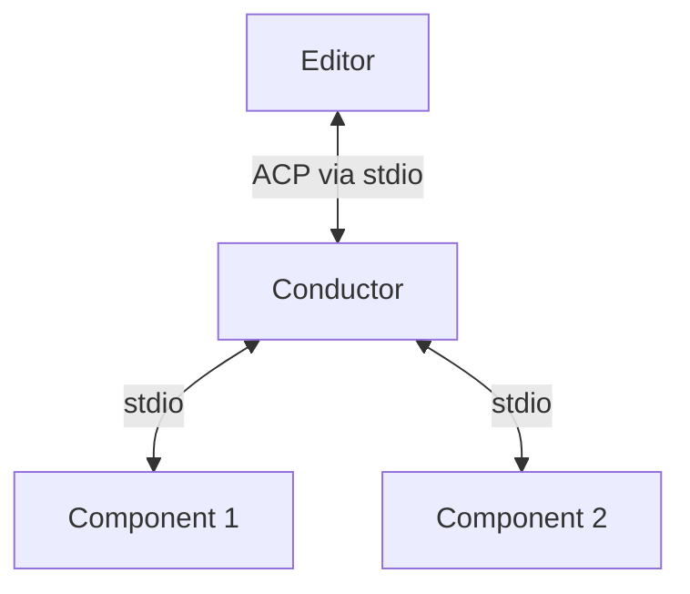
```mermaid
flowchart TB
    Editor[Editor]
    C[Conductor]
    P1[Component 1]
    P2[Component 2]

    Editor <-->|ACP via stdio| C
    C <-->|stdio| P1
    C <-->|stdio| P2
```

**Key insight**: Components never talk directly to each other. The conductor routes ALL messages using the `_proxy/successor/*` protocol.

**From the editor's perspective**: Conductor is a normal ACP agent communicating over stdio.

**From each component's perspective**:

- Receives normal ACP messages from the conductor
- Sends `_proxy/successor/request` to conductor to forward messages TO successor
- Receives `_proxy/successor/request` from conductor for messages FROM successor

See [Protocol Reference](./protocol.md) for detailed message formats.

## Responsibilities

The conductor has four core responsibilities:

### 1. Process Management

- Spawns component processes based on command-line arguments
- Manages component lifecycle (startup, shutdown, error handling)
- For MVP: If any component crashes, shut down the entire chain

**Command-line interface:**

```bash
# Agent mode - manages proxy chain
conductor agent sparkle-acp claude-code-acp

# MCP mode - bridges stdio to TCP for MCP-over-ACP
conductor mcp 54321
```

**Agent mode** creates a chain: `Editor → Conductor → sparkle-acp → claude-code-acp`

**MCP mode** bridges MCP JSON-RPC (stdio) to raw JSON-RPC (TCP connection to main conductor)

### 2. Message Routing

The conductor routes ALL messages between components. No component talks directly to another.

**Message ordering**: The conductor preserves message send order by routing all forwarding decisions through a central event loop, preventing responses from overtaking notifications.

**Message flow types:**

1. **Editor → First Component**: Conductor forwards normal ACP messages
2. **Component → Successor**: Component sends `_proxy/successor/request` to conductor, which unwraps and forwards to next component
3. **Successor → Component**: Conductor wraps messages in `_proxy/successor/request` when sending FROM successor
4. **Responses**: Flow back via standard JSON-RPC response IDs

See [Protocol Reference](./protocol.md) for detailed request/response flow diagrams.

### 3. Capability Management

The conductor manages proxy capability handshakes during initialization:

**Normal Mode (conductor as root):**

- Offers `proxy: true` to all components EXCEPT the last
- Verifies each proxy component accepts the capability
- Last component (agent) receives standard ACP initialization

**Proxy Mode (conductor as proxy):**

- When conductor itself receives `proxy: true` during initialization
- Offers `proxy: true` to ALL components (including the last)
- Enables tree-structured proxy chains

See [Proxy Mode](#proxy-mode) below for hierarchical chain details.

### 4. MCP Bridge Adaptation

When components provide MCP servers with ACP transport (`"url": "acp:$UUID"`):

**If agent has `mcp_acp_transport` capability:**

- Pass through MCP server declarations unchanged
- Agent handles `_mcp/*` messages natively

**If agent lacks `mcp_acp_transport` capability:**

- Bind TCP port for each ACP-transport MCP server
- Transform MCP server spec to use `conductor mcp $port`
- Spawn `conductor mcp $port` bridge processes
- Route MCP tool calls:
  - Agent → stdio → bridge → TCP → conductor → `_mcp/*` messages backward up chain
  - Component responses flow back: component → conductor → TCP → bridge → stdio → agent

See [MCP Bridge](./mcp-bridge.md) for full implementation details.

## Proxy Mode

The conductor can itself operate as a proxy component within a larger chain, enabling **tree-structured proxy architectures**.

### How Proxy Mode Works

When the conductor receives an `initialize` request **with** the `proxy` capability:

1. **Detection**: Conductor detects it's being used as a proxy component
2. **All components become proxies**: Offers `proxy: true` to ALL managed components (including the last)
3. **Successor forwarding**: When the final component sends `_proxy/successor/request`, conductor forwards to **its own successor**

### Example: Hierarchical Chain

```
client → proxy1 → conductor (proxy mode) → final-agent
                      ↓ manages
                  p1 → p2 → p3
```

**Message flow when p3 forwards to successor:**

1. p3 sends `_proxy/successor/request` to conductor
2. Conductor recognizes it's in proxy mode
3. Conductor sends `_proxy/successor/request` to proxy1 (its predecessor)
4. proxy1 routes to final-agent

### Use Cases

**Modular sub-chains**: Group related proxies into a conductor-managed sub-chain that can be inserted anywhere

**Conditional routing**: A proxy can route to conductor-based sub-chains based on request type

**Isolated environments**: Each conductor manages its own component lifecycle while participating in larger chains

### Implementation Notes

- Proxy mode is detected during initialization by checking for `proxy: true` in incoming `initialize` request
- In normal mode: last component is agent (no proxy capability)
- In proxy mode: all components are proxies (all receive proxy capability)
- The conductor's own successor is determined by whoever initialized it

## Initialization Flow

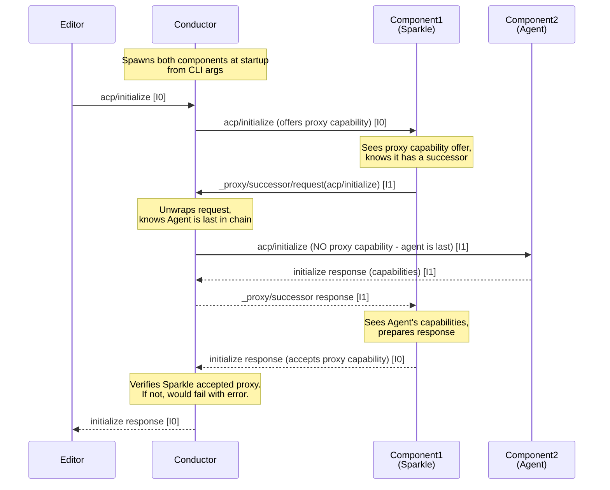
```mermaid
sequenceDiagram
    participant Editor
    participant Conductor
    participant Sparkle as Component1<br/>(Sparkle)
    participant Agent as Component2<br/>(Agent)

    Note over Conductor: Spawns both components at startup<br/>from CLI args

    Editor->>Conductor: acp/initialize [I0]
    Conductor->>Sparkle: acp/initialize (offers proxy capability) [I0]

    Note over Sparkle: Sees proxy capability offer,<br/>knows it has a successor

    Sparkle->>Conductor: _proxy/successor/request(acp/initialize) [I1]

    Note over Conductor: Unwraps request,<br/>knows Agent is last in chain

    Conductor->>Agent: acp/initialize (NO proxy capability - agent is last) [I1]
    Agent-->>Conductor: initialize response (capabilities) [I1]
    Conductor-->>Sparkle: _proxy/successor response [I1]

    Note over Sparkle: Sees Agent's capabilities,<br/>prepares response

    Sparkle-->>Conductor: initialize response (accepts proxy capability) [I0]

    Note over Conductor: Verifies Sparkle accepted proxy.<br/>If not, would fail with error.

    Conductor-->>Editor: initialize response [I0]
```

Key points:

1. **Conductor spawns ALL components at startup** based on command-line args
2. **Sequential initialization**: Conductor → Component1 → Component2 → ... → Agent
3. **Proxy capability handshake**:
   - Conductor **offers** `proxy: true` to non-last components (in InitializeRequest `_meta`)
   - Components **must accept** by responding with `proxy: true` (in InitializeResponse `_meta`)
   - Last component (agent) is NOT offered proxy capability
   - Conductor **verifies** acceptance and fails initialization if missing
4. **Components use `_proxy/successor/request`** to initialize their successors
5. **Capabilities flow back up the chain**: Each component sees successor's capabilities before responding
6. **Message IDs**: Preserved from editor (I0), new IDs for proxy messages (I1, I2, ...)

## Implementation Architecture

The conductor uses an actor-based architecture with message passing via channels.

### Core Components

- **Main connection**: Handles editor stdio and spawns the event loop
- **Component connections**: Each component has a bidirectional JSON-RPC connection
- **Message router**: Central actor that receives `ConductorMessage` enums and routes appropriately
- **MCP bridge actors**: Manage MCP-over-ACP connections

### Message Ordering Invariant

**Critical invariant**: All messages (requests, responses, notifications) between any two endpoints must maintain their send order.

The conductor ensures this invariant by routing **all** message forwarding through its central message queue (`ConductorMessage` channel). This prevents faster message types (responses) from overtaking slower ones (notifications).

#### Why This Matters

Without ordering preservation, a race condition can occur:

1. Agent sends `session/update` notification
2. Agent responds to `session/prompt` request
3. Response takes a fast path (reply_actor with oneshot channels)
4. Notification takes slower path (handler pipeline)
5. **Response arrives before notification** → client loses notification data

#### Implementation

The conductor uses extension traits to route all forwarding through the central queue:

- `JrConnectionCxExt::send_proxied_message_via` - Routes both requests and notifications
- `JrRequestCxExt::respond_via` - Routes responses through the queue
- `JrResponseExt::forward_response_via` - Ensures response forwarding maintains order

All message forwarding in both directions (client-to-agent and agent-to-client) flows through the conductor's central event loop, which processes `ConductorMessage` enums sequentially. This serialization ensures messages arrive in the same order they were sent.

### Message Routing Implementation

The conductor uses a recursive spawning pattern:

1. **Recursive chain building**: Each component spawns the next, establishing connections
2. **Actor-based routing**: All messages flow through a central conductor actor via channels
3. **Response routing**: Uses JSON-RPC response IDs and request contexts to route back
4. **No explicit ID tracking**: Context passing eliminates need for manual ID management

**Key routing decisions:**

- **Normal mode**: Last component gets normal ACP (no proxy capability)
- **Proxy mode**: All components get proxy capability, final component can forward to conductor's successor
- **Bidirectional `_proxy/successor/*`**: Used for both TO successor (unwrap and forward) and FROM successor (wrap and deliver)

### Concurrency Model

Built on Tokio async runtime:

- **Async I/O**: All stdio operations are non-blocking
- **Message passing**: Components communicate via mpsc channels
- **Spawned tasks**: Each connection handler runs as separate task
- **Error propagation**: Tasks send errors back to main actor via channels

See source code in `src/agent-client-protocol-conductor/src/conductor.rs` for implementation details.

## Error Handling

### Component Crashes

If any component process exits or crashes:

1. Log error to stderr
2. Shut down entire Conductor process
3. Exit with non-zero status

The editor will see the ACP connection close and can handle appropriately.

### Invalid Messages

If Conductor receives malformed JSON-RPC:

- Log to stderr
- Continue processing (don't crash the chain)
- May result in downstream errors

### Initialization Failures

If component fails to initialize:

1. Log error
2. Return error response to editor
3. Shut down

## Implementation Phases

### Phase 1: Basic Routing (MVP)

- [x] Design documented
- [x] Parse command-line arguments (component list)
- [x] Spawn components recursively (alternative to "spawn all at startup")
- [x] Set up stdio pipes for all components
- [x] Message routing logic:
  - [x] Editor → Component1 forwarding
  - [x] `_proxy/successor/request` unwrapping and forwarding
  - [x] Response routing via context passing (alternative to explicit ID tracking)
  - [x] Component → Editor message routing
- [x] Actor-based message passing architecture with `ConductorMessage` enum
- [x] Error reporting from spawned tasks to conductor
- [ ] **PUNCH LIST - Remaining MVP items:**
  - [ ] Fix typo: `ComnponentToItsClientMessage` → `ComponentToItsClientMessage`
  - [ ] Proxy capability handshake during initialization:
    - [ ] Offer `proxy: true` in `_meta` to non-last components during `acp/initialize`
    - [ ] Do NOT offer `proxy` to last component (agent)
    - [ ] Verify component accepts by checking for `proxy: true` in InitializeResponse `_meta`
    - [ ] Fail initialization with error "component X is not a proxy" if handshake fails
  - [ ] Add documentation/comments explaining recursive chain building
  - [ ] Add logging (message routing, component startup, errors)
  - [ ] Write tests (proxy capability handshake, basic routing, initialization, error handling)
  - [ ] Component crash detection and chain shutdown

### Phase 2: Robust Error Handling

- [x] Basic error reporting from async tasks
- [ ] Graceful component shutdown
- [ ] Retry logic for transient failures
- [ ] Health checks
- [ ] Timeout handling for hung requests

### Phase 3: Observability

- [ ] Structured logging/tracing
- [ ] Performance metrics
- [ ] Debug mode with message inspection

### Phase 4: Advanced Features

- [ ] Dynamic component loading
- [ ] Hot reload of components
- [ ] Multiple parallel chains

## Testing Strategy

### Unit Tests

- Message parsing and forwarding logic
- Capability modification
- Error handling paths

### Integration Tests

- Full chain initialization
- Message flow through real components
- Component crash scenarios
- Malformed message handling

### End-to-End Tests

- Real editor + Conductor + test components
- Sparkle + Claude Code integration
- Performance benchmarks

## Open Questions

1. **Component discovery**: How do we find component binaries? PATH? Configuration file?
2. **Configuration**: Should Conductor support a config file for default chains?
3. **Logging**: Structured logging format?
4. **Metrics**: Should Conductor expose metrics (message counts, latency)?
5. **Security**: Do we need to validate/sandbox component processes?

## Key Source Files

| File                                                              | Purpose                       |
| ----------------------------------------------------------------- | ----------------------------- |
| `src/agent-client-protocol-conductor/src/conductor.rs`            | Main conductor implementation |
| `src/agent-client-protocol-conductor/src/conductor/mcp_bridge.rs` | MCP bridge actor              |
| `src/agent-client-protocol-conductor/src/main.rs`                 | CLI entry point               |

## Related Documentation

- [P/ACP Specification](./proxying-acp.md) - Full protocol specification
- [MCP Bridge](./mcp-bridge.md) - MCP-over-ACP implementation details
- [Protocol Reference](./protocol.md) - Wire protocol details
````

## File: md/design.md
````markdown
# Core Library Design

This document describes the design of the `agent-client-protocol` crate and its companion crates (`agent-client-protocol-tokio`, `agent-client-protocol-rmcp`).

For API usage, see the [rustdoc](https://docs.rs/agent-client-protocol) and [cookbook](https://docs.rs/agent-client-protocol-cookbook).

## Crate Organization

### agent-client-protocol

The core SDK. Provides:

- **Role types** (`Client`, `Agent`, `Proxy`, `Conductor`) - the identities in ACP
- **Connection builders** (`builder()`, `connect_to()`, `connect_with()`)
- **Message handling** (`on_receive_request`, `on_receive_notification`, `on_receive_dispatch`)
- **Protocol types** (`agent_client_protocol::schema::*`) - all ACP message types
- **MCP server builder** - for adding tools to proxies

### agent-client-protocol-tokio

Tokio-specific utilities:

- **Process spawning** - spawn agent/proxy processes and connect via stdio
- **Transport helpers** - convert tokio streams to ACP transports

### agent-client-protocol-rmcp

Integration with the [rmcp](https://docs.rs/rmcp) crate:

- **`McpServer::from_rmcp()`** - wrap an rmcp server as an ACP MCP server

## Role System

The type system is built around **roles** - the logical identity of an endpoint.

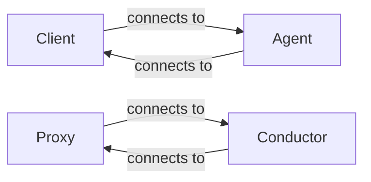
```mermaid
graph LR
    Client -->|connects to| Agent
    Agent -->|connects to| Client
    Proxy -->|connects to| Conductor
    Conductor -->|connects to| Proxy
```

### Counterpart Relationship

Each role has exactly one **counterpart** - who it connects to:

| Role        | Counterpart |
| ----------- | ----------- |
| `Client`    | `Agent`     |
| `Agent`     | `Client`    |
| `Proxy`     | `Conductor` |
| `Conductor` | `Proxy`     |

This is encoded in the type system: `impl ConnectTo<Client> for MyAgent` means "MyAgent can connect to a client" (i.e., MyAgent plays the Agent role).

### Peer Relationship

Some roles can communicate with multiple **peers**. The `Proxy` role is the key example:

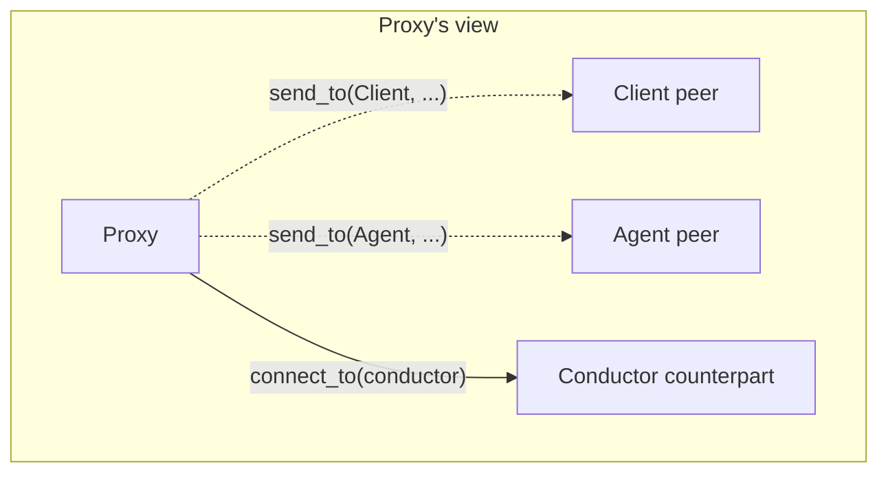
```mermaid
graph TB
    subgraph "Proxy's view"
        Proxy
        Client[Client peer]
        Agent[Agent peer]
        Conductor[Conductor counterpart]
    end

    Proxy -.->|"send_to(Client, ...)"| Client
    Proxy -.->|"send_to(Agent, ...)"| Agent
    Proxy -->|"connect_to(conductor)"| Conductor
```

- **Counterpart** (Conductor) - who the proxy connects to (transport layer)
- **Peers** (Client, Agent) - who the proxy exchanges logical messages with

## Message Flow

### Dispatch Loop

Each connection runs a dispatch loop that processes incoming messages:

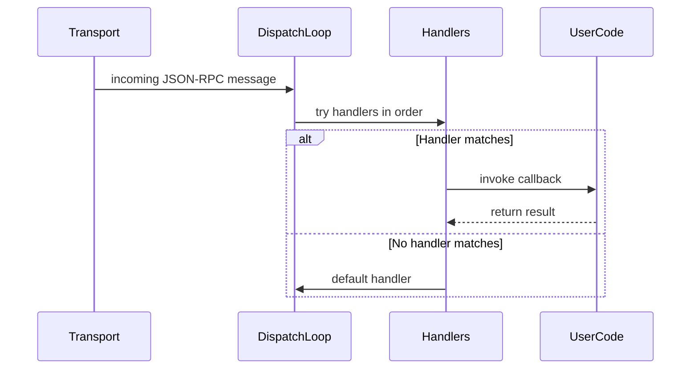
```mermaid
sequenceDiagram
    participant Transport
    participant DispatchLoop
    participant Handlers
    participant UserCode

    Transport->>DispatchLoop: incoming JSON-RPC message
    DispatchLoop->>Handlers: try handlers in order

    alt Handler matches
        Handlers->>UserCode: invoke callback
        UserCode-->>Handlers: return result
    else No handler matches
        Handlers->>DispatchLoop: default handler
    end
```

### Handler Chain

Handlers are tried in registration order. The first matching handler wins:

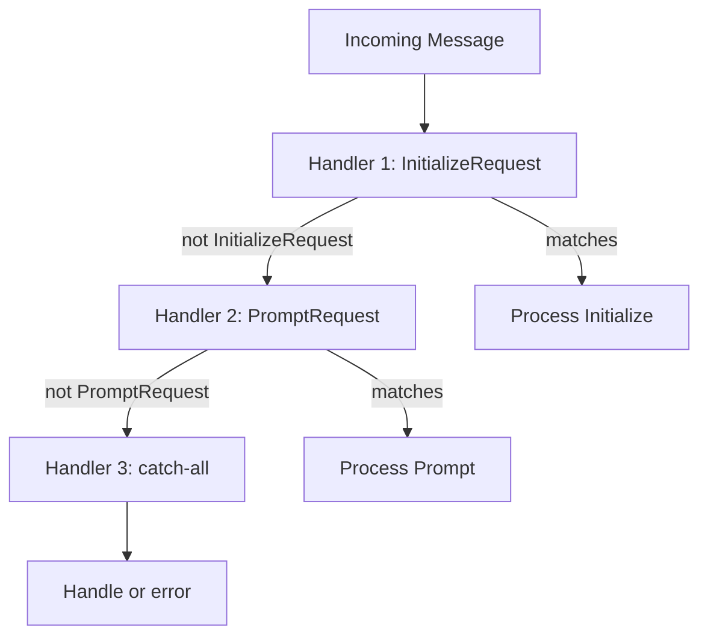
```mermaid
graph TD
    Message[Incoming Message]
    H1[Handler 1: InitializeRequest]
    H2[Handler 2: PromptRequest]
    H3[Handler 3: catch-all]

    Message --> H1
    H1 -->|not InitializeRequest| H2
    H2 -->|not PromptRequest| H3
    H3 --> Done[Handle or error]

    H1 -->|matches| Process1[Process Initialize]
    H2 -->|matches| Process2[Process Prompt]
```

### Ordering Guarantees

The dispatch loop provides sequential processing:

1. Messages are processed one at a time
2. A handler runs to completion before the next message is processed
3. Spawned tasks (`connection.spawn()`) run concurrently with the dispatch loop

**Important**: Don't block the dispatch loop. Use `spawn()` for long-running work.

## Connection Lifecycle

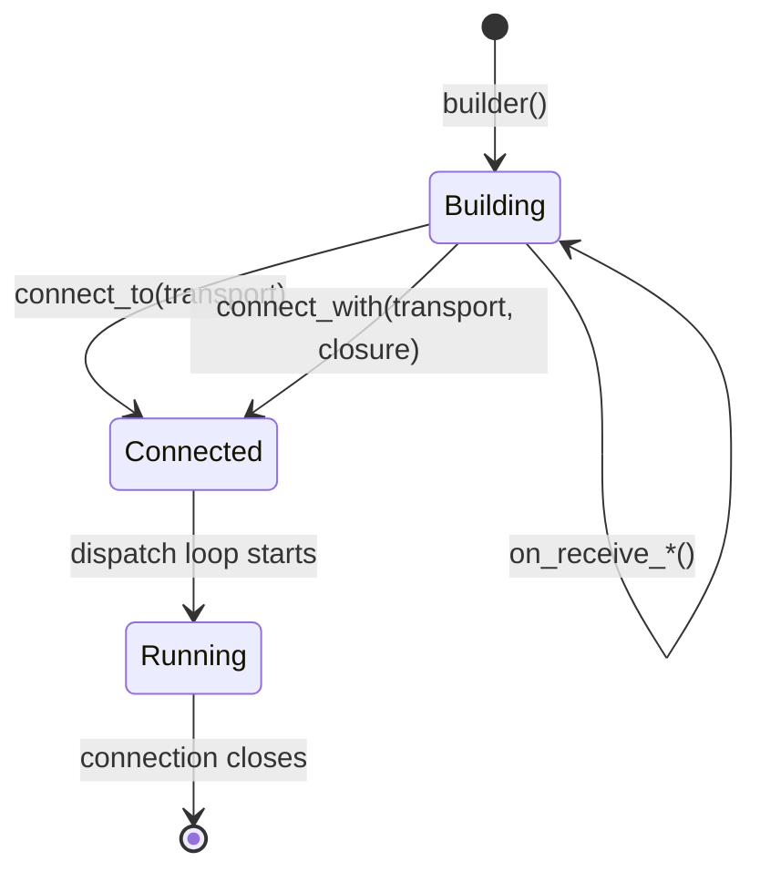
```mermaid
stateDiagram-v2
    [*] --> Building: builder()
    Building --> Building: on_receive_*()
    Building --> Connected: connect_to(transport)
    Building --> Connected: connect_with(transport, closure)
    Connected --> Running: dispatch loop starts
    Running --> [*]: connection closes
```

### Two Connection Modes

**Reactive mode** (`connect_to`): The connection runs handlers until the transport closes. Used for agents and proxies.

**Active mode** (`connect_with`): Runs a closure with access to the connection, then closes. Used for clients that drive the interaction.

## Key Source Files

| File                                         | Purpose                               |
| -------------------------------------------- | ------------------------------------- |
| `src/agent-client-protocol/src/role.rs`      | Role trait and type definitions       |
| `src/agent-client-protocol/src/role/acp.rs`  | Client, Agent, Proxy, Conductor roles |
| `src/agent-client-protocol/src/component.rs` | ConnectTo and Builder traits          |
| `src/agent-client-protocol/src/handler.rs`   | Connection builder implementation     |
| `src/agent-client-protocol/src/typed.rs`     | Dispatch type and handler matching    |
| `src/agent-client-protocol/src/mcp_server/`  | MCP server builder                    |
| `src/agent-client-protocol/src/concepts/`    | Rustdoc concept explanations          |

## Design Decisions

### Why Roles Instead of Links?

Earlier versions used "link types" that encoded both sides (e.g., `ClientToAgent`). Roles are simpler:

- One concept instead of two (role vs link)
- Role types double as peer selectors (`send_to(Agent, ...)`)
- Clearer mental model: "I am X, connecting to Y"

### Why Witness Macros?

The `on_receive_request!()` macros work around Rust's lack of return-type notation. They capture the return type of closures at the call site, enabling type inference to work.

### Why Not Traits for Handlers?

Handler closures are more ergonomic than trait implementations for most use cases. The `HandleDispatchFrom` trait exists for advanced cases (reusable handler components).
````

## File: md/introduction.md
````markdown
# Agent Client Protocol Rust SDK

This repository contains the Rust SDK for the [Agent-Client Protocol (ACP)](https://agentclientprotocol.com/).

## For Users

**If you want to build something with these crates**, see the rustdoc:

- **[`agent-client-protocol`](https://docs.rs/agent-client-protocol)** - Core SDK for building clients, agents, and proxies
- **[`agent-client-protocol-cookbook`](https://docs.rs/agent-client-protocol-cookbook)** - Practical patterns and examples
- **[`agent-client-protocol-conductor`](https://docs.rs/agent-client-protocol-conductor)** - Running proxy chains

The `agent-client-protocol` crate includes a [`concepts`](https://docs.rs/agent-client-protocol/latest/agent_client_protocol/concepts/) module that explains how connections, sessions, callbacks, and message ordering work.

## For Maintainers and Agents

**This book** documents the design and architecture for people working on the codebase itself.

### Repository Structure

```
src/
├── agent-client-protocol/              # Core protocol SDK
├── agent-client-protocol-tokio/        # Tokio utilities (process spawning)
├── agent-client-protocol-rmcp/         # Integration with rmcp crate
├── agent-client-protocol-cookbook/     # Usage patterns (rendered as rustdoc)
├── agent-client-protocol-derive/       # Proc macros
├── agent-client-protocol-conductor/    # Conductor binary and library
├── agent-client-protocol-test/         # Test utilities and fixtures
├── agent-client-protocol-trace-viewer/ # Trace visualization tool
└── yopo/                               # "You Only Prompt Once" example client
```

### Crate Relationships

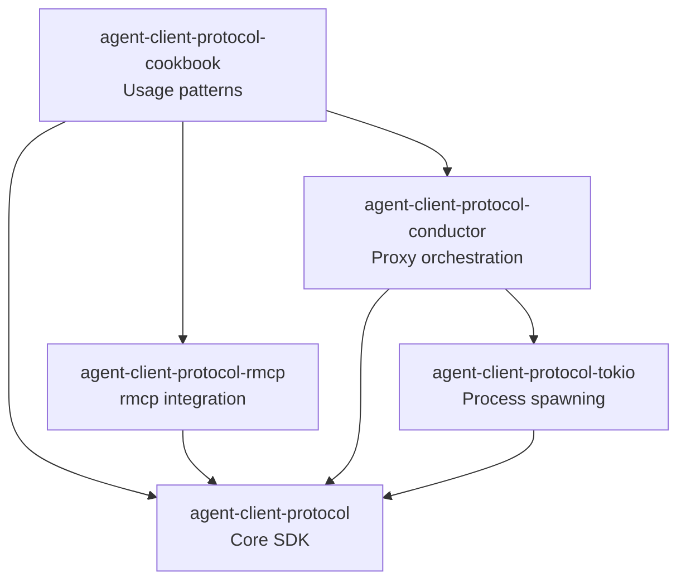
```mermaid
graph TD
    acp[agent-client-protocol<br/>Core SDK]
    tokio[agent-client-protocol-tokio<br/>Process spawning]
    rmcp[agent-client-protocol-rmcp<br/>rmcp integration]
    conductor[agent-client-protocol-conductor<br/>Proxy orchestration]
    cookbook[agent-client-protocol-cookbook<br/>Usage patterns]

    tokio --> acp
    rmcp --> acp
    conductor --> acp
    conductor --> tokio
    cookbook --> acp
    cookbook --> rmcp
    cookbook --> conductor
```

### Key Design Documents

- [Core Library Design](./design.md) - How `agent-client-protocol`, `agent-client-protocol-tokio`, and `agent-client-protocol-rmcp` are organized
- [Conductor Design](./conductor.md) - How the conductor orchestrates proxy chains
- [Protocol Reference](./protocol.md) - Wire protocol details and extension methods
- [P/ACP Specification](./proxying-acp.md) - The full proxy protocol specification
- [Migrating to v0.11](./migration_v0.11.x.md) - Upgrade guide from 0.10.x to 0.11
````

## File: md/mcp-bridge.md
````markdown
# MCP Bridge: Proxying MCP over ACP

The **MCP Bridge** enables agents without native MCP-over-ACP support to work with proxy components that provide MCP servers using ACP transport (`acp:$UUID`).

## Problem Statement

Proxy components may want to expose MCP servers to agents using ACP as the transport layer. This allows:

- Dynamic MCP server registration during session creation
- Proxies to correlate MCP tool calls with specific ACP sessions
- Unified protocol handling (everything flows through ACP messages)

However, many agents only support traditional MCP transports (stdio, SSE). The conductor bridges this gap by:

1. Accepting `acp:$UUID` URLs in `session/new` requests
2. Transforming them into stdio-based MCP servers the agent can connect to
3. Routing MCP messages between the agent (stdio) and proxies (ACP `_mcp/*` messages)

## High-Level Architecture

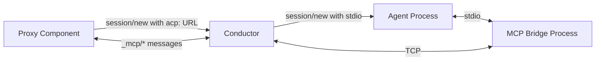
```mermaid
flowchart LR
    Proxy[Proxy Component]
    Conductor[Conductor]
    Agent[Agent Process]
    Bridge[MCP Bridge Process]

    Proxy -->|session/new with acp: URL| Conductor
    Conductor -->|session/new with stdio| Agent
    Agent <-->|stdio| Bridge
    Bridge <-->|TCP| Conductor
    Conductor <-->|_mcp/* messages| Proxy
```

**Key decision**: Use stdio + TCP bridge instead of direct stdio to agent, because:

- Preserves agent isolation (agent only sees stdio)
- Enables connection multiplexing (multiple bridges to one conductor)
- Simplifies lifecycle management (bridge exits when agent closes stdio)

## Session Initialization Flow

The conductor transforms MCP servers during session creation and correlates them with session IDs.

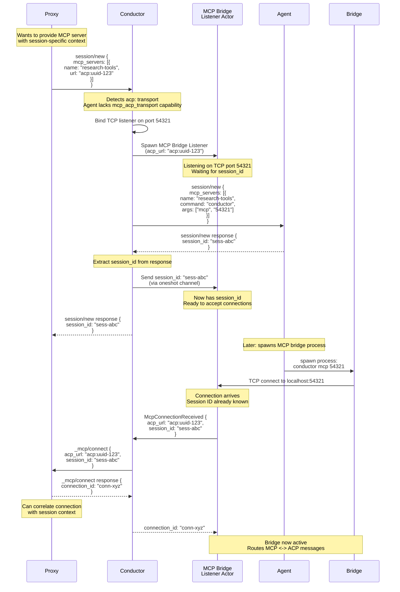
```mermaid
sequenceDiagram
    participant Proxy
    participant Conductor
    participant Listener as MCP Bridge<br/>Listener Actor
    participant Agent

    Note over Proxy: Wants to provide MCP server<br/>with session-specific context

    Proxy->>Conductor: session/new {<br/>  mcp_servers: [{<br/>    name: "research-tools",<br/>    url: "acp:uuid-123"<br/>  }]<br/>}

    Note over Conductor: Detects acp: transport<br/>Agent lacks mcp_acp_transport capability

    Conductor->>Conductor: Bind TCP listener on port 54321

    Conductor->>Listener: Spawn MCP Bridge Listener<br/>(acp_url: "acp:uuid-123")

    Note over Listener: Listening on TCP port 54321<br/>Waiting for session_id

    Conductor->>Agent: session/new {<br/>  mcp_servers: [{<br/>    name: "research-tools",<br/>    command: "conductor",<br/>    args: ["mcp", "54321"]<br/>  }]<br/>}

    Agent-->>Conductor: session/new response {<br/>  session_id: "sess-abc"<br/>}

    Note over Conductor: Extract session_id from response

    Conductor->>Listener: Send session_id: "sess-abc"<br/>(via oneshot channel)

    Note over Listener: Now has session_id<br/>Ready to accept connections

    Conductor-->>Proxy: session/new response {<br/>  session_id: "sess-abc"<br/>}

    Note over Agent: Later: spawns MCP bridge process

    Agent->>Bridge: spawn process:<br/>conductor mcp 54321

    Bridge->>Listener: TCP connect to localhost:54321

    Note over Listener: Connection arrives<br/>Session ID already known

    Listener->>Conductor: McpConnectionReceived {<br/>  acp_url: "acp:uuid-123",<br/>  session_id: "sess-abc"<br/>}

    Conductor->>Proxy: _mcp/connect {<br/>  acp_url: "acp:uuid-123",<br/>  session_id: "sess-abc"<br/>}

    Proxy-->>Conductor: _mcp/connect response {<br/>  connection_id: "conn-xyz"<br/>}

    Note over Proxy: Can correlate connection<br/>with session context

    Conductor-->>Listener: connection_id: "conn-xyz"

    Note over Listener,Bridge: Bridge now active<br/>Routes MCP <-> ACP messages
```

### Key Decisions

**Why spawn TCP listener before getting session_id (during request, not response)?**

- Agent may spawn bridge process immediately after receiving `session/new` response
- If listener doesn't exist yet, bridge connection fails with "connection refused"
- Spawning during request ensures TCP port is ready before agent receives response
- Session_id delivered asynchronously via oneshot channel once response arrives

**Why send session_id to listener before forwarding response?**

- Ensures session_id is available before agent spawns bridge process
- Eliminates race condition where TCP connection arrives before session_id known
- Listener blocks on receiving session_id, guaranteeing it's available when needed

**Why include session_id in `_mcp/connect`?**

- Proxies need to correlate MCP connections with ACP sessions
- Example: Research proxy remembers session context (current task, preferences)
- Without session_id, proxy has no way to associate connection with session state

**Why use oneshot channel for session_id delivery?**

- Listener spawned during request handling (before response available)
- Response comes asynchronously from agent
- Oneshot channel delivers session_id exactly once when response arrives
- Clean separation: listener setup (during request) vs session_id delivery (during response)

## Connection Lifecycle

Once the MCP connection is established, the bridge routes messages bidirectionally:

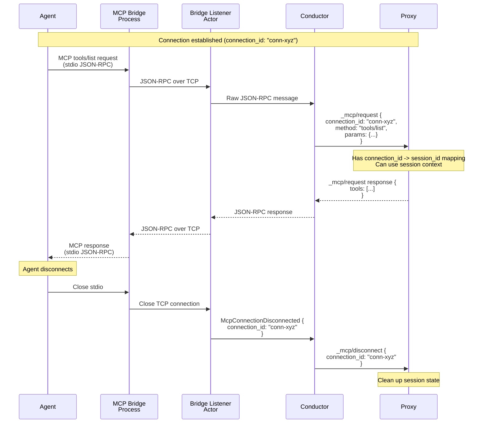
```mermaid
sequenceDiagram
    participant Agent
    participant Bridge as MCP Bridge<br/>Process
    participant Listener as Bridge Listener<br/>Actor
    participant Conductor
    participant Proxy

    Note over Agent,Proxy: Connection established (connection_id: "conn-xyz")

    Agent->>Bridge: MCP tools/list request<br/>(stdio JSON-RPC)

    Bridge->>Listener: JSON-RPC over TCP

    Listener->>Conductor: Raw JSON-RPC message

    Conductor->>Proxy: _mcp/request {<br/>  connection_id: "conn-xyz",<br/>  method: "tools/list",<br/>  params: {...}<br/>}

    Note over Proxy: Has connection_id -> session_id mapping<br/>Can use session context

    Proxy-->>Conductor: _mcp/request response {<br/>  tools: [...]<br/>}

    Conductor-->>Listener: JSON-RPC response

    Listener-->>Bridge: JSON-RPC over TCP

    Bridge-->>Agent: MCP response<br/>(stdio JSON-RPC)

    Note over Agent: Agent disconnects

    Agent->>Bridge: Close stdio

    Bridge->>Listener: Close TCP connection

    Listener->>Conductor: McpConnectionDisconnected {<br/>  connection_id: "conn-xyz"<br/>}

    Conductor->>Proxy: _mcp/disconnect {<br/>  connection_id: "conn-xyz"<br/>}

    Note over Proxy: Clean up session state
```

### Key Decisions

**Why route through conductor instead of direct bridge-to-proxy?**

- Maintains consistent message ordering through central conductor queue
- Preserves conductor as sole message router
- Simplifies error handling and lifecycle management

**Why use connection_id instead of session_id in `_mcp/*` messages?**

- One session can have multiple MCP connections (multiple servers)
- Connection_id uniquely identifies the bridge instance
- Proxies maintain `connection_id -> session_id` mapping internally

**Why send disconnect notification?**

- Allows proxies to clean up session-specific state
- Enables resource cleanup (close files, release locks, etc.)
- Provides explicit lifecycle boundary

## Race Condition Handling

The session_id delivery mechanism prevents a race condition:

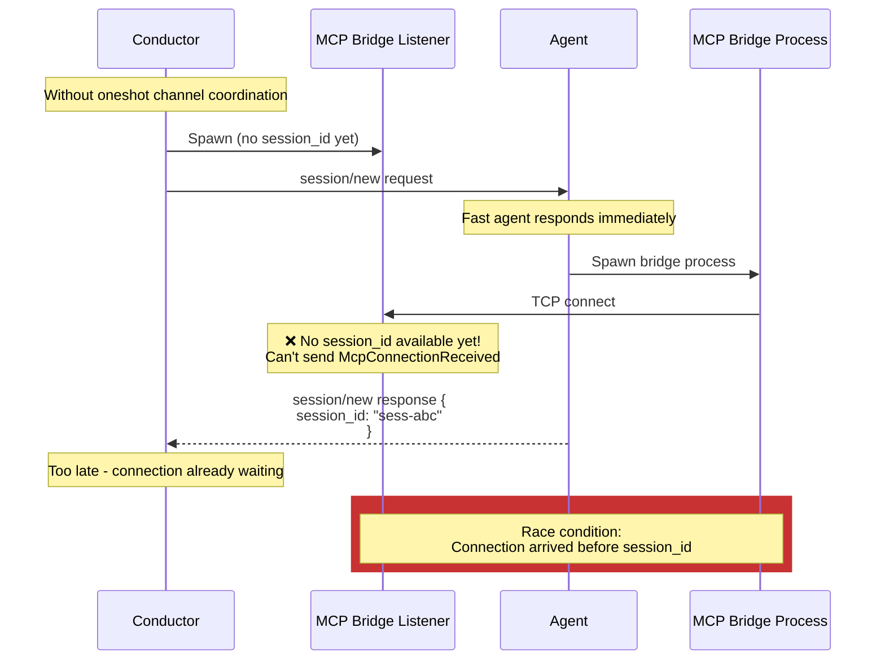
```mermaid
sequenceDiagram
    participant Conductor
    participant Listener as MCP Bridge Listener
    participant Agent
    participant Bridge as MCP Bridge Process

    Note over Conductor: Without oneshot channel coordination

    Conductor->>Listener: Spawn (no session_id yet)

    Conductor->>Agent: session/new request

    Note over Agent: Fast agent responds immediately

    Agent->>Bridge: Spawn bridge process

    Bridge->>Listener: TCP connect

    Note over Listener: ❌ No session_id available yet!<br/>Can't send McpConnectionReceived

    Agent-->>Conductor: session/new response {<br/>  session_id: "sess-abc"<br/>}

    Note over Conductor: Too late - connection already waiting

    rect rgb(200, 50, 50)
        Note over Listener,Bridge: Race condition:<br/>Connection arrived before session_id
    end
```

**Solution**: Listener blocks on oneshot channel:

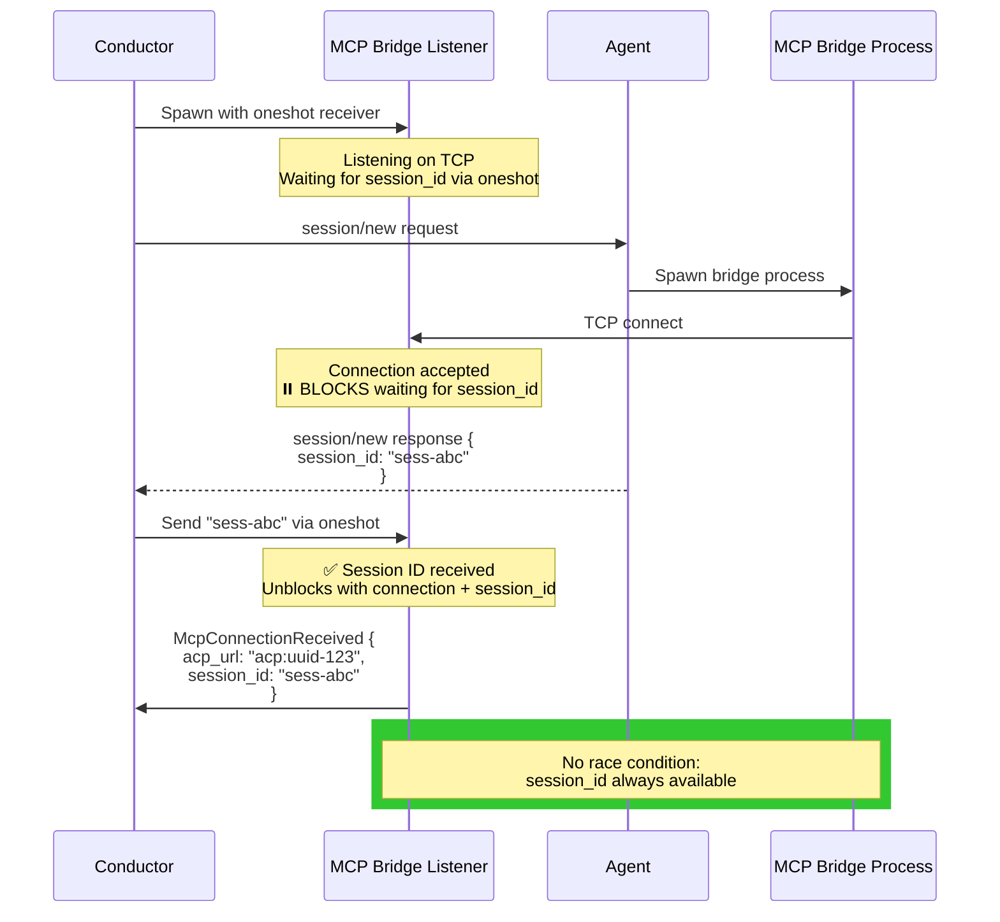
```mermaid
sequenceDiagram
    participant Conductor
    participant Listener as MCP Bridge Listener
    participant Agent
    participant Bridge as MCP Bridge Process

    Conductor->>Listener: Spawn with oneshot receiver

    Note over Listener: Listening on TCP<br/>Waiting for session_id via oneshot

    Conductor->>Agent: session/new request

    Agent->>Bridge: Spawn bridge process

    Bridge->>Listener: TCP connect

    Note over Listener: Connection accepted<br/>⏸️ BLOCKS waiting for session_id

    Agent-->>Conductor: session/new response {<br/>  session_id: "sess-abc"<br/>}

    Conductor->>Listener: Send "sess-abc" via oneshot

    Note over Listener: ✅ Session ID received<br/>Unblocks with connection + session_id

    Listener->>Conductor: McpConnectionReceived {<br/>  acp_url: "acp:uuid-123",<br/>  session_id: "sess-abc"<br/>}

    rect rgb(50, 200, 50)
        Note over Listener,Bridge: No race condition:<br/>session_id always available
    end
```

**Key decision**: Block connection acceptance on session_id availability

- Listener accepts TCP connection immediately (agent won't wait)
- But blocks sending `McpConnectionReceived` until session_id arrives
- Guarantees session_id is always available when creating `_mcp/connect` request
- Simple implementation: `oneshot_rx.await?` before sending message

## Multiple MCP Servers

A single session can register multiple MCP servers:

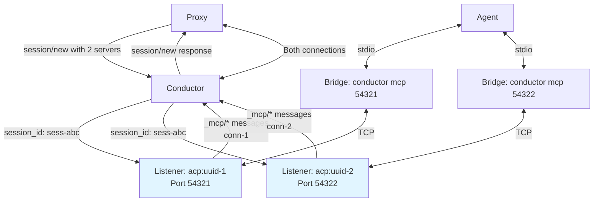
```mermaid
flowchart TB
    Proxy[Proxy]
    Conductor[Conductor]
    Agent[Agent]

    Listener1[Listener: acp:uuid-1<br/>Port 54321]
    Listener2[Listener: acp:uuid-2<br/>Port 54322]

    Bridge1[Bridge: conductor mcp 54321]
    Bridge2[Bridge: conductor mcp 54322]

    Proxy -->|session/new with 2 servers| Conductor
    Conductor -->|session_id: sess-abc| Listener1
    Conductor -->|session_id: sess-abc| Listener2
    Conductor -->|session/new response| Proxy

    Agent <-->|stdio| Bridge1
    Agent <-->|stdio| Bridge2

    Bridge1 <-->|TCP| Listener1
    Bridge2 <-->|TCP| Listener2

    Listener1 -->|_mcp/* messages<br/>conn-1| Conductor
    Listener2 -->|_mcp/* messages<br/>conn-2| Conductor

    Conductor <-->|Both connections| Proxy

    style Listener1 fill:#e1f5ff
    style Listener2 fill:#e1f5ff
```

**Key decisions**:

- Each `acp:` URL gets its own TCP port and listener
- All listeners for a session receive the same session_id
- Each connection gets unique connection_id
- Proxy maintains map: `connection_id -> (session_id, acp_url)`

## Implementation Components

### McpBridgeListeners

- **Purpose**: Manages TCP listeners for all `acp:` URLs
- **Lifecycle**: Created with conductor, lives for entire conductor lifetime
- **Responsibilities**:
  - Detect `acp:` URLs during `session/new`
  - Spawn TCP listeners on ephemeral ports
  - Transform MCP server specs to stdio transport
  - Deliver session_id to listeners via oneshot channels

### McpBridgeListener Actor

- **Purpose**: Accepts TCP connections for a specific `acp:` URL
- **Lifecycle**: Spawned during `session/new`, lives until conductor exits
- **Responsibilities**:
  - Listen on TCP port
  - Block on oneshot channel to receive session_id
  - Accept connections and send `McpConnectionReceived` with session_id
  - Spawn connection actors

### McpBridgeConnectionActor

- **Purpose**: Routes messages for a single MCP connection
- **Lifecycle**: Spawned when agent connects, exits when agent disconnects
- **Responsibilities**:
  - Read JSON-RPC from TCP, forward to conductor
  - Receive messages from conductor, write to TCP
  - Send `McpConnectionDisconnected` on close

### MCP Bridge Process (`conductor mcp $PORT`)

- **Purpose**: Bridges agent's stdio to conductor's TCP
- **Lifecycle**: Spawned by agent, exits when stdio closes
- **Responsibilities**:
  - Connect to TCP port on startup
  - Bidirectional stdio ↔ TCP forwarding
  - No protocol awareness (just bytes)

## Error Handling

### Agent Disconnects During Session Creation

If agent closes connection before sending `session/new` response:

- Oneshot channel sender drops
- Listener receives `Err` from oneshot
- Listener exits gracefully
- TCP port cleaned up

### Bridge Process Crashes

If bridge process exits unexpectedly:

- TCP connection closes
- Listener detects disconnect
- Sends `McpConnectionDisconnected`
- Proxy cleans up state

### Multiple Connections to Same Listener

Decision: Allow multiple connections per listener (for future flexibility)

- Each connection gets unique connection_id
- All connections share same session_id
- Proxy can correlate all connections to session

## Related Documentation

- [Conductor Design](./conductor.md) - Conductor architecture
- [Protocol Reference](./protocol.md) - ACP message formats
- [Cookbook rustdoc](https://docs.rs/agent-client-protocol-cookbook) - Patterns for implementing MCP-aware proxies
````

## File: md/migration_v0.11.x.md
````markdown
# Migrating from `agent-client-protocol` `0.10.x` to `0.11`

This guide explains how to move existing code to the programming model planned for `agent-client-protocol` `0.11`.

Throughout this guide:

- **old API** = `agent-client-protocol` `0.10.x`
- **new API** = the planned `agent-client-protocol` `0.11` API

All code snippets below use the intended `0.11` import paths.

## 1. Move message types under `schema`

The current `0.10.x` crate exports most protocol message types at the crate root.

The `0.11` API moves most ACP request, response, and notification types under `schema`.

```rust
// Old (0.10.x)
use agent_client_protocol as acp;
use acp::{InitializeRequest, NewSessionRequest, PromptRequest, ProtocolVersion};

// New (0.11)
use agent_client_protocol as acp;
use acp::schema::{
    InitializeRequest, NewSessionRequest, PromptRequest, ProtocolVersion,
};
```

Most ACP request, response, and notification types live under `schema` in `0.11`

## 2. Replace connection construction

The main construction changes are:

- `ClientSideConnection::new(handler, outgoing, incoming, spawn)`
  - becomes `Client.builder().connect_with(ByteStreams::new(outgoing, incoming), async |cx| { ... })`
- `AgentSideConnection::new(handler, outgoing, incoming, spawn)`
  - becomes `Agent.builder().connect_to(ByteStreams::new(outgoing, incoming)).await?`
- custom `spawn` function + `handle_io` future
  - becomes builder-managed connection execution

If you already have stdin/stdout or socket-like byte streams, wrap them with `ByteStreams::new(outgoing, incoming)`.

If you are spawning subprocess agents, prefer `agent-client-protocol-tokio` over hand-rolled process wiring.

If you already have a reason to stay at the raw request/response level, you can still send `PromptRequest` directly with `cx.send_request(...)`; the session helpers are just the default migration path for most client code.

## 3. Replace outbound trait-style calls with `send_request` and `send_notification`

In the old API, the connection itself implemented the remote trait, so calling the other side looked like this:

```rust
conn.initialize(InitializeRequest::new(ProtocolVersion::V1)).await?;
```

In `0.11`, you send a typed request through `ConnectionTo<Peer>`:

```rust
cx.send_request(InitializeRequest::new(ProtocolVersion::V1))
    .block_task()
    .await?;
```

The main replacements are:

| Old style                          | New style                                                    |
| ---------------------------------- | ------------------------------------------------------------ |
| `conn.initialize(req).await?`      | `cx.send_request(req).block_task().await?`                   |
| `conn.new_session(req).await?`     | usually `cx.build_session(...)` or `cx.build_session_cwd()?` |
| `conn.prompt(req).await?`          | usually `session.send_prompt(...)` on an `ActiveSession`     |
| `conn.cancel(notification).await?` | `cx.send_notification(notification)?`                        |

A few behavioral differences matter during migration:

- `send_request(...)` returns a `SentRequest`, not the response directly.
- Call `.block_task().await?` when you want to wait for the response from a
  context that does not block the dispatch loop. The `main_fn` closure passed to
  `connect_with(...)` and tasks spawned via `cx.spawn(...)` are both safe; the
  dispatch loop continues processing messages (including the response you are
  waiting for) in the background.
- Do **not** call `.block_task().await?` inside `on_receive_*` callbacks. Those
  callbacks run on the dispatch loop, so blocking them deadlocks the
  connection. Prefer `on_receiving_result(...)`, `on_receiving_ok_result(...)`,
  `on_session_start(...)`, or `cx.spawn(...)` from handlers.

## 4. Replace manual session management with `SessionBuilder`

One of the biggest user-facing changes is session handling.

Old code typically looked like this:

```rust
let session = conn
    .new_session(NewSessionRequest::new(cwd))
    .await?;

conn.prompt(PromptRequest::new(
    session.session_id.clone(),
    vec!["Hello".into()],
))
.await?;
```

New code usually starts from the connection and uses a session builder:

```rust
cx.build_session_cwd()?
    .block_task()
    .run_until(async |mut session| {
        session.send_prompt("Hello")?;
        let output = session.read_to_string().await?;
        println!("{output}");
        Ok(())
    })
    .await?;
```

Useful replacements:

| Old pattern                                               | New pattern                                                         |
| --------------------------------------------------------- | ------------------------------------------------------------------- |
| `new_session(NewSessionRequest::new(cwd))`                | `build_session(cwd)`                                                |
| `new_session(NewSessionRequest::new(current_dir))`        | `build_session_cwd()?`                                              |
| store `session_id` and pass it into every `PromptRequest` | let `ActiveSession` manage the session lifecycle                    |
| `subscribe()` to observe streamed session output          | `ActiveSession::read_update()` or `ActiveSession::read_to_string()` |
| intercept and rewrite a `session/new` request in a proxy  | `build_session_from(request)`                                       |

Also note:

- use `start_session()` when you want an `ActiveSession<'static, _>` you can keep around
- use `on_session_start(...)` inside `on_receive_*` callbacks when you need to start a session without manually blocking the current task
- use `on_proxy_session_start(...)` or `start_session_proxy(...)` for proxy-style session startup and forwarding

## 5. Replace `Client` trait impls with builder callbacks

In `0.10.x`, your client behavior lived in an `impl acp::Client for T` block.

In `0.11`, register typed handlers on `Client.builder()` instead.

Each `on_receive_*` call takes two arguments: the async handler, and one of
the helper macros `acp::on_receive_request!()`,
`acp::on_receive_notification!()`, or `acp::on_receive_dispatch!()`. These
macros are a temporary workaround until [return-type notation] stabilizes;
pass the one that matches the method you are calling.

[return-type notation]: https://github.com/rust-lang/rust/issues/109417

### Common client-side method mapping

- `request_permission` -> `.on_receive_request(|req: RequestPermissionRequest, responder, cx| ...)`
- `write_text_file` -> `.on_receive_request(|req: WriteTextFileRequest, responder, cx| ...)`
- `read_text_file` -> `.on_receive_request(|req: ReadTextFileRequest, responder, cx| ...)`
- `create_terminal` -> `.on_receive_request(|req: CreateTerminalRequest, responder, cx| ...)`
- `terminal_output` -> `.on_receive_request(|req: TerminalOutputRequest, responder, cx| ...)`
- `release_terminal` -> `.on_receive_request(|req: ReleaseTerminalRequest, responder, cx| ...)`
- `wait_for_terminal_exit` -> `.on_receive_request(|req: WaitForTerminalExitRequest, responder, cx| ...)`
- `kill_terminal` -> `.on_receive_request(|req: KillTerminalRequest, responder, cx| ...)`
- `session_notification` -> `.on_receive_notification(|notif: SessionNotification, cx| ...)`
- `ext_method` / `ext_notification` -> your own derived `JsonRpcRequest` / `JsonRpcNotification` types, or a catch-all `on_receive_dispatch(...)`

A small client-side translation looks like this:

```rust
use agent_client_protocol as acp;
use acp::schema::{
    RequestPermissionOutcome, RequestPermissionRequest, RequestPermissionResponse,
    SessionNotification,
};

#[tokio::main]
async fn main() -> acp::Result<()> {
    let transport = todo!("create the transport that connects to your agent");

    acp::Client
        .builder()
        .on_receive_request(
            async move |_: RequestPermissionRequest, responder, _cx| {
                responder.respond(RequestPermissionResponse::new(
                    RequestPermissionOutcome::Cancelled,
                ))
            },
            acp::on_receive_request!(),
        )
        .on_receive_notification(
            async move |notification: SessionNotification, _cx| {
                println!("{:?}", notification.update);
                Ok(())
            },
            acp::on_receive_notification!(),
        )
        .connect_with(transport, async |_cx: acp::ConnectionTo<acp::Agent>| {
            // send requests here, e.g. `_cx.send_request(...).block_task().await?`
            Ok(())
        })
        .await
}
```

## 6. Replace `Agent` trait impls with builder callbacks

The same shift applies on the agent side.

### Common agent-side method mapping

- `initialize` -> `.on_receive_request(|req: InitializeRequest, responder, cx| ...)`
- `authenticate` -> `.on_receive_request(|req: AuthenticateRequest, responder, cx| ...)`
- `new_session` -> `.on_receive_request(|req: NewSessionRequest, responder, cx| ...)`
- `prompt` -> `.on_receive_request(|req: PromptRequest, responder, cx| ...)`
- `cancel` -> `.on_receive_notification(|notif: CancelNotification, cx| ...)`
- `load_session` -> `.on_receive_request(|req: LoadSessionRequest, responder, cx| ...)`
- `set_session_mode` -> `.on_receive_request(|req: SetSessionModeRequest, responder, cx| ...)`
- `set_session_config_option` -> `.on_receive_request(|req: SetSessionConfigOptionRequest, responder, cx| ...)`
- `list_sessions` and other unstable session methods -> request handlers for the corresponding schema type
- `ext_method` / `ext_notification` -> your own derived `JsonRpcRequest` / `JsonRpcNotification` types, or a catch-all `on_receive_dispatch(...)`

A minimal agent skeleton now looks like this:

```rust
use agent_client_protocol as acp;
use acp::schema::{
    AgentCapabilities, CancelNotification, InitializeRequest, InitializeResponse,
    PromptRequest, PromptResponse, StopReason,
};
use acp::{Client, Dispatch};

#[tokio::main]
async fn main() -> acp::Result<()> {
    let outgoing = todo!("create the agent's outgoing byte stream");
    let incoming = todo!("create the agent's incoming byte stream");

    acp::Agent
        .builder()
        .name("my-agent")
        .on_receive_request(
            async move |request: InitializeRequest, responder, _cx| {
                responder.respond(
                    InitializeResponse::new(request.protocol_version)
                        .agent_capabilities(AgentCapabilities::new()),
                )
            },
            acp::on_receive_request!(),
        )
        .on_receive_request(
            async move |_request: PromptRequest, responder, _cx| {
                responder.respond(PromptResponse::new(StopReason::EndTurn))
            },
            acp::on_receive_request!(),
        )
        .on_receive_notification(
            async move |_notification: CancelNotification, _cx| {
                Ok(())
            },
            acp::on_receive_notification!(),
        )
        .connect_to(acp::ByteStreams::new(outgoing, incoming))
        .await
}
```

If you need a catch-all handler, use `on_receive_dispatch(...)`.

## 7. Replace `subscribe()` with session readers or explicit callbacks

There is no direct connection-level replacement for `ClientSideConnection::subscribe()`.

Choose the replacement based on what you were using it for:

- if you were reading prompt output for one session, prefer `ActiveSession::read_update()` or `ActiveSession::read_to_string()`
- if you were observing inbound notifications generally, register `on_receive_notification(...)`
- if you were forwarding or inspecting raw messages in a proxy, use `on_receive_dispatch(...)` plus `send_proxied_message(...)`

## 8. Remove `LocalSet`, `spawn_local`, and manual I/O tasks

The old crate examples needed a `LocalSet` because the connection futures were `!Send`.

Most migrations to the `0.11` API can remove:

- `tokio::task::LocalSet`
- `tokio::task::spawn_local(...)`
- the custom `spawn` closure passed into connection construction
- the separate `handle_io` future you had to drive manually

When you need concurrency from a handler in `0.11`, use `cx.spawn(...)`.

## 9. Prefer `agent-client-protocol-tokio` for subprocess agents

If your old client code spawned an agent with `tokio::process::Command`, the new stack has a higher-level helper for that. `AcpAgent` implements `ConnectTo<Client>` and takes care of spawning the process and wiring up its stdio:

```rust
use agent_client_protocol as acp;
use acp::schema::{InitializeRequest, ProtocolVersion};
use agent_client_protocol_tokio::AcpAgent;
use std::str::FromStr;

#[tokio::main]
async fn main() -> acp::Result<()> {
    let agent = AcpAgent::from_str("python my_agent.py")?;

    acp::Client
        .builder()
        .name("my-client")
        .connect_with(agent, async |cx| {
            cx.send_request(InitializeRequest::new(ProtocolVersion::V1))
                .block_task()
                .await?;
            // ...send more requests, build a session, etc.
            Ok(())
        })
        .await
}
```

Use `connect_to(agent)` (without a `main_fn`) only when the client has no
outbound requests to send and just needs to keep the connection alive so
registered handlers can respond to the agent. In that mode the builder
runs until the transport closes or a handler returns an error.

You can still use `ByteStreams::new(...)` when you already own the byte
streams and do not want the extra helper crate.

## 10. Common gotchas

- `Client` and `Agent` are role markers now, not traits you implement.
- The response type for `send_request(...)` is inferred from the request type.
- `send_request(...)` does not wait by itself; use `.block_task().await?` or `on_receiving_result(...)`.
- Be careful about calling blocking operations from `on_receive_*` callbacks. Those callbacks run in the dispatch loop and preserve message ordering.
- If your old code used `subscribe()` as a global message tap, plan a new strategy around `ActiveSession`, notification callbacks, or proxy dispatch handlers.
- For reusable ACP components, implement `ConnectTo<Role>` instead of trying to recreate the old monolithic trait pattern.
````

## File: md/protocol.md
````markdown
# Protocol Reference

This chapter documents the P/ACP protocol extensions to ACP. These extensions use ACP's [extensibility mechanism](https://agentclientprotocol.com/protocol/extensibility) through custom methods and `_meta` fields.

## Overview

P/ACP defines two main protocol extensions:

1. **`_proxy/successor/*`** - For proxy-to-successor communication
2. **`_mcp/*`** - For MCP-over-ACP bridging

## The `_proxy/successor/*` Protocol

Proxies communicate with their downstream component (next proxy or agent) through the conductor using these extension methods.

### `_proxy/successor/request`

Send a request to the successor component.

**Request:**

```json
{
  "jsonrpc": "2.0",
  "id": 1,
  "method": "_proxy/successor/request",
  "params": {
    // The actual ACP request to forward, flattened
    "method": "prompt",
    "params": {
      "messages": [...]
    }
  }
}
```

**Response:**
The response is the successor's response to the forwarded request:

```json
{
  "jsonrpc": "2.0",
  "id": 1,
  "result": {
    // The successor's response
  }
}
```

**Usage:** When a proxy receives an ACP request from upstream and wants to forward it (possibly transformed) to the downstream component, it sends `_proxy/successor/request` to the conductor. The conductor routes it to the next component.

### `_proxy/successor/notification`

Send a notification to the successor component.

**Notification:**

```json
{
  "jsonrpc": "2.0",
  "method": "_proxy/successor/notification",
  "params": {
    // The actual ACP notification to forward, flattened
    "method": "cancelled",
    "params": {}
  }
}
```

**Usage:** When a proxy receives a notification from upstream and wants to forward it downstream.

### Message Flow Examples

**Example: Transforming a prompt**

1. Editor sends `prompt` request to conductor
2. Conductor forwards as normal ACP `prompt` to Proxy A
3. Proxy A modifies the prompt and sends:
   ```json
   {
     "method": "_proxy/successor/request",
     "params": {
       "method": "prompt",
       "params": {
         /* modified prompt */
       }
     }
   }
   ```
4. Conductor routes to Proxy B as normal `prompt`
5. Response flows back through the chain

**Pass-through proxies**: A proxy that doesn't register any handlers passes all messages through unchanged - the conductor automatically routes unhandled messages.

## Capability Handshake

### The `Proxy` Capability

The conductor uses a two-way capability handshake to verify components can act as proxies.

**InitializeRequest from conductor to proxy:**

```json
{
  "jsonrpc": "2.0",
  "id": 1,
  "method": "initialize",
  "params": {
    "protocolVersion": "0.7.0",
    "capabilities": {},
    "_meta": {
      "proxy": true
    }
  }
}
```

**InitializeResponse from proxy to conductor:**

```json
{
  "jsonrpc": "2.0",
  "id": 1,
  "result": {
    "protocolVersion": "0.7.0",
    "serverInfo": {},
    "capabilities": {},
    "_meta": {
      "proxy": true
    }
  }
}
```

**Why a two-way handshake?**

The proxy capability is an _active protocol_ - it requires the component to handle `_proxy/successor/*` messages and route communications. If a component doesn't respond with the proxy capability, the conductor fails initialization with an error.

**Agent initialization:**

The last component (agent) is NOT offered the proxy capability:

```json
{
  "method": "initialize",
  "params": {
    "protocolVersion": "0.7.0",
    "capabilities": {},
    "_meta": {} // No proxy capability
  }
}
```

Agents don't need P/ACP awareness.

## The `_mcp/*` Protocol

P/ACP enables components to provide MCP servers that communicate over ACP messages instead of stdio.

### MCP Server Declaration

Components declare MCP servers with ACP transport using a special URL scheme:

```json
{
  "tools": {
    "mcpServers": {
      "sparkle": {
        "transport": "http",
        "url": "acp:550e8400-e29b-41d4-a716-446655440000",
        "headers": {}
      }
    }
  }
}
```

The `acp:UUID` URL signals ACP transport. The component generates a unique UUID to identify which component handles calls to this MCP server.

### `_mcp/connect`

Create a new MCP connection (equivalent to "running the command").

**Request:**

```json
{
  "jsonrpc": "2.0",
  "id": 1,
  "method": "_mcp/connect",
  "params": {
    "acp_url": "acp:550e8400-e29b-41d4-a716-446655440000"
  }
}
```

**Response:**

```json
{
  "jsonrpc": "2.0",
  "id": 1,
  "result": {
    "connection_id": "conn-123"
  }
}
```

The `connection_id` is used in subsequent MCP messages to identify which connection.

### `_mcp/disconnect`

Disconnect an MCP connection.

**Notification:**

```json
{
  "jsonrpc": "2.0",
  "method": "_mcp/disconnect",
  "params": {
    "connection_id": "conn-123"
  }
}
```

### `_mcp/request`

Send an MCP request over the ACP connection. This is bidirectional:

- Agent→Component: MCP client calling MCP server (tool calls, resource reads, etc.)
- Component→Agent: MCP server calling MCP client (sampling/createMessage, etc.)

**Request:**

```json
{
  "jsonrpc": "2.0",
  "id": 2,
  "method": "_mcp/request",
  "params": {
    "connection_id": "conn-123",
    // The actual MCP request, flattened
    "method": "tools/call",
    "params": {
      "name": "embody_sparkle",
      "arguments": {}
    }
  }
}
```

**Response:**

```json
{
  "jsonrpc": "2.0",
  "id": 2,
  "result": {
    // The MCP response
    "content": [{ "type": "text", "text": "Embodiment complete" }]
  }
}
```

### `_mcp/notification`

Send an MCP notification over the ACP connection. Bidirectional like `_mcp/request`.

**Notification:**

```json
{
  "jsonrpc": "2.0",
  "method": "_mcp/notification",
  "params": {
    "connection_id": "conn-123",
    // The actual MCP notification, flattened
    "method": "notifications/progress",
    "params": {
      "progressToken": "token-1",
      "progress": 50,
      "total": 100
    }
  }
}
```

### Agent Capability: `mcp_acp_transport`

Agents that natively support MCP-over-ACP declare this capability:

```json
{
  "_meta": {
    "mcp_acp_transport": true
  }
}
```

**Conductor behavior:**

- If the agent has `mcp_acp_transport: true`, conductor passes MCP server declarations through unchanged
- If the agent lacks this capability, conductor performs **bridging adaptation**:
  1. Binds a TCP port (e.g., `localhost:54321`)
  2. Transforms MCP server to use `conductor mcp PORT` command with stdio transport
  3. Spawns bridge process that converts between stdio (MCP) and ACP messages
  4. Agent thinks it's talking to normal MCP server over stdio

**Bridging transformation example:**

Original (from component):

```json
{
  "sparkle": {
    "transport": "http",
    "url": "acp:550e8400-e29b-41d4-a716-446655440000"
  }
}
```

Transformed (for agent without native support):

```json
{
  "sparkle": {
    "command": "conductor",
    "args": ["mcp", "54321"],
    "transport": "stdio"
  }
}
```

The `conductor mcp PORT` process bridges between stdio and the conductor's ACP message routing.

## Message Direction Summary

| Message                         | Direction       | Purpose                         |
| ------------------------------- | --------------- | ------------------------------- |
| `_proxy/successor/request`      | Proxy→Conductor | Forward request downstream      |
| `_proxy/successor/notification` | Proxy→Conductor | Forward notification downstream |
| `_mcp/connect`                  | Agent↔Component | Establish MCP connection        |
| `_mcp/disconnect`               | Agent↔Component | Close MCP connection            |
| `_mcp/request`                  | Agent↔Component | Bidirectional MCP requests      |
| `_mcp/notification`             | Agent↔Component | Bidirectional MCP notifications |

## Related Documentation

- [Conductor Design](./conductor.md) - How the conductor routes messages
- [MCP Bridge](./mcp-bridge.md) - MCP-over-ACP implementation details
- [P/ACP Specification](./proxying-acp.md) - Full protocol specification
- [agent-client-protocol rustdoc](https://docs.rs/agent-client-protocol) - API for building proxies and agents
````

## File: md/proxying-acp.md
````markdown
# Composable Agents via P/ACP (Proxying ACP)

# Elevator pitch

> What are you proposing to change?

We propose to prototype **P/ACP** (Proxying ACP), an extension to Zed's Agent Client Protocol (ACP) that enables composable agent architectures through proxy chains. Instead of building monolithic AI tools, P/ACP allows developers to create modular components that can intercept and transform messages flowing between editors and agents.

This RFD builds on the concepts introduced in [SymmACP: extending Zed's ACP to support Composable Agents](https://smallcultfollowing.com/babysteps/blog/2025/10/08/symmacp), with the protocol renamed to P/ACP for this implementation.

Key changes:

- Define a proxy chain architecture where components can transform ACP messages
- Create an orchestrator (Conductor) that manages the proxy chain and presents as a normal ACP agent to editors
- Establish the `_proxy/successor/*` protocol for proxies to communicate with downstream components
- Enable composition without requiring editors to understand P/ACP internals

# Status quo

> How do things work today and what problems does this cause? Why would we change things?

Today's AI agent ecosystem is dominated by monolithic agents. We want people to be able to combine independent components to build custom agents targeting their specific needs. We want them to be able to use these with whatever editors and tooling they have. This is aligned with ACP's core values of openness, interoperability, and extensibility.

# Motivating Example: Sparkle Integration

Consider integrating Sparkle (a collaborative AI framework) into a coding session with Zed and Claude. Sparkle provides an MCP server with tools, but requires an initialization sequence to load patterns and set up collaborative context.

**Without P/ACP:**

- Users must manually run the initialization sequence each session
- Or use agent-specific hooks (Claude Code has them, but not standardized across agents)
- Or modify the agent to handle initialization automatically
- Result: Manual intervention required, agent-specific configuration, no generic solution

**With P/ACP:**

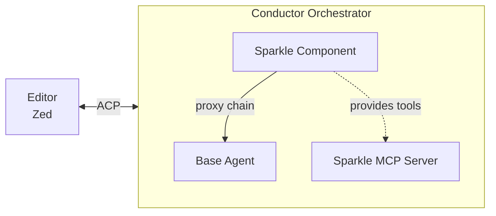
```mermaid
flowchart LR
    Editor[Editor<br/>Zed]

    subgraph Conductor[Conductor Orchestrator]
        Sparkle[Sparkle Component]
        Agent[Base Agent]
        MCP[Sparkle MCP Server]

        Sparkle -->|proxy chain| Agent
        Sparkle -.->|provides tools| MCP
    end

    Editor <-->|ACP| Conductor
```

The Sparkle component:

1. Injects Sparkle MCP server into the agent's tool list during `initialize`
2. Intercepts the first `prompt` and prepends Sparkle embodiment sequence
3. Passes all other messages through transparently

From the editor's perspective, it talks to a normal ACP agent. From the base agent's perspective, it has Sparkle tools available. No code changes required on either side.

This demonstrates P/ACP's core value: adding capabilities through composition rather than modification.

# What we propose to do about it

> What are you proposing to improve the situation?

We will develop an [extension to ACP](https://agentclientprotocol.com/protocol/extensibility) called **P/ACP** (Proxying ACP).

The heart of P/ACP is a proxy chain where each component adds specific capabilities:

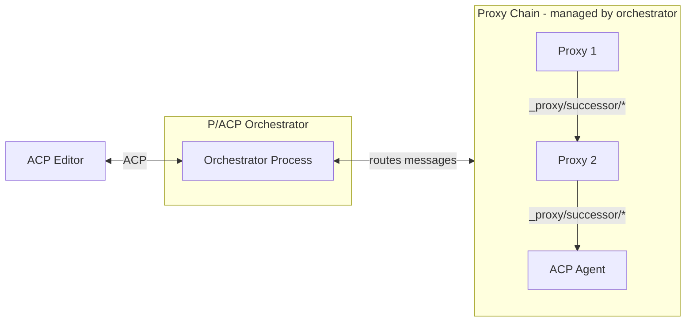
```mermaid
flowchart LR
    Editor[ACP Editor]

    subgraph Orchestrator[P/ACP Orchestrator]
        O[Orchestrator Process]
    end

    subgraph ProxyChain[Proxy Chain - managed by orchestrator]
        P1[Proxy 1]
        P2[Proxy 2]
        Agent[ACP Agent]

        P1 -->|_proxy/successor/*| P2
        P2 -->|_proxy/successor/*| Agent
    end

    Editor <-->|ACP| O
    O <-->|routes messages| ProxyChain
```

P/ACP defines three kinds of actors:

- **Editors** spawn the orchestrator and communicate via standard ACP
- **Orchestrator** manages the proxy chain, appears as a normal ACP agent to editors
- **Proxies** intercept and transform messages, communicate with downstream via `_proxy/successor/*` protocol
- **Agents** provide base AI model behavior using standard ACP

The orchestrator handles message routing, making the proxy chain transparent to editors. Proxies can transform requests, responses, or add side-effects without editors or agents needing P/ACP awareness.

## The Orchestrator: Conductor

P/ACP's orchestrator is called the **Conductor** (binary name: `conductor`). The conductor has three core responsibilities:

1. **Process Management** - Creates and manages component processes based on command-line configuration
2. **Message Routing** - Routes messages between editor, components, and agent through the proxy chain
3. **Capability Adaptation** - Observes component capabilities and adapts between them

**Key adaptation: MCP Bridge**

- If the agent supports `mcp_acp_transport`, conductor passes MCP servers with ACP transport through unchanged
- If not, conductor spawns `conductor mcp $port` processes to bridge between stdio (MCP) and ACP messages
- Components can provide MCP servers without requiring agent modifications
- See "MCP Bridge" section in Implementation Details for full protocol

**Other adaptations** include session pre-population, streaming support, content types, and tool formats.

**From the editor's perspective**, it spawns one conductor process and communicates using normal ACP over stdio. The editor doesn't know about the proxy chain.

**Command-line usage:**

```bash
# Agent mode - manages proxy chain
conductor agent sparkle-acp claude-code-acp

# MCP mode - bridges stdio to TCP for MCP-over-ACP
conductor mcp 54321
```

To editors, the conductor is a normal ACP agent - no special capabilities are advertised upstream.

**Proxy Capability Handshake:**

The conductor uses a two-way capability handshake to verify that proxy components can fulfill their responsibilities:

1. **Conductor offers proxy capability** - When initializing non-last components (proxies), the conductor includes `"proxy": true` in the `_meta` field of the InitializeRequest
2. **Component accepts proxy capability** - The component must respond with `"proxy": true` in the `_meta` field of its InitializeResponse
3. **Last component (agent)** - The final component is treated as a standard ACP agent and does NOT receive the proxy capability offer

**Why a two-way handshake?** The proxy capability is an _active protocol_ - it requires the component to handle `_proxy/successor/*` messages and route communications appropriately. Unlike passive capabilities (like "http" or "sse") which are just declarations, proxy components must actively participate in message routing. If a component doesn't respond with the proxy capability, the conductor fails initialization with an error like "component X is not a proxy", since that component cannot fulfill its required function in the chain.

# Shiny future

> How will things will play out once this feature exists?

## Composable Agent Ecosystems

P/ACP enables a marketplace of reusable proxy components. Developers can:

- Compose custom agent pipelines from independently-developed proxies
- Share proxies across different editors and agents
- Test and debug proxies in isolation
- Mix community-developed and custom proxies

## Simplified Agent Development

Agent developers can focus on core model behavior without implementing cross-cutting concerns:

- Logging, metrics, and observability become proxy responsibilities
- Rate limiting and caching handled externally
- Content filtering and safety policies applied consistently

## Editor Simplicity

Editors gain enhanced functionality without custom integrations:

- Add sophisticated agent behaviors by changing proxy chain configuration
- Support new agent features without editor updates
- Maintain compatibility with any ACP agent

## Standardization Path

As the ecosystem matures, successful patterns may be:

- Standardized in ACP specification itself
- Adopted by other agent protocols
- Used as reference implementations for proxy architectures

## Implemented Extensions

**MCP Bridge** - ✅ Implemented via the `_mcp/*` protocol (see "Implementation details and plan" section). Components can provide MCP servers using ACP transport, enabling tool provision without agents needing P/ACP awareness. The conductor bridges between agents lacking native support and components.

## Future Protocol Extensions

Extensions under consideration for future development:

**Agent-Initiated Messages** - Allow components to send messages after the agent has sent end-turn, outside the normal request-response cycle. Use cases include background task completion notifications, time-based reminders, or autonomous checkpoint creation.

**Session Pre-Population** - Create sessions with existing conversation history. Conductor adapts based on agent capabilities: uses native support if available, otherwise synthesizes a dummy prompt containing the history, intercepts the response, and starts the real session.

**Rich Content Types** - Extend content types beyond text to include HTML panels, interactive GUI components, or other structured formats. Components can transform between content types based on what downstream agents support.

# Implementation details and plan

> Tell me more about your implementation. What is your detailed implementation plan?

The implementation focuses on building the Conductor and demonstrating the Sparkle integration use case.

## P/ACP protocol

### Definition: Editor vs Agent of a proxy

For an P/ACP proxy, the "editor" is defined as the upstream connection and the "agent" is the downstream connection.


```mermaid
flowchart LR
    Editor --> Proxy --> Agent
```

### P/ACP editor capabilities

An P/ACP-aware editor provides the following capability during ACP initialization:

```json
/// Including the symposium section *at all* means that the editor
/// supports symposium proxy initialization.
"_meta": {
    "symposium": {
        "version": "1.0",
        "html_panel": true,      // or false, if this is the ToEditor proxy
        "file_comment": true,    // or false, if this is the ToEditor proxy
    }
}
```

P/ACP proxies forward the capabilities they receive from their editor.

### P/ACP component capabilities

P/ACP uses capabilities in the `_meta` field for the proxy handshake:

**Proxy capability (two-way handshake):**

The conductor offers the proxy capability to non-last components in InitializeRequest:

```json
// InitializeRequest from conductor to proxy component
"_meta": {
    "symposium": {
        "version": "1.0",
        "proxy": true
    }
}
```

The component must accept by responding with the proxy capability in InitializeResponse:

```json
// InitializeResponse from proxy component to conductor
"_meta": {
    "symposium": {
        "version": "1.0",
        "proxy": true
    }
}
```

If a component that was offered the proxy capability does not respond with it, the conductor fails initialization.

**Agent capability:**
The last component in the chain (the agent) is NOT offered the proxy capability and does not need to respond with it. Agents are just normal ACP agents with no P/ACP awareness required.

### The `_proxy/successor/{send,receive}` protocol

Proxies communicate with their downstream component (next proxy or agent) through special extension messages handled by the orchestrator:

**`_proxy/successor/send/request`** - Proxy wants to send a request downstream:

```json
{
  "method": "_proxy/successor/send/request",
  "params": {
    "message": <ACP_REQUEST>
  }
}
```

**`_proxy/successor/send/notification`** - Proxy wants to send a notification downstream:

```json
{
  "method": "_proxy/successor/send/notification",
  "params": {
    "message": <ACP_NOTIFICATION>
  }
}
```

**`_proxy/successor/receive/request`** - Orchestrator delivers a request from downstream:

```json
{
  "method": "_proxy/successor/receive/request",
  "params": {
    "message": <ACP_REQUEST>
  }
}
```

**`_proxy/successor/receive/notification`** - Orchestrator delivers a notification from downstream:

```json
{
  "method": "_proxy/successor/receive/notification",
  "params": {
    "message": <ACP_NOTIFICATION>
  }
}
```

**Message flow example:**

1. Editor sends ACP `prompt` request to orchestrator
2. Orchestrator forwards to Proxy1 as normal ACP message
3. Proxy1 transforms and sends `_proxy/successor/send/request { message: <modified_prompt> }`
4. Orchestrator routes that to Proxy2 as normal ACP `prompt`
5. Eventually reaches agent, response flows back through chain
6. Orchestrator wraps responses going upstream appropriately

**Transparent proxy pattern:**
A pass-through proxy is trivial - just forward everything:

```rust
match message {
    // Forward requests from editor to successor
    AcpRequest(req) => send_to_successor_request(req),

    // Forward notifications from editor to successor
    AcpNotification(notif) => send_to_successor_notification(notif),

    // Forward from successor back to editor
    ExtRequest("_proxy/successor/receive/request", msg) => respond_to_editor(msg),
    ExtNotification("_proxy/successor/receive/notification", msg) => forward_to_editor(msg),
}
```

### The MCP Bridge: `_mcp/*` Protocol

P/ACP enables components to provide MCP servers that communicate over ACP messages rather than traditional stdio. This allows components to handle MCP tool calls without agents needing special P/ACP awareness.

#### MCP Server Declaration with ACP Transport

Components declare MCP servers with ACP transport by using the HTTP MCP server format with a special URL scheme:

```json
{
  "tools": {
    "mcpServers": {
      "sparkle": {
        "transport": "http",
        "url": "acp:550e8400-e29b-41d4-a716-446655440000",
        "headers": {}
      }
    }
  }
}
```

The `acp:$UUID` URL signals ACP transport. The component generates the UUID to identify which component handles calls to this MCP server.

#### Agent Capability: `mcp_acp_transport`

Agents that natively support MCP-over-ACP declare this capability:

```json
{
  "_meta": {
    "mcp_acp_transport": true
  }
}
```

**Conductor behavior:**

- If the final agent has `mcp_acp_transport: true`, conductor passes MCP server declarations through unchanged
- If the final agent lacks this capability, conductor performs **bridging adaptation**:
  1. Binds a fresh TCP port (e.g., `localhost:54321`)
  2. Transforms the MCP server declaration to use `conductor mcp $port` as the command
  3. Spawns `conductor mcp $port` which connects back via TCP and bridges to ACP messages
  4. Always advertises `mcp_acp_transport: true` to intermediate components

#### Bridging Transformation Example

**Original MCP server spec (from component):**

```json
{
  "sparkle": {
    "transport": "http",
    "url": "acp:550e8400-e29b-41d4-a716-446655440000",
    "headers": {}
  }
}
```

**Transformed spec (passed to agent without `mcp_acp_transport`):**

```json
{
  "sparkle": {
    "command": "conductor",
    "args": ["mcp", "54321"],
    "transport": "stdio"
  }
}
```

The agent thinks it's talking to a normal MCP server over stdio. The `conductor mcp` process bridges between stdio (MCP JSON-RPC) and TCP (connection to main conductor), which then translates to ACP `_mcp/*` messages.

#### MCP Message Flow Protocol

When MCP tool calls occur, they flow as ACP extension messages:

**`_mcp/client_to_server/request`** - Agent calling an MCP tool (flows backward up chain):

```json
{
  "jsonrpc": "2.0",
  "id": "T1",
  "method": "_mcp/client_to_server/request",
  "params": {
    "url": "acp:550e8400-e29b-41d4-a716-446655440000",
    "message": {
      "jsonrpc": "2.0",
      "id": "mcp-123",
      "method": "tools/call",
      "params": {
        "name": "embody_sparkle",
        "arguments": {}
      }
    }
  }
}
```

**Response:**

```json
{
  "jsonrpc": "2.0",
  "id": "T1",
  "result": {
    "message": {
      "jsonrpc": "2.0",
      "id": "mcp-123",
      "result": {
        "content": [{ "type": "text", "text": "Embodiment complete" }]
      }
    }
  }
}
```

**`_mcp/client_to_server/notification`** - Agent sending notification to MCP server:

```json
{
  "jsonrpc": "2.0",
  "method": "_mcp/client_to_server/notification",
  "params": {
    "url": "acp:550e8400-e29b-41d4-a716-446655440000",
    "message": {
      "jsonrpc": "2.0",
      "method": "notifications/cancelled",
      "params": {}
    }
  }
}
```

**`_mcp/server_to_client/request`** - MCP server calling back to agent (flows forward down chain):

```json
{
  "jsonrpc": "2.0",
  "id": "S1",
  "method": "_mcp/server_to_client/request",
  "params": {
    "url": "acp:550e8400-e29b-41d4-a716-446655440000",
    "message": {
      "jsonrpc": "2.0",
      "id": "mcp-456",
      "method": "sampling/createMessage",
      "params": {
        "messages": [...],
        "modelPreferences": {...}
      }
    }
  }
}
```

**`_mcp/server_to_client/notification`** - MCP server sending notification to agent:

```json
{
  "jsonrpc": "2.0",
  "method": "_mcp/server_to_client/notification",
  "params": {
    "url": "acp:550e8400-e29b-41d4-a716-446655440000",
    "message": {
      "jsonrpc": "2.0",
      "method": "notifications/progress",
      "params": {
        "progressToken": "token-1",
        "progress": 50,
        "total": 100
      }
    }
  }
}
```

#### Message Routing

**Client→Server messages** (agent calling MCP tools):

- Flow **backward** up the proxy chain (agent → conductor → components)
- Component matches on `params.url` to identify which MCP server
- Component extracts `params.message`, handles the MCP call, responds

**Server→Client messages** (MCP server callbacks):

- Flow **forward** down the proxy chain (component → conductor → agent)
- Component initiates when its MCP server needs to call back (sampling, logging, progress)
- Conductor routes to agent (or via bridge if needed)

#### Conductor MCP Mode

The conductor binary has two modes:

1. **Agent mode**: `conductor agent [proxies...] agent`
   - Manages P/ACP proxy chain
   - Routes ACP messages

2. **MCP mode**: `conductor mcp $port`
   - Acts as MCP server over stdio
   - Connects to `localhost:$port` via TCP
   - Bridges MCP JSON-RPC (stdio) ↔ raw JSON-RPC (TCP to main conductor)

When bridging is needed, the main conductor spawns `conductor mcp $port` as the child process that the agent communicates with via stdio.

### Additional Extension Messages

Proxies can define their own extension messages beyond `_proxy/successor/*` to provide specific capabilities. Examples might include:

- **Logging/observability**: `_proxy/log` messages for structured logging
- **Metrics**: `_proxy/metric` messages for tracking usage
- **Configuration**: `_proxy/config` messages for dynamic reconfiguration

The orchestrator can handle routing these messages appropriately, or they can be handled by specific proxies in the chain.

These extensions are beyond the scope of this initial RFD and will be defined as needed by specific proxy implementations.

# Implementation progress

> What is the current status of implementation and what are the next steps?

## Current Status: Implementation Phase

**Completed:**

- ✅ P/ACP protocol design with Conductor orchestrator architecture
- ✅ `_proxy/successor/{send,receive}` message protocol defined
- ✅ `scp` Rust crate with JSON-RPC layer and ACP message types
- ✅ Comprehensive JSON-RPC test suite (21 tests)
- ✅ Proxy message type definitions (`ToSuccessorRequest`, etc.)

**In Progress:**

- Conductor orchestrator implementation
- Sparkle P/ACP component
- MCP Bridge implementation (see checklist below)

### MCP Bridge Implementation Checklist

**Phase 1: Conductor MCP Mode (COMPLETE ✅)**

- [x] Implement `conductor mcp $port` CLI parsing
- [x] TCP connection to `localhost:$port`
- [x] Stdio → TCP bridging (read from stdin, send via TCP)
- [x] TCP → Stdio bridging (read from TCP, write to stdout)
- [x] Newline-delimited JSON framing
- [x] Error handling (connection failures, parse errors, reconnection logic)
- [x] Unit tests for message bridging
- [x] Integration test: standalone MCP bridge with mock MCP client/server

**Phase 2: Conductor Agent Mode - MCP Detection & Bridging**

- [ ] Detect `"transport": "http", "url": "acp:$UUID"` MCP servers in initialization
- [ ] Check final agent for `mcp_acp_transport` capability
- [ ] Bind ephemeral TCP ports when bridging needed
- [ ] Transform MCP server specs to use `conductor mcp $port`
- [ ] Spawn `conductor mcp $port` subprocess per ACP-transport MCP server
- [ ] Store mapping: `UUID → TCP port → bridge process`
- [ ] Always advertise `mcp_acp_transport: true` to intermediate components
- [ ] Integration test: full chain with MCP bridging

**Phase 3: `_mcp/*` Message Routing**

- [ ] Route `_mcp/client_to_server/request` (TCP → ACP, backward up chain)
- [ ] Route `_mcp/client_to_server/notification` (TCP → ACP, backward)
- [ ] Route `_mcp/server_to_client/request` (ACP → TCP, forward down chain)
- [ ] Route `_mcp/server_to_client/notification` (ACP → TCP, forward)
- [ ] URL matching for component routing (`params.url` matches UUID)
- [ ] Response routing back through bridge
- [ ] Integration test: full `_mcp/*` message flow

**Phase 4: Bridge Lifecycle Management**

- [ ] Clean up bridge processes on session end
- [ ] Handle bridge process crashes
- [ ] Handle component crashes (clean up associated bridges)
- [ ] TCP connection cleanup on errors
- [ ] Port cleanup and reuse

**Phase 5: Component-Side MCP Integration**

- [ ] Sparkle component declares ACP-transport MCP server
- [ ] Sparkle handles `_mcp/client_to_server/*` messages
- [ ] Sparkle initiates `_mcp/server_to_client/*` callbacks
- [ ] End-to-end test: Sparkle embodiment via MCP bridge

## Phase 1: Minimal Sparkle Demo

**Goal:** Demonstrate Sparkle integration through P/ACP composition.

**Components:**

1. **Conductor orchestrator** - Process management, message routing, capability adaptation
2. **Sparkle P/ACP component** - Injects Sparkle MCP server, handles embodiment sequence
3. **Integration test** - Validates end-to-end flow with mock editor/agent

**Demo flow:**

```
Zed → Conductor → Sparkle Component → Claude
                ↓
           Sparkle MCP Server
```

**Success criteria:**

- Sparkle MCP server appears in agent's tool list
- First prompt triggers Sparkle embodiment sequence
- Subsequent prompts work normally
- All other ACP messages pass through unchanged

### Detailed MVP Walkthrough

This section shows the exact message flows for the minimal Sparkle demo.

**Understanding UUIDs in the flow:**

There are two distinct types of UUIDs in these sequences:

1. **Message IDs (JSON-RPC request IDs)**: These identify individual JSON-RPC requests and must be tracked to route responses correctly. When a component forwards a message using `_proxy/successor/request`, it creates a fresh message ID for the downstream request and remembers the mapping to route the response back.

2. **Session IDs (ACP session identifiers)**: These identify ACP sessions and flow through the chain unchanged. The agent creates a session ID, and all components pass it back unmodified.

**Conductor's routing rules:**

1. Message from Editor → Forward "as is" to first component (same message ID)
2. `_proxy/successor/request` from component → Unwrap payload and send to next component (using message ID from the wrapper)
3. Response from downstream → Send back to whoever made the `_proxy` request
4. First component's response → Send back to Editor

Components don't talk directly to each other - all communication flows through Conductor via the `_proxy` protocol.

#### Scenario 1: Initialization and Session Creation

The editor spawns Conductor with component names, Conductor spawns the components, and initialization flows through the chain.

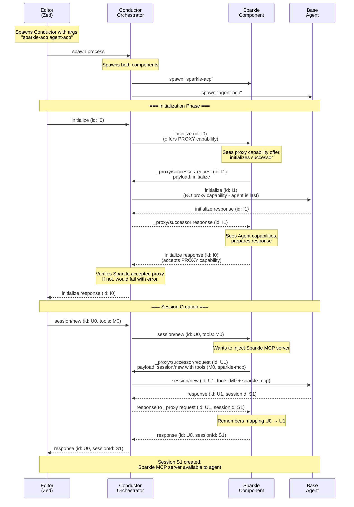
```mermaid
sequenceDiagram
    participant Editor as Editor<br/>(Zed)
    participant Conductor as Conductor<br/>Orchestrator
    participant Sparkle as Sparkle<br/>Component
    participant Agent as Base<br/>Agent

    Note over Editor: Spawns Conductor with args:<br/>"sparkle-acp agent-acp"
    Editor->>Conductor: spawn process
    activate Conductor

    Note over Conductor: Spawns both components
    Conductor->>Sparkle: spawn "sparkle-acp"
    activate Sparkle
    Conductor->>Agent: spawn "agent-acp"
    activate Agent

    Note over Editor,Agent: === Initialization Phase ===

    Editor->>Conductor: initialize (id: I0)
    Conductor->>Sparkle: initialize (id: I0)<br/>(offers PROXY capability)

    Note over Sparkle: Sees proxy capability offer,<br/>initializes successor

    Sparkle->>Conductor: _proxy/successor/request (id: I1)<br/>payload: initialize
    Conductor->>Agent: initialize (id: I1)<br/>(NO proxy capability - agent is last)
    Agent-->>Conductor: initialize response (id: I1)
    Conductor-->>Sparkle: _proxy/successor response (id: I1)

    Note over Sparkle: Sees Agent capabilities,<br/>prepares response

    Sparkle-->>Conductor: initialize response (id: I0)<br/>(accepts PROXY capability)

    Note over Conductor: Verifies Sparkle accepted proxy.<br/>If not, would fail with error.

    Conductor-->>Editor: initialize response (id: I0)

    Note over Editor,Agent: === Session Creation ===

    Editor->>Conductor: session/new (id: U0, tools: M0)
    Conductor->>Sparkle: session/new (id: U0, tools: M0)

    Note over Sparkle: Wants to inject Sparkle MCP server

    Sparkle->>Conductor: _proxy/successor/request (id: U1)<br/>payload: session/new with tools (M0, sparkle-mcp)
    Conductor->>Agent: session/new (id: U1, tools: M0 + sparkle-mcp)

    Agent-->>Conductor: response (id: U1, sessionId: S1)
    Conductor-->>Sparkle: response to _proxy request (id: U1, sessionId: S1)

    Note over Sparkle: Remembers mapping U0 → U1

    Sparkle-->>Conductor: response (id: U0, sessionId: S1)
    Conductor-->>Editor: response (id: U0, sessionId: S1)

    Note over Editor,Agent: Session S1 created,<br/>Sparkle MCP server available to agent
```

**Key messages:**

1. **Editor → Conductor: initialize** (id: I0)

   ```json
   {
     "jsonrpc": "2.0",
     "id": "I0",
     "method": "initialize",
     "params": {
       "protocolVersion": "0.1.0",
       "capabilities": {},
       "clientInfo": { "name": "Zed", "version": "0.1.0" }
     }
   }
   ```

2. **Conductor → Sparkle: initialize** (id: I0, with PROXY capability)

   ```json
   {
     "jsonrpc": "2.0",
     "id": "I0",
     "method": "initialize",
     "params": {
       "protocolVersion": "0.1.0",
       "capabilities": {
         "_meta": {
           "symposium": {
             "version": "1.0",
             "proxy": true
           }
         }
       },
       "clientInfo": { "name": "Conductor", "version": "0.1.0" }
     }
   }
   ```

3. **Sparkle → Conductor: \_proxy/successor/request** (id: I1, wrapping initialize)

   ```json
   {
     "jsonrpc": "2.0",
     "id": "I1",
     "method": "_proxy/successor/request",
     "params": {
       "message": {
         "method": "initialize",
         "params": {
           "protocolVersion": "0.1.0",
           "capabilities": {},
           "clientInfo": { "name": "Sparkle", "version": "0.1.0" }
         }
       }
     }
   }
   ```

4. **Conductor → Agent: initialize** (id: I1, unwrapped, without PROXY capability)

   ```json
   {
     "jsonrpc": "2.0",
     "id": "I1",
     "method": "initialize",
     "params": {
       "protocolVersion": "0.1.0",
       "capabilities": {},
       "clientInfo": { "name": "Sparkle", "version": "0.1.0" }
     }
   }
   ```

5. **Agent → Conductor: initialize response** (id: I1)

   ```json
   {
     "jsonrpc": "2.0",
     "id": "I1",
     "result": {
       "protocolVersion": "0.1.0",
       "capabilities": {},
       "serverInfo": { "name": "claude-code-acp", "version": "0.1.0" }
     }
   }
   ```

6. **Conductor → Sparkle: \_proxy/successor response** (id: I1, wrapping Agent's response)

   ```json
   {
     "jsonrpc": "2.0",
     "id": "I1",
     "result": {
       "protocolVersion": "0.1.0",
       "capabilities": {},
       "serverInfo": { "name": "claude-code-acp", "version": "0.1.0" }
     }
   }
   ```

7. **Sparkle → Conductor: initialize response** (id: I0, accepting proxy capability)

   ```json
   {
     "jsonrpc": "2.0",
     "id": "I0",
     "result": {
       "protocolVersion": "0.1.0",
       "capabilities": {
         "_meta": {
           "symposium": {
             "version": "1.0",
             "proxy": true
           }
         }
       },
       "serverInfo": { "name": "Sparkle + claude-code-acp", "version": "0.1.0" }
     }
   }
   ```

   Note: Sparkle MUST include `"proxy": true` in its response since it was offered the proxy capability. If this field is missing, Conductor will fail initialization with an error.

8. **Editor → Conductor: session/new** (id: U0)

   ```json
   {
     "jsonrpc": "2.0",
     "id": "U0",
     "method": "session/new",
     "params": {
       "tools": {
         "mcpServers": {
           "filesystem": { "command": "mcp-filesystem", "args": [] }
         }
       }
     }
   }
   ```

9. **Conductor → Sparkle: session/new** (id: U0, forwarded as-is)

   ```json
   {
     "jsonrpc": "2.0",
     "id": "U0",
     "method": "session/new",
     "params": {
       "tools": {
         "mcpServers": {
           "filesystem": { "command": "mcp-filesystem", "args": [] }
         }
       }
     }
   }
   ```

10. **Sparkle → Conductor: \_proxy/successor/request** (id: U1, with injected Sparkle MCP)

```json
{
  "jsonrpc": "2.0",
  "id": "U1",
  "method": "_proxy/successor/request",
  "params": {
    "message": {
      "method": "session/new",
      "params": {
        "tools": {
          "mcpServers": {
            "filesystem": { "command": "mcp-filesystem", "args": [] },
            "sparkle": { "command": "sparkle-mcp", "args": [] }
          }
        }
      }
    }
  }
}
```

11. **Conductor → Agent: session/new** (id: U1, unwrapped from \_proxy message)

```json
{
  "jsonrpc": "2.0",
  "id": "U1",
  "method": "session/new",
  "params": {
    "tools": {
      "mcpServers": {
        "filesystem": { "command": "mcp-filesystem", "args": [] },
        "sparkle": { "command": "sparkle-mcp", "args": [] }
      }
    }
  }
}
```

12. **Agent → Conductor: response** (id: U1, with new session S1)

```json
{
  "jsonrpc": "2.0",
  "id": "U1",
  "result": {
    "sessionId": "S1",
    "serverInfo": { "name": "claude-code-acp", "version": "0.1.0" }
  }
}
```

13. **Conductor → Sparkle: \_proxy/successor response** (id: U1)

```json
{
  "jsonrpc": "2.0",
  "id": "U1",
  "result": {
    "sessionId": "S1",
    "serverInfo": { "name": "claude-code-acp", "version": "0.1.0" }
  }
}
```

14. **Sparkle → Conductor: response** (id: U0, with session S1)

```json
{
  "jsonrpc": "2.0",
  "id": "U0",
  "result": {
    "sessionId": "S1",
    "serverInfo": { "name": "Conductor + Sparkle", "version": "0.1.0" }
  }
}
```

#### Scenario 2: First Prompt (Sparkle Embodiment)

When the first prompt arrives, Sparkle intercepts it and runs the embodiment sequence before forwarding the actual user prompt.

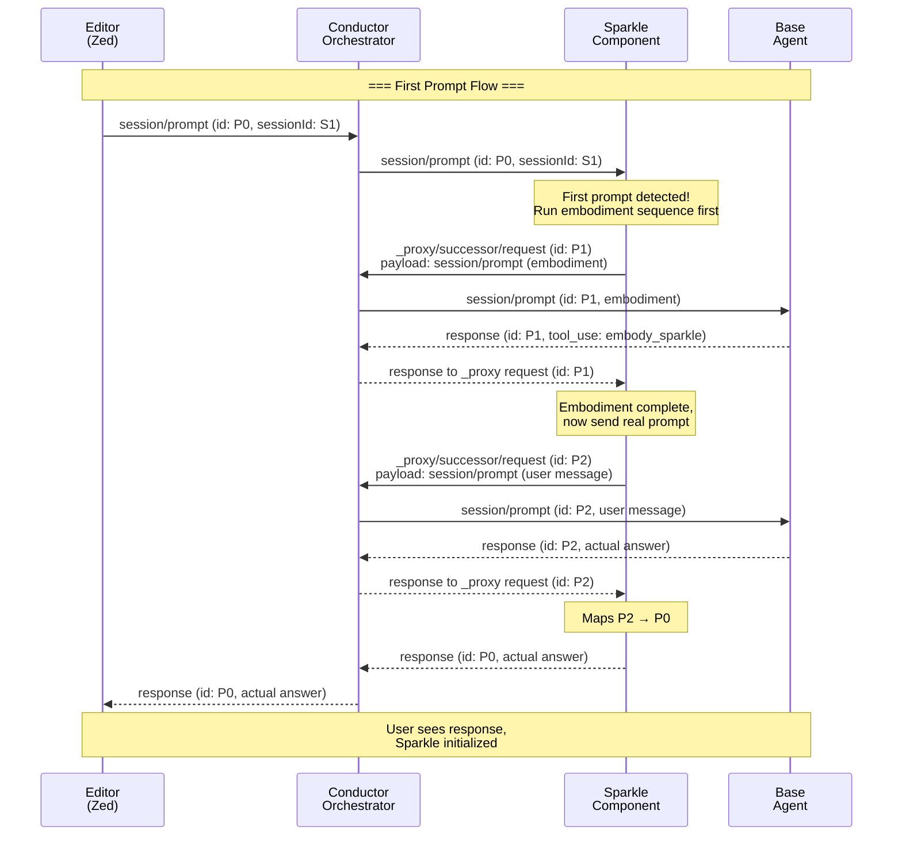
```mermaid
sequenceDiagram
    participant Editor as Editor<br/>(Zed)
    participant Conductor as Conductor<br/>Orchestrator
    participant Sparkle as Sparkle<br/>Component
    participant Agent as Base<br/>Agent

    Note over Editor,Agent: === First Prompt Flow ===

    Editor->>Conductor: session/prompt (id: P0, sessionId: S1)
    Conductor->>Sparkle: session/prompt (id: P0, sessionId: S1)

    Note over Sparkle: First prompt detected!<br/>Run embodiment sequence first

    Sparkle->>Conductor: _proxy/successor/request (id: P1)<br/>payload: session/prompt (embodiment)
    Conductor->>Agent: session/prompt (id: P1, embodiment)

    Agent-->>Conductor: response (id: P1, tool_use: embody_sparkle)
    Conductor-->>Sparkle: response to _proxy request (id: P1)

    Note over Sparkle: Embodiment complete,<br/>now send real prompt

    Sparkle->>Conductor: _proxy/successor/request (id: P2)<br/>payload: session/prompt (user message)
    Conductor->>Agent: session/prompt (id: P2, user message)

    Agent-->>Conductor: response (id: P2, actual answer)
    Conductor-->>Sparkle: response to _proxy request (id: P2)

    Note over Sparkle: Maps P2 → P0

    Sparkle-->>Conductor: response (id: P0, actual answer)
    Conductor-->>Editor: response (id: P0, actual answer)

    Note over Editor,Agent: User sees response,<br/>Sparkle initialized
```

**Key messages:**

1. **Editor → Conductor: session/prompt** (id: P0, user's first message)

   ```json
   {
     "jsonrpc": "2.0",
     "id": "P0",
     "method": "session/prompt",
     "params": {
       "sessionId": "S1",
       "messages": [
         { "role": "user", "content": "Hello! Can you help me with my code?" }
       ]
     }
   }
   ```

2. **Conductor → Sparkle: session/prompt** (id: P0, forwarded as-is)

   ```json
   {
     "jsonrpc": "2.0",
     "id": "P0",
     "method": "session/prompt",
     "params": {
       "sessionId": "S1",
       "messages": [
         { "role": "user", "content": "Hello! Can you help me with my code?" }
       ]
     }
   }
   ```

3. **Sparkle → Conductor: \_proxy/successor/request** (id: P1, embodiment sequence)

   ```json
   {
     "jsonrpc": "2.0",
     "id": "P1",
     "method": "_proxy/successor/request",
     "params": {
       "message": {
         "method": "session/prompt",
         "params": {
           "sessionId": "S1",
           "messages": [
             {
               "role": "user",
               "content": "Please use the embody_sparkle tool to load your collaborative patterns."
             }
           ]
         }
       }
     }
   }
   ```

4. **Conductor → Agent: session/prompt** (id: P1, unwrapped embodiment)

   ```json
   {
     "jsonrpc": "2.0",
     "id": "P1",
     "method": "session/prompt",
     "params": {
       "sessionId": "S1",
       "messages": [
         {
           "role": "user",
           "content": "Please use the embody_sparkle tool to load your collaborative patterns."
         }
       ]
     }
   }
   ```

5. **Agent → Conductor: response** (id: P1, embodiment tool call)

   ```json
   {
     "jsonrpc": "2.0",
     "id": "P1",
     "result": {
       "role": "assistant",
       "content": [
         {
           "type": "tool_use",
           "id": "tool-1",
           "name": "embody_sparkle",
           "input": {}
         }
       ]
     }
   }
   ```

6. **Sparkle → Conductor: \_proxy/successor/request** (id: P2, actual user prompt)

   ```json
   {
     "jsonrpc": "2.0",
     "id": "P2",
     "method": "_proxy/successor/request",
     "params": {
       "message": {
         "method": "session/prompt",
         "params": {
           "sessionId": "S1",
           "messages": [
             {
               "role": "user",
               "content": "Hello! Can you help me with my code?"
             }
           ]
         }
       }
     }
   }
   ```

7. **Conductor → Agent: session/prompt** (id: P2, unwrapped user prompt)

   ```json
   {
     "jsonrpc": "2.0",
     "id": "P2",
     "method": "session/prompt",
     "params": {
       "sessionId": "S1",
       "messages": [
         { "role": "user", "content": "Hello! Can you help me with my code?" }
       ]
     }
   }
   ```

8. **Sparkle → Conductor: response** (id: P0, forwarded to editor)
   ```json
   {
     "jsonrpc": "2.0",
     "id": "P0",
     "result": {
       "role": "assistant",
       "content": "I'd be happy to help you with your code! What would you like to work on?"
     }
   }
   ```

#### Scenario 3: Subsequent Prompts (Pass-Through)

After embodiment, Sparkle passes all messages through transparently.

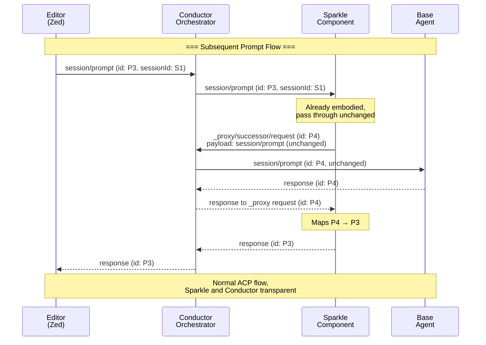
```mermaid
sequenceDiagram
    participant Editor as Editor<br/>(Zed)
    participant Conductor as Conductor<br/>Orchestrator
    participant Sparkle as Sparkle<br/>Component
    participant Agent as Base<br/>Agent

    Note over Editor,Agent: === Subsequent Prompt Flow ===

    Editor->>Conductor: session/prompt (id: P3, sessionId: S1)
    Conductor->>Sparkle: session/prompt (id: P3, sessionId: S1)

    Note over Sparkle: Already embodied,<br/>pass through unchanged

    Sparkle->>Conductor: _proxy/successor/request (id: P4)<br/>payload: session/prompt (unchanged)
    Conductor->>Agent: session/prompt (id: P4, unchanged)

    Agent-->>Conductor: response (id: P4)
    Conductor-->>Sparkle: response to _proxy request (id: P4)

    Note over Sparkle: Maps P4 → P3

    Sparkle-->>Conductor: response (id: P3)
    Conductor-->>Editor: response (id: P3)

    Note over Editor,Agent: Normal ACP flow,<br/>Sparkle and Conductor transparent
```

**Key messages:**

1. **Editor → Conductor: session/prompt** (id: P3)

   ```json
   {
     "jsonrpc": "2.0",
     "id": "P3",
     "method": "session/prompt",
     "params": {
       "sessionId": "S1",
       "messages": [
         {
           "role": "user",
           "content": "Can you refactor the authenticate function?"
         }
       ]
     }
   }
   ```

2. **Sparkle → Conductor: \_proxy/successor/request** (id: P4, message unchanged)

   ```json
   {
     "jsonrpc": "2.0",
     "id": "P4",
     "method": "_proxy/successor/request",
     "params": {
       "message": {
         "method": "session/prompt",
         "params": {
           "sessionId": "S1",
           "messages": [
             {
               "role": "user",
               "content": "Can you refactor the authenticate function?"
             }
           ]
         }
       }
     }
   }
   ```

3. **Conductor → Agent: session/prompt** (id: P4, unwrapped)

   ```json
   {
     "jsonrpc": "2.0",
     "id": "P4",
     "method": "session/prompt",
     "params": {
       "sessionId": "S1",
       "messages": [
         {
           "role": "user",
           "content": "Can you refactor the authenticate function?"
         }
       ]
     }
   }
   ```

4. **Sparkle → Conductor: response** (id: P3, forwarded to editor)
   ```json
   {
     "jsonrpc": "2.0",
     "id": "P3",
     "result": {
       "role": "assistant",
       "content": "I'll help you refactor the authenticate function..."
     }
   }
   ```

Note that even though Sparkle is passing messages through "transparently", it still uses the `_proxy/successor/request` protocol. This maintains the consistent routing pattern where all downstream communication flows through Conductor.

**Implementation Note on Embodiment Responses:**

For the MVP, when Sparkle runs the embodiment sequence before the user's actual prompt, it will buffer both responses and concatenate them before sending back to the editor. This makes the embodiment transparent but loses some structure. A future RFD will explore richer content types (like `subconversation`) that would allow editors to distinguish between nested exchanges and main responses.

## Phase 2: Tool Interception (FUTURE)

**Goal:** Route MCP tool calls through the proxy chain.

Conductor registers as a dummy MCP server. When Claude calls a Sparkle tool, the call routes back through the proxy chain to the Sparkle component for handling. This enables richer component interactions without requiring agents to understand P/ACP.

## Phase 3: Additional Components (FUTURE)

Build additional P/ACP components that demonstrate different use cases:

- Session history/context management
- Logging and observability
- Rate limiting
- Content filtering

These will validate the protocol design and inform refinements.

## Testing Strategy

**Unit tests:**

- Test message serialization/deserialization
- Test process spawning logic
- Test stdio communication

**Integration tests:**

- Spawn real proxy chains
- Use actual ACP agents for end-to-end validation
- Test error handling and cleanup

**Manual testing:**

- Use with VSCode + ACP-aware agents
- Verify with different proxy configurations
- Test process management under various failure modes

# Frequently asked questions

> What questions have arisen over the course of authoring this document or during subsequent discussions?

## What alternative approaches did you consider, and why did you settle on this one?

We considered extending MCP directly, but MCP is focused on tool provision rather than conversation flow control. We also looked at building everything as VSCode extensions, but that would lock us into a single editor ecosystem.

P/ACP's proxy chain approach provides the right balance of modularity and compatibility - components can be developed independently while still working together.

## How does this relate to other agent protocols like Google's A2A?

P/ACP is complementary to protocols like A2A. While A2A focuses on agent-to-agent communication for remote services, P/ACP focuses on composing the user-facing development experience. You could imagine P/ACP components that use A2A internally to coordinate with remote agents.

## What about security concerns with arbitrary proxy chains?

Users are responsible for the proxies they choose to run, similar to how they're responsible for the software they install. Proxies can intercept and modify all communication, so trust is essential. For future versions, we're considering approaches like Microsoft's Wassette (WASM-based capability restrictions) to provide sandboxed execution environments.

## What about the chat GUI interface?

We currently have a minimal chat GUI working in VSCode that can exchange basic messages with ACP agents. However, a richer chat interface with features like message history, streaming support, context providers, and interactive elements remains TBD.

Continue.dev has solved many of the hard problems for production-quality chat interfaces in VS Code extensions. Their GUI is specifically designed to be reusable - they use the exact same codebase for both VS Code and JetBrains IDEs by implementing different adapter layers.

Their architecture proves that message-passing protocols can cleanly separate GUI concerns from backend logic, which aligns perfectly with P/ACP's composable design. When we're ready to enhance the chat interface, we can evaluate whether to build on Continue.dev's foundation or develop our own approach based on what we learn from the P/ACP proxy framework.

The Apache 2.0 license makes this legally straightforward, and their well-documented message protocols provide a clear integration path.

## Why not just use hooks or plugins?

Hooks are fundamentally limited to what the host application anticipated. P/ACP proxies can intercept and modify the entire conversation flow, enabling innovations that the original tool designer never envisioned. This is the difference between customization and true composability.

## What about performance implications of the proxy chain?

The proxy chain does add some latency as messages pass through multiple hops. However, we don't expect this to be noticeable for typical development workflows. Most interactions are human-paced rather than high-frequency, and the benefits of composability outweigh the minimal latency cost.

## How will users discover and configure proxy chains?

This will be determined over time as the ecosystem develops. We expect solutions to emerge organically, potentially including registries, configuration files, or marketplace-style discovery mechanisms.

## What about resource management with multiple proxy processes?

Each proxy manages the lifecycle of processes it starts. When a proxy terminates, it cleans up its downstream processes. This creates a natural cleanup chain that prevents resource leaks.

# Revision history

Initial draft based on architectural discussions.
````

## File: md/SUMMARY.md
````markdown
# Summary

[Introduction](./introduction.md)

# Core Library (agent-client-protocol)

- [Design Overview](./design.md)
- [Protocol Reference](./protocol.md)

# Conductor (agent-client-protocol-conductor)

- [Conductor Design](./conductor.md)
- [MCP Bridge](./mcp-bridge.md)

# Tools

- [Trace Viewer](./trace-viewer.md)

# Reference

- [Migrating to v0.11](./migration_v0.11.x.md)
- [P/ACP Specification](./proxying-acp.md)

# Archive

- [Transport Architecture](./transport-architecture.md)
````

## File: md/trace-viewer.md
````markdown
# Trace Viewer

`agent-client-protocol-trace-viewer` is a debugging tool that visualizes message flow between ACP components as an interactive sequence diagram.

## Overview

When debugging ACP proxy chains, understanding the flow of messages between components is critical. The trace viewer provides:

- **Visual sequence diagrams** showing messages flowing between Client, Proxies, and Agent
- **Request/response correlation** with rainbow colors linking each request to its response
- **Timeline spans** showing when components are actively processing requests
- **Delta times** on each component's timeline showing elapsed time between events
- **Content preview** for `session/update` notifications showing message text inline
- **Filter controls** to show/hide ACP, MCP, and response messages
- **Adjustable layout** with a slider to control swimlane width

## Architecture

The system has two parts:

1. **Event capture** (in `agent-client-protocol-conductor`) - appends structured JSON events to a `.jsons` file
2. **Viewer** (in `agent-client-protocol-trace-viewer`) - serves an interactive HTML/JS visualization

### Workflow

```bash
# Run conductor with tracing enabled
agent-client-protocol-conductor agent --trace ./trace.jsons "proxy1" "proxy2" "agent"

# View the trace (works during or after the run)
agent-client-protocol-trace-viewer ./trace.jsons
# Opens browser to http://localhost:PORT
```

## Event Schema

Events are stored as newline-delimited JSON (`.jsons` file). Each line is a self-contained event.

### Common Fields

All events share these fields:

```typescript
interface BaseEvent {
  // Monotonic timestamp (seconds since trace start, f64)
  ts: number;

  // Event type discriminator
  type: "request" | "response" | "notification" | "trace";
}
```

### Request Event

A JSON-RPC request from one component to another.

```typescript
interface RequestEvent extends BaseEvent {
  type: "request";

  // Protocol: "acp" for ACP messages, "mcp" for MCP-over-ACP messages
  protocol: "acp" | "mcp";

  // Source component (e.g., "client", "proxy:0", "proxy:1", "agent")
  from: string;

  // Destination component
  to: string;

  // JSON-RPC request ID (for correlating with response)
  id: number | string;

  // JSON-RPC method name
  method: string;

  // ACP session ID, if known (null before session/new completes)
  session: string | null;

  // Full request params (may be large)
  params: object;
}
```

### Response Event

A JSON-RPC response to a prior request.

```typescript
interface ResponseEvent extends BaseEvent {
  type: "response";

  // Source component (who sent the response)
  from: string;

  // Destination component (who receives the response)
  to: string;

  // JSON-RPC request ID this responds to
  id: number | string;

  // True if this is an error response
  is_error: boolean;

  // Response result or error object
  payload: object;
}
```

### Notification Event

A JSON-RPC notification (no response expected).

```typescript
interface NotificationEvent extends BaseEvent {
  type: "notification";

  // Protocol: "acp" for ACP messages, "mcp" for MCP-over-ACP messages
  protocol: "acp" | "mcp";

  from: string;
  to: string;
  method: string;
  session: string | null;
  params: object;
}
```

### Trace Event

A tracing log line from a component (captured from stderr or tracing subscriber).

```typescript
interface TraceEvent extends BaseEvent {
  type: "trace";

  // Which component emitted this log
  component: string;

  // Log level
  level: "trace" | "debug" | "info" | "warn" | "error";

  // Log message
  message: string;

  // Optional structured fields from tracing spans
  fields?: Record<string, unknown>;
}
```

## Component Naming

Components are identified by strings:

- `"client"` - the upstream client (editor/IDE)
- `"proxy:0"`, `"proxy:1"`, etc. - proxy components by index
- `"agent"` - the final agent component

The viewer displays these as swimlane columns in the sequence diagram.

## Viewer Features

### Sequence Diagram

The main view is a vertical timeline with component columns (swimlanes):

```
       client     proxy:0         agent
         │           │               │
         │──init────>│    14ms       │
         │   97ms    │──init────────>│
         │           │      74ms     │<── orange (request/response pair)
         │           │<╌╌╌╌╌╌╌╌╌╌╌╌╌╌│
         │<╌╌╌╌╌╌╌╌╌╌│               │
         │           │               │
         │──prompt──>│               │
         │           ║    15ms       │<── thickened timeline = processing
         │           │──prompt──────>│
         │           │      235ms    │
         │           │<──tools/list──●    (MCP: circular arrowhead)
         │           │╌╌╌╌╌╌╌╌╌╌╌╌╌╌>│
         │           │               │
```

### Visual Design

- **Requests/notifications** - solid arrows with method name label, colored by request/response pair
- **Responses** - dashed arrows in the same color as their originating request
- **MCP vs ACP** - MCP messages use circular arrowheads; ACP uses triangular
- **Timeline spans** - when a component receives a request, its timeline thickens (in the pair's color) until the response is sent
- **Delta times** - elapsed time shown on each component's timeline between its events
- **Content preview** - `session/update` notifications show truncated message content below the arrow
- **Error responses** - highlighted in red

### Interactions

- **Click message** - expands full JSON payload in resizable bottom panel
- **Filter checkboxes** - show/hide ACP messages, MCP messages, responses
- **Width slider** - adjust swimlane column width (80-300px)

### Color Coding

Each request/response pair gets a unique color from a rainbow palette. This makes it easy to visually trace a request through the proxy chain to its response, even when many messages are interleaved.

## Implementation Notes

### Idealized View

The trace shows the _logical_ message flow between components, hiding conductor implementation details. The conductor transforms internal messages before logging:

| Internal Message                       | Logged As                                       |
| -------------------------------------- | ----------------------------------------------- |
| `_proxy/successor/foo` from proxy N    | `foo` from proxy N to proxy N+1 (protocol: acp) |
| `_mcp/request` with inner method `bar` | `bar` from agent to proxy (protocol: mcp)       |
| `_mcp/notify` with inner method `baz`  | `baz` from agent to proxy (protocol: mcp)       |

This means the viewer shows what conceptually happened without exposing the routing machinery.

### agent-client-protocol-conductor changes

**CLI usage:**

```bash
agent-client-protocol-conductor agent --trace ./trace.jsons "proxy1" "proxy2" "agent"
```

**Programmatic usage:**

```rust
Conductor::new(name, components, mcp_bridge_mode)
    .trace_to("./trace.jsons")
    .run(transport)
    .await
```

**Implementation:**

- Capture happens in `handle_conductor_message` where all messages flow
- Conductor transforms messages to idealized form before logging
- Events appended as JSON lines (one `writeln!` per event)
- File opened in append mode, flushed after each event

### agent-client-protocol-trace-viewer crate

- Single binary with embedded static assets (HTML/JS/CSS via `include_str!`)
- Axum HTTP server with two endpoints:
  - `GET /` - serves the viewer HTML (single-page app)
  - `GET /events` - returns trace events as JSON array
- Vanilla JS renders SVG sequence diagram (no build step, no npm)
- Auto-opens browser on launch (disable with `--no-open`)
````

## File: md/transport-architecture.md
````markdown
# Transport Architecture

> **Note**: This document describes internal architecture and uses older terminology (e.g., `JrConnection` instead of the current API). For the user-facing API, see the [Core Library Design](./design.md) and the [`agent-client-protocol` rustdoc](https://docs.rs/agent-client-protocol).

This chapter explains how the connection layer separates protocol semantics from transport mechanisms, enabling flexible deployment patterns including in-process message passing.

## Overview

`JrConnection` provides the core JSON-RPC connection abstraction used by all ACP components. Originally designed around byte streams, it has been refactored to support **pluggable transports** that work with different I/O mechanisms while maintaining consistent protocol semantics.

## Design Principles

### Separation of Concerns

The architecture separates two distinct responsibilities:

1. **Protocol Layer**: JSON-RPC semantics
   - Request ID assignment
   - Request/response correlation
   - Method dispatch to handlers
   - Error handling

2. **Transport Layer**: Message movement
   - Reading/writing from I/O sources
   - Serialization/deserialization
   - Connection management

This separation enables:

- **In-process efficiency**: Components in the same process can skip serialization
- **Transport flexibility**: Easy to add new transport types (WebSockets, named pipes, etc.)
- **Testability**: Mock transports for unit testing
- **Clarity**: Clear boundaries between protocol and I/O concerns

### The `jsonrpcmsg::Message` Boundary

The key insight is that `jsonrpcmsg::Message` provides a natural, transport-neutral boundary:

```rust
enum jsonrpcmsg::Message {
    Request { method, params, id },
    Response { result, error, id },
}
```

This type sits between the protocol and transport layers:

- **Above**: Protocol layer works with application types (`OutgoingMessage`, `UntypedMessage`)
- **Below**: Transport layer works with `jsonrpcmsg::Message`
- **Boundary**: Clean, well-defined interface

## Actor Architecture

### Protocol Actors (Core JrConnection)

These actors live in `JrConnection` and understand JSON-RPC semantics:

#### Outgoing Protocol Actor

```
Input:  mpsc::UnboundedReceiver<OutgoingMessage>
Output: mpsc::UnboundedSender<jsonrpcmsg::Message>
```

Responsibilities:

- Assign unique IDs to outgoing requests
- Subscribe to reply_actor for response correlation
- Convert application-level `OutgoingMessage` to protocol-level `jsonrpcmsg::Message`

#### Incoming Protocol Actor

```
Input:  mpsc::UnboundedReceiver<jsonrpcmsg::Message>
Output: Routes to reply_actor or registered handlers
```

Responsibilities:

- Route responses to reply_actor (matches by ID)
- Route requests/notifications to registered handlers
- Convert `jsonrpcmsg::Request` to `UntypedMessage` for handlers

#### Reply Actor

Manages request/response correlation:

- Maintains map from request ID to response channel
- When response arrives, delivers to waiting request
- Unchanged from original design

#### Task Actor

Runs user-spawned concurrent tasks via `cx.spawn()`. Unchanged from original design.

### Transport Actors (Provided by Trait)

These actors are spawned by `IntoJrConnectionTransport` implementations and have **zero knowledge** of protocol semantics:

#### Transport Outgoing Actor

```
Input:  mpsc::UnboundedReceiver<jsonrpcmsg::Message>
Output: Writes to I/O (byte stream, channel, socket, etc.)
```

For byte streams:

- Serialize `jsonrpcmsg::Message` to JSON
- Write newline-delimited JSON to stream

For in-process channels:

- Directly forward `jsonrpcmsg::Message` to channel

#### Transport Incoming Actor

```
Input:  Reads from I/O (byte stream, channel, socket, etc.)
Output: mpsc::UnboundedSender<jsonrpcmsg::Message>
```

For byte streams:

- Read newline-delimited JSON from stream
- Parse to `jsonrpcmsg::Message`
- Send to incoming protocol actor

For in-process channels:

- Directly forward `jsonrpcmsg::Message` from channel

## Message Flow

### Outgoing Message Flow

```
User Handler
    |
    | OutgoingMessage (request/notification/response)
    v
Outgoing Protocol Actor
    | - Assign ID (for requests)
    | - Subscribe to replies
    | - Convert to jsonrpcmsg::Message
    v
    | jsonrpcmsg::Message
    |
Transport Outgoing Actor
    | - Serialize (byte streams)
    | - Or forward directly (channels)
    v
I/O Destination
```

### Incoming Message Flow

```
I/O Source
    |
Transport Incoming Actor
    | - Parse (byte streams)
    | - Or forward directly (channels)
    v
    | jsonrpcmsg::Message
    |
Incoming Protocol Actor
    | - Route responses → reply_actor
    | - Route requests → registered handlers
    v
Handler or Reply Actor
```

### Message Ordering in the Conductor

When the conductor forwards messages between components, it must preserve send order to prevent race conditions. The conductor achieves this by routing all message forwarding through a central message queue.

**Key insight**: While the transport actors operate independently, the **conductor's routing logic** serializes all forwarding decisions through a central event loop. This ensures that even though responses use a "fast path" (reply_actor with oneshot channels) at the transport level, the decision to forward them is serialized with notification forwarding at the protocol level.

Without this serialization, responses could overtake notifications when both are forwarded through proxy chains, causing the client to receive messages out of order. See [Conductor Implementation](./conductor.md#message-ordering-invariant) for details.

## Transport Trait

The `IntoJrConnectionTransport` trait defines how to bridge internal channels with I/O:

```rust
pub trait IntoJrConnectionTransport {
    fn setup_transport(
        self,
        cx: &JrConnectionCx,
        outgoing_rx: mpsc::UnboundedReceiver<jsonrpcmsg::Message>,
        incoming_tx: mpsc::UnboundedSender<jsonrpcmsg::Message>,
    ) -> Result<(), Error>;
}
```

Key points:

- **Consumed** (`self`): Implementations move owned resources into spawned actors
- **Spawns via `cx.spawn()`**: Uses connection context to spawn transport actors
- **Channels only**: No knowledge of `OutgoingMessage` or response correlation
- **Returns quickly**: Just spawns actors, doesn't block

## Transport Implementations

### Byte Stream Transport

The default implementation works with any `AsyncRead` + `AsyncWrite` pair:

```rust
impl<OB: AsyncWrite, IB: AsyncRead> IntoJrConnectionTransport for (OB, IB) {
    fn setup_transport(self, cx, outgoing_rx, incoming_tx) -> Result<(), Error> {
        let (outgoing_bytes, incoming_bytes) = self;

        // Spawn incoming: read bytes → parse JSON → send Message
        cx.spawn(async move {
            let mut lines = BufReader::new(incoming_bytes).lines();
            while let Some(line) = lines.next().await {
                let message: jsonrpcmsg::Message = serde_json::from_str(&line?)?;
                incoming_tx.unbounded_send(message)?;
            }
            Ok(())
        });

        // Spawn outgoing: receive Message → serialize → write bytes
        cx.spawn(async move {
            while let Some(message) = outgoing_rx.next().await {
                let json = serde_json::to_vec(&message)?;
                outgoing_bytes.write_all(&json).await?;
                outgoing_bytes.write_all(b"\n").await?;
            }
            Ok(())
        });

        Ok(())
    }
}
```

Use cases:

- Stdio connections to subprocess agents
- TCP socket connections
- Unix domain sockets
- Any stream-based I/O

### In-Process Channel Transport

For components in the same process, skip serialization entirely:

```rust
pub struct ChannelTransport {
    outgoing: mpsc::UnboundedSender<jsonrpcmsg::Message>,
    incoming: mpsc::UnboundedReceiver<jsonrpcmsg::Message>,
}

impl IntoJrConnectionTransport for ChannelTransport {
    fn setup_transport(self, cx, outgoing_rx, incoming_tx) -> Result<(), Error> {
        // Just forward messages, no serialization
        cx.spawn(async move {
            while let Some(message) = self.incoming.next().await {
                incoming_tx.unbounded_send(message)?;
            }
            Ok(())
        });

        cx.spawn(async move {
            while let Some(message) = outgoing_rx.next().await {
                self.outgoing.unbounded_send(message)?;
            }
            Ok(())
        });

        Ok(())
    }
}
```

Benefits:

- **Zero serialization overhead**: Messages passed by value
- **Same-process efficiency**: Ideal for conductor with in-process proxies
- **Full type safety**: No parsing errors possible

## Construction API

### Flexible Construction

The refactored API separates handler setup from transport selection:

```rust
// Build connection with handlers
let connection = JrConnection::new()
    .name("my-component")
    .on_receive_request(|req: InitializeRequest, cx| {
        cx.respond(InitializeResponse::make())
    })
    .on_receive_notification(|notif: SessionNotification, _cx| {
        Ok(())
    });

// Provide transport at the end
connection.serve_with(transport).await?;
```

### Byte Stream Convenience

For the common case of byte streams, use the convenience constructor:

```rust
JrConnection::from_streams(stdout, stdin)
    .on_receive_request(...)
    .serve()
    .await?;
```

This is equivalent to:

```rust
JrConnection::new()
    .on_receive_request(...)
    .serve_with((stdout, stdin))
    .await?;
```

## Use Cases

### 1. Standard Agent (Stdio)

Traditional subprocess agent with stdio communication:

```rust
JrConnection::from_streams(
    tokio::io::stdout().compat_write(),
    tokio::io::stdin().compat()
)
    .name("my-agent")
    .on_receive_request(handle_prompt)
    .serve()
    .await?;
```

### 2. In-Process Proxy Chain

Conductor with proxies in the same process for maximum efficiency:

```rust
// Create paired channel transports
let (transport_a, transport_b) = create_paired_transports();

// Spawn proxy in background
tokio::spawn(async move {
    JrConnection::new()
        .on_receive_message(proxy_handler)
        .serve_with(transport_a)
        .await
});

// Connect to proxy
JrConnection::new()
    .on_receive_request(agent_handler)
    .serve_with(transport_b)
    .await?;
```

No serialization overhead between components!

### 3. Network-Based Components

TCP socket connections between components:

```rust
let stream = TcpStream::connect("localhost:8080").await?;
let (read, write) = stream.split();

JrConnection::new()
    .on_receive_request(handler)
    .serve_with((write.compat_write(), read.compat()))
    .await?;
```

### 4. Testing with Mock Transport

Unit tests without real I/O:

```rust
let (transport, mock) = create_mock_transport();

tokio::spawn(async move {
    JrConnection::new()
        .on_receive_request(my_handler)
        .serve_with(transport)
        .await
});

// Test by sending messages directly
mock.send_request("initialize", params).await?;
let response = mock.receive_response().await?;
assert_eq!(response.method, "initialized");
```

## Benefits

### Performance

- **In-process optimization**: Skip serialization when components are co-located
- **Zero-copy potential**: Direct message passing for channels
- **Flexible trade-offs**: Choose appropriate transport for deployment

### Flexibility

- **Transport-agnostic handlers**: Write handler logic once, use anywhere
- **Easy experimentation**: Try different transports without code changes
- **Future-proof**: Add new transports (WebSockets, gRPC, etc.) without refactoring

### Testing

- **Mock transports**: Unit test handlers without I/O
- **Deterministic tests**: Control message timing precisely
- **Isolated testing**: Test protocol logic separate from I/O

### Clarity

- **Clear boundaries**: Protocol semantics vs transport mechanics
- **Focused implementations**: Each layer has single responsibility
- **Maintainability**: Changes to transport don't affect protocol logic

## Implementation Status

- ✅ **Phase 1**: Documentation complete
- 🚧 **Phase 2**: Actor splitting in progress
- 📋 **Phase 3**: Trait introduction planned
- 📋 **Phase 4**: In-process transport planned
- 📋 **Phase 5**: Conductor integration planned

## Related Documentation

- [Core Library Design](./design.md) - High-level crate architecture
- [Conductor Design](./conductor.md) - How the conductor uses transports
````

## File: scripts/spellcheck.sh
````bash
#!/bin/bash

# Check if typos is installed
if ! command -v typos &> /dev/null; then
    echo "Error: typos is not installed."
    echo "Please install it using one of the following methods:"
    echo ""
    echo "  Using Cargo:"
    echo "    cargo install typos-cli"
    echo ""
    echo ""
    echo "For more installation options, see: https://github.com/crate-ci/typos"
    exit 1
fi

# Run typos with the provided arguments, defaulting to current directory
if [ $# -eq 0 ]; then
    typos --config ./typos.toml
else
    typos --config ./typos.toml "$@"
fi
````

## File: src/agent-client-protocol/examples/simple_agent.rs
````rust
use agent_client_protocol::schema::{AgentCapabilities, InitializeRequest, InitializeResponse};
use agent_client_protocol::{Agent, Client, ConnectionTo, Dispatch, Result, Stdio};

#[tokio::main]
async fn main() -> Result<()> {
    Agent
        .builder()
        .name("my-agent") // for debugging
        .on_receive_request(
            async move |initialize: InitializeRequest, responder, _connection| {
                // Respond to initialize successfully
                responder.respond(
                    InitializeResponse::new(initialize.protocol_version)
                        .agent_capabilities(AgentCapabilities::new()),
                )
            },
            agent_client_protocol::on_receive_request!(),
        )
        .on_receive_dispatch(
            async move |message: Dispatch, cx: ConnectionTo<Client>| {
                // Respond to any other message with an error
                message.respond_with_error(
                    agent_client_protocol::util::internal_error("unhandled message"),
                    cx,
                )
            },
            agent_client_protocol::on_receive_dispatch!(),
        )
        .connect_to(Stdio::new())
        .await
}
````

## File: src/agent-client-protocol/examples/yolo_one_shot_client.rs
````rust
//! YOLO one-shot client: A simple ACP client that runs a single prompt against an agent.
//!
//! This is a simplified example showing basic ACP client usage. It only supports
//! simple command strings (not JSON configs or environment variables).
//!
//! For a more full-featured client with JSON config support, see the `yopo` binary crate.
//!
//! # Usage
//!
//! ```bash
//! cargo run --example yolo_one_shot_client -- --command "python my_agent.py" "What is 2+2?"
//! ```

use agent_client_protocol::schema::{
    ContentBlock, InitializeRequest, NewSessionRequest, PromptRequest, ProtocolVersion,
    RequestPermissionOutcome, RequestPermissionRequest, RequestPermissionResponse,
    SelectedPermissionOutcome, SessionNotification, TextContent,
};
use agent_client_protocol::{AcpAgent, Agent, ConnectionTo};
use clap::Parser;
use std::path::PathBuf;
use std::str::FromStr;

#[derive(Parser)]
#[command(name = "yolo-one-shot-client")]
#[command(about = "A simple ACP client for one-shot prompts", long_about = None)]
struct Cli {
    /// The command to run the agent (e.g., "python my_agent.py")
    #[arg(short, long)]
    command: String,

    /// The prompt to send to the agent
    prompt: String,
}

#[tokio::main]
async fn main() -> Result<(), Box<dyn std::error::Error>> {
    let cli = Cli::parse();

    eprintln!("🚀 Spawning agent: {}", cli.command);

    let agent = AcpAgent::from_str(&cli.command)?;

    // Run the client — AcpAgent implements ConnectTo, so it serves as the transport
    agent_client_protocol::Client
        .builder()
        .on_receive_notification(
            async move |notification: SessionNotification, _cx| {
                println!("{:?}", notification.update);
                Ok(())
            },
            agent_client_protocol::on_receive_notification!(),
        )
        .on_receive_request(
            async move |request: RequestPermissionRequest, responder, _connection| {
                // YOLO: Auto-approve all permission requests by selecting the first option
                eprintln!("✅ Auto-approving permission request: {request:?}");
                let option_id = request.options.first().map(|opt| opt.option_id.clone());
                if let Some(id) = option_id {
                    responder.respond(RequestPermissionResponse::new(
                        RequestPermissionOutcome::Selected(SelectedPermissionOutcome::new(id)),
                    ))
                } else {
                    eprintln!("⚠️ No options provided in permission request, cancelling");
                    responder.respond(RequestPermissionResponse::new(
                        RequestPermissionOutcome::Cancelled,
                    ))
                }
            },
            agent_client_protocol::on_receive_request!(),
        )
        .connect_with(agent, |connection: ConnectionTo<Agent>| async move {
            // Initialize the agent
            eprintln!("🤝 Initializing agent...");
            let init_response = connection
                .send_request(InitializeRequest::new(ProtocolVersion::V1))
                .block_task()
                .await?;

            eprintln!("✓ Agent initialized: {:?}", init_response.agent_info);

            // Create a new session
            eprintln!("📝 Creating new session...");
            let new_session_response = connection
                .send_request(NewSessionRequest::new(
                    std::env::current_dir().unwrap_or_else(|_| PathBuf::from("/")),
                ))
                .block_task()
                .await?;

            let session_id = new_session_response.session_id;
            eprintln!("✓ Session created");

            // Send the prompt
            eprintln!("💬 Sending prompt: \"{}\"", cli.prompt);
            let prompt_response = connection
                .send_request(PromptRequest::new(
                    session_id.clone(),
                    vec![ContentBlock::Text(TextContent::new(cli.prompt.clone()))],
                ))
                .block_task()
                .await?;

            eprintln!("✅ Agent completed!");
            eprintln!("Stop reason: {:?}", prompt_response.stop_reason);

            Ok(())
        })
        .await?;

    Ok(())
}
````

## File: src/agent-client-protocol/src/concepts/acp_basics.rs
````rust
//! The roles in ACP: clients, agents, proxies, and conductors.
//!
//! The Agent-Client Protocol defines how AI agents communicate with the
//! applications that use them. Understanding the four roles helps you choose
//! the right approach for what you're building.
//!
//! # Clients
//!
//! A **client** is an application that wants to use an AI agent. Examples include:
//!
//! - IDEs like VS Code or JetBrains
//! - Command-line tools
//! - Web applications
//! - Automation scripts
//!
//! Clients send prompts to agents and receive responses. They can also handle
//! requests from the agent (like permission requests or tool approvals).
//!
//! # Agents
//!
//! An **agent** is an AI-powered service that responds to prompts. Examples include:
//!
//! - Claude Code
//! - Custom agents built with language models
//!
//! Agents receive prompts, process them (typically by calling an LLM), and stream
//! back responses. They may also request permissions, invoke tools, or ask for
//! user input during processing.
//!
//! # Proxies
//!
//! A **proxy** sits between a client and an agent, intercepting and potentially
//! modifying messages in both directions. Proxies are useful for:
//!
//! - Adding tools via MCP (Model Context Protocol) servers
//! - Injecting system prompts or context
//! - Logging and debugging
//! - Filtering or transforming messages
//!
//! Proxies can be chained - you can have multiple proxies between a client and
//! an agent, each adding its own capabilities.
//!
//! # Conductors
//!
//! A **conductor** orchestrates a chain of proxies with a final agent. It:
//!
//! - Spawns and manages proxy processes
//! - Routes messages through the chain
//! - Handles initialization and shutdown
//!
//! The [`agent-client-protocol-conductor`] crate provides a conductor implementation. Most users
//! don't need to implement conductors themselves - they just configure which
//! proxies to use.
//!
//! # Message Flow
//!
//! Messages flow through the system like this:
//!
//! ```text
//! Client <-> Proxy 1 <-> Proxy 2 <-> ... <-> Agent
//!        ^                                ^
//!        |                                |
//!        +------ Conductor manages -------+
//! ```
//!
//! Each arrow represents a bidirectional connection. Requests flow toward the
//! agent, responses flow back toward the client, and notifications can flow
//! in either direction.
//!
//! # Next Steps
//!
//! Now that you understand the roles, see [Connections and Links](super::connections)
//! to learn how to establish connections in code.
//!
//! [`agent-client-protocol-conductor`]: https://crates.io/crates/agent-client-protocol-conductor
````

## File: src/agent-client-protocol/src/concepts/callbacks.rs
````rust
//! Handling incoming messages with `on_receive_*` callbacks.
//!
//! So far we've seen how to *send* messages. But ACP is bidirectional - the
//! remote peer can also send messages to you. Use callbacks to handle them.
//!
//! # Handling Requests
//!
//! Use `on_receive_request` to handle incoming requests that expect a response:
//!
//! ```
//! # use agent_client_protocol::{Client, Agent, ConnectTo};
//! # use agent_client_protocol_test::{ValidateRequest, ValidateResponse};
//! # async fn example(transport: impl ConnectTo<Client>) -> Result<(), agent_client_protocol::Error> {
//! Client.builder()
//!     .on_receive_request(async |req: ValidateRequest, responder, cx| {
//!         // Process the request
//!         let is_valid = req.data.len() > 0;
//!
//!         // Send the response
//!         responder.respond(ValidateResponse { is_valid, error: None })
//!     }, agent_client_protocol::on_receive_request!())
//!     .connect_with(transport, async |cx| { Ok(()) })
//!     .await?;
//! # Ok(())
//! # }
//! ```
//!
//! Your callback receives three arguments:
//! - The request payload (e.g., `PermissionRequest`)
//! - A [`Responder`] for sending the response
//! - A [`ConnectionTo`] for sending other messages
//!
//! # Handling Notifications
//!
//! Use `on_receive_notification` for fire-and-forget messages that don't need
//! a response:
//!
//! ```
//! # use agent_client_protocol::{Client, Agent, ConnectTo};
//! # use agent_client_protocol_test::StatusUpdate;
//! # async fn example(transport: impl ConnectTo<Client>) -> Result<(), agent_client_protocol::Error> {
//! Client.builder()
//!     .on_receive_notification(async |notif: StatusUpdate, cx| {
//!         println!("Status: {}", notif.message);
//!         Ok(())
//!     }, agent_client_protocol::on_receive_notification!())
//! #   .connect_with(transport, async |_| Ok(())).await?;
//! # Ok(())
//! # }
//! ```
//!
//! # The Request Context
//!
//! The [`Responder`] lets you send a response to the request:
//!
//! ```
//! # use agent_client_protocol::{Client, Agent, ConnectTo};
//! # use agent_client_protocol_test::{MyRequest, MyResponse};
//! # async fn example(transport: impl ConnectTo<Client>) -> Result<(), agent_client_protocol::Error> {
//! # Client.builder()
//! #   .on_receive_request(async |req: MyRequest, responder, cx| {
//! // Send a successful response
//! responder.respond(MyResponse { status: "ok".into() })?;
//! # Ok(())
//! #   }, agent_client_protocol::on_receive_request!())
//! #   .connect_with(transport, async |_| Ok(())).await?;
//! # Ok(())
//! # }
//! ```
//!
//! Or send an error:
//!
//! ```
//! # use agent_client_protocol::{Client, Agent, ConnectTo};
//! # use agent_client_protocol_test::{MyRequest, MyResponse};
//! # async fn example(transport: impl ConnectTo<Client>) -> Result<(), agent_client_protocol::Error> {
//! # Client.builder()
//! #   .on_receive_request(async |req: MyRequest, responder, cx| {
//! responder.respond_with_error(agent_client_protocol::Error::invalid_params())?;
//! # Ok(())
//! #   }, agent_client_protocol::on_receive_request!())
//! #   .connect_with(transport, async |_| Ok(())).await?;
//! # Ok(())
//! # }
//! ```
//!
//! You must send exactly one response per request. If your callback returns
//! without responding, an error response is sent automatically.
//!
//! # Multiple Handlers
//!
//! You can register multiple handlers. They're tried in order until one
//! handles the message:
//!
//! ```
//! # use agent_client_protocol::{Client, Agent, ConnectTo};
//! # use agent_client_protocol_test::{ValidateRequest, ValidateResponse, ExecuteRequest, ExecuteResponse};
//! # async fn example(transport: impl ConnectTo<Client>) -> Result<(), agent_client_protocol::Error> {
//! Client.builder()
//!     .on_receive_request(async |req: ValidateRequest, responder, cx| {
//!         // Handle validation requests
//!         responder.respond(ValidateResponse { is_valid: true, error: None })
//!     }, agent_client_protocol::on_receive_request!())
//!     .on_receive_request(async |req: ExecuteRequest, responder, cx| {
//!         // Handle execution requests
//!         responder.respond(ExecuteResponse { result: "done".into() })
//!     }, agent_client_protocol::on_receive_request!())
//! #   .connect_with(transport, async |_| Ok(())).await?;
//! # Ok(())
//! # }
//! ```
//!
//! # Ordering Guarantees
//!
//! Callbacks run inside the dispatch loop and block further message processing
//! until they complete. This gives you ordering guarantees but also means you
//! need to be careful about deadlocks.
//!
//! See [Ordering](super::ordering) for the full details.
//!
//! # Next Steps
//!
//! - [Explicit Peers](super::peers) - Use `_from` variants to specify the source peer
//! - [Ordering](super::ordering) - Understand dispatch loop semantics
//!
//! [`Responder`]: crate::Responder
//! [`ConnectionTo`]: crate::ConnectionTo
````

## File: src/agent-client-protocol/src/concepts/connections.rs
````rust
//! Establishing connections using role types and connection builders.
//!
//! To communicate over ACP, you need to establish a connection. This involves
//! choosing a **role type** that matches your role and using a **connection builder**
//! to configure and run the connection.
//!
//! # Choosing a Role Type
//!
//! Your role type determines what messages you can send and who you can send them to.
//! Choose based on what you're building:
//!
//! | You are building... | Use this role type |
//! |---------------------|-------------------|
//! | A client that talks to an agent | [`Client`] |
//! | An agent that responds to clients | [`Agent`] |
//! | A proxy in a conductor chain | [`Proxy`] |
//!
//! # The Connection Builder Pattern
//!
//! Every role type has a `builder()` method that returns a connection builder.
//! The builder lets you configure handlers, then connect to a transport:
//!
//! ```
//! # use agent_client_protocol::{Client, Agent, ConnectTo};
//! # async fn example(transport: impl ConnectTo<Client>) -> Result<(), agent_client_protocol::Error> {
//! Client.builder()
//!     .name("my-client")
//!     .connect_with(transport, async |cx| {
//!         // Use `cx` to send requests and handle responses
//!         Ok(())
//!     })
//!     .await?;
//! # Ok(())
//! # }
//! ```
//!
//! # The Connection Context
//!
//! Inside `connect_with`, you receive a [`ConnectionTo`] (connection context) that
//! lets you interact with the remote peer:
//!
//! ```
//! # use agent_client_protocol::{Client, Agent, ConnectTo};
//! # use agent_client_protocol::schema::{InitializeRequest, ProtocolVersion};
//! # use agent_client_protocol_test::StatusUpdate;
//! # async fn example(transport: impl ConnectTo<Client>) -> Result<(), agent_client_protocol::Error> {
//! # Client.builder().connect_with(transport, async |cx| {
//! // Send a request and wait for the response
//! let response = cx.send_request(InitializeRequest::new(ProtocolVersion::V1))
//!     .block_task()
//!     .await?;
//!
//! // Send a notification (fire-and-forget)
//! cx.send_notification(StatusUpdate { message: "hello".into() })?;
//! # Ok(())
//! # }).await?;
//! # Ok(())
//! # }
//! ```
//!
//! # Sending Requests
//!
//! When you call `send_request()`, you get back a [`SentRequest`] that represents
//! the pending response. You have two main ways to handle it:
//!
//! ## Option 1: Block and wait
//!
//! Use `block_task()` when you need the response before continuing:
//!
//! ```
//! # use agent_client_protocol::{Client, Agent, ConnectTo};
//! # use agent_client_protocol_test::MyRequest;
//! # async fn example(transport: impl ConnectTo<Client>) -> Result<(), agent_client_protocol::Error> {
//! # Client.builder().connect_with(transport, async |cx| {
//! let response = cx.send_request(MyRequest {})
//!     .block_task()
//!     .await?;
//! // Use response here
//! # Ok(())
//! # }).await?;
//! # Ok(())
//! # }
//! ```
//!
//! ## Option 2: Schedule a callback
//!
//! Use `on_receiving_result()` when you want to handle the response asynchronously:
//!
//! ```
//! # use agent_client_protocol::{Client, Agent, ConnectTo};
//! # use agent_client_protocol_test::MyRequest;
//! # async fn example(transport: impl ConnectTo<Client>) -> Result<(), agent_client_protocol::Error> {
//! # Client.builder().connect_with(transport, async |cx| {
//! cx.send_request(MyRequest {})
//!     .on_receiving_result(async |result| {
//!         match result {
//!             Ok(response) => { /* handle success */ }
//!             Err(error) => { /* handle error */ }
//!         }
//!         Ok(())
//!     })?;
//! // Continues immediately, callback runs when response arrives
//! # Ok(())
//! # }).await?;
//! # Ok(())
//! # }
//! ```
//!
//! See [Ordering](super::ordering) for important details about how these differ.
//!
//! # Next Steps
//!
//! - [Sessions](super::sessions) - Create multi-turn conversations
//! - [Callbacks](super::callbacks) - Handle incoming requests from the remote peer
//!
//! [`Client`]: crate::Client
//! [`Agent`]: crate::Agent
//! [`Proxy`]: crate::Proxy
//! [`ConnectionTo`]: crate::ConnectionTo
//! [`SentRequest`]: crate::SentRequest
````

## File: src/agent-client-protocol/src/concepts/error_handling.rs
````rust
//! Error handling patterns in agent-client-protocol.
//!
//! This chapter explains how errors work in agent-client-protocol callbacks and the difference
//! between *protocol errors* (sent to the peer) and *connection errors* (which
//! shut down the connection).
//!
//! # Callback Return Types
//!
//! Almost all agent-client-protocol callbacks return `Result<_, crate::Error>`. What happens
//! when you return an `Err` depends on the context:
//!
//! **Returning `Err` from a callback shuts down the connection.**
//!
//! This is appropriate for truly unrecoverable situations—internal bugs,
//! resource exhaustion, or when you want to terminate the connection.
//! But most of the time, you want to send an error *to the peer* while
//! keeping the connection alive.
//!
//! # Sending Protocol Errors
//!
//! To send an error response to a request (without closing the connection),
//! use the request context's `respond` method:
//!
//! ```
//! # use agent_client_protocol::{Client, Agent, ConnectTo};
//! # use agent_client_protocol_test::{ValidateRequest, ValidateResponse};
//! # async fn example(transport: impl ConnectTo<Client>) -> Result<(), agent_client_protocol::Error> {
//! Client.builder()
//!     .on_receive_request(async |request: ValidateRequest, responder, _cx| {
//!         if request.data.is_empty() {
//!             // Send error to peer, keep connection alive
//!             responder.respond_with_error(agent_client_protocol::Error::invalid_params())?;
//!             return Ok(());
//!         }
//!
//!         // Process valid request...
//!         responder.respond(ValidateResponse { is_valid: true, error: None })?;
//!         Ok(())
//!     }, agent_client_protocol::on_receive_request!())
//! #   .connect_with(transport, async |_| Ok(())).await?;
//! # Ok(())
//! # }
//! ```
//!
//! For sending error notifications (one-way error messages), use
//! [`send_error_notification`][crate::ConnectionTo::send_error_notification]:
//!
//! ```
//! # use agent_client_protocol::{Client, Agent, ConnectTo};
//! # async fn example(transport: impl ConnectTo<Client>) -> Result<(), agent_client_protocol::Error> {
//! # Client.builder().connect_with(transport, async |cx| {
//! cx.send_error_notification(agent_client_protocol::Error::internal_error()
//!     .data("Something went wrong"))?;
//! # Ok(())
//! # }).await?;
//! # Ok(())
//! # }
//! ```
//!
//! # The `into_internal_error` Helper
//!
//! When working with external libraries that return their own error types,
//! you need to convert them to `agent_client_protocol::Error`. The
//! [`Error::into_internal_error`][crate::Error::into_internal_error] method
//! provides a convenient way to do this:
//!
//! ```
//! use agent_client_protocol::Error;
//!
//! # fn example() -> Result<(), agent_client_protocol::Error> {
//! # let data = "hello";
//! # let path = "/tmp/test.txt";
//! // Convert any error type to agent_client_protocol::Error
//! let value = serde_json::to_value(&data)
//!     .map_err(Error::into_internal_error)?;
//!
//! // Or with a file operation
//! let contents = std::fs::read_to_string(path)
//!     .map_err(Error::into_internal_error);
//! # Ok(())
//! # }
//! ```
//!
//! This wraps the original error's message in an internal error, which is
//! appropriate for unexpected failures. For expected error conditions that
//! should be communicated to the peer, create specific error types instead.
//!
//! # Error Types
//!
//! The [`Error`][crate::Error] type provides factory methods for common
//! JSON-RPC error codes:
//!
//! - [`Error::parse_error()`][crate::Error::parse_error] - Invalid JSON
//! - [`Error::invalid_request()`][crate::Error::invalid_request] - Malformed request
//! - [`Error::method_not_found()`][crate::Error::method_not_found] - Unknown method
//! - [`Error::invalid_params()`][crate::Error::invalid_params] - Bad parameters
//! - [`Error::internal_error()`][crate::Error::internal_error] - Server error
//!
//! You can add context with `.data()`:
//!
//! ```
//! let error = agent_client_protocol::Error::invalid_params()
//!     .data(serde_json::json!({
//!         "field": "timeout",
//!         "reason": "must be positive"
//!     }));
//! ```
//!
//! # Summary
//!
//! | Situation | What to do |
//! |-----------|------------|
//! | Send error response to request | `responder.respond(Err(error))` then `Ok(())` |
//! | Send error notification | `cx.send_error_notification(error)` then `Ok(())` |
//! | Shut down connection | Return `Err(error)` from callback |
//! | Convert external error | `.map_err(Error::into_internal_error)?` |
````

## File: src/agent-client-protocol/src/concepts/mod.rs
````rust
//! Core concepts for understanding and using agent-client-protocol.
//!
//! This module provides detailed explanations of the key concepts you need
//! to work effectively with the agent-client-protocol SDK. Read these in order for a progressive
//! introduction, or jump to specific topics as needed.
//!
//! # Table of Contents
//!
//! 1. [ACP Basics][`crate::concepts::acp_basics`] - The roles in the protocol: clients,
//!    agents, proxies, and conductors.
//!
//! 2. [Connections][`crate::concepts::connections`] - How to establish connections
//!    using link types and connection builders.
//!
//! 3. [Sessions][`crate::concepts::sessions`] - Creating and managing sessions for
//!    multi-turn conversations with agents.
//!
//! 4. [Callbacks][`crate::concepts::callbacks`] - Handling incoming messages with
//!    `on_receive_*` methods.
//!
//! 5. [Explicit Peers][`crate::concepts::peers`] - Using `_to` and `_from` variants
//!    when you need to specify which peer you're communicating with.
//!
//! 6. [Ordering][`crate::concepts::ordering`] - How the dispatch loop processes
//!    messages and what ordering guarantees you get.
//!
//! 7. [Proxies and Conductors][`crate::concepts::proxies`] - Building proxies that
//!    intercept and modify messages between clients and agents.
//!
//! 8. [Error Handling][`crate::concepts::error_handling`] - Protocol errors vs
//!    connection errors, and how to handle them.

pub mod acp_basics;
pub mod callbacks;
pub mod connections;
pub mod error_handling;
pub mod ordering;
pub mod peers;
pub mod proxies;
pub mod sessions;
````

## File: src/agent-client-protocol/src/concepts/ordering.rs
````rust
//! Message ordering, concurrency, and the dispatch loop.
//!
//! Understanding how agent-client-protocol processes messages is key to writing correct code.
//! This chapter explains the dispatch loop and the ordering guarantees you
//! can rely on.
//!
//! # The Dispatch Loop
//!
//! Each connection has a central **dispatch loop** that processes incoming
//! messages one at a time. When a message arrives, it is passed to your
//! handlers in order until one claims it.
//!
//! The key property: **the dispatch loop waits for each handler to complete
//! before processing the next message.** This gives you sequential ordering
//! guarantees within a single connection.
//!
//! # `on_*` Methods Block the Loop
//!
//! Methods whose names begin with `on_` register callbacks that run inside
//! the dispatch loop. When your callback is invoked, the loop is blocked
//! until your callback completes.
//!
//! This includes:
//! - [`on_receive_request`] and [`on_receive_notification`]
//! - [`on_receiving_result`] and [`on_receiving_ok_result`]
//! - [`on_session_start`] and [`on_proxy_session_start`]
//!
//! This means:
//! - No other messages are processed while your callback runs
//! - You can safely do setup before "releasing" control back to the loop
//! - Messages are processed in the order they arrive
//!
//! # Deadlock Risk
//!
//! Because `on_*` callbacks block the dispatch loop, it's easy to create
//! deadlocks. The most common pattern:
//!
//! ```ignore
//! // DEADLOCK: This blocks the loop waiting for a response,
//! // but the response can't arrive because the loop is blocked!
//! builder.on_receive_request(async |request: MyRequest, responder, cx| {
//!     let response = cx.send_request(SomeRequest { ... })
//!         .block_task()  // <-- Waits for response
//!         .await?;       // <-- But response can never arrive!
//!     responder.respond(response)
//! }, on_receive_request!());
//! ```
//!
//! The response can never arrive because the dispatch loop is blocked waiting
//! for your callback to complete.
//!
//! # `block_task` vs `on_receiving_result`
//!
//! When you send a request, you get a [`SentRequest`] with two ways to handle it:
//!
//! ## `block_task()` - Acks immediately, you process later
//!
//! Use this in spawned tasks where you need to wait for the response:
//!
//! ```
//! # use agent_client_protocol::{Client, Agent, ConnectTo};
//! # use agent_client_protocol_test::MyRequest;
//! # async fn example(transport: impl ConnectTo<Client>) -> Result<(), agent_client_protocol::Error> {
//! # Client.builder().connect_with(transport, async |cx| {
//! cx.spawn({
//!     let cx = cx.clone();
//!     async move {
//!         // Safe: we're in a spawned task, not blocking the dispatch loop
//!         let response = cx.send_request(MyRequest {})
//!             .block_task()
//!             .await?;
//!         // Process response...
//!         Ok(())
//!     }
//! })?;
//! # Ok(())
//! # }).await?;
//! # Ok(())
//! # }
//! ```
//!
//! The dispatch loop continues immediately after delivering the response.
//! Your code receives the response and can take as long as it wants.
//!
//! ## `on_receiving_result()` - Your callback blocks the loop
//!
//! Use this when you need ordering guarantees:
//!
//! ```
//! # use agent_client_protocol::{Client, Agent, ConnectTo};
//! # use agent_client_protocol_test::MyRequest;
//! # async fn example(transport: impl ConnectTo<Client>) -> Result<(), agent_client_protocol::Error> {
//! # Client.builder().connect_with(transport, async |cx| {
//! cx.send_request(MyRequest {})
//!     .on_receiving_result(async |result| {
//!         // Dispatch loop is blocked until this completes
//!         let response = result?;
//!         // Do something with response...
//!         Ok(())
//!     })?;
//! # Ok(())
//! # }).await?;
//! # Ok(())
//! # }
//! ```
//!
//! The dispatch loop waits for your callback to complete before processing
//! the next message. Use this when you need to ensure no other messages
//! are processed until you've handled the response.
//!
//! # Escaping the Loop: `spawn`
//!
//! Use [`spawn`] to run work outside the dispatch loop:
//!
//! ```ignore
//! builder.on_receive_request(async |request: MyRequest, responder, cx| {
//!     cx.spawn(async move {
//!         // This runs outside the loop - other messages may be processed
//!         let response = cx.send_request(SomeRequest { ... })
//!             .block_task()
//!             .await?;
//!         // ...
//!         Ok(())
//!     })?;
//!     responder.respond(MyResponse { ... })  // Return immediately
//! }, on_receive_request!());
//! ```
//!
//! # `run_until` Methods
//!
//! Methods named `run_until` (like on session builders) run in a spawned task,
//! so awaiting them won't cause deadlocks:
//!
//! ```
//! # use agent_client_protocol::{Client, Agent, ConnectTo};
//! # async fn example(transport: impl ConnectTo<Client>) -> Result<(), agent_client_protocol::Error> {
//! # Client.builder().connect_with(transport, async |cx| {
//! cx.build_session_cwd()?
//!     .block_task()
//!     .run_until(async |mut session| {
//!         // Safe to await here - we're in a spawned task
//!         session.send_prompt("Hello")?;
//!         let response = session.read_to_string().await?;
//!         Ok(())
//!     })
//!     .await?;
//! # Ok(())
//! # }).await?;
//! # Ok(())
//! # }
//! ```
//!
//! # Summary
//!
//! | Pattern | Blocks Loop? | Use When |
//! |---------|--------------|----------|
//! | `on_*` callback | Yes | Quick decisions, need ordering |
//! | `on_receiving_result` | Yes | Need to process response before next message |
//! | `block_task()` | No | In spawned tasks, need response value |
//! | `spawn(...)` | No | Long-running work, don't need ordering |
//! | `block_task().run_until(...)` | No | Session-scoped work |
//!
//! # Next Steps
//!
//! - [Proxies and Conductors](super::proxies) - Building message interceptors
//!
//! [`on_receive_request`]: crate::Builder::on_receive_request
//! [`on_receive_notification`]: crate::Builder::on_receive_notification
//! [`on_receiving_result`]: crate::SentRequest::on_receiving_result
//! [`on_receiving_ok_result`]: crate::SentRequest::on_receiving_ok_result
//! [`on_session_start`]: crate::SessionBuilder::on_session_start
//! [`on_proxy_session_start`]: crate::SessionBuilder::on_proxy_session_start
//! [`SentRequest`]: crate::SentRequest
//! [`spawn`]: crate::ConnectionTo::spawn
````

## File: src/agent-client-protocol/src/concepts/peers.rs
````rust
//! Explicit peers: using `_to` and `_from` variants.
//!
//! So far, we've used methods like `send_request` and `on_receive_request`
//! without specifying *who* we're sending to or receiving from. That's because
//! each role type has a **default peer**.
//!
//! # Default Peers
//!
//! For simple role types, there's only one peer to talk to:
//!
//! | Role Type | Default Peer |
//! |-----------|--------------|
//! | [`Client`] | The agent |
//! | [`Agent`] | The client |
//!
//! So when you write:
//!
//! ```
//! # use agent_client_protocol::{Client, Agent, ConnectTo};
//! # use agent_client_protocol::schema::{InitializeRequest, ProtocolVersion};
//! # async fn example(transport: impl ConnectTo<Client>) -> Result<(), agent_client_protocol::Error> {
//! # Client.builder().connect_with(transport, async |cx| {
//! // As a client
//! cx.send_request(InitializeRequest::new(ProtocolVersion::V1));
//! # Ok(())
//! # }).await?;
//! # Ok(())
//! # }
//! ```
//!
//! The request automatically goes to the agent, because that's the only peer
//! a client can talk to.
//!
//! # Explicit Peer Methods
//!
//! Every method has an explicit variant that takes a peer argument:
//!
//! | Default method | Explicit variant |
//! |----------------|------------------|
//! | `send_request` | `send_request_to(peer, request)` |
//! | `send_notification` | `send_notification_to(peer, request)` |
//! | `on_receive_request` | `on_receive_request_from(peer, callback)` |
//! | `on_receive_notification` | `on_receive_notification_from(peer, callback)` |
//!
//! For simple role types, the explicit form is equivalent:
//!
//! ```
//! # use agent_client_protocol::{Client, Agent, ConnectTo};
//! # use agent_client_protocol_test::MyRequest;
//! # async fn example(transport: impl ConnectTo<Client>) -> Result<(), agent_client_protocol::Error> {
//! # Client.builder().connect_with(transport, async |cx| {
//! # let req = MyRequest {};
//! // These are equivalent for Client:
//! cx.send_request(req.clone());
//! cx.send_request_to(Agent, req);
//! # Ok(())
//! # }).await?;
//! # Ok(())
//! # }
//! ```
//!
//! # Why Explicit Peers Matter
//!
//! Explicit peers become essential when working with proxies. A proxy sits
//! between a client and an agent, so it has *two* peers:
//!
//! - [`Client`] - the client (or previous proxy in the chain)
//! - [`Agent`] - the agent (or next proxy in the chain)
//!
//! When writing proxy code, you need to specify which direction:
//!
//! ```
//! # use agent_client_protocol::{Proxy, Client, Agent, Conductor, ConnectTo};
//! # use agent_client_protocol_test::MyRequest;
//! # async fn example(transport: impl ConnectTo<Proxy>) -> Result<(), agent_client_protocol::Error> {
//! Proxy.builder()
//!     // Receive a request from the client
//!     .on_receive_request_from(Client, async |req: MyRequest, responder, cx| {
//!         // Forward it to the agent
//!         cx.send_request_to(Agent, req)
//!             .forward_response_to(responder)
//!     }, agent_client_protocol::on_receive_request!())
//!     .connect_to(transport)
//!     .await?;
//! # Ok(())
//! # }
//! ```
//!
//! See [Proxies and Conductors](super::proxies) for more on building proxies.
//!
//! # Available Peer Types
//!
//! | Peer Type | Represents |
//! |-----------|------------|
//! | [`Client`] | The client direction |
//! | [`Agent`] | The agent direction |
//! | [`Conductor`] | The conductor (for proxies) |
//!
//! # Next Steps
//!
//! - [Ordering](super::ordering) - Understand dispatch loop semantics
//! - [Proxies and Conductors](super::proxies) - Build proxies that use explicit peers
//!
//! [`Client`]: crate::Client
//! [`Agent`]: crate::Agent
//! [`Conductor`]: crate::Conductor
````

## File: src/agent-client-protocol/src/concepts/proxies.rs
````rust
//! Building proxies that intercept and modify messages.
//!
//! A **proxy** sits between a client and an agent, intercepting messages
//! in both directions. This is how you add capabilities like MCP tools,
//! logging, or message transformation.
//!
//! # The Proxy Role Type
//!
//! Proxies use the [`Proxy`] role type, which has two peers:
//!
//! - [`Client`] - messages from/to the client direction
//! - [`Agent`] - messages from/to the agent direction
//!
//! Unlike simpler links, there's no default peer - you must always specify
//! which direction you're communicating with.
//!
//! # Default Forwarding
//!
//! By default, [`Proxy`] forwards all messages it doesn't handle.
//! This means a minimal proxy that does nothing is just:
//!
//! ```
//! # use agent_client_protocol::{Proxy, Conductor, ConnectTo};
//! # async fn example(transport: impl ConnectTo<Proxy>) -> Result<(), agent_client_protocol::Error> {
//! Proxy.builder()
//!     .connect_to(transport)
//!     .await?;
//! # Ok(())
//! # }
//! ```
//!
//! All messages pass through unchanged.
//!
//! # Intercepting Messages
//!
//! To intercept specific messages, use `on_receive_*_from` with explicit peers:
//!
//! ```
//! # use agent_client_protocol::{Proxy, Client, Agent, Conductor, ConnectTo};
//! # use agent_client_protocol_test::ProcessRequest;
//! # async fn example(transport: impl ConnectTo<Proxy>) -> Result<(), agent_client_protocol::Error> {
//! Proxy.builder()
//!     // Intercept requests from the client
//!     .on_receive_request_from(Client, async |req: ProcessRequest, responder, cx| {
//!         // Modify the request
//!         let modified = ProcessRequest {
//!             data: format!("prefix: {}", req.data),
//!         };
//!
//!         // Forward to agent and relay the response back
//!         cx.send_request_to(Agent, modified)
//!             .forward_response_to(responder)
//!     }, agent_client_protocol::on_receive_request!())
//!     .connect_to(transport)
//!     .await?;
//! # Ok(())
//! # }
//! ```
//!
//! Messages you don't handle are forwarded automatically.
//!
//! # Adding MCP Servers
//!
//! A common use case is adding tools via MCP. You can add them globally
//! (available in all sessions) or per-session.
//!
//! ## Global MCP Server
//!
//! ```
//! # use agent_client_protocol::{Proxy, Conductor, ConnectTo};
//! # use agent_client_protocol::mcp_server::McpServer;
//! # async fn example(transport: impl ConnectTo<Proxy>) -> Result<(), agent_client_protocol::Error> {
//! # let my_mcp_server = McpServer::<Conductor, _>::builder("tools").build();
//! Proxy.builder()
//!     .with_mcp_server(my_mcp_server)
//!     .connect_to(transport)
//!     .await?;
//! # Ok(())
//! # }
//! ```
//!
//! ## Per-Session MCP Server
//!
//! ```
//! # use agent_client_protocol::{Proxy, Client, Conductor, ConnectTo};
//! # use agent_client_protocol::schema::NewSessionRequest;
//! # use agent_client_protocol::mcp_server::McpServer;
//! # async fn example(transport: impl ConnectTo<Proxy>) -> Result<(), agent_client_protocol::Error> {
//! Proxy.builder()
//!     .on_receive_request_from(Client, async |req: NewSessionRequest, responder, cx| {
//!         let my_mcp_server = McpServer::<Conductor, _>::builder("tools").build();
//!         cx.build_session_from(req)
//!             .with_mcp_server(my_mcp_server)?
//!             .on_proxy_session_start(responder, async |session_id| {
//!                 // Session started with MCP server attached
//!                 Ok(())
//!             })
//!     }, agent_client_protocol::on_receive_request!())
//!     .connect_to(transport)
//!     .await?;
//! # Ok(())
//! # }
//! ```
//!
//! # The Conductor
//!
//! Proxies don't run standalone - they're orchestrated by a **conductor**.
//! The conductor:
//!
//! - Spawns proxy processes
//! - Chains them together
//! - Connects the final proxy to the agent
//!
//! The [`agent-client-protocol-conductor`] crate provides a conductor binary. You configure
//! it with a list of proxies to run.
//!
//! # Proxy Chains
//!
//! Multiple proxies can be chained:
//!
//! ```text
//! Client <-> Proxy A <-> Proxy B <-> Agent
//! ```
//!
//! Each proxy sees messages from its perspective:
//! - `Client` is "toward the client" (Proxy A, or conductor if first)
//! - `Agent` is "toward the agent" (Proxy B, or agent if last)
//!
//! Messages flow through each proxy in order. Each can inspect, modify,
//! or handle messages before they continue.
//!
//! # Summary
//!
//! | Task | Approach |
//! |------|----------|
//! | Forward everything | Just `connect_to(transport)` |
//! | Intercept specific messages | `on_receive_*_from` with explicit peers |
//! | Add global tools | `with_mcp_server` on builder |
//! | Add per-session tools | `with_mcp_server` on session builder |
//!
//! [`Proxy`]: crate::Proxy
//! [`Client`]: crate::Client
//! [`Agent`]: crate::Agent
//! [`agent-client-protocol-conductor`]: https://crates.io/crates/agent-client-protocol-conductor
````

## File: src/agent-client-protocol/src/concepts/sessions.rs
````rust
//! Creating and managing sessions for multi-turn conversations.
//!
//! A **session** represents a multi-turn conversation with an agent. Within a
//! session, you can send prompts, receive responses, and the agent maintains
//! context across turns.
//!
//! # Creating a Session
//!
//! Use the session builder to create a new session:
//!
//! ```
//! # use agent_client_protocol::{Client, Agent, ConnectTo};
//! # async fn example(transport: impl ConnectTo<Client>) -> Result<(), agent_client_protocol::Error> {
//! # Client.builder().connect_with(transport, async |cx| {
//! cx.build_session_cwd()?          // Use current working directory
//!     .block_task()                // Mark as blocking
//!     .run_until(async |session| {
//!         // Use the session here
//!         Ok(())
//!     })
//!     .await?;
//! # Ok(())
//! # }).await?;
//! # Ok(())
//! # }
//! ```
//!
//! Or specify a custom working directory:
//!
//! ```
//! # use agent_client_protocol::{Client, Agent, ConnectTo};
//! # async fn example(transport: impl ConnectTo<Client>) -> Result<(), agent_client_protocol::Error> {
//! # Client.builder().connect_with(transport, async |cx| {
//! cx.build_session("/path/to/project")
//!     .block_task()
//!     .run_until(async |session| { Ok(()) })
//!     .await?;
//! # Ok(())
//! # }).await?;
//! # Ok(())
//! # }
//! ```
//!
//! # Sending Prompts
//!
//! Inside `run_until`, you get an [`ActiveSession`] that lets you interact
//! with the agent:
//!
//! ```
//! # use agent_client_protocol::{Client, Agent, ConnectTo};
//! # async fn example(transport: impl ConnectTo<Client>) -> Result<(), agent_client_protocol::Error> {
//! # Client.builder().connect_with(transport, async |cx| {
//! # cx.build_session_cwd()?.block_task()
//! .run_until(async |mut session| {
//!     // Send a prompt
//!     session.send_prompt("What is 2 + 2?")?;
//!
//!     // Read the complete response as a string
//!     let response = session.read_to_string().await?;
//!     println!("{}", response);
//!
//!     // Send another prompt in the same session
//!     session.send_prompt("And what is 3 + 3?")?;
//!     let response = session.read_to_string().await?;
//!
//!     Ok(())
//! })
//! # .await?;
//! # Ok(())
//! # }).await?;
//! # Ok(())
//! # }
//! ```
//!
//! # Adding MCP Servers
//!
//! You can attach MCP (Model Context Protocol) servers to a session to provide
//! tools to the agent:
//!
//! ```
//! # use agent_client_protocol::{Client, Agent, ConnectTo};
//! # use agent_client_protocol::mcp_server::McpServer;
//! # async fn example(transport: impl ConnectTo<Client>) -> Result<(), agent_client_protocol::Error> {
//! # let my_mcp_server = McpServer::<Agent, _>::builder("tools").build();
//! # Client.builder().connect_with(transport, async |cx| {
//! cx.build_session_cwd()?
//!     .with_mcp_server(my_mcp_server)?
//!     .block_task()
//!     .run_until(async |session| { Ok(()) })
//!     .await?;
//! # Ok(())
//! # }).await?;
//! # Ok(())
//! # }
//! ```
//!
//! See the cookbook for detailed MCP server examples.
//!
//! # Non-Blocking Session Start
//!
//! If you're inside an `on_receive_*` callback and need to start a session,
//! use `on_session_start` instead of `block_task().run_until()`:
//!
//! ```
//! # use agent_client_protocol::{Client, Agent, ConnectTo};
//! # use agent_client_protocol::schema::NewSessionRequest;
//! # async fn example(transport: impl ConnectTo<Client>) -> Result<(), agent_client_protocol::Error> {
//! Client.builder()
//!     .on_receive_request(async |req: NewSessionRequest, responder, cx| {
//!         cx.build_session_from(req)
//!             .on_session_start(async |session| {
//!                 // Handle the session
//!                 Ok(())
//!             })?;
//!         Ok(())
//!     }, agent_client_protocol::on_receive_request!())
//! #   .connect_with(transport, async |_| Ok(())).await?;
//! # Ok(())
//! # }
//! ```
//!
//! This follows the same ordering guarantees as other `on_*` methods - see
//! [Ordering](super::ordering) for details.
//!
//! # Next Steps
//!
//! - [Callbacks](super::callbacks) - Handle incoming requests
//! - [Ordering](super::ordering) - Understand when to use `block_task` vs `on_*`
//!
//! [`ActiveSession`]: crate::ActiveSession
````

## File: src/agent-client-protocol/src/jsonrpc/connection.rs
````rust

````

## File: src/agent-client-protocol/src/jsonrpc/dynamic_handler.rs
````rust
use futures::future::BoxFuture;
use uuid::Uuid;

use crate::role::Role;
use crate::{ConnectionTo, Dispatch, HandleDispatchFrom, Handled};

/// Internal dyn-safe wrapper around `HandleMessageAs`
///
/// The type parameter `R` is the role's counterpart (who we connect to).
pub(crate) trait DynHandleDispatchFrom<Counterpart: Role>: Send {
    fn dyn_handle_dispatch_from(
        &mut self,
        message: Dispatch,
        cx: ConnectionTo<Counterpart>,
    ) -> BoxFuture<'_, Result<Handled<Dispatch>, crate::Error>>;

    fn dyn_describe_chain(&self) -> String;
}

impl<Counterpart: Role, H: HandleDispatchFrom<Counterpart>> DynHandleDispatchFrom<Counterpart>
    for H
{
    fn dyn_handle_dispatch_from(
        &mut self,
        message: Dispatch,
        cx: ConnectionTo<Counterpart>,
    ) -> BoxFuture<'_, Result<Handled<Dispatch>, crate::Error>> {
        Box::pin(HandleDispatchFrom::handle_dispatch_from(self, message, cx))
    }

    fn dyn_describe_chain(&self) -> String {
        format!("{:?}", H::describe_chain(self))
    }
}

/// Messages used to add/remove dynamic handlers
pub(crate) enum DynamicHandlerMessage<Counterpart: Role> {
    AddDynamicHandler(Uuid, Box<dyn DynHandleDispatchFrom<Counterpart>>),
    RemoveDynamicHandler(Uuid),
}

impl<Counterpart: Role> std::fmt::Debug for DynamicHandlerMessage<Counterpart> {
    fn fmt(&self, f: &mut std::fmt::Formatter<'_>) -> std::fmt::Result {
        match self {
            Self::AddDynamicHandler(arg0, arg1) => f
                .debug_tuple("AddDynamicHandler")
                .field(arg0)
                .field(&arg1.dyn_describe_chain())
                .finish(),
            Self::RemoveDynamicHandler(arg0) => {
                f.debug_tuple("RemoveDynamicHandler").field(arg0).finish()
            }
        }
    }
}
````

## File: src/agent-client-protocol/src/jsonrpc/handlers.rs
````rust
use crate::jsonrpc::{HandleDispatchFrom, Handled, IntoHandled, JsonRpcResponse};

use crate::role::{HasPeer, Role, handle_incoming_dispatch};
use crate::{ConnectionTo, Dispatch, JsonRpcNotification, JsonRpcRequest, UntypedMessage};
// Types re-exported from crate root
use super::Responder;
use std::marker::PhantomData;
use std::ops::AsyncFnMut;

/// Null handler that accepts no messages.
#[derive(Debug)]
pub struct NullHandler;

impl NullHandler {
    /// Creates a new null handler.
    #[must_use]
    pub fn new() -> Self {
        Self
    }
}

impl Default for NullHandler {
    fn default() -> Self {
        Self::new()
    }
}

impl<Counterpart: Role> HandleDispatchFrom<Counterpart> for NullHandler {
    fn describe_chain(&self) -> impl std::fmt::Debug {
        "(null)"
    }

    async fn handle_dispatch_from(
        &mut self,
        message: Dispatch,
        _cx: ConnectionTo<Counterpart>,
    ) -> Result<Handled<Dispatch>, crate::Error> {
        Ok(Handled::No {
            message,
            retry: false,
        })
    }
}

/// Handler for typed request messages
pub struct RequestHandler<
    Counterpart: Role,
    Peer: Role,
    Req: JsonRpcRequest = UntypedMessage,
    F = (),
    ToFut = (),
> {
    counterpart: Counterpart,
    peer: Peer,
    handler: F,
    to_future_hack: ToFut,
    phantom: PhantomData<fn(Req)>,
}

impl<Counterpart: Role, Peer: Role, Req: JsonRpcRequest, F, ToFut>
    RequestHandler<Counterpart, Peer, Req, F, ToFut>
{
    /// Creates a new request handler
    pub fn new(counterpart: Counterpart, peer: Peer, handler: F, to_future_hack: ToFut) -> Self {
        Self {
            counterpart,
            peer,
            handler,
            to_future_hack,
            phantom: PhantomData,
        }
    }
}

impl<Counterpart: Role, Peer: Role, Req, F, T, ToFut> HandleDispatchFrom<Counterpart>
    for RequestHandler<Counterpart, Peer, Req, F, ToFut>
where
    Counterpart: HasPeer<Peer>,
    Req: JsonRpcRequest,
    F: AsyncFnMut(
            Req,
            Responder<Req::Response>,
            ConnectionTo<Counterpart>,
        ) -> Result<T, crate::Error>
        + Send,
    T: crate::IntoHandled<(Req, Responder<Req::Response>)>,
    ToFut: Fn(
            &mut F,
            Req,
            Responder<Req::Response>,
            ConnectionTo<Counterpart>,
        ) -> crate::BoxFuture<'_, Result<T, crate::Error>>
        + Send
        + Sync,
{
    fn describe_chain(&self) -> impl std::fmt::Debug {
        std::any::type_name::<Req>()
    }

    async fn handle_dispatch_from(
        &mut self,
        dispatch: Dispatch,
        connection: ConnectionTo<Counterpart>,
    ) -> Result<Handled<Dispatch>, crate::Error> {
        handle_incoming_dispatch(
            self.counterpart.clone(),
            self.peer.clone(),
            dispatch,
            connection,
            async |dispatch, connection| {
                match dispatch {
                    Dispatch::Request(message, responder) => {
                        tracing::debug!(
                            request_type = std::any::type_name::<Req>(),
                            message = ?message,
                            "RequestHandler::handle_request"
                        );
                        if Req::matches_method(&message.method) {
                            match Req::parse_message(&message.method, &message.params) {
                                Ok(req) => {
                                    tracing::trace!(
                                        ?req,
                                        "RequestHandler::handle_request: parse completed"
                                    );
                                    let typed_responder = responder.cast();
                                    let result = (self.to_future_hack)(
                                        &mut self.handler,
                                        req,
                                        typed_responder,
                                        connection,
                                    )
                                    .await?;
                                    match result.into_handled() {
                                        Handled::Yes => Ok(Handled::Yes),
                                        Handled::No {
                                            message: (request, responder),
                                            retry,
                                        } => {
                                            // Handler returned the request back, convert to untyped
                                            let untyped = request.to_untyped_message()?;
                                            Ok(Handled::No {
                                                message: Dispatch::Request(
                                                    untyped,
                                                    responder.erase_to_json(),
                                                ),
                                                retry,
                                            })
                                        }
                                    }
                                }
                                Err(err) => {
                                    tracing::trace!(
                                        ?err,
                                        "RequestHandler::handle_request: parse errored"
                                    );
                                    Err(err)
                                }
                            }
                        } else {
                            tracing::trace!("RequestHandler::handle_request: method doesn't match");
                            Ok(Handled::No {
                                message: Dispatch::Request(message, responder),
                                retry: false,
                            })
                        }
                    }

                    Dispatch::Notification(..) | Dispatch::Response(..) => Ok(Handled::No {
                        message: dispatch,
                        retry: false,
                    }),
                }
            },
        )
        .await
    }
}

/// Handler for typed notification messages
pub struct NotificationHandler<
    Counterpart: Role,
    Peer: Role,
    Notif: JsonRpcNotification = UntypedMessage,
    F = (),
    ToFut = (),
> {
    counterpart: Counterpart,
    peer: Peer,
    handler: F,
    to_future_hack: ToFut,
    phantom: PhantomData<fn(Notif)>,
}

impl<Counterpart: Role, Peer: Role, Notif: JsonRpcNotification, F, ToFut>
    NotificationHandler<Counterpart, Peer, Notif, F, ToFut>
{
    /// Creates a new notification handler
    pub fn new(counterpart: Counterpart, peer: Peer, handler: F, to_future_hack: ToFut) -> Self {
        Self {
            counterpart,
            peer,
            handler,
            to_future_hack,
            phantom: PhantomData,
        }
    }
}

impl<Counterpart: Role, Peer: Role, Notif, F, T, ToFut> HandleDispatchFrom<Counterpart>
    for NotificationHandler<Counterpart, Peer, Notif, F, ToFut>
where
    Counterpart: HasPeer<Peer>,
    Notif: JsonRpcNotification,
    F: AsyncFnMut(Notif, ConnectionTo<Counterpart>) -> Result<T, crate::Error> + Send,
    T: crate::IntoHandled<(Notif, ConnectionTo<Counterpart>)>,
    ToFut: Fn(
            &mut F,
            Notif,
            ConnectionTo<Counterpart>,
        ) -> crate::BoxFuture<'_, Result<T, crate::Error>>
        + Send
        + Sync,
{
    fn describe_chain(&self) -> impl std::fmt::Debug {
        std::any::type_name::<Notif>()
    }

    async fn handle_dispatch_from(
        &mut self,
        dispatch: Dispatch,
        connection: ConnectionTo<Counterpart>,
    ) -> Result<Handled<Dispatch>, crate::Error> {
        handle_incoming_dispatch(
            self.counterpart.clone(),
            self.peer.clone(),
            dispatch,
            connection,
            async |dispatch, connection| {
                match dispatch {
                    Dispatch::Notification(message) => {
                        tracing::debug!(
                            request_type = std::any::type_name::<Notif>(),
                            message = ?message,
                            "NotificationHandler::handle_dispatch"
                        );
                        if Notif::matches_method(&message.method) {
                            match Notif::parse_message(&message.method, &message.params) {
                                Ok(notif) => {
                                    tracing::trace!(
                                        ?notif,
                                        "NotificationHandler::handle_notification: parse completed"
                                    );
                                    let result =
                                        (self.to_future_hack)(&mut self.handler, notif, connection)
                                            .await?;
                                    match result.into_handled() {
                                        Handled::Yes => Ok(Handled::Yes),
                                        Handled::No {
                                            message: (notification, _cx),
                                            retry,
                                        } => {
                                            // Handler returned the notification back, convert to untyped
                                            let untyped = notification.to_untyped_message()?;
                                            Ok(Handled::No {
                                                message: Dispatch::Notification(untyped),
                                                retry,
                                            })
                                        }
                                    }
                                }
                                Err(err) => {
                                    tracing::trace!(
                                        ?err,
                                        "NotificationHandler::handle_notification: parse errored"
                                    );
                                    Err(err)
                                }
                            }
                        } else {
                            tracing::trace!(
                                "NotificationHandler::handle_notification: method doesn't match"
                            );
                            Ok(Handled::No {
                                message: Dispatch::Notification(message),
                                retry: false,
                            })
                        }
                    }

                    Dispatch::Request(..) | Dispatch::Response(..) => Ok(Handled::No {
                        message: dispatch,
                        retry: false,
                    }),
                }
            },
        )
        .await
    }
}

/// Handler that handles both requests and notifications of specific types.
pub struct MessageHandler<
    Counterpart: Role,
    Peer: Role,
    Req: JsonRpcRequest = UntypedMessage,
    Notif: JsonRpcNotification = UntypedMessage,
    F = (),
    ToFut = (),
> {
    counterpart: Counterpart,
    peer: Peer,
    handler: F,
    to_future_hack: ToFut,
    phantom: PhantomData<fn(Dispatch<Req, Notif>)>,
}

impl<Counterpart: Role, Peer: Role, Req: JsonRpcRequest, Notif: JsonRpcNotification, F, ToFut>
    MessageHandler<Counterpart, Peer, Req, Notif, F, ToFut>
{
    /// Creates a new message handler
    pub fn new(counterpart: Counterpart, peer: Peer, handler: F, to_future_hack: ToFut) -> Self {
        Self {
            counterpart,
            peer,
            handler,
            to_future_hack,
            phantom: PhantomData,
        }
    }
}

impl<Counterpart: Role, Peer: Role, Req: JsonRpcRequest, Notif: JsonRpcNotification, F, T, ToFut>
    HandleDispatchFrom<Counterpart> for MessageHandler<Counterpart, Peer, Req, Notif, F, ToFut>
where
    Counterpart: HasPeer<Peer>,
    F: AsyncFnMut(Dispatch<Req, Notif>, ConnectionTo<Counterpart>) -> Result<T, crate::Error>
        + Send,
    T: IntoHandled<Dispatch<Req, Notif>>,
    ToFut: Fn(
            &mut F,
            Dispatch<Req, Notif>,
            ConnectionTo<Counterpart>,
        ) -> crate::BoxFuture<'_, Result<T, crate::Error>>
        + Send
        + Sync,
{
    fn describe_chain(&self) -> impl std::fmt::Debug {
        format!(
            "({}, {})",
            std::any::type_name::<Req>(),
            std::any::type_name::<Notif>()
        )
    }

    async fn handle_dispatch_from(
        &mut self,
        dispatch: Dispatch,
        connection: ConnectionTo<Counterpart>,
    ) -> Result<Handled<Dispatch>, crate::Error> {
        handle_incoming_dispatch(
            self.counterpart.clone(),
            self.peer.clone(),
            dispatch,
            connection,
            async |dispatch, connection| match dispatch.into_typed_dispatch::<Req, Notif>()? {
                Ok(typed_dispatch) => {
                    let result =
                        (self.to_future_hack)(&mut self.handler, typed_dispatch, connection)
                            .await?;
                    match result.into_handled() {
                        Handled::Yes => Ok(Handled::Yes),
                        Handled::No {
                            message: Dispatch::Request(request, responder),
                            retry,
                        } => {
                            let untyped = request.to_untyped_message()?;
                            Ok(Handled::No {
                                message: Dispatch::Request(untyped, responder.erase_to_json()),
                                retry,
                            })
                        }
                        Handled::No {
                            message: Dispatch::Notification(notification),
                            retry,
                        } => {
                            let untyped = notification.to_untyped_message()?;
                            Ok(Handled::No {
                                message: Dispatch::Notification(untyped),
                                retry,
                            })
                        }
                        Handled::No {
                            message: Dispatch::Response(result, responder),
                            retry,
                        } => {
                            let method = responder.method();
                            let untyped_result = match result {
                                Ok(response) => response.into_json(method).map(Ok),
                                Err(err) => Ok(Err(err)),
                            }?;
                            Ok(Handled::No {
                                message: Dispatch::Response(
                                    untyped_result,
                                    responder.erase_to_json(),
                                ),
                                retry,
                            })
                        }
                    }
                }

                Err(dispatch) => Ok(Handled::No {
                    message: dispatch,
                    retry: false,
                }),
            },
        )
        .await
    }
}

/// Wraps a handler with an optional name for tracing/debugging.
pub struct NamedHandler<H> {
    name: Option<String>,
    handler: H,
}

impl<H> NamedHandler<H> {
    /// Creates a new named handler
    pub fn new(name: Option<String>, handler: H) -> Self {
        Self { name, handler }
    }
}

impl<Counterpart: Role, H: HandleDispatchFrom<Counterpart>> HandleDispatchFrom<Counterpart>
    for NamedHandler<H>
{
    fn describe_chain(&self) -> impl std::fmt::Debug {
        format!(
            "NamedHandler({:?}, {:?})",
            self.name,
            self.handler.describe_chain()
        )
    }

    async fn handle_dispatch_from(
        &mut self,
        message: Dispatch,
        connection: ConnectionTo<Counterpart>,
    ) -> Result<Handled<Dispatch>, crate::Error> {
        if let Some(name) = &self.name {
            crate::util::instrumented_with_connection_name(
                name.clone(),
                self.handler.handle_dispatch_from(message, connection),
            )
            .await
        } else {
            self.handler.handle_dispatch_from(message, connection).await
        }
    }
}

/// Chains two handlers together, trying the first handler and falling back to the second
pub struct ChainedHandler<H1, H2> {
    handler1: H1,
    handler2: H2,
}

impl<H1, H2> ChainedHandler<H1, H2> {
    /// Creates a new chain handler
    pub fn new(handler1: H1, handler2: H2) -> Self {
        Self { handler1, handler2 }
    }
}

impl<Counterpart: Role, H1, H2> HandleDispatchFrom<Counterpart> for ChainedHandler<H1, H2>
where
    H1: HandleDispatchFrom<Counterpart>,
    H2: HandleDispatchFrom<Counterpart>,
{
    fn describe_chain(&self) -> impl std::fmt::Debug {
        format!(
            "{:?}, {:?}",
            self.handler1.describe_chain(),
            self.handler2.describe_chain()
        )
    }

    async fn handle_dispatch_from(
        &mut self,
        message: Dispatch,
        connection: ConnectionTo<Counterpart>,
    ) -> Result<Handled<Dispatch>, crate::Error> {
        match self
            .handler1
            .handle_dispatch_from(message, connection.clone())
            .await?
        {
            Handled::Yes => Ok(Handled::Yes),
            Handled::No {
                message,
                retry: retry1,
            } => match self
                .handler2
                .handle_dispatch_from(message, connection)
                .await?
            {
                Handled::Yes => Ok(Handled::Yes),
                Handled::No {
                    message,
                    retry: retry2,
                } => Ok(Handled::No {
                    message,
                    retry: retry1 | retry2,
                }),
            },
        }
    }
}
````

## File: src/agent-client-protocol/src/jsonrpc/incoming_actor.rs
````rust
// Types re-exported from crate root
use std::collections::HashMap;

use futures::StreamExt as _;
use futures::channel::mpsc;
use futures::channel::oneshot;
use futures_concurrency::stream::StreamExt as _;
use rustc_hash::FxHashMap;
use uuid::Uuid;

use crate::Dispatch;
use crate::RoleId;
use crate::UntypedMessage;
use crate::jsonrpc::ConnectionTo;
use crate::jsonrpc::HandleDispatchFrom;
use crate::jsonrpc::OutgoingMessage;
use crate::jsonrpc::ReplyMessage;
use crate::jsonrpc::Responder;
use crate::jsonrpc::ResponseRouter;
use crate::jsonrpc::dynamic_handler::DynHandleDispatchFrom;
use crate::jsonrpc::dynamic_handler::DynamicHandlerMessage;
use crate::jsonrpc::outgoing_actor::send_raw_message;

use crate::role::Role;

use super::Handled;

struct PendingReply {
    method: String,
    role_id: RoleId,
    sender: oneshot::Sender<crate::jsonrpc::ResponsePayload>,
}

/// Incoming protocol actor: The central dispatch loop for a connection.
///
/// This actor handles JSON-RPC protocol semantics:
/// - Routes responses to pending request awaiters
/// - Routes requests/notifications to registered handlers
/// - Converts jsonrpcmsg::Request to UntypedMessage for handlers
/// - Manages reply subscriptions from outgoing requests
///
/// This is the protocol layer - it has no knowledge of how messages arrived.
///
/// The type parameter `MyRole` is the role of this endpoint (e.g., `Agent`).
/// Messages are received from `MyRole::Counterpart` (e.g., `Client`).
pub(super) async fn incoming_protocol_actor<Counterpart: Role>(
    counterpart: Counterpart,
    connection: &ConnectionTo<Counterpart>,
    transport_rx: mpsc::UnboundedReceiver<Result<jsonrpcmsg::Message, crate::Error>>,
    dynamic_handler_rx: mpsc::UnboundedReceiver<DynamicHandlerMessage<Counterpart>>,
    reply_rx: mpsc::UnboundedReceiver<ReplyMessage>,
    mut handler: impl HandleDispatchFrom<Counterpart>,
) -> Result<(), crate::Error> {
    let mut my_rx = transport_rx
        .map(IncomingProtocolMsg::Transport)
        .merge(dynamic_handler_rx.map(IncomingProtocolMsg::DynamicHandler))
        .merge(reply_rx.map(IncomingProtocolMsg::Reply));

    let mut dynamic_handlers: FxHashMap<Uuid, Box<dyn DynHandleDispatchFrom<Counterpart>>> =
        FxHashMap::default();
    let mut pending_messages: Vec<Dispatch> = vec![];

    // Map from request ID to (method, sender) for response dispatch.
    // Keys are JSON values because jsonrpcmsg::Id doesn't implement Eq.
    // The method is stored to allow routing responses through typed handlers.
    let mut pending_replies: HashMap<serde_json::Value, PendingReply> = HashMap::new();

    while let Some(message_result) = my_rx.next().await {
        tracing::trace!(message = ?message_result, actor = "incoming_protocol_actor");
        match message_result {
            IncomingProtocolMsg::Reply(message) => match message {
                ReplyMessage::Subscribe {
                    id,
                    role_id,
                    method,
                    sender,
                } => {
                    tracing::trace!(?id, %method, "incoming_actor: subscribing to response");
                    let id = serde_json::to_value(&id).unwrap();
                    pending_replies.insert(
                        id,
                        PendingReply {
                            method,
                            role_id,
                            sender,
                        },
                    );
                }
            },

            IncomingProtocolMsg::DynamicHandler(message) => match message {
                DynamicHandlerMessage::AddDynamicHandler(uuid, mut handler) => {
                    // Before adding the new handler, give it a chance to process
                    // any pending messages.
                    let mut new_pending_messages = vec![];
                    for pending_message in pending_messages {
                        tracing::trace!(method = pending_message.method(), handler = ?handler.dyn_describe_chain(), "Retrying message");
                        let id = pending_message.id();
                        match handler
                            .dyn_handle_dispatch_from(pending_message, connection.clone())
                            .await
                        {
                            Ok(Handled::Yes) => {
                                tracing::trace!("Message handled");
                            }
                            Ok(Handled::No {
                                message: m,
                                retry: _,
                            }) => {
                                tracing::trace!(method = m.method(), handler = ?handler.dyn_describe_chain(), "Message not handled");
                                new_pending_messages.push(m);
                            }
                            Err(err) => {
                                tracing::warn!(?err, handler = ?handler.dyn_describe_chain(), "Dynamic handler errored on pending message, reporting back");
                                report_handler_error(connection, id, err)?;
                            }
                        }
                    }
                    pending_messages = new_pending_messages;

                    // Add handler so it will be used for future incoming messages.
                    dynamic_handlers.insert(uuid, handler);
                }
                DynamicHandlerMessage::RemoveDynamicHandler(uuid) => {
                    dynamic_handlers.remove(&uuid);
                }
            },

            IncomingProtocolMsg::Transport(message) => match message {
                Ok(message) => match message {
                    jsonrpcmsg::Message::Request(request) => {
                        tracing::trace!(method = %request.method, id = ?request.id, "Handling request");
                        let dispatch = dispatch_from_request(connection, request);
                        dispatch_dispatch(
                            counterpart.clone(),
                            connection,
                            dispatch,
                            &mut dynamic_handlers,
                            &mut handler,
                            &mut pending_messages,
                        )
                        .await?;
                    }
                    jsonrpcmsg::Message::Response(response) => {
                        tracing::trace!(id = ?response.id, has_result = response.result.is_some(), has_error = response.error.is_some(), "Handling response");
                        if let Some(id) = response.id {
                            let result = if let Some(value) = response.result {
                                Ok(value)
                            } else if let Some(error) = response.error {
                                // Convert jsonrpcmsg::Error to crate::Error
                                Err(crate::Error::new(error.code, error.message).data(error.data))
                            } else {
                                // Response with neither result nor error - treat as null result
                                Ok(serde_json::Value::Null)
                            };

                            let id_json = serde_json::to_value(&id).unwrap();
                            if let Some(pending_reply) = pending_replies.remove(&id_json) {
                                // Route the response through the handler chain
                                let dispatch = dispatch_from_response(id, pending_reply, result);
                                dispatch_dispatch(
                                    counterpart.clone(),
                                    connection,
                                    dispatch,
                                    &mut dynamic_handlers,
                                    &mut handler,
                                    &mut pending_messages,
                                )
                                .await?;
                            } else {
                                tracing::warn!(
                                    ?id,
                                    "incoming_actor: received response for unknown id, no subscriber found"
                                );
                            }
                        }
                    }
                },
                Err(error) => {
                    // Parse error from transport - send error notification back to remote
                    tracing::warn!(?error, "Transport parse error, sending error notification");
                    connection.send_error_notification(error)?;
                }
            },
        }
    }
    Ok(())
}

#[derive(Debug)]
enum IncomingProtocolMsg<Counterpart: Role> {
    Transport(Result<jsonrpcmsg::Message, crate::Error>),
    DynamicHandler(DynamicHandlerMessage<Counterpart>),
    Reply(ReplyMessage),
}

/// Dispatches a JSON-RPC request to the handler.
/// Report an error back to the server if it does not get handled.
fn dispatch_from_request<Counterpart: Role>(
    connection: &ConnectionTo<Counterpart>,
    request: jsonrpcmsg::Request,
) -> Dispatch {
    let message = UntypedMessage::new(&request.method, &request.params).expect("well-formed JSON");

    match &request.id {
        Some(id) => Dispatch::Request(
            message,
            Responder::new(
                connection.message_tx.clone(),
                request.method.clone(),
                id.clone(),
            ),
        ),
        None => Dispatch::Notification(message),
    }
}

/// Dispatches a JSON-RPC response through the handler chain.
///
/// This allows handlers to intercept and process responses before they reach
/// the awaiting code. The default behavior is to forward the response to the
/// local awaiter via the oneshot channel.
fn dispatch_from_response(
    id: jsonrpcmsg::Id,
    pending_reply: PendingReply,
    result: Result<serde_json::Value, crate::Error>,
) -> Dispatch {
    let PendingReply {
        method,
        role_id,
        sender,
    } = pending_reply;

    // Create a Dispatch::Response with a ResponseRouter that routes to the oneshot
    let router = ResponseRouter::new(method.clone(), id.clone(), role_id, sender);
    Dispatch::Response(result, router)
}

#[tracing::instrument(
    skip(connection, dispatch, dynamic_handlers, handler, pending_messages),
    fields(method = dispatch.method()),
    level = "trace",
)]
async fn dispatch_dispatch<Counterpart: Role>(
    counterpart: Counterpart,
    connection: &ConnectionTo<Counterpart>,
    mut dispatch: Dispatch,
    dynamic_handlers: &mut FxHashMap<Uuid, Box<dyn DynHandleDispatchFrom<Counterpart>>>,
    handler: &mut impl HandleDispatchFrom<Counterpart>,
    pending_messages: &mut Vec<Dispatch>,
) -> Result<(), crate::Error> {
    tracing::trace!(?dispatch, "dispatch_dispatch");

    let mut retry_any = false;

    let id = dispatch.id();
    let method = dispatch.method().to_string();

    // First, apply the handlers given by the user.
    tracing::trace!(handler = ?handler.describe_chain(), "Attempting handler chain");
    match handler
        .handle_dispatch_from(dispatch, connection.clone())
        .await
    {
        Ok(Handled::Yes) => {
            tracing::trace!(?method, ?id, handler = ?handler.describe_chain(), "Handler accepted message");
            return Ok(());
        }

        Ok(Handled::No { message: m, retry }) => {
            tracing::trace!(?method, ?id, handler = ?handler.describe_chain(), "Handler declined message");
            dispatch = m;
            retry_any |= retry;
        }

        Err(err) => {
            tracing::warn!(?method, ?id, ?err, handler = ?handler.describe_chain(), "Handler errored, reporting back to remote");
            return report_handler_error(connection, id, err);
        }
    }

    // Next, apply any dynamic handlers.
    for dynamic_handler in dynamic_handlers.values_mut() {
        tracing::trace!(handler = ?dynamic_handler.dyn_describe_chain(), "Attempting dynamic handler");
        match dynamic_handler
            .dyn_handle_dispatch_from(dispatch, connection.clone())
            .await
        {
            Ok(Handled::Yes) => {
                tracing::trace!(?method, ?id, handler = ?dynamic_handler.dyn_describe_chain(), "Dynamic handler accepted message");
                return Ok(());
            }

            Ok(Handled::No { message: m, retry }) => {
                tracing::trace!(?method, ?id, handler = ?dynamic_handler.dyn_describe_chain(),  "Dynamic handler declined message");
                retry_any |= retry;
                dispatch = m;
            }

            Err(err) => {
                tracing::warn!(?method, ?id, ?err, handler = ?dynamic_handler.dyn_describe_chain(), "Dynamic handler errored, reporting back to remote");
                return report_handler_error(connection, id, err);
            }
        }
    }

    // Finally, apply the default handler for the role.
    tracing::trace!(role = ?counterpart, "Attempting default handler");
    match counterpart
        .default_handle_dispatch_from(dispatch, connection.clone())
        .await
    {
        Ok(Handled::Yes) => {
            tracing::trace!(?method, handler = "default", "Role accepted message");
            return Ok(());
        }
        Ok(Handled::No { message: m, retry }) => {
            tracing::trace!(?method, handler = "default", "Role declined message");
            dispatch = m;
            retry_any |= retry;
        }
        Err(err) => {
            tracing::warn!(
                ?method,
                ?id,
                ?err,
                handler = "default",
                "Default handler errored, reporting back to remote"
            );
            return report_handler_error(connection, id, err);
        }
    }

    // If the message was never handled, check whether the retry flag was set.
    // If so, enqueue it for later processing. Else, reject it.
    if retry_any {
        tracing::debug!(
            ?method,
            "Retrying message as new dynamic handlers are added"
        );
        pending_messages.push(dispatch);
        Ok(())
    } else {
        match dispatch {
            Dispatch::Request(..) | Dispatch::Notification(_) => {
                tracing::info!(?method, "Rejecting message with error, no handler");
                let method = dispatch.method().to_string();
                dispatch.respond_with_error(
                    crate::Error::method_not_found().data(method),
                    connection.clone(),
                )
            }
            Dispatch::Response(result, router) => {
                tracing::trace!(?method, "Forwarding response");
                router.respond_with_result(result)
            }
        }
    }
}

/// When a handler returns an error, report it back to the remote side instead
/// of propagating it and tearing down the connection.
///
/// For requests (which have an id), sends a JSON-RPC error response.
/// For notifications (no id), sends an out-of-band error notification.
/// For responses, forwards the error to the local awaiter.
fn report_handler_error<Counterpart: Role>(
    connection: &ConnectionTo<Counterpart>,
    id: Option<serde_json::Value>,
    error: crate::Error,
) -> Result<(), crate::Error> {
    match id {
        Some(id) => {
            // Request: send error response with the original request id
            let jsonrpc_id = serde_json::from_value(id).unwrap_or(jsonrpcmsg::Id::Null);
            send_raw_message(
                &connection.message_tx,
                OutgoingMessage::Response {
                    id: jsonrpc_id,
                    response: Err(error),
                },
            )
        }
        None => {
            // Notification or response without id: send error notification
            connection.send_error_notification(error)
        }
    }
}
````

## File: src/agent-client-protocol/src/jsonrpc/outgoing_actor.rs
````rust
// Types re-exported from crate root
use futures::StreamExt as _;
use futures::channel::mpsc;

use crate::jsonrpc::OutgoingMessage;
use crate::jsonrpc::ReplyMessage;

pub type OutgoingMessageTx = mpsc::UnboundedSender<OutgoingMessage>;

pub(crate) fn send_raw_message(
    tx: &OutgoingMessageTx,
    message: OutgoingMessage,
) -> Result<(), crate::Error> {
    tracing::debug!(?message, ?tx, "send_raw_message");
    tx.unbounded_send(message)
        .map_err(crate::util::internal_error)
}

/// Outgoing protocol actor: Converts application-level OutgoingMessage to protocol-level jsonrpcmsg::Message.
///
/// This actor handles JSON-RPC protocol semantics:
/// - Subscribes to reply_actor for response correlation
/// - Converts OutgoingMessage variants to jsonrpcmsg::Message
///
/// This is the protocol layer - it has no knowledge of how messages are transported.
pub(super) async fn outgoing_protocol_actor(
    mut outgoing_rx: mpsc::UnboundedReceiver<OutgoingMessage>,
    reply_tx: mpsc::UnboundedSender<ReplyMessage>,
    transport_tx: mpsc::UnboundedSender<Result<jsonrpcmsg::Message, crate::Error>>,
) -> Result<(), crate::Error> {
    while let Some(message) = outgoing_rx.next().await {
        tracing::debug!(?message, "outgoing_protocol_actor");

        // Create the message to be sent over the transport
        let json_rpc_message = match message {
            OutgoingMessage::Request {
                id,
                role_id,
                method,
                untyped,
                response_tx,
            } => {
                // Record where the reply should be sent once it arrives.
                reply_tx
                    .unbounded_send(ReplyMessage::Subscribe {
                        id: id.clone(),
                        role_id,
                        method,
                        sender: response_tx,
                    })
                    .map_err(crate::Error::into_internal_error)?;

                jsonrpcmsg::Message::Request(untyped.into_jsonrpc_msg(Some(id))?)
            }
            OutgoingMessage::Notification { untyped } => {
                let msg = untyped.into_jsonrpc_msg(None)?;
                jsonrpcmsg::Message::Request(msg)
            }
            OutgoingMessage::Response {
                id,
                response: Ok(value),
            } => {
                tracing::debug!(?id, "Sending success response");
                jsonrpcmsg::Message::Response(jsonrpcmsg::Response::success_v2(value, Some(id)))
            }
            OutgoingMessage::Response {
                id,
                response: Err(error),
            } => {
                tracing::warn!(?id, ?error, "Sending error response");
                // Convert crate::Error to jsonrpcmsg::Error
                let jsonrpc_error = jsonrpcmsg::Error {
                    code: error.code.into(),
                    message: error.message,
                    data: error.data,
                };
                jsonrpcmsg::Message::Response(jsonrpcmsg::Response::error_v2(
                    jsonrpc_error,
                    Some(id),
                ))
            }
            OutgoingMessage::Error { error } => {
                // Convert crate::Error to jsonrpcmsg::Error
                let jsonrpc_error = jsonrpcmsg::Error {
                    code: error.code.into(),
                    message: error.message,
                    data: error.data,
                };
                // Response with id: None means this is an error notification that couldn't be
                // correlated to a specific request (e.g., parse error before we could read the id)
                jsonrpcmsg::Message::Response(jsonrpcmsg::Response::error_v2(jsonrpc_error, None))
            }
        };

        // Send to transport layer (wrapped in Ok since transport expects Result)
        transport_tx
            .unbounded_send(Ok(json_rpc_message))
            .map_err(crate::Error::into_internal_error)?;
    }
    Ok(())
}
````

## File: src/agent-client-protocol/src/jsonrpc/run.rs
````rust
//! Run trait for background tasks that run alongside a connection.
//!
//! Run implementations are composable background tasks that run while a connection is active.
//! They're used for things like MCP tool handlers that need to receive calls through
//! channels and invoke user-provided closures.

use std::future::Future;

use crate::{ConnectionTo, role::Role};

/// A background task that runs alongside a connection.
///
/// `RunIn<R>` means "run in the context of being role R". The task receives
/// a `ConnectionTo<R::Counterpart>` for communicating with the other side.
///
/// Implementations are composed using [`ChainRun`] and run in parallel
/// when the connection is active.
pub trait RunWithConnectionTo<Counterpart: Role>: Send {
    /// Run this task to completion.
    fn run_with_connection_to(
        self,
        cx: ConnectionTo<Counterpart>,
    ) -> impl Future<Output = Result<(), crate::Error>> + Send;
}

/// A no-op RunIn that completes immediately.
#[derive(Debug, Default)]
pub struct NullRun;

impl<Counterpart: Role> RunWithConnectionTo<Counterpart> for NullRun {
    async fn run_with_connection_to(
        self,
        _cx: ConnectionTo<Counterpart>,
    ) -> Result<(), crate::Error> {
        Ok(())
    }
}

/// Chains two RunIn implementations to run in parallel.
#[derive(Debug)]
pub struct ChainRun<A, B> {
    a: A,
    b: B,
}

impl<A, B> ChainRun<A, B> {
    /// Create a new chained RunIn from two RunIn implementations.
    pub fn new(a: A, b: B) -> Self {
        Self { a, b }
    }
}

impl<Counterpart: Role, A, B> RunWithConnectionTo<Counterpart> for ChainRun<A, B>
where
    A: RunWithConnectionTo<Counterpart>,
    B: RunWithConnectionTo<Counterpart>,
{
    async fn run_with_connection_to(
        self,
        cx: ConnectionTo<Counterpart>,
    ) -> Result<(), crate::Error> {
        // Box the futures to avoid stack overflow with deeply nested RunIn chains
        let a_fut = Box::pin(self.a.run_with_connection_to(cx.clone()));
        let b_fut = Box::pin(self.b.run_with_connection_to(cx.clone()));
        let ((), ()) = futures::future::try_join(a_fut, b_fut).await?;
        Ok(())
    }
}

/// A RunIn created from a closure via [`with_spawned`](crate::Builder::with_spawned).
pub struct SpawnedRun<F> {
    task_fn: F,
    location: &'static std::panic::Location<'static>,
}

impl<F> SpawnedRun<F> {
    /// Create a new spawned RunIn from a closure.
    pub fn new(location: &'static std::panic::Location<'static>, task_fn: F) -> Self {
        Self { task_fn, location }
    }
}

impl<Counterpart, F, Fut> RunWithConnectionTo<Counterpart> for SpawnedRun<F>
where
    Counterpart: Role,
    F: FnOnce(ConnectionTo<Counterpart>) -> Fut + Send,
    Fut: Future<Output = Result<(), crate::Error>> + Send,
{
    async fn run_with_connection_to(
        self,
        connection: ConnectionTo<Counterpart>,
    ) -> Result<(), crate::Error> {
        let location = self.location;
        (self.task_fn)(connection).await.map_err(|err| {
            let data = err.data.clone();
            err.data(serde_json::json! {
                {
                    "spawned_at": format!("{}:{}:{}", location.file(), location.line(), location.column()),
                    "data": data,
                }
            })
        })
    }
}
````

## File: src/agent-client-protocol/src/jsonrpc/task_actor.rs
````rust
use std::panic::Location;

use futures::{FutureExt, channel::mpsc, future::BoxFuture};

use crate::ConnectionTo;
use crate::role::Role;
use crate::util::process_stream_concurrently;

pub type TaskTx = mpsc::UnboundedSender<Task>;

#[must_use]
pub(crate) struct Task {
    future: BoxFuture<'static, Result<(), crate::Error>>,
}

impl Task {
    pub fn new(
        location: &'static Location<'static>,
        task_future: impl IntoFuture<Output = Result<(), crate::Error>, IntoFuture: Send + 'static>,
    ) -> Self {
        let task_future = task_future.into_future();
        Task {
            future: futures::FutureExt::map(
                task_future,
                |result| match result {
                    Ok(()) => Ok(()),
                    Err(err) => {
                        let data = err.data.clone();
                        Err(err.data(serde_json::json! {
                            {
                                "spawned_at": format!("{}:{}:{}", location.file(), location.line(), location.column()),
                                "data": data,
                            }
                        }))
                    }
                },
            )
            .boxed()
        }
    }

    pub fn spawn(self, task_tx: &TaskTx) -> Result<(), crate::Error> {
        task_tx
            .unbounded_send(self)
            .map_err(crate::util::internal_error)?;
        Ok(())
    }
}

/// The "task actor" manages dynamically spawned tasks.
pub(super) async fn task_actor<R: Role>(
    task_rx: mpsc::UnboundedReceiver<Task>,
    _cx: &ConnectionTo<R>,
) -> Result<(), crate::Error> {
    process_stream_concurrently(
        task_rx,
        async |task| task.future.await,
        |a, b| Box::pin(a(b)),
    )
    .await
}
````

## File: src/agent-client-protocol/src/jsonrpc/transport_actor.rs
````rust
use std::pin::pin;

// Types re-exported from crate root
use futures::StreamExt as _;
use futures::channel::mpsc;

/// Transport outgoing actor for line streams: Serializes jsonrpcmsg::Message and yields lines.
///
/// This is a line-based variant of `transport_outgoing_actor` that works with a Sink<String>
/// instead of an AsyncWrite byte stream. This enables interception of lines before they are
/// written to the underlying transport.
///
/// This actor handles transport mechanics:
/// - Unwraps Result<Message> from the channel
/// - Serializes jsonrpcmsg::Message to JSON strings
/// - Yields newline-terminated strings
/// - Handles serialization errors
///
/// This is the transport layer - it has no knowledge of protocol semantics (IDs, correlation, etc.).
pub(super) async fn transport_outgoing_lines_actor(
    mut transport_rx: mpsc::UnboundedReceiver<Result<jsonrpcmsg::Message, crate::Error>>,
    outgoing_lines: impl futures::Sink<String, Error = std::io::Error>,
) -> Result<(), crate::Error> {
    use futures::SinkExt;
    let mut outgoing_lines = pin!(outgoing_lines);

    while let Some(message_result) = transport_rx.next().await {
        // Unwrap the Result - errors here would be from the channel itself
        let json_rpc_message = message_result?;
        match serde_json::to_string(&json_rpc_message) {
            Ok(line) => {
                tracing::trace!(message = %line, "Sending JSON-RPC message");
                outgoing_lines
                    .send(line)
                    .await
                    .map_err(crate::Error::into_internal_error)?;
            }

            Err(serialization_error) => {
                match json_rpc_message {
                    jsonrpcmsg::Message::Request(_request) => {
                        // If we failed to serialize a request,
                        // just ignore it.
                        //
                        // Q: (Maybe it'd be nice to "reply" with an error?)
                        tracing::error!(
                            ?serialization_error,
                            "Failed to serialize request, ignoring"
                        );
                    }
                    jsonrpcmsg::Message::Response(response) => {
                        // If we failed to serialize a *response*,
                        // send an error in response.
                        tracing::error!(?serialization_error, id = ?response.id, "Failed to serialize response, sending internal_error instead");
                        // Convert crate::Error to jsonrpcmsg::Error
                        let acp_error = crate::Error::internal_error();
                        let jsonrpc_error = jsonrpcmsg::Error {
                            code: acp_error.code.into(),
                            message: acp_error.message,
                            data: acp_error.data,
                        };
                        let error_line = serde_json::to_string(&jsonrpcmsg::Response::error(
                            jsonrpc_error,
                            response.id,
                        ))
                        .unwrap();
                        outgoing_lines
                            .send(error_line)
                            .await
                            .map_err(crate::Error::into_internal_error)?;
                    }
                }
            }
        }
    }
    Ok(())
}

/// Transport incoming actor for line streams: Parses lines into jsonrpcmsg::Message.
///
/// This is a line-based variant of `transport_incoming_actor` that works with a
/// Stream<Item = io::Result<String>> instead of an AsyncRead byte stream. This enables
/// interception of lines before they are parsed.
///
/// This actor handles transport mechanics:
/// - Reads lines from the stream
/// - Parses to jsonrpcmsg::Message
/// - Handles parse errors
///
/// This is the transport layer - it has no knowledge of protocol semantics.
pub(super) async fn transport_incoming_lines_actor(
    incoming_lines: impl futures::Stream<Item = std::io::Result<String>>,
    transport_tx: mpsc::UnboundedSender<Result<jsonrpcmsg::Message, crate::Error>>,
) -> Result<(), crate::Error> {
    let mut incoming_lines = pin!(incoming_lines);
    while let Some(line_result) = incoming_lines.next().await {
        let line = line_result.map_err(crate::Error::into_internal_error)?;
        tracing::trace!(message = %line, "Received JSON-RPC message");

        let message: Result<jsonrpcmsg::Message, _> = serde_json::from_str(&line);
        match message {
            Ok(msg) => {
                transport_tx
                    .unbounded_send(Ok(msg))
                    .map_err(crate::Error::into_internal_error)?;
            }
            Err(_) => {
                transport_tx
                    .unbounded_send(Err(crate::Error::parse_error().data(serde_json::json!(
                        {
                            "line": &line
                        }
                    ))))
                    .map_err(crate::Error::into_internal_error)?;
            }
        }
    }
    Ok(())
}
````

## File: src/agent-client-protocol/src/mcp_server/active_session.rs
````rust
use futures::channel::mpsc;
use futures::{SinkExt, StreamExt};
use rustc_hash::FxHashMap;

use crate::mcp_server::{McpConnectionTo, McpServerConnect};
use crate::role;
use crate::role::HasPeer;
use crate::schema::{
    McpConnectRequest, McpConnectResponse, McpDisconnectNotification, McpOverAcpMessage,
};
use crate::util::MatchDispatchFrom;
use crate::{
    Agent, Channel, ConnectTo, ConnectionTo, Dispatch, HandleDispatchFrom, Handled, Responder,
    Role, UntypedMessage,
};
use std::sync::Arc;

/// The message handler for an MCP server offered to a particular session.
/// This is added as a 'dynamic' handler to the connection context
/// (see [`ConnectionTo::add_dynamic_handler`]) and handles MCP-over-ACP messages
/// with the appropriate ACP url.
pub(super) struct McpActiveSession<Counterpart: Role> {
    /// The ACP URL created for this session
    acp_url: String,

    /// The MCP server we are managing
    mcp_connect: Arc<dyn McpServerConnect<Counterpart>>,

    /// Active connections to MCP server tasks
    connections: FxHashMap<String, mpsc::Sender<Dispatch>>,
}

impl<Counterpart: Role> McpActiveSession<Counterpart>
where
    Counterpart: HasPeer<Agent>,
{
    pub fn new(acp_url: String, mcp_connect: Arc<dyn McpServerConnect<Counterpart>>) -> Self {
        Self {
            acp_url,
            mcp_connect,
            connections: FxHashMap::default(),
        }
    }

    /// Handle connection requests for our MCP server by creating a new connection.
    /// A *connection* is an actual running instance of this MCP server.
    fn handle_connect_request(
        &mut self,
        request: McpConnectRequest,
        responder: Responder<McpConnectResponse>,
        acp_connection: &ConnectionTo<Counterpart>,
    ) -> Result<Handled<(McpConnectRequest, Responder<McpConnectResponse>)>, crate::Error> {
        // Check that this is for our MCP server
        if request.acp_url != self.acp_url {
            return Ok(Handled::No {
                message: (request, responder),
                retry: false,
            });
        }

        // Create a unique connection ID and a channel for future communication
        let connection_id = format!("mcp-over-acp-connection:{}", uuid::Uuid::new_v4());
        let (mcp_server_tx, mut mcp_server_rx) = mpsc::channel(128);
        self.connections
            .insert(connection_id.clone(), mcp_server_tx);

        // Create connected channel pair for client-server communication
        let (client_channel, server_channel) = Channel::duplex();

        // Create client-side handler that wraps messages and forwards to successor
        let client_component = {
            let connection_id = connection_id.clone();
            let acp_connection = acp_connection.clone();

            role::mcp::Client
                .builder()
                .on_receive_dispatch(
                    async move |message: Dispatch, _mcp_connection| {
                        // Wrap the message in McpOverAcp{Request,Notification} and forward to successor
                        let wrapped = message.map(
                            |request, responder| {
                                (
                                    McpOverAcpMessage {
                                        connection_id: connection_id.clone(),
                                        message: request,
                                        meta: None,
                                    },
                                    responder,
                                )
                            },
                            |notification| McpOverAcpMessage {
                                connection_id: connection_id.clone(),
                                message: notification,
                                meta: None,
                            },
                        );
                        acp_connection.send_proxied_message_to(Agent, wrapped)
                    },
                    crate::on_receive_dispatch!(),
                )
                .with_spawned(move |mcp_connection| async move {
                    // Messages we pull off this channel were sent from the agent.
                    // Forward them back to the MCP server.
                    while let Some(msg) = mcp_server_rx.next().await {
                        mcp_connection.send_proxied_message_to(role::mcp::Server, msg)?;
                    }
                    Ok(())
                })
        };

        // Get the MCP server component
        let spawned_server = self.mcp_connect.connect(McpConnectionTo {
            acp_url: request.acp_url.clone(),
            connection: acp_connection.clone(),
        });

        // Spawn both sides of the connection
        let spawn_results = acp_connection
            .spawn(async move { client_component.connect_to(client_channel).await })
            .and_then(|()| {
                // Spawn the MCP server serving the server channel
                acp_connection.spawn(async move { spawned_server.connect_to(server_channel).await })
            });

        match spawn_results {
            Ok(()) => {
                responder.respond(McpConnectResponse {
                    connection_id,
                    meta: None,
                })?;
                Ok(Handled::Yes)
            }

            Err(err) => {
                responder.respond_with_error(err)?;
                Ok(Handled::Yes)
            }
        }
    }

    /// Forward MCP-over-ACP requests to the connection.
    async fn handle_mcp_over_acp_request(
        &mut self,
        request: McpOverAcpMessage<UntypedMessage>,
        responder: Responder<serde_json::Value>,
    ) -> Result<
        Handled<(
            McpOverAcpMessage<UntypedMessage>,
            Responder<serde_json::Value>,
        )>,
        crate::Error,
    > {
        // Check if we have a registered server with the given URL. If not, don't try to handle the request.
        let Some(mcp_server_tx) = self.connections.get_mut(&request.connection_id) else {
            return Ok(Handled::No {
                message: (request, responder),
                retry: false,
            });
        };

        mcp_server_tx
            .send(Dispatch::Request(request.message, responder))
            .await
            .map_err(crate::Error::into_internal_error)?;

        Ok(Handled::Yes)
    }

    /// Forward MCP-over-ACP notifications to the connection.
    async fn handle_mcp_over_acp_notification(
        &mut self,
        notification: McpOverAcpMessage<UntypedMessage>,
    ) -> Result<Handled<McpOverAcpMessage<UntypedMessage>>, crate::Error> {
        // Check if we have a registered server with the given URL. If not, don't try to handle the request.
        let Some(mcp_server_tx) = self.connections.get_mut(&notification.connection_id) else {
            return Ok(Handled::No {
                message: notification,
                retry: false,
            });
        };

        mcp_server_tx
            .send(Dispatch::Notification(notification.message))
            .await
            .map_err(crate::Error::into_internal_error)?;

        Ok(Handled::Yes)
    }

    /// Disconnect a connection.
    fn handle_mcp_disconnect_notification(
        &mut self,
        successor_notification: McpDisconnectNotification,
    ) -> Handled<McpDisconnectNotification> {
        // Remove connection if we have it. Otherwise, do not handle the notification.
        if self
            .connections
            .remove(&successor_notification.connection_id)
            .is_some()
        {
            Handled::Yes
        } else {
            Handled::No {
                message: successor_notification,
                retry: false,
            }
        }
    }
}

impl<Counterpart: Role> HandleDispatchFrom<Counterpart> for McpActiveSession<Counterpart>
where
    Counterpart: HasPeer<Agent>,
{
    fn describe_chain(&self) -> impl std::fmt::Debug {
        "McpServerSession"
    }

    async fn handle_dispatch_from(
        &mut self,
        message: Dispatch,
        connection: ConnectionTo<Counterpart>,
    ) -> Result<Handled<Dispatch>, crate::Error> {
        MatchDispatchFrom::new(message, &connection)
            // MCP connect requests come from the Agent direction (wrapped in SuccessorMessage)
            .if_request_from(Agent, async |request, responder| {
                self.handle_connect_request(request, responder, &connection)
            })
            .await
            // MCP over ACP requests come from the Agent direction
            .if_request_from(Agent, async |request, responder| {
                self.handle_mcp_over_acp_request(request, responder).await
            })
            .await
            // MCP over ACP notifications come from the Agent direction
            .if_notification_from(Agent, async |notification| {
                self.handle_mcp_over_acp_notification(notification).await
            })
            .await
            // MCP disconnect notifications come from the Agent direction
            .if_notification_from(Agent, async |notification| {
                Ok(self.handle_mcp_disconnect_notification(notification))
            })
            .await
            .done()
    }
}
````

## File: src/agent-client-protocol/src/mcp_server/builder.rs
````rust
//! MCP server builder for creating MCP servers.

use std::{collections::HashSet, marker::PhantomData, pin::pin, sync::Arc};

use futures::{
    SinkExt,
    channel::{mpsc, oneshot},
    future::{BoxFuture, Either},
};
use futures_concurrency::future::TryJoin;
use rustc_hash::FxHashMap;

/// Tracks which tools are enabled.
///
/// - `DenyList`: All tools enabled except those in the set (default)
/// - `AllowList`: Only tools in the set are enabled
#[derive(Clone, Debug)]
pub enum EnabledTools {
    /// All tools enabled except those in the deny set.
    DenyList(HashSet<String>),
    /// Only tools in the allow set are enabled.
    AllowList(HashSet<String>),
}

impl Default for EnabledTools {
    fn default() -> Self {
        EnabledTools::DenyList(HashSet::new())
    }
}

impl EnabledTools {
    /// Check if a tool is enabled.
    #[must_use]
    pub fn is_enabled(&self, name: &str) -> bool {
        match self {
            EnabledTools::DenyList(deny) => !deny.contains(name),
            EnabledTools::AllowList(allow) => allow.contains(name),
        }
    }
}
use rmcp::{
    ErrorData, ServerHandler,
    handler::server::tool::{schema_for_output, schema_for_type},
    model::{CallToolResult, ListToolsResult, Tool},
};
use schemars::JsonSchema;
use serde::{Serialize, de::DeserializeOwned};
use tokio_util::compat::{TokioAsyncReadCompatExt, TokioAsyncWriteCompatExt};

use super::{McpConnectionTo, McpTool};
use crate::{
    ByteStreams, ConnectTo, DynConnectTo,
    jsonrpc::run::{ChainRun, NullRun, RunWithConnectionTo},
    mcp_server::{
        McpServer, McpServerConnect,
        responder::{ToolCall, ToolFnMutResponder, ToolFnResponder},
    },
    role::{self, Role},
};

/// Builder for creating MCP servers with tools.
///
/// Use [`McpServer::builder`] to create a new builder, then chain methods to
/// configure the server and call [`build`](Self::build) to create the server.
///
/// # Example
///
/// ```rust,ignore
/// let server = McpServer::builder("my-server".to_string())
///     .instructions("A helpful assistant")
///     .tool(EchoTool)
///     .tool_fn(
///         "greet",
///         "Greet someone by name",
///         async |input: GreetInput, _cx| Ok(format!("Hello, {}!", input.name)),
///         agent_client_protocol::tool_fn!(),
///     )
///     .build();
/// ```
#[derive(Debug)]
pub struct McpServerBuilder<Counterpart: Role, Responder>
where
    Responder: RunWithConnectionTo<Counterpart>,
{
    phantom: PhantomData<Counterpart>,
    name: String,
    data: McpServerData<Counterpart>,
    responder: Responder,
}

#[derive(Debug)]
struct McpServerData<Counterpart: Role> {
    instructions: Option<String>,
    tool_models: Vec<rmcp::model::Tool>,
    tools: FxHashMap<String, RegisteredTool<Counterpart>>,
    enabled_tools: EnabledTools,
}

/// A registered tool with its metadata.
struct RegisteredTool<Counterpart: Role> {
    tool: Arc<dyn ErasedMcpTool<Counterpart>>,
    /// Whether this tool returns structured output (i.e., has an output_schema).
    has_structured_output: bool,
}

impl<Counterpart: Role + std::fmt::Debug> std::fmt::Debug for RegisteredTool<Counterpart> {
    fn fmt(&self, f: &mut std::fmt::Formatter<'_>) -> std::fmt::Result {
        f.debug_struct("RegisteredTool")
            .field("has_structured_output", &self.has_structured_output)
            .finish_non_exhaustive()
    }
}

impl<Host: Role> Default for McpServerData<Host> {
    fn default() -> Self {
        Self {
            instructions: None,
            tool_models: Vec::new(),
            tools: FxHashMap::default(),
            enabled_tools: EnabledTools::default(),
        }
    }
}

impl<Counterpart: Role> McpServerBuilder<Counterpart, NullRun> {
    pub(super) fn new(name: String) -> Self {
        Self {
            name,
            phantom: PhantomData,
            data: McpServerData::default(),
            responder: NullRun,
        }
    }
}

impl<Counterpart: Role, Responder> McpServerBuilder<Counterpart, Responder>
where
    Responder: RunWithConnectionTo<Counterpart>,
{
    /// Set the server instructions that are provided to the client.
    #[must_use]
    pub fn instructions(mut self, instructions: impl ToString) -> Self {
        self.data.instructions = Some(instructions.to_string());
        self
    }

    /// Add a tool to the server.
    #[must_use]
    pub fn tool(mut self, tool: impl McpTool<Counterpart> + 'static) -> Self {
        let tool_model = make_tool_model(&tool);
        let has_structured_output = tool_model.output_schema.is_some();
        self.data.tool_models.push(tool_model);
        self.data.tools.insert(
            tool.name(),
            RegisteredTool {
                tool: make_erased_mcp_tool(tool),
                has_structured_output,
            },
        );
        self
    }

    /// Disable all tools. After calling this, only tools explicitly enabled
    /// with [`enable_tool`](Self::enable_tool) will be available.
    #[must_use]
    pub fn disable_all_tools(mut self) -> Self {
        self.data.enabled_tools = EnabledTools::AllowList(HashSet::new());
        self
    }

    /// Enable all tools. After calling this, all tools will be available
    /// except those explicitly disabled with [`disable_tool`](Self::disable_tool).
    #[must_use]
    pub fn enable_all_tools(mut self) -> Self {
        self.data.enabled_tools = EnabledTools::DenyList(HashSet::new());
        self
    }

    /// Disable a specific tool by name.
    ///
    /// Returns an error if the tool is not registered.
    pub fn disable_tool(mut self, name: &str) -> Result<Self, crate::Error> {
        if !self.data.tools.contains_key(name) {
            return Err(crate::Error::invalid_request().data(format!("unknown tool: {name}")));
        }
        match &mut self.data.enabled_tools {
            EnabledTools::DenyList(deny) => {
                deny.insert(name.to_string());
            }
            EnabledTools::AllowList(allow) => {
                allow.remove(name);
            }
        }
        Ok(self)
    }

    /// Enable a specific tool by name.
    ///
    /// Returns an error if the tool is not registered.
    pub fn enable_tool(mut self, name: &str) -> Result<Self, crate::Error> {
        if !self.data.tools.contains_key(name) {
            return Err(crate::Error::invalid_request().data(format!("unknown tool: {name}")));
        }
        match &mut self.data.enabled_tools {
            EnabledTools::DenyList(deny) => {
                deny.remove(name);
            }
            EnabledTools::AllowList(allow) => {
                allow.insert(name.to_string());
            }
        }
        Ok(self)
    }

    /// Private fn: adds the tool but also adds a responder that will be
    /// run while the MCP server is active.
    fn tool_with_responder(
        self,
        tool: impl McpTool<Counterpart> + 'static,
        tool_responder: impl RunWithConnectionTo<Counterpart>,
    ) -> McpServerBuilder<Counterpart, impl RunWithConnectionTo<Counterpart>> {
        let this = self.tool(tool);
        McpServerBuilder {
            phantom: PhantomData,
            name: this.name,
            data: this.data,
            responder: ChainRun::new(this.responder, tool_responder),
        }
    }

    /// Convenience wrapper for defining a "single-threaded" tool without having to create a struct.
    /// By "single-threaded", we mean that only one invocation of the tool can be running at a time.
    /// Typically agents invoke a tool once per session and then block waiting for the result,
    /// so this is fine, but they could attempt to run multiple invocations concurrently, in which
    /// case those invocations would be serialized.
    ///
    /// # Parameters
    ///
    /// * `name`: The name of the tool.
    /// * `description`: The description of the tool.
    /// * `func`: The function that implements the tool. Use an async closure like `async |args, cx| { .. }`.
    ///
    /// # Examples
    ///
    /// ```rust,ignore
    /// McpServer::builder("my-server")
    ///     .tool_fn_mut(
    ///         "greet",
    ///         "Greet someone by name",
    ///         async |input: GreetInput, _cx| Ok(format!("Hello, {}!", input.name)),
    ///     )
    /// ```
    pub fn tool_fn_mut<P, Ret, F>(
        self,
        name: impl ToString,
        description: impl ToString,
        func: F,
        tool_future_hack: impl for<'a> Fn(
            &'a mut F,
            P,
            McpConnectionTo<Counterpart>,
        ) -> BoxFuture<'a, Result<Ret, crate::Error>>
        + Send
        + 'static,
    ) -> McpServerBuilder<Counterpart, impl RunWithConnectionTo<Counterpart>>
    where
        P: JsonSchema + DeserializeOwned + 'static + Send,
        Ret: JsonSchema + Serialize + 'static + Send,
        F: AsyncFnMut(P, McpConnectionTo<Counterpart>) -> Result<Ret, crate::Error> + Send,
    {
        let (call_tx, call_rx) = mpsc::channel(128);
        self.tool_with_responder(
            ToolFnTool {
                name: name.to_string(),
                description: description.to_string(),
                call_tx,
            },
            ToolFnMutResponder {
                func,
                call_rx,
                tool_future_fn: Box::new(tool_future_hack),
            },
        )
    }

    /// Convenience wrapper for defining a stateless tool that can run concurrently.
    /// Unlike [`tool_fn_mut`](Self::tool_fn_mut), multiple invocations of this tool can run
    /// at the same time since the function is `Fn` rather than `FnMut`.
    ///
    /// # Parameters
    ///
    /// * `name`: The name of the tool.
    /// * `description`: The description of the tool.
    /// * `func`: The function that implements the tool. Use an async closure like `async |args, cx| { .. }`.
    ///
    /// # Examples
    ///
    /// ```rust,ignore
    /// McpServer::builder("my-server")
    ///     .tool_fn(
    ///         "greet",
    ///         "Greet someone by name",
    ///         async |input: GreetInput, _cx| Ok(format!("Hello, {}!", input.name)),
    ///     )
    /// ```
    pub fn tool_fn<P, Ret, F>(
        self,
        name: impl ToString,
        description: impl ToString,
        func: F,
        tool_future_hack: impl for<'a> Fn(
            &'a F,
            P,
            McpConnectionTo<Counterpart>,
        ) -> BoxFuture<'a, Result<Ret, crate::Error>>
        + Send
        + Sync
        + 'static,
    ) -> McpServerBuilder<Counterpart, impl RunWithConnectionTo<Counterpart>>
    where
        P: JsonSchema + DeserializeOwned + 'static + Send,
        Ret: JsonSchema + Serialize + 'static + Send,
        F: AsyncFn(P, McpConnectionTo<Counterpart>) -> Result<Ret, crate::Error>
            + Send
            + Sync
            + 'static,
    {
        let (call_tx, call_rx) = mpsc::channel(128);
        self.tool_with_responder(
            ToolFnTool {
                name: name.to_string(),
                description: description.to_string(),
                call_tx,
            },
            ToolFnResponder {
                func,
                call_rx,
                tool_future_fn: Box::new(tool_future_hack),
            },
        )
    }

    /// Create an MCP server from this builder.
    ///
    /// This builder can be attached to new sessions (see [`SessionBuilder::with_mcp_server`](`crate::SessionBuilder::with_mcp_server`))
    /// or served up as part of a proxy (see [`Builder::with_mcp_server`](`crate::Builder::with_mcp_server`)).
    pub fn build(self) -> McpServer<Counterpart, Responder> {
        McpServer::new(
            McpServerBuilt {
                name: self.name,
                data: Arc::new(self.data),
            },
            self.responder,
        )
    }
}

struct McpServerBuilt<Counterpart: Role> {
    name: String,
    data: Arc<McpServerData<Counterpart>>,
}

impl<Counterpart: Role> McpServerConnect<Counterpart> for McpServerBuilt<Counterpart> {
    fn name(&self) -> String {
        self.name.clone()
    }

    fn connect(
        &self,
        mcp_connection: McpConnectionTo<Counterpart>,
    ) -> DynConnectTo<role::mcp::Client> {
        DynConnectTo::new(McpServerConnection {
            data: self.data.clone(),
            mcp_connection,
        })
    }
}

/// An MCP server instance connected to the ACP framework.
pub(crate) struct McpServerConnection<Counterpart: Role> {
    data: Arc<McpServerData<Counterpart>>,
    mcp_connection: McpConnectionTo<Counterpart>,
}

impl<Counterpart: Role> ConnectTo<role::mcp::Client> for McpServerConnection<Counterpart> {
    async fn connect_to(
        self,
        client: impl ConnectTo<role::mcp::Server>,
    ) -> Result<(), crate::Error> {
        // Create tokio byte streams that rmcp expects
        let (mcp_server_stream, mcp_client_stream) = tokio::io::duplex(8192);
        let (mcp_server_read, mcp_server_write) = tokio::io::split(mcp_server_stream);
        let (mcp_client_read, mcp_client_write) = tokio::io::split(mcp_client_stream);

        let run_client = async {
            let byte_streams =
                ByteStreams::new(mcp_client_write.compat_write(), mcp_client_read.compat());
            <ByteStreams<_, _> as ConnectTo<role::mcp::Client>>::connect_to(byte_streams, client)
                .await
        };

        let run_server = async {
            // Run the rmcp server with the server side of the duplex stream
            let running_server = rmcp::ServiceExt::serve(self, (mcp_server_read, mcp_server_write))
                .await
                .map_err(crate::Error::into_internal_error)?;

            // Wait for the server to finish
            running_server
                .waiting()
                .await
                .map(|_quit_reason| ())
                .map_err(crate::Error::into_internal_error)
        };

        (run_client, run_server).try_join().await?;
        Ok(())
    }
}

impl<R: Role> ServerHandler for McpServerConnection<R> {
    async fn call_tool(
        &self,
        request: rmcp::model::CallToolRequestParams,
        context: rmcp::service::RequestContext<rmcp::RoleServer>,
    ) -> Result<CallToolResult, ErrorData> {
        // Lookup the tool definition, erroring if not found or disabled
        let Some(registered) = self.data.tools.get(&request.name[..]) else {
            return Err(rmcp::model::ErrorData::invalid_params(
                format!("tool `{}` not found", request.name),
                None,
            ));
        };

        // Treat disabled tools as not found
        if !self.data.enabled_tools.is_enabled(&request.name) {
            return Err(rmcp::model::ErrorData::invalid_params(
                format!("tool `{}` not found", request.name),
                None,
            ));
        }

        // Convert input into JSON
        let serde_value = serde_json::to_value(request.arguments).expect("valid json");

        // Execute the user's tool, unless cancellation occurs
        let has_structured_output = registered.has_structured_output;
        match futures::future::select(
            registered
                .tool
                .call_tool(serde_value, self.mcp_connection.clone()),
            pin!(context.ct.cancelled()),
        )
        .await
        {
            // If completed successfully
            Either::Left((m, _)) => match m {
                Ok(result) => {
                    // Use structured output only if the tool declared an output_schema
                    if has_structured_output {
                        Ok(CallToolResult::structured(result))
                    } else {
                        Ok(CallToolResult::success(vec![rmcp::model::Content::text(
                            result.to_string(),
                        )]))
                    }
                }
                Err(error) => Err(to_rmcp_error(error)),
            },

            // If cancelled
            Either::Right(((), _)) => {
                Err(rmcp::ErrorData::internal_error("operation cancelled", None))
            }
        }
    }

    async fn list_tools(
        &self,
        _request: Option<rmcp::model::PaginatedRequestParams>,
        _context: rmcp::service::RequestContext<rmcp::RoleServer>,
    ) -> Result<rmcp::model::ListToolsResult, ErrorData> {
        // Return only enabled tools
        let tools: Vec<_> = self
            .data
            .tool_models
            .iter()
            .filter(|t| self.data.enabled_tools.is_enabled(&t.name))
            .cloned()
            .collect();
        Ok(ListToolsResult::with_all_items(tools))
    }

    fn get_info(&self) -> rmcp::model::ServerInfo {
        // Basic server info
        let base = rmcp::model::ServerInfo::new(
            rmcp::model::ServerCapabilities::builder()
                .enable_tools()
                .build(),
        )
        .with_server_info(rmcp::model::Implementation::default())
        .with_protocol_version(rmcp::model::ProtocolVersion::default());

        if let Some(instr) = self.data.instructions.clone() {
            base.with_instructions(instr)
        } else {
            base
        }
    }
}

/// Erased version of the MCP tool trait that is dyn-compatible.
trait ErasedMcpTool<Counterpart: Role>: Send + Sync {
    fn call_tool(
        &self,
        input: serde_json::Value,
        connection: McpConnectionTo<Counterpart>,
    ) -> BoxFuture<'_, Result<serde_json::Value, crate::Error>>;
}

/// Create an `rmcp` tool model from our [`McpTool`] trait.
fn make_tool_model<R: Role, M: McpTool<R>>(tool: &M) -> Tool {
    let mut tool = rmcp::model::Tool::new(
        tool.name(),
        tool.description(),
        schema_for_type::<M::Input>(),
    )
    .with_execution(rmcp::model::ToolExecution::new());

    if let Ok(schema) = schema_for_output::<M::Output>() {
        // schema_for_output returns Err for non-object types (strings, integers, etc.)
        // since MCP structured output requires JSON objects. We set
        // output_schema to None for these tools, signaling unstructured output.
        tool = tool.with_raw_output_schema(schema);
    }

    tool
}

/// Create a [`ErasedMcpTool`] from a [`McpTool`], erasing the type details.
fn make_erased_mcp_tool<'s, R: Role, M: McpTool<R> + 's>(
    tool: M,
) -> Arc<dyn ErasedMcpTool<R> + 's> {
    struct ErasedMcpToolImpl<M> {
        tool: M,
    }

    impl<R, M> ErasedMcpTool<R> for ErasedMcpToolImpl<M>
    where
        R: Role,
        M: McpTool<R>,
    {
        fn call_tool(
            &self,
            input: serde_json::Value,
            context: McpConnectionTo<R>,
        ) -> BoxFuture<'_, Result<serde_json::Value, crate::Error>> {
            Box::pin(async move {
                let input = serde_json::from_value(input).map_err(crate::util::internal_error)?;
                serde_json::to_value(self.tool.call_tool(input, context).await?)
                    .map_err(crate::util::internal_error)
            })
        }
    }

    Arc::new(ErasedMcpToolImpl { tool })
}

/// Convert a [`crate::Error`] into an [`rmcp::ErrorData`].
fn to_rmcp_error(error: crate::Error) -> rmcp::ErrorData {
    rmcp::ErrorData {
        code: rmcp::model::ErrorCode(error.code.into()),
        message: error.message.into(),
        data: error.data,
    }
}

/// MCP tool used for `tool_fn` and `tooL_fn_mut`.
/// Each time it is invoked, it sends a `ToolCall`  message to `call_tx`.
struct ToolFnTool<P, Ret, R: Role> {
    name: String,
    description: String,
    call_tx: mpsc::Sender<ToolCall<P, Ret, R>>,
}

impl<P, Ret, R> McpTool<R> for ToolFnTool<P, Ret, R>
where
    R: Role,
    P: JsonSchema + DeserializeOwned + 'static + Send,
    Ret: JsonSchema + Serialize + 'static + Send,
{
    type Input = P;
    type Output = Ret;

    fn name(&self) -> String {
        self.name.clone()
    }

    fn description(&self) -> String {
        self.description.clone()
    }

    async fn call_tool(
        &self,
        params: P,
        mcp_connection: McpConnectionTo<R>,
    ) -> Result<Ret, crate::Error> {
        let (result_tx, result_rx) = oneshot::channel();

        self.call_tx
            .clone()
            .send(ToolCall {
                params,
                mcp_connection,
                result_tx,
            })
            .await
            .map_err(crate::util::internal_error)?;

        result_rx.await.map_err(crate::util::internal_error)?
    }
}
````

## File: src/agent-client-protocol/src/mcp_server/connect.rs
````rust
use std::sync::Arc;

use crate::{
    DynConnectTo,
    mcp_server::McpConnectionTo,
    role::{self, Role},
};

/// Trait for types that can create MCP server connections.
///
/// Implement this trait to create custom MCP servers. Each call to [`connect`](Self::connect)
/// should return a new [`ConnectTo`](crate::ConnectTo) that serves MCP requests for a single
/// connection.
///
/// # Example
///
/// ```rust,ignore
/// use agent_client_protocol::mcp_server::{McpServerConnect, McpConnectionTo};
/// use agent_client_protocol::{DynConnectTo, role::Role};
///
/// struct MyMcpServer {
///     name: String,
/// }
///
/// impl<R: Role> McpServerConnect<R> for MyMcpServer {
///     fn name(&self) -> String {
///         self.name.clone()
///     }
///
///     fn connect(&self, cx: McpConnectionTo<R>) -> DynConnectTo<role::mcp::Client> {
///         // Create and return a component that handles MCP requests
///         DynConnectTo::new(MyMcpComponent::new(cx))
///     }
/// }
/// ```
pub trait McpServerConnect<Counterpart: Role>: Send + Sync + 'static {
    /// The name of the MCP server, used to identify it in session responses.
    fn name(&self) -> String;

    /// Create a component to service a new MCP connection.
    ///
    /// This is called each time an agent connects to this MCP server. The returned
    /// component will handle MCP protocol messages for that connection.
    ///
    /// The [`McpConnectionTo`] provides access to the ACP connection context and the
    /// server's ACP URL.
    fn connect(&self, cx: McpConnectionTo<Counterpart>) -> DynConnectTo<role::mcp::Client>;
}

impl<Counterpart: Role, S: ?Sized + McpServerConnect<Counterpart>> McpServerConnect<Counterpart>
    for Box<S>
{
    fn name(&self) -> String {
        S::name(self)
    }

    fn connect(&self, cx: McpConnectionTo<Counterpart>) -> DynConnectTo<role::mcp::Client> {
        S::connect(self, cx)
    }
}

impl<Counterpart: Role, S: ?Sized + McpServerConnect<Counterpart>> McpServerConnect<Counterpart>
    for Arc<S>
{
    fn name(&self) -> String {
        S::name(self)
    }

    fn connect(&self, cx: McpConnectionTo<Counterpart>) -> DynConnectTo<role::mcp::Client> {
        S::connect(self, cx)
    }
}
````

## File: src/agent-client-protocol/src/mcp_server/context.rs
````rust
use crate::{ConnectionTo, role::Role};

/// Context about the ACP and MCP connection available to an MCP server.
#[derive(Clone, Debug)]
pub struct McpConnectionTo<Counterpart: Role> {
    pub(super) acp_url: String,
    pub(super) connection: ConnectionTo<Counterpart>,
}

impl<Counterpart: Role> McpConnectionTo<Counterpart> {
    /// The `acp:UUID` that was given.
    pub fn acp_url(&self) -> String {
        self.acp_url.clone()
    }

    /// The host connection context.
    ///
    /// If this MCP server is hosted inside of an ACP context, this will be the ACP connection context.
    pub fn connection_to(&self) -> ConnectionTo<Counterpart> {
        self.connection.clone()
    }
}
````

## File: src/agent-client-protocol/src/mcp_server/mod.rs
````rust
//! MCP server support for providing MCP tools over ACP.
//!
//! This module provides the infrastructure for building MCP servers that
//! integrate with ACP connections.
//!
//! ## Quick Start
//!
//! ```rust,ignore
//! use agent_client_protocol::mcp_server::{McpServer, McpTool};
//!
//! // Create an MCP server with tools
//! let server = McpServer::builder("my-server".to_string())
//!     .instructions("A helpful assistant")
//!     .tool(MyTool)
//!     .build();
//!
//! // Use the server as a handler on your connection
//! Proxy.builder()
//!     .with_handler(server)
//!     .serve(client)
//!     .await?;
//! ```
//!
//! ## Custom MCP Server Implementations
//!
//! You can implement [`McpServerConnect`](`crate::mcp_server::McpServerConnect`) to create custom MCP servers:
//!
//! ```rust,ignore
//! use agent_client_protocol::mcp_server::{McpServer, McpServerConnect, McpContext};
//! use agent_client_protocol::{DynComponent, JrLink};
//!
//! struct MyCustomServer;
//!
//! impl<R: Role> McpServerConnect<Link> for MyCustomServer {
//!     fn name(&self) -> String {
//!         "my-custom-server".to_string()
//!     }
//!
//!     fn connect(&self, cx: McpContext<Link>) -> DynComponent {
//!         // Return a component that serves MCP requests
//!         DynComponent::new(my_mcp_component)
//!     }
//! }
//!
//! let server = McpServer::new(MyCustomServer);
//! ```

mod active_session;
mod builder;
mod connect;
mod context;
mod responder;
mod server;
mod tool;

pub use builder::{EnabledTools, McpServerBuilder};
pub use connect::McpServerConnect;
pub use context::McpConnectionTo;
pub use server::McpServer;
pub use tool::McpTool;
````

## File: src/agent-client-protocol/src/mcp_server/responder.rs
````rust
//! MCP-specific responder types.

use futures::{
    StreamExt,
    channel::{mpsc, oneshot},
    future::BoxFuture,
};

use crate::{
    ConnectionTo, jsonrpc::run::RunWithConnectionTo, mcp_server::McpConnectionTo, role::Role,
};

/// A tool call request sent through the channel.
pub(super) struct ToolCall<P, R, MyRole: Role> {
    pub(crate) params: P,
    pub(crate) mcp_connection: McpConnectionTo<MyRole>,
    pub(crate) result_tx: futures::channel::oneshot::Sender<Result<R, crate::Error>>,
}

/// Responder for a `tool_fn` closure that receives tool calls through a channel
/// and invokes the user's async function.
pub(super) struct ToolFnMutResponder<F, P, R, Counterpart: Role> {
    pub(crate) func: F,
    pub(crate) call_rx: mpsc::Receiver<ToolCall<P, R, Counterpart>>,
    pub(crate) tool_future_fn: Box<
        dyn for<'a> Fn(
                &'a mut F,
                P,
                McpConnectionTo<Counterpart>,
            ) -> BoxFuture<'a, Result<R, crate::Error>>
            + Send,
    >,
}

impl<F, P, R, Counterpart, Counterpart1> RunWithConnectionTo<Counterpart1>
    for ToolFnMutResponder<F, P, R, Counterpart>
where
    Counterpart: Role,
    Counterpart1: Role,
    P: Send,
    R: Send,
    F: Send,
{
    async fn run_with_connection_to(
        self,
        _connection: ConnectionTo<Counterpart1>,
    ) -> Result<(), crate::Error> {
        let ToolFnMutResponder {
            mut func,
            mut call_rx,
            tool_future_fn,
        } = self;
        while let Some(ToolCall {
            params,
            mcp_connection,
            result_tx,
        }) = call_rx.next().await
        {
            let result = tool_future_fn(&mut func, params, mcp_connection).await;
            result_tx
                .send(result)
                .map_err(|_| crate::util::internal_error("failed to send MCP result"))?;
        }
        Ok(())
    }
}

/// Responder for a `tool_fn` closure that receives tool calls through a channel
/// and invokes the user's async function concurrently.
pub(super) struct ToolFnResponder<F, P, R, Counterpart: Role> {
    pub(crate) func: F,
    pub(crate) call_rx: mpsc::Receiver<ToolCall<P, R, Counterpart>>,
    pub(crate) tool_future_fn: Box<
        dyn for<'a> Fn(
                &'a F,
                P,
                McpConnectionTo<Counterpart>,
            ) -> BoxFuture<'a, Result<R, crate::Error>>
            + Send
            + Sync,
    >,
}

impl<F, P, R, Counterpart, Counterpart1> RunWithConnectionTo<Counterpart1>
    for ToolFnResponder<F, P, R, Counterpart>
where
    Counterpart: Role,
    Counterpart1: Role,
    P: Send,
    R: Send,
    F: Send + Sync,
{
    async fn run_with_connection_to(
        self,
        _connection: ConnectionTo<Counterpart1>,
    ) -> Result<(), crate::Error> {
        let ToolFnResponder {
            func,
            call_rx,
            tool_future_fn,
        } = self;
        crate::util::process_stream_concurrently(
            call_rx,
            async |tool_call| {
                fn hack<'a, F, P, R, MyRole>(
                    func: &'a F,
                    params: P,
                    mcp_connection: McpConnectionTo<MyRole>,
                    tool_future_fn: &'a (
                            dyn Fn(
                        &'a F,
                        P,
                        McpConnectionTo<MyRole>,
                    ) -> BoxFuture<'a, Result<R, crate::Error>>
                                + Send
                                + Sync
                        ),
                    result_tx: oneshot::Sender<Result<R, crate::Error>>,
                ) -> BoxFuture<'a, ()>
                where
                    MyRole: Role,
                    P: Send,
                    R: Send,
                    F: Send + Sync,
                {
                    Box::pin(async move {
                        let result = tool_future_fn(func, params, mcp_connection).await;
                        // Ignore send errors - the receiver may have been dropped
                        drop(result_tx.send(result));
                    })
                }

                let ToolCall {
                    params,
                    mcp_connection,
                    result_tx,
                } = tool_call;

                hack(&func, params, mcp_connection, &*tool_future_fn, result_tx).await;
                Ok(())
            },
            |a, b| Box::pin(a(b)),
        )
        .await
    }
}
````

## File: src/agent-client-protocol/src/mcp_server/server.rs
````rust
//! MCP server builder for creating MCP servers.

use std::{marker::PhantomData, sync::Arc};

use agent_client_protocol_schema::NewSessionRequest;
use futures::{StreamExt, channel::mpsc};
use uuid::Uuid;

use crate::{
    Agent, Client, ConnectTo, ConnectionTo, Dispatch, DynConnectTo, HandleDispatchFrom, Handled,
    Role,
    jsonrpc::{
        DynamicHandlerRegistration,
        run::{NullRun, RunWithConnectionTo},
    },
    mcp_server::{
        McpConnectionTo, McpServerConnect, active_session::McpActiveSession,
        builder::McpServerBuilder,
    },
    role::{self, HasPeer},
    util::MatchDispatchFrom,
};

/// An MCP server that can be attached to ACP connections.
///
/// `McpServer` wraps an [`McpServerConnect`](`super::McpServerConnect`) implementation and can be used either:
/// - As a message handler via [`Builder::with_handler`](`crate::Builder::with_handler`), automatically
///   attaching to new sessions
/// - Manually for more control
///
/// # Creating an MCP Server
///
/// Use [`McpServer::builder`] to create a server with tools:
///
/// ```rust,ignore
/// let server = McpServer::builder("my-server".to_string())
///     .instructions("A helpful assistant")
///     .tool(MyTool)
///     .build();
/// ```
///
/// Or implement [`McpServerConnect`](`super::McpServerConnect`) for custom server behavior:
///
/// ```rust,ignore
/// let server = McpServer::new(MyCustomServerConnect);
/// ```
pub struct McpServer<Counterpart: Role, Run = NullRun> {
    /// The host role that is serving up this MCP server
    phantom: PhantomData<Counterpart>,

    /// The ACP URL we assigned for this mcp server; always unique
    acp_url: String,

    /// The "connect" instance
    connect: Arc<dyn McpServerConnect<Counterpart>>,

    /// The "responder" is a task that should be run alongside the message handler.
    /// Some futures direct messages back through channels to this future which actually
    /// handles responding to the client.
    ///
    /// This is how we bridge the gap between the rmcp implementation,
    /// which requires `'static`, and our APIs, which do not.
    responder: Run,
}

impl<Counterpart: Role + std::fmt::Debug, Run: std::fmt::Debug> std::fmt::Debug
    for McpServer<Counterpart, Run>
{
    fn fmt(&self, f: &mut std::fmt::Formatter<'_>) -> std::fmt::Result {
        f.debug_struct("McpServer")
            .field("phantom", &self.phantom)
            .field("acp_url", &self.acp_url)
            .field("responder", &self.responder)
            .finish_non_exhaustive()
    }
}

impl<Host: Role> McpServer<Host, NullRun> {
    /// Create an empty server with no content.
    pub fn builder(name: impl ToString) -> McpServerBuilder<Host, NullRun> {
        McpServerBuilder::new(name.to_string())
    }
}

impl<Counterpart: Role, Run> McpServer<Counterpart, Run>
where
    Run: RunWithConnectionTo<Counterpart>,
{
    /// Create an MCP server from something that implements the [`McpServerConnect`](`super::McpServerConnect`) trait.
    ///
    /// # See also
    ///
    /// See [`Self::builder`] to construct MCP servers from Rust code.
    pub fn new(c: impl McpServerConnect<Counterpart>, responder: Run) -> Self {
        McpServer {
            phantom: PhantomData,
            acp_url: format!("acp:{}", Uuid::new_v4()),
            connect: Arc::new(c),
            responder,
        }
    }

    /// Split this MCP server into the message handler and a future that must be run while the handler is active.
    pub(crate) fn into_handler_and_responder(self) -> (McpNewSessionHandler<Counterpart>, Run)
    where
        Counterpart: HasPeer<Agent>,
    {
        let Self {
            phantom: _,
            acp_url,
            connect,
            responder,
        } = self;
        (McpNewSessionHandler::new(acp_url, connect), responder)
    }
}

/// Message handler created from a [`McpServer`].
pub(crate) struct McpNewSessionHandler<Counterpart: Role>
where
    Counterpart: HasPeer<Agent>,
{
    acp_url: String,
    connect: Arc<dyn McpServerConnect<Counterpart>>,
    active_session: McpActiveSession<Counterpart>,
}

impl<Counterpart: Role> McpNewSessionHandler<Counterpart>
where
    Counterpart: HasPeer<Agent>,
{
    pub fn new(acp_url: String, connect: Arc<dyn McpServerConnect<Counterpart>>) -> Self {
        Self {
            active_session: McpActiveSession::new(acp_url.clone(), connect.clone()),
            acp_url,
            connect,
        }
    }

    /// Modify the new session request to include this MCP server.
    fn modify_new_session_request(&self, request: &mut NewSessionRequest) {
        request.mcp_servers.push(crate::schema::McpServer::Http(
            crate::schema::McpServerHttp::new(self.connect.name(), self.acp_url.clone()),
        ));
    }
}

impl<Counterpart: Role> McpNewSessionHandler<Counterpart>
where
    Counterpart: HasPeer<Agent>,
{
    /// Attach this server to the new session, spawning off a dynamic handler that will
    /// manage requests coming from this session.
    ///
    /// # Return value
    ///
    /// Returns a [`DynamicHandlerRegistration`] for the handler that intercepts messages
    /// related to this MCP server. Once the value is dropped, the MCP server messages
    /// will no longer be received, so you need to keep this value alive as long as the session
    /// is in use. You can also invoke [`DynamicHandlerRegistration::run_indefinitely`]
    /// if you want to keep the handler running indefinitely.
    pub fn into_dynamic_handler(
        self,
        request: &mut NewSessionRequest,
        cx: &ConnectionTo<Counterpart>,
    ) -> Result<DynamicHandlerRegistration<Counterpart>, crate::Error>
    where
        Counterpart: HasPeer<Agent>,
    {
        self.modify_new_session_request(request);
        cx.add_dynamic_handler(self.active_session)
    }
}

impl<Counterpart: Role> HandleDispatchFrom<Counterpart> for McpNewSessionHandler<Counterpart>
where
    Counterpart: HasPeer<Client> + HasPeer<Agent>,
{
    async fn handle_dispatch_from(
        &mut self,
        message: Dispatch,
        cx: ConnectionTo<Counterpart>,
    ) -> Result<Handled<Dispatch>, crate::Error> {
        MatchDispatchFrom::new(message, &cx)
            .if_request_from(Client, async |mut request: NewSessionRequest, responder| {
                self.modify_new_session_request(&mut request);
                Ok(Handled::No {
                    message: (request, responder),
                    retry: false,
                })
            })
            .await
            .otherwise_delegate(&mut self.active_session)
            .await
    }

    fn describe_chain(&self) -> impl std::fmt::Debug {
        format!("McpServer({})", self.connect.name())
    }
}

impl<Run> ConnectTo<role::mcp::Client> for McpServer<role::mcp::Client, Run>
where
    Run: RunWithConnectionTo<role::mcp::Client> + 'static,
{
    async fn connect_to(
        self,
        client: impl ConnectTo<role::mcp::Server>,
    ) -> Result<(), crate::Error> {
        let Self {
            acp_url,
            connect,
            responder,
            phantom: _,
        } = self;

        let (tx, mut rx) = mpsc::unbounded();

        role::mcp::Server
            .builder()
            .with_responder(responder)
            .on_receive_dispatch(
                async |message_from_client: Dispatch, _cx| {
                    tx.unbounded_send(message_from_client)
                        .map_err(|_| crate::util::internal_error("nobody listening to mcp server"))
                },
                crate::on_receive_dispatch!(),
            )
            .with_spawned(async move |connection_to_client| {
                let spawned_server: DynConnectTo<role::mcp::Client> =
                    connect.connect(McpConnectionTo {
                        acp_url,
                        connection: connection_to_client.clone(),
                    });

                role::mcp::Client
                    .builder()
                    .on_receive_dispatch(
                        async |message_from_server: Dispatch, _| {
                            // when we receive a message from the server, fwd to the client
                            connection_to_client.send_proxied_message(message_from_server)
                        },
                        crate::on_receive_dispatch!(),
                    )
                    .connect_with(spawned_server, async |connection_to_server| {
                        while let Some(message_from_client) = rx.next().await {
                            connection_to_server.send_proxied_message(message_from_client)?;
                        }
                        Ok(())
                    })
                    .await
            })
            .connect_to(client)
            .await
    }
}
````

## File: src/agent-client-protocol/src/mcp_server/tool.rs
````rust
//! MCP tool trait for defining tools.

use schemars::JsonSchema;
use serde::{Serialize, de::DeserializeOwned};

use crate::role::Role;

use super::McpConnectionTo;

/// Trait for defining MCP tools.
///
/// Implement this trait to create a tool that can be registered with an MCP server.
/// The tool's input and output types must implement JSON Schema for automatic
/// documentation.
///
/// # Example
///
/// ```rust,ignore
/// use agent_client_protocol::mcp_server::{McpTool, McpContext};
/// use schemars::JsonSchema;
/// use serde::{Deserialize, Serialize};
///
/// #[derive(JsonSchema, Deserialize)]
/// struct EchoInput {
///     message: String,
/// }
///
/// #[derive(JsonSchema, Serialize)]
/// struct EchoOutput {
///     echoed: String,
/// }
///
/// struct EchoTool;
///
/// impl<R: agent_client_protocol::role::Role> McpTool<R> for EchoTool {
///     type Input = EchoInput;
///     type Output = EchoOutput;
///
///     fn name(&self) -> String {
///         "echo".to_string()
///     }
///
///     fn description(&self) -> String {
///         "Echoes back the input message".to_string()
///     }
///
///     async fn call_tool(
///         &self,
///         input: EchoInput,
///         _context: McpContext<R>,
///     ) -> Result<EchoOutput, agent_client_protocol::Error> {
///         Ok(EchoOutput {
///             echoed: format!("Echo: {}", input.message),
///         })
///     }
/// }
/// ```
pub trait McpTool<R: Role>: Send + Sync {
    /// The type of input the tool accepts.
    type Input: JsonSchema + DeserializeOwned + Send + 'static;

    /// The type of output the tool produces.
    type Output: JsonSchema + Serialize + Send + 'static;

    /// The name of the tool
    fn name(&self) -> String;

    /// A description of what the tool does
    fn description(&self) -> String;

    /// A human-readable title for the tool
    fn title(&self) -> Option<String> {
        None
    }

    /// Define the tool's behavior. You can implement this with an `async fn`.
    fn call_tool(
        &self,
        input: Self::Input,
        context: McpConnectionTo<R>,
    ) -> impl Future<Output = Result<Self::Output, crate::Error>> + Send;
}
````

## File: src/agent-client-protocol/src/role/acp.rs
````rust
use std::{fmt::Debug, hash::Hash};

use agent_client_protocol_schema::{NewSessionRequest, NewSessionResponse, SessionId};

use crate::jsonrpc::{Builder, handlers::NullHandler, run::NullRun};
use crate::role::{HasPeer, RemoteStyle};
use crate::schema::{InitializeProxyRequest, InitializeRequest, METHOD_INITIALIZE_PROXY};
use crate::util::MatchDispatchFrom;
use crate::{ConnectTo, ConnectionTo, Dispatch, HandleDispatchFrom, Handled, Role, RoleId};

/// The client role - typically an IDE or CLI that controls an agent.
///
/// Clients send prompts and receive responses from agents.
#[derive(Debug, Default, Copy, Clone, PartialEq, Eq, PartialOrd, Ord, Hash)]
pub struct Client;

impl Role for Client {
    type Counterpart = Agent;

    async fn default_handle_dispatch_from(
        &self,
        message: Dispatch,
        _connection: ConnectionTo<Client>,
    ) -> Result<Handled<Dispatch>, crate::Error> {
        Ok(Handled::No {
            message,
            retry: false,
        })
    }

    fn role_id(&self) -> RoleId {
        RoleId::from_singleton(self)
    }

    fn counterpart(&self) -> Self::Counterpart {
        Agent
    }
}

impl Client {
    /// Create a connection builder for a client.
    pub fn builder(self) -> Builder<Client, NullHandler, NullRun> {
        Builder::new(self)
    }

    /// Connect to `agent` and run `main_fn` with the [`ConnectionTo`].
    /// Returns the result of `main_fn` (or an error if something goes wrong).
    ///
    /// Equivalent to `self.builder().connect_with(agent, main_fn)`.
    pub async fn connect_with<R>(
        self,
        agent: impl ConnectTo<Client>,
        main_fn: impl AsyncFnOnce(ConnectionTo<Agent>) -> Result<R, crate::Error>,
    ) -> Result<R, crate::Error> {
        self.builder().connect_with(agent, main_fn).await
    }
}

impl HasPeer<Client> for Client {
    fn remote_style(&self, _peer: Client) -> RemoteStyle {
        RemoteStyle::Counterpart
    }
}

/// The agent role - typically an LLM that responds to prompts.
///
/// Agents receive prompts from clients and respond with answers,
/// potentially invoking tools along the way.
#[derive(Debug, Default, Copy, Clone, PartialEq, Eq, PartialOrd, Ord, Hash)]
pub struct Agent;

impl Role for Agent {
    type Counterpart = Client;

    fn role_id(&self) -> RoleId {
        RoleId::from_singleton(self)
    }

    fn counterpart(&self) -> Self::Counterpart {
        Client
    }

    async fn default_handle_dispatch_from(
        &self,
        message: Dispatch,
        connection: ConnectionTo<Agent>,
    ) -> Result<Handled<Dispatch>, crate::Error> {
        MatchDispatchFrom::new(message, &connection)
            .if_message_from(Agent, async |message: Dispatch| {
                // Subtle: messages that have a session-id field
                // should be captured by a dynamic message handler
                // for that session -- but there is a race condition
                // between the dynamic handler being added and
                // possible updates. Therefore, we "retry" all such
                // messages, so that they will be resent as new handlers
                // are added.
                let retry = message.has_session_id();
                Ok(Handled::No { message, retry })
            })
            .await
            .done()
    }
}

impl Agent {
    /// Create a connection builder for an agent.
    pub fn builder(self) -> Builder<Agent, NullHandler, NullRun> {
        Builder::new(self)
    }
}

impl HasPeer<Agent> for Agent {
    fn remote_style(&self, _peer: Agent) -> RemoteStyle {
        RemoteStyle::Counterpart
    }
}

/// The proxy role - an intermediary that can intercept and modify messages.
///
/// Proxies sit between a client and an agent (or another proxy), and can:
/// - Add tools via MCP servers
/// - Filter or transform messages
/// - Inject additional context
///
/// Proxies connect to a [`Conductor`] which orchestrates the proxy chain.
#[derive(Debug, Default, Copy, Clone, PartialEq, Eq, PartialOrd, Ord, Hash)]
pub struct Proxy;

impl Role for Proxy {
    type Counterpart = Conductor;

    async fn default_handle_dispatch_from(
        &self,
        message: crate::Dispatch,
        _connection: crate::ConnectionTo<Self>,
    ) -> Result<crate::Handled<crate::Dispatch>, crate::Error> {
        Ok(Handled::No {
            message,
            retry: false,
        })
    }

    fn role_id(&self) -> RoleId {
        RoleId::from_singleton(self)
    }

    fn counterpart(&self) -> Self::Counterpart {
        Conductor
    }
}

impl Proxy {
    /// Create a connection builder for a proxy.
    pub fn builder(self) -> Builder<Proxy, NullHandler, NullRun> {
        Builder::new(self)
    }
}

impl HasPeer<Proxy> for Proxy {
    fn remote_style(&self, _peer: Proxy) -> RemoteStyle {
        RemoteStyle::Counterpart
    }
}

/// The conductor role - orchestrates proxy chains.
///
/// Conductors manage connections between clients, proxies, and agents,
/// routing messages through the appropriate proxy chain.
#[derive(Debug, Default, Copy, Clone, PartialEq, Eq, PartialOrd, Ord, Hash)]
pub struct Conductor;

impl Role for Conductor {
    type Counterpart = Proxy;

    fn role_id(&self) -> RoleId {
        RoleId::from_singleton(self)
    }

    fn counterpart(&self) -> Self::Counterpart {
        Proxy
    }

    async fn default_handle_dispatch_from(
        &self,
        message: Dispatch,
        cx: ConnectionTo<Conductor>,
    ) -> Result<Handled<Dispatch>, crate::Error> {
        // Handle various special messages:
        MatchDispatchFrom::new(message, &cx)
            .if_request_from(Client, async |_req: InitializeRequest, responder| {
                responder.respond_with_error(crate::Error::invalid_request().data(format!(
                    "proxies must be initialized with `{METHOD_INITIALIZE_PROXY}`"
                )))
            })
            .await
            // Initialize Proxy coming from the client -- forward to the agent but
            // convert into a regular initialize.
            .if_request_from(
                Client,
                async |request: InitializeProxyRequest, responder| {
                    let InitializeProxyRequest { initialize } = request;
                    cx.send_request_to(Agent, initialize)
                        .forward_response_to(responder)
                },
            )
            .await
            // New session coming from the client -- proxy to the agent
            // and add a dynamic handler for that session-id.
            .if_request_from(Client, async |request: NewSessionRequest, responder| {
                cx.send_request_to(Agent, request).on_receiving_result({
                    let cx = cx.clone();
                    async move |result| {
                        if let Ok(NewSessionResponse { session_id, .. }) = &result {
                            cx.add_dynamic_handler(ProxySessionMessages::new(session_id.clone()))?
                                .run_indefinitely();
                        }
                        responder.respond_with_result(result)
                    }
                })
            })
            .await
            // Incoming message from the client -- forward to the agent
            .if_message_from(Client, async |message: Dispatch| {
                cx.send_proxied_message_to(Agent, message)
            })
            .await
            // Incoming message from the agent -- forward to the client
            .if_message_from(Agent, async |message: Dispatch| {
                cx.send_proxied_message_to(Client, message)
            })
            .await
            .done()
    }
}

impl Conductor {
    /// Create a connection builder for a conductor.
    pub fn builder(self) -> Builder<Conductor, NullHandler, NullRun> {
        Builder::new(self)
    }
}

impl HasPeer<Client> for Conductor {
    fn remote_style(&self, _peer: Client) -> RemoteStyle {
        RemoteStyle::Predecessor
    }
}

impl HasPeer<Agent> for Conductor {
    fn remote_style(&self, _peer: Agent) -> RemoteStyle {
        RemoteStyle::Successor
    }
}

/// Dynamic handler that proxies session messages from Agent to Client.
///
/// This is used internally to handle session message routing after a
/// `session.new` request has been forwarded.
pub(crate) struct ProxySessionMessages {
    session_id: SessionId,
}

impl ProxySessionMessages {
    /// Create a new proxy handler for the given session.
    pub fn new(session_id: SessionId) -> Self {
        Self { session_id }
    }
}

impl<Counterpart: Role> HandleDispatchFrom<Counterpart> for ProxySessionMessages
where
    Counterpart: HasPeer<Agent> + HasPeer<Client>,
{
    async fn handle_dispatch_from(
        &mut self,
        message: Dispatch,
        connection: ConnectionTo<Counterpart>,
    ) -> Result<Handled<Dispatch>, crate::Error> {
        MatchDispatchFrom::new(message, &connection)
            .if_message_from(Agent, async |message| {
                // If this is for our session-id, proxy it to the client.
                if let Some(session_id) = message.get_session_id()?
                    && session_id == self.session_id
                {
                    connection.send_proxied_message_to(Client, message)?;
                    return Ok(Handled::Yes);
                }

                // Otherwise, leave it alone.
                Ok(Handled::No {
                    message,
                    retry: false,
                })
            })
            .await
            .done()
    }

    fn describe_chain(&self) -> impl std::fmt::Debug {
        format!("ProxySessionMessages({})", self.session_id)
    }
}
````

## File: src/agent-client-protocol/src/role/mcp.rs
````rust
//! MCP (Model Context Protocol) role types.
//!
//! These roles are used for MCP connections, which are separate from ACP but
//! use the same underlying connection infrastructure.

use crate::{
    Handled, RoleId,
    jsonrpc::{Builder, handlers::NullHandler, run::NullRun},
    role::{HasPeer, RemoteStyle, Role},
};

/// The MCP client role - connects to MCP servers to access tools and resources.
#[derive(Debug, Default, Copy, Clone, PartialEq, Eq, PartialOrd, Ord, Hash)]
pub struct Client;

impl Role for Client {
    type Counterpart = Server;

    fn role_id(&self) -> RoleId {
        RoleId::from_singleton(self)
    }

    fn counterpart(&self) -> Self::Counterpart {
        Server
    }

    async fn default_handle_dispatch_from(
        &self,
        message: crate::Dispatch,
        _connection: crate::ConnectionTo<Self>,
    ) -> Result<crate::Handled<crate::Dispatch>, crate::Error> {
        Ok(Handled::No {
            message,
            retry: false,
        })
    }
}

impl Client {
    /// Create a connection builder for an MCP client.
    pub fn builder(self) -> Builder<Client, NullHandler, NullRun> {
        Builder::new(self)
    }
}

impl HasPeer<Client> for Client {
    fn remote_style(&self, _peer: Client) -> RemoteStyle {
        RemoteStyle::Counterpart
    }
}

/// The MCP server role - provides tools and resources to MCP clients.
#[derive(Debug, Default, Copy, Clone, PartialEq, Eq, PartialOrd, Ord, Hash)]
pub struct Server;

impl Role for Server {
    type Counterpart = Client;

    fn role_id(&self) -> RoleId {
        RoleId::from_singleton(self)
    }

    fn counterpart(&self) -> Self::Counterpart {
        Client
    }

    async fn default_handle_dispatch_from(
        &self,
        message: crate::Dispatch,
        _connection: crate::ConnectionTo<Self>,
    ) -> Result<crate::Handled<crate::Dispatch>, crate::Error> {
        Ok(Handled::No {
            message,
            retry: false,
        })
    }
}

impl Server {
    /// Create a connection builder for an MCP server.
    pub fn builder(self) -> Builder<Server, NullHandler, NullRun> {
        Builder::new(self)
    }
}

impl HasPeer<Server> for Server {
    fn remote_style(&self, _peer: Server) -> RemoteStyle {
        RemoteStyle::Counterpart
    }
}
````

## File: src/agent-client-protocol/src/schema/agent_to_client/mod.rs
````rust
// Agent → Client message implementations
mod notifications;
mod requests;
````

## File: src/agent-client-protocol/src/schema/agent_to_client/notifications.rs
````rust
use crate::schema::SessionNotification;

impl_jsonrpc_notification!(SessionNotification, "session/update");
````

## File: src/agent-client-protocol/src/schema/agent_to_client/requests.rs
````rust
use crate::schema::{
    CreateTerminalRequest, CreateTerminalResponse, KillTerminalRequest, KillTerminalResponse,
    ReadTextFileRequest, ReadTextFileResponse, ReleaseTerminalRequest, ReleaseTerminalResponse,
    RequestPermissionRequest, RequestPermissionResponse, TerminalOutputRequest,
    TerminalOutputResponse, WaitForTerminalExitRequest, WaitForTerminalExitResponse,
    WriteTextFileRequest, WriteTextFileResponse,
};

impl_jsonrpc_request!(
    RequestPermissionRequest,
    RequestPermissionResponse,
    "session/request_permission"
);
impl_jsonrpc_request!(
    WriteTextFileRequest,
    WriteTextFileResponse,
    "fs/write_text_file"
);
impl_jsonrpc_request!(
    ReadTextFileRequest,
    ReadTextFileResponse,
    "fs/read_text_file"
);
impl_jsonrpc_request!(
    CreateTerminalRequest,
    CreateTerminalResponse,
    "terminal/create"
);
impl_jsonrpc_request!(
    TerminalOutputRequest,
    TerminalOutputResponse,
    "terminal/output"
);
impl_jsonrpc_request!(
    ReleaseTerminalRequest,
    ReleaseTerminalResponse,
    "terminal/release"
);
impl_jsonrpc_request!(
    WaitForTerminalExitRequest,
    WaitForTerminalExitResponse,
    "terminal/wait_for_exit"
);
impl_jsonrpc_request!(KillTerminalRequest, KillTerminalResponse, "terminal/kill");
````

## File: src/agent-client-protocol/src/schema/client_to_agent/mod.rs
````rust
// Client → Agent message implementations
mod notifications;
mod requests;
````

## File: src/agent-client-protocol/src/schema/client_to_agent/notifications.rs
````rust
use crate::schema::CancelNotification;

impl_jsonrpc_notification!(CancelNotification, "session/cancel");
````

## File: src/agent-client-protocol/src/schema/client_to_agent/requests.rs
````rust
use crate::schema::{
    AuthenticateRequest, AuthenticateResponse, CloseSessionRequest, CloseSessionResponse,
    InitializeRequest, InitializeResponse, ListSessionsRequest, ListSessionsResponse,
    LoadSessionRequest, LoadSessionResponse, NewSessionRequest, NewSessionResponse, PromptRequest,
    PromptResponse, ResumeSessionRequest, ResumeSessionResponse, SetSessionConfigOptionRequest,
    SetSessionConfigOptionResponse, SetSessionModeRequest, SetSessionModeResponse,
};
#[cfg(feature = "unstable_session_fork")]
use crate::schema::{ForkSessionRequest, ForkSessionResponse};
#[cfg(feature = "unstable_logout")]
use crate::schema::{LogoutRequest, LogoutResponse};
#[cfg(feature = "unstable_session_model")]
use crate::schema::{SetSessionModelRequest, SetSessionModelResponse};

impl_jsonrpc_request!(InitializeRequest, InitializeResponse, "initialize");
impl_jsonrpc_request!(AuthenticateRequest, AuthenticateResponse, "authenticate");
#[cfg(feature = "unstable_logout")]
impl_jsonrpc_request!(LogoutRequest, LogoutResponse, "logout");
impl_jsonrpc_request!(LoadSessionRequest, LoadSessionResponse, "session/load");
impl_jsonrpc_request!(ListSessionsRequest, ListSessionsResponse, "session/list");
impl_jsonrpc_request!(NewSessionRequest, NewSessionResponse, "session/new");
impl_jsonrpc_request!(PromptRequest, PromptResponse, "session/prompt");
impl_jsonrpc_request!(
    SetSessionModeRequest,
    SetSessionModeResponse,
    "session/set_mode"
);
impl_jsonrpc_request!(
    SetSessionConfigOptionRequest,
    SetSessionConfigOptionResponse,
    "session/set_config_option"
);

#[cfg(feature = "unstable_session_model")]
impl_jsonrpc_request!(
    SetSessionModelRequest,
    SetSessionModelResponse,
    "session/set_model"
);
#[cfg(feature = "unstable_session_fork")]
impl_jsonrpc_request!(ForkSessionRequest, ForkSessionResponse, "session/fork");
impl_jsonrpc_request!(
    ResumeSessionRequest,
    ResumeSessionResponse,
    "session/resume"
);
impl_jsonrpc_request!(CloseSessionRequest, CloseSessionResponse, "session/close");
````

## File: src/agent-client-protocol/src/schema/enum_impls.rs
````rust
//! JsonRpcMessage and JsonRpcNotification/JsonRpcRequest implementations for
//! the ACP enum types from agent-client-protocol-schema.

use crate::schema::{AgentNotification, AgentRequest, ClientNotification, ClientRequest};

// ============================================================================
// Agent side (messages that agents receive)
// ============================================================================

impl_jsonrpc_request_enum!(ClientRequest {
    InitializeRequest => "initialize",
    AuthenticateRequest => "authenticate",
    #[cfg(feature = "unstable_logout")]
    LogoutRequest => "logout",
    NewSessionRequest => "session/new",
    LoadSessionRequest => "session/load",
    ListSessionsRequest => "session/list",
    #[cfg(feature = "unstable_session_fork")]
    ForkSessionRequest => "session/fork",
    ResumeSessionRequest => "session/resume",
    CloseSessionRequest => "session/close",
    SetSessionModeRequest => "session/set_mode",
    SetSessionConfigOptionRequest => "session/set_config_option",
    PromptRequest => "session/prompt",
    #[cfg(feature = "unstable_session_model")]
    SetSessionModelRequest => "session/set_model",
    [ext] ExtMethodRequest,
});

impl_jsonrpc_notification_enum!(ClientNotification {
    CancelNotification => "session/cancel",
    [ext] ExtNotification,
});

// ============================================================================
// Client side (messages that clients/editors receive)
// ============================================================================

impl_jsonrpc_request_enum!(AgentRequest {
    WriteTextFileRequest => "fs/write_text_file",
    ReadTextFileRequest => "fs/read_text_file",
    RequestPermissionRequest => "session/request_permission",
    CreateTerminalRequest => "terminal/create",
    TerminalOutputRequest => "terminal/output",
    ReleaseTerminalRequest => "terminal/release",
    WaitForTerminalExitRequest => "terminal/wait_for_exit",
    KillTerminalRequest => "terminal/kill",
    [ext] ExtMethodRequest,
});

impl_jsonrpc_notification_enum!(AgentNotification {
    SessionNotification => "session/update",
    [ext] ExtNotification,
});
````

## File: src/agent-client-protocol/src/schema/mod.rs
````rust
//! ACP protocol schema types and message implementations.
//!
//! This module contains all the types from the Agent-Client Protocol schema,
//! including requests, responses, notifications, and supporting types.
//! All types are re-exported flatly from this module.

// ---------------------------------------------------------------------------
// Macros for implementing JsonRpc traits on schema types
// ---------------------------------------------------------------------------

/// Implement `JsonRpcMessage`, `JsonRpcRequest`, and `JsonRpcResponse` for a
/// request/response pair from the schema crate.
///
/// ```ignore
/// impl_jsonrpc_request!(PromptRequest, PromptResponse, "session/prompt");
/// ```
macro_rules! impl_jsonrpc_request {
    ($req:ty, $resp:ty, $method:literal) => {
        impl $crate::JsonRpcMessage for $req {
            fn matches_method(method: &str) -> bool {
                method == $method
            }

            fn method(&self) -> &str {
                $method
            }

            fn to_untyped_message(&self) -> Result<$crate::UntypedMessage, $crate::Error> {
                $crate::UntypedMessage::new($method, self)
            }

            fn parse_message(
                method: &str,
                params: &impl serde::Serialize,
            ) -> Result<Self, $crate::Error> {
                if method != $method {
                    return Err($crate::Error::method_not_found());
                }
                $crate::util::json_cast_params(params)
            }
        }

        impl $crate::JsonRpcRequest for $req {
            type Response = $resp;
        }

        impl $crate::JsonRpcResponse for $resp {
            fn into_json(self, _method: &str) -> Result<serde_json::Value, $crate::Error> {
                serde_json::to_value(self).map_err($crate::Error::into_internal_error)
            }

            fn from_value(_method: &str, value: serde_json::Value) -> Result<Self, $crate::Error> {
                $crate::util::json_cast(&value)
            }
        }
    };
}

/// Implement `JsonRpcMessage` and `JsonRpcNotification` for a notification type
/// from the schema crate.
///
/// ```ignore
/// impl_jsonrpc_notification!(CancelNotification, "session/cancel");
/// ```
macro_rules! impl_jsonrpc_notification {
    ($notif:ty, $method:literal) => {
        impl $crate::JsonRpcMessage for $notif {
            fn matches_method(method: &str) -> bool {
                method == $method
            }

            fn method(&self) -> &str {
                $method
            }

            fn to_untyped_message(&self) -> Result<$crate::UntypedMessage, $crate::Error> {
                $crate::UntypedMessage::new($method, self)
            }

            fn parse_message(
                method: &str,
                params: &impl serde::Serialize,
            ) -> Result<Self, $crate::Error> {
                if method != $method {
                    return Err($crate::Error::method_not_found());
                }
                $crate::util::json_cast_params(params)
            }
        }

        impl $crate::JsonRpcNotification for $notif {}
    };
}

/// Implement `JsonRpcMessage` and `JsonRpcRequest` for an enum that dispatches
/// across multiple request types, with an extension method fallback.
///
/// Variants can optionally have `#[cfg(...)]` attributes for conditional compilation.
///
/// ```ignore
/// impl_jsonrpc_request_enum!(ClientRequest {
///     InitializeRequest => "initialize",
///     PromptRequest => "session/prompt",
///     #[cfg(feature = "unstable_session_model")]
///     SetSessionModelRequest => "session/set_model",
///     [ext] ExtMethodRequest,
/// });
/// ```
macro_rules! impl_jsonrpc_request_enum {
    ($enum:ty {
        $( $(#[$meta:meta])* $variant:ident => $method:literal, )*
        [ext] $ext_variant:ident,
    }) => {
        impl $crate::JsonRpcMessage for $enum {
            fn matches_method(_method: &str) -> bool {
                true
            }

            fn method(&self) -> &str {
                match self {
                    $( $(#[$meta])* Self::$variant(_) => $method, )*
                    Self::$ext_variant(ext) => &ext.method,
                    _ => "_unknown",
                }
            }

            fn to_untyped_message(&self) -> Result<$crate::UntypedMessage, $crate::Error> {
                $crate::UntypedMessage::new(self.method(), self)
            }

            fn parse_message(
                method: &str,
                params: &impl serde::Serialize,
            ) -> Result<Self, $crate::Error> {
                match method {
                    $( $(#[$meta])* $method => $crate::util::json_cast_params(params).map(Self::$variant), )*
                    _ => {
                        if let Some(custom_method) = method.strip_prefix('_') {
                            $crate::util::json_cast_params(params).map(
                                |ext_req: $crate::schema::ExtRequest| {
                                    Self::$ext_variant($crate::schema::ExtRequest::new(
                                        custom_method.to_string(),
                                        ext_req.params,
                                    ))
                                },
                            )
                        } else {
                            Err($crate::Error::method_not_found())
                        }
                    }
                }
            }
        }

        impl $crate::JsonRpcRequest for $enum {
            type Response = serde_json::Value;
        }
    };
}

/// Implement `JsonRpcMessage` and `JsonRpcNotification` for an enum that
/// dispatches across multiple notification types, with an extension fallback.
///
/// Variants can optionally have `#[cfg(...)]` attributes for conditional compilation.
///
/// ```ignore
/// impl_jsonrpc_notification_enum!(AgentNotification {
///     SessionNotification => "session/update",
///     [ext] ExtNotification,
/// });
/// ```
macro_rules! impl_jsonrpc_notification_enum {
    ($enum:ty {
        $( $(#[$meta:meta])* $variant:ident => $method:literal, )*
        [ext] $ext_variant:ident,
    }) => {
        impl $crate::JsonRpcMessage for $enum {
            fn matches_method(_method: &str) -> bool {
                true
            }

            fn method(&self) -> &str {
                match self {
                    $( $(#[$meta])* Self::$variant(_) => $method, )*
                    Self::$ext_variant(ext) => &ext.method,
                    _ => "_unknown",
                }
            }

            fn to_untyped_message(&self) -> Result<$crate::UntypedMessage, $crate::Error> {
                $crate::UntypedMessage::new(self.method(), self)
            }

            fn parse_message(
                method: &str,
                params: &impl serde::Serialize,
            ) -> Result<Self, $crate::Error> {
                match method {
                    $( $(#[$meta])* $method => $crate::util::json_cast_params(params).map(Self::$variant), )*
                    _ => {
                        if let Some(custom_method) = method.strip_prefix('_') {
                            $crate::util::json_cast_params(params).map(
                                |ext_notif: $crate::schema::ExtNotification| {
                                    Self::$ext_variant($crate::schema::ExtNotification::new(
                                        custom_method.to_string(),
                                        ext_notif.params,
                                    ))
                                },
                            )
                        } else {
                            Err($crate::Error::method_not_found())
                        }
                    }
                }
            }
        }

        impl $crate::JsonRpcNotification for $enum {}
    };
}

// Internal organization
mod agent_to_client;
mod client_to_agent;
mod enum_impls;
mod proxy_protocol;

// Re-export everything from agent_client_protocol_schema
pub use agent_client_protocol_schema::*;

// Re-export proxy/MCP protocol types
pub use proxy_protocol::*;
````

## File: src/agent-client-protocol/src/schema/proxy_protocol.rs
````rust
//! Protocol types for proxy and MCP-over-ACP communication.
//!
//! These types are intended to become part of the ACP protocol specification.

use crate::{JsonRpcMessage, JsonRpcNotification, JsonRpcRequest, UntypedMessage};
use agent_client_protocol_schema::InitializeResponse;
use serde::{Deserialize, Serialize};

// =============================================================================
// Successor forwarding protocol
// =============================================================================

/// JSON-RPC method name for successor forwarding.
pub const METHOD_SUCCESSOR_MESSAGE: &str = "_proxy/successor";

/// A message being sent to the successor component.
///
/// Used in `_proxy/successor` when the proxy wants to forward a message downstream.
#[derive(Debug, Clone, Serialize, Deserialize)]
pub struct SuccessorMessage<M: JsonRpcMessage = UntypedMessage> {
    /// The message to be sent to the successor component.
    #[serde(flatten)]
    pub message: M,

    /// Optional metadata
    #[serde(skip_serializing_if = "Option::is_none")]
    pub meta: Option<serde_json::Value>,
}

impl<M: JsonRpcMessage> JsonRpcMessage for SuccessorMessage<M> {
    fn matches_method(method: &str) -> bool {
        method == METHOD_SUCCESSOR_MESSAGE
    }

    fn method(&self) -> &str {
        METHOD_SUCCESSOR_MESSAGE
    }

    fn to_untyped_message(&self) -> Result<UntypedMessage, crate::Error> {
        UntypedMessage::new(
            METHOD_SUCCESSOR_MESSAGE,
            SuccessorMessage {
                message: self.message.to_untyped_message()?,
                meta: self.meta.clone(),
            },
        )
    }

    fn parse_message(method: &str, params: &impl Serialize) -> Result<Self, crate::Error> {
        if method != METHOD_SUCCESSOR_MESSAGE {
            return Err(crate::Error::method_not_found());
        }
        let outer = crate::util::json_cast_params::<_, SuccessorMessage<UntypedMessage>>(params)?;
        if !M::matches_method(&outer.message.method) {
            return Err(crate::Error::method_not_found());
        }
        let inner = M::parse_message(&outer.message.method, &outer.message.params)?;
        Ok(SuccessorMessage {
            message: inner,
            meta: outer.meta,
        })
    }
}

impl<Req: JsonRpcRequest> JsonRpcRequest for SuccessorMessage<Req> {
    type Response = Req::Response;
}

impl<Notif: JsonRpcNotification> JsonRpcNotification for SuccessorMessage<Notif> {}

// =============================================================================
// MCP-over-ACP protocol
// =============================================================================

/// JSON-RPC method name for MCP connect requests
pub const METHOD_MCP_CONNECT_REQUEST: &str = "_mcp/connect";

/// Creates a new MCP connection. This is equivalent to "running the command".
#[derive(Debug, Clone, Serialize, Deserialize, crate::JsonRpcRequest)]
#[request(method = "_mcp/connect", response = McpConnectResponse, crate = crate)]
pub struct McpConnectRequest {
    /// The ACP URL to connect to (e.g., "acp:uuid")
    pub acp_url: String,

    /// Optional metadata
    #[serde(skip_serializing_if = "Option::is_none")]
    pub meta: Option<serde_json::Value>,
}

/// Response to an MCP connect request
#[derive(Debug, Clone, Serialize, Deserialize, crate::JsonRpcResponse)]
#[response(crate = crate)]
pub struct McpConnectResponse {
    /// Unique identifier for the established MCP connection
    pub connection_id: String,

    /// Optional metadata
    #[serde(skip_serializing_if = "Option::is_none")]
    pub meta: Option<serde_json::Value>,
}

/// JSON-RPC method name for MCP disconnect notifications
pub const METHOD_MCP_DISCONNECT_NOTIFICATION: &str = "_mcp/disconnect";

/// Disconnects the MCP connection.
#[derive(Debug, Clone, PartialEq, Eq, Hash, Serialize, Deserialize, crate::JsonRpcNotification)]
#[notification(method = "_mcp/disconnect", crate = crate)]
pub struct McpDisconnectNotification {
    /// The id of the connection to disconnect.
    pub connection_id: String,

    /// Optional metadata
    #[serde(skip_serializing_if = "Option::is_none")]
    pub meta: Option<serde_json::Value>,
}

/// JSON-RPC method name for MCP requests over ACP
pub const METHOD_MCP_MESSAGE: &str = "_mcp/message";

/// An MCP request sent via ACP. This could be an MCP-server-to-MCP-client request
/// (in which case it goes from the ACP client to the ACP agent,
/// note the reversal of roles) or an MCP-client-to-MCP-server request
/// (in which case it goes from the ACP agent to the ACP client).
#[derive(Debug, Clone, Serialize, Deserialize)]
#[serde(rename_all = "camelCase")]
pub struct McpOverAcpMessage<M = UntypedMessage> {
    /// id given in response to `_mcp/connect` request.
    pub connection_id: String,

    /// Request to be sent to the MCP server or client.
    #[serde(flatten)]
    pub message: M,

    /// Optional metadata
    #[serde(skip_serializing_if = "Option::is_none")]
    pub meta: Option<serde_json::Value>,
}

impl<M: JsonRpcMessage> JsonRpcMessage for McpOverAcpMessage<M> {
    fn matches_method(method: &str) -> bool {
        method == METHOD_MCP_MESSAGE
    }

    fn method(&self) -> &str {
        METHOD_MCP_MESSAGE
    }

    fn to_untyped_message(&self) -> Result<UntypedMessage, crate::Error> {
        let message = self.message.to_untyped_message()?;
        UntypedMessage::new(
            METHOD_MCP_MESSAGE,
            McpOverAcpMessage {
                connection_id: self.connection_id.clone(),
                message,
                meta: self.meta.clone(),
            },
        )
    }

    fn parse_message(method: &str, params: &impl Serialize) -> Result<Self, crate::Error> {
        if method != METHOD_MCP_MESSAGE {
            return Err(crate::Error::method_not_found());
        }
        let outer = crate::util::json_cast_params::<_, McpOverAcpMessage<UntypedMessage>>(params)?;
        if !M::matches_method(&outer.message.method) {
            return Err(crate::Error::method_not_found());
        }
        let inner = M::parse_message(&outer.message.method, &outer.message.params)?;
        Ok(McpOverAcpMessage {
            connection_id: outer.connection_id,
            message: inner,
            meta: outer.meta,
        })
    }
}

impl<R: JsonRpcRequest> JsonRpcRequest for McpOverAcpMessage<R> {
    type Response = R::Response;
}

impl<R: JsonRpcNotification> JsonRpcNotification for McpOverAcpMessage<R> {}

// =============================================================================
// Proxy initialization protocol
// =============================================================================

/// JSON-RPC method name for proxy initialization.
pub const METHOD_INITIALIZE_PROXY: &str = "_proxy/initialize";

/// Initialize request for proxy components.
///
/// This is sent to components that have a successor in the chain.
/// Components that receive this (instead of `InitializeRequest`) know they
/// are operating as a proxy and should forward messages to their successor.
#[derive(Debug, Clone, Serialize, Deserialize, crate::JsonRpcRequest)]
#[request(method = "_proxy/initialize", response = InitializeResponse, crate = crate)]
pub struct InitializeProxyRequest {
    /// The underlying initialize request data.
    #[serde(flatten)]
    pub initialize: agent_client_protocol_schema::InitializeRequest,
}

impl From<agent_client_protocol_schema::InitializeRequest> for InitializeProxyRequest {
    fn from(initialize: agent_client_protocol_schema::InitializeRequest) -> Self {
        Self { initialize }
    }
}
````

## File: src/agent-client-protocol/src/util/typed.rs
````rust
//! Utilities for pattern matching on untyped JSON-RPC messages.
//!
//! When handling [`UntypedMessage`]s, you can use [`MatchDispatch`] for simple parsing
//! or [`MatchDispatchFrom`] when you need peer-aware transforms (e.g., unwrapping
//! proxy envelopes).
//!
//! # When to use which
//!
//! - **[`MatchDispatchFrom`]**: Preferred over implementing [`HandleDispatchFrom`] directly.
//!   Use this in connection handlers when you need to match on message types with
//!   proper peer-aware transforms (e.g., unwrapping `SuccessorMessage` envelopes).
//!
//! - **[`MatchDispatch`]**: Use this when you already have an unwrapped message and
//!   just need to parse it, such as inside a [`MatchDispatchFrom`] callback or when
//!   processing messages that don't need peer transforms.
//!
//! [`HandleDispatchFrom`]: crate::HandleDispatchFrom

// Types re-exported from crate root
use jsonrpcmsg::Params;

use crate::{
    ConnectionTo, Dispatch, HandleDispatchFrom, Handled, JsonRpcNotification, JsonRpcRequest,
    JsonRpcResponse, Responder, ResponseRouter, UntypedMessage,
    role::{HasPeer, Role, handle_incoming_dispatch},
    util::json_cast,
};

/// Role-agnostic helper for pattern-matching on untyped JSON-RPC messages.
///
/// Use this when you already have an unwrapped message and just need to parse it,
/// such as inside a [`MatchDispatchFrom`] callback or when processing messages
/// that don't need peer transforms.
///
/// For connection handlers where you need proper peer-aware transforms,
/// use [`MatchDispatchFrom`] instead.
///
/// # Example
///
/// ```
/// # use agent_client_protocol::Dispatch;
/// # use agent_client_protocol::schema::{InitializeRequest, InitializeResponse, AgentCapabilities};
/// # use agent_client_protocol::util::MatchDispatch;
/// # async fn example(message: Dispatch) -> Result<(), agent_client_protocol::Error> {
/// MatchDispatch::new(message)
///     .if_request(|req: InitializeRequest, responder: agent_client_protocol::Responder<InitializeResponse>| async move {
///         let response = InitializeResponse::new(req.protocol_version)
///             .agent_capabilities(AgentCapabilities::new());
///         responder.respond(response)
///     })
///     .await
///     .otherwise(|message| async move {
///         match message {
///             Dispatch::Request(_, responder) => {
///                 responder.respond_with_error(agent_client_protocol::util::internal_error("unknown method"))
///             }
///             Dispatch::Notification(_) | Dispatch::Response(_, _) => Ok(()),
///         }
///     })
///     .await
/// # }
/// ```
#[must_use]
#[derive(Debug)]
pub struct MatchDispatch {
    state: Result<Handled<Dispatch>, crate::Error>,
}

impl MatchDispatch {
    /// Create a new pattern matcher for the given message.
    pub fn new(message: Dispatch) -> Self {
        Self {
            state: Ok(Handled::No {
                message,
                retry: false,
            }),
        }
    }

    /// Create a pattern matcher from an existing `Handled` state.
    ///
    /// This is useful when composing with [`MatchDispatchFrom`] which applies
    /// peer transforms before delegating to `MatchDispatch` for parsing.
    pub fn from_handled(state: Result<Handled<Dispatch>, crate::Error>) -> Self {
        Self { state }
    }

    /// Try to handle the message as a request of type `Req`.
    ///
    /// If the message can be parsed as `Req`, the handler `op` is called with the parsed
    /// request and a typed request context. If parsing fails or the message was already
    /// handled by a previous call, this has no effect.
    pub async fn if_request<Req: JsonRpcRequest, H>(
        mut self,
        op: impl AsyncFnOnce(Req, Responder<Req::Response>) -> Result<H, crate::Error>,
    ) -> Self
    where
        H: crate::IntoHandled<(Req, Responder<Req::Response>)>,
    {
        if let Ok(Handled::No {
            message: dispatch,
            retry,
        }) = self.state
        {
            self.state = match dispatch {
                Dispatch::Request(untyped_request, untyped_responder) => {
                    if Req::matches_method(untyped_request.method()) {
                        match Req::parse_message(untyped_request.method(), untyped_request.params())
                        {
                            Ok(typed_request) => {
                                let typed_responder = untyped_responder.cast();
                                match op(typed_request, typed_responder).await {
                                    Ok(result) => match result.into_handled() {
                                        Handled::Yes => Ok(Handled::Yes),
                                        Handled::No {
                                            message: (request, responder),
                                            retry: request_retry,
                                        } => match request.to_untyped_message() {
                                            Ok(untyped) => Ok(Handled::No {
                                                message: Dispatch::Request(
                                                    untyped,
                                                    responder.erase_to_json(),
                                                ),
                                                retry: retry | request_retry,
                                            }),
                                            Err(err) => Err(err),
                                        },
                                    },
                                    Err(err) => Err(err),
                                }
                            }
                            Err(err) => Err(err),
                        }
                    } else {
                        Ok(Handled::No {
                            message: Dispatch::Request(untyped_request, untyped_responder),
                            retry,
                        })
                    }
                }
                Dispatch::Notification(_) | Dispatch::Response(_, _) => Ok(Handled::No {
                    message: dispatch,
                    retry,
                }),
            };
        }
        self
    }

    /// Try to handle the message as a notification of type `N`.
    ///
    /// If the message can be parsed as `N`, the handler `op` is called with the parsed
    /// notification. If parsing fails or the message was already handled, this has no effect.
    pub async fn if_notification<N: JsonRpcNotification, H>(
        mut self,
        op: impl AsyncFnOnce(N) -> Result<H, crate::Error>,
    ) -> Self
    where
        H: crate::IntoHandled<N>,
    {
        if let Ok(Handled::No {
            message: dispatch,
            retry,
        }) = self.state
        {
            self.state = match dispatch {
                Dispatch::Notification(untyped_notification) => {
                    if N::matches_method(untyped_notification.method()) {
                        match N::parse_message(
                            untyped_notification.method(),
                            untyped_notification.params(),
                        ) {
                            Ok(typed_notification) => match op(typed_notification).await {
                                Ok(result) => match result.into_handled() {
                                    Handled::Yes => Ok(Handled::Yes),
                                    Handled::No {
                                        message: notification,
                                        retry: notification_retry,
                                    } => match notification.to_untyped_message() {
                                        Ok(untyped) => Ok(Handled::No {
                                            message: Dispatch::Notification(untyped),
                                            retry: retry | notification_retry,
                                        }),
                                        Err(err) => Err(err),
                                    },
                                },
                                Err(err) => Err(err),
                            },
                            Err(err) => Err(err),
                        }
                    } else {
                        Ok(Handled::No {
                            message: Dispatch::Notification(untyped_notification),
                            retry,
                        })
                    }
                }
                Dispatch::Request(_, _) | Dispatch::Response(_, _) => Ok(Handled::No {
                    message: dispatch,
                    retry,
                }),
            };
        }
        self
    }

    /// Try to handle the message as a typed `Dispatch<R, N>`.
    ///
    /// This attempts to parse the message as either request type `R` or notification type `N`,
    /// providing a typed `Dispatch` to the handler if successful.
    pub async fn if_message<R: JsonRpcRequest, N: JsonRpcNotification, H>(
        mut self,
        op: impl AsyncFnOnce(Dispatch<R, N>) -> Result<H, crate::Error>,
    ) -> Self
    where
        H: crate::IntoHandled<Dispatch<R, N>>,
    {
        if let Ok(Handled::No {
            message: dispatch,
            retry,
        }) = self.state
        {
            self.state = match dispatch.into_typed_dispatch::<R, N>() {
                Ok(Ok(typed_dispatch)) => match op(typed_dispatch).await {
                    Ok(result) => match result.into_handled() {
                        Handled::Yes => Ok(Handled::Yes),
                        Handled::No {
                            message: typed_dispatch,
                            retry: message_retry,
                        } => {
                            let untyped = match typed_dispatch {
                                Dispatch::Request(request, responder) => {
                                    match request.to_untyped_message() {
                                        Ok(untyped) => {
                                            Dispatch::Request(untyped, responder.erase_to_json())
                                        }
                                        Err(err) => return Self { state: Err(err) },
                                    }
                                }
                                Dispatch::Notification(notification) => {
                                    match notification.to_untyped_message() {
                                        Ok(untyped) => Dispatch::Notification(untyped),
                                        Err(err) => return Self { state: Err(err) },
                                    }
                                }
                                Dispatch::Response(result, router) => {
                                    let method = router.method();
                                    let untyped_result = match result {
                                        Ok(response) => match response.into_json(method) {
                                            Ok(json) => Ok(json),
                                            Err(err) => return Self { state: Err(err) },
                                        },
                                        Err(err) => Err(err),
                                    };
                                    Dispatch::Response(untyped_result, router.erase_to_json())
                                }
                            };
                            Ok(Handled::No {
                                message: untyped,
                                retry: retry | message_retry,
                            })
                        }
                    },
                    Err(err) => Err(err),
                },
                Ok(Err(dispatch)) => Ok(Handled::No {
                    message: dispatch,
                    retry,
                }),
                Err(err) => Err(err),
            };
        }
        self
    }

    /// Try to handle the message as a response to a request of type `Req`.
    ///
    /// If the message is a `Response` variant and the method matches `Req`, the handler
    /// is called with the result (which may be `Ok` or `Err`) and a typed response context.
    /// Use this when you need to handle both success and error responses.
    ///
    /// For handling only successful responses, see [`if_ok_response_to`](Self::if_ok_response_to).
    pub async fn if_response_to<Req: JsonRpcRequest, H>(
        mut self,
        op: impl AsyncFnOnce(
            Result<Req::Response, crate::Error>,
            ResponseRouter<Req::Response>,
        ) -> Result<H, crate::Error>,
    ) -> Self
    where
        H: crate::IntoHandled<(
                Result<Req::Response, crate::Error>,
                ResponseRouter<Req::Response>,
            )>,
    {
        if let Ok(Handled::No {
            message: dispatch,
            retry,
        }) = self.state
        {
            self.state = match dispatch {
                Dispatch::Response(result, router) => {
                    // Check if the request type matches this method
                    if Req::matches_method(router.method()) {
                        // Method matches, parse the response
                        let typed_router: ResponseRouter<Req::Response> = router.cast();
                        let typed_result = match result {
                            Ok(value) => Req::Response::from_value(typed_router.method(), value),
                            Err(err) => Err(err),
                        };

                        match op(typed_result, typed_router).await {
                            Ok(handler_result) => match handler_result.into_handled() {
                                Handled::Yes => Ok(Handled::Yes),
                                Handled::No {
                                    message: (result, router),
                                    retry: response_retry,
                                } => {
                                    // Convert typed result back to untyped
                                    let untyped_result = match result {
                                        Ok(response) => response.into_json(router.method()),
                                        Err(err) => Err(err),
                                    };
                                    Ok(Handled::No {
                                        message: Dispatch::Response(
                                            untyped_result,
                                            router.erase_to_json(),
                                        ),
                                        retry: retry | response_retry,
                                    })
                                }
                            },
                            Err(err) => Err(err),
                        }
                    } else {
                        // Method doesn't match, return unhandled
                        Ok(Handled::No {
                            message: Dispatch::Response(result, router),
                            retry,
                        })
                    }
                }
                Dispatch::Request(_, _) | Dispatch::Notification(_) => Ok(Handled::No {
                    message: dispatch,
                    retry,
                }),
            };
        }
        self
    }

    /// Try to handle the message as a successful response to a request of type `Req`.
    ///
    /// If the message is a `Response` variant with an `Ok` result and the method matches `Req`,
    /// the handler is called with the parsed response and a typed response context.
    /// Error responses are passed through without calling the handler.
    ///
    /// This is a convenience wrapper around [`if_response_to`](Self::if_response_to) for the
    /// common case where you only care about successful responses.
    pub async fn if_ok_response_to<Req: JsonRpcRequest, H>(
        self,
        op: impl AsyncFnOnce(Req::Response, ResponseRouter<Req::Response>) -> Result<H, crate::Error>,
    ) -> Self
    where
        H: crate::IntoHandled<(Req::Response, ResponseRouter<Req::Response>)>,
    {
        self.if_response_to::<Req, _>(async move |result, router| match result {
            Ok(response) => {
                let handler_result = op(response, router).await?;
                match handler_result.into_handled() {
                    Handled::Yes => Ok(Handled::Yes),
                    Handled::No {
                        message: (resp, router),
                        retry,
                    } => Ok(Handled::No {
                        message: (Ok(resp), router),
                        retry,
                    }),
                }
            }
            Err(err) => Ok(Handled::No {
                message: (Err(err), router),
                retry: false,
            }),
        })
        .await
    }

    /// Complete matching, returning `Handled::No` if no match was found.
    pub fn done(self) -> Result<Handled<Dispatch>, crate::Error> {
        self.state
    }

    /// Handle messages that didn't match any previous handler.
    pub async fn otherwise(
        self,
        op: impl AsyncFnOnce(Dispatch) -> Result<(), crate::Error>,
    ) -> Result<(), crate::Error> {
        match self.state {
            Ok(Handled::Yes) => Ok(()),
            Ok(Handled::No { message, retry: _ }) => op(message).await,
            Err(err) => Err(err),
        }
    }

    /// Handle messages that didn't match any previous handler.
    pub fn otherwise_ignore(self) -> Result<(), crate::Error> {
        match self.state {
            Ok(_) => Ok(()),
            Err(err) => Err(err),
        }
    }
}

/// Role-aware helper for pattern-matching on untyped JSON-RPC requests.
///
/// **Prefer this over implementing [`HandleDispatchFrom`] directly.** This provides
/// a more ergonomic API for matching on message types in connection handlers.
///
/// Use this when you need peer-aware transforms (e.g., unwrapping proxy envelopes)
/// before parsing messages. For simple parsing without peer awareness (e.g., inside
/// a callback), use [`MatchDispatch`] instead.
///
/// This wraps [`MatchDispatch`] and applies peer-specific message transformations
/// via `remote_style().handle_incoming_dispatch()` before delegating to `MatchDispatch`
/// for the actual parsing.
///
/// [`HandleDispatchFrom`]: crate::HandleDispatchFrom
///
/// # Example
///
/// ```
/// # use agent_client_protocol::Dispatch;
/// # use agent_client_protocol::schema::{InitializeRequest, InitializeResponse, PromptRequest, PromptResponse, AgentCapabilities, StopReason};
/// # use agent_client_protocol::util::MatchDispatchFrom;
/// # async fn example(message: Dispatch, cx: &agent_client_protocol::ConnectionTo<agent_client_protocol::Client>) -> Result<(), agent_client_protocol::Error> {
/// MatchDispatchFrom::new(message, cx)
///     .if_request(|req: InitializeRequest, responder: agent_client_protocol::Responder<InitializeResponse>| async move {
///         // Handle initialization
///         let response = InitializeResponse::new(req.protocol_version)
///             .agent_capabilities(AgentCapabilities::new());
///         responder.respond(response)
///     })
///     .await
///     .if_request(|_req: PromptRequest, responder: agent_client_protocol::Responder<PromptResponse>| async move {
///         // Handle prompts
///         responder.respond(PromptResponse::new(StopReason::EndTurn))
///     })
///     .await
///     .otherwise(|message| async move {
///         // Fallback for unrecognized messages
///         match message {
///             Dispatch::Request(_, responder) => responder.respond_with_error(agent_client_protocol::util::internal_error("unknown method")),
///             Dispatch::Notification(_) | Dispatch::Response(_, _) => Ok(()),
///         }
///     })
///     .await
/// # }
/// ```
#[must_use]
#[derive(Debug)]
pub struct MatchDispatchFrom<Counterpart: Role> {
    state: Result<Handled<Dispatch>, crate::Error>,
    connection: ConnectionTo<Counterpart>,
}

impl<Counterpart: Role> MatchDispatchFrom<Counterpart> {
    /// Create a new pattern matcher for the given untyped request message.
    pub fn new(message: Dispatch, cx: &ConnectionTo<Counterpart>) -> Self {
        Self {
            state: Ok(Handled::No {
                message,
                retry: false,
            }),
            connection: cx.clone(),
        }
    }

    /// Try to handle the message as a request of type `Req`.
    ///
    /// If the message can be parsed as `Req`, the handler `op` is called with the parsed
    /// request and a typed request context. If parsing fails or the message was already
    /// handled by a previous `handle_if`, this call has no effect.
    ///
    /// The handler can return either `()` (which becomes `Handled::Yes`) or an explicit
    /// `Handled` value to control whether the message should be passed to the next handler.
    ///
    /// Returns `self` to allow chaining multiple `handle_if` calls.
    pub async fn if_request<Req: JsonRpcRequest, H>(
        self,
        op: impl AsyncFnOnce(Req, Responder<Req::Response>) -> Result<H, crate::Error>,
    ) -> Self
    where
        Counterpart: HasPeer<Counterpart>,
        H: crate::IntoHandled<(Req, Responder<Req::Response>)>,
    {
        let counterpart = self.connection.counterpart();
        self.if_request_from(counterpart, op).await
    }

    /// Try to handle the message as a request of type `Req` from a specific peer.
    ///
    /// This is similar to [`if_request`](Self::if_request), but first applies peer-specific
    /// message transformation (e.g., unwrapping `SuccessorMessage` envelopes when receiving
    /// from an agent via a proxy).
    ///
    /// # Parameters
    ///
    /// * `peer` - The peer the message is expected to come from
    /// * `op` - The handler to call if the message matches
    pub async fn if_request_from<Peer: Role, Req: JsonRpcRequest, H>(
        mut self,
        peer: Peer,
        op: impl AsyncFnOnce(Req, Responder<Req::Response>) -> Result<H, crate::Error>,
    ) -> Self
    where
        Counterpart: HasPeer<Peer>,
        H: crate::IntoHandled<(Req, Responder<Req::Response>)>,
    {
        if let Ok(Handled::No { message, retry: _ }) = self.state {
            self.state = handle_incoming_dispatch(
                self.connection.counterpart(),
                peer,
                message,
                self.connection.clone(),
                async |dispatch, _connection| {
                    // Delegate to MatchDispatch for parsing
                    MatchDispatch::new(dispatch).if_request(op).await.done()
                },
            )
            .await;
        }
        self
    }

    /// Try to handle the message as a notification of type `N`.
    ///
    /// If the message can be parsed as `N`, the handler `op` is called with the parsed
    /// notification and connection context. If parsing fails or the message was already
    /// handled by a previous `handle_if`, this call has no effect.
    ///
    /// The handler can return either `()` (which becomes `Handled::Yes`) or an explicit
    /// `Handled` value to control whether the message should be passed to the next handler.
    ///
    /// Returns `self` to allow chaining multiple `handle_if` calls.
    pub async fn if_notification<N: JsonRpcNotification, H>(
        self,
        op: impl AsyncFnOnce(N) -> Result<H, crate::Error>,
    ) -> Self
    where
        Counterpart: HasPeer<Counterpart>,
        H: crate::IntoHandled<N>,
    {
        let counterpart = self.connection.counterpart();
        self.if_notification_from(counterpart, op).await
    }

    /// Try to handle the message as a notification of type `N` from a specific peer.
    ///
    /// This is similar to [`if_notification`](Self::if_notification), but first applies peer-specific
    /// message transformation (e.g., unwrapping `SuccessorMessage` envelopes when receiving
    /// from an agent via a proxy).
    ///
    /// # Parameters
    ///
    /// * `peer` - The peer the message is expected to come from
    /// * `op` - The handler to call if the message matches
    pub async fn if_notification_from<Peer: Role, N: JsonRpcNotification, H>(
        mut self,
        peer: Peer,
        op: impl AsyncFnOnce(N) -> Result<H, crate::Error>,
    ) -> Self
    where
        Counterpart: HasPeer<Peer>,
        H: crate::IntoHandled<N>,
    {
        if let Ok(Handled::No { message, retry: _ }) = self.state {
            self.state = handle_incoming_dispatch(
                self.connection.counterpart(),
                peer,
                message,
                self.connection.clone(),
                async |dispatch, _connection| {
                    // Delegate to MatchDispatch for parsing
                    MatchDispatch::new(dispatch)
                        .if_notification(op)
                        .await
                        .done()
                },
            )
            .await;
        }
        self
    }

    /// Try to handle the message as a typed `Dispatch<Req, N>` from a specific peer.
    ///
    /// This is similar to [`MatchDispatch::if_message`], but first applies peer-specific
    /// message transformation (e.g., unwrapping `SuccessorMessage` envelopes).
    ///
    /// # Parameters
    ///
    /// * `peer` - The peer the message is expected to come from
    /// * `op` - The handler to call if the message matches
    pub async fn if_message_from<Peer: Role, Req: JsonRpcRequest, N: JsonRpcNotification, H>(
        mut self,
        peer: Peer,
        op: impl AsyncFnOnce(Dispatch<Req, N>) -> Result<H, crate::Error>,
    ) -> Self
    where
        Counterpart: HasPeer<Peer>,
        H: crate::IntoHandled<Dispatch<Req, N>>,
    {
        if let Ok(Handled::No { message, retry: _ }) = self.state {
            self.state = handle_incoming_dispatch(
                self.connection.counterpart(),
                peer,
                message,
                self.connection.clone(),
                async |dispatch, _connection| {
                    // Delegate to MatchDispatch for parsing
                    MatchDispatch::new(dispatch).if_message(op).await.done()
                },
            )
            .await;
        }
        self
    }

    /// Try to handle the message as a response to a request of type `Req`.
    ///
    /// If the message is a `Response` variant and the method matches `Req`, the handler
    /// is called with the result (which may be `Ok` or `Err`) and a typed response context.
    ///
    /// Unlike requests and notifications, responses don't need peer-specific transforms
    /// (they don't have the `SuccessorMessage` envelope structure), so this method
    /// delegates directly to [`MatchDispatch::if_response_to`].
    pub async fn if_response_to<Req: JsonRpcRequest, H>(
        mut self,
        op: impl AsyncFnOnce(
            Result<Req::Response, crate::Error>,
            ResponseRouter<Req::Response>,
        ) -> Result<H, crate::Error>,
    ) -> Self
    where
        H: crate::IntoHandled<(
                Result<Req::Response, crate::Error>,
                ResponseRouter<Req::Response>,
            )>,
    {
        if let Ok(Handled::No { message, retry: _ }) = self.state {
            self.state = MatchDispatch::new(message)
                .if_response_to::<Req, H>(op)
                .await
                .done();
        }
        self
    }

    /// Try to handle the message as a successful response to a request of type `Req`.
    ///
    /// If the message is a `Response` variant with an `Ok` result and the method matches `Req`,
    /// the handler is called with the parsed response and a typed response context.
    /// Error responses are passed through without calling the handler.
    ///
    /// This is a convenience wrapper around [`if_response_to`](Self::if_response_to).
    pub async fn if_ok_response_to<Req: JsonRpcRequest, H>(
        self,
        op: impl AsyncFnOnce(Req::Response, ResponseRouter<Req::Response>) -> Result<H, crate::Error>,
    ) -> Self
    where
        Counterpart: HasPeer<Counterpart>,
        H: crate::IntoHandled<(Req::Response, ResponseRouter<Req::Response>)>,
    {
        let counterpart = self.connection.counterpart();
        self.if_ok_response_to_from::<Req, Counterpart, H>(counterpart, op)
            .await
    }

    /// Try to handle the message as a response to a request of type `Req` from a specific peer.
    ///
    /// If the message is a `Response` variant, the method matches `Req`, and the `role_id`
    /// matches the expected peer, the handler is called with the result and a typed response context.
    ///
    /// This is used to filter responses by the peer they came from, which is important
    /// in proxy scenarios where responses might arrive from multiple peers.
    pub async fn if_response_to_from<Req: JsonRpcRequest, Peer: Role, H>(
        mut self,
        peer: Peer,
        op: impl AsyncFnOnce(
            Result<Req::Response, crate::Error>,
            ResponseRouter<Req::Response>,
        ) -> Result<H, crate::Error>,
    ) -> Self
    where
        Counterpart: HasPeer<Peer>,
        H: crate::IntoHandled<(
                Result<Req::Response, crate::Error>,
                ResponseRouter<Req::Response>,
            )>,
    {
        if let Ok(Handled::No { message, retry: _ }) = self.state {
            self.state = handle_incoming_dispatch(
                self.connection.counterpart(),
                peer,
                message,
                self.connection.clone(),
                async |dispatch, _connection| {
                    // Delegate to MatchDispatch for parsing
                    MatchDispatch::new(dispatch)
                        .if_response_to::<Req, H>(op)
                        .await
                        .done()
                },
            )
            .await;
        }
        self
    }

    /// Try to handle the message as a successful response to a request of type `Req` from a specific peer.
    ///
    /// This is a convenience wrapper around [`if_response_to_from`](Self::if_response_to_from)
    /// for the common case where you only care about successful responses.
    pub async fn if_ok_response_to_from<Req: JsonRpcRequest, Peer: Role, H>(
        self,
        peer: Peer,
        op: impl AsyncFnOnce(Req::Response, ResponseRouter<Req::Response>) -> Result<H, crate::Error>,
    ) -> Self
    where
        Counterpart: HasPeer<Peer>,
        H: crate::IntoHandled<(Req::Response, ResponseRouter<Req::Response>)>,
    {
        self.if_response_to_from::<Req, _, _>(peer, async move |result, router| match result {
            Ok(response) => {
                let handler_result = op(response, router).await?;
                match handler_result.into_handled() {
                    Handled::Yes => Ok(Handled::Yes),
                    Handled::No {
                        message: (resp, router),
                        retry,
                    } => Ok(Handled::No {
                        message: (Ok(resp), router),
                        retry,
                    }),
                }
            }
            Err(err) => Ok(Handled::No {
                message: (Err(err), router),
                retry: false,
            }),
        })
        .await
    }

    /// Complete matching, returning `Handled::No` if no match was found.
    pub fn done(self) -> Result<Handled<Dispatch>, crate::Error> {
        match self.state {
            Ok(Handled::Yes) => Ok(Handled::Yes),
            Ok(Handled::No { message, retry }) => Ok(Handled::No { message, retry }),
            Err(err) => Err(err),
        }
    }

    /// Handle messages that didn't match any previous `handle_if` call.
    ///
    /// This is the fallback handler that receives the original untyped message if none
    /// of the typed handlers matched. You must call this method to complete the pattern
    /// matching chain and get the final result.
    pub async fn otherwise(
        self,
        op: impl AsyncFnOnce(Dispatch) -> Result<(), crate::Error>,
    ) -> Result<(), crate::Error> {
        match self.state {
            Ok(Handled::Yes) => Ok(()),
            Ok(Handled::No { message, retry: _ }) => op(message).await,
            Err(err) => Err(err),
        }
    }

    /// Handle messages that didn't match any previous `handle_if` call.
    ///
    /// This is the fallback handler that receives the original untyped message if none
    /// of the typed handlers matched. You must call this method to complete the pattern
    /// matching chain and get the final result.
    pub async fn otherwise_delegate(
        self,
        mut handler: impl HandleDispatchFrom<Counterpart>,
    ) -> Result<Handled<Dispatch>, crate::Error> {
        match self.state? {
            Handled::Yes => Ok(Handled::Yes),
            Handled::No {
                message,
                retry: outer_retry,
            } => match handler
                .handle_dispatch_from(message, self.connection.clone())
                .await?
            {
                Handled::Yes => Ok(Handled::Yes),
                Handled::No {
                    message,
                    retry: inner_retry,
                } => Ok(Handled::No {
                    message,
                    retry: inner_retry | outer_retry,
                }),
            },
        }
    }
}

/// Builder for pattern-matching on untyped JSON-RPC notifications.
///
/// Similar to [`MatchDispatch`] but specifically for notifications (fire-and-forget messages with no response).
///
/// # Pattern
///
/// The typical pattern is:
/// 1. Create a `TypeNotification` from an untyped message
/// 2. Chain `.handle_if()` calls for each type you want to try
/// 3. End with `.otherwise()` for messages that don't match any type
///
/// # Example
///
/// ```
/// # use agent_client_protocol::{UntypedMessage, ConnectionTo, Agent};
/// # use agent_client_protocol::schema::SessionNotification;
/// # use agent_client_protocol::util::TypeNotification;
/// # async fn example(message: UntypedMessage, cx: &ConnectionTo<Agent>) -> Result<(), agent_client_protocol::Error> {
/// TypeNotification::new(message, cx)
///     .handle_if(|notif: SessionNotification| async move {
///         // Handle session notifications
///         println!("Session update: {:?}", notif);
///         Ok(())
///     })
///     .await
///     .otherwise(|untyped: UntypedMessage| async move {
///         // Fallback for unrecognized notifications
///         println!("Unknown notification: {}", untyped.method);
///         Ok(())
///     })
///     .await
/// # }
/// ```
///
/// Since notifications don't expect responses, handlers only receive the parsed
/// notification (not a request context).
#[must_use]
#[derive(Debug)]
pub struct TypeNotification<R: Role> {
    cx: ConnectionTo<R>,
    state: Option<TypeNotificationState>,
}

#[derive(Debug)]
enum TypeNotificationState {
    Unhandled(String, Option<Params>),
    Handled(Result<(), crate::Error>),
}

impl<R: Role> TypeNotification<R> {
    /// Create a new pattern matcher for the given untyped notification message.
    pub fn new(request: UntypedMessage, cx: &ConnectionTo<R>) -> Self {
        let UntypedMessage { method, params } = request;
        let params: Option<Params> = json_cast(params).expect("valid params");
        Self {
            cx: cx.clone(),
            state: Some(TypeNotificationState::Unhandled(method, params)),
        }
    }

    /// Try to handle the message as type `N`.
    ///
    /// If the message can be parsed as `N`, the handler `op` is called with the parsed
    /// notification. If parsing fails or the message was already handled by a previous
    /// `handle_if`, this call has no effect.
    ///
    /// Returns `self` to allow chaining multiple `handle_if` calls.
    pub async fn handle_if<N: JsonRpcNotification>(
        mut self,
        op: impl AsyncFnOnce(N) -> Result<(), crate::Error>,
    ) -> Self {
        self.state = Some(match self.state.take().expect("valid state") {
            TypeNotificationState::Unhandled(method, params) => {
                if N::matches_method(&method) {
                    match N::parse_message(&method, &params) {
                        Ok(request) => TypeNotificationState::Handled(op(request).await),
                        Err(err) => {
                            TypeNotificationState::Handled(self.cx.send_error_notification(err))
                        }
                    }
                } else {
                    TypeNotificationState::Unhandled(method, params)
                }
            }

            TypeNotificationState::Handled(err) => TypeNotificationState::Handled(err),
        });
        self
    }

    /// Handle messages that didn't match any previous `handle_if` call.
    ///
    /// This is the fallback handler that receives the original untyped message if none
    /// of the typed handlers matched. You must call this method to complete the pattern
    /// matching chain and get the final result.
    pub async fn otherwise(
        mut self,
        op: impl AsyncFnOnce(UntypedMessage) -> Result<(), crate::Error>,
    ) -> Result<(), crate::Error> {
        match self.state.take().expect("valid state") {
            TypeNotificationState::Unhandled(method, params) => {
                match UntypedMessage::new(&method, params) {
                    Ok(m) => op(m).await,
                    Err(err) => self.cx.send_error_notification(err),
                }
            }
            TypeNotificationState::Handled(r) => r,
        }
    }
}
````

## File: src/agent-client-protocol/src/acp_agent.rs
````rust
//! Utilities for connecting to ACP agents and proxies.
//!
//! This module provides [`AcpAgent`], a convenient wrapper around [`crate::schema::McpServer`]
//! that can be parsed from either a command string or JSON configuration.

use std::path::PathBuf;
use std::str::FromStr;
use std::sync::Arc;

use async_process::Child;
use std::pin::pin;

use crate::{Client, Conductor, Role};

/// Direction of a line being sent or received.
#[derive(Debug, Clone, Copy, PartialEq, Eq)]
pub enum LineDirection {
    /// Line being sent to the agent (stdin)
    Stdin,
    /// Line being received from the agent (stdout)
    Stdout,
    /// Line being received from the agent (stderr)
    Stderr,
}

/// A component representing an external ACP agent running in a separate process.
///
/// `AcpAgent` implements the [`ConnectTo`](`crate::ConnectTo`) trait for spawning and communicating with
/// external agents or proxies via stdio. It handles process spawning, stream setup, and
/// byte stream serialization automatically. This is the primary way to connect to agents
/// that run as separate executables.
///
/// This is a wrapper around [`crate::schema::McpServer`] that provides convenient parsing
/// from command-line strings or JSON configurations.
///
/// # Use Cases
///
/// - **External agents**: Connect to agents written in any language (Python, Node.js, Rust, etc.)
/// - **Proxy chains**: Spawn intermediate proxies that transform or intercept messages
/// - **Conductor components**: Use with the conductor to build proxy chains
/// - **Subprocess isolation**: Run potentially untrusted code in a separate process
///
/// # Examples
///
/// Parse from a command string:
/// ```
/// # use agent_client_protocol::AcpAgent;
/// # use std::str::FromStr;
/// let agent = AcpAgent::from_str("python my_agent.py --verbose").unwrap();
/// ```
///
/// Parse from JSON:
/// ```
/// # use agent_client_protocol::AcpAgent;
/// # use std::str::FromStr;
/// let agent = AcpAgent::from_str(r#"{"type": "stdio", "name": "my-agent", "command": "python", "args": ["my_agent.py"], "env": []}"#).unwrap();
/// ```
pub struct AcpAgent {
    server: crate::schema::McpServer,
    debug_callback: Option<Arc<dyn Fn(&str, LineDirection) + Send + Sync + 'static>>,
}

impl std::fmt::Debug for AcpAgent {
    fn fmt(&self, f: &mut std::fmt::Formatter<'_>) -> std::fmt::Result {
        f.debug_struct("AcpAgent")
            .field("server", &self.server)
            .field(
                "debug_callback",
                &self.debug_callback.as_ref().map(|_| "..."),
            )
            .finish()
    }
}

impl AcpAgent {
    /// Create a new `AcpAgent` from an [`crate::schema::McpServer`] configuration.
    #[must_use]
    pub fn new(server: crate::schema::McpServer) -> Self {
        Self {
            server,
            debug_callback: None,
        }
    }

    /// Create an ACP agent for Zed Industries' Claude Code tool.
    /// Just runs `npx -y @zed-industries/claude-code-acp@latest`.
    #[must_use]
    pub fn zed_claude_code() -> Self {
        Self::from_str("npx -y @zed-industries/claude-code-acp@latest").expect("valid bash command")
    }

    /// Create an ACP agent for Zed Industries' Codex tool.
    /// Just runs `npx -y @zed-industries/codex-acp@latest`.
    #[must_use]
    pub fn zed_codex() -> Self {
        Self::from_str("npx -y @zed-industries/codex-acp@latest").expect("valid bash command")
    }

    /// Create an ACP agent for Google's Gemini CLI.
    /// Just runs `npx -y -- @google/gemini-cli@latest --experimental-acp`.
    #[must_use]
    pub fn google_gemini() -> Self {
        Self::from_str("npx -y -- @google/gemini-cli@latest --experimental-acp")
            .expect("valid bash command")
    }

    /// Get the underlying [`crate::schema::McpServer`] configuration.
    #[must_use]
    pub fn server(&self) -> &crate::schema::McpServer {
        &self.server
    }

    /// Convert into the underlying [`crate::schema::McpServer`] configuration.
    #[must_use]
    pub fn into_server(self) -> crate::schema::McpServer {
        self.server
    }

    /// Add a debug callback that will be invoked for each line sent/received.
    ///
    /// The callback receives the line content and the direction (stdin/stdout/stderr).
    /// This is useful for logging, debugging, or monitoring agent communication.
    ///
    /// # Example
    ///
    /// ```no_run
    /// # use agent_client_protocol::{AcpAgent, LineDirection};
    /// # use std::str::FromStr;
    /// let agent = AcpAgent::from_str("python my_agent.py")
    ///     .unwrap()
    ///     .with_debug(|line, direction| {
    ///         eprintln!("{:?}: {}", direction, line);
    ///     });
    /// ```
    #[must_use]
    pub fn with_debug<F>(mut self, callback: F) -> Self
    where
        F: Fn(&str, LineDirection) + Send + Sync + 'static,
    {
        self.debug_callback = Some(Arc::new(callback));
        self
    }

    /// Spawn the process and get stdio streams.
    /// Used internally by the `ConnectTo` trait implementation.
    pub fn spawn_process(
        &self,
    ) -> Result<
        (
            async_process::ChildStdin,
            async_process::ChildStdout,
            async_process::ChildStderr,
            Child,
        ),
        crate::Error,
    > {
        match &self.server {
            crate::schema::McpServer::Stdio(stdio) => {
                let mut cmd = async_process::Command::new(&stdio.command);
                cmd.args(&stdio.args);
                for env_var in &stdio.env {
                    cmd.env(&env_var.name, &env_var.value);
                }
                cmd.stdin(std::process::Stdio::piped())
                    .stdout(std::process::Stdio::piped())
                    .stderr(std::process::Stdio::piped());

                let mut child = cmd.spawn().map_err(crate::Error::into_internal_error)?;

                let child_stdin = child
                    .stdin
                    .take()
                    .ok_or_else(|| crate::util::internal_error("Failed to open stdin"))?;
                let child_stdout = child
                    .stdout
                    .take()
                    .ok_or_else(|| crate::util::internal_error("Failed to open stdout"))?;
                let child_stderr = child
                    .stderr
                    .take()
                    .ok_or_else(|| crate::util::internal_error("Failed to open stderr"))?;

                Ok((child_stdin, child_stdout, child_stderr, child))
            }
            crate::schema::McpServer::Http(_) => Err(crate::util::internal_error(
                "HTTP transport not yet supported by AcpAgent",
            )),
            crate::schema::McpServer::Sse(_) => Err(crate::util::internal_error(
                "SSE transport not yet supported by AcpAgent",
            )),
            _ => Err(crate::util::internal_error(
                "Unknown MCP server transport type",
            )),
        }
    }
}

/// A wrapper around Child that kills the process when dropped.
struct ChildGuard(Child);

impl ChildGuard {
    async fn wait(&mut self) -> std::io::Result<std::process::ExitStatus> {
        self.0.status().await
    }
}

impl Drop for ChildGuard {
    fn drop(&mut self) {
        drop(self.0.kill());
    }
}

/// Waits for a child process and returns an error if it exits with non-zero status.
///
/// The error message includes any stderr output collected concurrently.
/// When dropped, the child process is killed.
async fn monitor_child(
    child: Child,
    stderr_rx: futures::channel::oneshot::Receiver<String>,
) -> Result<(), crate::Error> {
    let mut guard = ChildGuard(child);

    let status = guard
        .wait()
        .await
        .map_err(|e| crate::util::internal_error(format!("Failed to wait for process: {e}")))?;

    if status.success() {
        Ok(())
    } else {
        let stderr = stderr_rx.await.unwrap_or_default();

        let message = if stderr.is_empty() {
            format!("Process exited with {status}")
        } else {
            format!("Process exited with {status}: {stderr}")
        };

        Err(crate::util::internal_error(message))
    }
}

/// Roles that an ACP agent executable can potentially serve.
pub trait AcpAgentCounterpartRole: Role {}

impl AcpAgentCounterpartRole for Client {}

impl AcpAgentCounterpartRole for Conductor {}

impl<Counterpart: AcpAgentCounterpartRole> crate::ConnectTo<Counterpart> for AcpAgent {
    async fn connect_to(
        self,
        client: impl crate::ConnectTo<Counterpart::Counterpart>,
    ) -> Result<(), crate::Error> {
        use futures::io::BufReader;
        use futures::{AsyncBufReadExt, AsyncWriteExt, StreamExt};

        let (child_stdin, child_stdout, child_stderr, child) = self.spawn_process()?;

        // Create a channel to collect stderr for error reporting
        let (stderr_tx, stderr_rx) = futures::channel::oneshot::channel::<String>();

        // Read stderr concurrently, optionally calling the debug callback.
        // We use futures::future::select below to race this against the protocol,
        // so this runs as part of the same task — no tokio::spawn needed.
        let debug_callback = self.debug_callback.clone();
        let stderr_future = async move {
            let stderr_reader = BufReader::new(child_stderr);
            let mut stderr_lines = stderr_reader.lines();
            let mut collected = String::new();
            while let Some(line_result) = stderr_lines.next().await {
                if let Ok(line) = line_result {
                    if let Some(ref callback) = debug_callback {
                        callback(&line, LineDirection::Stderr);
                    }
                    if !collected.is_empty() {
                        collected.push('\n');
                    }
                    collected.push_str(&line);
                }
            }
            drop(stderr_tx.send(collected));
        };

        // Create a future that monitors the child process for early exit
        let child_monitor = monitor_child(child, stderr_rx);

        // Convert stdio to line streams with optional debug inspection
        let incoming_lines: std::pin::Pin<
            Box<dyn futures::Stream<Item = std::io::Result<String>> + Send>,
        > = if let Some(callback) = self.debug_callback.clone() {
            Box::pin(BufReader::new(child_stdout).lines().inspect(move |result| {
                if let Ok(line) = result {
                    callback(line, LineDirection::Stdout);
                }
            }))
        } else {
            Box::pin(BufReader::new(child_stdout).lines())
        };

        // Create a sink that writes lines (with newlines) to stdin with optional debug logging
        let outgoing_sink: std::pin::Pin<
            Box<dyn futures::Sink<String, Error = std::io::Error> + Send>,
        > = if let Some(callback) = self.debug_callback.clone() {
            Box::pin(futures::sink::unfold(
                (child_stdin, callback),
                async move |(mut writer, callback), line: String| {
                    callback(&line, LineDirection::Stdin);
                    let mut bytes = line.into_bytes();
                    bytes.push(b'\n');
                    writer.write_all(&bytes).await?;
                    Ok::<_, std::io::Error>((writer, callback))
                },
            ))
        } else {
            Box::pin(futures::sink::unfold(
                child_stdin,
                async move |mut writer, line: String| {
                    let mut bytes = line.into_bytes();
                    bytes.push(b'\n');
                    writer.write_all(&bytes).await?;
                    Ok::<_, std::io::Error>(writer)
                },
            ))
        };

        // Race the protocol against child process exit.
        // Also run stderr collection concurrently.
        let protocol_future = crate::ConnectTo::<Counterpart>::connect_to(
            crate::Lines::new(outgoing_sink, incoming_lines),
            client,
        );

        let stderr_future = pin!(stderr_future);
        let protocol_future = pin!(protocol_future);
        let child_monitor = pin!(child_monitor);

        // Run stderr reader alongside the main race
        let main_race = async {
            match futures::future::select(protocol_future, child_monitor).await {
                futures::future::Either::Left((result, _))
                | futures::future::Either::Right((result, _)) => result,
            }
        };

        // Run stderr collection concurrently with the main logic.
        // When main_race completes, we don't need stderr anymore.
        let main_race = pin!(main_race);
        match futures::future::select(main_race, stderr_future).await {
            futures::future::Either::Left((result, _)) => result,
            futures::future::Either::Right(((), protocol)) => protocol.await,
        }
    }
}

impl AcpAgent {
    /// Create an `AcpAgent` from an iterator of command-line arguments.
    ///
    /// Leading arguments of the form `NAME=value` are parsed as environment variables.
    /// The first non-env argument is the command, and the rest are arguments.
    ///
    /// # Example
    ///
    /// ```
    /// # use agent_client_protocol::AcpAgent;
    /// let agent = AcpAgent::from_args([
    ///     "RUST_LOG=debug",
    ///     "cargo",
    ///     "run",
    ///     "-p",
    ///     "my-crate",
    /// ]).unwrap();
    /// ```
    pub fn from_args<I, T>(args: I) -> Result<Self, crate::Error>
    where
        I: IntoIterator<Item = T>,
        T: ToString,
    {
        let args: Vec<String> = args.into_iter().map(|s| s.to_string()).collect();

        if args.is_empty() {
            return Err(crate::util::internal_error("Arguments cannot be empty"));
        }

        let mut env = vec![];
        let mut command_idx = 0;

        for (i, arg) in args.iter().enumerate() {
            if let Some((name, value)) = parse_env_var(arg) {
                env.push(crate::schema::EnvVariable::new(name, value));
                command_idx = i + 1;
            } else {
                break;
            }
        }

        if command_idx >= args.len() {
            return Err(crate::util::internal_error(
                "No command found (only environment variables provided)",
            ));
        }

        let command = PathBuf::from(&args[command_idx]);
        let cmd_args = args[command_idx + 1..].to_vec();

        let name = command
            .file_name()
            .and_then(|n| n.to_str())
            .unwrap_or("agent")
            .to_string();

        Ok(AcpAgent {
            server: crate::schema::McpServer::Stdio(
                crate::schema::McpServerStdio::new(name, command)
                    .args(cmd_args)
                    .env(env),
            ),
            debug_callback: None,
        })
    }
}

/// Parse a string as an environment variable assignment (NAME=value).
fn parse_env_var(s: &str) -> Option<(String, String)> {
    let eq_pos = s.find('=')?;
    if eq_pos == 0 {
        return None;
    }

    let name = &s[..eq_pos];
    let value = &s[eq_pos + 1..];

    let mut chars = name.chars();
    let first = chars.next()?;
    if !first.is_ascii_alphabetic() && first != '_' {
        return None;
    }
    if !chars.all(|c| c.is_ascii_alphanumeric() || c == '_') {
        return None;
    }

    Some((name.to_string(), value.to_string()))
}

impl FromStr for AcpAgent {
    type Err = crate::Error;

    fn from_str(s: &str) -> Result<Self, Self::Err> {
        let trimmed = s.trim();

        if trimmed.starts_with('{') {
            let server: crate::schema::McpServer = serde_json::from_str(trimmed)
                .map_err(|e| crate::util::internal_error(format!("Failed to parse JSON: {e}")))?;
            return Ok(Self {
                server,
                debug_callback: None,
            });
        }

        let parts = shell_words::split(trimmed)
            .map_err(|e| crate::util::internal_error(format!("Failed to parse command: {e}")))?;

        Self::from_args(parts)
    }
}

#[cfg(test)]
mod tests {
    use super::*;

    #[test]
    fn test_parse_simple_command() {
        let agent = AcpAgent::from_str("python agent.py").unwrap();
        match agent.server {
            crate::schema::McpServer::Stdio(stdio) => {
                assert_eq!(stdio.name, "python");
                assert_eq!(stdio.command, PathBuf::from("python"));
                assert_eq!(stdio.args, vec!["agent.py"]);
                assert!(stdio.env.is_empty());
            }
            _ => panic!("Expected Stdio variant"),
        }
    }

    #[test]
    fn test_parse_command_with_args() {
        let agent = AcpAgent::from_str("node server.js --port 8080 --verbose").unwrap();
        match agent.server {
            crate::schema::McpServer::Stdio(stdio) => {
                assert_eq!(stdio.name, "node");
                assert_eq!(stdio.command, PathBuf::from("node"));
                assert_eq!(stdio.args, vec!["server.js", "--port", "8080", "--verbose"]);
                assert!(stdio.env.is_empty());
            }
            _ => panic!("Expected Stdio variant"),
        }
    }

    #[test]
    fn test_parse_command_with_quotes() {
        let agent = AcpAgent::from_str(r#"python "my agent.py" --name "Test Agent""#).unwrap();
        match agent.server {
            crate::schema::McpServer::Stdio(stdio) => {
                assert_eq!(stdio.name, "python");
                assert_eq!(stdio.command, PathBuf::from("python"));
                assert_eq!(stdio.args, vec!["my agent.py", "--name", "Test Agent"]);
                assert!(stdio.env.is_empty());
            }
            _ => panic!("Expected Stdio variant"),
        }
    }

    #[test]
    fn test_parse_json_stdio() {
        let json = r#"{
            "type": "stdio",
            "name": "my-agent",
            "command": "/usr/bin/python",
            "args": ["agent.py", "--verbose"],
            "env": []
        }"#;
        let agent = AcpAgent::from_str(json).unwrap();
        match agent.server {
            crate::schema::McpServer::Stdio(stdio) => {
                assert_eq!(stdio.name, "my-agent");
                assert_eq!(stdio.command, PathBuf::from("/usr/bin/python"));
                assert_eq!(stdio.args, vec!["agent.py", "--verbose"]);
                assert!(stdio.env.is_empty());
            }
            _ => panic!("Expected Stdio variant"),
        }
    }

    #[test]
    fn test_parse_json_http() {
        let json = r#"{
            "type": "http",
            "name": "remote-agent",
            "url": "https://example.com/agent",
            "headers": []
        }"#;
        let agent = AcpAgent::from_str(json).unwrap();
        match agent.server {
            crate::schema::McpServer::Http(http) => {
                assert_eq!(http.name, "remote-agent");
                assert_eq!(http.url, "https://example.com/agent");
                assert!(http.headers.is_empty());
            }
            _ => panic!("Expected Http variant"),
        }
    }
}
````

## File: src/agent-client-protocol/src/acp.rs
````rust
/// ACP messages sent from agent to client
pub mod agent_to_client;
/// ACP messages sent from client to agent
pub mod client_to_agent;
/// Enum type implementations for ACP message types
mod enum_impls;

pub use agent_to_client::*;
pub use client_to_agent::*;
````

## File: src/agent-client-protocol/src/capabilities.rs
````rust
//! Capability management for the `_meta.symposium` object in ACP messages.
//!
//! This module provides traits and types for working with capabilities stored in
//! the `_meta.symposium` field of `InitializeRequest` and `InitializeResponse`.
//!
//! # Example
//!
//! ```rust,no_run
//! use agent_client_protocol::{MetaCapabilityExt, McpAcpTransport};
//! # use agent_client_protocol::schema::InitializeResponse;
//! # let init_response: InitializeResponse = unimplemented!();
//!
//! let response = init_response.add_meta_capability(McpAcpTransport);
//! if response.has_meta_capability(McpAcpTransport) {
//!     // Agent supports MCP-over-ACP bridging
//! }
//! ```

use crate::schema::{InitializeRequest, InitializeResponse};
use serde_json::{Value, json};

/// Trait for capabilities stored in the `_meta.symposium` object.
///
/// Capabilities are key-value pairs that signal features or context to components
/// in the proxy chain. Implement this trait to define new capabilities.
pub trait MetaCapability {
    /// The key name in the `_meta.symposium` object (e.g., "proxy", "mcp_acp_transport")
    fn key(&self) -> &'static str;

    /// The value to set when adding this capability (defaults to `true`)
    fn value(&self) -> serde_json::Value {
        serde_json::Value::Bool(true)
    }
}

/// The mcp_acp_transport capability - indicates support for MCP-over-ACP bridging.
///
/// When present in `_meta.symposium.mcp_acp_transport`, signals that the agent
/// supports having MCP servers with `acp:UUID` transport proxied through the conductor.
#[derive(Debug)]
pub struct McpAcpTransport;

impl MetaCapability for McpAcpTransport {
    fn key(&self) -> &'static str {
        "mcp_acp_transport"
    }
}

/// Extension trait for checking and modifying capabilities in `InitializeRequest`.
pub trait MetaCapabilityExt {
    /// Check if a capability is present in `_meta.symposium`
    fn has_meta_capability(&self, capability: impl MetaCapability) -> bool;

    /// Add a capability to `_meta.symposium`, creating the structure if needed
    #[must_use]
    fn add_meta_capability(self, capability: impl MetaCapability) -> Self;

    /// Remove a capability from `_meta.symposium` if present
    #[must_use]
    fn remove_meta_capability(self, capability: impl MetaCapability) -> Self;
}

impl MetaCapabilityExt for InitializeRequest {
    fn has_meta_capability(&self, capability: impl MetaCapability) -> bool {
        self.client_capabilities
            .meta
            .as_ref()
            .and_then(|meta| meta.get("symposium"))
            .and_then(|symposium| symposium.get(capability.key()))
            .is_some_and(|v| !matches!(v, Value::Bool(false) | Value::Null))
    }

    fn add_meta_capability(mut self, capability: impl MetaCapability) -> Self {
        let meta = self
            .client_capabilities
            .meta
            .get_or_insert_with(Default::default);

        let symposium = meta.entry("symposium").or_insert_with(|| json!({}));

        if let Some(symposium_obj) = symposium.as_object_mut() {
            symposium_obj.insert("version".to_string(), json!("1.0"));
            symposium_obj.insert(capability.key().to_string(), capability.value());
        }

        self
    }

    fn remove_meta_capability(mut self, capability: impl MetaCapability) -> Self {
        if let Some(ref mut meta) = self.client_capabilities.meta
            && let Some(symposium) = meta.get_mut("symposium")
            && let Some(symposium_obj) = symposium.as_object_mut()
        {
            symposium_obj.remove(capability.key());
        }
        self
    }
}

impl MetaCapabilityExt for InitializeResponse {
    fn has_meta_capability(&self, capability: impl MetaCapability) -> bool {
        self.agent_capabilities
            .meta
            .as_ref()
            .and_then(|meta| meta.get("symposium"))
            .and_then(|symposium| symposium.get(capability.key()))
            .is_some_and(|v| !matches!(v, Value::Bool(false) | Value::Null))
    }

    fn add_meta_capability(mut self, capability: impl MetaCapability) -> Self {
        let meta = self
            .agent_capabilities
            .meta
            .get_or_insert_with(Default::default);

        let symposium = meta.entry("symposium").or_insert_with(|| json!({}));

        if let Some(symposium_obj) = symposium.as_object_mut() {
            symposium_obj.insert("version".to_string(), json!("1.0"));
            symposium_obj.insert(capability.key().to_string(), capability.value());
        }

        self
    }

    fn remove_meta_capability(mut self, capability: impl MetaCapability) -> Self {
        if let Some(ref mut meta) = self.agent_capabilities.meta
            && let Some(symposium) = meta.get_mut("symposium")
            && let Some(symposium_obj) = symposium.as_object_mut()
        {
            symposium_obj.remove(capability.key());
        }
        self
    }
}

#[cfg(test)]
mod tests {
    use super::*;
    use crate::schema::{ClientCapabilities, ProtocolVersion};
    use serde_json::json;

    #[test]
    fn test_add_capability_to_request() {
        let request = InitializeRequest::new(ProtocolVersion::LATEST);

        let request = request.add_meta_capability(McpAcpTransport);

        assert!(request.has_meta_capability(McpAcpTransport));
        assert_eq!(
            request.client_capabilities.meta.as_ref().unwrap()["symposium"]["mcp_acp_transport"],
            json!(true)
        );
    }

    #[test]
    fn test_remove_capability_from_request() {
        let mut meta = serde_json::Map::new();
        meta.insert(
            "symposium".to_string(),
            json!({
                "version": "1.0",
                "mcp_acp_transport": true
            }),
        );
        let client_capabilities = ClientCapabilities::new().meta(meta);

        let request = InitializeRequest::new(ProtocolVersion::LATEST)
            .client_capabilities(client_capabilities);

        let request = request.remove_meta_capability(McpAcpTransport);

        assert!(!request.has_meta_capability(McpAcpTransport));
    }

    #[test]
    fn test_add_capability_to_response() {
        let response = InitializeResponse::new(ProtocolVersion::LATEST);

        let response = response.add_meta_capability(McpAcpTransport);

        assert!(response.has_meta_capability(McpAcpTransport));
        assert_eq!(
            response.agent_capabilities.meta.as_ref().unwrap()["symposium"]["mcp_acp_transport"],
            json!(true)
        );
    }

    #[test]
    fn test_has_meta_capability_false_value() {
        let mut meta = serde_json::Map::new();
        meta.insert(
            "symposium".to_string(),
            json!({
                "version": "1.0",
                "mcp_acp_transport": false
            }),
        );
        let client_capabilities = ClientCapabilities::new().meta(meta);

        let request = InitializeRequest::new(ProtocolVersion::LATEST)
            .client_capabilities(client_capabilities);

        assert!(!request.has_meta_capability(McpAcpTransport));
    }

    #[test]
    fn test_has_meta_capability_null_value() {
        let mut meta = serde_json::Map::new();
        meta.insert(
            "symposium".to_string(),
            json!({
                "version": "1.0",
                "mcp_acp_transport": null
            }),
        );
        let client_capabilities = ClientCapabilities::new().meta(meta);

        let request = InitializeRequest::new(ProtocolVersion::LATEST)
            .client_capabilities(client_capabilities);

        assert!(!request.has_meta_capability(McpAcpTransport));
    }
}
````

## File: src/agent-client-protocol/src/component.rs
````rust
//! ConnectTo abstraction for agents and proxies.
//!
//! This module provides the [`ConnectTo`] trait that defines the interface for things
//! that can be run as part of a conductor's chain - agents, proxies, or any ACP-speaking component.
//!
//! ## Usage
//!
//! Components connect to other components, creating a chain of message processors.
//! The type parameter `R` is the role that this component connects to (its counterpart).
//!
//! To implement a component, implement the `connect_to` method:
//!
//! ```rust,ignore
//! use agent_client_protocol::{Agent, Client, Connect, Result};
//!
//! struct MyAgent {
//!     // configuration fields
//! }
//!
//! // An agent connects to clients
//! impl ConnectTo<Client> for MyAgent {
//!     async fn connect_to(self, client: impl ConnectTo<Agent>) -> Result<()> {
//!         Agent.builder()
//!             .name("my-agent")
//!             // configure handlers here
//!             .connect_to(client)
//!             .await
//!     }
//! }
//! ```

use futures::future::BoxFuture;
use std::{fmt::Debug, future::Future, marker::PhantomData};

use crate::{Channel, Result, role::Role};

/// A component that can exchange JSON-RPC messages to an endpoint playing the role `R`
/// (e.g., an ACP [`Agent`](`crate::role::acp::Agent`) or an MCP [`Server`](`crate::role::mcp::Server`)).
///
/// This trait represents anything that can communicate via JSON-RPC messages over channels -
/// agents, proxies, in-process connections, or any ACP-speaking component.
///
/// The type parameter `R` is the role that this component serves (its counterpart).
/// For example:
/// - An agent implements `Serve<Client>` - it serves clients
/// - A proxy implements `Serve<Conductor>` - it serves conductors
/// - Transports like `Channel` implement `Serve<R>` for all `R` since they're role-agnostic
///
/// # Component Types
///
/// The trait is implemented by several built-in types representing different communication patterns:
///
/// - **[`ByteStreams`]**: A component communicating over byte streams (stdin/stdout, sockets, etc.)
/// - **[`Channel`]**: A component communicating via in-process message channels (for testing or direct connections)
/// - **[`AcpAgent`]**: An external agent running in a separate process with stdio communication
/// - **Custom components**: Proxies, transformers, or any ACP-aware service
///
/// # Two Ways to Serve
///
/// Components can be used in two ways:
///
/// 1. **`serve(client)`** - Serve by forwarding to another component (most components implement this)
/// 2. **`into_server()`** - Convert into a channel endpoint and server future (base cases implement this)
///
/// Most components only need to implement `serve(client)` - the `into_server()` method has a default
/// implementation that creates an intermediate channel and calls `serve`.
///
/// # Implementation Example
///
/// ```rust,ignore
/// use agent_client_protocol::{Agent, Result, Serve, role::Client};
///
/// struct MyAgent {
///     config: AgentConfig,
/// }
///
/// impl Serve<Client> for MyAgent {
///     async fn serve(self, client: impl Serve<Client::Counterpart>) -> Result<()> {
///         // Set up connection that forwards to client
///         Agent.builder()
///             .name("my-agent")
///             .on_receive_request(async |req: MyRequest, cx| {
///                 // Handle request
///                 cx.respond(MyResponse { status: "ok".into() })
///             })
///             .serve(client)
///             .await
///     }
/// }
/// ```
///
/// # Heterogeneous Collections
///
/// For storing different component types in the same collection, use [`DynConnectTo`]:
///
/// ```rust,ignore
/// use agent_client_protocol::Client;
///
/// let components: Vec<DynConnectTo<Client>> = vec![
///     DynConnectTo::new(proxy1),
///     DynConnectTo::new(proxy2),
///     DynConnectTo::new(agent),
/// ];
/// ```
///
/// [`ByteStreams`]: crate::ByteStreams
/// [`AcpAgent`]: crate::AcpAgent
/// [`Builder`]: crate::Builder
pub trait ConnectTo<R: Role>: Send + 'static {
    /// Serve this component by forwarding to a client component.
    ///
    /// Most components implement this method to set up their connection and
    /// forward messages to the provided client.
    ///
    /// # Arguments
    ///
    /// * `client` - The component to forward messages to (implements `Serve<R::Counterpart>`)
    ///
    /// # Returns
    ///
    /// A future that resolves when the component stops serving, either successfully
    /// or with an error. The future must be `Send`.
    fn connect_to(
        self,
        client: impl ConnectTo<R::Counterpart>,
    ) -> impl Future<Output = Result<()>> + Send;

    /// Convert this component into a channel endpoint and server future.
    ///
    /// This method returns:
    /// - A `Channel` that can be used to communicate with this component
    /// - A `BoxFuture` that runs the component's server logic
    ///
    /// The default implementation creates an intermediate channel pair and calls `serve`
    /// on one endpoint while returning the other endpoint for the caller to use.
    ///
    /// Base cases like `Channel` and `ByteStreams` override this to avoid unnecessary copying.
    ///
    /// # Returns
    ///
    /// A tuple of `(Channel, BoxFuture)` where the channel is for the caller to use
    /// and the future must be spawned to run the server.
    fn into_channel_and_future(self) -> (Channel, BoxFuture<'static, Result<()>>)
    where
        Self: Sized,
    {
        let (channel_a, channel_b) = Channel::duplex();
        let future = Box::pin(self.connect_to(channel_b));
        (channel_a, future)
    }
}

/// Type-erased connect trait for object-safe dynamic dispatch.
///
/// This trait is internal and used by [`DynConnectTo`]. Users should implement
/// [`ConnectTo`] instead, which is automatically converted to `ErasedConnectTo`
/// via a blanket implementation.
trait ErasedConnectTo<R: Role>: Send {
    fn type_name(&self) -> String;

    fn connect_to_erased(
        self: Box<Self>,
        client: Box<dyn ErasedConnectTo<R::Counterpart>>,
    ) -> BoxFuture<'static, Result<()>>;

    fn into_channel_and_future_erased(self: Box<Self>)
    -> (Channel, BoxFuture<'static, Result<()>>);
}

/// Blanket implementation: any `Serve<R>` can be type-erased.
impl<C: ConnectTo<R>, R: Role> ErasedConnectTo<R> for C {
    fn type_name(&self) -> String {
        std::any::type_name::<C>().to_string()
    }

    fn connect_to_erased(
        self: Box<Self>,
        client: Box<dyn ErasedConnectTo<R::Counterpart>>,
    ) -> BoxFuture<'static, Result<()>> {
        Box::pin(async move {
            (*self)
                .connect_to(DynConnectTo {
                    inner: client,
                    _marker: PhantomData,
                })
                .await
        })
    }

    fn into_channel_and_future_erased(
        self: Box<Self>,
    ) -> (Channel, BoxFuture<'static, Result<()>>) {
        (*self).into_channel_and_future()
    }
}

/// A dynamically-typed component for heterogeneous collections.
///
/// This type wraps any [`ConnectTo`] implementation and provides dynamic dispatch,
/// allowing you to store different component types in the same collection.
///
/// The type parameter `R` is the role that all components in the
/// collection serve (their counterpart).
///
/// # Examples
///
/// ```rust,ignore
/// use agent_client_protocol::{DynConnectTo, Client};
///
/// let components: Vec<DynConnectTo<Client>> = vec![
///     DynConnectTo::new(Proxy1),
///     DynConnectTo::new(Proxy2),
///     DynConnectTo::new(Agent),
/// ];
/// ```
pub struct DynConnectTo<R: Role> {
    inner: Box<dyn ErasedConnectTo<R>>,
    _marker: PhantomData<R>,
}

impl<R: Role> DynConnectTo<R> {
    /// Create a new `DynConnectTo` from any type implementing [`ConnectTo`].
    pub fn new<C: ConnectTo<R>>(component: C) -> Self {
        Self {
            inner: Box::new(component),
            _marker: PhantomData,
        }
    }

    /// Returns the type name of the wrapped component.
    #[must_use]
    pub fn type_name(&self) -> String {
        self.inner.type_name()
    }
}

impl<R: Role> ConnectTo<R> for DynConnectTo<R> {
    async fn connect_to(self, client: impl ConnectTo<R::Counterpart>) -> Result<()> {
        self.inner
            .connect_to_erased(Box::new(client) as Box<dyn ErasedConnectTo<R::Counterpart>>)
            .await
    }

    fn into_channel_and_future(self) -> (Channel, BoxFuture<'static, Result<()>>) {
        self.inner.into_channel_and_future_erased()
    }
}

impl<R: Role> Debug for DynConnectTo<R> {
    fn fmt(&self, f: &mut std::fmt::Formatter<'_>) -> std::fmt::Result {
        f.debug_struct("DynServe")
            .field("type_name", &self.type_name())
            .finish()
    }
}
````

## File: src/agent-client-protocol/src/cookbook.rs
````rust
//! Cookbook of common patterns for building ACP components.
//!
//! This module has moved to the [`agent_client_protocol_cookbook`] crate, which provides
//! more comprehensive examples with full access to the entire agent-client-protocol ecosystem.
//!
//! See [`agent_client_protocol_cookbook`] for:
//!
//! - **Clients** - Connect to an existing agent and send prompts
//! - **Proxies** - Sit between client and agent to add capabilities (like MCP tools)
//! - **Agents** - Respond to prompts with AI-powered responses
//!
//! [`agent_client_protocol_cookbook`]: https://docs.rs/agent-client-protocol-cookbook
````

## File: src/agent-client-protocol/src/handler.rs
````rust
//! Handler types for building custom JSON-RPC message handlers.
//!
//! This module contains the handler types used by [`Builder`](crate::Builder)
//! to process incoming messages. Most users won't need to use these types directly,
//! as the builder methods on `Builder` handle the construction automatically.

pub use crate::jsonrpc::{HandleDispatchFrom, handlers::NullHandler};
````

## File: src/agent-client-protocol/src/jsonrpc.rs
````rust
//! Core JSON-RPC server support.

use agent_client_protocol_schema::SessionId;
// Re-export jsonrpcmsg for use in public API
pub use jsonrpcmsg;

// Types re-exported from crate root
use serde::{Deserialize, Serialize};
use std::fmt::Debug;
use std::panic::Location;
use std::pin::pin;
use uuid::Uuid;

use futures::channel::{mpsc, oneshot};
use futures::future::{self, BoxFuture, Either};
use futures::{AsyncRead, AsyncWrite, StreamExt};

mod dynamic_handler;
pub(crate) mod handlers;
mod incoming_actor;
mod outgoing_actor;
pub(crate) mod run;
mod task_actor;
mod transport_actor;

use crate::jsonrpc::dynamic_handler::DynamicHandlerMessage;
pub use crate::jsonrpc::handlers::NullHandler;
use crate::jsonrpc::handlers::{ChainedHandler, NamedHandler};
use crate::jsonrpc::handlers::{MessageHandler, NotificationHandler, RequestHandler};
use crate::jsonrpc::outgoing_actor::{OutgoingMessageTx, send_raw_message};
use crate::jsonrpc::run::SpawnedRun;
use crate::jsonrpc::run::{ChainRun, NullRun, RunWithConnectionTo};
use crate::jsonrpc::task_actor::{Task, TaskTx};
use crate::mcp_server::McpServer;
use crate::role::HasPeer;
use crate::role::Role;
use crate::util::json_cast;
use crate::{Agent, Client, ConnectTo, RoleId};

/// Handlers process incoming JSON-RPC messages on a connection.
///
/// When messages arrive, they flow through a chain of handlers. Each handler can
/// either **claim** the message (handle it) or **decline** it (pass to the next handler).
///
/// # Message Flow
///
/// Messages flow through three layers of handlers in order:
///
/// ```text
/// ┌─────────────────────────────────────────────────────────────────┐
/// │                     Incoming Message                            │
/// └─────────────────────────────────────────────────────────────────┘
///                              │
///                              ▼
/// ┌─────────────────────────────────────────────────────────────────┐
/// │  1. User Handlers (registered via on_receive_request, etc.)     │
/// │     - Tried in registration order                               │
/// │     - First handler to return Handled::Yes claims the message   │
/// └─────────────────────────────────────────────────────────────────┘
///                              │ Handled::No
///                              ▼
/// ┌─────────────────────────────────────────────────────────────────┐
/// │  2. Dynamic Handlers (added at runtime)                         │
/// │     - Used for session-specific message handling                │
/// │     - Added via ConnectionTo::add_dynamic_handler             │
/// └─────────────────────────────────────────────────────────────────┘
///                              │ Handled::No
///                              ▼
/// ┌─────────────────────────────────────────────────────────────────┐
/// │  3. Role Default Handler                                        │
/// │     - Fallback based on the connection's Role                   │
/// │     - Handles protocol-level messages (e.g., proxy forwarding)  │
/// └─────────────────────────────────────────────────────────────────┘
///                              │ Handled::No
///                              ▼
/// ┌─────────────────────────────────────────────────────────────────┐
/// │  Unhandled: Error response sent (or queued if retry=true)       │
/// └─────────────────────────────────────────────────────────────────┘
/// ```
///
/// # The `Handled` Return Value
///
/// Each handler returns [`Handled`] to indicate whether it processed the message:
///
/// - **`Handled::Yes`** - Message was handled. No further handlers are invoked.
/// - **`Handled::No { message, retry }`** - Message was not handled. The message
///   (possibly modified) is passed to the next handler in the chain.
///
/// For convenience, handlers can return `()` which is equivalent to `Handled::Yes`.
///
/// # The Retry Mechanism
///
/// The `retry` flag in `Handled::No` controls what happens when no handler claims a message:
///
/// - **`retry: false`** (default) - Send a "method not found" error response immediately.
/// - **`retry: true`** - Queue the message and retry it when new dynamic handlers are added.
///
/// This mechanism exists because of a timing issue with sessions: when a `session/new`
/// response is being processed, the dynamic handler for that session hasn't been registered
/// yet, but `session/update` notifications for that session may already be arriving.
/// By setting `retry: true`, these early notifications are queued until the session's
/// dynamic handler is added.
///
/// # Handler Registration
///
/// Most users register handlers using the builder methods on [`Builder`]:
///
/// ```
/// # use agent_client_protocol::{Agent, Client, ConnectTo};
/// # use agent_client_protocol::schema::{InitializeRequest, InitializeResponse, AgentCapabilities};
/// # use agent_client_protocol_test::StatusUpdate;
/// # async fn example(transport: impl ConnectTo<Agent>) -> Result<(), agent_client_protocol::Error> {
/// Agent.builder()
///     .on_receive_request(async |req: InitializeRequest, responder, cx| {
///         responder.respond(
///             InitializeResponse::new(req.protocol_version)
///                 .agent_capabilities(AgentCapabilities::new()),
///         )
///     }, agent_client_protocol::on_receive_request!())
///     .on_receive_notification(async |notif: StatusUpdate, cx| {
///         // Process notification
///         Ok(())
///     }, agent_client_protocol::on_receive_notification!())
///     .connect_to(transport)
///     .await?;
/// # Ok(())
/// # }
/// ```
///
/// The type parameter on the closure determines which messages are dispatched to it.
/// Messages that don't match the type are automatically passed to the next handler.
///
/// # Implementing Custom Handlers
///
/// For advanced use cases, you can implement `HandleMessageAs` directly:
///
/// ```ignore
/// struct MyHandler;
///
/// impl HandleMessageAs<Agent> for MyHandler {
///
///     async fn handle_dispatch(
///         &mut self,
///         message: Dispatch,
///         cx: ConnectionTo<Self::Role>,
///     ) -> Result<Handled<Dispatch>, Error> {
///         if message.method() == "my/custom/method" {
///             // Handle it
///             Ok(Handled::Yes)
///         } else {
///             // Pass to next handler
///             Ok(Handled::No { message, retry: false })
///         }
///     }
///
///     fn describe_chain(&self) -> impl std::fmt::Debug {
///         "MyHandler"
///     }
/// }
/// ```
///
/// # Important: Handlers Must Not Block
///
/// The connection processes messages on a single async task. While a handler is running,
/// no other messages can be processed. For expensive operations, use [`ConnectionTo::spawn`]
/// to run work concurrently:
///
/// ```
/// # use agent_client_protocol::{Client, Agent, ConnectTo};
/// # use agent_client_protocol_test::{expensive_operation, ProcessComplete};
/// # async fn example(transport: impl ConnectTo<Client>) -> Result<(), agent_client_protocol::Error> {
/// # Client.builder().connect_with(transport, async |cx| {
/// cx.spawn({
///     let connection = cx.clone();
///     async move {
///         let result = expensive_operation("data").await?;
///         connection.send_notification(ProcessComplete { result })?;
///         Ok(())
///     }
/// })?;
/// # Ok(())
/// # }).await?;
/// # Ok(())
/// # }
/// ```
#[allow(async_fn_in_trait)]
/// A handler for incoming JSON-RPC messages.
///
/// This trait is implemented by types that can process incoming messages on a connection.
/// Handlers are registered with a [`Builder`] and are called in order until
/// one claims the message.
///
/// The type parameter `R` is the role this handler plays - who I am.
/// For an agent handler, `R = Agent` (I handle messages as an agent).
/// For a client handler, `R = Client` (I handle messages as a client).
pub trait HandleDispatchFrom<Counterpart: Role>: Send {
    /// Attempt to claim an incoming message (request or notification).
    ///
    /// # Important: do not block
    ///
    /// The server will not process new messages until this handler returns.
    /// You should avoid blocking in this callback unless you wish to block the server (e.g., for rate limiting).
    /// The recommended approach to manage expensive operations is to the [`ConnectionTo::spawn`] method available on the message context.
    ///
    /// # Parameters
    ///
    /// * `message` - The incoming message to handle.
    /// * `connection` - The connection, used to send messages and access connection state.
    ///
    /// # Returns
    ///
    /// * `Ok(Handled::Yes)` if the message was claimed. It will not be propagated further.
    /// * `Ok(Handled::No(message))` if not; the (possibly changed) message will be passed to the remaining handlers.
    /// * `Err` if an internal error occurs (this will bring down the server).
    fn handle_dispatch_from(
        &mut self,
        message: Dispatch,
        connection: ConnectionTo<Counterpart>,
    ) -> impl Future<Output = Result<Handled<Dispatch>, crate::Error>> + Send;

    /// Returns a debug description of the registered handlers for diagnostics.
    fn describe_chain(&self) -> impl std::fmt::Debug;
}

impl<Counterpart: Role, H> HandleDispatchFrom<Counterpart> for &mut H
where
    H: HandleDispatchFrom<Counterpart>,
{
    fn handle_dispatch_from(
        &mut self,
        message: Dispatch,
        cx: ConnectionTo<Counterpart>,
    ) -> impl Future<Output = Result<Handled<Dispatch>, crate::Error>> + Send {
        H::handle_dispatch_from(self, message, cx)
    }

    fn describe_chain(&self) -> impl std::fmt::Debug {
        H::describe_chain(self)
    }
}

/// A JSON-RPC connection that can act as either a server, client, or both.
///
/// [`Builder`] provides a builder-style API for creating JSON-RPC servers and clients.
/// You start by calling `Role.builder()` (e.g., `Client.builder()`), then add message
/// handlers, and finally drive the connection with either [`connect_to`](Builder::connect_to)
/// or [`connect_with`](Builder::connect_with), providing a component implementation
/// (e.g., [`ByteStreams`] for byte streams).
///
/// # JSON-RPC Primer
///
/// JSON-RPC 2.0 has two fundamental message types:
///
/// * **Requests** - Messages that expect a response. They have an `id` field that gets
///   echoed back in the response so the sender can correlate them.
/// * **Notifications** - Fire-and-forget messages with no `id` field. The sender doesn't
///   expect or receive a response.
///
/// # Type-Driven Message Dispatch
///
/// The handler registration methods use Rust's type system to determine which messages
/// to handle. The type parameter you provide controls what gets dispatched to your handler:
///
/// ## Single Message Types
///
/// The simplest case - handle one specific message type:
///
/// ```no_run
/// # use agent_client_protocol_test::*;
/// # use agent_client_protocol::schema::{InitializeRequest, InitializeResponse, SessionNotification};
/// # async fn example() -> Result<(), agent_client_protocol::Error> {
/// # let connection = mock_connection();
/// connection
///     .on_receive_request(async |req: InitializeRequest, responder, cx| {
///         // Handle only InitializeRequest messages
///         responder.respond(InitializeResponse::make())
///     }, agent_client_protocol::on_receive_request!())
///     .on_receive_notification(async |notif: SessionNotification, cx| {
///         // Handle only SessionUpdate notifications
///         Ok(())
///     }, agent_client_protocol::on_receive_notification!())
/// # .connect_to(agent_client_protocol_test::MockTransport).await?;
/// # Ok(())
/// # }
/// ```
///
/// ## Enum Message Types
///
/// You can also handle multiple related messages with a single handler by defining an enum
/// that implements the appropriate trait ([`JsonRpcRequest`] or [`JsonRpcNotification`]):
///
/// ```no_run
/// # use agent_client_protocol_test::*;
/// # use agent_client_protocol::{JsonRpcRequest, JsonRpcMessage, UntypedMessage};
/// # use agent_client_protocol::schema::{InitializeRequest, InitializeResponse, PromptRequest, PromptResponse};
/// # async fn example() -> Result<(), agent_client_protocol::Error> {
/// # let connection = mock_connection();
/// // Define an enum for multiple request types
/// #[derive(Debug, Clone)]
/// enum MyRequests {
///     Initialize(InitializeRequest),
///     Prompt(PromptRequest),
/// }
///
/// // Implement JsonRpcRequest for your enum
/// # impl JsonRpcMessage for MyRequests {
/// #     fn matches_method(_method: &str) -> bool { false }
/// #     fn method(&self) -> &str { "myRequests" }
/// #     fn to_untyped_message(&self) -> Result<UntypedMessage, agent_client_protocol::Error> { todo!() }
/// #     fn parse_message(_method: &str, _params: &impl serde::Serialize) -> Result<Self, agent_client_protocol::Error> { Err(agent_client_protocol::Error::method_not_found()) }
/// # }
/// impl JsonRpcRequest for MyRequests { type Response = serde_json::Value; }
///
/// // Handle all variants in one place
/// connection.on_receive_request(async |req: MyRequests, responder, cx| {
///     match req {
///         MyRequests::Initialize(init) => { responder.respond(serde_json::json!({})) }
///         MyRequests::Prompt(prompt) => { responder.respond(serde_json::json!({})) }
///     }
/// }, agent_client_protocol::on_receive_request!())
/// # .connect_to(agent_client_protocol_test::MockTransport).await?;
/// # Ok(())
/// # }
/// ```
///
/// ## Mixed Message Types
///
/// For enums containing both requests AND notifications, use [`on_receive_dispatch`](Self::on_receive_dispatch):
///
/// ```no_run
/// # use agent_client_protocol_test::*;
/// # use agent_client_protocol::Dispatch;
/// # use agent_client_protocol::schema::{InitializeRequest, InitializeResponse, SessionNotification};
/// # async fn example() -> Result<(), agent_client_protocol::Error> {
/// # let connection = mock_connection();
/// // on_receive_dispatch receives Dispatch which can be either a request or notification
/// connection.on_receive_dispatch(async |msg: Dispatch<InitializeRequest, SessionNotification>, _cx| {
///     match msg {
///         Dispatch::Request(req, responder) => {
///             responder.respond(InitializeResponse::make())
///         }
///         Dispatch::Notification(notif) => {
///             Ok(())
///         }
///         Dispatch::Response(result, router) => {
///             // Forward response to its destination
///             router.respond_with_result(result)
///         }
///     }
/// }, agent_client_protocol::on_receive_dispatch!())
/// # .connect_to(agent_client_protocol_test::MockTransport).await?;
/// # Ok(())
/// # }
/// ```
///
/// # Handler Registration
///
/// Register handlers using these methods (listed from most common to most flexible):
///
/// * [`on_receive_request`](Self::on_receive_request) - Handle JSON-RPC requests (messages expecting responses)
/// * [`on_receive_notification`](Self::on_receive_notification) - Handle JSON-RPC notifications (fire-and-forget)
/// * [`on_receive_dispatch`](Self::on_receive_dispatch) - Handle enums containing both requests and notifications
/// * [`with_handler`](Self::with_handler) - Low-level primitive for maximum flexibility
///
/// ## Handler Ordering
///
/// Handlers are tried in the order you register them. The first handler that claims a message
/// (by matching its type) will process it. Subsequent handlers won't see that message:
///
/// ```no_run
/// # use agent_client_protocol_test::*;
/// # use agent_client_protocol::{Dispatch, UntypedMessage};
/// # use agent_client_protocol::schema::{InitializeRequest, InitializeResponse, PromptRequest, PromptResponse};
/// # async fn example() -> Result<(), agent_client_protocol::Error> {
/// # let connection = mock_connection();
/// connection
///     .on_receive_request(async |req: InitializeRequest, responder, cx| {
///         // This runs first for InitializeRequest
///         responder.respond(InitializeResponse::make())
///     }, agent_client_protocol::on_receive_request!())
///     .on_receive_request(async |req: PromptRequest, responder, cx| {
///         // This runs first for PromptRequest
///         responder.respond(PromptResponse::make())
///     }, agent_client_protocol::on_receive_request!())
///     .on_receive_dispatch(async |msg: Dispatch, cx| {
///         // This runs for any message not handled above
///         msg.respond_with_error(agent_client_protocol::util::internal_error("unknown method"), cx)
///     }, agent_client_protocol::on_receive_dispatch!())
/// # .connect_to(agent_client_protocol_test::MockTransport).await?;
/// # Ok(())
/// # }
/// ```
///
/// # Event Loop and Concurrency
///
/// Understanding the event loop is critical for writing correct handlers.
///
/// ## The Event Loop
///
/// [`Builder`] runs all handler callbacks on a single async task - the event loop.
/// While a handler is running, **the server cannot receive new messages**. This means
/// any blocking or expensive work in your handlers will stall the entire connection.
///
/// To avoid blocking the event loop, use [`ConnectionTo::spawn`] to offload serious
/// work to concurrent tasks:
///
/// ```no_run
/// # use agent_client_protocol_test::*;
/// # async fn example() -> Result<(), agent_client_protocol::Error> {
/// # let connection = mock_connection();
/// connection.on_receive_request(async |req: AnalyzeRequest, responder, cx| {
///     // Clone cx for the spawned task
///     cx.spawn({
///         let connection = cx.clone();
///         async move {
///             let result = expensive_analysis(&req.data).await?;
///             connection.send_notification(AnalysisComplete { result })?;
///             Ok(())
///         }
///     })?;
///
///     // Respond immediately without blocking
///     responder.respond(AnalysisStarted { job_id: 42 })
/// }, agent_client_protocol::on_receive_request!())
/// # .connect_to(agent_client_protocol_test::MockTransport).await?;
/// # Ok(())
/// # }
/// ```
///
/// Note that the entire connection runs within one async task, so parallelism must be
/// managed explicitly using [`spawn`](ConnectionTo::spawn).
///
/// ## The Connection Context
///
/// Handler callbacks receive a context object (`cx`) for interacting with the connection:
///
/// * **For request handlers** - [`Responder<R>`] provides [`respond`](Responder::respond)
///   to send the response, plus methods to send other messages
/// * **For notification handlers** - [`ConnectionTo`] provides methods to send messages
///   and spawn tasks
///
/// Both context types support:
/// * [`send_request`](ConnectionTo::send_request) - Send requests to the other side
/// * [`send_notification`](ConnectionTo::send_notification) - Send notifications
/// * [`spawn`](ConnectionTo::spawn) - Run tasks concurrently without blocking the event loop
///
/// The [`SentRequest`] returned by `send_request` provides methods like
/// [`on_receiving_result`](SentRequest::on_receiving_result) that help you
/// avoid accidentally blocking the event loop while waiting for responses.
///
/// # Driving the Connection
///
/// After adding handlers, you must drive the connection using one of two modes:
///
/// ## Server Mode: `connect_to()`
///
/// Use [`connect_to`](Self::connect_to) when you only need to respond to incoming messages:
///
/// ```no_run
/// # use agent_client_protocol_test::*;
/// # async fn example() -> Result<(), agent_client_protocol::Error> {
/// # let connection = mock_connection();
/// connection
///     .on_receive_request(async |req: MyRequest, responder, cx| {
///         responder.respond(MyResponse { status: "ok".into() })
///     }, agent_client_protocol::on_receive_request!())
///     .connect_to(MockTransport)  // Runs until connection closes or error occurs
///     .await?;
/// # Ok(())
/// # }
/// ```
///
/// The connection will process incoming messages and invoke your handlers until the
/// connection is closed or an error occurs.
///
/// ## Client Mode: `connect_with()`
///
/// Use [`connect_with`](Self::connect_with) when you need to both handle incoming messages
/// AND send your own requests/notifications:
///
/// ```no_run
/// # use agent_client_protocol_test::*;
/// # use agent_client_protocol::schema::InitializeRequest;
/// # async fn example() -> Result<(), agent_client_protocol::Error> {
/// # let connection = mock_connection();
/// connection
///     .on_receive_request(async |req: MyRequest, responder, cx| {
///         responder.respond(MyResponse { status: "ok".into() })
///     }, agent_client_protocol::on_receive_request!())
///     .connect_with(MockTransport, async |cx| {
///         // You can send requests to the other side
///         let response = cx.send_request(InitializeRequest::make())
///             .block_task()
///             .await?;
///
///         // And send notifications
///         cx.send_notification(StatusUpdate { message: "ready".into() })?;
///
///         Ok(())
///     })
///     .await?;
/// # Ok(())
/// # }
/// ```
///
/// The connection will serve incoming messages in the background while your client closure
/// runs. When the closure returns, the connection shuts down.
///
/// # Example: Complete Agent
///
/// ```no_run
/// # use agent_client_protocol::UntypedRole;
/// # use agent_client_protocol::{Builder};
/// # use agent_client_protocol::Stdio;
/// # use agent_client_protocol::schema::{InitializeRequest, InitializeResponse, PromptRequest, PromptResponse, SessionNotification};
/// # async fn example() -> Result<(), agent_client_protocol::Error> {
/// let transport = Stdio::new();
///
/// UntypedRole.builder()
///     .name("my-agent")  // Optional: for debugging logs
///     .on_receive_request(async |init: InitializeRequest, responder, cx| {
///         let response: InitializeResponse = todo!();
///         responder.respond(response)
///     }, agent_client_protocol::on_receive_request!())
///     .on_receive_request(async |prompt: PromptRequest, responder, cx| {
///         // You can send notifications while processing a request
///         let notif: SessionNotification = todo!();
///         cx.send_notification(notif)?;
///
///         // Then respond to the request
///         let response: PromptResponse = todo!();
///         responder.respond(response)
///     }, agent_client_protocol::on_receive_request!())
///     .connect_to(transport)
///     .await?;
/// # Ok(())
/// # }
/// ```
#[must_use]
#[derive(Debug)]
pub struct Builder<Host: Role, Handler = NullHandler, Runner = NullRun>
where
    Handler: HandleDispatchFrom<Host::Counterpart>,
    Runner: RunWithConnectionTo<Host::Counterpart>,
{
    /// My role.
    host: Host,

    /// Name of the connection, used in tracing logs.
    name: Option<String>,

    /// Handler for incoming messages.
    handler: Handler,

    /// Responder for background tasks.
    responder: Runner,
}

impl<Host: Role> Builder<Host, NullHandler, NullRun> {
    /// Create a new connection builder for the given role.
    /// This type follows a builder pattern; use other methods to configure and then invoke
    /// [`Self::connect_to`] (to use as a server) or [`Self::connect_with`] to use as a client.
    pub fn new(role: Host) -> Self {
        Self {
            host: role,
            name: None,
            handler: NullHandler,
            responder: NullRun,
        }
    }
}

impl<Host: Role, Handler> Builder<Host, Handler, NullRun>
where
    Handler: HandleDispatchFrom<Host::Counterpart>,
{
    /// Create a new connection builder with the given handler.
    pub fn new_with(role: Host, handler: Handler) -> Self {
        Self {
            host: role,
            name: None,
            handler,
            responder: NullRun,
        }
    }
}

impl<
    Host: Role,
    Handler: HandleDispatchFrom<Host::Counterpart>,
    Runner: RunWithConnectionTo<Host::Counterpart>,
> Builder<Host, Handler, Runner>
{
    /// Set the "name" of this connection -- used only for debugging logs.
    pub fn name(mut self, name: impl ToString) -> Self {
        self.name = Some(name.to_string());
        self
    }

    /// Merge another [`Builder`] into this one.
    ///
    /// Prefer [`Self::on_receive_request`] or [`Self::on_receive_notification`].
    /// This is a low-level method that is not intended for general use.
    pub fn with_connection_builder(
        self,
        other: Builder<
            Host,
            impl HandleDispatchFrom<Host::Counterpart>,
            impl RunWithConnectionTo<Host::Counterpart>,
        >,
    ) -> Builder<
        Host,
        impl HandleDispatchFrom<Host::Counterpart>,
        impl RunWithConnectionTo<Host::Counterpart>,
    > {
        Builder {
            host: self.host,
            name: self.name,
            handler: ChainedHandler::new(
                self.handler,
                NamedHandler::new(other.name, other.handler),
            ),
            responder: ChainRun::new(self.responder, other.responder),
        }
    }

    /// Add a new [`HandleDispatchFrom`] to the chain.
    ///
    /// Prefer [`Self::on_receive_request`] or [`Self::on_receive_notification`].
    /// This is a low-level method that is not intended for general use.
    pub fn with_handler(
        self,
        handler: impl HandleDispatchFrom<Host::Counterpart>,
    ) -> Builder<Host, impl HandleDispatchFrom<Host::Counterpart>, Runner> {
        Builder {
            host: self.host,
            name: self.name,
            handler: ChainedHandler::new(self.handler, handler),
            responder: self.responder,
        }
    }

    /// Add a new [`RunWithConnectionTo`] to the chain.
    pub fn with_responder<Run1>(
        self,
        responder: Run1,
    ) -> Builder<Host, Handler, impl RunWithConnectionTo<Host::Counterpart>>
    where
        Run1: RunWithConnectionTo<Host::Counterpart>,
    {
        Builder {
            host: self.host,
            name: self.name,
            handler: self.handler,
            responder: ChainRun::new(self.responder, responder),
        }
    }

    /// Enqueue a task to run once the connection is actively serving traffic.
    #[track_caller]
    pub fn with_spawned<F, Fut>(
        self,
        task: F,
    ) -> Builder<Host, Handler, impl RunWithConnectionTo<Host::Counterpart>>
    where
        F: FnOnce(ConnectionTo<Host::Counterpart>) -> Fut + Send,
        Fut: Future<Output = Result<(), crate::Error>> + Send,
    {
        let location = Location::caller();
        self.with_responder(SpawnedRun::new(location, task))
    }

    /// Register a handler for messages that can be either requests OR notifications.
    ///
    /// Use this when you want to handle an enum type that contains both request and
    /// notification variants. Your handler receives a [`Dispatch<Req, Notif>`] which
    /// is an enum with two variants:
    ///
    /// - `Dispatch::Request(request, responder)` - A request with its response context
    /// - `Dispatch::Notification(notification)` - A notification
    /// - `Dispatch::Response(result, router)` - A response to a request we sent
    ///
    /// # Example
    ///
    /// ```no_run
    /// # use agent_client_protocol_test::*;
    /// # use agent_client_protocol::Dispatch;
    /// # async fn example() -> Result<(), agent_client_protocol::Error> {
    /// # let connection = mock_connection();
    /// connection.on_receive_dispatch(async |message: Dispatch<MyRequest, StatusUpdate>, _cx| {
    ///     match message {
    ///         Dispatch::Request(req, responder) => {
    ///             // Handle request and send response
    ///             responder.respond(MyResponse { status: "ok".into() })
    ///         }
    ///         Dispatch::Notification(notif) => {
    ///             // Handle notification (no response needed)
    ///             Ok(())
    ///         }
    ///         Dispatch::Response(result, router) => {
    ///             // Forward response to its destination
    ///             router.respond_with_result(result)
    ///         }
    ///     }
    /// }, agent_client_protocol::on_receive_dispatch!())
    /// # .connect_to(agent_client_protocol_test::MockTransport).await?;
    /// # Ok(())
    /// # }
    /// ```
    ///
    /// For most use cases, prefer [`on_receive_request`](Self::on_receive_request) or
    /// [`on_receive_notification`](Self::on_receive_notification) which provide cleaner APIs
    /// for handling requests or notifications separately.
    ///
    /// # Ordering
    ///
    /// This callback runs inside the dispatch loop and blocks further message processing
    /// until it completes. See the [`ordering`](crate::concepts::ordering) module for details on
    /// ordering guarantees and how to avoid deadlocks.
    pub fn on_receive_dispatch<Req, Notif, F, T, ToFut>(
        self,
        op: F,
        to_future_hack: ToFut,
    ) -> Builder<Host, impl HandleDispatchFrom<Host::Counterpart>, Runner>
    where
        Host::Counterpart: HasPeer<Host::Counterpart>,
        Req: JsonRpcRequest,
        Notif: JsonRpcNotification,
        F: AsyncFnMut(
                Dispatch<Req, Notif>,
                ConnectionTo<Host::Counterpart>,
            ) -> Result<T, crate::Error>
            + Send,
        T: IntoHandled<Dispatch<Req, Notif>>,
        ToFut: Fn(
                &mut F,
                Dispatch<Req, Notif>,
                ConnectionTo<Host::Counterpart>,
            ) -> crate::BoxFuture<'_, Result<T, crate::Error>>
            + Send
            + Sync,
    {
        let handler = MessageHandler::new(
            self.host.counterpart(),
            self.host.counterpart(),
            op,
            to_future_hack,
        );
        self.with_handler(handler)
    }

    /// Register a handler for JSON-RPC requests of type `Req`.
    ///
    /// Your handler receives two arguments:
    /// 1. The request (type `Req`)
    /// 2. A [`Responder<R, Req::Response>`] for sending the response
    ///
    /// The request context allows you to:
    /// - Send the response with [`Responder::respond`]
    /// - Send notifications to the client with [`ConnectionTo::send_notification`]
    /// - Send requests to the client with [`ConnectionTo::send_request`]
    ///
    /// # Example
    ///
    /// ```ignore
    /// # use agent_client_protocol::UntypedRole;
    /// # use agent_client_protocol::{Builder};
    /// # use agent_client_protocol::schema::{PromptRequest, PromptResponse, SessionNotification};
    /// # fn example<R: agent_client_protocol::Role>(connection: Builder<R, impl agent_client_protocol::HandleMessageAs<R>>) {
    /// connection.on_receive_request(async |request: PromptRequest, responder, cx| {
    ///     // Send a notification while processing
    ///     let notif: SessionNotification = todo!();
    ///     cx.send_notification(notif)?;
    ///
    ///     // Do some work...
    ///     let result = todo!("process the prompt");
    ///
    ///     // Send the response
    ///     let response: PromptResponse = todo!();
    ///     responder.respond(response)
    /// }, agent_client_protocol::on_receive_request!());
    /// # }
    /// ```
    ///
    /// # Type Parameter
    ///
    /// `Req` can be either a single request type or an enum of multiple request types.
    /// See the [type-driven dispatch](Self#type-driven-message-dispatch) section for details.
    ///
    /// # Ordering
    ///
    /// This callback runs inside the dispatch loop and blocks further message processing
    /// until it completes. See the [`ordering`](crate::concepts::ordering) module for details on
    /// ordering guarantees and how to avoid deadlocks.
    pub fn on_receive_request<Req: JsonRpcRequest, F, T, ToFut>(
        self,
        op: F,
        to_future_hack: ToFut,
    ) -> Builder<Host, impl HandleDispatchFrom<Host::Counterpart>, Runner>
    where
        Host::Counterpart: HasPeer<Host::Counterpart>,
        F: AsyncFnMut(
                Req,
                Responder<Req::Response>,
                ConnectionTo<Host::Counterpart>,
            ) -> Result<T, crate::Error>
            + Send,
        T: IntoHandled<(Req, Responder<Req::Response>)>,
        ToFut: Fn(
                &mut F,
                Req,
                Responder<Req::Response>,
                ConnectionTo<Host::Counterpart>,
            ) -> crate::BoxFuture<'_, Result<T, crate::Error>>
            + Send
            + Sync,
    {
        let handler = RequestHandler::new(
            self.host.counterpart(),
            self.host.counterpart(),
            op,
            to_future_hack,
        );
        self.with_handler(handler)
    }

    /// Register a handler for JSON-RPC notifications of type `Notif`.
    ///
    /// Notifications are fire-and-forget messages that don't expect a response.
    /// Your handler receives:
    /// 1. The notification (type `Notif`)
    /// 2. A [`ConnectionTo<R>`] for sending messages to the other side
    ///
    /// Unlike request handlers, you cannot send a response (notifications don't have IDs),
    /// but you can still send your own requests and notifications using the context.
    ///
    /// # Example
    ///
    /// ```no_run
    /// # use agent_client_protocol_test::*;
    /// # async fn example() -> Result<(), agent_client_protocol::Error> {
    /// # let connection = mock_connection();
    /// connection.on_receive_notification(async |notif: SessionUpdate, cx| {
    ///     // Process the notification
    ///     update_session_state(&notif)?;
    ///
    ///     // Optionally send a notification back
    ///     cx.send_notification(StatusUpdate {
    ///         message: "Acknowledged".into(),
    ///     })?;
    ///
    ///     Ok(())
    /// }, agent_client_protocol::on_receive_notification!())
    /// # .connect_to(agent_client_protocol_test::MockTransport).await?;
    /// # Ok(())
    /// # }
    /// ```
    ///
    /// # Type Parameter
    ///
    /// `Notif` can be either a single notification type or an enum of multiple notification types.
    /// See the [type-driven dispatch](Self#type-driven-message-dispatch) section for details.
    ///
    /// # Ordering
    ///
    /// This callback runs inside the dispatch loop and blocks further message processing
    /// until it completes. See the [`ordering`](crate::concepts::ordering) module for details on
    /// ordering guarantees and how to avoid deadlocks.
    pub fn on_receive_notification<Notif, F, T, ToFut>(
        self,
        op: F,
        to_future_hack: ToFut,
    ) -> Builder<Host, impl HandleDispatchFrom<Host::Counterpart>, Runner>
    where
        Host::Counterpart: HasPeer<Host::Counterpart>,
        Notif: JsonRpcNotification,
        F: AsyncFnMut(Notif, ConnectionTo<Host::Counterpart>) -> Result<T, crate::Error> + Send,
        T: IntoHandled<(Notif, ConnectionTo<Host::Counterpart>)>,
        ToFut: Fn(
                &mut F,
                Notif,
                ConnectionTo<Host::Counterpart>,
            ) -> crate::BoxFuture<'_, Result<T, crate::Error>>
            + Send
            + Sync,
    {
        let handler = NotificationHandler::new(
            self.host.counterpart(),
            self.host.counterpart(),
            op,
            to_future_hack,
        );
        self.with_handler(handler)
    }

    /// Register a handler for messages from a specific peer.
    ///
    /// This is similar to [`on_receive_dispatch`](Self::on_receive_dispatch), but allows
    /// specifying the source peer explicitly. This is useful when receiving messages
    /// from a peer that requires message transformation (e.g., unwrapping `SuccessorMessage`
    /// envelopes when receiving from an agent via a proxy).
    ///
    /// For the common case of receiving from the default counterpart, use
    /// [`on_receive_dispatch`](Self::on_receive_dispatch) instead.
    ///
    /// # Ordering
    ///
    /// This callback runs inside the dispatch loop and blocks further message processing
    /// until it completes. See the [`ordering`](crate::concepts::ordering) module for details on
    /// ordering guarantees and how to avoid deadlocks.
    pub fn on_receive_dispatch_from<
        Req: JsonRpcRequest,
        Notif: JsonRpcNotification,
        Peer: Role,
        F,
        T,
        ToFut,
    >(
        self,
        peer: Peer,
        op: F,
        to_future_hack: ToFut,
    ) -> Builder<Host, impl HandleDispatchFrom<Host::Counterpart>, Runner>
    where
        Host::Counterpart: HasPeer<Peer>,
        F: AsyncFnMut(
                Dispatch<Req, Notif>,
                ConnectionTo<Host::Counterpart>,
            ) -> Result<T, crate::Error>
            + Send,
        T: IntoHandled<Dispatch<Req, Notif>>,
        ToFut: Fn(
                &mut F,
                Dispatch<Req, Notif>,
                ConnectionTo<Host::Counterpart>,
            ) -> crate::BoxFuture<'_, Result<T, crate::Error>>
            + Send
            + Sync,
    {
        let handler = MessageHandler::new(self.host.counterpart(), peer, op, to_future_hack);
        self.with_handler(handler)
    }

    /// Register a handler for JSON-RPC requests from a specific peer.
    ///
    /// This is similar to [`on_receive_request`](Self::on_receive_request), but allows
    /// specifying the source peer explicitly. This is useful when receiving messages
    /// from a peer that requires message transformation (e.g., unwrapping `SuccessorRequest`
    /// envelopes when receiving from an agent via a proxy).
    ///
    /// For the common case of receiving from the default counterpart, use
    /// [`on_receive_request`](Self::on_receive_request) instead.
    ///
    /// # Example
    ///
    /// ```ignore
    /// use agent_client_protocol::Agent;
    /// use agent_client_protocol::schema::InitializeRequest;
    ///
    /// // Conductor receiving from agent direction - messages will be unwrapped from SuccessorMessage
    /// connection.on_receive_request_from(Agent, async |req: InitializeRequest, responder, cx| {
    ///     // Handle the request
    ///     responder.respond(InitializeResponse::make())
    /// })
    /// ```
    ///
    /// # Ordering
    ///
    /// This callback runs inside the dispatch loop and blocks further message processing
    /// until it completes. See the [`ordering`](crate::concepts::ordering) module for details on
    /// ordering guarantees and how to avoid deadlocks.
    pub fn on_receive_request_from<Req: JsonRpcRequest, Peer: Role, F, T, ToFut>(
        self,
        peer: Peer,
        op: F,
        to_future_hack: ToFut,
    ) -> Builder<Host, impl HandleDispatchFrom<Host::Counterpart>, Runner>
    where
        Host::Counterpart: HasPeer<Peer>,
        F: AsyncFnMut(
                Req,
                Responder<Req::Response>,
                ConnectionTo<Host::Counterpart>,
            ) -> Result<T, crate::Error>
            + Send,
        T: IntoHandled<(Req, Responder<Req::Response>)>,
        ToFut: Fn(
                &mut F,
                Req,
                Responder<Req::Response>,
                ConnectionTo<Host::Counterpart>,
            ) -> crate::BoxFuture<'_, Result<T, crate::Error>>
            + Send
            + Sync,
    {
        let handler = RequestHandler::new(self.host.counterpart(), peer, op, to_future_hack);
        self.with_handler(handler)
    }

    /// Register a handler for JSON-RPC notifications from a specific peer.
    ///
    /// This is similar to [`on_receive_notification`](Self::on_receive_notification), but allows
    /// specifying the source peer explicitly. This is useful when receiving messages
    /// from a peer that requires message transformation (e.g., unwrapping `SuccessorNotification`
    /// envelopes when receiving from an agent via a proxy).
    ///
    /// For the common case of receiving from the default counterpart, use
    /// [`on_receive_notification`](Self::on_receive_notification) instead.
    ///
    /// # Ordering
    ///
    /// This callback runs inside the dispatch loop and blocks further message processing
    /// until it completes. See the [`ordering`](crate::concepts::ordering) module for details on
    /// ordering guarantees and how to avoid deadlocks.
    pub fn on_receive_notification_from<Notif: JsonRpcNotification, Peer: Role, F, T, ToFut>(
        self,
        peer: Peer,
        op: F,
        to_future_hack: ToFut,
    ) -> Builder<Host, impl HandleDispatchFrom<Host::Counterpart>, Runner>
    where
        Host::Counterpart: HasPeer<Peer>,
        F: AsyncFnMut(Notif, ConnectionTo<Host::Counterpart>) -> Result<T, crate::Error> + Send,
        T: IntoHandled<(Notif, ConnectionTo<Host::Counterpart>)>,
        ToFut: Fn(
                &mut F,
                Notif,
                ConnectionTo<Host::Counterpart>,
            ) -> crate::BoxFuture<'_, Result<T, crate::Error>>
            + Send
            + Sync,
    {
        let handler = NotificationHandler::new(self.host.counterpart(), peer, op, to_future_hack);
        self.with_handler(handler)
    }

    /// Add an MCP server that will be added to all new sessions that are proxied through this connection.
    ///
    /// Only applicable to proxies.
    pub fn with_mcp_server(
        self,
        mcp_server: McpServer<Host::Counterpart, impl RunWithConnectionTo<Host::Counterpart>>,
    ) -> Builder<
        Host,
        impl HandleDispatchFrom<Host::Counterpart>,
        impl RunWithConnectionTo<Host::Counterpart>,
    >
    where
        Host::Counterpart: HasPeer<Agent> + HasPeer<Client>,
    {
        let (handler, responder) = mcp_server.into_handler_and_responder();
        self.with_handler(handler).with_responder(responder)
    }

    /// Run in server mode with the provided transport.
    ///
    /// This drives the connection by continuously processing messages from the transport
    /// and dispatching them to your registered handlers. The connection will run until:
    /// - The transport closes (e.g., EOF on byte streams)
    /// - An error occurs
    /// - One of your handlers returns an error
    ///
    /// The transport is responsible for serializing and deserializing `jsonrpcmsg::Message`
    /// values to/from the underlying I/O mechanism (byte streams, channels, etc.).
    ///
    /// Use this mode when you only need to respond to incoming messages and don't need
    /// to initiate your own requests. If you need to send requests to the other side,
    /// use [`connect_with`](Self::connect_with) instead.
    ///
    /// # Example: Byte Stream Transport
    ///
    /// ```no_run
    /// # use agent_client_protocol::UntypedRole;
    /// # use agent_client_protocol::{Builder};
    /// # use agent_client_protocol::Stdio;
    /// # use agent_client_protocol_test::*;
    /// # async fn example() -> Result<(), agent_client_protocol::Error> {
    /// let transport = Stdio::new();
    ///
    /// UntypedRole.builder()
    ///     .on_receive_request(async |req: MyRequest, responder, cx| {
    ///         responder.respond(MyResponse { status: "ok".into() })
    ///     }, agent_client_protocol::on_receive_request!())
    ///     .connect_to(transport)
    ///     .await?;
    /// # Ok(())
    /// # }
    /// ```
    pub async fn connect_to(
        self,
        transport: impl ConnectTo<Host> + 'static,
    ) -> Result<(), crate::Error> {
        self.connect_with(transport, async move |_cx| future::pending().await)
            .await
    }

    /// Run the connection until the provided closure completes.
    ///
    /// This drives the connection by:
    /// 1. Running your registered handlers in the background to process incoming messages
    /// 2. Executing your `main_fn` closure with a [`ConnectionTo<R>`] for sending requests/notifications
    ///
    /// The connection stays active until your `main_fn` returns, then shuts down gracefully.
    /// If the connection closes unexpectedly before `main_fn` completes, this returns an error.
    ///
    /// Use this mode when you need to initiate communication (send requests/notifications)
    /// in addition to responding to incoming messages. For server-only mode where you just
    /// respond to messages, use [`connect_to`](Self::connect_to) instead.
    ///
    /// # Example
    ///
    /// ```no_run
    /// # use agent_client_protocol::UntypedRole;
    /// # use agent_client_protocol::{Builder};
    /// # use agent_client_protocol::ByteStreams;
    /// # use agent_client_protocol::schema::InitializeRequest;
    /// # use agent_client_protocol::Stdio;
    /// # use agent_client_protocol_test::*;
    /// # async fn example() -> Result<(), agent_client_protocol::Error> {
    /// let transport = Stdio::new();
    ///
    /// UntypedRole.builder()
    ///     .on_receive_request(async |req: MyRequest, responder, cx| {
    ///         // Handle incoming requests in the background
    ///         responder.respond(MyResponse { status: "ok".into() })
    ///     }, agent_client_protocol::on_receive_request!())
    ///     .connect_with(transport, async |cx| {
    ///         // Initialize the protocol
    ///         let init_response = cx.send_request(InitializeRequest::make())
    ///             .block_task()
    ///             .await?;
    ///
    ///         // Send more requests...
    ///         let result = cx.send_request(MyRequest {})
    ///             .block_task()
    ///             .await?;
    ///
    ///         // When this closure returns, the connection shuts down
    ///         Ok(())
    ///     })
    ///     .await?;
    /// # Ok(())
    /// # }
    /// ```
    ///
    /// # Parameters
    ///
    /// - `main_fn`: Your client logic. Receives a [`ConnectionTo<R>`] for sending messages.
    ///
    /// # Errors
    ///
    /// Returns an error if the connection closes before `main_fn` completes.
    pub async fn connect_with<R>(
        self,
        transport: impl ConnectTo<Host> + 'static,
        main_fn: impl AsyncFnOnce(ConnectionTo<Host::Counterpart>) -> Result<R, crate::Error>,
    ) -> Result<R, crate::Error> {
        let (_, future) = self.into_connection_and_future(transport, main_fn);
        future.await
    }

    /// Helper that returns a [`ConnectionTo<R>`] and a future that runs this connection until `main_fn` returns.
    fn into_connection_and_future<R>(
        self,
        transport: impl ConnectTo<Host> + 'static,
        main_fn: impl AsyncFnOnce(ConnectionTo<Host::Counterpart>) -> Result<R, crate::Error>,
    ) -> (
        ConnectionTo<Host::Counterpart>,
        impl Future<Output = Result<R, crate::Error>>,
    ) {
        let Self {
            name,
            handler,
            responder,
            host: me,
        } = self;

        let (outgoing_tx, outgoing_rx) = mpsc::unbounded();
        let (new_task_tx, new_task_rx) = mpsc::unbounded();
        let (dynamic_handler_tx, dynamic_handler_rx) = mpsc::unbounded();
        let connection = ConnectionTo::new(
            me.counterpart(),
            outgoing_tx,
            new_task_tx,
            dynamic_handler_tx,
        );

        // Convert transport into server - this returns a channel for us to use
        // and a future that runs the transport
        let transport_component = crate::DynConnectTo::new(transport);
        let (transport_channel, transport_future) = transport_component.into_channel_and_future();
        let spawn_result = connection.spawn(transport_future);

        // Destructure the channel endpoints
        let Channel {
            rx: transport_incoming_rx,
            tx: transport_outgoing_tx,
        } = transport_channel;

        let (reply_tx, reply_rx) = mpsc::unbounded();

        let future = crate::util::instrument_with_connection_name(name, {
            let connection = connection.clone();
            async move {
                let () = spawn_result?;

                let background = async {
                    futures::try_join!(
                        // Protocol layer: OutgoingMessage → jsonrpcmsg::Message
                        outgoing_actor::outgoing_protocol_actor(
                            outgoing_rx,
                            reply_tx.clone(),
                            transport_outgoing_tx,
                        ),
                        // Protocol layer: jsonrpcmsg::Message → handler/reply routing
                        incoming_actor::incoming_protocol_actor(
                            me.counterpart(),
                            &connection,
                            transport_incoming_rx,
                            dynamic_handler_rx,
                            reply_rx,
                            handler,
                        ),
                        task_actor::task_actor(new_task_rx, &connection),
                        responder.run_with_connection_to(connection.clone()),
                    )?;
                    Ok(())
                };

                crate::util::run_until(Box::pin(background), Box::pin(main_fn(connection.clone())))
                    .await
            }
        });

        (connection, future)
    }
}

impl<R, H, Run> ConnectTo<R::Counterpart> for Builder<R, H, Run>
where
    R: Role,
    H: HandleDispatchFrom<R::Counterpart> + 'static,
    Run: RunWithConnectionTo<R::Counterpart> + 'static,
{
    async fn connect_to(self, client: impl ConnectTo<R>) -> Result<(), crate::Error> {
        Builder::connect_to(self, client).await
    }
}

/// The payload sent through the response oneshot channel.
///
/// Includes the response value and an optional ack channel for dispatch loop
/// synchronization.
pub(crate) struct ResponsePayload {
    /// The response result - either the JSON value or an error.
    pub(crate) result: Result<serde_json::Value, crate::Error>,

    /// Optional acknowledgment channel for dispatch loop synchronization.
    ///
    /// When present, the receiver must send on this channel to signal that
    /// response processing is complete, allowing the dispatch loop to continue
    /// to the next message.
    ///
    /// This is `None` for error paths where the response is sent directly
    /// (e.g., when the outgoing channel is broken) rather than through the
    /// normal dispatch loop flow.
    pub(crate) ack_tx: Option<oneshot::Sender<()>>,
}

impl std::fmt::Debug for ResponsePayload {
    fn fmt(&self, f: &mut std::fmt::Formatter<'_>) -> std::fmt::Result {
        f.debug_struct("ResponsePayload")
            .field("result", &self.result)
            .field("ack_tx", &self.ack_tx.as_ref().map(|_| "..."))
            .finish()
    }
}

/// Message sent to the incoming actor for reply subscription management.
enum ReplyMessage {
    /// Subscribe to receive a response for the given request id.
    /// When a response with this id arrives, it will be sent through the oneshot
    /// along with an ack channel that must be signaled when processing is complete.
    /// The method name is stored to allow routing responses through typed handlers.
    Subscribe {
        id: jsonrpcmsg::Id,

        /// id of the peer this request was sent to
        role_id: RoleId,

        /// (original) method of the request -- the actual request may have been transformed
        /// to a successor method, but this will reflect the method of the wrapped request
        method: String,

        sender: oneshot::Sender<ResponsePayload>,
    },
}

impl std::fmt::Debug for ReplyMessage {
    fn fmt(&self, f: &mut std::fmt::Formatter<'_>) -> std::fmt::Result {
        match self {
            ReplyMessage::Subscribe { id, method, .. } => f
                .debug_struct("Subscribe")
                .field("id", id)
                .field("method", method)
                .finish(),
        }
    }
}

/// Messages send to be serialized over the transport.
#[derive(Debug)]
enum OutgoingMessage {
    /// Send a request to the server.
    Request {
        /// id assigned to this request (generated by sender)
        id: jsonrpcmsg::Id,

        /// the original method
        method: String,

        /// the peer we sent this to
        role_id: RoleId,

        /// the message to send; this may have a distinct method
        /// depending on the peer
        untyped: UntypedMessage,

        /// where to send the response when it arrives (includes ack channel)
        response_tx: oneshot::Sender<ResponsePayload>,
    },

    /// Send a notification to the server.
    Notification {
        /// the message to send; this may have a distinct method
        /// depending on the peer
        untyped: UntypedMessage,
    },

    /// Send a response to a message from the server
    Response {
        id: jsonrpcmsg::Id,

        response: Result<serde_json::Value, crate::Error>,
    },

    /// Send a generalized error message
    Error { error: crate::Error },
}

/// Return type from JrHandler; indicates whether the request was handled or not.
#[must_use]
#[derive(Debug)]
pub enum Handled<T> {
    /// The message was handled
    Yes,

    /// The message was not handled; returns the original value.
    ///
    /// If `retry` is true,
    No {
        /// The message to be passed to subsequent handlers
        /// (typically the original message, but it may have been
        /// mutated.)
        message: T,

        /// If true, request the message to be queued and retried with
        /// dynamic handlers as they are added.
        ///
        /// This is used for managing session updates since the dynamic
        /// handler for a session cannot be added until the response to the
        /// new session request has been processed and there may be updates
        /// that get processed at the same time.
        retry: bool,
    },
}

/// Trait for converting handler return values into [`Handled`].
///
/// This trait allows handlers to return either `()` (which becomes `Handled::Yes`)
/// or an explicit `Handled<T>` value for more control over handler propagation.
pub trait IntoHandled<T> {
    /// Convert this value into a `Handled<T>`.
    fn into_handled(self) -> Handled<T>;
}

impl<T> IntoHandled<T> for () {
    fn into_handled(self) -> Handled<T> {
        Handled::Yes
    }
}

impl<T> IntoHandled<T> for Handled<T> {
    fn into_handled(self) -> Handled<T> {
        self
    }
}

/// Connection context for sending messages and spawning tasks.
///
/// This is the primary handle for interacting with the JSON-RPC connection from
/// within handler callbacks. You can use it to:
///
/// * Send requests and notifications to the other side
/// * Spawn concurrent tasks that run alongside the connection
/// * Respond to requests (via [`Responder`] which wraps this)
///
/// # Cloning
///
/// `ConnectionTo` is cheaply cloneable - all clones refer to the same underlying connection.
/// This makes it easy to share across async tasks.
///
/// # Event Loop and Concurrency
///
/// Handler callbacks run on the event loop, which means the connection cannot process new
/// messages while your handler is running. Use [`spawn`](Self::spawn) to offload any
/// expensive or blocking work to concurrent tasks.
///
/// See the [Event Loop and Concurrency](Builder#event-loop-and-concurrency) section
/// for more details.
#[derive(Clone, Debug)]
pub struct ConnectionTo<Counterpart: Role> {
    counterpart: Counterpart,
    message_tx: OutgoingMessageTx,
    task_tx: TaskTx,
    dynamic_handler_tx: mpsc::UnboundedSender<DynamicHandlerMessage<Counterpart>>,
}

impl<Counterpart: Role> ConnectionTo<Counterpart> {
    fn new(
        counterpart: Counterpart,
        message_tx: mpsc::UnboundedSender<OutgoingMessage>,
        task_tx: mpsc::UnboundedSender<Task>,
        dynamic_handler_tx: mpsc::UnboundedSender<DynamicHandlerMessage<Counterpart>>,
    ) -> Self {
        Self {
            counterpart,
            message_tx,
            task_tx,
            dynamic_handler_tx,
        }
    }

    /// Return the counterpart role this connection is talking to.
    pub fn counterpart(&self) -> Counterpart {
        self.counterpart.clone()
    }

    /// Spawns a task that will run so long as the JSON-RPC connection is being served.
    ///
    /// This is the primary mechanism for offloading expensive work from handler callbacks
    /// to avoid blocking the event loop. Spawned tasks run concurrently with the connection,
    /// allowing the server to continue processing messages.
    ///
    /// # Event Loop
    ///
    /// Handler callbacks run on the event loop, which cannot process new messages while
    /// your handler is running. Use `spawn` for any expensive operations:
    ///
    /// ```no_run
    /// # use agent_client_protocol_test::*;
    /// # async fn example() -> Result<(), agent_client_protocol::Error> {
    /// # let connection = mock_connection();
    /// connection.on_receive_request(async |req: ProcessRequest, responder, cx| {
    ///     // Clone cx for the spawned task
    ///     cx.spawn({
    ///         let connection = cx.clone();
    ///         async move {
    ///             let result = expensive_operation(&req.data).await?;
    ///             connection.send_notification(ProcessComplete { result })?;
    ///             Ok(())
    ///         }
    ///     })?;
    ///
    ///     // Respond immediately
    ///     responder.respond(ProcessResponse { result: "started".into() })
    /// }, agent_client_protocol::on_receive_request!())
    /// # .connect_to(agent_client_protocol_test::MockTransport).await?;
    /// # Ok(())
    /// # }
    /// ```
    ///
    /// # Errors
    ///
    /// If the spawned task returns an error, the entire server will shut down.
    #[track_caller]
    pub fn spawn(
        &self,
        task: impl IntoFuture<Output = Result<(), crate::Error>, IntoFuture: Send + 'static>,
    ) -> Result<(), crate::Error> {
        let location = std::panic::Location::caller();
        let task = task.into_future();
        Task::new(location, task).spawn(&self.task_tx)
    }

    /// Spawn a JSON-RPC connection in the background and return a [`ConnectionTo`] for sending messages to it.
    ///
    /// This is useful for creating multiple connections that communicate with each other,
    /// such as implementing proxy patterns or connecting to multiple backend services.
    ///
    /// # Arguments
    ///
    /// - `builder`: The connection builder with handlers configured
    /// - `transport`: The transport component to connect to
    ///
    /// # Returns
    ///
    /// A `ConnectionTo` that you can use to send requests and notifications to the spawned connection.
    ///
    /// # Example: Proxying to a backend connection
    ///
    /// ```
    /// # use agent_client_protocol::UntypedRole;
    /// # use agent_client_protocol::{Builder, ConnectionTo};
    /// # use agent_client_protocol_test::*;
    /// # async fn example(cx: ConnectionTo<UntypedRole>) -> Result<(), agent_client_protocol::Error> {
    /// // Set up a backend connection builder
    /// let backend = UntypedRole.builder()
    ///     .on_receive_request(async |req: MyRequest, responder, _cx| {
    ///         responder.respond(MyResponse { status: "ok".into() })
    ///     }, agent_client_protocol::on_receive_request!());
    ///
    /// // Spawn it and get a context to send requests to it
    /// let backend_connection = cx.spawn_connection(backend, MockTransport)?;
    ///
    /// // Now you can forward requests to the backend
    /// let response = backend_connection.send_request(MyRequest {}).block_task().await?;
    /// # Ok(())
    /// # }
    /// ```
    #[track_caller]
    pub fn spawn_connection<R: Role>(
        &self,
        builder: Builder<
            R,
            impl HandleDispatchFrom<R::Counterpart> + 'static,
            impl RunWithConnectionTo<R::Counterpart> + 'static,
        >,
        transport: impl ConnectTo<R> + 'static,
    ) -> Result<ConnectionTo<R::Counterpart>, crate::Error> {
        let (connection, future) =
            builder.into_connection_and_future(transport, |_| std::future::pending());
        Task::new(std::panic::Location::caller(), future).spawn(&self.task_tx)?;
        Ok(connection)
    }

    /// Send a request/notification and forward the response appropriately.
    ///
    /// The request context's response type matches the request's response type,
    /// enabling type-safe message forwarding.
    pub fn send_proxied_message<Req: JsonRpcRequest<Response: Send>, Notif: JsonRpcNotification>(
        &self,
        message: Dispatch<Req, Notif>,
    ) -> Result<(), crate::Error>
    where
        Counterpart: HasPeer<Counterpart>,
    {
        self.send_proxied_message_to(self.counterpart(), message)
    }

    /// Send a request/notification and forward the response appropriately.
    ///
    /// The request context's response type matches the request's response type,
    /// enabling type-safe message forwarding.
    pub fn send_proxied_message_to<
        Peer: Role,
        Req: JsonRpcRequest<Response: Send>,
        Notif: JsonRpcNotification,
    >(
        &self,
        peer: Peer,
        message: Dispatch<Req, Notif>,
    ) -> Result<(), crate::Error>
    where
        Counterpart: HasPeer<Peer>,
    {
        match message {
            Dispatch::Request(request, responder) => self
                .send_request_to(peer, request)
                .forward_response_to(responder),
            Dispatch::Notification(notification) => self.send_notification_to(peer, notification),
            Dispatch::Response(result, router) => {
                // Responses are forwarded directly to their destination
                router.respond_with_result(result)
            }
        }
    }

    /// Send an outgoing request and return a [`SentRequest`] for handling the reply.
    ///
    /// The returned [`SentRequest`] provides methods for receiving the response without
    /// blocking the event loop:
    ///
    /// * [`on_receiving_result`](SentRequest::on_receiving_result) - Schedule
    ///   a callback to run when the response arrives (doesn't block the event loop)
    /// * [`block_task`](SentRequest::block_task) - Block the current task until the response
    ///   arrives (only safe in spawned tasks, not in handlers)
    ///
    /// # Anti-Footgun Design
    ///
    /// The API intentionally makes it difficult to block on the result directly to prevent
    /// the common mistake of blocking the event loop while waiting for a response:
    ///
    /// ```compile_fail
    /// # use agent_client_protocol_test::*;
    /// # async fn example(cx: agent_client_protocol::ConnectionTo<agent_client_protocol::UntypedRole>) -> Result<(), agent_client_protocol::Error> {
    /// // ❌ This doesn't compile - prevents blocking the event loop
    /// let response = cx.send_request(MyRequest {}).await?;
    /// # Ok(())
    /// # }
    /// ```
    ///
    /// ```no_run
    /// # use agent_client_protocol_test::*;
    /// # async fn example(cx: agent_client_protocol::ConnectionTo<agent_client_protocol::UntypedRole>) -> Result<(), agent_client_protocol::Error> {
    /// // ✅ Option 1: Schedule callback (safe in handlers)
    /// cx.send_request(MyRequest {})
    ///     .on_receiving_result(async |result| {
    ///         // Handle the response
    ///         Ok(())
    ///     })?;
    ///
    /// // ✅ Option 2: Block in spawned task (safe because task is concurrent)
    /// cx.spawn({
    ///     let cx = cx.clone();
    ///     async move {
    ///         let response = cx.send_request(MyRequest {})
    ///             .block_task()
    ///             .await?;
    ///         // Process response...
    ///         Ok(())
    ///     }
    /// })?;
    /// # Ok(())
    /// # }
    /// ```
    /// Send an outgoing request to the default counterpart peer.
    ///
    /// This is a convenience method that sends to the counterpart role `R`.
    /// For explicit control over the target peer, use [`send_request_to`](Self::send_request_to).
    pub fn send_request<Req: JsonRpcRequest>(&self, request: Req) -> SentRequest<Req::Response>
    where
        Counterpart: HasPeer<Counterpart>,
    {
        self.send_request_to(self.counterpart.clone(), request)
    }

    /// Send an outgoing request to a specific peer.
    ///
    /// The message will be transformed according to the [`HasPeer`](crate::role::HasPeer)
    /// implementation before being sent.
    pub fn send_request_to<Peer: Role, Req: JsonRpcRequest>(
        &self,
        peer: Peer,
        request: Req,
    ) -> SentRequest<Req::Response>
    where
        Counterpart: HasPeer<Peer>,
    {
        let method = request.method().to_string();
        let id = jsonrpcmsg::Id::String(uuid::Uuid::new_v4().to_string());
        let (response_tx, response_rx) = oneshot::channel();
        let role_id = peer.role_id();
        let remote_style = self.counterpart.remote_style(peer);
        match remote_style.transform_outgoing_message(request) {
            Ok(untyped) => {
                // Transform the message for the target role
                let message = OutgoingMessage::Request {
                    id: id.clone(),
                    method: method.clone(),
                    role_id,
                    untyped,
                    response_tx,
                };

                match self.message_tx.unbounded_send(message) {
                    Ok(()) => (),
                    Err(error) => {
                        let OutgoingMessage::Request {
                            method,
                            response_tx,
                            ..
                        } = error.into_inner()
                        else {
                            unreachable!();
                        };

                        response_tx
                            .send(ResponsePayload {
                                result: Err(crate::util::internal_error(format!(
                                    "failed to send outgoing request `{method}"
                                ))),
                                ack_tx: None,
                            })
                            .unwrap();
                    }
                }
            }

            Err(err) => {
                response_tx
                    .send(ResponsePayload {
                        result: Err(crate::util::internal_error(format!(
                            "failed to create untyped request for `{method}`: {err}"
                        ))),
                        ack_tx: None,
                    })
                    .unwrap();
            }
        }

        SentRequest::new(id, method.clone(), self.task_tx.clone(), response_rx)
            .map(move |json| <Req::Response>::from_value(&method, json))
    }

    /// Send an outgoing notification to the default counterpart peer (no reply expected).
    ///
    /// Notifications are fire-and-forget messages that don't have IDs and don't expect responses.
    /// This method sends the notification immediately and returns.
    ///
    /// This is a convenience method that sends to the counterpart role `R`.
    /// For explicit control over the target peer, use [`send_notification_to`](Self::send_notification_to).
    ///
    /// ```no_run
    /// # use agent_client_protocol_test::*;
    /// # async fn example(cx: agent_client_protocol::ConnectionTo<agent_client_protocol::Agent>) -> Result<(), agent_client_protocol::Error> {
    /// cx.send_notification(StatusUpdate {
    ///     message: "Processing...".into(),
    /// })?;
    /// # Ok(())
    /// # }
    /// ```
    pub fn send_notification<N: JsonRpcNotification>(
        &self,
        notification: N,
    ) -> Result<(), crate::Error>
    where
        Counterpart: HasPeer<Counterpart>,
    {
        self.send_notification_to(self.counterpart.clone(), notification)
    }

    /// Send an outgoing notification to a specific peer (no reply expected).
    ///
    /// The message will be transformed according to the [`HasPeer`](crate::role::HasPeer)
    /// implementation before being sent.
    pub fn send_notification_to<Peer: Role, N: JsonRpcNotification>(
        &self,
        peer: Peer,
        notification: N,
    ) -> Result<(), crate::Error>
    where
        Counterpart: HasPeer<Peer>,
    {
        let remote_style = self.counterpart.remote_style(peer);
        tracing::debug!(
            role = std::any::type_name::<Counterpart>(),
            peer = std::any::type_name::<Peer>(),
            notification_type = std::any::type_name::<N>(),
            ?remote_style,
            original_method = notification.method(),
            "send_notification_to"
        );
        let transformed = remote_style.transform_outgoing_message(notification)?;
        tracing::debug!(
            transformed_method = %transformed.method,
            "send_notification_to transformed"
        );
        send_raw_message(
            &self.message_tx,
            OutgoingMessage::Notification {
                untyped: transformed,
            },
        )
    }

    /// Send an error notification (no reply expected).
    pub fn send_error_notification(&self, error: crate::Error) -> Result<(), crate::Error> {
        send_raw_message(&self.message_tx, OutgoingMessage::Error { error })
    }

    /// Register a dynamic message handler, used to intercept messages specific to a particular session
    /// or some similar modal thing.
    ///
    /// Dynamic message handlers are called first for every incoming message.
    ///
    /// If they decline to handle the message, then the message is passed to the regular registered handlers.
    ///
    /// The handler will stay registered until the returned registration guard is dropped.
    pub fn add_dynamic_handler(
        &self,
        handler: impl HandleDispatchFrom<Counterpart> + 'static,
    ) -> Result<DynamicHandlerRegistration<Counterpart>, crate::Error> {
        let uuid = Uuid::new_v4();
        self.dynamic_handler_tx
            .unbounded_send(DynamicHandlerMessage::AddDynamicHandler(
                uuid,
                Box::new(handler),
            ))
            .map_err(crate::util::internal_error)?;

        Ok(DynamicHandlerRegistration::new(uuid, self.clone()))
    }

    fn remove_dynamic_handler(&self, uuid: Uuid) {
        // Ignore errors
        drop(
            self.dynamic_handler_tx
                .unbounded_send(DynamicHandlerMessage::RemoveDynamicHandler(uuid)),
        );
    }
}

#[derive(Clone, Debug)]
pub struct DynamicHandlerRegistration<R: Role> {
    uuid: Uuid,
    cx: ConnectionTo<R>,
}

impl<R: Role> DynamicHandlerRegistration<R> {
    fn new(uuid: Uuid, cx: ConnectionTo<R>) -> Self {
        Self { uuid, cx }
    }

    /// Prevents the dynamic handler from being removed when dropped.
    pub fn run_indefinitely(self) {
        std::mem::forget(self);
    }
}

impl<R: Role> Drop for DynamicHandlerRegistration<R> {
    fn drop(&mut self) {
        self.cx.remove_dynamic_handler(self.uuid);
    }
}

/// The context to respond to an incoming request.
///
/// This context is provided to request handlers and serves a dual role:
///
/// 1. **Respond to the request** - Use [`respond`](Self::respond) or
///    [`respond_with_result`](Self::respond_with_result) to send the response
/// 2. **Send other messages** - Use the [`ConnectionTo`] parameter passed to your
///    handler, which provides [`send_request`](`ConnectionTo::send_request`),
///    [`send_notification`](`ConnectionTo::send_notification`), and
///    [`spawn`](`ConnectionTo::spawn`)
///
/// # Example
///
/// ```no_run
/// # use agent_client_protocol_test::*;
/// # async fn example() -> Result<(), agent_client_protocol::Error> {
/// # let connection = mock_connection();
/// connection.on_receive_request(async |req: ProcessRequest, responder, cx| {
///     // Send a notification while processing
///     cx.send_notification(StatusUpdate {
///         message: "processing".into(),
///     })?;
///
///     // Do some work...
///     let result = process(&req.data)?;
///
///     // Respond to the request
///     responder.respond(ProcessResponse { result })
/// }, agent_client_protocol::on_receive_request!())
/// # .connect_to(agent_client_protocol_test::MockTransport).await?;
/// # Ok(())
/// # }
/// ```
///
/// # Event Loop Considerations
///
/// Like all handlers, request handlers run on the event loop. Use
/// [`spawn`](ConnectionTo::spawn) for expensive operations to avoid blocking
/// the connection.
///
/// See the [Event Loop and Concurrency](Builder#event-loop-and-concurrency)
/// section for more details.
#[must_use]
pub struct Responder<T: JsonRpcResponse = serde_json::Value> {
    /// The method of the request.
    method: String,

    /// The `id` of the message we are replying to.
    id: jsonrpcmsg::Id,

    /// Function to send the response to its destination.
    ///
    /// For incoming requests: serializes to JSON and sends over the wire.
    /// For incoming responses: sends to the waiting oneshot channel.
    send_fn: Box<dyn FnOnce(Result<T, crate::Error>) -> Result<(), crate::Error> + Send>,
}

impl<T: JsonRpcResponse> std::fmt::Debug for Responder<T> {
    fn fmt(&self, f: &mut std::fmt::Formatter<'_>) -> std::fmt::Result {
        f.debug_struct("Responder")
            .field("method", &self.method)
            .field("id", &self.id)
            .field("response_type", &std::any::type_name::<T>())
            .finish_non_exhaustive()
    }
}

impl Responder<serde_json::Value> {
    /// Create a new request context for an incoming request.
    ///
    /// The response will be serialized to JSON and sent over the wire.
    fn new(message_tx: OutgoingMessageTx, method: String, id: jsonrpcmsg::Id) -> Self {
        let id_clone = id.clone();
        Self {
            method,
            id,
            send_fn: Box::new(move |response: Result<serde_json::Value, crate::Error>| {
                send_raw_message(
                    &message_tx,
                    OutgoingMessage::Response {
                        id: id_clone,
                        response,
                    },
                )
            }),
        }
    }

    /// Cast this request context to a different response type.
    ///
    /// The provided type `T` will be serialized to JSON before sending.
    pub fn cast<T: JsonRpcResponse>(self) -> Responder<T> {
        self.wrap_params(move |method, value| match value {
            Ok(value) => T::into_json(value, method),
            Err(e) => Err(e),
        })
    }
}

impl<T: JsonRpcResponse> Responder<T> {
    /// Method of the incoming request
    #[must_use]
    pub fn method(&self) -> &str {
        &self.method
    }

    /// ID of the incoming request/response as a JSON value
    #[must_use]
    pub fn id(&self) -> serde_json::Value {
        crate::util::id_to_json(&self.id)
    }

    /// Convert to a `Responder` that expects a JSON value
    /// and which checks (dynamically) that the JSON value it receives
    /// can be converted to `T`.
    pub fn erase_to_json(self) -> Responder<serde_json::Value> {
        self.wrap_params(|method, value| T::from_value(method, value?))
    }

    /// Return a new Responder with a different method name.
    pub fn wrap_method(self, method: String) -> Responder<T> {
        Responder {
            method,
            id: self.id,
            send_fn: self.send_fn,
        }
    }

    /// Return a new Responder that expects a response of type U.
    ///
    /// `wrap_fn` will be invoked with the method name and the result to transform
    /// type `U` into type `T` before sending.
    pub fn wrap_params<U: JsonRpcResponse>(
        self,
        wrap_fn: impl FnOnce(&str, Result<U, crate::Error>) -> Result<T, crate::Error> + Send + 'static,
    ) -> Responder<U> {
        let method = self.method.clone();
        Responder {
            method: self.method,
            id: self.id,
            send_fn: Box::new(move |input: Result<U, crate::Error>| {
                let t_value = wrap_fn(&method, input);
                (self.send_fn)(t_value)
            }),
        }
    }

    /// Respond to the JSON-RPC request with either a value (`Ok`) or an error (`Err`).
    pub fn respond_with_result(
        self,
        response: Result<T, crate::Error>,
    ) -> Result<(), crate::Error> {
        tracing::debug!(id = ?self.id, "respond called");
        (self.send_fn)(response)
    }

    /// Respond to the JSON-RPC request with a value.
    pub fn respond(self, response: T) -> Result<(), crate::Error> {
        self.respond_with_result(Ok(response))
    }

    /// Respond to the JSON-RPC request with an internal error containing a message.
    pub fn respond_with_internal_error(self, message: impl ToString) -> Result<(), crate::Error> {
        self.respond_with_error(crate::util::internal_error(message))
    }

    /// Respond to the JSON-RPC request with an error.
    pub fn respond_with_error(self, error: crate::Error) -> Result<(), crate::Error> {
        tracing::debug!(id = ?self.id, ?error, "respond_with_error called");
        self.respond_with_result(Err(error))
    }
}

/// Context for handling an incoming JSON-RPC response.
///
/// This is the response-side counterpart to [`Responder`]. While `Responder` handles
/// incoming requests (where you send a response over the wire), `ResponseRouter` handles
/// incoming responses (where you route the response to a local task waiting for it).
///
/// Both are fundamentally "sinks" that push the message through a `send_fn`, but they
/// represent different points in the message lifecycle and carry different metadata.
#[must_use]
pub struct ResponseRouter<T: JsonRpcResponse = serde_json::Value> {
    /// The method of the original request.
    method: String,

    /// The `id` of the original request.
    id: jsonrpcmsg::Id,

    /// The RoleId to which the original request was sent
    /// (and hence from which the reply is expected).
    role_id: RoleId,

    /// Function to send the response to the waiting task.
    send_fn: Box<dyn FnOnce(Result<T, crate::Error>) -> Result<(), crate::Error> + Send>,
}

impl<T: JsonRpcResponse> std::fmt::Debug for ResponseRouter<T> {
    fn fmt(&self, f: &mut std::fmt::Formatter<'_>) -> std::fmt::Result {
        f.debug_struct("ResponseRouter")
            .field("method", &self.method)
            .field("id", &self.id)
            .field("response_type", &std::any::type_name::<T>())
            .finish_non_exhaustive()
    }
}

impl ResponseRouter<serde_json::Value> {
    /// Create a new response context for routing a response to a local awaiter.
    ///
    /// When `respond_with_result` is called, the response is sent through the oneshot
    /// channel to the code that originally sent the request.
    pub(crate) fn new(
        method: String,
        id: jsonrpcmsg::Id,
        role_id: RoleId,
        sender: oneshot::Sender<ResponsePayload>,
    ) -> Self {
        Self {
            method,
            id,
            role_id,
            send_fn: Box::new(move |response: Result<serde_json::Value, crate::Error>| {
                sender
                    .send(ResponsePayload {
                        result: response,
                        ack_tx: None,
                    })
                    .map_err(|_| {
                        crate::util::internal_error("failed to send response, receiver dropped")
                    })
            }),
        }
    }

    /// Cast this response context to a different response type.
    ///
    /// The provided type `T` will be serialized to JSON before sending.
    pub fn cast<T: JsonRpcResponse>(self) -> ResponseRouter<T> {
        self.wrap_params(move |method, value| match value {
            Ok(value) => T::into_json(value, method),
            Err(e) => Err(e),
        })
    }
}

impl<T: JsonRpcResponse> ResponseRouter<T> {
    /// Method of the original request
    #[must_use]
    pub fn method(&self) -> &str {
        &self.method
    }

    /// ID of the original request as a JSON value
    #[must_use]
    pub fn id(&self) -> serde_json::Value {
        crate::util::id_to_json(&self.id)
    }

    /// The peer to which the original request was sent.
    ///
    /// This is the peer from which we expect to receive the response.
    #[must_use]
    pub fn role_id(&self) -> RoleId {
        self.role_id.clone()
    }

    /// Convert to a `ResponseRouter` that expects a JSON value
    /// and which checks (dynamically) that the JSON value it receives
    /// can be converted to `T`.
    pub fn erase_to_json(self) -> ResponseRouter<serde_json::Value> {
        self.wrap_params(|method, value| T::from_value(method, value?))
    }

    /// Return a new ResponseRouter that expects a response of type U.
    ///
    /// `wrap_fn` will be invoked with the method name and the result to transform
    /// type `U` into type `T` before sending.
    fn wrap_params<U: JsonRpcResponse>(
        self,
        wrap_fn: impl FnOnce(&str, Result<U, crate::Error>) -> Result<T, crate::Error> + Send + 'static,
    ) -> ResponseRouter<U> {
        let method = self.method.clone();
        ResponseRouter {
            method: self.method,
            id: self.id,
            role_id: self.role_id,
            send_fn: Box::new(move |input: Result<U, crate::Error>| {
                let t_value = wrap_fn(&method, input);
                (self.send_fn)(t_value)
            }),
        }
    }

    /// Complete the response by sending the result to the waiting task.
    pub fn respond_with_result(
        self,
        response: Result<T, crate::Error>,
    ) -> Result<(), crate::Error> {
        tracing::debug!(id = ?self.id, "response routed to awaiter");
        (self.send_fn)(response)
    }

    /// Complete the response by sending a value to the waiting task.
    pub fn respond(self, response: T) -> Result<(), crate::Error> {
        self.respond_with_result(Ok(response))
    }

    /// Complete the response by sending an internal error to the waiting task.
    pub fn respond_with_internal_error(self, message: impl ToString) -> Result<(), crate::Error> {
        self.respond_with_error(crate::util::internal_error(message))
    }

    /// Complete the response by sending an error to the waiting task.
    pub fn respond_with_error(self, error: crate::Error) -> Result<(), crate::Error> {
        tracing::debug!(id = ?self.id, ?error, "error routed to awaiter");
        self.respond_with_result(Err(error))
    }
}

/// Common bounds for any JSON-RPC message.
///
/// # Derive Macro
///
/// For simple message types, you can use the `JsonRpcRequest` or `JsonRpcNotification` derive macros
/// which will implement both `JsonRpcMessage` and the respective trait. See [`JsonRpcRequest`] and
/// [`JsonRpcNotification`] for examples.
pub trait JsonRpcMessage: 'static + Debug + Sized + Send + Clone {
    /// Check if this message type matches the given method name.
    fn matches_method(method: &str) -> bool;

    /// The method name for the message.
    fn method(&self) -> &str;

    /// Convert this message into an untyped message.
    fn to_untyped_message(&self) -> Result<UntypedMessage, crate::Error>;

    /// Parse this type from a method name and parameters.
    ///
    /// Returns an error if the method doesn't match or deserialization fails.
    /// Callers should use `matches_method` first to check if this type handles the method.
    fn parse_message(method: &str, params: &impl Serialize) -> Result<Self, crate::Error>;
}

/// Defines the "payload" of a successful response to a JSON-RPC request.
///
/// # Derive Macro
///
/// Use `#[derive(JsonRpcResponse)]` to automatically implement this trait:
///
/// ```ignore
/// use agent_client_protocol::JsonRpcResponse;
/// use serde::{Serialize, Deserialize};
///
/// #[derive(Debug, Serialize, Deserialize, JsonRpcResponse)]
/// #[response(method = "_hello")]
/// struct HelloResponse {
///     greeting: String,
/// }
/// ```
pub trait JsonRpcResponse: 'static + Debug + Sized + Send + Clone {
    /// Convert this message into a JSON value.
    fn into_json(self, method: &str) -> Result<serde_json::Value, crate::Error>;

    /// Parse a JSON value into the response type.
    fn from_value(method: &str, value: serde_json::Value) -> Result<Self, crate::Error>;
}

impl JsonRpcResponse for serde_json::Value {
    fn from_value(_method: &str, value: serde_json::Value) -> Result<Self, crate::Error> {
        Ok(value)
    }

    fn into_json(self, _method: &str) -> Result<serde_json::Value, crate::Error> {
        Ok(self)
    }
}

/// A struct that represents a notification (JSON-RPC message that does not expect a response).
///
/// # Derive Macro
///
/// Use `#[derive(JsonRpcNotification)]` to automatically implement both `JsonRpcMessage` and `JsonRpcNotification`:
///
/// ```ignore
/// use agent_client_protocol::JsonRpcNotification;
/// use serde::{Serialize, Deserialize};
///
/// #[derive(Debug, Clone, Serialize, Deserialize, JsonRpcNotification)]
/// #[notification(method = "_ping")]
/// struct PingNotification {
///     timestamp: u64,
/// }
/// ```
pub trait JsonRpcNotification: JsonRpcMessage {}

/// A struct that represents a request (JSON-RPC message expecting a response).
///
/// # Derive Macro
///
/// Use `#[derive(JsonRpcRequest)]` to automatically implement both `JsonRpcMessage` and `JsonRpcRequest`:
///
/// ```ignore
/// use agent_client_protocol::{JsonRpcRequest, JsonRpcResponse};
/// use serde::{Serialize, Deserialize};
///
/// #[derive(Debug, Clone, Serialize, Deserialize, JsonRpcRequest)]
/// #[request(method = "_hello", response = HelloResponse)]
/// struct HelloRequest {
///     name: String,
/// }
///
/// #[derive(Debug, Serialize, Deserialize, JsonRpcResponse)]
/// struct HelloResponse {
///     greeting: String,
/// }
/// ```
pub trait JsonRpcRequest: JsonRpcMessage {
    /// The type of data expected in response.
    type Response: JsonRpcResponse;
}

/// An enum capturing an in-flight request or notification.
/// In the case of a request, also includes the context used to respond to the request.
///
/// Type parameters allow specifying the concrete request and notification types.
/// By default, both are `UntypedMessage` for dynamic dispatch.
/// The request context's response type matches the request's response type.
#[derive(Debug)]
pub enum Dispatch<Req: JsonRpcRequest = UntypedMessage, Notif: JsonRpcMessage = UntypedMessage> {
    /// Incoming request and the context where the response should be sent.
    Request(Req, Responder<Req::Response>),

    /// Incoming notification.
    Notification(Notif),

    /// Incoming response to a request we sent.
    ///
    /// The first field is the response result (success or error from the remote).
    /// The second field is the context for forwarding the response to its destination
    /// (typically a waiting oneshot channel).
    Response(
        Result<Req::Response, crate::Error>,
        ResponseRouter<Req::Response>,
    ),
}

impl<Req: JsonRpcRequest, Notif: JsonRpcMessage> Dispatch<Req, Notif> {
    /// Map the request and notification types to new types.
    ///
    /// Note: Response variants are passed through unchanged since they don't
    /// contain a parseable message payload.
    pub fn map<Req1, Notif1>(
        self,
        map_request: impl FnOnce(Req, Responder<Req::Response>) -> (Req1, Responder<Req1::Response>),
        map_notification: impl FnOnce(Notif) -> Notif1,
    ) -> Dispatch<Req1, Notif1>
    where
        Req1: JsonRpcRequest<Response = Req::Response>,
        Notif1: JsonRpcMessage,
    {
        match self {
            Dispatch::Request(request, responder) => {
                let (new_request, new_responder) = map_request(request, responder);
                Dispatch::Request(new_request, new_responder)
            }
            Dispatch::Notification(notification) => {
                let new_notification = map_notification(notification);
                Dispatch::Notification(new_notification)
            }
            Dispatch::Response(result, router) => Dispatch::Response(result, router),
        }
    }

    /// Respond to the message with an error.
    ///
    /// If this message is a request, this error becomes the reply to the request.
    ///
    /// If this message is a notification, the error is sent as a notification.
    ///
    /// If this message is a response, the error is forwarded to the waiting handler.
    pub fn respond_with_error<R: Role>(
        self,
        error: crate::Error,
        cx: ConnectionTo<R>,
    ) -> Result<(), crate::Error> {
        match self {
            Dispatch::Request(_, responder) => responder.respond_with_error(error),
            Dispatch::Notification(_) => cx.send_error_notification(error),
            Dispatch::Response(_, responder) => responder.respond_with_error(error),
        }
    }

    /// Convert to a `Responder` that expects a JSON value
    /// and which checks (dynamically) that the JSON value it receives
    /// can be converted to `T`.
    ///
    /// Note: Response variants cannot be erased since their payload is already
    /// parsed. This returns an error for Response variants.
    pub fn erase_to_json(self) -> Result<Dispatch, crate::Error> {
        match self {
            Dispatch::Request(response, responder) => Ok(Dispatch::Request(
                response.to_untyped_message()?,
                responder.erase_to_json(),
            )),
            Dispatch::Notification(notification) => {
                Ok(Dispatch::Notification(notification.to_untyped_message()?))
            }
            Dispatch::Response(_, _) => Err(crate::util::internal_error(
                "cannot erase Response variant to JSON",
            )),
        }
    }

    /// Convert the message in self to an untyped message.
    ///
    /// Note: Response variants don't have an untyped message representation.
    /// This returns an error for Response variants.
    pub fn to_untyped_message(&self) -> Result<UntypedMessage, crate::Error> {
        match self {
            Dispatch::Request(request, _) => request.to_untyped_message(),
            Dispatch::Notification(notification) => notification.to_untyped_message(),
            Dispatch::Response(_, _) => Err(crate::util::internal_error(
                "Response variant has no untyped message representation",
            )),
        }
    }

    /// Convert self to an untyped message context.
    ///
    /// Note: Response variants cannot be converted. This returns an error for Response variants.
    pub fn into_untyped_dispatch(self) -> Result<Dispatch, crate::Error> {
        match self {
            Dispatch::Request(request, responder) => Ok(Dispatch::Request(
                request.to_untyped_message()?,
                responder.erase_to_json(),
            )),
            Dispatch::Notification(notification) => {
                Ok(Dispatch::Notification(notification.to_untyped_message()?))
            }
            Dispatch::Response(_, _) => Err(crate::util::internal_error(
                "cannot convert Response variant to untyped message context",
            )),
        }
    }

    /// Returns the request ID if this is a request or response, None if notification.
    pub fn id(&self) -> Option<serde_json::Value> {
        match self {
            Dispatch::Request(_, cx) => Some(cx.id()),
            Dispatch::Notification(_) => None,
            Dispatch::Response(_, cx) => Some(cx.id()),
        }
    }

    /// Returns the method of the message.
    ///
    /// For requests and notifications, this is the method from the message payload.
    /// For responses, this is the method of the original request.
    pub fn method(&self) -> &str {
        match self {
            Dispatch::Request(msg, _) => msg.method(),
            Dispatch::Notification(msg) => msg.method(),
            Dispatch::Response(_, cx) => cx.method(),
        }
    }
}

impl Dispatch {
    /// Attempts to parse `self` into a typed message context.
    ///
    /// # Returns
    ///
    /// * `Ok(Ok(typed))` if this is a request/notification of the given types
    /// * `Ok(Err(self))` if not
    /// * `Err` if has the correct method for the given types but parsing fails
    #[tracing::instrument(skip(self), fields(Request = ?std::any::type_name::<Req>(), Notif = ?std::any::type_name::<Notif>()), level = "trace", ret)]
    pub(crate) fn into_typed_dispatch<Req: JsonRpcRequest, Notif: JsonRpcNotification>(
        self,
    ) -> Result<Result<Dispatch<Req, Notif>, Dispatch>, crate::Error> {
        tracing::debug!(
            message = ?self,
            "into_typed_dispatch"
        );
        match self {
            Dispatch::Request(message, responder) => {
                if Req::matches_method(&message.method) {
                    match Req::parse_message(&message.method, &message.params) {
                        Ok(req) => {
                            tracing::trace!(?req, "parsed ok");
                            Ok(Ok(Dispatch::Request(req, responder.cast())))
                        }
                        Err(err) => {
                            tracing::trace!(?err, "parse error");
                            Err(err)
                        }
                    }
                } else {
                    tracing::trace!("method doesn't match");
                    Ok(Err(Dispatch::Request(message, responder)))
                }
            }

            Dispatch::Notification(message) => {
                if Notif::matches_method(&message.method) {
                    match Notif::parse_message(&message.method, &message.params) {
                        Ok(notif) => {
                            tracing::trace!(?notif, "parse ok");
                            Ok(Ok(Dispatch::Notification(notif)))
                        }
                        Err(err) => {
                            tracing::trace!(?err, "parse error");
                            Err(err)
                        }
                    }
                } else {
                    tracing::trace!("method doesn't match");
                    Ok(Err(Dispatch::Notification(message)))
                }
            }

            Dispatch::Response(result, cx) => {
                let method = cx.method();
                if Req::matches_method(method) {
                    // Parse the response result
                    let typed_result = match result {
                        Ok(value) => {
                            match <Req::Response as JsonRpcResponse>::from_value(method, value) {
                                Ok(parsed) => {
                                    tracing::trace!(?parsed, "parse ok");
                                    Ok(parsed)
                                }
                                Err(err) => {
                                    tracing::trace!(?err, "parse error");
                                    return Err(err);
                                }
                            }
                        }
                        Err(err) => {
                            tracing::trace!("error, passthrough");
                            Err(err)
                        }
                    };
                    Ok(Ok(Dispatch::Response(typed_result, cx.cast())))
                } else {
                    tracing::trace!("method doesn't match");
                    Ok(Err(Dispatch::Response(result, cx)))
                }
            }
        }
    }

    /// True if this message has a field with the given name.
    ///
    /// Returns `false` for Response variants.
    #[must_use]
    pub fn has_field(&self, field_name: &str) -> bool {
        self.message()
            .and_then(|m| m.params().get(field_name))
            .is_some()
    }

    /// Returns true if this message has a session-id field.
    ///
    /// Returns `false` for Response variants.
    pub(crate) fn has_session_id(&self) -> bool {
        self.has_field("sessionId")
    }

    /// Extract the ACP session-id from this message (if any).
    ///
    /// Returns `Ok(None)` for Response variants.
    pub(crate) fn get_session_id(&self) -> Result<Option<SessionId>, crate::Error> {
        let Some(message) = self.message() else {
            return Ok(None);
        };
        let Some(value) = message.params().get("sessionId") else {
            return Ok(None);
        };
        let session_id = serde_json::from_value(value.clone())?;
        Ok(Some(session_id))
    }

    /// Try to parse this as a notification of the given type.
    ///
    /// # Returns
    ///
    /// * `Ok(Ok(typed))` if this is a request/notification of the given types
    /// * `Ok(Err(self))` if not
    /// * `Err` if has the correct method for the given types but parsing fails
    pub fn into_notification<N: JsonRpcNotification>(
        self,
    ) -> Result<Result<N, Dispatch>, crate::Error> {
        match self {
            Dispatch::Notification(msg) => {
                if !N::matches_method(&msg.method) {
                    return Ok(Err(Dispatch::Notification(msg)));
                }
                match N::parse_message(&msg.method, &msg.params) {
                    Ok(n) => Ok(Ok(n)),
                    Err(err) => Err(err),
                }
            }
            Dispatch::Request(..) | Dispatch::Response(..) => Ok(Err(self)),
        }
    }

    /// Try to parse this as a request of the given type.
    ///
    /// # Returns
    ///
    /// * `Ok(Ok(typed))` if this is a request/notification of the given types
    /// * `Ok(Err(self))` if not
    /// * `Err` if has the correct method for the given types but parsing fails
    pub fn into_request<Req: JsonRpcRequest>(
        self,
    ) -> Result<Result<(Req, Responder<Req::Response>), Dispatch>, crate::Error> {
        match self {
            Dispatch::Request(msg, responder) => {
                if !Req::matches_method(&msg.method) {
                    return Ok(Err(Dispatch::Request(msg, responder)));
                }
                match Req::parse_message(&msg.method, &msg.params) {
                    Ok(req) => Ok(Ok((req, responder.cast()))),
                    Err(err) => Err(err),
                }
            }
            Dispatch::Notification(..) | Dispatch::Response(..) => Ok(Err(self)),
        }
    }
}

impl<M: JsonRpcRequest + JsonRpcNotification> Dispatch<M, M> {
    /// Returns the message payload for requests and notifications.
    ///
    /// Returns `None` for Response variants since they don't contain a message payload.
    pub fn message(&self) -> Option<&M> {
        match self {
            Dispatch::Request(msg, _) | Dispatch::Notification(msg) => Some(msg),
            Dispatch::Response(_, _) => None,
        }
    }

    /// Map the request/notification message.
    ///
    /// Response variants pass through unchanged.
    pub(crate) fn try_map_message(
        self,
        map_message: impl FnOnce(M) -> Result<M, crate::Error>,
    ) -> Result<Dispatch<M, M>, crate::Error> {
        match self {
            Dispatch::Request(request, cx) => Ok(Dispatch::Request(map_message(request)?, cx)),
            Dispatch::Notification(notification) => {
                Ok(Dispatch::<M, M>::Notification(map_message(notification)?))
            }
            Dispatch::Response(result, cx) => Ok(Dispatch::Response(result, cx)),
        }
    }
}

/// An incoming JSON message without any typing. Can be a request or a notification.
#[derive(Debug, Clone, PartialEq, Eq, Hash, Serialize, Deserialize)]
pub struct UntypedMessage {
    /// The JSON-RPC method name
    pub method: String,
    /// The JSON-RPC parameters as a raw JSON value
    pub params: serde_json::Value,
}

impl UntypedMessage {
    /// Returns an untyped message with the given method and parameters.
    pub fn new(method: &str, params: impl Serialize) -> Result<Self, crate::Error> {
        let params = serde_json::to_value(params)?;
        Ok(Self {
            method: method.to_string(),
            params,
        })
    }

    /// Returns the method name
    #[must_use]
    pub fn method(&self) -> &str {
        &self.method
    }

    /// Returns the parameters as a JSON value
    #[must_use]
    pub fn params(&self) -> &serde_json::Value {
        &self.params
    }

    /// Consumes this message and returns the method and params
    #[must_use]
    pub fn into_parts(self) -> (String, serde_json::Value) {
        (self.method, self.params)
    }

    /// Convert `self` to a JSON-RPC message.
    pub(crate) fn into_jsonrpc_msg(
        self,
        id: Option<jsonrpcmsg::Id>,
    ) -> Result<jsonrpcmsg::Request, crate::Error> {
        let Self { method, params } = self;
        Ok(jsonrpcmsg::Request::new_v2(method, json_cast(params)?, id))
    }
}

impl JsonRpcMessage for UntypedMessage {
    fn matches_method(_method: &str) -> bool {
        // UntypedMessage matches any method - it's the untyped fallback
        true
    }

    fn method(&self) -> &str {
        &self.method
    }

    fn to_untyped_message(&self) -> Result<UntypedMessage, crate::Error> {
        Ok(self.clone())
    }

    fn parse_message(method: &str, params: &impl Serialize) -> Result<Self, crate::Error> {
        UntypedMessage::new(method, params)
    }
}

impl JsonRpcRequest for UntypedMessage {
    type Response = serde_json::Value;
}

impl JsonRpcNotification for UntypedMessage {}

/// Represents a pending response of type `R` from an outgoing request.
///
/// Returned by [`ConnectionTo::send_request`], this type provides methods for handling
/// the response without blocking the event loop. The API is intentionally designed to make
/// it difficult to accidentally block.
///
/// # Anti-Footgun Design
///
/// You cannot directly `.await` a `SentRequest`. Instead, you must choose how to handle
/// the response:
///
/// ## Option 1: Schedule a Callback (Safe in Handlers)
///
/// Use [`on_receiving_result`](Self::on_receiving_result) to schedule a task
/// that runs when the response arrives. This doesn't block the event loop:
///
/// ```no_run
/// # use agent_client_protocol_test::*;
/// # async fn example(cx: agent_client_protocol::ConnectionTo<agent_client_protocol::UntypedRole>) -> Result<(), agent_client_protocol::Error> {
/// cx.send_request(MyRequest {})
///     .on_receiving_result(async |result| {
///         match result {
///             Ok(response) => {
///                 // Handle successful response
///                 Ok(())
///             }
///             Err(error) => {
///                 // Handle error
///                 Err(error)
///             }
///         }
///     })?;
/// # Ok(())
/// # }
/// ```
///
/// ## Option 2: Block in a Spawned Task (Safe Only in `spawn`)
///
/// Use [`block_task`](Self::block_task) to block until the response arrives, but **only**
/// in a spawned task (never in a handler):
///
/// ```no_run
/// # use agent_client_protocol_test::*;
/// # async fn example(cx: agent_client_protocol::ConnectionTo<agent_client_protocol::UntypedRole>) -> Result<(), agent_client_protocol::Error> {
/// // ✅ Safe: Spawned task runs concurrently
/// cx.spawn({
///     let cx = cx.clone();
///     async move {
///         let response = cx.send_request(MyRequest {})
///             .block_task()
///             .await?;
///         // Process response...
///         Ok(())
///     }
/// })?;
/// # Ok(())
/// # }
/// ```
///
/// ```no_run
/// # use agent_client_protocol_test::*;
/// # async fn example() -> Result<(), agent_client_protocol::Error> {
/// # let connection = mock_connection();
/// // ❌ NEVER do this in a handler - blocks the event loop!
/// connection.on_receive_request(async |req: MyRequest, responder, cx| {
///     let response = cx.send_request(MyRequest {})
///         .block_task()  // This will deadlock!
///         .await?;
///     responder.respond(response)
/// }, agent_client_protocol::on_receive_request!())
/// # .connect_to(agent_client_protocol_test::MockTransport).await?;
/// # Ok(())
/// # }
/// ```
///
/// # Why This Design?
///
/// If you block the event loop while waiting for a response, the connection cannot process
/// the incoming response message, creating a deadlock. This API design prevents that footgun
/// by making blocking explicit and encouraging non-blocking patterns.
pub struct SentRequest<T> {
    id: jsonrpcmsg::Id,
    method: String,
    task_tx: TaskTx,
    response_rx: oneshot::Receiver<ResponsePayload>,
    to_result: Box<dyn Fn(serde_json::Value) -> Result<T, crate::Error> + Send>,
}

impl<T: Debug> Debug for SentRequest<T> {
    fn fmt(&self, f: &mut std::fmt::Formatter<'_>) -> std::fmt::Result {
        f.debug_struct("SentRequest")
            .field("id", &self.id)
            .field("method", &self.method)
            .field("task_tx", &self.task_tx)
            .field("response_rx", &self.response_rx)
            .finish_non_exhaustive()
    }
}

impl SentRequest<serde_json::Value> {
    fn new(
        id: jsonrpcmsg::Id,
        method: String,
        task_tx: mpsc::UnboundedSender<Task>,
        response_rx: oneshot::Receiver<ResponsePayload>,
    ) -> Self {
        Self {
            id,
            method,
            response_rx,
            task_tx,
            to_result: Box::new(Ok),
        }
    }
}

impl<T: JsonRpcResponse> SentRequest<T> {
    /// The id of the outgoing request.
    #[must_use]
    pub fn id(&self) -> serde_json::Value {
        crate::util::id_to_json(&self.id)
    }

    /// The method of the request this is in response to.
    #[must_use]
    pub fn method(&self) -> &str {
        &self.method
    }

    /// Create a new response that maps the result of the response to a new type.
    pub fn map<U>(
        self,
        map_fn: impl Fn(T) -> Result<U, crate::Error> + 'static + Send,
    ) -> SentRequest<U> {
        SentRequest {
            id: self.id,
            method: self.method,
            response_rx: self.response_rx,
            task_tx: self.task_tx,
            to_result: Box::new(move |value| map_fn((self.to_result)(value)?)),
        }
    }

    /// Forward the response (success or error) to a request context when it arrives.
    ///
    /// This is a convenience method for proxying messages between connections. When the
    /// response arrives, it will be automatically sent to the provided request context,
    /// whether it's a successful response or an error.
    ///
    /// # Example: Proxying requests
    ///
    /// ```
    /// # use agent_client_protocol::UntypedRole;
    /// # use agent_client_protocol::{Builder, ConnectionTo};
    /// # use agent_client_protocol_test::*;
    /// # async fn example(cx: ConnectionTo<UntypedRole>) -> Result<(), agent_client_protocol::Error> {
    /// // Set up backend connection builder
    /// let backend = UntypedRole.builder()
    ///     .on_receive_request(async |req: MyRequest, responder, cx| {
    ///         responder.respond(MyResponse { status: "ok".into() })
    ///     }, agent_client_protocol::on_receive_request!());
    ///
    /// // Spawn backend and get a context to send to it
    /// let backend_connection = cx.spawn_connection(backend, MockTransport)?;
    ///
    /// // Set up proxy that forwards requests to backend
    /// UntypedRole.builder()
    ///     .on_receive_request({
    ///         let backend_connection = backend_connection.clone();
    ///         async move |req: MyRequest, responder, cx| {
    ///             // Forward the request to backend and proxy the response back
    ///             backend_connection.send_request(req)
    ///                 .forward_response_to(responder)?;
    ///             Ok(())
    ///         }
    ///     }, agent_client_protocol::on_receive_request!());
    /// # Ok(())
    /// # }
    /// ```
    ///
    /// # Type Safety
    ///
    /// The request context's response type must match the request's response type,
    /// ensuring type-safe message forwarding.
    ///
    /// # When to Use
    ///
    /// Use this when:
    /// - You're implementing a proxy or gateway pattern
    /// - You want to forward responses without processing them
    /// - The response types match between the outgoing request and incoming request
    ///
    /// This is equivalent to calling `on_receiving_result` and manually forwarding
    /// the result, but more concise.
    pub fn forward_response_to(self, responder: Responder<T>) -> Result<(), crate::Error>
    where
        T: Send,
    {
        self.on_receiving_result(async move |result| responder.respond_with_result(result))
    }

    /// Block the current task until the response is received.
    ///
    /// **Warning:** This method blocks the current async task. It is **only safe** to use
    /// in spawned tasks created with [`ConnectionTo::spawn`]. Using it directly in a
    /// handler callback will deadlock the connection.
    ///
    /// # Safe Usage (in spawned tasks)
    ///
    /// ```no_run
    /// # use agent_client_protocol_test::*;
    /// # async fn example() -> Result<(), agent_client_protocol::Error> {
    /// # let connection = mock_connection();
    /// connection.on_receive_request(async |req: MyRequest, responder, cx| {
    ///     // Spawn a task to handle the request
    ///     cx.spawn({
    ///         let connection = cx.clone();
    ///         async move {
    ///             // Safe: We're in a spawned task, not blocking the event loop
    ///             let response = connection.send_request(OtherRequest {})
    ///                 .block_task()
    ///                 .await?;
    ///
    ///             // Process the response...
    ///             Ok(())
    ///         }
    ///     })?;
    ///
    ///     // Respond immediately
    ///     responder.respond(MyResponse { status: "ok".into() })
    /// }, agent_client_protocol::on_receive_request!())
    /// # .connect_to(agent_client_protocol_test::MockTransport).await?;
    /// # Ok(())
    /// # }
    /// ```
    ///
    /// # Unsafe Usage (in handlers - will deadlock!)
    ///
    /// ```no_run
    /// # use agent_client_protocol_test::*;
    /// # async fn example() -> Result<(), agent_client_protocol::Error> {
    /// # let connection = mock_connection();
    /// connection.on_receive_request(async |req: MyRequest, responder, cx| {
    ///     // ❌ DEADLOCK: Handler blocks event loop, which can't process the response
    ///     let response = cx.send_request(OtherRequest {})
    ///         .block_task()
    ///         .await?;
    ///
    ///     responder.respond(MyResponse { status: response.value })
    /// }, agent_client_protocol::on_receive_request!())
    /// # .connect_to(agent_client_protocol_test::MockTransport).await?;
    /// # Ok(())
    /// # }
    /// ```
    ///
    /// # When to Use
    ///
    /// Use this method when:
    /// - You're in a spawned task (via [`ConnectionTo::spawn`])
    /// - You need the response value to proceed with your logic
    /// - Linear control flow is more natural than callbacks
    ///
    /// For handler callbacks, use [`on_receiving_result`](Self::on_receiving_result) instead.
    pub async fn block_task(self) -> Result<T, crate::Error>
    where
        T: Send,
    {
        match self.response_rx.await {
            Ok(ResponsePayload {
                result: Ok(json_value),
                ack_tx,
            }) => {
                // Ack immediately - we're in a spawned task, so the dispatch loop
                // can continue while we process the value.
                if let Some(tx) = ack_tx {
                    let _ = tx.send(());
                }
                match (self.to_result)(json_value) {
                    Ok(value) => Ok(value),
                    Err(err) => Err(err),
                }
            }
            Ok(ResponsePayload {
                result: Err(err),
                ack_tx,
            }) => {
                if let Some(tx) = ack_tx {
                    let _ = tx.send(());
                }
                Err(err)
            }
            Err(err) => Err(crate::util::internal_error(format!(
                "response to `{}` never received: {}",
                self.method, err
            ))),
        }
    }

    /// Schedule an async task to run when a successful response is received.
    ///
    /// This is a convenience wrapper around [`on_receiving_result`](Self::on_receiving_result)
    /// for the common pattern of forwarding errors to a request context while only processing
    /// successful responses.
    ///
    /// # Behavior
    ///
    /// - If the response is `Ok(value)`, your task receives the value and the request context
    /// - If the response is `Err(error)`, the error is automatically sent to `responder`
    ///   and your task is not called
    ///
    /// # Example: Chaining requests
    ///
    /// ```no_run
    /// # use agent_client_protocol_test::*;
    /// # async fn example() -> Result<(), agent_client_protocol::Error> {
    /// # let connection = mock_connection();
    /// connection.on_receive_request(async |req: ValidateRequest, responder, cx| {
    ///     // Send initial request
    ///     cx.send_request(ValidateRequest { data: req.data.clone() })
    ///         .on_receiving_ok_result(responder, async |validation, responder| {
    ///             // Only runs if validation succeeded
    ///             if validation.is_valid {
    ///                 // Respond to original request
    ///                 responder.respond(ValidateResponse { is_valid: true, error: None })
    ///             } else {
    ///                 responder.respond_with_error(agent_client_protocol::util::internal_error("validation failed"))
    ///             }
    ///         })?;
    ///
    ///     Ok(())
    /// }, agent_client_protocol::on_receive_request!())
    /// # .connect_to(agent_client_protocol_test::MockTransport).await?;
    /// # Ok(())
    /// # }
    /// ```
    ///
    /// # Ordering
    ///
    /// Like [`on_receiving_result`](Self::on_receiving_result), the callback blocks the
    /// dispatch loop until it completes. See the [`ordering`](crate::concepts::ordering) module
    /// for details.
    ///
    /// # When to Use
    ///
    /// Use this when:
    /// - You need to respond to a request based on another request's result
    /// - You want errors to automatically propagate to the request context
    /// - You only care about the success case
    ///
    /// For more control over error handling, use [`on_receiving_result`](Self::on_receiving_result).
    #[track_caller]
    pub fn on_receiving_ok_result<F>(
        self,
        responder: Responder<T>,
        task: impl FnOnce(T, Responder<T>) -> F + 'static + Send,
    ) -> Result<(), crate::Error>
    where
        F: Future<Output = Result<(), crate::Error>> + 'static + Send,
        T: Send,
    {
        self.on_receiving_result(async move |result| match result {
            Ok(value) => task(value, responder).await,
            Err(err) => responder.respond_with_error(err),
        })
    }

    /// Schedule an async task to run when the response is received.
    ///
    /// This is the recommended way to handle responses in handler callbacks, as it doesn't
    /// block the event loop. The task will be spawned automatically when the response arrives.
    ///
    /// # Example: Handle response in callback
    ///
    /// ```no_run
    /// # use agent_client_protocol_test::*;
    /// # async fn example() -> Result<(), agent_client_protocol::Error> {
    /// # let connection = mock_connection();
    /// connection.on_receive_request(async |req: MyRequest, responder, cx| {
    ///     // Send a request and schedule a callback for the response
    ///     cx.send_request(QueryRequest { id: 22 })
    ///         .on_receiving_result({
    ///             let connection = cx.clone();
    ///             async move |result| {
    ///                 match result {
    ///                     Ok(response) => {
    ///                         println!("Got response: {:?}", response);
    ///                         // Can send more messages here
    ///                         connection.send_notification(QueryComplete {})?;
    ///                         Ok(())
    ///                 }
    ///                     Err(error) => {
    ///                         eprintln!("Request failed: {}", error);
    ///                         Err(error)
    ///                     }
    ///                 }
    ///             }
    ///         })?;
    ///
    ///     // Handler continues immediately without waiting
    ///     responder.respond(MyResponse { status: "processing".into() })
    /// }, agent_client_protocol::on_receive_request!())
    /// # .connect_to(agent_client_protocol_test::MockTransport).await?;
    /// # Ok(())
    /// # }
    /// ```
    ///
    /// # Ordering
    ///
    /// The callback runs as a spawned task, but the dispatch loop waits for it to complete
    /// before processing the next message. This gives you ordering guarantees: no other
    /// messages will be processed while your callback runs.
    ///
    /// This differs from [`block_task`](Self::block_task), which signals completion immediately
    /// upon receiving the response (before your code processes it).
    ///
    /// See the [`ordering`](crate::concepts::ordering) module for details on ordering guarantees
    /// and how to avoid deadlocks.
    ///
    /// # Error Handling
    ///
    /// If the scheduled task returns `Err`, the entire server will shut down. Make sure to handle
    /// errors appropriately within your task.
    ///
    /// # When to Use
    ///
    /// Use this method when:
    /// - You're in a handler callback (not a spawned task)
    /// - You want ordering guarantees (no other messages processed during your callback)
    /// - You need to do async work before "releasing" control back to the dispatch loop
    ///
    /// For spawned tasks where you don't need ordering guarantees, consider [`block_task`](Self::block_task).
    #[track_caller]
    pub fn on_receiving_result<F>(
        self,
        task: impl FnOnce(Result<T, crate::Error>) -> F + 'static + Send,
    ) -> Result<(), crate::Error>
    where
        F: Future<Output = Result<(), crate::Error>> + 'static + Send,
        T: Send,
    {
        let task_tx = self.task_tx.clone();
        let method = self.method;
        let response_rx = self.response_rx;
        let to_result = self.to_result;
        let location = Location::caller();

        Task::new(location, async move {
            match response_rx.await {
                Ok(ResponsePayload { result, ack_tx }) => {
                    // Convert the result using to_result for Ok values
                    let typed_result = match result {
                        Ok(json_value) => to_result(json_value),
                        Err(err) => Err(err),
                    };

                    // Run the user's callback
                    let outcome = task(typed_result).await;

                    // Ack AFTER the callback completes - this is the key difference
                    // from block_task. The dispatch loop waits for this ack.
                    if let Some(tx) = ack_tx {
                        let _ = tx.send(());
                    }

                    outcome
                }
                Err(err) => Err(crate::util::internal_error(format!(
                    "response to `{method}` never received: {err}"
                ))),
            }
        })
        .spawn(&task_tx)
    }
}

// ============================================================================
// IntoJrConnectionTransport Implementations
// ============================================================================

/// A component that communicates over line streams.
///
/// `Lines` implements the [`ConnectTo`] trait for any pair of line-based streams
/// (a `Stream<Item = io::Result<String>>` for incoming and a `Sink<String>` for outgoing),
/// handling serialization of JSON-RPC messages to/from newline-delimited JSON.
///
/// This is a lower-level primitive than [`ByteStreams`] that enables interception and
/// transformation of individual lines before they are parsed or after they are serialized.
/// This is particularly useful for debugging, logging, or implementing custom line-based
/// protocols.
///
/// # Use Cases
///
/// - **Line-by-line logging**: Intercept and log each line before parsing
/// - **Custom protocols**: Transform lines before/after JSON-RPC processing
/// - **Debugging**: Inspect raw message strings
/// - **Line filtering**: Skip or modify specific messages
///
/// Most users should use [`ByteStreams`] instead, which provides a simpler interface
/// for byte-based I/O.
///
/// [`ConnectTo`]: crate::ConnectTo
#[derive(Debug)]
pub struct Lines<OutgoingSink, IncomingStream> {
    /// Outgoing line sink (where we write serialized JSON-RPC messages)
    pub outgoing: OutgoingSink,
    /// Incoming line stream (where we read and parse JSON-RPC messages)
    pub incoming: IncomingStream,
}

impl<OutgoingSink, IncomingStream> Lines<OutgoingSink, IncomingStream>
where
    OutgoingSink: futures::Sink<String, Error = std::io::Error> + Send + 'static,
    IncomingStream: futures::Stream<Item = std::io::Result<String>> + Send + 'static,
{
    /// Create a new line stream transport.
    pub fn new(outgoing: OutgoingSink, incoming: IncomingStream) -> Self {
        Self { outgoing, incoming }
    }
}

impl<OutgoingSink, IncomingStream, R: Role> ConnectTo<R> for Lines<OutgoingSink, IncomingStream>
where
    OutgoingSink: futures::Sink<String, Error = std::io::Error> + Send + 'static,
    IncomingStream: futures::Stream<Item = std::io::Result<String>> + Send + 'static,
{
    async fn connect_to(self, client: impl ConnectTo<R::Counterpart>) -> Result<(), crate::Error> {
        let (channel, serve_self) = ConnectTo::<R>::into_channel_and_future(self);
        match futures::future::select(Box::pin(client.connect_to(channel)), serve_self).await {
            Either::Left((result, _)) | Either::Right((result, _)) => result,
        }
    }

    fn into_channel_and_future(self) -> (Channel, BoxFuture<'static, Result<(), crate::Error>>) {
        let Self { outgoing, incoming } = self;

        // Create a channel pair for the client to use
        let (channel_for_caller, channel_for_lines) = Channel::duplex();

        // Create the server future that runs the line stream actors
        let server_future = Box::pin(async move {
            let Channel { rx, tx } = channel_for_lines;

            // Run both actors concurrently
            let outgoing_future = transport_actor::transport_outgoing_lines_actor(rx, outgoing);
            let incoming_future = transport_actor::transport_incoming_lines_actor(incoming, tx);

            // Wait for both to complete
            futures::try_join!(outgoing_future, incoming_future)?;

            Ok(())
        });

        (channel_for_caller, server_future)
    }
}

/// A component that communicates over byte streams (stdin/stdout, sockets, pipes, etc.).
///
/// `ByteStreams` implements the [`ConnectTo`] trait for any pair of `AsyncRead` and `AsyncWrite`
/// streams, handling serialization of JSON-RPC messages to/from newline-delimited JSON.
/// This is the standard way to communicate with external processes or network connections.
///
/// # Use Cases
///
/// - **Stdio communication**: Connect to agents or proxies via stdin/stdout
/// - **Network sockets**: TCP, Unix domain sockets, or other stream-based protocols
/// - **Named pipes**: Cross-process communication on the same machine
/// - **File I/O**: Reading from and writing to file descriptors
///
/// # Example
///
/// Connecting to an agent via stdio:
///
/// ```no_run
/// use agent_client_protocol::UntypedRole;
/// # use agent_client_protocol::{ByteStreams};
/// use tokio_util::compat::{TokioAsyncReadCompatExt, TokioAsyncWriteCompatExt};
///
/// # async fn example() -> Result<(), agent_client_protocol::Error> {
/// let component = ByteStreams::new(
///     tokio::io::stdout().compat_write(),
///     tokio::io::stdin().compat(),
/// );
///
/// // Use as a component in a connection
/// agent_client_protocol::UntypedRole.builder()
///     .name("my-client")
///     .connect_to(component)
///     .await?;
/// # Ok(())
/// # }
/// ```
///
/// [`ConnectTo`]: crate::ConnectTo
#[derive(Debug)]
pub struct ByteStreams<OB, IB> {
    /// Outgoing byte stream (where we write serialized messages)
    pub outgoing: OB,
    /// Incoming byte stream (where we read and parse messages)
    pub incoming: IB,
}

impl<OB, IB> ByteStreams<OB, IB>
where
    OB: AsyncWrite + Send + 'static,
    IB: AsyncRead + Send + 'static,
{
    /// Create a new byte stream transport.
    pub fn new(outgoing: OB, incoming: IB) -> Self {
        Self { outgoing, incoming }
    }
}

impl<OB, IB, R: Role> ConnectTo<R> for ByteStreams<OB, IB>
where
    OB: AsyncWrite + Send + 'static,
    IB: AsyncRead + Send + 'static,
{
    async fn connect_to(self, client: impl ConnectTo<R::Counterpart>) -> Result<(), crate::Error> {
        let (channel, serve_self) = ConnectTo::<R>::into_channel_and_future(self);
        match futures::future::select(pin!(client.connect_to(channel)), serve_self).await {
            Either::Left((result, _)) | Either::Right((result, _)) => result,
        }
    }

    fn into_channel_and_future(self) -> (Channel, BoxFuture<'static, Result<(), crate::Error>>) {
        use futures::AsyncBufReadExt;
        use futures::AsyncWriteExt;
        use futures::io::BufReader;
        let Self { outgoing, incoming } = self;

        // Convert byte streams to line streams
        // Box both streams to satisfy Unpin requirements
        let incoming_lines = Box::pin(BufReader::new(incoming).lines());

        // Create a sink that writes lines (with newlines) to the outgoing byte stream
        // We need to Box the writer since it may not be Unpin
        let outgoing_sink =
            futures::sink::unfold(Box::pin(outgoing), async move |mut writer, line: String| {
                let mut bytes = line.into_bytes();
                bytes.push(b'\n');
                writer.write_all(&bytes).await?;
                Ok::<_, std::io::Error>(writer)
            });

        // Delegate to Lines component
        ConnectTo::<R>::into_channel_and_future(Lines::new(outgoing_sink, incoming_lines))
    }
}

/// A channel endpoint representing one side of a bidirectional message channel.
///
/// `Channel` represents a single endpoint's view of a bidirectional communication channel.
/// Each endpoint has:
/// - `rx`: A receiver for incoming messages (or errors) from the counterpart
/// - `tx`: A sender for outgoing messages (or errors) to the counterpart
///
/// # Example
///
/// ```no_run
/// # use agent_client_protocol::UntypedRole;
/// # use agent_client_protocol::{Channel, Builder};
/// # async fn example() -> Result<(), agent_client_protocol::Error> {
/// // Create a pair of connected channels
/// let (channel_a, channel_b) = Channel::duplex();
///
/// // Each channel can be used by a different component
/// UntypedRole.builder()
///     .name("connection-a")
///     .connect_to(channel_a)
///     .await?;
/// # Ok(())
/// # }
/// ```
#[derive(Debug)]
pub struct Channel {
    /// Receives messages (or errors) from the counterpart.
    pub rx: mpsc::UnboundedReceiver<Result<jsonrpcmsg::Message, crate::Error>>,
    /// Sends messages (or errors) to the counterpart.
    pub tx: mpsc::UnboundedSender<Result<jsonrpcmsg::Message, crate::Error>>,
}

impl Channel {
    /// Create a pair of connected channel endpoints.
    ///
    /// Returns two `Channel` instances that are connected to each other:
    /// - Messages sent via `channel_a.tx` are received on `channel_b.rx`
    /// - Messages sent via `channel_b.tx` are received on `channel_a.rx`
    ///
    /// # Returns
    ///
    /// A tuple `(channel_a, channel_b)` of connected channel endpoints.
    #[must_use]
    pub fn duplex() -> (Self, Self) {
        // Create channels: A sends Result<Message> which B receives as Message
        let (a_tx, b_rx) = mpsc::unbounded();
        let (b_tx, a_rx) = mpsc::unbounded();

        let channel_a = Self { rx: a_rx, tx: a_tx };
        let channel_b = Self { rx: b_rx, tx: b_tx };

        (channel_a, channel_b)
    }

    /// Copy messages from `rx` to `tx`.
    ///
    /// # Returns
    ///
    /// A `Result` indicating success or failure.
    pub async fn copy(mut self) -> Result<(), crate::Error> {
        while let Some(msg) = self.rx.next().await {
            self.tx
                .unbounded_send(msg)
                .map_err(crate::util::internal_error)?;
        }
        Ok(())
    }
}

impl<R: Role> ConnectTo<R> for Channel {
    async fn connect_to(self, client: impl ConnectTo<R::Counterpart>) -> Result<(), crate::Error> {
        let (client_channel, client_serve) = client.into_channel_and_future();

        match futures::try_join!(
            Channel {
                rx: client_channel.rx,
                tx: self.tx
            }
            .copy(),
            Channel {
                rx: self.rx,
                tx: client_channel.tx
            }
            .copy(),
            client_serve
        ) {
            Ok(((), (), ())) => Ok(()),
            Err(err) => Err(err),
        }
    }

    fn into_channel_and_future(self) -> (Channel, BoxFuture<'static, Result<(), crate::Error>>) {
        (self, Box::pin(future::ready(Ok(()))))
    }
}
````

## File: src/agent-client-protocol/src/lib.rs
````rust
#![deny(missing_docs)]

//! # agent-client-protocol -- the Agent Client Protocol (ACP) SDK
//!
//! **agent-client-protocol** is a Rust SDK for building [Agent-Client Protocol (ACP)][acp] applications.
//! ACP is a protocol for communication between AI agents and their clients (IDEs, CLIs, etc.),
//! enabling features like tool use, permission requests, and streaming responses.
//!
//! [acp]: https://agentclientprotocol.com/
//!
//! ## What can you build with agent-client-protocol?
//!
//! - **Clients** that talk to ACP agents (like building your own Claude Code interface)
//! - **Proxies** that add capabilities to existing agents (like adding custom tools via MCP)
//! - **Agents** that respond to prompts with AI-powered responses
//!
//! ## Quick Start: Connecting to an Agent
//!
//! The most common use case is connecting to an existing ACP agent as a client.
//! Here's a minimal example that initializes a connection, creates a session,
//! and sends a prompt:
//!
//! ```no_run
//! use agent_client_protocol::Client;
//! use agent_client_protocol::schema::{InitializeRequest, ProtocolVersion};
//!
//! # async fn run(transport: impl agent_client_protocol::ConnectTo<agent_client_protocol::Client>) -> agent_client_protocol::Result<()> {
//! Client.builder()
//!     .name("my-client")
//!     .connect_with(transport, async |cx| {
//!         // Step 1: Initialize the connection
//!         cx.send_request(InitializeRequest::new(ProtocolVersion::V1))
//!             .block_task().await?;
//!
//!         // Step 2: Create a session and send a prompt
//!         cx.build_session_cwd()?
//!             .block_task()
//!             .run_until(async |mut session| {
//!                 session.send_prompt("What is 2 + 2?")?;
//!                 let response = session.read_to_string().await?;
//!                 println!("{}", response);
//!                 Ok(())
//!             })
//!             .await
//!     })
//!     .await
//! # }
//! ```
//!
//! For a complete working example, see [`yolo_one_shot_client.rs`][yolo].
//!
//! [yolo]: https://github.com/agentclientprotocol/rust-sdk/blob/main/src/agent-client-protocol/examples/yolo_one_shot_client.rs
//!
//! ## Cookbook
//!
//! The [`agent_client_protocol_cookbook`] crate contains practical guides and examples:
//!
//! - Connecting as a client
//! - Global MCP server
//! - Per-session MCP server with workspace context
//! - Building agents and reusable components
//! - Running proxies with the conductor
//!
//! [`agent_client_protocol_cookbook`]: https://docs.rs/agent-client-protocol-cookbook
//!
//! ## Core Concepts
//!
//! The [`concepts`] module provides detailed explanations of how agent-client-protocol works,
//! including connections, sessions, callbacks, ordering guarantees, and more.
//!
//! ## Related Crates
//!
//! - [`agent-client-protocol-conductor`] - Binary for running proxy chains
//!
//! [`agent-client-protocol-conductor`]: https://crates.io/crates/agent-client-protocol-conductor

/// Capability management for the `_meta.symposium` object
mod capabilities;
/// Component abstraction for agents and proxies
pub mod component;
/// Core concepts for understanding and using agent-client-protocol
pub mod concepts;
/// Cookbook of common patterns for building ACP components
pub mod cookbook;
/// JSON-RPC handler types for building custom message handlers
pub mod handler;
/// JSON-RPC connection and handler infrastructure
mod jsonrpc;
/// MCP server support for providing MCP tools over ACP
pub mod mcp_server;
/// Role types for ACP connections
pub mod role;
/// ACP protocol schema types - all message types, requests, responses, and supporting types
pub mod schema;
/// Utility functions and types
pub mod util;

pub use capabilities::*;

/// JSON-RPC message types.
///
/// This module re-exports types from the `jsonrpcmsg` crate that are transitively
/// reachable through the public API (e.g., via [`Channel`]).
///
/// Users of the `agent-client-protocol` crate can use these types without adding a direct dependency
/// on `jsonrpcmsg`.
pub mod jsonrpcmsg {
    pub use jsonrpcmsg::{Error, Id, Message, Params, Request, Response};
}

pub use jsonrpc::{
    Builder, ByteStreams, Channel, ConnectionTo, Dispatch, HandleDispatchFrom, Handled,
    IntoHandled, JsonRpcMessage, JsonRpcNotification, JsonRpcRequest, JsonRpcResponse, Lines,
    NullHandler, Responder, ResponseRouter, SentRequest, UntypedMessage,
    run::{ChainRun, NullRun, RunWithConnectionTo},
};

pub use role::{
    Role, RoleId, UntypedRole,
    acp::{Agent, Client, Conductor, Proxy},
};

pub use component::{ConnectTo, DynConnectTo};

// Re-export BoxFuture for implementing Component traits
pub use futures::future::BoxFuture;

// Re-export the six primary message enum types at the root
pub use schema::{
    AgentNotification, AgentRequest, AgentResponse, ClientNotification, ClientRequest,
    ClientResponse,
};

// Re-export commonly used infrastructure types for convenience
pub use schema::{Error, ErrorCode, Result};

// Re-export derive macros for custom JSON-RPC types
pub use agent_client_protocol_derive::{JsonRpcNotification, JsonRpcRequest, JsonRpcResponse};

mod session;
pub use session::*;

mod acp_agent;
pub use acp_agent::{AcpAgent, LineDirection};

mod stdio;
pub use stdio::Stdio;

/// This is a hack that must be given as the final argument of
/// [`McpServerBuilder::tool_fn`](`crate::mcp_server::McpServerBuilder::tool_fn`) when defining tools.
/// Look away, lest ye be blinded by its vileness!
///
/// Fine, if you MUST know, it's a horrific workaround for not having
/// [return-type notation](https://github.com/rust-lang/rust/issues/109417)
/// and for [this !@$#!%! bug](https://github.com/rust-lang/rust/issues/110338).
/// Trust me, the need for it hurts me more than it hurts you. --nikomatsakis
#[macro_export]
macro_rules! tool_fn_mut {
    () => {
        |func, params, context| Box::pin(func(params, context))
    };
}

/// This is a hack that must be given as the final argument of
/// [`McpServerBuilder::tool_fn`](`crate::mcp_server::McpServerBuilder::tool_fn`) when defining stateless concurrent tools.
/// See [`tool_fn_mut!`] for the gory details.
#[macro_export]
macro_rules! tool_fn {
    () => {
        |func, params, context| Box::pin(func(params, context))
    };
}

/// This macro is used for the value of the `to_future_hack` parameter of
/// [`Builder::on_receive_request`] and [`Builder::on_receive_request_from`].
///
/// It expands to `|f, req, responder, cx| Box::pin(f(req, responder, cx))`.
///
/// This is needed until [return-type notation](https://github.com/rust-lang/rust/issues/109417)
/// is stabilized.
#[macro_export]
macro_rules! on_receive_request {
    () => {
        |f: &mut _, req, responder, cx| Box::pin(f(req, responder, cx))
    };
}

/// This macro is used for the value of the `to_future_hack` parameter of
/// [`Builder::on_receive_notification`] and [`Builder::on_receive_notification_from`].
///
/// It expands to `|f, notif, cx| Box::pin(f(notif, cx))`.
///
/// This is needed until [return-type notation](https://github.com/rust-lang/rust/issues/109417)
/// is stabilized.
#[macro_export]
macro_rules! on_receive_notification {
    () => {
        |f: &mut _, notif, cx| Box::pin(f(notif, cx))
    };
}

/// This macro is used for the value of the `to_future_hack` parameter of
/// [`Builder::on_receive_dispatch`] and [`Builder::on_receive_dispatch_from`].
///
/// It expands to `|f, dispatch, cx| Box::pin(f(dispatch, cx))`.
///
/// This is needed until [return-type notation](https://github.com/rust-lang/rust/issues/109417)
/// is stabilized.
#[macro_export]
macro_rules! on_receive_dispatch {
    () => {
        |f: &mut _, dispatch, cx| Box::pin(f(dispatch, cx))
    };
}
````

## File: src/agent-client-protocol/src/role.rs
````rust
//! Role types for ACP connections.
//!
//! Roles represent the logical identity of an endpoint in an ACP connection.
//! Each role has a counterpart (who it connects to) and may have multiple peers
//! (who it can exchange messages with).

use std::{any::TypeId, fmt::Debug, future::Future, hash::Hash};

use serde::{Deserialize, Serialize};

use crate::schema::{METHOD_SUCCESSOR_MESSAGE, SuccessorMessage};
use crate::util::json_cast;
use crate::{Builder, ConnectionTo, Dispatch, Handled, JsonRpcMessage, UntypedMessage};

/// Roles for the ACP protocol.
pub mod acp;

/// Roles for the MCP protocol.
pub mod mcp;

/// The role that an endpoint plays in an ACP connection.
///
/// Roles are the fundamental building blocks of ACP's type system:
/// - [`acp::Client`] connects to [`acp::Agent`]
/// - [`acp::Agent`] connects to [`acp::Client`]
/// - [`acp::Proxy`] connects to [`acp::Conductor`]
/// - [`acp::Conductor`] connects to [`acp::Proxy`]
///
/// Each role determines:
/// - Who the counterpart is (via [`Role::Counterpart`])
/// - How unhandled messages are processed (via `Role::default_message_handler`)
pub trait Role: Debug + Clone + Send + Sync + 'static + Eq + Ord + Hash {
    /// The role that this endpoint connects to.
    ///
    /// For example:
    /// - `Client::Counterpart = Agent`
    /// - `Agent::Counterpart = Client`
    /// - `Proxy::Counterpart = Conductor`
    /// - `Conductor::Counterpart = Proxy`
    type Counterpart: Role<Counterpart = Self>;

    /// Creates a new builder playing this role.
    fn builder(self) -> Builder<Self>
    where
        Self: Sized,
    {
        Builder::new(self)
    }

    /// Returns a unique identifier for this role.
    fn role_id(&self) -> RoleId;

    /// Method invoked when there is no defined message handler.
    fn default_handle_dispatch_from(
        &self,
        message: Dispatch,
        connection: ConnectionTo<Self>,
    ) -> impl Future<Output = Result<Handled<Dispatch>, crate::Error>> + Send;

    /// Returns the counterpart role.
    fn counterpart(&self) -> Self::Counterpart;
}

/// Declares that a role can send messages to a specific peer.
///
/// Most roles only communicate with their counterpart, but some (like [`acp::Proxy`])
/// can communicate with multiple peers:
/// - `Proxy: HasPeer<Client>` - proxy can send/receive from clients
/// - `Proxy: HasPeer<Agent>` - proxy can send/receive from agents
/// - `Proxy: HasPeer<Conductor>` - proxy can send/receive from its conductor
///
/// The [`RemoteStyle`] determines how messages are transformed:
/// - [`RemoteStyle::Counterpart`] - pass through unchanged
/// - [`RemoteStyle::Predecessor`] - pass through, but reject wrapped messages
/// - [`RemoteStyle::Successor`] - wrap in a [`SuccessorMessage`] envelope
///
/// [`SuccessorMessage`]: crate::schema::SuccessorMessage
pub trait HasPeer<Peer: Role>: Role {
    /// Returns the remote style for sending to this peer.
    fn remote_style(&self, peer: Peer) -> RemoteStyle;
}

/// Describes how messages are transformed when sent to a remote peer.
#[derive(Clone, Debug, PartialEq, Eq)]
#[non_exhaustive]
pub enum RemoteStyle {
    /// Pass each message through exactly as it is.
    Counterpart,

    /// Only messages not wrapped in successor.
    Predecessor,

    /// Wrap messages in a [`SuccessorMessage`] envelope.
    Successor,
}

impl RemoteStyle {
    pub(crate) fn transform_outgoing_message<M: JsonRpcMessage>(
        &self,
        msg: M,
    ) -> Result<UntypedMessage, crate::Error> {
        match self {
            RemoteStyle::Counterpart | RemoteStyle::Predecessor => msg.to_untyped_message(),
            RemoteStyle::Successor => SuccessorMessage {
                message: msg,
                meta: None,
            }
            .to_untyped_message(),
        }
    }
}

/// Unique identifier for a role instance.
///
/// Used to identify the source/destination of messages when multiple
/// peers are possible on a single connection.
#[derive(Clone, PartialEq, Eq, PartialOrd, Ord, Hash, Debug)]
#[non_exhaustive]
pub enum RoleId {
    /// Singleton role identified by type name and type ID.
    Singleton(&'static str, TypeId),
}

impl RoleId {
    /// Create the role ID for a singleton role type.
    pub fn from_singleton<R>(_role: &R) -> RoleId
    where
        R: Role + Default,
    {
        RoleId::Singleton(std::any::type_name::<R>(), TypeId::of::<R>())
    }
}

// ============================================================================
// Role implementations
// ============================================================================

pub(crate) async fn handle_incoming_dispatch<Counterpart, Peer>(
    counterpart: Counterpart,
    peer: Peer,
    dispatch: Dispatch,
    connection: ConnectionTo<Counterpart>,
    handle_dispatch: impl AsyncFnOnce(
        Dispatch,
        ConnectionTo<Counterpart>,
    ) -> Result<Handled<Dispatch>, crate::Error>,
) -> Result<Handled<Dispatch>, crate::Error>
where
    Counterpart: Role + HasPeer<Peer>,
    Peer: Role,
{
    tracing::trace!(
        method = %dispatch.method(),
        ?counterpart,
        ?peer,
        ?dispatch,
        "handle_incoming_dispatch: enter"
    );

    // Responses are different from other messages.
    //
    // For normal incoming messages, messages from non-default
    // peers are tagged with special method names and carry
    // special payload that have be "unwrapped".
    //
    // For responses, the payload is untouched. The response
    // carries an `id` and we use this `id` to look up information
    // on the request that was sent to determine which peer it was
    // directed at (and therefore which peer sent us the response).
    if let Dispatch::Response(_, router) = &dispatch {
        tracing::trace!(
            response_role_id = ?router.role_id(),
            peer_role_id = ?peer.role_id(),
            "handle_incoming_dispatch: response"
        );

        if router.role_id() == peer.role_id() {
            return handle_dispatch(dispatch, connection).await;
        }
        return Ok(Handled::No {
            message: dispatch,
            retry: false,
        });
    }

    // Handle other messages by looking at the 'remote style'
    let method = dispatch.method();
    match counterpart.remote_style(peer) {
        RemoteStyle::Counterpart => {
            // "Counterpart" is the default peer, no special checks required.
            tracing::trace!("handle_incoming_dispatch: Counterpart style, passing through");
            handle_dispatch(dispatch, connection).await
        }
        RemoteStyle::Predecessor => {
            // "Predecessor" is the default peer, no special checks required.
            tracing::trace!("handle_incoming_dispatch: Predecessor style, passing through");
            if method == METHOD_SUCCESSOR_MESSAGE {
                // Methods coming from the successor are not coming from
                // our counterpart.
                Ok(Handled::No {
                    message: dispatch,
                    retry: false,
                })
            } else {
                handle_dispatch(dispatch, connection).await
            }
        }
        RemoteStyle::Successor => {
            // Successor style means we have to look for a special method name.
            if method != METHOD_SUCCESSOR_MESSAGE {
                tracing::trace!(
                    method,
                    expected = METHOD_SUCCESSOR_MESSAGE,
                    "handle_incoming_dispatch: Successor style but method doesn't match, returning Handled::No"
                );
                return Ok(Handled::No {
                    message: dispatch,
                    retry: false,
                });
            }

            tracing::trace!(
                "handle_incoming_dispatch: Successor style, unwrapping SuccessorMessage"
            );

            // The outer message has method="_proxy/successor" and params containing the inner message.
            // We need to deserialize the params (not the whole message) to extract the inner UntypedMessage.
            let untyped_message = dispatch.message().ok_or_else(|| {
                crate::util::internal_error(
                    "Response variant cannot be unwrapped as SuccessorMessage",
                )
            })?;
            let SuccessorMessage { message, meta } = json_cast(untyped_message.params())?;
            let successor_dispatch = dispatch.try_map_message(|_| Ok(message))?;
            tracing::trace!(
                unwrapped_method = %successor_dispatch.method(),
                "handle_incoming_dispatch: unwrapped to inner message"
            );
            match handle_dispatch(successor_dispatch, connection).await? {
                Handled::Yes => {
                    tracing::trace!(
                        "handle_incoming_dispatch: inner handler returned Handled::Yes"
                    );
                    Ok(Handled::Yes)
                }

                Handled::No {
                    message: successor_dispatch,
                    retry,
                } => {
                    tracing::trace!(
                        "handle_incoming_dispatch: inner handler returned Handled::No, re-wrapping"
                    );
                    Ok(Handled::No {
                        message: successor_dispatch.try_map_message(|message| {
                            SuccessorMessage { message, meta }.to_untyped_message()
                        })?,
                        retry,
                    })
                }
            }
        }
    }
}

/// A dummy role you can use to exchange JSON-RPC messages without any knowledge of the underlying protocol.
/// Don't sue this.
#[derive(
    Copy, Clone, Default, Debug, PartialEq, Eq, PartialOrd, Ord, Hash, Serialize, Deserialize,
)]
pub struct UntypedRole;

impl UntypedRole {
    /// Creates a new builder for a connection from this role.
    pub fn builder(self) -> Builder<Self> {
        Builder::new(self)
    }
}

impl Role for UntypedRole {
    type Counterpart = UntypedRole;

    fn role_id(&self) -> RoleId {
        RoleId::from_singleton(self)
    }

    async fn default_handle_dispatch_from(
        &self,
        message: Dispatch,
        _connection: ConnectionTo<Self>,
    ) -> Result<Handled<Dispatch>, crate::Error> {
        Ok(Handled::No {
            message,
            retry: false,
        })
    }

    fn counterpart(&self) -> Self::Counterpart {
        *self
    }
}

impl HasPeer<UntypedRole> for UntypedRole {
    fn remote_style(&self, _peer: UntypedRole) -> RemoteStyle {
        RemoteStyle::Counterpart
    }
}
````

## File: src/agent-client-protocol/src/session.rs
````rust
use std::{future::Future, marker::PhantomData, path::Path};

use agent_client_protocol_schema::{
    ContentBlock, ContentChunk, NewSessionRequest, NewSessionResponse, PromptRequest,
    PromptResponse, SessionModeState, SessionNotification, SessionUpdate, StopReason,
};
use futures::channel::{mpsc, oneshot};

use crate::{
    Agent, Client, ConnectionTo, Dispatch, HandleDispatchFrom, Handled, Responder, Role,
    jsonrpc::{
        DynamicHandlerRegistration,
        run::{ChainRun, NullRun, RunWithConnectionTo},
    },
    mcp_server::McpServer,
    role::{HasPeer, acp::ProxySessionMessages},
    schema::SessionId,
    util::{MatchDispatch, MatchDispatchFrom, run_until},
};

/// Marker type indicating the session builder will block the current task.
#[derive(Debug)]
pub struct Blocking;
impl SessionBlockState for Blocking {}

/// Marker type indicating the session builder will not block the current task.
#[derive(Debug)]
pub struct NonBlocking;
impl SessionBlockState for NonBlocking {}

/// Trait for marker types that indicate blocking vs blocking API.
/// See [`SessionBuilder::block_task`].
pub trait SessionBlockState: Send + 'static + Sync + std::fmt::Debug {}

impl<Counterpart: Role> ConnectionTo<Counterpart>
where
    Counterpart: HasPeer<Agent>,
{
    /// Session builder for a new session request.
    pub fn build_session(&self, cwd: impl AsRef<Path>) -> SessionBuilder<Counterpart, NullRun> {
        SessionBuilder::new(self, NewSessionRequest::new(cwd.as_ref()))
    }

    /// Session builder using the current working directory.
    ///
    /// This is a convenience wrapper around [`build_session`](Self::build_session)
    /// that uses [`std::env::current_dir`] to get the working directory.
    ///
    /// Returns an error if the current directory cannot be determined.
    pub fn build_session_cwd(&self) -> Result<SessionBuilder<Counterpart, NullRun>, crate::Error> {
        let cwd = std::env::current_dir().map_err(|e| {
            crate::Error::internal_error().data(format!("cannot get current directory: {e}"))
        })?;
        Ok(self.build_session(cwd))
    }

    /// Session builder starting from an existing request.
    ///
    /// Use this when you've intercepted a `session.new` request and want to
    /// modify it (e.g., inject MCP servers) before forwarding.
    pub fn build_session_from(
        &self,
        request: NewSessionRequest,
    ) -> SessionBuilder<Counterpart, NullRun> {
        SessionBuilder::new(self, request)
    }

    /// Given a session response received from the agent,
    /// attach a handler to process messages related to this session
    /// and let you access them.
    ///
    /// Normally you would not use this method directly but would
    /// instead use [`Self::build_session`] and then [`SessionBuilder::start_session`].
    ///
    /// The vector `dynamic_handler_registrations` contains any dynamic
    /// handle registrations associated with this session (e.g., from MCP servers).
    /// You can simply pass `Default::default()` if not applicable.
    pub fn attach_session<'responder>(
        &self,
        response: NewSessionResponse,
        mcp_handler_registrations: Vec<DynamicHandlerRegistration<Counterpart>>,
    ) -> Result<ActiveSession<'responder, Counterpart>, crate::Error> {
        let NewSessionResponse {
            session_id,
            modes,
            meta,
            ..
        } = response;

        let (update_tx, update_rx) = mpsc::unbounded();
        let handler = ActiveSessionHandler::new(session_id.clone(), update_tx.clone());
        let session_handler_registration = self.add_dynamic_handler(handler)?;

        Ok(ActiveSession {
            session_id,
            modes,
            meta,
            update_rx,
            update_tx,
            connection: self.clone(),
            session_handler_registration,
            mcp_handler_registrations,
            _responder: PhantomData,
        })
    }
}

/// Session builder for a new session request.
/// Allows you to add MCP servers or set other details for this session.
///
/// The `BlockState` type parameter tracks whether blocking methods are available:
/// - `NonBlocking` (default): Only [`on_session_start`](Self::on_session_start) is available
/// - `Blocking` (after calling [`block_task`](Self::block_task)):
///   [`run_until`](Self::run_until) and [`start_session`](Self::start_session) become available
#[must_use = "use `start_session`, `run_until`, or `on_session_start` to start the session"]
#[derive(Debug)]
pub struct SessionBuilder<
    Counterpart,
    Run: RunWithConnectionTo<Counterpart> = NullRun,
    BlockState: SessionBlockState = NonBlocking,
> where
    Counterpart: HasPeer<Agent>,
{
    connection: ConnectionTo<Counterpart>,
    request: NewSessionRequest,
    dynamic_handler_registrations: Vec<DynamicHandlerRegistration<Counterpart>>,
    run: Run,
    block_state: PhantomData<BlockState>,
}

impl<Counterpart> SessionBuilder<Counterpart, NullRun, NonBlocking>
where
    Counterpart: HasPeer<Agent>,
{
    fn new(connection: &ConnectionTo<Counterpart>, request: NewSessionRequest) -> Self {
        SessionBuilder {
            connection: connection.clone(),
            request,
            dynamic_handler_registrations: Vec::default(),
            run: NullRun,
            block_state: PhantomData,
        }
    }
}

impl<Counterpart, R, BlockState> SessionBuilder<Counterpart, R, BlockState>
where
    Counterpart: HasPeer<Agent>,
    R: RunWithConnectionTo<Counterpart>,
    BlockState: SessionBlockState,
{
    /// Add the MCP servers from the given registry to this session.
    pub fn with_mcp_server<McpRun>(
        mut self,
        mcp_server: McpServer<Counterpart, McpRun>,
    ) -> Result<SessionBuilder<Counterpart, ChainRun<R, McpRun>, BlockState>, crate::Error>
    where
        McpRun: RunWithConnectionTo<Counterpart>,
    {
        let (handler, mcp_run) = mcp_server.into_handler_and_responder();
        self.dynamic_handler_registrations
            .push(handler.into_dynamic_handler(&mut self.request, &self.connection)?);
        Ok(SessionBuilder {
            connection: self.connection,
            request: self.request,
            dynamic_handler_registrations: self.dynamic_handler_registrations,
            run: ChainRun::new(self.run, mcp_run),
            block_state: self.block_state,
        })
    }

    /// Spawn a task that runs the provided closure once the session starts.
    ///
    /// Unlike [`start_session`](Self::start_session), this method returns immediately
    /// without blocking the current task. The session handshake and closure execution
    /// happen in a spawned background task.
    ///
    /// The closure receives an `ActiveSession<'static, _>` and should return
    /// `Result<(), Error>`. If the closure returns an error, it will propagate
    /// to the connection's error handling.
    ///
    /// # Example
    ///
    /// ```
    /// # use agent_client_protocol::{Client, Agent, ConnectTo};
    /// # use agent_client_protocol::mcp_server::McpServer;
    /// # async fn example(transport: impl ConnectTo<Client>) -> Result<(), agent_client_protocol::Error> {
    /// # Client.builder().connect_with(transport, async |cx| {
    /// # let mcp = McpServer::<Agent, _>::builder("tools").build();
    /// cx.build_session_cwd()?
    ///     .with_mcp_server(mcp)?
    ///     .on_session_start(async |mut session| {
    ///         // Do something with the session
    ///         session.send_prompt("Hello")?;
    ///         let response = session.read_to_string().await?;
    ///         Ok(())
    ///     })?;
    /// // Returns immediately, session runs in background
    /// # Ok(())
    /// # }).await?;
    /// # Ok(())
    /// # }
    /// ```
    ///
    /// # Ordering
    ///
    /// This callback blocks the dispatch loop until the session starts and your
    /// callback completes. See the [`ordering`](crate::concepts::ordering) module for details.
    pub fn on_session_start<F, Fut>(self, op: F) -> Result<(), crate::Error>
    where
        R: 'static,
        F: FnOnce(ActiveSession<'static, Counterpart>) -> Fut + Send + 'static,
        Fut: Future<Output = Result<(), crate::Error>> + Send,
    {
        let Self {
            connection,
            request,
            dynamic_handler_registrations,
            run,
            block_state: _,
        } = self;

        connection
            .send_request_to(Agent, request)
            .on_receiving_result({
                let connection = connection.clone();
                async move |result| {
                    let response = result?;

                    connection.spawn(run.run_with_connection_to(connection.clone()))?;

                    let active_session =
                        connection.attach_session(response, dynamic_handler_registrations)?;

                    op(active_session).await
                }
            })
    }

    /// Spawn a proxy session and run a closure with the session ID.
    ///
    /// A **proxy session** starts the session with the agent and then automatically
    /// proxies all session updates (prompts, tool calls, etc.) from the agent back
    /// to the client. You don't need to handle any messages yourself - the proxy
    /// takes care of forwarding everything. This is useful when you want to inject
    /// and/or filter prompts coming from the client but otherwise not be involved
    /// in the session.
    ///
    /// Unlike [`start_session_proxy`](Self::start_session_proxy), this method returns
    /// immediately without blocking the current task. The session handshake, client
    /// response, and proxy setup all happen in a spawned background task.
    ///
    /// The closure receives the `SessionId` once the session is established, allowing
    /// you to perform any custom work with that ID (e.g., tracking, logging).
    ///
    /// # Example
    ///
    /// ```
    /// # use agent_client_protocol::{Proxy, Client, Conductor, ConnectTo};
    /// # use agent_client_protocol::schema::NewSessionRequest;
    /// # use agent_client_protocol::mcp_server::McpServer;
    /// # async fn example(transport: impl ConnectTo<Proxy>) -> Result<(), agent_client_protocol::Error> {
    /// Proxy.builder()
    ///     .on_receive_request_from(Client, async |request: NewSessionRequest, responder, cx| {
    ///         let mcp = McpServer::<Conductor, _>::builder("tools").build();
    ///         cx.build_session_from(request)
    ///             .with_mcp_server(mcp)?
    ///             .on_proxy_session_start(responder, async |session_id| {
    ///                 // Session started
    ///                 Ok(())
    ///             })
    ///     }, agent_client_protocol::on_receive_request!())
    ///     .connect_to(transport)
    ///     .await?;
    /// # Ok(())
    /// # }
    /// ```
    ///
    /// # Ordering
    ///
    /// This callback blocks the dispatch loop until the session starts and your
    /// callback completes. See the [`ordering`](crate::concepts::ordering) module for details.
    pub fn on_proxy_session_start<F, Fut>(
        self,
        responder: Responder<NewSessionResponse>,
        op: F,
    ) -> Result<(), crate::Error>
    where
        F: FnOnce(SessionId) -> Fut + Send + 'static,
        Fut: Future<Output = Result<(), crate::Error>> + Send,
        Counterpart: HasPeer<Client>,
        R: 'static,
    {
        let Self {
            connection,
            request,
            dynamic_handler_registrations,
            run,
            block_state: _,
        } = self;

        // Spawn off the run and dynamic handlers to run indefinitely
        connection.spawn(run.run_with_connection_to(connection.clone()))?;
        dynamic_handler_registrations
            .into_iter()
            .for_each(super::jsonrpc::DynamicHandlerRegistration::run_indefinitely);

        // Send the "new session" request to the agent
        connection
            .send_request_to(Agent, request)
            .on_receiving_result({
                let connection = connection.clone();
                async move |result| {
                    let response = result?;

                    // Extract the session-id from the response and forward
                    // the response back to the client
                    let session_id = response.session_id.clone();
                    responder.respond(response)?;

                    // Install a dynamic handler to proxy messages from this session
                    connection
                        .add_dynamic_handler(ProxySessionMessages::new(session_id.clone()))?
                        .run_indefinitely();

                    op(session_id).await
                }
            })
    }
}

impl<Counterpart, R> SessionBuilder<Counterpart, R, NonBlocking>
where
    Counterpart: HasPeer<Agent>,
    R: RunWithConnectionTo<Counterpart>,
{
    /// Mark this session builder as being able to block the current task.
    ///
    /// After calling this, you can use [`run_until`](Self::run_until) or
    /// [`start_session`](Self::start_session) which block the current task.
    ///
    /// This should not be used from inside a message handler like
    /// [`Builder::on_receive_request`](`crate::Builder::on_receive_request`) or [`HandleDispatchFrom`]
    /// implementations.
    pub fn block_task(self) -> SessionBuilder<Counterpart, R, Blocking> {
        SessionBuilder {
            connection: self.connection,
            request: self.request,
            dynamic_handler_registrations: self.dynamic_handler_registrations,
            run: self.run,
            block_state: PhantomData,
        }
    }
}

impl<Counterpart, R> SessionBuilder<Counterpart, R, Blocking>
where
    Counterpart: HasPeer<Agent>,
    R: RunWithConnectionTo<Counterpart>,
{
    /// Run this session synchronously. The current task will be blocked
    /// and `op` will be executed with the active session information.
    /// This is useful when you have MCP servers that are borrowed from your local
    /// stack frame.
    ///
    /// The `ActiveSession` passed to `op` has a non-`'static` lifetime, which
    /// prevents calling [`ActiveSession::proxy_remaining_messages`] (since the
    /// responders would terminate when `op` returns).
    ///
    /// Requires calling [`block_task`](Self::block_task) first.
    pub async fn run_until<T>(
        self,
        op: impl for<'responder> AsyncFnOnce(
            ActiveSession<'responder, Counterpart>,
        ) -> Result<T, crate::Error>,
    ) -> Result<T, crate::Error> {
        let Self {
            connection,
            request,
            dynamic_handler_registrations,
            run,
            block_state: _,
        } = self;

        let response = connection
            .send_request_to(Agent, request)
            .block_task()
            .await?;

        let active_session = connection.attach_session(response, dynamic_handler_registrations)?;

        run_until(
            run.run_with_connection_to(connection.clone()),
            op(active_session),
        )
        .await
    }

    /// Send the request to create the session and return a handle.
    /// This is an alternative to [`Self::run_until`] that avoids rightward
    /// drift but at the cost of requiring MCP servers that are `Send` and
    /// don't access data from the surrounding scope.
    ///
    /// Returns an `ActiveSession<'static, _>` because responders are spawned
    /// into background tasks that live for the connection lifetime.
    ///
    /// Requires calling [`block_task`](Self::block_task) first.
    pub async fn start_session(self) -> Result<ActiveSession<'static, Counterpart>, crate::Error>
    where
        R: 'static,
    {
        let Self {
            connection,
            request,
            dynamic_handler_registrations,
            run,
            block_state: _,
        } = self;

        let (active_session_tx, active_session_rx) = oneshot::channel();

        connection.clone().spawn(async move {
            let response = connection
                .send_request_to(Agent, request)
                .block_task()
                .await?;

            connection.spawn(run.run_with_connection_to(connection.clone()))?;

            let active_session =
                connection.attach_session(response, dynamic_handler_registrations)?;

            active_session_tx
                .send(active_session)
                .map_err(|_| crate::Error::internal_error())?;

            Ok(())
        })?;

        active_session_rx
            .await
            .map_err(|_| crate::Error::internal_error())
    }

    /// Start a proxy session that forwards all messages between client and agent.
    ///
    /// A **proxy session** starts the session with the agent and then automatically
    /// proxies all session updates (prompts, tool calls, etc.) from the agent back
    /// to the client. You don't need to handle any messages yourself - the proxy
    /// takes care of forwarding everything. This is useful when you want to inject
    /// and/or filter prompts coming from the client but otherwise not be involved
    /// in the session.
    ///
    /// This is a convenience method that combines [`start_session`](Self::start_session),
    /// responding to the client, and [`ActiveSession::proxy_remaining_messages`].
    ///
    /// For more control (e.g., to send some messages before proxying), use
    /// [`start_session`](Self::start_session) instead and call
    /// [`proxy_remaining_messages`](ActiveSession::proxy_remaining_messages) manually.
    ///
    /// Requires calling [`block_task`](Self::block_task) first.
    pub async fn start_session_proxy(
        self,
        responder: Responder<NewSessionResponse>,
    ) -> Result<SessionId, crate::Error>
    where
        Counterpart: HasPeer<Client>,
        R: 'static,
    {
        let active_session = self.start_session().await?;
        let session_id = active_session.session_id().clone();
        responder.respond(active_session.response())?;
        active_session.proxy_remaining_messages()?;
        Ok(session_id)
    }
}

/// Active session struct that lets you send prompts and receive updates.
///
/// The `'responder` lifetime represents the span during which responders
/// (e.g., MCP server handlers) are active. When created via [`SessionBuilder::start_session`],
/// this is `'static` because responders are spawned into background tasks.
/// When created via [`SessionBuilder::run_until`], this is tied to the
/// closure scope, preventing [`Self::proxy_remaining_messages`] from being called
/// (since the responders would die when the closure returns).
#[derive(Debug)]
pub struct ActiveSession<'responder, Link>
where
    Link: HasPeer<Agent>,
{
    session_id: SessionId,
    update_rx: mpsc::UnboundedReceiver<SessionMessage>,
    update_tx: mpsc::UnboundedSender<SessionMessage>,
    modes: Option<SessionModeState>,
    meta: Option<serde_json::Map<String, serde_json::Value>>,
    connection: ConnectionTo<Link>,

    /// Registration for the handler that routes session messages to `update_rx`.
    /// This is separate from MCP handlers so it can be dropped independently
    /// when switching to proxy mode.
    session_handler_registration: DynamicHandlerRegistration<Link>,

    /// Registrations for MCP server handlers.
    /// These will be dropped once the active-session struct is dropped
    /// which will cause them to be deregistered.
    mcp_handler_registrations: Vec<DynamicHandlerRegistration<Link>>,

    /// Phantom lifetime representing the responder lifetime.
    _responder: PhantomData<&'responder ()>,
}

/// Incoming message from the agent
#[non_exhaustive]
#[derive(Debug)]
pub enum SessionMessage {
    /// Periodic updates with new content, tool requests, etc.
    /// Use [`MatchDispatch`] to match on the message type.
    SessionMessage(Dispatch),

    /// When a prompt completes, the stop reason.
    StopReason(StopReason),
}

impl<Link> ActiveSession<'_, Link>
where
    Link: HasPeer<Agent>,
{
    /// Access the session ID.
    pub fn session_id(&self) -> &SessionId {
        &self.session_id
    }

    /// Access modes available in this session.
    pub fn modes(&self) -> &Option<SessionModeState> {
        &self.modes
    }

    /// Access meta data from session response.
    pub fn meta(&self) -> &Option<serde_json::Map<String, serde_json::Value>> {
        &self.meta
    }

    /// Build a `NewSessionResponse` from the session information.
    ///
    /// Useful when you need to forward the session response to a client
    /// after doing some processing.
    pub fn response(&self) -> NewSessionResponse {
        NewSessionResponse::new(self.session_id.clone())
            .modes(self.modes.clone())
            .meta(self.meta.clone())
    }

    /// Access the underlying connection context used to communicate with the agent.
    pub fn connection(&self) -> ConnectionTo<Link> {
        self.connection.clone()
    }

    /// Send a prompt to the agent. You can then read messages sent in response.
    pub fn send_prompt(&mut self, prompt: impl ToString) -> Result<(), crate::Error> {
        let update_tx = self.update_tx.clone();
        self.connection
            .send_request_to(
                Agent,
                PromptRequest::new(self.session_id.clone(), vec![prompt.to_string().into()]),
            )
            .on_receiving_result(async move |result| {
                let PromptResponse { stop_reason, .. } = result?;

                update_tx
                    .unbounded_send(SessionMessage::StopReason(stop_reason))
                    .map_err(crate::util::internal_error)?;

                Ok(())
            })
    }

    /// Read an update from the agent in response to the prompt.
    pub async fn read_update(&mut self) -> Result<SessionMessage, crate::Error> {
        use futures::StreamExt;
        let message =
            self.update_rx.next().await.ok_or_else(|| {
                crate::util::internal_error("session channel closed unexpectedly")
            })?;

        Ok(message)
    }

    /// Read all updates until the end of the turn and create a string.
    /// Ignores non-text updates.
    pub async fn read_to_string(&mut self) -> Result<String, crate::Error> {
        let mut output = String::new();
        loop {
            let update = self.read_update().await?;
            tracing::trace!(?update, "read_to_string update");
            match update {
                SessionMessage::SessionMessage(dispatch) => MatchDispatch::new(dispatch)
                    .if_notification(async |notif: SessionNotification| match notif.update {
                        SessionUpdate::AgentMessageChunk(ContentChunk {
                            content: ContentBlock::Text(text),
                            ..
                        }) => {
                            output.push_str(&text.text);
                            Ok(())
                        }
                        _ => Ok(()),
                    })
                    .await
                    .otherwise_ignore()?,
                SessionMessage::StopReason(_stop_reason) => break,
            }
        }
        Ok(output)
    }
}

impl<Link> ActiveSession<'static, Link>
where
    Link: HasPeer<Agent>,
{
    /// Proxy all remaining messages for this session between client and agent.
    ///
    /// Use this when you want to inject MCP servers into a session but don't need
    /// to actively interact with it after setup. The session messages will be proxied
    /// between client and agent automatically.
    ///
    /// This consumes the `ActiveSession` since you're giving up active control.
    ///
    /// This method is only available on `ActiveSession<'static, _>` (from
    /// [`SessionBuilder::start_session`]) because it requires responders to
    /// outlive the method call.
    ///
    /// # Message Ordering Guarantees
    ///
    /// This method ensures proper handoff from active session mode to proxy mode
    /// without losing or reordering messages:
    ///
    /// 1. **Stop the session handler** - Drop the registration that routes messages
    ///    to `update_rx`. After this, no new messages will be queued.
    /// 2. **Close the channel** - Drop `update_tx` so we can detect when the channel
    ///    is fully drained.
    /// 3. **Drain queued messages** - Forward any messages that were already queued
    ///    in `update_rx` to the client, preserving order.
    /// 4. **Install proxy handler** - Now that all queued messages are forwarded,
    ///    install the proxy handler to handle future messages.
    ///
    /// This sequence prevents the race condition where messages could be delivered
    /// out of order or lost during the transition.
    pub fn proxy_remaining_messages(self) -> Result<(), crate::Error>
    where
        Link: HasPeer<Client>,
    {
        // Destructure self to get ownership of all fields
        let ActiveSession {
            session_id,
            mut update_rx,
            update_tx,
            connection,
            session_handler_registration,
            mcp_handler_registrations,
            // These fields are not needed for proxying
            modes: _,
            meta: _,
            _responder,
        } = self;

        // Step 1: Drop the session handler registration.
        // This unregisters the handler that was routing messages to update_rx.
        // After this point, no new messages will be added to the channel.
        drop(session_handler_registration);

        // Step 2: Drop the sender side of the channel.
        // This allows us to detect when the channel is fully drained
        // (recv will return None when empty and sender is dropped).
        drop(update_tx);

        // Step 3: Drain any messages that were already queued and forward to client.
        // These messages arrived before we dropped the handler but haven't been
        // consumed yet. We must forward them to maintain message ordering.
        while let Ok(message) = update_rx.try_recv() {
            match message {
                SessionMessage::SessionMessage(dispatch) => {
                    // Forward the message to the client
                    connection.send_proxied_message_to(Client, dispatch)?;
                }
                SessionMessage::StopReason(_) => {
                    // StopReason is internal bookkeeping, not forwarded
                }
            }
        }

        // Step 4: Install the proxy handler for future messages.
        // Now that all queued messages have been forwarded, the proxy handler
        // can take over. Any new messages will go directly through the proxy.
        connection
            .add_dynamic_handler(ProxySessionMessages::new(session_id))?
            .run_indefinitely();

        // Keep MCP server handlers alive for the lifetime of the proxy
        for registration in mcp_handler_registrations {
            registration.run_indefinitely();
        }

        Ok(())
    }
}

struct ActiveSessionHandler {
    session_id: SessionId,
    update_tx: mpsc::UnboundedSender<SessionMessage>,
}

impl ActiveSessionHandler {
    pub fn new(session_id: SessionId, update_tx: mpsc::UnboundedSender<SessionMessage>) -> Self {
        Self {
            session_id,
            update_tx,
        }
    }
}

impl<Counterpart: Role> HandleDispatchFrom<Counterpart> for ActiveSessionHandler
where
    Counterpart: HasPeer<Agent>,
{
    async fn handle_dispatch_from(
        &mut self,
        message: Dispatch,
        cx: ConnectionTo<Counterpart>,
    ) -> Result<Handled<Dispatch>, crate::Error> {
        // If this is a message for our session, grab it.
        tracing::trace!(
            ?message,
            handler_session_id = ?self.session_id,
            "ActiveSessionHandler::handle_dispatch"
        );
        MatchDispatchFrom::new(message, &cx)
            .if_message_from(Agent, async |message| {
                if let Some(session_id) = message.get_session_id()? {
                    tracing::trace!(
                        message_session_id = ?session_id,
                        handler_session_id = ?self.session_id,
                        "ActiveSessionHandler::handle_dispatch"
                    );
                    if session_id == self.session_id {
                        self.update_tx
                            .unbounded_send(SessionMessage::SessionMessage(message))
                            .map_err(crate::util::internal_error)?;
                        return Ok(Handled::Yes);
                    }
                }

                // Otherwise, pass it through.
                Ok(Handled::No {
                    message,
                    retry: false,
                })
            })
            .await
            .done()
    }

    fn describe_chain(&self) -> impl std::fmt::Debug {
        format!("ActiveSessionHandler({})", self.session_id)
    }
}
````

## File: src/agent-client-protocol/src/stdio.rs
````rust
//! Stdio transport for connecting ACP components via standard input/output.

use crate::acp_agent::LineDirection;
use crate::{ByteStreams, ConnectTo, Role};
use std::sync::Arc;

/// A transport that connects to an ACP peer via standard input/output.
///
/// This is useful for building agents or proxies that communicate over stdio,
/// which is the standard transport for MCP and ACP subprocess communication.
pub struct Stdio {
    debug_callback: Option<Arc<dyn Fn(&str, LineDirection) + Send + Sync + 'static>>,
}

impl std::fmt::Debug for Stdio {
    fn fmt(&self, f: &mut std::fmt::Formatter<'_>) -> std::fmt::Result {
        f.debug_struct("Stdio").finish_non_exhaustive()
    }
}

impl Stdio {
    /// Create a new `Stdio` transport.
    #[must_use]
    pub fn new() -> Self {
        Self {
            debug_callback: None,
        }
    }

    /// Add a debug callback that will be invoked for each line sent/received.
    #[must_use]
    pub fn with_debug<F>(mut self, callback: F) -> Self
    where
        F: Fn(&str, LineDirection) + Send + Sync + 'static,
    {
        self.debug_callback = Some(Arc::new(callback));
        self
    }
}

impl Default for Stdio {
    fn default() -> Self {
        Self::new()
    }
}

impl<Counterpart: Role> ConnectTo<Counterpart> for Stdio {
    async fn connect_to(
        self,
        client: impl ConnectTo<Counterpart::Counterpart>,
    ) -> Result<(), crate::Error> {
        let stdin = blocking::Unblock::new(std::io::stdin());
        let stdout = blocking::Unblock::new(std::io::stdout());

        if let Some(callback) = self.debug_callback {
            use futures::io::BufReader;
            use futures::{AsyncBufReadExt, AsyncWriteExt, StreamExt};

            let incoming_callback = callback.clone();
            let incoming_lines = Box::pin(BufReader::new(stdin).lines().inspect(move |result| {
                if let Ok(line) = result {
                    incoming_callback(line, LineDirection::Stdin);
                }
            }))
                as std::pin::Pin<Box<dyn futures::Stream<Item = std::io::Result<String>> + Send>>;

            let outgoing_sink = Box::pin(futures::sink::unfold(
                (stdout, callback),
                async move |(mut writer, callback), line: String| {
                    callback(&line, LineDirection::Stdout);
                    let mut bytes = line.into_bytes();
                    bytes.push(b'\n');
                    writer.write_all(&bytes).await?;
                    Ok::<_, std::io::Error>((writer, callback))
                },
            ))
                as std::pin::Pin<Box<dyn futures::Sink<String, Error = std::io::Error> + Send>>;

            ConnectTo::<Counterpart>::connect_to(
                crate::Lines::new(outgoing_sink, incoming_lines),
                client,
            )
            .await
        } else {
            ConnectTo::<Counterpart>::connect_to(ByteStreams::new(stdout, stdin), client).await
        }
    }
}
````

## File: src/agent-client-protocol/src/typed.rs
````rust
// Types re-exported from crate root
use jsonrpcmsg::Params;

use crate::{
    ConnectionTo, Responder, JsonRpcNotification, JsonRpcRequest, UntypedMessage,
    util::json_cast,
};

/// Utility class for handling untyped requests.
#[must_use]
pub struct TypeRequest {
    state: Option<TypeMessageState>,
}

enum TypeMessageState {
    Unhandled(String, Option<Params>, Responder<serde_json::Value>),
    Handled(Result<(), crate::Error>),
}

impl TypeRequest {
    pub fn new(request: UntypedMessage, responder: Responder<serde_json::Value>) -> Self {
        let UntypedMessage { method, params } = request;
        let params: Option<Params> = json_cast(params).expect("valid params");
        Self {
            state: Some(TypeMessageState::Unhandled(method, params, responder)),
        }
    }

    pub async fn handle_if<R: JsonRpcRequest>(
        mut self,
        op: impl AsyncFnOnce(R, Responder<R::Response>) -> Result<(), crate::Error>,
    ) -> Self {
        self.state = Some(match self.state.take().expect("valid state") {
            TypeMessageState::Unhandled(method, params, responder) => {
                match R::parse_message(&method, &params) {
                    Some(Ok(request)) => {
                        TypeMessageState::Handled(op(request, responder.cast()).await)
                    }

                    Some(Err(err)) => TypeMessageState::Handled(responder.respond_with_error(err)),

                    None => TypeMessageState::Unhandled(method, params, responder),
                }
            }

            TypeMessageState::Handled(err) => TypeMessageState::Handled(err),
        });
        self
    }

    pub async fn otherwise(
        mut self,
        op: impl AsyncFnOnce(UntypedMessage, Responder<serde_json::Value>) -> Result<(), crate::Error>,
    ) -> Result<(), crate::Error> {
        match self.state.take().expect("valid state") {
            TypeMessageState::Unhandled(method, params, responder) => {
                match UntypedMessage::new(&method, params) {
                    Ok(m) => op(m, responder).await,
                    Err(err) => responder.respond_with_error(err),
                }
            }
            TypeMessageState::Handled(r) => r,
        }
    }
}

/// Utility class for handling untyped notifications.
#[must_use]
pub struct TypeNotification {
    cx: ConnectionTo,
    state: Option<TypeNotificationState>,
}

enum TypeNotificationState {
    Unhandled(String, Option<Params>),
    Handled(Result<(), crate::Error>),
}

impl TypeNotification {
    pub fn new(request: UntypedMessage, cx: &ConnectionTo) -> Self {
        let UntypedMessage { method, params } = request;
        let params: Option<Params> = json_cast(params).expect("valid params");
        Self {
            cx: cx.clone(),
            state: Some(TypeNotificationState::Unhandled(method, params)),
        }
    }

    pub async fn handle_if<N: JsonRpcNotification>(
        mut self,
        op: impl AsyncFnOnce(N) -> Result<(), crate::Error>,
    ) -> Self {
        self.state = Some(match self.state.take().expect("valid state") {
            TypeNotificationState::Unhandled(method, params) => {
                match N::parse_message(&method, &params) {
                    Some(Ok(request)) => TypeNotificationState::Handled(op(request).await),

                    Some(Err(err)) => {
                        TypeNotificationState::Handled(self.cx.send_error_notification(err))
                    }

                    None => TypeNotificationState::Unhandled(method, params),
                }
            }

            TypeNotificationState::Handled(err) => TypeNotificationState::Handled(err),
        });
        self
    }

    pub async fn otherwise(
        mut self,
        op: impl AsyncFnOnce(UntypedMessage) -> Result<(), crate::Error>,
    ) -> Result<(), crate::Error> {
        match self.state.take().expect("valid state") {
            TypeNotificationState::Unhandled(method, params) => {
                match UntypedMessage::new(&method, params) {
                    Ok(m) => op(m).await,
                    Err(err) => self.cx.send_error_notification(err),
                }
            }
            TypeNotificationState::Handled(r) => r,
        }
    }
}
````

## File: src/agent-client-protocol/src/util.rs
````rust
// Types re-exported from crate root

use futures::{
    future::BoxFuture,
    stream::{Stream, StreamExt},
};

mod typed;
pub use typed::{MatchDispatch, MatchDispatchFrom, TypeNotification};

/// Cast from `N` to `M` by serializing/deserialization to/from JSON.
pub fn json_cast<N, M>(params: N) -> Result<M, crate::Error>
where
    N: serde::Serialize,
    M: serde::de::DeserializeOwned,
{
    let json = serde_json::to_value(params).map_err(|e| {
        crate::Error::parse_error().data(serde_json::json!({
            "error": e.to_string(),
            "phase": "serialization"
        }))
    })?;
    let m = serde_json::from_value(json.clone()).map_err(|e| {
        crate::Error::parse_error().data(serde_json::json!({
            "error": e.to_string(),
            "json": json,
            "phase": "deserialization"
        }))
    })?;
    Ok(m)
}

/// Cast incoming request/notification params into a typed payload.
///
/// Like [`json_cast`], but deserialization failures become
/// [`Error::invalid_params`](`crate::Error::invalid_params`) (`-32602`)
/// instead of a parse error, which is the correct JSON-RPC error code for
/// malformed method parameters.
pub fn json_cast_params<N, M>(params: N) -> Result<M, crate::Error>
where
    N: serde::Serialize,
    M: serde::de::DeserializeOwned,
{
    let json = serde_json::to_value(params).map_err(|e| {
        crate::Error::internal_error().data(serde_json::json!({
            "error": e.to_string(),
            "phase": "serialization"
        }))
    })?;
    let m = serde_json::from_value(json.clone()).map_err(|e| {
        crate::Error::invalid_params().data(serde_json::json!({
            "error": e.to_string(),
            "json": json,
            "phase": "deserialization"
        }))
    })?;
    Ok(m)
}

/// Creates an internal error with the given message
pub fn internal_error(message: impl ToString) -> crate::Error {
    crate::Error::internal_error().data(message.to_string())
}

/// Creates a parse error with the given message
pub fn parse_error(message: impl ToString) -> crate::Error {
    crate::Error::parse_error().data(message.to_string())
}

/// Convert a JSON-RPC id to a serde_json::Value.
pub(crate) fn id_to_json(id: &jsonrpcmsg::Id) -> serde_json::Value {
    match id {
        jsonrpcmsg::Id::Number(n) => serde_json::Value::Number((*n).into()),
        jsonrpcmsg::Id::String(s) => serde_json::Value::String(s.clone()),
        jsonrpcmsg::Id::Null => serde_json::Value::Null,
    }
}

pub(crate) fn instrumented_with_connection_name<F>(
    name: String,
    task: F,
) -> tracing::instrument::Instrumented<F> {
    use tracing::Instrument;

    task.instrument(tracing::info_span!("connection", name = name))
}

pub(crate) async fn instrument_with_connection_name<R>(
    name: Option<String>,
    task: impl Future<Output = R>,
) -> R {
    if let Some(name) = name {
        instrumented_with_connection_name(name.clone(), task).await
    } else {
        task.await
    }
}

/// Convert a `crate::Error` into a `crate::jsonrpcmsg::Error`
#[must_use]
pub fn into_jsonrpc_error(err: crate::Error) -> crate::jsonrpcmsg::Error {
    crate::jsonrpcmsg::Error {
        code: err.code.into(),
        message: err.message,
        data: err.data,
    }
}

/// Run two fallible futures concurrently, returning when both complete successfully
/// or when either fails.
pub async fn both<E>(
    a: impl Future<Output = Result<(), E>>,
    b: impl Future<Output = Result<(), E>>,
) -> Result<(), E> {
    let ((), ()) = futures::future::try_join(a, b).await?;
    Ok(())
}

/// Run `background` until `foreground` completes.
///
/// Returns the result of `foreground`. If `background` errors before
/// `foreground` completes, the error is propagated. If `background`
/// completes with `Ok(())`, we continue waiting for `foreground`.
pub async fn run_until<T, E>(
    background: impl Future<Output = Result<(), E>>,
    foreground: impl Future<Output = Result<T, E>>,
) -> Result<T, E> {
    use futures::future::{Either, select};
    use std::pin::pin;

    match select(pin!(background), pin!(foreground)).await {
        Either::Left((bg_result, fg_future)) => {
            // Background finished first
            bg_result?; // propagate error, or if Ok(()), keep waiting
            fg_future.await
        }
        Either::Right((fg_result, _bg_future)) => {
            // Foreground finished first, drop background
            fg_result
        }
    }
}

/// Process items from a stream concurrently.
///
/// For each item received from `stream`, calls `process_fn` to create a future,
/// then runs all futures concurrently. If any future returns an error,
/// stops processing and returns that error.
///
/// This is useful for patterns where you receive work items from a channel
/// and want to process them concurrently while respecting backpressure.
pub async fn process_stream_concurrently<T, F>(
    stream: impl Stream<Item = T>,
    process_fn: F,
    process_fn_hack: impl for<'a> Fn(&'a F, T) -> BoxFuture<'a, Result<(), crate::Error>>,
) -> Result<(), crate::Error>
where
    F: AsyncFn(T) -> Result<(), crate::Error>,
{
    use std::pin::pin;

    use futures::stream::{FusedStream, FuturesUnordered};
    use futures_concurrency::future::Race;

    enum Event<T> {
        NewItem(Option<T>),
        FutureCompleted(Option<Result<(), crate::Error>>),
    }

    let mut stream = pin!(stream.fuse());
    let mut futures: FuturesUnordered<_> = FuturesUnordered::new();

    loop {
        // If we have no futures to run, wait until we do.
        if futures.is_empty() {
            match stream.next().await {
                Some(item) => futures.push(process_fn_hack(&process_fn, item)),
                None => return Ok(()),
            }
            continue;
        }

        // If there are no more items coming in, just drain our queue and return.
        if stream.is_terminated() {
            while let Some(result) = futures.next().await {
                result?;
            }
            return Ok(());
        }

        // Otherwise, race between getting a new item and completing a future.
        let event = (async { Event::NewItem(stream.next().await) }, async {
            Event::FutureCompleted(futures.next().await)
        })
            .race()
            .await;

        match event {
            Event::NewItem(Some(item)) => {
                futures.push(process_fn_hack(&process_fn, item));
            }
            Event::FutureCompleted(Some(result)) => {
                result?;
            }
            Event::NewItem(None) | Event::FutureCompleted(None) => {
                // Stream closed, loop will catch is_terminated
                // No futures were pending, shouldn't happen since we checked is_empty
            }
        }
    }
}
````

## File: src/agent-client-protocol/tests/derive_macros.rs
````rust
//! Tests for the JsonRpcRequest, JsonRpcNotification, and JsonRpcResponse derive macros.

use agent_client_protocol::{JsonRpcMessage, JsonRpcNotification, JsonRpcRequest, JsonRpcResponse};
use serde::{Deserialize, Serialize};

// ============================================================================
// Test types using derive macros
// ============================================================================

#[derive(Debug, Clone, Serialize, Deserialize, JsonRpcRequest)]
#[request(method = "_test/hello", response = HelloResponse)]
struct HelloRequest {
    name: String,
}

#[derive(Debug, Clone, Serialize, Deserialize, JsonRpcResponse)]
struct HelloResponse {
    greeting: String,
}

#[derive(Debug, Clone, Serialize, Deserialize, JsonRpcNotification)]
#[notification(method = "_test/ping")]
struct PingNotification {
    timestamp: u64,
}

// ============================================================================
// Tests
// ============================================================================

#[test]
fn test_jr_request_method() {
    let req = HelloRequest {
        name: "world".into(),
    };
    assert_eq!(req.method(), "_test/hello");
}

#[test]
fn test_jr_request_to_untyped() {
    let req = HelloRequest {
        name: "world".into(),
    };
    let untyped = req.to_untyped_message().unwrap();
    assert_eq!(untyped.method(), "_test/hello");
}

#[test]
fn test_jr_request_parse_message() {
    let original = HelloRequest {
        name: "test".into(),
    };
    let untyped = original.to_untyped_message().unwrap();

    // matches_method should return true for correct method
    assert!(HelloRequest::matches_method(untyped.method()));
    assert!(!HelloRequest::matches_method("wrong/method"));

    // Parse should succeed for matching method
    let parsed = HelloRequest::parse_message(untyped.method(), untyped.params());
    assert!(parsed.is_ok());
    let parsed = parsed.unwrap();
    assert_eq!(parsed.name, "test");

    // Parse should return Err for non-matching method
    let wrong_method = HelloRequest::parse_message("wrong/method", untyped.params());
    assert!(wrong_method.is_err());
}

#[test]
fn test_jr_request_response_type() {
    // This is a compile-time check that the Response type is correctly set
    fn assert_response_type<R: JsonRpcRequest<Response = HelloResponse>>() {}
    assert_response_type::<HelloRequest>();
}

#[test]
fn test_jr_notification_method() {
    let notif = PingNotification { timestamp: 12345 };
    assert_eq!(notif.method(), "_test/ping");
}

#[test]
fn test_jr_notification_to_untyped() {
    let notif = PingNotification { timestamp: 12345 };
    let untyped = notif.to_untyped_message().unwrap();
    assert_eq!(untyped.method(), "_test/ping");
}

#[test]
fn test_jr_notification_parse_message() {
    let original = PingNotification { timestamp: 99999 };
    let untyped = original.to_untyped_message().unwrap();

    // matches_method should work correctly
    assert!(PingNotification::matches_method(untyped.method()));
    assert!(!PingNotification::matches_method("wrong/method"));

    let parsed = PingNotification::parse_message(untyped.method(), untyped.params());
    assert!(parsed.is_ok());
    let parsed = parsed.unwrap();
    assert_eq!(parsed.timestamp, 99999);
}

#[test]
fn test_jr_response_payload_into_json() {
    let response = HelloResponse {
        greeting: "Hello, world!".into(),
    };
    let json = response.into_json("_test/hello").unwrap();
    assert_eq!(json["greeting"], "Hello, world!");
}

#[test]
fn test_jr_response_payload_from_value() {
    let json = serde_json::json!({
        "greeting": "Hi there!"
    });
    let response = HelloResponse::from_value("_test/hello", json).unwrap();
    assert_eq!(response.greeting, "Hi there!");
}

// ============================================================================
// Test that JsonRpcNotification is a marker trait
// ============================================================================

#[test]
fn test_jr_notification_is_marker() {
    fn assert_notification<N: agent_client_protocol::JsonRpcNotification>() {}
    assert_notification::<PingNotification>();
}
````

## File: src/agent-client-protocol/tests/jsonrpc_advanced.rs
````rust
//! Advanced feature tests for JSON-RPC layer
//!
//! Tests advanced JSON-RPC capabilities:
//! - Bidirectional communication (both sides can be client+server)
//! - Request ID tracking and matching
//! - Out-of-order response handling

use agent_client_protocol::{
    ConnectionTo, JsonRpcMessage, JsonRpcRequest, JsonRpcResponse, Responder, SentRequest,
    role::UntypedRole,
};
use futures::{AsyncRead, AsyncWrite};
use serde::{Deserialize, Serialize};
use tokio_util::compat::{TokioAsyncReadCompatExt, TokioAsyncWriteCompatExt};

/// Test helper to block and wait for a JSON-RPC response.
async fn recv<T: JsonRpcResponse + Send>(
    response: SentRequest<T>,
) -> Result<T, agent_client_protocol::Error> {
    let (tx, rx) = tokio::sync::oneshot::channel();
    response.on_receiving_result(async move |result| {
        tx.send(result)
            .map_err(|_| agent_client_protocol::Error::internal_error())
    })?;
    rx.await
        .map_err(|_| agent_client_protocol::Error::internal_error())?
}

/// Helper to set up test streams for testing.
fn setup_test_streams() -> (
    impl AsyncRead,
    impl AsyncWrite,
    impl AsyncRead,
    impl AsyncWrite,
) {
    let (client_writer, server_reader) = tokio::io::duplex(1024);
    let (server_writer, client_reader) = tokio::io::duplex(1024);

    let server_reader = server_reader.compat();
    let server_writer = server_writer.compat_write();
    let client_reader = client_reader.compat();
    let client_writer = client_writer.compat_write();

    (server_reader, server_writer, client_reader, client_writer)
}

// ============================================================================
// Test types
// ============================================================================

#[derive(Debug, Serialize, Deserialize, Clone)]
struct PingRequest {
    value: u32,
}

impl JsonRpcMessage for PingRequest {
    fn matches_method(method: &str) -> bool {
        method == "ping"
    }

    fn method(&self) -> &'static str {
        "ping"
    }

    fn to_untyped_message(
        &self,
    ) -> Result<agent_client_protocol::UntypedMessage, agent_client_protocol::Error> {
        agent_client_protocol::UntypedMessage::new(self.method(), self)
    }

    fn parse_message(
        method: &str,
        params: &impl serde::Serialize,
    ) -> Result<Self, agent_client_protocol::Error> {
        if !Self::matches_method(method) {
            return Err(agent_client_protocol::Error::method_not_found());
        }
        agent_client_protocol::util::json_cast(params)
    }
}

impl JsonRpcRequest for PingRequest {
    type Response = PongResponse;
}

#[derive(Debug, Clone, Serialize, Deserialize)]
struct PongResponse {
    value: u32,
}

impl JsonRpcResponse for PongResponse {
    fn into_json(self, _method: &str) -> Result<serde_json::Value, agent_client_protocol::Error> {
        serde_json::to_value(self).map_err(agent_client_protocol::Error::into_internal_error)
    }

    fn from_value(
        _method: &str,
        value: serde_json::Value,
    ) -> Result<Self, agent_client_protocol::Error> {
        agent_client_protocol::util::json_cast(&value)
    }
}

#[derive(Debug, Clone, Serialize, Deserialize)]
struct SlowRequest {
    delay_ms: u64,
    id: u32,
}

impl JsonRpcMessage for SlowRequest {
    fn matches_method(method: &str) -> bool {
        method == "slow"
    }

    fn method(&self) -> &'static str {
        "slow"
    }

    fn to_untyped_message(
        &self,
    ) -> Result<agent_client_protocol::UntypedMessage, agent_client_protocol::Error> {
        agent_client_protocol::UntypedMessage::new(self.method(), self)
    }

    fn parse_message(
        method: &str,
        params: &impl serde::Serialize,
    ) -> Result<Self, agent_client_protocol::Error> {
        if !Self::matches_method(method) {
            return Err(agent_client_protocol::Error::method_not_found());
        }
        agent_client_protocol::util::json_cast(params)
    }
}

impl JsonRpcRequest for SlowRequest {
    type Response = SlowResponse;
}

#[derive(Debug, Clone, Serialize, Deserialize)]
struct SlowResponse {
    id: u32,
}

impl JsonRpcResponse for SlowResponse {
    fn into_json(self, _method: &str) -> Result<serde_json::Value, agent_client_protocol::Error> {
        serde_json::to_value(self).map_err(agent_client_protocol::Error::into_internal_error)
    }

    fn from_value(
        _method: &str,
        value: serde_json::Value,
    ) -> Result<Self, agent_client_protocol::Error> {
        agent_client_protocol::util::json_cast(&value)
    }
}

// ============================================================================
// Test 1: Bidirectional communication
// ============================================================================

#[tokio::test(flavor = "current_thread")]
async fn test_bidirectional_communication() {
    use tokio::task::LocalSet;

    let local = LocalSet::new();

    local
        .run_until(async {
            // Set up two connections that are symmetric - both can send and receive
            let (server_reader, server_writer, client_reader, client_writer) = setup_test_streams();

            let side_a_transport =
                agent_client_protocol::ByteStreams::new(server_writer, server_reader);
            let side_a = UntypedRole.builder().on_receive_request(
                async |request: PingRequest,
                       responder: Responder<PongResponse>,
                       _connection: ConnectionTo<UntypedRole>| {
                    responder.respond(PongResponse {
                        value: request.value + 1,
                    })
                },
                agent_client_protocol::on_receive_request!(),
            );

            let side_b_transport =
                agent_client_protocol::ByteStreams::new(client_writer, client_reader);

            // Spawn side_a as server
            tokio::task::spawn_local(async move {
                side_a.connect_to(side_a_transport).await.ok();
            });

            // Use side_b as client
            let result = UntypedRole
                .builder()
                .connect_with(
                    side_b_transport,
                    async |cx| -> Result<(), agent_client_protocol::Error> {
                        let request = PingRequest { value: 10 };
                        let response_future = recv(cx.send_request(request));
                        let response: Result<PongResponse, _> = response_future.await;

                        assert!(response.is_ok());
                        if let Ok(resp) = response {
                            assert_eq!(resp.value, 11);
                        }
                        Ok(())
                    },
                )
                .await;

            assert!(result.is_ok(), "Test failed: {result:?}");
        })
        .await;
}

// ============================================================================
// Test 2: Request IDs are properly tracked
// ============================================================================

#[tokio::test(flavor = "current_thread")]
async fn test_request_ids() {
    use tokio::task::LocalSet;

    let local = LocalSet::new();

    local
        .run_until(async {
            let (server_reader, server_writer, client_reader, client_writer) = setup_test_streams();

            let server_transport =
                agent_client_protocol::ByteStreams::new(server_writer, server_reader);
            let server = UntypedRole.builder().on_receive_request(
                async |request: PingRequest,
                       responder: Responder<PongResponse>,
                       _connection: ConnectionTo<UntypedRole>| {
                    responder.respond(PongResponse {
                        value: request.value + 1,
                    })
                },
                agent_client_protocol::on_receive_request!(),
            );

            let client_transport =
                agent_client_protocol::ByteStreams::new(client_writer, client_reader);
            let client = UntypedRole.builder();

            tokio::task::spawn_local(async move {
                server.connect_to(server_transport).await.ok();
            });

            let result = client
                .connect_with(
                    client_transport,
                    async |cx| -> Result<(), agent_client_protocol::Error> {
                        // Send multiple requests and verify responses match
                        let req1 = PingRequest { value: 1 };
                        let req2 = PingRequest { value: 2 };
                        let req3 = PingRequest { value: 3 };

                        let resp1_future = recv(cx.send_request(req1));
                        let resp2_future = recv(cx.send_request(req2));
                        let resp3_future = recv(cx.send_request(req3));

                        let resp1: Result<PongResponse, _> = resp1_future.await;
                        let resp2: Result<PongResponse, _> = resp2_future.await;
                        let resp3: Result<PongResponse, _> = resp3_future.await;

                        // Verify each response corresponds to its request
                        assert_eq!(resp1.unwrap().value, 2); // 1 + 1
                        assert_eq!(resp2.unwrap().value, 3); // 2 + 1
                        assert_eq!(resp3.unwrap().value, 4); // 3 + 1

                        Ok(())
                    },
                )
                .await;

            assert!(result.is_ok(), "Test failed: {result:?}");
        })
        .await;
}

// ============================================================================
// Test 3: Out-of-order responses
// ============================================================================

#[tokio::test(flavor = "current_thread")]
async fn test_out_of_order_responses() {
    use tokio::task::LocalSet;

    let local = LocalSet::new();

    local
        .run_until(async {
            let (server_reader, server_writer, client_reader, client_writer) = setup_test_streams();

            let server_transport =
                agent_client_protocol::ByteStreams::new(server_writer, server_reader);
            let server = UntypedRole.builder().on_receive_request(
                async |request: SlowRequest,
                       responder: Responder<SlowResponse>,
                       _connection: ConnectionTo<UntypedRole>| {
                    // Simulate delay
                    tokio::time::sleep(tokio::time::Duration::from_millis(request.delay_ms)).await;
                    responder.respond(SlowResponse { id: request.id })
                },
                agent_client_protocol::on_receive_request!(),
            );

            let client_transport =
                agent_client_protocol::ByteStreams::new(client_writer, client_reader);
            let client = UntypedRole.builder();

            tokio::task::spawn_local(async move {
                server.connect_to(server_transport).await.ok();
            });

            let result = client
                .connect_with(
                    client_transport,
                    async |cx| -> Result<(), agent_client_protocol::Error> {
                        // Send requests with different delays
                        // Request 1: 100ms delay
                        // Request 2: 50ms delay
                        // Request 3: 10ms delay
                        // Responses should arrive in order: 3, 2, 1

                        let req1 = SlowRequest {
                            delay_ms: 100,
                            id: 1,
                        };
                        let req2 = SlowRequest {
                            delay_ms: 50,
                            id: 2,
                        };
                        let req3 = SlowRequest {
                            delay_ms: 10,
                            id: 3,
                        };

                        let resp1_future = recv(cx.send_request(req1));
                        let resp2_future = recv(cx.send_request(req2));
                        let resp3_future = recv(cx.send_request(req3));

                        // Wait for all responses
                        let resp1: Result<SlowResponse, _> = resp1_future.await;
                        let resp2: Result<SlowResponse, _> = resp2_future.await;
                        let resp3: Result<SlowResponse, _> = resp3_future.await;

                        // Verify each future got the correct response despite out-of-order arrival
                        assert_eq!(resp1.unwrap().id, 1);
                        assert_eq!(resp2.unwrap().id, 2);
                        assert_eq!(resp3.unwrap().id, 3);

                        Ok(())
                    },
                )
                .await;

            assert!(result.is_ok(), "Test failed: {result:?}");
        })
        .await;
}
````

## File: src/agent-client-protocol/tests/jsonrpc_connection_builder.rs
````rust
//! Integration tests for JSON-RPC connection builder behavior.
//!
//! These tests verify that multiple handlers can be registered on a connection builder
//! and that requests/notifications are routed correctly based on which
//! handler claims them.

use std::{
    sync::{Arc, Mutex},
    time::Duration,
};

use agent_client_protocol::{
    ConnectTo, ConnectionTo, JsonRpcMessage, JsonRpcNotification, JsonRpcRequest, JsonRpcResponse,
    Responder, SentRequest, role::UntypedRole, util::run_until,
};
use serde::{Deserialize, Serialize};
use tokio_util::compat::{TokioAsyncReadCompatExt as _, TokioAsyncWriteCompatExt as _};

/// Test helper to block and wait for a JSON-RPC response.
async fn recv<T: JsonRpcResponse + Send>(
    response: SentRequest<T>,
) -> Result<T, agent_client_protocol::Error> {
    let (tx, rx) = tokio::sync::oneshot::channel();
    response.on_receiving_result(async move |result| {
        tx.send(result)
            .map_err(|_| agent_client_protocol::Error::internal_error())
    })?;
    rx.await
        .map_err(|_| agent_client_protocol::Error::internal_error())?
}

// ============================================================================
// Test 1: Multiple handlers with different methods
// ============================================================================

#[derive(Debug, Clone, Serialize, Deserialize)]
struct FooRequest {
    value: String,
}

impl JsonRpcMessage for FooRequest {
    fn matches_method(method: &str) -> bool {
        method == "foo"
    }

    fn method(&self) -> &'static str {
        "foo"
    }

    fn to_untyped_message(
        &self,
    ) -> Result<agent_client_protocol::UntypedMessage, agent_client_protocol::Error> {
        agent_client_protocol::UntypedMessage::new(self.method(), self)
    }

    fn parse_message(
        method: &str,
        params: &impl serde::Serialize,
    ) -> Result<Self, agent_client_protocol::Error> {
        if !Self::matches_method(method) {
            return Err(agent_client_protocol::Error::method_not_found());
        }
        agent_client_protocol::util::json_cast(params)
    }
}

impl JsonRpcRequest for FooRequest {
    type Response = FooResponse;
}

#[derive(Debug, Clone, Serialize, Deserialize)]
struct FooResponse {
    result: String,
}

impl JsonRpcResponse for FooResponse {
    fn into_json(self, _method: &str) -> Result<serde_json::Value, agent_client_protocol::Error> {
        serde_json::to_value(self).map_err(agent_client_protocol::Error::into_internal_error)
    }

    fn from_value(
        _method: &str,
        value: serde_json::Value,
    ) -> Result<Self, agent_client_protocol::Error> {
        agent_client_protocol::util::json_cast(&value)
    }
}

#[derive(Debug, Clone, Serialize, Deserialize)]
struct BarRequest {
    value: String,
}

impl JsonRpcMessage for BarRequest {
    fn matches_method(method: &str) -> bool {
        method == "bar"
    }

    fn method(&self) -> &'static str {
        "bar"
    }

    fn to_untyped_message(
        &self,
    ) -> Result<agent_client_protocol::UntypedMessage, agent_client_protocol::Error> {
        agent_client_protocol::UntypedMessage::new(self.method(), self)
    }

    fn parse_message(
        method: &str,
        params: &impl serde::Serialize,
    ) -> Result<Self, agent_client_protocol::Error> {
        if !Self::matches_method(method) {
            return Err(agent_client_protocol::Error::method_not_found());
        }
        agent_client_protocol::util::json_cast(params)
    }
}

impl JsonRpcRequest for BarRequest {
    type Response = BarResponse;
}

#[derive(Debug, Clone, Serialize, Deserialize)]
struct BarResponse {
    result: String,
}

impl JsonRpcResponse for BarResponse {
    fn into_json(self, _method: &str) -> Result<serde_json::Value, agent_client_protocol::Error> {
        serde_json::to_value(self).map_err(agent_client_protocol::Error::into_internal_error)
    }

    fn from_value(
        _method: &str,
        value: serde_json::Value,
    ) -> Result<Self, agent_client_protocol::Error> {
        agent_client_protocol::util::json_cast(&value)
    }
}

#[tokio::test(flavor = "current_thread")]
async fn test_multiple_handlers_different_methods() {
    use tokio::task::LocalSet;

    let local = LocalSet::new();

    local
        .run_until(async {
            let (client_writer, server_reader) = tokio::io::duplex(1024);
            let (server_writer, client_reader) = tokio::io::duplex(1024);

            let server_reader = server_reader.compat();
            let server_writer = server_writer.compat_write();
            let client_reader = client_reader.compat();
            let client_writer = client_writer.compat_write();

            // Chain both handlers
            let server_transport =
                agent_client_protocol::ByteStreams::new(server_writer, server_reader);
            let server = UntypedRole
                .builder()
                .on_receive_request(
                    async |request: FooRequest,
                           responder: Responder<FooResponse>,
                           _connection: ConnectionTo<UntypedRole>| {
                        responder.respond(FooResponse {
                            result: format!("foo: {}", request.value),
                        })
                    },
                    agent_client_protocol::on_receive_request!(),
                )
                .on_receive_request(
                    async |request: BarRequest,
                           responder: Responder<BarResponse>,
                           _connection: ConnectionTo<UntypedRole>| {
                        responder.respond(BarResponse {
                            result: format!("bar: {}", request.value),
                        })
                    },
                    agent_client_protocol::on_receive_request!(),
                );
            let client_transport =
                agent_client_protocol::ByteStreams::new(client_writer, client_reader);
            let client = UntypedRole.builder();

            tokio::task::spawn_local(async move {
                if let Err(e) = server.connect_to(server_transport).await {
                    eprintln!("Server error: {e:?}");
                }
            });

            let result = client
                .connect_with(
                    client_transport,
                    async |cx| -> std::result::Result<(), agent_client_protocol::Error> {
                        // Test foo request
                        let foo_response = recv(cx.send_request(FooRequest {
                            value: "test1".to_string(),
                        }))
                        .await
                        .map_err(
                            |e| -> agent_client_protocol::Error {
                                agent_client_protocol::util::internal_error(format!(
                                    "Foo request failed: {e:?}"
                                ))
                            },
                        )?;
                        assert_eq!(foo_response.result, "foo: test1");

                        // Test bar request
                        let bar_response = recv(cx.send_request(BarRequest {
                            value: "test2".to_string(),
                        }))
                        .await
                        .map_err(
                            |e| -> agent_client_protocol::Error {
                                agent_client_protocol::util::internal_error(format!(
                                    "Bar request failed: {e:?}"
                                ))
                            },
                        )?;
                        assert_eq!(bar_response.result, "bar: test2");

                        Ok(())
                    },
                )
                .await;

            assert!(result.is_ok(), "Test failed: {result:?}");
        })
        .await;
}

// ============================================================================
// Test 2: Handler priority/ordering (first handler gets first chance)
// ============================================================================

#[derive(Debug, Clone, Serialize, Deserialize)]
struct TrackRequest {
    value: String,
}

impl JsonRpcMessage for TrackRequest {
    fn matches_method(method: &str) -> bool {
        method == "track"
    }

    fn method(&self) -> &'static str {
        "track"
    }

    fn to_untyped_message(
        &self,
    ) -> Result<agent_client_protocol::UntypedMessage, agent_client_protocol::Error> {
        agent_client_protocol::UntypedMessage::new(self.method(), self)
    }

    fn parse_message(
        method: &str,
        params: &impl serde::Serialize,
    ) -> Result<Self, agent_client_protocol::Error> {
        if !Self::matches_method(method) {
            return Err(agent_client_protocol::Error::method_not_found());
        }
        agent_client_protocol::util::json_cast(params)
    }
}

impl JsonRpcRequest for TrackRequest {
    type Response = FooResponse;
}

#[tokio::test(flavor = "current_thread")]
async fn test_handler_priority_ordering() {
    use tokio::task::LocalSet;

    let local = LocalSet::new();

    local
        .run_until(async {
            let handled = Arc::new(Mutex::new(Vec::new()));

            let (client_writer, server_reader) = tokio::io::duplex(1024);
            let (server_writer, client_reader) = tokio::io::duplex(1024);

            let server_reader = server_reader.compat();
            let server_writer = server_writer.compat_write();
            let client_reader = client_reader.compat();
            let client_writer = client_writer.compat_write();

            // First handler in chain should get first chance
            let handled_clone1 = handled.clone();
            let handled_clone2 = handled.clone();
            let server_transport =
                agent_client_protocol::ByteStreams::new(server_writer, server_reader);
            let server = UntypedRole
                .builder()
                .on_receive_request(
                    async move |request: TrackRequest,
                                responder: Responder<FooResponse>,
                                _connection: ConnectionTo<UntypedRole>| {
                        handled_clone1.lock().unwrap().push("handler1".to_string());
                        responder.respond(FooResponse {
                            result: format!("handler1: {}", request.value),
                        })
                    },
                    agent_client_protocol::on_receive_request!(),
                )
                .on_receive_request(
                    async move |request: TrackRequest,
                                responder: Responder<FooResponse>,
                                _connection: ConnectionTo<UntypedRole>| {
                        handled_clone2.lock().unwrap().push("handler2".to_string());
                        responder.respond(FooResponse {
                            result: format!("handler2: {}", request.value),
                        })
                    },
                    agent_client_protocol::on_receive_request!(),
                );
            let client_transport =
                agent_client_protocol::ByteStreams::new(client_writer, client_reader);
            let client = UntypedRole.builder();

            tokio::task::spawn_local(async move {
                if let Err(e) = server.connect_to(server_transport).await {
                    eprintln!("Server error: {e:?}");
                }
            });

            let result = client
                .connect_with(
                    client_transport,
                    async |cx| -> std::result::Result<(), agent_client_protocol::Error> {
                        let response = recv(cx.send_request(TrackRequest {
                            value: "test".to_string(),
                        }))
                        .await
                        .map_err(|e| {
                            agent_client_protocol::util::internal_error(format!(
                                "Track request failed: {e:?}"
                            ))
                        })?;

                        // First handler should have handled it
                        assert_eq!(response.result, "handler1: test");

                        Ok(())
                    },
                )
                .await;

            assert!(result.is_ok(), "Test failed: {result:?}");

            // Verify only handler1 was invoked
            let handled_by = handled.lock().unwrap();
            assert_eq!(handled_by.len(), 1);
            assert_eq!(handled_by[0], "handler1");
        })
        .await;
}

// ============================================================================
// Test 3: Fallthrough behavior (handler passes to next)
// ============================================================================

#[derive(Debug, Clone, Serialize, Deserialize)]
struct Method1Request {
    value: String,
}

impl JsonRpcMessage for Method1Request {
    fn matches_method(method: &str) -> bool {
        method == "method1"
    }

    fn method(&self) -> &'static str {
        "method1"
    }

    fn to_untyped_message(
        &self,
    ) -> Result<agent_client_protocol::UntypedMessage, agent_client_protocol::Error> {
        agent_client_protocol::UntypedMessage::new(self.method(), self)
    }

    fn parse_message(
        method: &str,
        params: &impl serde::Serialize,
    ) -> Result<Self, agent_client_protocol::Error> {
        if !Self::matches_method(method) {
            return Err(agent_client_protocol::Error::method_not_found());
        }
        agent_client_protocol::util::json_cast(params)
    }
}

impl JsonRpcRequest for Method1Request {
    type Response = FooResponse;
}

#[derive(Debug, Clone, Serialize, Deserialize)]
struct Method2Request {
    value: String,
}

impl JsonRpcMessage for Method2Request {
    fn matches_method(method: &str) -> bool {
        method == "method2"
    }

    fn method(&self) -> &'static str {
        "method2"
    }

    fn to_untyped_message(
        &self,
    ) -> Result<agent_client_protocol::UntypedMessage, agent_client_protocol::Error> {
        agent_client_protocol::UntypedMessage::new(self.method(), self)
    }

    fn parse_message(
        method: &str,
        params: &impl serde::Serialize,
    ) -> Result<Self, agent_client_protocol::Error> {
        if !Self::matches_method(method) {
            return Err(agent_client_protocol::Error::method_not_found());
        }
        agent_client_protocol::util::json_cast(params)
    }
}

impl JsonRpcRequest for Method2Request {
    type Response = FooResponse;
}

#[tokio::test(flavor = "current_thread")]
async fn test_fallthrough_behavior() {
    use tokio::task::LocalSet;

    let local = LocalSet::new();

    local
        .run_until(async {
            let handled = Arc::new(Mutex::new(Vec::new()));

            let (client_writer, server_reader) = tokio::io::duplex(1024);
            let (server_writer, client_reader) = tokio::io::duplex(1024);

            let server_reader = server_reader.compat();
            let server_writer = server_writer.compat_write();
            let client_reader = client_reader.compat();
            let client_writer = client_writer.compat_write();

            // Handler1 only handles "method1", Handler2 only handles "method2"
            let handled_clone1 = handled.clone();
            let handled_clone2 = handled.clone();
            let server_transport =
                agent_client_protocol::ByteStreams::new(server_writer, server_reader);
            let server = UntypedRole
                .builder()
                .on_receive_request(
                    async move |request: Method1Request,
                                responder: Responder<FooResponse>,
                                _connection: ConnectionTo<UntypedRole>| {
                        handled_clone1.lock().unwrap().push("method1".to_string());
                        responder.respond(FooResponse {
                            result: format!("method1: {}", request.value),
                        })
                    },
                    agent_client_protocol::on_receive_request!(),
                )
                .on_receive_request(
                    async move |request: Method2Request,
                                responder: Responder<FooResponse>,
                                _connection: ConnectionTo<UntypedRole>| {
                        handled_clone2.lock().unwrap().push("method2".to_string());
                        responder.respond(FooResponse {
                            result: format!("method2: {}", request.value),
                        })
                    },
                    agent_client_protocol::on_receive_request!(),
                );
            let client_transport =
                agent_client_protocol::ByteStreams::new(client_writer, client_reader);
            let client = UntypedRole.builder();

            tokio::task::spawn_local(async move {
                if let Err(e) = server.connect_to(server_transport).await {
                    eprintln!("Server error: {e:?}");
                }
            });

            let result = client
                .connect_with(
                    client_transport,
                    async |cx| -> std::result::Result<(), agent_client_protocol::Error> {
                        // Send method2 - should fallthrough handler1 to handler2
                        let response = recv(cx.send_request(Method2Request {
                            value: "fallthrough".to_string(),
                        }))
                        .await
                        .map_err(|e| {
                            agent_client_protocol::util::internal_error(format!(
                                "Method2 request failed: {e:?}"
                            ))
                        })?;

                        assert_eq!(response.result, "method2: fallthrough");

                        Ok(())
                    },
                )
                .await;

            assert!(result.is_ok(), "Test failed: {result:?}");

            // Verify only method2 was handled (handler1 passed through)
            let handled_methods = handled.lock().unwrap();
            assert_eq!(handled_methods.len(), 1);
            assert_eq!(handled_methods[0], "method2");
        })
        .await;
}

// ============================================================================
// Test 4: No handler claims request
// ============================================================================

#[tokio::test(flavor = "current_thread")]
async fn test_no_handler_claims() {
    use tokio::task::LocalSet;

    let local = LocalSet::new();

    local
        .run_until(async {
            let (client_writer, server_reader) = tokio::io::duplex(1024);
            let (server_writer, client_reader) = tokio::io::duplex(1024);

            let server_reader = server_reader.compat();
            let server_writer = server_writer.compat_write();
            let client_reader = client_reader.compat();
            let client_writer = client_writer.compat_write();

            // Handler that only handles "foo"
            let server_transport =
                agent_client_protocol::ByteStreams::new(server_writer, server_reader);
            let server = UntypedRole.builder().on_receive_request(
                async |request: FooRequest,
                       responder: Responder<FooResponse>,
                       _connection: ConnectionTo<UntypedRole>| {
                    responder.respond(FooResponse {
                        result: format!("foo: {}", request.value),
                    })
                },
                agent_client_protocol::on_receive_request!(),
            );
            let client_transport =
                agent_client_protocol::ByteStreams::new(client_writer, client_reader);
            let client = UntypedRole.builder();

            tokio::task::spawn_local(async move {
                if let Err(e) = server.connect_to(server_transport).await {
                    eprintln!("Server error: {e:?}");
                }
            });

            let result = client
                .connect_with(
                    client_transport,
                    async |cx| -> std::result::Result<(), agent_client_protocol::Error> {
                        // Send "bar" request which no handler claims
                        let response_result = recv(cx.send_request(BarRequest {
                            value: "unclaimed".to_string(),
                        }))
                        .await;

                        // Should get an error (method not found)
                        assert!(response_result.is_err());

                        Ok(())
                    },
                )
                .await;

            assert!(result.is_ok(), "Test failed: {result:?}");
        })
        .await;
}

// ============================================================================
// Test 5: Handler can claim notifications
// ============================================================================

#[derive(Debug, Clone, Serialize, Deserialize)]
struct EventNotification {
    event: String,
}

impl JsonRpcMessage for EventNotification {
    fn matches_method(method: &str) -> bool {
        method == "event"
    }

    fn method(&self) -> &'static str {
        "event"
    }

    fn to_untyped_message(
        &self,
    ) -> Result<agent_client_protocol::UntypedMessage, agent_client_protocol::Error> {
        agent_client_protocol::UntypedMessage::new(self.method(), self)
    }

    fn parse_message(
        method: &str,
        params: &impl serde::Serialize,
    ) -> Result<Self, agent_client_protocol::Error> {
        if !Self::matches_method(method) {
            return Err(agent_client_protocol::Error::method_not_found());
        }
        agent_client_protocol::util::json_cast(params)
    }
}

impl JsonRpcNotification for EventNotification {}

#[tokio::test(flavor = "current_thread")]
async fn test_handler_claims_notification() {
    use tokio::task::LocalSet;

    let local = LocalSet::new();

    local
        .run_until(async {
            let events = Arc::new(Mutex::new(Vec::new()));

            let (client_writer, server_reader) = tokio::io::duplex(1024);
            let (server_writer, client_reader) = tokio::io::duplex(1024);

            let server_reader = server_reader.compat();
            let server_writer = server_writer.compat_write();
            let client_reader = client_reader.compat();
            let client_writer = client_writer.compat_write();

            // EventHandler claims notifications
            let events_clone = events.clone();
            let server_transport =
                agent_client_protocol::ByteStreams::new(server_writer, server_reader);
            let server = UntypedRole.builder().on_receive_notification(
                async move |notification: EventNotification,
                            _connection: ConnectionTo<UntypedRole>| {
                    events_clone.lock().unwrap().push(notification.event);
                    Ok(())
                },
                agent_client_protocol::on_receive_notification!(),
            );
            let client_transport =
                agent_client_protocol::ByteStreams::new(client_writer, client_reader);
            let client = UntypedRole.builder();

            tokio::task::spawn_local(async move {
                if let Err(e) = server.connect_to(server_transport).await {
                    eprintln!("Server error: {e:?}");
                }
            });

            let result = client
                .connect_with(
                    client_transport,
                    async |cx| -> std::result::Result<(), agent_client_protocol::Error> {
                        cx.send_notification(EventNotification {
                            event: "test_event".to_string(),
                        })
                        .map_err(|e| {
                            agent_client_protocol::util::internal_error(format!(
                                "Failed to send notification: {e:?}"
                            ))
                        })?;

                        // Give server time to process
                        tokio::time::sleep(Duration::from_millis(100)).await;

                        Ok(())
                    },
                )
                .await;

            assert!(result.is_ok(), "Test failed: {result:?}");

            let received_events = events.lock().unwrap();
            assert_eq!(received_events.len(), 1);
            assert_eq!(received_events[0], "test_event");
        })
        .await;
}

// ============================================================================
// Test 6: Builder implements Component
// ============================================================================

#[tokio::test]
async fn test_connection_builder_as_component() -> Result<(), agent_client_protocol::Error> {
    // Create duplex streams
    let (server_stream, client_stream) = tokio::io::duplex(8192);
    let (server_read, server_write) = tokio::io::split(server_stream);
    let (client_read, client_write) = tokio::io::split(client_stream);

    // Create a connection builder (server side)
    let server_builder = UntypedRole.builder().on_receive_request(
        async |request: FooRequest,
               responder: Responder<FooResponse>,
               _cx: ConnectionTo<UntypedRole>| {
            responder.respond(FooResponse {
                result: format!("component: {}", request.value),
            })
        },
        agent_client_protocol::on_receive_request!(),
    );

    // Create ByteStreams for both sides
    let server_transport =
        agent_client_protocol::ByteStreams::new(server_write.compat_write(), server_read.compat());
    let client_transport =
        agent_client_protocol::ByteStreams::new(client_write.compat_write(), client_read.compat());

    // Use Builder as a Component via run_until
    run_until(
        // This uses Component::serve on Builder
        ConnectTo::<UntypedRole>::connect_to(server_builder, server_transport),
        async move {
            // Client side
            UntypedRole
                .builder()
                .connect_with(client_transport, async |cx| {
                    let response = recv(cx.send_request(FooRequest {
                        value: "test".to_string(),
                    }))
                    .await?;

                    assert_eq!(response.result, "component: test");
                    Ok(())
                })
                .await
        },
    )
    .await
}
````

## File: src/agent-client-protocol/tests/jsonrpc_edge_cases.rs
````rust
//! Edge case tests for JSON-RPC layer
//!
//! Tests various edge cases and boundary conditions:
//! - Empty requests
//! - Null parameters
//! - Server shutdown scenarios
//! - Client disconnect handling

use agent_client_protocol::{
    ConnectionTo, JsonRpcMessage, JsonRpcRequest, JsonRpcResponse, Responder, SentRequest,
    role::UntypedRole,
};
use futures::{AsyncRead, AsyncWrite};
use serde::{Deserialize, Serialize};
use tokio_util::compat::{TokioAsyncReadCompatExt, TokioAsyncWriteCompatExt};

/// Test helper to block and wait for a JSON-RPC response.
async fn recv<T: JsonRpcResponse + Send>(
    response: SentRequest<T>,
) -> Result<T, agent_client_protocol::Error> {
    let (tx, rx) = tokio::sync::oneshot::channel();
    response.on_receiving_result(async move |result| {
        tx.send(result)
            .map_err(|_| agent_client_protocol::Error::internal_error())
    })?;
    rx.await
        .map_err(|_| agent_client_protocol::Error::internal_error())?
}

/// Helper to set up test streams.
fn setup_test_streams() -> (
    impl AsyncRead,
    impl AsyncWrite,
    impl AsyncRead,
    impl AsyncWrite,
) {
    let (client_writer, server_reader) = tokio::io::duplex(1024);
    let (server_writer, client_reader) = tokio::io::duplex(1024);

    let server_reader = server_reader.compat();
    let server_writer = server_writer.compat_write();
    let client_reader = client_reader.compat();
    let client_writer = client_writer.compat_write();

    (server_reader, server_writer, client_reader, client_writer)
}

// ============================================================================
// Test types
// ============================================================================

#[derive(Debug, Clone, Serialize, Deserialize)]
struct EmptyRequest;

impl JsonRpcMessage for EmptyRequest {
    fn matches_method(method: &str) -> bool {
        method == "empty_method"
    }

    fn method(&self) -> &'static str {
        "empty_method"
    }

    fn to_untyped_message(
        &self,
    ) -> Result<agent_client_protocol::UntypedMessage, agent_client_protocol::Error> {
        agent_client_protocol::UntypedMessage::new(self.method(), self)
    }

    fn parse_message(
        method: &str,
        _params: &impl serde::Serialize,
    ) -> Result<Self, agent_client_protocol::Error> {
        if !Self::matches_method(method) {
            return Err(agent_client_protocol::Error::method_not_found());
        }
        Ok(EmptyRequest)
    }
}

impl JsonRpcRequest for EmptyRequest {
    type Response = SimpleResponse;
}

#[derive(Debug, Clone, Serialize, Deserialize)]
struct OptionalParamsRequest {
    #[serde(skip_serializing_if = "Option::is_none")]
    value: Option<String>,
}

impl JsonRpcMessage for OptionalParamsRequest {
    fn matches_method(method: &str) -> bool {
        method == "optional_params_method"
    }

    fn method(&self) -> &'static str {
        "optional_params_method"
    }

    fn to_untyped_message(
        &self,
    ) -> Result<agent_client_protocol::UntypedMessage, agent_client_protocol::Error> {
        agent_client_protocol::UntypedMessage::new(self.method(), self)
    }

    fn parse_message(
        method: &str,
        params: &impl serde::Serialize,
    ) -> Result<Self, agent_client_protocol::Error> {
        if !Self::matches_method(method) {
            return Err(agent_client_protocol::Error::method_not_found());
        }
        agent_client_protocol::util::json_cast(params)
    }
}

impl JsonRpcRequest for OptionalParamsRequest {
    type Response = SimpleResponse;
}

#[derive(Debug, Clone, Serialize, Deserialize)]
struct SimpleResponse {
    result: String,
}

impl JsonRpcResponse for SimpleResponse {
    fn into_json(self, _method: &str) -> Result<serde_json::Value, agent_client_protocol::Error> {
        serde_json::to_value(self).map_err(agent_client_protocol::Error::into_internal_error)
    }

    fn from_value(
        _method: &str,
        value: serde_json::Value,
    ) -> Result<Self, agent_client_protocol::Error> {
        agent_client_protocol::util::json_cast(&value)
    }
}

// ============================================================================
// Test 1: Empty request (no parameters)
// ============================================================================

#[tokio::test(flavor = "current_thread")]
async fn test_empty_request() {
    use tokio::task::LocalSet;

    let local = LocalSet::new();

    local
        .run_until(async {
            let (server_reader, server_writer, client_reader, client_writer) = setup_test_streams();

            let server_transport =
                agent_client_protocol::ByteStreams::new(server_writer, server_reader);
            let server = UntypedRole.builder().on_receive_request(
                async |_request: EmptyRequest,
                       responder: Responder<SimpleResponse>,
                       _connection: ConnectionTo<UntypedRole>| {
                    responder.respond(SimpleResponse {
                        result: "Got empty request".to_string(),
                    })
                },
                agent_client_protocol::on_receive_request!(),
            );

            let client_transport =
                agent_client_protocol::ByteStreams::new(client_writer, client_reader);
            let client = UntypedRole.builder();

            tokio::task::spawn_local(async move {
                server.connect_to(server_transport).await.ok();
            });

            let result = client
                .connect_with(
                    client_transport,
                    async |cx| -> Result<(), agent_client_protocol::Error> {
                        let request = EmptyRequest;

                        let result: Result<SimpleResponse, _> =
                            recv(cx.send_request(request)).await;

                        // Should succeed
                        assert!(result.is_ok());
                        if let Ok(response) = result {
                            assert_eq!(response.result, "Got empty request");
                        }
                        Ok(())
                    },
                )
                .await;

            assert!(result.is_ok(), "Test failed: {result:?}");
        })
        .await;
}

// ============================================================================
// Test 2: Null parameters
// ============================================================================

#[tokio::test(flavor = "current_thread")]
async fn test_null_params() {
    use tokio::task::LocalSet;

    let local = LocalSet::new();

    local
        .run_until(async {
            let (server_reader, server_writer, client_reader, client_writer) = setup_test_streams();

            let server_transport =
                agent_client_protocol::ByteStreams::new(server_writer, server_reader);
            let server = UntypedRole.builder().on_receive_request(
                async |_request: OptionalParamsRequest,
                       responder: Responder<SimpleResponse>,
                       _connection: ConnectionTo<UntypedRole>| {
                    responder.respond(SimpleResponse {
                        result: "Has params: true".to_string(),
                    })
                },
                agent_client_protocol::on_receive_request!(),
            );

            let client_transport =
                agent_client_protocol::ByteStreams::new(client_writer, client_reader);
            let client = UntypedRole.builder();

            tokio::task::spawn_local(async move {
                server.connect_to(server_transport).await.ok();
            });

            let result = client
                .connect_with(
                    client_transport,
                    async |cx| -> Result<(), agent_client_protocol::Error> {
                        let request = OptionalParamsRequest { value: None };

                        let result: Result<SimpleResponse, _> =
                            recv(cx.send_request(request)).await;

                        // Should succeed - handler should handle null/missing params
                        assert!(result.is_ok());
                        Ok(())
                    },
                )
                .await;

            assert!(result.is_ok(), "Test failed: {result:?}");
        })
        .await;
}

// ============================================================================
// Test 3: Server shutdown with pending requests
// ============================================================================

#[tokio::test(flavor = "current_thread")]
async fn test_server_shutdown() {
    use tokio::task::LocalSet;

    let local = LocalSet::new();

    local
        .run_until(async {
            let (server_reader, server_writer, client_reader, client_writer) = setup_test_streams();

            let server_transport =
                agent_client_protocol::ByteStreams::new(server_writer, server_reader);
            let server = UntypedRole.builder().on_receive_request(
                async |_request: EmptyRequest,
                       responder: Responder<SimpleResponse>,
                       _connection: ConnectionTo<UntypedRole>| {
                    responder.respond(SimpleResponse {
                        result: "Got empty request".to_string(),
                    })
                },
                agent_client_protocol::on_receive_request!(),
            );

            let client_transport =
                agent_client_protocol::ByteStreams::new(client_writer, client_reader);
            let client = UntypedRole.builder();

            let server_handle = tokio::task::spawn_local(async move {
                server.connect_to(server_transport).await.ok();
            });

            let client_result = tokio::task::spawn_local(async move {
                client
                    .connect_with(
                        client_transport,
                        async |cx| -> Result<(), agent_client_protocol::Error> {
                            let request = EmptyRequest;

                            // Send request and get future for response
                            let response_future = recv(cx.send_request(request));

                            // Give the request time to be sent over the wire
                            tokio::time::sleep(tokio::time::Duration::from_millis(10)).await;

                            // Try to get response (server should still be running briefly)
                            let _result: Result<SimpleResponse, _> = response_future.await;

                            // Could succeed or fail depending on timing
                            // The important thing is that it doesn't hang
                            Ok(())
                        },
                    )
                    .await
            });

            // Let the client send its request
            tokio::time::sleep(tokio::time::Duration::from_millis(5)).await;

            // Abort the server
            server_handle.abort();

            // Wait for client to finish
            let result = client_result.await;
            assert!(result.is_ok(), "Test failed: {result:?}");
        })
        .await;
}

// ============================================================================
// Test 4: Client disconnect mid-request
// ============================================================================

#[tokio::test(flavor = "current_thread")]
async fn test_client_disconnect() {
    use tokio::io::AsyncWriteExt;
    use tokio::task::LocalSet;

    let local = LocalSet::new();

    local
        .run_until(async {
            let (mut client_writer, server_reader) = tokio::io::duplex(1024);
            let (server_writer, _client_reader) = tokio::io::duplex(1024);

            let server_reader = server_reader.compat();
            let server_writer = server_writer.compat_write();

            let server_transport =
                agent_client_protocol::ByteStreams::new(server_writer, server_reader);
            let server = UntypedRole.builder().on_receive_request(
                async |_request: EmptyRequest,
                       responder: Responder<SimpleResponse>,
                       _connection: ConnectionTo<UntypedRole>| {
                    responder.respond(SimpleResponse {
                        result: "Got empty request".to_string(),
                    })
                },
                agent_client_protocol::on_receive_request!(),
            );

            tokio::task::spawn_local(async move {
                drop(server.connect_to(server_transport).await);
            });

            // Send partial request and then disconnect
            let partial_request = b"{\"jsonrpc\":\"2.0\",\"method\":\"empty_method\",\"id\":1";
            client_writer.write_all(partial_request).await.unwrap();
            client_writer.flush().await.unwrap();

            // Drop the writer to disconnect
            drop(client_writer);

            // Give server time to process the disconnect
            tokio::time::sleep(tokio::time::Duration::from_millis(100)).await;

            // Server should handle this gracefully and terminate
            // (We can't really assert much here except that the test completes)
        })
        .await;
}
````

## File: src/agent-client-protocol/tests/jsonrpc_error_handling.rs
````rust
//! Error handling tests for JSON-RPC layer
//!
//! Tests various error conditions:
//! - Invalid JSON
//! - Unknown methods
//! - Handler-returned errors
//! - Serialization failures
//! - Missing/invalid parameters

use agent_client_protocol::{
    ConnectionTo, JsonRpcMessage, JsonRpcRequest, JsonRpcResponse, Responder, SentRequest,
    role::UntypedRole,
};
use expect_test::expect;
use futures::{AsyncRead, AsyncWrite};
use serde::{Deserialize, Serialize};
use tokio_util::compat::{TokioAsyncReadCompatExt, TokioAsyncWriteCompatExt};

/// Test helper to block and wait for a JSON-RPC response.
async fn recv<T: JsonRpcResponse + Send>(
    response: SentRequest<T>,
) -> Result<T, agent_client_protocol::Error> {
    let (tx, rx) = tokio::sync::oneshot::channel();
    response.on_receiving_result(async move |result| {
        tx.send(result)
            .map_err(|_| agent_client_protocol::Error::internal_error())
    })?;
    rx.await
        .map_err(|_| agent_client_protocol::Error::internal_error())?
}

/// Helper to set up test streams.
fn setup_test_streams() -> (
    impl AsyncRead,
    impl AsyncWrite,
    impl AsyncRead,
    impl AsyncWrite,
) {
    let (client_writer, server_reader) = tokio::io::duplex(1024);
    let (server_writer, client_reader) = tokio::io::duplex(1024);

    let server_reader = server_reader.compat();
    let server_writer = server_writer.compat_write();
    let client_reader = client_reader.compat();
    let client_writer = client_writer.compat_write();

    (server_reader, server_writer, client_reader, client_writer)
}

// ============================================================================
// Test types
// ============================================================================

#[derive(Debug, Clone, Serialize, Deserialize)]
struct SimpleRequest {
    message: String,
}

impl JsonRpcMessage for SimpleRequest {
    fn matches_method(method: &str) -> bool {
        method == "simple_method"
    }

    fn method(&self) -> &'static str {
        "simple_method"
    }

    fn to_untyped_message(
        &self,
    ) -> Result<agent_client_protocol::UntypedMessage, agent_client_protocol::Error> {
        agent_client_protocol::UntypedMessage::new(self.method(), self)
    }

    fn parse_message(
        method: &str,
        params: &impl serde::Serialize,
    ) -> Result<Self, agent_client_protocol::Error> {
        if !Self::matches_method(method) {
            return Err(agent_client_protocol::Error::method_not_found());
        }
        agent_client_protocol::util::json_cast_params(params)
    }
}

impl JsonRpcRequest for SimpleRequest {
    type Response = SimpleResponse;
}

#[derive(Debug, Clone, Serialize, Deserialize)]
struct SimpleResponse {
    result: String,
}

impl JsonRpcResponse for SimpleResponse {
    fn into_json(self, _method: &str) -> Result<serde_json::Value, agent_client_protocol::Error> {
        serde_json::to_value(self).map_err(agent_client_protocol::Error::into_internal_error)
    }

    fn from_value(
        _method: &str,
        value: serde_json::Value,
    ) -> Result<Self, agent_client_protocol::Error> {
        agent_client_protocol::util::json_cast(&value)
    }
}

#[derive(Debug, Clone, Serialize, Deserialize)]
struct SimpleNotification {
    message: String,
}

impl JsonRpcMessage for SimpleNotification {
    fn matches_method(method: &str) -> bool {
        method == "simple_notification"
    }

    fn method(&self) -> &'static str {
        "simple_notification"
    }

    fn to_untyped_message(
        &self,
    ) -> Result<agent_client_protocol::UntypedMessage, agent_client_protocol::Error> {
        agent_client_protocol::UntypedMessage::new(self.method(), self)
    }

    fn parse_message(
        method: &str,
        params: &impl serde::Serialize,
    ) -> Result<Self, agent_client_protocol::Error> {
        if !Self::matches_method(method) {
            return Err(agent_client_protocol::Error::method_not_found());
        }
        agent_client_protocol::util::json_cast_params(params)
    }
}

impl agent_client_protocol::JsonRpcNotification for SimpleNotification {}

// ============================================================================
// Test 1: Invalid JSON (complete line with parse error)
// ============================================================================

#[tokio::test(flavor = "current_thread")]
async fn test_invalid_json() {
    use tokio::io::{AsyncReadExt, AsyncWriteExt};
    use tokio::task::LocalSet;

    let local = LocalSet::new();

    local
        .run_until(async {
            // Create duplex streams for bidirectional communication
            let (mut client_writer, server_reader) = tokio::io::duplex(1024);
            let (server_writer, mut client_reader) = tokio::io::duplex(1024);

            let server_reader = server_reader.compat();
            let server_writer = server_writer.compat_write();

            // No handlers - all requests will return errors
            let server_transport =
                agent_client_protocol::ByteStreams::new(server_writer, server_reader);
            let server = UntypedRole.builder();

            // Spawn server
            tokio::task::spawn_local(async move {
                drop(server.connect_to(server_transport).await);
            });

            // Send invalid JSON
            let invalid_json = b"{\"method\": \"test\", \"id\": 1, INVALID}\n";
            client_writer.write_all(invalid_json).await.unwrap();
            client_writer.flush().await.unwrap();

            // Read response
            let mut buffer = vec![0u8; 1024];
            let n = client_reader.read(&mut buffer).await.unwrap();
            let response_str = String::from_utf8_lossy(&buffer[..n]);

            // Parse as JSON and verify structure
            let response: serde_json::Value =
                serde_json::from_str(response_str.trim()).expect("Response should be valid JSON");

            // Use expect_test to verify the exact structure
            expect![[r#"
                {
                  "error": {
                    "code": -32700,
                    "data": {
                      "line": "{\"method\": \"test\", \"id\": 1, INVALID}"
                    },
                    "message": "Parse error"
                  },
                  "jsonrpc": "2.0"
                }"#]]
            .assert_eq(&serde_json::to_string_pretty(&response).unwrap());
        })
        .await;
}

// ============================================================================
// Test 1b: Incomplete line (EOF mid-message)
// ============================================================================

#[tokio::test]
#[ignore = "hangs indefinitely - see https://github.com/agentclientprotocol/rust-sdk/issues/64"]
async fn test_incomplete_line() {
    use futures::io::Cursor;

    // Incomplete JSON input - no newline, simulates client disconnect
    let incomplete_json = b"{\"method\": \"test\", \"id\": 1";
    let input = Cursor::new(incomplete_json.to_vec());
    let output = Cursor::new(Vec::new());

    // No handlers needed for EOF test
    let transport = agent_client_protocol::ByteStreams::new(output, input);
    let connection = UntypedRole.builder();

    // The server should handle EOF mid-message gracefully
    let result = connection.connect_to(transport).await;

    // Server should terminate cleanly (not hang) when EOF is hit mid-message
    assert!(
        result.is_ok(),
        "expected clean shutdown on EOF, got: {result:?}"
    );
}

// ============================================================================
// Test 2: Unknown method (no handler claims)
// ============================================================================

#[tokio::test(flavor = "current_thread")]
async fn test_unknown_method() {
    use tokio::task::LocalSet;

    let local = LocalSet::new();

    local
        .run_until(async {
            let (server_reader, server_writer, client_reader, client_writer) = setup_test_streams();

            // No handlers - all requests will be "method not found"
            let server_transport =
                agent_client_protocol::ByteStreams::new(server_writer, server_reader);
            let server = UntypedRole.builder();
            let client_transport =
                agent_client_protocol::ByteStreams::new(client_writer, client_reader);
            let client = UntypedRole.builder();

            // Spawn server
            tokio::task::spawn_local(async move {
                server.connect_to(server_transport).await.ok();
            });

            // Send request from client
            let result = client
                .connect_with(
                    client_transport,
                    async |cx| -> Result<(), agent_client_protocol::Error> {
                        let request = SimpleRequest {
                            message: "test".to_string(),
                        };

                        let result: Result<SimpleResponse, _> =
                            recv(cx.send_request(request)).await;

                        // Should get an error because no handler claims the method
                        assert!(result.is_err());
                        if let Err(err) = result {
                            // Should be "method not found" or similar error
                            assert!(matches!(
                                err.code,
                                agent_client_protocol::ErrorCode::MethodNotFound
                            ));
                        }
                        Ok(())
                    },
                )
                .await;

            assert!(result.is_ok(), "Test failed: {result:?}");
        })
        .await;
}

// ============================================================================
// Test 3: Handler returns error
// ============================================================================

#[derive(Debug, Clone, Serialize, Deserialize)]
struct ErrorRequest {
    value: String,
}

impl JsonRpcMessage for ErrorRequest {
    fn matches_method(method: &str) -> bool {
        method == "error_method"
    }

    fn method(&self) -> &'static str {
        "error_method"
    }

    fn to_untyped_message(
        &self,
    ) -> Result<agent_client_protocol::UntypedMessage, agent_client_protocol::Error> {
        agent_client_protocol::UntypedMessage::new(self.method(), self)
    }

    fn parse_message(
        method: &str,
        params: &impl serde::Serialize,
    ) -> Result<Self, agent_client_protocol::Error> {
        if !Self::matches_method(method) {
            return Err(agent_client_protocol::Error::method_not_found());
        }
        agent_client_protocol::util::json_cast_params(params)
    }
}

impl JsonRpcRequest for ErrorRequest {
    type Response = SimpleResponse;
}

#[tokio::test(flavor = "current_thread")]
async fn test_handler_returns_error() {
    use tokio::task::LocalSet;

    let local = LocalSet::new();

    local
        .run_until(async {
            let (server_reader, server_writer, client_reader, client_writer) = setup_test_streams();

            let server_transport =
                agent_client_protocol::ByteStreams::new(server_writer, server_reader);
            let server = UntypedRole.builder().on_receive_request(
                async |_request: ErrorRequest,
                       responder: Responder<SimpleResponse>,
                       _connection: ConnectionTo<UntypedRole>| {
                    // Explicitly return an error
                    responder.respond_with_error(agent_client_protocol::Error::internal_error())
                },
                agent_client_protocol::on_receive_request!(),
            );

            let client_transport =
                agent_client_protocol::ByteStreams::new(client_writer, client_reader);
            let client = UntypedRole.builder();

            tokio::task::spawn_local(async move {
                server.connect_to(server_transport).await.ok();
            });

            let result = client
                .connect_with(
                    client_transport,
                    async |cx| -> Result<(), agent_client_protocol::Error> {
                        let request = ErrorRequest {
                            value: "trigger error".to_string(),
                        };

                        let result: Result<SimpleResponse, _> =
                            recv(cx.send_request(request)).await;

                        // Should get the error the handler returned
                        assert!(result.is_err());
                        if let Err(err) = result {
                            assert!(matches!(
                                err.code,
                                agent_client_protocol::ErrorCode::InternalError
                            ));
                        }
                        Ok(())
                    },
                )
                .await;

            assert!(result.is_ok(), "Test failed: {result:?}");
        })
        .await;
}

// ============================================================================
// Test 4: Request without required params
// ============================================================================

#[derive(Debug, Clone, Serialize, Deserialize)]
struct EmptyRequest;

impl JsonRpcMessage for EmptyRequest {
    fn matches_method(method: &str) -> bool {
        method == "strict_method"
    }

    fn method(&self) -> &'static str {
        "strict_method"
    }

    fn to_untyped_message(
        &self,
    ) -> Result<agent_client_protocol::UntypedMessage, agent_client_protocol::Error> {
        agent_client_protocol::UntypedMessage::new(self.method(), self)
    }

    fn parse_message(
        method: &str,
        _params: &impl serde::Serialize,
    ) -> Result<Self, agent_client_protocol::Error> {
        if !Self::matches_method(method) {
            return Err(agent_client_protocol::Error::method_not_found());
        }
        Ok(EmptyRequest)
    }
}

impl JsonRpcRequest for EmptyRequest {
    type Response = SimpleResponse;
}

#[tokio::test(flavor = "current_thread")]
async fn test_missing_required_params() {
    use tokio::task::LocalSet;

    let local = LocalSet::new();

    local
        .run_until(async {
            let (server_reader, server_writer, client_reader, client_writer) = setup_test_streams();

            // Handler that validates params - since EmptyRequest has no params but we're checking
            // against SimpleRequest which requires a message field, this will fail
            let server_transport =
                agent_client_protocol::ByteStreams::new(server_writer, server_reader);
            let server = UntypedRole.builder().on_receive_request(
                async |_request: EmptyRequest,
                       responder: Responder<SimpleResponse>,
                       _connection: ConnectionTo<UntypedRole>| {
                    // This will be called, but EmptyRequest parsing already succeeded
                    // The test is actually checking if EmptyRequest (no params) fails to parse as SimpleRequest
                    // But with the new API, EmptyRequest parses successfully since it expects no params
                    // We need to manually check - but actually the parse_request for EmptyRequest
                    // accepts anything for "strict_method", so the error must come from somewhere else
                    responder.respond_with_error(agent_client_protocol::Error::invalid_params())
                },
                agent_client_protocol::on_receive_request!(),
            );

            let client_transport =
                agent_client_protocol::ByteStreams::new(client_writer, client_reader);
            let client = UntypedRole.builder();

            tokio::task::spawn_local(async move {
                server.connect_to(server_transport).await.ok();
            });

            let result = client
                .connect_with(
                    client_transport,
                    async |cx| -> Result<(), agent_client_protocol::Error> {
                        // Send request with no params (EmptyRequest has no fields)
                        let request = EmptyRequest;

                        let result: Result<SimpleResponse, _> =
                            recv(cx.send_request(request)).await;

                        // Should get invalid_params error
                        assert!(result.is_err());
                        if let Err(err) = result {
                            assert!(matches!(
                                err.code,
                                agent_client_protocol::ErrorCode::InvalidParams
                            )); // JSONRPC_INVALID_PARAMS
                        }
                        Ok(())
                    },
                )
                .await;

            assert!(result.is_ok(), "Test failed: {result:?}");
        })
        .await;
}

// ============================================================================
// Test 5: Invalid params returns error but connection stays alive (issue #131)
// ============================================================================

#[tokio::test(flavor = "current_thread")]
async fn test_invalid_params_keeps_connection_alive() {
    use tokio::io::{AsyncReadExt, AsyncWriteExt};
    use tokio::task::LocalSet;

    let local = LocalSet::new();

    local
        .run_until(async {
            let (mut client_writer, server_reader) = tokio::io::duplex(4096);
            let (server_writer, mut client_reader) = tokio::io::duplex(4096);

            let server_reader = server_reader.compat();
            let server_writer = server_writer.compat_write();

            // Register a handler for SimpleRequest (requires "message" field)
            let server_transport =
                agent_client_protocol::ByteStreams::new(server_writer, server_reader);
            let server = UntypedRole.builder().on_receive_request(
                async |request: SimpleRequest,
                       responder: Responder<SimpleResponse>,
                       _connection: ConnectionTo<UntypedRole>| {
                    responder.respond(SimpleResponse {
                        result: format!("echo: {}", request.message),
                    })
                },
                agent_client_protocol::on_receive_request!(),
            );

            tokio::task::spawn_local(async move {
                drop(server.connect_to(server_transport).await);
            });

            // 1) Send a request with WRONG params (missing "message" field)
            let bad_request =
                b"{\"jsonrpc\":\"2.0\",\"id\":1,\"method\":\"simple_method\",\"params\":{\"wrong_field\":\"hello\"}}\n";
            client_writer.write_all(bad_request).await.unwrap();
            client_writer.flush().await.unwrap();

            // Read the error response
            let mut buffer = vec![0u8; 4096];
            let n = client_reader.read(&mut buffer).await.unwrap();
            let response_str = String::from_utf8_lossy(&buffer[..n]);
            let response: serde_json::Value =
                serde_json::from_str(response_str.trim()).expect("Response should be valid JSON");

            // Verify it's an error response with the correct id and error code
            assert_eq!(response["id"], 1);
            assert!(response["error"].is_object(), "Expected error object");
            assert_eq!(
                response["error"]["code"], -32602,
                "Expected invalid params (-32602)"
            );

            // 2) Send a VALID request to prove the connection is still alive
            let good_request =
                b"{\"jsonrpc\":\"2.0\",\"id\":2,\"method\":\"simple_method\",\"params\":{\"message\":\"hello\"}}\n";
            client_writer.write_all(good_request).await.unwrap();
            client_writer.flush().await.unwrap();

            // Read the success response
            let n = client_reader.read(&mut buffer).await.unwrap();
            let response_str = String::from_utf8_lossy(&buffer[..n]);
            let response: serde_json::Value =
                serde_json::from_str(response_str.trim()).expect("Response should be valid JSON");

            // Verify it's a success response
            assert_eq!(response["id"], 2);
            assert_eq!(response["result"]["result"], "echo: hello");
        })
        .await;
}

// ============================================================================
// Helpers for raw-wire tests
// ============================================================================

async fn read_jsonrpc_response_line(
    reader: &mut tokio::io::BufReader<tokio::io::DuplexStream>,
) -> serde_json::Value {
    use tokio::io::AsyncBufReadExt as _;

    let mut line = String::new();
    match tokio::time::timeout(
        tokio::time::Duration::from_secs(1),
        reader.read_line(&mut line),
    )
    .await
    {
        Ok(Ok(0)) | Err(_) => panic!("timed out waiting for JSON-RPC response"),
        Ok(Ok(_)) => serde_json::from_str(line.trim()).expect("response should be valid JSON"),
        Ok(Err(e)) => panic!("failed to read JSON-RPC response line: {e}"),
    }
}

// ============================================================================
// Test 6: Bad request params returns -32602 and connection stays alive (from Ben's branch)
// ============================================================================

#[tokio::test(flavor = "current_thread")]
async fn test_bad_request_params_return_invalid_params_and_connection_stays_alive() {
    use tokio::io::{AsyncWriteExt, BufReader};
    use tokio::task::LocalSet;

    let local = LocalSet::new();

    local
        .run_until(async {
            let (mut client_writer, server_reader) = tokio::io::duplex(2048);
            let (server_writer, client_reader) = tokio::io::duplex(2048);

            let server_reader = server_reader.compat();
            let server_writer = server_writer.compat_write();

            let server_transport =
                agent_client_protocol::ByteStreams::new(server_writer, server_reader);
            let server = UntypedRole.builder().on_receive_request(
                async |request: SimpleRequest,
                       responder: Responder<SimpleResponse>,
                       _connection: ConnectionTo<UntypedRole>| {
                    responder.respond(SimpleResponse {
                        result: format!("echo: {}", request.message),
                    })
                },
                agent_client_protocol::on_receive_request!(),
            );

            tokio::task::spawn_local(async move {
                if let Err(err) = server.connect_to(server_transport).await {
                    panic!("server should stay alive: {err:?}");
                }
            });

            let mut client_reader = BufReader::new(client_reader);

            client_writer
                .write_all(
                    br#"{"jsonrpc":"2.0","id":3,"method":"simple_method","params":{"content":"hello"}}
"#,
                )
                .await
                .unwrap();
            client_writer.flush().await.unwrap();

            let invalid_response = read_jsonrpc_response_line(&mut client_reader).await;
            expect![[r#"
                {
                  "error": {
                    "code": -32602,
                    "data": {
                      "error": "missing field `message`",
                      "json": {
                        "content": "hello"
                      },
                      "phase": "deserialization"
                    },
                    "message": "Invalid params"
                  },
                  "id": 3,
                  "jsonrpc": "2.0"
                }"#]]
            .assert_eq(&serde_json::to_string_pretty(&invalid_response).unwrap());

            client_writer
                .write_all(
                    br#"{"jsonrpc":"2.0","id":4,"method":"simple_method","params":{"message":"hello"}}
"#,
                )
                .await
                .unwrap();
            client_writer.flush().await.unwrap();

            let ok_response = read_jsonrpc_response_line(&mut client_reader).await;
            expect![[r#"
                {
                  "id": 4,
                  "jsonrpc": "2.0",
                  "result": {
                    "result": "echo: hello"
                  }
                }"#]]
            .assert_eq(&serde_json::to_string_pretty(&ok_response).unwrap());
        })
        .await;
}

// ============================================================================
// Test 7: Bad notification params (from Ben's branch)
// ============================================================================

#[tokio::test(flavor = "current_thread")]
async fn test_bad_notification_params_send_error_notification_and_connection_stays_alive() {
    use tokio::io::{AsyncWriteExt, BufReader};
    use tokio::task::LocalSet;

    let local = LocalSet::new();

    local
        .run_until(async {
            let (mut client_writer, server_reader) = tokio::io::duplex(2048);
            let (server_writer, client_reader) = tokio::io::duplex(2048);

            let server_reader = server_reader.compat();
            let server_writer = server_writer.compat_write();

            let server_transport =
                agent_client_protocol::ByteStreams::new(server_writer, server_reader);
            let server = UntypedRole
                .builder()
                .on_receive_notification(
                    async |_notif: SimpleNotification,
                           _connection: ConnectionTo<UntypedRole>| {
                        // If we get here, the notification parsed successfully.
                        Ok(())
                    },
                    agent_client_protocol::on_receive_notification!(),
                )
                .on_receive_request(
                    async |request: SimpleRequest,
                           responder: Responder<SimpleResponse>,
                           _connection: ConnectionTo<UntypedRole>| {
                        responder.respond(SimpleResponse {
                            result: format!("echo: {}", request.message),
                        })
                    },
                    agent_client_protocol::on_receive_request!(),
                );

            tokio::task::spawn_local(async move {
                if let Err(err) = server.connect_to(server_transport).await {
                    panic!("server should stay alive: {err:?}");
                }
            });

            let mut client_reader = BufReader::new(client_reader);

            // Send a notification with bad params (wrong field name).
            // Notifications have no "id", so the server sends an error
            // notification (id: null) and keeps the connection alive.
            client_writer
                .write_all(
                    br#"{"jsonrpc":"2.0","method":"simple_notification","params":{"wrong_field":"hello"}}
"#,
                )
                .await
                .unwrap();
            client_writer.flush().await.unwrap();

            // The server sends an error notification (id: null) for the
            // malformed notification.
            let error_notification = read_jsonrpc_response_line(&mut client_reader).await;
            expect![[r#"
                {
                  "error": {
                    "code": -32602,
                    "data": {
                      "error": "missing field `message`",
                      "json": {
                        "wrong_field": "hello"
                      },
                      "phase": "deserialization"
                    },
                    "message": "Invalid params"
                  },
                  "jsonrpc": "2.0"
                }"#]]
            .assert_eq(&serde_json::to_string_pretty(&error_notification).unwrap());

            // Now send a valid request to prove the connection is still alive.
            client_writer
                .write_all(
                    br#"{"jsonrpc":"2.0","id":10,"method":"simple_method","params":{"message":"after bad notification"}}
"#,
                )
                .await
                .unwrap();
            client_writer.flush().await.unwrap();

            let ok_response = read_jsonrpc_response_line(&mut client_reader).await;
            expect![[r#"
                {
                  "id": 10,
                  "jsonrpc": "2.0",
                  "result": {
                    "result": "echo: after bad notification"
                  }
                }"#]]
            .assert_eq(&serde_json::to_string_pretty(&ok_response).unwrap());
        })
        .await;
}
````

## File: src/agent-client-protocol/tests/jsonrpc_hello.rs
````rust
//! Integration test for basic JSON-RPC communication.
//!
//! This test sets up two JSON-RPC connections and verifies they can
//! exchange simple "hello world" messages.

use agent_client_protocol::role::UntypedRole;
use agent_client_protocol::{
    ConnectionTo, JsonRpcMessage, JsonRpcNotification, JsonRpcRequest, JsonRpcResponse, Responder,
    SentRequest,
};
use futures::{AsyncRead, AsyncWrite};
use serde::{Deserialize, Serialize};
use std::sync::{Arc, Mutex};
use std::time::Duration;
use tokio_util::compat::{TokioAsyncReadCompatExt, TokioAsyncWriteCompatExt};

/// Test helper to block and wait for a JSON-RPC response.
async fn recv<T: JsonRpcResponse + Send>(
    response: SentRequest<T>,
) -> Result<T, agent_client_protocol::Error> {
    let (tx, rx) = tokio::sync::oneshot::channel();
    response.on_receiving_result(async move |result| {
        tx.send(result)
            .map_err(|_| agent_client_protocol::Error::internal_error())
    })?;
    rx.await
        .map_err(|_| agent_client_protocol::Error::internal_error())?
}

/// Helper to set up a client-server pair for testing.
/// Returns (server_reader, server_writer, client_reader, client_writer) for manual setup.
fn setup_test_streams() -> (
    impl AsyncRead,
    impl AsyncWrite,
    impl AsyncRead,
    impl AsyncWrite,
) {
    let (client_writer, server_reader) = tokio::io::duplex(1024);
    let (server_writer, client_reader) = tokio::io::duplex(1024);

    let server_reader = server_reader.compat();
    let server_writer = server_writer.compat_write();
    let client_reader = client_reader.compat();
    let client_writer = client_writer.compat_write();

    (server_reader, server_writer, client_reader, client_writer)
}

/// A simple "ping" request.
#[derive(Debug, Clone, Serialize, Deserialize)]
struct PingRequest {
    message: String,
}

impl JsonRpcMessage for PingRequest {
    fn matches_method(method: &str) -> bool {
        method == "ping"
    }

    fn method(&self) -> &'static str {
        "ping"
    }

    fn to_untyped_message(
        &self,
    ) -> Result<agent_client_protocol::UntypedMessage, agent_client_protocol::Error> {
        agent_client_protocol::UntypedMessage::new(self.method(), self)
    }

    fn parse_message(
        method: &str,
        params: &impl serde::Serialize,
    ) -> Result<Self, agent_client_protocol::Error> {
        if !Self::matches_method(method) {
            return Err(agent_client_protocol::Error::method_not_found());
        }
        agent_client_protocol::util::json_cast(params)
    }
}

impl JsonRpcRequest for PingRequest {
    type Response = PongResponse;
}

/// A simple "pong" response.
#[derive(Debug, Clone, Serialize, Deserialize)]
struct PongResponse {
    echo: String,
}

impl JsonRpcResponse for PongResponse {
    fn into_json(self, _method: &str) -> Result<serde_json::Value, agent_client_protocol::Error> {
        serde_json::to_value(self).map_err(agent_client_protocol::Error::into_internal_error)
    }

    fn from_value(
        _method: &str,
        value: serde_json::Value,
    ) -> Result<Self, agent_client_protocol::Error> {
        agent_client_protocol::util::json_cast(&value)
    }
}

#[tokio::test(flavor = "current_thread")]
async fn test_hello_world() {
    use tokio::task::LocalSet;

    let local = LocalSet::new();

    local
        .run_until(async {
            let (server_reader, server_writer, client_reader, client_writer) = setup_test_streams();

            let server_transport =
                agent_client_protocol::ByteStreams::new(server_writer, server_reader);
            let server = UntypedRole.builder().on_receive_request(
                async move |request: PingRequest,
                            responder: Responder<PongResponse>,
                            _connection: ConnectionTo<UntypedRole>| {
                    let pong = PongResponse {
                        echo: format!("pong: {}", request.message),
                    };
                    responder.respond(pong)
                },
                agent_client_protocol::on_receive_request!(),
            );

            let client_transport =
                agent_client_protocol::ByteStreams::new(client_writer, client_reader);
            let client = UntypedRole.builder();

            // Spawn the server in the background
            tokio::task::spawn_local(async move {
                if let Err(e) = server.connect_to(server_transport).await {
                    eprintln!("Server error: {e:?}");
                }
            });

            // Use the client to send a ping and wait for a pong
            let result = client
                .connect_with(
                    client_transport,
                    async |cx| -> std::result::Result<(), agent_client_protocol::Error> {
                        let request = PingRequest {
                            message: "hello world".to_string(),
                        };

                        let response = recv(cx.send_request(request)).await.map_err(|e| {
                            agent_client_protocol::util::internal_error(format!(
                                "Request failed: {e:?}"
                            ))
                        })?;

                        assert_eq!(response.echo, "pong: hello world");

                        Ok(())
                    },
                )
                .await;

            assert!(result.is_ok(), "Test failed: {result:?}");
        })
        .await;
}

/// A simple notification message
#[derive(Debug, Clone, Serialize, Deserialize)]
struct LogNotification {
    message: String,
}

impl JsonRpcMessage for LogNotification {
    fn matches_method(method: &str) -> bool {
        method == "log"
    }

    fn method(&self) -> &'static str {
        "log"
    }

    fn to_untyped_message(
        &self,
    ) -> Result<agent_client_protocol::UntypedMessage, agent_client_protocol::Error> {
        agent_client_protocol::UntypedMessage::new(self.method(), self)
    }

    fn parse_message(
        method: &str,
        params: &impl serde::Serialize,
    ) -> Result<Self, agent_client_protocol::Error> {
        if !Self::matches_method(method) {
            return Err(agent_client_protocol::Error::method_not_found());
        }
        agent_client_protocol::util::json_cast(params)
    }
}

impl JsonRpcNotification for LogNotification {}

#[tokio::test(flavor = "current_thread")]
async fn test_notification() {
    use tokio::task::LocalSet;

    let local = LocalSet::new();

    local
        .run_until(async {
            let logs = Arc::new(Mutex::new(Vec::new()));
            let logs_clone = logs.clone();

            let (server_reader, server_writer, client_reader, client_writer) = setup_test_streams();

            let server_transport =
                agent_client_protocol::ByteStreams::new(server_writer, server_reader);
            let server = UntypedRole.builder().on_receive_notification(
                {
                    let logs = logs_clone.clone();
                    async move |notification: LogNotification, _cx: ConnectionTo<UntypedRole>| {
                        logs.lock().unwrap().push(notification.message);
                        Ok(())
                    }
                },
                agent_client_protocol::on_receive_notification!(),
            );

            let client_transport =
                agent_client_protocol::ByteStreams::new(client_writer, client_reader);
            let client = UntypedRole.builder();

            tokio::task::spawn_local(async move {
                if let Err(e) = server.connect_to(server_transport).await {
                    eprintln!("Server error: {e:?}");
                }
            });

            let result = client
                .connect_with(
                    client_transport,
                    async |cx| -> std::result::Result<(), agent_client_protocol::Error> {
                        // Send a notification (no response expected)
                        cx.send_notification(LogNotification {
                            message: "test log 1".to_string(),
                        })
                        .map_err(|e| {
                            agent_client_protocol::util::internal_error(format!(
                                "Failed to send notification: {e:?}"
                            ))
                        })?;

                        cx.send_notification(LogNotification {
                            message: "test log 2".to_string(),
                        })
                        .map_err(|e| {
                            agent_client_protocol::util::internal_error(format!(
                                "Failed to send notification: {e:?}"
                            ))
                        })?;

                        // Give the server time to process notifications
                        tokio::time::sleep(Duration::from_millis(100)).await;

                        Ok(())
                    },
                )
                .await;

            assert!(result.is_ok(), "Test failed: {result:?}");

            let received_logs = logs.lock().unwrap();
            assert_eq!(received_logs.len(), 2);
            assert_eq!(received_logs[0], "test log 1");
            assert_eq!(received_logs[1], "test log 2");
        })
        .await;
}

#[tokio::test(flavor = "current_thread")]
async fn test_multiple_sequential_requests() {
    use tokio::task::LocalSet;

    let local = LocalSet::new();

    local
        .run_until(async {
            let (server_reader, server_writer, client_reader, client_writer) = setup_test_streams();

            let server_transport =
                agent_client_protocol::ByteStreams::new(server_writer, server_reader);
            let server = UntypedRole.builder().on_receive_request(
                async |request: PingRequest,
                       responder: Responder<PongResponse>,
                       _connection: ConnectionTo<UntypedRole>| {
                    let pong = PongResponse {
                        echo: format!("pong: {}", request.message),
                    };
                    responder.respond(pong)
                },
                agent_client_protocol::on_receive_request!(),
            );

            let client_transport =
                agent_client_protocol::ByteStreams::new(client_writer, client_reader);
            let client = UntypedRole.builder();

            tokio::task::spawn_local(async move {
                if let Err(e) = server.connect_to(server_transport).await {
                    eprintln!("Server error: {e:?}");
                }
            });

            let result = client
                .connect_with(
                    client_transport,
                    async |cx| -> std::result::Result<(), agent_client_protocol::Error> {
                        // Send multiple requests sequentially
                        for i in 1..=5 {
                            let request = PingRequest {
                                message: format!("message {i}"),
                            };

                            let response = recv(cx.send_request(request)).await.map_err(|e| {
                                agent_client_protocol::util::internal_error(format!(
                                    "Request {i} failed: {e:?}"
                                ))
                            })?;

                            assert_eq!(response.echo, format!("pong: message {i}"));
                        }

                        Ok(())
                    },
                )
                .await;

            assert!(result.is_ok(), "Test failed: {result:?}");
        })
        .await;
}

#[tokio::test(flavor = "current_thread")]
async fn test_concurrent_requests() {
    use tokio::task::LocalSet;

    let local = LocalSet::new();

    local
        .run_until(async {
            let (server_reader, server_writer, client_reader, client_writer) = setup_test_streams();

            let server_transport =
                agent_client_protocol::ByteStreams::new(server_writer, server_reader);
            let server = UntypedRole.builder().on_receive_request(
                async |request: PingRequest,
                       responder: Responder<PongResponse>,
                       _connection: ConnectionTo<UntypedRole>| {
                    let pong = PongResponse {
                        echo: format!("pong: {}", request.message),
                    };
                    responder.respond(pong)
                },
                agent_client_protocol::on_receive_request!(),
            );

            let client_transport =
                agent_client_protocol::ByteStreams::new(client_writer, client_reader);
            let client = UntypedRole.builder();

            tokio::task::spawn_local(async move {
                if let Err(e) = server.connect_to(server_transport).await {
                    eprintln!("Server error: {e:?}");
                }
            });

            let result = client
                .connect_with(
                    client_transport,
                    async |cx| -> std::result::Result<(), agent_client_protocol::Error> {
                        // Send multiple requests concurrently
                        let mut responses = Vec::new();

                        for i in 1..=5 {
                            let request = PingRequest {
                                message: format!("concurrent message {i}"),
                            };

                            // Start all requests without awaiting
                            responses.push((i, cx.send_request(request)));
                        }

                        // Now await all responses
                        for (i, response_future) in responses {
                            let response = recv(response_future).await.map_err(|e| {
                                agent_client_protocol::util::internal_error(format!(
                                    "Request {i} failed: {e:?}"
                                ))
                            })?;

                            assert_eq!(response.echo, format!("pong: concurrent message {i}"));
                        }

                        Ok(())
                    },
                )
                .await;

            assert!(result.is_ok(), "Test failed: {result:?}");
        })
        .await;
}
````

## File: src/agent-client-protocol/tests/match_dispatch.rs
````rust
use agent_client_protocol::Role;
use agent_client_protocol::role::UntypedRole;
use agent_client_protocol::util::MatchDispatch;
use agent_client_protocol::{
    ConnectTo, ConnectionTo, Dispatch, HandleDispatchFrom, Handled, JsonRpcMessage, JsonRpcRequest,
    JsonRpcResponse, Responder, util::MatchDispatchFrom,
};
use serde::{Deserialize, Serialize};

#[derive(Debug, Clone, Serialize, Deserialize)]
struct EchoRequestResponse {
    text: Vec<String>,
}

impl JsonRpcMessage for EchoRequestResponse {
    fn matches_method(method: &str) -> bool {
        method == "echo"
    }

    fn method(&self) -> &'static str {
        "echo"
    }

    fn to_untyped_message(
        &self,
    ) -> Result<agent_client_protocol::UntypedMessage, agent_client_protocol::Error> {
        Ok(agent_client_protocol::UntypedMessage {
            method: self.method().to_string(),
            params: agent_client_protocol::util::json_cast(self)?,
        })
    }

    fn parse_message(
        method: &str,
        params: &impl serde::Serialize,
    ) -> Result<Self, agent_client_protocol::Error> {
        if !<Self as JsonRpcMessage>::matches_method(method) {
            return Err(agent_client_protocol::Error::method_not_found());
        }
        agent_client_protocol::util::json_cast(params)
    }
}

impl JsonRpcResponse for EchoRequestResponse {
    fn into_json(self, _method: &str) -> Result<serde_json::Value, agent_client_protocol::Error> {
        agent_client_protocol::util::json_cast(self)
    }

    fn from_value(
        _method: &str,
        value: serde_json::Value,
    ) -> Result<Self, agent_client_protocol::Error> {
        agent_client_protocol::util::json_cast(value)
    }
}

impl JsonRpcRequest for EchoRequestResponse {
    type Response = EchoRequestResponse;
}

struct EchoHandler;

impl<Counterpart: Role> HandleDispatchFrom<Counterpart> for EchoHandler {
    async fn handle_dispatch_from(
        &mut self,
        message: Dispatch,
        _connection: ConnectionTo<Counterpart>,
    ) -> Result<Handled<Dispatch>, agent_client_protocol::Error> {
        MatchDispatch::new(message)
            .if_request(async move |request: EchoRequestResponse, responder| {
                responder.respond(request)
            })
            .await
            .done()
    }

    fn describe_chain(&self) -> impl std::fmt::Debug {
        "TestHandler"
    }
}

#[tokio::test]
async fn modify_message_en_route() -> Result<(), agent_client_protocol::Error> {
    // Demonstrate a case where we modify a message
    // using a `HandleDispatchFrom` invoked from `MatchDispatch`

    struct TestComponent;

    impl ConnectTo<UntypedRole> for TestComponent {
        async fn connect_to(
            self,
            client: impl ConnectTo<UntypedRole>,
        ) -> Result<(), agent_client_protocol::Error> {
            UntypedRole
                .builder()
                .with_handler(PushHandler {
                    message: "b".to_string(),
                })
                .with_handler(EchoHandler)
                .connect_to(client)
                .await
        }
    }

    struct PushHandler {
        message: String,
    }

    impl HandleDispatchFrom<UntypedRole> for PushHandler {
        async fn handle_dispatch_from(
            &mut self,
            message: Dispatch,
            cx: ConnectionTo<UntypedRole>,
        ) -> Result<Handled<Dispatch>, agent_client_protocol::Error> {
            MatchDispatchFrom::new(message, &cx)
                .if_request(async move |mut request: EchoRequestResponse, responder| {
                    request.text.push(self.message.clone());
                    Ok(Handled::No {
                        message: (request, responder),
                        retry: false,
                    })
                })
                .await
                .done()
        }

        fn describe_chain(&self) -> impl std::fmt::Debug {
            "TestHandler"
        }
    }

    UntypedRole
        .builder()
        .connect_with(TestComponent, async |cx| {
            let result = cx
                .send_request(EchoRequestResponse {
                    text: vec!["a".to_string()],
                })
                .block_task()
                .await?;

            expect_test::expect![[r#"
                EchoRequestResponse {
                    text: [
                        "a",
                        "b",
                    ],
                }
            "#]]
            .assert_debug_eq(&result);
            Ok(())
        })
        .await
}

#[tokio::test]
async fn modify_message_en_route_inline() -> Result<(), agent_client_protocol::Error> {
    // Demonstrate a case where we modify a message en route using an `on_receive_request` call

    struct TestComponent;

    impl ConnectTo<UntypedRole> for TestComponent {
        async fn connect_to(
            self,
            client: impl ConnectTo<UntypedRole>,
        ) -> Result<(), agent_client_protocol::Error> {
            UntypedRole
                .builder()
                .on_receive_request(
                    async move |mut request: EchoRequestResponse,
                                responder: Responder<EchoRequestResponse>,
                                _connection: ConnectionTo<UntypedRole>| {
                        request.text.push("b".to_string());
                        Ok(Handled::No {
                            message: (request, responder),
                            retry: false,
                        })
                    },
                    agent_client_protocol::on_receive_request!(),
                )
                .with_handler(EchoHandler)
                .connect_to(client)
                .await
        }
    }

    UntypedRole
        .builder()
        .connect_with(TestComponent, async |cx| {
            let result = cx
                .send_request(EchoRequestResponse {
                    text: vec!["a".to_string()],
                })
                .block_task()
                .await?;

            expect_test::expect![[r#"
                EchoRequestResponse {
                    text: [
                        "a",
                        "b",
                    ],
                }
            "#]]
            .assert_debug_eq(&result);
            Ok(())
        })
        .await
}

#[tokio::test]
async fn modify_message_and_stop() -> Result<(), agent_client_protocol::Error> {
    // Demonstrate a case where we have an async handler that just returns `()`
    // in front (and hence we never see the `'b`).

    struct TestComponent;

    impl ConnectTo<UntypedRole> for TestComponent {
        async fn connect_to(
            self,
            client: impl ConnectTo<UntypedRole>,
        ) -> Result<(), agent_client_protocol::Error> {
            UntypedRole
                .builder()
                .on_receive_request(
                    async move |request: EchoRequestResponse,
                                responder: Responder<EchoRequestResponse>,
                                _connection: ConnectionTo<UntypedRole>| {
                        responder.respond(request)
                    },
                    agent_client_protocol::on_receive_request!(),
                )
                .on_receive_request(
                    async move |mut request: EchoRequestResponse,
                                responder: Responder<EchoRequestResponse>,
                                _connection: ConnectionTo<UntypedRole>| {
                        request.text.push("b".to_string());
                        Ok(Handled::No {
                            message: (request, responder),
                            retry: false,
                        })
                    },
                    agent_client_protocol::on_receive_request!(),
                )
                .with_handler(EchoHandler)
                .connect_to(client)
                .await
        }
    }

    UntypedRole
        .builder()
        .connect_with(TestComponent, async |cx| {
            let result = cx
                .send_request(EchoRequestResponse {
                    text: vec!["a".to_string()],
                })
                .block_task()
                .await?;

            expect_test::expect![[r#"
                EchoRequestResponse {
                    text: [
                        "a",
                    ],
                }
            "#]]
            .assert_debug_eq(&result);
            Ok(())
        })
        .await
}
````

## File: src/agent-client-protocol/Cargo.toml
````toml
[package]
name = "agent-client-protocol"
version = "0.11.1"
edition.workspace = true
authors.workspace = true
license.workspace = true
repository.workspace = true
homepage.workspace = true
description = "Core protocol types and traits for the Agent Client Protocol"
keywords = ["acp", "agent", "protocol", "ai"]
categories = ["development-tools"]

[features]
default = []

# Forward unstable features from agent-client-protocol-schema.
# Enable these to get support for the corresponding unstable ACP methods.
unstable = [
    "unstable_auth_methods",
    "unstable_boolean_config",
    "unstable_logout",
    "unstable_message_id",
    "unstable_session_additional_directories",
    "unstable_session_fork",
    "unstable_session_model",
    "unstable_session_usage",
]
unstable_auth_methods = ["agent-client-protocol-schema/unstable_auth_methods"]
unstable_boolean_config = ["agent-client-protocol-schema/unstable_boolean_config"]
unstable_logout = ["agent-client-protocol-schema/unstable_logout"]
unstable_message_id = ["agent-client-protocol-schema/unstable_message_id"]
unstable_session_additional_directories = ["agent-client-protocol-schema/unstable_session_additional_directories"]
unstable_session_fork = ["agent-client-protocol-schema/unstable_session_fork"]
unstable_session_model = ["agent-client-protocol-schema/unstable_session_model"]
unstable_session_usage = ["agent-client-protocol-schema/unstable_session_usage"]

[dependencies]
agent-client-protocol-schema.workspace = true
agent-client-protocol-derive.workspace = true
anyhow.workspace = true
futures.workspace = true
futures-concurrency.workspace = true
rustc-hash.workspace = true
jsonrpcmsg.workspace = true
rmcp = { workspace = true, features = ["server"] }
schemars.workspace = true
serde.workspace = true
serde_json.workspace = true
thiserror.workspace = true
tracing.workspace = true
uuid.workspace = true
async-process.workspace = true
blocking.workspace = true
shell-words.workspace = true
strip-ansi-escapes.workspace = true
tokio.workspace = true
tokio-util.workspace = true

[dev-dependencies]
agent-client-protocol-test.workspace = true
clap.workspace = true
expect-test.workspace = true

[lints]
workspace = true
````

## File: src/agent-client-protocol/CHANGELOG.md
````markdown
# Changelog

## [0.11.1](https://github.com/agentclientprotocol/rust-sdk/compare/v0.11.0...v0.11.1) - 2026-04-21

### Fixed

- *(acp)* remove `boxfnonce` dependency in favor of `Box<dyn FnOnce>` ([#137](https://github.com/agentclientprotocol/rust-sdk/pull/137))

## [0.11.0](https://github.com/agentclientprotocol/rust-sdk/compare/v0.10.4...v0.11.0) - 2026-04-20

### Added

- Migrate to new SDK design ([#117](https://github.com/agentclientprotocol/rust-sdk/pull/117))
- Migration Guide here: https://agentclientprotocol.github.io/rust-sdk/migration_v0.11.x.html

### Fixed

- *(rpc)* log errors when sending response to peer fails ([#101](https://github.com/agentclientprotocol/rust-sdk/pull/101))
- *(rpc)* handle write failures in handle_io loop ([#99](https://github.com/agentclientprotocol/rust-sdk/pull/99))
- *(rpc)* use RawValue::NULL constant instead of from_string().unwrap() ([#96](https://github.com/agentclientprotocol/rust-sdk/pull/96))

### Other

- Cleanup docs still referencing sacp ([#129](https://github.com/agentclientprotocol/rust-sdk/pull/129))
- Add mdbook build ([#120](https://github.com/agentclientprotocol/rust-sdk/pull/120))
- Add migration guide for next release ([#111](https://github.com/agentclientprotocol/rust-sdk/pull/111))
- remove debug code from rpc_tests ([#100](https://github.com/agentclientprotocol/rust-sdk/pull/100))
- *(test)* add conditional compilation ([#98](https://github.com/agentclientprotocol/rust-sdk/pull/98))

## [0.10.4](https://github.com/agentclientprotocol/rust-sdk/compare/v0.10.3...v0.10.4) - 2026-03-31

### Added

- *(schema)* Update schema to 0.11.4 ([#95](https://github.com/agentclientprotocol/rust-sdk/pull/95))

### Fixed

- add warning logs for silent failures in RPC message handling ([#92](https://github.com/agentclientprotocol/rust-sdk/pull/92))
- Clearer error message when connection is broken before messages are sent ([#89](https://github.com/agentclientprotocol/rust-sdk/pull/89))

### Other

- Fix the rpc_test and example use following the new schema api ([#88](https://github.com/agentclientprotocol/rust-sdk/pull/88))

## [0.10.3](https://github.com/agentclientprotocol/rust-sdk/compare/v0.10.2...v0.10.3) - 2026-03-25

### Added

- *(unstable)* Add logout support ([#84](https://github.com/agentclientprotocol/rust-sdk/pull/84))
- *(schema)* Update schema to 0.11.3 ([#82](https://github.com/agentclientprotocol/rust-sdk/pull/82))

## [0.10.2](https://github.com/agentclientprotocol/rust-sdk/compare/v0.10.1...v0.10.2) - 2026-03-11

### Added

- *(unstable)* Add support for session/close methods ([#77](https://github.com/agentclientprotocol/rust-sdk/pull/77))

## [0.10.1](https://github.com/agentclientprotocol/rust-sdk/compare/v0.10.0...v0.10.1) - 2026-03-10

### Added

- Stabilize session_list and session_info_update ([#74](https://github.com/agentclientprotocol/rust-sdk/pull/74))

### Fixed

- Make examples compile again ([#76](https://github.com/agentclientprotocol/rust-sdk/pull/76))

## [0.10.0](https://github.com/agentclientprotocol/rust-sdk/compare/v0.9.5...v0.10.0) - 2026-03-05

### Added

- Add more unstable feature flags from schema ([#71](https://github.com/agentclientprotocol/rust-sdk/pull/71))
- [**breaking**] Update to schema crate v0.11.0 ([#69](https://github.com/agentclientprotocol/rust-sdk/pull/69))

## [0.9.5](https://github.com/agentclientprotocol/rust-sdk/compare/v0.9.4...v0.9.5) - 2026-03-03

### Fixed

- handle escaped forward slashes in JSON-RPC method names ([#65](https://github.com/agentclientprotocol/rust-sdk/pull/65))

## [0.9.4](https://github.com/agentclientprotocol/rust-sdk/compare/v0.9.3...v0.9.4) - 2026-02-04

### Added

- Update to 0.10.8 of the schema ([#51](https://github.com/agentclientprotocol/rust-sdk/pull/51))

## [0.9.3](https://github.com/agentclientprotocol/rust-sdk/compare/v0.9.2...v0.9.3) - 2026-01-09

### Other

- update Cargo.toml dependencies

## [0.9.2](https://github.com/agentclientprotocol/rust-sdk/compare/v0.9.1...v0.9.2) - 2025-12-17

### Added

- *(unstable)* Add initial support for session config options ([#36](https://github.com/agentclientprotocol/rust-sdk/pull/36))

## [0.9.1](https://github.com/agentclientprotocol/rust-sdk/compare/v0.9.0...v0.9.1) - 2025-12-17

### Added

- *(unstable)* Add initial support for resuming sessions ([#34](https://github.com/agentclientprotocol/rust-sdk/pull/34))
- *(unstable)* Add initial support for forking sessions ([#33](https://github.com/agentclientprotocol/rust-sdk/pull/33))
- *(unstable)* Add initial support for listing sessions ([#31](https://github.com/agentclientprotocol/rust-sdk/pull/31))

### Other

- Add test for unstable session info feature ([#35](https://github.com/agentclientprotocol/rust-sdk/pull/35))

## [0.9.0](https://github.com/agentclientprotocol/rust-sdk/compare/v0.8.0...v0.9.0) - 2025-12-08

Update to v0.10.0 of agent-client-protocol-schema

## 0.8.0 (2025-12-01)

The types from the Rust crate, `agent-client-protocol-schema` has major breaking changes. All exported type are now marked as `#[non_exhaustive]`. Since the schema itself is JSON, and we can introduce new fields and variants in a non-breaking way, we wanted to allow for the same behavior in the Rust library.

All enum variants are also tuple variants now, with their own structs. This made it nicer to represent in the JSON Schema, and also made sure we have `_meta` fields on all variants.

This upgrade will likely come with a lot of compilation errors, but ideally upgrading will be more painless in the future.

## 0.7.0 (2025-10-24)

- Add ability for agents and clients to provide information about their implementation
- Fix incorrectly serialized `_meta` field on `SetSessionModeResponse`

## 0.6.0 (2025-10-23)

- Provide missing `_meta` fields on certain enum variants.
- More consistent enum usage. Enums are always either newtype or struct variants within a single enum, not mixed.

## 0.5.0 (2025-10-20)

- Export necessary RPC types. Fixes an issue where certain fields weren't public enough.
- Make id types easier to create and add `PartialEq` and `Eq` impls for as many types as possible.
- Export `acp::Result<T, E = acp::Error>` for easier indication of ACP errors.
- Use `acp::Error`/`acp::Result` instead of `anyhow::Error`/`anyhow::Result` for all return types.

## 0.4.7 (2025-10-13)

- Depend on `agent-client-protocol-schema` for schema types

## 0.4.6 (2025-10-10)

### Rust

- Fix: support all valid JSON-RPC ids (int, string, null)

## 0.4.5 (2025-10-02)

- No changes

## 0.4.4 (2025-09-30)

- Provide default trait implementations for optional capability-based `Agent` and `Client` methods.

## 0.4.3 (2025-09-25)

- impl `Agent` and `Client` for `Rc<T>` and `Arc<T>` where `T` implements either trait.

## 0.4.2 (2025-09-22)

**Unstable** fix missing method for model selection in Rust library.

## 0.4.1 (2025-09-22)

**Unstable** initial support for model selection.

## 0.4.0 (2025-09-17)

- Make `Agent` and `Client` dyn compatible (you'll need to annotate them with `#[async_trait]`) [#97](https://github.com/agentclientprotocol/agent-client-protocol/pull/97)
- `ext_method` and `ext_notification` methods are now more consistent with the other trait methods [#95](https://github.com/agentclientprotocol/agent-client-protocol/pull/95)
  - There are also distinct types for `ExtRequest`, `ExtResponse`, and `ExtNotification`
- Rexport `serde_json::RawValue` for easier use [#95](https://github.com/agentclientprotocol/agent-client-protocol/pull/95)
````

## File: src/agent-client-protocol/README.md
````markdown
<a href="https://agentclientprotocol.com/" >
  
</a>

# agent-client-protocol

Core protocol types and traits for the [Agent Client Protocol (ACP)](https://agentclientprotocol.com/).

ACP is a protocol for communication between AI agents and their clients (IDEs, CLIs, etc.),
enabling features like tool use, permission requests, and streaming responses.

## What can you build with this crate?

- **Clients** that talk to ACP agents (like building your own Claude Code interface)
- **Proxies** that add capabilities to existing agents (like adding custom tools via MCP)
- **Agents** that respond to prompts with AI-powered responses

## Quick Start: Connecting to an Agent

The most common use case is connecting to an existing ACP agent as a client:

```rust
use agent_client_protocol::{Client, Agent, ConnectTo};
use agent_client_protocol::schema::{InitializeRequest, ProtocolVersion};

Client.builder()
    .name("my-client")
    .connect_with(transport, async |cx| {
        // Initialize the connection
        cx.send_request(InitializeRequest::new(ProtocolVersion::V1))
            .block_task()
            .await?;

        Ok(())
    })
    .await?;
```

## Learning More

See the [crate documentation](https://docs.rs/agent-client-protocol) for:

- **[Cookbook](https://docs.rs/agent-client-protocol/latest/agent_client_protocol/cookbook/)** — Patterns for building clients, proxies, and agents
- **[Examples](https://github.com/agentclientprotocol/rust-sdk/tree/main/src/agent-client-protocol/examples)** — Working code you can run

## Related Crates

- **[agent-client-protocol-tokio](../agent-client-protocol-tokio/)** — Tokio utilities for spawning agent processes
- **[agent-client-protocol-derive](../agent-client-protocol-derive/)** — Derive macros for JSON-RPC traits
- **[agent-client-protocol-trace-viewer](../agent-client-protocol-trace-viewer/)** — Interactive trace visualization

## Contribution Policy

This project does not require a Contributor License Agreement (CLA). Instead, contributions are accepted under the following terms:

> By contributing to this project, you agree that your contributions will be licensed under the [Apache License, Version 2.0](https://www.apache.org/licenses/LICENSE-2.0). You affirm that you have the legal right to submit your work, that you are not including code you do not have rights to, and that you understand contributions are made without requiring a Contributor License Agreement (CLA).
````

## File: src/agent-client-protocol-conductor/src/conductor/mcp_bridge/actor.rs
````rust
use agent_client_protocol::{
    ConnectTo, Dispatch, DynConnectTo, role::mcp, schema::McpDisconnectNotification,
};
use futures::{SinkExt as _, StreamExt as _, channel::mpsc};
use tracing::info;

use crate::conductor::ConductorMessage;

/// Trait for actors that handle MCP bridge connections.
///
/// Implementations bridge between MCP clients and the conductor's ACP message flow.
#[derive(Debug)]
pub struct McpBridgeConnectionActor {
    /// How to connect to the MCP server
    transport: DynConnectTo<mcp::Client>,

    /// Sender for messages to the conductor
    conductor_tx: mpsc::Sender<ConductorMessage>,

    /// Receiver for messages from the conductor to the MCP client
    to_mcp_client_rx: mpsc::Receiver<Dispatch>,
}

impl McpBridgeConnectionActor {
    pub fn new(
        component: impl ConnectTo<mcp::Client>,
        conductor_tx: mpsc::Sender<ConductorMessage>,
        to_mcp_client_rx: mpsc::Receiver<Dispatch>,
    ) -> Self {
        Self {
            transport: DynConnectTo::new(component),
            conductor_tx,
            to_mcp_client_rx,
        }
    }

    pub async fn run(self, connection_id: String) -> Result<(), agent_client_protocol::Error> {
        info!(connection_id, "MCP bridge connected");

        let McpBridgeConnectionActor {
            transport,
            mut conductor_tx,
            to_mcp_client_rx,
        } = self;

        let result = mcp::Client
            .builder()
            .name(format!("mpc-client-to-conductor({connection_id})"))
            // When we receive a message from the MCP client, forward it to the conductor
            .on_receive_dispatch(
                {
                    let mut conductor_tx = conductor_tx.clone();
                    let connection_id = connection_id.clone();
                    async move |message: agent_client_protocol::Dispatch, _cx| {
                        conductor_tx
                            .send(ConductorMessage::McpClientToMcpServer {
                                connection_id: connection_id.clone(),
                                message,
                            })
                            .await
                            .map_err(|_| agent_client_protocol::Error::internal_error())
                    }
                },
                agent_client_protocol::on_receive_dispatch!(),
            )
            // When we receive messages from the conductor, forward them to the MCP client
            .connect_with(transport, async move |mcp_connection_to_client| {
                let mut to_mcp_client_rx = to_mcp_client_rx;
                while let Some(message) = to_mcp_client_rx.next().await {
                    mcp_connection_to_client.send_proxied_message(message)?;
                }
                Ok(())
            })
            .await;

        conductor_tx
            .send(ConductorMessage::McpConnectionDisconnected {
                notification: McpDisconnectNotification {
                    connection_id,
                    meta: None,
                },
            })
            .await
            .map_err(|_| agent_client_protocol::Error::internal_error())?;

        result
    }
}
````

## File: src/agent-client-protocol-conductor/src/conductor/mcp_bridge/http.rs
````rust
use agent_client_protocol::{BoxFuture, Channel, ConnectTo, jsonrpcmsg::Message, role::mcp};
use axum::{
    Router,
    extract::State,
    http::StatusCode,
    response::{IntoResponse, Response, Sse},
    routing::post,
};
use futures::{SinkExt, StreamExt as _, channel::mpsc, future::Either, stream::Stream};
use futures_concurrency::future::FutureExt as _;
use futures_concurrency::stream::StreamExt as _;
use rustc_hash::FxHashMap;
use std::{
    collections::{HashMap, VecDeque},
    pin::pin,
    sync::Arc,
};
use tokio::net::TcpListener;

use crate::conductor::{
    ConductorMessage,
    mcp_bridge::{McpBridgeConnection, McpBridgeConnectionActor},
};

/// Runs an HTTP listener for MCP bridge connections
pub async fn run_http_listener(
    tcp_listener: TcpListener,
    acp_url: String,
    mut conductor_tx: mpsc::Sender<ConductorMessage>,
) -> Result<(), agent_client_protocol::Error> {
    let (to_mcp_client_tx, to_mcp_client_rx) = mpsc::channel(128);

    // When we send this message to the conductor,
    // it is going to go through a step or two and eventually
    // spawn the McpBridgeConnectionActor, which will ferry MCP requests
    // back and forth.
    conductor_tx
        .send(ConductorMessage::McpConnectionReceived {
            acp_url,
            actor: McpBridgeConnectionActor::new(
                HttpMcpBridge::new(tcp_listener),
                conductor_tx.clone(),
                to_mcp_client_rx,
            ),
            connection: McpBridgeConnection::new(to_mcp_client_tx),
        })
        .await
        .map_err(|_| agent_client_protocol::Error::internal_error())?;

    Ok(())
}

/// A component that receives HTTP requests/responses using the HTTP transport defined by the MCP protocol.
struct HttpMcpBridge {
    listener: tokio::net::TcpListener,
}

impl HttpMcpBridge {
    /// Creates a new HTTP-MCP bridge from an existing TCP listener.
    fn new(listener: tokio::net::TcpListener) -> Self {
        Self { listener }
    }
}

impl ConnectTo<mcp::Client> for HttpMcpBridge {
    async fn connect_to(
        self,
        client: impl ConnectTo<mcp::Server>,
    ) -> Result<(), agent_client_protocol::Error> {
        let (channel, serve_self) = self.into_channel_and_future();
        match futures::future::select(pin!(client.connect_to(channel)), serve_self).await {
            Either::Left((result, _)) | Either::Right((result, _)) => result,
        }
    }

    fn into_channel_and_future(
        self,
    ) -> (
        Channel,
        BoxFuture<'static, Result<(), agent_client_protocol::Error>>,
    )
    where
        Self: Sized,
    {
        let (channel_a, channel_b) = Channel::duplex();
        (channel_a, Box::pin(run(self.listener, channel_b)))
    }
}

/// Error type that we use to respond to malformed HTTP requests.
#[derive(Debug, thiserror::Error)]
#[error(transparent)]
struct HttpError(#[from] agent_client_protocol::Error);

impl From<axum::Error> for HttpError {
    fn from(error: axum::Error) -> Self {
        HttpError(agent_client_protocol::util::internal_error(error))
    }
}

impl IntoResponse for HttpError {
    fn into_response(self) -> Response {
        let message = format!("Error: {}", self.0);
        (StatusCode::INTERNAL_SERVER_ERROR, message).into_response()
    }
}

/// Run a webserver listening on `listener` for HTTP requests at `/`
/// and communicating those requests over `channel` to the JSON-RPC server.
async fn run(listener: TcpListener, channel: Channel) -> Result<(), agent_client_protocol::Error> {
    let (registration_tx, registration_rx) = mpsc::unbounded();

    let state = BridgeState { registration_tx };

    // The way that the MCP protocol works is a bit "special".
    //
    // Clients *POST* messages to `/`. Those are submitted to the MCP server.
    // If the message is a REQUEST, then the client waits until it gets a reply.
    // It expects the server to close the connection after responding.
    //
    // Clients can also issue a *GET* request. This will result in a stream of messages.
    //
    // Non-reply messages can be send to any open stream (POST, GET, etc) but must be sent to
    // exactly one.
    //
    // There are provisions for "resuming" from a blocked point by tagging each message in the SSE stream
    // with an id, but we are not implementing that because I am lazy.
    async {
        let app = Router::new()
            .route("/", post(handle_post).get(handle_get))
            .with_state(Arc::new(state));

        axum::serve(listener, app)
            .await
            .map_err(agent_client_protocol::util::internal_error)
    }
    .race(RunningServer::new().run(channel, registration_rx))
    .await
}

/// The state we pass to our POST/GET handlers.
struct BridgeState {
    /// Where to send registration messages.
    registration_tx: mpsc::UnboundedSender<HttpMessage>,
}

/// Messages from HTTP handlers to the bridge server.
#[derive(Debug)]
enum HttpMessage {
    /// A JSON-RPC request (has an id, expects a response via the channel)
    Request {
        http_request_id: uuid::Uuid,
        request: agent_client_protocol::jsonrpcmsg::Request,
        response_tx: mpsc::UnboundedSender<agent_client_protocol::jsonrpcmsg::Message>,
    },
    /// A JSON-RPC notification (no id, no response expected)
    Notification {
        http_request_id: uuid::Uuid,
        request: agent_client_protocol::jsonrpcmsg::Request,
    },
    /// A JSON-RPC response from the client
    Response {
        http_request_id: uuid::Uuid,
        response: agent_client_protocol::jsonrpcmsg::Response,
    },
    /// A GET request to open an SSE stream for server-initiated messages
    Get {
        http_request_id: uuid::Uuid,
        response_tx: mpsc::UnboundedSender<agent_client_protocol::jsonrpcmsg::Message>,
    },
}

/// Clone of `agent_client_protocol::jsonrpcmsg::Id` since for unfathomable reasons that does not impl Hash
#[derive(Eq, PartialEq, PartialOrd, Ord, Hash, Debug, Clone)]
enum JsonRpcId {
    /// String identifier
    String(String),
    /// Numeric identifier
    Number(u64),
    /// Null identifier (for notifications)
    Null,
}

impl From<agent_client_protocol::jsonrpcmsg::Id> for JsonRpcId {
    fn from(id: agent_client_protocol::jsonrpcmsg::Id) -> Self {
        match id {
            agent_client_protocol::jsonrpcmsg::Id::String(s) => JsonRpcId::String(s),
            agent_client_protocol::jsonrpcmsg::Id::Number(n) => JsonRpcId::Number(n),
            agent_client_protocol::jsonrpcmsg::Id::Null => JsonRpcId::Null,
        }
    }
}

struct RunningServer {
    waiting_sessions: FxHashMap<JsonRpcId, RegisteredSession>,
    general_sessions: Vec<RegisteredSession>,
    message_deque: VecDeque<agent_client_protocol::jsonrpcmsg::Message>,
}

impl RunningServer {
    fn new() -> Self {
        RunningServer {
            waiting_sessions: HashMap::default(),
            general_sessions: Vec::default(),
            message_deque: VecDeque::with_capacity(32),
        }
    }

    /// The main loop: listen for incoming HTTP messages and outgoing JSON-RPC messages.
    ///
    /// # Parameters
    ///
    /// * `channel`: The channel to use for sending/receiving JSON-RPC messages.
    /// * `http_rx`: The receiver for messages from HTTP handlers.
    async fn run(
        mut self,
        mut channel: Channel,
        http_rx: mpsc::UnboundedReceiver<HttpMessage>,
    ) -> Result<(), agent_client_protocol::Error> {
        #[derive(Debug)]
        enum MultiplexMessage {
            FromHttpToChannel(HttpMessage),
            FromChannelToHttp(
                Result<agent_client_protocol::jsonrpcmsg::Message, agent_client_protocol::Error>,
            ),
        }

        let mut merged_stream = http_rx
            .map(MultiplexMessage::FromHttpToChannel)
            .merge(channel.rx.map(MultiplexMessage::FromChannelToHttp));

        while let Some(message) = merged_stream.next().await {
            tracing::trace!(?message, "received message");

            match message {
                MultiplexMessage::FromHttpToChannel(http_message) => {
                    self.handle_http_message(http_message, &mut channel.tx)?;
                }

                MultiplexMessage::FromChannelToHttp(message) => {
                    let message = message.unwrap_or_else(|err| {
                        agent_client_protocol::jsonrpcmsg::Message::Response(
                            agent_client_protocol::jsonrpcmsg::Response::error(
                                agent_client_protocol::util::into_jsonrpc_error(err),
                                None,
                            ),
                        )
                    });
                    tracing::debug!(
                        queue_len = self.message_deque.len() + 1,
                        ?message,
                        "enqueuing outgoing message"
                    );
                    self.message_deque.push_back(message);
                }
            }

            self.drain_jsonrpc_messages();
        }

        tracing::trace!("http connection terminating");

        Ok(())
    }

    /// Handle an incoming HTTP message (request, notification, response, or GET).
    fn handle_http_message(
        &mut self,
        message: HttpMessage,
        channel_tx: &mut mpsc::UnboundedSender<
            Result<agent_client_protocol::jsonrpcmsg::Message, agent_client_protocol::Error>,
        >,
    ) -> Result<(), agent_client_protocol::Error> {
        match message {
            HttpMessage::Request {
                http_request_id,
                request,
                response_tx,
            } => {
                tracing::debug!(%http_request_id, ?request, "handling request");
                let request_id = request.id.clone().map(JsonRpcId::from);

                // Send to the JSON-RPC server
                channel_tx
                    .unbounded_send(Ok(Message::Request(request)))
                    .map_err(agent_client_protocol::util::internal_error)?;

                // Register to receive the response
                let session = RegisteredSession::new(response_tx);
                if let Some(id) = request_id {
                    tracing::debug!(%http_request_id, session_id = %session.id, ?id, "registering waiting session");
                    self.waiting_sessions.insert(id, session);
                } else {
                    // Request without id - treat like a general session
                    tracing::debug!(%http_request_id, session_id = %session.id, "registering general session (request without id)");
                    self.general_sessions.push(session);
                }
            }

            HttpMessage::Notification {
                http_request_id,
                request,
            } => {
                tracing::debug!(%http_request_id, ?request, "handling notification");
                // Just forward to the server, no response tracking needed
                channel_tx
                    .unbounded_send(Ok(Message::Request(request)))
                    .map_err(agent_client_protocol::util::internal_error)?;
            }

            HttpMessage::Response {
                http_request_id,
                response,
            } => {
                tracing::debug!(%http_request_id, ?response, "handling response");
                // Forward to the server
                channel_tx
                    .unbounded_send(Ok(Message::Response(response)))
                    .map_err(agent_client_protocol::util::internal_error)?;
            }

            HttpMessage::Get {
                http_request_id,
                response_tx,
            } => {
                let session = RegisteredSession::new(response_tx);
                tracing::debug!(
                    %http_request_id,
                    session_id = %session.id,
                    queued_messages = self.message_deque.len(),
                    "handling GET (opening SSE stream)"
                );
                // Register as a general session to receive server-initiated messages
                self.general_sessions.push(session);
            }
        }

        // Purge closed sessions for good hygiene
        self.purge_closed_sessions();

        Ok(())
    }

    /// Remove messages from the queue and send them.
    /// Stop if we cannot find places to send them.
    fn drain_jsonrpc_messages(&mut self) {
        if !self.message_deque.is_empty() {
            tracing::debug!(
                queue_len = self.message_deque.len(),
                general_sessions = self.general_sessions.len(),
                waiting_sessions = self.waiting_sessions.len(),
                "draining message queue"
            );
        }

        while let Some(message) = self.message_deque.pop_front() {
            match self.try_dispatch_jsonrpc_message(message) {
                None => {
                    tracing::debug!(
                        remaining = self.message_deque.len(),
                        "message dispatched successfully"
                    );
                }

                Some(message) => {
                    tracing::debug!(
                        remaining = self.message_deque.len() + 1,
                        "no available session, re-enqueuing message"
                    );
                    self.message_deque.push_front(message);
                    break;
                }
            }
        }
    }

    /// Invoked when there is an outgoing JSON-RPC message to send.
    /// Tries to find a suitable place to send it.
    /// If it succeeds, returns `None`.
    /// If there is no place to send it, returns `Some(message)`.
    fn try_dispatch_jsonrpc_message(
        &mut self,
        mut message: agent_client_protocol::jsonrpcmsg::Message,
    ) -> Option<agent_client_protocol::jsonrpcmsg::Message> {
        // Extract the id of the message we are replying to, if any
        let message_id = match &message {
            Message::Response(response) => response.id.as_ref().map(|v| v.clone().into()),
            Message::Request(_) => None,
        };

        tracing::debug!(?message_id, "attempting to dispatch JSON-RPC message");

        // If there is a specific id, try to send the message to that sender.
        // This also removes them from the list of waiting sessions.
        if let Some(ref message_id) = message_id
            && let Some(session) = self.waiting_sessions.remove(message_id)
        {
            tracing::debug!(session_id = %session.id, "found waiting session, attempting send");

            match session.outgoing_tx.unbounded_send(message) {
                // Successfully sent the message, return
                Ok(()) => {
                    tracing::debug!(session_id = %session.id, "sent to waiting session");
                    return None;
                }

                // If the sender died, just recover the message and send it to anyone.
                Err(m) => {
                    tracing::debug!(session_id = %session.id, "waiting session disconnected");
                    // If that sender is dead, remove them from the list
                    // and recover the message.
                    assert!(m.is_disconnected());
                    message = m.into_inner();
                }
            }
        }

        // Try to find *somewhere* to send the message
        self.purge_closed_sessions();
        tracing::debug!(
            general_sessions = self.general_sessions.len(),
            waiting_sessions = self.waiting_sessions.len(),
            "trying to find any active session"
        );
        let all_sessions = self
            .general_sessions
            .iter_mut()
            .chain(self.waiting_sessions.values_mut());
        for session in all_sessions {
            tracing::trace!(session_id = %session.id, "trying session");
            match session.outgoing_tx.unbounded_send(message) {
                Ok(()) => {
                    tracing::debug!(session_id = %session.id, "sent to session");
                    return None;
                }

                Err(m) => {
                    tracing::debug!(session_id = %session.id, "session disconnected, trying next");
                    assert!(m.is_disconnected());
                    message = m.into_inner();
                }
            }
        }

        // If we don't find anywhere to send the message, return it.
        Some(message)
    }

    /// Purge sessions from the bridge state where the receiver is closed.
    /// This happens when the HTTP client disconnects.
    fn purge_closed_sessions(&mut self) {
        self.general_sessions
            .retain(|session| !session.outgoing_tx.is_closed());
        self.waiting_sessions
            .retain(|_, session| !session.outgoing_tx.is_closed());
    }
}

struct RegisteredSession {
    id: uuid::Uuid,
    outgoing_tx: mpsc::UnboundedSender<agent_client_protocol::jsonrpcmsg::Message>,
}

impl RegisteredSession {
    fn new(outgoing_tx: mpsc::UnboundedSender<agent_client_protocol::jsonrpcmsg::Message>) -> Self {
        Self {
            id: uuid::Uuid::new_v4(),
            outgoing_tx,
        }
    }
}

/// Accept a POST request carrying a JSON-RPC message from an MCP client.
/// For requests (messages with id), we return an SSE stream.
/// For notifications/responses (messages without id), we return 202 Accepted.
async fn handle_post(
    State(state): State<Arc<BridgeState>>,
    body: String,
) -> Result<Response, HttpError> {
    let http_request_id = uuid::Uuid::new_v4();

    // Parse incoming JSON-RPC message
    let message: agent_client_protocol::jsonrpcmsg::Message =
        serde_json::from_str(&body).map_err(agent_client_protocol::util::parse_error)?;

    match message {
        Message::Request(request) if request.id.is_some() => {
            tracing::debug!(%http_request_id, method = %request.method, "POST request received");
            // Request with id - return SSE stream for response
            let (tx, mut rx) = mpsc::unbounded();
            state
                .registration_tx
                .unbounded_send(HttpMessage::Request {
                    http_request_id,
                    request,
                    response_tx: tx,
                })
                .map_err(agent_client_protocol::util::internal_error)?;

            let stream = async_stream::stream! {
                while let Some(message) = rx.next().await {
                    tracing::debug!(%http_request_id, "sending SSE event");
                    match axum::response::sse::Event::default().json_data(message) {
                        Ok(v) => yield Ok(v),
                        Err(e) => yield Err(HttpError::from(e)),
                    }
                }
                tracing::debug!(%http_request_id, "SSE stream completed");
            };
            Ok(Sse::new(stream).into_response())
        }

        Message::Request(request) => {
            tracing::debug!(%http_request_id, method = %request.method, "POST notification received");
            // Request without id is a notification
            state
                .registration_tx
                .unbounded_send(HttpMessage::Notification {
                    http_request_id,
                    request,
                })
                .map_err(agent_client_protocol::util::internal_error)?;
            Ok(StatusCode::ACCEPTED.into_response())
        }

        Message::Response(response) => {
            tracing::debug!(%http_request_id, "POST response received");
            // Response from client (rare, but possible in MCP)
            state
                .registration_tx
                .unbounded_send(HttpMessage::Response {
                    http_request_id,
                    response,
                })
                .map_err(agent_client_protocol::util::internal_error)?;
            Ok(StatusCode::ACCEPTED.into_response())
        }
    }
}

/// Accept a GET request from an MCP client.
/// Opens an SSE stream for server-initiated messages.
async fn handle_get(
    State(state): State<Arc<BridgeState>>,
) -> Result<Sse<impl Stream<Item = Result<axum::response::sse::Event, HttpError>>>, HttpError> {
    let http_request_id = uuid::Uuid::new_v4();
    tracing::debug!(%http_request_id, "GET request received");

    let (tx, mut rx) = mpsc::unbounded();
    state
        .registration_tx
        .unbounded_send(HttpMessage::Get {
            http_request_id,
            response_tx: tx,
        })
        .map_err(agent_client_protocol::util::internal_error)?;

    let stream = async_stream::stream! {
        while let Some(message) = rx.next().await {
            tracing::debug!(%http_request_id, "sending SSE event");
            match axum::response::sse::Event::default().json_data(message) {
                Ok(v) => yield Ok(v),
                Err(e) => yield Err(HttpError::from(e)),
            }
        }
        tracing::debug!(%http_request_id, "SSE stream completed");
    };

    Ok(Sse::new(stream))
}
````

## File: src/agent-client-protocol-conductor/src/conductor/mcp_bridge/stdio.rs
````rust
use agent_client_protocol::Dispatch;
use futures::{SinkExt, channel::mpsc};
use tokio::net::{TcpListener, TcpStream};
use tokio_util::compat::{TokioAsyncReadCompatExt as _, TokioAsyncWriteCompatExt as _};

use crate::conductor::ConductorMessage;

use super::{McpBridgeConnection, McpBridgeConnectionActor};

/// Runs the stdio bridge TCP listener, accepting connections and creating bridge actors for each.
///
/// Loops indefinitely, accepting incoming TCP connections and spawning an MCP bridge actor
/// for each connection to handle bidirectional message forwarding between the MCP client
/// and the conductor.
pub async fn run_tcp_listener(
    tcp_listener: TcpListener,
    acp_url: String,
    mut conductor_tx: mpsc::Sender<ConductorMessage>,
) -> Result<(), agent_client_protocol::Error> {
    // Accept connections
    loop {
        let (stream, _addr) = tcp_listener
            .accept()
            .await
            .map_err(agent_client_protocol::Error::into_internal_error)?;

        let (to_mcp_client_tx, to_mcp_client_rx) = mpsc::channel(128);

        conductor_tx
            .send(ConductorMessage::McpConnectionReceived {
                acp_url: acp_url.clone(),
                actor: make_stdio_actor(stream, conductor_tx.clone(), to_mcp_client_rx),
                connection: McpBridgeConnection::new(to_mcp_client_tx),
            })
            .await
            .map_err(|_| agent_client_protocol::Error::internal_error())?;
    }
}

fn make_stdio_actor(
    stream: TcpStream,
    conductor_tx: mpsc::Sender<ConductorMessage>,
    to_mcp_client_rx: mpsc::Receiver<Dispatch>,
) -> McpBridgeConnectionActor {
    let (read_half, write_half) = stream.into_split();

    // Establish bidirectional JSON-RPC connection
    // The bridge will send MCP requests (tools/call, etc.) to the conductor
    // The conductor can also send responses back
    let transport =
        agent_client_protocol::ByteStreams::new(write_half.compat_write(), read_half.compat());

    McpBridgeConnectionActor::new(transport, conductor_tx, to_mcp_client_rx)
}
````

## File: src/agent-client-protocol-conductor/src/conductor/mcp_bridge.rs
````rust
pub mod actor;
pub mod http;
pub mod stdio;

use std::collections::HashMap;
use std::path::PathBuf;

use agent_client_protocol::schema::{McpServer, McpServerHttp, McpServerStdio};
use agent_client_protocol::{ConnectionTo, Dispatch, Role};
use futures::{SinkExt, channel::mpsc};
use tokio::net::TcpListener;
use tracing::info;

pub use self::actor::McpBridgeConnectionActor;
use crate::conductor::ConductorMessage;

/// Maintains bridges for MCP message routing.
#[derive(Default, Debug)]
pub struct McpBridgeListeners {
    /// Mapping of acp:$UUID URLs to TCP bridge information for MCP message routing
    listeners: HashMap<String, McpBridgeListener>,
}

/// Information about an MCP bridge that is listening for connections from MCP clients.
#[derive(Clone, Debug)]
pub(super) struct McpBridgeListener {
    /// The replacement MCP server
    pub server: McpServer,
}

/// Connection handle for sending messages to an MCP client.
#[derive(Clone, Debug)]
pub struct McpBridgeConnection {
    /// Channel to send messages from MCP server (ACP proxy) to the MCP client (ACP agent).
    to_mcp_client_tx: mpsc::Sender<Dispatch>,
}

impl McpBridgeConnection {
    pub fn new(to_mcp_client_tx: mpsc::Sender<Dispatch>) -> Self {
        Self { to_mcp_client_tx }
    }

    pub async fn send(&mut self, message: Dispatch) -> Result<(), agent_client_protocol::Error> {
        self.to_mcp_client_tx
            .send(message)
            .await
            .map_err(|_| agent_client_protocol::Error::internal_error())
    }
}

impl McpBridgeListeners {
    /// Transforms MCP servers with `acp:$UUID` URLs for agents that need bridging.
    ///
    /// For each MCP server with an `acp:` URL:
    /// 1. Spawns a TCP listener on an ephemeral port
    /// 2. Stores the mapping for message routing
    /// 3. Transforms the server to use either stdio or HTTP transport depending on bridge mode
    ///
    /// Other MCP servers are left unchanged.
    pub async fn transform_mcp_server(
        &mut self,
        connection: ConnectionTo<impl Role>,
        mcp_server: &mut McpServer,
        conductor_tx: &mpsc::Sender<ConductorMessage>,
        mcp_bridge_mode: &crate::McpBridgeMode,
    ) -> Result<(), agent_client_protocol::Error> {
        use agent_client_protocol::schema::McpServer;

        let McpServer::Http(http) = mcp_server else {
            return Ok(());
        };

        if !http.url.starts_with("acp:") {
            return Ok(());
        }

        if !http.headers.is_empty() {
            return Err(agent_client_protocol::Error::internal_error());
        }

        let name = &http.name;
        let url = &http.url;

        info!(
            server_name = name,
            acp_url = url,
            "Detected MCP server with ACP transport, spawning TCP bridge"
        );

        // Create oneshot channel for session_id delivery
        let transformed = self
            .spawn_bridge(connection, name, url, conductor_tx, mcp_bridge_mode)
            .await?;
        *mcp_server = transformed;
        Ok(())
    }

    /// Spawn a bridge listener (HTTP or stdio) for an MCP server with ACP transport
    async fn spawn_bridge(
        &mut self,
        connection: ConnectionTo<impl Role>,
        server_name: &str,
        acp_url: &str,
        conductor_tx: &mpsc::Sender<ConductorMessage>,
        mcp_bridge_mode: &crate::McpBridgeMode,
    ) -> anyhow::Result<McpServer> {
        // If there is already a listener for the ACP URL, return its server
        if let Some(listener) = self.listeners.get(acp_url) {
            return Ok(listener.server.clone());
        }

        // Bind to ephemeral port
        let tcp_listener = TcpListener::bind("127.0.0.1:0").await?;
        let tcp_port = tcp_listener.local_addr()?.port();

        info!(acp_url = acp_url, tcp_port, "Bound listener for MCP bridge");

        let new_server = match mcp_bridge_mode {
            crate::McpBridgeMode::Stdio { conductor_command } => McpServer::Stdio(
                McpServerStdio::new(
                    server_name.to_string(),
                    PathBuf::from(&conductor_command[0]),
                )
                .args(
                    conductor_command[1..]
                        .iter()
                        .cloned()
                        .chain(vec!["mcp".to_string(), format!("{tcp_port}")])
                        .collect::<Vec<_>>(),
                ),
            ),

            crate::McpBridgeMode::Http => McpServer::Http(McpServerHttp::new(
                server_name.to_string(),
                format!("http://localhost:{tcp_port}"),
            )),
        };

        // remember for later
        self.listeners.insert(
            acp_url.to_string(),
            McpBridgeListener {
                server: new_server.clone(),
            },
        );

        connection.spawn({
            let acp_url = acp_url.to_string();
            let conductor_tx = conductor_tx.clone();
            let mcp_bridge_mode = mcp_bridge_mode.clone();
            async move {
                info!(
                    acp_url = acp_url,
                    tcp_port, "now accepting bridge connections"
                );

                match mcp_bridge_mode {
                    crate::McpBridgeMode::Stdio {
                        conductor_command: _,
                    } => stdio::run_tcp_listener(tcp_listener, acp_url, conductor_tx).await,
                    crate::McpBridgeMode::Http => {
                        http::run_http_listener(tcp_listener, acp_url, conductor_tx).await
                    }
                }
            }
        })?;

        Ok(new_server)
    }
}
````

## File: src/agent-client-protocol-conductor/src/conductor.rs
````rust
//! # Conductor: ACP Proxy Chain Orchestrator
//!
//! This module implements the Conductor conductor, which orchestrates a chain of
//! proxy components that sit between an editor and an agent, transforming the
//! Agent-Client Protocol (ACP) stream bidirectionally.
//!
//! ## Architecture Overview
//!
//! The conductor builds and manages a chain of components:
//!
//! ```text
//! Editor <-ACP-> [Component 0] <-ACP-> [Component 1] <-ACP-> ... <-ACP-> Agent
//! ```
//!
//! Each component receives ACP messages, can transform them, and forwards them
//! to the next component in the chain. The conductor:
//!
//! 1. Spawns each component as a subprocess
//! 2. Establishes bidirectional JSON-RPC connections with each component
//! 3. Routes messages between editor, components, and agent
//! 4. Distinguishes proxy vs agent components via distinct request types
//!
//! ## Recursive Chain Building
//!
//! The chain is built recursively through the `_proxy/successor/*` protocol:
//!
//! 1. Editor connects to Component 0 via the conductor
//! 2. When Component 0 wants to communicate with its successor, it sends
//!    requests/notifications with method prefix `_proxy/successor/`
//! 3. The conductor intercepts these messages, strips the prefix, and forwards
//!    to Component 1
//! 4. Component 1 does the same for Component 2, and so on
//! 5. The last component talks directly to the agent (no `_proxy/successor/` prefix)
//!
//! This allows each component to be written as if it's talking to a single successor,
//! without knowing about the full chain.
//!
//! ## Proxy vs Agent Initialization
//!
//! Components discover whether they're a proxy or agent via the initialization request they receive:
//!
//! - **Proxy components**: Receive `InitializeProxyRequest` (`_proxy/initialize` method)
//! - **Agent component**: Receives standard `InitializeRequest` (`initialize` method)
//!
//! The conductor sends `InitializeProxyRequest` to all proxy components in the chain,
//! and `InitializeRequest` only to the final agent component. This allows proxies to
//! know they should forward messages to a successor, while agents know they are the
//! terminal component
//!
//! ## Message Routing
//!
//! The conductor runs an event loop processing messages from:
//!
//! - **Editor to first component**: Standard ACP messages
//! - **Component to successor**: Via `_proxy/successor/*` prefix
//! - **Component responses**: Via futures channels back to requesters
//!
//! The message flow ensures bidirectional communication while maintaining the
//! abstraction that each component only knows about its immediate successor.
//!
//! ## Lazy Component Initialization
//!
//! Components are instantiated lazily when the first `initialize` request is received
//! from the editor. This enables dynamic proxy chain construction based on client capabilities.
//!
//! ### Simple Usage
//!
//! Pass a Vec of components that implement `Component`:
//!
//! ```ignore
//! let conductor = Conductor::new(
//!     "my-conductor",
//!     vec![proxy1, proxy2, agent],
//!     None,
//! );
//! ```
//!
//! All components are spawned in order when the editor sends the first `initialize` request.
//!
//! ### Dynamic Component Selection
//!
//! Pass a closure to examine the `InitializeRequest` and dynamically construct the chain:
//!
//! ```ignore
//! let conductor = Conductor::new(
//!     "my-conductor",
//!     |cx, conductor_tx, init_req| async move {
//!         // Examine capabilities
//!         let needs_auth = has_auth_capability(&init_req);
//!
//!         let mut components = Vec::new();
//!         if needs_auth {
//!             components.push(spawn_auth_proxy(&cx, &conductor_tx)?);
//!         }
//!         components.push(spawn_agent(&cx, &conductor_tx)?);
//!
//!         // Return (potentially modified) request and component list
//!         Ok((init_req, components))
//!     },
//!     None,
//! );
//! ```
//!
//! The closure receives:
//! - `cx: &ConnectionTo` - Connection context for spawning components
//! - `conductor_tx: &mpsc::Sender<ConductorMessage>` - Channel for message routing
//! - `init_req: InitializeRequest` - The Initialize request from the editor
//!
//! And returns:
//! - Modified `InitializeRequest` to forward downstream
//! - `Vec<ConnectionTo>` of spawned components

use std::{collections::HashMap, sync::Arc};

use agent_client_protocol::{
    Agent, BoxFuture, Client, Conductor, ConnectTo, Dispatch, DynConnectTo, Error, JsonRpcMessage,
    Proxy, Role, RunWithConnectionTo, role::HasPeer, util::MatchDispatch,
};
use agent_client_protocol::{
    Builder, ConnectionTo, JsonRpcNotification, JsonRpcRequest, SentRequest, UntypedMessage,
};
use agent_client_protocol::{
    HandleDispatchFrom,
    schema::{InitializeProxyRequest, InitializeRequest, NewSessionRequest},
    util::MatchDispatchFrom,
};
use agent_client_protocol::{
    Handled,
    schema::{
        McpConnectRequest, McpConnectResponse, McpDisconnectNotification, McpOverAcpMessage,
        SuccessorMessage,
    },
};
use futures::{
    SinkExt, StreamExt,
    channel::mpsc::{self},
};
use tracing::{debug, info};

use crate::conductor::mcp_bridge::{
    McpBridgeConnection, McpBridgeConnectionActor, McpBridgeListeners,
};

mod mcp_bridge;

/// The conductor manages the proxy chain lifecycle and message routing.
///
/// It maintains connections to all components in the chain and routes messages
/// bidirectionally between the editor, components, and agent.
///
#[derive(Debug)]
pub struct ConductorImpl<Host: ConductorHostRole> {
    host: Host,
    name: String,
    instantiator: Host::Instantiator,
    mcp_bridge_mode: crate::McpBridgeMode,
    trace_writer: Option<crate::trace::TraceWriter>,
}

impl<Host: ConductorHostRole> ConductorImpl<Host> {
    pub fn new(
        host: Host,
        name: impl ToString,
        instantiator: Host::Instantiator,
        mcp_bridge_mode: crate::McpBridgeMode,
    ) -> Self {
        ConductorImpl {
            name: name.to_string(),
            host,
            instantiator,
            mcp_bridge_mode,
            trace_writer: None,
        }
    }
}

impl ConductorImpl<Agent> {
    /// Create a conductor in agent mode (the last component is an agent).
    pub fn new_agent(
        name: impl ToString,
        instantiator: impl InstantiateProxiesAndAgent + 'static,
        mcp_bridge_mode: crate::McpBridgeMode,
    ) -> Self {
        ConductorImpl::new(Agent, name, Box::new(instantiator), mcp_bridge_mode)
    }
}

impl ConductorImpl<Proxy> {
    /// Create a conductor in proxy mode (forwards to another conductor).
    pub fn new_proxy(
        name: impl ToString,
        instantiator: impl InstantiateProxies + 'static,
        mcp_bridge_mode: crate::McpBridgeMode,
    ) -> Self {
        ConductorImpl::new(Proxy, name, Box::new(instantiator), mcp_bridge_mode)
    }
}

impl<Host: ConductorHostRole> ConductorImpl<Host> {
    /// Enable trace logging to a custom destination.
    ///
    /// Use `agent-client-protocol-trace-viewer` to view the trace as an interactive sequence diagram.
    #[must_use]
    pub fn trace_to(mut self, dest: impl crate::trace::WriteEvent) -> Self {
        self.trace_writer = Some(crate::trace::TraceWriter::new(dest));
        self
    }

    /// Enable trace logging to a file path.
    ///
    /// Events will be written as newline-delimited JSON (`.jsons` format).
    /// Use `agent-client-protocol-trace-viewer` to view the trace as an interactive sequence diagram.
    pub fn trace_to_path(mut self, path: impl AsRef<std::path::Path>) -> std::io::Result<Self> {
        self.trace_writer = Some(crate::trace::TraceWriter::from_path(path)?);
        Ok(self)
    }

    /// Enable trace logging with an existing TraceWriter.
    #[must_use]
    pub fn with_trace_writer(mut self, writer: crate::trace::TraceWriter) -> Self {
        self.trace_writer = Some(writer);
        self
    }

    /// Run the conductor with a transport.
    pub async fn run(
        self,
        transport: impl ConnectTo<Host>,
    ) -> Result<(), agent_client_protocol::Error> {
        let (conductor_tx, conductor_rx) = mpsc::channel(128 /* chosen arbitrarily */);

        // Set up tracing if enabled - spawn writer task and get handle
        let trace_handle;
        let trace_future: BoxFuture<'static, Result<(), agent_client_protocol::Error>>;
        if let Some((h, f)) = self.trace_writer.map(super::trace::TraceWriter::spawn) {
            trace_handle = Some(h);
            trace_future = Box::pin(f);
        } else {
            trace_handle = None;
            trace_future = Box::pin(std::future::ready(Ok(())));
        }

        let responder = ConductorResponder {
            conductor_rx,
            conductor_tx: conductor_tx.clone(),
            instantiator: Some(self.instantiator),
            bridge_listeners: McpBridgeListeners::default(),
            bridge_connections: HashMap::default(),
            mcp_bridge_mode: self.mcp_bridge_mode,
            proxies: Vec::default(),
            successor: Arc::new(agent_client_protocol::util::internal_error(
                "successor not initialized",
            )),
            trace_handle,
            host: self.host.clone(),
        };

        Builder::new_with(
            self.host.clone(),
            ConductorMessageHandler {
                conductor_tx,
                host: self.host.clone(),
            },
        )
        .name(self.name)
        .with_responder(responder)
        .with_spawned(|_cx| trace_future)
        .connect_to(transport)
        .await
    }

    async fn incoming_message_from_client(
        conductor_tx: &mut mpsc::Sender<ConductorMessage>,
        message: Dispatch,
    ) -> Result<(), agent_client_protocol::Error> {
        conductor_tx
            .send(ConductorMessage::LeftToRight {
                target_component_index: 0,
                message,
            })
            .await
            .map_err(agent_client_protocol::util::internal_error)
    }

    async fn incoming_message_from_agent(
        conductor_tx: &mut mpsc::Sender<ConductorMessage>,
        message: Dispatch,
    ) -> Result<(), agent_client_protocol::Error> {
        conductor_tx
            .send(ConductorMessage::RightToLeft {
                source_component_index: SourceComponentIndex::Successor,
                message,
            })
            .await
            .map_err(agent_client_protocol::util::internal_error)
    }
}

impl<Host: ConductorHostRole> ConnectTo<Host::Counterpart> for ConductorImpl<Host> {
    async fn connect_to(
        self,
        client: impl ConnectTo<Host>,
    ) -> Result<(), agent_client_protocol::Error> {
        self.run(client).await
    }
}

struct ConductorMessageHandler<Host: ConductorHostRole> {
    conductor_tx: mpsc::Sender<ConductorMessage>,
    host: Host,
}

impl<Host: ConductorHostRole> HandleDispatchFrom<Host::Counterpart>
    for ConductorMessageHandler<Host>
{
    async fn handle_dispatch_from(
        &mut self,
        message: Dispatch,
        connection: agent_client_protocol::ConnectionTo<Host::Counterpart>,
    ) -> Result<agent_client_protocol::Handled<Dispatch>, agent_client_protocol::Error> {
        self.host
            .handle_dispatch(message, connection, &mut self.conductor_tx)
            .await
    }

    fn describe_chain(&self) -> impl std::fmt::Debug {
        "ConductorMessageHandler"
    }
}

/// The conductor manages the proxy chain lifecycle and message routing.
///
/// It maintains connections to all components in the chain and routes messages
/// bidirectionally between the editor, components, and agent.
///
pub struct ConductorResponder<Host>
where
    Host: ConductorHostRole,
{
    conductor_rx: mpsc::Receiver<ConductorMessage>,

    conductor_tx: mpsc::Sender<ConductorMessage>,

    /// Manages the TCP listeners for MCP connections that will be proxied over ACP.
    bridge_listeners: McpBridgeListeners,

    /// Manages active connections to MCP clients.
    bridge_connections: HashMap<String, McpBridgeConnection>,

    /// The instantiator for lazy initialization.
    /// Set to None after components are instantiated.
    instantiator: Option<Host::Instantiator>,

    /// The chain of proxies before the agent (if any).
    ///
    /// Populated lazily when the first Initialize request is received.
    proxies: Vec<ConnectionTo<Proxy>>,

    /// If the conductor is operating in agent mode, this will direct messages to the agent.
    /// If the conductor is operating in proxy mode, this will direct messages to the successor.
    /// Populated lazily when the first Initialize request is received; the initial value just returns errors.
    successor: Arc<dyn ConductorSuccessor<Host>>,

    /// Mode for the MCP bridge (determines how to spawn bridge processes).
    mcp_bridge_mode: crate::McpBridgeMode,

    /// Optional trace handle for sequence diagram visualization.
    trace_handle: Option<crate::trace::TraceHandle>,

    /// Defines what sort of link we have
    host: Host,
}

impl<Host> std::fmt::Debug for ConductorResponder<Host>
where
    Host: ConductorHostRole,
{
    fn fmt(&self, f: &mut std::fmt::Formatter<'_>) -> std::fmt::Result {
        f.debug_struct("ConductorResponder")
            .field("conductor_rx", &self.conductor_rx)
            .field("conductor_tx", &self.conductor_tx)
            .field("bridge_listeners", &self.bridge_listeners)
            .field("bridge_connections", &self.bridge_connections)
            .field("proxies", &self.proxies)
            .field("mcp_bridge_mode", &self.mcp_bridge_mode)
            .field("trace_handle", &self.trace_handle)
            .field("host", &self.host)
            .finish_non_exhaustive()
    }
}

impl<Host> RunWithConnectionTo<Host::Counterpart> for ConductorResponder<Host>
where
    Host: ConductorHostRole,
{
    async fn run_with_connection_to(
        mut self,
        connection: ConnectionTo<Host::Counterpart>,
    ) -> Result<(), agent_client_protocol::Error> {
        // Components are now spawned lazily in forward_initialize_request
        // when the first Initialize request is received.

        // This is the "central actor" of the conductor. Most other things forward messages
        // via `conductor_tx` into this loop. This lets us serialize the conductor's activity.
        while let Some(message) = self.conductor_rx.next().await {
            self.handle_conductor_message(connection.clone(), message)
                .await?;
        }
        Ok(())
    }
}

impl<Host> ConductorResponder<Host>
where
    Host: ConductorHostRole,
{
    /// Recursively spawns components and builds the proxy chain.
    ///
    /// This function implements the recursive chain building pattern:
    /// 1. Pop the next component from the `providers` list
    /// 2. Create the component (either spawn subprocess or use mock)
    /// 3. Set up JSON-RPC connection and message handlers
    /// 4. Recursively call itself to spawn the next component
    /// 5. When no components remain, start the message routing loop via `serve()`
    ///
    /// Central message handling logic for the conductor.
    /// The conductor routes all [`ConductorMessage`] messages through to this function.
    /// Each message corresponds to a request or notification from one component to another.
    /// The conductor ferries messages from one place to another, sometimes making modifications along the way.
    /// Note that *responses to requests* are sent *directly* without going through this loop.
    ///
    /// The names we use are
    ///
    /// * The *client* is the originator of all ACP traffic, typically an editor or GUI.
    /// * Then there is a sequence of *components* consisting of:
    ///     * Zero or more *proxies*, which receive messages and forward them to the next component in the chain.
    ///     * And finally the *agent*, which is the final component in the chain and handles the actual work.
    ///
    /// For the most part, we just pass messages through the chain without modification, but there are a few exceptions:
    ///
    /// * We send `InitializeProxyRequest` to proxy components and `InitializeRequest` to the agent component.
    /// * We modify "session/new" requests that use `acp:...` as the URL for an MCP server to redirect
    ///   through a stdio server that runs on localhost and bridges messages.
    async fn handle_conductor_message(
        &mut self,
        client: ConnectionTo<Host::Counterpart>,
        message: ConductorMessage,
    ) -> Result<(), agent_client_protocol::Error> {
        tracing::debug!(?message, "handle_conductor_message");

        match message {
            ConductorMessage::LeftToRight {
                target_component_index,
                message,
            } => {
                // Tracing happens inside forward_client_to_agent_message, after initialization,
                // so that component_name() has access to the populated proxies list.
                self.forward_client_to_agent_message(target_component_index, message, client)
                    .await
            }

            ConductorMessage::RightToLeft {
                source_component_index,
                message,
            } => {
                tracing::debug!(
                    ?source_component_index,
                    message_method = ?message.method(),
                    "Conductor: AgentToClient received"
                );
                self.send_message_to_predecessor_of(client, source_component_index, message)
            }

            // New MCP connection request. Send it back along the chain to get a connection id.
            // When the connection id arrives, send a message back into this conductor loop with
            // the connection id and the (as yet unspawned) actor.
            ConductorMessage::McpConnectionReceived {
                acp_url,
                connection,
                actor,
            } => {
                // MCP connection requests always come from the agent
                // (we must be in agent mode, in fact), so send the MCP request
                // to the final proxy.
                self.send_request_to_predecessor_of(
                    client,
                    self.proxies.len(),
                    McpConnectRequest {
                        acp_url,
                        meta: None,
                    },
                )
                .on_receiving_result({
                    let mut conductor_tx = self.conductor_tx.clone();
                    async move |result| {
                        match result {
                            Ok(response) => conductor_tx
                                .send(ConductorMessage::McpConnectionEstablished {
                                    response,
                                    actor,
                                    connection,
                                })
                                .await
                                .map_err(|_| agent_client_protocol::Error::internal_error()),
                            Err(_) => {
                                // Error occurred, just drop the connection.
                                Ok(())
                            }
                        }
                    }
                })
            }

            // MCP connection successfully established. Spawn the actor
            // and insert the connection into our map for future reference.
            ConductorMessage::McpConnectionEstablished {
                response: McpConnectResponse { connection_id, .. },
                actor,
                connection,
            } => {
                self.bridge_connections
                    .insert(connection_id.clone(), connection);
                client.spawn(actor.run(connection_id))
            }

            // Message meant for the MCP client received. Forward it to the appropriate actor's mailbox.
            ConductorMessage::McpClientToMcpServer {
                connection_id,
                message,
            } => {
                let wrapped = message.map(
                    |request, responder| {
                        (
                            McpOverAcpMessage {
                                connection_id: connection_id.clone(),
                                message: request,
                                meta: None,
                            },
                            responder,
                        )
                    },
                    |notification| McpOverAcpMessage {
                        connection_id: connection_id.clone(),
                        message: notification,
                        meta: None,
                    },
                );

                // We only get MCP-over-ACP requests when we are in bridging MCP for the final agent,
                // so send them to the final proxy.
                self.send_message_to_predecessor_of(
                    client,
                    SourceComponentIndex::Successor,
                    wrapped,
                )
            }

            // MCP client disconnected. Remove it from our map and send the
            // notification backwards along the chain.
            ConductorMessage::McpConnectionDisconnected { notification } => {
                // We only get MCP-over-ACP requests when we are in bridging MCP for the final agent.

                self.bridge_connections.remove(&notification.connection_id);
                self.send_notification_to_predecessor_of(client, self.proxies.len(), notification)
            }
        }
    }

    /// Send a message (request or notification) to the predecessor of the given component.
    ///
    /// This is a bit subtle because the relationship of the conductor
    /// is different depending on who will be receiving the message:
    /// * If the message is going to the conductor's client, then no changes
    ///   are needed, as the conductor is sending an agent-to-client message and
    ///   the conductor is acting as the agent.
    /// * If the message is going to a proxy component, then we have to wrap
    ///   it in a "from successor" wrapper, because the conductor is the
    ///   proxy's client.
    fn send_message_to_predecessor_of<Req: JsonRpcRequest, N: JsonRpcNotification>(
        &mut self,
        client: ConnectionTo<Host::Counterpart>,
        source_component_index: SourceComponentIndex,
        message: Dispatch<Req, N>,
    ) -> Result<(), agent_client_protocol::Error>
    where
        Req::Response: Send,
    {
        let source_component_index = match source_component_index {
            SourceComponentIndex::Successor => self.proxies.len(),
            SourceComponentIndex::Proxy(index) => index,
        };

        match message {
            Dispatch::Request(request, responder) => self
                .send_request_to_predecessor_of(client, source_component_index, request)
                .forward_response_to(responder),
            Dispatch::Notification(notification) => self.send_notification_to_predecessor_of(
                client,
                source_component_index,
                notification,
            ),
            Dispatch::Response(result, router) => router.respond_with_result(result),
        }
    }

    fn send_request_to_predecessor_of<Req: JsonRpcRequest>(
        &mut self,
        client_connection: ConnectionTo<Host::Counterpart>,
        source_component_index: usize,
        request: Req,
    ) -> SentRequest<Req::Response> {
        if source_component_index == 0 {
            client_connection.send_request_to(Client, request)
        } else {
            self.proxies[source_component_index - 1].send_request(SuccessorMessage {
                message: request,
                meta: None,
            })
        }
    }

    /// Send a notification to the predecessor of the given component.
    ///
    /// This is a bit subtle because the relationship of the conductor
    /// is different depending on who will be receiving the message:
    /// * If the notification is going to the conductor's client, then no changes
    ///   are needed, as the conductor is sending an agent-to-client message and
    ///   the conductor is acting as the agent.
    /// * If the notification is going to a proxy component, then we have to wrap
    ///   it in a "from successor" wrapper, because the conductor is the
    ///   proxy's client.
    fn send_notification_to_predecessor_of<N: JsonRpcNotification>(
        &mut self,
        client: ConnectionTo<Host::Counterpart>,
        source_component_index: usize,
        notification: N,
    ) -> Result<(), agent_client_protocol::Error> {
        tracing::debug!(
            source_component_index,
            proxies_len = self.proxies.len(),
            "send_notification_to_predecessor_of"
        );
        if source_component_index == 0 {
            tracing::debug!("Sending notification directly to client");
            client.send_notification_to(Client, notification)
        } else {
            tracing::debug!(
                target_proxy = source_component_index - 1,
                "Sending notification wrapped as SuccessorMessage to proxy"
            );
            self.proxies[source_component_index - 1].send_notification(SuccessorMessage {
                message: notification,
                meta: None,
            })
        }
    }

    /// Send a message (request or notification) from 'left to right'.
    /// Left-to-right means from the client or an intermediate proxy to the component
    /// at `target_component_index` (could be a proxy or the agent).
    /// Makes changes to select messages along the way (e.g., `initialize` and `session/new`).
    async fn forward_client_to_agent_message(
        &mut self,
        target_component_index: usize,
        message: Dispatch,
        client: ConnectionTo<Host::Counterpart>,
    ) -> Result<(), agent_client_protocol::Error> {
        tracing::trace!(
            target_component_index,
            ?message,
            "forward_client_to_agent_message"
        );

        // Ensure components are initialized before processing any message.
        let message = self.ensure_initialized(client.clone(), message).await?;

        // In proxy mode, if the target is beyond our component chain,
        // forward to the conductor's own successor (via client connection)
        if target_component_index < self.proxies.len() {
            self.forward_message_from_client_to_proxy(target_component_index, message)
                .await
        } else {
            assert_eq!(target_component_index, self.proxies.len());

            debug!(
                target_component_index,
                proxies_count = self.proxies.len(),
                "Proxy mode: forwarding successor message to conductor's successor"
            );
            let successor = self.successor.clone();
            successor.send_message(message, client, self).await
        }
    }

    /// Ensures components are initialized before processing messages.
    ///
    /// If components haven't been initialized yet, this expects the first message
    /// to be an `initialize` request and uses it to spawn the component chain.
    ///
    /// Returns:
    /// - `Ok(Some(message))` - Components are initialized, continue processing this message
    /// - `Ok(None)` - An error response was sent, caller should return early
    /// - `Err(_)` - A fatal error occurred
    async fn ensure_initialized(
        &mut self,
        client: ConnectionTo<Host::Counterpart>,
        message: Dispatch,
    ) -> Result<Dispatch, Error> {
        // Already initialized - pass through
        let Some(instantiator) = self.instantiator.take() else {
            return Ok(message);
        };

        let host = self.host.clone();
        let message = host.initialize(message, client, instantiator, self).await?;
        Ok(message)
    }

    /// Wrap a proxy component with tracing if tracing is enabled.
    ///
    /// Returns the component unchanged if tracing is disabled.
    fn trace_proxy(
        &self,
        proxy_index: ComponentIndex,
        successor_index: ComponentIndex,
        component: impl ConnectTo<Conductor>,
    ) -> DynConnectTo<Conductor> {
        match &self.trace_handle {
            Some(trace_handle) => {
                trace_handle.bridge_component(proxy_index, successor_index, component)
            }
            None => DynConnectTo::new(component),
        }
    }

    /// Spawn proxy components and add them to the proxies list.
    fn spawn_proxies(
        &mut self,
        client: ConnectionTo<Host::Counterpart>,
        proxy_components: Vec<DynConnectTo<Conductor>>,
    ) -> Result<(), agent_client_protocol::Error> {
        assert!(self.proxies.is_empty());

        let num_proxies = proxy_components.len();
        info!(proxy_count = num_proxies, "spawn_proxies");

        // Special case: if there are no user-defined proxies
        // but tracing is enabled, we make a dummy proxy that just
        // passes through messages but which can trigger the
        // tracing events.
        if self.trace_handle.is_some() && num_proxies == 0 {
            self.connect_to_proxy(
                &client,
                0,
                ComponentIndex::Client,
                ComponentIndex::Agent,
                Proxy.builder(),
            )?;
        } else {
            // Spawn each proxy component
            for (component_index, dyn_component) in proxy_components.into_iter().enumerate() {
                debug!(component_index, "spawning proxy");

                self.connect_to_proxy(
                    &client,
                    component_index,
                    ComponentIndex::Proxy(component_index),
                    ComponentIndex::successor_of(component_index, num_proxies),
                    dyn_component,
                )?;
            }
        }

        info!(proxy_count = self.proxies.len(), "Proxies spawned");

        Ok(())
    }

    /// Create a connection to the proxy with index `component_index` implemented in `component`.
    ///
    /// If tracing is enabled, the proxy's index is `trace_proxy_index` and its successor is `trace_successor_index`.
    fn connect_to_proxy(
        &mut self,
        client: &ConnectionTo<Host::Counterpart>,
        component_index: usize,
        trace_proxy_index: ComponentIndex,
        trace_successor_index: ComponentIndex,
        component: impl ConnectTo<Conductor>,
    ) -> Result<(), Error> {
        let connection_builder = self.connection_to_proxy(component_index);
        let connect_component =
            self.trace_proxy(trace_proxy_index, trace_successor_index, component);
        let proxy_connection = client.spawn_connection(connection_builder, connect_component)?;
        self.proxies.push(proxy_connection);
        Ok(())
    }

    /// Create the conductor's connection to the proxy with index `component_index`.
    ///
    /// Outgoing messages received from the proxy are sent to `self.conductor_tx` as either
    /// left-to-right or right-to-left messages depending on whether they are wrapped
    /// in `SuccessorMessage`.
    fn connection_to_proxy(
        &mut self,
        component_index: usize,
    ) -> Builder<Conductor, impl HandleDispatchFrom<Proxy> + 'static> {
        type SuccessorDispatch = Dispatch<SuccessorMessage, SuccessorMessage>;
        let mut conductor_tx = self.conductor_tx.clone();
        Conductor
            .builder()
            .name(format!("conductor-to-component({component_index})"))
            // Intercept messages sent by the proxy.
            .on_receive_dispatch(
                async move |dispatch: Dispatch, _connection| {
                    MatchDispatch::new(dispatch)
                        .if_message(async |dispatch: SuccessorDispatch| {
                            //                         ------------------
                            // SuccessorMessages sent by the proxy go to its successor.
                            //
                            // Subtle point:
                            //
                            // `ConductorToProxy` has only a single peer, `Agent`. This means that we see
                            // "successor messages" in their "desugared form". So when we intercept an *outgoing*
                            // message that matches `SuccessorMessage`, it could be one of three things
                            //
                            // - A request being sent by the proxy to its successor (hence going left->right)
                            // - A notification being sent by the proxy to its successor (hence going left->right)
                            // - A response to a request sent to the proxy *by* its successor. Here, the *request*
                            //   was going right->left, but the *response* (the message we are processing now)
                            //   is going left->right.
                            //
                            // So, in all cases, we forward as a left->right message.

                            conductor_tx
                                .send(ConductorMessage::LeftToRight {
                                    target_component_index: component_index + 1,
                                    message: dispatch.map(|r, cx| (r.message, cx), |n| n.message),
                                })
                                .await
                                .map_err(agent_client_protocol::util::internal_error)
                        })
                        .await
                        .otherwise(async |dispatch| {
                            // Other messagrs send by the proxy go its predecessor.
                            // As in the previous handler:
                            //
                            // Messages here are seen in their "desugared form", so we are seeing
                            // one of three things
                            //
                            // - A request being sent by the proxy to its predecessor (hence going right->left)
                            // - A notification being sent by the proxy to its predecessor (hence going right->left)
                            // - A response to a request sent to the proxy *by* its predecessor. Here, the *request*
                            //   was going left->right, but the *response* (the message we are processing now)
                            //   is going right->left.
                            //
                            // So, in all cases, we forward as a right->left message.

                            let message = ConductorMessage::RightToLeft {
                                source_component_index: SourceComponentIndex::Proxy(
                                    component_index,
                                ),
                                message: dispatch,
                            };
                            conductor_tx
                                .send(message)
                                .await
                                .map_err(agent_client_protocol::util::internal_error)
                        })
                        .await
                },
                agent_client_protocol::on_receive_dispatch!(),
            )
    }

    async fn forward_message_from_client_to_proxy(
        &mut self,
        target_component_index: usize,
        message: Dispatch,
    ) -> Result<(), agent_client_protocol::Error> {
        tracing::debug!(?message, "forward_message_to_proxy");

        MatchDispatch::new(message)
            .if_request(async |_request: InitializeProxyRequest, responder| {
                responder.respond_with_error(
                    agent_client_protocol::Error::invalid_request()
                        .data("initialize/proxy requests are only sent by the conductor"),
                )
            })
            .await
            .if_request(async |request: InitializeRequest, responder| {
                // The pattern for `Initialize` messages is a bit subtle.
                // Proxy receive incoming `Initialize` messages as if they
                // were a client. The conductor (us) intercepts these and
                // converts them to an `InitializeProxyRequest`.
                //
                // The proxy will then initialize itself and forward an `Initialize`
                // request to its successor.
                self.proxies[target_component_index]
                    .send_request(InitializeProxyRequest::from(request))
                    .on_receiving_result(async move |result| {
                        tracing::debug!(?result, "got initialize_proxy response from proxy");
                        responder.respond_with_result(result)
                    })
            })
            .await
            .otherwise(async |message| {
                // Otherwise, just send the message along "as is".
                self.proxies[target_component_index].send_proxied_message(message)
            })
            .await
    }

    /// Invoked when sending a message from the conductor to the agent that it manages.
    /// This is called by `self.successor`'s [`ConductorSuccessor::send_message`]
    /// method when `Link = ConductorToClient` (i.e., the conductor is not itself
    /// running as a proxy).
    async fn forward_message_to_agent(
        &mut self,
        client_connection: ConnectionTo<Host::Counterpart>,
        message: Dispatch,
        agent_connection: ConnectionTo<Agent>,
    ) -> Result<(), Error> {
        MatchDispatch::new(message)
            .if_request(async |_request: InitializeProxyRequest, responder| {
                responder.respond_with_error(
                    agent_client_protocol::Error::invalid_request()
                        .data("initialize/proxy requests are only sent by the conductor"),
                )
            })
            .await
            .if_request(async |mut request: NewSessionRequest, responder| {
                // When forwarding "session/new" to the agent,
                // we adjust MCP servers to manage "acp:" URLs.
                for mcp_server in &mut request.mcp_servers {
                    self.bridge_listeners
                        .transform_mcp_server(
                            client_connection.clone(),
                            mcp_server,
                            &self.conductor_tx,
                            &self.mcp_bridge_mode,
                        )
                        .await?;
                }

                agent_connection
                    .send_request(request)
                    .forward_response_to(responder)
            })
            .await
            .if_request(
                async |request: McpOverAcpMessage<UntypedMessage>, responder| {
                    let McpOverAcpMessage {
                        connection_id,
                        message: mcp_request,
                        ..
                    } = request;
                    self.bridge_connections
                        .get_mut(&connection_id)
                        .ok_or_else(|| {
                            agent_client_protocol::util::internal_error(format!(
                                "unknown connection id: {connection_id}"
                            ))
                        })?
                        .send(Dispatch::Request(mcp_request, responder))
                        .await
                },
            )
            .await
            .if_notification(async |notification: McpOverAcpMessage<UntypedMessage>| {
                let McpOverAcpMessage {
                    connection_id,
                    message: mcp_notification,
                    ..
                } = notification;
                self.bridge_connections
                    .get_mut(&connection_id)
                    .ok_or_else(|| {
                        agent_client_protocol::util::internal_error(format!(
                            "unknown connection id: {connection_id}"
                        ))
                    })?
                    .send(Dispatch::Notification(mcp_notification))
                    .await
            })
            .await
            .otherwise(async |message| {
                // Otherwise, just send the message along "as is".
                agent_connection.send_proxied_message_to(Agent, message)
            })
            .await
    }
}

/// Identifies a component in the conductor's chain for tracing purposes.
///
/// Used to track message sources and destinations through the proxy chain.
#[derive(Debug, Clone, Copy)]
pub enum ComponentIndex {
    /// The client (editor) at the start of the chain.
    Client,

    /// A proxy component at the given index.
    Proxy(usize),

    /// The successor (agent in agent mode, outer conductor in proxy mode).
    Agent,
}

impl ComponentIndex {
    /// Return the index for the predecessor of `proxy_index`, which might be `Client`.
    #[must_use]
    pub fn predecessor_of(proxy_index: usize) -> Self {
        match proxy_index.checked_sub(1) {
            Some(p_i) => ComponentIndex::Proxy(p_i),
            None => ComponentIndex::Client,
        }
    }

    /// Return the index for the predecessor of `proxy_index`, which might be `Client`.
    #[must_use]
    pub fn successor_of(proxy_index: usize, num_proxies: usize) -> Self {
        if proxy_index == num_proxies {
            ComponentIndex::Agent
        } else {
            ComponentIndex::Proxy(proxy_index + 1)
        }
    }
}

/// Identifies the source of an agent-to-client message.
///
/// This enum handles the fact that the conductor may receive messages from two different sources:
/// 1. From one of its managed components (identified by index)
/// 2. From the conductor's own successor in a larger proxy chain (when in proxy mode)
#[derive(Debug, Clone, Copy)]
pub enum SourceComponentIndex {
    /// Message from a specific component at the given index in the managed chain.
    Proxy(usize),

    /// Message from the conductor's agent or successor.
    Successor,
}

/// Trait for lazy proxy instantiation (proxy mode).
///
/// Used by conductors in proxy mode (`ConductorToConductor`) where all components
/// are proxies that forward to an outer conductor.
pub trait InstantiateProxies: Send {
    /// Instantiate proxy components based on the Initialize request.
    ///
    /// Returns proxy components typed as `DynConnectTo<Conductor>` since proxies
    /// communicate with the conductor.
    fn instantiate_proxies(
        self: Box<Self>,
        req: InitializeRequest,
    ) -> futures::future::BoxFuture<
        'static,
        Result<(InitializeRequest, Vec<DynConnectTo<Conductor>>), agent_client_protocol::Error>,
    >;
}

/// Simple implementation: provide all proxy components unconditionally.
///
/// Requires `T: ConnectTo<Conductor>`.
impl<T> InstantiateProxies for Vec<T>
where
    T: ConnectTo<Conductor> + 'static,
{
    fn instantiate_proxies(
        self: Box<Self>,
        req: InitializeRequest,
    ) -> futures::future::BoxFuture<
        'static,
        Result<(InitializeRequest, Vec<DynConnectTo<Conductor>>), agent_client_protocol::Error>,
    > {
        Box::pin(async move {
            let components: Vec<DynConnectTo<Conductor>> =
                (*self).into_iter().map(|c| DynConnectTo::new(c)).collect();
            Ok((req, components))
        })
    }
}

/// Dynamic implementation: closure receives the Initialize request and returns proxies.
impl<F, Fut> InstantiateProxies for F
where
    F: FnOnce(InitializeRequest) -> Fut + Send + 'static,
    Fut: std::future::Future<
            Output = Result<
                (InitializeRequest, Vec<DynConnectTo<Conductor>>),
                agent_client_protocol::Error,
            >,
        > + Send
        + 'static,
{
    fn instantiate_proxies(
        self: Box<Self>,
        req: InitializeRequest,
    ) -> futures::future::BoxFuture<
        'static,
        Result<(InitializeRequest, Vec<DynConnectTo<Conductor>>), agent_client_protocol::Error>,
    > {
        Box::pin(async move { (*self)(req).await })
    }
}

/// Trait for lazy proxy and agent instantiation (agent mode).
///
/// Used by conductors in agent mode (`ConductorToClient`) where there are
/// zero or more proxies followed by an agent component.
pub trait InstantiateProxiesAndAgent: Send {
    /// Instantiate proxy and agent components based on the Initialize request.
    ///
    /// Returns the (possibly modified) request, a vector of proxy components
    /// (typed as `DynConnectTo<Conductor>`), and the agent component
    /// (typed as `DynConnectTo<Client>`).
    fn instantiate_proxies_and_agent(
        self: Box<Self>,
        req: InitializeRequest,
    ) -> futures::future::BoxFuture<
        'static,
        Result<
            (
                InitializeRequest,
                Vec<DynConnectTo<Conductor>>,
                DynConnectTo<Client>,
            ),
            agent_client_protocol::Error,
        >,
    >;
}

/// Wrapper to convert a single agent component (no proxies) into InstantiateProxiesAndAgent.
#[derive(Debug)]
pub struct AgentOnly<A>(pub A);

impl<A: ConnectTo<Client> + 'static> InstantiateProxiesAndAgent for AgentOnly<A> {
    fn instantiate_proxies_and_agent(
        self: Box<Self>,
        req: InitializeRequest,
    ) -> futures::future::BoxFuture<
        'static,
        Result<
            (
                InitializeRequest,
                Vec<DynConnectTo<Conductor>>,
                DynConnectTo<Client>,
            ),
            agent_client_protocol::Error,
        >,
    > {
        Box::pin(async move { Ok((req, Vec::new(), DynConnectTo::new(self.0))) })
    }
}

/// Builder for creating proxies and agent components.
///
/// # Example
/// ```ignore
/// ProxiesAndAgent::new(ElizaAgent::new())
///     .proxy(LoggingProxy::new())
///     .proxy(AuthProxy::new())
/// ```
#[derive(Debug)]
pub struct ProxiesAndAgent {
    proxies: Vec<DynConnectTo<Conductor>>,
    agent: DynConnectTo<Client>,
}

impl ProxiesAndAgent {
    /// Create a new builder with the given agent component.
    pub fn new(agent: impl ConnectTo<Client> + 'static) -> Self {
        Self {
            proxies: vec![],
            agent: DynConnectTo::new(agent),
        }
    }

    /// Add a single proxy component.
    #[must_use]
    pub fn proxy(mut self, proxy: impl ConnectTo<Conductor> + 'static) -> Self {
        self.proxies.push(DynConnectTo::new(proxy));
        self
    }

    /// Add multiple proxy components.
    #[must_use]
    pub fn proxies<P, I>(mut self, proxies: I) -> Self
    where
        P: ConnectTo<Conductor> + 'static,
        I: IntoIterator<Item = P>,
    {
        self.proxies
            .extend(proxies.into_iter().map(DynConnectTo::new));
        self
    }
}

impl InstantiateProxiesAndAgent for ProxiesAndAgent {
    fn instantiate_proxies_and_agent(
        self: Box<Self>,
        req: InitializeRequest,
    ) -> futures::future::BoxFuture<
        'static,
        Result<
            (
                InitializeRequest,
                Vec<DynConnectTo<Conductor>>,
                DynConnectTo<Client>,
            ),
            agent_client_protocol::Error,
        >,
    > {
        Box::pin(async move { Ok((req, self.proxies, self.agent)) })
    }
}

/// Dynamic implementation: closure receives the Initialize request and returns proxies + agent.
impl<F, Fut> InstantiateProxiesAndAgent for F
where
    F: FnOnce(InitializeRequest) -> Fut + Send + 'static,
    Fut: std::future::Future<
            Output = Result<
                (
                    InitializeRequest,
                    Vec<DynConnectTo<Conductor>>,
                    DynConnectTo<Client>,
                ),
                agent_client_protocol::Error,
            >,
        > + Send
        + 'static,
{
    fn instantiate_proxies_and_agent(
        self: Box<Self>,
        req: InitializeRequest,
    ) -> futures::future::BoxFuture<
        'static,
        Result<
            (
                InitializeRequest,
                Vec<DynConnectTo<Conductor>>,
                DynConnectTo<Client>,
            ),
            agent_client_protocol::Error,
        >,
    > {
        Box::pin(async move { (*self)(req).await })
    }
}

/// Messages sent to the conductor's main event loop for routing.
///
/// These messages enable the conductor to route communication between:
/// - The editor and the first component
/// - Components and their successors in the chain
/// - Components and their clients (editor or predecessor)
///
/// All spawned tasks send messages via this enum through a shared channel,
/// allowing centralized routing logic in the `serve()` loop.
#[derive(Debug)]
pub enum ConductorMessage {
    /// If this message is a request or notification, then it is going "left-to-right"
    /// (e.g., a component making a request of its successor).
    ///
    /// If this message is a response, then it is going right-to-left
    /// (i.e., the successor answering a request made by its predecessor).
    LeftToRight {
        target_component_index: usize,
        message: Dispatch,
    },

    /// If this message is a request or notification, then it is going "right-to-left"
    /// (e.g., a component making a request of its predecessor).
    ///
    /// If this message is a response, then it is going "left-to-right"
    /// (i.e., the predecessor answering a request made by its successor).
    RightToLeft {
        source_component_index: SourceComponentIndex,
        message: Dispatch,
    },

    /// A pending MCP bridge connection request request.
    /// The request must be sent back over ACP to receive the connection-id.
    /// Once the connection-id is received, the actor must be spawned.
    McpConnectionReceived {
        /// The acp:$UUID URL identifying this bridge
        acp_url: String,

        /// The actor that should be spawned once the connection-id is available.
        actor: McpBridgeConnectionActor,

        /// The connection to the bridge
        connection: McpBridgeConnection,
    },

    /// A pending MCP bridge connection request request.
    /// The request must be sent back over ACP to receive the connection-id.
    /// Once the connection-id is received, the actor must be spawned.
    McpConnectionEstablished {
        response: McpConnectResponse,

        /// The actor that should be spawned once the connection-id is available.
        actor: McpBridgeConnectionActor,

        /// The connection to the bridge
        connection: McpBridgeConnection,
    },

    /// MCP message (request or notification) received from a bridge that needs to be routed to the final proxy.
    ///
    /// Sent when the bridge receives an MCP tool call from the agent and forwards it
    /// to the conductor via TCP. The conductor routes this to the appropriate proxy component.
    McpClientToMcpServer {
        connection_id: String,
        message: Dispatch,
    },

    /// Message sent when MCP client disconnects
    McpConnectionDisconnected {
        notification: McpDisconnectNotification,
    },
}

/// Trait implemented for the two links the conductor can use:
///
/// * ConductorToClient -- conductor is acting as an agent, so when its last proxy sends to its successor, the conductor sends that message to its agent component
/// * ConductorToConductor -- conductor is acting as a proxy, so when its last proxy sends to its successor, the (inner) conductor sends that message to its successor, via the outer conductor
pub trait ConductorHostRole: Role<Counterpart: HasPeer<Client>> {
    /// The type used to instantiate components for this link type.
    type Instantiator: Send;

    /// Handle initialization: parse the init request, instantiate components, and spawn them.
    ///
    /// Takes ownership of the instantiator and returns the (possibly modified) init request
    /// wrapped in a Dispatch for forwarding.
    fn initialize(
        &self,
        message: Dispatch,
        connection: ConnectionTo<Self::Counterpart>,
        instantiator: Self::Instantiator,
        responder: &mut ConductorResponder<Self>,
    ) -> impl Future<Output = Result<Dispatch, agent_client_protocol::Error>> + Send;

    /// Handle an incoming message from the client or conductor, depending on `Self`
    fn handle_dispatch(
        &self,
        message: Dispatch,
        connection: ConnectionTo<Self::Counterpart>,
        conductor_tx: &mut mpsc::Sender<ConductorMessage>,
    ) -> impl Future<Output = Result<Handled<Dispatch>, agent_client_protocol::Error>> + Send;
}

/// Conductor acting as an agent
impl ConductorHostRole for Agent {
    type Instantiator = Box<dyn InstantiateProxiesAndAgent>;

    async fn initialize(
        &self,
        message: Dispatch,
        client_connection: ConnectionTo<Client>,
        instantiator: Self::Instantiator,
        responder: &mut ConductorResponder<Self>,
    ) -> Result<Dispatch, agent_client_protocol::Error> {
        let invalid_request = || Error::invalid_request().data("expected `initialize` request");

        // Not yet initialized - expect an initialize request.
        // Error if we get anything else.
        let Dispatch::Request(request, init_responder) = message else {
            message.respond_with_error(invalid_request(), client_connection.clone())?;
            return Err(invalid_request());
        };
        if !InitializeRequest::matches_method(request.method()) {
            init_responder.respond_with_error(invalid_request())?;
            return Err(invalid_request());
        }

        let init_request =
            match InitializeRequest::parse_message(request.method(), request.params()) {
                Ok(r) => r,
                Err(error) => {
                    init_responder.respond_with_error(error)?;
                    return Err(invalid_request());
                }
            };

        // Instantiate proxies and agent
        let (modified_req, proxy_components, agent_component) = instantiator
            .instantiate_proxies_and_agent(init_request)
            .await?;

        // Spawn the agent component
        debug!(?agent_component, "spawning agent");

        let connection_to_agent = client_connection.spawn_connection(
            Client
                .builder()
                .name("conductor-to-agent")
                // Intercept agent-to-client messages from the agent.
                .on_receive_dispatch(
                    {
                        let mut conductor_tx = responder.conductor_tx.clone();
                        async move |dispatch: Dispatch, _cx| {
                            conductor_tx
                                .send(ConductorMessage::RightToLeft {
                                    source_component_index: SourceComponentIndex::Successor,
                                    message: dispatch,
                                })
                                .await
                                .map_err(agent_client_protocol::util::internal_error)
                        }
                    },
                    agent_client_protocol::on_receive_dispatch!(),
                ),
            agent_component,
        )?;
        responder.successor = Arc::new(connection_to_agent);

        // Spawn the proxy components
        responder.spawn_proxies(client_connection.clone(), proxy_components)?;

        Ok(Dispatch::Request(
            modified_req.to_untyped_message()?,
            init_responder,
        ))
    }

    async fn handle_dispatch(
        &self,
        message: Dispatch,
        client_connection: ConnectionTo<Client>,
        conductor_tx: &mut mpsc::Sender<ConductorMessage>,
    ) -> Result<Handled<Dispatch>, agent_client_protocol::Error> {
        tracing::debug!(
            method = ?message.method(),
            "ConductorToClient::handle_dispatch"
        );
        MatchDispatchFrom::new(message, &client_connection)
            // Any incoming messages from the client are client-to-agent messages targeting the first component.
            .if_message_from(Client, async move |message: Dispatch| {
                tracing::debug!(
                    method = ?message.method(),
                    "ConductorToClient::handle_dispatch - matched Client"
                );
                ConductorImpl::<Self>::incoming_message_from_client(conductor_tx, message).await
            })
            .await
            .done()
    }
}

/// Conductor acting as a proxy
impl ConductorHostRole for Proxy {
    type Instantiator = Box<dyn InstantiateProxies>;

    async fn initialize(
        &self,
        message: Dispatch,
        client_connection: ConnectionTo<Conductor>,
        instantiator: Self::Instantiator,
        responder: &mut ConductorResponder<Self>,
    ) -> Result<Dispatch, agent_client_protocol::Error> {
        let invalid_request = || Error::invalid_request().data("expected `initialize` request");

        // Not yet initialized - expect an InitializeProxy request.
        // Error if we get anything else.
        let Dispatch::Request(request, init_responder) = message else {
            message.respond_with_error(invalid_request(), client_connection.clone())?;
            return Err(invalid_request());
        };
        if !InitializeProxyRequest::matches_method(request.method()) {
            init_responder.respond_with_error(invalid_request())?;
            return Err(invalid_request());
        }

        let InitializeProxyRequest { initialize } =
            match InitializeProxyRequest::parse_message(request.method(), request.params()) {
                Ok(r) => r,
                Err(error) => {
                    init_responder.respond_with_error(error)?;
                    return Err(invalid_request());
                }
            };

        tracing::debug!("ensure_initialized: InitializeProxyRequest (proxy mode)");

        // Instantiate proxies (no agent in proxy mode)
        let (modified_req, proxy_components) = instantiator.instantiate_proxies(initialize).await?;

        // In proxy mode, our successor is the outer conductor (via our client connection)
        responder.successor = Arc::new(GrandSuccessor);

        // Spawn the proxy components
        responder.spawn_proxies(client_connection.clone(), proxy_components)?;

        Ok(Dispatch::Request(
            modified_req.to_untyped_message()?,
            init_responder,
        ))
    }

    async fn handle_dispatch(
        &self,
        message: Dispatch,
        client_connection: ConnectionTo<Conductor>,
        conductor_tx: &mut mpsc::Sender<ConductorMessage>,
    ) -> Result<Handled<Dispatch>, agent_client_protocol::Error> {
        tracing::debug!(
            method = ?message.method(),
            ?message,
            "ConductorToConductor::handle_dispatch"
        );
        MatchDispatchFrom::new(message, &client_connection)
            .if_message_from(Agent, {
                // Messages from our successor arrive already unwrapped
                // (RemoteRoleStyle::Successor strips the SuccessorMessage envelope).
                async |message: Dispatch| {
                    tracing::debug!(
                        method = ?message.method(),
                        "ConductorToConductor::handle_dispatch - matched Agent"
                    );
                    let mut conductor_tx = conductor_tx.clone();
                    ConductorImpl::<Self>::incoming_message_from_agent(&mut conductor_tx, message)
                        .await
                }
            })
            .await
            // Any incoming messages from the client are client-to-agent messages targeting the first component.
            .if_message_from(Client, async |message: Dispatch| {
                tracing::debug!(
                    method = ?message.method(),
                    "ConductorToConductor::handle_dispatch - matched Client"
                );
                let mut conductor_tx = conductor_tx.clone();
                ConductorImpl::<Self>::incoming_message_from_client(&mut conductor_tx, message)
                    .await
            })
            .await
            .done()
    }
}

pub trait ConductorSuccessor<Host: ConductorHostRole>: Send + Sync + 'static {
    /// Send a message to the successor.
    fn send_message<'a>(
        &self,
        message: Dispatch,
        connection_to_conductor: ConnectionTo<Host::Counterpart>,
        responder: &'a mut ConductorResponder<Host>,
    ) -> BoxFuture<'a, Result<(), agent_client_protocol::Error>>;
}

impl<Host: ConductorHostRole> ConductorSuccessor<Host> for agent_client_protocol::Error {
    fn send_message<'a>(
        &self,
        #[expect(unused_variables)] message: Dispatch,
        #[expect(unused_variables)] connection_to_conductor: ConnectionTo<Host::Counterpart>,
        #[expect(unused_variables)] responder: &'a mut ConductorResponder<Host>,
    ) -> BoxFuture<'a, Result<(), agent_client_protocol::Error>> {
        let error = self.clone();
        Box::pin(std::future::ready(Err(error)))
    }
}

/// A dummy type handling messages sent to the conductor's
/// successor when it is acting as a proxy.
struct GrandSuccessor;

/// When the conductor is acting as an proxy, messages sent by
/// the last proxy go to the conductor's successor.
///
/// ```text
/// client --> Conductor -----------------------------> GrandSuccessor
///            |                                  |
///            +-> Proxy[0] -> ... -> Proxy[n-1] -+
/// ```
impl ConductorSuccessor<Proxy> for GrandSuccessor {
    fn send_message<'a>(
        &self,
        message: Dispatch,
        connection: ConnectionTo<Conductor>,
        _responder: &'a mut ConductorResponder<Proxy>,
    ) -> BoxFuture<'a, Result<(), agent_client_protocol::Error>> {
        Box::pin(async move {
            debug!("Proxy mode: forwarding successor message to conductor's successor");
            connection.send_proxied_message_to(Agent, message)
        })
    }
}

/// When the conductor is acting as an agent, messages sent by
/// the last proxy to its successor go to the internal agent
/// (`self`).
impl ConductorSuccessor<Agent> for ConnectionTo<Agent> {
    fn send_message<'a>(
        &self,
        message: Dispatch,
        connection: ConnectionTo<Client>,
        responder: &'a mut ConductorResponder<Agent>,
    ) -> BoxFuture<'a, Result<(), agent_client_protocol::Error>> {
        let connection_to_agent = self.clone();
        Box::pin(async move {
            debug!("Proxy mode: forwarding successor message to conductor's successor");
            responder
                .forward_message_to_agent(connection, message, connection_to_agent)
                .await
        })
    }
}
````

## File: src/agent-client-protocol-conductor/src/debug_logger.rs
````rust
//! Debug logging for conductor

use chrono::Local;
use std::io::Write;
use std::path::PathBuf;
use std::sync::Arc;
use std::time::Instant;
use tokio::fs::OpenOptions;
use tokio::io::AsyncWriteExt;
use tokio::sync::Mutex;

/// A debug logger that writes lines to a timestamped log file
pub struct DebugLogger {
    writer: Arc<Mutex<tokio::io::BufWriter<tokio::fs::File>>>,
    start_time: Instant,
}

impl DebugLogger {
    /// Create a new debug logger with a timestamped log file
    pub async fn new(
        debug_dir: Option<PathBuf>,
        component_commands: &[String],
    ) -> Result<Self, std::io::Error> {
        // Create log directory
        let log_dir = debug_dir.unwrap_or_else(|| PathBuf::from("."));
        tokio::fs::create_dir_all(&log_dir).await?;

        // Create timestamped log file
        let timestamp = Local::now().format("%Y%m%d-%H%M%S");
        let log_file = log_dir.join(format!("{timestamp}.log"));

        let file = OpenOptions::new()
            .create(true)
            .append(true)
            .open(&log_file)
            .await?;

        let mut writer = tokio::io::BufWriter::new(file);

        // Write header
        writer.write_all(b"=== Conductor Debug Log ===\n").await?;
        writer
            .write_all(format!("Started: {}\n", Local::now().to_rfc3339()).as_bytes())
            .await?;
        writer.write_all(b"Components:\n").await?;
        for (i, cmd) in component_commands.iter().enumerate() {
            writer
                .write_all(format!("  {i}: {cmd}\n").as_bytes())
                .await?;
        }
        writer.write_all(b"========================\n").await?;
        writer.flush().await?;

        eprintln!("Debug logging to: {}", log_file.display());

        Ok(Self {
            writer: Arc::new(Mutex::new(writer)),
            start_time: Instant::now(),
        })
    }

    /// Get the elapsed time since the logger started, in milliseconds
    fn elapsed_ms(&self) -> u128 {
        self.start_time.elapsed().as_millis()
    }

    /// Create a callback for a specific component
    pub fn create_callback(
        &self,
        component_label: String,
    ) -> impl Fn(&str, agent_client_protocol::LineDirection) + Send + Sync + 'static {
        let writer = self.writer.clone();
        let start_time = self.start_time;
        move |line: &str, direction: agent_client_protocol::LineDirection| {
            let writer = writer.clone();
            let component_label = component_label.clone();
            let line = line.to_string();
            let elapsed_ms = start_time.elapsed().as_millis();
            tokio::spawn(async move {
                let arrow = match direction {
                    agent_client_protocol::LineDirection::Stdin => "→",
                    agent_client_protocol::LineDirection::Stdout => "←",
                    agent_client_protocol::LineDirection::Stderr => "!",
                };

                // Strip ANSI escape codes from stderr to keep logs clean
                let cleaned_line =
                    if matches!(direction, agent_client_protocol::LineDirection::Stderr) {
                        let bytes = strip_ansi_escapes::strip(&line);
                        String::from_utf8_lossy(&bytes).to_string()
                    } else {
                        line
                    };

                let log_line =
                    format!("{component_label} {arrow} +{elapsed_ms}ms {cleaned_line}\n");
                let mut writer = writer.lock().await;
                drop(writer.write_all(log_line.as_bytes()).await);
                drop(writer.flush().await);
            });
        }
    }

    /// Write a tracing log line to the debug file
    /// This is synchronous and blocks, suitable for use with tracing's MakeWriter
    pub fn write_tracing_log(&self, line: &str) {
        let writer = self.writer.clone();
        let line = line.to_string();
        let elapsed_ms = self.elapsed_ms();
        tokio::spawn(async move {
            // Strip ANSI escape codes to keep logs clean
            let bytes = strip_ansi_escapes::strip(&line);
            let cleaned_line = String::from_utf8_lossy(&bytes);

            let log_line = format!("C ! +{}ms {}\n", elapsed_ms, cleaned_line.trim_end());
            let mut writer = writer.lock().await;
            drop(writer.write_all(log_line.as_bytes()).await);
            drop(writer.flush().await);
        });
    }

    /// Create a writer for tracing logs
    pub fn create_tracing_writer(&self) -> DebugLogWriter {
        DebugLogWriter {
            logger: self.clone(),
            buffer: Vec::new(),
        }
    }
}

impl Clone for DebugLogger {
    fn clone(&self) -> Self {
        Self {
            writer: self.writer.clone(),
            start_time: self.start_time,
        }
    }
}

/// A writer that sends tracing logs to the debug logger
pub struct DebugLogWriter {
    logger: DebugLogger,
    buffer: Vec<u8>,
}

impl Write for DebugLogWriter {
    fn write(&mut self, buf: &[u8]) -> std::io::Result<usize> {
        self.buffer.extend_from_slice(buf);

        // Write complete lines
        while let Some(newline_pos) = self.buffer.iter().position(|&b| b == b'\n') {
            let line = self.buffer.drain(..=newline_pos).collect::<Vec<_>>();
            let line_str = String::from_utf8_lossy(&line);
            self.logger.write_tracing_log(&line_str);
        }

        Ok(buf.len())
    }

    fn flush(&mut self) -> std::io::Result<()> {
        if !self.buffer.is_empty() {
            let line = self.buffer.drain(..).collect::<Vec<_>>();
            let line_str = String::from_utf8_lossy(&line);
            self.logger.write_tracing_log(&line_str);
        }
        Ok(())
    }
}

impl Clone for DebugLogWriter {
    fn clone(&self) -> Self {
        Self {
            logger: self.logger.clone(),
            buffer: Vec::new(),
        }
    }
}
````

## File: src/agent-client-protocol-conductor/src/lib.rs
````rust
//! # agent-client-protocol-conductor
//!
//! Binary for orchestrating ACP proxy chains.
//!
//! ## What is the conductor?
//!
//! The conductor is a tool that manages proxy chains - it spawns proxy components and the base agent,
//! then routes messages between them. From the editor's perspective, the conductor appears as a single ACP agent.
//!
//! ```text
//! Editor ← stdio → Conductor → Proxy 1 → Proxy 2 → Agent
//! ```
//!
//! ## Usage
//!
//! ### Agent Mode
//!
//! Orchestrate a chain of proxies in front of an agent:
//!
//! ```bash
//! # Chain format: proxy1 proxy2 ... agent
//! agent-client-protocol-conductor agent "python proxy1.py" "python proxy2.py" "python base-agent.py"
//! ```
//!
//! The conductor:
//! 1. Spawns each component as a subprocess
//! 2. Connects them in a chain
//! 3. Presents as a single agent on stdin/stdout
//! 4. Manages the lifecycle of all processes
//!
//! ### MCP Bridge Mode
//!
//! Connect stdio to a TCP-based MCP server:
//!
//! ```bash
//! # Bridge stdio to MCP server on localhost:8080
//! agent-client-protocol-conductor mcp 8080
//! ```
//!
//! This allows stdio-based tools to communicate with TCP MCP servers.
//!
//! ## How It Works
//!
//! **Component Communication:**
//! - Editor talks to conductor via stdio
//! - Conductor uses `_proxy/successor/*` protocol extensions to route messages
//! - Each proxy can intercept, transform, or forward messages
//! - Final agent receives standard ACP messages
//!
//! **Process Management:**
//! - All components are spawned as child processes
//! - When conductor exits, all children are terminated
//! - Errors in any component bring down the entire chain
//!
//! ## Example Use Case
//!
//! Add Sparkle embodiment + custom tools to any agent:
//!
//! ```bash
//! agent-client-protocol-conductor agent \
//!   "sparkle-acp-proxy" \
//!   "my-custom-tools-proxy" \
//!   "claude-agent"
//! ```
//!
//! This creates a stack where:
//! 1. Sparkle proxy injects MCP servers and prepends embodiment
//! 2. Custom tools proxy adds domain-specific functionality
//! 3. Base agent handles the actual AI responses
//!
//! ## Related Crates
//!
//! - **[agent-client-protocol-proxy](https://crates.io/crates/agent-client-protocol-proxy)** - Framework for building proxy components
//! - **[agent-client-protocol](https://crates.io/crates/agent-client-protocol)** - Core ACP SDK
//! - **[agent-client-protocol](https://crates.io/crates/agent-client-protocol)** - Core protocol types, traits, and process spawning

use std::path::PathBuf;
use std::str::FromStr;

/// Core conductor logic for orchestrating proxy chains
mod conductor;
/// Debug logging for conductor
mod debug_logger;
/// MCP bridge functionality for TCP-based MCP servers
mod mcp_bridge;
mod snoop;
/// Trace event types for sequence diagram viewer
pub mod trace;

pub use self::conductor::*;

use clap::{Parser, Subcommand};

use agent_client_protocol::{AcpAgent, Stdio};
use agent_client_protocol::{Client, Conductor, DynConnectTo, schema::InitializeRequest};
use tracing::Instrument;
use tracing_subscriber::{EnvFilter, layer::SubscriberExt, util::SubscriberInitExt};

/// Wrapper for command-line component lists that can serve as either
/// proxies-only (for proxy mode) or proxies+agent (for agent mode).
///
/// This exists because `AcpAgent` implements `Component<L>` for all `L`,
/// so a `Vec<AcpAgent>` can be used as either a list of proxies or as
/// proxies + final agent depending on the conductor mode.
#[derive(Debug)]
pub struct CommandLineComponents(pub Vec<AcpAgent>);

impl InstantiateProxies for CommandLineComponents {
    fn instantiate_proxies(
        self: Box<Self>,
        req: InitializeRequest,
    ) -> futures::future::BoxFuture<
        'static,
        Result<(InitializeRequest, Vec<DynConnectTo<Conductor>>), agent_client_protocol::Error>,
    > {
        Box::pin(async move {
            let proxies = self.0.into_iter().map(DynConnectTo::new).collect();
            Ok((req, proxies))
        })
    }
}

impl InstantiateProxiesAndAgent for CommandLineComponents {
    fn instantiate_proxies_and_agent(
        self: Box<Self>,
        req: InitializeRequest,
    ) -> futures::future::BoxFuture<
        'static,
        Result<
            (
                InitializeRequest,
                Vec<DynConnectTo<Conductor>>,
                DynConnectTo<Client>,
            ),
            agent_client_protocol::Error,
        >,
    > {
        Box::pin(async move {
            let mut iter = self.0.into_iter().peekable();
            let mut proxies: Vec<DynConnectTo<Conductor>> = Vec::new();

            // All but the last element are proxies
            while let Some(component) = iter.next() {
                if iter.peek().is_some() {
                    proxies.push(DynConnectTo::new(component));
                } else {
                    // Last element is the agent
                    let agent = DynConnectTo::new(component);
                    return Ok((req, proxies, agent));
                }
            }

            Err(agent_client_protocol::util::internal_error(
                "no agent component in list",
            ))
        })
    }
}

/// Wrapper to implement WriteEvent for TraceHandle.
struct TraceHandleWriter(agent_client_protocol_trace_viewer::TraceHandle);

impl trace::WriteEvent for TraceHandleWriter {
    fn write_event(&mut self, event: &trace::TraceEvent) -> std::io::Result<()> {
        let value = serde_json::to_value(event).map_err(std::io::Error::other)?;
        self.0.push(value);
        Ok(())
    }
}

/// Mode for the MCP bridge.
#[derive(Debug, Clone, Default)]
pub enum McpBridgeMode {
    /// Use stdio-based MCP bridge with a conductor subprocess.
    Stdio {
        /// Command and args to spawn conductor MCP bridge processes.
        /// E.g., vec!["conductor"] or vec!["cargo", "run", "-p", "conductor", "--"]
        conductor_command: Vec<String>,
    },

    /// Use HTTP-based MCP bridge
    #[default]
    Http,
}

#[derive(Parser, Debug)]
#[command(author, version, about, long_about = None)]
pub struct ConductorArgs {
    /// Enable debug logging of all stdin/stdout/stderr from components
    #[arg(long)]
    pub debug: bool,

    /// Directory for debug log files (defaults to current directory)
    #[arg(long)]
    pub debug_dir: Option<PathBuf>,

    /// Set log level (e.g., "trace", "debug", "info", "warn", "error", or module-specific like "conductor=debug")
    /// Only applies when --debug is enabled
    #[arg(long)]
    pub log: Option<String>,

    /// Path to write trace events for sequence diagram visualization.
    /// Events are written as newline-delimited JSON (.jsons format).
    #[arg(long)]
    pub trace: Option<PathBuf>,

    /// Serve trace viewer in browser with live updates.
    /// Can be used alone (in-memory) or with --trace (file-backed).
    #[arg(long)]
    pub serve: bool,

    #[command(subcommand)]
    pub command: ConductorCommand,
}

#[derive(Subcommand, Debug)]
pub enum ConductorCommand {
    /// Run as agent orchestrator managing a proxy chain
    Agent {
        /// Name of the agent
        #[arg(short, long, default_value = "conductor")]
        name: String,

        /// List of commands to chain together; the final command must be the agent.
        components: Vec<String>,
    },

    /// Run as a proxy orchestrating a proxy chain
    Proxy {
        /// Name of the proxy
        #[arg(short, long, default_value = "conductor")]
        name: String,

        /// List of proxy commands to chain together
        proxies: Vec<String>,
    },

    /// Run as MCP bridge connecting stdio to TCP
    Mcp {
        /// TCP port to connect to on localhost
        port: u16,
    },
}

impl ConductorArgs {
    /// Main entry point that sets up tracing and runs the conductor
    pub async fn main(self) -> anyhow::Result<()> {
        let pid = std::process::id();
        let cwd = std::env::current_dir()
            .map_or_else(|_| "<unknown>".to_string(), |p| p.display().to_string());

        // Only set up tracing if --debug is enabled
        let debug_logger = if self.debug {
            // Extract proxy list to create the debug logger
            let components = match &self.command {
                ConductorCommand::Agent { components, .. } => components.clone(),
                ConductorCommand::Proxy { proxies, .. } => proxies.clone(),
                ConductorCommand::Mcp { .. } => Vec::new(),
            };

            // Create debug logger
            Some(
                debug_logger::DebugLogger::new(self.debug_dir.clone(), &components)
                    .await
                    .map_err(|e| anyhow::anyhow!("Failed to create debug logger: {e}"))?,
            )
        } else {
            None
        };

        if let Some(debug_logger) = &debug_logger {
            // Set up log level from --log flag, defaulting to "info"
            let log_level = self.log.as_deref().unwrap_or("info");

            // Set up tracing to write to the debug file with "C !" prefix
            let tracing_writer = debug_logger.create_tracing_writer();
            tracing_subscriber::registry()
                .with(EnvFilter::new(log_level))
                .with(
                    tracing_subscriber::fmt::layer()
                        .with_target(true)
                        .with_writer(move || tracing_writer.clone()),
                )
                .init();

            tracing::info!(pid = %pid, cwd = %cwd, level = %log_level, "Conductor starting with debug logging");
        }

        // Set up tracing based on --trace and --serve flags
        let (trace_writer, _viewer_server) = match (&self.trace, self.serve) {
            // --trace only: write to file
            (Some(trace_path), false) => {
                let writer = trace::TraceWriter::from_path(trace_path)
                    .map_err(|e| anyhow::anyhow!("Failed to create trace writer: {e}"))?;
                (Some(writer), None)
            }
            // --serve only: in-memory with viewer
            (None, true) => {
                let (handle, server) = agent_client_protocol_trace_viewer::serve_memory(
                    agent_client_protocol_trace_viewer::TraceViewerConfig::default(),
                )?;
                let writer = trace::TraceWriter::new(TraceHandleWriter(handle));
                (Some(writer), Some(tokio::spawn(server)))
            }
            // --trace --serve: write to file and serve it
            (Some(trace_path), true) => {
                let writer = trace::TraceWriter::from_path(trace_path)
                    .map_err(|e| anyhow::anyhow!("Failed to create trace writer: {e}"))?;
                let server = agent_client_protocol_trace_viewer::serve_file(
                    trace_path.clone(),
                    agent_client_protocol_trace_viewer::TraceViewerConfig::default(),
                );
                (Some(writer), Some(tokio::spawn(server)))
            }
            // Neither: no tracing
            (None, false) => (None, None),
        };

        self.run(debug_logger.as_ref(), trace_writer)
            .instrument(tracing::info_span!("conductor", pid = %pid, cwd = %cwd))
            .await
            .map_err(|err| anyhow::anyhow!("{err}"))
    }

    async fn run(
        self,
        debug_logger: Option<&debug_logger::DebugLogger>,
        trace_writer: Option<trace::TraceWriter>,
    ) -> Result<(), agent_client_protocol::Error> {
        match self.command {
            ConductorCommand::Agent { name, components } => {
                initialize_conductor(
                    debug_logger,
                    trace_writer,
                    name,
                    components,
                    ConductorImpl::new_agent,
                )
                .await
            }
            ConductorCommand::Proxy { name, proxies } => {
                initialize_conductor(
                    debug_logger,
                    trace_writer,
                    name,
                    proxies,
                    ConductorImpl::new_proxy,
                )
                .await
            }
            ConductorCommand::Mcp { port } => mcp_bridge::run_mcp_bridge(port).await,
        }
    }
}

async fn initialize_conductor<Host: ConductorHostRole>(
    debug_logger: Option<&debug_logger::DebugLogger>,
    trace_writer: Option<trace::TraceWriter>,
    name: String,
    components: Vec<String>,
    new_conductor: impl FnOnce(
        String,
        CommandLineComponents,
        crate::McpBridgeMode,
    ) -> ConductorImpl<Host>,
) -> Result<(), agent_client_protocol::Error> {
    // Parse agents and optionally wrap with debug callbacks
    let providers: Vec<AcpAgent> = components
        .into_iter()
        .enumerate()
        .map(|(i, s)| {
            let mut agent = AcpAgent::from_str(&s)?;
            if let Some(logger) = debug_logger {
                agent = agent.with_debug(logger.create_callback(i.to_string()));
            }
            Ok(agent)
        })
        .collect::<Result<Vec<_>, agent_client_protocol::Error>>()?;

    // Create Stdio component with optional debug logging
    let stdio = if let Some(logger) = debug_logger {
        Stdio::new().with_debug(logger.create_callback("C".to_string()))
    } else {
        Stdio::new()
    };

    // Create conductor with optional trace writer
    let mut conductor = new_conductor(
        name,
        CommandLineComponents(providers),
        McpBridgeMode::default(),
    );
    if let Some(writer) = trace_writer {
        conductor = conductor.with_trace_writer(writer);
    }

    conductor.run(stdio).await
}
````

## File: src/agent-client-protocol-conductor/src/main.rs
````rust
use agent_client_protocol_conductor::ConductorArgs;
use clap::Parser;

#[tokio::main]
async fn main() -> anyhow::Result<()> {
    ConductorArgs::parse().main().await
}
````

## File: src/agent-client-protocol-conductor/src/mcp_bridge.rs
````rust
//! MCP Bridge: Bridges MCP JSON-RPC over stdio to TCP connection
//!
//! This module implements `conductor mcp $port` mode, which acts as an MCP server
//! over stdio but forwards all messages to/from a TCP connection on localhost:$port.
//!
//! The main conductor (in agent mode) listens on the TCP port and translates between
//! TCP (raw JSON-RPC) and ACP `_mcp/*` extension messages.

use anyhow::Context;
use serde_json::Value;
use tokio::io::{AsyncBufReadExt, AsyncWriteExt, BufReader};
use tokio::net::TcpStream;

/// Run the MCP bridge: stdio ↔ TCP
///
/// Reads MCP JSON-RPC messages from stdin, forwards to TCP connection.
/// Reads responses from TCP, writes to stdout.
pub async fn run_mcp_bridge(port: u16) -> Result<(), agent_client_protocol::Error> {
    tracing::info!("MCP bridge starting, connecting to localhost:{}", port);

    // Connect to the main conductor via TCP
    let stream = connect_with_retry(port).await?;
    let (tcp_read, mut tcp_write) = stream.into_split();

    // Set up stdio
    let stdin = tokio::io::stdin();
    let stdout = tokio::io::stdout();
    let mut stdin_reader = BufReader::new(stdin);
    let mut stdout_writer = stdout;
    let mut tcp_reader = BufReader::new(tcp_read);

    // Prepare line buffers
    let mut stdin_line = String::new();
    let mut tcp_line = String::new();

    tracing::info!("MCP bridge connected, starting message loop");

    loop {
        tokio::select! {
            // Read from stdin → send to TCP
            result = stdin_reader.read_line(&mut stdin_line) => {
                let n = result.context("Failed to read from stdin")?;

                if n == 0 {
                    tracing::info!("Stdin closed, shutting down bridge");
                    break;
                }

                // Parse to validate JSON
                drop(serde_json::from_str::<Value>(stdin_line.trim())
                    .context("Invalid JSON from stdin")?);

                tracing::debug!("Bridge: stdin → TCP: {}", stdin_line.trim());

                // Forward to TCP
                tcp_write.write_all(stdin_line.as_bytes()).await
                    .context("Failed to write to TCP")?;
                tcp_write.flush().await
                    .context("Failed to flush TCP")?;

                stdin_line.clear();
            }

            // Read from TCP → send to stdout
            result = tcp_reader.read_line(&mut tcp_line) => {
                let n = result.context("Failed to read from TCP")?;

                if n == 0 {
                    tracing::info!("TCP connection closed, shutting down bridge");
                    break;
                }

                // Parse to validate JSON
                drop(serde_json::from_str::<Value>(tcp_line.trim())
                    .context("Invalid JSON from TCP")?);

                tracing::debug!("Bridge: TCP → stdout: {}", tcp_line.trim());

                // Forward to stdout
                stdout_writer.write_all(tcp_line.as_bytes()).await
                    .context("Failed to write to stdout")?;
                stdout_writer.flush().await
                    .context("Failed to flush stdout")?;

                tcp_line.clear();
            }
        }
    }

    tracing::info!("MCP bridge shutting down");
    Ok(())
}

/// Connect to TCP port with retry logic
async fn connect_with_retry(port: u16) -> Result<TcpStream, agent_client_protocol::Error> {
    let max_retries = 10;
    let mut retry_delay_ms = 50;
    let mut last_error = None;

    for attempt in 1..=max_retries {
        match TcpStream::connect(format!("127.0.0.1:{port}")).await {
            Ok(stream) => {
                tracing::info!("Connected to localhost:{} on attempt {}", port, attempt);
                return Ok(stream);
            }
            Err(e) => {
                tracing::debug!(
                    "Connection attempt {} failed: {}, retrying in {}ms",
                    attempt,
                    e,
                    retry_delay_ms
                );
                last_error = Some(e);
                if attempt < max_retries {
                    tokio::time::sleep(tokio::time::Duration::from_millis(retry_delay_ms)).await;
                    retry_delay_ms = (retry_delay_ms * 2).min(1000);
                }
            }
        }
    }

    Err(agent_client_protocol::Error::into_internal_error(
        last_error.expect("loop ran at least once"),
    ))
}
````

## File: src/agent-client-protocol-conductor/src/snoop.rs
````rust
use agent_client_protocol::{Channel, ConnectTo, DynConnectTo, Role, jsonrpcmsg};
use futures::StreamExt;
use futures_concurrency::future::TryJoin;

pub struct SnooperComponent<R: Role> {
    base_component: DynConnectTo<R>,
    incoming_message: Box<
        dyn FnMut(&jsonrpcmsg::Message) -> Result<(), agent_client_protocol::Error> + Send + Sync,
    >,
    outgoing_message: Box<
        dyn FnMut(&jsonrpcmsg::Message) -> Result<(), agent_client_protocol::Error> + Send + Sync,
    >,
}

impl<R: Role> SnooperComponent<R> {
    pub fn new(
        base_component: impl ConnectTo<R>,
        incoming_message: impl FnMut(&jsonrpcmsg::Message) -> Result<(), agent_client_protocol::Error>
        + Send
        + Sync
        + 'static,
        outgoing_message: impl FnMut(&jsonrpcmsg::Message) -> Result<(), agent_client_protocol::Error>
        + Send
        + Sync
        + 'static,
    ) -> Self {
        Self {
            base_component: DynConnectTo::new(base_component),
            incoming_message: Box::new(incoming_message),
            outgoing_message: Box::new(outgoing_message),
        }
    }
}

impl<R: Role> ConnectTo<R> for SnooperComponent<R> {
    async fn connect_to(
        mut self,
        client: impl ConnectTo<R::Counterpart>,
    ) -> Result<(), agent_client_protocol::Error> {
        let (client_a, mut client_b) = Channel::duplex();

        let client_future = client.connect_to(client_a);

        let (mut base_channel, base_future) = self.base_component.into_channel_and_future();

        // Read messages send by `client`. These are 'incoming' to our wrapped
        // component.
        let snoop_incoming = async {
            while let Some(msg) = client_b.rx.next().await {
                if let Ok(msg) = &msg {
                    (self.incoming_message)(msg)?;
                }

                base_channel
                    .tx
                    .unbounded_send(msg)
                    .map_err(agent_client_protocol::util::internal_error)?;
            }
            Ok(())
        };

        // Read messages send by `base`. These are 'outgoing' from our wrapped
        // component.
        let snoop_outgoing = async {
            while let Some(msg) = base_channel.rx.next().await {
                if let Ok(msg) = &msg {
                    (self.outgoing_message)(msg)?;
                }

                client_b
                    .tx
                    .unbounded_send(msg)
                    .map_err(agent_client_protocol::util::internal_error)?;
            }
            Ok(())
        };

        (client_future, base_future, snoop_incoming, snoop_outgoing)
            .try_join()
            .await?;
        Ok(())
    }
}
````

## File: src/agent-client-protocol-conductor/src/trace.rs
````rust
//! Trace event types for the sequence diagram viewer.
//!
//! Events are serialized as newline-delimited JSON (`.jsons` files).
//! The viewer loads these files to render interactive sequence diagrams.

use std::collections::HashMap;
use std::fs::OpenOptions;
use std::io::{BufWriter, Write};
use std::path::Path;
use std::time::Instant;

use agent_client_protocol::schema::{McpOverAcpMessage, SuccessorMessage};
use agent_client_protocol::{DynConnectTo, JsonRpcMessage, Role, UntypedMessage, jsonrpcmsg};
use rustc_hash::FxHashMap;
use serde::{Deserialize, Serialize};

use crate::ComponentIndex;
use crate::snoop::SnooperComponent;

/// A trace event representing message flow between components.
#[derive(Debug, Clone, Serialize, Deserialize)]
#[serde(tag = "type", rename_all = "snake_case")]
#[non_exhaustive]
pub enum TraceEvent {
    /// A JSON-RPC request from one component to another.
    Request(RequestEvent),

    /// A JSON-RPC response to a prior request.
    Response(ResponseEvent),

    /// A JSON-RPC notification (no response expected).
    Notification(NotificationEvent),
}

/// Protocol type for messages.
#[derive(Debug, Clone, Copy, Serialize, Deserialize, PartialEq, Eq)]
#[serde(rename_all = "snake_case")]
#[non_exhaustive]
pub enum Protocol {
    /// Standard ACP protocol messages.
    Acp,
    /// MCP-over-ACP messages (agent calling proxy's MCP server).
    Mcp,
}

/// A JSON-RPC request from one component to another.
#[derive(Debug, Clone, Serialize, Deserialize)]
#[non_exhaustive]
pub struct RequestEvent {
    /// Monotonic timestamp (seconds since trace start).
    pub ts: f64,

    /// Protocol: ACP or MCP.
    pub protocol: Protocol,

    /// Source component (e.g., "client", "proxy:0", "proxy:1", "agent").
    pub from: String,

    /// Destination component.
    pub to: String,

    /// JSON-RPC request ID (for correlating with response).
    pub id: serde_json::Value,

    /// JSON-RPC method name.
    pub method: String,

    /// ACP session ID, if known (null before session/new completes).
    #[serde(skip_serializing_if = "Option::is_none")]
    pub session: Option<String>,

    /// Full request params.
    pub params: serde_json::Value,
}

/// A JSON-RPC response to a prior request.
#[derive(Debug, Clone, Serialize, Deserialize)]
#[non_exhaustive]
pub struct ResponseEvent {
    /// Monotonic timestamp (seconds since trace start).
    pub ts: f64,

    /// Source component (who sent the response).
    pub from: String,

    /// Destination component (who receives the response).
    pub to: String,

    /// JSON-RPC request ID this responds to.
    pub id: serde_json::Value,

    /// True if this is an error response.
    pub is_error: bool,

    /// Response result or error object.
    pub payload: serde_json::Value,
}

/// A JSON-RPC notification (no response expected).
#[derive(Debug, Clone, Serialize, Deserialize)]
#[non_exhaustive]
pub struct NotificationEvent {
    /// Monotonic timestamp (seconds since trace start).
    pub ts: f64,

    /// Protocol: ACP or MCP.
    pub protocol: Protocol,

    /// Source component.
    pub from: String,

    /// Destination component.
    pub to: String,

    /// JSON-RPC method name.
    pub method: String,

    /// ACP session ID, if known.
    #[serde(skip_serializing_if = "Option::is_none")]
    pub session: Option<String>,

    /// Full notification params.
    pub params: serde_json::Value,
}

/// Trait for destinations that can receive trace events.
pub trait WriteEvent: Send + 'static {
    /// Write a trace event to the destination.
    fn write_event(&mut self, event: &TraceEvent) -> std::io::Result<()>;
}

/// Writes trace events as newline-delimited JSON to a `Write` impl.
pub(crate) struct EventWriter<W> {
    writer: W,
}

impl<W: Write> EventWriter<W> {
    pub fn new(writer: W) -> Self {
        Self { writer }
    }
}

impl<W: Write + Send + 'static> WriteEvent for EventWriter<W> {
    fn write_event(&mut self, event: &TraceEvent) -> std::io::Result<()> {
        serde_json::to_writer(&mut self.writer, event).map_err(std::io::Error::other)?;
        self.writer.write_all(b"\n")?;
        self.writer.flush()
    }
}

/// Impl for UnboundedSender - sends events to a channel (useful for testing).
impl WriteEvent for futures::channel::mpsc::UnboundedSender<TraceEvent> {
    fn write_event(&mut self, event: &TraceEvent) -> std::io::Result<()> {
        self.unbounded_send(event.clone())
            .map_err(|e| std::io::Error::new(std::io::ErrorKind::BrokenPipe, e))
    }
}

/// Writer for trace events.
pub struct TraceWriter {
    dest: Box<dyn WriteEvent>,
    start_time: Instant,

    /// When we trace a request, we store its id along with the
    /// details here. When we see responses, we try to match them up.
    request_details: FxHashMap<serde_json::Value, RequestDetails>,
}

impl std::fmt::Debug for TraceWriter {
    fn fmt(&self, f: &mut std::fmt::Formatter<'_>) -> std::fmt::Result {
        f.debug_struct("TraceWriter")
            .field("start_time", &self.start_time)
            .finish_non_exhaustive()
    }
}

struct RequestDetails {
    #[expect(dead_code)]
    protocol: Protocol,

    #[expect(dead_code)]
    method: String,

    request_from: ComponentIndex,
    request_to: ComponentIndex,
}

impl TraceWriter {
    /// Create a new trace writer from any WriteEvent destination.
    pub fn new<D: WriteEvent>(dest: D) -> Self {
        Self {
            dest: Box::new(dest),
            start_time: Instant::now(),
            request_details: HashMap::default(),
        }
    }

    /// Create a new trace writer that writes to a file path.
    pub fn from_path(path: impl AsRef<Path>) -> std::io::Result<Self> {
        let file = OpenOptions::new()
            .create(true)
            .write(true)
            .truncate(true)
            .open(path.as_ref())?;
        Ok(Self::new(EventWriter::new(BufWriter::new(file))))
    }

    /// Get the elapsed time since trace start, in seconds.
    fn elapsed(&self) -> f64 {
        self.start_time.elapsed().as_secs_f64()
    }

    /// Write a trace event.
    fn write_event(&mut self, event: &TraceEvent) {
        // Ignore errors - tracing should not break the conductor
        drop(self.dest.write_event(event));
    }

    /// Write a request event.
    #[expect(clippy::too_many_arguments)]
    fn request(
        &mut self,
        protocol: Protocol,
        from: ComponentIndex,
        to: ComponentIndex,
        id: serde_json::Value,
        method: String,
        session: Option<String>,
        params: serde_json::Value,
    ) {
        self.request_details.insert(
            id.clone(),
            RequestDetails {
                protocol,
                method: method.clone(),
                request_from: from,
                request_to: to,
            },
        );
        self.write_event(&TraceEvent::Request(RequestEvent {
            ts: self.elapsed(),
            protocol,
            from: format!("{from:?}"),
            to: format!("{to:?}"),
            id,
            method,
            session,
            params,
        }));
    }

    /// Write a response event.
    fn response(
        &mut self,
        from: ComponentIndex,
        to: ComponentIndex,
        id: serde_json::Value,
        is_error: bool,
        payload: serde_json::Value,
    ) {
        self.write_event(&TraceEvent::Response(ResponseEvent {
            ts: self.elapsed(),
            from: format!("{from:?}"),
            to: format!("{to:?}"),
            id,
            is_error,
            payload,
        }));
    }

    /// Write a notification event.
    fn notification(
        &mut self,
        protocol: Protocol,
        from: ComponentIndex,
        to: ComponentIndex,
        method: impl Into<String>,
        session: Option<String>,
        params: serde_json::Value,
    ) {
        self.write_event(&TraceEvent::Notification(NotificationEvent {
            ts: self.elapsed(),
            protocol,
            from: format!("{from:?}"),
            to: format!("{to:?}"),
            method: method.into(),
            session,
            params,
        }));
    }

    /// Trace a raw JSON-RPC message being sent from one component to another.
    fn trace_message(&mut self, traced_message: TracedMessage) {
        let TracedMessage {
            component_index,
            successor_index,
            incoming,
            message,
        } = traced_message;

        // We get every message going into or out of a proxy. This includes
        // a fair number of duplicates: for example, if proxy P0 sends to P1,
        // we'll get it as an *outgoing* message from P0 and an *incoming* message to P1.
        // So we want to keep just one copy.
        //
        // We retain:
        //
        // * Incoming requests/notifications targeting a PROXY.
        // * Incoming requests/notifications targeting the AGENT.

        match message {
            jsonrpcmsg::Message::Request(req) => {
                let MessageInfo {
                    successor,
                    id,
                    protocol,
                    method,
                    params,
                } = MessageInfo::from_req(req);

                let (from, to) = match (successor, incoming, component_index, successor_index) {
                    // An incoming request/notification to a proxy from its predecessor.
                    (Successor(false), Incoming(true), ComponentIndex::Proxy(proxy_index), _) => (
                        ComponentIndex::predecessor_of(proxy_index),
                        ComponentIndex::Proxy(proxy_index),
                    ),

                    // An incoming request/notification to any component from its successor.
                    //
                    // This includes incoming messages to the client in the case where we have no proxies.
                    (Successor(true), Incoming(true), component_index, successor_index) => {
                        (successor_index, component_index)
                    }

                    // An outgoing request/notification from a component to its successor
                    // *and* its successor is not a proxy.
                    //
                    // (If its successor is a proxy, we ignore it, because we'll also see the
                    // message in "incoming" form).
                    (Successor(true), Incoming(false), component_index, ComponentIndex::Agent) => {
                        (component_index, ComponentIndex::Agent)
                    }

                    _ => return,
                };

                match id {
                    Some(id) => {
                        self.request(protocol, from, to, id_to_json(&id), method, None, params);
                    }
                    None => {
                        self.notification(protocol, from, to, method, None, params);
                    }
                }
            }
            jsonrpcmsg::Message::Response(resp) => {
                // Lookup the response by its id.
                // All of the messages we are intercepting go to our proxies,
                // and we always assign them globally unique
                if let Some(id) = resp.id {
                    let id = id_to_json(&id);
                    if let Some(RequestDetails {
                        protocol: _,
                        method: _,
                        request_from,
                        request_to,
                    }) = self.request_details.remove(&id)
                    {
                        let (is_error, payload) = match (&resp.result, &resp.error) {
                            (Some(result), _) => (false, result.clone()),
                            (_, Some(error)) => {
                                (true, serde_json::to_value(error).unwrap_or_default())
                            }
                            (None, None) => (false, serde_json::Value::Null),
                        };
                        self.response(request_to, request_from, id, is_error, payload);
                    }
                }
            }
        }
    }

    /// Spawn a trace writer task.
    ///
    /// Returns a `TraceHandle` that can be cloned and used from multiple tasks,
    /// and a future that should be spawned (e.g., via `with_spawned`).
    pub(crate) fn spawn(
        mut self: TraceWriter,
    ) -> (
        TraceHandle,
        impl std::future::Future<Output = Result<(), agent_client_protocol::Error>>,
    ) {
        use futures::StreamExt;

        let (tx, mut rx) = futures::channel::mpsc::unbounded();

        let future = async move {
            while let Some(event) = rx.next().await {
                self.trace_message(event);
            }
            Ok(())
        };

        (TraceHandle { tx }, future)
    }
}

/// A cloneable handle for sending trace events to the trace writer task.
///
/// Create with [`spawn_trace_writer`], then clone and pass to bridges.
#[derive(Clone, Debug)]
pub(crate) struct TraceHandle {
    tx: futures::channel::mpsc::UnboundedSender<TracedMessage>,
}

impl TraceHandle {
    /// Trace a raw JSON-RPC message being sent from one component to another.
    fn trace_message(
        &self,
        component_index: ComponentIndex,
        successor_index: ComponentIndex,
        incoming: Incoming,
        message: &jsonrpcmsg::Message,
    ) -> Result<(), agent_client_protocol::Error> {
        self.tx
            .unbounded_send(TracedMessage {
                component_index,
                successor_index,
                incoming,
                message: message.clone(),
            })
            .map_err(agent_client_protocol::util::internal_error)
    }

    /// Create a tracing bridge that wraps a proxy component.
    ///
    /// Spawns a bridge task that forwards messages between the channel and the component
    /// while tracing them. Returns the wrapped component.
    ///
    /// Tracing strategy:
    /// - **Left→Right (incoming)**: Trace requests/notifications, skip responses
    /// - **Right→Left (outgoing)**: Trace responses, and if `trace_outgoing_requests` is true,
    ///   also trace requests/notifications (needed for edge bridges at conductor boundaries)
    ///
    /// - `cx`: Connection context for spawning the bridge task
    /// - `left_name`: Logical name of the component on the "left" side (e.g., "client", "proxy:0")
    /// - `right_name`: Logical name of the component on the "right" side (e.g., "proxy:0", "agent")
    /// - `component`: The component to wrap
    pub fn bridge_component<R: Role>(
        &self,
        proxy_index: ComponentIndex,
        successor_index: ComponentIndex,
        proxy: impl agent_client_protocol::ConnectTo<R>,
    ) -> DynConnectTo<R> {
        DynConnectTo::new(SnooperComponent::new(
            proxy,
            {
                let trace_handle = self.clone();
                move |msg| {
                    trace_handle.trace_message(proxy_index, successor_index, Incoming(true), msg)
                }
            },
            {
                let trace_handle = self.clone();
                move |msg| {
                    trace_handle.trace_message(proxy_index, successor_index, Incoming(false), msg)
                }
            },
        ))
    }
}

/// Convert a jsonrpcmsg::Id to serde_json::Value.
fn id_to_json(id: &jsonrpcmsg::Id) -> serde_json::Value {
    match id {
        jsonrpcmsg::Id::String(s) => serde_json::Value::String(s.clone()),
        jsonrpcmsg::Id::Number(n) => serde_json::Value::Number((*n).into()),
        jsonrpcmsg::Id::Null => serde_json::Value::Null,
    }
}

/// A message observed going over a channel connected to `left` and `right`.
/// This could be a successor message, a mcp-over-acp message, etc.
#[derive(Debug)]
struct TracedMessage {
    component_index: ComponentIndex,
    successor_index: ComponentIndex,
    incoming: Incoming,
    message: jsonrpcmsg::Message,
}

/// Fully interpreted message info.
#[derive(Debug)]
struct MessageInfo {
    successor: Successor,
    id: Option<jsonrpcmsg::Id>,
    protocol: Protocol,
    method: String,
    params: serde_json::Value,
}

#[derive(Copy, Clone, Debug)]
struct Successor(bool);

#[derive(Copy, Clone, Debug)]
struct Incoming(bool);

impl MessageInfo {
    /// Extract logical message info from method and params.
    ///
    /// This unwraps protocol wrappers to get the "real" message:
    /// - `_proxy/successor` messages are unwrapped to get the inner message
    /// - `_proxy/initialize` messages are unwrapped to get `initialize`
    /// - `_mcp/message` messages are detected and marked as MCP protocol
    ///
    /// Returns (protocol, method, params).
    fn from_req(req: jsonrpcmsg::Request) -> Self {
        let untyped = UntypedMessage::parse_message(&req.method, &req.params)
            .expect("untyped message is infallible");
        Self::from_untyped(Successor(false), req.id, Protocol::Acp, untyped)
    }

    fn from_untyped(
        successor: Successor,
        id: Option<jsonrpcmsg::Id>,
        protocol: Protocol,
        untyped: UntypedMessage,
    ) -> Self {
        if let Ok(m) = SuccessorMessage::parse_message(&untyped.method, &untyped.params) {
            return Self::from_untyped(Successor(true), id, protocol, m.message);
        }

        if let Ok(m) = McpOverAcpMessage::parse_message(&untyped.method, &untyped.params) {
            return Self::from_untyped(successor, id, Protocol::Mcp, m.message);
        }

        Self {
            successor,
            id,
            protocol,
            method: untyped.method,
            params: untyped.params,
        }
    }
}
````

## File: src/agent-client-protocol-conductor/tests/mcp_integration/mod.rs
````rust
pub mod proxy;
````

## File: src/agent-client-protocol-conductor/tests/mcp_integration/proxy.rs
````rust
//! Proxy component that provides MCP tools

use agent_client_protocol::mcp_server::McpServer;
use agent_client_protocol::{Conductor, ConnectTo, Proxy};
use schemars::JsonSchema;
use serde::{Deserialize, Serialize};

/// Parameters for the echo tool
#[derive(Debug, Serialize, Deserialize, JsonSchema)]
struct EchoParams {
    /// The message to echo back
    message: String,
}

/// Output from the echo tool
#[derive(Debug, Serialize, Deserialize, JsonSchema)]
struct EchoOutput {
    /// The echoed message
    result: String,
}

pub struct ProxyComponent;

impl ConnectTo<Conductor> for ProxyComponent {
    async fn connect_to(
        self,
        client: impl ConnectTo<Proxy>,
    ) -> Result<(), agent_client_protocol::Error> {
        let test_server = McpServer::builder("test")
            .instructions("A simple test MCP server with an echo tool")
            .tool_fn_mut(
                "echo",
                "Echoes back the input message",
                async |params: EchoParams, _context| {
                    Ok(EchoOutput {
                        result: format!("Echo: {}", params.message),
                    })
                },
                agent_client_protocol::tool_fn_mut!(),
            )
            .build();

        agent_client_protocol::Proxy
            .builder()
            .name("proxy-component")
            .with_mcp_server(test_server)
            .connect_to(client)
            .await
    }
}
````

## File: src/agent-client-protocol-conductor/tests/arrow_proxy_eliza.rs
````rust
//! Integration test for conductor with arrow proxy and test agent.
//!
//! This test verifies that:
//! 1. Conductor can orchestrate a proxy chain with arrow proxy + test agent
//! 2. Session updates from test agent get the '>' prefix from arrow proxy
//! 3. The full proxy chain works end-to-end
//!
//! Run `just prep-tests` before running this test.

use agent_client_protocol::AcpAgent;
use agent_client_protocol_conductor::{ConductorImpl, McpBridgeMode, ProxiesAndAgent};
use agent_client_protocol_test::test_binaries::{arrow_proxy_example, testy};
use agent_client_protocol_test::testy::TestyCommand;
use tokio::io::duplex;
use tokio_util::compat::{TokioAsyncReadCompatExt, TokioAsyncWriteCompatExt};

#[tokio::test]
async fn test_conductor_with_arrow_proxy_and_test_agent() -> Result<(), agent_client_protocol::Error>
{
    // Create the component chain: arrow_proxy -> test_agent
    // Uses pre-built binaries to avoid cargo run races during `cargo test --all`
    let arrow_proxy_agent =
        AcpAgent::from_args([arrow_proxy_example().to_string_lossy().to_string()])?;
    let test_agent = testy();

    // Create duplex streams for editor <-> conductor communication
    let (editor_write, conductor_read) = duplex(8192);
    let (conductor_write, editor_read) = duplex(8192);

    // Spawn the conductor
    let conductor_handle = tokio::spawn(async move {
        ConductorImpl::new_agent(
            "conductor".to_string(),
            ProxiesAndAgent::new(test_agent).proxy(arrow_proxy_agent),
            McpBridgeMode::default(),
        )
        .run(agent_client_protocol::ByteStreams::new(
            conductor_write.compat_write(),
            conductor_read.compat(),
        ))
        .await
    });

    // Wait for editor to complete and get the result
    let result = tokio::time::timeout(std::time::Duration::from_secs(30), async move {
        let result = yopo::prompt(
            agent_client_protocol::ByteStreams::new(
                editor_write.compat_write(),
                editor_read.compat(),
            ),
            TestyCommand::Greet.to_prompt(),
        )
        .await?;

        tracing::debug!(?result, "Received response from arrow proxy chain");

        assert!(
            result.starts_with('>'),
            "Expected response to start with '>' from arrow proxy, got: {result}"
        );

        Ok::<String, agent_client_protocol::Error>(result)
    })
    .await
    .expect("Test timed out")
    .expect("Editor failed");

    tracing::info!(
        ?result,
        "Test completed successfully with arrow-prefixed response"
    );

    conductor_handle.abort();

    Ok(())
}
````

## File: src/agent-client-protocol-conductor/tests/empty_conductor_eliza.rs
````rust
//! Integration test for conductor with an empty conductor and test agent.
//!
//! This test verifies that:
//! 1. Conductor can orchestrate a chain with an empty conductor as a proxy + test agent
//! 2. Empty conductor (with no components) correctly acts as a passthrough proxy
//! 3. Messages flow correctly through the empty conductor to the agent
//! 4. The full chain works end-to-end

use agent_client_protocol::{Conductor, ConnectTo, Proxy};
use agent_client_protocol_conductor::{ConductorImpl, McpBridgeMode, ProxiesAndAgent};
use agent_client_protocol_test::testy::{Testy, TestyCommand};
use tokio::io::duplex;
use tokio_util::compat::{TokioAsyncReadCompatExt, TokioAsyncWriteCompatExt};

/// Mock empty conductor component for testing.
/// Creates a nested conductor with no components that acts as a passthrough proxy.
struct MockEmptyConductor;

impl ConnectTo<Conductor> for MockEmptyConductor {
    async fn connect_to(
        self,
        client: impl ConnectTo<Proxy>,
    ) -> Result<(), agent_client_protocol::Error> {
        // Create an empty conductor with no components - it should act as a passthrough
        let empty_components: Vec<agent_client_protocol::DynConnectTo<Conductor>> = vec![];
        ConnectTo::<Conductor>::connect_to(
            ConductorImpl::new_proxy(
                "empty-conductor".to_string(),
                empty_components,
                McpBridgeMode::default(),
            ),
            client,
        )
        .await
    }
}

#[tokio::test]
async fn test_conductor_with_empty_conductor_and_test_agent()
-> Result<(), agent_client_protocol::Error> {
    // Initialize tracing for debugging
    drop(
        tracing_subscriber::fmt()
            .with_env_filter(
                tracing_subscriber::EnvFilter::try_from_default_env()
                    .unwrap_or_else(|_| tracing_subscriber::EnvFilter::new("trace")),
            )
            .with_test_writer()
            .try_init(),
    );
    // Create duplex streams for editor <-> conductor communication
    let (editor_write, conductor_read) = duplex(8192);
    let (conductor_write, editor_read) = duplex(8192);

    // Spawn the conductor
    let conductor_handle = tokio::spawn(async move {
        ConductorImpl::new_agent(
            "outer-conductor".to_string(),
            ProxiesAndAgent::new(Testy::new()).proxy(MockEmptyConductor),
            McpBridgeMode::default(),
        )
        .run(agent_client_protocol::ByteStreams::new(
            conductor_write.compat_write(),
            conductor_read.compat(),
        ))
        .await
    });

    // Wait for editor to complete and get the result
    let result = tokio::time::timeout(std::time::Duration::from_secs(30), async move {
        let result = yopo::prompt(
            agent_client_protocol::ByteStreams::new(
                editor_write.compat_write(),
                editor_read.compat(),
            ),
            TestyCommand::Greet.to_prompt(),
        )
        .await?;

        tracing::debug!(?result, "Received response from empty conductor chain");

        // Empty conductor should not modify the response
        expect_test::expect![[r#"
            "Hello, world!"
        "#]]
        .assert_debug_eq(&result);

        Ok::<String, agent_client_protocol::Error>(result)
    })
    .await
    .expect("Test timed out")
    .expect("Editor failed");

    tracing::info!(
        ?result,
        "Test completed successfully with response from empty conductor chain"
    );

    conductor_handle.abort();

    Ok(())
}
````

## File: src/agent-client-protocol-conductor/tests/initialization_sequence.rs
````rust
//! Integration tests for the initialization sequence.
//!
//! These tests verify that:
//! 1. Single-component chains receive `InitializeRequest` (agent mode)
//! 2. Multi-component chains: proxies receive `InitializeProxyRequest`
//! 3. Last component (agent) receives `InitializeRequest`

use agent_client_protocol::schema::{
    AgentCapabilities, InitializeProxyRequest, InitializeRequest, InitializeResponse,
    ProtocolVersion,
};
use agent_client_protocol::{Agent, Client, Conductor, ConnectTo, DynConnectTo, Proxy};
use agent_client_protocol_conductor::{ConductorImpl, McpBridgeMode, ProxiesAndAgent};
use agent_client_protocol_test::testy::Testy;
use std::sync::Arc;
use std::sync::Mutex;

use tokio::io::duplex;
use tokio_util::compat::{TokioAsyncReadCompatExt, TokioAsyncWriteCompatExt};

/// Test helper to receive a JSON-RPC response
async fn recv<T: agent_client_protocol::JsonRpcResponse + Send>(
    response: agent_client_protocol::SentRequest<T>,
) -> Result<T, agent_client_protocol::Error> {
    let (tx, rx) = tokio::sync::oneshot::channel();
    response.on_receiving_result(async move |result| {
        tx.send(result)
            .map_err(|_| agent_client_protocol::Error::internal_error())
    })?;
    rx.await
        .map_err(|_| agent_client_protocol::Error::internal_error())?
}

/// Tracks what type of initialization request was received
#[derive(Debug, Clone, PartialEq)]
enum InitRequestType {
    Initialize,
    InitializeProxy,
}

struct InitConfig {
    /// What type of init request was received
    received_init_type: Mutex<Option<InitRequestType>>,
}

impl InitConfig {
    fn new() -> Arc<Self> {
        Arc::new(Self {
            received_init_type: Mutex::new(None),
        })
    }

    fn read_init_type(&self) -> Option<InitRequestType> {
        self.received_init_type
            .lock()
            .expect("not poisoned")
            .clone()
    }
}

struct InitComponent {
    config: Arc<InitConfig>,
}

impl InitComponent {
    fn new(config: &Arc<InitConfig>) -> Self {
        Self {
            config: config.clone(),
        }
    }
}

impl ConnectTo<Conductor> for InitComponent {
    async fn connect_to(
        self,
        client: impl ConnectTo<Proxy>,
    ) -> Result<(), agent_client_protocol::Error> {
        let config = self.config;
        let config2 = Arc::clone(&config);

        Proxy
            .builder()
            .name("init-component")
            // Handle InitializeProxyRequest (we're a proxy)
            .on_receive_request_from(
                Client,
                async move |request: InitializeProxyRequest, responder, cx| {
                    *config.received_init_type.lock().expect("unpoisoned") =
                        Some(InitRequestType::InitializeProxy);

                    // Forward InitializeRequest (not InitializeProxyRequest) to successor
                    cx.send_request_to(agent_client_protocol::Agent, request.initialize)
                        .on_receiving_result(async move |response| {
                            let response: InitializeResponse = response?;
                            responder.respond(response)
                        })
                },
                agent_client_protocol::on_receive_request!(),
            )
            // Handle InitializeRequest (we're the agent)
            .on_receive_request_from(
                Client,
                async move |request: InitializeRequest, responder, _cx| {
                    *config2.received_init_type.lock().expect("unpoisoned") =
                        Some(InitRequestType::Initialize);

                    // We're the final component, just respond
                    let response = InitializeResponse::new(request.protocol_version)
                        .agent_capabilities(AgentCapabilities::new());

                    responder.respond(response)
                },
                agent_client_protocol::on_receive_request!(),
            )
            .connect_to(client)
            .await
    }
}

async fn run_test_with_components(
    proxies: Vec<InitComponent>,
    editor_task: impl AsyncFnOnce(
        agent_client_protocol::ConnectionTo<Agent>,
    ) -> Result<(), agent_client_protocol::Error>,
) -> Result<(), agent_client_protocol::Error> {
    // Set up editor <-> conductor communication
    let (editor_out, conductor_in) = duplex(1024);
    let (conductor_out, editor_in) = duplex(1024);

    let transport =
        agent_client_protocol::ByteStreams::new(editor_out.compat_write(), editor_in.compat());

    agent_client_protocol::Client
        .builder()
        .name("editor-to-connector")
        .with_spawned(|_cx| async move {
            ConductorImpl::new_agent(
                "conductor".to_string(),
                ProxiesAndAgent::new(Testy::new()).proxies(proxies),
                McpBridgeMode::default(),
            )
            .run(agent_client_protocol::ByteStreams::new(
                conductor_out.compat_write(),
                conductor_in.compat(),
            ))
            .await
        })
        .connect_with(transport, editor_task)
        .await
}

#[tokio::test]
async fn test_single_component_gets_initialize_request() -> Result<(), agent_client_protocol::Error>
{
    // Single component (agent) should receive InitializeRequest - we use ElizaAgent
    // which properly handles InitializeRequest
    run_test_with_components(vec![], async |connection_to_editor| {
        let init_response = recv(
            connection_to_editor.send_request(InitializeRequest::new(ProtocolVersion::LATEST)),
        )
        .await;

        assert!(
            init_response.is_ok(),
            "Initialize should succeed: {init_response:?}"
        );

        Ok::<(), agent_client_protocol::Error>(())
    })
    .await?;

    Ok(())
}

#[tokio::test]
async fn test_two_components_proxy_gets_initialize_proxy()
-> Result<(), agent_client_protocol::Error> {
    // First component (proxy) gets InitializeProxyRequest
    // Second component (agent, ElizaAgent) gets InitializeRequest
    let component1 = InitConfig::new();

    run_test_with_components(
        vec![InitComponent::new(&component1)],
        async |connection_to_editor| {
            let init_response = recv(
                connection_to_editor.send_request(InitializeRequest::new(ProtocolVersion::LATEST)),
            )
            .await;

            assert!(
                init_response.is_ok(),
                "Initialize should succeed: {init_response:?}"
            );

            Ok::<(), agent_client_protocol::Error>(())
        },
    )
    .await?;

    // First component (proxy) should receive InitializeProxyRequest
    assert_eq!(
        component1.read_init_type(),
        Some(InitRequestType::InitializeProxy),
        "Proxy component should receive InitializeProxyRequest"
    );

    // Second component (ElizaAgent) receives InitializeRequest implicitly

    Ok(())
}

#[tokio::test]
async fn test_three_components_all_proxies_get_initialize_proxy()
-> Result<(), agent_client_protocol::Error> {
    // First two components (proxies) get InitializeProxyRequest
    // Third component (agent, ElizaAgent) gets InitializeRequest
    let component1 = InitConfig::new();
    let component2 = InitConfig::new();

    run_test_with_components(
        vec![
            InitComponent::new(&component1),
            InitComponent::new(&component2),
        ],
        async |connection_to_editor| {
            let init_response = recv(
                connection_to_editor.send_request(InitializeRequest::new(ProtocolVersion::LATEST)),
            )
            .await;

            assert!(
                init_response.is_ok(),
                "Initialize should succeed: {init_response:?}"
            );

            Ok::<(), agent_client_protocol::Error>(())
        },
    )
    .await?;

    // First two components (proxies) should receive InitializeProxyRequest
    assert_eq!(
        component1.read_init_type(),
        Some(InitRequestType::InitializeProxy),
        "First proxy should receive InitializeProxyRequest"
    );
    assert_eq!(
        component2.read_init_type(),
        Some(InitRequestType::InitializeProxy),
        "Second proxy should receive InitializeProxyRequest"
    );

    // Third component (ElizaAgent) receives InitializeRequest implicitly

    Ok(())
}

/// A proxy that incorrectly forwards InitializeProxyRequest instead of InitializeRequest.
/// This tests that the conductor rejects such malformed forwarding.
struct BadProxy;

impl ConnectTo<Conductor> for BadProxy {
    async fn connect_to(
        self,
        client: impl ConnectTo<Proxy>,
    ) -> Result<(), agent_client_protocol::Error> {
        Proxy
            .builder()
            .name("bad-proxy")
            .on_receive_request_from(
                Client,
                async move |request: InitializeProxyRequest, responder, cx| {
                    // BUG: forwards InitializeProxyRequest instead of request.initialize
                    cx.send_request_to(Agent, request)
                        .on_receiving_result(async move |response| {
                            let response: InitializeResponse = response?;
                            responder.respond(response)
                        })
                },
                agent_client_protocol::on_receive_request!(),
            )
            .connect_to(client)
            .await
    }
}

/// Run test with explicit proxy and agent DynComponents (for mixing different types)
async fn run_bad_proxy_test(
    proxies: Vec<DynConnectTo<Conductor>>,
    agent: DynConnectTo<Client>,
    editor_task: impl AsyncFnOnce(
        agent_client_protocol::ConnectionTo<Agent>,
    ) -> Result<(), agent_client_protocol::Error>,
) -> Result<(), agent_client_protocol::Error> {
    let (editor_out, conductor_in) = duplex(1024);
    let (conductor_out, editor_in) = duplex(1024);

    let transport =
        agent_client_protocol::ByteStreams::new(editor_out.compat_write(), editor_in.compat());

    agent_client_protocol::Client
        .builder()
        .name("editor-to-connector")
        .with_spawned(|_cx| async move {
            ConductorImpl::new_agent(
                "conductor".to_string(),
                ProxiesAndAgent::new(agent).proxies(proxies),
                McpBridgeMode::default(),
            )
            .run(agent_client_protocol::ByteStreams::new(
                conductor_out.compat_write(),
                conductor_in.compat(),
            ))
            .await
        })
        .connect_with(transport, editor_task)
        .await
}

#[tokio::test]
async fn test_conductor_rejects_initialize_proxy_forwarded_to_agent()
-> Result<(), agent_client_protocol::Error> {
    // BadProxy incorrectly forwards InitializeProxyRequest to the agent.
    // The conductor should reject this with an error.
    let result = run_bad_proxy_test(
        vec![DynConnectTo::new(BadProxy)],
        DynConnectTo::new(Testy::new()),
        async |connection_to_editor| {
            let init_response = recv(
                connection_to_editor.send_request(InitializeRequest::new(ProtocolVersion::LATEST)),
            )
            .await;

            if let Err(err) = init_response {
                assert!(
                    err.to_string().contains("initialize/proxy"),
                    "Error should mention initialize/proxy: {err:?}"
                );
            }

            Ok::<(), agent_client_protocol::Error>(())
        },
    )
    .await;

    match result {
        Ok(()) => panic!("Expected error when proxy forwards InitializeProxyRequest to agent"),
        Err(err) => {
            assert!(
                err.to_string().contains("initialize/proxy"),
                "Error should mention initialize/proxy: {err:?}"
            );
        }
    }

    Ok(())
}

#[tokio::test]
async fn test_conductor_rejects_initialize_proxy_forwarded_to_proxy()
-> Result<(), agent_client_protocol::Error> {
    // BadProxy incorrectly forwards InitializeProxyRequest to another proxy.
    // The conductor should reject this with an error.
    let result = run_bad_proxy_test(
        vec![
            DynConnectTo::new(BadProxy),
            DynConnectTo::new(InitComponent::new(&InitConfig::new())), // This proxy will receive the bad request
        ],
        DynConnectTo::new(Testy::new()), // Agent
        async |connection_to_editor| {
            let init_response = recv(
                connection_to_editor.send_request(InitializeRequest::new(ProtocolVersion::LATEST)),
            )
            .await;

            // The error may come through recv() or bubble up through the test harness
            if let Err(err) = init_response {
                assert!(
                    err.to_string().contains("initialize/proxy"),
                    "Error should mention initialize/proxy: {err:?}"
                );
            }

            Ok::<(), agent_client_protocol::Error>(())
        },
    )
    .await;

    // The error might bubble up through run_test_with_components instead
    match result {
        Ok(()) => panic!("Expected error when proxy forwards InitializeProxyRequest to proxy"),
        Err(err) => {
            assert!(
                err.to_string().contains("initialize/proxy"),
                "Error should mention initialize/proxy: {err:?}"
            );
        }
    }

    Ok(())
}
````

## File: src/agent-client-protocol-conductor/tests/mcp_server_handler_chain.rs
````rust
//! Test that MCP server doesn't break the handler chain for NewSessionRequest.
//!
//! This is a regression test for a bug where `McpServer::handle_dispatch` would
//! forward `NewSessionRequest` directly to the agent instead of returning
//! `Handled::No`, which prevented downstream `.on_receive_request_from()` handlers
//! from being invoked.

use agent_client_protocol::mcp_server::McpServer;
use agent_client_protocol::schema::{
    AgentCapabilities, InitializeRequest, InitializeResponse, NewSessionRequest,
    NewSessionResponse, ProtocolVersion, SessionId,
};
use agent_client_protocol::{Agent, Client, Conductor, ConnectTo, DynConnectTo, Proxy};
use agent_client_protocol_conductor::{ConductorImpl, McpBridgeMode, ProxiesAndAgent};
use schemars::JsonSchema;
use serde::{Deserialize, Serialize};
use std::path::PathBuf;
use std::sync::Arc;
use std::sync::atomic::{AtomicBool, Ordering};

use tokio::io::duplex;
use tokio_util::compat::{TokioAsyncReadCompatExt, TokioAsyncWriteCompatExt};

/// Simple echo tool parameters
#[derive(Debug, Serialize, Deserialize, JsonSchema)]
struct EchoParams {
    message: String,
}

/// Simple echo tool output
#[derive(Debug, Serialize, Deserialize, JsonSchema)]
struct EchoOutput {
    result: String,
}

/// Test helper to receive a JSON-RPC response
async fn recv<T: agent_client_protocol::JsonRpcResponse + Send>(
    response: agent_client_protocol::SentRequest<T>,
) -> Result<T, agent_client_protocol::Error> {
    let (tx, rx) = tokio::sync::oneshot::channel();
    response.on_receiving_result(async move |result| {
        tx.send(result)
            .map_err(|_| agent_client_protocol::Error::internal_error())
    })?;
    rx.await
        .map_err(|_| agent_client_protocol::Error::internal_error())?
}

/// Tracks whether the NewSessionRequest handler was invoked
struct HandlerConfig {
    new_session_handler_called: AtomicBool,
}

impl HandlerConfig {
    fn new() -> Arc<Self> {
        Arc::new(Self {
            new_session_handler_called: AtomicBool::new(false),
        })
    }

    fn was_handler_called(&self) -> bool {
        self.new_session_handler_called.load(Ordering::SeqCst)
    }
}

/// A proxy component that has BOTH an MCP server AND a NewSessionRequest handler.
/// The bug was that when both were present, the NewSessionRequest handler was never called.
struct ProxyWithMcpAndHandler {
    config: Arc<HandlerConfig>,
}

impl ConnectTo<Conductor> for ProxyWithMcpAndHandler {
    async fn connect_to(
        self,
        client: impl ConnectTo<Proxy>,
    ) -> Result<(), agent_client_protocol::Error> {
        let config = Arc::clone(&self.config);

        // Create an MCP server with a simple tool
        let mcp_server = McpServer::builder("test-server".to_string())
            .instructions("A test MCP server")
            .tool_fn_mut(
                "echo",
                "Echoes back the input",
                async |params: EchoParams, _cx| {
                    Ok(EchoOutput {
                        result: format!("Echo: {}", params.message),
                    })
                },
                agent_client_protocol::tool_fn_mut!(),
            )
            .build();

        agent_client_protocol::Proxy
            .builder()
            .name("proxy-with-mcp-and-handler")
            // Add the MCP server
            .with_mcp_server(mcp_server)
            // Add a NewSessionRequest handler - this should be invoked!
            .on_receive_request_from(
                Client,
                async move |request: NewSessionRequest, responder, cx| {
                    // Mark that we were called
                    config
                        .new_session_handler_called
                        .store(true, Ordering::SeqCst);

                    // Forward to agent and relay response
                    cx.send_request_to(Agent, request)
                        .on_receiving_result(async move |result| {
                            let response: NewSessionResponse = result?;
                            responder.respond(response)
                        })
                },
                agent_client_protocol::on_receive_request!(),
            )
            .connect_to(client)
            .await
    }
}

/// A simple agent that responds to initialization and session requests
struct SimpleAgent;

impl ConnectTo<Client> for SimpleAgent {
    async fn connect_to(
        self,
        client: impl ConnectTo<Agent>,
    ) -> Result<(), agent_client_protocol::Error> {
        Agent
            .builder()
            .name("simple-agent")
            .on_receive_request(
                async |request: InitializeRequest, responder, _cx| {
                    responder.respond(
                        InitializeResponse::new(request.protocol_version)
                            .agent_capabilities(AgentCapabilities::new()),
                    )
                },
                agent_client_protocol::on_receive_request!(),
            )
            .on_receive_request(
                async |_request: NewSessionRequest, responder, _cx| {
                    responder.respond(NewSessionResponse::new(SessionId::new(
                        uuid::Uuid::new_v4().to_string(),
                    )))
                },
                agent_client_protocol::on_receive_request!(),
            )
            .connect_to(client)
            .await
    }
}

async fn run_test(
    proxies: Vec<DynConnectTo<Conductor>>,
    agent: DynConnectTo<Client>,
    editor_task: impl AsyncFnOnce(
        agent_client_protocol::ConnectionTo<Agent>,
    ) -> Result<(), agent_client_protocol::Error>,
) -> Result<(), agent_client_protocol::Error> {
    let (editor_out, conductor_in) = duplex(1024);
    let (conductor_out, editor_in) = duplex(1024);

    let transport =
        agent_client_protocol::ByteStreams::new(editor_out.compat_write(), editor_in.compat());

    agent_client_protocol::Client
        .builder()
        .name("editor-to-conductor")
        .with_spawned(|_cx| async move {
            ConductorImpl::new_agent(
                "conductor".to_string(),
                ProxiesAndAgent::new(agent).proxies(proxies),
                McpBridgeMode::default(),
            )
            .run(agent_client_protocol::ByteStreams::new(
                conductor_out.compat_write(),
                conductor_in.compat(),
            ))
            .await
        })
        .connect_with(transport, editor_task)
        .await
}

/// Regression test: NewSessionRequest handler should be invoked even when MCP server is present
#[tokio::test]
async fn test_new_session_handler_invoked_with_mcp_server()
-> Result<(), agent_client_protocol::Error> {
    let handler_config = HandlerConfig::new();
    let handler_config_clone = Arc::clone(&handler_config);

    let proxy = DynConnectTo::<Conductor>::new(ProxyWithMcpAndHandler {
        config: handler_config,
    });
    let agent = DynConnectTo::<Client>::new(SimpleAgent);

    run_test(vec![proxy], agent, async |connection_to_editor| {
        // Initialize first
        let _init_response = recv(
            connection_to_editor.send_request(InitializeRequest::new(ProtocolVersion::LATEST)),
        )
        .await?;

        // Create a new session - this should trigger the handler in the proxy
        let session_response =
            recv(connection_to_editor.send_request(NewSessionRequest::new(PathBuf::from("/tmp"))))
                .await?;

        // Verify we got a valid session ID
        assert!(
            !session_response.session_id.0.is_empty(),
            "Should receive a valid session ID"
        );

        Ok::<(), agent_client_protocol::Error>(())
    })
    .await?;

    // THE KEY ASSERTION: verify the handler was actually called
    assert!(
        handler_config_clone.was_handler_called(),
        "NewSessionRequest handler should be invoked even when MCP server is in the chain. \
         This is a regression - the MCP server was incorrectly forwarding the request directly \
         to the agent instead of letting it flow through the handler chain."
    );

    Ok(())
}
````

## File: src/agent-client-protocol-conductor/tests/mcp-integration.rs
````rust
//! Integration tests for MCP tool routing through proxy components.
//!
//! These tests verify that:
//! 1. Proxy components can provide MCP tools
//! 2. Agent components can discover and invoke those tools
//! 3. Tool invocations route correctly through the proxy

mod mcp_integration;

use agent_client_protocol::Agent;
use agent_client_protocol::schema::{
    ContentBlock, InitializeRequest, NewSessionRequest, PromptRequest, ProtocolVersion,
    SessionNotification, TextContent,
};
use agent_client_protocol_conductor::{ConductorImpl, McpBridgeMode, ProxiesAndAgent};
use agent_client_protocol_test::test_binaries;
use agent_client_protocol_test::testy::{Testy, TestyCommand};
use futures::{SinkExt, StreamExt, channel::mpsc};

use tokio::io::duplex;
use tokio_util::compat::{TokioAsyncReadCompatExt, TokioAsyncWriteCompatExt};

/// Test helper to receive a JSON-RPC response
async fn recv<T: agent_client_protocol::JsonRpcResponse + Send>(
    response: agent_client_protocol::SentRequest<T>,
) -> Result<T, agent_client_protocol::Error> {
    let (tx, rx) = tokio::sync::oneshot::channel();
    response.on_receiving_result(async move |result| {
        tx.send(result)
            .map_err(|_| agent_client_protocol::Error::internal_error())
    })?;
    rx.await
        .map_err(|_| agent_client_protocol::Error::internal_error())?
}

fn conductor_command() -> Vec<String> {
    let binary_path = test_binaries::conductor_binary();
    vec![binary_path.to_string_lossy().to_string()]
}

async fn run_test_with_mode(
    mode: McpBridgeMode,
    components: ProxiesAndAgent,
    editor_task: impl AsyncFnOnce(
        agent_client_protocol::ConnectionTo<Agent>,
    ) -> Result<(), agent_client_protocol::Error>,
) -> Result<(), agent_client_protocol::Error> {
    // Initialize tracing for debug output
    drop(
        tracing_subscriber::fmt()
            .with_env_filter(tracing_subscriber::EnvFilter::from_default_env())
            .with_test_writer()
            .try_init(),
    );

    // Set up editor <-> conductor communication
    let (editor_out, conductor_in) = duplex(1024);
    let (conductor_out, editor_in) = duplex(1024);

    let transport =
        agent_client_protocol::ByteStreams::new(editor_out.compat_write(), editor_in.compat());

    agent_client_protocol::Client
        .builder()
        .name("editor-to-connector")
        .with_spawned(|_cx| async move {
            ConductorImpl::new_agent("conductor".to_string(), components, mode)
                .run(agent_client_protocol::ByteStreams::new(
                    conductor_out.compat_write(),
                    conductor_in.compat(),
                ))
                .await
        })
        .connect_with(transport, editor_task)
        .await
}

/// Test that proxy-provided MCP tools work with stdio bridge mode
#[tokio::test]
async fn test_proxy_provides_mcp_tools_stdio() -> Result<(), agent_client_protocol::Error> {
    run_test_with_mode(
        McpBridgeMode::Stdio {
            conductor_command: conductor_command(),
        },
        ProxiesAndAgent::new(Testy::new()).proxy(mcp_integration::proxy::ProxyComponent),
        async |connection_to_editor| {
            // Send initialization request
            let init_response = recv(
                connection_to_editor.send_request(InitializeRequest::new(ProtocolVersion::LATEST)),
            )
            .await;

            assert!(
                init_response.is_ok(),
                "Initialize should succeed: {init_response:?}"
            );

            // Send session/new request
            let session_response = recv(
                connection_to_editor
                    .send_request(NewSessionRequest::new(std::path::PathBuf::from("/"))),
            )
            .await;

            assert!(
                session_response.is_ok(),
                "Session/new should succeed: {session_response:?}"
            );

            let session = session_response.unwrap();
            // ElizACP generates UUID session IDs, just verify it's non-empty
            assert!(!session.session_id.0.is_empty());

            Ok(())
        },
    )
    .await?;

    Ok(())
}

/// Test that proxy-provided MCP tools work with HTTP bridge mode
#[tokio::test]
async fn test_proxy_provides_mcp_tools_http() -> Result<(), agent_client_protocol::Error> {
    run_test_with_mode(
        McpBridgeMode::Http,
        ProxiesAndAgent::new(Testy::new()).proxy(mcp_integration::proxy::ProxyComponent),
        async |connection_to_editor| {
            // Send initialization request
            let init_response = recv(
                connection_to_editor.send_request(InitializeRequest::new(ProtocolVersion::LATEST)),
            )
            .await;

            assert!(
                init_response.is_ok(),
                "Initialize should succeed: {init_response:?}"
            );

            // Send session/new request
            let session_response = recv(
                connection_to_editor
                    .send_request(NewSessionRequest::new(std::path::PathBuf::from("/"))),
            )
            .await;

            assert!(
                session_response.is_ok(),
                "Session/new should succeed: {session_response:?}"
            );

            let session = session_response.unwrap();
            // ElizACP generates UUID session IDs, just verify it's non-empty
            assert!(!session.session_id.0.is_empty());

            Ok(())
        },
    )
    .await?;

    Ok(())
}

#[tokio::test]
async fn test_agent_handles_prompt() -> Result<(), agent_client_protocol::Error> {
    // Initialize tracing for debug output
    drop(
        tracing_subscriber::fmt()
            .with_env_filter(tracing_subscriber::EnvFilter::from_default_env())
            .with_test_writer()
            .try_init(),
    );

    // Create channel to collect log events
    let (mut log_tx, mut log_rx) = mpsc::unbounded();

    // Create duplex streams for client <-> conductor communication
    let (client_write, conductor_read) = duplex(8192);
    let (conductor_write, client_read) = duplex(8192);

    // Spawn the conductor in a background task
    let conductor_handle = tokio::spawn(async move {
        ConductorImpl::new_agent(
            "mcp-integration-conductor".to_string(),
            ProxiesAndAgent::new(Testy::new()).proxy(mcp_integration::proxy::ProxyComponent),
            McpBridgeMode::default(),
        )
        .run(agent_client_protocol::ByteStreams::new(
            conductor_write.compat_write(),
            conductor_read.compat(),
        ))
        .await
    });

    // Run the client
    let result = agent_client_protocol::Client
        .builder()
        .name("editor-to-connector")
        .on_receive_notification(
            {
                let mut log_tx = log_tx.clone();
                async move |notification: SessionNotification,
                            _cx: agent_client_protocol::ConnectionTo<Agent>| {
                    // Log the notification in debug format
                    log_tx
                        .send(format!("{notification:?}"))
                        .await
                        .map_err(|_| agent_client_protocol::Error::internal_error())
                }
            },
            agent_client_protocol::on_receive_notification!(),
        )
        .connect_with(
            agent_client_protocol::ByteStreams::new(
                client_write.compat_write(),
                client_read.compat(),
            ),
            async |connection_to_editor| {
                // Initialize
                recv(
                    connection_to_editor
                        .send_request(InitializeRequest::new(ProtocolVersion::LATEST)),
                )
                .await?;

                // Create session
                let session = recv(
                    connection_to_editor
                        .send_request(NewSessionRequest::new(std::path::PathBuf::from("/"))),
                )
                .await?;

                tracing::debug!(session_id = %session.session_id.0, "Session created");

                // Send a prompt to call the echo tool
                let prompt_response = recv(connection_to_editor.send_request(PromptRequest::new(
                    session.session_id.clone(),
                    vec![ContentBlock::Text(TextContent::new(TestyCommand::CallTool {
                        server: "test".to_string(),
                        tool: "echo".to_string(),
                        params: serde_json::json!({"message": "Hello from the test!"}),
                    }.to_prompt()))],
                )))
                .await?;

                // Log the response
                log_tx
                    .send(format!("{prompt_response:?}"))
                    .await
                    .map_err(|_| agent_client_protocol::Error::internal_error())?;

                Ok(())
            },
        )
        .await;

    conductor_handle.abort();
    result?;

    // Drop the sender and collect all log entries
    drop(log_tx);
    let mut log_entries = Vec::new();
    while let Some(entry) = log_rx.next().await {
        log_entries.push(entry);
    }

    // Verify we got a successful tool call response
    // The session ID is a UUID generated by ElizACP, so we check for the tool result pattern
    assert_eq!(log_entries.len(), 2, "Expected notification + response");
    assert!(
        log_entries[0].contains("OK: CallToolResult"),
        "Expected successful tool call, got: {}",
        log_entries[0]
    );
    assert!(
        log_entries[0].contains("Echo: Hello from the test!"),
        "Expected echo result, got: {}",
        log_entries[0]
    );
    assert!(
        log_entries[1].contains("PromptResponse"),
        "Expected prompt response, got: {}",
        log_entries[1]
    );

    Ok(())
}
````

## File: src/agent-client-protocol-conductor/tests/nested_arrow_proxy.rs
````rust
//! Integration test for conductor with two arrow proxies in sequence.
//!
//! This test verifies that:
//! 1. Multiple arrow proxies work correctly in sequence
//! 2. The '>' prefix is applied multiple times (once per proxy)
//! 3. The full proxy chain works end-to-end
//!
//! Chain structure:
//! test-editor -> conductor -> arrow_proxy1 -> arrow_proxy2 -> test_agent
//!
//! Expected behavior:
//! - arrow_proxy2 adds first '>' to test_agent's response: ">Hello..."
//! - arrow_proxy1 adds second '>' to that: ">>Hello..."
//!
//! Run `just prep-tests` before running this test.

use agent_client_protocol::AcpAgent;
use agent_client_protocol_conductor::{ConductorImpl, McpBridgeMode, ProxiesAndAgent};
use agent_client_protocol_test::test_binaries::{arrow_proxy_example, testy};
use agent_client_protocol_test::testy::TestyCommand;
use tokio::io::duplex;
use tokio_util::compat::{TokioAsyncReadCompatExt, TokioAsyncWriteCompatExt};

#[tokio::test]
async fn test_conductor_with_two_external_arrow_proxies() -> Result<(), agent_client_protocol::Error>
{
    // Create the component chain: arrow_proxy1 -> arrow_proxy2 -> test_agent
    // Uses pre-built binaries to avoid cargo run races during `cargo test --all`
    let arrow_proxy1 = AcpAgent::from_args([arrow_proxy_example().to_string_lossy().to_string()])?;
    let arrow_proxy2 = AcpAgent::from_args([arrow_proxy_example().to_string_lossy().to_string()])?;
    let agent = testy();

    // Create duplex streams for editor <-> conductor communication
    let (editor_write, conductor_read) = duplex(8192);
    let (conductor_write, editor_read) = duplex(8192);

    // Spawn the conductor with three components
    let conductor_handle = tokio::spawn(async move {
        ConductorImpl::new_agent(
            "test-conductor".to_string(),
            ProxiesAndAgent::new(agent)
                .proxy(arrow_proxy1)
                .proxy(arrow_proxy2),
            McpBridgeMode::default(),
        )
        .run(agent_client_protocol::ByteStreams::new(
            conductor_write.compat_write(),
            conductor_read.compat(),
        ))
        .await
    });

    // Wait for editor to complete and get the result
    let result = tokio::time::timeout(std::time::Duration::from_secs(30), async move {
        let result = yopo::prompt(
            agent_client_protocol::ByteStreams::new(
                editor_write.compat_write(),
                editor_read.compat(),
            ),
            TestyCommand::Greet.to_prompt(),
        )
        .await?;

        expect_test::expect![[r#"
            ">>Hello, world!"
        "#]]
        .assert_debug_eq(&result);

        Ok::<String, agent_client_protocol::Error>(result)
    })
    .await
    .expect("Test timed out")
    .expect("Editor failed");

    tracing::info!(
        ?result,
        "Test completed successfully with double-arrow-prefixed response"
    );

    conductor_handle.abort();

    Ok(())
}
````

## File: src/agent-client-protocol-conductor/tests/nested_conductor.rs
````rust
//! Integration test for nested conductors with proxy mode.
//!
//! This test verifies that:
//! 1. Conductors can be nested in proxy chains
//! 2. Inner conductor operates in proxy mode and forwards messages correctly
//! 3. Multiple arrow proxies work correctly through nested conductors
//! 4. The '>' prefix is applied multiple times (once per proxy)
//!
//! Chain structure:
//! test-editor -> outer_conductor -> inner_conductor -> eliza
//!                                    ├─ arrow_proxy1
//!                                    └─ arrow_proxy2
//!
//! Expected behavior:
//! - arrow_proxy1 adds first '>' to eliza's response: ">Hello..."
//! - arrow_proxy2 adds second '>' to that: ">>Hello..."
//! - Inner conductor operates in proxy mode, forwarding to eliza
//! - Outer conductor receives the ">>" prefixed response
//!
//! Run `just prep-tests` before running these tests.

use agent_client_protocol::AcpAgent;
use agent_client_protocol::{Conductor, ConnectTo, DynConnectTo};
use agent_client_protocol_conductor::{ConductorImpl, McpBridgeMode, ProxiesAndAgent};
use agent_client_protocol_test::arrow_proxy::run_arrow_proxy;
use agent_client_protocol_test::test_binaries::{arrow_proxy_example, conductor_binary, testy};
use agent_client_protocol_test::testy::{Testy, TestyCommand};
use tokio::io::duplex;
use tokio_util::compat::{TokioAsyncReadCompatExt, TokioAsyncWriteCompatExt};

/// Mock arrow proxy component for testing.
/// Runs the arrow proxy logic in-process instead of spawning a subprocess.
struct MockArrowProxy;

impl ConnectTo<Conductor> for MockArrowProxy {
    async fn connect_to(
        self,
        client: impl ConnectTo<agent_client_protocol::Proxy>,
    ) -> Result<(), agent_client_protocol::Error> {
        run_arrow_proxy(client).await
    }
}

/// Mock inner conductor component for testing.
/// Creates a nested conductor that runs in-process with mock arrow proxies.
struct MockInnerConductor {
    num_arrow_proxies: usize,
}

impl MockInnerConductor {
    fn new(num_arrow_proxies: usize) -> Self {
        Self { num_arrow_proxies }
    }
}

impl ConnectTo<Conductor> for MockInnerConductor {
    async fn connect_to(
        self,
        client: impl ConnectTo<agent_client_protocol::Proxy>,
    ) -> Result<(), agent_client_protocol::Error> {
        // Create mock arrow proxy components for the inner conductor
        // This conductor is ONLY proxies - no actual agent
        // Use Serve::serve instead of .run() to get the Serve<Conductor> impl
        let mut components: Vec<DynConnectTo<Conductor>> = Vec::new();
        for _ in 0..self.num_arrow_proxies {
            components.push(DynConnectTo::new(MockArrowProxy));
        }

        ConnectTo::<Conductor>::connect_to(
            agent_client_protocol_conductor::ConductorImpl::new_proxy(
                "inner-conductor".to_string(),
                components,
                McpBridgeMode::default(),
            ),
            client,
        )
        .await
    }
}

#[tokio::test]
async fn test_nested_conductor_with_arrow_proxies() -> Result<(), agent_client_protocol::Error> {
    // Create the nested component chain using mock components
    // Inner conductor will manage: arrow_proxy1 -> arrow_proxy2 -> eliza
    // Outer conductor will manage: inner_conductor only

    // Create duplex streams for editor <-> conductor communication
    let (editor_write, conductor_read) = duplex(8192);
    let (conductor_write, editor_read) = duplex(8192);

    // Spawn the outer conductor with the inner conductor and eliza
    let conductor_handle = tokio::spawn(async move {
        ConductorImpl::new_agent(
            "outer-conductor".to_string(),
            ProxiesAndAgent::new(Testy::new()).proxy(MockInnerConductor::new(2)),
            McpBridgeMode::default(),
        )
        .run(agent_client_protocol::ByteStreams::new(
            conductor_write.compat_write(),
            conductor_read.compat(),
        ))
        .await
    });

    // Wait for editor to complete and get the result
    let result = tokio::time::timeout(std::time::Duration::from_secs(30), async move {
        let result = yopo::prompt(
            agent_client_protocol::ByteStreams::new(
                editor_write.compat_write(),
                editor_read.compat(),
            ),
            TestyCommand::Greet.to_prompt(),
        )
        .await?;

        tracing::debug!(?result, "Received response from nested conductor chain");

        expect_test::expect![[r#"
            ">>Hello, world!"
        "#]]
        .assert_debug_eq(&result);

        Ok::<String, agent_client_protocol::Error>(result)
    })
    .await
    .expect("Test timed out")
    .expect("Editor failed");

    tracing::info!(
        ?result,
        "Test completed successfully with double-arrow-prefixed response from nested conductor"
    );

    conductor_handle.abort();

    Ok(())
}

#[tokio::test]
async fn test_nested_conductor_with_external_arrow_proxies()
-> Result<(), agent_client_protocol::Error> {
    // Create the nested component chain using external processes
    // Inner conductor spawned as a separate process with two arrow proxies
    // Outer conductor manages: inner_conductor -> test agent (both as external processes)
    // Uses pre-built binaries to avoid cargo run races during `cargo test --all`
    let conductor_path = conductor_binary().to_string_lossy().to_string();
    let arrow_proxy_path = arrow_proxy_example().to_string_lossy().to_string();
    let inner_conductor = AcpAgent::from_args([
        &conductor_path,
        "proxy",
        &arrow_proxy_path,
        &arrow_proxy_path,
    ])?;
    let agent = testy();

    // Create duplex streams for editor <-> conductor communication
    let (editor_write, conductor_read) = duplex(8192);
    let (conductor_write, editor_read) = duplex(8192);

    // Spawn the outer conductor with the inner conductor and eliza as external processes
    let conductor_handle = tokio::spawn(async move {
        ConductorImpl::new_agent(
            "outer-conductor".to_string(),
            ProxiesAndAgent::new(agent).proxy(inner_conductor),
            McpBridgeMode::default(),
        )
        .run(agent_client_protocol::ByteStreams::new(
            conductor_write.compat_write(),
            conductor_read.compat(),
        ))
        .await
    });

    // Wait for editor to complete and get the result
    let result = tokio::time::timeout(std::time::Duration::from_secs(30), async move {
        let result = yopo::prompt(
            agent_client_protocol::ByteStreams::new(
                editor_write.compat_write(),
                editor_read.compat(),
            ),
            TestyCommand::Greet.to_prompt(),
        )
        .await?;

        tracing::debug!(?result, "Received response from nested conductor chain");

        expect_test::expect![[r#"
            ">>Hello, world!"
        "#]]
        .assert_debug_eq(&result);

        Ok::<String, agent_client_protocol::Error>(result)
    })
    .await
    .expect("Test timed out")
    .expect("Editor failed");

    tracing::info!(
        ?result,
        "Test completed successfully with double-arrow-prefixed response from nested conductor"
    );

    conductor_handle.abort();

    Ok(())
}
````

## File: src/agent-client-protocol-conductor/tests/scoped_mcp_server.rs
````rust
//! Test that MCP servers can reference stack-local data.
//!
//! This test demonstrates the new scoped lifetime feature where an MCP tool
//! can capture references to stack-local data (like a Vec) and push to it
//! when the tool is invoked.

use agent_client_protocol::mcp_server::McpServer;
use agent_client_protocol::{Agent, Conductor, ConnectTo, Proxy, Role, RunWithConnectionTo};
use agent_client_protocol_conductor::{ConductorImpl, McpBridgeMode, ProxiesAndAgent};
use agent_client_protocol_test::testy::{Testy, TestyCommand};
use schemars::JsonSchema;
use serde::{Deserialize, Serialize};
use std::sync::Mutex;

/// Test that an MCP tool can push to a stack-local vector.
///
/// This validates the scoped lifetime feature - the tool closure captures
/// a reference to `collected_values` which lives on the stack.
#[tokio::test]
async fn test_scoped_mcp_server_through_proxy() -> Result<(), agent_client_protocol::Error> {
    let conductor = ConductorImpl::new_agent(
        "conductor".to_string(),
        ProxiesAndAgent::new(Testy::new()).proxy(ScopedProxy),
        McpBridgeMode::default(),
    );

    let result = yopo::prompt(
        conductor,
        TestyCommand::CallTool {
            server: "test".to_string(),
            tool: "push".to_string(),
            params: serde_json::json!({"elements": ["Hello", "world"]}),
        }
        .to_prompt(),
    )
    .await?;

    expect_test::expect![[r#"
        "OK: CallToolResult { content: [Annotated { raw: Text(RawTextContent { text: \"2\", meta: None }), annotations: None }], structured_content: None, is_error: Some(false), meta: None }"
    "#]].assert_debug_eq(&result);

    Ok(())
}

/// Test that an MCP tool can push to a stack-local vector through a session.
///
/// This validates the scoped lifetime feature with session-scoped MCP servers.
/// The MCP server captures a reference to stack-local data that lives for
/// the duration of the session.
#[tokio::test]
async fn test_scoped_mcp_server_through_session() -> Result<(), agent_client_protocol::Error> {
    // Run the client
    agent_client_protocol::Client.builder()
        .connect_with(
            ConductorImpl::new_agent(
                "conductor".to_string(),
                ProxiesAndAgent::new(Testy::new()),
                McpBridgeMode::default(),
            ),
            async |cx| {
                // Initialize first
                cx.send_request(agent_client_protocol::schema::InitializeRequest::new(
                    agent_client_protocol::schema::ProtocolVersion::LATEST,
                ))
                .block_task()
                .await?;

                let collected_values = Mutex::new(Vec::new());
                let result = cx
                    .build_session(".")
                    .with_mcp_server(make_mcp_server::<Agent>(&collected_values))?
                    .block_task()
                    .run_until(async |mut active_session| {
                        active_session
                            .send_prompt(TestyCommand::CallTool {
                                server: "test".to_string(),
                                tool: "push".to_string(),
                                params: serde_json::json!({"elements": ["Hello", "world"]}),
                            }.to_prompt())?;
                        active_session.read_to_string().await
                    })
                    .await?;

                expect_test::expect![[r#"
                    "OK: CallToolResult { content: [Annotated { raw: Text(RawTextContent { text: \"2\", meta: None }), annotations: None }], structured_content: None, is_error: Some(false), meta: None }"
                "#]].assert_debug_eq(&result);

                Ok(())
            },
        )
        .await?;

    Ok(())
}

struct ScopedProxy;

fn make_mcp_server<Counterpart: Role>(
    values: &Mutex<Vec<String>>,
) -> McpServer<Counterpart, impl RunWithConnectionTo<Counterpart>> {
    #[derive(Serialize, Deserialize, JsonSchema)]
    struct PushInput {
        elements: Vec<String>,
    }

    McpServer::builder("test".to_string())
        .instructions("A test MCP server with scoped tool")
        .tool_fn_mut(
            "push",
            "Push a value to the collected values",
            async |input: PushInput, _cx| {
                let mut values = values.lock().expect("not poisoned");
                values.extend(input.elements);
                Ok(values.len())
            },
            agent_client_protocol::tool_fn_mut!(),
        )
        .tool_fn_mut(
            "get",
            "Get the collected values",
            async |(): (), _cx| {
                let values = values.lock().expect("not poisoned");
                Ok(values.clone())
            },
            agent_client_protocol::tool_fn_mut!(),
        )
        .build()
}

impl ConnectTo<Conductor> for ScopedProxy {
    async fn connect_to(
        self,
        client: impl ConnectTo<Proxy>,
    ) -> Result<(), agent_client_protocol::Error> {
        // Stack-local data that the MCP tool will push to
        let values: Mutex<Vec<String>> = Mutex::new(Vec::new());

        // Build the MCP server that captures a reference to collected_values
        let mcp_server = make_mcp_server::<agent_client_protocol::Conductor>(&values);

        Proxy
            .builder()
            .name("scoped-mcp-server")
            .with_mcp_server(mcp_server)
            .connect_to(client)
            .await
    }
}
````

## File: src/agent-client-protocol-conductor/tests/standalone_mcp_server.rs
````rust
//! Tests for running McpServer as a standalone MCP server (not part of ACP).
//!
//! These tests verify that `McpServer` can be used directly with MCP clients
//! via the `Component<McpServerToClient>` implementation.

use agent_client_protocol::{
    ByteStreams, ConnectTo, RunWithConnectionTo, mcp_server::McpServer, role::mcp, util::run_until,
};
use rmcp::{ClientHandler, ServiceExt, model::ClientInfo};
use schemars::JsonSchema;
use serde::{Deserialize, Serialize};
use tokio_util::compat::{TokioAsyncReadCompatExt, TokioAsyncWriteCompatExt};

/// Input for the echo tool
#[derive(Debug, Serialize, Deserialize, JsonSchema)]
struct EchoInput {
    message: String,
}

/// Input for the add tool
#[derive(Debug, Serialize, Deserialize, JsonSchema)]
struct AddInput {
    a: i32,
    b: i32,
}

/// Output for the add tool (structured output)
#[derive(Debug, Serialize, Deserialize, JsonSchema)]
struct AddOutput {
    result: i32,
}

/// Create a test MCP server with echo and add tools
fn create_test_server() -> McpServer<mcp::Client, impl RunWithConnectionTo<mcp::Client>> {
    McpServer::builder("test-server")
        .instructions("A test MCP server")
        .tool_fn(
            "echo",
            "Echo a message back",
            async |input: EchoInput, _cx| Ok(format!("Echo: {}", input.message)),
            agent_client_protocol::tool_fn!(),
        )
        .tool_fn(
            "add",
            "Add two numbers",
            async |input: AddInput, _cx| {
                Ok(AddOutput {
                    result: input.a + input.b,
                })
            },
            agent_client_protocol::tool_fn!(),
        )
        .build()
}

/// Minimal client handler for rmcp
#[derive(Debug, Clone, Default)]
struct MinimalClientHandler;

impl ClientHandler for MinimalClientHandler {
    fn get_info(&self) -> ClientInfo {
        ClientInfo::default()
    }
}

#[tokio::test]
async fn test_standalone_server_list_tools() -> Result<(), agent_client_protocol::Error> {
    // Create duplex streams for communication
    let (server_stream, client_stream) = tokio::io::duplex(8192);
    let (server_read, server_write) = tokio::io::split(server_stream);
    let (client_read, client_write) = tokio::io::split(client_stream);

    // Create the MCP server
    let server = create_test_server();

    // Wrap client side as ByteStreams (this is what the MCP server will talk to)
    let client_as_component = ByteStreams::new(client_write.compat_write(), client_read.compat());

    run_until(
        ConnectTo::<mcp::Client>::connect_to(server, client_as_component),
        async move {
            // Create rmcp client on the server side of the duplex (the "other end")
            let client = MinimalClientHandler
                .serve((server_read, server_write))
                .await
                .map_err(agent_client_protocol::util::internal_error)?;

            // List tools
            let tools_result = client
                .list_tools(None)
                .await
                .map_err(agent_client_protocol::util::internal_error)?;

            // Verify we got both tools
            assert_eq!(tools_result.tools.len(), 2);

            let tool_names: Vec<&str> =
                tools_result.tools.iter().map(|t| t.name.as_ref()).collect();
            assert!(tool_names.contains(&"echo"));
            assert!(tool_names.contains(&"add"));

            // Clean up
            client
                .cancel()
                .await
                .map_err(agent_client_protocol::util::internal_error)?;
            Ok(())
        },
    )
    .await
}

#[tokio::test]
async fn test_standalone_server_call_echo_tool() -> Result<(), agent_client_protocol::Error> {
    let (server_stream, client_stream) = tokio::io::duplex(8192);
    let (server_read, server_write) = tokio::io::split(server_stream);
    let (client_read, client_write) = tokio::io::split(client_stream);

    let server = create_test_server();
    let client_as_component = ByteStreams::new(client_write.compat_write(), client_read.compat());

    run_until(
        ConnectTo::<mcp::Client>::connect_to(server, client_as_component),
        async move {
            let client = MinimalClientHandler
                .serve((server_read, server_write))
                .await
                .map_err(agent_client_protocol::util::internal_error)?;

            // Call the echo tool
            let result = client
                .call_tool(
                    rmcp::model::CallToolRequestParams::new("echo").with_arguments(
                        serde_json::json!({ "message": "hello world" })
                            .as_object()
                            .unwrap()
                            .clone(),
                    ),
                )
                .await
                .map_err(agent_client_protocol::util::internal_error)?;

            // Verify the result
            let text = result
                .content
                .first()
                .and_then(|c| c.raw.as_text())
                .map(|t| t.text.as_str())
                .expect("Expected text content");

            assert_eq!(text, r#""Echo: hello world""#, "Unexpected echo response");

            client
                .cancel()
                .await
                .map_err(agent_client_protocol::util::internal_error)?;
            Ok(())
        },
    )
    .await
}

#[tokio::test]
async fn test_standalone_server_call_add_tool() -> Result<(), agent_client_protocol::Error> {
    let (server_stream, client_stream) = tokio::io::duplex(8192);
    let (server_read, server_write) = tokio::io::split(server_stream);
    let (client_read, client_write) = tokio::io::split(client_stream);

    let server = create_test_server();
    let client_as_component = ByteStreams::new(client_write.compat_write(), client_read.compat());

    run_until(
        ConnectTo::<mcp::Client>::connect_to(server, client_as_component),
        async move {
            let client = MinimalClientHandler
                .serve((server_read, server_write))
                .await
                .map_err(agent_client_protocol::util::internal_error)?;

            // Call the add tool
            let result = client
                .call_tool(
                    rmcp::model::CallToolRequestParams::new("add").with_arguments(
                        serde_json::json!({ "a": 5, "b": 3 })
                            .as_object()
                            .unwrap()
                            .clone(),
                    ),
                )
                .await
                .map_err(agent_client_protocol::util::internal_error)?;

            // The add tool returns structured output (AddOutput)
            // Check that we get the expected result
            assert!(!result.is_error.unwrap_or(false));

            // Structured output should have the result
            let content = result.content.first().expect("Expected content");
            let text = content.raw.as_text().expect("Expected text content");
            assert!(
                text.text.contains('8') || text.text.contains("result"),
                "Expected result to contain 8, got: {}",
                text.text
            );

            client
                .cancel()
                .await
                .map_err(agent_client_protocol::util::internal_error)?;
            Ok(())
        },
    )
    .await
}

#[tokio::test]
async fn test_standalone_server_tool_not_found() -> Result<(), agent_client_protocol::Error> {
    let (server_stream, client_stream) = tokio::io::duplex(8192);
    let (server_read, server_write) = tokio::io::split(server_stream);
    let (client_read, client_write) = tokio::io::split(client_stream);

    let server = create_test_server();
    let client_as_component = ByteStreams::new(client_write.compat_write(), client_read.compat());

    run_until(
        ConnectTo::<mcp::Client>::connect_to(server, client_as_component),
        async move {
            let client = MinimalClientHandler
                .serve((server_read, server_write))
                .await
                .map_err(agent_client_protocol::util::internal_error)?;

            // Call a non-existent tool
            let result = client
                .call_tool(rmcp::model::CallToolRequestParams::new("nonexistent"))
                .await;

            // Should get an error
            assert!(result.is_err(), "Expected error for non-existent tool");

            client
                .cancel()
                .await
                .map_err(agent_client_protocol::util::internal_error)?;
            Ok(())
        },
    )
    .await
}

#[tokio::test]
async fn test_standalone_server_with_disabled_tools() -> Result<(), agent_client_protocol::Error> {
    let (server_stream, client_stream) = tokio::io::duplex(8192);
    let (server_read, server_write) = tokio::io::split(server_stream);
    let (client_read, client_write) = tokio::io::split(client_stream);

    // Create server with echo tool disabled
    let server = McpServer::builder("test-server")
        .tool_fn(
            "echo",
            "Echo a message",
            async |input: EchoInput, _cx| Ok(format!("Echo: {}", input.message)),
            agent_client_protocol::tool_fn!(),
        )
        .tool_fn(
            "add",
            "Add two numbers",
            async |input: AddInput, _cx| {
                Ok(AddOutput {
                    result: input.a + input.b,
                })
            },
            agent_client_protocol::tool_fn!(),
        )
        .disable_tool("echo")?
        .build();

    let client_as_component = ByteStreams::new(client_write.compat_write(), client_read.compat());

    run_until(
        ConnectTo::<mcp::Client>::connect_to(server, client_as_component),
        async move {
            let client = MinimalClientHandler
                .serve((server_read, server_write))
                .await
                .map_err(agent_client_protocol::util::internal_error)?;

            // List tools - should only show "add"
            let tools_result = client
                .list_tools(None)
                .await
                .map_err(agent_client_protocol::util::internal_error)?;
            assert_eq!(tools_result.tools.len(), 1);
            assert_eq!(tools_result.tools[0].name.as_ref(), "add");

            // Calling disabled tool should fail
            let result = client
                .call_tool(
                    rmcp::model::CallToolRequestParams::new("echo").with_arguments(
                        serde_json::json!({ "message": "test" })
                            .as_object()
                            .unwrap()
                            .clone(),
                    ),
                )
                .await;

            assert!(result.is_err(), "Expected error for disabled tool");

            client
                .cancel()
                .await
                .map_err(agent_client_protocol::util::internal_error)?;
            Ok(())
        },
    )
    .await
}
````

## File: src/agent-client-protocol-conductor/tests/test_mcp_tool_output_types.rs
````rust
//! Test MCP tools with various output types (string, integer, object)
//!
//! MCP structured output requires JSON objects. This test verifies behavior
//! when tools return non-object types like bare strings or integers.

use agent_client_protocol::mcp_server::McpServer;
use agent_client_protocol::{Conductor, ConnectTo, DynConnectTo, Proxy, RunWithConnectionTo};
use agent_client_protocol_conductor::{ConductorImpl, McpBridgeMode, ProxiesAndAgent};
use agent_client_protocol_test::testy::{Testy, TestyCommand};
use schemars::JsonSchema;
use serde::{Deserialize, Serialize};

/// Empty input for test tools
#[derive(Debug, Serialize, Deserialize, JsonSchema)]
struct EmptyInput {}

/// Create a proxy with tools that return different types
fn create_test_proxy() -> DynConnectTo<Conductor> {
    let mcp_server = McpServer::builder("test_server".to_string())
        .instructions("Test MCP server with various output types")
        .tool_fn_mut(
            "return_string",
            "Returns a bare string",
            async |_input: EmptyInput, _context| Ok("hello world".to_string()),
            agent_client_protocol::tool_fn_mut!(),
        )
        .tool_fn_mut(
            "return_integer",
            "Returns a bare integer",
            async |_input: EmptyInput, _context| Ok(42i32),
            agent_client_protocol::tool_fn_mut!(),
        )
        .build();

    DynConnectTo::new(ProxyWithTestServer { mcp_server })
}

struct ProxyWithTestServer<R: RunWithConnectionTo<Conductor>> {
    mcp_server: McpServer<Conductor, R>,
}

impl<R: RunWithConnectionTo<Conductor> + 'static + Send> ConnectTo<Conductor>
    for ProxyWithTestServer<R>
{
    async fn connect_to(
        self,
        client: impl ConnectTo<Proxy>,
    ) -> Result<(), agent_client_protocol::Error> {
        agent_client_protocol::Proxy
            .builder()
            .name("test-proxy")
            .with_mcp_server(self.mcp_server)
            .connect_to(client)
            .await
    }
}

#[tokio::test]
async fn test_tool_returning_string() -> Result<(), agent_client_protocol::Error> {
    let result = yopo::prompt(
        ConductorImpl::new_agent(
            "test-conductor".to_string(),
            ProxiesAndAgent::new(Testy::new()).proxy(create_test_proxy()),
            McpBridgeMode::default(),
        ),
        TestyCommand::CallTool {
            server: "test_server".to_string(),
            tool: "return_string".to_string(),
            params: serde_json::json!({}),
        }
        .to_prompt(),
    )
    .await?;

    // The result should contain "hello world" somewhere
    assert!(
        result.contains("hello world"),
        "expected 'hello world' in result: {result}"
    );

    Ok(())
}

#[tokio::test]
async fn test_tool_returning_integer() -> Result<(), agent_client_protocol::Error> {
    let result = yopo::prompt(
        ConductorImpl::new_agent(
            "test-conductor".to_string(),
            ProxiesAndAgent::new(Testy::new()).proxy(create_test_proxy()),
            McpBridgeMode::default(),
        ),
        TestyCommand::CallTool {
            server: "test_server".to_string(),
            tool: "return_integer".to_string(),
            params: serde_json::json!({}),
        }
        .to_prompt(),
    )
    .await?;

    // The result should contain "42" somewhere
    assert!(result.contains("42"), "expected '42' in result: {result}");

    Ok(())
}
````

## File: src/agent-client-protocol-conductor/tests/test_session_id_in_mcp_tools.rs
````rust
//! Integration test verifying that MCP tools receive the correct session_id
//!
//! This test verifies the complete flow:
//! 1. Editor creates a session and receives a session_id
//! 2. Proxy provides an MCP server with an echo tool
//! 3. Test agent invokes the tool
//! 4. The tool receives the correct session_id in its context
//! 5. The tool returns the session_id in its response
//! 6. We verify the session_ids match

use agent_client_protocol::RunWithConnectionTo;
use agent_client_protocol::mcp_server::McpServer;
use agent_client_protocol::{Conductor, ConnectTo, DynConnectTo, Proxy};
use agent_client_protocol_conductor::{ConductorImpl, McpBridgeMode, ProxiesAndAgent};
use agent_client_protocol_test::testy::{Testy, TestyCommand};
use schemars::JsonSchema;
use serde::{Deserialize, Serialize};

/// Input for the echo tool (null/empty)
#[derive(Debug, Serialize, Deserialize, JsonSchema)]
struct EchoInput {}

/// Output from the echo tool containing the session_id
#[derive(Debug, Serialize, Deserialize, JsonSchema)]
struct EchoOutput {
    acp_url: String,
}

/// Create a proxy that provides an MCP server with a session_id echo tool
fn create_echo_proxy() -> DynConnectTo<Conductor> {
    // Create MCP server with an echo tool that returns the session_id
    let mcp_server = McpServer::builder("echo_server".to_string())
        .instructions("Test MCP server with session_id echo tool")
        .tool_fn_mut(
            "echo",
            "Returns the current session_id",
            async |_input: EchoInput, context| {
                Ok(EchoOutput {
                    acp_url: context.acp_url(),
                })
            },
            agent_client_protocol::tool_fn_mut!(),
        )
        .build();

    // Create proxy component
    DynConnectTo::new(ProxyWithEchoServer { mcp_server })
}

struct ProxyWithEchoServer<R: RunWithConnectionTo<Conductor>> {
    mcp_server: McpServer<Conductor, R>,
}

impl<R: RunWithConnectionTo<Conductor> + 'static + Send> ConnectTo<Conductor>
    for ProxyWithEchoServer<R>
{
    async fn connect_to(
        self,
        client: impl ConnectTo<Proxy>,
    ) -> Result<(), agent_client_protocol::Error> {
        agent_client_protocol::Proxy
            .builder()
            .name("echo-proxy")
            .with_mcp_server(self.mcp_server)
            .connect_to(client)
            .await
    }
}

#[tokio::test]
async fn test_list_tools_from_mcp_server() -> Result<(), agent_client_protocol::Error> {
    use expect_test::expect;

    let result = yopo::prompt(
        ConductorImpl::new_agent(
            "test-conductor".to_string(),
            ProxiesAndAgent::new(Testy::new()).proxy(create_echo_proxy()),
            McpBridgeMode::default(),
        ),
        TestyCommand::ListTools {
            server: "echo_server".to_string(),
        }
        .to_prompt(),
    )
    .await?;

    // Check the response using expect_test
    expect![[r"
        Available tools:
          - echo: Returns the current session_id"]]
    .assert_eq(&result);

    Ok(())
}

#[tokio::test]
async fn test_session_id_delivered_to_mcp_tools() -> Result<(), agent_client_protocol::Error> {
    let result = yopo::prompt(
        ConductorImpl::new_agent(
            "test-conductor".to_string(),
            ProxiesAndAgent::new(Testy::new()).proxy(create_echo_proxy()),
            McpBridgeMode::default(),
        ),
        TestyCommand::CallTool {
            server: "echo_server".to_string(),
            tool: "echo".to_string(),
            params: serde_json::json!({}),
        }
        .to_prompt(),
    )
    .await?;

    let pattern = regex::Regex::new(r#""acp_url":\s*String\("acp:[0-9a-f-]+"\)"#).unwrap();
    assert!(pattern.is_match(&result), "unexpected result: {result}");

    Ok(())
}
````

## File: src/agent-client-protocol-conductor/tests/test_tool_enable_disable.rs
````rust
//! Integration tests for tool enable/disable functionality
//!
//! These tests verify that `disable_tool`, `enable_tool`, `disable_all_tools`,
//! and `enable_all_tools` correctly filter which tools are visible and callable.

use agent_client_protocol::mcp_server::McpServer;
use agent_client_protocol::{Conductor, ConnectTo, DynConnectTo, Proxy, RunWithConnectionTo};
use agent_client_protocol_conductor::{ConductorImpl, McpBridgeMode, ProxiesAndAgent};
use agent_client_protocol_test::testy::{Testy, TestyCommand};
use schemars::JsonSchema;
use serde::{Deserialize, Serialize};

/// Input for the echo tool
#[derive(Debug, Serialize, Deserialize, JsonSchema)]
struct EchoInput {
    message: String,
}

/// Input for the greet tool
#[derive(Debug, Serialize, Deserialize, JsonSchema)]
struct GreetInput {
    name: String,
}

/// Empty input for simple tools
#[derive(Debug, Serialize, Deserialize, JsonSchema)]
struct EmptyInput {}

/// Create a proxy with multiple tools, some disabled via deny-list
fn create_proxy_with_disabled_tool() -> Result<DynConnectTo<Conductor>, agent_client_protocol::Error>
{
    let mcp_server = McpServer::builder("test_server".to_string())
        .instructions("Test MCP server with some disabled tools")
        .tool_fn(
            "echo",
            "Echo a message back",
            async |input: EchoInput, _context| Ok(format!("Echo: {}", input.message)),
            agent_client_protocol::tool_fn!(),
        )
        .tool_fn(
            "greet",
            "Greet someone by name",
            async |input: GreetInput, _context| Ok(format!("Hello, {}!", input.name)),
            agent_client_protocol::tool_fn!(),
        )
        .tool_fn(
            "secret",
            "A secret tool that should be disabled",
            async |_input: EmptyInput, _context| Ok("This is secret!".to_string()),
            agent_client_protocol::tool_fn!(),
        )
        .disable_tool("secret")?
        .build();

    Ok(DynConnectTo::new(TestProxy { mcp_server }))
}

/// Create a proxy where all tools are disabled except specific ones (allow-list)
fn create_proxy_with_allowlist() -> Result<DynConnectTo<Conductor>, agent_client_protocol::Error> {
    let mcp_server = McpServer::builder("allowlist_server".to_string())
        .instructions("Test MCP server with allow-list")
        .tool_fn(
            "echo",
            "Echo a message back",
            async |input: EchoInput, _context| Ok(format!("Echo: {}", input.message)),
            agent_client_protocol::tool_fn!(),
        )
        .tool_fn(
            "greet",
            "Greet someone by name",
            async |input: GreetInput, _context| Ok(format!("Hello, {}!", input.name)),
            agent_client_protocol::tool_fn!(),
        )
        .tool_fn(
            "secret",
            "A secret tool",
            async |_input: EmptyInput, _context| Ok("This is secret!".to_string()),
            agent_client_protocol::tool_fn!(),
        )
        .disable_all_tools()
        .enable_tool("echo")?
        .build();

    Ok(DynConnectTo::new(TestProxy { mcp_server }))
}

struct TestProxy<R: RunWithConnectionTo<Conductor>> {
    mcp_server: McpServer<Conductor, R>,
}

impl<R: RunWithConnectionTo<Conductor> + 'static + Send> ConnectTo<Conductor> for TestProxy<R> {
    async fn connect_to(
        self,
        client: impl ConnectTo<Proxy>,
    ) -> Result<(), agent_client_protocol::Error> {
        agent_client_protocol::Proxy
            .builder()
            .name("test-proxy")
            .with_mcp_server(self.mcp_server)
            .connect_to(client)
            .await
    }
}

// ============================================================================
// Tests for deny-list (disable specific tools)
// ============================================================================

#[tokio::test]
async fn test_list_tools_excludes_disabled() -> Result<(), agent_client_protocol::Error> {
    let result = yopo::prompt(
        ConductorImpl::new_agent(
            "test-conductor".to_string(),
            ProxiesAndAgent::new(Testy::new()).proxy(create_proxy_with_disabled_tool()?),
            McpBridgeMode::default(),
        ),
        TestyCommand::ListTools {
            server: "test_server".to_string(),
        }
        .to_prompt(),
    )
    .await?;

    // Should contain echo and greet, but NOT secret
    assert!(result.contains("echo"), "Expected 'echo' tool in list");
    assert!(result.contains("greet"), "Expected 'greet' tool in list");
    assert!(
        !result.contains("secret"),
        "Disabled 'secret' tool should not appear in list"
    );

    Ok(())
}

#[tokio::test]
async fn test_enabled_tool_can_be_called() -> Result<(), agent_client_protocol::Error> {
    let result = yopo::prompt(
        ConductorImpl::new_agent(
            "test-conductor".to_string(),
            ProxiesAndAgent::new(Testy::new()).proxy(create_proxy_with_disabled_tool()?),
            McpBridgeMode::default(),
        ),
        TestyCommand::CallTool {
            server: "test_server".to_string(),
            tool: "echo".to_string(),
            params: serde_json::json!({"message": "hello"}),
        }
        .to_prompt(),
    )
    .await?;

    assert!(
        result.contains("Echo: hello"),
        "Expected echo response, got: {result}"
    );

    Ok(())
}

#[tokio::test]
async fn test_disabled_tool_returns_not_found() -> Result<(), agent_client_protocol::Error> {
    let result = yopo::prompt(
        ConductorImpl::new_agent(
            "test-conductor".to_string(),
            ProxiesAndAgent::new(Testy::new()).proxy(create_proxy_with_disabled_tool()?),
            McpBridgeMode::default(),
        ),
        TestyCommand::CallTool {
            server: "test_server".to_string(),
            tool: "secret".to_string(),
            params: serde_json::json!({}),
        }
        .to_prompt(),
    )
    .await?;

    // Should get an error about tool not found
    assert!(
        result.contains("not found") || result.contains("error"),
        "Expected error for disabled tool, got: {result}"
    );

    Ok(())
}

// ============================================================================
// Tests for allow-list (disable all, enable specific)
// ============================================================================

#[tokio::test]
async fn test_allowlist_only_shows_enabled_tools() -> Result<(), agent_client_protocol::Error> {
    let result = yopo::prompt(
        ConductorImpl::new_agent(
            "test-conductor".to_string(),
            ProxiesAndAgent::new(Testy::new()).proxy(create_proxy_with_allowlist()?),
            McpBridgeMode::default(),
        ),
        TestyCommand::ListTools {
            server: "allowlist_server".to_string(),
        }
        .to_prompt(),
    )
    .await?;

    // Should only contain echo
    assert!(result.contains("echo"), "Expected 'echo' tool in list");
    assert!(
        !result.contains("greet"),
        "'greet' should not appear (not in allow-list)"
    );
    assert!(
        !result.contains("secret"),
        "'secret' should not appear (not in allow-list)"
    );

    Ok(())
}

#[tokio::test]
async fn test_allowlist_enabled_tool_works() -> Result<(), agent_client_protocol::Error> {
    let result = yopo::prompt(
        ConductorImpl::new_agent(
            "test-conductor".to_string(),
            ProxiesAndAgent::new(Testy::new()).proxy(create_proxy_with_allowlist()?),
            McpBridgeMode::default(),
        ),
        TestyCommand::CallTool {
            server: "allowlist_server".to_string(),
            tool: "echo".to_string(),
            params: serde_json::json!({"message": "allowed"}),
        }
        .to_prompt(),
    )
    .await?;

    assert!(
        result.contains("Echo: allowed"),
        "Expected echo response, got: {result}"
    );

    Ok(())
}

#[tokio::test]
async fn test_allowlist_non_enabled_tool_returns_not_found()
-> Result<(), agent_client_protocol::Error> {
    let result = yopo::prompt(
        ConductorImpl::new_agent(
            "test-conductor".to_string(),
            ProxiesAndAgent::new(Testy::new()).proxy(create_proxy_with_allowlist()?),
            McpBridgeMode::default(),
        ),
        TestyCommand::CallTool {
            server: "allowlist_server".to_string(),
            tool: "greet".to_string(),
            params: serde_json::json!({"name": "World"}),
        }
        .to_prompt(),
    )
    .await?;

    // greet is registered but not enabled, should error
    assert!(
        result.contains("not found") || result.contains("error"),
        "Expected error for non-enabled tool, got: {result}"
    );

    Ok(())
}
````

## File: src/agent-client-protocol-conductor/tests/test_tool_fn.rs
````rust
//! Integration test for `tool_fn` - stateless concurrent tools
//!
//! This test verifies that `tool_fn` works correctly for stateless tools
//! that don't need mutable state.

use agent_client_protocol::mcp_server::McpServer;
use agent_client_protocol::{Conductor, ConnectTo, DynConnectTo, Proxy, RunWithConnectionTo};
use agent_client_protocol_conductor::{ConductorImpl, McpBridgeMode, ProxiesAndAgent};
use agent_client_protocol_test::testy::{Testy, TestyCommand};
use schemars::JsonSchema;
use serde::{Deserialize, Serialize};

/// Input for the greet tool
#[derive(Debug, Serialize, Deserialize, JsonSchema)]
struct GreetInput {
    name: String,
}

/// Create a proxy that provides an MCP server with a stateless greet tool
fn create_greet_proxy() -> DynConnectTo<Conductor> {
    // Create MCP server with a stateless greet tool using tool_fn
    let mcp_server = McpServer::builder("greet_server".to_string())
        .instructions("Test MCP server with stateless greet tool")
        .tool_fn(
            "greet",
            "Greet someone by name",
            async |input: GreetInput, _context| Ok(format!("Hello, {}!", input.name)),
            agent_client_protocol::tool_fn!(),
        )
        .build();

    // Create proxy component
    DynConnectTo::new(ProxyWithGreetServer { mcp_server })
}

struct ProxyWithGreetServer<R: RunWithConnectionTo<Conductor>> {
    mcp_server: McpServer<Conductor, R>,
}

impl<R: RunWithConnectionTo<Conductor> + 'static + Send> ConnectTo<Conductor>
    for ProxyWithGreetServer<R>
{
    async fn connect_to(
        self,
        client: impl ConnectTo<Proxy>,
    ) -> Result<(), agent_client_protocol::Error> {
        Proxy
            .builder()
            .name("greet-proxy")
            .with_mcp_server(self.mcp_server)
            .connect_to(client)
            .await
    }
}

#[tokio::test]
async fn test_tool_fn_greet() -> Result<(), agent_client_protocol::Error> {
    let result = yopo::prompt(
        ConductorImpl::new_agent(
            "test-conductor".to_string(),
            ProxiesAndAgent::new(Testy::new()).proxy(create_greet_proxy()),
            McpBridgeMode::default(),
        ),
        TestyCommand::CallTool {
            server: "greet_server".to_string(),
            tool: "greet".to_string(),
            params: serde_json::json!({"name": "World"}),
        }
        .to_prompt(),
    )
    .await?;

    expect_test::expect![[r#"
        "OK: CallToolResult { content: [Annotated { raw: Text(RawTextContent { text: \"\\\"Hello, World!\\\"\", meta: None }), annotations: None }], structured_content: None, is_error: Some(false), meta: None }"
    "#]].assert_debug_eq(&result);

    Ok(())
}
````

## File: src/agent-client-protocol-conductor/tests/test_util.rs
````rust
/// Initialize tracing subscriber for tests to output logs to stderr.
///
/// Call this at the start of any test that needs detailed logging for debugging.
/// Logs will be printed to stderr and only shown when the test fails or when
/// running with `--nocapture`.
pub fn init_test_tracing() {
    use tracing_subscriber::{EnvFilter, fmt};

    drop(
        fmt()
            .with_env_filter(
                EnvFilter::try_from_default_env().unwrap_or_else(|_| {
                    EnvFilter::new("trace,agent_client_protocol::jsonrpc=trace")
                }),
            )
            .with_test_writer()
            .try_init(),
    );
}
````

## File: src/agent-client-protocol-conductor/tests/trace_client_mcp_server.rs
````rust
//! Snapshot test for trace events when a client-hosted MCP server handles tool calls.
//!
//! This test demonstrates the full round-trip flow:
//! 1. Client → Agent: initialize, session/new, session/prompt (left-to-right ACP)
//! 2. Agent → Client: MCP initialize, tools/call (right-to-left MCP, all the way back!)
//! 3. Client → Agent: MCP response
//! 4. Agent → Client: session/update notification, prompt response
//!
//! Unlike trace_mcp_tool_call.rs which tests proxy-hosted MCP servers, this test
//! verifies that MCP requests travel all the way back to the client.

use agent_client_protocol::mcp_server::McpServer;
use agent_client_protocol::schema::{InitializeRequest, ProtocolVersion};
use agent_client_protocol::{Client, Role, RunWithConnectionTo};
use agent_client_protocol_conductor::trace::TraceEvent;
use agent_client_protocol_conductor::{ConductorImpl, McpBridgeMode, ProxiesAndAgent};
use agent_client_protocol_test::testy::{Testy, TestyCommand};
use expect_test::expect;
use futures::StreamExt;
use futures::channel::mpsc;
use schemars::JsonSchema;
use serde::{Deserialize, Serialize};
use std::collections::HashMap;
use std::sync::Mutex;
use tokio::io::duplex;
use tokio_util::compat::{TokioAsyncReadCompatExt, TokioAsyncWriteCompatExt};

/// Normalize events for stable snapshot testing.
///
/// - Strips timestamps (set to 0.0)
/// - Replaces UUIDs with sequential IDs (id:0, id:1, etc.)
/// - Replaces session IDs with "session:0", etc.
/// - Replaces acp: URLs with "acp:url:0", etc.
/// - Replaces connection_id with "connection:0", etc.
struct EventNormalizer {
    id_map: HashMap<String, String>,
    next_id: usize,
    session_map: HashMap<String, String>,
    next_session: usize,
    acp_url_map: HashMap<String, String>,
    next_acp_url: usize,
    connection_map: HashMap<String, String>,
    next_connection: usize,
}

impl EventNormalizer {
    fn new() -> Self {
        Self {
            id_map: HashMap::new(),
            next_id: 0,
            session_map: HashMap::new(),
            next_session: 0,
            acp_url_map: HashMap::new(),
            next_acp_url: 0,
            connection_map: HashMap::new(),
            next_connection: 0,
        }
    }

    fn normalize_id(&mut self, id: serde_json::Value) -> serde_json::Value {
        let id_str = match &id {
            serde_json::Value::String(s) => s.clone(),
            serde_json::Value::Number(n) => n.to_string(),
            _ => return id,
        };

        let normalized = self.id_map.entry(id_str).or_insert_with(|| {
            let n = format!("id:{}", self.next_id);
            self.next_id += 1;
            n
        });

        serde_json::Value::String(normalized.clone())
    }

    fn normalize_session(&mut self, session: Option<String>) -> Option<String> {
        session.map(|s| self.normalize_session_id(&s))
    }

    fn normalize_session_id(&mut self, session: &str) -> String {
        self.session_map
            .entry(session.to_string())
            .or_insert_with(|| {
                let n = format!("session:{}", self.next_session);
                self.next_session += 1;
                n
            })
            .clone()
    }

    fn normalize_acp_url(&mut self, url: &str) -> String {
        self.acp_url_map
            .entry(url.to_string())
            .or_insert_with(|| {
                let n = format!("acp:url:{}", self.next_acp_url);
                self.next_acp_url += 1;
                n
            })
            .clone()
    }

    fn normalize_connection_id(&mut self, id: &str) -> String {
        self.connection_map
            .entry(id.to_string())
            .or_insert_with(|| {
                let n = format!("connection:{}", self.next_connection);
                self.next_connection += 1;
                n
            })
            .clone()
    }

    /// Recursively normalize session IDs, acp: URLs, and connection IDs in JSON values.
    fn normalize_json(&mut self, value: serde_json::Value) -> serde_json::Value {
        match value {
            serde_json::Value::Object(map) => {
                let normalized: serde_json::Map<String, serde_json::Value> = map
                    .into_iter()
                    .map(|(k, v)| {
                        let v = if k == "sessionId" {
                            if let serde_json::Value::String(s) = &v {
                                serde_json::Value::String(self.normalize_session_id(s))
                            } else {
                                self.normalize_json(v)
                            }
                        } else if k == "url" || k == "acp_url" {
                            if let serde_json::Value::String(s) = &v {
                                if s.starts_with("acp:") || s.starts_with("http://localhost:") {
                                    serde_json::Value::String(self.normalize_acp_url(s))
                                } else {
                                    v
                                }
                            } else {
                                self.normalize_json(v)
                            }
                        } else if k == "connection_id" {
                            if let serde_json::Value::String(s) = &v {
                                serde_json::Value::String(self.normalize_connection_id(s))
                            } else {
                                self.normalize_json(v)
                            }
                        } else {
                            self.normalize_json(v)
                        };
                        (k, v)
                    })
                    .collect();
                serde_json::Value::Object(normalized)
            }
            serde_json::Value::Array(arr) => {
                serde_json::Value::Array(arr.into_iter().map(|v| self.normalize_json(v)).collect())
            }
            other => other,
        }
    }

    fn normalize_events(&mut self, events: Vec<TraceEvent>) -> Vec<TraceEvent> {
        events
            .into_iter()
            .map(|event| match event {
                TraceEvent::Request(mut r) => {
                    r.ts = 0.0;
                    r.id = self.normalize_id(r.id);
                    r.session = self.normalize_session(r.session);
                    r.params = self.normalize_json(r.params);
                    TraceEvent::Request(r)
                }
                TraceEvent::Response(mut r) => {
                    r.ts = 0.0;
                    r.id = self.normalize_id(r.id);
                    r.payload = self.normalize_json(r.payload);
                    TraceEvent::Response(r)
                }
                TraceEvent::Notification(mut n) => {
                    n.ts = 0.0;
                    n.session = self.normalize_session(n.session);
                    n.params = self.normalize_json(n.params);
                    TraceEvent::Notification(n)
                }
                _ => panic!("unknown trace event type"),
            })
            .collect()
    }
}

/// Create an MCP server with an echo tool for testing.
fn make_echo_mcp_server<R: Role>(
    call_count: &Mutex<usize>,
) -> McpServer<R::Counterpart, impl RunWithConnectionTo<R::Counterpart>> {
    #[derive(Serialize, Deserialize, JsonSchema)]
    struct EchoInput {
        message: String,
    }

    #[derive(Serialize, JsonSchema)]
    struct EchoOutput {
        echoed: String,
        call_number: usize,
    }

    McpServer::builder("echo-server".to_string())
        .instructions("A test MCP server hosted by the client")
        .tool_fn_mut(
            "echo",
            "Echoes back the input message",
            async |input: EchoInput, _cx| {
                let mut count = call_count.lock().expect("not poisoned");
                *count += 1;
                Ok(EchoOutput {
                    echoed: format!("Client echoes: {}", input.message),
                    call_number: *count,
                })
            },
            agent_client_protocol::tool_fn_mut!(),
        )
        .build()
}

#[tokio::test]
async fn test_trace_client_mcp_server() -> Result<(), agent_client_protocol::Error> {
    // Create channel for collecting trace events
    let (trace_tx, trace_rx) = mpsc::unbounded();

    // Create duplex streams for client <-> conductor communication
    let (client_write, conductor_read) = duplex(8192);
    let (conductor_write, client_read) = duplex(8192);

    // Spawn the conductor with ElizaAgent (no proxies - simple setup)
    let conductor_handle = tokio::spawn(async move {
        ConductorImpl::new_agent(
            "conductor".to_string(),
            ProxiesAndAgent::new(Testy::new()),
            McpBridgeMode::default(),
        )
        .trace_to(trace_tx)
        .run(agent_client_protocol::ByteStreams::new(
            conductor_write.compat_write(),
            conductor_read.compat(),
        ))
        .await
    });

    // Run the client with a client-hosted MCP server
    let test_result = tokio::time::timeout(std::time::Duration::from_secs(30), async move {
        agent_client_protocol::Client
            .builder()
            .name("test-client")
            .connect_with(
                agent_client_protocol::ByteStreams::new(
                    client_write.compat_write(),
                    client_read.compat(),
                ),
                async |cx| {
                    // Initialize
                    cx.send_request(InitializeRequest::new(ProtocolVersion::LATEST))
                        .block_task()
                        .await?;

                    // Stack-local state that the MCP tool will modify
                    let call_count = Mutex::new(0usize);

                    // Build session with client-hosted MCP server
                    let result = cx
                        .build_session(".")
                        .with_mcp_server(make_echo_mcp_server::<Client>(&call_count))?
                        .block_task()
                        .run_until(async |mut session| {
                            // Send prompt that triggers MCP tool call
                            // The tool call will travel: agent → conductor → client
                            session.send_prompt(TestyCommand::CallTool {
                                server: "echo-server".to_string(),
                                tool: "echo".to_string(),
                                params: serde_json::json!({"message": "Hello from client test!"}),
                            }.to_prompt())?;
                            session.read_to_string().await
                        })
                        .await?;

                    // Verify the tool was called
                    assert_eq!(*call_count.lock().unwrap(), 1);

                    // Verify the response contains our echo
                    assert!(result.contains("Client echoes: Hello from client test!"));

                    Ok(())
                },
            )
            .await
    })
    .await
    .expect("Test timed out");

    // Abort the conductor to close the trace channel
    conductor_handle.abort();

    // Collect and normalize trace events
    let mut normalizer = EventNormalizer::new();
    let events = normalizer.normalize_events(trace_rx.collect().await);

    // Snapshot the trace events
    // This should show the full round-trip:
    // 1. Client -> Agent: initialize, session/new, session/prompt (left-to-right ACP)
    // 2. Agent -> Client: MCP initialize, tools/call (right-to-left MCP - all the way back!)
    // 3. Client -> Agent: MCP response
    // 4. Agent -> Client: session/update notification, prompt response
    expect![[r#"
        [
            Request(
                RequestEvent {
                    ts: 0.0,
                    protocol: Acp,
                    from: "Client",
                    to: "Agent",
                    id: String("id:0"),
                    method: "initialize",
                    session: None,
                    params: Object {
                        "clientCapabilities": Object {
                            "auth": Object {
                                "terminal": Bool(false),
                            },
                            "fs": Object {
                                "readTextFile": Bool(false),
                                "writeTextFile": Bool(false),
                            },
                            "terminal": Bool(false),
                        },
                        "protocolVersion": Number(1),
                    },
                },
            ),
            Response(
                ResponseEvent {
                    ts: 0.0,
                    from: "Agent",
                    to: "Client",
                    id: String("id:0"),
                    is_error: false,
                    payload: Object {
                        "agentCapabilities": Object {
                            "auth": Object {},
                            "loadSession": Bool(false),
                            "mcpCapabilities": Object {
                                "http": Bool(false),
                                "sse": Bool(false),
                            },
                            "promptCapabilities": Object {
                                "audio": Bool(false),
                                "embeddedContext": Bool(false),
                                "image": Bool(false),
                            },
                            "sessionCapabilities": Object {},
                        },
                        "authMethods": Array [],
                        "protocolVersion": Number(1),
                    },
                },
            ),
            Request(
                RequestEvent {
                    ts: 0.0,
                    protocol: Acp,
                    from: "Client",
                    to: "Agent",
                    id: String("id:1"),
                    method: "session/new",
                    session: None,
                    params: Object {
                        "cwd": String("."),
                        "mcpServers": Array [
                            Object {
                                "headers": Array [],
                                "name": String("echo-server"),
                                "type": String("http"),
                                "url": String("acp:url:0"),
                            },
                        ],
                    },
                },
            ),
            Request(
                RequestEvent {
                    ts: 0.0,
                    protocol: Acp,
                    from: "Agent",
                    to: "Client",
                    id: String("id:2"),
                    method: "_mcp/connect",
                    session: None,
                    params: Object {
                        "acp_url": String("acp:url:0"),
                    },
                },
            ),
            Response(
                ResponseEvent {
                    ts: 0.0,
                    from: "Agent",
                    to: "Client",
                    id: String("id:1"),
                    is_error: false,
                    payload: Object {
                        "sessionId": String("session:0"),
                    },
                },
            ),
            Request(
                RequestEvent {
                    ts: 0.0,
                    protocol: Acp,
                    from: "Client",
                    to: "Agent",
                    id: String("id:3"),
                    method: "session/prompt",
                    session: None,
                    params: Object {
                        "prompt": Array [
                            Object {
                                "text": String("{\"command\":\"call_tool\",\"server\":\"echo-server\",\"tool\":\"echo\",\"params\":{\"message\":\"Hello from client test!\"}}"),
                                "type": String("text"),
                            },
                        ],
                        "sessionId": String("session:0"),
                    },
                },
            ),
            Response(
                ResponseEvent {
                    ts: 0.0,
                    from: "Client",
                    to: "Agent",
                    id: String("id:2"),
                    is_error: false,
                    payload: Object {
                        "connection_id": String("connection:0"),
                    },
                },
            ),
            Request(
                RequestEvent {
                    ts: 0.0,
                    protocol: Mcp,
                    from: "Agent",
                    to: "Client",
                    id: String("id:4"),
                    method: "initialize",
                    session: None,
                    params: Object {
                        "capabilities": Object {},
                        "clientInfo": Object {
                            "name": String("rmcp"),
                            "version": String("1.5.0"),
                        },
                        "protocolVersion": String("2025-11-25"),
                    },
                },
            ),
            Response(
                ResponseEvent {
                    ts: 0.0,
                    from: "Client",
                    to: "Agent",
                    id: String("id:4"),
                    is_error: false,
                    payload: Object {
                        "capabilities": Object {
                            "tools": Object {},
                        },
                        "instructions": String("A test MCP server hosted by the client"),
                        "protocolVersion": String("2025-11-25"),
                        "serverInfo": Object {
                            "name": String("rmcp"),
                            "version": String("1.5.0"),
                        },
                    },
                },
            ),
            Notification(
                NotificationEvent {
                    ts: 0.0,
                    protocol: Mcp,
                    from: "Agent",
                    to: "Client",
                    method: "notifications/initialized",
                    session: None,
                    params: Null,
                },
            ),
            Request(
                RequestEvent {
                    ts: 0.0,
                    protocol: Mcp,
                    from: "Agent",
                    to: "Client",
                    id: String("id:5"),
                    method: "tools/call",
                    session: None,
                    params: Object {
                        "_meta": Object {
                            "progressToken": Number(0),
                        },
                        "arguments": Object {
                            "message": String("Hello from client test!"),
                        },
                        "name": String("echo"),
                    },
                },
            ),
            Response(
                ResponseEvent {
                    ts: 0.0,
                    from: "Client",
                    to: "Agent",
                    id: String("id:5"),
                    is_error: false,
                    payload: Object {
                        "content": Array [
                            Object {
                                "text": String("{\"call_number\":1,\"echoed\":\"Client echoes: Hello from client test!\"}"),
                                "type": String("text"),
                            },
                        ],
                        "isError": Bool(false),
                        "structuredContent": Object {
                            "call_number": Number(1),
                            "echoed": String("Client echoes: Hello from client test!"),
                        },
                    },
                },
            ),
            Notification(
                NotificationEvent {
                    ts: 0.0,
                    protocol: Acp,
                    from: "Agent",
                    to: "Client",
                    method: "session/update",
                    session: None,
                    params: Object {
                        "sessionId": String("session:0"),
                        "update": Object {
                            "content": Object {
                                "text": String("OK: CallToolResult { content: [Annotated { raw: Text(RawTextContent { text: \"{\\\"call_number\\\":1,\\\"echoed\\\":\\\"Client echoes: Hello from client test!\\\"}\", meta: None }), annotations: None }], structured_content: Some(Object {\"call_number\": Number(1), \"echoed\": String(\"Client echoes: Hello from client test!\")}), is_error: Some(false), meta: None }"),
                                "type": String("text"),
                            },
                            "sessionUpdate": String("agent_message_chunk"),
                        },
                    },
                },
            ),
            Response(
                ResponseEvent {
                    ts: 0.0,
                    from: "Agent",
                    to: "Client",
                    id: String("id:3"),
                    is_error: false,
                    payload: Object {
                        "stopReason": String("end_turn"),
                    },
                },
            ),
        ]
    "#]]
    .assert_debug_eq(&events);

    test_result?;

    Ok(())
}
````

## File: src/agent-client-protocol-conductor/tests/trace_generation.rs
````rust
//! Test for trace generation.
//!
//! This test verifies that:
//! 1. Conductor correctly generates trace events when trace_to() is enabled
//! 2. Trace file contains valid JSON lines
//! 3. Events capture the message flow through the conductor
//!
//! Run `just prep-tests` before running this test.

use agent_client_protocol::AcpAgent;
use agent_client_protocol_conductor::{ConductorImpl, McpBridgeMode, ProxiesAndAgent};
use agent_client_protocol_test::test_binaries::{arrow_proxy_example, testy};
use agent_client_protocol_test::testy::TestyCommand;
use tokio::io::duplex;
use tokio_util::compat::{TokioAsyncReadCompatExt, TokioAsyncWriteCompatExt};

#[tokio::test]
async fn test_trace_generation() -> Result<(), agent_client_protocol::Error> {
    // Enable tracing if RUST_LOG is set
    drop(
        tracing_subscriber::fmt()
            .with_env_filter(tracing_subscriber::EnvFilter::from_default_env())
            .with_ansi(false)
            .try_init(),
    );
    // Create a temp file for the trace
    let trace_path = std::env::temp_dir().join(format!("trace_test_{}.jsons", std::process::id()));

    // Create the component chain: arrow_proxy -> eliza
    // Uses pre-built binaries to avoid cargo run races during `cargo test --all`
    let arrow_proxy_agent =
        AcpAgent::from_args([arrow_proxy_example().to_string_lossy().to_string()])?;
    let eliza_agent = testy();

    // Create duplex streams for editor <-> conductor communication
    let (editor_write, conductor_read) = duplex(8192);
    let (conductor_write, editor_read) = duplex(8192);

    let trace_path_clone = trace_path.clone();

    // Spawn the conductor with tracing enabled
    let conductor_handle = tokio::spawn(async move {
        ConductorImpl::new_agent(
            "conductor".to_string(),
            ProxiesAndAgent::new(eliza_agent).proxy(arrow_proxy_agent),
            McpBridgeMode::default(),
        )
        .trace_to_path(&trace_path_clone)
        .expect("Failed to create trace writer")
        .run(agent_client_protocol::ByteStreams::new(
            conductor_write.compat_write(),
            conductor_read.compat(),
        ))
        .await
    });

    // Run a simple prompt through the conductor
    let result = tokio::time::timeout(std::time::Duration::from_secs(30), async move {
        let result = yopo::prompt(
            agent_client_protocol::ByteStreams::new(
                editor_write.compat_write(),
                editor_read.compat(),
            ),
            TestyCommand::Greet.to_prompt(),
        )
        .await?;

        Ok::<String, agent_client_protocol::Error>(result)
    })
    .await
    .expect("Test timed out")
    .expect("Editor failed");

    conductor_handle.abort();

    // Read and verify the trace file
    let trace_content = std::fs::read_to_string(&trace_path).expect("Failed to read trace file");

    // Parse each line as JSON
    let events: Vec<serde_json::Value> = trace_content
        .lines()
        .filter(|line| !line.trim().is_empty())
        .map(|line| serde_json::from_str(line).expect("Invalid JSON in trace"))
        .collect();

    println!("Trace file: {}", trace_path.display());
    println!("Generated {} events", events.len());
    for (i, event) in events.iter().enumerate() {
        let event_type = event.get("type").and_then(|v| v.as_str()).unwrap_or("?");
        let from = event.get("from").and_then(|v| v.as_str()).unwrap_or("?");
        let to = event.get("to").and_then(|v| v.as_str()).unwrap_or("?");
        let method = event.get("method").and_then(|v| v.as_str()).unwrap_or("-");
        let protocol = event
            .get("protocol")
            .and_then(|v| v.as_str())
            .unwrap_or("acp");
        println!("  [{i}] {event_type} {from} -> {to} {method} ({protocol})");
    }

    // Verify we got some events
    assert!(!events.is_empty(), "Expected trace events, got none");

    // Verify we have requests and responses
    let has_request = events
        .iter()
        .any(|e| e.get("type").and_then(|v| v.as_str()) == Some("request"));
    let has_response = events
        .iter()
        .any(|e| e.get("type").and_then(|v| v.as_str()) == Some("response"));

    assert!(has_request, "Expected at least one request event");
    assert!(has_response, "Expected at least one response event");

    // Check that events have required fields
    for event in &events {
        assert!(
            event.get("ts").is_some(),
            "Event missing 'ts' field: {event:?}"
        );
        assert!(
            event.get("type").is_some(),
            "Event missing 'type' field: {event:?}"
        );
    }

    // Clean up
    drop(std::fs::remove_file(&trace_path));

    println!("Test passed! Response: {result}");

    Ok(())
}
````

## File: src/agent-client-protocol-conductor/tests/trace_mcp_tool_call.rs
````rust
//! Snapshot test for trace events when an agent makes an MCP tool call.
//!
//! This test verifies the right-to-left request flow:
//! - Client sends prompt to agent
//! - Agent makes MCP tools/call request back through the conductor
//! - Conductor routes the request to the proxy's MCP server
//! - Response flows back to the agent
//!
//! This captures trace events for the full bidirectional flow.

mod mcp_integration;

use agent_client_protocol::schema::{
    ContentBlock, InitializeRequest, NewSessionRequest, PromptRequest, ProtocolVersion,
    SessionNotification, TextContent,
};
use agent_client_protocol_conductor::trace::TraceEvent;
use agent_client_protocol_conductor::{ConductorImpl, McpBridgeMode, ProxiesAndAgent};
use agent_client_protocol_test::testy::{Testy, TestyCommand};
use expect_test::expect;
use futures::channel::mpsc;
use futures::{SinkExt, StreamExt};
use std::collections::HashMap;
use tokio::io::duplex;
use tokio_util::compat::{TokioAsyncReadCompatExt, TokioAsyncWriteCompatExt};

/// Normalize events for stable snapshot testing.
///
/// - Strips timestamps (set to 0.0)
/// - Replaces UUIDs with sequential IDs (id:0, id:1, etc.)
/// - Replaces session IDs with "session:0", etc.
/// - Replaces acp: URLs with "acp:url:0", etc.
/// - Replaces connection_id with "connection:0", etc.
struct EventNormalizer {
    id_map: HashMap<String, String>,
    next_id: usize,
    session_map: HashMap<String, String>,
    next_session: usize,
    acp_url_map: HashMap<String, String>,
    next_acp_url: usize,
    connection_map: HashMap<String, String>,
    next_connection: usize,
}

impl EventNormalizer {
    fn new() -> Self {
        Self {
            id_map: HashMap::new(),
            next_id: 0,
            session_map: HashMap::new(),
            next_session: 0,
            acp_url_map: HashMap::new(),
            next_acp_url: 0,
            connection_map: HashMap::new(),
            next_connection: 0,
        }
    }

    fn normalize_id(&mut self, id: serde_json::Value) -> serde_json::Value {
        let id_str = match &id {
            serde_json::Value::String(s) => s.clone(),
            serde_json::Value::Number(n) => n.to_string(),
            _ => return id,
        };

        let normalized = self.id_map.entry(id_str).or_insert_with(|| {
            let n = format!("id:{}", self.next_id);
            self.next_id += 1;
            n
        });

        serde_json::Value::String(normalized.clone())
    }

    fn normalize_session(&mut self, session: Option<String>) -> Option<String> {
        session.map(|s| self.normalize_session_id(&s))
    }

    fn normalize_session_id(&mut self, session: &str) -> String {
        self.session_map
            .entry(session.to_string())
            .or_insert_with(|| {
                let n = format!("session:{}", self.next_session);
                self.next_session += 1;
                n
            })
            .clone()
    }

    fn normalize_acp_url(&mut self, url: &str) -> String {
        self.acp_url_map
            .entry(url.to_string())
            .or_insert_with(|| {
                let n = format!("acp:url:{}", self.next_acp_url);
                self.next_acp_url += 1;
                n
            })
            .clone()
    }

    fn normalize_connection_id(&mut self, id: &str) -> String {
        self.connection_map
            .entry(id.to_string())
            .or_insert_with(|| {
                let n = format!("connection:{}", self.next_connection);
                self.next_connection += 1;
                n
            })
            .clone()
    }

    /// Recursively normalize session IDs, acp: URLs, and connection IDs in JSON values.
    fn normalize_json(&mut self, value: serde_json::Value) -> serde_json::Value {
        match value {
            serde_json::Value::Object(map) => {
                let normalized: serde_json::Map<String, serde_json::Value> = map
                    .into_iter()
                    .map(|(k, v)| {
                        let v = if k == "sessionId" {
                            if let serde_json::Value::String(s) = &v {
                                serde_json::Value::String(self.normalize_session_id(s))
                            } else {
                                self.normalize_json(v)
                            }
                        } else if k == "url" || k == "acp_url" {
                            if let serde_json::Value::String(s) = &v {
                                if s.starts_with("acp:") || s.starts_with("http://localhost:") {
                                    serde_json::Value::String(self.normalize_acp_url(s))
                                } else {
                                    v
                                }
                            } else {
                                self.normalize_json(v)
                            }
                        } else if k == "connection_id" {
                            if let serde_json::Value::String(s) = &v {
                                serde_json::Value::String(self.normalize_connection_id(s))
                            } else {
                                self.normalize_json(v)
                            }
                        } else {
                            self.normalize_json(v)
                        };
                        (k, v)
                    })
                    .collect();
                serde_json::Value::Object(normalized)
            }
            serde_json::Value::Array(arr) => {
                serde_json::Value::Array(arr.into_iter().map(|v| self.normalize_json(v)).collect())
            }
            other => other,
        }
    }

    fn normalize_events(&mut self, events: Vec<TraceEvent>) -> Vec<TraceEvent> {
        events
            .into_iter()
            .map(|event| match event {
                TraceEvent::Request(mut r) => {
                    r.ts = 0.0;
                    r.id = self.normalize_id(r.id);
                    r.session = self.normalize_session(r.session);
                    r.params = self.normalize_json(r.params);
                    TraceEvent::Request(r)
                }
                TraceEvent::Response(mut r) => {
                    r.ts = 0.0;
                    r.id = self.normalize_id(r.id);
                    r.payload = self.normalize_json(r.payload);
                    TraceEvent::Response(r)
                }
                TraceEvent::Notification(mut n) => {
                    n.ts = 0.0;
                    n.session = self.normalize_session(n.session);
                    n.params = self.normalize_json(n.params);
                    TraceEvent::Notification(n)
                }
                _ => panic!("unknown trace event type"),
            })
            .collect()
    }
}

/// Test helper to receive a JSON-RPC response
async fn recv<T: agent_client_protocol::JsonRpcResponse + Send>(
    response: agent_client_protocol::SentRequest<T>,
) -> Result<T, agent_client_protocol::Error> {
    let (tx, rx) = tokio::sync::oneshot::channel();
    response.on_receiving_result(async move |result| {
        tx.send(result)
            .map_err(|_| agent_client_protocol::Error::internal_error())
    })?;
    rx.await
        .map_err(|_| agent_client_protocol::Error::internal_error())?
}

#[tokio::test]
async fn test_trace_mcp_tool_call() -> Result<(), agent_client_protocol::Error> {
    // Create channel for collecting trace events
    let (trace_tx, trace_rx) = mpsc::unbounded();

    // Create channel to collect notifications (to verify test worked)
    let (notif_tx, mut notif_rx) = mpsc::unbounded();

    // Create duplex streams for client <-> conductor communication
    let (client_write, conductor_read) = duplex(8192);
    let (conductor_write, client_read) = duplex(8192);

    // Spawn the conductor with:
    // - ElizaAgent (deterministic mode) as the agent
    // - ProxyComponent that provides the "test" MCP server with echo tool
    // - Tracing enabled to capture events
    let conductor_handle = tokio::spawn(async move {
        ConductorImpl::new_agent(
            "conductor".to_string(),
            ProxiesAndAgent::new(Testy::new()).proxy(mcp_integration::proxy::ProxyComponent),
            McpBridgeMode::default(),
        )
        .trace_to(trace_tx)
        .run(agent_client_protocol::ByteStreams::new(
            conductor_write.compat_write(),
            conductor_read.compat(),
        ))
        .await
    });

    // Run the client interaction
    let test_result = tokio::time::timeout(std::time::Duration::from_secs(30), async move {
        agent_client_protocol::Client
            .builder()
            .name("test-client")
            .on_receive_notification(
                {
                    let mut notif_tx = notif_tx;
                    async move |notification: SessionNotification, _cx| {
                        notif_tx
                            .send(notification)
                            .await
                            .map_err(|_| agent_client_protocol::Error::internal_error())
                    }
                },
                agent_client_protocol::on_receive_notification!(),
            )
            .connect_with(
                agent_client_protocol::ByteStreams::new(
                    client_write.compat_write(),
                    client_read.compat(),
                ),
                async |cx| {
                    // Initialize
                    recv(cx.send_request(InitializeRequest::new(ProtocolVersion::LATEST))).await?;

                    // Create session
                    let session = recv(
                        cx.send_request(NewSessionRequest::new(std::path::PathBuf::from("/"))),
                    )
                    .await?;

                    // Send prompt that triggers MCP tool call
                    recv(cx.send_request(PromptRequest::new(
                        session.session_id.clone(),
                        vec![ContentBlock::Text(TextContent::new(TestyCommand::CallTool {
                            server: "test".to_string(),
                            tool: "echo".to_string(),
                            params: serde_json::json!({"message": "Hello from trace test!"}),
                        }.to_prompt()))],
                    )))
                    .await?;

                    Ok(())
                },
            )
            .await
    })
    .await
    .expect("Test timed out");

    // Abort the conductor to close the trace channel
    conductor_handle.abort();
    let mut notifications = Vec::new();
    while let Some(notif) = notif_rx.next().await {
        notifications.push(notif);
    }
    assert_eq!(notifications.len(), 1, "Expected one notification");

    // Collect and normalize trace events
    let mut normalizer = EventNormalizer::new();
    let events = normalizer.normalize_events(trace_rx.collect().await);

    // Snapshot the trace events
    // This should show:
    // 1. Client -> Agent: initialize, session/new, session/prompt (left-to-right)
    // 2. Agent -> MCP Server: tools/call (right-to-left, the key part!)
    // 3. MCP Server -> Agent: response
    // 4. Agent -> Client: notification + response
    expect![[r#"
        [
            Request(
                RequestEvent {
                    ts: 0.0,
                    protocol: Acp,
                    from: "Client",
                    to: "Proxy(0)",
                    id: String("id:0"),
                    method: "_proxy/initialize",
                    session: None,
                    params: Object {
                        "clientCapabilities": Object {
                            "auth": Object {
                                "terminal": Bool(false),
                            },
                            "fs": Object {
                                "readTextFile": Bool(false),
                                "writeTextFile": Bool(false),
                            },
                            "terminal": Bool(false),
                        },
                        "protocolVersion": Number(1),
                    },
                },
            ),
            Response(
                ResponseEvent {
                    ts: 0.0,
                    from: "Proxy(0)",
                    to: "Client",
                    id: String("id:0"),
                    is_error: false,
                    payload: Object {
                        "agentCapabilities": Object {
                            "auth": Object {},
                            "loadSession": Bool(false),
                            "mcpCapabilities": Object {
                                "http": Bool(false),
                                "sse": Bool(false),
                            },
                            "promptCapabilities": Object {
                                "audio": Bool(false),
                                "embeddedContext": Bool(false),
                                "image": Bool(false),
                            },
                            "sessionCapabilities": Object {},
                        },
                        "authMethods": Array [],
                        "protocolVersion": Number(1),
                    },
                },
            ),
            Request(
                RequestEvent {
                    ts: 0.0,
                    protocol: Acp,
                    from: "Client",
                    to: "Proxy(0)",
                    id: String("id:1"),
                    method: "session/new",
                    session: None,
                    params: Object {
                        "cwd": String("/"),
                        "mcpServers": Array [],
                    },
                },
            ),
            Request(
                RequestEvent {
                    ts: 0.0,
                    protocol: Acp,
                    from: "Proxy(1)",
                    to: "Proxy(0)",
                    id: String("id:2"),
                    method: "_mcp/connect",
                    session: None,
                    params: Object {
                        "acp_url": String("acp:url:0"),
                    },
                },
            ),
            Response(
                ResponseEvent {
                    ts: 0.0,
                    from: "Proxy(0)",
                    to: "Proxy(1)",
                    id: String("id:2"),
                    is_error: false,
                    payload: Object {
                        "connection_id": String("connection:0"),
                    },
                },
            ),
            Response(
                ResponseEvent {
                    ts: 0.0,
                    from: "Proxy(0)",
                    to: "Client",
                    id: String("id:1"),
                    is_error: false,
                    payload: Object {
                        "sessionId": String("session:0"),
                    },
                },
            ),
            Request(
                RequestEvent {
                    ts: 0.0,
                    protocol: Acp,
                    from: "Client",
                    to: "Proxy(0)",
                    id: String("id:3"),
                    method: "session/prompt",
                    session: None,
                    params: Object {
                        "prompt": Array [
                            Object {
                                "text": String("{\"command\":\"call_tool\",\"server\":\"test\",\"tool\":\"echo\",\"params\":{\"message\":\"Hello from trace test!\"}}"),
                                "type": String("text"),
                            },
                        ],
                        "sessionId": String("session:0"),
                    },
                },
            ),
            Request(
                RequestEvent {
                    ts: 0.0,
                    protocol: Mcp,
                    from: "Proxy(1)",
                    to: "Proxy(0)",
                    id: String("id:4"),
                    method: "initialize",
                    session: None,
                    params: Object {
                        "capabilities": Object {},
                        "clientInfo": Object {
                            "name": String("rmcp"),
                            "version": String("1.5.0"),
                        },
                        "protocolVersion": String("2025-11-25"),
                    },
                },
            ),
            Response(
                ResponseEvent {
                    ts: 0.0,
                    from: "Proxy(0)",
                    to: "Proxy(1)",
                    id: String("id:4"),
                    is_error: false,
                    payload: Object {
                        "capabilities": Object {
                            "tools": Object {},
                        },
                        "instructions": String("A simple test MCP server with an echo tool"),
                        "protocolVersion": String("2025-11-25"),
                        "serverInfo": Object {
                            "name": String("rmcp"),
                            "version": String("1.5.0"),
                        },
                    },
                },
            ),
            Notification(
                NotificationEvent {
                    ts: 0.0,
                    protocol: Mcp,
                    from: "Proxy(1)",
                    to: "Proxy(0)",
                    method: "notifications/initialized",
                    session: None,
                    params: Null,
                },
            ),
            Request(
                RequestEvent {
                    ts: 0.0,
                    protocol: Mcp,
                    from: "Proxy(1)",
                    to: "Proxy(0)",
                    id: String("id:5"),
                    method: "tools/call",
                    session: None,
                    params: Object {
                        "_meta": Object {
                            "progressToken": Number(0),
                        },
                        "arguments": Object {
                            "message": String("Hello from trace test!"),
                        },
                        "name": String("echo"),
                    },
                },
            ),
            Response(
                ResponseEvent {
                    ts: 0.0,
                    from: "Proxy(0)",
                    to: "Proxy(1)",
                    id: String("id:5"),
                    is_error: false,
                    payload: Object {
                        "content": Array [
                            Object {
                                "text": String("{\"result\":\"Echo: Hello from trace test!\"}"),
                                "type": String("text"),
                            },
                        ],
                        "isError": Bool(false),
                        "structuredContent": Object {
                            "result": String("Echo: Hello from trace test!"),
                        },
                    },
                },
            ),
            Notification(
                NotificationEvent {
                    ts: 0.0,
                    protocol: Acp,
                    from: "Proxy(1)",
                    to: "Proxy(0)",
                    method: "session/update",
                    session: None,
                    params: Object {
                        "sessionId": String("session:0"),
                        "update": Object {
                            "content": Object {
                                "text": String("OK: CallToolResult { content: [Annotated { raw: Text(RawTextContent { text: \"{\\\"result\\\":\\\"Echo: Hello from trace test!\\\"}\", meta: None }), annotations: None }], structured_content: Some(Object {\"result\": String(\"Echo: Hello from trace test!\")}), is_error: Some(false), meta: None }"),
                                "type": String("text"),
                            },
                            "sessionUpdate": String("agent_message_chunk"),
                        },
                    },
                },
            ),
            Response(
                ResponseEvent {
                    ts: 0.0,
                    from: "Proxy(0)",
                    to: "Client",
                    id: String("id:3"),
                    is_error: false,
                    payload: Object {
                        "stopReason": String("end_turn"),
                    },
                },
            ),
        ]
    "#]]
    .assert_debug_eq(&events);

    test_result?;

    Ok(())
}
````

## File: src/agent-client-protocol-conductor/tests/trace_snapshot.rs
````rust
//! Snapshot test for trace events from a real yopo interaction.
//!
//! This test runs yopo -> conductor (with arrow_proxy -> test_agent) and
//! captures trace events to a channel for expect_test snapshot verification.
//!
//! Run `just prep-tests` before running this test.

use agent_client_protocol::AcpAgent;
use agent_client_protocol_conductor::trace::TraceEvent;
use agent_client_protocol_conductor::{ConductorImpl, McpBridgeMode, ProxiesAndAgent};
use agent_client_protocol_test::test_binaries::{arrow_proxy_example, testy};
use agent_client_protocol_test::testy::TestyCommand;
use expect_test::expect;
use futures::StreamExt;
use futures::channel::mpsc;
use std::collections::HashMap;
use tokio::io::duplex;
use tokio_util::compat::{TokioAsyncReadCompatExt, TokioAsyncWriteCompatExt};

/// Normalize events for stable snapshot testing.
///
/// - Strips timestamps (set to 0.0)
/// - Replaces UUIDs with sequential IDs (id:0, id:1, etc.)
/// - Replaces session IDs with "session:0", etc.
struct EventNormalizer {
    id_map: HashMap<String, String>,
    next_id: usize,
    session_map: HashMap<String, String>,
    next_session: usize,
}

impl EventNormalizer {
    fn new() -> Self {
        Self {
            id_map: HashMap::new(),
            next_id: 0,
            session_map: HashMap::new(),
            next_session: 0,
        }
    }

    fn normalize_id(&mut self, id: serde_json::Value) -> serde_json::Value {
        let id_str = match &id {
            serde_json::Value::String(s) => s.clone(),
            serde_json::Value::Number(n) => n.to_string(),
            _ => return id,
        };

        let normalized = self.id_map.entry(id_str).or_insert_with(|| {
            let n = format!("id:{}", self.next_id);
            self.next_id += 1;
            n
        });

        serde_json::Value::String(normalized.clone())
    }

    fn normalize_session(&mut self, session: Option<String>) -> Option<String> {
        session.map(|s| self.normalize_session_id(&s))
    }

    fn normalize_session_id(&mut self, session: &str) -> String {
        self.session_map
            .entry(session.to_string())
            .or_insert_with(|| {
                let n = format!("session:{}", self.next_session);
                self.next_session += 1;
                n
            })
            .clone()
    }

    /// Recursively normalize session IDs in JSON values.
    fn normalize_json(&mut self, value: serde_json::Value) -> serde_json::Value {
        match value {
            serde_json::Value::Object(map) => {
                let normalized: serde_json::Map<String, serde_json::Value> = map
                    .into_iter()
                    .map(|(k, v)| {
                        let v = if k == "sessionId" {
                            if let serde_json::Value::String(s) = &v {
                                serde_json::Value::String(self.normalize_session_id(s))
                            } else {
                                self.normalize_json(v)
                            }
                        } else {
                            self.normalize_json(v)
                        };
                        (k, v)
                    })
                    .collect();
                serde_json::Value::Object(normalized)
            }
            serde_json::Value::Array(arr) => {
                serde_json::Value::Array(arr.into_iter().map(|v| self.normalize_json(v)).collect())
            }
            other => other,
        }
    }

    fn normalize_events(&mut self, events: Vec<TraceEvent>) -> Vec<TraceEvent> {
        events
            .into_iter()
            .map(|event| match event {
                TraceEvent::Request(mut r) => {
                    r.ts = 0.0;
                    r.id = self.normalize_id(r.id);
                    r.session = self.normalize_session(r.session);
                    r.params = self.normalize_json(r.params);
                    TraceEvent::Request(r)
                }
                TraceEvent::Response(mut r) => {
                    r.ts = 0.0;
                    r.id = self.normalize_id(r.id);
                    r.payload = self.normalize_json(r.payload);
                    TraceEvent::Response(r)
                }
                TraceEvent::Notification(mut n) => {
                    n.ts = 0.0;
                    n.session = self.normalize_session(n.session);
                    n.params = self.normalize_json(n.params);
                    TraceEvent::Notification(n)
                }
                _ => panic!("unknown trace event type"),
            })
            .collect()
    }
}

#[tokio::test]
async fn test_trace_snapshot() -> Result<(), agent_client_protocol::Error> {
    // Create channel for collecting trace events
    let (tx, rx) = mpsc::unbounded();

    // Create the component chain: arrow_proxy -> eliza
    // Uses pre-built binaries to avoid cargo run races during `cargo test --all`
    let arrow_proxy_agent =
        AcpAgent::from_args([arrow_proxy_example().to_string_lossy().to_string()])?;
    let eliza_agent = testy();

    // Create duplex streams for editor <-> conductor communication
    let (editor_write, conductor_read) = duplex(8192);
    let (conductor_write, editor_read) = duplex(8192);

    // Spawn the conductor with tracing to the channel
    let conductor_handle = tokio::spawn(async move {
        ConductorImpl::new_agent(
            "conductor".to_string(),
            ProxiesAndAgent::new(eliza_agent).proxy(arrow_proxy_agent),
            McpBridgeMode::default(),
        )
        .trace_to(tx)
        .run(agent_client_protocol::ByteStreams::new(
            conductor_write.compat_write(),
            conductor_read.compat(),
        ))
        .await
    });

    // Run a simple prompt through the conductor
    let result = tokio::time::timeout(std::time::Duration::from_secs(30), async move {
        yopo::prompt(
            agent_client_protocol::ByteStreams::new(
                editor_write.compat_write(),
                editor_read.compat(),
            ),
            TestyCommand::Greet.to_prompt(),
        )
        .await
    })
    .await
    .expect("Test timed out")?;

    // Abort the conductor to close the trace channel
    conductor_handle.abort();

    // Collect and normalize events
    let mut normalizer = EventNormalizer::new();
    let events = normalizer.normalize_events(rx.collect().await);

    // Snapshot the trace events
    expect![[r#"
        [
            Request(
                RequestEvent {
                    ts: 0.0,
                    protocol: Acp,
                    from: "Client",
                    to: "Proxy(0)",
                    id: String("id:0"),
                    method: "_proxy/initialize",
                    session: None,
                    params: Object {
                        "clientCapabilities": Object {
                            "auth": Object {
                                "terminal": Bool(false),
                            },
                            "fs": Object {
                                "readTextFile": Bool(false),
                                "writeTextFile": Bool(false),
                            },
                            "terminal": Bool(false),
                        },
                        "protocolVersion": Number(1),
                    },
                },
            ),
            Response(
                ResponseEvent {
                    ts: 0.0,
                    from: "Proxy(0)",
                    to: "Client",
                    id: String("id:0"),
                    is_error: false,
                    payload: Object {
                        "agentCapabilities": Object {
                            "auth": Object {},
                            "loadSession": Bool(false),
                            "mcpCapabilities": Object {
                                "http": Bool(false),
                                "sse": Bool(false),
                            },
                            "promptCapabilities": Object {
                                "audio": Bool(false),
                                "embeddedContext": Bool(false),
                                "image": Bool(false),
                            },
                            "sessionCapabilities": Object {},
                        },
                        "authMethods": Array [],
                        "protocolVersion": Number(1),
                    },
                },
            ),
            Request(
                RequestEvent {
                    ts: 0.0,
                    protocol: Acp,
                    from: "Client",
                    to: "Proxy(0)",
                    id: String("id:1"),
                    method: "session/new",
                    session: None,
                    params: Object {
                        "cwd": String("."),
                        "mcpServers": Array [],
                    },
                },
            ),
            Response(
                ResponseEvent {
                    ts: 0.0,
                    from: "Proxy(0)",
                    to: "Client",
                    id: String("id:1"),
                    is_error: false,
                    payload: Object {
                        "sessionId": String("session:0"),
                    },
                },
            ),
            Request(
                RequestEvent {
                    ts: 0.0,
                    protocol: Acp,
                    from: "Client",
                    to: "Proxy(0)",
                    id: String("id:2"),
                    method: "session/prompt",
                    session: None,
                    params: Object {
                        "prompt": Array [
                            Object {
                                "text": String("{\"command\":\"greet\"}"),
                                "type": String("text"),
                            },
                        ],
                        "sessionId": String("session:0"),
                    },
                },
            ),
            Notification(
                NotificationEvent {
                    ts: 0.0,
                    protocol: Acp,
                    from: "Proxy(1)",
                    to: "Proxy(0)",
                    method: "session/update",
                    session: None,
                    params: Object {
                        "sessionId": String("session:0"),
                        "update": Object {
                            "content": Object {
                                "text": String("Hello, world!"),
                                "type": String("text"),
                            },
                            "sessionUpdate": String("agent_message_chunk"),
                        },
                    },
                },
            ),
            Response(
                ResponseEvent {
                    ts: 0.0,
                    from: "Proxy(0)",
                    to: "Client",
                    id: String("id:2"),
                    is_error: false,
                    payload: Object {
                        "stopReason": String("end_turn"),
                    },
                },
            ),
        ]
    "#]]
    .assert_debug_eq(&events);

    println!("Response: {result}");

    Ok(())
}
````

## File: src/agent-client-protocol-conductor/Cargo.toml
````toml
[package]
name = "agent-client-protocol-conductor"
version = "0.11.1"
edition.workspace = true
authors.workspace = true
license.workspace = true
repository.workspace = true
homepage.workspace = true
description = "Conductor for orchestrating Agent Client Protocol proxy chains"
keywords = ["acp", "agent", "conductor", "ai"]
categories = ["development-tools"]

[[bin]]
name = "agent-client-protocol-conductor"
path = "src/main.rs"

[features]
test-support = []

[dependencies]
agent-client-protocol.workspace = true
agent-client-protocol-schema.workspace = true
agent-client-protocol-trace-viewer.workspace = true
anyhow.workspace = true
async-stream.workspace = true
axum.workspace = true
chrono.workspace = true
clap.workspace = true
futures.workspace = true
futures-concurrency.workspace = true
hyper.workspace = true
rustc-hash.workspace = true
serde.workspace = true
serde_json.workspace = true
shell-words.workspace = true
strip-ansi-escapes.workspace = true
thiserror.workspace = true
tokio.workspace = true
tokio-util.workspace = true
tower.workspace = true
tracing.workspace = true
tracing-appender.workspace = true
tracing-subscriber.workspace = true
uuid.workspace = true

[dev-dependencies]
agent-client-protocol-test.workspace = true
yopo.workspace = true
expect-test.workspace = true
regex.workspace = true
rmcp = { workspace = true, features = ["client", "server", "transport-io", "transport-child-process"] }
schemars.workspace = true

[lints]
workspace = true
````

## File: src/agent-client-protocol-conductor/CHANGELOG.md
````markdown
# Changelog

All notable changes to this project will be documented in this file.

The format is based on [Keep a Changelog](https://keepachangelog.com/en/1.0.0/),
and this project adheres to [Semantic Versioning](https://semver.org/spec/v2.0.0.html).

## [Unreleased]

## [0.11.1](https://github.com/agentclientprotocol/rust-sdk/compare/agent-client-protocol-conductor-v0.11.0...agent-client-protocol-conductor-v0.11.1) - 2026-04-21

### Other

- updated the following local packages: agent-client-protocol, agent-client-protocol-tokio, agent-client-protocol-tokio

## [0.11.0](https://github.com/agentclientprotocol/rust-sdk/releases/tag/agent-client-protocol-conductor-v0.11.0) - 2026-04-20

### Added

- *(schema)* Update schema to 0.12.0 ([#119](https://github.com/agentclientprotocol/rust-sdk/pull/119))
- Migrate to new SDK design ([#117](https://github.com/agentclientprotocol/rust-sdk/pull/117))
- Bring in SACP crates again ([#102](https://github.com/agentclientprotocol/rust-sdk/pull/102))

### Fixed

- Remove redundant Box::pin calls from async code ([#106](https://github.com/agentclientprotocol/rust-sdk/pull/106))

### Other

- Cleanup docs still referencing sacp ([#129](https://github.com/agentclientprotocol/rust-sdk/pull/129))
- Add migration guide for next release ([#111](https://github.com/agentclientprotocol/rust-sdk/pull/111))
The format is based on [Keep a Changelog](https://keepachangelog.com/en/1.1.0/),
and this project adheres to [Semantic Versioning](https://semver.org/spec/v2.0.0.html).
````

## File: src/agent-client-protocol-conductor/README.md
````markdown
# agent-client-protocol-conductor

Binary for orchestrating [ACP](https://agentclientprotocol.com/) proxy chains.

## What is the conductor?

The conductor is a tool that manages proxy chains — it spawns proxy components and the base agent, then routes messages between them. From the editor's perspective, the conductor appears as a single ACP agent.

```
Editor ← stdio → Conductor → Proxy 1 → Proxy 2 → Agent
```

## Usage

### Agent Mode

Orchestrate a chain of proxies in front of an agent:

```bash
# Chain format: proxy1 proxy2 ... agent
agent-client-protocol-conductor agent "python proxy1.py" "python proxy2.py" "python base-agent.py"
```

The conductor:

1. Spawns each component as a subprocess
2. Connects them in a chain
3. Presents as a single agent on stdin/stdout
4. Manages the lifecycle of all processes

### MCP Bridge Mode

Connect stdio to a TCP-based MCP server:

```bash
# Bridge stdio to MCP server on localhost:8080
agent-client-protocol-conductor mcp 8080
```

This allows stdio-based tools to communicate with TCP MCP servers.

## How It Works

**Component Communication:**

- Editor talks to conductor via stdio
- Conductor uses `_proxy/successor/*` protocol extensions to route messages
- Each proxy can intercept, transform, or forward messages
- Final agent receives standard ACP messages

**Process Management:**

- All components are spawned as child processes
- When conductor exits, all children are terminated
- Errors in any component bring down the entire chain

## Building

```bash
cargo build --release -p agent-client-protocol-conductor
```

Binary will be at `target/release/agent-client-protocol-conductor`.

## Related Crates

- **[agent-client-protocol](../agent-client-protocol/)** — Core ACP protocol types and traits
- **[agent-client-protocol-tokio](../agent-client-protocol-tokio/)** — Tokio utilities for process spawning
- **[agent-client-protocol-trace-viewer](../agent-client-protocol-trace-viewer/)** — Interactive trace visualization

## License

Apache-2.0
````

## File: src/agent-client-protocol-cookbook/src/lib.rs
````rust
//! Cookbook of common patterns for building ACP components.
//!
//! This crate contains guides and examples for the three main things you can build with ACP:
//!
//! - **Clients** - Connect to an existing agent and send prompts
//! - **Proxies** - Sit between client and agent to add capabilities (like MCP tools)
//! - **Agents** - Respond to prompts with AI-powered responses
//!
//! See the [`agent_client_protocol::concepts`] module for detailed explanations of
//! the concepts behind the API.
//!
//! # Building Clients
//!
//! A client connects to an agent, sends requests, and handles responses. Use
//! [`Client.builder()`](agent_client_protocol::Client) to build connections.
//!
//! - [`one_shot_prompt`] - Send a single prompt and get a response (simplest pattern)
//! - [`connecting_as_client`] - More details on connection setup and permission handling
//!
//! # Building Proxies
//!
//! A proxy sits between client and agent, intercepting and optionally modifying
//! messages. The most common use case is adding MCP tools. Use [`Proxy.builder()`](agent_client_protocol::Proxy)
//! to build proxy connections.
//!
//! **Important:** Proxies don't run standalone—they need the [`agent-client-protocol-conductor`] to
//! orchestrate the connection between client, proxies, and agent. See
//! [`running_proxies_with_conductor`] for how to put the pieces together.
//!
//! - [`global_mcp_server`] - Add tools that work across all sessions
//! - [`per_session_mcp_server`] - Add tools with session-specific state
//! - [`filtering_tools`] - Enable or disable tools dynamically
//! - [`reusable_components`] - Package your proxy as a [`ConnectTo`] for composition
//! - [`running_proxies_with_conductor`] - Run your proxy with an agent
//!
//! [`agent-client-protocol-conductor`]: https://crates.io/crates/agent-client-protocol-conductor
//!
//! # Building Agents
//!
//! An agent receives prompts and generates responses. Use [`Agent.builder()`](agent_client_protocol::Agent)
//! to build agent connections.
//!
//! - [`building_an_agent`] - Handle initialization, sessions, and prompts
//! - [`reusable_components`] - Package your agent as a [`ConnectTo`]
//! - [`custom_message_handlers`] - Fine-grained control over message routing
//!
//! [`agent_client_protocol::concepts`]: agent_client_protocol::concepts
//! [`Client`]: agent_client_protocol::Client
//! [`Agent`]: agent_client_protocol::Agent
//! [`Proxy`]: agent_client_protocol::Proxy
//! [`ConnectTo`]: agent_client_protocol::ConnectTo

pub mod one_shot_prompt {
    //! Pattern: You Only Prompt Once.
    //!
    //! The simplest client pattern: connect to an agent, send one prompt, get the
    //! response. This is useful for CLI tools, scripts, or any case where you just
    //! need a single interaction with an agent.
    //!
    //! # Example
    //!
    //! ```
    //! use agent_client_protocol::{Client, Agent, ConnectTo};
    //! use agent_client_protocol::schema::{InitializeRequest, ProtocolVersion};
    //!
    //! async fn ask_agent(
    //!     transport: impl ConnectTo<Client> + 'static,
    //!     prompt: &str,
    //! ) -> Result<String, agent_client_protocol::Error> {
    //!     Client.builder()
    //!         .name("my-client")
    //!         .connect_with(transport, async |connection| {
    //!             // Initialize the connection
    //!             connection.send_request(InitializeRequest::new(ProtocolVersion::V1))
    //!                 .block_task().await?;
    //!
    //!             // Create a session, send prompt, read response
    //!             let mut session = connection.build_session_cwd()?
    //!                 .block_task()
    //!                 .start_session()
    //!                 .await?;
    //!
    //!             session.send_prompt(prompt)?;
    //!             session.read_to_string().await
    //!         })
    //!         .await
    //! }
    //! ```
    //!
    //! # How it works
    //!
    //! 1. **[`connect_with`]** establishes the transport connection and runs your
    //!    code while handling messages in the background
    //! 2. **[`send_request`]** + **[`block_task`]** sends the initialize request
    //!    and waits for the response
    //! 3. **[`build_session_cwd`]** creates a session builder using the current working directory
    //! 4. **[`start_session`]** sends the `NewSessionRequest` and returns an
    //!    [`ActiveSession`] handle
    //! 5. **[`send_prompt`]** queues the prompt to send to the agent
    //! 6. **[`read_to_string`]** reads all text chunks until the agent finishes
    //!
    //! # Handling permission requests
    //!
    //! Most agents will ask for permission before taking actions like running
    //! commands or writing files. See [`connecting_as_client`] for how to handle
    //! [`RequestPermissionRequest`] messages.
    //!
    //! [`connect_with`]: agent_client_protocol::Builder::connect_with
    //! [`send_request`]: agent_client_protocol::ConnectionTo::send_request
    //! [`block_task`]: agent_client_protocol::SentRequest::block_task
    //! [`build_session_cwd`]: agent_client_protocol::ConnectionTo::build_session_cwd
    //! [`start_session`]: agent_client_protocol::SessionBuilder::start_session
    //! [`ActiveSession`]: agent_client_protocol::ActiveSession
    //! [`send_prompt`]: agent_client_protocol::ActiveSession::send_prompt
    //! [`read_to_string`]: agent_client_protocol::ActiveSession::read_to_string
    //! [`connecting_as_client`]: super::connecting_as_client
    //! [`RequestPermissionRequest`]: agent_client_protocol::schema::RequestPermissionRequest
}

pub mod connecting_as_client {
    //! Pattern: Connecting as a client.
    //!
    //! To connect to an ACP agent and send requests, use [`connect_with`].
    //! This runs your code while the connection handles incoming messages
    //! in the background.
    //!
    //! # Basic Example
    //!
    //! ```
    //! use agent_client_protocol::{Client, Agent, ConnectTo};
    //! use agent_client_protocol::schema::{InitializeRequest, ProtocolVersion};
    //!
    //! async fn connect_to_agent(transport: impl ConnectTo<Client>) -> Result<(), agent_client_protocol::Error> {
    //!     Client.builder()
    //!         .name("my-client")
    //!         .connect_with(transport, async |connection| {
    //!             // Initialize the connection
    //!             connection.send_request(InitializeRequest::new(ProtocolVersion::V1))
    //!                 .block_task().await?;
    //!
    //!             // Create a session and send a prompt
    //!             connection.build_session_cwd()?
    //!                 .block_task()
    //!                 .run_until(async |mut session| {
    //!                     session.send_prompt("Hello, agent!")?;
    //!                     let response = session.read_to_string().await?;
    //!                     println!("Agent said: {}", response);
    //!                     Ok(())
    //!                 })
    //!                 .await
    //!         })
    //!         .await
    //! }
    //! ```
    //!
    //! # Using the Session Builder
    //!
    //! The [`build_session`] method creates a [`SessionBuilder`] that handles
    //! session creation and provides convenient methods for interacting with
    //! the session:
    //!
    //! - [`send_prompt`] - Send a text prompt to the agent
    //! - [`read_update`] - Read the next update (text chunk, tool call, etc.)
    //! - [`read_to_string`] - Read all text until the turn ends
    //!
    //! The session builder also supports adding MCP servers with [`with_mcp_server`].
    //!
    //! # Handling Permission Requests
    //!
    //! Agents may send [`RequestPermissionRequest`] to ask for user approval
    //! before taking actions. Handle these with [`on_receive_request`]:
    //!
    //! ```ignore
    //! Client.builder()
    //!     .on_receive_request(async |req: RequestPermissionRequest, responder, _connection| {
    //!         // Auto-approve by selecting the first option (YOLO mode)
    //!         let option_id = req.options.first().map(|opt| opt.id.clone());
    //!         responder.respond(RequestPermissionResponse {
    //!             outcome: match option_id {
    //!                 Some(id) => RequestPermissionOutcome::Selected { option_id: id },
    //!                 None => RequestPermissionOutcome::Cancelled,
    //!             },
    //!             meta: None,
    //!         })
    //!     }, agent_client_protocol::on_receive_request!())
    //!     .connect_with(transport, async |connection| { /* ... */ })
    //!     .await
    //! ```
    //!
    //! # Note on `block_task`
    //!
    //! Using [`block_task`] is safe inside `connect_with` because the closure runs
    //! as a spawned task, not on the event loop. The event loop continues processing
    //! messages (including the response you're waiting for) while your task blocks.
    //!
    //! [`connect_with`]: agent_client_protocol::Builder::connect_with
    //! [`block_task`]: agent_client_protocol::SentRequest::block_task
    //! [`build_session`]: agent_client_protocol::ConnectionTo::build_session
    //! [`SessionBuilder`]: agent_client_protocol::SessionBuilder
    //! [`send_prompt`]: agent_client_protocol::ActiveSession::send_prompt
    //! [`read_update`]: agent_client_protocol::ActiveSession::read_update
    //! [`read_to_string`]: agent_client_protocol::ActiveSession::read_to_string
    //! [`with_mcp_server`]: agent_client_protocol::SessionBuilder::with_mcp_server
    //! [`RequestPermissionRequest`]: agent_client_protocol::schema::RequestPermissionRequest
    //! [`on_receive_request`]: agent_client_protocol::Builder::on_receive_request
}

pub mod building_an_agent {
    //! Pattern: Building an agent.
    //!
    //! An agent handles prompts and generates responses. At minimum, an agent must:
    //!
    //! 1. Handle [`InitializeRequest`] to establish the connection
    //! 2. Handle [`NewSessionRequest`] to create sessions
    //! 3. Handle [`PromptRequest`] to process prompts
    //!
    //! Use [`Agent.builder()`](agent_client_protocol::Agent) to build agent connections.
    //!
    //! # Minimal Example
    //!
    //! ```
    //! use agent_client_protocol::{Agent, Client, ConnectTo, Dispatch, ConnectionTo};
    //! use agent_client_protocol::schema::{
    //!     InitializeRequest, InitializeResponse, AgentCapabilities,
    //!     NewSessionRequest, NewSessionResponse, SessionId,
    //!     PromptRequest, PromptResponse, StopReason,
    //! };
    //!
    //! async fn run_agent(transport: impl ConnectTo<Agent>) -> Result<(), agent_client_protocol::Error> {
    //!     Agent.builder()
    //!         .name("my-agent")
    //!         // Handle initialization
    //!         .on_receive_request(async |req: InitializeRequest, responder, _connection| {
    //!             responder.respond(
    //!                 InitializeResponse::new(req.protocol_version)
    //!                     .agent_capabilities(AgentCapabilities::new())
    //!             )
    //!         }, agent_client_protocol::on_receive_request!())
    //!         // Handle session creation
    //!         .on_receive_request(async |req: NewSessionRequest, responder, _connection| {
    //!             responder.respond(NewSessionResponse::new(SessionId::new("session-1")))
    //!         }, agent_client_protocol::on_receive_request!())
    //!         // Handle prompts
    //!         .on_receive_request(async |req: PromptRequest, responder, connection| {
    //!             // Send streaming updates via notifications
    //!             // connection.send_notification(SessionNotification { ... })?;
    //!
    //!             // Return final response
    //!             responder.respond(PromptResponse::new(StopReason::EndTurn))
    //!         }, agent_client_protocol::on_receive_request!())
    //!         // Reject unknown messages
    //!         .on_receive_dispatch(async |message: Dispatch, connection: ConnectionTo<Client>| {
    //!             message.respond_with_error(agent_client_protocol::Error::method_not_found(), connection)
    //!         }, agent_client_protocol::on_receive_dispatch!())
    //!         .connect_to(transport)
    //!         .await
    //! }
    //! ```
    //!
    //! # Streaming Responses
    //!
    //! To stream text or other updates to the client, send [`SessionNotification`]s
    //! while processing a prompt:
    //!
    //! ```ignore
    //! .on_receive_request(async |req: PromptRequest, responder, connection| {
    //!     // Stream some text
    //!     connection.send_notification(SessionNotification {
    //!         session_id: req.session_id.clone(),
    //!         update: SessionUpdate::Text(TextUpdate {
    //!             text: "Hello, ".into(),
    //!             // ...
    //!         }),
    //!         meta: None,
    //!     })?;
    //!
    //!     connection.send_notification(SessionNotification {
    //!         session_id: req.session_id.clone(),
    //!         update: SessionUpdate::Text(TextUpdate {
    //!             text: "world!".into(),
    //!             // ...
    //!         }),
    //!         meta: None,
    //!     })?;
    //!
    //!     responder.respond(PromptResponse {
    //!         stop_reason: StopReason::EndTurn,
    //!         meta: None,
    //!     })
    //! }, agent_client_protocol::on_receive_request!())
    //! ```
    //!
    //! # Requesting Permissions
    //!
    //! Before taking actions that require user approval (like running commands
    //! or writing files), send a [`RequestPermissionRequest`]:
    //!
    //! ```ignore
    //! let response = connection.send_request(RequestPermissionRequest {
    //!     session_id: session_id.clone(),
    //!     action: PermissionAction::Bash { command: "rm -rf /".into() },
    //!     options: vec![
    //!         PermissionOption { id: "allow".into(), label: "Allow".into() },
    //!         PermissionOption { id: "deny".into(), label: "Deny".into() },
    //!     ],
    //!     meta: None,
    //! }).block_task().await?;
    //!
    //! match response.outcome {
    //!     RequestPermissionOutcome::Selected { option_id } if option_id == "allow" => {
    //!         // User approved, proceed with action
    //!     }
    //!     _ => {
    //!         // User denied or cancelled
    //!     }
    //! }
    //! ```
    //!
    //! # As a Reusable Component
    //!
    //! For agents that will be composed with proxies, implement [`ConnectTo`].
    //! See [`reusable_components`] for the pattern.
    //!
    //! [`InitializeRequest`]: agent_client_protocol::schema::InitializeRequest
    //! [`NewSessionRequest`]: agent_client_protocol::schema::NewSessionRequest
    //! [`PromptRequest`]: agent_client_protocol::schema::PromptRequest
    //! [`SessionNotification`]: agent_client_protocol::schema::SessionNotification
    //! [`RequestPermissionRequest`]: agent_client_protocol::schema::RequestPermissionRequest
    //! [`Agent`]: agent_client_protocol::Agent
    //! [`ConnectTo`]: agent_client_protocol::ConnectTo
    //! [`reusable_components`]: super::reusable_components
}

pub mod reusable_components {
    //! Pattern: Defining reusable components.
    //!
    //! When building agents or proxies that will be composed together (for example,
    //! with [`agent-client-protocol-conductor`]), define a struct that implements [`ConnectTo`].
    //! This allows your component to be connected to other components in a type-safe way.
    //!
    //! # Example
    //!
    //! ```
    //! use agent_client_protocol::{ConnectTo, Agent, Client};
    //! use agent_client_protocol::schema::{
    //!     InitializeRequest, InitializeResponse, AgentCapabilities,
    //! };
    //!
    //! struct MyAgent {
    //!     name: String,
    //! }
    //!
    //! impl ConnectTo<Client> for MyAgent {
    //!     async fn connect_to(self, client: impl ConnectTo<Agent>) -> Result<(), agent_client_protocol::Error> {
    //!         Agent.builder()
    //!             .name(&self.name)
    //!             .on_receive_request(async move |req: InitializeRequest, responder, _connection| {
    //!                 responder.respond(
    //!                     InitializeResponse::new(req.protocol_version)
    //!                         .agent_capabilities(AgentCapabilities::new())
    //!                 )
    //!             }, agent_client_protocol::on_receive_request!())
    //!             .connect_to(client)
    //!             .await
    //!     }
    //! }
    //!
    //! let agent = MyAgent { name: "my-agent".into() };
    //! ```
    //!
    //! # Important: Don't block the event loop
    //!
    //! Message handlers run on the event loop. Blocking in a handler prevents the
    //! connection from processing new messages. For expensive work:
    //!
    //! - Use [`ConnectionTo::spawn`] to offload work to a background task
    //! - Use [`on_receiving_result`] to schedule work when a response arrives
    //!
    //! [`ConnectTo`]: agent_client_protocol::ConnectTo
    //! [`ConnectionTo::spawn`]: agent_client_protocol::ConnectionTo::spawn
    //! [`on_receiving_result`]: agent_client_protocol::SentRequest::on_receiving_result
    //! [`agent-client-protocol-conductor`]: https://crates.io/crates/agent-client-protocol-conductor
}

pub mod custom_message_handlers {
    //! Pattern: Custom message handlers.
    //!
    //! For reusable message handling logic, implement [`HandleDispatchFrom`] and use
    //! [`MatchDispatch`] or [`MatchDispatchFrom`] for type-safe dispatching.
    //!
    //! This is useful when you need to:
    //! - Share message handling logic across multiple components
    //! - Build complex routing logic that doesn't fit the builder pattern
    //! - Integrate with existing handler infrastructure
    //!
    //! # Example
    //!
    //! ```
    //! use agent_client_protocol::{HandleDispatchFrom, Dispatch, Handled, ConnectionTo, UntypedRole};
    //! use agent_client_protocol::schema::{InitializeRequest, InitializeResponse, AgentCapabilities};
    //! use agent_client_protocol::util::MatchDispatch;
    //!
    //! struct MyHandler;
    //!
    //! impl HandleDispatchFrom<UntypedRole> for MyHandler {
    //!     async fn handle_dispatch_from(
    //!         &mut self,
    //!         message: Dispatch,
    //!         _connection: ConnectionTo<UntypedRole>,
    //!     ) -> Result<Handled<Dispatch>, agent_client_protocol::Error> {
    //!         MatchDispatch::new(message)
    //!             .if_request(async |req: InitializeRequest, responder| {
    //!                 responder.respond(
    //!                     InitializeResponse::new(req.protocol_version)
    //!                         .agent_capabilities(AgentCapabilities::new())
    //!                 )
    //!             })
    //!             .await
    //!             .done()
    //!     }
    //!
    //!     fn describe_chain(&self) -> impl std::fmt::Debug {
    //!         "MyHandler"
    //!     }
    //! }
    //! ```
    //!
    //! # When to use `MatchDispatch` vs `MatchDispatchFrom`
    //!
    //! - [`MatchDispatch`] - Use when you don't need peer-aware handling
    //! - [`MatchDispatchFrom`] - Use in proxies where messages come from different
    //!   peers (`Client` vs `Agent`) and may need different handling
    //!
    //! [`HandleDispatchFrom`]: agent_client_protocol::HandleDispatchFrom
    //! [`MatchDispatch`]: agent_client_protocol::util::MatchDispatch
    //! [`MatchDispatchFrom`]: agent_client_protocol::util::MatchDispatchFrom
}

pub mod global_mcp_server {
    //! Pattern: Global MCP server in handler chain.
    //!
    //! Use this pattern when you want a single MCP server that handles tool calls
    //! for all sessions. The server is added to the connection's handler chain and
    //! automatically injects itself into every `NewSessionRequest` that passes through.
    //!
    //! # When to use
    //!
    //! - The MCP server provides stateless tools (no per-session state needed)
    //! - You want the simplest setup with minimal boilerplate
    //! - Tools don't need access to session-specific context
    //!
    //! # Using the builder API
    //!
    //! The simplest way to create an MCP server is with [`McpServer::builder`]:
    //!
    //! ```
    //! use agent_client_protocol::mcp_server::McpServer;
    //! use agent_client_protocol::{ConnectTo, RunWithConnectionTo, Proxy, Conductor};
    //! use schemars::JsonSchema;
    //! use serde::{Deserialize, Serialize};
    //!
    //! #[derive(Debug, Deserialize, JsonSchema)]
    //! struct EchoParams { message: String }
    //!
    //! #[derive(Debug, Serialize, JsonSchema)]
    //! struct EchoOutput { echoed: String }
    //!
    //! // Build the MCP server with tools
    //! let mcp_server = McpServer::builder("my-tools")
    //!     .tool_fn("echo", "Echoes the input",
    //!         async |params: EchoParams, _cx| {
    //!             Ok(EchoOutput { echoed: params.message })
    //!         },
    //!         agent_client_protocol::tool_fn!())
    //!     .build();
    //!
    //! // The proxy component is generic over the MCP server's responder type
    //! struct MyProxy<R> {
    //!     mcp_server: McpServer<Conductor, R>,
    //! }
    //!
    //! impl<R: RunWithConnectionTo<Conductor> + Send + 'static> ConnectTo<Conductor> for MyProxy<R> {
    //!     async fn connect_to(self, conductor: impl ConnectTo<Proxy>) -> Result<(), agent_client_protocol::Error> {
    //!         Proxy.builder()
    //!             .with_mcp_server(self.mcp_server)
    //!             .connect_to(conductor)
    //!             .await
    //!     }
    //! }
    //!
    //! let proxy = MyProxy { mcp_server };
    //! ```
    //!
    //! # Using rmcp
    //!
    //! If you have an existing [rmcp](https://docs.rs/rmcp) server implementation,
    //! use [`McpServer::from_rmcp`] from the `agent-client-protocol-rmcp` crate:
    //!
    //! ```
    //! use rmcp::{ServerHandler, tool, tool_router, tool_handler};
    //! use rmcp::handler::server::router::tool::ToolRouter;
    //! use rmcp::handler::server::wrapper::Parameters;
    //! use rmcp::model::*;
    //! use agent_client_protocol::mcp_server::McpServer;
    //! use agent_client_protocol::Conductor;
    //! use agent_client_protocol_rmcp::McpServerExt;
    //! use serde::{Deserialize, Serialize};
    //!
    //! #[derive(Debug, Serialize, Deserialize, schemars::JsonSchema)]
    //! struct EchoParams {
    //!     message: String,
    //! }
    //!
    //! #[derive(Clone)]
    //! struct MyMcpServer {
    //!     tool_router: ToolRouter<Self>,
    //! }
    //!
    //! impl MyMcpServer {
    //!     fn new() -> Self {
    //!         Self { tool_router: Self::tool_router() }
    //!     }
    //! }
    //!
    //! #[tool_router]
    //! impl MyMcpServer {
    //!     #[tool(description = "Echoes back the input message")]
    //!     async fn echo(&self, Parameters(params): Parameters<EchoParams>) -> Result<CallToolResult, rmcp::ErrorData> {
    //!         Ok(CallToolResult::success(vec![Content::text(format!("Echo: {}", params.message))]))
    //!     }
    //! }
    //!
    //! #[tool_handler]
    //! impl ServerHandler for MyMcpServer {
    //!     fn get_info(&self) -> ServerInfo {
    //!         ServerInfo::new(ServerCapabilities::builder().enable_tools().build())
    //!             .with_protocol_version(ProtocolVersion::V_2024_11_05)
    //!             .with_server_info(Implementation::from_build_env())
    //!     }
    //! }
    //!
    //! // Create an MCP server from the rmcp service
    //! let mcp_server = McpServer::<Conductor, _>::from_rmcp("my-server", MyMcpServer::new);
    //! ```
    //!
    //! The `from_rmcp` function takes a factory closure that creates a new server
    //! instance. This allows each MCP connection to get a fresh server instance.
    //!
    //! # How it works
    //!
    //! When you call [`with_mcp_server`], the MCP server is added as a message
    //! handler. It:
    //!
    //! 1. Intercepts `NewSessionRequest` messages and adds its `acp:UUID` URL to the
    //!    request's `mcp_servers` list
    //! 2. Passes the modified request through to the next handler
    //! 3. Handles incoming MCP protocol messages (tool calls, etc.) for its URL
    //!
    //! [`McpServer::builder`]: agent_client_protocol::mcp_server::McpServer::builder
    //! [`McpServer::from_rmcp`]: agent_client_protocol_rmcp::McpServerExt::from_rmcp
    //! [`with_mcp_server`]: agent_client_protocol::Builder::with_mcp_server
}

pub mod per_session_mcp_server {
    //! Pattern: Per-session MCP server with workspace context.
    //!
    //! Use this pattern when each session needs its own MCP server instance
    //! with access to session-specific context like the working directory.
    //!
    //! # When to use
    //!
    //! - Tools need access to the session's working directory
    //! - You want to track active sessions or maintain per-session state
    //! - Tools need to customize behavior based on session parameters
    //!
    //! # Basic pattern with `on_proxy_session_start`
    //!
    //! The most common pattern intercepts [`NewSessionRequest`], extracts context,
    //! creates a per-session MCP server, and uses [`on_proxy_session_start`] to
    //! run code after the session is established:
    //!
    //! ```
    //! use agent_client_protocol::mcp_server::McpServer;
    //! use agent_client_protocol::schema::NewSessionRequest;
    //! use agent_client_protocol::{Client, Proxy, Conductor, ConnectTo};
    //!
    //! async fn run_proxy(transport: impl ConnectTo<Proxy>) -> Result<(), agent_client_protocol::Error> {
    //!     Proxy.builder()
    //!         .on_receive_request_from(Client, async move |request: NewSessionRequest, responder, connection| {
    //!             // Extract session context from the request
    //!             let workspace_path = request.cwd.clone();
    //!
    //!             // Create tools that capture the workspace path
    //!             let mcp_server = McpServer::builder("workspace-tools")
    //!                 .tool_fn("get_workspace", "Returns the session's workspace directory", {
    //!                     async move |_params: (), _cx| {
    //!                         Ok(workspace_path.display().to_string())
    //!                     }
    //!                 }, agent_client_protocol::tool_fn!())
    //!                 .build();
    //!
    //!             // Build the session and run code after it starts
    //!             connection.build_session_from(request)
    //!                 .with_mcp_server(mcp_server)?
    //!                 .on_proxy_session_start(responder, async move |session_id| {
    //!                     // This callback runs after the session-id has been sent to the
    //!                     // client but before any further messages from the client or agent
    //!                     // related to this session have been processed.
    //!                     //
    //!                     // You can use this to store the `session_id` before processing
    //!                     // future messages, or to send a first prompt to the agent before
    //!                     // the client has a chance to do so.
    //!                     tracing::info!(%session_id, "Session started");
    //!                     Ok(())
    //!                 })
    //!         }, agent_client_protocol::on_receive_request!())
    //!         .connect_to(transport)
    //!         .await
    //! }
    //! ```
    //!
    //! # How `on_proxy_session_start` works
    //!
    //! [`on_proxy_session_start`] is the non-blocking way to set up a proxy session:
    //!
    //! 1. Sends `NewSessionRequest` to the agent
    //! 2. When the response arrives, responds to the client automatically
    //! 3. Sets up message proxying for the session
    //! 4. Runs your callback with the `SessionId`
    //!
    //! The callback runs after the session is established but doesn't block
    //! the message handler. This is ideal for proxies that just need to inject
    //! tools and track sessions.
    //!
    //! # Alternative: blocking with `start_session_proxy`
    //!
    //! If you need the simpler blocking API (e.g., in a client context where
    //! blocking is safe), use [`block_task`] + [`start_session_proxy`]:
    //!
    //! ```
    //! # use agent_client_protocol::mcp_server::McpServer;
    //! # use agent_client_protocol::schema::NewSessionRequest;
    //! # use agent_client_protocol::{Client, Proxy, Conductor, ConnectTo};
    //! # async fn run_proxy(transport: impl ConnectTo<Proxy>) -> Result<(), agent_client_protocol::Error> {
    //!     Proxy.builder()
    //!         .on_receive_request_from(Client, async |request: NewSessionRequest, responder, connection| {
    //!             let cwd = request.cwd.clone();
    //!             let mcp_server = McpServer::builder("tools")
    //!                 .tool_fn("get_cwd", "Returns working directory", {
    //!                     async move |_params: (), _cx| Ok(cwd.display().to_string())
    //!                 }, agent_client_protocol::tool_fn!())
    //!                 .build();
    //!
    //!             let session_id = connection.build_session_from(request)
    //!                 .with_mcp_server(mcp_server)?
    //!                 .block_task()
    //!                 .start_session_proxy(responder)
    //!                 .await?;
    //!
    //!             tracing::info!(%session_id, "Session started");
    //!             Ok(())
    //!         }, agent_client_protocol::on_receive_request!())
    //!         .connect_to(transport)
    //!         .await
    //! # }
    //! ```
    //!
    //! For patterns where you need to interact with the session before proxying,
    //! use [`start_session`] + [`proxy_remaining_messages`] instead.
    //!
    //! [`start_session`]: agent_client_protocol::SessionBuilder::start_session
    //! [`proxy_remaining_messages`]: agent_client_protocol::ActiveSession::proxy_remaining_messages
    //!
    //! [`NewSessionRequest`]: agent_client_protocol::schema::NewSessionRequest
    //! [`on_proxy_session_start`]: agent_client_protocol::SessionBuilder::on_proxy_session_start
    //! [`block_task`]: agent_client_protocol::SessionBuilder::block_task
    //! [`start_session_proxy`]: agent_client_protocol::SessionBuilder::start_session_proxy
}

pub mod filtering_tools {
    //! Pattern: Filtering which tools are available.
    //!
    //! Use [`disable_tool`] and [`enable_tool`] to control which tools are
    //! visible to clients. This is useful when:
    //!
    //! - Some tools should only be available in certain configurations
    //! - You want to conditionally expose tools based on runtime settings
    //! - You need to restrict access to sensitive tools
    //!
    //! # Disabling specific tools (deny-list)
    //!
    //! By default, all registered tools are enabled. Use [`disable_tool`] to
    //! hide specific tools:
    //!
    //! ```
    //! use agent_client_protocol::mcp_server::McpServer;
    //! use agent_client_protocol::{Conductor, RunWithConnectionTo};
    //! use schemars::JsonSchema;
    //! use serde::Deserialize;
    //!
    //! #[derive(Debug, Deserialize, JsonSchema)]
    //! struct Params {}
    //!
    //! fn build_server(enable_admin: bool) -> Result<McpServer<Conductor, impl RunWithConnectionTo<Conductor>>, agent_client_protocol::Error> {
    //!     let mut builder = McpServer::builder("my-server")
    //!         .tool_fn("echo", "Echo a message",
    //!             async |_p: Params, _cx| Ok("echoed"),
    //!             agent_client_protocol::tool_fn!())
    //!         .tool_fn("admin", "Admin-only tool",
    //!             async |_p: Params, _cx| Ok("admin action"),
    //!             agent_client_protocol::tool_fn!());
    //!
    //!     // Conditionally disable the admin tool
    //!     if !enable_admin {
    //!         builder = builder.disable_tool("admin")?;
    //!     }
    //!
    //!     Ok(builder.build())
    //! }
    //! ```
    //!
    //! Disabled tools:
    //! - Don't appear in `list_tools` responses
    //! - Return "tool not found" errors if called directly
    //!
    //! # Enabling only specific tools (allow-list)
    //!
    //! Use [`disable_all_tools`] followed by [`enable_tool`] to create an
    //! allow-list where only explicitly enabled tools are available:
    //!
    //! ```
    //! use agent_client_protocol::mcp_server::McpServer;
    //! use agent_client_protocol::{Conductor, RunWithConnectionTo};
    //! use schemars::JsonSchema;
    //! use serde::Deserialize;
    //!
    //! #[derive(Debug, Deserialize, JsonSchema)]
    //! struct Params {}
    //!
    //! fn build_restricted_server() -> Result<McpServer<Conductor, impl RunWithConnectionTo<Conductor>>, agent_client_protocol::Error> {
    //!     McpServer::builder("restricted-server")
    //!         .tool_fn("safe", "Safe operation",
    //!             async |_p: Params, _cx| Ok("safe"),
    //!             agent_client_protocol::tool_fn!())
    //!         .tool_fn("dangerous", "Dangerous operation",
    //!             async |_p: Params, _cx| Ok("danger!"),
    //!             agent_client_protocol::tool_fn!())
    //!         .tool_fn("experimental", "Experimental feature",
    //!             async |_p: Params, _cx| Ok("experimental"),
    //!             agent_client_protocol::tool_fn!())
    //!         // Start with all tools disabled
    //!         .disable_all_tools()
    //!         // Only enable the safe tool
    //!         .enable_tool("safe")
    //!         .map(|b| b.build())
    //! }
    //! ```
    //!
    //! # Error handling
    //!
    //! Both [`enable_tool`] and [`disable_tool`] return `Result` and will error
    //! if the tool name doesn't match any registered tool. This helps catch typos:
    //!
    //! ```
    //! use agent_client_protocol::mcp_server::McpServer;
    //! use agent_client_protocol::Conductor;
    //!
    //! // This will error because "ech" is not a registered tool
    //! let result = McpServer::<Conductor, _>::builder("server")
    //!     .disable_tool("ech");  // Typo! Should be "echo"
    //!
    //! assert!(result.is_err());
    //! ```
    //!
    //! Calling enable/disable on an already enabled/disabled tool is not an error -
    //! the operations are idempotent.
    //!
    //! [`disable_tool`]: agent_client_protocol::mcp_server::McpServerBuilder::disable_tool
    //! [`enable_tool`]: agent_client_protocol::mcp_server::McpServerBuilder::enable_tool
    //! [`disable_all_tools`]: agent_client_protocol::mcp_server::McpServerBuilder::disable_all_tools
}

pub mod running_proxies_with_conductor {
    //! Pattern: Running proxies with the conductor.
    //!
    //! Proxies don't run standalone. To add an MCP server (or other proxy behavior)
    //! to an existing agent, you need the **conductor** to orchestrate the connection.
    //!
    //! The conductor:
    //! 1. Accepts connections from clients
    //! 2. Chains your proxies together
    //! 3. Connects to the final agent
    //! 4. Routes messages through the entire chain
    //!
    //! # Using the `agent-client-protocol-conductor` binary
    //!
    //! The simplest way to run a proxy is with the [`agent-client-protocol-conductor`] binary.
    //! Configure it with a JSON file:
    //!
    //! ```json
    //! {
    //!   "proxies": [
    //!     { "command": ["cargo", "run", "--bin", "my-proxy"] }
    //!   ],
    //!   "agent": { "command": ["claude-code", "--agent"] }
    //! }
    //! ```
    //!
    //! Then run:
    //!
    //! ```bash
    //! agent-client-protocol-conductor --config conductor.json
    //! ```
    //!
    //! # Using the conductor as a library
    //!
    //! For more control, use [`agent-client-protocol-conductor`] as a library with the `ConductorImpl` type:
    //!
    //! ```ignore
    //! use agent_client_protocol_conductor::{ConductorImpl, ProxiesAndAgent};
    //!
    //! // Define your proxy as a ConnectTo<Conductor>
    //! let my_proxy = MyProxy::new();
    //!
    //! // Spawn the agent process
    //! let agent_process = agent_client_protocol::spawn_process("claude-code", &["--agent"]).await?;
    //!
    //! // Create the conductor with your proxy chain
    //! let conductor = ConductorImpl::new(ProxiesAndAgent {
    //!     proxies: vec![Box::new(my_proxy)],
    //!     agent: agent_process,
    //! });
    //!
    //! // Run the conductor (it will accept client connections on stdin/stdout)
    //! conductor.connect_to(client_transport).await?;
    //! ```
    //!
    //! # Why can't I just connect my proxy directly to an agent?
    //!
    //! ACP uses a message envelope format for proxy chains. When a proxy sends a
    //! message toward the agent, it gets wrapped in a [`SuccessorMessage`] envelope.
    //! The conductor handles this wrapping/unwrapping automatically.
    //!
    //! If you connected directly to an agent, your proxy would send `SuccessorMessage`
    //! envelopes that the agent doesn't understand.
    //!
    //! # Example: Complete proxy with conductor
    //!
    //! See the [`agent-client-protocol-conductor` tests] for complete working examples of proxies
    //! running with the conductor.
    //!
    //! [`agent-client-protocol-conductor`]: https://crates.io/crates/agent-client-protocol-conductor
    //! [`SuccessorMessage`]: agent_client_protocol::schema::SuccessorMessage
    //! [`agent-client-protocol-conductor` tests]: https://github.com/anthropics/acp-rust-sdk/tree/main/src/agent-client-protocol-conductor/tests
}
````

## File: src/agent-client-protocol-cookbook/Cargo.toml
````toml
[package]
name = "agent-client-protocol-cookbook"
version = "0.11.1"
edition.workspace = true
authors.workspace = true
license.workspace = true
repository.workspace = true
homepage.workspace = true
description = "Cookbook of common patterns for building ACP components"
keywords = ["acp", "agent", "proxy", "mcp", "cookbook"]
categories = ["development-tools"]

[dependencies]
agent-client-protocol-conductor.workspace = true
agent-client-protocol.workspace = true
agent-client-protocol-rmcp.workspace = true
rmcp.workspace = true
schemars.workspace = true
serde.workspace = true
serde_json.workspace = true
tokio.workspace = true
tracing.workspace = true

[lints]
workspace = true
````

## File: src/agent-client-protocol-cookbook/CHANGELOG.md
````markdown
# Changelog

All notable changes to this project will be documented in this file.

The format is based on [Keep a Changelog](https://keepachangelog.com/en/1.0.0/),
and this project adheres to [Semantic Versioning](https://semver.org/spec/v2.0.0.html).

## [Unreleased]

## [0.11.1](https://github.com/agentclientprotocol/rust-sdk/compare/agent-client-protocol-cookbook-v0.11.0...agent-client-protocol-cookbook-v0.11.1) - 2026-04-21

### Other

- updated the following local packages: agent-client-protocol, agent-client-protocol-tokio, agent-client-protocol-conductor, agent-client-protocol-rmcp

## [0.11.0](https://github.com/agentclientprotocol/rust-sdk/releases/tag/agent-client-protocol-cookbook-v0.11.0) - 2026-04-20

### Added

- Migrate to new SDK design ([#117](https://github.com/agentclientprotocol/rust-sdk/pull/117))
- Bring in SACP crates again ([#102](https://github.com/agentclientprotocol/rust-sdk/pull/102))

### Fixed

- Re-export Result and update docs to use V1 ([#110](https://github.com/agentclientprotocol/rust-sdk/pull/110))

### Other

- Add migration guide for next release ([#111](https://github.com/agentclientprotocol/rust-sdk/pull/111))
The format is based on [Keep a Changelog](https://keepachangelog.com/en/1.1.0/),
and this project adheres to [Semantic Versioning](https://semver.org/spec/v2.0.0.html).
````

## File: src/agent-client-protocol-derive/src/lib.rs
````rust
//! Derive macros for Agent Client Protocol JSON-RPC traits.
//!
//! This crate provides derive macros to reduce boilerplate when implementing
//! custom JSON-RPC requests, notifications, and response types.
//!
//! # Example
//!
//! ```ignore
//! use agent_client_protocol::{JsonRpcRequest, JsonRpcNotification, JsonRpcResponse};
//!
//! #[derive(Debug, Clone, Serialize, Deserialize, JsonRpcRequest)]
//! #[request(method = "_hello", response = HelloResponse)]
//! struct HelloRequest {
//!     name: String,
//! }
//!
//! #[derive(Debug, Serialize, Deserialize, JsonRpcResponse)]
//! #[response(method = "_hello")]
//! struct HelloResponse {
//!     greeting: String,
//! }
//!
//! #[derive(Debug, Clone, Serialize, Deserialize, JsonRpcNotification)]
//! #[notification(method = "_ping")]
//! struct PingNotification {
//!     timestamp: u64,
//! }
//! ```
//!
//! # Using within the `agent_client_protocol` crate
//!
//! When using these derives within the `agent_client_protocol` crate itself, add `crate = crate`:
//!
//! ```ignore
//! #[derive(JsonRpcRequest)]
//! #[request(method = "_foo", response = FooResponse, crate = crate)]
//! struct FooRequest { ... }
//! ```

use proc_macro::TokenStream;
use quote::quote;
use syn::{DeriveInput, Expr, Lit, Path, Type, parse_macro_input};

/// Derive macro for implementing `JsonRpcRequest` and `JsonRpcMessage` traits.
///
/// # Attributes
///
/// - `#[request(method = "method_name", response = ResponseType)]`
/// - `#[request(method = "method_name", response = ResponseType, crate = crate)]` - for use within the `agent_client_protocol` crate
///
/// # Example
///
/// ```ignore
/// #[derive(Debug, Clone, Serialize, Deserialize, JsonRpcRequest)]
/// #[request(method = "_hello", response = HelloResponse)]
/// struct HelloRequest {
///     name: String,
/// }
/// ```
#[proc_macro_derive(JsonRpcRequest, attributes(request))]
pub fn derive_json_rpc_request(input: TokenStream) -> TokenStream {
    let input = parse_macro_input!(input as DeriveInput);
    let name = &input.ident;

    // Parse attributes
    let (method, response_type, krate) = match parse_request_attrs(&input) {
        Ok(attrs) => attrs,
        Err(e) => return e.to_compile_error().into(),
    };

    let expanded = quote! {
        impl #krate::JsonRpcMessage for #name {
            fn matches_method(method: &str) -> bool {
                method == #method
            }

            fn method(&self) -> &str {
                #method
            }

            fn to_untyped_message(&self) -> Result<#krate::UntypedMessage, #krate::Error> {
                #krate::UntypedMessage::new(#method, self)
            }

            fn parse_message(
                method: &str,
                params: &impl serde::Serialize,
            ) -> Result<Self, #krate::Error> {
                if method != #method {
                    return Err(#krate::Error::method_not_found());
                }
                #krate::util::json_cast_params(params)
            }
        }

        impl #krate::JsonRpcRequest for #name {
            type Response = #response_type;
        }
    };

    TokenStream::from(expanded)
}

/// Derive macro for implementing `JsonRpcNotification` and `JsonRpcMessage` traits.
///
/// # Attributes
///
/// - `#[notification(method = "method_name")]`
/// - `#[notification(method = "method_name", crate = crate)]` - for use within the `agent_client_protocol` crate
///
/// # Example
///
/// ```ignore
/// #[derive(Debug, Clone, Serialize, Deserialize, JsonRpcNotification)]
/// #[notification(method = "_ping")]
/// struct PingNotification {
///     timestamp: u64,
/// }
/// ```
#[proc_macro_derive(JsonRpcNotification, attributes(notification))]
pub fn derive_json_rpc_notification(input: TokenStream) -> TokenStream {
    let input = parse_macro_input!(input as DeriveInput);
    let name = &input.ident;

    // Parse attributes
    let (method, krate) = match parse_notification_attrs(&input) {
        Ok(attrs) => attrs,
        Err(e) => return e.to_compile_error().into(),
    };

    let expanded = quote! {
        impl #krate::JsonRpcMessage for #name {
            fn matches_method(method: &str) -> bool {
                method == #method
            }

            fn method(&self) -> &str {
                #method
            }

            fn to_untyped_message(&self) -> Result<#krate::UntypedMessage, #krate::Error> {
                #krate::UntypedMessage::new(#method, self)
            }

            fn parse_message(
                method: &str,
                params: &impl serde::Serialize,
            ) -> Result<Self, #krate::Error> {
                if method != #method {
                    return Err(#krate::Error::method_not_found());
                }
                #krate::util::json_cast_params(params)
            }
        }

        impl #krate::JsonRpcNotification for #name {}
    };

    TokenStream::from(expanded)
}

/// Derive macro for implementing `JsonRpcResponse` trait.
///
/// # Attributes
///
/// - `#[response(crate = crate)]` - for use within the `agent_client_protocol` crate
///
/// # Example
///
/// ```ignore
/// #[derive(Debug, Serialize, Deserialize, JsonRpcResponse)]
/// struct HelloResponse {
///     greeting: String,
/// }
/// ```
#[proc_macro_derive(JsonRpcResponse, attributes(response))]
pub fn derive_json_rpc_response_payload(input: TokenStream) -> TokenStream {
    let input = parse_macro_input!(input as DeriveInput);
    let name = &input.ident;

    let krate = match parse_response_attrs(&input) {
        Ok(attrs) => attrs,
        Err(e) => return e.to_compile_error().into(),
    };

    let expanded = quote! {
        impl #krate::JsonRpcResponse for #name {
            fn into_json(self, _method: &str) -> Result<serde_json::Value, #krate::Error> {
                serde_json::to_value(self).map_err(#krate::Error::into_internal_error)
            }

            fn from_value(_method: &str, value: serde_json::Value) -> Result<Self, #krate::Error> {
                #krate::util::json_cast(value)
            }
        }
    };

    TokenStream::from(expanded)
}

fn default_crate_path() -> Path {
    syn::parse_quote!(agent_client_protocol)
}

fn parse_request_attrs(input: &DeriveInput) -> syn::Result<(String, Type, Path)> {
    let mut method: Option<String> = None;
    let mut response_type: Option<Type> = None;
    let mut krate: Option<Path> = None;

    for attr in &input.attrs {
        if !attr.path().is_ident("request") {
            continue;
        }

        attr.parse_nested_meta(|meta| {
            if meta.path.is_ident("method") {
                let value: Expr = meta.value()?.parse()?;
                if let Expr::Lit(expr_lit) = value
                    && let Lit::Str(lit_str) = expr_lit.lit
                {
                    method = Some(lit_str.value());
                    return Ok(());
                }
                return Err(meta.error("expected string literal for method"));
            }

            if meta.path.is_ident("response") {
                let value: Expr = meta.value()?.parse()?;
                if let Expr::Path(expr_path) = value {
                    response_type = Some(Type::Path(syn::TypePath {
                        qself: None,
                        path: expr_path.path,
                    }));
                    return Ok(());
                }
                return Err(meta.error("expected type for response"));
            }

            if meta.path.is_ident("crate") {
                let value: Expr = meta.value()?.parse()?;
                if let Expr::Path(expr_path) = value {
                    krate = Some(expr_path.path);
                    return Ok(());
                }
                return Err(meta.error("expected path for crate"));
            }

            Err(meta.error("unknown attribute"))
        })?;
    }

    let method = method.ok_or_else(|| {
        syn::Error::new_spanned(
            &input.ident,
            "missing required attribute: #[request(method = \"...\")]",
        )
    })?;

    let response_type = response_type.ok_or_else(|| {
        syn::Error::new_spanned(
            &input.ident,
            "missing required attribute: #[request(response = ...)]",
        )
    })?;

    Ok((
        method,
        response_type,
        krate.unwrap_or_else(default_crate_path),
    ))
}

fn parse_notification_attrs(input: &DeriveInput) -> syn::Result<(String, Path)> {
    let mut method: Option<String> = None;
    let mut krate: Option<Path> = None;

    for attr in &input.attrs {
        if !attr.path().is_ident("notification") {
            continue;
        }

        attr.parse_nested_meta(|meta| {
            if meta.path.is_ident("method") {
                let value: Expr = meta.value()?.parse()?;
                if let Expr::Lit(expr_lit) = value
                    && let Lit::Str(lit_str) = expr_lit.lit
                {
                    method = Some(lit_str.value());
                    return Ok(());
                }
                return Err(meta.error("expected string literal for method"));
            }

            if meta.path.is_ident("crate") {
                let value: Expr = meta.value()?.parse()?;
                if let Expr::Path(expr_path) = value {
                    krate = Some(expr_path.path);
                    return Ok(());
                }
                return Err(meta.error("expected path for crate"));
            }

            Err(meta.error("unknown attribute"))
        })?;
    }

    let method = method.ok_or_else(|| {
        syn::Error::new_spanned(
            &input.ident,
            "missing required attribute: #[notification(method = \"...\")]",
        )
    })?;

    Ok((method, krate.unwrap_or_else(default_crate_path)))
}

fn parse_response_attrs(input: &DeriveInput) -> syn::Result<Path> {
    let mut krate: Option<Path> = None;

    for attr in &input.attrs {
        if !attr.path().is_ident("response") {
            continue;
        }

        attr.parse_nested_meta(|meta| {
            if meta.path.is_ident("crate") {
                let value: Expr = meta.value()?.parse()?;
                if let Expr::Path(expr_path) = value {
                    krate = Some(expr_path.path);
                    return Ok(());
                }
                return Err(meta.error("expected path for crate"));
            }

            Err(meta.error("unknown attribute"))
        })?;
    }

    Ok(krate.unwrap_or_else(default_crate_path))
}
````

## File: src/agent-client-protocol-derive/Cargo.toml
````toml
[package]
name = "agent-client-protocol-derive"
version = "0.11.0"
edition.workspace = true
authors.workspace = true
license.workspace = true
repository.workspace = true
homepage.workspace = true
description = "Derive macros for Agent Client Protocol JSON-RPC traits"

[lib]
proc-macro = true

[dependencies]
proc-macro2.workspace = true
quote.workspace = true
syn.workspace = true

[lints]
workspace = true
````

## File: src/agent-client-protocol-derive/CHANGELOG.md
````markdown
# Changelog

All notable changes to this project will be documented in this file.

The format is based on [Keep a Changelog](https://keepachangelog.com/en/1.0.0/),
and this project adheres to [Semantic Versioning](https://semver.org/spec/v2.0.0.html).

## [Unreleased]

## [0.11.0](https://github.com/agentclientprotocol/rust-sdk/releases/tag/agent-client-protocol-derive-v0.11.0) - 2026-04-20

### Added

- Migrate to new SDK design ([#117](https://github.com/agentclientprotocol/rust-sdk/pull/117))
- Bring in SACP crates again ([#102](https://github.com/agentclientprotocol/rust-sdk/pull/102))

### Fixed

- Catch handler errors instead of killing the connection ([#131](https://github.com/agentclientprotocol/rust-sdk/pull/131)) ([#114](https://github.com/agentclientprotocol/rust-sdk/pull/114))

### Other

- Add migration guide for next release ([#111](https://github.com/agentclientprotocol/rust-sdk/pull/111))
The format is based on [Keep a Changelog](https://keepachangelog.com/en/1.0.0/),
and this project adheres to [Semantic Versioning](https://semver.org/spec/v2.0.0.html).
````

## File: src/agent-client-protocol-rmcp/examples/with_mcp_server.rs
````rust
//! Proxy with MCP server example
//!
//! This proxy provides a simple MCP server with an "echo" tool.
//! Demonstrates how to add MCP tools to any agent through a proxy.
//!
//! Run with:
//! ```bash
//! cargo run --example with_mcp_server
//! ```

use agent_client_protocol::{Proxy, mcp_server::McpServer};
use agent_client_protocol_rmcp::McpServerExt;
use rmcp::{
    ErrorData as McpError, ServerHandler,
    handler::server::{router::tool::ToolRouter, wrapper::Parameters},
    model::*,
    tool, tool_handler, tool_router,
};
use serde::{Deserialize, Serialize};
use tokio_util::compat::{TokioAsyncReadCompatExt, TokioAsyncWriteCompatExt};

/// Parameters for the echo tool
#[derive(Debug, Serialize, Deserialize, schemars::JsonSchema)]
struct EchoParams {
    /// The message to echo back
    message: String,
}

/// Simple MCP server with an echo tool
#[derive(Clone, Debug)]
pub struct ExampleMcpServer {
    #[allow(dead_code)]
    tool_router: ToolRouter<ExampleMcpServer>,
}

impl ExampleMcpServer {
    #[must_use]
    pub fn new() -> Self {
        Self {
            tool_router: Self::tool_router(),
        }
    }
}

impl Default for ExampleMcpServer {
    fn default() -> Self {
        Self::new()
    }
}

#[tool_router]
impl ExampleMcpServer {
    /// Echo tool - returns the input message
    #[tool(description = "Echoes back the input message")]
    async fn echo(
        &self,
        Parameters(params): Parameters<EchoParams>,
    ) -> Result<CallToolResult, McpError> {
        Ok(CallToolResult::success(vec![Content::text(format!(
            "Echo: {}",
            params.message
        ))]))
    }
}

#[tool_handler]
impl ServerHandler for ExampleMcpServer {
    fn get_info(&self) -> ServerInfo {
        ServerInfo::new(ServerCapabilities::builder().enable_tools().build())
            .with_server_info(Implementation::new("example-mcp-server", "0.1.0"))
            .with_protocol_version(ProtocolVersion::V_2024_11_05)
            .with_instructions("A simple example MCP server with an echo tool")
    }
}

#[tokio::main]
async fn main() -> Result<(), Box<dyn std::error::Error>> {
    // Initialize tracing for debugging
    tracing_subscriber::fmt()
        .with_target(true)
        .with_writer(std::io::stderr)
        .init();

    tracing::info!("MCP server proxy starting");

    // Create an MCP server from the rmcp service
    let mcp_server = McpServer::from_rmcp("example", ExampleMcpServer::new);

    // Set up the proxy connection with our MCP server
    // ProxyToConductor already has proxy behavior built into its default_message_handler
    Proxy
        .builder()
        .name("mcp-server-proxy")
        // Register the MCP server as a handler
        .with_mcp_server(mcp_server)
        // Start serving
        .connect_to(agent_client_protocol::ByteStreams::new(
            tokio::io::stdout().compat_write(),
            tokio::io::stdin().compat(),
        ))
        .await?;

    Ok(())
}
````

## File: src/agent-client-protocol-rmcp/src/lib.rs
````rust
//! # agent-client-protocol-rmcp
//!
//! This crate provides integration between [rmcp](https://docs.rs/rmcp) MCP servers
//! and the Agent Client Protocol MCP server framework.
//!
//! ## Usage
//!
//! Create an MCP server from an rmcp service using the extension trait:
//!
//! ```ignore
//! use agent_client_protocol::mcp_server::McpServer;
//! use agent_client_protocol_rmcp::McpServerExt;
//!
//! let server = McpServer::from_rmcp("my-server", MyRmcpService::new);
//!
//! // Use as a handler
//! Proxy.builder()
//!     .with_handler(server)
//!     .serve(client)
//!     .await?;
//! ```

use agent_client_protocol::mcp_server::{McpConnectionTo, McpServer, McpServerConnect};
use agent_client_protocol::role::{self, HasPeer};
use agent_client_protocol::{Agent, ByteStreams, ConnectTo, DynConnectTo, NullRun, Role};
use futures_concurrency::future::TryJoin as _;
use rmcp::ServiceExt;
use tokio_util::compat::{TokioAsyncReadCompatExt, TokioAsyncWriteCompatExt};

pub trait McpServerExt<Counterpart: Role>
where
    Counterpart: HasPeer<Agent>,
{
    /// Create an MCP server from something that implements the [`McpServerConnect`] trait.
    ///
    /// # See also
    ///
    /// See [`McpServer::builder`] to construct MCP servers from Rust code.
    fn from_rmcp<S>(
        name: impl ToString,
        new_fn: impl Fn() -> S + Send + Sync + 'static,
    ) -> McpServer<Counterpart, NullRun>
    where
        S: rmcp::Service<rmcp::RoleServer>,
    {
        struct RmcpServer<F> {
            name: String,
            new_fn: F,
        }

        impl<Counterpart, F, S> McpServerConnect<Counterpart> for RmcpServer<F>
        where
            Counterpart: Role,
            F: Fn() -> S + Send + Sync + 'static,
            S: rmcp::Service<rmcp::RoleServer>,
        {
            fn name(&self) -> String {
                self.name.clone()
            }

            fn connect(
                &self,
                _cx: McpConnectionTo<Counterpart>,
            ) -> DynConnectTo<role::mcp::Client> {
                let service = (self.new_fn)();
                DynConnectTo::new(RmcpServerComponent { service })
            }
        }

        McpServer::new(
            RmcpServer {
                name: name.to_string(),
                new_fn,
            },
            NullRun,
        )
    }
}

impl<Counterpart: Role> McpServerExt<Counterpart> for McpServer<Counterpart> where
    Counterpart: HasPeer<Agent>
{
}

/// Component wrapper for rmcp services.
struct RmcpServerComponent<S> {
    service: S,
}

impl<S> ConnectTo<role::mcp::Client> for RmcpServerComponent<S>
where
    S: rmcp::Service<rmcp::RoleServer>,
{
    async fn connect_to(
        self,
        client: impl ConnectTo<role::mcp::Server>,
    ) -> Result<(), agent_client_protocol::Error> {
        // Create tokio byte streams that rmcp expects
        let (mcp_server_stream, mcp_client_stream) = tokio::io::duplex(8192);
        let (mcp_server_read, mcp_server_write) = tokio::io::split(mcp_server_stream);
        let (mcp_client_read, mcp_client_write) = tokio::io::split(mcp_client_stream);

        let bytes_to_acp = async {
            // Create ByteStreams component for the client side
            let byte_streams =
                ByteStreams::new(mcp_client_write.compat_write(), mcp_client_read.compat());

            // Spawn task to connect byte_streams to the provided client
            drop(ConnectTo::<role::mcp::Client>::connect_to(byte_streams, client).await);

            Ok(())
        };

        let bytes_to_rmcp = async {
            // Run the rmcp server with the server side of the duplex stream
            let running_server = self
                .service
                .serve((mcp_server_read, mcp_server_write))
                .await
                .map_err(agent_client_protocol::Error::into_internal_error)?;

            // Wait for the server to finish
            running_server
                .waiting()
                .await
                .map(|_quit_reason| ())
                .map_err(agent_client_protocol::Error::into_internal_error)
        };

        (bytes_to_acp, bytes_to_rmcp).try_join().await?;
        Ok(())
    }
}
````

## File: src/agent-client-protocol-rmcp/Cargo.toml
````toml
[package]
name = "agent-client-protocol-rmcp"
version = "0.11.1"
edition.workspace = true
authors.workspace = true
license.workspace = true
repository.workspace = true
homepage.workspace = true
description = "rmcp integration for Agent Client Protocol MCP servers"
keywords = ["acp", "agent", "proxy", "mcp", "rmcp"]
categories = ["development-tools"]

[dependencies]
agent-client-protocol.workspace = true
futures.workspace = true
futures-concurrency.workspace = true
rmcp.workspace = true
tokio.workspace = true
tokio-util.workspace = true

[dev-dependencies]
schemars.workspace = true
serde.workspace = true
tracing.workspace = true
tracing-subscriber.workspace = true

[lints]
workspace = true
````

## File: src/agent-client-protocol-rmcp/CHANGELOG.md
````markdown
# Changelog

All notable changes to this project will be documented in this file.

The format is based on [Keep a Changelog](https://keepachangelog.com/en/1.0.0/),
and this project adheres to [Semantic Versioning](https://semver.org/spec/v2.0.0.html).

## [Unreleased]

## [0.11.1](https://github.com/agentclientprotocol/rust-sdk/compare/agent-client-protocol-rmcp-v0.11.0...agent-client-protocol-rmcp-v0.11.1) - 2026-04-21

### Other

- updated the following local packages: agent-client-protocol

## [0.11.0](https://github.com/agentclientprotocol/rust-sdk/releases/tag/agent-client-protocol-rmcp-v0.11.0) - 2026-04-20

### Added

- Migrate to new SDK design ([#117](https://github.com/agentclientprotocol/rust-sdk/pull/117))
- Bring in SACP crates again ([#102](https://github.com/agentclientprotocol/rust-sdk/pull/102))

### Fixed

- Remove redundant Box::pin calls from async code ([#106](https://github.com/agentclientprotocol/rust-sdk/pull/106))

### Other

- Fix dead code for release builds ([#118](https://github.com/agentclientprotocol/rust-sdk/pull/118))
- Add migration guide for next release ([#111](https://github.com/agentclientprotocol/rust-sdk/pull/111))
The format is based on [Keep a Changelog](https://keepachangelog.com/en/1.0.0/),
and this project adheres to [Semantic Versioning](https://semver.org/spec/v2.0.0.html).
````

## File: src/agent-client-protocol-rmcp/README.md
````markdown
# agent-client-protocol-rmcp

[rmcp](https://docs.rs/rmcp) integration for [Agent Client Protocol](https://agentclientprotocol.com/) MCP servers.

## Overview

This crate bridges [rmcp](https://docs.rs/rmcp)-based MCP server implementations with the ACP MCP server framework from `agent-client-protocol`. It lets you use any rmcp service as an MCP server in an ACP proxy.

## Usage

Use the `McpServerExt` trait to create an MCP server from an rmcp service:

```rust
use agent_client_protocol::mcp_server::McpServer;
use agent_client_protocol_rmcp::McpServerExt;

let server = McpServer::from_rmcp("my-server", MyRmcpService::new);

// Use as a handler in a proxy
Proxy.builder()
    .with_mcp_server(server)
    .connect_to(transport)
    .await?;
```

## Why a Separate Crate?

This crate is separate from `agent-client-protocol` to avoid coupling the core protocol crate to the `rmcp` dependency. This allows:

- `agent-client-protocol` to remain focused on the ACP protocol
- `agent-client-protocol-rmcp` to track `rmcp` updates independently
- Breaking changes in `rmcp` only require updating this crate

## Related Crates

- **[agent-client-protocol](../agent-client-protocol/)** — Core ACP protocol types and traits
- **[agent-client-protocol-tokio](../agent-client-protocol-tokio/)** — Tokio utilities for spawning agent processes

## License

Apache-2.0
````

## File: src/agent-client-protocol-test/examples/arrow_proxy.rs
````rust
//! Arrow proxy example that can be run as a standalone process.
//!
//! This adds '>' prefix to session updates for testing conductor proxy chains.

use agent_client_protocol_test::arrow_proxy::run_arrow_proxy;
use tokio_util::compat::{TokioAsyncReadCompatExt, TokioAsyncWriteCompatExt};

#[tokio::main]
async fn main() -> Result<(), Box<dyn std::error::Error>> {
    // Initialize tracing for debugging
    tracing_subscriber::fmt()
        .with_target(true)
        .with_writer(std::io::stderr)
        .init();

    tracing::info!("Arrow proxy starting");

    // Create connection over stdio with compat layer for tokio/futures interop
    let stdin = tokio::io::stdin().compat();
    let stdout = tokio::io::stdout().compat_write();

    // Run the arrow proxy
    run_arrow_proxy(agent_client_protocol::ByteStreams::new(stdout, stdin)).await?;

    Ok(())
}
````

## File: src/agent-client-protocol-test/src/bin/mcp_echo_server.rs
````rust
//! Simple MCP echo server for testing
//!
//! This server provides a basic "echo" tool that returns the input message.
//! It runs over stdio and can be used for testing MCP integrations.

use rmcp::{
    ErrorData as McpError, ServerHandler, ServiceExt,
    handler::server::{router::tool::ToolRouter, wrapper::Parameters},
    model::*,
    tool, tool_handler, tool_router,
};
use serde::{Deserialize, Serialize};

/// Parameters for the echo tool
#[derive(Debug, Serialize, Deserialize, schemars::JsonSchema)]
struct EchoParams {
    /// The message to echo back
    message: String,
}

/// Simple MCP server with an echo tool
#[derive(Clone)]
struct EchoServer {
    #[allow(dead_code)]
    tool_router: ToolRouter<EchoServer>,
}

impl EchoServer {
    fn new() -> Self {
        Self {
            tool_router: Self::tool_router(),
        }
    }
}

#[tool_router]
impl EchoServer {
    /// Echo tool - returns the input message
    #[tool(description = "Echoes back the input message")]
    async fn echo(
        &self,
        Parameters(params): Parameters<EchoParams>,
    ) -> Result<CallToolResult, McpError> {
        Ok(CallToolResult::success(vec![Content::text(format!(
            "Echo: {}",
            params.message
        ))]))
    }
}

#[tool_handler]
impl ServerHandler for EchoServer {
    fn get_info(&self) -> ServerInfo {
        ServerInfo::new(ServerCapabilities::builder().enable_tools().build())
            .with_server_info(Implementation::new("mcp-echo-server", "1.0.0"))
            .with_protocol_version(ProtocolVersion::V_2024_11_05)
            .with_instructions("A simple MCP server with an echo tool for testing")
    }
}

#[tokio::main]
async fn main() -> Result<(), Box<dyn std::error::Error>> {
    // Initialize tracing
    tracing_subscriber::fmt()
        .with_writer(std::io::stderr)
        .with_env_filter(
            tracing_subscriber::EnvFilter::try_from_default_env()
                .unwrap_or_else(|_| tracing_subscriber::EnvFilter::new("info")),
        )
        .init();

    tracing::info!("Starting MCP echo server");

    // Run the server on stdio
    let service = EchoServer::new().serve(rmcp::transport::stdio()).await?;

    // Keep the service running indefinitely
    service.waiting().await?;

    Ok(())
}
````

## File: src/agent-client-protocol-test/src/bin/testy.rs
````rust
use agent_client_protocol::ConnectTo;
use agent_client_protocol_test::testy::Testy;

#[tokio::main]
async fn main() -> anyhow::Result<()> {
    tracing_subscriber::fmt()
        .with_writer(std::io::stderr)
        .init();
    Testy::new()
        .connect_to(agent_client_protocol::Stdio::new())
        .await?;
    Ok(())
}
````

## File: src/agent-client-protocol-test/src/arrow_proxy.rs
````rust
//! A simple test proxy that adds `>` prefix to session update messages.
//!
//! This proxy demonstrates basic proxy functionality by intercepting
//! `session/update` notifications and prepending `>` to the content.

use agent_client_protocol::schema::{
    ContentBlock, ContentChunk, SessionNotification, SessionUpdate,
};
use agent_client_protocol::{Agent, Client, ConnectTo, Proxy};

/// Run the arrow proxy that adds `>` to each session update.
///
/// # Arguments
///
/// * `transport` - Component to the predecessor (conductor or another proxy)
pub async fn run_arrow_proxy(
    transport: impl ConnectTo<Proxy> + 'static,
) -> Result<(), agent_client_protocol::Error> {
    Proxy
        .builder()
        .name("arrow-proxy")
        // Intercept session notifications from successor (agent) and modify them.
        // Using on_receive_notification_from(Agent, ...) automatically unwraps
        // SuccessorMessage envelopes.
        .on_receive_notification_from(
            Agent,
            async |mut notification: SessionNotification, cx| {
                // Modify the content by adding > prefix
                if let SessionUpdate::AgentMessageChunk(ContentChunk { content, .. }) =
                    &mut notification.update
                    // Add > prefix to text content
                    && let ContentBlock::Text(text_content) = content
                {
                    text_content.text = format!(">{}", text_content.text);
                } else {
                    // Don't modify other update types
                }

                // Forward modified notification to predecessor (client)
                cx.send_notification_to(Client, notification)?;
                Ok(())
            },
            agent_client_protocol::on_receive_notification!(),
        )
        .connect_to(transport)
        .await
}

#[cfg(test)]
mod tests {
    #[test]
    fn test_arrow_proxy_compiles() {
        // Basic smoke test that the arrow proxy module compiles
        // Full integration tests with conductor will be in agent-client-protocol-conductor tests
    }
}
````

## File: src/agent-client-protocol-test/src/lib.rs
````rust
use agent_client_protocol::*;
use serde::{Deserialize, Serialize};

pub mod arrow_proxy;
pub mod test_binaries;
pub mod testy;

/// A mock transport for doctests that panics if actually used.
/// This is only for documentation examples that don't actually run.
#[derive(Debug)]
pub struct MockTransport;

impl<R: Role> ConnectTo<R> for MockTransport {
    async fn connect_to(self, _client: impl ConnectTo<R::Counterpart>) -> Result<(), Error> {
        panic!("MockTransport should never be used in running code - it's only for doctests")
    }
}

// Mock request/response types
#[derive(Debug, Clone, Serialize, Deserialize)]
pub struct MyRequest {}

#[derive(Debug, Clone, Serialize, Deserialize)]
pub struct MyResponse {
    pub status: String,
}

#[derive(Debug, Clone, Serialize, Deserialize)]
pub struct ProcessRequest {
    pub data: String,
}

#[derive(Debug, Clone, Serialize, Deserialize)]
pub struct ProcessResponse {
    pub result: String,
}

#[derive(Debug, Clone, Serialize, Deserialize)]
pub struct ProcessStarted {}

#[derive(Debug, Clone, Serialize, Deserialize)]
pub struct AnalyzeRequest {
    pub data: String,
}

#[derive(Debug, Clone, Serialize, Deserialize)]
pub struct AnalysisStarted {
    pub job_id: u32,
}

#[derive(Debug, Clone, Serialize, Deserialize)]
pub struct QueryRequest {
    pub id: u64,
}

#[derive(Debug, Clone, Serialize, Deserialize)]
pub struct QueryResponse {
    pub data: String,
}

#[derive(Debug, Clone, Serialize, Deserialize)]
pub struct ValidateRequest {
    pub data: String,
}

#[derive(Debug, Clone, Serialize, Deserialize)]
pub struct ValidateResponse {
    pub is_valid: bool,
    pub error: Option<String>,
}

#[derive(Debug, Clone, Serialize, Deserialize)]
pub struct ExecuteRequest {}

#[derive(Debug, Clone, Serialize, Deserialize)]
pub struct ExecuteResponse {
    pub result: String,
}

#[derive(Debug, Clone, Serialize, Deserialize)]
pub struct OtherRequest {}

#[derive(Debug, Clone, Serialize, Deserialize)]
pub struct OtherResponse {
    pub value: String,
}

#[derive(Debug, Clone, Serialize, Deserialize)]
pub struct ProxyRequest {
    pub inner_request: UntypedMessage,
}

// Mock notification types
#[derive(Debug, Clone, Serialize, Deserialize)]
pub struct SessionUpdate {}

#[derive(Debug, Clone, Serialize, Deserialize)]
pub struct StatusUpdate {
    pub message: String,
}

#[derive(Debug, Clone, Serialize, Deserialize)]
pub struct ProcessComplete {
    pub result: String,
}

#[derive(Debug, Clone, Serialize, Deserialize)]
pub struct AnalysisComplete {
    pub result: String,
}

#[derive(Debug, Clone, Serialize, Deserialize)]
pub struct QueryComplete {}

// Implement JsonRpcMessage for all types
macro_rules! impl_jr_message {
    ($type:ty, $method:expr) => {
        impl JsonRpcMessage for $type {
            fn matches_method(method: &str) -> bool {
                method == $method
            }
            fn method(&self) -> &str {
                $method
            }
            fn to_untyped_message(&self) -> Result<UntypedMessage, crate::Error> {
                UntypedMessage::new($method, self)
            }
            fn parse_message(method: &str, params: &impl Serialize) -> Result<Self, crate::Error> {
                if !Self::matches_method(method) {
                    return Err(crate::Error::method_not_found());
                }
                agent_client_protocol::util::json_cast_params(params)
            }
        }
    };
}

// Implement JsonRpcRequest for request types
macro_rules! impl_jr_request {
    ($req:ty, $resp:ty, $method:expr) => {
        impl_jr_message!($req, $method);
        impl JsonRpcRequest for $req {
            type Response = $resp;
        }
    };
}

// Implement JsonRpcNotification for notification types
macro_rules! impl_jr_notification {
    ($type:ty, $method:expr) => {
        impl_jr_message!($type, $method);
        impl JsonRpcNotification for $type {}
    };
}

impl_jr_request!(MyRequest, MyResponse, "myRequest");
impl_jr_request!(ProcessRequest, ProcessResponse, "processRequest");
impl_jr_request!(AnalyzeRequest, AnalysisStarted, "analyzeRequest");
impl_jr_request!(QueryRequest, QueryResponse, "queryRequest");
impl_jr_request!(ValidateRequest, ValidateResponse, "validateRequest");
impl_jr_request!(ExecuteRequest, ExecuteResponse, "executeRequest");
impl_jr_request!(OtherRequest, OtherResponse, "otherRequest");
impl_jr_request!(ProxyRequest, serde_json::Value, "proxyRequest");

impl_jr_notification!(SessionUpdate, "sessionUpdate");
impl_jr_notification!(StatusUpdate, "statusUpdate");
impl_jr_notification!(ProcessComplete, "processComplete");
impl_jr_notification!(AnalysisComplete, "analysisComplete");
impl_jr_notification!(QueryComplete, "queryComplete");
impl_jr_notification!(ProcessStarted, "processStarted");

// Implement JsonRpcResponse for response types
macro_rules! impl_jr_response_payload {
    ($type:ty, $method:expr) => {
        impl JsonRpcResponse for $type {
            fn into_json(self, _method: &str) -> Result<serde_json::Value, crate::Error> {
                Ok(serde_json::to_value(self)?)
            }
            fn from_value(_method: &str, value: serde_json::Value) -> Result<Self, crate::Error> {
                Ok(serde_json::from_value(value)?)
            }
        }
    };
}

impl_jr_response_payload!(MyResponse, "myRequest");
impl_jr_response_payload!(ProcessResponse, "processRequest");
impl_jr_response_payload!(AnalysisStarted, "analyzeRequest");
impl_jr_response_payload!(QueryResponse, "queryRequest");
impl_jr_response_payload!(ValidateResponse, "validateRequest");
impl_jr_response_payload!(ExecuteResponse, "executeRequest");
impl_jr_response_payload!(OtherResponse, "otherRequest");

// Mock async functions
#[expect(clippy::unused_async)]
pub async fn expensive_analysis(_data: &str) -> Result<String, crate::Error> {
    Ok("analysis result".into())
}

#[expect(clippy::unused_async)]
pub async fn expensive_operation(_data: &str) -> Result<String, crate::Error> {
    Ok("operation result".into())
}

pub fn update_session_state(_update: &SessionUpdate) -> Result<(), crate::Error> {
    Ok(())
}

pub fn process(data: &str) -> Result<String, crate::Error> {
    Ok(data.to_string())
}

// Helper to create a mock connection for examples
pub fn mock_connection() -> Builder<Client> {
    Client.builder()
}

pub trait Make {
    fn make() -> Self;
}

impl<T> Make for T {
    fn make() -> Self {
        panic!()
    }
}
````

## File: src/agent-client-protocol-test/src/test_binaries.rs
````rust
//! Utilities for locating pre-built test binaries.
//!
//! Integration tests that spawn subprocesses should use pre-built binaries
//! rather than `cargo run` to avoid recursive cargo invocations during
//! `cargo test --all`.
//!
//! Run `just prep-tests` before running tests to build all required binaries.

use std::path::{Path, PathBuf};

/// Returns the workspace root directory.
fn workspace_root() -> PathBuf {
    let manifest_dir = PathBuf::from(env!("CARGO_MANIFEST_DIR"));
    manifest_dir
        .parent()
        .expect("agent-client-protocol-test should be in src/")
        .parent()
        .expect("src/ should be in workspace root")
        .to_path_buf()
}

/// Returns the path to a binary in the target/debug directory.
#[must_use]
pub fn debug_binary(name: &str) -> PathBuf {
    workspace_root().join("target/debug").join(name)
}

/// Returns the path to an example binary in the target/debug/examples directory.
#[must_use]
pub fn debug_example(name: &str) -> PathBuf {
    workspace_root().join("target/debug/examples").join(name)
}

/// Asserts that a binary exists, panicking with a helpful message if not.
///
/// # Panics
///
/// Panics if the binary does not exist, with a message instructing the user
/// to run `just prep-tests`.
pub fn require_binary(path: &Path) {
    assert!(
        path.exists(),
        "Binary not found at {}.\n\
         Run `just prep-tests` before running these tests.",
        path.display(),
    );
}

/// Returns the path to the agent-client-protocol-conductor binary, asserting it exists.
#[must_use]
pub fn conductor_binary() -> PathBuf {
    let path = debug_binary("agent-client-protocol-conductor");
    require_binary(&path);
    path
}

/// Returns the path to the test-agent binary, asserting it exists.
#[must_use]
pub fn testy_binary() -> PathBuf {
    let path = debug_binary("testy");
    require_binary(&path);
    path
}

/// Returns an AcpAgent configured for the test agent.
#[must_use]
pub fn testy() -> agent_client_protocol::AcpAgent {
    agent_client_protocol::AcpAgent::from_args([testy_binary().to_string_lossy().to_string()])
        .expect("failed to create test agent")
}

/// Returns the path to the mcp-echo-server binary, asserting it exists.
#[must_use]
pub fn mcp_echo_server_binary() -> PathBuf {
    let path = debug_binary("mcp-echo-server");
    require_binary(&path);
    path
}

/// Returns the path to the arrow_proxy example, asserting it exists.
#[must_use]
pub fn arrow_proxy_example() -> PathBuf {
    let path = debug_example("arrow_proxy");
    require_binary(&path);
    path
}
````

## File: src/agent-client-protocol-test/src/testy.rs
````rust
//! testy: you friendly neighborhood ACP test agent with typed JSON commands.
//!
//! The agent accepts JSON-serialized [`TestyCommand`] values as prompt text.

use agent_client_protocol::schema::{
    AgentCapabilities, ContentBlock, ContentChunk, InitializeRequest, InitializeResponse,
    McpServer, NewSessionRequest, NewSessionResponse, PromptRequest, PromptResponse, SessionId,
    SessionNotification, SessionUpdate, StopReason, TextContent,
};
use agent_client_protocol::{Agent, Client, ConnectTo, ConnectionTo, Responder};
use anyhow::Result;
use serde::{Deserialize, Serialize};
use std::collections::HashMap;
use std::sync::{Arc, Mutex};

/// Commands that can be sent as prompt text (serialized as JSON) to the [`Testy`].
///
/// Tests construct these as typed values and serialize to JSON via [`TestyCommand::to_prompt`].
/// The agent deserializes the prompt text and dispatches accordingly.
#[derive(Debug, Clone, Serialize, Deserialize)]
#[serde(tag = "command", rename_all = "snake_case")]
pub enum TestyCommand {
    /// Responds with `"Hello, world!"`.
    Greet,

    /// Echoes the given message back as the response.
    Echo { message: String },

    /// Invokes an MCP tool and returns the result.
    /// The agent must have been given MCP servers in the `NewSessionRequest`.
    CallTool {
        server: String,
        tool: String,
        #[serde(default)]
        params: serde_json::Value,
    },

    /// Lists tools from the named MCP server.
    ListTools { server: String },
}

impl TestyCommand {
    /// Serialize this command to a JSON string suitable for use as prompt text.
    #[must_use]
    pub fn to_prompt(&self) -> String {
        serde_json::to_string(self).expect("TestyCommand serialization should not fail")
    }
}

/// Session data for each active session.
#[derive(Clone, Debug)]
struct SessionData {
    mcp_servers: Vec<McpServer>,
}

/// A minimal ACP test agent.
///
/// Implements `ConnectTo<Client>` and handles `InitializeRequest`, `NewSessionRequest`,
/// and `PromptRequest`. Prompt text is parsed as a JSON [`TestyCommand`]; if parsing fails,
/// the agent responds with `"Hello, world!"` (equivalent to [`TestyCommand::Greet`]).
#[derive(Clone, Debug)]
pub struct Testy {
    sessions: Arc<Mutex<HashMap<SessionId, SessionData>>>,
}

impl Testy {
    #[must_use]
    pub fn new() -> Self {
        Self {
            sessions: Arc::new(Mutex::new(HashMap::new())),
        }
    }

    fn create_session(&self, session_id: &SessionId, mcp_servers: Vec<McpServer>) {
        let mut sessions = self.sessions.lock().unwrap();
        sessions.insert(session_id.clone(), SessionData { mcp_servers });
    }

    fn get_mcp_servers(&self, session_id: &SessionId) -> Option<Vec<McpServer>> {
        let sessions = self.sessions.lock().unwrap();
        sessions
            .get(session_id)
            .map(|session| session.mcp_servers.clone())
    }

    async fn process_prompt(
        &self,
        request: PromptRequest,
        responder: Responder<PromptResponse>,
        connection: ConnectionTo<Client>,
    ) -> Result<(), agent_client_protocol::Error> {
        let session_id = request.session_id.clone();
        let input_text = extract_text_from_prompt(&request.prompt);

        let command: TestyCommand =
            serde_json::from_str(&input_text).unwrap_or(TestyCommand::Greet);

        let response_text = match command {
            TestyCommand::Greet => "Hello, world!".to_string(),

            TestyCommand::Echo { message } => message,

            TestyCommand::CallTool {
                server,
                tool,
                params,
            } => match self
                .execute_tool_call(&session_id, &server, &tool, params)
                .await
            {
                Ok(result) => format!("OK: {result}"),
                Err(e) => format!("ERROR: {e}"),
            },

            TestyCommand::ListTools { server } => {
                match self.list_tools(&session_id, &server).await {
                    Ok(tools) => format!("Available tools:\n{tools}"),
                    Err(e) => format!("ERROR: {e}"),
                }
            }
        };

        connection.send_notification(SessionNotification::new(
            session_id,
            SessionUpdate::AgentMessageChunk(ContentChunk::new(response_text.into())),
        ))?;

        responder.respond(PromptResponse::new(StopReason::EndTurn))
    }

    /// Helper to execute an operation with a spawned MCP client.
    async fn with_mcp_client<F, Fut, T>(
        &self,
        session_id: &SessionId,
        server_name: &str,
        operation: F,
    ) -> Result<T>
    where
        F: FnOnce(rmcp::service::RunningService<rmcp::RoleClient, ()>) -> Fut,
        Fut: std::future::Future<Output = Result<T>>,
    {
        use rmcp::{
            ServiceExt,
            transport::{ConfigureCommandExt, TokioChildProcess},
        };
        use tokio::process::Command;

        let mcp_servers = self
            .get_mcp_servers(session_id)
            .ok_or_else(|| anyhow::anyhow!("Session not found"))?;

        let mcp_server = mcp_servers
            .iter()
            .find(|server| match server {
                McpServer::Stdio(stdio) => stdio.name == server_name,
                McpServer::Http(http) => http.name == server_name,
                McpServer::Sse(sse) => sse.name == server_name,
                _ => false,
            })
            .ok_or_else(|| anyhow::anyhow!("MCP server '{server_name}' not found"))?;

        match mcp_server {
            McpServer::Stdio(stdio) => {
                let mcp_client = ()
                    .serve(TokioChildProcess::new(
                        Command::new(&stdio.command).configure(|cmd| {
                            cmd.args(&stdio.args);
                            for env_var in &stdio.env {
                                cmd.env(&env_var.name, &env_var.value);
                            }
                        }),
                    )?)
                    .await?;

                operation(mcp_client).await
            }
            McpServer::Http(http) => {
                use rmcp::transport::StreamableHttpClientTransport;

                let mcp_client =
                    ().serve(StreamableHttpClientTransport::from_uri(http.url.as_str()))
                        .await?;

                operation(mcp_client).await
            }
            McpServer::Sse(_) => Err(anyhow::anyhow!("SSE MCP servers not yet supported")),
            _ => Err(anyhow::anyhow!("Unknown MCP server type")),
        }
    }

    async fn list_tools(&self, session_id: &SessionId, server_name: &str) -> Result<String> {
        self.with_mcp_client(session_id, server_name, async move |mcp_client| {
            let tools_result = mcp_client.list_tools(None).await?;
            mcp_client.cancel().await?;

            let tools_list = tools_result
                .tools
                .iter()
                .map(|tool| {
                    format!(
                        "  - {}: {}",
                        tool.name,
                        tool.description.as_deref().unwrap_or("No description")
                    )
                })
                .collect::<Vec<_>>()
                .join("\n");

            Ok(tools_list)
        })
        .await
    }

    async fn execute_tool_call(
        &self,
        session_id: &SessionId,
        server_name: &str,
        tool_name: &str,
        params: serde_json::Value,
    ) -> Result<String> {
        use rmcp::model::CallToolRequestParams;

        let params_obj = params.as_object().cloned().unwrap_or_default();
        let tool_name = tool_name.to_string();

        self.with_mcp_client(session_id, server_name, async move |mcp_client| {
            let tool_result = mcp_client
                .call_tool(CallToolRequestParams::new(tool_name).with_arguments(params_obj))
                .await?;

            mcp_client.cancel().await?;

            Ok(format!("{tool_result:?}"))
        })
        .await
    }
}

impl Default for Testy {
    fn default() -> Self {
        Self::new()
    }
}

/// Extract text content from prompt blocks.
fn extract_text_from_prompt(blocks: &[ContentBlock]) -> String {
    blocks
        .iter()
        .filter_map(|block| match block {
            ContentBlock::Text(TextContent { text, .. }) => Some(text.clone()),
            _ => None,
        })
        .collect::<Vec<_>>()
        .join(" ")
}

impl ConnectTo<Client> for Testy {
    async fn connect_to(
        self,
        client: impl ConnectTo<Agent>,
    ) -> Result<(), agent_client_protocol::Error> {
        Agent
            .builder()
            .name("test-agent")
            .on_receive_request(
                async |initialize: InitializeRequest, responder, _cx| {
                    responder.respond(
                        InitializeResponse::new(initialize.protocol_version)
                            .agent_capabilities(AgentCapabilities::new()),
                    )
                },
                agent_client_protocol::on_receive_request!(),
            )
            .on_receive_request(
                {
                    let agent = self.clone();
                    async move |request: NewSessionRequest, responder, _cx| {
                        let session_id = SessionId::new(uuid::Uuid::new_v4().to_string());
                        agent.create_session(&session_id, request.mcp_servers);
                        responder.respond(NewSessionResponse::new(session_id))
                    }
                },
                agent_client_protocol::on_receive_request!(),
            )
            .on_receive_request(
                {
                    let agent = self.clone();
                    async move |request: PromptRequest, responder, cx| {
                        let cx_clone = cx.clone();
                        cx.spawn({
                            let agent = agent.clone();
                            async move { agent.process_prompt(request, responder, cx_clone).await }
                        })
                    }
                },
                agent_client_protocol::on_receive_request!(),
            )
            .connect_to(client)
            .await
    }
}
````

## File: src/agent-client-protocol-test/Cargo.toml
````toml
[package]
name = "agent-client-protocol-test"
version = "0.11.0"
edition.workspace = true
authors.workspace = true
license.workspace = true
repository.workspace = true
homepage.workspace = true
description = "Test utilities and mock implementations for the Agent Client Protocol"
publish = false

[[bin]]
name = "mcp-echo-server"
path = "src/bin/mcp_echo_server.rs"

[[bin]]
name = "testy"
path = "src/bin/testy.rs"

[dependencies]
agent-client-protocol.workspace = true
yopo.workspace = true
anyhow.workspace = true
futures.workspace = true
rmcp = { workspace = true, features = ["server", "client", "transport-child-process", "transport-streamable-http-client-reqwest"] }
schemars.workspace = true
serde.workspace = true
serde_json.workspace = true
tokio.workspace = true
tokio-util.workspace = true
tracing.workspace = true
tracing-subscriber.workspace = true
uuid.workspace = true

[lints]
workspace = true
````

## File: src/agent-client-protocol-test/CHANGELOG.md
````markdown
The format is based on [Keep a Changelog](https://keepachangelog.com/en/1.0.0/),
and this project adheres to [Semantic Versioning](https://semver.org/spec/v2.0.0.html).
````

## File: src/agent-client-protocol-trace-viewer/src/lib.rs
````rust
//! Agent Client Protocol Trace Viewer Library
//!
//! Provides an interactive sequence diagram viewer for ACP trace events.
//! Can serve events from memory (for live viewing) or from a file.

use std::path::PathBuf;
use std::sync::{Arc, Mutex};

use axum::{
    Router,
    extract::State,
    http::StatusCode,
    response::{Html, IntoResponse, Response},
    routing::get,
};
use tokio::net::TcpListener;

/// The HTML viewer page (embedded at compile time).
pub const VIEWER_HTML: &str = include_str!("viewer.html");

/// Source of trace events for the viewer.
#[derive(Debug, Clone)]
pub enum TraceSource {
    /// Read events from a file (re-reads on each request for live updates).
    File(PathBuf),
    /// Read events from shared memory.
    Memory(Arc<Mutex<Vec<serde_json::Value>>>),
}

/// Handle to push events when using memory-backed trace source.
#[derive(Debug, Clone)]
pub struct TraceHandle {
    events: Arc<Mutex<Vec<serde_json::Value>>>,
}

impl TraceHandle {
    /// Push a new event to the trace.
    pub fn push(&self, event: serde_json::Value) {
        self.events
            .lock()
            .expect("events mutex poisoned")
            .push(event);
    }

    /// Get the current number of events.
    #[must_use]
    pub fn len(&self) -> usize {
        self.events.lock().expect("events mutex poisoned").len()
    }

    /// Check if empty.
    #[must_use]
    pub fn is_empty(&self) -> bool {
        self.events
            .lock()
            .expect("events mutex poisoned")
            .is_empty()
    }
}

struct AppState {
    source: TraceSource,
}

/// Configuration for the trace viewer server.
#[derive(Debug)]
pub struct TraceViewerConfig {
    /// Port to serve on (0 = auto-select).
    pub port: u16,
    /// Whether to open browser automatically.
    pub open_browser: bool,
}

impl Default for TraceViewerConfig {
    fn default() -> Self {
        Self {
            port: 0,
            open_browser: true,
        }
    }
}

/// Start the trace viewer server with a memory-backed event source.
///
/// Returns a handle to push events and a future that runs the server.
/// The server will poll for new events automatically.
///
/// # Example
///
/// ```no_run
/// # async fn example() -> anyhow::Result<()> {
/// let (handle, server) = agent_client_protocol_trace_viewer::serve_memory(Default::default())?;
///
/// // Push events from your application
/// handle.push(serde_json::json!({"type": "request", "method": "test"}));
///
/// // Run the server (or spawn it)
/// server.await?;
/// # Ok(())
/// # }
/// ```
pub fn serve_memory(
    config: TraceViewerConfig,
) -> anyhow::Result<(
    TraceHandle,
    impl std::future::Future<Output = anyhow::Result<()>>,
)> {
    let events = Arc::new(Mutex::new(Vec::new()));
    let handle = TraceHandle {
        events: events.clone(),
    };
    let source = TraceSource::Memory(events);

    let server = serve_impl(source, config);
    Ok((handle, server))
}

/// Start the trace viewer server with a file-backed event source.
///
/// The file is re-read on each request, allowing live updates as the file grows.
///
/// # Example
///
/// ```no_run
/// # use std::path::PathBuf;
/// # async fn example() -> anyhow::Result<()> {
/// agent_client_protocol_trace_viewer::serve_file(PathBuf::from("trace.jsons"), Default::default()).await?;
/// # Ok(())
/// # }
/// ```
pub async fn serve_file(path: PathBuf, config: TraceViewerConfig) -> anyhow::Result<()> {
    serve_impl(TraceSource::File(path), config).await
}

async fn serve_impl(source: TraceSource, config: TraceViewerConfig) -> anyhow::Result<()> {
    let state = Arc::new(AppState { source });

    let app = Router::new()
        .route("/", get(serve_viewer))
        .route("/events", get(serve_events))
        .with_state(state);

    let listener = TcpListener::bind(format!("127.0.0.1:{}", config.port)).await?;
    let addr = listener.local_addr()?;

    eprintln!("Trace viewer at http://{addr}");

    if config.open_browser {
        let url = format!("http://{addr}");
        if let Err(e) = open::that(&url) {
            eprintln!("Failed to open browser: {e}. Open {url} manually.");
        }
    }

    axum::serve(listener, app).await?;
    Ok(())
}

/// Serve the main viewer HTML page.
async fn serve_viewer() -> Html<&'static str> {
    Html(VIEWER_HTML)
}

/// Serve the trace events as JSON.
async fn serve_events(State(state): State<Arc<AppState>>) -> Response {
    match &state.source {
        TraceSource::File(path) => serve_events_from_file(path).await,
        TraceSource::Memory(events) => serve_events_from_memory(events),
    }
}

async fn serve_events_from_file(path: &PathBuf) -> Response {
    match tokio::fs::read_to_string(path).await {
        Ok(content) => {
            let events: Vec<serde_json::Value> = content
                .lines()
                .filter(|line| !line.trim().is_empty())
                .filter_map(|line| serde_json::from_str(line).ok())
                .collect();

            match serde_json::to_string(&events) {
                Ok(json) => {
                    (StatusCode::OK, [("content-type", "application/json")], json).into_response()
                }
                Err(e) => (
                    StatusCode::INTERNAL_SERVER_ERROR,
                    format!("Failed to serialize events: {e}"),
                )
                    .into_response(),
            }
        }
        Err(e) => (
            StatusCode::INTERNAL_SERVER_ERROR,
            format!("Failed to read trace file: {e}"),
        )
            .into_response(),
    }
}

fn serve_events_from_memory(events: &Arc<Mutex<Vec<serde_json::Value>>>) -> Response {
    let events = events.lock().expect("events mutex poisoned");
    match serde_json::to_string(&*events) {
        Ok(json) => (StatusCode::OK, [("content-type", "application/json")], json).into_response(),
        Err(e) => (
            StatusCode::INTERNAL_SERVER_ERROR,
            format!("Failed to serialize events: {e}"),
        )
            .into_response(),
    }
}
````

## File: src/agent-client-protocol-trace-viewer/src/main.rs
````rust
//! Agent Client Protocol Trace Viewer
//!
//! Interactive sequence diagram viewer for ACP trace files.
//!
//! Usage:
//! ```bash
//! agent-client-protocol-trace-viewer ./trace.jsons
//! ```
//!
//! This starts a local HTTP server and opens a browser to view the trace
//! as an interactive sequence diagram.

use std::path::PathBuf;

use clap::Parser;

#[derive(Parser, Debug)]
#[command(
    author,
    version,
    about = "Interactive sequence diagram viewer for ACP trace files"
)]
struct Args {
    /// Path to the trace file (.jsons)
    trace_file: PathBuf,

    /// Port to serve on (default: auto-select)
    #[arg(short, long)]
    port: Option<u16>,

    /// Don't open browser automatically
    #[arg(long)]
    no_open: bool,
}

#[tokio::main]
async fn main() -> anyhow::Result<()> {
    let args = Args::parse();

    // Verify trace file exists
    if !args.trace_file.exists() {
        anyhow::bail!("Trace file not found: {}", args.trace_file.display());
    }

    let config = agent_client_protocol_trace_viewer::TraceViewerConfig {
        port: args.port.unwrap_or(0),
        open_browser: !args.no_open,
    };

    agent_client_protocol_trace_viewer::serve_file(args.trace_file, config).await
}
````

## File: src/agent-client-protocol-trace-viewer/src/viewer.html
````html
<!doctype html>
<html lang="en">
    <head>
        <meta charset="UTF-8" />
        <meta name="viewport" content="width=device-width, initial-scale=1.0" />
        <title>ACP Trace Viewer</title>
        <style>
            * {
                box-sizing: border-box;
                margin: 0;
                padding: 0;
            }

            body {
                font-family:
                    -apple-system, BlinkMacSystemFont, "Segoe UI", Roboto,
                    "Helvetica Neue", Arial, sans-serif;
                background: #1e1e1e;
                color: #d4d4d4;
                height: 100vh;
                display: flex;
                flex-direction: column;
            }

            header {
                background: #252526;
                padding: 12px 20px;
                border-bottom: 1px solid #3c3c3c;
                display: flex;
                align-items: center;
                gap: 20px;
            }

            header h1 {
                font-size: 16px;
                font-weight: 500;
                color: #cccccc;
            }

            .controls {
                display: flex;
                gap: 12px;
                align-items: center;
            }

            .controls label {
                font-size: 13px;
                color: #9d9d9d;
                display: flex;
                align-items: center;
                gap: 6px;
            }

            .controls input[type="checkbox"] {
                accent-color: #0078d4;
            }

            .main-container {
                display: flex;
                flex-direction: column;
                flex: 1;
                overflow: hidden;
            }

            #diagram-container {
                flex: 1;
                overflow: auto;
                padding: 20px;
            }

            #diagram {
                min-width: 100%;
            }

            #detail-panel {
                height: 200px;
                background: #252526;
                border-top: 1px solid #3c3c3c;
                display: none;
                flex-direction: column;
                flex-shrink: 0;
                position: relative;
            }

            #resize-handle {
                position: absolute;
                top: 0;
                left: 0;
                right: 0;
                height: 6px;
                cursor: ns-resize;
                background: transparent;
            }

            #resize-handle:hover {
                background: #0078d4;
            }

            #detail-panel.visible {
                display: flex;
            }

            #detail-panel header {
                padding: 10px 16px;
                border-bottom: 1px solid #3c3c3c;
                display: flex;
                justify-content: space-between;
                align-items: center;
            }

            #detail-panel header h2 {
                font-size: 14px;
                font-weight: 500;
            }

            #detail-panel .close-btn {
                background: none;
                border: none;
                color: #9d9d9d;
                cursor: pointer;
                font-size: 18px;
                padding: 4px 8px;
            }

            #detail-panel .close-btn:hover {
                color: #ffffff;
            }

            #detail-content {
                flex: 1;
                overflow: auto;
                padding: 16px;
            }

            #detail-content pre {
                font-family:
                    "SF Mono", Monaco, "Cascadia Code", "Roboto Mono", Consolas,
                    monospace;
                font-size: 12px;
                line-height: 1.5;
                white-space: pre-wrap;
                word-break: break-all;
            }

            /* SVG styles */
            .swimlane-header {
                font-size: 12px;
                font-weight: 600;
                fill: #cccccc;
            }

            .swimlane-line {
                stroke: #3c3c3c;
                stroke-width: 1;
            }

            .active-span {
                stroke-width: 4;
                opacity: 0.6;
            }

            .message-arrow {
                stroke-width: 2;
                fill: none;
                cursor: pointer;
            }

            .message-arrow:hover {
                stroke-width: 3;
            }

            .hit-area {
                stroke: transparent;
                stroke-width: 16;
                cursor: pointer;
            }

            .message-arrow.response {
                stroke-dasharray: 5, 3;
            }

            .arrow-head {
                fill: currentColor;
            }

            .message-label {
                font-size: 11px;
                fill: #d4d4d4;
                cursor: pointer;
            }

            .message-label:hover {
                fill: #ffffff;
            }

            .delta-time {
                font-size: 9px;
                fill: #6d6d6d;
            }

            .content-preview {
                font-size: 10px;
                color: #9d9d9d;
                font-style: italic;
                overflow: hidden;
                text-overflow: ellipsis;
                white-space: nowrap;
                text-align: center;
            }

            .selected .message-arrow {
                stroke-width: 3;
            }

            .selected .message-label {
                fill: #ffffff;
                font-weight: 600;
            }

            /* Loading state */
            .loading {
                display: flex;
                align-items: center;
                justify-content: center;
                height: 100%;
                color: #9d9d9d;
            }

            .error-message {
                color: #ef5350;
                padding: 20px;
            }
        </style>
    </head>
    <body>
        <header>
            <h1>ACP Trace Viewer</h1>
            <div class="controls">
                <label>
                    <input type="checkbox" id="show-acp" checked />
                    ACP
                </label>
                <label>
                    <input type="checkbox" id="show-mcp" checked />
                    MCP
                </label>
                <label>
                    <input type="checkbox" id="show-responses" checked />
                    Responses
                </label>
                <label>
                    Width
                    <input
                        type="range"
                        id="swimlane-width"
                        min="80"
                        max="300"
                        value="150"
                    />
                </label>
            </div>
        </header>

        <div class="main-container">
            <div id="diagram-container">
                <div class="loading">Loading trace...</div>
            </div>

            <div id="detail-panel">
                <div id="resize-handle"></div>
                <header>
                    <h2 id="detail-title">Message Details</h2>
                    <button class="close-btn" onclick="closeDetailPanel()">
                        &times;
                    </button>
                </header>
                <div id="detail-content">
                    <pre id="detail-json"></pre>
                </div>
            </div>
        </div>

        <script>
            // Configuration
            let SWIMLANE_WIDTH = 150;
            const ROW_HEIGHT = 40;
            const HEADER_HEIGHT = 40;
            const PADDING = 20;

            // State
            let events = [];
            let components = [];
            let selectedEvent = null;

            // Fetch and render events
            async function loadEvents() {
                try {
                    const response = await fetch("/events");
                    if (!response.ok) {
                        throw new Error(
                            `HTTP ${response.status}: ${await response.text()}`,
                        );
                    }
                    events = await response.json();

                    // Extract unique components in order of appearance
                    const componentSet = new Set();
                    for (const event of events) {
                        if (event.from) componentSet.add(event.from);
                        if (event.to) componentSet.add(event.to);
                    }
                    components = Array.from(componentSet);

                    // Sort to put client first, agent last
                    components.sort((a, b) => {
                        if (a === "client") return -1;
                        if (b === "client") return 1;
                        if (a === "agent") return 1;
                        if (b === "agent") return -1;
                        return a.localeCompare(b);
                    });

                    render();
                } catch (error) {
                    document.getElementById("diagram-container").innerHTML =
                        `<div class="error-message">Failed to load trace: ${error.message}</div>`;
                }
            }

            // Rainbow color palette for request/response pairs
            const RAINBOW_COLORS = [
                "#ff6b6b", // red
                "#ffa94d", // orange
                "#ffd43b", // yellow
                "#69db7c", // green
                "#4dabf7", // blue
                "#9775fa", // purple
                "#f783ac", // pink
                "#20c997", // teal
                "#a9e34b", // lime
                "#e599f7", // violet
            ];

            function getColor(index) {
                return RAINBOW_COLORS[index % RAINBOW_COLORS.length];
            }

            // Render the sequence diagram
            function render() {
                const container = document.getElementById("diagram-container");
                const showAcp = document.getElementById("show-acp").checked;
                const showMcp = document.getElementById("show-mcp").checked;
                const showResponses =
                    document.getElementById("show-responses").checked;

                // Filter events based on checkboxes
                const filteredEvents = events.filter((event) => {
                    if (event.type === "response" && !showResponses)
                        return false;
                    if (event.protocol === "acp" && !showAcp) return false;
                    if (event.protocol === "mcp" && !showMcp) return false;
                    // Responses inherit protocol from their request - for now show based on response checkbox
                    if (event.type === "response") return showResponses;
                    return true;
                });

                // Build request/response pairs and assign colors
                const requestMap = new Map(); // id -> { request, requestIndex, response, responseIndex, color }
                let colorIndex = 0;

                filteredEvents.forEach((event, i) => {
                    if (event.type === "request") {
                        const key = `${event.to}:${JSON.stringify(event.id)}`;
                        requestMap.set(key, {
                            request: event,
                            requestIndex: i,
                            response: null,
                            responseIndex: -1,
                            color: getColor(colorIndex++),
                        });
                    } else if (event.type === "response") {
                        const key = `${event.from}:${JSON.stringify(event.id)}`;
                        if (requestMap.has(key)) {
                            const pair = requestMap.get(key);
                            pair.response = event;
                            pair.responseIndex = i;
                        }
                    }
                });

                // Create a map from event index to its pair info
                const eventToPair = new Map();
                requestMap.forEach((pair) => {
                    eventToPair.set(pair.requestIndex, pair);
                    if (pair.responseIndex >= 0) {
                        eventToPair.set(pair.responseIndex, pair);
                    }
                });

                const width = components.length * SWIMLANE_WIDTH + PADDING * 2;
                const height =
                    HEADER_HEIGHT +
                    filteredEvents.length * ROW_HEIGHT +
                    PADDING * 2;

                let svg = `<svg id="diagram" width="${width}" height="${height}" xmlns="http://www.w3.org/2000/svg">`;

                // Draw swimlane headers and base lines
                components.forEach((comp, i) => {
                    const x = PADDING + i * SWIMLANE_WIDTH + SWIMLANE_WIDTH / 2;
                    svg += `<text x="${x}" y="${PADDING + 15}" text-anchor="middle" class="swimlane-header">${comp}</text>`;
                    // Draw vertical line
                    svg += `<line x1="${x}" y1="${HEADER_HEIGHT}" x2="${x}" y2="${height}" class="swimlane-line"/>`;
                });

                // Draw active spans (thickened timeline between request and response)
                requestMap.forEach((pair) => {
                    if (pair.response && pair.responseIndex >= 0) {
                        const component = pair.request.to;
                        const compIndex = components.indexOf(component);
                        if (compIndex >= 0) {
                            const x =
                                PADDING +
                                compIndex * SWIMLANE_WIDTH +
                                SWIMLANE_WIDTH / 2;
                            const y1 =
                                HEADER_HEIGHT +
                                pair.requestIndex * ROW_HEIGHT +
                                ROW_HEIGHT / 2;
                            const y2 =
                                HEADER_HEIGHT +
                                pair.responseIndex * ROW_HEIGHT +
                                ROW_HEIGHT / 2;
                            svg += `<line x1="${x}" y1="${y1}" x2="${x}" y2="${y2}" class="active-span" style="stroke: ${pair.color}"/>`;
                        }
                    }
                });

                // Track last event index for each component to show delta times
                const lastEventIndex = new Map(); // component -> { index, ts }

                // First pass: record which components are involved in each event
                const eventComponents = filteredEvents.map((event) => {
                    const involved = new Set();
                    if (event.from) involved.add(event.from);
                    if (event.to) involved.add(event.to);
                    return involved;
                });

                // Draw delta times on component timelines
                filteredEvents.forEach((event, i) => {
                    const involved = eventComponents[i];
                    const ts = event.ts || 0;

                    involved.forEach((component) => {
                        const compIndex = components.indexOf(component);
                        if (compIndex < 0) return;

                        const last = lastEventIndex.get(component);
                        if (last && ts > last.ts) {
                            const delta = ts - last.ts;
                            const x =
                                PADDING +
                                compIndex * SWIMLANE_WIDTH +
                                SWIMLANE_WIDTH / 2;
                            const y1 =
                                HEADER_HEIGHT +
                                last.index * ROW_HEIGHT +
                                ROW_HEIGHT / 2 +
                                8;
                            const y2 =
                                HEADER_HEIGHT +
                                i * ROW_HEIGHT +
                                ROW_HEIGHT / 2 -
                                8;
                            const yMid = (y1 + y2) / 2;

                            svg += `<text x="${x + 8}" y="${yMid + 3}" text-anchor="start" class="delta-time">${formatDelta(delta)}</text>`;
                        }

                        // Update last event for this component
                        lastEventIndex.set(component, { index: i, ts });
                    });
                });

                // Draw messages
                filteredEvents.forEach((event, i) => {
                    const y = HEADER_HEIGHT + i * ROW_HEIGHT + ROW_HEIGHT / 2;
                    const pair = eventToPair.get(i);
                    const pairColor = pair ? pair.color : "#4fc3f7";

                    if (
                        event.type === "request" ||
                        event.type === "notification"
                    ) {
                        const fromX =
                            PADDING +
                            components.indexOf(event.from) * SWIMLANE_WIDTH +
                            SWIMLANE_WIDTH / 2;
                        const toX =
                            PADDING +
                            components.indexOf(event.to) * SWIMLANE_WIDTH +
                            SWIMLANE_WIDTH / 2;
                        const direction = toX > fromX ? 1 : -1;
                        const arrowX = toX - direction * 8;

                        const isMcp = event.protocol === "mcp";

                        svg += `<g class="message-group" data-index="${events.indexOf(event)}" onclick="selectEvent(${events.indexOf(event)})">`;

                        // Arrow line
                        svg += `<line x1="${fromX}" y1="${y}" x2="${arrowX}" y2="${y}" class="message-arrow" style="stroke: ${pairColor}"/>`;

                        // Arrow head - triangle for ACP, circle for MCP
                        if (isMcp) {
                            svg += `<circle cx="${toX - direction * 4}" cy="${y}" r="4" style="fill: ${pairColor}"/>`;
                        } else {
                            svg += `<polygon points="${toX},${y} ${arrowX},${y - 5} ${arrowX},${y + 5}" class="arrow-head" style="fill: ${pairColor}"/>`;
                        }

                        // Label
                        const labelX = (fromX + toX) / 2;
                        const label = event.method || event.type;
                        svg += `<text x="${labelX}" y="${y - 8}" text-anchor="middle" class="message-label" style="fill: ${pairColor}">${truncate(label, 20)}</text>`;

                        // Content preview for various message types
                        const contentPreview = getContentPreview(event);
                        if (contentPreview) {
                            const contentWidth = Math.abs(toX - fromX);
                            const contentX = Math.min(fromX, toX);
                            svg += `<foreignObject x="${contentX}" y="${y + 4}" width="${contentWidth}" height="18">
                                <div xmlns="http://www.w3.org/1999/xhtml" class="content-preview">${escapeHtml(contentPreview)}</div>
                            </foreignObject>`;
                        }

                        svg += `</g>`;
                    } else if (event.type === "response") {
                        const fromX =
                            PADDING +
                            components.indexOf(event.from) * SWIMLANE_WIDTH +
                            SWIMLANE_WIDTH / 2;
                        const toX =
                            PADDING +
                            components.indexOf(event.to) * SWIMLANE_WIDTH +
                            SWIMLANE_WIDTH / 2;
                        const direction = toX > fromX ? 1 : -1;
                        const arrowX = toX - direction * 8;

                        const color = event.is_error ? "#ef5350" : pairColor;

                        svg += `<g class="message-group" data-index="${events.indexOf(event)}" onclick="selectEvent(${events.indexOf(event)})">`;

                        // Invisible wider hit area for easier clicking
                        svg += `<line x1="${fromX}" y1="${y}" x2="${toX}" y2="${y}" class="hit-area"/>`;

                        // Dashed arrow line
                        svg += `<line x1="${fromX}" y1="${y}" x2="${arrowX}" y2="${y}" class="message-arrow response" style="stroke: ${color}"/>`;

                        // Arrow head
                        svg += `<polygon points="${toX},${y} ${arrowX},${y - 5} ${arrowX},${y + 5}" class="arrow-head" style="fill: ${color}"/>`;

                        svg += `</g>`;
                    }
                });

                svg += `</svg>`;
                container.innerHTML = svg;
            }

            function truncate(str, maxLen) {
                if (str.length <= maxLen) return str;
                return str.substring(0, maxLen - 1) + "\u2026";
            }

            function formatDelta(seconds) {
                if (seconds < 0.001) return "<1ms";
                if (seconds < 1) return Math.round(seconds * 1000) + "ms";
                return seconds.toFixed(2) + "s";
            }

            function escapeHtml(str) {
                return str
                    .replace(/&/g, "&amp;")
                    .replace(/</g, "&lt;")
                    .replace(/>/g, "&gt;")
                    .replace(/"/g, "&quot;");
            }

            function getContentPreview(event) {
                // session/prompt - show the prompt text
                if (event.method === "session/prompt") {
                    const promptText = event.params?.prompt?.[0]?.text;
                    if (promptText) return promptText;
                }

                // session/update - varies by update type
                if (event.method === "session/update") {
                    const update = event.params?.update;
                    if (!update) return null;

                    switch (update.sessionUpdate) {
                        case "agent_message_chunk":
                            return update.content?.text;

                        case "tool_call":
                            const toolName =
                                update._meta?.claudeCode?.toolName ||
                                update.title;
                            return toolName ? `📦 ${toolName}` : null;

                        case "tool_call_update":
                            const tool = update._meta?.claudeCode?.toolName;
                            const status = update.status;
                            if (tool && status) return `${status}: ${tool}`;
                            return status;

                        case "available_commands_update":
                            const count = update.availableCommands?.length;
                            return count ? `${count} commands` : null;
                    }
                }

                return null;
            }

            function selectEvent(index) {
                selectedEvent = events[index];

                // Update selection visual
                document
                    .querySelectorAll(".message-group")
                    .forEach((g) => g.classList.remove("selected"));
                const group = document.querySelector(
                    `.message-group[data-index="${index}"]`,
                );
                if (group) group.classList.add("selected");

                // Show detail panel
                const panel = document.getElementById("detail-panel");
                const title = document.getElementById("detail-title");
                const json = document.getElementById("detail-json");

                panel.classList.add("visible");

                if (selectedEvent.type === "response") {
                    title.textContent = selectedEvent.is_error
                        ? "Error Response"
                        : "Response";
                } else {
                    title.textContent =
                        selectedEvent.method || selectedEvent.type;
                }

                json.textContent = JSON.stringify(selectedEvent, null, 2);
            }

            function closeDetailPanel() {
                document
                    .getElementById("detail-panel")
                    .classList.remove("visible");
                document
                    .querySelectorAll(".message-group")
                    .forEach((g) => g.classList.remove("selected"));
                selectedEvent = null;
            }

            // Event listeners
            document
                .getElementById("show-acp")
                .addEventListener("change", render);
            document
                .getElementById("show-mcp")
                .addEventListener("change", render);
            document
                .getElementById("show-responses")
                .addEventListener("change", render);
            document
                .getElementById("swimlane-width")
                .addEventListener("input", (e) => {
                    SWIMLANE_WIDTH = parseInt(e.target.value, 10);
                    render();
                });

            // Resize handle for detail panel
            const resizeHandle = document.getElementById("resize-handle");
            const detailPanel = document.getElementById("detail-panel");
            let isResizing = false;

            resizeHandle.addEventListener("mousedown", (e) => {
                isResizing = true;
                document.body.style.cursor = "ns-resize";
                document.body.style.userSelect = "none";
                e.preventDefault();
            });

            document.addEventListener("mousemove", (e) => {
                if (!isResizing) return;
                const containerRect = document
                    .querySelector(".main-container")
                    .getBoundingClientRect();
                const newHeight = containerRect.bottom - e.clientY;
                detailPanel.style.height =
                    Math.max(
                        100,
                        Math.min(newHeight, containerRect.height - 100),
                    ) + "px";
            });

            document.addEventListener("mouseup", () => {
                if (isResizing) {
                    isResizing = false;
                    document.body.style.cursor = "";
                    document.body.style.userSelect = "";
                }
            });

            // Initial load
            loadEvents();

            // Live polling - check for updates every 500ms
            let livePolling = true;
            async function pollForUpdates() {
                if (!livePolling) return;

                try {
                    const response = await fetch("/events");
                    if (response.ok) {
                        const newEvents = await response.json();
                        // Only re-render if event count changed
                        if (newEvents.length !== events.length) {
                            events = newEvents;

                            // Re-extract components
                            const componentSet = new Set();
                            for (const event of events) {
                                if (event.from) componentSet.add(event.from);
                                if (event.to) componentSet.add(event.to);
                            }
                            components = Array.from(componentSet);
                            components.sort((a, b) => {
                                if (a === "client") return -1;
                                if (b === "client") return 1;
                                if (a === "agent") return 1;
                                if (b === "agent") return -1;
                                return a.localeCompare(b);
                            });

                            render();

                            // Auto-scroll to bottom to show new events
                            const container =
                                document.getElementById("diagram-container");
                            container.scrollTop = container.scrollHeight;
                        }
                    }
                } catch (e) {
                    // Ignore polling errors
                }

                setTimeout(pollForUpdates, 500);
            }

            // Start polling after initial load
            setTimeout(pollForUpdates, 500);
        </script>
    </body>
</html>
````

## File: src/agent-client-protocol-trace-viewer/Cargo.toml
````toml
[package]
name = "agent-client-protocol-trace-viewer"
version = "0.11.0"
edition.workspace = true
authors.workspace = true
license.workspace = true
repository.workspace = true
homepage.workspace = true
description = "Interactive sequence diagram viewer for Agent Client Protocol trace files"
keywords = ["acp", "trace", "debugging", "visualization"]
categories = ["development-tools::debugging"]

[lib]
name = "agent_client_protocol_trace_viewer"
path = "src/lib.rs"

[[bin]]
name = "agent-client-protocol-trace-viewer"
path = "src/main.rs"

[dependencies]
anyhow.workspace = true
axum.workspace = true
clap.workspace = true
open.workspace = true
serde.workspace = true
serde_json.workspace = true
tokio.workspace = true
tower.workspace = true
tower-http.workspace = true

[lints]
workspace = true
````

## File: src/agent-client-protocol-trace-viewer/CHANGELOG.md
````markdown
# Changelog

All notable changes to this project will be documented in this file.

The format is based on [Keep a Changelog](https://keepachangelog.com/en/1.0.0/),
and this project adheres to [Semantic Versioning](https://semver.org/spec/v2.0.0.html).

## [Unreleased]

## [0.11.0](https://github.com/agentclientprotocol/rust-sdk/releases/tag/agent-client-protocol-trace-viewer-v0.11.0) - 2026-04-20

### Added

- Migrate to new SDK design ([#117](https://github.com/agentclientprotocol/rust-sdk/pull/117))
- Bring in SACP crates again ([#102](https://github.com/agentclientprotocol/rust-sdk/pull/102))

### Other

- Cleanup docs still referencing sacp ([#129](https://github.com/agentclientprotocol/rust-sdk/pull/129))
- Add migration guide for next release ([#111](https://github.com/agentclientprotocol/rust-sdk/pull/111))
The format is based on [Keep a Changelog](https://keepachangelog.com/en/1.0.0/),
and this project adheres to [Semantic Versioning](https://semver.org/spec/v2.0.0.html).
````

## File: src/yopo/src/lib.rs
````rust
//! YOPO (You Only Prompt Once) - A simple library for testing ACP agents
//!
//! Provides a convenient API for running one-shot prompts against ACP components.

use agent_client_protocol::schema::{
    AudioContent, ContentBlock, EmbeddedResourceResource, ImageContent, InitializeRequest,
    ProtocolVersion, RequestPermissionOutcome, RequestPermissionRequest, RequestPermissionResponse,
    SelectedPermissionOutcome, SessionNotification, TextContent,
};
use agent_client_protocol::util::MatchDispatch;
use agent_client_protocol::{Agent, Client, ConnectTo, Dispatch, Handled, UntypedMessage};
use std::path::PathBuf;

/// Converts a `ContentBlock` to its string representation.
///
/// This function provides standard string conversions for different content types:
/// - `Text`: Returns the text content
/// - `Image`: Returns a placeholder like `[Image: image/png]`
/// - `Audio`: Returns a placeholder like `[Audio: audio/wav]`
/// - `ResourceLink`: Returns the URI
/// - `Resource`: Returns the URI
///
/// # Example
///
/// ```no_run
/// use yopo::content_block_to_string;
/// use agent_client_protocol::schema::{ContentBlock, TextContent};
///
/// let block = ContentBlock::Text(TextContent::new("Hello".to_string()));
/// assert_eq!(content_block_to_string(&block), "Hello");
/// ```
#[must_use]
pub fn content_block_to_string(block: &ContentBlock) -> String {
    match block {
        ContentBlock::Text(TextContent { text, .. }) => text.clone(),
        ContentBlock::Image(ImageContent { mime_type, .. }) => {
            format!("[Image: {mime_type}]")
        }
        ContentBlock::Audio(AudioContent { mime_type, .. }) => {
            format!("[Audio: {mime_type}]")
        }
        ContentBlock::ResourceLink(link) => link.uri.clone(),
        ContentBlock::Resource(resource) => match &resource.resource {
            EmbeddedResourceResource::TextResourceContents(text) => text.uri.clone(),
            EmbeddedResourceResource::BlobResourceContents(blob) => blob.uri.clone(),
            _ => "[Unknown resource type]".to_string(),
        },
        _ => "[Unknown content type]".to_string(),
    }
}

/// Runs a single prompt against a component with a callback for each content block.
///
/// This function:
/// - Spawns the component
/// - Initializes the agent
/// - Creates a new session
/// - Sends the prompt
/// - Auto-approves all permission requests
/// - Calls the callback with each `ContentBlock` from agent messages
/// - Returns when the prompt completes
///
/// The callback receives each `ContentBlock` as it arrives and can process it
/// asynchronously (e.g., print it, accumulate it, etc.).
///
/// # Example
///
/// ```ignore
/// use yopo::{prompt_with_callback, content_block_to_string};
/// use agent_client_protocol::AcpAgent;
/// use std::str::FromStr;
///
/// # async fn example() -> Result<(), agent_client_protocol::Error> {
/// let agent = AcpAgent::from_str("python agent.py")?;
/// prompt_with_callback(agent, "What is 2+2?", async |block| {
///     print!("{}", content_block_to_string(&block));
/// }).await?;
/// # Ok(())
/// # }
/// ```
pub async fn prompt_with_callback(
    component: impl ConnectTo<Client>,
    prompt_text: impl ToString,
    mut callback: impl AsyncFnMut(ContentBlock) + Send,
) -> Result<(), agent_client_protocol::Error> {
    // Convert prompt to String
    let prompt_text = prompt_text.to_string();

    // Run the client
    Client
        .builder()
        .on_receive_dispatch(
            async |message: Dispatch<UntypedMessage, UntypedMessage>, _cx| {
                tracing::trace!("received: {:?}", message.message());
                Ok(Handled::No {
                    message,
                    retry: false,
                })
            },
            agent_client_protocol::on_receive_dispatch!(),
        )
        .connect_with(component, |cx: agent_client_protocol::ConnectionTo<Agent>| async move {
            // Initialize the agent
            let _init_response = cx
                .send_request(InitializeRequest::new(ProtocolVersion::V1))
                .block_task()
                .await?;

            let mut session = cx
                .build_session(PathBuf::from("."))
                .block_task()
                .start_session()
                .await?;

            session.send_prompt(prompt_text)?;

            loop {
                let update = session.read_update().await?;
                match update {
                    agent_client_protocol::SessionMessage::SessionMessage(message) => {
                        MatchDispatch::new(message)
                            .if_notification(async |notification: SessionNotification| {
                                tracing::debug!(
                                    ?notification,
                                    "yopo: received SessionNotification"
                                );
                                // Call the callback for each agent message chunk
                                if let agent_client_protocol::schema::SessionUpdate::AgentMessageChunk(
                                    content_chunk,
                                ) = notification.update
                                {
                                    callback(content_chunk.content).await;
                                }
                                Ok(())
                            })
                            .await
                            .if_request(async |request: RequestPermissionRequest, responder| {
                                // Auto-approve all permission requests by selecting the first option
                                // that looks "allow-ish"
                                let outcome = request
                                    .options
                                    .iter()
                                    .find(|option| match option.kind {
                                        agent_client_protocol::schema::PermissionOptionKind::AllowOnce
                                        | agent_client_protocol::schema::PermissionOptionKind::AllowAlways => true,
                                        agent_client_protocol::schema::PermissionOptionKind::RejectOnce
                                        | agent_client_protocol::schema::PermissionOptionKind::RejectAlways
                                        | _ => false,
                                    })
                                    .map_or(RequestPermissionOutcome::Cancelled, |option| {
                                        RequestPermissionOutcome::Selected(
                                            SelectedPermissionOutcome::new(
                                                option.option_id.clone(),
                                            ),
                                        )
                                    });

                                responder.respond(RequestPermissionResponse::new(outcome))?;

                                Ok(())
                            })
                            .await
                            .otherwise(async |_msg| Ok(()))
                            .await?;
                    }
                    agent_client_protocol::SessionMessage::StopReason(stop_reason) => {
                        match stop_reason {
                            agent_client_protocol::schema::StopReason::EndTurn => break,
                            agent_client_protocol::schema::StopReason::MaxTokens => {
                                tracing::debug!("Agent hit max tokens limit");
                                break;
                            }
                            agent_client_protocol::schema::StopReason::MaxTurnRequests => {
                                tracing::debug!("Agent hit max turn requests limit");
                                break;
                            }
                            agent_client_protocol::schema::StopReason::Refusal => {
                                tracing::warn!("Agent refused to continue");
                                break;
                            }
                            agent_client_protocol::schema::StopReason::Cancelled => {
                                tracing::debug!("Session was cancelled");
                                break;
                            }
                            other => {
                                tracing::warn!("Unknown stop reason: {:?}", other);
                                break;
                            }
                        }
                    }
                    _ => {}
                }
            }

            Ok(())
        })
        .await?;

    Ok(())
}

/// Runs a single prompt against a component and returns the accumulated text response.
///
/// This function:
/// - Spawns the component
/// - Initializes the agent
/// - Creates a new session
/// - Sends the prompt
/// - Auto-approves all permission requests
/// - Accumulates all content from agent messages using [`content_block_to_string`]
/// - Returns the complete response as a String
///
/// This is a convenience wrapper around [`prompt_with_callback`] that accumulates
/// all content blocks into a single string.
///
/// # Example
///
/// ```ignore
/// use yopo::prompt;
/// use agent_client_protocol::AcpAgent;
/// use std::str::FromStr;
///
/// # async fn example() -> Result<(), agent_client_protocol::Error> {
/// let agent = AcpAgent::from_str("python agent.py")?;
/// let response = prompt(agent, "What is 2+2?").await?;
/// assert!(response.contains("4"));
/// # Ok(())
/// # }
/// ```
pub async fn prompt(
    component: impl ConnectTo<Client>,
    prompt_text: impl ToString,
) -> Result<String, agent_client_protocol::Error> {
    let mut accumulated_text = String::new();
    prompt_with_callback(component, prompt_text, async |block| {
        let text = content_block_to_string(&block);
        accumulated_text.push_str(&text);
    })
    .await?;
    Ok(accumulated_text)
}
````

## File: src/yopo/src/main.rs
````rust
//! YOPO (You Only Prompt Once) - A simple ACP client for one-shot prompts
//!
//! This client:
//! - Takes a prompt and agent command as arguments
//! - Spawns the agent
//! - Sends the prompt
//! - Auto-approves all permission requests
//! - Prints content progressively as it arrives
//! - Runs until the agent completes
//!
//! # Usage
//!
//! With a command (arguments are concatenated):
//! ```bash
//! yopo "What is 2+2?" python my_agent.py
//! yopo "Hello!" cargo run --release
//! ```
//!
//! With JSON config:
//! ```bash
//! yopo "Hello!" '{"type":"stdio","name":"my-agent","command":"python","args":["agent.py"],"env":[]}'
//! ```

use agent_client_protocol::AcpAgent;
use clap::Parser;
use tracing_subscriber::{EnvFilter, layer::SubscriberExt, util::SubscriberInitExt};

#[derive(Parser, Debug)]
#[command(author, version, about = "YOPO - You Only Prompt Once", long_about = None)]
struct Args {
    /// The prompt to send to the agent
    prompt: String,

    /// Agent command (multiple arguments are joined with spaces) or JSON config
    #[arg(required = true, num_args = 1..)]
    agent_args: Vec<String>,

    /// Set logging level (trace, debug, info, warn, error)
    #[arg(short, long)]
    log: Option<String>,
}

#[tokio::main]
async fn main() -> Result<(), Box<dyn std::error::Error>> {
    let args = Args::parse();

    // Initialize tracing to stderr
    let env_filter = if let Some(level) = args.log {
        EnvFilter::new(format!("yopo={level}"))
    } else {
        EnvFilter::try_from_default_env().unwrap_or_else(|_| EnvFilter::new("yopo=info"))
    };

    tracing_subscriber::registry()
        .with(env_filter)
        .with(
            tracing_subscriber::fmt::layer()
                .with_target(true)
                .with_writer(std::io::stderr),
        )
        .init();

    let prompt = &args.prompt;

    // Parse the agent configuration from args
    let agent = AcpAgent::from_args(args.agent_args)?;

    eprintln!("🚀 Spawning agent and running prompt...");

    // Use the library function with callback to print progressively
    yopo::prompt_with_callback(agent, prompt.as_str(), |block| async move {
        print!("{}", yopo::content_block_to_string(&block));
    })
    .await?;

    println!(); // Final newline
    eprintln!("✅ Agent completed!");

    Ok(())
}
````

## File: src/yopo/Cargo.toml
````toml
[package]
name = "agent-client-protocol-yopo"
version = "0.11.0"
edition.workspace = true
authors.workspace = true
license.workspace = true
repository.workspace = true
homepage.workspace = true
description = "YOPO (You Only Prompt Once) - A simple ACP client for one-shot prompts"
publish = false

[lib]
name = "yopo"
path = "src/lib.rs"

[[bin]]
name = "yopo"
path = "src/main.rs"

[dependencies]
agent-client-protocol.workspace = true
clap.workspace = true
tokio.workspace = true
tracing.workspace = true
tracing-subscriber.workspace = true

[lints]
workspace = true
````

## File: src/yopo/CHANGELOG.md
````markdown
The format is based on [Keep a Changelog](https://keepachangelog.com/en/1.0.0/),
and this project adheres to [Semantic Versioning](https://semver.org/spec/v2.0.0.html).
````

## File: .gitignore
````
target
.DS_Store
book
mermaid.min.js
mermaid-init.js
.kiro
.claude
.agents
````

## File: .release-plz.toml
````toml
[workspace]
git_release_type = "auto"

# Only release when merging the release PR (avoids race conditions with squash-merge)
release_always = false

# Keep dependencies updated in Cargo.lock
dependencies_update = true

# Tag release PRs for visibility
pr_labels = ["release"]

# Override the default tag format for the original crate to preserve existing tag history
[[package]]
name = "agent-client-protocol"
git_tag_name = "v{{ version }}"
````

## File: AGENTS.md
````markdown
This repository is the Rust SDK for the Agent Client Protocol (ACP).

The mdbook Table of Contents in `md/SUMMARY.md` contains all relevant documentation. You should keep it up to date as you work.

The crates are found in `src/*`. Each crate's `README.md` and `CHANGELOG.md` describe its purpose and history; the `md/introduction.md` chapter gives a map of how the crates fit together.

## Crate Layout

- `agent-client-protocol` – Core protocol SDK (roles, connections, handlers, schema)
- `agent-client-protocol-tokio` – Tokio utilities (process spawning, stdio transports)
- `agent-client-protocol-rmcp` – Integration with the `rmcp` crate
- `agent-client-protocol-cookbook` – Usage patterns rendered as rustdoc
- `agent-client-protocol-derive` – Proc macros
- `agent-client-protocol-conductor` – Conductor binary and library for proxy chains
- `agent-client-protocol-test` – Shared test utilities and fixtures
- `agent-client-protocol-trace-viewer` – Interactive sequence diagram viewer
- `yopo` – "You Only Prompt Once" example client

## Working With the Book

- Source lives under `md/` and is configured by `book.toml`.
- The `mdbook-mermaid` preprocessor is required for diagrams; install both tools with `cargo install mdbook mdbook-mermaid`.
- Before the first local build, run `mdbook-mermaid install .` from the repo root to drop `mermaid.min.js` and `mermaid-init.js` alongside `book.toml` (both files are git-ignored).
- Build the book with `mdbook build`; preview with `mdbook serve`.
- Publishing is automated by `.github/workflows/mdbook.yml`, which installs the mermaid assets and deploys to GitHub Pages on pushes to `main`.

## Conventional Commits

This repository uses **Conventional Commits** for automated releases via release-plz. All commit messages should follow this format:

```
<type>[optional scope]: <description>

[optional body]

[optional footer(s)]
```

### Commit Types

- **feat:** A new feature (triggers minor version bump)
- **fix:** A bug fix (triggers patch version bump)
- **docs:** Documentation only changes
- **style:** Code style changes (formatting, missing semicolons, etc.)
- **refactor:** Code changes that neither fix bugs nor add features
- **perf:** Performance improvements
- **test:** Adding or updating tests
- **chore:** Maintenance tasks, dependency updates, etc.
- **ci:** CI/CD configuration changes
- **build:** Build system or external dependency changes

### Breaking Changes

Add `!` after the type to indicate breaking changes (triggers major version bump):

```
feat!: change API to use async traits
```

Or include `BREAKING CHANGE:` in the footer:

```
feat: redesign conductor protocol

BREAKING CHANGE: conductor now requires explicit capability registration
```

### Examples

```
feat(conductor): add support for dynamic proxy chains
fix(agent-client-protocol): resolve deadlock in message routing
docs: update README with installation instructions
chore: bump tokio to 1.40
```

### Scope Guidelines

Common scopes for this repository (typically the crate name without the `agent-client-protocol-` prefix where unambiguous):

- `acp` – Core protocol changes
- `conductor` – Conductor-specific changes
- `tokio` – Tokio utility changes
- `rmcp` – rmcp integration changes
- `cookbook` – Cookbook patterns and docs
- `trace-viewer` – Trace viewer changes
- `deps` – Dependency updates

**Agents should help ensure commit messages follow this format.**
````

## File: book.toml
````toml
[book]
authors = ["Niko Matsakis"]
language = "en"
src = "md"
title = "Agent Client Protocol Rust SDK"
description = "Design and architecture documentation for the Agent Client Protocol Rust SDK"

[preprocessor.mermaid]
command = "mdbook-mermaid"

[output.html]
additional-js = ["mermaid.min.js", "mermaid-init.js"]
git-repository-url = "https://github.com/agentclientprotocol/rust-sdk"
edit-url-template = "https://github.com/agentclientprotocol/rust-sdk/edit/main/{path}"
````

## File: Cargo.toml
````toml
[workspace]
members = [
    "src/agent-client-protocol",
    "src/agent-client-protocol-conductor",
    "src/agent-client-protocol-cookbook",
    "src/agent-client-protocol-derive",
    "src/agent-client-protocol-rmcp",
    "src/agent-client-protocol-test",
    "src/agent-client-protocol-trace-viewer",
    "src/yopo",
]
resolver = "3"

[workspace.package]
authors = ["Zed <hi@zed.dev>"]
edition = "2024"
license = "Apache-2.0"
repository = "https://github.com/agentclientprotocol/rust-sdk"
homepage = "https://github.com/agentclientprotocol/rust-sdk"

[workspace.dependencies]
# Internal crates
agent-client-protocol = { path = "src/agent-client-protocol", version = "0.11.1" }
agent-client-protocol-conductor = { path = "src/agent-client-protocol-conductor", version = "0.11.1" }
agent-client-protocol-derive = { path = "src/agent-client-protocol-derive", version = "0.11.0" }
agent-client-protocol-rmcp = { path = "src/agent-client-protocol-rmcp", version = "0.11.1" }
agent-client-protocol-test = { path = "src/agent-client-protocol-test" }
agent-client-protocol-trace-viewer = { path = "src/agent-client-protocol-trace-viewer", version = "0.11.0" }
yopo = { package = "agent-client-protocol-yopo", path = "src/yopo" }

# Core async runtime
tokio = { version = "1.48", features = ["full"] }
tokio-util = { version = "0.7", features = ["compat"] }

# Protocol
agent-client-protocol-schema = { version = "=0.12.2", features = ["tracing"] }

# Serialization
serde = { version = "1.0", features = ["derive", "rc"] }
serde_json = { version = "1", features = ["raw_value"] }
schemars = { version = "1.0", features = ["derive"] }

# UUID generation
uuid = { version = "1.18", features = ["v4"] }

# Error handling
anyhow = "1.0"
thiserror = "2.0"
tracing = "0.1"
tracing-appender = "0.2"
tracing-subscriber = { version = "0.3", features = ["env-filter", "json"] }

# MCP SDK
rmcp = { version = "1.2.0", features = ["server", "transport-io", "schemars"] }

# CLI parsing
clap = { version = "4.5", features = ["derive"] }

# HTTP
axum = "0.8"
hyper = "1.0"
tower = "0.5"
tower-http = { version = "0.6", features = ["fs"] }
async-process = "2"
async-stream = "0.3.6"
blocking = "1"
chrono = "0.4"
futures = "0.3.32"
futures-concurrency = "7.6.3"
jsonrpcmsg = "0.1.2"
open = "5"
rustc-hash = "2.1.1"
shell-words = "1.1"
strip-ansi-escapes = "0.2"


# Proc macros
proc-macro2 = "1"
quote = "1"
syn = { version = "2", features = ["full", "extra-traits"] }

# Testing
expect-test = "1.5"
regex = "1.12.2"

[workspace.lints.rust]
future_incompatible = { level = "warn", priority = -1 }
let-underscore = "warn"
missing_debug_implementations = "warn"
# missing_docs = "warn"
nonstandard_style = { level = "warn", priority = -1 }
rust_2018_idioms = { level = "warn", priority = -1 }
unused = { level = "warn", priority = -1 }

[workspace.lints.clippy]
# cargo = { level = "warn", priority = -1 }
pedantic = { level = "warn", priority = -1 }
doc_markdown = "allow"
missing_errors_doc = "allow"
missing_panics_doc = "allow"
needless_pass_by_value = "allow"
similar_names = "allow"
struct_field_names = "allow"
too_many_lines = "allow"
type_complexity = "allow"
wildcard_imports = "allow"
````

## File: CLAUDE.md
````markdown
@AGENTS.md
````

## File: deny.toml
````toml
# This template contains all of the possible sections and their default values

# Note that all fields that take a lint level have these possible values:
# * deny - An error will be produced and the check will fail
# * warn - A warning will be produced, but the check will not fail
# * allow - No warning or error will be produced, though in some cases a note
# will be

# The values provided in this template are the default values that will be used
# when any section or field is not specified in your own configuration

# Root options

# The graph table configures how the dependency graph is constructed and thus
# which crates the checks are performed against
[graph]
# If 1 or more target triples (and optionally, target_features) are specified,
# only the specified targets will be checked when running `cargo deny check`.
# This means, if a particular package is only ever used as a target specific
# dependency, such as, for example, the `nix` crate only being used via the
# `target_family = "unix"` configuration, that only having windows targets in
# this list would mean the nix crate, as well as any of its exclusive
# dependencies not shared by any other crates, would be ignored, as the target
# list here is effectively saying which targets you are building for.
targets = [
    # The triple can be any string, but only the target triples built in to
    # rustc (as of 1.40) can be checked against actual config expressions
    #"x86_64-unknown-linux-musl",
    # You can also specify which target_features you promise are enabled for a
    # particular target. target_features are currently not validated against
    # the actual valid features supported by the target architecture.
    #{ triple = "wasm32-unknown-unknown", features = ["atomics"] },
]
# When creating the dependency graph used as the source of truth when checks are
# executed, this field can be used to prune crates from the graph, removing them
# from the view of cargo-deny. This is an extremely heavy hammer, as if a crate
# is pruned from the graph, all of its dependencies will also be pruned unless
# they are connected to another crate in the graph that hasn't been pruned,
# so it should be used with care. The identifiers are [Package ID Specifications]
# (https://doc.rust-lang.org/cargo/reference/pkgid-spec.html)
#exclude = []
# If true, metadata will be collected with `--all-features`. Note that this can't
# be toggled off if true, if you want to conditionally enable `--all-features` it
# is recommended to pass `--all-features` on the cmd line instead
all-features = false
# If true, metadata will be collected with `--no-default-features`. The same
# caveat with `all-features` applies
no-default-features = false
# If set, these feature will be enabled when collecting metadata. If `--features`
# is specified on the cmd line they will take precedence over this option.
#features = []

# The output table provides options for how/if diagnostics are outputted
[output]
# When outputting inclusion graphs in diagnostics that include features, this
# option can be used to specify the depth at which feature edges will be added.
# This option is included since the graphs can be quite large and the addition
# of features from the crate(s) to all of the graph roots can be far too verbose.
# This option can be overridden via `--feature-depth` on the cmd line
feature-depth = 1

# This section is considered when running `cargo deny check advisories`
# More documentation for the advisories section can be found here:
# https://embarkstudios.github.io/cargo-deny/checks/advisories/cfg.html
[advisories]
# The path where the advisory databases are cloned/fetched into
#db-path = "$CARGO_HOME/advisory-dbs"
# The url(s) of the advisory databases to use
#db-urls = ["https://github.com/rustsec/advisory-db"]
# A list of advisory IDs to ignore. Note that ignored advisories will still
# output a note when they are encountered.
ignore = [
    #"RUSTSEC-0000-0000",
    #{ id = "RUSTSEC-0000-0000", reason = "you can specify a reason the advisory is ignored" },
    #"a-crate-that-is-yanked@0.1.1", # you can also ignore yanked crate versions if you wish
    #{ crate = "a-crate-that-is-yanked@0.1.1", reason = "you can specify why you are ignoring the yanked crate" },
]
# If this is true, then cargo deny will use the git executable to fetch advisory database.
# If this is false, then it uses a built-in git library.
# Setting this to true can be helpful if you have special authentication requirements that cargo-deny does not support.
# See Git Authentication for more information about setting up git authentication.
#git-fetch-with-cli = true

# This section is considered when running `cargo deny check licenses`
# More documentation for the licenses section can be found here:
# https://embarkstudios.github.io/cargo-deny/checks/licenses/cfg.html
[licenses]
# List of explicitly allowed licenses
# See https://spdx.org/licenses/ for list of possible licenses
# [possible values: any SPDX 3.11 short identifier (+ optional exception)].
allow = [
    "MIT",
    "Apache-2.0",
    "Apache-2.0 WITH LLVM-exception",
    "Unicode-3.0",
    "BSD-3-Clause",
]
# The confidence threshold for detecting a license from license text.
# The higher the value, the more closely the license text must be to the
# canonical license text of a valid SPDX license file.
# [possible values: any between 0.0 and 1.0].
confidence-threshold = 0.8
# Allow 1 or more licenses on a per-crate basis, so that particular licenses
# aren't accepted for every possible crate as with the normal allow list
exceptions = [
    # Each entry is the crate and version constraint, and its specific allow
    # list
    #{ allow = ["Zlib"], crate = "adler32" },
]

# Some crates don't have (easily) machine readable licensing information,
# adding a clarification entry for it allows you to manually specify the
# licensing information
#[[licenses.clarify]]
# The package spec the clarification applies to
#crate = "ring"
# The SPDX expression for the license requirements of the crate
#expression = "MIT AND ISC AND OpenSSL"
# One or more files in the crate's source used as the "source of truth" for
# the license expression. If the contents match, the clarification will be used
# when running the license check, otherwise the clarification will be ignored
# and the crate will be checked normally, which may produce warnings or errors
# depending on the rest of your configuration
#license-files = [
# Each entry is a crate relative path, and the (opaque) hash of its contents
#{ path = "LICENSE", hash = 0xbd0eed23 }
#]

[licenses.private]
# If true, ignores workspace crates that aren't published, or are only
# published to private registries.
# To see how to mark a crate as unpublished (to the official registry),
# visit https://doc.rust-lang.org/cargo/reference/manifest.html#the-publish-field.
ignore = false
# One or more private registries that you might publish crates to, if a crate
# is only published to private registries, and ignore is true, the crate will
# not have its license(s) checked
registries = [
    #"https://sekretz.com/registry
]

# This section is considered when running `cargo deny check bans`.
# More documentation about the 'bans' section can be found here:
# https://embarkstudios.github.io/cargo-deny/checks/bans/cfg.html
[bans]
# Lint level for when multiple versions of the same crate are detected
multiple-versions = "warn"
# Lint level for when a crate version requirement is `*`
wildcards = "allow"
# The graph highlighting used when creating dotgraphs for crates
# with multiple versions
# * lowest-version - The path to the lowest versioned duplicate is highlighted
# * simplest-path - The path to the version with the fewest edges is highlighted
# * all - Both lowest-version and simplest-path are used
highlight = "all"
# The default lint level for `default` features for crates that are members of
# the workspace that is being checked. This can be overridden by allowing/denying
# `default` on a crate-by-crate basis if desired.
workspace-default-features = "allow"
# The default lint level for `default` features for external crates that are not
# members of the workspace. This can be overridden by allowing/denying `default`
# on a crate-by-crate basis if desired.
external-default-features = "allow"
# List of crates that are allowed. Use with care!
allow = [
    #"ansi_term@0.11.0",
    #{ crate = "ansi_term@0.11.0", reason = "you can specify a reason it is allowed" },
]
# If true, workspace members are automatically allowed even when using deny-by-default
# This is useful for organizations that want to deny all external dependencies by default
# but allow their own workspace crates without having to explicitly list them
allow-workspace = false
# List of crates to deny
deny = [
    #"ansi_term@0.11.0",
    #{ crate = "ansi_term@0.11.0", reason = "you can specify a reason it is banned" },
    # Wrapper crates can optionally be specified to allow the crate when it
    # is a direct dependency of the otherwise banned crate
    #{ crate = "ansi_term@0.11.0", wrappers = ["this-crate-directly-depends-on-ansi_term"] },
]

# List of features to allow/deny
# Each entry the name of a crate and a version range. If version is
# not specified, all versions will be matched.
#[[bans.features]]
#crate = "reqwest"
# Features to not allow
#deny = ["json"]
# Features to allow
#allow = [
#    "rustls",
#    "__rustls",
#    "__tls",
#    "hyper-rustls",
#    "rustls",
#    "rustls-pemfile",
#    "rustls-tls-webpki-roots",
#    "tokio-rustls",
#    "webpki-roots",
#]
# If true, the allowed features must exactly match the enabled feature set. If
# this is set there is no point setting `deny`
#exact = true

# Certain crates/versions that will be skipped when doing duplicate detection.
skip = [
    "wit-bindgen"
    #"ansi_term@0.11.0",
    #{ crate = "ansi_term@0.11.0", reason = "you can specify a reason why it can't be updated/removed" },
]
# Similarly to `skip` allows you to skip certain crates during duplicate
# detection. Unlike skip, it also includes the entire tree of transitive
# dependencies starting at the specified crate, up to a certain depth, which is
# by default infinite.
skip-tree = [
    #"ansi_term@0.11.0", # will be skipped along with _all_ of its direct and transitive dependencies
    #{ crate = "ansi_term@0.11.0", depth = 20 },
]

# This section is considered when running `cargo deny check sources`.
# More documentation about the 'sources' section can be found here:
# https://embarkstudios.github.io/cargo-deny/checks/sources/cfg.html
[sources]
# Lint level for what to happen when a crate from a crate registry that is not
# in the allow list is encountered
unknown-registry = "warn"
# Lint level for what to happen when a crate from a git repository that is not
# in the allow list is encountered
unknown-git = "warn"
# List of URLs for allowed crate registries. Defaults to the crates.io index
# if not specified. If it is specified but empty, no registries are allowed.
allow-registry = ["https://github.com/rust-lang/crates.io-index"]
# List of URLs for allowed Git repositories
allow-git = []

[sources.allow-org]
# github.com organizations to allow git sources for
github = []
# gitlab.com organizations to allow git sources for
gitlab = []
# bitbucket.org organizations to allow git sources for
bitbucket = []
````

## File: justfile
````
# Build binaries needed for integration tests
prep-tests:
    cargo build -p agent-client-protocol-conductor --all-features
    cargo build -p agent-client-protocol-test --bin testy --all-features
    cargo build -p agent-client-protocol-test --bin mcp-echo-server --example arrow_proxy --all-features

# Run all tests (requires prep-tests first)
test: prep-tests
    cargo test --all --workspace --all-features
````

## File: LICENSE
````
Apache License
                           Version 2.0, January 2004
                        http://www.apache.org/licenses/

   TERMS AND CONDITIONS FOR USE, REPRODUCTION, AND DISTRIBUTION

   1. Definitions.

      "License" shall mean the terms and conditions for use, reproduction,
      and distribution as defined by Sections 1 through 9 of this document.

      "Licensor" shall mean the copyright owner or entity authorized by
      the copyright owner that is granting the License.

      "Legal Entity" shall mean the union of the acting entity and all
      other entities that control, are controlled by, or are under common
      control with that entity. For the purposes of this definition,
      "control" means (i) the power, direct or indirect, to cause the
      direction or management of such entity, whether by contract or
      otherwise, or (ii) ownership of fifty percent (50%) or more of the
      outstanding shares, or (iii) beneficial ownership of such entity.

      "You" (or "Your") shall mean an individual or Legal Entity
      exercising permissions granted by this License.

      "Source" form shall mean the preferred form for making modifications,
      including but not limited to software source code, documentation
      source, and configuration files.

      "Object" form shall mean any form resulting from mechanical
      transformation or translation of a Source form, including but
      not limited to compiled object code, generated documentation,
      and conversions to other media types.

      "Work" shall mean the work of authorship, whether in Source or
      Object form, made available under the License, as indicated by a
      copyright notice that is included in or attached to the work
      (an example is provided in the Appendix below).

      "Derivative Works" shall mean any work, whether in Source or Object
      form, that is based on (or derived from) the Work and for which the
      editorial revisions, annotations, elaborations, or other modifications
      represent, as a whole, an original work of authorship. For the purposes
      of this License, Derivative Works shall not include works that remain
      separable from, or merely link (or bind by name) to the interfaces of,
      the Work and Derivative Works thereof.

      "Contribution" shall mean any work of authorship, including
      the original version of the Work and any modifications or additions
      to that Work or Derivative Works thereof, that is intentionally
      submitted to Licensor for inclusion in the Work by the copyright owner
      or by an individual or Legal Entity authorized to submit on behalf of
      the copyright owner. For the purposes of this definition, "submitted"
      means any form of electronic, verbal, or written communication sent
      to the Licensor or its representatives, including but not limited to
      communication on electronic mailing lists, source code control systems,
      and issue tracking systems that are managed by, or on behalf of, the
      Licensor for the purpose of discussing and improving the Work, but
      excluding communication that is conspicuously marked or otherwise
      designated in writing by the copyright owner as "Not a Contribution."

      "Contributor" shall mean Licensor and any individual or Legal Entity
      on behalf of whom a Contribution has been received by Licensor and
      subsequently incorporated within the Work.

   2. Grant of Copyright License. Subject to the terms and conditions of
      this License, each Contributor hereby grants to You a perpetual,
      worldwide, non-exclusive, no-charge, royalty-free, irrevocable
      copyright license to reproduce, prepare Derivative Works of,
      publicly display, publicly perform, sublicense, and distribute the
      Work and such Derivative Works in Source or Object form.

   3. Grant of Patent License. Subject to the terms and conditions of
      this License, each Contributor hereby grants to You a perpetual,
      worldwide, non-exclusive, no-charge, royalty-free, irrevocable
      (except as stated in this section) patent license to make, have made,
      use, offer to sell, sell, import, and otherwise transfer the Work,
      where such license applies only to those patent claims licensable
      by such Contributor that are necessarily infringed by their
      Contribution(s) alone or by combination of their Contribution(s)
      with the Work to which such Contribution(s) was submitted. If You
      institute patent litigation against any entity (including a
      cross-claim or counterclaim in a lawsuit) alleging that the Work
      or a Contribution incorporated within the Work constitutes direct
      or contributory patent infringement, then any patent licenses
      granted to You under this License for that Work shall terminate
      as of the date such litigation is filed.

   4. Redistribution. You may reproduce and distribute copies of the
      Work or Derivative Works thereof in any medium, with or without
      modifications, and in Source or Object form, provided that You
      meet the following conditions:

      (a) You must give any other recipients of the Work or
          Derivative Works a copy of this License; and

      (b) You must cause any modified files to carry prominent notices
          stating that You changed the files; and

      (c) You must retain, in the Source form of any Derivative Works
          that You distribute, all copyright, patent, trademark, and
          attribution notices from the Source form of the Work,
          excluding those notices that do not pertain to any part of
          the Derivative Works; and

      (d) If the Work includes a "NOTICE" text file as part of its
          distribution, then any Derivative Works that You distribute must
          include a readable copy of the attribution notices contained
          within such NOTICE file, excluding those notices that do not
          pertain to any part of the Derivative Works, in at least one
          of the following places: within a NOTICE text file distributed
          as part of the Derivative Works; within the Source form or
          documentation, if provided along with the Derivative Works; or,
          within a display generated by the Derivative Works, if and
          wherever such third-party notices normally appear. The contents
          of the NOTICE file are for informational purposes only and
          do not modify the License. You may add Your own attribution
          notices within Derivative Works that You distribute, alongside
          or as an addendum to the NOTICE text from the Work, provided
          that such additional attribution notices cannot be construed
          as modifying the License.

      You may add Your own copyright statement to Your modifications and
      may provide additional or different license terms and conditions
      for use, reproduction, or distribution of Your modifications, or
      for any such Derivative Works as a whole, provided Your use,
      reproduction, and distribution of the Work otherwise complies with
      the conditions stated in this License.

   5. Submission of Contributions. Unless You explicitly state otherwise,
      any Contribution intentionally submitted for inclusion in the Work
      by You to the Licensor shall be under the terms and conditions of
      this License, without any additional terms or conditions.
      Notwithstanding the above, nothing herein shall supersede or modify
      the terms of any separate license agreement you may have executed
      with Licensor regarding such Contributions.

   6. Trademarks. This License does not grant permission to use the trade
      names, trademarks, service marks, or product names of the Licensor,
      except as required for reasonable and customary use in describing the
      origin of the Work and reproducing the content of the NOTICE file.

   7. Disclaimer of Warranty. Unless required by applicable law or
      agreed to in writing, Licensor provides the Work (and each
      Contributor provides its Contributions) on an "AS IS" BASIS,
      WITHOUT WARRANTIES OR CONDITIONS OF ANY KIND, either express or
      implied, including, without limitation, any warranties or conditions
      of TITLE, NON-INFRINGEMENT, MERCHANTABILITY, or FITNESS FOR A
      PARTICULAR PURPOSE. You are solely responsible for determining the
      appropriateness of using or redistributing the Work and assume any
      risks associated with Your exercise of permissions under this License.

   8. Limitation of Liability. In no event and under no legal theory,
      whether in tort (including negligence), contract, or otherwise,
      unless required by applicable law (such as deliberate and grossly
      negligent acts) or agreed to in writing, shall any Contributor be
      liable to You for damages, including any direct, indirect, special,
      incidental, or consequential damages of any character arising as a
      result of this License or out of the use or inability to use the
      Work (including but not limited to damages for loss of goodwill,
      work stoppage, computer failure or malfunction, or any and all
      other commercial damages or losses), even if such Contributor
      has been advised of the possibility of such damages.

   9. Accepting Warranty or Additional Liability. While redistributing
      the Work or Derivative Works thereof, You may choose to offer,
      and charge a fee for, acceptance of support, warranty, indemnity,
      or other liability obligations and/or rights consistent with this
      License. However, in accepting such obligations, You may act only
      on Your own behalf and on Your sole responsibility, not on behalf
      of any other Contributor, and only if You agree to indemnify,
      defend, and hold each Contributor harmless for any liability
      incurred by, or claims asserted against, such Contributor by reason
      of your accepting any such warranty or additional liability.

   END OF TERMS AND CONDITIONS

   Copyright 2025 Zed Industries, Inc. and contributors

   Licensed under the Apache License, Version 2.0 (the "License");
   you may not use this file except in compliance with the License.
   You may obtain a copy of the License at

       http://www.apache.org/licenses/LICENSE-2.0

   Unless required by applicable law or agreed to in writing, software
   distributed under the License is distributed on an "AS IS" BASIS,
   WITHOUT WARRANTIES OR CONDITIONS OF ANY KIND, either express or implied.
   See the License for the specific language governing permissions and
   limitations under the License.
````

## File: README.md
````markdown
<a href="https://agentclientprotocol.com/" >
  
</a>

# Agent Client Protocol

The Agent Client Protocol (ACP) standardizes communication between _code editors_ (interactive programs for viewing and editing source code) and _coding agents_ (programs that use generative AI to autonomously modify code).

Learn more at [agentclientprotocol.com](https://agentclientprotocol.com/).

This repository is the official **Rust SDK** for ACP. It provides crates for building clients, agents, and proxies, plus a conductor that orchestrates chains of proxies between an editor and an agent so that behavior can be extended without modifying the agent itself.

## Crates

**Core SDK**

- [`agent-client-protocol`](./src/agent-client-protocol/) – Roles (Client, Agent, Proxy, Conductor), connection builders, handlers, and protocol types.
- [`agent-client-protocol-tokio`](./src/agent-client-protocol-tokio/) – Tokio utilities for spawning agent processes and wiring stdio transports.
- [`agent-client-protocol-rmcp`](./src/agent-client-protocol-rmcp/) – Integration with the [`rmcp`](https://docs.rs/rmcp) MCP SDK.
- [`agent-client-protocol-derive`](./src/agent-client-protocol-derive/) – Derive macros used by the core crate.

**Proxy orchestration**

- [`agent-client-protocol-conductor`](./src/agent-client-protocol-conductor/) – Binary and library that manages chains of proxy components.
- [`agent-client-protocol-trace-viewer`](./src/agent-client-protocol-trace-viewer/) – Interactive sequence-diagram viewer for conductor trace files.

**Patterns, examples, and testing**

- [`agent-client-protocol-cookbook`](./src/agent-client-protocol-cookbook/) – Practical patterns for clients, agents, and proxies, rendered as rustdoc.
- [`agent-client-protocol-test`](./src/agent-client-protocol-test/) – Shared test utilities and fixtures.
- [`yopo`](./src/yopo/) – "You Only Prompt Once", an example client.

## Documentation

- **API reference** for individual crates is on [docs.rs/agent-client-protocol](https://docs.rs/agent-client-protocol).
- **Design and architecture documentation** lives in the mdbook at [agentclientprotocol.github.io/rust-sdk](https://agentclientprotocol.github.io/rust-sdk/). Source is in [`md/`](./md/).

## Integrations

- [Schema](./schema/schema.json)
- [Agents](https://agentclientprotocol.com/overview/agents)
- [Clients](https://agentclientprotocol.com/overview/clients)
- Official Libraries
  - **Kotlin**: [`acp-kotlin`](https://github.com/agentclientprotocol/kotlin-sdk) – supports JVM, other targets are in progress
  - **Rust**: [`agent-client-protocol`](https://crates.io/crates/agent-client-protocol) - See [examples/agent.rs](https://github.com/agentclientprotocol/rust-sdk/blob/main/src/agent-client-protocol/examples/agent.rs) and [examples/client.rs](https://github.com/agentclientprotocol/rust-sdk/blob/main/src/agent-client-protocol/examples/client.rs)
  - **TypeScript**: [`@agentclientprotocol/sdk`](https://www.npmjs.com/package/@agentclientprotocol/sdk) - See [examples/](https://github.com/agentclientprotocol/typescript-sdk/tree/main/src/examples)
- [Community Libraries](https://agentclientprotocol.com/libraries/community)

### Pull Requests

Pull requests should intend to close [an existing issue](https://github.com/agentclientprotocol/rust-sdk/issues).

### Issues

- **Bug Reports**: If you notice a bug in the protocol, please file [an issue](https://github.com/agentclientprotocol/rust-sdk/issues/new?template=05_bug_report.yml) and we will be in touch.
- **Protocol Suggestions**: If you'd like to propose additions or changes to the protocol, please start a [discussion](https://github.com/agentclientprotocol/rust-sdk/discussions/categories/protocol-suggestions) first. We want to make sure proposed suggestions align well with the project. If accepted, we can have a conversation around the implementation of these changes. Once that is complete, we will create an issue for pull requests to target.

### License

By contributing, you agree that your contributions will be licensed under the Apache 2.0 License.
````

## File: typos.toml
````toml
[files]
ignore-files = true
ignore-hidden = false
extend-exclude = [
    ".git/*",
    "target/*",
    "node_modules/*",
    "dist/*",

    # Generated schema files
    "schema/*",

    # Package lock files contain hashes and encoded data
    "package-lock.json",
    "Cargo.lock",

    "mermaid.min.js",
]

[default]
extend-ignore-re = [
]
check-filename = true

[default.extend-identifiers]
ndJsonStream = "ndJsonStream"
````
